# UTA Capability Runtime 设计书

本文提出 UTA 的候选核心设计：目标抽象、函数与组合关系、解释器和持久控制边界。[旧能力详细承接](uta-capability-runtime-design/legacy-accommodation.md)提供现实契约与候选承接输入；[研究实践](uta-capability-runtime-design/research-practice.md)记录论证、反例及其证据边界。设计判断不等于维护者已接受，也不表示当前运行时已经迁移。

旧逐项调查已整树归档，不再作为本设计的输入。本文使用独立路径，不接管已撤销总设计的历史章节编号。

<a id="design-methodology"></a>

## 设计方法论与边界：对齐原文

以下保留方法论与适用边界的两条完整对齐原文，作为后续设计与评审的首要阅读依据。原文中的会话措辞保持不变。

<details open>
<summary>方法论原文</summary>

<!-- aligned-response: 718dddd5 -->
你的方法论是：**允许抽象先行，但把抽象当作需要论证、可以修正的设计假设；围绕新 UTA 的预设场景和旧 UTA 的实际契约，用类型、组合与事件流逐步检验它，而不是直接把某一版模型实现出来。**

它不是“从旧代码归纳新系统”，也不是“先造一个万能模型，再把所有需求塞进去”。

## 1. 先有目标和候选设计，不要求第一稿已经容纳一切

新 UTA 有希望支持的使用方式、组合场景和扩展目标，所以可以先提出核心概念及其关系。

**不知道最终抽象是什么，不意味着不能提出初版抽象。** 设计就是在目标约束下提出表达方式，再发现它哪里不足。

因此，现存设计稿是你此前安排产生的阶段成果。它不一定正确，但包含已有的问题理解、目标场景、候选关系和取舍，不能因为还存在问题就把设计重新退回空白。

## 2. 新旧契约映射用于研究表达能力，不是给旧对象安排新位置

映射把现实能力带入设计讨论，但“每项都有一个对应名称”远远不够。

需要研究的是：

- 不同能力之间共同的行为结构是什么；
- 表面不同的能力能否由同一种结构实例化、组合出来；
- 哪些差异只是参数、值或业务函数不同；
- 哪些差异确实要求特有的描述和消费；
- 候选抽象是否因为某个场景而暴露了遗漏、过度约束或错误边界。

**共同点和差异要同时研究。** 既不能为统一而删掉差异，也不能把没有分析清楚的差异全部变成核心特判。

旧契约是其中一组研究材料；新 UTA 的预设场景同样参与这项研究，而且会提出旧系统根本没有的要求。

## 3. 用 FP 约束核心与业务特化的关系

你强调 FP，不是为了让稿子出现更多泛型、ADT 或 Effect 名词，而是希望在写生产代码之前，就形成良好的表达和组合习惯。

你给出的编程语言类比是关键：

> **通用核心与业务特例的关系，应当接近语言的表达规则与具体业务程序的关系。**

规则不必预先认识所有业务，业务却可以在规则内被描述、组合和解释。

所以类型不能只描述对象里有哪些字段，还要描述函数、构造、依赖、计算及其组合关系。特例可以作为具体计算和业务表达进入系统；不能每增加一个特例，就要求公共机制增加一个认识它的分支。

**要避免的是共同机制扩散成特判，不是禁止业务特化。**

## 4. 用事件流展开并检验动态语义

有了候选类型和组合关系，还必须说明它们如何发生作用：

- 计算怎样被解释，何处执行 IO；
- 结果怎样被观察和消费；
- 事件怎样参与后继计算、派生和组合；
- 状态在不同结果、顺序和时间条件下怎样演化；
- 哪些责任属于哪个限界上下文。

Provider 可以是实现不可知、契约明确的黑箱，不妨碍描述这些关系；具体载荷能够扩展，也不妨碍推演基础行为。

**事件流不是类型设计完成后的配图，而是继续发现、检验和修正类型与边界的设计手段。** FP 侧能解释计算，业务侧就应当能理解给定事件和状态之后的合法流向。

## 5. 归纳与演绎反复校正，而不是单向流水线

你既不是只做自下而上的归纳，也不是只做自上而下的演绎：

- 从目标提出候选抽象；
- 从已有能力与新场景分析共同结构和差异；
- 用抽象构造业务表达；
- 用事件流推演它；
- 表达不了、组合断裂或状态说不清时，回头修正相应假设。

这不是要求开头就证明全部正确，而是要求**每一轮设计都增加解释力，而不是只增加篇幅、映射数量和术语。**

## 现存设计稿在这个方法里的位置

它是**当前需要继续论证和推进的候选设计**，不是无需检验的权威，也不是可以忽略的旧材料。主设计书开头本就将目标抽象、组合语义、解释边界与旧能力承接放在同一份完整设计中（`docs/uta-capability-runtime-design.md:3`）。

我应该沿着已有设计的目的，辨明哪些关系成立、哪些缺乏推导、哪些需要修改，并说明修改依据。我此前一会儿把它固定成不再检验的前提，一会儿又把“存在预设抽象”本身判为错误，随后转向只提炼旧 UTA——这些都偏离了你的方法。

**你要的成果，是一套能解释为什么这样抽象、怎样容纳业务特化、如何组合并在时间中运行的核心设计；不是一份看起来覆盖全面的对象和协议目录。**
<!-- /aligned-response: 718dddd5 -->

</details>

<details open>
<summary>适用边界原文</summary>

<!-- aligned-response: 82958550 -->
**作为这次核心架构设计的方法，它是合理的，没有我之前归咎的方向性错误。但它不是自动保证设计正确的办法，需要守住几个边界。**

你已经说了“尽可能在写代码之前”“不扩散成特例不代表特例无法进入”，所以不能把你的方法曲解成“纯靠类型证明一切”或者“绝不允许修改核心”，再批评这些你没主张过的东西。

### 1. 类型关系成立，不等于业务语义成立

类型、组合律和契约能约束**已经被准确表达的性质**，不能替我们判断表达本身是否正确。

例如，如果把远端 ACK 定义成“交易完成”，类型可以闭合，事件流也可以画得自洽，但业务含义仍然错误。

所以需要分别检查：

- **表达是否成立**：类型关联、构造和组合是否合法；
- **表达是否正确**：它表达的是否真是目标业务的承诺、状态和后果。

这不要求展开 Provider 内部实现。要求的是正确规定黑箱边界上的契约，并区分“我们要求它保证什么”与“它实际能够保证什么”。

### 2. 共性必须分层，不能因为都能表达就认为应当统一

行情订阅和订单提交都是 IO，这个共同层成立；但不能因此推出它们应当共享同一套批准、补偿或持久化协议。

同样，“都能装进某个泛型”只能说明这个泛型能承载它们，不能独自证明某个领域抽象提取得恰当。

需要判断：**在哪一层共享构造、组合和消费规律，在哪一层保留不同的业务语义。**

你的“语言与业务程序”类比在这里很有价值，但也有边界：语言具有广泛表达能力，不意味着每个业务系统都值得发展成一套通用语言。UTA 的核心仍应由目标场景约束，不能为了理论上的通用性不断增加表达机制。

### 3. 场景与事件流能有力地证伪，但有限场景不能证明无限扩展

旧能力、新预设场景、异常时序，可以暴露候选抽象的缺陷；它们全部能表达，也不能直接推出未来任何业务都不需要调整核心。

更强的依据，是同时写清：

- 一个组合成立的前提；
- 它保留哪些性质；
- 哪些改变会超出这项保证；
- 扩展实现需要满足哪些契约。

**“目前这些例子能跑通”和“这条组合规律在给定条件下成立”，是不同强度的结论。** 后者不能只靠增加例子数量获得。

### 4. 需要有设计阶段的停止条件

这种方法允许不断发现更一般的结构，因此也存在持续抽象、迟迟不收敛的风险。

合理的停止条件不是“以后永远不改核心”，而是：

- 关键目标场景有清楚的表达方式；
- 已调查的旧能力有明确的保留、修正或特化解释；
- 关键组合、事件消费和状态转换能够推演；
- 重要的不确定性已被定位，知道哪些属于设计问题，哪些需要最小实验或实现阶段验证；
- 没有为了容纳当前场景而偷偷绕开公共契约。

这也意味着，少量代码实验可以用于回答具体不确定性，但不能反过来让实验容易实现的模型决定整个设计。

---

**所以我的判断是：你的方法论成立，风险在于共性提取失当、把类型自洽当成语义正确、把有限验证当成普遍证明，以及缺少收敛标准。**

这些是执行时必须检验的事项，不是推翻方法的理由。就这次工作而言，我有充分证据说明自己的分工和验收偏离了方法，没有依据把交付失败归因于你的方法论。
<!-- /aligned-response: 82958550 -->

</details>

## 阅读路径

| 章节 | 内容 |
|---|---|
| 1 | [设计目标与边界](#chapter-1) |
| 2 | [保留的初版关系与需要替换的旧边界](#chapter-2) |
| 3 | [核心概念及其关联](#a1) |
| 4 | [声明是类型、校验与发现的共同来源](#a2) |
| 5 | [组合代数](#a3) |
| 6 | [语义单元如何实例化](#chapter-6) |
| 7 | [Provider 解释、动态发现与 CLI](#chapter-7) |
| 8 | [连续计算的驱动、前缀与资源](#a4) |
| 9 | [持久解释怎样承接核心关系](#a5) |
| 10 | [独立交易组、批准与补偿实例](#a6) |
| 11 | [独立等待Order与Agent答复实例](#a7) |
| 12 | [模块归属、依赖方向与端口](#chapter-12) |
| 13 | [按金额下单、减仓、查询与FX的独立实例](#chapter-13) |
| 14 | [单一权威迁移与旧能力承接](#a8) |
| 15 | [可证伪性与验收边界](#chapter-15) |
| 16 | [从事件流检查组合](#event-flows)，配套[计算组合动态推导](uta-capability-runtime-design/event-flows.md) |

类型、组合和事件流须一起阅读：§3–5及§8–9在提出关系时展开动态推导，§6、§10–13分别用业务实例检验，§16讨论这些结论的观察与接受边界。配套动态推导进一步逐步求值；不是类型设计完成后才附加时序图。旧逐项调查已整树归档；承接判断须保留原始身份及业务含义，不能只给每项安排一个新名称。

<a id="chapter-1"></a>

## 1. 设计目标与边界

UTA需要让作者用可检查的类型与高阶构造表达能力，让不同语言、不同SDK和不同原生对象的实现进入这些表达，再把最终表达直接提供给AI。共同核心不能先知道所有业务动作，也不能要求每个Provider迁就一套原生订单参数。Order、Candle、Instrument、News和NewsGroup提供业务语义；扩展、计算及其消费者说明这些语义怎样进入程序。

核心首先区分**值的构造、计算的构造和计算的解释**。积、和与约束构造值的类型；纯函数和高阶后继构造计算；解释器在所需资源与权限成立时执行它。一个外部计算返回A，后继函数接受这个A并构造下一计算；组合层不需要知道A来自哪一种SDK，也不需要知道下一计算内部的具体副作用。已知的是对应的输入、成功、失败、依赖与消费关系，不是全部业务动作的清单。

有限返回与连续产出有不同的消费方式：前者把一次结果交给后继，后者在一个作用域内反复把产出交给消费者。Candle的基础值及扩展可以进入两者，但不能把无限源收集成一个有限返回来抹掉时间差异。**受控交易不是与这两种消费方式并列的第三种计算。** 它限制某些外部工作何时允许被解释、哪些状态必须先持久成立，以及结果不确定时仍由谁负责；它的公开接纳可以有限返回，后继观察也可以连续产出。


公开声明是这些构造的可发现边界，不是用来代替计算的总对象。外层HOF保存其实际输入、返回与失败类型，以及实际解释函数；描述消费者和调用消费者从这同一构造取得契约。CLI读取最终构造的描述与调用入口，不另手写一份命令类型表。schema能检查值，不能凭空产生业务函数、当前账户事实或后继行为。


本设计不保证跨券商 ACID，不把 TypeScript 当恶意插件沙箱，不推断原生接口具有幂等、去重、完整查询或原子组合保证，也不把示例执行成功等同于产品实现完成。

本文的“原生证据”指具体 Provider、接口版本和账户环境能够支持的行为证据；主机类型检查和本地持久化不能替代它。

<a id="chapter-2"></a>

## 2. 保留的初版关系与需要替换的旧边界

初版提供待继续检验的关系：纯Decision/Evolution、Effect解释外部工作、本地持久接受、外部结果的观察恢复，以及针对精确计划的批准与补偿。正文分别通过构造与事件流论证它们在哪些条件下成立，不因初版已经命名就整套采纳。初版全局BrokerActionTypeMap和固定PreparedStep示例不承担开放能力注册的职责；普通IO也不默认进入同一个writer或outbox。


- `packages/uta-protocol/src/types/broker.ts:477–620` 的 `IBroker<TMeta>` 主要只把 metadata 参数化，账户、查询与写入仍集中在宽接口；协议文件又依赖 IBKR 模型（同文件 `1–10`）。
- `services/uta/src/domain/trading/guards/guard-pipeline.ts:13–36` 已经是高阶函数，不能把旧系统描述成没有组合。问题在于组合输入是宽 `Operation`、输出是 `Promise<unknown>`，资源、错误和计划关联没有保留下来。
- `services/uta/src/domain/trading/UnifiedTradingAccount.ts:180–195` 的 dispatcher 只处理四种 Broker 写入，并非对完整 `Operation` 穷尽；`services/uta/src/domain/trading/git/interfaces.ts:77–81` 继续接受无关联的执行回调。
- `services/uta/src/domain/trading/git/TradingGit.ts:119–185` 在保存提交状态之前执行外部操作，异常可进入 rejected 表达。这个顺序不能区分“未发出”与“外部接受但本地未保存回执”。
- `src/domain/market-data/bars/types.ts:140–168` 已有窄 `UtaBarAccount` 结构端口；`src/domain/market-data/bars/bar-service.ts:237–274` 的历史行情调用不是交易提交。该方向保留，不能用一套订单事务模型覆盖数据读取。
- `src/server/cli.ts:225–235` 的现有 schema 导出允许不可表达类型降级，失败后保留空 schema。目标契约必须在载入时拒绝这种失真，而不是生成看似可调用的未知输入。


实际来源选择也暴露了这种连续性的重要性：`src/tool/source-resolve.ts:33–59` 从候选保留 barId 和已知 assetClass，但没有保留候选 source kind；`bar-service.ts:377–387` 又用当前 `utaManager.has(sourceId)` 将其分类。UTA 来源消失且 assetClass 存在时可以进入 vendor 分支；这证明分支可达，不证明该 vendor 请求会成功。新设计保留“选择后固定来源”的契约，不能把当前查不到某来源当作它属于另一种来源的证据。


旧guard管线也说明“同为高阶函数”不足以得到正确控制：`UnifiedTradingAccount.ts:198–205`把guardedDispatcher交给TradingGit的executeOperation；`TradingGit.ts:145`解释它时，管线先读取账户并运行guard，然后才调用原生dispatcher。后续guard拒绝之前，Cooldown已经可能改变其进程内状态。要保留可组合计算而修正这一后果，须将纯判断提出的状态变化交给所选状态解释；不能仅把返回值从unknown改成一个更精确的对象。


因此迁移不是把宽 Broker 改名为 Capability。旧 facade、原生类型和执行回调需要拆成值、关联与解释边界；账户、精度、估值、历史与故障等可观察能力则必须在这些边界上完整保留。

<a id="a1"></a>

## 3. 核心概念及其关联

### 3.1 值构造与计算构造的分界

值类型规定一个值具有哪些结构及含义；计算类型还规定怎样取得结果、可能怎样失败及解释时需要什么。

语义单元的声明连接值类型、边界解析和编码。结构可解析只证明值满足已表达的约束；两项声明的结构相同，不证明其语义相同或可相互替代。消费关系必须使用实际类型关联或明确转换，不能从字段同形推导替换权。


### 3.2 计算、后继与连续消费

记F(A,E,R)为解释后返回A或预期失败E、需要服务R的一次计算；它沿用初版的Effect，而不是UTA另造的动作容器。记S(X,Es,Rs)为在作用域内连续产生X的计算。构造计算与解释计算分开：取得F或S的值不表示网络调用、订阅或外部写入已经发生。缺陷、中断和进程丢失也不被伪装成作者声明的领域失败。

给定实际函数h，将I构造成F(A,E,R)；再给定实际后继k，将A构造成F(B,E2,R2)。高阶顺序构造保存h与k。解释时先运行h(i)，成功得到的那个a交给k，随后解释k(a)；前段失败时不调用成功后继。结果计算的失败类型为E与E2的联合，服务要求也取联合；这不会自动给同形失败补上来源阶段。需要区分阶段的消费者，必须在相应边界显式构造带阶段的失败和。共同层只执行这项实际类型与函数关联。

连续消费另保存来源函数及逐项消费者：来源被解释并产生x时，将这个x交给消费者构造的计算。串行消费须等当前消费者完成再消费下一项；显式并发消费须另规定并发范围和结果归属。两者都不能由“X字段相同”推出相同时间行为。消费者需要累积状态时，由其纯状态函数接收前状态与x并产生后状态；不需要累积时，就直接转换或输出x。

程序因此可以由纯函数、有限计算、连续来源及其消费者组成，不要求所有中间值都成为目录叶子，也不要求每次消费都构造消息对象。**事件流展开的是这些构造被解释时发生了什么、结果何时被消费以及后继为何出现。** 待持久化的领域事实、stdout输出和远端应答只是在各自解释中产生的不同可观察结果，不能先拿它们的名称定义共同计算。

#### 顺序构造的事件流与组合条件

取计算`p : F<A,E1,R1>`与纯后继构造`k : A -> F<B,E2,R2>`。这里“纯”约束的是构造k(a)本身不执行IO，不约束其返回的计算没有副作用。下图描述这一构造被解释时的发生关系，不定义新的网络消息或要求实现建立同名状态对象：

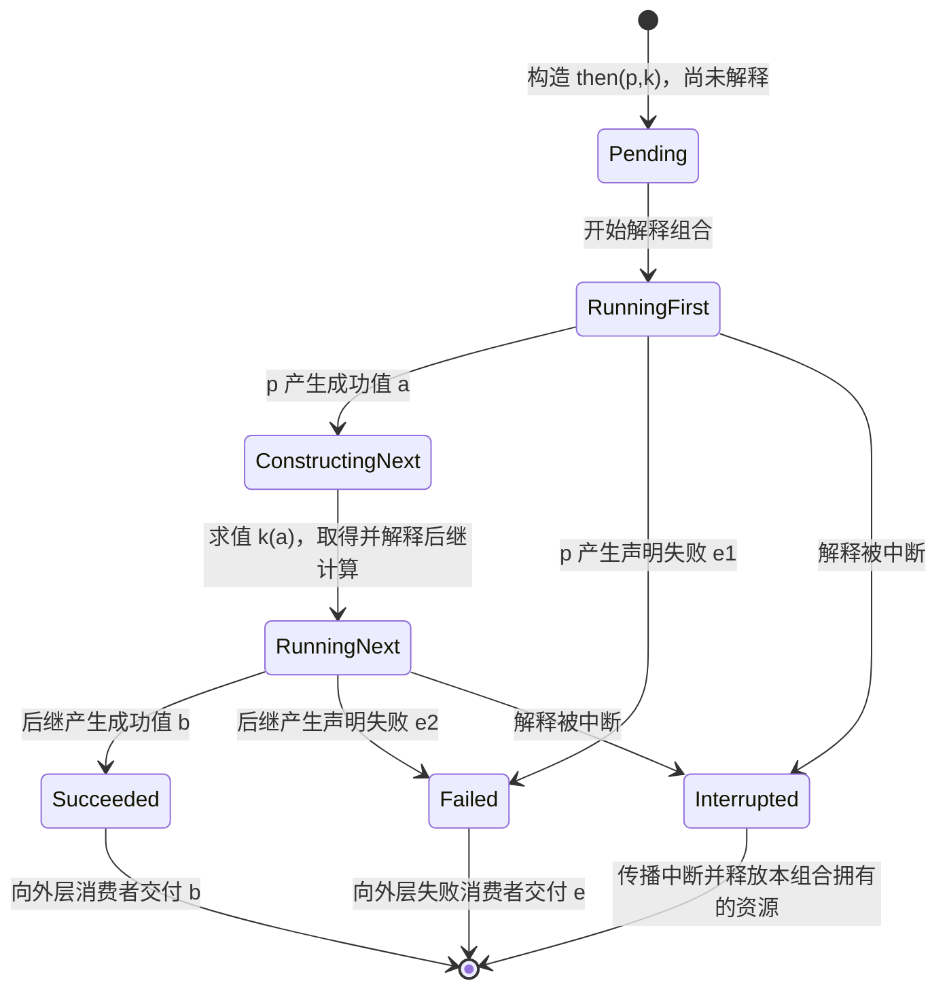
```mermaid
stateDiagram-v2
    [*] --> Pending: 构造 then(p,k)，尚未解释
    Pending --> RunningFirst: 开始解释组合
    RunningFirst --> ConstructingNext: p 产生成功值 a
    RunningFirst --> Failed: p 产生声明失败 e1
    ConstructingNext --> RunningNext: 求值 k(a)，取得并解释后继计算
    RunningNext --> Succeeded: 后继产生成功值 b
    RunningNext --> Failed: 后继产生声明失败 e2
    RunningFirst --> Interrupted: 解释被中断
    RunningNext --> Interrupted: 解释被中断
    Succeeded --> [*]: 向外层消费者交付 b
    Failed --> [*]: 向外层失败消费者交付 e
    Interrupted --> [*]: 传播中断并释放本组合拥有的资源
```

这条流直接约束类型与构造：后继取得的是本次p产生的a，不能预先运行k，也不能用另一项同型结果代替a；p失败时不存在成功后继的执行。若需要失败后也产生后继，须显式构造失败消费者，而不是修改这条成功续接的含义。k求值违反其纯构造承诺而发生缺陷时，按缺陷处理，不伪造E2。

再取`l : B -> F<C,E3,R3>`，比较`then(then(p,k),l)`与`then(p,a => then(k(a),l))`。两种分组都必须先解释p、用其a构造并解释k(a)、再用其b构造并解释l(b)；任一声明失败均阻止剩余成功后继。在不改变失败捕获范围、资源作用域、中断行为及可观察中间边界的条件下，二者保留这条发生顺序与结果。这是有前提的组合关系，不由最终类型同为F<C,...>独自证明。若重分组同时提前取得资源或改变失败处理，已经不是这里比较的两项构造。

失败形状也属于这项比较。若另一构造为每层顺序组合显式增加`Left/Right`包装，嵌套后继的失败可以成为`Right(Right(e))`，而未嵌套表达返回`Right(e)`；观察包含失败结构时，二者不是直接相等。可以显式构造和类型的关联转换再比较，但不能只重新加括号便宣称失败保持。普通失败类型联合不要求这些包装，也不会自动提供阶段区别；构造必须准确说明自己实际采用哪一种失败消费。

#### 失败怎样成为后继可消费的值

另一项构造接收p，把本次成功a注入`Outcome<A,E>`的成功分支，把本次声明失败e注入其失败分支，再将这个Outcome作为外层成功值交付。它不重新运行p，不把缺陷、中断或进程丢失变成E；原计算若不终止，包装也不保证终止。“消去声明失败通道”不等于“永远成功”。

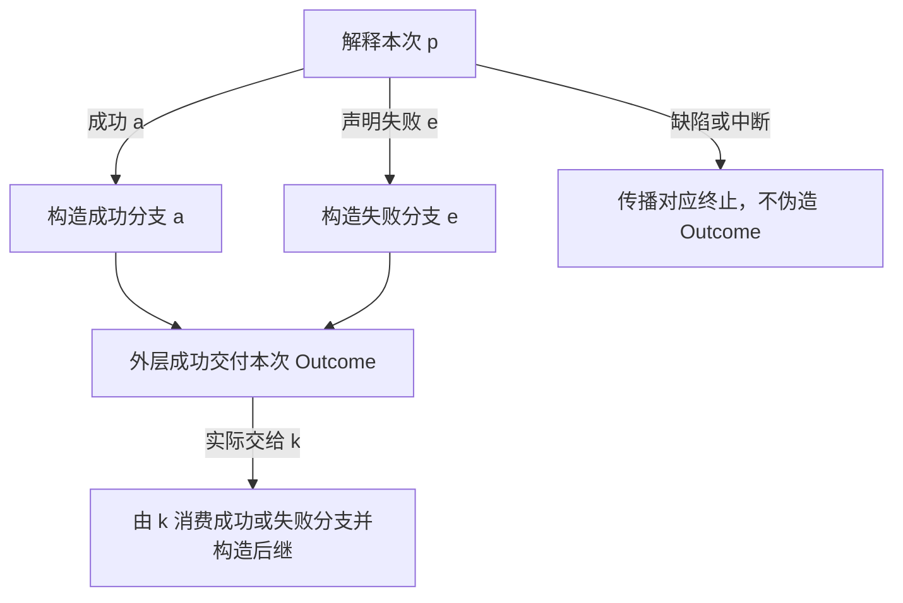
```mermaid
flowchart TD
    P[解释本次 p] -->|成功 a| A[构造成功分支 a]
    P -->|声明失败 e| E[构造失败分支 e]
    A --> Outer[外层成功交付本次 Outcome]
    E --> Outer
    P -->|缺陷或中断| Abort[传播对应终止，不伪造 Outcome]
    Outer -->|实际交给 k| K[由 k 消费成功或失败分支并构造后继]
```

这个k的输入已经是Outcome，不能继续冒充只接受A的原成功后继。若它在两个分支都构造下一项q，p的声明失败就不阻止q；若失败分支重新交付e，则保持停止。这些是实际消费者的不同构造，不是公共内核替领域选定的重试或忽略政策。

捕获范围也不能任意移动。先包装p再续接k，只把p的声明失败变成值；包装整个`then(p,k)`还会捕获k的声明失败。即使最后都返回某种Outcome，两者也不保证有相同后继和失败结构。独立业务实例需要保留部分结果时，可以使用这个构造，而不向核心添加该业务的“部分成功”状态。

#### 结果扩展可组合，不等于产生结果的计算可替换

给定`p : F<A,E,R>`、已存在的纯值`x : X`，取具体纯函数`s_x(a)=(a,x)`及`π(a,x)=a`。定义本节的结果映射`map(p,s_x)`：保留p的那一次解释，只在成功交付处形成积；p没有成功时不调用s_x。这个构造没有第二个外部计算入口，也没有重新解释p的分支。另一个独立的`q : F<A×X,E,R>`仅有相同返回形状，不因此具有上述构造关系。

为何需要这一区分，可以先用一个抽象反例检查。设外部状态是一个比特，初值为0；q0读取它后返回`(*,*)`，q1读取后另写入1再返回相同的`(*,*)`。二者成功值、失败类型和服务要求都相同。取同一个后继k，忽略输入的`*`并读取外部比特：消费q0所得组合返回0，消费q1所得组合返回1。π既不撤销q1的写入，也不让两项计算成为同一个计算。即使k固定返回常量，外部写入仍是可观察差异。


这里的观察包括契约可见的外部动作、次序、结果、失败、中断与未完成行为；不包括纯值计算的内部步数或精确耗时。映射在同一成功交付处完成，不新增调度任务、中断观察位置或隐藏的资源释放。对任意一条p允许的解释分支，逐步比较两种构造，而不是假定两次独立的不确定运行恰好返回同一个值：


中断边界是推导发现的限制，不是“纯”字自动保证的性质。若某个包装把积构造排进另一个可取消任务，那么p已成功之后，基础表达可以已经启动k，包装表达却仍未交付a；一次此时生效的取消便使两边出现不同外部行为。该包装不满足本节关系。具体解释器是否保持相同交付边界，须按实际实现核验，不能将本关系冒称现有API的运行证据。

右侧得到的是q的基础形状结果，不是预先存在的p；q已经产生的副作用不会被投影删除。若取得X需要额外IO，那项IO及其失败、顺序和状态后果必须留在表达中，不能再声称只是对p的纯值扩展。

#### 连续消费怎样与状态推进组合

连续来源与消费者的连接不能仅写成输入输出类型相接。选定串行状态消费时，取纯函数`step : State × X -> Result<State × Y*,E>`及初态s0；一次x的消费完成后，所得s1才是下一次step的状态输入：

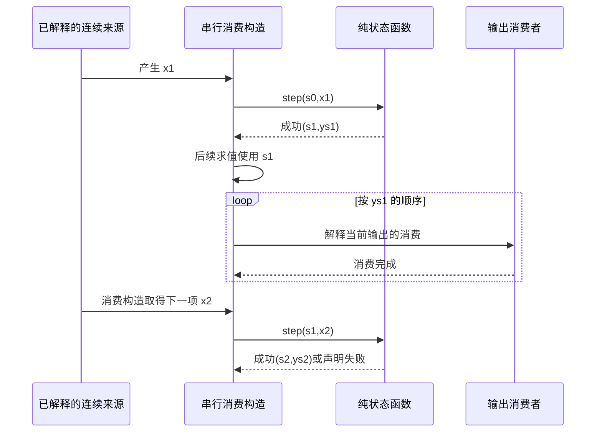
```mermaid
sequenceDiagram
    participant Source as 已解释的连续来源
    participant Consumer as 串行消费构造
    participant Step as 纯状态函数
    participant Sink as 输出消费者
    Source->>Consumer: 产生 x1
    Consumer->>Step: step(s0,x1)
    Step-->>Consumer: 成功(s1,ys1)
    Consumer->>Consumer: 后续求值使用 s1
    loop 按 ys1 的顺序
        Consumer->>Sink: 解释当前输出的消费
        Sink-->>Consumer: 消费完成
    end
    Source->>Consumer: 消费构造取得下一项 x2
    Consumer->>Step: step(s1,x2)
    Step-->>Consumer: 成功(s2,ys2)或声明失败
```

来源可在此期间继续生产；图中的第二次取得表示本构造的消费顺序，不声称生产者被全局暂停。缓存、反压或不能承接输入时的失败，由来源与消费连接实际提供。此处选择当前输出消费完成后再推进下一输入，因此输出失败将使组合失败，而此前输出不会撤回。需要其他交错方式须给出不同构造及其事件流，不能沿用本图的保证。

由此可检查一个不能成立的替换：若把两次step并发地都施加于s0，再分别保存所得状态，便不再是串行状态消费；类型相同也会丢失其中一次演化。能够并发组合，需要另证明状态独立或存在保持相应结果的合并关系。这里要求证明的是状态函数之间的关系，不是要求公共机制识别其业务内容。

### 3.3 公开定义与解释权

公开构造捕获实际输入、成功和失败的类型/编码，以及上述实际解释函数，并由同一构造产生两个消费者：描述消费者供AI/CLI取得契约，调用消费者按契约解析并运行函数。这里使用Definition指这项公开构造，Binding指它的一次精确安装；两者不替业务作者编写函数，也不从任意闭包反射业务含义。动态输入与结果的精确关系在所选安装内保持，不靠一个全局业务union维持。

计算的返回形状与解释权限分别建模。相同的有限返回类型，不证明两项计算拥有相同的解释权限，也不证明它们的副作用相同。公开构造只能开放其明确授予的解释入口；内部可组合的计算不因此全部成为公共入口。

有限ADT描述某一个构造实际允许的选择；公共构造通过类型参数及对应函数消费这些选择，不集中枚举所有实例的输入。具体领域类型及其合法状态分别在业务论证中给出，不作为本节组合规则的定义。

#### 一个高阶构造怎样同时生成描述与调用

仅把schema和函数放在同一个对象中，还没有说明组合描述怎样产生。先取一个有限定义p，其输入声明解释为I，成功声明解释为A；再构造一个定义q，它的输入声明直接取`J × A`，其中A引用p的成功声明，J是另一项已有声明。q成功声明解释为B。q的实际函数消费这两个分量，而不是让公共机制猜测J怎样从A产生。

这个高阶顺序构造的外部输入是`I × J`，成功声明直接取q的B；解释函数则由同一对操作数构造：先完成整个积的边界解析，再保存i与j，解释p(i)，成功取得a后构造q(j,a)并解释。不能解析出i就先运行p，再发现j不合法；那会使一次输入拒绝已经带有p的效果，改变本构造的事件流。公开描述和实际运行并不是两份分别维护的接口：

```mermaid
flowchart TD
    D[构造器持有 p、q 及它们引用的声明] -->|输入取 I 与 J 的积，成功取 q 的 B| Describe[生成外部描述与边界解析]
    D -->|生成捕获同一 p 与 q 的计算函数| Parse[解析整个 I 与 J 的积]
    Parse -->|成功取得 i 与 j| Invoke[保存本次输入]
    Parse -->|边界失败| Rejected[拒绝输入，不解释 p 或 q]
    Invoke -->|开始解释 p(i)| P[前段计算]
    P -->|成功 a| Pair[用保存的 j 与本次 a 构造 q 的输入]
    Pair -->|解释 q(j,a)| Q[后段计算]
    Q -->|成功 b| Out[按 q 的同一成功声明交付 b]
    P -->|失败| Failure[交付构造明确选择的失败表示，不解释 q]
    Q -->|失败| Failure
```

由这条流可核对三件事：外层描述要求的J确实被解析并保存，不会在后继时凭空补值；q消费的A确实来自本次p的成功，不是另一个同型结果；最终B的声明来自实际被解释的q，不是独立抄写的结果结构。若改变J的结构，同一次积构造同时改变外层解析和描述；这不会替调用者提供新增值。相应失败类型由两段及边界构造产生，是否保留阶段是明确的输出选择，不由失败类型联合自动补造。这里证明的是结构性的值流与声明关联，不是由构造器证明叶子实现的业务承诺；解析器忠实、输出履约及访问边界仍须由叶子和解释器实际满足。

此构造不反射任意函数，也不声称能从任意q的输入求出外层输入。若q要求一个不能直接由`J × A`提供的类型，必须增加实际转换计算并将其失败、依赖和发生位置纳入组合；不能只修改描述。若后继定义本身要等p成功后才选定，则上述“成功声明取固定q”不再成立，必须由该动态选择构造给出结果消费方式，不能沿用固定后继的描述保证。

#### 后继在运行时选择时，结果怎样仍有实际消费者

先研究有限的已知选择，而不是把“动态”一概当成无类型。取`q1 : A -> F<B1,E1,R1>`、`q2 : A -> F<B2,E2,R2>`及纯判别`choose : A -> Bool`。前段p成功得到a后，choose(a)为真就纯构造q1(a)并解释，成功b1经左注入进入`B1 + B2`；为假就纯构造q2(a)并解释，成功b2经右注入进入同一个和。输入确实来自本次a，最终声明由两个成功声明及注入构造产生；不是因结果不同就无法提供固定外层类型。构造q_i不提前分配资源或执行IO，被跳过的分支不运行；纯构造或choose若发生缺陷或不终止，也不由签名保证成功后继存在。

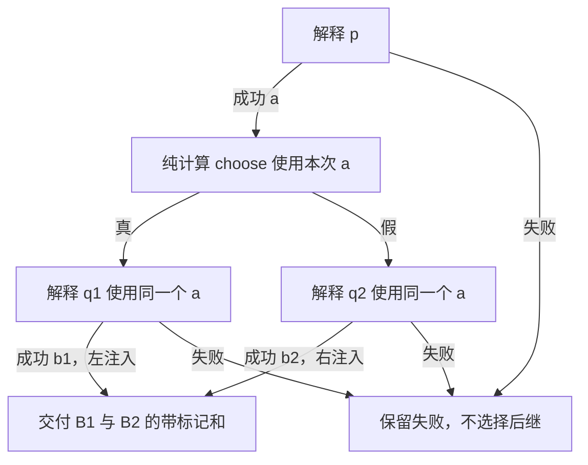
```mermaid
flowchart TD
    P[解释 p] -->|成功 a| Choose[纯计算 choose 使用本次 a]
    P -->|失败| Fail[保留失败，不选择后继]
    Choose -->|真| Q1[解释 q1 使用同一个 a]
    Choose -->|假| Q2[解释 q2 使用同一个 a]
    Q1 -->|成功 b1，左注入| Sum[交付 B1 与 B2 的带标记和]
    Q2 -->|成功 b2，右注入| Sum
    Q1 -->|失败| Fail
    Q2 -->|失败| Fail
```

两个后继不必具有完全相同的失败和资源类型；构造保留它们及前段的联合要求。若只为选中的分支取得资源，资源取得在选择后发生；提前取得所有资源可能在未选分支上失败，因此不是无条件等价的安装优化。上述构造也不证明任意新增后继可不改声明加入这个有限和。

结果和的后继可以由两个实际消费者`h1 : B1 -> F<C,Eh1,Rh1>`及`h2 : B2 -> F<C,Eh2,Rh2>`构造：收到左值b1就构造并解释h1(b1)，收到右值b2就构造并解释h2(b2)。它穷尽消费本次注入，不把和型强转成C。新增成功分支时，原二分消费者不再穷尽，必须给出新分支的消费；失败联合是否另带来源标签仍由外层承诺决定，不是每次组合自动加深的标记。

开放目录选择是另一项构造。每个定义d封装自己的输入类型Id、结果Ad、失败Ed、边界解析、编码和实际解释入口。调用者选择d并提供输入文档；在同一个包内解析得到id，才可构造并解释d(id)，成功后使用这个包的Ad编码。核心消解整个关联，不把Ad强转成某个全局业务类型。响应保留所选定义及其精确成功声明的关联，结构化消费者可以据此编码展示；需要一个已知B的后继则必须另有该Ad到B的实际转换，不能只检查名字相同。

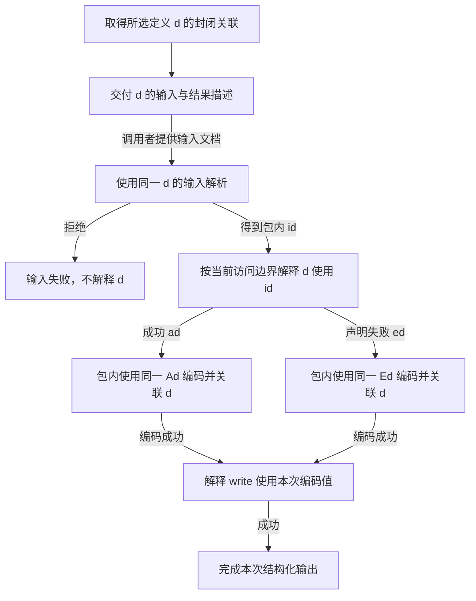
```mermaid
flowchart TD
    Selected[取得所选定义 d 的封闭关联] --> Describe[交付 d 的输入与结果描述]
    Describe -->|调用者提供输入文档| Parse[使用同一 d 的输入解析]
    Parse -->|拒绝| Reject[输入失败，不解释 d]
    Parse -->|得到包内 id| Run[按当前访问边界解释 d 使用 id]
    Run -->|成功 ad| Encode[包内使用同一 Ad 编码并关联 d]
    Run -->|声明失败 ed| Error[包内使用同一 Ed 编码并关联 d]
    Encode -->|编码成功| Write[解释 write 使用本次编码值]
    Error -->|编码成功| Write
    Write -->|成功| Delivered[完成本次结构化输出]
```

输入描述能检验已给出的值，不能生成缺失的选择。如果一个程序要自动选择d并继续调用，它必须实际构造同一个包内的id，例如选择时同时交付已类型化输入；只返回一个定义名字还没有后继。开放构造不会从有限选择图中凭空推导这些输入，也不会让运行时的新类型名字变成主机编译期类型。

图中write是一个实际的编码值消费者，其失败和资源要求属于外层输出计算，不冒充d的领域失败。编码本身也须履约；编码失败不因声明已发布就被忽略。从选择、解析到解释与编码保持同一个d，不能中途按同名定义切换到新包。

各定义的调用解释仍执行其实际访问边界；高阶构造不是绕过内部访问检查的第二条调用路径。挂载哪一个最终定义，是公开化的选择；构造过程中使用过的内部定义不因此自动成为目录叶子。这里得到的是开放定义的组合机制，各业务的命名、参数和具体含义仍分别实例化论证。

### 3.4 状态决定怎样组合，何时才成为已接受的变化

沿用原始Decision/Evolution的纯关系，但区分提议与接受。`decide(State,Input)`返回拒绝，或有限有序的事件提议与待解释工作；`evolve(State,Event)`纯地计算下一状态。得到事件值不等于已经持久化，得到工作描述也不等于工作已经发生。以下构造不要求每次成功都有事件；空序列不改变状态，却仍可能来自一项读取过状态的决定。

#### 先组合纯决定

给定共同的evolve，从每项decide构造一个纯求值：拒绝时原样返回；成功时完成事件的局部折叠，并保留由该折叠实际推导出的预测状态。组合d1与d2时，先求d1(s0,i1)，再把成功得到的预测s1传给d2(s1,i2)。第二项拒绝则不返回整体提议；两项成功才按序连接事件与工作，并返回s2。这里i2已经存在，不能取自尚未解释的第一项工作的未知结果。

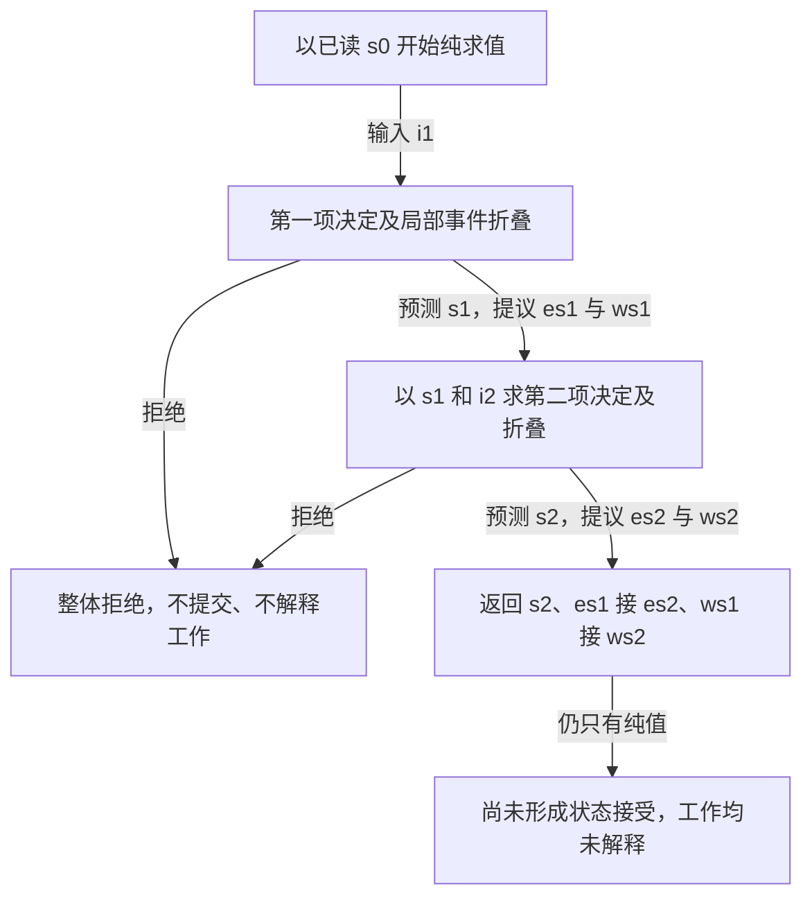
```mermaid
flowchart TD
    S[以已读 s0 开始纯求值] -->|输入 i1| D1[第一项决定及局部事件折叠]
    D1 -->|拒绝| R[整体拒绝，不提交、不解释工作]
    D1 -->|预测 s1，提议 es1 与 ws1| D2[以 s1 和 i2 求第二项决定及折叠]
    D2 -->|拒绝| R
    D2 -->|预测 s2，提议 es2 与 ws2| P[返回 s2、es1 接 es2、ws1 接 ws2]
    P -->|仍只有纯值| N[尚未形成状态接受，工作均未解释]
```

预测不是可任意填写的额外字段，其不变量来自实际折叠：

```text
fold(s0, es1 ++ es2) = fold(fold(s0, es1), es2) = s2
```

按es1的有限前缀展开，两边先施加同一个evolve，最终进入同一s1，再施加同一es2；不需要假定事件可交换。保留已求出的预测状态，使继续组合时不用重新折叠前缀。对三项决定，两种括号化都依次求d1(s0)、d2(s1)、d3(s2)，最早拒绝的位置及载荷相同，全成功时事件和工作同序；拒绝类型采用共同载体或明确的叶子映射，不能因组合深度新增包装。这个结合关系只属于纯提议组合。

#### 纯组合不与逐项提交互换

用整数状态作最小反例：决定g仅在状态0接受加1，否则拒绝。先纯组合两次g，第二次在预测1上拒绝，没有整体提议，持久状态仍为0；若第一次g已经单独提交，第二次再拒绝，持久状态保留1。二者即使最后都返回拒绝，状态后果也不同。普通Effect顺序不会撤销已发生的成功前缀。

纯预测成为持久承诺，还需要从两条事件反例导出的接受边界：

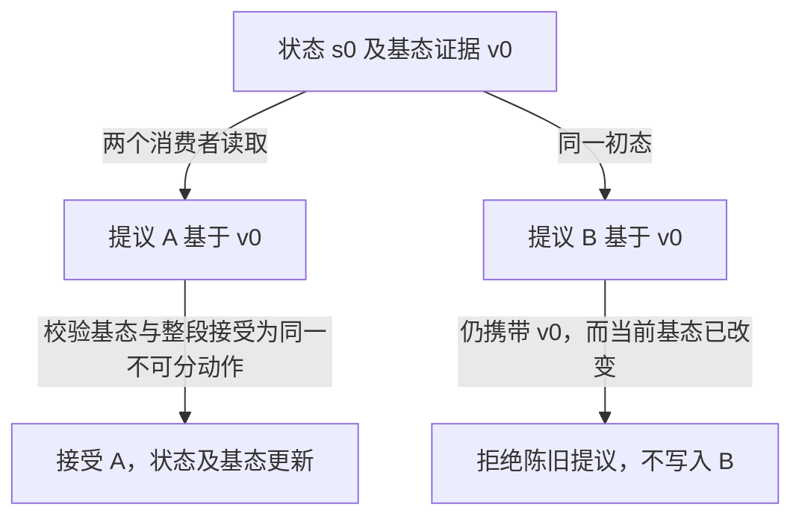
```mermaid
flowchart TD
    S[状态 s0 及基态证据 v0] -->|两个消费者读取| A[提议 A 基于 v0]
    S -->|同一初态| B[提议 B 基于 v0]
    A -->|校验基态与整段接受为同一不可分动作| C[接受 A，状态及基态更新]
    B -->|仍携带 v0，而当前基态已改变| R[拒绝陈旧提议，不写入 B]
```

若只折叠两份基于旧状态的事件，就可能接受串行决定本应拒绝的第二项；因此基态检查不能和接受分成两个可竞争步骤。若把一份整体提议逐项写入，第二项前失败又可能留下中间状态；因此还需要整段接受的不可分性。满足这两个边界，才把`fold(s0,es)`的纯预测变成接受后的状态。机制不由“writer”名称保证，也不要求核心固定只有一个提交者。

成功响应必须对应已经发生的接受。明确未接受与接受结果未知不能合并：接受前失败和接受后丢失响应可以产生相同的调用失败观察，却对应不同持久状态。输入中的额外可变依赖也不能由State的版本自动校验；它们必须处于实际接受契约的范围内，不能由纯签名补出有效性。

#### 工作结果进入新的状态消费

对工作p的成功A或声明失败E，取实际纯函数`resume : Context × Result<A,E> -> Input`。解释p后，resume只构造下一输入；它不直接生成已经接受的状态变化。随后在**消费时的当前状态**上运行decide及接受，而不是使用发起p时捕获的旧预测状态。不同工作的中间结果类型可以不同，只要各自的resume实际将其转成同一状态决定接受的输入；公共机制不需要枚举这些中间类型。

```mermaid
flowchart TD
    P[纯提议包含尚待解释的 p] -->|状态接受成功| S[已接受状态 s]
    S -->|成功后继解释 p| W[p 与外部交互]
    W -->|取得声明结果 r| I[resume(context,r) 构造下一输入]
    I -->|取得消费时的状态 t| D[在 t 上作新的决定]
    D -->|拒绝| R[本次消费不接受状态变化]
    D -->|提议经有效基态整体接受| N[状态按新事件演化]
```

p开始前及运行期间都可以发生其它合法状态变化，所以t不必等于s。若第二项决定依赖p的运行结果，它就不能放进前面的纯整体组合，必须在此结果后继中求值。这是由输入何时取得决定的组合边界，不是一项业务特判。

`then(accept, _ => p)`只给出单次运行的成功后继。接受成功后、p启动前进程停止，内存工作会丢失；承诺可恢复义务的接受边界必须同时保留足以恢复p的描述。任意Effect闭包不自动可持久化，这项更强构造与普通纯折叠、普通结果输出分开。

### 3.5 可恢复的是指定构造，不是任意闭包

普通`A -> F<B,E,R>`后继可以是运行中闭包；可组合不推出可持久化。这里从两处停止窗口推导一种更窄的构造：状态已接受但工作未启动，以及工作可能发生但结果未保存。它不要求每项普通计算都经过持久登记。

#### 保存操作数怎样重新得到原计算和消费者

取稳定定义κ，在同一个封闭类型包内关联输入I、消费者捕获C、成功A、声明失败E、资源R，以及实际函数`buildκ : I -> F<A,E,R>`和`consumeκ : C × Outcome<A,E> × State -> Decision`。Outcome在这里仅区分成功a与声明失败e；缺陷、中断或不知道外部是否发生，不伪装成E。

`saveable(κ,i,c)`编码本次输入i和捕获c，并保留κ的精确身份。它没有序列化`buildκ(i)`或闭包。原闭包依赖的可变值成为I或C中的显式操作数，资源在解释时通过R取得；同一κ不能悄悄换掉函数或常量的语义。后继Decision提出的新持久工作，也要先由这个构造获得可保存操作数，不能先接受状态再期待找回任意F。

I、C、A、E的编码须满足`decodeκ,T(encodeκ,T(x)) = Valid(x)`。积与和的编码可以从分量递归构造；函数、活连接和能力句柄不会由写出一个codec签名变成可保存值。若往返只保留某种等价关系，还必须证明消费者不区分该关系，不能以解析成功代替。

加载κ取得同一个包的解码、build与consume。包内先解码I和C；重建路径调用该包的build，结果消费路径则用该包的A/E解码器取得Outcome，再交给同一个consume。异构包的中间类型不逃出后强转给另一个包。动态名称用于选择封闭消解程序，不用于把三个同名注册项认作同一类型。

这给出两项不同保证：解码原i后构造同一个`buildκ(i)`，保持定义和输入，不保持已经变化的外部世界；解码原c和已存o后，在当前s上计算`consumeκ(c,o,s)`，与直接使用c、o在同一个当前s上求值相同。定义、编码或状态契约不再匹配时停止，不自动改用最新版。R的重新绑定也须指向原逻辑目标及所需操作，而非只返回形状相容的句柄。

#### 第一处停止要求把工作操作数纳入接受边界

如果先接受状态，再单独保存κ、i、c，中间停止会留下无法反推出原工作的状态。因而选择可恢复承诺的构造，把状态事件和可保存工作操作数放入同一个本地原子接受边界。每次工作发生另有身份ω；两个合法发生即使κ、i、c完全相同，也不能按内容去重成一次。

“没有保存结果”不证明工作未启动。可以构造一条保守启动规则：所有启动路径先原子地把ω从未放行改为已放行；只有成功取得这次放行的解释路径才启动工作。并发恢复者不能都成功；放行响应未知也不授权启动；超时不把已放行自动改回未放行。

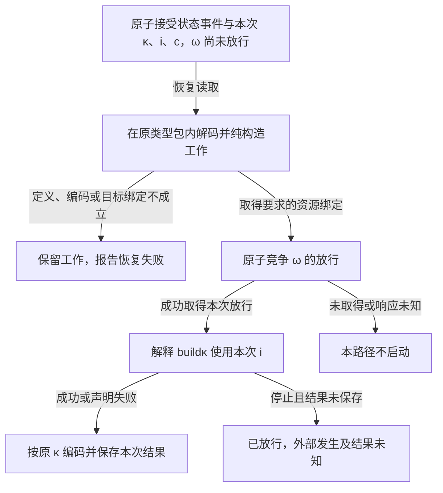
```mermaid
flowchart TD
    Accepted[原子接受状态事件与本次 κ、i、c，ω 尚未放行] -->|恢复读取| Decode[在原类型包内解码并纯构造工作]
    Decode -->|定义、编码或目标绑定不成立| Stop[保留工作，报告恢复失败]
    Decode -->|取得要求的资源绑定| Claim[原子竞争 ω 的放行]
    Claim -->|成功取得本次放行| Run[解释 buildκ 使用本次 i]
    Claim -->|未取得或响应未知| NoRun[本路径不启动]
    Run -->|成功或声明失败| Save[按原 κ 编码并保存本次结果]
    Run -->|停止且结果未保存| Unknown[已放行，外部发生及结果未知]
```

绑定只取得目标与能力，不偷做工作本身；若绑定也产生需要追踪的外部变化，那是另一项实际计算，不能藏在解析步骤中。这条构造保证本地启动权不重复授予，不证明黑箱内部只执行一个动作，更不证明任意工作恰好一次完成。

#### 第二处停止不能由更多本地标签消除

取一个不含业务政策的外部自然数存储，初值8，工作为加2。放行后、发请求前停止，外部仍为8；外部已加2、但返回或保存前停止，外部为10。两者的本地记录都可以完全相同：

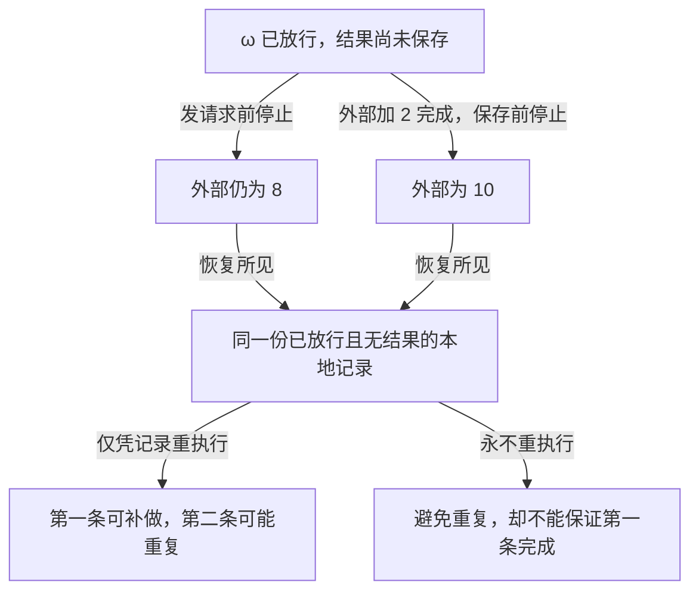
```mermaid
flowchart TD
    Released[ω 已放行，结果尚未保存] -->|发请求前停止| Before[外部仍为 8]
    Released -->|外部加 2 完成，保存前停止| After[外部为 10]
    Before -->|恢复所见| Same[同一份已放行且无结果的本地记录]
    After -->|恢复所见| Same
    Same -->|仅凭记录重执行| Repeat[第一条可补做，第二条可能重复]
    Same -->|永不重执行| Omit[避免重复，却不能保证第一条完成]
```

更多本地“准备发送／等待返回”标签只移动最后一次本地写与外部发生之间的窗口。没有共同原子边界或额外外部契约，就不能同时推出不遗漏与不重复。能重新构造原工作不等于有权重新执行它。

能改变判断的事实必须区分这两条轨迹：例如明确属于原次发生的最终结果，或原次发生未完成且旧执行者以后也不可能使之发生的可靠证据。超时、租期消失、查询未找到或当前值相同都不自动构成后一种证据。没有这些事实时保留未知，不把保证外推成自动完成，也不要求所有普通IO安装这套恢复机制。

#### 已保存结果怎样完成原消费者的当前状态决定

同一ω的保存结果保持固定，不能用另一次相同输入调用的结果替换。活解释者重试保存手头的同一个结果不需要重执行工作；结果已经保存后，恢复消费也不需要外部R。

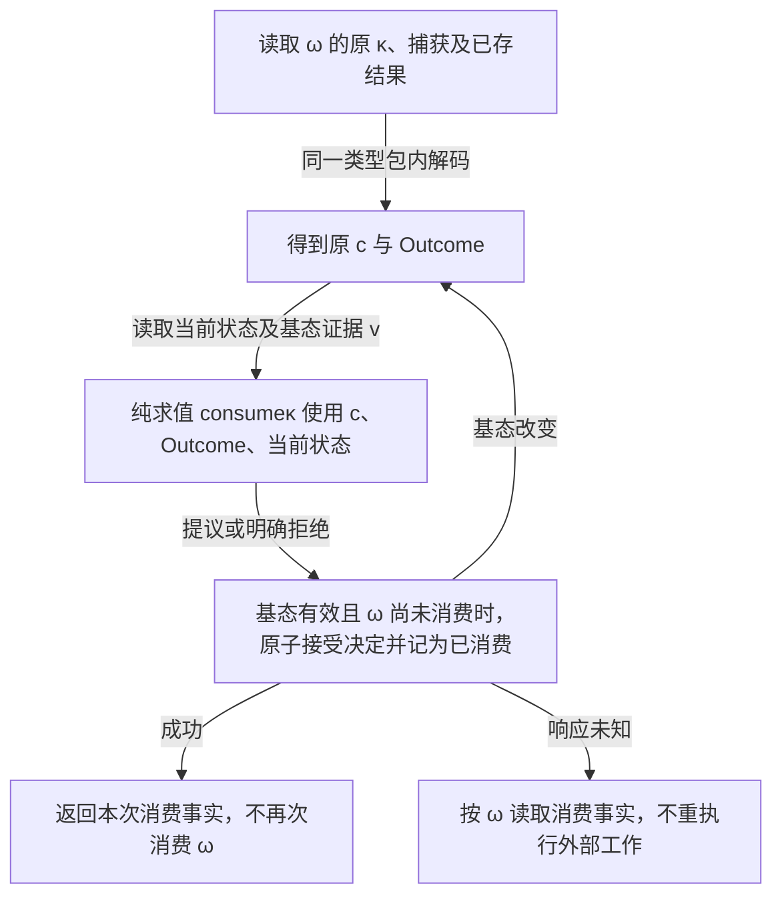
```mermaid
flowchart TD
    Stored[读取 ω 的原 κ、捕获及已存结果] -->|同一类型包内解码| Values[得到原 c 与 Outcome]
    Values -->|读取当前状态及基态证据 v| Decide[纯求值 consumeκ 使用 c、Outcome、当前状态]
    Decide -->|提议或明确拒绝| Commit[基态有效且 ω 尚未消费时，原子接受决定并记为已消费]
    Commit -->|基态改变| Values
    Commit -->|成功| Done[返回本次消费事实，不再次消费 ω]
    Commit -->|响应未知| Lookup[按 ω 读取消费事实，不重执行外部工作]
```

本构造选择“一项保存结果完成一次决定”：接受和明确拒绝都结束本次消费，拒绝不暗中变成等待状态变化后不断重试。先改状态后记消费会重复，先记消费后改状态会遗漏；所以状态事件、新可恢复工作与消费标记须在同一条件接受中发生。纯决定可以因基态失效重算，外部工作不会因此重做。缺陷或中断发生在接受前则没有消费提交；若存储不可读而不能判断接受结果，继续保留未知。

因此这里闭合的是可保存操作数、包内消解、确定尚未放行时的启动，以及已存结果的原消费者调用。它没有把任意F变成持久程序，也没有把局部原子消费提升为外部恰好一次保证。

### 3.6 外部工作返回与独立入站输入怎样相接

一次工作成功交付A，不证明另一个独立输入X只会在A之后到达。取外部工作p：对端接纳请求后能启动另一个发送者；接纳响应的传输与发送者的输入走不同路径。若组合写成“p成功后再登记X的消费者”，则X可以先到而找不到消费者。普通成功后继没有违反自己的规律，错误在额外假定了两条外部路径的顺序。

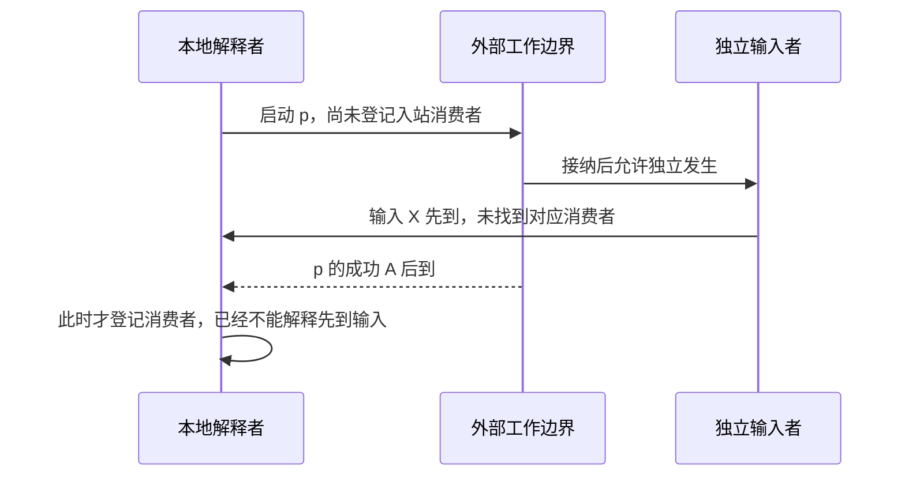
```mermaid
sequenceDiagram
    participant Local as 本地解释者
    participant Remote as 外部工作边界
    participant Input as 独立输入者
    Local->>Remote: 启动 p，尚未登记入站消费者
    Remote->>Input: 接纳后允许独立发生
    Input->>Local: 输入 X 先到，未找到对应消费者
    Remote-->>Local: p 的成功 A 后到
    Local->>Local: 此时才登记消费者，已经不能解释先到输入
```

一种具体连接构造是先建立可消费关联，再让可能产生输入的工作发生。接收定义κr在同一包内关联输入解析、捕获C和纯消费函数`receiveκr : C × X × State -> Decision`。构造本次接收身份q并保存κr、c及当前合法接收条件，同时把q与实际接收入口关联放入p的可保存输入；这两项由同一次条件接受建立。q不是授权，外部入站仍经过实际认证和当前访问检查。

该接受必须先对入站读取的权威状态可见，producer才可发生可能引起入站的动作；仅先生成q、写入未同步缓存或形成未接受提议都不足。接收条件也不能暗中要求先消费p的成功A，否则只是提前登记一个仍不能处理先到输入的占位。登记失败不启动工作；登记成功后工作未启动的停止窗口，则按§3.5保留其可恢复操作数。

入站入口先解析q，在拥有者范围内取得对应接收关联，再用同一κr解析X和捕获C；得到本次x、c后，在当前状态上求receive并条件接受。这里取得的是接收消费者，不是p的build或原生资源。一个公开名称不提供任意私有包lookup；未登记、已关闭或类型不相容的接收由该入口明确处理，不用默认消费者接住。

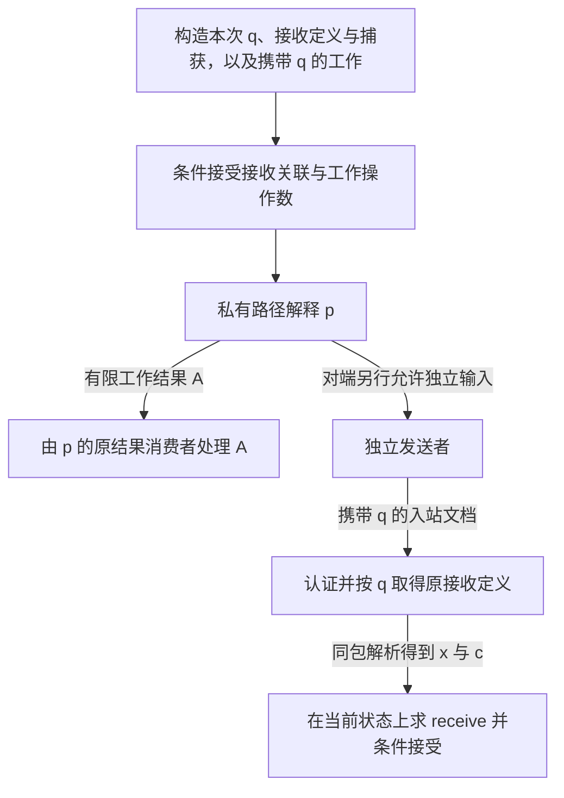
```mermaid
flowchart TD
    Prepare[构造本次 q、接收定义与捕获，以及携带 q 的工作] --> Accept[条件接受接收关联与工作操作数]
    Accept --> Run[私有路径解释 p]
    Run -->|有限工作结果 A| Ack[由 p 的原结果消费者处理 A]
    Run -->|对端另行允许独立输入| Sender[独立发送者]
    Sender -->|携带 q 的入站文档| Ingress[认证并按 q 取得原接收定义]
    Ingress -->|同包解析得到 x 与 c| Receive[在当前状态上求 receive 并条件接受]
```

Ack与Receive没有在图中强加先后。若入站消费先关闭q，后到的工作结果不能用“p成功”重新打开它。这需要实际函数保持该关系，类型本身不会替作者做到。若两个函数选择共享修改同一状态，则须重新推演它们的顺序，而不是宣称积类型自动消除竞争。

先登记消除的是“合法输入可能先到，而消费者要等后到响应才建立”的窗口；它不保证网络不会丢消息、不保证入站服务永远在线。重启后能找回消费者仍以κr和捕获可恢复为前提。对端若不能携带或导出足以命中该关联的身份，且没有另一项可证明的登记/投递契约，这个连接不成立，不能拿字段名字替代真实传输。

上图的直接运行以实际入站路径已经可用为前提。若入站还依赖需要安装的外部资源h，则接受q之后不能直接解释p：实际构造是`owned(open(q), h => runProducer(p,q,h), close)`，其中open的成功契约必须表示当前路径可用，runProducer实际消费h的使用权；安装中可能到达的输入仍由先已接受的q处理。仅有本地目录项时，p可以先产生输入而外部监听尚未安装，这是该前提不可省略的反例。

如果p不是当场解释而是保存后再运行，保存open曾经成功的结果不保存h的存续。恢复执行必须重新取得有效资源；资源拥有者将使用准入与关闭定序，关闭先发生则不再准入，先获准的使用按§5.3完成后才能主动释放所依赖资源。外部断线仍可能独立发生，不能据此承诺可靠投递。这是活资源依赖与保存操作数的区别，不新增公共Ready状态或假定所有入站都需安装监听。

这项关系由公开定义、可保存值、当前状态决定和实际输入边界组成，不把X冒充p的返回A。

<a id="a2"></a>

## 4. 声明是类型、校验与发现的共同来源

### 4.1 可移植 schema 的构造边界

一项声明关联它解释的值类型T、从外部文档取得T的解析、T的编码，以及可供发现的结构描述。三个消费者使用同一次构造的操作数：解析器决定能否取得合法T，编码器消费实际T，描述给调用者说明能提供什么。描述不计算业务值，也不证明实际函数的语义。

从两个已有声明A、B构造积时，解析必须取得两个分量才返回`(a,b)`，编码分别使用原编码器，描述同时保留两个分量；构造和时，先解析明确的分支标记，再用相应分支解析器，并以同一注入保存结果。未知分支被拒绝，不把缺字段的分支补成另一个分支。由这些具体动作，积/和的解析、编码和描述保持相同结构，而不是分别维护三份映射表。

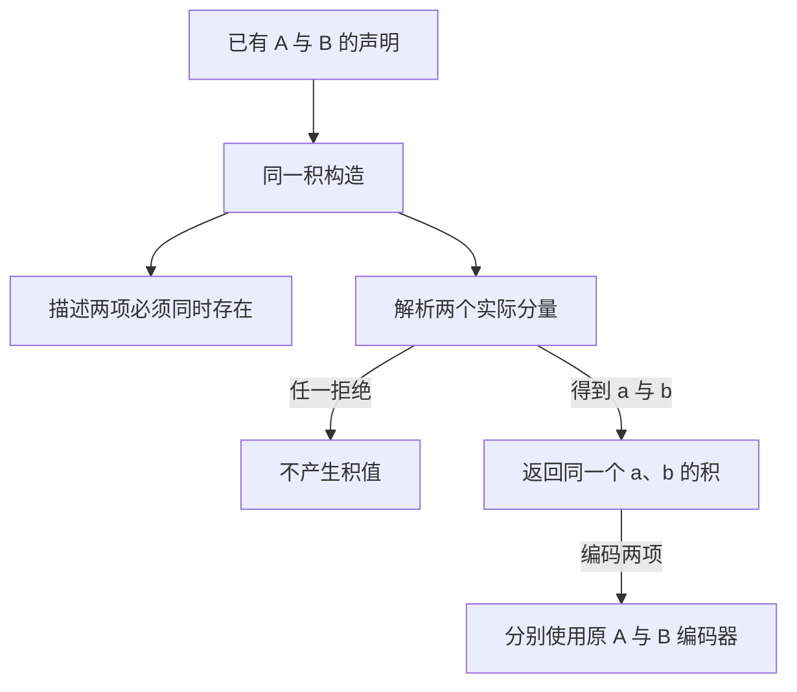
```mermaid
flowchart TD
    Members[已有 A 与 B 的声明] --> Product[同一积构造]
    Product --> Description[描述两项必须同时存在]
    Product --> Decode[解析两个实际分量]
    Decode -->|任一拒绝| Reject[不产生积值]
    Decode -->|得到 a 与 b| Pair[返回同一个 a、b 的积]
    Pair -->|编码两项| Encode[分别使用原 A 与 B 编码器]
```

积不要求把所有字段扁平化进一个对象。采用分量命名空间时不会发生覆盖；选择扁平合并的构造才须拒绝同名冲突，并保留原解析约束。展开字段列表会丢掉对象整体约束时，就没有完成原声明的积构造。

同进程的纯约束r消费已解析的T及显式配置c，返回拒绝或合法值。约束声明持有这个实际函数、配置、失败声明及含义说明；说明不是从任意函数正文反射出来的。另加跨分量约束不替换r。需要IO或当前环境事实的检查必须作为实际计算进入组合，不藏在纯解析器里。此处持有r的本地构造不等于可以把r运输到另一个进程。

编码用于保存时，还需满足§3.5的往返条件；公开可描述不自动证明可恢复。不能编码的函数、进程对象、连接或秘密句柄不因声明存在就进入持久值。跨语言导入还需要下述实际描述构造；仅说“不支持就拒绝”没有给出支持路径。

#### 可运输声明怎样生成三个实际消费者

选择一项明确的值描述profile作为目标，而不是运输任意谓词程序。可运输D是一棵有限描述树，其节点以带kind的JSON对象编码，profile身份随定义固定。节点自身先经profile解析，重复字段/分支名、非法参数及未知kind被拒绝。该目标profile的值构造为：

| D节点及实际操作数 | 该节点的值编码与解析 |
|---|---|
| Unit | 只接受null，构造唯一单元值 |
| Bool | 只接受JSON布尔，不接受文本替代 |
| Text | 接受JSON字符串，保留Unicode内容，不隐式正规化 |
| Decimal(s,lo,hi,k) | 值是十进制文本；s为非负尺度，lo/hi为整数尺度上的界限或显式无界，k为正整数步进；这些参数也先被精确解析 |
| Product(name→D的有限映射) | 值是恰有这些命名分量的对象，逐个递归解析，不覆盖合并、不忽略未知分量 |
| Sum(tag→D的非空有限映射) | 值是恰有tag及value的对象；先选已声明tag，再用该分支D解析value |
| Sequence(D) | 值是有限数组，每项由同一个D解析，保持输入顺序 |

Decimal采用ASCII数字，整数部分除零外无前导零；只允许必要的负号，不接受加号、指数、负零或隐式舍入。s=0时没有小数点，s>0时恰有s位小数。解析先得到带符号整数N，再核对lo≤N≤hi及N可被k整除；编码从这个整数与同一s产生规范文本。D的尺度、步进和有界整数参数使用精确十进制整数表示，不经过二进制浮点。无界是明确分支，不把缺少参数当无界。资源限制另由安装profile明确限制描述深度、报文及序列大小；拒绝超限不是截断成合法值。

实际递归构造是：`describe(D)`交付同一规范描述树；`parse(D,document)`按节点产生包内T(D)或对应解析失败；`encode(D,value)`按同一节点消费T(D)。Product必须全部子解析成功才构造积，Sum只解释已选分支，Sequence逐项取得合法值。Decimal的编码/解析保存同一N，其他节点由其子节点往返成立，因而对有限树及同一profile限额内的可编码合法值递归得到`parse(D,encode(D,t))=t`。序列长度、深度及规范编码后的报文大小同时约束编码准入与解析；编码超限返回明确资源拒绝，不产生声称能往返的报文。长度K上限下，K+1项布尔序列不在这项保证的定义域中。相等按T(D)的值解释，不要求原始JSON空白或对象键顺序不变；原报文可被解析也不保证带有额外规范编码开销的输出必然通过大小限额。

取一个纯结构例子：D是名为u与v的积；u使用尺度2、最小整数25、上界无界、步进25，v是Unit分支Empty与Text分支Named的和。u文本10.25解析为1025，整除25；10.26为1026，余1而拒绝。v选择Named却没有value也拒绝。只有两个分量都成功，外层才取得该积；这些动作不运行任何远端函数。作者新增积字段或和分支会同时改变这个D的描述、解析及编码，不需要主机新增业务分支。

导入D不生成新的编译期类型，而是构造一个封闭包，包中持有该D产生的解析、编码与解释关联。外层只通过包内消解使用动态T(D)；需要静态T的消费者仍须实际投影或转换。不支持某个描述节点时拒绝的是那个定义，不能降为任意JSON；上述构造支持所有由这些节点实际组合的有限结构，不宣称能表达任意未来数据语言或所有纯谓词。

#### 不能运输的约束进入实际计算，不伪造主机已验证

任意本地r的函数体或名称不能从JSON描述变成主机闭包。它可以继续在同进程安装中直接使用；跨进程公开定义则只承诺D所表达的精确输入T(D)，将D不能表达的检查留在该叶子的实际解释计算及声明失败中。主机的解析成功不再被叫作通过了那个远端r。字段与输入结构仍精确，不是自由对象降级。

具体连接为：远端接收本次T(D)，实际运行所选检查；失败交付其精确E并不运行原生成功后继，成功才用同一次输入构造并解释后继。这可以在同一远端调用内部完成，不默认引入第二套validate接口、令牌或prepare协议。检查若有IO，保留其实际依赖与失败；动态外部条件可能变化，曾经通过不自动成为后来解释资格。

因此“完整公开输入解析在第一项计算之前”只涵盖该定义真正声明为边界解析的条件，不偷偷包括仍需后继结果或外部IO才能求出的业务条件。若一个组合要求后继的业务拒绝也在前段IO之前确定，必须给出能在那时实际运行的检查及充分输入；不能将尚不存在的结果装成解析证据。跨进程的独立Order实例见§6.1。

### 4.2 静态已知与运行时发现

静态已知的定义可由同一声明在类型层关联输入、成功、失败和解释要求。运行时取得的新声明不会修改已经编译的主机类型。§3.3的开放包内消解解决的是后一种情况：先选定定义，再在该定义内部解析、解释和编码，不将外部输入直接作为内部业务对象。

通用结构化消费者可以使用该包已给出的编码或展示操作。要把结果交给一个静态已知T的函数，则另需实际转换：总投影会为每个允许的来源值产生T；带失败转换明确保留无法转换的分支。相同字段、相同类型名字或解析器都接受某个文档，不能单独证明两种业务含义可互代。该转换也不抹去取得来源值时已经发生的计算。

跨进程调用同样先固定定义关联，按其输入编码发出本次值，再按同一关联解析成功或声明失败；传输失败、契约不匹配与对端领域失败不同。主机不需要在编译期生成每个外部类型，但必须实际执行这些边界解析。对端声称支持一种结构不证明其业务实现履约；类型关系与业务承诺分别检验。

### 4.3 修订、可用性与解释资格

结构支持、当前可用和调用授权分别回答“这项定义是否存在”“当前能否履行”“本次能否调用”。目录可以不暴露未授权定义，也可以描述暂不可用定义；描述与当前访问检查不能相互替代。不存在的分支不生成占位入口。

一次调用中，从输入解析到结果编码使用同一精确定义；修订变化不能让中途取得的值进入另一套解释。保存结果的消费继续需要原定义及其类型关联，见§3.5。能为历史结果加载原消费者，不表示原定义仍被允许接纳新调用；恢复解释与新调用公开化是不同权限。这条关系不预设某种业务的所有历史状态，也不因版本名字相同就认定程序未变。

<a id="a3"></a>

## 5. 组合代数


签名中的 `×` 表示必须同时存在的积，`+` 表示值或失败的选择；用于服务要求时表示依赖联合，`∪` 表示权限要求的集合并。这些记号不要求实现引入同名运行时容器。

### 5.1 Schema 积、和与扩展

以`Declaration<T>`简记§4的值类型、解析、编码与描述关联。积构造接收Declaration<A>和Declaration<B>，产生Declaration<A×B>及两个实际投影；和构造接收分支声明及明确标记，产生Declaration<A+B>及对应注入。它们是值构造，不自动构造取得这些值的IO。

积的重括号通过显式值运输`((a,b),c)`与`(a,(b,c))`关联，不是两种编码字节天然相同，也不是生产这些分量的计算可以交换。


### 5.2 值转换怎样作用于计算

先取普通计算h和实际纯函数u、v，而不是为每一种业务复制适配器：

```text
h : I -> F<A,E,R>
u : J -> Result<I,Eu>
v : A -> Result<B,Ev>
adapt(h,u)(j) = u(j)成功时解释h(i)，失败时返回Eu
project(h,v)(i) = h(i)成功时调用v(a)，失败时返回E
```

由实际函数应用得到：adapt的成功仍为A，失败为E与Eu的联合；project的成功为B，失败为E与Ev的联合。两者不额外解释h第二次。若u或v还需要取得外部可变输入，就必须构造并解释那项计算，保留新增失败、服务与顺序；不能仍以只消费现有值的纯函数表示它。

积投影π对每个合法积值都有结果，不由此推出任意转换v都能成功。这里v的声明失败Ev仍是实际后继要消费的分支；仅有A和B的结构同形也没有给出v，更没有证明它保持下游需要的含义。若下游判据不能仅从v保留的信息求出，该转换就不满足所需消费关系，不能由类型相接替代这项论证。

把v用于连续来源时，逐项消费每个a并产生b；这只构造值关系，不创造来源没有提供的顺序或修订语义。主动消解某种失败是合法计算，但不能在没有函数的情况下将失败从签名中删除。

### 5.3 服务、作用域与解释权限不是一件事

F与S的R表示解释所需服务。安装者提供某个服务，可以消解这项要求，但服务自身的构造失败和其余依赖仍须保留；将原生客户端封装到跨进程解释器时，主机仍需要真实的传输及生命周期服务。动态声明中的服务名称不会在已编译TypeScript里生成新的静态类型。

资源实例的存续需要另一项关系，不能从R联合推出。先检验最小候选：acquire成功h，再use(h)成功a，再release(h)。一旦use失败或被中断，普通成功续接跳过release；因而它不是资源限界构造。另一个窗口是已取得h、尚未接管清理责任时中断：仅增加失败后继仍会漏掉释放。这两条事件流要求解释器提供对实际终止的消费及不可被普通中断割开的责任交接。

#### 5.3.1 本次获取、实际终止与释放结果

给定`acquire : F<H,Ea,Ra>`、纯构造函数`use : H -> F<A,Eu,Ru>`及`release : H × Exit<A,Eu> -> F<Unit,Er,Rr>`，构造`owned(acquire,use,release)`。H是本次资源的操作能力，不是资源需求R。Exit在此是解释终止的观察：成功a，或包含声明失败、缺陷、协作中断的cause；它不是把缺陷和中断转成普通业务E。进程丢失不保证还能交付一个Exit给任何本地消费者。

解释acquire成功交付h时，在允许普通中断使本计算退出前接管唯一释放责任；随后纯构造并解释use(h)。use的构造本身出现缺陷，也仍处于这份责任中。固定本次use的实际终止u后，纯构造并解释release(h,u)，最后把两项实际终止交给纯settle。这里不会重新获取另一个同型H，也不会重新运行use以重建u。

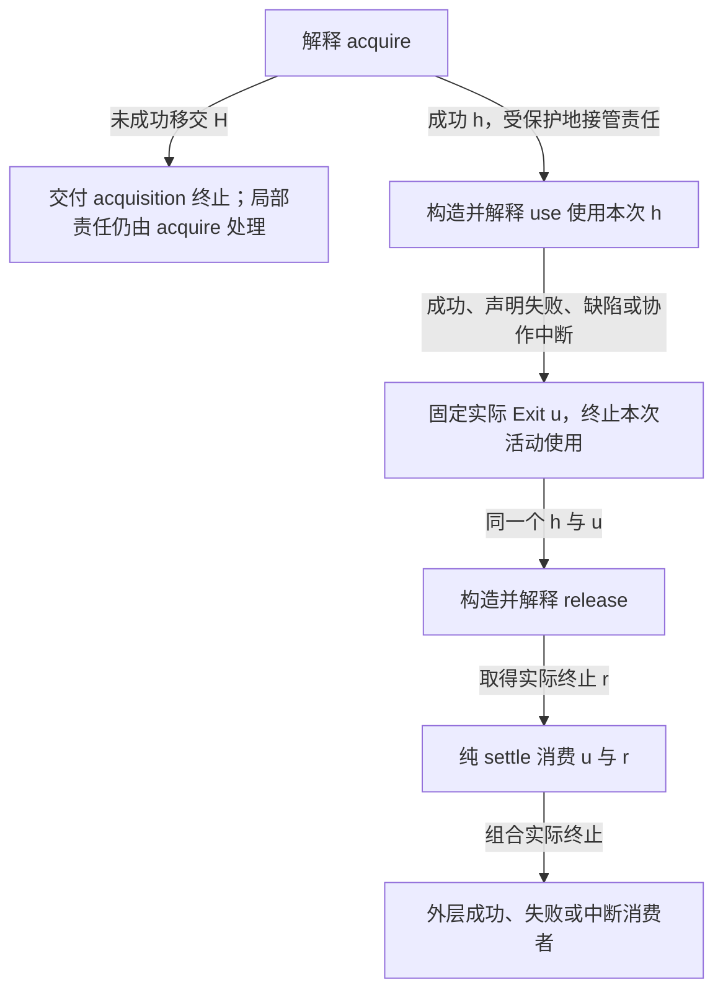
```mermaid
flowchart TD
    Acquire[解释 acquire] -->|未成功移交 H| AcquireEnd[交付 acquisition 终止；局部责任仍由 acquire 处理]
    Acquire -->|成功 h，受保护地接管责任| Use[构造并解释 use 使用本次 h]
    Use -->|成功、声明失败、缺陷或协作中断| Fix[固定实际 Exit u，终止本次活动使用]
    Fix -->|同一个 h 与 u| Release[构造并解释 release]
    Release -->|取得实际终止 r| Settle[纯 settle 消费 u 与 r]
    Settle -->|组合实际终止| Outer[外层成功、失败或中断消费者]
```

本候选明确选择以下settle，而不是把cleanup当作没有返回值的后台动作：

| use终止 | release终止 | 组合终止 |
|---|---|---|
| Success(a) | Success(Unit) | Success(a) |
| Failure(cu) | Success(Unit) | Failure(cu) |
| Success(a) | Failure(cr) | Failure(cr) |
| Failure(cu) | Failure(cr) | Failure(Sequential(cu,cr)) |

Sequential保存两次实际失败及其先后；不能用普通E联合冒充这项结果合成。单个声明失败仍可属于原Ea、Eu、Er的联合，不自动附加阶段tag；消费者确需区别来源时，才显式注入阶段标记。只有use与release均成功，外层成功后继才取得a；需要在释放失败时仍消费已算出的a，必须明确保存该值或选择保留部分结果的另一构造，不能声称此成功通道已经做到。

引发关闭的普通取消不能立即再次中断release，否则同一请求又会切断它刚要求执行的清理。本候选在固定u到settle完成之间登记后来的普通取消而不打断cleanup；恢复外层可取消边界时，待处理中断阻止成功后继，已有失败也不被覆盖。这是明确选择的中断解释政策，不由泛型唯一决定。它不保证不可终止的release最终完成，也不抵抗进程强杀。适配其他解释器时必须核对实际中断语义，不能只以存在Scope证明相同承诺。

acquire内部已取得局部资源、后续初始化失败而尚未交付H时，由acquire自己的资源限界清理；外层不能编造h。如果远端可能已创建资源但响应丢失，本地没有可用关闭引用，则不能推出“获取失败所以没有资源”。释放所需Rr也必须一直存活到释放完成，需求联合不会自动安排其生命周期。

#### 5.3.2 嵌套次序由实际消费推得

取`owned(p, h ↦ owned(q(h), j ↦ v(h,j), rq), rp)`。成功轨迹中，p产生h，q(h)产生j，v(h,j)产生a；rq消费j与Success(a)，其完成后内层settle才成为外层use的终止；rp随后消费h与这个终止，外层settle最终交付a。内先外后来自实际嵌套消费，不是资源类型拥有全局LIFO。

若q失败且没有交付j，不调用rq，但该失败成为外层use终止，仍调用rp。若v失败，rq消费该失败；若rq也失败，内层合成cause仍进入rp，不能在内层释放失败处跳过外层释放。rq永不终止时，不能宣称rp已经发生。把rq与rp并发解释会改变依赖与可观察次序，不是重括号优化。

#### 5.3.3 连续驱动与共享借用

对`source : H -> S<X,Es,Rs>`及实际消费者`consume : X -> F<Unit,Ec,Rc>`，资源范围是`owned(acquire, h ↦ drive(source(h),consume), release)`。drive是§8实际逐项取得、消费、推进的运行计算，不是一个尚未执行的描述。若use仅返回捕获h的惰性S，随即释放h，外层第一次驱动就在释放之后；同样的返回类型不能证明生命周期正确。

取来源依次交付x1、x2，consume(x1)成功而consume(x2)失败：驱动不再请求x3，停止该范围内的后继使用，再让release消费失败。x1已交付前缀不会撤回；x2调用已经发生但确认未返回时，释放也不能消除外部是否观察到它的未知。

共享的最小构造只获取一次h，外层保留一份release责任，内部两个借用消费同一h。第一项借用结束不关闭h；第二项继续消费并结束后，外层才释放。两个分支各自把同一h注册为自己拥有的资源则相反：先退出分支关闭h，仍运行分支失效；close幂等不能修复过早关闭。

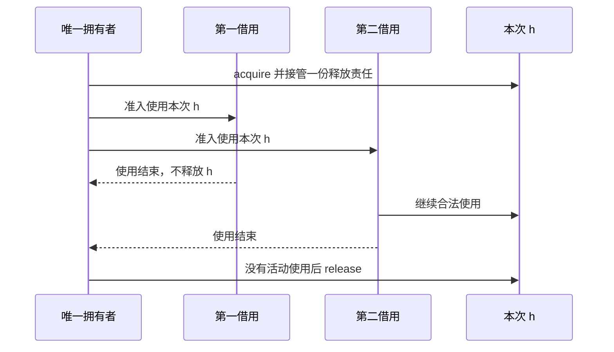
```mermaid
sequenceDiagram
    participant Owner as 唯一拥有者
    participant First as 第一借用
    participant Second as 第二借用
    participant Resource as 本次 h
    Owner->>Resource: acquire 并接管一份释放责任
    Owner->>First: 准入使用本次 h
    Owner->>Second: 准入使用本次 h
    First-->>Owner: 使用结束，不释放 h
    Second->>Resource: 继续合法使用
    Second-->>Owner: 使用结束
    Owner->>Resource: 没有活动使用后 release
```

并发借用组的退出必须停止新准入，并等已准入使用结束或得到可靠的停止事实；但不能在另一项仍会用h时先使其失效。有的release自身负责停止来源并等待在途回调，可先启动这项停止；不能把只发送unsubscribe的返回当作已经静止。结果、闭包和后台工作也不能携带超出此范围的借用。

当动态借用可在“已无使用”的检查后加入，词法范围不再充分：新准入与关闭决定必须互斥，或实际转移拥有责任；引用计数只是可能实现，不是所有共享计算的前置核心。上述普通构造只保证条件内的释放调用责任；一次本地调用不证明外部恰好一次关闭，释放也不等于远端业务补偿。

R联合同样不授权提前获取未选分支的全部资源。原计算选第一分支而成功；预先获取第二分支资源若失败，就使本可成功的轨迹失败。服务需求、实际获取、实例共享及解释权限必须分别保留。

访问控制是解释边界上实际执行的计算。描述可以由同一公开构造取得权限要求，但发现成功、环境中存在客户端、上一项计算获准，都不是下一项计算的授权。顺序读取可以前段成功而后段因当前权限被拒绝；业务若要求开始前检查所有成员，须显式构造那项检查，不能从要求类型的联合推出它已经发生。


### 5.4 顺序与共同输入怎样构造

第3.2节的h/k已经给出最小顺序关系。若后段同时需要原输入I和前段A，外层函数应捕获原i，并在h(i)成功后构造`k(i,a)`；没有必要要求所有后继再次接受一份同名I。若最终结果还需要A，后继闭包继续持有这个a并参与最终纯函数。值依赖由实际函数的参数和闭包表达，不由公共目录树代替。


并发取值可以使用两个独立计算及实际组合函数构造积结果；需要说明一个成员失败时另一个是否中断，以及已经发生的效果如何被观察。积类型只证明两个值同时存在于结果中，不证明它们来自同一时刻、同一来源或同一远端事务。若业务需要时间相容性，必须由来源实际给出的时间事实与业务判据检验，不能由组合算子填补。

<a id="declaration-construction"></a>

#### 5.4.1 固定后继、输入转换与保留中间值

§3.3已从p与输入为`J × A`的q构造共同描述和实际调用。若已有后继q接受B而非这个积，则用实际转换`m : J × A -> Result<B,Em>`连接：外层保存j，解释p取得a，纯求值m(j,a)，只在成功b后构造并解释q(b)。m失败不运行q；m若需要IO，就把它作为普通计算接入，保留自己的资源与失败，不能继续称纯转换。

如果最终还需要a，成功后继继续持有a，再将q返回的c交给`combine(a,c)`。a来自同一次p，不重新调用p以“找回”它；c也不由结果声明生成。公开成功声明取combine实际结果的声明；构造修改描述与解释的关联，不证明combine的业务含义正确。

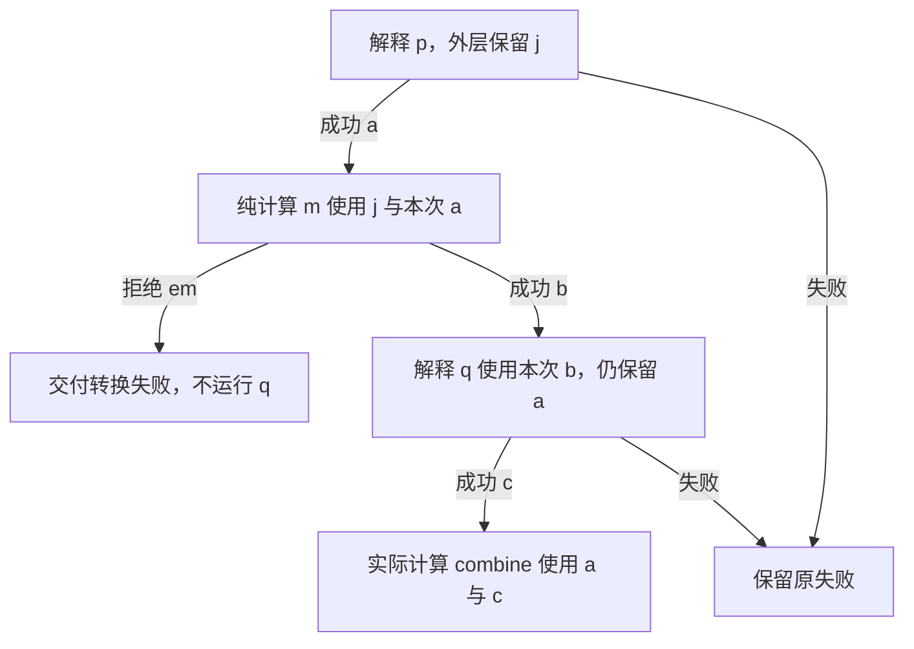
```mermaid
flowchart TD
    P[解释 p，外层保留 j] -->|成功 a| M[纯计算 m 使用 j 与本次 a]
    M -->|拒绝 em| Stop[交付转换失败，不运行 q]
    M -->|成功 b| Q[解释 q 使用本次 b，仍保留 a]
    Q -->|成功 c| Result[实际计算 combine 使用 a 与 c]
    P -->|失败| Fail[保留原失败]
    Q -->|失败| Fail
```

新增必填输入时，共同声明可以使解析器拒绝缺值，但不会使m自动得到新值；改变同型m也可能不改结构类型却改变行为。这是类型派生和语义保持的边界。业务上的同来源、单位与范围相容性须由对应业务实例论证，不由两个操作数拥有相似字段推出。


#### 5.4.3 从纯函数构造逐项算子，而不是枚举业务帧

取纯谓词`p : X -> Bool`。filter的推进状态为单元值：对x求p(x)，真时返回同一个x的单项序列，假时返回空序列。它不复制来源调用，不为未命中伪造输出，也不解释IO。其输出交付由§8的顺序驱动完成。

取初态s0和纯推进`r : S × X -> Result<S,E>`。scan对本次s、x求r；失败原样进入驱动失败，成功s1则返回新状态s1及单项输出`[s1]`。因此每个成功输入输出本次推进后的状态，而不是最后才输出汇总。这两项构造都由实际函数给出结果，不靠换一个泛型名字取得行为。

两项可以按§8组合，但不能随意交换。以输入`[1,2]`、初态0、累加推进和偶数谓词为例：先过滤输入再scan，只把2交给累加，交付`[2]`；先scan，依次得到1与3，再过滤两个状态，交付空序列。两边输入/输出都可以是整数，却计算不同的关系。

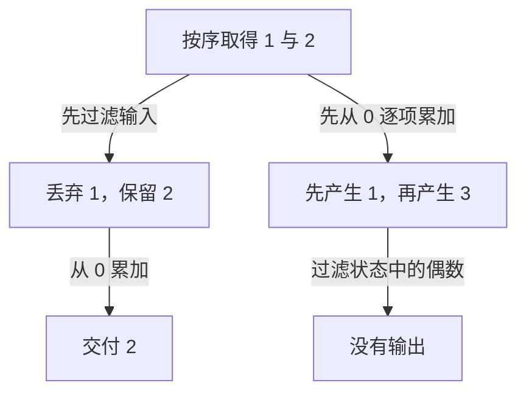
```mermaid
flowchart TD
    Input[按序取得 1 与 2] -->|先过滤输入| Keep[丢弃 1，保留 2]
    Keep -->|从 0 累加| Two[交付 2]
    Input -->|先从 0 逐项累加| States[先产生 1，再产生 3]
    States -->|过滤状态中的偶数| Empty[没有输出]
```

这里检验的是组合次序，不是给filter或scan增加整数特判。其他领域值由它们自己的谓词与推进函数实例化；若输入含修订或撤回语义，普通逐项谓词并不自动维护过去输出的修订关系，必须在独立业务实例中构造足够状态和消费函数。需要后继IO时则实际构造工作，让解释结果进入后续状态决定，不能在纯r里偷做IO。单次成功状态和输出值仍不等于持久化或可恢复交付。


### 5.5 选择受控解释时，公开组合怎样没有原始执行旁路

需要先接受、后解释的计算不能只在描述上标记“受控”。如果公开消费者仍能取得原始build或资源，就可以直接解释它，绕过接受关系。这里构造一种选择性的安装边界，不要求普通只读计算也持久化。

可信安装者接收§3.5的实际函数包K及其输入、结果和捕获声明，将K保存在私有解释域。对外只返回H：H可消解为描述与提交调用，不可投影出K、build、consume、原始函数或资源resolver。提交调用捕获的是只能指向这个安装的提交引用与输入解析关系，而不是一个公开可调用的原始执行函数。

实际`submit(i)`把这个引用及完整i交给拥有者；拥有者在包内取得对应定义，形成并接受可保存操作数，成功后返回本次接纳结果。submit不调用K.build。私有执行者可以按§3.5在放行前解码、纯构造工作并取得资源绑定，但只有本次发生的放行成功分支才实际解释它。结果消费者取得捕获、结果及当前状态，不被传入原始build或原生资源。

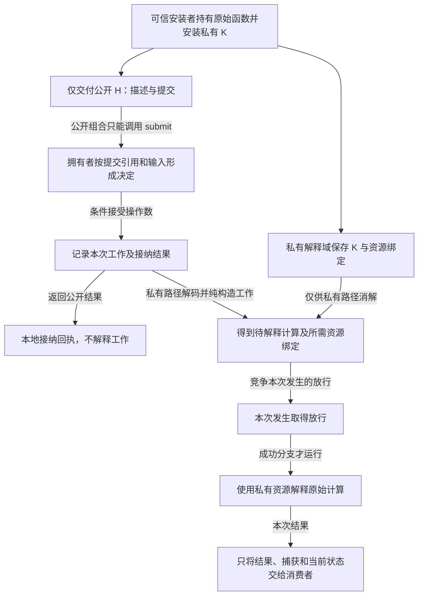
```mermaid
flowchart TD
    Install[可信安装者持有原始函数并安装私有 K] --> Private[私有解释域保存 K 与资源绑定]
    Install --> Public[仅交付公开 H：描述与提交]
    Public -->|公开组合只能调用 submit| Owner[拥有者按提交引用和输入形成决定]
    Owner -->|条件接受操作数| Accepted[记录本次工作及接纳结果]
    Accepted -->|返回公开结果| Receipt[本地接纳回执，不解释工作]
    Accepted -->|私有路径解码并纯构造工作| Build[得到待解释计算及所需资源绑定]
    Private -->|仅供私有路径消解| Build
    Build -->|竞争本次发生的放行| Grant[本次发生取得放行]
    Grant -->|成功分支才运行| Run[使用私有资源解释原始计算]
    Run -->|本次结果| Consume[只将结果、捕获和当前状态交给消费者]
```

公开高阶组合只持有H，因而只能组合它的提交调用，不能从提交回执反推出build。目录中的动态名称也不提供公开的K查询；拥有者在实际入口复核调用资格，不能把知道安装名字当成授权。原始函数若作为H的属性、未受限lookup或另一个公开叶子暴露，这条封闭关系就被反驳，不能靠“不得绕过”的说明补救。

这证明的是**对只取得H的消费者关闭这条公开旁路**。可信安装者原本持有叶子函数，不因此受H限制；任意内存反射、外部凭据或不受限传输访问也不在保证之内。它不是恶意代码沙箱。放行是否至多取得一次仍由§3.5的条件接受决定，不由opaque句柄名称或私有字段独自证明。

该构造的公开输入和接纳结果仍按§3.3生成有限定义：输入解析与实际提交使用同一关联，成功声明是实际接纳结果，而不是K的原始成功类型。组合内部工作不因参与这个定义而自动公开。于是普通成功续接可以调用H，却不会把接纳回执升级为外部完成，也不会获得原始执行权限。


### 5.7 组合保证由什么推导，而不是由多少例子支持

本章的共同结构是**带声明的计算与声明相容的消费者**，不是一个容纳所有业务的结果容器。一个构造成立须同时给出三类前提：操作数各自履行原契约；连接处的值/失败/范围关联合法；算子明确保留或改变哪些可观察行为。类型只保证其中已经编码的关系，不能证明 Provider 说了真话或业务函数选择了正确政策。


比较两项计算前须约定观察面，包括返回值、声明失败、外部发生、资源与中断边界。相同类型不证明这些观察相同。稳定定义身份用于重建原函数，也不证明两个不同定义相等；公开目录身份若本身可观察，同值投影也未必保持整个公开定义的身份。


<a id="chapter-6"></a>

## 6. 语义单元如何实例化

### 6.1 Order：条款组合而非原生对象交集

Order 描述不可变交易意图。共同部分包括 InstrumentRef、方向与意图标识；账户范围属于调用上下文或明确的输入范围。size、pricing、time、relationships、protection 等条款使用精确 schema 组合。

- size 的 quantity 与 notional 是有判别字段的选择；单位、最小变动、舍入及折算证据不能丢失。
- pricing 的 market/limit/stop 等选择携带各自必要字段；Provider 只声明支持的分支。
- parent/OCA/bracket/OTO、post-only、reduce-only、session/TIF、触发条件与 venue 参数由 Provider 的精确扩展声明承载。不是所有 Provider 都支持这些条款，也不是出现字段就证明组原子性。
- Instrument、size 与 pricing 的约束可组合；真正互斥或依赖条件由绑定约束表达。

IBKR 的可变 Order 类、Longbridge 的 Decimal/枚举、CCXT 的参数以及 LeverUp 的签名结构留在各自解释器中。公开扩展保留可表达的原生能力，但不把 SDK 类变成跨进程协议。

#### 市价与限价怎样由同一高阶构造产生

选择一个明确实例：同一来源、账户、商品、方向、数量和有效期的原生市价与原生限价。记这些共同意图为B；市价附加条款是单元值，限价附加条款是与商品及报价单位关联的Price。共同值构造`Order(X)=B×X`只定义一次B，不先手写两份完整订单再合并。这里选择的产品价格为100、数量为10，不据此规定所有市场价格必须为正。

值积并不足以构成限价行为。高阶构造还消费该特化的纯校验v、实际请求构造e、派发计算构造d和原生回应解释a：市价e从B构造原生市价请求；限价e取同一B及本次Price，构造实际含该限价约束的原生限价请求。d解释的是e产生的那个请求，不把限价退化为显示字段。a按该来源的真实证据区分明确拒绝、原生接受和结果不确定，不凭订单种类生成成交事实。

这些原生操作含义是本例需要来源履行的边界，不声称所有来源已经支持。若目标在可买价格101时仍将限价100的买单正常解释为以101成交，类型即使闭合，限价特化也没有履约。反之，市价允许该价格成交不等于一定立即成交。投影掉Price只改变值消费，不能擦除这两项外部计算的差异。

构造器不要求每种订单另提供完整接纳入口和结果消费者。共同Order接纳决定、结果事实构造及观察消费为这个业务实例定义一次；改变X、v、e时，实际生成关系如下：

| 生成项 | 由同一操作数产生的实际计算 |
|---|---|
| 公开输入 | 由B与X产生完整解析和编码；v检验它们的业务关联 |
| 工作输入与捕获 | 为本次发生ω形成`(ω,Order(X))`；捕获ω、逻辑目标、账户与原意图关联。d需要ω，因此不能只把ω存进消费者捕获 |
| 私有工作build | 纯求e，使用本次ω构造并解释d；成功原生回应交给实际a；保留各段声明失败与其确切发生含义 |
| 私有结果consume | 使用本次捕获及当前状态核对发生关联；明确拒绝提出拒绝事实，结果不确定提出未知事实而非重发，原生接受提出原生关联及一次实际观察工作 |
| 公开run | 完整解析并执行v，在拥有者内形成本次ω与`saveable(κ_X,input,capture)`，以共同接纳决定条件接受，成功后才返回本地接纳回执；不解释私有build |
| 描述 | 输入来自同一Order(X)声明，成功来自实际接纳回执声明；不从d的原生返回类型猜测公开返回 |

κ_X固定X、v、e、d、a及相应编码的解释关联；其build、saveable接线及上述consume由构造形成，不把重复工作换一个名字交回逐订单作者。需要的新观察工作用结果里的实际关联及原捕获形成输入，再用同一Order观察定义构造；观察定义不因价格100改99而重写。若新特化的回应不能进入这个共同消费关系，就必须更换它的精确回应及业务消费者，不能强转后宣称只换X即可。

本例选择在原生接受结果消费后发起一次观察，不主张原生身份在此之前一定不存在。身份可能由原生返回交付，也可能像旧IBKR那样在发送前分配。工作发生ω与原生orderId仍须区分；同一个orderId上的另一操作回应不能仅凭类型相同被当作本次结果。

```mermaid
sequenceDiagram
    participant Caller as Order调用者
    participant Entry as 生成的公开接纳入口
    participant Owner as Order状态接受与结果消费
    participant Worker as 私有工作解释者
    participant Native as 原生来源
    Caller->>Entry: 完整B与所选X
    Entry->>Owner: 以共同决定提出意图及可保存工作
    Owner-->>Caller: 接纳回执，不表示原生接受
    Worker->>Owner: 竞争本次工作ω的放行
    Owner-->>Worker: 本次放行成功
    Worker->>Native: 解释本次e产生的实际请求
    Native-->>Worker: 本分支收到原生接受回应，不推断成交
    Worker->>Owner: 保存本次结果并调用生成的消费者
    Owner->>Owner: 接受原生关联及一次可保存观察工作
    Worker->>Native: 读取该结果所关联的原生订单
    Native-->>Worker: 具体订单观察或观察失败
    Worker->>Owner: 由共同观察消费者保存实际证据
```

接纳与保存工作必须不可分，否则本地已接纳却失去派发操作数；结果消费与保存观察工作也必须不可分，否则原生接受已消费却失去后继。这两处都实例化§3.5，而不是新增Order专用核心机制。公开调用仅取得§5.5的有限句柄，不获得私有d。回应丢失仍可能留下外部已发生但本地未知的工作，不能靠这个高阶构造获得外部恰好一次。

新增原生StopLimit时，可以把X换成TriggerPrice与LimitPrice的积，并换入对应v、e；只有来源真实支持且回应/观察契约相容时才复用d、a及共同消费者。若来源没有该能力，就不安装相应公开定义。这里展示可沿同一构造规律增加特化，不证明任意未来订单都不需要修改任何业务关系。

#### 旧返回契约怎样反驳“同型结果即同一承诺”

当前IBKR下单在`IbkrBroker.ts:495–503`先分配orderId、登记waiter，再发起调用并等待回调，成功时返回回调里的orderState。因此原生身份可以在发送前取得，不能规定所有Order都必须等ACK后才有身份。`request-bridge.ts:738–744`按orderId完成waiter，不核对操作种类或状态；得到同型回调不自动证明它对应本次期望的业务阶段。

撤单的差异更直接：`IbkrBroker.ts:545–555`等待同一requestOrder后丢弃返回值，再本地构造Cancelled。bridge既能由`orderStatus(...,'Cancelled',...)`完成（`:768–776`），也能由任意同orderId的openOrder完成。于是源码允许这样的条件轨迹：

```mermaid
flowchart TD
    Cancel[登记该 orderId 的撤单 waiter 并发出撤单] --> Callback[先收到同 orderId、状态 Submitted 的 openOrder]
    Callback --> Resolve[bridge 按 orderId 完成 waiter]
    Resolve --> Synthetic[撤单函数忽略返回状态，本地构造 Cancelled]
    Synthetic --> Projection[TradingGit 映射为 cancelled，并放入成功结果集合]
    Projection --> Pending[最新状态不是 submitted，普通 pending 选择排除该订单]
```

这是源码分支推演，不声称已在真实TWS/Gateway重现该回调排列。它揭示的是响应关联和业务解释不足，不能用新类型中的Cancelled标签补造远端撤单证据。`TradingGit.ts:929–977`单独读取success并映射status，`:181–184`按success分桶；所以`success=true/status=cancelled`仍进入名为submitted的数组。该数组名也不是业务完成判据。

后继消费进一步放大含义差异：`TradingGit.ts:692–748`只把最新status为submitted的orderId加入pending；`UnifiedTradingAccount.ts:844–865`从这个集合开始sync。因此本地合成cancelled会阻止这条普通sync路径继续选中它，不等于另有独立观察已经确认终态。

公开HTTP返回同样不能代替业务结果。`order-entry.ts:44–73`在一次调用中执行stage、commit、push；`routes-trading.ts:69–78,594–606`把正常PushResult返回给调用者。操作失败值仍可进入PushResult.rejected；而`TradingGit.ts:143–179`在外部操作之后才读取状态并调用持久回调，这些后置步骤抛错时，请求失败也不证明外部操作未发生。新Order消费者必须分别表达接纳、具体原生结果及观察事实，不能沿用一个success布尔值承载这些不同承诺。

#### 独立变体：成交观察先于有限发送回应

上一例只在回应后查询，不承诺捕获早到观察。本例另选一个来源契约：来源拥有者实际提供`reserve(target,account,ω)`，能够按同一ω找回同一预留原生关联n；发送函数实际消费n；`openObservation(n,delivery)`的成功表示当前作用域的来源监听已经生效；独立成交报告具有可核对且内容不可变的成交身份。有限发送回应另有足以关联本次调用的证据。IBKR发送前取得orderId的源码事实不证明这些前提已经成立。

ω是本次发送发生，n是带来源、账户及原生命名空间的订单关联，q是本地接收关联，三者不能互换。预留结果消费者以当前状态接受ω/n/q、接收定义及捕获、观察安装工作；它们同次接受。捕获保存本次订单身份与数量含义，接收入口依据可信原生n找到q，不给任意同型回调补一个ω就当关联成立。

本例还要求：本次责任有效期间，这个带原生命名空间的n独占关联本意图，不复用于另一订单；接受映射时检查当前关联不冲突。仅有“同ω找回同n”不够，因为两个不同ω仍可能得到同n，使旧订单成交误计入新意图。来源不能履行独占或提供足够区分旧观察的身份时，不满足本例接收前提。

安装工作实际解释`openObservation(n,delivery_q)`。接收关联先可见，因为安装期间也可能收到消息；安装成功后才产生发送工作，其保存输入为`(ω,j,n,q)`，其中j仍是完整Order(X)。条款编码函数实际消费j和预留n，再由来源发送函数解释该请求。活观察句柄不能放进保存输入：发送解释者必须取得当前观察作用域的使用权与本次ω放行，不能只检查持久记录中的一个Ready。

拥有者把发送准入与观察关闭定序。关闭先接受则不再准入；先准入的发送启动步骤完成前，不主动释放其依赖的观察资源。网络仍可在随后失效，本地定序不构成订阅与远端交易的分布式原子边界。恢复尚未放行的工作时，重新建立n/q对应的实际观察作用域；恢复已放行工作时，不因旧作用域消失就再发一次。

本例分别构造两个业务消费者，而不是让所有事实成为发送成功的后继：

- `receive(c,x,s)`核对可信来源、账户及原生关联，将成交身份和内容加入当前成交事实。同身份同内容不重复累计；同身份异内容违反本例不可变报告前提，保留冲突而不默改数量。它不写“发送调用成功”，也不授权重发。
- `consumeSend(c,r,s)`核对真实调用关联，只更新本次调用结果证据，保留当前s中的成交事实。它不能把开始发送时捕获的旧成交数写回。已有可信成交而回应声称从未接受时，保留矛盾证据，不删除成交。

```mermaid
sequenceDiagram
    participant Owner as Order状态拥有者
    participant Reserve as 原生预留计算
    participant Observe as 当前观察作用域
    participant Native as 原生来源
    Owner->>Reserve: reserve目标、账户及ω
    Reserve-->>Owner: 可恢复的预留n
    Owner->>Owner: 同次接受ω/n/q、接收定义与安装工作
    Owner->>Observe: 安装n的真实观察路径
    Observe-->>Owner: 当前作用域监听已经生效
    Owner->>Owner: 接受发送工作并在当前作用域准入ω
    Owner->>Native: 解释实际消费j与n的发送请求
    Native->>Observe: 成交10的独立报告先到
    Observe->>Owner: 按q消费报告，当前累计成交10
    Native-->>Owner: 本次发送有限回应后到
    Owner->>Owner: 增加调用证据，保留当前累计成交10
```

两个消费者并发读到同一基态时，只有一个先接受，另一个重读当前状态再求值。因此后到回应不会将成交10回写为零；保证来自这两个具体函数及接受规则，不是积类型自动产生“成交优先级”。可信成交若在本例实际发送准入前已到达，则是独占预留或生产路径前提失效，不是普通的早于回应；保存冲突并阻止尚未准入的发送。

这里反向检验的公共关系是生产计算对**当前有效接收资源**的依赖：仅有本地q可见，发送与成交可以先于监听安装；仅有持久Ready，重启后也可以发生同一遗漏。§3.6的独立接收与§5.3的活作用域必须共同参与实际构造，不能用保存成功值替代资源存续。Order预留、成交身份及两个消费者仍属于本例，不进入核心。

没有预留恢复、监听就绪或充分关联承诺的来源，不能冒称支持此变体。它可以采用回应后查询的较窄路径；发送或观察结果丢失且查询证据不足时保持未知。本例不证明消息不丢、成交普遍不可撤销、远端恰好一次，也不是运行验证。

#### 跨语言Order特化：结构约束与原生业务校验分别发生

选择一个外语SDK来源的限价叶子，其D由共同Order输入与该来源条款的命名积构造。数量用尺度2、最小整数25、步进25的Decimal，限价使用自己的精确价格声明；扩展路由是Auto单元分支或Venue文本分支。D通过§4.1的递归构造产生主机解析、编码与CLI描述，不把SDK Decimal或本地校验闭包发送给主机。

数量10.26在主机解析成1026后不能整除25，完整输入拒绝，本地接纳、远端调用及原生写都未发生。数量10.25与Venue("V")则结构合法，主机可以接受对应ω及工作。该来源另有无法用D表达的实际路由规则；规则保留在远端叶子内部，拒绝时返回精确RouteDenied，成功时才构造并解释原生限价请求。主机不声称结构解析已证明该商品可以走V。

```mermaid
sequenceDiagram
    participant CLI as D生成的公开调用
    participant Host as UTA接纳与私有解释
    participant Foreign as 外语Provider叶子
    participant Native as 原生SDK或网关
    CLI->>CLI: 同D解析完整Order与扩展
    alt 数量不满足可运输步进
        CLI-->>CLI: 输入拒绝，不调用后继
    else 完整结构合法
        CLI->>Host: 接纳本次意图及工作ω
        Host->>Foreign: 按同D编码本次输入
        Foreign->>Foreign: 运行实际路由校验
        alt 业务校验拒绝
            Foreign-->>Host: 精确RouteDenied
            Host->>Host: 原消费者记录拒绝，不重发
        else 实际条件允许
            Foreign->>Native: 使用同一次输入构造并发送限价请求
            Native-->>Foreign: 本次实际原生结果
            Foreign-->>Host: 按原结果D编码
            Host->>Host: 同定义解析，进入原结果消费者
        end
    end
```

RouteDenied分支可以已有本地接纳和远端校验IO，却没有该原生交易发送；它不是公开输入解析失败。检查若依赖可变账户状态，发送边界仍须实际检查或有来源保证，不能用曾经通过替代当前资格。另一业务若要求这种拒绝必须在本地接纳前可见，应另行构造真正可前置的校验及其时间关系；本例不默认新增validate-token协议。

该目标只要求两侧履行D与实际叶子契约，不共享SDK类。第二个Provider可以有完全不同的D并且没有cancel/option定义；最终目录因此没有相应命令。新字段可以由D组合产生，而不能运输的行为仍由真实计算表达，不以自由JSON或“一律拒绝整个来源”替代。

### 6.2 Candle：共同含义与精确扩展

本例分别研究Candle的值扩展、有限读取和实时输出，不将它们的业务字段加入核心。原始目标是共同基础K线对象加任意精确schema的扩展，并同时容纳Pull返回与Push持续stdout输出；两者通信方式不同，不因此需要两份互不关联的K线含义。

令`CandleX = CandleBase × ExtraX`。Base承载一根K线的对象身份、时间区间及OHLC与单位解释，ExtraX由具体来源的精确声明解释，不是未定形的metadata。来源没有提供的volume不补零，不知道的封口状态不补成closed；来源支持的修订、调整与会话信息须在该来源契约中准确表达，不先把所有来源假定为具有相同修订协议。价格是否可以为负由产品含义约束，不是核心的全局正数公理。

投影的是本次取得的同一根K线，不再次读取行情。若来源额外取得vwap需要另一次IO，隐藏ExtraX并不删除那次IO，也不证明扩展查询与原基础查询等价；这是§3.2的任意扩展计算与同次结果纯扩展的区别在本业务中的实例。

有限路径的实际构造是先解释`getBars(query)`取得本次有限序列，再依顺序将每根CandleX交给消费者；实时路径则解释实际安装的订阅，每次取得CandleX后交给`stdout(encodeX(c))`。编码器由该来源的完整CandleX声明产生，因此扩展字段仍可供AI发现和消费；使用基础消费者是主动选择投影，而不是公共入口预先丢弃扩展。

```mermaid
flowchart TD
    Pull[调用已安装的历史读取] -->|成功返回本次有限序列| Page[按本次返回顺序取一根 CandleX]
    Page -->|完整值 c| Full[依来源声明编码 c]
    Push[启动已安装的实时订阅] -->|本次交付完整值 c| Full
    Full -->|解释实际输出| Output[写出机器可读 stdout]
    Page -->|同一个 c 的基础投影| Base[基础分析消费者]
    Push -->|同一个 c 的基础投影| Base
```

图中基础分析与完整输出是两种可选择的消费者，不暗示一次订阅已经自动广播给两者。若二者同时运行，必须构造明确的顺序消费或共享分发；两个独立订阅调用也不保证取得同一次产出。订阅失败前已写出的K线是已观察前缀，不因失败撤销；历史请求的有限返回则不能被改名为已存在的实时订阅。

旧实现的真实边界是有限`BarsResult`（`src/domain/market-data/bars/types.ts:106–137`）。`bar-service.ts:181–190`的finalize按date排序、限长并截取最近项，只证明本次数组的整理行为，不证明请求范围完整。`:167–178`的freshness计算末根与请求锚点的工作日差，不能被解释成无缺失、不可修订或已经封口。新设计保留有限读取能力，但不会替旧来源补造连续交付与回补保证。

时间消费者也必须使用来源的真实解释。UTA路径在`bar-service.ts:117–127`先把timestamp转成ISO，再按interval输出日期或不带时区后缀的日内字符串；vendor路径另有原始日期。知道一条转换来自UTC，不证明所有同形字符串都采用UTC。业务窗口函数先取得相容的时间与交易日历解释，再进行分配或聚合；类型相同的字符串本身不能证明这种业务解释正确。

### 6.3 Instrument：标识、目录和可交易性分离

InstrumentRef指向来源内对象；具体商品信息按该来源的精确声明给出资产类别、币种、交易场所及适用的合约属性，不把每个商品都假定为具有到期或合约乘数的衍生品。搜索命中不等于账户有交易权限，也不等于已选定唯一对象。显示名称、目录记录与原生资格是需要分别解释的事实。

跨 Provider 合并需要显式 identity mapping 及证据。不知道汇率、乘数、日历或唯一合约时，返回相应未知/歧义，不能靠默认值让下单继续。

独立构造例是“选定商品后读取该商品的数据”。外层输入为选择请求与WindowInput的积；前段解析实际返回的候选，按已声明选择函数得到唯一InstrumentRef或歧义失败。后继读取的输入声明直接引用InstrumentRef与WindowInput；外层保存本次窗口，只在前段成功后把窗口与本次引用组成请求。它实例化§3.3的固定后继构造，不由商品名称猜测另一个来源的标识。

```mermaid
flowchart TD
    Input[完整选择请求与窗口输入] --> Select[解释商品选择，取得来源内候选]
    Select -->|唯一对象及来源关联| Ref[本次 InstrumentRef]
    Select -->|歧义或无可用对象| Reject[返回选择失败，不读取后继数据]
    Ref -->|与已保存窗口组成实际请求| Request[后继来源核对该引用适用范围]
    Request -->|相容且当前调用允许| Read[解释该对象的数据读取]
    Request -->|来源或范围不相容| Failure[返回明确失败，不改写引用]
```

这里同源性是实际命名空间和对象含义的契约，不是两个定义的全部身份必须相等；商品搜索与数据读取本来可以是不同定义。跨来源使用时需要实际映射及足够证据，不用两个同型字符串直接替代。后继新增必填session时，原窗口与引用不能凭空提供该值：新的完整输入或明确的选择计算才能形成请求，解析器本身只会拒绝缺值。

#### 发现分支有不同的实际后继

IBKR的issuer目录只能展开；股票conId既能指向股票，也能作为衍生品发现的underlying，不能把全域对象强分成互斥的“leaf或hub”。`IbkrBroker.ts:391–475`对issuer查询债券，对无expiry的OPT请求返回参数grid，对带expiry或FUT请求返回具体合约。Agent工具`src/tool/trading.ts:503–554`实际消费两种分支，却丢掉kind，并将缺数组补为空；grid投影还丢掉underlyingConId。这些不是目标应保留的契约。

本业务构造精确和：ContractBatch携带本次source、实际查询、具体leaves、批内匹配数、实际limit及截断说明；OptionParameters携带本次underlying与实际grid。数组在对应分支必需，缺字段是契约失败，不是空查询。issuer请求只声明limit；option-grid请求不宣称已实施right/strike过滤；具体期权请求才消费expiry/right/range等实际操作数。hint保留为说明，不用自然语言提示驱动解释器。

IBKR现有total是本次details经本地过滤后、裁切前的长度，不是全市场计数；limit最多200且没有cursor。假定某次issuer返回240项，请求60得到前60；请求300实际最多200。目标展示批内240、实际200及40项未交付，不承诺“继续提高limit即可看全”。选择已返回的第17项可取得其确切conId并继续；要求全市场最优或所有匹配时，这个接口缺少相应完整性保证。

固定组合的操作数是underlying、调用者的expiry/range选择、确切leaf选择与订单条款。先解释grid读取；成功后实际选择函数消费本次grid与调用者选择，构造下一次有限查询；查询成功后从本批中选出唯一实际leaf，再把同一个ref与条款交给提案构造。调用者尚未提供expiry时，当前调用只返回参数结果，下一次真实调用再携带选择，不凭hint猜值。empty grid可以有限成功返回，后继解释为无参数；读取失败不运行成功后继，不自动无限重试。

```mermaid
flowchart TD
    Browse[解释本次目录或 underlying 查询] -->|参数 grid| Parameters[交付实际参数轴与 underlying]
    Parameters -->|实际调用者选择| Query[构造对应有限合约查询]
    Browse -->|具体批次| Batch[保留本次 leaves 与批内计数]
    Query -->|成功| Batch
    Batch -->|明确选择唯一已返回对象| Ref[取得原作用域内确切引用]
    Ref --> Bind[构造同一目标的意图并解释必要绑定]
    Bind -->|成功| Proposal[接纳该意图，不等于外部提交]
```

#### 精确期权族不能由显示投影重建

普通有限浏览保留旧能力，但不宣称第二次按symbol/expiry取得的对象属于前次选中的grid。旧`IbkrBroker.ts:435–442`只用underlying symbol/currency等再次查询，丢掉的tradingClass/multiplier/underlying关联不会被then自动恢复。若业务明确要求“所选族的成员”，其实际输入必须保存underlyingRef、tradingClass、multiplier及具有明确含义的venue选择；查询消费适用原生参数，结果消费真实membership证据，再选leaf。缺必要字段或不能证实场所含义时返回FamilyMembershipUnverified或UnsupportedFamilySelection，不用同symbol/expiry或SMART优先排序代替。

取两个expiry相交但tradingClass不同的grid G1/G2。选G2后查询返回G1的L1，成员比较拒绝，提案后继不运行；取得有充分证据属于G2的L2，才用L2的实际conId构造提案。原生载体已有Contract.tradingClass与ContractDetails.underConId（`packages/ibkr/src/contract.ts:137,211`），不等于当前展开接口已履行这项族选择。参数轴的笛卡尔积也不证明每个组合存在，不凭轴合成conId。

#### 本地目录刷新与搜索的状态消费

UTA当前六小时循环发起refresh（`services/uta/src/main.ts:130–141`）；Alpaca首次加载不等待、失败保留旧cache、未加载时echo输入（`AlpacaBroker.ts:178–183,217–256`）。CCXT实际调用loadMarkets(true)，其依赖内部的失败原子性不能由wrapper推断。Alice SDK的refreshCatalog直接返回成功而不发请求（`UTAAccountSDK.ts:351–354`），不能生成一次刷新事实。

目标仅给拥有本地目录的业务实例建立状态：Unloaded、InitialLoading、InitialLoadFailed没有snapshot；Ready、Refreshing、RefreshFailed持有实际snapshot。刷新有限计算成功交付候选内容，由目录拥有者接受并发布；首次失败保留无目录事实，后续失败保留原snapshot和该次失败。该拥有者串行解释刷新工作，搜索仍可读取已经发布的snapshot；开始消费某份内容后，用同一份完成有限排名，不在中途混入后来发布的内容。完成时间只是本地取得时间，不是交易所as-of或fresh/complete证明。

搜索结果明确区分CatalogMatch及其本次内容依据、ServerMatch及本次查询依据、ConstructedTickerHint及本地构造依据。Alpaca尚未加载时可以继续返回ticker hint；成功发布空目录后则返回基于该目录的零匹配，不退回echo。刷新失败后仍可展示旧匹配，同时交付失败观察；IBKR的server search、Longbridge固有echo不被迫进入这套本地刷新状态。未暴露刷新就没有对应命令，不保留SDK成功no-op。

普通搜索的范围也必须实际保留：现有Alpaca/CCXT排名最多返回50项，CCXT还限定活跃候选、base/quote与支持的报价币种，并可能跳过无法转换的条目。CatalogMatch只表示该查询视图中的命中，不证明全部目录均已核定；IBKR展开具有批内计数，不要求没有该信息的普通搜索也制造total。聚合先固定本次目标集合：旧默认选择asVendor非false来源，显式source另选；未参与的来源不是无匹配来源。

聚合搜索先捕获各来源声明Outcome，再消费成功项与失败范围；成功子集为空但有失败来源时，不能说所有来源都无匹配。Broker内部若已经吞掉子查询失败，必须在那个生产边界保留真实缺口，外层无法恢复未交付的信息。UI的Show more只展开已返回数组，不是远端下一页或hub展开；目录行提供实际展开操作，参数grid提供选择后查询，只有适用的对象引用才提供对象操作。Agent与UI保留同一分支及来源含义，不再把每个有aliceId的行称为已可交易leaf。

#### 精确引用与查询提示在提案中不能互换

本业务区分IssuerRef、ExactInstrumentRef与SymbolHint；这是相应消费者的输入，不是公共核心消息。纯buildIntent(ref,terms,display)只从ref产生目标，display不参与原生target。有限bindForProposal消费实际账户/子账户上下文、所选定义及该引用；需要精确metadata时实际读取，来源允许精确key直达时可直接构造。成功才将同一目标与条款交给创建提案的计算，不授予发送权。

目标保真贯穿实际metadata消费到原生发送，不能只在stage检查。当前stage解析aliceId后允许display-only symbol覆盖Contract.symbol（`UnifiedTradingAccount.ts:697–698,744–745`），Alpaca又直接以它发送：AAPL引用加MSFT显示值可构造MSFT目标。目标删除这项显示到路由的依赖。另一个反例是CCXT精确key消失后造骨架（`CcxtBroker.ts:1311–1325`），下游按base唯一匹配（`ccxt-contracts.ts:123–176`）；旧perp引用BTC/USDT:USDT可在只剩spot时变成BTC/USDT。目标ExactRef解析失败返回ExactTargetUnavailable，不进入SymbolHint重新选择。已接纳提案也不能在发送时偷偷改投。

直接输入、持仓取得或先前选择的精确引用都合法，不要求曾search、catalogRevision或每单refresh。Leverup未知pair在本地表中不能取得该解释器必需的pair操作数，所选目标在bindForProposal返回UnresolvedLocalRef，不把合成CRYPTO_PERP称为已绑定提案；已知network/pair只说明实际选择了该表项，不证明远端网络目前支持。Longbridge直接输入000001.SZ可以保留精确suffix而不先查目录；丢suffix后以CNY重建SH不是恢复。bare ticker是hint，必须由显式来源规则或真实选择取得精确目标，不能在ExactRef失败后静默替代。

这组业务流反驳的是信息投影丢失与后继重新猜目标，不要求核心增加Hub、CatalogRevision或Tradable状态。发现成功、本地目标绑定、提案接纳、原生接受及成交分别由各自真实计算产生；缺少可交易认证端点时不虚构一个，也不将全部普通发现交易化。

### 6.4 News 与 NewsGroup

News 包含来源、发布/观察时间、内容或内容引用、事件身份，以及能由来源支持的修订、纠正或撤回关系。当前 RSS 存储按 GUID/link 去重，不能仅因新模型支持 correction 就宣称旧来源会报告修订。

NewsGroup是具有明确选择或成员语义的新闻集合，可以由多个News查询纯组合，也可以由独立Provider提供。组身份仅在需要持续指称同一组时引入；as-of、revision与范围完整性只有来源实际给出或构造确实推得时才具有相应含义，不是每个临时集合必须补齐的字段。组成员改变不等于一组交易同时成功。内容体量由分页、引用与保留策略处理，不由交易日志无限保存。

例如业务程序分别读取两个已声明来源，按固定窗口和 `allow partial` 政策构造 NewsGroup，再把成员事实交给一个纯判断函数。某个来源失败时，组保留成功成员、缺失来源和 Partial；它不能通过拼接数组获得同一时刻的完整成员证明。Partial 也不等于所有判断都不可决定：已有一个匹配成员足以支持“至少存在一个匹配”；已有一个反例也可否定“所有成员都匹配”。只有依赖尚未观察部分的结论才继续不确定。哪些观察足以决定结果属于业务函数的语义，不由核心内置新闻关键词或一条“Partial 必拒”规则。

独立Provider返回的group与上述组合共享“精确查询结果供纯函数消费”的关系，却不自动等价。需要逐成员消费时，必须实际取得成员值或可读取成员的引用及选择含义；跨版本比较才进一步需要来源支持的版本关联，断言全组不存在匹配才需要足以支持该否定的范围保证。只声明一个groupId或分类标签，不足以让调用者逐成员套用News谓词；Provider可以合法只提供组级事实，其业务函数就消费该组级契约。

本例可以把上述NewsGroup明确构造成程序，而非要求核心内置“部分新闻成功”分支。给定两个来源的有限读取q1、q2及同一窗口请求w，各自把**声明失败**捕获成带来源的结果值：成功保留本次News序列，声明失败保留该来源失败。再用普通顺序构造读取第二个来源，最后纯构造包含两份来源结果的Group。第一项的声明失败已变成值，因此不会阻止第二项；解释缺陷或取消没有被这个捕获构造伪装为“来源缺失”。

```mermaid
flowchart TD
    First[解释新闻来源 q1 使用窗口 w] -->|成功条目| FirstOk[保存来源一的本次成功值]
    First -->|声明失败| FirstErr[保存来源一的失败值]
    FirstOk --> Second[解释新闻来源 q2 使用同一个窗口请求 w]
    FirstErr --> Second
    Second -->|成功条目| SecondOk[保存来源二的本次成功值]
    Second -->|声明失败| SecondErr[保存来源二的失败值]
    SecondOk --> Group[纯构造 Group，保留两来源结果]
    SecondErr --> Group
    Group -->|交给实际成员谓词| Consume[消费已有成员及未取得部分的含义]
```

若q1交付一条满足谓词的新闻而q2失败，“存在一条匹配新闻”仍可由这个实际成员成立；若现有成员都不匹配，q2失败不允许推出全组没有匹配。这不是核心对Partial统一放行或拒绝，而是本例存在量词的消费规则。两次读取使用同一个w，也不证明两来源在同一时刻完整；若要否定存在性，还需要各来源足以支持该否定的范围与完整性承诺。

相反，直接`then(q1, _ => q2)`而不先捕获声明失败，会在q1失败时阻止q2。两种构造可使用相同叶子，却具有不同事件流；本例明确选择保留每来源结果的程序，不由一个NewsGroup字段名自动决定。独立Provider交付的组只有履行相应成员与范围契约，才能交给同一个存在性消费者。

旧 RSS 路径提供了具体反例：`src/domain/news/collector/rss.ts:77–101` 对单 feed 失败告警后继续，只返回累计计数；`src/domain/news/store.ts:161–180,281–299` 遇到已见 GUID/link 去重键便丢弃后续记录，即使内容改变也不产生修订事件；`:227–255` 查询保留缓冲并按发布时间截取。因此接入契约不能将这一路径宣称为实时完整全源集合、可靠 correction 流或具有全局顺序。发布时间早于窗口末尾的文章可以晚到；来源名与成员选择必须保留，`asOf` 本身不补造 watermark。修正位于来源适配/覆盖承诺，而非新增一套 NewsGroup 交易协议。


<a id="chapter-7"></a>

## 7. Provider 解释、动态发现与 CLI

### 7.1 目录消费最终公开定义，而不是另设业务导出表

§3.3的公开构造同时产生描述与实际调用。安装者选择哪些最终定义可公开，为它们赋予可发现的路径与当前访问边界；目录的操作数就是这些最终定义，不重新维护一份只含名称的导出列表。组合内部的p、q、转换及资源函数不会因为参与过构造而自动进入目录。

CLI构造遍历这个已过滤目录：命名空间来自已安装路径，叶子的输入说明来自该定义的输入声明；实际调用闭包捕获同一个定义关联，先解析完整输入，再运行它。没有叶子就不生成该命令；只有部分输入分支的叶子只展示那些分支。不用一个固定业务清单生成总是“不支持”的占位命令。

```mermaid
flowchart TD
    Definitions[安装者选定的最终公开定义] --> Filter[按发现权限取得可见目录]
    Filter --> Names[由真实路径构造 CLI 命名空间与叶子]
    Names --> Help[使用该叶子的输入、成功与失败声明生成帮助]
    Names --> Invoke[调用闭包持有同一叶子关联]
    Invoke --> Parse[解析完整输入]
    Parse -->|合法值| Interpret[解释同一个公开入口]
    Parse -->|拒绝| Reject[返回输入错误，不调用入口]
```

这里“生成”不是反射任意业务函数：名称和业务含义由最终定义提供，结构由声明组合产生，调用值由解析取得。复杂联合输入可以使用忠实的结构化文档，不强行拆成会丢失依赖关系的flags。路径冲突也不能让后安装的定义无声覆盖原定义，必须由安装边界拒绝或明确选择另一公开路径。

### 7.2 有限结果和逐项结果的终端消费者

有限定义解释成功得到a后，使用它自己的结果编码器，再解释实际输出写入。逐项定义则为本次来源安装消费者，每次取得x后编码并写出；后继项遵循§8已选的进度和失败语义。两者共享值声明与输出消费者，不共享“等待整个来源返回一个有限数组”的承诺。

```mermaid
flowchart TD
    Definition[本次公开定义及完整输入] -->|有限计算| Finite[解释并取得本次成功值 a]
    Definition -->|连续计算| Stream[在本次作用域内逐项取得 x]
    Finite --> Encode[使用对应声明编码本次值]
    Stream --> Encode
    Encode --> Write[解释 stdout 写入]
    Write -->|有限结果写入完成| Return[完成本次有限输出]
    Write -->|本项写入完成且来源仍开放| Stream
```

这是两项不同解释分支共享同一种编码/写入关系；有限值不会因图中共用输出节点而转成来源订阅。来源失败、编码失败、写入失败和中断保留各自事实，不伪造正常结束；写入响应丢失时也不能断言当前项未被观察。诊断输出不混入机器可读结果。

如果公开定义的成功值是某个业务的接纳回执，有限解释只承诺取得并交付这个回执，不升级成其后外部工作已完成。该业务的结果查询是独立定义，具有自己的实际输入和消费者，不由终端输出层为所有能力统一发明status协议。

### 7.3 外部语言边界保留同一值流

第三方来源经独立进程边界接入，主机语言不随其SDK或网关语言改变；两侧不共享SDK对象或继承层次。受信适配边界将已解析输入按本次定义编码，调用对应的远端解释入口，再按原定义解析返回。请求关联须足以使这个返回属于本次调用；来自另一调用的同型值不能代替它。连续调用同样保存本次来源关联及逐项消费者，不能把重连取得的新来源冒充原来源已恢复。

导入先按§4.1的可运输D构造主机解析器、编码器与描述；这个实际来源不同于安装同进程闭包。定义/profile及远端解释入口必须匹配本次安装，不支持的节点或版本拒绝，不回退为任意JSON。D之外的业务检查作为该远端叶子的实际计算及精确失败保留，主机不伪造已经取得其refined值。独立Order求值见§6.1；协议运输这些构造，不把描述当成原生履约或权限证明。

秘密及原生资源由UTA受信执行环境按所需范围取得，不进入公开定义或响应。拥有某个进程连接不等于可以越过它的实际调用权限。这个边界不是对恶意第三方可执行文件的沙箱；若不可信代码已能直接取得外部凭据和传输，类型抽象不能阻止其自行发请求。

### 7.4 公开组合不合并状态所有权

两个公开入口可以由普通顺序构造组合，但各自的接受与访问边界仍然存在。前者成功后后者失败，不能让前者的已接受变化消失；共同目录和共同结果类型不创造跨所有者原子性。需要一个不可分决定时，必须让相关状态条件与变化进入同一个确实可实现的接受边界，不能以新wrapper名字宣称完成。

同样，配置、显式捕获、模拟环境刺激等具体功能各自实例化其拥有者的输入、结果和状态关系，不因为都包含IO而共享订单批准或补偿。它们的实际契约应在各自业务承接中核对；核心公开构造只保持定义与调用关联，不预先认识这些功能的状态名。

### 7.5 独立Alice到UTA调用实例：认证、解析与业务接纳

当前`UTAClient.request<T>`成功路径将解析结果直接cast为T，且自建timeout在调用者提供signal时未成为实际fetch的signal（`packages/uta-protocol/src/client/UTAClient.ts:63–87`）。当前BFF明确采用loopback主机信任而没有进程间认证（`src/webui/routes/trading-proxy.ts:1–13`）。这些是现状，不能作为“类型已验证”“UTA已验证调用主体”或两种取消都已传播的依据。

目标选择由最终公开定义生成客户端，不暴露任意`request<T>`作为类型证明。调用闭包持有定义d，按d编码输入，在本次调用关联内读取响应，再由d的成功/声明失败解码器产生精确Outcome；结构错误、错误关联及传输失败留在调用边界，不cast为A或E。收到业务接纳回执后即使连接中断，也不能撤销该业务已接受状态；本地超时更不能证明UTA没有处理。

本实例选择Alice服务认证加Alice主体委托，不把HTTP body自报actor当认证。Alice先使用自己的真实用户/Workspace认证上下文，丢弃外部自报主体，再构造委托请求；UTA先验证此调用来自获准的Alice服务，再接受其在约定范围内委托的主体。公共定义的访问判断仍在UTA按该主体、定义及精确输入执行，服务认证不等于所有业务获准。

这个本地HTTP安装profile选择标准Authorization Bearer服务凭据，调用关联使用x-request-id；两者不进入业务输入类型，也不把request-id直接当业务幂等键。服务凭据由可信启动/配置拥有者通过既有秘密注入路径分别提供给Alice发送端和UTA验证端，不让用户粘贴，不向Provider子进程或Agent暴露。UTA监听loopback仍可作为网络限制，但不代替凭据验证；非本地部署另须真实安全传输与对应安装契约，不能沿用明文跨主机profile。这里规定目标拥有关系，不声称现有secret注入或验证器已实现。

```mermaid
sequenceDiagram
    participant Caller as 用户或 Workspace 调用者
    participant Alice as Alice认证边界
    participant UTA as UTA公开调用边界
    participant Owner as 实际业务拥有者
    Caller->>Alice: 业务请求，不授予自报 actor 权威
    Alice->>Alice: 取得已认证主体，按最终定义编码输入
    Alice->>UTA: 服务认证、受信委托主体、本次定义与输入
    UTA->>UTA: 验证服务及委托范围，解析完整输入，检查实际访问
    UTA->>Owner: 已验证上下文与精确输入
    Owner-->>UTA: 本次业务结果或接纳结果
    UTA-->>Alice: 在原调用关联中编码结果
    Alice->>Alice: 使用同一 d 解码；不接受任意 T 断言
```

认证失败不进入业务调用；输入失败不解释业务效果；访问失败不因目录曾可见而跳过。若业务需要批准或当前状态检查，继续由其接受与解释边界完成，不能把入口访问成功当永久许可。委托只在Alice确实被授予的范围内有效，受损的可信Alice服务或能取得服务凭据的恶意本机代码不在类型隔离保证内。

本次调用的调用者取消与超时需要共同进入实际等待关系，不能只创建一个未被fetch使用的timer。取消使调用者停止等待，不自动使远端业务退出；具有可取消来源的入口可明确传播停止请求并等待实际终止，受控已接受工作则保留其独立责任。错误公开值只包含按定义允许的字段，原生异常、响应原文与秘密不随诊断对象无条件返回。

<a id="a4"></a>

## 8. 连续计算怎样运行，而非统一交付帧目录

### 8.1 一项输出值与一次实际交付不是同一件事

取纯推进`up : S × X -> Result<S × Y*,Eup>`及`down : T × Y -> Result<T × Z*,Edown>`。星号表示一次纯求值产生的有限有序序列，不表示整个来源有限。来源取得下一个X的过程可以有IO；纯推进只消费已取得的值。计算出一个Z值，还没有把它交付给外部消费者。

本节选择一个明确的顺序驱动：取得x后计算up，用新的s保存运行中状态；按顺序对每个y计算down，用新的t推进运行中状态；把本次得到的z逐个交付完成后，再处理下一个y。全部中间值排空后，才由这个驱动请求下一个x。这里没有承诺其他外部生产者也暂停，更没有把内存状态称为持久接受。

```mermaid
flowchart TD
    Input[取得本次 x] --> Up[纯计算 up 使用当前 s 与 x]
    Up -->|失败 eup| Failed[结束本驱动，保留此前已交付前缀]
    Up -->|成功得到新 s 与有限 ys| NextY[保存新 s，按序取下一个 y]
    NextY -->|还有 y| Down[纯计算 down 使用当前 t 与 y]
    Down -->|失败 edown| Failed
    Down -->|成功得到新 t 与有限 zs| NextZ[保存新 t，按序取下一个 z]
    NextZ -->|还有 z| Emit[解释实际消费者 consume z]
    Emit -->|成功交付| NextZ
    Emit -->|失败或中断| Failed
    NextZ -->|本次 zs 排空| NextY
    NextY -->|本次 ys 排空| Input
```

图中的失败节点不合并失败载荷：来源失败、两段声明失败、实际消费者失败以及中断各按组合保留。缺陷和中断不强转成Eup或Edown。运行状态除S与T外，还包含当前未处理的ys、未交付的zs及驱动位置；仅保存积状态`S × T`，不能恢复一项尚在交付中间序列的计算。这是执行所需的局部中间态，不是公共消息分类。

### 8.2 为什么不能先纯融合，再声称保留流式组合

令up对某个x返回`[u,v]`；down对u成功返回`[z]`，对接着的v失败e。上面的驱动先把z交付给消费者，再处理v并失败，所以可观察结果是前缀`[z]`及终止失败e。

若改成在一个纯函数里先fold完全部`[u,v]`，只有全成功后才返回所有z供交付，第二项失败会让整个纯求值返回e：消费者看到空前缀及同一个失败e。即使成功类型、失败类型和最终状态声明相同，两种运行也不等价。纯计算中暂存的z不是可观察的已交付z。

```mermaid
flowchart TD
    Ys[up 产生 u 与 v] -->|逐项驱动| U[down 消费 u，产生 z]
    U -->|实际交付 z| Observed[消费者已经观察 z]
    Observed -->|down 消费 v 失败 e| PrefixFailure[前缀 z 后失败 e]
    Ys -->|先完成整个纯 fold| Buffered[暂存 z，继续求值 v]
    Buffered -->|v 失败 e，纯计算没有成功结果| EmptyFailure[没有交付 z，空前缀后失败 e]
```

因此可成立的融合必须保留逐项消费及交付位置，而不是只把状态换成积。上节驱动直接持有两项推进函数和实际消费者，使用当前y、当前z执行后继，没有从最终类型猜回中间值。若优化把循环内联，仍须保留实际交付顺序、失败前缀及资源/中断边界；不能以纯函数重括号律证明含交付IO的重排。

### 8.3 值扩展怎样穿过连续消费

对基础推进`step(s,a)`，扩展值的消费者可以实际构造为`stepX(s,(a,x)) = step(s,a)`。给定同一输入序列逐项加上扩展再投影，每一步获得相同a，纯求值给出相同新状态与输出；以此逐步推进，相同输入前缀上的状态和输出序列保持。这不要求核心知道x是什么。

但这里的“同一输入”是条件。另一个来源即使输出同样的`A × X`，也可能取得不同a、额外执行IO或具有不同终止行为。投影扩展不会删除来源计算，也不证明Pull与连续来源可互换。§3.2对同次结果纯投影的保持关系，应用到每次实际交付；它不把不同来源的业务承诺拉平。

### 8.4 同次输入的多个消费者与进度

对两个实际消费者`c1,c2 : X -> F<Unit,E,R>`，顺序分发可由`then(c1(x), _ => c2(x))`构造。两者使用同一次取得的x；c1失败阻止c2，c2失败不撤销c1。调用两次来源函数则不具有这个“同一次输入”的保证。

要求两个消费者独立推进时，顺序构造已不满足要求，需要显式保存各自尚未消费的输入及进度。有限缓冲并不自动解决这个问题：若生产者不可暂停、两个消费者可以任意慢，并且要求无限时间不丢任何项，则任何固定容量最终都可能耗尽。阻塞生产、丢弃、停止或另有可恢复存储是不同契约，不能由共同类型静默选择。这里不把一个有界队列宣称为持久来源。

### 8.5 结束、失败、取消与恢复各保留什么

正常输入结束后，本节驱动先排空已取得的中间序列，再正常结束。若需要终值，另以当前状态构造实际`finish : S × T -> F<B,E,R>`，仅在正常排空后解释它；失败或中断不经过这个成功后继。需要在失败时也计算结果的是不同的错误处理构造，必须保留原失败及此前交付前缀，不冒充正常结束。

取消可以停止后续解释并释放本次运行拥有的资源，不能撤回已观察的输出或已接受的状态变化。共享资源的释放取决于所有权，一个分支退出不自动取得关闭其他分支资源的权力。将中间批次改成额外可取消任务，也可能改变哪些输出已经发生；所以本章没有从纯推进相同推出任意任务布局等价。

交付调用尚未开始时取消，当前z尚未由该调用输出；已经开始后、响应到达前取消，则外部可能已经观察z。不能把“交付没有成功返回”当作“当前项没有发生”。驱动保存的已确认前缀与外部实际前缀可能因此不同；需要重试或恢复交付的程序须取得相应事实，不能从内存游标推出无重复重发许可。§8.2的反例明确选择z已经成功交付的分支，不依赖把这个未知窗口删掉。

承诺恢复时，必须另外取得未消费输入和已发生交付的事实，并按所选接受边界连接；只存S与T会丢掉中间序列，重新打开来源也不证明找回相同前缀。§3.5解释怎样恢复指定工作及已存结果，但不会替连续来源创造重放能力。时间、修订和完整性依赖各业务实例的输入含义，不是本章预置的全局字段。

### 8.6 两个独立来源怎样进入同一个消费者

§8.4是同一个x供两个消费者，不是两个来源供同一个后继。先尝试单线程轮流等待p、q：p一直没有下一项，q已经产生b，执行者却卡在p，b没有实际消费路径。每轮race两次next再取消败方也不充分：败方可能已从不可重放来源取走一项，取消结果交付不能把该项放回。两条反例迫使构造保留独立接收与实际未消费值，而非只把结果类型写成和。

取`p : S<A,Ea,Ra>`、`q : S<B,Eb,Rb>`，初态t，以及纯`left : T × A -> Result<T × Z*,El>`、`right : T × B -> Result<T × Z*,Er>`和实际`send : Z -> F<Unit,Ec,Rc>`。本候选选择两个持续接收任务与一个串行消费者；p接收的a显式注入Left，q接收的b注入Right，消费者实际分别调用left或right。这个局部和保留所需分支，不是全局输入家族。

选择一项具体有界程序：每侧至多保有一项已接纳且后继交付尚未完成的输入，当前正在处理的项仍占该侧容量。两侧准入及入列在一个本地串行化点完成，消费最先成功准入的一项；这里不声称知道跨来源物理产生时间的全序。同侧容量未释放又提交新值时，记录本组合过载失败并关闭新准入，不覆盖旧值、不补造重放、不继续声称无损成功。

取得Left(a)后，以当前t计算left(t,a)，保存新t及有限输出，依次实际交付；全部完成才释放该输入占用。Right同理。输入项数有限不证明字节内存有界，单项大小、状态T和一次输出批次仍需相应界限。所需接收、停止和并发使用能力必须由实际来源/资源提供，不能由S类型自动推得。

```mermaid
flowchart TD
    P[持续接收 p 的实际 a] -->|本侧尚无未完成项| Admit[本地串行准入，保留本次值及分支]
    Q[持续接收 q 的实际 b] -->|本侧尚无未完成项| Admit
    Admit --> Select[取最早成功准入项]
    Select -->|Left a| Left[用当前 t 求 left]
    Select -->|Right b| Right[用当前 t 求 right]
    Left --> Drain[保存新 t，逐项解释 send]
    Right --> Drain
    Drain -->|全部交付完成| Free[释放该侧占用，选择下一项]
    Free --> Select
    P -->|本侧容量已满| Overrun[记录过载失败，关闭新准入]
    Q -->|本侧容量已满| Overrun
```

正面求值采用纯数学值：A为十进制余数，B为布尔，T/Z为十进制余数，初态1。left(t,a)输出并保存(t+a)模10；right遇true输出并保存2t模10，遇false输出并保存(t+1)模10。

| 实际接收与消费 | 状态和输出 |
|---|---|
| p提交2，消费Left(2) | 状态3，开始send(3)，p侧仍占用 |
| send(3)尚未返回，q独立提交true | q侧保留true，没有第二个并发send |
| send(3)成功，消费Right(true) | 状态6，交付6；p侧已释放 |
| 两项交付完成后p提交4，随后p正常结束；q提交false | p侧4仍有效，q侧false保留，不能因p结束删除4 |
| 先消费4，再消费false | 状态依次0、1，交付0、1 |
| q正常结束且当前/待处理工作全排空 | 驱动正常结束；唯一资源释放成功后外层取得终值1 |

本轨迹的确认前缀为[3,6,0,1]。若true先于2成功准入，则前两个输出为[2,4]，不是[3,6]；同样的和类型不证明交换顺序。p结束只关闭p的新准入，q仍可继续；正常合并结束要求双方正常结束且已接纳工作排空。

### 8.7 逐对消费改变的是操作数成立条件

若后继需要`pairStep : T × (A × B) -> Result<T × Z*,Ep>`，只有a时不能解释它。另一具体程序沿用独立接收，但每侧保存最早未配对项，两者都真实存在才构造(a,b)；完成本对全部交付后释放两侧占用。它不是把两个单值消费者的结果改名为一对。

取初态1，b=true时保存并输出(t+a)模10，false时保存并输出(t-a)模10。先取得2而尚无b，不运行pairStep；随后true到达，构造(2,true)，输出3。交付完成后，false先到、4后到，构造的是(4,false)，输出9，不复用旧2。同样来源值在§8.6产生四次输出，在此只有[3,9]。

本例选择较短侧耗尽结束：某侧已正常结束、没有保留值且没有正在处理的配对时，再无下一对，关闭新准入并停止另一接收者。若已结束侧还保留a，仍可与后来的b构造最后一对；不能看到end就丢掉a。另一侧最多一项未配对值作为明确剩余结果返回，不冒称已消费，也不把组要求的停止称为来源自然结束。

返回的终值及剩余值必须在共享资源释放后仍可使用；暗含h借用的B即使装入Option也不满足该前提。此时上述返回构造不成立，必须把实际消费限定在资源范围内或另行提供合法的脱离关系，不能只改变结果类型。

### 8.8 过载、关闭准入与实际IO之间的界限

任意快且不可暂停的来源，在任意慢消费者停顿期间可产生K+1项；只有K项总保留容量且无可靠外存时，无法全部留待消费。增大固定K只延长反例。§8.6的候选明确选择过载失败，放弃无条件继续与无损；可背压来源则可以选择先取得准入再取下一项，但那是需要真实来源配合的另一个程序。

本候选遇来源声明失败、缺陷、自发中断、推进/交付失败或过载，关闭整个组合准入，停止其他接收者，不继续处理尚未开始的输入；已交付前缀不撤回。它选择的是一种明确退出程序，不宣称每种双源组合都必须失败即全停。需要保留成员失败并继续的程序，应先把实际失败交给明确消费者，且共享资源仍须可用。

send执行准入与关闭共用同一个本地串行化点。关闭阻止之后的新准入，但不能撤回此前已经准入的IO；即使它尚未实际进入外部调用，也仍需推进到可观察终止。本候选等待这项调用的实际终止，不把检查一次“未关闭”后异步启动的竞态藏掉，也不承诺所有取消都在有限时间完成。

```mermaid
sequenceDiagram
    participant Driver as 串行协调者
    participant Gate as 本地执行准入
    participant Send as 实际 send
    Driver->>Gate: 准入本次交付
    Gate-->>Driver: 本次已准入
    Driver->>Gate: 来源失败，关闭后续准入
    Driver->>Send: 先前准入调用仍可能此时才实际开始
    Send-->>Driver: 等待其实际终止，不伪造未发生
```

关闭后只要接收者或已准入send仍会使用共享h，拥有者就不能先使h失效。先停止准入、取得实际静止事实，再唯一释放；若release自身负责停止并等待回调，可以由它完成这段过程。唯一拥有权还不证明h支持并发借用：两个独立接收者若争用一个不可并发且无限等待的资源，简单加锁又会回到§8.6的阻塞反例。

这些程序的成立条件来自实际取值、局部定序、状态推进、交付及退出关系。它们没有赋予来源可靠传输、重放、跨进程恢复或外部恰好一次，也没有从有限轨迹推出所有未来多源组合都已闭合。

<a id="a5"></a>

## 9. 持久解释怎样承接核心关系

### 9.1 接受边界保存的是决定与可恢复操作数

§3.4已推导纯决定组合与条件接受的区别，§3.5已构造可保存工作和原结果消费。本章只说明持久解释需要实现哪些关系，不再预设所有业务共享一组计划、批准、观察和补偿槽位。某个业务需要这些概念时，在其独立实例中声明实际值及消费者。

一次可恢复接受包含本次状态事件、后继工作的可保存操作数以及这次接受的结果。它们须在同一个不可分边界成立；若部分写入可见，就重现“状态已经改变但工作丢失”的反例。决定求值可以在存储事务外进行，但接受必须原子核对它所依据的当前状态条件；仅把函数放进名叫transaction的调用中不证明这些条件成立。

读取接受结果与重新解释工作是两种操作。接受已经完成而响应丢失时，调用者需要按该次接受的身份取得原结果，不因没有收到响应就制造新的决定。这个身份与§3.5的每次工作发生ω关联，但不等于相同输入的所有工作都只允许发生一次。

### 9.2 重复请求怎样保留同一次接受

选择去重承诺的入口，在其声明的身份范围内同时核对请求身份k及原输入关联：尚无该次接受则条件接受并保存结果；已有同一次请求则返回原接受结果；同k却带不同定义或有意义的不同输入则冲突。检查、接受与保存必须不可分，否则两个并发调用都可能先看到“尚无”。

```mermaid
flowchart TD
    Request[同一身份范围内取得 k 与已解析输入] --> Check[在接受边界检查 k 的原记录]
    Check -->|无原记录，当前状态条件有效| Accept[原子接受状态事件、可恢复工作和 k 的结果]
    Check -->|已有同一输入关联| Return[返回原接受结果，不重新产生工作]
    Check -->|已有不同输入关联| Conflict[返回身份冲突]
    Accept -->|响应丢失| Read[按 k 读取接受事实]
    Read -->|已接受| Return
```

输入相等由该声明的有意义值关系及忠实编码决定，不是展示文本碰巧相同。规范编码可以消除对象键次序差异，却不能擅自消除原契约区分的数值精度、数组顺序或文本差异。若记录只保留有限时间，超过该边界就不能继续承诺识别同一历史请求；不能删记录后仍宣称无限期幂等。

这条入口去重不替代工作放行。重复读取接受结果不发放第二次启动权；已放行但无结果仍遵循§3.5的未知边界。两种身份有各自消费者，不能把一个可重复查询的回执当成一次性的解释许可。

### 9.3 可恢复表示、实现身份与秘密

恢复使用原κ的输入、捕获、结果及对应解码器，不从当前默认配置重建过去的操作数。程序身份与可读取的编码版本必须一起满足原消解关系；数据解析成功不证明新程序与原程序语义相同。缺失原定义时保留事实并报告失败，不换一个同名实现继续。

资源R在当前受信解释环境取得，秘密不进入公开描述、普通日志或展示投影。需要保存敏感操作数时，存储保护与恢复解码共同维持精确值；删减后的展示值不是可重建输入。轮换当前访问凭据与改变被保存的逻辑目标是不同动作，不能因R形状相同就替换目标。

原结果消费可以不取得外部R；若只为恢复一个已保存成功值而重新连接并执行原计算，就越过了本构造的确定分支。历史消费者可用也不等于该定义仍可公开接受新调用。

### 9.4 存储实现与投影的边界

UTA持久执行实例的嵌入式SQLite实现候选须落实上述条件接受、唯一身份和不可分结果消费；这不使SQLite或单一writer成为纯计算类型的定义。当前文件权威尚未因此切换，Alice的Workspace与配置也不因UTA实例选择而迁入同一个存储。具体实现仍需以真实停止位置和并发接受检验，不用库名代替保证。

供展示的派生投影可以在接受后重建，延迟或失败不能触发原工作重执行。若某个派生状态会参与后续决定，它就不再只是无关缓存：接受时必须保证读取版本与权威状态相容，或直接在有效基态上重建再决定。§3.4的状态条件不会因为数据被称为read model而消失。

因此共享的是纯求值、条件接受、可保存操作数、原结果消解及对应的发生事实，不是所有业务的持久字段并集。实现这些关系仍不提供任意外部黑箱的恰好一次完成，也不使任意连续来源可重放。

<a id="a6"></a>

## 10. Order业务实例：批准、多步执行与补偿

本章继续§6.1的独立Order实例，检验原始设计要求的交易判据、补偿和多步执行。以下批准、成交、敞口与补偿含义属于这个业务，不是F、声明或持久工作的统一字段。原始设计中的AcceptedByVenue、FullyFilled、TargetExposureReached与NativeAtomicGroupConfirmed表达不同目标；不能在运行后把较弱证据改称较强目标已经完成。

### 10.1 具体请求、批准和成功消费者怎样关联

某个订单需要读取事实才能形成原生请求时，先解释实际读取，再把本次结果交给纯请求构造。例如本例的按金额委托使用明确价格与精度规则计算数量；原始输入、实际采用的事实、计算规则及得到的精确请求共同成为这次待批准值。重新读取价格再计算出另一个请求，不是继续解释同一个待批准值。

本例批准消费者取得这个精确值与批准者当前允许的范围；它生成对该值、解释定义与目标判据的批准关系，而不是一个可移给任意订单的true。后续解释之前核对本次值与该关系是否仍相符。值改变、解释定义改变或条件不再成立时，不把请求偷偷修到批准范围内；那是需要重新决定的新表达。

```mermaid
flowchart TD
    Input[本次完整 Order 输入] --> Read[解释本例所需的事实读取]
    Read -->|本次事实| Compile[纯构造精确原生请求及采用依据]
    Compile -->|构造成功| Approval[批准消费者绑定这个值、解释定义与目标]
    Approval -->|批准关系及当前条件相符| Accept[条件接受本次可保存工作]
    Accept -->|私有路径取得放行| Execute[解释这个请求，不替换输入或目标]
    Execute -->|原生结果与后续观察| Criterion[实际目标消费者判断证据]
```

批准本身不是远端事实。原生接受回应可以满足“已接受”的消费者，却不能满足“全部成交”的消费者；后者必须实际检查属于本次订单的成交数量及足以支持其结论的证据。当前持仓达到某个数值，也可能由其他参与者交易形成，因此不自动证明本次派发完成。若目标只要求当前敞口，它可以在该观察上满足，但尚未解析的原工作仍可能以后发生，不能借此删除其未知责任。


<a id="controlled-construction"></a>

### 10.2 三种多成员表达不是同一种原子性

原始设计提出IndependentBatch、AllOrCompensate和VenueNativeAtomic。它们在这个业务中可以由不同程序表达，而不是由同一个数组返回值决定：

| 表达 | 实际构造与消费 | 不随构造获得的保证 |
|---|---|---|
| 独立批次 | 每项使用其精确定义，捕获声明失败为成员结果，再继续下一项；组消费者保留每项结果与发生关联 | 一个成员失败不会撤销其他成员已经发生的效果 |
| 失败后按约定目标补偿 | 成员结果进入共同业务决定；失败分支实际构造新的补偿订单，消费其结果再判断约定恢复目标 | 反向请求不等于成功恢复，更不等于时间倒流 |
| 原生原子组 | 将成员按该来源真实原子机制构造成一个原生请求，并使用专门消费者解释其确切承诺 | 本地顺序调用、共同批准或请求数组不创造这项原生承诺 |

原生“共同接受”与“共同成交”本身也不同。没有该来源、操作组合和作用范围的真实保证时，不能把第三行当作前两行的优化；这里不声称任何当前适配器已经提供某一种原子组。

顺序组合两个接纳入口只保证后者使用前者的接纳结果。若业务要求先等成员A全部成交再启动B，就必须消费A的实际成交证据，由接受该证据的决定产生B的可保存工作；把A的接纳回执直接传给B没有构造这个依赖。进程重启时，保存的是这条后继构造的操作数，不是一个还活着的等待闭包。

### 10.3 一个失败后补偿的可求值实例

取两个成员A、B；本例政策事先允许在B被确认无效果地拒绝后，恢复A新增的商品敞口。假设A的10单位买入已经有充分成交证据，B有充分无效果拒绝证据，A也没有仍可能继续成交的余量；本例还限定没有其他参与者改变所选敞口范围。这些是该次计算的前提，不由两个Order类型自动成立。

业务决定消费这两份实际结果，纯构造一个新的Order：使用A的商品和账户关联、相反方向、数量10及本例已允许的原生条款。随后调用这个补偿Order的公开接纳入口，取得独立工作发生身份；不复制A的放行，不把反向请求放进finalizer。补偿结果再由实际敞口消费者处理：

```mermaid
flowchart TD
    Results[已知 A 成交 10，B 确认无效果拒绝，A 无待成交余量] --> Check[核对约定目标、当前事实与允许补偿范围]
    Check -->|前提成立| Build[纯构造同账户商品、反向数量 10 的新 Order]
    Build --> Admit[经补偿定义的接纳与私有解释路径执行]
    Admit -->|取得关联补偿观察| Observe[实际计算当前敞口与目标的关系]
    Observe -->|证据满足约定目标| Restored[报告该目标已恢复，并保留费用与历史]
    Observe -->|部分恢复或结果未知| Unresolved[保留未满足目标及相关工作，不宣称恢复成功]
    Check -->|证据不足或范围失效| Unresolved
```

给定买入价100、反向卖出价99，忽略费用时，10单位的净持仓变化可以归零，但现金仍减少10；计入费用后差异更大。因此这个程序能在充分证据下满足“恢复所选敞口”，不能满足“恢复全部原状态”。取消后重新建立一张订单也会改变原生身份和排队位置，原始设计已明确这不属于Exact回滚。恢复目标必须在执行前说明，不能失败后把Exact改名为Economic并回填成功。

若B不是明确拒绝而是已放行且结果未知，上述Build分支没有得到所需前提。若A还有可能继续成交的余量，当前成交10也不足以确定总敞口；仅按10反向下单不构成完整恢复。需要的观察或取消是另一项真实工作，它自己的返回与终态必须分开。§6.1旧IBKR的本地合成Cancelled正好说明：把一个状态字符串当作“再无待成交余量”，会让补偿消费者在错误事实下运行。

### 10.4 补偿能力的保证必须带着目标被消费

原始设计的Exact、StateRestoring、Economic、None可以在Order业务中描述不同保证，但标签不是可跨目标取最小值的数。具体补偿声明需要关联它能恢复的目标、允许状态、实际输入构造和证据条件；组消费者检查所需目标是否由这些保证支持。

例如一成员能恢复原生订单状态，另一成员只能恢复指定净敞口；这不能共同满足“逐成员恢复原生身份与状态”。如果组事先只要求一个明确的敞口目标，还需实际把各成员的单位、范围及观察运输到同一目标函数，再计算其是否满足，不能由两个Economic标签直接得出组结果。

准入时能检查的是定义是否提供所需补偿构造及其适用前提，不是凭空知道未来成交。失败后仍须把当时实际观察交给该构造；得到不可补偿或前提失效时保留原承诺未满足，不能悄悄放宽目标。若需要另一个较窄恢复目标，必须作为新的明确表达被授权，不能抹掉原目标的失败。

补偿定义与原定义可以不同。固定补偿目标时，§5.4.1的实际转换把原结果及所需配置构造成目标输入；开放选择时，§3.3要求同时取得所选定义及其合法输入。编码过一个“补偿计划”不等于已经构造了目标所需参数，也不等于取得目标批准。新补偿的结果与当前原责任共同进入业务决定，才能判断该目标是否恢复；其失败或未知不能在组结果中被压成已完成。

### 10.5 规则状态怎样进入本例决定，而不在检查中偷改

旧`guards/cooldown.ts:15–31`在检查通过时立即修改lastTradeTime；`guards/guard-pipeline.ts:28–35`随后仍可能由另一规则拒绝并不调用dispatcher。故后段拒绝时，前段检查的本地状态已经改变。这里的源码事实是“检查时消费”，不是“成功派发时消费”，也不是高阶短路本身错误。

新表达先明确本业务要在哪个接受点消费规则状态，再将检查写成纯决定：给定当前规则状态、显式时间与本次Order，返回拒绝，或候选状态事件。真正接受规则变化与相关工作时使用§3.4同一条件边界，不让纯检查持有一个会被提前修改的共享Map。

共享额度同理。两项候选各自不超过当前可用量，但两者之和超过可用量时，不能都依据原基态接受；第一项接受后，第二项须在新的有效状态上重新决定。这个本地保证要求所有相关本地占用受同一接受边界管理，不证明远端余额不会被别的参与者改变。

同步与对账在本例中是导入实际原生事实的计算，不是再提交一次用户订单。它们必须保留足以支持业务判据的来源与发生关联；读取失败不把仓位变零，缺少回调不把工作改为无效果。哪些事实足以释放本例占用或结束恢复责任，由本例消费者和原生契约决定。

<a id="a7"></a>

## 11. 独立业务实例：Candle触发等待Order并返回Agent

### 11.1 实例的明确选择与输入

原始目标要求等待提交的Order可以由特定Candle订阅事件触发，按配置返回Agent询问是否保留、如何保留。本例不把这一业务过程变成核心状态机。它选择一个已存等待草案、一个实际来源定义、一个指定区间的已闭合Candle及一个目标Workspace；这些是本例操作数，不是所有等待Order的默认政策。

草案为买入2单位、限价210的未提交Order，等待修订为4。所选来源的精确扩展声明包含本例需要的闭合状态和交易时段；不要求所有Candle都有同一扩展。触发函数实际检查本次Candle的商品、区间结束、已闭合状态及所选时段。它不读取全局最新价格，也不以另一次查询替代本次输入。

本例答复是一个独立业务和：丢弃、保留原草案、以完整新数量及限价保留。保留的明确后果是形成修订5的**未激活草案**，不自动提交、不自动重订阅。若另一表达要重新等待，则必须携带新的等待条件并构造后继订阅，不能把这个实例的保留含义当成公共规则。

<a id="deferred-construction"></a>

### 11.2 取得订阅、消费同一次Candle并构造提示

实际读取已存意图后，仅在当前为Waiting时从该值取出来源定义及请求。包内解析完整请求，解释所得连续来源；每次取得Candle就交给捕获了同一来源关联的消费者。已存意图不是活订阅，缺失原定义也不允许换成同形来源。

消费者在当前状态上求值：若已非本次Waiting，不产生新询问并结束自己的等待作用域；若来源关联不符则拒绝；若四项比较未全满足则继续等待；全部满足时，构造问题身份q为“本意图、本修订”的结构化关联，保存原草案及同一次Candle作为snapshot，再由snapshot直接渲染提示。提示说明原草案、实际触发依据、允许答复及保留后的后果。

这个决定同时提出QuestionOpen(snapshot)、可接收答复的关联及提示工作的完整操作数。条件接受成功后，当前订阅驱动结束自己的来源作用域；随后提示工作走私有解释路径。重复Candle即使到达，新的当前状态也已不是Waiting，不再生成第二份问题；不是单靠输入值相等去重。

```mermaid
flowchart TD
    Stored[读取本次 Waiting 草案与来源选择] --> Bind[包内解析请求并解释实际订阅]
    Bind -->|本次 Candle c| Check[当前状态上实际比较商品、区间、闭合状态与时段]
    Check -->|未命中| Bind
    Check -->|全部成立| Snapshot[由原草案与同一次 c 构造 snapshot 和 q]
    Snapshot --> Accept[条件接受问题、答复关联及提示工作]
    Accept -->|成功| Prompt[结束本次订阅，私有解释保存的提示工作]
    Accept -->|基态失效| Current[重新读取当前状态，不覆盖已发生决定]
```

这条正面流限定触发Candle在订阅建立后实际交付。重新打开来源不证明能补回之前的指定Candle；来源未承诺重放时，保存等待草案不能创造这项能力。若表达要求补回过去输入，必须实际构造该来源支持的查询或重放，再交给同一个消费者。

### 11.3 提示接纳和Agent答复是两个消费者

提示工作的输入实际包含q、目标Workspace、渲染出的提示和可调用答复入口的关联。它调用Alice的接纳边界；声明成功是该边界真实承诺的接纳结果，而不是Agent已经开始，更不是答复内容。该有限结果的消费者只记录对应q的送达/接纳事实；明确拒绝记录原因，响应未知保留未知，不自动丢弃草案或重发提示。

独立的答复定义接收q与本例答复和。认证边界提供实际主体，入口按q取得发送前已经接受的snapshot，在当前仍为该QuestionOpen且主体获准时应用实际转换：

| 答复 | 本例的实际纯转换 |
|---|---|
| 丢弃 | 提议关闭本等待意图，不产生原生撤单或下单工作 |
| 保留原草案 | 保留原数量、限价及其余条款，产生未激活草案及修订5 |
| 以数量1、限价208.50保留 | 在原草案上替换这两个值，重新按该Order声明构造合法草案；其余条款不变，产生未激活草案及修订5 |

非法值整体拒绝，不部分修改。新草案与q已解决标记在同一条件接受中成立，成功后才向答复调用者返回接受结果。普通聊天文字不进入这个消费者，也不由日志解析器猜成交易许可；Agent若只输出文字，本例没有UTA接受答复。

该新答复定义的类型、解析与实际入口由同一构造产生；公开方不取得broker资源。本文描述的是目标连接，不断言当前已有同名答复API或现有提示入口已经携带这些关联。能否复用已有Alice接纳和原生CLI执行关系，必须以对应源码边界核对，而不是把研究字段当成已传输值。

### 11.4 答复先到的反例怎样改变组合

若先等待提示接纳成功，再登记答复消费者，会存在如下允许的异步顺序：Alice已接纳并开始工作；接纳响应尚未被UTA消费；Agent先提交答复；UTA随后才处理接纳响应。把这段往返写成普通成功后继，并不能证明不会漏掉先到答复。

```mermaid
sequenceDiagram
    participant UTA as UTA问题与答复消费者
    participant Alice as Alice接纳与执行
    participant Agent as 目标Agent
    UTA->>UTA: 先接受QuestionOpen、答复关联q及提示工作
    UTA->>Alice: 发送保存的提示及q
    Alice->>Agent: 独立安排并启动实际工作
    Agent->>UTA: 答复q，保留原草案
    UTA->>UTA: 在当前QuestionOpen上接受未激活草案，关闭q
    Alice-->>UTA: 接纳响应随后被本地消费
    UTA->>UTA: 仅记录接纳事实，不重新打开q
```

本例因此实例化§3.6：接收关联先可见，外部工作才发生；答复入口不以“已经消费提示接纳响应”为门槛。迟到的提示结果只更新送达记录并保留当前领域状态，不将已解决问题倒退回QuestionOpen。若所用外部边界既不能携带q，也没有另一条可靠关联路径，这个实例不能直接适配，不能要求Agent凭空保证。

### 11.5 状态、权限与恢复的边界

UTA拥有等待草案、问题、答复消费及其接受事实；Alice拥有目标Workspace的接纳与实际Agent执行。两个拥有者不因共同q进入同一个原子事务。接纳回执、实际启动、Agent输出、UTA接受答复和原生交易发生分别有自己的证据，不能顺着同一个success值逐级推断。

等待已变成另一修订时，旧q即使能解析也不能修改新草案。答复与其他状态变化竞争当前接受条件；q命中不等于有权消费，知道其名字也不构成授权。无答复时，本例保留QuestionOpen而不自动交易；需要到期、重发或升级的业务表达必须实际加入相应时间输入与消费者，不从传输超时推出某个订单决定。

提示未启动的停止位置可以从已接受工作操作数恢复；提示可能已被Alice接纳但响应未保存，仍有§3.5的未知窗口。已经接受的答复不会因提示结果迟到而被重做。关闭本地问题也不能证明Alice工作尚未启动或已停止；要停止外部执行，需要消费其真实执行入口和结果，不用删除本地记录冒充取消。

<a id="activation-control-consumption"></a>

数据触发只说明为什么构造这次后继，既不是交易批准，也不是所有后续事实永远有效。

### 11.6 与当前Alice、UTA来源的实际连接边界

当前`src/workspaces/conversation-control.ts:316–375,398–405`实际保存并传递prompt，调用dispatch后返回taskId/resumeId等关联。因此本例可以把q和明确答复契约放入实际提示文本，并以普通目标解析接入该调用；不需要把Order伪装成Issue才能发送prompt。返回后保存q与taskId的对应关系，是UTA侧自己的消费，不是Alice接纳发生的时刻；响应丢失时Alice已经可能接纳。

`src/workspaces/service.ts:1932–1977`先创建任务及运行记录，`:2050–2086`随后才启动异步run并保存结果。`headless-task-registry.ts:201–243`创建新的随机taskId且初始status为running；`headless-task.ts:449–467`在实际spawn事件后才标记processStarted。所以运行记录的running或conversation的dispatched不能作为Agent已实际启动的证据，随机唯一taskId也不是外部问题q的去重契约。盲目重试同一个提示可能创建另一执行。

当前结果读取由`conversation-control.ts:408–428`按taskId读取任务和结构化结果；它没有在这里消费UTA问题。已有Issue回复完成器`issues/comment-delivery.ts:140–218`把done且非空的assistantText写成带确定taskId的回复评论，并更新该Issue的delivery。这证明具体业务需要自己的完成消费者，不证明通用对话输出已经成为订单决定。本例采用独立答复调用，不复用该Issue完成器，也不要求Agent必须先退出才能提交合法答复。

当前`HeadlessInquirySubject`只包含Inbox和Issue（`headless-task-registry.ts:60–85`）；本例的q、snapshot和答复接受关系应由自己的业务关联承接，不靠给这个旧union塞字段完成连接。UTA当前HTTP装配为health、trading和simulator（`services/uta/src/main.ts:143–168`）；已经核对的BarService仍是有限读取，见§6.2。因此真实连续来源、受认证的UTA答复入口及其向目标Agent暴露的调用契约，都是这条新表达需要落实的接入，而不是现有功能。

这些来源事实限定可复用部分：可以复用实际prompt接纳及任务读取，不能复用不存在的通用Order回复消费，也不能把未提交草案的丢弃映射为现有原生cancel。新连接仍按本章的具体函数与§3.6接收关系构造；源系统若不提供某项外部保证，就保留对应未知或明确拒绝更强承诺，不以新增描述字段宣称已实现。

<a id="chapter-12"></a>

## 12. 模块归属、依赖方向与端口

### 12.1 组合关系的归属先于目录命名

目标依赖方向由谁实际构造、解释和接受结果决定，不由一张全局协议表决定：

| 层次 | 拥有的实际关系 | 不获得的权力 |
|---|---|---|
| 中立的值声明与编码 | 积、和、约束、解析、编码及其类型关联 | 原生客户端、凭据、业务批准或接受状态 |
| 普通计算构造 | 有限续接、连续驱动、资源限界及实际操作数关联 | 默认持久化、统一业务状态或任意来源完整性 |
| 独立业务定义 | 精确输入、业务函数、状态决定、结果承诺与对外描述 | 绕过其选定的解释和接受边界 |
| 可信安装与解释 | 将定义绑定实际服务；将受控私有解释和公开接纳分别交给对应消费者 | 从目录可发现性推出当前授权 |
| 有状态拥有者 | 依据当前状态决定，原子接受事件与可保存操作数，消费结果 | 改写外部已经发生的事实或其他拥有者的提交 |
| 外部Provider进程 | 实际原生IO与精确边界编码；依其契约提供结果或连续输入 | 以一个原生响应替主机决定批准、业务完成或补偿成功 |
| 公共调用适配层 | 由最终安装定义生成CLI/HTTP/AI调用与结果交付 | 另一套手工维护的业务分支、私有原生写入口 |

这些职责可以形成实现模块，但不要求每层单独一个进程或服务。外部第三方Provider按原始目标使用独立进程；普通纯函数无需跨进程。`packages/uta-protocol/`可承接中立边界，UTA持有交易解释与状态，Alice持有Workspace及自己的数据职责；实际实施前按owner指南确定文件拆分，不让中立包重新导入特定SDK类型。

Alice配置与秘密持久写入、UTA连接及交易责任、Guardian启停边界分别保留。一个数据来源不可用不应使无依赖的Workspace失效；所需服务失败则必须由依赖它的实际计算观察。包存在、进程存活、连接建立、当前数据访问和交易授权不是同一个布尔状态，也不要求先把它们装成一个全局health状态机。

### 12.2 独立运行管理实例：替换一个连接拥有者

当前UTA进程内的`reconnectUTA`先读取配置，再remove旧实例，创建并注册新实例，最后等待连接（`services/uta/src/domain/trading/uta-manager.ts:82–123`）。remove先删除Map项，再best-effort关闭（`:125–130`）；因此旧实例关闭失败不是已确认释放，创建新实例失败也不能被说成旧实例仍可用。此处说明这条实际manager分支，不把它与Alice触发的整进程重启混同。

`UnifiedTradingAccount.close`清空连接监听器、取消尚待触发的恢复timer，然后调用broker.close（`UnifiedTradingAccount.ts:1253–1261`）。初次连接和已经开始的恢复却会在await结束后继续修改状态、发出health或再次安排恢复（`:354–393,482–504`）。manager给它们的health消费者按accountId追加记录，没有本次拥有者身份的检查（`uta-manager.ts:71–74`）。所以清除监听器或timer不证明所有使用与后继都已经静止；这是源码允许的交错，不是本轮实际复现过的故障。

本实例选择停旧再启新，由长寿命manager串行拥有同一账户的替换，调用请求只观察其结果，不拥有资源scope。每次安装使用不同身份o；开始替换时停止旧实例准入并撤销o1活动资格，当前活动为空，再终止并等待已准入使用、释放旧资源。关闭失败保留原清理责任与实际失败，不重新开放o1。新获取失败也保持无活动实例，不恢复已经释放的旧实例。

新h2成功获取与manager登记其清理责任之间采用§5.3受保护交接。未发布时不允许借用；发布o2、记录发布事实与允许准入在同一manager接受边界成立。manager始终持有同一份h2责任，发布不转移所有权，请求返回也不释放活动h2。确定未发布而安装结束时才清理h2；清理失败仍保留责任。发布结果未知时先查同一拥有者内部事实，不能盲目关闭可能已经准入的h2，也不能开始另一项替换覆盖未解决责任。

```mermaid
sequenceDiagram
    participant Manager as 运行管理拥有者
    participant Old as 旧实例 o1
    participant New as 新实例 o2
    participant View as 当前健康投影
    Manager->>View: 撤销 o1 活动资格，当前活动为空
    Manager->>Old: 停止新准入，结束并等待已有使用
    Old-->>Manager: 实际范围终止与释放结果
    alt 已满足本例替换前提
        Manager->>New: 获取 h2，并受保护地登记 manager 清理责任
        alt 获取及发布成功
            Manager->>View: 同一接受边界发布 o2 并允许借用
            Old-->>View: 迟到的 o1 观察
            View->>View: 接受边界核对身份，不覆盖当前视图
        else 获取失败或确定未发布
            Manager->>New: 仅对已取得且未发布的 h2 执行清理
            Manager->>View: 保持无活动实例，保留实际失败
        end
    else 旧范围无法安全结束
        Manager-->>Manager: 保留原清理责任与失败，不开放 o1
    end
```

健康观察按o检查只能防止旧结果覆盖当前视图；它不能阻止旧网络调用继续发生，所以不能替代资源静止。反过来，关闭连接也不能替代接受边界身份核对。身份检查与投影更新必须在同一个本地接受边界完成，否则检查后切换仍可能让旧结果写入新视图。保留旧观察用于诊断可以是另一个明确消费者，不得冒充当前健康。

这是运行管理业务的具体接纳政策，不向核心增加Broker generation或Reconnect事件家族。共同资源关系仍是§5.3，状态接受仍是§3.4；若另一安装选择先建立新资源再切换，必须另证同时存续、准入切换与失败后的释放责任，不能把本例顺序直接重排称等价。任何一种替换都不构成远端撤单、补偿或新的写入授权。

### 12.3 独立配置实例：保存、应用与进程就绪

当前Alice编辑账户配置先`writeUTAsConfig`，调用fire-and-forget的`notifyUTAReload`，随后启用状态分支又调用SDK的remove/reconnect（`src/webui/routes/trading-config.ts:264–303`）。SDK这两项实际都触发整UTA进程重启，而不是账户内重连（`UTAManagerSDK.ts:171–195`）。restart结果仅以health的startedAt变化判断ready（`restart-trigger.ts:63–81`），没有证明某个精确配置修订已应用。这里不能把配置HTTP成功、重启返回和具体账户可用混为一项成功。

本例目标选择Alice继续拥有配置及秘密的持久写入，运行管理拥有者只接受精确配置修订引用。Alice原子接受修订r及其待应用操作数，然后交付“配置已保存”的结果；实际应用由另一个工作消费。秘密保留在既有密封/注入路径，公开结果与工作描述只携带合适的引用，不复制明文凭据。持久原子接受需要在Alice现有文件状态边界内落实，不能因UTA选择SQLite就顺带迁走Alice状态。

所选应用计算的输入是期望修订r，而非没有身份的“再重启一次”。运行管理者读取对应配置、按其资源替换及旧工作收口契约应用，并返回实际运行实例与已应用r。若它只能证明进程启动，结果就只表达启动；不能由Alice补成已应用。Alice的结果消费者把回报记录在该r的应用记录中，仅当当前目标仍为r时更新当前应用视图。

```mermaid
sequenceDiagram
    participant Alice as 配置拥有者 Alice
    participant Runtime as 运行管理拥有者
    Alice->>Alice: 接受修订 r 及待应用操作数
    Alice-->>Alice: 配置已保存，不宣称运行已应用
    Alice->>Runtime: 请求应用精确 r
    Runtime->>Runtime: 读取 r，收口旧使用并应用
    Alice->>Alice: 另一次编辑已接受 r2
    Runtime-->>Alice: 实际实例已应用 r
    Alice->>Alice: 记录 r 的结果，不将 r2 标为已应用
```

应用失败不会撤回已经接受的配置；读取当前配置可显示目标r与实际已应用修订不同。应用返回丢失时，也不凭超时就再次执行无身份重启：先按该管理入口真实支持的查询/重复接纳关系确定结果。若入口没有这些能力，保留未确定的应用结果；文件里的请求ID不能创造Guardian未实现的幂等协议。

同一修订的重复通知可以由运行管理者自己的精确请求接纳关系消解，但不能只凭“修订相同”推定没有在途资源操作。该关系需要实际安装到接收入口；当前flag文件与startedAt轮询不满足上述完整目标。这项实例要求的是不同拥有者的结果关联与当前状态消费，不向核心增加配置重启阶段，也不以进程ready授权交易。

### 12.4 UTA进程组合：启动取得的资源必须进入实际退出路径

当前`services/uta/src/main.ts:63–87`先建立EventLog/manager并逐账户初始化，账户失败被隔离；`:104–127`启动快照scheduler与订单poller，但没有保存poller返回句柄。`:179–189`关闭catalog timer、scheduler、HTTP、manager及EventLog后exit，既未调用该poller的stop，也未据HTTP关闭回调等待请求结束。此处缺口是实际资源使用没有全部进入退出依赖，不是少一张runtime状态表。

目标组合根直接持有它启动的实际资源与停止函数。日志/状态接受服务先可用，账户拥有者取得各自解释依赖；HTTP路由和后台读取捕获这些同一拥有者。独立账户初始化失败保留该账户失败，不把其虚构成空余额，也不使其他账户初始化无条件失败。状态接受服务无法成立时，则不得公开依赖其保证的受控写入口；不能因为HTTP端口能监听就声称这些入口已经可用。

进程停止先关闭新HTTP业务准入和新后台轮次准入，再等待已经准入的请求、轮询、捕获及其结果消费终止，最后释放它们使用的账户资源、记录服务。该順序由实际借用关系决定：任务还在消费记录时先关闭记录服务，会使退出本身遗失结果；关闭timer只能阻止未来唤醒，不能代替等待运行中任务。某个清理失败不跳过其余仍由本进程负责的清理；最终退出结果保留失败，不无条件报告成功。操作系统强杀仍不保证这些步骤执行。

```mermaid
flowchart TD
    Stop[接受本进程停止] --> Admission[关闭新HTTP业务与后台轮次准入]
    Admission --> Drain[等待已准入请求及任务与结果消费]
    Drain --> Accounts[释放不再被使用的账户资源]
    Accounts --> Records[关闭不再被消费的记录服务]
    Records --> Exit[报告实际退出或清理失败]
    Drain -->|仍未终止| Pending[保留拥有者责任，不宣称已退出]
```

启动中途失败也按已取得资源清理，不能只依赖完整启动之后才安装的正常shutdown函数。§5.3的owned与实际Exit消费可构造这项责任；这里的HTTP、账户与poller只属于这个进程实例，不成为公共资源种类。Guardian健康探测可以报告该进程已接收请求，账户私有读取和某个交易叶子可执行仍由各自实际状态决定。Alice没有UTA的lite路径不因此被要求启动一个空broker进程。

<a id="chapter-13"></a>

## 13. 独立业务实例怎样继续检验公共构造

§6已经分别构造Order、Candle、Instrument和News，§11展开等待Order与Agent。本章继续用旧契约暴露的连接检验候选：金额换算、减仓、查询、估值、核算、快照、轮询、子账户选择与余额估计分别给出自己的输入、函数和消费流。它们不组成新的核心业务阶段，也不以旧实验的schema或协议为前提。

### 13.1 按金额下单：纯编码之前还有实际读取

当前CCXT `placeOrder`先取显式totalQuantity；没有数量而cashQty为正时，实际调用fetchTicker，再选择显式lmtPrice或ticker.last，最后cashQty除以所选价格（`CcxtBroker.ts:520–534`）。即使显式limit价格存在，该分支也先fetchTicker。这个IO不能被称作纯编译，也不能因返回值可预测就声称已经没有网络失败。

本例目标明确选择两种业务输入：明确数量；或明确计价金额、选定取价来源及数量换算规则。后者的真实程序为读取所选报价、纯换算、产生精确数量Order，再进入该Order的受控接纳。报价返回的币种、单位及适用性必须满足换算函数；换算结果保留具体报价依据与舍入选择。不是把任意数字相除后标记为合法数量。

```mermaid
flowchart TD
    Input[解析具体数量或金额输入] --> Choice{本例选择的变体}
    Choice -->|明确数量| Exact[精确数量 Order 输入]
    Choice -->|按金额计算| Quote[实际读取选定报价]
    Quote -->|失败| Fail[不构造数量 Order，交付读取失败]
    Quote -->|实际报价 q| Convert[纯换算使用原金额与本次 q]
    Convert -->|单位、币种或舍入条件不满足| Refuse[拒绝该换算]
    Convert -->|精确数量与依据| Exact
    Exact --> Controlled[该 Order 的接纳、批准与私有解释]
```

若选择500计价单位、每基础单位价格100、数量步长允许整数，纯结果为5基础单位。报价读取后市场变为110，不会使这5单位自动变成严格不超过500的原生成交承诺。要承诺原生notional，应使用真正支持该承诺的另一个叶子；若只承诺按报价估算数量，公开描述及批准对象必须如此表达。

固定数量后，后续解释不能每次恢复时重新取价重算数量而沿用旧批准。若业务选择在解释前再次取价，必须说明它是在检查既定数量的适用性，还是提出新数量并重新接纳；两者不是相同输入。普通核心只保留实际前段结果、后继函数及新失败，市场政策留在本例。

### 13.2 减仓：原生close与读后反向Order分别表达

当前Alpaca显式quantity路径读取仓位后构造反向MKT/DAY，再调用placeOrder；省略quantity则直接调用原生closePosition（`AlpacaBroker.ts:381–413`）。CCXT同样读仓位并反向MKT，仅CRYPTO_PERP/FUT附加reduceOnly（`CcxtBroker.ts:691–726`）。共享旧方法名不证明它们有相同原生语义。

取一个精确减2单位的目标，实际观察为同一账户、同一合约的长仓5。纯函数从该观察与请求构造卖2的精确Order，并保留所选观察及判据。实际卖单进入自己的接纳与解释，不获得绕过入口；本地预测仓位3不是已经成交，也不是远端仓位已经变3。

```mermaid
sequenceDiagram
    participant Reader as 所选仓位读取
    participant Program as 本次减仓程序
    participant Order as 精确 Order 接纳与解释
    participant Observe as 对应实际观察
    Reader-->>Program: 同范围长仓 5 的实际事实
    Program->>Program: 纯构造卖 2，保留输入与业务判据
    Program->>Order: 精确 Order 及所需批准
    Order-->>Program: 本次解释的实际回应
    Program->>Observe: 按对应身份及判据观察
    Observe-->>Program: 实际结果，或仍不足以判定
```

最小反例：读后、发出前另一参与者把长仓5减为0；普通卖2可以建立短仓2。读前检查、本地CAS或close名称都不阻止这件事。只有真实reduce-only等原生条件承诺才能支持更强保证，且其适用市场及行为需逐叶子证明；spot不能仅复制derivatives参数就得到相同保证。

原生全量close应是另一个精确声明，明确“全部”由外部何时计算、返回说明什么及结果怎样观察；它不需要先伪造数量Order来迁就本例。结果未知时保留原操作身份及恢复责任，不重读现仓位再盲发另一笔“补足”交易。

### 13.3 查询结果需要实际消费者才能形成缺席判断

当前Longbridge `getOrder`对任何异常返回null，`getOrders`省略这些null；其映射把order.orderId设为0且未保留外层原生orderId（`LongbridgeBroker.ts:613–629,696–713`）。这只说明本地表达丢失了查询失败与原生关联，不能证明该订单不存在。调用时保存的请求id仍可用于关联本次查询，但不能冒称响应独立确认了该身份。

本例选择一个按精确订单引用查询的业务定义，其成功结果区别：找到具有可用身份与状态事实的观察；或原生契约确实证明该查询范围内缺席。若来源只返回未找到而没有充分覆盖，成功值保留“本次查询未发现”，不升级为确定缺席；权限、传输和解码失败保留其声明失败。

实际消费者`assess(request,queryOutcome,currentOrderState)`有三个不同后果：找到的观察进入本订单判据；充分缺席证据只支持其覆盖范围内的结论；未发现或查询失败维持尚不能确定。没有哪个分支仅因为空数组就删除交易责任。已确定的成交事实也不被一次不完整查询覆盖为“未执行”。

```mermaid
flowchart TD
    Query[实际执行精确订单查询] -->|找到观察| Check[核对本次关联并消费状态事实]
    Query -->|原生充分缺席证据| Scope[检验该证据的实际范围和时间]
    Query -->|本次未发现或声明失败| Keep[当前证据不足，不删除责任]
    Check --> Criterion[本 Order 的判据消费]
    Scope -->|满足本例缺席判据| Absent[只接受被证据支持的缺席结论]
    Scope -->|不满足| Keep
```

这些结果属于该查询业务的精确和类型，不要求所有F或S携带一套全局Coverage。对“当前client开放订单”的完整查询，也不能推出所有client历史订单缺席。相同公共组合仍可capture查询声明失败，再由assess明确消费；公共机制不代替assess定义原生证据何时充分。

### 13.4 账户值与FX：前段结果实际决定后段输入

当前快照保留 `account.baseCurrency` 和 `netLiquidation`，但 `/snapshots/equity-curve` 按分钟存入裸数值，使用 `Number(v) || 0` 求和、补入前值，并将异常折叠为空 points（`services/uta/src/domain/trading/snapshot/types.ts:14–28`；`services/uta/src/http/routes-trading.ts:632–694`）。builder 的 timestamp 是读取之后生成的本地 capture 时间（`services/uta/src/domain/trading/snapshot/builder.ts:21–47`），不能由新 Adapter 改名为已经证明的原生 as-of。这些旧差异必须被保留或明确修正，不能只给它们一个新的 Snapshot 名称。

本例选择请求账户集合、估值币种USD，以及明确的时间适用性与缺侧政策。实际读取账户值得到有限序列a，每项保留金额、币种、账户范围和取得事实。纯函数pairs(request,a)从这同一个a取得所需货币对；同币种使用明确的恒等换算，异币种才构造所选FX读取。a由外层闭包保存，后继不会重新读账户来“找回”它。

解释所需FX得到b，再纯求值`value(request,a,b)`：核对每项币种、汇率方向、单位和适用性后换算，最后只将同币种结果求和。函数消费的是实际a和b，不是声明中相似的字段或槽位。读取失败可被本例明确capture为缺侧结果，再由value消费；普通核心不自动把所有读取失败改成Partial。

```mermaid
flowchart TD
    Accounts[实际读取所选账户值] -->|本次 a| Pairs[纯 pairs 从 a 取得所需货币对]
    Pairs -->|无异币种| Identity[明确恒等换算，不运行 FX 读取]
    Pairs -->|需要异币种| FX[实际读取所选 FX]
    FX -->|实际 b 或被值化的声明失败| Value[纯 value 消费原 a 与本次 b]
    Identity --> Value
    Value -->|必要依据齐备| Total[同币种总值与所用依据]
    Value -->|缺侧或不适用| Missing[说明缺口，不将缺失金额补零]
```

本例明确选择“每项必要账户值与方向相符的FX均取得，才输出总值；不隐式carry-forward”。时间语义选择各次读取的本地开始/结束区间随结果返回，不把它称为同一原生as-of快照，也不承诺可按这些价格成交。请求若要求同一原生时点，本程序不具备该证据便拒绝这个更强请求，而不是用本地时间补足。只消费netLiquidation的程序也不因无关orders组件缺失而自动失败；但旧builder已经整体失败时，新消费者不能凭空取回那个值。

有限例子的金额和汇率均为假定实际输入：账户a为100 USD，账户b为80 EUR，各项附自己的读取区间。第一轮EUR/USD缺失，结果保留缺口，不给出总净值100或把b计作0。后来另一次实际读取取得1.10 USD/EUR，value沿用选中的账户输入，得到b为88 USD、合计188 USD，并保留账户与FX各自的取得区间；这不是账户值也被同步刷新。若要使用更新的账户值，应重新运行相应读取。若账户b实际修订为另一币种，pairs从新的输入构造对应货币对，旧EUR/USD不能因数值仍可乘就被沿用。

这些点可以仅作为一次 Query 的结果。需要持久曲线时，才按显式 capture/projection 契约保存选中来源、FX 和计算版本，后续修订重新计算受影响的点并保留 lineage。跨账户时间政策和 FX join 不宣称原子账户快照；将“缺失即不可完整估值”换成有界前值或允许估算，会改变该业务程序的可观察承诺，但仍使用同一组组合规则。

#### 独立公开消费者：equity与portfolio不能各自补一套汇率

旧`uta-manager.ts:205–267`保留逐账户health，却将不可读账户行的equity/cash/PnL填0，缺FxService时又直接相加非USD值。Alice的`src/tool/trading.ts:344–363`则吞掉FX请求失败并将缺汇率取1；`:378–399`继续输出百分比，非正分母也被显示为0%。这不是共同value计算的两个忠实投影，且health不能证明数值已读取。

目标把一次所选账户集合固定为本次输入，读取各账户实际Outcome；keyless不在私人账户范围内，connecting与读取失败留在各自账户结果，而非生成零余额。equity公开结果保留逐账户Observed或Unavailable的和，Observed内保留原币金额及读取区间；USD投影另为Converted或MissingConversion。只有本次总值所需的账户项、字段和转换全部存在时构造TotalUSD，否则构造TotalUnavailable并保留具体缺项及已取得行。成功的100 USD行仍可显示，但不能被叫作包含缺失EUR账户的总净值。

portfolio使用同样的实际FX输入关系，不在Alice重建缺省lookup。每个已读取持仓仍展示其精确引用、原币数量/价格/市值和实际风险字段；USD值只在转换成功时展示。percentageOfEquity明确以同一账户范围的净值为分母，percentageOfPortfolio以该范围过滤显示之前的全部持仓市值为分母，不能因symbol显示过滤悄悄改变定义。比例纯函数先核对相容币种与分母；同币种可以直接相除，不为可约去的恒等关系强求FX；需跨币种时必须取得实际转换。分母为零或负数时，本例选择NotApplicable并说明原因，不输出虚假的0%；缺所需观察或FX时为Unavailable。显示字符串由这三种结果穷尽生成，不把Unavailable插值为百分比。

为使已取得持仓在后继失败时仍存在，本程序不沿用旧`settlePerAccount`中先positions再account、后者失败便丢弃整个回调结果的生产者。实际先捕获positions读取的声明Outcome并保存，再捕获account读取的声明Outcome；后继同时持有这两个实际结果，再从成功值构造所需FX读取。positions成功而account失败时，持仓行继续存在，净值比例Unavailable；若本次positions完整覆盖所选账户范围且其市值相容，持仓组合比例仍可从该输入求得。缺陷与取消不被这项声明失败捕获伪装为普通缺数据。原叶子若只交付整体失败而没有交付先前持仓值，必须拆分实际读取边界，不能由展示层“恢复”未取得的值。

因此100 USD与80 EUR、EUR/USD缺失时，equity返回两项原币观察、EUR转换缺口和TotalUnavailable；portfolio仍可显示已观察持仓，不能据rate=1产生其USD占比。若某账户自身持仓与净值都以EUR计，且两项实际取得、分母为正，该账户内比例仍可直接计算。全部所选账户成功且全部持仓集合实际为空，才显示“无持仓”；有不可读账户时显示已观察范围及缺项，不把空的成功子集称为全局空。UTA按同一最终定义编码这份结果，Alice SDK、HTTP转发与AI展示消费其分支；它们不另行补zero/one/now，也不因结果通过传输就升级为同一原生时点快照。

### 13.5 成本核算：有序成交消费，不是订单状态改名

旧`cost-basis.ts:1–23`明确只做现货多头WAC，不处理空头、拆分或FIFO；首次发现余额按观察时价格归因，不是真实取得成本。`:94–128`将订单结果中的filledQty/filledPrice送入累计函数，并按orderId跳过已计入的sync结果。这个身份只能阻止某些重复，不能证明同订单后续新增成交已经被准确消费。新核算不能把旧结果换成一个Execution名称就沿用此假设。

独立构造一个允许穿越零持仓的WAC程序。这里明确选择同一账户、产品、计价币种及合约乘数m下的有序逐笔成交输入，买入数量δ为正、卖出为负，价格p、费用f均具有精确单位。来源必须给出足够的成交身份、方向、数量及顺序依据。状态为Flat或Open(q,a)，另保存现金c与累计已实现损益r；q为带符号数量，a为平均价格。本例费用立即计入损益，不资本化进a，这是一项核算政策，不是核心规则。

纯推进函数按实际输入计算：

- Flat收到非零δ，变成Open(δ,p)。
- 同方向增加持仓，`q'=q+δ`，`a'=(|q|a+|δ|p)/(|q|+|δ|)`。
- 反方向成交先平掉`min(|q|,|δ|)`，毛已实现损益增加`sign(q)×(p-a)×min(|q|,|δ|)×m`。剩余q'=0时为Flat；未穿越零时保留a；穿越零的剩余新方向持仓使用本次p作为a'。
- 每次均有`c'=c-δpm-f`，r增加上述毛已实现损益再减f；开仓与同方向增加的毛已实现部分为零。现金与r是不同指标，估值时不得把已经反映在现金的r再加一次。

取m=1、初始现金1000与Flat，所有价格和费用都作为本次实际输入，手工求值如下：

| 依次接受的成交 | 持仓与均价 | 现金c | 累计已实现r |
|---|---|---:|---:|
| 买2，价格100，费用1 | 多2，均价100 | 799 | -1 |
| 买3，价格110，费用1 | 多5，均价106 | 468 | -2 |
| 卖6，价格120，费用1 | 空1，均价120 | 1187 | 67 |

最后按120标记时，现金减空头负债120得到净值1067；不是已经平仓，也不是1187加67。若将旧“卖过零就把数量清零”的现货函数用于此输入，便会丢掉空1。这是核算政策的真实差异，由另一项业务推进函数表达，不要求核心认识多空或WAC。

```mermaid
flowchart TD
    Input[取得具有作用域与成交身份的实际报告] --> Decode[按该来源契约解析逐笔输入]
    Decode --> Accept[核对当前已接受成交事实]
    Accept -->|新成交且顺序依据充分| Fold[纯核算推进当前状态]
    Accept -->|同身份同内容| Same[保留原结果，不重复累计]
    Accept -->|冲突或顺序不足| Uncertain[保存不确定或冲突，不伪造成交]
    Fold --> Commit[同次接受成交事实与新核算状态]
```

若来源只有累计成交数量与平均价格，不能把每次累计值当新δ，也不能按订单身份忽略所有后续结果。精确转换需要来源提供充分的累计金额、修订与顺序语义；舍入后的平均价格未必能还原精确增量金额。多个订单买卖交错且先后未知时，即使最终净数量已知，也不能据此重建唯一WAC过程。来源更正可以由核算拥有者接受引用原事实的更正，按已选择的有序事实重新运行纯投影；这不重新解释下单IO。

本例没有把首次观察余额冒称成本、没有解决税务FIFO或衍生品保证金账本。那些程序需要各自的输入与实际推进政策。公共层复用的是精确输入消费、纯状态推进及有需要时的条件接受；不是把所有Decimal公式强制变成领域事件，也不是所有行情读取都先登记可恢复工作。

### 13.6 快照：读取成功、保存成功与查询可见分别推导

旧builder先执行sync并吞掉其失败，再并行读取账户、仓位及订单，最后生成本地timestamp（`snapshot/builder.ts:21–47`）。旧store先append chunk再saveIndex（`snapshot/store.ts:63–85`），而readRange只遍历index列出的chunk（`:141–167`）。因此在新chunk已追加、索引保存失败的条件下，存在数据已写入而范围查询尚不可见的窗口；这是源码条件推演，不是已经运行的故障实验。按timestamp删除还会删除所选chunk中所有同时间记录（`:88–124`），时间值不是一次捕获的唯一身份。

目标实例选择只读capture，不隐式调用有状态sync。它实际解释三个精确读取，保留各组件的结果及各自本地读取区间，由纯assemble构造本次记录；组件声明失败可以被显式capture为该记录中的缺侧值，缺侧不是零。是否允许保存缺侧记录由本例选择为允许，并让查询返回同样的事实；它不因此满足需要完整账户值的估值程序。

保存由另一个有限计算执行。本例选择UTA记录拥有者的一次事务同时写入捕获身份、完整记录及查询使用的索引；SQLite可作为该实现的候选，库名不是原子性证据。按身份查询和范围查询均读取这同一权威事务存储，不在成功回应之后改读一个滞后文件索引。成功返回保存身份只在提交完成后发生；提交结果丢失时先按同一身份查询，不能重新capture后沿用原身份。

```mermaid
sequenceDiagram
    participant Caller as 快照调用者
    participant Capture as 只读捕获计算
    participant Store as UTA记录权威
    Caller->>Capture: 本次范围及捕获身份
    Capture->>Capture: 取得实际组件结果，纯assemble
    Capture->>Store: 保存同一身份与完整记录
    Store->>Store: 同次提交记录及查询索引
    Store-->>Caller: 已保存身份
    Caller->>Store: 按身份或范围查询
    Store-->>Caller: 返回同一记录及原读取区间
```

对同一身份同一完整记录的重复保存返回原结果；同身份不同内容是冲突，不以最后写入覆盖。相同timestamp的另一次捕获使用另一身份。删除按记录身份进行，并与该存储的索引更新同次接受；捕获时间范围只是筛选条件。恢复旧文件必须实际处理chunk与index之间的不一致，不能把index读取失败当成没有记录；具体迁移仍须遵守§14。

这里实际组合的是有限读取、纯组装、保存及查询。没有把三个外部读取宣称为同一原生时点的原子快照，也没有将记录事务提升成外部读取事务。普通只读capture可不持久化，持久曲线才选择保存程序；核心不增加Snapshot生命周期。

### 13.7 已提交订单的轮询：唤醒可合并，未决责任不能靠tick保存

当前`order-sync-poller.ts:53–61`在running时丢弃新tick，每轮先按节拍观察外部订单，再从当前pending IDs决定是否sync；stop只clearInterval（`:63–104`）。这不等于等待未提交草案的业务，也不证明来源不丢报告。目标实例选择保留可合并的唤醒，但每轮重新从已接受的、仍需订单状态观察的集合取得具体原生引用，不保存每一个tick。

设`targets(s)`从当前业务状态选择这些引用，`read(ref)`按该来源的真实查询作用域产生精确Outcome，`assess(ref,outcome,currentState)`据实际结果提出状态事实与后续责任。解释顺序是取得当前targets、逐个实际read、用取得的结果在新的当前状态上求assess并条件接受。不是把读取开始时的状态和后来结果整体写回；接受竞争失败时只重算纯assess，不因这个本地竞争重新解释原查询或重新下单。

这里选择串行轮次，单来源声明失败被显式capture后进入该来源的assess，不阻止其他来源的下一次实际读取。使用listing加单笔查询的优化必须保留所选读取的业务承诺：listing中的present并不自动表示订单没有新增成交；listing未见也不自动证明终态或未发送。只有该来源契约及本例消费者真正允许时才省略单笔读取。外部未知订单的发现另行消费其listing范围，不能以known订单集合代表全部原生账户。

```mermaid
sequenceDiagram
    participant Wake as 可合并唤醒
    participant Driver as 本轮观察驱动
    participant State as Order状态拥有者
    participant Native as 精确查询来源
    Wake->>Driver: 本轮开始
    Driver->>State: 从当前状态取得targets
    State-->>Driver: 本次原生引用集合
    Driver->>Native: read本次ref
    Wake->>Driver: 运行中再次唤醒，本例合并
    Native-->>Driver: 本次实际Outcome
    Driver->>State: assess ref、Outcome与当前状态
    State->>State: 条件接受观察事实与剩余责任
```

假定o1已接受且需要观察：第一次轮次运行期间另一个wake被合并，进程随后丢失。重启后的下一次wake重新从权威状态取得仍未决o1，不重放丢失tick。若来源只保存很短的状态历史，此后仍可能查不到必要事实；持久未决集合只保留本地责任，不能保证原生观察可恢复。

晚到旧查询也不能无条件覆盖新事实。若独立报告已提供成交，而旧查询后来显示Working，assess必须按该来源真实顺序/修订依据处理；依据不足时保留冲突或较弱观察，不能重开已经确定的业务状态。收到可信Filled但缺少数量、价格或成交身份，可以结束只为取得订单状态而设的轮询条件，却不能结束核算、结算或更正责任，更不能伪造§13.5的逐笔输入。这里不隐式执行snapshot或reconcile。

本例stop关闭未来wake及新查询准入，并等待已准入查询、结果消费与资源使用实际终止后释放资源；无法终止时报告尚未完成停止，不把clearInterval当成资源已经静止。进程强杀仍无清理保证。选择这种drain行为是本例的退出契约，不要求所有连续计算持久化或统一采用lease。

### 13.8 子账户选择：成功值必须控制真实执行目标

当前`UnifiedTradingAccount.ts:644–648`把没有listing和成功空列表都合成default，`:665–667`又把未探测与真实single一起提前返回；因此显式错选在single分支也可能被忽略。`:693–724,776–790`将选择保存在旁路数组和commit message，真正的Operation没有该操作数。标签被显示，不证明执行按标签路由。

本例构造两种取得目标的方式，不先造账户状态目录。可信安装b若直接保证唯一目标s，未指定请求使用s，显式请求必须与s相符；不运行不必要的listing。另一种b提供实际`discover(b)`，成功得到本次D后，纯`choose(request,D,contract)`取得目标。空D不生成default；多目标必须显式选择；部分列表只观察到一个成员不足以自动证明single。显式选择其中已证实的合法成员，则不必证明完整列表只有它。

发现结果覆盖本次所需范围且D恰为{s}时，未指定请求可以取得s，显式指定同一s也取得s；显式指定其他目标仍拒绝。真实discovered single与可信安装single都不能忽略调用者的明确选择。

choose只在兼容关系已由b提供为纯操作数时保持纯；需要账户或产品读取时，增加真实检查后继，失败不构造写入。后继`continueWrite(b,s,contract,terms)`实际捕获s，保存提案时也保存它；解释者消费同一个s。原生API可直接接受selector，也可以由已绑定的目标专属函数履约；不能为统一签名给原生接口虚构参数，但必须能说明实际落点为何是s。

```mermaid
flowchart TD
    Binding[本次可信绑定 b] -->|已保证唯一目标| Single[取得 s 并核对显式请求]
    Binding -->|需要实际发现| Discover[解释 discover b]
    Discover -->|本次成功 D| Choose[choose 消费请求、D及合约]
    Discover -->|失败| Reject[不构造写入，不假造 default]
    Single --> Selected[取得本次合法 s]
    Choose -->|选择及兼容成立| Selected
    Choose -->|无目标、错选或依据不足| Reject
    Selected --> Proposal[后继捕获 b、s、contract、terms]
    Proposal --> Writer[通过业务接纳后，解释器实际使用同一 s]
```

正面例为两只同类现货账户cash-1/cash-2，用户选cash-2，后继实际使用cash-2的原生参数或目标绑定；合约种类相同不能成为改选cash-1的理由。另一来源可信绑定唯一wallet-u但没有listing，未指定请求仍可使用它。同步stage可以要求调用者先取得s，或由公开组合先发现再stage；不能把未探测缓存当single。

选择后cash-2删除时，解释必须拒绝失效目标，而不fallback到cash-1。同名目标被重新绑定时，旧提案也不能只凭字符串进入新远端账户。这里要求逻辑目标不被悄悄替换，未要求所有来源拥有catalogRevision。旧b的发现结果晚于b2安装到达，也不能被当成b2的成员；继续原b请求须有仍合法存续的原绑定，否则拒绝。

funded read-only可以选择账户并形成本地提案，但不因此获得外部写权限；keyless公共数据入口不凭行情读取生成账户提案。读取可明确选择all/aggregate，这不受多账户写必须选一个的规则禁止；但聚合读取不能在没有分解依据时更新某个单账户的核算状态。

### 13.9 余额成本估计：显式接受，不伪造成交

当前`UnifiedTradingAccount.ts:1026–1030`在positions读取后调用reconcile，`getAccount:1005–1007`也间接进入；`:1062–1086`按aliceId比较投影数量与观察数量，再调用`TradingGit.recordReconcile`。后者直接构造`status='filled'`及filledQty/filledPrice并追加记录（`TradingGit.ts:272–325`）；`cost-basis.ts:117–128,143–162`消费这个形状。普通读取、副作用和估计被混在一起，不能只把命令改名就保留其同形累计。

目标普通positions只解释读取、解析和纯展示；可以读取已接受估计来展示，但不更新估计。另设显式“更新本地余额成本估计”业务，不发远端订单。它实际取得同一范围s、同一资产的余额观察o，必要时另取mark，再读取当前本地依据L；纯`proposeEstimate(command,o,mark,L,policy)`提出无需变化、拒绝或精确估计提议，拥有者在当前基态和作用范围仍适用时条件接受。read-only禁止外部账户写，不自动禁止这项本地估计；keyless没有账户观察依据，不能凭空构造输入。

本例选择现货多头估计：原数量q≥0、均价a、观察数量qobs≥0、相容单位价格p>0，阈值为明确配置。令δ=qobs−q：阈值内不调整；δ>0时新估计均价为`(qa+δp)/qobs`；δ<0且qobs>0时保留a并调整数量；qobs=0时没有开放余额的均价。减少不生成卖出收入或已实现损益，增加不生成买入成交。价格、单位或差异适用性不足则拒绝这项估计，不推广为所有产品核算。

已有2单位、估计均价100，余额观察3、mark120，纯提议均价320/3；接受后按120展示的估计浮盈为40。其含义是新增1单位按观察价估计，不是买入1@120。若真实成交已在提议接受前把当前数量更新为3，旧δ=1提议不再接受；重算当前依据得到无需该数量调整。

```mermaid
sequenceDiagram
    participant Caller as 显式估计命令
    participant Observe as 同范围余额与价格读取
    participant Pure as 纯估计函数
    participant Owner as 本地估计拥有者
    Caller->>Observe: 使用本次 b、s、asset
    Observe-->>Caller: o及实际价格依据
    Caller->>Owner: 取得当前依据 L
    Owner-->>Pure: L及其适用性依据
    Caller->>Pure: 同次o、mark、command与policy
    Pure-->>Owner: 精确提议，不是Fill
    Owner->>Owner: 检查当前基态与范围，同次接受估计
```

估计接受后才到达真实+1@105时，不能把估计+1和真实+1累加成4，也不能仅因数量相同就认定两者有因果归属。本例保守选择：新的相关真实事实使依赖旧成交基态的估计不再作为当前有效成本；保留其历史依据，真实成交进入独立账目，新的显式命令用新观察产生新估计。自动扣除估计部分需要另外的归属证据与转换，不能由核心猜测。

范围同样影响这条流。aliceId目前不含子账户，而读取可以是all或指定钱包；两个钱包2与3的聚合5、单钱包2不能交替更新同一个估计账目。估计的观察范围与被更新范围必须相同。成功positions中可能省略不可定价项或失败钱包时，缺项不能证明qobs=0；实际余额读取必须提供这项输入依据。较早请求晚到也不覆盖已接受的后发请求估计；这个本地次序选择不证明远端快照有同样全序。

本地接受只核对本地依赖，不锁住远端余额；“没有本地pending”也不能排除外部转账或迟报成交。结果始终是基于o的估计，不是接受瞬间的远端余额证明。回复丢失按原估计命令身份查接受事实，不再观察一次后冒称同一提议。公共层复用结果续接、纯提议与当前条件接受，不新增余额事件家族。

### 13.10 CCXT公共数据：定义必须到达Alice实际消费者

UTA本地ToolCenter注册funding/order-book工具，不等于Alice能调用：`services/uta/src/domain/trading/brokers/ccxt/ccxt-tools.ts:20–95`只有UTA内调用，Alice的`UTAManagerSDK.registerCcxtToolsIfNeeded`是no-op，SDK没有相应叶子。目标不是保留这个本地注册再写一句dynamic tools，而是将两个最终公开定义安装到UTA的实际发现及调用边界；Alice从该边界取得可见定义，按§4.1导入D，生成工具输入与持有该定义的调用闭包。该闭包编码输入并调用UTA对应公开入口；UTA在同一绑定中解析、解释并编码；Alice在原定义内解码，再将实际结果交给工具消费者。

每个叶子独立安装，不要求某来源同时支持funding和order-book。调用前的来源选择只在确有唯一匹配叶子时自动完成，多项时要求选择；取得定义后绑定同一个来源，不在执行中重新选“第一个”。输入为该来源内精确InstrumentRef；order-book另有1–100的depth，默认20是这个叶子的公开构造，越界在fetch前拒绝。精确key与市场类别按§6.3解析，不因perp失效改投spot。普通公共读取不要求私人账户状态；keyless安装只有实际提供相应公开计算时才暴露该叶子，配置名不会自动生成能力。

数值的正面编码不依赖所有venue共享固定小数尺度：本例用精确整数coefficient与非负scale的积表示`coefficient × 10^(-scale)`，由§4.1的尺度0 Decimal节点构造两个分量；纯数值消费者实际应用该公式。Provider边界解析真实返回数值，拒绝非有限或不符合本叶子含义的值，不凭缺值构造系数0。当前CCXT若已把原文压成JS number，转换只能保留这个已取得数值的十进制表达，不能声称恢复已损失精度；需要更强精度的来源必须实际保留原数值表示。

funding成功值保留同一ref、实际rate、可缺的previous/next funding，以及SourceTimeKnown或SourceTimeUnknown；本地读取区间单独保存。缺rate选择UnavailableRate声明失败，不产出中性0。order-book成功值保留实际bid/ask层及数量单位，边界逐行核对price/amount；缺任一必要值选择MalformedBook，整本不交付为成功。有效行实际按bid降序、ask升序排序后交付，保留重复层，不伪造深度完整性。来源时间缺失仍可成功交付Unknown，不能被“近一分钟更新”消费者当作已满足时效。

```mermaid
sequenceDiagram
    participant Agent as Alice工具消费者
    participant Client as 由最终定义构造的客户端
    participant UTA as UTA公开叶子
    participant Source as 对应CCXT来源
    Agent->>Client: 精确引用与完整叶子输入
    Client->>UTA: 按同一D编码、认证、本次调用关联
    UTA->>UTA: 解析并核对实际来源与精确目标
    UTA->>Source: 解释对应公共读取
    Source-->>UTA: 实际载荷或失败
    UTA->>UTA: 解析数值、层与来源时间；构造精确结果
    UTA-->>Client: 同一定义的成功或声明失败编码
    Client-->>Agent: 解码后的结果，保留Unknown与缺失
```

若来源返回rate缺失，工具显示该来源无法提供rate，阈值函数不能把它算作0；实际rate为0则保留真实0，可以参加比较。若book有[100,缺amount]，不输出[100,0]供深度计算；若book层有效但没有timestamp，仍可展示这些层和本地读取区间，只不能声称原生最新。传输/契约错误与来源声明失败分开，Unknown时间也不被混成所有叶子的公共失败。AI消费、CLI输出与后继数值函数使用同一结果，不跨进程传IBKR Contract实例，不保留旧aliceId兼容别名作为第二套公开契约。

### 13.11 假设估值与模拟控制：相同HTTP不产生相同权限

#### 假设价格读取只改变返回值

旧simulatePriceChange读取`getGitState`再计算（`TradingGit.ts:753–925`），实际生产者`UnifiedTradingAccount.ts:158–177`并发读取account、positions和orders，不是仅读已保存Git字段；其中任一失败可使整项无值。目标本次假设计算只取得其实际需要的账户/持仓观察，先解析完整价格变化请求，再读取，再纯计算；不为无关orders失败阻断估值，也不通过query-time reconcile追加事实。

输入区分显式绝对价格与相对百分比，使用精确数值，不沿用parseFloat接受前缀垃圾；变化后价格必须符合所选模拟定价域。具体对象以精确引用选择；兼容旧“underlying变化”的业务功能作为明确的UnderlyingShock分支，只改变对应非衍生品行，并保留未重定价的衍生品列表。EachOwnMark分支对每个所选持仓自己的mark应用相对变化，不把股票价格塞给同名option。多个变化命中同一行时，本例按输入次序后者覆盖前者的目标价格，均从原始mark计算，不默默复合百分比。

纯hypothetical消费同一次观察与选中的变化，按方向、数量、价格及乘数重算每行PnL，汇总前按§13.4核对币种与必要FX。long10、成本150、mark160，-10%取得144及PnL -60；绝对200取得PnL 500。结果同时保留原观察、假设值、未重定价项和适用范围，不写mark、订单、现金、成本估计或持仓。无持仓只有在所需范围实际成功为空时成立；缺数据不能以空数组获得成功，非正分母不显示虚假0%收益率。

Alice SDK的`assertVenueWritable`与BFF的`isVenueMutation`都错误拦截simulate-price（`UTAAccountSDK.ts:343–348`；`trading-proxy.ts:193–205`）。目标在这两个实际消费者同时移除venue-write分类，改为该定义的账户读取授权及输入/来源可用性；funded read-only可以分析，keyless没有私人观察时返回HypotheticalUnavailable，不伪造零账户。AI、HTTP、SDK消费同一只读结果；只读不等于读取成功或拥有其他账户权限。

#### 模拟世界控制会改变该实例状态

现有UI经`ui/src/api/simulator.ts`、Alice代理与UTA `routes-simulator.ts:105–223`到达Mock实例，操作后重新读取state；这条实际入口要迁移到相应定义，而不是仅保留UTA内函数。目标选择开发管理主体才可发现/执行控制叶子，普通Agent交易工具不自动获得控制；显式授予该开发主体时也只能操作被授权的模拟实例。state读取与控制分别授权，真实venue写权限不授予模拟控制，readonly的venue限制也不代替模拟控制授权。

目标每个控制计算读取该实例当前状态，纯构造完整后态及响应，再由该实例串行接受；匹配多单时先算完整本次变化，失败不留下只写mark却部分填单的伪成功。当前setMarkPrice先写mark再逐单匹配，这项整体接受是明确的行为修正，不是现状保证。目标实例的已接受后态产生本次控制结果，后来的state查询读取当前投影，可能还包含后续控制。有限成功只证明此进程实例的接受，不证明跨重启持久化或真实成交。响应丢失不能盲重发tick/deposit/trade；需要判断原发生时先查询该实例实际保留的结果，无法区分则报告未确定，不从当前余额猜是否执行。

| 独立控制 | 实际输入、构造与消费者 |
|---|---|
| state | 返回该实例现金、mark、持仓与pending投影；不是完整历史、原生账本或其他账户快照 |
| mark | 接受精确对象与有效价格，更新mark并对当前pending逐项运行该模拟matcher；结果保留推进的订单与后态 |
| tick | 必须取得当前mark，计算mark×(100+delta)/100，再运行同一mark控制；无mark拒绝，不补假价格 |
| fill | 选择当前pending、正且不超过剩余的数量；价格来源明确为Explicit、CurrentMark、OrderLimit或显式Synthetic(值)。所选依据不存在即拒绝；不再隐式fallback100。partial更新剩余及累计价格/数量，现金与持仓同次变化 |
| force-cancel | 改变该实例pending状态，不调用真实venue cancel，也不将控制结果当作原生cancel ACK |
| deposit | 正数量增加外部余额、现金不变；存在mark可记录其估计依据，没有则成本Unknown，不称真实零成本 |
| withdraw | 正数量且不超过该实例持有量，减少或清空外部余额、现金不变；明确收紧旧overshoot删仓，不伪装close订单 |
| external-trade | 消费显式方向、数量、价格与该合约乘数，更新模拟持仓及现金；保留无现仓SELL可开空的测试控制，与普通Alice卖单限制不同 |

模拟例：pending买2、limit100，mark99使matcher填2，随后读取该实例新增持仓及减少198现金；这不是向真实Broker再发一笔订单。另一个无仓实例现金1000，external-trade卖2@100、乘数1后为空2、现金1200；deposit增加1单位则只改余额，不增加购买支出。每条控制的输入、持仓方向及单位由具体模拟规则验证，不宣称这个简化世界准确复刻全部venue。StopLimit的现有触发即成交近似必须在该安装中明确标出，不能显示为精确原生StopLimit。

控制成功不自动产生Alice交易日志或估计记录。当前后续UTA getPositions/getAccount会对wallet-source调用_reconcileWalletPositions并可能记录reconcile（`UnifiedTradingAccount.ts:1026–1105`）；目标明确移除这项query-time副作用，普通读取只观察，需要成本估计时显式运行§13.9的观察、纯提议与接受。开发UI显示控制结果再取当前state，不能把浏览器动作日志当持久权威；普通AI假设估值仍走前一个不改变模拟世界的定义。共同核心只提供计算、结果消费与接受关系，没有新增一个统一Simulation或VenueWrite协议。

<a id="a8"></a>

## 14. 单一权威迁移与旧能力承接


### 14.1 先迁移关联，再移除宽外观

实施先使同一精确声明真实进入解析、调用和结果消费，再切换相应解释与状态接受权，最后移除对应旧调用路径。依赖顺序按实际使用关系确定，不先把普通读取也放进交易控制。新描述仅挂成旁路metadata、旧回调仍可直接执行的双入口不是切换；但跨多个拥有者的切换也不能伪称一个全局原子提交。


删除的是已经被替代的实现权威，例如宽 `IBroker` 强制 stub、SDK 污染协议、callback 直发、query-time Git 作为交易事实来源及第二套命令清单。不是删除这些入口原来提供的业务能力。每个删除必须有对应能力、投影或明确拒绝语义，而非“新架构暂不支持”。

### 14.2 已发布状态与导入

先用发行记录和实际隔离副本确认某个持久形状是否已经发布。已发布形状通过现有 migration framework 做幂等迁移并生成索引；只存在于未发布开发分支的形状直接替换，不建立永久 compatibility parser。

旧记录能表达多少事实，以其真实内容和来源为限。可核验身份保持原值，离线转换保留对应关系及来源；缺失原生身份、状态含义歧义或结果不明须可查询，并交给具体恢复消费者，而不是作为已批准的新输入重放。这里不引入一组全局迁移事件来弥补旧证据。

当前`TradingGit.push`先解释外部操作，再取得并保存提交状态（`TradingGit.ts:119–185`）。因此旧记录缺少新设计的释放标记，不能证明尚未发送。允许“无外部尝试”的导入分支，必须有来自旧实际执行路径的未开始证据；否则保留不确定性。缺失身份不能靠生成一个新的ω补成可查的旧原生发生，更不能因此再次发送。

迁移演练在隔离副本上核对字段、顺序、金额、范围、错误与历史查询。对比是离线工具，不是上线后一份旧读、一份新读的永久双权威。切换后所有相关消费者使用新端口，移除旧调用者与别名；确有已发布外部协议的兼容责任时，必须先确认该责任，不能因迁移方便自行增加 shim。

### 14.3 活跃工作与回退边界

切换前停止旧入口新准入，并核对在途调用、已接受但未消费工作、未确定的外部结果及所需历史解释。停止HTTP接纳不等于旧worker已停止；只有旧解释者不能再迟到发出且责任已被接管，才能让新拥有者成为唯一活动解释权。尚未解决的外部结果保留观察与处理责任，不因旧pending/rejected标签而重新获得发送资格。

回退必须同时核对外部效果和新接受的本地事实。即使新系统没有交易写入，已经接受的新指令、答复或配置也不能通过恢复旧文件无声丢失；只有尚未产生需保留变化，或已将它们完整带回并保持唯一解释权，才能恢复旧权威。任何已经可能发生的外部尝试都要前向保留，不能回滚存储后让旧入口再发送。

文件迁移、运行时升级和真实 Broker 操作具有不同授权。本设计任务不执行用户数据迁移，不读取 Broker 凭据，不启动真实订单；后续实施必须分别满足对应 owner guide 的 runtime 验收。

### 14.4 主机决定与原生证据


原生 idempotency horizon、完整订单查询、absence、跨重连身份、取消/替换语义、group atomicity、Candle finality、回放边界及补偿等级需要逐 Provider、版本、账户环境验证。未验证时可以提供更窄的查询或受限受控能力，并保留 unavailable/recovery 结果；不能用函数名、测试替身或别家 Broker 的行为补足保证。

<a id="chapter-15"></a>

## 15. 可证伪性与验收边界

当前正文的依据是实际操作数构造、逐步求值的新事件流、反例与当前源码契约。它们是设计论证，不是新运行时已经执行的证据。当前研究没有实现或运行本文的新资源解释、公开构造、持久工作或独立答复接入，也没有访问真实Broker。


### 15.2 结构成立与业务承诺分别检验

Order、Candle、Instrument、News、交易组和等待Order分别在§6、§10、§11实例化。精确输入可被解析，不证明该原生操作支持它；原生回应可被关联，不证明已经成交；有限列表非空，不证明完整查询；本地成功释放，也不证明远端效果撤销。

当前源码核对只证明所读实现的控制流和返回表达。例如IBKR通用orderId等待器允许哪类回调解除等待，可以从源码检验；是否在某个TWS版本及账户上真实出现对应交错，还需要那个环境的实测。不得把静态允许的轨迹写成实际发生，也不得把等待器返回当作原生终态承诺。

实现阶段需要先核对所选语言与运行库能否忠实表达本文的关联、退出及中断语义；有具体不确定性时，才做从属于该问题的最小实验。主机解释、存储原子性和跨进程调用需要真实路径验证；原生幂等、查询完整性、回放、补偿和授权还需相应Provider环境。各项证据只支持实际运行过的范围。

### 15.3 历史材料的权限

[原声明与控制实验归档](uta-capability-runtime-design/verification-evidence.tar.gz)、[旧事件流实验归档](uta-capability-runtime-design/event-flow-evidence.tar.gz)以及[研究记录](uta-capability-runtime-design/current-research.md)保留历史研究身份。它们不定义当前核心，不证明本次改写后的构造，也不作为恢复被否定事件家族、槽位或旧组件时序的依据。旧符号模型的通过只能说明其原规格，不会自动转移为本文的正确性。

受保护的初版架构、原始问题与旧源码调查仍参与研究。保留它们不是保留旧结论：每项能力必须重新说明实际参数、结果承诺、组合与消费，区分结构关系、业务特化和原生未证实条件。归档数量、覆盖索引、图数量、编译以及局部成功均不构成整体完成。

<a id="event-flows"></a>

## 16. 从事件流检查组合，而不是派生一套全局事件家族


给两类输入分别定义状态转换`f : State × A -> Result<State,Ef>`与`g : State × X -> Result<State,Eg>`，只能说明它们可分别消费，不能说明乱序无影响。交换顺序至少要求两种次序均合法、达到对应状态并保留所选观察。取纯计数状态n，f将其加一，g将其乘二：先f后g得到2n+2，先g后f得到2n+1。无IO、共享一个State类型也不能消除此差异。

若State是独立积U×V，f只改变U、g只改变V，且二者的合法性判断也仅依赖各自分量，则两种次序得到同一积状态。这一有限结论由实际函数分解得出；若合法性还检查另一个分量，或事件顺序、通知顺序属于观察，则相同最终积值仍不充分。独立答复实例必须据自己的转换验证这些前提，不能从核心借到一个默认“迟到无害”政策。


每次合法推进必须把相关状态带到仍相关的后态并保持所选观察，才可按轨迹长度归纳。若某一侧能接受而另一侧不能接受，就是这项关系的反例；不能事后只取双方成功输入的交集。若选择只比较已接受输入后的值，应明确这是更窄的结论，不据此替换原验证入口。


新的业务若无法表达，应先定位缺少的是一个实际操作数、原生承诺、组合前提还是公共关系。缺少原生完整查询不能靠新增核心终态解决；真正缺少消费关系也不能只写“由业务作者提供”后留空。每次修正都必须重新展开受影响的实际流，而不是让原有图继续证明已经改变的构造。
