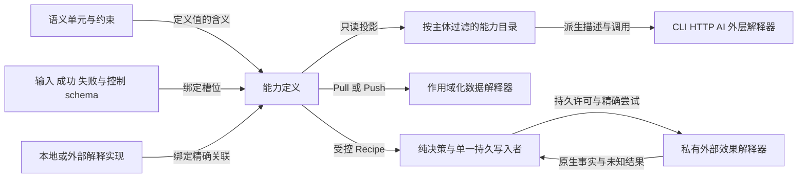
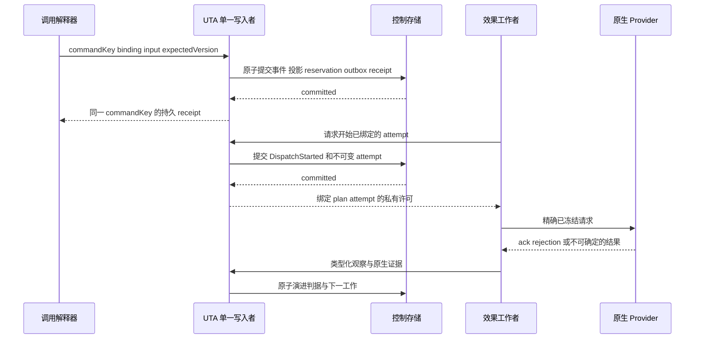
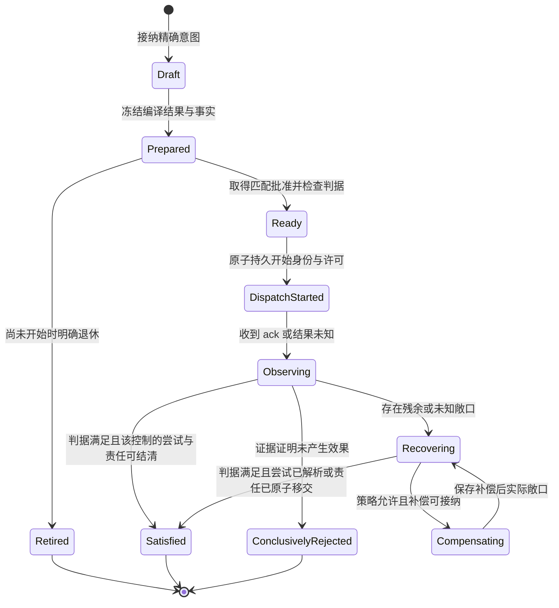
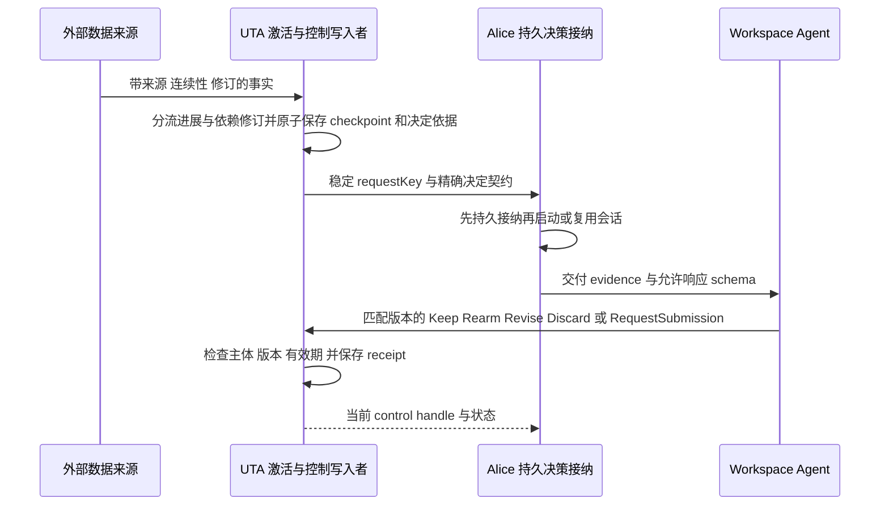
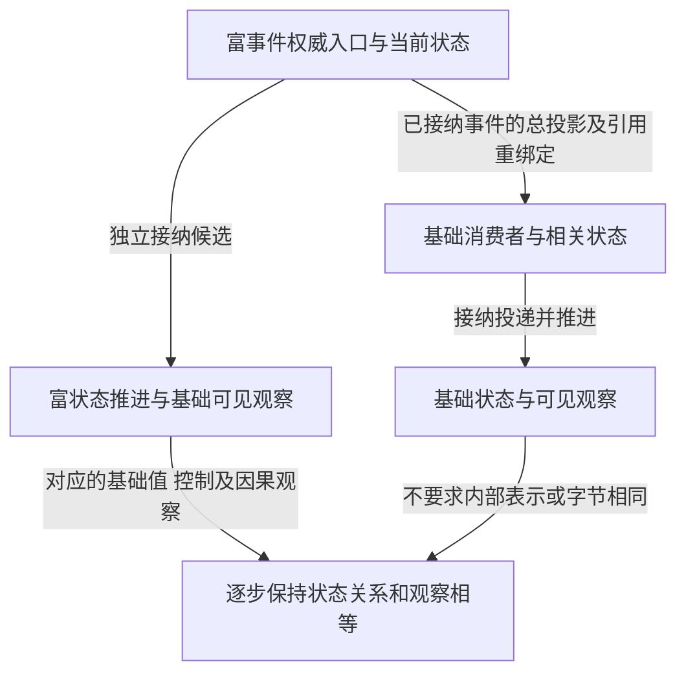

# UTA Capability Runtime 设计书

本文提出 UTA 的候选核心设计：目标抽象、函数与组合关系、解释器和持久控制边界。[旧能力详细承接](uta-capability-runtime-design/legacy-accommodation.md)提供现实契约与候选承接输入；[研究实践](uta-capability-runtime-design/research-practice.md)记录论证、反例及其证据边界。设计判断不等于维护者已接受，也不表示当前运行时已经迁移。

[初版架构](uta-effect-runtime-architecture.md)、[初版中文架构](uta-effect-runtime-architecture.zh-CN.md)、[初步源码映射](uta-effect-runtime-mapping/coverage.md)和[调整后的完整逐项调查](uta-effect-runtime-design/solutions/index.md)保留原有身份。逐项调查中的旧行为、候选方案、问题、评审与补充发现都是本设计的输入；其中的候选模型不因被保留而自动成为本设计的规则。本文使用独立路径，不接管已撤销总设计的历史章节编号。

<a id="design-methodology"></a>

## 设计方法论与边界：对齐原文

以下保留方法论与适用边界的两条完整对齐原文，作为后续设计与评审的首要阅读依据。原文中的会话措辞保持不变。

<details open>
<summary>方法论原文</summary>

<!-- aligned-response: 718dddd5 -->
你的方法论是：**允许抽象先行，但把抽象当作需要论证、可以修正的设计假设；围绕新 UTA 的预设场景和旧 UTA 的实际契约，用类型、组合与事件流逐步检验它，而不是直接把某一版模型实现出来。**

它不是“从旧代码归纳新系统”，也不是“先造一个万能模型，再把所有需求塞进去”。

## 1. 先有目标和候选设计，不要求第一稿已经容纳一切

新 UTA 有希望支持的使用方式、组合场景和扩展目标，所以可以先提出核心概念及其关系。

**不知道最终抽象是什么，不意味着不能提出初版抽象。** 设计就是在目标约束下提出表达方式，再发现它哪里不足。

因此，现存设计稿是你此前安排产生的阶段成果。它不一定正确，但包含已有的问题理解、目标场景、候选关系和取舍，不能因为还存在问题就把设计重新退回空白。

## 2. 新旧契约映射用于研究表达能力，不是给旧对象安排新位置

映射把现实能力带入设计讨论，但“每项都有一个对应名称”远远不够。

需要研究的是：

- 不同能力之间共同的行为结构是什么；
- 表面不同的能力能否由同一种结构实例化、组合出来；
- 哪些差异只是参数、值或业务函数不同；
- 哪些差异确实要求特有的描述和消费；
- 候选抽象是否因为某个场景而暴露了遗漏、过度约束或错误边界。

**共同点和差异要同时研究。** 既不能为统一而删掉差异，也不能把没有分析清楚的差异全部变成核心特判。

旧契约是其中一组研究材料；新 UTA 的预设场景同样参与这项研究，而且会提出旧系统根本没有的要求。

## 3. 用 FP 约束核心与业务特化的关系

你强调 FP，不是为了让稿子出现更多泛型、ADT 或 Effect 名词，而是希望在写生产代码之前，就形成良好的表达和组合习惯。

你给出的编程语言类比是关键：

> **通用核心与业务特例的关系，应当接近语言的表达规则与具体业务程序的关系。**

规则不必预先认识所有业务，业务却可以在规则内被描述、组合和解释。

所以类型不能只描述对象里有哪些字段，还要描述函数、构造、依赖、计算及其组合关系。特例可以作为具体计算和业务表达进入系统；不能每增加一个特例，就要求公共机制增加一个认识它的分支。

**要避免的是共同机制扩散成特判，不是禁止业务特化。**

## 4. 用事件流展开并检验动态语义

有了候选类型和组合关系，还必须说明它们如何发生作用：

- 计算怎样被解释，何处执行 IO；
- 结果怎样被观察和消费；
- 事件怎样参与后继计算、派生和组合；
- 状态在不同结果、顺序和时间条件下怎样演化；
- 哪些责任属于哪个限界上下文。

Provider 可以是实现不可知、契约明确的黑箱，不妨碍描述这些关系；具体载荷能够扩展，也不妨碍推演基础行为。

**事件流不是类型设计完成后的配图，而是继续发现、检验和修正类型与边界的设计手段。** FP 侧能解释计算，业务侧就应当能理解给定事件和状态之后的合法流向。

## 5. 归纳与演绎反复校正，而不是单向流水线

你既不是只做自下而上的归纳，也不是只做自上而下的演绎：

- 从目标提出候选抽象；
- 从已有能力与新场景分析共同结构和差异；
- 用抽象构造业务表达；
- 用事件流推演它；
- 表达不了、组合断裂或状态说不清时，回头修正相应假设。

这不是要求开头就证明全部正确，而是要求**每一轮设计都增加解释力，而不是只增加篇幅、映射数量和术语。**

## 现存设计稿在这个方法里的位置

它是**当前需要继续论证和推进的候选设计**，不是无需检验的权威，也不是可以忽略的旧材料。主设计书开头本就将目标抽象、组合语义、解释边界与旧能力承接放在同一份完整设计中（`docs/uta-capability-runtime-design.md:3`）。

我应该沿着已有设计的目的，辨明哪些关系成立、哪些缺乏推导、哪些需要修改，并说明修改依据。我此前一会儿把它固定成不再检验的前提，一会儿又把“存在预设抽象”本身判为错误，随后转向只提炼旧 UTA——这些都偏离了你的方法。

**你要的成果，是一套能解释为什么这样抽象、怎样容纳业务特化、如何组合并在时间中运行的核心设计；不是一份看起来覆盖全面的对象和协议目录。**
<!-- /aligned-response: 718dddd5 -->

</details>

<details open>
<summary>适用边界原文</summary>

<!-- aligned-response: 82958550 -->
**作为这次核心架构设计的方法，它是合理的，没有我之前归咎的方向性错误。但它不是自动保证设计正确的办法，需要守住几个边界。**

你已经说了“尽可能在写代码之前”“不扩散成特例不代表特例无法进入”，所以不能把你的方法曲解成“纯靠类型证明一切”或者“绝不允许修改核心”，再批评这些你没主张过的东西。

### 1. 类型关系成立，不等于业务语义成立

类型、组合律和契约能约束**已经被准确表达的性质**，不能替我们判断表达本身是否正确。

例如，如果把远端 ACK 定义成“交易完成”，类型可以闭合，事件流也可以画得自洽，但业务含义仍然错误。

所以需要分别检查：

- **表达是否成立**：类型关联、构造和组合是否合法；
- **表达是否正确**：它表达的是否真是目标业务的承诺、状态和后果。

这不要求展开 Provider 内部实现。要求的是正确规定黑箱边界上的契约，并区分“我们要求它保证什么”与“它实际能够保证什么”。

### 2. 共性必须分层，不能因为都能表达就认为应当统一

行情订阅和订单提交都是 IO，这个共同层成立；但不能因此推出它们应当共享同一套批准、补偿或持久化协议。

同样，“都能装进某个泛型”只能说明这个泛型能承载它们，不能独自证明某个领域抽象提取得恰当。

需要判断：**在哪一层共享构造、组合和消费规律，在哪一层保留不同的业务语义。**

你的“语言与业务程序”类比在这里很有价值，但也有边界：语言具有广泛表达能力，不意味着每个业务系统都值得发展成一套通用语言。UTA 的核心仍应由目标场景约束，不能为了理论上的通用性不断增加表达机制。

### 3. 场景与事件流能有力地证伪，但有限场景不能证明无限扩展

旧能力、新预设场景、异常时序，可以暴露候选抽象的缺陷；它们全部能表达，也不能直接推出未来任何业务都不需要调整核心。

更强的依据，是同时写清：

- 一个组合成立的前提；
- 它保留哪些性质；
- 哪些改变会超出这项保证；
- 扩展实现需要满足哪些契约。

**“目前这些例子能跑通”和“这条组合规律在给定条件下成立”，是不同强度的结论。** 后者不能只靠增加例子数量获得。

### 4. 需要有设计阶段的停止条件

这种方法允许不断发现更一般的结构，因此也存在持续抽象、迟迟不收敛的风险。

合理的停止条件不是“以后永远不改核心”，而是：

- 关键目标场景有清楚的表达方式；
- 已调查的旧能力有明确的保留、修正或特化解释；
- 关键组合、事件消费和状态转换能够推演；
- 重要的不确定性已被定位，知道哪些属于设计问题，哪些需要最小实验或实现阶段验证；
- 没有为了容纳当前场景而偷偷绕开公共契约。

这也意味着，少量代码实验可以用于回答具体不确定性，但不能反过来让实验容易实现的模型决定整个设计。

---

**所以我的判断是：你的方法论成立，风险在于共性提取失当、把类型自洽当成语义正确、把有限验证当成普遍证明，以及缺少收敛标准。**

这些是执行时必须检验的事项，不是推翻方法的理由。就这次工作而言，我有充分证据说明自己的分工和验收偏离了方法，没有依据把交付失败归因于你的方法论。
<!-- /aligned-response: 82958550 -->

</details>

## 阅读路径

| 章节 | 内容 |
|---|---|
| 1 | [设计目标与边界](#chapter-1) |
| 2 | [保留的初版关系与需要替换的旧边界](#chapter-2) |
| 3 | [核心概念及其关联](#a1) |
| 4 | [声明是类型、校验与发现的共同来源](#a2) |
| 5 | [组合代数](#a3) |
| 6 | [语义单元如何实例化](#chapter-6) |
| 7 | [Provider 解释、动态发现与 CLI](#chapter-7) |
| 8 | [Pull / Push 的交付与资源语义](#a4) |
| 9 | [纯决策、持久值与重新绑定](#a5) |
| 10 | [受控金融效果协议](#a6) |
| 11 | [外部激活与可恢复决策](#a7) |
| 12 | [模块归属、依赖方向与端口](#chapter-12) |
| 13 | [从同一契约构造能力](#chapter-13) |
| 14 | [单一权威迁移与旧能力承接](#a8) |
| 15 | [可证伪性与验收边界](#chapter-15) |
| 16 | [事件类型、限界上下文与动态语义](#event-flows)，配套[完整事件流册](uta-capability-runtime-design/event-flows.md) |

完整旧行为、候选判断与原始问题见保留的逐项调查；本书的具体承接判断见配套承接册。阅读顺序是抽象关系、组合与解释、持久控制，再到每项旧能力的切换。第16章与事件流册进一步检验这些关联在顺序、失败、修订和跨上下文交接中的动态语义。

<a id="chapter-1"></a>

## 1. 设计目标与边界

UTA 的扩展单位是 **schema-bound capability definition（绑定 schema 的能力定义）**。它把值的含义、输入、成功结果、预期失败、资源依赖、权限、交付方式与解释实现绑定成一个不可拆换的契约。Provider 注册的是这个完整关联，而不是一段动作字符串与一个返回 `unknown` 的函数。

这一关联使两件事同时成立：Provider 可以充分暴露各自独有的功能与参数；UTA 仍能决定一次调用应当如何验证、发现、执行、取消、持久化与恢复。统一的是约束关系，不是各家 SDK 的对象模型。

本设计作出以下选择：

| 问题 | 选择 | 约束结果 |
|---|---|---|
| 业务词汇如何扩展 | Provider 定义开放的能力与精确 schema | 新增能力不修改内核的全局业务 action union |
| 内核如何保持穷尽检查 | 控制协议使用有限 ADT | 新增控制状态必须更新所有转换，不能藏进 catch-all |
| 类型和描述如何一致 | 受限 schema 构造器同时产生 Zod 类型、可移植描述与校验绑定 | 不维护另一套 CLI 参数、结果接口或错误清单 |
| 如何复用 Order 等值 | schema 的积、和、约束及显式投影 | 不手写订单参数的笛卡尔积，不丢失原生字段 |
| 如何执行 | UTA 内用 Effect 的 A/E/R 与 Scope；外部用受约束解释器 | 不强制 Provider 使用 Effect、TypeScript 或同一进程 |
| 哪些操作是事务 | 只有需要受控外部写入的 Recipe 进入交易控制协议 | Candle、Instrument、News、NewsGroup 的普通读取不进入交易 WAL |
| 数据如何触发写入 | 显式 deferred invocation 关联证据、谓词、意图和处置策略 | 来源事实不是授权；ReturnToAgent 是可配置实例，不是全局默认 |
| 谁拥有运行状态 | UTA 单一控制写入者；Alice 拥有 Workspace 与决策会话 | 不在 Alice 重建 Broker 状态或通用工作流引擎 |

本设计不保证跨券商 ACID，不把 TypeScript 当恶意插件沙箱，不推断原生接口具有幂等、去重、完整查询或原子组合保证，也不把示例执行成功等同于产品实现完成。

本文的“原生证据”指具体 Provider、接口版本和账户环境能够支持的行为证据；主机类型检查和本地持久化不能替代它。

<a id="chapter-2"></a>

## 2. 保留的初版关系与需要替换的旧边界

初版的有效骨架是：纯 `Decision/Evolution` 决定状态转换；Effect 解释外部工作；持久日志、决策投影和 outbox 由单一写入者原子提交；Broker 结果有明确的观察与恢复语义；批准与补偿针对不可变计划。这些关系继续成立。初版的全局 `BrokerActionTypeMap` 和固定 `PreparedStep` 示例不再承担开放能力注册的职责。

当前代码已经有可复用的组合点，但关联在若干边界被擦除了：

- `packages/uta-protocol/src/types/broker.ts:477–620` 的 `IBroker<TMeta>` 主要只把 metadata 参数化，账户、查询与写入仍集中在宽接口；协议文件又依赖 IBKR 模型（同文件 `1–10`）。
- `services/uta/src/domain/trading/guards/guard-pipeline.ts:13–36` 已经是高阶函数，不能把旧系统描述成没有组合。问题在于组合输入是宽 `Operation`、输出是 `Promise<unknown>`，资源、错误和计划关联没有保留下来。
- `services/uta/src/domain/trading/UnifiedTradingAccount.ts:180–195` 的 dispatcher 只处理四种 Broker 写入，并非对完整 `Operation` 穷尽；`services/uta/src/domain/trading/git/interfaces.ts:77–81` 继续接受无关联的执行回调。
- `services/uta/src/domain/trading/git/TradingGit.ts:119–185` 在保存提交状态之前执行外部操作，异常可进入 rejected 表达。这个顺序不能区分“未发出”与“外部接受但本地未保存回执”。
- `src/domain/market-data/bars/types.ts:140–168` 已有窄 `UtaBarAccount` 结构端口；`src/domain/market-data/bars/bar-service.ts:237–274` 的历史行情调用不是交易提交。该方向保留，不能用一套订单事务模型覆盖数据读取。
- `src/server/cli.ts:225–235` 的现有 schema 导出允许不可表达类型降级，失败后保留空 schema。目标契约必须在载入时拒绝这种失真，而不是生成看似可调用的未知输入。

这些问题共同要求的是**跨计算保持关联**，不是更多统一对象。Instrument 的来源结果要能约束后继 Candle 读取；读取结果进入业务函数时不能失去单位、失败与来源；业务判断进入受控命令时又不能自带发送权。相同构造规则因此有用：作者组合的是带契约的计算及其消费者，而不是让核心逐个识别证券、新闻或某家 SDK。

实际来源选择也暴露了这种连续性的重要性：`src/tool/source-resolve.ts:33–59` 从候选保留 barId 和已知 assetClass，但没有保留候选 source kind；`bar-service.ts:377–387` 又用当前 `utaManager.has(sourceId)` 将其分类。UTA 来源消失且 assetClass 存在时可以进入 vendor 分支；这证明分支可达，不证明该 vendor 请求会成功。新设计保留“选择后固定来源”的契约，不能把当前查不到某来源当作它属于另一种来源的证据。

不同的消费后果决定了共同机制的边界。普通读取失败可以结束当前计算并保留已观察事实；纯风险判断先提出局部状态变化，整体接纳前不发布；可能已经发出的订单不能靠后继失败或函数退出回滚。因而共享类型关联、纯构造和作用域化解释，分别保留数据交付、本地原子决定与外部效果恢复协议。增加业务函数可以改变选择、判断、转换或策略；只有改变公共控制语义才需要改变核心协议。



因此迁移不是把宽 Broker 改名为 Capability。旧 facade、原生类型和执行回调需要拆成值、关联与解释边界；账户、精度、估值、历史与故障等可观察能力则必须在这些边界上完整保留。

<a id="a1"></a>

## 3. 核心概念及其关联

### 3.1 语义值与身份

`Unit<S>` 是一个具名语义单元：结构 schema `S`、含义、精确约束及其版本。它不持有连接、不执行 IO，也不包含调用生命周期。Order、Candle、Instrument、News、NewsGroup 是初始单元，不是封闭全集。

标识分为不同领域，不能因为编码都是字符串就互换：

| 标识 | 指向的对象 | 不等同于 |
|---|---|---|
| ProviderDefinition / ProviderInstance | 实现族 / 已配置实例 | 账户、连接会话 |
| SourceBinding / ConnectionGeneration | 事实来源 / 一次连接代际 | 接收顺序、授权主体 |
| AccountScope / SubAccount | 资产与权限作用域 | Instrument、Provider 的全部能力 |
| InstrumentRef | 来源内稳定标识及可核验解析关系 | 显示 symbol、跨来源自动等价 |
| Principal / Creator / Authorizer / Recipient | 调用者、作者、批准者、决策接收者 | 同一个人或会话的默认别名 |
| IntentRevision / CommandKey / AttemptId | 不可变意图版本、幂等命令、一次外部尝试 | 可复用的路径或客户端序号 |
| SourceEvent / EvidenceRevision | 原生事件或显式接收边界、证据版本 | 能证明远端去重的本地自增数 |

无法证明跨来源身份一致时，保存来源内标识和解析证据，不能补一个“统一 symbol”抹掉差异。

### 3.2 能力不是一个泛化函数

记 `Query<I,O,E,R,P>` 为一个 Pull 能力关联：输入、成功值、领域失败、Effect 服务要求、运行时权限要求。`Feed<I,O,E,R,P>` 是同样关联的 Push 能力。这里的类型参数是关系的简写，实施时由声明推导，不要求作者重复写五套泛型。

`Recipe<I,Prepared,Ack,Observation,E,R,P>` 是私有受控效果关联。它还有编译器、观察器、补偿协议、原生身份和成功判据的绑定。它不是可被 `invoke` 当成 Query 执行的对象。

`Definition` 保存关联，`Binding` 指向关联的具体版本，`Interpretation` 提供实现，`Program` 组合这些能力。目录只能包装完整关联，不能先擦除类型，再靠调用者断言把它拼回来。

`Program` 也可以包含普通的纯函数和高阶后继构造，不要求每个中间值都成为目录叶子。运行中的计算携带静态关联或已认证的动态关联；可公开发现的能力另须具有从同一声明派生的可移植契约。这个区分不允许出口另手写一份“看起来正确”的 schema，更不允许把任意闭包反射成完整说明。能力的公开形状、运行中的函数与持久编码是相关的三件事，不是同一个通用 DTO。

### 3.3 两种有限性

Provider 可以新增自己的 `OptionChain`、`FundingRate`、`OrderBook` 或原生订单条款。内核不需要理解所有业务字段，只需理解它们所属的控制协议。

相反，数据/金融业务调用的 `Pull | Push | Controlled`、决定的 `Accepted | Rejected`、流的 `Completed | Failed | Cancelled` 等协议选择是闭合的。它们分别约束对应的解释面，不声称所有配置、capture或simulator管理命令都属于交易Recipe。管理面按第7.4节保留各owner的独立声明及提交契约；不能把管理写伪装成Query或借管理命令绕过交易批准。增加一种协议选择会改变调度或安全语义，必须使相关解释器穷尽更新，不能以任意字符串插件绕过控制。

<a id="a2"></a>

## 4. 声明是类型、校验与发现的共同来源

### 4.1 可移植 schema 的构造边界

公共输入、输出、失败和持久值使用同一个受限编码 profile：JSON Schema Draft 2020-12；引用可在声明包内完整解析；对象字段精确；数值为有限 JSON 数；金融 decimal 使用带单位的已验证字符串；时间值声明时区与含义。函数、SDK 实例、`Date` 对象、连接、Scope、秘密句柄不属于公共编码。

Zod 4 是本仓库的 schema/type-inference 实现基础。目标不是接受任意 `ZodType` 后尝试导出，而是提供结构构造器：标量、literal、enum、精确 record、array、积与带判别字段的和。构造结果同时携带本地 parser、描述和规范编码器。不可表达的 schema 在注册边界失败，不输出 `{}`，不允许 `unrepresentable: 'any'`。

额外语义以 `Constraint<Value, Configuration, Failure>` 绑定：

| 成员 | 责任 |
|---|---|
| identity、version、artifactDigest | 指向确定的语义实现，不只是一句描述 |
| configurationSchema、failureSchema | 精确关联配置与失败 |
| evaluate(value, configuration) | 确定性校验，不读取时钟、网络或账户状态 |
| valueProjection | 约束应用于哪个已声明值，扩展后如何投影 |
| descriptor | 从上述绑定导出，不允许单独填写一份回调的“说明” |

例如“limit 定价必须携带 limitPrice”必须由同一构造器生成字段依赖描述和 evaluator 绑定。换掉 `.superRefine` 回调却不更新声明摘要不是合法修订。扩展对象必须把原约束沿基础投影提升到扩展值；只展开 `.shape` 会丢失对象约束，因此不能作为通用扩展实现。

外部 Provider 可使用可移植的约束表达式或已安装、版本匹配的 evaluator。加载端缺少 evaluator 时，该契约不可调用；不能宣称已通过语义验证。摘要保证选中了哪份实现，不证明任意实现正确，更不证明其他语言的回调等价。需要读取市场或账户才能判断的条件属于 prepare/decision，不冒充纯 schema 校验。

**共同来源不是语义反射。** 能由结构表达的关系，直接进入同一积、和及约束构造。例如某个 Provider 的 pricing 选择可由 market 分支与必须携带 price 的 limit 分支构成，parser 和公开输入描述同时从该结构产生，不另写一份字段依赖清单。这不是所有 Provider 的全局定价政策。

不能由结构表达的纯规则，则由一个具名 Constraint 定义同时持有配置、失败、值投影、作者说明及实现绑定；能力引用这一个定义，不在 validator 与 CLI 出口分别重写规则。说明可以由作者写在该定义中，不能声称从任意回调自动推导出了业务含义。安装产物/实现身份及显式配置使加载端能够选择同一实现；摘要识别代码与配置，不证明纯度、跨语言等价或业务正确性。构造必须区分这些保证，不能将它们都称为“schema 自动派生”。

### 4.2 静态已知与运行时发现

在 TypeScript 内，`Input<typeof definition>`、`Success<typeof definition>`、`Failure<typeof definition>` 与服务要求从定义推导。已知 Candle 扩展可以让调用者精确读取 `vwap`，缺少字段、错误 variant 或依赖都会形成静态错误。

运行时载入一份外部 Provider schema，不会在已经编译的 TypeScript 中创造新 union 成员。此时使用 **BoundDocument**：经过解析、且绑定完整能力身份和 schema 槽位的编码文档。

```text
certify(binding, slot, bytes): Result<BoundDocument<binding, slot>, ContractFailure>
consume(binding, slot, document): Result<EncodedValueOfThatSlot, BindingFailure>
project(projectionBinding, document): Result<KnownUnit, ProjectionFailure>
```

这些是目标接口的关系记法，不是当前仓库已有导出。`binding` 包含 ProviderInstance、CapabilityId、Revision、ContractDigest；`slot` 区分 input、success、failure、prepared、ack、observation 等。构造器在对应槽位解析；消解器再次核对关联后才交给同一能力的解释器。两个 `{id:string}` 既可能是 Instrument，也可能是 OrderAck，结构相同不产生替换权。

动态文档可以原样以声明结构展示给 AI。要进入已知业务代码，必须通过声明了来源版本、单位和信息损失的投影；不能 `as RichCandle`。递归 JSON 类型只描述外部语法，不能成为内部订单、账户或错误的通用字典。

### 4.3 修订、可用性与历史解析

结构支持、当前可用、调用授权是三件事：不支持的叶子不存在；支持但断线的叶子可以被描述并返回精确 unavailable 状态；调用者无发现权限的叶子被过滤。参数中的不支持 variant 从该叶子的 schema 删除，不必删除仍支持其他 variant 的叶子。

新调用使用当前 admission catalog，必须匹配修订和摘要。目录变化会使旧的新调用绑定过期，但不得切断历史观察：已经 DispatchStarted 的计划通过独立的 historical interpretation resolver 找回原版本观察器。它可以保留旧版恢复能力而不重新对外开放旧版下单。

<a id="a3"></a>

## 5. 组合代数

算子只在能够保留关联时成立。以下签名使用类型关系记法；同名 TypeScript API 的具体机械可行性由可执行样例检验，不能把关系记法当成已实现库。

签名中的 `×` 表示必须同时存在的积，`+` 表示值或失败的选择；用于服务要求时表示依赖联合，`∪` 表示权限要求的集合并。这些记号不要求实现引入同名运行时容器。

### 5.1 Schema 积、和与扩展

```text
extend(Unit<B>, DisjointSchema<X>): ExtendedUnit<B × X, projectBase>
sum(tag, Unit<A>, Unit<B>): Unit<A + B>
constrain(Unit<A>, Constraint<A,C,E>, C): Unit<A subject to constraint>
```

`extend` 要求字段不相交，或由调用者明确选择一个保留的扩展命名空间。冲突字段在静态已知时编译失败，在动态构造时注册失败；不允许后值覆盖前值。基础投影必须总定义，保留原字段值与原约束。对于相容、不相交且约束绑定相同的扩展，分组不改变最终语义；这不意味着具有不同字段归属或原生效果的 Provider 可以任意交换。

约束保持有正面的构造：设基础值为 B，扩展值为 B × X，基础投影为 pi。对基础约束 C 及配置 c，扩展后的校验调用同一 `C.evaluate(pi(value), c)`；其描述保留 C 的身份、配置与失败关联，并由扩展构造关联这条输入投影。它不是另写一个“看起来相同”的扩展校验器。新增的跨 B/X 规则可以作为另一项约束加入，但不替换原 C。只展开字段 shape 既没有构造这条校验，也没有证明它被保留。

`sum` 表达真正的选择，例如 quantity 与 notional；`extend` 表达同时存在的条款。不能把三种 size、四种 pricing、五种 session 手写成六十种订单，也不能把所有字段都设成 optional 留给字符串错误处理。

### 5.2 输入适配与输出投影

```text
adaptInput(Query<I,O,E,R,P>, Adapter<J,I,F>): Query<J,O,E + F,R,P>
projectOutput(Query<I,O,E,R,P>, Projection<O,V,F>): Query<I,V,E + F,R,P>
```

适配器和投影是有版本、输入/结果/失败 schema 的纯转换。修改单位、时区、数量或货币属于显式转换；它与丢掉展示字段不是同一种操作。投影声明被丢弃的信息，并携带源标识、coverage 和 finality；不能把 Partial 变成 Complete，把 provisional 变成 closed，或把经估算的值标成原生证据。

对 Feed 应用同一值投影，不得丢弃 gap、correction 或终止语义。对 Controlled 的输入进行适配，需要在准备计划时冻结转换身份与结果；不能把已有外部效果投影成普通 Query。失败通道和权限要求只会保留或显式增加，不能被映射操作悄悄消去。

### 5.3 绑定实现、资源与权限

本地 handler 的有效形状为 `Input -> Effect<Success, Failure, RequiredServices>`；Push 为 `Input -> Stream<Frame, Failure, RequiredServices>`。定义时校验成功与失败 schema，构造资源时使用 Scope，不能用 `Promise<unknown>` 擦除边界。

```text
provide(Query<I,O,E,R + S,P>, Layer<S,L,R0>): Query<I,O,E + L,R + R0,P>
authorize(principal, binding, scope, policyRevision): Result<PermissionWitness, AuthorizationFailure>
```

`provide` 只消解服务要求，权限 `P` 不变。权限 witness 绑定主体、能力、范围和当前策略；它不能从 Context 中“存在一个 BrokerClient”推导出来。读取权限和数据 entitlement 也要检查，但不因此获得交易批准流程。权限撤销或范围改变必须在实际受控边界复核，不能把过期发现结果当成许可。

Layer/Scope/Queue/STM 处理运行中的资源、并发和退出；它们不是批准记录或持久 outbox。进程死后 Scope 不存在，持久计划仍有其独立权威。

### 5.4 查询和流组合

```text
flatMap(Query<I,A,E1,R1,P1>, A -> Query<I,B,E2,R2,P2>)
  : Query<I,B,E1 + E2,R1 + R2,P1 ∪ P2>
combine(Query<I,A,E1,R1,P1>, Query<I,B,E2,R2,P2>, JoinPolicy<F>)
  : Query<I,Joined<A,B>,E1 + E2 + F,R1 + R2,P1 ∪ P2>
```

这里 `k : A -> Query<I,B,E2,R2,P2>` 是后继**构造函数**：前段成功以后，它利用 A 构造后段，后段继续消费同一次程序的 I。构造自身不读取网络、时钟或秘密；若选择需要查询目录或额外事实，那项 IO 必须显式成为计算的一步。解释器执行构造出的计算，失败则按声明短路。`flatMap` 的联合描述前后两段可能要求什么，不表示两段已经执行，也不表示后段已获准。

**自描述的范围。** 公开的组合能力必须约束 k 的余域：可以是几个已知定义的选择、一个带参数的声明族，或选择后仍保留精确 binding/slot 的动态关联。稳定描述可以说明这种参数关系，不要求预先知道实际 Instrument 值，也不要求有限枚举全部叶子。类型、校验和描述仍消费同一组 Unit、schema、后继关系及版本化构造声明；不从任意回调源码推断业务语义，不另抄最终结果接口。内部仅有普通函数的程序可以执行，但不能在没有这项声明关联时冒充已经可发现的公共能力。

静态已知 k 的余域时，组合器由前后定义推导成功、失败和要求；不同后继结果要么形成明确的和，要么经已声明投影进入共同 B。运行时才知道输出 schema 时，稳定的公开结果可以是依所选 binding 认证的 `BoundDocument`，失败也保持对应的失败槽位及调用阶段。要无新增失败地提供已知 CommonCandle，须有选中单元的总基础投影；另行声明的可失败转换也能产生已知成功类型，但必须保留转换失败和信息损失，不能称为透明总投影。没有这两种合法转换时保持动态结果，不能补造共同字段。关联可以保存在静态类型、调用上下文或句柄中，不要求每个纯业务值附加完整 wire envelope。

**要求、许可和资源获取。** R 是 Effect 的静态服务要求；若后继的静态环境是一个联合，它不会因最后只选择一个分支而自动消失。提供一个惰性的、精确类型的资源获取服务，可以让未选中的原生连接不打开，但仍须满足该服务自身的 R。已安装解释器可以封装它负责的原生依赖；动态选择则保留完整的解释关联及失败，不能用返回裸 JSON 的 service locator 假装依赖已被证明消解。

P 可以描述依赖输入、来源或 scope 的要求关系。每个实际叶子在解释前依据选中关联计算并验证当前权限，组合节点不得把子要求改成一个任意的外层权限字符串。要求的并集不是授权的并集：普通顺序读取允许前段成功而后段被拒绝；需要“开始前所有成员均可获准”的业务必须另声明该前置政策。主体有 B、没有 C 权限，而实际只选 B，是区分两种政策的场景；不能从 `P1 ∪ P2` 自动选择其一。存在服务或发现成功也都不是 permission witness。

**描述何时对外可见由消费需要决定。** 对“按已提供窗口读取选中来源 Candle”的程序，调用者可以只消费最终精确结果或关联失败，内部选择无需另开一次公共 discover。若 AI 必须先看到所选叶子的额外输入 schema、费用或权限范围，才能构造读取请求，则先公开返回已选择关联，再让它发起后继调用。两种程序使用相同绑定规则；区别是调用者是否需要在后继 IO 前参与构造，不是动态 schema 必然强迫所有程序拆成两次调用。

**顺序失败不制造回滚。** 前段 Q0 已经执行而 k 的构造、授权或后继读取失败时，整体可以返回相应失败；不能说 Q0 从未发生，也不能隐式重试或静默切换来源。是否公开中间值、保留 Partial 或持久捕获，由成功/失败及证据契约决定；普通 `flatMap` 不因此保存所有读取的 WAL。`combine` 同样声明部分失败策略、来源和一致性窗口，联合结果不是声称原子拍摄的账户快照。

流组合还需声明 ordering、buffer bound、overflow、replay 和 cancel ownership。按到达时间合并不能冒充交易所全序。丢弃更新必须通过 gap 或可验证的最新值策略表达；不能静默改变统计语义。一个订阅者释放，只释放其拥有的引用；最后一个拥有者退出才关闭共享连接。

<a id="declaration-construction"></a>

#### 5.4.1 固定后继怎样从共同操作数构造

先给出后继定义已知、请求值依赖前段结果的一种正面构造。它复用 Query、输入适配和 schema 组合，不要求新的工作流语言：

```text
D0 : Query<I,A,E0,R0,P0>
D1 : Query<J,B,E1,R1,P1>
M  : Adapter<I × A,J,Em>
```

作者提供 D0、D1 及 M 的一个声明关联。M 持有纯输入转换、显式配置、输入/结果/失败关联和版本化实现身份；其结果关联指向 D1 的输入，而不只是另一个字段同形的 J。组合构造器只接收这三个操作数，不再另收一个可自由返回其他 Query 的 k 或另一份最终结果 schema。

| 消费者 | 从共同操作数产生的内容 |
|---|---|
| 类型与边界 parser | 输入取 D0 的 I，成功取 D1 的 B；失败保持 E0、Em、E1 及发生阶段/原槽位关联。M 的结果进入 D1 的输入校验 |
| 公开描述 | 引用 D0、D1、M 的关联与修订，计算上述输入/结果/失败和组合关系；不维护独立 CLI 参数表 |
| 解释闭包 | 调用保存的 D0；成功后以 I 与 A 运行保存的 M；仅在 M 成功后调用保存的 D1 |
| 服务与权限 | 静态 R 为 R0 与 R1 的联合；纯 M 不凭空增加服务或权限。描述保留 P0 和 M 成功产生 J 后适用的 P1，实际叶子仍分别验证当前许可 |

可以直接由构造器生成这一闭包，不必先建立一个通用 AST。共同操作数排除了“描述引用 D1，却由另一个自由 k 选择 D2”的结构性错配；它不证明 D0、M、D1 的业务代码正确。只限制 callback 的返回类型，而把描述放在另一条可独立维护的路径上，没有给出这项构造。

同来源 Instrument/Candle 是该构造的一个实例。外层输入可以是选择请求与 WindowInput 的积；D0 通过声明的选择政策产生一个来源内 InstrumentRef，或返回相应失败；M 从这个引用和外层 WindowInput 构造 D1 的请求。双方引用同一个 WindowInput 声明，不另抄窗口约束。非平凡的单位或窗口变换另用明确的 Adapter，并保留转换失败；组合不承诺自动求出任意业务函数的输入前像。

同源性还需要共享的来源实例/原生标识命名空间关系，以及后继输入边界对所选引用与 D1 接受范围的核对。两个操作数保存在同一个对象、或两个值有相同 TS 字段，都不是这项证明。Instrument 与 Candle 的 CapabilityId 不同，也不能要求其完整 binding 相等。来源当前失去支持或权限是 D1 解释时的失败；纯 M 不能在没有额外输入事实时自行查询并判定可用性。

修改共享 Unit 后，引用它的页/输入构造、parser、类型和描述消费同一新声明；handler 仍须真正产生满足它的值，不会由 schema 凭空计算出新增字段。替换同型 M 实现则可能不改变结构类型，却改变业务行为：必须改变对应实现绑定/摘要，不能以保留一个版本字符串证明没有漂移。这区分了结构派生、实现关联和语义正确性，而不是把三者交给一句“保持一致”。

若最终业务计算同时需要 A 与 B，后继闭包必须保留前段 A，而不是只留下 D1 的 B。设版本化纯转换 F 消费 `I × A × B` 并产生 V 或 Ef，其输入声明直接引用这三个原槽位，成功/失败由 F 的同一声明给出。解释依次执行 D0、M、D1，最后以原 I、已得 A 和 B 调用保存的 F；公开成功取 V，失败保留 E0、Em、E1、Ef。这个构造只是值依赖的函数组合，不要求把中间值注册为新能力，也不要求复制 A 的 DTO。F 若需要新的 IO，就不再是纯投影，应把那项计算及其要求显式接入。

本构造不覆盖前段结果选择不同后继定义的所有情况。那需要保留所选定义及输入构造的关联；认证动态结果本身不会生成所选定义所需的输入。

#### 5.4.2 动态后继怎样取得输入，而不是只认证输出

运行时选择得到的是具体定义 d 及其 binding，不是一个只供展示的 schema。能够在一次调用内完成后继的程序，还必须具有一项适用于 d 的输入构造关系：它消费原始输入、前段结果及实际配置，产生 d 的 input，或返回构造阶段的失败。该关系可以绑定一个精确定义，也可以属于经过兼容性检查的参数化声明族；不要求给每个实例复制一个 adapter。

声明者因此需要提供选择政策、后继的允许范围、输入构造及其实现关联。解释器保存选中的 d，以适用的构造产生请求，在 d 的 input 槽位解析，再核对当前许可并调用 d 的解释实现。成功与领域失败按同一个 d 的对应槽位认证。选择失败、没有适用构造、构造自身失败、输入违约和解释失败保留阶段差异；没有 adapter 时不能在失败中伪造一个 adapter 版本，也不能把主机构造失败塞进尚未调用的 d 的领域失败。

例如外层已经取得同源 Instrument、窗口与 interval，而新发现的 Candle 叶子还要求 `session`。该 schema 能检查一个已给出的 session，却不能替业务选择它。这里有三种由消费需要决定的合法契约：

| 外层承诺 | 缺少 session 时的构造与消费 |
|---|---|
| 一次调用，已绑定选择政策 | adapter 消费真实配置或已声明的政策结果，构造完整请求；政策与实现身份进入关联，不由字段默认值偷偷代替 |
| 一次调用，允许构造失败 | 返回带所选 binding 的主机构造失败，不执行后继；外层成功仍可保持所选结果的动态关联 |
| 调用者拥有这项选择 | 第一阶段返回实际 binding 与输入描述；调用者提供请求，第二阶段复核 binding、input 与当前许可后执行 |

动态 schema 本身不强迫 staged selection，也不赋予主机替调用者决定业务输入的权力。需要读取目录、账户或政策服务才能完成选择时，这项读取是显式计算，保留自己的失败和服务要求；纯 Adapter 只消费已经提供的事实。

**修订怎样传播。** 固定引用旧 binding 的新调用不会静默改用新定义；它按目录规则得到过期绑定。重新选择后，旧输入构造若不能产生新增必填字段，程序显式失败、取得新的合法构造，或按已声明的两阶段契约交回调用者。稳定声明族可以容纳新的相容成员，其外层结构未必改变，但本次选择的 binding、描述和构造适用性必须反映真实成员。若改变的是外层自己的承诺，则修订外层定义。不能把“信封结构没变”说成返回的关联没有变化。

**资源关联也有正面的安装边界。** 对外部进程，主机静态依赖的是已有精确类型的 transport、目录、权限及 Scope 服务；被选 Provider 的原生资源由它的安装与解释协议负责，运行时描述中的服务名称不会在 TypeScript 中凭空生成 Context 类型。对本地定义，安装者要么明确提供原生 R 后导出闭合的解释入口，要么让尚未提供的 R 继续出现在消费程序中。两者都保留初始化、可用性与调用失败，不能靠读取依赖字符串或把 handler 塞进无类型 resolver 声称 R 已消解。服务已提供也仍不等于 P 已授权。

输出进入已知 Candle 消费函数时，仍需要第4.2节的总投影或带失败转换。输入构造、输出认证与语义投影是三条分别有前提的关系；补齐其中一条不会自动证明另外两条。现有外国进程样例仅展示显式调用输入与结果认证，不充当这套动态输入构造已经实现的证据。

#### 5.4.3 有状态数据算子怎样构造

filter、window、join 不是仅给结果泛型换一个名字。每个算子 O 的操作数包括已绑定的子计算、精确输入/输出单元、纯业务函数、状态初值、来源/派生身份关系，以及 coverage、修订、缺侧、失败和关闭政策。由这同一关联构造纯推进 `step_O(state, input) = Next(state, emissions) | Failed(reason)`；input 是按子 binding 解码的帧，或声明的边界/时间事实。计时器、订阅与输出交付由解释器负责，纯 step 不偷读时钟或网络。emissions 可以为空、多项数据或声明的控制结果；schema 能校验它们，却不能替作者选择 predicate、窗口函数、join key 或 aggregate。

| 操作数与状态 | 具体构造和消费 | 修订、缺口与终止 |
|---|---|---|
| filter 的 predicate、成员判定与输出身份关联 | 解码值交给 predicate；命中才派生输出，保留其来源引用和足够的修订依赖 | 未命中变命中产生新 item；命中变未命中撤回已有输出；持续命中修订已有输出。被过滤不等于来源没有 gap |
| window 的分配函数、成员/累积状态、结果函数与关闭政策 | 每个输入按声明进入窗口；纯 reducer 形成结果；watermark、snapshot barrier 或显式 deadline 事实交给关闭决定 | 修订可能移动成员、重算或使结果失效；没有可逆 reducer 不强造 inverse。deadline 只支持声明的 Partial；窗口关闭不结束外层调用 |
| join 的精确键/时间关系、候选及输出对身份、缺侧/基数政策 | 子值进入相应候选关系；满足 join 关系时，由绑定的结果函数构造积值及双侧 lineage | 缺 FX/账户等成员不补零；成员键或币种改变时撤回/失效旧匹配，再按新关系构造；时间不相容保留 Partial/待定/Unavailable 等声明结果 |
| merge 的带来源和、成员位置和生命周期 | 交错交付各子结果，保留各源合法顺序；子终态进入成员状态，由外层政策决定后继 | 不制造跨源全序；部分结果政策显式保留失败成员，关闭的成员不复活；外层只选择一次终态 |

这四种计算共享声明、纯状态推进与解释边界，不共享业务判断。filter/window/join 的状态表示只需充分支持其承诺：可保留必要成员，也可消费来源提供的完整 replacement 或合法重建证据；证据不足时显式失效/Unavailable，不强制保存所有历史、不凭空假定 replay。修订关系按来源契约解释，不假定 revision 全序或把 generation 当业务修订。

**有限构造。** Candle c1.close=99、c2.close=101，过滤条件 close≥100：先只输出 c2；可信 Correction 把 c1 改为100，产生此前不存在的派生 item，而非指向不存在 target 的 Correction；把 c2 改为99，产生针对已有输出的 Retraction。业务若改为 vwap≥100，必须消费 rich Candle 的相应单元，这不是基础过滤的透明替换。

News 的两源窗口可采用独立失败的 merge：F2 失败形成成员失败证据，F1 继续；声明的 processing deadline 关闭一个窗口，输出带 F2 缺口的 Partial，不伪造来源 finality，也不关闭仍存活的 F1 attachment。外层尚开放时，late policy 可形成该窗口的新 revision；外层终止后不能再向这次 invocation 发 Correction。持久投影可由仍有效的 owner 或新的调用继续修订同一稳定投影身份，旧 delivery 生命周期不因此复活。

账户/FX join 是同一构造的特化：100 USD 与80 EUR 在合法的 EUR/USD=1.1 观察下产生188 USD；FX修订为1.12时得到189.6 USD，旧输出保留修订关系。缺FX不产生零估值，账户币种改为JPY也不能继续匹配EUR/USD；输入构造按新币种发起显式后继读取。该值只有在声明的质量、范围和时间关系成立时有效，不声称跨账户原子快照或交易授权。

解释器只释放 O 拥有的 attachment；共享原生资源按剩余 owner 管理。恢复所需 checkpoint 关联子输入位置、来源代际、O修订、输出提交位置及支持修订的状态/重建证据。这里复用已有 schema 与流/资源规则，不要求新增公共 DSL 或让所有普通流持久化。

**持续输入与后继读取的闭环。** 有些step需要新的事实才能继续：它可返回声明的读取工作及等待状态，而非在纯函数里做IO。该工作与对外emissions分开，由§5.4.1/2的后继构造产生精确Query binding/input及自己的失败、R/P；解释器执行Query，将关联结果或失败作为后继输入回注同一operator。工作记录关联发起时的输入revision、scope、pair和本次请求身份；只有仍与当前等待关系相容的结果才能推进当前输出。普通运行状态不因此必须进交易WAL；若承诺持久恢复，则checkpoint/工作接纳须保留这条因果关系。

例如存活账户Feed把币种从EUR修订为JPY：step使旧EUR估值匹配失效，依据新币种、asOf及source policy构造JPY/USD读取并进入等待。解释器返回已绑定的FX结果，step复核pair、输入依赖和请求身份后重建估值；迟到的旧EUR/USD结果不能推进JPY分支，可依声明保留为历史事实。缺输入构造、权限或FX证据各保留自己的失败，不自动重读全部账户、创建交易意图或更换projection owner。这是已有值依赖构造与流状态消费的组合，不是一项新的公共workflow机制。

### 5.5 受控效果与延后激活

```text
withTransaction(PrivateRecipe<Association>, TransactionPolicy, AdmissionContract)
  : Controlled<Association, AdmissionContract>
deferUntil(NotStartedIntentRevision<Association>, SourceBinding<S>,
           Predicate<S,Checkpoint,Evidence>, ContinuationPolicy<Association,Evidence>)
  : DeferredInvocation<Association,S,Checkpoint,Evidence>
```

`withTransaction` 不接受已经可调用的 Query。Recipe 的 prepare 可以取得只读事实并纯编译，但 native dispatch 只存在于私有解释器；公开结果是持久 receipt/handle，而不是绕过控制的执行函数。通过把一个会下单的 handler 标成 Pull 来规避控制违反 Provider 合约；静态类型不是对恶意代码的隔离机制。

`Controlled` 没有擦除 Recipe：它从 Association 派生提交输入、`Receipt<Binding>`、控制查询/观察结果以及 prepare、dispatch、observe、compensation 的各阶段失败 schema。`AdmissionContract` 另行声明接纳需要的服务、权限与失败。安装解释器可以消解 native 服务要求，但不能消去执行权限；发送时仍按冻结范围与当前策略取得许可。receipt 是原关联的持久句柄，不是所有叶子共用、无法追溯结果类型的通用成功对象。

`deferUntil` 只关联一个尚未开始发送的意图版本与一个激活拥有者。多个数据源在该拥有者内部组合，不注册多个可重复消费同一意图的等待任务。它不是 Agent 工作流图；外部 Agent 的推理、项目、任务分解仍由 Workspace 负责。

后继函数也可以构造一个 Controlled **接纳命令**。在解释层，关系是：

```text
query : I -> Effect<A, Eq, Rq>
buildAdmission : (I, A) -> Result<J, Ec>
admit : J -> Effect<Receipt<Association>, Ea, Ra>
sequenceInterpretations : I -> Effect<Receipt<Association>, Eq + Ec + Ea, Rq + Ra>
```

这些是应用程序的函数关系，不是新增公共 SDK 签名；query 与 admit 各自实施所声明的权限边界。普通 Effect 组合保留结果、错误和服务要求，不能替 UTA 推导业务上的只读分类。这个程序执行了受控接纳，不能发布为 read-only Query；第5.4节的 Query 组合仍要求后继是 Query。公共化混合操作时必须另有真实的接纳/结果及效果声明，不能只换一个输出 schema。

因此可以共享高阶顺序构造，而不共享外部交易原子性。receipt 证明相应本地接纳，不证明 native start、ack 或成交，也不让先前读取可回滚。错误边界是直接调用私有 native dispatch、将发送 handler 伪装为 Pull，或用 receipt 冒充原生事实，不是 `flatMap` 本身。长时间等待与跨进程恢复继续使用明确的 deferred/control 关联，不把这个运行中的组合闭包自动变成持久工作流。

### 5.6 不变量与拒绝条件

| 组合 | 必须保留 | 必须拒绝的反例 |
|---|---|---|
| 扩展 Order | 原字段、约束、基础投影 | 覆盖 account/side；展开 shape 丢掉 refinement |
| Candle 投影 | 来源、单位、coverage、finality、修订关系 | 省略 vwap 后把 provisional 标成 closed |
| 注入 SDK 服务 | A/E 关联与权限要求 | 有连接就视为有交易许可 |
| 注册动态能力 | 完整 binding 和所有 schema 槽位 | 同形 JSON 在 input 与 ack 间交换 |
| 包装受控效果 | prepare 与 dispatch 分离 | 先调用原 handler，后登记事务 |
| 组合订阅 | 明确顺序、边界、资源拥有者 | 子订阅 cancel 关闭其他订阅的连接 |
| 延后执行 | 意图版本、checkpoint、策略、授权边界 | 命中行情条件即直接发送订单 |

这些不是额外业务流程，而是每个新能力都必须保持的代数边界。

### 5.7 组合保证由什么推导，而不是由多少例子支持

本章的共同结构是**带声明的计算与声明相容的消费者**，不是一个容纳所有业务的结果容器。一个构造成立须同时给出三类前提：操作数各自履行原契约；连接处的值/失败/范围关联合法；算子明确保留或改变哪些可观察行为。类型只保证其中已经编码的关系，不能证明 Provider 说了真话或业务函数选择了正确政策。

可以对有限构造作结构归纳，而不要求运行时保存通用程序 AST：

| 构造情形 | 归纳步骤与保证 |
|---|---|
| 已安装叶子 | 定义、输入/成功/失败槽位与解释入口是同一关联；在安装/边界校验和实现履约前提下，消费结果属于该叶子，不产生其他叶子的许可 |
| 输入适配与输出投影 | 纯转换的输入引用原槽位，成功进入目标槽位，失败保留转换阶段。因转换不执行额外 IO，叶子调用没有被复制；单位、信息损失和业务含义仍由转换契约负责 |
| 固定后继 | 前段失败则无后段调用；前段成功得到 A，M 成功得到合法 J 才调用保存的 D1。由两叶子及 M 的前提，得到正确的最终成功关联或带阶段的失败；P 在实际叶子复核，R 不因前段成功自动消失 |
| 动态后继 | 先取得具体 d，再检查适用输入构造，并在同一消解作用域内调用和认证 d。归纳假设针对被选 d 的完整关联，不针对一个想象的静态全集；缺构造/解释器时保留失败，不补造结果 |
| 读取积与流组合 | 每个成员的值、失败与来源关联先成立；组合消费自己的 join/ordering/terminal 政策后产生新关联。只能继承成员真实提供的质量，再显式降低或增加组合失败，不能由积类型推出同一时刻或共同完整性 |
| 受控接纳及延后激活 | 复用输入构造，但进入各自的持久决定/解释协议；不能把 Query 的归纳结论跨用成外部写入原子性。其提交与恢复保持义务分别见第9–11章 |

以叶子为起点，每次只由上述构造产生新关联，可以归纳得到任意有限、合法构造的**关联保持**。它不是“所有未来业务都可表达”的证明：新的业务可能要求尚不存在的控制或观察方式；那时须论证新增构造，而不是让未知 variant 穿过旧控制机。

**相同结果类型不意味着计算可互换。** 比较 `f` 与 `g` 前须约定观察面：值、阶段失败、叶子调用次序、来源、权限拒绝、终态与资源释放中的哪些属于承诺。纯 identity 投影可保持业务值，却仍可能形成新的派生 binding；若目录身份可观察，就不能称整个能力完全相同。顺序后继只有在构造纯、相同输入被保留、叶子执行次序及其 Scope/失败消费不变时，重新分组才保持相应执行观察；并行读取、提前授权、扩大捕获失败或改变取消范围均超出这个保证。稳定实现身份用于重绑同一函数，不证明两个函数相等。

业务特化的合法空间由此明确：作者可以改变 M/F、谓词、join、风险政策或成功判据，并得到新行为；共享构造继续保持类型、边界与权威，不要求新行为与旧行为透明。需要透明替换时另满足第16.5节的条件律，不能把开放扩展与任意替换混成一项保证。

<a id="chapter-6"></a>

## 6. 语义单元如何实例化

### 6.1 Order：条款组合而非原生对象交集

Order 描述不可变交易意图。共同部分包括 InstrumentRef、方向与意图标识；账户范围属于调用上下文或明确的输入范围。size、pricing、time、relationships、protection 等条款使用精确 schema 组合。

- size 的 quantity 与 notional 是有判别字段的选择；单位、最小变动、舍入及折算证据不能丢失。
- pricing 的 market/limit/stop 等选择携带各自必要字段；Provider 只声明支持的分支。
- parent/OCA/bracket/OTO、post-only、reduce-only、session/TIF、触发条件与 venue 参数由 Provider 的精确扩展声明承载。不是所有 Provider 都支持这些条款，也不是出现字段就证明组原子性。
- Instrument、size 与 pricing 的约束可组合；真正互斥或依赖条件由绑定约束表达。需要行情才能把 notional 换成数量的步骤属于 prepare，必须冻结价格、精度、结果和编译器身份。

IBKR 的可变 Order 类、Longbridge 的 Decimal/枚举、CCXT 的参数以及 LeverUp 的签名结构留在各自解释器中。公开扩展保留可表达的原生能力，但不把 SDK 类变成跨进程协议。

### 6.2 Candle：共同含义与精确扩展

共同 Candle 结构包括来源与 InstrumentRef、interval、时间范围、OHLC、volume 单位、会话/时区/调整方式、finality 与 revision。价格不是全局正数公理，是否允许负值由具体产品和 Provider 约束决定。缺失 volume 不填零，未知 finality 不填 closed。

Provider 可以增加 `vwap`、tradeCount、原生时间戳、成交额、买卖侧统计或精确 native event 标识。扩展字段有自己的 schema 和含义，不放进任意 `metadata`。Pull 历史页与 Push 更新使用同一个扩展单元；两者携带不同的覆盖与生命周期控制。

### 6.3 Instrument：标识、目录和可交易性分离

InstrumentRef 指向来源内对象；解析结果携带资产类别、币种、交易场所、合约乘数、到期、交易日历与来源证据。搜索命中不等于账户有交易权限，也不等于已选定唯一合约。显示名称、缓存 catalog 与原生资格检查分别归属查询、缓存和 prepare。

跨 Provider 合并需要显式 identity mapping 及证据。不知道汇率、乘数、日历或唯一合约时，返回相应未知/歧义，不能靠默认值让下单继续。

### 6.4 News 与 NewsGroup

News 包含来源、发布/观察时间、内容或内容引用、事件身份，以及能由来源支持的修订、纠正或撤回关系。当前 RSS 存储按 GUID/link 去重，不能仅因新模型支持 correction 就宣称旧来源会报告修订。

NewsGroup 是有身份、有选择或成员语义的新闻集合，附带 as-of/revision/coverage。它可以由多个 News 查询纯组合，也可以由独立 Provider 提供；组成员改变不等于一组交易同时成功。内容体量由分页、引用与保留策略处理，不由交易日志无限保存。

例如业务程序分别读取两个已声明来源，按固定窗口和 `allow partial` 政策构造 NewsGroup，再把成员事实交给一个纯判断函数。某个来源失败时，组保留成功成员、缺失来源和 Partial；它不能通过拼接数组获得同一时刻的完整成员证明。Partial 也不等于所有判断都不可决定：已有一个匹配成员足以支持“至少存在一个匹配”；已有一个反例也可否定“所有成员都匹配”。只有依赖尚未观察部分的结论才继续不确定。哪些观察足以决定结果属于业务函数的语义，不由核心内置新闻关键词或一条“Partial 必拒”规则。

独立 Provider 返回的 group 与上述组合共享“精确 Query 结果供纯函数消费”的关系，却不自动等价。需要对外消费其成员时，还须有成员身份/选择规则、revision、coverage 和到 News 单元的合法读取或投影关系。只声明一个 groupId 或分类标签，不足以让调用者逐成员套用 News 谓词；Provider 可以合法只提供组级事实，其业务函数就消费该组级契约。

旧 RSS 路径提供了具体反例：`src/domain/news/collector/rss.ts:77–101` 对单 feed 失败告警后继续，只返回累计计数；`src/domain/news/store.ts:161–180,281–299` 遇到已见 GUID/link 去重键便丢弃后续记录，即使内容改变也不产生修订事件；`:227–255` 查询保留缓冲并按发布时间截取。因此接入契约不能将这一路径宣称为实时完整全源集合、可靠 correction 流或具有全局顺序。发布时间早于窗口末尾的文章可以晚到；来源名与成员选择必须保留，`asOf` 本身不补造 watermark。修正位于来源适配/覆盖承诺，而非新增一套 NewsGroup 交易协议。

Candle、Instrument、News 与 NewsGroup 可以作为谓词输入。被用于交易决策时，只把确切选中的证据和必要 checkpoint 纳入控制权威，而不是把整个数据域改成订单事务。

<a id="chapter-7"></a>

## 7. Provider 解释、动态发现与 CLI

### 7.1 固定的是描述协议，不是业务 API 清单

每个叶子的描述必须能独立说明以下内容：

| 描述部分 | 精确内容 |
|---|---|
| binding | Provider 实例、CapabilityId、修订、完整 contract digest |
| semantics | 输入/输出单元、单位、范围、约束与所需解释版本 |
| schemas | input、success、domain-failure、delivery-control；受控能力的附加槽位 |
| delivery | Pull / Push / Controlled 及各自的生命周期参数 |
| requirements | 服务需求描述、权限/entitlement 范围；两者不可互代 |
| availability | ready / unavailable 等明确状态及原因，不混同结构支持 |
| interpretation | 本地或外部协议版本、实现身份；不含秘密 |
| evidence limits | coverage、finality、lookup、replay、idempotency、compensation 等声明能力与证据等级 |

CLI 从过滤后的最终目录派生命名空间、帮助、输入 schema、成功和错误形状。没有 cancel 的 Provider 不出现 cancel；没有 options 的 Provider 不出现空 options 命名空间；支持 limit 不支持 stop 的叶子只有 limit 输入分支。不能生成永远返回“not supported”的占位命令。

### 7.2 外层调用契约

公开控制信封使用有限协议动作，而叶子内容由 binding 决定：

| 协议动作 | 输入关联 | 输出关联 |
|---|---|---|
| discover / describe | principal、catalog revision、筛选范围 | 已授权的描述与当前 binding |
| invoke | request identity、binding、input document、scope | success 或 typed failure；Controlled 返回 receipt |
| subscribe | request identity、binding、input document、flow policy | 有拥有者的流及终止结果 |
| credit / cancel | subscription identity、generation、额度或取消原因 | 流控制确认，不代表取消订单 |
| status / respond | 已持久化的控制句柄及响应 schema | 对该句柄的版本化决定与 receipt |
| manage / management-status | owner管理关联、command key、精确输入、scope与expected revision | owner定义的结果/receipt及阶段失败；不返回交易grant，不混入业务Query |

CLI 可以把叶子渲染成自然命令层级，但 canonical 调用仍携带 binding 和精确 JSON 输入。复杂联合输入不强行拆成一套模糊 flags。帮助、AI 描述、HTTP 和本地 CLI 不另建 `CLI_EXPORTS` 业务列表。

失败区分契约载入、输入校验、过期绑定、授权、能力不可用、领域失败、输出违约、传输失败与解释器缺陷。领域失败不是 stderr 字符串；诊断日志不混入机器可读 stdout。受控调用发生传输失败时，通过 command key 查询 receipt，不能因为没有收到响应就生成新的意图。

### 7.3 外部语言与进程

外部 Provider 使用版本化 handshake，声明 schema profile、实现身份和支持的 delivery/control 协议，再提供 discover、调用、订阅与取消。请求和结果都绑定 request、capability、revision、slot；帧有大小与缓冲上限。未知版本、缺少 evaluator、非有限值、输出 schema 违约使受影响能力不可用或结束本次调用，不能降级为自由 JSON。

REST、Java Gateway、Python SDK、WebSocket、ABI/EIP-712 或本地 C++ 库的内部实现由 Provider 选择。UTA 不要求它们继承同一个类或使用同一种语言。需要凭据的子进程属于受信任 UTA 执行树，可由 UTA 按最小范围注入；只有 UTA 的控制写入者拥有批准、尝试和 outbox 权威。这个边界不是对恶意第三方可执行文件的安全沙箱。

包载入失败只影响依赖该包的能力。无券商配置时，Alice 的 Workspace、非交易数据与 Chat 继续工作；不能让一个原生 SDK 加载失败拖垮全部数据能力。

### 7.4 按 owner 分属的管理声明

Mock fixture刺激、显式证据capture及配置apply是有写入后果的命令，既不是只读Query，也不因此需要订单Prepared、交易批准和补偿。它们各自由已有owner协议解释：Mock state、Observation capture、Alice配置及UTA lifecycle。host可聚合这些管理描述供discover/describe与CLI展示，但不因聚合取得写权。目录显式标识业务调用面或管理面，不能把任意管理handler安装成Pull。

每个管理family由同一安装关联持有owner身份、协议/修订、目标scope、精确输入/成功/预期失败schema、R/P及版本条件，并关联其纯decide/evolve、声明工作与owner解释入口。构造器消费这一关联，派生管理描述、帮助、parser、owner路由和结果/receipt消费者；不是再维护一张可任意搭配的action→callback导出表。各owner可有自己的有限command ADT，新增业务参数仍由该family声明及消费者承接，不让公共目录枚举所有管理动作。共享的是声明和解释的关联规则，不是统一管理事务机。

调用者先取得获准的管理关联，再构造它的精确输入。实际管理入口复核当前binding、owner、scope及权限，纯决定在给定state/facts/time上提出候选；只有相应owner按自身提交协议接纳后才返回成功receipt。需要后继IO时先产生工作，解释后的结果回到该owner决定；它不隐含跨owner原子性。成功、等待、工作失败和传输丢失后的查询/重试由该family精确声明，不能统一成HTTP成功即全部完成。解消内部R也不删除P。

| 已有管理实例 | 同一声明怎样被消费 | 权威边界 |
|---|---|---|
| Mock stimulus | simulator安装声明生成精确刺激输入；决定消费fixture state、scope及expected revision；fixture writer提交后回AdminReceipt，再派生Mock facts | 只改变模拟环境，不产生UTA金融receipt/grant；未安装simulator声明时不出现该管理入口 |
| 显式capture/同步 | Observation owner先接纳request，解释已绑定Query取得事实，再决定并提交selected evidence及capture/sync结果 | 不将live读取全写WAL，不把捕获证据当交易批准；请求接纳与最终Captured不同 |
| 配置apply | Alice配置owner接纳revision，UTA lifecycle解释取得RuntimeBindingEvidence，再由其提交apply结果 | Alice配置保存不等于UTA已apply；秘密只在受信解释边界解引用，不进入公共载荷 |

普通Effect程序可以显式顺序调用这些入口，但Query组合不得隐藏管理写；若公开组合，须保留其管理协议身份、失败、权限和owner提交条件。当前设计只承诺这些已研究管理family的构造，不据此宣称任意未来Provider非金融写都无需扩展协议。需要新的控制承诺时，应研究该协议及其与现有组合的关系，而不是添加一个无语义的“任意命令”逃生口。

<a id="a4"></a>

## 8. Pull / Push 的交付与资源语义

### 8.1 同一值，不同生命周期

Pull 返回有限的结果：data、查询范围、as-of、coverage 和必要的 continuation。`Complete` 必须针对声明范围成立；返回空数组不是没有仓位或订单的充分证据。部分分页、超时、权限裁剪和查询窗口都要留在 coverage 中。

公共 `Coverage` 是 `Complete | Partial | Unavailable`：前两者绑定已回答的范围和缺口，Unavailable 绑定不可回答的原因。Unknown 价格、Estimated FX、EmptyBook 和未知 finality 是各自 payload 的质量或结果状态，不再增设同义的全局 Coverage variant。明确请求的 capture 或订单事实同步可以持久化选中观测；它们不因此取得原生交易写入或批准权限。

Push 是有拥有者的作用域化流。其数据帧可以承载与 Pull 完全相同的 Unit，但控制帧必须区分：

```text
Nonterminal = Started | Data | Correction | Retraction | Gap | SnapshotEnd | ItemFailure
Terminal = Completed | Failed | Cancelled
```

`ItemFailure` 只用于协议明确允许继续的数据项失败；输出解析失败、进程死亡等不能先作为普通 error 发出，再补一个 Completed。`SnapshotEnd` 可以结束初始历史段，而不结束后续实时更新订阅。IBKR 原生的 historicalDataEnd 与 historicalDataUpdate 正是需要这种区分的现有接口。

终止由流解释器拥有；在本地拥有者仍运行时，一次逻辑生命周期只能选择一个 Terminal。进程崩溃或管道断开时，消费者可能只观察到 EOF/transport loss，不能保证收到最后一帧。退出码、传输状态和已发帧共同决定结果。

### 8.2 连续性与反压

顺序只在声明的来源、分区和 generation 内成立。重连必须改变 generation 或提供可核验续传证明；本地计数不能伪装成交易所事件 ID。来源不提供 replay 时，断连产生 Gap；后续数据不自动填补缺口。

对可拉取来源，credit 限制未消费数据；对不可反压的外部推送，适配器选择有界缓冲加明确 overflow/gap/终止策略。最新值合并必须由单元语义允许，并保留变化边界；订单回执和选中证据不能被行情 coalescing 策略吞掉。

多路组合保持各来源 coverage 和 finality。不能因为所有流仍在线就声称组合数据是同一个时点的原子快照。

### 8.3 取消、共享与保留

订阅拥有者负责 Scope 与释放。Ctrl-C 取消当前 CLI 订阅，不等于取消已提交订单、丢弃 deferred intent 或撤销持久控制句柄。共享连接由声明的资源层管理引用；消费者不直接关闭其他消费者的资源。

普通行情不写交易 WAL。持久控制只保存被选择的证据，以及足以证明谓词边沿、continuity 和修订的最小 checkpoint。数据归档是独立能力，可按自己的留存规则实现，不借用账户锁。边沿谓词的非命中 baseline 仍可能是必要持久状态；“只保存命中”不是通用优化。

<a id="a5"></a>

## 9. 纯决策、持久值与重新绑定

### 9.1 Decision 与 Evolution

内核保留初版的关系：`decide(state, command, facts, now)` 返回 Rejected，或 Accepted 的候选事件与外部工作描述；`evolve(state, event)` 产生下一状态。这里纯函数的 Accepted 表示该决定在给定前提下通过，不是持久接纳 receipt。它们不能启动 Promise、调用 SDK、读取全局时钟或修改共享 guard 对象。时间、价格、余额、权限策略与原生观察先在边界形成有来源的事实，再进入决定。

同一原子复合决定从状态 s0 开始：前一步提出事件后，用同一个纯 `evolve` 计算推测状态 s1，下一步在 s1 上判断，依此推进。最后一次判断通过，也只得到候选写集；writer 复核版本和失效条件、原子提交全部事件、决定性投影、必要的工作/outbox 与 receipt 后，才发布已经接纳的 DomainEvent。任一步拒绝或提交失败，推测状态和该写集都不成为权威。故 `evolve` 既可用于推测，也可用于已接纳历史的重建；关键是权威边界，不是两套 reducer。独立批次另保留逐项结果，不能事后称为全有或全无。

旧 `CooldownGuard` 在 check 中修改 Map，后续 guard 拒绝仍影响下一次检查，展示的是消费时机与共享状态问题，不是否定高阶短路。纯规则把判断、失败与需要消费的业务状态作为声明关联交给控制决定；它不自行提交。批准时消费 cooldown 与 `DispatchStarted` 时消费是两种不同业务政策：前者可以有意保留后来未发出工作的窗口，后者可以把已开始但结果未知的尝试计入窗口。它们都能使用相同纯决定与原子 writer；配置、消费触点、适用性、重启保留与释放条件须由规则明确，不由 FP、某个默认阈值或通用内核替业务选择。

这层关系只用于需要持久控制的决定，不强迫普通 Candle 页也进入 writer。一次决定可以产生零个或多个声明工作；ReturnToAgent 的一次选中只产生对应决定请求，不推出所有计算必须恰好生成一个 outbox。IO 结果以后作为新事实进入下一次决定，而不是持久事件 replay 再执行一遍原 IO。

运行中的 Effect 是工作说明与资源解释；持久的 Plan 是编码值。两者不是同一种可序列化对象。

### 9.2 计划保存的关联

每个受控叶子定义 `Intent / Prepared / Dispatch / Ack / Observation / Recovery / Compensation` 的精确 schema 槽位及版本关联。不同能力可以有完全不同的 Prepared 内容；通用存储保留 binding、slot 与编码 payload，而不把它们压进一个业务字段大并集。

准备后的计划至少绑定：

| 关联 | 需要持久保存的内容 |
|---|---|
| 身份 | 意图修订、Provider 实例、账户/子账户范围、能力 binding |
| 解释 | 编译器、原生 codec、观察器、补偿器、predicate、criterion 与尝试解析实现所需版本及 artifact identity |
| 输入与推导 | 精确原始输入、纯转换身份、数量/价格/舍入结果、所用来源事实 |
| 语义 | 成功判据、尝试解析与责任结案条件、期限、前置条件、允许补偿等级、交易策略 |
| 授权 | 批准者、策略版本、作用域、有效期，以及明确尚未批准状态 |
| 原生恢复 | client/native lookup 身份、已冻结 nonce/salt/deadline、精确请求表示 |
| 控制 | 预期状态版本、reservation、attempt、decision/outbox 关联 |

这里的“至少”表示协议各槽位的职责，不能实现成所有字段 optional 的单个接口。未批准计划、批准计划、未开始尝试、已开始尝试和恢复所有权是不同状态；状态转换构造下一种合法记录。

上表描述整个持久控制记录的关联，不是把所有记录塞进同一 PreparedPlan。准备值一旦形成便保持不可变；实际批准、attempt 与后续观察以关联记录追加，其摘要边界见 9.4。

### 9.3 编码、保密与恢复

持久记录不能含函数、SDK 对象、Layer 或 Scope。补偿函数也不例外：保存补偿配方、依据与实现身份；运行时从已安装解释器重新绑定。

请求恢复表示与审计展示分开。恢复需要的精确原生请求可使用已验证编码或密封 payload；秘密不进入普通日志、AI 描述和 Git 投影。一个删掉签名字段的 redacted request 不能作为重放请求。不能在恢复时重新获取当前价格、生成新 salt 或重新舍入数量，却继续使用原批准身份。

历史 resolver 按完整 binding 和实现身份加载旧解释器：

- **尚未 DispatchStarted**：原计划可被原子退休；新的 prepare 产生新修订，重新检查事实与批准。不是用新代码悄悄改写旧计划。
- **已经 DispatchStarted 或 Unknown**：保留原请求、身份与责任。旧解释器不可用时进入 RecoveryRequired；不能退回“重新准备”或新请求。
- **仅目录变更**：旧观察器仍可用于恢复，但不能把旧叶子重新加入新调用目录。

Schema 版本可读不等于执行语义相同。数据迁移、解释器升级和授权更新各有自己的版本边界。

### 9.4 单一写入者的原子提交

目标权威存储采用 UTA 自有的嵌入式 SQLite，不要求用户运行数据库服务。它保留在同一个 `OPENALICE_HOME` 的 UTA 数据边界内；Alice 的 Workspace、Inbox、配置等仍遵循各自现有文件权威。引入这一权威存储属于后续实施迁移，不代表当前文件状态已经切换。

一个 writer transaction 完成以下不可分割的决定：读取命令 key 与预期版本、验证当前授权与 reservation、运行纯决定、追加事件、更新决策投影、写入待解释工作/outbox，并保存返回 receipt。返回成功必须在 commit 之后。数据库写失败不能变成已接纳。



相同 command key 与相同规范编码语义返回原 receipt；相同 key 与不同 binding、范围或输入是冲突。不能只比较展示 JSON 的字段顺序，也不能在去重记录过早清理后重新接纳同一个 key。保留期限若受限，必须成为公开且可执行的幂等边界。

规范编码选择 [RFC 8785 JCS](https://www.rfc-editor.org/rfc/rfc8785)：UTF-8 字节、递归对象键排序、保留数组顺序和原 Unicode 字符串。输入拒绝重复 JSON key、非有限数及无效 Unicode；金融高精度值不经 IEEE-754 number 中转。金额字符串先经过对应 Unit 的已声明编码器；若 scale 或原生文本具有意义，保持区别，不把 `1.0` 与 `1` 擅自视为同一请求。

摘要使用完整 SHA-256，不截短。输入为固定域前缀、零分隔字节与 JCS 字节：能力使用 `uta-capability-contract/v1`，命令使用 `uta-command/v1`，计划使用 `uta-prepared-plan/v1`，批准使用 `uta-approval/v1`，证据使用 `uta-evidence/v1`。投影有以下固定边界：

| 摘要对象 | 包含的语义字段 |
|---|---|
| CapabilityContract | 全部 schema 槽位、语义/约束/单位及实现身份、delivery、服务要求与权限要求 |
| Command | binding、principal/范围、意图修订、预期版本、已编码输入及调用时授权声明 |
| PreparedPlan | 批准前的不可变准备值、原生身份、编译器、范围、成功判据、要求满足的授权/风险策略与期限 |
| ApprovalBinding | 被批准的 PlanDigest、批准者、实际策略版本、批准范围与期限；作为独立记录，不回填进 PlanDigest |
| Evidence | 来源、generation、原生身份或明确接收边界、修订关系与 payload |

各投影不含自己的 digest 字段或传输 request id；展示顺序、临时可用状态、访问令牌不进入语义投影。表示无序集合的声明字段先按声明规定的稳定身份排序；普通输入数组不排序。实际批准只引用已形成的 PlanDigest，计划不能反过来包含该 ApprovalBinding，否则会产生循环摘要或使批准改变被批准的计划。

`Start` 与普通接纳 receipt 有额外边界：只有本次成功完成未开始至 DispatchStarted 转换的执行拥有者，获得进程内、绑定 plan/attempt、一次消费的 DispatchGrant。私有 dispatch 边界消费后立即使其失效；该 grant 不序列化、不由公开查询返回。重复 Start 返回 `AlreadyStarted` 与证据句柄，绝不重放 grant。commit 后丢失 grant/响应，也转入观察；不能用“同 key 返回相同 receipt”再次取得发送权。此规则限制主机重复发送，不替代原生幂等。

### 9.5 数据组织与投影

持久权威至少区分 command receipts、intent revisions、prepared plans、attempts、native observations、reservations、deferred checkpoints、decision controls 与 outboxes。唯一性约束承担命令去重、一个意图版本一个激活拥有者、attempt 身份和响应消费的原子约束。

查询/Git/历史 UI 是权威事件的可重建投影。Git commit 不是下单前提，文件写入成功也不是原生请求成功。投影延迟可以报告 read-model lag；不能因投影失败重发订单。对批准、reservation、计划状态或成功判据有影响的投影必须与权威事件同事务更新，不能当成最终一致缓存。

<a id="a6"></a>

## 10. 受控金融效果协议

### 10.1 从 Recipe 到公开能力

一个 Recipe 关联以下操作，但只在 UTA 私有安装边界出现：

```text
prepare(A.Intent, A.ReadFacts): Result<A.Prepared, A.PrepareFailure>
start(A.Prepared, DispatchGrant<A.Binding,A.Plan,A.Attempt>)
  : Effect<A.AckOrUnknown, A.DispatchFailure, A.DispatchServices>
observe(A.Prepared, A.AttemptEvidence)
  : Effect<A.Observation, A.ObserveFailure, A.ObserveServices>
decideCriterion(A.Prepared, A.ObservationHistory): A.CriterionDecision
decideResolution(A.Prepared, A.AttemptEvidence, A.ObservationHistory)
  : A.ResolutionDecision
planCompensation(A.Prepared, A.ExposureEvidence, A.Policy)
  : Result<A.CompensationPlan, A.CompensationFailure>
```

`prepare` 的环境读取先产生 ReadFacts，再交给纯编译部分。`start` 不能被公共 CLI、HTTP 或 Query invoker 获取。`withTransaction` 安装的是提交意图、取得 receipt 和查询控制状态的公开能力；不是把原生 handler 加一层命名包装。

这里的 `A` 是同一 RecipeAssociation；每个点号成员由该定义的 schema/服务/权限关联投影，不是调用者自由填入的泛型。read-facts 获取、prepare、dispatch、observe、compensate 各有其服务与失败；公开控制结果保留这些阶段的区分。接纳成功只能证明 intent 已持久保存，后续领域失败从绑定的 control query/stream 返回，不能被通用 AdmissionFailure 吞掉。

权限有两层：一般调用权限证明主体可访问该能力与范围；交易批准证明特定计划、判据、期限和风险被授权。数据 entitlement 不是交易批准，来源事件不是任何一种权限。委托自动执行可以成为明确的授权策略，但必须绑定范围、版本、期限和风险约束，不能由“命中了规则”推导。

<a id="controlled-construction"></a>

#### 10.1.1 同一个关联怎样生成控制消费者

`withTransaction(A, policy, admission)` 保存的操作数就是私有 A、控制政策和接纳契约，不另接收一份可以任意搭配的 action/payload map。A 持有各槽位声明、转换与原生解释实现、业务判据和解析原生尝试的关系。公共机制由这些操作数作有限的积与和构造：

| 产生的边界 | 共同构造与实际消费者 |
|---|---|
| 提交与 receipt | 提交的协议身份字段与 A.Intent 组成输入；parser 引用 A.Intent，接纳失败来自 admission。writer 保存该意图修订后才产生绑定 A 的 receipt，不能把后续 prepare/dispatch 失败塞进已成功的接纳结果 |
| 持久事件与计划 | 有限控制信封关联 A.binding、scope、意图/计划/attempt 身份；需要 payload 的事件引用相应 A 槽位。Prepared 编码与编译器身份来自 A，不另造一个全业务 Prepared 并集 |
| 状态、观察与阶段失败 | 按内核阶段构造合法的结果分支，其中原生 ack、observation、判据证据和失败引用 A 的对应槽位。尚未开始的分支没有虚构 attempt；已开始分支不能遗漏尝试解析与恢复责任 |
| 运行中的消费者 | 生成的 prepare、observe、criterion、resolution 闭包调用保存的 A 函数，并使用同一 A 的 parser/codec。私有 start 闭包另要求 writer 发出的精确一次 grant；公开 receipt/status 不能反向取出它 |

因此统一的是外层控制形状、关联检查和提交规律，业务函数仍解释本叶子的 Prepared/Observation。新原生条款进入 A 的声明与函数，派生消费者随之改变；不是要求核心添加一个认识该条款的 switch。AdmissionContract 的服务/失败与 A 的后续阶段也不混为一套自由泛型。

重启后不存在原来的闭包。历史 resolver 先按记录中的完整 binding、实现身份与槽位找回 A，再用 A 的 codec 检查所存 Prepared 和观察，最后重建消费这些值的观察、criterion 与 resolution 函数。静态已知 A 的调用者取得其精确结果；运行时才知道 A 的通用调用者保留绑定槽位的文档，在同一解析作用域内消费或经合法投影进入已知单元，不能把某个历史 A 断言成当前 A。

历史解释器缺失时，存储仍可保留原编码和不敏感的控制身份，但不能因此宣称已经取得可交给业务函数的值。已开始的工作保持 RecoveryRequired；当前版本不得重新编译、重算数量或重新发送。仅有可读 schema 也不等于旧 criterion/resolution 实现可用。历史观察入口可以继续存在而不重新开放旧版接纳和 start。

### 10.2 准备、批准与状态演进

控制阶段是状态代数，不是一个随意拼接 flags 的对象：



此图描述内核阶段。具体 Recipe 的 observation 仍由自身 schema 定义。`acknowledged`、`working`、部分成交、成交、撤单确认、替换与敞口恢复不可互换。提交成功的 receipt 不宣称订单成交；撤单接口返回成功也不证明没有已成交仓位。

**业务判据与控制结案是两个消费结果。** `decideCriterion` 回答目标是否被所选证据满足；`decideResolution` 按 A 声明的原生关联与证据条件回答尝试结果是否已解析。内核还要核对本控制拥有的未决工作、reservation 和恢复责任。只有目标满足，而且这些责任已按冻结策略结清或已原子移交给明确的持久恢复拥有者，才可走到图中的终态 Satisfied。移交保留原 attempt 的 Unknown、风险和关联，不把它记作已成交，也不释放仍由恢复方承担的约束。

例如初始长仓为10，准备减4，重启后同范围的可信新观察为6。A 成交4、另一参与者未交易，与 A 未成交、另一参与者减4，可以产生同一观察。若冻结判据是“当前长仓不高于6”，它可以满足；若是“证据证明 A 减少至少4”，尚不能满足。前一种情况下也必须继续解析 A：它仍可能在观察之后产生效果。公共状态因此可以同时报告业务判据满足和 attempt 待恢复；不能用一项成功谓词、schema 通过或关联摘要把后者消去。

这不要求所有 Close 使用同一种判据，也不要求所有业务持仓归零才能结案。它要求保留本次效果的因果与责任边界：当前数据值不是原生执行归因，业务目标满足不是重发许可，后来的 ack 通道损失也不能推翻已经由充分证据成立的结果。批次和补偿按各成员的这两项结果消费，不能只聚合 criterion 的布尔值。

批准冻结的不是一句“允许交易”，而是计划摘要、授权主体、范围、成功判据、容许补偿、时限和策略版本。prepare 之后的实质修改形成新意图/计划修订，旧批准不能沿用。发送前对明确可变的前置条件复核；变化违反批准范围则停止，而不是偷偷修改请求使其通过。

### 10.3 尝试、租约与 Unknown

`DispatchStarted` 必须先于原生写入持久化。它证明 UTA 已允许一次精确尝试，不证明包已经离开进程。若进程在这一边界后丢失，宁可保留可能已经发送的 Unknown，也不能假设未发出。

调度 lease 只分配当前工作，不赋予新一次外部尝试。未开始任务可以在复核后回收；已开始任务的 lease 到期只能安排观察与恢复。即使目录已经移除该能力，原 attempt 的身份仍然有效。

主机只能保证自己不盲目创建第二次尝试，不能从本地锁推出远端恰好一次执行。旧 sender 可能在失联后继续完成发送；一次查不到订单也可能早于其到达。允许 resend 必须有更强证据：可信未发送证明、作用域完整的原生否定且发送窗口已关闭，或经验证的原生幂等/去重/栅栏契约。没有证据时继续保留恢复拥有者和风险，不把超时改写成 rejected。

### 10.4 批次与补偿

| 策略 | 本地含义 | 不保证 |
|---|---|---|
| IndependentBatch | 每个成员独立 receipt、判据与结果 | 全部原子成功 |
| AllOrCompensate | 接纳前检查允许的补偿等级；失败后按实际敞口决定补偿 | 时间倒流、费用归零、原成交被撤销 |
| VenueNativeAtomic | 仅在该 Provider/作用域/操作组合有证据时委托原生原子语义 | 其他 venue 或相似字段也原子 |

补偿等级沿用初版：Exact、StateRestoring、Economic、None。Exact 是确切逆操作的证据承诺；StateRestoring 恢复指定状态但历史已发生；Economic 只恢复经济敞口并保留滑点、费用与其他残余；None 不应被组合器包装成可回滚。

补偿本身也是受控 Recipe，有自己的批准边界、attempt、Unknown 与观察。不能把一次反向下单当作必然成功的清理函数。组合计划接纳时就明确可接受等级，不等失败后临时把 Exact 降成 Economic。

**补偿目标和输入的构造。** `A.CompensationPlan` 不是已经准备好的 `C.Prepared`，也不是一张任意command对象。若目标C固定，补偿声明关联§5.4.1式的输入适配器，消费A的Prepared、ExposureEvidence、Policy所产生的计划及显式配置，构造精确C.Intent或构造失败。若目标C需动态选择，则按§5.4.2同时声明允许的目标关联、选择政策与适用的输入构造；所选C的新增必填参数不能由schema猜出。需要更多事实时先描述显式读取，缺合法构造或补偿等级证据时返回对应失败/不可用，不发送。

writer接纳的是绑定所选C的精确新意图；C再从自身声明取得ReadFacts、prepare、许可/批准、criterion、resolution及历史恢复消费者，不继承A的批准、Prepared或发送grant。保留A的敞口/责任和C的因果引用，使C的观察能推进原补偿责任；C自身若失败或Unknown，仍由其独立attempt及owner处理。这复用已有输入构造与Controlled关系，不为补偿再造一套执行器。

**异构保证如何被组政策消费。** 等级标签须关联它保证的目标、作用域、证据及允许残余；只有在同一目标和证据域内，才能使用已经证明的蕴含关系，不能跨成员取字符串min/max作为组准入。组声明同时保存每个required member的保证要求与实际可用claim、输入构造、组目标/结果函数、Unknown政策及释放/移交关系。`bindGroupPolicy`消费这些关联：逐成员核对目标和证据相容，再核对组函数所需的单位、scope、时间和成员投影能否构造；缺保证、缺构造或不允许的未知分支返回typed policy failure，不降级后继续。writer冻结本次选择、依据和policy revision。这里的准入证据证明可用能力及保证前提，不要求发送前就拥有未来成交；失败后规划补偿还须读取实际ExposureEvidence并重验前提。

A的Exact保证覆盖A指定状态，B只有不能恢复其指定状态的Economic保证时，要求逐成员StateRestoring的组在B处拒绝；若另一个明确组目标只要求带单位/时间和容差的经济敞口恢复，且两者均有相应证据，同一成员组合可以接纳，但不得称为原状态已恢复。Independent可以保留None；要求为某成员可能敞口自动补偿的AllOrCompensate不能接纳该成员的None。后来证实某次尝试无效果，只说明该分支不需要补偿，不反向证明准入时拥有补偿保证。

补偿后的`advanceGroup`继续消费冻结目标/保证、原成员和C各自的criterion、resolution、exposure及责任。C目标满足而原尝试仍Unknown，不能仅凭反向命令或Ack释放原lock；达到声明目标、残余符合政策且全部相关责任已解决或原子移交后才可结案。已开始后原保证失效进入RecoveryRequired/CompensationUnavailable，不改写旧policy。另有授权的较窄恢复目标可以成为新的受控关联，但保留原承诺未满足及其责任，不以新目标回填旧组成功。

**两成员推演。** 设 A、B 的 Order 扩展、Prepared、Ack 与 Observation 各自不同。程序取得 `Receipt<A>` 后构造 B 的接纳命令，只建立本地接纳的因果顺序；B 可以被接纳时 A 仍未开始，也不能用这个 receipt 满足“等待 A 成交”的条件。若业务需要后一种依赖，须消费 A 的已声明 criterion/observation，并按其持久控制协议等待。只在调用进程里顺序执行也不保证进程退出后 B 最终被接纳。

A 开始后先收到 fill、后收到 ack 时，先按同一 attempt/native identity 保存填充观察，late ack 只补充关联事实，不使已知填充回退。此时 B 若被可靠地拒绝，A 的成交和敞口仍存在；B 若在开始后结果未知，则保留 B 的恢复责任，不能将其当作零效果。IndependentBatch 按各自结果推进；AllOrCompensate 根据实际已知敞口、允许等级和风险策略构造新的补偿 Recipe，补偿也可能失败或 Unknown；VenueNativeAtomic 则需要该作用域和操作组合的原生证据。共享的是每个成员的关联、决定与解释规则，不是一个 `JoinedOrder` 或共同成功布尔值。

业务作者通过精确 observation 消费函数定义成交、撤销或经济目标，通过补偿规划函数消费 ExposureEvidence 并构造另一受控关联。核心不用识别 A 的 postOnly 或 B 的原生条款；它必须保留这些函数与 Prepared/Observation/Policy 的绑定，不能用收到 ack、错误字符串或 Promise 结束替代业务判据。

**成员到 coordinator 的构造。** 每个已绑定成员 Aᵢ 用自己的 `decideCriterion(Prepared, ObservationHistory)`、`decideResolution(Prepared, AttemptEvidence, ObservationHistory)` 与 exposure reducer，形成业务目标、尝试解析、带 coverage/uncertainty 的敞口三个独立结果；再关联其 reservation disposition、attempt 与 recovery owner。`ChildProgress` 是这些结果和证据引用的 product，不把异构 Observation 强制转成同一载荷，也不压成 success boolean。coordinator 的纯 `advanceGroup(groupState, policy, memberProgress)` 消费该 product，产生候选组控制事件；writer 核验成员版本、组约束和责任归属后提交。观察函数提供业务含义，coordinator 只解释政策要求的门槛。

若 A 已成交 4/6 而 B 开始后 Unknown，A 的已知敞口是 4，B 的敞口未知而非零。Independent 保留两者独立进度；AllOrCompensate 在没有明确允许不确定性下补偿的政策及充分证据时先保留恢复责任，不能直接逆向下单。即使后来确认 B 无效果，A 仍可能继续成交，故补偿 planner 还须消费 A 的未决尝试与敞口责任；仅看到 4 不能证明补偿安全。新的补偿关联依次准备、批准、开始、观察，并按声明等级判定，不重用原 attempt。业务目标满足也不自动清除成员解析/敞口责任；组的结案必须核对这些责任已解决或原子移交。

### 10.5 Guard、同步和 reservation

旧 guard 的限制含义保留，但把状态更新变成纯决定与同事务 reservation。多个订单不能各自读取相同可用额度后重复占用。跨账户或共享额度有明确范围与一致的锁顺序；普通行情查询不进入账户锁。

规则由同一业务关联给出适用性、`Intent/ReadFacts` 的精确投影、writer-owned local state 依赖、显式时间、typed issue 及消费触点。纯 evaluator 在这些操作数上返回不适用、通过证据或业务拒绝；缺必要估值或目标身份不能伪装成不适用。通过证据可参与 §9.1 的候选决定与推测演进，却不是额度已占用。后继规则消费同一次决定演进后的状态；后继拒绝时不泄漏前序候选消费。

writer 外的 prepare 只形成 candidate/evidence。规则声明的消费触点（例如 approval/queue 或 DispatchStarted）必须在同一提交决定内读取当前 local state，重新执行同一纯 evaluator，或核验等价且覆盖全部依赖的版本化 precondition；共享额度、policy、reservation 和必要事实依赖不能只用各自 intent revision 代替。事务冲突后重新读取和决定，不能盲重放旧 candidate。网络读取仍在 writer 外；事务内只验证声明的来源、版本、freshness 与失效条件，不声称锁住远端账户。

例如已有占用 40、上限 100，两个 prepare 各提议占用 60。共享 conflict scope 的 writer 先提交一项后，后一项必须基于已有占用 100 再决定，因容量不足或版本冲突而不能获得第二份 reservation。此推导依赖完整 read-set、共享范围内可串行化的提交、所有本地占用均受该 authority 管理及冲突后重算；它不证明 venue 余额不会被外部 actor 改变。

消费触点把相应 consumption/reservation、控制投影和该步必要的 work/outbox、成功 receipt 原子提交。失败不授予该步新的 reservation、执行 job 或 grant，也不返回成功准入 receipt；先前已提交的意图仍可存在，命令可以返回或保存 typed rejection/等待状态。cooldown 在 approval 消费与在 Start 消费均可表达，但触点、release/expiry/retry 必须由规则声明，不能由某一事件流例子固定成通用默认。

同步读取、发现外部订单、重建成交/仓位、余额 reconciliation 是原生事实导入与状态演进，不是伪造一次新用户订单。事实不足时保留时间、coverage、来源与不确定性。同步失败不能擦除先前 ack，也不能把未知仓位归零后释放 reservation。

终止释放必须证明没有未解决敞口，或明确把责任交给持久 recovery owner。Keep、CLI 退出、批准过期和调度租约过期都不是这个证明。

<a id="a7"></a>

## 11. 外部激活与可恢复决策

### 11.1 通用关系先于等待订单实例

`DeferredInvocation` 关联一个尚未开始发送的 IntentRevision、一个激活拥有者、来源集合、纯 predicate、checkpoint schema、未来边界、有效期、冻结 disposition 和有责任的 decision channel。它描述“何时把受控意图交给下一种处置”，不是一种新的 Order 类型，也不要求所有数据都经过订单流程。

一个等待订单可以使用 Candle；另一个能力可以使用 NewsGroup。只要它们满足相同的 source/predicate/evidence/control 关联，就使用同一个激活协议，无需新增一个业务状态机。

<a id="deferred-construction"></a>

#### 11.1.1 同一组操作数怎样构造激活与后继消费者

以 D 记第5.5节产生的 deferred 关联，不增设公共 SDK。作者提供：原受控 A 的已接纳意图引用；来源计算 S 及其请求/范围/交付契约；谓词 P 的 checkpoint C、证据 E、纯进展函数、初始/rearm 状态构造与支持证据选择；continuation 的处置、责任渠道和精确响应分支。P 的配置、函数和槽位绑定为一个声明。C 的 schema 只能验证给定状态，不能凭空构造初态、计算 baseline 或识别业务依赖。

| 同一操作数 | 构造出的实际消费者 |
|---|---|
| S 的 item/control/revision 槽位与 binding | 来源解析与普通进展/修订分流；不能制造来源未声明的 correction |
| P 的 C/E 声明、初始化与 advance | 初次注册/rearm 的状态构造、普通进展闭包、C/E parser 和持久编码；闭包调用保存的 P，不识别 Candle/News 字段 |
| P 的支持选择与已认证来源引用 | 当前 checkpoint 和已选证据的支持关系、修订目标查找及失效写集；不是另一份独立维护的依赖清单 |
| D、已提交 C/E 引用与控制原因 | 决定请求及outbox：命中引用E；缺口引用来源/连续性；修订引用旧依据/目标；尚无请求的等待截止或渠道升级引用当前C、截止/渠道事实及冻结政策；已有请求的升级另引用前次请求。非命中原因不伪造E，首次请求不伪造前次request |
| A 与 continuation 的响应声明 | 回复 parser、分支消费者及 receipt；Revise 引用 A 的输入，RequestSubmission 延续原意图，不取得私有 dispatch |
| D 的完整绑定、配置、槽位与实现身份 | 历史解码与消费者重建；已有请求恢复原身份交付，不再运行 predicate 重新制造命中 |

原意图引用不是永久的 NotStarted 证明：注册、回复与后继推进仍由 writer 检查当前状态。初始化/rearm 构造失败属于声明的接纳失败；需要读取来源边界时先在解释层取得真实事实，纯构造不能自行读取网络或时钟。缺少历史 P/continuation 时保留原记录和责任，冻结不能合法解释的推进，不换用当前同形 schema。

**未命中的等待也有生命周期。** D同时保存激活有效期、可信终点的判定关系及到期处置。FutureBoundary表示本epoch允许消费的未来起点，不冒充expiry或市场终点；终点可由显式Clock事实或S声明的完成/barrier提供。由同一D构造生命周期消费者，消费这些事实与当前C/控制状态，按冻结政策保持等待、SuspendControl、CloseWithoutDispatch或EscalateDecision；不把它塞进普通advance的Candidate/Gap。子流完成是否构成S结束仍由组合政策决定。

例如“本交易时段截止前出现crossing，否则关闭等待”，96、98均未命中，随后可信截止事实到达：writer核验当前epoch/版本与未开始状态，将激活owner退休，并按声明关闭未发送意图，保存截止原因而不伪造命中E。只有本地deadline而无完整来源barrier时，也可按政策停止继续等待，但不声称已经证明整个市场历史从未命中。生命周期关闭与回复/Start竞争同一控制决定；Start先提交则不得退休成未发送，只保留相应观察/恢复责任。等待到期、请求回复到期和批准到期各自有消费者，不能等不存在的ReviewRequest过期才结束未命中等待。

### 11.2 checkpoint 是决定证据的一部分

```text
advance(Checkpoint, SourceFact, FutureBoundary)
  : { checkpoint: Checkpoint, outcome: NoActivation | Candidate<Evidence> | Gap }
```

该关系用于普通来源进展，不包办整个 deferred 生命周期。`NoActivation` 仅表示本步不提出激活，不证明业务谓词为 false；初始化、窗口积累或尚未形成 quorum 可以保留未定的 C。`Gap` 表示声明所需连续性或证据关系受损，不是所有业务未知的统称。部分 NewsGroup 中已有两个可信匹配可以满足声明的二取三判据；只有一个匹配且其余尚未到达时，可以 `NoActivation` 并保留 Partial/未定成员，不能默认为 Gap、false 或 Complete。

predicate 明确自己的触发语义：每个符合条件的新事实、从 false 到 true 的边沿、持续窗口或其他已声明算法。实现身份、配置、单位、来源和 checkpoint 版本一起冻结。它不能隐式读取全局“最后价格”。

边沿判断需要 baseline 与连续性。false@10 之后断流，再收到 true@12，不能凭空证明穿越；Gap 使所需 baseline 失效，策略选择等待新可信边界、请求决定或关闭。非命中的事实如果改变必要 checkpoint，也必须持久化。无需保存全量行情，只保存足以重放决定的有界状态与选中证据。

事件身份/epoch 去重、checkpoint 更新、意图状态变化及下一 outbox 在一个 writer transaction 中提交。同一意图版本只有一个 live activation owner；组合多个来源时在该 owner 内计算，防止多个等待者各自“花掉”同一意图。

Correction/Retraction 进入独立的依赖消费者，不要求当前谓词再次命中。P 为 C 与 E 给出有限可表示的支持引用或来源范围；支持可以保守覆盖，不能遗漏会改变所承诺判断/后继状态的依据。writer 沿持久支持关系查找修订目标的后继 checkpoint、request、submission 与恢复责任，对未开始的工作栅栏化并按冻结政策请求决定或重建，对已开始/Unknown 保留原尝试。类型与摘要约束引用归属和实现身份，不证明任意业务函数的支持充分性。

当前 checkpoint 的未来计算支持与历史选中证据的控制责任支持分开。例如阈值100，事实依次为96、98、101，crossing 的选中依据包含98与101及连续性；把98修订成101使原 crossing 依据失效，却未必改变当前仅保存最后值101的 checkpoint。Rearm 可以初始化新 C，但不能删除旧请求已派生 submission/attempt 的证据关系。普通数据的 epoch/future-boundary 栅栏不屏蔽历史 correction 的目标查询；它只影响确有支持关系的节点，不无条件覆盖新 epoch。

保守支持集可能多冻结一些本来仍成立的决定，这项可用性代价须被政策接受。没有可验证 replay、足够历史或重算关系时，失效并等待可信边界重建是合法结果，不要求逆函数，也不自动把历史 crossing 移到较早位置再次激活。有限 checkpoint 不能以定长缓存为由丢弃仍被控制责任引用的支持；需要无界历史的算法必须另有归档/范围契约，不能冒充有界状态。

**支持充分性的可检验含义。** 对P声称支持的修订域，若只改变支持集合之外的事实，所承诺的判断、证据和后继控制资格应保持不变；否则该支持选择违反契约。组合消费者的支持包含其实际消费的前序支持与新增事实依赖，直至仍负责任的request/submission/attempt；不能只保存最终值的直接引用。这个条件不要求自动分析任意函数。声明者可以给出业务推导、明确的保守来源范围，或仅提供更窄的修订保证；不能证明必要支持且又无法保守覆盖时，不接纳声称可修订的激活关系，已存在但失去证据的责任进入失效/恢复。

例如crossing的支持必须包含决定前后阈值关系及连续性的baseline和当前观测；最新价格投影只依赖最后值不代表crossing也如此。二取三判据可保守关联当前窗口全部成员及成员集合修订，重算其命中数/未定成员；无需把所有未来新闻变成历史支持。改变支持之外的事实而改变候选，就是具体反例；schema合法和测试通过都不能消除未覆盖的反例域。这给出扩展实现需要履行的语义义务，而不是对任意业务函数完备性的既成证明。

### 11.3 disposition 是冻结策略，不是默认执行

disposition 的有限选择是 `RequestDecision`、`SeekAuthorizedExecution`、`CloseWithoutDispatch`，并携带相应配置。ReturnToAgent 是 RequestDecision 的实例；不是所有等待订单的默认值。

RequestDecision 产生精确请求，包含 intent/plan revision、来源与 predicate、选中证据、触发原因、有效期、当前授权状态、责任渠道和允许响应的 schema。自然语言解释可以随附，但控制响应不从文字中猜测。

| 响应 | 持久结果 | 不能隐含的效果 |
|---|---|---|
| Keep | 保存可查询的 suspended control handle、原因和期限策略 | 不取消原生工作，不自动持有账户锁 |
| Rearm | 新 activation epoch、新 future boundary，复核意图与来源 | 不重新消费旧匹配事件，不继承失效 baseline |
| Revise | 新 IntentRevision，重新准备必要计划与授权 | 不原地修改已批准/已开始计划 |
| Discard | 仅对尚未发送意图作本地退休 | 不把已发送订单伪装成已撤销 |
| RequestSubmission | 消费原请求并建立原意图的内部控制句柄，进入普通 prepare/approval/start 边界 | 不再次 SubmitIntent；决策文字或激活依据不是交易许可 |

响应必须匹配 request、控制版本、intent revision、epoch、主体与有效期。迟到响应返回 stale/conflict 并提供当前可用句柄；不能作用到同路径的新意图。Keep 后如何恢复是一条明确的 handle 操作，而不能只把订单留在聊天上下文，依赖后续聊天重新发现。

注册还必须给出无回复、请求到期和责任渠道不可用时的冻结策略：`SuspendControl`、`CloseWithoutDispatch` 或 `EscalateDecision`，各自携带保留期限或明确接收目标。缺少该策略是输入错误，不静默选择自动执行。到期处理与回复竞争同一控制版本的 CAS，原子保存结果及必要 outbox；只能有一个生效。EscalateDecision 创建有同一意图关联的新决定请求，不批准旧意图。Keep 的保留期限、请求有效期、批准有效期和投递租约分别建模，不能用其中一个时钟代替其余时钟。

### 11.4 UTA 与 Alice 的持久交接

UTA 拥有 decision request、outbox、控制版本和消费 receipt。Alice 拥有 WorkspaceConversationControl 的 exact/reconstructed 路由、resumeId、headless run attribution、Inbox 与 Issue 展示；UTA 不启动一个通用 Agent 引擎。

Alice 在启动 worker 前持久接纳稳定 request key。UTA 重试同一 outbox 时，Alice 查询或复用同一 admission，不再生成任意新 Agent。调用丢失响应时也依据该 key 查状态。当前进程内 headless 去重不足以实现此契约，必须在实施中补上持久 admission，而不是把 EventLog listener 当任务总线。

**接纳后的责任有自己的消费关系。** Alice从同一admission中的executionRef及其交付政策构造可查询的执行记录和恢复消费者，先原子取得worker claim，再尝试spawn/resume。执行状态区分尚未claim、已claim、已有启动证据、已有终态证据及证据不足的Unknown；每一项都关联原admission/execution、owner及其证据。claim lease到期把责任交给恢复者，不证明旧启动者已死或从未spawn。Admitted而未claim时可恢复claim；已claim但无启动回执时先查询同一执行，不能仅凭marker缺失/进程列表暂空创建第二worker。新的尝试还需确认旧launch owner不能迟到启动，并按显式重试政策保留原尝试出处；不能声称进程exactly-once。

worker结果与回复交接是独立轴：失败可以没有reply，仍运行的worker也可以已产生回复。Alice分别保存执行证据与`NoReply | PendingReply | UtaReceipt`等本交接所需状态；发送的是同一reply key/digest，网络未知时查询/重投原回复，已得到stale/expired时不换key复活旧决定。worker完成不证明UTA接受，UTA接受也不证明worker已退出，更不证明Broker已成交。

UTA outbox取得Alice admission receipt，只结束该段交付责任；UTA仍负责request有效性和回复决定，Alice仍负责已接纳execution。UTA expiry先提交时，迟到回复失效；未claim工作可在确认失效后不再启动，已claim/started不能倒写成未发生。跨owner没有原子启动截止保证，双方读取与提交间仍有竞态，但UTA最终CAS不接受过期回复。Alice保留completion/Unknown及迟到回复证据，可按自身政策完成或显式停止worker。

request expiry、worker claim lease和execution retention各由自己的owner消费。保留期不能删除未决责任：终态且交接已结案的记录可压缩为可查询的身份/摘要/结果/出处；Unknown、可能已启动或回复交接仍未知时，继续保留或明确交给持久recovery/archive owner。日志清理不把执行改成未发生。实际存储耐久、启动/退出证据、跨owner可达性和公平调度仍是实现前提，设计不承诺永久断网下最终交付。

exact 会话不可恢复时，reconstructed 路径必须明确保留来源材料与身份，并按已配置责任渠道交付；不能伪装成原会话已经收到。Inbox 是人可见投影，不是交易批准权威；Issue/schedule 的现有权威不迁入 UTA。



<a id="activation-control-consumption"></a>

### 11.5 激活依据怎样继续约束准备与 Start

RequestSubmission 按 D 的回复槽位解析，再从已提交请求找回原 A、IntentRevision、epoch、checkpoint/证据及当前控制版本；不相信回复复制来的事实。writer 在同一决定中消费响应、建立原意图的 submission handle、延续该请求的依据关系，并保存必要 PrepareSubmission 工作及 receipt。SeekAuthorizedExecution 从已提交候选使用同一内部控制构造，不经外部 SubmitIntent；普通无 deferred 来源的接纳无需伪造这项依据。

prepare 从 handle 解析原意图并取得 A 真正需要的当前事实。激活证据说明为何进入控制，不自动成为余额、价格或权限事实。未批准意图可以依据新事实形成准备计划；替换已形成的不可变计划须显式退休/形成新修订，修改业务输入须 Revise，不能漂移原 plan digest 或沿用旧批准。只要工作源自该激活依据，RecordPrepared、批准/排程和 Start 就持续消费它的有效状态；不能在取得控制 receipt 后丢掉关联。

UTA 的激活、决定与效果控制共用第9.4节的 writer 提交域。依据失效及受影响未开始工作的状态变化属于同一权威写集，Start 的依据检查与 DispatchStarted 也在同一决定内。Alice admission 仍是独立持久边界，不加入 UTA 事务。

| 本地提交次序 | 由共同消费关系推出的结果 |
|---|---|
| 修订先于回复 | 旧请求依据失效且可回复权关闭；旧回复即使 schema 合法仍 stale/conflict，不创建 submission |
| 回复先于修订，准备未提交 | handle 已继承依据；修订栅栏化 handle。已在 writer 外进行的读取不必能撤回，但迟到 RecordPrepared 不得成为当前可执行计划；原接纳 receipt 保持历史事实 |
| 准备/批准先于修订，Start 未提交 | 修订关闭相应工作的推进资格；Start 消费同一依据/控制版本而被拒绝，不发 grant。只改 review revision 而不影响 job 的条件是不成立的实现 |
| Start 先于修订 | 原 attempt 已存在；修订只追加失效因果及观察/恢复责任，不退回未开始。即使 native call 尚未发生，已取得 grant 仍可能执行，不能承诺物理不发送 |

这是对同一提交域中的次序分类：任意旧依据的后继 Start，要么在失效之前已成立，要么因实际消费失效状态而不能成立。由初态与每次决定保持该条件，可归纳得到“已失效依据不能取得新的 Start”；不能推出 UTA 尚未收到的原生修订已被处理，或修订提交后物理世界不再发生写入。两个互不相关的 CAS、相同字段或消息先后都不足以替代这项关系。

<a id="chapter-12"></a>

## 12. 模块归属、依赖方向与端口

下表是目标归属，不表示这些新模块已经存在。名称服务于职责，不再创建第二个全局 facade。

| 目标职责 | 放置边界 | 可依赖 | 禁止依赖 |
|---|---|---|---|
| 可移植 schema、Unit、binding、信封与控制 ADT | `packages/uta-protocol/` 的中立契约模块 | schema/编码工具 | IBKR 类、网络、Alice、运行时凭据 |
| 纯 Decision/Evolution、predicate、criterion | UTA domain kernel | 中立契约、纯金融计算 | SDK、数据库、时钟、HTTP |
| 能力构造与组合 | UTA capability/declaration 模块 | schema、Effect 类型关联、纯投影 | UI、手工命令注册、特定 Broker DTO |
| writer、journal、历史 resolver、outbox | UTA runtime/persistence | kernel、存储端口、已安装解释器索引 | Alice 进程内状态作为权威 |
| native 解释器与 codec | 当前 Broker 实现及 `packages/uta-broker-*/` 包装边界 | 原生 SDK、受限服务/许可端口 | 自行批准、写第二份交易权威 |
| 数据适配器 | 现有 UTA 或 Alice 数据 owner | 其原生来源与共同能力契约 | 为普通读取强加交易控制 |
| CLI/HTTP/MCP 与 Alice client | 现有 transport/client owner | 最终目录、bound invocation、查询/receipt | 私有 Recipe/native dispatcher |
| 决策交付与 Workspace | `src/workspaces/` 与其既有服务 | UTA 的 request/control 协议 | Broker 凭据、原生交易写入 |
| 启停、锁与进程树 | `packages/guardian-runtime/` 与现有 launcher | 服务 readiness/ownership | 判定订单成功或自动清空 Unknown |

依赖只能从解释边界指向纯契约与内核。协议不引用原生模型；内核不引用 Provider；Provider 不能反向取得公共绕过入口。需要共用的基础抽象先进入中立契约模块，不能为某个业务单独建立一套近似接口。

readiness 也分层：包安装、schema 载入、连接、账户授权、数据 entitlement、控制存储与历史恢复 readiness 各自报告。Alice 在线不是 Broker 在线；一个 Provider 不可用不阻止无关 Query 或 lite Workspace 使用。

配置、秘密、连接、账户与快照保留现有 owner，直到相应实施切换。目标拆分不是同时搬动所有目录，也不授权在本次文档工作中改变用户状态。

其中 Alice 继续拥有配置与秘密的持久写入；UTA 接收授权配置修订并应用到连接、readiness 和恢复。能力生命周期命令不能另建一套配置写入权威。

<a id="chapter-13"></a>

## 13. 从同一契约构造能力

这些例子用于说明作者实际需要声明什么，以及哪些工作由组合器派生。声明代数样例使用 Zod 4.3.6、Effect 3.22.1 和 TypeScript 5.9.3；它是独立可执行证据，不是当前 UTA 已导出的新 SDK。受控持久化与延后激活使用另一条独立 SQLite/进程反例，证据范围见第 15 章。

### 13.1 Order 的扩展不是新增订单类

可执行样例中的 Order 由四次结构构造形成：

```ts
const orderBase = z.strictObject({
  account: z.string().min(1),
  instrument: z.strictObject({ source: z.string().min(1), nativeId: z.string().min(1) }),
  side: z.enum(["buy", "sell"]),
});
const quantityOrder = extend(orderBase, z.strictObject({ quantity: positiveDecimal }));
const limitOrder = extend(quantityOrder.schema, z.strictObject({
  pricing: z.strictObject({ tag: z.literal("limit"), price: positiveDecimal }),
}));
const providerOrder = extend(limitOrder.schema, z.strictObject({
  session: z.enum(["regular", "extended"]),
  postOnly: z.boolean(),
  clientReference: z.string().min(1),
}));
type ProviderOrder = z.output<typeof providerOrder.schema>;
```

这里 `z`、`extend` 和 `positiveDecimal` 分别来自样例的 Zod、结构组合器和精确 decimal schema。account 是此账户订单输入的显式范围，不是所有 Unit 都必须携带的字段。正价格是这个示例 Provider 的约束，不是 Candle 或全部产品的公理。

没有另一份 `ProviderOrder` 手写接口；没有按 session 再复制 limit 类型。缺少 price、传入 numeric quantity、使用未声明的 overnight、覆盖基础 side 都违反声明。其他 Provider 可换成有判别字段的 quantity/notional 选择，或加 parent/OCA/conditions 扩展；原理不变，不能凭空获得它们的原生接受或原子性保证。

样例 Recipe 把这个输入编译成精确 prepared terms，绑定 `fixture-native-v1`、成功判据与 None 补偿，并拒绝其声明的 post-only/extended 冲突。它只演示私有 prepare 配方产生持久接纳 receipt；完整 Controlled 的 ack/observation/compensation/control-result 关联仍按第 5、9、10 章实施，不能把该窄样例的 receipt-only 返回当成完整接口。

### 13.2 一个 rich Candle 单元用于两种交付

样例 `richCandle.schema` 同时进入 Pull 页的 `items` 与 Push 数据帧的 `value`。扩展保留 vwap、trades、nativeEvent；共同字段保留 source/generation、Instrument、interval、volume 单位证据、timezone/session/adjustment、finality 和 revision。

作者为 Pull 声明 input/output/failure 与 `MarketData` 服务，handler 返回精确 `Effect`。为 Push 声明相同 Unit 的 frame schema，handler 返回拥有 subscription 的 `Stream`。资源提供和注册只有以下关系：

```ts
catalog.register(pullEntry(candlePull.provide(MarketData, fixtureMarket)));
catalog.register(pushEntry(candlePush.provide(MarketData, fixtureMarket)));
```

`candlePull` 的成功页是 Partial，Candle 是 provisional；这个事实在投影后不升级。`adaptInput` 把 nativeId/count 转为原 input，并合并适配失败与源失败；`projectOutput` 的受限实例只做 structural pick，自动描述丢失字段；`combineReads` 保留两份结果及两边资源/失败要求，不制造同一时刻的原子快照。

这里的 scoped stream 能证明进程内订阅释放和终态选择，不能证明外部 Provider 的 credit/replay 协议。另一个独立 Python Provider 通过自己的 schema 声明三角和计算；宿主实际动态加载 schema、调用进程并认证 binding/slot，不把它 cast 成预先编译的 Candle 类型。这一选择刻意区分“静态已知 rich Candle”与“运行时才发现的外部业务词汇”，避免用一个事先写死的 RichCandle 桥接冒充动态类型系统。

CLI 从这些最终定义产生 discovery 和 invoke/subscribe。没有注册 cancel 或 options，所以没有对应叶子或空命名空间。它只理解交付与控制协议，不含 `if provider === ...` 的业务调度表。

### 13.3 Candle 激活 Order，并明确返回 Agent

这一实例使用第 11 章的通用 deferred relation，而不是新增 CandleOrder 或 ReviewOrder 类：

| 关联槽位 | 实例配置 |
|---|---|
| controlled intent | 尚未 DispatchStarted 的精确 Order 意图修订 |
| source | 某个已绑定 Candle 来源、Instrument、interval、generation 与连续性契约 |
| predicate | 版本化 crossing 算法、阈值和单位；checkpoint 保存 baseline/来源位置 |
| activation ownership | 该修订唯一的 live owner；多个来源由其内部显式组合 |
| future boundary | 注册/重新武装时的可信边界；旧匹配不可重消费 |
| disposition | 显式 RequestDecision，decision channel 选择 ReturnToAgent |
| no-reply / unavailable | 明确 SuspendControl 及保留期限；不以超时作为执行许可 |
| response schema | Keep、Rearm、Revise、Discard、RequestSubmission 各自所需的身份与版本 |
| authorization | 独立保存是否已有匹配授权；来源和 Agent 文字不补造批准 |

false baseline 可以在非命中时持久化；连续的新事实构成 crossing 后，只产生选中证据和决定请求。Keep 保存可查询句柄；Rearm 产生新 epoch 和 future boundary；旧响应不能改变新 epoch。若中间存在 gap，第一个高于阈值的值只重建 baseline，不能宣称发生 crossing。

需要执行时，RequestSubmission 仍进入普通 prepare/approval/start 边界。若原意图已经可能发出，用户或 Agent 不能用 Discard 抹掉原生订单；只能选择该能力声明的观察、撤销或恢复控制。由此，行情、订单与 Agent 决策可以组合，同时各自的事实、权限和持久拥有者仍然清楚。

### 13.4 Close 怎样经过同一控制构造并在重启后消费

以一个支持精确数量减仓的 Close 叶子为例，作者声明该来源内目标、账户/子账户范围、数量单位、ReadFacts、Prepared、原生观察和判据。当前 UTA 在 staging 时解析子账户，并在 dispatch 前对显式数量再读仓位、拒绝缺仓或超量（`services/uta/src/domain/trading/UnifiedTradingAccount.ts:180–205,565–595,742–766`）；这给出了必须解释的业务行为，不是新控制关系已经实现的证明。

本例的准备输入为减2，声明事实是目标长仓5。纯 prepare 消费事实后冻结精确原生条款、所用数量/舍入、范围、判据与恢复身份；批准绑定这份计划，不绑定一个稍后重新读取即可变化的数量。若另一叶子支持 All，其“全部”的计算时点与原生含义必须由该叶子明确：本地事实上的全部数量、原生 full-close 指令和全账户 flatten 不能因字段省略而等同。某叶子只支持其中一种，输入和解释便只承诺那一种。

第10.1节的构造从这同一 A 产生提交 parser、receipt、计划编码与后续状态消费者。writer 接纳意图、保存准备结果与匹配批准，随后先持久 DispatchStarted，再允许私有解释器执行。本例在开始边界后进程丢失；重启通过原 A 找回 Prepared、原生查找身份、观察器和旧判据，不重新生成请求。当前仓位变为3可以成为合法观察，但是否证明本次减2完成，取决于被冻结的是状态目标还是本次尝试的因果判据。缺少后者所需证据时，保留 Unknown 与恢复拥有者；错误 binding/slot 则在进入该消费者之前就拒绝。

发送前的再读检查只能证明检查时看到的关系。本地 writer CAS 不约束其他交易者；没有原生条件写、可验证栅栏或其他相应证据时，不能将它提升为“绝不反向开仓”的保证。叶子可以声明较窄的 check-before-submit 承诺及剩余竞态风险，或只在具备更强原生契约时承诺条件式减仓。这个差异属于 A 的条款与证据，不通过添加全局 Broker 分支解决。

### 13.5 账户值与 FX 怎样成为同一个只读消费程序

当前快照保留 `account.baseCurrency` 和 `netLiquidation`，但 `/snapshots/equity-curve` 按分钟存入裸数值，使用 `Number(v) || 0` 求和、补入前值，并将异常折叠为空 points（`services/uta/src/domain/trading/snapshot/types.ts:14–28`；`services/uta/src/http/routes-trading.ts:632–694`）。builder 的 timestamp 是读取之后生成的本地 capture 时间（`services/uta/src/domain/trading/snapshot/builder.ts:21–47`），不能由新 Adapter 改名为已经证明的原生 as-of。这些旧差异必须被保留或明确修正，不能只给它们一个新的 Snapshot 名称。

一种目标程序由作者选择请求账户集合、估值币种、时间/缺侧政策，以及账户读取 D0、FX 读取 D1、输入转换 M 和最终纯计算 F。账户值 Unit 同时关联金额、币种、范围和观测证据；D0 的输出使用它，不另抄一套“聚合账户”字段。M 从实际选中账户值导出所需货币对、时间和 FX 来源，产生 D1 的精确请求。同币种使用明确的 identity 换算；若全部是同币种，可在已声明的选择中跳过外部 FX 读取。

解释器保留 D0 的 A，执行 M 和所需 D1 得到 B，再调用 `F(request, A, B)`。F 的输入积引用原 A/B 槽位，按单位相容的 FX 证据换算，再在请求账户范围内归并同币种金额；其失败与输出结构仍由同一 F 声明派生。公共机制只做第5.4节的构造与解释，不需要知道 EUR 或某个 Broker，也不需要建立交易批准、receipt 或 outbox。

本例明确选择“请求范围内各账户都具备适用值和 FX 才给出完整估值；不隐式 carry-forward”。时间政策说明使用 capture 时间还是有证据的来源时间、如何取桶内值，以及接受什么 FX 时效/质量。缺来源时间、必要 coverage 或可用的修订顺序时，按该政策给出不可回答或部分结果，不用 connection generation、本地时间或非空数组补造证明。只消费 netLiquidation 的程序也不因无关 orders 组件缺失而自动失败；但旧 builder 已经整体失败时，新消费者不能凭空取回那个值。

有限例子的金额和行情均为假定前提：选中 A 为100 USD、B为80 EUR，两者的范围和时间证据满足所选政策。第一轮 EUR/USD 缺失，输出保留缺口，不提供“总净值100”或把B计作0。后来同一请求取得适用的1.10 USD/EUR，F 得到B为88 USD、总计188 USD，并保留两项账户证据与 FX 修订。改变的是输入事实和派生结果，不是核心算子。若B的有效修订把币种改成另一种货币，M重新构造对应货币对，旧EUR/USD不能因数值仍可相乘就被沿用。

这些点可以仅作为一次 Query 的结果。需要持久曲线时，才按显式 capture/projection 契约保存选中来源、FX 和计算版本，后续修订重新计算受影响的点并保留 lineage。跨账户时间政策和 FX join 不宣称原子账户快照；将“缺失即不可完整估值”换成有界前值或允许估算，会改变该业务程序的可观察承诺，但仍使用同一组组合规则。

<a id="a8"></a>

## 14. 单一权威迁移与旧能力承接

详细承接以[完整旧能力承接册](uta-capability-runtime-design/legacy-accommodation.md)为入口。每一项保留原 MAP/NOTE 身份，指向具体来源、本文的抽象关系与所选替代行为；原始问题保持原文，并区分主机契约已经决定的内容与必须由 Provider 实测的内容。逐项绑定用于查漏，不取代章节中的字段、顺序、失败、状态和作用域说明。

### 14.1 先迁移关联，再移除宽外观

实施按依赖关系切换：先建立中立 schema/Unit 与能力关联，再建立解释器绑定和单一控制权威，之后让 client、CLI、HTTP、UI 和调度消费者切换。不能先保留旧执行回调，再把新声明仅挂成旁路 metadata；这种做法仍允许旧入口绕过效果控制。

| 切换面 | 需要保留的旧可观察契约 | 替代后的唯一权威 |
|---|---|---|
| CoreAccount / ProtocolModels / Identity / Catalog | keyless、readOnly、asVendor 的区别，账户/子账户身份，原生字段、合约解析、包来源与可用性 | 精确能力关联、范围目录、Provider codec 与当前权限 |
| TradingJournal / Guards / Polling / TargetGaps | 可审阅意图、提交顺序、风控约束、订单观察、外部事实导入、历史与未知结果 | 纯决定、writer、bound plan/attempt、criterion 与 recovery |
| Accounting / Snapshots | decimal、带符号敞口、成本与 PnL、FX 来源、历史范围、capture cause 和部分结果 | 纯计算及明确的 live read、capture/evidence 和查询投影 |
| 原生 Provider 与桥接 | 既有订单参数、精度、callbacks、generation、分页、错误、原生身份与数据能力 | 各 Provider 自有 schema/解释实现与受控私有写入端口 |
| AliceClients / HttpRoutes | 调用者身份、作用域、精确错误、取消、只读能力、交易 receipt、模拟器与 Workspace 决策交接 | 最终目录的外层解释器与既有 Alice owner |
| RuntimeComposition / Supervisor | 可选 UTA、包故障隔离、连接恢复、readiness、进程拥有权与退出 | Scope/资源层、独立健康投影、Guardian 与 UTA recovery owner |
| LiveEvidence | 真实环境选择、安全纸账户边界、完整性与副作用检查 | 对具体已声明能力的显式 conformance 场景 |

删除的是已经被替代的实现权威，例如宽 `IBroker` 强制 stub、SDK 污染协议、callback 直发、query-time Git 作为交易事实来源及第二套命令清单。不是删除这些入口原来提供的业务能力。每个删除必须有对应能力、投影或明确拒绝语义，而非“新架构暂不支持”。

### 14.2 已发布状态与导入

先用发行记录和实际隔离副本确认某个持久形状是否已经发布。已发布形状通过现有 migration framework 做幂等迁移并生成索引；只存在于未发布开发分支的形状直接替换，不建立永久 compatibility parser。

旧交易记录可能只保存短 hash、message 中的子账户提示、不完整 SDK 字段或无法区分发送状态的 rejected。导入不得补造原生 attempt、fill、scope 或完整性。可核验身份保持原值；确需变换时保存离线导入对应关系和来源；歧义记录成为可查询的 LegacyEvidence/RecoveryRequired，不作为已批准新计划重放。

旧记录没有新模型的 `DispatchStarted` 字段，不构成“尚未发送”的证据。现有 `TradingGit.push` 在持久化提交之前调用原生执行；发送成功而持久化失败时，旧 staging/pending 外观仍可留下。`NoStartRetirement` 必须有可核验的未进入执行回调的来源证据；没有 native/attempt identity 的已完成或歧义记录标为 `LegacyDispatchIdentityMissing`，交由 `RecoveryRequired` 处理，只有明确证明终态的证据才能将其归为已解决历史。不得因标记缺失而退休、重新 prepare 或重发。

迁移演练在隔离副本上核对字段、顺序、金额、范围、错误与历史查询。对比是离线工具，不是上线后一份旧读、一份新读的永久双权威。切换后所有相关消费者使用新端口，移除旧调用者与别名；确有已发布外部协议的兼容责任时，必须先确认该责任，不能因迁移方便自行增加 shim。

### 14.3 活跃工作与回退边界

切换前停止新交易接纳，记录仍活跃的意图、attempt、未知结果、reservation、决策句柄与所属解释器版本。已证明未开始的计划可以受控退休或按精确身份迁移；已开始/未知计划不能被旧系统的普通 pending/rejected 形状掩盖。对旧状态的这项分类必须依靠来源证据，不能用新字段缺席推断。存在未解决结果时，保留可运行的历史观察实现与 recovery owner。

在新权威尚未产生外部写入之前，可以依照隔离副本和切换记录恢复旧权威。新权威一旦开始新的外部尝试，不能通过回滚数据库文件抹掉这些事实；回退需要前向保留尝试与恢复责任，不能重启旧入口让它再次发送。

文件迁移、运行时升级和真实 Broker 操作具有不同授权。本设计任务不执行用户数据迁移，不读取 Broker 凭据，不启动真实订单；后续实施必须分别满足对应 owner guide 的 runtime 验收。

### 14.4 主机决定与原生证据

主机已经决定：不支持的能力缺席；Unknown 不盲重发；权限不由数据或服务注入产生；输出不丢失关联；普通数据不变交易；迟到响应和 correction 受版本栅栏约束。Provider 证据不足不能成为这些主机关系未定义的借口。

原生 idempotency horizon、完整订单查询、absence、跨重连身份、取消/替换语义、group atomicity、Candle finality、回放边界及补偿等级需要逐 Provider、版本、账户环境验证。未验证时可以提供更窄的查询或受限受控能力，并保留 unavailable/recovery 结果；不能用函数名、测试替身或别家 Broker 的行为补足保证。

<a id="chapter-15"></a>

## 15. 可证伪性与验收边界

设计的证明义务分为两类：主机必须维持的关联与控制规律；依赖具体 Provider 才能成立的原生保证。实现可以通过局部反例检验前者，不能据此推断后者。

### 15.1 历史归档中的从属证据

本设计附带[可复现实验归档](uta-capability-runtime-design/verification-evidence.tar.gz)。归档保存声明样例、独立 Python Provider、SQLite 控制程序、执行驱动、锁定依赖、完整输出和隔离状态；不连接真实 Broker，不读取用户交易账户或凭据。

执行环境为 Node v26.8.1、Python 3.14.7、Node 内置 SQLite 3.53.4；声明样例锁定 Effect 3.22.1、Zod 4.3.6、TypeScript 5.9.3。实际结果如下：

| 反例 | 实际观察 | 证明范围 |
|---|---|---|
| 不合法的组合是否只被注释藏住 | 正常严格类型检查通过；在内存移除 expect-error 后，19 个消费者反例各在预期行产生诊断，源文件未改 | 精确字段、失败、资源要求与受控/只读区分的静态关联 |
| schema 是否能无声丢掉约束 | refine、transform、optional、包裹 optional 以及扩展前带 refinement 的基础对象被拒绝；动态字段冲突被拒绝 | 样例受限 portable profile；不是任意语义 evaluator 的等价证明 |
| Pull 与 Push 是否丢失 Provider 扩展 | 实际 CLI 返回 vwap、nativeEvent 与 provisional Candle；有限页保留 Partial；投影与查询组合实际执行并保留其结果/失败 | 单元关联、受限 structural projection 与 finite combination |
| 失败流是否被误报完成 | 正常流 Completed；取消为 Cancelled；来源失败为 Failed，后两者没有 Completed；每次拥有的 subscription 均释放 | 进程内作用域和终态拥有权，不保证崩溃后最后一帧送达 |
| 外部 schema 是否只是静态 DTO 换名 | 独立 Python 进程自行声明输入/结果 schema，输入 10 计算结果 55；错误输入、损坏结果、不同 binding 或 input/output 槽位混用被拒绝 | 有界 foreign Pull 与动态 schema certification；不含 foreign Push/credit/replay |
| 接纳是否先于持久化 | append/fsync 后取得 receipt；重建 writer 后同 key 取原 receipt；不同语义、无权限和错误存储路径不成功 | 样例单进程文件接纳，不是完整 Controlled 状态协议 |
| 原生已接受而本地未保存 ack | 实际 owner 在独立 venue 提交 acceptance 后以 91 退出；host 仍为 DispatchStarted，没有 VenueAckRecorded | 初版要求的真实进程断点，而非内存 mock 抛异常 |
| 过期 lease 或重复 Start 是否重发 | 移除当前目录后，新进程按历史实现观察并记录 VenueObserved；重复 Start 没有 grant；独立 receive ledger 始终只有一次接收 | 主机 no-blind-resend 与历史解析，不依赖 venue 去重掩盖重复发送 |
| commit 后 grant 丢失 | owner 在发送前以 92 退出；重复 Start 只返回 AlreadyStarted；恢复只查询，venue receive count 为零 | 持久开始记录不可被重新解释成可复用发送许可 |
| 历史实现缺失是否偷偷换编译器 | 进入 RecoveryRequired；原 intent/plan bytes 与身份保持，receive count 不增加 | 失去历史解释时的保守恢复边界 |
| 数据命中是否自动授权 | false checkpoint 跨进程保留；连续 crossing 只创建决定；Keep 留下持久句柄，Rearm 换 epoch；旧响应受栅栏限制；gap 后首个高值不生成 crossing | 有界 deferred-control 规律；不包含真实 Alice 会话交付 |

控制场景通过 43 次真实进程调用完成，随后直接读取 host/venue SQLite 核对事件顺序与 receive ledger。这个数量仅说明执行路径：关键证据是 `AdmissionAccepted`、`DispatchStarted`、`CatalogLeafRemoved`、`VenueObserved` 的持久顺序，以及不同进程恢复后没有第二次接收。Node/tsx 工具链的 deprecation 诊断保留在 stderr；资源生命周期证据使用独立文件通道，未通过关闭警告让检查变绿。

### 15.2 复现方式

在独立目录解压归档后执行：

```sh
tar -xzf verification-evidence.tar.gz
cd uta-design-evidence
npm ci --ignore-scripts --no-audit --no-fund
cd specimen
../node_modules/.bin/tsc --noEmit --strict --target ES2022 --module NodeNext --moduleResolution NodeNext --skipLibCheck *.ts
node --import tsx scenarios.ts
cd ..
node check-negative-types.mjs
node_modules/.bin/tsc --noEmit --strict --target ES2023 --module NodeNext --moduleResolution NodeNext --skipLibCheck control-specimen/control.ts
python3 run-control-evidence.py
```

发布前已将同一归档重新解压，在新目录执行 `npm ci` 并完整重跑上述命令；声明场景、19 个静态反例及五组控制场景再次通过。该复现不依赖原 authoring 目录的 `node_modules` 或数据库。

`run-control-evidence.py` 每次分配新的隔离目录，保存每条 CLI 的完整 stdout/stderr/退出码及两份数据库观察。`control-specimen/run-guide.md` 给出每个独立命令、预期 91/92 退出断点和恢复查询。不能把这些刻意退出作为一般运行失败重试发送。

### 15.3 没有被这些实验证明的内容

样例不是生产实现。它未验证完整 RFC 8785 跨语言 canonicalizer、命名语义 evaluator、完整 Controlled 的所有阶段 schema/权限关联、真实签名与密封存储、补偿/成交/敞口恢复、并发压力、生产权限与凭据配置、foreign Push 协议、Alice 持久接纳及 exact/reconstructed 会话交付。它们仍按本文契约实施并各自验收；不能把样例的窄接口当成允许删除这些要求的理由。

后继研究还明确了原样例的两个限制：`combineReads` 的单字符串 permission 不机械保证子要求联合；`CertifiedDocument.project` 只验证 binding/slot 并按给定 schema 解析，不等于具有单位、版本与信息损失契约的语义投影。Catalog 的 Entry 可以保留绑定上下文，但一次 resolve 不证明调用时权限仍有效。主书要求的公开 k 声明派生、当前权限复核与动态消解必须在完整实现中兑现，不能由这些窄接口自动继承保证。具体反例、补充 CLI/Effect/News store 观察及重放入口见[研究实践](uta-capability-runtime-design/research-practice.md)。

真实 Provider 的原生幂等、完整查询/absence、重放窗口、原子组、最终成交、修订和补偿等级，继续由[逐项问题](uta-capability-runtime-design/legacy-bindings.md)规定的具体证据边界约束。没有完成这些实测，不得声称新运行时已经可以交易、迁移或部署。

初版中英架构与完整逐项调查保持独立且完整。本设计的价值在于给出能承接那些具体能力的统一关系；哈希、条目覆盖、编译或局部场景都不能替代对这些关系的实现和原生验证。

### 15.4 当前构造研究与形式论证

[本轮研究与裁决](uta-capability-runtime-design/current-research.md)记录先小范围检验、Main限缩外推、再扩大到数据算子、纯规则与组协调、原意图控制、管理声明和旧承接的过程。正文中的构造及条件推导不是上述历史样例的自动推论；历史执行没有冒称本轮重跑。

本轮实际使用Z3 5.1.0对固定意图修订、共同激活依据和单writer关系作符号归纳：初态与14种转移保持性均为unsat反例查询；错误的独立job CAS模型产生可达反例。Main直接运行同一SMT义务，完整输出与研究者记录一致。这个证明支持失效依据不能取得新的Start、普通恢复不重新颁发grant；同时存在Start先提交、Correction随后、native call最后发生的合法轨迹。证据记录给出规格、复现和全部限制；不证明实际存储、依赖充分性、真实Provider、授权风险、活性或Alice交付，也不替代整套设计的正面验收。

<a id="event-flows"></a>

## 16. 事件类型、限界上下文与动态语义

能力声明定义可组合的值与效果；事件流定义它们在时间中的行为。二者是同一设计的静态面与动态面。只写 `Effect<A,E,R>`、一组状态名或成功时序，不能验证扩展值是否仍沿正确路径流动，也不能确定两个上下文对同一事实的解释何时生效。

[完整事件流册](uta-capability-runtime-design/event-flows.md)展开 EF01–EF14：从声明载入与数据读取，到受控执行、外部激活、Alice 决策交接、配置生命周期和投影迁移。本章给这些流共用的类型派生与时序规则。原有能力定义、初版设计和逐项承接仍是输入，不因增加事件流而被替换。

### 16.1 先区分消息种类，再讨论流

事件不是任何一次函数调用的同义词。图中每条跨边界连线必须说明它是命令、事实、已提交事件、交付帧或调用结果；这些信息不能全部压进 `type:string, payload:unknown`。

| 种类 | 含义与产生者 | 生效条件 | 不能据此推断 |
|---|---|---|---|
| Command | 主体向拥有者提出改变或查询请求，例如 SubmitIntent、RespondDecision | 接收者校验输入、权限、版本和幂等身份后作决定 | 请求送达等于已接纳、批准或执行 |
| ExternalFact | Provider 已观察到的 Candle、订单回报、余额等；边界 codec 认证来源与槽位 | 通过该来源的结构与身份校验；仍携带完整性和时间边界 | 来源事实自动成为交易权限或本地已提交事件 |
| DomainEvent | 某个上下文已经接受的状态变化，例如保存准备值、记录原生观察 | 相应拥有者的权威写入完成；交易决定相关事件与投影同事务 | 另一上下文已处理，或外部系统发生了超出证据的效果 |
| DeliveryFrame | 一次 Pull/Push 调用的输出与控制帧，含数据、gap、终态 | 该次调用的协议和拥有权允许发出；接收方按绑定解析 | 帧被发出等于远端收到，或必须持久化进交易 WAL |
| WorkDescription | 控制拥有者交给可信解释器的内部工作说明 | 接纳事务已提交；解释器仍须满足工作所需服务与权限 | 对外结果、批准或可重建的发送许可 |
| DurableReceipt / ControlHandle | 已持久接纳的身份、决定或可查询句柄 | 相应接纳记录先 commit；重投可取得原结果 | 接纳等于外部完成；receipt 不是 DispatchGrant |
| QueryResult | 读取者按声明返回的值、范围和质量信息 | 读取契约成立；是否读取持久投影由该声明决定 | 必然来自交易日志、已被订阅方消费或可以授权交易 |
| Diagnostic | 调试、进程或传输诊断 | 诊断通道自身的记录规则 | 业务成功、失败终态、批准或恢复决定 |

一次 ExternalFact 被 UTA 接纳后，才可能产生该上下文的 `ObservationRecorded`；后者被 Alice 展示时，又可形成 Alice 的投影事实。三者可以互相引用，但不是同一个事件，也不共享一个冒充全局的 sequence。

现有 `src/core/event-log.ts:19–36` 的泛型 payload 与字符串 type 并未建立 schema 关联；`129–162` 的 append/listener fan-out 也不构成跨进程接纳或交易 writer。`docs/event-system.md` 所述 Alice 事件总线已经退休。本设计中的事件流不要求重建它；本地调用、数据库事务、stdout、HTTP 与 outbox 都可以承载各自适用的消息。

### 16.2 限界上下文同时拥有语言、决定与时间

上下文不是按类、SDK 或操作系统进程机械分组。判断边界要同时回答：谁定义这个值的含义，谁有权改变它，以及在哪个时间/版本边界上这个改变成立。一个 UTA 进程可包含多个上下文；一个 Provider 上下文也可跨 UTA 与受信任 SDK 子进程。

| 上下文 | 拥有的语言与决定 | 顺序/连续性权威 | 跨界交换 |
|---|---|---|---|
| 声明与能力目录 | schema 槽位、实现绑定、结构支持与当前可用性 | catalog revision；历史 resolver 的精确版本保留 | 已绑定描述、可用性变化、新调用准入结果 |
| Provider 观察 | 原生身份、数值、回报、原生错误与完整性 | 原生 sequence/cursor 的实际承诺；connection generation；无法续传则 gap | 经过 codec 的 ExternalFact，不输出本地批准 |
| 交付与数据组合 | 订阅拥有权、范围、投影、join/window 及交付终态 | invocation/subscription 内序列，各来源位置及声明的窗口边界 | Data/Correction/Gap 等帧和有来源的派生值 |
| UTA 效果控制 | intent、plan、批准、attempt、reservation、判据与恢复责任 | aggregate revision、writer commit order、授权/计划有效期 | 已提交控制事件、私有一次性发送许可、redacted 查询结果 |
| UTA 延后激活 | source/predicate/checkpoint、activation epoch、决定句柄 | checkpoint commit、future boundary、控制版本 CAS | 选中证据、决定请求；不是授权 |
| Alice 决策交付与 Workspace | 持久接纳、exact/reconstructed 会话、run 归属与用户可见报告 | Alice admission identity、Session/run 生命周期和本地提交顺序 | 可验证接纳结果、带精确版本的响应命令 |
| 配置与运行生命周期 | Alice 配置/秘密修订；UTA 应用配置；Guardian 进程拥有权 | config revision、connection generation、owner epoch | 应用/健康/停止结果，不决定订单终态 |
| 审计与产品活动投影 | 从所属领域事实构造可读历史、Inbox/活动视图 | 各投影自己的 cursor/checkpoint 和消费进度 | 可重建视图，不反向获得领域写入权 |

同一条“订单已成交”原生回报可以先被 Provider 观察、后被 UTA 提交、再被 Alice 展示。UI 较晚看到它，不改变原生成交时间；writer 较晚接纳 ack，也不能把已经记录的成交降回 working。限界上下文之间需要因果引用和接纳协议，而不是共享可变状态或统一时钟。

### 16.3 事件 payload 从声明槽位派生

以下是目标关系记法，不是另一套手写 DTO。D 是能力定义；B 是已认证的具体绑定，包含 ProviderInstance、CapabilityId、Revision 与 ContractDigest，并解析到 D。`WireInput(B,s)` 是槽位 s 的编码输入，`Value(B,s)` 是其 schema 解码后的值；输入槽位在内部同样使用解码后的 Output，而不把未验证的 wire 输入传给实现。事件构造器从 B、事件家族、kind 与槽位一次派生 parser、编码 schema 和本地类型，不能允许调用者分别填写三份不相关描述。

```text
WireInput(B, s)               = InputOf(SchemaOf(B, s))
Value(B, s)                   = OutputOf(SchemaOf(B, s))
Event(B, k, s)                = EnvelopeOf(B, k, s) × Value(B, s)
DataFrame(B)                  = Event(B, Data, item)
CorrectionFrame(B)            = CorrectionRef(B) × Event(B, Correction, item)
IntentAccepted(A)             = EffectEvent(A.binding, IntentAccepted, intent)
PlanPrepared(A)               = EffectEvent(A.binding, PlanPrepared, prepared)
DispatchStarted(A)            = ControlEvent(A.binding, attempt, boundPlan, StartCommit)
DispatchOutcome(A)            = NativeAckRecorded(A) | UnknownRecorded(A) | DispatchFailureRecorded(A)
NativeAckRecorded(A)          = EffectEvent(A.binding, NativeAckRecorded, ack)
NativeObservationRecorded(A)  = EffectEvent(A.binding, NativeObservationRecorded, observation)
```

Envelope 是按事件家族构造的 product type，不是所有上下文共用一份 optional-field soup。领域事件、来源事实与交付帧各有必要字段；slot 不存在的控制事件不能随意添加一个空 payload 来凑接口。事件名称只在对应家族与上下文中解释，不维护包含所有 Provider 业务动作的全局 union。

`DispatchStarted` 使用内核控制 schema，关联已准备计划、attempt 和 writer 提交；它不是一个臆造的 Provider `prepare-started` 槽位。`UnknownRecorded` 记录当前证据不足以判定发送结果，而不捏造 ack。已有可靠观察满足判据时，传输丢失只追加该诊断，不能生成会覆盖结论的 Unknown。一次性 DispatchGrant 仅交给当前私有 worker，不进入可重复读取的事件 payload，也不从 Start 记录恢复。

| 派生家族 | 来自哪项声明 | payload 与控制关系 |
|---|---|---|
| Pull invocation | input、success、domain-failure、交付契约 | 输入解析后产生结果或精确失败；结果 envelope 保留范围、as-of、coverage。一次结果不是持久交易提交事件 |
| Feed data | 同一 Unit/item schema | Data 携带 Item；Correction 携带同一 Item 和被修订证据引用；Retraction 携带引用与明确原因，不凭空填一个 Item |
| Feed control | delivery profile 和声明的失败 schema | Started、Gap、SnapshotEnd、ItemFailure 及三个终态；来源未提供 correction/retraction 能力时，不能仅因内核认识该 tag 就制造对应事实 |
| Controlled stages | 同一 RecipeAssociation 的 intent/prepared/ack/observation/recovery/compensation 槽位 | 每阶段事件保留所属能力和阶段失败类型。回执成功不擦除后续结果关联，ack 与 observation 不是可互换的相似 JSON |
| Deferred activation | source schema、predicate checkpoint/evidence schema、continuation response schema | CheckpointAdvanced、EvidenceSelected、DecisionRequested 及回应事件从相同关联派生；新 epoch 不接纳旧响应 |
| Projection / combination | 原定义与版本化 operator、输出 schema、损失/一致性策略 | 输出事件绑定新定义，同时保留源事件 lineage；不能假装仍由原 Provider 原生发出 |

例如，Candle 增加 vwap/tradeCount 后，Data 与 Correction 的 value 类型自动携带这些字段；Gap、SnapshotEnd 和终止规则不因字段增加而改变。Order 增加 session、post-only 或原生保护条款后，intent/prepared 事件携带相应类型，仍经过同一个接纳、批准、Start、观察与恢复协议。若新增条款改变编译、判据或原生语义，则绑定新实现/契约修订；“事件流骨架不变”不授权沿用旧批准。

动态加载时不存在新的编译期 union。每个消息的编码先按已解析的 capability binding、事件家族、kind 与 slot 认证，再生成对应 BoundDocument。重新读取持久事件也必须使用原版本的事件 codec 和解释身份；当前目录出现同形 schema，不能替代历史关联。

### 16.4 事件身份、因果与时间不能折叠

槽位关联解决“这个 payload 是什么”，身份与时间关系继续决定“它能推进哪一个状态”。即使 payload 解码成功，错来源、错代际或错控制版本的事件仍不能接纳。

| 字段关系 | 回答的问题 | 不能替代的关系 |
|---|---|---|
| EventIdentity / SourceOccurrenceRef | 哪一事实或哪一次受限接收；用于去重和修订引用 | command key、显示 hash、全局授权 |
| Origin / CausationRef | 根来源事实的来源位置，或直接导致本事件的已接纳命令/事件 | 整个业务会话的 correlation id；外部自发事实不伪造 UTA 命令父项 |
| CorrelationRef | 哪个 invocation、intent、attempt、decision 或派生计算关联这些消息 | 接收次序、原生幂等保证 |
| SourcePosition + generation | 来源承诺的顺序及连续性边界 | UTA commit sequence；接收时钟不是原生 cursor |
| AggregateRevision + commit position | 本地决定基于哪个版本、在哪次原子提交生效 | 远端事实发生顺序或跨上下文全序 |
| observedAt / receivedAt / committedAt | 来源宣称发生、主机接收、本地生效的不同时间 | 彼此的默认值；缺失 source time 保持未知 |
| Effective interval / watermark / deadline | 值的有效区间、完整性进度或本地等待策略 | 不同语义的时钟；deadline 到达不证明外部流完整 |
| DecisionRequest / reply identity | request key、principal、intent revision、activation epoch、expected control version 与有效期 | 仅靠 revision 或 UI 当前选中行判定回复是否有效 |

跨源只建立能够证明的偏序。writer 可以为自己的记录建立提交全序，但它不能证明两个 venue 的物理先后。重连改变 generation；只有来源给出可核验续传关系，才能把两个连接拼成连续流。Correction 可以引用较早事实，甚至跨连接代际；这种关系必须有来源/绑定证据，不能因为接收时间更晚就擅自覆盖其他来源。

来源事实去重与命令去重是两套关系。来源按其承诺的 EventIdentity / SourceOccurrenceRef 和规范事实判断重复；同一事实身份却有不同内容时，只能走已声明的修订关系或冲突处理。没有原生事件 ID 的来源只能使用已声明的接收边界，它证明本地重复接纳控制，不证明远端从未重发或漏发。

命令的幂等 key 绑定完整规范语义：具体 capability binding、principal/scope、intent revision、expected version、输入和授权声明。同 key 且上述语义相同才可重取原 receipt；任一改变都产生冲突，不能沿用旧接纳或批准。不同 key 竞争同一 expected version 仍由 writer CAS 裁决。来源事件的身份不能代替命令 key。

Origin 是显式分支：来源自发事实携带 SourceOrigin；由已接纳命令或事件导出的记录携带 CausedBy 引用。跨上下文引用包含 origin/context/partition 与事件身份，不能把 UTA 的数值 sequence 填入 Alice 本地 `causedBy`。request expiry、approval expiry、worker lease、数据 watermark 和历史解释器 retention 各有拥有者与时钟；任一个到期都不能替其他边界作决定。

<a id="projection-laws"></a>

### 16.5 透明扩展与事件组合的不同规律

对一个有效扩展值，令 `p` 是保留全部基础字段及约束的总投影。将 p 提升为事件投影 `P_e` 时，Data/Correction 的 value 使用 p，其他控制含义保持；派生 binding 与 event identity 按 operator 重新建立，并保存源引用。不能直接复制原 binding 宣称这是原生基础事件。总值投影只是第一项前提；行为透明还需要明确入口、状态关系和消费者的观察面。



**先固定所比较的行为。** 令 `S(s_r,s_b)` 表示富状态与基础状态的对应关系，`I` 表示事件身份、修订目标和 lineage 的对应；S 不必是一个总状态投影函数。基础可见观察由契约先行规定，例如基础值、来源、控制次序、终态和 correction/retraction 的影响。若去重历史、sequence 或 phase 会改变未来这些观察，状态关系也必须保留相应语义；不要求两端复制同一内部 Map、事件字节或哈希。

**已接纳轨迹律。** 定义域是富入口独立接纳的所有有限轨迹，而不是事后筛选“两边都接纳”的交集。初态须相关；对每个相关状态对，富端接纳并推进的一步，投影后必须有合法的基础推进，得到相关的后态及相同的基础可见观察。富端接纳的精确重复若按消费契约不产生可见变化，可以不向基础端投递；这一步要求相关关系保持，并在所比较观察中等价于零步。若重复次数、诊断或分类本身可见，就不能未经说明把它们消掉。以初态为起点，对推进步和允许消去的重复步分别归纳，得到整条轨迹上的观察保持；若富端合法而基础端拒绝，这就是反例，不能缩小定义域将其排除。

这个条件域允许扩展字段变化：例如新身份、递增 sequence 的两条 Candle 分别为 `(close=99,vwap=99)` 和 `(close=99,vwap=101)`。总投影仍保留 close。富消费者若使用 `vwap >= 100`，基础消费者使用 `close >= 100`，决定不同；这是一种合法业务特化，不是透明替换。需要透明的消费者必须在 S、P_e、I 下保持对应的判断、状态推进和输出；可以把同一基础业务函数沿投影提升，不能仅凭“读取字段集合相同”宣称函数等价。

**验证入口替换是另一项义务。** 若要先投影再验证、让基础机取代富入口，或承诺拒绝/重试/去重分类也不变，就必须在入口可能收到的共同 schema 合法、协议成形的候选上证明接纳相容，包括当前状态会拒绝的候选。至少比较接纳与拒绝；advanced/duplicate、错误码和诊断若属于观察面，也须保持对应。去重等价关系必须被投影保持并反射，修订引用不能串绑；双方拒绝后状态仍须相关。这不由已接纳轨迹律推出，也不自动证明不同业务谓词相容。

研究中的实际冲突输入保持 eventId、sequence 和基础值，只改变 vwap：原富控制机返回 `duplicate-id-conflict`，先投影的基础机返回 duplicate。它反驳验证入口可任意交换的强命题，不反驳已接纳轨迹律；归档 CLI 先经富入口、拒绝后不投影，不能据此称其漏检。相反，该 CLI 在成功入口消去精确重复，符合允许零步的下游观察契约。有限样例与条件归纳各有自己的证据强度，不能互相代替。

完整透明性还要求所声称的 coverage、finality、来源、权限与资源释放责任保持。失败、服务 R 和权限 P 若新增，必须体现在派生声明中，就不再是完整意义上的透明投影；局部 value/control 实验不能替这些性质作证。merge/join 等组合至少保留成员的失败、R/P 与来源关系，再加入自身要求，不能靠合并值类型擦除效果要求。

| 组合 | 事件类型怎样派生 | 动态语义与限制 |
|---|---|---|
| extend / total base projection | Item 由积类型扩展或投影；Data/Correction 使用同一生成器 | 一入一出，控制种类和次序不变；不得丢 gap/修订/终态 |
| 可失败转换 | 新 success schema 与原失败/转换失败的和 | 失败必须走声明的 ItemFailure 或流失败策略；不能称为透明扩展 |
| filter | value 子集与保留的来源位置/修订依赖 | 不可把被过滤的数据误当成连续无缺口证据；已输出项的撤回仍需传播 |
| merge | 带 source binding 的和类型，不只合并 payload | 保留各源顺序；子流终态由组合器消费，外层按组合策略终止；不制造跨源全序 |
| zip / join | 带成员事实引用的一组积类型与一致性/部分失败结果 | 原子快照不能由函数组合推出；缺失成员、late data、correction 与重算均需明确 |
| window / aggregate | 结果 schema 加窗口身份、成员证据、revision/quality | 只有声明的 watermark/关闭策略能结束窗口；receivedAt 超时不能升级为原生 finality |
| flatMap / switch | 分支能力关联、错误/服务/权限联合 | 分支作用域和取消次序明确；释放旧订阅不等于撤销已提交效果 |
| deferUntil | checkpoint/evidence/decision 关联从 source 与 predicate 派生 | 数据到达、命中、持久选中、请求决定和取得授权是不同步骤 |
| withTransaction / 批次组合 | 接纳、准备、观察、补偿事件保持每成员 RecipeAssociation | 事件相邻不证明跨 Broker 原子性；同一决定中的前一步事件先演进再判断后一步 |

merge 消费子流终态，而不把左源 Completed 原样发布为整个组合 Completed。默认的子源 Failed 使外层 Failed；Cancelled 按明确的取消策略处理。确实需要部分结果时，组合声明可以把 `MemberOutcome{sourceBinding, terminal, failure}` 纳入自己的输出类型；若要实时报告它，则输出 Unit 必须声明相应 Data 分支。源的 Failed 仍是终态，该源不会继续发数据；不能把它改名成表示可恢复单项错误的 ItemFailure。

外层在拥有者存活且可完成协议时只选择一个 Terminal；进程崩溃可能只有 EOF，没有机会补造终态。部分结果策略决定仍开放的成员如何继续，以及何时关闭组合；外层 Failed 后不能再发 Completed。窗口可以按声明的处理时间 deadline 产生 Partial 结果，但不能据此升级为来源 watermark 或原生 finality。窗口和交易组合会改变事件结构，却不会因为 payload 恰好多了一个字段而换一套控制实现。

第5.4.3节给出了这些算子的操作数、纯推进及具体消费。`SnapshotEnd`、单窗口 `WindowClosed` 和外层 Terminal 是三个不同边界；终止不可逆约束的是该 invocation，不禁止持久投影通过合法的其他调用继续修订。后继修订必须重新满足其输入、来源和责任契约，不能借持久投影身份绕过已经关闭的流。

因此，新增算子先给出它解释什么计算、消费哪些观察、怎样推进自身状态及拥有资源，再声明需要满足哪一条保持关系。透明投影、带过滤的派生计算和改变终态的组合可以复用构造规则，但不能共享一句没有前提的“行为相同”。

### 16.6 用异常时序检验边界

设计验收至少需要回答以下反例，具体步骤见事件流册：

- native fill 在 submit ack 前到达：按 attempt/native identity 保存观察，后到 ack 补充证据，不使已观察状态回退。
- Start 已提交但 grant 丢失：观察或恢复；查询持久记录不能重建发送许可。
- 原生已接受但本地 ack 未提交：保留同一个 attempt，历史解释器观察；目录变化不触发 reprepare。
- 部分成交之后 cancel/replace：撤销或替换确认不消除既有成交与敞口；补偿是另一个受控效果。
- SnapshotEnd 后继续 live：结束的是历史段，不是订阅。
- 左源结束、右源继续：组合拥有者仍保有右源；取消一个子订阅不能释放其他订阅的共享连接。
- correction/retraction 在新 epoch 后迟到：根据证据依赖与版本判定影响，不能更改无关新 checkpoint，也不能抹去已发出的交易事实。
- Alice 已接纳请求但响应丢失：重取同一 admission；不得启动第二个无归属 Agent。
- reply 与 expiry 同时出现：由同一控制版本 CAS 决定一个结果；UI 收到顺序不决定授权。
- query/Git/产品活动投影写失败：报告 lag/投影失败；不能回滚领域提交或再次发送交易。

这些时序使类型关系可被证伪：如果同形 ack 可以被当成 observation、一个扩展导致 Gap 被滤掉、或新版本 codec 能直接解释旧 attempt，问题就位于声明派生或上下文边界，而不只是某个 Provider 的实现细节。

### 16.7 声明派生的可执行反例

本章附带独立的[事件流实验归档](uta-capability-runtime-design/event-flow-evidence.tar.gz)，不覆盖第15章的原实验。它保存完整源码、锁定依赖、独立 Python 生产者、CLI、持久 NDJSON、读取与合并轨迹，以及每条验证命令的 stdout/stderr/退出码。

样例的入口来自真正被编译和执行的 `specimen/source.ts` 与 `specimen/types.ts`：

```ts
const richFeedDefinition = defineFeed(
  adaptedRichFeedBindingLabel,
  adaptedRichFeedBinding,
  richCandleSchema,
  feedFailureSchema,
);
type RichEvent = z.output<typeof richFeedDefinition.schema>;
const richControl = new FeedControlMachine(richFeedDefinition);
const baseControl = new FeedControlMachine(baseFeedDefinition);
```

`defineFeed` 的拥有者构造 schema，而不接受独立填写的 event schema。其私有 schema 字段阻止调用者拼装一份同形但无关联的 definition；`RichEvent` 从真正的 schema 推导，不另写十种事件的 DTO。静态 label 保留声明区别，运行时 digest 校验编码的具体绑定。controlled 样例同样从 source 模块的 prepared/ack/observation/failure 槽位生成阶段事件，digest 包含全部这些 schema；Provider Order 的 session/postOnly 等字段进入 prepared 的精确 intent，而不改变阶段控制机。

执行环境为 Node v26.8.1、Python 3.14.7；锁定 Zod 4.3.6、TypeScript 5.9.3、tsx 4.21.0，图解析器为 Mermaid 11.17.2。实际结果：

| 反例 | 实际执行与观察 | 证明边界 |
|---|---|---|
| 同形消息能否绕过关联 | 严格类型检查通过；在内存移除 expect-error 后，8个消费者反例各产生预期诊断，包含同形 Started 的不同 label、伪造 definition、prepared/ack 槽位和基础/扩展字段混用 | 静态关联与构造入口；不是恶意插件沙箱或原生授权 |
| 扩展是否改变基础流 | Python 发出17帧；一个重复 Data 被去重。CLI 用同一泛型控制机接纳16条扩展事件及16条基础投影，保留 Data/Correction/Retraction/Gap/SnapshotEnd/ItemFailure 与三种终态 | 三个交错分区的有限 NDJSON 交付；不是原生 SDK Push |
| 只比较 tag 是否会漏错 | 新进程读取36条 fsync 记录，逐对核对16组来源/分区/代际/顺序、基础 payload、修订引用、gap、失败及 lineage | 32条 feed 记录加4条阶段记录；不声称跨记录事务 |
| 同形但语义损坏的持久事件 | 分别改写基础 close、source lineage、Correction target；三份文件仍通过单条 schema 校验，却均被新 reader 进程以对应关系错误拒绝 | 值与因果关联真实参与验证，不仅是序列长度或 tag 相同 |
| 早到成交能否被后续消息覆盖 | 持久顺序为 prepared、filled observation、transport-unknown observation、late ack；重复 ack 不追加。新进程读取后结论仍是 filled，intent revision 与 attempt 不变 | 窄阶段控制规则；没有实际 native send、批准或完整成交判据 |
| 错边界是否只靠约定 | 实际 CLI 拒绝跨 binding、跨 slot、乱序、错误 intent revision 和 prepared 之前的 ack，共5种负面输入 | 编码与时序接纳边界 |
| 子流终态能否错误结束组合 | 左流 Completed 后右流继续 Data；默认子流 Failed 只产生一个外层 Failed；部分结果模式保留 typed MemberOutcome，关闭成员的后续数据被拒绝 | 显式两成员 merge policy，不自动推出 join/window 语义 |
| 最后一个成员失败时会不会悬挂 | 另外执行“右流先完成、左流最后失败”和“两流均失败”；部分结果模式都只产生一个外层 Completed，最后 Partial 保留相应一个或两个失败成员 | 交付正常完成不把 Partial coverage 升级为 Complete |

五组 merge 场景共26次输入；三个来源终态分别保持 Cancelled、Failed、Completed，没有把来源 Failed 改名成可恢复 ItemFailure。15张新增 Mermaid 图经过真实解析器检查，不只检查代码块数量。旧承接的99个 section 全部关联到具体 EF 流；该覆盖只查缺项，不替代上表的行为证据。

复现归档的完整相关验证：

```sh
tar -xzf event-flow-evidence.tar.gz
cd uta-event-flow-evidence
npm ci --ignore-scripts --no-audit --no-fund
node verify-evidence.mjs
```

该历史归档的执行器依次运行严格类型检查、8个静态反例、Python/CLI/新 reader、三种持久关系损坏、五组 merge 场景和图解析。每次创建独立的 `verification-run-*` 命令日志目录；`specimen/event-evidence/` 保存对应执行的输入、持久文件与读取结果。完整 stderr 保留，不能通过隐藏诊断替代修复。

同一归档已在独立目录解压，仅使用归档 lockfile 重新安装依赖并完整运行上述执行器；7个命令全部成功。新运行生成的主 NDJSON、reader 结果与边界拒绝记录和首次验证逐字节相同，不依赖原 authoring 目录的依赖或状态。

### 16.8 事件流规格与实现验收不能混同

EF01–EF14 都是本设计的目标动态语义；局部样例不是这些生产上下文的完整实现。特别是：

- EF01–EF02 的真实安装、动态目录、entitlement 与权限认证，仍需对应 Provider/运行时入口。
- EF03–EF04 的原生 Push、credit/replay、共享连接释放、buffer overflow、R/P 联合及完整 filter/window/join，不由有限 producer 与两成员 merge 证明。透明关系要求的释放责任也未在该历史跨进程 feed 样例中实现。
- EF05 的真实 FX、估值、账户账、snapshot 与同步，以及 EF06–EF10 的完整批准、风险、发送、补偿和激活协议，需要各自完整状态实现。第15章的 SQLite/独立 venue 实验保留其原有窄证明范围。
- EF11–EF14 的 Alice 持久接纳与 exact/reconstructed 会话、真实 config/secret apply、Mock admin 接入、产品活动投影和迁移切换，现有证据只有设计、源码对照与时序，不声称已经运行。

扩展值能通过基础控制流，并不替某个 Provider 证明 finality、完整查询、原生幂等或补偿保证。设计中这些边界必须明确；实现完成时还必须分别触发真实入口并核对最终状态。
