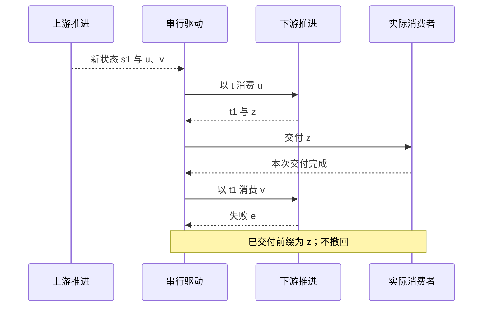
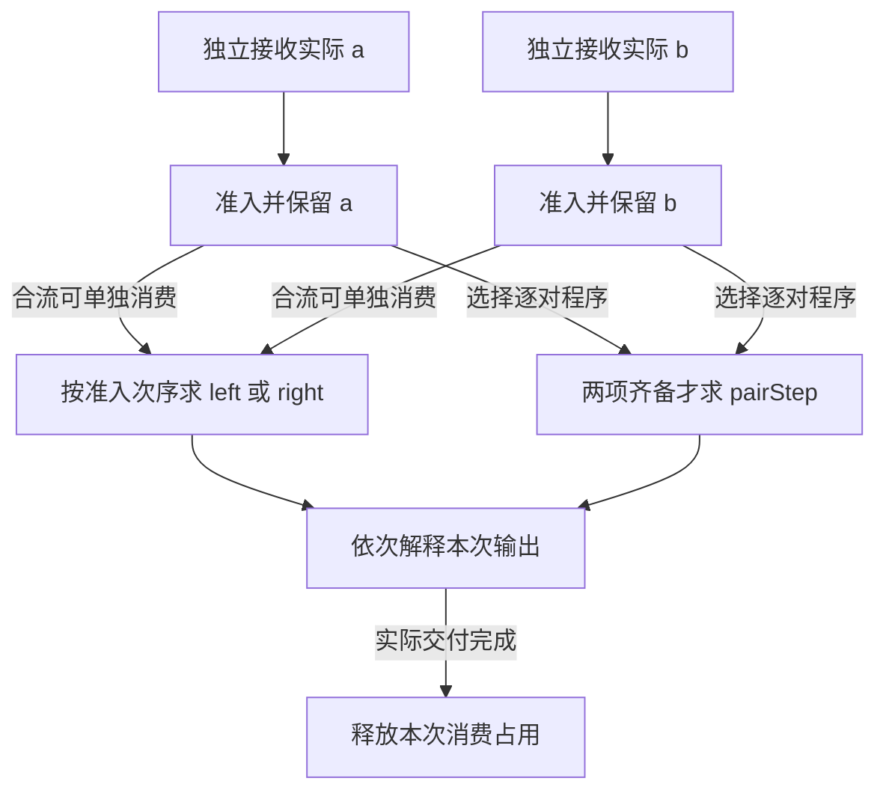
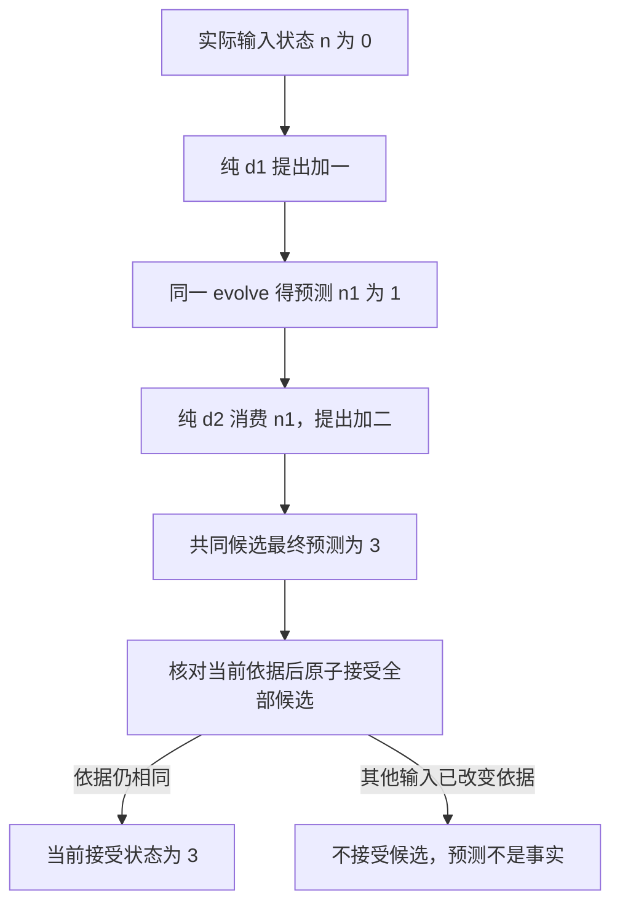
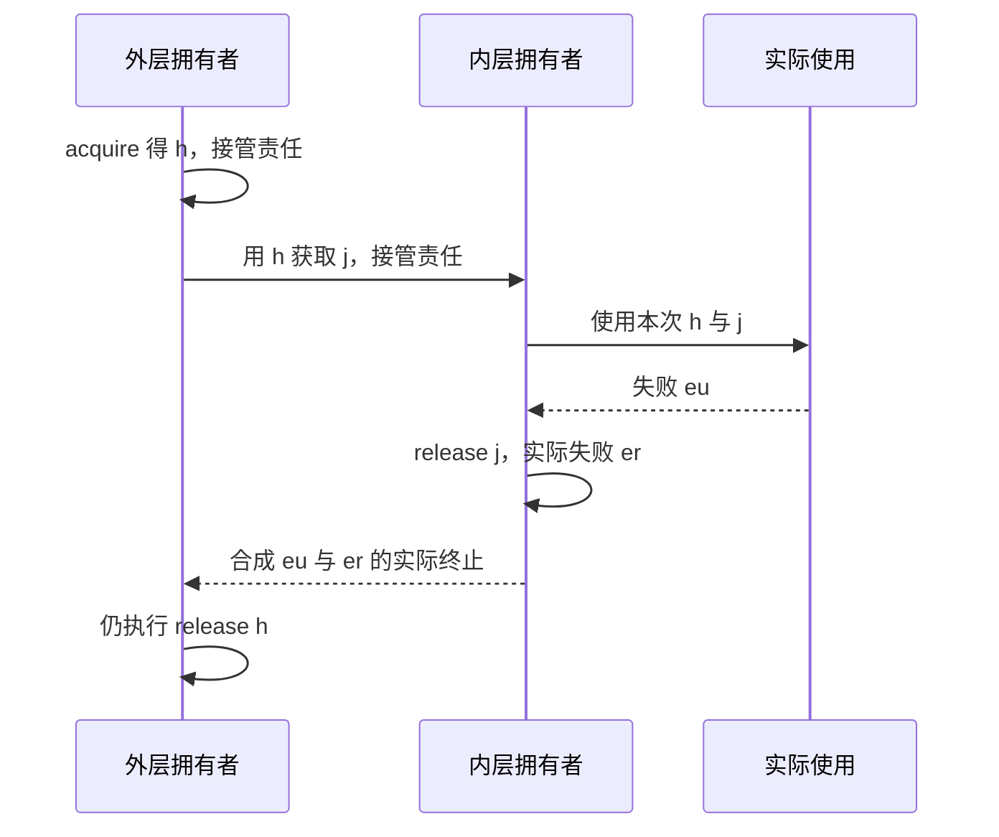

# UTA 计算组合的动态推导

本册与[主书](../uta-capability-runtime-design.md)共同描述候选核心的动态语义。这里的流来自实际计算、结果消费和状态接受，不从公共事件家族或业务阶段派生。记号是数学关系，不是已经实现的新SDK；以下轨迹为手工求值与反例，不冒称runtime执行。

核心推导与业务实例分开：前半只使用计算、值、状态和资源关系；后半分别解释Order、Candle、News及等待Order。一个实例暴露缺口时，回到缺少的关系，不把实例字段变成公共机制。

## 可运输描述怎样实际产生边界解析

主书§4.1选择有限D描述树，而不是把本地谓词r的名字当成远端可运行函数。导入时先解析profile及节点操作数，再递归构造describe、parse与encode。积逐项取得所有值，和先取得已声明分支再解析该分支，序列保持顺序；任一结构解析失败都不产生可交给解释器的完整输入。

取积的一个分量为Decimal(尺度2，最小整数25，无上界，步进25)，另一个分量为Empty/Named的和。10.25产生整数1025，整除25；10.26产生1026而拒绝；Named缺少value同样拒绝。只有整项积成功后才开始实际计算。Decimal编码保存同一个整数，其余节点由子节点往返递归得到parse(D,encode(D,t))=t；保证限于同一profile限额内可编码的合法值，编码也拒绝超长序列、深度或规范报文，不把编码后会被parser超限拒绝的值纳入恒等律。此处相等不是原JSON空白或对象键顺序相等。

D不能表达的远端约束由实际计算执行，其拒绝属于该计算声明的E，不伪称主机已验证；也不把需要未来结果或IO的条件塞进前置纯解析。“第一项IO前解析完整输入”的结论只涉及实际边界声明的条件。

## 有限连续接为何不能随意变成一次批量计算

取实际输入x，up(s,x)产生(s1,[u,v])。down(t,u)产生(t1,[z])，down(t1,v)失败e。所选驱动逐项消费，每项输出实际交付后再推进。

若优化先纯fold整个[u,v]，仅整体成功后发送，则v失败使外部前缀为空。两者相同地失败e，却有不同可见前缀。要融合，必须保留逐项交付及其失败、中断位置；仅保存最终s1、t1不够，还需驱动中尚未消费的项及尚未交付输出。

取消发生在调用Sink之前，当前z尚未由此调用交付；发生在调用中、确认未返回时，Sink可能已经观察z。保存“已确认到哪里”不能证明“实际只观察到哪里”，也不能直接据此重发。正常排空完成、失败及中断由驱动实际终止决定；进程丢失可能没有最后结果。

## 双来源的合流与配对不能互换

两个来源分别产生A和B。轮流阻塞等待会让无值的A阻断已到B；每轮race再取消败者也可能丢掉败者已经从不可重放来源取走的值。因此本候选保留两个独立接收循环，再由一个串行消费者取得实际准入项，而不是把两次next藏进一个和类型。

合流的操作数是`left(T,A)`与`right(T,B)`，逐对消费的操作数则是`pairStep(T,A×B)`。前者任一侧值可推进，后者必须等实际两项齐备。具体有界程序每侧只准入一项未完成输入，正在输出也占容量；先准入者先消费，不声称跨来源物理产生时间有全序。

图中合流和配对是不同程序，不是同一输入自动送两遍。取初态1，A为模10余数：合流left加a，right在true时乘2、false时加1。实际准入2、true、4、false，且每侧释放容量后才再入下一项，输出为[3,6,0,1]。逐对程序在true时加a、false时减a，实际配对(2,true)、(4,false)，输出为[3,9]。类型能容纳这些值，不会替程序选择哪一项推进关系。

合流在双方正常结束且全部已准入项排空后结束；配对在某侧正常耗尽且无保留项、无正在处理配对时结束。已结束侧仍持有a时，后来的b仍可构成最后一对。来源失败与过载按本候选关闭整组新准入，已交付前缀不撤回；另一侧剩余值只有在脱离资源后仍合法时才可返回。

容量K的消费者停顿时，不可暂停来源可以产生K+1项。本候选明确过载失败，不借“持续来源”一词承诺无限无损缓存。send准入与关闭必须定序：关闭禁止新的准入，先准入的IO仍可能在关闭后才实际开始；等待实际终止，不将它记成必然未发生。主书§8.6–8.8展开了实际状态、容量和终止消费。

## 纯状态组合与已接受状态

取计数n，d1提出加一，evolve得到预测n1=n+1。d2要求当前值至少为一，成功时提出再加二。n=0时，d2必须消费n1=1，得到最终预测3；若仍消费旧n，则错误拒绝。事件连接的fold律要求同一个evolve、同一事件含义与实际顺序。

另取d2必然拒绝：纯组合可以丢弃整个提案而不改变真实n；但若已经先提交d1，d2拒绝之后真实n仍为1。这不是纯代数失效，而是两个程序选择了不同接受边界。不能靠把两个提交包在同一函数名下获得原子性。

当第二决定需要尚未发生的外部结果A时，纯阶段没有A。应先接受工作操作数，实际解释得到Outcome，再让其消费者进入新的当前状态；不能将未来结果占位成一个已知值，或让可重复纯决定顺带执行网络IO。

## 保存的是操作数及消费关系，不是再次执行资格

一个可保存定义κ关联输入I、上下文C、成功A、声明失败E、所需服务R，以及实际build、consume和各自codec。接受保存κ的身份、i、c及本次发生身份ω。恢复必须在同一个κ包中解码并解释，不能把当前同形实现当作原定义。

选定保守的一次释放解释：纯构造和依赖绑定先完成，原子取得本次释放资格后才运行实际IO。存储里可重读ω，不代表可以再次取得资格。

最小区分实验是思想轨迹，不是当前运行记录：外部计数初始8，实际调用加二。本地在调用前丢失与外部已变10但结果丢失，可以留下相同本地记录。自动重发在后一世界变12；永不重发在前一世界停8。缺少外部可判别事实时，公共本地关系不能同时保证至少一次及至多一次外部效果。

已保存Outcome时则不同：consume(c,Outcome,currentState)不需要重做原IO；其新事件、新工作与ω已消费标记在同一接受边界落定。消费结果的重试与原工作的重发不是同一动作。

## 独立到达的输入不能依赖有限返回才开始接收

生产计算返回A，外部还会独立输入X。若接收X只在A的成功后继里安装，合法的早到X没有消费者。核心关系需要在生产者可能发出X前，把q、接收定义和上下文接受并使之对输入入口可见。

q负责关联，不自动负责认证；生产者也必须真实支持相应外部关联。注册只在私有内存存在、入口仍等A才接收，均不满足前提。这个构造不保证传输可靠、不制造离线收件箱，也不要求Agent、订单或任何具体消息种类。

若接收还需外部资源安装，上图不能从接受q直接跳到生产：实际使用`owned(open(q), h => runProducer(p,q,h), close)`，open须报告当前路径已可用，生产实际依赖h。安装期间的输入可由先接受的q处理；安装未完成便生产，存在消息先发生、监听尚未生效的反例。保存“曾安装成功”也不能恢复活h；重启后重新取得资源，拥有者把使用准入与关闭定序。这个依赖不制造网络可靠性，也不要求每个入站都有外部监听资源。

两个结果乱序是否等价由实际状态函数决定。计数先加一再乘二，与先乘二再加一不同；独立积状态的两个互不依赖分量可以有相同最终值，但若输出顺序可见仍不能直接声称行为等价。

## 资源范围怎样包住实际使用

普通成功续接在use失败时跳过release，所以资源限界消费的是实际Exit。acquire成功h与接管清理责任间不能有普通中断窗口；release使用同一个h及本次use终止。use和release均失败时，所选settle保留两项cause，不覆盖原失败。

内先外后来自内层包含cleanup的实际终止；不是所有资源无条件全局LIFO。release永不结束时不能声称外层已经释放；进程强杀不保证任何finalizer运行。

对连续来源，use必须包含drive(source(h),consume)，不能只返回一个捕获h的惰性流。对共享资源，外层唯一拥有者等待全部准入使用结束，单个借用结束不释放h。两个分支分别注册同一h的释放会使先结束者破坏仍运行者；close幂等解决不了过早关闭。

## 这些推导怎样改变设计

失败前缀要求实际串行驱动而非一次fold；早到输入要求独立接收在生产前可见；use失败要求终止消费而非成功续接；共享过早关闭要求实际唯一拥有责任。它们改变的是核心关系。

