# UTA 事件流册

本册展开能力代数的动态语义，与[主书第16章](../uta-capability-runtime-design.md#event-flows)配套：事件家族、声明槽位、具体绑定、来源位置、本地提交和跨界接纳共同决定一条流是否合法。所有目标类型名都是设计规格；源码锚点只证明现有行为，不表示目标协议已经实现。

每条流包含消息/事件类型关联、产生者和消费者、作用域与时序、持久点、重复/失败/迟到/恢复分支。这里不重建 Alice EventBus，也不把所有函数调用改成持久事件。

## 导航

| 流 | 主题 |
|---|---|
| [EF01](#ef01) | 声明、安装、目录与能力绑定 |
| [EF02](#ef02) | 作用域/发现授权与有限 Pull |
| [EF03](#ef03) | Push 订阅、共享资源与终止 |
| [EF04](#ef04) | 多源投影、合并、窗口/join、修订与 gap |
| [EF05](#ef05) | 显式 capture、FX/估值与订单事实同步 |
| [EF06](#ef06) | 意图接纳、prepare、风险与批准 |
| [EF07](#ef07) | Dispatch、先到观察、未知与历史恢复 |
| [EF08](#ef08) | cancel/replace/close、部分成交与敞口 |
| [EF09](#ef09) | 组合交易、补偿与 reservation 释放 |
| [EF10](#ef10) | deferred activation、checkpoint、correction 与 rearm |
| [EF11](#ef11) | UTA 决策交付、Workspace 持久接纳与回复/到期竞争 |
| [EF12](#ef12) | 配置 revision、secret owner、connection generation、catalog 与 shutdown/recovery |
| [EF13](#ef13) | Mock admin stimulus、模拟读 preview、UTA 金融控制与 live evidence |
| [EF14](#ef14) | committed 事件、Query/Git/Product Activity 投影与 migration cutover |

[旧能力与事件流的完整对应](#legacy-flow-coverage)只用于查漏；逐流语义与实际执行证据不能由覆盖数量替代。

## 数据与交付上下文

本组从声明绑定推进到交付与数据组合。EF05 标明普通观察何时成为持久证据；它不赋予金融发送权。

### 数据与交付上下文的共用约定

#### 边界上下文

| 上下文 | 权威状态 | 可以产生的事实 | 明确不能产生的事实 |
|---|---|---|---|
| **Catalog/Binding** | provider pack manifest、声明 digest、runtime catalog snapshot revision、绑定证书、历史 binding | `CapabilityDeclared` validation input、实际安装/config 的 `PackInstalled`、`CatalogRevisionPublished` runtime snapshot、`BindingCertified` pure value/receipt、安装/解码诊断 | 交易意图、`DispatchStarted`、订单事实 |
| **Scope/Read** | `PublicSource`、`AccountScope`、`ProviderInstance`、`ConnectionGeneration`、权限/entitlement 证据 | scope observation、有限 Pull reply、read receipt、源数据 observation | 授权 witness（除非独立 policy 命令验证）、交易状态、全局排序 |
| **Stream Resource** | 一个 provider leaf 的有界/持续资源句柄、subscriber owner、stream lifecycle | `Started`、`Data`、`Correction`、`Retraction`、`Gap`、`SnapshotEnd`、`ItemFailure` 及唯一终态 | `SourceClosed` 全局变体、把 `SnapshotEnd` 当持续订阅终态、把 crash 当正常 Completed |
| **Projection/Composition** | operator binding、输入 lineage、分区/代次、projection revision/checkpoint | 一对一投影、合并、窗口、join、修订和 gap 的派生事件 | 冒充 source event、无声明 predicate/window/join/merge、凭 receivedAt 制造 watermark |
| **Observation/Capture** | selected source observation、capture request/receipt、projection checkpoint、FX/估值/订单事实 | 显式 capture、`FxObservation`、`AccountValuation`、`OrderObservation`/`FillEvent` 的选定证据 | 由普通读或快照/FX 生成 financial dispatch、reservation、approval、order submission |

#### Envelope 与时序

每个外部观测、派生事件或 delivery frame 使用同一套概念分层，但不是同一身份：

| 槽位 | 语义 | 约束 |
|---|---|---|
| `eventId`/`frameId` | 本次 UTA event/frame 的唯一身份 | fan-out 给多个 subscriber 时 frame identity 可不同 |
| `sourceEventId` + `sourceIdentity` | provider 原生身份或 adapter 明确标记的 observation identity | 不把 adapter 生成的 ID 宣称为 provider native sequence；若 provider 没有 id，保留 `identityEvidence=AdapterAssigned` |
| `causationId`/`correlationId` | 直接触发关系/同一请求或 capture 的关联 | derived event 必须指向 source event 与 operator request |
| `partitionKey` | provider instance + scope + instrument/order/resource 等局部顺序域 | 不跨 partition 推导顺序 |
| `generation` | connection/resource generation | 旧 generation 的事实不能更新新代的 current state；若 source identity、slot 和跨代修订证据均认证，可追加 historical evidence 并按声明的 lineage policy 影响原投影，否则记录 late/ignored/reconcile |
| `declarationRevision`/`catalogRevision`/`schemaDigest` | 生成 payload/validator/adapter binding 的版本 | 目录切换不改写已发起 operation 的 binding |
| `observedAt`/`asOf`/`receivedAt` | provider 事实时间、请求锚点、UTA 收到时间 | `receivedAt` 只是本地证据，不是事件时间 watermark |
| `commitSeq` | Journal/Projection writer 的局部提交序号 | 仅 committed record 具有；不等于 transport 顺序 |
| `transportSeq` | 一个 stream/resource 上的本地传输序号 | 只用于该 stream 的 gap/replay 诊断，不制造 provider 端保证 |

没有全球时钟、全球 event 全序或“按 timestamp 排好就因果正确”的规则。一个 operator 若需要 watermark，必须在 capability/recipe 中声明 watermark 来源、分区、推进和 late policy；不能把本地 `receivedAt` 升格为 watermark。没有可验证 watermark 时，结果保持 open/partial/gap 或由明确 finite barrier 关闭。

#### 由 capability/recipe 派生 payload

每个 data leaf 的 **item/failure/lifecycle 声明**由同一声明产生 request codec、item codec、failure codec、coverage 和 lifecycle policy；scope、permission、revision、lineage、capture 等是 runtime 附加的 binding/envelope/policy 参数，不要求每个 provider 把它们另加为业务 payload slot：

| 来源 | 派生到事件/帧的字段 | 边界 |
|---|---|---|
| `ItemSlot`/`ProviderExtensionSlot` | Candle/News/AccountFact/OrderObservation 的 base + provider extension | extension 只能增加已声明字段，不能改变 base control topology |
| `FailureSlot`/`CoverageSlot` | `Complete \| Partial \| Unavailable` 与 typed failure/reason | 不以空数组、零、USD 或默认时间吞掉缺失 |
| `LifecycleSlot` | `Started`、非终止 frames、唯一 `Completed \| Failed \| Cancelled` | 不新增 `SourceClosed`；`SnapshotEnd` 非终态 |
| `RequestSlot`/`WindowSlot` | interval/what-to-show、start/end/asOf、limit/cursor、selected source leaf | request codec 可含 provider policy，但不能把隐藏默认值当 caller 请求 |
| **Kernel binding parameters**（scope/permission/revision/lineage/capture） | `PublicSource`/`AccountScope`、binding/revision/digest、source lineage、capture cause/checkpoint | 由 runtime/envelope/policy 绑定；不是每个 Provider 必须新增的业务 DTO 字段，也不能用 `aliceId`/native key 猜 sub-account |

因此，“slot 派生”指 item/failure/lifecycle 的 schema 与 runtime binding 参数共同构造事件 envelope；它不建立另一套手写 payload DTO。provider 没声明的 item extension、correction 或 retraction 不能仅因 kernel 认识该 tag 就被制造。

**透明 1:1 投影判定。** 值投影须总定义，事件须系统性重绑定并保持 source、scope、顺序、control-kind、finality、coverage、终态及 sourceEventId/lineage；这不等于 raw-byte 相同。动态规律以[主书 §16.5](../uta-capability-runtime-design.md#projection-laws)的入口、状态关系与观察面为准：富入口独立接纳的轨迹必须有相容的基础消费；契约不观察的精确重复可以不再投递。若投影要取代验证入口，还须在包括状态冲突的候选上另证接纳/拒绝相容。业务谓词沿投影保持同一语义才可声称透明；改变 predicate/filter、失败转换、window、join、merge 或执行策略的计算拥有自己的 operator binding、revision、失败和终态策略。

**组合终态。** `merge` 在 operator 内部消费每个 child terminal；`ItemFailure` 只可表示声明为 recoverable 的单 item error。child `Failed` 默认使 outer `Failed`；只有 partial-result profile 才能在 declared output 中保留 `MemberOutcome{sourceBinding, terminal, failure}`/`Partial`，不能把 source terminal 伪装成 `ItemFailure`。不发明一个全局 `SourceClosed` 来补齐 child 语义。

#### 现有代码的证据锚点

这些锚点只证明现有行为和待迁移边界，不证明目标事件接口已经实现：

- Bar identity/shape：`src/domain/market-data/bars/types.ts:31-44,56-108,113-157`；现有 `barId` 是 `sourceId|nativeSymbol`，`OhlcvBar` 为数值/可扩展字段，`BarMeta` 已携带 source/capability/asOf/freshness，`UtaBarAccount.getHistorical` 仍接收 `{aliceId?}` 与 `BarParams`。
- Bar finite reads：`src/domain/market-data/bars/bar-service.ts:193-234`（vendor history filtering/metadata）、`:237-274`（UTA account lookup、capability、request、mapping）、`:277-296`（vendor+UTA search，`allSettled` 和 source identity）。HTTP 边界在 `src/webui/routes/bars.ts:31-57`。
- News identity/ingest：`src/domain/news/types.ts:5-20,23-40,44-84`（JSONL `seq`、ingestion/publication time、dedupKey、RSS config、stable id）；`src/domain/news/collector/rss-parser.ts:21-72`（RSS/Atom fields）；`src/domain/news/collector/rss.ts:77-139`（feed failure isolation、dedup、`ingestRecord`、onIngested）；`src/domain/news/store.ts:120-188,227-255`（serialized disk-first ingest、monotonic seq、time window/tail limit）。这不是 correction/retraction 或 push replay 的证据。
- IBKR history transport/decoder：`packages/ibkr/src/client/historical.ts:75-171` 发送 rich contract + `keepUpToDate`，并支持 cancel；`packages/ibkr/src/decoder/historical.ts:123-183` 解出 OHLCV/WAP/barCount、`historicalDataEnd` 与 `historicalDataUpdate`；这些是 adapter/native callback 证据，不证明 UTA 当前已暴露 history/news leaf、provider finality 或 replay guarantee。
- CCXT history/account：`services/uta/src/domain/trading/brokers/ccxt/CcxtBroker.ts:932-1031` 仍把 wallet/quote/equity/PnL 组合在 account read；`:1207-1303` `getHistorical` 验证 `timeframes`、执行 trailing `since`、`limit+1`、upper-bound filtering 和 mapping，缺字段仍存在旧默认行为；`getCapabilities` 静态声明 historical bars，但不等于运行时 finality/replay 证据。
- Provider pack boundary：`packages/uta-broker-ccxt/src/index.ts:1-9`、`packages/uta-broker-ibkr/src/index.ts:1-9`、`packages/uta-broker-alpaca/src/index.ts:1-9` 仍导出 API version/engine/configSchema/createBroker；目标只把实际 descriptor/capability tree 放进 pack boundary，不把旧 generic factory 当 host event schema。
- Order sync/history anchors：`services/uta/src/domain/trading/order-history.ts:1-263`、`services/uta/src/domain/trading/UnifiedTradingAccount.ts:827-980`；这些现有 helper/投影与 native decoder 仍需拆成 raw `OrderObservation`/`FillEvent` ExternalFact 和 writer-owned `*Recorded` committed event，不能把 decoder 输出直接当本地提交。
- Legacy target anchors：`docs/uta-capability-runtime-design/legacy-accommodation.json` 中 `LCORE-CATALOG-PROVIDER-PACKS`（3355 起）、`LSTATE-RUNTIME-REGISTRY`（4258 起）、`LSTATE-RUNTIME-CAPABILITIES`（4310 起）、`LCORE-PROTOCOL-DATA-HISTORY`（6014 起）、`LTX-PROJECTIONS`（6370 起）、`LSTATE-ACCOUNTING-UNITS`（6423 起）、`LSTATE-ACCOUNTING-VALUATION`（6482 起）、`LSTATE-ACCOUNTING-FX`（6543 起）、`LSTATE-ACCOUNTING-HISTORY`（6591 起）、`LSTATE-SNAPSHOT-MODEL`（6641 起）、`LSTATE-SNAPSHOT-SCHEDULER`（6691 起）、`LSTATE-SNAPSHOT-STORAGE`（6741 起）、`LCCXT-CORE-ACCOUNT`（6793 起）、`LCCXT-CORE-LISTINGS`（7099 起）、`LCCXT-CORE-DATA`（7245 起）、`LCCXT-VENUES-BITGET`（7736 起）、`LCCXT-VENUES-BYBIT`（8038 起）、`LCCXT-VENUES-HYPERLIQUID`（8172 起）、`LSDK-IBKR-ACCOUNT-DATA`（8261 起）和 `LSURFACE-SUPP-DATA`（11965 起）。

---

<a id="ef01"></a>

## EF01 — 声明、安装、目录与能力绑定

### 目标与输入

输入是 provider pack manifest/content digest、provider instance identity、声明的 capability tree/recipe slots、config schema、adapter codec 与安装/激活命令。输出是可验证的 descriptor/binding 和不可变的 runtime catalog snapshot revision；它不打开账户连接、不代表 entitlement 已存在，也不产生任何金融 effect。

- **本地静态声明**：schema、validator、payload codec、failure codec、descriptor 和 digest 从同一声明 AST/recipe 派生。静态推导结果必须在加载前自洽。
- **外部动态声明**：只接受 `BoundDocument + slot certification + provider/capability/revision/schema digest`。动态文档没有完整证书不能进入可调用目录。
- **安装 precedence**：installed release、workspace dev/test、Mock 等 policy 是 Catalog context 的输入；broken installed pack 不 silent fallthrough 到 workspace。失败 load 要 eviction，active last-known-good pointer 仍可读。
- **历史 binding**：catalog 新 revision 只影响尚未开始的新 operation。已经 `DispatchStarted` 的流程（由 EF06–EF10 负责）保留旧 binding；数据流侧的 historical resolver 按 exact implementation/compiler/version 解析，不用当前目录替代旧语义。

### EF01 事件/消息表

| 类型 | 类别 | 由声明/绑定派生的 payload | 生产者 → 接受者 | identity、顺序、幂等与持久化 | 失败/恢复 |
|---|---|---|---|---|---|
| `PackInstallRequested` | Command/WorkDescription | `installRequestId`、pack identity、content digest、source policy、requested catalog parent | Catalog client → Catalog writer | `installRequestId` 是 command identity；同 digest 的重复请求可返回 existing receipt，不重装 | malformed manifest、source disallowed、digest mismatch 直接拒绝；不改 active pointer |
| `CapabilityDeclared` | ExternalFact + validation result | provider instance、capability leaf id、item/extension/failure/coverage/lifecycle declarations、declarationRevision、schemaDigest | Pack loader/foreign certifier → Catalog registry | declaration identity = provider instance + leaf + revision + digest；它是 runtime snapshot 的输入，不强制成为 transaction journal event | slot 缺失、schema mismatch、unknown lifecycle 是 typed `DeclarationInvalid`；不能把 generic `IBroker` 当 leaf |
| `PackInstalled` | committed DomainEvent（仅实际安装/config owner 需要持久化时） | pack manifest identity、content digest、validated exports、installation provenance | Pack installer → Catalog registry/diagnostic reader | 先验证再原子 commit；同 identity/digest 幂等；broken pack 不产生 success | load exception 产生 `PackInstallFailed` Diagnostic，并 evict failed cache；保留 last-known-good active pointer |
| `CatalogRevisionPublished` | atomic runtime snapshot publication / receipt | `catalogRevision`、parent revision、changed leaf ids、certificate digest、effective policy | Catalog snapshot writer → runtime composition/binding resolver | 在 runtime catalog partition 以 CAS/单调 revision 发布；不是强制 JournalStore committed DomainEvent；旧 revision 仍可被 history resolver 读取 | writer crash 前无发布则旧 snapshot 继续有效；发布后 reader 可重读完整 snapshot；不能用部分 revision |
| `BindingCertified` | pure certificate value + WorkReceipt | provider instance、scope mode、leaf/recipe binding、catalog revision、schema digest、permission requirement | Binding certifier → Read/Stream/Projection | certificate key 含 leaf + revision + digest + scope；通常不单独持久化为 DomainEvent，query 必须 exact match | scope mismatch、fingerprint change、dynamic document 未认证 => `BindingUnavailable`/`RediscoverOrRebindRequired` |
| `HistoricalBindingRetained` | committed evidence（仅 operation/history owner 需要保留时） | old binding identity、compiler/adapter revision、operation/dispatch reference、reason | Historical resolver → recovery/history readers | 只追加 evidence；不把 old binding 替换为 current revision | old code/binding missing => `Unavailable`/`RecoveryRequired`，不得 silently recompile |
| `CatalogDiagnostic` | Diagnostic | phase、subject、redacted cause、retry policy、last-known-good reference | Any validator/loader → evidence reader | diagnostic 不冒充 domain success；同 phase/cause 可去重但保留 correlation | redaction failure aborts response；禁止把错误压成 `[]`/zero |

### EF01 时序

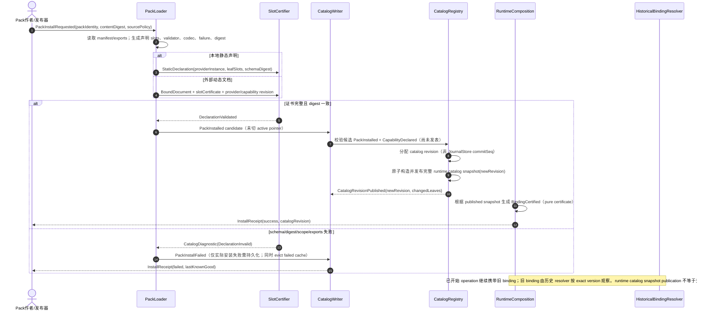
```mermaid
sequenceDiagram
    autonumber
    actor Author as Pack作者/发布器
    participant Loader as PackLoader
    participant Cert as SlotCertifier
    participant Writer as CatalogWriter
    participant Registry as CatalogRegistry
    participant Runtime as RuntimeComposition
    participant Resolver as HistoricalBindingResolver

    Author->>Loader: PackInstallRequested(packIdentity, contentDigest, sourcePolicy)
    Loader->>Loader: 读取 manifest/exports；生成声明 slots、validator、codec、failure、digest
    alt 本地静态声明
        Loader->>Cert: StaticDeclaration(providerInstance, leafSlots, schemaDigest)
    else 外部动态文档
        Loader->>Cert: BoundDocument + slotCertificate + provider/capability revision
    end
    alt 证书完整且 digest 一致
        Cert-->>Loader: DeclarationValidated
        Loader->>Writer: PackInstalled candidate（未切 active pointer）
        Writer->>Registry: 校验候选 PackInstalled + CapabilityDeclared（尚未发表）
        Registry->>Registry: 分配 catalog revision（非 JournalStore commitSeq）
        Registry->>Registry: 原子构造并发布完整 runtime catalog snapshot(newRevision)
        Registry-->>Writer: CatalogRevisionPublished(newRevision, changedLeaves)
        Runtime->>Runtime: 根据 published snapshot 生成 BindingCertified（pure certificate）
        Runtime-->>Author: InstallReceipt(success, catalogRevision)
    else schema/digest/scope/exports 失败
        Cert-->>Loader: CatalogDiagnostic(DeclarationInvalid)
        Loader->>Writer: PackInstallFailed（仅实际安装失败需持久化；同时 evict failed cache）
        Writer-->>Author: InstallReceipt(failed, lastKnownGood)
    end
    Note over Runtime,Resolver: 已开始 operation 继续携带旧 binding；旧 binding 由历史 resolver 按 exact version 观察。runtime catalog snapshot publication 不等于交易 journal 提交
```

### EF01 不变量与故障分支

1. `CatalogRevisionPublished` 之前，任何 descriptor 都不能被 query/stream 作为可执行 capability 使用；`PackInstalled` 不是 provider 已连接或账户已授权的证明。
2. Descriptor certificate 必须同时匹配 provider instance、capability/leaf、revision、full semantic/schema digest 和 schema slots；只匹配 engine 字符串不够。
3. 新 catalog snapshot publication 不回写 old event 的 `catalogRevision`，也不把正在进行的 query/stream 切到新 binding；旧 binding 不可解析时返回 typed recovery/unavailable，而不是使用 current binding “修复”。
4. 纯 1:1 provider extension（例如 IBKR bar 的 WAP/barCount）只能附加到声明的 extension slot，并保留原 data frame 的 lifecycle/control-kind/ordering/finality/coverage；如果 extension 触发新过滤、窗口、join 或 execution policy，立即转入 EF04 的 operator binding。

---

<a id="ef02"></a>

## EF02 — 作用域/发现授权与有限 Pull

### 目标与输入

EF02 先把 source identity 解析为 `PublicSource`、`AccountScope(AccountId, SubAccountId)` 或 `ProviderInstance`，再按 exact binding 发起**有限** Pull。scope discovery、permission witness、data query 是三个不同事实：连接资源能读数据，不自动生成 permission witness；public data 不能伪造成 funded account。

典型输入：

- `ScopeDiscoveryRequested(providerInstance, connectionGeneration, selector, purpose)`；selector 显式表达 account/sub-account/wallet namespace，不能从复合 `aliceId/nativeKey` 逆推。
- `PullRequested(binding, scope, instrument/contract, interval/stream, start/end/asOf, limit/cursor, queryId)`；缺省 limit、window、what-to-show 只有 selected leaf 声明了 policy 才可使用。
- Capability/entitlement evidence：`Available`、`Unavailable`、`Partial` 和 source-specific reason。`Coverage` 只有 `Complete | Partial | Unavailable`，unknown quality/value 放 reason/payload。

有限 Pull 返回 bounded items/page 与一个明确 outcome；它不是持续 Push。普通 Pull 不需要逐 item journal，只有 EF05 的 explicit capture、control evidence 或 projection checkpoint 才持久化选定 observation。

### EF02 事件/消息表

| 类型 | 类别 | 派生 payload slots | 生产者 → 接受者 | identity/顺序/持久化 | 失败/恢复 |
|---|---|---|---|---|---|
| `ScopeDiscoveryRequested` | Command | provider instance、generation、selector、requested scope mode、purpose | Application → Scope resolver | `scopeRequestId` 幂等；selector 不可省略成 first descriptor fallback | unknown selector、account listing unavailable、generation stale => typed unavailable；不返回空 funded account |
| `ScopeObserved` | ExternalFact/committed observation（仅显式 capture 时 committed） | `AccountScope` 或 `PublicSource`、native account evidence、namespace、observedAt、generation、coverage | Adapter → Scope/Read | source identity + generation + observation identity；没有 provider seq 时不制造 seq | duplicate observation 可去重；scope mismatch 进入 conflict/reconcile |
| `PermissionWitnessRequested` / `PermissionWitnessIssued` | Command / WorkDescription+receipt | action/read intent、scope、catalog revision、policy id、evidence refs | Policy owner → caller | witness 独立于 read Effect；receipt identity 与 query identity 分离 | missing/expired entitlement => `CapabilityUnavailable`/`PermissionDenied`；不得由 adapter 自动补发 |
| `PullRequested` | Command | exact request codec、binding/revision、scope、window/asOf/limit/cursor | Read application → selected leaf | `queryId` + request digest；同 query 重放可 query existing receipt，不盲重发 remote effect | no capability/invalid window/clock missing => pre-I/O validation failure |
| `PullItem`/`PullPage` | DeliveryFrame or read reply | item base + extension, source identity, asOf/observedAt, page cursor, coverage evidence | Adapter → Read/Projection | item source identity stable；page cursor 是声明的 cursor，不由数组位置/timestamp 猜 | malformed row => item decode failure or declared Partial; never zero/empty success |
| `PullResult` | WorkReceipt/read reply | bounded items, `Complete\|Partial\|Unavailable`, source/generation, next cursor, typed failures | Read owner → query consumer | query completes once at application boundary；ordinary result not Journal event | provider failure, incomplete page, stale capability, entitlement loss 保持 typed outcome |
| `PullCaptureRequested` | Command（跨入 EF05） | selected query id/observation ids、capture cause、checkpoint policy | Capture owner → Observation writer | durable request before capture IO；same request idempotent | writer failure leaves request/receipt reconcileable，不报告 capture success |

### EF02 时序

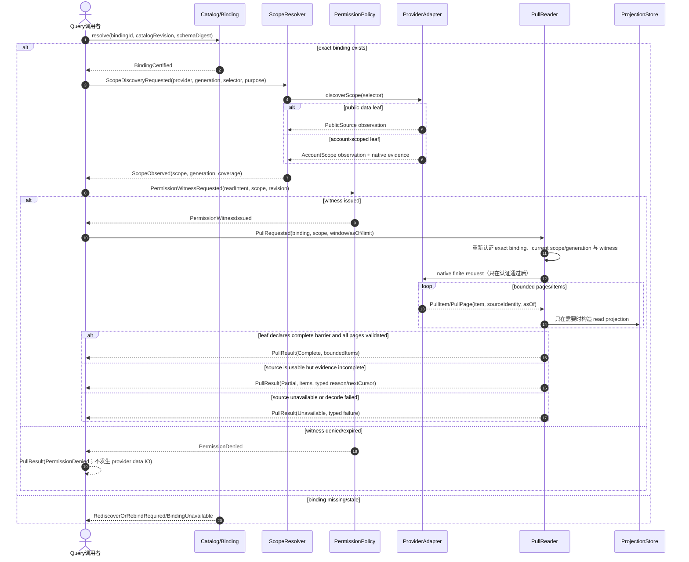
```mermaid
sequenceDiagram
    autonumber
    actor Caller as Query调用者
    participant Catalog as Catalog/Binding
    participant Scope as ScopeResolver
    participant Policy as PermissionPolicy
    participant Adapter as ProviderAdapter
    participant Reader as PullReader
    participant Projection as ProjectionStore

    Caller->>Catalog: resolve(bindingId, catalogRevision, schemaDigest)
    alt exact binding exists
        Catalog-->>Caller: BindingCertified
        Caller->>Scope: ScopeDiscoveryRequested(provider, generation, selector, purpose)
        Scope->>Adapter: discoverScope(selector)
        alt public data leaf
            Adapter-->>Scope: PublicSource observation
        else account-scoped leaf
            Adapter-->>Scope: AccountScope observation + native evidence
        end
        Scope-->>Caller: ScopeObserved(scope, generation, coverage)
        Caller->>Policy: PermissionWitnessRequested(readIntent, scope, revision)
        alt witness issued
            Policy-->>Caller: PermissionWitnessIssued
            Caller->>Reader: PullRequested(binding, scope, window/asOf/limit)
            Reader->>Reader: 重新认证 exact binding、current scope/generation 与 witness
            Reader->>Adapter: native finite request（只在认证通过后）
            loop bounded pages/items
                Adapter-->>Reader: PullItem/PullPage(item, sourceIdentity, asOf)
                Reader->>Projection: 只在需要时构造 read projection
            end
            alt leaf declares complete barrier and all pages validated
                Reader-->>Caller: PullResult(Complete, boundedItems)
            else source is usable but evidence incomplete
                Reader-->>Caller: PullResult(Partial, items, typed reason/nextCursor)
            else source unavailable or decode failed
                Reader-->>Caller: PullResult(Unavailable, typed failure)
            end
        else witness denied/expired
            Policy-->>Caller: PermissionDenied
            Caller-->>Caller: PullResult(PermissionDenied；不发生 provider data IO)
        end
    else binding missing/stale
        Catalog-->>Caller: RediscoverOrRebindRequired/BindingUnavailable
    end
```

### EF02 实际 source 映射与边界

- **Bars**：`BarSourceRef` 通过 `barId`（`sourceId|nativeSymbol`）或显式 symbol+assetClass 路由；`getUtaBars` 先 lookup source、检查 advertised historical capability，再以 interval/start/end/limit 请求；provider result 的 sourceId/barId/barCapability/asOf/freshness 必须进入 item/projection identity。任何 provider 把缺 bars 当 `[]` 的路径要改为 `Complete(empty)`（明确查完且确无匹配）或 `Partial/Unavailable`，不能静默吞 error。
- **News**：`NewsRecord.seq` 是本地 durable ingest identity，`pubTs` 是 source publication time，`ts` 是 ingestion time，三者不混。现有 RSS collector 每个 feed failure 只 warning 并继续其他 feed；目标 Pull 应保留按 feed group 的 `Partial`，而不是让失败 feed 消失。`dedupKey` 是 source/content identity，不是时间排序依据。
- **IBKR history**：`reqHistoricalData` 的 rich `Contract`、bar size、what-to-show、RTH、format、`keepUpToDate` 必须由 binding/request codec 明确；decoder 的 `historicalData` item 和 `historicalDataEnd` 只在 leaf 声明了对应 lifecycle 时映射。当前 UTA IBKR adapter 未证明已暴露 history/news leaf，因此不能直接在 catalog 中宣称该 capability。
- **CCXT history**：`timeframes` 缺 key 应 typed unsupported；trailing `limit+1`、upper-bound、one-page 选择是 selected provider policy，不是所有 source 的 host invariant。source row 不能因为 `v ?? 0` 被提升为 exact volume；目标 codec 应保留 missing/invalid evidence。
- **认证责任**：Caller 提供的 scope/witness 只是 request input；Reader 必须重新解析当前 `BindingCertified`、generation、scope registry 和 policy witness 后才可触发 provider IO。stale data binding 走 `RediscoverOrRebindRequired`，不借用交易域的 plan-recompile 结论。

### EF02 故障/幂等/恢复规则

1. 重复 `ScopeDiscoveryRequested` 可读取同一 generation 的 existing observation；generation 改变必须重新发现当前 scope/permission 证据；旧 generation 观测若有认证的 source identity/跨代修订依据，可保留为 historical evidence，但不能冒充新代 current state。
2. 重复 `PullRequested` 只在 request digest/binding/scope 完全相同且 read policy 允许时复用 receipt；不得把 transport retry 当无条件 safe resend。
3. `Partial` 需要声明的 partial policy（例如多钱包读取允许单 namespace failure）；未声明的 child failure 只能是 `Failed/Unavailable`，不能擅自“最佳努力”。
4. 外部 payload 解码失败属于 source observation/decode failure；不把失败变成 zero/default/empty。普通 query 失败不回滚已收到的独立 source event。
5. `asOf` 是 caller 的读锚点，`observedAt` 是 source 事实时间，`receivedAt` 是本地接收时间；后两个都不能互换。

### EF02 前段结果怎样成为后继计算

固定业务为同来源 Candle 有限读取，外层输入已给窗口/interval。程序先解释 Instrument 查询，消费其成功结果中的来源内引用；纯后继函数据此实例化同来源 Candle 定义及输入。Instrument 身份参与构造，不能自己充当任意操作或授权。后继需要额外目录事实时，将其查询显式组合；没有这种需要时不强迫第二次公共 discover。

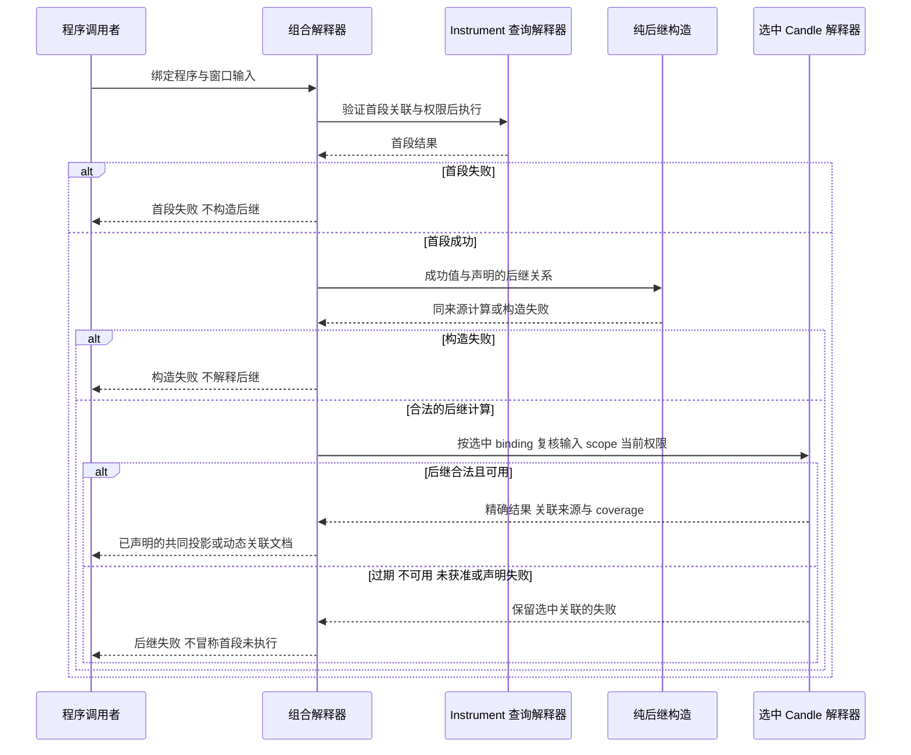
```mermaid
sequenceDiagram
  participant Caller as 程序调用者
  participant Interpreter as 组合解释器
  participant Instrument as Instrument 查询解释器
  participant Construct as 纯后继构造
  participant Candle as 选中 Candle 解释器
  Caller->>Interpreter: 绑定程序与窗口输入
  Interpreter->>Instrument: 验证首段关联与权限后执行
  Instrument-->>Interpreter: 首段结果
  alt 首段失败
    Interpreter-->>Caller: 首段失败 不构造后继
  else 首段成功
    Interpreter->>Construct: 成功值与声明的后继关系
    Construct-->>Interpreter: 同来源计算或构造失败
    alt 构造失败
      Interpreter-->>Caller: 构造失败 不解释后继
    else 合法的后继计算
      Interpreter->>Candle: 按选中 binding 复核输入 scope 当前权限
      alt 后继合法且可用
        Candle-->>Interpreter: 精确结果 关联来源与 coverage
        Interpreter-->>Caller: 已声明的共同投影或动态关联文档
      else 过期 不可用 未获准或声明失败
        Candle-->>Interpreter: 保留选中关联的失败
        Interpreter-->>Caller: 后继失败 不冒称首段未执行
      end
    end
  end
```

若 discovery 后来源失去支持，失败属于这一后继，不能把已选 barId 退回裸 symbol、将失踪 UTA 重新解释为 vendor，或借另一来源的数据补齐成功。普通复合调用可以不公开首段敏感值；它仍须准确区分构造、授权及读取失败，不强制持久化每个中间结果。

当后继是同一 Pull 的下一页时，cursor 只在原 binding、查询和窗口关联下消费；到达调用者边界或预算可以停止并返回已声明 Partial。cursor 为空不单独证明 Complete；完成性仍须来自来源契约和已检查的覆盖证据。若调用者必须先看分支特有输入再构造请求，则把选择结果公开为已绑定描述；这是一次有明确用途的业务交互，不是所有高阶组合的固定模式。

---

<a id="ef03"></a>

## EF03 — Push 订阅、共享资源与终止

### 目标与输入

EF03 为一个已认证的 capability leaf 创建 provider resource handle；该 leaf 的 delivery policy 明确它是 **Shared**（允许多个 attachment fan-out）还是 **Exclusive**（同一 resource 只允许一个 attachment）。Shared 下订阅者共享 provider handle 但各自拥有 lifecycle；Exclusive 下第二个 attachment 得到 `ResourceBusy/Conflict`，不能偷换成共享。`resourceKey` 至少包含 provider instance、binding/revision、scope、request digest、generation 和 stream kind。历史 segment 与 live segment 可在同一 Push resource 中出现，但 `SnapshotEnd` 只结束历史 segment，不结束持续订阅。

规范的 Push frame：

```text
Started
Data(item)
Correction(targetSourceEventId, replacement/revision)
Retraction(targetSourceEventId, reason)
Gap(range/partition/recoveryEvidence)
SnapshotEnd(snapshotCoverage)       // nonterminal
ItemFailure(itemIdentity, reason)   // nonterminal
Completed | Failed | Cancelled      // exactly one terminal per live owner
```

`Started` 必须携带 binding/scope/generation/resource identity；`Data`/`Correction`/`Retraction` 按其 source item/target 要求携带 source identity 或 lineage；`Gap`、`SnapshotEnd`、`ItemFailure` 和三个 terminal 按各自 frame family 的必要字段表达，不能强制所有 frame 都引用 source event。provider 没有原生 sequence 时，transport sequence 只能是 adapter-local delivery evidence，不能声称 source order。

### EF03 事件/消息表

| 类型 | 类别 | 派生 payload slots | 生产者 → 接受者 | identity/顺序/共享/持久化 | 失败/恢复 |
|---|---|---|---|---|---|
| `PushStartRequested` | Command | binding、scope、request、subscriber id、attachment id、share policy、generation | Subscriber → StreamResourceManager | `startRequestId` + `attachmentId`；同 attachment 重复只返回 `AlreadyAttached` 且不再发 `Started`；Shared 既有 resource 的新 attachment 获得自己的 `Started`，Exclusive 则拒绝 | stale binding/generation、resource key mismatch、exclusive busy => reject；resource 丢失后是否 resync 由 data leaf policy 声明 |
| `Started` | DeliveryFrame + optional committed resource evidence | resource id、stream id、binding/revision、scope、transport baseline、history/live mode | Stream owner → all subscribers | one provider handle per resource; frame identity per subscriber but same source resource | owner crash 后不可补写“最后 Started”；durable resource record 进入 reconcile |
| `Data` | DeliveryFrame | declared item + provider extension、sourceEventId/identity、observedAt/asOf、partition/transportSeq | Provider adapter → resource → subscribers | source identity drives idempotence; transport order only per resource partition | decode failure is `ItemFailure` only if declared recoverable, otherwise `Failed` |
| `Correction` | DeliveryFrame/committed observation when selected | target source observation, new revision, reason, replacement payload | Provider adapter/normalizer → resource/projection | target identity + revision; never mutate old frame in place | missing target => explicit correction-without-original/reconcile |
| `Retraction` | DeliveryFrame/observation | target source identity, retraction reason/evidence | Provider adapter → resource/projection | tombstone keyed by target identity; not a generic delete | unsupported native retraction stays unknown/gap, not fabricated |
| `Gap` | DeliveryFrame + recovery evidence | partition, missing sequence/range if provider supplies it, generation, recovery policy | Adapter/resource manager → subscribers | gap sequence local to stream; no timestamp-only inference | recoverable gap may trigger resync/Pull; unresolved gap keeps `Partial/Unavailable`, cannot complete silently |
| `SnapshotEnd` | DeliveryFrame/control | history range, coverage, source end marker, live continuation flag | Adapter → resource | nonterminal; for IBKR maps only when native end callback is observed | missing/ambiguous end leaves history open or fails per leaf policy; never `Completed` automatically |
| `ItemFailure` | DeliveryFrame | item/request identity（若有）、typed failure、recoverability policy | Adapter/resource → subscriber | 只在 item/request identity 存在时保留它；frame family 不要求 source event；不 erase other items | if policy says recoverable, continue with declared Partial; otherwise resource terminal is `Failed` |
| `Completed`/`Failed`/`Cancelled` | terminal DeliveryFrame + resource receipt | terminal reason, final coverage, owner/subscriber scope | Stream owner → subscriber/resource journal if selected | terminal frame 不要求 source event；每个 attachment exactly one terminal，child terminals are consumed by merge/operator | crash has no guaranteed final frame; durable reconcile observes last checkpoint and provider state |
| `CancelCleanupDiagnostic` | Diagnostic | resource id、generation、native cancel outcome、cleanup/reconcile state | Resource manager → recovery reader | attachment 的 `Cancelled` 已经是本地 ownership terminal；该诊断不改变 outer terminal，也不产生 financial Unknown | native cancel 无 ack、连接断开或 cleanup 超时进入 pending/reconcile；不得为了等 ack 把 attachment 留在 working |
| `PushCancelRequested` | Command | subscriber/resource id, cancellation reason, generation | Subscriber → resource manager | subscriber cancel is idempotent; only last owner causes native cancel | provider cancel failure remains resource diagnostic; does not cancel unrelated subscribers |

### EF03 时序

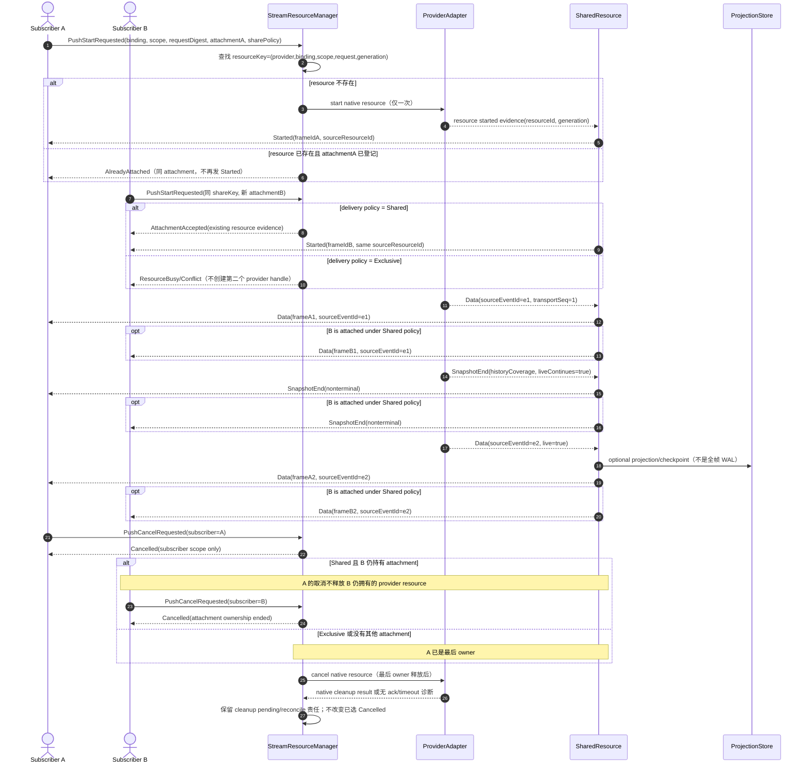
```mermaid
sequenceDiagram
    autonumber
    actor A as Subscriber A
    actor B as Subscriber B
    participant M as StreamResourceManager
    participant Adapter as ProviderAdapter
    participant S as SharedResource
    participant P as ProjectionStore

    A->>M: PushStartRequested(binding, scope, requestDigest, attachmentA, sharePolicy)
    M->>M: 查找 resourceKey=(provider,binding,scope,request,generation)
    alt resource 不存在
        M->>Adapter: start native resource（仅一次）
        Adapter-->>S: resource started evidence(resourceId, generation)
        S-->>A: Started(frameIdA, sourceResourceId)
    else resource 已存在且 attachmentA 已登记
        M-->>A: AlreadyAttached（同 attachment，不再发 Started）
    end
    B->>M: PushStartRequested(同 shareKey, 新 attachmentB)
    alt delivery policy = Shared
        M-->>B: AttachmentAccepted(existing resource evidence)
        S-->>B: Started(frameIdB, same sourceResourceId)
    else delivery policy = Exclusive
        M-->>B: ResourceBusy/Conflict（不创建第二个 provider handle）
    end

    Adapter-->>S: Data(sourceEventId=e1, transportSeq=1)
    S-->>A: Data(frameA1, sourceEventId=e1)
    opt B is attached under Shared policy
        S-->>B: Data(frameB1, sourceEventId=e1)
    end
    Adapter-->>S: SnapshotEnd(historyCoverage, liveContinues=true)
    S-->>A: SnapshotEnd(nonterminal)
    opt B is attached under Shared policy
        S-->>B: SnapshotEnd(nonterminal)
    end
    Adapter-->>S: Data(sourceEventId=e2, live=true)
    S->>P: optional projection/checkpoint（不是全帧 WAL）
    S-->>A: Data(frameA2, sourceEventId=e2)
    opt B is attached under Shared policy
        S-->>B: Data(frameB2, sourceEventId=e2)
    end


    A->>M: PushCancelRequested(subscriber=A)
    M-->>A: Cancelled(subscriber scope only)
    alt Shared 且 B 仍持有 attachment
        Note over S,B: A 的取消不释放 B 仍拥有的 provider resource
        B->>M: PushCancelRequested(subscriber=B)
        M-->>B: Cancelled(attachment ownership ended)
    else Exclusive 或没有其他 attachment
        Note over M,S: A 已是最后 owner
    end
    M->>Adapter: cancel native resource（最后 owner 释放后）
    Adapter-->>M: native cleanup result 或无 ack/timeout 诊断
    M->>M: 保留 cleanup pending/reconcile 责任；不改变已选 Cancelled
```

### EF03 source-specific evidence 与边界

- **IBKR historical**：native request 带 `keepUpToDate`；decoder 发出多条 `historicalData`、单个 `historicalDataEnd`，持续更新通过 `historicalDataUpdate`。因此 `historicalDataEnd` 只能派生 `SnapshotEnd`；在 `keepUpToDate=true` 时不能派生 `Completed`。同一 bar identity 的后续 update 只有在 leaf 声明 correction/revision 语义时才能成为 `Correction`，否则是新的 `Data`/unknown conflict。
- **IBKR cancel**：`cancelHistoricalData(reqId)` 是 resource-level cancel；只允许在最后 owner 释放后调用。无 native ack 时 attachment 仍结束为本地 `Cancelled`，resource manager 另记 `CancelCleanupDiagnostic`/recovery state；这不是 financial Unknown，也不是新的 data terminal。
- **RSS news**：现有 collector 是 timer/poll + JSONL ingest，不是 Push protocol。将来若把它包成 Push，必须把每次 poll 的 feed result 声明为 Pull/segment，再由 resource manager产生 Data/ItemFailure；不能因为 `onIngested` callback 存在就声称 provider replay 或 live terminal。
- **CCXT**：当前 `getHistorical` 是有限 Pull；没有可核实的 native Push/replay/finality 证据，因此 EF03 不为 CCXT 静态 capability 自动添加 live stream。

### EF03 终止、重复与 crash

1. `SnapshotEnd`、`ItemFailure`、`Gap` 都是 nonterminal；`Cancelled` 是 attachment 的本地取消/ownership terminal，native cleanup outcome 由独立 Diagnostic 表示；`Failed` 后不补 `Completed`，`Cancelled` 后不补 `Completed`。
2. 同一 `attachmentId` 的重复 attach 只产生 `AlreadyAttached`，不能再发 `Started`；Shared resource 上新的 attachment 各自收到自己的 `Started`，Exclusive resource 的新 attachment 得到 `ResourceBusy/Conflict`。
3. 一个 subscriber 的 cancel 不影响其他 owner。最后 owner cancel 才释放 shared resource；release 由 resource manager 原子化，否则重启时进入 reconcile。
4. provider connection crash 不保证最后 wire frame。旧 generation frame 不能更新新 generation 的 current state；但若 source identity、slot 和跨代 correction/replay 证据均认证，可追加 historical evidence 并按 lineage policy 影响原投影。
5. shared fan-out 的 frame identity 与 source identity 分开：A/B 可拥有不同 `frameId`，但只有 Data/Correction/Retraction 等需要 source identity 的 frame 才必须指向同一个 `sourceEventId`；Started/SnapshotEnd/terminal 使用自己的 frame-family fields，下游去重按适用 identity + revision。
6. shared resource 丢失后，原 attachment 收到 declared `Gap`/`Failed`；新的 subscription/generation 可以在 data leaf 明确允许时执行 replay/resync 并重新 attach。这个 data resource policy 不套用金融 dispatch 的 no-resend 规则，也不把旧 generation frame 当新代 current state。

---

<a id="ef04"></a>

## EF04 — 多源投影、合并、窗口/join、修订与 gap

### 目标与 operator 分类

EF04 把多个 source leaf 的有限 Pull/Push 组合成可查询 projection。每个组合必须有显式 operator binding（operator name/version/digest、输入 binding/revision、scope policy、failure policy、coverage policy、terminal policy、late policy）。输入 source event 永远保留，派生 event 另有 `derivedEventId` 和完整 lineage。

EF04 的结果/失败关系保持显式 ADT，而不是把所有情况收窄成字符串：

| Union | 允许的生产路径 | 语义 |
|---|---|---|
| `MemberItem = Item \| ItemFailure` | 仅 `ItemFailure` 已在 item Unit/capability 中声明可恢复时 | 单 item failure 可以继续同一 member；它不关闭 source member |
| `MemberOutcome` | composite partial-result profile 的 declared output | 带 sourceBinding 的和：`Completed{coverage}`、`Failed{failure}`、`Cancelled{reason}`；关闭后不 resume，source terminal 不能改成 `ItemFailure` |
| `CompositeResult = Complete \| Partial<MemberOutcome[]> \| Unavailable` | operator/recipe 显式声明对应 profile | `Partial` 保留失败成员和覆盖证据；无 profile 的 child `Failed` 直接使 outer `Failed` |

source child terminal 与 per-item failure 不是同一变体：`ItemFailure` 只表示 capability 明确可恢复的单 item error；`Completed|Failed|Cancelled` 是 child terminal。默认 child `Failed` 使 outer 进入 `Failed`；只有 composite 明确声明 partial-result profile 时，才可在 declared output 中保留 `MemberOutcome{sourceBinding, terminal, failure}`。只有 output Unit 自己声明了该 variant，持续 `Data<MemberOutcome>` 才合法。已关闭 member 不会 resume，outer terminal 由声明的 composite policy 只选择一次。

| operator | 何时可用 | 何时不是透明扩展 |
|---|---|---|
| `Project1to1` | 仅重编码/附加声明 extension；control-kind、顺序、coverage、终态、finality 不变 | 增加 predicate、过滤 invalid item、改变失败/terminal、从 unknown 变 complete |
| `Merge` | 每个 source partition 的 item 仍可归属，composite policy 明确 | 任意源丢失、去重/排序规则未声明、把 child terminal 暴露为 outer terminal |
| `Window` | 窗口边界、时区、inclusive/exclusive、watermark 来源和 late policy 都声明 | 用 `receivedAt` 当 watermark、用数组位置补 gap、隐式 now/end |
| `Join` | join key（InstrumentId/AccountScope/source identity 等）、时间关系、缺侧策略、revision policy 明确 | 只按 display symbol、缺侧静默删行、把 unmatched 当 zero |
| `Revision`/`Correction` | 以 source target identity + new revision 重新计算受影响 projection | 直接改历史 row、不保留旧 source event/lineage |

### EF04 派生事件/消息表

| 类型 | 类别 | 派生 payload | 生产者 → 接受者 | identity/顺序/终态 | 失败/恢复 |
|---|---|---|---|---|---|
| `ProjectionRequested` | Command/WorkDescription | operator binding、input resource/query ids、scope、window/join config、policy revision | Projection caller → operator | request digest + operator revision 幂等；不凭请求产生数据 | operator binding stale、watermark policy missing => reject |
| `ProjectedItem` | committed DomainEvent（仅需要持久化时）或 transient projection row | `derivedEventId`、base projected item、operator binding、lineage list/hash、source revisions、asOf/coverage | Operator → ProjectionStore/subscriber | partition-local commit order；source timestamps保留但不排序为全局因果 | 单 item decode/constraint failure 只有在 per-item recoverability 已声明时才是 `ItemFailure`；否则按 operator failure policy 结束，不能把 child terminal 伪装成 ItemFailure |
| `WindowClosed` | derived control/projection event | window id/bounds、watermark/deadline evidence、coverage、late policy result | Window operator → projection | source watermark/snapshot barrier，或声明的 processing-deadline policy 才能 close；deadline close 不宣称 source finality | no watermark/gap => open/Partial/Gap；deadline 只能产生 declared Partial，不能 fabricate watermark/finality |
| `WindowedItem` | derived event/projection row | window id/bounds、member lineage、aggregate/item value、watermark/deadline evidence、coverage、operator revision | Window operator → projection/subscriber | window key + revision；watermark/barrier 或声明的 processing deadline 才能 close；deadline 不宣称 source finality | late item/correction 触发新 revision；无 watermark/gap 保持 open/Partial，不伪造 close |
| `DerivedCorrection`/`DerivedRetraction` | derived nonterminal event | affected derived id/revision、source target event、new lineage/reason | Operator → projection/subscriber | target derived identity + revision；不能删除 source event | source correction without original => reconciliation candidate |
| `CompositeGap` | derived nonterminal event | source partition/range、missing child lineage、impact set、recovery plan | Operator → projection/subscriber | gap belongs to composite partition; no global SourceClosed | unresolved gap prevents Complete; resync/query can rebuild |
| `CompositePartial`/`OperatorFailed` | outcome/diagnostic | child `MemberOutcome{sourceBinding,terminal,failure}`（仅 partial-result profile）、policy、coverage、terminal decision | Operator → projection/caller | outer terminal only from declared composite policy；closed child never resumes，terminal 只选择一次 | explicit partial profile => Partial output；per-item recoverable error 才能是 ItemFailure；default/unhandled child Failed => outer Failed |
| `ProjectionCheckpoint` | committed evidence | input child positions/transport seq, source generations, operator revision, output commitSeq | Projection writer → recovery | checkpoint is local durable barrier, not provider cursor unless declared | writer failure leaves stale checkpoint; source event stays intact |

### EF04 时序

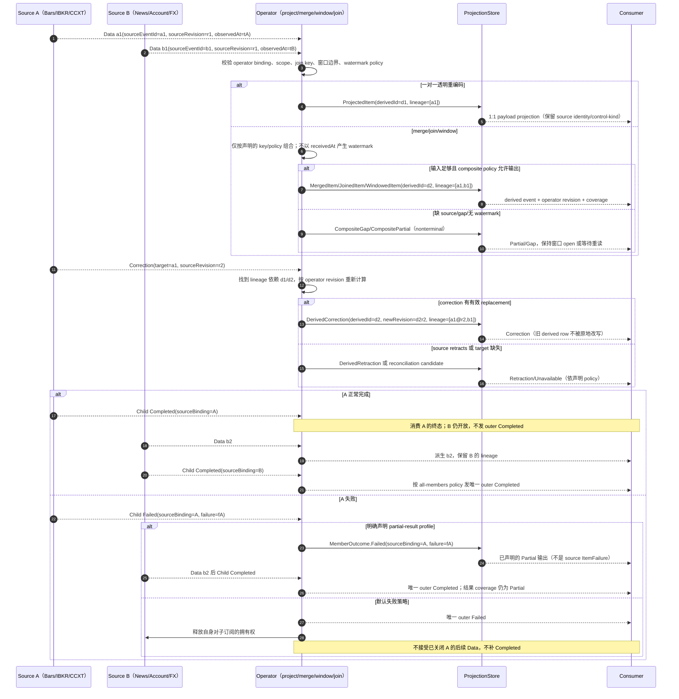
```mermaid
sequenceDiagram
    autonumber
    participant A as Source A（Bars/IBKR/CCXT）
    participant B as Source B（News/Account/FX）
    participant Op as Operator（project/merge/window/join）
    participant Store as ProjectionStore
    participant Out as Consumer

    A-->>Op: Data a1(sourceEventId=a1, sourceRevision=r1, observedAt=tA)
    B-->>Op: Data b1(sourceEventId=b1, sourceRevision=r1, observedAt=tB)
    Op->>Op: 校验 operator binding、scope、join key、窗口边界、watermark policy
    alt 一对一透明重编码
        Op->>Store: ProjectedItem(derivedId=d1, lineage=[a1])
        Store-->>Out: 1:1 payload projection（保留 source identity/control-kind）
    else merge/join/window
        Op->>Op: 仅按声明的 key/policy 组合；不以 receivedAt 产生 watermark
        alt 输入足够且 composite policy 允许输出
            Op->>Store: MergedItem/JoinedItem/WindowedItem(derivedId=d2, lineage=[a1,b1])
            Store-->>Out: derived event + operator revision + coverage
        else 缺 source/gap/无 watermark
            Op->>Store: CompositeGap/CompositePartial（nonterminal）
            Store-->>Out: Partial/Gap，保持窗口 open 或等待重读
        end
    end
    A-->>Op: Correction(target=a1, sourceRevision=r2)
    Op->>Op: 找到 lineage 依赖 d1/d2，按 operator revision 重新计算
    alt correction 有有效 replacement
        Op->>Store: DerivedCorrection(derivedId=d2, newRevision=d2r2, lineage=[a1@r2,b1])
        Store-->>Out: Correction（旧 derived row 不被原地改写）
    else source retracts 或 target 缺失
        Op->>Store: DerivedRetraction 或 reconciliation candidate
        Store-->>Out: Retraction/Unavailable（依声明 policy）
    end
    alt A 正常完成
        A-->>Op: Child Completed(sourceBinding=A)
        Note over Op,Out: 消费 A 的终态；B 仍开放，不发 outer Completed
        B-->>Op: Data b2
        Op-->>Out: 派生 b2，保留 B 的 lineage
        B-->>Op: Child Completed(sourceBinding=B)
        Op-->>Out: 按 all-members policy 发唯一 outer Completed
    else A 失败
        A-->>Op: Child Failed(sourceBinding=A, failure=fA)
        alt 明确声明 partial-result profile
            Op->>Store: MemberOutcome.Failed(sourceBinding=A, failure=fA)
            Store-->>Out: 已声明的 Partial 输出（不是 source ItemFailure）
            B-->>Op: Data b2 后 Child Completed
            Op-->>Out: 唯一 outer Completed；结果 coverage 仍为 Partial
        else 默认失败策略
            Op-->>Out: 唯一 outer Failed
            Op->>B: 释放自身对子订阅的拥有权
            Note over Op,Out: 不接受已关闭 A 的后续 Data，不补 Completed
        end
    end
```

### EF04 source 关联规则

- **Bars**：`sourceId|nativeSymbol` 是 source-scoped identity；同名 symbol 来自不同 provider 不合并。Bar service 当前 search 保留 source candidate；投影必须以 `InstrumentId`/source identity 作为 join key，并保留 interval/stream/asOf/coverage。`OhlcvBar` 的 extension index signature 不能自动成为 portable extension；需要 capability declaration。
- **News**：`dedupKey`（guid/link/hash）只决定同一 feed/source 的去重；不同 feed 相同标题/内容不凭文本合并，除非 operator 绑定声明跨源 canonicalization 并保留所有 lineage。`seq` 是 store ingest order，不是 publication-time 全序；window 依据 `pubTs`/明确 policy，迟到 ingest 仍可触发 correction/late policy。
- **IBKR history**：WAP、barCount、historical update、news provider/article/historical news 等只能在 `LSDK-IBKR-CATALOG` 证书声明后成为 extension/leaf。decoder callback 的到达顺序不等于 provider event-time 顺序；没有 native seq 时只能保持 adapter transport evidence。
- **CCXT**：历史 rows 的 trailing-window/limit policy 是 source leaf semantic；不能把不同 exchange 的 `timeframes`/missing volume/quote timestamp 统一成 unconditional Complete。账户 wallet/position/quote 组合必须按 AccountScope/source observation 分开，再由明确 valuation operator 组合。

### EF04 顺序、gap、修订与失败

1. **顺序**：每个 source partition 保持其 frame/commit order；operator 输出按自身 output partition 的 commitSeq。`observedAt`/`pubTs`/bar timestamp 只作 payload，不能作为跨 source event causality。
2. **Watermark**：source/recipe 宣明的 event-time watermark、snapshot barrier 或 finite Pull completion 才能证明 source completeness；声明的 processing deadline 可以关闭 projection，但结果必须带 `Partial`/deadline reason，绝不暗示 source watermark 或 finality。`receivedAt`、local `Date.now()`、数组位置、chunk name 都不能代替。
3. **Gap**：子流 Gap 必须保留 source partition、影响范围和恢复 policy。若 operator 允许 child gap -> Partial，输出 `CompositePartial`/`CompositeGap` 并继续；否则 outer `Failed`。不能在 gap 后直接 `Completed`。
4. **Correction/retraction**：以 source identity + source revision 定位旧观测，以 derived identity + derived revision 发新投影；不删除源事件、不原地改写历史 commit。没有原始 target 的 correction 进入 reconciliation/unavailable。
5. **Merge terminal**：每个 child terminal 先被 operator 消费；默认 child `Failed` 使 outer `Failed`，只有声明的 partial-result profile 才能把 terminal/failure 留在 typed `MemberOutcome` 输出。outer terminal 只按声明的 `all/any/quorum/explicit barrier` policy 发出一次；不存在默认 best-effort，也不会让 closed member resume。
6. **Transparent projection**：只能 systemically rebind payload，不得过滤 invalid item、改变失败分类、改变 terminal/coverage 或把 provider guarantee 提级。任何改变都必须在 event 上留下 operator binding 与 lineage。

---

<a id="ef05"></a>

## EF05 — 显式 capture、FX/估值与订单事实同步

### 目标与边界

EF05 把普通 data read 与可持久化证据分开：只有调用者显式发出 capture/order-sync/reconcile 命令，才选取 source observations、projection checkpoint 和控制证据写入 Journal/ObservationStore。普通 Pull、Push live frame、snapshot query、FX lookup 都不自动进入全量交易 WAL。

**所有权明确：**

- Snapshot owner 只消费 immutable `AccountFacts`、`PositionExposure`、`OrderHistory` projection 与 selected `FxObservation`，生成 `SnapshotCaptureResult = Captured | Partial | Unavailable | Invalid`；snapshot 是 query projection，不是 execution authority。
- FX owner 只产生带 pair/rate/source/observedAt/receivedAt/asOf/quality/coverage/revision 的 `FxObservation`。同币种 `Identity` 是合法 value；跨币种 `Confirmed | Estimated | Stale | UnknownFx | Unavailable` 不能被静默提升。
- Valuation owner 是 pure reducer/projection：live valuation 可只是 transient/read-only projection，输出带 AccountScope、InstrumentId、currency/multiplier、source lineage、coverage/freshness 的 `AccountValuation`；只有显式 capture/decision-evidence 才由 writer 原子提交 selected evidence 与 projection metadata。它不能产生 reservation/approval/dispatch。
- OrderSync owner 的 decoder/provider 先产生 raw `OrderObservation`、`FillEvent` ExternalFact；writer 验证后才产生 `OrderObservationRecorded`、`FillEventRecorded`、`ReconciliationEvent`。它不能生成 `DispatchStarted`、`PermissionGranted`、`OrderSubmitted` 或任何 financial dispatch。稳定 fill identity 可以是 native execution id 或 declaration-certified equivalent provider identity；没有稳定 identity 的状态只能是 unresolved/unknown，不能合成 fill。

### EF05 事件/消息表

| 类型 | 类别 | 派生 payload slots | 生产者 → 接受者 | identity/顺序/持久化 | 失败/恢复 |
|---|---|---|---|---|---|
| `CaptureRequested` | Command | scope、capture cause、selected source query/stream ids、asOf、projection checkpoint policy | Caller/Snapshot scheduler → Capture owner | request id + selected observation set；先 durable admission，再读数据 | queue/lease/provider/writer failure 留 request/receipt，不报告 Captured |
| `ObservationSelected` | WorkDescription/receipt | sourceEventIds、source identity/generation、selection reason、binding/revision | Capture owner → Observation writer | 选择证据与源事实分开；重复 selection 幂等 | source event missing/stale => Partial/Unavailable，不补 payload |
| `ObservationCaptured` | committed DomainEvent | exact source payload/extension、lineage、asOf/observedAt/receivedAt、coverage、capture checkpoint | Observation writer → projection readers | writer 原子提交 selected evidence + control projection metadata；不承诺 remote transaction atomicity | decode/unit/scope failure typed；旧 source event 不被删除 |
| `FxObservation` | ExternalFact/committed selected evidence | currency pair、rate、source/provider、observedAt、receivedAt、asOf、quality、coverage、revision | FX adapter → FX/valuation owner | identity = pair + source + observed/revision; same-currency identity explicit | malformed pair/rate => `FxSchemaFailure`; missing source time stays unknown-time quality |
| `ValuationProjected` | transient live projection；显式 capture/decision-evidence 时才成为 committed selected-evidence projection | AccountScope、cash/margin/position components、Money/Quantity exact values、FX lineage、coverage/reason、projection revision | Valuation reducer → ProjectionStore/Observation writer | pure deterministic reducer；live query 不自动持久化；decision-bearing path 原子提交 evidence + projection metadata | missing FX/units/multiplier => Partial/Unavailable, not zero/USD/default |
| `SnapshotCaptureResult` | receipt + projection result | SnapshotCause、capturedAt/asOf、scope、component evidence/checkpoint、`Captured\|Partial\|Unavailable\|Invalid` | Snapshot owner → ProjectionStore/caller | explicit capture only; snapshot id/revision stable; query read is not effect authority | request survives writer/provider failure；callback failure不等于 transaction failure |
| `OrderSyncRequested` | Command | AccountScope、provider/binding/generation、order/history selector、cursor、selected fields、sync cause | History caller/recovery worker → OrderSync owner | durable request id + exact cursor/binding；no timestamp/array-position cursor inference | partial listing -> Partial/Unresolved; stale generation -> rediscover/reconcile |
| `OrderObservation` | ExternalFact | provider/native order id（或声明的等价 provider identity）、AccountScope、InstrumentId candidate、raw status/terms/legs、source revision/time、binding/generation | Provider history/listing decoder → OrderSync owner | source identity/revision；尚未是 UTA committed event；raw observation 可按 read policy re-read | unknown status/identity conflict 保持 raw Unknown/ReconciliationRequired，不直接改变本地 order projection |
| `FillEvent` | ExternalFact | provider execution/fill identity（native 或声明的等价稳定 identity）、order id、source quantity/side、price/multiplier/currency、observedAt/source revision | Provider execution decoder/history → OrderSync owner | raw source identity + revision；尚未是 UTA committed event；缺稳定 identity 进入 unresolved evidence | malformed units/identity 由 decoder/reconcile 处理，不合成 fill |
| `OrderObservationRecorded` | committed DomainEvent | normalized native/equivalent order identity、AccountScope、InstrumentId、status transition、terms/legs、source revision/time、dispatch reference if one already exists | OrderProjection writer → Journal/ProjectionStore | writer commitSeq + source revision；no dispatch reference unless pre-existing | unknown status/identity conflict remains Unknown/ReconciliationRequired |
| `FillEventRecorded` | committed DomainEvent | stable provider execution identity、order id、normalized positive Quantity + explicit Side、price/multiplier/currency、observedAt/source revision、lineage | Order/Accounting writer → Journal/ProjectionStore | writer commitSeq + provider identity/revision；duplicate fill is idempotent; no stable identity => unresolved evidence | late fill after cancel => correction/reconciliation, not status rewrite; missing units blocks valuation |
| `ReconciliationRecorded` | committed evidence | unresolved identity/conflict, compared source revisions, operator decision reference | Reconcile owner → history projection | append-only evidence; never mutate old external fact | unresolved remains visible/unavailable; no synthetic fill/dispatch |
| `CaptureReceipt`/`OrderSyncReceipt` | WorkReceipt | request id, committed evidence ids, outcome coverage, checkpoint, failure/retry policy | Writer → caller/scheduler | receipt is not `DispatchReceipt`; writer success only after atomic commit | crash before commit yields no success; after commit receipt can be re-read |

### EF05 时序

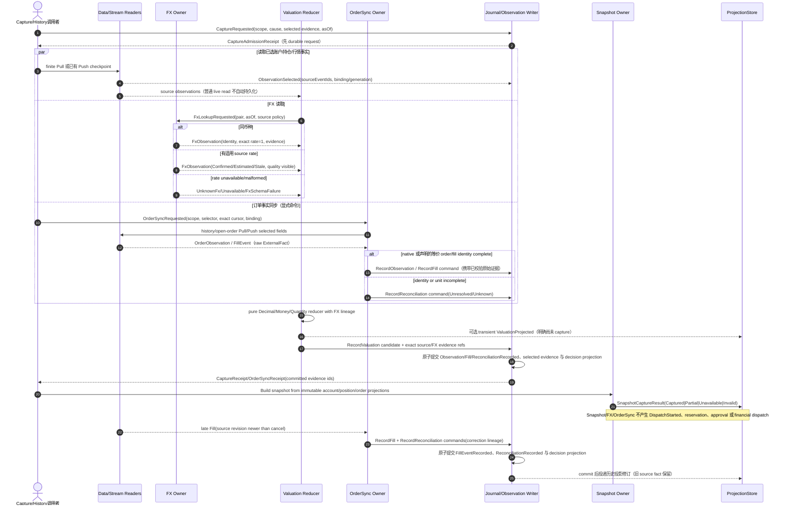
```mermaid
sequenceDiagram
    autonumber
    actor Caller as Capture/History调用者
    participant Data as Data/Stream Readers
    participant FX as FX Owner
    participant Val as Valuation Reducer
    participant Order as OrderSync Owner
    participant Writer as Journal/Observation Writer
    participant Snap as Snapshot Owner
    participant View as ProjectionStore

    Caller->>Writer: CaptureRequested(scope, cause, selected evidence, asOf)
    Writer-->>Caller: CaptureAdmissionReceipt（先 durable request）
    par 读取已选账户/持仓/行情事实
        Caller->>Data: finite Pull 或已有 Push checkpoint
        Data-->>Writer: ObservationSelected(sourceEventIds, binding/generation)
        Data-->>Val: source observations（普通 live read 不自动持久化）
    and FX 读取
        Val->>FX: FxLookupRequested(pair, asOf, source policy)
        alt 同币种
            FX-->>Val: FxObservation(Identity, exact rate=1, evidence)
        else 有适用 source rate
            FX-->>Val: FxObservation(Confirmed/Estimated/Stale, quality visible)
        else rate unavailable/malformed
            FX-->>Val: UnknownFx/Unavailable/FxSchemaFailure
        end
    and 订单事实同步（显式命令）
        Caller->>Order: OrderSyncRequested(scope, selector, exact cursor, binding)
        Order->>Data: history/open-order Pull/Push selected fields
        Data-->>Order: OrderObservation / FillEvent（raw ExternalFact）
        alt native 或声明的等价 order/fill identity complete
            Order->>Writer: RecordObservation / RecordFill command（携带已校验原始证据）
        else identity or unit incomplete
            Order->>Writer: RecordReconciliation command(Unresolved/Unknown)
        end
    end
    Val->>Val: pure Decimal/Money/Quantity reducer with FX lineage
    Val-->>View: 可选 transient ValuationProjected（明确尚未 capture）
    Val->>Writer: RecordValuation candidate + exact source/FX evidence refs
    Writer->>Writer: 原子提交 Observation/Fill/ReconciliationRecorded、selected evidence 与 decision projection
    Writer-->>Caller: CaptureReceipt/OrderSyncReceipt(committed evidence ids)
    Caller->>Snap: Build snapshot from immutable account/position/order projections
    Snap->>View: SnapshotCaptureResult(Captured|Partial|Unavailable|Invalid)
    Note over Snap,View: Snapshot/FX/OrderSync 不产生 DispatchStarted、reservation、approval 或 financial dispatch

    Data-->>Order: late Fill(source revision newer than cancel)
    Order->>Writer: RecordFill + RecordReconciliation commands(correction lineage)
    Writer->>Writer: 原子提交 FillEventRecorded、ReconciliationRecorded 与 decision projection
    Writer-->>View: commit 后投递历史投影修订（旧 source fact 保留）
```

### EF05 数据类型关联与证据边界

1. **Account/position capture**：`AccountValueObservation` 保留每个币种/BASE 行、AccountScope、source、generation、receiveSequence（若只是 adapter-local，就这样标记），不把缺失 FX/mark 值填成 0。source position 的 signed quantity 在 decoder 边界只归一化一次为 **positive magnitude + explicit Side**，同时保留原生 signed representation 作为 provenance。valuation/fill reducer 由 magnitude 与 Side 计算一次符号效应，不能再把已经带符号的 source quantity 乘一次 Side。零数量只有 provider closure evidence 才能解释为 Closed。
2. **FX**：`FxObservation` 的 `observedAt` 与 `receivedAt` 必须分开；source 没有时间戳时 quality 保持 unknown-time，不使用本地接收时间伪造 Confirmed。same-currency `Identity` 不代表跨币种 rate；`Estimated` 只在显式展示 policy，不能自动成为 guard/dispatch 前置条件。
3. **Valuation**：pure reducer 只组合 validated facts；missing account row、partial wallet listing、unknown instrument、multiplier/currency/FX missing 都保持 Partial/Unavailable/Unknown reason。keyless/public source 是 DataOnly/PublicSource，不计入 funded equity。
4. **Order sync**：订单状态、fill、reconcile 是不同观察类型。raw `OrderObservation`/`FillEvent` 先是 provider ExternalFact，writer 验证后才提交 `*Recorded`；`OrderObservationRecorded(status=Unknown)` 不等于 rejected/submitted。`FillEventRecorded` 需要 native execution identity 或 declaration-certified equivalent stable provider identity；同步出现 send-after-ack、late fill、status regression 时追加 correction/reconcile evidence，不盲改历史。
5. **Snapshot**：snapshot 只在 `CaptureRequested` 明确选择 source evidence 后持久化 selected observations 和 checkpoint；不将所有 Push frames journal 化。`SnapshotEnd` 只提供 data stream segment barrier，不代表 snapshot 已 Captured；capture result 仍由 Snapshot owner 对 component coverage 做穷举判断。
6. **金融效果禁止路径**：EF05 的任何 producer/consumer 都没有 `DispatchGrant` writer capability。若已有 dispatch reference，只能作为 correlation/attribution 保存；EF05 不创建新 dispatch，也不为缺失 order identity 生成 synthetic order。

### EF05 故障、重复、迟到与恢复

- 同一 `CaptureRequested`/`OrderSyncRequested` 的 request digest、scope、binding、generation、cursor 相同，先查询既有 receipt。若没有 committed receipt，read-only capture/sync 可依据 selected leaf 的 read retry policy 重新读取；这不是金融 dispatch resend，也不产生新的 DispatchGrant。writer 在 source read 成功、commit 失败时，保留 source event 和可重试 request；不产生 success receipt，不回滚 provider。
- source correction/retraction 只改变被识别 observation 或 projection revision。没有新 source evidence，不能把 Unknown 变 Known；没有旧 source target，保留 reconciliation candidate。
- provider listing 只得到部分 namespace 时，order/account projection 为 Partial，并保留失败 namespace；不能把 omitted order 当“无订单”。
- late fill after cancel 是新的 source fact/possibly correction，必须保留 cancel 与 late fill 的原始顺序和 lineage；不得回退为已知成功/失败，也不得重新 dispatch。
- restart 依靠 durable capture/sync request、source generation、projection checkpoint 和 receipt reconcile；不得从 timestamp、数组位置、chunk name 推断 cursor，也不能由 local receivedAt 生成 watermark。

---

### EF01–EF05 的跨流验收不变量

1. 每个 payload field 都可回溯到 capability/recipe slot；本地 static inference 与 foreign dynamic `BoundDocument + certification` 不混用。
2. source event、derived event、delivery frame、receipt、diagnostic 的类型和持久化边界明确；一次普通函数调用不自动变成 committed event。
3. source identity、derived lineage、frame identity、transport sequence、commit sequence 和 generation 不互换。
4. Pull 只产生有限结果；Push 按 `Started + nonterminal frames + exactly one terminal`，`SnapshotEnd` 非终态，crash 不保证 final wire frame。
5. 透明 1:1 投影只重绑定 payload；任何 filter/predicate/window/join/merge/失败策略变化都显式绑定 operator，不能借“extension”逃避其终态/coverage/失败语义。
6. merge 内部消费每个 child terminal；无声明的 child recoverability 不降级成 Partial；不增加 `SourceClosed`。
7. 无 provider/native watermark 时，不用 `receivedAt`、本地 now、数组位置、timestamp 排序制造全局顺序或窗口完成。
8. 普通 data、snapshot、FX、valuation 和 order sync 永不产生 financial dispatch；只有 EF06–EF10 的控制域拥有 dispatch/approval/reservation 权威。
9. 所有 `Complete` 都需要声明的 coverage/terminal/barrier 证据；空数组、零、USD、默认时间和静默删源不是证据。
10. 文中的 IBKR/CCXT/RSS 代码锚点是当前行为/adapter evidence；未实现或未验证的 capability、finality、replay、provider atomicity 均不得在事件类型上被宣称为事实。

## 受控效果与激活上下文

本组从意图接纳推进到外部尝试、结果观察与延后激活。图中的提交点决定工作何时可以开始，不能由回执或传输顺序替代。

### 受控效果与激活上下文的共用约定

类型分类、限界上下文、`Value(B,s)` / `Event(B,k,s)` 的槽位推导、事件身份/因果/来源位置、透明扩展与组合的一般法律，以主书第 16 章为基础定义（见 `../uta-capability-runtime-design.md#event-flows`）。本文不复制全局表，只在 EF06–EF10 的具体事件表中指出各 slot、producer/consumer、作用域、版本、提交顺序和失败分支。

本文使用 `E<recipe, slot>` 作为派生事件的阅读记法：实际 payload 必须来自该 recipe declaration 的 slot、binding、schema/semantic digest 与解释器身份，不能新增一个固定业务接口或全局 `EventUnion`。下文把 `IntentAccepted`、`Prepared`、`DispatchStarted` 等名称当作阶段语义标签；它们不是已经存在的 TypeScript interface。原始 `ExternalFact`、provider ack、订单/成交 observation、DeliveryFrame、receipt 与 committed DomainEvent 仍按第 16 章的上下文区分。

本文只保留具体控制流所需的共同硬约束：

1. `Prepare` 是纯 compiler/decision；不调用 SDK、不启动 Promise、不消费 execution reservation。
2. `Approve`（或已验证的 delegated approval）才可能在 writer 当前 progressive state 上绑定 approval、reservation、job/outbox 与 receipt；`RequestSubmission` 只请求资格/进入批准路径，不能绑定 approval。
3. fresh `Start` 才能提交 immutable attempt/`DispatchStarted` 并签发 process-bound、one-use `DispatchGrant`；重复/query Start 只返回 `AlreadyStarted`。
4. `DispatchStarted` 后的 response loss、crash、timeout、lease expiry 必须由 writer 读取已有 observation/criterion 决定：证据不足时进入 `OutcomeUnknown`/`RecoveryRequired`，已有可靠 criterion 时只追加 transport-loss 诊断并保留结论；普通同步、listing、投影不能创建第二 attempt。
5. reservation 只有在 no-effects/terminal/recovery-owner handoff 有具名证据时才能释放。

### 设计依据与旧行为证据

- 主书规定纯 `decide/evolve`、writer 原子写集、plan/approval 分离、`DispatchStarted` 先于 native write，以及 Unknown/recovery 边界：[第9章：纯决策、持久值与重新绑定](../uta-capability-runtime-design.md#a5)、[第10章：受控金融效果协议](../uta-capability-runtime-design.md#a6)。
- 主书规定 batch policy、reservation、同步与敞口释放：[第10章 §§10.4–10.5](../uta-capability-runtime-design.md#a6)。
- 主书规定 deferred relation、checkpoint、correction/retraction、disposition 与 Alice durable admission：[第11章：外部激活与可恢复决策](../uta-capability-runtime-design.md#a7)。
- 当前 `TradingGit.push` 仍在内存中逐个执行 operation，再 snapshot、append commit、`onCommit`：[services/uta/src/domain/trading/git/TradingGit.ts:119-183](../../services/uta/src/domain/trading/git/TradingGit.ts#L119-L183)。因此“旧 marker 不存在”不证明没有 remote side effect。
- 当前 guard pipeline 读取 broker snapshot 后顺序调用 mutable guard，拒绝用字符串返回：[services/uta/src/domain/trading/guards/guard-pipeline.ts:20-35](../../services/uta/src/domain/trading/guards/guard-pipeline.ts#L20-L35)。这只证明迁移前行为，不能作为新 writer 的实现证据。
- 当前 close staging 只记录意图；真正数量检查在 dispatch 前读取 position：[services/uta/src/domain/trading/UnifiedTradingAccount.ts:565-595](../../services/uta/src/domain/trading/UnifiedTradingAccount.ts#L565-L595)、[services/uta/src/domain/trading/UnifiedTradingAccount.ts:693-765](../../services/uta/src/domain/trading/UnifiedTradingAccount.ts#L693-L765)。
- 当前 poller 是进程内 timer/running flag，调用 `observeExternalOrders` 和 `sync`：[services/uta/src/domain/trading/order-sync-poller.ts:39-104](../../services/uta/src/domain/trading/order-sync-poller.ts#L39-L104)。它不证明 durable scheduler、lease fencing 或 native idempotency。

<a id="ef06"></a>

## EF06 — 意图接纳、prepare、风险与批准

### 6.1 输入、接纳与派生事件

`SubmitIntent` 是唯一的外部意图接纳命令：它携带 `commandId`、principal、scope、`intentRevision`、expected aggregate revision、精确 recipe input 与 policy reference，但**不携带调用者自填的余额、行情、position、权限或来源身份**。writer 只验证命令身份、canonical input、scope、版本和幂等键；它不做网络 IO，也不把 caller 给出的 facts 当授权依据。

接纳与准备是两个阶段：

1. writer 在短事务内提交 `Event(A, IntentAccepted, A.intent)`、intent revision、receipt 和 `PrepareWork`。`A.intent` 是 recipe 的 intent slot；receipt 只在 commit 后返回。
2. trusted Read Interpreter 在 writer 外按 prepared work 读取 provider/data facts，并运行纯 compiler 与 declaration-bound guards。它不改变 UTA authority，也不把网络调用放进 writer。
3. interpreter 以 `RecordPrepared`（带 plan digest、prepared payload、fact/evaluator evidence、expected intent revision）回到 writer。writer 只做版本/CAS、binding/slot 校验与原子记录；成功时提交 `Event(A, PlanPrepared, A.prepared)`。版本已变化时返回 stale result，要求按当前 intent 重新读 facts/prepare，不能覆盖新 revision。
4. `RequestSubmission` 只是请求检查资格/进入批准路径；它不是 `Approve`。只有匹配 plan digest、scope、expiry 与 policy 的真实 approver 命令，才可提交 ApprovalBinding。没有 approver witness 时，writer 提交/返回 `AwaitingApproval` control result，不产生 `ApprovalBound`。

### 6.2 输入类型、producer/consumer 与控制事件

下表刻意区分 recipe slot payload 与 kernel control schema。`E<A, ...>` 只用于 A 的声明槽位；`Control<A.binding, scope, ...>` 表示内核控制事件，payload 关联 A 的 binding/scope，但不是伪造出来的 A recipe slot。

| 事件/工作说明 | producer / consumer | 状态与作用域 | commit、因果与失败规则 |
|---|---|---|---|
| `SubmitIntent` command | 外部已认证 caller / UTA writer | command aggregate + principal/scope | 不含 caller facts；同 command key + canonical input 去重，冲突拒绝。 |
| `E<A,intent>` `IntentAccepted` | UTA writer / PrepareWorker | intent revision + AccountScope | 只提交 intent、receipt、`PrepareWork`；不提交 prepared、approval、reservation 或 job。 |
| `PrepareWork` | writer / trusted Read Interpreter | intent revision、required fact bindings | WorkDescription，不是 domain event；读事实、网络和 provider codec 在 writer 外。 |
| `ExternalFact<FactDeclaration>` account/quote/position/permission | Provider/Data owner + trusted interpreter / pure compiler/guards | 原生 source scope、generation、as-of | 不是 A recipe slot，不自动授权、不等于 UTA event；caller 无权伪造来源或 completeness。 |
| `RecordPrepared` command | PrepareWorker / UTA writer | intent revision + expected version | writer 重新校验 binding/slot/digest/CAS；stale 时不覆盖。 |
| `E<A,prepared>` `PlanPrepared` | UTA writer / approval query、audit projection | plan aggregate + A.binding、AccountScope | payload 是 A.prepared；保存 selected facts、criterion、expiry、native lookup、compiler identity。 |
| `GuardSummary` candidate evidence | pure declaration-bound guards / PrepareWorker、writer | plan revision + guard declaration version | 作为 A.prepared 的关联 evidence 或 typed prepare failure；guard reject 不消费 cooldown/reservation。 |
| `PrepareFailure` result/diagnostic | trusted interpreter + pure compiler / caller/query | intent revision | schema/fact/guard/evaluator failure；不产生 execution job，不伪造一个 recipe 的 `prepare-failed` slot。 |
| `RequestSubmission` command | caller/AI / writer | current plan/control revision | 只能产生资格结果或 `AwaitingApproval`；不能自己产生 `ApprovalBound`。 |
| `Control<A.binding, scope, AwaitingApproval>` | UTA writer / caller/query | current plan/control revision | kernel control result；没有匹配 approver witness 时不创建 ApprovalBound、reservation 或 dispatch job。 |
| `Approve` command | matching authenticated approver / UTA writer | plan digest + actor + policy + expiry | 只有 writer 验证通过后才提交 `Control<A.binding, scope, ApprovalBound>`；旧 revision/digest、非 approver 或过期拒绝。 |
| `Control<A.binding, scope, ReservationHeld>` | UTA writer / scheduler/recovery owner | AccountScope、instrument/exposure/conflict keys | kernel control schema，非 A.recipe slot；只在有效 approval 的同一 writer transaction 中消费。 |
| `Control<A.binding, scope, DispatchPlanned>` | UTA writer / scheduler | plan/attempt candidate | kernel queue event；不表示已经发送，lease 不等于 grant。 |
| `Control<A.binding, scope, ApprovalExpired/Rejected>` | UTA writer / review/audit projection | plan/control revision | kernel control schema，非 recipe slot；started 前可退休并释放未执行 reservation，started 后不得伪装无效果。 |

### 6.3 主流程与失败/竞争分支

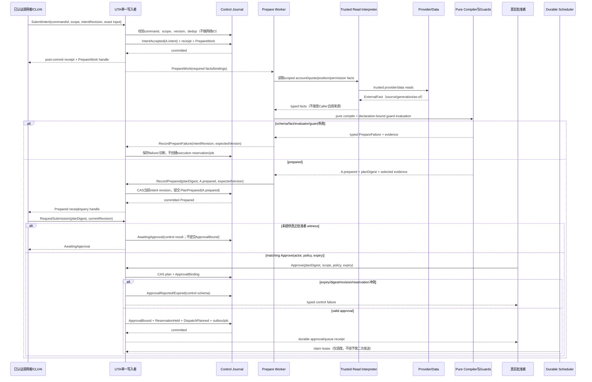
```mermaid
sequenceDiagram
  participant Caller as 已认证调用者/CLI/AI
  participant Writer as UTA单一写入者
  participant Store as Control Journal
  participant Prepare as Prepare Worker
  participant Reader as Trusted Read Interpreter
  participant Provider as Provider/Data
  participant Compiler as Pure Compiler与Guards
  participant Approver as 真实批准者
  participant Scheduler as Durable Scheduler

  Caller->>Writer: SubmitIntent(commandId, scope, intentRevision, exact input)
  Writer->>Store: 校验command、scope、version、dedup（不做网络IO）
  Writer->>Store: IntentAccepted(A.intent) + receipt + PrepareWork
  Store-->>Writer: committed
  Writer-->>Caller: post-commit receipt + PrepareWork handle
  Writer-->>Prepare: PrepareWork(required facts/bindings)
  Prepare->>Reader: 读取scoped account/quote/position/permission facts
  Reader->>Provider: trusted provider/data reads
  Provider-->>Reader: ExternalFact（source/generation/as-of）
  Reader-->>Prepare: typed facts（不接受Caller自填来源）
  Prepare->>Compiler: pure compile + declaration-bound guard evaluation
  alt schema/fact/evaluator/guard失败
    Compiler-->>Prepare: typed PrepareFailure + evidence
    Prepare-->>Writer: RecordPrepareFailure(intentRevision, expectedVersion)
    Writer->>Store: 保存failure/诊断，不创建execution reservation/job
  else prepared
    Compiler-->>Prepare: A.prepared + planDigest + selected evidence
    Prepare->>Writer: RecordPrepared(planDigest, A.prepared, expectedVersion)
    Writer->>Store: CAS当前intent revision，提交 PlanPrepared(A.prepared)
    Store-->>Writer: committed Prepared
    Writer-->>Caller: Prepared receipt/query handle
    Caller->>Writer: RequestSubmission(planDigest, currentRevision)
    alt 未提供真正批准者 witness
      Writer->>Store: AwaitingApproval(control result；不提交ApprovalBound)
      Writer-->>Caller: AwaitingApproval
    else matching Approve(actor, policy, expiry)
      Approver->>Writer: Approve(planDigest, scope, policy, expiry)
      Writer->>Store: CAS plan + ApprovalBinding
      alt expiry/digest/revision/reservation冲突
        Writer->>Store: ApprovalRejected/Expired(control schema)
        Writer-->>Approver: typed control failure
      else valid approval
        Writer->>Store: ApprovalBound + ReservationHeld + DispatchPlanned + outbox/job
        Store-->>Writer: committed
        Writer-->>Approver: durable approval/queue receipt
        Scheduler-->>Writer: claim lease（仅调度，不授予第二次发送）
      end
    end
  end
```

### 6.4 竞态与恢复规则

- 同一 `commandId + canonical payload + principal/scope` 的 `SubmitIntent` 重试返回同一接纳 receipt；相同身份但不同 binding、scope、revision 或 input digest 返回 `IdempotencyConflict`。
- caller 不能把 `price/position/balance/permission/source generation` 填进 command 作为事实。Read Interpreter 必须从已认证 provider/data scope 取 facts，并带 source identity、generation、as-of 和 completeness；网络错误在 writer 外成为 typed failure。
- `RecordPrepared` 是独立版本 CAS。writer commit 后 intent 已经变成新 revision 时，迟到 prepared 只能得到 stale/conflict；不能拿旧 facts 覆盖新 plan，也不能回到 caller 重新批准旧摘要。
- guard 评估顺序属于声明；前 guard 的 cooldown、风险占用或 evaluator 状态不能在后 guard reject 时泄漏。候选 evidence 可随 failure/prepared 保存，但 execution reservation 只能在有效 approval 的原子写集中消费。
- writer storage commit 失败时不能返回成功 receipt、不能创建 job、不能向 provider dispatch。`PrepareFailure` 不等于 `ApprovalRejected`；两者分别由 prepare interpreter 与 control writer 解释。
- `RequestSubmission` 仅产生 `AwaitingApproval` 或进入已授权 approver 的控制路径；任何“命中了规则”的 ExternalFact、AI text 或 UI button 都不替代 `Approve`。
- `ApprovalBinding` 过期、review `Keep`、CLI 退出只冻结控制；尚未 started 时可显式 `Retire/Discard` 并释放未执行 reservation，started 后转 EF07 observation/recovery。

<a id="ef07"></a>

## EF07 — Dispatch、先到观察、未知与历史恢复

### 7.1 Dispatch identity、recipe payload 与 control schema

EF07 的 `Start` 不是外部 approver/caller 直接调用的公开入口。批准后的 `DispatchPlanned` control event 由 scheduler/私有 worker 消费；scheduler 或 worker 向 writer 请求 `Start`，writer 在当前 approval binding、job lease/epoch、scope 与 expected control revision 上做 CAS。成功后 writer 先提交 `Control<A.binding, scope, DispatchStarted>`，再向同一个私有 worker 交付一次性 grant。

表中区分三类东西：A recipe 的 `intent/prepared/ack/observation` 只承载相应 declaration slot；`Control<A.binding, scope, ...>` 是内核控制 schema 关联 A，不伪造原 recipe 不存在的 slot；`ExternalFact<A, ack|observation>` 是 Provider 产生的原始事实。原始事实被 writer 接纳后，才产生 committed `AckRecorded`/`ObservationRecorded`。

| 事件/工作说明 | producer / consumer | source-vs-target state | 顺序、唯一性与失败 |
|---|---|---|---|
| `Control<A.binding, scope, DispatchPlanned>` | UTA writer / scheduler | plan ready、尚未发送 | 可重建 queue；不能作为 send 证据；scheduler lease 不是 grant。 |
| `Start` command | scheduler/private worker / UTA writer | queued plan + job lease/epoch | writer 只在当前 approval binding、scope 与 expected revision 校验后决定是否提交 started transition。 |
| `Control<A.binding, scope, DispatchStarted>` | UTA writer / private worker、recovery owner | `NotStarted -> Started`，AccountScope + attempt | fresh CAS 一次；同一 plan revision 一个 attempt owner；重复 Start 只有 `AlreadyStarted`。 |
| `Work<A,start>` `DispatchGrant` | writer / private worker interpreter | process-bound ephemeral | writer commit 后才交付；一次消费，不持久化、不由 query 重建。 |
| `ExternalFact<A,ack>` raw `Ack`/`KnownRejection` | Provider（raw fact producer）-> private worker receives / writer | native response boundary | worker 只能把原始证据带回 writer；不能自行提交 UTA 状态。 |
| `Control<A.binding, scope, AckRecorded>` carrying `A.ack` | UTA writer / control query、audit | attempt aggregate | 仅 writer 在 `RecordAck` CAS 后提交；ack 不是 fill/cancel/finality。 |
| `ExternalFact<A,observation>` raw `Fill`/`Working`/`Cancel` | Provider（raw observation producer）-> observer receives / writer | native identity + source revision | 可先于 ack 到达，保留 source sequence/identity。 |
| `Control<A.binding, scope, ObservationRecorded>` carrying `A.observation` | UTA writer / criterion/recovery | attempt + native identity | 仅 writer 提交；不覆盖较新的 observation，不因迟到 ack 回退。 |
| `Control<A.binding, scope, OutcomeUnknown>` | UTA writer / recovery owner | started but boundary uncertain | 只有现有 observation/criterion 不足以决定时才成立；保留 reservation/conflict owner。 |
| `HistoryResolveWork` / resolver result | writer / scoped history resolver | known native/client identity | WorkDescription 与 ExternalFact 分开；`Found`、`AbsentWithEvidence`、`Partial/Unavailable`、`Ambiguous`、`Malformed` 分开，空 listing 不是 absence。 |
| `Control<A.binding, scope, CriterionSatisfied/Rejected>` | UTA writer after typed evidence / audit/control query | criterion state | kernel control event；只在声明 success evidence 满足后终态，不能由旧 `OrderState` 投影直接 settlement。 |
| `Control<A.binding, scope, RecordTransportLoss>` | UTA writer / recovery query | response channel lost | 必须先读取已有 committed observations/criterion；已有充分证据时保持终态，不无条件降级为 Unknown。 |

### 7.2 发送与先到观察时序

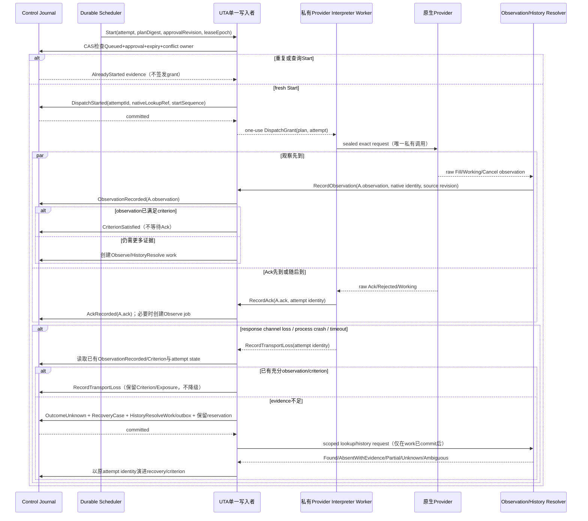
```mermaid
sequenceDiagram
  participant Store as Control Journal
  participant Scheduler as Durable Scheduler
  participant Writer as UTA单一写入者
  participant Worker as 私有Provider Interpreter Worker
  participant Native as 原生Provider
  participant Observer as Observation/History Resolver

  Scheduler->>Writer: Start(attempt, planDigest, approvalRevision, leaseEpoch)
  Writer->>Store: CAS检查Queued+approval+expiry+conflict owner
  alt 重复或查询Start
    Store-->>Writer: AlreadyStarted evidence（不签发grant）
  else fresh Start
    Writer->>Store: DispatchStarted(attemptId, nativeLookupRef, startSequence)
    Store-->>Writer: committed
    Writer-->>Worker: one-use DispatchGrant(plan, attempt)
    Worker->>Native: sealed exact request（唯一私有调用）
    par 观察先到
      Native-->>Observer: raw Fill/Working/Cancel observation
      Observer->>Writer: RecordObservation(A.observation, native identity, source revision)
      Writer->>Store: ObservationRecorded(A.observation)
      alt observation已满足criterion
        Writer->>Store: CriterionSatisfied（不等待Ack）
      else 仍需更多证据
        Writer->>Store: 创建Observe/HistoryResolve work
      end
    and Ack先到或随后到
      Native-->>Worker: raw Ack/Rejected/Working
      Worker->>Writer: RecordAck(A.ack, attempt identity)
      Writer->>Store: AckRecorded(A.ack)；必要时创建Observe job
    end
    alt response channel loss / process crash / timeout
      Worker-->>Writer: RecordTransportLoss(attempt identity)
      Writer->>Store: 读取已有ObservationRecorded/Criterion与attempt state
      alt 已有充分observation/criterion
        Writer->>Store: RecordTransportLoss（保留Criterion/Exposure，不降级）
      else evidence不足
        Writer->>Store: OutcomeUnknown + RecoveryCase + HistoryResolveWork/outbox + 保留reservation
        Store-->>Writer: committed
        Writer->>Observer: scoped lookup/history request（仅在work已commit后）
        Observer-->>Writer: Found/AbsentWithEvidence/Partial/Unknown/Ambiguous
        Writer->>Store: 以原attempt identity演进recovery/criterion
      end
    end
  end
```

### 7.3 先到观察、运输损失和旧解释器

1. **fill 先于 submit ack**：raw `FillObservation` 由 Provider 产生，经 observer 送给 writer 后提交 `ObservationRecorded(A.observation)`；后到 raw ack 只能提交 `AckRecorded(A.ack)`，不能把已观察的 fill 回退为 `Submitted`。
2. **criterion 先于 ack 通道损失**：如果 writer 已经提交足够 observation 并记录 criterion，随后 worker 报告 response/ack channel loss，只记录 `RecordTransportLoss`/diagnostic 并保留现有 criterion、exposure 与 recovery lineage；不能无条件补写 `OutcomeUnknown`。只有现有证据不足时才进入 Unknown。
3. **unknown 与 not-found 分离**：`GET` 超时、分页不完整、旧 clientId 不可见、listing 不是完整 namespace，都只能产生 `Unknown/Partial/Unavailable`。只有 provider declared 的 complete absence evidence，且发送窗口/identity 条件满足，才可结案为未产生效果。
4. **解释器不可用**：`DispatchStarted` 或 Unknown 后，使用计划保存的 provider instance/capability revision/schema digest/interpretation identity；当前目录删除或新版本加载失败时为 `RecoveryRequired`，不能用当前 compiler reprepare 或新 salt 发送。
5. **当前旧行为的警示**：`TradingGit.push` 的 remote callback 在 snapshot/persist 之前执行（`TradingGit.ts:141-179`）；legacy 明确要求缺 `DispatchStarted` marker 不能被当成 no-start（`LCORE-JOURNAL-OUTBOX`、`LTX-JOURNAL`）。
6. **观察不等于交易**：`SyncReconcile` 可以导入 selected status/filled quantity/price 并重建 projection，但不创建新的 financial attempt。当前 poller 的 `sync()` 是这一类观察的来源证据，不是新协议的 durable scheduler。

<a id="ef08"></a>

## EF08 — cancel/replace/close、部分成交与敞口

### 8.1 每种 mutation 都是独立 recipe

`Cancel`、`Replace`、`Close` 不是一个 `OrderState` flag 或通用 inverse；每个 provider leaf 都有自己的 A recipe association、input/prepared/ack/observation/recovery/compensation slots。`Replace` 保存 before-image、expected order/provider version 和 command identity；`Close` 的 `All` 与 `QuantityTarget` 是 genuine alternatives，quantity 必须在新的 scoped exposure evidence 上复核。

| 事件/工作说明 | producer / consumer | 关键 source/target 状态 | 必须保留的证据 |
|---|---|---|---|
| `Cancel` / `Replace` / `Close` command | 已认证 caller / UTA writer | target identity、scope、expected order/exposure version | command 不能自填 Provider facts；stale identity、缺 leaf、scope mismatch 在发送前拒绝。 |
| `E<A,intent>` `IntentAccepted` | UTA writer / trusted mutation PrepareWorker | mutation intent revision + AccountScope | writer-only committed recipe event；只产生 receipt/PrepareWork，不产生 prepared、approval、reservation。 |
| `PreparedCandidate<A>` + `RecordPrepared` command | trusted mutation PrepareWorker / UTA writer | candidate plan、expected intent revision | candidate/work description 可携带 before-image、native version、exposure evidence；仅 writer CAS 后才可提交下一行。 |
| `E<A,prepared>` `PlanPrepared` | UTA writer / approval query、audit projection | plan aggregate + A.binding、scope | writer-only committed recipe event；旧 approval 不自动继承，保存 compiler/criterion/expiry/native lookup。 |
| `Control<A.binding, scope, MutationDispatchPlanned/Started>` | UTA writer / scheduler、私有 worker | mutation attempt candidate -> started | kernel control schema；fresh Start CAS 后 writer commit，再给 worker one-use grant。 |
| `ExternalFact<A,ack>` raw cancel/replace/close Ack/Rejected | Provider（raw fact producer）-> private worker receives | native response boundary | worker 只能把原始证据带回 writer；Ack 只表示接受/处理，不能直接结案。 |
| `Control<A.binding, scope, AckRecorded>` carrying `A.ack` | UTA writer / control query | started mutation attempt | 只有 writer 在 `RecordAck` 后提交；与 observation 分离。 |
| `ExternalFact<A,observation>` raw order/fill/position observation | Provider（raw observation producer）-> account observer receives / writer | native identity + source revision | 保留 execution identity、fill qty/price/time、working/cancelled 状态与 coverage。 |
| `Control<A.binding, scope, ObservationRecorded>` carrying `A.observation` | UTA writer / criterion/exposure reducer | attempt + exposure | 只有 writer 提交；不能把 observation 压成旧 `OrderState`。 |
| `E<A,compensation>` / compensation work | writer after explicit policy / compensation interpreter | unresolved exposure only | target、risk budget、dependency order、new approval/attempt；不能调用旧函数 inverse。 |

### 8.2 取消、替换和 close 的竞态

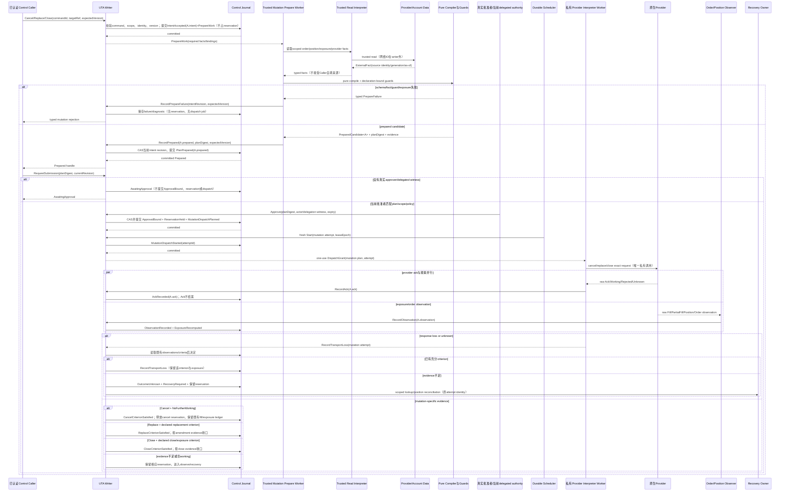
```mermaid
sequenceDiagram
  participant Caller as 已认证Control Caller
  participant Writer as UTA Writer
  participant Store as Control Journal
  participant Prepare as Trusted Mutation Prepare Worker
  participant Reader as Trusted Read Interpreter
  participant ProviderData as Provider/Account Data
  participant Compiler as Pure Compiler与Guards
  participant Approver as 真实批准者/当前delegated authority
  participant Scheduler as Durable Scheduler
  participant Worker as 私有Provider Interpreter Worker
  participant Native as 原生Provider
  participant Observer as Order/Position Observer
  participant Recovery as Recovery Owner

  Caller->>Writer: Cancel/Replace/Close(commandId, targetRef, expectedVersion)
  Writer->>Store: 校验command、scope、identity、version；提交IntentAccepted(A.intent)+PrepareWork（不占reservation）
  Store-->>Writer: committed
  Writer-->>Prepare: PrepareWork(required facts/bindings)
  Prepare->>Reader: 读取scoped order/position/exposure/provider facts
  Reader->>ProviderData: trusted read（网络IO在writer外）
  ProviderData-->>Reader: ExternalFact(source identity/generation/as-of)
  Reader-->>Prepare: typed facts（不接受Caller自填来源）
  Prepare->>Compiler: pure compile + declaration-bound guards
  alt schema/fact/guard/exposure失败
    Compiler-->>Prepare: typed PrepareFailure
    Prepare->>Writer: RecordPrepareFailure(intentRevision, expectedVersion)
    Writer->>Store: 保存failure/diagnostic（无reservation、无dispatch job）
    Writer-->>Caller: typed mutation rejection
  else prepared candidate
    Compiler-->>Prepare: PreparedCandidate<A> + planDigest + evidence
    Prepare->>Writer: RecordPrepared(A.prepared, planDigest, expectedVersion)
    Writer->>Store: CAS当前intent revision，提交 PlanPrepared(A.prepared)
    Store-->>Writer: committed Prepared
    Writer-->>Caller: Prepared handle
    Caller->>Writer: RequestSubmission(planDigest, currentRevision)
    alt 没有真实approver/delegated witness
      Writer->>Store: AwaitingApproval（不提交ApprovalBound、reservation或dispatch）
      Writer-->>Caller: AwaitingApproval
    else 当前批准者匹配plan/scope/policy
      Approver->>Writer: Approve(planDigest, actor/delegation witness, expiry)
      Writer->>Store: CAS并提交 ApprovalBound + ReservationHeld + MutationDispatchPlanned
      Store-->>Writer: committed
      Scheduler->>Writer: fresh Start(mutation attempt, leaseEpoch)
      Writer->>Store: MutationDispatchStarted(attemptId)
      Store-->>Writer: committed
      Writer-->>Worker: one-use DispatchGrant(mutation plan, attempt)
      Worker->>Native: cancel/replace/close exact request（唯一私有调用）
      par provider ack与观察并行
        Native-->>Worker: raw Ack/Working/Rejected/Unknown
        Worker->>Writer: RecordAck(A.ack)
        Writer->>Store: AckRecorded(A.ack)；Ack不结案
      and exposure/order observation
        Native-->>Observer: raw Fill/PartialFill/Position/Order observation
        Observer->>Writer: RecordObservation(A.observation)
        Writer->>Store: ObservationRecorded + ExposureRecomputed
      end
      alt response loss or unknown
        Worker-->>Writer: RecordTransportLoss(mutation attempt)
        Writer->>Store: 读取既有observations/criteria后决定
        alt 已有充分criterion
          Writer->>Store: RecordTransportLoss（保留该criterion与exposure）
        else evidence不足
          Writer->>Store: OutcomeUnknown + RecoveryRequired + 保留reservation
          Writer->>Recovery: scoped lookup/position reconciliation（原attempt identity）
        end
      else mutation-specific evidence
        alt Cancel + NoFurtherWorking
          Writer->>Store: CancelCriterionSatisfied；释放cancel reservation，保留既有fill/exposure ledger
        else Replace + declared replacement criterion
          Writer->>Store: ReplaceCriterionSatisfied；按amendment evidence收口
        else Close + declared close/exposure criterion
          Writer->>Store: CloseCriterionSatisfied；按close evidence收口
        else evidence不足或仍working
          Writer->>Store: 保留相应reservation，进入observe/recovery
        end
      end
    end
  end
```

### 8.3 部分成交与敞口规则

- **原始订单不可丢失**：`requestedQuantity`、累计 fills、leaves、execution identity、成交价/时间是不同字段/slot。将 total quantity 缩短成剩余量会抹掉事实，禁止作为兼容投影的 authority。
- **mutation criterion 不互换**：Cancel 的 `NoFurtherWorking` 不是 flat exposure；Replace 必须满足 amendment/provider-version criterion，Close 必须满足 declared close/exposure criterion。部分成交后的 cancel 可以收口已发出的剩余工作，但既有成交、敞口与费用继续由 Exposure/Accounting 记录，不能因 cancel=NoFurtherWorking 擦除。
- **replace 是新 revision**：旧 plan/approval 不被原地修改；新 amendment 的 before-image、provider version、scope 与 criterion 独立绑定。迟到的旧 revision 观察只能以 lineage 写入，不可覆盖新的 control state。
- **close 先做 scoped exposure preflight**：当前 UTA 的 `_assertCloseQuantityWithinPosition` 读取最新 position 并拒绝超过 available quantity，这是 legacy 行为锚点；目标协议将其提升为 typed `ExposureEvidence` + writer CAS，不把未验证的 venue `reduceOnly`、atomic close 或 inverse order 当作 host 保证。
- **unknown 不释放锁**：post-start unknown、部分成交、listing gap、position unavailable 都保留 recovery owner。cancel attempt 的 `NoFurtherWorking` 只可释放该 mutation 的 reservation；未解决 exposure lock/敞口账不能因此释放。只有 conclusive no-effect/terminal evidence 或明确的 recovery handoff 才能释放相应责任。
- **普通同步隔离**：账户 snapshot/order listing 是 observation source；`SyncReconcile` 可以帮助 resolve 已存在 unknown，但不能创建 cancel/close attempt，也不能把 `OrderState` 的字符串 status 直接折叠成 terminal。

<a id="ef09"></a>

## EF09 — 组合交易、补偿与 reservation 释放

### 9.1 组合策略是显式 ADT

Batch 只是在 UTA 控制上下文中的 policy coordinator，不是新增通用 workflow/event bus。每个 child 都有自己的 recipe association、intent/prepared/ack/observation slots、plan digest、scope、attempt、criterion 和 observation history；coordinator 只保存成员关系、policy、progress 与 group control。

| policy variant | 子项提交与终态 | 失败、补偿与 reservation |
|---|---|---|
| `IndependentBatch` | coordinator 先提交 `Control<Batch, BatchRegistered>`，随后每个 child 分别走 `SubmitIntent -> IntentAccepted -> Prepare -> Approve/awaiting -> Start`；一个 child 的 commit、approval 或 rejection 不和另一个 child 绑成全组原子事务。 | 一个 child 成功不回滚其他 child；已知拒绝按每 child policy 处理；未开始 child 可退休并释放其未执行 reservation；Unknown child 仍由自身 recovery owner 处理。 |
| `AllOrCompensate` | `Control<Batch, GroupPolicyBound>` 先声明本地组约束、成员集合、失败策略和允许的 compensation grade；child 仍有独立 recipe/receipt，但只有满足 group constraint 后才允许整组进入 dispatch。 | 如果 policy 要求自动补偿，`None` 不是可接受 grade，接纳时拒绝；已成交不能抹去；compensation 是新受控 recipe，有自己的 approval、attempt、Unknown、observation。 |
| `VenueNativeAtomic` | 只有 provider/作用域/操作组合存在 `NativeConformanceRecord` 时，才把 native group request 交给该 provider leaf；group result 仍按 provider exact ack/observation slot 解码。 | 未验证原子语义时，**requested policy** 返回 `ConformanceRequired/Unavailable`，不把它当作结构缺失；调用者可明确改选 `IndependentBatch` 或 `AllOrCompensate`，不能因“同一批 request”宣称 atomic。 |

#### 9.1.1 组合事件、slot 与 producer

| 事件/工作说明 | producer / consumer | 作用域与状态 | 提交、因果与恢复 |
|---|---|---|---|
| `SubmitBatch` command | 已认证 caller / Batch Policy Coordinator | `BatchId`、成员 command identities、policy | 不携带成员 Provider facts；只注册组关系并按 policy 分派 child commands。 |
| `Control<Batch, BatchRegistered>` | UTA writer / coordinator、progress reader | batch membership + policy revision | 成员关系与 policy control 在 writer 提交；不代表任何 child 已 prepared/approved。 |
| `Control<Batch, GroupPolicyBound>` | UTA writer / coordinator | AllOrCompensate 的 required members、failure policy、compensation grade | 只在本地组约束可验证时提交；`None` 在要求自动补偿时拒绝。 |
| `E<A,intent>` / `E<A,prepared>` child events | 各 child writer / 各 child prepare/approval owner | 每个 child 的 recipe binding、scope、plan digest | IndependentBatch 各自接纳/receipt；AllOrCompensate 也保留成员独立 revision，不伪造 group payload。 |
| `Control<Batch, ChildProgress>` | UTA writer / coordinator | child status、ack/observation/criterion lineage | 由 writer 按 child committed event 更新；未知/部分失败保留，不把 batch summary 当 native fact。 |
| `Control<Batch, GroupReady>` | UTA writer / child control readers | AllOrCompensate group gate | 所需 child 的独立 approval/reservation 满足后提交；再允许 scheduler 分配各 child attempt。 |
| `Control<Batch, BatchCompensationRequired>` | UTA writer / compensation owner | actual exposure + failed child criterion | 只按 observed exposure 创建新的 compensation work；不能直接调用旧 inverse。 |
| `E<C,compensation>` prepared payload / compensation work | trusted compensation compiler/interpreter -> writer | compensation recipe 的自身 prepared/attempt input | work/slot 由 interpreter 构造；committed control 仍须由 writer 校验并提交，不直接写 batch authority。 |
| `Control<Batch, CompensationProgress>` | UTA writer / batch coordinator | compensation attempt/observation | compensation 另有 approval、DispatchStarted、Unknown 与观察；原 child reservation 在确认前保留。 |
| `Control<Batch, GroupSatisfied/RecoveryRequired>` | UTA writer / audit/projection | batch terminal or recovery ownership | 逐 child evidence 完成或交给 recovery owner；Git/projection 写入失败不能重发 child。 |

### 9.2 组合时序与故障分支

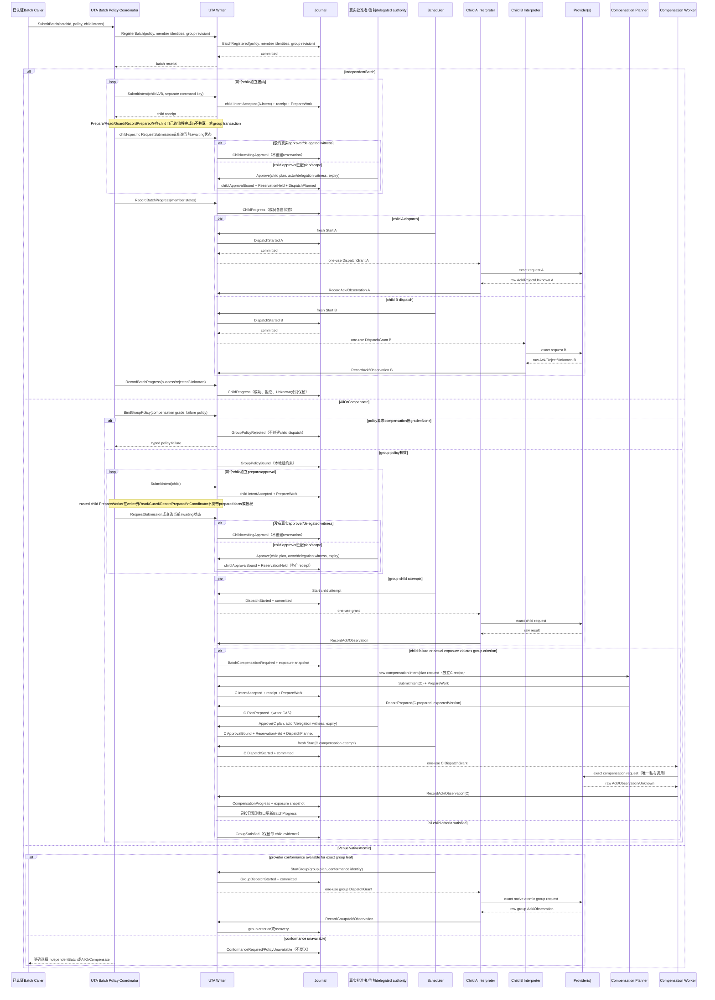
```mermaid
sequenceDiagram
  participant Caller as 已认证Batch Caller
  participant Coordinator as UTA Batch Policy Coordinator
  participant Writer as UTA Writer
  participant Store as Journal
  participant Approver as 真实批准者/当前delegated authority
  participant Scheduler as Scheduler
  participant WorkerA as Child A Interpreter
  participant WorkerB as Child B Interpreter
  participant Native as Provider(s)
  participant Comp as Compensation Planner
  participant CompWorker as Compensation Worker

  Caller->>Coordinator: SubmitBatch(batchId, policy, child intents)
  Coordinator->>Writer: RegisterBatch(policy, member identities, group revision)
  Writer->>Store: BatchRegistered(policy, member identities, group revision)
  Store-->>Writer: committed
  Writer-->>Coordinator: batch receipt
  alt IndependentBatch
    loop 每个child独立接纳
      Coordinator->>Writer: SubmitIntent(child A/B, separate command key)
      Writer->>Store: child IntentAccepted(A.intent) + receipt + PrepareWork
      Writer-->>Coordinator: child receipt
      Note over Coordinator,Writer: Prepare/Read/Guard/RecordPrepared在各child自己的流程完成\n不共享一笔group transaction
      Coordinator->>Writer: child-specific RequestSubmission或查询当前awaiting状态
      alt 没有真实approver/delegated witness
        Writer->>Store: ChildAwaitingApproval（不创建reservation）
      else child approver匹配plan/scope
        Approver->>Writer: Approve(child plan, actor/delegation witness, expiry)
        Writer->>Store: child ApprovalBound + ReservationHeld + DispatchPlanned
      end
    end
    Coordinator->>Writer: RecordBatchProgress(member states)
    Writer->>Store: ChildProgress（成员各自状态）
    par child A dispatch
      Scheduler->>Writer: fresh Start A
      Writer->>Store: DispatchStarted A
      Store-->>Writer: committed
      Writer-->>WorkerA: one-use DispatchGrant A
      WorkerA->>Native: exact request A
      Native-->>WorkerA: raw Ack/Reject/Unknown A
      WorkerA->>Writer: RecordAck/Observation A
    and child B dispatch
      Scheduler->>Writer: fresh Start B
      Writer->>Store: DispatchStarted B
      Store-->>Writer: committed
      Writer-->>WorkerB: one-use DispatchGrant B
      WorkerB->>Native: exact request B
      Native-->>WorkerB: raw Ack/Reject/Unknown B
      WorkerB->>Writer: RecordAck/Observation B
    end
    Coordinator->>Writer: RecordBatchProgress(success/rejected/Unknown)
    Writer->>Store: ChildProgress（成功、拒绝、Unknown分别保留）
  else AllOrCompensate
    Coordinator->>Writer: BindGroupPolicy(compensation grade, failure policy)
    alt policy要求compensation但grade=None
      Writer->>Store: GroupPolicyRejected（不创建child dispatch）
      Writer-->>Coordinator: typed policy failure
    else group policy有效
      Writer->>Store: GroupPolicyBound（本地组约束）
      loop 每个child独立prepare/approval
        Coordinator->>Writer: SubmitIntent(child)
        Writer->>Store: child IntentAccepted + PrepareWork
        Note over Coordinator,Writer: trusted child PrepareWorker在writer外Read/Guard/RecordPrepared\nCoordinator不携带prepared facts或授权
        Coordinator->>Writer: RequestSubmission或查询当前awaiting状态
        alt 没有真实approver/delegated witness
          Writer->>Store: ChildAwaitingApproval（不创建reservation）
        else child approver匹配plan/scope
          Approver->>Writer: Approve(child plan, actor/delegation witness, expiry)
          Writer->>Store: child ApprovalBound + ReservationHeld（各自receipt）
        end
      end
      par group child attempts
        Scheduler->>Writer: Start child attempt
        Writer->>Store: DispatchStarted + committed
        Writer-->>WorkerA: one-use grant
        WorkerA->>Native: exact child request
        Native-->>WorkerA: raw result
        WorkerA->>Writer: RecordAck/Observation
      end
      alt child failure or actual exposure violates group criterion
        Writer->>Store: BatchCompensationRequired + exposure snapshot
        Writer->>Comp: new compensation intent/plan request（独立C recipe）
        Comp->>Writer: SubmitIntent(C) + PrepareWork
        Writer->>Store: C IntentAccepted + receipt + PrepareWork
        Comp->>Writer: RecordPrepared(C.prepared, expectedVersion)
        Writer->>Store: C PlanPrepared（writer CAS）
        Approver->>Writer: Approve(C plan, actor/delegation witness, expiry)
        Writer->>Store: C ApprovalBound + ReservationHeld + DispatchPlanned
        Scheduler->>Writer: fresh Start(C compensation attempt)
        Writer->>Store: C DispatchStarted + committed
        Writer-->>CompWorker: one-use C DispatchGrant
        CompWorker->>Native: exact compensation request（唯一私有调用）
        Native-->>CompWorker: raw Ack/Observation/Unknown
        CompWorker->>Writer: RecordAck/Observation(C)
        Writer->>Store: CompensationProgress + exposure snapshot
        Writer->>Store: 只按已观测敞口更新BatchProgress
      else all child criteria satisfied
        Writer->>Store: GroupSatisfied（保留每 child evidence）
      end
    end
  else VenueNativeAtomic
    alt provider conformance available for exact group leaf
      Scheduler->>Writer: StartGroup(group plan, conformance identity)
      Writer->>Store: GroupDispatchStarted + committed
      Writer-->>WorkerA: one-use group DispatchGrant
      WorkerA->>Native: exact native atomic group request
      Native-->>WorkerA: raw group Ack/Observation
      WorkerA->>Writer: RecordGroupAck/Observation
      Writer->>Store: group criterion或recovery
    else conformance unavailable
      Writer->>Store: ConformanceRequired/PolicyUnavailable（不发送）
      Coordinator-->>Caller: 明确选择IndependentBatch或AllOrCompensate
    end
  end
```

### 9.3 组合不变量

- **IndependentBatch 不全组耦合**：child 的 `IntentAccepted`、`Prepared`、approval、reservation 与 failure 各自提交，各自返回 receipt；coordinator 只提交成员关系和 progress，不为所有 child 伪造一笔原子接纳。
- **AllOrCompensate 才声明本地组约束**：`GroupPolicyBound` 冻结 required members、失败条件、compensation grade 和释放责任；child 仍按 progressive state 独立演进，只有 group-ready gate 控制何时允许 dispatch。若 policy 要求自动补偿，`None` 必须在接纳时拒绝；`None` 不表示任何情况下结构都不可用。
- **partial/unknown 不可伪造 rollback**：AllOrCompensate 只承诺指定 compensation grade；Economic compensation 仍保留滑点、手续费和原成交事实。compensation 未确认前，原敞口 lock 不释放。
- **native conformance 是 policy availability，不是结构缺失**：没有证据不能执行 `VenueNativeAtomic` 这一个 policy；仍可在明确 policy 变更后走 non-atomic child flows。父 ack 不代表子 leg fill，group complete 也必须由 provider exact observation slot 解释。
- **reservation 释放按责任归属**：未开始且 conclusive no-effect 的 child 可释放；started/unknown child 由 observation/recovery owner 持有。projection、Git export、batch summary 不改变权威状态。
- **已知拒绝与 Unknown 分开**：`ContinueOnKnownRejection` 只能处理 typed known rejection；Unknown 必须走 recovery/observe-before-retry，不得由 catch continuation 偷换为拒绝或继续发送。

<a id="ef10"></a>

## EF10 — deferred activation、checkpoint、correction 与 rearm

### 10.1 Deferred relation、事实与控制事件

`DeferredInvocation` 关联一个未开始 `IntentRevision`、一个 live activation owner、source binding 集合、纯 predicate 版本、checkpoint schema、future boundary、expiry、冻结 disposition 与 decision channel。它是“何时把受控意图交给下一种处置”的关系，不是新的 Order 类型。

这里把 source/channel 输入和 UTA committed event 分开：Source/Data owner 产生 `ExternalFact`（data item、correction、retraction、gap）；Alice/Agent 产生 `ApplyDecision` command。`CorrectionApplied`、`RetractionApplied`、`CheckpointAdvanced`、`ReviewRequestCreated`、`DecisionApplied` 等 committed DomainEvent 的 producer 只能是 UTA writer；它们的 payload 带 source ref、evidence ref 或 response command 的关联，但不把 source/channel 当作本地提交者。

| 事件/事实/命令 | producer / consumer | source-vs-target 状态 | 顺序与唯一性 |
|---|---|---|---|
| `Control<Deferred, DeferredRegistered>` | UTA writer / activation owner | not-started intent + initial control revision | 一个 `intentRevision` 只能有一个 live owner；注册保存 predicate/checkpoint/future/disposition 的完整 binding。 |
| `ExternalFact<source,item>` | Source/Data owner / deferred writer + pure predicate | source cursor/generation/as-of | 原始事实不等于 activation 或授权；source identity/continuity 先在边界验证。 |
| `Control<Deferred, CheckpointAdvanced>` | UTA writer / checkpoint reader | source cursor/baseline 从 revision n 到 n+1 | 即使 `NoActivation` 也可提交必要 checkpoint；同一 source event identity 不重复消费。 |
| `Control<Deferred, ActivationCandidate>` | UTA writer / disposition evaluator | selected evidence，尚未授权 dispatch | 只能由 writer 在 checkpoint/evidence 同事务中提交；source fact 不能直接产生。 |
| `ExternalFact<source, Gap/Correction/Retraction>` | Source/Data owner / deferred writer | continuity、selected evidence 或 baseline 被指向修订 | 这是输入事实；不能直接称作 `CheckpointInvalidated` 或 `CorrectionApplied`。 |
| `Control<Deferred, ActivationGap/CheckpointInvalidated>` | UTA writer / control query | baseline/finality 不足 | 提交冻结、重建 baseline 或请求决定；不得默认 Candidate/命中。 |
| `Control<Deferred, CorrectionApplied/RetractionApplied>` | UTA writer / recovery/disposition | selected evidence/checkpoint 被修订 | 携带 source/evidence lineage；writer 依据依赖决定 fence 未发送工作，不是 Source 直接写 DomainEvent。 |
| `Control<Deferred, ReviewRequestCreated>` + outbox | UTA writer / authenticated Alice bridge | `RequestDecision` disposition | checkpoint、evidence、control revision、ReviewRequest identity 与 outbox 在同一 commit；只有 commit 后才 send/retry。 |
| `ApplyDecision` command | Alice/Agent channel / UTA writer | current control revision + intent revision + epoch | channel 只提交 allowed response；迟到/未认证响应不改变状态。 |
| `Control<Deferred, DecisionApplied>` | UTA writer / Alice receipt projection | Keep/Rearm/Revise/Discard/RequestSubmission result | writer 验证 request、主体、版本、epoch、expiry 后 CAS；只能一个结果赢。 |
| `Control<Deferred, ActivationRearmed>` | UTA writer / new activation owner | old owner retired -> new epoch/future boundary | 旧 owner retirement 与新 epoch registration 在同一事务；任何时刻按 `intentRevision` 只有一个 live owner。 |
| `Control<Deferred, IntentRevised>` | UTA writer / EF06 prepare path | new intent revision | 重新 prepare/approval；不能原地改已批准/已开始 plan。 |
| `Control<Deferred, IntentRetired>` | UTA writer / audit | only not-started | 释放 deferred control/未执行 reservation；已 started/unknown 不得伪装撤销。 |
| `ApplySubmission` command | authorized control channel / UTA writer | candidate -> normal prepare/approval | source fact、AI text、`RequestSubmission` 都不是交易许可；command 只开启 EF06 接纳。 |
| `Control<Deferred, SubmissionRequested>` | UTA writer / EF06 entry | candidate -> normal prepare/approval | committed control event 只保存因果关联，提交后重新走 EF06，不直接 dispatch。 |

### 10.2 checkpoint、gap、correction 与 Alice outbox 时序

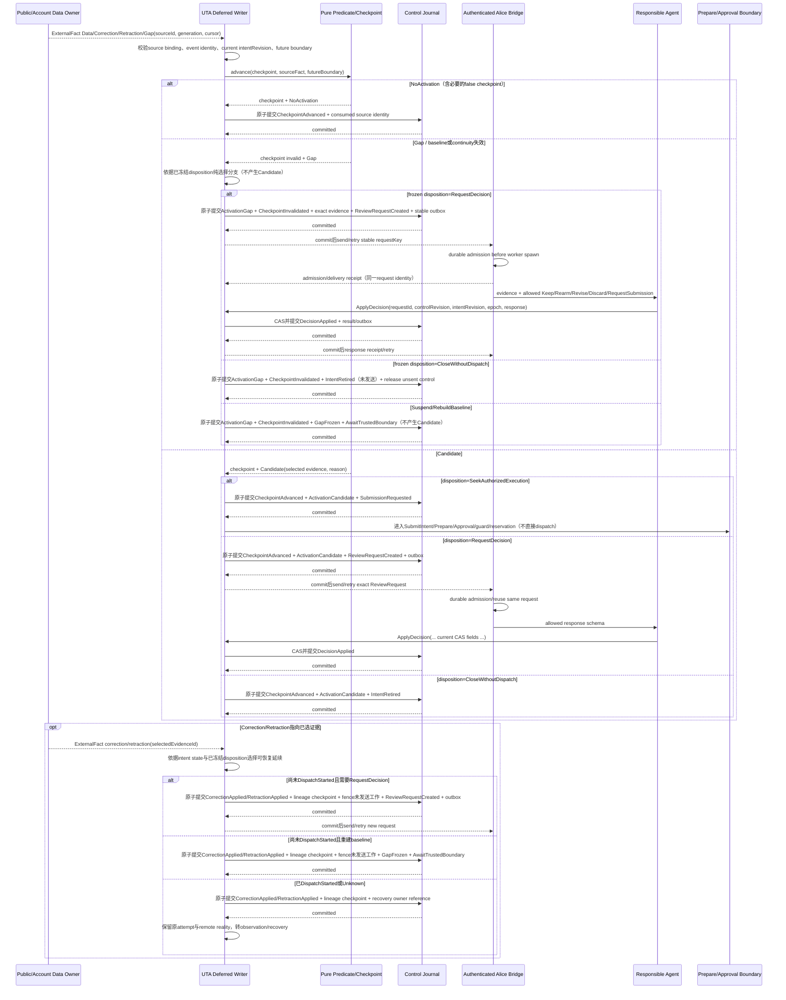
```mermaid
sequenceDiagram
  participant Source as Public/Account Data Owner
  participant Writer as UTA Deferred Writer
  participant Predicate as Pure Predicate/Checkpoint
  participant Store as Control Journal
  participant Alice as Authenticated Alice Bridge
  participant Agent as Responsible Agent
  participant EF06 as Prepare/Approval Boundary

  Source-->>Writer: ExternalFact Data/Correction/Retraction/Gap(sourceId, generation, cursor)
  Writer->>Writer: 校验source binding、event identity、current intentRevision、future boundary
  Writer->>Predicate: advance(checkpoint, sourceFact, futureBoundary)
  alt NoActivation（含必要的false checkpoint）
    Predicate-->>Writer: checkpoint + NoActivation
    Writer->>Store: 原子提交CheckpointAdvanced + consumed source identity
    Store-->>Writer: committed
  else Gap / baseline或continuity失效
    Predicate-->>Writer: checkpoint invalid + Gap
    Writer->>Writer: 依据已冻结disposition纯选择分支（不产生Candidate）
    alt frozen disposition=RequestDecision
      Writer->>Store: 原子提交ActivationGap + CheckpointInvalidated + exact evidence + ReviewRequestCreated + stable outbox
      Store-->>Writer: committed
      Writer-->>Alice: commit后send/retry stable requestKey
      Alice->>Alice: durable admission before worker spawn
      Alice-->>Writer: admission/delivery receipt（同一request identity）
      Alice->>Agent: evidence + allowed Keep/Rearm/Revise/Discard/RequestSubmission
      Agent->>Writer: ApplyDecision(requestId, controlRevision, intentRevision, epoch, response)
      Writer->>Store: CAS并提交DecisionApplied + result/outbox
      Store-->>Writer: committed
      Writer-->>Alice: commit后response receipt/retry
    else frozen disposition=CloseWithoutDispatch
      Writer->>Store: 原子提交ActivationGap + CheckpointInvalidated + IntentRetired（未发送）+ release unsent control
      Store-->>Writer: committed
    else Suspend/RebuildBaseline
      Writer->>Store: 原子提交ActivationGap + CheckpointInvalidated + GapFrozen + AwaitTrustedBoundary（不产生Candidate）
      Store-->>Writer: committed
    end
  else Candidate
    Predicate-->>Writer: checkpoint + Candidate(selected evidence, reason)
    alt disposition=SeekAuthorizedExecution
      Writer->>Store: 原子提交CheckpointAdvanced + ActivationCandidate + SubmissionRequested
      Store-->>Writer: committed
      Writer->>EF06: 进入SubmitIntent/Prepare/Approval/guard/reservation（不直接dispatch）
    else disposition=RequestDecision
      Writer->>Store: 原子提交CheckpointAdvanced + ActivationCandidate + ReviewRequestCreated + outbox
      Store-->>Writer: committed
      Writer-->>Alice: commit后send/retry exact ReviewRequest
      Alice->>Alice: durable admission/reuse same request
      Alice->>Agent: allowed response schema
      Agent->>Writer: ApplyDecision(... current CAS fields ...)
      Writer->>Store: CAS并提交DecisionApplied
      Store-->>Writer: committed
    else disposition=CloseWithoutDispatch
      Writer->>Store: 原子提交CheckpointAdvanced + ActivationCandidate + IntentRetired
      Store-->>Writer: committed
    end
  end
  opt Correction/Retraction指向已选证据
    Source-->>Writer: ExternalFact correction/retraction(selectedEvidenceId)
    Writer->>Writer: 依据intent state与已冻结disposition选择可恢复延续
    alt 尚未DispatchStarted且需要RequestDecision
      Writer->>Store: 原子提交CorrectionApplied/RetractionApplied + lineage checkpoint + fence未发送工作 + ReviewRequestCreated + outbox
      Store-->>Writer: committed
      Writer-->>Alice: commit后send/retry new request
    else 尚未DispatchStarted且重建baseline
      Writer->>Store: 原子提交CorrectionApplied/RetractionApplied + lineage checkpoint + fence未发送工作 + GapFrozen + AwaitTrustedBoundary
      Store-->>Writer: committed
    else 已DispatchStarted或Unknown
      Writer->>Store: 原子提交CorrectionApplied/RetractionApplied + lineage checkpoint + recovery owner reference
      Store-->>Writer: committed
      Writer->>Writer: 保留原attempt与remote reality，转observation/recovery
    end
  end
```

### 10.3 response、到期、rearm 与 live owner 竞争

- **边沿语义**：predicate 必须声明“每个命中”“false→true 边沿”“持续窗口”等具体算法。边沿需要 baseline 与 continuity；`false@10` 后 `Gap` 再收到 `true@12` 不能证明穿越。`Gap` 进入 freeze、重建可信 baseline 或请求决定，绝不自动生成命中。
- **nonmatching 也可能要保存**：如果非命中事实改变 baseline、watermark 或窗口，`CheckpointAdvanced` 仍需持久化足够的 bounded state；不保存全量行情，但必须能重放决定。
- **Correction/Retraction 不重新投机命中**：通过 source event identity/evidence dependency 找到已选证据与 checkpoint。未发送 candidate/review 被 fence 后请求新决定；已经 `DispatchStarted` 或 Unknown 的事实不能被数据修订撤销。
- **一个 intentRevision 一个 live owner**：唯一性不能只靠 `(intentRevision, activationEpoch)`，否则 epoch 0 与 epoch 1 可同时 live。writer 必须在同一 CAS/事务中退休旧 owner、关闭旧 epoch 的可写权、再注册新 epoch/future boundary；所有新 source event 先检查 `intentRevision` 的当前 owner。旧 owner 的迟到 event 只能成为诊断/被拒绝 observation，不能覆盖新 revision。
- **Disposition ADT**：`RequestDecision`（其中 `ReturnToAgent` 是一个配置实例）、`SeekAuthorizedExecution`、`CloseWithoutDispatch`。Candidate 三者都必须有明确分支；`Keep` 产生可查询 suspended handle；`Rearm` 产生新 epoch/future boundary；`Revise` 产生新 intent revision；`Discard` 仅退休未发送 intent；`RequestSubmission` 重新进入 EF06。
- **到期竞争与 EF11 交接**：response、request expiry、no-reply、delivery-unavailable 与 Keep retention 是不同 clocks。timeout 与 response 针对同一 request/control revision/intentRevision/epoch 做 writer CAS；胜者写入 `DecisionApplied` 与必要 outbox，败者得到 stale/conflict。Alice admission、session/reconstructed delivery 的细节由 EF11 展开，但不能省略这里的 CAS 或把 UI 到达顺序当授权。
- **outbox 先 commit 后 send/retry**：checkpoint、selected evidence、control result、ReviewRequest identity 与 outbox 必须同事务 commit；发送失败只更新 delivery/retry control，不回滚已提交 checkpoint，也不能直接启动执行。UTA 拥有 checkpoint、review request、outbox、activation owner、control receipt；Alice 拥有 stable admission、Workspace/Session/headless attribution、Issue/Inbox projection。

### 10.4 当前实现证据与未实现声明

- legacy `LSURFACE-SUPP-TRIGGER` 已明确要求 pure `advance`、stable review request、one activation owner、authenticated bridge、ReturnToAgent zero-dispatch；同时明确现有 EventLog、Issue scanner、Inbox connector 不能升级为 durable trigger bus。
- 当前代码/调查没有实现 UTA review outbox→Alice durable admission、deferred checkpoint writer、predicate schema、correction lineage 或 response CAS。本文不声称这些新接口已编译或已经运行。
- 数据流的 `Gap/Correction/Retraction/SnapshotEnd` 仍属于 delivery/data owner；EF10 只把被选中的 source evidence 与 checkpoint 进入 control journal，不新增 event bus、消息中间件或通用 workflow。

### EF06–EF10 跨流状态矩阵

| 旧/目标状态 | 允许的下一步 | 禁止的捷径 |
|---|---|---|
| `Prepared` | `Approve`、未开始 `Retire`、重新 prepare 新 revision | 不创建 execution job；不把 prepared receipt 当批准。 |
| `ApprovalBound + ReservationHeld` | `DispatchPlanned`、过期/拒绝后释放未执行 reservation | 不把 approval 当 grant；不在 plan 上原地编辑。 |
| `DispatchStarted` | `Ack/Observation/Unknown`、recovery、criterion/compensation | 不因 lease expiry、超时、查询空结果盲重发；不按 no marker 推断 no-start。 |
| `Ack/Working` | typed observation、criterion | 不把 ack 映射成 Filled/Cancelled/terminal。 |
| `PartialFill/Exposure` | cancel/close/compensation 的新 recipe、继续 observe | 不删除原始 quantity/fill；不释放 unresolved exposure lock。 |
| `Unknown` | history/position observation、RecoveryRequired、经 evidence 授权的 compensation | 不 reprepare 新请求；不创建第二 attempt。 |
| `Deferred Candidate` | RequestDecision、SeekAuthorizedExecution→EF06、CloseWithoutDispatch | 不由 source event/AI text 直接 dispatch。 |
| `Deferred Gap/Correction` | 新可信边界、冻结决定、rearm/revise | 不补造 crossing；不以当前 predicate 再次命中代替 lineage。 |

所有状态转换均由绑定 recipe 的 schema slot、scope、revision、causation 与 writer commit 顺序约束；表格只是导航，不替代各 leaf 的 ADT。

## 跨上下文交接与生命周期

本组把已提交决定交给 Alice，并展开配置、模拟器和历史投影。跨界接纳与本地决定分别生效，进程或 HTTP 边界不把两者合成一个事务。

### 跨上下文交接与生命周期的共用约定

#### 当前源码事实

| 边界 | 当前可观察事实 | 设计保留的含义 | 禁止升级为 |
|---|---|---|---|
| Alice→UTA transport | `src/webui/routes/trading-proxy.ts:51-112,115-188` 将 status 与交易请求转发到 loopback UTA；`:115-137,193-205` 以路径/HTTP method 屏蔽部分写操作。`src/webui/routes/trading-proxy.ts:4-7` 明确写着 v1 没有 Alice–UTA authentication。 | Alice 是外层 transport/策略投影，UTA 是独立的 owner boundary（当前部署为另一进程）。 | 认证的受控决定、outbox 或交易批准。loopback 不是授权证明。 |
| AI trading gate | `src/tool/trading.ts:760-807` 在 `allowAiTrading=false` 时返回人工审批提示；为 true 时直接调用 `uta.push`。 | 现有用户体验要保留人工 Keep/答复路径。 | `allowAiTrading` 自身不是 approval、permission witness 或 writer CAS。 |
| UTA 旧 dispatcher | `services/uta/src/domain/trading/UnifiedTradingAccount.ts:180-205` 按 `op.action` 直接调用 broker；`:693-810` 以 stage/commit/push/reject 承载旧流程。 | 现有操作种类和拒绝语义是迁移输入。 | 新设计不再用 switch 或 Git 状态作为交易权威。 |
| Workspace 身份 | `src/workspaces/service.ts:779-800` 从 conversation/trigger 派生 cause，并保存 `resolution: exact\|reconstructed`；`:1902-1977` 先建立 product Session/headless task，再记录 `session.born`/`runtime.started`。 | exact/reconstructed 是可观测的身份解析结果。 | 一个模糊的 workspace 字符串即可授权执行。 |
| Product activity | `src/workspaces/agent-runtime-log.ts:149-241,243-349,362-417` 提供注册 family、append 后投影、按 family/query/replay；`docs/event-system.md:1-31,33-63` 明确 Alice event bus 已退役，产品日志不调度。 | 允许有限、可回放的产品事实投影。 | journal listener 是任务队列、交易 outbox 或审批器。 |
| UTA config/reload | `src/webui/routes/trading-config.ts:25-38,196-334` 写配置后 fire-and-forget `triggerUTARestart`；`src/core/config.ts:448-487,704-788` schema、sealed `accounts.json`、备份/恢复与旧 preset migration。 | 配置有持久 owner，secret 只能通过受保护引用进入 UTA。 | reload 回调就是 revision CAS 或远端 ready 证据。 |
| UTA startup/connection | `services/uta/src/main.ts:56-88,130-168,170-192` load config、初始化 manager、起 catalog timer、绑定 loopback、shutdown；`uta-manager.ts:61-131` create/reconnect/remove；`UnifiedTradingAccount.ts:226-505` 有连接梯度、health、recovery timer。 | 连接和进程生命周期必须可分类、可恢复。 | 当前 `health`/`ok:true` 已提供 catalog ready、交易可写或历史恢复证明。 |
| Guardian | `packages/guardian-runtime/src/control-server.ts:102-124` 当前只接受 `runtime.status`/`runtime.stop`；`scripts/guardian/shared.ts:495-528` restart 是整进程 stop/spawn/health poll；`:540-627` 仍有 flag watcher。 | Guardian 只拥有 whole-process 控制。 | Guardian 是 UTA decision writer、交易效果或账户级 generation owner。 |
| Mock/admin | `services/uta/src/http/routes-simulator.ts:105-223` 只允许 `MockBroker`，提供 mark/tick/fill/cancel/deposit/withdraw/trade；`MockBroker.ts:580-621` 的 `fillOrder` 接受可选 `qty`，部分成交保留 Submitted 并累计 quantity/avg price；`:665-755` 外部事实 bypass Alice order pipeline。 | stimulus 与 live/UTA effect 必须分离；部分成交和累计数量不得丢失。 | simulator HTTP call 是 approval、DispatchStarted 或真实交易 evidence。 |
| Live evidence | `services/uta/src/domain/trading/__test__/e2e/live-paper-evidence.ts:18-38,68-86` 只 append 小型 paper 记录；`docs/uta-effect-runtime-design/solutions/LiveEvidence/design.md:60-68` 要求 provenance/redaction，S7 外部订单不计为 UTA dispatch。 | evidence 是诊断/投影，可指向 observation。 | JSONL append 或 paper flag 取得金融 authority。 |
| Legacy state | `services/uta/src/domain/trading/git-persistence.ts:14-49` primary/legacy path + JSON fallback；`TradingGit.ts:119-184,187-238` 先 remote mutation 后 snapshot/commit/persister。`legacy-accommodation.md#ltx-journal` 说明 pending/缺 marker 不能证明 no-start。 | import 必须 quarantine、保留 provenance、不能由 marker 缺失推断未发送。 | 旧 commit.json 是新的 dispatch/replay authority。 |
#### EF11–EF14 的上下文切分

上下文由**语言**（它定义的名词、槽位和失败含义）、**决定**（它能接受、拒绝、批准、提交或仅投影什么）以及**时间**（它承诺的 revision、generation、cursor、deadline 或连续性）共同定义，进程只是部署载体。一个进程可承载多个上下文；HTTP、JSONL 或同一进程内的函数调用都不会自动共享权威。只有所属 owner 的 writer 完成 durable commit 后，消息才可称为该上下文的 committed `DomainEvent`；Product Activity append、delivery frame 和 diagnostic 均不能反向升级它。

| 上下文 | 语言边界 | 决定边界 | 时间/连续性权威 |
|---|---|---|---|
| UTA 效果决定与延后激活 | intent、plan、review、attempt、reservation、activation、outbox | 接纳 activation、冻结未发送 intent、reply/expiry CAS、prepare/authorize/DispatchStarted | aggregate revision、binding epoch、writer commit order、review deadline |
| Alice Workspace/Session/Inbox | workspace、resume、session、admission、worker、reply | 解析 durable identity、接纳任务、分配 worker、返回 admission/reply receipt；不批准金融 effect | admission revision、session/run 生命周期、同一 outbox/review 的 delivery identity |
| Provider/Mock 观察 | native order、execution、fill、balance、external fact、error | 产生并认证 ExternalFact；不获得 UTA approval 或本地 dispatch 权 | native sequence/cursor、connection generation、source observed/as-of time |
| 配置与运行生命周期 | config revision、SecretRef、catalog、generation、readiness、drain | 接受/拒绝配置应用、fence 旧 generation、报告 catalog 可用性、关闭/恢复 | config revision、credential rotation revision、connection generation、owner epoch |
| Query/Git/Product Activity/迁移投影 | query row、audit row、activity fact、cursor、quarantine、cutover | 组合已提交事实、推进自身 checkpoint、隔离冲突、完成单一切换；不写回领域 authority | source commit order 加各投影 cursor/checkpoint；legacy path/digest provenance |

因此 EF11 的 Alice admission 不是 UTA approval，EF12 的 Guardian stop 不是交易决定，EF13 的 Mock fill 不是 Alice dispatch，EF14 的 ActivityJournal 也不是任务队列。跨上下文只交换带身份、因果与版本的 Command、ExternalFact、committed DomainEvent、DeliveryFrame、receipt 或 Diagnostic；不借一个全局 sequence 抹平这些时间边界。

#### 事件类型按所属声明的槽位派生

事件类型不能由一个扁平的 `Capability<Input, Prepared, Ack, Observation, ...>` 泛型接口包办。Query、Feed、Recipe、deferred control、lifecycle control 和 projection 各自拥有不同的声明槽位；不存在的槽位不填空 payload，也不把普通 `ConfigApply`、`Reply`、`Gap` 伪造成 Recipe 事件。静态声明产生精确类型与 codec；动态绑定先认证 capability/recipe identity、schema revision 和 slot，再生成对应的 `BoundDocument`。以下关系是本设计使用的来源表，不声称当前仓库已经导出同名 API。

| 消息家族 | 所属声明与槽位 | EF11–EF14 中的具体类型 | 产生/提交边界 |
|---|---|---|---|
| Query / data delivery | Query 或 Feed declaration 的 input、item、correction、failure、delivery-control 槽位 | `SimulationPreview`、`Data/Correction/Gap/SnapshotEnd`、bounded query failure | invocation/query owner 解码并交付；普通结果不是交易 DomainEvent |
| Controlled recipe / effect | `RecipeAssociation` 的 input、prepared、ack、observation、failure、recovery 槽位 | `FinancialEffectCommand<C>`、`DispatchStarted<C>`、`RemoteObservation<C>` | effect writer 校验并提交；只有 owner commit 后才可称 committed DomainEvent |
| Deferred decision | source、predicate、checkpoint/evidence、decision-request、continuation 槽位 | `ActivationEvidence<C>`、`DecisionRequested<C>`、`ReviewReply<C>`、`ExpiryFact` | source 只给 ExternalFact；EF10 activation owner 提交 `DecisionRequested`，EF11 消费已提交请求 |
| Workspace / delivery control | Alice workspace/session/inbox identity、admission、reply 和 delivery 槽位 | `ReviewRequestFrame`、`WorkspaceAdmission`、`AdmissionReceipt`、`ReplyFrame` | Alice/UTA delivery owner 按各自 durable admission/outbox 提交；不取得金融 authority |
| Lifecycle / configuration control | config、SecretRef、apply-result、catalog、connection-generation、shutdown/recovery 槽位 | `ConfigApplyCommand`、`ConfigApplied`、`CatalogState`、`ShutdownCheckpoint` | runtime interpreter 产生外部绑定证据；对应 lifecycle writer 提交结果 |
| Projection / migration control | projection operator、source lineage、cursor/checkpoint、legacy decoder 槽位 | `ProjectionCheckpointed`、`ReplayRequest`、`LegacyEvidence`、`QuarantineRecord` | projector/importer 提交自身 cursor 或 quarantine；不写回交易 authority |

每个家族只携带它所需的身份与顺序字段，不能强加万能 envelope：

| 家族 | 必要身份/顺序字段示例 | 明确不承担 |
|---|---|---|
| ExternalFact | source identity、source position/cursor、source observed/as-of、binding identity；connection-bound fact 另带 generation | 不带本地 aggregate revision、approval 或 writer commit order |
| DeliveryFrame / receipt | invocation/subscription 或 outbox/review identity、transport sequence（若有）、payload digest、delivery status | 不证明远端接收、交易提交或 provider finality |
| Recipe DomainEvent | aggregate/intent/attempt identity、aggregate revision、causation、recipe/schema revision、owner commit order；观察事件再带 native identity/generation | 不宣称跨 provider 全序 |
| Config/lifecycle event | config revision、SecretRef identity/digest、connection generation、catalog revision、owner epoch | 不把 HTTP status、进程 health 当作 apply commit |
| Projection/migration record | source partition/seq/digest、projection cursor/checkpoint 或 legacy path/digest provenance | 不创建 DispatchGrant、approval 或重放许可 |

---

<a id="ef11"></a>

## EF11 — UTA 决策交付、Workspace 持久接纳与回复/到期竞争

### EF11.1 目标和边界

EF11 从 EF10 activation owner 已完成的提交开始：EF10 writer 已经把一个 `DecisionRequested` 与其唯一 `DecisionOutboxFrame` 原子写入 durable store。Provider/source 只能提供待评估的 `ExternalFact`；predicate 命中、checkpoint 选择和 decision request 不由 Provider 直接声明，也不在 EF11 重算。UTA delivery/decision writer 只消费这个已提交请求，保留一个尚未发送的 `IntentRevision`，并把 ReviewRequest 交给 Alice。此交接不写 broker dispatch、不创建 `DispatchStarted`、不调用 provider。Alice 接收 outbox frame 后，必须先在自己的 Workspace/Session/Inbox durable owner 中提交 admission；worker spawn 与 transport admission receipt 可在该提交之后独立推进，不能互相作为前置条件。

- UTA owns：已提交 `DecisionRequested` 的 outbox 交接、未发送 intent、review revision、expiry、outbox、Keep/Rearm/Revise/Discard/RequestSubmission 的 CAS。
- Alice owns：`WorkspaceResolution`、Session/Inbox admission、稳定 execution/task/session 引用、worker ownership、delivery receipt、agent reply transport。Alice 不拥有交易批准。
- Workspace resolution 必须是 `Exact{workspaceId,resumeId,sessionRecordId,registryRevision}` 或 `Reconstructed{workspaceId,resumeId,sourceResumeRegistry/catalogRevision}`。两者都是证据；`Reconstructed` 必须标明 source 和 resolution mode，不得猜一个默认 workspace。无法找到 durable identity 则 `Unresolved`，outbox 保留，不生成 worker。
- `RequestSubmission` 只是对已接纳 intent 的控制请求，不是批准，也不是 worker 直接下单。UTA 先提交 EF06 控制边界的 admission/handle；EF06 再重新验证 prepare/authorize、私有一次性 grant 和 writer 状态。若已经过 DispatchStarted/Unknown，只能 observation/recovery，不能用旧 review reply 逆转。
- Activity journal、Inbox activity 或 worker log 只记录已经发生的 Alice/产品事实；不能被 UTA 当成 admission receipt，也不能反向启动 agent。

### EF11.2 目标类型与持久化边界

| 名称（目标类型） | 派生 slot/来源 | 关键字段与 invariant | durable owner / commit point |
|---|---|---|---|
| `ActivationEvidence<C>` | `ExternalFact`：source identity、source value、freshness、source position、binding identity | 只携带可验证来源事实；不含 predicate result、approval 或 decision state | provider/data owner 产生；EF10 activation owner 评估并引用 |
| `DecisionRequested<C>` | deferred-control declaration 的 decision-request slot | `requestId`, `decisionRevision`, `activationEpoch`, `intentRevision`, `evidenceRefs`, `checkpointRef`, `expiresAt`, `currentExpectedState`; 一个 committed decision revision/occasion 对应一个稳定 request identity，correction/escalation 产生新 revision/request，不与旧 request 混淆 | EF10 activation writer 原子提交；EF11 只消费已提交记录 |
| `DecisionOutboxFrame<C>` | `DecisionRequested` 的 delivery slot | `outboxId`, `requestId`, `decisionRevision`, `activationEpoch`, `reviewId`, payload digest, `deliverySequence`, target workspace/session hint；不得含 secret/native dispatch | UTA outbox 与 `DecisionRequested` 同一提交 |
| `ReviewRequest<C>` | deferred continuation/reply slot + `ReturnToAgent` policy | `requestId`, `reviewId`, `decisionRevision`, `activationEpoch`, `intentRevision`, `evidenceRefs`, `expiresAt`, `currentExpectedState`; 只描述该 revision/occasion 的未发送计划 | UTA decision writer 从已提交 request materialize；不重新评估 predicate |
| `WorkspaceResolution` | Alice `WorkDescription`/identity slot | `Exact\|Reconstructed\|Unresolved`；resolution 不能改写 UTA `intentRevision` | Alice workspace registry/catalog read |
| `WorkspaceAdmission` | Alice admission state ADT / `WorkDescription` receipt | `Pending{outboxId,reviewId}`、`Admitted{admissionId,executionRef{executionId,taskId,sessionId},workspaceId,resumeId,sessionRecordId,admissionRevision,resolution}` 或 `Rejected{reason}`；Admitted 不使用可选 `taskId?`；重复 `outboxId` 返回原记录 | Alice Workspace/Session/Inbox writer 提交 `Admitted` 后，spawn 与 receipt 独立进行 |
| `ReviewReply<C>` | Alice `Command`，由同一 deferred continuation 的 reply slot 派生 | `requestId`, `reviewId`, `activationEpoch`, `replyCommandKey`, `payloadDigest`, `principal`, `expectedIntentRevision`, `currentExpectedState`, one of `KeepSuspended\|Rearm\|Revise\|Discard\|RequestSubmission`, actor/provenance | UTA decision writer CAS |
| `SubmissionControlReceipt<C>` | EF06 control admission / `WorkDescription` receipt | `controlHandleId`, `reviewId`, `intentRevision`, `ef06AdmissionRevision`, `state=Admitted`; 不携 provider Ack/Unknown，不等于 approval | UTA writer commit 后发出；后续状态由 typed status/stream 提供 |
| `ExpiryFact` | `ExternalFact` clock slot | 只表达 observed deadline；不能直接结束 review | UTA writer 与 reply 竞争，胜者 commit |
| `DecisionDeliveryDiagnostic` | Diagnostic slot | `DeliveryUnavailable\|DuplicateAdmission\|LateReply\|StaleRevision\|UnresolvedWorkspace\|ReplyKeyConflict\|WorkerNotSpawned` | UTA/Alice diagnostic projection；不改变交易 authority |


### EF11.3 完整时序（已提交 DecisionRequested→Workspace admission→回复/到期竞争）

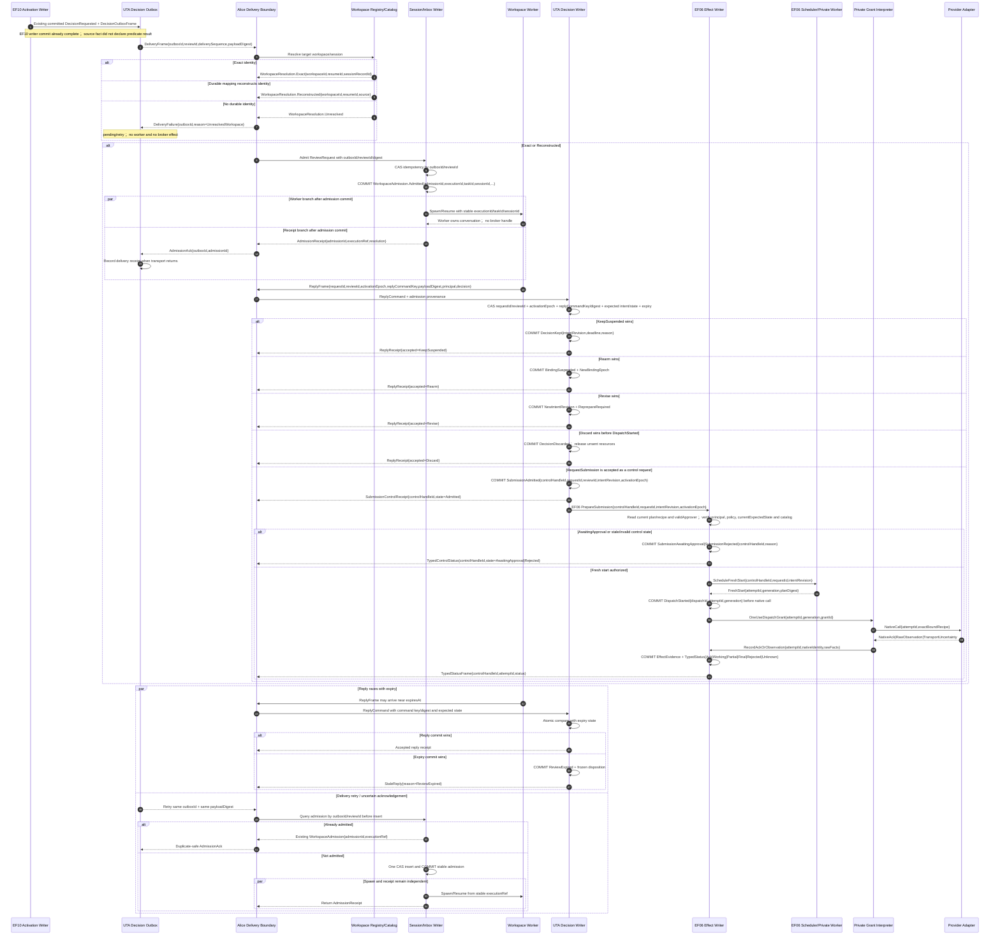
```mermaid
sequenceDiagram
    autonumber
    participant E as EF10 Activation Writer
    participant O as UTA Decision Outbox
    participant A as Alice Delivery Boundary
    participant R as Workspace Registry/Catalog
    participant S as Session/Inbox Writer
    participant W as Workspace Worker
    participant U as UTA Decision Writer
    participant P as EF06 Effect Writer
    participant T as EF06 Scheduler/Private Worker
    participant I as Private Grant Interpreter
    participant V as Provider Adapter

    E->>O: Existing committed DecisionRequested + DecisionOutboxFrame
    Note over E,O: EF10 writer commit already complete； source fact did not declare predicate result
    O-->>A: DeliveryFrame{outboxId,reviewId,deliverySequence,payloadDigest}
    A->>R: Resolve target workspace/session
    alt Exact identity
        R-->>A: WorkspaceResolution.Exact{workspaceId,resumeId,sessionRecordId}
    else Durable mapping reconstructs identity
        R-->>A: WorkspaceResolution.Reconstructed{workspaceId,resumeId,source}
    else No durable identity
        R-->>A: WorkspaceResolution.Unresolved
        A-->>O: DeliveryFailure{outboxId,reason=UnresolvedWorkspace}
        Note over O: pending/retry； no worker and no broker effect
    end
    alt Exact or Reconstructed
        A->>S: Admit ReviewRequest with outboxId/reviewId/digest
        S->>S: CAS idempotency by outboxId/reviewId
        S->>S: COMMIT WorkspaceAdmission.Admitted{admissionId,executionId,taskId,sessionId,...}
        par Worker branch after admission commit
            S->>W: Spawn/Resume with stable executionId/taskId/sessionId
            W-->>S: Worker owns conversation； no broker handle
        and Receipt branch after admission commit
            S-->>A: AdmissionReceipt{admissionId,executionRef,resolution}
            A-->>O: AdmissionAck{outboxId,admissionId}
            O->>O: Record delivery receipt when transport returns
        end
        W->>A: ReplyFrame{requestId,reviewId,activationEpoch,replyCommandKey,payloadDigest,principal,decision}
        A->>U: ReplyCommand + admission provenance
        U->>U: CAS requestId/reviewId + activationEpoch + replyCommandKey/digest + expected intent/state + expiry
        alt KeepSuspended wins
            U->>U: COMMIT DecisionKept{intentRevision,deadline,reason}
            U-->>A: ReplyReceipt{accepted=KeepSuspended}
        else Rearm wins
            U->>U: COMMIT BindingSuspended + NewBindingEpoch
            U-->>A: ReplyReceipt{accepted=Rearm}
        else Revise wins
            U->>U: COMMIT NewIntentRevision + ReprepareRequired
            U-->>A: ReplyReceipt{accepted=Revise}
        else Discard wins before DispatchStarted
            U->>U: COMMIT DecisionDiscarded； release unsent resources
            U-->>A: ReplyReceipt{accepted=Discard}
        else RequestSubmission is accepted as a control request
            U->>U: COMMIT SubmissionAdmitted{controlHandleId,requestId,reviewId,intentRevision,activationEpoch}
            U-->>A: SubmissionControlReceipt{controlHandleId,state=Admitted}
            U->>P: EF06 PrepareSubmission{controlHandleId,requestId,intentRevision,activationEpoch}
            P->>P: Read current plan/recipe and validApprover； verify principal, policy, currentExpectedState and catalog
            alt AwaitingApproval or stale/invalid control state
                P->>P: COMMIT SubmissionAwaitingApproval|SubmissionRejected{controlHandleId,reason}
                P-->>A: TypedControlStatus{controlHandleId,state=AwaitingApproval|Rejected}
            else Fresh start authorized
                P->>T: ScheduleFreshStart{controlHandleId,requestId,intentRevision}
                T-->>P: FreshStart{attemptId,generation,planDigest}
                P->>P: COMMIT DispatchStarted{dispatchId,attemptId,generation} before native call
                P->>I: OneUseDispatchGrant{attemptId,generation,grantId}
                I->>V: NativeCall{attemptId,exactBoundRecipe}
                V-->>I: NativeAck|RawObservation|TransportUncertainty
                I->>P: RecordAckOrObservation{attemptId,nativeIdentity,rawFacts}
                P->>P: COMMIT EffectEvidence + TypedStatus{Ack|Working|Partial|Final|Rejected|Unknown}
                P-->>A: TypedStatusFrame{controlHandleId,attemptId,status}
            end
        end
    end

    par Reply races with expiry
        W->>A: ReplyFrame may arrive near expiresAt
        A->>U: ReplyCommand with command key/digest and expected state
        U->>U: Atomic compare with expiry state
        alt Reply commit wins
            U-->>A: Accepted reply receipt
        else Expiry commit wins
            U->>U: COMMIT ReviewExpired + frozen disposition
            U-->>A: StaleReply{reason=ReviewExpired}
        end
    and Delivery retry / uncertain acknowledgement
        O-->>A: Retry same outboxId + same payloadDigest
        A->>S: Query admission by outboxId/reviewId before insert
        alt Already admitted
            S-->>A: Existing WorkspaceAdmission{admissionId,executionRef}
            A-->>O: Duplicate-safe AdmissionAck
        else Not admitted
            S->>S: One CAS insert and COMMIT stable admission
            par Spawn and receipt remain independent
                S->>W: Spawn/Resume from stable executionRef
                S-->>A: Return AdmissionReceipt
            end
        end
    end
```

### EF11.4 交接规则、顺序与失败矩阵

1. **提交点**：EF10 activation writer 已提交 `DecisionRequested + DecisionOutboxFrame`；一个 committed decision revision/occasion 有一个稳定 request identity，correction/escalation 由新 revision/request 表达，重复交付不新建 request。EF11 不重算 predicate。Alice 必须先提交 `WorkspaceAdmission.Admitted`，再分别推进 worker spawn 与 transport receipt，receipt 丢失不能否定 admission。`RequestSubmission` 只提交 EF06 control handle；EF06 读取当前 plan/validApprover/currentExpectedState，AwaitingApproval 或 stale 状态不能 fresh start；通过后由 scheduler/private worker 返回 `FreshStart`，effect writer 先 commit `DispatchStarted`，再向 interpreter 发一次性 grant，由 interpreter 调 native 并把 raw facts/ack 记录回 writer，writer 最后提交 effect evidence/status。
2. **精确/重构身份**：`Exact` 复用已存在 Session record；`Reconstructed` 仅使用 `ResumeRegistry`/Workspace catalog 的持久映射，payload 标记 `resolution=reconstructed`。不得从 label、latest workspace、数组首项或事件正文推断。若重构后的 workspace 已退休，返回 `WorkspaceUnavailable`，不把 execution 归到别处。
3. **执行归属**：Workspace worker 只拥有对话/任务并使用稳定 execution/task/session 引用；UTA writer 只拥有交易决定/outbox；EF06 interpreter 只拥有私有 DispatchGrant；provider adapter 只拥有 native call。Workspace 不能接收 native dispatch function，UTA 不能根据 product activity 自己 spawn worker。
4. **重复与冲突**：重复 source evidence 由 EF10 按来源 identity/position 处理；重复 delivery 使用同一 `outboxId`/digest；相同 `replyCommandKey` 只有在 payload digest 相同才返回旧 receipt，digest 不同返回 `ReplyKeyConflict`。不同 command key 即使 expected state 相同，也是一条新的竞争命令，不能当作同一 Keep/Discard。
5. **丢失/延迟**：连接断开或 Alice receipt 未返回时，outbox 保留 `Pending/Retryable`；重投先 query Alice admission，再按同一 idempotency key 写入。Admission commit 后 worker 可已启动，即使 transport ack 丢失。迟到 reply 只能得到 `StaleReply`/`Expired`/`RetiredReview`，不得复活旧 binding 或旧 approval。Worker 崩溃不代表 reply 已提交；UTA 按 outbox/admission/reply receipt 恢复。
6. **顺序**：同一 `reviewId` 的 frame 按 `deliverySequence`，但 transport 乱序时 Alice 以 outbox identity/digest 重排或拒绝 gap；不同 review 不共享全局顺序。source position 只约束 EF10 evidence，不变成 transport seq。
7. **Keep 与到期**：Keep 只能冻结/延期并保留未发送 intent；不得隐式 approve。expiry 与 reply 竞争由 UTA writer CAS 决定，失败方是可见 diagnostic。`Discard` 只允许未 DispatchStarted 的 intent；Unknown/已发送状态禁止 discard 假装未发。
8. **RequestSubmission 结果**：UTA 返回的 `SubmissionControlReceipt` 只表示控制请求已提交并得到 handle，不是 approval，也不包含 provider Ack/Unknown。EF06/07 不查找或重构旧 grant：它读取当前可验证 approver/plan/state，AwaitingApproval 只返回 typed control status；fresh start 后由 scheduler 返回 attempt，writer commit `DispatchStarted`，private interpreter 持一次性 grant 调 native，raw facts/ack 经过 interpreter 记录回 writer，最终 provider 结果由 typed status/stream 提供。possible-send 断连先进入 observation/recovery。
9. **投递失败**：`DeliveryUnavailable`、`WorkspaceUnresolved`、`AdmissionStorageUnavailable` 只阻断 Alice delivery；不创建 broker job。超过 expiry 后由 UTA expiry policy 关闭 review，但保留 delivery/late-reply evidence。Alice product activity append failure 不回滚已持久化 admission。

---

<a id="ef12"></a>

## EF12 — 配置 revision、secret owner、connection generation、catalog 与 shutdown/recovery

### EF12.1 目标和边界

Alice 的配置 owner 负责配置记录、密文/secret reference、`configRevision` 与用户的 expected-revision CAS；UTA 负责把某个 revision 应用到运行时、建立 `ConnectionGeneration`、发现 provider catalog，并报告 `Ready|Unavailable`。配置 revision、connection generation、catalog revision、policy revision 是不同身份，不能因 URL 可达或 process health 合并。

- Alice 不把 secret bytes 放进 HTTP body、event envelope、outbox、plan、log 或 product activity；只持久化 `SecretRef`/sealed binding 的 opaque id、scope、digest、rotation revision。
- Config apply 分为两个边界：runtime interpreter 在 writer 事务外解析 `SecretRef`、取得 credential binding、打开连接并发现 catalog，随后提交带证据的 `RuntimeBindingEvidence`；lifecycle writer 只验证该证据并记录 `ConfigApplied|ConfigApplyRejected`。writer 事务不得读取 secret、访问网络、打开连接或把 interpreter 的临时对象当作提交状态。
- secret rotation 保留 `AccountId`/UTA identity 与历史 binding；旧 connection generation 可关闭、销毁或因凭据撤销而不可用。新 generation 只在新 revision 被接受且新 binding evidence 提交后生效；历史解释保留旧 attempt/codec/lookup 身份，但恢复观察必须使用新授权连接，不能自动沿用旧连接或旧凭据。
- Catalog `Ready` 需要 provider declaration/schema/catalog evidence；连接 `Ready` 只证明 transport/probe barrier。`CatalogUnavailable` 不删除历史 interpretation resolver，也不让 current catalog 猜旧计划。
- 受控 effect admission 才需要 journal writer barrier；独立 data/lite query 通过自己的 query/readiness/cursor 边界，不全部经过交易 writer。共享存储故障只阻断受影响的 controlled authority，不把独立 data/lite 查询无条件拖垮。
- shutdown 是 bounded drain，不是 `process.exit` 立即清除内存。Guardian 只启动/停止 whole process；UTA 先关 admission、停止新 claim、处理/保留 unknown/recovery、drain writer，再释放 provider/transport/DB。

### EF12.2 目标类型与 slot 关联

| 名称（目标类型） | 派生 slot/来源 | 必须绑定 | 谁写入/何时生效 |
|---|---|---|---|
| `ConfigRevisionRecord` | Alice configuration command slot | `accountId`, `configRevision`, `configDigest`, `SecretRef`, `enabled`, policy/mode revision；secret bytes 禁止 | Alice config writer commit；expected revision CAS |
| `SecretRef` | credential boundary slot | vault key/opaque ref、owner、rotation revision、availability；不含 value | secret owner/secret store；runtime interpreter 只取得受控 binding |
| `ConfigApplyCommand` | lifecycle control input slot | previous revision、target revision/digest、provider instance、requestedAt、correlation | Alice→UTA；stale revision 在 writer 边界拒绝 |
| `RuntimeBindingEvidence` | runtime interpreter 的 ExternalFact/receipt | target revision/digest、credential binding identity、new generation、transport evidence、catalog state、typed failure；不含 secret bytes 或 live connection handle | runtime interpreter 在事务外产生；writer 只验证并记录 |
| `ConfigApplied` / `ConfigApplyRejected` | lifecycle result slot | accepted revision、generation/catalog evidence 或 typed reason | UTA lifecycle writer commit；不是 HTTP 200 |
| `ConnectionGeneration` | provider connection binding | provider instance、generation、config revision、credential binding revision、environment evidence、opened/closed order | connection owner；旧 generation 可关闭/销毁，新 generation 通过 evidence 后生效 |
| `CatalogState` | catalog availability slot | `Discovering` / `Ready{catalogRevision,digest,scope}` / `Unavailable{reason,observedAt}`；Ready 不隐含 write permission | catalog owner/projection；查询可见，effect prepare 复核 |
| `HistoricalBinding` | prepared/observation/recovery slot | `attemptId`、old provider/capability/schema digest、origin generation（仅历史 provenance）、native lookup evidence；观察所用 generation 单独记录 | historical resolver；精确旧 codec/lookup 只解释旧 attempt，不保留旧连接/凭据，不开放新 call |
| `ShutdownCheckpoint` | lifecycle/recovery slot | stage, writer seq, worker leases, unknown/recovery ids, provider generation states | UTA root/supervisor；commit before resource release |
| `RecoveryClassification` | startup replay slot | `QueuedNoStart`, `StartedUnknown`, `ObservationRequired`, `RecoveryRequired`, `LegacyEvidence` | UTA writer/replay; no JSONL fallback |

### EF12.3 完整时序（config apply、generation/catalog、drain/recovery）

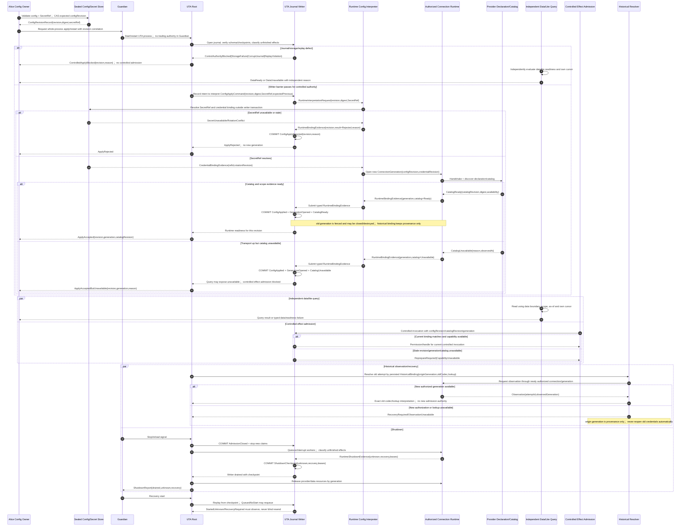
```mermaid
sequenceDiagram
    autonumber
    participant H as Alice Config Owner
    participant C as Sealed Config/Secret Store
    participant G as Guardian
    participant U as UTA Root
    participant W as UTA Journal Writer
    participant I as Runtime Config Interpreter
    participant K as Authorized Connection Runtime
    participant D as Provider Declaration/Catalog
    participant L as Independent Data/Lite Query
    participant Q as Controlled Effect Admission
    participant P as Historical Resolver

    H->>C: Validate config + SecretRef； CAS expected configRevision
    C-->>H: ConfigRevisionRecord{revision,digest,secretRef}
    H->>G: Request whole-process apply/restart with revision correlation
    G->>U: Start/restart UTA process； no trading authority in Guardian
    U->>W: Open journal, verify schema/checkpoints, classify unfinished effects
    alt Journal/storage/replay defect
        W-->>U: ControlAuthorityBlocked{StorageFailure|CorruptJournal|ReplayViolation}
        U-->>H: ControlledApplyBlocked{revision,reason}； no controlled admission
        L->>L: Independently evaluate data/lite readiness and own cursor
        L-->>H: DataReady or DataUnavailable with independent reason
    else Writer barrier passes for controlled authority
        U->>W: Record intent to interpret ConfigApplyCommand{revision,digest,SecretRef,expectedPrevious}
        W-->>I: RuntimeInterpretationRequest{revision,digest,SecretRef}
        I->>C: Resolve SecretRef and credential binding outside writer transaction
        alt SecretRef unavailable or stale
            C-->>I: SecretUnavailable/RotationConflict
            I-->>W: RuntimeBindingEvidence{revision,result=Rejected,reason}
            W->>W: COMMIT ConfigApplyRejected{revision,reason}
            W-->>U: ApplyRejected； no new generation
            U-->>H: ApplyRejected
        else SecretRef resolves
            C-->>I: CredentialBindingEvidence{refId,rotationRevision}
            I->>K: Open new ConnectionGeneration{configRevision,credentialRevision}
            K->>D: Handshake + discover declaration/catalog
            alt Catalog and scope evidence ready
                D-->>K: CatalogReady{catalogRevision,digest,availability}
                K-->>I: RuntimeBindingEvidence{generation,catalog=Ready}
                I-->>W: Submit typed RuntimeBindingEvidence
                W->>W: COMMIT ConfigApplied + GenerationOpened + CatalogReady
                Note over W,K: old generation is fenced and may be closed/destroyed； historical binding keeps provenance only
                W-->>U: Runtime readiness for this revision
                U-->>H: ApplyAccepted{revision,generation,catalogRevision}
            else Transport up but catalog unavailable
                D-->>K: CatalogUnavailable{reason,observedAt}
                K-->>I: RuntimeBindingEvidence{generation,catalog=Unavailable}
                I-->>W: Submit typed RuntimeBindingEvidence
                W->>W: COMMIT ConfigApplied + GenerationOpened + CatalogUnavailable
                W-->>U: Query may expose unavailable； controlled effect admission blocked
                U-->>H: ApplyAcceptedButUnavailable{revision,generation,reason}
            end
        end
    end

    par Independent data/lite query
        L->>L: Read using data boundary, scope, as-of and own cursor
        L-->>H: Query result or typed data/readiness failure
    and Controlled effect admission
        Q->>W: Controlled invocation with configRevision/catalogRevision/generation
        alt Current binding matches and capability available
            W-->>Q: Permission/handle for current controlled invocation
        else Stale revision/generation/catalog unavailable
            W-->>Q: ReprepareRequired|CapabilityUnavailable
        end
    end

    par Historical observation/recovery
        U->>P: Resolve old attempt by persisted HistoricalBinding{originGeneration,oldCodec,lookup}
        P->>K: Request observation through newly authorized connection/generation
        alt New authorized generation available
            K-->>P: Observation{attemptId,observedGeneration}
            P-->>U: Exact old codec/lookup interpretation； no new admission authority
        else New authorization or lookup unavailable
            P-->>U: RecoveryRequired/ObservationUnavailable
            Note over P: origin generation is provenance only； never reopen old credentials automatically
        end
    and Shutdown
        G->>U: Stop/reload signal
        U->>W: COMMIT AdmissionClosed + stop new claims
        U->>K: Quiesce/interrupt workers； classify unfinished effects
        K-->>W: RuntimeShutdownEvidence{unknown,recovery,leases}
        W->>W: COMMIT ShutdownCheckpoint{unknown,recovery,leases}
        W-->>U: Writer drained with checkpoint
        U->>K: Release provider/data resources by generation
        U-->>G: ShutdownReport{drained,unknown,recovery}
    end

    G->>U: Recovery start
    U->>W: Replay from checkpoint； QueuedNoStart may requeue
    W-->>U: StartedUnknown/RecoveryRequired must observe, never blind resend
```

### EF12.4 配置、catalog、generation 与失败规则

1. **revision CAS**：Alice `PUT/Rotate/Disable/Retire` 只能以 `expectedConfigRevision` 成功；并发更新返回 `ConfigRevisionConflict`。UTA apply 也比较 `expectedPreviousRevision`。HTTP `200`、Guardian `accepted`、进程重启或 status probe 不代表 `ConfigApplied`。
2. **secret ownership 与 interpreter 边界**：Alice config/sealed store 记录 reference 和 rotation revision；runtime interpreter 在 writer 事务外向 secret owner 解引用并取得 `RuntimeBindingEvidence`。writer 事务不得读 secret、访问网络、打开连接或保存 handle；只验证 evidence 并提交 `ConfigApplied|ConfigApplyRejected`。任何 UTA event/projection/diagnostic 只可携 ref id、scope、digest、reason。
3. **generation fencing 与历史观察**：每次成功 apply/connection reopen 递增 `generation`；调用、catalog、health、late callback 都携 generation。旧 generation 的未认证 callback 只能产生 `LateGenerationDiagnostic`，不能覆盖新 health、catalog、order outcome；但经 provider identity/attempt/native lookup 认证的历史 evidence 可以追加到旧 attempt 的 historical record，并标明新的 `observedGeneration`，不能更新当前 decision state、取得新授权或自动续用旧 generation。`HistoricalBinding` 保存 old attempt、精确 codec/lookup 与 origin generation 作为 provenance；旧连接/凭据可已销毁。
4. **catalog readiness**：`Ready` 仅由声明/schema/permission/scope evidence 构成；`Unavailable` 要保留 capability identity/schema 与具名原因。transport connected、public quote 可读或 `MockBroker.init()` 成功不升级 catalog/effect ready。
5. **query 与 controlled authority 隔离**：受控 effect admission 依赖 writer barrier；独立 public/data/lite query 使用自己的 readiness/cursor。storage/journal corruption 阻断受控 authority，但不自动拖垮独立 data/read surface；各自报告 typed unavailable/lag。
6. **shutdown/recovery**：关闭顺序是 admission→claim→workers/unknown classification→writer drain→provider/data resources→transport/DB。不能吞掉 unknown 或用 clean exit 使 pending 消失。恢复时只有明确未跨过 `DispatchStarted` 的 `QueuedNoStart` 可 requeue；Started/possible-send 先 observe，使用新授权连接与旧精确 codec/lookup，不重开旧凭据。
7. **失败/重试**：config write failure 不触发 restart；restart failure 不改 Alice config revision；catalog unavailable 不删除历史数据/query capability；interpreter binding failure 只提交 typed rejection，不伪造 generation。连接 recovery backoff 只用于 probe，不是 mutation retry。

---

<a id="ef13"></a>

## EF13 — Mock admin stimulus、模拟读 preview、UTA 金融控制与 live evidence

### EF13.1 目标和边界

EF13 用四个互不替代的通道描述 Mock、account-scoped what-if、live acceptance 与 evidence：

1. **Mock admin stimulus**：开发/测试 actor 发送 simulator capability 的 `Command`，送入 mark、tick、fill、cancel、deposit、withdraw、external trade。Mock owner 先按 fixture scope、actor/policy、command key、expected state revision 验证并提交状态变化；只有状态变化提交后，才由 Mock observation/fact owner 派生 `MockFillFact` 等事实。它可改变 Mock state，但不生成 UTA approval、reservation、dispatch 或金融 receipt。
2. **Account-scoped price preview**：`PricePreviewPull` 是有限的 Query/data capability，适用于 Mock 与非 Mock account。它保留 `PriceChangeInput[]`/tagged price changes、symbol/Instrument selector、account scope、owned marks、as-of/snapshot 与 Decimal current/simulated/summary；symbol-level underlying change 明确排除 derivative rows，`all` 使用每个 position 自有 mark。它不产生 job、lock、compensation 或交易批准，也不要求把 transient result 写进 committed event log。
3. **UTA financial control**：真正 Alice-origin effect 必须走 capability leaf 的 prepare→authorize→private grant interpreter/EF06-07→writer→`DispatchStarted`→provider→observation/recovery；即使 provider 是 Mock，也不能从 admin route 旁路或让 writer 直接调用 provider。
4. **Live evidence**：paper/live adapter 或 S7 外部订单把 actor/provenance/native identity/observation 写入 redacted evidence sink；evidence 是诊断/事实投影，不能证明 UTA dispatch，也不能成为下一次交易批准。

当前 source 明确支持上述边界输入：`services/uta/src/http/routes-simulator.ts:105-223` 将 HTTP 控制限制在 MockBroker；`MockBroker.ts:580-621` 的 `fillOrder` 可按 qty 部分成交并累计 `filledQuantity/avgFillPrice`；`:665-755` 的 external deposit/trade 绕过 Alice order pipeline。非 Mock price preview 不是推断：`services/uta/src/http/routes-trading.ts:241-259` 注明每个 broker 都实现该 read path，`services/uta/src/domain/trading/git/TradingGit.ts:753-897` 保留 Decimal current/simulated/summary、`symbol=all` 的逐仓自有 mark、symbol-specific underlying 对 derivatives 的 loud exclusion、side/multiplier 计算。旧 `uta-lifecycle.e2e.spec.ts:31-108` 展示 push 返回 submitted、随后 sync 观察 fill，以及 10→7 partial close；这些是 source/fixture evidence，不是 durable remote guarantee。

### EF13.2 类型/事件关联

| 名称（目标类型） | 来源 slot | 关键语义 | authority |
|---|---|---|---|
| `MockAdminStimulus` | `Command` / simulator admin input | tagged union：`SetMarkPrice`、`TickPrice`、`FillOrder{orderId,qty?,price?}`、`CancelPending`、`ExternalDeposit`、`ExternalWithdraw`、`ExternalTrade`；含 `commandKey`、actor、fixtureId、scope、expectedFixtureRevision | Mock application boundary 解码/授权；不是 UTA writer |
| `MockStateChangeCommitted` | Mock state mutation result slot | `commandKey`, fixture revision/digest, changed state refs, source position；只在 validated Mock state mutation 完成后出现 | Mock state owner commit；是后续 Mock facts 的 causation |
| `MockFillFact` | Mock observation/fact slot | `executionId`, `orderId`, `requestedQty`, `filledQty`, `remainingQty`, `price`, `cumulativeQty`, `avgFillPrice`, `fillKind=Partial\|Final`, native/source sequence, `causedBy=MockStateChangeCommitted` | Mock venue/fact store；仅消费已验证状态变化，UTA observation reader 可读 |
| `PricePreviewPull` / `PricePreviewResult` | account-scoped Query/data declaration | input 为 `AccountScope`、`PriceChangeInput[]`/tagged price changes、selector；result 为 Decimal current/simulated/summary、side、multiplier、asOf、snapshot freshness、derivative exclusions/quality；无 intent/approval/job | query/price-preview owner；Mock 与非 Mock 均可，不进入 financial writer |
| `FinancialEffectCommand<C>` | controlled recipe input slot | exact provider recipe、AccountScope、IntentRevision、policy/permission witness | Alice/UTA application→EF06/07 interpreter→UTA writer |
| `DispatchStarted<C>` | prepared/attempt event slot | writer-issued attempt/dispatch identity、generation、plan digest、private grant reference；commit before provider call | UTA JournalWriter |
| `RemoteObservation<C>` | observation slot | Ack/Working/Partial/Final/Rejected/Unknown 按 provider schema，不能从 HTTP success 推断 | provider adapter/observation owner |
| `LiveEvidenceEnvelope` | diagnostic projection slot | run/scenario/phase/provenance/native identity/baseline/cleanup/outcome，redacted；S7 `OutsideAlice` 明确标识 | evidence sink；不写交易 authority |

`FillOrder{qty}` 的 durable 派生不能只记录“filled=true”：当 `qty < remaining`，产生 `OrderPartiallyFilled`，保留 original requested quantity、cumulative quantity、leaves quantity、每个 execution identity/price；order 继续 `Working/Submitted`。第二次 fill 以 execution identity/source sequence 去重并更新 cumulative WAC，直到明确 `Final` 才产生 terminal fill。无法证明 finality 时保留 `Partial|Unknown`。

### EF13.3 完整时序（admin stimulus、account-scoped preview 与 UTA/live effect 分离）

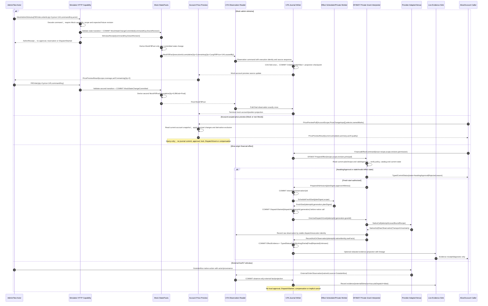
```mermaid
sequenceDiagram
    autonumber
    participant A as Admin/Test Actor
    participant X as Simulator HTTP Capability
    participant M as Mock State/Facts
    participant Q as Account Price Preview
    participant O as UTA Observation Reader
    participant J as UTA Journal Writer
    participant T as Effect Scheduler/Private Worker
    participant P as EF06/07 Private Grant Interpreter
    participant V as Provider Adapter/Venue
    participant E as Live Evidence Sink
    participant C as Alice/Account Caller

    alt Mock admin stimulus
        A->>X: MockAdminStimulus{FillOrder,orderId,qty=3,price=144,commandKey,actor}
        X->>X: Decode command； require Mock capability, scope and expected fixture revision
        X->>M: Validate state transition + COMMIT MockStateChangeCommitted{commandKey,fixtureRevision}
        M-->>X: StimulusReceipt{commandKey,fixtureRevision}
        X-->>A: AdminReceipt； no approval, reservation or DispatchStarted
        M->>M: Derive MockFillFact only after committed state change
        M-->>O: MockFillFact{executionId,cumulativeQty=3,remainingQty=2,avgFillPrice=144,causedBy}
        O->>J: Observation command with execution identity and source sequence
        J->>J: CAS fold once； COMMIT OrderPartiallyFilled + projection checkpoint
        J-->>Q: Mock-account preview source update
        Q-->>A: PricePreviewResult{scope,coverage,asOf,remainingQty=2}
        A->>X: FillOrder{qty=2,price=145,commandKey}
        X->>M: Validate second transition + COMMIT MockStateChangeCommitted
        M->>M: Derive second MockFillFact{cumulativeQty=5,fillKind=Final}
        M-->>O: Final MockFillFact
        O->>J: Fold final observation exactly once
        J-->>Q: Terminal mock account/position projection
    else Account-scoped price preview (Mock or non-Mock)
        C->>Q: PricePreviewPull{AccountScope,PriceChangeInput[],selector,ownedMarks}
        Q->>Q: Read current account snapshot； apply Decimal changes and derivative exclusion
        Q-->>C: PricePreviewResult{current,simulated,summary,asOf,quality}
        Note over Q: Query-only； no journal commit, approval, lock, DispatchGrant or compensation
    else Alice-origin financial effect
        C->>J: FinancialEffectCommand{exact recipe,scope,revision,permission}
        J->>P: EF06/07 PrepareEffect{recipe,scope,revision,principal}
        P->>P: Read current plan/recipe and validApprover； verify policy, catalog and current state
        alt AwaitingApproval or stale/invalid effect state
            P-->>C: TypedControlStatus{state=AwaitingApproval|Rejected,reason}
        else Fresh start authorized
            P-->>J: PreparedAdmission{planDigest,approverWitness}
            J->>J: COMMIT intent/plan/reservation/job
            J->>T: ScheduleFreshStart{planDigest,scope}
            T-->>J: FreshStart{attemptId,generation,planDigest}
            J->>J: COMMIT DispatchStarted{dispatchId,attemptId,generation} before native call
            J->>P: OneUseDispatchGrant{attemptId,generation,grantId}
            P->>V: NativeCall{attemptId,exactBoundRecipe}
            V-->>P: NativeAck|RawObservation|TransportUncertainty
            P->>O: Record raw observation by stable dispatch/execution identity
            P->>J: RecordAckOrObservation{attemptId,nativeIdentity,rawFacts}
            J->>J: COMMIT EffectEvidence + TypedStatus{Ack|Working|Partial|Final|Rejected|Unknown}
            J->>E: Optional redacted evidence projection with lineage
            E-->>C: Evidence receipt/diagnostic only
        end
    else External live/S7 stimulus
        A->>V: OutsideAlice native action with actor/provenance
        V-->>O: ExternalOrderObservation{nativeId,source=OutsideAlice}
        O->>J: COMMIT observe-only external fact/projection
        J->>E: Record evidence{externalStimulus=true,utaDispatch=false}
        Note over J: No local approval, DispatchStarted, compensation or implicit cancel
    end
```

### EF13.4 事实、部分成交与失败规则

1. **admin 入口**：每个 admin `Command` 先在 HTTP boundary 解码，确认 selected Mock capability、actor/policy、fixture scope、command key 和 expected fixture revision。真实 provider 不出现 simulator leaf；unknown `nativeKey`/bad Decimal/qty≤0/qty>remaining 在 state boundary 拒绝，不写 `MockFillFact` 或 UTA transaction。
2. **状态变化先于事实**：Mock owner 先提交 `MockStateChangeCommitted`，再以其 causation 派生 `MockFillFact`；未经验证的 `FillOrder` 不能直接伪造 fill。每个 fill 的 `executionId`、price、qty、cumulativeQty、avgFillPrice、source sequence 进入 observation/projection；重复 execution 不重复 cash/exposure delta。
3. **部分成交**：保留 `requestedQty` 与 `remainingQty`，而不是把 `internal.order.totalQuantity` 的缩短当作删除原始意图。`qty` 缺省时才按完整剩余数量，不能把缺省与显式 zero 混同；无法证明 finality 时保留 `Partial|Unknown`。
4. **PricePreview**：preview 是 AccountScope-bound Query，Mock 与非 Mock 均可；保留 `PriceChangeInput[]`、`symbol=all` 的逐仓自有 mark、symbol-specific underlying 对 derivatives 的 loud exclusion、Decimal current/simulated/summary、side/multiplier、as-of/freshness 与 quality/diagnostic note。transient preview 不建 approval、lock、job、compensation，也不要求进入 committed event log。
5. **UTA financial control**：只有被声明为 controlled effect 的 command 才取得 writer permission；writer→provider 必须经过私有 grant interpreter 或 EF06/07 link。Mock `placeOrder`/fill 事实不证明 native idempotency、atomicity、absence 或 finality。`Ack` 不等于 fill，possible-send 断连为 `OutcomeUnknown/RecoveryRequired`，先 observe。
6. **live evidence**：evidence sink 只允许 bounded/redacted fields，包含 `runId`、scenario/phase、source/actor、provider/native identity、dispatch/observation linkage、baseline/cleanup；不含 credential、完整账户 payload 或任意 native SDK object。evidence append failure 产生 `EvidenceSinkUnavailable`，不回滚已发生 effect，不触发 retry/compensation。
7. **外部交易**：`OutsideAlice` observation 可进入 reconciliation/accounting projection；不得生成本地 `TradeAction`、approval、reservation 或隐式 cancel。只有未来明示的 recovery capability + 新 intent revision 才能接管外部订单。
8. **顺序/迟到/gap**：source sequence/cursor per fixture/provider 独立；重复、乱序、迟到 correction/retraction 由 observation reducer 保留 lineage，不能越过 gap 推断 final。`SnapshotEnd`/preview end 不是 effect terminal；provider terminal 由声明 slot 决定。

---

<a id="ef14"></a>

## EF14 — committed 事件、Query/Git/Product Activity 投影与 migration cutover

### EF14.1 目标和边界

EF14 只描述 durable projections：各自 authority writer 的 committed event partition 进入可重建读模型；不存在跨上下文的单一全序。Transient live Query 是独立的 Query/data capability，不因可查询而强制写入 committed log。

- `DecisionStateProjection`：UTA writer 自己拥有的 intent/review/attempt/reservation/expiry 等决定状态；与对应 DomainEvent 在同一 Writer 提交中原子更新，决定失败不能留下半个 authority state，也不依赖异步 checkpoint。
- `DurableQueryProjection`：面向当前查询的 typed account/order/observation/catalog/activity view；只消费已提交事件/事实，带 scope、as-of、freshness、coverage、source partition/cursor。
- `GitAuditProjection`：保留 stage/commit/push/log/show 的人类可读兼容外观，但只读 committed events/observations；Git hash 是 display alias，不是交易 identity。
- `ProductActivityProjection`：由已经 durable 的领域事实派生 Agent/Inbox/News/可选 Trading 活动；activity journal 只供 Office/Sonner/其他读消费者，不能调度或恢复交易。
- `TransientLiveQuery`：直接从 provider/data/query boundary 取得有界结果，携带 invocation、scope、as-of、coverage、source generation 等查询证据；结果可丢失、重取，不能反向创建 DomainEvent/DispatchGrant。
- `Migration/Quarantine`：旧 commit.json、legacy paths、旧 event records 只作为带 provenance 的 `LegacyEvidence`/`MigrationRequired`/`OperatorRequired`；旧 writer 必须先被 fence，新的 authority 才能接受工作，单一切换后旧路径是 read-only evidence，不再 dual-read/dual-write。

`src/core/event-log.ts:19-91,129-163,167-224,309-343` 当前是 domain-neutral JSONL：有 seq/ts/type/payload/causedBy、disk read/query、ring buffer/subscribe、恢复时跳过 malformed lines。`src/workspaces/agent-runtime-log.ts:149-241,243-349,362-417` 在其上构造 ProductActivityJournal：先 append 再 accept/projection，支持 family/type totals、query、afterSeq replay、checkpoint-like compact session projection。`src/workspaces/service.ts:748-777` 在 Inbox durable append 后记录 `inbox.received`；`src/main.ts:410-436` 在新闻 durable ingest/dedup 后记录 `news.ingested`；`src/workspaces/office-floor.ts:118-172` 只将 Agent 事件用于 occupancy。它们共同证明“事实发生后投影”，不证明通用 EventBus；transient live query 也不自动进入这些日志。

### EF14.2 投影事件与 checkpoint 类型

| 类型 | 派生来源 | 作用 | commit/ack 语义 |
|---|---|---|---|
| `DecisionStateUpdate` | UTA effect/deferred control declaration 的 decision slots | intent/review/attempt/reservation/expiry 的 authority state | 与同一 Writer 的 DomainEvent 原子提交；失败阻止整个 authority commit |
| `TransientLiveQueryResult<C>` | Query/data declaration | invocation、scope、as-of、coverage、source generation 与有界 typed result；无 durable source seq/cursor | direct query 返回；不进入 committed projection，不创建交易 authority |
| `CommittedDomainEventEnvelope<C>` | 某个 authority writer 的 committed DomainEvent slot | `eventId`, source partition/position, owner commit order, causation（若声明有）、schema/digest、payload；aggregate id/revision、generation 等只在所属声明需要时出现，不用空字段凑 envelope | 只有对应 authority writer commit 后才可见 |
| `ProjectionCursor` | durable query/Git/activity projection input | projectionId, sourcePartition, lastSourcePosition, checkpointHash, schemaRevision；aggregate revision 只在该投影声明按 aggregate fold 时出现 | 只属于 durable presentation projection；与投影 batch 原子保存 |
| `QueryRow<C>` | committed event/observation fold | typed current/history row；含 source lineage、scope、asOf/freshness/coverage | durable query store 可重建，不能反向写 authority |
| `GitAuditRow` | committed event + compatibility formatter | commit/operation/history display；保留精度/关系/拒绝/观察事实 | export failure 只产生 lag，不回滚 effect |
| `ProductActivityFact<F>` | committed domain event → family recorder | bounded/redacted subject/summary/link；同一 Alice journal 可用 local `causedBy:number`，跨 UTA 必须用 `causeRef{originContext,originPartition,originEventId,originRevision}`，不能把 foreign numeric seq 当全局 ID | 只有源事实已 durable 才 append；append failure 不回滚源事实 |
| `ActivitySelectionCursor` | filtered activity delivery/query declaration | family/filter digest、source partition、水位、selected position、source completeness；允许过滤后跳过全局 seq | 只有 selection-aware cursor 与 completeness 才能证明该筛选流的缺口 |
| `ReplayRequest` | projection control command | projectionId、fromSeq/checkpoint、reason、operator | 只启动有限 presentation replay/repair，不拥有 task/trade |
| `ProjectionCheckpointed` | durable presentation projection diagnostic commit | source high-watermark、hash、row count/coverage | 读模型写入点；不是交易 commit |
| `LegacyEvidence` / `QuarantineRecord` | importer diagnostic/import slot | path/digest/entryIndex/schema/decoder/provenance/raw-preservation ref/disposition | 只读；禁止产生 dispatch identity/approval/job |

Durable presentation projection 必须采用 `(projectionId, sourcePartition, sourceSeq, sourceDigest)` 幂等键：同 seq 同 digest 重放是 no-op；同 seq 不同 digest 进入 `ProjectionConflict`/quarantine；source seq gap 阻止 durable checkpoint 越过缺口。筛选后的 Activity stream 可以自然跳过未选中的全局 seq；只有携 selection/filter digest、source watermark 与 completeness 的 `ActivitySelectionCursor` 才能判定 delivery loss。`checkpointHash` 只证明本地投影输入/结果的一致性，不证明远端 exactly-once、rollback 或 broker finality。

### EF14.3 完整时序（decision state 原子提交→durable presentation projection；transient live query 与 migration fence）

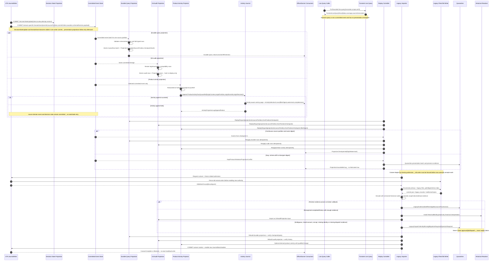
```mermaid
sequenceDiagram
    autonumber
    participant C as UTA JournalWriter
    participant D as Decision State Projection
    participant E as Committed Event Store
    participant Q as Durable Query Projection
    participant G as Git Audit Projection
    participant A as Product Activity Projector
    participant J as Activity Journal
    participant O as Office/Sonner Consumers
    participant Y as Live Query Caller
    participant L as Transient Live Query
    participant R as Replay Controller
    participant I as Legacy Importer
    participant F as Legacy Files/Old Writer
    participant Z as Quarantine
    participant H as Historical Resolver

    Y->>L: Pull bounded live query{invocation,scope,asOf}
    L-->>Y: TransientLiveQueryResult{data,coverage,sourceGeneration}
    Note over Y,L: transient query is not a committed event and has no presentation checkpoint

    C->>D: COMMIT DecisionStateUpdate{intent,review,attempt,revision}
    C->>E: COMMIT domain-specific DomainEvent{eventId,sourcePartition,commitOrder,causation,schemaRevision,payload}
    Note over C,E: DecisionStateUpdate and DomainEvent become visible in one writer commit； presentation projections follow only afterward
    par Durable query projection
        E-->>Q: Committed event batch for one source partition
        Q->>Q: Validate schema/slot/scope and fold typed rows
        Q->>Q: Atomic QueryRow batch + ProjectionCursor{lastSourcePosition,checkpointHash}
        Q-->>O: Durable query view/cursor/asOf/freshness
    and Git audit projection
        E-->>G: Same committed lineage
        G->>G: Render log/show/status compatibility rows
        G->>G: Atomic audit rows + ProjectionCursor； hash is display-only
    and Product activity projection
        E-->>A: Selected committed event only
        A->>A: Redact/derive family/type/subject/causeRef
        A->>J: Append ProductActivityFact{causeRef{originContext,originPartition,originEventId,originRevision}}
        alt Activity append succeeds
            J-->>O: Family-aware activity page + ActivitySelectionCursor{filterDigest,watermark,completeness}
        else Activity append fails
            J-->>A: ActivityProjectionLag/AppendFailure
            Note over E,C: source domain event and decision state remain committed； no task/trade retry
        end
    end

    R->>Q: ReplayRequest{projectionId,sourcePartition,fromPosition/checkpoint}
    R->>G: ReplayRequest{projectionId,sourcePartition,fromPosition/checkpoint}
    R->>A: ReplayRequest{projectionId,sourcePartition,fromPosition/checkpoint,filterDigest}
    alt Continuous source partition and same digest
        E-->>R: Events from checkpoint+1
        R->>Q: Reapply durable rows idempotently
        R->>G: Reapply audit rows idempotently
        R->>A: Reapply/redact activity idempotently
        R-->>O: ProjectionCheckpointed{highWatermark}
    else Gap, schema drift or divergent digest
        E-->>R: Gap/ProtocolViolation/ProjectionConflict
        R->>Z: Quarantine presentation batch and preserve evidence
        R-->>O: ProjectionUnavailable/Lag； no fabricated row
    end

    Note over I,F: Cutover begins by freezing admission； old writer must be fenced before new authority accepts work
    I->>C: Request cutover + freeze related admission
    C->>F: Fence old normal writer before enabling new authority
    C-->>I: OldWriterFenced{fenceEpoch}
    I->>F: Enumerate primary + legacy files, path/digest/entry index
    F-->>I: commit.json / legacy records / malformed bytes
    I->>I: Decode with versioned historical codec and classify scope/native/attempt evidence
    alt Positive evidence proves no broker callback
        I->>Z: LegacyEvidence{NoEffectsApplied,sourceProvenance}
    else Recognized completed/history with enough evidence
        I->>H: Install HistoricalBinding/read-only historical interpretation
        I->>G: Import as GitAuditProjection input
    else Ambiguous, mixed account, corrupt, missing identity or missing dispatch evidence
        I->>Z: LegacyDispatchIdentityMissing|MigrationRequired|OperatorRequired
        Note over Z,H: Never create approval/job/dispatch； never replay native
    end
    I->>Q: Rebuild durable projections + verify checkpoint/parity
    I->>G: Rebuild audit projection + verify history
    I->>A: Optional derived product activity with qualified lineage
    I->>C: COMMIT cutover marker + enable new JournalStore/readers
    C-->>O: CutoverComplete or Blocked； no dual-read/dual-write
```

### EF14.4 投影、历史与迁移规则

1. **authority first**：`DecisionStateUpdate` 与对应 committed DomainEvent 必须由同一 UTA writer 原子提交；决定状态写失败时整个 authority commit 失败。durable presentation projection 只能在源事实 commit 后消费；transient live query 可直接读取 Query/data boundary，但不能逆向制造 DomainEvent、approval 或 DispatchGrant。
2. **query/Git/activity 分离**：DurableQueryRow 用当前 typed schema；GitAuditRow 是兼容的人类可读投影；ProductActivityFact 只保存 bounded/redacted subject、summary、link、qualified `causeRef`。同一 Alice journal 的 local `causedBy:number` 只解释该 journal；跨 UTA 必须使用 `originContext`、`originPartition`、`originEventId`、`originRevision`，不能把 foreign numeric seq 当全局 ID。Office occupancy 只接收 Agent family（source `office-floor.ts:124-170`），Inbox/News 不创建 NPC/占用。
3. **live query 与 durable cursor**：TransientLiveQuery 不参与 committed projection replay，也没有 presentation checkpoint；durable Query/Git/activity 各自有 source-partition cursor/checkpoint。崩溃前 checkpoint 不推进，重启从旧 checkpoint 重放；同 digest 重放 no-op。筛选后的 Activity stream 可以自然跳过未选中的全局 seq，只有 `ActivitySelectionCursor` 的 filter digest、source watermark、selected position 与 completeness 能证明 delivery loss。
4. **Activity family**：family/type 必须由模块启动时注册，未知 family 只能作为通用降级行；未安装 family 不写事实。`inbox.received` 仅在 Inbox append 后，`news.ingested` 仅在去重并 durable ingest 后；Trading product activity 若安装，也只能从 committed trading event 派生，不是 UTA writer 的第二入口。
5. **历史 binding**：旧 `DispatchStarted`/remote observation 若可解析 provider/capability/schema/generation binding，历史 resolver 只提供观察/审计；当前 admission catalog 移除旧 leaf 不抹历史。若 resolver/identity/evidence 不足，状态为 `LegacyDispatchIdentityMissing|RecoveryRequired`，不能用当前 compiler 猜 native request。
6. **quarantine 与切换先 fence**：旧文件先冻结相关 admission，并在新 authority 接受任何 work 之前 fence old writer，保存 source path/digest/entry provenance、原始 bytes/reference 与 fence epoch。正向证据证明未进入 broker callback 才能 `NoEffectsApplied`，缺少 `DispatchStarted` marker 本身不够。完成 parity/checkpoint 验证后再一次性启用 JournalStore/readers；禁止 dual-read、dual-write 或旧路径继续创建 job。
7. **重复/丢失/延迟/顺序**：重复 committed event 按 `(eventId,sourcePartition,sourcePosition,sourceDigest)` 去重，若 declaration 拥有 aggregate revision 则一并校验；迟到 event 若低于已应用 revision 需校验是否 correction/retraction，不能静默覆盖；presentation process crash 只重放未 checkpoint batch；Activity append 丢失可由 committed lineage 重建，但不能触发 domain retry；legacy importer 不把文件顺序当 remote order。

### EF14.5 失败矩阵

| 场景 | 观察结果 | 允许动作 | 禁止动作 |
|---|---|---|---|
| DecisionStateUpdate 写失败 | authority writer commit aborts；对应 DomainEvent 不可见 | 修复存储后重试同一 validated command | 先写 presentation 或单独创建 DispatchStarted |
| Transient live query 不可用/过期 | `QueryUnavailable`/`StaleSnapshot`，没有 durable projection lag | 用新 invocation/as-of 重取或报告 typed query failure | 伪造 committed event、approval 或 projection checkpoint |
| Durable projection store 写失败 | `ProjectionLag`，source committed position 保留 | 从上次 checkpoint 重放 | rollback remote effect、重新 dispatch |
| Activity journal 写失败 | `ActivityAppendFailure`/lag；源事实和 decision state 保留 | 后续以 qualified committed lineage 补投影 | 启动 Workspace、改变交易状态 |
| Filtered Activity stream 跳过未选 global seq | 单凭 numeric seq 不构成 gap | 使用 `ActivitySelectionCursor` 校验 filter/source watermark/completeness | 以全局 seq 缺号误报 delivery loss 或补发未选事件 |
| 同 source position 不同 digest | `ProjectionConflict` | quarantine、人工/codec 修复 | 以最新到达顺序覆盖 |
| Durable source seq gap/未知 schema | `Gap`/`ProtocolViolation` | 停 presentation checkpoint、保留证据 | 填空 event、当作 Complete |
| legacy 文件 JSON 损坏/权限失败 | `MigrationRequired`/`OperatorRequired` | quarantine + read-only notice | fallback 空 history、继续受控写 |
| legacy completed 缺 native/attempt identity | `LegacyDispatchIdentityMissing`/`RecoveryRequired` | historical observe 或人工确认 | 因无 `DispatchStarted` 就标记 no-start |
| restore/clone 双 owner 或 old writer 未 fence | `RestoreQuarantine`/`CutoverBlocked` | 冻结 admission、先 fence old path、确认唯一 authority 后显式 cutover | 新 authority 先接 work、复制 UUID/seq 后直接 Ready、双写双读 |

---

### EF11–EF14 共同不变量速查

1. **没有 Alice event bus**：Workspace/Session/Inbox 是 durable admission/reply owner；ProductActivityJournal 是 ordered read projection；任何 `subscribe` 都不能得到任务/交易权威。
2. **没有通用 JSONL authority**：EventLog/ProductActivity JSONL 可承载已发生事实或投影；UTA transaction writer/outbox、Alice Workspace admission、Mock fact store、live evidence sink 各有独立 owner。
3. **没有全局时钟或全序**：writer commit order、delivery sequence、source/provider sequence、generation、catalog revision、projection cursor 各自有 scope；跨域因果以 `causationId`/lineage 表达。
4. **可能已发送永远 Unknown-first**：配置重启、Guardian readiness、projection append、activity append、Mock stimulus 或 HTTP 200 都不能把 possible-send 直接改成 KnownRejected/filled。只有经 provider identity、attempt/native lookup 与 raw observation 认证的历史 evidence 才能追加该 attempt 的 typed remote outcome/status；该 evidence 不授权新 dispatch、不覆盖当前 decision state，也不以本地缺失 marker 推断结果。
5. **数据不是交易**：quote/catalog/history/preview/activity/read observation 不创建 approval/lock/dispatch/compensation；只有明确 controlled effect recipe 才进入 UTA writer。
6. **旧历史不复活当前权限**：historical resolver 可观察旧 binding；current catalog/revision 只控制新调用。legacy import 先 quarantine，再单一切换，不能用旧文件重新下单。

<a id="legacy-flow-coverage"></a>

## 旧能力与事件流的完整对应

下表按原承接册的99个 section 组织，不改写旧章节或逐项问题。每条关联保留具体理由；一个能力可以参与多条流。相同 Provider 复用的是事件协议，不是丢弃它自己的 schema、原生时间和失败语义。完整结构见[机器可读关联](event-flow-coverage.json)。

| 原承接章节 | 关联事件流 | 关联理由 |
|---|---|---|
| [LCORE-SCOPE-ROUTING](legacy-accommodation.md#lcore-scope-routing)：账户身份、子账户目录与作用域路由 | [EF02](#ef02)、[EF05](#ef05) | EF02、EF05：EF02 在有限 Pull 前把 PublicSource、AccountScope、ProviderInstance 与 connection generation 解析出来；EF05 以同一 AccountScope 绑定 capture、FX、估值和订单观察，禁止从 aliceId/nativeKey 猜子账户。 |
| [LCORE-ORDER-INTENT](legacy-accommodation.md#lcore-order-intent)：订单意图、精确单位与 provider 扩展 | [EF06](#ef06)、[EF08](#ef08)、[EF09](#ef09) | EF06、EF08、EF09：订单意图、精确单位、provider extension 是 prepare、replace/close 和组合成员 plan 的输入边界；控制流不把这些字段压成固定业务接口。 |
| [LCORE-NATIVE-CODECS](legacy-accommodation.md#lcore-native-codecs)：Native sentinel、Contract discipline 与精确身份 | [EF01](#ef01)、[EF05](#ef05)、[EF06](#ef06)、[EF07](#ef07)、[EF08](#ef08)、[EF09](#ef09) | EF01、EF05、EF06、EF07、EF08、EF09：旧 OrderHelper/IBKR Contract builder 以 truthiness 和 UNSET sentinel/default SecType 处理字段，导致 native identity 与 presence 在 Contract/SDK 层丢失；EF01 让声明与 capability binding 固定 codec/schema digest，EF05 解码 order/fill observation 时保留 source identity 与单位，EF06–09 将 exact provider recipe、DispatchStarted 后的 raw ack/observation、mutation/compensation 与 native encoding 绑定，禁止 sentinel 或重建 SDK object 成为 journal authority。 |
| [LCORE-INSTRUMENT-SEARCH](legacy-accommodation.md#lcore-instrument-search)：搜索规范、来源排序与 Instrument identity | [EF01](#ef01)、[EF02](#ef02)、[EF04](#ef04) | EF01、EF02、EF04：EF01 将搜索/目录结果绑定到 catalog revision 与 InstrumentId；EF02 的 bar/history Pull 需要 exact instrument scope；EF04 join/merge 使用 InstrumentId/source identity 而非 display symbol。 |
| [LCORE-CATALOG-PRESET-INTENTS](legacy-accommodation.md#lcore-catalog-preset-intents)：Preset、环境提示、凭据引用与账户配置 | [EF01](#ef01)、[EF02](#ef02)、[EF12](#ef12) | EF01、EF02：EF01 处理 provider/config 声明和安装 binding；EF02 在 query 发生前区分 read scope、credential/entitlement evidence 与 permission witness，不能把配置提示当已授权。<br>EF12：preset/config/credential reference、环境 hint 与 identity preservation 是 Alice configRevision、SecretRef、rotation 和 catalog availability 的声明来源。 |
| [LCCXT-CORE-FOUNDATION](legacy-accommodation.md#lccxt-core-foundation)：Core 聚合、schema、公共投影与测试 seam | [EF01](#ef01)、[EF02](#ef02)、[EF03](#ef03)、[EF04](#ef04)、[EF05](#ef05)、[EF06](#ef06)、[EF07](#ef07)、[EF08](#ef08)、[EF09](#ef09) | EF01、EF02、EF03、EF04、EF05、EF06、EF07、EF08、EF09：CCXT 聚合类、barrel、real-CCXT gate、keyless public read 与 raw SDK mock 同时承载数据和私有效果；EF01–05 把 provider-pack/leaf 声明、有限 Pull/Push、投影与显式 capture 分开，EF06–09 只让声明的 private recipe 经过 writer、attempt、observation 与 recovery，keyless read 不升级为 mutation authority，也不保留 universal IBroker/action map。 |
| [LCCXT-CORE-CATALOG](legacy-accommodation.md#lccxt-core-catalog)：Market catalog、Instrument identity、search 与 kind | [EF01](#ef01)、[EF02](#ef02)、[EF04](#ef04) | EF01、EF02、EF04：EF01 为 exchange market/capability leaf 生成声明与 revision；EF02 以 scoped catalog binding 发起 instrument/history Pull；EF04 保留各 venue identity 和 source lineage。 |
| [LCCXT-VENUES-CATALOG](legacy-accommodation.md#lccxt-venues-catalog)：Venue market schema、timeframe 与 resolution policy | [EF01](#ef01)、[EF02](#ef02)、[EF04](#ef04) | EF01、EF02、EF04：EF01 绑定 venue-specific market/timeframe schema；EF02 只允许声明的 interval/stream/request；EF04 在多 venue 组合时保留 category、contract 和 resolution provenance。 |
| [LSDK-IBKR-CATALOG](legacy-accommodation.md#lsdk-ibkr-catalog)：IBKR 原生 Contract/ContractDetails：身份、目录扩展与历史数据缺失 | [EF01](#ef01)、[EF02](#ef02)、[EF03](#ef03)、[EF04](#ef04) | EF01、EF02、EF03、EF04：EF01 决定 IBKR Contract/native extension 是否已有 certified leaf；EF02 的历史请求带 exact Contract/what-to-show；EF03 把已实证 callback 映射为 Data/SnapshotEnd/Correction；EF04 保留 WAP/barCount/update lineage，不把 native callback 顺序提升为全局顺序。 |
| [LSDK-LB-IDENTITY](legacy-accommodation.md#lsdk-lb-identity)：Longbridge suffix/market 身份、账户 channel 与能力缺失 | [EF01](#ef01)、[EF02](#ef02)、[EF04](#ef04)、[EF05](#ef05)、[EF06](#ef06)、[EF07](#ef07)、[EF08](#ef08) | EF01、EF02、EF04、EF05、EF06、EF07、EF08：Longbridge 旧 suffix/market 默认、CNY/CNH 合并、channel 丢失与无历史叶节点会把歧义 ticker 伪造成 STK Contract；EF01 以 catalog revision 认证 InstrumentId，EF02 先建立 Public/AccountScope，EF04 保留 source identity，EF05 选取 account/FX/order evidence，EF06–08 让 prepare、cancel 与 observation 复用同一精确 identity，而不合成 Contract 或终态。 |
| [LVENUE-ALPACA-CATALOG](legacy-accommodation.md#lvenue-alpaca-catalog)：Alpaca：Instrument catalog 与身份解析 | [EF01](#ef01)、[EF02](#ef02)、[EF04](#ef04) | EF01、EF02、EF04：Alpaca catalog 未加载时旧适配器可把任意非空 symbol 大写并伪造 Contract，search/details 还返回静态交易所能力；EF01 以 provider/network/revision/checksum 绑定 descriptor，EF02 只按 exact instrument/scope 发起有限 Pull，EF04 在搜索与组合投影中保留 InstrumentId/source lineage，未知 lookup 不能变成 executable effect。 |
| [LVENUE-LEVERUP-CATALOG](legacy-accommodation.md#lvenue-leverup-catalog)：Leverup：Pair/Instrument catalog 与网络隔离 | [EF01](#ef01)、[EF02](#ef02)、[EF04](#ef04) | EF01、EF02、EF04：Leverup 静态 pair 表含 placeholders，未知 pair 可合成为 CRYPTO_PERP，testnet 又复用 mainnet pair/feed identity；EF01 发布带 NetworkIdentity/revision 的 verified descriptor，EF02 让 pair/feed discovery 与 Pull 保留 Partial/Unavailable，EF04 在跨源投影中保留 network/instrument lineage，禁止未知或跨网结果进入可执行 Contract。 |
| [LVENUE-PROTOCOL-UNITS](legacy-accommodation.md#lvenue-protocol-units)：LeverupProtocols：精确单位、collateral 与 Instrument binding | [EF01](#ef01)、[EF02](#ef02)、[EF04](#ef04)、[EF05](#ef05)、[EF06](#ef06)、[EF07](#ef07)、[EF08](#ef08)、[EF09](#ef09) | EF01、EF02、EF04、EF05、EF06、EF07、EF08、EF09：Leverup 旧 decimals helpers 用全局 scale、ROUND_DOWN 和无标签 Decimal，并固定 USDC/1x；EF01 把 collateral/token metadata、scale、signedness 与 codec digest 同时绑定，EF02/04 在 Pull 与 join 中保留 tagged Quantity/Price/Money 和 InstrumentId，EF05 让 FX/valuation/capture 拒绝缺单位，EF06–09 冻结 encoded unit/rounding 贯穿 intent、dispatch、mutation 与 compensation，post-start recovery 不按当前 decimals 重解释。 |
| [LVENUE-PROTOCOL-SCHEMA](legacy-accommodation.md#lvenue-protocol-schema)：LeverupProtocols：EIP-712 schema、signing 与 native identity | [EF01](#ef01)、[EF06](#ef06)、[EF07](#ef07)、[EF08](#ef08)、[EF09](#ef09) | EF01、EF06、EF07、EF08、EF09：旧 EIP-712 同时暴露可变 nested/flat variant、raw signer/private key、随机 salt 与任意 positionHash/deadline；EF01 为每个 write leaf 认证不可变 schema slot/digest，EF06 只由 prepared recipe 进入 approval，EF07 在 native call 前提交 DispatchStarted 并在异常后保留原 bytes/digest，EF08/09 将 mutation 与 compensation 作为独立 schema，禁止 per-call fallback variant。 |
| [LVENUE-MOCK-CATALOG](legacy-accommodation.md#lvenue-mock-catalog)：MockBroker：Instrument、identity 与 Public data | [EF13](#ef13) | EF13：Mock Public/Account scope、instrument identity、catalog/read capability 与 simulator preview scope 的分离。 |
| [LCORE-ACCOUNT-LIFECYCLE](legacy-accommodation.md#lcore-account-lifecycle)：账户外观、连接生命周期与健康观测 | [EF12](#ef12)、[EF14](#ef14) | EF12、EF14：账户连接/健康/重连以及历史账户外观的 source owner；EF12 规定 secret rotation 不换 AccountId，EF14 规定旧账户记录只进历史/read projection。 |
| [LCORE-PROTOCOL-BROKER-SPI](legacy-accommodation.md#lcore-protocol-broker-spi)：IBroker 兼容面的拆分与 scoped provider port | [EF01](#ef01)、[EF02](#ef02)、[EF03](#ef03)、[EF04](#ef04)、[EF05](#ef05)、[EF06](#ef06)、[EF07](#ef07)、[EF08](#ef08)、[EF09](#ef09)、[EF10](#ef10)、[EF12](#ef12) | EF01、EF02、EF03、EF04、EF05、EF06、EF07、EF08、EF09、EF10、EF12：旧 IBroker 把 init/close、catalog、scope、read、stream、order effect 与 capability 混在 optional generic object；EF01 用 descriptor/slot 认证 leaf，EF02–05 分离 scoped Pull、shared resource、operator projection 与 selected capture，EF06–10 分离 recipe effect、dispatch/recovery、mutation、batch 与 deferred source，EF12 再以 connection generation/reload 隔离资源生命周期；provider Layer 不能生成 permission witness 或 writer authority。 |
| [LCORE-CATALOG-PROVIDER-PACKS](legacy-accommodation.md#lcore-catalog-provider-packs)：Provider pack、manifest、缓存与加载失败 | [EF01](#ef01)、[EF02](#ef02)、[EF12](#ef12)、[EF14](#ef14) | EF01、EF02：EF01 的 manifest/content digest、installed precedence、broken-installed fail-closed、cache eviction、descriptor certificate 和 catalog commit 均在此落地；EF02 只能调用 certified leaf，不从 generic factory 推出 capability。<br>EF12、EF14：provider pack manifest/cache/load failure 与 declaration/catalog revision 承接 Ready/Unavailable、historical interpretation 与 migration 后新 catalog authority。 |
| [LCORE-CATALOG-COMPOSITION](legacy-accommodation.md#lcore-catalog-composition)：连接组装、FX 要求与模块边界 | [EF01](#ef01)、[EF02](#ef02)、[EF05](#ef05) | EF01、EF02、EF05：EF01 的 composition root 组装 descriptor/adapter/resource；EF02 读取由 scoped provider port 提供的 Pull；EF05 把 capture/valuation 所需 read resources 与 permission witness 分开。 |
| [LSTATE-RUNTIME-REGISTRY](legacy-accommodation.md#lstate-runtime-registry)：账户与公共数据注册表及资源句柄分离 | [EF01](#ef01)、[EF02](#ef02)、[EF03](#ef03)、[EF12](#ef12)、[EF13](#ef13) | EF01、EF02、EF03：EF01 区分 DataSourceRegistry、AccountRegistry 与 revision-scoped ResourceHandle；EF02 发现 scope 后才发起 read；EF03 以 provider instance/generation/resource key 共享并释放 stream。<br>EF12、EF13：UTAManager account/public registry 与 resource handles 承接 connection generation/catalog scope，以及 Mock-only simulator target resolution。 |
| [LSTATE-RUNTIME-CAPABILITIES](legacy-accommodation.md#lstate-runtime-capabilities)：组合根、schema-bound 能力与外部适配器 | [EF01](#ef01)、[EF02](#ef02)、[EF03](#ef03)、[EF04](#ef04)、[EF12](#ef12)、[EF13](#ef13) | EF01、EF02、EF03、EF04：EF01 依据 exact schema/slot/requirement/revision 认证 binding；EF02/EF03 由 capability 决定 Pull/Push 的 scope、permission、coverage 和终态；EF04 的 operator binding 依赖输入 capability 与 foreign certification。<br>EF12、EF13：UTA composition root、声明能力、provider boundary 与 data/effect 分离承接 catalog ADT、Mock simulator capability 与 financial effect leaf。 |
| [LSTATE-RUNTIME-LIFECYCLE](legacy-accommodation.md#lstate-runtime-lifecycle)：连接健康、恢复、延迟观测与重新水合 | [EF12](#ef12)、[EF14](#ef14) | EF12、EF14：连接梯度、recovery timer、late observation 与重新水合承接 generation fencing、shutdown checkpoint、historical resolver 和 projection replay。 |
| [LSTATE-RUNTIME-TRANSPORT](legacy-accommodation.md#lstate-runtime-transport)：Runtime 启动、HTTP 边界与优雅关闭 | [EF12](#ef12) | EF12：UTA startup、loopback HTTP、health 与 graceful shutdown 的当前事实被重写为 config apply barrier、admission drain、writer drain 与 typed ShutdownReport。 |
| [LSTATE-SUPERVISOR-READINESS](legacy-accommodation.md#lstate-supervisor-readiness)：Supervisor 健康、端点解析与就绪态区分 | [EF12](#ef12) | EF12：健康响应、process readiness、endpoint probe 与 UTA generation/catalog readiness 的区分；Ready 不等于 capability/effect writable。 |
| [LSTATE-SUPERVISOR-GUARDIAN](legacy-accommodation.md#lstate-supervisor-guardian)：Guardian control、restart policy 与 crash recovery | [EF12](#ef12) | EF12：Guardian status/stop/restart、flag watcher、whole-process lifecycle 是配置 apply、drain 与 recovery 的外层控制来源；不拥有交易 writer。 |
| [LCCXT-CORE-CONNECTION](legacy-accommodation.md#lccxt-core-connection)：Configuration、credential、proxy、初始化与 lifecycle | [EF01](#ef01)、[EF02](#ef02)、[EF03](#ef03)、[EF05](#ef05)、[EF06](#ef06)、[EF07](#ef07)、[EF08](#ef08)、[EF09](#ef09)、[EF12](#ef12) | EF01、EF02、EF03、EF05、EF06、EF07、EF08、EF09、EF12：CCXT constructor 读取 env 并写入 live SDK，init 只有 mutable readiness，order identity 留在 process Map，refresh 可替换 markets，close 无可观察释放；EF01 绑定 pack/connection interpretation，EF02/03 约束 data resource 与 stream lifecycle，EF05 的 capture 带 generation，EF06–09 在 Start 前重验连接/recipe，EF12 以 config revision、generation fencing 与 bounded shutdown/recovery 取代布尔 health。 |
| [LCCXT-VENUES-OVERRIDES](legacy-accommodation.md#lccxt-venues-overrides)：Default helpers、venue overrides 与 pack loading | [EF01](#ef01)、[EF02](#ef02)、[EF04](#ef04)、[EF05](#ef05)、[EF06](#ef06)、[EF07](#ef07)、[EF08](#ef08)、[EF09](#ef09)、[EF12](#ef12) | EF01、EF02、EF04、EF05、EF06、EF07、EF08、EF09、EF12：旧 registry/default-plus-override 通过 optional raw hook 修改输入、后处理结果或 fallback，且 hook 存在并不证明能力、安全或幂等；EF01 固定 pack/override version 与 leaf certification，EF02/04/05 保留 venue namespace、coverage、source projection 与 selected observations，EF06–09 让每个 override 使用自身 recipe/ack/recovery，EF12 使 registry revision/generation 变化后旧 plan 只能 reprepare 或 recover，不能换新 override 重发。 |
| [LSDK-IBKR-CONNECTION](legacy-accommodation.md#lsdk-ibkr-connection)：IBKR 直连 TWS/Gateway：连接代次、账户目录与外部进程边界 | [EF02](#ef02)、[EF03](#ef03)、[EF05](#ef05) | EF02、EF03、EF05：EF02 的 account/public scope 受 connection generation 约束；EF03 的 shared resource/cancel/reconnect 使用 generation；EF05 账户和订单 capture 遇旧 generation 只能 reconcile，不应用迟到回调。 |
| [LSDK-IBKR-BRIDGE-CORRELATION](legacy-accommodation.md#lsdk-ibkr-bridge-correlation)：IBKR callback bridge：请求关联、快照 end marker 与错误路由 | [EF02](#ef02)、[EF03](#ef03)、[EF04](#ef04)、[EF05](#ef05) | EF02、EF03、EF04、EF05：EF02 使用 request/callback correlation；EF03 把 native end marker 映射为 SnapshotEnd、错误映射为 ItemFailure/Failed；EF04 保存 callback source lineage；EF05 以 callback identity/cursor 记录 selected account/order evidence。 |
| [LSDK-LB-CONNECTION](legacy-accommodation.md#lsdk-lb-connection)：Longbridge Rust-NAPI/HTTP-WebSocket：连接与 foreign-process 边界 | [EF01](#ef01)、[EF02](#ef02)、[EF03](#ef03)、[EF05](#ef05)、[EF06](#ef06)、[EF07](#ef07)、[EF08](#ef08)、[EF09](#ef09)、[EF12](#ef12) | EF01、EF02、EF03、EF05、EF06、EF07、EF08、EF09、EF12：Longbridge 旧连接把 raw credential、endpoint、Rust-NAPI context、account probe、重试与 regex auth 混在一起，close 还是异步空操作；EF01 认证 native protocol/capability，EF02/03 绑定 scope 与 HTTP/WebSocket resource，EF05 只捕获带 generation 的 observations，EF06–09 将 process loss 归入 effect recovery，EF12 以 environment/config revision、generation fence 和 restart/shutdown checkpoint 取代已兑现 promise 或健康探针。 |
| [LVENUE-ALPACA-CONNECTION](legacy-accommodation.md#lvenue-alpaca-connection)：Alpaca：连接、配置与运行资源边界 | [EF01](#ef01)、[EF02](#ef02)、[EF03](#ef03)、[EF05](#ef05)、[EF06](#ef06)、[EF07](#ef07)、[EF08](#ef08)、[EF09](#ef09)、[EF12](#ef12) | EF01、EF02、EF03、EF05、EF06、EF07、EF08、EF09、EF12：Alpaca legacy class 同时拥有 SDK client、配置、catalog cache、订单转换和 health，测试还把 apiKey/secretKey 直接放进 config，close 不释放资源；EF01 以 construction-bound definition 发布 descriptor，EF02/03 管理 catalog/data resource，EF05 只写 selected account/order evidence，EF06–09 保持 writer admission 与 adapter interpreter 分离，EF12 负责 SecretRef、config revision、generation 与 shutdown/recovery。 |
| [LVENUE-LEVERUP-BOUNDARY](legacy-accommodation.md#lvenue-leverup-boundary)：Leverup：网络、账户与分层连接 | [EF01](#ef01)、[EF02](#ef02)、[EF05](#ef05)、[EF06](#ef06)、[EF07](#ef07)、[EF08](#ef08)、[EF09](#ef09)、[EF12](#ef12) | EF01、EF02、EF05、EF06、EF07、EF08、EF09、EF12：Leverup 旧边界用 global fetch、viem PublicClient、raw private key、mutable schemaVariant、in-memory orderTracking，并让 testnet 复用 production reader/relayer；EF01 建立 VerifiedNetworkDescriptor，EF02 分离 RPC/REST/Pyth scope Pull，EF05 只捕获选定 account evidence，EF06–09 让 relayer effect 固定 network/schema 并经 writer recovery，EF12 对 endpoint/credential/chain generation fencing，禁止 fallback mainnet 或 fake handlers。 |
| [LVENUE-PROTOCOL-DEPLOYMENT](legacy-accommodation.md#lvenue-protocol-deployment)：LeverupProtocols：Credential、NetworkIdentity 与 barrel boundary | [EF01](#ef01)、[EF02](#ef02)、[EF05](#ef05)、[EF06](#ef06)、[EF07](#ef07)、[EF08](#ef08)、[EF09](#ef09)、[EF12](#ef12) | EF01、EF02、EF05、EF06、EF07、EF08、EF09、EF12：旧 types/config 携带 raw privateKey，NetworkConstants 只是 endpoint/address bag，live/testnet 共用 reader/relayer URL，barrel 还暴露 legacy helpers；EF01 让 deployment 解码成 verified network/capability descriptor，EF02 绑定 scoped data，EF05 只持久化 selected evidence，EF06–09 以 signer/relayer 的 exact plan、DispatchStarted 与 recovery 约束 effect，EF12 让 SecretRef/config revision/generation 管理重启，凭据不进入 envelope。 |
| [LCORE-OBSERVATION-ACCOUNTING](legacy-accommodation.md#lcore-observation-accounting)：订单同步、持仓估值与模拟状态 | [EF04](#ef04)、[EF05](#ef05) | EF04、EF05：EF04 的 data projection 与 order/account observation 保持 lineage、scope、revision；EF05 的 sync/external/reconcile 只写 selected observation/control projection，不生成 approval/reservation/financial dispatch。 |
| [LCORE-DATA-CATALOG](legacy-accommodation.md#lcore-data-catalog)：合约目录、报价、历史与 capability evidence | [EF01](#ef01)、[EF02](#ef02)、[EF03](#ef03)、[EF04](#ef04)、[EF05](#ef05) | EF01、EF02、EF03、EF04、EF05：该 section 同时承接 contract/search/quote/history/capability evidence：EF01 生成目录，EF02 读 leaf，EF03 暴露声明的 stream，EF04 组合带 provenance 的数据，EF05 只保存 selected evidence。 |
| [LCORE-PROTOCOL-DATA-HISTORY](legacy-accommodation.md#lcore-protocol-data-history)：行情单位、历史与管理层投影 | [EF02](#ef02)、[EF03](#ef03)、[EF04](#ef04)、[EF05](#ef05) | EF02、EF03、EF04、EF05：EF02 负责 exact BarParams/Candle/News/Account history Pull 与 coverage；EF03 负责 snapshot-end/live/terminal；EF04 负责 correction/gap/投影 lineage；EF05 负责 selected order/account evidence 与 history projection。 |
| [LTX-PROJECTIONS](legacy-accommodation.md#ltx-projections)：审计、accounting、simulation 与 data projection 边界 | [EF04](#ef04)、[EF05](#ef05)、[EF13](#ef13)、[EF14](#ef14) | EF04、EF05：EF04 的 derived projection、operator revision、lineage、gap/checkpoint 使用独立 ProjectionStore；EF05 将 ObservationBatch、AccountingObservation、OrderProjection、Snapshot evidence 与 transaction authority 分离。<br>EF13、EF14：audit/accounting/simulation/data projection 与 transaction authority 的分离；EF13 规定 preview/observation/partial fill，EF14 规定 Query/Git/Product Activity 多投影。 |
| [LSTATE-ACCOUNTING-UNITS](legacy-accommodation.md#lstate-accounting-units)：精确会计单位、来源与缺失语义 | [EF02](#ef02)、[EF04](#ef04)、[EF05](#ef05) | EF02、EF04、EF05：EF02 解析 exact Decimal/Quantity/Price 与 source observation；EF04 在窗口/join/correction 中保持单位和 identity；EF05 的 FX、valuation、fill capture 禁止把 unknown/missing 转成零。 |
| [LSTATE-ACCOUNTING-VALUATION](legacy-accommodation.md#lstate-accounting-valuation)：账户事实、成本基础与估值聚合 | [EF02](#ef02)、[EF04](#ef04)、[EF05](#ef05) | EF02、EF04、EF05：EF02 提供带 scope/asOf/coverage 的 account/position observations；EF04 组合带 provenance 的 valuation inputs；EF05 由 pure reducer 生成 read-only AccountValuation，不获得 dispatch 权限。 |
| [LSTATE-ACCOUNTING-FX](legacy-accommodation.md#lstate-accounting-fx)：外汇观测与换算 | [EF02](#ef02)、[EF04](#ef04)、[EF05](#ef05) | EF02、EF04、EF05：EF02 可读取 FX leaf；EF04 的 cross-source join 必须携带 FX lineage；EF05 产生 Identity/Confirmed/Estimated/Stale/UnknownFx/Unavailable，并禁止用 receivedAt 或默认 1 掩盖缺失。 |
| [LSTATE-ACCOUNTING-HISTORY](legacy-accommodation.md#lstate-accounting-history)：订单/成交历史投影与原生丰富度 | [EF03](#ef03)、[EF04](#ef04)、[EF05](#ef05)、[EF13](#ef13)、[EF14](#ef14) | EF03、EF04、EF05：EF03 将 order/history stream frames 与 terminal 分开；EF04 投影 correction/retraction/gap；EF05 记录 OrderObservation/FillEvent/ReconciliationEvent，处理 late fill、duplicate fill 和旧 binding，而不生成 dispatch。<br>EF13、EF14：订单/成交历史、late observation、partial fill、source sequence 与可重建 history projection；不把 display history 当交易 authority。 |
| [LSTATE-SNAPSHOT-MODEL](legacy-accommodation.md#lstate-snapshot-model)：Snapshot 语义模型与纯捕获 | [EF03](#ef03)、[EF05](#ef05)、[EF13](#ef13)、[EF14](#ef14) | EF03、EF05：EF03 明确 SnapshotEnd 只结束历史段且不是订阅终态；EF05 在显式 CaptureRequested 后由 immutable account/position/order projection 生成 Captured/Partial/Unavailable/Invalid snapshot。<br>EF13、EF14：snapshot/valuation 是 SimulationPreview 或 query projection 的有限事实；snapshot failure/lag 不得创建 effect compensation，replay 以 checkpoint 而不是空快照修复。 |
| [LSTATE-SNAPSHOT-SCHEDULER](legacy-accommodation.md#lstate-snapshot-scheduler)：持久化 Snapshot 接入、调度与流生命周期 | [EF03](#ef03)、[EF05](#ef05)、[EF12](#ef12)、[EF13](#ef13)、[EF14](#ef14) | EF03、EF05：EF03 使用 owner、cancel、lease 和 stream lifecycle 规则；EF05 使 source-event capture request 先 durable admission，restart 依据 request/checkpoint reconcile，不把 callback 当 transaction commit。<br>EF12、EF13、EF14：snapshot timer、resource lifecycle 与 shutdown/recovery；scheduler 不是 decision outbox、Mock admin authority 或 projection replay authority。 |
| [LSTATE-SNAPSHOT-STORAGE](legacy-accommodation.md#lstate-snapshot-storage)：Snapshot 持久化、投影查询与保留策略 | [EF04](#ef04)、[EF05](#ef05)、[EF12](#ef12)、[EF14](#ef14) | EF04、EF05：EF04 的 ProjectionCheckpoint/derived revision 需要可重建的 typed store；EF05 只原子保存 selected source evidence、capture metadata 和 snapshot projection，不把普通 feed 全量 journal 化。<br>EF12、EF14：snapshot storage、checkpoint、projection query 与 storage failure/quarantine；不以旧 JSON 或 snapshot callback 兜底受控 authority。 |
| [LCCXT-CORE-ACCOUNT](legacy-accommodation.md#lccxt-core-account)：AccountScope、wallet valuation、position 与 risk observation | [EF02](#ef02)、[EF04](#ef04)、[EF05](#ef05) | EF02、EF04、EF05：EF02 将 keyless/public、wallet/subaccount、position 与 strict/permissive read 解码为 scoped observations；EF04 保留 spot/perp source identity；EF05 将 wallet/account facts 纳入 valuation/capture，禁止 zero compatibility row 成为核心事实。 |
| [LCCXT-CORE-LISTINGS](legacy-accommodation.md#lccxt-core-listings)：Scoped order lookup、open listing 与 coverage | [EF02](#ef02)、[EF03](#ef03)、[EF04](#ef04)、[EF05](#ef05) | EF02、EF03、EF04、EF05：EF02 读取 scoped order/open listing；EF03 若声明为 stream 才能建立持续资源；EF04 保留 namespace/category partial coverage；EF05 将显式 order sync 的 selected observations 写入 history projection，不把失败 namespace 当空集合。 |
| [LCCXT-CORE-DATA](legacy-accommodation.md#lccxt-core-data)：Quote、historical bars、funding、order book、clock 与 capability observation | [EF01](#ef01)、[EF02](#ef02)、[EF03](#ef03)、[EF04](#ef04) | EF01、EF02、EF03、EF04：EF01 绑定 quote/history/clock/capability leaf；EF02 保留 trailing latest-limit、timeframe refusal、asOf 与 malformed row failures；EF03 不从静态 capability 自动制造 Push；EF04 处理 source-specific correction/coverage/gap。 |
| [LCCXT-VENUES-DATA](legacy-accommodation.md#lccxt-venues-data)：AI tools、funding 与 order-book leaves | [EF02](#ef02)、[EF04](#ef04) | EF02、EF04：EF02 通过各 venue data leaf 发起有限 Pull；EF04 保留 funding/order-book/source timestamp/quality 与 operator lineage，不把兼容 DTO 的 defaults 当跨 venue invariant。 |
| [LCCXT-VENUES-BITGET](legacy-accommodation.md#lccxt-venues-bitget)：Bitget Classic routes、wallet 与 six-namespace listing | [EF02](#ef02)、[EF04](#ef04)、[EF05](#ef05) | EF02、EF04、EF05：EF02 对 six-namespace listing 逐组发现并保留失败；EF04 合并时按 namespace/source identity 和 declared partial policy；EF05 订单事实同步只选择已验证的 scoped rows。 |
| [LCCXT-VENUES-BYBIT](legacy-accommodation.md#lccxt-venues-bybit)：Bybit category sweep 与 four-path order lookup | [EF02](#ef02)、[EF04](#ef04)、[EF05](#ef05) | EF02、EF04、EF05：EF02 处理 spot/swap/category sweep 的有限读取；EF04 保留 category failure 与合并 lineage；EF05 不把未完成 sweep 视为无订单或生成 synthetic order observation。 |
| [LCCXT-VENUES-HYPERLIQUID](legacy-accommodation.md#lccxt-venues-hyperliquid)：Hyperliquid reference price 与 derived mark | [EF02](#ef02)、[EF04](#ef04)、[EF05](#ef05) | EF02、EF04、EF05：EF02 把 reference price/derived mark 当 provider-local observation；EF04 组合时保留 derivation provenance；EF05 估值只能消费带 source/quality 的 mark，不能把 derived mark 变成 dispatch evidence。 |
| [LSDK-IBKR-ACCOUNT-DATA](legacy-accommodation.md#lsdk-ibkr-account-data)：IBKR 账户回调：Decimal 持仓、币种桶与可选估值 enrichment | [EF02](#ef02)、[EF03](#ef03)、[EF04](#ef04)、[EF05](#ef05) | EF02、EF03、EF04、EF05：EF02 读取 Decimal account/position observations；EF03 遵守 baseline/stream terminal；EF04 处理增量、BASE、gap、correction；EF05 保存 projection checkpoint/selected evidence，且不写全帧 order WAL。 |
| [LSDK-LB-DATA](legacy-accommodation.md#lsdk-lb-data)：Longbridge balance/position/quote/depth/session/FX 数据 | [EF02](#ef02)、[EF03](#ef03)、[EF04](#ef04)、[EF05](#ef05) | EF02、EF03、EF04、EF05：Longbridge balance/position/quote/depth/session/order 旧路径把空响应变零、丢 channel、用 multiplier/FX/status fallback，并把未知 status 映射为 Submitted；EF02 输出带 scope/source/generation/coverage 的有限 observations，EF03 若 leaf 声明 stream 则保留资源终止，EF04 保留 depth/quote/identity 的修订与 lineage，EF05 只 capture 选定 account/FX/order facts，不合成交易状态。 |
| [LVENUE-ALPACA-ACCOUNT](legacy-accommodation.md#lvenue-alpaca-account)：Alpaca：账户、持仓与账户级事实 | [EF02](#ef02)、[EF04](#ef04)、[EF05](#ef05) | EF02、EF04、EF05：Alpaca 旧 account/positions 用 Promise.all 结果伪装 common snapshot，raw string/number 直接转换、side 二分、market value 取 abs 且缺 currency/provenance；EF02 保留 AccountScope、精确 Decimal、side、coverage，EF04 保存并发读的一致性证据与 valuation lineage，EF05 只将 selected Account/Position/Order observations 捕获，账户读失败不触发 order compensation。 |
| [LVENUE-ALPACA-MARKET](legacy-accommodation.md#lvenue-alpaca-market)：Alpaca：快照、Candle、Feed、Session 与能力发现 | [EF01](#ef01)、[EF02](#ef02)、[EF03](#ef03)、[EF04](#ef04)、[EF05](#ef05) | EF01、EF02、EF03、EF04、EF05：Alpaca quote/bars 旧实现 tail-slice、固定 adjustment/feed，clock 只给账户级 boolean，capabilities 是静态数组，SIP 403 还按 message fallback 到 IEX；EF01 从叶子 schema 派生 capability descriptor，EF02 产生带 as-of/finality 的有限 Pull，EF03 明确 stream 的 nonterminal SnapshotEnd 与唯一终态，EF04 保留 source/correction/window lineage，EF05 只 capture 被选中的 price/session evidence。 |
| [LVENUE-LEVERUP-READS](legacy-accommodation.md#lvenue-leverup-reads)：Leverup：Pyth、账户、持仓与市场数据 Pull | [EF02](#ef02)、[EF04](#ef04)、[EF05](#ef05) | EF02、EF04、EF05：Leverup 旧读路径把 Pyth 一个数复制成 bid/ask/last、只读 page 0/OPEN、静默丢 unknown pair、用 entry price 当 market price、补零 PnL 且 clock 恒定 open；EF02 以 exact feed/account/position Pull 保留 cursor 与 coverage，EF04 保留 source/derivation/operator lineage，EF05 只写 selected price/account/position evidence，普通 reader timeout 不升级为 RecoveryCase。 |
| [LVENUE-PROTOCOL-MARKET](legacy-accommodation.md#lvenue-protocol-market)：LeverupProtocols：Hermes Pyth updates 与 exact price observation | [EF01](#ef01)、[EF02](#ef02)、[EF04](#ef04)、[EF05](#ef05) | EF01、EF02、EF04、EF05：Pyth helper 旧代码固定 Hermes URL、只检查 binary 非空并取 parsed[0]，再用 Number 与 exponent 丢失精度且不校验 confidence/age/sign/future；EF01 声明 updates/price leaf，EF02 返回带 FeedId、integer/exponent、freshness 的 bounded Pull，EF04 保留 source hash/lineage，EF05 只把 frozen price observation 选入估值/capture，dispatch 后不能回取 latest 代替原证据。 |
| [LVENUE-PROTOCOL-READ](legacy-accommodation.md#lvenue-protocol-read)：LeverupProtocols：REST/RPC reader、分页与资金事实 | [EF01](#ef01)、[EF02](#ef02)、[EF04](#ef04)、[EF05](#ef05) | EF01、EF02、EF04、EF05：reader-client 旧接口暴露 PublicClient/casts、固定 page 0/OPEN、丢 raw fee/status/timestamp/address，并让 bare bigint 与 hardcoded decimals 脱节；EF01 认证 reader leaf/schema，EF02 解码分页 Position/Cash observation 并保留 cursor/generation/coverage，EF04 以 source/as-of 形成可重建 projection，EF05 只有在 Complete scoped evidence 后才允许 capture/order sync，且不产生 dispatch。 |
| [LCORE-JOURNAL-OUTBOX](legacy-accommodation.md#lcore-journal-outbox)：Git 操作、受控效果与持久发送边界 | [EF05](#ef05)、[EF06](#ef06)、[EF07](#ef07)、[EF08](#ef08)、[EF09](#ef09)、[EF10](#ef10)、[EF11](#ef11)、[EF14](#ef14) | EF05：EF05 的 capture/order-sync writer 需要区分 selected evidence 的 durable commit 与交易 outbox/dispatch authority；普通 data read 不取得 outbox 写权，已有 dispatch reference 只能作为 correlation。<br>EF06、EF07、EF08、EF09、EF10：旧 Git 外观到 journal/outbox、DispatchStarted、receipt、reservation、recovery 与 ReturnToAgent 的 authority 切换，是五条控制流共享的持久边界。<br>EF11、EF14：旧 Git staging/push/callback sequencing 及 outbox 边界直接对应 DecisionOutbox、Review CAS、committed sequence 与 legacy migration 的单一 authority。 |
| [LCORE-PROTOCOL-JOURNAL-STATE](legacy-accommodation.md#lcore-protocol-journal-state)：Git/事务状态的公共投影 | [EF04](#ef04)、[EF05](#ef05)、[EF06](#ef06)、[EF07](#ef07)、[EF08](#ef08)、[EF09](#ef09)、[EF10](#ef10)、[EF11](#ef11)、[EF12](#ef12)、[EF14](#ef14) | EF04、EF05：EF04 的 projection checkpoint/revision 与 EF05 的 capture/order history 读取 committed observation authority；Git/product projection 不能反向变成 data writer 或交易状态权威。<br>EF06、EF07、EF08、EF09、EF10：公共投影必须区分 Draft/Prepared/Approved/DispatchStarted/Ack/Observation/Unknown/Recovery，并不能把 Git/status projection 当作 execution authority。<br>EF11、EF12、EF14：protocol/journal state 的 revision、sequence、failure 与 recovery 约束；Reply/expiry、config generation、projection replay 均要求 typed state 而非字符串 status。 |
| [LCORE-ORDER-ENTRY](legacy-accommodation.md#lcore-order-entry)：单次订单入口与路由投影 | [EF06](#ef06)、[EF07](#ef07)、[EF08](#ef08) | EF06、EF07、EF08：stage/commit/push 的旧入口对应 Draft/Prepare/Approve/Dispatch/Observe 组合；one-shot 不能绕过 prepare、approval 和 writer 边界。 |
| [LTX-JOURNAL](legacy-accommodation.md#ltx-journal)：Journal authority、迁移与可重建审计 | [EF06](#ef06)、[EF07](#ef07)、[EF08](#ef08)、[EF09](#ef09)、[EF10](#ef10)、[EF11](#ef11)、[EF12](#ef12)、[EF14](#ef14) | EF06、EF07、EF08、EF09、EF10：JournalStore、事件 envelope、aggregate revision、LegacyImportRecord、receipt/outbox 与恢复重放定义所有控制事件的持久 authority。<br>EF11、EF12、EF14：Journal authority、旧 commit.json、LegacyEvidence、replay/checkpoint 与 read-only audit 的完整承接；EF11 依赖 EF10/UTA 决策 writer 的已提交 request/outbox，EF12 仅由受控 effect 使用 journal barrier，独立 data/lite query 保持自己的边界，EF14 完成 cutover。 |
| [LTX-COMPILER](legacy-accommodation.md#ltx-compiler)：Schema-bound recipe/compiler 与开放的 provider capability 边界 | [EF06](#ef06)、[EF07](#ef07)、[EF08](#ef08)、[EF09](#ef09)、[EF10](#ef10)、[EF11](#ef11)、[EF12](#ef12)、[EF13](#ef13) | EF06、EF07、EF08、EF09、EF10：recipe/schema slot、provider binding、compiler/observer/compensator identity 以及 dynamic certification 决定事件 payload 的派生来源。<br>EF11、EF12、EF13：recipe/capability binding、provider revision、exact slot 与 native compilation 的边界；review reply、generation stale、Mock effect 与 live effect 均不能使用任意 DTO/旧 compiler。 |
| [LTX-WRITER](legacy-accommodation.md#ltx-writer)：纯 decision/evolution、渐进 writer state 与原子写集 | [EF06](#ef06)、[EF07](#ef07)、[EF08](#ef08)、[EF09](#ef09)、[EF10](#ef10)、[EF11](#ef11)、[EF12](#ef12)、[EF13](#ef13)、[EF14](#ef14) | EF06、EF07、EF08、EF09、EF10：纯 decision/evolution、progressive state、single writer、CAS、reservation、approval、job/outbox 与 stale late worker 规则贯穿全部控制流。<br>EF11、EF12、EF13、EF14：single writer、progressive state、CAS 与原子写集贯穿 review/expiry、config apply、financial control、partial-fill fold、projection checkpoint。 |
| [LTX-DISPATCH](legacy-accommodation.md#ltx-dispatch)：Claim、DispatchStarted、观察、部分失败与补偿 | [EF06](#ef06)、[EF07](#ef07)、[EF08](#ef08)、[EF09](#ef09)、[EF11](#ef11)、[EF13](#ef13)、[EF14](#ef14) | EF06、EF07、EF08、EF09：Claim、DispatchStarted、one-use DispatchGrant、Ack/Observation/Unknown、compensation 和 no-start 证据是发送、mutation、batch 的核心。<br>EF11、EF13、EF14：DispatchStarted-before-remote、ack/observation/unknown、部分失败与补偿边界；EF11 的 RequestSubmission 才能进入，EF13 保留 Mock partial fill/live evidence，EF14 仅投影 committed events。 |
| [LTX-GUARDS](legacy-accommodation.md#ltx-guards)：纯风险规则与原子 guard 准入 | [EF06](#ef06)、[EF08](#ef08)、[EF09](#ef09)、[EF11](#ef11)、[EF13](#ef13) | EF06、EF08、EF09：Guard 评估必须纯化并在 writer reservation/CAS 中提交；close 敞口、batch 冲突与 guard reject 不能泄漏早期状态。<br>EF11、EF13：risk/permission guard 是 RequestSubmission 与真实 financial effect 的 admission 证据；Mock admin stimulus/preview 不得绕过 guard 取得交易权。 |
| [LTX-POLLING](legacy-accommodation.md#ltx-polling)：持久订单观察、外部订单与 scheduler 生命周期 | [EF07](#ef07)、[EF08](#ef08)、[EF09](#ef09)、[EF13](#ef13)、[EF14](#ef14) | EF07、EF08、EF09：订单 observation、external listing、coverage、durable job/checkpoint 与 crash recovery 解释先到观察、部分成交和未知恢复；poller 本身不是 dispatch authority。<br>EF13、EF14：pending order sync、external order observation、scheduler 生命周期承接 Mock fill 后观察、OutsideAlice facts、cursor/sequence 去重与 projection replay。 |
| [LCCXT-CORE-EFFECTS](legacy-accommodation.md#lccxt-core-effects)：Optional order effect、sizing、protection、mutation 与 recovery | [EF07](#ef07)、[EF08](#ef08)、[EF09](#ef09) | EF07、EF08、EF09：CCXT order effect 的 sizing/protection/mutation/recovery 需要按 provider leaf 维持 exact sequence、failure 与 native identity。 |
| [LSDK-IBKR-EFFECT](legacy-accommodation.md#lsdk-ibkr-effect)：IBKR 原生丰富订单：标识、sentinel、条件关系与未知恢复 | [EF06](#ef06)、[EF07](#ef07)、[EF08](#ef08)、[EF09](#ef09) | EF06、EF07、EF08、EF09：IBKR 旧 native Order 混有 sentinel、丰富条件关系和版本字段，placeOrder 的 void call/callback 被当作成功；EF06 以 exact recipe 完成 prepare/approval，EF07 在 native call 前提交 DispatchStarted 并处理先到 observation/Unknown，EF08 独立处理 cancel/replace/close、部分成交与敞口，EF09 对 combo/condition/compensation 保留 provider conformance，原生 ID 不冒充幂等键。 |
| [LSDK-LB-EFFECT](legacy-accommodation.md#lsdk-lb-effect)：Longbridge 原生订单、TIF、状态/字符串 ID 与受控 effect | [EF06](#ef06)、[EF07](#ef07)、[EF08](#ef08)、[EF09](#ef09) | EF06、EF07、EF08、EF09：Longbridge 旧 effect 把未知 TIF/status/type 默认成 Day/LMT/Submitted，合成 New/Replaced/Cancelled，numeric zero 覆盖 string orderId，并用递归反向单推 close；EF06 绑定 exact order recipe 与 approval，EF07 由 writer 先提交 dispatch 再观察 unknown，EF08 将 cancel/replace/close 作为独立 leaf 与 exposure criterion，EF09 让 compensation/reservation 按真实 evidence 收口，禁止 fake terminal。 |
| [LVENUE-ALPACA-ORDERS](legacy-accommodation.md#lvenue-alpaca-orders)：Alpaca：订单输入、受控写入与边界投影 | [EF06](#ef06)、[EF07](#ef07)、[EF08](#ef08)、[EF09](#ef09) | EF06、EF07、EF08、EF09：Alpaca place/replace/cancel/close 的 prepared、ack、observation、recovery、compensation 与 independent batch 约束直接承接控制流。 |
| [LVENUE-ALPACA-ORDER-OBSERVATION](legacy-accommodation.md#lvenue-alpaca-order-observation)：Alpaca：订单查询、列表覆盖与 execution observation | [EF07](#ef07)、[EF08](#ef08)、[EF09](#ef09) | EF07、EF08、EF09：订单 lookup/list 的 Found/AbsentWithEvidence/Unknown/Malformed 和 Complete/Partial/Unavailable 约束 history recovery、partial fill 与 batch coverage。 |
| [LVENUE-LEVERUP-EFFECT](legacy-accommodation.md#lvenue-leverup-effect)：Leverup：受控 open/close、relayer acknowledgement 与恢复 | [EF06](#ef06)、[EF07](#ef07)、[EF08](#ef08)、[EF09](#ef09) | EF06、EF07、EF08、EF09：Leverup open/whole-close 的 prepare、DispatchStarted、Ack/observation、未知和 compensation grade 说明 provider-specific mutation 不可压成 OrderState。 |
| [LVENUE-PROTOCOL-RELAYER](legacy-accommodation.md#lvenue-protocol-relayer)：LeverupProtocols：Relayer acknowledgement、status 与 durable polling | [EF07](#ef07)、[EF08](#ef08)、[EF09](#ef09) | EF07、EF08、EF09：Relayer Ack/Working/StillWorking/Unknown、status observation、durable polling 与 response loss 直接约束先到观察和 recovery。 |
| [LVENUE-MOCK-ORDER](legacy-accommodation.md#lvenue-mock-order)：MockBroker：订单叶子、状态观察与纯会计 reducer | [EF07](#ef07)、[EF08](#ef08)、[EF09](#ef09)、[EF13](#ef13)、[EF14](#ef14) | EF07、EF08、EF09：Mock 的 Ack/Working/Filled/Cancelled/Unknown、partial fill、expected version/exposure CAS 和 pure accounting reducer 提供 fixture 语义，但不升级为真实 venue guarantee。<br>EF13、EF14：Mock place/modify/cancel/close、order snapshot、fill quantity/avg price、状态观察与 accounting reducer 承接 partial/final fold 和 committed query/history projection。 |
| [LCORE-PROTOCOL-ERROR-FAILURE](legacy-accommodation.md#lcore-protocol-error-failure)：协议错误、未知结果与边界解码 | [EF06](#ef06)、[EF07](#ef07)、[EF08](#ef08)、[EF09](#ef09)、[EF10](#ef10) | EF06、EF07、EF08、EF09、EF10：schema/domain/transport/protocol/unknown/recovery failure 必须保持具名 ADT，不能以字符串、空结果或 OrderState 吞并。 |
| [LCORE-CATALOG-PRESENTATION](legacy-accommodation.md#lcore-catalog-presentation)：展示 schema、公共 barrel 与搜索路由 | [EF01](#ef01)、[EF02](#ef02)、[EF06](#ef06)、[EF07](#ef07)、[EF08](#ef08)、[EF09](#ef09)、[EF10](#ef10)、[EF11](#ef11)、[EF12](#ef12)、[EF14](#ef14) | EF01、EF02、EF06、EF07、EF08、EF09、EF10、EF11、EF12、EF14：旧 presets 用 raw Record/schema cast、可变 process array，public barrel 为空或 re-export native types；EF01/02 生成 versioned catalog、scope/search envelope，EF06–09 生成 prepare/approve/receipt/error 的 controlled presentation，EF10/11 表达 deferred rearm、review admission 与 reply/expiry，EF12 暴露 config/readiness revision，EF14 将 presentation 作为可重建 query/audit projection，永不携 secret、permission witness 或 execution authority。 |
| [LTX-BRIDGE](legacy-accommodation.md#ltx-bridge)：已认证的 Alice/AI bridge、生命周期命令与生成式 projection | [EF06](#ef06)、[EF07](#ef07)、[EF10](#ef10)、[EF11](#ef11)、[EF12](#ef12)、[EF14](#ef14) | EF06、EF07、EF10：认证 bridge、ReviewRequest、control CAS、response loss、Alice admission 与 direct push cutover 约束批准、发送入口和 deferred decision delivery。<br>EF11、EF12、EF14：当前 Alice/AI bridge 的配置、manual approval、direct push 与 projection 交接；EF11 把 ReturnToAgent/outbox/reply 放回 UTA/Alice 各自 authority，EF12 把配置 apply/revision/generation 分开，EF14 把 bridge 结果限定为 committed/read projections。 |
| [LSURFACE-ALICE-TRANSPORT](legacy-accommodation.md#lsurface-alice-transport)：Alice facade：构造绑定的能力传输边界 | [EF06](#ef06)、[EF07](#ef07)、[EF10](#ef10)、[EF11](#ef11)、[EF12](#ef12) | EF06、EF07、EF10：descriptor-bound transport、认证、opaque handle、typed result 与 DispatchStarted 后的 OutcomeUnknown 约束外层调用者不能获得 raw dispatch。<br>EF11、EF12：Alice→UTA loopback transport、correlation header、status 与错误边界是 EF11 delivery frame/admission ack 及 EF12 config apply/readiness receipt 的当前 source anchor；不把 transport 成功当作授权。 |
| [LSURFACE-ALICE-DATA](legacy-accommodation.md#lsurface-alice-data)：Alice 数据 facade：账户、合约、行情与公共数据的显式 scope | [EF01](#ef01)、[EF02](#ef02)、[EF03](#ef03)、[EF05](#ef05) | EF01、EF02、EF03、EF05：外层 Alice data facade 只能消费 descriptor-bound、scope-aware projection；EF01 提供 catalog binding，EF02 提供 finite query，EF03 提供 lifecycle frames，EF05 提供 explicit capture/history evidence 而非交易权威。 |
| [LSURFACE-ALICE-AUDIT](legacy-accommodation.md#lsurface-alice-audit)：Alice 审计与 wallet projection：可读 evidence，不是第二 authority | [EF07](#ef07)、[EF08](#ef08)、[EF09](#ef09)、[EF10](#ef10)、[EF11](#ef11)、[EF13](#ef13)、[EF14](#ef14) | EF07、EF08、EF09、EF10：AuditProjection、SyncReconcile、selected observation 与 EventLog 的只读/投影边界防止审计、同步或产品活动创建第二交易 authority。<br>EF11、EF13、EF14：wallet/Git/event-log 当前是可读 evidence；EF11 禁止其成为 review admission，EF13 禁止 evidence 成为金融权威，EF14 定义 GitAudit/ProductActivity/query projections 的 lineage 与 checkpoint。 |
| [LSURFACE-ALICE-CONTROL](legacy-accommodation.md#lsurface-alice-control)：Alice controlled effect：draft、审批、CAS 与 durable dispatch | [EF06](#ef06)、[EF07](#ef07)、[EF08](#ef08)、[EF09](#ef09)、[EF10](#ef10)、[EF11](#ef11)、[EF12](#ef12) | EF06、EF07、EF08、EF09、EF10：Alice controlled effect 的 Draft/Prepare/Approve/Dispatch/Observe、ReturnToAgent、Keep/Rearm/Revise/Discard/RequestSubmission 与 one-use grant 是控制入口和 deferred response 边界。<br>EF11、EF12：旧 draft/审批/push/CAS 外观承接 EF11 Keep/Reply/expiry CAS 与 RequestSubmission，EF12 说明 config revision 与受控 writer admission 的新边界。 |
| [LSURFACE-ALICE-LIFECYCLE](legacy-accommodation.md#lsurface-alice-lifecycle)：Alice manager 与连接生命周期：catalog、readiness、Guardian 边界 | [EF11](#ef11)、[EF12](#ef12)、[EF14](#ef14) | EF11、EF12、EF14：Alice manager、catalog/readiness、Guardian 与历史连接边界承接 Workspace admission、connection generation/catalog unavailable、historical binding 及 cutover。 |
| [LSURFACE-HTTP-DATA](legacy-accommodation.md#lsurface-http-data)：HTTP data projection：descriptor-bound query/stream 与 scope-aware response | [EF01](#ef01)、[EF02](#ef02)、[EF03](#ef03)、[EF04](#ef04) | EF01、EF02、EF03、EF04：HTTP data projection 的 descriptor/revision/scope/coverage 与 query/stream output 由 EF01–EF04 规定；HTTP 只呈现 Projection/DeliveryFrame，不创建 global event bus 或额外 capability。 |
| [LSURFACE-HTTP-CONTROL](legacy-accommodation.md#lsurface-http-control)：HTTP controlled projection：认证、read-only review 与 one-shot composition | [EF06](#ef06)、[EF07](#ef07)、[EF08](#ef08)、[EF09](#ef09)、[EF10](#ef10)、[EF11](#ef11) | EF06、EF07、EF08、EF09、EF10、EF11：旧 HTTP wallet/stage/one-shot route 直接读写 TradingGit，接受 arbitrary JSON/message/phase，且 Alice↔UTA 仅依赖 loopback trust、没有 service credential verifier；EF06–09 将入口改为 typed prepare/approve/dispatch/mutation/batch，EF10 让 one-shot/deferred decision 受 checkpoint/rearm 约束，EF11 先 durable-admit Workspace/ReviewRequest 再处理 reply/expiry，HTTP status/receipt 不冒充 writer authority。 |
| [LSURFACE-HTTP-SIMULATOR](legacy-accommodation.md#lsurface-http-simulator)：HTTP simulator/admin tree：隔离的 MockBroker 控制能力 | [EF02](#ef02)、[EF03](#ef03)、[EF05](#ef05)、[EF13](#ef13) | EF02、EF03、EF05：若 simulator 暴露数据注入/stream/capture，仍须经过声明绑定、scope、Push terminal 和 selected observation 边界；EF05 不因 mock 便利而生成 financial dispatch。<br>EF13：当前 routes-simulator 的 Mock-only mark/tick/fill/cancel/deposit/withdraw/trade API，是 admin stimulus 与 UTA financial control 明确分叉的直接 source anchor。 |
| [LSURFACE-SUPP-DATA](legacy-accommodation.md#lsurface-supp-data)：补充数据 consumer：bars、reference、news 与 CLI/quant 入口 | [EF02](#ef02)、[EF03](#ef03)、[EF04](#ef04)、[EF05](#ef05) | EF02、EF03、EF04、EF05：bars、reference、news、CLI/quant consumer 分别消费有限 Pull/Push、source identity、window/projection 与 selected capture；RSS dedup/seq 不被误读为 provider replay 或金融事实。 |
| [LSURFACE-SUPP-PROVIDER](legacy-accommodation.md#lsurface-supp-provider)：补充 provider/CLI/MCP consumer：开放 provider vocabulary 与生成解释器 | [EF01](#ef01)、[EF02](#ef02)、[EF03](#ef03)、[EF04](#ef04)、[EF05](#ef05)、[EF06](#ef06)、[EF07](#ef07)、[EF08](#ef08)、[EF09](#ef09)、[EF10](#ef10)、[EF11](#ef11)、[EF12](#ef12)、[EF13](#ef13)、[EF14](#ef14) | EF01、EF02、EF03、EF04、EF05、EF06、EF07、EF08、EF09、EF10、EF11、EF12、EF13、EF14：CLI/MCP/AI 旧实现维护手写 command maps、对 schema 不可表示内容 fallback `{}`、通过 unchecked internals 调 raw command，registry 又把开放 provider vocabulary 压进闭合 IBroker；EF01–05 由最终 descriptor 生成 data/stream/projection/capture surfaces，EF06–10 生成 effect/deferred interpreter，EF11–12 约束 delivery、config 与 generation，EF13 分开 Mock/live evidence，EF14 只消费 durable query/activity/migration projection，outer consumer 不拥有独立 permission 或 provider switch。 |
| [LSURFACE-SUPP-TRIGGER](legacy-accommodation.md#lsurface-supp-trigger)：补充 trigger→ReturnToAgent：Workspace、Session、headless、Inbox 的精确分工 | [EF06](#ef06)、[EF07](#ef07)、[EF10](#ef10) | EF10、EF06、EF07：DeferredInvocation、pure advance、checkpoint/gap/correction、one activation owner、ReturnToAgent 与 UTA→Alice durable admission 是 EF10 主承接，也说明其最终 RequestSubmission 必须回到 EF06/EF07。 |
| [LCORE-CROSS-BOUNDARY](legacy-accommodation.md#lcore-cross-boundary)：跨组不变量与证据边界 | [EF06](#ef06)、[EF07](#ef07)、[EF08](#ef08)、[EF09](#ef09)、[EF10](#ef10) | EF06、EF07、EF08、EF09、EF10：跨域不变量统一约束 scope、identity、side effect 后失败、guard cooldown、未知结果、数据与交易边界，以及不得由缺 marker 推断 no-start。 |
| [LCCXT-OVERVIEW](legacy-accommodation.md#lccxt-overview)：CCXT provider pack 边界与遗留能力容纳方法 | [EF01](#ef01)、[EF02](#ef02)、[EF03](#ef03)、[EF04](#ef04)、[EF05](#ef05)、[EF06](#ef06)、[EF07](#ef07)、[EF08](#ef08)、[EF09](#ef09)、[EF10](#ef10)、[EF14](#ef14) | EF01、EF02、EF03、EF04、EF05、EF06、EF07、EF08、EF09、EF10、EF14：CCXT provider pack 目前由 legacy CcxtBroker、exchangeOverrides、keyless reads、local mocks 与 venue modules 拼接，并保留 nullable/zero/current-time fallback；EF01–05 迁移为 provider-bound leaf、有限 Pull/声明的 Push、operator projection 与 explicit capture，EF06–10 冻结 exact interpretation、one-use dispatch、observation/compensation 与 deferred checkpoint，EF14 以 offline parity/import、old-writer fence 和 single-authority cutover 收口，post-start unknown 不使用 current loader reprepare。 |
| [LTX-MIGRATION](legacy-accommodation.md#ltx-migration)：启动、authority cutover、simulator fixture 与实证闸门 | [EF07](#ef07)、[EF08](#ef08)、[EF09](#ef09)、[EF12](#ef12)、[EF13](#ef13)、[EF14](#ef14) | EF07、EF08、EF09：旧 pending/committed records 的 provenance、native identity 缺失与 RecoveryRequired 分类决定历史恢复不能 reprepare 或 native replay。<br>EF12、EF13、EF14：startup、authority cutover、simulator fixture 与 evidence gate；EF12 负责 startup/drain/recovery，EF13 分离 simulator/S7，EF14 负责 quarantine 与一次性切换。 |
| [LVENUE-MOCK-HARNESS](legacy-accommodation.md#lvenue-mock-harness)：MockBroker：测试 Layer、生命周期与故障注入 | [EF13](#ef13)、[EF14](#ef14) | EF13、EF14：Mock class、failure plan、fixture layer、call trace 与独立 DurableMockVenue 的边界；Mock success 不升级为 native guarantee，projection 只消费 typed facts。 |
| [LVENUE-MOCK-SIMULATOR](legacy-accommodation.md#lvenue-mock-simulator)：MockBroker：外部事实、估值与独立 durable venue harness | [EF13](#ef13) | EF13：mark/fill/cancel/deposit/withdraw/external trade stimulus、OutsideAlice policy、WAC/multiplier 与 independent durable venue 的事实边界。 |
| [LSURFACE-LIVE-DISCOVERY](legacy-accommodation.md#lsurface-live-discovery)：Live discovery：环境、账户、provider identity 与 admission catalog | [EF12](#ef12)、[EF13](#ef13) | EF12、EF13：环境、账户、provider identity、admission catalog 与 readiness evidence；连接 generation/catalog Ready 不可由 label/port/paper hint 推导。 |
| [LSURFACE-LIVE-EFFECTS](legacy-accommodation.md#lsurface-live-effects)：Live controlled effects：provider-native differences、ack/fill 与 unknown recovery | [EF13](#ef13)、[EF14](#ef14) | EF13、EF14：live controlled effect 的 provider-native ack/fill/unknown/recovery；EF13 与 Mock/external stimulus 对照，EF14 规定 observation 只能投影 committed history。 |
| [LSURFACE-LIVE-EVIDENCE](legacy-accommodation.md#lsurface-live-evidence)：Live evidence sink：运行 provenance、redaction 与外部诊断 | [EF13](#ef13)、[EF14](#ef14) | EF13、EF14：redacted live-paper evidence、S7 external stimulus、provenance 与 evidence sink failure；EF14 将其限制为 diagnostic/projection lineage。 |
| [LSURFACE-LIVE-SIMULATION](legacy-accommodation.md#lsurface-live-simulation)：Live harness simulation：Mock immediate/deferred 与真实状态边界 | [EF13](#ef13) | EF13：Mock immediate/deferred fill、simulation/live boundary、partial/full close 与 evidence classification。 |
| [LSURFACE-LIVE-ACCEPTANCE](legacy-accommodation.md#lsurface-live-acceptance)：Live/paper acceptance：S1–S14 作为未来 implementation gate | [EF01](#ef01)、[EF02](#ef02)、[EF04](#ef04)、[EF05](#ef05)、[EF06](#ef06)、[EF07](#ef07)、[EF08](#ef08)、[EF09](#ef09)、[EF11](#ef11)、[EF12](#ef12)、[EF13](#ef13)、[EF14](#ef14) | EF01、EF02、EF04、EF05、EF06、EF07、EF08、EF09、EF11、EF12、EF13、EF14：S1–S14 当前 E2E 仍依赖 first-account、conditional skip、sleep、direct native/IBroker、best-effort cleanup 与可忽略 JSONL evidence；EF01/02/04/05 把 descriptor、scope/read、baseline/projection 与 explicit capture 写入 ScenarioManifest，EF06–09 覆盖 intent/dispatch/mutation/partial/batch/recovery，EF11 验证 hub/leaf delivery，EF12 验证 restart/generation，EF13 隔离 S7 外部交易与 live evidence，EF14 要求 evidence/quarantine/final baseline，skip 或日志数量都不能成为 accepted。 |
