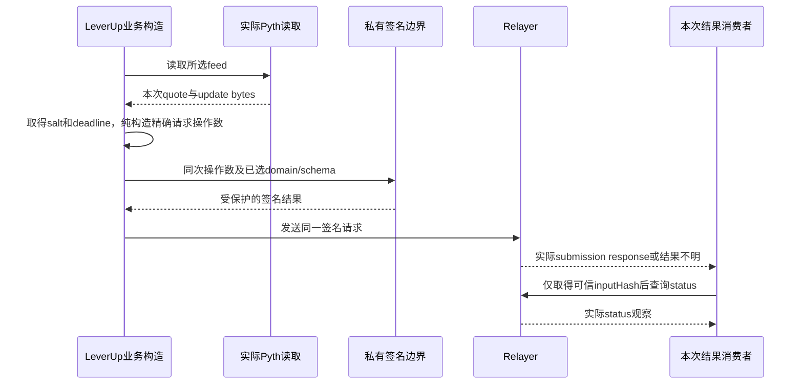

# UTA 旧能力的实质承接

本册是[主书](../uta-capability-runtime-design.md)的独立业务承接，不定义另一套核心。共同构造与新抽象事件流由主书§3–5、§8及[动态推导册](event-flows.md)论证；本册说明旧能力的实际输入、解释与消费者如何保留或修正。源码事实、目标选择与来源尚未履约的保证分别表述。没有运行新UTA、Broker或这些目标程序。

[原始逐项调查](../uta-effect-runtime-design/solutions/index.md)中的entries与analyses只保留MAP/NOTE身份、sourceEvidence、currentBehavior及原始问题；旧候选处置不是当前设计裁决。原始问题中的calendar、lease、ReconcileBeforeRetry或目录修订等预设，也必须按当前具体消费者重新论证。

## 账户与本地业务记录

### CoreAccount：选择必须成为实际路由操作数

当前`UnifiedTradingAccount.ts:644–688`把未探测、无listing、空listing及真实single混在提前返回中；`:693–724,776–790`的子账户选择只进入旁路数组与commit message。目标不是新增一个AccountAggregate名称：可信安装直接提供唯一s，或实际discover取得D再由choose消费请求、D及合约；取得的s进入提案，原生参数或目标专属解释函数真正消费同一s。发现失败不造default，single也不忽略显式错选；多只同类钱包不能只按产品kind重新选择。

funded read-only可本地提案而不能外部写，keyless保留公共数据用途而不伪造账户余额或交易提案。账户连接失败不等于整个UTA进程死亡；进程ready也不授予账户叶子执行资格。账户替换先关闭旧活动准入，等待旧使用与清理，新的资源由同一manager接管；旧回调不能只按accountId改写新实例状态。主书§12.2给出获取失败、发布前失败及并发替换时的责任。

普通positions/account读取不再隐式追加reconcile。需要旧余额成本估计能力时，显式命令取得同范围观察、纯构造提议并条件接受；估计不是成交，不与真实execution同形累计。聚合钱包读取和单钱包读取不得交替更新同一估计范围。

### TradingJournal：接受、外部发生与结果消费不是一个commit

当前`git/TradingGit.ts:119–185`先解释外部操作，随后读取状态、追加commit并调用onCommit。目标保留提案、拒绝、批量交易意图、历史查询和原结果追溯，但不让一次HTTP或commit hash承担全部承诺。所选受控业务先接受具体意图及可保存工作；每项工作关联自己的κ、输入、捕获、发生ω和结果消费者。实际外部解释之后，保存的Outcome由原消费者作用于当前状态。缺少结果不回写成未发送；重做纯消费不重做外部IO。

多动作依赖由实际函数构造：B需要A结果时等待那个A；互不依赖并发仍不自动获得跨账户原子性。独立批次、全成或补偿及原生原子能力分别由主书§10实例化。拒绝记录不成为成交；模拟结果不成为远端事实；观察到外部订单不伪造本地派发。历史视图从相应事实投影，不能以最新submitted筛选永久丢掉仍需观察或核算的责任。

交易状态、操作数与消费完成标记的原子边界按具体构造落实；SQLite是UTA实现候选，不是抽象公理。EventLog继续拥有自己的日志事实，不因共同存盘就成为订单事务权威。导入旧JSON保留原含义和未知，不能生成不存在的ω、原生身份或“确定未开始”；新公开路径切换后不保留旧numeric identity别名。

### ProtocolModels：声明与真实调用一起替换原生宽接口

当前协议包直接依赖IBKR Contract/Order，optional方法与null/空数组不能稳定区分不支持、读取失败和未见结果。目标不重新发布一个更宽的IBroker。每个实际公开定义关联自己的输入声明、解析、解释、成功/声明失败编码；最终目录与调用由同一操作数产生。新增必填输入时，组合后的公开积也真正要求它；不在后继临时补值。

跨语言的正面构造由主书§4.1给出：有限D经profile解析后，递归生成同一个输入/结果类型包的describe、parse与encode；积、和、序列及精确Decimal均有实际解析动作与往返条件。不能运输的本地谓词留在远端叶子的计算中，以其声明失败被消费，不将函数名称或说明伪造为主机已执行的验证。主书§6.1分别推演结构拒绝与远端业务拒绝。

原生错误分类由边界真实解析。timeout文本不证明未执行，未知code不伪造成已知终态。不同业务可以各有精确失败，或主动将声明失败捕获为成功中的缺侧值；不强制全局Partial/Coverage。跨进程消费者使用所选定义解码，不以request<T>成功cast代替契约。动态异构结果在原包内被编码或由实际转换交给已知消费者，不能靠字段同名强转。

### Identity：发现、选择和原生直输各自有真实后继

当前aliceId由UTA id与nativeKey拼接，barId属于source/nativeSymbol的另一命名空间；搜索归一化和排序只是候选政策。目标发现程序实际读取候选，选择函数消费本次候选和请求，再将选中的ref交给相应叶子的查询或订单构造。显示symbol、排序第一项、同一字符串都不证明跨来源身份相同。

已持有原生ref的调用可以走该叶子的原生解析及必要lookup，不强迫所有写请求先search或携带catalogRevision。合约字段只在所选产品需要时验证，不把完整SecType全集变成核心前置。原生id、账户目标、调用ω与传输关联分别由其消费者使用。目标失效不得静默换默认目标；旧字符串无法充分恢复作用域时保留未确定，而不是从commit文字猜回。

## 数值、状态与观察

### Accounting：估值与真实成交核算分开

保留Decimal确定性公式，但实际操作数须有相容数量、乘数、价格及币种含义。账户a先产生所需货币对，后继实际取得FX b，再由value消费原a与b；缺汇率不把异币种原数直接相加，不用0补失败账户。恒等换算不需要外部FX，来源未给出的as-of不能由本地now补造。

真实成本核算消费有充分身份、方向、数量、价格/费用单位及顺序的逐笔事实。旧`cost-basis.ts:94–128`的orderId去重不证明同一订单后续成交已消费；累计数量也不能直接作为新增delta。主书穿零例从多5均价106卖6@120变空1均价120，而非沿用旧现货函数清零。费用立即计入损益是该例选择，不是所有核算政策。

跨账户equity与AI portfolio有各自实际消费者，不能只修一个底层value公式。主书§13.4保留逐账户原币Observed/Unavailable、转换成功或缺口，必要项不齐时不给总净值；portfolio保留持仓事实，并分别消费比例的可计算、缺依据与分母不适用结果。同币种有效比率可直接计算，跨币种不补rate=1；Alice不重建另一套fallback。旧manager零值行及tool吞FX失败/非正分母显示0%的行为明确替换，而非继续冒称完整。

首次余额按mark估计保留为明确的估计能力，不是历史真实取得成本。迟到真实成交使依赖旧成交基态的估计失效，不将两者累加为重复数量。税务FIFO、拆分与衍生品保证金需要各自的实际输入和计算，不被一个WAC结果冒充。

### Snapshots：捕获、保存与查询可见是三项计算

当前builder隐式sync后并行读取，store先append chunk再saveIndex，而范围查询只看index。目标只读capture保留各组件实际Outcome及读取区间，纯assemble形成记录；允许缺侧的记录仍不满足要求完整估值的消费者。没有原生共同时间依据，不声称账户、仓位及订单同一时点原子。

选择持久历史时，记录身份、完整内容及查询索引由同一UTA存储事务接受；成功后查询读取该同一权威，不转向滞后文件索引。相同身份同内容返回原结果，不同内容冲突；回复丢失按原身份查询，不重新capture后沿用原身份。timestamp用于范围筛选而非唯一身份，删除按记录身份与索引同次接受。原文件chunk/index不一致须在迁移中实际处理，读坏索引不能等同无历史。

普通snapshot wake可以合并，手动runNow与自动启用是不同入口选择；并非每个tick都要持久化。启动者必须保有scheduler及在途capture的停止责任。post-push触发快照只能作为明确后继；快照失败不能让已发生交易重新执行。

### Polling：重新取得未决目标，不把timer当责任账本

主书§13.7选择coalesced wake，每轮从当前已接受的未决订单集合取得ref，实际read后由assess(ref,outcome,currentState)条件接受。运行中丢wake或重启不需重放每个tick；下一轮重取仍未决责任。来源历史已经丢失时仍可能无法恢复观察，持久本地集合不能创造远端重放。

listing present不表示没有新增成交，未见也不证明终态或未发送。逐笔查询的省略必须保持该来源及消费者的观察承诺。可信Filled而execution资料不足，可以结束只为状态设置的轮询条件，不结束核算/结算/更正责任，也不隐式制造WAC、snapshot或reconcile。

本例stop关闭新准入并drain在途读取及结果消费，之后才释放资源。clearInterval只阻止未来tick；旧查询晚于独立成交到达时按当前状态与来源顺序依据消费，不重开已知状态。

### Guards：所选政策的实际读取与接受点

当前guard-pipeline在有guard时读取positions/account后按序检查，无guard时返回原dispatcher。零guard可以是明确业务选择，不能由此发明所有IO必须批准的公共协议。启用的max-position、whitelist或cooldown分别消费自己的事实与规则；未知symbol、无法估算暴露或netLiq非正不得被默认数值冒充已验证许可。

主书§10的具体冷却选择将纯提议与状态接受分开：当前cooldown在check中修改Map，后续guard拒绝仍可能留下时间。目标函数实际消费时间与当前冷却状态，所选业务接受点才保存变化；不同政策可以选不同点，但不能用同一个无说明的boolean掩盖。暴露检查需要实际账户及价格依据；它不因类型能传入数字就证明业务估算正确。第三方guard函数须通过其实际安装与解释入口参与，不在公共核心增加每种guard的分支。

## 原生Broker实例

### Alpaca：原生notional、保护关系和局部修改

本例选择STK/AAPL、Buy、数量10、限价100及Day。Alpaca叶子的输入可明确为Quantity或Notional二选一，省略TIF按该声明默认Day，未知TIF拒绝；这不限制其他Provider的size类型。纯编码实际构造symbol/side/type/qty/limit_price/time_in_force，受控解释调用createOrder，解码实际UUID与原生响应，再构造该UUID的观察。当前`AlpacaBroker.ts:273–347`提供请求映射事实，不证明任意notional/pricing/protection组合都被原生接受；相容性由该具体叶子限制。

Alpaca原生notional直接进入其请求，不借CCXT的ticker换数量。Bracket/OTO保留实际parent/child关系及可观察身份，普通open列表不覆盖held leg时不能删除保护责任。PATCH未提供字段选择retain，clear只在有精确原生契约时开放；未知值不偷偷降级Day。

FullClose解释原生close-position调用，PartialClose是读取当前仓位后产生反向新订单；后者不承诺reduce-only，也不能以预测剩余量证明实际flat。账户、仓位、quote、SIP/IEX历史feed及clock分别提供自己的读取结果，初始化account probe成功不意味着detached catalog已就绪。UUID保留为原生身份，旧Order.orderId=0不再作为公开兼容入口回流。

### CcxtCore：显式行情后继与市场/钱包路由

主书§13.1给出500金额经实际价格100换为数量5的构造。当前`CcxtBroker.ts:520–534`在cashQty分支读取ticker，即使已有limit price也先读；没有实际freshness检查，不能替这项读取补造业务目的。目标金额程序明确选价格来源、实际取得价格、纯换算并冻结进入订单的数量；明确数量或使用已有确定价格的另一程序可以不读取无用ticker，不能声称两种原实现IO轨迹相同。

实际原生请求消费venue-bound symbol、钱包范围、数量单位、pricing及该市场支持的精度规则。修改读取原订单以补必需参数时保留这项IO；regular取消后再尝试stop命名空间不是原子取消，第一次结果不明时不能仅靠fallback名称证明第二次安全。Opaque字符串orderId不转成parseInt或0。

查询返回真实观察、未见但不足以证明缺席、充分范围下的缺席或读取失败，实际assess消费它们。Keyless的旧zero USD/空positions不能成为私有账户事实；余额派生spot估值与derivative position保留不同来源。不可定价资产、缺funding、缺时间或缺depth不补成原生零/now。相同核心后继可以消费这些精确结果，不要求所有读取持久化。

funding/order-book的UTA-local ToolCenter没有到达Alice是实际公开断点。主书§13.10从最终定义导入D、构造Alice工具调用闭包、UTA实际解析/解释到原定义结果解码展开完整路径，两个叶子独立可见。缺rate为UnavailableRate，缺book必要层值为MalformedBook，有效book实际排序；真实0保留，缺来源时间是成功值内Unknown而非补now。数值以精确coefficient/scale解释，不能声称恢复CCXT已经丢失的原文精度。AI展示与后继函数实际消费这些分支。

### CcxtVenues：路由差异由实际读取程序保留

Bitget的命名空间扫描由真实各次读取组成，productType与spot/swap范围进入实际参数。所选查询程序分别捕获各必要路径结果、解码带作用域的row，再合并；缺身份row保留协议缺口，不静默丢弃后声称完整。全部调用返回不自动证明分页或时间范围完整，完整结论还需这些原生承诺。

Bybit按id查询可由regular/conditional、open/closed各路径组成。一个路径找到充分关联观察即可交给具体消费者；全部未见只有在各路径范围和缺席语义充分时才能形成总缺席判断。timeout或权限失败不是空列表，现有四路径只能证明调用结构，不能替来源证明retention。

Hyperliquid市场请求的参考价格是实际操作数：需要时读取ticker，显式价格时使用那个价格，再由实际原生编码处理。IOC/slippage等更强含义须有真实SDK/原生契约，不能由MKT标签推出。缺mark时从notional/quantity派生的值保持公式、单位与输入依据，零数量或单位不明不产生有效mark。上述业务替换各自的读取、编码与消费者，不在核心集中枚举venue。

### Ibkr：保留原生表达能力，不伪造操作确认

原生Contract/Order中的产品与订单扩展由IBKR叶子自己的精确声明及编码保留，不压成其他Broker的字段交集。`packages/ibkr/src/order.ts:72`有percentOffset字段、`client/orders.ts:464`序列化它，但这不证明REL全部必需参数或任意数值有效；未取得原生条款依据的组合不能被稿中的样例冒充可执行。

主书§6.1直接分析place前分配id、同id waiter及synthetic Cancelled。登记ω/操作种类只能保存本地意图，不能给原生callback补造操作关联。无法确认本次调用的回调仍可作为该订单观察进入精确消费者，不自动解除本次modify/cancel责任。原生关联可在发送前取得，但可恢复独占预留及监听就绪另需履约，不能由一个整数推得。

保留当前client范围的open/completed读取、账户缓存、contract details、option参数、quote及历史能力，并分别保留end marker、请求失败及范围。读取后反向close不是原生原子平仓；未支持的attached保护不安装可执行Unsupported叶子。手工TWS订单或跨client覆盖、账户选择、live/delayed行情及session等额外承诺须由对应实际路径提供，不从静态capability数组生成。

### IbkrBridge：请求关联、收集与长期观察分别消费

ReqId有限收集构造先登记实际消费者，再发原生请求，逐项累积本次row，只有对应end才完成；错误和timeout保留本次已取得事实及所选终止含义。没有reqId的single-slot请求，本例在对应连接内串行拥有，不任意覆盖另一个等待者。Timeout后旧回调如何与下一请求区分仍取决于原生关联；仅串行启动不能自动证明迟到回调不存在。

Order id回调、account值/portfolio更新及tick不共用“收到即完成”的消费者。OrderStatus也不能绕过操作关联直接完成本次cancel；它可以形成具有来源含义的订单观察。账户初始download与后续delta由该账户缓存消费者处理，currency和account范围不能丢掉后再补成全局值。Bid/ask提前可用与snapshot end是不同读取保证。

连接实例身份必须由实际socket/listener闭包绑定，旧回调不能在收到时盖当前generation来伪造归属。关闭先停止新请求，等待或终止实际在途使用，保留尚不确定的原生调用责任。generation、end与timeout只在该IBKR边界需要时存在，不成为全局事件家族。

### Longbridge：后继查询必须真的取得身份

选择有明确市场后缀的输入，由Longbridge叶子实际解析产品、数量及TIF，再按原生规则编码；当前HK MKT与US MKT的映射不同，不能从公共Market字样推断同一行为。未支持的TIF或保护参数不静默忽略。Replace必需quantity和可选字段的保留语义由该叶子明确，clear不能从optional自动推出。

Submit response实际存在orderId时才构造对应查询工作；缺id形成结果身份不足，不填0，也不在下一步凭空调用detail。若另一路可信关联后来取得id，再由其消费者构造查询。当前`LongbridgeBroker.ts:613–629`catch-all null与`:696–713`缺公开原生id的映射需要修正，不把未见、失败、真实缺席混成一个值。

账户currency buckets经实际FX消费者换算，不选一项后丢掉其他资产；FX事实源是`services/uta/src/domain/trading/fx-service.ts`。持仓channel范围、quote/staticInfo缺侧、乘数与派生mark分别保留。反向订单close与资源close各自有结果；Promise完成或本地合成状态不单独证明远端终态。

## 模拟、链上来源与动态扩展

### MockBroker：模拟控制也有真实可观察后果

当前`MockBroker.ts:559–562`设置mark后运行matcher，`:810–838`遍历同nativeKey的Submitted订单，满足规则时调用fillOrder；`:580–621`实际改变持仓、现金、累计成交及剩余量。目标保留模拟控制入口，但绑定具体模拟实例与其自己的输入声明、权限和结果，不把控制结果升级成真实券商成交或交易批准。

独立例为模拟买入限价订单剩余2、limit100，控制mark99；实际matcher比较99≤100，fill消费者使用同一订单和99，改变该模拟实例状态。后继读取的是这个实例变化后的状态，不通过真实交易解释器再发一单。手工partial fill消费明确数量，下一次使用剩余量及累计事实；不把一次控制HTTP成功证明成跨重启持久性。

StopLimit当前近似触发即成交，不能宣称精确先触发再挂限价；模拟叶子要么明确暴露这种近似，要么另有实际精确程序，不能只改标签。账户存取/外部交易刺激不授予其他Broker的写资格。需要持久模拟世界的实验必须自己建立并验证该权威，当前进程Map不会因名为venue获得远端保证。

simulatePriceChange是另一个读取程序：完整变化输入先解析，实际读取所需账户/持仓，再纯求假设结果。它不改模拟mark或持仓；underlying shock不重定价同名衍生品，each-own-mark另行解释，缺数据不算空账户。Alice SDK与BFF都须移除错误的venue-write拒绝，改用该定义实际读取权限与可用性；funded read-only可分析，keyless缺私人观察不能补零。开发控制后的普通读取也不隐式追加reconcile，需要估计时另走显式命令。

### Leverup：签名请求与等待结束分别消费

当前`LeverupBroker.ts:213–317`实际取Pyth、计算金额、取得salt/deadline、签名、POST，然后以inputHash记录本地Submitted。目标独立程序保留这些实际取得：纯金额/编码函数消费同一次quote和条款；签名消费同一schema/domain、salt、deadline及私有凭据；POST使用同一签名和操作数。恢复不能重新取价或生成新salt/deadline而仍称原批准请求。签名与可执行授权载荷受保护，不交给公开Agent或普通日志。

`relayer-client.ts:42–93`的inputHash只是本地可查询提交标识，status字段不自动证明成交、仓位或finality。本地poll timeout目标返回等待结束及最后实际观察/读取失败，不制造executed=false/success=false远端结论，不因此重发。Close当前忽略quantity并选positionHash的路径不能承诺partial-close；精确partial能力没有证据便不开放，不默默扩大成整仓。

### LeverupProtocols：单位与部署含义不能由字节形状证明

Decimal到bigint的转换消费具体字段角色、scale、单位及舍入政策，输出供同一个签名/请求编码器使用。当前qty10位、price18位、USDC6位及ROUND_DOWN是代码假设，不证明所有collateral或部署契约。Pyth显示价格投影和执行用update bytes分别有实际消费者；显示成功不证明执行价格适用。

### Catalog：配置目录不代替能力定义

当前preset负责展示/schema/fingerprint/toEngineConfig，factory据此加载engine并createBroker。目标保留配置选择用途，但最终公开能力来自真实安装的定义d：同包解析输入、解释、编码成功/失败；CLI/help从同一声明取得形状，缺叶子就没有该命令，不安装伪Unsupported函数填目录。

包外不认识动态A时，在包内编码，或用实际A到B转换进入已知消费者；不维护一个逐Provider增长的全局结果union。程序/目标身份按调用或恢复需要保持，不强制每条数据都有catalogRevision。内容摘要只有真实验证才成为安装依据，manifest存在contentId不证明内容已核验。mode/paper字段、凭据字段存在或import成功不自动授予交易权限。

## Alice与运行边界

### AliceClients：同一声明进入跨进程调用

主书§7.5选择由d生成client：输入按d编码，UTA按同d解析并调用，返回按d编码的精确Outcome，Alice同d解码。当前`UTAClient.ts:63–88`成功cast和caller signal覆盖timeout signal不满足该目标；超时与取消都应参与实际等待。取消只结束等待，不撤销UTA已接受的工作。

可信startup/config拥有者注入service credential，UTA验证service身份及受托principal范围，再按当前权限访问所选d。请求body自称actor不成为授权。Bearer服务凭据与x-request-id的传输关联分别处理，后者不是业务幂等键。未取得响应、协议失败和领域失败分别消费；不能以JSON看似成功绕过解析。

### HttpRoutes：公开入口不能绕过私有解释权

HTTP适配器选择已安装定义、认证并解析完整输入，然后调用该定义的公开句柄。受控定义返回本地接受事实时，不把它改写成远端完成；普通读取也不隐式调用交易/估计命令。UTA owns broker与交易状态，Alice BFF不复制它们。动态结果经原定义编码，route名不作为任意私有包lookup权限。

Simulator管理入口绑定模拟实例及开发管理权限，不因靠loopback就可当成已认证服务，也不因返回filled就进入真实订单消费者。跨进程关联、取消、错误及响应编码沿主书§7.5；不存在的叶子不由宽通配fallback补成可执行命令。当前固定route需要按主书§14逐入口切换，不能只加描述metadata而保留旧旁路。

### Supervisor：进程可服务、账户可用和配置已应用分开

当前startedAt变化只证明观察到另一个进程实例，不证明配置r已应用。目标管理请求实际携带r，执行者使用r，结果关联r；r2已成为目标后晚到r结果只更新其历史，不把r2标为已应用。重启请求丢失或重复仍须依管理入口真实接纳/查询关系处理，文件里的id不创造Guardian原生幂等。

进程健康探测与账户私有读取、具体写叶子可用性分开。单账户连接失败不应伪装成UTA死亡；进程停止也不等于每笔原生订单终止。Alice lite模式不以存在UTA为前提。Supervisor消费实际进程生命周期结果，不回写交易事实。

### RuntimeComposition：实际取得与使用决定退出顺序

主书§12.4依据`services/uta/src/main.ts:63–189`推导实际组合。根持有记录服务、账户拥有者、HTTP及后台任务的真实资源与停止函数；新HTTP与后台准入关闭后，等待已准入使用及结果消费，再释放账户及记录依赖。当前未保存poller句柄、clearInterval及不等待server.close不能被称为完整drain。

启动中途失败同样清理已取得资源；use失败不会跳过release，多个清理失败保留实际终止信息。动态pack在自己的作用域中解释，调用结束不等于长期订阅结束；停止某个消费者不能过早关闭仍被其他消费者使用的共享资源。所有这些关系来自主书资源构造，不要求全系统同一生命周期状态枚举。

