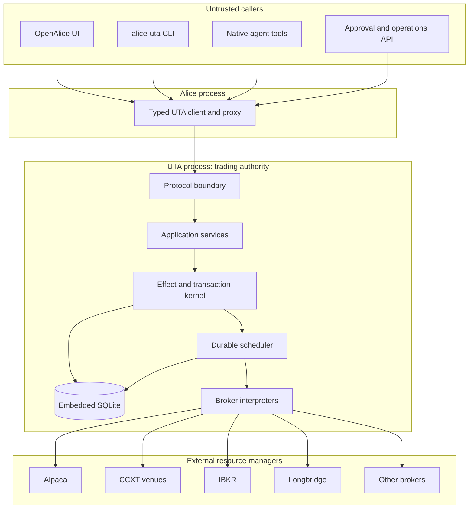
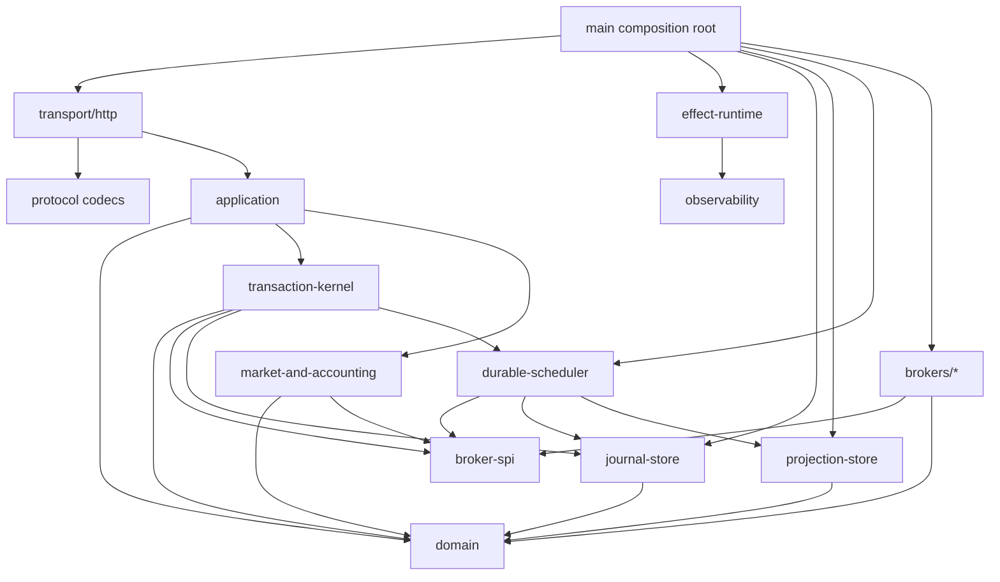
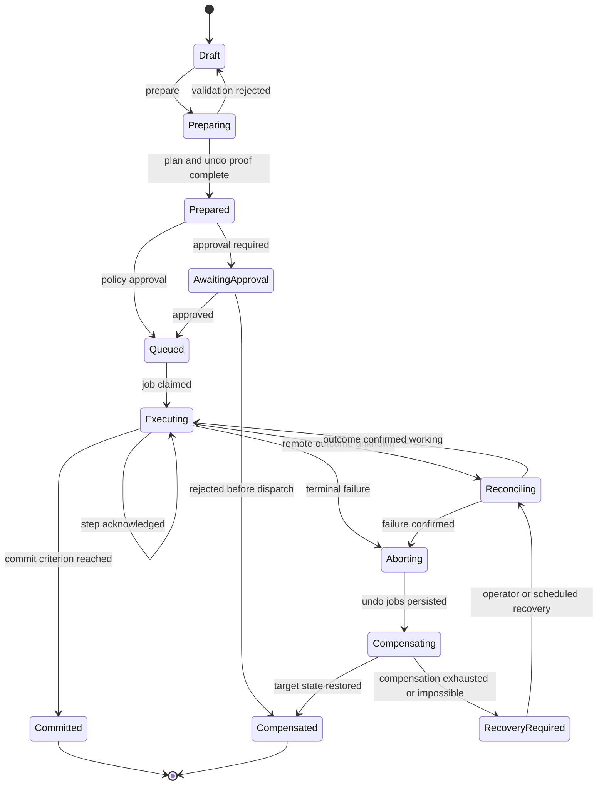
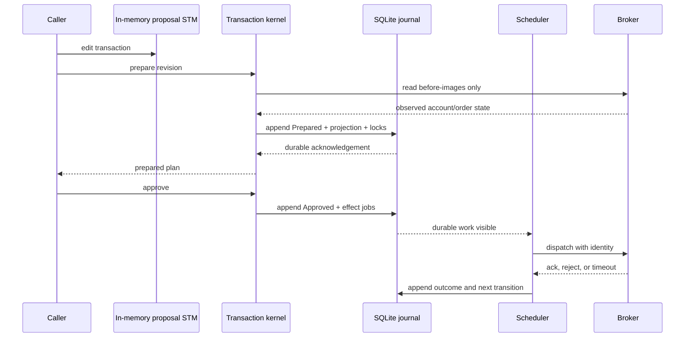
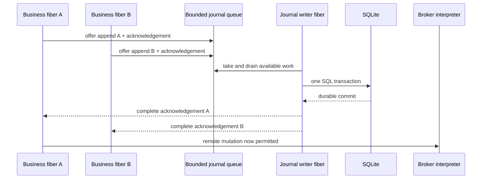
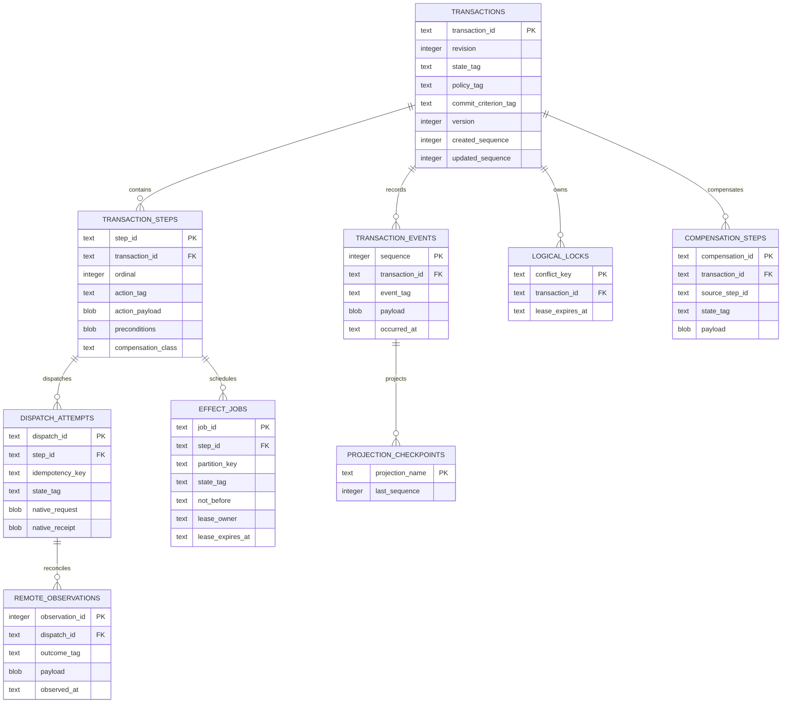
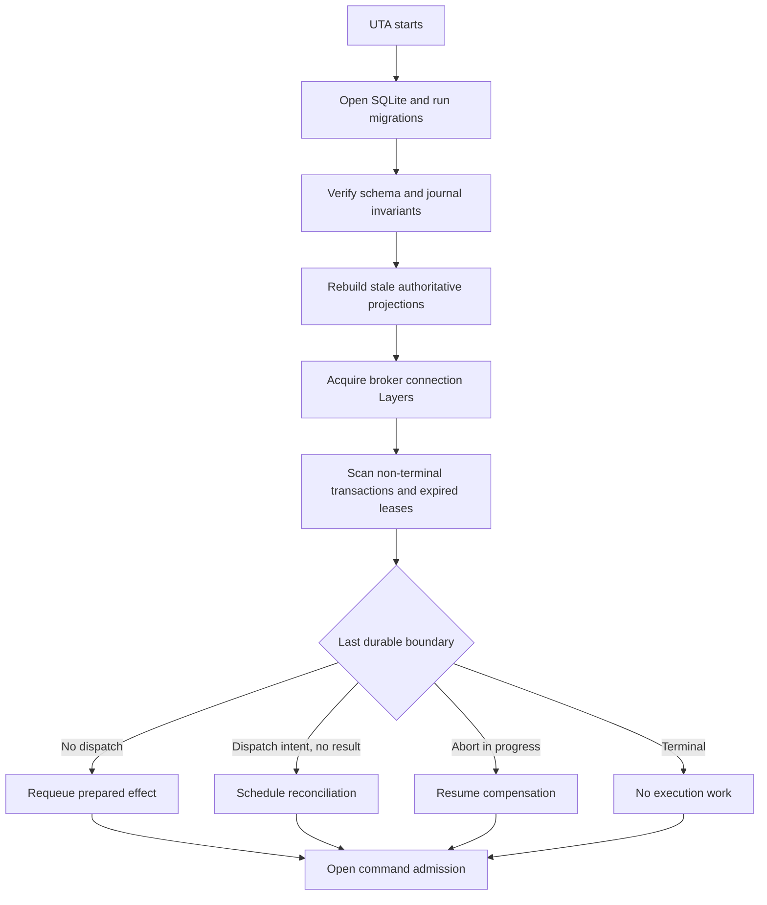
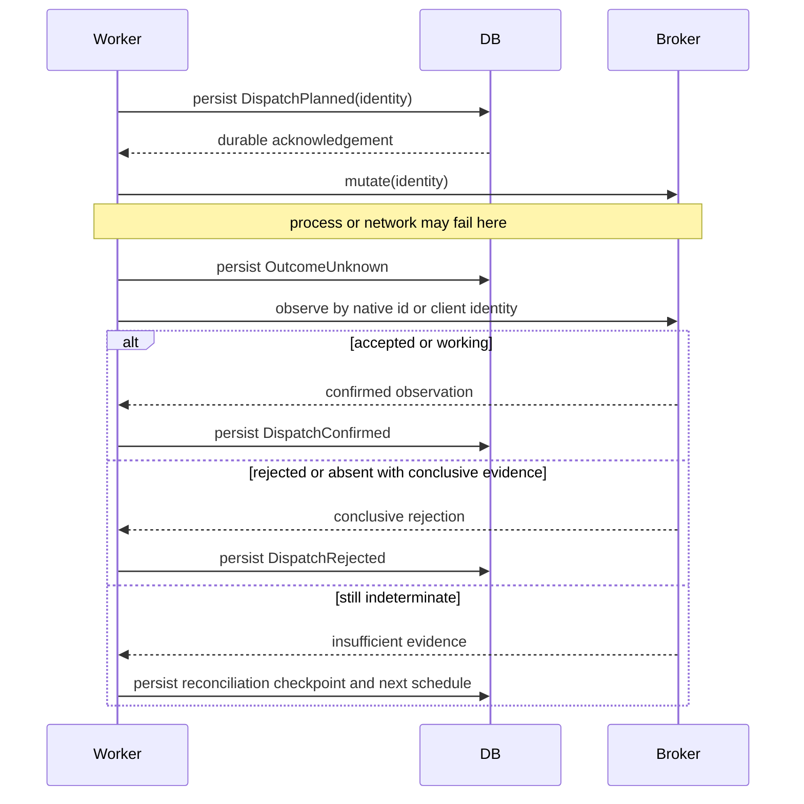

# UTA Effect Runtime Architecture

Status: target architecture; not yet the current implementation.

**English** | [简体中文](uta-effect-runtime-architecture.zh-CN.md)

This guide defines the target module boundaries, state model, durability
contract, transaction semantics, scheduling model, and broker integration
contract for UTA. It is the design authority for the UTA rewrite. Current code
and runtime behavior remain authoritative until an individual migration lands.

Related guides: [[docs/project-structure.md]], [[docs/uta-live-testing.md]],
[[docs/conversation-provenance.md]], and [[docs/development-workflow.md]].

## 1. Thesis and non-negotiable properties

UTA is a local, durable, type-driven trading effect runtime. It is not merely a
broker facade, a collection of account objects, a Git-shaped approval flow, or
a generic workflow engine.

The runtime owns five guarantees:

1. **Typed effects:** every expected failure, requirement, result, and state
   transition is represented by a precise type.
2. **Write-ahead durability:** no broker mutation starts before its execution
   intent is durably committed.
3. **Recoverable transactions:** every transactional action has a declared
   compensation capability and recovery protocol before execution.
4. **Backpressured scheduling:** accepted work is either durably queued or
   rejected explicitly; work is never silently dropped.
5. **Broker truth reconciliation:** a timeout or process crash produces an
   unknown remote outcome, never a blind retry.

Effect supplies structured concurrency, typed failures, dependency injection,
scopes, schedules, queues, and in-memory STM. SQLite supplies the embedded ACID
storage engine. UTA supplies the trading transaction protocol, domain journal,
durable scheduler, broker interpreters, and reconciliation semantics.

## 2. System boundary



### 2.1 Alice owns

- user sessions, Workspace identity, UI, agent tools, and authorization entry;
- transport authentication and presentation of UTA state;
- correlation from a trading decision back to its originating Session.

Alice does not own broker connections, transaction execution, order state,
durable trading queues, compensation, or reconciliation.

### 2.2 UTA owns

- account and broker connection lifecycles;
- transaction compilation, approval state, execution, abort, and recovery;
- the authoritative local execution journal and current projections;
- multi-currency accounting inputs and broker-observed trading state;
- all broker mutations and their durable dispatch identities;
- durable scheduling, reconciliation, and compensation workers.

### 2.3 Brokers own

- remote order, execution, position, balance, and market-session facts;
- venue-specific acceptance and fill behavior;
- broker-native identifiers and idempotency behavior.

UTA never infers a confirmed remote result from local intent alone.

## 3. Module graph and allowed dependencies

The target code lives under `services/uta/src/`. Modules may depend only in the
direction shown below.



### 3.1 `domain/`

Pure trading types and deterministic functions only:

- nominal identifiers and decimal value objects;
- instruments, accounts, orders, fills, positions, currencies, and exposure;
- transaction commands, events, states, and compensation capability;
- pure decision and evolution functions;
- conflict keys, preconditions, and commit criteria.

It must not import Effect services, HTTP, SQLite, filesystem APIs, timers, or
broker SDKs. Domain functions may return ADTs such as `Either`-shaped values,
but they must remain deterministic.

### 3.2 `effect-runtime/`

Process-wide Effect composition:

- service tags and Layers;
- root Scope and supervised fibers;
- fatal defect policy;
- clock and retry policy services;
- shutdown ordering;
- runtime logging, tracing, and metrics integration.

It does not contain trading decisions or broker mappings.

### 3.3 `transaction-kernel/`

The database-like transaction manager:

- compiles proposals into prepared transactions;
- captures before-images and preconditions;
- proves compensation eligibility;
- acquires durable logical locks;
- writes transaction events and effect outbox rows atomically;
- decides commit, abort, compensation, and recovery transitions;
- exposes no broker-specific SDK values.

### 3.4 `journal-store/`

The only authoritative write path for transaction history:

- SQLite schema and migrations;
- append-only domain journal;
- atomic state projection updates;
- effect outbox and durable job state;
- durable acknowledgement after commit;
- sequence allocation and optimistic version checks.

No other UTA module may write trading JSON files as an alternative authority.

### 3.5 `durable-scheduler/`

Executes durable work recorded by the transaction kernel:

- claims jobs with leases;
- applies partition ordering and backpressure;
- dispatches broker effects;
- records acknowledgements or unknown outcomes;
- schedules observation, reconciliation, and compensation;
- resumes expired work after process restart.

An in-memory Effect `Queue` is an admission and wake-up mechanism, not the
durable source of pending work.

### 3.6 `broker-spi/`

Defines typed ports consumed by the kernel and scheduler:

- connection/resource lifecycle;
- action capability and availability;
- native request compilation;
- dispatch identity and idempotency contract;
- remote observation and reconciliation;
- compensation compilation;
- account, market, and jurisdiction metadata.

The SPI contains no concrete SDK imports.

### 3.7 `brokers/<broker>/`

Each broker is an interpreter from domain actions into native effects:

- SDK connection Layer and Scope;
- boundary schemas for native responses;
- action interpreters;
- broker-specific error mapping;
- idempotency and outcome-resolution rules;
- capability derivation by account, market, instrument, and jurisdiction.

Broker adapters may depend on `broker-spi/` and `domain/`; the kernel must not
depend on a concrete adapter.

### 3.8 `projection-store/`

Read-optimized, rebuildable projections:

- current transaction summaries;
- orders and executions;
- positions and balances;
- approval inbox;
- Git/audit projection;
- UI and agent query views.

Projection failure must not roll back a broker acknowledgement already written
to the authoritative journal. A projection can always be rebuilt from journal
events and broker reconciliation.

### 3.9 `transport/` and `protocol/`

- decode every request at the process boundary;
- encode every response from a named schema;
- authenticate and authorize, then call application services;
- never dispatch broker SDK calls directly;
- never expose database rows or adapter-native response objects.

## 4. Effect model

Effect is the uniform representation of side effects:

```ts
type UtaEffect<Success, Failure, Requirements> =
  Effect.Effect<Success, Failure, Requirements>
```

Expected errors are tagged ADTs. Defects represent violated program invariants
and terminate or restart the owning supervised component according to policy.

```ts
type DispatchFailure =
  | { readonly _tag: 'BrokerRejected'; readonly rejection: BrokerRejection }
  | { readonly _tag: 'ConnectionUnavailable'; readonly accountId: AccountId }
  | { readonly _tag: 'OutcomeUnknown'; readonly dispatchId: DispatchId }
  | { readonly _tag: 'ProtocolViolation'; readonly detail: ProtocolViolation }
```

The following uses of Effect are deliberately separate:

| Effect facility | UTA use | Not allowed as |
|---|---|---|
| `Layer` | service and adapter construction | runtime service locator with untyped values |
| `Scope` | connection, subscription, socket lifetime | durable transaction boundary |
| `Queue` | bounded admission and worker wake-up | authoritative job store |
| `STM` / `TRef` | atomic in-memory proposal views | crash-recoverable state |
| `Schedule` | explicit reconnect/reconcile policies | blind retry of unknown mutations |
| `Fiber` | supervised workers and streams | detached fire-and-forget mutation |
| finalizers | release local resources | business compensation or rollback |

## 5. Transaction algebra

### 5.1 Commands, events, effects, and state

```ts
interface Decision<State, Command, Event, ExternalEffect, Failure> {
  readonly decide: (
    state: State,
    command: Command,
  ) => Either.Either<
    {
      readonly events: NonEmptyReadonlyArray<Event>
      readonly effects: ReadonlyArray<ExternalEffect>
    },
    Failure
  >
}

interface Evolution<State, Event> {
  readonly evolve: (state: State, event: Event) => State
}
```

Commands express requests. Events express accepted durable facts. External
effects express work that must cross a process or broker boundary. Evolution is
pure and exhaustive.

### 5.2 Transaction state

```ts
type TransactionState =
  | { readonly _tag: 'Draft'; readonly snapshot: ProposalSnapshot }
  | { readonly _tag: 'Preparing'; readonly revision: TransactionRevision }
  | { readonly _tag: 'Prepared'; readonly plan: PreparedPlan }
  | { readonly _tag: 'AwaitingApproval'; readonly plan: PreparedPlan }
  | { readonly _tag: 'Queued'; readonly plan: ApprovedPlan }
  | { readonly _tag: 'Executing'; readonly progress: ExecutionProgress }
  | { readonly _tag: 'Reconciling'; readonly unknown: NonEmptyReadonlyArray<DispatchId> }
  | { readonly _tag: 'Aborting'; readonly cause: AbortCause }
  | { readonly _tag: 'Compensating'; readonly progress: CompensationProgress }
  | { readonly _tag: 'Committed'; readonly result: TransactionResult }
  | { readonly _tag: 'Compensated'; readonly result: CompensationResult }
  | { readonly _tag: 'RecoveryRequired'; readonly residual: ResidualRisk }
```



There is no `rolledBack` boolean. Compensation may restore exact identity,
observable state, or only economic exposure; the result type records which.

### 5.3 Two-phase transaction protocol

All trading mutations use one semantic protocol, including a single order.

#### Phase 1: prepare

1. Load the transaction revision and broker-observed before-images.
2. Resolve account, sub-account, instrument, market, and jurisdiction.
3. Validate action schemas and business guards.
4. Determine conflict keys and acquire durable logical locks.
5. Compile typed forward steps.
6. Compile compensation capability for every step.
7. Bind preconditions and commit criteria.
8. Atomically append `TransactionPrepared` and update its projection.

Prepare performs no broker mutation.

#### Phase 2: execute and settle

1. Persist `DispatchPlanned` and the durable job in one SQLite transaction.
2. Wait for the durability acknowledgement.
3. Dispatch through the broker interpreter.
4. Persist confirmed, rejected, or unknown outcome.
5. Reconcile until the declared commit criterion is reached.
6. On failure, persist the abort decision and compensation jobs.
7. Release locks only after a terminal or explicitly operator-owned recovery
   state is durable.

This is a database transaction abstraction implemented over non-transactional
remote resource managers. Compensation is its recovery mechanism, not a
replacement abstraction.

### 5.4 Commit criteria

```ts
type CommitCriterion =
  | { readonly _tag: 'AcceptedByVenue' }
  | { readonly _tag: 'WorkingAtVenue' }
  | { readonly _tag: 'FullyFilled' }
  | { readonly _tag: 'TargetExposureReached'; readonly target: ExposureTarget }
  | { readonly _tag: 'NativeAtomicGroupConfirmed'; readonly group: NativeGroupId }
```

The criterion is part of the prepared plan. A transaction cannot reinterpret
`accepted` as `filled` after execution begins.

### 5.5 Compensation capability

```ts
type CompensationCapability<Action> =
  | { readonly _tag: 'Exact'; readonly compile: ExactUndoCompiler<Action> }
  | { readonly _tag: 'StateRestoring'; readonly compile: StateUndoCompiler<Action> }
  | { readonly _tag: 'Economic'; readonly compile: EconomicUndoCompiler<Action>; readonly risk: RiskModel }
  | { readonly _tag: 'None'; readonly reason: NonTransactionalReason }
```

Strict atomic groups admit only the capability classes allowed by their policy.
A cancellation followed by a replacement order is not exact rollback because
the original venue identity and queue priority are lost.

### 5.6 Execution policies

```ts
type ExecutionPolicy =
  | { readonly _tag: 'IndependentBatch' }
  | { readonly _tag: 'AllOrCompensate'; readonly acceptedUndo: AcceptedUndoClass }
  | { readonly _tag: 'VenueNativeAtomic'; readonly mechanism: NativeAtomicMechanism }
```

A Git grouping, approval message, or HTTP request containing several actions
does not implicitly create an atomic transaction.

### 5.7 Complete type contract

The types above describe the state machine. The following contract closes the
type relationships that implementations must preserve across domain, database,
broker, scheduler, and protocol boundaries.

#### Nominal identities and financial values

```ts
declare const Brand: unique symbol
type Branded<Value, Name extends string> = Value & { readonly [Brand]: Name }

type TransactionId = Branded<string, 'TransactionId'>
type TransactionRevision = Branded<number, 'TransactionRevision'>
type TransactionVersion = Branded<number, 'TransactionVersion'>
type StepId = Branded<string, 'StepId'>
type DispatchId = Branded<string, 'DispatchId'>
type JobId = Branded<string, 'JobId'>
type AccountId = Branded<string, 'AccountId'>
type ConnectionId = Branded<string, 'ConnectionId'>
type InstrumentId = Branded<string, 'InstrumentId'>
type BrokerOrderId = Branded<string, 'BrokerOrderId'>
type ClientOrderId = Branded<string, 'ClientOrderId'>
type CurrencyCode = Branded<string, 'CurrencyCode'>
type DecimalString = Branded<string, 'DecimalString'>
type Instant = Branded<string, 'Instant'>

type Money = Readonly<{ currency: CurrencyCode; amount: DecimalString }>
type Quantity = Readonly<{ instrumentId: InstrumentId; amount: DecimalString }>
type Price = Readonly<{
  instrumentId: InstrumentId
  quoteCurrency: CurrencyCode
  amount: DecimalString
}>
```

No identifier is interchangeable with another string. Financial arithmetic is
performed with `Decimal`; `DecimalString` is the serialization representation.

#### Order and trading action ADTs

```ts
type Side = 'Buy' | 'Sell'
type TimeInForce = 'Day' | 'Gtc' | 'Ioc' | 'Fok'

type OrderSpec =
  | Readonly<{ _tag: 'MarketOrder'; side: Side; quantity: Quantity; tif: TimeInForce }>
  | Readonly<{ _tag: 'LimitOrder'; side: Side; quantity: Quantity; limit: Price; tif: TimeInForce }>
  | Readonly<{ _tag: 'StopOrder'; side: Side; quantity: Quantity; trigger: Price; tif: TimeInForce }>
  | Readonly<{
      _tag: 'StopLimitOrder'
      side: Side
      quantity: Quantity
      trigger: Price
      limit: Price
      tif: TimeInForce
    }>
  | Readonly<{
      _tag: 'TrailingOrder'
      side: Side
      quantity: Quantity
      trail: { readonly _tag: 'Amount'; readonly value: Price }
        | { readonly _tag: 'Percent'; readonly value: DecimalString }
      tif: TimeInForce
    }>

type TradeAction =
  | Readonly<{
      _tag: 'PlaceOrder'
      accountId: AccountId
      instrumentId: InstrumentId
      clientOrderId: ClientOrderId
      order: OrderSpec
    }>
  | Readonly<{
      _tag: 'ModifyOrder'
      accountId: AccountId
      orderId: BrokerOrderId
      replacement: OrderSpec
    }>
  | Readonly<{
      _tag: 'CancelOrder'
      accountId: AccountId
      orderId: BrokerOrderId
    }>
  | Readonly<{
      _tag: 'ClosePosition'
      accountId: AccountId
      instrumentId: InstrumentId
      quantity: Quantity | 'All'
    }>
```

Order variants do not use `Partial<Order>` or optional-field combinations.
Every variant contains exactly the fields required for that order type.

#### Before-images, observations, and preconditions

```ts
type OrderSnapshot = Readonly<{
  accountId: AccountId
  orderId: BrokerOrderId
  version: Branded<string, 'BrokerOrderVersion'>
  order: OrderSpec
  status: 'PendingSubmit' | 'Working' | 'PartiallyFilled' | 'Filled' | 'Cancelled'
  filledQuantity: Quantity
}>

type ExposureSnapshot = Readonly<{
  accountId: AccountId
  instrumentId: InstrumentId
  netQuantity: Quantity
  observedAt: Instant
}>

type BeforeImage =
  | Readonly<{ _tag: 'NoExistingOrder'; clientOrderId: ClientOrderId }>
  | Readonly<{ _tag: 'ExistingOrder'; order: OrderSnapshot }>
  | Readonly<{ _tag: 'Exposure'; exposure: ExposureSnapshot }>

type Precondition =
  | Readonly<{ _tag: 'TransactionVersion'; expected: TransactionVersion }>
  | Readonly<{
      _tag: 'OrderVersion'
      orderId: BrokerOrderId
      expected: Branded<string, 'BrokerOrderVersion'>
    }>
  | Readonly<{ _tag: 'ExposureEquals'; expected: ExposureSnapshot }>
  | Readonly<{ _tag: 'BuyingPowerAtLeast'; amount: Money }>
  | Readonly<{ _tag: 'MarketSessionOpen'; instrumentId: InstrumentId }>
```

#### Prepared plans and steps

```ts
type PreparedStep =
  | Readonly<{
      _tag: 'PreparedPlaceOrder'
      stepId: StepId
      action: Extract<TradeAction, { _tag: 'PlaceOrder' }>
      before: Extract<BeforeImage, { _tag: 'NoExistingOrder' }>
      compensation: CompensationCapability<Extract<TradeAction, { _tag: 'PlaceOrder' }>>
      preconditions: ReadonlyArray<Precondition>
      conflictKeys: NonEmptyReadonlyArray<ConflictKey>
    }>
  | Readonly<{
      _tag: 'PreparedModifyOrder'
      stepId: StepId
      action: Extract<TradeAction, { _tag: 'ModifyOrder' }>
      before: Extract<BeforeImage, { _tag: 'ExistingOrder' }>
      compensation: CompensationCapability<Extract<TradeAction, { _tag: 'ModifyOrder' }>>
      preconditions: NonEmptyReadonlyArray<Precondition>
      conflictKeys: NonEmptyReadonlyArray<ConflictKey>
    }>
  | Readonly<{
      _tag: 'PreparedCancelOrder'
      stepId: StepId
      action: Extract<TradeAction, { _tag: 'CancelOrder' }>
      before: Extract<BeforeImage, { _tag: 'ExistingOrder' }>
      compensation: CompensationCapability<Extract<TradeAction, { _tag: 'CancelOrder' }>>
      preconditions: NonEmptyReadonlyArray<Precondition>
      conflictKeys: NonEmptyReadonlyArray<ConflictKey>
    }>
  | Readonly<{
      _tag: 'PreparedClosePosition'
      stepId: StepId
      action: Extract<TradeAction, { _tag: 'ClosePosition' }>
      before: Extract<BeforeImage, { _tag: 'Exposure' }>
      compensation: CompensationCapability<Extract<TradeAction, { _tag: 'ClosePosition' }>>
      preconditions: NonEmptyReadonlyArray<Precondition>
      conflictKeys: NonEmptyReadonlyArray<ConflictKey>
    }>

type PreparedPlan = Readonly<{
  transactionId: TransactionId
  revision: TransactionRevision
  digest: Branded<string, 'PlanDigest'>
  policy: ExecutionPolicy
  commitCriterion: CommitCriterion
  steps: NonEmptyReadonlyArray<PreparedStep>
  expiresAt: Instant
}>
```

The union preserves the relationship among an action, its required before-image,
its compensation compiler, and its preconditions. A generic bag cannot erase
that relationship after preparation.

#### Transaction commands and events

```ts
type TransactionCommand =
  | Readonly<{ _tag: 'CreateDraft'; transactionId: TransactionId }>
  | Readonly<{
      _tag: 'ReplaceDraft'
      transactionId: TransactionId
      expectedVersion: TransactionVersion
      actions: NonEmptyReadonlyArray<TradeAction>
    }>
  | Readonly<{ _tag: 'Prepare'; transactionId: TransactionId; expectedVersion: TransactionVersion }>
  | Readonly<{
      _tag: 'Approve'
      transactionId: TransactionId
      revision: TransactionRevision
      planDigest: Branded<string, 'PlanDigest'>
      actor: Branded<string, 'ApprovalActorId'>
    }>
  | Readonly<{ _tag: 'Reject'; transactionId: TransactionId; reason: string }>
  | Readonly<{ _tag: 'RecordDispatchOutcome'; dispatchId: DispatchId; outcome: PersistedRemoteOutcome }>
  | Readonly<{ _tag: 'RequestRecovery'; transactionId: TransactionId; actor: Branded<string, 'OperatorId'> }>

type TransactionEvent =
  | Readonly<{ _tag: 'DraftCreated'; transactionId: TransactionId; version: TransactionVersion }>
  | Readonly<{ _tag: 'DraftReplaced'; version: TransactionVersion; actions: NonEmptyReadonlyArray<TradeAction> }>
  | Readonly<{ _tag: 'TransactionPrepared'; plan: PreparedPlan }>
  | Readonly<{ _tag: 'TransactionApproved'; revision: TransactionRevision; planDigest: Branded<string, 'PlanDigest'> }>
  | Readonly<{ _tag: 'TransactionRejected'; reason: string }>
  | Readonly<{ _tag: 'StepQueued'; stepId: StepId; jobId: JobId }>
  | Readonly<{ _tag: 'DispatchPlanned'; dispatch: DispatchRecord }>
  | Readonly<{ _tag: 'DispatchConfirmed'; dispatchId: DispatchId; receipt: PersistedBrokerReceipt }>
  | Readonly<{ _tag: 'DispatchRejected'; dispatchId: DispatchId; rejection: BrokerRejection }>
  | Readonly<{ _tag: 'DispatchOutcomeUnknown'; dispatchId: DispatchId; evidence: UnknownOutcomeEvidence }>
  | Readonly<{ _tag: 'CompensationPlanned'; steps: NonEmptyReadonlyArray<CompensationStep> }>
  | Readonly<{ _tag: 'TransactionCommitted'; result: TransactionResult }>
  | Readonly<{ _tag: 'TransactionCompensated'; result: CompensationResult }>
  | Readonly<{ _tag: 'RecoveryRequired'; residual: ResidualRisk }>
```

#### Dispatch and durable-job records

```ts
type DispatchState = 'Planned' | 'Claimed' | 'Confirmed' | 'Rejected' | 'Unknown'

type DispatchIdentity = Readonly<{
  dispatchId: DispatchId
  transactionId: TransactionId
  stepId: StepId
  attempt: Branded<number, 'DispatchAttempt'>
  clientOrderId: ClientOrderId | undefined
}>

type DispatchRecord = Readonly<{
  identity: DispatchIdentity
  actionTag: TradeAction['_tag']
  state: DispatchState
  nativeRequest: RedactedNativeRequest
  plannedAt: Instant
}>

type EffectJob = Readonly<{
  jobId: JobId
  transactionId: TransactionId
  stepId: StepId
  partition: ConflictKey
  kind: 'Dispatch' | 'Observe' | 'Compensate'
  state: 'Ready' | 'Leased' | 'Completed' | 'Failed'
  notBefore: Instant
  lease: { readonly owner: Branded<string, 'WorkerId'>; readonly expiresAt: Instant } | undefined
}>
```

`undefined` above means the job is not leased; it is not an invalid partial
lease. Persistence schemas encode the two lease states as a discriminated union
or a database constraint requiring both lease columns together.

#### Compensation programs

```ts
type CompensationStep =
  | Readonly<{ _tag: 'CancelWorkingOrder'; sourceStepId: StepId; orderId: BrokerOrderId }>
  | Readonly<{
      _tag: 'RestoreOrder'
      sourceStepId: StepId
      previous: OrderSnapshot
      semanticLoss: 'QueuePriorityAndIdentity'
    }>
  | Readonly<{
      _tag: 'RestoreExposure'
      sourceStepId: StepId
      target: ExposureSnapshot
      maximumSlippage: DecimalString
    }>

type CompensationProgram = Readonly<{
  transactionId: TransactionId
  steps: NonEmptyReadonlyArray<CompensationStep>
  successCriterion: 'ExactState' | 'EquivalentObservableState' | 'TargetExposure'
}>
```

#### Broker capability and interpreter association

```ts
interface BrokerActionTypeMap {
  readonly PlaceOrder: {
    readonly action: Extract<TradeAction, { _tag: 'PlaceOrder' }>
    readonly acknowledgement: PlaceOrderAcknowledgement
    readonly observation: OrderSnapshot
    readonly error: PlaceOrderFailure
  }
  readonly ModifyOrder: {
    readonly action: Extract<TradeAction, { _tag: 'ModifyOrder' }>
    readonly acknowledgement: ModifyOrderAcknowledgement
    readonly observation: OrderSnapshot
    readonly error: ModifyOrderFailure
  }
  readonly CancelOrder: {
    readonly action: Extract<TradeAction, { _tag: 'CancelOrder' }>
    readonly acknowledgement: CancelOrderAcknowledgement
    readonly observation: OrderSnapshot
    readonly error: CancelOrderFailure
  }
  readonly ClosePosition: {
    readonly action: Extract<TradeAction, { _tag: 'ClosePosition' }>
    readonly acknowledgement: ClosePositionAcknowledgement
    readonly observation: ExposureSnapshot
    readonly error: ClosePositionFailure
  }
}

type ActionTag = keyof BrokerActionTypeMap
type ActionContract<Tag extends ActionTag> = BrokerActionTypeMap[Tag]

type ActionAvailability<Tag extends ActionTag> =
  | Readonly<{
      _tag: 'Available'
      actionTag: Tag
      schema: Schema.Schema<ActionContract<Tag>['action']>
      idempotency: 'Native' | 'ClientIdentity' | 'ReconcileBeforeRetry'
      compensation: 'Exact' | 'StateRestoring' | 'Economic' | 'None'
    }>
  | Readonly<{
      _tag: 'Unavailable'
      actionTag: Tag
      reason: CapabilityUnavailableReason
    }>

type CapabilitySet = Readonly<{
  [Tag in ActionTag]: ActionAvailability<Tag>
}>
```

The type map is closed and compiler-checked. Adding an action requires its
acknowledgement, observation, error, availability, persistence schemas, and
interpreter paths to be supplied together.

#### Error channels

```ts
type TransactionFailure =
  | Readonly<{ _tag: 'ValidationFailed'; issues: NonEmptyReadonlyArray<ValidationIssue> }>
  | Readonly<{ _tag: 'PreconditionFailed'; precondition: Precondition; observed: BeforeImage }>
  | Readonly<{ _tag: 'CapabilityUnavailable'; reason: CapabilityUnavailableReason }>
  | Readonly<{ _tag: 'NonCompensatable'; stepId: StepId; reason: NonTransactionalReason }>
  | Readonly<{ _tag: 'VersionConflict'; expected: TransactionVersion; actual: TransactionVersion }>
  | Readonly<{ _tag: 'StorageFailure'; operation: StorageOperation; cause: SqlFailure }>
  | Readonly<{ _tag: 'DispatchFailure'; dispatchId: DispatchId; failure: DispatchFailure }>
  | Readonly<{ _tag: 'ResidualRisk'; residual: ResidualRisk }>

type QueryFailure =
  | Readonly<{ _tag: 'TransactionNotFound'; transactionId: TransactionId }>
  | Readonly<{ _tag: 'ProjectionUnavailable'; projection: ProjectionName }>
  | Readonly<{ _tag: 'StorageFailure'; operation: StorageOperation; cause: SqlFailure }>
```

Expected failures never collapse into `Error.message`. HTTP, CLI, UI, journal,
and metrics exhaustively map these variants.

#### Public protocol envelopes

```ts
type PrepareTransactionResponse =
  | Readonly<{ _tag: 'Prepared'; plan: PreparedPlan }>
  | Readonly<{ _tag: 'Rejected'; failure: Extract<TransactionFailure,
      { _tag: 'ValidationFailed' | 'PreconditionFailed' | 'CapabilityUnavailable' | 'NonCompensatable' }> }>
  | Readonly<{ _tag: 'Conflict'; failure: Extract<TransactionFailure, { _tag: 'VersionConflict' }> }>

type GetTransactionResponse = Readonly<{
  transactionId: TransactionId
  version: TransactionVersion
  state: TransactionState
  lastSequence: Branded<number, 'JournalSequence'>
}>
```

Runtime schemas decode every branded primitive and ADT at transport and
persistence boundaries. Internal code receives constructed domain values and
does not repeat permissive validation.

## 6. State tiers and snapshots

UTA distinguishes four state tiers.

| Tier | Technology | Authority | Loss tolerance |
|---|---|---|---|
| Proposal snapshot | Effect STM/TRef | editable transaction proposal | may be lost before prepare |
| Durable transaction state | SQLite journal + projection | local execution authority | must survive crash |
| Broker-observed state | broker APIs and streams | remote trading facts | must be reconciled |
| Read projections | SQLite tables, in-memory subscription refs, Git export | query and audit views | rebuildable |



## 7. Durability architecture

### 7.1 Embedded database

The selected embedded storage stack is:

| Concern | Library or engine | Boundary |
|---|---|---|
| Effect runtime | `effect` | fibers, Scope, Layer, STM, Queue, Schedule, typed failures |
| SQL service | `@effect/sql` | typed Effect-facing database service and transactions |
| SQLite adapter | `@effect/sql-sqlite-node` | Node/Electron SQLite Layer |
| Storage engine | SQLite through `better-sqlite3` | ACID, physical WAL, indexing, locking, crash recovery |
| Migration runner | `@effect/sql` migrator facilities | monotonic UTA database schema migrations |
| Domain serialization | Effect Schema inside UTA | versioned journal payloads and database boundaries |
| Configuration | Zod | existing OpenAlice configuration convention |
| Agent tool parameters | TypeBox | existing OpenAlice tool convention |

One database lives at
`<OPENALICE_HOME>/data/trading/uta.sqlite`. It contains every UTA account so a
single local transaction can atomically coordinate journal events, jobs,
locks, and projections across accounts. Broker credentials remain outside this
database in the existing sealed configuration path.

The database opens with SQLite WAL journaling, foreign-key enforcement, and
full synchronous durability for execution-authority writes. UTA owns the only
write service; query services receive read-only access. A database contention
or I/O failure is returned as a typed storage failure and never bypassed by an
in-memory write.

UTA does not implement pages, file locking, physical WAL, indices, atomic
rename protocols, or crash recovery itself.

SQLite physical WAL and the UTA domain journal are separate:

- SQLite WAL provides storage-engine atomicity and crash recovery.
- The UTA journal records trading intent, dispatch, remote outcomes,
  reconciliation, compensation, and terminal state.

### 7.2 Single logical writer and group commit

Callers enqueue journal commands into a bounded Effect Queue. A supervised
writer fiber drains currently available commands and commits them in a single
SQLite transaction. Every command carries a Deferred completed only after the
database commit succeeds.



Asynchronous persistence means asynchronous batching behind a durability
barrier. It never means detached persistence after a broker call.

The queue has an explicit configured capacity and applies backpressure; it
never truncates or drops journal commands. The writer drains available work
rather than imposing a silent fixed batch ceiling.

### 7.3 Authoritative tables



Payload columns contain versioned values encoded and decoded by named runtime
schemas. Untyped JSON casts are forbidden.

### 7.4 Snapshot and compaction policy

- The append-only journal is authoritative.
- Current-state projections update atomically with journal appends when they
  participate in execution decisions.
- Large historical read projections may update asynchronously from a durable
  checkpoint.
- Snapshot creation never deletes journal entries needed by an unfinished,
  reconciling, compensating, or recovery-required transaction.
- Retention and compaction are explicit operational policies, not hard-coded
  record limits.

## 8. Scheduling, ordering, and concurrency

### 8.1 Admission

The transport boundary decodes a request and submits a typed command to the
application service. Admission returns only after the command is rejected or
its durable transaction/job identity exists.

### 8.2 Partitioning

Work is ordered by explicit conflict keys:

```ts
type ConflictKey =
  | { readonly _tag: 'Account'; readonly accountId: AccountId }
  | { readonly _tag: 'Exposure'; readonly accountId: AccountId; readonly instrumentId: InstrumentId }
  | { readonly _tag: 'Order'; readonly accountId: AccountId; readonly brokerOrderId: BrokerOrderId }
  | { readonly _tag: 'Connection'; readonly connectionId: ConnectionId }
```

Jobs sharing a conflict key do not execute concurrently. Independent partitions
may execute concurrently within the broker connection's declared limits.

### 8.3 Durable jobs and leases

Job acquisition is a database transaction:

1. select eligible work for partitions not currently leased;
2. stamp owner and lease expiration;
3. append `JobClaimed`;
4. commit;
5. execute outside the database transaction.

On restart, expired leases become eligible. A reclaimed job whose prior attempt
crossed the dispatch boundary enters reconciliation instead of dispatching
again.

### 8.4 Fairness and backpressure

- each broker connection declares concurrency and rate-limit policy;
- admission queues block producers when capacity is exhausted;
- no operation is dropped to preserve freshness;
- market-data streams may use a separate explicitly lossy/coalescing policy,
  but trading commands never share that policy;
- priority exists only as a typed policy with starvation prevention.

### 8.5 Isolation

SQLite serializes local durable transitions; domain isolation extends across
remote latency through logical locks and optimistic preconditions.

```ts
type Precondition =
  | { readonly _tag: 'TransactionVersion'; readonly expected: TransactionVersion }
  | { readonly _tag: 'OrderVersion'; readonly orderId: BrokerOrderId; readonly expected: BrokerOrderVersion }
  | { readonly _tag: 'ExposureSnapshot'; readonly expected: ExposureSnapshot }
  | { readonly _tag: 'BuyingPowerAtLeast'; readonly amount: Money }
```

External broker activity that invalidates a precondition produces a typed
conflict and re-prepare requirement. It is not hidden by permissive retry.

## 9. Broker service-provider interface

### 9.1 Connection Layer

```ts
interface BrokerConnectionService {
  readonly identity: BrokerConnectionIdentity
  readonly capabilities: Effect.Effect<CapabilitySet, CapabilityFailure>
  readonly observeHealth: Stream.Stream<ConnectionHealthEvent, ConnectionFailure>
}
```

A broker adapter provides this service through a scoped Layer. Connection
acquisition, heartbeats, subscriptions, reconnects, and shutdown remain inside
the adapter. Transaction state does not live in the connection object.

### 9.2 Typed action interpreter

```ts
interface BrokerActionInterpreter<Action, Ack, Observation, Failure, Requirements> {
  readonly actionSchema: Schema.Schema<Action>
  readonly availability: (
    context: ActionContext,
  ) => Effect.Effect<ActionAvailability, CapabilityFailure, Requirements>
  readonly dispatch: (
    action: Action,
    identity: DispatchIdentity,
  ) => Effect.Effect<Ack, Failure, Requirements>
  readonly observe: (
    identity: DispatchIdentity,
  ) => Effect.Effect<RemoteOutcome<Observation>, ObservationFailure, Requirements>
  readonly compileCompensation: (
    prepared: PreparedAction<Action>,
    applied: AppliedOutcome<Ack, Observation>,
  ) => Effect.Effect<CompensationProgram, NonCompensatable, Requirements>
}
```

### 9.3 Remote outcome

```ts
type RemoteOutcome<Observation> =
  | { readonly _tag: 'Confirmed'; readonly observation: Observation }
  | { readonly _tag: 'Rejected'; readonly rejection: BrokerRejection }
  | { readonly _tag: 'StillWorking'; readonly observation: Observation }
  | { readonly _tag: 'Unknown'; readonly evidence: UnknownOutcomeEvidence }
```

Transport timeout, lost socket, SDK cancellation, and process interruption do
not automatically mean rejection.

### 9.4 Capability derivation

Capabilities are derived from the full context:

- broker implementation and SDK version;
- connection and account type;
- operating jurisdiction;
- account jurisdiction and permissions;
- market and venue;
- instrument type;
- sub-account/wallet;
- current session and venue status.

A string array such as `supportedOrderTypes` is insufficient. Availability
returns an ADT containing the usable action schema or a precise reason it is
unavailable.

## 10. Accounting and market boundaries

Transaction execution and accounting share identifiers but not mutable state.

### 10.1 Accounting owns

- currency-qualified money values;
- FX observations with source and timestamp;
- broker-native cash and margin buckets;
- cost-basis projection from fills and reconciliations;
- position and exposure projections;
- valuation uncertainty.

Unknown FX never becomes an implicit 1:1 conversion.

### 10.2 Market and jurisdiction owns

- venue identity and timezone;
- session calendar and holidays;
- instrument listing jurisdiction;
- broker operating entity and account jurisdiction;
- regulatory/capability constraints.

Market clock is not an account-wide boolean. It is a query over venue,
instrument, session type, and time.

### 10.3 Transaction kernel consumes, but does not own

The kernel consumes immutable accounting and market observations as
preconditions. It does not mutate those projections directly; broker results
produce events from which projections evolve.

## 11. Approval and Git audit projection

Approval is a transaction state transition, not Git's commit operation.

- `Draft` and `Prepared` are editable/reviewable states.
- approval binds an exact transaction id, revision, plan digest, and expiry;
- modifying the plan invalidates the approval;
- execution requires a durable approval event when policy demands it;
- rejection before dispatch produces no compensation work.

Git remains a human-readable audit projection:

- transaction summaries may be exported as Git commits;
- Git hashes are not transaction identifiers;
- Git persistence is not the recovery source;
- Git projection failure cannot authorize, repeat, or roll back broker work;
- the projection can be regenerated from SQLite journal events.

## 12. Recovery model

### 12.1 Startup sequence



Command admission opens only after the local journal is valid and unfinished
work has been classified. Broker connections may continue recovering in scoped
fibers; accounts whose required reach is unavailable expose typed degraded
capabilities rather than blocking unrelated accounts.

### 12.2 Unknown-outcome protocol



Blind redispatch is allowed only when the adapter proves the remote operation is
idempotent under the same dispatch identity.

### 12.3 Defects and expected failures

- domain rejection, broker rejection, unavailable connection, conflict, and
  unknown outcome are expected typed failures;
- malformed persisted records, impossible state transitions, and broken schema
  invariants are defects;
- defects stop the affected worker or process and preserve evidence;
- corruption is never treated as an empty history.

## 13. Observability

Every log, trace, and metric emitted during trading execution carries:

- transaction id and revision;
- step id and dispatch id when applicable;
- account and broker connection id;
- partition/conflict key;
- current state tag;
- journal sequence;
- retry/reconciliation schedule identity.

Secrets, complete native payloads, and account credentials never enter logs.
Native request/response persistence uses broker-specific redaction schemas.

Required operational views include:

- transactions by state and age;
- unknown outcomes awaiting reconciliation;
- recovery-required residual exposure;
- durable queue lag and lease age;
- journal writer latency and queue backpressure;
- broker reach and capability degradation;
- projection checkpoint lag.

## 14. Public protocol

The public API is transaction-oriented:

```text
POST /transactions
PUT  /transactions/:id/draft
POST /transactions/:id/prepare
POST /transactions/:id/approve
POST /transactions/:id/reject
GET  /transactions/:id
GET  /transactions/:id/events
POST /transactions/:id/recover
GET  /capabilities
GET  /accounts/:id/state
```

Every request and response has a shared runtime schema in
`@traderalice/uta-protocol`. Broker-native action payloads are not accepted by
generic routes. Administrative recovery endpoints express typed commands and
never directly mutate database rows.

## 15. Security and authority

- UTA remains the only process allowed to hold broker credentials.
- Transaction authorization is separate from transport authentication.
- Approval records bind actor, policy, transaction revision, and plan digest.
- Read-only and keyless accounts cannot create executable transaction plans.
- Stored broker-native payloads are redacted or sealed by schema.
- Database access is process-local and not exposed as an administrative API.

## 16. Target source layout

| Path under `services/uta/src/` | Initial contents |
|---|---|
| `main.ts` | composition root only |
| `effect-runtime/` | `layers.ts`, `runtime.ts`, `supervision.ts` |
| `domain/` | account, accounting, action, compensation, errors, identifiers, transaction, pure evolution |
| `application/` | transaction, account-query, and capability services |
| `transaction-kernel/` | compiler, coordinator, isolation, recovery |
| `journal-store/` | migrations, journal, writer, transaction store |
| `projection-store/` | accounting, orders, transactions, Git audit |
| `durable-scheduler/` | admission, leases, partitions, workers |
| `broker-spi/` | action interpreter, capabilities, connection, remote outcome |
| `brokers/` | Alpaca, CCXT, IBKR, Longbridge, LeverUp, and Mock interpreters |
| `market-and-accounting/` | FX, jurisdiction, market sessions |
| `protocol/` | internal protocol codecs and schemas |
| `transport/http/` | authenticated HTTP boundary |

This is an ownership map, not permission to create empty abstraction shells.
A module is introduced only with the first executable vertical slice that uses
it.

## 17. Migration sequence

Migration proceeds through executable slices; the old and new execution paths
must never both own the same account mutation.

### Slice 1: durable kernel with MockBroker

- introduce Effect composition and embedded SQLite;
- implement versioned journal schemas and migrations;
- implement writer fiber, durability acknowledgements, and durable jobs;
- implement one prepared `placeOrder` transaction and MockBroker interpreter;
- kill the process at every dispatch boundary and prove recovery without
  duplicate execution.

### Slice 2: transaction and approval protocol

- expose transaction-oriented schemas and routes;
- move staging and approval into transaction state;
- produce Git audit projection from journal events;
- preserve the current user approval behavior through the new protocol.

### Slice 3: compensation and multi-step execution

- implement exact and state-restoring compensation classes;
- add conflict keys, locks, and commit criteria;
- test partial fill, abort, compensation failure, and restart recovery.

### Slice 4: first real broker

- migrate Alpaca through a typed interpreter;
- run paper-account lifecycle and crash-recovery scenarios;
- delete the Alpaca path from the old dispatcher when the new path becomes
  authoritative.

### Slice 5: heterogeneous brokers

- migrate Longbridge to prove jurisdiction and currency boundaries;
- migrate CCXT to prove sub-accounts and venue-specific capability derivation;
- migrate IBKR to prove callback streams and linked-account identity;
- migrate LeverUp to prove relayer reconciliation.

### Slice 6: delete the legacy kernel

- remove `UnifiedTradingAccount` execution ownership;
- remove `TradingGit` execution and persistence authority;
- remove generic `IBroker` write methods and `PlaceOrderResult`;
- remove file-backed completed-commit persistence;
- retain only explicit compatibility projections that serve a current public
  contract.

## 18. Verification contract

The architecture is not proven by type-checking or unit tests alone.

### 18.1 Kernel crash matrix

For every mutation, terminate the UTA process after:

1. transaction prepared but before approval;
2. approval committed but before job claim;
3. job claim committed but before dispatch;
4. broker accepted but before acknowledgement persistence;
5. acknowledgement persisted but before projection update;
6. abort persisted but before compensation;
7. compensation dispatched but before its acknowledgement.

Restart must produce exactly one justified next action and no blind duplicate.

### 18.2 Concurrency scenarios

- two transactions modify the same order;
- close and open compete for the same exposure;
- independent instruments execute concurrently;
- external broker activity invalidates a prepared precondition;
- journal queue reaches capacity and applies backpressure without dropping;
- worker lease expires during execution.

### 18.3 Real broker acceptance

Use demo/paper accounts and the scenarios in
[UTA live testing](uta-live-testing.md). Add broker-specific verification for
dispatch identity, unknown-outcome reconciliation, and compensation. Finish
with no unexpected open orders and the account returned to its required
baseline.

### 18.4 Packaging and storage acceptance

- source runtime, Docker runtime, and packaged Electron runtime open and migrate
  the embedded database;
- native SQLite dependencies load on every supported architecture;
- abrupt process termination leaves a valid database;
- backup/restore and `OPENALICE_HOME` relocation preserve the database;
- corrupt schema or journal records fail loudly and retain evidence.

## 19. Architectural prohibitions

Do not introduce or preserve:

- a process-external database, queue, or workflow service as a UTA requirement;
- a home-grown database, physical WAL, or file-locking storage engine;
- an in-memory queue presented as durable;
- detached persistence after a broker mutation;
- Effect finalizers presented as durable business rollback;
- broker SDK values in domain, transaction, or public protocol types;
- string-regex error classification as the domain error model;
- untyped registries that erase the relationship among action, result, error,
  observation, and compensation;
- blind retries after an unknown remote outcome;
- Git commit hashes as transaction identity;
- silent caps, truncation, dropped jobs, or permissive fallback states.

## 20. First falsifier

The target architecture is falsified if the MockBroker vertical slice cannot
recover the following case using only durable state and broker observation:

1. `DispatchPlanned` is durable;
2. the broker accepts the mutation;
3. UTA dies before persisting the acknowledgement;
4. UTA restarts;
5. exactly one recovery path determines whether to continue, compensate, or
   remain explicitly unknown;
6. the original mutation is never blindly repeated.

Until that experiment passes, broker registries, UI forms, and additional
adapters do not prove the runtime architecture.
