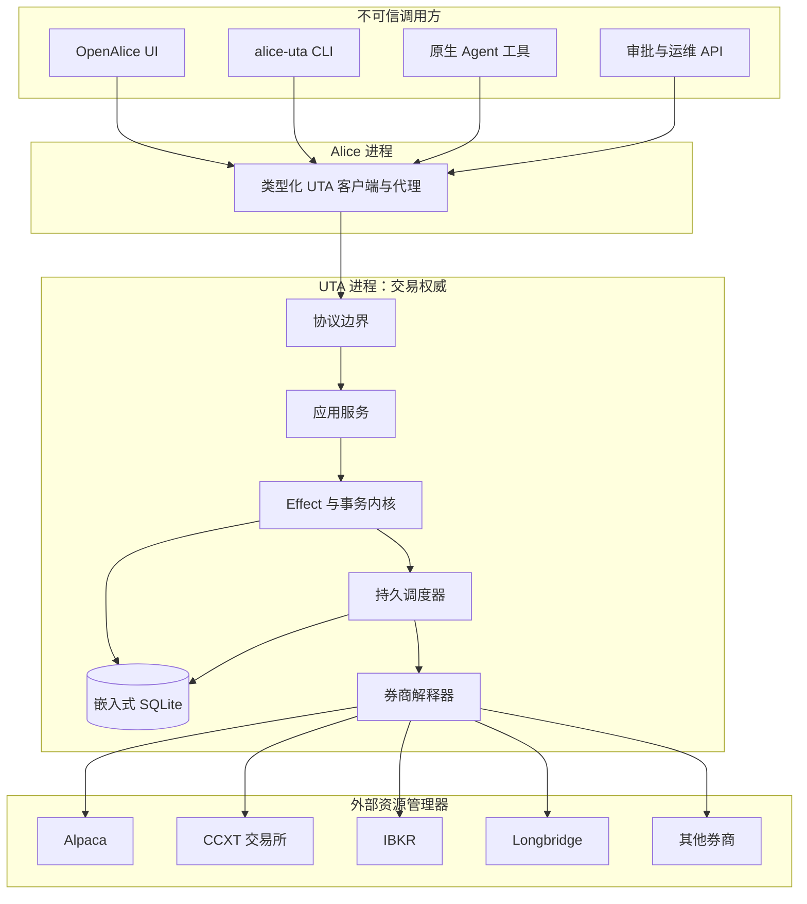
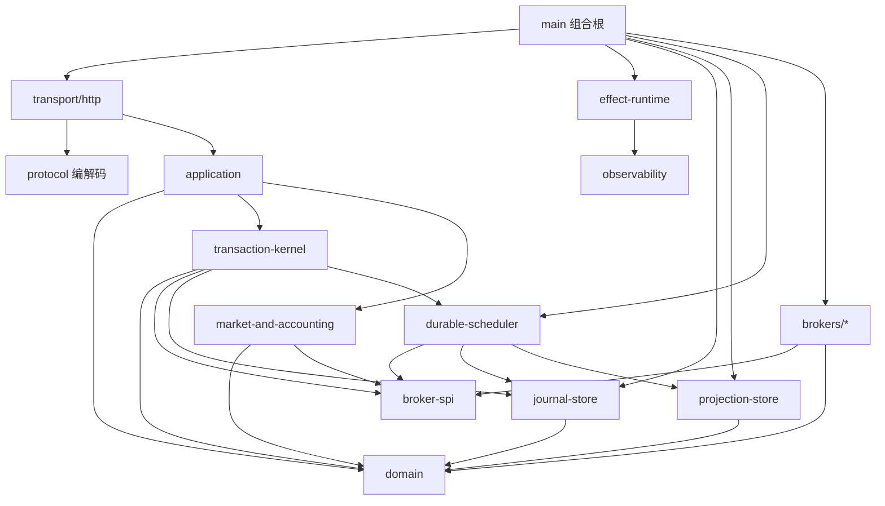
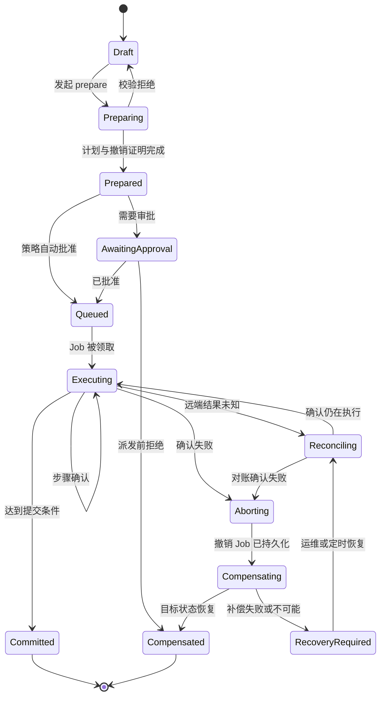
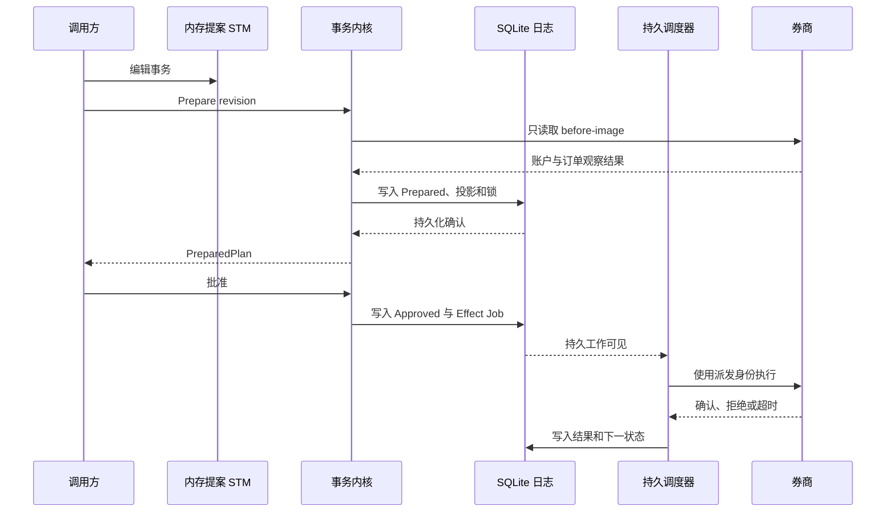
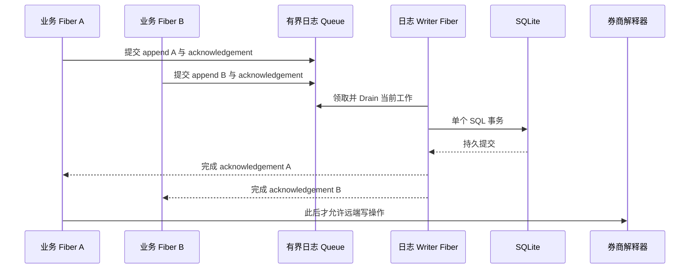
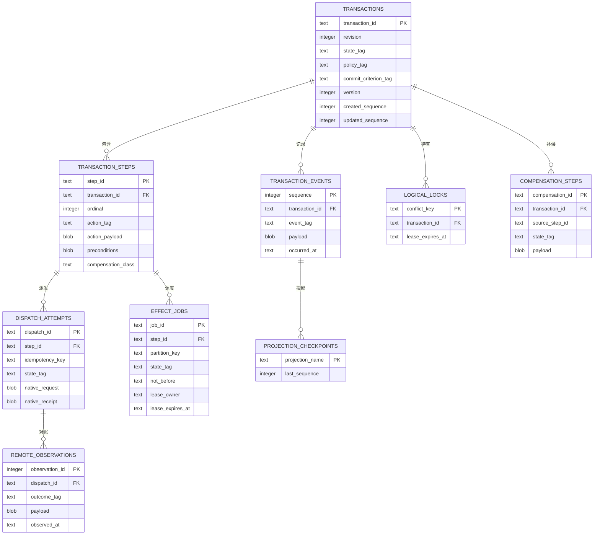
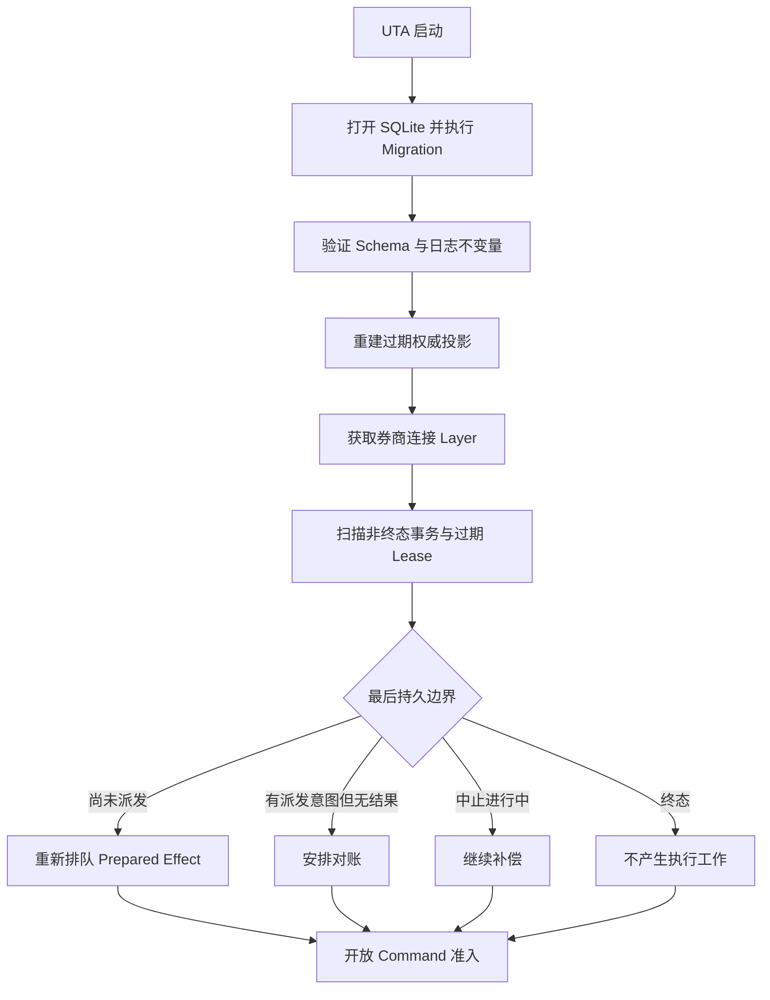
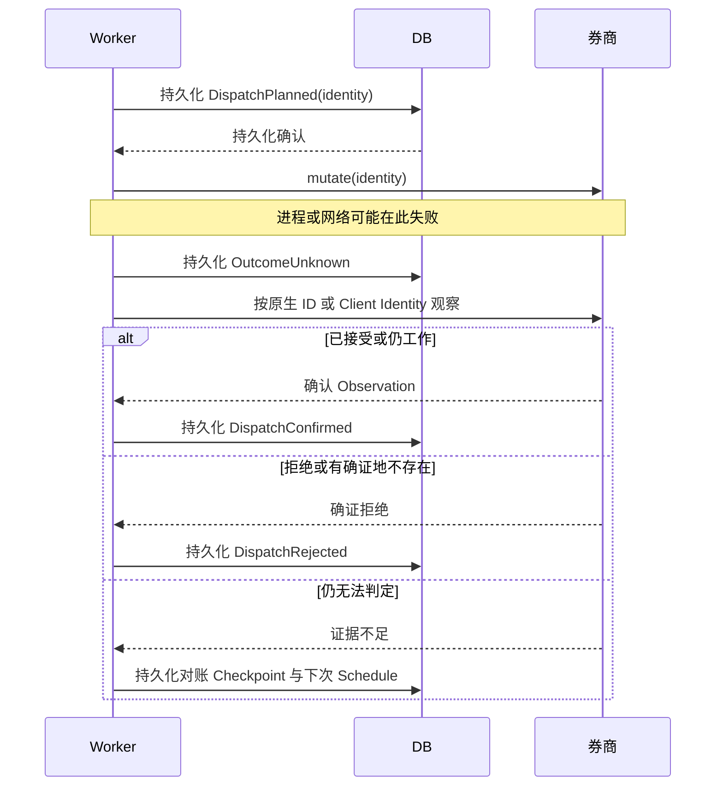

# UTA Effect Runtime 架构设计

状态：目标架构，尚非当前实现。

[English](uta-effect-runtime-architecture.md) | **简体中文**

本文定义 UTA 重写的目标模块边界、状态模型、持久化契约、事务语义、
调度模型与券商接入契约。迁移完成前，当前代码和实际运行行为仍是现状事实；
本文是目标设计的裁决依据。

相关文档：[[docs/project-structure.md]]、[[docs/uta-live-testing.md]]、
[[docs/conversation-provenance.md]]、[[docs/development-workflow.md]]。

## 1. 核心命题与不可妥协的性质

UTA 是一个本地运行、持久化、类型驱动的交易副作用运行时。它不是券商门面、
账户对象集合、Git 形状的审批流，也不是通用工作流引擎。

运行时必须提供五项保证：

1. **类型化副作用：** 每种预期失败、环境依赖、结果和状态转移都由精确类型表示。
2. **预写持久化：** 执行意图持久化提交之前，不得开始任何券商写操作。
3. **可恢复事务：** 事务动作执行前必须声明补偿能力和恢复协议。
4. **带背压调度：** 已接受工作必须持久排队；否则明确拒绝，绝不静默丢失。
5. **券商事实对账：** 超时或进程崩溃产生“远端结果未知”，绝不直接盲重试。

Effect 提供结构化并发、类型化失败、依赖注入、Scope、Schedule、Queue 和内存
STM；SQLite 提供嵌入式 ACID 存储引擎；UTA 自己实现交易事务协议、领域日志、
持久调度器、券商解释器和对账语义。

## 2. 系统边界



### 2.1 Alice 所有权

- 用户 Session、Workspace 身份、UI、Agent 工具及入口授权；
- 传输认证与 UTA 状态展示；
- 交易决策与原始 Session 的关联。

Alice 不拥有券商连接、事务执行、订单状态、持久交易队列、补偿或对账。

### 2.2 UTA 所有权

- 账户和券商连接生命周期；
- 事务编译、审批、执行、中止和恢复；
- 权威本地执行日志与当前投影；
- 多币种账务输入及券商观察到的交易状态；
- 全部券商写操作及其持久派发身份；
- 持久调度、对账和补偿 Worker。

### 2.3 券商所有权

- 远端订单、成交、仓位、余额和市场时段事实；
- 交易场所特有的接收与成交行为；
- 券商原生标识与幂等语义。

UTA 不得仅凭本地意图推断远端结果已确认。

## 3. 模块图与依赖方向

目标代码位于 `services/uta/src/`。依赖只能沿图示方向流动。



### 3.1 `domain/`

仅包含纯交易类型和确定性函数：名义 ID、Decimal 值对象、金融工具、账户、
订单、成交、仓位、币种、敞口、事务命令/事件/状态、补偿能力、冲突键、
前置条件及提交条件。

不得导入 Effect 服务、HTTP、SQLite、文件系统、定时器或券商 SDK。

### 3.2 `effect-runtime/`

负责服务 Tag 与 Layer、根 Scope、受监督 Fiber、缺陷策略、Clock、重试策略、
关闭顺序、日志、Tracing 和 Metrics。不得包含交易决策或券商映射。

### 3.3 `transaction-kernel/`

负责把提案编译为预备事务、采集 before-image、绑定前置条件、证明补偿资格、
获取持久逻辑锁、原子写入事务事件和 Effect Outbox，并裁决提交、中止、补偿
及恢复。不得出现具体券商 SDK 类型。

### 3.4 `journal-store/`

是交易历史唯一权威写路径，负责 SQLite Schema/Migration、追加式领域日志、
权威投影、Effect Outbox、持久 Job、提交后的 durability acknowledgement、
序列号和乐观版本检查。

其他模块不得继续用交易 JSON 文件建立第二权威。

### 3.5 `durable-scheduler/`

负责带 Lease 领取 Job、分区排序、背压、券商派发、结果落盘，以及观察、
对账和补偿的调度。内存 Effect `Queue` 只负责准入与唤醒，不是持久工作源。

### 3.6 `broker-spi/`

定义连接生命周期、动作能力、原生请求编译、派发身份、幂等契约、远端观察、
对账、补偿编译，以及账户/市场/司法辖区元数据。不得导入具体 SDK。

### 3.7 `brokers/<broker>/`

每个适配器是领域动作到原生 Effect 的解释器，拥有 SDK 连接 Layer、边界
Schema、动作解释器、错误映射、幂等与结果判定规则，以及按账户、市场、
金融工具和司法辖区派生的能力。

### 3.8 `projection-store/`

负责事务摘要、订单、成交、仓位、余额、审批 Inbox、Git 审计及 UI/Agent
查询视图。投影必须可从日志和券商对账重建。

### 3.9 `transport/` 与 `protocol/`

负责边界解析、响应编码、认证授权和应用服务调用。不得直接调用券商 SDK，
不得暴露数据库行或适配器原生响应。

## 4. Effect 模型

```ts
type UtaEffect<Success, Failure, Requirements> =
  Effect.Effect<Success, Failure, Requirements>
```

预期错误使用 Tagged ADT；程序不变量被破坏属于 defect，由监督策略终止或重启
所属组件。

```ts
type DispatchFailure =
  | { readonly _tag: 'BrokerRejected'; readonly rejection: BrokerRejection }
  | { readonly _tag: 'ConnectionUnavailable'; readonly accountId: AccountId }
  | { readonly _tag: 'OutcomeUnknown'; readonly dispatchId: DispatchId }
  | { readonly _tag: 'ProtocolViolation'; readonly detail: ProtocolViolation }
```

| Effect 能力 | UTA 用途 | 禁止冒充 |
|---|---|---|
| `Layer` | 服务与适配器组合 | 擦除类型的服务定位器 |
| `Scope` | 连接、订阅、Socket 生命周期 | 持久事务边界 |
| `Queue` | 有界准入与 Worker 唤醒 | 权威 Job 存储 |
| `STM` / `TRef` | 内存提案的原子视图 | 崩溃可恢复状态 |
| `Schedule` | 显式重连和对账策略 | 未知结果的盲重试 |
| `Fiber` | 受监督 Worker 和 Stream | 脱管写操作 |
| Finalizer | 释放本地资源 | 业务补偿或回滚 |

## 5. 事务代数

### 5.1 命令、事件、副作用与状态

```ts
interface Decision<State, Command, Event, ExternalEffect, Failure> {
  readonly decide: (
    state: State,
    command: Command,
  ) => Either.Either<
    {
      readonly events: NonEmptyReadonlyArray<Event>
      readonly effects: ReadonlyArray<ExternalEffect>
    },
    Failure
  >
}

interface Evolution<State, Event> {
  readonly evolve: (state: State, event: Event) => State
}
```

Command 表示请求；Event 表示已接受并持久化的事实；ExternalEffect 表示必须
跨进程或券商边界执行的工作；Evolution 必须纯函数且穷尽处理。

### 5.2 事务状态

```ts
type TransactionState =
  | { readonly _tag: 'Draft'; readonly snapshot: ProposalSnapshot }
  | { readonly _tag: 'Preparing'; readonly revision: TransactionRevision }
  | { readonly _tag: 'Prepared'; readonly plan: PreparedPlan }
  | { readonly _tag: 'AwaitingApproval'; readonly plan: PreparedPlan }
  | { readonly _tag: 'Queued'; readonly plan: ApprovedPlan }
  | { readonly _tag: 'Executing'; readonly progress: ExecutionProgress }
  | { readonly _tag: 'Reconciling'; readonly unknown: NonEmptyReadonlyArray<DispatchId> }
  | { readonly _tag: 'Aborting'; readonly cause: AbortCause }
  | { readonly _tag: 'Compensating'; readonly progress: CompensationProgress }
  | { readonly _tag: 'Committed'; readonly result: TransactionResult }
  | { readonly _tag: 'Compensated'; readonly result: CompensationResult }
  | { readonly _tag: 'RecoveryRequired'; readonly residual: ResidualRisk }
```



不存在 `rolledBack: boolean`。补偿结果必须区分精确恢复、状态恢复和仅经济
敞口恢复。

### 5.3 二阶段事务协议

所有交易写操作都使用同一协议，单订单只是只有一个步骤的事务。

#### 第一阶段：Prepare

1. 加载事务 revision 和券商观察到的 before-image；
2. 解析账户、子账户、金融工具、市场和司法辖区；
3. 校验 Action Schema 和业务 Guard；
4. 计算冲突键并获取持久逻辑锁；
5. 编译类型化前向步骤；
6. 为每个步骤编译补偿能力；
7. 绑定前置条件与提交条件；
8. 原子追加 `TransactionPrepared` 并更新投影。

Prepare 阶段禁止产生券商写操作。

#### 第二阶段：Execute 与 Settle

1. 在同一 SQLite 事务中持久化 `DispatchPlanned` 和 Job；
2. 等待持久化确认；
3. 通过券商解释器派发；
4. 持久化 confirmed、rejected 或 unknown；
5. 对账直到满足预先声明的提交条件；
6. 失败时持久化中止决定和补偿 Job；
7. 仅在终态或明确由运维接管的恢复状态已持久化后释放锁。

这是建立在非事务型远端资源管理器之上的数据库事务抽象。补偿是恢复机制，
不是替代事务的另一种上层抽象。

### 5.4 提交条件

```ts
type CommitCriterion =
  | { readonly _tag: 'AcceptedByVenue' }
  | { readonly _tag: 'WorkingAtVenue' }
  | { readonly _tag: 'FullyFilled' }
  | { readonly _tag: 'TargetExposureReached'; readonly target: ExposureTarget }
  | { readonly _tag: 'NativeAtomicGroupConfirmed'; readonly group: NativeGroupId }
```

提交条件属于 PreparedPlan，执行开始后不得把 accepted 重新解释为 filled。

### 5.5 补偿能力

```ts
type CompensationCapability<Action> =
  | { readonly _tag: 'Exact'; readonly compile: ExactUndoCompiler<Action> }
  | { readonly _tag: 'StateRestoring'; readonly compile: StateUndoCompiler<Action> }
  | { readonly _tag: 'Economic'; readonly compile: EconomicUndoCompiler<Action>; readonly risk: RiskModel }
  | { readonly _tag: 'None'; readonly reason: NonTransactionalReason }
```

严格原子组只能接纳策略允许的补偿等级。撤单后重新下单会丢失原订单 ID 和
队列优先级，因此不属于精确回滚。

### 5.6 执行策略

```ts
type ExecutionPolicy =
  | { readonly _tag: 'IndependentBatch' }
  | { readonly _tag: 'AllOrCompensate'; readonly acceptedUndo: AcceptedUndoClass }
  | { readonly _tag: 'VenueNativeAtomic'; readonly mechanism: NativeAtomicMechanism }
```

Git 分组、审批消息或包含多个 Action 的 HTTP 请求不会自动形成原子事务。

### 5.7 完整类型契约

前述类型定义了状态机，下面补齐 Domain、数据库、Broker、Scheduler 与 Protocol
边界必须共同保持的类型关系。本节不是示意伪代码，而是实现时必须保持的
类型形状；具体 Schema 应由这些类型导出或与其一一对应。

#### 名义身份与金融数值

```ts
declare const Brand: unique symbol
type Branded<Value, Name extends string> = Value & { readonly [Brand]: Name }

type TransactionId = Branded<string, 'TransactionId'>
type TransactionRevision = Branded<number, 'TransactionRevision'>
type TransactionVersion = Branded<number, 'TransactionVersion'>
type StepId = Branded<string, 'StepId'>
type DispatchId = Branded<string, 'DispatchId'>
type JobId = Branded<string, 'JobId'>
type AccountId = Branded<string, 'AccountId'>
type ConnectionId = Branded<string, 'ConnectionId'>
type InstrumentId = Branded<string, 'InstrumentId'>
type BrokerOrderId = Branded<string, 'BrokerOrderId'>
type ClientOrderId = Branded<string, 'ClientOrderId'>
type CurrencyCode = Branded<string, 'CurrencyCode'>
type DecimalString = Branded<string, 'DecimalString'>
type Instant = Branded<string, 'Instant'>

type Money = Readonly<{ currency: CurrencyCode; amount: DecimalString }>
type Quantity = Readonly<{ instrumentId: InstrumentId; amount: DecimalString }>
type Price = Readonly<{
  instrumentId: InstrumentId
  quoteCurrency: CurrencyCode
  amount: DecimalString
}>
```

不同 ID 不得作为普通字符串互换。金融运算使用 `Decimal`；`DecimalString` 只
承担序列化表示。

#### Order 与 TradeAction ADT

```ts
type Side = 'Buy' | 'Sell'
type TimeInForce = 'Day' | 'Gtc' | 'Ioc' | 'Fok'

type OrderSpec =
  | Readonly<{ _tag: 'MarketOrder'; side: Side; quantity: Quantity; tif: TimeInForce }>
  | Readonly<{ _tag: 'LimitOrder'; side: Side; quantity: Quantity; limit: Price; tif: TimeInForce }>
  | Readonly<{ _tag: 'StopOrder'; side: Side; quantity: Quantity; trigger: Price; tif: TimeInForce }>
  | Readonly<{
      _tag: 'StopLimitOrder'
      side: Side
      quantity: Quantity
      trigger: Price
      limit: Price
      tif: TimeInForce
    }>
  | Readonly<{
      _tag: 'TrailingOrder'
      side: Side
      quantity: Quantity
      trail: { readonly _tag: 'Amount'; readonly value: Price }
        | { readonly _tag: 'Percent'; readonly value: DecimalString }
      tif: TimeInForce
    }>

type TradeAction =
  | Readonly<{
      _tag: 'PlaceOrder'
      accountId: AccountId
      instrumentId: InstrumentId
      clientOrderId: ClientOrderId
      order: OrderSpec
    }>
  | Readonly<{
      _tag: 'ModifyOrder'
      accountId: AccountId
      orderId: BrokerOrderId
      replacement: OrderSpec
    }>
  | Readonly<{
      _tag: 'CancelOrder'
      accountId: AccountId
      orderId: BrokerOrderId
    }>
  | Readonly<{
      _tag: 'ClosePosition'
      accountId: AccountId
      instrumentId: InstrumentId
      quantity: Quantity | 'All'
    }>
```

Order Variant 不使用 `Partial<Order>` 或 Optional Field Soup；每个 Variant 只
包含自身必需字段，使无效订单在类型层不可表示。

#### Before-image、Observation 与 Precondition

```ts
type OrderSnapshot = Readonly<{
  accountId: AccountId
  orderId: BrokerOrderId
  version: Branded<string, 'BrokerOrderVersion'>
  order: OrderSpec
  status: 'PendingSubmit' | 'Working' | 'PartiallyFilled' | 'Filled' | 'Cancelled'
  filledQuantity: Quantity
}>

type ExposureSnapshot = Readonly<{
  accountId: AccountId
  instrumentId: InstrumentId
  netQuantity: Quantity
  observedAt: Instant
}>

type BeforeImage =
  | Readonly<{ _tag: 'NoExistingOrder'; clientOrderId: ClientOrderId }>
  | Readonly<{ _tag: 'ExistingOrder'; order: OrderSnapshot }>
  | Readonly<{ _tag: 'Exposure'; exposure: ExposureSnapshot }>

type Precondition =
  | Readonly<{ _tag: 'TransactionVersion'; expected: TransactionVersion }>
  | Readonly<{
      _tag: 'OrderVersion'
      orderId: BrokerOrderId
      expected: Branded<string, 'BrokerOrderVersion'>
    }>
  | Readonly<{ _tag: 'ExposureEquals'; expected: ExposureSnapshot }>
  | Readonly<{ _tag: 'BuyingPowerAtLeast'; amount: Money }>
  | Readonly<{ _tag: 'MarketSessionOpen'; instrumentId: InstrumentId }>
```

#### PreparedPlan 与 PreparedStep

```ts
type PreparedStep =
  | Readonly<{
      _tag: 'PreparedPlaceOrder'
      stepId: StepId
      action: Extract<TradeAction, { _tag: 'PlaceOrder' }>
      before: Extract<BeforeImage, { _tag: 'NoExistingOrder' }>
      compensation: CompensationCapability<Extract<TradeAction, { _tag: 'PlaceOrder' }>>
      preconditions: ReadonlyArray<Precondition>
      conflictKeys: NonEmptyReadonlyArray<ConflictKey>
    }>
  | Readonly<{
      _tag: 'PreparedModifyOrder'
      stepId: StepId
      action: Extract<TradeAction, { _tag: 'ModifyOrder' }>
      before: Extract<BeforeImage, { _tag: 'ExistingOrder' }>
      compensation: CompensationCapability<Extract<TradeAction, { _tag: 'ModifyOrder' }>>
      preconditions: NonEmptyReadonlyArray<Precondition>
      conflictKeys: NonEmptyReadonlyArray<ConflictKey>
    }>
  | Readonly<{
      _tag: 'PreparedCancelOrder'
      stepId: StepId
      action: Extract<TradeAction, { _tag: 'CancelOrder' }>
      before: Extract<BeforeImage, { _tag: 'ExistingOrder' }>
      compensation: CompensationCapability<Extract<TradeAction, { _tag: 'CancelOrder' }>>
      preconditions: NonEmptyReadonlyArray<Precondition>
      conflictKeys: NonEmptyReadonlyArray<ConflictKey>
    }>
  | Readonly<{
      _tag: 'PreparedClosePosition'
      stepId: StepId
      action: Extract<TradeAction, { _tag: 'ClosePosition' }>
      before: Extract<BeforeImage, { _tag: 'Exposure' }>
      compensation: CompensationCapability<Extract<TradeAction, { _tag: 'ClosePosition' }>>
      preconditions: NonEmptyReadonlyArray<Precondition>
      conflictKeys: NonEmptyReadonlyArray<ConflictKey>
    }>

type PreparedPlan = Readonly<{
  transactionId: TransactionId
  revision: TransactionRevision
  digest: Branded<string, 'PlanDigest'>
  policy: ExecutionPolicy
  commitCriterion: CommitCriterion
  steps: NonEmptyReadonlyArray<PreparedStep>
  expiresAt: Instant
}>
```

该 Union 保留 Action、所需 BeforeImage、补偿编译器和前置条件之间的关联；
Prepare 后不得用通用对象擦除这种关系。

#### Transaction Command 与 Event

```ts
type TransactionCommand =
  | Readonly<{ _tag: 'CreateDraft'; transactionId: TransactionId }>
  | Readonly<{
      _tag: 'ReplaceDraft'
      transactionId: TransactionId
      expectedVersion: TransactionVersion
      actions: NonEmptyReadonlyArray<TradeAction>
    }>
  | Readonly<{ _tag: 'Prepare'; transactionId: TransactionId; expectedVersion: TransactionVersion }>
  | Readonly<{
      _tag: 'Approve'
      transactionId: TransactionId
      revision: TransactionRevision
      planDigest: Branded<string, 'PlanDigest'>
      actor: Branded<string, 'ApprovalActorId'>
    }>
  | Readonly<{ _tag: 'Reject'; transactionId: TransactionId; reason: string }>
  | Readonly<{ _tag: 'RecordDispatchOutcome'; dispatchId: DispatchId; outcome: PersistedRemoteOutcome }>
  | Readonly<{ _tag: 'RequestRecovery'; transactionId: TransactionId; actor: Branded<string, 'OperatorId'> }>

type TransactionEvent =
  | Readonly<{ _tag: 'DraftCreated'; transactionId: TransactionId; version: TransactionVersion }>
  | Readonly<{ _tag: 'DraftReplaced'; version: TransactionVersion; actions: NonEmptyReadonlyArray<TradeAction> }>
  | Readonly<{ _tag: 'TransactionPrepared'; plan: PreparedPlan }>
  | Readonly<{ _tag: 'TransactionApproved'; revision: TransactionRevision; planDigest: Branded<string, 'PlanDigest'> }>
  | Readonly<{ _tag: 'TransactionRejected'; reason: string }>
  | Readonly<{ _tag: 'StepQueued'; stepId: StepId; jobId: JobId }>
  | Readonly<{ _tag: 'DispatchPlanned'; dispatch: DispatchRecord }>
  | Readonly<{ _tag: 'DispatchConfirmed'; dispatchId: DispatchId; receipt: PersistedBrokerReceipt }>
  | Readonly<{ _tag: 'DispatchRejected'; dispatchId: DispatchId; rejection: BrokerRejection }>
  | Readonly<{ _tag: 'DispatchOutcomeUnknown'; dispatchId: DispatchId; evidence: UnknownOutcomeEvidence }>
  | Readonly<{ _tag: 'CompensationPlanned'; steps: NonEmptyReadonlyArray<CompensationStep> }>
  | Readonly<{ _tag: 'TransactionCommitted'; result: TransactionResult }>
  | Readonly<{ _tag: 'TransactionCompensated'; result: CompensationResult }>
  | Readonly<{ _tag: 'RecoveryRequired'; residual: ResidualRisk }>
```

#### Dispatch 与 Durable Job Record

```ts
type DispatchState = 'Planned' | 'Claimed' | 'Confirmed' | 'Rejected' | 'Unknown'

type DispatchIdentity = Readonly<{
  dispatchId: DispatchId
  transactionId: TransactionId
  stepId: StepId
  attempt: Branded<number, 'DispatchAttempt'>
  clientOrderId: ClientOrderId | undefined
}>

type DispatchRecord = Readonly<{
  identity: DispatchIdentity
  actionTag: TradeAction['_tag']
  state: DispatchState
  nativeRequest: RedactedNativeRequest
  plannedAt: Instant
}>

type EffectJob = Readonly<{
  jobId: JobId
  transactionId: TransactionId
  stepId: StepId
  partition: ConflictKey
  kind: 'Dispatch' | 'Observe' | 'Compensate'
  state: 'Ready' | 'Leased' | 'Completed' | 'Failed'
  notBefore: Instant
  lease: { readonly owner: Branded<string, 'WorkerId'>; readonly expiresAt: Instant } | undefined
}>
```

这里的 `undefined` 只表示 Job 未被 Lease；它不允许只存在 Owner 或只存在
ExpiresAt。Persistence Schema 必须用 Union 或数据库约束保证 Lease 字段成对。

#### CompensationProgram

```ts
type CompensationStep =
  | Readonly<{ _tag: 'CancelWorkingOrder'; sourceStepId: StepId; orderId: BrokerOrderId }>
  | Readonly<{
      _tag: 'RestoreOrder'
      sourceStepId: StepId
      previous: OrderSnapshot
      semanticLoss: 'QueuePriorityAndIdentity'
    }>
  | Readonly<{
      _tag: 'RestoreExposure'
      sourceStepId: StepId
      target: ExposureSnapshot
      maximumSlippage: DecimalString
    }>

type CompensationProgram = Readonly<{
  transactionId: TransactionId
  steps: NonEmptyReadonlyArray<CompensationStep>
  successCriterion: 'ExactState' | 'EquivalentObservableState' | 'TargetExposure'
}>
```

#### Broker Capability 与 Interpreter 关联

```ts
interface BrokerActionTypeMap {
  readonly PlaceOrder: {
    readonly action: Extract<TradeAction, { _tag: 'PlaceOrder' }>
    readonly acknowledgement: PlaceOrderAcknowledgement
    readonly observation: OrderSnapshot
    readonly error: PlaceOrderFailure
  }
  readonly ModifyOrder: {
    readonly action: Extract<TradeAction, { _tag: 'ModifyOrder' }>
    readonly acknowledgement: ModifyOrderAcknowledgement
    readonly observation: OrderSnapshot
    readonly error: ModifyOrderFailure
  }
  readonly CancelOrder: {
    readonly action: Extract<TradeAction, { _tag: 'CancelOrder' }>
    readonly acknowledgement: CancelOrderAcknowledgement
    readonly observation: OrderSnapshot
    readonly error: CancelOrderFailure
  }
  readonly ClosePosition: {
    readonly action: Extract<TradeAction, { _tag: 'ClosePosition' }>
    readonly acknowledgement: ClosePositionAcknowledgement
    readonly observation: ExposureSnapshot
    readonly error: ClosePositionFailure
  }
}

type ActionTag = keyof BrokerActionTypeMap
type ActionContract<Tag extends ActionTag> = BrokerActionTypeMap[Tag]

type ActionAvailability<Tag extends ActionTag> =
  | Readonly<{
      _tag: 'Available'
      actionTag: Tag
      schema: Schema.Schema<ActionContract<Tag>['action']>
      idempotency: 'Native' | 'ClientIdentity' | 'ReconcileBeforeRetry'
      compensation: 'Exact' | 'StateRestoring' | 'Economic' | 'None'
    }>
  | Readonly<{
      _tag: 'Unavailable'
      actionTag: Tag
      reason: CapabilityUnavailableReason
    }>

type CapabilitySet = Readonly<{
  [Tag in ActionTag]: ActionAvailability<Tag>
}>
```

TypeMap 是封闭且由编译器检查的。增加 Action 时必须同时提供 Ack、Observation、
Error、Availability、Persistence Schema 和 Interpreter 路径。

#### Error Channel

```ts
type TransactionFailure =
  | Readonly<{ _tag: 'ValidationFailed'; issues: NonEmptyReadonlyArray<ValidationIssue> }>
  | Readonly<{ _tag: 'PreconditionFailed'; precondition: Precondition; observed: BeforeImage }>
  | Readonly<{ _tag: 'CapabilityUnavailable'; reason: CapabilityUnavailableReason }>
  | Readonly<{ _tag: 'NonCompensatable'; stepId: StepId; reason: NonTransactionalReason }>
  | Readonly<{ _tag: 'VersionConflict'; expected: TransactionVersion; actual: TransactionVersion }>
  | Readonly<{ _tag: 'StorageFailure'; operation: StorageOperation; cause: SqlFailure }>
  | Readonly<{ _tag: 'DispatchFailure'; dispatchId: DispatchId; failure: DispatchFailure }>
  | Readonly<{ _tag: 'ResidualRisk'; residual: ResidualRisk }>

type QueryFailure =
  | Readonly<{ _tag: 'TransactionNotFound'; transactionId: TransactionId }>
  | Readonly<{ _tag: 'ProjectionUnavailable'; projection: ProjectionName }>
  | Readonly<{ _tag: 'StorageFailure'; operation: StorageOperation; cause: SqlFailure }>
```

Expected Failure 不得压缩为 `Error.message`。HTTP、CLI、UI、Journal 和 Metrics
必须穷尽映射每个 Variant。

#### 公共协议 Envelope

```ts
type PrepareTransactionResponse =
  | Readonly<{ _tag: 'Prepared'; plan: PreparedPlan }>
  | Readonly<{ _tag: 'Rejected'; failure: Extract<TransactionFailure,
      { _tag: 'ValidationFailed' | 'PreconditionFailed' | 'CapabilityUnavailable' | 'NonCompensatable' }> }>
  | Readonly<{ _tag: 'Conflict'; failure: Extract<TransactionFailure, { _tag: 'VersionConflict' }> }>

type GetTransactionResponse = Readonly<{
  transactionId: TransactionId
  version: TransactionVersion
  state: TransactionState
  lastSequence: Branded<number, 'JournalSequence'>
}>
```

Runtime Schema 必须在 Transport 和 Persistence 边界解析每个 Brand 与 ADT。
内部代码只接收已经构造的 Domain Value，不再重复宽松校验。

## 6. 状态层级与快照

| 层级 | 技术 | 权威性 | 丢失容忍度 |
|---|---|---|---|
| 提案快照 | Effect STM/TRef | 可编辑事务提案 | Prepare 前允许丢失 |
| 持久事务状态 | SQLite 日志与投影 | 本地执行权威 | 必须跨崩溃保存 |
| 券商观察状态 | 券商 API 与 Stream | 远端交易事实 | 必须对账 |
| 读取投影 | SQLite、SubscriptionRef、Git 导出 | 查询与审计 | 可重建 |



## 7. 持久化架构

### 7.1 嵌入式数据库

| 关注点 | 库或引擎 | 边界 |
|---|---|---|
| Effect Runtime | `effect` | Fiber、Scope、Layer、STM、Queue、Schedule、类型错误 |
| SQL 服务 | `@effect/sql` | Effect 化的类型 SQL 服务与事务 |
| SQLite 适配器 | `@effect/sql-sqlite-node` | Node/Electron SQLite Layer |
| 存储引擎 | SQLite / `better-sqlite3` | ACID、物理 WAL、索引、锁、崩溃恢复 |
| Migration | `@effect/sql` Migrator | 单调数据库 Schema Migration |
| 领域序列化 | UTA 内部 Effect Schema | 版本化日志 Payload 和数据库边界 |
| 配置 | Zod | OpenAlice 既有配置约定 |
| Agent 工具参数 | TypeBox | OpenAlice 既有工具约定 |

单一数据库位于 `<OPENALICE_HOME>/data/trading/uta.sqlite`。所有 UTA 账户共享
该数据库，使跨账户的日志事件、Job、锁和投影能在一个本地事务中原子协调。
券商凭据仍留在已有密封配置路径，不进入该数据库。

数据库启用 SQLite WAL、外键约束及执行权威写入的 FULL synchronous durability。
UTA 是唯一写服务；查询服务只能读。存储争用或 I/O 失败必须成为类型化错误，
不能退回内存写入。

SQLite 物理 WAL 与 UTA 领域日志是两个层次：前者保证数据库页级原子性与
崩溃恢复，后者记录交易意图、派发、远端结果、对账、补偿和终态。

### 7.2 单逻辑 Writer 与 Group Commit

调用 Fiber 把日志命令送入有界 Effect Queue。受监督 Writer Fiber Drain 当前
可用命令，在一个 SQLite 事务中提交。每个命令携带 Deferred，只有数据库
Commit 成功后才完成。



“异步落盘”只意味着 durability barrier 后面的异步批处理，绝不意味着券商
调用之后再脱管落盘。队列容量必须显式配置并形成背压，不截断、不丢弃；
Writer Drain 当前可用工作，不设置会静默漏数据的固定批次上限。

### 7.3 权威表



Payload 必须由具名、版本化 Runtime Schema 编解码，禁止无类型 JSON Cast。

### 7.4 快照与压缩

- 追加式日志是权威；
- 参与执行决策的当前状态投影必须与日志追加原子更新；
- 大型历史读取投影可从持久 Checkpoint 异步更新；
- 未完成、对账中、补偿中或 RecoveryRequired 事务所需日志不得被删除；
- Retention 和 Compaction 是显式运维策略，不是硬编码数量上限。

## 8. 调度、顺序与并发

### 8.1 准入

传输层解析请求并向应用服务提交类型化 Command。只有明确拒绝，或持久的
事务/Job ID 已建立后，准入调用才能返回。

### 8.2 分区

```ts
type ConflictKey =
  | { readonly _tag: 'Account'; readonly accountId: AccountId }
  | { readonly _tag: 'Exposure'; readonly accountId: AccountId; readonly instrumentId: InstrumentId }
  | { readonly _tag: 'Order'; readonly accountId: AccountId; readonly brokerOrderId: BrokerOrderId }
  | { readonly _tag: 'Connection'; readonly connectionId: ConnectionId }
```

共享冲突键的 Job 不得并发；独立分区可在券商连接声明的并发限制内执行。

### 8.3 持久 Job 与 Lease

Job 领取本身是数据库事务：选择未被 Lease 的可执行工作、写入 Owner 与过期
时间、追加 `JobClaimed`、提交，然后在数据库事务外执行。

重启后过期 Lease 可重新领取；若旧 Attempt 已越过派发边界，则必须进入对账，
不能直接再次派发。

### 8.4 公平性与背压

- 每个券商连接声明并发和 Rate Limit 策略；
- 准入 Queue 满时阻塞生产者；
- 交易命令绝不为“新鲜度”而丢弃；
- 行情可使用独立且明确有损/合并的策略，但不能与交易命令共享；
- 优先级必须是防饥饿的类型化策略。

### 8.5 隔离

SQLite 串行化本地持久转移；远端延迟期间的领域隔离由逻辑锁和乐观前置条件
维持。

```ts
type Precondition =
  | { readonly _tag: 'TransactionVersion'; readonly expected: TransactionVersion }
  | { readonly _tag: 'OrderVersion'; readonly orderId: BrokerOrderId; readonly expected: BrokerOrderVersion }
  | { readonly _tag: 'ExposureSnapshot'; readonly expected: ExposureSnapshot }
  | { readonly _tag: 'BuyingPowerAtLeast'; readonly amount: Money }
```

外部券商活动使条件失效时，事务进入类型化冲突并要求重新 Prepare，
不得用宽松重试掩盖。

## 9. 券商 SPI

### 9.1 Connection Layer

```ts
interface BrokerConnectionService {
  readonly identity: BrokerConnectionIdentity
  readonly capabilities: Effect.Effect<CapabilitySet, CapabilityFailure>
  readonly observeHealth: Stream.Stream<ConnectionHealthEvent, ConnectionFailure>
}
```

连接获取、Heartbeat、订阅、重连和关闭属于适配器 Scope；事务状态不得存放在
连接对象中。

### 9.2 类型化 Action Interpreter

```ts
interface BrokerActionInterpreter<Action, Ack, Observation, Failure, Requirements> {
  readonly actionSchema: Schema.Schema<Action>
  readonly availability: (
    context: ActionContext,
  ) => Effect.Effect<ActionAvailability, CapabilityFailure, Requirements>
  readonly dispatch: (
    action: Action,
    identity: DispatchIdentity,
  ) => Effect.Effect<Ack, Failure, Requirements>
  readonly observe: (
    identity: DispatchIdentity,
  ) => Effect.Effect<RemoteOutcome<Observation>, ObservationFailure, Requirements>
  readonly compileCompensation: (
    prepared: PreparedAction<Action>,
    applied: AppliedOutcome<Ack, Observation>,
  ) => Effect.Effect<CompensationProgram, NonCompensatable, Requirements>
}
```

### 9.3 远端结果

```ts
type RemoteOutcome<Observation> =
  | { readonly _tag: 'Confirmed'; readonly observation: Observation }
  | { readonly _tag: 'Rejected'; readonly rejection: BrokerRejection }
  | { readonly _tag: 'StillWorking'; readonly observation: Observation }
  | { readonly _tag: 'Unknown'; readonly evidence: UnknownOutcomeEvidence }
```

传输超时、Socket 丢失、SDK 取消和进程中断都不等于拒绝。

### 9.4 能力派生

能力由券商与 SDK 版本、连接和账户类型、运营司法辖区、账户权限、市场、
金融工具、子账户及当前交易时段共同派生。`supportedOrderTypes: string[]`
不足以表达这些约束；Availability 必须返回可用 Action Schema 或精确不可用原因。

## 10. 账务与市场边界

### 10.1 账务拥有

- 带币种的 Money；
- 含来源和时间戳的 FX Observation；
- 券商原生现金与保证金 Bucket；
- 由成交和对账投影的成本基础；
- 仓位、敞口与估值不确定性。

未知 FX 绝不能退化为隐式 1:1。

### 10.2 市场与司法辖区拥有

- Venue 身份与时区；
- Session Calendar 与节假日；
- 金融工具上市辖区；
- 券商运营实体和账户辖区；
- 监管及能力约束。

Market Clock 不是账户级 Boolean，而是 Venue、Instrument、Session 类型和时间
的查询结果。

### 10.3 事务内核只消费，不拥有

内核把不可变账务和市场 Observation 作为前置条件。券商结果产生 Event，投影
再由 Event 演化；内核不直接修改账务投影。

## 11. 审批与 Git 审计投影

审批是事务状态转移，不是 Git commit：

- Draft 与 Prepared 可编辑和审阅；
- 审批绑定 transaction ID、revision、plan digest 和 expiry；
- 修改计划立即使审批失效；
- 策略要求审批时，执行前必须存在持久 Approval Event；
- 派发前拒绝不产生补偿工作。

Git 仅保留人类可读审计投影：Git Hash 不是事务 ID，Git 不是恢复源，投影失败
不能批准、重复或回滚券商操作，并且全部内容可从 SQLite 日志重建。

## 12. 恢复模型

### 12.1 启动顺序



只有本地日志有效且全部未完成工作已分类后才开放 Command 准入。券商连接可在
受 Scope 管理的 Fiber 中继续恢复；某账户不可达不得阻塞其他无关账户。

### 12.2 Unknown-outcome 协议



只有适配器证明相同派发身份在远端幂等时，才允许重新派发。

### 12.3 Defect 与预期失败

领域拒绝、券商拒绝、连接不可用、冲突和未知结果是类型化预期失败；持久记录
格式错误、不可能状态转移和 Schema 不变量破坏属于 defect。Defect 必须停止
相关 Worker 或进程并保留证据，数据损坏绝不能被当成“空历史”。

## 13. 可观测性

每条交易执行日志、Trace 和 Metric 必须携带：transaction ID/revision、step ID、
dispatch ID、账户、券商连接、分区/冲突键、当前状态 Tag、日志 Sequence 和
重试/对账 Schedule 身份。

Secret、完整原生 Payload 和账户凭据不得写日志。原生请求/响应持久化必须通过
券商专用 Redaction Schema。

必须提供以下运维视图：按状态和时长统计的事务、等待对账的未知结果、
RecoveryRequired 残余敞口、持久队列 Lag 与 Lease Age、日志 Writer 延迟与
背压、券商 Reach/能力降级、投影 Checkpoint Lag。

## 14. 公共协议

```text
POST /transactions
PUT  /transactions/:id/draft
POST /transactions/:id/prepare
POST /transactions/:id/approve
POST /transactions/:id/reject
GET  /transactions/:id
GET  /transactions/:id/events
POST /transactions/:id/recover
GET  /capabilities
GET  /accounts/:id/state
```

所有请求和响应都在 `@traderalice/uta-protocol` 中具有共享 Runtime Schema。
通用 Route 不接受券商原生 Payload；运维恢复接口只能表达类型化 Command，
不能直接修改数据库行。

## 15. 安全与权限

- UTA 仍是唯一允许持有券商凭据的进程；
- 事务授权与传输认证分离；
- Approval 绑定 Actor、Policy、Revision 和 Plan Digest；
- Read-only/Keyless 账户不能创建可执行事务；
- 持久化原生 Payload 按 Schema 脱敏或密封；
- 数据库仅供进程本地访问，不暴露管理 API。

## 16. 目标源码布局

| `services/uta/src/` 下路径 | 初始内容 |
|---|---|
| `main.ts` | 仅组合根 |
| `effect-runtime/` | Layer、Runtime、监督策略 |
| `domain/` | 账户、账务、Action、补偿、错误、ID、事务、纯 Evolution |
| `application/` | 事务、账户查询、能力服务 |
| `transaction-kernel/` | 编译器、协调器、隔离、恢复 |
| `journal-store/` | Migration、日志、Writer、事务 Store |
| `projection-store/` | 账务、订单、事务、Git 审计 |
| `durable-scheduler/` | 准入、Lease、分区、Worker |
| `broker-spi/` | Action Interpreter、能力、连接、远端结果 |
| `brokers/` | Alpaca、CCXT、IBKR、Longbridge、LeverUp、Mock |
| `market-and-accounting/` | FX、司法辖区、市场 Session |
| `protocol/` | 内部协议 Codec 与 Schema |
| `transport/http/` | 认证后的 HTTP 边界 |

这是所有权地图，不允许预先创建空抽象壳。每个模块只能随第一个实际使用它的
可运行垂直切片引入。

## 17. 迁移顺序

迁移必须按可执行垂直切片推进；新旧路径绝不能同时拥有同一账户写操作。

### Slice 1：MockBroker 持久内核

- 引入 Effect 组合和嵌入式 SQLite；
- 实现版本化日志 Schema 与 Migration；
- 实现 Writer Fiber、持久化确认和持久 Job；
- 实现单个 Prepared `placeOrder` 事务及 MockBroker Interpreter；
- 在每个派发边界 Kill 进程，证明恢复且无重复执行。

### Slice 2：事务与审批协议

- 暴露事务型 Schema 与 Route；
- 把 Staging 和 Approval 移入事务状态；
- 从日志 Event 生成 Git 审计投影；
- 保留当前用户审批语义。

### Slice 3：补偿与多步骤执行

- 实现 Exact 与 StateRestoring 补偿；
- 加入冲突键、锁和提交条件；
- 验证部分成交、中止、补偿失败及重启恢复。

### Slice 4：首个真实券商

- 通过类型化 Interpreter 迁移 Alpaca；
- 执行 Paper Account 生命周期和崩溃恢复场景；
- 新路径成为权威后删除旧 Dispatcher 中的 Alpaca 写路径。

### Slice 5：异构券商

- Longbridge 证明司法辖区和币种边界；
- CCXT 证明子账户及 Venue 特有能力派生；
- IBKR 证明 Callback Stream 和 Linked Account 身份；
- LeverUp 证明 Relayer 对账。

### Slice 6：删除遗留内核

- 删除 `UnifiedTradingAccount` 的执行所有权；
- 删除 `TradingGit` 的执行和持久化权威；
- 删除通用 `IBroker` 写方法和 `PlaceOrderResult`；
- 删除 File-backed completed-commit 权威；
- 只保留服务于现有公共契约的显式兼容投影。

## 18. 验证契约

### 18.1 内核崩溃矩阵

每种写操作都要在以下位置终止 UTA：Prepared 后审批前；Approval 提交后 Job
领取前；Job 领取后派发前；券商接受后 Ack 落盘前；Ack 落盘后投影更新前；
Abort 落盘后补偿前；补偿派发后 Ack 前。

重启后必须得到唯一且有依据的下一动作，绝不盲目重复。

### 18.2 并发场景

- 两个事务修改同一订单；
- Close 与 Open 竞争同一敞口；
- 独立金融工具并发执行；
- 外部券商活动使 Prepared 前置条件失效；
- 日志 Queue 达到容量并产生背压但不丢数据；
- Worker 执行中 Lease 过期。

### 18.3 真实券商验收

使用 Demo/Paper 账户和 [UTA live testing](uta-live-testing.md) 场景，并增加
派发身份、未知结果对账和补偿验证。结束时不能遗留意外 Open Order，账户必须
回到要求的基线。

### 18.4 打包与存储验收

- Source、Docker、Electron Package 都能打开并迁移数据库；
- Native SQLite 依赖在全部支持架构加载；
- 强制终止后数据库仍有效；
- Backup/Restore 与 `OPENALICE_HOME` 搬迁保留数据库；
- 损坏 Schema 或日志必须响亮失败并保留证据。

## 19. 架构禁令

禁止引入或保留：

- 作为 UTA 必需条件的外部数据库、队列或工作流服务；
- 自研数据库、物理 WAL 或文件锁存储引擎；
- 冒充持久队列的内存 Queue；
- 券商调用之后的脱管持久化；
- 冒充业务回滚的 Effect Finalizer；
- 进入 Domain、Transaction 或公共协议的 SDK 类型；
- 作为领域错误模型的字符串正则分类；
- 擦除 Action/Result/Error/Observation/Compensation 关联的无类型 Registry；
- 未知远端结果后的盲重试；
- 作为事务身份的 Git commit hash；
- 静默上限、截断、丢 Job 或宽松 Fallback 状态。

## 20. 首个证伪实验

如果 MockBroker 垂直切片不能仅凭持久状态和券商观察恢复以下场景，则目标架构
被证伪：

1. `DispatchPlanned` 已持久化；
2. 券商接受写操作；
3. UTA 在 Ack 落盘前死亡；
4. UTA 重启；
5. 唯一恢复路径决定继续、补偿或保持明确 Unknown；
6. 原操作永远不会被盲目重复。

在该实验通过前，Broker Registry、UI Form 和更多适配器都不能证明运行时
架构成立。
