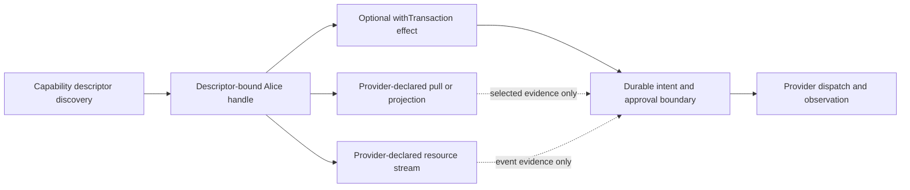

# Alice clients and the UTA capability boundary

## 1. Decision and scope

This group owns the Alice-side transport, discovery, projection, and client-facing adapter boundary observed in `packages/uta-protocol/src/client/UTAClient.ts:1-103`, `src/services/uta-client/UTAAccountSDK.ts:1-389`, `src/services/uta-client/UTAManagerSDK.ts:1-246`, `src/services/uta-client/UTAManagerSDK.spec.ts:1-128`, and `src/services/uta-client/index.ts:1-16`. The source is a broad compatibility surface: generic HTTP helpers, IBKR-native values, account/data projections, wallet/Git staging, lifecycle hooks, and test-like controls are presented as one SDK shape.

The target is not a production migration and does not claim that any provider runtime, schema barrel, durable writer, broker ledger, agent inbox, or native conformance path already exists. Alice becomes a thin client of a descriptor-derived capability tree. The public Alice HTTP shape is fixed as `Promise<Result<Output, Failure>>` plus `AbortSignal`; push uses declared `AsyncIterable` frames. This does not preserve a universal broker SDK or imply that every provider leaf exists.

The source-level IBroker/global-switch facts documented by the wider investigation remain evidence about current implementation. They are not a target requirement for Alice, and this design does not claim that the switch has disappeared. Provider internals, languages, SDKs, REST/OpenAPI, gateways, and separate processes remain free behind the UTA-facing boundary.
The `MAP-*` source line anchors in the owned analyses are historical investigation evidence pinned to audit commit `a5f23756531cc552b7e12b6d655ae1ffbcd28b64`; they are not a current protocol specification. Implementation work must re-read the checked-out source and verify native behavior before relying on any anchor.

## 2. Fixed boundary, open provider trees

The shared outer contract is `CapabilityDescriptor`: protocol version, stable capability identity, command path, description, schema version/fingerprint, input/result/error schema references, delivery, effect category, permissions/resource requirements, source, and availability evidence. Discovery is resolved for the provider instance, environment, resource scope, and principal. Invocation binds the capability identity and schema fingerprint discovered by the caller.

The fixed outer descriptor is the only common product. A provider declares its own tree and each leaf's exact input, result, error, delivery, resource, and effect metadata. Static TypeScript providers derive precise types from their declarations; runtime-installed or foreign capabilities are carried by validated schema descriptions and a checked invocation handle. A provider may omit a leaf entirely. A present leaf that is temporarily disconnected, unauthorized, rate-limited, or otherwise unavailable retains its identity and exact schema but reports named availability evidence rather than pretending unsupported or executable.

This deliberately does **not** introduce a global `ActionContractMap`, a mandatory full broker handler set that returns `Unsupported`, or a handwritten Cartesian product of market/limit/stop/trailing/order protection and venue choices. `Order`, `Candle`, `Instrument`, `News`, and `NewsGroup` are semantic units. They are not a demand that every provider expose every operation or use one internal language. Provider-native parameters remain in exact provider extension schemas, composed with small HOFs when needed.

## 3. Transport and foreign process protocol

`UTAClient` currently exposes `request<T>`, `get`, `post`, `put`, `delete`, unknown bodies/params, timeout abort, and `UTAHttpError` (`MAP-139EBB287C`, `MAP-A4FE5AF865`, `MAP-A458F81B6D`, `MAP-06118417F5`, `MAP-7E1806AFC4`, `MAP-22C9C06082`, `MAP-8C22894ED4`, `MAP-7A38B02DED`, `MAP-E56045946F9`). The repaired client keeps transport mechanics private and binds invocation to descriptor identity plus schema fingerprint. It does not hard-code the current ten route examples as the target route inventory.

For Alice HTTP v1, authentication and correlation are fixed at the private descriptor invocation boundary: `Authorization: Bearer <resolved credential>` and `X-Request-ID`, with response echo. `CredentialRef` is a local opaque reference resolved through the injected service-credential provider; it is not a wire field or path, and secret bytes, client actor, approval policy, and `TransportPrincipal` are never serialized as authority. UTA-owned `ServiceCredentialBinding` associates the resolved credential with stable service identity, grants, and revocation revision; each request rechecks that binding. Service identity is not transaction approval: UTA separately checks the proxied subject, scope, and C12 policy. Provider-native protocols remain inside their bridge; provisioning, rotation/revocation, and verifier behavior are runtime gates, not alternate public transport shapes.

The public Alice HTTP method returns `Promise<Result<Output, Failure>>` and accepts `AbortSignal`; push uses declared `AsyncIterable` frames. An implementation may use Effect internally, but must not impose it on the SDK or a foreign provider. Caller cancellation and the internal deadline are composed. Local transport failures are `Cancelled`, `DeadlineExceeded`, `TransportUnavailable`, and `ProtocolViolation`; verified remote boundary errors are `RemoteBoundaryFailure` with a named code, and verified leaf domain errors are `RemoteDomainFailure<LeafError>`. These local variants are not a global provider/action map. A data pull can complete with a finite schema result. A push leaf has a declared frame/control/error/close schema and resource-scoped cancellation. If a controlled trading effect has crossed its durable send boundary, response loss is possible-send/unknown and is resolved through its durable observation/recovery path, not by converting a transport timeout into remote rejection.

`safeJSON` must not return malformed text as a domain value. Unknown exists only at the untrusted parse boundary; the selected leaf decoder constructs the declared value or a ProtocolViolation. Its diagnostics retain only request/capability/schema identity, phase, HTTP status, content type, received byte count, and at most 16 named issue codes/schema-declared paths (each path at most 128 characters; whole UTF-8 JSON at most 4096 bytes; truncation is marked). They never retain raw body bytes/text, parameter values, headers, native messages, or a raw-body digest in logs, metrics, protocol responses, or journal.

## 4. Data units and account projections

The source account proxy currently combines subaccounts, account facts, positions, orders, quote, market clock, expansion, historical bars, search, and details (`MAP-4323EF421D` through `MAP-896164C117`). The target keeps these as independent descriptor leaves. AccountScope is explicit only where the selected resource is account/subaccount scoped; an omitted field never silently selects a wallet. If a provider declares both scoped and aggregate views, the selector is explicit. If it declares only one, Alice does not invent the other.

Listings and projections preserve Complete/Partial/Unavailable, revision/checkpoint, observed time, source, freshness, and quality where those facts are declared. Complete empty is distinct from unavailable. A quote or historical candle is a data observation, not an order transaction. Historical bars are finite pull results; a stream, where offered, is resource-scoped push with explicit lifecycle, control frames, gaps, replay/finality, and backpressure semantics. Receiving a frame does not prove a closed candle. Instrument expansion/search/details preserve source, parent-child identity, provenance, and native-only uncertainty rather than casting IBKR values through the public barrel.

Wallet/Git log, show, status, order history, trade history, state, and export (`MAP-0022C45125` through `MAP-2D273CE5F0`) remain optional audit or observation projections. Git hashes, cleanliness, and export artifacts are not transaction identity, approval, recovery authority, broker truth, or a substitute for an unavailable projection. Order and fill observations preserve provider identity, unknown/working outcomes, deduplication and reconciliation evidence, but reading them does not prepare, approve, compensate, or dispatch an effect.

## 5. Optional controlled effects

The source wallet push/reject, stage methods, commit, sync, and local writability guard (`MAP-5E17F0B590` through `MAP-579425FCFE`) reveal a genuine controlled-trading concern but not a universal action model. A provider may declare a draft leaf, a controlled trading-effect leaf, a recovery/reconciliation leaf, or none of them. The leaf's schema preserves exact native order parameters and meaningful semantic units such as quantity versus notional, time policy, protection, relation, and provider-specific fields. No Alice target enumerates every order-kind combination or requires sibling operations across providers.

`withTransaction` is used only when a selected leaf performs a controlled trading mutation that needs durable intent/approval/dispatch/recovery. It gives that capability its own serializable intent/prepared payload, approval/admission data, command identity, revision/digest, acknowledgement, observation, error, lease, WAL/CAS/idempotency, and recovery schemas. Existing investigation obligations remain inside that wrapper: durable intent before remote mutation, unknown after a possible send, reconcile before redispatch, non-ACID compensation, and provider evidence for native idempotency/absence/atomicity. A data cache failure or ordinary admin operation cannot trigger trading compensation.

A draft/preview (conceptually `DraftReview`/`PreparationPreview`) is not an approved/executable effect. A funded read-only resource can expose a non-executable draft if its descriptor declares one; it cannot obtain trading authority from `allowAiTrading`, an Alice callback, a source label, or a fabricated capability array. A local callback can give a quick UX hint, but UTA/application authorization and the transaction writer decide the selected trading effect. `allowAiTrading` is a policy input, not a self-authenticating request field.

## 6. Trigger and ReturnToAgent boundary
Alice does not become the trigger engine or general agent event bus. If a selected stream/event capability activates a durable controlled trading effect, the event identity, source capability/version, predicate, freshness, sequence, and binding epoch are evidence. The source event is not approval. On `ReturnToAgent`, the durable decision consumes the activation once, pauses the binding, retains the unsent intent and evidence, creates a stable ReviewRequest/outbox, and creates **zero** broker dispatch. Alice's Workspace/Session/Inbox is responsible for delivery and reply; this client does not rebuild the model loop.

KeepSuspended, Rearm, Revise, Discard, and RequestSubmission are explicit reply schemas with expected revision/review identity. A late reply cannot revive a retired review or reuse old approval. Re-arm creates a new binding epoch and future event boundary; revise creates a new intent revision and re-prepares/re-authorizes. These semantics apply only when a controlled trading capability is actually selected, not to ordinary quote/candle/news streams.
Trigger registration resolves and persists the selected predicate/default strategy, binding revision, validity window, and responsible actor; an event can supply evidence for an activation but cannot supply execution authorization. A ReturnToAgent reply is durable only through its explicit review identity and expected-revision CAS, and retain/suspend, rearm, revise, discard, and request-submission each have distinct schemas and preconditions.

## 7. Lifecycle, admin, simulation, and testing

The no-op setup/lifecycle/test methods (`MAP-2EB2A80626`, `MAP-2F5EC699F7`, `MAP-A2AEF44B22`, `MAP-D147414CA0`, `MAP-F0015AC61F`, `MAP-476FF8B5A1`, `MAP-F6D21D0013`, `MAP-93C29B5E19`, `MAP-51667E4DF0`, `MAP-CA91A83359`, `MAP-1981D2BF1C`) are removed or replaced by a real declared capability owned by the correct runtime. Snapshot, FX, catalog, clock, CCXT registration, process restart, account lifecycle, and shutdown are not implicit account-proxy authority.

Where the existing authenticated Guardian/control process declares a restart/admin capability, Alice can carry its request identity and observed status as a separate control projection. It remains process-wide unless the native protocol proves narrower scope; accepted or ready control status never authorizes a trade or resolves a transaction outcome. Account removal must not delete external configuration before its lifecycle owner records intent and evidence. Test simulation and rounds belong to composition/MockBroker fixtures, not production Alice methods.

The old tests (`MAP-39D0CF621F` through `MAP-5E72A7392C`) should validate descriptor discovery, runtime schema rejection, source/tier presentation, structural absence, availability, stream lifecycle, draft/effect separation, and no side effects for preview. A fake declares only the leaves under test; it is not a complete broker implementation. Durable crash/restart, foreign-process decoding, responsible-agent delivery, native idempotency, and broker ledger outcomes remain separate implementation-gate experiments.

## 8. Migration direction and evidence map

1. Build the shared runtime descriptor/schema/error codec before trusting Alice responses (`MAP-F1A6447C79`, `MAP-1103449DFC`, `MAP-E56045946F`).
2. Replace public generic transport and native exports with descriptor-bound handles while preserving actual transport injection and redacted evidence (`MAP-139EBB287C`, `MAP-A4FE5AF865`, `MAP-22C9C06082`, `MAP-6D42D9249B`, `MAP-9E4130600B`).
3. Split account/data projections, streams, audit views, and optional controlled effects; migrate callers from empty/unavailable and pending-hash fallbacks (`MAP-4323EF421D`, `MAP-0D8AA62971`, `MAP-9D1997ABF8`, `MAP-3516988AF1`, `MAP-ED4E7C549B`, `MAP-5E17F0B590`).
4. Remove no-op lifecycle/simulation hooks and route real ownership through declared runtime/admin capabilities (`MAP-2EB2A80626`, `MAP-A2AEF44B22`, `MAP-51667E4DF0`, `MAP-54B73EF7D3`, `MAP-BBC590EFEB`).
5. Keep source-resolution and read-only/tier compatibility tests as projections, then add descriptor and schema falsifiers (`MAP-39D0CF621F`, `MAP-3C82640A79`, `MAP-78D1F29BC2`, `MAP-5E72A7392C`).
6. Remove the native/broad barrel only after caller migration; no deprecated alias preserves the old authority (`MAP-02215F9630`, `MAP-0650F50CD7`).

The current source facts remain valuable: generic casts, native IBKR signatures, raw 500/Errors, Git/pending-hash compatibility, empty fallbacks, precision/time conversion gaps, read-only/paper policy, source/tier filtering, direct Guardian restart, and no-op ownership claims. They are evidence and migration obligations, not proof that a provider supports any capability or guarantee.

## 9. Falsifiers and implementation acceptance

The design is falsified if any of the following occurs in the implementation gate:

- Adding one provider leaf field changes its derived static type, runtime validator, descriptor/help metadata, and generated CLI projection without a kernel capability switch or edits to unrelated providers.
- A provider tree with no option-like, cancellation-like, details, or order-effect leaf still exposes that command, or an unavailable leaf is silently shown as executable.
- Malformed input, output, or declared provider error crosses the Alice/UTA boundary as a cast, raw JSON, or message-text classification.
- A finite pull returns an unbounded stream shape, or a push stream lacks explicit frame/control/cancel/close/error lifecycle and resource release.
- A foreign process changes its native protocol and the bridge cannot reject/accept according to the declared schema, or Alice begins depending on the native SDK type.
- A candle/event activation under ReturnToAgent produces any broker dispatch, loses the unsent intent/evidence, or accepts a late/duplicate reply without revision/review CAS.
- A read-only draft creates an executable plan, lock, job, reservation, approval, or dispatch; conversely, a valid draft is rejected solely because an effect capability is absent.
- A possible-send timeout is reported as KnownRejected, or reconnect/readiness is used to blindly redispatch an unknown controlled effect.
- Duplicate event identity, stale review reply, or re-arm reuses the previous binding epoch, intent revision, command identity, or approval.

These are acceptance obligations, not claims that the current SDK, provider bridge, durable writer, real agent, or broker ledger already satisfies them.
