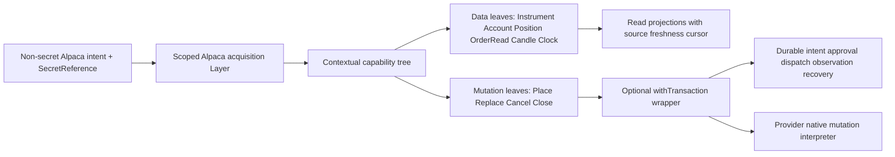

# Alpaca provider composition design

## Scope and evidence boundary

This document is the current implementation direction for the Alpaca pack. It is a design, not a production migration and not a claim that the proposed contracts or exports already exist. The source facts remain the boundary of the design:

- `AlpacaBroker` is currently a direct `IBroker` implementation for US equities (`STK`), uses the Alpaca ticker as its native key, and ignores IBKR fields that it does not map (`AlpacaBroker.ts:1-9`, `MAP-262317C16D`, `MAP-D988AF12EE`).
- The class imports the Alpaca SDK, Decimal, mutable IBKR objects, and compatibility helpers (`AlpacaBroker.ts:11-42`, `MAP-749FA0DF7B`, `MAP-BB249EB32E`). The tests replace a private client through `any` (`AlpacaBroker.spec.ts:1-24`, `MAP-4C741F2512`).
- `init` probes `getAccount`, retries with local timers, and starts catalog refresh detached (`AlpacaBroker.ts:151-203`, `MAP-0ABCB3F3AD`). Catalog state is mutable and uses null/empty as implicit lifecycle (`AlpacaBroker.ts:133-143`, `MAP-3FA23D96E2`).
- `placeOrder`, `modifyOrder`, `cancelOrder`, and `closePosition` call native mutations directly and return legacy result objects (`AlpacaBroker.ts:273-413`, `MAP-CFEE6FFFEA`, `MAP-E8E6E71EFB`, `MAP-D276945617`, `MAP-7C95D7E4A8`).
- Reads trust casts and collapse outcomes: positions hardcode USD and `abs`, order reads return null on every error, lists lack completeness, quotes/bars discard source, and the clock is account-wide (`AlpacaBroker.ts:417-615`, `MAP-A57DA48B5D`, `MAP-C2CA1F9078`, `MAP-AECC0CF17C`, `MAP-1D39C444E7`, `MAP-21C40C002D`, `MAP-9C9DF0B00B`).
- The installed SDK source proves that order POST/PATCH/DELETE and client-ID lookup paths exist (`services/uta/node_modules/@alpacahq/alpaca-trade-api/dist/resources/order.js:18-32`) and that full close uses `DELETE /positions/{symbol}` (`services/uta/node_modules/@alpacahq/alpaca-trade-api/dist/resources/position.js:2-12`). It does **not** prove idempotency, retention, atomicity, final-state absence, reduce-only behavior, or pagination completeness.

The fixed shared contract is [composition-contract.md](../composition-contract.md), especially K01–K12. All names below are conceptual contracts for the target design; they are not claims about current production exports.

## 1. Provider tree, not a universal broker SDK

Alpaca should declare a capability tree for one provider instance/environment, with AccountScope only on account/order leaves that require it. The fixed outer metadata is `CapabilityDescriptor`: protocol version, stable capability identity, command path, description, schema version/fingerprint, input/output/error schemas, delivery, effect category, resource/permission requirements, source, and availability evidence. The leaves are Alpaca-owned and open-ended.

The source gives evidence for these groups of leaves:

- instrument catalog/search/metadata and contextual capability discovery;
- account and position reads, order lookup/list reads, and optional account activity/fill reads;
- quote snapshot, historical bars, and account clock reads;
- controlled order place/replace/cancel and position close mutations.

This list is not a demand that every provider or every pack expose the same leaves. If a capability is not declared, its tree node is absent. If a declared capability is temporarily unavailable because credentials, connection, entitlement, account permission, or freshness is missing, the identity and schema remain discoverable with named availability; it is not represented as a fake Unsupported handler. The provider may omit future option namespaces, streaming surfaces, or any order variant that Alpaca does not declare.

The UTA-facing boundary is fixed; Alpaca internals are not. An interpreter may use the current TypeScript SDK, a REST client, generated OpenAPI code, another process, or a different language. It must return schema-checked values and errors at the boundary. The SDK never becomes a kernel type.

## 2. Configuration, identity, and lifecycle

Configuration contains paper/live environment, durable `AccountId`/`ConnectionId`, jurisdiction, and a `SecretReference`. CredentialProvider resolves secret bytes only while acquiring the scoped native resource. Secret values do not enter descriptors, plans, schema fingerprints, logs, errors, package manifests, or read projections. Rotation reacquires the connection and revises contextual availability; it does not rewrite historical account identity (`MAP-36636F09DE`, `MAP-ADF2C4D82C`, `MAP-49BC37B6CE`).

Alpaca has no local sub-account enumeration in the source. Before `getAccount`/scope discovery reports a single explicit scope, the connection is `ScopeDiscoveryPending`. A paper/live hint or display label cannot become a writable default. Account/order facts, effect payloads, conflict keys, and order observations carry `AccountScope`; public Instrument/Candle/News leaves use `Public` or their own declared schema context, and ticker text never creates a default subaccount (`MAP-49BC37B6CE`, `MAP-D988AF12EE`).

Acquisition returns a scoped native port and connection health. `getAccount` success proves only scoped account-read reach. The shared runtime still performs schema loading, journal/recovery classification, and admission barriers before `RuntimeHealth.Ready`. The connection supervisor owns the fixed probe policy `base=5s`, `factor=2`, `max=5m`; this is a runtime policy, not an Alpaca rate-limit claim (`MAP-BDB66E4D30`, `MAP-0ABCB3F3AD`). `close` is a real Layer finalizer: it stops catalog/observation workers, fences new claims, releases local resources, and leaves durable effect records for restart recovery even if the SDK has no close method (`MAP-64290341EC`).

## 3. Schema-first semantic units and provider extensions

The declaration is the source of truth. Alpaca declares each leaf input/output/error schema once; static types, boundary validators, metadata, CLI description, and machine-readable help are derived from that declaration. `unknown` is restricted to the native decoding boundary. A runtime response that does not match its versioned schema is a protocol/output failure, not a cast.

The common semantic units are used narrowly:

- `Instrument` contains a canonical identity tagged `Public` or by the context declared by its schema, an Alpaca native symbol, listing/asset metadata, and explicit availability; it does not invent AccountScope. Catalog rows retain provider fields (`symbol`, `class`, `exchange`, `status`, `tradable`) and do not fabricate jurisdiction/currency when absent (`MAP-1F8F896823`, `MAP-FA45E0F2BB`, `MAP-6BB04953AD`).
- `Order` contains the minimum interoperable order facts. Alpaca adds exact native fields through declared extensions: native units versus notional, trailing fields, expiry/session, outside-hours, order class, and parent/leg relations. Local mutually exclusive choices are allowed; the target composes them without enumerating every order combination by hand (`MAP-ECD2F82DA3`, `MAP-0F3A295D51`, `MAP-CFEE6FFFEA`, `MAP-2C63E4B337`).
- `Candle<AlpacaBarExtension>` retains OHLCV plus optional VWAP/trade count, native precision/source, feed, interval, bounds, and completeness. A missing optional field is `Unavailable`, not zero (`MAP-13D1329A19`, `MAP-B4DB89297E`).
- Position/account/fill observations retain exact Decimal values, signed exposure, currency and valuation convention evidence, provider execution identity when proven, and source/time. Realized PnL and cost basis are fill/accounting facts, not an invented zero from a position row (`MAP-FBF8E94277`, `MAP-0E85D36517`).

The current helper functions can remain as compatibility projections, but not as target authority. `makeContract`, `makeOrderState`, and `extractTpSl` are read-facing projections from validated observations. `aliceId` may carry a compatibility route, while canonical InstrumentId, native symbol, BrokerOrderId UUID, ClientOrderId, and dispatch identity remain separate (`MAP-168095825B`, `MAP-FA45E0F2BB`, `MAP-FDBC88A893`, `MAP-3059D38FCE`).

## 4. Data capabilities: finite pulls and explicit evidence

Catalog, search, account, positions, order lookup/list, quote snapshot, historical bars, clock, and an eventual fill-activity surface are data capabilities. They are finite pulls unless a provider declaration later supplies a real push stream with creation/cancellation/end/error/cursor/backpressure/replay semantics. No current Alpaca source in this group proves a push stream, so the design does not invent one.

Data pulls may consume connection, entitlement, cache, and projection resources. They do not use order prepare/approve/compensate, order locks, or per-frame transaction WAL. A data projection has its own source, observedAt, revision/sequence, cursor, freshness, and completeness fields. When a candle, position, session observation, or order observation is selected as an effect precondition, the transaction wrapper persists that selected evidence and trigger identity; it does not transactionally persist the entire cache or stream.

### Instrument and catalog

`refreshCatalog` decodes the complete `getAssets` response before replacing the projection. A malformed row fails the refresh; prior rows become `Stale`, first-load failure is `Unavailable`, and a valid empty response is `ReadyEmpty`. `searchContracts` becomes a typed search leaf: empty input remains Empty, ready rows are fuzzy-ranked, and the pre-catalog uppercase echo is at most a visibly unresolved UI suggestion. `getContractDetails` becomes contextual descriptor/read data, not hardcoded account permission (`MAP-DEA87BE3CD`, `MAP-F52A496199`, `MAP-B25118D3A4`).

### Account, position, order observations

Account and positions are independent observations. The source uses `Promise.all`, which is concurrency and not a common remote snapshot. Missing currency is `CurrencyUnavailable`; missing provider sequence receives only local read-projection provenance; coherence is `Unproven` absent shared evidence. Market value preserves provider sign/convention evidence, and fill/accounting folds own realized facts (`MAP-3DA66A43BA`, `MAP-A57DA48B5D`, `MAP-FBF8E94277`).

`getOrder` returns a typed outcome rather than null. A conclusive absence can be NotFound; authentication, transport, malformed output, and a post-dispatch unknown remain distinct. `getOrders` preserves one outcome per input. `getOpenOrders` records filter, cursor, namespace coverage, and completeness: `status=open` presence is useful working evidence, while absence never proves cancellation when held/conditional namespaces are unproven (`MAP-C2CA1F9078`, `MAP-20EEB58E82`, `MAP-AECC0CF17C`).

Order group data is optional provider extension. Bracket and OTO parent/leg IDs and statuses are preserved when declared. A held child is not deleted because it is absent from a list. Parent status cannot synthesize leg status. Atomicity and retention remain empirical obligations (`MAP-2C63E4B337`, `MAP-3059D38FCE`).

### Market data

Snapshot output preserves trade/quote prices, sizes, timestamps, daily bar, child Tape, and optional fields when native evidence supplies them. Venue comes from catalog/query context and feed from child Tape or declared request/connection source; missing source is explicit Unknown/Unavailable. Historical pulls preserve `adjustment: all`, the exact timeframe map, bounded full-window drain plus tail slicing, actual feed, and completeness. Only a validated recent-SIP entitlement denial and an explicit policy may cause one IEX retry; output is labeled IEX/degraded (`MAP-1D39C444E7`, `MAP-21C40C002D`, `MAP-63A967FD50`).

The account-wide clock remains useful as a read view. A session observation additionally requires explicit venue/calendar evidence, instrument/listing context, session kind, effective interval, and freshness. `is_open=false` is not evidence of Halted, and a JavaScript Date is not a calendar version. A clock without calendar context is readable but cannot satisfy a session-sensitive effect precondition (`MAP-B0EB90D81C`, `MAP-9C9DF0B00B`, `MAP-D0F05BBCB5`).

## 5. Controlled effects and the transaction wrapper

Only provider mutations are controlled effects. Alpaca declares separate mutation leaves for the source-backed place, replace, cancel, and close operations. Each leaf has its own exact input/output/error schema and its own native parameters. `withTransaction` is an optional composition around one such leaf; its public handle submits intent and reads an action-associated receipt, not a raw dispatch callback. There is no provider-wide action map and unrelated providers need not implement all four names.

The wrapper retains the valuable order safety rules already established by the investigation:

1. Resolve the leaf-declared Instrument context and AccountScope where the effect schema requires account facts, then compose the exact provider payload. Preserve sizing, precision, TIF/session, trailing, outside-hours, expiry, and parent/leg fields; reject ambiguity or structural absence rather than dropping fields.
2. Persist a serializable prepared payload and digest. Approval is explicit; DraftReview/PreparationPreview are data and create no executable job. The wrapper writes DispatchStarted before the native mutation.
3. Persist native acknowledgement separately from observation. Parent and every returned leg identity are durable evidence. A filled/accepted/void response is not silently upgraded to final execution/cancellation/close completion.
4. After timeout, restart, disconnect, or malformed response, use durable lookup descriptors plus the distinct UTA command identity and any proven BrokerOrderId/client-order-id evidence to observe before retry. No provider idempotency/retention/absence/atomicity claim is inferred from endpoint existence.
5. Unknown pauses forward work and keeps the relevant reservation/lock under the transaction recovery owner. Compensation is assessed only from observed facts; no data cache failure triggers order compensation.

An Alpaca data observation can be a trigger source only through an explicitly registered binding; the event, its source, and its freshness are evidence, not execution authority. If the binding selects `ReturnToAgent`, the shared runtime atomically consumes the activation, pauses the binding, retains the unsent intent and evidence, creates a stable review/outbox record, and performs zero Alpaca mutations. Only explicit `Discard` (unsent), `KeepSuspended`, `Rearm`, `Revise`, or `RequestSubmission` commands can advance it under review-identity and expected-revision checks; duplicate events and late replies cannot reuse the prior epoch or approval.

### Place

The place leaf composes the `Order` unit with Alpaca-native units/notional and attached-leg extensions. One exit uses the source-observed OTO request shape and two exits use bracket; the request distinction is retained, not treated as proof of native acceptance or group atomicity. DecimalString applies equally to entry and TP/SL values. A held stop child returned at placement is recorded immediately but remains pending until independently observed (`MAP-CFEE6FFFEA`, `MAP-3372FF782B`, `MAP-3059D38FCE`).

### Replace

Replace preparation captures an existing-order before-image and an expected version/precondition. The target represents omitted fields as explicit Retain choices, but whether native omission retains the existing value is evidence-gated; clear is absent from the leaf schema until proven. A replace acknowledgement is only amendment evidence. If a new provider identity or queue loss appears, both identities and semantic-loss assessment are preserved. Timeout does not resend PATCH (`MAP-E8E6E71EFB`, `MAP-D25F93A942`, `MAP-3C0F790B85`).

### Cancel

Cancel receives scoped identity and, where supported, expected version/status evidence. A void response is a CancelAcknowledgement; a subsequent order observation supplies the cancellation criterion. A filled/late-fill observation remains accounting evidence. List absence or an unclassified DELETE response is Unknown, not Cancelled (`MAP-D276945617`, `MAP-A99C29C26A`).

### Close

Close is a separate provider effect with `All` and `QuantityTarget` input. Full close uses the native close endpoint when declared. Quantity close uses the observed signed exposure and preserves `_assertCloseQuantityWithinPosition` as local defense in depth; sharing an encoder with place does not merge their leaf identity. Without native reduce-only/conditional evidence, stale/drift-prone quantity close is refused. The exposure lock remains until target exposure or residual risk is durable (`MAP-053E34F691`, `MAP-7C95D7E4A8`).

## 6. Errors, packaging, and implementer freedom

Errors are decoded at the leaf boundary and retain context: configuration/load errors, input validation, named provider rejection, data delivery failure, protocol/output violation, and outcome unknown. A rendered `Error.message` is not a capability discriminator. Unknown native status/body/field is preserved as evidence and cannot be made safe by a fallback string (`MAP-B9801A7C06`, `MAP-EAC4E9DC46`, `MAP-D50CF7C166`).

The pack barrel is the optional composition point. Its target descriptor is versioned (v2 in the shared pack decision), carries non-secret configSchema and `createBrokerLayer`, and exposes Alpaca declarations/interpreters/codecs. The kernel does not import the SDK. Legacy class and Contract/OrderState projections may remain while reads migrate, but they are explicitly compatibility-only and are removed as write authority at the cutover (`MAP-CBE13E6174`, `MAP-262317C16D`).

Alpaca implementers retain freedom over SDK wrappers, REST clients, process boundaries, caches, class/callback style, and internal language. The constraints are only the UTA-facing descriptor/schema boundary, leaf-declared Public/Account identity context, exact native extension preservation, typed availability/error outcomes, and effect-only transaction wrapping. This is deliberately not a demand to refactor all IO into one functional library.

## 7. Falsifiable scenarios and implementation sequence

The design is not accepted by naming types. The following scenarios can falsify it:

1. Add one Alpaca-native order or market-data field to a leaf declaration. Its input/output/error schema, static type, capability metadata, and CLI/help projection must change together without a kernel capability switch or changes to unrelated providers.
2. Load a provider tree without an option/cancel/stream feature. The absent feature must have no command/leaf; no fake placeholder handler may appear. A declared but disconnected feature must remain discoverable with named availability.
3. Feed malformed asset/order/bar/account/position/snapshot output to the native port. The leaf must reject it before projection; it must not become an empty list, null order, Submitted status, zero PnL, or fabricated Instrument.
4. Run a historical pull with four rows and limit two. It must drain the bounded window, return the last two, and report actual feed/completeness. A structured recent-SIP denial may cause one IEX/degraded result; a 500 may not.
5. Run a valid catalog search before and after refresh. Empty remains Empty; an unresolved pre-refresh suggestion cannot produce an effect payload; a stale catalog match remains readable but fails the fresh resolution precondition.
6. Start a place/replace/cancel/close transaction, crash after DispatchStarted, then reconnect. The next operation must observe by persisted identity and never blindly repeat the mutation. Parent/legs and residual exposure remain visible until criteria are met.
7. Deliver a clock row without explicit calendar evidence. It may render as a read result but cannot authorize a session-sensitive effect. Deliver a short position with an unknown market-value convention; it cannot silently pass through `abs`.
8. Register a data-triggered `ReturnToAgent` policy in the shared runtime. One accepted event must create a durable review/outbox record, pause the binding, retain the unsent intent/evidence, and issue zero Alpaca mutations; duplicate events and late replies cannot reuse the old epoch/approval.

Implementation order follows the dependency direction, without changing shared files in this group:

1. Define the pack descriptor, non-secret config handoff, scope/identity codecs, runtime raw schemas, and capability tree declarations.
2. Implement catalog/account/position/order-observation/market-data leaf interpreters and projections, keeping compatibility readers at the edge.
3. Implement the four source-backed mutation leaves and compose each with `withTransaction`; preserve exact native payloads and conformance-gated unknowns.
4. Migrate callers from the legacy class, then remove only the obsolete legacy write authority. Keep read compatibility until consumers move.

## 8. Evidence and unresolved native facts

The empirical obligations remain explicit. The installed source still does not prove client-order idempotency horizon, response/error envelopes, bracket/OTO atomicity or held-leg namespace, replace version/clear/retry semantics, cancel/close final-state and absence rules, reduce-only behavior, fractional/tick/lot limits, list pagination/coverage, historical entitlement/completeness, account/position common snapshot/version, or stable activity execution identity. These facts must be captured against the relevant Alpaca environment before granting stronger capability/transaction claims. A schema composition layer is not evidence and does not close these questions (`MAP-4C741F2512`, `MAP-3372FF782B`, `MAP-CFEE6FFFEA`, `MAP-E8E6E71EFB`, `MAP-D276945617`, `MAP-7C95D7E4A8`, `MAP-AECC0CF17C`, `MAP-CDB6B2021B`, `MAP-0E85D36517`).

## 9. MAP coverage

All 66 Alpaca entries remain in `analyses.json` with source evidence, current behavior, preserved behavior, open questions, and per-entry contract disposition/rationale/anchors. The index below groups the evidence without inventing a new type for each method:

- **Test fixtures and observed scenarios:** `MAP-4C741F2512`, `MAP-BDB66E4D30`, `MAP-451B66A518`, `MAP-3372FF782B`, `MAP-D34D87EEB6`, `MAP-5A3A747EBA`, `MAP-186E3AA482`, `MAP-D25F93A942`, `MAP-3C0F790B85`, `MAP-A99C29C26A`, `MAP-053E34F691`, `MAP-3DA66A43BA`, `MAP-20EEB58E82`, `MAP-4AF53E630B`, `MAP-3C5D748AD0`, `MAP-CDB6B2021B`, `MAP-B0EB90D81C`, `MAP-A1FCB75450`, `MAP-63A967FD50`.
- **Alpaca adapter lifecycle, catalog, actions, reads, and identity:** `MAP-749FA0DF7B`, `MAP-262317C16D`, `MAP-BB249EB32E`, `MAP-1F8F896823`, `MAP-ECD2F82DA3`, `MAP-0F3A295D51`, `MAP-B9801A7C06`, `MAP-36636F09DE`, `MAP-3FA23D96E2`, `MAP-49BC37B6CE`, `MAP-0ABCB3F3AD`, `MAP-64290341EC`, `MAP-DEA87BE3CD`, `MAP-F52A496199`, `MAP-B25118D3A4`, `MAP-CFEE6FFFEA`, `MAP-E8E6E71EFB`, `MAP-D276945617`, `MAP-7C95D7E4A8`, `MAP-A57DA48B5D`, `MAP-894C4D8526`, `MAP-FBF8E94277`, `MAP-BEC8B440B3`, `MAP-C2CA1F9078`, `MAP-AECC0CF17C`, `MAP-1D39C444E7`, `MAP-21C40C002D`, `MAP-0A1AF127FE`, `MAP-9C9DF0B00B`, `MAP-D988AF12EE`, `MAP-2C63E4B337`, `MAP-3059D38FCE`.
- **Pure helpers and raw schemas:** `MAP-168095825B`, `MAP-B4DB89297E`, `MAP-FA45E0F2BB`, `MAP-6BB04953AD`, `MAP-EAC4E9DC46`, `MAP-FDBC88A893`, `MAP-ADF2C4D82C`, `MAP-E1BE5EBCAD`, `MAP-FE06BD8DFB`, `MAP-D50CF7C166`, `MAP-9E30EAD352`, `MAP-13D1329A19`, `MAP-0E85D36517`, `MAP-D0F05BBCB5`.
- **Pack barrel:** `MAP-CBE13E6174`.

The source-backed legacy facts remain useful evidence; only their authority and scope have changed.
