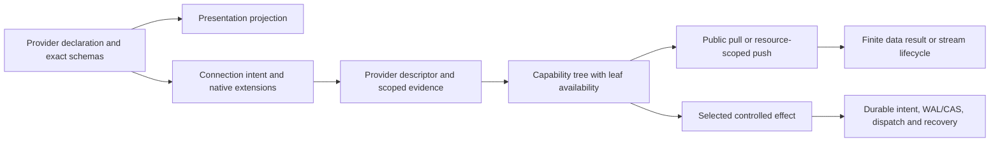

# Catalog group: declaration-first provider catalog and capability composition

> Status: target design only. This group owns the 93 MAP entries for the five optional pack entry points, the preset declarations and presentation pipeline, search normalization, public protocol barrels, broker composition/registry, and the related fixtures. It does not claim that any target type or provider conformance record already exists. The fixed contract is `docs/uta-effect-runtime-design/solutions/composition-contract.md` (K01–K12).

## 1. What the source currently does

The source has three responsibilities interleaved in one path:

1. `packages/uta-protocol/src/brokers/preset-catalog.ts:1-588` declares wizard metadata, Zod form schemas, engine-shaped config translation, paper/demo classification, and identity helpers. The ordered `BROKER_PRESET_CATALOG` also controls wizard grouping and historical presentation order (`:497-522`).
2. Each `packages/uta-broker-*/src/index.ts` wrapper currently imports a legacy service broker and exposes a numeric pack version, engine string, `configSchema`, and a generic `createBroker`. `packages/uta-protocol/src/index.ts:15-20` then re-exports the protocol, catalog, serialization, and search surface together. `services/uta/src/domain/trading/brokers/factory.ts:1-47` parses a raw config, translates it to a record, loads the engine, and creates a mutable generic broker.
3. `services/uta/src/domain/trading/brokers/registry.ts:1-131` deliberately lazy-loads live packs and keeps Mock built in, but currently returns a legacy `IBroker` entry and collapses pointer, manifest, import, and workspace failures into `BrokerPackUnavailableError`. The tests in `presets.spec.ts` and `registry.spec.ts` prove useful legacy translations and loading precedence, but mostly assert shape, echoes, and message text.

These observations remain source evidence. They are not a reason to reproduce a universal SDK in the target.

## 2. Fixed boundary for this group

The Catalog target is a declaration and composition boundary, not a broker implementation. Each provider declaration contributes one fixed outer `CapabilityDescriptor` containing:

- protocol/descriptor version and stable capability identity/command path;
- schema version/fingerprint plus the exact input, result, and domain-error schemas for each declared leaf;
- delivery (`pull` finite result or `push` resource-scoped stream), effect category, permissions, resources, provenance, and scoped availability evidence.

The provider capability tree below that envelope is deliberately open-ended. A provider publishes only the leaves it has. There is no central action table, no mandatory Place/Modify/Cancel/Close product, no generated Unsupported leaf for structural absence, and no handwritten Cartesian product of order variants. A provider may have only public listing, one order effect, a funding reader, a stream, or a native operation with no analogue elsewhere. Empty parent nodes disappear.

The declaration is the schema source. A provider may compose native parameters and semantic units with schema/HOF combinators, retaining exact extensions and preconditions. `Order`, `Candle`, `Instrument`, `News`, and `NewsGroup` are interoperable semantic units, not a list of every provider method. The Catalog does not force a provider's internal language, SDK, class model, callback style, REST process, or FP library. Only the UTA-facing descriptor and boundary codecs are shared.

Scope is explicit. Public Candle/Instrument/News/search data uses `Public`/data scope or the exact provider-declared scope. `AccountScope` is required only for account-owned observations and controlled trading effects. The Catalog never fabricates a default account or subaccount merely because a provider engine is known. Availability is separate from structural capability: an existing leaf can be unavailable for missing credentials, stale evidence, quota, or a disconnected resource; a nonexistent leaf is omitted.

## 3. Presentation, configuration, and identity

### 3.1 Presentation is not readiness

`MAP-CC2177368A`, `MAP-9F3FB86CB7`, `MAP-67CE26F92B`, `MAP-9A17C2A8CC`, `MAP-21AAC99E0D`, `MAP-F8525C7A99`, and `MAP-1D576100CB` retain the wizard's stable preset IDs, labels, categories, mode choices, subtitle formatting, ordering, and write-only metadata. The target names this surface `PresetPresentation`/`PresetPresentationCatalog`; it is pure, immutable, redacted, and SDK-free. A missing pack must not make a form disappear.

`ModeOption`, subtitle truthiness, and UI labels are presentation inputs. They produce a `TradingEnvironmentHint` only after the engine-specific codec accepts the selected value. They do not prove endpoint, account, permission, or write readiness. A serialized JSON Schema is a view/wire artifact, not the runtime validator and never reconstructs a `ConnectionIntent`.

### 3.2 Provider-owned configuration

`MAP-601F6E2834`, `MAP-E745F1370E`, and the provider preset entries (`MAP-EBB7846E5F` through `MAP-F62E863C78`) move runtime parsing to provider-owned schema declarations. Unknown input is decoded once at the boundary. Known native extensions remain precise and versioned; unknown extensions are rejected or retained only in an explicitly provider-private extension schema. A raw `Record<string, unknown>` is not a cross-boundary type.

The known translations remain exact:

- Binance keeps live/demo and its deliberate lack of the old testnet path (`MAP-EBB7846E5F`).
- OKX maps demo to `sandbox` and does not invent `demoTrading` (`MAP-BB8EAF65B0`).
- Bybit keeps Live, Testnet, and Demo separate, including their different endpoint/data semantics (`MAP-6E3C5642E6`).
- Hyperliquid retains wallet/signer role information rather than treating a wallet address as complete identity (`MAP-2F4E92A2AE`).
- Bitget remains Classic-only; Unified/V3 is structural absence until evidence changes (`MAP-B9545FA731`).
- Custom CCXT is an `Unverified` profile. It may expose explicitly permitted public reads, but it cannot acquire a write/effect leaf from open fields or mode flags (`MAP-F62E863C78`).
- Alpaca, IBKR, Longbridge, and LeverUp preserve their form fields and native translation at ingress, while SecretRefs, hints, observed evidence, and provider extensions remain distinct (`MAP-2862195456`, `MAP-DE2769E2F7`, `MAP-42A8E8BFCC`, `MAP-FA8441EFDE`).

`keyless` and `readOnly` are independent access-policy facts. Keyless public data is not funded read-only, and funded read-only can produce a draft/preview only; neither silently produces an executable effect. These policies are applied at the selected leaf, not embedded as a universal broker interface.

### 3.3 Environment and identity

`MAP-4FEAB1D03E` and `MAP-E745F1370E` replace `isPaperPreset`/`defaultIsPaper` as runtime authority. Port, mode, network, and simulator labels are hints. Provider probes return typed environment/scope evidence and availability; missing or contradictory evidence is `Unknown`/`Mismatch`, never a false value that authorizes a write.

`MAP-ED0CF2A5B8`, `MAP-4E1058C577`, and `MAP-E9688DBE16` preserve deterministic legacy canonicalization and simulator token shape only where migration needs them. New `AccountId` allocation is a durable account-repository operation over stable provider/account/environment/scope facts. `LegacyUtaIdAlias`/`IdentityBinding` preserves existing git history and owner-sealed records. Secrets, private keys, token values, array positions, labels, and short hashes are not new identity authority. Simulator instance allocation is creation-time effect work; reconnect reads the persisted value.

## 4. Pack and provider composition

### 4.1 Pack boundary and provenance

The five wrapper groups (`MAP-9AD9951502`–`MAP-E52D407CDC`) stop importing service-owned legacy classes as their public contract. Each pack registers a versioned descriptor whose outer metadata is validated before provider code is used. The descriptor can be implemented with a provider-local layer, callback adapter, REST bridge, generated SDK, or another process; no particular export function or internal product is mandated by K01–K07. A pack-local registration function is acceptable, but it is not a global factory alias.

`src/core/broker-packs.ts:10-19,23-45,86-172` remains the provenance gate for manifest/schema/API version, engine identity, package identity, release path, and active content. `MAP-EFDE4EFD6B`, `MAP-964B3CADF0`, `MAP-E2F6BC0E7E`, `MAP-507FF8C434`, `MAP-3BB0EF71F5`, and `MAP-5C8AA54A45` retain installed-before-workspace/Mock precedence, typed pointer/manifest/import failure phases, and repair visibility. A broken installed release never silently falls through to workspace or Mock. Artifact digest verification remains the `docs/broker-packs.md`/PackStore responsibility; the core resolver does not claim a digest check it does not perform.

`MAP-30B07B33AF` and `MAP-13ABF99986` keep workspace packs as explicit development/test source policy, production-deny by default. Source allowance is not capability evidence. `MAP-AD49E3FECC`, `MAP-D0D9F4AA44`, and `MAP-2E5F0661A6` keep immutable descriptor caching and failed-load eviction, but descriptor cache generations do not own connections, data-stream state, account identity, JournalWriter state, or recovery. A new descriptor generation cannot silently replace an active connection or re-dispatch an unknown effect.

### 4.2 Provider-specific intent

The five provider groups intentionally differ:

- **Alpaca (`MAP-9AD9951502`, `MAP-DA5BBE56B3`, `MAP-14D51E5BA4`, `MAP-607170E22C`, `MAP-6496594BF0`):** preserve paper/live hints and key/secret ingress, but require provider-authenticated environment and account evidence. UUID/client-order lookup and fill observations remain adapter facts; unproven server deduplication stays Unknown/reconcile-before-retry.
- **CCXT (`MAP-B40F4C1C42`, `MAP-ACA4BDF989`, `MAP-B295179D05`, `MAP-F3151B31E7`, `MAP-9D3DC42AC9`):** keep exchange, credential variant, sandbox/demo semantics, account selector, and exchange-specific options as exact profile fields. Each selected venue declares its own listing completeness, sub-account, native identity, and effect leaves. The `ccxt` tag never implies every exchange or namespace.
- **IBKR (`MAP-1E5FD0A690`, `MAP-AB521AFE64`, `MAP-55E14D3598`, `MAP-C4C40BAECB`, `MAP-3392948A39`):** keep endpoint/port/client input and managed-account discovery. Port 7497/4002 remains a hint. Callback generation, account selection, contract/conId association, and late observations stay in the provider descriptor; reconnect does not decide an old effect.
- **LeverUp (`MAP-AE59785B88`, `MAP-1B0FB784F5`, `MAP-D5792AEA38`, `MAP-2564A889E7`, `MAP-50C8158380`):** retain strict signer syntax and Live/Testnet distinction. SecretRef, chain/contract deployment, signer authorization, relayer response, and finality are provider evidence. A reader or quote stream does not require signing or order recovery.
- **Longbridge (`MAP-75B61EBF36`, `MAP-F093E8F942`, `MAP-E89067CA5C`, `MAP-1986FE3044`, `MAP-E52D407CDC`):** retain multi-region, paper/live and three credential fields while making token expiry, region, currency and FX requirements explicit. FX is a requirement only for a leaf whose native units need it; FX-independent reads remain available.
- **Simulator (`MAP-52A6B771BA`, `MAP-AB74D13B81`):** keep manual price/fill/transfer controls and intentionally ephemeral simulated positions. Persist simulator identity and controlled-effect journal/recovery separately; reset never fabricates a fill or remints a durable identity.

### 4.3 Native order fields and controlled effects

For a provider-declared trading effect, `Order` is a semantic unit composed from exact provider schemas. Native quantities, prices, time-in-force, protection, venue fields, signer data, and other extensions are preserved through that provider's schema/HOF. A combination is valid because the provider declares it; Catalog does not impose a cross-provider rule such as “non-market cannot use notional.” Unsupported relations are absent or rejected at that leaf.

Only controlled effects use durable intent/approval/dispatch/recovery. The existing scope and unit checks, approval digest, write-ahead `DispatchStarted`, unique dispatch identity, lease/CAS, observation-before-retry, and compensation assessment remain valuable for an actual effect. Ack is not fill; a possible send is `Unknown`, not `Rejected`. Compensation is not ACID and is only described where provider evidence and actual exposure support it. Data readers, caches, public listing, and push streams do not use those order controls.

## 5. Public protocol, search, and data delivery

`MAP-21AAC99E0D`, `MAP-F8525C7A99`, `MAP-5C311A55C1`, and `MAP-923D3E5DC8` constrain generated JSON Schema to a versioned presentation AST with immutable transforms and credential redaction. `MAP-AE04CD83E4` removes SDK-dependent and implementation-oriented exports from the public barrel. `MAP-E43DFC70EF` fills the HTTP/client schema boundary with versioned request/response codecs; it decodes `unknown` once and maps domain failures exhaustively, but schema success is not capability proof.

`MAP-41D1B056C8`, `MAP-819A30C052`, and `MAP-006AF2BF79` retain the narrow centralized symbol heuristic. `SearchPattern` carries source symbol, asset-class hint, quote stripping and rule version. A normalized query is never an `InstrumentId`. Contract search remains best-effort fan-out: each provider result reports Complete/Partial/Unavailable and only an observed listing creates a canonical provider association. A public listing may use Public/data scope; an account-owned listing uses an explicitly supplied AccountScope. Neither path invents a default account.

A Catalog data leaf follows K05/K06: `pull` returns a finite schema result with explicit pagination/incompleteness; `push` is a resource-scoped stream with create/cancel/end/error frames, cursor/replay/gap/backpressure semantics and explicit cancellation. A received frame does not prove a closed candle or complete news group. Caches store immutable descriptor/data state according to their owner; cache eviction cannot erase account identity or controlled-effect recovery.

## 6. Composition callers and tests

`MAP-6367D87808`, `MAP-C3B978232C`, `MAP-093F5766C9`, and `MAP-E010E516DB` move factory work to a typed composition boundary: config codec -> provider descriptor -> selected handle/evidence. FX is an explicit requirement/observation only for affected leaves; reflective setters and discarded parse results disappear. `MAP-D914E7F49F`, `MAP-16D7FC3B84`, `MAP-4D0C34ED53`, and `MAP-E981F551DA` split public presentation, config, wire, and runtime/provider ports. `MAP-24015C5378` deletes the local compat re-export after callers migrate; it is not replaced with another broad alias.

The test MAPs preserve the existing evidence while making assertions observable:

- `MAP-6E311CAABB`, `MAP-D74564C976`, `MAP-076B691F74`, `MAP-F4B8428675`, `MAP-D3ABE635D3`, `MAP-2092F69746`, and `MAP-923D3E5DC8` keep every preset, mode translation, redaction and ordering case, but add typed schema, hint/evidence, scope and structural-absence cases.
- `MAP-F45EE8D4C7` keeps legacy hash vectors as lookup fixtures and adds secret rotation, aliases, collision refusal and scope separation.
- `MAP-EFDE4EFD6B`, `MAP-964B3CADF0`, `MAP-2E9FCB05D5`, `MAP-AB74D13B81`, `MAP-1729810891`, `MAP-E2F6BC0E7E`, `MAP-2E5F0661A6`, and `MAP-507FF8C434` keep filesystem isolation, activation precedence, Mock availability, module failure phases, cache eviction and corrupt-pointer behavior. Descriptor lookup/load tests must not pretend to prove provider native behavior. Only a fixture that actually selects a controlled effect asserts durable dispatch ordering.

## 7. Empirical obligations that remain open

The fixed composition contract does not invent native guarantees. The 28 retained questions in `questions-closure.json` remain empirical-retained, including:

- Alpaca environment/permission fields, idempotency, lookup retention and partial-fill completion (`MAP-9AD9951502`, `MAP-607170E22C`, `MAP-6496594BF0`, `MAP-2862195456`).
- Per-exchange CCXT credential subsets, account selectors, pagination/completeness, demo/account identity, idempotency and custom-profile evidence (`MAP-B40F4C1C42`, `MAP-F3151B31E7`, `MAP-9D3DC42AC9`, `MAP-EBB7846E5F`, `MAP-BB8EAF65B0`, `MAP-6E3C5642E6`, `MAP-2F4E92A2AE`, `MAP-B9545FA731`, `MAP-F62E863C78`, `MAP-601F6E2834`).
- IBKR authenticated environment fields, callback/query completeness, native identity reuse and late-callback retention (`MAP-1E5FD0A690`, `MAP-C4C40BAECB`, `MAP-3392948A39`, `MAP-DE2769E2F7`).
- LeverUp signer/deployment identity, relayer idempotency, receipt retention, replay and finality (`MAP-AE59785B88`, `MAP-2564A889E7`, `MAP-50C8158380`, `MAP-FA8441EFDE`).
- Longbridge region/currency/token fields, refresh semantics, listing completeness and order idempotency (`MAP-75B61EBF36`, `MAP-1986FE3044`, `MAP-E52D407CDC`, `MAP-42A8E8BFCC`).
- Legacy git/sealed identity inventory before migration (`MAP-F45EE8D4C7`).

An abstraction, descriptor schema, or successful mock cannot close any of these questions. Until the provider evidence is versioned, affected leaves are unavailable or Unknown, and public data remains governed by its own delivery/scope contract.

## 8. Falsifiers and implementation gates

The design is falsified if any implementation demonstrates one of these outcomes:

1. Adding a provider field or one new capability requires editing a central kernel action switch, a hand-written global action map, or unrelated provider stubs. The declaration must instead change the derived schema/type/metadata/CLI for that provider only.
2. A provider that has no option, cancel, or stream leaf receives a synthetic command or empty handler. Structural absence must be visible, and empty parent nodes must disappear.
3. Invalid input reaches a provider handler; a provider output/error violating its declared schema is accepted; or a stale capability revision executes a different meaning at the same command path.
4. A finite pull is treated as an endless stream, a stream close fails to cancel only the owned resource, a gap is treated as complete, or a data frame creates order WAL/compensation state.
5. Public data code invents an AccountScope/subaccount, or account-owned facts are returned without the exact scope required by their declaration.
6. An environment hint, engine tag, port, label, or schema-success boolean enables a write leaf without authenticated evidence; keyless/read-only config creates an executable effect.
7. ReturnToAgent or an external event is treated as approval, or a pack/cache failure changes account identity, durable configuration, or transaction state.
8. A dispatch whose send status is unknown is marked rejected or blindly resent; a late callback from an old connection generation overwrites newer state; compensation is claimed without provider/exposure evidence.
9. Rotating a secret creates a second AccountId or loses sealed/git history; simulator reconnect remints an instance ID.
10. A broken installed pack falls through to workspace/Mock, or public protocol imports an optional vendor SDK.

These gates are design obligations for Main's later runtime validation, not claims that this design-only change has executed them.

## 9. MAP index

The complete source-to-analysis coverage remains in `analyses.json`; the 93 IDs are grouped here to keep review navigable:

- `packages/uta-broker-alpaca/src/index.ts`: `MAP-9AD9951502`, `MAP-DA5BBE56B3`, `MAP-14D51E5BA4`, `MAP-607170E22C`, `MAP-6496594BF0`.
- `packages/uta-broker-ccxt/src/index.ts`: `MAP-B40F4C1C42`, `MAP-ACA4BDF989`, `MAP-B295179D05`, `MAP-F3151B31E7`, `MAP-9D3DC42AC9`.
- `packages/uta-broker-ibkr/src/index.ts`: `MAP-1E5FD0A690`, `MAP-AB521AFE64`, `MAP-55E14D3598`, `MAP-C4C40BAECB`, `MAP-3392948A39`.
- `packages/uta-broker-leverup/src/index.ts`: `MAP-AE59785B88`, `MAP-1B0FB784F5`, `MAP-D5792AEA38`, `MAP-2564A889E7`, `MAP-50C8158380`.
- `packages/uta-broker-longbridge/src/index.ts`: `MAP-75B61EBF36`, `MAP-F093E8F942`, `MAP-E89067CA5C`, `MAP-1986FE3044`, `MAP-E52D407CDC`.
- `packages/uta-protocol/src/brokers/preset-catalog.ts`: `MAP-CC2177368A`, `MAP-00030A134A`, `MAP-9F3FB86CB7`, `MAP-67CE26F92B`, `MAP-601F6E2834`, `MAP-E745F1370E`, `MAP-EBB7846E5F`, `MAP-BB8EAF65B0`, `MAP-6E3C5642E6`, `MAP-2F4E92A2AE`, `MAP-B9545FA731`, `MAP-F62E863C78`, `MAP-2862195456`, `MAP-DE2769E2F7`, `MAP-42A8E8BFCC`, `MAP-FA8441EFDE`, `MAP-52A6B771BA`, `MAP-9A17C2A8CC`, `MAP-E954ABE476`, `MAP-4FEAB1D03E`, `MAP-ED0CF2A5B8`, `MAP-4E1058C577`, `MAP-E9688DBE16`.
- `packages/uta-protocol/src/brokers/presets.ts`: `MAP-21AAC99E0D`, `MAP-F8525C7A99`, `MAP-5C311A55C1`, `MAP-1D576100CB`.
- `packages/uta-protocol/src/brokers/search-rules.ts`: `MAP-41D1B056C8`, `MAP-819A30C052`, `MAP-006AF2BF79`.
- `packages/uta-protocol/src/index.ts`: `MAP-AE04CD83E4`.
- `packages/uta-protocol/src/schemas/index.ts`: `MAP-E43DFC70EF`.
- `services/uta/src/domain/trading/brokers/factory.ts`: `MAP-6367D87808`, `MAP-C3B978232C`, `MAP-093F5766C9`, `MAP-E010E516DB`.
- `services/uta/src/domain/trading/brokers/index.ts`: `MAP-D914E7F49F`, `MAP-16D7FC3B84`, `MAP-4D0C34ED53`, `MAP-E981F551DA`.
- `services/uta/src/domain/trading/brokers/presets.spec.ts`: `MAP-6E311CAABB`, `MAP-D74564C976`, `MAP-076B691F74`, `MAP-F4B8428675`, `MAP-D3ABE635D3`, `MAP-2092F69746`, `MAP-923D3E5DC8`, `MAP-F45EE8D4C7`.
- `services/uta/src/domain/trading/brokers/registry.spec.ts`: `MAP-EFDE4EFD6B`, `MAP-964B3CADF0`, `MAP-2E9FCB05D5`, `MAP-AB74D13B81`, `MAP-1729810891`, `MAP-E2F6BC0E7E`, `MAP-2E5F0661A6`, `MAP-507FF8C434`.
- `services/uta/src/domain/trading/brokers/registry.ts`: `MAP-CEF7AFFAF1`, `MAP-D47789CDE0`, `MAP-D74C77540F`, `MAP-D37C32D3D3`, `MAP-3BB0EF71F5`, `MAP-30B07B33AF`, `MAP-AD49E3FECC`, `MAP-D0D9F4AA44`, `MAP-5C8AA54A45`, `MAP-D804E25471`, `MAP-13ABF99986`.
- `services/uta/src/domain/trading/brokers/types.ts`: `MAP-24015C5378`.

All source anchors, current behavior, preserved legacy behavior, and unresolved native obligations remain itemized in `analyses.json` and `questions-closure.json`; this design does not replace them with a second per-method type table.
