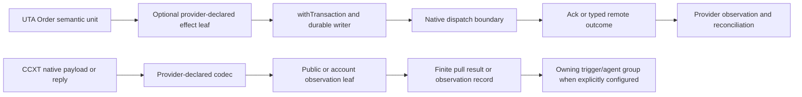

# CcxtCore：能力组合式 CCXT provider 设计

## 1. 状态、范围与目标边界

本文是目标设计，不是已实现的 provider、交易执行器或运行验证结果。CcxtCore 覆盖 `CcxtBroker.e2e.spec.ts`、`CcxtBroker.guard.spec.ts`、`CcxtBroker.spec.ts`、`CcxtBroker.ts`、`ccxt-types.ts` 与 `index.ts` 的 74 个 MAP；逐项的源码事实、缺陷、保留行为、未知证据和验收输入以本组 `analyses.json` 为细节来源。

源码目前确实有一个实现 `IBroker<CcxtBrokerMeta>` 的 `CcxtBroker`，并通过 `exchangeOverrides`/default helper 选择若干 venue 行为。这是历史实现证据，不是目标契约。目标不要求所有 provider 实现一个完整 SDK、不建立全局 `ActionContractMap`、不要求每个 provider 提供 Place/Modify/Cancel/Close，也不以返回 `Unsupported` 的空 handler 填充缺失能力。

CcxtCore 的目标是一个 provider pack：接入作者为每个真实存在的能力声明精确输入、结果、领域错误、来源、可用性、效果类别、权限和资源需求；固定的 UTA-facing `CapabilityDescriptor` 外层、schema 指纹、发现 revision、调用绑定和错误分类由组合层计算。provider 内部可以继续使用 CCXT、任意语言的 SDK、REST/OpenAPI、网关或独立进程；只在 UTA 边界遵守版本协商、精确 schema、scope、delivery、resource 和 availability 约束。

## 2. Provider pack and fixed UTA-facing envelope

CcxtCore registrations are conceptual declarations, not claims that these modules or exports already exist. A pack may declare the following independent leaves:

- connection/environment/proxy acquisition and lifecycle;
- native market decoding, immutable catalog publication, instrument search and details;
- public market-data pulls for quote, historical bars, funding, order book and the current-clock/session description;
- account-scoped wallet, margin, position, order-by-id and open-order listing observations;
- optional controlled order-effect leaves for place, modify, cancel or close, only where the provider has a precise native route and the required evidence.

Every declared leaf projects to the fixed outer `CapabilityDescriptor`: protocol version, stable capability identity, command path, description, schema version/fingerprint, input/result/error schemas, delivery (`pull` for the current CCXT reads), effect category, permission/resource requirements, source and named availability. The leaf’s schema remains open-ended and provider-specific. Adding a native parameter changes that leaf’s schema and fingerprint; it does not require a core capability switch or an implementation in another provider. Structural absence is represented by no leaf.

A public operation uses `dataContext: Public` unless its concrete schema explicitly supports an account view. Account, wallet, position, order and controlled-effect facts use an explicit `AccountScope = AccountId + SubAccountId` resolved from an account directory. Public Candle/Instrument-like facts do not receive a fabricated account or subaccount. `InstrumentId` is account-independent; `NativeInstrumentKey` and venue namespace remain exact lookup evidence.

The source `CcxtBroker` and `CcxtExchangeOverrides` can remain as an outer compatibility implementation during a clean cutover. They are not imported into the durable domain as the target’s universal interface. Legacy `Contract`, `AccountInfo`, `Position`, `OpenOrder`, `FundingRate` and `OrderBook` values are projections at an edge, not schema sources for new leaves.

## 3. Schema, identity and catalog composition

### 3.1 Native schema boundary

`ccxt-types.ts` currently exposes loose strings, optional values, JavaScript numbers and raw credential fields. The target boundary decodes `unknown` native/config payloads once into provider-declared schemas. The schema is the source of static types, runtime validation, metadata and help; no parallel hand-written interface or closed order combination list is maintained.

A market row keeps native id, unified symbol, base, quote, native type, settlement, activity and precision as separate facts. `Spot`, `Perpetual`, `Future`, `Option` and any future kind are variant-specific semantic data, not an assertion of execution support. Unknown or unverified native type is retained as raw-safe evidence and does not default to `CRYPTO`; missing Future/Option metadata does not acquire a fake multiplier. Exact Decimal/Price/Quantity units and schema revisions remain available to callers.

`InstrumentCatalogSnapshot` is immutable and revisioned. A valid record contains account-independent `InstrumentId`, opaque native key, venue identity, kind, quote/settlement and any verified derivative metadata. A partial or malformed refresh does not replace the last complete snapshot. Search and details are pure queries over a supplied snapshot; they retain the current active filter, explicit stable-quote policy, derivative-first ranking, long-name composition and UTC expiry conversion, but discovery does not grant an order capability. If a query is ambiguous or a catalog revision is stale, the result is typed failure/reprepare evidence rather than a guessed symbol.

### 3.2 Connection, environment and credentials

The current constructor performs dynamic CCXT class selection, proxy application, demo/sandbox setup and keyless selection. The target models those as a connection declaration with `context: Public | Account(AccountScope)`, `TradingEnvironment`, `Authority = PublicReadOnly | Private(CredentialRef)`, typed venue options and a captured proxy route. `AccountId` is not derived from credential material; rotating a `CredentialRef` changes binding/generation, not account history.

The real-SDK guard cases remain offline compatibility evidence: OKX without a demo endpoint, Binance demo plus sandbox, and KuCoin without a sandbox URL are configuration refusals; valid Binance demo remains Demo and never silently falls back to Live. Constructor success is `ValidForInit`, not `RuntimeHealth.Ready`, catalog completeness or private write authority. Keyless initialization may load public markets and data, but it must not fabricate a funded zero account or invoke private account endpoints.

Proxy precedence remains a pure captured-config rule: uppercase/lowercase HTTPS, then HTTP, then ALL; socks values select the socks route; the adapter sets at most one CCXT proxy property. The target does not reread process-global env during retries, and raw URL credentials stay in the configured secret path rather than descriptors, plans or logs.

`RuntimeHealth` is process/resource health, not a capability map and not transaction recovery. A connection can be initializing, ready for public data, unavailable for an account scope, stopping or failed while unrelated public leaves remain usable. Connection generation, catalog revision, directory revision and capability revision are compared at the leaf boundary; reconnecting does not authorize an old effect plan.

## 4. Data delivery: finite pulls, not order transactions

All currently assigned CCXT data methods are request/response pulls. A quote, bar batch, funding observation, order-book observation, session description, catalog snapshot, account read, position read or order listing has its own input/result/error schema, resource cost, freshness and completeness. The target does not claim that CCXT currently supplies a push stream. If a future adapter adds a stream, it must declare data/control frames, creation/cancellation/end/error, cursor or replay semantics, ordering, gaps, backpressure and disconnect recovery; an internal stream is a resource, not stdout.

`News` and `NewsGroup` are not capabilities evidenced by the assigned CCXT files and are therefore structurally absent here. If a future CCXT adapter declares either data unit, it follows the same finite-pull or resource-scoped push boundary and never gains order-transaction semantics merely by composition.

Public quote and bar paths use `dataContext: Public` and keep canonical/native identity, source timestamp when present, local `observedAt`, codec/catalog revision, freshness and field presence. A missing source timestamp is not replaced by local time. Missing prices, volume, OHLCV fields and order-book levels remain absent or malformed evidence, never fake zero. The existing trailing latest-limit, explicit end filter, one-extra-row policy and interval token map remain query behavior. Interval support is a capability fact for the concrete venue/environment, not inferred from a token table or an absent `timeframes` map.

Funding is a derivative data leaf and order book is a depth data leaf. Each uses Decimal ratio/price/quantity units and keeps source/observed time, freshness, optional next/previous fields, level validity and any provider sequence evidence. A public market-data result does not acquire account scope or write permission. Data persistence is observation/cache/provenance durability: it may deduplicate source identities, retain partial results and prevent stale replacement, but it is not an order WAL, approval record, lock, dispatch receipt or compensation program.

Account observations are different because the source itself reads private wallet/position/order namespaces. Their concrete leaves carry explicit AccountScope, wallet/venue namespace, source time, completeness and generation. The account projection retains signed totals and liabilities, separates stablecoin display normalization from FX/parity evidence, and never adds derivative notional to wallet equity. Missing price, FX, position mark, PnL or namespace coverage yields incomplete/unknown evidence rather than zero or a flat account. Strict/permissive wallet and listing policy remains a provider-specific read policy.

For open-order enumeration, `Complete`, `Partial` and `Unavailable` are distinct results with covered namespaces, cursor/boundary, source time and evidence. Only complete coverage can establish scoped absence, and even then a per-order observation remains the authority for a subsequent effect decision. A per-ID query is not an enumeration: each requested opaque broker id yields Found, evidenced NotFound, Unknown, Malformed or no-account according to its own lookup evidence.

## 5. Optional controlled order effects

Order is a semantic unit, not a universal CCXT SDK. A provider effect leaf composes only the fields it declares: unit/notional sizing, order kind and trigger, duration/expiry, session, relations, protection and provider-native parameters. Small local unions are appropriate for mutually exclusive choices, but no Cartesian `Market × Limit × Stop × Trailing × protection × venue` product is hand-written. A provider-native extension is retained with its exact schema and preconditions; if the extension is not declared or evidence is unavailable, that leaf is absent or returns its own typed availability failure. It is not silently dropped and not imposed on another provider.

The source notional test proves the market-shaped `cashQty / ticker.last` example and a missing-sizing refusal. The target moves any quote conversion needed by a declared effect into preparation: the quote observation, currency, Decimal division, rounding/lot policy and result quantity are frozen before dispatch. The source test does not establish which non-market combinations are legal; each provider leaf declares those combinations explicitly. Dispatch never rereads a ticker or changes an approved amount.

When a controlled leaf is exposed, `withTransaction` is the only path to remote mutation. Its serializable prepared data contains the resolved account scope, instrument/native descriptor, exact provider request, schema/capability revisions, digest and any effect-specific precondition. The provider bridge receives no raw SDK object in durable state and no public handle exposing an unconstrained native dispatch function. The writer commits the prepared intent/approval/dispatch decision before the native call; `DispatchStarted` is durable before `createOrder`, `editOrder`, `cancelOrder` or a provider-specific close call.

An acknowledgement records receipt/venue-response evidence only. Filled, cancelled, amended, protection attached and exposure reached are observation criteria, not aliases for Ack or a native status string. Known rejection and transport/codec uncertainty are distinct. After `DispatchStarted`, timeout or disconnect is `OutcomeUnknown` and enters observation/recovery; the provider does not blind retry. Native idempotency/client-order-id behavior is a bounded capability keyed by venue, endpoint, namespace, scope and retention evidence. A field’s presence or a local dispatch id is not proof.

The source place/modify/cancel/close methods remain valuable as migration evidence: MKT/LMT and stop trigger mappings, TP/SL refusal without a verified route, cache-miss cancellation, snapshot-field inheritance, reverse-side close, Decimal contract-size multiplication and spot-versus-perp reduce-only behavior. These facts belong to their individual optional leaves. CcxtCore does not mandate all four leaves, direct nested `placeOrder`, a global order state switch, or a generic fallback that changes semantics.

Bybit’s regular-open, conditional-open, regular-closed and conditional-closed sequence remains inside a Bybit lookup leaf. Bitget’s spot, trigger, swap, profit/loss and trailing namespaces remain inside its declared sweep. Binance’s separate spot/derivatives wallet routes and tolerated optional delivery read remain account-read policy. A default regular-then-`stop:true` lookup is usable only where the concrete provider declares that route. Override code decodes native responses and returns typed results; it does not write journal or projections.

## 6. Scope, triggers and recovery ownership

AccountScope is required where the observed fact or effect concerns an account: wallet, margin, position, order, open-order listing, cancel/modify/close target, or private execution. Account directory discovery, explicit subaccount selection, aggregate read and instrument-to-wallet routing are separate variants. Omitted selector may be an explicitly declared aggregate read; it is never an implicit write account or first-descriptor fallback.

Public Candle/Instrument-style observations are independent of AccountScope. A public event may later be consumed by a TriggerBinding owned by another group, but its source event is evidence, not authority. CcxtCore does not create an activation, approval or agent loop merely because it emits a bar. If a selected trigger policy is `ReturnToAgent`, the owning trigger/runtime group atomically consumes the activation, pauses the binding, preserves the unsent intent and evidence, and writes a ReviewRequest/outbox without broker dispatch. CcxtCore supplies only its declared observation/effect result and does not implement that review protocol.

Return-to-agent handling is owned by the trigger/runtime group. Its explicit commands are `Discard` (only before dispatch), `KeepSuspended`, `Rearm` (new binding epoch), `Revise` (new intent revision and re-prepare), and `RequestSubmission` (normal authorization); preserving a draft never resumes it. `CcxtCore` supplies no approval, agent delivery, or broker dispatch for this branch.

Connection loss, catalog refresh, wallet incompleteness and order-effect uncertainty are independent states. Public data can continue when a private account is unavailable. A partial listing cannot clear account/order projections. A connection generation change invalidates future preparation where the leaf requires it, but it does not erase historical facts or release a recovery case for an effect that may have been sent.

## 7. Implementation direction and migration cutover

The implementation can remain class-, callback-, SDK-, REST- or process-oriented internally. The required seam is the declared provider leaf: exact schema in, exact schema out, typed domain errors, explicit resources/effects, source and availability evidence. Schema codecs must reject transforms or unresolved references that cannot be represented on the wire; semantic checks not expressible in JSON Schema are named/versioned constraints at the same boundary. Dynamic foreign capabilities are validated at invocation and cannot retroactively change compiled TypeScript types.

A practical cutover is:

1. Define the Ccxt provider registration and fixed descriptor projection. Keep the source `IBroker`/override registry as compatibility input only.
2. Isolate connection/config/credential/proxy resources and publish an immutable, revisioned market catalog. Remove raw market casts and unknown-kind defaults from the domain boundary.
3. Register public data leaves (search/details, quote, bars, funding, order book, session) with finite pull schemas, explicit `Public` context, source/observed timestamps and completeness. There is no order writer on these paths.
4. Register account observation leaves with explicit scopes, namespace coverage, signed Decimal facts and partial/unavailable outcomes. Keep accounting and projection decisions outside the CCXT adapter.
5. Register only evidenced order-observation and controlled-effect leaves. Compose native parameters and protection/relation fields from each provider declaration; route effect leaves through the shared transaction writer and recovery protocol.
6. Move provider-specific Bybit/Bitget/Binance behavior into their own typed leaves. Delete direct raw SDK access, cache authority, skeletal unknown instruments, integer/default order fallbacks and catch-all null/empty meanings only after all compatibility callers have cut over.
7. Keep `index.ts` as wiring and public projection. Provider tools resolve public data without inventing account scope, resolve account/order inputs through explicit directory scope, and never export raw `Exchange` or SDK DTOs as domain contracts.

## 8. Falsifiable acceptance scenarios

The following are design obligations, not executed results:

- Adding a declared provider-native field changes that leaf’s generated static type, runtime validator, descriptor metadata and CLI/help schema without a CcxtCore switch or edits to another provider.
- A provider pack that declares no option or cancel leaf exposes no corresponding command; no empty handler is generated merely to satisfy a universal interface.
- A malformed market, quote, bar, funding payload or book level is rejected/evidenced before projection; unknown market kind does not become `CRYPTO`, unknown order status does not become `Submitted`, and a nonnumeric order id does not become `0` (MAP-0F3B0FE1A7, MAP-03894C09ED, MAP-611040E552).
- The keyless e2e selection performs no credential/private effect, yields public bars with `dataContext: Public`, and cannot produce an account or order-effect capability (MAP-C861789270, MAP-412EC97A15, MAP-AF39887E35).
- A public quote/bar/funding/book pull is finite and has explicit cancellation/resource cleanup if a future stream is added; it creates no prepared order, approval, lock or compensation record (MAP-84ED65764F, MAP-E1440798A9, MAP-DD2E55D8B2, MAP-C20A19F881).
- A public data observation with no source timestamp records local `observedAt` only. The static/e2e `quality: realtime` label remains `HistoricalQuality.Unknown` until an independent observation binds venue, endpoint, data context, instrument, interval, source times and freshness (MAP-412EC97A15, MAP-23A28BDB57, MAP-1FEC8E666F).
- A catalog refresh publishes a new complete revision or retains the old one; a prepared effect bound to changed identity/precision cannot dispatch (MAP-3B7FF54C95, MAP-E0A8AE3647).
- Account reads with an omitted selector are aggregate only when the declared read leaf says so; an effect with no explicit AccountScope fails before native dispatch. A keyless account read yields no-account rather than funded zero (MAP-D0D258423E, MAP-D41146E23D, MAP-7A96BC3C72).
- A complete namespace listing, partial listing and unavailable listing have distinct results. Bitget strict failure, Binance permissive failure, Bybit category failure and per-ID Unknown preserve prior facts and never become an empty absence claim (MAP-EFA3DC1861, MAP-B1984D4EF6, MAP-6455883050, MAP-43A1221FB0).
- A provider leaf that accepts the tested market notional freezes the quote and Decimal quantity before dispatch. An LMT/notional combination is accepted or refused according to that leaf’s declared schema; this CcxtCore source test does not impose a cross-provider answer (MAP-FF6EBB6D62, MAP-DD87586D0B).
- A create reply with `closed` and filled fields yields an acknowledgement plus observation candidate, not Filled. A cancel/edit acknowledgement likewise does not project terminal state (MAP-C05B75E8A4, MAP-030151E268, MAP-5444AEA948).
- Bybit lookup preserves all four path outcomes and conditional namespace evidence; unproven client-order identity remains unavailable. A timeout after `DispatchStarted` produces Unknown/RecoveryRequired and no blind second create, regardless of local cache or client-order-id field (MAP-DA97124E26, MAP-DD87586D0B, MAP-D8B89D3086).
- A close leaf enforces its provider-declared exposure precondition and exact Decimal units. Spot requests omit reduce-only where the source evidence shows rejection; derivative reduce-only is exposed only with native capability evidence (MAP-269CE6D072, MAP-C61E0A3515).
- Returning a candle to a trigger owner does not itself create broker dispatch. If `ReturnToAgent` is selected, the owning runtime produces a durable review/outbox and zero dispatch; late replies cannot resurrect an old binding or approval (K09/K10 integration acceptance, with CcxtCore evidence from MAP-412EC97A15).

## 9. Evidence boundary and MAP index

The assigned source tests establish different strengths: the whole-module mock establishes local branching/forwarding only (MAP-F137AC7009); real-SDK guard tests establish synchronous offline mode compatibility (MAP-65D7275A18, MAP-FC06C6C847); gated keyless e2e establishes a narrow public history path when enabled (MAP-C861789270, MAP-412EC97A15). None proves a new durable writer, native idempotency, native atomicity, venue finality, or production agent delivery. The six empirical obligations remain open in `questions-closure.json`.

The 74 MAPs remain covered by the following source-oriented clusters:

- e2e/guards and capability quality: `MAP-C861789270`, `MAP-412EC97A15`, `MAP-65D7275A18`, `MAP-FC06C6C847`, `MAP-23A28BDB57`, `MAP-1FEC8E666F`;
- test seams, proxy and catalog discovery: `MAP-F137AC7009`, `MAP-F873979BCA`, `MAP-AAC72283AD`, `MAP-77E91CC2BE`, `MAP-03F1393E52`, `MAP-DD0D9D955F`, `MAP-8A3F42E196`;
- optional order effects and observations: `MAP-42D6C92810`, `MAP-FF6EBB6D62`, `MAP-C05B75E8A4`, `MAP-DA97124E26`, `MAP-C28BF69053`, `MAP-030151E268`, `MAP-7EAA877DA1`, `MAP-9A09519EAE`, `MAP-269CE6D072`, `MAP-C61E0A3515`, `MAP-DD87586D0B`, `MAP-D8B89D3086`, `MAP-B3682B35F1`, `MAP-5444AEA948`, `MAP-8BB5475313`, `MAP-03894C09ED`, `MAP-B1984D4EF6`, `MAP-BD94311C25`, `MAP-68984949FD`, `MAP-43A1221FB0`;
- connection, configuration, lifecycle and catalog resources: `MAP-13B658BD72`, `MAP-3C9073B2F0`, `MAP-3B7FF54C95`, `MAP-022EF0154D`, `MAP-AF39887E35`, `MAP-DEA8D0FAE0`, `MAP-C1097A9D6C`, `MAP-D9AB7D19DE`, `MAP-E0A8AE3647`, `MAP-EE7F9C235F`, `MAP-3ABAAAB00D`, `MAP-434A149C16`, `MAP-0F3B0FE1A7`, `MAP-0694EDABFF`, `MAP-8240582100`, `MAP-373EFE107B`;
- account scope, wallet and position observations: `MAP-56273A243C`, `MAP-96DFCD8720`, `MAP-D0D258423E`, `MAP-13B4870B11`, `MAP-941D4989E1`, `MAP-13B0841BEB`, `MAP-35AC3BA580`, `MAP-6455883050`, `MAP-7A96BC3C72`, `MAP-452BD82D18`, `MAP-D41146E23D`, `MAP-6E4BF40E6B`;
- public market-data and DTO boundaries: `MAP-84ED65764F`, `MAP-E1440798A9`, `MAP-A6AEF5E71C`, `MAP-4193D2ACAC`, `MAP-724573CD02`, `MAP-4107F398E7`, `MAP-30D23E468A`, `MAP-6BEC79DD1A`, `MAP-DD2E55D8B2`, `MAP-C20A19F881`, `MAP-5BCD637D54`, `MAP-611040E552`.

No build, lint, formatter, test or runtime command was run for this design-only revision. The listed scenarios are implementation-gate inputs, not observed evidence.
