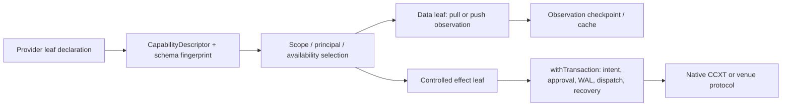

# CCXT venues：可组合能力叶的目标设计

## 范围与固定边界

固定共同边界见 [composition-contract.md](../composition-contract.md) K01-K12（能力声明、schema、数据交付、异构边界和受控效果）；本组覆盖 CCXT market codec、catalog resolution、AI market-data tools、Bitget Classic、Bybit、Hyperliquid，以及 exchange override/pack registry。源码事实来自 `services/uta/src/domain/trading/brokers/ccxt/` 的 11 个 source files；46 个 MAP 的逐项证据仍在 `analyses.json`，本设计只合并实现方向，不宣称已有实现或 native guarantee。

目标不是把 CCXT 再包装成一个更大的 universal Broker SDK。每个 provider/venue pack 声明自己的 capability tree：叶子提供精确 input、output、domain-error schema、交付方式、效果类别、资源/scope 要求、来源与 availability evidence；外层 `CapabilityDescriptor`、revision、schema fingerprint 与调用边界固定，叶子的业务树、native 参数、语言和进程协议保持开放。CCXT SDK、REST/OpenAPI、任意语言桥接进程都可以留在 adapter 内。不得以 object presence、接口存在或 legacy `IBroker`/`CcxtBroker` switch 推导幂等、原子、补偿、只读或完整 listing 保证。

固定边界是 UTA-facing boundary，而非 provider 内部实现。schema 作为声明源，TS 类型、validator、CLI/AI describe 和 capability metadata 从同一声明导出；运行时 foreign leaf 只能在边界以已校验 schema/handle 执行。新增 provider 字段应只新增或组合叶子，不修改内核 capability switch，也不迫使其他 venue 实现空方法。

## 1. 市场 identity、metadata 与查询

MAP-2FB8A60A26、MAP-00DA721165、MAP-1767B100E0、MAP-63CF278660 保留 `ccxt-contracts.spec.ts:1-112` 和 `ccxt-contracts.ts:24-111` 证明的 market fixture、spot/swap/future/option 当前映射、USDT/USDC settlement 区分与 UTC expiry 行为，但不再把 IBKR `Contract` 当 authority。market leaf 先解码 native payload，再构造 account-independent `InstrumentId` 与 `InstrumentMetadata`。native id、unified symbol、quote、settlement、expiry、contractSize、strike/right、activity 均按 provider schema 逐字段保留；只有 provider-declared extensions 进入精确 domain schema，缺失 derivative metadata、未知 type 或冲突 identity 产生具名 protocol/availability evidence，不生成 multiplier=`1` 或默认 CRYPTO。",

MAP-00DCA04091、MAP-50D001548B、MAP-249466CED5 将 localSymbol/symbol 直达、base/type/currency fallback 和当前隐式 USDT/USD/USDC preference 重新放在 `InstrumentCatalog` 的 provider-backed query capability 中；另设不执行请求的 `InstrumentSearch` leaf，保留 `CcxtBroker.searchContracts` 的 active/base/quote filter、swap>future>spot>option 与 USDT>USD>USDC preference、exact/fuzzy rank 和 derivativeSecTypes 作为带证据的候选展示 metadata。resolver 是纯的、版本化的、venue-bound 的：`Found` 才能编译 provider native key；`Ambiguous`、`NotFound`、`VenueMismatch` 和 stale catalog 各自可观察。默认 `ExplicitOnly`，只有调用方明示、并且与 venue/catalog version evidence 匹配的 policy 才能排序候选；搜索排序不授予执行或 capability。AccountScope 不参与 market identity，只有 private query 或 controlled effect 在 resolve 后绑定 scope。",

MAP-C2F10E778E 保留八个 `CCXT_TIMEFRAME` token（`ccxt-contracts.ts:14-22`），但它们只是 schema/token codec。启动时从 provider 的实际 `exchange.timeframes`、environment、SDK version 生成 capability evidence；不支持周期在 fetch 前成为 `UnsupportedInterval`。bars 是有限 pull 数据：响应必须带 instrument、interval、排序与 freshness/asOf，不能把本地接收时间或未知 finality伪装成 native guarantee。

MAP-F0A14EF839 的 order status 是受控交易效果的观察单位，不是普通行情数据的事务状态。provider leaf 保留 native status extension；只有有证据的 status/fill/remaining 关系才投影为 Filled、PartiallyFilled 等语义，未知状态保留 Unknown/raw evidence。Ack、remote outcome、成交观察和 order lookup absence 分开，DispatchStarted 后 Unknown 进入 observe/recovery，绝不能从查无订单推断未发送。

## 2. Market-data tools：数据能力不继承订单事务

MAP-433462008E、MAP-27C6050997 规定测试 fixture 的边界：typed `AccountDirectory`、`CatalogFixture`、`MarketDataService` 与受限 `BrokerConnectionTestLayer`。fixture 可以 mock network，但不能通过 `broker.exchange.markets`、强制 `initialized` 或 legacy UTA cast 绕过 schema、scope、catalog、readiness。MAP-9A16EE1A3C、MAP-808F4F2BEE、MAP-F12C6450E2 把 funding 与 order-book 作为两个可独立发现的 data leaves；请求显式选择 `DataScope = Public | Account(AccountScope)`，`SoleAuthorized` 只在唯一 Available account scope 成立，Public 不凭空创建 account/sub-account。一个 leaf 缺失不能隐藏另一个 leaf，public capability 不能伪装 private authorization。

MAP-A023467285、MAP-054253553C、MAP-CC557A8B9C 保留具体数据语义：funding 只对明确的 perpetual instrument；order book depth 默认 20、范围 1..100；bid/ask level 必须有有限、非负、instrument-qualified price/quantity；sequence、timestamp、source、freshness 和 partial/stale/unavailable 都是可观察状态。缺 rate、level 或 timestamp 不能补 0/now，transport rejection 不能逸出成未处理 Promise，也不能变成 `bids=[]` 或空成功。

这些 leaves 的副作用仅包括连接、配额、rate limit、缓存和观察 checkpoint。pull 返回有限、有 schema 的结果；未来 push leaf 需要自己的 stream-open/cancel/end/error、cursor、重放、背压和断连契约。它们不需要 order prepare/approve/compensate、订单锁或每帧交易 WAL。只有另一个 controlled effect 明确把某条 observation 作为前置事实时，才保存 observation id/version/asOf；缓存失败不会触发交易补偿。

## 3. Bitget Classic：provider-native wallet 与 namespace leaves

MAP-D084EF97BB、MAP-8BF5C81D82、MAP-2305603E29、MAP-0AD385A30A、MAP-B224A5F3E2 以 `bitget.ts:1-53` 和两个 specs 的 exact route 为事实：Classic spot 与 derivatives 是不同 scope；derivatives route 使用 `type=swap, productType=USDT-FUTURES`，spot 参数不被隐式改写，positions 只从 derivatives route 读取。`BitgetAccountFamily`、endpoint/version、scope markers、权限和 entitlement 必须来自 provider evidence；Classic 注释不能启用 UnifiedV3。未证实时 family/route/observation availability 为 unavailable，不能用 spot 成功、zero balance 或空 positions 代表 derivatives truth。

MAP-F14E67E0AE、MAP-D119678B33、MAP-D0F4B7EAFE、MAP-5AA0964109、MAP-B432FAA965、MAP-4714F941FF、MAP-56798F3CBB、MAP-A5CD6EF457 保留 six namespace 和按 source 顺序串行访问：SpotRegular、SpotTrigger、SwapRegular、SwapNormalPlan、SwapProfitLoss、SwapTrackPlan。实现上这些是 Bitget provider namespace leaves/HOF 组合，不是内核 enum 要求所有 venue 复制。每个 leaf 声明 native params、required/optional status、cursor/rate policy、row schema 与 error schema；`productType`/`planType`/trigger/trailing 等 provider extension 不被抹平。

row 必须先经 native schema 与 catalog identity 解码为 `ScopedOrderRef(scope,instrumentId,brokerOrderId)`；缺 id、symbol、scope marker 或坏数值是 protocol/partial evidence，不是安全 skip。合并结果是 C07 `Complete|Partial|Unavailable`，只有 required namespace、cursor boundary、asOf 和 absence evidence 齐全才能 Complete。namespace read 是 data observation：checkpoint、lease、backoff 和 provenance 可持久化，但不创建 approval 或 compensation。若 namespace 请求已经可能发出，Unknown 只约束该 scope 的观察/absence；不能 blind retry 或把列表缺席解释为取消。

## 4. Bybit：category 与 four-path lookup

MAP-AF6737A53E、MAP-8F4D954D91、MAP-4651A86203、MAP-A80A70DAA5、MAP-9D14A7D985 保留 `bybit.ts:1-52` 的 exact behavior：open regular、open conditional、closed regular、closed conditional 的顺序与 `stop:true`；open-order listing 显式扫 spot/swap；overlap 只在同一 scoped instrument identity 下去重。category 是 provider leaf，未声明的 category 结构上没有 query command，已声明但不可达则单独报告 availability；不能由 CCXT defaultType 的 object presence 推出完整性。",

每路输出 Found、DefinitiveAbsent、Permission/Transport/Protocol failure 等精确 leaf result。四路都只有明确 absence evidence 才能构造 `NotFoundWithEvidence`；timeout、权限、schema error 或 retention 未知一律 Unavailable/Unknown。category listing 保留 covered/missing rows、cursor/asOf、error code evidence 和 provenance；缺一类不能 Complete，也不能因 partial list 触发 absence removal。mock 的 Bybit 10016 message 不足以证明 permission，必须等待 native structured evidence。

## 5. Hyperliquid：受证据门控的 effect 与 derived data

MAP-DD9535B452、MAP-DD56DE539D 以 `hyperliquid.ts:1-41` 的注释和实现为 source evidence：CCXT 没有 native market order，market 需要 reference ticker，当前实现 last 优先、close fallback，并把 reference price 传给 default implementation。目标是一个 provider-declared effect leaf：只有 live conformance 证明 slippage/deviation/time-in-force/quote freshness 后，才可把 Market 编译成 IOC-limit。prepare 阶段冻结 quote observation、bound、scope、InstrumentId、capability revision 与 native parameters；DispatchStarted 后 timeout/response loss 是 Unknown，不能重复 createOrder。

MAP-AE93DB138F 保留 `parsePosition` 缺 markPrice、以 `abs(notional)/abs(contracts)` 浅复制的 source behavior，但目标 decoder 不抹掉 signed facts。mark 分成 authoritative、derived（带公式/input/asOf）和 unavailable；contracts=0、单位/有限性不成立或 live unit evidence 缺失时只降级展示，不能声称 authoritative valuation、buying-power precondition 或 zero exposure。position read 属 data leaf，不继承交易补偿。

## 6. Registry、default helpers 与 pack boundary

MAP-5CC2CA6EF1、MAP-AB05DEE8D4 将 `overrides.ts:1-30,215-234` 的 default-plus-override 和四个实际 exchange keys 变成 versioned provider-pack registration。pack loading 仍遵循 `InstalledImmutableRelease | ExplicitWorkspaceDev | PackLoadFailure`；manifest/API/engine/package/CCXT version 不匹配就保持 leaves unavailable，不 fallback 到 workspace、Mock 或另一个 authority。registration presence 只定位 native implementation；capability availability 由 scope、family、environment、endpoint、coverage 和 live evidence 派生。

MAP-ED742AC7B1 不再要求一套跨 provider 的全量动作集合或全量 handler 集合。每个 provider 自己组合声明的叶子：funding、orderbook、balance、position、listing、lookup、place、cancel、protection 等可分别存在或不存在。没有 cancel 就没有 cancel leaf；没有 option/protection 业务就没有对应 namespace。`CapabilityDescriptor` 只描述当前 leaf 的固定外层，输入/输出/错误 schema、native extension 和 HOF handler identity 来自该 leaf。结构性缺失与暂时 unavailable 分开，不能以 Unsupported stub 填树。

MAP-663AADE476、MAP-5B4370AB4D、MAP-F032485592 保留 default balance、regular/conditional fallback、cancel uncertainty、raw createOrder、cashQty、TP/SL 与 trailing 的 source evidence，但只在 selected provider leaf 内解释。data helper 返回 scope-bound observation/listing；controlled effect 才经过 `withTransaction`：prepare/approval、serializable plan、writer CAS/WAL、DispatchStarted、Ack/observation、Unknown recovery 和 provider-specific idempotency/compensation evidence。cancel 在第一次 request 可能已发出或 idempotency horizon 不明时先 observe，不以 `stop:true` 重发。每个 leaf 只接受其 schema 声明的 provider-native extra params/relations；未声明的 fields/variants 不出现在 schema 或 command，已接受的字段不得静默丢弃。",

MAP-6AAB1AB711、MAP-A1AE3F307F 把 positions/open-orders 留在 data listing leaves。`defaultFetchPositions` 的全账户范围、分页、mark/PnL authority，以及 OKX 单次 open-orders comment 都只绑定具体 venue/version/account evidence；其他 venue 默认 Partial/Unavailable。Complete listing 的缺席只产生逐订单 observe candidate，必须有 definitive absence 才更新 projection；data cache failure 不释放 effect lock，也不触发 compensation。

## 7. 证据、实现自由与可证伪场景

实现者可以继续使用 CCXT SDK，也可以替换为 REST、OpenAPI、独立进程或另一语言；约束只在 UTA-facing leaf boundary：schema-first decode/encode、固定 descriptor outer schema、明确 scope/resource/availability、native extension exact preservation、foreign output validation、revision/schema fingerprint、以及错误/交付/效果类别不混淆。不存在“接口存在即支持”、默认 account、默认 quote、默认 status、默认 timestamp、默认 idempotency 或默认完整 listing。

以下场景必须能推翻错误实现（MAP 引用对应上述逐项证据）：

- MAP-2FB8A60A26/MAP-1767B100E0/MAP-63CF278660：unknown type 不得变成 CRYPTO；Future/Option 缺 expiry、contractSize、strike/right 不得生成 multiplier=`1` 的 Instrument；同 native key 换 venue 或 settlement 不得误命中。
- MAP-00DCA04091/MAP-249466CED5/MAP-C2F10E778E：多 quote 未明示 policy 必须 Ambiguous；不支持 timeframe 在 fetch 前失败；catalog revision 变化不得悄悄换 symbol。
- MAP-054253553C/MAP-A023467285/MAP-CC557A8B9C：缺 timestamp/rate/level 不得补 now/0；partial/stale/sequence unknown 必须显式；public keyless data 不得伪装 private scope。
- MAP-D084EF97BB/MAP-0AD385A30A/MAP-B224A5F3E2：COIN-FUTURES、UnifiedV3 或 wrong scope 不得命中 Classic USDT-FUTURES route；response 缺 scope marker 不得绑定 wallet。
- MAP-D119678B33/MAP-B432FAA965/MAP-56798F3CBB/MAP-4714F941FF：任一 material namespace/cursor/rate evidence 缺失只能 Partial/Unavailable；缺 id row 不得静默丢弃；观察读不能以 zero/empty 伪造完整性。
- MAP-8F4D954D91/MAP-4651A86203/MAP-A80A70DAA5/MAP-9D14A7D985：Bybit category/path timeout 或未证明 code 不得变成 Complete/NotFound；四路明确 absence 之前不能声明 absent。
- MAP-DD9535B452/MAP-DD56DE539D/MAP-AE93DB138F：Hyperliquid quote/bound/freshness evidence 缺失时无 DispatchStarted；未知 outcome 不重复 createOrder；derived mark 不得变成 authoritative。
- MAP-5CC2CA6EF1/MAP-ED742AC7B1/MAP-AB05DEE8D4：新增一个 provider field/leaf 应同时改变 schema、validator、metadata/help；不存在的 option/cancel leaf 不应出现；pack registry 存在但未声明 capability 时调用必须失败而非命中 default handler。
- MAP-F032485592/MAP-5B4370AB4D/F0A14EF839：错误输入在 native handler 前拒绝；DispatchStarted 后 timeout 只能 Unknown/observe；Ack 不得直接当 Filled/Cancelled；ReturnToAgent 必须 durable 记录 `Discard|KeepSuspended|Rearm|Revise|RequestSubmission` 之一，任何暂停/退回分支都不得创建 broker dispatch。

这些场景是设计阶段的 acceptance obligations，不是已经运行的证明。native vocabulary、权限码、cursor/retention、idempotency、Hyperliquid slippage/units、Bitget family/account markers 等 36 个 empirical-retained questions 仍保留在 `questions-closure.json`，不得以抽象名称宣称已解决。
