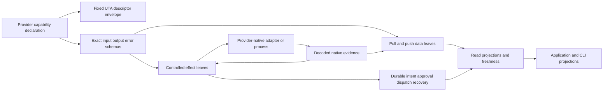

# CoreAccount：UnifiedTradingAccount 迁移设计

> 范围：`UnifiedTradingAccount.ts` 与 `UnifiedTradingAccount.spec.ts` 的 93 个 MAP。本文是当前目标方向，不是生产迁移方案，也不是运行证明；逐项 source evidence、保留行为、未决 native 证据和未来 falsifier 以同目录 `analyses.json` 为准。原始 question-inputs 和 reviews 不在本组修改范围。

## 1. 设计基线与现状证据

本设计以 `composition-contract.md` 的 K01-K12 和 `analyses.json.designBasis = "capability-composition-v1"` 为固定基线。`UnifiedTradingAccount` 当前把 broker、TradingGit、guard pipeline、连接监听器、health 计数器、恢复 timer、sub-account cache、catalog 读取、accounting reconciliation 和 Git staging 放在同一个对象中。具体 source evidence 包括：

- `UnifiedTradingAccount.ts:1-37` 同时导入 Decimal、具体 IBKR `Contract`/`Order`、`IBroker`、TradingGit、projection、guard 和 side-effect `contract-ext`；这是现状耦合证据，不是要求所有 provider 共享 IBroker 或 SDK。
- `:157-200` 的 closure 和 dispatcher 把 Git pending ids、三路 broker read、`Operation` switch、close live-check 与直接 SDK mutation 串在一起。
- `:642-724` 的 cache/default sub-account、scope 路由和下单字段保留了账户写入所需的安全事实，但不能继续把未探测状态当作单账户。
- `:827-1124` 的 sync、external-order、PnL 和 wallet reconciliation 混合了远端观察、Git commit 和 accounting projection；查询不应再写执行状态。
- `:1132-1261` 的 market/catalog、capability、saved-state、export 和 close lifecycle 是多个不同资源的边界，不能由一个健康 boolean 或一个全局 SDK object 代替。

目标依赖方向如下；箭头表示数据/调用方向，而不是要求 provider 内部采用某一种语言或 FP 库：

K01-K12 固定的是 UTA-facing 元契约、能力身份、schema 指纹、交付方式、效果类别、权限/资源要求、availability 和 evidence 语义。固定边界**不是**一个全局 `ActionContractMap`，也不是要求每个 provider 都实现 Place/Modify/Cancel/Close 或用 `Unsupported` 空实现补齐。Provider 可以保留 SDK、REST/OpenAPI、网关、独立进程或任意 native protocol；只需在选中的 capability leaf 边界提供可校验的输入、输出、领域错误、交付和取消/恢复契约。source 中的 `IBroker` 与 global `Operation` switch 继续作为 `currentBehavior/sourceEvidence`，不进入目标模型。

## 2. Data plane 与 controlled-effect plane

两条路径共享 capability descriptor、资源权限和 schema validation，但不共享交易事务：

| 路径 | CoreAccount 目标 | 不得推导 |
| --- | --- | --- |
| 数据读取/订阅 | `AccountSnapshot`、`PositionObservation`、`OrderObservation`、quote、bars、instrument/catalog、market session 等声明叶子；`pull` 返回有限结果，`push` 返回有生命周期的帧、错误、结束和取消 | 不得从数据成功推导交易授权、幂等、原子性、成交或跨重启 replay |
| 受控交易效果 | 只对 Place/Modify/Close/Cancel 或 provider 声明的其他效果包装 intent、prepare、approval、dispatch、observation、recovery | 不得把普通 cache/read/stream 置于 prepare/approve/compensate、订单锁或每帧 WAL |

公共 `Candle`、`Instrument`、`News`、`NewsGroup` 和市场 session 不凭空携带账户或 sub-account。需要账户上下文的叶子显式声明 `AccountScoped`/`AccountScope`；公共叶子显式声明 `Public`；不能用缺失字段猜单账户。Account/position/order **事实观察** 因为属于账户事实而带 scope，但它们仍是数据交付，不自动成为一笔交易。

`pull` 可以返回 partial、cursor 或 freshness 结果；`push` 必须声明 frame/control schema、顺序、缺口、背压、结束、取消和重连语义。查询、catalog refresh、snapshot merge 和 accounting fold 读取 projection 或追加观察事实，但不会取得交易锁或制造补偿。只有一个数据事实被选为交易决定的输入时，才在 effect plan 中保存选中的 evidence、触发消费身份和决定版本，而不是把整条行情流事务化（MAP-81E9BDAC4E、MAP-8B7A06270E、MAP-229EF12AA4、MAP-36B15212DF、MAP-5C48EEF269）。

## 3. Capability declaration、schema 与 provider freedom

每个 leaf declaration 计算：

1. 稳定 capability identity、命令路径、描述、schema version/fingerprint；
2. 精确 input/output/domain-error schema 与 delivery（finite pull 或 resource-scoped push）；
3. `effectClass`、权限/资源要求、当前实例/account context、来源和 availability evidence；
4. 若为 controlled effect，prepared payload、ack、observation、recovery 和 compensation schema，以及 handler identity。

声明是 schema、静态类型、边界校验、metadata 和 CLI describe/help 的单一来源。跨进程 wire 用可导出的 JSON Schema；静态 provider 可从 Zod 4.3.6 推导类型，动态 provider 在反序列化入口保留 `unknown`，经 schema validator 后才进入命名 domain type。schema 不携带闭包；等待、dispatch、恢复只保存版本化描述、参数与实现身份。

CoreAccount 不规定 provider 内部的类层次、函数式风格、native 参数命名或 SDK 版本。Provider-specific 字段不能因公共接口没有对应 optional field 而丢失：native order relation、zero/sentinel、TIF、session、execution cursor、instrument identity、error code 和 precision 都由对应 leaf declaration/adapter 精确声明。`CapabilityDescriptor` 的固定 envelope 允许这些 schema 开放扩展，同时保留 schema fingerprint 以阻止发现后悄悄替换语义（MAP-DC4D7B4995、MAP-2965B55AF1、MAP-760AAF71FB、MAP-124109541E、MAP-C1727C9E38）。

## 4. AccountScope、identity 与授权

### 4.1 Scope 只约束账户相关能力

`AccountScope = {accountId, subAccountId}` 只用于账户状态、订单事实、交易 intent/effect、冲突 key、scheduler partition、approval 和 observation identity。`ScopeDirectory` 有 `Discovering | Available(non-empty explicit scopes) | Unavailable(reason)`、revision 和 connection generation；单 wallet 也只有在目录明确返回一个 scope 后才能被解析。目录未探测、多 wallet 缺 selector、未知 selector、instrument route 不匹配或 revision/generation 变化都必须返回具名失败并要求 rediscovery/reprepare。审计文本 `[sub:...]` 只是 projection，永远不能反解析为 dispatch target（MAP-4144027899、MAP-F0694AE4F6、MAP-82E54D80F1、MAP-7C856D1CDF）。

公共 instrument/catalog/market leaves 只携带 `Public` 或自身 schema 声明的 context。`InstrumentRef` overlay 和扩展请求区分 `Absent` 与 explicit zero；adapter 为每个 native 字段声明 zero/sentinel/permission 规则，不能用通用 `Record` spread、truthiness 或 SDK 默认值制造账户/工具字段（MAP-BA5730BE0C、MAP-7B3CD75E10、MAP-6227B2AFB6、MAP-D37BF3A34F）。

Canonical `AccountId`、`ConnectionId`、`InstrumentId`、`BrokerOrderId` 与 `NativeIdentity` 使用 branded codecs。native lookup descriptor 可为重启观察保存，但不是跨 provider canonical identity；credential material、secret value 和 native SDK object 不进入 AccountScope、journal 或审计。

### 4.2 Draft、approval 与 execution capability 分离

Actor/Principal、policy binding、AccountScope、capability availability 与 risk facts 是不同输入。funded read-only 可以按 policy 建立 non-executable `ReviewDraft` 或 preparation preview；keyless 的源行为继续拒绝交易 stage。只有带有效 `ExecutionCapability` 的 actor 才能生成 executable prepared plan、approval result 和 queued job。writer 在 approval/queue 前以 plan digest、scope revision、policy/capability revision 和 actor identity 做 CAS；transport body、`readOnly`/`keyless` boolean、tier label 或公共数据成功都不是授权（MAP-7F92A5F120、MAP-520CFD3057、MAP-DB785C57D5、MAP-FFFCA4765D）。

## 5. Controlled trading effects：组合而非订单全集

### 5.1 Order leaf 与 HOF/schema composition

订单仍是可组合的语义单位，不是内核枚举的完整全集。一个 provider 可以声明 `PlaceOrder` leaf，其 schema 由基础 size/side/time/price 与 provider extensions 组合而成；另一个 provider 可以不声明某个 relation 或整个 cancel leaf。局部互斥 union（例如 `Units | Notional`、`pull | push`）可以表达安全前置条件，但不得手写 Market/Limit/Stop/Trailing 与 protection/TIF/venue 的笛卡尔积。

共享的语义名称（例如 TimeInForce、ProtectionSpec、OrderRelations）不是一个跨 provider 的封闭输入全集。选中的 provider leaf 只在自己的声明中组合它支持的参数变体；不支持的参数变体不进入该 leaf 的 schema，在 schema 边界被拒绝，而不是靠运行时 availability 把它伪装成可调用选项。Availability 只描述已声明 leaf 在当前实例/context 是否可用。

CoreAccount 必须保留 source 已接受的精确字段：notional、TRAIL LIMIT、initial stop、GTD、outside-session、parent/OCA、TP/SL、native relation 和 provider-specific extensions。它们不是跨 provider 的默认合法组合：合法性由当前 leaf schema、HOF 前置条件和 capability evidence 决定；不得额外推测“非市价不能 notional”或把一个 provider 的字段提升为全局约束（MAP-4221233892、MAP-27891FCB27、MAP-079C9ED6FF、MAP-49119F272B、MAP-7864431508）。

`withX`/composition function 必须保留已有 fields、扩展 schema、精确 output/error/resource 类型和 schema fingerprint，不能退化为 `Order => Order`，也不能把 provider extension 抹掉。native SDK `Contract`/`Order` 只在 selected adapter/foreign process 的最后一跳创建；prepared payload 只保存 serializable tagged values、native lookup descriptor、provider plan version 和 evidence。

保护是可选的 controlled effect wrapper：provider 可在其 selected leaf schema 中声明 protection 参数，并声明 native atomic group 或依赖的 parent/leg steps；也可不声明 protection 参数/leaf。每条 leg 保存 identity、relation、idempotency/observation evidence 和 `CompensationAssessment`。对已声明但缺 native evidence 的 relation，返回 `NativeAtomicityUnavailable`/`RelationCapabilityUnknown` 或 policy 明确批准的 non-atomic plan；schema-absent relation 在 schema boundary 被拒绝，绝不能只发 entry 却宣称保护已设置（MAP-8DFEA924F8、MAP-189E766E12、MAP-E59A917F82）。

### 5.2 Durable execution 与 unknown barrier

受控 effect 的通用骨架是 `Draft -> Preparing -> Prepared -> AwaitingApproval -> Queued -> Executing -> Reconciling/RecoveryRequired -> terminal`，这是局部 safety lifecycle，不是要求 provider 采用同一内部实现。`Approved` 是 approval command/result，不是额外的 universal broker action。

writer 在调用 handler 前持久化 command identity、plan digest、scope/capability/policy revision、preconditions、locks、`DispatchIdentity` 和 `DispatchStarted`。handler 返回的 acknowledgement 只表示其声明层级的接受；fill、cancel、replacement、exposure 与最终条款必须由 observation evidence 结算。超时、坏 response、进程断开或缺少 idempotency/absence evidence 都是 `OutcomeUnknown`，保留 lock、禁止 blind redispatch，进入 observe/recovery。既有 CAS、WAL、idempotency、reconcile、补偿和 shipped migration 规则只适用于此 effect path，不扩散到 Candle/Instrument/News/stream/cache（MAP-177DF827E5、MAP-189E766E12、MAP-F5D4E6C3D4、MAP-7A53419830、MAP-1FA95F90E8、MAP-6089771399、MAP-DBBD7BE69C）。

`ClosePosition` 在 prepare 固化 `Quantity | All`、ExposureSnapshot、unit、scope 和 exposure evidence；All 不是重放时重新读取的 optional undefined。monotonic native version 若存在则使用，否则只能按明确弱策略使用 canonical fact hash；strong CAS 不得把 hash 冒充版本。Modify 先以 provider schema decode patch，再与 ExistingOrder before-image 合成完整 replacement；provider 未声明 identity/queue/partial-fill/restore 语义时，保留 before-image 并进入 semantic-loss/recovery，而不是假定 amend 可逆（MAP-F5D4E6C3D4、MAP-1F652F4091、MAP-D615CBA78E、MAP-100C8043F8）。

### 5.3 ReturnToAgent

触发来源（CLI、AI、认证调用或某个订阅事件）只是 evidence，不是授权。若冻结策略选择 `ReturnToAgent`，系统必须原子消费该 activation、暂停 binding、保留未发送 intent/evidence、写入稳定 `ReviewRequest`/outbox identity，**不创建 broker dispatch**。通知必须包含 scope/revision、订单参数、触发事件/谓词、缺口、为何复核、旧 approval 是否失效、保留期限和可接受 command schemas；写 outbox 不等同于 Alice 已收到。

回复只能是显式 command：未发送时 `Discard`、带截止时间的 `KeepSuspended`、新 epoch/事件起点的 `Rearm`、重准备重授权的 `Revise`、或走正常授权路径的 `RequestSubmission`。迟到回复使用 review identity/expected revision CAS；保留草稿不能延长旧 approval，也不能自动恢复或自动下单（MAP-E59A917F82、MAP-152865F791、MAP-7F92A5F120）。已发送或 outcome unknown 的订单不进入草稿丢弃/重提路径，只能走 observation/recovery。

## 6. Data observations、accounting 与 catalog

### 6.1 Account snapshot 与 order observation

Account/position/order 读取由 typed broker-spi leaves 观察，observation worker 持久化 source sequence、observedAt、freshness、scope 和 checkpoint；query 只读 projection。三路读取若共用 writer checkpoint 才能标 `AtomicCheckpoint`，否则标 `NonAtomicPerSource`；source unavailable 是 `IncompleteObservation`，不是空列表。pending 是 order projection 的 derived status，不是 scheduler authority（MAP-81E9BDAC4E、MAP-8B7A06270E、MAP-A4B5DBBF39、MAP-6E4258767C）。

Order listing/getOrder 必须返回 scope、namespace coverage、cursor、freshness 和 absence evidence。`Complete | Partial | Unavailable` 只描述该次观察范围；Complete absence 也只是选择 per-order confirmation，不能直接取消/拒绝。null、空 listing、timeout 或未覆盖 held/conditional/algo/external namespace 时保留 `StillWorking | Unknown`、durable observe job 和 conflict lock（MAP-C11719131D、MAP-58E656CE5A、MAP-B3655A0EA7、MAP-C735359708、MAP-5C48EEF269）。

execution/fill reducer 只有在 adapter 声明 execution identity、cursor/version 以及 cumulative/delta 语义时才产生 `FillObservation`。位置 reconciliation 只产生带 `valuationOnly: true` 的 `ReconcileBalance`；它不能冒充 remote fill、不能由 query 触发、不能因 cache failure 发起补偿（MAP-D4F5440582、MAP-D4AEAAD74E、MAP-D19FB60347、MAP-044AE7B4DD、MAP-0AF3B67931）。

### 6.2 Accounting 与 market/catalog

Account PnL 使用 currency-qualified `Money` 和显式 `BrokerReported | Derived | DerivedUnavailable`。同币种可用 `IdentityConversion`；跨币种需要 provider/pair/as-of/freshness/max-age/rounding evidence。缺失/过期 FX 保留 broker value 并标 derived unavailable，不能 1:1、zero 或 stale-as-fresh。avgCostSource 缺失是 `Unknown`，mark fallback 是 valuation estimate；fee/lot/short/precision 不确定时进入 `UnsupportedPolicy`/quarantine（MAP-FE83587457、MAP-E8B780DC9D、MAP-4189A98E6F、MAP-5B98644210、MAP-E991350693、MAP-EE6C7F95C5）。

Quote/history/clock、expand/search/refresh/details 是可独立发现的 data/catalog leaves。MarketClock 的 target 是 venue calendar 或 instrument session；AccountScope 可以作为授权/context，但成功不得重置 account-write health。Hub key 保持 directory semantics，不自动路由成 tradeable leaf；refresh 无原生支持返回具名 unavailable，不伪造 Fresh。公共 search/expand/details 显式使用 `Public` context；需要账户路由的请求才声明 `AccountScoped`（MAP-229EF12AA4、MAP-188B023F53、MAP-36B15212DF、MAP-ED33D20EB9、MAP-EA70A361BF、MAP-D37BF3A34F、MAP-BA5730BE0C）。

## 7. Health、startup、resource lifecycle

`RuntimeHealth` 只描述进程启动/恢复/停止，固定为 `Initializing | Recovering | Ready | Stopping | Failed`；scoped `BrokerHealthView` 描述 `ConnectionId/CapabilityKind` 的 transport/read evidence。健康、capability availability、authorization 和 transaction recovery 是独立 projections。public market success 不能清掉 account-write failure，connection restored 只触发 probe，不能清除 `DispatchStarted/Unknown` 或授权重发（MAP-B047ACC95D、MAP-C7ACDD9C7A、MAP-D3C71D3098、MAP-EC8C814F12、MAP-AB9C95B763、MAP-DB785C57D5）。

连接 acquire/retry/heartbeat、listener、timer、subscription 和 provider SDK 都是 scoped resources。保留 source 的 1.5s bounded cold-start、exponential retry、keyless public probe stop、funded private-read degradation 和 close cancellation，但 timer 是 resource readiness，不是 durable execution state。composition root 关闭顺序是：stop admission -> interrupt/join scheduler/reconnect -> flush writer -> release broker layer；若在 `DispatchStarted` 后关闭，重启必须恢复 Unknown/observe，不可把 close 当成功或安全重试（MAP-12EBFAE5E6、MAP-00D45A7149、MAP-70C8DB0025、MAP-3714A83594、MAP-0A714E7908、MAP-A0A0E5EBC7、MAP-463948E2EB、MAP-58BE22469E、MAP-B4A46EAD8C、MAP-03A2A17A58、MAP-7DA2BE5D55）。

## 8. Retained evidence、empirical gates 与实现自由

本设计保留所有 source facts：TradingGit commit/hash 的历史可见性、stage/commit/push/reject 的用户体验、multi-wallet selector safety、Decimal precision/string round-trip、notional/trailing/GTD/outside-session/TPSL inputs、same/mixed-currency accounting、poll bands、external-order visibility、guard refusals、health thresholds、cold-start timing 和 test simulation controls。Audit export（MAP-6B72864B5E）保持只读 projection，simulation controls（MAP-1EF01B52AD）保持 test-only observation source。保留行为不等于保留 Git、SDK object、global switch 或未证实 native guarantee。

问题 closure 中 34 条原始问题记录继续保留题目和 evidence；其中 20 条仍是 empirical prerequisite。未决重点是：adapter-native place/cancel/replace idempotency and absence、TIF/relation/protection semantics、execution/fill cursor、listing namespace/null coverage、zero/override/precision/error mapping、historical export inventory、avg-cost authority、fee/lot/short accounting policy。每一项在 `analyses.json.openQuestions` 或 closure resolution 中写明缺证据时的 unavailable/unknown/quarantine 行为，不用抽象宣称已解决（MAP-7A53419830、MAP-1FA95F90E8、MAP-49119F272B、MAP-8DFEA924F8、MAP-D4F5440582、MAP-C11719131D、MAP-C735359708、MAP-92B40EBFD5、MAP-4189A98E6F、MAP-5B98644210、MAP-EE6C7F95C5、MAP-12EBFAE5E6、MAP-7864431508、MAP-5C48EEF269、MAP-044AE7B4DD、MAP-D37BF3A34F、MAP-C1727C9E38）。

实现者可以选择 TypeScript、另一种语言、SDK、REST、独立 process 或不同内部 data structure；边界必须满足固定 descriptor/schema/evidence/availability 语义。不得把 `unknown` cast 成静态 provider 类型，不得把 native defaults/field presence 推导成保证，不得把 provider 没有的 leaf 伪造成 Unsupported 全集，也不得把资源生命周期 callback 序列化进 journal。

## 9. 可证伪场景与迁移验收

以下是未来实现 gate 的 falsifier，不是本次执行结果：

1. 一个新增 provider 字段只改 declaration，却同时改变不了 validator、static type、descriptor/help 和 CLI schema；或新增 leaf 迫使别的 provider 增加空 handler，说明 K01/K02 失败（MAP-DC4D7B4995、MAP-760AAF71FB、MAP-C1727C9E38）。
2. 公共 instrument search/quote/clock 在没有 `AccountScoped` 声明时被填入默认 account/sub-account，或 account context 成功改变 market clock/health，说明 Public/Account boundary 失败（MAP-229EF12AA4、MAP-36B15212DF、MAP-188B023F53）。
3. multi-wallet directory 为 `Discovering` 或 selector 缺失时生成 Prepared plan；或 provider 没有 cancel/protection leaf 却在 CLI 显示该命令，说明 scope/capability absence 失败（MAP-4144027899、MAP-F0694AE4F6、MAP-82E54D80F1、MAP-C1727C9E38）。
4. provider 声明一个合法 notional/trailing/native extension 组合时，shared compiler 因跨-provider 推测拒绝；或者 adapter 转换时丢掉未列在公共类型的字段，说明 K03/K04 失败（MAP-4221233892、MAP-7864431508、MAP-1F24B04239）。
5. `pull` 查询取得交易锁、`push` 每帧写订单 WAL、cache failure 触发 compensation，说明 K05/K08 边界失败（MAP-81E9BDAC4E、MAP-C11719131D、MAP-D19FB60347、MAP-044AE7B4DD）。
6. `DispatchStarted` 后 timeout 再 place/cancel/close，或 unknown 通过 reconnect health 自动结算，说明 Unknown/RecoveryRequired barrier 失败（MAP-189E766E12、MAP-7A53419830、MAP-E59A917F82、MAP-C7ACDD9C7A）。
7. ReturnToAgent 生成了 broker dispatch、自动批准、丢弃已发送订单或重复投递新 review identity，说明 K09/K10 失败（MAP-E59A917F82、MAP-152865F791）。
8. partial listing/无 null evidence 将订单标记 cancelled，mark-price drift 生成 FillObservation，或缺 FX/fee/lot/precision 仍写 authority-dependent basis，说明 evidence boundary 失败（MAP-58E656CE5A、MAP-C735359708、MAP-D4AEAAD74E、MAP-E991350693）。
9. funded read-only draft 被 approve、keyless stage 生成 job、market-clock success 清除 account-write failure，说明 authorization/capability 分区失败（MAP-7F92A5F120、MAP-520CFD3057、MAP-AB9C95B763）。

## 10. MAP 覆盖索引

以下索引覆盖本组全部 93 个 MAP；每条的 sourceEvidence、currentBehavior、problem、targetModel、pureTransitions、effectBoundary、durability、errors、preservedBehavior、replacementSteps、verificationCases、openQuestions 和 K rationale 在 `analyses.json` 逐项展开。

**模块边界与启动：** MAP-DC4D7B4995、MAP-2965B55AF1、MAP-076B11499E、MAP-7ACD53B4BE、MAP-8B7A06270E、MAP-124109541E、MAP-ABF83BBE4D、MAP-B4A46EAD8C、MAP-03A2A17A58、MAP-EC8C814F12、MAP-12EBFAE5E6、MAP-00D45A7149、MAP-70C8DB0025、MAP-3714A83594、MAP-0A714E7908、MAP-A0A0E5EBC7、MAP-463948E2EB、MAP-B047ACC95D、MAP-C7ACDD9C7A、MAP-D3C71D3098、MAP-A0FAA65E2D、MAP-AB9C95B763、MAP-DB785C57D5、MAP-58BE22469E、MAP-7DA2BE5D55。

**身份、scope、授权：** MAP-7AF82C011B、MAP-6227B2AFB6、MAP-520CFD3057、MAP-F0694AE4F6、MAP-82E54D80F1、MAP-7B3CD75E10、MAP-4144027899、MAP-7F92A5F120、MAP-EE6C7F95C5。

**动作、验证与 protection：** MAP-760AAF71FB、MAP-1F24B04239、MAP-7864431508、MAP-100C8043F8、MAP-603C98B3C5、MAP-A0C78D8C68、MAP-D615CBA78E、MAP-4221233892、MAP-27891FCB27、MAP-079C9ED6FF、MAP-49119F272B、MAP-8DFEA924F8、MAP-062ABEC10D、MAP-1F652F4091、MAP-4303E3E80A、MAP-FFFCA4765D、MAP-189E766E12、MAP-F5D4E6C3D4、MAP-7A53419830、MAP-1FA95F90E8。

**Journal、approval、history 与 scheduler：** MAP-DBBD7BE69C、MAP-7C856D1CDF、MAP-E59A917F82、MAP-152865F791、MAP-502614A0DB、MAP-C11719131D、MAP-6E4258767C、MAP-80F3D97161、MAP-CBFF2224B1、MAP-5C48EEF269、MAP-6089771399、MAP-177DF827E5、MAP-92B40EBFD5。

**状态、observation 与 accounting：** MAP-81E9BDAC4E、MAP-FE83587457、MAP-E8B780DC9D、MAP-A4B5DBBF39、MAP-D19FB60347、MAP-044AE7B4DD、MAP-0AF3B67931、MAP-8DC763EDB9、MAP-D4F5440582、MAP-58E656CE5A、MAP-B3655A0EA7、MAP-C735359708、MAP-D4AEAAD74E、MAP-4189A98E6F、MAP-5B98644210、MAP-E991350693。

**Catalog 与 market boundary：** MAP-BA5730BE0C、MAP-229EF12AA4、MAP-188B023F53、MAP-36B15212DF、MAP-ED33D20EB9、MAP-EA70A361BF、MAP-D37BF3A34F、MAP-C1727C9E38。
