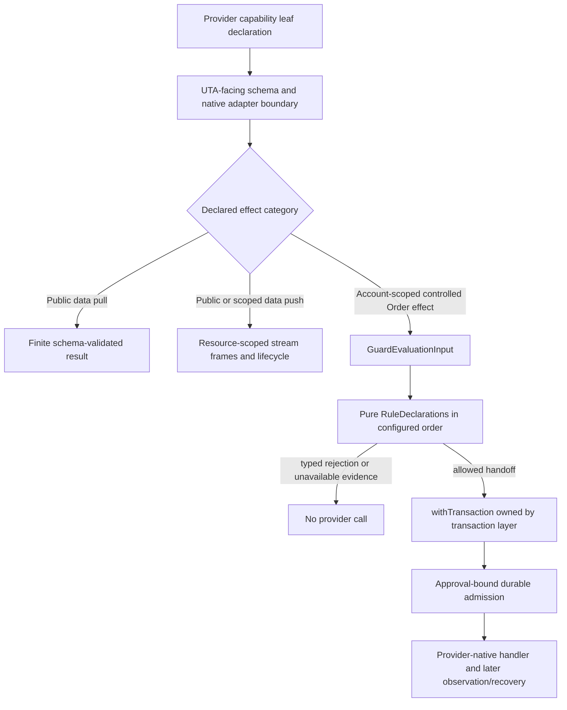

# Guards：声明式受控效果守卫设计

## 1. 范围与源码事实

本组覆盖 `services/uta/src/domain/trading/guards/` 的八个文件和 23 个 MAP。本文是目标设计，不是已经接入的 provider 协议、交易执行实现或运行验收结果。所有现有行为仍以源码为准；本轮只重写设计，不做生产迁移。

源码显示的旧边界必须保留为调查证据，但不能直接成为目标架构：

- `UnifiedTradingAccount.ts:180-200` 构造了一个直接调用 `IBroker` 的 dispatcher，用手写 action switch 分派 place/modify/close/cancel，再以 `createGuardPipeline` 包装并装入 `TradingGit.executeOperation`。这是现存实现事实，不是要求所有 provider 共享一套 SDK 或完整订单处理器。
- `guard-pipeline.ts:13-37` 在非空 guard 时并发读取 positions/account、构造 `GuardContext`、按数组顺序等待 nullable string 检查，全部通过后才调用 dispatcher；空数组直接返回 dispatcher 引用。
- `TradingGit.ts:141-185` 顺序执行 staging 中的 operation，把抛出值压成 `OperationResult.error`，之后读取状态、写 commit 并清空 staging。它没有把 durable admission、provider dispatch、Unknown recovery 分开。
- `types.ts:1-21` 通过 Git/broker 兼容 shim 将 native Contract/Order/Position/AccountInfo 带进 guard，并以 `Promise<string | null>` 表达任意检查。`src/core/config.ts:436-454` 仍只保存 raw `type` 和 `options`。
- `cooldown.ts:1-32` 使用 `Date.now`、进程内 map 和 raw symbol；`max-position-size.ts:1-49` 在无法估值的新 symbol、非正净值时 fail open；`symbol-whitelist.ts:1-25` 对 options 做 unchecked cast，并把 `unknown` 当作允许。对应测试中的 20%/30%、25% 默认、59_999/60_000 边界、AAPL/TSLA、unknown allowance、空 guard identity、首个拒绝和并发读取，都是 preserve-vs-correct 基线，而不是目标运行结果。

这些证据分别由 `MAP-B4E6F4C1A3`、`MAP-F123F6082F`、`MAP-EC7E347D9E`、`MAP-3B189C535B`、`MAP-23766FB528`、`MAP-3921C05A55`、`MAP-4933588230`、`MAP-7409CE214D`、`MAP-909C3AD7DA`、`MAP-97E0672862`、`MAP-4A48C821C3`、`MAP-ADFBE7F5CF`、`MAP-90A054EDC1`、`MAP-865F7C9623`、`MAP-E8C4D090C3`、`MAP-FB69BBC6D0`、`MAP-38E91ECD6A`、`MAP-ACA43262AC`、`MAP-1D7814E6DD`、`MAP-381B0ECC7A`、`MAP-CD34F7EFDA`、`MAP-2DA2B0FD1D`、`MAP-1CDFD8E4DA` 分别保留在 `analyses.json` 中。

## 2. 目标边界：守卫只组合受控效果

Guards 的目标是声明式的受控交易效果准入，不是新的 broker SDK，也不是所有 UTA 能力的总接口。概念上的 scope 是 `Public | Account(AccountScope)`：只有读取账户事实、订单事实或提交受控交易效果时才要求显式 `AccountScope`；公共 Candle、Instrument、News、NewsGroup 不得凭空补出账户或 subaccount。数据能力若需要其他 scope，使用它自己的声明，不借用交易 scope。

`Order` 是可组合的语义单位；provider 的订单字段、保护条款、期限、parent/OCA、venue identity 或其他 native 参数作为该叶子精确声明的扩展对象保留。Guards 不手写 Market/Limit/Stop 等全量笛卡尔积，也不把一个 provider 的字段扩散成所有 provider 的必填字段。没有某个 provider 能力就没有对应叶子；provider leaf 若只声明部分参数 variant，其余 variant 从该叶子的 input schema 中缺席；已声明但暂时不可用的叶子或参数保留精确 schema 并单独报告 availability；不以空 handler 或伪造 Unsupported 填满能力树。

每个守卫声明（`RuleDeclaration`）由自己的版本化 config、rule input、所需 facts、pass-fact、decision/issue schemas，以及适用的效果叶子和资源要求组成；provider leaf 的精确 input/result/error schemas 仍由该叶子声明并由 HOF 保留。schema 是声明源，静态类型、校验器、能力/帮助元数据由声明推导。组合根可以装载当前三个 built-in，也可以在有独立证据时装载 typed extension；它不能通过进程全局 `Map` 或后写覆盖改变现有计划。

`withGuardPolicy(ruleDeclaration, providerHandler)` 是可选的组合器：它在 provider 叶子调用前评估纯守卫，并扩展该叶子的错误结果，同时保留 provider 精确的输入、输出和 native extension。它不是 `Order => Order` 的退化转换，也不从 handler 形状推断幂等、原子性、补偿或沙箱安全。该 HOF 只应用于声明为 controlled effect 的叶子；公共数据叶子使用自己的 pull/push schema 与生命周期。只有需要交易副作用的叶子再由交易拥有者使用 `withTransaction`；Guard barrel 不拥有 writer、scheduler、broker dispatch 或数据流资源。

## 3. 三条当前风险规则

### 3.1 Cooldown：纯评估，准入提交时才消耗

当前 cooldown 以 60_000 的无单位数字、`Date.now` 和 `getOperationSymbol` 为 key，并在后续 guard 或 broker 失败前写入 map。这些事实由 `MAP-B4E6F4C1A3`、`MAP-F123F6082F`、`MAP-4933588230` 保留。

目标是一个版本化 `CooldownPolicy` 声明：缺省值仍是 canonical 60_000 ms，零是显式 no-cooldown；schema 拒绝负数、非有限值、错误单位和无法 canonicalize 的值。对 account-scoped controlled Order effect，key 为 `AccountScope + canonical InstrumentId`；instrument resolution 不能用 literal `unknown` 代替。纯 assessor 接收显式 `Instant`、不可变 accepted-activity observation、policy 和叶子声明的适用性，返回带 retry/remaining 证据的 `CooldownActive` 或 reservation candidate。真正不适用的 provider leaf 才返回 `NotApplicable`。

候选在准备阶段只能进入可序列化计划和冲突事实。按 C08，只有绑定且获批的执行意图在 JournalWriter 中与 queued intent/job、reservation 和 approval-bound receipt 原子提交时才消耗 cooldown；broker reject 或 Unknown 是后续远端结果，不抹掉已提交的准入事实。ReturnToAgent 是交易层的可恢复分支：未发送 intent 保留并创建复核 outbox，不创建 broker dispatch，也不把回复猜成批准。pull/push 数据没有 cooldown WAL、锁或补偿。

### 3.2 Max exposure：单位化估值，未知证据 fail closed

当前实现只按 raw display symbol 找第一笔 position，混合 cashQty、quantity、marketPrice 和 `UNSET_DECIMAL`，对新 symbol 无法估值时让 `addedValue=0`，并在 net liquidation 非正时把百分比设为零。`MAP-90A054EDC1`、`MAP-865F7C9623`、`MAP-3921C05A55` 保留 25% 默认、Decimal 精度、existing+new 以及 20%/30% 测试，同时明确纠正这些 fail-open 路径。

目标 MaxExposure 声明只消费其 provider effect leaf 明确提供的事实：AccountScope、canonical InstrumentId、base-currency equity、带 sequence/as-of/provenance 的 signed ExposureSnapshot、该叶子声明的 sizing/valuation extension、multiplier/FX evidence，以及 durable pending controlled-effect intents。选定的策略是 GrossNotional：绝对聚合已标记 exposure 和可立即执行的 parent notional，不用 buy/sell 净额抵销。现有 marked exposure 按其 valuation provenance 消费；若 `marketValue` 已含 multiplier，不得重复应用，只有 raw quantity/order variant 明确需要时才使用该叶子提供的 multiplier evidence。缺 price、multiplier、FX、identity、有效正 equity 或必要 native term，返回具名 `ValuationUnavailable`、`InvalidEquity` 或 `PreconditionFailed`，不得简化成另一个订单类型或默认零。一个 provider 的保护/期限/组合条款只有在它自己的声明和证据支持时才参与估值；未声明的字段或 variant 不进入该叶子 schema，已声明但暂时不可用时保留其精确 schema 并报告 availability。

该规则只负责纯计算。C08 approval-bound writer 才能写 exposure reservation，且必须在 writer recheck 时纳入同 scope 的未结算受控意图。数据 reader/cache/stream 永远不创建 exposure reservation 或 compensation。Guard 不宣称任何 provider 的 native atomicity、reduce-only、幂等或成交保证。受控效果的风险降低豁免须由实际 effect risk、授权与叶子声明共同证明，不能按全局 action name 跳过。

### 3.3 Whitelist：canonical identity，unknown 不授权

当前 `symbol-whitelist.ts:4-25` unchecked cast options、抛 generic Error、使用 raw Set，并让 `getOperationSymbol` 返回的 `unknown` 通过；`MAP-2DA2B0FD1D`、`MAP-1CDFD8E4DA` 与测试中的 AAPL/TSLA、空列表和 cancel unknown allowance 是精确证据。

目标 policy schema 要求非空 canonical InstrumentId 集合、显式适用 scope、版本和 fingerprint。display symbol、aliceId、conId 或 native Contract 的解析属于 provider/application 边界，必须用 catalog/order before-image 证明唯一性。纯 membership assessor 只比较已解析 identity；目标-bearing controlled effect 缺 before-image 或存在多个候选时返回 `InstrumentResolutionRequired`/`InstrumentAmbiguous`，不把失败解析视为不适用。公共 Candle/News/Instrument 查询不经过订单 whitelist。

## 4. 受控效果组合、事实和 durability barrier

`GuardEvaluationInput` 是传给纯守卫的值，不是 service locator。它只在 account-scoped controlled effect 中携带 semantic Order、scope/identity、该叶子所需的 before-image、账户/敞口/行情 observations、能力/availability evidence、policy declaration 和显式 time；transaction revision、authorization、approval/review intent 等由交易层在需要时附加。它是按 provider leaf 推导的精确 schema projection，不是把所有可能字段塞进一个 optional record；缺失事实不会默认。公共数据读取和订阅使用自己的 schema、scope、cursor、finality、backpressure 和取消语义，不必构造这个输入。

应用/provider adapter 先解码 native values，校验 units、currency、multiplier、identity、as-of、sequence 和 freshness；规则不读 Clock、broker、数据库或全局注册表。规则声明按配置顺序评估：结构/identity/必需 capability 或 observation 缺失先于 policy issue；有完整事实时保留首个确定性规则拒绝。并发读取可以保留，但并发是事实采集实现细节，不意味着每一帧数据都进入交易 WAL。

允许的 controlled effect 只产生 serializable handoff。交易拥有者随后按 transaction contract 执行 Prepare/CAS/locks、approval binding、queued intent/job/reservation、lease 和 DispatchStarted；receipt 在 commit 后产生，scheduler 没有 approval-bound receipt 就不能调用 provider handler。writer 或 provider 断开后的可能已发送结果是 `Unknown`/reconcile，不是 `KnownRejected` 或盲目重发。读 projection、Git commit 和数据 cache 不能授权交易，也不能擦除 durable intent/outcome。ReturnToAgent 的 KeepSuspended、Rearm、Revise、Discard 等显式命令由交易/触发拥有者解释；Guard 只提供 typed rejection/evidence，不重建 AI loop。

因此，空 guard policy 只表示该 controlled effect 没有额外规则，不能恢复旧的 dispatcher identity bypass；它仍经过交易拥有者的准入边界。反过来，pull 是一次有限结果，push 是带创建/取消/结束/错误和背压的 resource-scoped stream；关闭 tail 不撤销待触发意图，数据失败也不触发订单补偿。

## 5. 配置、组合根、barrel 与测试方向

`MAP-97E0672862`、`MAP-CD34F7EFDA`、`MAP-4A48C821C3` 和 `MAP-381B0ECC7A` 的目标是同一条边界：保留当前三个 built-in 的 source fact，但以 per-declaration schema 和 immutable composition snapshot 装载。raw unknown/malformed/duplicate/version-incompatible entry 必须原子失败；不能 warning 后跳过，也不能把一个 typed extension 当成全局 mutable registration。配置改变产生新 fingerprint，只影响后续受控效果；已有计划保留绑定或显式 reprepare。当前源码没有已交付第三方 guard requirement，未来 extension 仍需独立证据和 composition-root descriptor，不能由本轮抽象宣称已经存在。

`MAP-38E91ECD6A`、`MAP-ACA43262AC`、`MAP-1D7814E6DD`、`MAP-ADFBE7F5CF` 规定 API 形状：删除 `Promise<string|null>`、raw `Record`、可变 class 和 dispatch/registration side effect；guards barrel 只暴露 policy/config codecs、named pure assessors、typed issues，以及必要的 guard HOF。TransactionApplication、JournalWriter、scheduler、provider adapter、CLI 投影和数据流 handler 仍从各自 owning module 暴露。新增 provider 字段应由叶子声明同时推导静态类型、validator、metadata 和 CLI/help，而不是改内核 guard switch。

`MAP-E8C4D090C3`、`MAP-FB69BBC6D0`、`MAP-23766FB528`、`MAP-3B189C535B` 和 `MAP-909C3AD7DA` 的测试边界如下：

1. 纯测试使用声明的 schema 构造 scoped controlled-effect input、canonical identity、observations、explicit Instant 和 provider extension；native SDK/sentinel 只在 adapter boundary test 出现。
2. Guard HOF 测试只观察 typed allow/reject/NotApplicable、required-fact failure 和 provider handler 是否被调用；不以 mutable guard object、Error.message 或 dispatcher spy 作为 authority。
3. 交易拥有者的 durable writer/scheduler/remote ledger 测试单独证明 Prepare 与 approval、CAS/idempotency、Unknown、恢复、ReturnToAgent 和零派发；Guards 不复制一套 persistence implementation。
4. 数据 reader/stream 测试单独证明有限 pull、持续 push、cursor/finality/缺口/背压、取消和结束/错误帧，不创建订单 receipt、cooldown/exposure reservation 或 compensation。

## 6. 实施方向与不可扩大的边界

1. 在 UTA-facing/provider adapter 边界建立 scope、identity、Order semantic unit、observation、policy 和 rule issue codecs；把 native absence 解码为具名 absence，而不是默认值。
2. 将 cooldown、MaxExposure、whitelist 实现为三个 schema-backed pure RuleDeclaration，并以 `withGuardPolicy` 组合到实际有受控交易效果的 provider leaves；保留各叶子的 native input/output/error extension。
3. 将 UTA/TradingGit 的 direct dispatcher caller 切换到交易拥有者；Guard 层不复制 broker SDK，不为不存在的 cancel/protection/option capability 生成 placeholder。
4. 将 raw guard config 迁移为版本化 declaration references，构建 immutable composition snapshot 和 fingerprint；删除 global registration、warning+skip、legacy barrel aliases。
5. 按上述纯测试、HOF 边界测试和交易/数据 owning harness 分层迁移既有证据。本文不声称 SQLite、持久 writer、负责 Session、provider native 交易安全或真实 agent 投递已经运行。

## 7. 可证伪场景、保留风险与 MAP 追踪

实现 gate 至少要能证伪以下断言：

- 给某 provider effect leaf 增加一个精确 native field 后，静态类型、边界 validator、能力 metadata 和 CLI/help schema 一起变化，而不修改核心 guard/action switch；没有该 capability 的 provider 树不出现对应叶子。
- malformed policy/input 在 handler 前以具名 schema/config failure 终止；同一 display symbol 的不同 canonical identity 不互相污染；未知 rule reference 不被 warning+skip。
- cooldown 在显式时间的 59_999/60_000 边界返回正确 issue；approved same-key controlled effects 只有一个 durable reservation，restart/reconcile 不凭进程内存重置；pull/push 从不写 cooldown state。
- MaxExposure 对 existing+new 的 30%/25% 例子拒绝，对 20% 例子允许；缺 price/multiplier/FX、非正 equity、stale evidence 和未证明 native term 不会被变成零或另一种订单；数据帧不产生 exposure reservation。
- whitelist 对唯一 resolved AAPL 允许、TSLA 拒绝；多候选返回 `InstrumentAmbiguous`；缺 before-image 不以 unknown 放行；数据查询不成为订单 target。
- policy deny、storage failure、审批前崩溃和 ReturnToAgent 都观察到零 provider dispatch；只有 approval-bound receipt 后才有 DispatchStarted；可能已发出的断连进入 Unknown/reconcile，不盲发第二次。

仍未由当前 source 或抽象证明的事实必须保持开放：各 broker 对 native idempotency、atomicity、reversibility、protection/trailing/parent 关系、partial close/reduce-only、撤单完成和 acknowledgement 的精确定义，均需要对应 provider evidence/conformance。`Position` 的 multiplier/currency/side 也不能由 Guards 自行假定；缺证据即 unavailable。事件 source 不是 authority，AI/agent 回复不是隐式批准。上述未知项属于实现 gate，不因声明或 HOF 存在而自动关闭。

本设计的 MAP 入口为：

- 配置与 cooldown：`MAP-B4E6F4C1A3`、`MAP-F123F6082F`、`MAP-4933588230`、`MAP-97E0672862`、`MAP-CD34F7EFDA`。
- pipeline、测试与输入边界：`MAP-EC7E347D9E`、`MAP-3B189C535B`、`MAP-23766FB528`、`MAP-909C3AD7DA`、`MAP-FB69BBC6D0`。
- max exposure：`MAP-3921C05A55`、`MAP-90A054EDC1`、`MAP-865F7C9623`。
- identity、registry 与 API：`MAP-7409CE214D`、`MAP-2DA2B0FD1D`、`MAP-1CDFD8E4DA`、`MAP-4A48C821C3`、`MAP-381B0ECC7A`、`MAP-38E91ECD6A`、`MAP-ACA43262AC`、`MAP-1D7814E6DD`、`MAP-ADFBE7F5CF`、`MAP-E8C4D090C3`。

这些入口保留原调查 evidence、empirical obligations、source-vs-target 区分和未决 native 风险；它们不宣称目标代码已经存在或通过 runtime 验收。
