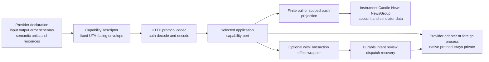

# HttpRoutes 子系统设计（UTA Effect Runtime）

## 1. 目的与事实边界

本组覆盖六个源码文件、103 个 MAP：

- `services/uta/src/http/routes-trading.ts`
- `services/uta/src/http/routes-simulator.ts`
- `services/uta/src/http/routes-trading-wallet.spec.ts`
- `services/uta/src/http/trading-order-entry.spec.ts`
- `services/uta/src/http/simulator.spec.ts`
- `services/uta/src/__tests__/trading-tools.spec.ts`

本文是目标方向，不是生产迁移，也不宣称 `uta` 二进制、provider bridge、持久 writer 或 Alice 投递已经接入。源码仍是本组的当前事实：`routes-trading.ts:1-11` 直接导入 `UnifiedTradingAccount`、`BrokerError`、legacy order-entry、TradingGit 和查询 helper；`:97-125` 在 route 内完成健康判断和异常转换；`:133-606` 直接调用 manager、broker/account 对象和 Git staging；`:611-694` 直接读取 file-backed snapshot、做 `Number()` 汇总并在异常时返回空结果。`routes-simulator.ts:1-15,17-101` 明确是 dev MockBroker 控制面，`:105-221` 直接解析 `MockBroker` 并调用 god-view 方法。测试文件中的 casts、spies、真实 MockBroker 以及 IBKR fixtures 都是调查证据，不是目标公共协议。

目标把 HTTP 限定为最外层解释器：验证 transport credential、解析能力叶子的输入、调用被组合根注入的 application port、按该叶子的输出/错误 schema 编码。HTTP 不拥有 provider SDK、SQL writer、Git authority、broker lifecycle 或 order policy。

## 2. 共同外层与 provider 自由度

### 2.1 固定的是元契约，不是完整 SDK

所有可发现的 HTTP capability 使用 K02 的固定 `CapabilityDescriptor` 外层：稳定能力身份、命令路径、schema 版本/指纹、输入/结果/领域错误 schema、交付方式、效果类别、资源/权限要求、来源与 availability evidence。能力树按 provider instance、环境、账户 scope 和主体解析，并带 discovery revision。调用绑定能力身份与 schema fingerprint；叶子被替换、撤销或主体无权发现时，返回明确 stale/availability/authorization failure，而不是让同一路径悄悄执行另一种语义。

叶子的输入、输出、错误和命令树由接入作者声明。它可以是 REST/OpenAPI、任意语言 SDK、独立进程、类、回调或缓存；不要求 provider 内部使用同一种 FP 风格。静态 provider 的 TS 类型从 schema 推导，动态 provider 在反序列化入口由已校验 JSON Schema 驱动。函数、闭包、SDK instance 不进入 wire 或 durable payload；不能导出的 runtime transform 必须使声明失败，而不是降级成任意 object。

因此本组不设计全局 `ActionContractMap`、完整 `IBroker`/SDK、也不要求所有 provider 提供 sibling handlers 并返回 `Unsupported`。源码里出现的 `IBroker`、manager switch 或具体 broker class（若由被测 adapter 提供）继续是 source evidence；它们不是目标路线的依赖。某 provider 没有 option、cancel、FX、simulator 或 expansion leaf 时，能力树没有该叶子，空父节点递归消除。若 leaf 已声明但仅某个参数变体不支持，该变体只从该 leaf 的 exact input/output schema 中排除，不删除 leaf 或其他仍声明的变体；参数变体的 schema absence 与 declared leaf 的 availability 分开表达。已声明但暂时断连、限流、未登录的叶子保留 identity，另报 availability；不能伪装成“不支持”，也不能继续显示为可执行。

### 2.2 Scope 是按能力声明的边界

`AccountScope` 只对账户相关能力、账户事实、模拟器/admin 控制和受控订单事实强制存在。它由 `AccountId + explicit SubAccountId` 构成，单钱包也不得靠隐式默认值冒充显式 scope；sub-account discovery 为 `Discovering | Available | Unavailable`。公共 `Instrument`、`Candle`、`News`、`NewsGroup` 和其他公共市场数据不凭空造账户或 subaccount；其输入/输出明确写 `Public`，或由具体能力 schema 声明其他 scope。若同一能力同时支持两者，使用 `Public | Account(AccountScope)` 小型 scope union，而不是把账户字段塞进所有数据单位。

scope 既不是 TypeScript brand 的替代品，也不是 transport path 的可信来源。HTTP 先解析精确的 `AccountId`/`InstrumentId`/provider key，再由 application directory 对 Principal、scope、capability revision 做 runtime authorization。跨 scope 的 ref 在 provider call 前失败；公共 ref 不应被强行绑定到任意账户。MAP-146D2109B6、MAP-4EFAFBF364、MAP-560B7EEA32、MAP-E66037B98B、MAP-DF17C576FF、MAP-87FA16A102 记录了这条边界及旧代码的反例。

### 2.3 认证和授权分层

当前 `src/webui/routes/trading-proxy.ts:4-7,115-168` 明确没有 Alice↔UTA auth，主要依靠 loopback 并原样转发 headers/body；`routes-trading.ts:127-135` 也未认证地返回 manager summaries。这不是授权。部署/Guardian 需要从既有 secret/IaC 路径 provision service credential 和 verifier；UTA transport 将有效凭据映射为 `Principal`。在 owner、issuer、verifier 事实闭合前，缺 credential 返回 `UnauthenticatedTransport`，verifier 未配置返回 `TransportVerifierUnavailable`，不得以 localhost fallback。请求 body 中自报的 actor 一律不取得权限。

Transport authentication 与 application authorization 分开：Principal 进入 account directory、capability visibility、operation policy；受控 effect 在 writer/CAS 边界再次检查 scope、capability、descriptor revision、intent revision、expiry、policy 和 actor binding。事件来源、观察主体、创建主体、执行授权主体和回复 agent 是不同字段；事件是 evidence，不是 approval。MAP-2F69B76FDC、MAP-D034C92CBD、MAP-8A6F5C59E6 保留了该未闭合的部署证据和测试义务。

## 3. Data capability：pull、push 与 projection

### 3.1 统一的数据交付纪律

数据能力是 provider 声明的叶子，不共享一个强制的完整 handler。`pull` 是一次有限响应，可带分页、cursor、coverage、as-of 和 Partial；`push` 是有明确创建、取消、结束、错误、顺序、缺口、重放、背压和断连恢复 schema 的资源 scoped stream。HTTP/CLI 的 `pull` 可输出一个 schema-valid finite result；`push` 可输出具名 NDJSON data/control/error/end frames。关闭 tail 只取消本次观察资源，不取消已经被 transaction writer 接受的订单。

读取和订阅可能消耗连接、配额、缓存、存储或付费资源，仍需 resource permission 和 availability。但它们不使用 order prepare/approve/compensate、order lock 或每个 frame 的交易 WAL。只有某条数据确实被选作受控 effect 的决定依据时，才持久化选中的证据、消费身份、时间和 decision revision；不把整条行情流事务化。未证明的 freshness、finality、replay、atomicity、absence 或 idempotency 不得由本地接收序号推造。

`QueryFailure` 不是一个逼迫 provider 完整实现的全局业务类型。外层可统一 transport/decode/availability 形状，provider domain error 仍保留其精确 schema。`CapabilityNotDeclared`、`AvailabilityUnknown`、`ProjectionStale`、`StorageUnavailable`、`ProviderRejected`、`OutputSchemaViolation` 等状态不能由 `Error.message`、`permanent` boolean 或空数组猜测。MAP-5C97C6CC79、MAP-DB305A9D5D 约束了这一解码和交付边界。

### 3.2 Account、Instrument 与市场读取

`/uta`、subaccounts、account、positions、orders 是账户相关 pull capability，因此响应含显式 scope、directory/projection revision、checkpoint/source sequence、as-of/capturedAt、freshness/coherence 和 availability。缺失账户、scope mismatch、discovery pending、offline、Partial listing 不能变成空成功。`Orders` 是 order-observation data unit：provider 可声明 BrokerOrderId、状态、fills、terms 和扩展字段；查询不等于 transaction approval，`Ack` 不等于 fill，listing absence 只有在该叶子报告 Complete coverage 时才能成为后续决定的输入。MAP-8588C24A12、MAP-8239373D6C、MAP-0C2AAEE0A8、MAP-0682C42EA8 维护了账户摘要、identity、coverage 和 native sentinel 的证据。

`Instrument` 的 native identity 与已解析业务事实分开；没有 multiplier、currency 或 ownership evidence 时保持 Unknown/Unavailable，禁止默认值。`Instrument`、quote、contract details、expansion、historical bars、contract search 是不同的可发现叶子。公共查询使用 `Public` 或其声明的 scope；账户路由的旧 `aliceId` 只作为可解析的兼容 alias，不能作为未经校验的 universal key。provider native `Contract`、`ContractDetails`、date class 和 response 只在 adapter 边界，exact provider extension 可保留并随 schema fingerprint 传递。MAP-0B6606BE1C、MAP-08E9053B72、MAP-5FBCD3EE4E、MAP-8456875518、MAP-861915C783、MAP-3C6243143F、MAP-2F790BE2E6 记录了这些叶子。

Search 保留现有 pattern/query alias、asset-class hint、source selection 和 per-instance failure isolation，但结果必须说明 `Public`/`Account` 选择、coverage、healthy/missing scopes 和 normalized `InstrumentId`。一个 provider 的搜索字段不应迫使其他 provider 接受同名字段。`Promise.allSettled` 的健康结果保留为 Partial evidence，不能把失败账户从 Complete 里静默删掉。MAP-0B6606BE1C、MAP-D58BA63EC0、MAP-3CDB550874 是具体检验。

Quote、details、expansion 和 bars 都是数据读取：Decimal/Instant/units 在 schema/semantic constraint 中表达，native request/response 在 adapter decode；公共 instrument 不附带虚构账户。历史 bars 输出 `Candle<Extension>`，每个 provider 可声明质量、缺口和 finality；未来实时 bars/quote/news 订阅要走 push stream lifecycle，不把一个 frame 当成 closed bar。MAP-07DB18F4C8、MAP-3C6243143F、MAP-5FBCD3EE4E、MAP-861915C783 及对应 source tests 保留精度和扩展证据。

### 3.3 FX、equity、snapshots 与 history

FX rates、equity、snapshot 和 equity curve 属于 accounting/market/projection data capability。FX 输出是精确 Decimal rate、currency、source、observedAt、expiry/freshness 和缺失 marker；account observation 或 FX provider 失败必须可定位。equity 使用 per-AccountScope Money、valuation uncertainty 和 FX provenance；不能用 rate=1、零账户或空数组伪造完整总额。snapshot/equity curve 的 minute bucket、UTC、carry-forward max-age、scope coherence、schema version 和 source sequence 是 projection policy，不是 HTTP 临时推断。MAP-A7201E902B、MAP-95C382B4F8、MAP-4D35581185、MAP-8F1E449867 保留现有 file-backed/Number/carry-forward 的真实缺陷和修复验收。

Snapshot `DELETE` 是独立的 authorized retention capability，而非订单 approval。它可写 retention audit/evidence，但不使用交易补偿，也不因删除结果授权 dispatch。Git log、order history、trade history、show 和 wallet/status 是 rebuildable audit/read projections；这些 account-backed query 与 row 绑定显式 `AccountScope`，public data projection 不继承账户 scope。SQLite journal、provider observations 和明确的 execution evidence 才是受控 effect 的 authority；Git hash 只能做 display correlation。缺 dispatch identity 的 legacy row 标 `LegacyEvidence/OperatorRequired`，不补造 confirmed fill。MAP-FC80F364B6、MAP-F42728FD63、MAP-F589132F03、MAP-B9C114CCA4、MAP-AC8C619E99 具体约束了这一转换。

## 4. Controlled effect：只在选中的能力上使用 transaction wrapper

### 4.1 Schema/HOF 组合，而非订单全集

订单是可组合的语义单位，不是内核穷举的所有 order variants。某 provider 如果声明一个受控 Order effect，接入作者从精确 schema、单位、provider-native extension、capability evidence、处理函数和资源要求组成该叶子，再可选地套 `withTransaction`。`withTransaction` 的 public handle 只能提交 intent、查询 receipt/status，不能把原生 dispatch 函数交给 HTTP/AI。provider-specific parameters 通过精确 extension 保留；没有该能力的 provider 没有对应叶子，不返回一个伪造 Unsupported handler。

局部互斥 union 仍适当，例如 provider schema 明确支持的 Units/Notional、Quantity/All，或 pull/push delivery。不能把旧 `routes-trading.ts:23-46` 中的字段袋编成全局 `Market/Limit/Stop/Trailing × TIF × relation × venue` 笛卡尔枚举，也不能把“非市价不能 notional”等此前推测提升为跨 provider 规则。若某个参数变体未被 provider 声明，它只从该 leaf 的 exact schema 中缺席；已声明的 leaf 与其他变体仍可发现，而 declared-but-unavailable leaf 仍单独报告 availability。每个组合器同时推导输入、输出、错误、权限、资源和 schema fingerprint；不得返回退化的 `Order => Order`、覆盖已有字段或丢掉 extension。MAP-3CBE1C6172、MAP-27AD48107A、MAP-58D4065C2F、MAP-9B42BF213C 保留字段精度和 provider 合法性必须由声明决定。

### 4.2 Draft、prepare、review、dispatch 与恢复

旧 stage-place/modify/close/cancel 和 one-shot routes 只能作为迁移输入，不再是 HTTP execution authority。目标上，只有 provider 声明了对应 effect leaf 且组合了 `withTransaction` 时，才有以下可选路径：

1. 解析该叶子的 input schema，形成可持久化 intent/draft revision；
2. 在 writer 外收集 provider capability、scope、instrument、current order/exposure、native reconstruction 和 preconditions；
3. writer 原子记录 versioned prepared payload、plan digest、before-image、resource/conflict keys、expiry、failure policy 和 command identity；
4. 明确的 review/approval policy 通过 CAS 后，原子写 approved/dispatch-planned、jobs、locks、receipt；
5. scheduler 以 lease/epoch 写 `DispatchStarted`，随后调用选定 provider interpreter；
6. provider ack、observation、fill、late fill、cancel 或 disconnect 按其声明的 error/outcome schema 持久化。Ack 不是 fill/terminal cancellation；DispatchStarted 后无法判定是否已发出的情况是 `OutcomeUnknown`，先 observe/reconcile，不盲目 forward retry。

上述 durable state 只约束受控 effect，不扩散到 quote、bars、snapshot、FX、simulator data。`FailurePolicy` 是该 effect plan/digest 的数据，不是 route catch 分支；已知拒绝能否继续由 policy 声明，Unknown 暂停剩余 forward steps。

`ReturnToAgent` 是可选的 review strategy，不是所有 trigger 的固定行为：原子消费 activation、暂停 binding、保留未发送 intent/evidence、建立稳定 `ReviewRequest`/outbox，且**不创建 broker dispatch**。后续只能以显式 schema 执行 `Discard`（仅未发送）、`KeepSuspended`、`Rearm`（新 epoch）、`Revise`（新 intent revision）或 `RequestSubmission`（正常授权）。默认值在注册时冻结；超时不能自动批准；旧 review identity 通过 CAS 处理。Alice 的 Workspace/Session/Inbox 负责投递，UTA 不重建 model loop。MAP-0FC7B6DD68、MAP-6BF94B5092、MAP-7B9EA96B62、MAP-F454EFC3B2、MAP-165076A00B 记录了旧 hash/message/push 与新边界的证据。

### 4.3 Wallet compatibility 与 identity

`wallet/commit`, `wallet/reject`, `wallet/push` 和 stage/one-shot paths 只在 caller migration 窗口内作为历史输入；最终要删除双 authority，而不是保留隐式 fallback。Git pending hash 不进入 approval identity；approval 绑定 selected effect 的 transaction/intent revision、plan digest、expiry、Principal/policy。人类 approval 与 server-derived authorized auto-approval 可以是两种 policy outcome，但 `allowAiTrading` 不能由 body boolean 自授权。`CommandReceipt` 只在 writer commit 后产生；response loss 通过 command identity 查询收敛。

Order identity 是 provider 声明的 `BrokerOrderId`，不能由 native numeric sentinel 覆盖；scope、instrument、native key、order revision 和 dispatch identity 各自保持类型和证据。`OrderSnapshot` 作为读数据不自动成为交易 authority；只有 selected effect 在 prepare 时持久化所采用的 before-image/evidence。MAP-0C2AAEE0A8、MAP-0682C42EA8、MAP-B198583232、MAP-FE1C608463、MAP-891F1FEA91 保留 identity、sentinel、CAS 和 Decimal obligation。

## 5. Simulator/admin capability

`routes-simulator.ts` 是显式 dev `/dev/simulator` 控制面，不是生产交易路由。它应作为独立 simulator/admin capability tree 挂载，要求 verified Principal、simulator operation capability、AccountScope 和 mock-simulator preset；real、keyless、readOnly 或其他 provider instance 没有这些叶子。`MockBroker` 的 concrete class、mark/fill/external accounting 规则留在选定 simulator interpreter；HTTP 只处理声明 schema 和 typed errors。

Simulator state 是 versioned finite projection，包含 generation/sequence/as-of、cash、marks、positions、pending orders 等精确值。`SetMarkPrice`、`TickPrice`、manual fill、pending-only cancel、external deposit/withdraw/trade 都是不同声明叶子。它们可以记录 fixture command/observation identity，以便 replay/restart 证明，但不产生 `TransactionApproved`、order dispatch、order lock 或交易 compensation。external deposit 的 cash 不变和 `MarkPresent | MissingMark(Indeterminate)` cost basis、external trade 的 wallet provenance/WAC、partial fill、LMT BUY/SELL 触发规则都是 simulator evidence，不是 native broker idempotency/atomicity 证明。withdraw 必须先验证正数和 exposure，不能让 oversized request 删除 position。

Simulator state/list/read failure 必须是 named `NotSimulator`、`SimulatorNotFound`、`Forbidden`、`ProjectionStale`、`ObservationDuplicate` 等 variants；不能把 constructor name、Zod internals 或 `{ok:true}` 当作 protocol。MAP-6FA0B99F88、MAP-631DC01624、MAP-3A43AEAF75、MAP-0E76C75480、MAP-D266753674、MAP-21CA670156、MAP-AB73E0949C、MAP-24F7AD27D6、MAP-DFB69CBAAD、MAP-1C7C835F5A、MAP-2444CEB754、MAP-6CE9D89D9B 及 simulator specs 是该边界的完整证据集。

## 6. 测试与经验义务如何迁移

本组不把已有 review 当作新架构已经通过，也不在本轮运行测试。每个测试 MAP 的 sourceEvidence/currentBehavior 保持不变，目标验收按其实际边界重写：

- `trading-tools.spec.ts:1-387` 继续验证 source routing、all/exact resolution、malformed ownership、Decimal、sentinel omission、BrokerOrderId、details expansion 和 input ergonomics，但 fixture 通过 selected capability codec/provider adapter；不再用 in-process cast 证明公共 SDK。
- `routes-trading-wallet.spec.ts:1-78` 保留 missing/stale optimistic guard 和 no-mutation 目的，改用 selected effect wrapper 的 revision/digest/review identity。它必须观察 writer state，而不是 PendingHashConflictError 文本。
- `trading-order-entry.spec.ts:1-315` 将 stage/commit/push call-order 与 PushResult 替换为 declaration codec、draft/prepare/review/receipt、DispatchStarted、provider ledger 和 OutcomeUnknown。没有被 provider 声明的 modify/close/cancel 不生成测试 route。
- `simulator.spec.ts:1-208` 保留真实 MockBroker 的 mark/fill/external state 证据，增加 principal/capability、typed codec、fixture identity/projection。该 spec 不得被用来证明真实 broker idempotency、持久 writer 或 Alice delivery。
- HTTP helper 测试必须真实经过 transport verifier、selected descriptor codec 和 application port。错误输入在 handler 前拒绝；provider output 按声明校验；有限 pull 与可取消 push 的生命周期可观察；关闭 stream 不取消已有 effect。

精度义务跨越相关叶子时，`0.00001234`、`0.123456789012345` 等值只能在 canonical Decimal text/value object 与 declared unit 下比较和 hash。Provider 未证明的 native sentinel、absence、idempotency horizon、TPSL/relations、finality、replay 或 atomicity 仍保持 open，不因抽象出现而关闭。

## 7. Falsifiers 与收口顺序

以下是设计的可证伪场景，尚未在本轮执行：

1. 给一个 provider 声明新的字段后，静态类型、runtime validator、CapabilityDescriptor metadata 和最外层 help/CLI 同时出现该字段；无需修改内核 capability switch，也不要求无关 provider 实现空方法。
2. provider 没有 option/cancel/simulator leaf 时，discover/describe 和 route tree 都没有该叶子；若某 leaf 已声明但只缺一个参数变体，该变体只从该 leaf schema 排除，其他变体仍可发现；已声明但断连的叶子保留 identity 并返回具名 availability。
3. malformed input、unknown field、scope mismatch、stale descriptor/schema 在 provider handler 前失败，且没有 projection/journal/effect mutation。
4. public Candle/Instrument/News/NewsGroup query 不会被强行绑定默认 AccountId/SubAccountId；account-backed query 缺 explicit scope 时拒绝或返回 discovery state。
5. 一个 pull 返回 finite schema result；一个 push 返回 data/control/error/end frames、支持取消和资源释放；frame 接收序号不被伪装成 provider replay/finality。
6. provider native response 按声明 output/error schema 校验；未知 extension 不会以任意 object 穿过 HTTP；合法 provider extension 不被公共 adapter 丢失。
7. draft/prepare 的 selected controlled effect 在 broker/provider ledger 中保持零 mutation；只有 writer-committed explicit approval 或 server-derived authorized auto-approval 创建 dispatch job。
8. 一个 candle/事件激活走 `ReturnToAgent` 时，durable decision 有 review identity、evidence、outbox 且 broker dispatch 数为零；重复事件、迟到回复、rearm/revise 不复用旧 epoch/revision/approval。
9. DispatchStarted 后杀 worker，重启只产生 `OutcomeUnknown`/Observe/Reconcile 轨迹，不产生第二次 forward dispatch；已知 provider rejection 与 unknown 不混淆。
10. Mock simulator 的 80000→79000 LMT BUY、partial fill、wallet deposit cost basis、external trade cash/WAC 和 pending-only cancel 按既有规则可重现；replay 同一 fixture identity 不二次改余额，real provider 路径无 simulator control leaf。
11. `0.00001234`、长 BrokerOrderId、19 位以上 provider id 在 wire、projection、selected plan 和 reload 后仍精确；未证明的 native zero/sentinel 返回 unknown/unavailable，不变成业务 Absent。
12. snapshot/equity/FX/storage failure 不返回空成功；incomplete listing 不能授权 cancel；FX/snapshot freshness 不被当作执行 ack；HTTP status 不替代 durable receipt、provider Ack、fill 或 terminal observation。

建议的后续顺序是：先闭合部署 service credential/verifier 和 descriptor/codec outer boundary；再为 account/public data capability 迁移 query/projection/stream；随后只为已有 native evidence 的受控 effect 引入 writer、review、dispatch/recovery；最后以真实 provider process、持久 store、Alice responsible Session 和独立 broker ledger 分别完成实现 gate。任何一步都不能把未调查的 native guarantee 写成统一能力。

## 8. 未决事实

本设计保留以下开放事实，不用类型或抽象假装已经解决：

- UTA↔Alice service credential 的实际 provision、issuer、verifier owner（MAP-2F69B76FDC）。
- 每个 adapter/codec version 的完整 native sentinel/presence profile；Mock/IBKR 当前 fixture 只覆盖已测试值（MAP-0682C42EA8）。
- 各真实 provider 的 idempotency horizon、absence proof、native TPSL/relations、partial/late outcome 和 cancellation evidence。
- file-backed snapshot shipped data 的导入版本、projection rebuild 和 retention authority。
- `IBroker`/manager/global switch 等现有源码形态的完整迁移位置。它们继续作为 historical/source evidence，不构成新架构必须维持的统一接口。

这些未知事实属于相应 provider、deployment、projection、identity、transaction 或 Alice client 的实现 gate。本组只规定 HTTP 在固定 UTA-facing boundary 上如何组合和拒绝，不为其他组虚构 module、class、SDK export 或 native guarantee。
