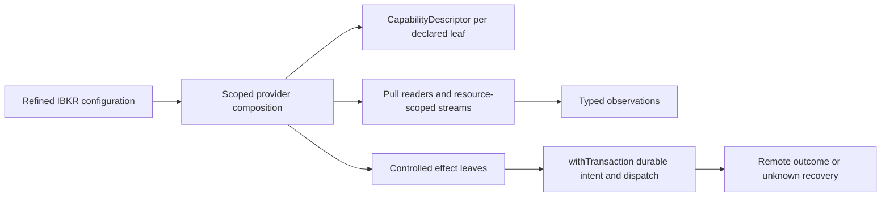

# IBKR provider-composition target design

## 状态与边界

本组覆盖 IBKR 适配器、bridge、类型、测试和直接 SDK 证据，共 58 条 MAP。本文是目标设计，不是生产迁移，也不宣称任何新模块、导出或运行时保证已经存在。当前实现和经验事实仍以 `IbkrBroker.ts`、`request-bridge.ts`、`ibkr-types.ts`、测试、`packages/ibkr` 类型与样例为准。

目标是把 IBKR 的原生协议接入固定的 UTA-facing boundary：每个 provider capability leaf 自己声明输入、输出、错误、delivery、resource、availability 和 evidence，再由 composition 组合实际存在的 leaf。外层能力元数据只有固定 schema 的 `CapabilityDescriptor`；不建立 global `ActionContractMap`，不要求每个 provider 实现完整 broker handler，也不为所有 Order 组合手写 Cartesian enum。

`Instrument`、`Candle`、`News`、`NewsGroup` 是数据单位。有限 pull 返回 finite result；push 只表示 resource-scoped stream。数据读取不需要 order approval、compensation、WAL 或 dispatch transaction；只有确实被 controlled effect 的准备阶段采用的观察证据才进入该 effect 的 durable payload。

`AccountScope` appears only on account-related data or controlled effects. Public instrument, quote, session, and other public-data leaves declare `dataScope: Public`; an account-bound leaf declares `dataScope: AccountScoped(AccountScope)` explicitly. The adapter cannot invent account or sub-account scope for public data.

All controlled trading effects use `withTransaction` for durable intent, approval/lease, dispatch, observation, unknown, and recovery semantics. An event trigger is not authority. `ReturnToAgent` pauses an unsent order while preserving durable review/outbox; follow-up must choose one explicit command—`Retain` (keep suspended with deadline/reason), `Rearm`, `Revise`, `Discard`, or `RequestSubmission` through normal authorization—and it never sends to the broker.

## 1. Declaration、composition 与资源生命周期

### 1.1 Provider declaration

每个 leaf 的 schema 是该 provider declaration 的 source of truth；schema codec 在 UTA boundary 解析不可信输入，输出命名的 immutable records 和 leaf-specific error ADT。provider 可以保留 IBKR 的协议、语言和 native extension，但跨 boundary 的值必须是 versioned、discoverable、typed 的记录。`CapabilityDescriptor` 只描述声明出来的 leaf，不为缺失能力生成空 parent 或 `Unsupported` handler。

IBKR 的概念 leaf 包括：公共 symbol/contract discovery、canonical instrument resolution、quote snapshot/tick stream、session query、account snapshot、position/option mark stream、order listing/observation，以及 place/modify/cancel/close controlled effects。这里的名称是设计概念，不表示 production export 已经存在；composition 只提供实际声明并且已取得资源的 handles。

### 1.2 Config、connection 和 generation

`IbkrBroker.ts:73-90` 与 `ibkr-types.ts:13-24` 目前只给出 primitive endpoint/client/account config；`paper` 也没有被传入 broker 或证明 TWS 环境。目标先构造 refined config：endpoint、client id、`CredentialRef`、声明的 environment、account selector、jurisdiction policy 和 resource limits。端口 7496/7497、testnet 字面量和 UI 的 paper 标识只能成为 declared hint；没有可审计 runtime evidence 时保持 `Unknown`，不可授权 mutation。

Scoped acquisition 创建 EClient、RequestBridge、generation-bound cache/flight、读写 observers 和 supervised heartbeat；release 必须可重复且不泄漏 native authority。连接流程保留当前有证据的顺序：handshake，完整 `ManagedAccountDirectory`，按 selector 形成 account read scope，等待首个 private read，再发布各 leaf 的 availability。一个 selector 不能把 `accounts[0]` 当作全局默认；`AllManagedReadOnly` 只获得读能力。

`request-bridge.ts:488-517` 的 1100/1101/1102 分别解码为失联、`RestoredHint` 和恢复提示；1101/1102 不能跳过 private-read barrier，也不能直接让任何 effect writable。Heartbeat 保留 45 秒 tick 和 currentTime probe 的 source-backed policy（`IbkrBroker.ts:169-180`），但由 generation-tagged supervised fiber 驱动；旧 generation 的 callback 只能成为 stale evidence。

`Layer` finalizer 先停止 admission/claims，打断 supervisor 和 data readers，完成本地 Deferred 的 `InterruptedByShutdown`，保存已开始 effect 的 recovery classification，再 drain effect writer、退订账户并断开 socket。取消数据 reader 不触发 compensation；durable `DispatchStarted` 的 effect 仍为 unknown，直到 order observer 完成 reconciliation。

### 1.3 Capability discovery

`IbkrBroker.ts:872-879` 的固定 security/order arrays 只保留为 `AdvertisedCandidate` source evidence。每个 descriptor 至少携带 leaf id、schema version/fingerprint、delivery、effect class、resource/permission requirement、scope、source evidence 和 availability。availability 由 observed connection health、account/private-read evidence、environment、jurisdiction、session、instrument/venue 和该 leaf 的 native acceptance evidence 推导；端口、静态数组或 `RestoredHint` 不能替代它。CLI projection 只是这棵 composed declaration tree 的纯视图，不能添加未声明能力或 dispatch authority。

## 2. Native boundary、identity 与 resolver

### 2.1 Native ownership

`Contract`, `Order`, `OrderState`, `EClient` and callbacks belong only to the IBKR adapter interpreter. `cloneContract` (`IbkrBroker.ts:49-71`) continues to deep-copy combo legs and delta-neutral children; before send, the native mapper reconstructs SDK objects from versioned records. Provider-declared extension fields and nested child records remain exact typed records, while unsupported leaves/variants are absent rather than raw SDK values. UTA and the transaction kernel receive only canonical serializable records, schema version, and fingerprint.

IBKR identity 由 provider declaration 分开表达：canonical `conId` leaf、issuer directory、symbol convenience query 和 display symbol 不是同一类型。`aliceId` 只能保留为 untrusted alias evidence，不能按命名规则升级为 `InstrumentId`。`localSymbol || symbol` 只是显示映射；order/position equality 必须使用 canonical instrument identity 和适用 scope。

### 2.2 Public/account scope

Resolver, contract discovery, quote and session query leaves in this group declare `Public` context. A separately declared account-bound observation uses `dataScope: AccountScoped(AccountScope)`, `accountName`, and generation; controlled order effects always bind explicit `AccountScope` themselves and cannot inherit or guess an account from public lookup.

`searchContracts` 仍拆分 `.USD` suffix，扩展 CASH hub，透传 BOND issuer hub；输入和输出都由 provider schema 声明。结果使用 `Matches`、`NoMatch`、`Partial`、`Unavailable`，每行保留 identity、venue、currency、security type、scope、generation 和 provenance。CASH、BOND、option/future directory 是 query/expansion data，不自动成为可交易 leaf。

`getContractDetails` 用 `Found`、`NoMatch`、`QueryFailure`、`AmbiguousIdentity` 区分 empty success、transport/protocol failure 和多重 canonical match。STK/SMART/USD 默认只属于显式 tagged `SymbolStockQuery` convenience-read leaf；conId、issuer 和 non-STK query 不能被默认值窄化。缺 exchange 的 non-STK 继续在 wire 前 typed reject，污染 display fields 不能覆盖 conId canonical route。

Resolver flight/cache keys include at least connection id, generation, data scope (`Public` for these resolver/contract leaves; `AccountScoped(AccountScope)` only for a declared account-bound leaf), and instrument/query identity. Success values are immutable decoded records; coalescing, clone-on-return, failure eviction, a maximum of 256 entries with 5-minute TTL, and reconnect invalidation remain provider-local optimizations. A cache is not plan authority, and transport failure cannot permanently masquerade as `NoMatch`.

### 2.3 Expansion 和 data durability

`expandContract` 的 issuer bond、OPT/FUT expiry、strike/right filter、稳定排序、limit 60 的现有意图保留；limit range、truncation 和 coverage 都是结果 schema。`ExpansionUnavailable`、`Partial` 和 `NoMatch` 不需要 WAL；只有 expansion observation 被某个 controlled effect 引用时，才把其 fingerprint/version 复制进该 effect 的 prepared payload。

## 3. Data capabilities：market、account、position、session

### 3.1 Quote、Candle 和 stream

`getQuote/requestSnapshot` 保留 `snapshot=true`、`regulatorySnapshot=false` 和 `reqMarketDataType(3)` delayed policy（`IbkrBroker.ts:800-839`、`request-bridge.ts:680-734`）。tick codec 对每个字段表达 `Absent`、有效值、invalid 或 stale，并带 currency、observedAt、source、quality 和 completeness；不能把缺少的 bid/ask/last/volume 改成字符串 `"0"`。

Quote/Candle push 使用 resource-scoped stream；pull snapshot 是 finite result。`Live`、`Delayed`、`Stale`、`Unavailable` 只描述数据质量，不授予 order capability。只有 notional-to-units 的 effect preparation 明确引用 quote 时，才把 quote identity、observation time、rounding 和 lot policy 作为该 effect 的 evidence；quote cache 自身不产生 executable precondition。

### 3.2 Account、position、FX 和 option mark

`request-bridge.ts:604-678` 的 account callbacks 保留每行 `accountName`、`${key}:${currency}` 与 consolidated key、pending/live buffer 的原子交换和 generation/checkpoint。`AccountSnapshot`、`PositionObservation` 和 `FxObservation` 使用显式 `AccountScope`，携带 source、receipt time、quality、sequence 和 provenance；`AccountDownloadResult` 没有 provider timestamp/sequence 时，adapter 只能标记 `AdapterReceipt`/`LocalGenerationSequence`，不能声称 venue ordering。

`updatePortfolio` 的 conId upsert、zero-quantity deletion、option averageCost 按 multiplier 归一化仍是 source facts；目标 PositionObservation 保留 deletion、side、per-unit cost、multiplier、accountName、scope 和 sequence，而不是把 mutable array 当作最终事实。`getPositions` 仍只对 OPT/FOP 做 bounded mark refresh，并发上限 8；option mark 的 15 秒 success TTL、60 秒 unavailable/stale policy 和 midpoint positive-finite gate 保留。

`fxRate` 的缺失、zero、negative、NaN、Infinity 都形成 typed `UnknownFx`，不能回退到 1。finite broker NetLiquidation 仍优先于重建值，但 `BrokerFact`、`Reconstructed`、`Unknown` 以及每个 Money 的 currency/as-of/quality 必须可区分。账户读取本身不写 WAL；只在 controlled effect preparation 选择性引用 position、FX 或 mark evidence。

### 3.3 Session

`getMarketClock` currentTime failure and the NYSE weekday fallback remain query evidence, not a venue-wide guarantee. This `SessionQuery` leaf is declared with `Public` scope, Instrument/Venue, `RegularOnly | ExtendedAllowed`, instant, and calendar version; its result is `Open`, `Closed`, `UnknownClock`, or `CalendarUnavailable`. A distinct account-bound session leaf would require its own explicit `AccountScope`. The updatePortfolio freeze around 20:00 versus snapshot-visible overnight difference remains source/quality evidence, not an account-wide `isOpen`.

## 4. Controlled trading effects

### 4.1 Common effect boundary

Place、Modify、Cancel、Close 是四个可独立声明的 IBKR effect leaves，不是要求每个 provider 都实现的统一 handler。每个 effect leaf 自己声明 input/output/error schema；公共 data leaf 不承载 approval、compensation 或 recovery 状态。

effect preparation 绑定 provider leaf identity、explicit `AccountScope`、canonical `InstrumentId`、native identity evidence、capability fingerprint、plan version、failure policy、conflict key 和 dispatch identity。`withTransaction` 在任何 probe 或 EClient mutation 前持久化 durable intent/approval/lease；scheduler 的 `DispatchStarted` CAS 才是 send authority。probe 成功仅证明 socket response，不证明 broker acceptance。

callback 必须保留 broker order id、permId、clientId、accountName、generation、dispatch identity 和 available native fields。Ack、Submitted、fill、cancel criterion 与 final lifecycle 是不同 observations；process loss、timeout、断线、缺 identity 或 response loss 在 send 之后一律进入 `Unknown`/RecoveryRequired，禁止 blind resend。

### 4.2 Placement leaf 与 native extensions

The placement leaf input schema combines semantic order fields (sizing, price/trigger, time policy, protection/relations) with a provider-declared IBKR extension record, including exact nested child records where supported; its typed handler HOF and output schema separately express acceptance evidence, status, fills, and unknown outcome. Unsupported parameter variants and unsupported leaves are absent from the input schema; `CapabilityDescriptor` availability reports declared-variant usability independently. Semantic `Order` data is not a global order variant map, and provider-local unions remain optional.

当前 SDK/type/sample 证据必须原样保留：`MOC` 使用 `orderType=MOC`；`LOC` 使用 `orderType=LOC` 与 `lmtPrice`；`MOO` 使用 `MKT+tif=OPG`；`LOO` 使用 `LMT+lmtPrice+tif=OPG`；`REL` 使用 `REL`、auxPrice offset、可选 lmtPrice cap，`percentOffset` 在 `packages/ibkr/src/order.ts:72` 标注为 REL-only。`GoodTill`、`goodAfterTime`、`outsideRth`、notional、trailing/TrailingLimit、parent/OCA 和 protection 也必须保留为 exact native fields 或明确 unavailable；不能 raw `orderType` fallback、静默丢字段或从 `SessionPolicy` 推导 OPG。

这些样例只证明字段关系，不证明每个 product、venue、account、paper/live environment 或 percent-offset unit 的接受矩阵。`IbkrBroker.ts:872-879` 仍只是 candidate advertisement。没有 placement leaf 的 capability、idempotency、lookup 或 compensation evidence 时，prepare 返回 leaf-specific `CapabilityUnavailable`，不先发 naked entry。

The existing non-empty TP/SL refusal remains protection-leaf unavailability. The placement schema exposes only `ProtectionSpec = None`; omitted or empty legacy protection normalizes to `None`, while protected variants are absent until a declaration supplies their exact schema and native sequencing. Bracket sequencing, child transmit, idempotency, compensation, and post-send observation lack evidence; the adapter cannot silently strip protection or downgrade a protected request to a naked entry.

### 4.3 Modify、Cancel、Close

Modify leaf 声明 patch/replacement schema，并组合 `ExistingOrder` before-image、order version、native identity 和 canonical fingerprint；immutable merge 产生 replacement，不能在 cached native object 上原地修改。相同 broker order id 只有在 callback/listing evidence、scope 和 version fence 都通过时才保留。

Cancel leaf 的 completion criterion 只接受 matching native identity 的 cancellation status/listing。`requestOrder` 任意 openOrder callback resolve 和 `IbkrBroker.ts:553-555` synthetic `Cancelled` 都是 evidence-insufficient；openOrder alone 不能确认 cancel，fill-first、terminal、still-working 和 unknown 必须分开。

Close leaf 读取 scoped `ExposureSnapshot`，携带 quantity/side/version/as-of，并声明 `All | Exact` close quantity、opposite-side mapping、conflict key、criterion 和 recovery policy。display symbol 只用于呈现；position cache 不是 exposure authority。partial fill、residual、stale exposure 和 possible send 都保留在该 effect 的 durable recovery state。

### 4.4 ReturnToAgent

If approval or human review emits `ReturnToAgent`, the order intent remains in durable review/outbox with state unsent/paused and the broker adapter is not called. Follow-up must explicitly choose `Retain` (with deadline/reason), `Rearm`, `Revise`, `Discard`, or `RequestSubmission` through the normal authorization path; each produces a typed next state. If `DispatchStarted` already exists, this is not the unsent ReturnToAgent path but effect unknown/reconciliation.

## 5. Listing、errors、types 与 barrel

### 5.1 Order observation

`getOrders/getOpenOrders/getOrder` are account/order observer leaves and carry explicit `AccountScope`. The current clientId-only open/completed collector cannot prove that manual/external orders do not exist; output `Complete`, `Partial`, and `Unavailable` retain namespace coverage, cursor boundary, scope, as-of, generation, and missing evidence. `reqAllOpenOrders`, permId lookup, and manual namespace remain capability-gated.

RequestBridge 的 single-slot collector（`request-bridge.ts:244-269`）需要在同一 connection 上串行化；并行 listing 不能覆盖彼此。`openOrder` 的 Order.account/clientId/permId 与 `orderStatus` 参数必须由 native event codec 保留；缺失 identity 是 `Absent(reason)`，不是 NotFound。只有完整 namespace/identity coverage 才能产生 absence 结论或完成 unknown reconciliation。

### 5.2 Errors 和 request families

Pending request correlation 是 adapter-local provider concern。每个 leaf 声明自己的 request payload/response/error codecs、request identity、generation/scope context、deadline 和 cancellation；bridge 可以有有限的内部 callback correlation families，但这不是 UTA `ActionContractMap`。数据 timeout 是 `ObservationFailure`，controlled effect 在 `DispatchStarted` 之后的 timeout 是 `Unknown`。

`IbkrErrorEnvelope` 保留 native code、redacted message、request/order/system context、generation、connection id、适用 scope、phase 和 receipt time。2100–2199 informational errors、502/504/1100 disconnect、1101/1102 `RestoredHint` 和未知 code 分层解码；regex/message 不能成为唯一 domain contract，也不能让 unknown code 触发 resend。

### 5.3 Native types、test seam 与 barrel

`ibkr-types.ts` 的 `PendingRequest`、`TickSnapshot`、`AccountDownloadResult`、`CollectedOpenOrder` 是 adapter-private records。SDK codec 先构造 validated native records，再映射到带 scope、provenance、generation 的 domain observation。pure mapper 可以用 in-memory fixture；crash durability 必须使用真实 file/SQLite journal，并覆盖 `DispatchStarted` 后中止、reopen、observe 和 recovery exclusion。

`index.ts:1-2` 的目标是注册 IBKR provider declaration，暴露实际组合出的 query/stream/effect handles、refined config、CapabilityDescriptor 和 observation/error codecs；raw SDK classes、native mapper 和完整 broker authority 保持 private。兼容 projection 若暂存，只能 read-only，所有 controlled writes 走 `withTransaction`，完成切换后删除，不能形成双写路径。

## 6. Falsifiable scenarios 与 empirical obligations

以下是目标验收/实验，不是已经执行的结果：

1. 同一 conId 分别以 `Public`、两个不同 `AccountScope` 和两个 connection generation 查询；公共 data 可以共享合法 canonical observation，account-bound data 与 effect identity 必须隔离，旧 generation 不得完成新请求。
2. `DispatchStarted` 后在 EClient send 前后分别中止进程；前者保持 durable unsent/paused，后者只生成同一 dispatch 的 Unknown/observe，不得创建第二个 native order。
3. 空 client list、manual order、缺 permId 或未覆盖 namespace 必须得到 `Partial`/`Unavailable`，不能得到 `NotFound`。
4. 发送 1101/1102 后只恢复 public quote，不提供 private account snapshot；public leaf 可以恢复，account/effect descriptor 必须仍不可写。
5. 缺失、zero、negative、NaN、Infinity FX，Delayed-only quote 或 option bid=0 必须保持 `Unknown`/`Unavailable`，不能变成 zero、rate 1 或 live execution proof。
6. issuer directory、裸 CASH symbol、污染 conId、缺 exchange 的 non-STK 必须返回 typed identity/routing result，不猜 route，也不把 directory leaf 变成 effect input。
7. Placement leaf 编译 MOC、LOC、MOO、LOO、REL 时分别观察精确 native fields；缺 product/venue/account/capability 或 percent-offset unit evidence 时返回 unavailable，不能 raw fallback。
8. TP/SL、TrailingLimit、GoodTill、outside-session、parent/OCA 与 notional 组合若无 leaf-level evidence，必须拒绝或保持 unavailable，不能发裸 entry、静默丢字段或把 data read 当 transaction。
An artificial `ReturnToAgent` before send must leave durable review/outbox and make no EClient call; `Retain` keeps the order suspended with an explicit deadline/reason, `Rearm` re-enters dispatch eligibility, `Revise` creates a new versioned plan, `Discard` closes the intent without dispatch, and `RequestSubmission` re-enters the normal authorization/dispatch path.

必须继续保留的未知事实：TWS paper/live 的可靠观测来源；sub-account/jurisdiction 字段；reqAllOpenOrders/permId lookup 覆盖；完整 IBKR 10xxx code table；client-side idempotency；MOC/LOC/REL/OPG 各 product/venue/account 接受矩阵；`percentOffset` 单位；tradingHours/calendar 的完整运行时证据。它们不是通过抽象被解决的结论，应保持 `DeclaredUnknown`、`AdvertisedCandidate` 或 leaf-specific `CapabilityUnavailable`。

`services/uta/src/domain/trading/__test__/e2e/ibkr-paper.e2e.spec.ts:221-358` 的 legacy place/cancel/close 流程是迁移后必须复现的 empirical baseline，不证明 write-ahead、ReturnToAgent、unknown recovery 或 idempotency。既有 canonical routing、no-wire refusal、clone ownership、account math、option mark、health probe、listing completeness 与 native sample evidence 仍是必须保留的验证义务。

## 7. MAP 证据索引

- Fixtures 与 boundary：`MAP-2C43F936E4`。
- Identity、resolver、expansion、native ownership：`MAP-E8631F6112`、`MAP-54D5DEDE7A`、`MAP-54F1CD6C8B`、`MAP-70788F3360`、`MAP-AF239E68C8`、`MAP-C0E918CDCE`、`MAP-9C13E5C386`、`MAP-786C1F3DCE`、`MAP-5368C5F5A6`、`MAP-913C2331F4`、`MAP-F35B2FF883`、`MAP-B6CBC19102`、`MAP-5F63915F5B`、`MAP-2024564D67`、`MAP-486EF87033`、`MAP-8C37B26E30`、`MAP-96E3C803EA`、`MAP-D20AD6C750`、`MAP-A333A49CA4`。
- Controlled effects：`MAP-3AE4A4B8AE`、`MAP-34DBADFED6`、`MAP-770FB4496A`、`MAP-86EFC621F8`、`MAP-39D2A7D5F0`、`MAP-661D1A0287`、`MAP-755E02823B`。
- Connection、configuration、state、health、startup、shutdown：`MAP-6F9134EF6E`、`MAP-C5F72FFBD4`、`MAP-1141592A9E`、`MAP-F4D1FDCBB6`、`MAP-904AF53A43`、`MAP-B620DB7F24`、`MAP-E99E61B1B5`、`MAP-18B5B86E3E`、`MAP-7BA90560A5`、`MAP-0D20097BFE`、`MAP-69B1FD6A99`。
- Account、position、FX、quote、session：`MAP-C4E977F76D`、`MAP-B2954789E1`、`MAP-8094360130`、`MAP-3FBCE06D0D`、`MAP-3B7869F8BB`、`MAP-E721ADE1B2`、`MAP-2992D9D142`、`MAP-9747579870`、`MAP-6D904561E8`。
- Listing、capability、error、types、barrel：`MAP-444B5B305F`、`MAP-8EE3F8826D`、`MAP-C44B9CCD9F`、`MAP-58696726F2`、`MAP-1E12763B4D`、`MAP-E39D85CC2A`、`MAP-FCA7E87D0D`、`MAP-0CE70CB540`、`MAP-BB811E09D4`、`MAP-DD39DF4F2F`、`MAP-E874ED272F`。