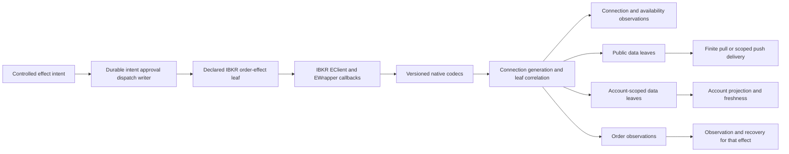

# IbkrBridge：IBKR native callback adapter under capability composition

## 1. Scope and source-grounded boundary

This group owns the 49 MAP entries assigned to `services/uta/src/domain/trading/brokers/ibkr/request-bridge.spec.ts` and `request-bridge.ts`. The files are the source of truth for current behavior. The target below is a design direction, not a claim that a new adapter, capability tree, durable writer, or runtime conformance suite already exists.

The current seam is concrete and intentionally narrow in this investigation:

- `request-bridge.ts:1-37` defines one `RequestBridge` that extends `DefaultEWrapper`, imports raw IBKR `Contract`/`Order` callback types, and routes connection, request, account, market, order, and fill callbacks.
- `request-bridge.ts:43-100` stores process-local native counters, one account id, one client reference, generic pending maps, singleton listing collectors, account buffers, fill cache, handshake waiters, and a current-time waiter.
- `request-bridge.ts:200-347` implements generic requests, snapshot accumulation, order waiters, listing collectors, current-time coalescing, and a persistent account-cache subscription.
- `request-bridge.ts:351-440` resolves unknown callback values and uses `rejectAll` to clear every local waiter and account cache on connection loss.
- `request-bridge.ts:446-517` turns `nextValidId`, `managedAccounts`, connection errors, farm-status errors, and request/order errors into mutable booleans, listener objects, or generic `BrokerError` values.
- `request-bridge.ts:521-678` forwards raw contract/catalog/account-summary values and mutates account position/value arrays and maps.
- `request-bridge.ts:682-805` accumulates numeric ticks, resolves snapshots, routes `openOrder`/`orderStatus`/completed-order callbacks, and resolves a mutable current-time waiter.

The tests preserve useful empirical behavior rather than a target API. For example, `request-bridge.spec.ts:21-121` covers handshake success, handshake close, and a silent peer; `:124-190` covers 10089, 21xx, 1100/1102, current-time coalescing, and synchronous probe failure; `:192-217` distinguishes early bid/ask from ordinary snapshot end; and `:220-319` covers account full/delta, zero closure, BASE precedence, late BASE, and single-send values.

The source also proves a caller-side effect problem. `IbkrBroker.ts:480-557` invokes void `placeOrder`/`cancelOrder` calls after local waiters and returns a success/error-shaped result. That is evidence for separating controlled order effects from observations; it is not evidence that IBKR has a universal acknowledgement contract.

## 2. Fixed composition contract for this provider

This design uses `composition-contract.md` K01-K12:

- **K01-K03 — declaration first.** Each actual IBKR capability is a descriptor-bound leaf with a precise input schema, output schema, domain-error schema, delivery mode, effect category, resource requirements, and availability evidence. Types, validation, metadata, and CLI projections are derived from that declaration. Provider-native parameters remain exact extensions. No hand-maintained global action map or universal broker interface is introduced.
- **K04 — semantic units with provider extensions.** Public `Instrument`/quote/catalog facts and account-scoped position/value facts are data units. An order-effect leaf, if declared, composes the IBKR-native order fields and legal combinations through its own schema/HOF. This group does not impose a cross-provider `Order` Cartesian product or a global notional rule.
- **K05 — data is not an order transaction.** Snapshot, catalog, account-summary, and account-stream leaves are finite pulls or resource-scoped pushes. They may consume connection, quota, cache, and projection resources. They do not require order prepare/approve/compensate, a per-frame order WAL, or an order lock. A data projection checkpoint records data delivery consistency; it is not order approval or compensation.
- **K06 — the CLI is a projection.** If these leaves are exposed through a future CLI, the command/schema/help projection is computed from the capability tree. The current Alice-injected CLI is not changed or presumed to already expose a `uta` binary.
- **K07 — only the UTA-facing edge is common.** IBKR may retain its SDK, callback protocol, wire framing, process model, and native error vocabulary. Versioned codecs translate these into the UTA-facing descriptor and typed result/error boundary. SDK types do not cross that boundary.
- **K08 — controlled effects are optional.** Only an explicitly declared IBKR order-sending leaf receives durable intent, approval, dispatch, acknowledgement, observation, and recovery handling. Read/data leaves never inherit that machinery. `DispatchStarted` is persisted immediately before a potentially emitting native order call; after that point timeout or disconnect is `OutcomeUnknown` until observation/reconciliation.
- **K09-K10 — event source is not authority.** A market/account/order callback is evidence. It cannot itself approve or authorize an order. If a shared writer selects `ReturnToAgent`, it atomically records the consumed activation, keeps the unsent intent, creates a stable review/outbox identity, and performs zero broker dispatch. The bridge does not run an agent loop.
- **K11-K12 — retain evidence, verify composition.** Source facts, empirical unknowns, and falsifiers remain attached to their proper data, connection, or effect scope. Verification must show schema-derived composition, structural absence, pull/push distinction, native output validation, ReturnToAgent zero-dispatch behavior, duplicate-event fencing, and stale-reply handling.

`AccountScope` applies only where the capability's schema is account-related: account directories, positions, account values, and account-linked order facts. Public market/catalog leaves use an explicit `Public` subject. They never invent an account or subaccount merely because the same connection also has managed accounts.

## 3. Target boundary and capability families

The following are conceptual capability families, not mandated module names or exports. An implementer may use modules, classes, callbacks, streams, an SDK wrapper, a REST process, or another provider-local arrangement. The fixed requirement is the UTA-facing schema, identity, delivery, error, resource, and availability boundary.

### 3.1 Connection and health

A connection resource owns a `ConnectionId` and `ConnectionGeneration`. A connect attempt has an attempt identity, phase, deadline, and native transport/protocol evidence. `nextValidId` proves only the observed IBKR protocol readiness point; it is not a durable order identity and not account readiness. `managedAccounts` decodes to an opaque, revisioned `AccountDirectory`; selecting an `AccountScope` is an explicit configuration/application decision.

Health is a finite event/state ADT, not a boolean:

- `Dead` records connectivity evidence such as 1100/502/504.
- `RestoredHint` records 1101/1102 and whether the native message claims maintained or lost data; it does not create `Alive` or write capability.
- `ProbeSucceeded` records a generation-scoped current-time observation.
- `AccountBaselineCommitted` and `ReadinessConfirmed` require the selected account scope and a committed account projection checkpoint.
- callbacks arriving after close, timeout, supersession, or generation change become `StaleCallback` evidence.

Connection resource ownership is provider-local. A provider may create one client per connection or use an explicitly named shared resource owner. It must not expose a mutable setter that permits replacement of a client/listener while callbacks are pending or bypasses finalization.

### 3.2 Public data leaves

Public contract search, contract details, option-chain parameters, and market snapshots are data capabilities. Contract/catalog and option-chain leaves use an explicit `Public` subject; an account-scoped request would be a separately declared capability rather than an inferred field. Their schemas retain provider-native fields as exact extensions and distinguish structural absence:

- a catalog response can be a tradeable `Instrument` leaf, a family/issuer hub, malformed data, or incomplete coverage;
- an option chain carries canonical expiry/strike/multiplier values, underlying identity, venue/exchange coverage, and completeness;
- a quote carries explicit `Public` subject or caller-supplied account subject, instrument identity, currency, live/delayed quality, timestamp provenance, fields, and completeness;
- `BidAskReady` is a configured early-completion policy for the relevant snapshot leaf; ordinary snapshots require their declared end policy;
- zero, NaN, invalid timestamps, missing context, delayed quality, and unknown tick codes are not converted into invented prices, current time, live entitlement, or account authority.

A public data request is a finite pull. A subscription, where IBKR actually supplies one, is a resource-scoped push with start/cancel/end/error and explicit gap/replay/finality semantics. Neither is an order transaction.
This source does not expose a News or NewsGroup callback path; no news capability is inferred from the account, catalog, or market callbacks. If a future IBKR news leaf is added, it must supply its own native evidence and remain a data unit rather than inheriting order-effect durability.

### 3.3 Account-scoped data leaves

The account subscription is a push data resource with `AccountScope`, subscription identity, connection generation, baseline state, delta evidence, freshness, and degradation state. Full rows and deltas remain distinct. Deltas may update the read projection immediately; `DownloadEnd` advances baseline readiness only after the data projection checkpoint is committed.

Position data uses `AccountScope + InstrumentId`, not bare native `conId`. The adapter preserves raw Decimal/string fields, multiplier, account name, source quality, generation, and receive evidence. A zero row can produce `ClosedPosition` only when the scope and source-quality evidence supports that interpretation; otherwise it remains uncertain. Account-value rows retain key, currency, raw value, Money unit, BASE/provisional selection, and unknown tag evidence. A single USD row is a qualified fallback, not synthetic FX. All currency-qualified rows remain queryable.

Data durability here means replayable observations, projection checkpoints, tombstones, freshness, and rebaseline requirements. It does not mean order WAL, approval, compensation, or a reservation on every account frame.

### 3.4 Order observations and optional controlled effects

`openOrder`, `orderStatus`, completed-order callbacks, and listing end callbacks are decoded into order observations with native identity evidence. They do not automatically become acknowledgement, fill, cancellation, or absence. `permId`, `clientId`, native order id, account name, and callback identity are retained as evidence with explicit present/absent variants.

An IBKR order-sending capability, if declared by the provider, has its own exact input schema including native fields and legal combinations. Its execution path is:

1. construct a serializable provider plan and persist the intent/revision;
2. perform scope, capability, and approval checks in the shared controlled-effect writer;
3. persist `DispatchStarted` immediately before invoking the native mutator;
4. decode any conclusive native rejection or acceptance evidence into the leaf's declared outcome;
5. treat socket loss, timeout, ambiguous send/throw, or insufficient lookup evidence as `OutcomeUnknown` and schedule observation/reconciliation;
6. never blind-resend merely because the connection was restored.

A listing query remains data delivery even when its rows contain orders. It returns `Complete`, `Partial`, or `Unavailable` based on declared namespace/end/cursor coverage. Only an observation explicitly associated with a controlled effect participates in that effect's recovery state.

## 4. Codec, correlation, and error rules

Each provider-declared leaf owns its correlation key and decoder. A useful IBKR adapter key contains `ConnectionId`, `ConnectionGeneration`, native request/order id, and leaf/request family. A typed registry may be implemented with a map, object, actor, stream, or another local mechanism, but it must reject duplicate keys, family mismatches, malformed payloads, stale generation callbacks, and terminal-correlation reuse. A resolver must not accept `unknown` and infer its meaning from call order.

The native error envelope preserves numeric code, request/order correlation, connection/generation, scope evidence where applicable, received time, severity, and redacted native wording. The observed distinctions remain:

- 2100–2199 status messages are informational health/capability evidence and do not reject unrelated requests;
- 10089 is a request-scoped market-data capability failure when its code/protocol evidence supports that classification;
- 1100/502/504 are connectivity loss evidence;
- 1101/1102 are restored hints and require account reach/rebaseline checks;
- a conclusive action-correlated native rejection may settle a controlled effect as `Rejected`;
- an unregistered, version-mismatched, malformed, or ambiguous code remains `UnknownNativeError`, `ObservationFailure`, or capability unavailable as appropriate.

No English message, regex, empty array, `isConnected()`, local receive sequence, native counter, or bridge restart fills an unproven native guarantee.

## 5. Evidence map and retained behavior

The analyses retain the exact source facts and empirical obligations under the following MAP clusters:

- **Bridge and identity:** `MAP-367B727301`, `MAP-CAF9BBFC26`, `MAP-845E2E1907`, `MAP-F1F5CC8E26`, `MAP-5BAF58A52C`, `MAP-3C19D7269C`, `MAP-78A465AAC0`.
- **Connection lifecycle and health:** `MAP-96192FAD43`, `MAP-E1E35E6D53`, `MAP-2905EACC44`, `MAP-B062D3EBE2`, `MAP-E3F1D354E8`, `MAP-425C7453CF`, `MAP-5560ED4CEB`, `MAP-C4E36D3BF5`, `MAP-90AB7C4BFE`, `MAP-D932C26FEF`, `MAP-0DDC87F65C`, `MAP-BFAD7F58E4`, `MAP-EA3426DB91`, `MAP-EA146DB928`, `MAP-D9471DCF4C`.
- **Account data and projection:** `MAP-9FCA9EFBE0`, `MAP-63AEC10CAF`, `MAP-0DF25AB1B4`, `MAP-CD565305A6`, `MAP-02C7AD6770`, `MAP-8446FB3C9C`, `MAP-55F8FAEE10`, `MAP-AF2240CA8D`, `MAP-B4CCAF38F7`, `MAP-3A9EBFB7AC`, `MAP-FA3A258F67`, `MAP-73BED6D9B7`, `MAP-A914DC7B3C`, `MAP-EA0EAB9AD4`, `MAP-21AAFAB4E1`, `MAP-47D85C4ABA`.
- **Public catalog and market data:** `MAP-2CC312D952`, `MAP-812E5F3DBE`, `MAP-BEB6FE316A`, `MAP-0FFE8EF06E`, `MAP-3C364480A5`, `MAP-3AB2C8FA44`.
- **Order observation/effect boundary:** `MAP-39C8BA9947`, `MAP-C907FECB22`, `MAP-96642209F5`, `MAP-EDE0047578`, `MAP-5E70703666`.

The useful legacy behaviors are therefore retained in their proper scope: handshake ordering and teardown safety; one-wire current-time coalescing and retryable local probe cleanup; request-specific 10089 routing; informational 21xx no-throw behavior; 1100/1102 distinction; early option-mark bid/ask; ordinary snapshot end completion; immediate account deltas; zero-position removal when evidenced; repeated-position dedupe; non-resurrection after closure; BASE precedence and late correction; single-send no-synthetic-FX; catalog and option end markers; and order observation/fill/listing callbacks without promoting them to universal success.

## 6. Implementation direction and freedom

1. Declare the actual IBKR capability leaves and their exact schemas, provider extensions, delivery modes, resource requirements, availability evidence, and version fingerprints. Do not add leaves for native operations that IBKR does not expose.
2. Place native SDK decoding, field validation, and protocol-version handling behind the provider boundary. Export typed serializable observations and errors, not SDK classes or anonymous callback bags.
3. Build generation-scoped connection/resource ownership and typed correlation. A supervisor may schedule reconnects, but the adapter does not recursively retry a controlled effect.
4. Implement public data reducers and account projection/checkpoint behavior independently of order execution. Preserve missingness, freshness, coverage, gap, and replay limitations.
5. Implement controlled order leaves only where the provider declares them. Keep intent/approval/dispatch/recovery in the shared writer and retain native lookup evidence in the provider adapter.
6. Migrate callers from the legacy Promise/cache seam. Delete generic `unknown` resolution, singleton collectors, first-account selection, public setters, raw SDK exports, and blanket `rejectAll` semantics only after each caller uses its declared capability leaf.

No particular filename split, Effect library, SDK wrapper pattern, stream implementation, or provider-internal language is required. The fixed boundary is the descriptor/schema/error/resource/identity behavior visible to UTA.

## 7. Falsifiers and acceptance scenarios

These are implementation acceptance scenarios, not claims that the current source has already passed them:

- A handshake receives `nextValidId` but no selected account baseline. The connection exposes NativeReady/AccountReachPending, not write readiness. A silent peer times out, releases its resource once, and a late callback cannot revive it.
- `managedAccounts="DU1,DU2"` with no selector yields `ScopeRequired`; a DU2 account row cannot enter a DU1 projection. A public snapshot/catalog request remains `Public` and does not need an invented account scope.
- Two current-time callers on one generation produce one native wire request and one shared observation. A synchronous send throw clears only that probe; the result does not claim that no bytes were sent, and a later probe has a fresh correlation.
- A public snapshot with explicit instrument/currency/subject receives delayed bid/ask. The result is `Delayed`; an ordinary snapshot does not complete before its end policy; invalid timestamp, NaN, missing context, or unknown tick does not become a valid quote.
- AAPL account delta `9` is visible before full end; TSLA zero removes exposure only with the declared closure evidence; an old full row cannot resurrect it; duplicate or generation-gap evidence forces rebaseline rather than inventing order.
- HKD arrives before BASE, then BASE arrives. Both qualified rows remain, selection changes from `Provisional` to `Consolidated`, and no FX row is synthesized. A single USD NetLiquidation remains `SingleSendFallback`.
- Contract response with `conId=0` remains a family/issuer hub; malformed details and an option chain with unknown expiry/exchange semantics are Partial/Unavailable, not an executable empty result.
- Two listing queries have separate correlations. Missing namespace/end evidence returns Partial/Unavailable. An `openOrder` callback after a place call is an observation, not Ack or Filled without explicit association evidence.
- A controlled order send followed by socket loss leaves one durable `DispatchStarted + OutcomeUnknown + Observe` record; reconnect does not place a second order. A conclusive native rejection is distinct from a timeout or ambiguous throw.
- A selected activation using `ReturnToAgent` creates one durable review/outbox identity with the unsent intent and evidence and zero native order dispatch. Duplicate event identity, late review reply, stale revision, and reactivation cannot reuse old authorization or effect identity.

## 8. Unresolved native evidence

The following remain empirical and are not filled by this abstraction:

- SDK version/ABI compatibility of the test payload (`MAP-96192FAD43`);
- late callbacks after close, extra SDK protocol timer ownership, connect/send byte boundary, and probe send-throw timing (`MAP-E1E35E6D53`, `MAP-2905EACC44`, `MAP-B062D3EBE2`, `MAP-EA146DB928`, `MAP-E3F1D354E8`);
- managed-account token format/order, accountName matching, and subaccount semantics (`MAP-9FCA9EFBE0`, `MAP-3C19D7269C`, `MAP-5560ED4CEB`, `MAP-73BED6D9B7`);
- native request/order-id reuse and late-callback horizons (`MAP-CAF9BBFC26`, `MAP-845E2E1907`, `MAP-78A465AAC0`);
- complete 21xx/10xxx error semantics across TWS/Gateway versions (`MAP-D932C26FEF`, `MAP-0DDC87F65C`, `MAP-C4E36D3BF5`);
- account-download ordering, baseline coverage, zero-row finality, tag coverage, and native sequence/finality (`MAP-63AEC10CAF`, `MAP-CD565305A6`, `MAP-02C7AD6770`, `MAP-21AAFAB4E1`, `MAP-47D85C4ABA`, `MAP-55F8FAEE10`);
- tick meanings, timestamp/clock authority, delayed/live completeness, and option expiry/exchange encoding (`MAP-3AB2C8FA44`, `MAP-BFAD7F58E4`, `MAP-D9471DCF4C`, `MAP-812E5F3DBE`);
- contract hub/leaf completeness and conId-to-Instrument identity (`MAP-2CC312D952`, `MAP-A914DC7B3C`);
- order callback completeness, permId/clientId continuity, listing namespace/absence evidence, and native idempotency (`MAP-96642209F5`, `MAP-C907FECB22`, `MAP-EDE0047578`).

Until the relevant evidence exists, the composed capability is unavailable, partial, or unknown at the affected boundary. No type brand, mock, empty array, connection boolean, or new module name is allowed to upgrade it.
