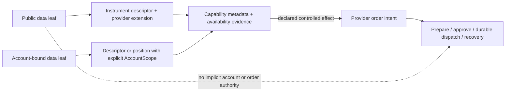

# Identity group: evidence-backed identity, native codecs, catalog data, and controlled order entry

## 1. Boundary and design basis

This is the current target design for the 14 source files and 55 MAP entries owned by Identity. It is not a production migration and does not claim that any provider, codec, capability tree, durable writer, or agent delivery path already exists. The fixed basis is `capability-composition-v1` and the shared contract in `solutions/composition-contract.md` (K01-K12).

The source investigation remains authoritative evidence of current behavior, not a target API:

- `OrderHelper.ts:1-44,46-104` imports the IBKR `Order`, owns a seven-name Decimal sentinel list, converts sentinel values for views, and shallow-spreads enumerable fields in `toWire`. Its `outsideRth`/`parentId` truthiness behavior can lose explicit `false`/`0`. `packages/ibkr/src/order.ts:47-75,89-135,180-185,195-225` shows that Double and Integer sentinels exist outside that list.
- `contract-builder.ts:1-23,27-74,78-161` explicitly presents `buildContract`/`buildPosition` as an all-broker output funnel, imports IBKR `Contract`, copies optional fields by truthiness, asserts synchronously, and mixes native identity with multiplier-aware position arithmetic. The IBKR-as-superset/global funnel language is retained as a source finding; it is not a target requirement.
- `contract-discipline.ts:1-124` and `packages/ibkr/src/contract.ts:75-116` provide the current 16-value IBKR SecType facts, the field-bag validator, string errors, and lossy unknown coercion. Those facts remain in the IBKR adapter scope only.
- `fuzzy-rank.ts:18-99` ranks partial IBKR `Contract` values, filters/sorts/slices, allocates `ContractDescription`, and is bypassed by IBKR's server-side search path. `contract-search.ts:1-65` resolves manager accounts, applies `asVendor`, fans out with `Promise.allSettled`, and silently drops rejected sources while returning SDK-shaped hits with `aliceId`/raw derivative strings.
- `contract-search-rules.spec.ts:4-74` fixes the observed normalization behavior; `contract-search.spec.ts:9-65` fixes source selection and fan-out behavior; `order-entry.ts:1-77` and `order-entry.spec.ts:1-95` fix the stage/commit/push and string-error behavior being replaced.

The target therefore has three deliberately different categories:

1. **Public data**: Candle, Instrument, News, NewsGroup, catalog, and other position-independent data use explicit `Public` scope. They do not receive a guessed account or subaccount and do not enter an order transaction merely because they were read. A pull is a finite result; a push stream is a resource-scoped stream with its own frame, cancellation, and recovery schema.
2. **Account facts**: positions, account-bound catalog queries, and order facts carry explicit `AccountScope` when their source semantics require it. Scope is a fact and a precondition, not a default.
3. **Controlled effects**: only a provider capability that declares a transaction-capable input is wrapped by prepare/approve/dispatch/recovery. Data readers, rankers, caches, and streams do not inherit order WAL, approval, compensation, or locks.

## 2. Identity and instrument boundary

`InstrumentId` is a nominal value, not proof of equality or global uniqueness. An adapter/application resolver constructs it from observed venue, listing, native-key, and any genuinely account-bound context; it persists a uniqueness-checked alias mapping and returns `IdentityUnavailable` or `IdentityConflict` when evidence is missing or contradictory. Display symbol, local symbol, vendor search text, `aliceId`, IBKR `conId`, and an SDK `Contract` remain separate namespaces. This is the target of MAP-C6D66D3913, MAP-CF1FF8D3C3, MAP-F61189D796, MAP-D9BFDA8A15, MAP-6CEBFDFFDD, MAP-30D95BD47F, MAP-97CB3270A6, and the identity contract in `analyses.json`.

`InstrumentDescriptor` is the semantic unit at the UTA-facing boundary. It has the evidence-backed identity and listing/context needed by the selected operation, a `scope: Public | AccountScope` where scope is meaningful, and a precise provider-declared extension for native facts. Focused constructors may refine option, future, cash, crypto, combo, news, or equity relationships when a provider schema proves them. This is not a closed cross-provider `InstrumentKind` universe. A provider-native kind that has no exact common semantic can remain an exact query descriptor; an operation that needs a missing common semantic reports capability unavailable. No provider is forced to fabricate an IBKR field or implement an absent operation. MAP-4FA5723DDD, MAP-E748A339C5, MAP-BD0C97191F, MAP-4D916C23A7, MAP-8AF74BCDDF, MAP-0093FE974C, MAP-41CDC6BAAB, MAP-54ECEAEE5E, MAP-BE2FC8EECC, MAP-880959554F, MAP-933E16B57D, MAP-7B846115CB, and MAP-BA4B6EEB3B define this split.

The IBKR adapter keeps the currently observed 16 SecType values (`STK`, `OPT`, `FUT`, `FOP`, `IND`, `CASH`, `BOND`, `CMDTY`, `WAR`, `IOPT`, `FUND`, `BAG`, `NEWS`, `CFD`, `CRYPTO`, `CRYPTO_PERP`) as an adapter-local declaration. It preserves derivative fields, BAG legs/ratios, NEWS query-only meaning, and raw unknown labels before the existing lossy `coerceSecType` behavior. This exact allowlist is a retained native fact, not a global action map or a rule that other providers must map into an IBKR taxonomy. Native schema/mapping versions are recorded wherever a serialized observation or prepared effect could otherwise be reinterpreted.

The `ContractRequirements`/`keyof Contract` field bag is replaced by provider schemas and small semantic constructors. Required fields are enforced at the provider boundary; identity, listing, scope, and capability are separate checks. `ValidationIssue` is a bounded local safety ADT with field/value/context payloads, not a universal catalogue of every provider error. Expected decode failures are returned as typed results; only impossible internal invariants use the supervised defect path. MAP-36F0A228A0, MAP-3562FB9C00, MAP-2044134F6B, MAP-B82909F33A, and MAP-73CA066D9E preserve the malformed-input and derivative obligations.

### Native fixture and validation obligations

The old `makeContract(Partial<Contract>)` fixture and message-regex assertions are not evidence of a safe domain constructor. IBKR codec tests retain exact native defaults, all current SecType values, option C/P/CALL/PUT validation, future expiry/multiplier rules, crypto minimal rows, and raw unknown preservation. SDK-free domain tests construct descriptor values and identity/context facts directly. These obligations are MAP-ACEFA5D60A, MAP-B7395F4C42, MAP-99C18EAB60, MAP-36F0A228A0, MAP-3562FB9C00, MAP-2044134F6B, MAP-B82909F33A, MAP-73CA066D9E, MAP-4D916C23A7, MAP-8AF74BCDDF, MAP-0093FE974C, MAP-41CDC6BAAB, MAP-54ECEAEE5E, MAP-BE2FC8EECC, MAP-880959554F, MAP-933E16B57D, MAP-7B846115CB, MAP-BA4B6EEB3B, and MAP-C6D66D3913.

## 3. Sentinel and order projection boundary

The sentinel incident and the `toWire` spread are real projection hazards. The replacement is an IBKR-native `NativeOrderCodec` that has a versioned, exact field manifest for `UNSET_DECIMAL`, `UNSET_DOUBLE`, and `UNSET_INTEGER`, decodes wire presence, rejects schema drift, and reconstructs sentinels only at the IBKR dispatch edge. `OrderSnapshot`, `OrderIntent`, and projection views use explicit `Absent | Present<T>` values. Explicit `outsideRth=false` and `parentId=0` survive; class defaults without wire-presence metadata are ambiguous. `OrderProjectionCodec` and `ModifyOrderPatchCodec` enumerate safe fields and never shallow-spread an SDK object. These are MAP-60408331F8, MAP-AE40B3965B, and MAP-7476DDDBBC.

The provider input is declaration-derived and HOF-composed. A provider may declare the sizing, price, timing, protection, relation, and native extension fields it actually supports; local unions are allowed where they express one provider’s genuine safety choice. No global Cartesian order-kind union, universal notional rule, mandatory Place/Modify/Cancel/Close handler set, or `Order => Order` erasure is introduced. Provider-specific parameters remain exact through schema composition. The public handle for a controlled effect submits a prepared intent/receipt and does not expose a native dispatch closure. Only controlled order effects use the durable prepared payload, approval digest, write-ahead, command identity, lease/CAS, unknown reconciliation, and compensation assessment described by the transaction contract.

Git status/commit/export is a projection of authoritative typed facts, never broker execution authority. A data reader, catalog cache, ranker, or stream does not receive this order state machinery. The empirical falsifiers remain: no IBKR sentinel literal crosses UI/MCP/Git/JSON; unknown native fields are rejected; `false`/`0` survive; partial modify cannot clear an omitted field; provider extensions are neither dropped nor cast to generic records. The order projection and codec decisions are MAP-60408331F8, MAP-AE40B3965B, MAP-7476DDDBBC, and MAP-82BEA44FEB.

## 4. Position observations are account data, not order transactions

`BuildPositionInput` currently mixes SDK `Contract`, Decimal quantity, raw monetary strings, optional multiplier, independent valuation components, average-cost source, and risk. `buildPosition` chooses explicit multiplier, then native multiplier, then `1`, trusts a complete broker pair, derives only when both components are absent, and rejects OPT/FOP multiplier 1/empty. These are empirical source facts from contract-builder.ts and MAP-4D036C0223, MAP-5BDBD294C0, MAP-C3F4ACD09F, and MAP-D0EA3C0CF2.

The target `PositionObservation` is an account fact with explicit `AccountScope`, `InstrumentId`, currency, refined quantity/multiplier, observation time/sequence, risk provenance, and `ValuationEvidence`:

- `BrokerReported` preserves a broker-reported market-value/PnL pair and source/as-of.
- `Incomplete` preserves a known market-value-only or PnL-only component without manufacturing its counterpart.
- `Derived` is created only from fresh, unit-checked inputs and records formula/version provenance.

The observation and its cache/projection remain query/accounting data even when incomplete. A selected order preparation may reject incomplete valuation as a precondition, but it does not run a data read through prepare/approve/compensate. Historical broker values are replayed with their provenance; a changed multiplier policy must not silently recompute them. The empirical arithmetic case (35,000 market value and 6,000 PnL for the investigated 100x option case), missing derivative multiplier, STK unit multiplier, partial valuation retention, and SDK-free math remain required.

## 5. Search, ranking, and catalog data

The normalizer remains a pure search hint. It preserves the tested longest suffix precedence (USDT/USDC before USD), unknown-quote pass-through, two-character base floor, equity/commodity pass-through including EURUSD, conservative unknown asset context, trimming, and explicit empty input. A hint never becomes `InstrumentId`. These are MAP-CF1FF8D3C3, MAP-F61189D796, MAP-D9BFDA8A15, and MAP-6CEBFDFFDD.

The ranker is split into pure scoring and page formation. It retains exact=100, prefix=80, name-boundary=70, whole-word=50, substring=30, quote-only=20, zero-score filtering, trim/lowercase, literal regex escaping, descending score, and deterministic source-ordinal ties. Results use SDK-free descriptors and never depend on Promise settlement order. MAP-5A77E2D561, MAP-C0F9438F7F, MAP-4C9A6FE792, MAP-41607450D3, MAP-BD469BCA6D, MAP-FBB735D928, MAP-1D24B84F9B, and MAP-A4E9FFB7DA retain these behavior obligations while adding explicit `CatalogSearchPage` metadata (`nextCursor`, `truncated`, `sourceSnapshot`, `Completeness`, and `totalMatched: Known | Unknown`).

An adapter may declare a local enumerating search leaf, a venue-side search leaf, or another precise provider query schema. The application composes those leaves, authorizes account-bound selectors, and aggregates `SourceResult = Complete | Partial | Unavailable` without a broker-name switch. Public results carry `Public`; account-bound results carry the resolved `AccountScope`. `AlpacaBroker.ts:217-256` stale-cache/pre-catalog echo behavior and `CcxtBroker.ts:423-471` stable market preference/malformed-row skip behavior remain source evidence: stale, skipped, rejected, and unavailable outcomes appear as named source evidence, and an echo is not executable identity. These boundaries are MAP-30D95BD47F, MAP-45D5DE1B9D, MAP-6C47FFB1F4, MAP-97CB3270A6, MAP-75A64813DC, MAP-68DA0FDCA7, and MAP-A999864CD2.

A query does not create an order transaction. Catalog identity mappings and snapshot/as-of metadata may be durable projections; a search response does not acquire order locks, approval, compensation, or per-frame WAL. A rejected source does not silently become an empty array. Equal display symbols are not deduplicated without canonical equality evidence; identity conflicts remain visible. The empty-query outcome is explicit and cannot start a broad sweep or stream.

## 6. Controlled order-entry replacement

`executeOneShotOrder` currently stages a callback, synchronously commits a Git pending hash, pushes it, and flattens thrown values with `String(err)`. Its fake UTA test only verifies method calls and fabricated `PushResult`; it does not prove journal durability, approval binding, dispatch identity, or accepted-but-unobserved outcomes. MAP-3D1C0DC287, MAP-8BBBB36AD2, MAP-9D7DDC4081, MAP-82BEA44FEB, MAP-684E054D47, and MAP-D69EDB1AEE retain every one of those source observations and empirical gaps.

The replacement is an application/effect boundary, not a new universal broker interface:

1. Create or replace a draft from a provider-declared order schema.
2. Prepare a serializable plan with scope, descriptor identity, criterion, before-image where applicable, schema/capability fingerprint, expiry, and failure policy.
3. Require the selected capability's declared authorization policy (an authenticated actor or an already-authorized policy) bound to scope, revision, digest, expiry, and any required trigger condition.
4. Commit receipt/events/projection/effect job durably before dispatch.
5. Dispatch through the selected provider leaf and distinguish acknowledgement, rejection, still-working, and unknown outcome.
6. Reconcile unknown outcomes before any retry; retain the recovery case and its exclusive identity.

The currently exposed form choices (place/modify/close/cancel) remain separate user intentions only where the selected provider declares them. They are not a mandatory full handler product, and provider-native order fields are not erased to fit them. A read-only/keyless source may return data or a non-executing draft but cannot approve or dispatch. Trigger/review groups own `ReturnToAgent`: when that strategy is selected, the unsent intent/evidence is retained in a durable review/outbox path and no broker dispatch is created; Identity must not claim that a Git push or a source event is approval.

The falsifiers are concrete: a journal failure produces no broker call; no declared authorization decision exists before a durable job; a response loss leaves one queryable receipt; timeout after dispatch becomes `Unknown` and observation work, not a second place; known rejection and unknown outcome take different branches; no raw symbol, naked broker order ID, or pending Git hash resolves an executable order across scope.

## 7. Composition and implementation direction

The implementation should follow K01-K08 rather than create another central switch:

- A provider declaration supplies its exact input/output/error schemas, semantic unit, capability metadata, handler, resource requirements, delivery mode, and availability evidence. Static TypeScript types, boundary validators, describe/help, and AI metadata derive from that declaration (K01-K03).
- Instrument, position, search, and order values are schema-bound semantic units. Provider extensions remain exact and typed; no `Record<string, unknown>` or SDK class crosses the UTA-facing boundary (K03-K04).
- Pull catalog/position queries return finite, schema’d results. Push streams, if a provider declares them, have explicit frame/control/end/error/cursor/backpressure/replay semantics; they are resources, not stdout or order transactions (K05-K06).
- Foreign providers keep arbitrary SDK/protocol/process internals. The bridge only negotiates the UTA-facing capability identity, schema fingerprint, request/response or stream lifecycle, and cancellation. It does not infer idempotency, atomicity, compensation, or read/write safety from an interface or SDK method name (K07).
- `withTransaction` is applied only to a declared controlled effect. It exposes intent/receipt, not native dispatch, and preserves the provider-specific prepared payload and recovery schema (K08).
- Discovery is instance/scope/subject aware and returns a revision/fingerprint. Replacement or authorization changes produce explicit stale/availability errors rather than quietly executing another schema (K02).

The direct Identity dependencies are the composition contract (K01-K12), transaction contract for controlled effects, Catalog/Accounting for descriptor and valuation projections, provider adapter investigations for native evidence, and HTTP/AI consumers for named query/projection schemas. No implementation module is invented here, and no prior accepted review is treated as current evidence.

## 8. Verification and falsification plan

The following obligations remain empirical acceptance criteria, not claims of completion:

- IBKR native codec tests cover all 16 currently observed SecType values, all three sentinel classes, presence ambiguity, BAG legs, NEWS query-only behavior, derivative field requirements, raw unknown preservation, and provider-specific extension isolation.
- SDK-free descriptor/position tests preserve option/future/crypto structural facts, 35,000/6,000 multiplier arithmetic, incomplete valuation, scope distinctions (`Public` versus explicit `AccountScope`), identity conflicts, and no default account synthesis.
- Rank/search tests preserve every observed normalization and score tier, stable source ordinals, explicit limit/cursor/truncation, source failure/skipped-row evidence, stale-cache/echo classification, and no symbol-only executable hit.
- Controlled-effect tests use a durable journal/projection/scheduler fixture and typed provider leaf: no dispatch before the selected capability's authorization decision and durable job commit, one receipt after response loss, `Unknown` after ambiguous dispatch, CAS/revision checks for late replies, and no dispatch on `ReturnToAgent` review handling.
- Composition tests must falsify the abstraction by adding one provider field and observing one derived schema/type/validator/metadata/CLI change, by omitting a provider capability and observing no command leaf, by rejecting malformed input before the handler, and by proving public data remains independent of account/order state.

### MAP coverage

All owned IDs remain represented in `analyses.json` with source evidence, current behavior, a per-entry `contractDisposition`, rationale, and K01-K12 anchors:

- Sentinel/projection: MAP-60408331F8, MAP-AE40B3965B, MAP-7476DDDBBC.
- Builder/position/native identity: MAP-ACEFA5D60A, MAP-4FA5723DDD, MAP-C3F4ACD09F, MAP-D0EA3C0CF2, MAP-E748A339C5, MAP-BD0C97191F, MAP-4D036C0223, MAP-5BDBD294C0.
- Ranking/page composition: MAP-5A77E2D561, MAP-C0F9438F7F, MAP-BD469BCA6D, MAP-FBB735D928, MAP-1D24B84F9B, MAP-A4E9FFB7DA, MAP-4C9A6FE792, MAP-41607450D3, MAP-B7395F4C42.
- Contract discipline/native codecs: MAP-99C18EAB60, MAP-36F0A228A0, MAP-3562FB9C00, MAP-2044134F6B, MAP-B82909F33A, MAP-73CA066D9E, MAP-4D916C23A7, MAP-8AF74BCDDF, MAP-0093FE974C, MAP-41CDC6BAAB, MAP-54ECEAEE5E, MAP-BE2FC8EECC, MAP-880959554F, MAP-933E16B57D, MAP-7B846115CB, MAP-BA4B6EEB3B.
- Identity/search namespaces and aggregation: MAP-C6D66D3913, MAP-CF1FF8D3C3, MAP-F61189D796, MAP-D9BFDA8A15, MAP-6CEBFDFFDD, MAP-9890D2522D, MAP-30D95BD47F, MAP-45D5DE1B9D, MAP-6C47FFB1F4, MAP-97CB3270A6, MAP-75A64813DC, MAP-68DA0FDCA7, MAP-A999864CD2.
- Controlled order entry: MAP-3D1C0DC287, MAP-8BBBB36AD2, MAP-9D7DDC4081, MAP-82BEA44FEB, MAP-684E054D47, MAP-D69EDB1AEE.

No `questions-closure.json` exists for Identity. The entries retain empty `openQuestions` as the historical input state; any new architecture risk is recorded in the target design/additional findings instead of changing the original question denominator. `reviews.json` and generated `entries.md` are intentionally untouched for independent regeneration/review.
