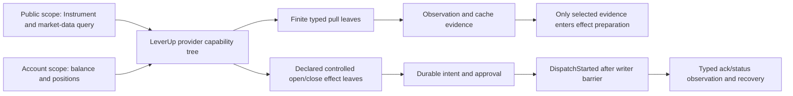

# LeverUp protocol pack：当前目标设计

> 本文是 `LeverupProtocols` 的目标设计，不是生产实现，也不是已执行的 runtime 证据。它只覆盖 LeverUp adapter 的协议、数据读取、能力声明和受控交易效果。逐项 source evidence、保留行为、缺口和反证要求见同目录 `analyses.json`；原始问题文本及当前决定见 `questions-closure.json`。源文件与 MAP 是调查输入，不能把调查中的旧行号或旧 `IBroker` 形状当成目标规范。

## 1. 适用边界

本组遵循 [`composition-contract.md`](../composition-contract.md) 的 K01–K12：接入端声明一次精确的输入/输出/领域错误 schema、语义单位、能力说明、处理函数和资源要求；固定的只是 UTA-facing `CapabilityDescriptor` 外层与边界行为，不是一个完整的 broker SDK。

LeverUp provider tree 是本 provider 的声明结果，而不是全局 action 表：

- 每个叶子有稳定能力身份、命令路径、schema version/fingerprint、精确 input/output/error schema、delivery、effect category、资源/权限要求、来源和 availability evidence。
- 有能力才有叶子。当前源代码明确不支持 modify/cancel，这个事实转成缺少相应叶子，而不是为每个 broker 强制生成 `Unsupported` handler。未知、未登录、限流、断连、证据缺失或 conformance 尚未完成时，仍保留已声明 leaf 的精确 descriptor/schema，并使用具名 availability；只有没有 native capability declaration 才是 structural absence。
- `Instrument`、公开 `Quote` 和 Pyth market-data 是 public data 时使用显式 `Public` scope variant，不凭空写入 `AccountId` 或 `SubAccountId`。账户余额、账户持仓以及 open/close 效果只有在其 schema 需要时才使用显式 `AccountScope = AccountId + SubAccountId`。
- `Order` 是可组合的语义单位，不是 LeverUp 要实现的全部订单种类。LeverUp 只发布有证据的 open/close provider leaves；native 字段、保护和 sizing 由该叶子的 schema/HOF 组合精确约束，不把其他 provider 的合法组合推成 LeverUp 保证。
- adapter 可以继续使用 viem、decimal.js、REST client、任意语言或独立进程。它们都停在 adapter/resource boundary；UTA 侧接收已校验的 schema-bound records 和 typed failures，不接收 SDK class、闭包、raw key 或裸 JSON。

## 2. 当前源码事实与保留证据

### 2.1 数值、native records 与签名

- `decimals.ts:15-20` 暴露 `QTY_DECIMALS=10`、`PRICE_DECIMALS=18`、`USDC_DECIMALS=6`；`:22-56` 以 `Decimal` 乘以十的幂，`ROUND_DOWN` 后转 `bigint`，反向转换只返回裸 `Decimal`，amount helper 只接收 `tokenDecimals`。这些是精确的 provider 行为候选，不是跨 provider 的默认尺度或全局 action contract。
- `eip712.ts:16-39` 的 Open/Close records 使用地址样式字符串、`bigint`、salt 和 deadline，缺少 runtime decode；`:43-50` 的 `buildDomain` 只复制 chain/address；`:52-117` 同时保留 nested/flat open 与 close type trees。`:1-11` 的注释承认文档冲突、默认 nested、未来 round trip 后删除 loser；`LeverupBroker.ts:111-114` 另有可变 `schemaVariant`，并写明 relayer reject 后会 flip。
- `eip712.ts:121-124` 的 salt 由 `Date.now()` 和 `Math.random()` 哈希；`:128-190` 把 `PrivateKeyAccount`、raw chain/agent/message 和可选 variant 直接交给 signer，返回裸 signature；`:194-196` 从 raw private key 构造 reusable account。目标保留字段、digest、scope、credential 和 native identity 的证据关联，但移除这些公共输入路径。

### 2.2 目录、网络和 public surface

- `pairs.ts:14-27` 的 `LeverupPair` 混合 display symbol、base/quote、pairBase、Pyth feed、可选 `highLeverage` 和四类 category；`:29-60` 声称只收集 23 个文档 pair 中的 20 个，`500BTC/500ETH` 使用 `0x...0003/0004` placeholder；`:62-68` 令 `TESTNET_PAIRS = MAINNET_PAIRS`，并承认 testnet 地址未文档化；`:70-81` 的 lookup 使用可变数组、大小写敏感 symbol 或 lowercased pairBase。
- `types.ts:8-22` 的 config 携带 `network` 和 raw `privateKey`；`:24-36` 的 `NetworkConstants` 只有 raw chain/RPC/地址/URL；`:38-61` 将 testnet chain 10143 与 testnet contracts/RPC 组合，却仍复用 production relayer/reader URL。`index.ts:1-2` 只导出 legacy class/config。
- `LeverupBroker.ts:522-527` 只宣称 `CRYPTO_PERP + MKT`，尽管 pair registry 有 forex/stock/commodity；`:535-546` 对未知 symbol 合成 `CRYPTO_PERP Contract`；`:551-566` 暴露 account、schema toggle 和 raw positions test hooks。这些都是待迁移的 source facts，不是目标公共能力。

### 2.3 Pyth、reader 与 relayer

- `pyth.ts:14-23` 将固定 Hermes URL 和 binary/optional parsed raw interface 混在一个值中；`:31-48` 对 feed 只做非空检查，发出 `/v2/updates/price/latest?...&parsed=true`，无取消、大小、feed coverage 或 runtime schema；`:54-73` 取 `parsed[0]`，用 `Number(price) * Math.pow(10, expo)`，不验证 feed、confidence、age、future、sign 或 exponent。
- `reader-client.ts:15-22` 使用 viem PublicClient 和 minimal ERC20 ABI，`:67-76` 将 `publicClient` 暴露；`:31-65` 的 REST record/envelope 用 raw strings、`number timestamp`、`OPEN|CLOSED` 和 page counters，无 decoder/cursor identity；`:80-90` 只请求 page 0、过滤 OPEN、把 HTTP/schema 失败压成 generic Error；`:94-110` 返回裸 balance bigint 与裸 decimals number。
- `relayer-client.ts:13-52` 的 open/close request、`inputHash` 和 status booleans 是 raw interface；`:54-72` 固定 open/close/status endpoints，`getStatus` cast arbitrary JSON；`:74-93` 以进程内 1.5 秒 timer/30 秒 timeout 作为轮询权威并合成 `executed=false`；`:95-106` 的 `post<T>` 接收 `unknown`、JSON stringify 和泛型 cast。`LeverupBroker.ts:276-313` 只把 inputHash 放到进程内 Map 并立即返回。

### 2.4 legacy trading facts

`LeverupBroker.ts:213-317` 只接受 MKT；open 先取 Pyth，再按 `qty * price`、USD quote、leverage 1 计算 `amountIn`，用固定 USDC 六位并把 tpsl 映射成 stopLoss/takeProfit；modify/cancel 返回 unsupported。`:327-374` close 忽略 quantity，取第一条匹配 pairBase 的 OPEN position 后整仓 close。`:378-448` 用 USDC cash、margin、funding/holding 粗略计算 account/positions，unknown pair 静默跳过，entry price 代替 market price，margin 代替 market value，PnL 为零。`:450-518` 在 Map 中保存 order status，网络异常保持旧状态，Pyth mid 同时作为 bid/ask，market clock 恒定 open。

这些行为分别保留为 source evidence、历史 projection 或待验证约束；目标不把它们扩大成 provider 已支持杠杆、保护、partial close、finality、原子性、idempotency 或完整 accounting 的证明。

## 3. Provider capability tree 与 schema composition

### 3.1 固定外层、开放内层

每个 LeverUp leaf 的 outer descriptor 使用 K02 固定字段：稳定 capability identity、command path、description、schema version/fingerprint、input/output/error schema、delivery、effect category、permission/resource requirements、source evidence、availability evidence 和 discovery revision。具体 tree、字段名、嵌套结构、native extension、领域错误和 handler 实现由 LeverUp provider declaration 决定；不能维护一个统一的全局 action contract map，也不能以 `Record<string, unknown>` 或所有 order 组合的手写 union 逃避精确 schema。

概念上的 leaves（名称是设计语义，不宣称源码导出已存在）如下：

- `instrument.resolve`：Public finite query，输入 `SymbolInput` 或已验证 pair-base，输出 `InstrumentDescriptor` 或 `InstrumentNotFound/Unavailable/Conflicting`。不带默认账户。
- `market-data.pyth.updates`：Public finite pull，输入 provider FeedSet 与 market-data policy，输出 binary update evidence；不把二进制当作 quote。
- `market-data.pyth.price`：Public finite pull，输入 requested feed 与 price policy，输出精确 `PriceObservation` 或 Partial/Unavailable；不携带账户范围。
- `positions.pull`：Account-scoped finite pull，输出完整/部分/不可用的 `ListingResult<PositionObservation>`，保留 OPEN、CLOSED、Unknown 和 closeInfo。
- `account.cash` 与 `currency.metadata`：前者是 Account-scoped `CashObservation`，后者是 network/token data；二者带 CurrencyMetadata、source、as-of 和 generation。
- `relayer.status`：对一个已存在的 provider lookup 做 status observation；独立查询使用 `provider-lookup` scope，不凭空附加 AccountScope；有关联可能已发送效果时，才以该效果的显式 AccountScope 进入 Unknown/Recovery 分支。
- `position.open.market`：provider declaration 可以声明该 capability；当 EIP schema、network、credential、instrument、collateral、price 和 native acceptance evidence 尚未齐全时，leaf 仍保留 descriptor，但 availability 为具名不可用且不可执行。输入是由 `Order` 语义单位与 LeverUp-specific sizing/price/protection HOF 组合的精确 provider schema。
- `position.close.whole`：provider declaration 可以声明该 capability；当 close schema、scoped position observation 或 whole-close semantics 尚未齐全时，leaf 仍保留 descriptor，但 availability 为具名不可用且不可执行。partial close 不因源函数丢弃 quantity 就变成 whole close。
modify/cancel 当前不在 tree 中。若未来 native 协议加入某个叶子，它通过同样的声明发布，不要求其他 provider 改动或填空实现。

### 3.1.1 每叶声明、HOF 结果与 CLI 投影

以下是 LeverUp pack 的目标声明台账，不是全局 `ActionContractMap`，也不宣称这些导出已存在。每一行必须由同一份声明计算 outer descriptor、静态/运行时 schema、handler 类型和 CLI/AI metadata；`availability` 不改变 schema，也不把暂时不可用改写成结构性缺叶。

| leaf | exact input / output / error schema | delivery / effect / scope | CLI projection |
| --- | --- | --- | --- |
| `instrument.resolve` | `InstrumentResolveInputV1` / `InstrumentResolveResultV1` / `InstrumentResolveErrorV1` | Pull / Read / Public | `uta leverup instrument resolve`, JSON input/result/errors, schema `instrument.resolve.v1` |
| `market-data.pyth.updates` | `PythUpdateInputV1` / `PythUpdateResultV1` / `PythUpdateErrorV1` | Pull / Read / Public | `uta leverup market-data pyth updates`, JSON input/result/errors, schema `market-data.pyth.updates.v1` |
| `market-data.pyth.price` | `PythPriceInputV1` / `PriceObservationResultV1` / `PriceObservationErrorV1` | Pull / Read / Public | `uta leverup market-data pyth price`, JSON input/result/errors, schema `market-data.pyth.price.v1` |
| `positions.pull` | `PositionsPullInputV1` / `PositionsListingResultV1` / `PositionsPullErrorV1` | Pull / Read / Account | `uta leverup positions pull`, JSON input/result/errors, schema `positions.pull.v1` |
| `account.cash` | `CashObservationInputV1` / `CashObservationResultV1` / `CashObservationErrorV1` | Pull / Read / Account | `uta leverup account cash`, JSON input/result/errors, schema `account.cash.v1` |
| `currency.metadata` | `CurrencyMetadataInputV1` / `CurrencyMetadataResultV1` / `CurrencyMetadataErrorV1` | Pull / Read / Public | `uta leverup currency metadata`, JSON input/result/errors, schema `currency.metadata.v1` |
| `relayer.status` | `RelayerStatusInputV1` / `RelayerObservationResultV1` / `RelayerStatusErrorV1` | Pull / Read / provider-lookup or Account-bound effect | `uta leverup relayer status`, JSON input/result/errors, schema `relayer.status.v1` |
| `position.open.market` | `OpenMarketInputV1` / `OpenDispatchReceiptV1` / `OpenEffectErrorV1` | Pull / Controlled / Account | `uta leverup position open market`, JSON intent/receipt/errors, schema `position.open.market.v1` |
| `position.close.whole` | `CloseWholeInputV1` / `CloseDispatchReceiptV1` / `CloseEffectErrorV1` | Pull / Controlled / Account | `uta leverup position close whole`, JSON intent/receipt/errors, schema `position.close.whole.v1` |

The names above are provider-owned schema identities, not new global enums. Their minimum records are precise and closed only within each leaf:

- `InstrumentResolveInputV1` is a discriminated selector `{kind: "symbol", value: SymbolInput} | {kind: "pair-base", value: PairBaseInput}`; `InstrumentResolveResultV1` is `Resolved | NotFound | Partial | Unavailable | Conflicting`, each carrying its own evidence fields.
- `PythUpdateInputV1` is `{feedSet: FeedSet, policy: LeverupMarketDataPolicyInputV1}` and returns binary update evidence; `PythPriceInputV1` is `{feed: PythFeedId, policy: LeverupPricePolicyInputV1}` and returns `PriceObservation`. Binary and parsed price results are separate leaf schemas.
- `PositionsPullInputV1` is `{scope: AccountScope, query: PositionQueryV1}` and `CashObservationInputV1` is `{scope: AccountScope, token: TokenAddress}`. `CurrencyMetadataInputV1` is `{network: NetworkIdentity, token: TokenAddress}`. `RelayerStatusInputV1` is `{scope: RelayerStatusScopeV1, lookup: OpaqueLookupRef, expected: EffectLookupExpectationV1}`, where `RelayerStatusScopeV1 = {kind: "provider-lookup"} | {kind: "account", value: AccountScope}` and the account variant is permitted only when an effect association supplies that account scope.
- `LeverupOpenNativeExtensionV1` contains the verified native fields `pairBase`, `isLong`, `tokenIn`, `lvToken`, `amountIn:uint96`, `qty:uint128`, `price:uint128`, `stopLoss:uint128`, `takeProfit:uint128`, `broker:uint24`, `trader`, `salt:bytes32`, and `deadline:uint128`. `OpenMarketInputV1` is the exact output of composing `Order` facts, instrument, sizing, price and only declared protection/native extensions; unsupported parameter variants are absent, not optional bag members. A capability instance selects one canonical nested or flat field tree; it does not union both trees.
- `LeverupCloseNativeExtensionV1` contains `positionHash:bytes32` and `deadline:uint128`. `CloseWholeInputV1` additionally carries a scoped observed-position reference and its revision; no partial-close field is implied.
- `PythUpdateResultV1 = {kind: "complete", feedSet: FeedSet, binary: RedactedUpdateEvidence, updateHash: Digest, source: ProviderSource, fetchedAt: Instant} | {kind: "partial", requested: FeedSet, available: FeedSet, missing: FeedSet, evidence: CoverageEvidence} | {kind: "unavailable", requested: FeedSet, reason: MarketDataAvailability}`. `PythUpdateErrorV1` is a leaf-owned union of `InvalidFeedSet`, `MarketDataPolicyFailure`, `HermesTransportFailure`, and `HermesSchemaFailure`.
- `PriceObservationResultV1 = {kind: "resolved", observation: PriceObservation} | {kind: "partial", feed: PythFeedId, evidence: PriceCoverageEvidence} | {kind: "unavailable", feed: PythFeedId, reason: PriceAvailability}`. `PriceObservationErrorV1` is a leaf-owned union of `PriceInputFailure`, `PricePolicyFailure`, `HermesTransportFailure`, and `PriceSchemaFailure`.
- `PositionsListingResultV1 = {kind: "complete", listing: CompletePositionListingV1} | {kind: "partial", listing: PartialPositionListingV1} | {kind: "unavailable", reason: PositionListingAvailability}`; every listing preserves `PositionObservation` status variants and the query's AccountScope. `PositionsPullErrorV1` is a leaf-owned union of `PositionQueryFailure`, `PaginationFailure`, `ReaderTransportFailure`, and `ReaderSchemaFailure`.
- `CashObservationResultV1 = {kind: "available", observation: CashObservation} | {kind: "unavailable", scope: AccountScope, reason: CashAvailability}` and `CashObservationErrorV1` is a leaf-owned union of `CashInputFailure`, `TokenMetadataFailure`, `RpcTransportFailure`, and `BalanceSchemaFailure`.
- `CurrencyMetadataResultV1 = {kind: "resolved", metadata: CurrencyMetadata} | {kind: "unavailable", network: NetworkIdentity, token: TokenAddress, reason: CurrencyAvailability}`; `CurrencyMetadataErrorV1` is a leaf-owned union of `CurrencyInputFailure`, `TokenMetadataFailure`, `RpcTransportFailure`, and `CurrencySchemaFailure`.
- `RelayerObservationResultV1 = {kind: "observation", lookup: OpaqueLookupRef, observation: RemoteObservation} | {kind: "unknown", lookup: OpaqueLookupRef, evidence: OutcomeUncertainty}`; the `unknown` variant is valid only for an Account-bound controlled-effect association, while provider-lookup-only ambiguity is a typed unavailable/query result. `RelayerStatusErrorV1` distinguishes `StatusInputFailure`, `StatusTransportFailure`, `StatusSchemaFailure`, and `StatusIdentityMismatch`.
- `OpenDispatchReceiptV1 = {kind: "acknowledged", dispatch: DispatchIdentity, ack: RelayerAck} | {kind: "unknown", dispatch: DispatchIdentity, lookup: OpaqueLookupRef, evidence: OutcomeUncertainty}`; `OpenEffectErrorV1` distinguishes preparation, authorization, signing, dispatch, and observation failures.
- `CloseDispatchReceiptV1 = {kind: "acknowledged", dispatch: DispatchIdentity, ack: RelayerAck} | {kind: "unknown", dispatch: DispatchIdentity, lookup: OpaqueLookupRef, evidence: OutcomeUncertainty}`; `CloseEffectErrorV1` distinguishes preparation, authorization, signing, dispatch, and observation failures while retaining the scoped position reference.
- The error names above are per-leaf schema identities even when they reuse a provider failure detail; no `Record<string, unknown>`, global broker error union, or raw JSON substitutes for their fields. `availability` and `recovery` are metadata on every row, not output-schema variants that erase the declared leaf.

The open declaration uses local HOFs with distinct typed intermediate results: `withInstrument(OrderSemanticV1, LeverupInstrumentInputV1) -> InstrumentBoundOpenV1`, `withSizing(InstrumentBoundOpenV1, LeverupSizingInputV1) -> SizedOpenV1`, `withOraclePrice(SizedOpenV1, PricePreconditionV1) -> PricedOpenV1`, `withProtection(PricedOpenV1, DeclaredProtectionV1) -> ProtectedOpenV1`, `withNativeExtension(ProtectedOpenV1, LeverupOpenNativeExtensionV1) -> PreparedOpenV1`, and `withControlledEffect(PreparedOpenV1, OpenDispatchPortV1, OpenObservationPortV1) -> OpenMarketLeafV1`. The close declaration has its own typed shape: `withInstrument(CloseSemanticV1, LeverupInstrumentInputV1) -> InstrumentBoundCloseV1`, `withScopedPosition(InstrumentBoundCloseV1, ScopedPositionInputV1) -> ObservedCloseV1`, `withWholeCloseSemantics(ObservedCloseV1, WholeClosePolicyV1) -> WholeCloseV1`, `withNativeExtension(WholeCloseV1, LeverupCloseNativeExtensionV1) -> PreparedCloseV1`, and `withControlledEffect(PreparedCloseV1, CloseDispatchPortV1, CloseObservationPortV1) -> CloseWholeLeafV1`. Each HOF adds only its own schema, preconditions, resources and effect metadata and returns a distinct schema-bound type; none is `Order => Order`, and no HOF enumerates other providers' combinations. The generated CLI projection carries each row's path, description, exact JSON input/result/error schemas, units, effect/risk category, required scope, availability and recovery profile; it never accepts raw SDK values or secret-bearing flags.

### 3.2 LeverUp open schema

Open leaf 可以保留源 nested/flat 的精确 native fields：`pairBase`、`isLong`、`tokenIn`、`lvToken`、`amountIn:uint96`、`qty:uint128`、`price:uint128`、`stopLoss:uint128`、`takeProfit:uint128`、`broker:uint24`，以及 trader、salt、deadline。`Order` 只提供可互操作的语义事实；`withInstrument`、`withSizing`、`withOraclePrice`、`withProtection` 等组合器是概念上的 schema/HOF 组合，不代表统一的手写订单全集，也不把未声明字段拓宽成 optional bag。

`amountIn` 的 quote/collateral conversion、leverage、protection 和 session 关系必须由 LeverUp open leaf 自己声明并由 evidence 决定。当前 `qty * price`、USD、1x、zero protection 是 source behavior/candidate，不能静默升级为 provider guarantee；没有 matching collateral/rounding/policy evidence 时，依赖它们的 leaf 保留 descriptor 但为不可用且不可执行。也不能把“其他 provider 的非 Market notional 规则”变成全局约束：合法组合由每个 provider schema 决定。

### 3.3 Native extension 与 EIP evidence

`CanonicalEip712Schema` 是 LeverUp capability metadata，不是全局 SDK interface。部署/relayer known vector 选定一个 primary type、field tree、domain/version 后，prepare/dispatch 固定其 digest；reject、timeout、status ambiguity 和 Unknown 不触发 nested/flat fallback。没有证据则 write leaf unavailable。历史 record 若需读取，使用显式 versioned decoder，不重新开放旧 toggle。

`RuntimeSchemaCodec` 在边界解析 native records、relayer response、Hermes envelope 和 REST rows；schema 不携带函数。viem signer、HTTP client、ABI、private account、CSPRNG 和 sealed bytes 由 adapter 层自行实现。UTA-facing result 只暴露精确 decoded records、digest、opaque references 与 typed failure。具体实现可以是 class、callback、generated codec 或另一个进程，K07 不从 SDK 方法名推断 read/write、幂等、原子性或补偿保证。

## 4. Data delivery：有限 pull 与资源作用域 stream

LeverUp 当前只有 Hermes、REST 和 RPC pull，没有已证实的 provider push stream。所有 pull 都是有限结果：请求、response schema、分页/cursor、coverage、as-of、freshness 和 Partial/Unavailable 必须可区分；不能用空数组伪造完整空结果。

如果未来 provider 声明 push，UTA-facing leaf 必须声明资源作用域、创建/取消/结束/错误、data/control frame、顺序、cursor、重放、缺口、背压和断连恢复。CLI tail 关闭只取消本次 stream；它不撤销已注册的交易触发。收到 frame 不自动证明 candle closed/final，也不能用本地序号制造原生版本。LeverUp 目前没有 News/NewsGroup leaf；以后增加时按相同 data schema 发布，不为不存在的 provider 数据造交易语义。

### 4.1 Pyth market data

`fetchUpdates` 的输入先解析为 canonical、去重、排序的 FeedSet，之后由 scoped market-data resource 执行有界、可取消的 HTTP pull。`HermesV2Envelope` 的 binary evidence 与 parsed `PriceObservation` 分开：

- binary bytes 只有在 open leaf 明确需要 native update 时才可作为 `RedactedUpdateEvidence`；它不证明 quote、freshness 或 collateral coverage。
- quote 需要 requested feed 的 exact parsed identity、raw integer string、exponent、confidence、publish time、fetch time、source、update hash 和 freshness。
- `LeverupPricePolicyInputV1`、`LeverupMarketDataPolicyInputV1` 是 provider-specific versioned declarations，可作为设计中的必需输入；示例值不是 active default、maintainer approval 或 provider SLA。缺少绑定 policy 时，依赖该 policy 的 leaf unavailable。
- malformed exponent/encoding 是 schema/protocol failure；finite but outside a bound exponent budget 是 policy rejection，原始值保留。`Number`、`parsed[0]` 和空 parsed entry 不能授权价格。

Market-data cache、rate/size/timeout/cancellation failure 是 data/resource failure，不创建订单 approval、WAL、reservation 或 compensation。只有被 open effect 选择的 price/update evidence 才写入该 effect 的 prepared digest；该冻结动作不能把整条行情流事务化。

### 4.2 Instrument、position、cash data

`InstrumentDescriptor` 是 Public data unit，包含 branded InstrumentId/PairBaseId/PythFeedId、canonical symbol、base/quote currencies、asset class、scales、network/catalog revision、session/leverage/fee/collateral facts 和 per-leaf availability。`asset class` 必须是 provider 可扩展的 branded 值或精确 extension，不受当前四个 `LeverupPair.category` 字面量限制。没有 catalog/feed/deployment evidence 时保留 candidate/Partial/Unavailable，不合成 `Contract`。公共 instrument query 不创建 AccountScope；账户 position/cash 观察在 schema 需要时必须带显式 AccountScope。

Legacy `getQuote` 的单一 Pyth mid 只能投影为带 `quoteShape: SingleSourceMid` 的 `PriceObservation`/Quote；不得把 mid 复制成独立 bid/ask，若调用方要求双边报价则返回具名 unavailable。恒真 `getMarketClock` 只保留为 source evidence；交易时段必须由 versioned `SessionPolicy`/`SessionObservation` 声明并验证，不能由 `isOpen=true` 授权。

REST position decoder 保留所有字段，包括 closeInfo、CLOSED rows、Unknown status、source/fetched/as-of、catalog/connection revision、FeeBreakdown/PnL 原始证据和 unresolved units。page counter 只在 provider boundary 被验证后用于 finite accumulator；缺页、counter mismatch、retention horizon 不被当成“无持仓”。

Balance read 输出带 token/currency metadata、Money、block/as-of、network、scope 和 generation。稳定 block number/hash 缺失时用 `BlockReferenceUnavailable` 表示诊断限制，不能以零或最新 block 覆盖历史。token decimals 是 versioned CurrencyMetadata；配置候选与链上观察不一致时，依赖该 metadata 的 leaf unavailable。普通 data pull 不触发 recovery/compensation；只有 close effect 需要完整 position before-image 时，才把选中的观察与该效果关联。

## 5. Controlled trading effects

### 5.1 Open
只有受控的 `position.open.market` 和有证据的 `position.close.whole`（未来其他叶子同理）进入 durable intent/approval/dispatch/recovery。数据查询、缓存、分页和 stream 不进入这条状态机。

1. Resolve Public Instrument 与 network/catalog evidence；若为账户动作，解析显式 AccountScope 和 credential authorization。
2. 由 provider schema/HOF 组合 Order semantic facts、instrument、quantity/price、collateral/buying-power、oracle update 和可用 protection；精确编译 native integer fields，并保留 field tags、scale、rounding policy、source/as-of。
3. 在 signing 前，writer 原子提交 durable prepared intent/approval/`DispatchPlanned`、schema/domain/network evidence、DispatchId/AttemptId 和必要 salt。`DispatchPlanned` 表示已计划，不表示 provider mutation boundary 已跨越。
4. scoped signer 只消费已准备的 effect 并持久化 signed request/digest 的 bounded reference。POST 前 writer 再校验 revision/lease/CAS 并提交 `DispatchStarted`；只有该提交成功的 worker 才能调用 relayer。
5. POST 后 ack 只证明 provider 收到/接受某一层级，不证明 fill。timeout、断连、非契约 response 或无法证明 no-mutation 的 non-2xx 是 `Unknown`；用原 identity 做 status/position observation，不用新 salt 重发。

如果事件触发 open，event identity、feed freshness 和 predicate 是证据，不是批准主体。`ReturnToAgent` 在 `DispatchStarted` 之前消费 activation、暂停 binding、保留未发送 intent/evidence，创建稳定 ReviewRequest/outbox；它不向 relayer 创建 dispatch。Review 只能通过显式 Discard（仅未发送）、KeepSuspended、Rearm（新 epoch）、Revise（新 intent revision）或 RequestSubmission 等 schema 命令处理，不能从 agent 文本猜授权，也不能让过期 approval 延长旧 intent。

### 5.2 Close

Close leaf 只消费 account-scoped、revisioned `PositionObservation` 与明确 whole/partial semantics。当前源代码忽略 quantity、选第一条 OPEN position 的行为保留为缺陷证据；目标不能把任意 positionHash 或查询的第一条 row 当作 before-image。`ListingResult.Partial/Unavailable/Unknown` 不是“无仓位”，除非 Complete evidence 及 provider semantics 允许具体 absence decision。

Close 编译、签名和 POST 使用同样的 durable identity/unknown/reconcile barrier。未发送且 deadline 过期可以重准备；已发送或结果未知只观察和恢复。close ack 不是已平仓，position/txn/fill/fee observation 才决定 criterion。

### 5.3 Identity、credential 与 recovery

`AccountId` 独立于 secret；CredentialRef rotation 只更新 credential generation，不重算历史 AccountId、AccountScope 或 DispatchId。签名层只能取得 scoped signer capability；key bytes/account object 不进入 config、plan、log、digest 或 public SPI。

Dispatch identity 至少绑定 scope、prepared effect digest、AttemptId、schema/network version；salt 如 native 必需，须在 durable planning 后由 CSPRNG 分配并保存。native idempotency、inputHash 语义、relayer retention/finality 和 compensation reversibility 都必须有 provider evidence；没有就 `Unknown` + observe-before-retry，不把超时合成 Rejected。

`RecoveryCase` 只属于可能跨过 mutation boundary 的 controlled effect。Reader/Pyth/cache failure 不能启动交易补偿。执行编排可以在 shared journal 中保存 WAL/CAS/lease/observation，但 provider data service 不能借用订单锁或 approval 来表示普通 pull。

## 6. Network、connection 与 pack boundary

Raw `NETWORK_CONSTANTS` 先作为 non-authoritative candidate decode；`VerifiedNetworkDescriptor` 将 NetworkIdentity、chain、RPC、Diamond/OneClickAgent/tokens、relayer/reader/Hermes environment、catalog/schema revision、currency metadata 和 connection generation 分别验证。RPC health、reader reach、Hermes reach 和 relayer write readiness 是独立 capability evidence。testnet 不能使用 production URL fallback；endpoint 在 effect 进入 DispatchStarted 后不可切换。

CredentialRef、AccountDirectory 和 provider connection 是 integration boundary 的输入/资源，不要求某个具体类名。pack barrel 应提供 configuration codec、provider descriptor/tree 和 scoped Layer factory；不得再暴露 legacy `LeverupBroker`、PrivateKeyAccount、raw native messages、mutable schema toggle 或 in-memory order Map 作为第二执行入口。具体 pack export naming 属于实现任务，不在本设计中伪造已存在的 module。

Provider implementation 可以继续将 RPC、REST、Hermes、relayer 分成多个 client/process；UTA-facing boundary 只要求：版本协商、discover/describe、typed request/response/stream、取消、schema validation、具名 availability 和错误分类。HTTP auth/header 由 CredentialRef-backed resource 注入，调用方不传 raw secret/header。

## 7. 实施方向与保留/删除界限

这是 design-only cutover，不在本轮改生产源代码。后续实现应按以下顺序推进：

1. 为 numeric/native/Pyth/REST/relayer boundary 声明精确 runtime schemas 和 version/fingerprint；已声明但缺 evidence 的 leaves 保留 descriptor 并标为 unavailable。
2. 建立 immutable InstrumentCatalogSnapshot、VerifiedNetworkDescriptor、CurrencyMetadata、Public/Account scope 与 provider capability tree；删除 synthetic `Contract` fallback，但保留公共 Instrument query 对候选/Partial/Unavailable entry 的证据投影。
3. 将 Hermes、RPC、REST、relayer 放入独立 resource-scoped layers；为 pull 保留 finite result/checkpoint，为未来 push 实现 stream lifecycle；不把 read failure 接入交易 recovery。
4. 在证据齐全的情况下实现 open/close effect compiler、credential boundary、WAL/CAS/dispatch identity、ack/status observation 和 recovery；迁移所有调用方后删除 legacy class/exports。
5. 按下节 falsifier 逐个执行真实 provider/持久状态/负责 agent/broker ledger 验证。本文、schema 样例、typecheck、mock 或 MAP 计数都不算这些运行证据。

必须保留：10dp qty、18dp price/SL/TP、候选 USDC 六位、exact bigint arithmetic、nested/flat conflict evidence、Pyth binary/parsed distinction、pair/catalog omissions/placeholders、testnet mismatch、MKT-only source behavior、modify/cancel absence、close quantity loss defect、raw fees/PnL/timestamp uncertainty、relayer inputHash/status/poll observations、mid-only quote、constant-open clock、credential rotation/history concerns。必须删除或不再作为 authority：global IBroker action surface、schema toggle fallback、synthetic Contract、generic `post<T>` cast、page-zero-as-complete、in-memory order status、raw key/account export、timer-as-finality、cache failure as compensation。

## 8. 可证伪场景

下列是实现 gate 的反证场景，不是已执行结果：

1. 在 `instrument.resolve` 声明一个新 provider field，静态类型、runtime validator、CapabilityDescriptor、describe/CLI schema 同步出现，而不改内核 action switch；否则 K01/K02/K03 组合失败（MAP-63F62A28BF、MAP-7B2ED6A111）。
2. 查询不存在的 modify/cancel leaf 时，provider tree 没有该命令；有 leaf 但返回统一 Unsupported handler，说明结构性 absence 失败（MAP-7B2ED6A111、MAP-A283DD30CA）。
3. malformed address、uint width、decimal/exponent、wrong feed、unknown pair-base 在 handler/signer/POST 前被拒绝；若被 cast 或 synthetic identity 接受，说明 K03/K04 边界失败（MAP-93BB15270F、MAP-351C6A94E7、MAP-6690E83E34、MAP-6966FD8244）。
4. 同一个 Hermes/REST query 产生有限有 schema 的结果；未来 push 产生可取消、有结束/错误帧和背压的资源 stream。关闭 query/tail 不创建或撤销交易状态（MAP-C5F7182D33、MAP-6CE514231C）。
5. Binary-only Pyth response 可作为已绑定 open effect 的 update evidence，但不能产生 Quote/Price precondition；wrong feed、stale、future、wide confidence 和大整数分别保留 typed failure/policy evidence（MAP-970DB739F5、MAP-6966FD8244）。
6. 普通 balance/position/currency pull 即使 timeout 或 cache miss，也不出现 approval、DispatchStarted、order WAL 或 compensation；同一 observation 被 open/close 选中后，才按 effect digest 保存（MAP-A94BD9AD27、MAP-4996C21AA2、MAP-1F4643BAB5、MAP-2B8DD3E4BD）。
7. mainnet pair/placeholder、mainnet data under testnet、production relayer/reader under testnet 均在对应 leaf discovery/prepare 前变为 Partial/Unavailable，不等 relayer reject 才发现（MAP-D33182231F、MAP-ACD640430F、MAP-7DDADCCAD1）。
8. nested open 与 flat open digest 不同；未取得 known vector 时保留 open leaf descriptor 但标为 SchemaEvidenceUnavailable、没有可执行 handler；nested reject、POST timeout 或 Unknown 后不发送另一 schema（MAP-A8F11986D4、MAP-518E08C180、MAP-6E2E6F9904）。
9. 仅有 Complete account position listing 和 matching scope/hash/revision 才能准备 close；partial listing、另一个 scope 的 hash、未证实 partial semantics 都不会静默整仓 close（MAP-A9DB1F677B、MAP-CAE8A402AD、MAP-68B42E34DB）。
10. `DispatchPlanned/Started` 后丢 response，重启仍使用相同 schema/domain/salt/digest/opaque lookup；status ambiguity 进入 Unknown/observe，不创建新 salt 或 duplicate POST（MAP-12314DC5A5、MAP-339E61F930、MAP-25EDC2AA39）。
11. `ReturnToAgent` activation 在 POST 前只产生 durable review/outbox、暂停 binding、零 broker dispatch；迟到的 Discard/KeepSuspended/Rearm/Revise 使用 expected revision/review identity CAS，不能从文本猜批准（K09/K10）。
12. 同一 event identity 重复、断流缺口、迟到回复和重新激活不会复用旧 activation epoch、review identity、approval 或 dispatch identity；没有可信 event identity 时保持暂停（K09/K10）。
13. credential rotation 变更 signer generation 但保留 AccountId/AccountScope/历史 DispatchId；unauthorized signer 移除 write leaf，不关闭无关 public data leaves（MAP-09A529447A、MAP-14017B6DD3）。
14. relayer 的 documented pending 才是 StillWorking；boolean-only/malformed/timeout 不是 Rejected，ack 也不是 fill；真实 native idempotency/finality/retention 未证明时，观察结果不能升级为 guarantee（MAP-D8B1941723、MAP-96515A5FA2）。

## 9. 未解决的经验义务

以下证据缺口保持明确，不由抽象“解决”：

- EIP-712 open/close canonical primary types、field ordering、zero-protection semantics 和 relayer acceptance：MAP-A8F11986D4、MAP-518E08C180、MAP-6E2E6F9904、MAP-A9DB1F677B、MAP-CAE8A402AD。
- mainnet 23-pair completeness、placeholder deployment、独立 testnet pair/feed catalog、testnet reader/relayer URL/environment：MAP-D33182231F、MAP-ACD640430F、MAP-7DDADCCAD1。
- non-USDC/LVUSD collateral acceptance、每个 high-leverage pair 的 scale/width、REST fee/PnL/timestamp units、closed-row retention、pagination cursor semantics、live/testnet token decimals 和 deployment bytecode/version：MAP-63F62A28BF、MAP-98D8B226B2、MAP-4996C21AA2、MAP-6CE514231C、MAP-2B8DD3E4BD、MAP-B24803E3AD、MAP-B6898CEF97。
- deployed rounding rule、Pyth provider limits、price age/confidence/exponent policy、relayer status booleans、inputHash meaning、idempotency/dedup horizon、finality/retention/schedule：MAP-93BB15270F、MAP-970DB739F5、MAP-C5F7182D33、MAP-EB598077BB、MAP-6966FD8244、MAP-D8B1941723、MAP-25EDC2AA39、MAP-339E61F930、MAP-96515A5FA2。

这些缺口的安全结果是 leaf-specific `Unavailable`/`Partial`/`Unknown`、effect `ObserveRequired`/`RecoveryRequired` 或 explicit operator review；不能把某个 SDK method、HTTP 200、RPC health、mock 或静态数组当成 native guarantee。

## 10. MAP 索引

- 数值与 collateral：`MAP-63F62A28BF`, `MAP-93BB15270F`, `MAP-CA68AA9D2A`, `MAP-B6898CEF97`, `MAP-EB598077BB`, `MAP-98D8B226B2`。
- EIP-712、salt、credential、barrel：`MAP-A8F11986D4`, `MAP-351C6A94E7`, `MAP-73F74DC466`, `MAP-518E08C180`, `MAP-6E2E6F9904`, `MAP-A9DB1F677B`, `MAP-12314DC5A5`, `MAP-2D927BE0BD`, `MAP-6D6A28953D`, `MAP-CAE8A402AD`, `MAP-14017B6DD3`, `MAP-7B2ED6A111`。
- Instrument/catalog/network：`MAP-6528AEB1B4`, `MAP-D33182231F`, `MAP-ACD640430F`, `MAP-902BBDA309`, `MAP-6690E83E34`, `MAP-B24803E3AD`, `MAP-7DDADCCAD1`。
- Pyth market data：`MAP-970DB739F5`, `MAP-C5F7182D33`, `MAP-6966FD8244`。
- Reader/account data：`MAP-A94BD9AD27`, `MAP-4996C21AA2`, `MAP-6CE514231C`, `MAP-D8D93BC61D`, `MAP-68B42E34DB`, `MAP-1F4643BAB5`, `MAP-2B8DD3E4BD`。
- Relayer/effect observation：`MAP-D8B1941723`, `MAP-339E61F930`, `MAP-25EDC2AA39`, `MAP-96515A5FA2`, `MAP-A283DD30CA`, `MAP-09A529447A`。

All 41 MAP IDs remain in the JSON owner file in the manifest order; `entries.md` remains generated and intentionally untouched during this independent review, while `reviews.json` records the review against the exact final hashes.
