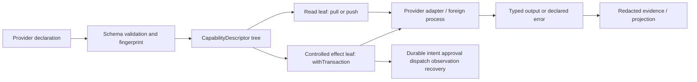

# LiveEvidence：真实纸面路径、诊断证据与 UTA 兼容层设计

## 1. 范围、事实与目标

本组覆盖真实纸面/沙盒 E2E、旧 UTA Trading-as-Git 路径、原始 CCXT 诊断、证据 JSONL sink、运行时账号发现、以及 MockBroker 生命周期。源码事实必须保留，但源码当前使用的 `IBroker`、`UnifiedTradingAccount`、模块级 broker/cache、CCXT `Exchange` 逃逸口和 TWS/CCXT 直接调用只是当前实现证据，不是目标架构中的全局 SDK 合同。对应 MAP 入口是 `MAP-5A0732EC10`、`MAP-3BF311EBD5`、`MAP-68FD1B154A`、`MAP-D16449202E`、`MAP-FACA90D0FC` 和 `MAP-61B4CADFAF`。

源码中的“成功”有三种不可混淆的含义：配置/连接就绪、provider 接受请求的 Ack、以及后续观察确认成交/撤单/保护腿。Alpaca、Bybit、Hyperliquid、OKX 测试都把 place 的返回和后续 `getOrder`/position observation 分开；MockBroker 又明确提供 Immediate 与 Deferred 两种 fill 模型（`alpaca-paper.e2e.spec.ts:132-196`、`ccxt-bybit.e2e.spec.ts:58-234`、`ccxt-hyperliquid.e2e.spec.ts:97-166`、`ccxt-okx.e2e.spec.ts:197-254`、`uta-lifecycle.e2e.spec.ts:30-108`）。sleep、日志、Git projection、JSONL append 和本地 Mock 结果都不能单独取得执行权威。

账户相关的 account/position/order facts 与远端 trading effect 绑定 `AccountScope(accountId, subAccountId)`；公共 Instrument/Candle/News/NewsGroup/quote/catalog 叶子使用 `Public` scope 或由其具体 provider schema 声明的 scope，绝不凭空造默认账户或 subaccount。所有适用的记录仍带 canonical `InstrumentId` 与 provider/catalog revision。native `conId`、symbol、localSymbol、CCXT market id 是 adapter evidence 或精确扩展；它们不能靠字符串拼接、数组首项或 `undefined` 推成跨层身份。数量、价格、金额沿用 Decimal 字符串与单位，不以 JS number 作为事实。

## 2. LiveEvidence 的组合边界

共同固定的是 `CapabilityDescriptor` 外层：稳定 capability identity、command path、schema version/fingerprint、输入/结果/领域错误 schema、pull/push delivery、effect category、resource/permission requirements、source 和 availability evidence。每个 provider 在叶子上声明自己的参数、native extension、返回形状、错误变体、命令树和所需资源；没有原生能力就没有该叶子，空父节点递归消失。名称冲突、revision/stale、授权和 availability 由装载/调用边界明确报告，不把暂时断连伪装成不支持。

接入作者声明一次精确 schema、语义单位、能力说明、处理函数和资源需求，随后由声明计算 discovery、CLI/AI describe/help、边界校验和调用句柄。这里的 HOF 是组合边界，不是强迫 provider 内部使用某种语言或 FP 风格：类、回调、任意 SDK、REST/OpenAPI、网关和独立进程都可以保留。静态 provider 的输入/输出/错误类型从 schema 推导；动态 foreign process 的 JSON 先在边界解析为精确 schema，不能用 cast 冒充静态类型。

因此本组不提出全局 `ActionContractMap`、完整 Broker SDK、必须存在的 Place/Modify/Cancel/Close 集合，或为每个 provider 补返回 `Unsupported` 的空 handler。公共数据叶子也不因为缺少账户而伪造 scope；账户相关叶子才要求 AccountScope。`IBroker`/generic broker 的出现保留在 `currentBehavior` 与 `sourceEvidence`，其目标替代是 provider capability leaf 和 adapter-private native request。新增 provider 参数或新数据能力应只扩展其声明树，不修改内核能力 switch，也不迫使其他 provider 实现空方法。

## 3. 数据交付与受控效果分离

### 3.1 只读数据、观察与缓存

以下 MAP 是 data capability；账户/持仓叶子是 Account-scoped，公共市场/catalog/quote 叶子使用 Public 或 provider-declared scope：账户/持仓（`MAP-60855A8312`、`MAP-B65B828516`、`MAP-8D31A540CC`、`MAP-CC43DAFDFD`、`MAP-813BFD59A1`）、报价/会话（`MAP-415093F05F`、`MAP-FFA9030D49`）、catalog/search/InstrumentEvidence（`MAP-444A62C6D5`、`MAP-301A0F7EF8`、`MAP-5460468AB4`、`MAP-4B824156CE`、`MAP-8D95A00EF9`、`MAP-FA821E371F`）、order query/listing（`MAP-0FB902DDBC`、`MAP-47ED37A445`、`MAP-E4B0D38A44`）、AI read tools（`MAP-B164304E0C`、`MAP-E136AE0A4B`）、以及 run/evidence/projection（`MAP-424F0FB69C`、`MAP-8800585703`、`MAP-C2F022975E`、`MAP-47B29B6218`、`MAP-3EEA8F2FEB`）。

`pull` 是一次有限结果，允许明确的分页、不完整和 `Complete|Partial|Unavailable`；如果未来接入 push，必须声明创建、取消、结束、错误、cursor、重放、缺口、背压和断连恢复。数据读取可以消耗连接、配额、缓存、存储或付费资源，因此仍受声明的 scope/permission/quota 控制；账户数据带 AccountScope，公共市场数据带 Public 或 provider-declared scope。它们不使用 order prepare/approve/compensate、订单锁或每个 frame 的交易 WAL。数据只在被某个 effect 决策选用时，持久化被选中的 evidence、消费身份和决定，不把整条行情流事务化。

Quote、position、catalog 与 order listing 的空、缺失、stale、not-found 和 partial 各有含义：空列表不能证明没有市场或订单，派发后短暂找不到 order 是 `NotFoundYet`，已知 TWS snapshot timeout 是阻断价格依赖的 `MarketDataUnavailable`，而未知 timeout 仍是 `Unavailable|Unexpected`。不能用本地接收序号制造 venue finality、完整重放或成交保证。Hyperliquid 的 `DerivedFromNotional`、OKX 的 synthesized spot holding、IBKR Contract copy 都必须保存来源和版本，不得当作可执行价格或 universal identity。

### 3.2 交易 effect 与 `withTransaction`

真正会改变远端账户的 order.place、order.cancel、position.close、trigger、bracket 和 operation-owned cleanup 才进入 `withTransaction`。trigger/event source 只能提供观察或待审 intent，不能成为 approval authority。每个 effect 仍由 provider 声明精确 input/output/error schema；`withTransaction` 不是把所有叶子包装成同一个 `Order`，也不是让 `withX` 退化成 `Order => Order`；不为所有 provider 手写 Cartesian `Order` variants。它为这一个能力保存版本化 prepared payload、approval digest/actor/expiry（若该策略要求）、唯一 command identity、WAL、lease/CAS、Ack、observation cursor、unknown/reconcile 和 recovery schema；native idempotency、atomicity、leg visibility 和可逆性必须有 provider evidence。

Alpaca limit/market/close、Bybit market/trigger/bracket/close、Hyperliquid buy/close、OKX spot/perp writes、IBKR place/close 以及 UTA compatibility writes 都按此拆分；相邻的 query/quote/position read 仍是独立 data leaves。成功的 place 是 Ack，不是 Filled；Ack 后断连、坏响应或缺 remote id 进入 `OutcomeUnknown`/具名 recovery，不得盲目重派。Compensation 只表示同一 approved effect 允许的、scope/target/risk budget 内的受控步骤；超界、事实不明或未发送的 draft 走 recovery/review，不能把数据缓存失败当作交易补偿。

保护和触发不是全局订单字段大全。`ProtectionSpec`、parent/child/OCA、leg id、trigger direction、GTD、outside-session、trailing 等只在 provider 声明时出现；不支持/暂不可用/未返回必须分别是 capability 或 observation outcome。`MAP-4D4A864108`、`MAP-E5356E684D`、`MAP-8CB6B26E83`、`MAP-4A1400D914`、`MAP-34BF36C838` 保留用户原始意图和 native evidence，禁止静默变成 naked entry 或“已保护”。

## 4. 运行时发现、身份与兼容层

`setup.ts:18-144` 当前按 preset、字段存在、TCP、30 秒 init 和 module Promise cache 过滤账号，并把构造异常与 init 失败混成跳过。目标 `DiscoveryResult` 要列出 ready 与 typed skipped，带 scope、venue、environment、readiness epoch、config version、endpoint/account evidence 和 capability availability。`isPaper`、credential 字段存在、demo/testnet 文案、端口可达、ID 包含 venue 都只是 hints。IBKR 需协议/账户握手，不因 TWS 登录方式没有 API key 就宣称 ready；超时的 late completion 不能发布旧 epoch。

缓存可以是 run-scoped fixture 的优化，但不是生产 authority；恢复必须读取 durable readiness/evidence，不从 module cache 推断交易已恢复。AliceRef 采用结构化 scope+InstrumentId，兼容字符串仅在外层序列化；同 symbol 不同账户仍是不同 scope。`MAP-5C9F33F93C` 的 USD.CHF conId identity 与 display `USDCHF` 分离，`MAP-42049295D7` 的 Bybit localSymbol 也只作为 adapter evidence；污染的 symbol/secType/exchange 不能覆盖 canonical identity。

旧 UTA 的 stage→commit→push→sync→log 体验可以继续作为 projection/compatibility surface（`MAP-58F0FF7798`、`MAP-DC819A17DE`、`MAP-96BCC45A7C`、`MAP-147173C2A5`），但 Git history、status/show/export 和证据文件都是可重建投影。新的远端写必须从 capability leaf 进入 `withTransaction`；prepared-but-not-pushed 与 explicit reject 保留，拒绝只清掉未发送 staging，不会产生 broker dispatch。

AI read path 先 discover/describe，再按叶子 schema 调用。Alpaca/Bybit 的 search→quote/details/orderbook/funding regressions（`MAP-B164304E0C`、`MAP-E136AE0A4B`）应在输入边界解析 AliceRef，返回精确 result/error；不允许 `Function`/`Record` cast 或把 raw aliceId 写回 Contract。`MAP-CAA43D746F` 的 reasoned/reasonless user rejection 是一个小型本地 safety lifecycle，不是 broker rejection。

## 5. 证据 sink、诊断与 Simulation

`live-paper-evidence.ts:6-87` 当前只复制 IBKR Contract 字段、用环境/时间/pid/git 构造 run id、向 ignored JSONL append，并带 `paper:true`/`broker:'ibkr'`。目标 `LivePaperEvidenceEnvelope` 是 schema-versioned、redacted、scope-bound 的诊断 projection，包含 RunIdentity/CodeProvenance/Freshness、environment、InstrumentEvidence/catalog revision、scenario/phase、dispatch/observation/external-stimulus identity、baseline/cleanup 和 typed outcome。证据 append 不能授权、批准或替代 JournalWriter。

`EvidenceSink` 自己要处理 safe root、schema parser、per-run/sink sequence、same-sequence same-digest replay 和 divergent conflict；并发排序不可用时返回 unavailable/failed，不改变交易 authority。`MAP-424F0FB69C`、`MAP-8800585703`、`MAP-FA821E371F`、`MAP-C2F022975E` 保留小而非敏感的记录形态与 operator path，但不把 evidence record 当 SDK request。

Raw CCXT 的 `info`/Exchange 访问只允许在 named adapter diagnostic boundary；`MAP-D16449202E`、`MAP-58AE86AEDD`、`MAP-B5990574ED`、`MAP-E4B0D38A44` 的 S7 direct order 必须有 actor/provenance/native identity、namespace evidence，并在 Alice/UTA 中观察、接管或取消。它从不计为 UTA dispatch。S4 amendment 不写死 same-id 或 new-id：Alpaca 可能换 id，IBKR 可能保留 id；evidence 同时保存旧/新关联和 adapter-declared identity semantics（`docs/uta-live-testing.md:244-319`）。

MockBroker 仍是有真实 position/cash/order 变化的 in-memory simulator，而不是 stub（`MAP-55F8053385`）。Immediate/Deferred fill、external fill、10→7 partial close、full close、cancel、newest-first history 和 Decimal/sentinel cases（`MAP-81E8AC49C4`、`MAP-6119E3BEEE`、`MAP-7076DD2230`、`MAP-5F648FC9E1`、`MAP-C63562DE19`、`MAP-3EEA8F2FEB`、`MAP-14999AF99F`）保留为 pure transition/Simulation evidence。每个 fixture 标记 `Simulation`，不能满足 live-paper、native finality 或 durable dispatch acceptance；TPSL spy 改为 observable `NoBracket|LegsKnown|Unknown`（`MAP-04EB2CF21F`）。

## 6. Provider 自由与 UTA-facing 约束

实现者可以在 adapter 内使用任意语言、SDK、协议、缓存、回调、foreign process、REST/OpenAPI 或网关。UTA-facing 只固定：

- `CapabilityDescriptor` 外层和 revision/schema fingerprint；
- 输入、结果、领域错误在边界的精确 schema 与版本；
- 适用时的 AccountScope，或公共/具体 provider-declared scope；InstrumentId、catalog/revision、availability、permission/resource 证据；
- pull 有限结果与 push 生命周期/背压/断连契约；
- controlled effect 的 withTransaction、durable identity、Ack/observation/unknown/recovery；
- redacted evidence 与 Simulation/ExternalStimulus provenance。

不能从“某接口存在”推导只读、幂等、原子性或补偿；不能凭 SDK 类型保证恶意 foreign process 不下单。若 SDK 不能拆分读写权限，则它是显式受信任的执行边界，必须做审计与 conformance。新增 provider 字段的验收要同时看到静态类型/validator/metadata/CLI describe 改变；新增数据/trigger/option/cancel capability 不存在时，命令树中也不存在对应叶子。

## 7. 仍然开放的实证义务与风险

以下八项问题保持原问题文本和 `empirical-retained` 状态，不因组合抽象而声称已解决：

- `MAP-4D4A864108`：Bybit 是否返回 parent-linked TP/SL legs；没有 capability + observation fixture 只能 `ProtectionCapabilityAbsent|BracketObservationUnknown`。
- `MAP-E5356E684D`：cache invalidation 后 trigger query 是否有稳定 native identity；无证据不能 takeover/cancel。
- `MAP-A60C86B58F`：Hyperliquid execution/fill latency 与各 account mode 的 stablecoin normalization；Ack 不能升级为 fill/USD。
- `MAP-FBF3A41608`：OKX dust/minimum-balance 是 venue/account policy；不得用统一 10% 或默认阈值。
- `MAP-7DAC2704FB`：除已观察 51010 外的 OKX account-mode codes/text 尚未映射；未知不得算非致命 capability refusal。
- `MAP-B5990574ED`：raw diagnostic 没证明 spot/perp namespace 完整；Public catalog 需 cursor/pagination/completeness evidence，若 provider 明确要求账户 scope 才记录该 scope。
- `MAP-FFA9030D49`：TWS/Gateway 版本的 quote timeout 行为未全覆盖；未知 variant 继续 unavailable/unexpected。
- `MAP-C2F022975E`：并发 JSONL append/import ordering、sequence 和 conflict handling 需 runtime acceptance。

### 可证伪 scenario

1. 声明一个新的 provider-native order field 或 read field；若类型、边界 validator、CapabilityDescriptor fingerprint、describe/CLI schema 不同时改变，组合抽象失败。
2. 装载没有 option/cancel/bracket/trigger 的 provider tree；若仍出现空命令或“Unsupported handler”，K02/K04 失败。
3. 向 leaf 输入错误单位、scope、schema version 或 provider extension；若 handler/foreign process 被调用前没有精确拒绝，K03/K07 失败。
4. 执行 pull 与 push：pull 必须有限返回并带 completeness，push 必须可取消/结束并释放它拥有的资源；单帧不能冒充闭合 candle 或交易 fill，K05/K06 失败。
5. 外进程返回私有字段、坏 output/error 或 declared schema 之外的数据；若 redaction/parser 放行，K03/K07 失败。
6. 真实受控 order place 在 DispatchStarted 后断连；若系统重派而不是按 OrderRef/observation 进入 Unknown/reconcile，K08 失败。数据 cache/JSONL 写失败不得触发补偿。
7. S7 直接订单带 actor/provenance/native id 进入 observation；若它统计成 UTA dispatch，或不完整 namespace 仍被当作 absence，K05/K07/K09 失败。
8. S4 amend 在一个 provider 换 remote id、另一个保留 id；若 evidence 没有旧/新关联，或实现假定所有 provider 同一种 semantics，K07/K11 失败。
9. Mock Immediate/Deferred 两个 fixture 都通过同一纯 transition，但 Simulation envelope 不能被 LivePaper gate 接受，K11/K12 失败。
10. ReturnToAgent 仅适用于真正选中的 controlled-effect policy：一次 candle/trigger activation 若产生复核，必须暂停未发送 intent/evidence、创建 durable ReviewRequest/outbox，并只允许显式 `Discard|KeepSuspended|Rearm|Revise|RequestSubmission`；暂停期间零 broker dispatch，普通 data pull 不得进入该交易分支（K08-K10）。

## 8. Acceptance 组织

主集成后的真实 acceptance 以公开 agent 用户入口运行：verified environment/account → complete baseline → discover/describe leaf → typed prepare/approval（仅 controlled effect）→ DispatchStarted → Ack → observation/fill/reject → scoped cleanup/recovery → final baseline/evidence import。数据读、catalog、quote、AI tools 和 evidence sink 各自验证 pull/push、适用的 Public|Account/provider scope、freshness、redaction、pagination、sequence/conflict；不能拿单接口、首页探活、Mock、类型检查或现有日志代替。

MAP 证据索引保留在 `solutions/LiveEvidence/analyses.json` 的每个 entry；`crossGroupContracts` 只引用 `composition-contract.md` 的 K01-K12 和准确 subject，不声称任何 conceptual name 已有 production export。reviews/entries 由独立流程维护，本文只提供当前实现方向与 falsifiable obligations。

