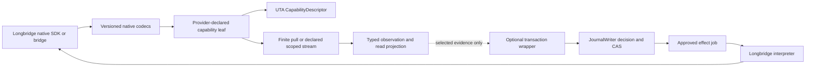

# Longbridge 适配器：可组合 UTA Effect Runtime 设计

## 1. 范围、证据与设计状态

本文是 Longbridge provider pack 的目标设计，不是生产迁移、SDK conformance 报告或已发布的 runtime。范围是五个源码文件和 80 个 MAP：`LongbridgeBroker.ts`、`LongbridgeBroker.spec.ts`、`index.ts`、`longbridge-contracts.ts`、`longbridge-types.ts`。每条 MAP 的 `sourceEvidence`、`currentBehavior`、缺陷、保留行为、替换步骤和验证义务仍以 `analyses.json` 为逐项事实源；可通过 [entries.md](entries.md) 中按 MAP ID 的稳定锚点定位；本文件只组织共同的实现方向，不替代逐项证据。
MAP 所引用的源码行号是审计提交 `a5f23756531cc552b7e12b6d655ae1ffbcd28b64` 的历史证据，不是当前协议或 runtime 保证；实现前仍需重读当前 checkout 并取得 native conformance。

当前实现是一个 `IBroker` 兼容外壳：它同时保存 Longbridge Rust-NAPI handles、读取 native response、构造 IBKR `Contract`/`Order`、直接提交交易、执行账户/持仓估值和生成兼容状态。`LongbridgeBroker.ts:18-52` 与 `longbridge-types.ts:1-8` 是这一边界事实。目标不要求所有 provider 都实现同一 SDK 或同一类；目标只在 UTA-facing 一侧遵守固定的 `CapabilityDescriptor` 元契约。源代码中的 `IBroker`、全局 switch、兼容对象和 numeric enum 是调查证据，不是新的全局架构要求。

固定契约为 `composition-contract.md` 的 K01-K12：声明一次精确 schema、语义单位、能力说明、处理函数和资源；由声明推导类型、校验、能力描述、CLI/AI 元数据；每个 provider 自己拥有开放的 capability tree、输入/输出/错误 schema；没有全局 `ActionContractMap`，没有必须实现并返回 `Unsupported` 的完整 broker handler 集，也没有手写订单组合全集。当前设计中的名字（例如 `LongbridgeInstrumentId`、`LongbridgeOrderLeaf`、`LongbridgeConnectionLayer`）是概念边界，不声称这些导出已经存在。

## 2. Provider tree 与 UTA-facing 边界

Longbridge pack 由一个 composition root 装载。装载结果的外层统一为 `CapabilityDescriptor`：协议版本、稳定能力身份、命令路径、描述、schema 版本/指纹、输入/结果/领域错误 schema、交付方式、效果类别、权限/资源要求、来源和 availability 证据。内层的叶子由 Longbridge 声明，可继续使用 Rust-NAPI class、任意 SDK、REST、网关或独立进程。新增 Longbridge 字段只改变相应叶子的 schema、codec、descriptor 和 CLI/AI 投影，不修改 kernel capability switch，也不让别的 provider 增加空方法。

概念上的 Longbridge tree 可以包含以下叶子，但只发布源码或 conformance 实际证明的叶子：

- `instrument.resolve`、`catalog.search`、`instrument.details`：公共/Instrument scope 的有限读取，返回精确的 identity、目录覆盖和 availability。
- `account.balance`、`account.positions`：Account scope 的读取，保留账户 channel、币种桶和观察证据。
- `order.get`、`order.list`：Account scope 的 detail/list 两种不同查询；detail 逐个返回结果，list 才能声明 namespace/cursor coverage。
- `market.quote`、`market.depth`、`market.session`、`fx.observation`：默认使用 Public 或具体 schema 声明的 scope；不得凭空选账户或 sub-account。
- `order.place`、`order.modify`、`order.cancel`、`position.close`：只有 native 输入/输出/error schema 和 capability/permission 证据存在时才发布为受控 effect 叶子。

读取叶子可以只提供 `pull`，也可以在未来由 provider 明确声明 `push`。Longbridge 当前源码只证明 `accountBalance`、`stockPositions`、quote/depth、staticInfo 和 `tradingSession` 等调用，不证明一个可重放的 public stream。任何 push 叶子都必须声明创建、取消、结束、错误、cursor/顺序、缺口、backpressure 和断连恢复；不能把 websocket handle 或 stdout 当作 UTA stream 契约。

## 3. Identity、scope、配置与连接

### 3.1 Public identity 与 account facts

`longbridge-contracts.ts:13-25` 的 suffix table 只证明 HK/US/SH/SZ/SG 的 exchange/currency 事实。`700.HK`、`000001.SZ` 和 `AAPL.US` 可以作为有 suffix 的 identity 输入；bare ticker 只有在 catalog/static evidence 唯一且一致时才能解析，unknown suffix、CNY-only inference、未知 market enum 和 currency-only venue inference 都不能单独生成可执行 identity。`Contract`、`localSymbol` 和 `aliceId` 只在边缘作为兼容投影或带 schema 的引用，不能反向证明 native identity。

`InstrumentId` 的构造由 runtime schema 和必要的 catalog/static evidence 完成，包含 native key、ticker、suffix、venue/jurisdiction、currency、kind、source 和 metadata version。public Instrument scope 不捏造 `AccountId`/`SubAccountId`；只有 account-owned lookup、position、balance、order 或执行能力需要 Account scope。单个账户的 Longbridge source comment（`LongbridgeBroker.ts:1-6`）不能被解释为所有 public data 都属于同一个可执行钱包。

### 3.2 Account scope 与配置

Account-owned facts 使用 `AccountScope = AccountId + explicit SubAccountId`。它贯穿 balance/position/order observation、account-owned capability、lookup descriptor、conflict key、prepared effect 和 approval grant；未知 scope、channel mismatch 或目录尚未发现时不得选择默认钱包。公共 quote、session、catalog、static-info 和 FX 叶子返回 `Public` 或其 schema 明确声明的 scope，不从请求者上下文补 sub-account。

`LongbridgeBrokerConfig`（`longbridge-types.ts:9-32`）目前把 raw app credentials、paper marker 和可选 endpoint 放在 compile-time interface 中。目标在 pack 边界将其解析为 secret-free declaration：AccountId、所需 AccountScope、ConnectionId、声明的 Paper/Live intent、CredentialRef、endpoint set、SDK/protocol policy 和 schema revision。CredentialProvider 只在 scoped Layer acquisition 内取得 secret；secret 不进入 descriptor、plan、digest、日志、fixture 或错误正文。paper/live 只有在声明、credential、实际 endpoint 和 account evidence 一致时才形成 executable availability；证据缺失为 `EnvironmentUnknown`，冲突为 `EnvironmentMismatch`。

连接 reach、capability、authorization、policy 和 execution precondition 分开。一次 `accountBalance` 成功最多证明相应 account-read leaf reachable，不证明 quote、catalog、trade 或恢复已完成。连接可有 `Connecting | Ready | Degraded | Reconnecting | Closed`，UTA process health 仍使用 C06 的 `RuntimeHealth`，并需先完成 journal/recovery barrier 才能打开执行 admission。`LongbridgeBroker.ts:174-228` 的 bounded retry 和 auth distinction 可以保留为显式 retry policy/diagnostic evidence，不可由 message regex 单独授予 Ready。

`close()`（`LongbridgeBroker.ts:230-233`）当前是 async no-op，源码没有 native release hook。目标使用 scoped ownership、一次性的 closed generation 和 `CleanupEvidenceUnavailable`；只有 conformance 实际发现可调用的 release/unsubscribe hook 后才增加相应叶子。GC 不被宣称为确定时序；关闭一个 connection 不应强制无关 account scope 进入全局失败。

## 4. Schema-first data leaves

### 4.1 Native codecs 与缺失

`longbridge-types.ts` 的 getter-only interface 只是当前读取子集，不是 response validation。每个叶子在 `unknown` 边界使用版本化 runtime schema/codec，验证 getter/字段存在、Decimal、currency、timestamp、instrument correlation、native enum 和 response version。显式零、空列表、缺失字段、未知 enum、transport failure、权限拒绝和 response protocol violation 必须有不同结果。字段不在 native schema 中时保持结构性缺失或 `Unavailable`，不能为了兼容投影补零、补一、补 US、补 STK、补 DAY。

Provider-native 参数属于 provider leaf 的精确 extension。若 Longbridge native response 有额外字段，codec 和 leaf schema 原样保留其版本化意义；若没有字段，输出 `Incomplete`/`Unavailable` 并记录缺失原因。不能因为 IBKR-shaped compatibility type 有一个 optional property 就宣称 native 支持。

### 4.2 Account 与 FX

`account.balance` 是一个 Account scope 的有限 pull。每个 currency bucket 保留 `totalCash`、`netAssets`、`buyPower`、`initMargin`、`maintenanceMargin`、currency、scope、source、observedAt 和 broker response version。`LongbridgeBroker.ts:381-435` 的 HKD/最大桶 fallback 与 `unrealizedPnL='0'` 只能作为当前缺陷证据；目标不把某一个 bucket 当作账户总额。无 FX 时仍展示所有原始 buckets，并返回 `UnknownValuation`/`Unavailable`；empty response 是 `EmptyObserved`，不是余额为零。

FX 是独立的公共或明确声明 scope 的观察叶子。`FxObservation` 携带 from/to、rate、source、observedAt、freshness、validUntil 和 version。等币种 identity rate 是纯单位事实；跨币种转换保留一个或两个 rate observation 的证据。`fx-service.ts:140-204` 的 cached/default/unknown 1:1 结果不能被 Longbridge fold 成 Exact。Accounting 消费这些事实产生 `Exact | Stale | Estimated | Unknown` valuation；未知或不允许的 estimated 值不得满足 buying-power 或其他执行 precondition。realized/unrealized PnL 由 fills/marks 的 accounting fold 产生，适配器不写常量零。

账户读取、FX lookup、估值 projection 和缓存是 read/accounting 资源。它们不执行 order prepare/approve，不持有 order lock，不创建 dispatch WAL，也不触发 compensation。若后续 order 决策选择了一笔余额或 FX observation，只把选中的 evidence reference、consumer identity 和 freshness policy 写入受控 effect plan。

### 4.3 Position 与 enrichment

`account.positions` 保留 native `accountChannel`、symbol/name、signed quantity、costPrice、currency、market、scope、observedAt 和 source。channel 不自动等同于 sub-account；同 ticker 在不同 channel/venue 必须按 canonical identity 分开。zero row 是关闭暴露的事实，真正 empty response 是 `EmptyObserved`；兼容 `Position[]` 可以为展示过滤 zero，但 journal/projection 不得删除它。

quote、staticInfo、optionQuote、warrantQuote 是独立的 keyed enrichment leaves。staticInfo 的 `stockDerivatives ?? []` 缺陷必须改为 field-presence-aware：显式 empty 可以保留 `EquityLike` 的 source ambiguity，missing/unknown 是 `Unresolved`/`ProtocolViolation`。option multiplier 与 warrant conversion ratio 必须关联 expected InstrumentId、kind、source、time 和 version；缺失或 stale 不得变成 one。响应乱序、同 ticker 不同 suffix、部分失败和 per-instrument unavailable 都保留在 batch result，而不是由数组位置或空 Map 推断。

所有这些是账户观察/投影数据。`stockPositions`、quote/static/multiplier retries 可以由 observation job 或 cache policy 管理，但不使用 order approval、compensation、order lock 或每个数据帧的 WAL。只有被选作 close/placement precondition 的 exposure/mark/multiplier evidence 才进入另一条受控 effect path。

### 4.4 Quote/depth/session 与 delivery

`market.quote` 和 `market.depth` 的输入以 public/instrument scope 为默认，除非 provider schema 明确声明别的 scope。输出携带 InstrumentId、venue/session context、source、timestamp/observedAt、freshness 和 Decimal evidence。depth 的 `Present | EmptyBook | BidOnly | AskOnly | Unavailable` 必须区别真实零价、无流动性、单边和请求失败；`LongbridgeBroker.ts:631-657` 的 rejected depth -> empty arrays -> zero bid/ask 是要移除的 fallback。有限 pull 输出必须有明确终点/请求相关性；如果未来声明 push，stream resource 才负责取消、结束、背压、cursor 和断连恢复。关闭 CLI tail 不会撤销持久触发 binding。

`market.session` 也是 public/venue/session scope 的 data leaf。`LongbridgeMarketSessionLike` 只提供 numeric market、tradeSession 和 hour-minute-second（`longbridge-types.ts:117-125`）；它不证明 timezone、calendar date、holiday 或 next boundary。目标把它解码成带 raw evidence 的 session observation，再由显式 VenueCalendar/Timezone/Instant 纯评估，返回 `Open | Closed | Unknown` 与 next boundary。空/缺失 coverage 为 Unknown，不是 Closed；它可被交易准备作为 freshness precondition 消费，但 session 叶子本身不拥有订单事务。

## 5. 受控交易 effect 与 Longbridge native compiler

### 5.1 语义单位与 provider HOF

交易不是 Longbridge pack 的所有能力，而是对少数 order leaves 的可选 `withTransaction` 包装。`Order` 是可组合的语义单位，不是 kernel 必须穷举的 order class 清单。Longbridge 可以声明基础 order schema，再以 HOF/组合器加入它实际支持的 sizing、price/trigger、TIF、trailing、protection、parent/OCA 或其他 native extension；每次组合都推导自己的精确 input/output/error/resource schema 和 descriptor。局部互斥 union（例如 Amount/Percent trailing 或两个明确的 sizing 形状）只在相关 leaf 内存在；未被该 leaf 声明的参数变体不进入其 input schema，可用性另由 descriptor 报告。

Longbridge 当前 source facts 应原样保留：HK MKT -> ELO、其他已证明市场 MKT -> MO、LMT -> LO、STP -> MIT、STP LMT -> LIT、百分比 trailing -> TSMPCT/TSLPPCT（`LongbridgeBroker.ts:71-101`、MAP-E1A5D342A5、MAP-9218DFF430）。这些是已观察映射，不是所有账户/venue 的 capability。具体 Units/Notional 合法组合由 Longbridge leaf 自己声明；不得把另一个 provider 的限制变成全局规则。当前源码没有 notional、amount trailing、native TP/SL、bracket/OCO 或 idempotency 的充分证据，因此相应参数变体在已声明 leaf 的 input schema 中省略，或在未声明能力时不发布 leaf；descriptor 的 availability 可独立报告缺少证据，不能丢字段或改发 entry-only 请求。

TIF leaf 的 input schema 只包含当前已声明的变体；Day/GTC/GTD 是 source facts，IOC/FOK/OPG 的拒绝也是 source evidence，但这些未声明变体不进入 Longbridge 的可执行 schema，availability 仍单独描述。GoodTill 必须带 expiry、timezone/calendar evidence；unknown input 不得默认 Day。TrailingMarket 与 TrailingLimit、Amount 与 Percent、initial stop 与 limit definition、ProtectionSpec、parent/OCA relation 都必须在 Longbridge leaf 的 schema 中精确编码；缺失 schema 的变体在 schema 边界拒绝，不能从 compatibility `Order` 猜测或静默互换。

### 5.2 withTransaction 的边界

读-only 或无 execution permission 的调用可以产生 `DraftReview`/`PreparationPreview`，其中没有 executable job、approval、dispatch receipt、order lock 或 compensation。需要受控副作用时，`withTransaction` 组合器把已验证的 provider leaf 接到已有 transaction contract：

1. 纯 schema/HOF compiler 验证 Account scope（对 account-owned effect）、InstrumentId、provider capability/authorization、policy、freshness、units/price/TIF/native extension 和 criterion，输出可序列化 prepared payload。
2. writer 在单一 SQL transaction 中按 command identity/digest 和当前 state CAS 写 receipt、prepared plan、before-image 引用、prepared conflict evidence 和 plan digest。plan 不含 SDK object、schema object、closure、Effect、secret。
3. 只有显式 approval 或解析后的 policy approval 通过 scope、revision、digest、expiry 和权限检查后，writer 才创建 accepted-execution reservation、`DispatchPlanned` 和 effect job。准备本身不是批准，数据读取不会走这条路径。
4. scheduler 在 lease/epoch CAS 后先写 `DispatchStarted`，再调用 scoped Longbridge interpreter。ack 只表示 action-specific acknowledgement；fill、cancel、terms 或 exposure criterion 仍需 observation。
5. dispatch 后 timeout、连接断开、坏 response 或 accepted-before-ack 一律 `OutcomeUnknown`，先按 native lookup descriptor observe/reconcile，暂停剩余 forward steps；只有有完整 provider absence/idempotency evidence 才可重试同一 identity。已知拒绝必须有 Longbridge native code/status/evidence，不能用 message text 代替。

`ReturnToAgent` 只适用于上层选择了该触发策略的受控 effect。一个 Longbridge candle/quote/session 事件是 source evidence，不是 authority；事件经来源、schema、freshness、顺序和谓词检查后产生 activation。ReturnToAgent 的 durable decision 原子暂停未发送 intent、创建 ReviewRequest/outbox 并保持 review identity，不创建 broker dispatch。后续只能用显式 KeepSuspended、Rearm、Revise、Discard 或 RequestSubmission schema 处理，不能从 AI 自由文本猜授权，也不能因保留草稿延长旧 approval。

### 5.3 Action-specific leaves

- **Place**：保留 native side、symbol、Decimal、ELO/MO 等已证字段；`_tpsl` 不能静默丢弃。选中的 protection/relation 变体若不在该 leaf schema 中，应在 schema/capability 边界拒绝，不发送裸 entry；交易 WAL/CAS/idempotency/unknown/recovery 只存在于 `withTransaction(placeLeaf)`。
- **Modify**：从 account-scoped `OrderSnapshot` 和 version/before-image 构造 provider 声明的 replacement schema。omitted/unchanged/clear 只有在 Longbridge schema 证明时才可区分；replace ack 不是新订单状态。
- **Cancel**：只在 Longbridge tree 声明 cancel leaf 时调用。保留 native order id、scope、lookup descriptor 和 rejection evidence；ack 后继续观察 canceled/filled/still-working/unknown。
- **ClosePosition**：读取 account-scoped signed ExposureObservation，构造 ExposureEquals/target criterion；保留 reverse side + DAY MKT 的有效 source behavior，但不声称 market order 是 Exact rollback。数量、reduce-only、native close endpoint 和 residual exposure 都由 provider capability evidence 决定；不确定时暂停并观察。

## 6. Packaging、测试与切换边界

`index.ts:1-2` 当前只导出 legacy class/config。目标 barrel 只负责注册 provider composition：descriptor metadata、schema/codec、identity/data leaves、可选 effect interpreter、connection Layer 和 recovery lookup descriptor。它不把 `IBroker` facade 重新变成全局 authority，也不为不存在的 option/cancel/protection 叶子制造 placeholder。kernel 不导入 Longbridge SDK；native class 只在 adapter interpreter/codec 内消费。

`LongbridgeBroker.spec.ts` 的 mock、private injection、toString helper 和默认-zero fixture 保留各自测试所有权：

- pure mapper/schema tests 只证明 schema/codec/转换；不能把 mock promise 当成远端 ack、幂等或 atomicity。
- scoped TestLayer 可以提供每个叶子精确的 native input/output/error 和 malformed/unknown injection；fixture 不拥有 journal。
- accepted-before-ack、crash/restart、DispatchStarted、独立 remote ledger、真实 JournalWriter 和 recovery observation 由集成 conformance harness 负责，不能由私有字段注入替代。
- account/position/quote/session 测试验证有限数据输出、quality、scope 和 projection；不把 order state machinery 追加到数据读取。

本轮只改设计文档，不进行 production migration。实现时按 pack 内 schema/codec/identity/data leaves、再到 optional order compiler/transaction wrapper、最后单 account authority cutover 的顺序推进；每一阶段删除已废弃的 direct-write caller，不双写同一 authority。

## 7. 必须保留的 empirical obligations

下列事实不能由抽象、同组设计、mock 或 TypeScript interface 填空；它们在 `questions-closure.json` 中保持原问题文字和当前 closure：

- **MAP-7805D80DA1**：取得实际 native response envelope/version，并用独立 remote ledger 注入 accepted-before-ack。取得前，缺 envelope/version 是 `ProtocolViolation/RecoveryRequired`，`DispatchStarted` 后的结果是 `Unknown + ObserveRequired`。
- **MAP-ABF45B8D66、MAP-4DE673DCFE**：记录 SDK error code/status 与每个 trade/quote endpoint 的 probe coverage。未知错误不做 retry/accept 分类，未覆盖 quote reach 保持 unavailable，C06 health 不到 Ready。
- **MAP-B35B59A740**：取得 schema-valid native fixtures 和 restart-surviving remote-ledger driver；默认-zero/toString helper 不能证明 missing-vs-zero、native schema 或 crash outcome。
- **MAP-50CE86A3DE、MAP-FCDA99890A**：观察 paper/live credential、endpoint、account 的一致性规则；缺证据为 EnvironmentUnknown 并阻止写入，冲突为 EnvironmentMismatch，持久化只含 CredentialRef/fingerprint。
- **MAP-39CF059275**：source 已闭合为 async no-op、无 release API；只采用 scoped finalizer/closed generation/cleanup unavailable，未来 hook 需直接观察后才能添加。
- 仍未知的 Longbridge native facts 包括 response envelope/status code/error code、paper endpoint、tradingSession timezone/calendar、native TP/SL/bracket/OCO、amount trailing、notional、idempotency horizon、absence/listing completeness、unsubscribe/release。未取得证据时，未声明的 leaf 不发布；已声明但暂不可用的 leaf 才报告 named unavailable/unknown，不扩张输入 schema。

## 8. 可证伪场景

1. 在 Longbridge order leaf 增加一个有精确 schema 的 native extension 后，descriptor、静态类型/validator、CLI/AI metadata 同时出现该字段；kernel capability switch 和其他 provider 不变。若必须改全局 switch，K01/K02 失败。
2. 一个未声明 option/cancel/protection 的 provider tree 不出现对应命令/叶子；查询返回具名 unavailable 只能来自实际声明的 leaf，不得由空 handler 伪造。
3. malformed getter、unknown market/order status/TIF、missing GTD expiry、response symbol mismatch 在 handler/SDK 前被拒绝或成为 protocol evidence；绝不变成 STK、US、LMT、DAY、Submitted。
4. `quote`/`depth` pull 在 stdout 产生一个有 schema 的有限结果；若未来实现 push，SIGINT/管道关闭只取消该 stream resource 并释放资源，不产生 order compensation，也不撤销持久 trigger binding。
5. HK/US 同 ticker、SH/SZ 同 CNY、不同 account channel 的 observations 不能共享 identity；public market data 不会因为没有 sub-account 而默认一个 wallet。
6. quote failure、empty depth、one-sided depth、staticInfo missing、multiplier missing、FX stale/default 和 empty account response 分别保留 quality/availability；任何一种都不能伪造 current mark、multiplier one、base total 或 zero balance。
7. approved Longbridge place 在 `DispatchStarted` 后进程被杀，重启只按同一 dispatch identity observe 独立 ledger；accepted-before-ack 不会产生第二笔 order。cancel/modify/close ack 也不能直接写 terminal state。
8. 一个 candle/quote trigger 经谓词验证后选择 ReturnToAgent 时，事务内有暂停 intent、stable ReviewRequest/outbox 和零 broker dispatch；迟到回复、重复事件、rearm/revise 都要求新的 identity/revision，不能复用旧 approval。
9. 连接 close 两次只产生一个 closed transition；没有 native release hook 时留下 CleanupEvidenceUnavailable，不能把 GC/no-op 当 release success，也不能让无关 account scope 进入全局 Failed。

## 9. MAP 覆盖索引

逐项 `targetModel`、转换、边界、durability、errors、preservedBehavior、replacementSteps 和 verificationCases 在 `analyses.json` 中展开；可通过 [entries.md](entries.md) 的稳定 MAP ID 锚点定位。以下按源码职责索引全部 80 个 MAP，便于审阅而不把每个旧方法强行映射成一个新类型：

- **测试/fixture 与 contract boundary**：`MAP-7805D80DA1`、`MAP-F105D05B4C`、`MAP-B35B59A740`。
- **identity、catalog 与 compatibility projection**：`MAP-F2F4CA1A39`、`MAP-6FEA0D0AA9`、`MAP-149A0DE19D`、`MAP-7E1D54C751`、`MAP-6E47D8CD20`、`MAP-224C7730A0`、`MAP-E0B62F1C14`、`MAP-CB5B6AC097`、`MAP-C517435305`、`MAP-CF32BE43EE`、`MAP-C9E3109EB0`、`MAP-93839B42CF`。
- **order leaf/compiler 与 controlled effects**：`MAP-E1A5D342A5`、`MAP-4D504B3E91`、`MAP-1FA8030A9B`、`MAP-CAE41001D0`、`MAP-BEFFDF63C5`、`MAP-878575E9EE`、`MAP-D79C2F71F2`、`MAP-5350D6AC75`、`MAP-CCB1983C80`、`MAP-724EE5B17D`、`MAP-4472AC0A90`、`MAP-8B830F55F5`、`MAP-8387D189AE`、`MAP-06A7A665B6`、`MAP-9218DFF430`、`MAP-A6705CD1ED`、`MAP-FBC40DB2EA`、`MAP-6F32F8A928`、`MAP-51D9E4799C`、`MAP-D77E448B20`、`MAP-C75A8AB5E2`、`MAP-DE6DDE18C3`。
- **connection/config/lifecycle and pack composition**：`MAP-ABF45B8D66`、`MAP-50CE86A3DE`、`MAP-B7CFC53F8F`、`MAP-4DE673DCFE`、`MAP-39CF059275`、`MAP-FCDA99890A`、`MAP-312213403A`、`MAP-965560EC86`、`MAP-8E4DBDDD86`。
- **account、FX 与 positions**：`MAP-4E3338B271`、`MAP-044F075AE6`、`MAP-A1AEAB7EEB`、`MAP-CB076F4422`、`MAP-551B60712E`、`MAP-58D7C0FC99`、`MAP-AED659F1F2`、`MAP-EF0A0DA76D`、`MAP-AE0972BE69`、`MAP-B6320BAFF1`、`MAP-2EDFABE32A`、`MAP-E45F535798`、`MAP-F91287463C`、`MAP-9763981047`、`MAP-1B0A73A8CA`、`MAP-06A331A1E5`、`MAP-6BEB2F95EE`、`MAP-7EC922FE58`、`MAP-F3E1B444EC`、`MAP-F13669001D`。
- **market quote/depth/session**：`MAP-7E38FF8EE5`、`MAP-B3AFB5C72C`、`MAP-1D6CD6D97F`、`MAP-14E0507DE2`、`MAP-6B2FD586C2`、`MAP-6D6AB93685`、`MAP-C6EFEC85F5`、`MAP-F3BCDE7625`、`MAP-10B9DD48C9`、`MAP-34C03E3ABF`、`MAP-878E4140F3`。
- **native schema/response boundary**：`MAP-E02EBB0CE2`、`MAP-1B0A73A8CA`、`MAP-06A331A1E5`、`MAP-34C03E3ABF`、`MAP-DE6DDE18C3`、`MAP-6BEB2F95EE`、`MAP-F13669001D`。

这些索引只是导航；它们不把 source MAP 数量、旧 review 状态或 compatibility projection 当作实现完成证据。实现 gate 必须分别取得真实 native process、持久 writer、负责 Session/Workspace 的 ReturnToAgent 投递和独立 broker ledger 证据。