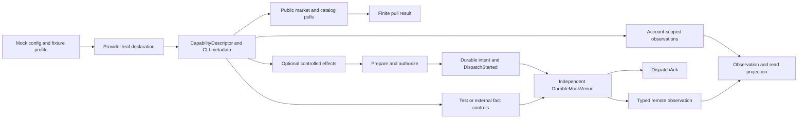
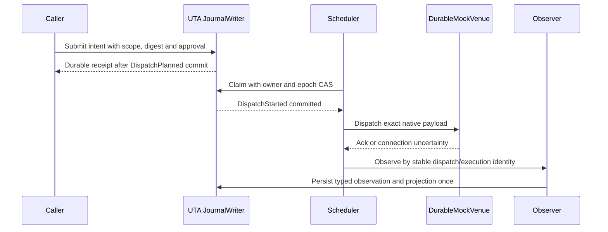

# MockBroker：能力组合下的运行时方向

## 1. 设计边界与已核实事实

本组覆盖 `services/uta/src/domain/trading/brokers/mock/MockBroker.ts`、其 spec 与 barrel，共 51 个 MAP。本文是目标设计，不是已实现的 provider、交易执行器、DurableMockVenue 或 runtime 验收结果。源码锚点来自当前调查快照；历史 mapping 只通过稳定 MAP 标识追溯，并在集成时绑定审计快照 `a5f23756531cc552b7e12b6d655ae1ffbcd28b64`。

当前 Mock 是一个实现旧 `IBroker` 的进程内 class，同时承担 SDK 转换、可变账本、查询、行情控制和外部事实注入（MAP-9DFD3B9879、MAP-B4CEC1AF32）。spec 的 `beforeEach` 创建 `MockBroker({ cash: 100000 })`（MAP-2807C05FCC），并给出了 Decimal 精度、market/limit、平仓、账户方程、历史 bars、键收敛、期权 multiplier、空头估值和手工成交等行为证据（MAP-74610A30AF、MAP-50275FA75F、MAP-377A30A5EC、MAP-399D99B7AB、MAP-BEE79BFA7C、MAP-0DD83C8637、MAP-ADE49309E9、MAP-47DB032F5A、MAP-0151919B70）。这些证据保留为 Mock 的 provider/test 行为；同进程 map 不证明持久恢复、远端 finality、原生幂等、完整 absence 或 crash cut。

目标不是再造一个全局 Broker SDK、`ActionContractMap` 或所有 provider 都要实现的完整 handler 产品。当前 `IBroker`、legacy class、全局 switch 和旧 DTO 只存在于 `currentBehavior`/`sourceEvidence`；目标只发布 Mock 实际声明的能力叶子。未声明的 option、cancel、保护关系或 StopLimit 不生成占位叶子；已声明但暂时断连、未登录或受权限限制的叶子保留其 schema 与身份，只在 availability 中报告不可用。

`AccountScope = AccountId + SubAccountId` 只出现在账户、钱包、持仓、订单、执行意图、冲突 key 和授权绑定等需要账户归属的 schema。公共 Instrument、Candle、News、NewsGroup、Quote、History 和普通 market-data leaf 使用自己的 `Public`/venue/instrument scope；Session 使用 `Public` venue/calendar scope；这些公共叶子不凭空添加账户或 subaccount。单账户 fixture 必须显式给出 AccountScope，缺失 subaccount 不能代表默认账户。`InstrumentId` 与账户身份独立；`ExposureKey` 才把 AccountScope 与 InstrumentId 组合起来。



## 2. 声明源、精确 schema 与 HOF

### 2.1 概念声明形状

接入实现只需为每个实际存在的 leaf 提供一次精确声明。下面是约束形状，而不是要求 Mock 使用某个 class、库或 FP 实现：

```ts
type MockLeafDeclaration<Input, Result, Error, Scope> = {
  identity: StableCapabilityId
  commandPath: CommandPath
  description: string
  inputSchema: JsonSchema<Input>
  resultSchema: JsonSchema<Result>
  errorSchema: JsonSchema<Error>
  semanticUnit: SemanticUnit
  scope: Scope
  delivery: DeliveryDescription
  effect: EffectDescription
  resources: ResourceRequirement[]
  source: SourceEvidence
  availability: AvailabilityEvidence
  implementation: ImplementationIdentity
}
```

`JsonSchema<T>` 是可导出的、可校验的 wire schema；静态 TS 类型、边界校验、schema fingerprint、describe/help 和 CLI 参数投影从同一声明推导。此形状不是一个全局 action union：每个 leaf 的 `Input`、`Result`、`Error`、`Scope`、`DeliveryDescription` 和 provider extension 都由该 leaf 声明。不可导出的 transform、未解析引用或不合法结构在装载时拒绝，不降级为任意 object；schema 合法也不等于交易风险或 native guarantee 已通过。

固定的外层 `CapabilityDescriptor` 至少包含协议版本、稳定能力身份、命令路径、描述、schema 版本/fingerprint、输入/结果/领域错误 schema、delivery、effect 类别、权限/资源要求、来源和 availability evidence。能力树按 provider instance、环境、具体 scope、session 和主体解析；发现返回 revision，调用绑定 identity 与 fingerprint。声明冲突在装载时拒绝；临时 availability 变化不伪装成 schema 变化。

### 2.2 Mock 叶子合同与 CLI 投影（概念精确形状）

以下是 Mock 当前目标中各独立叶子的精确 schema 核心、交付/效果类别和命令投影；它不是全局 action union。每个叶子仍在自己的声明中给出完整 JSON Schema、版本、指纹、领域错误、source 和 availability evidence。

```ts
type MockOrderKind =
  | { kind: 'MKT' }
  | { kind: 'LMT'; limitPrice: Price }
  | { kind: 'STP'; triggerPrice: Price }

type MockPlaceInput = {
  scope: AccountScope
  instrument: InstrumentId
  action: 'BUY' | 'SELL'
  quantity: PositiveQuantity
  order: MockOrderKind
}

type MockOrderRef =
  | { scope: AccountScope; by: 'broker'; brokerOrderId: BrokerOrderId }
  | { scope: AccountScope; by: 'client'; clientOrderId: ClientOrderId }

type MockOrderAmendment =
  | { field: 'quantity'; value: PositiveQuantity }
  | { field: 'limitPrice'; value: Price }
  | { field: 'triggerPrice'; value: Price }
  | { field: 'trailStopPrice'; value: Price }
  | { field: 'trailingPercent'; value: Percentage }
  | { field: 'orderKind'; value: MockOrderKind }
  | { field: 'timeInForce'; value: TimeInForce }

type MockModifyInput = {
  order: MockOrderRef
  expectedOrderVersion: AggregateVersion
  changes: NonEmptyReadonlyArray<MockOrderAmendment>
}

type MockCancelInput = {
  order: MockOrderRef
  expectedOrderVersion: AggregateVersion
}

type MockCloseInput = {
  scope: AccountScope
  instrument: InstrumentId
  quantity: PositiveQuantity | { kind: 'all' }
  expectedExposureVersion: AggregateVersion
  target: ExposureTarget
  policy: ClosePolicy
  expiresAt: Instant
}
```

`MockPlaceInput` intentionally has no notional, TPSL, relation, protection, trailing or StopLimit variant. Those fields are added only by a separate declaration when the Mock has exact semantics; otherwise the input schema rejects them. `MockOrderAmendment` is a tagged local union rather than `Partial<Order>`, and duplicate/conflicting changes are schema/preparation failures. `MockOrderRef` never treats a numeric parse or display symbol as an identity.

The data leaves use analogous leaf-local types: catalog search/details use `InstrumentQuery`/`InstrumentId` and `InstrumentMetadata`; quote uses `InstrumentId`/`PriceObservation`; history uses `InstrumentId`/`HistoricalBarObservation`; session uses `VenueId`/`MarketSessionObservation`; account, position and order leaves use `AccountScope` and their respective immutable observations. Order lookup results are exactly `Found(OrderObservation)`, `AbsentWithEvidence(CoverageEvidence)`, `Unknown(LookupFailure)` or `Malformed(SchemaFailure)`. Simulator facts use separate `PriceObservationInput`, `FillFact`, `CancelFact`, `BalanceTransfer` and `ExternalExecution` schemas; they never reuse `MockPlaceInput`.

The compositional HOF signatures preserve those leaf parameters rather than erasing them:

```ts
type PullHandler<I, R, E> = (input: I) => Promise<Result<R, E>>
type FactSink<I, F, E> = (input: I) => Promise<Result<F, E>>
type TransactionHandlers<I, P, A, O, E> = {
  prepare: (input: I) => Result<P, E>
  compile: (prepared: P) => Result<A, E>
  submit: (compiled: A) => Promise<Result<DispatchAck, E>>
  observe: (ack: DispatchAck) => Promise<Result<O, E>>
}

withPull<I, R, E, S>(
  declaration: MockLeafDeclaration<I, R, E, S>,
  fetch: PullHandler<I, R, E>
): PullLeaf<I, R, E, S>

withSimulatorFact<I, F, E, S>(
  declaration: MockLeafDeclaration<I, F, E, S>,
  sink: FactSink<I, F, E>
): FactLeaf<I, F, E, S>

withTransaction<I, P, A, O, E, S>(
  declaration: MockLeafDeclaration<I, O, E, S>,
  prepare: (input: I) => Result<P, E>,
  compile: (prepared: P) => Result<A, E>,
  observe: (ack: DispatchAck) => Promise<Result<O, E>>
): TransactionLeaf<I, P, A, O, E, S>
```

`TransactionHandlers` keeps `DispatchAck` and the leaf's observation `O` as separate typed channels; there is no public cross-provider result union. `withPush` is not declared for the current Mock source; if added later, its declaration must add frame/control/end/error schemas, cursor, gap, order, backpressure and cancellation.

| Leaf | Scope and delivery | Effect / CLI projection |
|---|---|---|
| catalog search/details | `Public` venue pull; `NoMatch`/`Ambiguous`/`Unknown` are result variants | data pull; `uta mock catalog search` / `details` |
| quote/history | `Public` venue+instrument finite pull; source/freshness evidence is explicit | data pull; `uta mock market quote` / `history` |
| session | `Public` venue+calendar pull; `Open`/`Closed`/`Unknown` carries calendar evidence | data/precondition; `uta mock session inspect` |
| account/positions/orders | explicit `AccountScope` finite pulls with coverage/as-of | observation data; `uta mock account get`, `positions list`, `orders get` / `list` / `open` |
| place/modify/cancel/close | explicit `AccountScope`, exact leaf-local input/result/error | optional `withTransaction`; `uta mock orders place` / `modify` / `cancel` / `close` only when declared |
| simulator facts | public or account scope as required by the fact, resource-scoped control invocation | test/dev `withSimulatorFact`; `uta mock dev ...` only under explicit simulator-admin policy |

CLI metadata (`path`, JSON input/output encoding, help summary, schema fingerprint and availability projection) is derived from that same declaration. A structurally absent leaf has no descriptor, help entry, command or empty parent; a declared but unavailable leaf keeps its schema and reports availability.

### 2.3 小型组合器

组合器只是在装载进程中对上述声明做确定性转换：

- `withPull(declaration, fetch)` 返回该 leaf 的有限 pull interpreter，保留精确 input/result/error schema、scope、coverage 和资源释放语义。
- `withPush(declaration, open)` 只在该 Mock leaf 明确声明时存在；它额外声明 frame/control/end/error schema、cursor、顺序、缺口、背压和取消。
- `withSimulatorFact(declaration, sink)` 接受带来源、身份、时间和序列的 test/dev 或外部事实；它不是交易审批器。
- `withTransaction(declaration, prepare, compile, observe)` 只包装受控交易效果。公开 handle 只能提交意图和查看 receipt，不能拿到无约束 native dispatch 函数；持久计划保存 schema/semantic/compiler/predicate version、参数、实现身份和 evidence，不保存闭包。

`withTransaction` 不是所有叶子的基类，也不把数据读取、缓存、行情流或 call trace 变成 order WAL。新增 provider 字段应同时改变该 leaf 的静态类型、边界校验、descriptor、describe/help、AI metadata 和 CLI schema；不需要修改内核 capability switch，也不迫使其他 provider 实现空方法。

CLI 是最外层解释器，命令路径只由实际声明的 leaf 投影。例如 catalog、quote/history/session、account/position/order observation 和 `orders.place|modify|cancel|close` 可以各自有声明路径；未声明的 operation 不出现命令或空父节点。复杂 union 作为该 leaf 的 JSON 参数保留，不能摊成互相含混的 optional flags。当前 Alice CLI 仍是兼容入口；目标 `uta mock ...` 命令是设计投影，不宣称二进制已经发布。

## 3. Mock provider leaf 划分

### 3.1 Catalog、market data 与 session

- **Instrument catalog/search**（MAP-03B79FC368）：使用 account-independent `InstrumentId` 和 Public/venue scope 的有限 pull 结果。只返回显式注册的 metadata；`NoMatch`、`Ambiguous`、`Unknown`、`Partial` 与 availability 分开。搜索成功不授予交易能力，不制造 AccountScope。
- **Quote、history、session**（MAP-04B4087714、MAP-0DD83C8637、MAP-48652AA629、MAP-BBC8C72572）：Quote/history observation 带 instrument/venue、currency、source、source time、local observedAt、sequence、quality/freshness 和 schema revision；session observation 只带 Public venue/calendar scope、calendar/timezone evidence、source time、local observedAt、sequence、quality/freshness 和 schema revision。Mock synthetic 数据明确标记 `MockFixture`；`100`、avgCost、默认 USD 或 perpetual-open 不是隐含执行证据。当前 source 的 ascending/drift、bid/ask 和 default-open 只作为 fixture regression evidence。
- **Pull 与 push**：这些 leaf 的 pull 是有界结果；只有显式声明的 push 才创建 resource-scoped stream。push 必须声明创建、frame、cursor、gap、backpressure、cancel、error 和结束语义；收到一帧不表示 candle closed。上述数据能力都不通过订单 prepare/approve/compensate。

### 3.2 Account、position、order observations

Account、wallet、position 和 order facts 使用明确 AccountScope；公共 market data 不继承它。`getAccount`、`getPositions`、`getOrder(s)`、`getOpenOrders` 是 observation/read leaves，不是第二个 execution writer。

- Account observation 保留 cash、currency、source、time、FX/mark evidence 与 discrepancy；AccountProjection 的 valuation 为 `Complete` 或具名 `Incomplete`，已知持仓不能因缺 mark/FX 被清空。
- Position observation 保留 Long/Short、quantity、avgCost、multiplier、source provenance、version/sequence；缺 mark 只使估值不完整。wallet/external 是来源字段，不是另一种 position 类型。
- Order lookup/listing 返回 `Found(OrderObservation)`、`AbsentWithEvidence(CoverageEvidence)`、`Unknown(LookupFailure)` 或 `Malformed(SchemaFailure)`。Order lifecycle 是 observation 内部的 provider-specific variant；`[]`、`null` 或一次不完整 listing 不能证明 absence。
- SimulatorReadProjection 中 account-owned cash/exposure/order 仍带 AccountScope；marks 保留 Public/venue/instrument scope。它是从事实构造的 typed read view，不是 alternate authority。

观察 persistence 可以有自己的 source/sequence 去重和 projection rebuild，但不使用 order WAL、reservation、approval 或 compensation。缓存失败、连接失败、缺页、stale quote 和不完整 listing 都不会创建交易 job。

### 3.3 Optional controlled effects

Place、Modify、Cancel、Close 是四个可独立声明的 Mock effect leaves，而不是所有 provider 必须具备的四个方法。每个 leaf 只组合它声明的数量/价格/trigger、duration/session、关系/保护和 provider-native extension schema。局部互斥项可以用小 union；禁止手写 Market × Limit × Stop × Trailing × TIF × protection × venue 的笛卡尔积。

- **Place**（MAP-50275FA75F、MAP-46ED6C273F）：声明精确 `MockPlaceInput`、native extension 和 `DispatchAck`/observation result。Market/limit/stop trigger、WAC、oversell refusal 和 manual 139.50 fixture 保留；TPSL、Notional、trailing、GTD、relation 或 protection 没有 declaration 时不在 schema 中，输入该字段是 schema rejection，不是 availability。`UNSET`/zero quantity 和未知 action 在 schema boundary 拒绝。
- **Modify**（MAP-B20F6E5551、MAP-5FA8553583）：声明精确 amendment schema、before-image、expected version、累计 fills 和 queue effect。只读回 `Unknown` 或不完整 lookup 不能被当成 NotFound；丢 ack 后观察而不重复 queue-changing send。
- **Cancel**（MAP-5484E0ABE8、MAP-F133CDF76E）：可选 leaf 的 `DispatchAck` 与 `Cancelled`、`StillWorking`、`Filled`、`Rejected`、`AbsentWithEvidence`、`Unknown` observation 分离；late fill 按 broker evidence/sequence 合并。未声明 cancel 的 provider 没有 cancel 命令。
- **Close**（MAP-377A30A5EC、MAP-09ABC1ADD4）：输入是 `Quantity | All`、AccountScope、InstrumentId、expected exposure version、target criterion、policy 和 expiry。native opposite side 只是 adapter 编译结果；只有 Confirmed target exposure 才完成，未知结果保留 RecoveryCase/exclusion。零/负 quantity、超仓和 scope/version conflict 都不得 dispatch。

每个 effect 都遵循同一边界：prepare 读取 schema 所需的 scope、InstrumentId、当前事实、descriptor/session/price/metadata evidence，冻结 serializable payload、before-image、criterion、policy 和 expiry；有效 approval binding 绑定 intent revision、digest、scope、actor/policy version 和 expiry。JournalWriter 在一次 SQL transaction 中写 command receipt、intent、DispatchPlanned、Ready job、reservation/lock 和 execution projection；commit 后才返回 durable receipt。scheduler 用 owner+epoch CAS 写 DispatchStarted，成功者调用 DurableMockVenue。

DispatchStarted 后 crash、timeout、disconnect 或坏响应按可能已发送处理：Ack 只表示远端受理，Filled/Cancelled/Amended/ProtectionAttached/TargetReached 由 observation criterion 判定。相同 execution identity、broker sequence 和 aggregate version 只能产生一次 cash/exposure delta；Unknown 暂停依赖的 forward work 并进入 Observe/Recovery，而不是盲目重发。补偿不是 ACID，不能从 Mock class 或接口存在推导原生可逆性、原子性、完整 absence 或 idempotency。



### 3.4 Simulator controls and external facts

`setMarkPrice`/`tickPrice`、`fillOrder`/`cancelPendingOrder`、`externalDeposit`/`externalWithdraw`/`externalTrade`、initial seeds 和 failure plans 是 test/dev 或外部事实边界（MAP-FED35111E9、MAP-A3F1814B97、MAP-B8A614D67A、MAP-67B9817A3D、MAP-91432AF5F2）。它们输入/输出精确 schema，按事实带 source、所需 scope、instrument identity、clock 和 sequence；fill/trade 等 execution facts 另外带 execution identity，failure plan 则按 leaf/phase/dispatch 标识；可以写独立 MockVenue fact store，但不会仅因注入事实就生成 UTA approval、order WAL 或 dispatch receipt。

外部 deposit/withdraw/trade 的 provenance 与 Alice effect 分开：positive/over-held withdrawal 失败不改变状态；external SELL 可按 `OutsideAlice` policy 开 short；Alice-originated SELL 无仓仍拒绝。nativeKey/localSymbol 冲突 quarantine，不按 display symbol 隐式合并。numeric `setQuote`/`fillPendingOrder` aliases 在 callers 完成迁移后删除。FailurePlan 只属于 harness，支持按 leaf/phase/dispatch 注入 transport、rejection、timeout、drop-ack、crash-after-remote 和 corrupt-fact 场景；它不表示真实 provider guarantee。

CallRecord（MAP-E9E1A05333）是 test-only instrumentation，不是 capability/CLI leaf。它可保留本地调用 count/order 便利；redacted trace、phase、dispatch identity 和 durable observation 才是受控 effect 的证据。丢失 call log 不改变 receipt 或 outcome。

## 4. Identity、单位、生命周期和 availability

`NativeInstrumentMapping` 保存 venue/native key、account-independent InstrumentId、metadata version、source 和 conflict。unknown native key 不伪造 STK；同 display symbol 的 spot/perp、不同 venue 或不同 AccountScope 不合并。Derivative `expiry`、`strike`、`right`、`multiplier` 作为精确 extension 保留；`MultiplierResolution` 只有 `Known(PositiveMultiplier)`、`Missing`、`Invalid`，不把零、负数或缺失修成 1。

Quantity、Price、Money、PositiveMultiplier 使用可校验 Decimal 编码与单位关系。WAC、partial/full close、Flat、oversell no-credit、short/mixed signed valuation、`3 × 50 × 100 = 15000` 和 `netLiq=10200/PnL=200` 是纯 reducer/accounting evidence；缺 multiplier/FX/price/session/finality 是显式 Missing/Invalid/Stale/Unknown。已知 quantity/side/identity 在 Incomplete valuation 中保留。

Layer acquire/release、connection、capability discovery、catalog revision、session、venue、journal、scheduler 和 stream resource 各自有生命周期。Connection Ready 不是 capability map、交易授权或 writer bypass；一个 scope degraded 不阻断无关 Public data。关闭 scope 停止新 invocation、释放本次 owned resources，但不删除 durable jobs、observations、projections 或 RecoveryCase；旧 generation 不能完成新 job。

Availability 与 schema 结构分开：

- 未声明 operation/leaf：没有 descriptor、CLI 命令或空父节点。
- 已声明但缺 session、权限、连接、metadata 或 quota：descriptor/schema 保留，报告具名 availability/precondition failure。
- 已声明 leaf 的 unsupported parameter variant：不进入该 leaf input schema；若边界收到它，返回 schema rejection，而不是把 unavailable 当 unsupported。
- 发现 revision、schema fingerprint、catalog/directory revision、connection generation 或 scope 不匹配：返回 stale/authorization/availability error，不悄悄执行另一语义。

## 5. 保留证据与不宣称的保证

MAP-2807C05FCC、MAP-74610A30AF、MAP-50275FA75F、MAP-377A30A5EC、MAP-399D99B7AB、MAP-BEE79BFA7C、MAP-0DD83C8637、MAP-ADE49309E9、MAP-47DB032F5A、MAP-0151919B70 保留 fixture、Decimal、market/limit、WAC、close、external mapping、multiplier 和 signed valuation 的数值回归。

MAP-9DFD3B9879、MAP-B4CEC1AF32、MAP-1F7945D7FF、MAP-8C05962CF7、MAP-A20A4E0C8F、MAP-BF81183BD5 保留 class 拆分、配置、failure、startup、shutdown、barrel cutover 的边界。MAP-CDC7079D83、MAP-26F708C6F8、MAP-AB61645548、MAP-CF5A1A7070 保留 refined fixture/native codec、derivative metadata、dual IDs 和 no-loss encoding。

MAP-BDF7756398、MAP-5842AA2B07、MAP-0BBDEA8E36、MAP-C0D557E0BD、MAP-04B4087714、MAP-BBC8C72572、MAP-F0F4E26989、MAP-48652AA629 保留 typed public/account observations、Complete/Partial/Unavailable coverage、source/freshness/as-of 与 no-query-mutation。MAP-559086B869、MAP-202708E052、MAP-5D79D1084D、MAP-89456D4461 保留 capability/STP LMT contradiction、canonical identity 和 StopLimit 缺席。

以下仍是实现 gate，当前设计和 source tests 没有证明：Mock venue 的原生幂等范围、远端原子性、完整 absence、补偿/可逆性、stream replay/finality、资源配额、真实 SQLite process crash、foreign-process security，以及负责投递 ReviewRequest 的 Alice Session。抽象名称、call count、static capability array、同进程 map 和 mock 成功都不能替代这些证据。

## 6. 证伪场景与切换顺序

这些场景是待 Main 集成后执行的设计验收，不是本次文档修改已运行的结果：

1. 声明一个 Mock provider extension；该 leaf 的静态类型、validator、descriptor、describe/help、AI metadata 和 CLI schema 一起变化，不改内核 switch。声明没有 cancel 或 StopLimit 时，树中没有对应命令、空父节点或 placeholder。
2. Public catalog/quote/history/session pull 在无账户时仍能返回带 Public/venue/instrument（session 为 Public venue/calendar）scope 的有限结果；Account/position/order read 带 AccountScope；任何数据 read/cache/stream failure 不创建 approval、lock、order WAL 或 compensation。
3. native Contract/Order、bad status、unknown action、未知 identity、坏 Decimal、zero/negative quantity 和 output schema violation 在 adapter 边界被具名拒绝或 quarantine；serializable payload 不含 SDK object、函数、secret 或被静默省略的已声明字段。
4. prepared-before-approval、approval-before-claim、claim-before-dispatch、venue-accepted-before-ack、ack-before-projection、abort-before-compensation 和 compensation-before-ack 的 SQLite events/jobs/locks/receipts 与独立 DurableMockVenue 状态均可观测。DispatchStarted 后丢 ack 只产生 Unknown + observe/recovery，不产生第二次 mutation。
5. 事件 source/sequence、execution identity、connection generation、catalog revision、session 和 exposure version 并发变化时，known rejection 只按该 effect policy 继续，Unknown 暂停 forward work，重复 execution 不重复 cash/exposure，旧 close/modify 不通过 CAS。
6. Decimal precision、OPT multiplier、partial/full close、short/mixed signed value、FX/stale incomplete、BTC mapping convergence、conflicting native keys、positive withdrawal 和 external short policy 重启后仍可重放；未知 status/side 不落入隐含 BUY/long 分支。
7. 完整 listing 或逐 ID `AbsentWithEvidence` 才能安全判断缺席；不完整 listing 保持 Unknown；查询无副作用；Close 只有 Confirmed target exposure 才完成。若 selected trigger policy 是 ReturnToAgent，owning runtime 原子消费 activation、暂停 binding、保留未发送 intent/evidence、创建带稳定 review identity 的 durable ReviewRequest/outbox，并保持零 broker dispatch；后续只能用 `Discard`（仅未发送）、`KeepSuspended`、`Rearm`（新 binding epoch）、`Revise`（新 intent revision）或 `RequestSubmission` 等显式命令并做 expected-revision CAS。Mock 只提供其声明的 observation/effect，不重建 agent loop。

第一条高价值 falsifier 是独立 DurableMockVenue：在 DispatchStarted 已持久化后让 venue 接受一次 market mutation，故意丢 ack/kill UTA，再启动新 runtime。只有通过稳定 dispatch/execution identity 查询独立 venue、一次性写 observation/projection，才满足边界；从新建 map 猜测或再次 dispatch 都失败。第二条 falsifier 是声明不支持 StopLimit/cancel 的 provider tree，确认 schema、descriptor、describe/help、CLI 都没有对应 leaf。

切换顺序：

1. 定义 Mock declarations、semantic units、Public/Account scope、Instrument mapping、typed observation/error schemas，以及上述 declaration/HOF/descriptor 约束。
2. 抽取 pure Decimal/identity/WAC/valuation/matcher/replay reducers；让 in-memory MockLedger 只承担 unit evidence。
3. 组合 catalog、market、account/order observation leaves 与 optional execution leaves；pull/push/cache 保持独立 resource lifecycle，不套 transaction wrapper。
4. 实现独立 DurableMockVenue、SQLite JournalWriter、command receipts、jobs/leases、DispatchStarted、RecoveryCase 和 observation reconciliation，并执行 crash/fact/precision gates。
5. 迁移 simulator routes、poller、accounting/query consumers、registry、CLI/help/AI metadata；runtime writes 只走其声明的 fact/effect boundary。
6. 所有 caller 完成切换后，删除 `IBroker` 写 facade、legacy `PlaceOrderResult`/Partial SDK factories、mutable setters、number aliases、hidden account override 和 direct map authority；barrel 只公开 Mock declarations/Layer、typed adapter contracts 和明确 test fixtures。

该方向保留 Mock 作为确定性第一 vertical slice，只把已证明的行为留在其 provider scope；不把内存默认值、旧 IBroker 形状、快捷 simulator control 或 static capability label 误报成普遍券商 finality、持久化、幂等、权限或安全保证。
