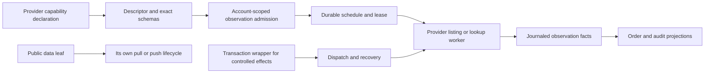

# Polling：可组合能力上的可恢复订单观察

本文定义 `order-sync-poller` 的迁移边界：将订单观察组织为可恢复的数据能力，与交易派发、账户生命周期和运行时调度分离。源码证据及逐项迁移依据见 [entries.md](entries.md)。

## 1. 当前源码确立的事实

旧模块的注释（`order-sync-poller.ts:1-18`）把流程描述为 place、approve(push)、poll、sync，并把 pending id 称为 in-memory Git-log scan；但实现的 slow external lane 在 pending guard 之前运行。因此“无 pending 即零 broker IO”只适用于 fast lane，不适用于外部发现（`order-sync-poller.ts:53-91`，MAP-8D05311B0B）。

`startOrderSyncPoller` 接受 `() => Iterable<UnifiedTradingAccount>`，默认 fast 10 秒、external 15 分钟，用 `tickCount` 与 `Math.round` 选择 slow pass；`running` 为 true 时直接 return，timer callback 丢弃 Promise，`stop` 只调用 `clearInterval`（`order-sync-poller.ts:20-104`，MAP-E279FE276F、MAP-BAF46FCF2F、MAP-EC918D5C43、MAP-870F4383FA）。

测试只创建 `new MockBroker()` 与 `new UnifiedTradingAccount(broker)`（`order-sync-poller.spec.ts:1-13`）。place helper 依赖 `pendingHash`、Git `push` 和 `submitted[0]`（`order-sync-poller.spec.ts:15-25`）。正常 lifecycle 测试在第一次 tick 看到 working，`setMarkPrice('AAPL', '149')` 后第二次 tick 看到 filled/10/149 的 `[sync]` Git 记录（`order-sync-poller.spec.ts:27-54`）。所谓 keyless/unhealthy 测试实际上只覆盖正常 healthy UTA 的 no-pending 与 pending sync（`order-sync-poller.spec.ts:56-68`）。外部订单测试由 MockBroker 直接 place，slow lane 写 `[observed]`，fast lane 再写 `[sync]`（`order-sync-poller.spec.ts:70-101`）；A 失败而 B 继续的测试只断言 spy 和字符串日志（`order-sync-poller.spec.ts:103-118`）。

`UnifiedTradingAccount.sync` 保留了有价值的成本模型：有 listing 时一次 listing 覆盖 pending orders，仍在列表中的订单不逐单查询，消失者才做确认；无 listing 时使用内存 age backoff——新订单前约 2 分钟每轮观察，2 分钟至 1 小时每约 1 分钟，之后每约 5 分钟（`UnifiedTradingAccount.ts:827-915`）。但 pending rows 来自 `TradingGit.getPendingOrderIds` 对内存 commits 的重建（`TradingGit.ts:692-748`），`_pollState` 也只在进程内存在（`UnifiedTradingAccount.ts:931-950`）。`observeExternalOrders` 在没有 `getOpenOrders` 时返回 0，在有 listing 时按 Git-known ids 去重并写一笔 observed commit（`UnifiedTradingAccount.ts:953-981`）。`

MockBroker 是明确的 in-memory exchange simulator（`MockBroker.ts:1-17`）：它以 `mock-ord-N` 递增分配 id（`MockBroker.ts:278-324`），`getOpenOrders` 只列出内存中的 Submitted 订单（`MockBroker.ts:447-476`），`setMarkPrice` 是测试控制面并自动撮合（`MockBroker.ts:546-563`），fill 累计使用 Decimal（`MockBroker.ts:580-621`）。这些是 simulator 行为，不是任何真实 provider 的幂等、保留、freshness、finality 或 execution identity 证据。

## 2. 目标边界：声明叶子，组合观察调度

共同契约（[composition-contract.md](../composition-contract.md)，尤其 K01-K03、K05-K07）要求 provider 只声明一次精确 schema、语义单位、能力说明、处理函数和资源要求；由此推导 capability descriptor、校验器、类型、CLI/AI 元数据和 availability 视图（K01-K03、K06）。Polling 只需要接入相关叶子，不再扩张成新的全局 broker SDK。

一个 provider 可以分别声明账户私有的 listing leaf、已知订单 lookup leaf、交易 dispatch leaf，或其他自己的能力。每个叶子携带自己的 input/output/domain-error schema、schema 版本/指纹、native 参数和资源要求；provider 没有该能力时，树中没有该叶子，也没有空 handler。叶子存在但当前断连、未登录、限流或权限不足时，保留能力身份并单独报告 availability（K02、K03、K07）。当前 `IBroker` 的完整 interface、optional `getOpenOrders` 以及各 adapter 的 switch/throw/empty-array 行为仍是 source evidence；它们不是新的 universal `IBroker` 目标，也不要求所有 provider 实现相同方法。

实现可以使用任意 native SDK、REST/OpenAPI、独立进程、回调、缓存或语言；只在 UTA-facing boundary 提供版本协商、发现、请求/响应或流取消。组合形状可以概念性地表示为 provider declaration、exact leaf handler、observation schedule wrapper 与 durable worker 的组合，但不规定 provider 内部的 FP、class 或进程结构。HOF 只在装载进程中存在；持久 job 只保存版本化 schema、参数和实现身份，不序列化闭包（K01、K03、K07）。

`AccountScope` 只用于账户、订单、持仓等私有事实和交易效果；它必须包含真实的账户/sub-account 选择，不能从连接 aggregate、UTA id 或 adapter 默认值捏造 sub-account。公共 Candle、Instrument、News、NewsGroup capability 不凭空附加账户 scope；若某个具体 provider schema 确实需要 scope，由该叶子明确声明。这个分界避免将本组的账户轮询规则误套到公共数据读取。

图中的交易分支只在已有受控 effect 被观察时关联；普通数据叶子不经过交易 approval、compensation 或订单锁。

公共数据 leaf 的 `pull` 是带 schema 的有限结果（可有分页/不完整标记）；`push` 是有创建、取消、结束、错误、cursor、缺口和背压契约的 resource-scoped stream。它们各自管理连接、配额、缓存和 cursor，不继承订单 approval、compensation、conflict lock 或每帧交易 WAL；只有被选作交易决定的证据才进入对应交易记录。

## 3. 两种 lane：交易效果观察与外部数据观察

### 3.1 已知订单状态观察

Alice 已接受的交易效果继续使用交易契约的 durable intent、approval digest、write-ahead、command/transaction/step/dispatch identity、lease/CAS、unknown reconciliation 和 recovery case（K08、K10）。这些规则保护“可能已经发出的 mutation”，不是要求每个 provider 的读取 API 具有交易事务。

交易 dispatch 返回的 Ack 只表示 provider 接收层级；随后由该 provider 的观察 leaf 取得 Submitted、Filled、Cancelled、Rejected 或其他其 schema 支持的状态，并附 observation time、freshness、order identity、execution identity 和来源 revision。timeout、socket loss、worker crash、坏响应或没有 absence 证据时进入 Unknown/Reconciling，不重新 place。交易 terminal criterion 仍由该交易声明，不能用一个 observation tag 代替它。

### 3.2 外部订单发现

外部发现是账户私有数据观察：它记录 `External` provenance、scope、InstrumentId、provider native order identity、snapshot、observedAt 和 source revision，创建后续观察 job，但不创建 Alice approval、transaction dispatch、compensation 或自动 cancel。重复 listing 的去重 key 必须来自 provider identity/revision，而不是数组位置、Git hash 或重新分配的内存 id。

本组使用一个语义上的 listing outcome envelope：

- `Complete(scope, namespaceCoverage, cursorBoundary, observedAt, orders)`：只有范围、分页边界和时间证据足够时，空结果才可产生 `NoNewOrders`；
- `Partial(coveredNamespaces, missingEvidence)`：保留已见事实和重试/降级状态，不做 absence 终结；
- `Unavailable(reason)`：声明的 leaf 暂时不可用，不能伪造空结果。结构上没有 listing leaf 则直接省略该能力；已有独立 `OrderRef` 时仍可做已知订单 lookup。

listing 的具体输入、namespace、分页、错误和 native 字段仍由 provider 声明。Bybit spot/swap sweep、CCXT permissive/strict behavior、IBKR clientId 范围、Alpaca exception、Longbridge no-listing 和 LeverUp in-memory cache 均只能被 adapter 以证据映射到上述结果，不能由 kernel 按 broker 名称猜测。
### 3.3 用户、agent 与 operator 的观察语义

能力树和 provider leaf 的精确 CLI/AI metadata 决定用户能发现什么：结构上没有 listing/lookup leaf 就没有对应命令；声明存在但当前不可用时，查询与 status view 显示 capability identity、availability 与 `Deferred`/`OperatorRequired`，不把它伪装成空列表或普通成功。`Complete` 的 `NoNewOrders`、`Partial`、`Unavailable`、`StillWorking` 与 `Unknown` 都必须在 named projection/operational view 中可见。

外部订单在 audit/order projection 中以 `External` provenance 展示，观察事件不是 trigger、approval 或 authorization，也不自动 cancel、place 或 compensation。用户或 agent 如要对该事实采取交易动作，必须重新调用该 provider leaf 的精确 schema 并经过正常 authenticated approval/write-ahead/CAS/recovery protocol；旧观察、外部 native identity 或普通事件文字不能授权新派发。

Poller admission、shutdown residual、lease fencing 和 provider evidence 通过结构化状态/错误返回给调用方与 operator，而不是只写 legacy string log。公共数据 pull/push 仍由其自身的 schema、cursor、背压和取消语义服务，不要求用户为其伪造 `AccountScope` 或交易上下文。

### 3.4 成本与 backoff

完整 listing 时保留旧的成本优化：一次 listing 可筛出所有 pending order；仍在完整列表中的订单不额外做 per-order lookup，消失者才在证据足够时确认。没有 listing leaf 的 provider 使用持久化的 per-order `nextPollAt` 与同等 age policy（新订单前约 2 分钟每轮、随后约 1 分钟、老 hanger 约 5 分钟）；fresh order 可以较快观察，已证明是 hanger 的订单可按保守间隔降低调用量。listing 不完整时停用 absence-based optimization，不能把 partial 结果当全景。

`OrderRef` 是与 provider lookup leaf 绑定的可持久化关联，保存适用的 AccountScope、InstrumentId、native symbol/localSymbol hint、order identity、source step 以及可用的 bracket/child leg 与本地 alias evidence。它不是一个要求所有 provider 支持的完整订单类型。provider 原生字段、单位、查询参数和可选扩展必须原样保留在该叶子的 schema 中；缺少 multiplier、freshness、retention 或 execution identity 的证据时报告 Unknown/OperatorRequired，不填默认值。

## 4. Durable scheduler、准入和失败隔离

fast pending observation 与 slow external discovery 是不同的 durable job kind。每个 job 使用局部生命周期 ADT `Ready | Leased(owner,epoch,deadline) | Deferred | Completed | Failed`；交易 effect 跨远端边界不明时另存 `ObserveUnknown/RecoveryCase`，不能压成 Failed 或 QueueUnsent。这些是调度生命周期，不是全局 action taxonomy、完整 Broker handler 或封闭 Order 变体。job 至少持久化适用 scope（仅账户私有 job；公共 data job 不带该字段）、schedule identity、source intent/order identity、dedup key、观察 partition key，以及交易 effect 才需要的 conflict keys、notBefore、attempt、lease owner/epoch/deadline、provider schema fingerprint、checkpoint 和 redacted failure evidence。内存 Queue、Clock、timer、Fiber 和 `running` guard 只负责 wake、监督和资源生命周期，不能成为 pending authority。

`NoWork` 只在 durable query 确认没有该 job kind 的工作时成立；fast lane 没有 pending 不代表没有 due external discovery。观察 schedule 可在同一 scope/schedule 且尚未 claim 时合并重复 wake；不同 order、dispatch 或 recovery identity 不合并。保守策略固定为有限安全整数毫秒、无 jitter、一次 due、fixed-delay；缺少 provider rate/concurrency 或 lease-heartbeat 证据时返回 `Deferred/OperatorRequired`，不猜 native 上限，也不借用可丢弃 market telemetry 的 coalescing。

每个适用 AccountScope/ConnectionId 的私有订单 worker 独立 claim 和写入 outcome。A 的 expected connection/observation failure 不取消 B；结构化 failure 带 scope、job、attempt、provider capability 和 redacted evidence。只有交易计划明示独立 steps 时，已知 rejection 才可使用 `ContinueOnKnownRejection`；ConnectionUnavailable 和 Unknown 不能被压成 rejection。公共 data reader 的 cursor/backpressure 与订单 recovery case 分开。

## 5. 启动、停止与 root ownership

组合根启动顺序是：打开 journal/schema 与迁移；重建 projections；分类 Ready、expired lease、DispatchStarted、Unknown 和 observation cursor；装载各 provider capability/connection layer；完成 account-scoped availability 解析；然后开放交易 admission 与启动 supervised workers。连接恢复不能越过交易 recovery barrier，也不能把某一账户 degraded 推成全局失败。公共数据 capability 可有自己的启动/恢复状态。

优雅停止由 root Scope/Scheduler supervisor 统一编排，依次完成 AdmissionClosing、WorkersDraining、JobsPersisted、WriterDrained、CapabilityLayersClosed、SchedulerClosed。普通观察在未跨远端效果边界时保存 Ready/next due/cursor；交易在 DispatchStarted 或边界不明时保存 Unknown/Observe/RecoveryCase 并保留 conflict exclusion。停止不只是 clearInterval，不删除 lease，也不让旧 epoch 的 late result 覆盖新 owner；数据观察取消也不触发交易 compensation。

`main.ts:116-128` 当前丢弃 poller handle，`main.ts:179-189` 又在关闭 UTA/event log 后直接退出（MAP-E32A9F0696、MAP-870F4383FA）。目标必须由组合根持有 typed scheduler/shutdown handle，并在 event log、provider layer、DB 关闭前完成 job 状态落盘和 writer drain。provider 的 native close/reconnect 实现不受限制，但 UTA-facing shutdown report 必须可观察、可恢复。

## 6. Provider evidence 与明确未知

以下 evidence 继续保留，但不扩大为全 provider 保证：

- `packages/uta-protocol/src/types/broker.ts:475-584` 的 `IBroker` 是当前代码的 monolithic source interface；optional `getOpenOrders` 的“unsupported returns []”只能在 adapter 边界被解释，不能成为目标 full SDK。
- `CcxtBroker.ts:1171-1204` 在 permissive 模式将 listing failure 转为 warning/`[]`，strict 模式抛错；`bybit.ts:33-51` 需要 spot/swap 等 category sweep。未证实完整覆盖时是 Partial/Unavailable。
- `IbkrBroker.ts:766-775` 使用只覆盖当前 clientId 的 `reqOpenOrders`；手工 TWS 订单的 `reqAllOpenOrders + permId` 仍是未验证范围。不能宣称全账户 listing。
- `AlpacaBroker.ts:482-509` 的 open-order 读取失败抛 `BrokerError`；Longbridge (`LongbridgeBroker.ts:613-629`) 只有逐单查询；LeverUp (`LeverupBroker.ts:69-77,113-114,450-477`) 的 tracking/status 是进程内 Map 且没有 listing。它们各自的 capability identity、availability、lookup 参数和缺口必须如实呈现。
- MockBroker 的 `mock-ord-N`、`setMarkPrice`、内存 listing 和 Decimal fill 只证明 simulator 场景。真实 provider 的 idempotency、retention、freshness、absence 和 execution identity 仍需 adapter-specific evidence。

## 7. 实施方向与切换边界

1. 先让 provider capability declaration/export 产生 listing、lookup、observation leaf 的 exact schema、descriptor、availability 和调用句柄；不复制旧 `IBroker` 的完整方法集。
2. 建立 durable journal/scheduler vertical slice，明确 AccountScope 只进入私有订单 job；为 public data 保持独立的 pull/push port。把 provider native lookup hint、identity、时间和错误字段落入版本化记录。
3. 将 `sync` 的 listing reduction、per-order backoff、fill fold 拆成纯分类 + provider observation worker + writer + projector；Git `[observed]`/`[sync]` 只作为可重建 audit view。数据观察不得进入订单 approval/compensation。
4. 将 `main` 接到 StartupRecoveryCoordinator/Scheduler root，保存 lifecycle handle，迁移 keyless/read-only/degraded admission 与 A/B partition isolation；移除 live UTA iterable、tickCount 和 closure 作为 authority。
5. 将 14 个 MAP 的测试从 timer/spy/Git authority 迁到 descriptor/schema validation、durable receipt/job/lease、remote observation、projection、cursor 和 structured failure；测试 fixture 明确区分 InProcessRetainedLedger 与独立 DurableMockVenue。
6. 所有 caller 切换后删除 `startOrderSyncPoller` timer/closure、`void tick()` 和旧 `stop(): void`；不保留双写或把 unsupported 能力静默降成空结果。

必须保留：真正无 durable work 时不访问私有订单 broker；完整 listing 下 present order 的 per-order 成本优化；无 listing provider 的 age-based backoff；External provenance；Decimal fill quantity/price；一个账户分区失败不阻塞其他分区；停止后不启动新的 polling cycle；公共数据读写不被强行包成交易效果。

必须删除：tickCount 作为 schedule authority；running=true 时静默丢 work；keyless/health silent drop；Git pending hash 作为 recovery authority；unsupported listing 的空数组假象；字符串 catch 作为唯一 failure protocol；clearInterval 作为 shutdown proof；将所有 provider 预设为同一完整 broker handler。

## 8. Falsifiers 与未决 acceptance
以下是实现阶段的可证伪场景，不是本轮已完成结果：

1. **声明与结构缺失（MAP-8D05311B0B、MAP-0F70BAA7CC）**：provider 未声明 listing/cancel/option 等 leaf 时，discover/help/CLI 不出现该命令；声明存在但未登录时保留 capability identity 并显示 availability，不伪造 Unsupported handler。
2. **Complete/Partial/Unavailable（MAP-0F70BAA7CC、MAP-855D4FE105）**：Complete 空列表才得到 `NoNewOrders`；Bybit 一个 namespace 失败得到 Partial/Unavailable；外部订单不进入 Alice dispatch。
3. **listing reduction/backoff（MAP-5D07510B31）**：一单仍在完整 listing、一单已填并消失时，只确认消失者；无 listing provider 的 fresh/old hanger 与重启后的 nextPollAt 由 durable policy 执行。
4. **working/fill（MAP-F6CFDCE6F2）**：第一次 observation 保持 Submitted/StillWorking，simulator mark 变化后观察到一次 Filled 及 10/149 Decimal facts；setMarkPrice 不被当作真实 native freshness 或 execution identity。
5. **identity/restart（MAP-A173AC5D0E、MAP-9A7B5853BF）**：相同 command payload 重试返回相同 durable receipt；DispatchStarted 后 worker crash 只生成 ObserveUnknown/observe job，不盲目第二次 place。InProcessRetainedLedger 与 DurableMockVenue 分别证明各自声明的重启边界。
6. **准入/隔离（MAP-B4499C0EF7、MAP-2D60F8CF3A、MAP-BAF46FCF2F）**：无 durable private work 返回 NoWork；keyless public-data scope 的私有叶子结构性缺失并从 capability tree 省略，funded readOnly scope 可进行已声明的 private observation 但不得 dispatch/mutate；A deferred/failed 时 B 完成；同 scope 未 claim wake 才可 Coalesced，缺 provider budget/heartbeat 保持 Deferred。
7. **lifecycle（MAP-EC918D5C43、MAP-E32A9F0696、MAP-870F4383FA）**：startup recovery 未完成前不开放交易 admission；shutdown 后无 detached writer/provider call；旧 epoch late write 被 fencing；交易 Unknown 保持 recovery exclusion，普通 observation 只保存可恢复 cursor/Ready。

首批 falsifier 是：Partial listing 缺订单却直接写 Cancelled/Rejected；DispatchStarted 后重启直接重派；重复 command/observation 产生第二个订单或第二笔 fill；A 失败导致 B 没有 job outcome；shutdown 清 timer 后仍有 detached writer；RecoveryRequired 后自动释放交易 conflict exclusion。它们说明 authority、schema/identity、availability、evidence、lease 或 scope 边界仍未闭合。

仍未由本组源码证明的事实包括各 adapter 的 listing namespace/分页、order-status retention、symbol-scoped lookup、freshness、rate limit、lease heartbeat、稳定 execution identity、真实 venue idempotency，以及真实 agent/Session 投递。它们保持 `Partial`、`Unavailable`、`Unknown` 或 `OperatorRequired`，不能由新的抽象名称宣告已解决。
