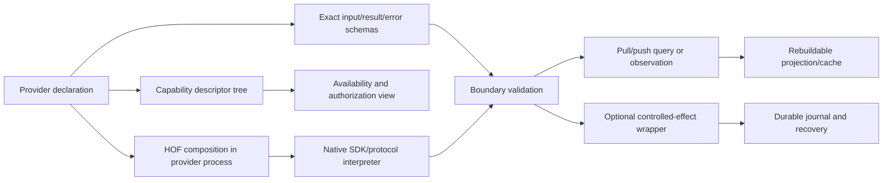

# ProtocolModels：协议模型与可组合 provider 边界

## 状态、范围与证据

本文是 `capability-composition-v1` 的目标设计，不是已经接入的 provider 协议、运行时代码或交易执行实现。ProtocolModels 负责把 provider 声明、传输 schema、规范化事实和审计/查询 projection 接到 UTA-facing 边界；provider 内部可以继续使用类、回调、缓存、任意语言 SDK、REST/OpenAPI、网关或独立进程。本文不要求这些实现改用某一种语言或 FP 库，也不声称下面的概念类型已经在生产包中导出。

当前代码是调查事实，不是目标 API：

- `packages/uta-protocol/src/types/broker.ts:1-12` 直接导入 IBKR `Contract`、`Order`、`Execution`、`OrderState`、`OrderCancel` 和运行时 `Decimal`，并通过 `contract-ext` 执行声明合并；`broker.ts:475-620` 的 `IBroker` 把 catalog、交易 mutation、账户查询、行情、能力和 identity 混成一个接口。
- `packages/uta-protocol/src/types/git.ts:22-77` 的 `Operation`/`OperationResult` 仍携带 native SDK、`Partial<Order>`、`raw: unknown` 和 boolean success；`TradingGit.ts:141-185` 先远端执行、后 snapshot/Git 持久化，是 response loss 可能发生在 remote side effect 之后的直接证据。
- `packages/uta-protocol/src/types/errors.ts:10-18` 只有 `{code,message,transient,hint?}`；`broker.ts:44-79` 的 `BrokerError.from` 仍通过结构检查和消息 regex 分类。它们证明现状缺陷，不能被解释为所有 provider 都共享同一 native 错误或 SDK 语义。
- `packages/uta-protocol/src/types/manager.ts:9-58` 和 `history.ts:15-76` 仍泄漏 native contract、原始 account id 和可选字符串字段；`contract-ext.ts:4-22,25-31` 的 `aliceId` 是 import-order-sensitive 的全局 augmentation，不是运行时 identity 证明。
- `UnifiedTradingAccount.ts:603-637,693-790`、IBKR/Alpaca/Longbridge/CCXT adapter 与 `packages/ibkr` samples 保留了实际 field/relation 和 provider 差异。它们是必须保留的 source evidence；不能反向推出一个 universal SDK。

本组不拥有 adapter-native 的实现，也不替其他组决定 trigger、agent inbox 或具体 broker conformance。74 个 MAP 条目在 `analyses.json` 中保持原 ID/order、`sourceEvidence`、`currentBehavior`、缺陷、保留行为和 empirical open question；每条新增的 `contractDisposition`、`contractRationale`、`contractAnchors` 说明其如何落到 K01–K12。`questions-closure.json` 只收拢仍未解决的 native error/idempotency/absence 证据，不把抽象本身当成实证。

## 目标边界：固定元契约，开放 provider tree

UTA 侧固定的是 capability descriptor 的外层，而不是完整 Broker API。一个 provider pack 在实例、环境、账户 scope 与调用主体解析后，声明它实际提供的 capability leaves。`ProviderSubject = ProviderInstance{providerId: ProviderId} | AccountScoped{scope: AccountScope}` 仅在 failure、health 或 projection 需要归属时标识 provider/account 主体，不给公共数据虚构账户 scope。每个 leaf 至少由以下元数据包住：协议版本、稳定 capability identity、命令路径、说明、schema version/fingerprint、精确 input/result/error schema、pull/push delivery、effect category、资源/权限要求、来源证据和当前 availability。leaf 的 input/output/error 具体结构由 provider 声明并可扩展；协议内只承认经过 schema 校验的结果。

结构性 absence 与 availability 必须分开：

- provider 没有 `expand`、`cancel`、option 或某种 stream leaf，就不发布该 leaf，也不制造一个返回 `Unsupported` 的伪 handler；空父节点递归移除。
- leaf 已存在但当前未登录、限流、断连或 entitlement 不足时，保留 identity、schema fingerprint 和精确 contract，另报 `Supported`/`Unavailable`/`Unknown` 等具名 availability；它不能继续显示为可执行。
- capability discovery 返回 revision；调用绑定 capability identity、revision 和 schema fingerprint。替换/撤销必须报告 stale、availability 或 authorization 错误，不能让相同路径悄悄执行另一语义。名称冲突在装载时拒绝。

因此，`IBroker` 的存在仍是 `broker.ts:475-620` 的真实 source finding，但它不是目标层的全局 `ActionContractMap`，也不是要求每个 provider 补齐同一套处理器。目标是从 provider declaration 计算静态类型、运行时 validator、capability/help/AI metadata 和 CLI projection（对应 MAP-46669371C2、MAP-BC6607AA1D、MAP-25118F5AFA、MAP-33B2356199）。

## Schema、identity 与 failure

### Schema 是唯一声明源

传输契约使用可导出的 JSON Schema；TypeScript 静态类型由该 schema 推导，不能再同时手抄对应 interface、validator、command table 或 order combination。静态 provider 的具体泛型类型可以保留；运行时装载的 foreign provider 只能进入 `unknown` 反序列化入口，随后立即经它声明的 schema 和 validator 变成精确的 domain value。schema 不携带函数；无法导出的 transform、未解析 reference 或不可表达约束必须拒绝，不能降级为任意 object。时间、decimal、单位、关联和风险约束如不在 JSON Schema 内表达，要作为具名版本化 semantic constraint 一起声明。schema fingerprint 覆盖实际执行契约和 semantic version，而不只是 help text（MAP-D4DBF6173C、MAP-6C0ADD0EA4、MAP-6ED1656D7F、MAP-430A3CCB4D）。

### Native identity 只在 adapter boundary

`InstrumentId` 是 provider/native identity 的规范化语义单位，不带账户 scope；`InstrumentDescriptor` 是可变/可解析的 catalog fact。只有 account-bound 的 `InstrumentRef`、order、position、history、conflict 或 action 才附加 `AccountScope` 和 catalog/observation revision。公共 Candle、Instrument、News 与 NewsGroup 数据明确使用 `PublicMarket` source variant，或在其具体 schema 声明 `AccountScoped`；绝不从缺失字段推断 default account/subaccount。账户鉴权的 market observation 必须显式携带 `AccountScoped{scope}`。

native `Contract`、`Order`、`Execution`、runtime `Decimal`、native order id 和 venue-specific key 只存在于 provider codec/interpreter。`aliceId` 字符串、display symbol 或 `localSymbol` 不能单独证明 equality；`contract-ext.ts` 的 augmentation 迁移为纯 identity codec，返回 `InstrumentId`/`InstrumentRef` 和 `ScopedOrderRef`，旧记录缺 identity/scope 时只形成 `LegacyEvidence`/read-only view（MAP-40929B6DB6、MAP-A27D9FADF9）。

### Failure 是带上下文的 ADT

旧 `BrokerError`、Set of seven strings 和 `WireBrokerError` 继续作为 source evidence，但不再是 universal contract。每个 route/leaf 根据自身 schema 声明精确 failure variants；公共元层只约束可解析、可脱敏和可恢复的外层。典型 domain variants 包括 `ProtocolViolation`、`QueryFailure`、`CapabilityFailure`、`BrokerRejection`、`DispatchUnknown`、`StorageUnavailable`、`ObservationFailure` 和 `ConnectionFailure`，但 provider 可以携带精确的 extension payload。

provider 结构化 code、mapping version、redacted native evidence 和 adapter identity 只有在确有文档/实验支持时才可构造 `KnownNativeFailure`。共享 regex 只能作为 adapter-local `HeuristicEvidence`，不能证明安全 retry、terminal rejection 或 absence。发送后进程断开、timeout、坏 response 或 storage response loss 一律保留 action/dispatch identity 并进入 `Unknown`/`RecoveryRequired`，不因 `NETWORK` 文本或 `Error.message` 而 redispatch。原始 cause stack 只进入受控诊断 sink，不跨 wire 或 durable journal（MAP-654966E128、MAP-ACEFB58A14、MAP-1A43E0FCC4、MAP-6ED1656D7F、MAP-9F0ED3057E）。

## Data units 与交付

### Public/Account source 明确，不虚构 scope

Candle、Instrument、News、NewsGroup、Quote、MarketSession、历史 Bar、catalog grid 和 simulation row 是可组合的 data units。它们共享规范化 identity、unit、asOf、freshness、source evidence、schema revision 等边界纪律，但不因为属于某个 UTA 包就自动拥有账户 scope。`PublicMarket` 表示公共数据；`AccountScoped` 只在 provider/请求本身要求鉴权账户时使用。News 的出处、发布时间、抓取时间、更正/撤回保留；NewsGroup 的身份、成员规则和完整性单独声明，不把分组当成完整同步快照。

Position、AccountSnapshot、OrderSnapshot、OrderHistory 和 manager equity 是账户事实/投影，因此带 explicit AccountScope、source identity、sequence 和 valuation completeness。缺少 multiplier、currency、risk、FX、instrument identity 或 listing coverage 时用 `Unavailable`/`Unknown`/`LegacyEvidence` 表示，不填零、不填 USD、不填 multiplier=1。

### Pull 与 push 不是交易事务

`pull` 是有 schema 的一次有限请求，可以 `Complete`、`Partial` 或 `Unavailable`，带 cursor/page boundary 和 freshness；`push` 是有创建、取消、结束、错误和背压契约的资源级 stream，数据帧与控制帧必须可区分。stream 连接、配额、缓存、存储和 entitlement 仍受 resource/authorization 约束，但不使用 order prepare/approve/compensate、order lock 或每帧交易 WAL。断线、缺口、不可重放和 finality unknown 必须在 stream contract 中表达，不能凭本地序号制造 provider replay/version 保证（MAP-7E5E549A48、MAP-8C2153421E、MAP-FC2ABFBF22、MAP-BFD66E07FA、MAP-8C79F4D559、MAP-609FF636E8、MAP-781BB54D06、MAP-7056B295D1）。

只有当某一条数据被 controlled effect 选为决策证据时，才记录被选中的 observation identity、source、asOf、freshness 和触发消费身份；不把完整 quote/bar/news stream 事务化。缓存失败是 query/projection failure，不能触发交易补偿。公共数据 pull/push 的 CLI projection 从同一 descriptor tree 计算：有限结果在 stdout，具名 NDJSON frame 和结束/错误 frame 用于 push，诊断仅在 stderr；SIGINT 只取消该订阅并释放其资源。

### Catalog、capability 与 config

Catalog 的 `search`、`details`、`expand`、`refresh` 是可独立声明的 query leaves；provider 没有某项就没有对应命令。`OptionGrid`/future grid 的 decimal precision、expiry/right/strike relation、continuation 和 `KnownRights|UnknownRights` 都必须来自实际 source evidence。`Complete(empty)` 与 `Partial`/`Unavailable` 不同；manager fan-out 保留每个 scope/source 的失败和空结果，不静默过滤（MAP-BAD8B38E04、MAP-403375E19B、MAP-89DA5A834C、MAP-6EAA6A8F74、MAP-6BAF8CB0BF）。

Capability descriptor 记录 leaf 的 precise schema、resource/permission requirement、revision/fingerprint 和 availability；authorization/policy 是另外的输入。`HistoricalBarsAvailability` 不用一个 `supported: boolean` 猜测 interval、stream、quality、range 或 entitlement。动态 config 仍可由 schema 计算表单，但 `default` 必须与 field variant 匹配，password 只引用 `CredentialRef`，secret 永不进入 view/plan/digest（MAP-0647BF0194）。

## Controlled effects：只包需要交易副作用的 leaf

### Provider-declared order/action units

`Order` 在此是可组合 semantic unit，不是一份由内核枚举所有 provider 的完整 SDK。provider 声明某个 controlled-effect leaf 的 input/output/error schema，并可用 HOF/组合器加入 quantity/notional、price/distance、time-in-force、session/window、parent/OCA、protection、venue-native fields 等。只有真正在该 leaf 内成立的局部互斥关系才由 schema/HOF 强制，例如 Units 与 Notional、Amount 与 Percent、Keep/Set/Clear；**不把“非市价一律不能 notional”或任何其他跨 provider 推测写成全局约束**。精确合法组合由 provider declaration、source evidence 和 capability decision 决定。

IBKR `MOC/LOC/REL`、`MOO/LOO` 的 OPG relation、REL-only `percentOffset`、TRAIL/TRAIL LIMIT 参数，以及 Alpaca/Longbridge/CCXT 不同的 OPG/TIF 支持，必须原样进入对应 provider extension/schema。它们是 MAP-255335BC1C、MAP-B2851598C6、MAP-36EE24CDBE 与 MAP-BC6607AA1D 的 source-backed conformance scenarios，不是要求 Alpaca/Longbridge/CCXT 都接受同一枚 order leaf。缺少 option/cancel/protection/opening leaf 时结构上没有该命令；已声明但未登录或 entitlement 不足时才返回 availability failure。`withX` 组合不得退化成 `Order => Order` 并覆盖/丢失已有 extension；组合结果必须保留精确 input/output/error/resource schema。

`Place`、`Modify`、`Cancel`、`Close` 若被 provider 声明，可以被 UTA 的 controlled-effect wrapper 关联 action identity；这不构成 global `ActionContractMap`。Modify 使用 provider-declared patch schema 和 before-image/version；Close 的 `All|Exact` 是该局部 safety relation，不能把缺失 quantity 当成全局 broker guarantee。Protection 的 native atomic、OTO/OCO、held child 或 runtime-managed child 只在 adapter 提供证据时声明；child identity、role、group evidence 仍独立可观察（MAP-77D0297A77、MAP-AE61B1C6B0）。

### Effect lifecycle 与 durable authority

Transaction contract 只包装上述需要远端 mutation 的 leaf。public handle 只提交 intent、查看 receipt/observation，不能取得 native dispatch function。prepared payload、schema fingerprint、capability revision、scope、before-image、approval digest、policy、attempt/command/dispatch identity 和 recovery data 都是可持久化描述；不序列化闭包。

保留调查中已经有证据的 WAL/CAS/idempotency/reconcile 规则：

1. writer 在 SQL transaction 中校验当前 scope、capability revision、authorization、precondition、plan digest 和 lease；`DispatchStarted` 在 native mutation 前 durable commit。
2. remote ack 只证明 provider 某层级收到/接受；成交、取消或条款更新必须由 typed observation/criterion 判断。
3. known rejection 与 possible-send failure 分离；`FailurePolicy` 绑定 plan digest。旧 independent operation batch 可以在显式 policy 下继续，但 post-dispatch Unknown 暂停后续 forward steps。
4. response loss/storage failure/进程断开进入 `Unknown`/`RecoveryRequired`，由同一 dispatch identity 做 observation；不得用异常 catch 伪造 reject 或 blind resend。
5. `ReturnToAgent`、review/outbox、rearm/revise/discard 等触发语义属于 transaction/trigger 边界，不扩散到 query/cache/stream。若实际采用 ReturnToAgent，暂停未发送 intent、创建稳定 ReviewRequest/outbox、零 broker dispatch；旧 approval 不延长也不自动恢复。

MAP-298D6BB247、MAP-4B40267FF6、MAP-DE16B51F52、MAP-BDE3556BBA、MAP-DC3A63D407、MAP-B611B25F33、MAP-C39C98EBC8、MAP-FC6B6B08DC 保留的是 controlled-effect authority 和 recovery 事实，不是要求所有 provider 实现所有 effect leaves。`syncOrders`、external order、balance drift、polling 和 reconciliation 作为 observation/accounting facts，不能被误发成 mutation。

## Projection、history、manager 与 packaging

Journal events/attempts/locks/receipts 是 execution authority；Git/history/manager/simulation/cache 是带 source sequence、asOf、freshness、digest/checkpoint 的可重建 projection。Git export/import、short hash、commit message、display ordinal 只能作为 projection/presentation 或 LegacyEvidence，不能重新变成 dispatch queue。`PositionObservation`、`AccountSnapshot`、`OrderSnapshot`、`HistoryLifecycle`、fill/adjustment history、manager equity 和 search groups 保留 unit/currency/multiplier/provenance/coverage，不把缺失事实变成零或空数组（MAP-FEF9B7F5AE、MAP-89E53C0637、MAP-ED7DB561BF、MAP-A9AE528869、MAP-29B08BE41B、MAP-8CE1592385、MAP-732B845474、MAP-56C6192DB1、MAP-864224E5A6、MAP-75E0ED8B2B、MAP-02219D5749）。

`RuntimeHealth` 是 `Initializing | Recovering | Ready | Stopping | Failed` 的 process observation；broker reach、capability availability、authorization、account mode 和 transaction admission 分开。`Restored` 只启动 readiness query；旧 generation event 不能覆盖新 generation，也不能清掉 durable `DispatchStarted`（MAP-3EEBF25E8D、MAP-98D887D066、MAP-75E0ED8B2B）。

Package barrel 按 intent 拆分 transaction/query/failure/capability/projection。barrel import 不得加载 native SDK 或执行 `contract-ext` side effect；manager/history/public views 只导出可精确 decode 的 schema/codecs。已有 `index.ts:13-22`、`broker.ts:1-12` 和 `contract-ext.ts:25-30` 是必须迁移的 source evidence，不是对新 provider 的实现要求（MAP-D4DBF6173C、MAP-A27D9FADF9、MAP-33B2356199）。测试 MAP-654966E128/ACEFB58A14/1A43E0FCC4 的职责是证明 codec/wire boundary 和 redaction，不是继续锁定 class identity。

## 保留的风险与实现顺序

以下不确定性必须继续显式呈现：

- native error structured fields、stable precedence、idempotency window、absence proof、atomic bracket/protection、finality/replay 和 entitlement 仍按 provider 留在 `Unknown`/availability/conformance 状态；不能从 SDK method presence、mock、字段 shape 或 endpoint existence 推导。
- `LegacyEvidence` 可供读取、展示、迁移审计，但缺 canonical identity/scope/multiplier/unit 的记录不能成为新 controlled effect 的 input。
- provider schema 版本升级、descriptor fingerprint 变化、catalog/source revision 变化和 scope directory generation 变化必须触发 requery/reprepare，而不是悄悄执行新语义。
- AI/CLI 首先 discover/describe，再按该 leaf 的 exact schema 调用；帮助显示 supported variants、required fields、units、availability、delivery 和 recovery，而不是让调用者猜 provider 参数。

推荐实现顺序是：

1. 先从 provider declarations 生成 JSON Schema、静态类型、validator、descriptor 和 intent-based exports；建立 PublicMarket/AccountScoped、identity、decimal/unit、error/failure codecs。
2. 在各 adapter boundary 实现 native codec/interpreter 和 redaction/conformance；协议包不导入 SDK，provider 自己决定内部语言、连接和缓存。
3. 实现 query/catalog/data pull/push 与 observations/projections；验证有限 pull、流生命周期、cursor、gap、freshness、partial/unknown。
4. 仅对 controlled-effect leaves 接 transaction wrapper、WAL/CAS/idempotency、approval、DispatchStarted、observation/recovery 和 ReturnToAgent；数据读取不进入这条路径。
5. 最后迁移 manager/history/Git projections 和 package barrels，保留 legacy import/read-only evidence 直到可审计 cutover。

这些是实现方向，不声称任何模块、provider export 或 native guarantee 已经存在。

## 可证伪验收场景

实现 gate 必须逐项提供真实 provider/foreign process/persistent state 证据；类型检查、MAP 计数、mock 成功或单纯 schema snapshot 不足以通过：

1. 在不改内核 capability switch 的情况下，为一个 provider leaf 增加字段；该声明同时改变静态类型、边界 validator、descriptor/help/AI metadata 和 CLI schema。
2. 加载没有 option、cancel 或 protection leaf 的 provider；对应命令/父节点不存在，而不是出现 full-handler `Unsupported`。
3. 对同一已声明 leaf 分别模拟未登录/限流/断连和真正结构性缺失；前者保留 identity/schema 并报告 availability，后者无 leaf。
4. 公共 Candle/Instrument/News pull 或 push 不携带默认 AccountScope；账户鉴权 stream 显式带 `AccountScoped{scope}`；pull 是有限结果，push 能观察 create/cancel/end/error/backpressure/cursor。
5. 让 handler 收到错误输入、未知 output 或 provider error extension；边界在 native effect 前拒绝/脱敏，不能把 `unknown` cast 成静态类型，也不能把 native class/stack 写入 wire。
6. Provider 声明一个带 native extension 的 controlled-effect leaf；准备 digest 保留该 extension。另一个 provider 没有该 leaf 时没有命令；已有 leaf unavailable 时显式失败。不要用跨 provider 的 Notional/order-kind 规则替代声明。
7. 在持久 writer 中执行一次 effect：`DispatchStarted` commit 后模拟 timeout/进程断开，重启后仍是同一 dispatch identity 的 `Unknown`/`RecoveryRequired`，没有第二次 blind dispatch；known rejection 只在 digest-bound policy 下继续。
8. 触发一次 ReturnToAgent：原子消费 event，暂停 binding，保留未发送 intent/evidence，写稳定 ReviewRequest/outbox，确认 broker dispatch 次数为零；迟到回复、rearm、revise、discard 都需新 revision/epoch，不能复用旧 approval。
9. 提交重复事件、旧 generation health event、迟到 review reply 和重复 fill；CAS/identity/dedupe 保持 durable projection 不重复、不回退，并保留原始 evidence。
10. 从独立进程/第二份 package 解码 route-specific failure、catalog page、bar stream 和 projection export；schema fingerprint/version mismatch 有具名错误，不能靠 `Error.message` 或一个 universal wire bag 猜恢复。

只有上述证据分别覆盖 provider tree、异构边界、持久 writer、独立 projection 和负责投递的 agent/session 时，才能宣称抽象值得存在；本设计本身只保存调查事实和可执行的 falsification obligations。
