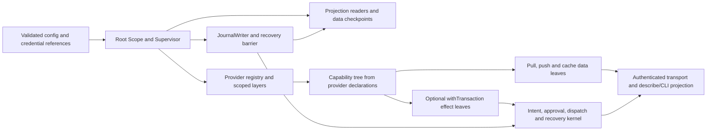

# RuntimeComposition 运行时组合设计

## 1. 设计状态与事实边界

本组覆盖九个源码文件中的 105 条 MAP，涉及健康与恢复、trading barrel、keyless public-data source、UTAManager、`main.ts`、transport context，以及启动韧性测试。本文件是基于当前源码调查证据的目标组合方向，不是已接入的 provider 协议、交易 writer、真实 agent 投递或 native broker 保证。每条 MAP 的原始 `sourceEvidence`、`currentBehavior`、问题和经验义务保留在 `analyses.json`；本设计不把旧 review 当成当前实现证明。

主要源码事实包括：

- `services/uta/src/main.ts:1-39,41-193` 的模块注释和启动函数把 broker、Git-like state、snapshot、FX、poller、HTTP 和 Guardian reload 放在同一组合根；端口在模块加载时用 `Number` 解析，健康路由恒定返回 `ok: true`，SIGINT/SIGTERM 路径吞异常并直接退出。
- `services/uta/src/domain/trading/index.ts:1-89` 顶层加载 `contract-ext`，导出 `UnifiedTradingAccount`、`UTAManager`、广义 `IBroker` 与 factory、TradingGit、snapshot 和 guard；这是当前导出图的证据，不是目标必须保留的 SDK 形状。
- `services/uta/src/domain/trading/uta-manager.ts:1-315` 同时依赖 native 类型、concrete broker factory、Git 文件持久化、Alice EventLog/ToolCenter、FX 和 snapshot callbacks，并以 Map 管理 live UTA；目标拆分这些 authority，而不是再包一个同样的 manager。
- `services/uta/src/domain/trading/keyless-data-sources.ts:1-36` 与 `keyless-data-uta.spec.ts:1-64` 证明 keyless source 是显式 opt-in、construction-only、无 credential 的 public-data 意图；它们没有证明远端 freshness、replay、private account read 或交易效果。
- `services/uta/src/types.ts:1-30` 与 `uta-startup-resilience.spec.ts:1-165` 证明 UTA 当前有窄 context 和真实 child/loopback 测试边界；它们不能把 manager 对象、进程 liveness 或测试 timer 变成执行 authority。

### 1.1 Scope 不是所有数据单位的账户

组合边界使用带标签的 scope，而不是让每条能力都携带可选账户字段：

- `AccountScope = AccountId + explicit SubAccountId` 仅用于账户相关能力、订单/持仓/账户观察、账户 lifecycle、native account lookup、冲突键和受控交易事实。单钱包也必须有显式 subaccount 语义。
- `PublicDataScope` 标识 public Candle、Instrument、News、NewsGroup 或其他 public stream 的 source/venue/subject。公共数据请求不得凭空制造 AccountId 或 SubAccountId，也不得把 public source 伪装成 funded account。
- 某个未来语义单位若需要不同 subject，应由该能力自己的 schema 声明其 scope；不能通过 undefined、分隔字符串或默认钱包偷渡身份。`ScopeRef` 只是概念边界，不能被理解为现有生产导出。

认证主体、scope、provider instance/environment/account（或 public source）和 capability revision 在需要它们的 schema 中显式绑定。没有 scope 的公开数据不会获得账户权限；有 `AccountScope` 也不会自动获得交易权限。

## 2. 目标组合图与 ownership

RuntimeComposition 只负责把已经声明的能力和资源组合起来，并让 authority 有清晰边界。实现者可以使用 Effect、类、回调、独立进程、SDK、REST/OpenAPI 或其他语言；只有 UTA-facing boundary、schema、错误和资源生命周期固定。

责任分配如下：

1. **Root Scope / Supervisor** 管理 Clock、Schedule、signal、Fiber、provider resource acquisition 和关闭顺序。它不解释 native Contract，也不把健康端点当成执行许可。
2. **JournalWriter** 是需要 durable decision 的 mutation owner。账户 lifecycle、受控效果的 intent/approval/dispatch/recovery、command receipt 和相关 jobs/locks 经过同一 writer；receipt 只在 commit 后产生。
3. **ProjectionStore / ProjectionReader** 负责账户健康、估值、目录、snapshot、cache 和可重建查询。数据读模型的 checkpoint、cursor、freshness 可持久化，但不继承订单 approval、compensation 或 dispatch WAL。
4. **Provider adapter / foreign process** 保留 native SDK、协议、codec、session、rate limit、缓存和内部类型。它只在 UTA-facing boundary 提供声明、版本、输入/结果/错误校验、delivery 和 availability evidence；类型不能宣称恶意进程安全或 native 原子性。
5. **Application / transaction-kernel** 做认证后的命令/查询编排和纯决策。只有被 `withTransaction` 明确包装的受控效果进入 intent、approval、dispatch、observation、Unknown/recovery；普通数据 leaf 不能从读取中隐式触发交易补偿。
6. **Transport** 做 auth、schema decode、describe/help、调用绑定和响应映射。Alice 的 Workspace/Session/Inbox 负责 agent 投递与回复；UTA 不重建通用模型 loop 或 ToolCenter authority。

## 3. CapabilityDescriptor 与 provider-native composition

### 3.1 共同的是元契约

每个 provider instance/environment/scope 返回带 revision 的 `CapabilityDescriptor` 外层：协议版本、稳定 capability identity、命令路径、描述、schema 版本/指纹、输入 schema、结果 schema、领域错误 schema、交付方式、效果类别、权限/资源要求、来源和 availability evidence。叶子的具体输入、输出、错误、参数、分页、stream frame、native extension 和 handler 由 provider 声明。

接入作者声明一次精确 schema、语义单位、能力说明、处理函数和所需资源，然后组合 pull、push 或受控效果包装器。schema 是类型、validator、metadata、describe/help 和 CLI projection 的源；wire schema 不携带函数。不可导出的 runtime transform、未解析引用或非法结构必须在边界失败，不能降级成任意 object。动态 foreign capability 在反序列化入口是 `unknown`，通过已校验 schema 后才进入命名 domain type。

不存在全局 `ActionContractMap`，也不存在要求每个 provider 返回 Place/Modify/Cancel/Close 的完整 `IBroker`。当前 barrel 的 `IBroker` 和任何 global switch/side effect 只是需要迁移的源码事实；目标是 provider-local capability tree。树中没有 option、cancel 或某种 protection 就没有对应叶子和命令；不能用一批 `Unsupported` handler 填充结构。名称冲突在装载时拒绝，发现后的调用绑定 capability identity、schema fingerprint 和 revision，替换/撤销产生明确 stale、availability 或 authorization error。

Provider-native 参数不被抹平：`Candle<ProviderExtension>`、`Instrument` 的 native identity、保护/期限/venue 参数、分页 token、错误字段都由具体 provider 的 schema/HOF 精确表达。局部互斥选择可以用小型 union；不能手写所有订单类型、保护、期限和 venue 的笛卡尔积。`withX` 组合必须保留既有字段、extension schema、错误和资源要求，不能退化为无约束的 `Order => Order`。闭包只存在于装载进程；等待、执行和恢复保存版本化描述数据、参数和 implementation identity，不序列化函数。

### 3.2 Data delivery 与 controlled effects

| 领域 | 组合边界 | 持久化与失败语义 |
|---|---|---|
| Candle、Instrument、News、NewsGroup、目录和报价 | 具体 provider 声明 public/account scope、pull 或 push、分页/cursor、frame、freshness/finality、缺口和背压契约 | pull 是一次有限结果；push 是有创建、取消、结束和错误帧的 resource-scoped stream。可有 cache/checkpoint/replay evidence，但不需要订单 prepare/approve/compensate、订单锁或每帧交易 WAL。 |
| 账户观察、估值和 snapshot projection | 由 scope、source、unit、observedAt、sequence、coherence 和 freshness 组成的读模型 | 缺页、断连、未知 finality、FX 缺失和 projection lag 必须是 `Partial`/`Unavailable`/`Stale`/`Unknown`。不能以空数组、USD zero 或本地接收序号制造完整性。 |
| 受控交易效果 | provider 的具体 effect leaf 外包 `withTransaction`，输入、可持久化 prepared payload、ack、observation、错误和 recovery schema 仍是该 leaf 的精确 schema | 只有此路径使用 durable intent/approval/dispatch/recovery、WAL、CAS/lease、idempotency identity 和 Unknown 处理。Ack 不等于成交、取消或条款完成；可能已发送的响应/断连保持 `Unknown` 并先对账。 |

一次 Candle/News push frame 不自动表示收盘；更正、撤回、closed-bar、缺口和 replay 能力必须来自 provider evidence。数据缓存失败不能触发交易补偿。只有当数据被选入交易决定时，才把选中的证据、消费身份和执行决定写入受控效果记录，不把整条流事务化。

### 3.3 Availability、absence 与 capability health

结构上的 absence 与运行时 availability 分开：没有声明的叶子不会出现在树上；已经声明但当前未登录、限流、断连或缺权限的叶子保留 capability identity 和精确 schema，并显示具名 `Unavailable`/`Degraded`。授权视图可以隐藏当前主体无权发现的叶子；短暂授权变化不能伪装成 provider schema 改变。

`AccountHealth` 只描述 AccountScope，`PublicDataHealth` 描述 PublicDataScope。健康证明 connection/capability reach，不证明完整账户 snapshot、成交、取消或可重发。keyless path 仅在 adapter 证据存在时发布 public data leaf；private account/order/effect leaf 结构上不存在或在适用的 query schema 中返回 `PublicDataCapabilityUnavailable`。认证账户真正观察到的 zero balance 与 public-data absence 保持不同。

## 4. Root lifecycle、health 与 shutdown

### 4.1 启动 barrier

唯一共享的 `RuntimeHealth` 是：

`Initializing{bootId,stage} | Recovering{bootId,verifiedJournal,scanProgress} | Ready{bootId,readiness:{schemaVersion,recoveryScanSequence,admissionEpoch}} | Stopping{bootId,shutdownStage} | Failed{bootId,failedStage,redactedCause}`。

目标启动顺序为：

1. 在 ConfigLayer 解码 sealed config、provider declarations、public/account scopes、runtime mode、HTTP bind 和 schedule；配置错误在 bind 前成为 typed failure。
2. acquire/verify/migrate single JournalStore，重建 projections，并分类未发送、可能已发送、补偿和 operator cases。journal corruption 是 root failure，不能用 JSONL、Map 或 warning fallback。
3. 仅为声明的 provider scope acquire layers/fibers。没有账户或 public carrier 是合法的 zero-carrier lite/read-only root；一个账户/provider 连接失败只产生该 scope 的 health/availability。
4. 持久状态和 recovery barrier 完成后发布 `RuntimeHealth.Ready`，再开放需要 authority 的命令。若 transport 提前 bind，mutation route 必须返回 `NotReady`；bind 本身不能推出 Ready。
5. public data refresh、catalog、snapshot 和 stream subscription 在各自 scope 下监督运行；它们不会因为启动/关闭而隐式生成交易意图。

健康 reducer 只接收带 scope、generation、capability kind 和显式 `Instant` 的事件，不能读 Clock、env、SDK 或 timer。连接 recovery 使用版本化 `RecoverySchedule`，其 backoff 只用于 connection probe；它不被 order mutation、data stream 或 Unknown 效果复用。旧 generation 的 late event 由 generation/CAS fencing 丢弃。

### 4.2 账户 lifecycle 与查询

AccountLifecycleService writes canonical AccountScope registration/retire/disable events; AccountQueryService returns immutable `AccountView` for account-backed facts, containing lifecycle, capabilities, health, sequence/asOf/freshness, and never UnifiedTradingAccount, native Contract, Git or broker handles. `DataQueryService` returns a separate `DataSourceView` for declared PublicDataScope leaves. Runtime Map/Set can cache scoped handles but cannot prove durable existence. Reconnect is a new generation resource exchange; acquiring a new connection cannot erase an old Unknown/recovery case.

账户聚合使用 currency-qualified `Money`、Decimal、带 source/observedAt/freshness 的 `FxObservation`，结果显式区分 `NoAccounts`、`Complete{status:Confirmed|Stale|Estimated}` 和 `Incomplete{availableAccounts,missingScopes,reasons}`。public data source 不进入 funded valuation；缺失账户、FX、scope 或 freshness 不得伪造成 zero。Contract/catalog search 的空结果只代表有完整证据的 `NoMatch`，而不是 offline、unsupported、缺页或 projection failure。

### 4.3 关闭与恢复
关闭顺序是：关闭 admission，停止新 claims，quiesce/interrupt workers，分类未完成的受控效果，drain JournalWriter，释放 scoped provider/data resources，关闭 transport，最后关闭 DB。返回 typed `ShutdownReport`；`Promise.allSettled` 只能是独立 finalizer 的执行策略，不能吞掉失败。`RecoveryCase` 对可能已发送的受控效果保持 owner/exclusion；只有 CAS 证明没有跨过 DispatchStarted 的草稿才能 retire/release。数据 projection/resource 可以停止和重启，但不能删除仍需诊断的 cursor、sequence 或 recovery evidence。

Guardian 的 SIGTERM/respawn 是外层 reload 边界，不代替 runtime recovery。Supervisor 负责最终 exit/restart/backoff mapping；RuntimeComposition 不把 Unknown 映射成 KnownRejected 或 clean success。历史 Git/EventLog 若被读取，只能作为 commit 后的 `GitAuditProjection`/`LegacyEvidence`，不能生成新的交易、dispatch、账户 scope 或 data-source identity。

### 4.4 Trigger 与 ReturnToAgent
事件、定时器、CLI、AI 或数据 stream 只提供 trigger evidence，不提供交易 authority。若已选择的 controlled effect 在 `DispatchStarted` 前进入 `ReturnToAgent`，writer 原子消费 activation、暂停 binding、保留未发送 intent/evidence，并写入稳定 `ReviewRequest`/outbox；该分支不调用 provider，也不创建 broker dispatch。后续只能通过显式 `KeepSuspended`/retain（带截止时间与理由）、`Rearm`（新 binding epoch 与未来事件起点）、`Revise`（新 intent revision，重新准备/授权）、`Discard`（仅未发送）或 `RequestSubmission`，并以 review identity/expected revision 做 CAS；已发送或 Unknown 的效果只能走 observation/recovery。

## 5. Transport、CLI 与测试边界

TransportDependencies 只包含 Auth/Principal、Capability service、AccountQuery、DataQuery、ProjectionReader、HealthReader，以及需要时的 transaction application port。请求先做 auth、scope/schema/revision 校验，再调用相应 capability；响应使用 provider 声明的输入/结果/错误 envelope。`uta <provider> ...`、机器可读 describe/help 和 AI metadata 都从同一 capability tree 计算，不能另维护命令表或让 AI 猜 provider 字段。pull 输出一个有 schema 的有限结果；push 输出具名 NDJSON data/control frames，SIGINT/管道关闭只取消本次数据订阅并释放本次资源，不撤销已被 writer 接受的受控效果。

Simulator 只有在显式 Development/Test mode 和 `SimulatorAdmin` capability 下组合，并通过同一 typed application boundary；默认/生产组合没有 simulator path。loopback 是 transport isolation，不是 authorization。ToolCenter 由 Alice 侧根据 provider-declared `CapabilityDescriptor` leaves 注册；UTA 不扫描 broker engine string，也不把 provider object 交给 agent。

测试按证据层次分开：

- **纯声明/codec**：schema round-trip、provider extension、scope parsing、absence、错误路径和 no-network keyless construction；不声称 remote freshness 或 native guarantee。
- **数据运行时**：public/account pull 有限结果、push frame lifecycle、cursor/replay/backpressure、catalog/snapshot checkpoint、Partial/Unavailable/Stale 和 public-data absence vs authenticated zero 区分；不创建 order approval/lock/dispatch。
- **受控效果运行时**：仅用 write-capable provider fixture 覆盖 prepare/approval/claim/DispatchStarted/ack/abort/compensation crash cuts、CAS/lease、Unknown observe/reconcile 和 independent broker ledger。FundedReadOnly 只能产生 DraftReview（可含非执行 PreparationPreview），不能产生 Prepared/Approved/Queued 或 dispatch。
- **进程/transport**：child、loopback、typed RuntimeHealth、auth、shutdown 和 redaction。真实 child/HTTP/liveness 不是 SQLite、provider idempotency 或 native lookup 的替代证据；失败时先保存 redacted journal/projection/provider-ledger artifact 再清理 temp home。

## 6. MAP 覆盖、经验义务与可证伪场景

健康与关闭集由 `MAP-AF81F62711` 至 `MAP-A1F54D2BA5` 覆盖：保留 5/10/20 秒连接 recovery、3/6 failure thresholds、同能力 reset、offline fail-fast、close cancellation 和 account isolation，但这些都是 scoped capability/recovery evidence，不是全局执行许可。barrel 与 boundary 集 `MAP-3A811B60A0`、`MAP-7DD89036D6`、`MAP-DD2FE66A82`、`MAP-EFD22B7831`、`MAP-41FE208558`、`MAP-32B6CEE9FA`、`MAP-C466C2AC10`、`MAP-C2848F848F`、`MAP-38D1A9619B`、`MAP-0A182AEB30` 迁移 global side effect、广义 IBroker、factory、Git、snapshot 和 guard authority；其中 native details 和 provider extensions remain adapter-owned。

Keyless and account/query MAPs (`MAP-DEE616DB32`、`MAP-E7FFEA181E`、`MAP-5B129B67D7`、`MAP-6AE1898715`、`MAP-018E718257`、`MAP-857191C07B`、`MAP-41F4367315`、`MAP-8B95CE02C1`、`MAP-EB5CA76553`、`MAP-38975A9375`、`MAP-DCAD63E801`、`MAP-29525F619A` 及 `MAP-EAE8B7150D` 至 `MAP-A52D6896E9`) 保留 opt-in、dedup order、labels、Decimal、search、details、lifecycle 和 MockBroker evidence；public data 使用 PublicDataScope，不能默认成为 AccountScope，keyless absence 不变成 zero 或 placeholder mutation。

Composition/transport/process MAPs (`MAP-80C471F58F`、`MAP-4F1B3065A3`、`MAP-071F6FB24A`、`MAP-7D7ABA2368`、`MAP-77923C5EA9`、`MAP-C9D53377C0`、`MAP-4030819860`、`MAP-FC89E49A77`、`MAP-756E9DC555`、`MAP-2C295F499B`、`MAP-CDD00B4C1B`、`MAP-C8D7A0F889`、`MAP-EE73F2F7D2`、`MAP-B0317A6228`、`MAP-58B5F119B7`、`MAP-E09A9CD997`、`MAP-DFDC1D0116`、`MAP-C762FC3F5D`、`MAP-F840826CE5`、`MAP-1C9449F63F`、`MAP-2810B2FE69`、`MAP-529FB3A498`、`MAP-F0D5CAEC8A`、`MAP-62BFB82A86`、`MAP-3E7F87BDF4`、`MAP-6C6CAA25D4`、`MAP-0FC5D42419` 以及 `MAP-780C76C803` 至 `MAP-32D2FDFBF9`) 保留 loopback、Guardian、config precedence、supervised schedules、route paths、simulator gate、child cleanup 和 process evidence，同时把它们放回各自的 owner；它们不能获得一套与源码无关的订单状态字段。

以下场景是未来实现 gate 的 falsifiers，不是本轮已执行结果：

1. 在 provider declaration 中加入一个 native field，静态类型、边界 validator、CapabilityDescriptor、describe/help 和 CLI schema 没有同时变化，或需要编辑全局 switch。
2. provider 没有 cancel/option/protection leaf，却出现了相应命令或一个 `Unsupported` placeholder handler。
3. malformed input、未解析 schema 引用或 provider extension 在 handler 前未被拒绝/保留，或动态 JSON 以 cast 穿过业务边界。
4. pull 返回无界 stream，push 缺少创建/结束/错误/cancel frame，或 SIGINT 取消了已接受的受控效果；数据帧触发了订单 WAL/approval/compensation。
5. public Candle/News/Instrument 请求出现默认 AccountId/SubAccountId，或 keyless private read 的 zero/empty 结果进入确认估值。
6. FundedReadOnly 的 Stage/PreparationPreview 产生 Prepared/Approved/Queued、lock、job 或 dispatch；ReturnToAgent 创建 broker dispatch 而不是稳定 ReviewRequest/outbox。
7. 同一 binding/事件 identity 被重复消费，迟到回复复用旧 review/approval，或重激活复用旧 epoch/intent revision。
8. `DispatchStarted` 后杀进程，重启盲目重发而没有 provider-native lookup/ledger evidence；连接 recovery backoff 被误用成 mutation retry。
9. journal corruption 或 writer fatal 仍发布 Ready/允许 mutation；无 provider carrier 的 root 被错误判为不可用；单账户失败变成 global Failed。
10. proxy/FX/broker credential、native extension 未授权字段或敏感 diagnostics 出现在 plan、digest、journal、stdout/stderr，或失败 cleanup 删除了唯一 redacted recovery artifact。

`questions-closure.json` 保留 32 个原始问题文本和 17 个 empirical-retained obligations。已决定的部分只决定组合边界（JournalStore authority、typed auth、simulator mode、Supervisor exit、C07 listing 等）；它们不宣称 provider endpoint、native handshake/idempotency/lookup、instrument rule、credential deployment、FX binding、crash fixture、agent delivery 或 broker ledger 已被验证。缺少证据时目标行为仍是具名 `Unavailable`、`Partial`、`Unknown`、`ObserveRequired`、`RecoveryRequired` 或 `LegacyEvidence/OperatorRequired`，而不是通过抽象把不确定性改名为保证。
