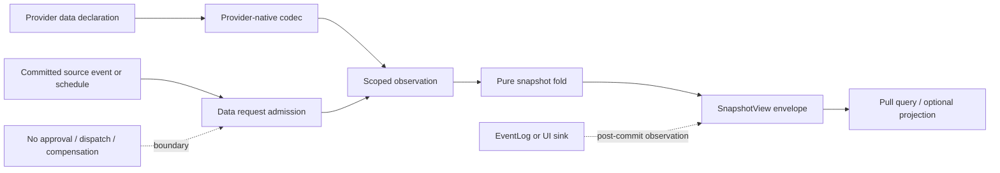

# Snapshots：可组合 provider 数据读取与可重建投影

状态：目标设计，不是已接入的 provider 协议、生产迁移或可靠性验收。本组处理 UTA 账户快照：它是账户事实的有限 pull、可选的持久化投影和查询边界，不是订单执行器。`MAP` 的源码范围是调查锚点：它保留被观察到的旧行为和缺陷，但不是新的公共 API，也不替代实现时重新读取当前源码。

## 1. 边界：账户数据，不是交易效果

快照属于账户相关能力，因此其事实、查询和捕获请求都需要解析后的 `AccountScope { accountId, subAccountId }`。scope 尚未发现、发生歧义或不可用时返回具名状态；不能用缺少 subaccount、目录名或空列表伪造默认钱包。公共 Instrument、Candle、News 等能力不因本组而获得账户 scope；它们由各自能力声明决定是否需要 scope。

本组只声明 UTA-facing 的元契约和数据边界。一个 provider 可在 adapter 内使用 IBKR SDK、REST/OpenAPI、任意语言或独立进程；外部协议由该 adapter 精确解码。当前 builder 对 `@traderalice/ibkr` 的 `UNSET_DOUBLE` 依赖，以及 UTA 内部已有的 broker/global switch，都是旧实现证据，不是所有 provider 必须实现的 SDK。新增 provider 字段应从其声明的 input/result/error schema 推导类型、校验、帮助与 availability，而不是修改一个全局 provider 或 action switch。

`SnapshotView`、`SnapshotObservation`、`ListingResult` 和 `SnapshotCause` 是本组的概念合同名，不宣称当前生产模块已经导出这些符号。它们描述数据，不携带 broker dispatch 函数、approval、reservation、compensation 或 order recovery authority。

## 2. 声明、解码与投影模型

### 2.1 一次声明，多个数据入口

每个 snapshot-capable provider leaf 通过固定外层 `CapabilityDescriptor` 暴露 protocol version、稳定 capability identity、command path/description、schema version/fingerprint、精确 input/result/domain-error schema、delivery/effect category、resource/permission、source revision 和 availability 元数据；叶子的 provider tree 与 schema 本身保持开放。快照的主入口是有限 pull；若未来需要实时更新，必须使用 K05 的有生命周期、创建/取消/结束/错误和背压契约的 push stream，不能把每个数据帧当作订单事务。pull 的有限结果和 push 的连续帧不承诺相同 freshness、finality 或 replay 能力。

静态 provider 的 schema 产生精确的 TypeScript 类型和边界 codec；动态 foreign provider 只能在反序列化入口持有 `unknown`，随后解析成声明 schema。schema 指纹覆盖实际 input/result/error 与语义版本。时间、金额、数量、币种、instrument identity、scope 和 revision 使用具名构造器；provider native revision 与本地接收序列分开，不能把本地计数器改称 native monotonic version。
声明可由读取、订阅、缓存或授权 retention 的 HOF 组合器复用，但组合器必须保留并推导叶子的精确 input/result/error schema、资源要求和 delivery 语义；它不能退化成 `Order => Order`、裸 JSON 或一个全局 provider/action registry。组合器是装载进程中的实现函数，持久化的只是版本化声明、参数与实现身份。

### 2.2 快照事实与外层视图

账户快照包含以下可组合数据分量，而不是一个无界的 plain object：

- `AccountingView`：保留 source 报告的财务十进制字符串及 currency；内部使用带单位的 Money/Ratio 值，不能用 `Number`、0 或默认 FX 填洞。
- `PositionView`：保留已解析的 scoped instrument identity、数量、成本/市价/PnL 和适用的合约 metadata。OPT/FOP 的 multiplier、strike、right、expiry 通过 provider 声明的精确 extension 保留；STK 不适用的字段结构性省略。缺失但适用的字段仍是缺失/未知证据，不能与“不适用”混淆。
- `OrderObservation`：只表示 provider 实际声明并返回的订单观察字段。旧实现的 `orderId`、instrument key、action、order type、quantity、limit price、status、avg fill price 继续可作为观察字段；额外 native 字段随 exact extension 保留。这里不手写 Market/Limit/Stop/Trailing 或保护、期限、venue 的笛卡尔类型，也不把观察字段当作该 provider 支持执行的证明。
- `WorkingOrderView`：沿用旧的 Submitted/PreSubmitted 工作切片，但只有在查询声明的覆盖语义允许时才可据此筛选：`ByIds` 只能说明返回的请求订单及其缺失证据，不能证明命名空间中没有其他订单；只有 `ListingResult.Complete` 覆盖明确 namespace/cursor 的枚举查询才可据此报告完整缺席。`Partial` 和 `Unavailable` 不能变成空订单数组或远端拒绝；缺席不是取消证据。
- `RuntimeHealth`：使用唯一的运行健康联合（Initializing、Recovering、Ready、Stopping、Failed）并和 provider reach/effective data availability 分开。健康可见不表示交易写权限。
- `GitAuditView`：head/pending commit 是本地意图与审计来源，不是 broker observation、成交事实或执行 authority。

外层 `SnapshotViewEnvelope` 携带 `schemaVersion`、显式 scope、cause provenance、`capturedAt`/`asOf`、provider-native revision（若有）、local received sequence、projection checkpoint、每组件 Freshness/Coherence，以及整体 `Complete | Partial | Unavailable`。只有有证据的共同 local sequence fence 才能报告 `CoherentAt`; 相同 wall-clock timestamp 不能证明同一时刻。历史查询可返回 `NoHistory`，但仅在 scope coverage 完整且确实没有记录时成立。

`SnapshotCause` 是本地小型 provenance union：`Scheduled`、`Manual`、`PostPush`、`PostReject` 可各自携带窗口、actor、source identity、revision 和 sequence。它回答“为何请求这次数据捕获”，不回答“谁批准了订单”。post-push/post-reject 只有在对应 source operation 已提交后才可产生；source event 是触发证据而不是 authority。

## 3. Effects、捕获、调度与恢复

### 3.1 纯函数与 Effect 边界

纯函数接收已解码的 observation、scope、sequence、policy 和 clock 值，完成：

1. provider payload 到 `ObservationSet` 的确定性映射；
2. scope、unit、schema、coverage 和 revision 关系检查；
3. `ListingResult`、component freshness/coherence 和 `SnapshotViewEnvelope` 折叠；
4. capture/query/retention 结果分类。

Effect 只在边界：provider/Git/clock 读取、有限请求队列、worker 生命周期、持久化/query、legacy 文件导入和 EventLog sink。捕获 worker 可以使用资源 lease、capacity/backpressure 和重试策略来保护进程与配额；这些是数据资源控制，不是 broker order lock。读取/订阅不需要 order prepare/approve/compensate，也不需要为每个数据帧写交易 WAL。若数据被用于另一个交易决定，另一个能力只持久化选中的 evidence、消费身份和执行决定，而不是把整个行情/快照流事务化。

### 3.2 捕获请求与 source event

请求分为两类：

- `OptionalScheduledSnapshot` / read telemetry：由 Pump 计算可选窗口并按 scope 入队；同一 scope/window 可以去重或合并，容量满返回 Backpressured。
- post-commit observation request：成功提交的 source event 可携带 identity/revision/sequence，交给可重放 cursor 产生一次有限 snapshot pull。它不调用 approval/dispatch，也不能被 scheduled coalescing 删除。

`runNow` 是一个显式 data admission，不是直接调用 service 的 void callback；它返回数据 job receipt、Existing、Backpressured 或 Unavailable。请求 identity、payload digest、scope 和 policy revision 在需要 durable capture 时持久化，以处理 commit 后 response loss。Pump 只负责 timer/supervisor wakeup；它不能成为 pending fact authority，也不能以 stop terminal no-op 代替持久化 drain。

本地 data-job 生命周期可以使用 `Ready → Leased(owner, epoch, deadline) → Completed | Failed`。`ObservationUncertain` 是读结果/对账状态，不是订单 `RecoveryCase`。超时、断线、listing gap、provider output violation 和 schema decode failure 保留各自 evidence；不凭重试次数把不确定 read 伪装成成功或订单效果。关闭顺序是关闭新可选 admission、停止新 claim、记录/排空已接受 data jobs、保存 cursor/checkpoint，再关闭 reader/persistence；启动先完成数据 cursor、lease、schema/projection barrier，再打开自动 tick。

## 4. 持久化、查询、迁移与 retention

旧 `SnapshotStore` 的 JSONL、index、50 行 chunk 和 Promise chain 只能作为 migration/source evidence。若实现保留持久化快照，应由选定的 snapshot data writer 在同一数据持久化边界记录 accepted observation identity/payload、local sequence 和 projection row/checkpoint；receipt 在提交后交付。这里的原子性只保证快照数据事实与其投影 metadata 不互相伪造，不宣称 broker atomicity、remote exactly-once 或交易 WAL/CAS。未记录的 live broker read 不能靠 replay 重造。

`readIndex` 的 catch-all 空 fallback 改为 typed decoder：NotFound/NoHistory、CorruptProjection、StorageUnavailable、SchemaMigrationRequired 分开。`readRange` 改为 read-only `SnapshotProjectionQuery`：解析带时区的 Instant/sequence bounds 和 limit，按 local sequence/声明的 tie-breaker 取值，返回 envelope 与 Complete/Partial/Unavailable/NoHistory。数据库/文件错误、checkpoint gap、schema hash 不匹配、scope 不可发现都不得折叠成 `[]`。

删除不是事实删除。授权 `SnapshotRetention` 只能 compaction/rebuild 已确认可重建的 projection rows，按 data identity、sequence、checkpoint 和 retention policy；source observations、migration evidence、未完成/不确定 data requests 保留。timestamp 继续可作为查询字段，但不是唯一删除身份。retention failure 不产生半次 compaction，也不进入订单补偿。

实施前必须真实盘点 legacy files/journal（若确实存在）：schema/version、scope mapping、record identity、revision/sequence 单调性、缺口和已持久化 cursor。没有这些事实时 importer 返回 MigrationRequired/OperatorRequired，受影响 scope 的 view 保持 Unavailable；不能从 timestamp、数组位置、chunk 名称或未经验证的 revision 猜 source sequence/cursor 起点。盘点结果写入 migration ledger，不能把未知 external guarantee 由抽象名称填成已知。

## 5. 文件落点与证据索引

- Builder（`MAP-92BA447044`、`MAP-3EA45A1B4F`、`MAP-473BE32758`、`MAP-2A00814D1F`、`MAP-69E23AB274`）：移除 live UTA/SDK/sync side effect，改为 provider-decoded observation、availability、scope、listing 和纯 assembly；保留十进制、derivative metadata、working-order filter、Git audit 与 no-fabrication 证据。
- Barrel（`MAP-27667D4B9F`）：只公开 UTA-facing data query/capture/retention/view/cause 合同；provider codec、persistence 和 timer 构造留在 composition root，不保留双写 alias。
- Scheduler（`MAP-F64B549F14`、`MAP-5F2BAD0154`、`MAP-F7BC708300`、`MAP-330646FEBC`、`MAP-051EE15C40`、`MAP-D073ACA66E`、`MAP-E9161D7938`）：Pump 只发可选 finite pull admission；post source event 走可重放 data request；scope、capacity、lease、drain、response-loss 与 availability 都显式。
- Service（`MAP-B273D4875A`、`MAP-FC05F3240D`、`MAP-622FCFCD63`、`MAP-5BD7779096`、`MAP-19A41F635E`、`MAP-226B693FB4`）：拆 capture/query/retention；删除固定 sleep/null/Promise.allSettled 作为权威协议，保留每 scope 隔离、typed outcome 和 sink/result 分离。
- Specs（`MAP-2EF977A049`、`MAP-83DAA2E639`、`MAP-FAA33A98FD`、`MAP-DCBAABE629`、`MAP-95A7E16E24`、`MAP-A605F93FC5`、`MAP-DF2BB19B01`、`MAP-E65165A605`、`MAP-30284C5902`、`MAP-F2E552347E`、`MAP-BC1C2B98A1`、`MAP-3AF27244D4`）：fixture 改为显式 scope、声明 schema、listing/freshness 和 persistence outcomes；旧 call-count/null/chunk 断言降为历史 evidence 或 migration fixture。
- Store（`MAP-78D69C071D`、`MAP-D9EDA3CFCA`、`MAP-D8989CCCCB`、`MAP-CF8F8B0486`、`MAP-22671716C7`、`MAP-88C7B6755F`、`MAP-C7360CA0A4`、`MAP-CECC039853`、`MAP-25F7996D49`、`MAP-7CCB6F93A0`）：JSONL/index/chunk/path/chain 退为导入细节；运行时使用 scoped data writer/query/checkpoint/retention，错误不可变成空历史。
- Types（`MAP-BF84B32A4C`、`MAP-587333CEE9`、`MAP-26E7DEFDF7`）：由 local cause、scoped envelope、provider extension、projection metadata/freshness 替代裸 trigger/plain snapshot/chunk contract。

## 6. 可证伪场景与未解决冲突

以下是实现 gate 的 falsifiers，不是本次设计已经执行的结果：

1. 用同一 provider 声明新增一个精确 snapshot extension：静态类型、边界 validator、CapabilityDescriptor/help 和 CLI projection 必须同时变化；内核不能增加 provider/global switch，也不能迫使其他 provider 填空字段。
2. 声明没有某个 order-listing namespace 的 provider：能力树不展示该叶子；已有 provider 只读的字段不被解释成执行能力。部分覆盖、scope mismatch、schema drift 和 output violation 必须分别返回 Partial/Unavailable/DecodeFailure。
3. 用 OPT/FOP 与 STK observations 做 schema round-trip：OPT/FOP 精确 metadata 和十进制保留，STK 不适用字段结构性省略；未知但适用字段不能默认为 1 或 0。
4. 让同一 scope 的组件使用相同 `observedAt` 但不同 local sequence：查询必须报告 MixedFreshness/stale，不能报告 CoherentAt。Provider native revision 缺失时必须报告缺失，不得改名成本地计数。
5. 在 committed source event 后于 subscriber 运行前终止进程：重启只能恢复一个 data request；同窗 scheduled request 可合并，但不得复制或删除 source-event request。disabled/failed source operation 不应凭空产生请求。
6. 对 queue capacity、lease expiry、stop/drain、commit-before-response-loss、schema corruption 和 projection rebuild 做真实持久化实验：receipt、checkpoint、job identity 和错误状态必须可收敛，失败不能回退到空数组；不能用 order approval/compensation/recovery 代替数据证据。
7. 对 legacy 文件提供完整、截断、缺 scope、非单调 revision/cursor 和权限失败样本：只有验证过的 schema/scope/identity/cursor 才能迁移；其余保持 MigrationRequired/OperatorRequired/Unavailable 且原始 digest/evidence 可追溯。
8. 当 query/projection 不可用而 EventLog sink 失败时，消费者必须分别看到 ProjectionUnavailable/Partial、sink failure 和已存在的 snapshot fact；未知金额不能在 equity aggregation 里变成 0，retention 不能删除 source evidence。

当前未解决的真实冲突是生产历史是否存在可安全续接的 journal/legacy cursor，以及各 provider 的 native order-listing coverage、revision、finality、分页和 absence evidence。它们不能由当前 MockBroker、IBKR source import、类型声明、MAP 计数或旧 review 解决。每个 provider 继续由自己的声明和 adapter 取得证据；本组不宣称 native idempotency、atomicity、paper/live 或真实 agent 投递已经成立。
