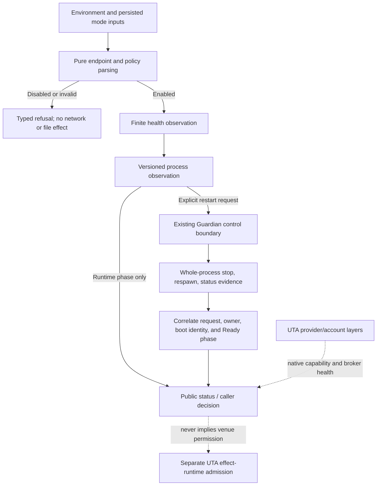

# Supervisor: UTA process observation, Guardian control, and endpoint configuration

## 1. Scope and design basis

This design covers the 21 Supervisor MAPs assigned to the source files below:

- **Health observation and decoding:** `MAP-B9DC6715CE`, `MAP-43A7CB72EF`, `MAP-CEB68E968D`, `MAP-6F1E8D6910`, `MAP-ABEDDF53B2`, `MAP-17FC029A85`, `MAP-9767014E35`.
- **Restart control and proof:** `MAP-A630EBD86C`, `MAP-4510706FF1`, `MAP-A565129D19`, `MAP-A6456BE807`, `MAP-A9866AE52B`, `MAP-42056E5B7F`, `MAP-505C4A4F7D`, `MAP-E993F5FB47`.
- **Policy and endpoint configuration:** `MAP-B3BED45272`, `MAP-52D552B9B4`, `MAP-236805847B`, `MAP-9D3F24C206`, `MAP-AF5DDC0F35`, `MAP-DF9D77E0FF`.

The target follows `composition-contract.md` with `designBasis=capability-composition-v1`. Names such as `UtaHealthResponse`, `RuntimeHealth`, `HealthProbeResult`, `RestartRequest`, `RestartOutcome`, `UtaEndpoint`, and `TradingModePolicy` are conceptual boundary contracts for implementation planning. No existing production export, package, generated specimen, or provider SDK is implied by those names.

Supervisor owns Alice's process boundary: parse a target, obtain a typed finite observation, submit a whole-process restart request to Guardian, and report evidence. It does **not** own broker adapters, broker credentials, venue capability, order approval, dispatch, fills, transaction recovery, or agent review. A health response is an observation, not an execution permission. A Guardian restart is a host process-control effect, not a trading effect.

The target deliberately has no global `ActionContractMap`, no universal `IBroker` replacement, and no requirement that every provider expose empty action handlers. Any global switch or source-wide interface found while investigating another group remains source evidence only; it is not a target requirement for Supervisor.

## 2. What the current source actually does

The following facts are retained as investigation evidence, not silently upgraded into guarantees:

- `src/services/uta-supervisor/health.ts:3-7` describes `/__uta/health` as optional-carrier observability and delegates polling to `optional-carrier/health.ts`. `health.ts:9-13` exposes a local `HealthBody`; `:24-30` casts unknown input to `Partial<HealthBody>`, checks only three loose predicates, and throws a generic error; `:32-43` hard-codes `enabled:true`, applies 15s/200ms defaults, and collapses every non-healthy phase to `null` through `body!`.
- `src/services/uta-supervisor/restart-trigger.ts:1-11` documents an Alice flag, Guardian debounce/SIGTERM/respawn, and a newer `startedAt` check. `:13-16` imports filesystem effects and the raw URL/boolean helpers. `:18-37` exposes arbitrary strings/numbers and boolean-plus-error output. `:45-51` performs an uncancellable fetch, casts JSON, and turns all failures into `null`. `:53-81` writes a fixed `.tmp`/flag path and accepts any truthy changed string; an absent baseline therefore acts as a wildcard.
- `src/services/uta-supervisor/url.ts:10-25` trims an explicit URL but otherwise returns it unchanged, interpolates a trimmed-or-default `47333` port, and recognizes only untrimmed positive truthy spellings. `src/services/trading-mode.ts:24-50` and `packages/guardian-runtime/src/trading-mode.ts:14-33,98-102` resolve related policy independently. These are duplicated source paths, not evidence that endpoint reachability grants capability.
- `services/uta/src/main.ts:147-152` currently emits only `{ok:true, startedAt, utas}` on loopback HTTP. That proves an HTTP handler answered; it does not prove journal verification, recovery classification, admission, or broker-account health. `:170-192` shows process shutdown and `:195-200` shows the startup error/role-dispatch behavior.
- `packages/guardian-runtime/src/control-server.ts:42-165` currently accepts request IDs and the finite methods `runtime.status` and `runtime.stop`; `:102-124` has no `runtime.restart-uta` method today. Unix endpoint permissions are set to `0600` at `:145-148`; no Windows named-pipe peer-authentication guarantee is established by this source.
- `scripts/guardian/shared.ts:495-525,540-627`, `scripts/guardian/dev.ts:420-447`, and `scripts/guardian/prod.mjs:481-532,567-592` establish the current whole-process lifecycle, debounce, concurrency guard, escalation, spawn, and lite/nano branches. The current flag watchers do not publish request-correlated restart completion.

These observations preserve the useful legacy behavior—Alice can run without UTA, a configured target can recover later, Guardian owns process replacement, and default wait cadences are bounded—while refusing to infer native guarantees that the source does not provide.

## 3. Boundary model: data observation versus host effect

Health and endpoint reads are finite data operations. A probe returns one decoded observation or one typed transport/protocol failure. It does not prepare, approve, compensate, lock, or write an order. A status poll is likewise a bounded process-control read. If a downstream order decision uses a health observation, the order execution owner may persist the selected evidence, trigger identity, and execution decision; Supervisor does not make the entire health stream transactional.

Restart is a host effect over a process resource. It has a request identity, owner continuity, bounded waiting, and explicit unknown outcomes, but no broker dispatch identity and no transaction receipt semantics. Its process-control audit, if the product later needs one, is a separate redacted record. It must not be written into the trading Event/Receipt sequence merely because UTA will later reconnect brokers.

Broker/account reachability and provider capability remain UTA-side observations resolved by provider-native adapters. `RuntimeHealth.Ready` below means the local UTA runtime has crossed its declared startup/recovery barrier; it does not mean every broker is connected or that any order is executable. A provider may expose a native health/capability leaf or omit one; Supervisor must not synthesize a closed provider tree to make statuses uniform.



## 4. Conceptual contracts and pure transitions

### 4.1 Endpoint and mode policy

The configuration boundary constructs refined values before any HTTP, socket, filesystem, or timer effect:

- `parseUtaEndpoint(raw, policy)` trims and validates URL syntax, scheme, authority, port, path prefix, control characters, userinfo, and any policy-disallowed query or fragment. The default deployment policy is loopback HTTP. Non-loopback or TLS is an explicit deployment decision, not an inference from a nonempty string. A valid endpoint produces one canonical base and one deterministic `/__uta/health` URL.
- `resolveLocalEndpoint(env)` uses `OPENALICE_UTA_URL` when it is present and valid; only absent/trimmed-empty `OPENALICE_UTA_PORT` selects `47333`. A supplied malformed URL or port is an error and never falls through to a different target.
- `parseLegacyBoolean` returns `Unset`, `ExplicitTrue`, `ExplicitFalse`, or `InvalidBoolean`. It trims before case-folding, keeps `1/true/yes/on` and compatible false spellings, and rejects unknown nonempty values. Raw environment text is not copied into diagnostics.
- One cycle-free policy resolver preserves explicit trading-mode precedence, source, `envLocked`, legacy flags, persisted mode, and product-level lite/nano disablement. `Disabled`, `Enabled(readonly)`, `Enabled(pro)`, `InvalidConfiguration`, and later `Unavailable` are different states. `CarrierPolicy` in the Supervisor entry-level contracts is only a projection of this shared `TradingModePolicy` for process/transport gating, not a second mode resolver or a provider capability catalogue. Readonly can permit process supervision and reads while a separate capability guard refuses venue mutations.

The existing `isUTADisabled` and duplicate Guardian parser are therefore source defects to remove from the target path, not a reason to add a universal broker contract. Policy resolution is pure and has no journal owner.

### 4.2 Process health observation

The target boundary describes one versioned conceptual response:

```ts
UtaHealthResponse = {
  version: 1,
  snapshot: { observedAt: Instant, runtime: RuntimeHealth },
  startedAt: Instant,
  utas: NonNegativeInt,
}
```

`RuntimeHealth` is a small safety lifecycle ADT, not a provider capability catalogue:

- `Initializing { bootId, stage }`
- `Recovering { bootId, verifiedJournal, scanProgress }`
- `Ready { bootId, readiness: { schemaVersion, recoveryScanSequence, admissionEpoch } }` (the epoch is local runtime evidence, not trading admission)
- `Stopping { bootId, shutdownStage }`
- `Failed { bootId, failedStage, redactedCause }`

The producer must construct a phase only from evidence it actually owns. In particular, a `Ready` payload may only be emitted after the local runtime has verified/classified the required startup barriers; Alice must not guess those fields. The five-phase shape is a Supervisor process contract for local startup/recovery, not a claim of provider, broker, transaction, or native SDK readiness.

At the Alice boundary, untrusted JSON is decoded from `unknown` into this schema. A successful decode yields an `Observed` result even if the phase is `Initializing`, `Recovering`, `Stopping`, or `Failed`; only the structural `Ready` variant carries the local readiness evidence. Decode failures retain field/path and protocol-version evidence as typed `InvalidResponse`, without raw body logging. HTTP error, timeout, unreachable, cancellation, not-configured, disabled, and observed responses remain distinct variants.

The existing optional-carrier helper should be reused or adapted once so body and phase cannot diverge. Supervisor must not introduce a second polling loop merely to force an SDK-like interface. The helper's native implementation may use any suitable language, callback, class, or schedule; only the UTA-facing result boundary is fixed.

### 4.3 Restart request, lifecycle, and proof

The target conceptual request is serializable and secret-free:

```ts
RestartRequest = {
  version: 1,
  requestId: RestartRequestId,
  requestedAt: Instant,
  reason: RestartReason,
  target: 'whole-process',
  audit: { kind: 'public' } | { kind: 'account', scope: AccountScope },
}
```

An audit variant is correlation metadata only. Public process control carries no invented account or subaccount; an account scope is present only when the initiating operation is genuinely account-related, and it never turns the current Guardian whole-process operation into account-only restart. The existing control server/client is the only proposed extension point. The target adds a `runtime.restart-uta` method and request-correlated restart status to that protocol; it does not add an acknowledgement socket, second flag, or compatibility authority. The current source does not yet implement that method, so its status semantics remain an implementation obligation.

The supervisor interpreter performs the following bounded sequence:

1. Resolve policy and refined endpoints. `Disabled` and invalid configuration return without I/O.
2. Obtain a pre-trigger health observation. A complete observation yields `BaselineEvidence` with opaque `bootId`, `startedAt`, snapshot, and check time. Any failed or malformed probe yields an explicit unavailable baseline; it is never a wildcard.
3. Send `runtime.restart-uta` through the existing Guardian control endpoint. Guardian owns coalescing, debounce, SIGTERM, exit wait, escalation, respawn, and status publication. Alice never kills or spawns UTA.
4. Poll request status and health under one monotonic deadline. Each in-flight request receives a remaining-budget abort signal; cancellation stops further polling.
5. Produce `Ready` only from a changed boot identity after an observed baseline, or from same-request Guardian completion that carries a new boot identity, **and** a decoded `RuntimeHealth.Ready`. `Accepted`, `Running`, HTTP 200, public market-data reachability, same boot identity, or an unrelated later healthy response cannot prove this restart.

`RestartOutcome` is a local finite safety ADT: disabled, invalid configuration, Guardian request failure/rejection, transport/decode failure, runtime-not-ready, timeout, unproven restart, owner/status unknown, cancellation, or correlated `Ready`. This finite lifecycle is appropriate because it prevents unsafe boolean combinations; it is not a hand-enumerated order model and must not be generalized into provider action variants.
`Ready` confirms a correlated whole-process replacement only. It must not be returned as an account-scoped reconnect or broker/account health receipt; account-specific connection and capability observations remain UTA/provider-owned.

## 5. Effects, durability, errors, and security

- **Effect boundary:** endpoint/policy parsers and evidence transitions are pure. HTTP fetch, response decoding invocation, monotonic clock, sleep, abort, and Guardian control I/O are interpreter effects. UTA startup and provider/account initialization remain UTA-owned.
- **Durability:** health probes, baseline evidence, restart schedules, and Guardian status are ephemeral process-control state. A separately redacted process-control audit may retain request ID, owner generation, phase, and timing. JournalWriter, trading WAL, command identity, lease/CAS, broker idempotency, fill reconciliation, and compensation rules remain limited to controlled trading effects in UTA's execution owner.
- **Errors:** use structured variants such as `InvalidEndpoint`, `InvalidPort`, `InvalidDuration`, `InvalidHealthResponse`, `HttpError`, `Unreachable`, `Timeout`, `Cancelled`, `GuardianRejected`, `RuntimeNotReady`, `UnprovenRestart`, and `RestartOutcomeUnknown`. Expected failures must not be flattened into `null`, `Error.message`, or a truthy/falsey field. If a request may have caused a process replacement but evidence is lost, report unknown; do not retry as though nothing happened.
- **Redaction and trust:** endpoint diagnostics use a redacted display value; URL userinfo, secrets, raw health bodies, and native payloads do not enter control messages or diagnostics. Unix `0600` is the current observed permission; Windows peer authentication is unresolved. Loopback transport is not an authorization substitute, and process readiness is not broker capability.

## 6. Implementation direction and migration cutover

The implementation may choose module boundaries, Zod schemas, JSON Schema export, generated codecs, classes, or another language-native representation. The shared boundary must still satisfy K02/K03: a stable versioned descriptor, exact input/output/error schemas, and runtime validation at the untrusted process boundary. No implementation step may claim that a new protocol package or export already exists.

1. Replace the local `HealthBody`/private restart `HealthBody` with one schema-derived health codec and one typed optional-carrier result. Update the UTA producer and Alice consumers together so no caller can continue to treat `ok:true` or `body!` as implicit readiness.
2. Add refined endpoint, port, duration, and legacy-boolean constructors; centralize policy precedence for Alice and Guardian without importing URL parsing through a mode cycle. Explicit invalid input fails before I/O.
3. Add the conceptual `RuntimeHealth` producer state at the UTA startup/recovery owner. Do not fabricate journal or admission evidence in Alice. Keep account/broker health as a separate UTA/provider observation.
4. Extend the existing Guardian control protocol with typed restart request/status handling. Migrate all callers to request-correlated outcomes, retain whole-process target, and delete the flag writer, fixed temp path, and launcher-specific restart authority only when the replacement protocol is available end to end.
5. Replace `TriggerResult`, nullable baseline fields, raw timestamp comparisons, and generic timeout strings with exhaustive `RestartOutcome` transitions. Coalescing must retain every request identity and expose an explicit status for each request.
6. Keep process-control records outside trading journal and effect-execution receipts. Any caller that needs a trade after restart must independently pass UTA capability, scope, policy, precondition, and execution gates.

## 7. Falsification and empirical acceptance obligations

The following scenarios can falsify the design. They are implementation-gate obligations, not claims that this design phase has executed them:

- A malformed explicit URL, userinfo-bearing URL, invalid port (`0`, `65536`, fraction, or text), invalid duration, or unknown boolean reaches a socket, timer, or file effect. If so, the boundary parser is incomplete.
- `OPENALICE_LITE_MODE` or product nano is disabled but a live endpoint causes a health GET or restart request. If so, policy and transport are coupled incorrectly.
- Pro/readonly endpoint outage changes the resolved policy to lite, or a valid endpoint is reported as write-capable without a provider capability observation. If so, availability and authority are conflated.
- A health payload missing `snapshot.observedAt`, an unknown phase, incomplete `Ready`, invalid `bootId`, or non-integer `utas` is accepted. If so, the schema boundary is unsound.
- A valid `Recovering` or `Failed` observation is treated as admission-ready, or a broker-account outage is hidden by process `Ready`. If so, process and account observations have been merged incorrectly.
- An accepted/running restart with no correlated completion, an unchanged boot ID, an unavailable baseline, or a changed Guardian owner returns `Ready`. If so, restart proof still has the old wildcard/uncorrelated behavior.
- Two concurrent restart requests cause two independent whole-process lifecycles, lose one request ID, or fall back to the deleted flag. If so, Guardian coalescing/status semantics are insufficient.
- A stalled health or status request survives the configured deadline, or cancellation allows a later poll. If so, the interpreter lacks bounded cancellation.
- A UTA restart result is written as an order receipt, triggers order compensation, or is treated as a broker acknowledgement. If so, process-control and controlled-trading boundaries have leaked.
- A Windows control connection is labeled authenticated without an explicit peer-ACL/conformance result. If so, the design has invented a native guarantee.

## 8. Unresolved native evidence and cross-group contracts

The following remain open implementation evidence, not decisions hidden by abstraction:

- `runtime.restart-uta` and request-correlated lifecycle status do not exist in the current control server; the exact Guardian status retention, owner-generation behavior, coalescing policy, and restart completion event need implementation and conformance evidence.
- Current UTA health emits no runtime phase or recovery/admission barrier. The UTA startup owner must establish which facts it can honestly publish; Alice cannot fill them in.
- The optional-carrier helper's exact body/phase failure contract must be upgraded or adapted once; Supervisor must not silently assume a producer shape it has not observed.
- Windows named-pipe peer ACL behavior is not established by the inspected source. Unix `0600` alone cannot close this question.
- No source evidence supports account-granular restart. The whole-process target remains until a scoped UTA protocol is independently demonstrated.
- Non-loopback/TLS deployment policy and control-endpoint trust are deployment decisions; endpoint parsing alone cannot settle them.

Cross-group work must bind to the shared composition contract and the exact owning subject: UTA runtime composition owns truthful health phase construction and startup barriers; UTA effect-runtime/journal owners own order WAL, CAS/idempotency, reconcile, and recovery; provider owners own native capability/health schemas; Guardian owns process lifecycle and control status; Alice owns transport interpretation, UI/status projection, and agent-facing delivery. None of these dependencies authorizes Supervisor to invent provider modules or to copy trading transaction state into process supervision.

## 9. MAP coverage

Every assigned MAP is represented in `solutions/Supervisor/analyses.json` with source evidence, current behavior, defect, preserved behavior, target transitions, effect/durability/error boundaries, verification cases, and an explicit `contractDisposition`, `contractRationale`, and nonempty `contractAnchors` array. The analyses retain the original source facts and unresolved native evidence while applying the corrected composition contract; no review or entries file is treated as proof for this rewritten target.
