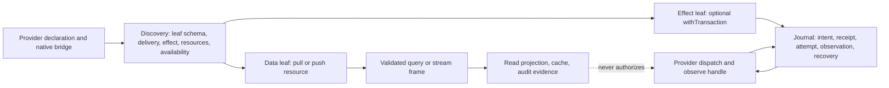

# TradingJournal：可组合能力下的 journal、projection 与受控交易效果

本设计覆盖本组 6 个源文件、68 个 MAP。它是目标方向和迁移边界，不是生产迁移，也不声称已完成 runtime、SQLite、agent 投递或 broker/native 验证。共同契约是 `composition-contract.md` K01-K12；本组不把旧 `TradingGit`、IBKR 类型或旧审计 mapping 当成新规范。

本组的核心裁决是：TradingJournal 同时包含数据读取/观察/审计能力和可选的受控交易效果，但两者不能共享一套“完整 Broker SDK”。provider 只声明它实际提供的 capability leaf、输入/输出/错误 schema、资源要求和 availability；目标 UTA 边界由这些声明组合读取、订阅、投影，或在确实需要时组合 `withTransaction`。账户、订单、持仓、交易效果及其 observation 使用显式 `AccountScope`；公共 Candle/Instrument/News/NewsGroup 数据不凭空附加 account/subaccount。

## 1. 当前源码事实与保留的调查证据

### 1.1 文件边界和实际 IBKR coupling

`TradingGit.ts:1-36` 直接导入 `Contract`、`Order`、`UNSET_DECIMAL`、`UNSET_DOUBLE` 和 `OrderHelper`，并在同一个类中定义 `DERIVATIVE_SECTYPES`（**MAP-0043603515**）。这是当前 source 的 IBKR/global switch coupling，不能被改写成“所有 provider 都必须实现同样的 SDK”。目标把 native contract/order 解码、sentinel 处理和 derivative facts 放到选中的 provider/market/accounting 边界；UTA 只消费声明的 semantic unit 和精确 extension schema。

`git/types.ts:1-6` 是 wildcard protocol re-export，`git/index.ts:1-25` 又把 `TradingGit`、`ITradingGit` 和 legacy types 作为默认入口（**MAP-110B9E5ED3**, **MAP-02A55B62AE**）。这些是迁移依赖图的事实，不是目标要保留的全局 `Operation`/SDK contract。目标按 owner barrel 导出 provider capability handles、journal commands/events、read projections 和 query schemas。

### 1.2 文件恢复、callback 和旧对象 authority

`git-persistence.ts:14-23` 按 `accountId` 选择 primary/legacy `commit.json`，其中多个 Alpaca id 共享路径（**MAP-BE3B808F2D**, **MAP-0D11241FE8**）。`loadGitState:27-40` 把缺失、权限错误、JSON 损坏和未知 shape 都吞成 `undefined`（**MAP-9E51B81D73**）；`createGitPersister:42-49` 则在 callback 中写 JSON（**MAP-D1C7BFF02C**）。

因此新 authority 不是“再包一层文件 callback”：

- SQLite JournalStore/JournalWriter is authoritative for controlled transaction effects; account/order/position facts are maintained by named ObservationStore/AccountingProjection records and, when selected by an effect, copied into that effect's durable evidence. Neither data observation nor Git export callback is an order transaction authority. `GitAuditReader`, order/accounting views and `AuditExport` are rebuildable read surfaces.
- 一次性 legacy importer 保存 source path、source digest、record index、schema/version、scope 证据和 operator disposition。未知或混合归属的记录成为 `LegacyEvidence`、`MigrationRequired` 或 `OperatorRequired`，不能生成 dispatch identity、approval 或 job。
- 公共数据 capability 的 pull/push 结果可由 provider 自己的 cache/storage 支撑；它们不因为被查询就进入订单 WAL、锁、approval 或 compensation。
- startup 必须区分显式空库 bootstrap、replay-ready 和 blocked storage/corruption/migration；不能把错误当成新账户。

### 1.3 旧 push/reject 的可证伪时序

`TradingGit.ts:61-73` 将 staging、pending hash、in-flight mutex、completed commits、round metadata、broker dispatcher 和 persistence callback 放进一个对象（**MAP-56BCFFC93E**）。`add/commit:77-117` 只冻结内存数组并生成 8 字符 hash（**MAP-B9BBBF4697**, **MAP-515C919214**）。`push:119-185` 先调用远端 mutation，再读取 state、append commit、await `onCommit`，最后才清 staging（**MAP-2DD4753D43**）。`reject:187-239` 没有 broker mutation，却仍读取 state 并依赖 callback（**MAP-951F07F5BA**, **MAP-F1A04A6551**）。

Main 提供的 node probe 观察到：snapshot failure 时 `dispatches=1, pending 保留, commits=0`，重试后 `dispatches=2, commits=1`；`onCommit` failure 时 `dispatches=1, pending 保留, commits=1`，重试后 `dispatches=2, commits=2`。这是 callback sequencing 的 legacy falsifier，不是 broker crash-recovery proof。它保留的结论是：受控效果必须在 broker call 前持久化 intent/dispatch identity，receipt/unknown 不能由后置 projection callback 推断。

### 1.4 观察、同步、legs 和 accounting

`interfaces.ts:52-65` 和 `TradingGit.ts:654-749` 将外部 updates、pending IDs、known IDs、parent/leg 关系和 audit history 都压进 Git arrays（**MAP-D4E27E6A2A**, **MAP-9CD95A7E38**, **MAP-2F871AAB45**, **MAP-31E8F89464**, **MAP-87101B3109**）。`TradingGit.spec.ts:899-920` 记录过多 update 的 `operations[1]` boot-loop（**MAP-3D5359223F**）；`TradingGit.spec.ts:856-897` 记录 Alpaca held child 可能不出现在 open-orders listing（**MAP-9CD95A7E38**）。

目标保留这些事实，但改成 observation evidence：每个 order/leg 有 scoped identity、source batch、native version、observedAt 和 completeness；parent/TakeProfit/StopLoss relation 是独立 durable facts；不完整 listing、未知 finality 或缺 absence proof 时不删除 child、不生成 cancel、也不把空列表当作终态。

`recordReconcile` 和 `_reconcileWalletPositions` 会把 quantity delta/mark price 伪装成 `success=true/status=filled`（**MAP-9540E06E03**, **MAP-E712DEE4C8**）。目标使用 `BalanceObservation`、`ReconciliationDecision` 和 accounting projection；mark-only adjustment 保留 residual uncertainty，不能成为 fill、exact cost basis 或交易补偿。

### 1.5 只读历史和 simulation

`log/show/status` 扫描进程内 commits，short hash 既当查询键又容易被误当 authority（**MAP-BD4401DF5F**, **MAP-F5950919AF**, **MAP-3CAB2FACBC**, **MAP-2E86D75B27**, **MAP-D89349A0F1**, **MAP-C2D03D14BB**）。`buildOperationSummaries` 和 `formatOperationChange` 依赖平行数组、SDK fields、sentinel 和 synthetic operation tags（**MAP-E516D05AD7**, **MAP-6A0302D45C**, **MAP-FA38762FE7**, **MAP-F6932D3C99**, **MAP-63DDC83FC9**）。

目标保留人类可读的 log/show/status 语义，但每个查询由 named reader/projection 提供：cursor、source sequence、asOf、freshness、canonical identity 和 typed not-found/unavailable。显示文本从 typed rows 派生，不反向解析为状态；short hash 只能是 display alias。

`simulatePriceChange:753-925` 的 derivative exclusion、`all` per-position mark、short sign、multiplier-aware PnL 和空 positions zero summary 是有价值的纯数据算法（**MAP-3A7B50FFCA**, **MAP-DB23AFEBB2**, **MAP-A899CFD901**）。但它当前通过 `getGitState` callback 读取 IBKR-shaped state，并用 `parseFloat` 接受尾随垃圾（**MAP-D40EA86F40**, **MAP-9EF5070764**）。目标将其拆成 validated query snapshot + pure Decimal engine；缺 currency/multiplier/instrument provenance 时返回 typed unavailable/exclusion，不授予 execution capability。

## 2. UTA-facing capability composition

### 2.1 固定外层、开放 provider tree

每个 provider instance/environment 先 discover；仅在 capability 自己是账户相关时，再解析 account scope 与主体。发现返回带 revision 的 `CapabilityDescriptor`。固定的是外层元契约：稳定能力身份、命令路径、schema version/fingerprint、精确 input/result/error schema、delivery、effect category、权限/资源要求、source 与 availability。provider tree、内部语言、SDK、REST/OpenAPI、网关、独立进程、缓存和重试策略可以不同。

不建立全局 `ActionContractMap`，不建立要求每个 broker 都有 Place/Modify/Cancel/Close 的 `IBroker`，也不靠 `Unsupported` 叶子填满树。provider 没有 option/cancel/protection/stream 时，叶子和空父节点都不出现；实现存在但未登录、限流、断连或授权不足时，保留能力 identity 和精确 schema，同时报告 named availability/authorization，而不是把它伪装成 schema absence。

发现后的调用绑定 capability identity、schema fingerprint 和 revision。provider 替换、撤销、schema drift、授权变化必须返回 stale/availability/authorization error，不能同一路径悄悄执行另一语义。名称冲突在装载时拒绝。

### 2.2 Schema/HOF 和 provider 原生扩展

schema 是声明源；静态 provider declaration 可推导类型、校验、metadata、CLI/help，动态 foreign process 在边界用已校验 schema 和调用句柄。schema 不带函数；不可导出的 transform、未解析引用和非法结构必须被拒绝。provider-native fields 作为该 leaf 的精确 extension 保留，不能降级为 `Record<string, unknown>`。

`Order`、`Instrument`、`Position`、`RemoteObservation`、`News` 等是语义单位，不是内核穷举业务组合。受控交易 leaf 可以用小型局部 union 和 HOF 组合 sizing、price/protection、expiry/session、parent/attached semantics；例如 `Units|Notional`、trail amount/percent、provider-native protection 只是声明组合的例子，不是跨 provider 的全局合法性规则。C02 的 native-order-fields 原则保留：精确合法组合、前置条件、单位和扩展由 provider leaf schema/HOF 声明；不能用单一 provider（尤其旧 IBKR shape）推测其他 provider。

### 2.3 AccountScope 的适用范围

`AccountScope={accountId, explicit subAccountId}` 只出现在账户、订单、持仓、交易效果、ConflictKey 和其 observation/receipt 等 account-scoped records。单钱包只有在 adapter 有证据时使用 `SingleSubAccount`；scope discovery 未完成是 typed pending。公共 Candle/Instrument/News/NewsGroup 能力不凭空造 `accountId`、subaccount 或默认 wallet，除非它自己的 declared schema 明确需要账户上下文。

## 3. 数据能力与受控交易效果的分离

### 3.1 数据路径：pull、push、projection 和 cache

`pull` 是一次有限请求，可以返回分页、不完整或 freshness；`push` 是 resource-scoped stream，有 create/cancel/end/error frame、cursor/replay/backpressure/gap/reconnect 语义。内部流不是 stdout；CLI 只在最外层把它投影成有限 JSON 或具名 NDJSON frames。

读取、订阅、缓存和 accounting observation 仍可能消耗连接、配额、存储和付费资源，因此由 descriptor 的 resource/permission/availability 管控，但不需要 order prepare/approve/compensate、每帧交易 WAL 或 order locks。观察轮询/重连后续只使用 resource-scoped `ObservationJob`、cursor 和 lease；它不是 transaction writer、execution reservation 或 dispatch attempt。只有被选作交易决定的证据才复制其 identity、source、freshness 和消费主体到受控 effect record；不事务化整条行情流。

TradingJournal 的 data surfaces 包括：

- `GitAuditReader`：读取 transaction/observation/accounting projection，不授予 dispatch。
- `ObservationReader/Stream`：读取 broker order/leg/execution/balance evidence；`Complete|Partial|Unavailable` 只表达 provider 声明的覆盖范围，poll/stream 生命周期由 `ObservationJob` 管理而不是交易 job。
- `SimulationQuery`：读取 checkpointed positions/instrument/valuation facts，返回 versioned deterministic result。
- `AuditExport`：按 projection checkpoint 导出，不能恢复 authority。

### 3.2 受控效果路径：只对确需 mutation 的 leaf 使用

受控交易 capability 由 `withTransaction` 包装。public handle 只提交 intent、查询 receipt 或读取 recovery view，不能拿到 native dispatch function。效果自己的 input/prepared payload/ack/observation/error/recovery schema 由该 leaf 关联保存；不存在某个 leaf 就没有相应命令。

Journal writer 的最小顺序是：

1. `CreateDraft/ReplaceDraft` 产生 revisioned DraftRecord；draft 可编辑但不等于 approval。
2. `Prepare` 解码 scope、instrument、facts、capability evidence 和 policy；编译 non-empty provider leaf plan、before-image、preconditions、ConflictKeys、criterion、FailurePolicy、expiry 和可重建 NativePlanRecord。只写 revision-scoped PreparedConflictLocks。
3. `Approve/queue` 在一次 writer transaction 中 CAS 校验 revision/digest/actor/policy/expiry，写 approval、ExecutionReservation、EffectJob、receipt。只读/keyless caller 可得到 DraftReview/PreparationPreview，不能获得 funded approval。
4. Scheduler 以 owner/epoch/deadline claim job，先写 `DispatchStarted`，再调用 provider dispatch handle。Ack 只是 venue receipt；后续 observe/criterion 才决定 Working/Filled/Cancelled/Rejected 等 exact outcome。
5. transport exception、坏响应或失去 native identity 时进入 `OutcomeUnknown`/`Reconciling`/`RecoveryCase`；没有 provider idempotency/absence/fencing evidence 不能 blind retry 或把 error text 变成 rejection。
6. projection/export/subscriber failure 只产生 lag；不能 rollback remote outcome、重新授权或触发第二次 dispatch。

已有 scope/unit validation、canonical digest（RFC 8785 JCS-v1 + SHA-256 full 64-hex；plan、command、orderTerms、capability 各有独立 domain/schema-version）、WAL、command identity、CAS、lease fencing、unknown-first reconciliation、补偿 evidence、RecoveryCase 和 shipped migration 约束均保留在这条 effect 路径。是否原生幂等、可逆、atomic、complete absence 或可重建，必须由 provider evidence 证明；capability 存在不等于获得这些保证。

### 3.3 触发、ReturnToAgent 和外部订单

事件 trigger source 与 authority/approval source 正交。若某个订阅事件被绑定为触发证据，binding 持久化 event capability/参数/version、谓词、freshness/顺序要求、有效期、负责人和冻结后的策略。重复 identity 只消费一次；断连、缺口、schema drift 或无法确认事件 identity 时暂停，不凭重试次数放行。

选中 `ReturnToAgent` 时，原子消费 activation、暂停 binding、保留未发送 intent/evidence，创建稳定 `ReviewRequest/outbox`，**不创建 broker dispatch**。Review 请求必须携带原 activation/binding identity、intent revision、证据和 expiry；`Discard` 只允许未开始的 intent，`KeepSuspended(reason, deadline)` 保留未决状态，`Rearm(new binding epoch, future event start, expiry, frozen strategy)` 只建立新触发身份，`Revise(new intent revision)` 必须重新 prepare/approve，`RequestSubmission` 仍走正常授权。无人回复执行冻结的超时策略，不能自动批准；这些都是显式 schema command。Alice Workspace/Session/Inbox 负责投递，不由 UTA 重建 agent loop。

外部发现的订单默认 `ObserveOnly`：写 `ExternalOrderObservation` 和 order projection，保留 native identity/scope/source batch，不生成本地 TradeAction、补偿或隐式 cancel。若产品未来要 bounded recovery，必须另有 capability、授权和新的 intent revision。

## 4. 迁移和模块 ownership

目标模块按真实 ownership 拆分，不复制旧 `TradingGit`：

- `JournalStore/JournalWriter`：封闭 WriteCommand、event envelope、receipt、transaction/effect rows；不导出 SDK。
- `TransactionApplication`：Draft/Prepare/Approve/Reject/Recovery 等受控效果命令；不存在的 provider leaf 不生成 command。
- `BrokerSpi/provider adapter`：native schema、lookup/encode/decode、availability、observation/dispatch handle；不把 SDK 类型带过 UTA boundary。
- `ObservationReader/OrderProjection/AccountingProjection/GitAuditReader`：只读或 data-evidence surfaces；不接受 approval/dispatch callback。
- `SimulationQuery`：纯 engine + snapshot/market facts query；不写交易 authority。
- `DurableScheduler`：只 claim/fence due jobs；timer 是 wakeup，不是 authority。
- `Transport/CLI/AI metadata`：从 descriptor/schema 计算 describe/help/call validation；不是第二套手写 command table。

迁移顺序：先冻结每个 account-scoped scope/admission，盘点 commit.json schema/version 和 mixed account provenance，建立 importer/migration ledger；再启动 journal replay，重建 projections，迁移 manager/routes/callers 到 explicit ports；最后删除 normal startup 对 `TradingGit`、legacy paths、wildcard shim、callback config 和 `getGitState` authority 的依赖。公共数据 readers/streams 可独立迁移，不需要先创建交易 writer。

`routes-trading.ts:226-257,472-605` 当前仍捕获 generic `Error`、检查 string conflict、直接调用 sync/simulate/push（**MAP-0CBE2FB0D9**, **MAP-C65E9CB2ED**, **MAP-C2C9449357**）。迁移后每条 route 先 decode discovered leaf/query schema，再将 named failure 映射到 transport；不得通过 `name/code/message` 猜交易错误，也不得把数据 unavailable 映射成 broker rejection。

## 5. 保留的行为、风险和经验

以下不是目标授权全局 SDK，而是本组必须在正确边界保留的 source evidence：

- 精确 Decimal、IBKR sentinel redaction、MKT unset field 省略、real limit/quantity 展示（**MAP-FA38762FE7**, **MAP-63DDC83FC9**）。
- add 的分步 staging UX、message/audit metadata 和 pre-dispatch reject 的 no-effects 语义（**MAP-B9BBBF4697**, **MAP-F1A04A6551**, **MAP-951F07F5BA**）。
- known rejection 与 unknown outcome 分离、accepted/working 不等于 filled、cancel/amend/close criterion 需 correlated observation（**MAP-1A49DD8DEE**, **MAP-D6856F9117**, **MAP-FE5C1D68F9**）。
- log/show/status 的历史查询、倒序/limit/symbol filter、short hash 兼容显示，但改成 projection identity/freshness（**MAP-F5950919AF**, **MAP-2E86D75B27**, **MAP-C2D03D14BB**）。
- parent/TP/SL leg、external order、localSymbol/aliceId hints、filled-at-push 与 multi-update attribution 的事实（**MAP-9CD95A7E38**, **MAP-595E9F79F1**, **MAP-2F871AAB45**, **MAP-3D5359223F**）。
- derivative-aware simulation、short sign、multiplier/currency provenance、strict price-change parsing、empty-position zero summary（**MAP-3A7B50FFCA**, **MAP-DB23AFEBB2**, **MAP-A899CFD901**, **MAP-9EF5070764**）。
- Main node probe 的 duplicate dispatch 行为只作为旧设计 falsifier；它没有证明 broker ledger crash recovery（**MAP-2DD4753D43**, **MAP-D6856F9117**, **MAP-D1C7BFF02C**）。

## 6. 未解决的 native/数据/运行时事实

以下问题不能由 capability abstraction、mock、兄弟组 accepted review 或本设计回答：

1. 已发布 `commit.json` 的实际 schema/version 集合、入口、混合账户归属、short-hash collision、旧 Decimal/position shape 和缺 multiplier 的历史 instrument type；盘点前只能 LegacyEvidence/MigrationRequired/OperatorRequired（**MAP-26E3CBF3C8**, **MAP-0D11241FE8**, **MAP-6897B55067**, **MAP-2E86D75B27**, **MAP-49CD3DC4C6**）。
2. SQLite native adapter 的实际 Effect/SQL semver、migration API、integrity/corruption diagnostics、备份恢复行为和 file-backed fixture 生命周期；未实测不能把 fs error 当 readiness（**MAP-9E51B81D73**, **MAP-EEB474FAFB**）。
3. 各 provider leaf 的 NativePlanRecord 可重建 schema、native status/fill identity、idempotency identity/horizon、lease fencing、absence completeness/finality、listing namespace/cursor、parent/leg visibility、sentinel 和 order/protection/session semantics；无证据时返回 capability/availability/plan failure、Unknown 或 RecoveryRequired，不发明保证（**MAP-F746052C23**, **MAP-2CCB3134A8**, **MAP-FE5C1D68F9**, **MAP-9D6D33CC94**, **MAP-973EB4700E**）。
4. 各 broker 的 avgCost/transfer/currency/multiplier provenance 和 observation ordering/completeness；mark-only adjustment 保留 ResidualUncertainty，不能升级成 fill（**MAP-9540E06E03**, **MAP-DB23AFEBB2**, **MAP-31E8F89464**）。
5. Public protocol 对 legacy log/status/export 的兼容期限、是否保留物理 AuditExport、round 是否有产品级 StrategyRun 语义；默认只读/可重建，不能把未决产品选择变成执行 authority（**MAP-D1C7BFF02C**, **MAP-E7902EB737**, **MAP-470C74976B**）。

## 7. K12 可证伪场景

实现 gate 必须用真实 provider process/adapter boundary、持久 UTA journal、独立 broker ledger 和负责 Session 逐项验证；本文件没有运行这些场景：

- 在某个 provider leaf 增加一个合法原生字段：同一 declaration 必须同时改变静态类型、runtime validator、descriptor/AI metadata、CLI describe/help 和调用结果；不能改内核 global switch。
- provider tree 没有 option/cancel/protection 时，describe/CLI 不出现对应叶子和空父节点；实现存在但未授权时显示具名 availability，而非 `Unsupported` 假 handler。
- 错误输入在 provider handler/native dispatch 前被 schema 拒绝；unknown native response 不能变成 `KnownRejected`。
- pull 返回有限、有 schema、可标不完整的结果；push 输出可识别 data/error/end frame，取消 tail 释放本次资源但不撤销已被 writer 接受的 effect。
- `DispatchStarted` 后 broker ledger 已接受而 UTA response 丢失：重启只能创建同 dispatch identity 的 observe/reconcile，不可 blind resend；projection/export failure 不增加 dispatch count。
- 一次带可信 Candle/News/Order observation 的 trigger 选中 `ReturnToAgent`：activation、暂停、review/outbox 可追踪，未发送 intent 保留，broker dispatch 为零；迟到 reply、重复 event、Rearm 或 Revise 都不会复用旧 identity/approval。
- AAPL/TSLA 多 observation 同批、乱序、重复和 listing 缺 namespace：每行 attribution 稳定，重复只 fold 一次，缺 evidence 不生成 cancellation/absence；parent/TP/SL references restart 后仍可查询。
- simulation 同 snapshot sequence/input 可重算相同 Decimal 结果；缺 multiplier/currency 只返回 typed unavailable/exclusion，不创建 transaction authority。

MAP 行数、typecheck、memory fake、mock callback 成功和旧 review accepted 都不能替代以上证据。