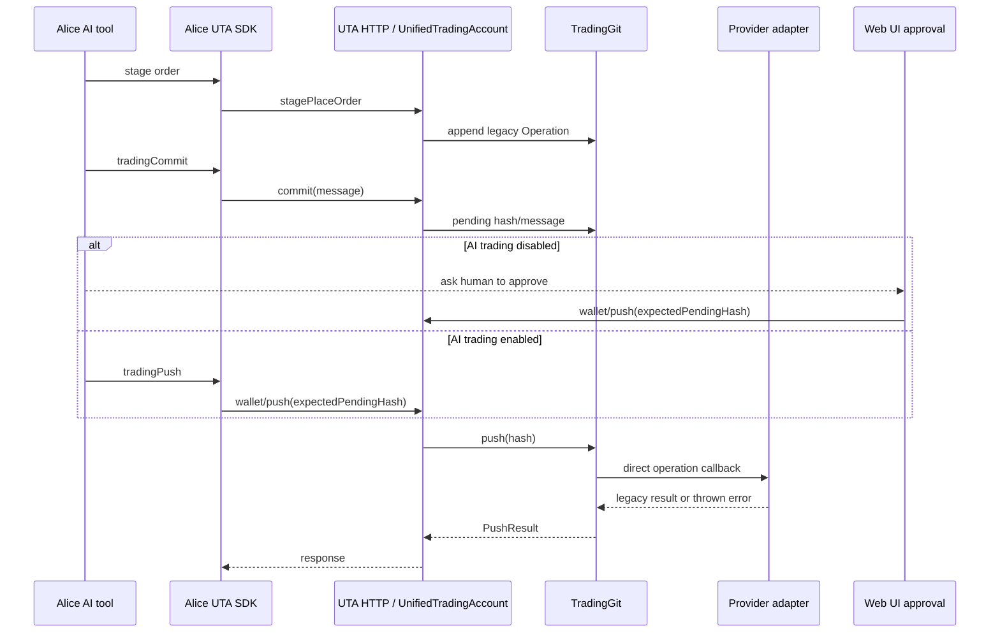

# Trigger and return-to-agent investigation

**Status:** source investigation for the UTA effect-runtime redesign. This document records current behavior, missing guarantees, and integration consequences. It is not an implementation plan and does not define the canonical composition algebra owned by the top-level design.

**Scope:** a held transaction intent may still be a mutable draft, or it may already be an immutable prepared order, while waiting for a particular market-data event such as a closed candle. The event can produce an activation candidate, but controlled dispatch still requires the normal preparation (when needed), authorization, and precondition checks. The return path must let the responsible AI decide explicitly whether to discard, keep suspended, rearm, revise, or request submission.

## 1. Contract alignment and evidence status

The shared composition contract is the target boundary. No source conflict with K01–K12 was found; the current implementation is simply missing several of the target guarantees. In particular:

- K05 separates data `pull`/`push` delivery from transaction effects. Current historical bars and quotes are data reads, not transaction steps. A future market stream must not acquire an order lock or write a transaction WAL for every frame. Only selected evidence consumed by a trigger decision belongs in the durable decision record.
- K09 makes trigger source and authorization orthogonal. A matching candle is evidence, not approval. The creator, event observer, authenticated invoker, authorizer, and responsible recipient must remain distinct fields.
- K10 makes `ReturnToAgent` a durable business branch. It consumes one activation, pauses the binding, creates a stable review identity, and creates no broker dispatch.
- K12's falsifier is directly applicable: one accepted candle under `ReturnToAgent` must produce a traceable review and zero broker dispatch; duplicate events, late replies, and reactivation must not reuse an old event identity, review identity, or authorization.

### Evidence classification

| Subject | Current evidence | Status for the target |
|---|---|---|
| AI creates an order proposal | Alice trading tools stage through the UTA SDK; UTA resolves the instrument and stores a legacy `Operation` | **Supported, legacy path** |
| Human or policy approval | Web UI posts only `expectedPendingHash`; an AI setting may allow direct push | **Partly supported, not a typed authorization record** |
| Broker dispatch | `TradingGit.push` invokes an injected operation callback; the UTA dispatcher calls broker mutations directly | **Supported, legacy direct effect; not durable controlled dispatch** |
| Fill/cancel observation | A process-local timer calls `UnifiedTradingAccount.sync`; a slow lane observes external open orders | **Supported, polling only** |
| Candle/market event subscription | `IBroker` has quote, market clock, and optional historical-bar pulls, but no stream/subscription method; IBKR streaming mode is documented as unused | **Absent** |
| Event-triggered activation | No trigger binding, event predicate, event cursor, event identity, finality check, or activation command exists in current UTA routes/types | **Absent** |
| Durable AI notification/resume | Alice Issue comments can target an exact `@resumeId` and create a headless follow-up; Inbox append is durable user notification | **Supported inside Alice; no UTA-to-Alice handoff exists** |
| Durable review response | Issue comment delivery has pending/replied/failed states, but no UTA command accepts `Discard`, `KeepSuspended`, `Rearm`, `Revise`, or `RequestSubmission` | **Partial; integration and explicit command schemas absent** |
| Provider stream ordering/finality/replay | No UTA-facing contract or provider evidence for these guarantees | **Unverified; never infer from a local receive counter** |

## 2. Current order path and current observers

### 2.1 Draft, approval, and dispatch

The current source path is a legacy stage/commit/push sequence:

- `UnifiedTradingAccount.stagePlaceOrder` validates the legacy order bag, resolves `aliceId` to a native contract, constructs an SDK `Order`, and appends `{ action: 'placeOrder', ... }` to in-memory `TradingGit` staging (`services/uta/src/domain/trading/UnifiedTradingAccount.ts:691-725`). The companion stage methods append modify, close, and cancel operations at `:727-771`.
- `UnifiedTradingAccount.commit` calculates a pending hash and clears only transient sub-account tracking (`services/uta/src/domain/trading/UnifiedTradingAccount.ts:774-791`). `push(expectedPendingHash)` checks account mutability/health, then calls `TradingGit.push`; post-push hooks are fire-and-forget (`:793-810`).
- The normal AI surface explicitly tells the model that push is final execution and, when `allowAiTrading()` is false, returns pending operations for Web UI approval instead of sending them (`src/tool/trading.ts:760-807`). This is a setting read at call time, not a persisted authorizer or approval binding.
- The UTA HTTP route accepts only a JSON `expectedPendingHash` for push, checks that there is a pending message, then calls `uta.push`; a hash conflict is mapped to HTTP 409 (`services/uta/src/http/routes-trading.ts:471-496`). There is no creator, event, invoker, authorizer, recipient, transaction revision, or review identity in this request.
- `TradingGit.push` checks the expected hash, executes each staged operation through `executeOperation`, catches thrown values as rejected results, reads post-execution state, appends an in-memory commit, calls `onCommit`, clears staging, and returns submitted/rejected arrays (`services/uta/src/domain/trading/git/TradingGit.ts:119-185`). It does not create a durable dispatch job or distinguish a known rejection from an effect whose remote result is unknown.

The current path is summarized below. The diagram describes current behavior, not the target authority.



**Prior MAPs:** `MAP-B9BBBF4697` records the in-memory add/commit behavior; `MAP-C3E41E2B51` records the caller-supplied hash and in-flight write guards; `MAP-2DD4753D43` records push execution and result conversion; `MAP-E59A917F82` records UTA health/read-only checks; `MAP-7B9EA96B62` records the HTTP push route; `MAP-5E17F0B590` records the Alice SDK push adapter. These are evidence of the legacy path, not target contracts.

### 2.2 What currently observes order changes

Current observations are order-state pulls, not trigger events:

- The UTA process starts `startOrderSyncPoller` with a ten-second pending-order lane and a configurable slow external-order observation lane (`services/uta/src/main.ts:116-128`).
- Each tick skips keyless/unhealthy accounts; the slow lane invokes `observeExternalOrders`; the fast lane calls `uta.sync()` only when the in-memory Git state has pending order ids. Failures are logged and the loop proceeds to other accounts (`services/uta/src/domain/trading/order-sync-poller.ts:53-96`). `MAP-0F70BAA7CC` covers external-order observation, `MAP-5D07510B31` covers pending-order sync, and `MAP-870F4383FA` records that the timer stop is not a supervised durable lifecycle.
- `UnifiedTradingAccount.sync` lists open orders when the broker exposes `getOpenOrders`, otherwise polls each pending order with age-based backoff; it calls `getOrder` and creates a sync update only after a non-submitted/non-pre-submitted status is observed (`services/uta/src/domain/trading/UnifiedTradingAccount.ts:827-915`). This is a reconciliation read after an order was already sent, not a pre-submission market trigger.
- `observeExternalOrders` diffs broker open orders against every order id known to legacy Git, records unknown orders as one synthetic `[observed]` commit, and then lets the normal pending scanner track them (`services/uta/src/domain/trading/UnifiedTradingAccount.ts:953-980`; `MAP-595E9F79F1`). It does not establish a trigger source or responsible AI recipient.

### 2.3 Market-data source facts and absences

The UTA-facing protocol exposes data pulls but no event stream:

- `Quote`, `MarketClock`, `BarInterval`, `BarParams`, and `Bar` are defined as snapshot/historical values (`packages/uta-protocol/src/types/broker.ts:296-364`). `Bar` contains only timestamp, OHLCV strings; it has no source identity, sequence/cursor, closed/final flag, correction/retraction marker, or replay boundary.
- The current `IBroker` methods are `getQuote`, `getMarketClock`, and optional `getHistorical`; there is no `subscribe`, `push`, candle stream, or event cursor method (`packages/uta-protocol/src/types/broker.ts:553-605`). `MAP-7056B295D1` records this direct Promise-based market-data surface; `MAP-609FF636E8` records that only historical-bar entitlement is described.
- The IBKR adapter README states that persistent `reqAccountUpdates` is the channel currently used for account/position cache updates, with coverage limited to positions held by the account (`services/uta/src/domain/trading/brokers/ibkr/README.md:22-28`). `RequestBridge.startAccountSubscription` starts/stops that account subscription (`services/uta/src/domain/trading/brokers/ibkr/request-bridge.ts:309-347`); it is not a candle feed.
- The same README says `reqMktData` snapshot mode is used by `getQuote`, while streaming mode (`snapshot=false`) is **not currently used** (`services/uta/src/domain/trading/brokers/ibkr/README.md:30-46`). Tick-by-tick data is also documented as not currently used (`:48-51`). Therefore no current source establishes a closed-candle event or a cross-restart event cursor.

A provider that cannot declare a push capability must have no push leaf. A provider that has a native stream may implement it in an arbitrary SDK/REST/gateway process and publish only a schema-bound UTA-facing stream capability. It must not be represented as a universal stub on the legacy `IBroker` surface.

## 3. Current event and Alice handoff surfaces

### 3.1 EventLog is durable history, not a dispatch bus

`EventLog` is an append-only JSONL journal with disk reads and in-process listeners (`src/core/event-log.ts:48-92, 127-163`). Its subscribers are invoked after the append in the current process; the interface has no durable consumer cursor, acknowledgement, lease, or retry state. UTA currently writes account health from the manager (`services/uta/src/domain/trading/uta-manager.ts:61-77`) and snapshot facts from the snapshot service (`services/uta/src/domain/trading/snapshot/service.ts:45-75`).

The repository's event-system decision is explicit: Alice no longer has an event bus, producer/listener task topology, or webhook task-ingest API; the journal does not dispatch task listeners or start agents (`docs/event-system.md:1-31`). The product activity journal is deliberately not an event bus: producers append after their own domain write, journal failure does not start domain work, and projections are independent (`docs/event-system.md:33-53`). Therefore `eventLog.subscribe` cannot be promoted into trigger delivery by adding a listener. A trigger adapter needs its own durable source/consumer record and must hand off through the supported Workspace/headless/Inbox surfaces.

### 3.2 Workspace Issues and scheduling

The real durable automation surface is a Workspace Issue file plus optional time schedule. An issue is `.alice/issues/<id>.md`; an absent `when` is a board item, and a present `when` is a scheduled headless run (`docs/workspace-issues-and-scheduling.md:25-40`). The declaration accepts only `at`, `every`, and `cron` (`src/workspaces/issues/declaration.ts:110-124`); there is no event or market predicate in the schedule schema.

Ownership is explicit and durable: `@new-then-resume` claims a first Session, `@new-each-run` recruits each time, and exact `@resumeId` continues one product Session (`docs/workspace-issues-and-scheduling.md:61-77`). The scanner is timing-only, passes the exact Issue What to the agent, and writes the last-fire marker only after a dispatch is accepted (`docs/workspace-issues-and-scheduling.md:258-288`; `src/workspaces/schedule/scanner.ts:1-25, 261-369`). Its task trigger currently has only `kind: 'issue'`, workspace/issue identity, and optional connector-cron metadata (`src/workspaces/headless-task-registry.ts:41-56`; `src/workspaces/schedule/scanner.ts:432-454`). This is a real durable agent launch path, but not a market-event trigger path.

- **Canonical target handoff:** The UTA review outbox is consumed by an authenticated Alice bridge, which invokes exact provenance-aware `WorkspaceConversationControl`; Issue and Inbox are projections for human visibility and activity, not competing AI-delivery authorities.

Issue comments are durable structured sidecars. The source comment can carry a discriminated delivery state:

- `pending` with `targetResumeId` and `taskId`;
- `replied` with the same target/task and `replyCommentId`;
- `failed` with an error and optional target/task (`src/workspaces/issues/comments.ts:23-112`).

For a fixed exact owner, `dispatchIssueCommentReply` targets `{ kind: 'resume', resumeId }`, calls `WorkspaceConversationControl.ask`, persists the resulting task/resume ids as `pending`, and reports an explicit failed state when the conversation service is unavailable (`src/workspaces/issues/comment-delivery.ts:43-132`). Completion derives `comment-reply-<taskId>` as the reply id, so replaying completion does not append the same answer twice; it appends a reply comment, provenance edge, and `replied` state after the source comment, provenance, dispatch, and delivery-state steps (`src/workspaces/issues/comment-delivery.ts:135-192`). The user-facing Issue route demonstrates that same sequence (`src/webui/routes/issues.ts:374-437`).

This is the strongest existing Alice-side delivery evidence for the target bridge: it supplies exact-resume routing, durable `pending/replied/failed` delivery, and idempotent reply recording. It is not currently callable by UTA. The canonical target is a UTA review outbox consumed by an authenticated Alice bridge, which invokes exact provenance-aware `WorkspaceConversationControl`; the existing human Issue route is evidence for the projection/delivery mechanics, not the UTA integration endpoint.

### 3.4 Exact and reconstructed AI follow-up

`WorkspaceConversationControl` accepts a `resume` target, a Workspace/artifact target, a caller identity, and an optional business subject (`src/core/workspace-tool-center.ts:45-76, 140-156`). Target resolution preserves exact `resumeId` when available, reports unavailable when a known Session is retired/deleted/missing its native runtime, and creates a new Session only for a known Workspace reconstruction (`src/workspaces/conversation-control.ts:116-220`). The `ask` implementation records the caller, requested target, delivered prompt, resolution, and subject, then dispatches a headless task with the exact `resumeId` when continuing (`src/workspaces/conversation-control.ts:270-405`).

`HeadlessTaskRegistry` is a disk-backed execution log, and dispatch persists the product Session, headless task, resume link, and conversation dispatch before spawning the child (`src/workspaces/service.ts:1897-1977`). However, its current liveness is explicitly v1/in-process: on Alice restart, leftover `running` records become `interrupted` rather than being automatically resumed (`src/workspaces/headless-task-registry.ts:1-14, 187-199`). That is sufficient evidence for durable attribution and a visible failed/interrupted outcome, not proof of detached worker delivery or automatic recovery.

The human Inquiry routes are real HTTP examples for asking an Inbox sender or Issue owner/run (`src/webui/routes/inquiries.ts:1-18, 92-122, 124-192`). They use `source: { kind: 'human' }`; they do not provide an authenticated UTA principal or a trading review command. The target bridge must preserve the same exact/reconstructed resolution and must expose failure instead of silently recruiting a new trading authority.

### 3.5 Inbox is a user notification record, not an AI command queue

Inbox entries are append-only JSONL notifications with immutable `workspaceId`, optional document pointers/comments, and server-stamped origin; the current contract explicitly has no connector subscription and no deduplication (`src/core/inbox-store.ts:1-35`). `InboxOrigin` can carry a headless `runId`, issue link, `resumeId`, and agent, but the origin is server-injected rather than agent-provided (`src/core/inbox-store.ts:52-84`). Append creates a random UUID, timestamp, persists the line, and emits a process-local `appended` notification (`:116-130, 233-243`).

The `inbox_push` tool is deliberately workspace-scoped, hides workspace and run/session identity from the agent, computes document revisions, appends the entry, and records a `sent` provenance edge (`src/tool/inbox-push.ts:1-15, 79-123`). It is therefore appropriate for a user-visible alert or a link to a review document. It is not, by itself, a durable reply queue to the responsible AI. The canonical target is the authenticated Alice bridge consuming the review outbox and invoking exact provenance-aware `WorkspaceConversationControl`; Issue and Inbox entries may project that request for user visibility without treating either projection as delivery confirmation.

There are no MAP identifiers for these Alice-only source files in the UTA mapping denominator. The UTA coverage document explicitly limits that denominator to UTA files, packages, Alice SDK/supervisor, and selected tests; other Alice consumers are outside the source inventory (`docs/uta-effect-runtime-mapping/coverage.md:8-16`). Their source anchors above are retained rather than fabricating MAP ids.

## 4. Identity, provenance, CAS, queue, and reply gaps

The target integration must carry these roles separately. Reusing one `actor` string would recreate the current ambiguity.

| Role | Current source evidence | Required target consequence |
|---|---|---|
| **Creator** | Stage/commit APIs carry order parameters and a message, not a `SessionOrigin` (`services/uta/src/domain/trading/UnifiedTradingAccount.ts:691-791`; `services/uta/src/domain/trading/git/TradingGit.ts:77-117`) | Persist the attributable creator as `SessionOrigin`, human, or external principal on the intent/revision. The server stamps it from authoritative session context; AI input cannot forge it. |
| **Trigger source** | No stream/subscription field in `IBroker`; current `Bar` has no source/cursor/finality (`packages/uta-protocol/src/types/broker.ts:349-364, 553-605`) | Persist source capability identity, provider instance, scope only when that capability is account-scoped, schema fingerprint/version, subscription parameters, event identity/cursor, and source availability evidence. Public Candle/News/Instrument capabilities must not receive a fabricated account or sub-account. |
| **Authenticated invoker** | `/wallet/push` accepts only expected hash and route-local body data (`services/uta/src/http/routes-trading.ts:471-496`) | Authenticate the principal and transport request; record request id and exact command identity. Loopback binding is a process boundary, not an invocation identity. |
| **Authorizer** | Human UI is implied by the push route and AI direct push is controlled by a live setting (`src/tool/trading.ts:760-807`), but neither writes a typed approval record | Persist who/what authorized submission, authorization digest, plan/revision binding, limits, validity, and policy source. Trigger evidence must not satisfy this field. |
| **Recipient / responsible AI** | Alice provenance uses `resumeId` as the canonical follow-up handle (`docs/conversation-provenance.md:142-190, 192-217`); UTA requests contain none | Persist the exact responsible `resumeId` plus Workspace and agent kind, or an explicit unavailable/reconstruction policy. A temporary answerer must not become the transaction owner. |
| **Trigger binding** | Current Issue schedule is time-only (`src/workspaces/issues/declaration.ts:110-124`); no UTA binding exists | Bind waiting intent/revision to one live binding per exact `intentId + intentRevision`; compose multiple source conditions inside that binding, persist a race-free source boundary/first-snapshot policy, and retain a correction watch horizon. |
| **CAS / stale protection** | Legacy hash is generated from message/operations/timestamp/parent and truncated to eight hex characters (`services/uta/src/domain/trading/git/TradingGit.ts:38-43, 94-116`; `MAP-515C919214`); push/reject compare a caller hash (`:241-258`; `MAP-C3E41E2B51`) | CAS must cover intent revision, one-live-binding ownership, binding epoch, event identity, review identity, and (after KeepSuspended) HeldIntentControl revision. A pending hash alone cannot prevent an old event or late AI reply from acting on a revised intent. |
| **Queue / dispatch** | `TradingGit` and the poller are process-local; `OrderSyncPoller` exposes only tick/stop (`services/uta/src/domain/trading/order-sync-poller.ts:33-37`; `MAP-EC918D5C43`) | Use a durable decision/outbox and controlled dispatch job with lease, attempt identity, and explicit `Unknown` after a crash around send. |
| **Reply** | Issue delivery can be pending/replied/failed, but UTA has no review-response command (`src/workspaces/issues/comments.ts:56-96`; `src/workspaces/issues/comment-delivery.ts:140-217`) | Define exact schemas for `Discard`, `KeepSuspended`, `Rearm`, `Revise`, and `RequestSubmission`; `KeepSuspended` must return a distinct HeldIntentControl handle for later management; require expected revision/control token and reject free-text authorization. |
| **Event evidence** | Historical/quote pulls have no event identity/finality, and EventLog listeners are not durable dispatch (`packages/uta-protocol/src/types/broker.ts:296-364`; `docs/event-system.md:20-31`) | Persist only the selected normalized evidence plus trigger-consumption identity. Ordinary nonmatches may drop, but correction/retraction for selected logical evidence needs an independent maintenance route even while paused or no longer matching; atomically fence unsent eligibility/jobs before `DispatchStarted`. |

## 5. Target integration consequence

The following is the minimum composition-level behavior implied by K05, K09, and K10. It does not prescribe a universal broker interface or an order-variant type set.

```mermaid
sequenceDiagram
    participant P as Provider stream process
    participant A as UTA event adapter
    participant W as UTA durable writer
    participant K as Trigger/policy kernel
    participant J as Durable dispatch job
    participant B as Broker effect adapter
    participant H as Alice handoff bridge
    participant R as Responsible AI Session

    P->>A: typed push frame
    A->>A: validate capability, schema, source identity, cursor, finality, gap state
    alt activation candidate
        A->>K: candidate frame; ordinary nonmatches may drop
        K->>K: evaluate frozen TriggerBinding predicate and revision
        K->>W: Activation candidate with selected evidence
    else evidence maintenance
        A->>W: correction/retraction keyed to selected logical event identity
    end
    Note over W: One writer decision atomically records selected evidence, event consumption, state transition, and exactly one outbox
    alt execution branch after normal checks
        W->>K: prepare when draft; verify authorization and preconditions
        K->>W: eligible for dispatch or explicit failure
        W->>J: queue controlled dispatch job only when eligible
        J->>B: lease + DispatchAttempt
        B-->>J: acknowledged/rejected/unknown outcome
        J->>W: receipt and reconciliation state
    else ReturnToAgent policy
        W->>H: ReviewRequest outbox, no broker dispatch
        H->>R: exact provenance-aware ConversationControl
        R-->>H: explicit structured review command
        H->>W: CAS-checked Discard/KeepSuspended/Rearm/Revise/RequestSubmission
        W->>K: re-evaluate only the selected command
    end
```

### 5.1 Provider event boundary

A provider declares a `push` capability only when it can provide the required wire contract. The contract must distinguish at least:

- source/provider identity and capability revision;
- event identity and replay cursor/sequence scope;
- event schema fingerprint and version;
- observed time versus provider event time;
- in-progress candle, closed/final candle, correction, and retraction;
- ordering range, replay support, gap/overflow, cancellation, and reconnect behavior;
- provider availability separately from capability absence;
- a race-free snapshot/subscription handshake that yields a strictly-future cursor/watermark or semantic event boundary for `Rearm`;
- the correction/retraction watch horizon for already selected logical evidence.

A `Bar` returned by `getHistorical` cannot be treated as a trigger event merely because its timestamp looks aligned. If the provider cannot prove closed-bar finality, event identity, or a race-free post-rearm boundary, the binding enters a named pause/review policy. The adapter may use any native SDK, REST, websocket, or gateway internally; the UTA boundary validates the declared schemas and preserves precise provider extensions. A provider that cannot maintain the declared correction watch horizon cannot silently leave old review/eligibility evidence actionable.

### 5.2 Durable Activation and policy branch

The event adapter must not call `wallet/push` directly. After source/schema/finality/ordering/predicate checks, the kernel yields an activation candidate. The UTA writer then makes one durable decision that atomically records:

1. only the selected evidence and source identity needed for the decision (not every stream frame);
2. the binding epoch and held-intent/prepared-order revision being evaluated;
3. a one-time Activation/consumption record;
4. the waiting-state transition; and
5. exactly one next-step outbox record: an execution eligibility step that still must pass preparation/authorization/preconditions, or a `ReviewRequest` for `ReturnToAgent`.

Corrections and retractions for selected evidence do not re-enter through the ordinary predicate-match filter. They are keyed to the selected logical event identity and correction revision. While a review is pending, eligibility is being checked, or a dispatch job is queued, the writer must supersede the immutable evidence and revoke unsent review/eligibility/job state before any effect boundary; once `DispatchStarted` or `Unknown`, the result is observation/reconciliation only.

The activation record must not directly enqueue a broker dispatch merely because a trigger matched. A mutable HeldIntent is prepared/frozen first; an immutable prepared order is rechecked against its revision, authorization, and preconditions. Only a positive result from that normal path creates the controlled dispatch job. Explicit failure keeps the intent held or enters a named pause/review result without a broker effect.

The event identity is consumed once, but a new binding epoch alone is not a replay barrier. `Rearm` must atomically persist a source-ordered strictly-future boundary (provider cursor/watermark or provider-defined semantic event boundary such as a next-event token), an activation mode (`each-eligible-event` or `edge-crossing`), and a first-snapshot policy. `each-eligible-event` consumes every eligible event strictly after that boundary; for Candle, closed/final is part of event eligibility, while News, Instrument, or another semantic unit supplies its own declared finality/predicate. `edge-crossing` requires a trusted prior state or baseline to prove the predicate changed from false to true. `RejectFirstSnapshot`, `EvaluateFirstSnapshot`, and `RequireBaselineThenEdge` must be selected explicitly. If source ordering is unknown, a timestamp alone cannot prove post-boundary ordering, so the binding pauses for review rather than accepting a replay.

For `edge-crossing`, false/true observations are not transaction selected evidence but must persist a minimal predicate checkpoint keyed by binding/epoch, trusted source position, schema fingerprint, and predicate state. Ordinary nonmatches may drop only when no baseline is required. A gap, restart without continuity proof, schema drift, correction, or `Rearm` invalidates that checkpoint and requires reseeding under the first-snapshot policy; no local receive number or timestamp may fill the missing predecessor. `each-eligible-event` consumes only while the target remains `Waiting`; after `ActivationConsumed`, `EligibilityPending`, or `ReviewPending`, later frames cannot spend the same intent/revision again.

For auto-submit, authorization must already be bound to the exact intent/plan revision, limits, source conditions, and validity window. The event does not authorize a plan, and triggering cannot skip a final precondition or stale-revision check. Provider absence is not represented by a universal `Unsupported` stub; a provider without this capability has no trigger leaf.

### 5.3 ReturnToAgent and the explicit command loop

When the frozen policy is `ReturnToAgent`:

- the writer consumes the Activation exactly once, pauses the binding, preserves the held intent or immutable prepared order and selected event evidence, and creates a stable ReviewRequest identity;
- the ReviewRequest contains the required public/account scope for the selected capability (account scope only for account-related order facts), intent/revision/plan digest, trigger source/event/predicate/time, finality and gap information, why review is required, whether prior authorization is now invalid, retention/deadline, recipient, and exact allowed command schemas;
- Alice receives the request through the canonical target bridge: a UTA review-outbox record is claimed by an authenticated Alice bridge, which calls exact provenance-aware `WorkspaceConversationControl.ask`. Issue and Inbox records are projections of that same ReviewRequest for human visibility/activity; the existing human-authored Issue route is not the UTA endpoint;
- the responsible AI receives a structured prompt and returns an explicit command. A natural-language statement such as “looks good” is not an authorization;
- UTA accepts the command only with expected review identity, intent revision, and binding epoch. `KeepSuspended` preserves suspension with an explicit deadline/reason and returns a `HeldIntentControl` with a new control revision. `Rearm`, `Revise`, and `Discard` after that use the current control handle rather than the closed activation review. `Rearm` creates a new binding epoch together with a persisted strictly-future source cursor/watermark or semantic event boundary, activation mode, and first-snapshot policy. `Revise` creates a new intent revision and requires re-preparation/re-authorization. `RequestSubmission` enters the normal authorization path. `Discard` applies only while no dispatch has been sent;
- a missing/retired recipient, failed delivery, or no reply remains visible as unavailable/pending/failed and follows the frozen timeout policy. Timeout never silently approves. A declared successor is an explicit handoff, not a rewrite of historical creator/recipient attribution.

Issue comments are useful existing delivery evidence because their reply id is derived from `taskId` and delivery state is durable (`src/workspaces/issues/comment-delivery.ts:135-190`). They do not themselves create the UTA review command or transaction CAS; Alice admission/task output, structured command submission, and UTA authority receipt are separate states, and a late delivery callback must not regress a newer generation. The canonical bridge and its authenticated review-command endpoint remain target proposals, not existing source APIs.

### 5.4 Dispatch and unknown outcomes

An accepted auto-submit or explicit `RequestSubmission` must enter the canonical controlled dispatch path, not legacy `TradingGit.push` from an event listener. Persist a job and attempt identity before the adapter call, claim with a lease/CAS, and record `DispatchStarted` before crossing the effect boundary. If the process dies after the provider may have accepted the request, mark the outcome `Unknown` and reconcile using provider evidence; never classify it as a known rejection and never blindly submit again. A sent/unknown order is not eligible for draft `Discard` or `Rearm`.

The correction maintenance route and the one-live-binding rule are part of the dispatch safety boundary: a correction that changes a selected predicate result from true to false must invalidate a pending review or unsent eligibility/job, even while the binding is paused. A race with `DispatchStarted` is resolved by one writer-ordered state; it is never represented as a late `NotMatch`.

## 6. Required scenarios

| Scenario | Required observable result |
|---|---|
| One matching closed candle, pre-authorized execution | Exactly one Activation for the binding epoch; one durable dispatch job; controlled adapter attempt; receipt/observation or `Unknown` recovery state. |
| Two bindings target the same `intentId + intentRevision` | Registration is serialized; one live binding succeeds and the other returns `BindingConflict`, so no sibling can create a competing review or eligibility. |
| One matching closed candle, `ReturnToAgent` | Exactly one ReviewRequest; zero broker dispatch attempts; selected candle evidence and recipient identity remain queryable. |
| Duplicate frame with the same trusted event identity | Idempotent already-consumed result; no second Activation, ReviewRequest, or dispatch. |
| Same candle redelivered after reconnect with a new local receive number | Deduplicate by trusted source identity/cursor, not local process counter. If identity is unavailable, pause/review. |
| Current/in-progress candle while binding requires closed bar | No activation. Record an explicit not-final/awaiting-finality outcome. |
| Late event after intent revision, binding expiry, or rearm | Stale/expired result; no mutation of the newer revision and no dispatch. |
| Correction/retraction changes selected evidence to non-matching while review/eligibility/job is pending | Evidence-maintenance route bypasses predicate filtering; writer records immutable correction and revokes unsent work before `DispatchStarted`, otherwise enters observation/reconciliation. |
| Stream gap with no reliable provider replay | Named stream-gap pause/review; do not infer the missing candle or submit after a retry count. |
| Provider capability temporarily unavailable | Retain the capability identity and exact contract, report availability, and preserve waiting intent; do not treat it as unsupported or auto-submit from stale data. |
| AI selects `Rearm` | New binding epoch plus a persisted strictly-future source boundary, explicit activation mode, and first-snapshot policy; epoch alone cannot block replay of an old event. |
| AI selects `KeepSuspended` | Binding remains suspended until the explicit deadline/reason; response includes `HeldIntentControl`; old review token is closed and later Rearm/Revise/Discard uses current control CAS. |
| AI selects `Revise` | New intent revision and digest; old review/approval cannot submit the revised plan. |
| AI selects `Discard` before dispatch | Intent is terminally discarded and any unneeded execution lock/reservation is released; no broker call. |
| AI selects `RequestSubmission` | Normal execution authorization/precondition path runs; the review reply itself is not treated as blanket approval. |
| No AI reply before deadline | Frozen timeout policy records expiry/escalation/discard/suspension; never auto-approves. |
| Responsible Session unavailable | Preserve original provenance and return unavailable or perform an explicitly declared reconstruction; never silently assign an arbitrary new AI execution authority. |
| Dispatch crash after send may have crossed provider boundary | `Unknown` plus reconciliation job; no blind retry and no draft discard/rearm. |
| Alice admission/task crash or lost UTA response | Same `(reviewId, deliveryGeneration)` lookup recovers `Reserved`/`TaskBound` state before spawn; `AwaitingReconcile` cannot be assumed unsent; task output remains separate from review decision, valid command retries with the same authorized principal, `commandId`, and canonical payload digest, different digest returns `IdempotencyConflict`, and only UTA authority receipt closes the review/control without leaking receipts to an unauthorized query. |
| Human changes the pending intent while event/reply is in flight | Revision/binding/review CAS rejects the stale operation with an explicit conflict. |

## 7. Historical MAP and source index

The MAP entries below are historical investigation pointers. Their old source ranges are anchored to the audited snapshot and are not the current normative specification; the current facts in this report use the directly re-read source anchors in the preceding sections. Re-evaluate each entry under K01–K12 rather than copying it as a target interface:

- **Market and provider boundary:** `MAP-7056B295D1` (`packages/uta-protocol/src/types/broker.ts:585-605`) records direct Promise-based quote/clock/historical methods; `MAP-FC2ABFBF22` (`:322-334`) records the closed bar interval/price-stream string unions; `MAP-BFD66E07FA` (`:336-347`) records historical-bar parameters; `MAP-609FF636E8` (`:428-443`) records historical-bar capability; `MAP-46669371C2` (`:445-450`) records the flat legacy capability arrays. These support the absence of a current event subscription and the need for a provider-declared push leaf.
- **Current UTA/poller:** `MAP-8D05311B0B` (`services/uta/src/domain/trading/order-sync-poller.ts:1-18`) records the Git place/approve/poll/sync lifecycle; `MAP-E32A9F0696` (`:39-51`) and `MAP-BAF46FCF2F` (`:53-61`) record process-local timer/reentrancy state; `MAP-0F70BAA7CC` (`:62-75`) records external-order observation; `MAP-5D07510B31` (`:77-91`) records pending-order sync; `MAP-EC918D5C43` (`:33-37`) records the non-durable poller surface; `MAP-DFDC1D0116` (`services/uta/src/main.ts:116-128`) records startup of the two poll lanes.
- **Current proposal/dispatch/CAS:** `MAP-B9BBBF4697` (`services/uta/src/domain/trading/git/TradingGit.ts:77-117`) records add/commit; `MAP-2DD4753D43` (`:119-185`) records push; `MAP-CA6C7E648F` (`:45-52`) and `MAP-C3E41E2B51` (`:241-258`) record hash-conflict handling; `MAP-595E9F79F1` (`:330-378`) records synthetic external-order observation; `MAP-E59A917F82` (`services/uta/src/domain/trading/UnifiedTradingAccount.ts:793-804`) records push admission; `MAP-7B9EA96B62` (`services/uta/src/http/routes-trading.ts:471-496`) records the direct push route; `MAP-5E17F0B590` (`src/services/uta-client/UTAAccountSDK.ts:274-280`) records the Alice client call.
- **Process boundary:** `MAP-80C471F58F` (`services/uta/src/main.ts:1-11`) records the standalone UTA ownership boundary; `MAP-1C9449F63F` (`:154-163`) records route registration; `MAP-529FB3A498` (`:170-177`) records loopback-only binding; `MAP-3E7F87BDF4` (`services/uta/src/types.ts:1-14`) records the Alice/UTA HTTP adapter boundary. These prove the need for a narrow authenticated handoff rather than an in-process callback assumption.
- **Provenance and follow-up:** the canonical source anchors are `docs/conversation-provenance.md:142-217, 244-292`, `src/core/workspace-tool-center.ts:45-76, 140-156`, `src/workspaces/conversation-control.ts:116-220, 270-405`, and `src/workspaces/headless-task-registry.ts:87-142, 187-243`. Alice-only source files are outside the UTA mapping denominator, so this report intentionally cites their paths and lines instead of inventing MAP identifiers.

## 8. Bottom-line design consequence

The current code can prepare a legacy order, wait for a human/AI push, and poll already-sent orders. It cannot safely wait for a candle event, distinguish event evidence from authorization, or durably return a review to the responsible AI. The target needs a provider-declared event capability, a durable trigger binding and event-consumption record, a single writer decision that creates either an execution-eligibility outbox or a `ReviewRequest` outbox, and the canonical authenticated Alice bridge that invokes exact provenance-aware follow-up. `EventLog.subscribe`, a timer poller, an Inbox append, or a legacy pending hash is not a substitute for that contract.
