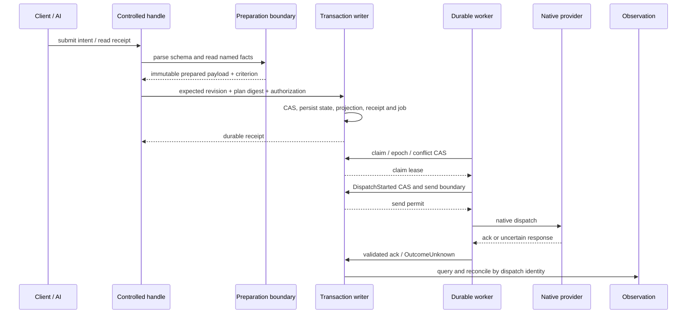

# 受控交易效果：执行、持久化与恢复

**状态：目标协议。** 本文约束由交易包装器发布的受控效果能力；公共读取、行情流、News/NewsGroup、缓存和 CLI 输出不进入本状态机。触发等待、复核和 `HeldIntentControl` 由[触发契约](trigger-contract.md)负责；总体边界见[总体设计](../uta-effect-runtime-detailed-design.md)。

## 1. 受控效果与能力组合

Provider 可以发布提交、撤销、修改、平仓、原生组合单或其他精确能力。只发布已实现叶子；没有 cancel 能力就没有 cancel 命令，也不以 `Unsupported` stub 填充。每个叶子以 schema/HOF 声明自己的合法参数变体、错误、资源和恢复能力，不要求其他 provider 接受相同字段。

交易包装器为一个已声明的能力绑定以下契约片段：

| 契约片段 | 内容 |
|---|---|
| input/domain error | provider 语义单位、精确输入和 provider extension；边界先校验，内部不使用裸 JSON。 |
| preparation | preparation input、immutable prepared payload、关系检查和参数推导；可由旧事实重建，但不保存函数或 SDK 实例。 |
| acknowledgement | 提交 handler 的接收层级和返回 identity；ack 不自动等于成交。 |
| observation/settlement | 观察能力及固定 criterion，用于区分 working、fill、cancelled、amended、rejected 和 unknown。 |
| recovery profile | 有证据的观察、重试、补偿能力或明确人工边界；不能捏造不存在的方法。 |
| authorization/effect requirements | principal、scope、限额、凭据、资源和 policy 约束。 |

这些片段保存在同一个 schema-bound handle 中。动态注册先校验元契约，再绑定该叶子的 validator/handler；不把异构 input/ack 拆成可错配的全局 union，也不依赖 `switch(provider)` 或全局 `ActionContractMap`。没有自动观察/恢复能力时，元数据必须标出 recovery profile；要求自动补偿的组合不得接受 `None`。

## 2. 公共 handle 不暴露 raw dispatch

`withTransaction` 向 CLI/AI 发布的是提交意图、读取 receipt 和观察结果的能力；原始 dispatch 只在受信任执行边界中调用。没有 writer 许可的调用方不能从 public handle 取得 handler。

目标路径如下：

步骤约束：

1. 输入边界解析具体 capability schema，认证主体，解析账户和 native instrument 关系。
2. writer 外读取行情、账户、权限等事实，形成带来源、时间、版本的命名值。
3. 纯准备函数生成 immutable prepared payload、risk/preconditions、criterion、recovery assessment 和 expiry。
4. writer 重新检查 intent revision、policy、事实有效性和授权，原子保存决定、执行投影、command receipt 和待执行工作。
5. commit 成功后，worker 才能按 claim/epoch 和发送边界取得许可。
6. native ack/observation 独立解析；仅满足固定 criterion 才结束目标，HTTP 200 或 truthy 值不能宣布成功。

## 3. 触发等待、准备、批准与发送边界

待触发对象可以是未准备的 `HeldIntent`，也可以是尚未失效的 immutable `PreparedOrder`；两者都不是已提交券商订单。其订阅、保留、复核和 `KeepSuspended` 生命周期由[触发契约](trigger-contract.md)负责。

准备不是长时间数据库事务。准备读取在 writer 外进行，写回必须带 `preparationIdentity`、`intentRevision`、`expectedVersion`、schema/semantic fingerprint 和事实有效期；过期或迟到结果不能覆盖新意图。

Approval 是经认证主体或已授权 policy 对具体 payload/规则的授权，而不是 UI 点击事实。它绑定 account scope、intent revision、plan digest、有效期、风险限制和 policy version。触发预授权还绑定 source conditions、activation mode、次数/额度和 expiry。若未来按规则计算参数，批准的是明确规则及边界，不能让旧 digest 覆盖新参数。只读账户可以产生 draft/preview，但不能产生 executable receipt。

## 4. 描述数据与执行函数分离

持久计划只保存无 secret 的可重建 native payload，或固定版本的纯 compiler identity 与完整输入。至少包含 criterion、preconditions、risk/recovery assessment、source schema/semantic/compiler fingerprints、scope、revision、expiry 和必要 evidence。HOF、函数、SDK 实例、runtime `Scope` 对象、日志 sink、凭据和运行时连接不序列化；需要跨边界的 `PublicScope`/`AccountScope` 值按声明的 serializable schema 保存。

公开视图使用独立精确 encoder，不能先 spread 整个对象再依赖 `JSON.stringify` 丢弃敏感值。codec 应拒绝未知字段或按声明显式投影；TypeScript excess-property check 不能证明嵌套值没有 secret/function。

Digest 编码固定为版本化 RFC 8785 JCS + SHA-256，保存完整 64 位十六进制值。Plan、command payload、order terms 和 capability input 分别使用独立 `domain` 与 encoding/schema version，不能因算法相同互换 digest。Plan canonical payload 包含 scope、revision、准备参数/规则、criterion、preconditions、授权限制、expiry 和 provider/compiler identity；command digest 包含命令语义与作用域，不包含 transport request id。十进制和时间使用命名 codec 的确定编码；缺少旧 schema/compiler 必须拒绝自动解释。

## 5. 生命周期与状态决定

交易效果使用自己的局部代数，不要求每个数据单位、provider handler 或 CLI 复制完整状态集。

| 阶段 | 可接受推进 | 必须保留 | 禁止 |
|---|---|---|---|
| `Draft` / `Preparing` | 编辑、开始准备、接收匹配的准备结果 | intent revision、preparation identity、拒绝原因 | 保存半成 plan 后执行。 |
| `Prepared` / `AwaitingApproval` | 当前批准、拒绝、编辑、expiry | 冻结 payload、criterion、授权需求/expiry | Prepared 直接派发；旧批准覆盖新条款。 |
| `Queued` | 原子 claim、授权/事实复核、发送前撤销 | durable job、conflicts、epoch、current approval | 把内存队列当 authority。 |
| `Executing` | ack、observation、已知失败、abort | step/attempt identity 和 evidence | 把 ack 当 fill；把 timeout 当 rejected。 |
| `Reconciling` | 确定性观察、有证据的下一步 | 可能发送边界、查询范围、unknown 原因 | lease 过期后盲重发。 |
| `Aborting` | 确认已发范围、取消未发工作、准备恢复 | forward progress、残余风险、恢复授权 | 未确认 forward outcome 就反向下单。 |
| `Compensating` | 恢复效果的 ack/observation | 独立 recovery attempt、目标、费用、残余风险 | 创建“补偿的补偿”。 |
| `Committed` / `Compensated` | 幂等查询、后续真实观察更新投影 | 固定 criterion 和实际完成 evidence | 改写历史 criterion；把 no-effects 当真实补偿。 |
| `RecoveryRequired` | 经授权的恢复决定 | case owner、冲突责任、未知范围 | 手工改库强制成功；静默释放排他权。 |

未发生效果的拒绝或退休返回 `NoEffectsApplied`，不是“已完成补偿”。达到 `AcceptedByVenue` criterion 后，broker 订单仍可能继续工作；后续动作必须是新意图，不能重复消费旧授权。

## 6. writer、传输身份与幂等

单一 writer 是受控决定的入口。一次提交至少原子保存 state/event、执行投影、jobs、conflict ownership、command receipt 和必要的 trigger/review outbox。后序决定读取同一 writer transaction 已接受的状态；存储失败使整次提交失败，不能回退内存执行、旧 pending hash 或旧 Git push。commit 后 Deferred/Promise 才完成，关闭时必须处理所有已接收等待者。

Alice 到 UTA 的 transport 使用 C09 已裁决的认证：`Authorization: Bearer <service credential>`，由 UTA `ServiceCredentialBinding` 解析为稳定 service identity、grants 和 revocation revision；`X-Request-ID` 关联请求并由响应回显。transport principal 不能由 body 自填，也不等于交易 authorizer。writer 先认证/授权主体，再查 command receipt、intent 或 control；无权主体返回 `Unauthorized`，不泄露 receipt 或资源 existence。

Review 控制只接受[触发契约](trigger-contract.md)定义的互斥 `ReviewCommand` 与 `HeldIntentControlCommand` envelope：初次 review 使用 `reviewId`，`KeepSuspended` 后使用当前 `controlId + expectedControlRevision`。执行 command 的具体 payload 仍由 capability schema 定义，不能把两种 envelope 合并为一组可选字段。

命令去重键是 authenticated principal scope 与 `commandId`。相同 canonical payload digest 返回原 receipt，不同 digest 返回 `IdempotencyConflict`；这不是 broker native idempotency。响应丢失时查询原 command identity，不新造命令。客户端取消已受理 command 不会自动撤销 durable intent。

冲突 key 由实际 effect 语义编译；账户级与订单/exposure 级必须定义层级，所需 key 全部原子取得或全部不取。普通数据订阅只受连接/配额控制，不取得交易 locks。

## 7. Claim、DispatchStarted 与 OutcomeUnknown

领取工作时 CAS 当前 state、owner、epoch、deadline 和全部 conflict keys。发送前再提交 `DispatchStarted`，检查 epoch；只有成功 writer transition 的 worker 才能调用 native handler。旧 worker 的结果不能以旧 epoch 覆盖新 state，但有效迟到 evidence 可以独立幂等入库。

`DispatchStarted` 后崩溃，即使不知道是否真实发送，也按可能已发送处理。接管者必须先观察。只有经证实的 native idempotency、完整 absence/fencing 或明确恢复授权，才允许下一次写入；过期 lease 不是旧进程停止证明。

结果至少分为：已知未发送、已知拒绝、已确认效果、仍工作和 `OutcomeUnknown`。协议坏响应、进程 EOF、超时和“只查了一页没找到”不能自动变成已知未应用。`OutcomeUnknown` 只能走 observation/reconciliation/recovery，不能回到 `Draft`，不能被 `Discard`、`Rearm` 或盲重提吞掉。

## 8. 批次、补偿和效果目标

| 组合 | 准入 | 失败与终态 |
|---|---|---|
| `IndependentBatch` | 每叶子单独验证，不可逆风险明确 | 已知拒绝后的 stop/continue 是冻结策略；`Unknown` 先暂停，不能压成 bool。 |
| `AllOrCompensate` | 每叶 recovery assessment 符合已授权风险上界 | 先确认可能执行范围，再按依赖顺序恢复；不是远端 ACID。 |
| `VenueNativeAtomic` | 具体 provider/group mechanism 的真实证据 | 使用原生 group identity 与 criterion，不能跨 venue 冒用。 |

补偿是新的有风险 effect，不是旧函数的逆函数。撤单再挂单可能改变 identity/queue priority；成交后的恢复涉及费用、滑点和市场风险。未知 forward 或 compensation outcome 先对账，不能盲发反向交易。

目标和观察分开：取消被接收不等于 `Cancelled`，amend 被接收不等于条款已更新，`ExposureTarget` 不带伪造的 `observedAt`。价格、数量、expiry 和 native extension 的完整含义进入固定 criterion/digest；只有满足 criterion 的 evidence 才结束目标。

## 9. 存储记录与数据边界

交易 authority 采用 SQLite single-writer store；writer 事务是 state、evidence、receipt、job 和 projection 的唯一提交边界。数据服务不因此被强制数据库化。缓存、Candle feed、News index 保留各自 resource owner；只有执行决定消费的事实进入交易 evidence。图表、Git 审计和历史显示可以异步重建，不能回写成执行 authority。

| 记录关系 | 必需约束 |
|---|---|
| transaction / event / execution projection | aggregate revision/sequence 唯一；同一 commit 一致；payload codec 版本化。 |
| step / prepared payload | 关联 capability/schema/semantic/compiler identity；ordinal/dependency 固定；serializable scope value 按声明保存，runtime `Scope` 对象不序列化。 |
| command receipt | principal + command id 唯一；payload digest 冲突可见。 |
| job / claim / conflict ownership | state 与 lease 一致；epoch CAS；全部 conflict keys 原子检查。 |
| dispatch attempt | direction/step/attempt 唯一；可能发送边界与 native identity 保留。 |
| observation | native identity/revision 与本地 received sequence 分开；范围和缺口可追溯。 |
| compensation / recovery case | applied evidence、目标、授权和 conflict owner 明确。 |
| trigger activation / review outbox | binding epoch + trusted event identity 去重；消费、状态和 outbox 同提交。 |
| held intent control | control id/revision、intent/binding tuple、`controlRetentionDeadline`、allowed commands 和 terminal state 一致。 |
| read projection checkpoint | 重建输入版本/sequence 可验证；stale 不能当 empty。 |

## 10. 恢复与单一 authority

启动先验证交易 schema、journal 和 projection，再分类未结 attempt，之后开放交易 admission；独立公共数据能力不被该 barrier 阻断。`Prepared/AwaitingApproval` 恢复等待或 expiry，不能因为没有 `DispatchStarted` 就直接派发；Queued 合法未发送工作才可 claim。

旧 backup/clone 进入 quarantine/observation-only，确认远端事实和新的 authority 前不发单。可复制的 UUID/sequence 不能阻止另一台持有旧凭据的主机写入；crash restart 与人为回滚的信任前提必须分别记录。

迁移保留现有 migration framework 的版本边界。旧历史缺少 dispatch identity、sub-account 或完整 native 字段时，不补造已确认事实；保留只读 evidence 或具名人工处理。按账户/执行 owner 冻结 admission、清点未结工作、导入或明确暂停、切换唯一 authority，再删除旧 dispatcher，禁止双写和 fallback。

## 11. 效果路径的验收场景

实现必须能够在真实持久 writer 与独立 provider ledger 上观察以下边界：

- prepared-before-approval、approval-before-claim、claim-before-dispatch；
- broker accepted-before-ack persist、ack persist-before-read projection、abort-before-compensation、compensation-sent-before-ack；
- duplicate command 与不同 payload conflict、commit response loss、stale worker recovery、partial/late fill；
- schema/credential/policy 变化、不支持的能力没有命令、只支持部分参数变体；
- `ReturnToAgent` 产生 review 且零 dispatch；`KeepSuspended` 返回 current control；无 reply 不产生 approval/rearm；
- expired intent 不被迟到 event 恢复；sent/`OutcomeUnknown` 不可 `Discard`/`Rearm`；correction 与 `DispatchStarted` 按同一 writer 顺序决定。

这些场景验证的是契约边界，不把 provider 的 native idempotency、absence、finality、补偿或 paper 环境保证从接口名称推断出来。
