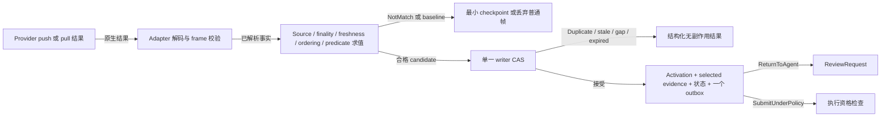
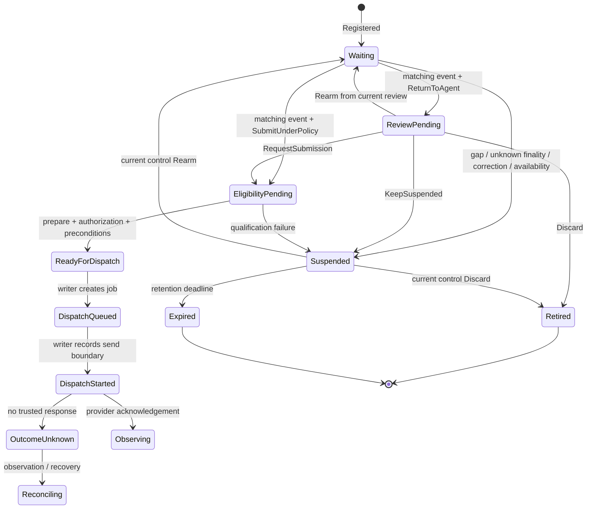
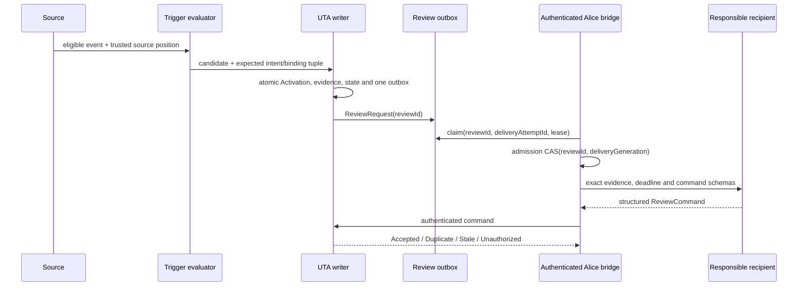

# UTA 触发等待与 ReturnToAgent 契约

**状态：目标协议。** 本文定义事件如何消费等待意图、如何创建复核、如何在 `KeepSuspended` 后管理当前保留控制面，以及如何把处置交给 Alice。交易执行代数见[受控交易效果契约](transaction-contract.md)，总体模块边界见[总体设计](../uta-effect-runtime-detailed-design.md)。源码事实和缺口只保留在[触发与返回 agent 调查](solutions/trigger-investigation.md)，不构成另一份协议。

## 1. 边界与术语

数据交付和受控执行是两条边界：`pull` 是有限结果，`push` 是带生命周期、背压、取消、结束和错误帧的资源；它们不获取交易锁，也不为每个数据帧写交易 WAL。只有被触发决定选中的事实才保存为 evidence，并进入本契约的 durable decision。事件是证据，不是授权；`ReturnToAgent` 是显式注册策略，不是全局默认值。

本契约中的对象如下：

| 对象 | 责任与身份 | 变更规则 |
|---|---|---|
| `HeldIntent` | 尚未发送的交易条款；含 `intentId`、`intentRevision`、精确 capability input 或 immutable prepared 引用、`creator`、`scope`、`retentionDeadline` | 修改交易条款必须生成新 `intentRevision`，不得原地改写已批准 plan。 |
| `TriggerBinding` | 等待声明；含 `bindingId`、`epoch`、intent tuple、source/predicate、触发语义、future boundary、有效期、冻结策略和 recipient policy | 同一 `intentId + intentRevision` 只有一个 live binding；每次 `Rearm` 产生新 `epoch`。 |
| `Activation` | 一次 binding epoch 对可信 source event 的消费；含 source/event identity、event revision、selected evidence digest 和 decision identity | `(bindingId, epoch, sourceIdentity, eventIdentity, eventRevision)` 唯一；重复输入返回原 decision。 |
| `ReviewRequest` | 一次激活的复核请求；含 `reviewId`、activation tuple、evidence、recipient、deadline、允许命令 schema 和投递状态 | `reviewId` 在重投中保持不变；关闭初次 review 后不得用它管理持续保留。 |
| `HeldIntentControl` | `KeepSuspended` 或 writer 的暂停/恢复决定后当前控制面；含 `controlId`、`controlRevision`、intent/binding tuple、pause reason、`controlRetentionDeadline` 和允许命令 schema | 后续 `Rearm`、`Revise`、`Discard` 与查询都使用当前 control CAS；不能复用已关闭 review，也不能让 `Suspended` 没有可查询控制面。 |
| `Execution` | 已进入受控 prepare/authorization/dispatch 的工作 | 由[交易契约](transaction-contract.md)负责；发送或结果未知后不再当作可丢弃草稿。 |

`Creator`、事件源、authenticated invoker、交易 `Authorizer` 与 `Recipient` 是不同关系。公共 `Candle`、`News`、`Instrument` source 不携带凭空加入的 `accountId` 或 `subAccountId`；只有账户事实或账户交易 effect 才使用 `AccountScope(accountId, subAccountId)`。外部 creator 没有 Alice Session 时，binding 必须在注册时选择 `ExactResume`、`WorkspaceReconstruction`、`HumanEscalation` 或 `Unavailable`，不得在触发时随机招募 agent。

## 2. TriggerBinding 注册

`RegisterTriggerBinding` 在单一 writer 中解析并冻结所有默认值。注册输入至少包括：

- waiting target：`intentId`、`intentRevision`、`HeldIntent` 或 immutable `PreparedOrder` 引用及 plan/payload digest；
- source：能力 identity、provider instance、discovery revision、schema version/fingerprint、源参数和 scope；
- predicate：具名 identity/version、精确配置 schema、输入 semantic unit 和条件；
- trigger semantics：`partial`/`closed`/`final`、correction/retraction policy、`activationMode`（`edge-crossing` 或 `each-eligible-event`）、freshness/ordering 要求；
- validity：`validFrom`、`validUntil` 和 `retentionDeadline`；
- `defaultPolicy`：明确的 `ReturnToAgent` 或 `SubmitUnderPolicy`；
- `ReturnToAgent` 的 `noReplyPolicy`：明确选择 `KeepSuspendedUntilRetentionDeadline`、`Retire` 或 `Escalate`；
- authorization policy、recipient policy、资源/配额约束和 retention policy。

`ReturnToAgent` 必须显式写在 binding 中。它表示命中后暂停 intent、创建 `ReviewRequest` 且不产生 broker dispatch。`noReplyPolicy` 在注册时冻结；它不是全局默认值。`SubmitUnderPolicy` 只有在注册时已有可验证、版本化且绑定到相同 intent/plan 的授权策略时才可注册；缺少授权返回 `MissingAuthorizationPolicy`，不能静默改写成 `ReturnToAgent`，也不能隐式 auto-submit。缺少 `defaultPolicy` 或 `recipientPolicy` 同样拒绝注册。

注册 writer 必须检查 source capability/schema、predicate、intent revision、scope、live-binding uniqueness、policy/authorization、retention 和资源约束。`Rearm` 另外必须提交并验证可信的 strictly-future source boundary；初次注册的 stream handshake 也要保存 source position，不能用本地接收序号冒充 provider position。

| 结果 | 规则 |
|---|---|
| `Registered` | 持久化完整冻结声明、`epoch`、source position 和策略。 |
| `InvalidSchema` | capability、predicate 或 intent schema 不可验证；不创建 binding。 |
| `MissingDefaultPolicy` | 未明确选择 `ReturnToAgent` 或 `SubmitUnderPolicy`；不创建 binding。 |
| `MissingAuthorizationPolicy` | 选择 `SubmitUnderPolicy` 但没有有效预授权；不创建 binding。 |
| `MissingRecipientPolicy` | 无法确定负责回复的 AI/人；不创建 binding。 |
| `ScopeMismatch` | public capability 带账户 scope，或账户 effect 缺少所需 scope；不创建 binding。 |
| `BindingConflict` | 同一 intent revision 已有 live binding；不创建 sibling binding。 |
| `BoundaryUnavailable` | 可信 source snapshot/subscription handshake 不能提供严格未来 boundary；不激活新 epoch。 |
| `StaleIntent` | intent revision 或 plan digest 已被替换；不创建 binding。 |
| `Unavailable` | 能力存在但凭据、连接、配额或 provider 暂时不可用；保留 capability identity，进入具名 unavailable 状态。 |

## 3. 事件求值与一次性激活

Provider adapter 先把 native 输入解码成声明的 frame/control schema。触发求值器按以下顺序检查候选：

1. 解析 item，核对 source、instrument、capability revision/fingerprint 和 binding validity。
2. 检查 exact temporal projection、closed/final proof、freshness、coverage、closed-through watermark 及未解决 gap。
3. 核对 source ordering 与 future boundary；provider cursor、watermark 或 semantic event token 才能证明顺序。timestamp-only、本地 delivery ordinal 和本地接收序号都不能证明事件位于 boundary 之后。
4. 运行版本化 predicate。`each-eligible-event` 只在 `Waiting` 消费满足条件的事件；`edge-crossing` 还需要可信 false 前态和连续性 checkpoint。
5. writer 重新检查 intent revision、binding epoch、当前状态和 activation unique key，然后原子写入 selected evidence、consumption、状态变化和一个 next-step outbox。

普通 raw/data frame 不进入交易 writer。edge 模式的 false/true checkpoint 只保存最小的 predicate state、source position、schema fingerprint 和 predicate revision；gap、无法证明连续性的重启、schema drift、correction 或 `Rearm` 会使 checkpoint 失效，并按 first-snapshot policy 重新建立。`RejectFirstSnapshot` 只建立 baseline，不激活；`EvaluateFirstSnapshot` 只有在 provider 已证明快照位于新 boundary 之后时可用；`RequireBaselineThenEdge` 在缺少可信前态时暂停。



Selected evidence 至少保存：

- provider capability identity、instance、discovery revision、schema fingerprint；
- provider event identity、cursor/sequence scope 和 event revision；
- event time、observed time、freshness、finality；
- ordering range、gap/replay 证据、背压丢帧标记；
- predicate 使用的语义单位和 provider extension；
- `evidenceDigest`，用于 plan、review 和 command CAS。

同一 writer decision 必须同时提交 selected evidence、binding/epoch、intent revision、一次性 consumption、waiting/review overlay 和一个 next-step outbox。`ReturnToAgent` 的 outbox 是 `ReviewRequest`，不包含 broker dispatch；`SubmitUnderPolicy` 的 outbox 是执行资格检查项，也不是 broker dispatch。HeldIntent 仍需 prepare/freeze，PreparedOrder 仍需复核 revision、authorization、limits 和 preconditions。

## 4. Correction、retraction 与顺序

选中逻辑事件的 correction/retraction 由可信 source identity、logical event identity 和 correction revision 路由到 evidence-maintenance，不经过普通 `NotMatch` 过滤，也不因为 binding 已暂停而忽略。

- 在 `DispatchStarted` 之前，writer 原子 supersede immutable evidence，撤销旧 review/eligibility，并 revoke 未发送的 job/permit；需要人工决定时创建带新 evidence 的修订复核。
- correction 与 `DispatchStarted` 竞争时由同一 writer 排序，只有一个结果生效；late callback 不能恢复旧资格。
- 已 `DispatchStarted` 或 `OutcomeUnknown` 的 attempt 不能假装被取消，只能 observation/reconciliation。撤回也不能把可能已发送的效果改写为 `NoEffectsApplied`。
- `Rearm` 前事件的 correction 只能在旧 retention/watch horizon 内维护或撤销旧决定，不能在新 epoch 产生 activation。provider 无法维持声明的 correction horizon 时进入具名 availability/review。

## 5. 等待、复核和执行状态



`ReviewPending`、`Suspended` 和 `ReadyForDispatch` 不是一个 boolean `approved`。事件匹配不是批准；`RequestSubmission` 也只进入正常资格检查，不替代 authorization。
任何 `Waiting` 或 `EligibilityPending` 因 source gap、unknown finality、schema drift、availability 或 dispatch 之前的 qualification failure 进入 `Suspended` 时，writer 必须在同一决定中创建或推进一个可查询的 `HeldIntentControl`，保存 `pauseReason`、当前 intent/binding tuple、`controlRetentionDeadline` 和配置的 notification；若冻结的 no-reply/暂停 policy 明确选择新复核，也可以创建新的 `ReviewRequest`，但不得留下没有 control 或 review 入口的裸 `Suspended`。source 恢复只恢复数据交付，不恢复 approval；current control 只有在 source continuity 与 trusted future boundary 检查通过后才能 `Rearm`。

post-Keep 的 `HeldIntentControlCommand` 只支持 `Rearm`、`Revise` 和 `Discard`。公共 `RequestSubmission` 只属于初次 `ReviewCommand`，不能作为持续 control 的新提交 API。


### 5.1 ReviewRequest 与投递

每个 `ReviewRequest` 至少保存：

- `reviewId`、outbox row id、binding/epoch、intent revision、plan digest；
- recipient policy 与 resolved recipient（exact `resumeId`、reconstruction、human 或 unavailable）；
- selected evidence digest、source event identity、predicate result、finality/gap/availability；
- allowed command schemas、review deadline、`noReplyPolicy`、retention deadline、approval validity、data resource lease 和 execution risk reservation 状态；
- 独立的 `deliveryState` 与 `reviewDecisionState`；投影的 `Replied` 不等于 UTA 接受 command；
- `deliveryAttemptId`、monotonic `deliveryGeneration`、admission key `(reviewId, deliveryGeneration)`、last error/retry time；
- validated command envelope、authenticated principal、canonical payload digest、`commandId` 和 UTA authority receipt（若已提交）。

Review outbox 是唯一 AI 投递起点。Issue/Inbox 只能投影同一个 review；不能成为第二条调度路径，也不能把写入 outbox 说成 AI 已读。Alice admission 在启动 worker 前持久化 `(reviewId, deliveryGeneration)`、recipient resolution 与 task/resume lineage。`Reserved`/`TaskBound`/`AwaitingReconcile` 等中间态必须可按同一 admission key 查找和恢复；只有证明旧 worker 已停止，才能递增 generation。`AcceptedByAlice` 只表示 admission receipt，task output 只表示回合产出；`AcceptedByUTA` 才表示处置 command 生效。

`ExactResume(resumeId)` 使用注册时冻结的目标；`WorkspaceReconstruction(workspaceId)`、`HumanEscalation` 和 `Unavailable` 也由 binding 明确选择。reconstruction 可以分析 evidence 和建议 command，但不能继承 creator 的 authorizer 或自动取得交易权限。

Alice 侧的 admission、投递、task 和 command receipt 是不同阶段：

| 记录 | 状态/字段 | 不变量 |
|---|---|---|
| `ReviewRequest` / delivery | `deliveryState`: `Pending`、`Claimed`、`AcceptedByAlice`、`PendingAgentReply`、`TaskCompleted`、`Failed`、`Unavailable`、`Expired` | 写 outbox 不等于 AI 已收到；每次 claim 有 `deliveryAttemptId`、lease 和 monotonic `deliveryGeneration`。 |
| Alice admission | key `(reviewId, deliveryGeneration)`；`Reserved`、`TaskBound`、`SpawnRequested`、`Spawned`、`Completed`、`AwaitingReconcile` | 同 key 重试 lookup/recover；`Reserved` 必须先绑定 task/resume lineage；`AwaitingReconcile` 未收敛前不能递增 generation。 |
| headless task | `taskId`、exact `resumeId`/reconstruction lineage；`taskOutcome`: `NoUsableOutput`、`InvalidStructuredCommand`、`StructuredCommandReady`、`Interrupted`、`Failed` | task output 不是交易 receipt；只有有效结构化 command 才能提交 UTA。 |
| review command | validated envelope、authenticated principal、`canonicalPayloadDigest`、`commandId`；`reviewDecisionState`: `Pending`、`CommandSubmitted`、`AcceptedByUTA`、`InvalidCommand`、`Stale`、`Terminal` | 先授权，再按 principal/id/digest 去重；`AcceptedByUTA` 才关闭 review/control，响应丢失复用原 identity。 |
| Issue/Inbox projection | Issue deterministic source id derived from `reviewId`；Inbox business key `(reviewId, projectionKind)` | Issue 可见性和 Inbox 通知不能成为第二调度路径；Inbox 必须 keyed writer 原子 lookup-or-append，随机 UUID append 不构成 exactly-once。 |




### 5.2 KeepSuspended 与无回复

`ReviewPending` 的 deadline 到达而没有有效 command 时，writer 按注册时冻结的 `noReplyPolicy` 作一次 durable transition：

- `KeepSuspendedUntilRetentionDeadline` 且 `retentionDeadline` 仍在未来：关闭 activation review，状态进入 `Suspended`，创建当前可查询的 `HeldIntentControl`，写入 `pauseReason = no-reply`、`controlRetentionDeadline = retentionDeadline` 和配置的 notification；不创建 broker dispatch，也不产生 approval/rearm。
- `KeepSuspendedUntilRetentionDeadline` 但 retention deadline 已到或不在未来：直接 `Expired`/`NoEffectsApplied`。
- `Retire` 或 `Escalate`：执行 binding 中明确的 retirement 或 escalation outbox/终态，不把策略静默改写成 Keep；两者都不能生成 approval 或 broker dispatch。

`KeepSuspended` 关闭当前 activation review，创建或推进一个 `HeldIntentControl`，但不重新触发、不延长旧 approval、不延长 data resource lease，也不创建 dispatch。控制面保存当前 `intentRevision`、`bindingId/epoch`、`controlRevision`、`controlRetentionDeadline`、pause reason 和 allowed command schemas。`KeepSuspended.until` 是本次 control 的明确保留截止时间，必须不晚于 binding 的 `retentionDeadline`。

`KeepSuspended` 后无后续回复处理为：意图保持 `Suspended`，`HeldIntentControl` 在 `controlRetentionDeadline` 前可认证查询，期间不自动 Rearm、不自动授权、不自动提交。截止时间到达后 writer 生成 `Expired`/`NoEffectsApplied`（若尚未跨 dispatch boundary）；不会把沉默解释成 approval。已发送或未知的对象不适用该草稿 expiry shortcut，必须走 observation/reconciliation。

`ReadHeldIntentControl` 先验证 authenticated principal、recipient policy 和 current control identity，再返回当前 revision、intent/binding tuple、`controlRetentionDeadline`、state 和 allowed command schemas。查询需要 `queryId` 与 canonical query payload；authorization 先于 query receipt lookup。control 到期、被 terminal disposition 或被替换后返回结构化 `ControlExpired`、`AlreadyTerminal` 或 `StaleControl`；不得静默重开旧 review 或招募新 recipient。

## 6. 认证传输、命令 envelope 与 CAS

Alice 到 UTA 的 transport 使用已裁决的 C09 边界：

- `Authorization: Bearer <service credential>`：由部署注入并解析为 UTA-owned `ServiceCredentialBinding` 的稳定 service identity、grants 和 revocation revision；credential value、principal 和 authorizer 不从 body 读取。
- `X-Request-ID`：传输 correlation，响应回显；不能代替 `commandId`、`reviewId`、`controlId` 或 source event identity。

服务认证只证明 Alice service 身份，不能代替交易 approval。writer 在任何 receipt/idempotency lookup、intent lookup 或 control lookup 之前授权 authenticated principal；失败统一返回 `Unauthorized`，不得泄露另一主体的 receipt、control 或 intent existence。本文不规定另一个签名/TLS/loopback 选项。

目标 command kind 使用 PascalCase。下面两个 envelope 互斥：初次 activation review 只能使用 `ReviewCommand`；`KeepSuspended` 成功后只能使用 `HeldIntentControlCommand`。每个 envelope 都有完整的 command variant，不使用“可选字段袋”；principal 从认证层注入，`X-Request-ID` 留在 transport metadata。下列 JSON 是一个本地场景的完整实例，不是跨 provider 的 canonical wire format；canonical schema 仍由对应声明导出。

### 6.1 初次 ReviewCommand

```json
{
  "kind": "ReviewCommand",
  "reviewId": "review-17",
  "commandId": "command-keep-17",
  "expectedIntentRevision": "intent-revision-3",
  "expectedBindingEpoch": 7,
  "command": {
    "kind": "KeepSuspended",
    "until": "2026-09-09T16:00:00Z",
    "reason": "保留未发送条款，等待下一次人工判断"
  }
}
```

`ReviewCommand` 只能引用当前 `reviewId`；不能携带 `controlId` 或 `expectedControlRevision`。可用的初次 command kinds 是 `Discard`、`KeepSuspended`、`Rearm`、`Revise` 和 `RequestSubmission`，各自的 payload 必须由对应 capability/schema 完整定义。`KeepSuspended` 成功响应包含新的 `HeldIntentControl`。

### 6.2 后续 HeldIntentControlCommand

```json
{
  "kind": "HeldIntentControlCommand",
  "controlId": "control-17",
  "expectedControlRevision": 1,
  "commandId": "command-rearm-18",
  "expectedIntentRevision": "intent-revision-3",
  "expectedBindingEpoch": 7,
  "command": {
    "kind": "Rearm",
    "source": {
      "capabilityId": "public-candle-5m",
      "providerInstance": "feed-nyse-1",
      "futureBoundary": {
        "kind": "providerCursor",
        "cursor": "cursor-0042",
        "observedThrough": "2026-09-09T14:59:55Z"
      }
    },
    "predicateRevision": "close-above-threshold-v2",
    "activationMode": "each-eligible-event",
    "firstSnapshotPolicy": "RejectFirstSnapshot",
    "validFrom": "2026-09-09T15:00:00Z",
    "validUntil": "2026-09-10T15:00:00Z",
    "policy": {
      "kind": "ReturnToAgent",
      "noReply": "KeepSuspendedUntilRetentionDeadline"
    },
    "reason": "继续等待严格晚于 cursor-0042 的闭合 K 线"
  }
}
```

同一 current control 的另一条完整处置（而非上例中的 Rearm）为：

```json
{
  "kind": "HeldIntentControlCommand",
  "controlId": "control-17",
  "expectedControlRevision": 1,
  "commandId": "command-discard-18",
  "expectedIntentRevision": "intent-revision-3",
  "expectedBindingEpoch": 7,
  "command": {
    "kind": "Discard",
    "reason": "不再保留该未发送意图"
  }
}
```

`Rearm` 的 `futureBoundary` 必须来自 provider 的 race-free snapshot/subscription handshake，并由 writer 验证为严格晚于旧 epoch 的 source position；AI 自填 timestamp、local counter 或任意 cursor 字符串不能获得防重放保证。示例中的 `control-17` 截止时间为 16:00，新的 predicate validity 从 15:00 开始，因此该 control command 必须在 16:00 前提交，并同时通过 source continuity、boundary 和新 validity 检查。成功 `Rearm` 产生新 binding epoch，旧 event identity、review identity 和 approval 不能用于新激活。`Discard` 只允许未跨 `DispatchStarted` boundary 的 HeldIntent/PreparedOrder，并返回 `NoEffectsApplied`；它不调用 provider cancel。

### 6.3 CAS、幂等与结果

初次 review command 的 writer CAS tuple 是：

`(reviewId, intentId, expectedIntentRevision, bindingId, expectedBindingEpoch, currentReviewState)`。

持续 control command 的 writer CAS tuple 是：

`(controlId, intentId, expectedControlRevision, expectedIntentRevision, bindingId, expectedBindingEpoch, currentControlState)`。

CAS 比较与结果写入同一 writer transaction。初次 `ReviewCommand` 在当前 review deadline、intent revision、binding epoch 和 evidence tuple 仍有效时处理；`HeldIntentControlCommand` 受当前 `controlRetentionDeadline` 约束，旧 TriggerBinding 的 `validUntil` 不会单独使 control 失效。每个 command 自己的 validity（例如 `Rearm.validFrom/validUntil`）仍须独立通过 source boundary、predicate、policy 和 intent 检查。其他变化——intent revision 改写、binding rearm、review/control 已被其他命令推进、evidence correction 使决定失效或 recipient policy 转交——返回 `StaleReview` 或 `StaleControl`，不产生副作用。

`commandId` 在 authenticated principal scope 内幂等；相同 principal、commandId 和 canonical payload digest 返回首次 result，即使 current CAS state 已推进；相同 id 的不同 digest 返回 `IdempotencyConflict`。无权主体先得到 `Unauthorized`，不能读取另一主体的 receipt。丢失响应只重试同一 command identity，不新建 command。

| 结果 | 语义 |
|---|---|
| `Accepted` | writer 接受并持久化明确状态/outbox transition；`RequestSubmission` 仍须 prepare、authorize、precondition。 |
| `Duplicate` | 相同 principal/id/digest 的首次结果；不重复 reservation、binding 或 dispatch。 |
| `IdempotencyConflict` | 相同 principal/id 使用不同 digest；不改变 state，不返回另一 payload receipt。 |
| `StaleReview` | review tuple 过期；保留 current review。 |
| `StaleControl` | control tuple 过期；不重开 review，返回 current control 状态。 |
| `AlreadyTerminal` | intent、review 或 control 已 discard/expired/terminal。 |
| `Unauthorized` | principal 无权；在 lookup 前返回，不泄露 existence 或 receipt。 |
| `InvalidCommand` | variant schema、deadline、scope 或 capability 组合不合法。 |
| `RecipientUnavailable` | exact/reconstruction/human policy 没有安全投递路径；保留 provenance。 |
| `SourceUnavailable` | 需要源恢复、replay 或对账才能安全继续；进入 named pause。 |
| `OutcomeUnknown` | attempt 可能已跨 provider boundary；只接受 reconciliation，不接受 Discard/Rearm。 |

## 7. 保留、资源与授权的独立生命周期

| 维度 | 保存内容 | 规则 |
|---|---|---|
| Retention | HeldIntent/PreparedOrder、selected evidence、ReviewRequest、delivery/provenance、失败和对账记录 | `KeepSuspended` 可在配置范围内保留并返回 control；到 retention deadline 生成 `Expired`，不自动 rearm/approval。 |
| Approval | authorizer、authorization digest、exact plan/revision、limits、source conditions、validity | retention、Keep 或 Rearm 不延长旧 approval；Rearm/Revise 必须重新绑定。 |
| Data resource lease | stream connection、subscription quota、backpressure window、provider resource | 按流/owner 独立释放；Keep 不自动续租，重新激活须重新取得。 |
| Execution risk reservation | 账户锁、额度、保证金或 provider reservation | 只存在于具体 account effect；无 dispatch 可释放的 reservation 不能阻塞账户，已发送/unknown 必须对账。 |

`Discard` 和 retention expiry 只关闭未发送 intent。`DispatchStarted` 之后即使没有可信 ack 也按可能发送处理；`OutcomeUnknown` 不能 Discard、Rearm 或盲目重提。已确认 provider rejection 可进入具名终态，但不能把 timeout、坏响应、EOF 或只查了一页未找到误报为已知未应用。

## 8. 持久化不变量与失败决定

单一 writer 是触发、复核和受控资格决定的 authority。一次 durable decision 至少原子提交 state/event、selected evidence、activation consumption、review/control outbox、execution projection（若有）和 command receipt；存储失败不得回退内存执行、旧 pending hash 或旧 Git push。

| 记录 | 必须约束 |
|---|---|
| `trigger_binding` | `intentId + intentRevision` 的 live uniqueness；`epoch`、source schema/fingerprint、predicate、policy、recipient、validity、retention 和 source boundary 同版本保存。 |
| `activation` | `(bindingId, epoch, trustedSourceIdentity, trustedEventIdentity, eventRevision)` 唯一；重复返回原 decision。 |
| `evidence` / correction | immutable revision、source identity、finality、ordering/gap/replay 证据和 digest；correction 不覆盖历史。 |
| `review_outbox` | `reviewId` 稳定；投递状态与 review decision state 分离；late delivery callback 由 generation/attempt CAS 拒绝。 |
| `held_intent_control` | `controlId + controlRevision` 当前唯一；intent/binding tuple、`controlRetentionDeadline`、allowed commands 和 terminal state 一致。 |
| `command_receipt` | `principal + commandId` 唯一；canonical payload digest 冲突可见；授权先于 receipt lookup。 |
| `predicate_checkpoint` | source position、epoch、schema fingerprint、predicate revision 和最小前态一致；gap/restart/drift 后失效。 |
| `execution/job` | eligibility、claim、dispatch boundary、attempt/epoch 与 trigger tuple 可追溯；不能用 review receipt 冒充 dispatch receipt。 |

启动恢复先校验 journal/projection/schema，再分类未结 review、control、job 和 dispatch attempt，然后开放交易 admission。Prepared/AwaitingApproval 恢复等待或 expiry；Queued 的合法未发送 job 才可 claim。旧 clone/backup 只能 observation-only，确认唯一 authority 与远端事实前不得发送。

失败决定的最小矩阵如下：

| 输入 | writer 结果 |
|---|---|
| 首个可信 final match | 一次 Activation、selected evidence 和一个 outbox；`ReturnToAgent` 分支 broker dispatch 数为零。 |
| 相同 trusted event identity | `AlreadyConsumed`，不创建第二个 review/job。 |
| replay 或 rearm 后旧事件 | boundary/epoch 校验失败或 `Duplicate`；不能进入新 epoch。 |
| gap 有可靠 replay | `PausedForReplay`；补齐 source position 和 checkpoint 只恢复数据连续性，意图通过当前 control 的 Rearm 或复核继续，不自动获得执行资格。 |
| gap 无可靠 replay、unknown finality 或 schema drift | named pause/`SourceUnavailable`；不凭重试次数放行。 |
| selected event correction，尚未发送 | 原子撤销旧资格、review 和未发 job，创建修订复核。 |
| correction 与 `DispatchStarted` 竞争 | writer ordering 决定；跨 boundary 后只 observation/reconciliation。 |
| ReviewPending 无 reply | 按冻结 `noReplyPolicy`：Keep 且 retention future 时关闭 review、进入 `Suspended` 并创建 current control；Retire/Escalate 执行各自明确的终态或 notification；任何分支都不生成 approval/rearm。 |
| 到期未发送 | `Expired` + `NoEffectsApplied`；迟到事件不得恢复。 |
| 已发送或 `OutcomeUnknown` 收到 Discard/Rearm | 结构化拒绝，转 observation/reconciliation。 |
| 有效 command 响应丢失 | 原 principal、digest、commandId 查询/重试，返回原 receipt。 |
