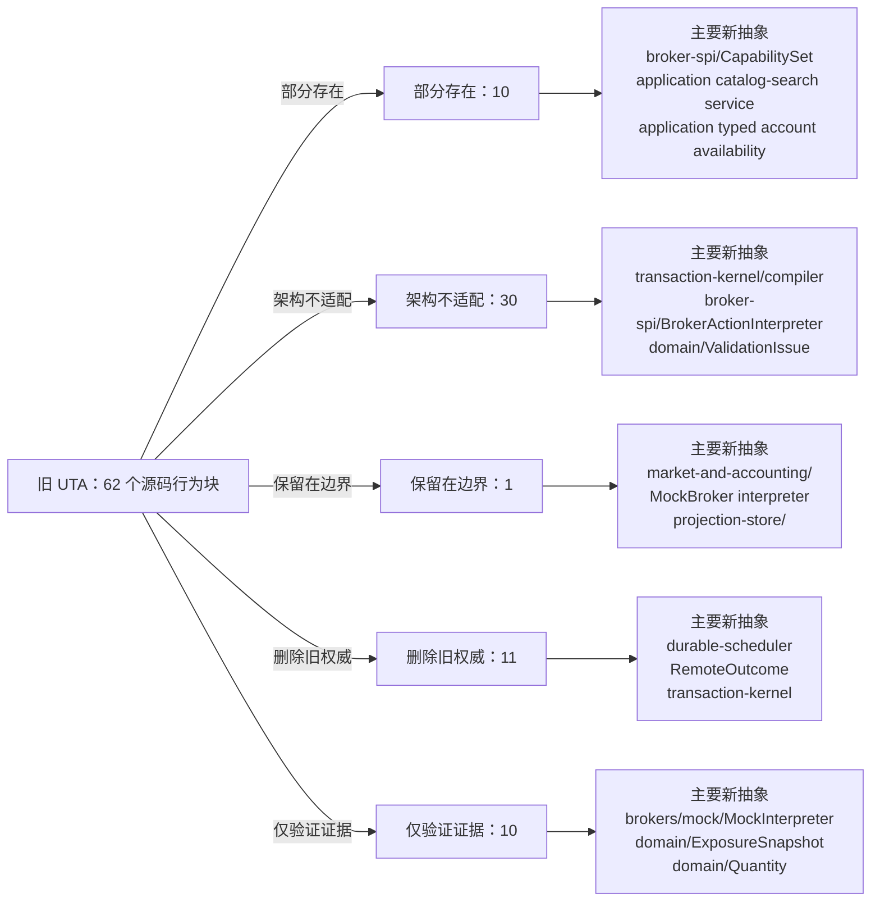

<!-- Auto-generated by scripts/uta-effect-runtime-map.mjs from mapping.json. Do not edit by hand. -->
<!-- Regenerate with `node scripts/uta-effect-runtime-map.mjs`. -->

# UTA 功能替代关系：第 1 章 Thesis and non-negotiable properties

目标架构原文：[`docs/uta-effect-runtime-architecture.md:15-38`](../uta-effect-runtime-architecture.md#L15-L38)。

## 结论

部分存在 10；架构不适配 30；保留在边界 1；删除旧权威 11；仅验证证据 10。状态只描述当前实现相对于目标架构的关系，不表示迁移已经落地。

## 替代关系图

## 章节级目标缺口

本章没有独立于源码行映射的目标级缺口。

## 源码映射

| 映射 ID | 当前源码 | 符号或行为块 | 当前功能 | 替代状态 | 新 UTA 抽象与做法 | 不适配位置与原因 | 必须补充或调整 | 重复索引 |
|---|---|---|---|---|---|---|---|---|
| `MAP-52A6B771BA` | [`packages/uta-protocol/src/brokers/preset-catalog.ts:470-495`](../../packages/uta-protocol/src/brokers/preset-catalog.ts#L470-L495) | SIMULATOR_PRESET | Declares a mock simulator with in-memory state, cash as a coerced number, no credentials, and a random _instanceId fingerprint used to derive a unique id; its hint states all state is wiped on restart. | 架构不适配 | 1. Thesis and non-negotiable properties；3.7 brokers/<broker>/；3.4 journal-store/；3.5 durable-scheduler/；5.3 Two-phase transaction protocol；7.1 Embedded database；12.1 Startup sequence；14. Public protocol；17.1 Slice 1: durable kernel with MockBroker；18. Verification contract；20. First falsifier MockBroker interpreter；transaction-kernel/；journal-store/；durable-scheduler/；DispatchIdentity；RemoteOutcome Retain MockBroker as the first executable adapter, but make transaction intent, jobs, outcomes, and mock broker observations durable in SQLite and recoverable across restart. | The current advertised simulator is explicitly process-memory-only and cash is a coerced number; it cannot satisfy the MockBroker crash/recovery falsifier or prove no duplicate dispatch. | Replace in-memory simulator authority with the durable MockBroker vertical slice, use DecimalString/Money and typed commands/outcomes, and keep any panel controls as a boundary over that slice. | **DUP-042** |
| `MAP-7E1806AFC4` | [`packages/uta-protocol/src/client/UTAClient.ts:37-46`](../../packages/uta-protocol/src/client/UTAClient.ts#L37-L46) | UTAHttpError | Throws an Error subclass carrying HTTP status, unknown body, and a message string; it does not decode a failure envelope. | 架构不适配 | 1. Thesis and non-negotiable properties；4. Effect model；5.7 Complete type contract — error channels；9.2 Typed action interpreter；12.3 Defects and expected failures；14. Public protocol；19. Architectural prohibitions TransactionFailure；QueryFailure；DispatchFailure；ProtocolViolation；protocol/ failure schemas Return/decode route-specific TransactionFailure or QueryFailure ADTs, preserving HTTP transport metadata separately and treating malformed bodies as ProtocolViolation. | Unknown body plus message-based Error handling collapses expected failures and malformed responses; consumers cannot exhaustively handle validation/conflict/capability/storage/unknown outcomes. | Replace UTAHttpError with typed client failure decoding and a distinct malformed-response defect/protocol-violation path; update all callers to handle the ADTs. | **DUP-060** |
| `MAP-8C22894ED4` | [`packages/uta-protocol/src/client/UTAClient.ts:63-88`](../../packages/uta-protocol/src/client/UTAClient.ts#L63-L88) | UTAClient.request | Builds a JSON request, creates an AbortController timeout, performs fetch, parses response text with safeJSON, extracts an `error` field by object cast on non-2xx, and casts successful body to T without validation. | 架构不适配 | 1. Thesis and non-negotiable properties；3.4 journal-store/；3.5 durable-scheduler/；3.9 transport/ and protocol/；4. Effect model；5.7 Complete type contract — public protocol envelopes；7.2 Single logical writer and group commit；8.1 Admission；9.2 Typed action interpreter；12.2 Unknown-outcome protocol；14. Public protocol；15. Security and authority；19. Architectural prohibitions transport/http；protocol/；TransactionCommand；PrepareTransactionResponse；GetTransactionResponse；TransactionFailure；QueryFailure Encode a named request, send it through authenticated transport, decode the exact success/failure schema, and preserve typed timeout/transport/protocol outcomes without generic casts. | Successful responses are body as T, errors are reduced to a string error field/message, and timeout/abort has no route-specific typed transport/auth/protocol representation. | Implement route-specific success and failure schema decoding plus typed transport/auth/protocol errors and correlation metadata. A public request timeout is not itself RemoteOutcome.Unknown; only a durable scheduler handling ambiguous broker dispatch may create that outcome. | **DUP-062** |
| `MAP-FE024081BB` | [`packages/uta-protocol/src/types/broker.ts:170-180`](../../packages/uta-protocol/src/types/broker.ts#L170-L180) | PlaceOrderResult | Uses a success boolean plus optional orderId/error/message, native Execution/OrderState objects, and optional bracket legs for place/modify/close results. | 架构不适配 | 1. Thesis and non-negotiable properties；4. Effect model；5.7 Complete type contract — broker capability and interpreter association；9.2 Typed action interpreter；9.3 Remote outcome；12.2 Unknown-outcome protocol；14. Public protocol；19. Architectural prohibitions BrokerActionInterpreter；RemoteOutcome；DispatchFailure；PlaceOrderAcknowledgement；TransactionResult Use action-specific acknowledgement, observation, rejection, and unknown-outcome ADTs tied to DispatchIdentity; let the kernel persist the durable transition before and after dispatch. | Boolean success and optional error/message fields cannot distinguish accepted, working, filled, rejected, or unknown outcomes, and native SDK values leak through the public type. | Delete PlaceOrderResult, define the closed BrokerActionTypeMap contracts and RemoteOutcome/DispatchFailure variants, and expose only named protocol envelopes. | **DUP-078** |
| `MAP-3EEBF25E8D` | [`packages/uta-protocol/src/types/broker.ts:366-413`](../../packages/uta-protocol/src/types/broker.ts#L366-L413) | BrokerHealth, UTAReach, UTATier, and BrokerHealthInfo | Models healthy/degraded/offline status, a down/connected/readable reach ladder, static data/account/trading tier, failure counters/timestamps, recovering/connecting, and disabled flags. | 部分存在 | 1. Thesis and non-negotiable properties；3.6 broker-spi/；6. State tiers and snapshots；9.1 Connection Layer；9.4 Capability derivation；12.1 Startup sequence；13. Observability；15. Security and authority BrokerConnectionService；ConnectionHealthEvent；CapabilitySet；CapabilityFailure；effect-runtime/；application/capability service Use scoped BrokerConnectionService health streams and typed capability degradation, with connection/account identity and durable operational projections. | The reach/tier concept is directionally useful, but status is a mutable summary with raw error text and booleans rather than typed health events, capability failures, and connection-layer requirements. | Define ConnectionHealthEvent/ConnectionFailure and CapabilityUnavailable ADTs, derive capabilities from ActionContext, and persist/query health as a projection without making health a broker mutation gate for unrelated accounts. | **DUP-090** |
| `MAP-255335BC1C` | [`packages/uta-protocol/src/types/broker.ts:524-529`](../../packages/uta-protocol/src/types/broker.ts#L524-L529) | IBroker trading mutation methods | Defines placeOrder, modifyOrder with Partial<Order>, cancelOrder, and closePosition as direct Promise mutations returning PlaceOrderResult. | 删除旧权威 | 1. Thesis and non-negotiable properties；3.3 transaction-kernel/；3.5 durable-scheduler/；3.6 broker-spi/；4. Effect model；5.3 Two-phase transaction protocol；5.7 Complete type contract — order and trading action ADTs；8. Scheduling, ordering, and concurrency；9.2 Typed action interpreter；12.2 Unknown-outcome protocol；17.6 Slice 6: delete the legacy kernel；19. Architectural prohibitions transaction-kernel/；durable-scheduler/；TradeAction；PreparedStep；BrokerActionInterpreter；DispatchIdentity；RemoteOutcome Make application commands enter transaction-kernel prepare/approve/execute; scheduler dispatches typed broker-spi actions only after DispatchPlanned durability and reconciles unknown outcomes. | Direct Promise mutation bypasses prepare, before-images, compensation proof, durable outbox/job admission, dispatch identity, typed remote outcomes, and backpressure. | Delete generic write methods and PlaceOrderResult when migration lands; implement action-specific BrokerActionInterpreter ports consumed by transaction-kernel and durable-scheduler. | **DUP-098** |
| `MAP-430A3CCB4D` | [`packages/uta-protocol/src/types/errors.ts:1-19`](../../packages/uta-protocol/src/types/errors.ts#L1-L19) | WireBrokerError | Defines the failure wire shape used by every endpoint as string code, human message, transient boolean, and optional hint; comments promise lossless reconstruction of the in-process BrokerError. | 架构不适配 | 1. Thesis and non-negotiable properties；4. Effect model；5.7 Complete type contract — error channels；9.2 Typed action interpreter；12.3 Defects and expected failures；14. Public protocol；15. Security and authority；19. Architectural prohibitions；3.1 domain/；3.9 transport/ and protocol/ TransactionFailure；QueryFailure；DispatchFailure；BrokerRejection；ProtocolViolation；protocol/ failure schemas Encode named TransactionFailure, QueryFailure, DispatchFailure, capability, connection, and broker-rejection variants with exhaustive schemas and redacted structured evidence. | `code: string`, `message: string`, and `transient: boolean` collapse expected failure variants, do not preserve action/dispatch/transaction identity, and make Error.message the effective protocol model. | Delete WireBrokerError as the universal error envelope; define route-specific failure ADTs/codecs, map them exhaustively in transport/CLI/UI, and redact native payloads/secrets. | **DUP-105** |
| `MAP-DE16B51F52` | [`packages/uta-protocol/src/types/git.ts:60-77`](../../packages/uta-protocol/src/types/git.ts#L60-L77) | OperationResult | Combines action, success boolean, flat status, optional native Execution/OrderState, optional string error, child legs, symbol attribution, and raw unknown payload. | 删除旧权威 | 1. Thesis and non-negotiable properties；4. Effect model；5.7 Complete type contract — broker capability and interpreter association；6. State tiers and snapshots；9.2 Typed action interpreter；9.3 Remote outcome；11. Approval and Git audit projection；12.2 Unknown-outcome protocol；14. Public protocol；17.6 Slice 6: delete the legacy kernel；19. Architectural prohibitions BrokerActionTypeMap；RemoteOutcome；DispatchFailure；TransactionResult；ProjectionName；projection-store/ Persist action-specific acknowledgement/rejection/observation/unknown variants keyed by DispatchIdentity, and expose a transaction result/projection with typed failures. | `success`, optional error text, and `raw?: unknown` erase the relation among action, acknowledgement, observation, error, compensation, and remote outcome; native SDK values leak into the contract. | Delete OperationResult, migrate result handling to BrokerActionTypeMap/RemoteOutcome/TransactionFailure, and generate Git history summaries from journal/projection events. | **DUP-110** |
| `MAP-C39C98EBC8` | [`packages/uta-protocol/src/types/git.ts:119-125`](../../packages/uta-protocol/src/types/git.ts#L119-L125) | PushResult | Returns a Git hash/message/count plus submitted and rejected OperationResult arrays from a push. | 删除旧权威 | 1. Thesis and non-negotiable properties；5.2 Transaction state；5.3 Two-phase transaction protocol；7.3 Authoritative tables；8.1 Admission；9.3 Remote outcome；11. Approval and Git audit projection；12.2 Unknown-outcome protocol；14. Public protocol；17.6 Slice 6: delete the legacy kernel；19. Architectural prohibitions TransactionState；EffectJob；DispatchRecord；RemoteOutcome；TransactionResult；durable-scheduler/；journal-store/ Replace push with approve/admission followed by durable job identity and queryable transaction state; report typed confirmed/rejected/unknown outcomes asynchronously. | Push synchronously bundles Git persistence and broker mutations, has no durability acknowledgement/job lease/dispatch identity, and collapses partial/unknown work into submitted/rejected arrays. | Delete PushResult and migrate to `/transactions/:id/approve`, durable scheduler jobs, and GetTransactionResponse/event queries. | **DUP-115** |
| `MAP-0CEEC81F23` | [`packages/uta-protocol/src/types/git.ts:225-246`](../../packages/uta-protocol/src/types/git.ts#L225-L246) | SimulatePriceChangeResult | Combines success boolean/error string, current and simulated account/position states, and string summary deltas including worstCase. | 保留在边界 | 1. Thesis and non-negotiable properties；5.7 Complete type contract — error channels；6. State tiers and snapshots；10.1 Accounting owns；12.2 Unknown-outcome protocol；14. Public protocol；17.1 Slice 1: durable kernel with MockBroker；18. Verification contract；20. First falsifier MockBroker interpreter；TransactionFailure；QueryFailure；market-and-accounting/；projection-store/；protocol/ Keep only as a named simulator preview response; use typed QueryFailure/validation failures and derive preview data without claiming broker dispatch or transaction commitment. | Success/error text and nested ad hoc state are not target transaction or accounting ADTs; the response says nothing about durable mock observations, dispatch identity, or recovery. | Separate simulator preview from execution protocol, add runtime schema and typed query/validation failures, and exercise the durable MockBroker crash/reconciliation path independently. | **DUP-126** |
| `MAP-14999AF99F` | [`services/uta/src/domain/trading/__test__/e2e/uta-lifecycle.e2e.spec.ts:208-282`](../../services/uta/src/domain/trading/__test__/e2e/uta-lifecycle.e2e.spec.ts#L208-L282) | describe UTA — precision end-to-end | Checks fractional quantities, exact partial-close arithmetic, string limit-price and quantity preservation in JSON output, and Decimal equality through stage -> push -> broker order/position. The cited range does not assert status-field encoding. | 部分存在 | 1 Thesis and non-negotiable properties；5.7 Complete type contract；6 State tiers and snapshots；7.3 Authoritative tables；10.1 Accounting owns；18.3 Real broker acceptance domain decimal value objects and Money；journal-store schema codecs；projection-store；transaction-kernel；market-and-accounting Port the precision cases to nominal domain Quantity/Price/Money types and verify schema codecs, journal persistence, projection rebuild, and protocol encoding preserve exact decimal values. | The assertions prove Decimal/string behavior only on the legacy in-memory path; they do not prove currency-qualified money, FX source/timestamp, persisted schema precision, projection rebuild, or crash-safe recovery of financial values. | Introduce target domain value objects and SQLite codecs, then add accounting/currency/FX and restart round-trip cases instead of relying on legacy wire JSON and Decimal implementation details. | **DUP-243** |
| `MAP-CFEE6FFFEA` | [`services/uta/src/domain/trading/brokers/alpaca/AlpacaBroker.ts:273-347`](../../services/uta/src/domain/trading/brokers/alpaca/AlpacaBroker.ts#L273-L347) | placeOrder | Resolves a legacy Contract to a ticker, builds an untyped Alpaca request from mutable Order fields, supports qty or notional, prices, trailing fields, extended hours, and bracket/OTO legs, calls createOrder directly, then returns PlaceOrderResult with the parent/leg IDs or a string error. | 架构不适配 | §1 Thesis and non-negotiable properties；§3.3 transaction-kernel/；§5.3 Two-phase transaction protocol；§5.5 Compensation capability；§5.7 Order and trading action ADTs；§5.7 Dispatch and durable-job records；§9.2 Typed action interpreter；§9.3 Remote outcome；§12.2 Unknown-outcome protocol；§13 Observability；§17 Slice 4: first real broker；§18.3 Real broker acceptance；§19 Architectural prohibitions；§20 First falsifier；2.2 UTA owns；2.3 Broker adapters own PreparedPlaceOrder；AlpacaPlaceOrderRequestSchema；DispatchIdentity；PlaceOrderAcknowledgement；RemoteOutcome<OrderSnapshot>；CompensationCapability；NativeAtomicGroupConfirmed Compile a typed PlaceOrder action and compensation capability during prepare, persist DispatchPlanned with a client/dispatch identity before calling Alpaca, dispatch through the interpreter, and persist Confirmed/Rejected/Unknown outcomes. Map bracket/OTO to a declared native atomic-group capability only when the venue observation proves the group criterion; otherwise track parent and child observations separately. | The method mutates the broker directly without a durable intent barrier, dispatch identity/idempotency key, before-image/precondition, commit criterion, compensation proof, or unknown-outcome observation. It also builds Record<string, unknown> payloads and converts attached prices through parseFloat. | Add Alpaca place-request/ack/observation schemas, clientOrderId/DispatchIdentity compilation, `dispatch` and `observe` SPI methods, typed rejection mapping, and compensation compilation for working orders/native groups. Remove PlaceOrderResult as the execution authority. | **DUP-307** |
| `MAP-D8B89D3086` | [`services/uta/src/domain/trading/brokers/ccxt/CcxtBroker.ts:563-626`](../../services/uta/src/domain/trading/brokers/ccxt/CcxtBroker.ts#L563-L626) | placeOrder direct CCXT dispatch | Builds raw params for TP/SL and triggerPrice, maps MKT/LMT/STP/STP LMT, refuses trailing types, calls an override or createOrder directly, caches orderId to symbol, and returns PlaceOrderResult or an error string. | 删除旧权威 | 5.3 Two-phase transaction protocol；7.2 Single logical writer and group commit；8.3 Durable jobs and leases；9.2 Typed action interpreter；12.2 Unknown-outcome protocol；19 Architectural prohibitions；17.5 Slice 5: heterogeneous brokers；17.6 Slice 6: delete the legacy kernel broker-spi/BrokerActionInterpreter；domain/DispatchIdentity；journal-store/JournalWriter；durable-scheduler/EffectJobWorker；domain/RemoteOutcome The scheduler must persist DispatchPlanned and a durable job, wait for the journal acknowledgement, dispatch through CcxtInterpreter with a DispatchIdentity, and persist Confirmed, Rejected, or Unknown outcomes. | A broker mutation starts directly from placeOrder with no write-ahead intent, durable dispatch identity, lease, acknowledgment boundary, compensation proof, or unknown-outcome path. | Delete this mutating method as an authority; implement typed dispatch/observation/compensation in broker-spi plus transaction-kernel and durable-scheduler, with raw params sealed/redacted at the adapter boundary. | **DUP-393** |
| `MAP-F032485592` | [`services/uta/src/domain/trading/brokers/ccxt/overrides.ts:185-196`](../../services/uta/src/domain/trading/brokers/ccxt/overrides.ts#L185-L196) | defaultPlaceOrder | Directly forwards symbol, string type, side, amount, optional price, and raw params to exchange.createOrder and returns the raw CCXT order. | 架构不适配 | 1 Thesis and non-negotiable properties；7 Durability architecture；9.2 Typed action interpreter；10.1 Accounting owns；12.2 Unknown-outcome protocol；19 Architectural prohibitions broker-spi/BrokerActionInterpreter；broker-spi/DispatchIdentity；journal-store/JournalWriter Keep createOrder only inside the CCXT action interpreter after durable dispatch intent and exact native request decoding. | A direct SDK mutation with arbitrary type/params and no durable dispatch identity, acknowledgement, observation, or unknown-outcome path. | Compile a typed PlaceOrder action, journal DispatchPlanned/EffectJob, then dispatch with stable identity and reconcile RemoteOutcome before projections. | **DUP-441** |
| `MAP-6AAB1AB711` | [`services/uta/src/domain/trading/brokers/ccxt/overrides.ts:198-201`](../../services/uta/src/domain/trading/brokers/ccxt/overrides.ts#L198-L201) | defaultFetchPositions | Directly forwards an unscoped fetchPositions call and returns raw CCXT position rows. | 部分存在 | 1 Thesis and non-negotiable properties；7 Durability architecture；9.2 Typed action interpreter；10.1 Accounting owns；12.2 Unknown-outcome protocol；19 Architectural prohibitions broker-spi/PositionObservation；market-and-accounting/ExposureProjection Decode raw positions into typed, provenance-bearing observations at the CCXT boundary. | The pass-through has no response schema, completeness evidence, account partition, or typed query failure. | Add a native response codec, account/sub-account scope, observation timestamp/completeness, and typed QueryFailure. | **DUP-442** |
| `MAP-A1AE3F307F` | [`services/uta/src/domain/trading/brokers/ccxt/overrides.ts:203-213`](../../services/uta/src/domain/trading/brokers/ccxt/overrides.ts#L203-L213) | defaultFetchAllOpenOrders | Uses one unscoped fetchOpenOrders call. Comments record live OKX evidence that it returned spot plus swap orders and explicitly warn that CCXT does not generalize this completeness to other venues. | 部分存在 | 1 Thesis and non-negotiable properties；7 Durability architecture；9.2 Typed action interpreter；10.1 Accounting owns；12.2 Unknown-outcome protocol；19 Architectural prohibitions broker-spi/OpenOrderObservation；projection-store/OrdersProjection；broker-spi/CapabilitySet Retain the OKX-specific evidence in an OKX adapter policy; every venue must declare and verify its own listing scope/completeness. | One venue-specific live observation cannot prove account-wide completeness for arbitrary exchanges; incomplete enumeration can corrupt reconciliation truth. | Require per-venue capability/evidence for complete listing or return typed Partial/Unavailable observation and reconcile by known order identity. | **DUP-443** |
| `MAP-C3F4ACD09F` | [`services/uta/src/domain/trading/brokers/contract-builder.spec.ts:60-205`](../../services/uta/src/domain/trading/brokers/contract-builder.spec.ts#L60-L205) | buildPosition pass-through, derivation, multiplier, and risk behavior tests | Covers derived marketValue/PnL, pass-through upstream values, multiplier inheritance and override, avgCostSource preservation, OPT/FOP multiplier-loss guards, and the allowed STK multiplier default. | 仅验证证据 | 3.1 domain；5.3 Two-phase transaction protocol；9.3 Remote outcome；12.3 Defects and expected failures；18 Verification contract domain position-math；broker-spi observation decoder；domain ProtocolViolation Retain the arithmetic and derivative-multiplier cases as pure-domain and adapter-observation tests; replace plain Error assertions with the typed failure/observation contract and remove SDK Contract construction from shared tests. | — | — | **DUP-447** |
| `MAP-D0EA3C0CF2` | [`services/uta/src/domain/trading/brokers/contract-builder.ts:1-23`](../../services/uta/src/domain/trading/brokers/contract-builder.ts#L1-L23) | module boundary, imports, and IBKR-as-truth contract/position funnel | Documents and implements a shared output funnel that every broker is expected to use; imports the concrete @traderalice/ibkr Contract, Decimal.js, the protocol Position type, contract-discipline validation, and position math. | 架构不适配 | 3.1 domain；3.6 broker-spi；3.7 brokers/<broker>；19 Architectural prohibitions domain/Instrument and Position value objects；broker-spi/BrokerActionInterpreter；brokers/<broker> boundary codecs Keep only SDK-free deterministic normalization in domain; move Contract construction and native response decoding into each broker adapter (for example brokers/ibkr/contract-codec), with broker-spi carrying named domain observations and native-request contracts. | The shared domain/trading/brokers module hard-codes an IBKR SDK value as the cross-broker output type. The target forbids broker SDK values in domain, transaction, and public protocol types, and requires adapters—not a generic funnel—to interpret native effects. | Split the pure multiplier/math portion from vendor conversion, define typed domain instrument/position observations, and make each adapter validate its native boundary before producing those values; do not expose Contract from broker-spi or domain. | **DUP-448** |
| `MAP-4D036C0223` | [`services/uta/src/domain/trading/brokers/contract-builder.ts:78-100`](../../services/uta/src/domain/trading/brokers/contract-builder.ts#L78-L100) | BuildPositionInput | Defines the position-builder input around a concrete Contract, Decimal quantity, string monetary values, long/short side, optional multiplier override, optional precomputed marketValue/unrealizedPnL, avgCostSource, and PositionRisk. | 部分存在 | 3.1 domain；5.7 Complete type contract；9.3 Remote outcome；9.4 Capability derivation；10.1 Accounting owns；19 Architectural prohibitions domain/Position and ExposureSnapshot；market-and-accounting/DecimalString and Money；broker-spi remote observation schema；brokers/<broker> response decoder Define a SDK-free PositionObservation/ExposureSnapshot with nominal account/instrument/currency identifiers and validated decimal values; adapters map native responses into it and the domain derives deterministic values from explicit observation variants. | The input combines a vendor Contract with raw strings and optional pass-through fields, so the type does not distinguish validated broker observations from locally derived values or make account/currency/instrument identity explicit. | Move native Contract decoding to adapters, parse monetary values into domain value objects, make upstream-reported versus derived valuation a tagged observation choice, and keep venue risk metadata in a typed broker/domain observation. | **DUP-451** |
| `MAP-5BDBD294C0` | [`services/uta/src/domain/trading/brokers/contract-builder.ts:102-161`](../../services/uta/src/domain/trading/brokers/contract-builder.ts#L102-L161) | buildPosition | Chooses an explicit or Contract-derived multiplier, rejects OPT/FOP multiplier 1 or empty with a plain Error, trusts both supplied marketValue and unrealizedPnL when present, otherwise derives missing values with derivePositionMath, and returns a Position containing the concrete Contract and optional risk/provenance. | 部分存在 | 3.1 domain；5.3 Two-phase transaction protocol；9.3 Remote outcome；12.3 Defects and expected failures；19 Architectural prohibitions domain pure position evolution/math；broker-spi Observation and ObservationFailure；domain ProtocolViolation；transaction-kernel typed failure mapping Retain the deterministic multiplier-aware calculation as a domain function over typed observations, but have adapters validate broker-reported valuation and emit a typed observation/protocol failure. The transaction kernel consumes the result without any SDK Contract. | The pure calculation is reusable, but this implementation trusts an untagged pair of optional upstream values, embeds an SDK object in the returned domain Position, and reports a malformed derivative multiplier through untyped Error rather than a typed protocol/observation failure. | Split `derivePositionMath`-style pure logic from adapter decoding, model upstream valuation versus derivation explicitly, and map multiplier loss to the broker SPI's typed observation/ProtocolViolation channel before persistence or dispatch. | **DUP-452** |
| `MAP-093F5766C9` | [`services/uta/src/domain/trading/brokers/factory.ts:26-40`](../../services/uta/src/domain/trading/brokers/factory.ts#L26-L40) | createBroker preset parsing, engine resolution, and generic creation | Looks up presetId, parses presetConfig, casts the parsed value to Record<string, unknown>, translates it to another Record, loads a generic engine entry, parses engine config but discards the parsed result, and creates an IBroker with id/label/brokerConfig plus keyless flag. | 架构不适配 | 3.2 effect-runtime；3.6 broker-spi；4 Effect model；9.1 Connection Layer；9.2 Typed action interpreter；19 Architectural prohibitions；2.2 UTA owns protocol named account-config schema；BrokerAdapterDefinition<Engine>；broker-spi BrokerConnectionService；application typed construction failure Parse the account connection intent once into an engine-indexed ADT, pass the refined config to a typed adapter definition, and construct its scoped Layer/interpreters. Preserve the parsed schema value instead of erasing it and map failures to named typed errors. | `as Record<string, unknown>` and `entry.configSchema.parse(engineConfig)` followed by an ignored result erase config types. The returned IBroker erases action/result/error/observation/compensation relationships, and all parse/loader failures escape as thrown errors. | Define a typed engine-to-config/adapter map, make preset and engine schemas produce named types, return `Effect<BrokerConnectionService, BrokerConfigFailure \| BrokerPackUnavailable, Requirements>`, and eliminate the generic IBroker factory result. | **DUP-455** |
| `MAP-E010E516DB` | [`services/uta/src/domain/trading/brokers/factory.ts:42-47`](../../services/uta/src/domain/trading/brokers/factory.ts#L42-L47) | optional setFxService duck typing | Checks for a runtime property named setFxService through an unknown cast and invokes a second unknown cast when present; brokers without the method silently skip FX injection. | 架构不适配 | 3.2 effect-runtime；4 Effect model；9.1 Connection Layer；9.4 Capability derivation；10.1 Accounting owns；19 Architectural prohibitions effect-runtime service Layer；market-and-accounting FX observation service；broker-spi ActionContext Make FX/currency requirements part of the typed adapter Layer or ActionContext and derive availability from whether those requirements are satisfied; do not mutate an opaque broker object after creation. | Runtime method probing and `unknown as` casts explicitly erase the dependency contract and can create a broker that appears constructed while lacking required currency behavior. | Remove the setter and unknown casts; require the named FX service in the adapter's Effect requirements or make the absence an explicit typed unavailable capability. | **DUP-456** |
| `MAP-C0F9438F7F` | [`services/uta/src/domain/trading/brokers/fuzzy-rank.spec.ts:19-69`](../../services/uta/src/domain/trading/brokers/fuzzy-rank.spec.ts#L19-L69) | exact/prefix/name/regex ranking tests | Tests empty queries, zero-score filtering, exact symbol/base/name precedence, symbol prefix precedence, name word-boundary behavior, and regex-metacharacter escaping. | 仅验证证据 | 3.1 domain；9.4 Capability derivation；18 Verification contract domain pure catalog ranking；application CatalogSearchResult Keep these deterministic ranking cases as pure function evidence while changing expected values to the canonical catalog entry/result type. | — | — | **DUP-458** |
| `MAP-4C9A6FE792` | [`services/uta/src/domain/trading/brokers/fuzzy-rank.ts:36-73`](../../services/uta/src/domain/trading/brokers/fuzzy-rank.ts#L36-L73) | score | Performs deterministic case-insensitive ranking: exact symbol/base/name 100, symbol/base prefix 80, name word-boundary prefix 70, whole-word name 50, symbol/local/name substring 30, quote-only 20, otherwise 0; escapes query regex metacharacters. | 部分存在 | 3.1 domain；3.6 broker-spi；9.4 Capability derivation；14 Public protocol domain pure catalog ranking；application catalog-search service；domain InstrumentSummary Retain the deterministic scoring policy as a pure catalog-search function after changing its input to the canonical catalog entry; make score/tie/truncation policy explicit in the query result contract. | The scoring itself is deterministic, but it derives fields from an SDK Contract and free-form optional strings. Result limiting and ContractDescription construction occur in the separate fuzzyRankContracts function and must be mapped there, not attributed to this range. | Parameterize the pure scorer over SDK-free catalog data and pair it with explicit result metadata; keep venue capability selection and native search bypass in adapters/application. | **DUP-463** |
| `MAP-74610A30AF` | [`services/uta/src/domain/trading/brokers/mock/MockBroker.spec.ts:21-81`](../../services/uta/src/domain/trading/brokers/mock/MockBroker.spec.ts#L21-L81) | precision behavior tests | Checks Decimal quantity round-trips through market placement, exact quantity retention, full close removal, and Decimal partial-close subtraction. | 仅验证证据 | 1. Thesis and non-negotiable properties；5.7 Complete type contract；6. State tiers and snapshots；9.2 Typed action interpreter；10.1 Accounting owns；17. Migration sequence — Slice 1: durable kernel with MockBroker；18.2 Concurrency scenarios domain/DecimalString；domain/Quantity；domain/pure evolution；brokers/mock/MockInterpreter；projection-store/accounting Preserve these numeric invariants as pure domain/evolution tests and Mock interpreter tests, then assert the same values after journal recovery and projection rebuild. | The tests inspect in-memory Position output only; they do not prove typed persistence, transaction preconditions, dispatch durability, or post-crash reconciliation. | Port to typed Quantity/DecimalString fixtures and add durable integration assertions around the same fills/closures. | **DUP-658** |
| `MAP-47DB032F5A` | [`services/uta/src/domain/trading/brokers/mock/MockBroker.spec.ts:542-648`](../../services/uta/src/domain/trading/brokers/mock/MockBroker.spec.ts#L542-L648) | multiplier discipline regression tests | Checks option multiplier cash debit, preservation of derivative Contract metadata after sell-down/re-resolution, and oversell rejection without phantom cash credit. | 仅验证证据 | 1. Thesis and non-negotiable properties；3.7 brokers/<broker>/；5.7 Complete type contract；6. State tiers and snapshots；9.2 Typed action interpreter；10.1 Accounting owns；12.2 Unknown-outcome protocol；17. Migration sequence — Slice 1: durable kernel with MockBroker；18.1 Kernel crash matrix；20. First falsifier domain/Quantity；domain/Price；domain/Instrument；market-and-accounting/valuation；brokers/mock/MockInterpreter；domain/ValidationIssue；verification/first falsifier Keep these as high-value adapter/domain invariants, porting them to typed instrument metadata and pure Decimal evolution. Add durability and reconciliation cases proving metadata survives restart and oversell rejection is journaled without cash mutation. | Current tests prove only direct in-memory arithmetic and registry behavior; they do not prove durable observations, typed errors, preconditions, dispatch identity, or crash recovery. | Port to target schemas and add Slice 1 integration/crash tests around the same multiplier and rejection invariants. | **DUP-671** |
| `MAP-0151919B70` | [`services/uta/src/domain/trading/brokers/mock/MockBroker.spec.ts:650-730`](../../services/uta/src/domain/trading/brokers/mock/MockBroker.spec.ts#L650-L730) | short-position netLiquidation aggregation regression tests | Checks short option and stock positions, plus mixed long/short positions, to ensure net liquidation and unrealized PnL use signed exposure and multipliers correctly. | 仅验证证据 | 1. Thesis and non-negotiable properties；5.7 Complete type contract；6. State tiers and snapshots；9.2 Typed action interpreter；10.1 Accounting owns；12.2 Unknown-outcome protocol；17. Migration sequence；18.2 Concurrency scenarios market-and-accounting/valuation；domain/ExposureSnapshot；domain/Money；projection-store/accounting；brokers/mock/MockInterpreter Retain the signed-exposure valuation cases as pure accounting/property tests and durable projection tests. Feed them through typed broker observations and verify rebuild/reconciliation preserves equity and PnL. | The tests do not exercise currency/FX, observed-at uncertainty, journal events, external activity, or post-crash projection rebuild; they only validate MockBroker's current map aggregation. | Move valuation assertions into market-and-accounting and add journal/projection integration coverage for signed exposure and multiplier behavior. | **DUP-672** |
| `MAP-559086B869` | [`services/uta/src/domain/trading/brokers/mock/MockBroker.ts:78-108`](../../services/uta/src/domain/trading/brokers/mock/MockBroker.ts#L78-L108) | CallRecord, MockBrokerOptions, default account and capabilities | Defines call-log records, constructor options, fixed account defaults, and DEFAULT_CAPABILITIES with security/order-type string arrays plus historicalBars as { supported, quality }. | 部分存在 | 1. Thesis and non-negotiable properties；3.7 brokers/<broker>/；5.7 Complete type contract；9.4 Capability derivation；13. Observability；16. Target source layout broker-spi/CapabilitySet；broker-spi/CapabilityFailure；domain/AccountId；domain/Money；observability/ExecutionContext；brokers/mock/MockInterpreter Keep test-only call records outside the runtime contract. Replace account defaults with typed account/currency snapshots and replace string capability arrays with a context-derived CapabilitySet whose action entries carry availability, action schema, idempotency, and compensation class. | Capabilities are not action-indexed or derived from account, jurisdiction, venue, instrument, and session context. Account values are bare strings and the call record has no transaction/step/dispatch/conflict context required for runtime observability. | Add broker-spi CapabilitySet and CapabilityFailure schemas, typed Money/account projections, and structured execution context. Restrict CallRecord to test instrumentation rather than exporting it as broker state. | **DUP-676** |
| `MAP-B4CEC1AF32` | [`services/uta/src/domain/trading/brokers/mock/MockBroker.ts:164-215`](../../services/uta/src/domain/trading/brokers/mock/MockBroker.ts#L164-L215) | MockBroker constructor, config schema, and mutable state | Self-registers through static Zod configSchema/configFields/fromConfig, initializes id/label/cash, and owns in-memory position, order, mark-price, contract-registry, PnL, order-id, override, logging, and failure state. | 架构不适配 | 1. Thesis and non-negotiable properties；2. System boundary；3.7 brokers/<broker>/；4. Effect model；6. State tiers and snapshots；7. Durability architecture；9.1 Connection Layer；9.4 Capability derivation；12. Recovery model；17. Migration sequence — Slice 1: durable kernel with MockBroker；19. Architectural prohibitions；20. First falsifier effect-runtime/Layer；broker-spi/BrokerConnectionService；brokers/mock/MockInterpreter；transaction-kernel；journal-store；durable-scheduler；projection-store Use MockBroker only as a scoped broker interpreter/resource layer. Put transaction state, dispatch records, effect jobs, locks, and projections in SQLite through journal-store, and let transaction-kernel/scheduler own all durable mutation and recovery state. The adapter retains only broker/native simulation state and exposes typed observation and dispatch operations. | All execution authority is volatile in process memory; there is no journal, outbox, durable job, lease, logical lock, schema migration, Effect Layer/Scope, recovery state, or first-falsifier path. Static self-registration also does not derive capabilities from full context. | Implement the Slice 1 journal writer, prepared placeOrder transaction, durable job, Mock broker interpreter, and restart/reconciliation protocol. Rewire config construction through the composition root and scoped broker Layer, then remove this class as the account mutation authority. | **DUP-678** |
| `MAP-46ED6C273F` | [`services/uta/src/domain/trading/brokers/mock/MockBroker.ts:278-325`](../../services/uta/src/domain/trading/brokers/mock/MockBroker.ts#L278-L325) | MockBroker.placeOrder | Allocates mock-ord IDs; immediately applies market orders at mark/default price and mutates positions/cash; stores filled orders; stores limit/stop orders as Submitted and returns legacy PlaceOrderResult/OrderState values. | 架构不适配 | 1. Thesis and non-negotiable properties；3.7 brokers/<broker>/；4. Effect model；5.3 Two-phase transaction protocol；5.4 Commit criteria；5.5 Compensation capability；6. State tiers and snapshots；7.2 Single logical writer and group commit；8.3 Durable jobs and leases；9.2 Typed action interpreter；9.3 Remote outcome；12.2 Unknown-outcome protocol；17. Migration sequence — Slice 1: durable kernel with MockBroker；18.1 Kernel crash matrix；19. Architectural prohibitions；20. First falsifier domain/TradeAction.PlaceOrder；transaction-kernel/compiler；transaction-kernel/coordinator；broker-spi/BrokerActionInterpreter；broker-spi/DispatchIdentity；broker-spi/RemoteOutcome；journal-store/DispatchPlanned；durable-scheduler/EffectJob；domain/PlaceOrderAcknowledgement Compile a typed PlaceOrder action during prepare, capture before-image/preconditions and compensation capability, append TransactionPrepared/DispatchPlanned plus an EffectJob atomically, wait for the durability acknowledgement, then call MockInterpreter.dispatch with DispatchIdentity. Persist Confirmed, Rejected, or Unknown and reconcile by observation; map filled/working semantics to the declared CommitCriterion. | The broker mutation begins directly in a promise method before any durable intent, uses SDK objects and PlaceOrderResult, has no client/dispatch identity or idempotency contract, and cannot distinguish timeout/crash from rejection or recover after process death. | Move position/cash/order mutation behind broker-spi dispatch and journal-store events, implement durable scheduler recovery and Mock observation, and delete direct IBroker write ownership once Slice 1 is authoritative. | **DUP-683** |
| `MAP-202708E052` | [`services/uta/src/domain/trading/brokers/mock/MockBroker.ts:519-521`](../../services/uta/src/domain/trading/brokers/mock/MockBroker.ts#L519-L521) | getCapabilities | Returns one process-constant AccountCapabilities object containing supported security/order type string arrays and historical-bar support. | 架构不适配 | 1. Thesis and non-negotiable properties；3.6 broker-spi/；5.7 Complete type contract；9.4 Capability derivation；15. Security and authority；19. Architectural prohibitions broker-spi/CapabilitySet；broker-spi/ActionAvailability；broker-spi/CapabilityFailure；domain/ActionTag；application/capability service Implement a typed CapabilitySet indexed by closed action tags. Each availability result must carry action schema, idempotency mode, compensation class, and a precise unavailable reason derived from broker/version/connection/account/jurisdiction/venue/instrument/session context. | String arrays cannot express action-specific schema, idempotency, compensation, or context-dependent degradation, and this method has no Effect requirement or failure channel. | Replace AccountCapabilities with broker-spi capability derivation and application capability queries; make transaction-kernel preparation consume the same typed availability result. | **DUP-692** |
| `MAP-150B8F86DC` | [`services/uta/src/domain/trading/brokers/mock/MockBroker.ts:917-966`](../../services/uta/src/domain/trading/brokers/mock/MockBroker.ts#L917-L966) | _applyFill | Mutates or removes position-map entries, recalculates weighted average cost, increases an existing long/short side, and reduces or closes it. SELL with no position and oversell throw generic Error; this path never flips long to short or short to long. | 部分存在 | 1. Thesis and non-negotiable properties；3.1 domain/；5.1 Commands, events, effects, and state；5.7 Complete type contract；6. State tiers and snapshots；9.2 Typed action interpreter；10.1 Accounting owns；12.3 Defects and expected failures；18.2 Concurrency scenarios；20. First falsifier domain/pure evolution；domain/ExposureSnapshot；domain/Fill；domain/ValidationIssue；broker-spi/BrokerRejection；market-and-accounting/valuation Extract the deterministic position evolution and oversell checks into a pure domain function returning an Either/Result with typed validation or broker rejection. The Mock interpreter applies accepted transitions to broker simulation and emits observations; journal/projection evolves authoritative local state. | The arithmetic is deterministic and rejects important invalid fills, but it mutates adapter state and throws strings/Errors; it lacks account/instrument identity, preconditions, event output, compensation, and durable ordering. | Implement pure typed fill/evolution and error ADTs, add conflict/precondition checks in transaction-kernel, and make adapter mutation occur only after durable dispatch intent. | **DUP-705** |
| `MAP-2E9FCB05D5` | [`services/uta/src/domain/trading/brokers/registry.spec.ts:58-65`](../../services/uta/src/domain/trading/brokers/registry.spec.ts#L58-L65) | validModuleSource test fixture | Builds module source text exporting only API version, string engine identity, an untyped parse method, and a generic createBroker returning a plain object. | 仅验证证据 | 3.6 broker-spi；4 Effect model；9.2 Typed action interpreter；19 Architectural prohibitions broker-spi BrokerAdapterModule；BrokerActionTypeMap；effect-runtime Layer Replace this minimal source with a typed adapter-module fixture that exports connection Layer, action interpreter, capability derivation, remote observation, and compensation contracts. | — | — | **DUP-809** |
| `MAP-E2F6BC0E7E` | [`services/uta/src/domain/trading/brokers/registry.spec.ts:93-107`](../../services/uta/src/domain/trading/brokers/registry.spec.ts#L93-L107) | invalid module rejection tests | Checks API-version mismatch, engine-identity mismatch, and missing configSchema/createBroker exports are wrapped as BrokerPackUnavailableError with actionable message text. | 仅验证证据 | 3.6 broker-spi；4 Effect model；9.2 Typed action interpreter；12.3 Defects and expected failures；18 Verification contract；19 Architectural prohibitions typed pack validation failure；broker-spi BrokerAdapterModule decoder；protocol/application failure mapping Retain invalid-pack coverage but assert exhaustive structured failure variants and missing typed SPI surfaces, not Error.message regexes. | — | — | **DUP-812** |
| `MAP-D74C77540F` | [`services/uta/src/domain/trading/brokers/registry.ts:23-26`](../../services/uta/src/domain/trading/brokers/registry.ts#L23-L26) | BrokerEngineEntry | Defines an engine registry entry as unparameterized z.ZodType plus createBroker(config with Record<string, unknown>) returning generic IBroker. | 架构不适配 | 3.6 broker-spi；4 Effect model；9.2 Typed action interpreter；9.4 Capability derivation；19 Architectural prohibitions broker-spi BrokerAdapterDefinition<Config, Actions>；broker-spi BrokerConnectionService；broker-spi CapabilitySet Replace with an engine-indexed discriminated BrokerAdapterDefinition that binds a named config schema, scoped connection Layer, action interpreter type map, capability derivation, observation/reconciliation, and compensation compilation. | The registry signature erases config type and every action/result/error/observation/compensation relationship, exactly the untyped-registry shape prohibited by the architecture. | Make the registry generic over a closed broker-engine definition map and expose typed Schema/Effect services; eliminate Record<string, unknown> and generic IBroker from the entry contract. | **DUP-817** |
| `MAP-3BB0EF71F5` | [`services/uta/src/domain/trading/brokers/registry.ts:35-42`](../../services/uta/src/domain/trading/brokers/registry.ts#L35-L42) | BrokerPackUnavailableError | Wraps unavailable/invalid pack details in a class extending Error with a code string and installable engine field; callers must inspect name/code/message. | 部分存在 | 3.2 effect-runtime；3.6 broker-spi；4 Effect model；9.3 Remote outcome；12.3 Defects and expected failures；19 Architectural prohibitions effect-runtime PackLoadFailure；broker-spi CapabilityFailure/ConnectionFailure；application typed account availability Keep a packaging-layer unavailable-pack variant, then translate it at the application/broker boundary into a named capability or connection failure; preserve structured causes without making Error.message the domain error model. | The loader's failure is expected operational state but is represented as a generic Error with free-form detail. It cannot distinguish invalid pack, unavailable connection, unavailable action, or protocol violation for typed consumers. | Define an exhaustive pack/connection failure ADT, retain engine/release/cause fields structurally, and map it to broker-spi/application error channels before transaction scheduling. | **DUP-819** |
| `MAP-D0D9F4AA44` | [`services/uta/src/domain/trading/brokers/registry.ts:58-67`](../../services/uta/src/domain/trading/brokers/registry.ts#L58-L67) | loadBrokerEngine cached public loader | Returns a Promise<BrokerEngineEntry>, memoizes by BrokerEngine, and deletes the cache entry when loading rejects so a subsequent repair can retry. | 架构不适配 | 3.2 effect-runtime；3.6 broker-spi；4 Effect model；9.1 Connection Layer；12.1 Startup sequence；19 Architectural prohibitions effect-runtime Layer acquisition；broker-spi BrokerAdapterModule；application PackLoadFailure Expose typed Effect Layer/module acquisition with structured pack failures and explicit lifecycle; memoize definitions using Effect Layer semantics, not a Promise that resolves to generic IBroker construction. | The public loader erases requirements/failures into Promise rejection and returns a registry entry with no action interpreter, capability, outcome, or compensation typing. | Return an Effect service/typed adapter definition, model retry/reload as a composition policy, and keep connection acquisition/reconnect/shutdown in the scoped adapter Layer. | **DUP-822** |
| `MAP-D804E25471` | [`services/uta/src/domain/trading/brokers/registry.ts:113-124`](../../services/uta/src/domain/trading/brokers/registry.ts#L113-L124) | validateModule | Checks raw import is object, casts it to Partial<BrokerPackModule>, compares API version and engine strings, checks configSchema/createBroker presence, and returns those values without validating schema parameterization or adapter capabilities. | 架构不适配 | 3.2 effect-runtime；3.6 broker-spi；4 Effect model；9.2 Typed action interpreter；16 Target source layout；19 Architectural prohibitions effect-runtime pack boundary decoder；broker-spi BrokerAdapterModule；Schema.Schema and BrokerActionTypeMap Decode the module export at the pack boundary into a concrete, versioned BrokerAdapterModule and reject any module lacking typed layers/interpreters/capability/outcome/compensation contracts. | The `raw as Partial<BrokerPackModule>` cast bypasses the type system, and presence checks accept an untyped parser/constructor pair that cannot prove the closed SPI relationship or broker SDK isolation. | Replace raw casts and presence checks with a boundary parser for the versioned module manifest/exports, bind engine-specific types exhaustively, and return a typed validation failure. | **DUP-824** |
| `MAP-9E51B81D73` | [`services/uta/src/domain/trading/git-persistence.ts:27-40`](../../services/uta/src/domain/trading/git-persistence.ts#L27-L40) | loadGitState | Reads primary JSON, casts JSON.parse output directly to GitExportState, catches every error, falls back to a legacy path for selected ids, and returns undefined when parsing or IO fails. | 架构不适配 | 1. Thesis and non-negotiable properties；3.4 `journal-store/`；3.8 `projection-store/`；6. State tiers and snapshots；7.1 Embedded database；11. Approval and Git audit projection；12.1 Startup sequence；12.3 Defects and expected failures；19. Architectural prohibitions；20. First falsifier journal-store startup replay；Effect Schema Git/audit decoder；projection-store rebuild；typed StorageFailure/CorruptJournal Startup should migrate/open SQLite, decode versioned journal records with Effect Schema, verify invariants, and rebuild projections. Git audit state can be regenerated from valid journal events and must never determine whether execution resumes. | Malformed JSON, permission errors, and corruption are indistinguishable from no saved state; the direct cast bypasses runtime schema validation, and fallback can silently select a different authority. This violates the explicit corruption and permissive-fallback prohibitions. | Remove loadGitState from execution initialization. Implement typed journal-store replay/migration with CorruptJournal/StorageFailure outcomes, fail loudly while preserving evidence, and derive Git/audit projections only after authoritative state is valid. | **DUP-889** |
| `MAP-D1C7BFF02C` | [`services/uta/src/domain/trading/git-persistence.ts:42-49`](../../services/uta/src/domain/trading/git-persistence.ts#L42-L49) | createGitPersister | Returns an async callback that creates the account directory and writes pretty-printed JSON to commit.json whenever a legacy Git commit callback runs. | 删除旧权威 | 1. Thesis and non-negotiable properties；3.4 `journal-store/`；3.8 `projection-store/`；6. State tiers and snapshots；7.1 Embedded database；11. Approval and Git audit projection；16. Target source layout；17. Migration sequence；19. Architectural prohibitions journal-store append-only journal；projection-store Git audit writer；durable-scheduler acknowledgement barrier；Effect Schema export codec Persist accepted transaction events, dispatch records, and projections transactionally in journal-store before remote mutation; generate Git commits asynchronously from a durable projection checkpoint and never use them for recovery or authorization. | The callback writes a second file-backed representation after the legacy Git operation and provides no SQLite transaction, journal sequence, projection checkpoint, schema version, or failure policy. | Delete createGitPersister as execution wiring. Add a journal writer with post-commit projection export, typed export failures/lag, and rebuild support; ensure a Git write cannot authorize, repeat, or compensate broker work. | **DUP-890** |
| `MAP-2DD4753D43` | [`services/uta/src/domain/trading/git/TradingGit.ts:119-185`](../../services/uta/src/domain/trading/git/TradingGit.ts#L119-L185) | push and executePush | push checks the expected pending hash, then executes each staged operation through executeOperation, catches exceptions into rejected results, reads getGitState, appends an in-memory GitCommit, invokes onCommit, clears staging, and returns submitted/rejected arrays. | 架构不适配 | 4 Effect model；5.3 Two-phase transaction protocol；5.5 Compensation capability；7.2 Single logical writer and group commit；7.3 Authoritative tables；8.1 Admission；8.3 Durable jobs and leases；9.2 Typed action interpreter；9.3 Remote outcome；11 Approval and Git audit projection；12.2 Unknown-outcome protocol；17 Slice 6: delete the legacy kernel；19 Architectural prohibitions；20 First falsifier；1 Thesis and non-negotiable properties transaction-kernel/coordinator；journal-store/effect outbox；durable-scheduler/worker；broker-spi/BrokerActionInterpreter；RemoteOutcome Replace push with approve/queue commands: atomically append approval, DispatchPlanned, and EffectJob; wait for journal durability, let durable-scheduler dispatch typed broker actions, then persist confirmed/rejected/unknown outcomes and evolve terminal or compensation state. | push executes broker mutations before any durable intent/job acknowledgement. It then appends an in-memory commit and awaits onCommit before clearing staging; if onCommit fails, pending staging remains and retry can dispatch the same operations again. Exceptions become rejected, with no unknown/reconciliation, and partial groups have no compensation. | Journal prepared/approved state, dispatch identity, and EffectJob before any broker call. Persist Ack/RemoteOutcome before projections; a Git projection failure must neither authorize nor repeat broker work. Add leases, reconciliation, compensation, and idempotent restart handling. | **DUP-929** |
| `MAP-F123F6082F` | [`services/uta/src/domain/trading/guards/cooldown.ts:6-32`](../../services/uta/src/domain/trading/guards/cooldown.ts#L6-L32) | CooldownGuard.check | Maintains a mutable per-symbol lastTradeTime map, reads Date.now, skips non-placeOrder operations, rejects elapsed intervals with a string, and records the current time before dispatch when allowed. | 架构不适配 | 1. Thesis and non-negotiable properties；3.1 domain/；4. Effect model；5.3 Two-phase transaction protocol；8.5 Isolation；10.2 Market and jurisdiction owns；12.3 Defects and expected failures；19. Architectural prohibitions domain/ValidationIssue；domain/Precondition；transaction-kernel/compiler；effect-runtime/Clock；journal-store/last accepted event；market-and-accounting/MarketSession Make cooldown validation a pure function over typed action, current Instant, and journal/broker-observed prior activity. Return Either/Result<ValidationIssue> without mutating state; record the accepted action timestamp only as a durable transaction event after prepare/admission. | The guard is stateful, uses an ambient wall clock, mutates before dispatch succeeds, keys by an unbranded symbol instead of account/instrument conflict identity, and collapses rejection into a string. | Remove the mutable guard class from preparation, inject Effect Clock only at the application boundary, derive a durable conflict/precondition from journal events, and map failure to TransactionFailure.ValidationFailed. | **DUP-955** |
| `MAP-EC7E347D9E` | [`services/uta/src/domain/trading/guards/guard-pipeline.ts:1-37`](../../services/uta/src/domain/trading/guards/guard-pipeline.ts#L1-L37) | createGuardPipeline | Builds a wrapper around a direct dispatcher; fetches positions and account concurrently from IBroker, runs mutable guard instances in order, returns `{ success:false, error:string }` on first rejection, and calls dispatcher after all guards allow. | 架构不适配 | 1. Thesis and non-negotiable properties；3.1 domain/；3.3 transaction-kernel/；4. Effect model；5.3 Two-phase transaction protocol；6. State tiers and snapshots；7.2 Single logical writer and group commit；8.1 Admission；9.2 Typed action interpreter；12.3 Defects and expected failures；17. Migration sequence — Slice 1: durable kernel with MockBroker；19. Architectural prohibitions transaction-kernel/compiler；domain/BeforeImage；domain/Precondition；domain/ValidationIssue；broker-spi/BrokerActionInterpreter；journal-store；durable-scheduler Replace the wrapper with pure preparation validation in transaction-kernel/compiler. The compiler receives a typed proposal and immutable broker/account/market observations, returns a PreparedPlan or typed TransactionFailure, and emits no broker mutation. Execution begins only after journal-store durably records the plan/outbox job and durable-scheduler dispatches it. | The pipeline directly reads a legacy broker and then directly dispatches; it has no transaction revision, before-images, preconditions, capability/compensation proof, durable admission, typed failures, or Effect requirements. | Migrate every guard to a typed ValidationRule/decision function, make preparation return Either<PreparedPlan, TransactionFailure>, and move dispatch to broker-spi plus durable-scheduler after the durability barrier. Delete the direct dispatcher wrapper. | **DUP-956** |
| `MAP-3921C05A55` | [`services/uta/src/domain/trading/guards/guards.spec.ts:54-119`](../../services/uta/src/domain/trading/guards/guards.spec.ts#L54-L119) | MaxPositionSizeGuard tests | Checks allowed/exceeding cash quantities, existing position value aggregation, default 25% behavior, non-placeOrder bypass, and permissive allowance when quantity-based size cannot be estimated for a new symbol. | 仅验证证据 | 1. Thesis and non-negotiable properties；5.3 Two-phase transaction protocol；5.7 Complete type contract；6. State tiers and snapshots；9.2 Typed action interpreter；10.1 Accounting owns；17. Migration sequence；18.2 Concurrency scenarios；19. Architectural prohibitions domain/ValidationIssue；domain/Precondition；domain/ExposureSnapshot；market-and-accounting/AccountProjection；transaction-kernel/compiler；broker-spi/ActionAvailability Keep the arithmetic cases as pure preparation-validation tests using typed Money/Quantity and observed exposure/account snapshots. Replace the permissive unknown-estimate case with an explicit capability/observation requirement or typed validation outcome, according to the prepared action contract. | The tests pin string rejection and a silent allow-on-unknown policy; they do not assert typed ValidationFailed, buying-power/exposure preconditions, capability derivation, or durable prepare semantics. | Port to transaction-kernel/compiler and add boundary cases for unavailable price/instrument valuation, currency, stale observations, and version conflicts. | **DUP-959** |
| `MAP-865F7C9623` | [`services/uta/src/domain/trading/guards/max-position-size.ts:7-49`](../../services/uta/src/domain/trading/guards/max-position-size.ts#L7-L49) | MaxPositionSizeGuard.check | For placeOrder operations, finds an existing same-symbol position, estimates added value from cashQty or quantity×marketPrice, computes projected equity percentage with Decimal, rejects above max with a string, and allows when estimation is impossible or operation is not placeOrder. | 架构不适配 | 1. Thesis and non-negotiable properties；3.1 domain/；5.3 Two-phase transaction protocol；5.7 Complete type contract；6. State tiers and snapshots；9.2 Typed action interpreter；10.1 Accounting owns；17. Migration sequence；18.2 Concurrency scenarios；19. Architectural prohibitions domain/ValidationIssue；domain/Precondition.BuyingPowerAtLeast；domain/ExposureSnapshot；market-and-accounting/AccountProjection；transaction-kernel/compiler；broker-spi/ActionAvailability Implement a pure typed exposure/preparation rule over OrderSpec, immutable ExposureSnapshot, currency-qualified account projection, multiplier/price observations, and policy. Return ValidationFailed/CapabilityUnavailable/PreconditionFailed ADTs and require explicit observation availability instead of silently allowing an unestimable new symbol. | It relies on legacy Operation/IBKR Order, compares bare symbols, ignores side/multiplier/currency/short exposure and unknown valuation policy, and turns rejection into a string while allowing missing data to bypass the limit. | Move sizing into transaction-kernel/compiler plus market-and-accounting valuation, model exposure and buying-power preconditions, and map all unavailable/invalid cases to typed failures before any dispatch. | **DUP-967** |
| `MAP-1CDFD8E4DA` | [`services/uta/src/domain/trading/guards/symbol-whitelist.ts:4-25`](../../services/uta/src/domain/trading/guards/symbol-whitelist.ts#L4-L25) | SymbolWhitelistGuard | Stores an allowed Set from an unchecked options cast, throws generic Error for missing/empty symbols, permits unknown-symbol operations, and returns a string rejection for disallowed symbols. | 架构不适配 | 1. Thesis and non-negotiable properties；3.1 domain/；5.3 Two-phase transaction protocol；5.7 Complete type contract；9.4 Capability derivation；16. Target source layout；19. Architectural prohibitions domain/ValidationRule；domain/InstrumentId；domain/ValidationIssue；transaction-kernel/compiler；Effect Schema Decode a non-empty whitelist schema at configuration admission and implement a pure rule over nominal InstrumentId/TradeAction. Return a typed ValidationIssue for disallowed or unresolved instruments and make applicability exhaustive across action variants. | Unchecked `as string[]`, constructor throws, raw symbol Set, string error, and unknown-symbol allow all violate boundary parsing and typed expected-failure requirements. | Add schema-backed policy construction and typed validation ADTs, decide unresolved-instrument behavior explicitly, and remove the mutable class from direct dispatch pipelines. | **DUP-972** |
| `MAP-38E91ECD6A` | [`services/uta/src/domain/trading/guards/types.ts:11-15`](../../services/uta/src/domain/trading/guards/types.ts#L11-L15) | OperationGuard | Defines a guard with a name and check method returning a nullable string or Promise of nullable string. | 架构不适配 | 1. Thesis and non-negotiable properties；3.1 domain/；4. Effect model；5.3 Two-phase transaction protocol；5.7 Complete type contract；9.2 Typed action interpreter；12.3 Defects and expected failures；19. Architectural prohibitions domain/ValidationRule；domain/ValidationIssue；TransactionFailure.ValidationFailed；Effect.Effect；transaction-kernel/compiler Define pure typed ValidationRule/Decision functions returning Either or Result of accepted preparation facts versus NonEmpty ValidationIssue; wrap effects only at the compiler/application boundary and map to TransactionFailure. | Expected rejection is collapsed into a string/null convention, rule requirements are untyped, async checks can perform uncontrolled effects, and no exhaustive failure mapping exists. | Replace OperationGuard with typed rules whose action applicability and required observations are explicit; make compiler failure exhaustive and prevent direct dispatch from the validation interface. | **DUP-975** |
| `MAP-8D05311B0B` | [`services/uta/src/domain/trading/order-sync-poller.ts:1-18`](../../services/uta/src/domain/trading/order-sync-poller.ts#L1-L18) | order-sync module contract | Documents a Git-based place/approve/poll/sync lifecycle, says pending order ids come from an in-memory Git log, and gates broker round trips on healthy accounts with pending orders. | 架构不适配 | 1. Thesis and non-negotiable properties；3.4 `journal-store/`；3.5 `durable-scheduler/`；3.8 `projection-store/`；5. Transaction algebra；6. State tiers and snapshots；7. Durability architecture；8. Scheduling, ordering, and concurrency；9. Broker service-provider interface；11. Approval and Git audit projection；12. Recovery model；17. Migration sequence；19. Architectural prohibitions；20. First falsifier；2.2 UTA owns durable-scheduler admission/leases/workers；transaction-kernel effect outbox；journal-store transaction and order projections；broker-spi RemoteOutcome；projection-store Git audit projection Replace the Git poll loop with durable-scheduler Observe/Dispatch jobs emitted by transaction-kernel and journal-store. Pending/unknown work must be discovered from durable job and dispatch state, while Git remains a rebuildable audit projection. | The stated source of pending work is an in-memory legacy Git log, and sync is a side effect that updates Git rather than a durable scheduler outcome. There is no dispatch identity, lease, journal event, or crash-recovery protocol. | Delete this legacy polling authority after the durable scheduler vertical slice is authoritative. Implement typed durable jobs, broker-spi observation, journaled remote outcomes, and projection updates with the no-blind-retry rule. | **DUP-1020** |
| `MAP-E32A9F0696` | [`services/uta/src/domain/trading/order-sync-poller.ts:39-51`](../../services/uta/src/domain/trading/order-sync-poller.ts#L39-L51) | startOrderSyncPoller setup | Accepts an iterable supplier of live UnifiedTradingAccount objects, derives slow-lane cadence by Math.round(interval ratio), and initializes process-local running/tickCount closure state used by the later timer callback. | 架构不适配 | 1. Thesis and non-negotiable properties；3.2 `effect-runtime/`；3.4 `journal-store/`；3.5 `durable-scheduler/`；4. Effect model；7.2 Single logical writer and group commit；8.1 Admission；8.3 Durable jobs and leases；9.1 Connection Layer；12.1 Startup sequence；13. Observability；16. Target source layout；19. Architectural prohibitions effect-runtime root Scope and Clock；durable-scheduler admission/lease store；journal-store SQLite writer；broker-spi BrokerConnectionService；durable-scheduler ObserveWorker Construct the durable scheduler from Layers, open its SQLite-backed job store, recover expired leases, and start supervised workers after startup classification. Use explicit partition/concurrency policies rather than a closure over live account objects. | Cadence and tick state are process-local and disappear on restart; the setup has no durable queue, lease, admission acknowledgement, or broker connection service boundary. | Move construction to durable-scheduler/effect-runtime composition and persist job state in journal-store. Start only after migrations/projection rebuild/recovery scan, then acquire broker Layers and supervise workers under root Scope. | **DUP-1023** |
| `MAP-BAF46FCF2F` | [`services/uta/src/domain/trading/order-sync-poller.ts:53-61`](../../services/uta/src/domain/trading/order-sync-poller.ts#L53-L61) | tick reentrancy and slow-lane schedule | Drops an invocation silently when running is true, increments an in-memory tick counter, and computes first/every-N external observation passes from modulo arithmetic. | 架构不适配 | 1. Thesis and non-negotiable properties；4. Effect model；8.1 Admission；8.3 Durable jobs and leases；8.4 Fairness and backpressure；12. Recovery model；19. Architectural prohibitions durable-scheduler admission/backpressure；effect-runtime Fiber supervision；effect-runtime Schedule；journal-store durable next-run state Use durable job admission with explicit capacity/backpressure and scheduler leases. Coalescing or wake-up suppression may be a documented typed policy, but accepted work must remain durably represented and restartable. | The running guard silently drops concurrent tick calls, and the modulo counter is lost on process restart; neither operation is represented as durable work or a reconciliation checkpoint. | Remove the boolean drop path and in-memory cadence counter from the authority. Persist Observe/Dispatch jobs and next-run times, apply typed coalescing only where allowed, and have worker claims/retries follow lease and unknown-outcome rules. | **DUP-1024** |
| `MAP-5D07510B31` | [`services/uta/src/domain/trading/order-sync-poller.ts:77-91`](../../services/uta/src/domain/trading/order-sync-poller.ts#L77-L91) | pending-order sync loop | Checks pending ids from each UTA's in-memory Git state, calls UnifiedTradingAccount.sync directly, logs only positive updates, and catches a broker/account failure so later accounts still run. | 架构不适配 | 1. Thesis and non-negotiable properties；3.3 `transaction-kernel/`；3.4 `journal-store/`；3.5 `durable-scheduler/`；3.8 `projection-store/`；5. Transaction algebra；6. State tiers and snapshots；7.2 Single logical writer and group commit；8.2 Partitioning；8.3 Durable jobs and leases；8.4 Fairness and backpressure；9.2 Typed action interpreter；9.3 Remote outcome；11. Approval and Git audit projection；12.2 Unknown-outcome protocol；13. Observability；18.2 Concurrency scenarios；20. First falsifier transaction-kernel coordinator；journal-store DispatchRecord/EffectJob；durable-scheduler lease worker；broker-spi dispatch/observe；projection-store orders/executions；typed DispatchFailure Claim durable jobs by explicit Account/Order conflict keys, dispatch through BrokerActionInterpreter with a durable DispatchPlanned barrier, record acknowledgement/rejection/unknown outcome, and update order/execution projections without using Git as pending authority. | Direct sync bypasses transaction-kernel, journal-store, durable job leases, dispatch identity, and projection checkpoints. Continuing after one account's failure is useful fairness behavior, but the failure is untyped and the work is not durably represented. | Replace getPendingOrderIds/sync polling with durable-scheduler workers over journal-store EFFECT_JOBS and DISPATCH_ATTEMPTS, typed broker-spi outcomes, and projection-store order updates. Add reconciliation rather than redispatch after timeout/crash. | **DUP-1026** |
| `MAP-E59A917F82` | [`services/uta/src/domain/trading/UnifiedTradingAccount.ts:793-804`](../../services/uta/src/domain/trading/UnifiedTradingAccount.ts#L793-L804) | push | Checks read-only, disabled, and offline status, then invokes TradingGit.push with a pending Git hash; post-push callbacks are launched without awaiting them. | 删除旧权威 | 4. Effect model；5.3 Two-phase transaction protocol；7.2 Single logical writer and group commit；8.3 Durable jobs and leases；9.2 Typed action interpreter；12.2 Unknown-outcome protocol；17. Migration sequence；19. Architectural prohibitions；20. First falsifier；1 Thesis and non-negotiable properties transaction-kernel/coordinator；journal-store/effect outbox；durable-scheduler/worker；broker-spi/action interpreter and remote outcome；effect-runtime/supervision After durable approval, journal-store creates a durable dispatch job. durable-scheduler claims it with a lease, dispatches through broker-spi using DispatchIdentity, and records Confirmed, Rejected, or Unknown before projection updates. | Broker mutation is reached through Git push without a durable DispatchPlanned event or acknowledgement barrier; a process crash or timeout can leave remote outcome unknown and no recovery identity. | Delete push as the mutation owner and implement the kernel-to-scheduler write-ahead protocol, including idempotency identity, observation, compensation, and typed dispatch failures. | **DUP-1158** |
| `MAP-E6F356C3B1` | [`services/uta/src/domain/trading/uta-manager.ts:1-21`](../../services/uta/src/domain/trading/uta-manager.ts#L1-L21) | module dependency boundary and ownership declaration | The file presents UTAManager as the owner of UTA lifecycle and cross-account operations, while importing Decimal, IBKR Contract types, concrete broker construction and preset lookup, CCXT tool construction, UnifiedTradingAccount, file-backed Git persistence, configuration, Alice EventLog/ToolCenter, FxService, and a side-effectful contract extension. | 架构不适配 | 1. Thesis and non-negotiable properties；2.2 UTA owns；3.1 `domain/`；3.2 `effect-runtime/`；3.6 `broker-spi/`；3.7 `brokers/<broker>/`；3.4 `journal-store/`；11. Approval and Git audit projection；16. Target source layout；19. Architectural prohibitions application/account service；application/account-query service；effect-runtime Layers and Scope；broker-spi BrokerConnectionService；journal-store SQLite journal；projection-store Git audit Move lifecycle and query orchestration into application services, compose broker adapters and runtime Layers from the main/effect-runtime boundary, and route durable state through journal-store and projection-store. Keep domain imports limited to pure branded identifiers, value objects, and deterministic decisions; adapt native contracts only inside broker adapters and protocol codecs. | A module under the current domain/trading boundary combines concrete SDK/adapter construction, configuration and Alice service dependencies, filesystem persistence, broker-facing objects, and cross-account decisions. This violates the target dependency graph and gives the manager responsibilities that belong to application, runtime, broker-spi, journal, and projection modules. | Replace this manager implementation with application/account and application/account-query services backed by broker-spi ports and typed protocol schemas. Remove concrete broker, IBKR SDK, EventLog/ToolCenter, and Git-file imports from domain; make journal-store the execution authority and projection-store the read/audit authority. | **DUP-1192** |
| `MAP-B5DBB6EB27` | [`services/uta/src/domain/trading/uta-manager.ts:223-268`](../../services/uta/src/domain/trading/uta-manager.ts#L223-L268) | getAggregatedEquity accounting reduction and response | Aggregates Decimal strings, defaults missing baseCurrency to USD, optionally converts four values through FxService, collects only the equity conversion warning, passes through values without FxService, emits zero-valued account rows when info is null, and returns string totals/accounts. | 架构不适配 | 1. Thesis and non-negotiable properties；3.8 `projection-store/`；6. State tiers and snapshots；7.1 Embedded database；9.3 Remote outcome；10.1 Accounting owns；10.3 Transaction kernel consumes, but does not own；12.3 Defects and expected failures；14. Public protocol；19. Architectural prohibitions domain Money and CurrencyCode；market-and-accounting FxObservation；projection-store balances/positions；application/account-query service；protocol AggregatedEquity schema；typed valuation uncertainty Have market-and-accounting produce currency-qualified Money and timestamped FX observations, then project account totals with explicit valuation certainty. Aggregate only validated values; preserve missing/unknown currency and unavailable account state instead of defaulting to USD or zero. | Raw numeric strings lose currency/value provenance, missing info is represented as a successful USD zero, and the manager does not return FX source/timestamp or valuation uncertainty. The conversion service's fallback/warning is reduced to one optional string and cannot satisfy the target no-implicit-1:1 rule. | Define Money/CurrencyCode and valuation ADTs in domain, persist accounting and FX observations in projection-store/journal-store, and expose a schema-validated aggregation query. Unknown FX must remain explicit; aggregation must not silently pass through or zero failed accounts. | **DUP-1207** |
| `MAP-7B9EA96B62` | [`services/uta/src/http/routes-trading.ts:471-496`](../../services/uta/src/http/routes-trading.ts#L471-L496) | POST /uta/:id/wallet/push | Requires pending Git state and expectedPendingHash, calls uta.push to execute staged operations, maps PendingHashConflictError to 409, and exposes push result or string 500. | 删除旧权威 | 1 Thesis and non-negotiable properties；5.3 Two-phase transaction protocol；7.2 Single logical writer and group commit；8.3 Durable jobs and leases；9.2 Typed action interpreter；11 Approval and Git audit projection；12.2 Unknown-outcome protocol；14 Public protocol；17 Migration sequence；19 Architectural prohibitions TransactionCommand.Approve；transaction-kernel；journal-store；durable-scheduler；BrokerActionInterpreter；DispatchIdentity；RemoteOutcome；GetTransactionResponse Replace with POST /transactions/:id/approve carrying transaction revision, planDigest, expiry, and actor/policy context. Validate all bindings, durably append TransactionApproved, then atomically plan dispatch/effect jobs; stale or mismatched approval returns a typed conflict. | — | Remove direct Git-hash push. Bind approval to transaction id, revision, immutable plan digest, expiry, and actor; persist TransactionApproved before DispatchPlanned/EffectJob and expose a typed transaction response. | **DUP-1260** |
| `MAP-52CB0F382D` | [`services/uta/src/http/routes-trading.ts:557-576`](../../services/uta/src/http/routes-trading.ts#L557-L576) | POST /uta/:id/wallet/place-order | One-shot handler validates the legacy place-order bag, strips message, calls uta.stagePlaceOrder, then runOneShot performs commit and push in one HTTP request. | 删除旧权威 | 1 Thesis and non-negotiable properties；5.3 Two-phase transaction protocol；8.1 Admission；11 Approval and Git audit projection；14 Public protocol；17 Migration sequence；19 Architectural prohibitions TradeAction.PlaceOrder；TransactionCommand.ReplaceDraft；TransactionCommand.Prepare；TransactionCommand.Approve；transaction-kernel；journal-store；durable-scheduler；protocol transaction schemas Delete the one-shot Git pipeline and expose transaction-oriented create/replace/prepare/approve routes. The target must durably prepare and approve before scheduling dispatch, with no HTTP convenience path bypassing approval or durable jobs. | — | — | **DUP-1265** |
| `MAP-32AD0C3DCD` | [`services/uta/src/http/routes-trading.ts:578-592`](../../services/uta/src/http/routes-trading.ts#L578-L592) | POST /uta/:id/wallet/close-position | One-shot close handler validates the legacy close body, strips message, preserves qty as a string, then stages/commits/pushes through runOneShot. | 删除旧权威 | 1 Thesis and non-negotiable properties；5.3 Two-phase transaction protocol；5.7 Complete type contract；8.1 Admission；10.1 Accounting owns；11 Approval and Git audit projection；14 Public protocol；17 Migration sequence；19 Architectural prohibitions TradeAction.ClosePosition；Quantity；TransactionCommand；transaction-kernel；market-and-accounting；durable-scheduler；protocol transaction schemas Replace with a typed ClosePosition transaction draft/prepare/approve flow. Quantity/All is decoded as a domain value, before-image and compensation are prepared, and scheduler execution follows durable approval. | — | — | **DUP-1266** |
| `MAP-AC5E619E59` | [`services/uta/src/http/routes-trading.ts:594-606`](../../services/uta/src/http/routes-trading.ts#L594-L606) | POST /uta/:id/wallet/cancel-order | One-shot cancel validates orderId/message, stages cancellation, and immediately commits/pushes through the Git pipeline. | 删除旧权威 | 1 Thesis and non-negotiable properties；5.3 Two-phase transaction protocol；5.7 Complete type contract；8.1 Admission；11 Approval and Git audit projection；14 Public protocol；17 Migration sequence；19 Architectural prohibitions TradeAction.CancelOrder；BrokerOrderId；TransactionCommand；transaction-kernel；durable-scheduler；protocol transaction schemas Replace with a typed CancelOrder transaction and explicit approval command; the kernel captures the order before-image/version and scheduler dispatches only after durable approval. | — | — | **DUP-1267** |
| `MAP-2FADFA4CDF` | [`services/uta/src/http/trading-order-entry.spec.ts:178-191`](../../services/uta/src/http/trading-order-entry.spec.ts#L178-L191) | place-order push failure test | Configures push to throw and asserts HTTP 500 with phase=push, exercising the final legacy broker execution phase without checking durable intent or remote outcome. | 仅验证证据 | 1 Thesis and non-negotiable properties；5.3 Two-phase transaction protocol；8.3 Durable jobs and leases；9.3 Remote outcome；12.2 Unknown-outcome protocol；14 Public protocol；18 Verification contract；20 First falsifier durable-scheduler；BrokerActionInterpreter；DispatchIdentity；RemoteOutcome；TransactionFailure.DispatchFailure；journal-store Migrate to a real broker/interpreter failure test that proves DispatchPlanned was durable before dispatch and records rejected or unknown outcome with reconciliation; do not equate a push exception with a simple 500. | — | — | **DUP-1285** |
| `MAP-5E17F0B590` | [`src/services/uta-client/UTAAccountSDK.ts:274-280`](../../src/services/uta-client/UTAAccountSDK.ts#L274-L280) | push | Checks the Alice readonly callback, then POSTs expectedPendingHash to wallet/push and returns PushResult. | 删除旧权威 | 1 Thesis and non-negotiable properties；2.2 UTA owns；5.2 Transaction state；5.3 Two-phase transaction protocol；7 Durability architecture；8 Scheduling, ordering, and concurrency；9.2 Typed action interpreter；11 Approval and Git audit projection；12.2 Unknown-outcome protocol；14 Public protocol；15 Security and authority；17 Migration sequence；19 Architectural prohibitions；20 First falsifier transaction-kernel；journal-store；durable-scheduler；broker-spi BrokerActionInterpreter；TransactionCommand Approve；DispatchIdentity；RemoteOutcome Replace the callback plus wallet push with POST /transactions/:id/approve. Persist approval bound to actor, policy, transaction revision, immutable planDigest, and expiry; reject stale/mismatched approval before DispatchPlanned or EffectJob. | The Alice callback and pending Git hash are not authorization authority. No durable approval binds actor/policy/revision/digest/expiry, and direct wallet mutation lacks write-ahead dispatch, compensation, conflict/precondition, lease, or unknown-outcome handling. | Migrate callers to typed prepare/approve APIs; enforce read-only/keyless policy in UTA; validate and durably record all approval bindings before scheduler admission, then make journal/job state the sole execution authority. | **DUP-1359** |
| `MAP-579425FCFE` | [`src/services/uta-client/UTAAccountSDK.ts:385-388`](../../src/services/uta-client/UTAAccountSDK.ts#L385-L388) | assertVenueWritable | Evaluates an optional dynamic callback and throws a plain Error when it returns a reason; only push and simulatePriceChange call this guard. | 架构不适配 | 1 Thesis and non-negotiable properties；4 Effect model；5.3 Two-phase transaction protocol；9.4 Capability derivation；14 Public protocol；15 Security and authority；19 Architectural prohibitions CapabilitySet；ActionAvailability；transaction-kernel；TransactionFailure CapabilityUnavailable；transport authorization Keep a local preflight only for UX, but enforce read-only/keyless and action capability rules in UTA during draft preparation, approval, and dispatch, returning typed CapabilityUnavailable or authorization failures. | A string callback in Alice guards only two legacy writes; stage/commit remain possible, direct callers bypass it, and failure is a generic Error rather than a target typed capability/transaction failure. | Move the authoritative guard into application/transaction-kernel and broker capability services, cover every executable action, and map failures through the protocol schema. | **DUP-1374** |
| `MAP-5E72A7392C` | [`src/services/uta-client/UTAManagerSDK.spec.ts:117-128`](../../src/services/uta-client/UTAManagerSDK.spec.ts#L117-L128) | readonly product-mode test | Asserts local stagePlaceOrder remains allowed while account.push rejects with Trading mode is readonly through the Alice callback. | 仅验证证据 | 1 Thesis and non-negotiable properties；5.2 Transaction state；5.3 Two-phase transaction protocol；9.4 Capability derivation；14 Public protocol；15 Security and authority；17 Migration sequence；18 Verification contract；19 Architectural prohibitions TransactionCommand ReplaceDraft；transaction-kernel；CapabilitySet；CapabilityUnavailableReason；transport/http authorization Retain only as legacy UX evidence; replace with a target test that permits editable Draft if policy allows, rejects prepare/approve for read-only or keyless accounts with a typed capability failure, and proves no executable job is persisted. | — | — | **DUP-1386** |

## 重复索引说明

`DUP-*` 表示同一源码行范围也被其他章节引用。重复是跨架构关注点，不计入覆盖率两次；完整交叉表见 [覆盖率与重复索引报告](coverage.md)。
