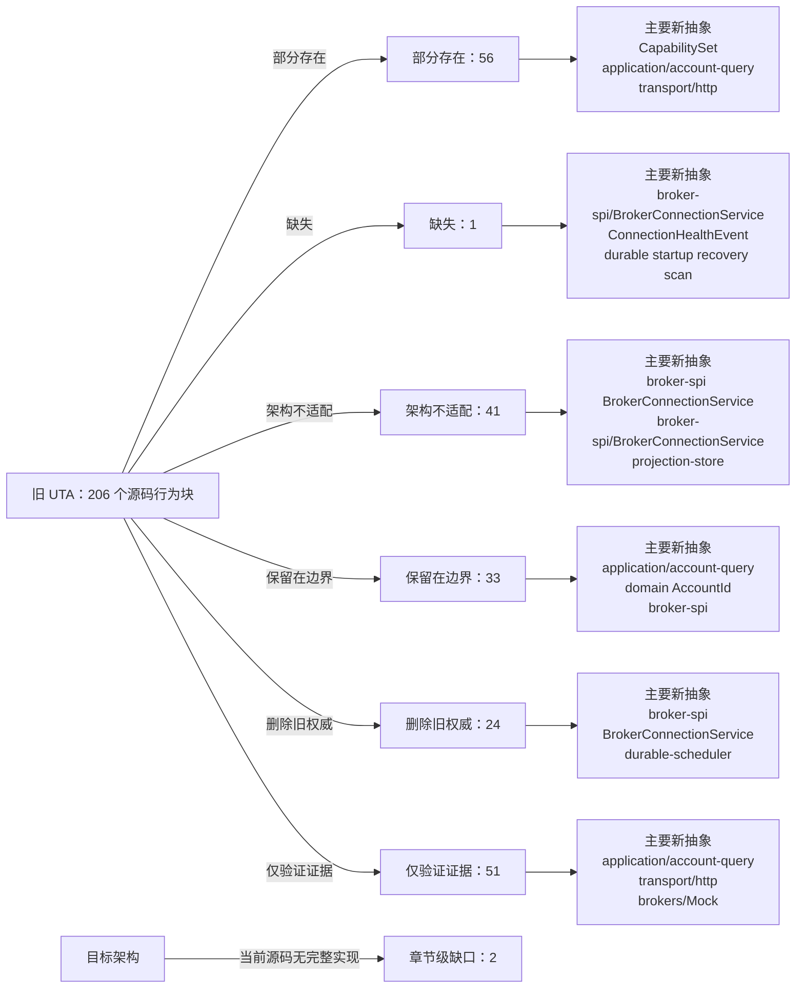

<!-- Auto-generated by scripts/uta-effect-runtime-map.mjs from mapping.json. Do not edit by hand. -->
<!-- Regenerate with `node scripts/uta-effect-runtime-map.mjs`. -->

# UTA 功能替代关系：第 2 章 System boundary

目标架构原文：[`docs/uta-effect-runtime-architecture.md:39-114`](../uta-effect-runtime-architecture.md#L39-L114)。

## 结论

部分存在 56；缺失 1；架构不适配 41；保留在边界 33；删除旧权威 24；仅验证证据 51。状态只描述当前实现相对于目标架构的关系，不表示迁移已经落地。

## 替代关系图

## 章节级目标缺口

| 依据 | 目标义务 | 当前缺口 | 必须补充或调整 |
|---|---|---|---|
| docs/uta-effect-runtime-architecture.md:89-105; src/webui/plugin.ts:226-256; src/webui/routes/trading-proxy.ts:1-12; src/webui/routes/trading-config.ts:80-337; src/tool/trading.ts:1-15,184-211,633-809; src/server/cli-commands.ts:241-296; src/services/connector-client/uta-review.ts:19-46,73-120,150-218; src/services/connector-client/action-bridge.ts:23-113 | Alice/UTA process and authority boundary | These Alice-owned UI, CLI, native-agent, approval, proxy, and connector entry points are outside the UTA coverage denominator. The current trading-config path also writes accounts.json, restarts Guardian, and invokes UTA lifecycle operations from Alice, so the exact ownership cut is not represented by UTA-only rows. | Keep user/session/workspace authentication, presentation, and correlation in Alice; move account/broker lifecycle, compilation, approval state, execution, durable scheduling, reconciliation, and compensation authority into UTA. Define a typed authenticated BFF protocol across the process boundary. |
| docs/uta-effect-runtime-architecture.md:98-105 | Durable reconciliation and compensation ownership | Current order-sync and snapshot workers plus the FX service are mapped, but no current source implements a durable compensation worker owned by UTA. | Add journal-backed reconciliation and compensation workers under durable-scheduler; recovery and compensation decisions remain transaction-kernel authority. |

## 源码映射

| 映射 ID | 当前源码 | 符号或行为块 | 当前功能 | 替代状态 | 新 UTA 抽象与做法 | 不适配位置与原因 | 必须补充或调整 | 重复索引 |
|---|---|---|---|---|---|---|---|---|
| `MAP-CC2177368A` | [`packages/uta-protocol/src/brokers/preset-catalog.ts:1-14`](../../packages/uta-protocol/src/brokers/preset-catalog.ts#L1-L14) | broker preset catalog setup | Declares the catalog as the single source for wizard account types, imports Zod for per-preset validation, and imports node crypto for deterministic/random UTA id helpers. | 部分存在 | 2. System boundary；3.7 brokers/<broker>/；3.9 transport/ and protocol/；7.1 Embedded database；9.1 Connection Layer；14. Public protocol；15. Security and authority；19. Architectural prohibitions protocol/config schemas；application/；broker-spi/；brokers/<broker>/；BrokerConnectionService Treat the catalog as configuration/presentation input only; validate each broker connection with named schemas and let UTA-owned adapter Layers consume sealed configuration. | A shared package owns wizard configuration and identity minting, but this setup does not separate Alice presentation from UTA credential authority or broker-spi capability/connection ownership. | Split config/presentation declarations from runtime broker adapters, define explicit config codecs and secret references, and ensure catalog identity helpers cannot become execution or persistence authority. | **DUP-026** |
| `MAP-9F3FB86CB7` | [`packages/uta-protocol/src/brokers/preset-catalog.ts:20-23`](../../packages/uta-protocol/src/brokers/preset-catalog.ts#L20-L23) | ModeOption | Defines a UI mode id/label pair as arbitrary strings. | 保留在边界 | 2.1 Alice owns；3.9 transport/ and protocol/；14. Public protocol；15. Security and authority protocol/config presentation schema；application/ Retain mode labels as Alice-owned presentation metadata, while UTA validates the corresponding broker environment as a typed config variant. | The UI option intentionally does not encode broker capability, account jurisdiction, or execution policy and must not be consumed as a kernel mode or security decision. | Keep it outside domain/transaction-kernel and ensure mode ids are validated by the broker-specific config schema before adapter construction. | **DUP-028** |
| `MAP-67CE26F92B` | [`packages/uta-protocol/src/brokers/preset-catalog.ts:25-35`](../../packages/uta-protocol/src/brokers/preset-catalog.ts#L25-L35) | SubtitleSegment | Defines optional label/falseLabel/prefix presentation directives keyed by an arbitrary presetConfig field path. | 保留在边界 | 2.1 Alice owns；3.9 transport/ and protocol/；14. Public protocol；15. Security and authority Alice UI presentation projection；protocol/config presentation schema Keep account-card subtitle layout as Alice/UI presentation data only; never use field paths or truthiness to derive capability, authorization, or broker identity. | This is UI metadata, not a trading/runtime abstraction; arbitrary field paths and truthiness would be unsafe if allowed to cross into domain or security decisions. | Keep SubtitleSegment in a presentation-only module and exclude it from transaction, broker-spi, and persistence schemas. | **DUP-029** |
| `MAP-601F6E2834` | [`packages/uta-protocol/src/brokers/preset-catalog.ts:37-98`](../../packages/uta-protocol/src/brokers/preset-catalog.ts#L37-L98) | BrokerPresetDef | Defines preset metadata, Zod config schema, optional modes/subtitle/write-only fields, string fingerprint fields, a `toEngineConfig` function returning Record<string, unknown>, and optional isPaper callback accepting Record<string, unknown>. | 部分存在 | 2.1 Alice owns；2.2 UTA owns；3.7 brokers/<broker>/；3.9 transport/ and protocol/；7.1 Embedded database；9.1 Connection Layer；9.4 Capability derivation；14. Public protocol；15. Security and authority；17. Migration sequence；19. Architectural prohibitions protocol/config schemas；BrokerConnectionService；BrokerActionTypeMap；CapabilitySet；brokers/<broker>/；application/ Use BrokerPresetDef only to describe presentation/config entry points, then parse into broker-specific typed connection config and secret references before constructing scoped adapter Layers. | The schema itself is generic ZodType, engine translation and paper detection use raw Record<string, unknown>, fingerprints are string field names, and no action capability/connection/jurisdiction contract is attached. | Introduce broker-specific config ADTs/codecs, remove raw Record-based runtime handoff, separate secret storage from public metadata, and derive capabilities through broker-spi ActionContext rather than preset metadata. | **DUP-030** |
| `MAP-9A17C2A8CC` | [`packages/uta-protocol/src/brokers/preset-catalog.ts:497-522`](../../packages/uta-protocol/src/brokers/preset-catalog.ts#L497-L522) | BROKER_PRESET_CATALOG | Exports an ordered array of all broker preset definitions for wizard rendering, grouped as recommended/crypto/testing and including the simulator and custom CCXT escape hatch. | 保留在边界 | 2.1 Alice owns；3.7 brokers/<broker>/；3.9 transport/ and protocol/；9.4 Capability derivation；14. Public protocol；15. Security and authority；17. Migration sequence；19. Architectural prohibitions；20. First falsifier Alice UI presentation projection；application/；broker-spi/；brokers/<broker>/；CapabilitySet Keep the ordered catalog for Alice's account-picker presentation, but runtime broker registration/capabilities must come from typed broker-spi adapters and the durable kernel, not this array. | The catalog is a UI registry and does not prove adapter capability, connection health, transaction durability, or recovery; custom/permissive/simulator entries must not become generic runtime fallback. | Mark the catalog presentation-only, separate it from adapter composition, and gate each selectable preset through a validated config and typed capability/connection service. | **DUP-043** |
| `MAP-4E1058C577` | [`packages/uta-protocol/src/brokers/preset-catalog.ts:557-580`](../../packages/uta-protocol/src/brokers/preset-catalog.ts#L557-L580) | deriveUtaId | Filters arbitrary presetConfig fields named by fingerprintFields, fills missing values with null, canonicalizes them, hashes preset id plus JSON to eight hex characters, and returns `${preset.id}-${hash}`. | 部分存在 | 2.2 UTA owns；3.1 domain/；3.4 journal-store/；3.7 brokers/<broker>/；5.7 Complete type contract — nominal identities and financial values；7.1 Embedded database；9.1 Connection Layer；11. Approval and Git audit projection；14. Public protocol；15. Security and authority；17.6 Slice 6: delete the legacy kernel；19. Architectural prohibitions AccountId；ConnectionId；InstrumentId；journal-store/；BrokerConnectionIdentity；protocol/config schemas Introduce typed, durable AccountId/ConnectionId construction from validated broker identity context; retain old ids only as explicit migration compatibility projections. | The current identity is an unbranded 32-bit string hash over generic fields (including secret-derived values for some presets), has no collision/identity evidence in the domain type, and couples account identity to UI preset ids. | Define nominal identity constructors and migration mapping, separate credential storage from identity metadata, persist identity/context in journal/config schemas, and stop using derived strings as transaction identity. | **DUP-047** |
| `MAP-21AAC99E0D` | [`packages/uta-protocol/src/brokers/presets.ts:1-16`](../../packages/uta-protocol/src/brokers/presets.ts#L1-L16) | broker preset serialization setup | Documents conversion of BrokerPresetDef Zod schemas to JSON Schema for the frontend and imports Zod plus catalog types. | 部分存在 | 2.1 Alice owns；3.9 transport/ and protocol/；7.1 Embedded database；14. Public protocol；15. Security and authority；19. Architectural prohibitions Alice UI presentation projection；protocol/config schemas；application/ Keep JSON Schema generation only for Alice's form presentation and pair it with UTA-owned named config codecs; do not treat generated form JSON as runtime domain/protocol schema. | The same shared package presents frontend JSON Schema as if it were the request/response contract, but the target separates presentation metadata from transport/persistence schemas and secret authority. | Separate presentation serialization from protocol codecs, ensure write-only/secret fields never become runtime payloads, and export named request/response/config schemas independently. | **DUP-049** |
| `MAP-F8525C7A99` | [`packages/uta-protocol/src/brokers/presets.ts:18-32`](../../packages/uta-protocol/src/brokers/presets.ts#L18-L32) | SerializedBrokerPreset | Defines the frontend serialized preset with metadata, engine/guard string unions, optional modes, subtitle fields, and `schema: Record<string, unknown>`. | 部分存在 | 2.1 Alice owns；3.7 brokers/<broker>/；3.9 transport/ and protocol/；7.1 Embedded database；9.4 Capability derivation；14. Public protocol；15. Security and authority；19. Architectural prohibitions Alice UI presentation projection；protocol/config schemas；BrokerConnectionService；CapabilitySet Retain as an explicitly presentation-only DTO, while runtime config/capability contracts use named schemas and typed adapter services. | The raw JSON Schema record and optional metadata are not a decoded connection config or capability ADT, and the public shape can be mistaken for broker runtime support. | Move SerializedBrokerPreset to a presentation module, replace raw runtime use with named config schemas, and prevent engine/guard metadata from authorizing actions. | **DUP-050** |
| `MAP-1D576100CB` | [`packages/uta-protocol/src/brokers/presets.ts:56-72`](../../packages/uta-protocol/src/brokers/presets.ts#L56-L72) | BUILTIN_BROKER_PRESETS | Maps every catalog definition into a serialized frontend array, copying metadata and generated raw schema. | 保留在边界 | 2.1 Alice owns；3.7 brokers/<broker>/；3.9 transport/ and protocol/；9.4 Capability derivation；14. Public protocol；15. Security and authority；17. Migration sequence；19. Architectural prohibitions；20. First falsifier Alice UI presentation projection；application/；broker-spi/；CapabilitySet；MockBroker Keep this array for the account-picker UI only; runtime adapter registration, capability derivation, transaction execution, and MockBroker recovery must be independent typed services. | The serialized catalog is presentation metadata and therefore outside the new kernel, but its engine/schema fields cannot prove broker capability or durable execution and its raw schemas are not enough for transport validation. | Mark it non-authoritative, prevent callers from using it as a broker registry, and route selected presets through validated config plus BrokerConnectionService/CapabilitySet. | **DUP-052** |
| `MAP-41D1B056C8` | [`packages/uta-protocol/src/brokers/search-rules.ts:1-14`](../../packages/uta-protocol/src/brokers/search-rules.ts#L1-L14) | contract search heuristic boundary and AssetClassHint | Documents a deliberate heuristic bridge from data-vendor symbols to broker tickers and defines AssetClassHint as a five-member string union. | 保留在边界 | 2.1 Alice owns；3.1 domain/；3.9 transport/ and protocol/；9.4 Capability derivation；10.2 Market and jurisdiction owns；14. Public protocol；19. Architectural prohibitions application/account-query service；market-and-accounting/；broker-spi/；protocol/ search schema Keep vendor-to-broker search normalization at the application query boundary only; return normalized instrument identity and broker-observed metadata before any action can be prepared. | The heuristic is not a domain identity or capability proof and must not be imported by transaction-kernel/domain code; AssetClassHint is not a branded instrument/market observation. | Move/label the helper as an application search adapter, parse its input with a named query schema, and require broker/venue resolution before using a result in a TradeAction. | **DUP-053** |
| `MAP-139EBB287C` | [`packages/uta-protocol/src/client/UTAClient.ts:1-11`](../../packages/uta-protocol/src/client/UTAClient.ts#L1-L11) | UTA client transport contract documentation | Describes a low-level HTTP helper with higher-level adapters layered elsewhere and explicitly says errors are normalized to JavaScript Errors; endpoint validation and WireBrokerError round-trip are future work. | 架构不适配 | 2.1 Alice owns；3.9 transport/ and protocol/；4. Effect model；9.2 Typed action interpreter；12.3 Defects and expected failures；14. Public protocol；15. Security and authority；19. Architectural prohibitions transport/http；protocol/；application/；TransactionFailure；QueryFailure Make the client SDK a typed proxy for the transaction-oriented public routes, decoding named success/failure schemas and preserving correlation/authorization context. | The module explicitly documents unvalidated endpoints and Error-based failures, contrary to the target requirement that every request/response use shared runtime schemas and typed expected failures. | Replace the generic low-level public contract with route-specific typed methods/codecs and typed failure mapping; keep any raw HTTP primitive private to transport/http. | **DUP-056** |
| `MAP-A4FE5AF865` | [`packages/uta-protocol/src/client/UTAClient.ts:13-20`](../../packages/uta-protocol/src/client/UTAClient.ts#L13-L20) | UTAClientOptions | Accepts a base URL, optional fetch override, and optional timeout in milliseconds with a default of 15 seconds. | 部分存在 | 2.1 Alice owns；3.2 effect-runtime/；3.9 transport/ and protocol/；4. Effect model；12.1 Startup sequence；14. Public protocol；15. Security and authority transport/http；effect-runtime/；protocol/；transport principal authentication；transaction authorizer actor/policy/capability Retain base URL/clock configuration at the transport boundary, but add the authenticated typed proxy and explicit cancellation/timeout failure mapping required by protocol routes. | The options contain no transport-principal authentication context or route schema configuration. Timeout is a local abort setting with no typed transport/QueryFailure mapping, and transaction actor/policy/capability authorization is not modeled as a separate application/kernel input. | Compose authenticated transport and route-specific codecs; map administrative-read timeout/abort to typed transport or QueryFailure variants. Separately pass actor, policy, and capability context to prepare/approve; reserve RemoteOutcome.Unknown for ambiguous durable broker dispatch. | **DUP-057** |
| `MAP-A458F81B6D` | [`packages/uta-protocol/src/client/UTAClient.ts:22-29`](../../packages/uta-protocol/src/client/UTAClient.ts#L22-L29) | UTAClient generic methods | Exposes arbitrary `request<T>` plus generic get/post/put/delete wrappers, all defaulting T to unknown and accepting raw method/path/body/query values. | 架构不适配 | 2.1 Alice owns；3.9 transport/ and protocol/；5.7 Complete type contract — public protocol envelopes；9.2 Typed action interpreter；14. Public protocol；15. Security and authority；19. Architectural prohibitions transport/http；protocol/；application/；PrepareTransactionResponse；GetTransactionResponse Expose typed methods for POST/PUT/GET transaction routes, capabilities, account state, events, and recovery, each paired with named request/response/failure schemas. | Any caller can send an arbitrary path/method and receive an unchecked unknown, so the client does not enforce the listed public routes or prevent broker-native payloads from entering generic endpoints. | Delete the generic public methods or make the raw primitive private; migrate every caller to route-specific typed proxy methods and exhaustive response decoding. | **DUP-058** |
| `MAP-22C9C06082` | [`packages/uta-protocol/src/client/UTAClient.ts:48-61`](../../packages/uta-protocol/src/client/UTAClient.ts#L48-L61) | createUTAClient initialization and buildUrl | Normalizes a trailing slash, selects global/override fetch, defaults timeout, and constructs URLs from arbitrary paths and query entries by String conversion. | 部分存在 | 2.1 Alice owns；3.2 effect-runtime/；3.9 transport/ and protocol/；4. Effect model；8.1 Admission；14. Public protocol；15. Security and authority；19. Architectural prohibitions transport/http；effect-runtime/；protocol/；application/ Keep URL construction as a private transport helper, but bind it to the closed route table, authenticated transport layer, and typed query encoders. | Arbitrary path/query construction permits calls outside the public route contract and silently stringifies unvalidated values; auth and correlation handling are absent here. | Hide buildUrl behind route-specific client methods, validate/encode query parameters from named schemas, and compose transport authentication/correlation explicitly. | **DUP-061** |
| `MAP-C959380106` | [`packages/uta-protocol/src/types/broker.ts:264-294`](../../packages/uta-protocol/src/types/broker.ts#L264-L294) | SubAccountRef | Represents an in-broker wallet/compartment with string id/label and a spot/derivatives/unified kind, while documenting implicit default behavior for single-wallet brokers. | 部分存在 | 2.2 UTA owns；3.6 broker-spi/；9.1 Connection Layer；9.4 Capability derivation；10.2 Market and jurisdiction owns；14. Public protocol；15. Security and authority BrokerConnectionIdentity；ActionContext；CapabilitySet；application/account-query service；domain/AccountId Retain sub-account as an explicit account/connection context in broker-spi and capability derivation, with branded identity and per-write target requirements. | The current taxonomy captures separate wallets but uses interchangeable strings and documents implicit/ignored selectors rather than making write ambiguity impossible in the action type. | Define branded ConnectionId/AccountId/SubAccountId context, make target selection mandatory for multi-compartment writes, and derive availability from the full ActionContext. | **DUP-084** |
| `MAP-25118F5AFA` | [`packages/uta-protocol/src/types/broker.ts:475-498`](../../packages/uta-protocol/src/types/broker.ts#L475-L498) | IBroker lifecycle methods | The generic IBroker interface exposes id/label/brokerEngine/meta, Promise-based init/close, and an optional callback listener for connection state. | 删除旧权威 | 2.2 UTA owns；3.2 effect-runtime/；3.6 broker-spi/；4. Effect model；9.1 Connection Layer；12.1 Startup sequence；15. Security and authority；17.6 Slice 6: delete the legacy kernel；19. Architectural prohibitions BrokerConnectionService；effect-runtime/；Scope；Layer；ConnectionHealthEvent Replace lifecycle callbacks with a scoped BrokerConnectionService supplied by an Effect Layer; keep connection identity/health inside broker-spi and adapter scope, not transaction state. | Promise<void>, optional listeners, and a generic metadata bag cannot express Effect requirements/failures, Scope ownership, supervision, or typed health streams. | Delete this lifecycle portion of IBroker as adapters migrate, implement BrokerConnectionService/Layers, and expose typed connection/capability failures to the scheduler and application. | **DUP-096** |
| `MAP-40929B6DB6` | [`packages/uta-protocol/src/types/broker.ts:611-620`](../../packages/uta-protocol/src/types/broker.ts#L611-L620) | IBroker native identity methods | Uses string getNativeKey and resolveNativeKey around broker-native Contract values for Alice's `aliceId` convention. | 删除旧权威 | 2.3 Brokers own；3.1 domain/；3.7 brokers/<broker>/；3.9 transport/ and protocol/；5.7 Complete type contract — nominal identities and financial values；9.2 Typed action interpreter；10.2 Market and jurisdiction owns；14. Public protocol；17.6 Slice 6: delete the legacy kernel；19. Architectural prohibitions InstrumentId；BrokerOrderId；AccountId；broker-spi/；brokers/<broker>/；protocol/ Keep native-key resolution inside each broker adapter and expose only branded InstrumentId/BrokerOrderId/AccountId values in domain and protocol types. | Identity is an arbitrary string convention attached to an optional SDK augmentation; no nominal identity type or broker/account/venue context is enforced. | Introduce domain identity constructors/codecs, migrate aliceId consumers to InstrumentId and related branded IDs, and remove the generic methods from IBroker. | **DUP-103** |
| `MAP-A27D9FADF9` | [`packages/uta-protocol/src/types/contract-ext.ts:1-31`](../../packages/uta-protocol/src/types/contract-ext.ts#L1-L31) | IBKR Contract aliceId declaration augmentation | Imports @traderalice/ibkr and globally adds optional `aliceId?: string` to its Contract interface, documenting broker-specific native keys and `stampAliceId` construction. | 删除旧权威 | 2.3 Brokers own；3.1 domain/；3.7 brokers/<broker>/；3.9 transport/ and protocol/；5.7 Complete type contract — nominal identities and financial values；9.2 Typed action interpreter；10.2 Market and jurisdiction owns；14. Public protocol；17.6 Slice 6: delete the legacy kernel；19. Architectural prohibitions InstrumentId；BrokerOrderId；brokers/<broker>/；broker-spi/；domain/；protocol/ Keep each broker's native key and SDK augmentation inside its adapter, then construct branded InstrumentId and other domain identities at the adapter boundary. | A shared optional field mutates a broker SDK type and treats a string concatenation convention as system identity; consumers can observe a partial/native identity with no schema or domain brand. | Remove the public declaration merge and side-effect import, add explicit identity constructors/codecs in domain/broker-spi, and migrate all aliceId consumers before deleting the compatibility field. | **DUP-104** |
| `MAP-75E0ED8B2B` | [`packages/uta-protocol/src/types/manager.ts:12-19`](../../packages/uta-protocol/src/types/manager.ts#L12-L19) | UTASummary | Summarizes a UTA id/label, an asVendor boolean, AccountCapabilities, and BrokerHealthInfo. | 部分存在 | 2.2 UTA owns；3.8 projection-store/；6. State tiers and snapshots；9.4 Capability derivation；13. Observability；14. Public protocol；15. Security and authority application/capability service；projection-store/；CapabilitySet；BrokerConnectionService；ConnectionHealthEvent；protocol/ account summary schema Expose a typed account/capability query projection with branded account/connection identity, capability ADTs, and health/reach evidence derived by UTA. | The summary concept is a query projection, but id/label are raw strings, capabilities are static string arrays, health is a mutable summary with raw error text, and asVendor does not express target authority/context. | Replace with an account query/capability response schema backed by projection-store and BrokerConnectionService, retaining presentation labels only at the UI boundary. | **DUP-137** |
| `MAP-38469CADA4` | [`services/uta/src/__tests__/trading-tools.spec.ts:1-15`](../../services/uta/src/__tests__/trading-tools.spec.ts#L1-L15) | trading-tools test boundary imports | Imports createTradingTools, UTAManager, UnifiedTradingAccount, MockBroker, IBKR Order/OpenOrder values, and contract extensions; the comments explicitly place this spec at Alice's tool boundary over co-located UTA broker/domain stubs. | 仅验证证据 | §2 System boundary；§3 Module graph and allowed dependencies；§3.9 transport/ and protocol/；§9 Broker service-provider interface；§18 Verification contract transport/http；protocol (@traderalice/uta-protocol)；application/account-query；broker-spi；brokers/Mock；verification fixtures Retain the fixture as integration evidence, but migrate the exercised seam to a typed UTA client/protocol request and response through transport/http; keep MockBroker behind broker-spi and keep broker-native values confined to adapter-side test fixtures. | — | — | **DUP-141** |
| `MAP-3FABE05A73` | [`services/uta/src/__tests__/trading-tools.spec.ts:17-24`](../../services/uta/src/__tests__/trading-tools.spec.ts#L17-L24) | makeUta / makeManager | Constructs one UnifiedTradingAccount for each MockBroker and registers each account in a UTAManager, giving tool tests an in-process multi-account manager. | 仅验证证据 | §2 System boundary；§3 Module graph and allowed dependencies；§9.1 Connection Layer；§17 Migration sequence；§18.1 Kernel crash matrix main composition root；effect-runtime；brokers/Mock；broker-spi/BrokerConnectionService；application/account-query；verification fixtures Use the helper only as current-path evidence; the target fixture should compose a scoped MockBroker Layer and application/account-query service from the composition root, with account lifecycle owned by UTA rather than by an in-process legacy manager helper. | — | — | **DUP-142** |
| `MAP-4AFBEA2B00` | [`services/uta/src/__tests__/trading-tools.spec.ts:27-36`](../../services/uta/src/__tests__/trading-tools.spec.ts#L27-L36) | asSDK | Casts an in-process UTAManager to UTAManagerSDK because the tool accepts an HTTP-adapter-shaped interface; the comments document that getFxRates is absent and silently falls through to empty rates. | 仅验证证据 | §2 System boundary；§3.9 transport/ and protocol/；§4 Effect model；§14 Public protocol；§19 Architectural prohibitions typed UTA client/proxy；transport/http；protocol (@traderalice/uta-protocol)；application/account-query；application/capability Replace the structural cast and missing-method fallback fixture with a typed client/protocol adapter. Tests should decode named requests and responses and represent unavailable FX/capability data explicitly instead of relying on a method superset and empty fallback. | — | — | **DUP-143** |
| `MAP-468691D82C` | [`services/uta/src/__tests__/trading-tools.spec.ts:40-65`](../../services/uta/src/__tests__/trading-tools.spec.ts#L40-L65) | UTAManager.resolve | Checks account-source resolution semantics: no source returns every registered UTA, an exact source returns one matching account, and an unknown source returns an empty array. | 仅验证证据 | §2 System boundary；§3.8 projection-store/；§3.9 transport/ and protocol/；§14 Public protocol；§15 Security and authority；§18 Verification contract application/account-query；domain identifiers；projection-store；protocol account-state schema；transport/http Map source selection to a typed account-query operation over authorized AccountId values and named account-state responses; retain the all-versus-exact filtering evidence while checking that account visibility is enforced at the application/transport boundary. | — | — | **DUP-144** |
| `MAP-A88187B75A` | [`services/uta/src/__tests__/trading-tools.spec.ts:69-87`](../../services/uta/src/__tests__/trading-tools.spec.ts#L69-L87) | UTAManager.resolveOne | Returns the sole UTA for an exact source and throws a string-bearing error when no UTA matches the requested source. | 仅验证证据 | §2 System boundary；§3.9 transport/ and protocol/；§4 Effect model；§14 Public protocol；§15 Security and authority；§18 Verification contract application/account-query；domain identifiers；protocol error schema；transport/http Map failed account resolution to a named application/protocol error variant at the boundary, preserving exact identity routing without making a thrown message the public error contract. | — | — | **DUP-145** |
| `MAP-8588C24A12` | [`services/uta/src/__tests__/trading-tools.spec.ts:91-99`](../../services/uta/src/__tests__/trading-tools.spec.ts#L91-L99) | createTradingTools.listUTAs | Calls the tool layer with no arguments and verifies that it returns an array of summaries containing the registered account identifier. | 仅验证证据 | §2.1 Alice owns；§3.8 projection-store/；§3.9 transport/ and protocol/；§6 State tiers and snapshots；§13 Observability；§14 Public protocol；§15 Security and authority application/account-query；projection-store；protocol account-state schema；transport/http Treat this as read-only account projection evidence. The target query should return a named account/capability summary with reachability state and no credentials or native adapter object, verified through the public schema. | — | — | **DUP-146** |
| `MAP-0B6606BE1C` | [`services/uta/src/__tests__/trading-tools.spec.ts:103-119`](../../services/uta/src/__tests__/trading-tools.spec.ts#L103-L119) | createTradingTools.searchContracts | Spies on two separate MockBroker instances and verifies that searchContracts aggregates one matching contract description from each registered UTA. | 仅验证证据 | §2 System boundary；§3.8 projection-store/；§3.9 transport/ and protocol/；§9.2 Typed action interpreter；§10 Accounting and market boundaries；§18 Verification contract application/account-query；broker-spi/BrokerActionInterpreter；brokers/Mock；market-and-accounting；protocol contract-query schema Map the aggregation to a typed account/instrument query that normalizes broker observations behind broker-spi and returns a named contract projection; retain multi-account aggregation as verification evidence without exposing broker SDK descriptions publicly. | — | — | **DUP-147** |
| `MAP-EBC1DF5535` | [`services/uta/src/__tests__/trading-tools.spec.ts:137-167`](../../services/uta/src/__tests__/trading-tools.spec.ts#L137-L167) | getOrders.compactSummaries | Executes a staged and pushed market order, then checks that getOrders returns compact fields such as source, action, orderType, quantity, and status while excluding raw IBKR fields. | 仅验证证据 | §2 System boundary；§3.8 projection-store/；§3.9 transport/ and protocol/；§5 Transaction algebra；§6 State tiers and snapshots；§9.2 Typed action interpreter；§13 Observability；§14 Public protocol；§15 Security and authority application/account-query；projection-store/orders；protocol order schema；broker-spi/BrokerActionInterpreter；brokers/Mock Use this as read-projection boundary evidence: the target orders query should encode normalized named fields, omit broker-native SDK fields, and read from rebuildable projection state after journaled execution; the fixture itself does not prove durable dispatch. | — | — | **DUP-149** |
| `MAP-CA93BD9449` | [`services/uta/src/__tests__/trading-tools.spec.ts:244-270`](../../services/uta/src/__tests__/trading-tools.spec.ts#L244-L270) | getOrders.groupByContract | Mocks three pending orders across AAPL and ETH and verifies that groupBy contract returns an object keyed by each Alice contract identifier with the expected order clusters. | 仅验证证据 | §2 System boundary；§3.8 projection-store/；§6 State tiers and snapshots；§8.2 Partitioning；§14 Public protocol；§18.2 Concurrency scenarios projection-store/orders；application/account-query；domain InstrumentId and ConflictKey；protocol grouped-order schema Represent grouped results as a named read projection keyed by broker-neutral InstrumentId/contract identity. If grouping feeds scheduling, derive explicit ConflictKey values; do not make an untyped object the transaction or queue authority. | — | — | **DUP-154** |
| `MAP-DF17C576FF` | [`services/uta/src/__tests__/trading-tools.spec.ts:274-289`](../../services/uta/src/__tests__/trading-tools.spec.ts#L274-L289) | createTradingTools.getQuote.resolution | Resolves mock-paper\|AAPL through the UTA, spies on broker.getQuote, verifies that the broker receives a native contract with populated symbol/localSymbol and the original Alice identifier, and checks the quote source. | 仅验证证据 | §2 System boundary；§3.7 brokers/<broker>/；§3.9 transport/ and protocol/；§9.2 Typed action interpreter；§14 Public protocol；§15 Security and authority transport/http；protocol quote schema；application/account-query；broker-spi/BrokerActionInterpreter；brokers/Mock Resolve the typed account/instrument identity in application services, pass a broker-neutral action/query to broker-spi, and encode a named quote response; keep native contract expansion confined to the broker interpreter boundary. | — | — | **DUP-155** |
| `MAP-560B7EEA32` | [`services/uta/src/__tests__/trading-tools.spec.ts:291-296`](../../services/uta/src/__tests__/trading-tools.spec.ts#L291-L296) | createTradingTools.getQuote.malformedAliceId | Invokes getQuote with an identifier lacking the expected separator and verifies that the result contains an Invalid aliceId error. | 仅验证证据 | §2 System boundary；§3.9 transport/ and protocol/；§4 Effect model；§14 Public protocol；§15 Security and authority；§18 Verification contract protocol codecs；domain identifiers；application/account-query；transport/http；typed error schema Decode a structured account/instrument identifier with a named schema before any broker call and return a typed malformed-input/protocol error; retain this assertion as boundary-rejection evidence rather than a regex error contract. | — | — | **DUP-156** |
| `MAP-CEE9B91D31` | [`services/uta/src/__tests__/trading-tools.spec.ts:298-310`](../../services/uta/src/__tests__/trading-tools.spec.ts#L298-L310) | createTradingTools.getQuote.sourceRouting | Registers Alpaca and Bybit accounts, calls getQuote with bybit-main\|BTC and no explicit source, and verifies only the Bybit broker receives the request. | 仅验证证据 | §2 System boundary；§3.7 brokers/<broker>/；§3.9 transport/ and protocol/；§9.1 Connection Layer；§9.2 Typed action interpreter；§14 Public protocol；§15 Security and authority application/account-query；domain AccountId/InstrumentId；broker-spi/BrokerConnectionService；broker-spi/BrokerActionInterpreter；protocol quote schema Use authenticated, typed account identity to select exactly one broker connection and interpreter before dispatching a read action; preserve the no-cross-account-routing invariant at the application and protocol boundary. | — | — | **DUP-157** |
| `MAP-08E9053B72` | [`services/uta/src/__tests__/trading-tools.spec.ts:314-329`](../../services/uta/src/__tests__/trading-tools.spec.ts#L314-L329) | createTradingTools.getContractDetails.expansion | Calls getContractDetails with a source and Alice identifier, spies on the broker, and verifies that the broker receives an expanded native query retaining the original identifier. | 仅验证证据 | §2 System boundary；§3.7 brokers/<broker>/；§3.9 transport/ and protocol/；§9.2 Typed action interpreter；§10 Accounting and market boundaries；§14 Public protocol；§15 Security and authority application/account-query；market-and-accounting；broker-spi/BrokerActionInterpreter；protocol contract schema；brokers/Mock Map contract details through typed market/account services and broker-spi, expanding broker-native instrument fields only inside the adapter; return normalized contract data through the public schema. | — | — | **DUP-158** |
| `MAP-E66037B98B` | [`services/uta/src/__tests__/trading-tools.spec.ts:331-340`](../../services/uta/src/__tests__/trading-tools.spec.ts#L331-L340) | createTradingTools.getContractDetails.crossUTA | Passes an Alice identifier belonging to another account while selecting mock-paper and verifies that the tool reports the account mismatch without a broker call assertion. | 仅验证证据 | §2 System boundary；§3.9 transport/ and protocol/；§4 Effect model；§14 Public protocol；§15 Security and authority；§18 Verification contract application/account-query；domain account identity；protocol error schema；transport/http；broker-spi Enforce account/UTA ownership in the application boundary and return a structured identity/authorization error before invoking any foreign broker interpreter; keep the mismatch test as a security-boundary invariant. | — | — | **DUP-159** |
| `MAP-27AD48107A` | [`services/uta/src/__tests__/trading-tools.spec.ts:344-371`](../../services/uta/src/__tests__/trading-tools.spec.ts#L344-L371) | placeOrder.inputSchema.emptyOptionalNumerics | Uses the placeOrder input schema with empty strings for optional numeric fields and verifies parsing succeeds, empty fields become undefined, and totalQuantity remains the supplied decimal string. | 仅验证证据 | §2 System boundary；§3.9 transport/ and protocol/；§5.7 Complete type contract；§7.1 Embedded database；§14 Public protocol；§15 Security and authority；§18 Verification contract TypeBox agent tool schema；protocol action schema；application/transaction；domain order/action ADTs；transport/http；transaction-kernel Model optional numeric inputs as omitted-or-decimal values at the tool/protocol decode boundary, then compile a typed transaction command; retain empty-string normalization only as client ergonomics and keep authorization/approval in application/transaction-kernel services. | — | — | **DUP-160** |
| `MAP-4DE6045663` | [`services/uta/src/__tests__/trading-tools.spec.ts:373-387`](../../services/uta/src/__tests__/trading-tools.spec.ts#L373-L387) | placeOrder.inputSchema.invalidNumerics | Uses a non-positive totalQuantity and verifies that the placeOrder schema rejects the input before execution. | 仅验证证据 | §2 System boundary；§3.9 transport/ and protocol/；§4 Effect model；§5 Transaction algebra；§14 Public protocol；§15 Security and authority；§18 Verification contract protocol action schema；domain order/action ADTs；application/transaction；transaction-kernel；transport/http；typed validation errors Reject malformed or non-positive order quantities with a named schema/domain failure before prepare or broker dispatch; this test remains evidence for the input gate, not for authorization, durability, or execution semantics. | — | — | **DUP-161** |
| `MAP-5A0732EC10` | [`services/uta/src/domain/trading/__test__/e2e/alpaca-paper.e2e.spec.ts:22-30`](../../services/uta/src/domain/trading/__test__/e2e/alpaca-paper.e2e.spec.ts#L22-L30) | beforeAll Alpaca broker setup | Selects an Alpaca paper account, stores its generic IBroker, queries the market clock, and records a boolean marketOpen guard. | 保留在边界 | 2.3 Brokers own；9.1 Connection Layer；10.2 Market and jurisdiction owns；18.3 Real broker acceptance brokers/alpaca scoped Layer；broker-spi connection/session service；market-and-accounting Keep account selection as paper-test boundary and move connection/session acquisition to the target Alpaca broker-spi Layer. | The fixture observes a coarse account-wide boolean and generic IBroker, not typed venue/instrument session or capability observations. | — | **DUP-162** |
| `MAP-A9C599CFB8` | [`services/uta/src/domain/trading/__test__/e2e/ccxt-bybit.e2e.spec.ts:19-34`](../../services/uta/src/domain/trading/__test__/e2e/ccxt-bybit.e2e.spec.ts#L19-L34) | beforeAll Bybit broker setup | Selects a Bybit CCXT sandbox/demo account, stores its generic IBroker, and skips the suite if unavailable. | 保留在边界 | 2.3 Brokers own；9.1 Connection Layer；9.4 Capability derivation；15 Security and authority；18.3 Real broker acceptance brokers/ccxt/Bybit scoped Layer；broker-spi；effect-runtime Keep paper account selection as a test boundary and migrate broker access to the scoped CCXT/Bybit broker-spi Layer. | The setup provides only generic IBroker availability, not typed connection identity, capability context, or health/degraded state. | — | **DUP-169** |
| `MAP-14606B82FF` | [`services/uta/src/domain/trading/__test__/e2e/ccxt-hyperliquid-markets.e2e.spec.ts:18-38`](../../services/uta/src/domain/trading/__test__/e2e/ccxt-hyperliquid-markets.e2e.spec.ts#L18-L38) | dummy credentials and public Hyperliquid init | Defines dummy wallet/private-key strings, constructs a sandbox Hyperliquid CcxtBroker, initializes it, and captures initialization errors without making private API calls. | 保留在边界 | 2.3 Brokers own；9.1 Connection Layer；15 Security and authority；18.3 Real broker acceptance brokers/ccxt/Hyperliquid connection Layer；broker-spi；test account boundary Retain as a public-market adapter boundary test; use target broker-spi construction and a test-only credential provider that cannot be mistaken for production credential custody. | Dummy literals and direct CcxtBroker construction bypass target composition and do not prove scoped credentials, capability derivation, or durable runtime startup. | — | **DUP-176** |
| `MAP-50F731ABB9` | [`services/uta/src/domain/trading/__test__/e2e/ccxt-hyperliquid.e2e.spec.ts:35-50`](../../services/uta/src/domain/trading/__test__/e2e/ccxt-hyperliquid.e2e.spec.ts#L35-L50) | beforeAll Hyperliquid setup | Selects a configured Hyperliquid sandbox account, stores its generic IBroker, logs connection, and skips all tests if absent. | 保留在边界 | 2.3 Brokers own；9.1 Connection Layer；9.4 Capability derivation；15 Security and authority；18.3 Real broker acceptance brokers/ccxt/Hyperliquid scoped Layer；broker-spi；effect-runtime Keep sandbox account selection at the test boundary, but acquire Hyperliquid through a scoped broker-spi Layer with typed wallet/account capability. | The suite exposes a generic IBroker and has no target connection health/capability or durable runtime state. | — | **DUP-179** |
| `MAP-CCFD876360` | [`services/uta/src/domain/trading/__test__/e2e/ccxt-okx.e2e.spec.ts:43-58`](../../services/uta/src/domain/trading/__test__/e2e/ccxt-okx.e2e.spec.ts#L43-L58) | beforeAll OKX setup and broker narrowing | Selects an OKX CCXT demo account from shared setup, stores its generic IBroker, logs connection, and narrows the nullable value with a local helper. | 保留在边界 | 2.3 Brokers own；9.1 Connection Layer；9.4 Capability derivation；15 Security and authority；18.3 Real broker acceptance brokers/ccxt/OKX scoped Layer；broker-spi connection/capability service；effect-runtime Keep account selection as test boundary and migrate its narrowed broker to a typed OKX broker-spi interpreter/connection service. | The suite exposes a generic IBroker and nullable assertion helper rather than target connection identity, capabilities, or typed degraded availability. | — | **DUP-184** |
| `MAP-D16449202E` | [`services/uta/src/domain/trading/__test__/e2e/ccxt-raw-diagnostic.e2e.spec.ts:15-27`](../../services/uta/src/domain/trading/__test__/e2e/ccxt-raw-diagnostic.e2e.spec.ts#L15-L27) | beforeAll raw exchange setup | Loads a Bybit account, extracts the broker's internal CCXT Exchange through an any cast, and skips the diagnostic suite when no account is configured. | 保留在边界 | 2.3 Brokers own；9.2 Typed action interpreter；15 Security and authority；18.3 Real broker acceptance brokers/ccxt boundary test harness；broker-spi；test account boundary Retain only as an adapter diagnostic boundary; target production tests must access CCXT through the broker-spi interpreter and never expose the SDK instance beyond the adapter. | The internal Exchange extraction is intentionally diagnostic and untyped; it is not a target runtime API or evidence of credential isolation. | — | **DUP-191** |
| `MAP-25C7BC81F2` | [`services/uta/src/domain/trading/__test__/e2e/ibkr-paper.e2e.spec.ts:32-40`](../../services/uta/src/domain/trading/__test__/e2e/ibkr-paper.e2e.spec.ts#L32-L40) | beforeAll IBKR paper setup | Loads the first IBKR test account, snapshots its broker and market-open state, and logs connection status; the test requires a reachable TWS/Gateway supplied by setup. | 保留在边界 | 2.3 Brokers own；9.1 Connection Layer；15 Security and authority；18.3 Real broker acceptance brokers/ibkr scoped Layer；broker-spi connection health；effect-runtime；test account boundary Keep the external TWS/Gateway setup as a paper-account boundary, but have target runtime acquire it via the scoped IBKR Layer and expose typed degraded capabilities. | The fixture bypasses target runtime composition and observes only a boolean market clock; it does not test connection health streams, credential authority, or degraded capability ADTs. | — | **DUP-198** |
| `MAP-3BF311EBD5` | [`services/uta/src/domain/trading/__test__/e2e/setup.ts:18-23`](../../services/uta/src/domain/trading/__test__/e2e/setup.ts#L18-L23) | TestAccount | Defines the test account record as id, label, broker engine, and a generic IBroker instance. | 保留在边界 | 2.3 Brokers own；3.6 broker-spi/；9 Broker service-provider interface；15 Security and authority；18.3 Real broker acceptance broker-spi BrokerConnectionService；broker-spi CapabilitySet；effect-runtime scoped Layer Keep a test-only account selection record, migrating its broker field to target broker-spi connection/capability services when adapters migrate. | The record intentionally exposes the legacy generic IBroker and has no typed connection identity, capability set, health stream, or scoped requirements. | — | **DUP-209** |
| `MAP-C34FFFADB8` | [`services/uta/src/domain/trading/__test__/e2e/setup.ts:27-48`](../../services/uta/src/domain/trading/__test__/e2e/setup.ts#L27-L48) | isPaper and hasCredentials | Filters configured accounts through preset.isPaper and checks engine-specific credential presence; IBKR is treated as reachable through TWS/Gateway without an API key. | 保留在边界 | 2.3 Brokers own；9.1 Connection Layer；9.4 Capability derivation；15 Security and authority；18.3 Real broker acceptance broker-spi connection/capability services；effect-runtime Layer；credential injection boundary Retain paper/sandbox safety at the external test boundary, but source account configuration and credential availability through the target composition/secret boundary and typed broker capability checks. | The helper uses a generic Record cast for presetConfig and treats credential presence as a boolean; it does not prove UTA-only credential custody or typed degraded capabilities. | — | **DUP-210** |
| `MAP-85AF389920` | [`services/uta/src/domain/trading/__test__/e2e/setup.ts:50-58`](../../services/uta/src/domain/trading/__test__/e2e/setup.ts#L50-L58) | isTcpReachable | Attempts a bounded TCP connection to a host/port and resolves true on connect or false on timeout/error, used to skip IBKR when local TWS/Gateway is unavailable. | 保留在边界 | 2 System boundary；9.1 Connection Layer；18.3 Real broker acceptance brokers/ibkr scoped connection Layer；broker-spi ConnectionHealthEvent；effect-runtime supervision Keep as a test preflight or replace it with target connection Layer health; do not use it as the runtime's connection/recovery implementation. | A raw TCP probe does not establish authenticated broker health, capability degradation, reconnect supervision, or scoped resource lifecycle. | — | **DUP-211** |
| `MAP-B4CCE8940E` | [`services/uta/src/domain/trading/__test__/e2e/setup.ts:97-139`](../../services/uta/src/domain/trading/__test__/e2e/setup.ts#L97-L139) | initAll | Reads UTA config, skips non-paper/credentialless/disabled accounts, probes IBKR reachability, creates each broker through the legacy factory, initializes it with a timeout, and returns the surviving broker records. | 保留在边界 | 2 System boundary；3.2 effect-runtime/；3.6 broker-spi/；4 Effect model；9.1 Connection Layer；12.1 Startup sequence；15 Security and authority；17 Migration sequence；18.3 Real broker acceptance main composition root；effect-runtime Layers/Scope；broker-spi connection and capability services；application account service；transaction-kernel startup recovery Use this only to select safe external paper accounts; target main composition must acquire scoped broker Layers, open/verify/recover SQLite before admission, and expose typed degraded capabilities without blocking unrelated accounts. | The helper calls readUTAsConfig/createBroker/IBroker directly and only skips initialization failures; it does not run target journal migrations/invariant checks, recover unfinished work, or establish broker-spi capabilities. | — | **DUP-214** |
| `MAP-FACA90D0FC` | [`services/uta/src/domain/trading/__test__/e2e/uta-alpaca.e2e.spec.ts:23-33`](../../services/uta/src/domain/trading/__test__/e2e/uta-alpaca.e2e.spec.ts#L23-L33) | beforeAll Alpaca UTA setup | Loads the first configured Alpaca paper account, constructs UnifiedTradingAccount around its broker, waits for connection, and snapshots broker.getMarketClock().isOpen for later skips. | 删除旧权威 | 2.2 UTA owns；5.3 Two-phase transaction protocol；9.1 Connection Layer；10.2 Market and jurisdiction owns；17.4 Slice 4: first real broker；18.3 Real broker acceptance effect-runtime；brokers/alpaca connection Layer；broker-spi；application/account-query service；market-and-accounting Replace the global UnifiedTradingAccount setup with the target composition root and scoped Alpaca broker Layer. Expose typed connection health, capabilities, and market/session observations through broker-spi and pass immutable observations into transaction-kernel preparation. | The setup proves only that the legacy broker object connects and that one account-wide boolean clock is readable; it does not create a scoped Layer, typed capability result, durable account identity, or venue/instrument session observation. | Delete UnifiedTradingAccount execution ownership after the Alpaca target path is authoritative; add broker-spi connection/capability services and market-and-accounting session queries consumed by the transaction/application layers. | **DUP-216** |
| `MAP-B164304E0C` | [`services/uta/src/domain/trading/__test__/e2e/uta-alpaca.e2e.spec.ts:87-129`](../../services/uta/src/domain/trading/__test__/e2e/uta-alpaca.e2e.spec.ts#L87-L129) | describe UTA — Alpaca AI tool aliceId resolution | Calls searchContracts, obtains the returned aliceId, then invokes getQuote and getContractDetails through createTradingTools and asserts a quote/spec is returned without an error. | 架构不适配 | 2 System boundary；3.9 transport/ and protocol/；9 Broker service-provider interface；14 Public protocol；15 Security and authority；17.2 Slice 2: transaction and approval protocol transport/http；protocol codecs and schemas；application/account-query service；broker-spi capability/query service Move this scenario to a protocol/transport integration test that decodes named request schemas, authenticates/authorizes, calls application query services, and encodes named response schemas while the broker adapter remains behind broker-spi. | The test invokes tool implementation functions directly, casts the SDK to Function and records, and bypasses transport authentication, protocol decoding/encoding, and an application service boundary. | Define typed query request/response schemas and route search, quote, and contract details through transport/http -> protocol -> application; remove the direct Function/record casts and legacy manager dependency. | **DUP-218** |
| `MAP-42049295D7` | [`services/uta/src/domain/trading/__test__/e2e/uta-bybit.e2e.spec.ts:24-47`](../../services/uta/src/domain/trading/__test__/e2e/uta-bybit.e2e.spec.ts#L24-L47) | beforeAll Bybit UTA setup | Loads a CCXT Bybit account, searches ETH for a CRYPTO_PERP, forms a legacy account-qualified aliceId, constructs UnifiedTradingAccount, waits for connection, and skips if setup is unavailable. | 删除旧权威 | 2.2 UTA owns；5.3 Two-phase transaction protocol；9.1 Connection Layer；9.4 Capability derivation；10.2 Market and jurisdiction owns；17.5 Slice 5: heterogeneous brokers；18.3 Real broker acceptance effect-runtime；brokers/ccxt typed interpreter；broker-spi；application capability service；market-and-accounting Replace the legacy wrapper with a scoped CCXT/Bybit connection Layer and typed capability derivation for the account, wallet/sub-account, venue, and ETH perpetual instrument. | The setup resolves a native key and constructs UnifiedTradingAccount but does not expose a target capability ADT, durable account identity, scoped connection health, or market/jurisdiction observation. | Delete UnifiedTradingAccount setup after migration and route the Bybit adapter through broker-spi and target application/transaction services. | **DUP-221** |
| `MAP-E136AE0A4B` | [`services/uta/src/domain/trading/__test__/e2e/uta-bybit.e2e.spec.ts:133-199`](../../services/uta/src/domain/trading/__test__/e2e/uta-bybit.e2e.spec.ts#L133-L199) | AI tool aliceId resolution clusters | Invokes searchContracts, getQuote, getOrderBook, getFundingRate, and getContractDetails by calling tool execute functions directly; asserts no error, non-empty market data, and a returned contract for a real Bybit aliceId. | 架构不适配 | 2 System boundary；3.9 transport/ and protocol/；9 Broker service-provider interface；14 Public protocol；15 Security and authority；17.2 Slice 2: transaction and approval protocol transport/http；protocol codecs and schemas；application/account-query service；broker-spi market query service Exercise these reads through authenticated protocol/transport requests and named schemas backed by an application capability/query service; keep CCXT SDK details inside the adapter. | The test uses direct tool implementation calls, `Function` and `Record` casts, and a legacy manager; it bypasses transport authentication, request decoding, response encoding, and the target public protocol boundary. | Create typed protocol requests/responses for contract search, quote, order book, funding, and details, then remove direct execute/cast calls from the target evidence. | **DUP-223** |
| `MAP-BA81ADF360` | [`services/uta/src/domain/trading/__test__/e2e/uta-ccxt-bybit.e2e.spec.ts:21-43`](../../services/uta/src/domain/trading/__test__/e2e/uta-ccxt-bybit.e2e.spec.ts#L21-L43) | beforeAll Bybit legacy UTA setup | Loads a Bybit CCXT account, discovers an ETH perpetual, builds an account-qualified aliceId, and constructs and connects UnifiedTradingAccount; tests skip without it. | 删除旧权威 | 2.2 UTA owns；5.3 Two-phase transaction protocol；9.1 Connection Layer；17.5 Slice 5: heterogeneous brokers；18.3 Real broker acceptance effect-runtime；brokers/ccxt/Bybit interpreter；broker-spi；transaction-kernel Use a scoped CCXT/Bybit broker-spi Layer and target application/transaction services instead of constructing UnifiedTradingAccount in the suite. | The fixture binds account connection and execution to the legacy UTA object and does not establish durable runtime services or target capability state. | Delete the legacy fixture after target migration and initialize the target composition root with an account-scoped broker Layer. | **DUP-225** |
| `MAP-61B4CADFAF` | [`services/uta/src/domain/trading/__test__/e2e/uta-ibkr.e2e.spec.ts:22-32`](../../services/uta/src/domain/trading/__test__/e2e/uta-ibkr.e2e.spec.ts#L22-L32) | beforeAll IBKR UTA setup | Loads an IBKR account, constructs UnifiedTradingAccount, waits for connection, and snapshots broker.getMarketClock().isOpen. | 删除旧权威 | 2.2 UTA owns；5.3 Two-phase transaction protocol；9.1 Connection Layer；10.2 Market and jurisdiction owns；17.5 Slice 5: heterogeneous brokers；18.3 Real broker acceptance effect-runtime；brokers/ibkr connection Layer；broker-spi；market-and-accounting；transaction-kernel Replace the legacy setup with a scoped IBKR connection Layer, typed callback/health capability service, and market-session observation consumed by target application and transaction services. | The setup only validates legacy connection and a coarse account-wide clock; it does not expose typed linked-account identity, callback streams, capability derivation, or durable transaction context. | Delete UnifiedTradingAccount ownership after target IBKR migration and initialize the target composition root with broker-spi IBKR services. | **DUP-230** |
| `MAP-0ABCB3F3AD` | [`services/uta/src/domain/trading/brokers/alpaca/AlpacaBroker.ts:151-203`](../../services/uta/src/domain/trading/brokers/alpaca/AlpacaBroker.ts#L151-L203) | init | Validates credential presence, constructs the SDK client, retries getAccount up to five times with exponential setTimeout delays, throws a special auth error after two auth-like message matches, and starts refreshCatalog as an unawaited promise before returning. | 架构不适配 | §4 Effect model；§8.4 Fairness and backpressure；§9.1 Connection Layer；§12.1 Startup sequence；§12.3 Defects and expected failures；§13 Observability；§15 Security and authority；2.2 UTA owns；2.3 Broker adapters own AlpacaConnectionLayer；ConnectionHealthEvent；ConnectionFailure；CapabilityFailure；Scoped Layer Acquire Alpaca through a scoped Effect Layer, report typed health/failure events, and let startup classify unfinished durable work before admission. Reconnect policy may schedule connection acquisition, but it must not be a blind mutation retry; catalog refresh should be a supervised typed job. | The lifecycle is promise-based and class-local, classifies auth by error-message regex, has no health stream/reconnect/shutdown protocol, and detaches catalog work with no durability or supervision. | Implement BrokerConnectionService acquisition, health, reconnect, and shutdown in a scoped Layer; map auth/network/protocol failures to tagged variants and supervise catalog observation separately from transaction dispatch. | **DUP-302** |
| `MAP-CFEE6FFFEA` | [`services/uta/src/domain/trading/brokers/alpaca/AlpacaBroker.ts:273-347`](../../services/uta/src/domain/trading/brokers/alpaca/AlpacaBroker.ts#L273-L347) | placeOrder | Resolves a legacy Contract to a ticker, builds an untyped Alpaca request from mutable Order fields, supports qty or notional, prices, trailing fields, extended hours, and bracket/OTO legs, calls createOrder directly, then returns PlaceOrderResult with the parent/leg IDs or a string error. | 架构不适配 | §1 Thesis and non-negotiable properties；§3.3 transaction-kernel/；§5.3 Two-phase transaction protocol；§5.5 Compensation capability；§5.7 Order and trading action ADTs；§5.7 Dispatch and durable-job records；§9.2 Typed action interpreter；§9.3 Remote outcome；§12.2 Unknown-outcome protocol；§13 Observability；§17 Slice 4: first real broker；§18.3 Real broker acceptance；§19 Architectural prohibitions；§20 First falsifier；2.2 UTA owns；2.3 Broker adapters own PreparedPlaceOrder；AlpacaPlaceOrderRequestSchema；DispatchIdentity；PlaceOrderAcknowledgement；RemoteOutcome<OrderSnapshot>；CompensationCapability；NativeAtomicGroupConfirmed Compile a typed PlaceOrder action and compensation capability during prepare, persist DispatchPlanned with a client/dispatch identity before calling Alpaca, dispatch through the interpreter, and persist Confirmed/Rejected/Unknown outcomes. Map bracket/OTO to a declared native atomic-group capability only when the venue observation proves the group criterion; otherwise track parent and child observations separately. | The method mutates the broker directly without a durable intent barrier, dispatch identity/idempotency key, before-image/precondition, commit criterion, compensation proof, or unknown-outcome observation. It also builds Record<string, unknown> payloads and converts attached prices through parseFloat. | Add Alpaca place-request/ack/observation schemas, clientOrderId/DispatchIdentity compilation, `dispatch` and `observe` SPI methods, typed rejection mapping, and compensation compilation for working orders/native groups. Remove PlaceOrderResult as the execution authority. | **DUP-307** |
| `MAP-A57DA48B5D` | [`services/uta/src/domain/trading/brokers/alpaca/AlpacaBroker.ts:417-441`](../../services/uta/src/domain/trading/brokers/alpaca/AlpacaBroker.ts#L417-L441) | getAccount | Reads account and positions concurrently, sums position unrealized_pl with Decimal, and maps equity/cash/buying power/daytrade count to a legacy AccountInfo; failures are converted through BrokerError.from. | 部分存在 | §6 State tiers and snapshots；§9.2 Typed action interpreter；§9.3 Remote outcome；§10.1 Accounting owns；§10.3 Transaction kernel consumes, but does not own；§12.3 Defects and expected failures；§13 Observability；2.2 UTA owns；2.3 Broker adapters own AccountObservation；Money；BrokerCashBuckets；PositionProjection；AccountingProjection；QueryFailure Decode account and position observations into currency-qualified Money, broker cash/margin buckets, valuation timestamp/source, and accounting projection events. The transaction kernel should consume these immutable observations as preconditions rather than receive a legacy mutable AccountInfo. | Decimal arithmetic is preserved, but values are unbranded strings with a hardcoded USD base, unrealized PnL is recomputed from unvalidated positions, and no source/timestamp/version or typed query failure is returned. | Add Alpaca account/position schemas and accounting mappers with CurrencyCode/Money, observation timestamps, broker-native buckets, and explicit unavailable/protocol failures. | **DUP-311** |
| `MAP-FBF8E94277` | [`services/uta/src/domain/trading/brokers/alpaca/AlpacaBroker.ts:457-480`](../../services/uta/src/domain/trading/brokers/alpaca/AlpacaBroker.ts#L457-L480) | getPositions | Maps raw Alpaca positions to legacy Position objects, uses long versus any-other-value as short, passes through Decimal prices/values, sets realizedPnL to '0' and multiplier to '1', and throws BrokerError.from on failure. | 部分存在 | §6 State tiers and snapshots；§9.2 Typed action interpreter；§9.3 Remote outcome；§10.1 Accounting owns；§10.3 Transaction kernel consumes, but does not own；§12.3 Defects and expected failures；§13 Observability；2.2 UTA owns；2.3 Broker adapters own PositionObservation；ExposureSnapshot；AccountingProjection；CurrencyCode；DecimalString；ObservationFailure Decode each raw position into a typed PositionObservation/ExposureSnapshot with instrument/account identity, currency, observedAt, side ADT, quantity, cost basis, market value, and valuation source; evolve accounting projections from that observation. | The raw response is cast without schema validation, unknown side values become short, realized PnL is fabricated as zero, and no observation timestamp/version or branded account/instrument identity is preserved. | Add an exhaustive Alpaca position decoder, explicit unknown-side/protocol failure, accounting observation timestamps and currency, and a separate projection path for realized PnL/fill-derived cost basis. | **DUP-313** |
| `MAP-0A1AF127FE` | [`services/uta/src/domain/trading/brokers/alpaca/AlpacaBroker.ts:593-601`](../../services/uta/src/domain/trading/brokers/alpaca/AlpacaBroker.ts#L593-L601) | getCapabilities | Returns a flat AccountCapabilities object with STK, five order type strings, and historicalBars quality set to iex regardless of current feed/account/session context. | 架构不适配 | §5.7 Broker capability and interpreter association；§8.4 Fairness and backpressure；§9.4 Capability derivation；§10.2 Market and jurisdiction owns；§14 Public protocol；§19 Architectural prohibitions；2.2 UTA owns；2.3 Broker adapters own CapabilitySet；ActionAvailability；CapabilityUnavailableReason；BrokerConnectionService.capabilities Derive a closed CapabilitySet per action from broker/SDK version, connection/account mode, jurisdiction, venue session, instrument, and permissions. Each action must be Available with schema/idempotency/compensation or Unavailable with a precise reason. | Flat string arrays cannot express contextual availability, idempotency strategy, compensation class, connection degradation, or data-feed quality; the static iex claim can contradict the actual request. | Implement the broker-spi capability service and map capabilities from validated account/market context, including dispatch identity strategy and compensation availability for every action. | **DUP-319** |
| `MAP-433462008E` | [`services/uta/src/domain/trading/brokers/ccxt/ccxt-tools.spec.ts:1-33`](../../services/uta/src/domain/trading/brokers/ccxt/ccxt-tools.spec.ts#L1-L33) | CCXT tool test mocks and imports | Mocks CCXT and constructs legacy CcxtBroker, UnifiedTradingAccount, UTAManager, and MockBroker fixtures so tool tests do not exercise real connection or protocol boundaries. | 仅验证证据 | 2.1 Alice owns；9.2 Typed action interpreter；14 Public protocol；18 Verification contract application/MarketDataService；protocol/MarketDataCodec；broker-spi/MarketDataInterpreter Retain isolated codec tests but add application/protocol integration coverage that exercises account authorization and typed market-data responses. | — | — | **DUP-334** |
| `MAP-27C6050997` | [`services/uta/src/domain/trading/brokers/ccxt/ccxt-tools.spec.ts:35-68`](../../services/uta/src/domain/trading/brokers/ccxt/ccxt-tools.spec.ts#L35-L68) | makeSwapMarket and makeCcxtUta fixtures | Builds a swap market and a UTA whose broker init/account/positions/orders are stubbed, then registers it in UTAManager for tool resolution tests. | 仅验证证据 | 2.1 Alice owns；6 State tiers and snapshots；9.2 Typed action interpreter；14 Public protocol；18 Verification contract application/AccountQueryService；protocol/AccountSelector；broker-spi/ConnectionIdentity Replace legacy UTA fixture setup with a target application service and scoped mock connection layer, preserving account identity and instrument resolution assertions. | — | — | **DUP-335** |
| `MAP-054253553C` | [`services/uta/src/domain/trading/brokers/ccxt/ccxt-tools.spec.ts:71-127`](../../services/uta/src/domain/trading/brokers/ccxt/ccxt-tools.spec.ts#L71-L127) | getOrderBook tool tests | Checks aliceId resolution to a Contract with localSymbol, malformed and wrong-UTA errors, no-CCXT-account error, source propagation, and bid/ask result forwarding. | 仅验证证据 | 2.1 Alice owns；9.2 Typed action interpreter；14 Public protocol；15 Security and authority；18 Verification contract protocol/OrderBookRequest；protocol/OrderBookResponse；application/MarketDataService；domain/QueryFailure Carry these account-resolution and output assertions into typed protocol/application tests, adding authorization, stale/unavailable, and schema rejection cases. | — | — | **DUP-336** |
| `MAP-A023467285` | [`services/uta/src/domain/trading/brokers/ccxt/ccxt-tools.spec.ts:129-150`](../../services/uta/src/domain/trading/brokers/ccxt/ccxt-tools.spec.ts#L129-L150) | getFundingRate tool tests | Checks aliceId resolution, forwarding of a Contract with localSymbol, source propagation, and fundingRate result for the funding tool. | 仅验证证据 | 2.1 Alice owns；9.2 Typed action interpreter；10.1 Accounting owns；14 Public protocol；18 Verification contract protocol/FundingRateRequest；protocol/FundingRateResponse；application/MarketDataService Carry funding request/response and account-selection assertions into schema-backed application tests with observation time/source and typed failure cases. | — | — | **DUP-337** |
| `MAP-9A16EE1A3C` | [`services/uta/src/domain/trading/brokers/ccxt/ccxt-tools.ts:1-18`](../../services/uta/src/domain/trading/brokers/ccxt/ccxt-tools.ts#L1-L18) | CCXT AI tool broker boundary | Defines a CcxtDataBroker interface with legacy Contract inputs and Record<string, unknown> outputs for funding and order-book tools, and imports UnifiedTradingAccount/UTAManager. | 架构不适配 | 2.1 Alice owns；3.9 transport/ and protocol/；9.2 Typed action interpreter；14 Public protocol；19 Architectural prohibitions application/MarketDataService；protocol/MarketDataCodec；broker-spi/MarketDataInterpreter；application/CapabilityService Make tools call application market-data services through named protocol schemas; do not let AI tools depend on UnifiedTradingAccount or return adapter-native records. | The tool layer reaches through legacy UTA objects and uses untyped Record results, contrary to the target boundary where Alice/tools call protocol/application services and never see adapter-native values. | Replace CcxtDataBroker with typed application service ports and protocol envelopes for FundingObservation and OrderBookObservation. | **DUP-338** |
| `MAP-808F4F2BEE` | [`services/uta/src/domain/trading/brokers/ccxt/ccxt-tools.ts:20-39`](../../services/uta/src/domain/trading/brokers/ccxt/ccxt-tools.ts#L20-L39) | createCcxtProviderTools resolver | Resolves an optional source through UTAManager, filters accounts by brokerEngine and method presence, and returns string error objects for zero or multiple CCXT targets. | 部分存在 | 2.1 Alice owns；9.4 Capability derivation；14 Public protocol；15 Security and authority application/AccountQueryService；application/CapabilityService；protocol/QueryFailure；protocol/AccountSelector Resolve account and broker capability through an application service returning typed AccountSelector/QueryFailure values and authorized connection metadata. | Selection is string-based duck typing over legacy UTA instances; errors are free-form strings and no authorization, account capability, or connection health is checked. | Define protocol account selectors and exhaustive query failures, then route selection through application services rather than introspecting broker methods. | **DUP-339** |
| `MAP-F12C6450E2` | [`services/uta/src/domain/trading/brokers/ccxt/ccxt-tools.ts:41-66`](../../services/uta/src/domain/trading/brokers/ccxt/ccxt-tools.ts#L41-L66) | getFundingRate AI tool | Defines a Zod input with aliceId/source, resolves the UTA, converts aliceId via contractFromAliceId, calls getFundingRate, and spreads the broker result into an object with source. | 部分存在 | 2.1 Alice owns；9.2 Typed action interpreter；10.1 Accounting owns；14 Public protocol；15 Security and authority protocol/FundingRateRequest；protocol/FundingRateResponse；application/MarketDataService；domain/QueryFailure Decode a typed FundingRateRequest at the tool/protocol boundary, authorize account access, call application MarketDataService, and encode a named FundingRateResponse. | Only input shape is validated; the output and broker errors are untyped, and the tool directly forwards a legacy Contract/record result without freshness or availability semantics. | Add shared request/response schemas, typed failure mapping, account authorization, and observation timestamp/source fields. | **DUP-340** |
| `MAP-CC557A8B9C` | [`services/uta/src/domain/trading/brokers/ccxt/ccxt-tools.ts:68-95`](../../services/uta/src/domain/trading/brokers/ccxt/ccxt-tools.ts#L68-L95) | getOrderBook AI tool | Defines aliceId, bounded optional limit, and source input, resolves the account and Contract, calls getOrderBook with default limit 20, and returns source plus broker fields. | 部分存在 | 2.1 Alice owns；8.4 Fairness and backpressure；9.2 Typed action interpreter；10.2 Market and jurisdiction owns；14 Public protocol；15 Security and authority protocol/OrderBookRequest；protocol/OrderBookResponse；application/MarketDataService；domain/QueryFailure Use a named OrderBookRequest/Response schema with typed limit policy, source/observation metadata, authorization, and market-data backpressure semantics. | The tool validates only limit syntax and spreads an untyped result; it does not expose stale/unavailable states or route through the target protocol/application boundary. | Encode order-book levels and failures with protocol schemas, enforce typed market-data policy, and move account/contract resolution into application services. | **DUP-341** |
| `MAP-3C9073B2F0` | [`services/uta/src/domain/trading/brokers/ccxt/CcxtBroker.ts:220-295`](../../services/uta/src/domain/trading/brokers/ccxt/CcxtBroker.ts#L220-L295) | CcxtBroker instance state, constructor, and sandbox/demo guards | Declares adapter identity/state, dynamically constructs a CCXT exchange with selected credentials, applies proxy settings, enables sandbox or demo mode, and rejects unknown exchanges, incompatible modes, or missing demo endpoints as BrokerError(CONFIG). | 部分存在 | 2.3 Brokers own；9.1 Connection Layer；12.1 Startup sequence；15 Security and authority brokers/ccxt/ConnectionLayer；broker-spi/BrokerConnectionService；effect-runtime/Scope；domain/CapabilityFailure Acquire the exchange inside a scoped CCXT connection Layer with typed config/connection failures, identity, health, reconnect, and secret isolation; retain venue mode guards inside acquisition. | The constructor directly owns mutable SDK state and connection-mode setup outside Effect Scope; credentials cross unknown records, and no typed connection identity/health/supervision exists. | Move construction/config validation into the CCXT Layer, schema-decode credentials/options, structurally redact secrets, and expose only typed connection services. | **DUP-383** |
| `MAP-3B7FF54C95` | [`services/uta/src/domain/trading/brokers/ccxt/CcxtBroker.ts:297-301`](../../services/uta/src/domain/trading/brokers/ccxt/CcxtBroker.ts#L297-L301) | CcxtBroker markets getter | Casts the mutable exchange.markets SDK cache to Record<string, CcxtMarket>. | 架构不适配 | 2.3 Brokers own；9.1 Connection Layer；12.1 Startup sequence；15 Security and authority brokers/ccxt/native market codec；market-and-accounting/InstrumentCatalog Decode the native market cache into a versioned typed catalog observation owned by market-and-accounting. | An unchecked cast exposes mutable SDK values and no catalog version, completeness, timestamp, or failure evidence. | Replace the cast with a named native schema and typed immutable catalog projection. | **DUP-384** |
| `MAP-022EF0154D` | [`services/uta/src/domain/trading/brokers/ccxt/CcxtBroker.ts:303-307`](../../services/uta/src/domain/trading/brokers/ccxt/CcxtBroker.ts#L303-L307) | CcxtBroker ensureInit | Throws BrokerError(CONFIG) when mutable initialized is false. | 架构不适配 | 2.3 Brokers own；9.1 Connection Layer；12.1 Startup sequence；15 Security and authority effect-runtime/Layer requirement；broker-spi/BrokerConnectionService Require an acquired scoped connection service so uninitialized operations are not constructible. | A mutable boolean and runtime throw substitute for typed Layer requirements and scoped resource ownership. | Remove the guard from target operations and provide the acquired connection through the Effect environment. | **DUP-385** |
| `MAP-6367D87808` | [`services/uta/src/domain/trading/brokers/factory.ts:1-20`](../../services/uta/src/domain/trading/brokers/factory.ts#L1-L20) | preset-to-engine factory boundary and imports | Module documentation describes the preset-to-engine factory boundary; lines 15-19 import legacy IBroker, dynamic registry, preset catalog, UTAConfig, and FxService. Factory execution begins at line 26. | 架构不适配 | 2.2 UTA owns；3.2 effect-runtime；3.6 broker-spi；9.1 Connection Layer；14 Public protocol；16 Target source layout application account service；main composition root；effect-runtime Layer/Scope；broker-spi BrokerConnectionService Treat this range only as the legacy module/composition boundary. Move assembly to main/effect-runtime and keep domain code independent of IBroker, registry, UTAConfig, and FxService imports. | The module boundary places composition dependencies under domain and advertises a generic IBroker factory, but this cited range does not execute preset lookup, parsing, engine loading, or construction. | Move composition imports and factory ownership to main/effect-runtime; map the implementation at lines 26-47 separately to scoped typed connection construction. | **DUP-453** |
| `MAP-093F5766C9` | [`services/uta/src/domain/trading/brokers/factory.ts:26-40`](../../services/uta/src/domain/trading/brokers/factory.ts#L26-L40) | createBroker preset parsing, engine resolution, and generic creation | Looks up presetId, parses presetConfig, casts the parsed value to Record<string, unknown>, translates it to another Record, loads a generic engine entry, parses engine config but discards the parsed result, and creates an IBroker with id/label/brokerConfig plus keyless flag. | 架构不适配 | 3.2 effect-runtime；3.6 broker-spi；4 Effect model；9.1 Connection Layer；9.2 Typed action interpreter；19 Architectural prohibitions；2.2 UTA owns protocol named account-config schema；BrokerAdapterDefinition<Engine>；broker-spi BrokerConnectionService；application typed construction failure Parse the account connection intent once into an engine-indexed ADT, pass the refined config to a typed adapter definition, and construct its scoped Layer/interpreters. Preserve the parsed schema value instead of erasing it and map failures to named typed errors. | `as Record<string, unknown>` and `entry.configSchema.parse(engineConfig)` followed by an ignored result erase config types. The returned IBroker erases action/result/error/observation/compensation relationships, and all parse/loader failures escape as thrown errors. | Define a typed engine-to-config/adapter map, make preset and engine schemas produce named types, return `Effect<BrokerConnectionService, BrokerConfigFailure \| BrokerPackUnavailable, Requirements>`, and eliminate the generic IBroker factory result. | **DUP-455** |
| `MAP-7BA90560A5` | [`services/uta/src/domain/trading/brokers/ibkr/IbkrBroker.ts:182-223`](../../services/uta/src/domain/trading/brokers/ibkr/IbkrBroker.ts#L182-L223) | init connection and account readiness | Forces teardown of a half-open dead client, skips an already-connected client, waits for the handshake, requests delayed market data, picks configured or first managed account, starts account updates, waits for initial download, marks alive, and logs connection details. | 架构不适配 | 4 Effect model；9.1 Connection Layer；9.4 Capability derivation；12.1 Startup sequence；13 Observability；15 Security and authority；2.2 UTA owns；2.3 Broker adapters own brokers/ibkr/connection-layer.ts；effect-runtime/layers.ts；broker-spi/connection-health；broker-spi/capabilities；domain/account AccountIdentity Make initialization the scoped connection Layer acquisition sequence: connect, decode managed-account identity, establish subscriptions, derive delayed/live capabilities, and publish alive only after required reach is proven; supervision owns retries. | Initialization is an imperative method over a reusable mutable object, selects only one account, configures market-data behavior without typed capability output, and exposes a console log rather than structured health evidence. | Move all acquisition/subscription/reach checks into acquireRelease and typed health/capability services, preserve all linked accounts, redact operational logs, and classify incomplete private-read readiness as degraded rather than alive. | **DUP-497** |
| `MAP-86EFC621F8` | [`services/uta/src/domain/trading/brokers/ibkr/IbkrBroker.ts:478-507`](../../services/uta/src/domain/trading/brokers/ibkr/IbkrBroker.ts#L478-L507) | legacy placeOrder | Refuses attached TP/SL, resolves a routable native Contract, probes liveness, allocates a TWS order id, calls client.placeOrder directly, waits for an openOrder callback, and returns PlaceOrderResult or a string error. | 删除旧权威 | 5.3 Two-phase transaction protocol；7.3 Authoritative tables；8.3 Durable jobs and leases；9.2 Typed action interpreter；9.3 Remote outcome；12.2 Unknown-outcome protocol；17 Slice 6: delete the legacy kernel；19 Architectural prohibitions；20 First falsifier；2.2 UTA owns；2.3 Broker adapters own；17.5 Slice 5: heterogeneous brokers；17.6 Slice 6: delete the legacy kernel transaction-kernel/compiler.ts；journal-store/dispatch-attempts.ts；durable-scheduler/workers.ts；broker-spi/action-interpreter PlaceOrder；broker-spi/remote-outcome RemoteOutcome Make the new authority a typed PlaceOrder interpreter invoked only by a prepared/approved transaction job: persist DispatchPlanned and identity, dispatch after durable acknowledgement, map receipt/observation, and reconcile unknown outcomes. Keep the TP/SL capability refusal as a typed unavailable result until bracket compensation is implemented. | The method mutates IBKR before any durable intent, treats openOrder as confirmation, catches failures into PlaceOrderResult.error, has no client idempotency identity, and cannot recover if the process dies after venue acceptance. | Delete the generic write method when Slice 6 lands; route PlaceOrder through PreparedPlaceOrder, DispatchRecord, durable scheduler leases, BrokerRejection/OutcomeUnknown, and observation by native/client identity. | **DUP-507** |
| `MAP-3FBCE06D0D` | [`services/uta/src/domain/trading/brokers/ibkr/IbkrBroker.ts:606-660`](../../services/uta/src/domain/trading/brokers/ibkr/IbkrBroker.ts#L606-L660) | getAccount accounting projection | Reads the bridge cache, converts position PnL/market values with ExchangeRate tags, prefers broker NetLiquidation, reconstructs only as fallback, and returns legacy AccountInfo strings with zero defaults. | 部分存在 | 6 State tiers and snapshots；9.2 Typed action interpreter；10.1 Accounting owns；10.3 Transaction kernel consumes, but does not own；12.2 Unknown-outcome protocol；13 Observability；2.2 UTA owns；2.3 Broker adapters own projection-store/accounting.ts；market-and-accounting/fx.ts；domain/accounting Money and ValuationUncertainty；broker-spi/action-interpreter Retain the broker-fact preference and currency-aware arithmetic in a typed accounting mapper, but emit immutable AccountObservation/FX/valuation events and rebuildable projections rather than returning a mutable-cache-derived legacy object. | The mixed-currency correction is useful, but values are parsed from untyped strings, invalid/missing fields collapse to zero or fallback, no source/timestamp/uncertainty is retained, and the transaction kernel cannot consume a durable observation/precondition. | Introduce schemas for cash/margin/NetLiquidation/FX, use currency-qualified Money and explicit valuation uncertainty, persist observations/checkpoints, and expose typed account-query results separately from transaction execution. | **DUP-512** |
| `MAP-3B7869F8BB` | [`services/uta/src/domain/trading/brokers/ibkr/IbkrBroker.ts:662-699`](../../services/uta/src/domain/trading/brokers/ibkr/IbkrBroker.ts#L662-L699) | getPositions and option refresh orchestration | Returns bridge-cached positions, finds option/FOP rows, refreshes them concurrently with a cursor-limited worker pool, and leaves non-option rows untouched. | 部分存在 | 6 State tiers and snapshots；8.4 Fairness and backpressure；9.2 Typed action interpreter；10.1 Accounting owns；12.2 Unknown-outcome protocol；2.2 UTA owns；2.3 Broker adapters own projection-store/accounting.ts；market-and-accounting/valuation.ts；durable-scheduler/partitions.ts；broker-spi/remote-outcome Keep bounded option-mark fan-out as an adapter read policy, but schedule/coordinate it through typed observation work and project results with valuation quality and account/instrument identity. | The output is a mutable in-memory cache snapshot, the concurrency limit is a local constant rather than a declared connection policy, and failed/unknown marks are not represented in accounting or reconciliation state. | Move position reads to a rebuildable accounting projection, declare market-data concurrency/rate limits in capability policy, and record mark observations or explicit uncertainty instead of silently overlaying transient values. | **DUP-513** |
| `MAP-C44B9CCD9F` | [`services/uta/src/domain/trading/brokers/ibkr/IbkrBroker.ts:872-879`](../../services/uta/src/domain/trading/brokers/ibkr/IbkrBroker.ts#L872-L879) | flat getCapabilities | Returns fixed arrays of supported security types and order type strings for every IBKR account/context. | 架构不适配 | 9.4 Capability derivation；10.2 Market and jurisdiction owns；15 Security and authority；19 Architectural prohibitions；2.2 UTA owns；2.3 Broker adapters own broker-spi/capabilities.ts；broker-spi/ActionAvailability；domain/account AccountIdentity；market-and-accounting/jurisdiction.ts Implement CapabilitySet/ActionAvailability derivation using IBKR SDK version, connection/account type, account permissions, jurisdiction, venue/session, instrument, and sub-account context; expose usable action schemas and idempotency/compensation class. | Static string arrays do not express per-action availability, account permission/read-only status, market/jurisdiction constraints, idempotency, or compensation capability. | Delete this flat method in favor of typed capabilities from the broker SPI and return precise CapabilityUnavailable reasons for each action/context. | **DUP-520** |
| `MAP-16D7FC3B84` | [`services/uta/src/domain/trading/brokers/index.ts:15-16`](../../services/uta/src/domain/trading/brokers/index.ts#L15-L16) | createBroker barrel export | Exports the Promise-based generic createBroker factory from the domain trading barrel. | 删除旧权威 | 2.2 UTA owns；3.2 effect-runtime；3.6 broker-spi；9.1 Connection Layer；16 Target source layout；17 Slice 6 main composition root；application account service；effect-runtime Layer/Scope；broker-spi BrokerConnectionService The new authority is the main/application composition root providing typed broker Layers and services; remove direct domain-barrel factory access once callers use account/application APIs. | The export exposes connection construction through a domain compatibility surface and returns the generic IBroker rather than a scoped typed connection/interpreter. | Move assembly to the composition boundary, migrate callers, and delete this barrel export. | **DUP-573** |
| `MAP-E981F551DA` | [`services/uta/src/domain/trading/brokers/index.ts:35-36`](../../services/uta/src/domain/trading/brokers/index.ts#L35-L36) | optional live broker pack non-export boundary | States that live broker implementations are not re-exported and are built/loaded as optional packs by registry.ts. | 保留在边界 | 2.2 UTA owns；3.2 effect-runtime；3.6 broker-spi；16 Target source layout；17 Migration sequence main composition root；effect-runtime pack Layer loader；brokers/<broker> adapters Retain the non-re-export rule: concrete adapters and SDKs stay behind the composition/pack boundary, while the kernel consumes broker-spi services. Relocate the loader authority out of domain if needed, but do not add concrete adapter imports to the kernel. | — | — | **DUP-575** |
| `MAP-4DE673DCFE` | [`services/uta/src/domain/trading/brokers/longbridge/LongbridgeBroker.ts:174-228`](../../services/uta/src/domain/trading/brokers/longbridge/LongbridgeBroker.ts#L174-L228) | init | Checks credential strings, builds Longbridge Config, creates trade and quote contexts, probes accountBalance, retries up to five times with timer sleeps, classifies authentication by message regex after two attempts, logs connection status, and rethrows the final raw error. | 架构不适配 | 4 Effect model；9.1 Connection Layer；12.1 Startup sequence；12.3 Defects and expected failures；13 Observability；19 Architectural prohibitions；2.2 UTA owns；2.3 Broker adapters own broker-spi/BrokerConnectionService；BrokerConnectionStateEvent；effect-runtime/Scope and Layer；effect-runtime/Schedule；typed ConnectionFailure Wrap SDK acquisition, readiness, heartbeat, reconnect, and shutdown in a scoped BrokerConnectionService Layer. Use an explicit connection Schedule and typed ConnectionFailure variants, emit alive/dead/restored events with connection context, and let startup recovery classify unfinished work before admission. | The adapter owns mutable SDK handles and a one-shot private account read, uses sleep-based retries and message-regex auth classification, has no health stream or reconnect protocol, and may reject with an unclassified raw lastErr. | Replace init with scoped connection acquisition and typed readiness/recovery effects; remove regex-based domain classification and raw rethrow, and emit redacted correlated observability records instead of only broker-id console logs. | **DUP-628** |
| `MAP-4472AC0A90` | [`services/uta/src/domain/trading/brokers/longbridge/LongbridgeBroker.ts:269-313`](../../services/uta/src/domain/trading/brokers/longbridge/LongbridgeBroker.ts#L269-L313) | placeOrder | Resolves a legacy Contract, maps its mutable IBKR Order type/TIF, validates quantity, casts Decimal values to never for SubmitOrderOptions, directly calls tradeCtx.submitOrder, immediately returns a New PlaceOrderResult, and converts any thrown error to a string. | 删除旧权威 | 5.3 Two-phase transaction protocol；5.4 Commit criteria；5.5 Compensation capability；7.2 Single logical writer and group commit；8.3 Durable jobs and leases；9.2 Typed action interpreter；9.3 Remote outcome；12.2 Unknown-outcome protocol；17 Slice 5: heterogeneous brokers；17 Slice 6: delete the legacy kernel；19 Architectural prohibitions；20 First falsifier；2.2 UTA owns；2.3 Broker adapters own；17.5 Slice 5: heterogeneous brokers；17.6 Slice 6: delete the legacy kernel transaction-kernel/PreparedPlaceOrder；domain/TradeAction and PreparedPlan；journal-store/DispatchRecord；durable-scheduler/EffectJob；broker-spi/BrokerActionInterpreter；broker-spi/RemoteOutcome；CompensationCapability The new authority is transaction-kernel preparation plus durable-scheduler dispatch through LongbridgeInterpreter.dispatch. It must persist DispatchPlanned and an EffectJob before the SDK call, carry DispatchIdentity, record Confirmed/Rejected/Unknown, observe after uncertain transport, and compile compensation before execution. | This generic write begins a broker mutation directly: no durable intent, before-image, preconditions, logical lock, idempotency identity, commit criterion, compensation proof, acknowledgement persistence, or unknown-outcome reconciliation exists. A timeout/error is returned as a string failure even when Longbridge may have accepted the order. | Remove this IBroker write method after the Longbridge target path is authoritative; route PlaceOrder actions through the prepared-plan/outbox protocol and replace PlaceOrderResult with action-specific acknowledgement and typed failure projections. | **DUP-632** |
| `MAP-AE0972BE69` | [`services/uta/src/domain/trading/brokers/longbridge/LongbridgeBroker.ts:364-380`](../../services/uta/src/domain/trading/brokers/longbridge/LongbridgeBroker.ts#L364-L380) | getAccount | Casts accountBalance output to LongbridgeAccountBalanceLike[], then returns foldBalancesToBase without await inside the try block; accountBalance failures are wrapped by BrokerError.from, but asynchronous FX/folding failures can bypass that catch. | 部分存在 | 6 State tiers and snapshots；9.2 Typed action interpreter；10.1 Accounting owns；10.3 Transaction kernel consumes, but does not own；12.3 Defects and expected failures；19 Architectural prohibitions；2.2 UTA owns；2.3 Broker adapters own broker-spi/account observation schema；market-and-accounting/FX observations；application/account-query；projection-store/accounting；typed QueryFailure Make accountBalance a schema-decoded broker account observation and let application/account-query consume it into currency-qualified accounting projections; preserve typed connection, storage, and FX failures across the Effect boundary. | The adapter produces the legacy AccountInfo directly from an unchecked native array, drops observation provenance and sub-account context, and has a missing await that lets fold/FX rejection escape BrokerError mapping. | Add a named account-observation schema and typed failure channel, include observation time and account context, and await/propagate folding or move valuation to market-and-accounting/projection-store. | **DUP-636** |
| `MAP-F91287463C` | [`services/uta/src/domain/trading/brokers/longbridge/LongbridgeBroker.ts:449-509`](../../services/uta/src/domain/trading/brokers/longbridge/LongbridgeBroker.ts#L449-L509) | getPositions | Calls stockPositions through an unchecked cast, flattens all account channels, drops zero quantities, deduplicates symbols, fetches quotes and staticInfo in parallel, classifies derivatives by numeric tags, fetches option/warrant multipliers, and maps every raw position. | 部分存在 | 6 State tiers and snapshots；9.2 Typed action interpreter；9.3 Remote outcome；10.1 Accounting owns；10.2 Market and jurisdiction owns；12.2 Unknown-outcome protocol；13 Observability；19 Architectural prohibitions；2.2 UTA owns；2.3 Broker adapters own broker-spi/remote observation schemas；ExposureSnapshot；InstrumentId；market-and-accounting/venue and jurisdiction；projection-store/accounting；typed ObservationFailure Implement a schema-decoded Longbridge observation reader that preserves account channel, instrument/venue/jurisdiction, observation times, derivative metadata, and valuation quality, then emits observations for rebuildable projections. | The method trusts native shapes, discards channel/sub-account and market context, does not preserve observation provenance, and turns enrichment failures into defaults rather than typed unavailable/unknown observations. | Add boundary schemas and typed observation failures, carry account and market identity through the position pipeline, and make incomplete quote/static/multiplier data explicit to accounting and reconciliation instead of silently degrading. | **DUP-640** |
| `MAP-8E4DBDDD86` | [`services/uta/src/domain/trading/brokers/longbridge/LongbridgeBroker.ts:674-681`](../../services/uta/src/domain/trading/brokers/longbridge/LongbridgeBroker.ts#L674-L681) | getCapabilities | Returns a static AccountCapabilities object claiming STK and five standard IBKR order-type strings for every Longbridge account, market, instrument, session, and paper/live mode. | 架构不适配 | 9.4 Capability derivation；10.2 Market and jurisdiction owns；12.1 Startup sequence；17 Slice 5: heterogeneous brokers；19 Architectural prohibitions；2.2 UTA owns；2.3 Broker adapters own broker-spi/CapabilitySet；broker-spi/ActionAvailability；ActionContext；market-and-accounting/Jurisdiction Derive a closed CapabilitySet per account/connection, instrument, market, jurisdiction, permissions, SDK version, and current reach; expose Available with an action schema/idempotency/compensation class or Unavailable with a precise reason. | A string-array capability snapshot cannot express HK versus US differences, derivative permissions, account reach, session state, idempotency, compensation, or unavailable reasons, and it advertises STK only despite derivative position handling. | Replace getCapabilities with broker-spi CapabilitySet derivation and typed degraded/unavailable capabilities based on resolved Longbridge context. | **DUP-650** |
| `MAP-ADE49309E9` | [`services/uta/src/domain/trading/brokers/mock/MockBroker.spec.ts:449-540`](../../services/uta/src/domain/trading/brokers/mock/MockBroker.spec.ts#L449-L540) | position keying and external deposit convergence tests | Checks that UTA-stamped aliceId contracts and simulator native keys converge to one position across deposit, market buy, close, and pending limit fill. | 仅验证证据 | 2.3 Brokers own；5.7 Complete type contract；6. State tiers and snapshots；9.2 Typed action interpreter；10.1 Accounting owns；12.2 Unknown-outcome protocol；17. Migration sequence；18.2 Concurrency scenarios；20. First falsifier domain/InstrumentId；broker-spi/Observation；market-and-accounting/ExposureSnapshot；projection-store/accounting；brokers/mock/test harness；verification/first falsifier Preserve identity-convergence coverage at the Mock adapter boundary, then assert typed account/instrument identity and reconciliation events across an external deposit and Alice-originated action. Include restart/recovery and concurrent exposure-precondition cases. | The tests inspect a single mutable map and rely on alias-key behavior; they do not prove durable identity persistence, observation ordering, precondition invalidation, or unknown outcomes. | Port to nominal identities/observations and journal/projection integration, with explicit external-activity reconciliation. | **DUP-670** |
| `MAP-B4CEC1AF32` | [`services/uta/src/domain/trading/brokers/mock/MockBroker.ts:164-215`](../../services/uta/src/domain/trading/brokers/mock/MockBroker.ts#L164-L215) | MockBroker constructor, config schema, and mutable state | Self-registers through static Zod configSchema/configFields/fromConfig, initializes id/label/cash, and owns in-memory position, order, mark-price, contract-registry, PnL, order-id, override, logging, and failure state. | 架构不适配 | 1. Thesis and non-negotiable properties；2. System boundary；3.7 brokers/<broker>/；4. Effect model；6. State tiers and snapshots；7. Durability architecture；9.1 Connection Layer；9.4 Capability derivation；12. Recovery model；17. Migration sequence — Slice 1: durable kernel with MockBroker；19. Architectural prohibitions；20. First falsifier effect-runtime/Layer；broker-spi/BrokerConnectionService；brokers/mock/MockInterpreter；transaction-kernel；journal-store；durable-scheduler；projection-store Use MockBroker only as a scoped broker interpreter/resource layer. Put transaction state, dispatch records, effect jobs, locks, and projections in SQLite through journal-store, and let transaction-kernel/scheduler own all durable mutation and recovery state. The adapter retains only broker/native simulation state and exposes typed observation and dispatch operations. | All execution authority is volatile in process memory; there is no journal, outbox, durable job, lease, logical lock, schema migration, Effect Layer/Scope, recovery state, or first-falsifier path. Static self-registration also does not derive capabilities from full context. | Implement the Slice 1 journal writer, prepared placeOrder transaction, durable job, Mock broker interpreter, and restart/reconciliation protocol. Rewire config construction through the composition root and scoped broker Layer, then remove this class as the account mutation authority. | **DUP-678** |
| `MAP-B8A614D67A` | [`services/uta/src/domain/trading/brokers/mock/MockBroker.ts:665-755`](../../services/uta/src/domain/trading/brokers/mock/MockBroker.ts#L665-L755) | externalDeposit, externalWithdraw, and externalTrade | Simulator-only god-view methods inject wallet deposits/withdrawals and off-Alice trades, mutate positions/cash, mark wallet-sourced positions, and allow a short to open through externalTrade. | 保留在边界 | 2.3 Brokers own；6. State tiers and snapshots；9.2 Typed action interpreter；10.1 Accounting owns；10.3 Transaction kernel consumes, but does not own；12.2 Unknown-outcome protocol；17. Migration sequence；18.2 Concurrency scenarios；20. First falsifier broker-spi/RemoteObservation；domain/ExposureSnapshot；domain/BalanceObservation；market-and-accounting/accounting events；projection-store/accounting；brokers/mock/test harness Retain external activity only as a Mock broker observation injector representing facts that Alice did not initiate. Emit typed balance/position/fill observations with source and timestamp; let reconciliation create explicit journal events and projections, never mutate transaction state directly. | The methods synchronously alter the same mutable maps used by Alice-originated orders, do not persist broker observations, and cannot express ordering, unknown outcome, or reconciliation evidence. | Move these controls behind a broker-observation fixture boundary, record reconciliation events through journal-store, and test external activity as precondition invalidation/reconciliation rather than as a direct account mutation. | **DUP-697** |
| `MAP-BA518AF53A` | [`services/uta/src/domain/trading/brokers/others/leverup/LeverupBroker.ts:100-128`](../../services/uta/src/domain/trading/brokers/others/leverup/LeverupBroker.ts#L100-L128) | LeverupBroker instance state and constructor | Stores legacy id/label/meta, network configuration, private-key account, relayer and reader clients, a mutable initialized flag, a mutable EIP-712 schema variant, and a Map of tracked orders; constructor only assigns id/label/config. | 架构不适配 | 2.2 UTA owns；3.7 brokers/<broker>；5.2 Transaction state；6 State tiers and snapshots；7 Durability architecture；8 Scheduling, ordering, and concurrency；9.1 Connection Layer；12 Recovery model；15 Security and authority；17 Migration sequence effect-runtime/Scope；broker-spi/BrokerConnectionService；journal-store；projection-store；durable-scheduler；transaction-kernel/TransactionState Make connection/resource state a scoped Layer and put transaction/order/dispatch state in journal/projection stores. The interpreter should receive immutable prepared actions and dispatch identities rather than own mutable execution state. | The class owns credentials, remote clients, initialization state, schema selection, and order state in one mutable object. None of those states is durable, supervised, lease-aware, or associated with transaction revisions and conflict keys. | Delete the mutable execution authority from LeverupBroker; compose the connection Layer, journal store, projection store, and scheduler at the UTA composition root and expose only typed broker services. | **DUP-752** |
| `MAP-5E91CFA930` | [`services/uta/src/domain/trading/brokers/others/leverup/LeverupBroker.ts:132-150`](../../services/uta/src/domain/trading/brokers/others/leverup/LeverupBroker.ts#L132-L150) | LeverUp init | Derives an account from private key, constructs relayer/reader clients, probes only RPC chainId, marks initialized, and logs the wallet address. | 部分存在 | 2.2 UTA owns；3.7 brokers/<broker>；4 Effect model；9.1 Connection Layer；12.1 Startup sequence；12.3 Defects and expected failures；13 Observability；15 Security and authority；18 Verification contract broker-spi/BrokerConnectionService；effect-runtime/Scope；ConnectionHealthEvent；typed ConnectionFailure；durable startup recovery scan Acquire a scoped LeverUp connection with typed secret handling, RPC/relayer/reader reach, chain/contract identity, capability, and health evidence. | Only RPC is probed; relayer/reader reach, environment coherence, reconnect, and typed failures are absent, and wallet identity is logged through console. | Use a scoped connection Layer with complete typed probes and redacted structured logs; run it after journal recovery classification. | **DUP-753** |
| `MAP-61E3A9F0E4` | [`services/uta/src/domain/trading/brokers/others/leverup/LeverupBroker.ts:152-155`](../../services/uta/src/domain/trading/brokers/others/leverup/LeverupBroker.ts#L152-L155) | LeverUp traderAddress | Returns the account address derived during init as a private getter. | 部分存在 | 2.2 UTA owns；9.1 Connection Layer；15 Security and authority domain/AccountIdentity；broker-spi/BrokerConnectionService Expose typed public account identity from the scoped connection service while keeping signing credentials private to UTA. | The address is available only through mutable initialized adapter state and is not bound to typed connection/network identity. | Publish a typed account/connection identity after validated acquisition; never expose the private key. | **DUP-754** |
| `MAP-796DFD3470` | [`services/uta/src/domain/trading/brokers/others/leverup/LeverupBroker.ts:157-159`](../../services/uta/src/domain/trading/brokers/others/leverup/LeverupBroker.ts#L157-L159) | LeverUp close | Returns without releasing clients or publishing a shutdown state because viem clients expose no explicit close. | 缺失 | 2.2 UTA owns；3.7 brokers/<broker>；4 Effect model；9.1 Connection Layer；12.1 Startup sequence；12.3 Defects and expected failures；13 Observability；15 Security and authority；18 Verification contract broker-spi/BrokerConnectionService；effect-runtime/Scope；ConnectionHealthEvent；typed ConnectionFailure；durable startup recovery scan Scope finalization must cancel owned work and publish terminal connection state even if native clients need no close call. | No finalizer, cancellation, shutdown signal, or health transition is implemented. | Add deterministic scoped shutdown around relayer/reader fibers and connection state. | **DUP-755** |
| `MAP-6A6E5DA953` | [`services/uta/src/domain/trading/brokers/others/leverup/LeverupBroker.ts:161-165`](../../services/uta/src/domain/trading/brokers/others/leverup/LeverupBroker.ts#L161-L165) | LeverUp ensureInit | Throws legacy BrokerError(CONFIG) when a call occurs before mutable initialized is true. | 架构不适配 | 2.2 UTA owns；3.7 brokers/<broker>；4 Effect model；9.1 Connection Layer；12.1 Startup sequence；12.3 Defects and expected failures；13 Observability；15 Security and authority；18 Verification contract broker-spi/BrokerConnectionService；effect-runtime/Scope；ConnectionHealthEvent；typed ConnectionFailure；durable startup recovery scan Make an acquired BrokerConnectionService a typed Effect requirement so uninitialized calls are unrepresentable. | A mutable boolean plus runtime throw replaces Layer acquisition and typed requirements. | Remove the gate from target operations and require the scoped connection service in the Effect environment. | **DUP-756** |
| `MAP-2092F69746` | [`services/uta/src/domain/trading/brokers/presets.spec.ts:176-218`](../../services/uta/src/domain/trading/brokers/presets.spec.ts#L176-L218) | isPaperPreset tests | Checks paper/demo/testnet classification for OKX, Bybit, Binance, Alpaca, Longbridge, IBKR port choices, and CCXT sandbox/demo flags. | 仅验证证据 | 2.3 Brokers own；9.4 Capability derivation；14 Public protocol；18 Verification contract application account intent classifier；broker-spi account/environment metadata；protocol account status schema Retain environment classification as setup metadata evidence, but make it a typed account/environment variant consumed by capability derivation and scheduling policy rather than an untyped boolean helper. | — | — | **DUP-804** |
| `MAP-F45EE8D4C7` | [`services/uta/src/domain/trading/brokers/presets.spec.ts:245-302`](../../services/uta/src/domain/trading/brokers/presets.spec.ts#L245-L302) | deriveUtaId deterministic identity tests | Checks stable preset-prefixed IDs, canonical object-key ordering, fingerprint-field filtering, differing fingerprint values/presets, undefined-versus-null normalization, and Mock _instanceId behavior. | 仅验证证据 | 2.2 UTA owns；3.1 domain；5.7 Complete type contract；14 Public protocol；17 Migration sequence；19 Architectural prohibitions domain AccountId nominal identifier；application account identity service；transaction-kernel TransactionId/DispatchIdentity Preserve deterministic account identity behavior as an account/application test, but keep it distinct from transaction/dispatch identity and represent the output as a nominal AccountId rather than a generic string. | — | — | **DUP-806** |
| `MAP-AB74D13B81` | [`services/uta/src/domain/trading/brokers/registry.spec.ts:67-80`](../../services/uta/src/domain/trading/brokers/registry.spec.ts#L67-L80) | built-in Mock and absent live engine test | Asserts an absent live CCXT pack rejects with BrokerPackUnavailableError metadata while Mock remains loadable without evaluating a live SDK and returns an object tagged brokerEngine=mock. | 仅验证证据 | 2.2 UTA owns；3.2 effect-runtime；3.6 broker-spi；9.1 Connection Layer；12.1 Startup sequence；17 Slice 1: durable kernel with MockBroker；18 Verification contract MockBroker broker-spi interpreter；effect-runtime optional pack loader；application typed pack availability Retain the lazy-loading/Mock vertical-slice evidence, but assert a typed Mock adapter Layer and structured unavailable-pack failure; pair it with durable dispatch/recovery tests because the architecture says registry success alone is not proof. | — | — | **DUP-810** |
| `MAP-CEF7AFFAF1` | [`services/uta/src/domain/trading/brokers/registry.ts:1-6`](../../services/uta/src/domain/trading/brokers/registry.ts#L1-L6) | optional runtime pack loader boundary intent | Declares that live engines are optional runtime packs and Mock is the only built-in engine so unused vendor SDKs are not evaluated during startup. | 保留在边界 | 2.2 UTA owns；3.2 effect-runtime；3.6 broker-spi；9.1 Connection Layer；16 Target source layout；17 Migration sequence main composition root；effect-runtime scoped pack loader；broker-spi BrokerConnectionService Retain lazy optional adapter-pack loading as a composition/packaging boundary; it must provide typed broker-spi Layers and never become a transaction-kernel or domain dependency. | — | — | **DUP-815** |
| `MAP-5C8AA54A45` | [`services/uta/src/domain/trading/brokers/registry.ts:69-111`](../../services/uta/src/domain/trading/brokers/registry.ts#L69-L111) | loadBrokerEngineUncached | Special-cases MockBroker, resolves an active installed pack, dynamically imports it, optionally falls back to workspace source paths, wraps failures in BrokerPackUnavailableError, and otherwise reports the pack absent. | 部分存在 | 2.2 UTA owns；3.2 effect-runtime；3.6 broker-spi；9.1 Connection Layer；12.1 Startup sequence；16 Target source layout；17 Migration sequence；19 Architectural prohibitions main composition root；effect-runtime scoped adapter Layers；broker-spi BrokerConnectionService and BrokerActionInterpreter；durable-scheduler worker requirements Retain lazy pack selection and Mock as a composition-root vertical slice, but have each branch yield a typed adapter Layer/module. The scheduler/kernel should receive only broker-spi services and never import this loader or a concrete adapter. | The loading policy is a useful boundary, but both the Mock branch and dynamic branch resolve the legacy generic IBroker entry; no typed connection resource, action availability, observation/reconciliation, or compensation is provided. | Implement a typed MockBroker SPI interpreter first, make installed/workspace modules satisfy the same versioned BrokerAdapterModule, and move this orchestration outside domain/trading. | **DUP-823** |
| `MAP-45D5DE1B9D` | [`services/uta/src/domain/trading/contract-search.spec.ts:17-30`](../../services/uta/src/domain/trading/contract-search.spec.ts#L17-L30) | default aggregate search vendor-participation test | Adds an enabled and an asVendor:false UTA, mocks both broker searches, and verifies default aggregation returns only the vendor-participating source without calling the excluded broker. | 仅验证证据 | 2. System boundary；3.1 domain/；3.8 projection-store/；6 State tiers and snapshots；9.4 Capability derivation；10.2 Market and jurisdiction owns；14 Public protocol；15 Security and authority；18 Verification contract application/account-query；broker-spi.CapabilitySet；domain.AccountId；market-and-accounting.MarketContext；protocol search request/response Schema Retain the default source-participation scenario as an application query test, but drive inclusion from typed account/capability/market availability and return structured degraded-source information. Add assertions for identity, ranking, deduplication, and explicit limits. | — | — | **DUP-851** |
| `MAP-6C47FFB1F4` | [`services/uta/src/domain/trading/contract-search.spec.ts:32-42`](../../services/uta/src/domain/trading/contract-search.spec.ts#L32-L42) | explicit source override test | Adds only an asVendor:false UTA, passes its raw id as source, and verifies explicit source search still invokes that broker and returns its hit. | 仅验证证据 | 2. System boundary；3.1 domain/；3.6 broker-spi/；3.9 transport/ and protocol/；9.4 Capability derivation；10.2 Market and jurisdiction owns；14 Public protocol；15 Security and authority；18 Verification contract；19 Architectural prohibitions application/account-query；domain.AccountId；broker-spi.CapabilitySet；market-and-accounting.MarketContext；protocol authenticated query schema Retain the ability to query a non-default data source only through a decoded nominal AccountId and application authorization. The test must verify that explicit read access does not bypass keyless/read-only capability restrictions or authorize executable plans, and should cover typed source failures. | — | — | **DUP-852** |
| `MAP-97CB3270A6` | [`services/uta/src/domain/trading/contract-search.ts:1-14`](../../services/uta/src/domain/trading/contract-search.ts#L1-L14) | contract-search module identity documentation | Claims this function is shared by AI and HTTP surfaces, returns one common shape, treats search as trading-side identity, and regards contract.aliceId as the downstream canonical identifier. These are comments, not enforcement; the AI tool currently has a separate fan-out implementation. | 仅验证证据 | 2. System boundary；3.1 domain/；3.9 transport/ and protocol/；9.4 Capability derivation；10.2 Market and jurisdiction owns；14 Public protocol；15 Security and authority；19 Architectural prohibitions application/account-query；domain.InstrumentId；market-and-accounting.MarketContext；protocol named search schema Replace the prose with one explicit application query contract used by every caller: vendor symbols are untrusted search hints, broker adapters resolve them to typed domain identities, and protocol output contains no SDK Contract or augmented aliceId. | — | — | **DUP-853** |
| `MAP-68DA0FDCA7` | [`services/uta/src/domain/trading/contract-search.ts:27-42`](../../services/uta/src/domain/trading/contract-search.ts#L27-L42) | searchTradeableContracts normalization and source selection | Accepts a raw pattern, optional raw source string, and AssetClassHint; normalizes the pattern, returns [] for empty input, resolves one source or all UTAs, and filters default searches by the legacy asVendor boolean. | 架构不适配 | 2. System boundary；3.1 domain/；3.6 broker-spi/；3.9 transport/ and protocol/；9.4 Capability derivation；10.2 Market and jurisdiction owns；14 Public protocol；15 Security and authority；19 Architectural prohibitions application/account-query；domain.InstrumentSearchPattern；domain.AccountId；market-and-accounting.MarketContext；broker-spi.CapabilitySet；protocol request Schema Decode a named protocol search request into an InstrumentSearchPattern plus nominal AccountId/source selector and route it through application/account-query. Resolve venue, account type, jurisdiction, sub-account/wallet, instrument context, and current capability through broker-spi; keep only the normalization function pure in domain. | This function performs asynchronous manager/account resolution from domain code, accepts unbranded strings, and uses asVendor participation instead of typed capability and authorization/context decisions. | Move source resolution and broker I/O out of domain, add authenticated application authorization and typed source/capability resolution, and pass constructed domain query values to adapters. | **DUP-855** |
| `MAP-B7DBA0C5CB` | [`services/uta/src/domain/trading/fx-service.ts:140-205`](../../services/uta/src/domain/trading/fx-service.ts#L140-L205) | getRate | Normalizes the code, bypasses the client for USD with a current timestamp and source live, then tries fresh in-memory cache, hub table, vendor snapshots, stale vendor cache, a hardcoded default, and finally an unknown-currency 1:1 result. Vendor errors are silently swallowed; hub-derived stale data can be returned as live after getRate refreshes fetchedAt. | 架构不适配 | §3.1 domain；§6 State tiers and snapshots；§7 Durability architecture；§9.2 Typed action interpreter；§10.1 Accounting owns；§12.3 Defects and expected failures；§16 Target source layout；§19 Architectural prohibitions；2.2 UTA owns market-and-accounting/FxObservationService；market-and-accounting/FxRateObservation；market-and-accounting/ValuationUncertainty；domain/CurrencyCode；domain/UnknownFx；effect-runtime/Schedule Replace priority/fallback return with an exhaustive typed lookup result: a confirmed provider observation, an explicitly stale/default estimate carrying uncertainty and age, or UnknownFx/unavailable. Reconciliation or valuation callers must decide whether an uncertain result is admissible; the function must not label reused data live or invent 1:1. | Unknown currencies become rate 1 with source default and a 1970 timestamp; stale data can be promoted to live; provider/hub errors disappear; source identity and age are not durable; and the API has no typed distinction between unavailable, malformed, stale, default, and confirmed rates. | Remove implicit 1:1 and silent catch/freshness promotion, validate all provider rates as finite positive Decimal values, preserve observation metadata, and make uncertainty/unavailability explicit at the market-and-accounting boundary before any account valuation. | **DUP-884** |
| `MAP-DD2FE66A82` | [`services/uta/src/domain/trading/index.ts:8-9`](../../services/uta/src/domain/trading/index.ts#L8-L9) | UTAManager runtime export | Reexports the in-memory, broker/Git-coupled UTAManager class as the trading domain's manager entry point. | 删除旧权威 | 2.2 UTA owns；3.2 `effect-runtime/`；3.3 `transaction-kernel/`；3.4 `journal-store/`；3.5 `durable-scheduler/`；3.6 `broker-spi/`；11. Approval and Git audit projection；12. Recovery model；14. Public protocol；16. Target source layout；17. Migration sequence；19. Architectural prohibitions application/account service；application/account-query service；transaction-kernel coordinator；effect-runtime composition root；journal-store；durable-scheduler Publish application account/query and transaction services from the composition/protocol boundary; keep runtime connection handles private to effect-runtime and do not expose a manager that owns Git execution. | The exported class aggregates lifecycle, broker factory, file persistence, query, tool registration, and legacy execution, so importing the barrel exposes incompatible authority. | Remove the UTAManager runtime export after callers migrate to application services and typed protocol clients; if a compatibility facade is unavoidable, make it read/query-only and non-authoritative. | **DUP-979** |
| `MAP-C466C2AC10` | [`services/uta/src/domain/trading/index.ts:31-33`](../../services/uta/src/domain/trading/index.ts#L31-L33) | createBroker export | Reexports the asynchronous concrete broker factory from the domain/trading barrel. | 删除旧权威 | 2.2 UTA owns；3.2 `effect-runtime/`；3.6 `broker-spi/`；3.7 `brokers/<broker>/`；4. Effect model；9.1 Connection Layer；12.1 Startup sequence；16. Target source layout；17. Migration sequence；19. Architectural prohibitions main composition root；effect-runtime adapter Layers；broker-spi BrokerConnectionService；brokers/<broker> interpreters Compose concrete broker adapters in main/effect-runtime and provide typed broker-spi Layers to application, kernel, and scheduler; do not export a generic factory from the domain barrel. | A domain-facing runtime factory couples callers to concrete adapter selection and bypasses the target Layer/Scope construction boundary. | Remove this barrel export, migrate composition callers to adapter Layers/service tags, and keep broker selection/config decoding at the composition root. | **DUP-983** |
| `MAP-E7FFEA181E` | [`services/uta/src/domain/trading/keyless-data-sources.ts:9-15`](../../services/uta/src/domain/trading/keyless-data-sources.ts#L9-L15) | keyless data-source policy documentation | States that keyless public-data UTAs are optional, not persisted to accounts.json, and must be explicit trading.json choices to avoid unsolicited connections to public exchanges. | 仅验证证据 | 2.2 UTA owns；3.1 domain/；6 State tiers and snapshots；9.1 Connection Layer；9.4 Capability derivation；15 Security and authority；16 Target source layout；17 Slice 5: heterogeneous brokers application account registration；broker-spi.ConnectionService；broker-spi.CapabilitySet；domain.AccountId；protocol account/capability schema Preserve explicit opt-in and non-persistence of public data sources, but document them as typed data-only account capabilities managed by the UTA connection layer. The target must make their no-plan/no-mutation authority executable rather than relying on injected config flags. | — | — | **DUP-988** |
| `MAP-5B129B67D7` | [`services/uta/src/domain/trading/keyless-data-sources.ts:17-23`](../../services/uta/src/domain/trading/keyless-data-sources.ts#L17-L23) | buildKeylessDataUTAs deduplication and collision filter | Accepts the closed keyless source list and raw existing id Set, deduplicates requested sources in insertion order, and skips generated `${ex}-readonly` ids already present. | 部分存在 | 2.2 UTA owns；3.1 domain/；6 State tiers and snapshots；9.1 Connection Layer；9.4 Capability derivation；15 Security and authority；16 Target source layout；18 Verification contract domain.AccountId；application account registration；broker-spi.ConnectionService；protocol config Schema；journal-store account authority Decode configured sources at the config boundary into nominal AccountId/account-registration values and perform collision handling against the authoritative account registry. Keep deterministic deduplication, but make the generated data-source identity and lifecycle explicit rather than raw strings. | The current filter is deterministic but operates on unbranded strings and config arrays; it does not establish durable account identity, authorization, or a typed data-only capability. | Introduce a validated AccountId constructor/registry lookup, return a typed data-source registration, and have application startup reconcile it with the authoritative account/config projection before acquiring a broker Layer. | **DUP-989** |
| `MAP-6AE1898715` | [`services/uta/src/domain/trading/keyless-data-sources.ts:24-36`](../../services/uta/src/domain/trading/keyless-data-sources.ts#L24-L36) | buildKeylessDataUTAs UTAConfig projection | Creates one UTAConfig per selected exchange with generated id/label, ccxt-custom presetConfig, enabled=true, empty guards, keyless=true, readOnly=true, asVendor=true, and editable=false. It carries no venue/jurisdiction/session metadata or typed capability set. | 部分存在 | 2.2 UTA owns；3.1 domain/；3.7 brokers/<broker>/；6 State tiers and snapshots；9.1 Connection Layer；9.4 Capability derivation；10.2 Market and jurisdiction owns；14 Public protocol；15 Security and authority；16 Target source layout；17 Slice 5: heterogeneous brokers；19 Architectural prohibitions application account-query/config service；domain read-only data account；broker-spi.ConnectionService；broker-spi.CapabilitySet；market-and-accounting.MarketContext；protocol account/capabilities schema Replace the config-object projection with a typed account/data-source registration that acquires a scoped broker connection Layer without credentials, declares historical-data availability, includes venue/timezone/listing and operating/account jurisdiction, and returns Unavailable for all executable transaction actions. Expose the capability and read-only state through named protocol schemas. | Boolean keyless/readOnly/asVendor/editable flags and an untyped presetConfig do not prove the target security boundary; no domain account ADT, capability ADT, venue/jurisdiction metadata, or protocol-visible unavailable actions is produced here. | Build a target account registration/capability record at the application boundary, derive broker-spi availability from full context, and enforce in application/transaction-kernel that data-only accounts cannot create executable plans rather than depending on downstream legacy guards. | **DUP-990** |
| `MAP-018E718257` | [`services/uta/src/domain/trading/keyless-data-uta.spec.ts:1-5`](../../services/uta/src/domain/trading/keyless-data-uta.spec.ts#L1-L5) | keyless-data test policy documentation | Describes optional binance/okx/bybit read-only data UTAs, says no API key is needed, and states the tests are pure construction with no network. | 仅验证证据 | 2.2 UTA owns；9.1 Connection Layer；9.4 Capability derivation；15 Security and authority；18 Verification contract broker-spi.ConnectionService；broker-spi.CapabilitySet；application account registration；protocol account/capability schema Retain construction coverage as adapter/config evidence, but add runtime/integration coverage for scoped keyless connection acquisition, typed capability availability, and refusal to create executable plans. Construction alone cannot prove the security boundary. | — | — | **DUP-991** |
| `MAP-41F4367315` | [`services/uta/src/domain/trading/keyless-data-uta.spec.ts:19-22`](../../services/uta/src/domain/trading/keyless-data-uta.spec.ts#L19-L22) | no-keyless-default test | Verifies an empty source selection produces no generated data UTAs. | 仅验证证据 | 2.2 UTA owns；3.1 domain/；15 Security and authority；17 Slice 5: heterogeneous brokers；18 Verification contract application account registration；protocol config Schema；broker-spi.ConnectionService Retain the no-side-effect default as an application startup test and verify that no broker Layer is acquired and no account/capability projection is created when the selection is empty. | — | — | **DUP-993** |
| `MAP-8B95CE02C1` | [`services/uta/src/domain/trading/keyless-data-uta.spec.ts:24-27`](../../services/uta/src/domain/trading/keyless-data-uta.spec.ts#L24-L27) | selected keyless exchanges test | Verifies selected binance and okx sources produce ordered generated ids binance-readonly and okx-readonly. | 仅验证证据 | 2.2 UTA owns；3.1 domain/；9.1 Connection Layer；9.4 Capability derivation；10.2 Market and jurisdiction owns；15 Security and authority；17 Slice 5: heterogeneous brokers；18 Verification contract domain.AccountId；application account registration；broker-spi.ConnectionService；market-and-accounting.VenueIdentity Retain deterministic selection/order coverage, but assert nominal account identity, venue/jurisdiction metadata, scoped connection acquisition, and explicit data-only capabilities rather than only generated strings. | — | — | **DUP-994** |
| `MAP-A173AC5D0E` | [`services/uta/src/domain/trading/order-sync-poller.spec.ts:1-13`](../../services/uta/src/domain/trading/order-sync-poller.spec.ts#L1-L13) | poller test fixture | Creates UnifiedTradingAccount directly around MockBroker and imports the legacy poller; no durable journal, transaction kernel, scheduler lease store, or scoped broker Layer is exercised. | 仅验证证据 | 2.2 UTA owns；3.2 `effect-runtime/`；3.7 `brokers/<broker>/`；7.1 Embedded database；9.1 Connection Layer；18.3 Real broker acceptance；20. First falsifier MockBroker broker-spi interpreter；application/account service；effect-runtime test Layer；journal-store SQLite fixture；durable-scheduler worker Use the fixture as legacy behavior evidence; target tests should launch the MockBroker durable vertical slice and inspect journal/job/projection state across worker restarts. | — | — | **DUP-1014** |
| `MAP-8D05311B0B` | [`services/uta/src/domain/trading/order-sync-poller.ts:1-18`](../../services/uta/src/domain/trading/order-sync-poller.ts#L1-L18) | order-sync module contract | Documents a Git-based place/approve/poll/sync lifecycle, says pending order ids come from an in-memory Git log, and gates broker round trips on healthy accounts with pending orders. | 架构不适配 | 1. Thesis and non-negotiable properties；3.4 `journal-store/`；3.5 `durable-scheduler/`；3.8 `projection-store/`；5. Transaction algebra；6. State tiers and snapshots；7. Durability architecture；8. Scheduling, ordering, and concurrency；9. Broker service-provider interface；11. Approval and Git audit projection；12. Recovery model；17. Migration sequence；19. Architectural prohibitions；20. First falsifier；2.2 UTA owns durable-scheduler admission/leases/workers；transaction-kernel effect outbox；journal-store transaction and order projections；broker-spi RemoteOutcome；projection-store Git audit projection Replace the Git poll loop with durable-scheduler Observe/Dispatch jobs emitted by transaction-kernel and journal-store. Pending/unknown work must be discovered from durable job and dispatch state, while Git remains a rebuildable audit projection. | The stated source of pending work is an in-memory legacy Git log, and sync is a side effect that updates Git rather than a durable scheduler outcome. There is no dispatch identity, lease, journal event, or crash-recovery protocol. | Delete this legacy polling authority after the durable scheduler vertical slice is authoritative. Implement typed durable jobs, broker-spi observation, journaled remote outcomes, and projection updates with the no-blind-retry rule. | **DUP-1020** |
| `MAP-F7BC708300` | [`services/uta/src/domain/trading/snapshot/scheduler.ts:31-44`](../../services/uta/src/domain/trading/snapshot/scheduler.ts#L31-L44) | createSnapshotScheduler Pump construction | Creates a core Pump named snapshot, configured with the interval/enabled values, whose tick directly awaits snapshotService.takeAllSnapshots('scheduled'). | 架构不适配 | 4 Effect model；6 State tiers and snapshots；7.2 Single logical writer and group commit；7.4 Snapshot and compaction policy；8.1 Admission；8.3 Durable jobs and leases；12.1 Startup sequence；17 Migration sequence；19 Architectural prohibitions；2.2 UTA owns durable-scheduler/admission；durable-scheduler/worker；journal-store/EFFECT_JOBS；Effect Schedule Have a durable scheduler admit per-account snapshot jobs through journal-store, claim them with leases, execute projection reads under supervision, and resume expired work after restart. | Pump is an in-memory interval callback; a process stop drops scheduling state, there is no durable job identity/backpressure/lease, and the tick directly invokes account-wide work. | Delete Pump as snapshot authority and implement persistent jobs, partition/fairness policy, durable acknowledgements, and startup recovery classification. | **DUP-1053** |
| `MAP-076B11499E` | [`services/uta/src/domain/trading/UnifiedTradingAccount.ts:82-139`](../../services/uta/src/domain/trading/UnifiedTradingAccount.ts#L82-L139) | UnifiedTradingAccount state fields | The class stores broker and TradingGit references, account flags, mutable health counters, recovery timers, an initial-connect promise, a cached sub-account list, and transient staged sub-account IDs. | 删除旧权威 | 2.2 UTA owns；3.2 effect-runtime/；3.5 durable-scheduler/；3.6 broker-spi/；12. Recovery model；16. Target source layout；17. Migration sequence；19. Architectural prohibitions effect-runtime Scope and supervised fibers；broker-spi/connection；durable-scheduler/leases and partitions；transaction-kernel/coordinator；journal-store/transaction store Delete UTA execution state. Connection state belongs to scoped broker-spi layers and effect-runtime supervision; transaction state, staged proposals, locks, and dispatch identities belong to transaction-kernel and journal-store; sub-account capability is supplied by broker-spi. | One object currently owns broker lifecycle, transaction history, health scheduling, and staging metadata. Mutable in-memory fields cannot be the durable authority or the target separation of concerns. | Remove these fields with UnifiedTradingAccount execution ownership and inject typed services from the composition root; retain only an explicit compatibility query facade if a current public contract still requires one. | **DUP-1130** |
| `MAP-EAE8B7150D` | [`services/uta/src/domain/trading/uta-manager.spec.ts:1-15`](../../services/uta/src/domain/trading/uta-manager.spec.ts#L1-L15) | test imports and makeUta fixture | The fixture constructs UnifiedTradingAccount directly around MockBroker and forwards legacy UTA options; it does not create a journal, scheduler, broker-spi Layer, or application service. | 仅验证证据 | 2.2 UTA owns；3.2 `effect-runtime/`；3.7 `brokers/<broker>/`；7.1 Embedded database；9.1 Connection Layer；18.3 Real broker acceptance；20. First falsifier MockBroker broker-spi interpreter；application/account service；effect-runtime test Layer；journal-store SQLite test database；durable-scheduler test worker Use this fixture behavior as legacy evidence only; target tests should construct the MockBroker vertical slice through application/account and transaction-kernel Layers with durable journal-store and scheduler state. | — | — | **DUP-1182** |
| `MAP-CF1AB5610D` | [`services/uta/src/domain/trading/uta-manager.spec.ts:17-22`](../../services/uta/src/domain/trading/uta-manager.spec.ts#L17-L22) | UTAManager suite setup | beforeEach creates a fresh in-memory UTAManager with no EventLog, ToolCenter, FxService, durable storage, connection scope, or recovery worker. | 仅验证证据 | 2.2 UTA owns；3.2 `effect-runtime/`；3.4 `journal-store/`；3.5 `durable-scheduler/`；12.1 Startup sequence；18. Verification contract effect-runtime root Scope；journal-store SQLite fixture；durable-scheduler supervisor；application/account-query service Retain the fresh-suite isolation idea, but initialize an isolated SQLite database and supervised runtime Scope so lifecycle/recovery tests observe durable state rather than a new map. | — | — | **DUP-1183** |
| `MAP-2F3E94599C` | [`services/uta/src/domain/trading/uta-manager.spec.ts:24-53`](../../services/uta/src/domain/trading/uta-manager.spec.ts#L24-L53) | registration add/remove test cluster | Covers add/get/has/size, duplicate-id rejection by matching an Error message, synchronous removal without close, and unknown get returning undefined. | 仅验证证据 | 2.2 UTA owns；3.3 `transaction-kernel/`；3.4 `journal-store/`；3.5 `durable-scheduler/`；5.7 Complete type contract；12.3 Defects and expected failures；14. Public protocol；18.2 Concurrency scenarios domain AccountId；application/account service；journal-store account lifecycle；effect-runtime Scope；typed AccountNotFound/AccountConflict Replace with behavior tests for typed account lifecycle commands, durable account state, scoped connection release, duplicate AccountId conflict, and restart visibility; do not assert legacy Error.message or map size as authority. | — | — | **DUP-1184** |
| `MAP-7DDACC8390` | [`services/uta/src/domain/trading/uta-manager.spec.ts:55-75`](../../services/uta/src/domain/trading/uta-manager.spec.ts#L55-L75) | listUTAs test cluster | Verifies two live MockBroker summaries, their ids/asVendor values, and that an asVendor:false option appears in the returned summary. It does not check contextual capability availability, degraded health, projection consistency, or protocol decoding. | 仅验证证据 | 2.2 UTA owns；3.6 `broker-spi/`；3.8 `projection-store/`；9.1 Connection Layer；9.4 Capability derivation；13. Observability；14. Public protocol application/account-query service；projection-store account projection；broker-spi CapabilitySet；protocol UTASummary Retain summary behavior as a query contract test, expanded to assert schema-decoded account projections, contextual Available/Unavailable capability ADTs, and durable degraded/recovery health. | — | — | **DUP-1185** |
| `MAP-997D4009EE` | [`services/uta/src/domain/trading/uta-manager.spec.ts:251-275`](../../services/uta/src/domain/trading/uta-manager.spec.ts#L251-L275) | closeAll test cluster | Verifies both brokers receive close and the map clears, and explicitly codifies that a rejected close is swallowed while manager size becomes zero. It does not stop a scheduler, classify leases, or preserve cleanup/recovery evidence. | 仅验证证据 | 2.2 UTA owns；3.2 `effect-runtime/`；3.4 `journal-store/`；3.5 `durable-scheduler/`；8.3 Durable jobs and leases；12.1 Startup sequence；12.3 Defects and expected failures；13. Observability；18.1 Kernel crash matrix effect-runtime shutdown Scope；durable-scheduler supervisor；journal-store recovery state；typed ConnectionFailure Replace with shutdown-order tests that stop admission/workers, release scoped broker layers, classify unfinished jobs, and retain typed cleanup defects or RecoveryRequired state. | — | — | **DUP-1191** |
| `MAP-E6F356C3B1` | [`services/uta/src/domain/trading/uta-manager.ts:1-21`](../../services/uta/src/domain/trading/uta-manager.ts#L1-L21) | module dependency boundary and ownership declaration | The file presents UTAManager as the owner of UTA lifecycle and cross-account operations, while importing Decimal, IBKR Contract types, concrete broker construction and preset lookup, CCXT tool construction, UnifiedTradingAccount, file-backed Git persistence, configuration, Alice EventLog/ToolCenter, FxService, and a side-effectful contract extension. | 架构不适配 | 1. Thesis and non-negotiable properties；2.2 UTA owns；3.1 `domain/`；3.2 `effect-runtime/`；3.6 `broker-spi/`；3.7 `brokers/<broker>/`；3.4 `journal-store/`；11. Approval and Git audit projection；16. Target source layout；19. Architectural prohibitions application/account service；application/account-query service；effect-runtime Layers and Scope；broker-spi BrokerConnectionService；journal-store SQLite journal；projection-store Git audit Move lifecycle and query orchestration into application services, compose broker adapters and runtime Layers from the main/effect-runtime boundary, and route durable state through journal-store and projection-store. Keep domain imports limited to pure branded identifiers, value objects, and deterministic decisions; adapt native contracts only inside broker adapters and protocol codecs. | A module under the current domain/trading boundary combines concrete SDK/adapter construction, configuration and Alice service dependencies, filesystem persistence, broker-facing objects, and cross-account decisions. This violates the target dependency graph and gives the manager responsibilities that belong to application, runtime, broker-spi, journal, and projection modules. | Replace this manager implementation with application/account and application/account-query services backed by broker-spi ports and typed protocol schemas. Remove concrete broker, IBKR SDK, EventLog/ToolCenter, and Git-file imports from domain; make journal-store the execution authority and projection-store the read/audit authority. | **DUP-1192** |
| `MAP-6474FE1FB1` | [`services/uta/src/domain/trading/uta-manager.ts:36-49`](../../services/uta/src/domain/trading/uta-manager.ts#L36-L49) | UTAManager fields and constructor | Stores UnifiedTradingAccount instances in an in-memory Map, tracks reconnecting ids in a Set, and accepts optional EventLog, ToolCenter, and FxService references as mutable manager dependencies. | 架构不适配 | 2.2 UTA owns；3.2 `effect-runtime/`；3.6 `broker-spi/`；4. Effect model；9.1 Connection Layer；10.1 Accounting owns；12. Recovery model；13. Observability；15. Security and authority；16. Target source layout effect-runtime service tags/Layers；effect-runtime root Scope；broker-spi BrokerConnectionService；application/account service；market-and-accounting FX service；observability service Make broker connections scoped services supplied by effect-runtime Layers, with account identity and health represented by broker-spi and durable account/job state. Inject accounting and observability services through typed Layers; do not use an in-memory object map as execution authority. | The in-memory map and optional object references are the effective lifecycle and dependency-injection mechanism. They have no durable account identity, connection scope, capability degradation model, or supervised-fiber ownership. | Introduce service tags and Layers for account lifecycle, BrokerConnectionService, accounting/FX observations, and observability. Keep only ephemeral handles in a runtime registry, while journal-store and projection-store own durable account and transaction state. | **DUP-1195** |
| `MAP-81F5FC7879` | [`services/uta/src/domain/trading/uta-manager.ts:61-80`](../../services/uta/src/domain/trading/uta-manager.ts#L61-L80) | initUTA | Creates a broker from config, loads GitExportState from disk, constructs UnifiedTradingAccount with guards/keyless/read-only/vendor flags and callbacks, registers it in the map, and returns without awaiting waitForConnect. | 架构不适配 | 2.2 UTA owns；3.2 `effect-runtime/`；3.3 `transaction-kernel/`；3.4 `journal-store/`；3.6 `broker-spi/`；3.7 `brokers/<broker>/`；6. State tiers and snapshots；7.1 Embedded database；9.1 Connection Layer；11. Approval and Git audit projection；12.1 Startup sequence；15. Security and authority；17. Migration sequence；19. Architectural prohibitions application/account service；effect-runtime Layers and Scope；broker-spi BrokerConnectionService；journal-store SQLite migrations and replay；transaction-kernel coordinator；projection-store Git audit projection At startup, open and verify uta.sqlite, rebuild stale projections, acquire the scoped broker connection Layer, then scan and classify unfinished durable work before admitting commands. Create account/query services over branded domain state; treat Git export as a rebuildable projection only. | Broker construction and UnifiedTradingAccount own the connection/execution object, while loadGitState and createGitPersister make a per-account JSON export part of initialization and execution. No journal migration, durable transaction replay, dispatch identity, job state, or startup recovery classification occurs here, and the method returns before connection verification. | Replace initUTA with an application/runtime account bootstrap that uses broker-spi connection services and effect-runtime Scope, persists transaction/account state in the single journal-store SQLite database, and derives Git/audit output asynchronously from projection-store. Remove UTA execution ownership and the file callback before enabling the new path. | **DUP-1197** |
| `MAP-C764A73F05` | [`services/uta/src/domain/trading/uta-manager.ts:82-123`](../../services/uta/src/domain/trading/uta-manager.ts#L82-L123) | reconnectUTA | Uses a raw-string Set to reject concurrent reconnects, rereads config, removes and closes the old UTA, creates a replacement, awaits its connection check, conditionally registers CCXT tools by inspecting the broker preset, and converts all failures to a string-based ReconnectResult after console logging. | 架构不适配 | 2.2 UTA owns；3.2 `effect-runtime/`；3.5 `durable-scheduler/`；3.6 `broker-spi/`；4. Effect model；7. Durability architecture；8.3 Durable jobs and leases；9.1 Connection Layer；12.1 Startup sequence；12.2 Unknown-outcome protocol；12.3 Defects and expected failures；13. Observability；15. Security and authority；17. Migration sequence；19. Architectural prohibitions；20. First falsifier effect-runtime supervision and reconnect Schedule；broker-spi BrokerConnectionService；durable-scheduler recovery worker；journal-store transaction/job state；typed ConnectionFailure and CapabilityFailure；application capability service Make reconnect a supervised scoped connection transition. Preserve account identity and durable jobs, classify leases and dispatches before replacing a connection, expose typed degraded capabilities, and schedule reconciliation for any dispatch that crossed the remote boundary. Surface typed failures instead of stringifying them or registering concrete vendor tools here. | The old connection is removed before unfinished work is inspected, so a failed replacement can leave the account absent from the registry. Reconnect has no durable lease/dispatch classification, no unknown-outcome handling, no typed failure channel, and couples lifecycle to the CCXT preset and ToolCenter. | Implement reconnect in effect-runtime/broker-spi with a scoped Layer and supervised Schedule, persist connection and recovery transitions through journal-store, and let durable-scheduler resume/reconcile work. Move capability publication to application/protocol and make shutdown/reconnect errors explicit ADTs. | **DUP-1198** |
| `MAP-DBCEAE4A84` | [`services/uta/src/domain/trading/uta-manager.ts:125-131`](../../services/uta/src/domain/trading/uta-manager.ts#L125-L131) | removeUTA | If present, deletes the UTA from the in-memory map before awaiting close; close errors are caught and discarded. Missing ids are silently a no-op. | 架构不适配 | 2.2 UTA owns；3.2 `effect-runtime/`；3.5 `durable-scheduler/`；8.3 Durable jobs and leases；12.1 Startup sequence；12.3 Defects and expected failures；13. Observability；15. Security and authority effect-runtime root Scope；application/account service；journal-store account lifecycle state；durable-scheduler lease/recovery service；typed ConnectionFailure Route account removal through a typed account lifecycle command that records disabled/removed state, stops or reassigns durable jobs, and releases the scoped connection under supervised shutdown. Preserve failures as evidence and return a typed result. | Removal is only an in-memory deregistration; it neither coordinates durable jobs/locks nor guarantees resource release, and it hides a connection defect as success. | Replace map deletion with journal-backed account lifecycle state plus effect-runtime Scope release and durable-scheduler lease handling. Do not swallow close defects; map expected failures to a typed lifecycle result and keep defects observable. | **DUP-1199** |
| `MAP-D142657C9D` | [`services/uta/src/domain/trading/uta-manager.ts:133-140`](../../services/uta/src/domain/trading/uta-manager.ts#L133-L140) | registerCcxtToolsIfNeeded | Scans live UTA broker objects for brokerEngine === 'ccxt' and registers concrete CCXT provider tools in ToolCenter, with console output. | 架构不适配 | 2.1 Alice owns；2.2 UTA owns；3.6 `broker-spi/`；3.7 `brokers/<broker>/`；9.4 Capability derivation；13. Observability；14. Public protocol；16. Target source layout application capability service；broker-spi CapabilitySet；protocol GET /capabilities；Alice typed UTA client/proxy Keep agent-tool registration at Alice/transport composition and expose broker availability through application capability services backed by broker-spi CapabilitySet. The UTA process should provide typed capability data, not inspect a concrete adapter to mutate an Alice ToolCenter. | Concrete broker-engine introspection and tool registration are mixed into account lifecycle code, while target capability derivation is contextual and protocol-facing and Alice owns agent tools. | Remove this manager hook; publish typed capability/availability ADTs from broker-spi through application/protocol and let the Alice client decide which agent tools to expose. Keep adapter-specific registration in the composition root if a current compatibility contract still requires it. | **DUP-1200** |
| `MAP-246FD3AA47` | [`services/uta/src/domain/trading/uta-manager.ts:144-153`](../../services/uta/src/domain/trading/uta-manager.ts#L144-L153) | add and remove registry methods | Registers UnifiedTradingAccount objects under raw string ids, throws a generic Error on duplicate ids, and removes entries without closing or otherwise coordinating their broker resources. | 部分存在 | 2.2 UTA owns；3.2 `effect-runtime/`；3.3 `transaction-kernel/`；3.4 `journal-store/`；3.5 `durable-scheduler/`；5.7 Complete type contract；8.2 Partitioning；9.1 Connection Layer；12.1 Startup sequence；16. Target source layout domain AccountId；application/account service；effect-runtime Scope；journal-store account registry；durable-scheduler partition registry Retain an ephemeral runtime lookup only as a handle to a typed AccountId/connection service, while account existence and lifecycle are journal-backed. Duplicate, missing, and close failures should be typed domain/application outcomes. | The map is not a durable account registry, ids are interchangeable strings, duplicate failure is Error.message-based, and remove bypasses the close/recovery lifecycle. | Add branded AccountId and application account lifecycle commands backed by journal-store; use effect-runtime Scope for connection ownership and durable-scheduler for partition/job cleanup. Replace generic exceptions with typed account lifecycle failures. | **DUP-1201** |
| `MAP-FDF1578687` | [`services/uta/src/domain/trading/uta-manager.ts:161-169`](../../services/uta/src/domain/trading/uta-manager.ts#L161-L169) | listUTAs | Builds UTASummary values by reading each live UTA's label, asVendor flag, AccountCapabilities, and BrokerHealthInfo directly from the in-memory account object. | 部分存在 | 2.2 UTA owns；3.6 `broker-spi/`；3.8 `projection-store/`；3.9 `transport/` and `protocol/`；9.1 Connection Layer；9.4 Capability derivation；13. Observability；14. Public protocol；16. Target source layout application/account-query service；projection-store account projection；broker-spi CapabilitySet；protocol UTASummary/GetCapabilitiesResponse Keep account listing as an application query outside the transaction kernel, but source identity/health from durable projections and capabilities from contextual broker-spi ADTs. Encode the result with a named protocol schema. | The summary concept is a valid query boundary, but the implementation reads ephemeral live objects and the current capability shape is broker/account-level data rather than a contextual CapabilitySet with typed unavailable reasons. | Create projection-store account/health views and an application account-query service that joins them with broker-spi capability availability. Return branded, schema-decoded protocol values and preserve degraded/offline state instead of exposing UTA objects. | **DUP-1203** |
| `MAP-CC4FEDA7EF` | [`services/uta/src/domain/trading/uta-manager.ts:171-177`](../../services/uta/src/domain/trading/uta-manager.ts#L171-L177) | has and size | Reports only in-memory map membership and count; neither reflects durable account state nor connection/job recovery state. | 部分存在 | 2.2 UTA owns；3.4 `journal-store/`；3.5 `durable-scheduler/`；8.3 Durable jobs and leases；12.1 Startup sequence；14. Public protocol application/account-query service；journal-store account projection；effect-runtime connection registry Keep an internal runtime-handle lookup if needed for scoped connections, but expose account availability through a typed application query that distinguishes configured, connected, degraded, and recovery-required states. | Map membership cannot tell whether an account is durably configured, disabled, disconnected, leased, or awaiting recovery. | Back public existence/availability queries with journal/projection state and reserve in-memory membership for non-authoritative runtime handles keyed by branded AccountId. | **DUP-1204** |
| `MAP-E7384ED36A` | [`services/uta/src/domain/trading/uta-manager.ts:205-221`](../../services/uta/src/domain/trading/uta-manager.ts#L205-L221) | getAggregatedEquity account reads | Runs getAccount directly against every non-keyless healthy UTA in parallel, nudges recovery for unhealthy accounts, and converts any broker/query exception into info: null rather than an error state. | 架构不适配 | 2.2 UTA owns；3.6 `broker-spi/`；3.8 `projection-store/`；6. State tiers and snapshots；9.3 Remote outcome；10.1 Accounting owns；10.3 Transaction kernel consumes, but does not own；12.3 Defects and expected failures；13. Observability；14. Public protocol application/account-query service；projection-store accounting projection；market-and-accounting accounting service；broker-spi remote observation；typed QueryFailure/ProjectionUnavailable Read account, position, and valuation projections from projection-store, with broker observation workers updating them through typed events. Return explicit health/valuation uncertainty or typed ProjectionUnavailable rather than converting unavailable data to a successful null result. | The query performs live broker IO in a manager, mutates recovery scheduling as a read side effect, and collapses unavailable/failed observations into null. No durable observation, journal sequence, projection checkpoint, or typed query failure is involved. | Move reads to application/account-query over projection-store and make broker observation a broker-spi/durable-scheduler responsibility. Preserve unknown/degraded state and journal the observation/recovery transition; do not fabricate a zero account from a missing broker response. | **DUP-1206** |
| `MAP-DC4CB2CF21` | [`services/uta/src/domain/trading/uta-manager.ts:272-296`](../../services/uta/src/domain/trading/uta-manager.ts#L272-L296) | searchContracts | Searches either one explicitly named account (including an asVendor-disabled account) or all asVendor accounts in parallel, nudges unhealthy accounts, calls live UTA search, converts all errors and offline states to empty results, and filters out accounts with no hits. | 保留在边界 | 2.2 UTA owns；3.6 `broker-spi/`；3.7 `brokers/<broker>/`；3.8 `projection-store/`；9.2 Typed action interpreter；9.3 Remote outcome；9.4 Capability derivation；10.2 Market and jurisdiction owns；14. Public protocol；16. Target source layout application/account-query service；broker-spi typed instrument catalog/query；projection-store catalog projection；protocol ContractSearchHit/QueryFailure；domain AccountId Retain contract discovery as a read-only application/account-query boundary outside transaction-kernel, but route it through a broker-spi instrument/catalog port and named protocol schema. Preserve explicit no-match versus unavailable/degraded outcomes and apply vendor/capability policy in application. | The read boundary is legitimate outside the transaction kernel, but the implementation directly exposes IBKR descriptions, uses live UTA objects, casts an optional account lookup, and collapses offline/errors into no matches. | Move the operation to application/account-query with broker-spi schemas and typed QueryFailure/CapabilityUnavailable results; optionally rebuild a catalog projection for cheap discovery. Keep adapter-native ContractDescription values inside adapters and decode protocol-facing hits at the boundary. | **DUP-1208** |
| `MAP-A52D6896E9` | [`services/uta/src/domain/trading/uta-manager.ts:309-314`](../../services/uta/src/domain/trading/uta-manager.ts#L309-L314) | closeAll | Calls close on every live UTA concurrently with Promise.allSettled, ignores individual close failures, and clears the map regardless of whether resources actually closed. | 部分存在 | 2.2 UTA owns；3.2 `effect-runtime/`；3.4 `journal-store/`；3.5 `durable-scheduler/`；8.3 Durable jobs and leases；12.1 Startup sequence；12.3 Defects and expected failures；13. Observability；16. Target source layout；18. Verification contract effect-runtime root Scope and shutdown ordering；durable-scheduler worker supervisor；journal-store recovery state；broker-spi connection Layer Retain shutdown as a runtime boundary, but close the root Scope in the prescribed order: stop admission, classify/lease recovery work, stop scheduler workers, release broker Layers, and preserve typed failures/defect evidence. | This only closes in-memory accounts; it neither stops the durable scheduler nor coordinates unfinished jobs, and Promise.allSettled turns resource defects into apparent successful shutdown. | Move closeAll semantics to effect-runtime supervision and durable-scheduler shutdown, await scoped connection release, and keep journal evidence for failed cleanup or recovery-required work instead of clearing authority unconditionally. | **DUP-1210** |
| `MAP-0E76C75480` | [`services/uta/src/http/routes-simulator.ts:105-114`](../../services/uta/src/http/routes-simulator.ts#L105-L114) | createSimulatorRoutes and GET /utas | Creates an independent Hono app and lists only manager entries whose broker is a MockBroker, returning id/label summaries. | 保留在边界 | 2.2 UTA owns；3.8 projection-store/；3.9 transport/ and protocol/；6 State tiers and snapshots；14 Public protocol；17 Migration sequence；15 Security and authority transport/http simulator boundary；application/capability service；projection-store；CapabilitySet Retain only as an explicitly non-production MockBroker test/admin capability listing; production account state/listing should use the application account-query service and named projection/protocol schemas. This control view stays outside the transaction kernel because it selects simulator fixtures rather than submitting trading commands. | This endpoint is a simulator fixture discovery surface, not a target transaction API; it must not be mistaken for the authoritative account/capability listing. The route has no authenticated transport principal or separate operation-authorization check; direct MockBroker mutation is mounted as an HTTP surface. | Constrain and document it as simulator-only, authenticate the admin/dev boundary, and encode the returned simulator summaries with a named schema. Make the simulator/admin surface unavailable in deployed runtime or require authenticated transport plus distinct typed operation authorization; never expose it as production execution authority. | **DUP-1215** |
| `MAP-1C7C835F5A` | [`services/uta/src/http/routes-simulator.ts:181-193`](../../services/uta/src/http/routes-simulator.ts#L181-L193) | POST /uta/:id/external-deposit | Directly injects a wallet-source position into MockBroker through externalDeposit, bypassing the order pipeline, then returns {ok:true}; failures become string 400 responses. | 架构不适配 | 2.3 Brokers own；3.7 brokers/<broker>/；6 State tiers and snapshots；9.3 Remote outcome；10.1 Accounting owns；12.2 Unknown-outcome protocol；14 Public protocol；17 Migration sequence；20 First falsifier；15 Security and authority brokers/mock external-observation fixture；market-and-accounting；projection-store；RemoteOutcome；protocol simulator-control response Retain only as a simulator injection of an external broker/account event for reconciliation tests. It remains outside the transaction kernel because it models a remote fact arriving independently of UTA intent; production accounting projections must evolve from typed observations. | The route mutates broker-observed position state locally and returns success without a durable observation/journal event or accounting projection update. The route has no authenticated transport principal or separate operation-authorization check; direct MockBroker mutation is mounted as an HTTP surface. | Keep it behind simulator/admin scope, emit a typed external-observation fixture, and ensure production external activity enters through broker observation/reconciliation and journal events. Make the simulator/admin surface unavailable in deployed runtime or require authenticated transport plus distinct typed operation authorization; never expose it as production execution authority. | **DUP-1221** |
| `MAP-2444CEB754` | [`services/uta/src/http/routes-simulator.ts:195-207`](../../services/uta/src/http/routes-simulator.ts#L195-L207) | POST /uta/:id/external-withdraw | Directly injects a simulator withdrawal by calling MockBroker.externalWithdraw(nativeKey, quantity), bypassing transaction and accounting services, with string 400 errors. | 架构不适配 | 2.3 Brokers own；3.7 brokers/<broker>/；6 State tiers and snapshots；9.3 Remote outcome；10.1 Accounting owns；12.2 Unknown-outcome protocol；14 Public protocol；17 Migration sequence；20 First falsifier；15 Security and authority brokers/mock external-observation fixture；market-and-accounting；projection-store；RemoteOutcome；protocol simulator-control response Retain only as a MockBroker external-event fixture for reconciliation tests; a production withdrawal is an observed broker/accounting fact and must be journaled/projected through the target observation path. | Direct state mutation has no durable observation, sequence, reconciliation checkpoint, or typed accounting event. The route has no authenticated transport principal or separate operation-authorization check; direct MockBroker mutation is mounted as an HTTP surface. | Isolate the fixture boundary and add typed observation evidence; do not reuse this endpoint as a production wallet mutation. Make the simulator/admin surface unavailable in deployed runtime or require authenticated transport plus distinct typed operation authorization; never expose it as production execution authority. | **DUP-1222** |
| `MAP-6CE9D89D9B` | [`services/uta/src/http/routes-simulator.ts:209-221`](../../services/uta/src/http/routes-simulator.ts#L209-L221) | POST /uta/:id/external-trade | Directly injects a user-executed exchange trade into MockBroker.externalTrade with native contract metadata and returns {ok:true}; errors are unstructured 400 strings. | 架构不适配 | 2.3 Brokers own；3.7 brokers/<broker>/；6 State tiers and snapshots；9.2 Typed action interpreter；9.3 Remote outcome；10.1 Accounting owns；12.2 Unknown-outcome protocol；14 Public protocol；17 Migration sequence；20 First falsifier；15 Security and authority brokers/mock external-observation fixture；market-and-accounting；projection-store；RemoteOutcome；protocol simulator-control response Retain only as a simulator fixture for externally-originated fills/trades and reconciliation scenarios; production execution remains a typed transaction dispatch and production external activity is broker-observed and journaled. | The route directly changes position/cash state with no durable transaction/observation identity, accounting event, compensation, or unknown-outcome handling. The route has no authenticated transport principal or separate operation-authorization check; direct MockBroker mutation is mounted as an HTTP surface. | Constrain to simulator/admin scope, use a typed external-observation command, and verify production projections evolve from journaled broker observations rather than this route. Make the simulator/admin surface unavailable in deployed runtime or require authenticated transport plus distinct typed operation authorization; never expose it as production execution authority. | **DUP-1223** |
| `MAP-146D2109B6` | [`services/uta/src/http/routes-trading.ts:90-95`](../../services/uta/src/http/routes-trading.ts#L90-L95) | resolveAccount | Reads the path id and directly resolves a UnifiedTradingAccount through UTAEngineContext. Missing ids return null for each caller to turn into a local 404. | 部分存在 | 2.2 UTA owns；3.8 projection-store/；3.9 transport/ and protocol/；6 State tiers and snapshots；14 Public protocol；15 Security and authority application/account-query；application/transaction；projection-store；protocol AccountId Resolve a typed AccountId through an authenticated application account-query/capability service and return named account-state responses; HTTP should not expose UnifiedTradingAccount as its internal service type. | Path strings are passed directly into in-process account lookup with no protocol decoding, authorization decision, or projection/service boundary. | Add transport AccountId decoding and authorization, then replace direct manager/UTA resolution with application services returning typed query failures. | **DUP-1233** |
| `MAP-2F69B76FDC` | [`services/uta/src/http/routes-trading.ts:127-135`](../../services/uta/src/http/routes-trading.ts#L127-L135) | createTradingRoutes and GET /uta | Creates an unauthenticated Hono route set and lists ctx.utaManager.listUTAs() directly as the response for GET /uta. | 部分存在 | 2.1 Alice owns；2.2 UTA owns；3.8 projection-store/；3.9 transport/ and protocol/；14 Public protocol；15 Security and authority transport/http；protocol account-list schema；application/account-query；projection-store Keep Alice-owned user authentication and presentation at the Alice BFF. At the trusted loopback boundary, decode a named account-list query and call UTA application/account-query with a typed transport principal; transaction actor/policy authorization remains a separate kernel concern. | Alice authenticates the user-facing proxy, but this UTA loopback route exposes raw manager summaries and has no named protocol schema or typed transport-principal boundary. Transport authentication must not be conflated with transaction authorization. | Preserve Alice authentication/proxy ownership, add the shared loopback transport and response schemas, and source summaries from application/projection-store rather than ctx.utaManager. Pass actor/policy separately to transaction commands. | **DUP-1235** |
| `MAP-1BDBE358B1` | [`services/uta/src/http/simulator.spec.ts:130-150`](../../services/uta/src/http/simulator.spec.ts#L130-L150) | external-deposit route test | Calls the simulator endpoint with a wallet-source deposit, then checks MockBroker position quantity, wallet avg-cost source, and mark-price placeholder cost. | 仅验证证据 | 2.3 Brokers own；3.7 brokers/<broker>/；6 State tiers and snapshots；9.3 Remote outcome；10.1 Accounting owns；12.2 Unknown-outcome protocol；17 Migration sequence；18 Verification contract；20 First falsifier brokers/mock external-observation fixture；market-and-accounting；projection-store；RemoteOutcome Retain as evidence that external simulator injections affect MockBroker state, then add target observation/journal/projection assertions showing external activity is reconciled and accounting values remain typed. | — | — | **DUP-1276** |
| `MAP-8878826403` | [`services/uta/src/http/simulator.spec.ts:152-174`](../../services/uta/src/http/simulator.spec.ts#L152-L174) | external-trade route test | Injects a BUY trade through the simulator endpoint and verifies position avg cost, wallet-source tagging, and cash decrease on the real MockBroker. | 仅验证证据 | 2.3 Brokers own；3.7 brokers/<broker>/；6 State tiers and snapshots；9.3 Remote outcome；10.1 Accounting owns；12.2 Unknown-outcome protocol；17 Migration sequence；18 Verification contract；20 First falsifier brokers/mock external-observation fixture；market-and-accounting；projection-store；RemoteOutcome Retain the deterministic simulator assertion, but cover the target broker-observation path, journal event, projection update, and unknown/reconcile behavior in the durable vertical slice. | — | — | **DUP-1277** |
| `MAP-80C471F58F` | [`services/uta/src/main.ts:1-11`](../../services/uta/src/main.ts#L1-L11) | module ownership and reload contract | The module comment defines a co-located v1 that owns broker connections, Git-like approval state, snapshots, and FX, binds only to loopback, and relies on Guardian SIGTERM plus respawn for reload rather than an in-process hot-reload path. | 部分存在 | 2.2 UTA owns；3 Module graph and allowed dependencies；3.2 effect-runtime/；12.1 Startup sequence；16 Target source layout；17 Migration sequence effect-runtime/runtime.ts；effect-runtime/supervision.ts；StartupRecoveryCoordinator；main.ts composition root Keep the loopback process boundary and external restart trigger as deployment concerns, but make main.ts only assemble target Layers. Move runtime ownership, supervision, shutdown ordering, and startup recovery classification into effect-runtime and transaction-kernel/recovery; remove the legacy claim that this module itself owns the trading kernel. | The stated ownership and reload contract still mixes composition with the legacy execution, Git persistence, snapshot, and FX implementations, and says nothing about validating the SQLite journal and unfinished work before admission. | Replace the co-located-v1 contract with a composition-root contract that acquires the root Scope, JournalStore, ProjectionStore, DurableScheduler, broker Layers, and recovery coordinator before opening transport admission; preserve Guardian restart only as an outer process lifecycle. | **DUP-1293** |
| `MAP-2C295F499B` | [`services/uta/src/main.ts:58-66`](../../services/uta/src/main.ts#L58-L66) | legacy dependency construction | The root documents and constructs a JSONL EventLog, a ToolCenter, and a UTAManager that becomes the in-process owner of account execution and lifecycle. | 删除旧权威 | 2.2 UTA owns；3.2 effect-runtime/；3.3 transaction-kernel/；3.4 journal-store/；3.5 durable-scheduler/；3.7 brokers/<broker>/；7 Durability architecture；11 Approval and Git audit projection；16 Target source layout；17 Migration sequence journal-store/JournalStore；transaction-kernel/TransactionCoordinator；durable-scheduler/DurableScheduler；brokers/<broker>/ConnectionLayer；projection-store/GitAuditProjection Delete EventLog as the trading execution authority, ToolCenter registration from UTA, and UTAManager as the mutation owner. Replace them with SQLite-backed JournalStore, TransactionCoordinator, DurableScheduler, broker-spi adapter Layers, and a rebuildable Git audit projection; agent tools stay in Alice. | The current construction creates the exact legacy authorities that migration Slice 6 requires removing: file-backed event history, an in-process account manager, and UTA-owned tool registration. | Migrate health/account queries and mutation callers to target application services, route all execution events/jobs through JournalStore and TransactionCoordinator, and remove this construction once no caller depends on the legacy manager or EventLog. | **DUP-1302** |
| `MAP-CDD00B4C1B` | [`services/uta/src/main.ts:69-75`](../../services/uta/src/main.ts#L69-L75) | survivor purge and keyless account construction | Startup reads account config, purges ephemeral accounts, derives surviving IDs, constructs keyless data UTAs, and logs enabled keyless sources before any durable transaction recovery step. | 部分存在 | 2.2 UTA owns；6 State tiers and snapshots；7.1 Embedded database；9.4 Capability derivation；10 Accounting and market boundaries；12.1 Startup sequence；15 Security and authority journal-store/AccountState；projection-store/AccountProjection；broker-spi/ActionAvailability；market-and-accounting/MarketObservation；StartupRecoveryCoordinator Keep sealed account configuration and keyless read-only capability derivation at the boundary, but represent account lifecycle and ephemeral cleanup in the SQLite schema/projections. Startup recovery must open/verify/rebuild the database and classify unfinished work before constructing executable capabilities. | The current path mutates/removes file-backed account/trading directories and creates legacy UTA objects before journal verification, recovery scanning, or typed capability derivation. | Replace purgeEphemeralUTAs with a journal/projection lifecycle operation, derive keyless accounts as explicit read-only broker-spi capabilities, and make account construction occur after startup recovery has established authoritative state. | **DUP-1303** |
| `MAP-EE73F2F7D2` | [`services/uta/src/main.ts:88-88`](../../services/uta/src/main.ts#L88-L88) | registerCcxtToolsIfNeeded | After account construction the root registers CCXT provider tools in ToolCenter when any legacy account uses the CCXT engine. | 删除旧权威 | 2.1 Alice owns；3.7 brokers/<broker>/；3.9 transport/ and protocol/；9.4 Capability derivation；14 Public protocol；16 Target source layout；17 Migration sequence application/CapabilityService；broker-spi/CapabilitySet；Alice agent-tool layer；transport/http Remove UTA-side ToolCenter registration. Broker adapters should expose typed capability/operation ports, while Alice's agent tools call the authenticated transaction-oriented protocol or application proxy. | Agent-tool registration is currently performed inside UTA and is coupled to the legacy account registry, contrary to Alice owning agent tools and UTA exposing typed capabilities through protocol. | Migrate CCXT tool callers to the Alice client/protocol, expose CCXT availability through CapabilityService, and delete registerCcxtToolsIfNeeded when no UTA process caller remains. | **DUP-1305** |
| `MAP-1C9449F63F` | [`services/uta/src/main.ts:154-163`](../../services/uta/src/main.ts#L154-L163) | trading route registration and raw context injection | The root builds a UTAEngineContext containing UTAManager, FxService, and SnapshotService, then mounts trading routes under /api/trading. | 架构不适配 | 2.1 Alice owns；2.2 UTA owns；3.3 transaction-kernel/；3.8 projection-store/；3.9 transport/ and protocol/；9 Broker service-provider interface；14 Public protocol；15 Security and authority；16 Target source layout transport/http/AuthenticatedRouter；protocol/TransactionSchemas；application/TransactionService；application/AccountQueryService；application/CapabilityService；projection-store/ProjectionReader Replace raw context injection with authenticated transport dependencies on typed application services. Transaction routes must issue Create/Prepare/Approve/Reject/Recover commands and query named envelopes; broker SDK values, database rows, and legacy manager objects must not cross the boundary. | The route context exposes concrete execution and market services directly, while the target protocol requires authentication/authorization, schema decoding, transaction-oriented commands, and application services over the kernel. | Define a transport/http dependency record of TransactionService, AccountQueryService, CapabilityService, and ProjectionReader; migrate every route and caller, then remove UTAEngineContext's legacy fields. | **DUP-1312** |
| `MAP-2810B2FE69` | [`services/uta/src/main.ts:164-168`](../../services/uta/src/main.ts#L164-L168) | simulator route registration | The root mounts MockBroker-only simulator endpoints and explicitly gives them direct access to in-process legacy MockBroker instances through the same raw context. | 架构不适配 | 2 System boundary；3.7 brokers/<broker>/；3.9 transport/ and protocol/；14 Public protocol；16 Target source layout；20 First falsifier；15 Security and authority brokers/mock/MockBrokerInterpreter；application/SimulatorService；transport/http/DevelopmentAdminRoute；protocol/TransactionSchemas A development-only MockBroker surface may remain as an explicitly gated admin/test boundary for the Slice 1 vertical experiment, but it must call typed MockBroker/application services and never become a second transaction authority or generic broker-native public API. | The composition root mounts direct MockBroker state/mutation routes without an authentication/authorization gate or deployed-runtime exclusion. | Conditionally compose this route only in an explicit simulator/test Layer, or wrap it in authenticated transport and separate operation authorization; never mount it in deployed trading runtime. | **DUP-1313** |
| `MAP-529FB3A498` | [`services/uta/src/main.ts:170-177`](../../services/uta/src/main.ts#L170-L177) | loopback HTTP bind | The service binds Hono to 127.0.0.1 and the configured port, then logs the listening URL. | 保留在边界 | 2 System boundary；3.9 transport/ and protocol/；14 Public protocol；15 Security and authority；16 Target source layout transport/http/AuthenticatedServer；ProtocolBoundary；effect-runtime/ConfigLayer Retain loopback-only binding as the process boundary, but put it in transport/http with named protocol schemas and the target authentication/authorization boundary; loopback alone is not the transaction authorization model. | — | — | **DUP-1314** |
| `MAP-3E7F87BDF4` | [`services/uta/src/types.ts:1-14`](../../services/uta/src/types.ts#L1-L14) | UTA/Alice context boundary contract | The file documents a deliberate separation from Alice's EngineContext: Alice holds an async HTTP SDK adapter while UTA holds a synchronous in-process manager, and only three route-used fields are exposed rather than casting back to EngineContext. | 部分存在 | 2.1 Alice owns；2.2 UTA owns；3 Module graph and allowed dependencies；3.9 transport/ and protocol/；9 Broker service-provider interface；14 Public protocol；16 Target source layout transport/http/AuthenticatedRouter；application/TransactionService；application/AccountQueryService；application/CapabilityService Preserve the explicit Alice/UTA process boundary and narrow dependency record, but define it in terms of target application/protocol services. The transport boundary should never need a cast to a cross-process EngineContext or direct access to a legacy manager. | The separation principle is sound, but the documented synchronous context is still the old domain-manager boundary and does not express the target transaction, capability, projection, or authorization services. | Replace UTAEngineContext's concrete legacy fields with named application service interfaces and protocol readers/writers; keep Alice's UTAManagerSDK only in Alice and keep broker connections/credentials inside UTA adapters. | **DUP-1317** |
| `MAP-ECA3909911` | [`services/uta/src/uta-startup-resilience.spec.ts:16-27`](../../services/uta/src/uta-startup-resilience.spec.ts#L16-L27) | listen | listen binds an ephemeral TCP server to 127.0.0.1, rejects server errors, rejects missing/non-TCP addresses, and resolves the allocated port. | 仅验证证据 | 2 System boundary；15 Security and authority；18.4 Packaging and storage acceptance loopback test boundary；transport/http/ServerConfig Retain loopback/ephemeral fixture binding as boundary evidence; the target test can reuse it for broker and HTTP fixtures while keeping credentials and durable state isolated. | This only proves fixture networking, not UTA transport authentication or process-local database authority. | Pair the fixture with authenticated protocol assertions and an isolated SQLite database/recovery fixture in target verification. | **DUP-1321** |
| `MAP-609A59F711` | [`services/uta/src/uta-startup-resilience.spec.ts:58-87`](../../services/uta/src/uta-startup-resilience.spec.ts#L58-L87) | isolated two-account configuration fixture | The test reserves an ephemeral UTA port, creates a fake TWS port, writes one failing read-only IBKR account plus one healthy read-only simulator account, disables snapshots, and disables external-order observation. | 仅验证证据 | 2.2 UTA owns；7.1 Embedded database；9.1 Connection Layer；9.4 Capability derivation；12.1 Startup sequence；15 Security and authority；18.3 Real broker acceptance；18.4 Packaging and storage acceptance broker-spi/CapabilitySet；brokers/ibkr/ConnectionLayer；brokers/mock/MockBrokerInterpreter；journal-store/SQLiteDatabase Retain the two-account isolation fixture, but target it at sealed configuration plus a temporary SQLite database and explicit degraded capability schemas; keep the healthy account independent of the failed broker Layer. | The fixture writes legacy account/config JSON and has no SQLite schema, journal, projection, lease, or credential-sealing assertion; both accounts are read-only so no transaction path is exercised. | Add target config/database setup, verify schema and recovery gates, and include a prepared/queued MockBroker mutation for durable startup evidence while retaining the handshake account as the degraded connection case. | **DUP-1325** |
| `MAP-7AFA062D0F` | [`services/uta/src/uta-startup-resilience.spec.ts:104-145`](../../services/uta/src/uta-startup-resilience.spec.ts#L104-L145) | readiness polling and per-account health observation | The test polls /__uta/health and /api/trading/uta until the service reports two accounts, the failed IBKR account is offline/down/not connecting/recovering, and the simulator is healthy/readable; transient bind/handshake errors are retried every 50 ms. | 仅验证证据 | 2.2 UTA owns；9.1 Connection Layer；9.4 Capability derivation；12.1 Startup sequence；12.3 Defects and expected failures；13 Observability；14 Public protocol；18.3 Real broker acceptance RuntimeHealth；BrokerConnectionService.observeHealth；CapabilitySet；transport/http/HealthRoute；StartupRecoveryCoordinator Retain the assertion that a degraded account does not block an unrelated healthy account, but express it through named RuntimeHealth/CapabilitySet protocol values and a readiness state that is gated by journal/recovery completion. | The test encodes legacy ad hoc health fields and retries until HTTP responds; it does not verify typed protocol schemas, journal validity, or recovery classification before admission. | Add assertions for target startup phase, typed unavailable capability, durable scheduler readiness, and schema/protocol decoding while preserving independent-account liveness. | **DUP-1327** |
| `MAP-02215F9630` | [`src/services/uta-client/index.ts:1-13`](../../src/services/uta-client/index.ts#L1-L13) | Alice adapter barrel contract | Describes the two SDK classes as replacements for in-process UTAManager/UnifiedTradingAccount, promises preserved public method shapes with only await changes, and states that UTA owns broker connections after main wiring. | 部分存在 | 2.1 Alice owns；2.2 UTA owns；3 Module graph and allowed dependencies；14 Public protocol；16 Target source layout；17 Migration sequence；19 Architectural prohibitions Alice typed UTA client/proxy；transport/http；protocol runtime schemas；application services；transaction-kernel Update the barrel contract to describe a thin typed proxy and retained read/audit projections, while explicitly removing legacy wallet/Git execution methods and native broker types as transaction migration lands. | The documentation promises the whole legacy public shape and consumer-only await edits, but target migration requires moving staging, approval, execution, recovery, and persistence authority into UTA's transaction protocol. | Rewrite the module contract after caller migration, list only retained compatibility projections, and make protocol schemas/failures—not legacy class identity—the public boundary. | **DUP-1330** |
| `MAP-5574C0BEE4` | [`src/services/uta-client/UTAAccountSDK.ts:1-10`](../../src/services/uta-client/UTAAccountSDK.ts#L1-L10) | UTAAccountSDK module contract | Documents an Alice-side adapter that mirrors the legacy UnifiedTradingAccount surface, delegates to per-account HTTP routes, and throws a custom error for routes not yet wired. | 部分存在 | 2.1 Alice owns；2.2 UTA owns；3.9 transport/ and protocol/；14 Public protocol；17 Migration sequence；19 Architectural prohibitions Alice typed UTA client/proxy；transport/http；protocol runtime schemas；application services；transaction-kernel Keep a thin Alice proxy only for named protocol requests and explicitly retained read/audit projections; replace the legacy account-object mutation surface with transaction-oriented application and transport calls before wiring the proxy as authoritative. | The module promises the entire old account-object API and explicitly tolerates missing routes, while the target public boundary is schema-backed and transaction-oriented and the target kernel owns execution. | Define named request/response schemas and typed failure mapping for every retained proxy operation, migrate mutation callers to transaction commands, and remove route-stub compatibility methods before the SDK becomes the sole Alice path. | **DUP-1332** |
| `MAP-EEF88CE91D` | [`src/services/uta-client/UTAAccountSDK.ts:55-65`](../../src/services/uta-client/UTAAccountSDK.ts#L55-L65) | UTAAccountSDKDeps | Accepts a generic UTAClient, a raw string id, an optional cached display label, and a dynamic Alice-side readonly mutation callback. | 部分存在 | 2.1 Alice owns；2.2 UTA owns；3.9 transport/ and protocol/；9 Broker service-provider interface；15 Security and authority Alice typed UTA client/proxy；domain AccountId；application capability/authorization service；transport/http Retain the client and presentation label in Alice, but decode AccountId through the protocol and move executable-action authorization and capability decisions into UTA application/kernel services. | Identity is an unbranded string and the only write policy is an optional Alice callback; UTA-side capability, authorization, and keyless/read-only rules are not represented in the dependency contract. | Use named AccountId and protocol schemas, return typed capability/authorization failures from UTA, and treat the local callback only as an optional UX precheck rather than an authority. | **DUP-1336** |
| `MAP-8717FCDC9B` | [`src/services/uta-client/UTAAccountSDK.ts:67-85`](../../src/services/uta-client/UTAAccountSDK.ts#L67-L85) | UTAAccountSDK constructor and identity cache | Creates a non-subclass proxy, caches id and label, stores the generic client, and carries the optional readonly callback; it explicitly does not share class identity with UnifiedTradingAccount. | 保留在边界 | 2.1 Alice owns；2.2 UTA owns；3 Module graph and allowed dependencies；14 Public protocol；17 Migration sequence Alice typed UTA client/proxy；application account-query；domain AccountId Retain this object as an Alice presentation/proxy wrapper because Alice owns transport-facing presentation while UTA owns broker connections and execution; construct it only from a decoded account summary and never give it broker state or mutation authority. | — | — | **DUP-1337** |
| `MAP-43F6B8ADAA` | [`src/services/uta-client/UTAAccountSDK.ts:87-97`](../../src/services/uta-client/UTAAccountSDK.ts#L87-L97) | health and disabled readouts | Returns a hard-coded healthy health value and false disabled flag without consulting UTA or broker-observed state. | 架构不适配 | 2.2 UTA owns；6 State tiers and snapshots；9.1 Connection Layer；12 Recovery model；15 Security and authority BrokerConnectionService；ConnectionHealthEvent；application account-query；CapabilitySet Expose UTA-observed connection health and degraded capability data through a named query projection; do not infer health or enabled status from the existence of an Alice proxy. | The optimistic constants hide offline, degraded, recovering, disabled, and keyless states, contradicting UTA ownership of connection lifecycle and the requirement to expose typed degraded capabilities. | Remove hard-coded getters or back them with decoded UTA health projections, and make action availability/authorization derive from UTA's connection, account, jurisdiction, market, and instrument context. | **DUP-1338** |
| `MAP-F199C6F4E7` | [`src/services/uta-client/UTAAccountSDK.ts:99-112`](../../src/services/uta-client/UTAAccountSDK.ts#L99-L112) | getHealthInfo | Returns a fabricated healthy/readable/trading BrokerHealthInfo with zero failures and all lifecycle flags false; comments call it an optimistic minimal shape. | 部分存在 | 2.2 UTA owns；6 State tiers and snapshots；9.1 Connection Layer；12.1 Startup sequence；14 Public protocol ConnectionHealthEvent；application account-query；CapabilitySet；projection-store Query the UTA health projection with a runtime schema and preserve observed reach, recovery, and failure evidence; derive any compatibility BrokerHealthInfo only from that projection. | No broker observation or UTA summary is read, so the method cannot represent the target's degraded-capability and recovery states and can report healthy while the service is unavailable. | Add a typed health/capability query route, decode it at the protocol boundary, and map unavailable/recovering/disabled states without optimistic defaults. | **DUP-1339** |
| `MAP-5C925EFE57` | [`src/services/uta-client/UTAAccountSDK.ts:114-117`](../../src/services/uta-client/UTAAccountSDK.ts#L114-L117) | waitForConnect | Resolves immediately because the Alice SDK has no local connection state and delegates connection handling to UTA. | 保留在边界 | 2.1 Alice owns；2.2 UTA owns；9.1 Connection Layer；12 Recovery model；17 Migration sequence BrokerConnectionService；effect-runtime supervised fibers；Alice typed UTA proxy Keep only as a compatibility boundary while callers migrate: Alice must not create or await a local broker connection; if a caller genuinely needs readiness, replace this no-op with a typed UTA health/readiness query. | — | — | **DUP-1340** |
| `MAP-EDCEFC83C3` | [`src/services/uta-client/UTAAccountSDK.ts:119-124`](../../src/services/uta-client/UTAAccountSDK.ts#L119-L124) | getCapabilities | Returns an empty supportedSecTypes/supportedOrderTypes set and tells callers to inspect the manager list response for authoritative data. | 部分存在 | 2.1 Alice owns；3.6 broker-spi/；9.2 Typed action interpreter；9.4 Capability derivation；14 Public protocol；15 Security and authority CapabilitySet；ActionAvailability；application/capability service；protocol /capabilities Fetch the account's decoded capability projection from UTA, or expose a typed /capabilities query, and retain this method only as a compatibility projection over that result. | The account object reports no capabilities and defers to a manager-side summary; target capability availability is an ADT derived from full account, broker, jurisdiction, market, instrument, and sub-account context, not an empty string-array default. | Implement schema-backed capability lookup and map unavailable actions to CapabilityUnavailableReason; remove the empty fallback and manager-list coupling. | **DUP-1341** |
| `MAP-4323EF421D` | [`src/services/uta-client/UTAAccountSDK.ts:128-134`](../../src/services/uta-client/UTAAccountSDK.ts#L128-L134) | listSubAccounts | GETs the per-account subaccounts route, decodes only by a generic response type, and returns the subAccounts array. | 部分存在 | 2.2 UTA owns；3.8 projection-store/；3.9 transport/ and protocol/；9.4 Capability derivation；14 Public protocol application/account-query；domain sub-account identity；projection-store；protocol account-state schema Retain sub-account querying as an Alice read projection, but route it through a named account-state/sub-account protocol schema and decode neutral identifiers from UTA. | The legacy route and generic client assertion do not establish a target protocol schema or branded sub-account/account identity, and the result is not tied to the target account-state projection. | Define a versioned sub-account query response and application service, then map it into the account/projection model used by capability derivation and account state. | **DUP-1342** |
| `MAP-EC915A8014` | [`src/services/uta-client/UTAAccountSDK.ts:136-139`](../../src/services/uta-client/UTAAccountSDK.ts#L136-L139) | getAccount | GETs account information for one account, optionally passing subAccountId as a query parameter, and returns the generic AccountInfo response. | 部分存在 | 2.2 UTA owns；3.8 projection-store/；10.1 Accounting owns；14 Public protocol application/account-query；projection-store accounting；Money and currency-qualified values；QueryFailure Expose decoded account-state/accounting projections through application/account-query and the target account protocol, preserving sub-account scope as a typed query field. | The legacy per-UTA route is not the target named account-state protocol, and generic payload typing does not guarantee currency-qualified values, projection freshness, or typed query failure. | Add runtime account-state schemas, map monetary values to the accounting boundary, and return typed unavailable/projection/storage failures instead of unchecked AccountInfo. | **DUP-1343** |
| `MAP-0D8AA62971` | [`src/services/uta-client/UTAAccountSDK.ts:141-146`](../../src/services/uta-client/UTAAccountSDK.ts#L141-L146) | getPositions | GETs positions for an optional sub-account and unwraps the positions array from a generic response envelope. | 部分存在 | 2.2 UTA owns；3.8 projection-store/；10.1 Accounting owns；10.3 Transaction kernel consumes, but does not own；14 Public protocol projection-store positions/exposure；application/account-query；domain ExposureSnapshot；protocol position schema Serve positions and exposure from UTA's rebuildable typed projection, with broker observations feeding events and sub-account scope represented explicitly in the protocol. | The method exposes a legacy array route with no runtime schema or observation/projection version and does not express the target separation between broker facts, accounting projections, and kernel preconditions. | Define versioned position/exposure query schemas and application services, then map decoded broker observations into projection views without making Alice authoritative. | **DUP-1344** |
| `MAP-3516988AF1` | [`src/services/uta-client/UTAAccountSDK.ts:148-153`](../../src/services/uta-client/UTAAccountSDK.ts#L148-L153) | getOrders | Builds an optional comma-separated ids query parameter, GETs the per-account orders route, and unwraps OpenOrder[] from a generic response. | 部分存在 | 2.2 UTA owns；3.8 projection-store/；8 Scheduling, ordering, and concurrency；14 Public protocol；19 Architectural prohibitions projection-store orders and executions；application/account-query；domain BrokerOrderId；protocol order query schema Expose typed order/execution projections through the UTA application query service; decode order-id filters as a schema rather than comma-separated transport text. | The legacy route and comma-joined raw IDs do not model branded BrokerOrderId values, projection/version semantics, or target protocol failures, and the generic OpenOrder shape is not proven to be rebuildable projection data. | Introduce a named order-query request/response codec and typed filtering, with projection-store as the read authority and reconciliation events as its source. | **DUP-1345** |
| `MAP-5E17F0B590` | [`src/services/uta-client/UTAAccountSDK.ts:274-280`](../../src/services/uta-client/UTAAccountSDK.ts#L274-L280) | push | Checks the Alice readonly callback, then POSTs expectedPendingHash to wallet/push and returns PushResult. | 删除旧权威 | 1 Thesis and non-negotiable properties；2.2 UTA owns；5.2 Transaction state；5.3 Two-phase transaction protocol；7 Durability architecture；8 Scheduling, ordering, and concurrency；9.2 Typed action interpreter；11 Approval and Git audit projection；12.2 Unknown-outcome protocol；14 Public protocol；15 Security and authority；17 Migration sequence；19 Architectural prohibitions；20 First falsifier transaction-kernel；journal-store；durable-scheduler；broker-spi BrokerActionInterpreter；TransactionCommand Approve；DispatchIdentity；RemoteOutcome Replace the callback plus wallet push with POST /transactions/:id/approve. Persist approval bound to actor, policy, transaction revision, immutable planDigest, and expiry; reject stale/mismatched approval before DispatchPlanned or EffectJob. | The Alice callback and pending Git hash are not authorization authority. No durable approval binds actor/policy/revision/digest/expiry, and direct wallet mutation lacks write-ahead dispatch, compensation, conflict/precondition, lease, or unknown-outcome handling. | Migrate callers to typed prepare/approve APIs; enforce read-only/keyless policy in UTA; validate and durably record all approval bindings before scheduler admission, then make journal/job state the sole execution authority. | **DUP-1359** |
| `MAP-2F5EC699F7` | [`src/services/uta-client/UTAAccountSDK.ts:351-355`](../../src/services/uta-client/UTAAccountSDK.ts#L351-L355) | refreshCatalog | Resolves immediately and states that catalog refresh is internal to UTA's six-hour loop, intentionally avoiding a round trip. | 删除旧权威 | 2.2 UTA owns；3.7 brokers/<broker>/；8 Scheduling, ordering, and concurrency；9 Broker service-provider interface；10.2 Market and jurisdiction owns；17 Migration sequence；19 Architectural prohibitions durable-scheduler；brokers/<broker> catalog service；market-and-accounting；effect-runtime Schedule Delete the Alice compatibility hook once callers migrate; UTA's broker adapters and durable scheduler own catalog refresh policy, observation, and persistence. | The method exposes a legacy lifecycle hook that silently does nothing, rather than a typed scheduler/application command or a documented read projection. | Remove refreshCatalog from the Alice-facing execution shape and implement any required refresh as a UTA-owned scheduled job with durable state and typed failures. | **DUP-1368** |
| `MAP-F0015AC61F` | [`src/services/uta-client/UTAAccountSDK.ts:381-383`](../../src/services/uta-client/UTAAccountSDK.ts#L381-L383) | close | Resolves immediately because the proxy has no local state to close; UTA owns broker shutdown. | 删除旧权威 | 2.1 Alice owns；2.2 UTA owns；4 Effect model；9.1 Connection Layer；12.1 Startup sequence；17 Migration sequence；17.6 Slice 6: delete the legacy kernel Alice typed UTA proxy；effect-runtime Scope；BrokerConnectionService；UTA shutdown supervisor Delete this Alice-side no-op compatibility method after confirming no current public caller requires it; UTA process composition owns the corresponding lifecycle directly. | The method does nothing and no current Alice caller uses it, so it is not a read-only compatibility projection serving a public contract. Retaining it obscures the Slice 6 ownership cut. | Remove the no-op method and migrate any future lifecycle need to the UTA process composition or an explicit typed public query/command contract. | **DUP-1373** |
| `MAP-39D0CF621F` | [`src/services/uta-client/UTAManagerSDK.spec.ts:1-7`](../../src/services/uta-client/UTAManagerSDK.spec.ts#L1-L7) | spec module contract | States that resolve tier filtering is a compatibility behavior: no-source aggregates include all accounts by default, tradingOnly drops data-tier sources, and explicit data sources still resolve. | 仅验证证据 | 2.1 Alice owns；6 State tiers and snapshots；9.4 Capability derivation；14 Public protocol；17 Migration sequence；19 Architectural prohibitions Alice source-resolution compatibility projection；application/account-query；CapabilitySet Retain this as evidence for the Alice compatibility contract only if source resolution remains public; add separate protocol/application tests for typed account summaries and capability ADTs. | — | — | **DUP-1375** |
| `MAP-3C82640A79` | [`src/services/uta-client/UTAManagerSDK.spec.ts:35-40`](../../src/services/uta-client/UTAManagerSDK.spec.ts#L35-L40) | UTAS tier fixture | Defines trading, account, and data-tier summaries including keyless readonly-style Binance and OKX sources for resolution tests. | 仅验证证据 | 2.1 Alice owns；6 State tiers and snapshots；9.4 Capability derivation；14 Public protocol；18 Verification contract application/account-query；CapabilitySet；typed account summary Retain the fixture for the source-participation compatibility policy, and add target fixtures for typed account capabilities, read-only/keyless action rejection, and observed degraded reach. | — | — | **DUP-1379** |
| `MAP-10BAE11640` | [`src/services/uta-client/UTAManagerSDK.spec.ts:42-47`](../../src/services/uta-client/UTAManagerSDK.spec.ts#L42-L47) | resolve default compatibility test | Asserts resolve() without options includes trading, account, and data-tier accounts, preserving back-compat aggregate participation. | 仅验证证据 | 2.1 Alice owns；6 State tiers and snapshots；9.4 Capability derivation；14 Public protocol；17 Migration sequence Alice source-resolution compatibility projection；application/account-query；projection-store account summary Retain only as a compatibility regression for the Alice query helper; it does not prove UTA account lifecycle, broker truth, durable projections, or target protocol conformance. | — | — | **DUP-1380** |
| `MAP-CE833CC605` | [`src/services/uta-client/UTAManagerSDK.spec.ts:49-53`](../../src/services/uta-client/UTAManagerSDK.spec.ts#L49-L53) | resolve tradingOnly tier test | Asserts no-source resolve with tradingOnly excludes data-tier accounts and keeps trading/account-tier accounts. | 仅验证证据 | 2.1 Alice owns；6 State tiers and snapshots；9.4 Capability derivation；14 Public protocol；17 Migration sequence Alice source-resolution compatibility projection；application/account-query；CapabilitySet Retain as evidence for the Alice presentation policy if still required; pair it with a target capability query test proving data-tier accounts cannot create executable plans rather than merely being filtered. | — | — | **DUP-1381** |
| `MAP-F7F2554961` | [`src/services/uta-client/UTAManagerSDK.spec.ts:55-59`](../../src/services/uta-client/UTAManagerSDK.spec.ts#L55-L59) | resolve explicit data-tier test | Asserts an explicit data-tier source remains directly resolvable even when tradingOnly is enabled. | 仅验证证据 | 2.1 Alice owns；9.4 Capability derivation；14 Public protocol；15 Security and authority；17 Migration sequence Alice source-resolution compatibility projection；CapabilitySet；application/account-query Retain as evidence for explicit read/query access; add a target authorization/capability assertion that direct resolution does not make a data-tier account executable. | — | — | **DUP-1382** |
| `MAP-0CE933CF7F` | [`src/services/uta-client/UTAManagerSDK.spec.ts:61-65`](../../src/services/uta-client/UTAManagerSDK.spec.ts#L61-L65) | resolve explicit prefix test | Asserts an explicit source prefix still resolves its matching trading account even with tradingOnly enabled. | 仅验证证据 | 2.1 Alice owns；9.4 Capability derivation；14 Public protocol；17 Migration sequence Alice source-resolution compatibility projection；application/account-query；domain AccountId Retain as a compatibility resolution test if prefix lookup remains public; target tests should additionally verify typed ambiguity/not-found failures and branded account identity. | — | — | **DUP-1383** |
| `MAP-D176AC7146` | [`src/services/uta-client/UTAManagerSDK.spec.ts:68-93`](../../src/services/uta-client/UTAManagerSDK.spec.ts#L68-L93) | data-source participation test | Asserts getBarCapabilities includes enabled vendor sources, excludes asVendor false, skips unsupported bars, and defaults a missing quality to realtime. | 仅验证证据 | 2.1 Alice owns；3.8 projection-store/；9.4 Capability derivation；10.2 Market and jurisdiction owns；14 Public protocol；18 Verification contract；19 Architectural prohibitions application/capability service；CapabilitySet；market-and-accounting historical-data capability；projection-store Retain as evidence for current Alice bar-source presentation behavior; add target tests for contextual ActionAvailability, explicit quality uncertainty, typed degraded reach, and broker-observed capability derivation. | — | — | **DUP-1384** |
| `MAP-78D1F29BC2` | [`src/services/uta-client/UTAManagerSDK.spec.ts:95-115`](../../src/services/uta-client/UTAManagerSDK.spec.ts#L95-L115) | unavailable carrier test | Asserts unavailable mode returns empty lists/maps for reads, returns a shaped reconnect failure, silently resolves remove, and throws plain errors for equity and contract details without touching the HTTP client. | 架构不适配 | 2.1 Alice owns；4 Effect model；6 State tiers and snapshots；9.4 Capability derivation；12 Recovery model；14 Public protocol；15 Security and authority；19 Architectural prohibitions typed QueryFailure；CapabilitySet degraded state；application availability service；transport/http error envelope Replace the expectations with explicit typed offline/Lite versus UTA-unavailable outcomes: no broker call is correct for intentionally disabled product mode, but callers must not interpret unavailable as an empty authoritative account/projection set; lifecycle operations must return typed results rather than silently succeed. | The test enshrines permissive empty fallbacks and plain Error rejection, contrary to typed expected failures, degraded capabilities, preserved evidence, and the prohibition on silent fallback states. | Define availability/query/reconnect/remove ADTs and update the manager and this spec to assert exhaustive variants, explicit offline semantics, and failure evidence. | **DUP-1385** |
| `MAP-434E6812E0` | [`src/services/uta-client/UTAManagerSDK.ts:1-19`](../../src/services/uta-client/UTAManagerSDK.ts#L1-L19) | UTAManagerSDK module contract | Documents an HTTP adapter that mirrors the legacy UTAManager shape, turns sync methods into Promises, restarts the whole UTA process for mutations, and makes Alice setup hooks no-ops because UTA owns those concerns. | 部分存在 | 2.1 Alice owns；2.2 UTA owns；3 Module graph and allowed dependencies；14 Public protocol；17 Migration sequence；19 Architectural prohibitions Alice typed UTA client/proxy；transport/http；application services；transaction-kernel；durable-scheduler Keep only the Alice proxy/presentation responsibility and explicitly retained query projections; replace restart/file/Git compatibility mutations with typed UTA application commands and remove old shape promises as consumers migrate. | The documented manager surface remains a compatibility façade over legacy account lifecycle and Git operations, whereas target UTA owns durable lifecycle/execution and exposes a transaction-oriented protocol. | Inventory and migrate each legacy method below to named protocol operations, then update this module contract to describe only retained proxy boundaries and typed schemas. | **DUP-1387** |
| `MAP-A12828EECA` | [`src/services/uta-client/UTAManagerSDK.ts:27-30`](../../src/services/uta-client/UTAManagerSDK.ts#L27-L30) | IBKR and Guardian dependencies | Imports IBKR contract types, Alice ReconnectResult, Guardian restart trigger, and the account proxy/error class; manager behavior is directly coupled to Alice's supervisor and broker-native values. | 架构不适配 | 2.1 Alice owns；2.2 UTA owns；3.7 brokers/<broker>/；3.9 transport/ and protocol/；9.1 Connection Layer；12 Recovery model；14 Public protocol；15 Security and authority；17 Migration sequence；19 Architectural prohibitions transport/http admin boundary；BrokerConnectionService；application account-lifecycle service；protocol reconnect/recovery ADTs；domain instrument types Route account lifecycle and recovery through typed UTA application/admin protocol commands; keep IBKR-native mapping inside brokers/IBKR and remove direct Guardian restart authority from this proxy. | Alice directly triggers a whole-process Guardian restart and exposes IBKR contract types, rather than sending a typed command to UTA's connection/recovery owners through the protocol boundary. | Introduce protocol account/recovery operations with typed results and evidence, migrate reconnect/remove callers, and eliminate the direct restart-trigger dependency and native type exposure. | **DUP-1389** |
| `MAP-42C229AF4E` | [`src/services/uta-client/UTAManagerSDK.ts:32-39`](../../src/services/uta-client/UTAManagerSDK.ts#L32-L39) | UTAManagerSDKDeps | Accepts a generic UTAClient, static-or-dynamic unavailableReason for offline/lite mode, and a dynamic readonlyMutationReason callback. | 部分存在 | 2.1 Alice owns；3.2 effect-runtime/；3.9 transport/ and protocol/；4 Effect model；9.4 Capability derivation；12.1 Startup sequence；14 Public protocol；15 Security and authority Alice product-mode boundary；transport/http；application capability service；typed QueryFailure；CapabilitySet Keep product-mode selection in Alice, but represent UTA unavailability, degraded reach, and action authorization through typed protocol results; the readonly callback may be a UI precheck only. | A string-or-function reason and local callback are not a typed failure/capability model and allow the manager to turn unavailable UTA reads into empty arrays while relying on Alice for mutation policy. | Add schema-backed availability/capability envelopes and move authoritative write authorization to UTA application/transaction services. | **DUP-1390** |
| `MAP-EDF4CE65FB` | [`src/services/uta-client/UTAManagerSDK.ts:41-50`](../../src/services/uta-client/UTAManagerSDK.ts#L41-L50) | UTAManagerSDK constructor and state | Stores only the UTAClient and two optional Alice-side callbacks; it holds no broker connections, transaction state, journal, scheduler, or projection authority. | 保留在边界 | 2.1 Alice owns；2.2 UTA owns；3 Module graph and allowed dependencies；7 Durability architecture；8 Scheduling, ordering, and concurrency；9 Broker service-provider interface；14 Public protocol；17 Migration sequence Alice typed UTA client/proxy；transport/http；journal-store；transaction-kernel；durable-scheduler；BrokerConnectionService Retain the stateless manager as an Alice transport/presentation proxy because target UTA owns broker connections, journal, kernel, scheduler, and projections; ensure every method delegates to named protocol services rather than recreating those authorities here. | — | — | **DUP-1391** |
| `MAP-476FF8B5A1` | [`src/services/uta-client/UTAManagerSDK.ts:52-55`](../../src/services/uta-client/UTAManagerSDK.ts#L52-L55) | setSnapshotHooks | Accepts an unknown hook object and silently no-ops because UTA owns its snapshot scheduler. | 删除旧权威 | 2.2 UTA owns；3.5 durable-scheduler/；6 State tiers and snapshots；8 Scheduling, ordering, and concurrency；17 Migration sequence；19 Architectural prohibitions；17.6 Slice 6: delete the legacy kernel durable-scheduler；projection-store；effect-runtime Schedule Delete this Alice-side no-op compatibility method after confirming no current public caller requires it; UTA process composition owns the corresponding lifecycle directly. | The method does nothing and no current Alice caller uses it, so it is not a read-only compatibility projection serving a public contract. Retaining it obscures the Slice 6 ownership cut. | Remove the no-op method and migrate any future lifecycle need to the UTA process composition or an explicit typed public query/command contract. | **DUP-1392** |
| `MAP-F6D21D0013` | [`src/services/uta-client/UTAManagerSDK.ts:57-58`](../../src/services/uta-client/UTAManagerSDK.ts#L57-L58) | setFxService | Accepts an unknown FX service and silently no-ops because UTA owns FxService. | 删除旧权威 | 2.2 UTA owns；10 Accounting and market boundaries；10.1 Accounting owns；10.3 Transaction kernel consumes, but does not own；17 Migration sequence；19 Architectural prohibitions；17.6 Slice 6: delete the legacy kernel market-and-accounting FX service；projection-store accounting；typed FX observation Delete this Alice-side no-op compatibility method after confirming no current public caller requires it; UTA process composition owns the corresponding lifecycle directly. | The method does nothing and no current Alice caller uses it, so it is not a read-only compatibility projection serving a public contract. Retaining it obscures the Slice 6 ownership cut. | Remove the no-op method and migrate any future lifecycle need to the UTA process composition or an explicit typed public query/command contract. | **DUP-1393** |
| `MAP-93C29B5E19` | [`src/services/uta-client/UTAManagerSDK.ts:60-61`](../../src/services/uta-client/UTAManagerSDK.ts#L60-L61) | registerCcxtToolsIfNeeded | Silently no-ops on Alice because the comments assign CCXT tool registration to UTA. | 删除旧权威 | 2.1 Alice owns；2.2 UTA owns；3.7 brokers/<broker>/；9.4 Capability derivation；14 Public protocol；17 Migration sequence Alice agent-tool layer；application/capability service；broker-spi；brokers/CCXT interpreter Remove the old manager hook; Alice agent tools should register against the typed capability/protocol surface, while CCXT broker action interpreters and capability derivation remain in UTA. | The hook has no target protocol behavior and a no-op can silently omit Alice-owned agent-tool registration; broker-specific capability is not itself a manager setup mutation. | Migrate tool registration to Alice's protocol-aware tool composition and expose CCXT capabilities through UTA application/capability services, then delete this hook. | **DUP-1394** |
| `MAP-51667E4DF0` | [`src/services/uta-client/UTAManagerSDK.ts:63-69`](../../src/services/uta-client/UTAManagerSDK.ts#L63-L69) | initUTA | Claims to be a no-op but actually always throws NotImplementedInSDK, directing callers to write accounts.json and trigger a Guardian restart outside the manager. | 删除旧权威 | 2.2 UTA owns；3.4 journal-store/；3.7 brokers/<broker>/；3.9 transport/ and protocol/；7 Durability architecture；9.1 Connection Layer；12.1 Startup sequence；14 Public protocol；15 Security and authority；17 Migration sequence；19 Architectural prohibitions application account-lifecycle service；BrokerConnectionService；journal-store；transport/http admin boundary；typed account mutation command Delete this file/restart bootstrap path and provide a typed UTA account-lifecycle command/application service that persists account configuration in UTA's declared authority, acquires broker Layers, and returns a schema-backed result. | The method is guaranteed to fail, depends on Alice writing accounts.json, and delegates lifecycle to process restart; target UTA owns connections and forbids alternate file-backed trading authority. | Define the account add/update lifecycle protocol and durable storage boundary, migrate configuration callers, and remove accounts.json-plus-Guardian as the manager's operational contract. | **DUP-1395** |
| `MAP-CA91A83359` | [`src/services/uta-client/UTAManagerSDK.ts:71-75`](../../src/services/uta-client/UTAManagerSDK.ts#L71-L75) | add and remove | Both manager mutators silently no-op because Alice has no in-process broker connections to add or remove. | 删除旧权威 | 2.1 Alice owns；2.2 UTA owns；3.7 brokers/<broker>/；9.1 Connection Layer；12 Recovery model；17 Migration sequence；19 Architectural prohibitions application account-lifecycle service；BrokerConnectionService；effect-runtime Layer/Scope；transport/http admin boundary Remove these in-process mutators; use typed UTA account-lifecycle commands and scoped broker connection Layers for add/remove/reload, with durable state and explicit failure/evidence. | No-op methods preserve a legacy manager shape without a target protocol, and callers cannot know whether account lifecycle work was accepted, rejected, or unavailable. | Migrate all lifecycle callers to UTA application/admin operations and delete add/remove from the Alice compatibility surface. | **DUP-1396** |
| `MAP-1981D2BF1C` | [`src/services/uta-client/UTAManagerSDK.ts:77-79`](../../src/services/uta-client/UTAManagerSDK.ts#L77-L79) | closeAll | Silently no-ops on shutdown because Alice has no broker connections and UTA closes its own brokers on SIGTERM. | 删除旧权威 | 2.1 Alice owns；2.2 UTA owns；4 Effect model；9.1 Connection Layer；12.1 Startup sequence；17 Migration sequence；17.6 Slice 6: delete the legacy kernel effect-runtime Scope；BrokerConnectionService；UTA shutdown supervisor；Alice transport lifecycle Delete this Alice-side no-op compatibility method after confirming no current public caller requires it; UTA process composition owns the corresponding lifecycle directly. | The method does nothing and no current Alice caller uses it, so it is not a read-only compatibility projection serving a public contract. Retaining it obscures the Slice 6 ownership cut. | Remove the no-op method and migrate any future lifecycle need to the UTA process composition or an explicit typed public query/command contract. | **DUP-1397** |
| `MAP-59F02D72BB` | [`src/services/uta-client/UTAManagerSDK.ts:83-87`](../../src/services/uta-client/UTAManagerSDK.ts#L83-L87) | listUTAs | Returns [] whenever unavailableReason is set; otherwise GETs /api/trading/uta and unwraps utas from a generic response. | 部分存在 | 2.1 Alice owns；2.2 UTA owns；3.8 projection-store/；3.9 transport/ and protocol/；6 State tiers and snapshots；9.4 Capability derivation；12.1 Startup sequence；14 Public protocol；19 Architectural prohibitions application/account-query；projection-store account summary；CapabilitySet；protocol account-list schema；QueryFailure Keep account listing as Alice presentation only if it is a current public projection, but decode a named account-summary schema and distinguish explicit Lite/offline mode from UTA query failure or typed degraded capability. | Unavailable UTA is silently represented as an empty account list, and the HTTP response is unchecked; target requires authoritative UTA projections and typed degraded/failure semantics rather than permissive empty fallback. | Add a schema-backed account-list/query service with explicit availability variants, then update consumers so an unavailable service cannot be mistaken for no configured accounts. | **DUP-1398** |
| `MAP-42A878D622` | [`src/services/uta-client/UTAManagerSDK.ts:89-108`](../../src/services/uta-client/UTAManagerSDK.ts#L89-L108) | resolve | Asynchronously lists summaries, matches exact id or provider-prefix when source is supplied, and with no source plus tradingOnly filters out data-tier accounts while allowing explicit data-tier resolution. | 保留在边界 | 2.1 Alice owns；3.8 projection-store/；9.4 Capability derivation；14 Public protocol；17 Migration sequence Alice source-resolution compatibility projection；application/account-query；CapabilitySet；domain AccountId Retain this source-resolution policy at the Alice presentation boundary if current consumers require it: resolve against a decoded UTA account-summary projection, preserve explicit-source behavior, and keep the tradingOnly policy out of the execution kernel. | — | — | **DUP-1399** |
| `MAP-D701154BEF` | [`src/services/uta-client/UTAManagerSDK.ts:121-125`](../../src/services/uta-client/UTAManagerSDK.ts#L121-L125) | get | Lists all summaries, performs an exact id lookup, and returns an account proxy or undefined. | 保留在边界 | 2.1 Alice owns；3.8 projection-store/；9.4 Capability derivation；14 Public protocol Alice typed UTA proxy；application/account-query；projection-store account summary；domain AccountId Retain as an optional Alice-side lookup convenience over the decoded account-summary projection; it remains outside the kernel and must not own broker or transaction state. | — | — | **DUP-1401** |
| `MAP-33FE42CE06` | [`src/services/uta-client/UTAManagerSDK.ts:127-130`](../../src/services/uta-client/UTAManagerSDK.ts#L127-L130) | has | Lists all summaries and returns a boolean based on exact id membership. | 保留在边界 | 2.1 Alice owns；3.8 projection-store/；9.4 Capability derivation；14 Public protocol Alice account-query convenience；application/account-query；projection-store account summary Retain only as a presentation/query convenience over UTA's decoded account summary; it stays outside the transaction kernel and must not be used as proof that a broker connection or capability is available. | — | — | **DUP-1402** |
| `MAP-9D5D973F76` | [`src/services/uta-client/UTAManagerSDK.ts:132-146`](../../src/services/uta-client/UTAManagerSDK.ts#L132-L146) | getBarCapabilities | Returns an id-to-quality record from UTA summaries, skips asVendor false and unsupported historical bars, and defaults missing quality to realtime; unavailable mode returns {}. | 部分存在 | 2.1 Alice owns；3.8 projection-store/；10 Accounting and market boundaries；9.4 Capability derivation；10.2 Market and jurisdiction owns；12 Recovery model；14 Public protocol；19 Architectural prohibitions application/capability service；CapabilitySet；ActionAvailability；market-and-accounting historical-data capability；projection-store Preserve source participation as a read projection if needed, but obtain a runtime-decoded capability set derived by UTA from broker/version/account/jurisdiction/market/instrument context; represent unavailable quality explicitly rather than defaulting silently. | A flat string-to-quality record, asVendor flag, realtime fallback, and empty unavailable result do not implement the target ADT capability model or typed degraded behavior. | Add a capability query schema/service and map historical-bar entitlement to an explicit availability ADT, retaining the current vendor filtering only as presentation policy. | **DUP-1403** |
| `MAP-F70A0055B5` | [`src/services/uta-client/UTAManagerSDK.ts:148-153`](../../src/services/uta-client/UTAManagerSDK.ts#L148-L153) | size | Replaces the old synchronous size getter with an async method that counts the current listUTAs response. | 保留在边界 | 2.1 Alice owns；3.8 projection-store/；6 State tiers and snapshots；14 Public protocol；17 Migration sequence Alice account-query convenience；application/account-query；projection-store account summary Retain only as a derived Alice query convenience over the account-summary projection; it remains outside the kernel and should inherit typed availability semantics from listUTAs. | — | — | **DUP-1404** |
| `MAP-B7BA614FC2` | [`src/services/uta-client/UTAManagerSDK.ts:155-158`](../../src/services/uta-client/UTAManagerSDK.ts#L155-L158) | getAggregatedEquity | Throws a plain Error when unavailable, otherwise GETs /api/trading/equity and returns AggregatedEquity. | 部分存在 | 2.2 UTA owns；4 Effect model；6 State tiers and snapshots；7.3 Authoritative tables；10.1 Accounting owns；12.3 Defects and expected failures；14 Public protocol；19 Architectural prohibitions market-and-accounting accounting service；projection-store accounting；Money；QueryFailure；protocol equity projection Expose aggregate equity through a typed accounting/projection query with currency-qualified values, FX provenance/warnings, freshness, and typed unavailable/storage failures; keep aggregation outside Alice's authority. | The method relies on a legacy route and generic response and turns unavailability into a generic Error, without proving the target accounting projection, valuation uncertainty, or typed query failure. | Define the aggregate accounting schema and application query, decode it at transport, and map unavailable/FX/projection/storage variants exhaustively. | **DUP-1405** |
| `MAP-C7EDABAD8A` | [`src/services/uta-client/UTAManagerSDK.ts:160-167`](../../src/services/uta-client/UTAManagerSDK.ts#L160-L167) | getFxRates | Returns [] in unavailable mode; otherwise GETs flat rates from /api/trading/fx-rates and returns currency/rate/source/updatedAt records. | 部分存在 | 2.2 UTA owns；6 State tiers and snapshots；7 Durability architecture；10.1 Accounting owns；12.3 Defects and expected failures；14 Public protocol；19 Architectural prohibitions market-and-accounting FX service；FX observation；projection-store accounting；protocol FX schema；QueryFailure Query versioned, runtime-decoded FX observations/projections with source and timestamp, preserving unknown/unavailable FX explicitly; do not equate unavailable mode with an empty rate set. | The flat generic response and empty fallback do not establish typed FX observations, durable provenance, or the target prohibition against implicit/unknown conversion and permissive fallback. | Add an FX observation/query schema and typed availability/failure mapping, with accounting projection ownership in UTA and no Alice-side 1:1 fallback semantics. | **DUP-1406** |
| `MAP-54B73EF7D3` | [`src/services/uta-client/UTAManagerSDK.ts:169-185`](../../src/services/uta-client/UTAManagerSDK.ts#L169-L185) | reconnectUTA | Ignores the requested account id, invokes triggerUTARestart for the whole UTA process, waits for Guardian readiness, and returns a ReconnectResult success/error object. | 架构不适配 | 2.2 UTA owns；3.2 effect-runtime/；3.5 durable-scheduler/；9.1 Connection Layer；12 Recovery model；14 Public protocol；15 Security and authority；17 Migration sequence；19 Architectural prohibitions BrokerConnectionService；effect-runtime supervised Scope；application account-lifecycle/recovery service；transport/http admin boundary；typed connection failure Send a typed reconnect/account-lifecycle command through UTA's authenticated application/admin protocol; UTA's scoped broker Layer should reconnect the requested connection/account and report typed state/evidence without Guardian process orchestration in Alice. | Whole-process restart is coarse, ignores account identity, bypasses the UTA protocol and connection service, and cannot express typed connection/recovery state or per-account capability degradation. | Implement scoped UTA reconnect semantics and protocol response, migrate callers, and remove direct triggerUTARestart from Alice manager code. | **DUP-1407** |
| `MAP-BBC590EFEB` | [`src/services/uta-client/UTAManagerSDK.ts:187-196`](../../src/services/uta-client/UTAManagerSDK.ts#L187-L196) | removeUTA | Ignores the account id, skips in unavailable mode, otherwise triggers a whole-process restart and catches failures as a console warning after an external accounts.json deletion. | 架构不适配 | 2.2 UTA owns；3.4 journal-store/；3.5 durable-scheduler/；9.1 Connection Layer；12 Recovery model；13 Observability；14 Public protocol；15 Security and authority；17 Migration sequence；19 Architectural prohibitions application account-lifecycle service；journal-store；BrokerConnectionService；transport/http admin boundary；typed domain failure；observability Replace file deletion plus restart with an authenticated, typed UTA account-removal command that durably records lifecycle state, closes the scoped broker Layer, handles unfinished work/recovery, and returns an explicit result. | The method relies on Alice-side accounts.json authority, ignores the target id, restarts unrelated brokers, and swallows restart failure into best-effort logging; target persistence and lifecycle remain inside UTA and expected failures retain evidence. | Define durable account lifecycle/removal semantics and protocol, migrate configuration callers, preserve unfinished transaction/recovery evidence, and remove the restart-and-warning implementation. | **DUP-1408** |
| `MAP-16E271C335` | [`src/services/uta-client/UTAManagerSDK.ts:198-212`](../../src/services/uta-client/UTAManagerSDK.ts#L198-L212) | searchContracts | GETs aggregated flat ContractSearchHit results with pattern, returns [] in unavailable mode, ignores the optional assetClass argument, and returns all results unchanged. | 部分存在 | 2.1 Alice owns；3.7 brokers/<broker>/；3.9 transport/ and protocol/；9.4 Capability derivation；10.2 Market and jurisdiction owns；12 Recovery model；14 Public protocol；19 Architectural prohibitions application/account-query；broker-spi contract search；market-and-accounting；CapabilitySet；protocol search schema；QueryFailure Keep contract search as a read-only Alice proxy if required, but decode a named neutral search schema, honor typed market/asset context, derive participation from UTA capability services, and represent unavailable/failure states explicitly. | The assetClass parameter is discarded, unavailable UTA becomes an empty result, and generic flat hits expose no runtime validation or full market/jurisdiction/capability context. | Add a versioned search request/response codec and application service, map broker-native search inside adapters, and replace empty fallback with typed query/degraded semantics. | **DUP-1409** |
| `MAP-D030B466D9` | [`src/services/uta-client/UTAManagerSDK.ts:230-234`](../../src/services/uta-client/UTAManagerSDK.ts#L230-L234) | getUnavailableReason | Resolves unavailableReason dynamically when it is a function, otherwise returns its string value or undefined. | 保留在边界 | 2.1 Alice owns；4 Effect model；12 Recovery model；14 Public protocol；15 Security and authority Alice product-mode boundary；application availability service；typed QueryFailure Retain dynamic product-mode lookup as an Alice presentation concern, but use it only to select/interpret a typed UTA availability result; it must not replace UTA's observed health or failure protocol. | — | — | **DUP-1412** |
| `MAP-4080E8FCB3` | [`src/services/uta-client/UTAManagerSDK.ts:236-243`](../../src/services/uta-client/UTAManagerSDK.ts#L236-L243) | accountFromSummary | Constructs UTAAccountSDK proxies from a summary, copying id and label and forwarding the manager readonly callback. | 保留在边界 | 2.1 Alice owns；2.2 UTA owns；3.8 projection-store/；9.4 Capability derivation；14 Public protocol；15 Security and authority Alice typed UTA client/proxy；application/account-query；projection-store account summary；domain AccountId Retain as the manager's boundary conversion from a decoded UTA account summary to an Alice presentation proxy; keep only label/presentation data locally and never copy broker state or execution authority. | — | — | **DUP-1413** |
| `MAP-B9DC6715CE` | [`src/services/uta-supervisor/health.ts:3-7`](../../src/services/uta-supervisor/health.ts#L3-L7) | optional UTA health comment contract | Documents Alice and Guardian polling /__uta/health for observability and continuation in lite mode when the probe returns null; this boundary claims no trading mutation or authority. | 保留在边界 | 2.1 Alice owns；2.2 UTA owns；3.9 `transport/` and `protocol/`；9.1 Connection Layer；12.1 Startup sequence；13 Observability Alice process Proxy；Alice-side transport/http health boundary；services/uta/src/broker-spi BrokerConnectionService.observeHealth；services/uta/src/effect-runtime supervision Keep an Alice-side process-readiness and observability boundary. UTA startup/recovery and broker connection health remain UTA-owned; this probe must not become transaction, broker, or durable-job state. | — | — | **DUP-1415** |
| `MAP-ABEDDF53B2` | [`src/services/uta-supervisor/health.ts:32-43`](../../src/services/uta-supervisor/health.ts#L32-L43) | waitForUTAReady | Always calls waitForOptionalCarrier with enabled:true, /__uta/health, 15s/200ms defaults, and decodeUTAHealth. It returns a body only for healthy; not_configured, HTTP, invalid-response, timeout, and unreachable phases collapse to null. The generic helper supports disabled, but this wrapper cannot reach it. | 部分存在 | 2.1 Alice owns；2.2 UTA owns；3.9 `transport/` and `protocol/`；4 Effect model；9.1 Connection Layer；12.1 Startup sequence；13 Observability Alice process Proxy readiness probe；discriminated optional-carrier health result；services/uta/src/effect-runtime Clock and Schedule；services/uta/src/broker-spi BrokerConnectionService.observeHealth Retain an Alice-side optional readiness adapter, but return a discriminated readiness result (or an Option paired with preserved reason/evidence), make disabled policy explicit, and leave durable transaction startup/recovery to UTA effect-runtime. | The wrapper hard-codes enabled mode, erases every degraded/not-configured/error reason, and asserts body presence instead of representing phase/body coupling. Intentional disabled exists only in the generic optional-carrier contract. | Use an exhaustive health-result ADT with an explicit disabled branch, eliminate body!, and let callers map phase to lite-mode/UI policy without losing reachability or decode evidence. | **DUP-1419** |
| `MAP-A630EBD86C` | [`src/services/uta-supervisor/restart-trigger.ts:1-11`](../../src/services/uta-supervisor/restart-trigger.ts#L1-L11) | Guardian restart protocol documentation | Documents an Alice-to-Guardian protocol: write data/control/restart-uta.flag atomically, Guardian debounces and respawns UTA, then Alice polls /__uta/health for a startedAt newer than the pre-trigger value until timeout. The comments describe process control, not a trading transaction. | 仅验证证据 | 2. System boundary；2.1 Alice owns；2.2 UTA owns；7.1 Embedded database；9.1 Connection Layer；12.1 Startup sequence；13 Observability；18.4 Packaging and storage acceptance Alice–Guardian process-control boundary；services/uta/src/effect-runtime supervision；UTA startup health endpoint；services/uta/src/broker-spi BrokerConnectionService Retain this as a process-boundary contract and explicitly separate it from UTA journal/scheduler recovery. Normal account reconnects belong to scoped UTA broker connection services; process restart remains a host-supervision concern. | — | — | **DUP-1420** |
| `MAP-A565129D19` | [`src/services/uta-supervisor/restart-trigger.ts:29-37`](../../src/services/uta-supervisor/restart-trigger.ts#L29-L37) | TriggerResult | Returns boolean triggered/ready flags, optional raw oldStartedAt/newStartedAt strings, and an optional freeform error. The shape cannot distinguish local flag persistence, Guardian acceptance, disabled policy, write failure, unreachable UTA, invalid health, or timeout. | 部分存在 | 2.1 Alice owns；2.2 UTA owns；4 Effect model；5.7 Complete type contract / Error channels；12.1 Startup sequence；13 Observability；14 Public protocol typed RestartOutcome at the Alice–Guardian boundary；Instant；services/uta/src/protocol health/restart schemas；services/uta/src/effect-runtime supervision Define a discriminated RestartOutcome with explicit Disabled, FlagPersisted, Ready{before,after:Instant}, TimedOut{evidence}, InvalidHealth, Unreachable, and LocalWriteFailure branches. Keep it as process-control state rather than transaction state. | Boolean flags and optional fields form an untyped state combination, timestamps are not nominal values, and failure detail is reduced to Error.message-compatible text. | Replace TriggerResult with an exhaustive typed outcome and a shared runtime schema/codec for any result crossing the Alice process boundary; preserve evidence needed for observability. | **DUP-1422** |
| `MAP-B3BED45272` | [`src/services/uta-supervisor/restart-trigger.ts:53-56`](../../src/services/uta-supervisor/restart-trigger.ts#L53-L56) | triggerUTARestart disabled guard | Checks process env through isUTADisabled and, when true, returns triggered:false and ready:false with the literal error UTA disabled by OPENALICE_LITE_MODE before URL, health, or file I/O. | 部分存在 | 2.1 Alice owns；3.9 `transport/` and `protocol/`；4 Effect model；14 Public protocol；15 Security and authority TradingModePolicy；Alice process-control boundary；services/uta/src/application capability service；typed CapabilityUnavailable/UtaDisabled result Preserve the no-I/O short circuit for an intentionally disabled carrier, but derive it from the same typed mode/capability policy used by Alice's UTA surfaces and return an exhaustive disabled reason. | The guard recognizes OPENALICE_UTA_DISABLED as well but reports only the lite flag, ignores config-derived lite policy, and collapses mode/source into a freeform string rather than a typed capability result. | Centralize env/config interpretation in a typed TradingModePolicy/capability service and have restart gating consume its Disabled/Enabled variants while keeping broker authority in UTA. | **DUP-1425** |
| `MAP-A6456BE807` | [`src/services/uta-supervisor/restart-trigger.ts:57-59`](../../src/services/uta-supervisor/restart-trigger.ts#L57-L59) | trigger endpoint and control-path setup | Selects opts.utaUrl or resolveUTAUrl(), defaults flagPath to dataPath('control','restart-uta.flag'), and builds the health URL by removing at most one trailing slash from the raw URL. | 部分存在 | 2. System boundary；3.9 `transport/` and `protocol/`；7.1 Embedded database；9.1 Connection Layer；12.1 Startup sequence Alice Proxy endpoint configuration；Alice–Guardian process-control boundary；services/uta/src/protocol endpoint schema；services/uta/src/effect-runtime supervision Retain URL/path ownership at the Alice-to-Guardian boundary and keep the control flag outside journal-store, but consume validated endpoint and path values and normalize them once through the shared endpoint type. | Raw URL/path overrides and one-slash normalization are not a named runtime-config contract; invalid values can reach the HTTP/filesystem boundary, while the control flag must not be mistaken for the UTA trading journal. | Validate endpoint and control-file path inputs, centralize trailing-slash/URL normalization, and document the flag as process control rather than durable transaction state. | **DUP-1426** |
| `MAP-505C4A4F7D` | [`src/services/uta-supervisor/restart-trigger.ts:66-70`](../../src/services/uta-supervisor/restart-trigger.ts#L66-L70) | atomic Guardian flag write | Creates the control directory, writes a new ISO request timestamp to a fixed .tmp sibling in UTF-8, and renames it over restart-uta.flag. Rename completion is the only local trigger acknowledgment. | 保留在边界 | 2. System boundary；7.1 Embedded database；9.1 Connection Layer；12.1 Startup sequence；18.4 Packaging and storage acceptance Alice–Guardian process-control boundary；dataPath control flag；services/uta/src/effect-runtime supervision Keep the atomic control-file handoff outside journal-store and durable-scheduler: it signals supervised process lifecycle, not trading intent or broker durability. Surface local filesystem failures as typed boundary outcomes and keep ordinary broker reconnects inside UTA connection Layers. | — | — | **DUP-1429** |
| `MAP-E993F5FB47` | [`src/services/uta-supervisor/restart-trigger.ts:72-81`](../../src/services/uta-supervisor/restart-trigger.ts#L72-L81) | restart readiness polling and result | Sleeps interval, fetches health until Date.now() reaches the deadline, and accepts any truthy startedAt unequal to oldStartedAt as ready. Otherwise it returns ready:false with oldStartedAt and the generic UTA did not come back within timeout error; an in-flight fetch can exceed the nominal deadline. | 架构不适配 | 2. System boundary；4 Effect model；5.7 Complete type contract / Error channels；12.1 Startup sequence；13 Observability；18.4 Packaging and storage acceptance services/uta/src/effect-runtime cancellable Schedule；services/uta/src/protocol RestartOutcome；Instant/process-generation comparison；Alice health boundary Use a cancellable bounded probe schedule over decoded UTAHealthResponse, require a strictly newer validated generation/Instant or an explicit Guardian acknowledgment, and return typed Ready/Timeout/Unreachable/Invalid outcomes with preserved evidence. | The implementation contradicts its own documented newer-than-baseline rule by testing string inequality, can accept malformed values or a pre-existing service when oldStartedAt is undefined, and collapses every wait failure to one error string. | Add per-request timeout/cancellation, validate every response, compare typed process identity rather than raw inequality, and preserve failure class/evidence in RestartOutcome. | **DUP-1430** |
| `MAP-52D552B9B4` | [`src/services/uta-supervisor/url.ts:1-9`](../../src/services/uta-supervisor/url.ts#L1-L9) | UTA URL/mode boundary contract documentation | Documents that UTA is optional, Alice retains a stable target URL, Guardian injects OPENALICE_UTA_URL, standalone Alice falls back to a conventional local port, and OPENALICE_LITE_MODE=1 disables the carrier path. | 仅验证证据 | 2. System boundary；2.1 Alice owns；3.9 `transport/` and `protocol/`；14 Public protocol；15 Security and authority Alice process Proxy；Alice-side transport/http endpoint boundary；typed trading capability/mode policy Retain the optional-carrier and stable-target responsibilities at Alice's process boundary; UTA remains the only trading authority and public capability state must be expressed through the protocol rather than inferred from a URL alone. | — | — | **DUP-1431** |
| `MAP-236805847B` | [`src/services/uta-supervisor/url.ts:10-12`](../../src/services/uta-supervisor/url.ts#L10-L12) | resolveUTAUrl explicit URL | Trims OPENALICE_UTA_URL and returns it whenever nonempty, preserving any other content unchanged. | 部分存在 | 2.1 Alice owns；3.9 `transport/` and `protocol/`；14 Public protocol；15 Security and authority Alice process Proxy endpoint；services/uta/src/transport/http endpoint configuration；services/uta/src/protocol endpoint schema Keep explicit Guardian-injected URL precedence for the Alice Proxy, but parse it into a validated UtaEndpoint value shared by proxy, health, and restart code; reject unsupported/malformed authority and embedded credentials at the boundary. | Any nonempty string is accepted, so malformed schemes/hosts and URL userinfo can cross the process boundary without a typed configuration failure or security policy. | Add a runtime endpoint schema/parser with explicit allowed authority/transport rules and a structured invalid-configuration result; never pass the raw environment string to transport consumers. | **DUP-1432** |
| `MAP-9D3F24C206` | [`src/services/uta-supervisor/url.ts:13-15`](../../src/services/uta-supervisor/url.ts#L13-L15) | resolveUTAUrl local fallback | Trims OPENALICE_UTA_PORT, falls back to literal 47333 when absent/empty, and interpolates the raw value into http://127.0.0.1:${port}. | 部分存在 | 2. System boundary；3.9 `transport/` and `protocol/`；7.1 Embedded database；14 Public protocol；16 Target source layout；19 Architectural prohibitions Alice process Proxy endpoint；services/uta/src/transport/http endpoint configuration；Zod-backed configuration parser Retain the stable 127.0.0.1:47333 default for standalone Alice when the port is absent, but construct it from a refined 1–65535 port value and share the resulting endpoint with all process-boundary clients. | The port is never parsed or range-checked, so malformed injected values produce invalid endpoints; the intentional absent-port default is not separated from invalid configuration. | Validate the injected port, reject malformed values instead of silently constructing a URL, and make the conventional default an explicit configuration value. | **DUP-1433** |
| `MAP-AF5DDC0F35` | [`src/services/uta-supervisor/url.ts:17-19`](../../src/services/uta-supervisor/url.ts#L17-L19) | isUTADisabled | Returns true when either OPENALICE_LITE_MODE or OPENALICE_UTA_DISABLED is parsed as truthy and false otherwise; it returns no source, reason, or mode variant. | 部分存在 | 2.1 Alice owns；3.9 `transport/` and `protocol/`；4 Effect model；14 Public protocol；15 Security and authority TradingModePolicy；services/uta/src/application capability service；Alice process-control boundary；typed CapabilityUnavailable/UtaDisabled result Keep legacy environment flags as inputs to one centralized typed TradingModePolicy/capability service, then have readiness/restart/client boundaries consume explicit Enabled, Disabled, or policy-restricted variants instead of a bare boolean. | This is only an environment-flag compatibility gate; it does not represent config-selected lite mode, readonly versus pro capability, account-level permissions, source/lock state, or a structured unavailable reason. | Centralize env/config interpretation and expose the resulting discriminated capability/mode value to supervisor and public protocol paths while preserving UTA's broker authority. | **DUP-1434** |

## 重复索引说明

`DUP-*` 表示同一源码行范围也被其他章节引用。重复是跨架构关注点，不计入覆盖率两次；完整交叉表见 [覆盖率与重复索引报告](coverage.md)。
