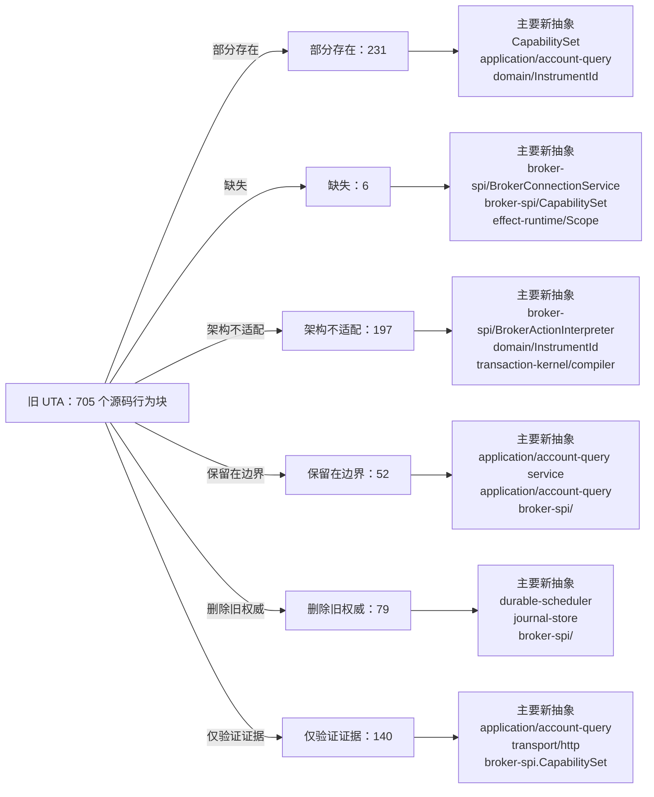

<!-- Auto-generated by scripts/uta-effect-runtime-map.mjs from mapping.json. Do not edit by hand. -->
<!-- Regenerate with `node scripts/uta-effect-runtime-map.mjs`. -->

# UTA 功能替代关系：第 3 章 Module graph and allowed dependencies

目标架构原文：[`docs/uta-effect-runtime-architecture.md:115-280`](../uta-effect-runtime-architecture.md#L115-L280)。

## 结论

部分存在 231；缺失 6；架构不适配 197；保留在边界 52；删除旧权威 79；仅验证证据 140。状态只描述当前实现相对于目标架构的关系，不表示迁移已经落地。

## 替代关系图

## 章节级目标缺口

本章没有独立于源码行映射的目标级缺口。

## 源码映射

| 映射 ID | 当前源码 | 符号或行为块 | 当前功能 | 替代状态 | 新 UTA 抽象与做法 | 不适配位置与原因 | 必须补充或调整 | 重复索引 |
|---|---|---|---|---|---|---|---|---|
| `MAP-9AD9951502` | [`packages/uta-broker-alpaca/src/index.ts:1-1`](../../packages/uta-broker-alpaca/src/index.ts#L1-L1) | AlpacaBroker import | The release wrapper imports the concrete AlpacaBroker from services/uta/src/domain/trading/brokers/alpaca, binding the pack to the legacy domain/trading IBroker implementation rather than to a target brokers/alpaca interpreter. | 删除旧权威 | 3.7 brokers/<broker>/；9.1 Connection Layer；9.2 Typed action interpreter；16 Target source layout；17 Migration sequence / Slice 4: first real broker；19 Architectural prohibitions services/uta/src/brokers/alpaca/；services/uta/src/broker-spi/BrokerConnectionService；services/uta/src/broker-spi/BrokerActionInterpreter；services/uta/src/main.ts Remove the legacy import when the target pack contract becomes authoritative. Import the pack-local Alpaca adapter entrypoint under services/uta/src/brokers/alpaca instead, and expose a typed BrokerConnectionService Layer plus BrokerActionInterpreter descriptor for registration by services/uta/src/main.ts. The wrapper may assemble the adapter but must not own transaction state or kernel decisions. | The current import reaches the old domain/trading broker class, so the release module has no target connection Layer, typed action map, broker-spi failure channel, remote observation contract, or compensation capability to register. | Delete the legacy class dependency and move Alpaca SDK request/response schemas, error mapping, dispatch identity/idempotency, observation, and compensation compilation behind the target broker-spi adapter. Register that adapter only at the composition root; keep transaction-kernel ownership in the kernel. | **DUP-001** |
| `MAP-DA5BBE56B3` | [`packages/uta-broker-alpaca/src/index.ts:3-3`](../../packages/uta-broker-alpaca/src/index.ts#L3-L3) | BROKER_PACK_API_VERSION | Exports pack API version 1, which currently gates the legacy module shape whose createBroker returns an IBroker and whose companion exports are configSchema and BROKER_ENGINE. | 部分存在 | 3 Module graph and allowed dependencies；9 Broker service-provider interface；16 Target source layout；17 Migration sequence services/uta/src/broker-spi/BrokerConnectionService；services/uta/src/broker-spi/BrokerActionInterpreter；services/uta/src/main.ts Retain a versioned release boundary, but advance the pack API version for the target interpreter/connection descriptor contract. The loader and every wrapper must change together so a legacy IBroker pack cannot be accepted as a target adapter pack. | Leaving version 1 while changing the exported broker value would make the loader treat the legacy IBroker contract as compatible with the target broker-spi contract; the current version carries no target interpreter/Layer guarantee. | Define the next versioned pack entry contract around the target BrokerActionInterpreter and BrokerConnectionService Layer, update the pack loader's validation and all five wrappers atomically, and reject old module shapes rather than coercing them into the kernel. | **DUP-002** |
| `MAP-14D51E5BA4` | [`packages/uta-broker-alpaca/src/index.ts:4-4`](../../packages/uta-broker-alpaca/src/index.ts#L4-L4) | BROKER_ENGINE | Exports the stable Alpaca engine discriminator used by the release loader; this metadata does not itself dispatch broker effects or own transaction state. | 保留在边界 | 3 Module graph and allowed dependencies；16 Target source layout services/uta/src/main.ts；services/uta/src/broker-spi/BrokerConnectionService Retain the engine discriminator as pack and adapter identity metadata. The composition root may use it to select the Alpaca target adapter, but the discriminator must not be used as a generic registry of untyped broker objects or as a kernel dependency. | — | — | **DUP-003** |
| `MAP-607170E22C` | [`packages/uta-broker-alpaca/src/index.ts:5-5`](../../packages/uta-broker-alpaca/src/index.ts#L5-L5) | configSchema | Re-exports AlpacaBroker.configSchema from the legacy class, so the pack boundary validates the old brokerConfig shape but does not expose a target adapter descriptor or associate configuration with a scoped connection Layer and typed action interpreter. | 部分存在 | 3.7 brokers/<broker>/；9.1 Connection Layer；9.2 Typed action interpreter；9.4 Capability derivation；15 Security and authority；16 Target source layout services/uta/src/brokers/alpaca/；services/uta/src/broker-spi/BrokerConnectionService；services/uta/src/broker-spi/BrokerActionInterpreter Define the Alpaca connection/configuration schema beside the target adapter and export it through the versioned pack descriptor. Keep credential parsing at the trusted UTA boundary and provide separate target action, acknowledgement, observation, error, availability, and redacted-native-payload schemas through the interpreter rather than relying on a legacy class static. | The alias is coupled to the legacy implementation and only validates construction input; it does not prove the target action-type map, capability derivation, native boundary schemas, or credential-bearing scoped Layer required by chapters 3.7 and 9. | Move the Alpaca config schema to the target brokers/alpaca adapter, make its parsed output feed BrokerConnectionService construction, and add the typed BrokerActionInterpreter schemas and capability derivation required by the target pack contract without exposing SDK values to kernel or protocol types. | **DUP-004** |
| `MAP-6496594BF0` | [`packages/uta-broker-alpaca/src/index.ts:7-9`](../../packages/uta-broker-alpaca/src/index.ts#L7-L9) | createBroker | Accepts an id, optional label, and Record<string, unknown> brokerConfig; calls AlpacaBroker.fromConfig and uses Object.assign to add brokerEngine. The result is a legacy IBroker object, not an Effect Layer or typed broker-spi interpreter. | 架构不适配 | 3.7 brokers/<broker>/；4 Effect model；9.1 Connection Layer；9.2 Typed action interpreter；9.3 Remote outcome；9.4 Capability derivation；12.2 Unknown-outcome protocol；16 Target source layout；17 Migration sequence / Slice 4: first real broker；19 Architectural prohibitions services/uta/src/brokers/alpaca/；services/uta/src/broker-spi/BrokerConnectionService；services/uta/src/broker-spi/BrokerActionInterpreter；services/uta/src/broker-spi/RemoteOutcome；services/uta/src/durable-scheduler/；services/uta/src/main.ts Replace this legacy factory export with the target versioned pack entrypoint: validate the typed Alpaca configuration, return the adapter's scoped BrokerConnectionService Layer and action-specific BrokerActionInterpreter, and let main.ts register it for durable-scheduler dispatch. Dispatch must carry a DispatchIdentity, persist outcomes through the scheduler/journal path, and expose compensation compilation; no wrapper-created object may become transaction-kernel state. | The current factory performs immediate legacy object construction, erases configuration as Record<string, unknown>, adds an ad-hoc brokerEngine property, and supplies none of the target availability, dispatch, observation, unknown-outcome, idempotency, or compensation contracts. It therefore cannot satisfy the Alpaca typed-interpreter migration or crash-recovery protocol. | Implement and export the Alpaca target interpreter/connection descriptor, including native request compilation, typed broker failures, paper/live capability derivation, remote order observation, idempotency proof or reconcile-before-retry, and compensation programs. Register it through the composition root and durable scheduler; delete the old Alpaca dispatcher path once this adapter owns the account mutation. | **DUP-005** |
| `MAP-B40F4C1C42` | [`packages/uta-broker-ccxt/src/index.ts:1-1`](../../packages/uta-broker-ccxt/src/index.ts#L1-L1) | CcxtBroker import | The release wrapper imports the concrete CcxtBroker from services/uta/src/domain/trading/brokers/ccxt, binding the pack to the legacy domain/trading IBroker implementation rather than to a target brokers/ccxt interpreter. | 删除旧权威 | 3.7 brokers/<broker>/；9.1 Connection Layer；9.2 Typed action interpreter；16 Target source layout；17 Migration sequence / Slice 5: heterogeneous brokers；19 Architectural prohibitions services/uta/src/brokers/ccxt/；services/uta/src/broker-spi/BrokerConnectionService；services/uta/src/broker-spi/BrokerActionInterpreter；services/uta/src/main.ts Remove the legacy import when the target pack contract becomes authoritative. Import the pack-local CCXT adapter entrypoint under services/uta/src/brokers/ccxt instead, and expose a typed BrokerConnectionService Layer plus BrokerActionInterpreter descriptor for registration by services/uta/src/main.ts. The wrapper may assemble the adapter but must not own transaction state or kernel decisions. | The current import reaches the old domain/trading broker class, so the release module has no target connection Layer, typed action map, broker-spi failure channel, remote observation contract, or compensation capability to register. | Delete the legacy class dependency and move CCXT SDK request/response schemas, exchange error mapping, dispatch identity/idempotency, observation, and compensation compilation behind the target broker-spi adapter. Register that adapter only at the composition root; keep transaction-kernel ownership in the kernel. | **DUP-006** |
| `MAP-ACA4BDF989` | [`packages/uta-broker-ccxt/src/index.ts:3-3`](../../packages/uta-broker-ccxt/src/index.ts#L3-L3) | BROKER_PACK_API_VERSION | Exports pack API version 1, which currently gates the legacy module shape whose createBroker returns an IBroker and whose companion exports are configSchema and BROKER_ENGINE. | 部分存在 | 3 Module graph and allowed dependencies；9 Broker service-provider interface；16 Target source layout；17 Migration sequence services/uta/src/broker-spi/BrokerConnectionService；services/uta/src/broker-spi/BrokerActionInterpreter；services/uta/src/main.ts Retain a versioned release boundary, but advance the pack API version for the target interpreter/connection descriptor contract. The loader and every wrapper must change together so a legacy IBroker pack cannot be accepted as a target adapter pack. | Leaving version 1 while changing the exported broker value would make the loader treat the legacy IBroker contract as compatible with the target broker-spi contract; the current version carries no target interpreter/Layer guarantee. | Define the next versioned pack entry contract around the target BrokerActionInterpreter and BrokerConnectionService Layer, update the pack loader's validation and all five wrappers atomically, and reject old module shapes rather than coercing them into the kernel. | **DUP-007** |
| `MAP-B295179D05` | [`packages/uta-broker-ccxt/src/index.ts:4-4`](../../packages/uta-broker-ccxt/src/index.ts#L4-L4) | BROKER_ENGINE | Exports the stable CCXT engine discriminator used by the release loader; this metadata does not itself dispatch broker effects or own transaction state. | 保留在边界 | 3 Module graph and allowed dependencies；16 Target source layout services/uta/src/main.ts；services/uta/src/broker-spi/BrokerConnectionService Retain the engine discriminator as pack and adapter identity metadata. The composition root may use it to select the CCXT target adapter, but the discriminator must not be used as a generic registry of untyped broker objects or as a kernel dependency. | — | — | **DUP-008** |
| `MAP-F3151B31E7` | [`packages/uta-broker-ccxt/src/index.ts:5-5`](../../packages/uta-broker-ccxt/src/index.ts#L5-L5) | configSchema | Re-exports CcxtBroker.configSchema from the legacy class, so the pack boundary validates the old exchange/account configuration but does not expose a target adapter descriptor or associate configuration with a scoped connection Layer and typed action interpreter. | 部分存在 | 3.7 brokers/<broker>/；9.1 Connection Layer；9.2 Typed action interpreter；9.4 Capability derivation；15 Security and authority；16 Target source layout services/uta/src/brokers/ccxt/；services/uta/src/broker-spi/BrokerConnectionService；services/uta/src/broker-spi/BrokerActionInterpreter Define the CCXT connection/configuration schema beside the target adapter and export it through the versioned pack descriptor. Keep exchange credentials and keyless/public-data mode at the trusted UTA boundary, and provide separate target action, acknowledgement, observation, error, availability, and redacted-native-payload schemas through the interpreter rather than relying on a legacy class static. | The alias is coupled to the legacy implementation and only validates construction input; it does not prove the target action-type map, exchange/sub-account capability derivation, native boundary schemas, or credential-bearing scoped Layer required by chapters 3.7 and 9. | Move the CCXT config schema to the target brokers/ccxt adapter, make its parsed output feed BrokerConnectionService construction, and add capability derivation over exchange, sub-account or wallet, venue, instrument, and session context plus the typed BrokerActionInterpreter schemas. | **DUP-009** |
| `MAP-9D3DC42AC9` | [`packages/uta-broker-ccxt/src/index.ts:7-9`](../../packages/uta-broker-ccxt/src/index.ts#L7-L9) | createBroker | Accepts an id, optional label, and Record<string, unknown> brokerConfig; calls CcxtBroker.fromConfig and uses Object.assign to add brokerEngine. The result is a legacy IBroker object, not an Effect Layer or typed broker-spi interpreter. | 架构不适配 | 3.7 brokers/<broker>/；4 Effect model；9.1 Connection Layer；9.2 Typed action interpreter；9.3 Remote outcome；9.4 Capability derivation；12.2 Unknown-outcome protocol；16 Target source layout；17 Migration sequence / Slice 5: heterogeneous brokers；19 Architectural prohibitions services/uta/src/brokers/ccxt/；services/uta/src/broker-spi/BrokerConnectionService；services/uta/src/broker-spi/BrokerActionInterpreter；services/uta/src/broker-spi/RemoteOutcome；services/uta/src/durable-scheduler/；services/uta/src/main.ts Replace this legacy factory export with the target versioned pack entrypoint: validate typed CCXT configuration, return the adapter's scoped BrokerConnectionService Layer and action-specific BrokerActionInterpreter, and let main.ts register it for durable-scheduler dispatch. Dispatch must carry a DispatchIdentity, persist outcomes through the scheduler/journal path, and expose compensation compilation; no wrapper-created object may become transaction-kernel state. | The current factory performs immediate legacy object construction, erases configuration as Record<string, unknown>, adds an ad-hoc brokerEngine property, and supplies none of the target availability, dispatch, observation, unknown-outcome, idempotency, or compensation contracts. It cannot prove CCXT sub-account or venue-specific capability derivation. | Implement and export the CCXT target interpreter/connection descriptor, including exchange-native request compilation, typed broker failures, sub-account or wallet capability derivation, remote order/position observation, idempotency proof or reconcile-before-retry, and compensation programs. Register it through the composition root and durable scheduler; delete the old CCXT dispatcher path once this adapter owns account mutations. | **DUP-010** |
| `MAP-1E5FD0A690` | [`packages/uta-broker-ibkr/src/index.ts:1-1`](../../packages/uta-broker-ibkr/src/index.ts#L1-L1) | IbkrBroker import | The release wrapper imports the concrete IbkrBroker from services/uta/src/domain/trading/brokers/ibkr, binding the pack to the legacy domain/trading IBroker implementation rather than to a target brokers/ibkr interpreter. | 删除旧权威 | 3.7 brokers/<broker>/；9.1 Connection Layer；9.2 Typed action interpreter；16 Target source layout；17 Migration sequence / Slice 5: heterogeneous brokers；19 Architectural prohibitions services/uta/src/brokers/ibkr/；services/uta/src/broker-spi/BrokerConnectionService；services/uta/src/broker-spi/BrokerActionInterpreter；services/uta/src/main.ts Remove the legacy import when the target pack contract becomes authoritative. Import the pack-local IBKR adapter entrypoint under services/uta/src/brokers/ibkr instead, and expose a typed BrokerConnectionService Layer plus BrokerActionInterpreter descriptor for registration by services/uta/src/main.ts. The wrapper may assemble the adapter but must not own transaction state or kernel decisions. | The current import reaches the old domain/trading broker class, so the release module has no target connection Layer, typed action map, broker-spi failure channel, remote observation contract, or compensation capability to register. | Delete the legacy class dependency and move IBKR SDK request/response schemas, callback/connection error mapping, dispatch identity/idempotency, observation, and compensation compilation behind the target broker-spi adapter. Register that adapter only at the composition root; keep transaction-kernel ownership in the kernel. | **DUP-011** |
| `MAP-AB521AFE64` | [`packages/uta-broker-ibkr/src/index.ts:3-3`](../../packages/uta-broker-ibkr/src/index.ts#L3-L3) | BROKER_PACK_API_VERSION | Exports pack API version 1, which currently gates the legacy module shape whose createBroker returns an IBroker and whose companion exports are configSchema and BROKER_ENGINE. | 部分存在 | 3 Module graph and allowed dependencies；9 Broker service-provider interface；16 Target source layout；17 Migration sequence services/uta/src/broker-spi/BrokerConnectionService；services/uta/src/broker-spi/BrokerActionInterpreter；services/uta/src/main.ts Retain a versioned release boundary, but advance the pack API version for the target interpreter/connection descriptor contract. The loader and every wrapper must change together so a legacy IBroker pack cannot be accepted as a target adapter pack. | Leaving version 1 while changing the exported broker value would make the loader treat the legacy IBroker contract as compatible with the target broker-spi contract; the current version carries no target interpreter/Layer guarantee. | Define the next versioned pack entry contract around the target BrokerActionInterpreter and BrokerConnectionService Layer, update the pack loader's validation and all five wrappers atomically, and reject old module shapes rather than coercing them into the kernel. | **DUP-012** |
| `MAP-55E14D3598` | [`packages/uta-broker-ibkr/src/index.ts:4-4`](../../packages/uta-broker-ibkr/src/index.ts#L4-L4) | BROKER_ENGINE | Exports the stable IBKR engine discriminator used by the release loader; this metadata does not itself dispatch broker effects or own transaction state. | 保留在边界 | 3 Module graph and allowed dependencies；16 Target source layout services/uta/src/main.ts；services/uta/src/broker-spi/BrokerConnectionService Retain the engine discriminator as pack and adapter identity metadata. The composition root may use it to select the IBKR target adapter, but the discriminator must not be used as a generic registry of untyped broker objects or as a kernel dependency. | — | — | **DUP-013** |
| `MAP-C4C40BAECB` | [`packages/uta-broker-ibkr/src/index.ts:5-5`](../../packages/uta-broker-ibkr/src/index.ts#L5-L5) | configSchema | Re-exports IbkrBroker.configSchema from the legacy class, so the pack boundary validates the old host/port/client configuration but does not expose a target adapter descriptor or associate configuration with a scoped connection Layer and typed action interpreter. | 部分存在 | 3.7 brokers/<broker>/；9.1 Connection Layer；9.2 Typed action interpreter；9.4 Capability derivation；15 Security and authority；16 Target source layout services/uta/src/brokers/ibkr/；services/uta/src/broker-spi/BrokerConnectionService；services/uta/src/broker-spi/BrokerActionInterpreter Define the IBKR connection/configuration schema beside the target adapter and export it through the versioned pack descriptor. Keep endpoint credentials and account identity at the trusted UTA boundary, and provide separate target action, acknowledgement, observation, error, availability, and redacted-native-payload schemas through the interpreter rather than relying on a legacy class static. | The alias is coupled to the legacy implementation and only validates construction input; it does not prove the target action-type map, callback stream/linked-account identity, native boundary schemas, or credential-bearing scoped Layer required by chapters 3.7 and 9. | Move the IBKR config schema to the target brokers/ibkr adapter, make its parsed output feed BrokerConnectionService construction, and add capability derivation plus callback/observation schemas for linked accounts and native order identities through BrokerActionInterpreter. | **DUP-014** |
| `MAP-3392948A39` | [`packages/uta-broker-ibkr/src/index.ts:7-9`](../../packages/uta-broker-ibkr/src/index.ts#L7-L9) | createBroker | Accepts an id, optional label, and Record<string, unknown> brokerConfig; calls IbkrBroker.fromConfig and uses Object.assign to add brokerEngine. The result is a legacy IBroker object, not an Effect Layer or typed broker-spi interpreter. | 架构不适配 | 3.7 brokers/<broker>/；4 Effect model；9.1 Connection Layer；9.2 Typed action interpreter；9.3 Remote outcome；9.4 Capability derivation；12.2 Unknown-outcome protocol；16 Target source layout；17 Migration sequence / Slice 5: heterogeneous brokers；19 Architectural prohibitions services/uta/src/brokers/ibkr/；services/uta/src/broker-spi/BrokerConnectionService；services/uta/src/broker-spi/BrokerActionInterpreter；services/uta/src/broker-spi/RemoteOutcome；services/uta/src/durable-scheduler/；services/uta/src/main.ts Replace this legacy factory export with the target versioned pack entrypoint: validate typed IBKR configuration, return the adapter's scoped BrokerConnectionService Layer and action-specific BrokerActionInterpreter, and let main.ts register it for durable-scheduler dispatch. Dispatch must carry a DispatchIdentity, persist outcomes through the scheduler/journal path, and expose compensation compilation; no wrapper-created object may become transaction-kernel state. | The current factory performs immediate legacy object construction, erases configuration as Record<string, unknown>, adds an ad-hoc brokerEngine property, and supplies none of the target availability, dispatch, observation, unknown-outcome, idempotency, or compensation contracts. It cannot represent IBKR callback-stream health or linked-account identity in the target SPI. | Implement and export the IBKR target interpreter/connection descriptor, including scoped callback streams, linked-account and native-order identity, typed broker failures, remote observation, idempotency proof or reconcile-before-retry, and compensation programs. Register it through the composition root and durable scheduler; delete the old IBKR dispatcher path once this adapter owns account mutations. | **DUP-015** |
| `MAP-AE59785B88` | [`packages/uta-broker-leverup/src/index.ts:1-1`](../../packages/uta-broker-leverup/src/index.ts#L1-L1) | LeverupBroker import | The release wrapper imports the concrete LeverupBroker from services/uta/src/domain/trading/brokers/others/leverup, binding the pack to the legacy domain/trading IBroker implementation rather than to a target brokers/leverup interpreter. | 删除旧权威 | 3.7 brokers/<broker>/；9.1 Connection Layer；9.2 Typed action interpreter；16 Target source layout；17 Migration sequence / Slice 5: heterogeneous brokers；19 Architectural prohibitions services/uta/src/brokers/leverup/；services/uta/src/broker-spi/BrokerConnectionService；services/uta/src/broker-spi/BrokerActionInterpreter；services/uta/src/main.ts Remove the legacy import when the target pack contract becomes authoritative. Import the pack-local LeverUp adapter entrypoint under services/uta/src/brokers/leverup instead, and expose a typed BrokerConnectionService Layer plus BrokerActionInterpreter descriptor for registration by services/uta/src/main.ts. The wrapper may assemble the adapter but must not own transaction state or kernel decisions. | The current import reaches the old domain/trading broker class, so the release module has no target connection Layer, typed action map, broker-spi failure channel, remote observation contract, or compensation capability to register. | Delete the legacy class dependency and move LeverUp SDK/relayer request and response schemas, relayer error mapping, dispatch identity/idempotency, observation, and compensation compilation behind the target broker-spi adapter. Register that adapter only at the composition root; keep transaction-kernel ownership in the kernel. | **DUP-016** |
| `MAP-1B0FB784F5` | [`packages/uta-broker-leverup/src/index.ts:3-3`](../../packages/uta-broker-leverup/src/index.ts#L3-L3) | BROKER_PACK_API_VERSION | Exports pack API version 1, which currently gates the legacy module shape whose createBroker returns an IBroker and whose companion exports are configSchema and BROKER_ENGINE. | 部分存在 | 3 Module graph and allowed dependencies；9 Broker service-provider interface；16 Target source layout；17 Migration sequence services/uta/src/broker-spi/BrokerConnectionService；services/uta/src/broker-spi/BrokerActionInterpreter；services/uta/src/main.ts Retain a versioned release boundary, but advance the pack API version for the target interpreter/connection descriptor contract. The loader and every wrapper must change together so a legacy IBroker pack cannot be accepted as a target adapter pack. | Leaving version 1 while changing the exported broker value would make the loader treat the legacy IBroker contract as compatible with the target broker-spi contract; the current version carries no target interpreter/Layer guarantee. | Define the next versioned pack entry contract around the target BrokerActionInterpreter and BrokerConnectionService Layer, update the pack loader's validation and all five wrappers atomically, and reject old module shapes rather than coercing them into the kernel. | **DUP-017** |
| `MAP-D5792AEA38` | [`packages/uta-broker-leverup/src/index.ts:4-4`](../../packages/uta-broker-leverup/src/index.ts#L4-L4) | BROKER_ENGINE | Exports the stable LeverUp engine discriminator used by the release loader; this metadata does not itself dispatch broker effects or own transaction state. | 保留在边界 | 3 Module graph and allowed dependencies；16 Target source layout services/uta/src/main.ts；services/uta/src/broker-spi/BrokerConnectionService Retain the engine discriminator as pack and adapter identity metadata. The composition root may use it to select the LeverUp target adapter, but the discriminator must not be used as a generic registry of untyped broker objects or as a kernel dependency. | — | — | **DUP-018** |
| `MAP-2564A889E7` | [`packages/uta-broker-leverup/src/index.ts:5-5`](../../packages/uta-broker-leverup/src/index.ts#L5-L5) | configSchema | Re-exports LeverupBroker.configSchema from the legacy class, so the pack boundary validates the old network/private-key configuration but does not expose a target adapter descriptor or associate configuration with a scoped connection Layer and typed action interpreter. | 部分存在 | 3.7 brokers/<broker>/；9.1 Connection Layer；9.2 Typed action interpreter；9.4 Capability derivation；15 Security and authority；16 Target source layout services/uta/src/brokers/leverup/；services/uta/src/broker-spi/BrokerConnectionService；services/uta/src/broker-spi/BrokerActionInterpreter Define the LeverUp connection/configuration schema beside the target adapter and export it through the versioned pack descriptor. Keep private-key handling inside the UTA credential boundary and scoped connection/relayer Layer, and provide separate target action, acknowledgement, observation, error, availability, and redacted-native-payload schemas through the interpreter rather than relying on a legacy class static. | The alias is coupled to the legacy implementation and only validates construction input; it does not prove the target action-type map, relayer capability derivation, native boundary schemas, or credential-bearing scoped Layer required by chapters 3.7 and 9. | Move the LeverUp config schema to the target brokers/leverup adapter, make its parsed output feed BrokerConnectionService and relayer construction, and add capability derivation plus typed BrokerActionInterpreter schemas for network, instrument, relayer, and market-session availability. | **DUP-019** |
| `MAP-50C8158380` | [`packages/uta-broker-leverup/src/index.ts:7-9`](../../packages/uta-broker-leverup/src/index.ts#L7-L9) | createBroker | Accepts an id, optional label, and Record<string, unknown> brokerConfig; calls LeverupBroker.fromConfig and uses Object.assign to add brokerEngine. The result is a legacy IBroker object, not an Effect Layer or typed broker-spi interpreter. | 架构不适配 | 3.7 brokers/<broker>/；4 Effect model；9.1 Connection Layer；9.2 Typed action interpreter；9.3 Remote outcome；9.4 Capability derivation；12.2 Unknown-outcome protocol；16 Target source layout；17 Migration sequence / Slice 5: heterogeneous brokers；19 Architectural prohibitions services/uta/src/brokers/leverup/；services/uta/src/broker-spi/BrokerConnectionService；services/uta/src/broker-spi/BrokerActionInterpreter；services/uta/src/broker-spi/RemoteOutcome；services/uta/src/durable-scheduler/；services/uta/src/main.ts Replace this legacy factory export with the target versioned pack entrypoint: validate typed LeverUp configuration, return the adapter's scoped BrokerConnectionService/relayer Layer and action-specific BrokerActionInterpreter, and let main.ts register it for durable-scheduler dispatch. Dispatch must carry a DispatchIdentity, persist outcomes through the scheduler/journal path, and expose compensation compilation; no wrapper-created object may become transaction-kernel state. | The current factory performs immediate legacy object construction, erases configuration as Record<string, unknown>, adds an ad-hoc brokerEngine property, and supplies none of the target availability, dispatch, observation, unknown-outcome, idempotency, or compensation contracts. It cannot reconcile a relayer-accepted mutation after a lost process or network boundary. | Implement and export the LeverUp target interpreter/connection descriptor, including relayer-native request compilation, typed relayer failures, dispatch identity, explicit observation/reconciliation after timeout, capability derivation, idempotency proof or reconcile-before-retry, and compensation programs. Register it through the composition root and durable scheduler; delete the old LeverUp dispatcher path once this adapter owns account mutations. | **DUP-020** |
| `MAP-75B61EBF36` | [`packages/uta-broker-longbridge/src/index.ts:1-1`](../../packages/uta-broker-longbridge/src/index.ts#L1-L1) | LongbridgeBroker import | The release wrapper imports the concrete LongbridgeBroker from services/uta/src/domain/trading/brokers/longbridge, binding the pack to the legacy domain/trading IBroker implementation rather than to a target brokers/longbridge interpreter. | 删除旧权威 | 3.7 brokers/<broker>/；9.1 Connection Layer；9.2 Typed action interpreter；16 Target source layout；17 Migration sequence / Slice 5: heterogeneous brokers；19 Architectural prohibitions services/uta/src/brokers/longbridge/；services/uta/src/broker-spi/BrokerConnectionService；services/uta/src/broker-spi/BrokerActionInterpreter；services/uta/src/main.ts Remove the legacy import when the target pack contract becomes authoritative. Import the pack-local Longbridge adapter entrypoint under services/uta/src/brokers/longbridge instead, and expose a typed BrokerConnectionService Layer plus BrokerActionInterpreter descriptor for registration by services/uta/src/main.ts. The wrapper may assemble the adapter but must not own transaction state or kernel decisions. | The current import reaches the old domain/trading broker class, so the release module has no target connection Layer, typed action map, broker-spi failure channel, remote observation contract, or compensation capability to register. | Delete the legacy class dependency and move Longbridge SDK request/response schemas, jurisdiction/currency-aware error mapping, dispatch identity/idempotency, observation, and compensation compilation behind the target broker-spi adapter. Register that adapter only at the composition root; keep transaction-kernel ownership in the kernel. | **DUP-021** |
| `MAP-F093E8F942` | [`packages/uta-broker-longbridge/src/index.ts:3-3`](../../packages/uta-broker-longbridge/src/index.ts#L3-L3) | BROKER_PACK_API_VERSION | Exports pack API version 1, which currently gates the legacy module shape whose createBroker returns an IBroker and whose companion exports are configSchema and BROKER_ENGINE. | 部分存在 | 3 Module graph and allowed dependencies；9 Broker service-provider interface；16 Target source layout；17 Migration sequence services/uta/src/broker-spi/BrokerConnectionService；services/uta/src/broker-spi/BrokerActionInterpreter；services/uta/src/main.ts Retain a versioned release boundary, but advance the pack API version for the target interpreter/connection descriptor contract. The loader and every wrapper must change together so a legacy IBroker pack cannot be accepted as a target adapter pack. | Leaving version 1 while changing the exported broker value would make the loader treat the legacy IBroker contract as compatible with the target broker-spi contract; the current version carries no target interpreter/Layer guarantee. | Define the next versioned pack entry contract around the target BrokerActionInterpreter and BrokerConnectionService Layer, update the pack loader's validation and all five wrappers atomically, and reject old module shapes rather than coercing them into the kernel. | **DUP-022** |
| `MAP-E89067CA5C` | [`packages/uta-broker-longbridge/src/index.ts:4-4`](../../packages/uta-broker-longbridge/src/index.ts#L4-L4) | BROKER_ENGINE | Exports the stable Longbridge engine discriminator used by the release loader; this metadata does not itself dispatch broker effects or own transaction state. | 保留在边界 | 3 Module graph and allowed dependencies；16 Target source layout services/uta/src/main.ts；services/uta/src/broker-spi/BrokerConnectionService Retain the engine discriminator as pack and adapter identity metadata. The composition root may use it to select the Longbridge target adapter, but the discriminator must not be used as a generic registry of untyped broker objects or as a kernel dependency. | — | — | **DUP-023** |
| `MAP-1986FE3044` | [`packages/uta-broker-longbridge/src/index.ts:5-5`](../../packages/uta-broker-longbridge/src/index.ts#L5-L5) | configSchema | Re-exports LongbridgeBroker.configSchema from the legacy class, so the pack boundary validates the old app-key/app-secret/access-token configuration but does not expose a target adapter descriptor or associate configuration with a scoped connection Layer and typed action interpreter. | 部分存在 | 3.7 brokers/<broker>/；9.1 Connection Layer；9.2 Typed action interpreter；9.4 Capability derivation；15 Security and authority；16 Target source layout services/uta/src/brokers/longbridge/；services/uta/src/broker-spi/BrokerConnectionService；services/uta/src/broker-spi/BrokerActionInterpreter；services/uta/src/market-and-accounting/ Define the Longbridge connection/configuration schema beside the target adapter and export it through the versioned pack descriptor. Keep credentials inside the UTA-owned scoped Layer, and provide separate target action, acknowledgement, observation, error, availability, jurisdiction, currency, and redacted-native-payload schemas through the interpreter rather than relying on a legacy class static. | The alias is coupled to the legacy implementation and only validates construction input; it does not prove the target action-type map, jurisdiction/currency capability derivation, native boundary schemas, or credential-bearing scoped Layer required by chapters 3.7 and 9. | Move the Longbridge config schema to the target brokers/longbridge adapter, make its parsed output feed BrokerConnectionService construction, and connect the adapter's account/market/jurisdiction metadata to market-and-accounting while keeping typed BrokerActionInterpreter schemas at the broker boundary. | **DUP-024** |
| `MAP-E52D407CDC` | [`packages/uta-broker-longbridge/src/index.ts:7-9`](../../packages/uta-broker-longbridge/src/index.ts#L7-L9) | createBroker | Accepts an id, optional label, and Record<string, unknown> brokerConfig; calls LongbridgeBroker.fromConfig and uses Object.assign to add brokerEngine. The result is a legacy IBroker object, not an Effect Layer or typed broker-spi interpreter. | 架构不适配 | 3.7 brokers/<broker>/；4 Effect model；9.1 Connection Layer；9.2 Typed action interpreter；9.3 Remote outcome；9.4 Capability derivation；12.2 Unknown-outcome protocol；16 Target source layout；17 Migration sequence / Slice 5: heterogeneous brokers；19 Architectural prohibitions services/uta/src/brokers/longbridge/；services/uta/src/broker-spi/BrokerConnectionService；services/uta/src/broker-spi/BrokerActionInterpreter；services/uta/src/broker-spi/RemoteOutcome；services/uta/src/durable-scheduler/；services/uta/src/market-and-accounting/；services/uta/src/main.ts Replace this legacy factory export with the target versioned pack entrypoint: validate typed Longbridge configuration, return the adapter's scoped BrokerConnectionService Layer and action-specific BrokerActionInterpreter, and let main.ts register it for durable-scheduler dispatch. Dispatch must carry a DispatchIdentity, persist outcomes through the scheduler/journal path, and expose compensation compilation; no wrapper-created object may become transaction-kernel state. | The current factory performs immediate legacy object construction, erases configuration as Record<string, unknown>, adds an ad-hoc brokerEngine property, and supplies none of the target availability, dispatch, observation, unknown-outcome, idempotency, or compensation contracts. It cannot express Longbridge's jurisdiction and currency boundaries as typed broker/market observations. | Implement and export the Longbridge target interpreter/connection descriptor, including native request compilation, typed broker failures, account and jurisdiction metadata, currency-qualified observations, remote order/exposure reconciliation, idempotency proof or reconcile-before-retry, and compensation programs. Register it through the composition root and durable scheduler; delete the old Longbridge dispatcher path once this adapter owns account mutations. | **DUP-025** |
| `MAP-CC2177368A` | [`packages/uta-protocol/src/brokers/preset-catalog.ts:1-14`](../../packages/uta-protocol/src/brokers/preset-catalog.ts#L1-L14) | broker preset catalog setup | Declares the catalog as the single source for wizard account types, imports Zod for per-preset validation, and imports node crypto for deterministic/random UTA id helpers. | 部分存在 | 2. System boundary；3.7 brokers/<broker>/；3.9 transport/ and protocol/；7.1 Embedded database；9.1 Connection Layer；14. Public protocol；15. Security and authority；19. Architectural prohibitions protocol/config schemas；application/；broker-spi/；brokers/<broker>/；BrokerConnectionService Treat the catalog as configuration/presentation input only; validate each broker connection with named schemas and let UTA-owned adapter Layers consume sealed configuration. | A shared package owns wizard configuration and identity minting, but this setup does not separate Alice presentation from UTA credential authority or broker-spi capability/connection ownership. | Split config/presentation declarations from runtime broker adapters, define explicit config codecs and secret references, and ensure catalog identity helpers cannot become execution or persistence authority. | **DUP-026** |
| `MAP-00030A134A` | [`packages/uta-protocol/src/brokers/preset-catalog.ts:16-18`](../../packages/uta-protocol/src/brokers/preset-catalog.ts#L16-L18) | BrokerEngine | Defines a six-member string union for ccxt, alpaca, ibkr, leverup, longbridge, and mock engine names. | 部分存在 | 3.6 broker-spi/；3.7 brokers/<broker>/；9.1 Connection Layer；9.2 Typed action interpreter；14. Public protocol；17.4 Slice 4: first real broker；19. Architectural prohibitions；17.1 Slice 1: durable kernel with MockBroker；17.5 Slice 5: heterogeneous brokers BrokerActionTypeMap；BrokerConnectionService；brokers/<broker>/；CapabilitySet Keep adapter selection in composition/application configuration, but associate each engine with a typed BrokerConnectionService and action-interpreter set rather than using a bare engine string. | The union identifies implementation labels only; it does not close the action/result/error/observation/compensation contract or broker connection requirements. | Replace runtime reliance on BrokerEngine strings with typed adapter registration/composition and compile-time BrokerActionTypeMap coverage. | **DUP-027** |
| `MAP-9F3FB86CB7` | [`packages/uta-protocol/src/brokers/preset-catalog.ts:20-23`](../../packages/uta-protocol/src/brokers/preset-catalog.ts#L20-L23) | ModeOption | Defines a UI mode id/label pair as arbitrary strings. | 保留在边界 | 2.1 Alice owns；3.9 transport/ and protocol/；14. Public protocol；15. Security and authority protocol/config presentation schema；application/ Retain mode labels as Alice-owned presentation metadata, while UTA validates the corresponding broker environment as a typed config variant. | The UI option intentionally does not encode broker capability, account jurisdiction, or execution policy and must not be consumed as a kernel mode or security decision. | Keep it outside domain/transaction-kernel and ensure mode ids are validated by the broker-specific config schema before adapter construction. | **DUP-028** |
| `MAP-67CE26F92B` | [`packages/uta-protocol/src/brokers/preset-catalog.ts:25-35`](../../packages/uta-protocol/src/brokers/preset-catalog.ts#L25-L35) | SubtitleSegment | Defines optional label/falseLabel/prefix presentation directives keyed by an arbitrary presetConfig field path. | 保留在边界 | 2.1 Alice owns；3.9 transport/ and protocol/；14. Public protocol；15. Security and authority Alice UI presentation projection；protocol/config presentation schema Keep account-card subtitle layout as Alice/UI presentation data only; never use field paths or truthiness to derive capability, authorization, or broker identity. | This is UI metadata, not a trading/runtime abstraction; arbitrary field paths and truthiness would be unsafe if allowed to cross into domain or security decisions. | Keep SubtitleSegment in a presentation-only module and exclude it from transaction, broker-spi, and persistence schemas. | **DUP-029** |
| `MAP-601F6E2834` | [`packages/uta-protocol/src/brokers/preset-catalog.ts:37-98`](../../packages/uta-protocol/src/brokers/preset-catalog.ts#L37-L98) | BrokerPresetDef | Defines preset metadata, Zod config schema, optional modes/subtitle/write-only fields, string fingerprint fields, a `toEngineConfig` function returning Record<string, unknown>, and optional isPaper callback accepting Record<string, unknown>. | 部分存在 | 2.1 Alice owns；2.2 UTA owns；3.7 brokers/<broker>/；3.9 transport/ and protocol/；7.1 Embedded database；9.1 Connection Layer；9.4 Capability derivation；14. Public protocol；15. Security and authority；17. Migration sequence；19. Architectural prohibitions protocol/config schemas；BrokerConnectionService；BrokerActionTypeMap；CapabilitySet；brokers/<broker>/；application/ Use BrokerPresetDef only to describe presentation/config entry points, then parse into broker-specific typed connection config and secret references before constructing scoped adapter Layers. | The schema itself is generic ZodType, engine translation and paper detection use raw Record<string, unknown>, fingerprints are string field names, and no action capability/connection/jurisdiction contract is attached. | Introduce broker-specific config ADTs/codecs, remove raw Record-based runtime handoff, separate secret storage from public metadata, and derive capabilities through broker-spi ActionContext rather than preset metadata. | **DUP-030** |
| `MAP-E745F1370E` | [`packages/uta-protocol/src/brokers/preset-catalog.ts:100-106`](../../packages/uta-protocol/src/brokers/preset-catalog.ts#L100-L106) | defaultIsPaper | Converts an arbitrary config record's mode to a lowercase string and returns true for demo/testnet/paper, treating all other values as non-paper. | 部分存在 | 3.7 brokers/<broker>/；3.9 transport/ and protocol/；9.4 Capability derivation；14. Public protocol；15. Security and authority；19. Architectural prohibitions broker-specific connection config；ActionContext；CapabilitySet；protocol/config schemas Derive account environment from a validated broker-specific config variant and expose it as typed context/capability metadata. | A generic mode string and boolean conflates venue-specific demo/testnet/paper semantics and can classify unknown values silently. | Replace with exhaustive per-preset config parsing and an explicit environment variant; reject unknown mode values at the boundary. | **DUP-031** |
| `MAP-EBB7846E5F` | [`packages/uta-protocol/src/brokers/preset-catalog.ts:108-154`](../../packages/uta-protocol/src/brokers/preset-catalog.ts#L108-L154) | BINANCE_PRESET | Declares Binance live/demo modes, API key/secret Zod fields, write-only metadata, mode/API-key fingerprinting, and a raw engine config with demoTrading semantics. | 部分存在 | 3.7 brokers/<broker>/；3.9 transport/ and protocol/；7.1 Embedded database；9.1 Connection Layer；9.4 Capability derivation；14. Public protocol；15. Security and authority；17.5 Slice 5: heterogeneous brokers；19. Architectural prohibitions brokers/Alpaca-style adapter config；BrokerConnectionService；CapabilitySet；protocol/config schemas Parse Binance connection config into a UTA-owned secret/config value, construct a scoped adapter Layer, and derive per-wallet/action capabilities from account, venue, instrument, and mode context. | The UI schema and toEngineConfig expose a generic record carrying credentials and a boolean-like demo mode; no typed connection identity, sub-account context, action availability, idempotency, or compensation contract is present. | Replace raw engine handoff with a broker-specific config codec/secret reference and broker-spi capability derivation; keep preset data presentation-only. | **DUP-032** |
| `MAP-BB8EAF65B0` | [`packages/uta-protocol/src/brokers/preset-catalog.ts:156-189`](../../packages/uta-protocol/src/brokers/preset-catalog.ts#L156-L189) | OKX_PRESET | Declares OKX live/demo modes, API key/secret/passphrase fields, write-only metadata, mode/API-key fingerprinting, and raw sandbox engine config. | 部分存在 | 3.7 brokers/<broker>/；3.9 transport/ and protocol/；7.1 Embedded database；9.1 Connection Layer；9.4 Capability derivation；14. Public protocol；15. Security and authority；17.5 Slice 5: heterogeneous brokers；19. Architectural prohibitions brokers/<broker>/；BrokerConnectionService；CapabilitySet；protocol/config schemas Validate OKX connection credentials/config in UTA, construct its scoped adapter, and derive action/sub-account capabilities rather than treating demo as a generic sandbox boolean. | Credentials and venue mode are passed through generic preset data, while no typed connection/capability/interpreter association or jurisdiction/sub-account contract is represented. | Introduce an OKX-specific config ADT and secret boundary, then register typed BrokerActionInterpreter availability/dispatch/observe/compensation implementations. | **DUP-033** |
| `MAP-6E3C5642E6` | [`packages/uta-protocol/src/brokers/preset-catalog.ts:191-224`](../../packages/uta-protocol/src/brokers/preset-catalog.ts#L191-L224) | BYBIT_PRESET | Declares live/testnet/demo modes, API credentials, write-only fields, fingerprints, and raw engine config with separate sandbox/demoTrading booleans. | 部分存在 | 3.7 brokers/<broker>/；3.9 transport/ and protocol/；7.1 Embedded database；9.1 Connection Layer；9.4 Capability derivation；14. Public protocol；15. Security and authority；17.5 Slice 5: heterogeneous brokers；19. Architectural prohibitions brokers/<broker>/；BrokerConnectionService；CapabilitySet；ActionAvailability；protocol/config schemas Represent Bybit environment as a validated config variant and derive capabilities/idempotency/compensation for each account and venue mode through broker-spi. | Separate booleans can express invalid mode combinations and raw engine config is untyped; no target action contract or typed unavailable reason is attached. | Replace booleans/Record handoff with an exhaustive Bybit config ADT, adapter Layer, and CapabilitySet registration. | **DUP-034** |
| `MAP-2F4E92A2AE` | [`packages/uta-protocol/src/brokers/preset-catalog.ts:226-257`](../../packages/uta-protocol/src/brokers/preset-catalog.ts#L226-L257) | HYPERLIQUID_PRESET | Declares live/testnet mode, walletAddress/privateKey fields, write-only private key, wallet/mode fingerprinting, and raw sandbox engine config. | 部分存在 | 3.7 brokers/<broker>/；3.9 transport/ and protocol/；7.1 Embedded database；9.1 Connection Layer；9.4 Capability derivation；14. Public protocol；15. Security and authority；17.5 Slice 5: heterogeneous brokers；19. Architectural prohibitions brokers/<broker>/；BrokerConnectionService；CapabilitySet；protocol/config schemas；domain/AccountId Keep wallet credentials in UTA-owned sealed config, construct a scoped Hyperliquid adapter, and derive wallet/venue/instrument action capabilities via broker-spi. | A raw record carries a private key and mode with no typed secret reference, account/connection identity, jurisdiction, availability, idempotency, or compensation contract. | Add a Hyperliquid-specific config/secret codec and typed adapter registration; never expose private-key fields through generic protocol/catalog payloads. | **DUP-035** |
| `MAP-B9545FA731` | [`packages/uta-protocol/src/brokers/preset-catalog.ts:259-292`](../../packages/uta-protocol/src/brokers/preset-catalog.ts#L259-L292) | BITGET_PRESET | Declares live/demo mode, API key/secret/passphrase fields, write-only metadata, mode/API-key fingerprints, and raw engine config with demoTrading. | 部分存在 | 3.7 brokers/<broker>/；3.9 transport/ and protocol/；7.1 Embedded database；9.1 Connection Layer；9.4 Capability derivation；14. Public protocol；15. Security and authority；17.5 Slice 5: heterogeneous brokers；19. Architectural prohibitions brokers/<broker>/；BrokerConnectionService；CapabilitySet；protocol/config schemas Parse Bitget credentials/environment into a typed UTA-owned connection config, then derive separate-wallet/action capability and typed unavailable results in the adapter. | The preset does not express Bitget wallet/account scope or action contracts and passes secrets/mode through a generic engine record. | Introduce typed Bitget configuration and broker-spi registration, with secret isolation and capability derivation from account/sub-account/venue context. | **DUP-036** |
| `MAP-F62E863C78` | [`packages/uta-protocol/src/brokers/preset-catalog.ts:294-333`](../../packages/uta-protocol/src/brokers/preset-catalog.ts#L294-L333) | CCXT_CUSTOM_PRESET | Provides an escape-hatch Zod object with optional exchange/sandbox/demo/credential/wallet fields and loops over defined fields to pass them through a Record<string, unknown>. | 架构不适配 | 3.7 brokers/<broker>/；3.9 transport/ and protocol/；7.1 Embedded database；9.4 Capability derivation；14. Public protocol；15. Security and authority；17.5 Slice 5: heterogeneous brokers；19. Architectural prohibitions broker-spi/；BrokerActionTypeMap；CapabilitySet；protocol/config schemas；brokers/<broker>/ Replace the open-ended custom config with an explicitly parsed exchange-specific config/plugin boundary; no generic route or kernel may accept pass-through credential/action bags. | Nearly every field is optional, exchange semantics are delegated to an untyped Record, and the preset is an untyped registry escape hatch; this violates the prohibition on permissive fallback states and untyped registries. | Remove CCXT_CUSTOM as a kernel/runtime contract, require a concrete adapter/config schema per supported exchange, and return typed CapabilityUnavailable for unsupported actions instead of silently passing fields through. | **DUP-037** |
| `MAP-2862195456` | [`packages/uta-protocol/src/brokers/preset-catalog.ts:337-367`](../../packages/uta-protocol/src/brokers/preset-catalog.ts#L337-L367) | ALPACA_PRESET | Declares paper/live mode, API key/secret fields, write-only metadata, mode/API-key fingerprints, and raw engine config with paper boolean. | 部分存在 | 3.7 brokers/<broker>/；3.9 transport/ and protocol/；7.1 Embedded database；9.1 Connection Layer；9.4 Capability derivation；14. Public protocol；15. Security and authority；17.4 Slice 4: first real broker；19. Architectural prohibitions brokers/Alpaca；BrokerConnectionService；BrokerActionTypeMap；CapabilitySet；protocol/config schemas Use an Alpaca-specific validated config/secret boundary and typed action interpreter, then make the new path authoritative before deleting its legacy dispatcher path. | Preset mode/credentials are generic form data and do not carry typed connection identity, action capability, dispatch idempotency, observation, or compensation semantics. | Add Alpaca adapter Layer and BrokerActionInterpreter contracts, keep credentials UTA-owned, and migrate the preset to reference validated config rather than pass a raw record. | **DUP-038** |
| `MAP-DE2769E2F7` | [`packages/uta-protocol/src/brokers/preset-catalog.ts:369-398`](../../packages/uta-protocol/src/brokers/preset-catalog.ts#L369-L398) | IBKR_PRESET | Declares host/port/clientId/accountId form fields, default ports, fingerprints, raw engine config, and paper detection based on port numbers. | 部分存在 | 3.7 brokers/<broker>/；3.9 transport/ and protocol/；7.1 Embedded database；9.1 Connection Layer；9.4 Capability derivation；10.2 Market and jurisdiction owns；14. Public protocol；15. Security and authority；17.5 Slice 5: heterogeneous brokers；19. Architectural prohibitions brokers/IBKR；BrokerConnectionService；ConnectionId；CapabilitySet；protocol/config schemas Validate an IBKR connection config, construct the scoped SDK Layer inside brokers/IBKR, and derive linked-account/market/jurisdiction capabilities through broker-spi. | Port-number paper detection and raw host/account strings do not encode connection identity, account jurisdiction, linked-account context, health stream, action capability, or typed failure. | Replace generic engine config with an IBKR connection ADT/secret/config codec and typed BrokerConnectionService/capability registration; keep port defaults presentation/config only. | **DUP-039** |
| `MAP-42A8E8BFCC` | [`packages/uta-protocol/src/brokers/preset-catalog.ts:400-433`](../../packages/uta-protocol/src/brokers/preset-catalog.ts#L400-L433) | LONGBRIDGE_PRESET | Declares live/paper mode and appKey/appSecret/accessToken fields, marks all credentials write-only, fingerprints mode/appKey, and passes a raw engine config. | 部分存在 | 3.7 brokers/<broker>/；3.9 transport/ and protocol/；7.1 Embedded database；9.1 Connection Layer；9.4 Capability derivation；10.2 Market and jurisdiction owns；14. Public protocol；15. Security and authority；17.5 Slice 5: heterogeneous brokers；19. Architectural prohibitions brokers/Longbridge；BrokerConnectionService；CapabilitySet；market-and-accounting/；protocol/config schemas Use Longbridge-specific validated secret/config input and derive region/jurisdiction/instrument capabilities in the typed adapter before transaction preparation. | The form config has raw credentials and mode but no typed jurisdiction/region/account context or broker action/interpreter contract; access-token lifecycle is only prose. | Define typed Longbridge connection/credential and market-jurisdiction metadata, then register its BrokerActionInterpreter and capability/unavailable results. | **DUP-040** |
| `MAP-FA8441EFDE` | [`packages/uta-protocol/src/brokers/preset-catalog.ts:437-468`](../../packages/uta-protocol/src/brokers/preset-catalog.ts#L437-L468) | LEVERUP_PRESET | Declares live/testnet mode and a regex-validated private key, marks it write-only, fingerprints mode/privateKey, and passes network/privateKey through a raw engine record. | 部分存在 | 3.7 brokers/<broker>/；3.9 transport/ and protocol/；7.1 Embedded database；9.4 Capability derivation；14. Public protocol；15. Security and authority；17.5 Slice 5: heterogeneous brokers；19. Architectural prohibitions brokers/LeverUp；BrokerConnectionService；CapabilitySet；protocol/config schemas；domain/AccountId Keep the wallet secret in UTA-owned sealed configuration, validate a typed network/account context, and expose LeverUp through a typed interpreter with explicit relayer reconciliation/compensation capability. | Fingerprinting a private key and passing it through a generic record does not establish nominal account identity, idempotency, remote outcome, or compensation; network is only a string union in form data. | Replace raw config handoff with a typed wallet/relayer adapter boundary and broker-spi capability/reconciliation contract; do not expose secret-derived identity fields in public protocol data. | **DUP-041** |
| `MAP-52A6B771BA` | [`packages/uta-protocol/src/brokers/preset-catalog.ts:470-495`](../../packages/uta-protocol/src/brokers/preset-catalog.ts#L470-L495) | SIMULATOR_PRESET | Declares a mock simulator with in-memory state, cash as a coerced number, no credentials, and a random _instanceId fingerprint used to derive a unique id; its hint states all state is wiped on restart. | 架构不适配 | 1. Thesis and non-negotiable properties；3.7 brokers/<broker>/；3.4 journal-store/；3.5 durable-scheduler/；5.3 Two-phase transaction protocol；7.1 Embedded database；12.1 Startup sequence；14. Public protocol；17.1 Slice 1: durable kernel with MockBroker；18. Verification contract；20. First falsifier MockBroker interpreter；transaction-kernel/；journal-store/；durable-scheduler/；DispatchIdentity；RemoteOutcome Retain MockBroker as the first executable adapter, but make transaction intent, jobs, outcomes, and mock broker observations durable in SQLite and recoverable across restart. | The current advertised simulator is explicitly process-memory-only and cash is a coerced number; it cannot satisfy the MockBroker crash/recovery falsifier or prove no duplicate dispatch. | Replace in-memory simulator authority with the durable MockBroker vertical slice, use DecimalString/Money and typed commands/outcomes, and keep any panel controls as a boundary over that slice. | **DUP-042** |
| `MAP-9A17C2A8CC` | [`packages/uta-protocol/src/brokers/preset-catalog.ts:497-522`](../../packages/uta-protocol/src/brokers/preset-catalog.ts#L497-L522) | BROKER_PRESET_CATALOG | Exports an ordered array of all broker preset definitions for wizard rendering, grouped as recommended/crypto/testing and including the simulator and custom CCXT escape hatch. | 保留在边界 | 2.1 Alice owns；3.7 brokers/<broker>/；3.9 transport/ and protocol/；9.4 Capability derivation；14. Public protocol；15. Security and authority；17. Migration sequence；19. Architectural prohibitions；20. First falsifier Alice UI presentation projection；application/；broker-spi/；brokers/<broker>/；CapabilitySet Keep the ordered catalog for Alice's account-picker presentation, but runtime broker registration/capabilities must come from typed broker-spi adapters and the durable kernel, not this array. | The catalog is a UI registry and does not prove adapter capability, connection health, transaction durability, or recovery; custom/permissive/simulator entries must not become generic runtime fallback. | Mark the catalog presentation-only, separate it from adapter composition, and gate each selectable preset through a validated config and typed capability/connection service. | **DUP-043** |
| `MAP-ED0CF2A5B8` | [`packages/uta-protocol/src/brokers/preset-catalog.ts:539-555`](../../packages/uta-protocol/src/brokers/preset-catalog.ts#L539-L555) | canonicalize | Recursively traverses unknown values, treats arrays specially, casts objects to Record<string, unknown>, sorts keys, and returns a new unknown value for JSON stringification. | 架构不适配 | 3.1 domain/；3.4 journal-store/；3.9 transport/ and protocol/；5.7 Complete type contract — nominal identities and financial values；7.3 Authoritative tables；14. Public protocol；19. Architectural prohibitions domain/ branded identity constructors；journal-store/；protocol/ schemas；AccountId；ConnectionId Construct branded identities from validated typed fields and use named codecs for any persistence serialization; do not canonicalize arbitrary unknown records as domain identity. | The implementation is an untyped JSON cast/traversal and can hash arbitrary values, contrary to the target ban on untyped JSON casts and permissive persistence shapes. | Delete canonicalize from kernel-facing identity logic, parse config into concrete ADTs first, and serialize only named versioned values through protocol/journal schemas. | **DUP-046** |
| `MAP-4E1058C577` | [`packages/uta-protocol/src/brokers/preset-catalog.ts:557-580`](../../packages/uta-protocol/src/brokers/preset-catalog.ts#L557-L580) | deriveUtaId | Filters arbitrary presetConfig fields named by fingerprintFields, fills missing values with null, canonicalizes them, hashes preset id plus JSON to eight hex characters, and returns `${preset.id}-${hash}`. | 部分存在 | 2.2 UTA owns；3.1 domain/；3.4 journal-store/；3.7 brokers/<broker>/；5.7 Complete type contract — nominal identities and financial values；7.1 Embedded database；9.1 Connection Layer；11. Approval and Git audit projection；14. Public protocol；15. Security and authority；17.6 Slice 6: delete the legacy kernel；19. Architectural prohibitions AccountId；ConnectionId；InstrumentId；journal-store/；BrokerConnectionIdentity；protocol/config schemas Introduce typed, durable AccountId/ConnectionId construction from validated broker identity context; retain old ids only as explicit migration compatibility projections. | The current identity is an unbranded 32-bit string hash over generic fields (including secret-derived values for some presets), has no collision/identity evidence in the domain type, and couples account identity to UI preset ids. | Define nominal identity constructors and migration mapping, separate credential storage from identity metadata, persist identity/context in journal/config schemas, and stop using derived strings as transaction identity. | **DUP-047** |
| `MAP-E9688DBE16` | [`packages/uta-protocol/src/brokers/preset-catalog.ts:582-588`](../../packages/uta-protocol/src/brokers/preset-catalog.ts#L582-L588) | mintInstanceId | Generates a random four-byte hex token for simulator preset identity seeding. | 部分存在 | 3.1 domain/；3.4 journal-store/；5.7 Complete type contract — nominal identities and financial values；7.1 Embedded database；17.1 Slice 1: durable kernel with MockBroker；18. Verification contract；20. First falsifier AccountId；ConnectionId；MockBroker；journal-store/；protocol/config schemas Use a typed persisted MockBroker AccountId/ConnectionId constructor and retain randomness only as the generation mechanism, not as an unvalidated public identity string. | The token has no branded type, persistence/restore contract, or relationship to durable mock broker state; uniqueness is only a process/config convention. | Persist and decode simulator identity through journal/config schemas and use it in DispatchIdentity/recovery tests across restart. | **DUP-048** |
| `MAP-21AAC99E0D` | [`packages/uta-protocol/src/brokers/presets.ts:1-16`](../../packages/uta-protocol/src/brokers/presets.ts#L1-L16) | broker preset serialization setup | Documents conversion of BrokerPresetDef Zod schemas to JSON Schema for the frontend and imports Zod plus catalog types. | 部分存在 | 2.1 Alice owns；3.9 transport/ and protocol/；7.1 Embedded database；14. Public protocol；15. Security and authority；19. Architectural prohibitions Alice UI presentation projection；protocol/config schemas；application/ Keep JSON Schema generation only for Alice's form presentation and pair it with UTA-owned named config codecs; do not treat generated form JSON as runtime domain/protocol schema. | The same shared package presents frontend JSON Schema as if it were the request/response contract, but the target separates presentation metadata from transport/persistence schemas and secret authority. | Separate presentation serialization from protocol codecs, ensure write-only/secret fields never become runtime payloads, and export named request/response/config schemas independently. | **DUP-049** |
| `MAP-F8525C7A99` | [`packages/uta-protocol/src/brokers/presets.ts:18-32`](../../packages/uta-protocol/src/brokers/presets.ts#L18-L32) | SerializedBrokerPreset | Defines the frontend serialized preset with metadata, engine/guard string unions, optional modes, subtitle fields, and `schema: Record<string, unknown>`. | 部分存在 | 2.1 Alice owns；3.7 brokers/<broker>/；3.9 transport/ and protocol/；7.1 Embedded database；9.4 Capability derivation；14. Public protocol；15. Security and authority；19. Architectural prohibitions Alice UI presentation projection；protocol/config schemas；BrokerConnectionService；CapabilitySet Retain as an explicitly presentation-only DTO, while runtime config/capability contracts use named schemas and typed adapter services. | The raw JSON Schema record and optional metadata are not a decoded connection config or capability ADT, and the public shape can be mistaken for broker runtime support. | Move SerializedBrokerPreset to a presentation module, replace raw runtime use with named config schemas, and prevent engine/guard metadata from authorizing actions. | **DUP-050** |
| `MAP-5C311A55C1` | [`packages/uta-protocol/src/brokers/presets.ts:34-54`](../../packages/uta-protocol/src/brokers/presets.ts#L34-L54) | buildJsonSchema | Calls z.toJSONSchema, casts the result and properties to Record types, rewrites mode enum to oneOf titles, and mutates writeOnly markers by field name. | 架构不适配 | 3.7 brokers/<broker>/；3.9 transport/ and protocol/；7.1 Embedded database；9.4 Capability derivation；14. Public protocol；15. Security and authority；19. Architectural prohibitions protocol/config schemas；Alice UI presentation projection；BrokerConnectionService；brokers/<broker>/ Generate presentation JSON Schema from a validated, broker-specific config definition without using it as the transport/persistence decoder; use named runtime codecs at every boundary. | The function relies on casts to untyped records and mutates arbitrary JSON Schema properties, violating the target prohibition on untyped JSON casts when the result is exported as a protocol-facing shape. | Constrain this helper to a presentation serializer, add explicit runtime schemas for each endpoint/config, and remove raw-record casts from kernel-facing code. | **DUP-051** |
| `MAP-1D576100CB` | [`packages/uta-protocol/src/brokers/presets.ts:56-72`](../../packages/uta-protocol/src/brokers/presets.ts#L56-L72) | BUILTIN_BROKER_PRESETS | Maps every catalog definition into a serialized frontend array, copying metadata and generated raw schema. | 保留在边界 | 2.1 Alice owns；3.7 brokers/<broker>/；3.9 transport/ and protocol/；9.4 Capability derivation；14. Public protocol；15. Security and authority；17. Migration sequence；19. Architectural prohibitions；20. First falsifier Alice UI presentation projection；application/；broker-spi/；CapabilitySet；MockBroker Keep this array for the account-picker UI only; runtime adapter registration, capability derivation, transaction execution, and MockBroker recovery must be independent typed services. | The serialized catalog is presentation metadata and therefore outside the new kernel, but its engine/schema fields cannot prove broker capability or durable execution and its raw schemas are not enough for transport validation. | Mark it non-authoritative, prevent callers from using it as a broker registry, and route selected presets through validated config plus BrokerConnectionService/CapabilitySet. | **DUP-052** |
| `MAP-41D1B056C8` | [`packages/uta-protocol/src/brokers/search-rules.ts:1-14`](../../packages/uta-protocol/src/brokers/search-rules.ts#L1-L14) | contract search heuristic boundary and AssetClassHint | Documents a deliberate heuristic bridge from data-vendor symbols to broker tickers and defines AssetClassHint as a five-member string union. | 保留在边界 | 2.1 Alice owns；3.1 domain/；3.9 transport/ and protocol/；9.4 Capability derivation；10.2 Market and jurisdiction owns；14. Public protocol；19. Architectural prohibitions application/account-query service；market-and-accounting/；broker-spi/；protocol/ search schema Keep vendor-to-broker search normalization at the application query boundary only; return normalized instrument identity and broker-observed metadata before any action can be prepared. | The heuristic is not a domain identity or capability proof and must not be imported by transaction-kernel/domain code; AssetClassHint is not a branded instrument/market observation. | Move/label the helper as an application search adapter, parse its input with a named query schema, and require broker/venue resolution before using a result in a TradeAction. | **DUP-053** |
| `MAP-819A30C052` | [`packages/uta-protocol/src/brokers/search-rules.ts:16-23`](../../packages/uta-protocol/src/brokers/search-rules.ts#L16-L23) | QUOTE_CURRENCIES and suffix regex | Defines an ordered list of quote currencies and a case-insensitive regex that strips a recognized suffix from an uppercase alphanumeric symbol. | 保留在边界 | 3.1 domain/；3.6 broker-spi/；9.4 Capability derivation；10.2 Market and jurisdiction owns；14. Public protocol；19. Architectural prohibitions application/account-query service；market-and-accounting/；broker-spi/；InstrumentId Use this deterministic normalization only to form a broker search query; broker adapter response and market/instrument metadata must establish the actual InstrumentId and quote currency. | A suffix regex cannot establish venue identity, instrument type, settlement currency, or jurisdiction and may not be used as the executable instrument identity or capability source. | Keep it outside domain/kernel, validate the query input, and require a typed broker search/market resolution step before returning or executing a contract. | **DUP-054** |
| `MAP-006AF2BF79` | [`packages/uta-protocol/src/brokers/search-rules.ts:25-55`](../../packages/uta-protocol/src/brokers/search-rules.ts#L25-L55) | normalizeBrokerSearchPattern | Trims a symbol; for crypto/currency strips a recognized quote suffix when a regex match exists; for equity/commodity/unknown returns the trimmed symbol, with a default switch branch returning it unchanged. | 保留在边界 | 3.1 domain/；3.6 broker-spi/；3.9 transport/ and protocol/；5.7 Complete type contract — nominal identities and financial values；9.4 Capability derivation；10.2 Market and jurisdiction owns；14. Public protocol；19. Architectural prohibitions application/account-query service；broker-spi/；market-and-accounting/；InstrumentId；protocol/ search schema Retain as a pure application search-query normalizer, then pass the result to a typed broker search port that returns normalized instrument/market metadata and explicit no-match/unsupported outcomes. | The function intentionally relies on symbol heuristics and a permissive fallback; it does not validate a market context or construct a nominal InstrumentId and therefore cannot be a domain action resolver. | Keep the function out of domain/transaction-kernel, add a decoded AssetClassHint/search request, remove fallback use for execution, and require broker-observed resolution before TradeAction construction. | **DUP-055** |
| `MAP-139EBB287C` | [`packages/uta-protocol/src/client/UTAClient.ts:1-11`](../../packages/uta-protocol/src/client/UTAClient.ts#L1-L11) | UTA client transport contract documentation | Describes a low-level HTTP helper with higher-level adapters layered elsewhere and explicitly says errors are normalized to JavaScript Errors; endpoint validation and WireBrokerError round-trip are future work. | 架构不适配 | 2.1 Alice owns；3.9 transport/ and protocol/；4. Effect model；9.2 Typed action interpreter；12.3 Defects and expected failures；14. Public protocol；15. Security and authority；19. Architectural prohibitions transport/http；protocol/；application/；TransactionFailure；QueryFailure Make the client SDK a typed proxy for the transaction-oriented public routes, decoding named success/failure schemas and preserving correlation/authorization context. | The module explicitly documents unvalidated endpoints and Error-based failures, contrary to the target requirement that every request/response use shared runtime schemas and typed expected failures. | Replace the generic low-level public contract with route-specific typed methods/codecs and typed failure mapping; keep any raw HTTP primitive private to transport/http. | **DUP-056** |
| `MAP-A4FE5AF865` | [`packages/uta-protocol/src/client/UTAClient.ts:13-20`](../../packages/uta-protocol/src/client/UTAClient.ts#L13-L20) | UTAClientOptions | Accepts a base URL, optional fetch override, and optional timeout in milliseconds with a default of 15 seconds. | 部分存在 | 2.1 Alice owns；3.2 effect-runtime/；3.9 transport/ and protocol/；4. Effect model；12.1 Startup sequence；14. Public protocol；15. Security and authority transport/http；effect-runtime/；protocol/；transport principal authentication；transaction authorizer actor/policy/capability Retain base URL/clock configuration at the transport boundary, but add the authenticated typed proxy and explicit cancellation/timeout failure mapping required by protocol routes. | The options contain no transport-principal authentication context or route schema configuration. Timeout is a local abort setting with no typed transport/QueryFailure mapping, and transaction actor/policy/capability authorization is not modeled as a separate application/kernel input. | Compose authenticated transport and route-specific codecs; map administrative-read timeout/abort to typed transport or QueryFailure variants. Separately pass actor, policy, and capability context to prepare/approve; reserve RemoteOutcome.Unknown for ambiguous durable broker dispatch. | **DUP-057** |
| `MAP-A458F81B6D` | [`packages/uta-protocol/src/client/UTAClient.ts:22-29`](../../packages/uta-protocol/src/client/UTAClient.ts#L22-L29) | UTAClient generic methods | Exposes arbitrary `request<T>` plus generic get/post/put/delete wrappers, all defaulting T to unknown and accepting raw method/path/body/query values. | 架构不适配 | 2.1 Alice owns；3.9 transport/ and protocol/；5.7 Complete type contract — public protocol envelopes；9.2 Typed action interpreter；14. Public protocol；15. Security and authority；19. Architectural prohibitions transport/http；protocol/；application/；PrepareTransactionResponse；GetTransactionResponse Expose typed methods for POST/PUT/GET transaction routes, capabilities, account state, events, and recovery, each paired with named request/response/failure schemas. | Any caller can send an arbitrary path/method and receive an unchecked unknown, so the client does not enforce the listed public routes or prevent broker-native payloads from entering generic endpoints. | Delete the generic public methods or make the raw primitive private; migrate every caller to route-specific typed proxy methods and exhaustive response decoding. | **DUP-058** |
| `MAP-06118417F5` | [`packages/uta-protocol/src/client/UTAClient.ts:31-35`](../../packages/uta-protocol/src/client/UTAClient.ts#L31-L35) | RequestOpts | Accepts an unknown body, string/number/undefined query record, and optional AbortSignal. | 架构不适配 | 3.9 transport/ and protocol/；4. Effect model；8.1 Admission；9.2 Typed action interpreter；14. Public protocol；19. Architectural prohibitions transport/http；protocol/ request schemas；TransactionCommand；QueryFailure Make each route's request type a decoded named schema and carry cancellation/timeout through the transport Effect boundary without weakening body/query types. | `body?: unknown` and a raw query map permit unvalidated commands, while no typed admission response or expected transport failure is represented. | Replace RequestOpts with route-specific request records/codecs; keep AbortSignal as an implementation boundary and map transport failures to typed protocol errors. | **DUP-059** |
| `MAP-22C9C06082` | [`packages/uta-protocol/src/client/UTAClient.ts:48-61`](../../packages/uta-protocol/src/client/UTAClient.ts#L48-L61) | createUTAClient initialization and buildUrl | Normalizes a trailing slash, selects global/override fetch, defaults timeout, and constructs URLs from arbitrary paths and query entries by String conversion. | 部分存在 | 2.1 Alice owns；3.2 effect-runtime/；3.9 transport/ and protocol/；4. Effect model；8.1 Admission；14. Public protocol；15. Security and authority；19. Architectural prohibitions transport/http；effect-runtime/；protocol/；application/ Keep URL construction as a private transport helper, but bind it to the closed route table, authenticated transport layer, and typed query encoders. | Arbitrary path/query construction permits calls outside the public route contract and silently stringifies unvalidated values; auth and correlation handling are absent here. | Hide buildUrl behind route-specific client methods, validate/encode query parameters from named schemas, and compose transport authentication/correlation explicitly. | **DUP-061** |
| `MAP-8C22894ED4` | [`packages/uta-protocol/src/client/UTAClient.ts:63-88`](../../packages/uta-protocol/src/client/UTAClient.ts#L63-L88) | UTAClient.request | Builds a JSON request, creates an AbortController timeout, performs fetch, parses response text with safeJSON, extracts an `error` field by object cast on non-2xx, and casts successful body to T without validation. | 架构不适配 | 1. Thesis and non-negotiable properties；3.4 journal-store/；3.5 durable-scheduler/；3.9 transport/ and protocol/；4. Effect model；5.7 Complete type contract — public protocol envelopes；7.2 Single logical writer and group commit；8.1 Admission；9.2 Typed action interpreter；12.2 Unknown-outcome protocol；14. Public protocol；15. Security and authority；19. Architectural prohibitions transport/http；protocol/；TransactionCommand；PrepareTransactionResponse；GetTransactionResponse；TransactionFailure；QueryFailure Encode a named request, send it through authenticated transport, decode the exact success/failure schema, and preserve typed timeout/transport/protocol outcomes without generic casts. | Successful responses are body as T, errors are reduced to a string error field/message, and timeout/abort has no route-specific typed transport/auth/protocol representation. | Implement route-specific success and failure schema decoding plus typed transport/auth/protocol errors and correlation metadata. A public request timeout is not itself RemoteOutcome.Unknown; only a durable scheduler handling ambiguous broker dispatch may create that outcome. | **DUP-062** |
| `MAP-7A38B02DED` | [`packages/uta-protocol/src/client/UTAClient.ts:90-99`](../../packages/uta-protocol/src/client/UTAClient.ts#L90-L99) | UTAClient convenience methods | Returns generic get/post/put/delete closures that forward arbitrary paths and unknown bodies into request. | 删除旧权威 | 3.9 transport/ and protocol/；5.7 Complete type contract — public protocol envelopes；8.1 Admission；9.2 Typed action interpreter；14. Public protocol；19. Architectural prohibitions transport/http；protocol/；application/；TransactionCommand Replace generic closures with typed methods for each documented transaction/capability/account route; keep raw request private as an implementation detail if needed. | The public convenience surface erases route identity and schemas and lets callers send arbitrary native or malformed payloads. | Delete these generic exported methods, migrate callers to typed route methods, and make the client decode every response/failure before returning. | **DUP-063** |
| `MAP-E56045946F` | [`packages/uta-protocol/src/client/UTAClient.ts:101-103`](../../packages/uta-protocol/src/client/UTAClient.ts#L101-L103) | safeJSON | Attempts JSON.parse and returns either the parsed unknown value or the original response text on parse failure. | 架构不适配 | 3.9 transport/ and protocol/；4. Effect model；9.2 Typed action interpreter；12.3 Defects and expected failures；14. Public protocol；19. Architectural prohibitions protocol/ codecs；ProtocolViolation；QueryFailure；TransactionFailure Decode through the expected named schema and turn malformed JSON/schema into an explicit ProtocolViolation/typed transport failure with evidence. | Returning arbitrary text as unknown silently accepts malformed responses and prevents exhaustive protocol failure handling. | Remove safeJSON as the response contract; parse syntax then decode the route schema, fail loudly on malformed data, and preserve redacted evidence for diagnostics. | **DUP-064** |
| `MAP-AE04CD83E4` | [`packages/uta-protocol/src/index.ts:1-20`](../../packages/uta-protocol/src/index.ts#L1-L20) | UTA protocol package barrel | Re-exports the types barrel, empty schemas barrel, generic UTA client, broker preset catalog/serialization, and contract-search normalization from one public package. | 架构不适配 | 3.6 broker-spi/；3.9 transport/ and protocol/；14. Public protocol；19. Architectural prohibitions protocol/；transport/http；broker-spi/；application/ Make the barrel export only named request/response codecs and normalized public domain/protocol types; keep broker adapter implementations and presentation-only preset/search helpers behind explicit application or adapter boundaries. | The public surface leaks IBKR SDK values, legacy Git execution types, generic unknown payloads, and presentation registries, while the schemas export is empty. | Add the route schema/type exports for the transaction-oriented API, remove legacy broker/Git exports from the kernel-facing surface, and expose catalog/search data only as explicitly non-authoritative presentation projections. | **DUP-065** |
| `MAP-E43DFC70EF` | [`packages/uta-protocol/src/schemas/index.ts:1-10`](../../packages/uta-protocol/src/schemas/index.ts#L1-L10) | empty Zod schema barrel | Documents one Zod request/response pair per endpoint but exports nothing. | 缺失 | 3.9 transport/ and protocol/；5.7 Complete type contract；9.2 Typed action interpreter；14. Public protocol；18. Verification contract protocol/；transport/http；PrepareTransactionResponse；GetTransactionResponse；BrokerActionInterpreter Populate protocol/ with named schemas for every public request and response, including transaction draft/prepare/approve/reject/recover, transaction/event queries, capabilities, and account state. | No runtime decoder exists for requests, responses, branded identifiers, transaction states, failure variants, broker outcomes, or capability views. | Define and export each route's schema/type pair, decode at transport ingress and response egress, and add persistence schemas separately for journal payloads rather than accepting unknown JSON. | **DUP-066** |
| `MAP-D4DBF6173C` | [`packages/uta-protocol/src/types/broker.ts:1-12`](../../packages/uta-protocol/src/types/broker.ts#L1-L12) | broker module native imports | Imports Contract, Order, OrderState, Execution, OrderCancel, and contract-description types from @traderalice/ibkr, imports Decimal, and side-effect imports contract-ext. | 架构不适配 | 3.6 broker-spi/；3.7 brokers/<broker>/；3.9 transport/ and protocol/；9.2 Typed action interpreter；14. Public protocol；19. Architectural prohibitions domain/；broker-spi/；brokers/<broker>/；protocol/ Keep SDK imports inside each brokers/<broker>/ adapter and translate at that boundary into domain actions, observations, branded identifiers, DecimalString, and named protocol schemas. | The shared protocol module directly depends on broker SDK object types and a runtime Decimal class, so native values cross the public and kernel boundaries. | Remove native SDK/Decimal imports from shared protocol types; define adapter-local codecs and normalized domain/protocol values for every crossing. | **DUP-070** |
| `MAP-F59E470DFF` | [`packages/uta-protocol/src/types/broker.ts:83-106`](../../packages/uta-protocol/src/types/broker.ts#L83-L106) | PositionRisk | Models optional leverage, liquidation price, and cross/isolated margin mode as strings and an unbranded union, mainly for leveraged crypto derivatives. | 部分存在 | 3.1 domain/；5.7 Complete type contract — nominal identities and financial values；10.1 Accounting owns；14. Public protocol；19. Architectural prohibitions market-and-accounting/；domain/ExposureSnapshot；protocol/ position schema Move risk observations into the accounting/market projection with refined decimal values and explicit instrument/account identity, then expose a named read projection schema. | The concept is useful accounting/market data, but values are raw strings, optional fields are not schema-refined, and the type is not connected to branded account/instrument/currency identities or observation provenance. | Define a typed risk observation in market-and-accounting, attach account/instrument/observedAt context, validate decimal/currency values at the boundary, and expose it only through account-state projections. | **DUP-075** |
| `MAP-634E72490E` | [`packages/uta-protocol/src/types/broker.ts:108-155`](../../packages/uta-protocol/src/types/broker.ts#L108-L155) | Position | Defines a position around a broker-native Contract, a Decimal runtime quantity, raw currency text, long/short, string monetary fields, multiplier, optional cost-basis source, and optional risk metadata. | 架构不适配 | 3.1 domain/；5.7 Complete type contract — nominal identities and financial values；6. State tiers and snapshots；10.1 Accounting owns；14. Public protocol；19. Architectural prohibitions domain/；domain/Quantity；domain/Money；domain/InstrumentId；market-and-accounting/；projection-store/；protocol/ Translate broker observations into normalized position/exposure projections using InstrumentId, Quantity, CurrencyCode, DecimalString/Money, and explicit observation timestamps; keep native Contract conversion in adapters. | The public type embeds an IBKR Contract and runtime Decimal, uses interchangeable strings for identity/currency/money, and mixes broker observation with accounting projection state. | Replace Position with a named normalized projection/domain type, add boundary schemas and branded value constructors, and have adapters map SDK positions before journal/projection use. | **DUP-076** |
| `MAP-403375E19B` | [`packages/uta-protocol/src/types/broker.ts:204-211`](../../packages/uta-protocol/src/types/broker.ts#L204-L211) | OptionGridEntry | Carries exchange/tradingClass/multiplier strings, expiration strings, and numeric strike arrays for an option-chain parameter grid. | 架构不适配 | 3.6 broker-spi/；5.7 Complete type contract — nominal identities and financial values；9.4 Capability derivation；10.2 Market and jurisdiction owns；14. Public protocol；19. Architectural prohibitions broker-spi/；market-and-accounting/；domain/InstrumentId；protocol/ contract-search response schema Keep native option-chain discovery inside the broker adapter, decode its response, and emit normalized market/instrument metadata with decimal-safe strike values through a named query projection. | Native exchange/trading-class values and number strikes cross the shared protocol without account/jurisdiction/currency identity or runtime schema validation. | Add adapter-local native schemas and a normalized contract-expansion response ADT; use DecimalString and refined instrument metadata at the public boundary. | **DUP-080** |
| `MAP-89DA5A834C` | [`packages/uta-protocol/src/types/broker.ts:213-223`](../../packages/uta-protocol/src/types/broker.ts#L213-L223) | ContractExpansion | Uses a `kind` string but leaves contracts, total, grid, and hint independently optional, with concrete results typed as broker-native Contract[]. | 架构不适配 | 3.1 domain/；3.6 broker-spi/；3.9 transport/ and protocol/；5.7 Complete type contract；9.2 Typed action interpreter；14. Public protocol；19. Architectural prohibitions domain/；broker-spi/；protocol/ contract-expansion ADT；application/account-query service Model contracts and option grids as separate tagged response variants with required fields, normalized identity, and explicit continuation/truncation information. | `kind` does not enforce which fields exist, and the concrete branch exposes IBKR Contracts directly; malformed partial states are representable. | Replace with a discriminated protocol ADT, decode every branch at transport, and map native contracts to normalized Instrument/Contract views before returning them. | **DUP-081** |
| `MAP-C6BE0A6EA7` | [`packages/uta-protocol/src/types/broker.ts:225-246`](../../packages/uta-protocol/src/types/broker.ts#L225-L246) | OpenOrder | Returns a broker-native Contract/Order/OrderState triplet with optional string orderId, average fill price, and TP/SL parameters. | 架构不适配 | 3.6 broker-spi/；3.8 projection-store/；5.7 Complete type contract — before-images, observations, and preconditions；6. State tiers and snapshots；9.3 Remote outcome；12.2 Unknown-outcome protocol；14. Public protocol；19. Architectural prohibitions OrderSnapshot；DispatchIdentity；projection-store/；broker-spi/；protocol/ Map broker order observations into OrderSnapshot and read projections keyed by branded BrokerOrderId/ClientOrderId, with explicit status, version, and observation provenance. | The type is an SDK-shaped object triplet, does not carry a typed order version or observation timestamp, and allows unbranded IDs and optional fields that cannot drive preconditions/reconciliation safely. | Delete the native triplet from the public contract, add adapter schemas and normalized OrderSnapshot/projection schemas, and persist remote observations through the journal. | **DUP-082** |
| `MAP-C959380106` | [`packages/uta-protocol/src/types/broker.ts:264-294`](../../packages/uta-protocol/src/types/broker.ts#L264-L294) | SubAccountRef | Represents an in-broker wallet/compartment with string id/label and a spot/derivatives/unified kind, while documenting implicit default behavior for single-wallet brokers. | 部分存在 | 2.2 UTA owns；3.6 broker-spi/；9.1 Connection Layer；9.4 Capability derivation；10.2 Market and jurisdiction owns；14. Public protocol；15. Security and authority BrokerConnectionIdentity；ActionContext；CapabilitySet；application/account-query service；domain/AccountId Retain sub-account as an explicit account/connection context in broker-spi and capability derivation, with branded identity and per-write target requirements. | The current taxonomy captures separate wallets but uses interchangeable strings and documents implicit/ignored selectors rather than making write ambiguity impossible in the action type. | Define branded ConnectionId/AccountId/SubAccountId context, make target selection mandatory for multi-compartment writes, and derive availability from the full ActionContext. | **DUP-084** |
| `MAP-7E5E549A48` | [`packages/uta-protocol/src/types/broker.ts:298-313`](../../packages/uta-protocol/src/types/broker.ts#L298-L313) | Quote | Returns broker-native Contract plus string last/bid/ask/volume/high/low and a JavaScript Date timestamp. | 架构不适配 | 3.6 broker-spi/；3.8 projection-store/；6. State tiers and snapshots；9.3 Remote outcome；10.1 Accounting owns；14. Public protocol；19. Architectural prohibitions broker-spi/；domain/InstrumentId；domain/Instant；market-and-accounting/；protocol/ quote schema Decode quote observations in the adapter and expose normalized instrument/currency/DecimalString values with branded Instant and explicit observation provenance. | A native Contract and JavaScript Date cross the wire; numeric strings have no currency/decimal refinement, and the observation is not associated with a connection/instrument identity type. | Add a quote observation schema and adapter codec, replace Contract/Date/raw strings with normalized identities and branded values, and keep it in the read projection boundary. | **DUP-085** |
| `MAP-8C2153421E` | [`packages/uta-protocol/src/types/broker.ts:315-320`](../../packages/uta-protocol/src/types/broker.ts#L315-L320) | MarketClock | Represents market availability as an account-independent `isOpen` boolean with optional next-open/next-close/timestamp Dates. | 架构不适配 | 3.1 domain/；6. State tiers and snapshots；9.4 Capability derivation；10.2 Market and jurisdiction owns；14. Public protocol；19. Architectural prohibitions market-and-accounting/；MarketSession；ActionContext；protocol/ market-session schema Make market-session queries depend on venue, instrument, session type, jurisdiction, and branded Instant, returning a typed session observation rather than an account-wide boolean. | The architecture explicitly rejects an account-wide market-clock boolean; this shape cannot express venue/instrument/session/jurisdiction or distinguish observed session facts from capability. | Replace MarketClock with a market-and-accounting session query/observation ADT and use it as a typed precondition/capability input. | **DUP-086** |
| `MAP-FC2ABFBF22` | [`packages/uta-protocol/src/types/broker.ts:322-334`](../../packages/uta-protocol/src/types/broker.ts#L322-L334) | BarInterval and BarWhatToShow | Defines small string unions for normalized bar intervals and IBKR-oriented price streams, with comments that non-IBKR brokers ignore some values. | 部分存在 | 3.6 broker-spi/；9.4 Capability derivation；10.2 Market and jurisdiction owns；14. Public protocol；19. Architectural prohibitions broker-spi/；CapabilitySet；market-and-accounting/；protocol/ historical-bars schema Keep interval/price-stream variants as a query boundary only, and have broker-spi capabilities explicitly state supported subsets and quality semantics. | The enums are a useful normalized boundary but have no runtime schemas and the documented ignore behavior is permissive rather than an explicit unavailable/unsupported capability result. | Add named query schemas and typed capability derivation; reject unsupported values or return a precise CapabilityUnavailable reason instead of silently ignoring them. | **DUP-087** |
| `MAP-BFD66E07FA` | [`packages/uta-protocol/src/types/broker.ts:336-347`](../../packages/uta-protocol/src/types/broker.ts#L336-L347) | BarParams | Accepts a BarInterval, optional JavaScript Date start/end, optional numeric limit, and optional price-stream selector; comments define broker truncation and defaults. | 部分存在 | 3.6 broker-spi/；8.4 Fairness and backpressure；9.4 Capability derivation；10.2 Market and jurisdiction owns；14. Public protocol；19. Architectural prohibitions protocol/ historical-bars request schema；broker-spi/；market-and-accounting/ Validate a named historical-bars query with branded Instant, bounded explicit pagination, and capability-driven interval/stream support. | Optional Date/number fields and broker-derived windows/truncation make request semantics implicit and allow silent limits; no public runtime schema is present. | Replace Date/number inputs with decoded Instant/positive bounded values, expose explicit pagination/continuation, and map unsupported streams to typed capability failures. | **DUP-088** |
| `MAP-3EEBF25E8D` | [`packages/uta-protocol/src/types/broker.ts:366-413`](../../packages/uta-protocol/src/types/broker.ts#L366-L413) | BrokerHealth, UTAReach, UTATier, and BrokerHealthInfo | Models healthy/degraded/offline status, a down/connected/readable reach ladder, static data/account/trading tier, failure counters/timestamps, recovering/connecting, and disabled flags. | 部分存在 | 1. Thesis and non-negotiable properties；3.6 broker-spi/；6. State tiers and snapshots；9.1 Connection Layer；9.4 Capability derivation；12.1 Startup sequence；13. Observability；15. Security and authority BrokerConnectionService；ConnectionHealthEvent；CapabilitySet；CapabilityFailure；effect-runtime/；application/capability service Use scoped BrokerConnectionService health streams and typed capability degradation, with connection/account identity and durable operational projections. | The reach/tier concept is directionally useful, but status is a mutable summary with raw error text and booleans rather than typed health events, capability failures, and connection-layer requirements. | Define ConnectionHealthEvent/ConnectionFailure and CapabilityUnavailable ADTs, derive capabilities from ActionContext, and persist/query health as a projection without making health a broker mutation gate for unrelated accounts. | **DUP-090** |
| `MAP-98D887D066` | [`packages/uta-protocol/src/types/broker.ts:415-426`](../../packages/uta-protocol/src/types/broker.ts#L415-L426) | BrokerConnectionStateEvent | Defines alive/dead/restored string states and an optional error string for an adapter-to-UTA transport signal. | 部分存在 | 3.2 effect-runtime/；3.6 broker-spi/；4. Effect model；9.1 Connection Layer；12.1 Startup sequence；13. Observability BrokerConnectionService；ConnectionHealthEvent；ConnectionFailure；effect-runtime/ Make connection health a typed Stream from a scoped BrokerConnectionService Layer, with reconnect/readiness evidence and no transaction state in the connection object. | The event has an open-ended error string and no connection identity, readiness evidence, or typed failure channel; listeners are optional callbacks rather than Effect streams. | Replace the callback event with BrokerConnectionService.observeHealth and typed ConnectionFailure/health variants managed by adapter Scope/Layers. | **DUP-091** |
| `MAP-609FF636E8` | [`packages/uta-protocol/src/types/broker.ts:428-443`](../../packages/uta-protocol/src/types/broker.ts#L428-L443) | HistoricalBarsCapability | Uses a supported boolean, optional quality union, and optional supportedBarSizes array to describe historical-bar entitlements. | 部分存在 | 3.6 broker-spi/；9.2 Typed action interpreter；9.4 Capability derivation；10.1 Accounting owns；14. Public protocol；19. Architectural prohibitions CapabilitySet；ActionAvailability；CapabilityFailure；protocol/ capability schema Represent historical-bar availability as an action/query capability derived from broker, account, jurisdiction, instrument, and session context, with explicit unavailable reasons and quality. | Quality is useful metadata, but optional arrays and a boolean do not identify the full context or express a precise unavailable reason; unsupported intervals can still be silently ignored by consumers. | Make capability results a discriminated Available/Unavailable ADT with a validated supported subset and context, then expose it through the capabilities protocol. | **DUP-092** |
| `MAP-46669371C2` | [`packages/uta-protocol/src/types/broker.ts:445-450`](../../packages/uta-protocol/src/types/broker.ts#L445-L450) | AccountCapabilities | Exposes supportedSecTypes and supportedOrderTypes as string arrays and an optional historicalBars object. | 架构不适配 | 3.1 domain/；3.6 broker-spi/；5.7 Complete type contract — broker capability and interpreter association；9.2 Typed action interpreter；9.4 Capability derivation；14. Public protocol；19. Architectural prohibitions BrokerActionTypeMap；ActionAvailability；CapabilitySet；ActionContext；protocol/ capabilities schema Replace static string arrays with a closed action-to-contract CapabilitySet whose availability includes the action schema, idempotency mode, compensation class, and precise unavailable reason. | The architecture explicitly says `supportedOrderTypes` is insufficient; this shape erases action/result/error/observation/compensation relationships and ignores account, venue, instrument, jurisdiction, and session context. | Implement BrokerActionTypeMap and CapabilitySet in broker-spi, derive per-action availability from ActionContext, and encode the ADT at the public boundary. | **DUP-093** |
| `MAP-0647BF0194` | [`packages/uta-protocol/src/types/broker.ts:452-466`](../../packages/uta-protocol/src/types/broker.ts#L452-L466) | BrokerConfigField | Describes dynamic frontend form fields with primitive type strings, optional defaults/options/descriptions, an unknown default value, and a sensitive flag. | 部分存在 | 3.7 brokers/<broker>/；3.9 transport/ and protocol/；7.1 Embedded database；9.1 Connection Layer；14. Public protocol；15. Security and authority；19. Architectural prohibitions protocol/config schemas；BrokerConnectionService；brokers/<broker>/；application/ Keep form metadata as a presentation projection, but validate connection configuration with named broker-specific schemas and pass credentials through UTA-owned sealed configuration into scoped adapter Layers. | The descriptor is presentation-oriented and can be retained outside the kernel, but `default: unknown` and primitive string options are not a typed connection configuration or capability contract; sensitive is only a UI flag. | Separate UI field descriptors from broker connection config ADTs, prohibit secret defaults/echoes, and make adapter Layers consume validated UTA-owned secret/config inputs. | **DUP-094** |
| `MAP-25118F5AFA` | [`packages/uta-protocol/src/types/broker.ts:475-498`](../../packages/uta-protocol/src/types/broker.ts#L475-L498) | IBroker lifecycle methods | The generic IBroker interface exposes id/label/brokerEngine/meta, Promise-based init/close, and an optional callback listener for connection state. | 删除旧权威 | 2.2 UTA owns；3.2 effect-runtime/；3.6 broker-spi/；4. Effect model；9.1 Connection Layer；12.1 Startup sequence；15. Security and authority；17.6 Slice 6: delete the legacy kernel；19. Architectural prohibitions BrokerConnectionService；effect-runtime/；Scope；Layer；ConnectionHealthEvent Replace lifecycle callbacks with a scoped BrokerConnectionService supplied by an Effect Layer; keep connection identity/health inside broker-spi and adapter scope, not transaction state. | Promise<void>, optional listeners, and a generic metadata bag cannot express Effect requirements/failures, Scope ownership, supervision, or typed health streams. | Delete this lifecycle portion of IBroker as adapters migrate, implement BrokerConnectionService/Layers, and expose typed connection/capability failures to the scheduler and application. | **DUP-096** |
| `MAP-781BB54D06` | [`packages/uta-protocol/src/types/broker.ts:500-522`](../../packages/uta-protocol/src/types/broker.ts#L500-L522) | IBroker contract search and catalog methods | Provides Promise-based searchContracts/getContractDetails, optional expandContract, and optional refreshCatalog, all using broker-native Contract/ContractDescription types and optional behavior. | 删除旧权威 | 3.6 broker-spi/；3.7 brokers/<broker>/；3.8 projection-store/；3.9 transport/ and protocol/；9.2 Typed action interpreter；9.4 Capability derivation；14. Public protocol；17.6 Slice 6: delete the legacy kernel；19. Architectural prohibitions application/account-query service；broker-spi/；brokers/<broker>/；projection-store/；protocol/ search schemas Move search/expansion into an application query service backed by broker adapter ports; adapters decode native responses and return normalized instrument/query projections. | Search, expansion, and catalog refresh are mixed into a generic broker facade, native SDK values cross the boundary, and optional methods make capability absence implicit. | Remove these methods from IBroker, define typed broker-spi query ports and explicit capability/unavailable results, and keep catalog projections separate from execution authority. | **DUP-097** |
| `MAP-255335BC1C` | [`packages/uta-protocol/src/types/broker.ts:524-529`](../../packages/uta-protocol/src/types/broker.ts#L524-L529) | IBroker trading mutation methods | Defines placeOrder, modifyOrder with Partial<Order>, cancelOrder, and closePosition as direct Promise mutations returning PlaceOrderResult. | 删除旧权威 | 1. Thesis and non-negotiable properties；3.3 transaction-kernel/；3.5 durable-scheduler/；3.6 broker-spi/；4. Effect model；5.3 Two-phase transaction protocol；5.7 Complete type contract — order and trading action ADTs；8. Scheduling, ordering, and concurrency；9.2 Typed action interpreter；12.2 Unknown-outcome protocol；17.6 Slice 6: delete the legacy kernel；19. Architectural prohibitions transaction-kernel/；durable-scheduler/；TradeAction；PreparedStep；BrokerActionInterpreter；DispatchIdentity；RemoteOutcome Make application commands enter transaction-kernel prepare/approve/execute; scheduler dispatches typed broker-spi actions only after DispatchPlanned durability and reconciles unknown outcomes. | Direct Promise mutation bypasses prepare, before-images, compensation proof, durable outbox/job admission, dispatch identity, typed remote outcomes, and backpressure. | Delete generic write methods and PlaceOrderResult when migration lands; implement action-specific BrokerActionInterpreter ports consumed by transaction-kernel and durable-scheduler. | **DUP-098** |
| `MAP-3AB8DE4D1E` | [`packages/uta-protocol/src/types/broker.ts:531-551`](../../packages/uta-protocol/src/types/broker.ts#L531-L551) | IBroker sub-account methods | Provides optional listSubAccounts and optional subAccountForContract string selectors, with documented implicit-default/ignored-selector behavior for most brokers. | 删除旧权威 | 3.1 domain/；3.5 durable-scheduler/；3.6 broker-spi/；5.7 Complete type contract — order and trading action ADTs；8.2 Partitioning；9.4 Capability derivation；10.2 Market and jurisdiction owns；15. Security and authority；17.6 Slice 6: delete the legacy kernel；19. Architectural prohibitions ActionContext；ConflictKey；AccountId；ConnectionId；CapabilitySet；broker-spi/ Carry explicit branded account/sub-account/connection context through TradeAction, ActionContext, capability derivation, and conflict-key partitioning; reject ambiguous writes before preparation. | Optional discovery and ignored selectors allow invalid/ambiguous target selection to be represented and hide whether a broker truly supports compartments. | Replace these selectors with typed account context and capability results, migrate callers, and remove the methods from the generic facade after broker-spi ownership is established. | **DUP-099** |
| `MAP-BAFF102815` | [`packages/uta-protocol/src/types/broker.ts:553-584`](../../packages/uta-protocol/src/types/broker.ts#L553-L584) | IBroker account/order query methods | Defines Promise-based getAccount/getPositions/getOrders/getOrder and optional getOpenOrders, returning AccountInfo, Position, and OpenOrder values, with symbol hints and empty-array fallback semantics. | 删除旧权威 | 3.6 broker-spi/；3.8 projection-store/；6. State tiers and snapshots；9.2 Typed action interpreter；9.3 Remote outcome；10.1 Accounting owns；12.2 Unknown-outcome protocol；14. Public protocol；17.6 Slice 6: delete the legacy kernel；19. Architectural prohibitions application/account-query service；projection-store/；OrderSnapshot；ExposureSnapshot；RemoteOutcome；broker-spi/ Have broker adapters provide typed observations to application query/projection services; use the journal and reconciliation protocol for order state rather than direct SDK-shaped reads in the public facade. | Queries return native objects and optional/empty fallback semantics with no typed QueryFailure, projection checkpoint, observation identity, or branded precondition values. | Define normalized account/order/position query ports and QueryFailure schemas, migrate all callers, and remove these methods from IBroker once projection-store/application services are authoritative. | **DUP-100** |
| `MAP-7056B295D1` | [`packages/uta-protocol/src/types/broker.ts:585-605`](../../packages/uta-protocol/src/types/broker.ts#L585-L605) | IBroker market-data and historical methods | Defines getQuote/getMarketClock, optional getHistorical, and optional venue-decided assetClassFor, all as direct Promise calls with native Contract inputs and string-union outputs. | 删除旧权威 | 3.6 broker-spi/；3.8 projection-store/；6. State tiers and snapshots；9.2 Typed action interpreter；9.4 Capability derivation；10.2 Market and jurisdiction owns；14. Public protocol；17.6 Slice 6: delete the legacy kernel；19. Architectural prohibitions market-and-accounting/；application/account-query service；broker-spi/；CapabilitySet；protocol/ market-data schemas Move market/session/accounting observations behind typed broker-spi and market-and-accounting query services, with capability-derived support and normalized protocol projections. | Native contracts, JavaScript Dates, raw strings, optional method absence, and direct promises do not express market/jurisdiction context, typed failures, or explicit unsupported capability. | Delete these methods from IBroker after migration, add typed query/capability ports and schemas, and make unsupported historical/session operations return explicit typed failures. | **DUP-101** |
| `MAP-BC6607AA1D` | [`packages/uta-protocol/src/types/broker.ts:607-610`](../../packages/uta-protocol/src/types/broker.ts#L607-L610) | IBroker getCapabilities | Returns the static AccountCapabilities string-array shape synchronously, with no Effect failure, requirements, or action-specific availability. | 删除旧权威 | 3.2 effect-runtime/；3.6 broker-spi/；4. Effect model；9.2 Typed action interpreter；9.4 Capability derivation；14. Public protocol；17.6 Slice 6: delete the legacy kernel；19. Architectural prohibitions CapabilitySet；ActionAvailability；ActionContext；BrokerConnectionService；CapabilityFailure Expose Effectful, context-derived CapabilitySet/ActionAvailability from broker-spi and the public capabilities application service. | The static synchronous result cannot represent degraded/unavailable capabilities, requirements, context, idempotency, compensation class, or schema. | Replace getCapabilities with BrokerConnectionService and action-interpreter availability ports returning typed Effect failures/results, then remove the legacy method. | **DUP-102** |
| `MAP-40929B6DB6` | [`packages/uta-protocol/src/types/broker.ts:611-620`](../../packages/uta-protocol/src/types/broker.ts#L611-L620) | IBroker native identity methods | Uses string getNativeKey and resolveNativeKey around broker-native Contract values for Alice's `aliceId` convention. | 删除旧权威 | 2.3 Brokers own；3.1 domain/；3.7 brokers/<broker>/；3.9 transport/ and protocol/；5.7 Complete type contract — nominal identities and financial values；9.2 Typed action interpreter；10.2 Market and jurisdiction owns；14. Public protocol；17.6 Slice 6: delete the legacy kernel；19. Architectural prohibitions InstrumentId；BrokerOrderId；AccountId；broker-spi/；brokers/<broker>/；protocol/ Keep native-key resolution inside each broker adapter and expose only branded InstrumentId/BrokerOrderId/AccountId values in domain and protocol types. | Identity is an arbitrary string convention attached to an optional SDK augmentation; no nominal identity type or broker/account/venue context is enforced. | Introduce domain identity constructors/codecs, migrate aliceId consumers to InstrumentId and related branded IDs, and remove the generic methods from IBroker. | **DUP-103** |
| `MAP-A27D9FADF9` | [`packages/uta-protocol/src/types/contract-ext.ts:1-31`](../../packages/uta-protocol/src/types/contract-ext.ts#L1-L31) | IBKR Contract aliceId declaration augmentation | Imports @traderalice/ibkr and globally adds optional `aliceId?: string` to its Contract interface, documenting broker-specific native keys and `stampAliceId` construction. | 删除旧权威 | 2.3 Brokers own；3.1 domain/；3.7 brokers/<broker>/；3.9 transport/ and protocol/；5.7 Complete type contract — nominal identities and financial values；9.2 Typed action interpreter；10.2 Market and jurisdiction owns；14. Public protocol；17.6 Slice 6: delete the legacy kernel；19. Architectural prohibitions InstrumentId；BrokerOrderId；brokers/<broker>/；broker-spi/；domain/；protocol/ Keep each broker's native key and SDK augmentation inside its adapter, then construct branded InstrumentId and other domain identities at the adapter boundary. | A shared optional field mutates a broker SDK type and treats a string concatenation convention as system identity; consumers can observe a partial/native identity with no schema or domain brand. | Remove the public declaration merge and side-effect import, add explicit identity constructors/codecs in domain/broker-spi, and migrate all aliceId consumers before deleting the compatibility field. | **DUP-104** |
| `MAP-430A3CCB4D` | [`packages/uta-protocol/src/types/errors.ts:1-19`](../../packages/uta-protocol/src/types/errors.ts#L1-L19) | WireBrokerError | Defines the failure wire shape used by every endpoint as string code, human message, transient boolean, and optional hint; comments promise lossless reconstruction of the in-process BrokerError. | 架构不适配 | 1. Thesis and non-negotiable properties；4. Effect model；5.7 Complete type contract — error channels；9.2 Typed action interpreter；12.3 Defects and expected failures；14. Public protocol；15. Security and authority；19. Architectural prohibitions；3.1 domain/；3.9 transport/ and protocol/ TransactionFailure；QueryFailure；DispatchFailure；BrokerRejection；ProtocolViolation；protocol/ failure schemas Encode named TransactionFailure, QueryFailure, DispatchFailure, capability, connection, and broker-rejection variants with exhaustive schemas and redacted structured evidence. | `code: string`, `message: string`, and `transient: boolean` collapse expected failure variants, do not preserve action/dispatch/transaction identity, and make Error.message the effective protocol model. | Delete WireBrokerError as the universal error envelope; define route-specific failure ADTs/codecs, map them exhaustively in transport/CLI/UI, and redact native payloads/secrets. | **DUP-105** |
| `MAP-D32AED6801` | [`packages/uta-protocol/src/types/git.ts:1-11`](../../packages/uta-protocol/src/types/git.ts#L1-L11) | Trading-as-Git native imports | Imports IBKR Contract/Order/OrderCancel/Execution/OrderState and Decimal, then imports the global Contract augmentation; these values are used in the public Git wire types. | 架构不适配 | 3.8 projection-store/；3.9 transport/ and protocol/；11. Approval and Git audit projection；14. Public protocol；17.6 Slice 6: delete the legacy kernel；19. Architectural prohibitions projection-store/；protocol/；journal-store/；domain/TradeAction Keep Git export/summary projection types normalized and make SQLite journal events the authority; translate any native broker values before projection. | The shared Git types directly embed broker SDK objects and Decimal, so a human-readable audit projection is also a native execution payload boundary. | Remove native imports from protocol types, define normalized transaction/audit projection values, and isolate adapter-native codecs under brokers/<broker>/. | **DUP-106** |
| `MAP-298D6BB247` | [`packages/uta-protocol/src/types/git.ts:18-54`](../../packages/uta-protocol/src/types/git.ts#L18-L54) | Operation discriminated union | Defines place/modify/close/cancel/sync, external-order observation, and balance-reconciliation operations; several variants carry IBKR Contract/Order/OrderCancel or Decimal, while modifyOrder uses Partial<Order>. | 删除旧权威 | 3.1 domain/；3.3 transaction-kernel/；3.8 projection-store/；5.1 Commands, events, effects, and state；5.7 Complete type contract — order and trading action ADTs；6. State tiers and snapshots；10.1 Accounting owns；11. Approval and Git audit projection；14. Public protocol；17.6 Slice 6: delete the legacy kernel；19. Architectural prohibitions TradeAction；TransactionCommand；TransactionEvent；transaction-kernel/；journal-store/；projection-store/；market-and-accounting/ Replace executable operation staging with TransactionCommand/CreateDraft/ReplaceDraft carrying the closed TradeAction and OrderSpec ADTs; represent broker observations and balance reconciliation as typed events/projection inputs rather than Git operations. | The union mixes commands, external facts, sync, and accounting events, exposes native broker values, permits Partial<Order> and optional-field soup, and has no transaction revision, precondition, compensation, or durable identity. | Delete Operation as execution authority, migrate all stage/commit/sync callers to transaction-kernel commands/events and broker observation protocols, and retain only normalized audit projection variants. | **DUP-108** |
| `MAP-BDE3556BBA` | [`packages/uta-protocol/src/types/git.ts:91-102`](../../packages/uta-protocol/src/types/git.ts#L91-L102) | GitCommit | Models a Git hash/parent/message with Operation[]/OperationResult[] and a raw stateAfter snapshot, timestamp, and optional round. | 部分存在 | 3.4 journal-store/；3.8 projection-store/；5.1 Commands, events, effects, and state；7.3 Authoritative tables；11. Approval and Git audit projection；14. Public protocol；17.6 Slice 6: delete the legacy kernel；19. Architectural prohibitions TransactionEvent；journal-store/；projection-store/；Git audit projection；TransactionId Generate a Git audit commit projection from append-only journal events and transaction summaries; store execution facts, dispatches, jobs, and projections in SQLite instead. | The shape makes Git commit contents look like execution authority and includes native operations/results and embedded mutable state; it lacks transaction id/revision, journal sequence, dispatch identity, and durability boundaries. | Stop persisting/reading GitCommit as the execution source, define a normalized audit projection with optional CommitHash, and rebuild it from journal/projection checkpoints. | **DUP-112** |
| `MAP-B2851598C6` | [`packages/uta-protocol/src/types/git.ts:248-282`](../../packages/uta-protocol/src/types/git.ts#L248-L282) | StagePlaceOrderParams | Defines AI/SDK staging input with aliceId/symbol, optional subAccountId, string order terms, optional TP/SL, and many IBKR-shaped fields; comments require callers to stringify numbers and say subAccountId is validated but not persisted. | 删除旧权威 | 3.1 domain/；3.3 transaction-kernel/；3.6 broker-spi/；5.3 Two-phase transaction protocol；5.7 Complete type contract — order and trading action ADTs；8.2 Partitioning；9.4 Capability derivation；14. Public protocol；15. Security and authority；17.2 Slice 2: transaction and approval protocol；19. Architectural prohibitions TradeAction；OrderSpec；TransactionCommand ReplaceDraft；ActionContext；CapabilitySet；protocol/ transaction draft schema Decode a tagged TradeAction/OrderSpec into ReplaceDraft with branded account/instrument/order identities, explicit sub-account context, preconditions, and typed capability checks. | The stage input is an optional-field IBKR-shaped bag, uses arbitrary strings for identity/order terms, and explicitly does not persist the target sub-account, so the prepared action cannot prove its write target. | Delete StagePlaceOrderParams, migrate AI/SDK callers to the transaction draft schema, and make decimal/order variants and multi-wallet target selection explicit and durable. | **DUP-127** |
| `MAP-36EE24CDBE` | [`packages/uta-protocol/src/types/git.ts:284-294`](../../packages/uta-protocol/src/types/git.ts#L284-L294) | StageModifyOrderParams | Defines a staging bag keyed by string orderId with optional quantity/prices/orderType/tif fields, mirroring Partial<Order> semantics. | 删除旧权威 | 3.1 domain/；3.3 transaction-kernel/；3.6 broker-spi/；5.7 Complete type contract — order and trading action ADTs；9.2 Typed action interpreter；14. Public protocol；17.6 Slice 6: delete the legacy kernel；19. Architectural prohibitions TradeAction ModifyOrder；OrderSpec；BrokerOrderId；TransactionCommand ReplaceDraft；protocol/ Use a ModifyOrder TradeAction with branded BrokerOrderId and a complete replacement OrderSpec variant validated against an order before-image. | Optional mutable fields permit invalid/incomplete replacements and the order id is not nominal; no before-image, order version, compensation, or capability contract is carried. | Delete the staging bag and translate callers to typed ModifyOrder actions with OrderVersion preconditions and broker-spi compensation/interpreter contracts. | **DUP-128** |
| `MAP-011C785E0E` | [`packages/uta-protocol/src/types/git.ts:296-306`](../../packages/uta-protocol/src/types/git.ts#L296-L306) | StageClosePositionParams | Defines a staging bag keyed by aliceId/symbol with optional quantity and optional subAccountId, where empty quantity closes the full position. | 删除旧权威 | 3.1 domain/；3.3 transaction-kernel/；3.6 broker-spi/；5.3 Two-phase transaction protocol；5.7 Complete type contract — order and trading action ADTs；8.2 Partitioning；9.4 Capability derivation；10.1 Accounting owns；14. Public protocol；17.6 Slice 6: delete the legacy kernel；19. Architectural prohibitions TradeAction ClosePosition；Quantity；ExposureSnapshot；ConflictKey；ActionContext；transaction-kernel/ Use ClosePosition with branded AccountId/InstrumentId and an explicit Quantity\|'All' variant, bind ExposureSnapshot/preconditions, and compile compensation before dispatch. | Optional identity/quantity fields and an optional wallet target permit ambiguous writes; no exposure before-image, conflict key, commit criterion, or compensation capability is represented. | Delete StageClosePositionParams and migrate to typed ClosePosition actions in transaction drafts, with mandatory multi-sub-account context and durable exposure preconditions. | **DUP-129** |
| `MAP-A774AC84F2` | [`packages/uta-protocol/src/types/git.ts:308-322`](../../packages/uta-protocol/src/types/git.ts#L308-L322) | getOperationSymbol | Switches over legacy Operation variants and returns contract.symbol/aliceId where available, otherwise the literal `unknown`; modify/cancel/sync have no symbol. | 删除旧权威 | 3.1 domain/；3.8 projection-store/；5.7 Complete type contract — nominal identities and financial values；9.4 Capability derivation；10.2 Market and jurisdiction owns；11. Approval and Git audit projection；14. Public protocol；17.6 Slice 6: delete the legacy kernel；19. Architectural prohibitions InstrumentId；TradeAction；projection-store/；market-and-accounting/；Git audit projection Derive display identity from typed TradeAction/instrument projection fields; do not infer identity from native symbol/aliceId fallbacks or return an untyped unknown sentinel. | The helper depends on legacy/native fields, loses identity for several action variants, and uses a permissive string fallback instead of a nominal InstrumentId or explicit absence variant. | Delete the helper with Operation, migrate consumers to typed action/projection mappers, and require explicit instrument identity where the target contract needs it. | **DUP-130** |
| `MAP-29B08BE41B` | [`packages/uta-protocol/src/types/history.ts:15-30`](../../packages/uta-protocol/src/types/history.ts#L15-L30) | HistoryContract | Defines an IBKR-superset compact contract with all identity/market fields optional, including optional string aliceId, symbol/localSymbol/secType/currency/exchange and derivative fields. | 部分存在 | 3.8 projection-store/；3.9 transport/ and protocol/；6. State tiers and snapshots；10.2 Market and jurisdiction owns；11. Approval and Git audit projection；14. Public protocol；19. Architectural prohibitions projection-store/；domain/InstrumentId；market-and-accounting/；Git audit projection；protocol/ history schema Keep history as a read projection with a normalized instrument identity and explicit derivative/instrument variants; map IBKR/venue-native fields only in adapters. | The projection intent is compatible with the target read/audit boundary, but an optional-field IBKR superset and optional aliceId cannot guarantee instrument identity, currency, venue, or derivative validity. | Define a normalized HistoryInstrument/InstrumentId projection schema, preserve broker-native details as redacted adapter metadata only, and validate required fields per instrument variant. | **DUP-131** |
| `MAP-33B2356199` | [`packages/uta-protocol/src/types/index.ts:1-22`](../../packages/uta-protocol/src/types/index.ts#L1-L22) | wire types barrel and contract augmentation side effect | Describes the exports as narrow wire types, then re-exports BrokerError/broker SDK-shaped types, Git types, manager types, and history types; importing the barrel also executes contract-ext declaration augmentation. | 架构不适配 | 3.1 domain/；3.6 broker-spi/；3.9 transport/ and protocol/；14. Public protocol；17. Migration sequence；19. Architectural prohibitions domain/；broker-spi/；protocol/；projection-store/ Split normalized protocol DTOs from adapter-native and compatibility projections. Export transaction commands, envelopes, failure ADTs, capability views, and query projections from protocol/, while moving native contract augmentation and legacy Git execution types out of the shared barrel. | The declared wire boundary is not narrow in practice: it exports native IBKR types, Decimal-bearing values, `Partial<Order>` shapes, and Git-as-execution types; it also registers a global native SDK augmentation on import. | Replace these exports with named target protocol schemas/types, remove the side-effect augmentation from the public barrel, and retain Git only as an explicit projection/export boundary backed by the journal. | **DUP-135** |
| `MAP-864224E5A6` | [`packages/uta-protocol/src/types/manager.ts:1-10`](../../packages/uta-protocol/src/types/manager.ts#L1-L10) | manager native imports | Imports AccountCapabilities/BrokerHealth/BrokerHealthInfo from broker.ts and ContractDescription from @traderalice/ibkr for manager-level summaries and search results. | 架构不适配 | 3.6 broker-spi/；3.8 projection-store/；3.9 transport/ and protocol/；9.4 Capability derivation；10.1 Accounting owns；14. Public protocol；19. Architectural prohibitions application/；projection-store/；broker-spi/；market-and-accounting/；protocol/ Make manager query services consume normalized account/capability projections and adapter-decoded instrument metadata, not shared IBKR types. | The manager wire module directly imports a broker-native ContractDescription and re-exports capability/health shapes that are not target ADTs. | Remove native imports from public manager types, define named account/capability/search projection schemas, and isolate SDK conversion inside broker adapters. | **DUP-136** |
| `MAP-75E0ED8B2B` | [`packages/uta-protocol/src/types/manager.ts:12-19`](../../packages/uta-protocol/src/types/manager.ts#L12-L19) | UTASummary | Summarizes a UTA id/label, an asVendor boolean, AccountCapabilities, and BrokerHealthInfo. | 部分存在 | 2.2 UTA owns；3.8 projection-store/；6. State tiers and snapshots；9.4 Capability derivation；13. Observability；14. Public protocol；15. Security and authority application/capability service；projection-store/；CapabilitySet；BrokerConnectionService；ConnectionHealthEvent；protocol/ account summary schema Expose a typed account/capability query projection with branded account/connection identity, capability ADTs, and health/reach evidence derived by UTA. | The summary concept is a query projection, but id/label are raw strings, capabilities are static string arrays, health is a mutable summary with raw error text, and asVendor does not express target authority/context. | Replace with an account query/capability response schema backed by projection-store and BrokerConnectionService, retaining presentation labels only at the UI boundary. | **DUP-137** |
| `MAP-02219D5749` | [`packages/uta-protocol/src/types/manager.ts:21-37`](../../packages/uta-protocol/src/types/manager.ts#L21-L37) | AggregatedEquity | Aggregates total equity/cash/PnL as strings, optional string FX warnings, and anonymous per-account rows with raw id/currency/health fields. | 部分存在 | 3.8 projection-store/；6. State tiers and snapshots；7.4 Snapshot and compaction policy；10.1 Accounting owns；13. Observability；14. Public protocol；19. Architectural prohibitions market-and-accounting/；Money；CurrencyCode；FX observation；projection-store/；protocol/ account-state schema Serve aggregated accounting as a projection over currency-qualified Money and explicit FX observations/uncertainty, with per-account identity and projection checkpoints. | Raw monetary strings and warning text do not encode currency, FX source/timestamp, valuation uncertainty, or typed accounting failure; anonymous nested objects are not named domain/protocol types. | Define accounting aggregation/projection types with Money, CurrencyCode, FX observation and typed warning/failure variants, then expose them through a named account-state schema. | **DUP-138** |
| `MAP-6EAA6A8F74` | [`packages/uta-protocol/src/types/manager.ts:39-42`](../../packages/uta-protocol/src/types/manager.ts#L39-L42) | ContractSearchResult | Groups broker-native ContractDescription[] under a raw string accountId. | 架构不适配 | 3.6 broker-spi/；3.8 projection-store/；3.9 transport/ and protocol/；9.4 Capability derivation；10.2 Market and jurisdiction owns；14. Public protocol；19. Architectural prohibitions application/account-query service；broker-spi/；domain/InstrumentId；market-and-accounting/；protocol/ search response schema Return a named normalized contract/instrument search response keyed by branded AccountId/ConnectionId, with adapter-native details decoded before crossing protocol. | ContractDescription is imported directly from the IBKR SDK and account identity is an interchangeable string; no runtime schema or venue/instrument/jurisdiction context is guaranteed. | Replace ContractDescription[] with normalized instrument/contract projection variants and decode/validate them at the application protocol boundary. | **DUP-139** |
| `MAP-6BAF8CB0BF` | [`packages/uta-protocol/src/types/manager.ts:44-58`](../../packages/uta-protocol/src/types/manager.ts#L44-L58) | ContractSearchHit | Flattens an aggregated search hit into a raw source string, broker-native contract, string derivative security types, and optional venue-decided asset class. | 架构不适配 | 3.6 broker-spi/；3.8 projection-store/；3.9 transport/ and protocol/；9.4 Capability derivation；10.2 Market and jurisdiction owns；14. Public protocol；19. Architectural prohibitions application/account-query service；broker-spi/；domain/InstrumentId；market-and-accounting/；protocol/ search response schema Use a normalized search hit containing branded account/instrument identity, explicit venue/jurisdiction/instrument metadata, and a validated asset-class variant derived by the broker/application boundary. | The hit exposes ContractDescription['contract'], raw derivative secType strings, optional assetClass fallback semantics, and no branded identity or schema; consumers can feed broker-native data directly to later routes. | Define a closed normalized search response ADT and adapter codecs; make asset-class/context resolution explicit and prevent generic routes from accepting native contract payloads. | **DUP-140** |
| `MAP-38469CADA4` | [`services/uta/src/__tests__/trading-tools.spec.ts:1-15`](../../services/uta/src/__tests__/trading-tools.spec.ts#L1-L15) | trading-tools test boundary imports | Imports createTradingTools, UTAManager, UnifiedTradingAccount, MockBroker, IBKR Order/OpenOrder values, and contract extensions; the comments explicitly place this spec at Alice's tool boundary over co-located UTA broker/domain stubs. | 仅验证证据 | §2 System boundary；§3 Module graph and allowed dependencies；§3.9 transport/ and protocol/；§9 Broker service-provider interface；§18 Verification contract transport/http；protocol (@traderalice/uta-protocol)；application/account-query；broker-spi；brokers/Mock；verification fixtures Retain the fixture as integration evidence, but migrate the exercised seam to a typed UTA client/protocol request and response through transport/http; keep MockBroker behind broker-spi and keep broker-native values confined to adapter-side test fixtures. | — | — | **DUP-141** |
| `MAP-3FABE05A73` | [`services/uta/src/__tests__/trading-tools.spec.ts:17-24`](../../services/uta/src/__tests__/trading-tools.spec.ts#L17-L24) | makeUta / makeManager | Constructs one UnifiedTradingAccount for each MockBroker and registers each account in a UTAManager, giving tool tests an in-process multi-account manager. | 仅验证证据 | §2 System boundary；§3 Module graph and allowed dependencies；§9.1 Connection Layer；§17 Migration sequence；§18.1 Kernel crash matrix main composition root；effect-runtime；brokers/Mock；broker-spi/BrokerConnectionService；application/account-query；verification fixtures Use the helper only as current-path evidence; the target fixture should compose a scoped MockBroker Layer and application/account-query service from the composition root, with account lifecycle owned by UTA rather than by an in-process legacy manager helper. | — | — | **DUP-142** |
| `MAP-4AFBEA2B00` | [`services/uta/src/__tests__/trading-tools.spec.ts:27-36`](../../services/uta/src/__tests__/trading-tools.spec.ts#L27-L36) | asSDK | Casts an in-process UTAManager to UTAManagerSDK because the tool accepts an HTTP-adapter-shaped interface; the comments document that getFxRates is absent and silently falls through to empty rates. | 仅验证证据 | §2 System boundary；§3.9 transport/ and protocol/；§4 Effect model；§14 Public protocol；§19 Architectural prohibitions typed UTA client/proxy；transport/http；protocol (@traderalice/uta-protocol)；application/account-query；application/capability Replace the structural cast and missing-method fallback fixture with a typed client/protocol adapter. Tests should decode named requests and responses and represent unavailable FX/capability data explicitly instead of relying on a method superset and empty fallback. | — | — | **DUP-143** |
| `MAP-468691D82C` | [`services/uta/src/__tests__/trading-tools.spec.ts:40-65`](../../services/uta/src/__tests__/trading-tools.spec.ts#L40-L65) | UTAManager.resolve | Checks account-source resolution semantics: no source returns every registered UTA, an exact source returns one matching account, and an unknown source returns an empty array. | 仅验证证据 | §2 System boundary；§3.8 projection-store/；§3.9 transport/ and protocol/；§14 Public protocol；§15 Security and authority；§18 Verification contract application/account-query；domain identifiers；projection-store；protocol account-state schema；transport/http Map source selection to a typed account-query operation over authorized AccountId values and named account-state responses; retain the all-versus-exact filtering evidence while checking that account visibility is enforced at the application/transport boundary. | — | — | **DUP-144** |
| `MAP-A88187B75A` | [`services/uta/src/__tests__/trading-tools.spec.ts:69-87`](../../services/uta/src/__tests__/trading-tools.spec.ts#L69-L87) | UTAManager.resolveOne | Returns the sole UTA for an exact source and throws a string-bearing error when no UTA matches the requested source. | 仅验证证据 | §2 System boundary；§3.9 transport/ and protocol/；§4 Effect model；§14 Public protocol；§15 Security and authority；§18 Verification contract application/account-query；domain identifiers；protocol error schema；transport/http Map failed account resolution to a named application/protocol error variant at the boundary, preserving exact identity routing without making a thrown message the public error contract. | — | — | **DUP-145** |
| `MAP-8588C24A12` | [`services/uta/src/__tests__/trading-tools.spec.ts:91-99`](../../services/uta/src/__tests__/trading-tools.spec.ts#L91-L99) | createTradingTools.listUTAs | Calls the tool layer with no arguments and verifies that it returns an array of summaries containing the registered account identifier. | 仅验证证据 | §2.1 Alice owns；§3.8 projection-store/；§3.9 transport/ and protocol/；§6 State tiers and snapshots；§13 Observability；§14 Public protocol；§15 Security and authority application/account-query；projection-store；protocol account-state schema；transport/http Treat this as read-only account projection evidence. The target query should return a named account/capability summary with reachability state and no credentials or native adapter object, verified through the public schema. | — | — | **DUP-146** |
| `MAP-0B6606BE1C` | [`services/uta/src/__tests__/trading-tools.spec.ts:103-119`](../../services/uta/src/__tests__/trading-tools.spec.ts#L103-L119) | createTradingTools.searchContracts | Spies on two separate MockBroker instances and verifies that searchContracts aggregates one matching contract description from each registered UTA. | 仅验证证据 | §2 System boundary；§3.8 projection-store/；§3.9 transport/ and protocol/；§9.2 Typed action interpreter；§10 Accounting and market boundaries；§18 Verification contract application/account-query；broker-spi/BrokerActionInterpreter；brokers/Mock；market-and-accounting；protocol contract-query schema Map the aggregation to a typed account/instrument query that normalizes broker observations behind broker-spi and returns a named contract projection; retain multi-account aggregation as verification evidence without exposing broker SDK descriptions publicly. | — | — | **DUP-147** |
| `MAP-1E2638E1F3` | [`services/uta/src/__tests__/trading-tools.spec.ts:123-135`](../../services/uta/src/__tests__/trading-tools.spec.ts#L123-L135) | getOrders.makeOpenOrder | Builds an OpenOrder fixture from native IBKR Order, OrderState, and contract values, including Decimal quantities/prices and an Alice identifier. | 仅验证证据 | §3.1 domain/；§3.7 brokers/<broker>/；§5.7 Complete type contract；§6 State tiers and snapshots；§9.2 Typed action interpreter；§14 Public protocol domain/order and identifiers；projection-store/orders；broker-spi；brokers/Mock；protocol order schema Replace native OpenOrder fixtures at the public-test seam with normalized order snapshots or projection records. Native IBKR objects may remain adapter-side evidence, while domain/order and protocol schemas carry only broker-neutral values. | — | — | **DUP-148** |
| `MAP-EBC1DF5535` | [`services/uta/src/__tests__/trading-tools.spec.ts:137-167`](../../services/uta/src/__tests__/trading-tools.spec.ts#L137-L167) | getOrders.compactSummaries | Executes a staged and pushed market order, then checks that getOrders returns compact fields such as source, action, orderType, quantity, and status while excluding raw IBKR fields. | 仅验证证据 | §2 System boundary；§3.8 projection-store/；§3.9 transport/ and protocol/；§5 Transaction algebra；§6 State tiers and snapshots；§9.2 Typed action interpreter；§13 Observability；§14 Public protocol；§15 Security and authority application/account-query；projection-store/orders；protocol order schema；broker-spi/BrokerActionInterpreter；brokers/Mock Use this as read-projection boundary evidence: the target orders query should encode normalized named fields, omit broker-native SDK fields, and read from rebuildable projection state after journaled execution; the fixture itself does not prove durable dispatch. | — | — | **DUP-149** |
| `MAP-0682C42EA8` | [`services/uta/src/__tests__/trading-tools.spec.ts:169-193`](../../services/uta/src/__tests__/trading-tools.spec.ts#L169-L193) | getOrders.UNSETFiltering | Mocks a raw OpenOrder with IBKR UNSET numeric values and zero parentId, then verifies that unset optional fields are omitted from the returned order summary. | 仅验证证据 | §3.7 brokers/<broker>/；§3.8 projection-store/；§3.9 transport/ and protocol/；§6 State tiers and snapshots；§9.2 Typed action interpreter；§14 Public protocol；§15 Security and authority brokers/Mock；broker-spi/BrokerActionInterpreter；projection-store/orders；protocol order schema Normalize adapter sentinel values at the broker/projection boundary and validate the resulting named response schema; preserve absence semantics without allowing raw SDK sentinels into public protocol or stored projections. | — | — | **DUP-150** |
| `MAP-0CD7FA4541` | [`services/uta/src/__tests__/trading-tools.spec.ts:195-211`](../../services/uta/src/__tests__/trading-tools.spec.ts#L195-L211) | getOrders.optionalFields | Mocks a limit order with a lmtPrice and nested take-profit/stop-loss values and verifies that explicitly present optional fields survive summarization. | 仅验证证据 | §3.1 domain/；§3.8 projection-store/；§3.9 transport/ and protocol/；§5.7 Complete type contract；§6 State tiers and snapshots；§9.2 Typed action interpreter；§14 Public protocol domain/order ADT；projection-store/orders；protocol order schema；brokers/Mock；broker-spi/BrokerActionInterpreter Carry optional order terms through a broker-neutral order ADT and rebuildable order projection, with schema-defined nested risk terms and decimal values; use the current test as evidence for preservation rather than raw-object compatibility. | — | — | **DUP-151** |
| `MAP-07DB18F4C8` | [`services/uta/src/__tests__/trading-tools.spec.ts:213-228`](../../services/uta/src/__tests__/trading-tools.spec.ts#L213-L228) | getOrders.decimalSerialization | Sets a small Decimal limit price and verifies that the tool emits the exact decimal string instead of a JavaScript number. | 仅验证证据 | §3.1 domain/；§3.8 projection-store/；§5.7 Complete type contract；§7.1 Embedded database；§9.2 Typed action interpreter；§14 Public protocol；§15 Security and authority domain decimal value objects；protocol schemas；projection-store/orders；journal-store serialization；broker-spi Preserve decimal precision through domain value objects, versioned journal/projection serialization, adapter normalization, and the public response schema; keep the exact-string assertion as a precision regression check. | — | — | **DUP-152** |
| `MAP-0C2AAEE0A8` | [`services/uta/src/__tests__/trading-tools.spec.ts:230-242`](../../services/uta/src/__tests__/trading-tools.spec.ts#L230-L242) | getOrders.orderIdentity | Provides a string orderId from getPendingOrderIds while the native Order carries a numeric sentinel, and verifies that the returned summary preserves the explicit string identity. | 仅验证证据 | §3.1 domain/；§3.8 projection-store/；§5.7 Complete type contract；§6 State tiers and snapshots；§14 Public protocol；§18 Verification contract domain identifiers；projection-store/orders；protocol order schema；application/account-query Use a branded BrokerOrderId/dispatch identity as the projection join key and public identifier, rather than reading a native SDK sentinel; retain the test as identity-preservation evidence. | — | — | **DUP-153** |
| `MAP-CA93BD9449` | [`services/uta/src/__tests__/trading-tools.spec.ts:244-270`](../../services/uta/src/__tests__/trading-tools.spec.ts#L244-L270) | getOrders.groupByContract | Mocks three pending orders across AAPL and ETH and verifies that groupBy contract returns an object keyed by each Alice contract identifier with the expected order clusters. | 仅验证证据 | §2 System boundary；§3.8 projection-store/；§6 State tiers and snapshots；§8.2 Partitioning；§14 Public protocol；§18.2 Concurrency scenarios projection-store/orders；application/account-query；domain InstrumentId and ConflictKey；protocol grouped-order schema Represent grouped results as a named read projection keyed by broker-neutral InstrumentId/contract identity. If grouping feeds scheduling, derive explicit ConflictKey values; do not make an untyped object the transaction or queue authority. | — | — | **DUP-154** |
| `MAP-DF17C576FF` | [`services/uta/src/__tests__/trading-tools.spec.ts:274-289`](../../services/uta/src/__tests__/trading-tools.spec.ts#L274-L289) | createTradingTools.getQuote.resolution | Resolves mock-paper\|AAPL through the UTA, spies on broker.getQuote, verifies that the broker receives a native contract with populated symbol/localSymbol and the original Alice identifier, and checks the quote source. | 仅验证证据 | §2 System boundary；§3.7 brokers/<broker>/；§3.9 transport/ and protocol/；§9.2 Typed action interpreter；§14 Public protocol；§15 Security and authority transport/http；protocol quote schema；application/account-query；broker-spi/BrokerActionInterpreter；brokers/Mock Resolve the typed account/instrument identity in application services, pass a broker-neutral action/query to broker-spi, and encode a named quote response; keep native contract expansion confined to the broker interpreter boundary. | — | — | **DUP-155** |
| `MAP-560B7EEA32` | [`services/uta/src/__tests__/trading-tools.spec.ts:291-296`](../../services/uta/src/__tests__/trading-tools.spec.ts#L291-L296) | createTradingTools.getQuote.malformedAliceId | Invokes getQuote with an identifier lacking the expected separator and verifies that the result contains an Invalid aliceId error. | 仅验证证据 | §2 System boundary；§3.9 transport/ and protocol/；§4 Effect model；§14 Public protocol；§15 Security and authority；§18 Verification contract protocol codecs；domain identifiers；application/account-query；transport/http；typed error schema Decode a structured account/instrument identifier with a named schema before any broker call and return a typed malformed-input/protocol error; retain this assertion as boundary-rejection evidence rather than a regex error contract. | — | — | **DUP-156** |
| `MAP-CEE9B91D31` | [`services/uta/src/__tests__/trading-tools.spec.ts:298-310`](../../services/uta/src/__tests__/trading-tools.spec.ts#L298-L310) | createTradingTools.getQuote.sourceRouting | Registers Alpaca and Bybit accounts, calls getQuote with bybit-main\|BTC and no explicit source, and verifies only the Bybit broker receives the request. | 仅验证证据 | §2 System boundary；§3.7 brokers/<broker>/；§3.9 transport/ and protocol/；§9.1 Connection Layer；§9.2 Typed action interpreter；§14 Public protocol；§15 Security and authority application/account-query；domain AccountId/InstrumentId；broker-spi/BrokerConnectionService；broker-spi/BrokerActionInterpreter；protocol quote schema Use authenticated, typed account identity to select exactly one broker connection and interpreter before dispatching a read action; preserve the no-cross-account-routing invariant at the application and protocol boundary. | — | — | **DUP-157** |
| `MAP-08E9053B72` | [`services/uta/src/__tests__/trading-tools.spec.ts:314-329`](../../services/uta/src/__tests__/trading-tools.spec.ts#L314-L329) | createTradingTools.getContractDetails.expansion | Calls getContractDetails with a source and Alice identifier, spies on the broker, and verifies that the broker receives an expanded native query retaining the original identifier. | 仅验证证据 | §2 System boundary；§3.7 brokers/<broker>/；§3.9 transport/ and protocol/；§9.2 Typed action interpreter；§10 Accounting and market boundaries；§14 Public protocol；§15 Security and authority application/account-query；market-and-accounting；broker-spi/BrokerActionInterpreter；protocol contract schema；brokers/Mock Map contract details through typed market/account services and broker-spi, expanding broker-native instrument fields only inside the adapter; return normalized contract data through the public schema. | — | — | **DUP-158** |
| `MAP-E66037B98B` | [`services/uta/src/__tests__/trading-tools.spec.ts:331-340`](../../services/uta/src/__tests__/trading-tools.spec.ts#L331-L340) | createTradingTools.getContractDetails.crossUTA | Passes an Alice identifier belonging to another account while selecting mock-paper and verifies that the tool reports the account mismatch without a broker call assertion. | 仅验证证据 | §2 System boundary；§3.9 transport/ and protocol/；§4 Effect model；§14 Public protocol；§15 Security and authority；§18 Verification contract application/account-query；domain account identity；protocol error schema；transport/http；broker-spi Enforce account/UTA ownership in the application boundary and return a structured identity/authorization error before invoking any foreign broker interpreter; keep the mismatch test as a security-boundary invariant. | — | — | **DUP-159** |
| `MAP-27AD48107A` | [`services/uta/src/__tests__/trading-tools.spec.ts:344-371`](../../services/uta/src/__tests__/trading-tools.spec.ts#L344-L371) | placeOrder.inputSchema.emptyOptionalNumerics | Uses the placeOrder input schema with empty strings for optional numeric fields and verifies parsing succeeds, empty fields become undefined, and totalQuantity remains the supplied decimal string. | 仅验证证据 | §2 System boundary；§3.9 transport/ and protocol/；§5.7 Complete type contract；§7.1 Embedded database；§14 Public protocol；§15 Security and authority；§18 Verification contract TypeBox agent tool schema；protocol action schema；application/transaction；domain order/action ADTs；transport/http；transaction-kernel Model optional numeric inputs as omitted-or-decimal values at the tool/protocol decode boundary, then compile a typed transaction command; retain empty-string normalization only as client ergonomics and keep authorization/approval in application/transaction-kernel services. | — | — | **DUP-160** |
| `MAP-4DE6045663` | [`services/uta/src/__tests__/trading-tools.spec.ts:373-387`](../../services/uta/src/__tests__/trading-tools.spec.ts#L373-L387) | placeOrder.inputSchema.invalidNumerics | Uses a non-positive totalQuantity and verifies that the placeOrder schema rejects the input before execution. | 仅验证证据 | §2 System boundary；§3.9 transport/ and protocol/；§4 Effect model；§5 Transaction algebra；§14 Public protocol；§15 Security and authority；§18 Verification contract protocol action schema；domain order/action ADTs；application/transaction；transaction-kernel；transport/http；typed validation errors Reject malformed or non-positive order quantities with a named schema/domain failure before prepare or broker dispatch; this test remains evidence for the input gate, not for authorization, durability, or execution semantics. | — | — | **DUP-161** |
| `MAP-3BF311EBD5` | [`services/uta/src/domain/trading/__test__/e2e/setup.ts:18-23`](../../services/uta/src/domain/trading/__test__/e2e/setup.ts#L18-L23) | TestAccount | Defines the test account record as id, label, broker engine, and a generic IBroker instance. | 保留在边界 | 2.3 Brokers own；3.6 broker-spi/；9 Broker service-provider interface；15 Security and authority；18.3 Real broker acceptance broker-spi BrokerConnectionService；broker-spi CapabilitySet；effect-runtime scoped Layer Keep a test-only account selection record, migrating its broker field to target broker-spi connection/capability services when adapters migrate. | The record intentionally exposes the legacy generic IBroker and has no typed connection identity, capability set, health stream, or scoped requirements. | — | **DUP-209** |
| `MAP-3D797361F3` | [`services/uta/src/domain/trading/__test__/e2e/setup.ts:86-95`](../../services/uta/src/domain/trading/__test__/e2e/setup.ts#L86-L95) | cached/getTestAccounts | Caches one Promise of initialized paper TestAccount records at module scope so subsequent suites reuse the same broker instances. | 保留在边界 | 3.2 effect-runtime/；3.6 broker-spi/；4 Effect model；7 Durability architecture；8 Scheduling, ordering, and concurrency；12.1 Startup sequence；17 Migration sequence；18.2 Concurrency scenarios effect-runtime root Scope；broker-spi scoped Layers；durable-scheduler Retain singleton reuse only as a test harness optimization; target process composition should own scoped Layers and durable services, while tests isolate account/journal namespaces explicitly. | The module-global Promise is in-memory and requires serial Vitest execution; it is not a durable runtime scope, startup recovery coordinator, queue, or concurrency proof. | — | **DUP-213** |
| `MAP-B4CCE8940E` | [`services/uta/src/domain/trading/__test__/e2e/setup.ts:97-139`](../../services/uta/src/domain/trading/__test__/e2e/setup.ts#L97-L139) | initAll | Reads UTA config, skips non-paper/credentialless/disabled accounts, probes IBKR reachability, creates each broker through the legacy factory, initializes it with a timeout, and returns the surviving broker records. | 保留在边界 | 2 System boundary；3.2 effect-runtime/；3.6 broker-spi/；4 Effect model；9.1 Connection Layer；12.1 Startup sequence；15 Security and authority；17 Migration sequence；18.3 Real broker acceptance main composition root；effect-runtime Layers/Scope；broker-spi connection and capability services；application account service；transaction-kernel startup recovery Use this only to select safe external paper accounts; target main composition must acquire scoped broker Layers, open/verify/recover SQLite before admission, and expose typed degraded capabilities without blocking unrelated accounts. | The helper calls readUTAsConfig/createBroker/IBroker directly and only skips initialization failures; it does not run target journal migrations/invariant checks, recover unfinished work, or establish broker-spi capabilities. | — | **DUP-214** |
| `MAP-B164304E0C` | [`services/uta/src/domain/trading/__test__/e2e/uta-alpaca.e2e.spec.ts:87-129`](../../services/uta/src/domain/trading/__test__/e2e/uta-alpaca.e2e.spec.ts#L87-L129) | describe UTA — Alpaca AI tool aliceId resolution | Calls searchContracts, obtains the returned aliceId, then invokes getQuote and getContractDetails through createTradingTools and asserts a quote/spec is returned without an error. | 架构不适配 | 2 System boundary；3.9 transport/ and protocol/；9 Broker service-provider interface；14 Public protocol；15 Security and authority；17.2 Slice 2: transaction and approval protocol transport/http；protocol codecs and schemas；application/account-query service；broker-spi capability/query service Move this scenario to a protocol/transport integration test that decodes named request schemas, authenticates/authorizes, calls application query services, and encodes named response schemas while the broker adapter remains behind broker-spi. | The test invokes tool implementation functions directly, casts the SDK to Function and records, and bypasses transport authentication, protocol decoding/encoding, and an application service boundary. | Define typed query request/response schemas and route search, quote, and contract details through transport/http -> protocol -> application; remove the direct Function/record casts and legacy manager dependency. | **DUP-218** |
| `MAP-E136AE0A4B` | [`services/uta/src/domain/trading/__test__/e2e/uta-bybit.e2e.spec.ts:133-199`](../../services/uta/src/domain/trading/__test__/e2e/uta-bybit.e2e.spec.ts#L133-L199) | AI tool aliceId resolution clusters | Invokes searchContracts, getQuote, getOrderBook, getFundingRate, and getContractDetails by calling tool execute functions directly; asserts no error, non-empty market data, and a returned contract for a real Bybit aliceId. | 架构不适配 | 2 System boundary；3.9 transport/ and protocol/；9 Broker service-provider interface；14 Public protocol；15 Security and authority；17.2 Slice 2: transaction and approval protocol transport/http；protocol codecs and schemas；application/account-query service；broker-spi market query service Exercise these reads through authenticated protocol/transport requests and named schemas backed by an application capability/query service; keep CCXT SDK details inside the adapter. | The test uses direct tool implementation calls, `Function` and `Record` casts, and a legacy manager; it bypasses transport authentication, request decoding, response encoding, and the target public protocol boundary. | Create typed protocol requests/responses for contract search, quote, order book, funding, and details, then remove direct execute/cast calls from the target evidence. | **DUP-223** |
| `MAP-47B29B6218` | [`services/uta/src/domain/trading/__test__/e2e/uta-ccxt-bybit.e2e.spec.ts:182-216`](../../services/uta/src/domain/trading/__test__/e2e/uta-ccxt-bybit.e2e.spec.ts#L182-L216) | sentinel status/show/export boundary | Stages a market order, asserts a large Decimal sentinel is absent from status, pushes it, asserts the sentinel is absent from show/exportGitState/log, and closes the resulting position. | 部分存在 | 3.8 projection-store/；6 State tiers and snapshots；11 Approval and Git audit projection；13 Observability；14 Public protocol；17.2 Slice 2: transaction and approval protocol；19 Architectural prohibitions projection-store；protocol codecs and schemas；journal-store；observability redaction schemas Retain the boundary invariant as a projection/protocol test: decode and encode named schemas from journal-derived projections and verify financial sentinel/default values cannot cross public or audit boundaries. | The current assertions cover legacy status/show/export/log JSON only; they do not exercise named protocol schemas, journal-derived rebuilds, redaction, transaction/dispatch identifiers, or target projection authority. | Move the sentinel check to projection-store and protocol integration tests and remove legacy exportGitState persistence once the journal is authoritative. | **DUP-229** |
| `MAP-55F8053385` | [`services/uta/src/domain/trading/__test__/e2e/uta-lifecycle.e2e.spec.ts:21-26`](../../services/uta/src/domain/trading/__test__/e2e/uta-lifecycle.e2e.spec.ts#L21-L26) | beforeEach MockBroker setup | Creates a fresh in-memory MockBroker with cash and quotes and wraps it in UnifiedTradingAccount before each scenario. | 删除旧权威 | 3.3 transaction-kernel/；3.4 journal-store/；3.6 broker-spi/；5.3 Two-phase transaction protocol；7 Durability architecture；12 Recovery model；17.1 Slice 1: durable kernel with MockBroker；18.1 Kernel crash matrix；20 First falsifier brokers/mock typed interpreter；transaction-kernel；journal-store；durable-scheduler；effect-runtime Make MockBroker a broker-spi interpreter behind the target transaction-kernel and initialize an embedded SQLite journal, projection store, and durable scheduler for each isolated vertical-slice run. | The current fixture explicitly uses an in-memory exchange and UnifiedTradingAccount; no SQLite journal, durable outbox/job, transaction revision, recovery coordinator, or scoped Effect runtime exists in this setup. | Replace the legacy fixture with the Slice 1 composition and use it to exercise the first-falsifier crash sequence before retaining any real-broker lifecycle evidence. | **DUP-235** |
| `MAP-AF81F62711` | [`services/uta/src/domain/trading/__test__/uta-health.spec.ts:1-22`](../../services/uta/src/domain/trading/__test__/uta-health.spec.ts#L1-L22) | health test fixtures flush / createUTA | Imports UnifiedTradingAccount and MockBroker, extends the contract, advances fake timers by zero to settle constructor-triggered _connect, and constructs a UTA with an optional MockBroker. | 仅验证证据 | §3.2 effect-runtime/；§3.7 brokers/<broker>/；§4 Effect model；§9.1 Connection Layer；§12.1 Startup sequence；§18 Verification contract；§19 Architectural prohibitions effect-runtime Layer/Scope/Fiber；broker-spi/BrokerConnectionService；brokers/Mock；main composition root；verification harness Retain MockBroker as a scoped connection fixture, but construct it through effect-runtime Layers and supervised Fibers and observe typed health events; do not use constructor fire-and-forget as the target lifecycle or treat timer flushing as durable recovery evidence. | — | — | **DUP-244** |
| `MAP-168095825B` | [`services/uta/src/domain/trading/brokers/alpaca/alpaca-contracts.ts:1-11`](../../services/uta/src/domain/trading/brokers/alpaca/alpaca-contracts.ts#L1-L11) | legacy contract helper imports | Documents pure contract helpers but imports IBKR Contract/OrderState, a contract extension side effect, and the legacy contract builder. | 架构不适配 | §3.1 domain/；§3.7 brokers/<broker>；§5.7 Nominal identities and financial values；§9.2 Typed action interpreter；§10.2 Market and jurisdiction owns；§16 Target source layout；§17 Slice 4: first real broker InstrumentId；AlpacaInstrumentResolver；AlpacaActionInterpreter；OrderSnapshot Replace compatibility Contract/OrderState construction with domain InstrumentId and broker-spi native identity/request/observation schemas. Keep any legacy mapper outside the interpreter as an explicit projection. | The supposedly pure helper module depends on mutable compatibility classes and a side-effect extension, so its outputs are not target domain ADTs. | Split pure domain identity/timeframe functions from Alpaca native codecs; remove contract-ext and IBKR objects from the target execution path. | **DUP-259** |
| `MAP-B4DB89297E` | [`services/uta/src/domain/trading/brokers/alpaca/alpaca-contracts.ts:13-17`](../../services/uta/src/domain/trading/brokers/alpaca/alpaca-contracts.ts#L13-L17) | ALPACA_TIMEFRAME | Maps the closed BarInterval keys to Alpaca v2 timeframe strings such as 1Min, 1Hour, and 1Day. | 部分存在 | §3.7 brokers/<broker>；§9.2 Typed action interpreter；§10.2 Market and jurisdiction owns HistoricalBarsRequest；AlpacaTimeframe；MarketDataObservation Retain the deterministic mapping at the Alpaca market-data boundary, but make the output a validated AlpacaTimeframe and reject unsupported intervals through a typed capability/validation result. | The map returns unconstrained strings and has no runtime schema or explicit feed/session/data-quality context. | Define a closed timeframe codec and include interval/feed/venue context in the typed historical-bars request. | **DUP-260** |
| `MAP-FA45E0F2BB` | [`services/uta/src/domain/trading/brokers/alpaca/alpaca-contracts.ts:19-27`](../../services/uta/src/domain/trading/brokers/alpaca/alpaca-contracts.ts#L19-L27) | makeContract | Creates a legacy STK/SMART/USD Contract from a ticker using the shared builder. | 架构不适配 | §3.1 domain/；§3.7 brokers/<broker>；§5.7 Nominal identities and financial values；§9.2 Typed action interpreter；§10.2 Market and jurisdiction owns InstrumentId；InstrumentMetadata；AlpacaNativeRequest；VenueIdentity Construct a branded InstrumentId/native Alpaca symbol request and obtain exchange, currency, listing jurisdiction, and venue metadata from validated instrument context. Produce a legacy Contract only in a read projection. | The helper hardcodes security type, exchange, and currency and cannot represent account/venue/jurisdiction context or non-STK capability decisions. | Replace makeContract in execution code with typed InstrumentId and Alpaca request compilers; derive metadata from the instrument catalog/market boundary. | **DUP-261** |
| `MAP-ADF2C4D82C` | [`services/uta/src/domain/trading/brokers/alpaca/alpaca-types.ts:1-7`](../../services/uta/src/domain/trading/brokers/alpaca/alpaca-types.ts#L1-L7) | AlpacaBrokerConfig | Defines a plain configuration record with optional id/label, raw apiKey/secretKey strings, and a paper boolean. | 部分存在 | §3.7 brokers/<broker>；§9.1 Connection Layer；§15 Security and authority；§16 Target source layout SecretReference；BrokerConnectionIdentity；AlpacaConnectionLayer；AccountId Keep a non-secret connection configuration shape at the boundary, inject credentials from UTA's sealed secret path into a scoped Layer, and model account/mode/jurisdiction as typed identity fields. | The type carries credential material directly and has no secret reference, connection identity, account jurisdiction, or capability context. | Replace raw key fields in internal execution types with a secret reference/injected credential service and add branded connection/account identity. | **DUP-265** |
| `MAP-749FA0DF7B` | [`services/uta/src/domain/trading/brokers/alpaca/AlpacaBroker.ts:11-13`](../../services/uta/src/domain/trading/brokers/alpaca/AlpacaBroker.ts#L11-L13) | Alpaca SDK and Decimal imports | The adapter imports the Alpaca SDK and Decimal directly. These are native-boundary dependencies, and Decimal is used to preserve decimal strings at the wire boundary. | 保留在边界 | §3.7 brokers/<broker>；§4 Effect model；§5.7 Nominal identities and financial values；§9.2 Typed action interpreter Alpaca native SDK boundary；AlpacaActionInterpreter；DecimalString Keep the SDK and Decimal implementation inside the Alpaca adapter, but expose only typed broker-spi effects, acknowledgements, observations, and DecimalString values to the kernel. | — | — | **DUP-292** |
| `MAP-262317C16D` | [`services/uta/src/domain/trading/brokers/alpaca/AlpacaBroker.ts:14-29`](../../services/uta/src/domain/trading/brokers/alpaca/AlpacaBroker.ts#L14-L29) | Legacy IBKR facade imports | The adapter's public behavior is built on @traderalice/ibkr Contract, Order, OrderState, ContractDetails, and the legacy IBroker, PlaceOrderResult, OpenOrder, Position, Quote, and AccountInfo types. | 架构不适配 | §3.1 domain/；§3.7 brokers/<broker>；§5.7 Complete type contract；§9.2 Typed action interpreter；§16 Target source layout；§17 Slice 4: first real broker TradeAction；BrokerActionTypeMap；PreparedStep；AlpacaActionInterpreter；BrokerConnectionService Replace the legacy IBroker facade with an Alpaca broker-spi interpreter whose typed ports consume TradeAction variants and return action-specific acknowledgements, observations, and failures. Keep IBKR compatibility only in an explicit compatibility projection, if a current public contract still requires it. | The adapter accepts legacy mutable classes and generic result objects instead of the closed action/result/error/observation relationships required by the target SPI. | Introduce AlpacaActionInterpreter implementations for PlaceOrder, ModifyOrder, CancelOrder, and ClosePosition over domain ADTs; migrate callers to BrokerActionTypeMap and remove these legacy write/query types from the execution path. | **DUP-293** |
| `MAP-BB249EB32E` | [`services/uta/src/domain/trading/brokers/alpaca/AlpacaBroker.ts:30-42`](../../services/uta/src/domain/trading/brokers/alpaca/AlpacaBroker.ts#L30-L42) | Legacy contract extension and helper imports | The file side-effect imports contract-ext.js and obtains makeContract, buildPosition, and fuzzyRankContracts from the legacy broker/contract layer. | 架构不适配 | §3.1 domain/；§3.7 brokers/<broker>；§5.7 Nominal identities and financial values；§9.2 Typed action interpreter；§10.1 Accounting owns；§16 Target source layout；§17 Slice 4: first real broker InstrumentId；AlpacaInstrumentResolver；PositionObservation；AlpacaActionInterpreter Move symbol/instrument identity into typed domain constructors and make Alpaca-specific request/response conversion local to the adapter. Emit accounting observations through the target projection boundary instead of constructing compatibility Contract and Position objects in the execution path. | A side-effectful IBKR extension and legacy contract builder couple the adapter to compatibility objects; no branded InstrumentId or typed accounting observation crosses the boundary. | Replace contract-ext/buildPosition dependencies with validated InstrumentId/PositionObservation schemas and an Alpaca native request compiler; retain a separate compatibility mapper only if required by the public projection. | **DUP-294** |
| `MAP-1F8F896823` | [`services/uta/src/domain/trading/brokers/alpaca/AlpacaBroker.ts:44-52`](../../services/uta/src/domain/trading/brokers/alpaca/AlpacaBroker.ts#L44-L52) | AlpacaAssetRaw | Defines an unvalidated local interface for the subset of /v2/assets used by the in-memory catalog: symbol, optional name/class/exchange/tradable/status. | 部分存在 | §3.7 brokers/<broker>；§7.4 Snapshot and compaction policy；§9.2 Typed action interpreter；§10.2 Market and jurisdiction owns AlpacaAssetSchema；InstrumentCatalogProjection；InstrumentMetadata Retain this provider-specific shape only as the source for a named runtime schema; decode asset rows at the SDK boundary and publish validated instrument metadata to the rebuildable catalog/projection used by action availability. | The interface is compile-time-only and accepts malformed or incomplete provider data; catalog metadata is not represented as a typed instrument/venue observation. | Add an AlpacaAssetSchema with explicit decode failures and map it to InstrumentMetadata including venue, listing jurisdiction, tradability, and instrument identity. | **DUP-295** |
| `MAP-36636F09DE` | [`services/uta/src/domain/trading/brokers/alpaca/AlpacaBroker.ts:101-125`](../../services/uta/src/domain/trading/brokers/alpaca/AlpacaBroker.ts#L101-L125) | AlpacaBroker static registration and fromConfig | Defines a class-level Zod config schema/configFields and constructs the broker from a generic brokerConfig record, translating apiSecret to the instance's secretKey or an empty string. | 部分存在 | §3.7 brokers/<broker>；§9.1 Connection Layer；§9.4 Capability derivation；§15 Security and authority；§16 Target source layout AlpacaConnectionLayer；BrokerConnectionIdentity；SecretReference；CapabilitySet Use Zod only at the configuration boundary, then construct a scoped AlpacaConnectionLayer from a secret reference supplied by UTA's credential path. Expose a typed BrokerConnectionIdentity and capability service rather than a generic class factory as the execution authority. | Configuration is accepted as plain strings and tied to a legacy class; the target requires UTA-only credential custody, scoped connection construction, and typed connection/capability services. | Replace fromConfig's raw credential materialization with secret-store injection into a Layer, validate account/mode identity, and register the Alpaca interpreter/capabilities through the broker-spi composition root. | **DUP-299** |
| `MAP-3FA23D96E2` | [`services/uta/src/domain/trading/brokers/alpaca/AlpacaBroker.ts:127-143`](../../services/uta/src/domain/trading/brokers/alpaca/AlpacaBroker.ts#L127-L143) | AlpacaBroker instance state | Stores a non-null asserted SDK client plus mutable in-memory catalog and symbol map; catalog null means not attempted and an empty array means a successful empty result. | 部分存在 | §3.7 brokers/<broker>；§6 State tiers and snapshots；§7.4 Snapshot and compaction policy；§9.1 Connection Layer；§12.1 Startup sequence ScopedAlpacaConnection；InstrumentCatalogProjection；BrokerConnectionService；RemoteObservation Keep connection resources in a scoped Layer and keep catalog data in a rebuildable read projection with an explicit freshness/status value. Transaction state and dispatch identity must not live on the connection object. | The SDK resource and readiness state are mutable class fields, and catalog freshness/error state is implicit in null versus empty rather than a decoded projection state. | Move client acquisition/health to BrokerConnectionService and model catalog availability/freshness with a typed projection; ensure startup/recovery can distinguish unavailable connection from empty catalog. | **DUP-300** |
| `MAP-DEA87BE3CD` | [`services/uta/src/domain/trading/brokers/alpaca/AlpacaBroker.ts:211-233`](../../services/uta/src/domain/trading/brokers/alpaca/AlpacaBroker.ts#L211-L233) | refreshCatalog | Calls getAssets through an unknown cast, filters rows whose tradable flag is false, atomically replaces the in-memory catalog and map, logs success, and rethrows failures while preserving the old cache. | 部分存在 | §3.7 brokers/<broker>；§6 State tiers and snapshots；§7.4 Snapshot and compaction policy；§9.2 Typed action interpreter；§10.2 Market and jurisdiction owns AlpacaAssetSchema；InstrumentCatalogProjection；ObservationFailure；MarketMetadata Decode getAssets responses with AlpacaAssetSchema, map them to validated instrument/venue metadata, and update a rebuildable projection with freshness and failure evidence. Preserve stale data only as an explicit projection state. | The SDK response is cast rather than decoded and the in-memory replacement has no durable/read-projection schema, freshness, jurisdiction, or typed failure state. | Introduce a typed catalog observation service and projection update path, and expose catalog unavailability/staleness to capability derivation instead of only logging/rethrowing. | **DUP-304** |
| `MAP-CFEE6FFFEA` | [`services/uta/src/domain/trading/brokers/alpaca/AlpacaBroker.ts:273-347`](../../services/uta/src/domain/trading/brokers/alpaca/AlpacaBroker.ts#L273-L347) | placeOrder | Resolves a legacy Contract to a ticker, builds an untyped Alpaca request from mutable Order fields, supports qty or notional, prices, trailing fields, extended hours, and bracket/OTO legs, calls createOrder directly, then returns PlaceOrderResult with the parent/leg IDs or a string error. | 架构不适配 | §1 Thesis and non-negotiable properties；§3.3 transaction-kernel/；§5.3 Two-phase transaction protocol；§5.5 Compensation capability；§5.7 Order and trading action ADTs；§5.7 Dispatch and durable-job records；§9.2 Typed action interpreter；§9.3 Remote outcome；§12.2 Unknown-outcome protocol；§13 Observability；§17 Slice 4: first real broker；§18.3 Real broker acceptance；§19 Architectural prohibitions；§20 First falsifier；2.2 UTA owns；2.3 Broker adapters own PreparedPlaceOrder；AlpacaPlaceOrderRequestSchema；DispatchIdentity；PlaceOrderAcknowledgement；RemoteOutcome<OrderSnapshot>；CompensationCapability；NativeAtomicGroupConfirmed Compile a typed PlaceOrder action and compensation capability during prepare, persist DispatchPlanned with a client/dispatch identity before calling Alpaca, dispatch through the interpreter, and persist Confirmed/Rejected/Unknown outcomes. Map bracket/OTO to a declared native atomic-group capability only when the venue observation proves the group criterion; otherwise track parent and child observations separately. | The method mutates the broker directly without a durable intent barrier, dispatch identity/idempotency key, before-image/precondition, commit criterion, compensation proof, or unknown-outcome observation. It also builds Record<string, unknown> payloads and converts attached prices through parseFloat. | Add Alpaca place-request/ack/observation schemas, clientOrderId/DispatchIdentity compilation, `dispatch` and `observe` SPI methods, typed rejection mapping, and compensation compilation for working orders/native groups. Remove PlaceOrderResult as the execution authority. | **DUP-307** |
| `MAP-894C4D8526` | [`services/uta/src/domain/trading/brokers/alpaca/AlpacaBroker.ts:443-455`](../../services/uta/src/domain/trading/brokers/alpaca/AlpacaBroker.ts#L443-L455) | contractFor | Builds a legacy STK Contract and enriches it from the in-memory symbol catalog with description and primary exchange, falling back to a bare contract when catalog metadata is absent. | 部分存在 | §3.7 brokers/<broker>；§6 State tiers and snapshots；§9.2 Typed action interpreter；§10.2 Market and jurisdiction owns InstrumentId；InstrumentMetadata；InstrumentCatalogProjection；VenueIdentity Resolve a validated InstrumentId and return typed InstrumentMetadata/VenueIdentity from the catalog projection. Generate a legacy Contract only in a compatibility read mapper. | Catalog enrichment is optional mutable state on a legacy Contract and omits explicit instrument identity, listing jurisdiction, venue timezone, and freshness. | Create a typed instrument metadata resolver backed by a projection and make missing/stale metadata explicit to prepare/capability checks. | **DUP-312** |
| `MAP-1D39C444E7` | [`services/uta/src/domain/trading/brokers/alpaca/AlpacaBroker.ts:511-529`](../../services/uta/src/domain/trading/brokers/alpaca/AlpacaBroker.ts#L511-L529) | getQuote | Resolves a ticker, calls getSnapshot, casts the response, converts numeric trade/quote/volume fields to strings, and returns a legacy Quote with a trade timestamp. | 部分存在 | §3.7 brokers/<broker>；§6 State tiers and snapshots；§9.2 Typed action interpreter；§10.2 Market and jurisdiction owns；§13 Observability MarketDataObservation；QuoteSchema；VenueIdentity；InstrumentId；QueryFailure Decode Alpaca snapshot data into a typed market observation carrying instrument/venue identity, bid/ask/trade timestamps, data source and quality, then expose a compatibility Quote projection only at the read boundary. | The snapshot is unvalidated, returns a legacy contract, loses venue/source/quality metadata, and has no typed market-data failure or session context. | Add snapshot runtime schema and MarketDataObservation mapping with branded instrument/venue IDs, source timestamps, quality, and typed failures. | **DUP-317** |
| `MAP-CBE13E6174` | [`services/uta/src/domain/trading/brokers/alpaca/index.ts:1-2`](../../services/uta/src/domain/trading/brokers/alpaca/index.ts#L1-L2) | Alpaca broker barrel | Exports the legacy AlpacaBroker class and AlpacaBrokerConfig type only; no scoped connection Layer, typed interpreter, capability service, native schemas, or recovery hooks are exported. | 删除旧权威 | §3.7 brokers/<broker>；§9.1 Connection Layer；§9.2 Typed action interpreter；§9.4 Capability derivation；§16 Target source layout；§17 Slice 4: first real broker AlpacaConnectionLayer；AlpacaActionInterpreter；CapabilitySet；AlpacaNativeSchemas；effect-runtime/main composition loader Replace the legacy class/config barrel with the Alpaca broker pack entry exporting a scoped connection Layer, action interpreters, capability derivation, native boundary schemas, and observation/reconciliation services. The new pack becomes the Slice 4 authority before the old dispatcher export is removed. | The barrel exposes only the pre-kernel IBroker implementation, so the composition root cannot acquire the target SPI services or typed recovery behavior. | Export Alpaca-owned connection, interpreter, capability, and native codec modules. Register/compose broker packs only in effect-runtime/main; remove the legacy AlpacaBroker barrel authority after Slice 4 cutover. | **DUP-324** |
| `MAP-C2F10E778E` | [`services/uta/src/domain/trading/brokers/ccxt/ccxt-contracts.ts:1-22`](../../services/uta/src/domain/trading/brokers/ccxt/ccxt-contracts.ts#L1-L22) | CCXT_TIMEFRAME | Maps the normalized BarInterval union to CCXT timeframe strings using an explicit static table. | 保留在边界 | 9.2 Typed action interpreter；10.2 Market and jurisdiction owns；14 Public protocol；3.7 brokers/<broker>/ market-and-accounting/BarService；broker-spi/MarketDataInterpreter；protocol/MarketDataCodec Retain the explicit timeframe codec at the market-data adapter boundary and validate support through a typed venue capability response. | — | — | **DUP-329** |
| `MAP-F0A14EF839` | [`services/uta/src/domain/trading/brokers/ccxt/ccxt-contracts.ts:24-53`](../../services/uta/src/domain/trading/brokers/ccxt/ccxt-contracts.ts#L24-L53) | ccxtTypeToSecType, mapOrderStatus, and makeOrderState | Maps spot/swap/future/option to legacy security strings, maps a small CCXT status set to Filled/Submitted/Cancelled/Inactive, and defaults all unknown statuses to Submitted in OrderState. | 架构不适配 | 5.7 Complete type contract；6 State tiers and snapshots；9.2 Typed action interpreter；9.3 Remote outcome；12.2 Unknown-outcome protocol；19 Architectural prohibitions；3.7 brokers/<broker>/ domain/OrderSnapshot；broker-spi/RemoteOutcome；domain/OrderStatus；domain/ObservationFailure Replace string mappings with exhaustive schemas for instrument and order status, preserving PendingSubmit/Working/PartiallyFilled/Filled/Cancelled and explicit unknown/rejected evidence. | Unknown or newly introduced CCXT statuses silently become Submitted, and security/status types are legacy strings with no exhaustive failure or remote-outcome representation. | Define total native-to-domain decoders with a ProtocolViolation/UnknownStatus variant and map status plus fills to OrderSnapshot/RemoteOutcome without permissive defaults. | **DUP-330** |
| `MAP-63CF278660` | [`services/uta/src/domain/trading/brokers/ccxt/ccxt-contracts.ts:55-111`](../../services/uta/src/domain/trading/brokers/ccxt/ccxt-contracts.ts#L55-L111) | marketToContract | Builds an IBKR Contract from CcxtMarket, preserving CCXT wire symbol as localSymbol, maps market type, quote, expiry, contractSize, strike, and option right, and relies on buildContract validation. | 部分存在 | 5.7 Complete type contract；6 State tiers and snapshots；9.2 Typed action interpreter；10.2 Market and jurisdiction owns；19 Architectural prohibitions；3.7 brokers/<broker>/ domain/Instrument；domain/InstrumentId；market-and-accounting/InstrumentMetadata；brokers/ccxt/NativeMarketSchema Decode native CCXT markets into target Instrument/InstrumentMetadata with branded identity, venue, settlement, expiry, multiplier, and jurisdiction facts while retaining the wire symbol only inside the adapter. | The output is a mutable external IBKR Contract, casts raw market metadata, and leaves missing expiry/contract information to legacy validation; target domain types must not depend on broker SDK objects. | Introduce a CCXT market response schema and pure mapper to target instrument ADTs/nominal identifiers, with explicit invalid-market errors and settlement/currency semantics. | **DUP-331** |
| `MAP-50D001548B` | [`services/uta/src/domain/trading/brokers/ccxt/ccxt-contracts.ts:113-144`](../../services/uta/src/domain/trading/brokers/ccxt/ccxt-contracts.ts#L113-L144) | contractToCcxt | Resolves a Contract by direct localSymbol lookup, then symbol lookup, then a unique base/security-type/currency search; ambiguous or missing results return null. | 部分存在 | 5.7 Complete type contract；6 State tiers and snapshots；9.2 Typed action interpreter；14 Public protocol；19 Architectural prohibitions；3.7 brokers/<broker>/ domain/InstrumentId；broker-spi/NativeIdentity；market-and-accounting/InstrumentCatalog；protocol/ValidationIssue Resolve a branded InstrumentId/native key through a typed catalog query returning Found, Ambiguous, or NotFound variants; only the CCXT adapter translates it to a wire symbol. | Resolution accepts mutable Contract strings and collapses missing versus ambiguous identity into null; exchangeName is not used to encode a typed venue identity. | Make identity resolution total and nominal, preserve venue/settlement distinctions, and return explicit validation failures before action preparation. | **DUP-332** |
| `MAP-249466CED5` | [`services/uta/src/domain/trading/brokers/ccxt/ccxt-contracts.ts:146-180`](../../services/uta/src/domain/trading/brokers/ccxt/ccxt-contracts.ts#L146-L180) | resolveContractSync | Scans active markets linearly, matches base, optional mapped security type, optional quote currency, and defaults no-currency searches to USDT/USD/USDC, returning symbol strings. | 部分存在 | 9.4 Capability derivation；10.2 Market and jurisdiction owns；14 Public protocol；3.7 brokers/<broker>/ market-and-accounting/InstrumentCatalog；application/CapabilityService；domain/InstrumentQuery Move catalog lookup and ambiguity handling into market-and-accounting with indexed, typed instrument metadata and capability context. | The matcher hard-codes quote policy, has no venue/jurisdiction/session context, and returns unbranded strings; a linear scan cannot express typed availability or invalid metadata. | Build a typed catalog index keyed by venue/native identity and return explicit query outcomes with quote/settlement/instrument constraints. | **DUP-333** |
| `MAP-9A16EE1A3C` | [`services/uta/src/domain/trading/brokers/ccxt/ccxt-tools.ts:1-18`](../../services/uta/src/domain/trading/brokers/ccxt/ccxt-tools.ts#L1-L18) | CCXT AI tool broker boundary | Defines a CcxtDataBroker interface with legacy Contract inputs and Record<string, unknown> outputs for funding and order-book tools, and imports UnifiedTradingAccount/UTAManager. | 架构不适配 | 2.1 Alice owns；3.9 transport/ and protocol/；9.2 Typed action interpreter；14 Public protocol；19 Architectural prohibitions application/MarketDataService；protocol/MarketDataCodec；broker-spi/MarketDataInterpreter；application/CapabilityService Make tools call application market-data services through named protocol schemas; do not let AI tools depend on UnifiedTradingAccount or return adapter-native records. | The tool layer reaches through legacy UTA objects and uses untyped Record results, contrary to the target boundary where Alice/tools call protocol/application services and never see adapter-native values. | Replace CcxtDataBroker with typed application service ports and protocol envelopes for FundingObservation and OrderBookObservation. | **DUP-338** |
| `MAP-434A149C16` | [`services/uta/src/domain/trading/brokers/ccxt/ccxt-types.ts:1-29`](../../services/uta/src/domain/trading/brokers/ccxt/ccxt-types.ts#L1-L29) | CcxtBrokerConfig and credential field union | Defines optional id/label, required exchange and sandbox, optional keyless/demo/options, and ten optional credential fields with a tuple-derived credential-name union. | 架构不适配 | 9.1 Connection Layer；14 Public protocol；15 Security and authority；16 Target source layout；3.7 brokers/<broker>/ protocol/CcxtConnectionConfig；brokers/ccxt/ConnectionLayer；domain/CredentialReference；domain/CapabilityFailure Use a versioned runtime schema with refined venue/account mode and credential references; keep secret material outside the trading database and public protocol. | The config is optional-field credential soup with raw options and no account/jurisdiction/permission model; `secret` values are accepted directly instead of a target credential reference. | Replace the interface with decoded connection requirements and sealed credential handles, validate mode combinations, and keep credentials in the configured secret path. | **DUP-342** |
| `MAP-0F3B0FE1A7` | [`services/uta/src/domain/trading/brokers/ccxt/ccxt-types.ts:31-40`](../../services/uta/src/domain/trading/brokers/ccxt/ccxt-types.ts#L31-L40) | CcxtMarket | Models a subset of native market metadata as unbranded strings, optional settle/active values, and optional numeric price/amount precision. | 架构不适配 | 5.7 Complete type contract；9.2 Typed action interpreter；10.2 Market and jurisdiction owns；19 Architectural prohibitions；3.7 brokers/<broker>/ brokers/ccxt/NativeMarketSchema；domain/Instrument；domain/InstrumentId；market-and-accounting/InstrumentMetadata Keep CcxtMarket as an adapter-local decoded native type and map it to branded domain instrument/precision/settlement types before crossing the broker boundary. | `id`, `symbol`, `base`, `quote`, and `type` are interchangeable strings; metadata omits jurisdiction/session/capability and uses floating-point precision. | Define a complete native response schema plus target DecimalString/nominal identity mapping and explicit unsupported/incomplete market variants. | **DUP-343** |
| `MAP-0694EDABFF` | [`services/uta/src/domain/trading/brokers/ccxt/ccxt-types.ts:42-53`](../../services/uta/src/domain/trading/brokers/ccxt/ccxt-types.ts#L42-L53) | envInt and initialization retry constants | Reads positive integer retry settings from process.env and exports fixed retry count/base delay defaults for market initialization. | 架构不适配 | 4 Effect model；8.4 Fairness and backpressure；9.1 Connection Layer；12.1 Startup sequence；19 Architectural prohibitions；3.7 brokers/<broker>/ effect-runtime/Schedule；brokers/ccxt/ConnectionLayer；durable-scheduler/ConnectionWorker；domain/CapabilityFailure Move retry/backoff policy into an injected typed Effect Schedule/connection policy with observable limits and no hidden mutation retry semantics. | Process environment and constants own retry timing outside runtime policy; the same pattern is adjacent to broker mutation paths and cannot express unknown-outcome safety or reach degradation. | Inject a named reconnect/catalog schedule and persist/emit typed retry/reach state; prohibit this policy from deciding mutation redispatch. | **DUP-344** |
| `MAP-611040E552` | [`services/uta/src/domain/trading/brokers/ccxt/ccxt-types.ts:55-75`](../../services/uta/src/domain/trading/brokers/ccxt/ccxt-types.ts#L55-L75) | FundingRate, OrderBookLevel, and OrderBook | Defines CCXT-specific funding and order-book result objects using an IBKR Contract, JavaScript numbers, optional Dates, and tuple levels. | 部分存在 | 5.7 Complete type contract；9.2 Typed action interpreter；10.1 Accounting owns；14 Public protocol；3.7 brokers/<broker>/ market-and-accounting/FundingObservation；market-and-accounting/OrderBookObservation；protocol/MarketDataCodec；domain/DecimalString；domain/InstrumentId Keep adapter-native response shapes internal, then encode market/accounting observations with branded instrument identity, DecimalString values, source, and observation time. | The types expose legacy Contract and raw number values across the adapter/tool boundary and do not represent unavailable, stale, or malformed market observations. | Define schema-backed public market-data envelopes and target accounting observations; map numeric wire values to DecimalString at the boundary. | **DUP-345** |
| `MAP-8240582100` | [`services/uta/src/domain/trading/brokers/ccxt/CcxtBroker.ts:1-54`](../../services/uta/src/domain/trading/brokers/ccxt/CcxtBroker.ts#L1-L54) | CcxtBroker imports and legacy IBroker surface | Imports CCXT Exchange, Order, and Position SDK types and implements the generic IBroker surface through Contract, OrderState, PlaceOrderResult, and the exchange override registry. | 删除旧权威 | 3.7 brokers/<broker>；9.2 Typed action interpreter；17 Migration sequence；19 Architectural prohibitions brokers/ccxt/CcxtInterpreter；broker-spi/BrokerActionInterpreter；domain/TradeAction；transaction-kernel/TransactionCoordinator Replace the generic IBroker class with a CCXT interpreter that accepts typed domain actions and returns typed acknowledgements, observations, failures, and compensation programs; keep CCXT SDK imports confined to that adapter. | The current class is the legacy execution owner and its method/result types are not the broker SPI action contract; SDK and IBroker concepts are coupled to the facade. | Delete this execution surface after CcxtInterpreter and the transaction-kernel scheduler path are authoritative, retaining only adapter-local SDK translation. | **DUP-377** |
| `MAP-EE7F9C235F` | [`services/uta/src/domain/trading/brokers/ccxt/CcxtBroker.ts:91-119`](../../services/uta/src/domain/trading/brokers/ccxt/CcxtBroker.ts#L91-L119) | applyEnvProxy | Selects HTTPS_PROXY, HTTP_PROXY, or ALL_PROXY by precedence and writes one socksProxy or httpsProxy property on the CCXT exchange. | 保留在边界 | 3.7 brokers/<broker>；9.1 Connection Layer；15 Security and authority brokers/ccxt/ConnectionLayer；effect-runtime/ConfigLayer Keep adapter-local proxy application inside scoped CCXT connection acquisition using validated/redacted configuration. | Environment parsing is process-global and the raw string is assigned without a typed URL/config boundary. | Parse proxy configuration once in ConfigLayer, redact it structurally, and inject a validated proxy value into the connection Layer. | **DUP-379** |
| `MAP-5BCD637D54` | [`services/uta/src/domain/trading/brokers/ccxt/CcxtBroker.ts:121-145`](../../services/uta/src/domain/trading/brokers/ccxt/CcxtBroker.ts#L121-L145) | CCXT balance and quote policy constants | Defines a hard-coded stablecoin-as-USD set, reserved balance keys, spot quote preference, and a helper that normalizes those stablecoin quotes to USD. | 架构不适配 | 10.1 Accounting owns；10.2 Market and jurisdiction owns market-and-accounting/CurrencyCode；market-and-accounting/FxObservation；broker-spi/AccountObservation Decode reserved native fields in the adapter, but move stablecoin valuation and quote preference into typed market/accounting policy with observed peg quality. | Hard-coded strings treat listed stablecoins as exact USD and encode valuation/search policy inside the broker adapter without provenance or uncertainty. | Use validated CurrencyCode and timestamped FxObservation/peg policy; keep only native response-field decoding in CCXT. | **DUP-380** |
| `MAP-3ABAAAB00D` | [`services/uta/src/domain/trading/brokers/ccxt/CcxtBroker.ts:147-154`](../../services/uta/src/domain/trading/brokers/ccxt/CcxtBroker.ts#L147-L154) | ibkrOrderTypeToCcxt | Maps MKT/LMT to market/limit and lowercases every other arbitrary string. | 架构不适配 | 3.7 brokers/<broker>；9.2 Typed action interpreter domain/OrderSpec；broker-spi/NativeRequestSchema Compile the exhaustive domain OrderSpec variants accepted by CCXT into validated native request types. | Unknown strings are silently lowercased and forwarded rather than rejected as unsupported capability/action. | Use exhaustive tagged variants and return typed CapabilityUnavailable/CompileFailure for unsupported order types. | **DUP-381** |
| `MAP-8BF5C81D82` | [`services/uta/src/domain/trading/brokers/ccxt/exchanges/bitget.ts:1-15`](../../services/uta/src/domain/trading/brokers/ccxt/exchanges/bitget.ts#L1-L15) | Bitget Classic adapter boundary | Documents and identifies a Classic-account-only adapter, warning that Bitget Unified Trading Account v3 must not be enabled through a transport option. | 部分存在 | 3.7 brokers/<broker>；9.4 Capability derivation；10.1 Accounting owns；15 Security and authority；17 Migration sequence brokers/ccxt/BitgetClassicInterpreter；broker-spi/AccountMetadata；broker-spi/CapabilitySet；protocol/CcxtConnectionConfig Retain explicit Bitget account-family separation as typed connection/account metadata and capability derivation in the target adapter. | The distinction exists only as adapter documentation and a registry choice; no typed account-family discriminator prevents a mismatched Bitget UTA configuration. | Add a Bitget account-family ADT and reject Classic/UTA mode mismatches during connection Layer acquisition. | **DUP-423** |
| `MAP-A80A70DAA5` | [`services/uta/src/domain/trading/brokers/ccxt/exchanges/bybit.ts:1-31`](../../services/uta/src/domain/trading/brokers/ccxt/exchanges/bybit.ts#L1-L31) | Bybit fetchOrderById override | Looks up an order through open regular, open conditional, closed regular, and closed conditional endpoints in sequence, using stop:true for conditional paths, and throws a generic not-found Error after all fail. | 部分存在 | 9.2 Typed action interpreter；9.3 Remote outcome；12.2 Unknown-outcome protocol；19 Architectural prohibitions；3.7 brokers/<broker>/ brokers/ccxt/BybitInterpreter；broker-spi/OrderObservation；broker-spi/RemoteOutcome；domain/ObservationFailure Keep Bybit endpoint ordering as native observation logic, but decode each response and classify absence, rejection, transport failure, and indeterminate outcome explicitly. | The override uses untyped casts, catches every failure, and ends in a generic Error; endpoint fallback is not connected to durable dispatch identity or reconciliation. | Implement a typed Bybit order observer with endpoint-specific error classification, evidence, and scheduler-driven reconciliation for unknown results. | **DUP-431** |
| `MAP-9D14A7D985` | [`services/uta/src/domain/trading/brokers/ccxt/exchanges/bybit.ts:33-52`](../../services/uta/src/domain/trading/brokers/ccxt/exchanges/bybit.ts#L33-L52) | Bybit fetchAllOpenOrders category sweep | Queries spot and swap categories explicitly, merges orders by non-empty id, and throws when either category request fails so a partial listing cannot look empty. | 部分存在 | 6 State tiers and snapshots；8.4 Fairness and backpressure；9.2 Typed action interpreter；12.2 Unknown-outcome protocol；13 Observability；3.7 brokers/<broker>/ brokers/ccxt/BybitInterpreter；broker-spi/OrderObservation；projection-store/OrdersProjection；durable-scheduler/ReconciliationWorker Retain category completeness and deduplication as a typed Bybit order observation, with persisted category evidence and rate-limit/backpressure policy. | The result is raw SDK data and a thrown error without completeness metadata, observation timestamp, durable checkpoint, or explicit unavailable outcome. | Persist category-level observation evidence, decode native orders, and integrate the sweep into reconciliation workers instead of a direct legacy read. | **DUP-432** |
| `MAP-DD9535B452` | [`services/uta/src/domain/trading/brokers/ccxt/exchanges/hyperliquid.ts:1-19`](../../services/uta/src/domain/trading/brokers/ccxt/exchanges/hyperliquid.ts#L1-L19) | Hyperliquid adapter semantics | Documents that CCXT emulates market orders as slippage-bounded IOC limits requiring a reference ticker and that parsed positions omit markPrice while exposing positionValue/notional. | 部分存在 | 5.4 Commit criteria；9.2 Typed action interpreter；10.1 Accounting owns；12.2 Unknown-outcome protocol；3.7 brokers/<broker>/ brokers/ccxt/HyperliquidInterpreter；domain/CommitCriterion；domain/Price；broker-spi/PositionObservation Represent Hyperliquid market-order emulation and recovered mark price as explicit native protocol semantics and capability/valuation evidence in the interpreter. | The documented venue behavior is not represented in a typed action/capability contract; a market order is semantically an IOC limit with a fetched, mutable reference price. | Declare Hyperliquid order semantics, slippage/price preconditions, and observation mapping in broker-spi so preparation can choose an honest commit criterion. | **DUP-433** |
| `MAP-DD56DE539D` | [`services/uta/src/domain/trading/brokers/ccxt/exchanges/hyperliquid.ts:20-41`](../../services/uta/src/domain/trading/brokers/ccxt/exchanges/hyperliquid.ts#L20-L41) | hyperliquidOverrides.placeOrder | For a market order without a supplied price, fetches ticker.last or ticker.close, rejects when neither exists, and passes the reference price to default createOrder. | 架构不适配 | 5.3 Two-phase transaction protocol；7.2 Single logical writer and group commit；9.2 Typed action interpreter；12.2 Unknown-outcome protocol；19 Architectural prohibitions；3.7 brokers/<broker>/ brokers/ccxt/HyperliquidInterpreter；domain/PreparedAction；broker-spi/DispatchIdentity；domain/RemoteOutcome Prepare a Hyperliquid native request with an explicit reference-price/slippage precondition, persist dispatch intent, then dispatch and reconcile the IOC-limit result through the SPI. | The ticker read and direct order call happen inside the legacy mutation path; the reference price can change between preparation and dispatch and no durable identity or unknown-outcome handling exists. | Move price acquisition/validation to prepare, bind it to the prepared plan, and make the scheduler/interpreter own dispatch, acknowledgment, and reconciliation. | **DUP-434** |
| `MAP-AE93DB138F` | [`services/uta/src/domain/trading/brokers/ccxt/exchanges/hyperliquid.ts:43-53`](../../services/uta/src/domain/trading/brokers/ccxt/exchanges/hyperliquid.ts#L43-L53) | hyperliquidOverrides.fetchPositions | Calls default fetchPositions and fills a missing markPrice by absolute notional divided by absolute contracts when both are present and contracts is nonzero. | 部分存在 | 6 State tiers and snapshots；9.2 Typed action interpreter；10.1 Accounting owns；12.2 Unknown-outcome protocol；3.7 brokers/<broker>/ brokers/ccxt/HyperliquidInterpreter；broker-spi/PositionObservation；market-and-accounting/ValuationObservation；projection-store/PositionsProjection Retain the venue-specific derived mark calculation in a typed position observation mapper and mark the value as derived with source/evidence metadata. | The mapper mutates raw SDK objects and does not indicate whether recovered markPrice is authoritative, stale, or derived for accounting/reconciliation. | Add a derived-price field/source ADT and observation timestamp, validate zero/negative notional cases, and persist the observation before projection use. | **DUP-435** |
| `MAP-373EFE107B` | [`services/uta/src/domain/trading/brokers/ccxt/index.ts:1-3`](../../services/uta/src/domain/trading/brokers/ccxt/index.ts#L1-L3) | CCXT barrel exports | Re-exports CcxtBroker, createCcxtProviderTools, and CcxtBrokerConfig/CcxtMarket from the legacy domain trading path. | 部分存在 | 3.7 brokers/<broker>；14 Public protocol；16 Target source layout；17 Migration sequence brokers/ccxt/CcxtInterpreter；market-and-accounting/market data query service；protocol/CcxtConnectionConfig Replace the barrel with target CCXT interpreter, connection, market-data, and protocol exports while removing legacy IBroker/tool exports once migration is authoritative. | The public barrel makes the legacy CcxtBroker and unbranded CcxtMarket/config part of the current import surface; it does not expose target SPI/application boundaries. | Migrate callers to target modules, then delete legacy exports and retain only explicit compatibility projections required by a current protocol. | **DUP-436** |
| `MAP-5CC2CA6EF1` | [`services/uta/src/domain/trading/brokers/ccxt/overrides.ts:1-30`](../../services/uta/src/domain/trading/brokers/ccxt/overrides.ts#L1-L30) | override module registry imports and extension policy | Documents a default-plus-override convention and imports Bitget, Bybit, and Hyperliquid adapter objects into a shared registry module. | 部分存在 | 3.7 brokers/<broker>；9.2 Typed action interpreter；16 Target source layout；17 Migration sequence brokers/ccxt/CcxtInterpreter；broker-spi/BrokerActionInterpreter；broker-spi/CapabilitySet Retain a CCXT adapter composition point but make each registered venue implementation a typed interpreter/connection Layer rather than a generic override bag. | The registry is an adapter-local extension mechanism, but its contract is still defined by legacy CcxtBroker methods and SDK values. | Move registration to a typed CCXT interpreter registry keyed by action contracts and connection identity; keep venue-specific code out of the transaction kernel. | **DUP-437** |
| `MAP-ED742AC7B1` | [`services/uta/src/domain/trading/brokers/ccxt/overrides.ts:31-144`](../../services/uta/src/domain/trading/brokers/ccxt/overrides.ts#L31-L144) | CcxtExchangeOverrides and CcxtSubAccountDef interfaces | Defines optional strict-read flags and optional hooks for balance, order lookup/cancel, placement, positions, attached TP/SL, open-order enumeration, and sub-account wallet definitions; hooks receive raw Exchange and Record params. | 架构不适配 | 3.7 brokers/<broker>；5.7 Complete type contract；9.2 Typed action interpreter；9.4 Capability derivation；12.2 Unknown-outcome protocol；19 Architectural prohibitions broker-spi/BrokerActionInterpreter；broker-spi/ActionAvailability；broker-spi/RemoteOutcome；domain/AccountMetadata；domain/CompensationCapability Replace optional method hooks with a closed action type map associating each action with request, acknowledgement, observation, failure, availability, idempotency, and compensation. | An optional-method bag plus raw Record params erases the relation among actions and their results; strictness, wallet types, and TP/SL support are untyped booleans/strings. | Define exhaustive per-action interpreter contracts and typed capability/observation ADTs; make native parameters schema-bound and retain venue policy in adapter implementations. | **DUP-438** |
| `MAP-ACEFA5D60A` | [`services/uta/src/domain/trading/brokers/contract-builder.spec.ts:1-3`](../../services/uta/src/domain/trading/brokers/contract-builder.spec.ts#L1-L3) | test imports and SDK fixture dependency | Imports Vitest, Decimal.js, and the shared builders; the entire specification exercises the IBKR Contract-shaped boundary directly. | 仅验证证据 | 3.1 domain；3.7 brokers/<broker>；18 Verification contract；19 Architectural prohibitions brokers/ibkr contract codec tests；domain position-math tests；broker-spi typed observation tests Use these imports as migration evidence, then split the suite into SDK-specific adapter codec tests and SDK-free domain math/observation tests. | — | — | **DUP-445** |
| `MAP-4FA5723DDD` | [`services/uta/src/domain/trading/brokers/contract-builder.spec.ts:5-58`](../../services/uta/src/domain/trading/brokers/contract-builder.spec.ts#L5-L58) | buildContract validation behavior tests | Covers STK universal fields and localSymbol/multiplier defaults; OPT required expiry/strike/right/multiplier; valid OPT; FUT expiry/multiplier; unknown SecType rejection; and CRYPTO/CRYPTO_PERP minimal fields. | 仅验证证据 | 3.1 domain；3.7 brokers/<broker>；5.7 Complete type contract；9.2 Typed action interpreter；18 Verification contract domain Instrument parser；brokers/ibkr contract boundary schema；broker-spi actionSchema Preserve the SecType boundary cases as adapter/domain regression evidence, but assert typed Instrument/schema results and typed validation failures after the SDK conversion moves into brokers/ibkr. | — | — | **DUP-446** |
| `MAP-C3F4ACD09F` | [`services/uta/src/domain/trading/brokers/contract-builder.spec.ts:60-205`](../../services/uta/src/domain/trading/brokers/contract-builder.spec.ts#L60-L205) | buildPosition pass-through, derivation, multiplier, and risk behavior tests | Covers derived marketValue/PnL, pass-through upstream values, multiplier inheritance and override, avgCostSource preservation, OPT/FOP multiplier-loss guards, and the allowed STK multiplier default. | 仅验证证据 | 3.1 domain；5.3 Two-phase transaction protocol；9.3 Remote outcome；12.3 Defects and expected failures；18 Verification contract domain position-math；broker-spi observation decoder；domain ProtocolViolation Retain the arithmetic and derivative-multiplier cases as pure-domain and adapter-observation tests; replace plain Error assertions with the typed failure/observation contract and remove SDK Contract construction from shared tests. | — | — | **DUP-447** |
| `MAP-D0EA3C0CF2` | [`services/uta/src/domain/trading/brokers/contract-builder.ts:1-23`](../../services/uta/src/domain/trading/brokers/contract-builder.ts#L1-L23) | module boundary, imports, and IBKR-as-truth contract/position funnel | Documents and implements a shared output funnel that every broker is expected to use; imports the concrete @traderalice/ibkr Contract, Decimal.js, the protocol Position type, contract-discipline validation, and position math. | 架构不适配 | 3.1 domain；3.6 broker-spi；3.7 brokers/<broker>；19 Architectural prohibitions domain/Instrument and Position value objects；broker-spi/BrokerActionInterpreter；brokers/<broker> boundary codecs Keep only SDK-free deterministic normalization in domain; move Contract construction and native response decoding into each broker adapter (for example brokers/ibkr/contract-codec), with broker-spi carrying named domain observations and native-request contracts. | The shared domain/trading/brokers module hard-codes an IBKR SDK value as the cross-broker output type. The target forbids broker SDK values in domain, transaction, and public protocol types, and requires adapters—not a generic funnel—to interpret native effects. | Split the pure multiplier/math portion from vendor conversion, define typed domain instrument/position observations, and make each adapter validate its native boundary before producing those values; do not expose Contract from broker-spi or domain. | **DUP-448** |
| `MAP-E748A339C5` | [`services/uta/src/domain/trading/brokers/contract-builder.ts:27-47`](../../services/uta/src/domain/trading/brokers/contract-builder.ts#L27-L47) | BuildContractInput | Defines a single optional-field input record with raw symbol, SecType, exchange, currency, optional derivative expiry/strike/right/multiplier, and optional IBKR-specific identity/description fields. | 部分存在 | 3.1 domain；3.6 broker-spi；5.7 Complete type contract；19 Architectural prohibitions domain/Instrument；domain/InstrumentId and nominal value objects；broker-spi actionSchema；brokers/<broker> native contract compiler Replace the universal record with a refined domain Instrument/InstrumentId plus derivative-specific tagged variants; let an adapter-specific compiler accept the venue's validated catalog identity and produce its native request. | Optional fields form an invalid-state-permitting contract record and mix IBKR identity fields with cross-broker data. The target action model uses closed ADTs and nominal identifiers rather than optional-field combinations or raw SDK-shaped records. | Introduce parser/constructors that return typed validation failures, model derivative requirements as variants, and keep conId/tradingClass/IBKR expiry encoding inside the IBKR adapter rather than the generic broker domain. | **DUP-449** |
| `MAP-BD0C97191F` | [`services/uta/src/domain/trading/brokers/contract-builder.ts:49-74`](../../services/uta/src/domain/trading/brokers/contract-builder.ts#L49-L74) | buildContract | Constructs a new IBKR Contract, copies supplied fields, defaults localSymbol to symbol, and calls assertContract; invalid SecType/derivative fields throw synchronously before returning the SDK object. | 架构不适配 | 3.7 brokers/<broker>；5.7 Complete type contract；9.2 Typed action interpreter；12.3 Defects and expected failures；19 Architectural prohibitions brokers/ibkr native contract codec；domain validation Result/ValidationIssue；broker-spi actionSchema Implement an IBKR-only boundary codec that parses an adapter response/request schema and returns a typed Instrument or NativeRequest; use a named validation/protocol failure at the application boundary instead of exporting a vendor Contract from shared domain code. | The function both constructs a concrete SDK object and throws Error through assertContract. It cannot serve the SDK-free broker SPI, and malformed broker data is not represented as a typed validation/protocol failure. | Move this function under the IBKR adapter, replace the generic input with a broker boundary schema, and map invalid output to a typed ProtocolViolation/ValidationFailed path while preserving the useful SecType checks. | **DUP-450** |
| `MAP-4D036C0223` | [`services/uta/src/domain/trading/brokers/contract-builder.ts:78-100`](../../services/uta/src/domain/trading/brokers/contract-builder.ts#L78-L100) | BuildPositionInput | Defines the position-builder input around a concrete Contract, Decimal quantity, string monetary values, long/short side, optional multiplier override, optional precomputed marketValue/unrealizedPnL, avgCostSource, and PositionRisk. | 部分存在 | 3.1 domain；5.7 Complete type contract；9.3 Remote outcome；9.4 Capability derivation；10.1 Accounting owns；19 Architectural prohibitions domain/Position and ExposureSnapshot；market-and-accounting/DecimalString and Money；broker-spi remote observation schema；brokers/<broker> response decoder Define a SDK-free PositionObservation/ExposureSnapshot with nominal account/instrument/currency identifiers and validated decimal values; adapters map native responses into it and the domain derives deterministic values from explicit observation variants. | The input combines a vendor Contract with raw strings and optional pass-through fields, so the type does not distinguish validated broker observations from locally derived values or make account/currency/instrument identity explicit. | Move native Contract decoding to adapters, parse monetary values into domain value objects, make upstream-reported versus derived valuation a tagged observation choice, and keep venue risk metadata in a typed broker/domain observation. | **DUP-451** |
| `MAP-5BDBD294C0` | [`services/uta/src/domain/trading/brokers/contract-builder.ts:102-161`](../../services/uta/src/domain/trading/brokers/contract-builder.ts#L102-L161) | buildPosition | Chooses an explicit or Contract-derived multiplier, rejects OPT/FOP multiplier 1 or empty with a plain Error, trusts both supplied marketValue and unrealizedPnL when present, otherwise derives missing values with derivePositionMath, and returns a Position containing the concrete Contract and optional risk/provenance. | 部分存在 | 3.1 domain；5.3 Two-phase transaction protocol；9.3 Remote outcome；12.3 Defects and expected failures；19 Architectural prohibitions domain pure position evolution/math；broker-spi Observation and ObservationFailure；domain ProtocolViolation；transaction-kernel typed failure mapping Retain the deterministic multiplier-aware calculation as a domain function over typed observations, but have adapters validate broker-reported valuation and emit a typed observation/protocol failure. The transaction kernel consumes the result without any SDK Contract. | The pure calculation is reusable, but this implementation trusts an untagged pair of optional upstream values, embeds an SDK object in the returned domain Position, and reports a malformed derivative multiplier through untyped Error rather than a typed protocol/observation failure. | Split `derivePositionMath`-style pure logic from adapter decoding, model upstream valuation versus derivation explicitly, and map multiplier loss to the broker SPI's typed observation/ProtocolViolation channel before persistence or dispatch. | **DUP-452** |
| `MAP-6367D87808` | [`services/uta/src/domain/trading/brokers/factory.ts:1-20`](../../services/uta/src/domain/trading/brokers/factory.ts#L1-L20) | preset-to-engine factory boundary and imports | Module documentation describes the preset-to-engine factory boundary; lines 15-19 import legacy IBroker, dynamic registry, preset catalog, UTAConfig, and FxService. Factory execution begins at line 26. | 架构不适配 | 2.2 UTA owns；3.2 effect-runtime；3.6 broker-spi；9.1 Connection Layer；14 Public protocol；16 Target source layout application account service；main composition root；effect-runtime Layer/Scope；broker-spi BrokerConnectionService Treat this range only as the legacy module/composition boundary. Move assembly to main/effect-runtime and keep domain code independent of IBroker, registry, UTAConfig, and FxService imports. | The module boundary places composition dependencies under domain and advertises a generic IBroker factory, but this cited range does not execute preset lookup, parsing, engine loading, or construction. | Move composition imports and factory ownership to main/effect-runtime; map the implementation at lines 26-47 separately to scoped typed connection construction. | **DUP-453** |
| `MAP-C3B978232C` | [`services/uta/src/domain/trading/brokers/factory.ts:21-24`](../../services/uta/src/domain/trading/brokers/factory.ts#L21-L24) | BrokerServices | Declares an optional FxService duck-typed service bag; brokers may opt into one optional setter. | 架构不适配 | 3.2 effect-runtime；3.6 broker-spi；9.1 Connection Layer；10.1 Accounting owns market-and-accounting FX service；effect-runtime Layer requirements；broker-spi typed service requirements Inject market/accounting observations or FX requirements through typed Effect service requirements on the relevant interpreter/Layer, with capability derivation receiving explicit context. | An optional property plus duck-typed setter is not a typed service dependency and allows a broker to silently omit a required accounting boundary. | Replace BrokerServices and setter detection with named FX/accounting service tags and a Layer requirement; make missing requirements a typed construction or capability failure. | **DUP-454** |
| `MAP-093F5766C9` | [`services/uta/src/domain/trading/brokers/factory.ts:26-40`](../../services/uta/src/domain/trading/brokers/factory.ts#L26-L40) | createBroker preset parsing, engine resolution, and generic creation | Looks up presetId, parses presetConfig, casts the parsed value to Record<string, unknown>, translates it to another Record, loads a generic engine entry, parses engine config but discards the parsed result, and creates an IBroker with id/label/brokerConfig plus keyless flag. | 架构不适配 | 3.2 effect-runtime；3.6 broker-spi；4 Effect model；9.1 Connection Layer；9.2 Typed action interpreter；19 Architectural prohibitions；2.2 UTA owns protocol named account-config schema；BrokerAdapterDefinition<Engine>；broker-spi BrokerConnectionService；application typed construction failure Parse the account connection intent once into an engine-indexed ADT, pass the refined config to a typed adapter definition, and construct its scoped Layer/interpreters. Preserve the parsed schema value instead of erasing it and map failures to named typed errors. | `as Record<string, unknown>` and `entry.configSchema.parse(engineConfig)` followed by an ignored result erase config types. The returned IBroker erases action/result/error/observation/compensation relationships, and all parse/loader failures escape as thrown errors. | Define a typed engine-to-config/adapter map, make preset and engine schemas produce named types, return `Effect<BrokerConnectionService, BrokerConfigFailure \| BrokerPackUnavailable, Requirements>`, and eliminate the generic IBroker factory result. | **DUP-455** |
| `MAP-E010E516DB` | [`services/uta/src/domain/trading/brokers/factory.ts:42-47`](../../services/uta/src/domain/trading/brokers/factory.ts#L42-L47) | optional setFxService duck typing | Checks for a runtime property named setFxService through an unknown cast and invokes a second unknown cast when present; brokers without the method silently skip FX injection. | 架构不适配 | 3.2 effect-runtime；4 Effect model；9.1 Connection Layer；9.4 Capability derivation；10.1 Accounting owns；19 Architectural prohibitions effect-runtime service Layer；market-and-accounting FX observation service；broker-spi ActionContext Make FX/currency requirements part of the typed adapter Layer or ActionContext and derive availability from whether those requirements are satisfied; do not mutate an opaque broker object after creation. | Runtime method probing and `unknown as` casts explicitly erase the dependency contract and can create a broker that appears constructed while lacking required currency behavior. | Remove the setter and unknown casts; require the named FX service in the adapter's Effect requirements or make the absence an explicit typed unavailable capability. | **DUP-456** |
| `MAP-5A77E2D561` | [`services/uta/src/domain/trading/brokers/fuzzy-rank.spec.ts:1-17`](../../services/uta/src/domain/trading/brokers/fuzzy-rank.spec.ts#L1-L17) | ranking test fixture helper | Builds each fixture by constructing an IBKR Contract, populating symbol/localSymbol/description/secType, and attaching optional base/quote/name hints; the result helper reads ContractDescription.contract.symbol. | 仅验证证据 | 3.1 domain；3.7 brokers/<broker>；18 Verification contract；19 Architectural prohibitions domain InstrumentSummary fixtures；application catalog-search tests；brokers/<broker> native catalog decoder tests Port fixtures to the SDK-free catalog entry schema and reserve Contract construction for adapter-specific codec tests. | — | — | **DUP-457** |
| `MAP-C0F9438F7F` | [`services/uta/src/domain/trading/brokers/fuzzy-rank.spec.ts:19-69`](../../services/uta/src/domain/trading/brokers/fuzzy-rank.spec.ts#L19-L69) | exact/prefix/name/regex ranking tests | Tests empty queries, zero-score filtering, exact symbol/base/name precedence, symbol prefix precedence, name word-boundary behavior, and regex-metacharacter escaping. | 仅验证证据 | 3.1 domain；9.4 Capability derivation；18 Verification contract domain pure catalog ranking；application CatalogSearchResult Keep these deterministic ranking cases as pure function evidence while changing expected values to the canonical catalog entry/result type. | — | — | **DUP-458** |
| `MAP-FBB735D928` | [`services/uta/src/domain/trading/brokers/fuzzy-rank.ts:1-18`](../../services/uta/src/domain/trading/brokers/fuzzy-rank.ts#L1-L18) | catalog-ranking module boundary and SDK imports | Defines a shared ranking utility for full-catalog brokers (Alpaca, CCXT, Mock), while server-side IBKR search bypasses it; imports ContractDescription and Contract from the IBKR SDK. | 架构不适配 | 3.1 domain；3.6 broker-spi；3.7 brokers/<broker>；14 Public protocol；19 Architectural prohibitions application catalog-search service；broker-spi search/catalog capability；domain InstrumentSummary Keep deterministic ranking at a catalog/query boundary over SDK-free InstrumentSummary entries; let each adapter choose enumeration versus venue-side search and convert its native results before ranking or protocol encoding. | A supposedly cross-broker domain utility exposes concrete SDK catalog objects and couples all enumerating brokers to IBKR's ContractDescription representation. | Move SDK mapping into adapters, define a named catalog/search result schema in application/protocol, and keep the ranking function independent of vendor classes. | **DUP-460** |
| `MAP-1D24B84F9B` | [`services/uta/src/domain/trading/brokers/fuzzy-rank.ts:20-29`](../../services/uta/src/domain/trading/brokers/fuzzy-rank.ts#L20-L29) | FuzzyRankInput | Accepts a Pick of IBKR Contract fields plus optional raw base, quote, and name hints; missing fields are intentionally tolerated for catalog entries. | 部分存在 | 3.1 domain；3.6 broker-spi；9.2 Typed action interpreter；14 Public protocol；19 Architectural prohibitions domain InstrumentSummary；broker-spi catalog entry schema；protocol named search result Define a closed catalog entry type with canonical instrument identity, display label, venue, asset class, and optional normalized base/quote fields; adapters parse their own native catalog rows into it. | The input is an SDK-shaped Pick with optional strings and no nominal instrument/venue/account identity, so invalid or venue-specific catalog states remain representable. | Replace Pick<Contract> and free-form hints with a refined SDK-free catalog entry schema and make adapter boundary decoders responsible for missing/invalid native fields. | **DUP-461** |
| `MAP-4C9A6FE792` | [`services/uta/src/domain/trading/brokers/fuzzy-rank.ts:36-73`](../../services/uta/src/domain/trading/brokers/fuzzy-rank.ts#L36-L73) | score | Performs deterministic case-insensitive ranking: exact symbol/base/name 100, symbol/base prefix 80, name word-boundary prefix 70, whole-word name 50, symbol/local/name substring 30, quote-only 20, otherwise 0; escapes query regex metacharacters. | 部分存在 | 3.1 domain；3.6 broker-spi；9.4 Capability derivation；14 Public protocol domain pure catalog ranking；application catalog-search service；domain InstrumentSummary Retain the deterministic scoring policy as a pure catalog-search function after changing its input to the canonical catalog entry; make score/tie/truncation policy explicit in the query result contract. | The scoring itself is deterministic, but it derives fields from an SDK Contract and free-form optional strings. Result limiting and ContractDescription construction occur in the separate fuzzyRankContracts function and must be mapped there, not attributed to this range. | Parameterize the pure scorer over SDK-free catalog data and pair it with explicit result metadata; keep venue capability selection and native search bypass in adapters/application. | **DUP-463** |
| `MAP-41607450D3` | [`services/uta/src/domain/trading/brokers/fuzzy-rank.ts:75-99`](../../services/uta/src/domain/trading/brokers/fuzzy-rank.ts#L75-L99) | fuzzyRankContracts | Trims the query, scores and filters entries, stable-sorts by descending score and source order, silently slices to limit/default 50, then creates new IBKR ContractDescription objects by Object.assign from input contracts. | 架构不适配 | 3.1 domain；3.6 broker-spi；8.1 Admission；9.2 Typed action interpreter；14 Public protocol；19 Architectural prohibitions application CatalogSearchResult；broker-spi catalog/search port；protocol named result schema Return SDK-free ranked catalog results in a named application/protocol envelope with score/order metadata and explicit page/truncation information; adapters perform native-to-domain decoding before this function. | The function creates vendor SDK objects in a shared module and silently truncates results, while the target has no SDK values in SPI/public types and forbids dropped or silently capped work/results. | Remove ContractDescription/Contract construction, add an explicit pagination/result schema, and route native search/enumeration through broker-spi catalog capabilities. | **DUP-464** |
| `MAP-96E3C803EA` | [`services/uta/src/domain/trading/brokers/ibkr/ibkr-contracts.ts:1-12`](../../services/uta/src/domain/trading/brokers/ibkr/ibkr-contracts.ts#L1-L12) | IBKR native contract helper boundary | Defines a broker-specific helper module importing the native Contract class, legacy BrokerError types, contract-ext/buildContract, and SecType; comments state IBKR Contract is treated as the native application type. | 保留在边界 | 3.1 domain/；3.7 brokers/<broker>/；9.2 Typed action interpreter；16 Target source layout brokers/ibkr/native-contract.ts；brokers/ibkr/native-contract-schema.ts；domain/instruments InstrumentId Keep native Contract construction and display/error mapping outside the kernel because they are IBKR SDK concerns, but relocate this module under brokers/ibkr and make its outputs adapter-internal. | — | Move SDK imports and native helper code to the IBKR adapter boundary; expose only schema-validated domain instrument metadata and typed SPI failures. | **DUP-465** |
| `MAP-D20AD6C750` | [`services/uta/src/domain/trading/brokers/ibkr/ibkr-contracts.ts:14-21`](../../services/uta/src/domain/trading/brokers/ibkr/ibkr-contracts.ts#L14-L21) | makeContract | Builds a standard IBKR Contract through buildContract, defaulting symbol requests to STK, SMART, and USD while accepting a SecType override. | 保留在边界 | 3.7 brokers/<broker>/；9.2 Typed action interpreter；10.2 Market and jurisdiction owns；16 Target source layout brokers/ibkr/native-contract.ts；brokers/ibkr/contract-resolver.ts；domain/instruments InstrumentId；market-and-accounting/jurisdiction.ts Retain this native convenience constructor only inside the IBKR mapper; target action compilation must use resolved nominal instrument metadata and may not silently assume STK/SMART/USD for a non-explicit instrument. | — | Relocate the helper and add a tagged convenience-query path; make all tradeable non-STK contracts require typed routing/jurisdiction resolution before native construction. | **DUP-466** |
| `MAP-FCA7E87D0D` | [`services/uta/src/domain/trading/brokers/ibkr/ibkr-types.ts:1-10`](../../services/uta/src/domain/trading/brokers/ibkr/ibkr-types.ts#L1-L10) | IBKR internal type boundary | Declares adapter-local types while importing raw Contract/Order/OrderState SDK classes and the legacy Position type from the broker protocol. | 部分存在 | 3.1 domain/；3.7 brokers/<broker>/；5.7 Complete type contract；9.2 Typed action interpreter；16 Target source layout brokers/ibkr/native-types.ts；broker-spi/action-interpreter；domain/identifiers；protocol/schemas Keep native SDK types in adapter-internal modules, but define named schema/domain mappings at the boundary so the SPI sees nominal actions, acknowledgements, observations, and failures. | The file is under the legacy domain path and imports a protocol Position alongside SDK values, so adapter-native representation and domain/projection representation are not separated by a typed codec. | Move raw SDK aliases to brokers/ibkr and add schema-backed native-to-domain mappers; prevent these types from being imported by transaction-kernel or public protocol modules. | **DUP-470** |
| `MAP-C5F72FFBD4` | [`services/uta/src/domain/trading/brokers/ibkr/IbkrBroker.ts:1-47`](../../services/uta/src/domain/trading/brokers/ibkr/IbkrBroker.ts#L1-L47) | legacy IbkrBroker module contract and imports | Documents a Promise-based IBroker adapter and imports raw IBKR EClient/Contract/Order classes plus legacy AccountInfo, Position, Quote, MarketClock, PlaceOrderResult, and BrokerError types. | 部分存在 | 3.7 brokers/<broker>/；9.2 Typed action interpreter；16 Target source layout；17 Slice 5: heterogeneous brokers brokers/ibkr/connection-layer.ts；brokers/ibkr/interpreter.ts；broker-spi/action-interpreter；domain/action TradeAction Split this adapter into target brokers/ibkr connection, interpreter, native mapping, schema, and outcome modules. Keep SDK classes private to that adapter while exposing typed SPI actions and observations instead of the generic IBroker surface. | The module is located under legacy domain/trading/brokers and its public dependency is Promise/IBroker with native SDK values; it has no typed action contract or separation between connection and transaction execution. | Move the implementation behind BrokerConnectionService and BrokerActionInterpreter, migrate callers to TradeAction/PreparedStep contracts, and remove raw SDK values from domain, transaction, and protocol types. | **DUP-490** |
| `MAP-1141592A9E` | [`services/uta/src/domain/trading/brokers/ibkr/IbkrBroker.ts:49-71`](../../services/uta/src/domain/trading/brokers/ibkr/IbkrBroker.ts#L49-L71) | native contract ownership clone | Defines option-mark cache constants and cloneContract, which creates a fresh mutable IBKR Contract including combo legs and delta-neutral data before routing or handing ownership across boundaries. | 保留在边界 | 3.7 brokers/<broker>/；9.2 Typed action interpreter；16 Target source layout brokers/ibkr/native-contract.ts；brokers/ibkr/interpreter.ts Keep this clone at the IBKR native adapter boundary because the SDK decoder mutates Contract objects and canonical routing must not mutate staged or cached domain values; relocate it to brokers/ibkr/native-contract.ts and never expose the clone helper to the kernel. | — | Relocate the ownership clone with the native mapper and cover all mutable SDK sub-objects; no transaction-kernel dependency should be introduced. | **DUP-491** |
| `MAP-904AF53A43` | [`services/uta/src/domain/trading/brokers/ibkr/IbkrBroker.ts:92-102`](../../services/uta/src/domain/trading/brokers/ibkr/IbkrBroker.ts#L92-L102) | fromConfig factory | Parses an untrusted Record with the static Zod schema and constructs a concrete IbkrBroker from factory metadata and parsed connection settings. | 删除旧权威 | 3 Module graph and allowed dependencies；4 Effect model；9.1 Connection Layer；16 Target source layout；17 Slice 6: delete the legacy kernel；17.5 Slice 5: heterogeneous brokers；17.6 Slice 6: delete the legacy kernel effect-runtime/layers.ts；brokers/ibkr/connection-layer.ts；brokers/ibkr/index.ts Replace fromConfig's concrete IBroker construction authority with an IBKR scoped Layer factory registered by the composition root; the new authority is brokers/ibkr/connection-layer.ts plus typed config codecs. | This factory creates the legacy Promise adapter and therefore lets callers own a broker object outside the target Layer/Scope and transaction-kernel boundaries. | Remove the old fromConfig path when the typed IBKR pack becomes authoritative; register a Layer/provider that acquires the connection resource and supplies BrokerConnectionService and BrokerActionInterpreter. | **DUP-493** |
| `MAP-B620DB7F24` | [`services/uta/src/domain/trading/brokers/ibkr/IbkrBroker.ts:104-131`](../../services/uta/src/domain/trading/brokers/ibkr/IbkrBroker.ts#L104-L131) | IbkrBroker instance state and constructor | Stores mutable bridge/client/config/account fields, promise caches for canonical contracts and option marks, then directly constructs RequestBridge and EClient in the constructor. | 架构不适配 | 3.7 brokers/<broker>/；4 Effect model；9.1 Connection Layer；12.1 Startup sequence effect-runtime/layers.ts；broker-spi/connection BrokerConnectionService；brokers/ibkr/connection-layer.ts；effect-runtime/supervision.ts Construct the SDK client, callback bridge, subscriptions, and caches inside a scoped IBKR Layer; keep transaction state and dispatch records in the kernel/journal, not on the connection service. | Direct constructor allocation bypasses Effect Layer/Scope and creates a long-lived mutable broker object whose connection/account/read caches are ambient state. | Move resource construction to acquireRelease, expose services through typed requirements, and make contract/mark caches scoped or projection-backed with explicit invalidation and account/connection identity. | **DUP-494** |
| `MAP-E874ED272F` | [`services/uta/src/domain/trading/brokers/ibkr/index.ts:1-2`](../../services/uta/src/domain/trading/brokers/ibkr/index.ts#L1-L2) | IBKR barrel exports | Exports only the concrete legacy IbkrBroker class and IbkrBrokerConfig type; no connection Layer, typed interpreter, schemas, capabilities, or remote-outcome service is exposed. | 部分存在 | 3.7 brokers/<broker>/；9 Broker service-provider interface；16 Target source layout；17 Slice 6: delete the legacy kernel；17.5 Slice 5: heterogeneous brokers；17.6 Slice 6: delete the legacy kernel brokers/ibkr/index.ts；brokers/ibkr/connection-layer.ts；brokers/ibkr/interpreter.ts；broker-spi/capabilities；broker-spi/remote-outcome Make the broker-pack barrel expose the scoped IBKR connection Layer, typed action interpreter, capability derivation, schemas, and native mapping boundary; retain a concrete legacy export only as an explicit compatibility projection until migration completes. | The current barrel makes the old IBroker object the adapter's authority and gives consumers no target SPI service or typed outcome surface. | Update the barrel during Slice 5/6 migration to register/export target IBKR services and remove the generic IbkrBroker/PlaceOrderResult execution export once the new scheduler path owns the account mutation. | **DUP-522** |
| `MAP-367B727301` | [`services/uta/src/domain/trading/brokers/ibkr/request-bridge.ts:1-37`](../../services/uta/src/domain/trading/brokers/ibkr/request-bridge.ts#L1-L37) | RequestBridge module boundary | Extends the IBKR SDK DefaultEWrapper and imports raw Contract/Order callback types, legacy BrokerError, buildPosition, and adapter-local Promise payload types; this class is the callback-to-Promise seam for the whole adapter. | 部分存在 | 3.1 domain/；3.7 brokers/<broker>/；9.2 Typed action interpreter；16 Target source layout brokers/ibkr/connection-layer.ts；broker-spi/connection；broker-spi/action-interpreter；protocol/schemas；domain/accounting Move the seam under brokers/ibkr as a private native SDK boundary. Decode each callback with named Effect Schema and expose only BrokerConnectionService plus action-specific interpreter operations; raw SDK classes must stop at the adapter boundary and buildPosition must move into an accounting mapper. | The current file lives in the legacy domain/trading/brokers path while mixing socket callbacks, account projection construction, error classification, and untyped request registries. No scoped Layer, typed Effect requirement, or runtime Schema separates these concerns. | Split connection acquisition/health, typed callback codecs, account/market mappers, and action dispatch into target broker modules; replace legacy BrokerError/Promise plumbing at the SPI boundary with typed failure ADTs. | **DUP-544** |
| `MAP-D914E7F49F` | [`services/uta/src/domain/trading/brokers/index.ts:1-13`](../../services/uta/src/domain/trading/brokers/index.ts#L1-L13) | generic broker type barrel | Re-exports IBroker, PlaceOrderResult, Position, account/query types, AccountCapabilities, and form metadata from the compatibility types module. | 删除旧权威 | 3.6 broker-spi；9.2 Typed action interpreter；14 Public protocol；17 Slice 6；19 Architectural prohibitions broker-spi BrokerActionInterpreter；broker-spi CapabilitySet；protocol transaction/query schemas Replace this generic barrel with SDK-free broker-spi service/interpreter/capability types and named protocol query projections. The new authority is broker-spi for execution ports and protocol/application for public account/query data; remove IBroker and PlaceOrderResult after caller migration. | The barrel makes the legacy generic IBroker and PlaceOrderResult reachable as if they were the broker contract, contrary to the migration requirement to remove generic write methods/results and the prohibition on type-erasing action relationships. | Migrate imports to broker-spi/domain/protocol types, then delete the generic re-exports and leave only explicit compatibility projections that serve a current public contract. | **DUP-572** |
| `MAP-16D7FC3B84` | [`services/uta/src/domain/trading/brokers/index.ts:15-16`](../../services/uta/src/domain/trading/brokers/index.ts#L15-L16) | createBroker barrel export | Exports the Promise-based generic createBroker factory from the domain trading barrel. | 删除旧权威 | 2.2 UTA owns；3.2 effect-runtime；3.6 broker-spi；9.1 Connection Layer；16 Target source layout；17 Slice 6 main composition root；application account service；effect-runtime Layer/Scope；broker-spi BrokerConnectionService The new authority is the main/application composition root providing typed broker Layers and services; remove direct domain-barrel factory access once callers use account/application APIs. | The export exposes connection construction through a domain compatibility surface and returns the generic IBroker rather than a scoped typed connection/interpreter. | Move assembly to the composition boundary, migrate callers, and delete this barrel export. | **DUP-573** |
| `MAP-4D0C34ED53` | [`services/uta/src/domain/trading/brokers/index.ts:18-33`](../../services/uta/src/domain/trading/brokers/index.ts#L18-L33) | preset catalog and serialization re-exports | Re-exports the shared user-facing preset catalog, lookup/paper helpers, serialized preset forms, BrokerPresetDef, BrokerEngine, mode/subtitle metadata, and schema-facing types. | 部分存在 | 3.1 domain；3.6 broker-spi；9.4 Capability derivation；14 Public protocol；15 Security and authority；16 Target source layout；19 Architectural prohibitions protocol AccountPreset/connection-intent schemas；application account configuration service；broker-spi typed adapter definitions Keep user-facing preset presentation at protocol/application setup boundaries, but export named validated account-connection schemas rather than making domain/trading/brokers the authority for Zod/Record-based engine config. | The re-export mixes UI/preset metadata and raw engine-config translation with broker execution types. BrokerPresetDef uses unparameterized Zod and Record<string, unknown>, so it is not a typed broker SPI or domain model. | Move preset catalog ownership to protocol/application, derive a typed connection-intent ADT, keep credentials only in UTA-owned runtime inputs, and stop exposing preset engine/config records through the broker domain barrel. | **DUP-574** |
| `MAP-E981F551DA` | [`services/uta/src/domain/trading/brokers/index.ts:35-36`](../../services/uta/src/domain/trading/brokers/index.ts#L35-L36) | optional live broker pack non-export boundary | States that live broker implementations are not re-exported and are built/loaded as optional packs by registry.ts. | 保留在边界 | 2.2 UTA owns；3.2 effect-runtime；3.6 broker-spi；16 Target source layout；17 Migration sequence main composition root；effect-runtime pack Layer loader；brokers/<broker> adapters Retain the non-re-export rule: concrete adapters and SDKs stay behind the composition/pack boundary, while the kernel consumes broker-spi services. Relocate the loader authority out of domain if needed, but do not add concrete adapter imports to the kernel. | — | — | **DUP-575** |
| `MAP-312213403A` | [`services/uta/src/domain/trading/brokers/longbridge/index.ts:1-2`](../../services/uta/src/domain/trading/brokers/longbridge/index.ts#L1-L2) | Longbridge broker barrel | Exports the legacy LongbridgeBroker class and LongbridgeBrokerConfig type only; it exports no scoped connection Layer, broker-spi action interpreter, native schemas, capability derivation, or recovery hooks. | 删除旧权威 | 3.7 brokers/<broker>/；9.1 Connection Layer；9.2 Typed action interpreter；12.1 Startup sequence；17 Slice 5: heterogeneous brokers；17 Slice 6: delete the legacy kernel brokers/longbridge/LongbridgeInterpreter；broker-spi/BrokerConnectionService；broker-spi/BrokerActionInterpreter；effect-runtime/Layer；durable-scheduler/recovery worker The replacement authority is a Longbridge adapter barrel exporting the scoped connection Layer, typed action interpreters, capability derivation, and native boundary schemas; compatibility exports may remain only until the new path owns the account. | The barrel is the entry point to the generic IBroker/PlaceOrderResult implementation, so pack loading reaches direct legacy mutations rather than the target SPI and durable scheduler. | Switch the Longbridge pack entry to target adapter exports, then remove the LongbridgeBroker/config legacy re-export after Slice 5 migration and Slice 6 kernel cutover. | **DUP-576** |
| `MAP-E0B62F1C14` | [`services/uta/src/domain/trading/brokers/longbridge/longbridge-contracts.ts:9-25`](../../services/uta/src/domain/trading/brokers/longbridge/longbridge-contracts.ts#L9-L25) | SuffixInfo and SUFFIX_TABLE | Defines plain suffix metadata: HK→SEHK/HKD, US→SMART/USD, SH→SSE/CNY, SZ→SZSE/CNY, and SG→SGX/SGD. | 部分存在 | 3.7 brokers/<broker>/；9.4 Capability derivation；10.2 Market and jurisdiction owns；19 Architectural prohibitions domain/InstrumentId；CurrencyCode；market-and-accounting/venue identity；market-and-accounting/Jurisdiction；brokers/longbridge/native contract schema Retain broker-specific venue metadata at the Longbridge boundary, but represent suffix, listing venue, currency, jurisdiction, and instrument type as validated domain metadata rather than a loose string Record. | The table has no jurisdiction, account permission, instrument type, timezone, or SDK-version context, and unknown suffixes are handled by callers through a US fallback. | Introduce a schema-backed Longbridge instrument/venue registry that validates suffixes and supplies target market-and-accounting metadata before contract or capability derivation. | **DUP-577** |
| `MAP-CB5B6AC097` | [`services/uta/src/domain/trading/brokers/longbridge/longbridge-contracts.ts:27-43`](../../services/uta/src/domain/trading/brokers/longbridge/longbridge-contracts.ts#L27-L43) | makeContract | Parses a native suffixed symbol, looks up suffix metadata with unknown/bare symbols defaulting to US, and builds an IBKR STK Contract while preserving the native string as localSymbol. | 部分存在 | 3.7 brokers/<broker>/；5.7 Nominal identities and financial values；9.2 Typed action interpreter；10.2 Market and jurisdiction owns；19 Architectural prohibitions InstrumentId；CurrencyCode；market-and-accounting/Instrument；brokers/longbridge/native contract mapper；broker-spi/dispatch identity Construct a validated Longbridge instrument identity and target contract carrying native venue, currency, listing jurisdiction, and instrument type; only emit an IBKR compatibility Contract after that identity is resolved. | Every result is forced to STK and unknown/bare suffixes become US, so derivative and ambiguous instruments can be represented as a trade-ready contract without sufficient evidence. | Require a validated native instrument record, map derivative fields and jurisdiction, and reject unsupported or ambiguous suffixes rather than defaulting to US/STK. | **DUP-578** |
| `MAP-CF32BE43EE` | [`services/uta/src/domain/trading/brokers/longbridge/longbridge-contracts.ts:59-92`](../../services/uta/src/domain/trading/brokers/longbridge/longbridge-contracts.ts#L59-L92) | resolveSymbol and inferSuffixFromCurrency | Prefers localSymbol, then parses the native suffix after the first aliceId separator, then constructs a suffix from contract currency; CNY and CNH collapse to SH and all other unknown currencies default to US. | 架构不适配 | 3.7 brokers/<broker>/；5.7 Nominal identities and financial values；9.2 Typed action interpreter；10.2 Market and jurisdiction owns；19 Architectural prohibitions InstrumentId；CurrencyCode；market-and-accounting/venue and jurisdiction；broker-spi/dispatch identity Resolve a branded Longbridge InstrumentId from explicit native identity and validated venue metadata; currency may corroborate an identity but must not select a venue when multiple listings are possible. | Currency inference loses SH versus SZ and defaults unknown currencies to US; parsing a free-form aliceId string is not a typed identity boundary and can route the same ticker to the wrong venue. | Remove lossy currency suffix inference, validate aliceId/native-key components with a schema, and require explicit market identity for all contract, observation, and dispatch paths. | **DUP-580** |
| `MAP-93839B42CF` | [`services/uta/src/domain/trading/brokers/longbridge/longbridge-contracts.ts:146-151`](../../services/uta/src/domain/trading/brokers/longbridge/longbridge-contracts.ts#L146-L151) | echoContractDescription | Creates a ContractDescription containing makeContract(lbSymbol) without querying or proving that the symbol exists. | 架构不适配 | 3.7 brokers/<broker>/；9.4 Capability derivation；19 Architectural prohibitions broker-spi/catalog interpreter；domain/InstrumentId；typed catalog search result Replace echoContractDescription with a typed catalog result produced only after native lookup or explicit validated instrument resolution; no result should be emitted for an unverified search guess. | The helper manufactures a tradeable-looking description and inherits makeContract's US/STK fallback, violating the no-permissive-fallback rule. | Delete the echo helper and make contract search return only schema-decoded Longbridge metadata or an explicit no-match/unavailable result. | **DUP-584** |
| `MAP-FCDA99890A` | [`services/uta/src/domain/trading/brokers/longbridge/longbridge-types.ts:9-32`](../../services/uta/src/domain/trading/brokers/longbridge/longbridge-types.ts#L9-L32) | LongbridgeBrokerConfig | Declares optional id and label, required appKey/appSecret/accessToken, a paper flag, and optional HTTP/quote-websocket/trade-websocket endpoint overrides; comments state tokens are manually rotated and paper is currently only a label/marker unless matching credentials are supplied. | 部分存在 | 7.1 Embedded database；9.1 Connection Layer；15 Security and authority；17 Slice 5: heterogeneous brokers；3.7 brokers/<broker>/ brokers/longbridge/LongbridgeInterpreter；broker-spi/BrokerConnectionService；effect-runtime/Layer；sealed broker configuration Keep a Longbridge-specific configuration boundary, but decode it into a scoped BrokerConnectionService configuration with nominal connection/account identity and explicit paper/live environment semantics; credentials remain in sealed configuration and outside journal payloads. | This is only a compile-time interface and is consumed through generic records/unchecked casts; it does not validate endpoint/account environment or construct the target scoped service. | Pair the config with a runtime schema and target Layer construction, and carry explicit account/jurisdiction/permission context needed for capability derivation. | **DUP-585** |
| `MAP-1B0A73A8CA` | [`services/uta/src/domain/trading/brokers/longbridge/longbridge-types.ts:34-42`](../../services/uta/src/domain/trading/brokers/longbridge/longbridge-types.ts#L34-L42) | LongbridgeAccountBalanceLike | Models only currency and five numeric-like SDK balance fields via toString: totalCash, netAssets, buyPower, initMargin, and maintenanceMargin. | 部分存在 | 6 State tiers and snapshots；9.2 Typed action interpreter；10.1 Accounting owns；19 Architectural prohibitions；3.7 brokers/<broker>/ Money；CurrencyCode；broker-spi/account observation schema；market-and-accounting/FX observations；projection-store/accounting Schema-decode each native balance bucket into currency-qualified Money and named cash/margin observations with broker timestamp/source and account context; let accounting preserve buckets and FX uncertainty. | The interface provides no runtime validation, timestamp, source, account/sub-account, or typed CurrencyCode/Money relationship, so callers can trust malformed values and lose provenance. | Add an Effect Schema/native parser and a target account-observation type that carries currency, bucket semantics, observation time, and validation failures. | **DUP-586** |
| `MAP-06A331A1E5` | [`services/uta/src/domain/trading/brokers/longbridge/longbridge-types.ts:44-57`](../../services/uta/src/domain/trading/brokers/longbridge/longbridge-types.ts#L44-L57) | LongbridgeStockPositionLike and response | Models symbol, name, quantity, costPrice, currency, numeric market, and channel-grouped positions; accountChannel is retained only in the outer response shape and is discarded by getPositions. | 部分存在 | 6 State tiers and snapshots；9.2 Typed action interpreter；10.1 Accounting owns；10.2 Market and jurisdiction owns；12.2 Unknown-outcome protocol；19 Architectural prohibitions；3.7 brokers/<broker>/ ExposureSnapshot；InstrumentId；CurrencyCode；market-and-accounting/venue and jurisdiction；broker-spi/remote observation schema Parse stock positions into typed exposure observations retaining channel/sub-account, native market, instrument type, currency, observedAt, and cost-basis provenance; emit explicit incomplete metadata when enrichment is unavailable. | These are structural interfaces only, with unbranded strings/numbers and no observation timestamp, account identity, derivative discriminator, or schema-level quantity/value validation. | Replace the interfaces at the native boundary with runtime schemas and a typed Longbridge ExposureObservation that feeds accounting/projection-store without discarding channel or market context. | **DUP-587** |
| `MAP-34C03E3ABF` | [`services/uta/src/domain/trading/brokers/longbridge/longbridge-types.ts:59-74`](../../services/uta/src/domain/trading/brokers/longbridge/longbridge-types.ts#L59-L74) | LongbridgeSecurityQuoteLike and LongbridgeSecurityDepthLike | Models quote last/open/high/low/volume/timestamp and depth asks/bids with nullable price and numeric volume; depth has no timestamp, market identity, or feed-quality fields. | 部分存在 | 6 State tiers and snapshots；9.2 Typed action interpreter；10.2 Market and jurisdiction owns；13 Observability；19 Architectural prohibitions；3.7 brokers/<broker>/ broker-spi/market observation schema；Quote；market-and-accounting/venue and session；typed data-quality/ObservationFailure Decode quote/depth responses with validated Decimal strings, venue/instrument/session context, source/freshness, and explicit unavailable/degraded quality; map into the market observation boundary rather than a false numeric default. | No runtime schema or provenance exists, and depth prices can be null without a typed distinction between absent liquidity and unavailable data. | Introduce native response schemas and market observation types carrying observation time, feed quality, venue/session identity, and typed decode/transport failures. | **DUP-588** |
| `MAP-DE6DDE18C3` | [`services/uta/src/domain/trading/brokers/longbridge/longbridge-types.ts:76-90`](../../services/uta/src/domain/trading/brokers/longbridge/longbridge-types.ts#L76-L90) | LongbridgeOrderLike | Models native string orderId, numeric status/side/orderType/timeInForce, quantity and executedQuantity, optional prices, currency, and free-form msg. | 部分存在 | 5.7 Before-images, observations, and preconditions；6 State tiers and snapshots；9.2 Typed action interpreter；9.3 Remote outcome；12.2 Unknown-outcome protocol；19 Architectural prohibitions；3.7 brokers/<broker>/ BrokerOrderId；OrderSnapshot；broker-spi/native order schema；RemoteOutcome；broker-spi/BrokerRejection Schema-decode native orders into typed BrokerOrderId, order specification, filled quantity, broker version/status, currency/instrument metadata, and structured rejection evidence before producing compatibility OpenOrder values. | The interface does not refine numeric enums, does not model a broker order version or remote outcome, and leaves msg as untyped text; its executedQuantity relationship is not enforced by the type. | Add a runtime native order schema with exhaustive enum decoders and typed rejection/outcome evidence, then map to OrderSnapshot and projection-store orders. | **DUP-589** |
| `MAP-6BEB2F95EE` | [`services/uta/src/domain/trading/brokers/longbridge/longbridge-types.ts:92-101`](../../services/uta/src/domain/trading/brokers/longbridge/longbridge-types.ts#L92-L101) | LongbridgeStaticInfoLike | Models symbol, numeric stockDerivatives, and numeric lotSize; comments define option/warrant numeric tags and empty as plain equity/fund. | 部分存在 | 9.2 Typed action interpreter；9.4 Capability derivation；10.2 Market and jurisdiction owns；19 Architectural prohibitions；3.7 brokers/<broker>/ domain/InstrumentId；market-and-accounting/instrument metadata；broker-spi/CapabilitySet；Effect Schema native response Decode static metadata into a closed instrument-type and venue/jurisdiction record with validated lot and derivative contract metadata; unknown derivative tags must be protocol violations or explicit unknown observations. | Numeric derivative tags and lot size have no runtime validation, currency/venue/jurisdiction, contract multiplier, or account entitlement context. | Add schema-backed exhaustive derivative decoding and carry complete instrument metadata into capability derivation and exposure accounting. | **DUP-590** |
| `MAP-F13669001D` | [`services/uta/src/domain/trading/brokers/longbridge/longbridge-types.ts:103-115`](../../services/uta/src/domain/trading/brokers/longbridge/longbridge-types.ts#L103-L115) | LongbridgeOptionQuoteLike and LongbridgeWarrantQuoteLike | Models option contractMultiplier and warrant conversionRatio as toString-capable values keyed by symbol, with comments describing their economic meaning. | 部分存在 | 6 State tiers and snapshots；9.2 Typed action interpreter；10.1 Accounting owns；19 Architectural prohibitions；3.7 brokers/<broker>/ ExposureSnapshot；market-and-accounting/valuation；broker-spi/native response schema；DecimalString Parse multiplier and conversion ratio as validated DecimalString values tied to a typed InstrumentId and observation timestamp; make absence or invalid values explicit rather than defaulting to one. | The interfaces do not enforce positive/finite decimal values, instrument type, source/freshness, or a required relationship to the position observation. | Introduce runtime schemas and typed multiplier observations, then make accounting and capability consumers handle unavailable derivative metadata as uncertainty. | **DUP-591** |
| `MAP-878E4140F3` | [`services/uta/src/domain/trading/brokers/longbridge/longbridge-types.ts:117-125`](../../services/uta/src/domain/trading/brokers/longbridge/longbridge-types.ts#L117-L125) | LongbridgeMarketSessionLike | Models numeric market and an array of begin/end hour-minute-second values plus numeric tradeSession, but no venue timezone, calendar date, holiday, session type ADT, or next-boundary data. | 架构不适配 | 9.1 Connection Layer；10.2 Market and jurisdiction owns；12.1 Startup sequence；19 Architectural prohibitions；3.7 brokers/<broker>/ market-and-accounting/MarketSession；market-and-accounting/venue timezone and holiday calendar；typed MarketClock；Effect Schema native response Decode native session data into a timezone- and calendar-aware MarketSession observation keyed to venue/instrument/session type, then compute open state and next boundaries in market-and-accounting. | The shape is insufficient to evaluate venue-local sessions correctly and is consumed by a machine-local account-wide boolean; unknown market/session values are not refined. | Add schema validation and explicit venue timezone/calendar/session semantics, and make market-clock queries require instrument or venue context. | **DUP-592** |
| `MAP-F2F4CA1A39` | [`services/uta/src/domain/trading/brokers/longbridge/LongbridgeBroker.spec.ts:84-168`](../../services/uta/src/domain/trading/brokers/longbridge/LongbridgeBroker.spec.ts#L84-L168) | symbol parsing and contract resolution specs | Proves HK/US/SH/SZ/SG suffix parsing, bare-ticker US fallback, suffix-to-exchange/currency Contract construction, localSymbol round-trip, aliceId native-key fallback, HKD currency inference, and null for an empty contract. | 仅验证证据 | 3.7 brokers/<broker>/；5.7 Nominal identities and financial values；9.2 Typed action interpreter；10.2 Market and jurisdiction owns；19 Architectural prohibitions InstrumentId；CurrencyCode；market-and-accounting/venue identity；brokers/longbridge/native contract schema Preserve tests for validated native-key round trips, but add rejection cases for ambiguous/bare/unknown suffixes, board-specific CNY identity, derivative types, and mismatched currency/venue metadata. | The suite documents and locks in permissive US and lossy currency fallbacks that the target architecture forbids; it does not test typed identity validation or jurisdiction preservation. | Replace fallback assertions with target InstrumentId/schema behavior once the Longbridge identity interpreter is migrated. | **DUP-595** |
| `MAP-E02EBB0CE2` | [`services/uta/src/domain/trading/brokers/longbridge/LongbridgeBroker.ts:18-69`](../../services/uta/src/domain/trading/brokers/longbridge/LongbridgeBroker.ts#L18-L69) | Longbridge SDK boundary imports and derivative tags | Imports Zod and Decimal, IBKR Contract and Order values, the legacy IBroker and PlaceOrderResult surface, and Longbridge TradeContext and QuoteContext; mirrors the SDK numeric derivative tags Option=0 and Warrant=1. | 部分存在 | 3.6 broker-spi/；3.7 brokers/<broker>/；9.2 Typed action interpreter；19 Architectural prohibitions broker-spi/BrokerActionInterpreter；domain/TradeAction；brokers/longbridge/LongbridgeInterpreter；Effect Schema native boundary schemas Keep vendor SDK imports isolated in brokers/longbridge, but make LongbridgeInterpreter consume domain TradeAction and typed SPI identities at the adapter edge; decode native values with named schemas and expose action-specific acknowledgement, observation, failure, and compensation types. | The source is an IBroker facade over mutable IBKR-shaped objects and later relies on unchecked native casts; it establishes no action/acknowledgement/observation/error/compensation association. | Replace the legacy IBroker and PlaceOrderResult dependency with broker-spi interpreter contracts and runtime native-response schemas when the Longbridge slice becomes authoritative. | **DUP-623** |
| `MAP-7E1D54C751` | [`services/uta/src/domain/trading/brokers/longbridge/LongbridgeBroker.ts:235-244`](../../services/uta/src/domain/trading/brokers/longbridge/LongbridgeBroker.ts#L235-L244) | searchContracts | Returns an empty list only for an empty pattern; otherwise it never queries Longbridge and returns one echo ContractDescription, defaulting a bare pattern to a US contract. | 架构不适配 | 3.7 brokers/<broker>/；9.4 Capability derivation；19 Architectural prohibitions broker-spi/catalog interpreter；domain/InstrumentId；typed contract-search result Use the target catalog boundary only when Longbridge can resolve an exact or supported catalog item; otherwise return a typed no-match/unavailable result or leave the optional search operation absent, never a guessed tradeable contract. | An arbitrary search pattern is presented as a valid contract without remote evidence, and bare symbols are silently assigned to US. This is a permissive fallback that can route a mutation to the wrong market. | Delete echo fallback, decode exact native catalog responses with a schema, and require explicit instrument and venue identity before returning a tradeable contract description. | **DUP-630** |
| `MAP-6E47D8CD20` | [`services/uta/src/domain/trading/brokers/longbridge/LongbridgeBroker.ts:246-267`](../../services/uta/src/domain/trading/brokers/longbridge/LongbridgeBroker.ts#L246-L267) | getContractDetails | Resolves an IBKR Contract to a Longbridge symbol, calls exact-symbol staticInfo through an unchecked cast, maps exchange, currency, and lotSize, hardcodes orderTypes and COMMON stockType, and returns null for no result or any error. | 部分存在 | 3.7 brokers/<broker>/；9.2 Typed action interpreter；9.4 Capability derivation；10.2 Market and jurisdiction owns brokers/longbridge/native response schemas；domain/InstrumentId；market-and-accounting/venue and jurisdiction；broker-spi/CapabilitySet Decode static instrument metadata into a typed Longbridge instrument record carrying venue, listing jurisdiction, currency, instrument type, lot constraints, and action availability; use it to compile contracts and capabilities. | The response is unchecked, derivative/instrument metadata is discarded, order types are hardcoded rather than derived from context, and all failures collapse to null without distinguishing unavailable, invalid, or transport outcomes. | Add a runtime schema and typed catalog failure mapping, preserve native derivative and jurisdiction metadata, and derive order availability from the resolved instrument/account/session context. | **DUP-631** |
| `MAP-9763981047` | [`services/uta/src/domain/trading/brokers/longbridge/LongbridgeBroker.ts:511-541`](../../services/uta/src/domain/trading/brokers/longbridge/LongbridgeBroker.ts#L511-L541) | buildPosition | Builds an always-STK Contract from the native symbol, sets description, uses cost as a mark when no quote exists, defaults multiplier to one, derives market value and unrealized PnL with absolute quantity and Decimal, marks side from sign, and hardcodes realizedPnL to zero. | 部分存在 | 3.7 brokers/<broker>/；6 State tiers and snapshots；9.2 Typed action interpreter；10.1 Accounting owns；10.2 Market and jurisdiction owns；19 Architectural prohibitions ExposureSnapshot；InstrumentId；market-and-accounting/Instrument and valuation；projection-store/accounting；brokers/longbridge/observation mapper Emit a typed exposure observation with instrument type, currency, multiplier, cost-basis provenance, mark source/time, and valuation quality; let market-and-accounting and projection-store derive PnL and retain realized fills. | The mapper conflates every holding with STK, uses an unqualified fallback mark, loses mark provenance and market metadata, hardcodes realized PnL, and performs accounting projection inside the broker adapter. | Map native instrument metadata to a target InstrumentId/ExposureSnapshot, represent missing marks or multipliers as uncertainty, preserve cost/fill provenance, and move derived accounting to the accounting projection boundary. | **DUP-641** |
| `MAP-224C7730A0` | [`services/uta/src/domain/trading/brokers/longbridge/LongbridgeBroker.ts:683-692`](../../services/uta/src/domain/trading/brokers/longbridge/LongbridgeBroker.ts#L683-L692) | getNativeKey and resolveNativeKey | Uses resolveSymbol to extract a suffixed string or falls back to contract.symbol, and reconstructs a Contract from any nativeKey through makeContract. | 部分存在 | 3.7 brokers/<broker>/；5.7 Nominal identities and financial values；9.2 Typed action interpreter；10.2 Market and jurisdiction owns；19 Architectural prohibitions InstrumentId；BrokerOrderId；CurrencyCode；broker-spi/dispatch identity；market-and-accounting/venue identity Define a Longbridge-native InstrumentId/identity constructor that validates the suffix, venue, instrument type, and currency, and use it consistently in dispatch identities, observations, and contract reconstruction. | Native identity remains an unbranded string and delegates ambiguity to lossy currency inference; resolveNativeKey can reconstruct an unverified or wrong-market contract from arbitrary input. | Validate and brand native instrument identities at the broker boundary, preserve venue/listing metadata, and refuse ambiguous or unsupported keys instead of defaulting them through makeContract. | **DUP-651** |
| `MAP-BF81183BD5` | [`services/uta/src/domain/trading/brokers/mock/index.ts:1-1`](../../services/uta/src/domain/trading/brokers/mock/index.ts#L1-L1) | Mock broker barrel exports | Re-exports MockBroker, legacy factory helpers, default account/capability constants, and MockBrokerOptions/CallRecord from the old implementation. | 删除旧权威 | 3.7 brokers/<broker>/；9. Broker service-provider interface；16. Target source layout；17. Migration sequence；19. Architectural prohibitions brokers/mock/MockInterpreter；broker-spi/BrokerActionInterpreter；broker-spi/CapabilitySet；brokers/mock/test-fixtures Replace the barrel with the target Mock interpreter, typed capability/observation schemas, and explicitly test-only fixtures. Export no generic IBroker write helpers, PlaceOrderResult, or untyped simulator state from the production broker surface. | The barrel makes legacy mutation APIs and SDK-shaped fixtures easy to consume, preserving the old authority and untyped capabilities. | Migrate imports to broker-spi/MockInterpreter and test fixture modules, then delete these legacy exports when the new Slice 1 path owns the account. | **DUP-656** |
| `MAP-CDC7079D83` | [`services/uta/src/domain/trading/brokers/mock/MockBroker.spec.ts:415-447`](../../services/uta/src/domain/trading/brokers/mock/MockBroker.spec.ts#L415-L447) | factory helper behavior tests | Checks defaults and overrides for native Contract, Position, OpenOrder, and PlaceOrderResult helper factories. | 仅验证证据 | 3.1 domain/；3.7 brokers/<broker>/；5.7 Complete type contract；9.2 Typed action interpreter；17. Migration sequence；19. Architectural prohibitions domain/OrderSpec；domain/OrderSnapshot；domain/ExposureSnapshot；brokers/mock/test-fixtures Replace with typed domain and Mock native fixture constructor tests that reject invalid combinations and do not expose PlaceOrderResult. | These tests intentionally pin the old SDK/Partial shapes and do not test target action/type relationship, schema decoding, or typed failure behavior. | Migrate fixture tests with the new constructors before deleting legacy helper exports. | **DUP-669** |
| `MAP-47DB032F5A` | [`services/uta/src/domain/trading/brokers/mock/MockBroker.spec.ts:542-648`](../../services/uta/src/domain/trading/brokers/mock/MockBroker.spec.ts#L542-L648) | multiplier discipline regression tests | Checks option multiplier cash debit, preservation of derivative Contract metadata after sell-down/re-resolution, and oversell rejection without phantom cash credit. | 仅验证证据 | 1. Thesis and non-negotiable properties；3.7 brokers/<broker>/；5.7 Complete type contract；6. State tiers and snapshots；9.2 Typed action interpreter；10.1 Accounting owns；12.2 Unknown-outcome protocol；17. Migration sequence — Slice 1: durable kernel with MockBroker；18.1 Kernel crash matrix；20. First falsifier domain/Quantity；domain/Price；domain/Instrument；market-and-accounting/valuation；brokers/mock/MockInterpreter；domain/ValidationIssue；verification/first falsifier Keep these as high-value adapter/domain invariants, porting them to typed instrument metadata and pure Decimal evolution. Add durability and reconciliation cases proving metadata survives restart and oversell rejection is journaled without cash mutation. | Current tests prove only direct in-memory arithmetic and registry behavior; they do not prove durable observations, typed errors, preconditions, dispatch identity, or crash recovery. | Port to target schemas and add Slice 1 integration/crash tests around the same multiplier and rejection invariants. | **DUP-671** |
| `MAP-9DFD3B9879` | [`services/uta/src/domain/trading/brokers/mock/MockBroker.ts:1-38`](../../services/uta/src/domain/trading/brokers/mock/MockBroker.ts#L1-L38) | MockBroker module imports and broker boundary | Declares an in-memory exchange that implements the legacy IBroker contract and imports Zod, Decimal, and IBKR SDK classes directly, alongside legacy broker DTOs and position helpers. | 架构不适配 | 3. Module graph and allowed dependencies；3.7 brokers/<broker>/；9. Broker service-provider interface；16. Target source layout；19. Architectural prohibitions brokers/mock/MockInterpreter；broker-spi/BrokerActionInterpreter；domain/TradeAction；domain/OrderSpec；domain/RemoteOutcome Move the implementation to the target brokers/Mock adapter as a BrokerActionInterpreter. Keep SDK classes and native mapping inside that adapter; expose only domain actions, typed acknowledgements, observations, failures, dispatch identities, and compensation capabilities to transaction-kernel and durable-scheduler. | The current module is under the legacy domain/trading/brokers path, exposes IBroker/PlaceOrderResult semantics, and lets SDK objects cross the old domain boundary. It has no Effect requirements, typed failure channel, dispatch identity, observe method, or compensation contract. | Introduce broker-spi action contracts and a MockInterpreter adapter, then migrate callers from IBroker writes to transaction-kernel prepared actions and scheduler dispatch. Remove the legacy module boundary after the Mock vertical slice owns the account mutation. | **DUP-673** |
| `MAP-D6BA46AF1A` | [`services/uta/src/domain/trading/brokers/mock/MockBroker.ts:40-52`](../../services/uta/src/domain/trading/brokers/mock/MockBroker.ts#L40-L52) | multiplierOf | Converts Contract.multiplier to Decimal, defaults absent or zero multipliers to one, and is used for cash and valuation arithmetic. | 部分存在 | 3.7 brokers/<broker>/；5.7 Complete type contract；9.2 Typed action interpreter；10.1 Accounting owns domain/Quantity；domain/Price；domain/DecimalString；market-and-accounting/valuation；brokers/mock/MockInterpreter Retain Decimal arithmetic in the adapter and pure domain valuation, but derive a validated multiplier from typed instrument metadata and serialize it as DecimalString. The Mock interpreter should reject malformed instrument metadata with a typed protocol or capability failure instead of silently normalizing zero. | The helper accepts a native SDK Contract and silently treats zero as one, so invalid contract metadata can produce a valid-looking valuation. The multiplier is not part of a typed instrument/currency value object. | Add a domain instrument/multiplier constructor and typed validation; use it from MockInterpreter and market-and-accounting valuation, with an explicit ValidationFailed or ProtocolViolation result for invalid multipliers. | **DUP-674** |
| `MAP-0F7F332B24` | [`services/uta/src/domain/trading/brokers/mock/MockBroker.ts:54-76`](../../services/uta/src/domain/trading/brokers/mock/MockBroker.ts#L54-L76) | InternalPosition and InternalOrder | Stores mutable positions and orders with native Contract and Order objects, string status tags, and optional fill fields for submitted, filled, and cancelled state. | 架构不适配 | 3.1 domain/；5.7 Complete type contract；6. State tiers and snapshots；9.2 Typed action interpreter；19. Architectural prohibitions domain/OrderSnapshot；domain/ExposureSnapshot；domain/OrderSpec；broker-spi/RemoteOutcome；projection-store/orders Replace these internal mutable records with typed domain snapshots and broker-local native records. The adapter may hold native SDK state only as an interpreter detail, while transaction-kernel persists versioned OrderSnapshot/ExposureSnapshot observations and the scheduler records RemoteOutcome. | Optional fields and string statuses are not the closed ADTs required by the target; the records have no account identity, broker version, observedAt, dispatch identity, or explicit unknown outcome. | Define action-specific domain records and schemas, map native order/position observations at the broker boundary, persist them through journal-store/projection-store, and make every state transition exhaustive rather than mutating optional fields. | **DUP-675** |
| `MAP-559086B869` | [`services/uta/src/domain/trading/brokers/mock/MockBroker.ts:78-108`](../../services/uta/src/domain/trading/brokers/mock/MockBroker.ts#L78-L108) | CallRecord, MockBrokerOptions, default account and capabilities | Defines call-log records, constructor options, fixed account defaults, and DEFAULT_CAPABILITIES with security/order-type string arrays plus historicalBars as { supported, quality }. | 部分存在 | 1. Thesis and non-negotiable properties；3.7 brokers/<broker>/；5.7 Complete type contract；9.4 Capability derivation；13. Observability；16. Target source layout broker-spi/CapabilitySet；broker-spi/CapabilityFailure；domain/AccountId；domain/Money；observability/ExecutionContext；brokers/mock/MockInterpreter Keep test-only call records outside the runtime contract. Replace account defaults with typed account/currency snapshots and replace string capability arrays with a context-derived CapabilitySet whose action entries carry availability, action schema, idempotency, and compensation class. | Capabilities are not action-indexed or derived from account, jurisdiction, venue, instrument, and session context. Account values are bare strings and the call record has no transaction/step/dispatch/conflict context required for runtime observability. | Add broker-spi CapabilitySet and CapabilityFailure schemas, typed Money/account projections, and structured execution context. Restrict CallRecord to test instrumentation rather than exporting it as broker state. | **DUP-676** |
| `MAP-26F708C6F8` | [`services/uta/src/domain/trading/brokers/mock/MockBroker.ts:110-160`](../../services/uta/src/domain/trading/brokers/mock/MockBroker.ts#L110-L160) | makeContract, makePosition, makeOpenOrder, makePlaceOrderResult | Provides exported test/factory helpers that build native IBKR Contract, Position, OpenOrder, and legacy PlaceOrderResult values through Partial overrides and mutable SDK instances. | 删除旧权威 | 3.1 domain/；3.7 brokers/<broker>/；5.7 Complete type contract；9.2 Typed action interpreter；16. Target source layout；17. Migration sequence domain/OrderSpec；domain/OrderSnapshot；domain/ExposureSnapshot；broker-spi/PlaceOrderAcknowledgement；brokers/mock/test-fixtures Replace the generic factories with schema-backed domain fixture constructors and Mock adapter native-fixture builders. The new fixtures should construct valid OrderSpec, OrderSnapshot, ExposureSnapshot, and action-specific acknowledgement/observation values; no target code should construct PlaceOrderResult. | Partial native objects and Partial<Contract> permit invalid combinations, and PlaceOrderResult is explicitly removed by Slice 6. These helpers encode the old SDK shape rather than the closed action/type relationships. | Create typed fixture constructors in domain and brokers/mock test support, migrate all specs, then delete the legacy helper exports with the IBroker write surface. | **DUP-677** |
| `MAP-B4CEC1AF32` | [`services/uta/src/domain/trading/brokers/mock/MockBroker.ts:164-215`](../../services/uta/src/domain/trading/brokers/mock/MockBroker.ts#L164-L215) | MockBroker constructor, config schema, and mutable state | Self-registers through static Zod configSchema/configFields/fromConfig, initializes id/label/cash, and owns in-memory position, order, mark-price, contract-registry, PnL, order-id, override, logging, and failure state. | 架构不适配 | 1. Thesis and non-negotiable properties；2. System boundary；3.7 brokers/<broker>/；4. Effect model；6. State tiers and snapshots；7. Durability architecture；9.1 Connection Layer；9.4 Capability derivation；12. Recovery model；17. Migration sequence — Slice 1: durable kernel with MockBroker；19. Architectural prohibitions；20. First falsifier effect-runtime/Layer；broker-spi/BrokerConnectionService；brokers/mock/MockInterpreter；transaction-kernel；journal-store；durable-scheduler；projection-store Use MockBroker only as a scoped broker interpreter/resource layer. Put transaction state, dispatch records, effect jobs, locks, and projections in SQLite through journal-store, and let transaction-kernel/scheduler own all durable mutation and recovery state. The adapter retains only broker/native simulation state and exposes typed observation and dispatch operations. | All execution authority is volatile in process memory; there is no journal, outbox, durable job, lease, logical lock, schema migration, Effect Layer/Scope, recovery state, or first-falsifier path. Static self-registration also does not derive capabilities from full context. | Implement the Slice 1 journal writer, prepared placeOrder transaction, durable job, Mock broker interpreter, and restart/reconciliation protocol. Rewire config construction through the composition root and scoped broker Layer, then remove this class as the account mutation authority. | **DUP-678** |
| `MAP-8C05962CF7` | [`services/uta/src/domain/trading/brokers/mock/MockBroker.ts:254-256`](../../services/uta/src/domain/trading/brokers/mock/MockBroker.ts#L254-L256) | MockBroker init | Records init and runs the generic failure injector for init. | 部分存在 | 3.2 effect-runtime/；3.7 brokers/<broker>/；4. Effect model；9.1 Connection Layer；12.1 Startup sequence；17. Migration sequence — Slice 1: durable kernel with MockBroker effect-runtime/Scope；effect-runtime/Layer；broker-spi/BrokerConnectionService；recovery/startup coordinator Acquire MockBroker through a test Layer that can emit typed connection outcomes and participates in ordered recovery startup. | A Promise stub has no typed connection identity, health stream, journal recovery ordering, or scope ownership. | Provide a scoped Mock connection service and typed failure plan for Slice 1. | **DUP-680** |
| `MAP-A20A4E0C8F` | [`services/uta/src/domain/trading/brokers/mock/MockBroker.ts:257-257`](../../services/uta/src/domain/trading/brokers/mock/MockBroker.ts#L257-L257) | MockBroker close | Only records a close call; it releases no resource, cancels no fiber, and publishes no lifecycle state. | 缺失 | 3.2 effect-runtime/；3.7 brokers/<broker>/；4. Effect model；9.1 Connection Layer；12.1 Startup sequence；17. Migration sequence — Slice 1: durable kernel with MockBroker effect-runtime/Scope；effect-runtime/Layer；broker-spi/BrokerConnectionService；recovery/startup coordinator Finalize the Mock Layer deterministically and expose shutdown state to the runtime test harness. | No scoped shutdown behavior exists beyond call logging. | Make close a Scope finalizer and verify startup/shutdown ordering in the target runtime. | **DUP-681** |
| `MAP-03B79FC368` | [`services/uta/src/domain/trading/brokers/mock/MockBroker.ts:259-273`](../../services/uta/src/domain/trading/brokers/mock/MockBroker.ts#L259-L273) | searchContracts and getContractDetails | Returns a single generic mock contract/details value regardless of the search pattern or query, while recording calls. | 缺失 | 3.7 brokers/<broker>/；9.4 Capability derivation；10.2 Market and jurisdiction owns；17. Migration sequence broker-spi/InstrumentMetadata；broker-spi/CapabilitySet；market-and-accounting/venue metadata；brokers/mock/MockInterpreter Provide typed instrument/venue metadata only where the Mock interpreter needs it for action schema and capability derivation. A test search surface may remain outside the kernel, but it must return schema-decoded metadata rather than a universal SDK stub. | There is no meaningful contract identity, market, venue, jurisdiction, account-permission, or instrument capability derivation; the current methods cannot support preparation preconditions. | Add a typed metadata/availability boundary in broker-spi and a Mock implementation or fixture registry; do not use these stubs as evidence that an action is available. | **DUP-682** |
| `MAP-46ED6C273F` | [`services/uta/src/domain/trading/brokers/mock/MockBroker.ts:278-325`](../../services/uta/src/domain/trading/brokers/mock/MockBroker.ts#L278-L325) | MockBroker.placeOrder | Allocates mock-ord IDs; immediately applies market orders at mark/default price and mutates positions/cash; stores filled orders; stores limit/stop orders as Submitted and returns legacy PlaceOrderResult/OrderState values. | 架构不适配 | 1. Thesis and non-negotiable properties；3.7 brokers/<broker>/；4. Effect model；5.3 Two-phase transaction protocol；5.4 Commit criteria；5.5 Compensation capability；6. State tiers and snapshots；7.2 Single logical writer and group commit；8.3 Durable jobs and leases；9.2 Typed action interpreter；9.3 Remote outcome；12.2 Unknown-outcome protocol；17. Migration sequence — Slice 1: durable kernel with MockBroker；18.1 Kernel crash matrix；19. Architectural prohibitions；20. First falsifier domain/TradeAction.PlaceOrder；transaction-kernel/compiler；transaction-kernel/coordinator；broker-spi/BrokerActionInterpreter；broker-spi/DispatchIdentity；broker-spi/RemoteOutcome；journal-store/DispatchPlanned；durable-scheduler/EffectJob；domain/PlaceOrderAcknowledgement Compile a typed PlaceOrder action during prepare, capture before-image/preconditions and compensation capability, append TransactionPrepared/DispatchPlanned plus an EffectJob atomically, wait for the durability acknowledgement, then call MockInterpreter.dispatch with DispatchIdentity. Persist Confirmed, Rejected, or Unknown and reconcile by observation; map filled/working semantics to the declared CommitCriterion. | The broker mutation begins directly in a promise method before any durable intent, uses SDK objects and PlaceOrderResult, has no client/dispatch identity or idempotency contract, and cannot distinguish timeout/crash from rejection or recover after process death. | Move position/cash/order mutation behind broker-spi dispatch and journal-store events, implement durable scheduler recovery and Mock observation, and delete direct IBroker write ownership once Slice 1 is authoritative. | **DUP-683** |
| `MAP-5FA8553583` | [`services/uta/src/domain/trading/brokers/mock/MockBroker.ts:327-355`](../../services/uta/src/domain/trading/brokers/mock/MockBroker.ts#L327-L355) | MockBroker.modifyOrder | Directly mutates selected fields of a submitted native Order and returns a generic success/failure PlaceOrderResult; rejects missing or non-pending IDs with an error string. | 删除旧权威 | 3.7 brokers/<broker>/；5.3 Two-phase transaction protocol；5.7 Complete type contract；9.2 Typed action interpreter；12.2 Unknown-outcome protocol；17. Migration sequence；19. Architectural prohibitions domain/TradeAction.ModifyOrder；domain/PreparedModifyOrder；domain/OrderSnapshot；broker-spi/ModifyOrderAcknowledgement；transaction-kernel/compiler Replace this generic write method with a typed ModifyOrder action/interpreter path that requires an ExistingOrder before-image, OrderVersion precondition, declared compensation capability, dispatch identity, and typed acknowledgement/observation. Keep native field mapping only inside MockInterpreter. | Partial<Order> and mutable SDK fields erase the relationship among replacement, before-image, version, error, observation, and compensation; failure is an untyped message and there is no unknown-outcome path. | Add PreparedModifyOrder and ModifyOrderFailure/acknowledgement schemas to broker-spi/domain, route through transaction-kernel and scheduler, then remove the legacy method per Slice 6. | **DUP-684** |
| `MAP-F133CDF76E` | [`services/uta/src/domain/trading/brokers/mock/MockBroker.ts:357-367`](../../services/uta/src/domain/trading/brokers/mock/MockBroker.ts#L357-L367) | MockBroker.cancelOrder | Directly changes a submitted native order to Cancelled and returns generic PlaceOrderResult/OrderState, or returns an error string for an unknown/non-pending order. | 删除旧权威 | 3.7 brokers/<broker>/；5.3 Two-phase transaction protocol；5.5 Compensation capability；5.7 Complete type contract；9.2 Typed action interpreter；12.2 Unknown-outcome protocol；17. Migration sequence；19. Architectural prohibitions domain/TradeAction.CancelOrder；domain/PreparedCancelOrder；broker-spi/CancelOrderAcknowledgement；broker-spi/RemoteOutcome；transaction-kernel/coordinator Use a typed CancelOrder transaction step with ExistingOrder/OrderVersion before-image, cancellation compensation semantics, durable dispatch planning, and broker observation. The new action interpreter returns a CancelOrderAcknowledgement or typed failure, never a string result. | No durable dispatch intent, remote outcome, broker-native cancellation identity, or compensation declaration exists; the generic method is exactly the legacy write surface targeted for removal. | Implement PreparedCancelOrder and its interpreter/scheduler path, migrate callers, and delete MockBroker.cancelOrder and PlaceOrderResult handling after the new authority is active. | **DUP-685** |
| `MAP-09ABC1ADD4` | [`services/uta/src/domain/trading/brokers/mock/MockBroker.ts:369-383`](../../services/uta/src/domain/trading/brokers/mock/MockBroker.ts#L369-L383) | MockBroker.closePosition | Looks up a mutable position, constructs an opposite-side market Order, and delegates to placeOrder; missing positions return an error string. | 删除旧权威 | 3.7 brokers/<broker>/；5.3 Two-phase transaction protocol；5.4 Commit criteria；5.7 Complete type contract；9.2 Typed action interpreter；10.3 Transaction kernel consumes, but does not own；12.2 Unknown-outcome protocol；17. Migration sequence；19. Architectural prohibitions domain/TradeAction.ClosePosition；domain/PreparedClosePosition；domain/ExposureSnapshot；broker-spi/ClosePositionAcknowledgement；transaction-kernel/compiler Compile ClosePosition against an observed ExposureSnapshot with a typed quantity/'All' action, ExposureEquals and market-session preconditions, a declared compensation class, and an explicit target-exposure commit criterion. Dispatch and reconcile through the broker SPI rather than synthesizing a legacy order in the broker facade. | The method reads and mutates local broker state, has no exposure version/precondition, target exposure, compensation, durable intent, or typed missing-exposure failure, and hides close semantics as an opposite-side SDK order. | Add PreparedClosePosition and exposure observation/evolution types, route it through transaction-kernel and MockInterpreter, then remove the generic closePosition method. | **DUP-686** |
| `MAP-5842AA2B07` | [`services/uta/src/domain/trading/brokers/mock/MockBroker.ts:387-415`](../../services/uta/src/domain/trading/brokers/mock/MockBroker.ts#L387-L415) | MockBroker.getAccount | Computes cash, long/short market values, unrealized PnL, and net liquidation from mutable positions using Decimal, or returns an account override directly. | 部分存在 | 3.1 domain/；5.7 Complete type contract；6. State tiers and snapshots；9.2 Typed action interpreter；10.1 Accounting owns；10.3 Transaction kernel consumes, but does not own；12. Recovery model；13. Observability market-and-accounting/AccountProjection；domain/Money；domain/ExposureSnapshot；broker-spi/AccountObservation；projection-store/accounting；journal-store Retain the Decimal valuation invariant as a pure accounting function and expose broker observations through a typed account-observation interpreter. Persist/rebuild account and exposure projections from journal and reconciliation events; the transaction kernel consumes snapshots as preconditions and never mutates them directly. | The current method derives authoritative account state from volatile adapter maps or bypasses it with an override, uses bare strings, has no currency/FX/source/timestamp model, and is not journal-backed or rebuildable. | Split native account observation from market-and-accounting valuation/projection, add schema-validated Money/account snapshots, and make overrides test fixtures rather than an execution authority. | **DUP-687** |
| `MAP-0BBDEA8E36` | [`services/uta/src/domain/trading/brokers/mock/MockBroker.ts:417-435`](../../services/uta/src/domain/trading/brokers/mock/MockBroker.ts#L417-L435) | MockBroker.getPositions | Reads mutable InternalPosition records, derives current market prices, and returns native-shaped Position values built from Decimal quantity/cost and optional wallet source. | 部分存在 | 3.1 domain/；5.7 Complete type contract；6. State tiers and snapshots；9.2 Typed action interpreter；10.1 Accounting owns；12.2 Unknown-outcome protocol domain/ExposureSnapshot；domain/Position；broker-spi/Observation；market-and-accounting/position projection；projection-store/accounting Map broker observations into typed ExposureSnapshot/Position values with account and instrument identities, observedAt, currency, multiplier, and version. Let projection-store rebuild current positions from journal/reconciliation events while the adapter remains the remote observation boundary. | Returned Position values are legacy DTOs with no nominal account/instrument identity, observation version or timestamp; the source is mutable in-memory state and cannot distinguish local intent from broker truth. | Define schema-backed position/exposure observations and projection evolution, then replace direct getPositions consumption in preparation guards with immutable broker observations. | **DUP-688** |
| `MAP-C0D557E0BD` | [`services/uta/src/domain/trading/brokers/mock/MockBroker.ts:437-476`](../../services/uta/src/domain/trading/brokers/mock/MockBroker.ts#L437-L476) | getOrders, getOrder, getOpenOrders, and _toOpenOrder | Reads mutable native order records, returns null or arrays for missing IDs, reports Submitted/Filled/Cancelled status, and mutates the native order to attach cumulative filled quantity before returning it. | 部分存在 | 3.7 brokers/<broker>/；5.7 Complete type contract；6. State tiers and snapshots；9.2 Typed action interpreter；9.3 Remote outcome；12.2 Unknown-outcome protocol；13. Observability；19. Architectural prohibitions domain/OrderSnapshot；broker-spi/OrderObservation；broker-spi/RemoteOutcome；projection-store/orders；journal-store/REMOTE_OBSERVATIONS Expose typed order observations keyed by BrokerOrderId/ClientOrderId and version, returning explicit absence or RemoteOutcome rather than null/native DTOs. Persist observations and evolve projections without mutating SDK records while reading them. | There is no broker order version, account identity, dispatch/client identity, observed timestamp, StillWorking/Unknown outcome, or typed query failure; read code mutates native objects and uses null for absence. | Add OrderSnapshot/OrderObservation schemas and broker-spi observe methods, persist observations through journal-store, and map missing/working/unknown states exhaustively in projection-store. | **DUP-689** |
| `MAP-04B4087714` | [`services/uta/src/domain/trading/brokers/mock/MockBroker.ts:479-511`](../../services/uta/src/domain/trading/brokers/mock/MockBroker.ts#L479-L511) | getQuote and getHistorical | Returns mark-price-derived quote strings and deterministic synthetic historical bars, with fallback price 100 and Date-based timestamps. | 部分存在 | 3.7 brokers/<broker>/；6. State tiers and snapshots；9.2 Typed action interpreter；10.2 Market and jurisdiction owns；12. Recovery model；18.3 Real broker acceptance broker-spi/MarketObservation；market-and-accounting/MarketSession；market-and-accounting/FXObservation；brokers/mock/test market fixture Keep synthetic data only as a Mock market-observation fixture. Production-facing preparation should consume schema-validated quote/bar observations with instrument, venue, currency, source, timestamp, and uncertainty; target tests should assert broker observation/reconciliation behavior rather than legacy DTO strings. | Fallback prices and synthetic bars are not identified by venue/session/source and do not model unavailable or stale observations; native Quote/Bar shapes are not target domain market observations. | Define typed market observations in broker-spi/market-and-accounting, make absence/staleness explicit, and isolate deterministic fixtures from transaction execution authority. | **DUP-690** |
| `MAP-BBC8C72572` | [`services/uta/src/domain/trading/brokers/mock/MockBroker.ts:514-517`](../../services/uta/src/domain/trading/brokers/mock/MockBroker.ts#L514-L517) | getMarketClock | Always returns `{ isOpen: true }` and records the call. | 架构不适配 | 3.7 brokers/<broker>/；5.3 Two-phase transaction protocol；9.2 Typed action interpreter；10.2 Market and jurisdiction owns；17. Migration sequence；19. Architectural prohibitions market-and-accounting/MarketSession；broker-spi/ActionAvailability；domain/Precondition；domain/CapabilityUnavailableReason Derive market-session availability from typed venue/instrument/session observations and include MarketSessionOpen or an explicit capability-unavailable reason in preparation. Mock should expose a configurable deterministic session fixture, not a perpetual boolean. | A hardcoded account-wide boolean cannot prove venue, instrument, timezone, holiday, or jurisdiction availability and would allow preparation when the target market precondition is false. | Move market-session logic to market-and-accounting, return typed availability/precondition failures, and have MockInterpreter derive capabilities from the session fixture. | **DUP-691** |
| `MAP-202708E052` | [`services/uta/src/domain/trading/brokers/mock/MockBroker.ts:519-521`](../../services/uta/src/domain/trading/brokers/mock/MockBroker.ts#L519-L521) | getCapabilities | Returns one process-constant AccountCapabilities object containing supported security/order type string arrays and historical-bar support. | 架构不适配 | 1. Thesis and non-negotiable properties；3.6 broker-spi/；5.7 Complete type contract；9.4 Capability derivation；15. Security and authority；19. Architectural prohibitions broker-spi/CapabilitySet；broker-spi/ActionAvailability；broker-spi/CapabilityFailure；domain/ActionTag；application/capability service Implement a typed CapabilitySet indexed by closed action tags. Each availability result must carry action schema, idempotency mode, compensation class, and a precise unavailable reason derived from broker/version/connection/account/jurisdiction/venue/instrument/session context. | String arrays cannot express action-specific schema, idempotency, compensation, or context-dependent degradation, and this method has no Effect requirement or failure channel. | Replace AccountCapabilities with broker-spi capability derivation and application capability queries; make transaction-kernel preparation consume the same typed availability result. | **DUP-692** |
| `MAP-5D79D1084D` | [`services/uta/src/domain/trading/brokers/mock/MockBroker.ts:525-543`](../../services/uta/src/domain/trading/brokers/mock/MockBroker.ts#L525-L543) | getNativeKey and resolveNativeKey | Uses localSymbol or symbol as a map key, remembers full native Contracts, and otherwise fabricates an STK Contract for unknown keys. | 部分存在 | 3.7 brokers/<broker>/；5.7 Complete type contract；6. State tiers and snapshots；9.2 Typed action interpreter；10.1 Accounting owns；19. Architectural prohibitions domain/InstrumentId；domain/BrokerOrderId；broker-spi/InstrumentMetadata；journal-store/versioned identifiers；brokers/mock/native identity mapping Define nominal InstrumentId/connection/account identities and a schema-validated native identity mapping in the Mock adapter. Persist the identity and instrument metadata with observations/actions so re-resolution never fabricates a mismatched security type. | Bare strings can collide across account/venue/sub-account and an unknown key silently becomes STK, losing contract identity and producing an invalid-but-usable native value. | Introduce typed identity constructors and explicit UnknownInstrument/ProtocolViolation failures; persist identity metadata in journal/projection records and remove fallback fabrication. | **DUP-693** |
| `MAP-AB61645548` | [`services/uta/src/domain/trading/brokers/mock/MockBroker.ts:630-663`](../../services/uta/src/domain/trading/brokers/mock/MockBroker.ts#L630-L663) | _buildContract and _rememberContract | Builds native Contracts from partial caller fields, carries derivative metadata, and caches the first Contract per native key for later re-resolution. | 部分存在 | 3.7 brokers/<broker>/；5.7 Complete type contract；9.2 Typed action interpreter；10.1 Accounting owns；19. Architectural prohibitions domain/Instrument；domain/InstrumentId；broker-spi/InstrumentMetadata；brokers/mock/native schema；market-and-accounting Keep native Contract construction inside the adapter, but decode caller input into a typed Instrument/InstrumentMetadata schema first and persist the chosen identity/metadata with observations. Domain actions receive InstrumentId and typed Quantity/Price, never Partial<Contract>. | Partial native input and an in-memory first-write cache permit invalid or conflicting metadata and are not durable/rebuildable. The cast to SecType bypasses boundary validation. | Add an Effect Schema/native response decoder and explicit metadata conflict failure, then move registry persistence to journal/projection data or reconstruct it from broker observations. | **DUP-696** |
| `MAP-89456D4461` | [`services/uta/src/domain/trading/brokers/mock/MockBroker.ts:799-839`](../../services/uta/src/domain/trading/brokers/mock/MockBroker.ts#L799-L839) | _matchPendingOrders | Scans submitted orders by native key, applies limit/stop/stop-limit trigger rules, and calls fillOrder at current mark price; stop-limit behavior is intentionally collapsed for simulation. | 部分存在 | 3.7 brokers/<broker>/；5.3 Two-phase transaction protocol；9.2 Typed action interpreter；9.3 Remote outcome；10.2 Market and jurisdiction owns；12.2 Unknown-outcome protocol；18.1 Kernel crash matrix；19. Architectural prohibitions brokers/mock/MockInterpreter；domain/OrderSpec；domain/OrderSnapshot；broker-spi/RemoteObservation；market-and-accounting/MarketSession Move trigger matching into the Mock interpreter/market simulator as a deterministic native behavior that emits typed order observations. Preserve precise action variants and declared commit criteria; model unsupported stop-limit semantics as explicit capability unavailability rather than an undocumented collapse in production paths. | Matching is volatile and directly settles orders, has no durable event or observation identity, and silently approximates stop-limit semantics, which cannot prove a target action contract. | Define supported OrderSpec variants/capabilities, typed trigger/fill observations, and scheduler/journal settlement; reject unsupported variants explicitly in preparation. | **DUP-699** |
| `MAP-5729FF3D09` | [`services/uta/src/domain/trading/brokers/mock/MockBroker.ts:846-856`](../../services/uta/src/domain/trading/brokers/mock/MockBroker.ts#L846-L856) | setQuote and fillPendingOrder legacy aliases | Provides number-only aliases for setMarkPrice and fillOrder for legacy tests, without exposing new trigger/fill semantics. | 删除旧权威 | 3.7 brokers/<broker>/；9.2 Typed action interpreter；17. Migration sequence — Slice 6: delete the legacy kernel；19. Architectural prohibitions brokers/mock/test harness；broker-spi/RemoteObservation Migrate tests and simulator callers to the typed Mock observation/fill harness, then remove these aliases. The new authority is MockInterpreter plus broker observation fixtures, not legacy number-only helpers. | Aliases preserve an untyped compatibility surface and obscure whether a price change is an observation or an execution mutation. | Update callers to typed mark-price/fill event helpers and delete both aliases during legacy-kernel removal. | **DUP-701** |
| `MAP-150B8F86DC` | [`services/uta/src/domain/trading/brokers/mock/MockBroker.ts:917-966`](../../services/uta/src/domain/trading/brokers/mock/MockBroker.ts#L917-L966) | _applyFill | Mutates or removes position-map entries, recalculates weighted average cost, increases an existing long/short side, and reduces or closes it. SELL with no position and oversell throw generic Error; this path never flips long to short or short to long. | 部分存在 | 1. Thesis and non-negotiable properties；3.1 domain/；5.1 Commands, events, effects, and state；5.7 Complete type contract；6. State tiers and snapshots；9.2 Typed action interpreter；10.1 Accounting owns；12.3 Defects and expected failures；18.2 Concurrency scenarios；20. First falsifier domain/pure evolution；domain/ExposureSnapshot；domain/Fill；domain/ValidationIssue；broker-spi/BrokerRejection；market-and-accounting/valuation Extract the deterministic position evolution and oversell checks into a pure domain function returning an Either/Result with typed validation or broker rejection. The Mock interpreter applies accepted transitions to broker simulation and emits observations; journal/projection evolves authoritative local state. | The arithmetic is deterministic and rejects important invalid fills, but it mutates adapter state and throws strings/Errors; it lacks account/instrument identity, preconditions, event output, compensation, and durable ordering. | Implement pure typed fill/evolution and error ADTs, add conflict/precondition checks in transaction-kernel, and make adapter mutation occur only after durable dispatch intent. | **DUP-705** |
| `MAP-CF5A1A7070` | [`services/uta/src/domain/trading/brokers/mock/MockBroker.ts:968-978`](../../services/uta/src/domain/trading/brokers/mock/MockBroker.ts#L968-L978) | _cloneOrder | Copies selected native Order fields, parses a mock order ID, and omits other native fields while constructing a mutable SDK object. | 部分存在 | 3.7 brokers/<broker>/；5.7 Complete type contract；9.2 Typed action interpreter；19. Architectural prohibitions domain/OrderSpec；broker-spi/native request schema；brokers/mock/MockInterpreter；domain/ClientOrderId Compile domain OrderSpec into a fully schema-validated native request inside MockInterpreter and decode native receipts into typed acknowledgements/observations. Keep any SDK clone helper private to that adapter and do not use it as a domain order snapshot. | The clone is lossy, mutable, SDK-specific, and derives identity by parsing a string; omitted fields can silently change order semantics. | Define complete native request/receipt schemas and explicit ClientOrderId/BrokerOrderId mapping, then remove reliance on this lossy clone in target transaction code. | **DUP-706** |
| `MAP-63F62A28BF` | [`services/uta/src/domain/trading/brokers/others/leverup/decimals.ts:13-20`](../../services/uta/src/domain/trading/brokers/others/leverup/decimals.ts#L13-L20) | LeverUp decimal constants | Defines QTY_DECIMALS=10, PRICE_DECIMALS=18, and USDC_DECIMALS=6 as global numeric constants for protocol quantity, price, and collateral conversion. | 部分存在 | 3.1 domain；5.7 Complete type contract；6 State tiers and snapshots；10.1 Accounting owns；19 Architectural prohibitions domain/DecimalString；domain/Quantity；domain/Price；domain/Money；market-and-accounting/CurrencyMetadata Retain protocol scale metadata inside the LeverUp adapter, but construct branded DecimalString/Quantity/Price/Money values with instrument and currency context and obtain collateral decimals from validated token metadata. | Scales are unbranded global numbers: USDC is hardcoded for every collateral path, price/quantity scales are not tied to InstrumentId, and no runtime range/precision policy is represented. | Make scale metadata part of a validated LeverUp instrument/collateral descriptor and prevent raw numbers from crossing domain/accounting boundaries. | **DUP-707** |
| `MAP-93BB15270F` | [`services/uta/src/domain/trading/brokers/others/leverup/decimals.ts:22-28`](../../services/uta/src/domain/trading/brokers/others/leverup/decimals.ts#L22-L28) | decimalToWei | Accepts Decimal or string, multiplies by 10^decimals, truncates excess precision with ROUND_DOWN, and converts the result to bigint. | 部分存在 | 3.1 domain；5.7 Complete type contract；7.3 Authoritative tables；9.2 Typed action interpreter；10.1 Accounting owns；19 Architectural prohibitions domain/DecimalString；domain/Quantity；domain/Price；domain/Money；protocol/Schema Use a pure, schema-backed conversion over refined DecimalString values and return a typed precision/range failure when the native field cannot represent the domain amount. | Strings/Decimal values are accepted without finite/sign/range validation; silent truncation can change a requested order, and the generic decimals argument has no currency/instrument meaning or uint-width check. | Validate and brand input values, make rounding policy explicit in the prepared action, enforce native integer bounds, and surface truncation as a typed validation issue instead of silently changing intent. | **DUP-708** |
| `MAP-CA68AA9D2A` | [`services/uta/src/domain/trading/brokers/others/leverup/decimals.ts:30-32`](../../services/uta/src/domain/trading/brokers/others/leverup/decimals.ts#L30-L32) | weiToDecimal | Converts bigint or decimal string to an unbranded Decimal by dividing by 10^decimals. | 部分存在 | 3.1 domain；5.7 Complete type contract；6 State tiers and snapshots；10.1 Accounting owns；19 Architectural prohibitions domain/DecimalString；domain/Quantity；domain/Price；domain/Money；market-and-accounting/AccountingObservation Decode native integers into branded Quantity/Price/Money values using the validated instrument/currency scale and preserve source/as-of metadata when producing observations. | The reverse conversion loses what the integer represents and returns a mutable-library value without a nominal identity, currency, instrument, or scale provenance. | Replace generic reverse conversion at broker boundaries with typed constructors that require the expected native field and reject invalid/unknown scale metadata. | **DUP-709** |
| `MAP-B6898CEF97` | [`services/uta/src/domain/trading/brokers/others/leverup/decimals.ts:34-40`](../../services/uta/src/domain/trading/brokers/others/leverup/decimals.ts#L34-L40) | qtyToWei and weiToQty | Converts base-asset quantity using the fixed protocol 10-decimal scale in both directions. | 部分存在 | 3.1 domain；5.7 Complete type contract；6 State tiers and snapshots；9.2 Typed action interpreter；10.1 Accounting owns；19 Architectural prohibitions domain/Quantity；domain/InstrumentId；broker-spi/native request compiler；market-and-accounting/PositionProjection Keep this deterministic adapter helper behind a typed Quantity constructor requiring InstrumentId and validated LeverUp scale; use it only when compiling/decoding native fields. | A raw quantity has no instrument identity or sign/range policy, so the helper cannot prevent applying 10dp to a different native field or using an invalid value in a prepared plan. | Thread nominal Quantity through the conversion API and validate native width/precision before dispatch and before building position projections. | **DUP-710** |
| `MAP-EB598077BB` | [`services/uta/src/domain/trading/brokers/others/leverup/decimals.ts:42-48`](../../services/uta/src/domain/trading/brokers/others/leverup/decimals.ts#L42-L48) | priceToWei and weiToPrice | Converts prices with a fixed 18-decimal scale using Decimal arithmetic, without quote currency, instrument, oracle source, confidence, or freshness context. | 部分存在 | 3.1 domain；5.7 Complete type contract；6 State tiers and snapshots；9.2 Typed action interpreter；10.1 Accounting owns；10.2 Market and jurisdiction owns；12 Recovery model；19 Architectural prohibitions domain/Price；market-and-accounting/PriceObservation；broker-spi/native request compiler；domain/Precondition Represent Price as instrument/quote-qualified DecimalString and attach source/publish time/confidence when converting a Pyth observation to a native uint128 field. | The conversion itself cannot enforce quote currency or oracle freshness and is used with JavaScript-number Pyth values upstream, allowing precision and stale-price errors to become signed payloads. | Use Decimal end-to-end, validate native uint128 bounds and market observation freshness before conversion, and bind the resulting price observation as a prepare precondition. | **DUP-711** |
| `MAP-98D8B226B2` | [`services/uta/src/domain/trading/brokers/others/leverup/decimals.ts:50-56`](../../services/uta/src/domain/trading/brokers/others/leverup/decimals.ts#L50-L56) | amountInToWei and weiToAmountIn | Converts collateral amount using a caller-supplied tokenDecimals number, but current broker callers always pass the hardcoded USDC_DECIMALS constant. | 部分存在 | 3.1 domain；5.7 Complete type contract；6 State tiers and snapshots；9.2 Typed action interpreter；10.1 Accounting owns；15 Security and authority；19 Architectural prohibitions domain/Money；domain/CurrencyCode；market-and-accounting/CurrencyMetadata；broker-spi/native request compiler Require a currency-qualified Money/collateral descriptor with validated token address and decimals; keep conversion internal to the LeverUp interpreter and persist only redacted native request data. | A bare decimals argument permits wrong-token/wrong-scale conversions and has no currency/address binding, balance or buying-power precondition, or lossless DecimalString contract. | Replace tokenDecimals as an unconstrained number with validated CurrencyMetadata/CollateralAsset and typed Money conversion, then derive USDC/LVUSD choices from account capabilities. | **DUP-712** |
| `MAP-A8F11986D4` | [`services/uta/src/domain/trading/brokers/others/leverup/eip712.ts:1-11`](../../services/uta/src/domain/trading/brokers/others/leverup/eip712.ts#L1-L11) | EIP-712 schema ambiguity module comment | States that LeverUp documentation conflicts between flat and nested EIP-712 schemas, exports both, defaults to nested, and promises a future testnet confirmation before deleting the loser. | 架构不适配 | 3.7 brokers/<broker>；5.7 Complete type contract；9.2 Typed action interpreter；12.2 Unknown-outcome protocol；15 Security and authority；17 Migration sequence；19 Architectural prohibitions broker-spi/NativeRequest；protocol/Schema；domain/DispatchIdentity；journal-store/DispatchRecord Verify one canonical schema against the live/testnet contract, version it explicitly if necessary, and compile/sign only that schema inside the LeverUp interpreter. | The active schema is unresolved and the code has no implemented relayer-rejection fallback despite the comment. Signing a different primary type changes the dispatch payload and invalidates outcome/idempotency evidence. | Complete a controlled protocol verification, delete the losing definitions and mutable variant path, and persist protocol/schema version with any native dispatch record. | **DUP-713** |
| `MAP-351C6A94E7` | [`services/uta/src/domain/trading/brokers/others/leverup/eip712.ts:16-39`](../../services/uta/src/domain/trading/brokers/others/leverup/eip712.ts#L16-L39) | OpenDataInput and position message interfaces | Models native open/close EIP-712 messages with raw addresses, bigint protocol fields, trader address, bytes32 salt, and bigint deadline; these types are not runtime schemas or domain actions. | 部分存在 | 3.1 domain；3.7 brokers/<broker>；5.7 Complete type contract；7.3 Authoritative tables；9.2 Typed action interpreter；15 Security and authority；19 Architectural prohibitions domain/TradeAction；broker-spi/NativeRequest；protocol/Schema；journal-store/RedactedNativeRequest Keep these as private adapter-native representations, but derive them from a validated domain action and encode/decode them with named runtime schemas before signing or redacted persistence. | Raw native interfaces can be constructed without address/checksum, uint-width, deadline, quantity, or schema validation and are easy to confuse with the target domain action/dispatch records. | Make native messages adapter-private, add schemas/redaction and exhaustive conversion from PreparedStep, and prohibit their use in transaction/public protocol types. | **DUP-714** |
| `MAP-73F74DC466` | [`services/uta/src/domain/trading/brokers/others/leverup/eip712.ts:43-50`](../../services/uta/src/domain/trading/brokers/others/leverup/eip712.ts#L43-L50) | buildDomain | Builds the fixed OneClickAgent EIP-712 domain from numeric chainId and verifying-contract address and returns a const object. | 保留在边界 | 3.7 brokers/<broker>；9.2 Typed action interpreter；15 Security and authority；19 Architectural prohibitions broker-spi/NativeRequest；BrokerConnectionIdentity；protocol/Schema Retain this pure domain builder inside the LeverUp adapter, fed only by validated connection identity/configuration; it must not be exported as a domain or public-protocol type. | The function has no runtime validation of chainId/agent relationship, but that concern belongs at the adapter connection boundary rather than the transaction kernel. | Keep it private to the interpreter and validate chain/network/verifying contract when constructing the scoped connection Layer. | **DUP-715** |
| `MAP-518E08C180` | [`services/uta/src/domain/trading/brokers/others/leverup/eip712.ts:54-75`](../../services/uta/src/domain/trading/brokers/others/leverup/eip712.ts#L54-L75) | OPEN_TYPES_NESTED | Defines the nested OneClickOpenDataInput/OpenDataInput primary type and native uint/address/bool field layout used by the default signer. | 架构不适配 | 3.7 brokers/<broker>；5.7 Complete type contract；7.3 Authoritative tables；9.2 Typed action interpreter；12.2 Unknown-outcome protocol；15 Security and authority；19 Architectural prohibitions broker-spi/NativeRequestSchema；domain/PreparedPlaceOrder；journal-store/RedactedNativeRequest；domain/DispatchIdentity After protocol verification, retain exactly one canonical native schema in the adapter and compile it from PreparedPlaceOrder; persist a redacted/versioned representation tied to DispatchId. | Nested is only a guess based on an example, while the target requires a closed action/result/error/observation association and reproducible native request identity. | Validate the nested layout against the deployed contract, remove schema ambiguity, enforce field widths/deadline/addresses, and record schema version with dispatch evidence. | **DUP-716** |
| `MAP-6E2E6F9904` | [`services/uta/src/domain/trading/brokers/others/leverup/eip712.ts:79-97`](../../services/uta/src/domain/trading/brokers/others/leverup/eip712.ts#L79-L97) | OPEN_TYPES_FLAT | Defines a second flat OneClickOpenPosition primary type with the same native fields hoisted into one struct. | 架构不适配 | 3.7 brokers/<broker>；5.7 Complete type contract；7.3 Authoritative tables；9.2 Typed action interpreter；12.2 Unknown-outcome protocol；15 Security and authority；17 Migration sequence；19 Architectural prohibitions broker-spi/NativeRequestSchema；domain/PreparedPlaceOrder；journal-store/DispatchRecord Delete this alternate schema once the deployed contract is verified; if upstream has a protocol version transition, model versions explicitly in the broker adapter and capability metadata rather than selecting at runtime. | Keeping both schemas lets the same logical action produce incompatible signatures and makes retries/reconciliation unable to identify the exact native operation. | Remove the loser and add a one-time fixture/live verification that the surviving schema's signature is accepted and observable by the relayer. | **DUP-717** |
| `MAP-2D927BE0BD` | [`services/uta/src/domain/trading/brokers/others/leverup/eip712.ts:128-136`](../../services/uta/src/domain/trading/brokers/others/leverup/eip712.ts#L128-L136) | SchemaVariant and SignOpenInput | Allows a caller to select nested or flat signing and passes a credential-bearing PrivateKeyAccount plus raw chain/agent/message values into the signer. | 架构不适配 | 3.7 brokers/<broker>；5.7 Complete type contract；9.2 Typed action interpreter；12.2 Unknown-outcome protocol；15 Security and authority；19 Architectural prohibitions broker-spi/BrokerActionInterpreter；effect-runtime/Layer；domain/PreparedStep；sealed credential service Make schema/version and signer requirements private implementation details of the scoped broker interpreter; accept PreparedAction plus DispatchIdentity and return typed native acknowledgement/failure. | Public signing input exposes mutable protocol choice and a native account object, while no relation to transaction/step/dispatch identity or credential service is encoded. | Remove SchemaVariant from runtime callers, inject a signer inside the Connection Layer, and make all native signing failures typed and associated with the durable dispatch record. | **DUP-720** |
| `MAP-14017B6DD3` | [`services/uta/src/domain/trading/brokers/others/leverup/eip712.ts:194-196`](../../services/uta/src/domain/trading/brokers/others/leverup/eip712.ts#L194-L196) | accountFromPrivateKey | Converts a raw template-literal private key directly into a viem PrivateKeyAccount. | 部分存在 | 3.7 brokers/<broker>；9.1 Connection Layer；15 Security and authority；19 Architectural prohibitions effect-runtime/Layer；sealed credential service；broker-spi/BrokerConnectionService Keep account construction inside the scoped LeverUp connection Layer and consume a secret-store credential requirement rather than exposing a reusable raw-key helper. | The helper's type is only a string prefix and can be called independently of account/network validation; credential lifecycle and redaction are not represented. | Make it adapter-private, receive a validated secret from the UTA credential service, validate derived address/network/permissions at Layer acquisition, and never return the account object through public/debug APIs. | **DUP-723** |
| `MAP-7B2ED6A111` | [`services/uta/src/domain/trading/brokers/others/leverup/index.ts:1-2`](../../services/uta/src/domain/trading/brokers/others/leverup/index.ts#L1-L2) | LeverUp barrel exports | Exports only the legacy LeverupBroker class and its network/config types; no broker-spi interpreter, connection Layer, capability descriptor, observation decoder, or recovery adapter is exported. | 缺失 | 3.7 brokers/<broker>；9 Broker service-provider interface；16 Target source layout；17 Migration sequence；19 Architectural prohibitions brokers/leverup/LeverupInterpreter；broker-spi/BrokerActionInterpreter；broker-spi/BrokerConnectionService；broker-spi/CapabilitySet；durable-scheduler/ObserveJob Make the barrel expose the executable LeverUp adapter boundary: scoped connection Layer, typed action interpreter, capability derivation, native observation/reconciliation services, and only safe config/domain types. | The target migration has no importable interpreter/service entry point; composition can only instantiate the generic legacy IBroker class. | Add the target adapter exports and update the composition root/scheduler to use them, then remove the legacy class export when the new path becomes authoritative. | **DUP-724** |
| `MAP-5FA94B52E3` | [`services/uta/src/domain/trading/brokers/others/leverup/LeverupBroker.spec.ts:10-18`](../../services/uta/src/domain/trading/brokers/others/leverup/LeverupBroker.spec.ts#L10-L18) | test imports and fixed key fixture | Imports Vitest/legacy IBKR/LeverUp helpers and embeds a documented Anvil-style private key and derived trader address for signing assertions. | 仅验证证据 | 3.7 brokers/<broker>；9.2 Typed action interpreter；13 Observability；15 Security and authority；18.3 Real broker acceptance scoped signer fixture；broker-spi/NativeRequest；redaction assertions Keep only non-production deterministic signer fixtures at the adapter unit boundary and add assertions that key material, PrivateKeyAccount objects, signatures, and complete native payloads never enter logs/protocol/journal projections. | — | — | **DUP-726** |
| `MAP-A9E4B4C39D` | [`services/uta/src/domain/trading/brokers/others/leverup/LeverupBroker.spec.ts:36-48`](../../services/uta/src/domain/trading/brokers/others/leverup/LeverupBroker.spec.ts#L36-L48) | fetch restoration and module imports | Captures/restores global fetch around each test and imports the legacy broker, pair/decimal/signing helpers, and network constants directly. | 仅验证证据 | 3.7 brokers/<broker>；4 Effect model；9.2 Typed action interpreter；12 Recovery model；17 Migration sequence adapter test Layer；broker-spi interpreter exports；durable scheduler test harness Update fixtures to instantiate the target scoped adapter services and scheduler/journal test harness; avoid direct tests of a legacy class once migration Slice 5 makes the interpreter authoritative. | — | — | **DUP-728** |
| `MAP-405AB5279C` | [`services/uta/src/domain/trading/brokers/others/leverup/LeverupBroker.spec.ts:127-158`](../../services/uta/src/domain/trading/brokers/others/leverup/LeverupBroker.spec.ts#L127-L158) | broker/order/contract test helpers | Creates legacy LeverupBroker instances from raw privateKey config, initializes them, and builds legacy IBKR Order/Contract objects with CRYPTO_PERP/LEVERUP metadata. | 仅验证证据 | 3.1 domain；3.7 brokers/<broker>；5.7 Complete type contract；9.2 Typed action interpreter；14 Public protocol；17 Migration sequence domain/TradeAction；protocol/Schema；broker-spi/ActionContext；target interpreter fixture Build typed domain actions and prepared plans in tests, then feed them to the target interpreter through a connection Layer; retain legacy Contract/Order helpers only for a compatibility projection test. | — | — | **DUP-732** |
| `MAP-7F36FE8E07` | [`services/uta/src/domain/trading/brokers/others/leverup/LeverupBroker.spec.ts:162-189`](../../services/uta/src/domain/trading/brokers/others/leverup/LeverupBroker.spec.ts#L162-L189) | config and lifecycle tests | Tests valid fromConfig/id/label, malformed private-key rejection, and init RPC chainId probing; it does not test secret-store boundaries, relayer/reader reach, health, scoped shutdown, or startup recovery. | 仅验证证据 | 3.7 brokers/<broker>；9.1 Connection Layer；12.1 Startup sequence；15 Security and authority；18 Verification contract broker-spi/BrokerConnectionService；effect-runtime/Scope；typed ConnectionFailure；startup recovery scan Retain config parsing assertions but add connection Layer tests for all external reaches, verified chain/deployment identity, degraded capabilities, credential confinement, and admission only after journal recovery classification. | — | — | **DUP-733** |
| `MAP-A8A98337B2` | [`services/uta/src/domain/trading/brokers/others/leverup/LeverupBroker.spec.ts:191-217`](../../services/uta/src/domain/trading/brokers/others/leverup/LeverupBroker.spec.ts#L191-L217) | contract catalog search tests | Tests BTC substring search, unknown/empty patterns, and legacy ContractDescription secType/exchange values; no incomplete/stale catalog, network-specific availability, jurisdiction, or typed instrument identity is exercised. | 仅验证证据 | 3.7 brokers/<broker>；9.4 Capability derivation；10.2 Market and jurisdiction owns；14 Public protocol；17 Migration sequence；18.3 Real broker acceptance market-and-accounting/InstrumentCatalog；domain/InstrumentId；broker-spi/CapabilitySet；protocol/query schema Add catalog contract tests for verified per-network entries, placeholder rejection, synthetic asset metadata, typed not-found/unavailable responses, and capability derivation by account/market/session. | — | — | **DUP-734** |
| `MAP-C78F741F42` | [`services/uta/src/domain/trading/brokers/others/leverup/LeverupBroker.spec.ts:219-239`](../../services/uta/src/domain/trading/brokers/others/leverup/LeverupBroker.spec.ts#L219-L239) | native key roundtrip and synthetic fallback tests | Tests known pair roundtrip and explicitly expects resolveNativeKey('FAKE/USD') to synthesize a CRYPTO_PERP Contract instead of returning a typed not-found result. | 删除旧权威 | 3.1 domain；5.7 Complete type contract；9.4 Capability derivation；10.2 Market and jurisdiction owns；14 Public protocol；17 Migration sequence；19 Architectural prohibitions domain/InstrumentId；market-and-accounting/InstrumentCatalog；typed InstrumentNotFound；broker-spi/ActionAvailability Delete the synthetic-fallback expectation and test branded catalog resolution plus explicit InstrumentNotFound/CapabilityUnavailable; keep known-key roundtrip only as a compatibility projection test. | This assertion pins the target-forbidden permissive fallback in which an unsupported instrument looks valid until write time. | Rewrite the test against the target catalog/query boundary and remove fallback behavior when the new interpreter becomes authoritative. | **DUP-735** |
| `MAP-B04EEC79F3` | [`services/uta/src/domain/trading/brokers/others/leverup/LeverupBroker.spec.ts:556-567`](../../services/uta/src/domain/trading/brokers/others/leverup/LeverupBroker.spec.ts#L556-L567) | decimal conversion tests | Asserts qty 10dp, price 18dp, and USDC amount 6dp expected bigint values. | 仅验证证据 | 3.1 domain；5.7 Complete type contract；6 State tiers and snapshots；10.1 Accounting owns；18.3 Real broker acceptance；19 Architectural prohibitions domain/Quantity；domain/Price；domain/Money；market-and-accounting/CurrencyMetadata Retain vectors but add boundary tests for invalid/negative/over-precision/overflow values, token metadata mismatch, and branded instrument/currency association. | — | — | **DUP-746** |
| `MAP-D1A1D77A33` | [`services/uta/src/domain/trading/brokers/others/leverup/LeverupBroker.ts:1-9`](../../services/uta/src/domain/trading/brokers/others/leverup/LeverupBroker.ts#L1-L9) | LeverupBroker module contract comment | The module comment documents a direct sign-EIP712, POST-to-relayer, then status-poll flow under the legacy others broker tree. This cited comment does not prove when placeOrder returns or where polling occurs; those implementation ranges are mapped separately. | 架构不适配 | 3.7 brokers/<broker>；5.3 Two-phase transaction protocol；9.2 Typed action interpreter；12.2 Unknown-outcome protocol；17 Migration sequence；19 Architectural prohibitions；17.5 Slice 5: heterogeneous brokers；17.6 Slice 6: delete the legacy kernel brokers/leverup/LeverupInterpreter；transaction-kernel/PreparedPlan；durable-scheduler/EffectJob；broker-spi/RemoteOutcome Replace the legacy flow with a LeverUp broker interpreter invoked by durable scheduler jobs: prepare native open/close actions without mutation, persist dispatch identity, dispatch once, and schedule observation/reconciliation until a typed remote outcome is durable. | The documented direct-adapter ownership omits a durable prepare/dispatch boundary, compensation proof, and restart-safe outcome protocol. | Make the Slice 5 typed interpreter and scheduler authoritative, with durable DispatchPlanned/EffectJob before POST and observed Confirmed/Rejected/StillWorking/Unknown outcomes; then delete the legacy path in Slice 6. | **DUP-748** |
| `MAP-CB02240E08` | [`services/uta/src/domain/trading/brokers/others/leverup/LeverupBroker.ts:11-65`](../../services/uta/src/domain/trading/brokers/others/leverup/LeverupBroker.ts#L11-L65) | legacy IBroker and SDK imports | Imports @traderalice/ibkr Contract/Order/result classes and the generic IBroker interface, then wires native pair, decimal, EIP-712, Pyth, relayer, reader, and viem account values directly into the legacy adapter. | 架构不适配 | 3 Module graph and allowed dependencies；3.7 brokers/<broker>；4 Effect model；9 Broker service-provider interface；14 Public protocol；19 Architectural prohibitions domain/TradeAction；broker-spi/BrokerActionInterpreter；broker-spi/BrokerConnectionService；protocol/runtime schemas Keep viem and relayer-native values behind a broker adapter boundary, but expose only domain TradeAction, PreparedStep, DispatchIdentity, typed acknowledgements/observations, and BrokerFailure through broker-spi; remove direct IBroker/IBKR values from the target path. | The class is itself a legacy IBroker surface: transport/application callers can pass SDK Order/Contract values and receive SDK result objects. This violates the target prohibition on broker SDK values in domain, transaction, and public protocol types and prevents compiler-checked action/result/error/observation associations. | Introduce a LeverUp BrokerActionInterpreter and Connection Layer with runtime schemas and adapters from legacy Contract/Order only at the compatibility edge; migrate every caller, then remove these generic imports and IBroker write methods. | **DUP-749** |
| `MAP-079143FA81` | [`services/uta/src/domain/trading/brokers/others/leverup/LeverupBroker.ts:83-96`](../../services/uta/src/domain/trading/brokers/others/leverup/LeverupBroker.ts#L83-L96) | configSchema and fromConfig | Validates network and a regex-shaped privateKey with Zod, accepts a Record<string, unknown>, casts the parsed key to a template literal, and constructs the mutable adapter. | 部分存在 | 3.2 effect-runtime；3.7 brokers/<broker>；4 Effect model；9.1 Connection Layer；15 Security and authority；16 Target source layout；17 Migration sequence effect-runtime/Layer；broker-spi/BrokerConnectionService；sealed credential service；domain/AccountId Use a typed broker connection configuration decoded at the process boundary, obtain the private key through the existing sealed credential path, and build a scoped BrokerConnectionService Layer whose requirements and capability failures are explicit. | Shape validation is present, but the target has no typed credential/connection requirement here: a raw secret is carried in a generic config record, then cast, with no Layer/Scope, account identity binding, or typed unavailable/degraded capability. | Replace Record<string, unknown> plus the cast with a named configuration schema/secret reference and a scoped connection constructor; keep the key confined to the UTA process and never include it in logs or persisted native payloads. | **DUP-751** |
| `MAP-BA518AF53A` | [`services/uta/src/domain/trading/brokers/others/leverup/LeverupBroker.ts:100-128`](../../services/uta/src/domain/trading/brokers/others/leverup/LeverupBroker.ts#L100-L128) | LeverupBroker instance state and constructor | Stores legacy id/label/meta, network configuration, private-key account, relayer and reader clients, a mutable initialized flag, a mutable EIP-712 schema variant, and a Map of tracked orders; constructor only assigns id/label/config. | 架构不适配 | 2.2 UTA owns；3.7 brokers/<broker>；5.2 Transaction state；6 State tiers and snapshots；7 Durability architecture；8 Scheduling, ordering, and concurrency；9.1 Connection Layer；12 Recovery model；15 Security and authority；17 Migration sequence effect-runtime/Scope；broker-spi/BrokerConnectionService；journal-store；projection-store；durable-scheduler；transaction-kernel/TransactionState Make connection/resource state a scoped Layer and put transaction/order/dispatch state in journal/projection stores. The interpreter should receive immutable prepared actions and dispatch identities rather than own mutable execution state. | The class owns credentials, remote clients, initialization state, schema selection, and order state in one mutable object. None of those states is durable, supervised, lease-aware, or associated with transaction revisions and conflict keys. | Delete the mutable execution authority from LeverupBroker; compose the connection Layer, journal store, projection store, and scheduler at the UTA composition root and expose only typed broker services. | **DUP-752** |
| `MAP-5E91CFA930` | [`services/uta/src/domain/trading/brokers/others/leverup/LeverupBroker.ts:132-150`](../../services/uta/src/domain/trading/brokers/others/leverup/LeverupBroker.ts#L132-L150) | LeverUp init | Derives an account from private key, constructs relayer/reader clients, probes only RPC chainId, marks initialized, and logs the wallet address. | 部分存在 | 2.2 UTA owns；3.7 brokers/<broker>；4 Effect model；9.1 Connection Layer；12.1 Startup sequence；12.3 Defects and expected failures；13 Observability；15 Security and authority；18 Verification contract broker-spi/BrokerConnectionService；effect-runtime/Scope；ConnectionHealthEvent；typed ConnectionFailure；durable startup recovery scan Acquire a scoped LeverUp connection with typed secret handling, RPC/relayer/reader reach, chain/contract identity, capability, and health evidence. | Only RPC is probed; relayer/reader reach, environment coherence, reconnect, and typed failures are absent, and wallet identity is logged through console. | Use a scoped connection Layer with complete typed probes and redacted structured logs; run it after journal recovery classification. | **DUP-753** |
| `MAP-61E3A9F0E4` | [`services/uta/src/domain/trading/brokers/others/leverup/LeverupBroker.ts:152-155`](../../services/uta/src/domain/trading/brokers/others/leverup/LeverupBroker.ts#L152-L155) | LeverUp traderAddress | Returns the account address derived during init as a private getter. | 部分存在 | 2.2 UTA owns；9.1 Connection Layer；15 Security and authority domain/AccountIdentity；broker-spi/BrokerConnectionService Expose typed public account identity from the scoped connection service while keeping signing credentials private to UTA. | The address is available only through mutable initialized adapter state and is not bound to typed connection/network identity. | Publish a typed account/connection identity after validated acquisition; never expose the private key. | **DUP-754** |
| `MAP-796DFD3470` | [`services/uta/src/domain/trading/brokers/others/leverup/LeverupBroker.ts:157-159`](../../services/uta/src/domain/trading/brokers/others/leverup/LeverupBroker.ts#L157-L159) | LeverUp close | Returns without releasing clients or publishing a shutdown state because viem clients expose no explicit close. | 缺失 | 2.2 UTA owns；3.7 brokers/<broker>；4 Effect model；9.1 Connection Layer；12.1 Startup sequence；12.3 Defects and expected failures；13 Observability；15 Security and authority；18 Verification contract broker-spi/BrokerConnectionService；effect-runtime/Scope；ConnectionHealthEvent；typed ConnectionFailure；durable startup recovery scan Scope finalization must cancel owned work and publish terminal connection state even if native clients need no close call. | No finalizer, cancellation, shutdown signal, or health transition is implemented. | Add deterministic scoped shutdown around relayer/reader fibers and connection state. | **DUP-755** |
| `MAP-6A6E5DA953` | [`services/uta/src/domain/trading/brokers/others/leverup/LeverupBroker.ts:161-165`](../../services/uta/src/domain/trading/brokers/others/leverup/LeverupBroker.ts#L161-L165) | LeverUp ensureInit | Throws legacy BrokerError(CONFIG) when a call occurs before mutable initialized is true. | 架构不适配 | 2.2 UTA owns；3.7 brokers/<broker>；4 Effect model；9.1 Connection Layer；12.1 Startup sequence；12.3 Defects and expected failures；13 Observability；15 Security and authority；18 Verification contract broker-spi/BrokerConnectionService；effect-runtime/Scope；ConnectionHealthEvent；typed ConnectionFailure；durable startup recovery scan Make an acquired BrokerConnectionService a typed Effect requirement so uninitialized calls are unrepresentable. | A mutable boolean plus runtime throw replaces Layer acquisition and typed requirements. | Remove the gate from target operations and require the scoped connection service in the Effect environment. | **DUP-756** |
| `MAP-E8C004E0EC` | [`services/uta/src/domain/trading/brokers/others/leverup/LeverupBroker.ts:169-190`](../../services/uta/src/domain/trading/brokers/others/leverup/LeverupBroker.ts#L169-L190) | searchContracts and getContractDetails | Searches a static pair array by uppercase base/symbol substring and returns legacy ContractDescription/ContractDetails objects; unknown details return null. | 部分存在 | 3.7 brokers/<broker>；9.4 Capability derivation；10.2 Market and jurisdiction owns；14 Public protocol；16 Target source layout；17 Migration sequence application/capability service；domain/InstrumentId；market-and-accounting/MarketMetadata；broker-spi/CapabilitySet；protocol/query schemas Move catalog/search to an application capability/query service backed by validated LeverUp instrument metadata and return named protocol/domain schemas; let the adapter expose only instrument resolution needed by action compilation. | Search is a legacy SDK presentation API with substring matching and null/empty outcomes; it carries no venue, session, jurisdiction, account permission, instrument id, or capability context. | Introduce a versioned instrument catalog and typed query response/NotFound failure, including venue/jurisdiction/category and network availability, then remove generic ContractDescription/ContractDetails ownership from the broker interpreter. | **DUP-757** |
| `MAP-796C0C5B19` | [`services/uta/src/domain/trading/brokers/others/leverup/LeverupBroker.ts:192-203`](../../services/uta/src/domain/trading/brokers/others/leverup/LeverupBroker.ts#L192-L203) | pairToContract | Converts a LeverupPair into a legacy Contract, forces every crypto/forex/stock/commodity pair to CRYPTO_PERP, uses quote as currency, and embeds a display description/high-leverage marker. | 部分存在 | 3.1 domain；3.7 brokers/<broker>；5.7 Complete type contract；9 Broker service-provider interface；10.2 Market and jurisdiction owns；14 Public protocol；19 Architectural prohibitions domain/InstrumentId；domain/Price/Quantity；market-and-accounting/MarketMetadata；broker-spi/ActionContext Map each validated pair to a branded InstrumentId plus explicit venue, category, quote currency, synthetic-perp semantics, jurisdiction, and market metadata; create legacy Contract only in the compatibility projection. | The mapping loses the distinction between crypto, forex, stocks, and commodities by forcing CRYPTO_PERP and uses unbranded strings. The target requires instrument/market context for capability derivation and accounting, not a display Contract as the domain identity. | Add typed instrument metadata and preserve the synthetic/underlying category in market-and-accounting; prohibit pairToContract output from crossing kernel/SPI boundaries except through a named legacy projection. | **DUP-758** |
| `MAP-D8C97E1870` | [`services/uta/src/domain/trading/brokers/others/leverup/LeverupBroker.ts:205-209`](../../services/uta/src/domain/trading/brokers/others/leverup/LeverupBroker.ts#L205-L209) | resolvePair | Resolves a pair solely from contract.localSymbol or contract.symbol through exact symbol lookup; missing/empty keys become undefined. | 部分存在 | 3.1 domain；3.7 brokers/<broker>；5.7 Complete type contract；9.4 Capability derivation；10.2 Market and jurisdiction owns；14 Public protocol；19 Architectural prohibitions domain/InstrumentId；broker-spi/ActionAvailability；market-and-accounting/MarketMetadata；typed ValidationFailed Resolve a branded InstrumentId through a network/account/venue-aware catalog and return a typed instrument-resolution failure or unavailable capability when it is not supported. | Symbol text is not a nominal instrument identity and resolution ignores network, account permissions, jurisdiction, session, and pair-base version; undefined is later converted into generic error strings. | Decode and validate an InstrumentId/catalog key at the boundary and make resolution exhaustive with explicit NotFound/CapabilityUnavailable variants. | **DUP-759** |
| `MAP-5EDC8088C6` | [`services/uta/src/domain/trading/brokers/others/leverup/LeverupBroker.ts:229-256`](../../services/uta/src/domain/trading/brokers/others/leverup/LeverupBroker.ts#L229-L256) | placeOrder Pyth read and OpenDataInput construction | Fetches a single Pyth price, treats BUY as long, hardcodes USDC/LVUSD, assumes quote USD, computes 1x notional as amountIn, and converts quantity/price/TPSL to protocol integers with broker=0. | 架构不适配 | 3.7 brokers/<broker>；5.3 Two-phase transaction protocol；5.4 Commit criteria；5.7 Complete type contract；9.2 Typed action interpreter；10.1 Accounting owns；10.2 Market and jurisdiction owns；12 Recovery model；15 Security and authority；19 Architectural prohibitions transaction-kernel/PreparedPlan；domain/PreparedPlaceOrder；market-and-accounting/PriceObservation；market-and-accounting/Money；broker-spi/native request compiler Compile a prepared native open action from a validated domain PlaceOrder and immutable price/accounting/market observations. Bind the exact commit criterion, collateral, leverage/margin rules, preconditions, and compensation capability before dispatch. | Native mutation payload is built inside the legacy write method after the Pyth call, with a USD-only/1x assumption, hardcoded collateral, no stale/confidence/market-session checks, no account buying-power precondition, no quantity or uint-width bounds, and no prepared before-image/compensation. | Move payload compilation into BrokerActionInterpreter.compile/prepare, use typed Money/Quantity/Price and validated PriceObservation, resolve collateral and leverage from account context, bind preconditions/commit criterion, and persist only a redacted native request. | **DUP-761** |
| `MAP-17D90B12AC` | [`services/uta/src/domain/trading/brokers/others/leverup/LeverupBroker.ts:531-547`](../../services/uta/src/domain/trading/brokers/others/leverup/LeverupBroker.ts#L531-L547) | getNativeKey and resolveNativeKey | Uses localSymbol or symbol as a plain native key, reconstructs known pairs, and synthesizes an apparently valid CRYPTO_PERP Contract for unknown keys so aliceId remains constructible while trade-time resolution later fails. | 架构不适配 | 3.1 domain；3.7 brokers/<broker>；5.7 Complete type contract；9 Broker service-provider interface；10.2 Market and jurisdiction owns；14 Public protocol；19 Architectural prohibitions domain/InstrumentId；application/account-query service；market-and-accounting/MarketMetadata；typed QueryFailure/ValidationFailed Use branded InstrumentId/native catalog identities and return an explicit not-found or unavailable result; keep any legacy Contract reconstruction as a read-only compatibility projection only. | The synthetic fallback creates a target-forbidden permissive state: an unsupported instrument looks valid until a later write. Plain strings also cannot preserve network, pairBase version, venue, or jurisdiction identity. | Remove fallback synthesis from execution resolution, validate catalog membership at the boundary, and make unknown/stale catalog entries visible as typed failures with evidence. | **DUP-772** |
| `MAP-406869F527` | [`services/uta/src/domain/trading/brokers/others/leverup/LeverupBroker.ts:551-555`](../../services/uta/src/domain/trading/brokers/others/leverup/LeverupBroker.ts#L551-L555) | _account test/e2e exposure | Exposes the initialized viem PrivateKeyAccount object through an internal-looking public method for tests and e2e harnesses. | 架构不适配 | 3.7 brokers/<broker>；9.1 Connection Layer；13 Observability；15 Security and authority；19 Architectural prohibitions effect-runtime/Layer；sealed credential service；broker-spi/BrokerConnectionService Remove the account accessor; test signing through a constrained interpreter fixture or injected signer capability that never exports a credential-bearing account object to callers. | Even without directly returning the raw key, this exposes a signing-capable native account object across the adapter API and bypasses the target rule that credentials remain inside UTA's broker connection boundary. | Delete _account from production exports and inject a test-only signer at the scoped adapter boundary, with assertions that credentials/native payloads never reach logs, protocol, journal, or projections. | **DUP-773** |
| `MAP-BC7663242A` | [`services/uta/src/domain/trading/brokers/others/leverup/LeverupBroker.ts:562-566`](../../services/uta/src/domain/trading/brokers/others/leverup/LeverupBroker.ts#L562-L566) | _fetchOpenPositionsRaw | Exposes the reader's raw RestPositionRecord array as an internal async method for tests and future debug tools. | 部分存在 | 3.7 brokers/<broker>；6 State tiers and snapshots；9.2 Typed action interpreter；9.3 Remote outcome；12 Recovery model；13 Observability；15 Security and authority；19 Architectural prohibitions broker-spi/Observation；protocol/Schema；projection-store/PositionProjection；journal-store/RemoteObservation Keep raw REST decoding private to the adapter and expose only validated, redacted broker observations through the SPI/projection query service. | The method crosses an unvalidated native REST shape and makes it available to test/debug callers; raw records lack schema version, source/as-of identity, and reconciliation linkage. | Delete the raw accessor, decode with a named runtime schema, retain rejected payload evidence under redaction, and expose typed position observations keyed by native position identity. | **DUP-775** |
| `MAP-6528AEB1B4` | [`services/uta/src/domain/trading/brokers/others/leverup/pairs.ts:14-27`](../../services/uta/src/domain/trading/brokers/others/leverup/pairs.ts#L14-L27) | LeverupPair | Defines pair symbol/base/quote, raw pairBase and Pyth feed addresses, optional highLeverage marker, and a four-value category union; all identifiers are unbranded strings except address template literals. | 部分存在 | 3.1 domain；5.7 Complete type contract；9.2 Typed action interpreter；9.4 Capability derivation；10.2 Market and jurisdiction owns；14 Public protocol；19 Architectural prohibitions domain/InstrumentId；domain/CurrencyCode；market-and-accounting/MarketMetadata；broker-spi/ActionContext；broker-spi/CapabilitySet；protocol/Schema Model a validated LeverUp InstrumentDescriptor with branded InstrumentId/CurrencyCode/PairBase/PythFeedId, venue/jurisdiction/session metadata, collateral/leverage policy, and network/version identity. | The registry type omits account permissions, operating/listing jurisdiction, session type, decimals/collateral, contract version, and capability conditions; raw strings can be mixed across fields. | Decode/version the catalog at the adapter boundary and expose typed instrument/market metadata to capability derivation and accounting rather than passing LeverupPair through kernel/protocol. | **DUP-776** |
| `MAP-D33182231F` | [`services/uta/src/domain/trading/brokers/others/leverup/pairs.ts:29-60`](../../services/uta/src/domain/trading/brokers/others/leverup/pairs.ts#L29-L60) | MAINNET_PAIRS | Hardcodes a static mainnet list across crypto, high-leverage placeholders, forex, stocks, and commodities; the comment says only 20 of 23 documented pairs are captured and 500x pairBase values are placeholders. | 部分存在 | 3.7 brokers/<broker>；6 State tiers and snapshots；9.4 Capability derivation；10.2 Market and jurisdiction owns；12 Recovery model；14 Public protocol；17 Migration sequence；18.3 Real broker acceptance；19 Architectural prohibitions market-and-accounting/InstrumentCatalog；domain/InstrumentId；broker-spi/CapabilitySet；protocol/Schema；projection-store/catalog snapshot Replace the ad hoc array with a versioned, schema-validated instrument catalog whose entries carry deployed addresses/feed IDs, network availability, jurisdiction/session/collateral metadata, and capability status. | The catalog is incomplete by its own comment, includes placeholder addresses, and has no source/version/checksum or runtime validation. Capability and execution can therefore advertise instruments that cannot be safely dispatched. | Populate and verify every supported network-specific entry from authoritative deployed metadata, fail closed for absent/placeholder pairs, persist catalog version in prepared plans, and add real broker acceptance/reconciliation coverage. | **DUP-777** |
| `MAP-ACD640430F` | [`services/uta/src/domain/trading/brokers/others/leverup/pairs.ts:62-68`](../../services/uta/src/domain/trading/brokers/others/leverup/pairs.ts#L62-L68) | TESTNET_PAIRS | Aliases TESTNET_PAIRS to MAINNET_PAIRS while comments state testnet pair addresses are undocumented and relayer calls may fail later. | 架构不适配 | 3.7 brokers/<broker>；9.4 Capability derivation；10.2 Market and jurisdiction owns；12 Recovery model；14 Public protocol；17 Migration sequence；18.3 Real broker acceptance；19 Architectural prohibitions；9.1 Connection Layer；12.1 Startup sequence；15 Security and authority；17.5 Slice 5: heterogeneous brokers market-and-accounting/InstrumentCatalog；broker-spi/ActionAvailability；domain/CapabilityUnavailableReason；broker-spi/RemoteOutcome；brokers/leverup/network descriptor；broker-spi/CapabilitySet；typed ConnectionFailure Use an explicit testnet catalog; mark unsupported instruments Unavailable with a precise reason before prepare/dispatch instead of reusing mainnet addresses. | Mainnet native addresses are presented as available testnet catalog data. The configuration mismatch is deferred until remote mutation, where rejection, unsupported address, timeout, and unknown outcome can be conflated. | Remove the alias, supply independently verified/versioned testnet pair/feed descriptors, validate network coherence, and return CapabilityUnavailable before signing or dispatch when metadata is absent. | **DUP-778** |
| `MAP-902BBDA309` | [`services/uta/src/domain/trading/brokers/others/leverup/pairs.ts:70-76`](../../services/uta/src/domain/trading/brokers/others/leverup/pairs.ts#L70-L76) | getPairs and findPairBySymbol | Selects the network array and performs exact case-sensitive symbol lookup; missing symbols return undefined. | 部分存在 | 3.1 domain；5.7 Complete type contract；9.4 Capability derivation；10.2 Market and jurisdiction owns；14 Public protocol；19 Architectural prohibitions domain/InstrumentId；market-and-accounting/InstrumentCatalog；broker-spi/ActionAvailability；typed InstrumentNotFound Expose immutable validated catalog queries returning branded InstrumentId/descriptors or typed InstrumentNotFound/CapabilityUnavailable results. | The function returns mutable arrays and undefined, has no normalized identity/version/account/network/session context, and exact symbol matching is not a complete instrument-resolution contract. | Make catalog data immutable/schema-backed, normalize and brand symbols, require network/account context, and make resolution exhaustive at the application/SPI boundary. | **DUP-779** |
| `MAP-6690E83E34` | [`services/uta/src/domain/trading/brokers/others/leverup/pairs.ts:78-81`](../../services/uta/src/domain/trading/brokers/others/leverup/pairs.ts#L78-L81) | findPairByPairBase | Lowercases a raw pairBase string and searches the selected network array, returning undefined for unknown addresses. | 部分存在 | 3.1 domain；5.7 Complete type contract；9.2 Typed action interpreter；9.3 Remote outcome；10.2 Market and jurisdiction owns；12 Recovery model；19 Architectural prohibitions domain/PairBaseId；domain/InstrumentId；broker-spi/Observation；market-and-accounting/InstrumentCatalog Decode pairBase as a branded native instrument identity tied to catalog version/network and return typed resolution/observation failures with evidence. | A lowercased string lookup cannot establish that a pairBase is deployed/current, that its feed and token metadata match, or that an observed remote position belongs to the expected instrument. | Validate pairBase/address/feed consistency at catalog load and carry catalog version/native identity into position observations and prepared actions. | **DUP-780** |
| `MAP-970DB739F5` | [`services/uta/src/domain/trading/brokers/others/leverup/pyth.ts:14-23`](../../services/uta/src/domain/trading/brokers/others/leverup/pyth.ts#L14-L23) | HERMES_BASE and PythUpdateResponse | Defines a fixed public Hermes URL and an interface with binary update hex strings plus optional parsed prices/confidence/exponent/publish time; JSON is not decoded by a runtime schema. | 部分存在 | 3.7 brokers/<broker>；6 State tiers and snapshots；9.2 Typed action interpreter；9.3 Remote outcome；10.1 Accounting owns；10.2 Market and jurisdiction owns；12 Recovery model；13 Observability；19 Architectural prohibitions protocol/Schema；market-and-accounting/PriceObservation；broker-spi/ObservationFailure；journal-store/RedactedNativeRequest Keep Hermes as an adapter boundary, but decode its response with a named schema into a typed PriceObservation/update payload carrying feed identity, confidence, exponent, publish time, source, and freshness status. | The optional parsed shape and raw `string` fields are trusted through a cast; no schema version, response size/field validation, feed-to-instrument binding, timeout, or staleness policy is represented. | Add runtime boundary decoding, typed network/parse failures, freshness/confidence checks, redaction rules for persisted update data, and source/as-of metadata for accounting/market projections. | **DUP-781** |
| `MAP-6966FD8244` | [`services/uta/src/domain/trading/brokers/others/leverup/pyth.ts:54-73`](../../services/uta/src/domain/trading/brokers/others/leverup/pyth.ts#L54-L73) | fetchPythPrice | Fetches one feed, selects parsed[0], converts the integer price with Number and Math.pow(10, expo), returns a JavaScript number/Date/raw updateData, and does not check confidence or age. | 架构不适配 | 3.1 domain；5.7 Complete type contract；6 State tiers and snapshots；9.2 Typed action interpreter；9.3 Remote outcome；10.1 Accounting owns；10.2 Market and jurisdiction owns；12 Recovery model；13 Observability；19 Architectural prohibitions market-and-accounting/PriceObservation；domain/Price；domain/DecimalString；domain/Precondition；broker-spi/ObservationFailure Return a schema-validated PriceObservation with DecimalString price/confidence, feed/instrument/currency identity, publish Instant, source, freshness decision, and update bytes kept for the native interpreter. | Number conversion loses precision for signed large oracle integers; parsed[0] is not checked against feedId; confidence, future/old publish times, negative/zero validity, and session/jurisdiction are ignored before the price is signed into an order. | Use Decimal/string arithmetic, validate feed binding and exponent, apply an explicit freshness/confidence policy, and bind the observation as a prepare precondition rather than an implicit current price. | **DUP-783** |
| `MAP-A94BD9AD27` | [`services/uta/src/domain/trading/brokers/others/leverup/reader-client.ts:15-22`](../../services/uta/src/domain/trading/brokers/others/leverup/reader-client.ts#L15-L22) | ReaderClient viem imports and ERC20_ABI | Creates a viem PublicClient/HTTP transport and parses a minimal ERC-20 ABI for USDC balance and decimals reads. | 保留在边界 | 3.7 brokers/<broker>；4 Effect model；9.1 Connection Layer；12.1 Startup sequence；15 Security and authority；19 Architectural prohibitions broker-spi/BrokerConnectionService；effect-runtime/Layer；protocol/Schema；typed ConnectionFailure Keep viem and the ABI private to the LeverUp adapter boundary, but acquire the transport through a scoped connection Layer and map SDK/network failures to typed SPI failures. | The native SDK use is appropriate only at the adapter edge; this module currently constructs an unscoped client and exposes a PublicClient field to the broker class. | Hide the PublicClient behind BrokerConnectionService operations, add lifecycle/health/cancellation policy, and prevent SDK values from crossing the SPI/domain boundary. | **DUP-784** |
| `MAP-4996C21AA2` | [`services/uta/src/domain/trading/brokers/others/leverup/reader-client.ts:31-57`](../../services/uta/src/domain/trading/brokers/others/leverup/reader-client.ts#L31-L57) | RestPositionRecord | Models raw REST position fields as strings/booleans/number timestamp, includes protocol-scale comments, and optionally carries closeInfo with close price/PnL/fee strings; no runtime decoder or observation/version identity exists. | 部分存在 | 3.7 brokers/<broker>；5.7 Complete type contract；6 State tiers and snapshots；9.2 Typed action interpreter；9.3 Remote outcome；10.1 Accounting owns；12 Recovery model；13 Observability；19 Architectural prohibitions protocol/Schema；broker-spi/Observation；domain/ExposureSnapshot；market-and-accounting/PositionProjection；journal-store/RemoteObservation Decode REST records into a typed broker observation with branded PositionId/InstrumentId, currency/scale metadata, status ADT, version/as-of/source, fee/PnL fields, and retained unknown evidence. | The interface is trusted via JSON cast, uses raw strings and number timestamp, does not model position versions or reconciliation by dispatch/position identity, and does not distinguish valuation/accounting uncertainty. | Add runtime schemas and native-to-domain decoders; preserve all fields/unknown statuses, source time, and positionHash in RemoteObservation/PositionProjection instead of exposing this raw shape. | **DUP-785** |
| `MAP-D8D93BC61D` | [`services/uta/src/domain/trading/brokers/others/leverup/reader-client.ts:67-76`](../../services/uta/src/domain/trading/brokers/others/leverup/reader-client.ts#L67-L76) | ReaderClient constructor | Stores NetworkConstants and constructs an unscoped viem PublicClient over HTTP; there is no reader REST client object, health stream, reconnect policy, or typed requirement. | 部分存在 | 3.2 effect-runtime；3.7 brokers/<broker>；4 Effect model；8.4 Fairness and backpressure；9.1 Connection Layer；12.1 Startup sequence；15 Security and authority effect-runtime/Scope；broker-spi/BrokerConnectionService；ConnectionHealthEvent；effect-runtime/Schedule Construct RPC/reader resources through a scoped LeverUp Connection Layer that owns transport lifetime, health, rate limits, cancellation, and degraded capability state. | The class directly owns a long-lived SDK object and leaves REST fetches as global fetch calls; neither connection is supervised or represented as a typed broker reach/capability. | Move transport construction and health/reconnect/rate-limit policy into Effect Layer services; expose only typed read operations to the interpreter and query projections. | **DUP-787** |
| `MAP-1F4643BAB5` | [`services/uta/src/domain/trading/brokers/others/leverup/reader-client.ts:94-101`](../../services/uta/src/domain/trading/brokers/others/leverup/reader-client.ts#L94-L101) | getUsdcBalance | Calls ERC20 balanceOf for a supplied address and casts the viem result to Promise<bigint>, with no account/currency/as-of wrapper or typed failure mapping. | 部分存在 | 3.1 domain；6 State tiers and snapshots；9.1 Connection Layer；9.3 Remote outcome；10.1 Accounting owns；12 Recovery model；13 Observability；19 Architectural prohibitions domain/Money；domain/AccountId；market-and-accounting/AccountingObservation；broker-spi/BrokerConnectionService；typed QueryFailure Return a currency-qualified cash observation with token/currency identity, account identity, block/as-of time, source, and typed RPC failure; let accounting projection consume it. | The raw bigint is not tied to the configured account/currency/token metadata or observation time and SDK errors escape untyped, so a balance read cannot be a durable accounting observation. | Validate result type/address/token/network, wrap in an AccountingObservation/Money decoder, and map RPC failure/degraded reach into typed query/capability states. | **DUP-789** |
| `MAP-2B8DD3E4BD` | [`services/uta/src/domain/trading/brokers/others/leverup/reader-client.ts:103-110`](../../services/uta/src/domain/trading/brokers/others/leverup/reader-client.ts#L103-L110) | getUsdcDecimals | Reads token decimals from chain but returns a raw number; current broker accounting and payload conversion use hardcoded USDC_DECIMALS instead of this method. | 部分存在 | 3.1 domain；5.7 Complete type contract；6 State tiers and snapshots；9.2 Typed action interpreter；10.1 Accounting owns；12 Recovery model；15 Security and authority；19 Architectural prohibitions market-and-accounting/CurrencyMetadata；domain/Money；broker-spi/NativeRequest；protocol/Schema Validate and cache token/currency metadata in the connection/catalog Layer and use that metadata consistently for Money conversion and prepared native requests. | The method is disconnected from the actual conversion path, returns an unbranded number, and does not verify the token address/network or a supported decimals range. | Make currency metadata a typed prerequisite of account/action preparation; reject disagreement between chain metadata and configured catalog instead of silently using 6dp. | **DUP-790** |
| `MAP-D8B1941723` | [`services/uta/src/domain/trading/brokers/others/leverup/relayer-client.ts:13-52`](../../services/uta/src/domain/trading/brokers/others/leverup/relayer-client.ts#L13-L52) | Relayer request and status interfaces | Defines native open/close request fields as raw strings, signatures and hashes as template strings, and status as executed/success booleans with optional txnHash/reason. | 架构不适配 | 3.7 brokers/<broker>；5.7 Complete type contract；7.3 Authoritative tables；9.2 Typed action interpreter；9.3 Remote outcome；12.2 Unknown-outcome protocol；13 Observability；15 Security and authority；19 Architectural prohibitions；20 First falsifier；17.5 Slice 5: heterogeneous brokers broker-spi/DispatchIdentity；broker-spi/RemoteOutcome；journal-store/DispatchRecord；journal-store/RemoteObservation；protocol/Schema；broker-spi/RedactedNativeRequest Replace these unvalidated response/request interfaces at the SPI boundary with named runtime schemas and an action-specific map: NativeRequest, Ack, Observation, Failure, and RemoteOutcome with Confirmed/Rejected/StillWorking/Unknown. | The booleans cannot distinguish pending/working/rejected/unknown, requests have no dispatch/attempt/idempotency identity, and native payload/receipt redaction/versioning is absent. | Decode every request/response, preserve inputHash/txnHash/evidence in journal records, model unknown explicitly, and associate open/close status with the typed action contract and compensation capability. | **DUP-791** |
| `MAP-09A529447A` | [`services/uta/src/domain/trading/brokers/others/leverup/types.ts:8-22`](../../services/uta/src/domain/trading/brokers/others/leverup/types.ts#L8-L22) | LeverupNetwork and LeverupBrokerConfig | Defines live/testnet network tags and a config containing optional id/label, network, and a raw template-literal privateKey; comments warn that the key controls wallet funds. | 部分存在 | 3.1 domain；3.7 brokers/<broker>；4 Effect model；9.1 Connection Layer；15 Security and authority；16 Target source layout；17 Migration sequence；19 Architectural prohibitions effect-runtime/Layer；broker-spi/BrokerConnectionService；sealed credential service；domain/AccountId；protocol/Schema Use a named LeverUp connection configuration with network identity and a secret-store credential requirement; derive AccountId/address inside the scoped connection Layer and never pass raw key strings through generic config/public protocol. | The private key is only syntactically branded and is carried as a plain config field; no secret reference, account permission/read-only mode, credential lifecycle, or network/account identity is modeled. | Replace privateKey in public config with an injected sealed credential/secret requirement, validate derived account/network/Trader Agent authorization at Layer acquisition, and keep warnings out of runtime logs/protocol payloads. | **DUP-796** |
| `MAP-B24803E3AD` | [`services/uta/src/domain/trading/brokers/others/leverup/types.ts:24-36`](../../services/uta/src/domain/trading/brokers/others/leverup/types.ts#L24-L36) | NetworkConstants interface | Defines chainId, RPC and native contract addresses, relayerBase, and readerBase as raw numbers/strings without endpoint health, connection identity, deployed-version, jurisdiction, token metadata, or feed catalog. | 部分存在 | 3.1 domain；3.7 brokers/<broker>；6 State tiers and snapshots；9.1 Connection Layer；9.4 Capability derivation；10.2 Market and jurisdiction owns；12 Recovery model；15 Security and authority；19 Architectural prohibitions broker-spi/BrokerConnectionIdentity；broker-spi/BrokerConnectionService；market-and-accounting/MarketMetadata；protocol/Schema；domain/NetworkIdentity Model validated network/connection metadata with branded chain/contract/feed/token identities, endpoint capabilities, jurisdiction/session metadata, and adapter protocol version. | Raw endpoint/address strings can be mixed or stale and do not prove that RPC, relayer, reader, token decimals, pair catalog, and EIP-712 verifying contract refer to one deployed network. | Decode/version constants at startup, verify chain and contract/network consistency, expose health/degraded reach as typed connection state, and bind catalog/protocol version to the connection identity. | **DUP-797** |
| `MAP-7DDADCCAD1` | [`services/uta/src/domain/trading/brokers/others/leverup/types.ts:38-61`](../../services/uta/src/domain/trading/brokers/others/leverup/types.ts#L38-L61) | NETWORK_CONSTANTS | Hardcodes live/testnet RPC and contract addresses; both networks use the same production relayerBase and readerBase. This cited range does not define pair metadata. | 架构不适配 | 3.7 brokers/<broker>；9.1 Connection Layer；9.4 Capability derivation；10.2 Market and jurisdiction owns；12.1 Startup sequence；15 Security and authority；17 Migration sequence；18.3 Real broker acceptance；19 Architectural prohibitions broker-spi/BrokerConnectionService；market-and-accounting/InstrumentCatalog；broker-spi/CapabilitySet；protocol/Schema；typed ConnectionFailure Use verified per-network deployment descriptors and explicit relayer/reader environment configuration; mark a network degraded/unavailable when its required reach or catalog is not verified. | Production service endpoints are reused for testnet without an explicit environment contract or validation that chain, contracts, tokens, relayer, and reader are coherent. The separate pairs.ts alias must be mapped independently. | Replace the hardcoded record with validated/versioned descriptors, verify chainId/verifying contract/token/feed/relayer/reader coherence during connection acquisition, and fail closed before signing when any required network component is unsupported. | **DUP-798** |
| `MAP-6E311CAABB` | [`services/uta/src/domain/trading/brokers/presets.spec.ts:1-32`](../../services/uta/src/domain/trading/brokers/presets.spec.ts#L1-L32) | preset catalog test imports and stated round-trip contract | Tests the shared BROKER_PRESET_CATALOG and imports every concrete preset, isPaper/deriveUtaId helpers, serialized presets, and the broker engine registry; the test description treats Zod preset data and engine config records as the round-trip contract. | 仅验证证据 | 3.1 domain；3.6 broker-spi；14 Public protocol；16 Target source layout；18 Verification contract；19 Architectural prohibitions protocol account-connection schemas；application preset service；broker-spi typed adapter definition Use as migration evidence for setup metadata; move the assertions to protocol/application account-config tests and add separate typed adapter/SPI capability tests. | — | — | **DUP-799** |
| `MAP-D74564C976` | [`services/uta/src/domain/trading/brokers/presets.spec.ts:34-52`](../../services/uta/src/domain/trading/brokers/presets.spec.ts#L34-L52) | SAMPLE_CONFIGS | Stores minimal fixture data for every preset in Record<string, Record<string, unknown>>, including fake credential fields, engine-specific mode flags, and a Mock cash value. | 仅验证证据 | 3.1 domain；14 Public protocol；15 Security and authority；18 Verification contract；19 Architectural prohibitions protocol typed connection-intent variants；application config fixtures；broker-spi adapter config schemas Retain fake fixtures only at the protocol/config boundary, replacing raw Records with one typed sample per connection-intent variant and keeping credential-bearing values out of shared domain tests. | — | — | **DUP-800** |
| `MAP-076B691F74` | [`services/uta/src/domain/trading/brokers/presets.spec.ts:54-71`](../../services/uta/src/domain/trading/brokers/presets.spec.ts#L54-L71) | BROKER_PRESET_CATALOG integrity tests | Checks preset IDs are unique, every catalog entry has a sample config, and unknown preset IDs throw an Error containing Unknown broker preset. | 仅验证证据 | 3.1 domain；14 Public protocol；18 Verification contract；19 Architectural prohibitions protocol preset catalog schema；application typed preset lookup；protocol ValidationIssue/ConfigFailure Preserve uniqueness and fixture coverage as protocol/application evidence, but make unknown lookup return or encode a typed configuration failure rather than relying on Error.message matching. | — | — | **DUP-801** |
| `MAP-F4B8428675` | [`services/uta/src/domain/trading/brokers/presets.spec.ts:73-88`](../../services/uta/src/domain/trading/brokers/presets.spec.ts#L73-L88) | per-preset schema-to-engine round-trip tests | For every preset, asserts the sample passes preset.zodSchema and that toEngineConfig output is accepted by the target engine configSchema obtained from loadBrokerEngine. | 仅验证证据 | 3.2 effect-runtime；3.6 broker-spi；4 Effect model；9.2 Typed action interpreter；14 Public protocol；18 Verification contract；19 Architectural prohibitions protocol named account-config schemas；broker-spi BrokerAdapterDefinition；effect-runtime adapter Layer Keep round-trip coverage at the adapter packaging boundary, but use typed adapter definitions and named schema outputs; separately verify the action/interpreter/capability contract rather than only config parsing. | — | — | **DUP-802** |
| `MAP-D3ABE635D3` | [`services/uta/src/domain/trading/brokers/presets.spec.ts:90-174`](../../services/uta/src/domain/trading/brokers/presets.spec.ts#L90-L174) | preset mode-to-engine translation tests | Checks mode-specific translations for Binance, OKX, Bybit, Hyperliquid, Bitget, Alpaca, Longbridge, IBKR, and CCXT Custom, including sandbox/demo/paper flags and dropped optional fields. | 仅验证证据 | 3.7 brokers/<broker>；9.4 Capability derivation；10.2 Market and jurisdiction owns；14 Public protocol；18 Verification contract brokers/<broker> connection-intent compiler；broker-spi ActionContext/capability derivation；market-and-accounting jurisdiction context Retain each venue translation as adapter configuration evidence, then make the compiler produce typed per-adapter connection settings and derive capabilities from account/market/jurisdiction context rather than flags alone. | — | — | **DUP-803** |
| `MAP-923D3E5DC8` | [`services/uta/src/domain/trading/brokers/presets.spec.ts:220-243`](../../services/uta/src/domain/trading/brokers/presets.spec.ts#L220-L243) | BUILTIN_BROKER_PRESETS serialization tests | Checks serialized preset IDs match the catalog, mode renders as oneOf with human-readable titles, and credential fields receive writeOnly markers via casts over generic schema properties. | 仅验证证据 | 3.1 domain；14 Public protocol；15 Security and authority；18 Verification contract；19 Architectural prohibitions protocol named form schema；transport credential redaction；application account setup projection Keep these UI/protocol serialization assertions at the transport setup boundary, with generated named schemas and explicit redaction metadata rather than casts over generic schema objects. | — | — | **DUP-805** |
| `MAP-F45EE8D4C7` | [`services/uta/src/domain/trading/brokers/presets.spec.ts:245-302`](../../services/uta/src/domain/trading/brokers/presets.spec.ts#L245-L302) | deriveUtaId deterministic identity tests | Checks stable preset-prefixed IDs, canonical object-key ordering, fingerprint-field filtering, differing fingerprint values/presets, undefined-versus-null normalization, and Mock _instanceId behavior. | 仅验证证据 | 2.2 UTA owns；3.1 domain；5.7 Complete type contract；14 Public protocol；17 Migration sequence；19 Architectural prohibitions domain AccountId nominal identifier；application account identity service；transaction-kernel TransactionId/DispatchIdentity Preserve deterministic account identity behavior as an account/application test, but keep it distinct from transaction/dispatch identity and represent the output as a nominal AccountId rather than a generic string. | — | — | **DUP-806** |
| `MAP-EFDE4EFD6B` | [`services/uta/src/domain/trading/brokers/registry.spec.ts:1-28`](../../services/uta/src/domain/trading/brokers/registry.spec.ts#L1-L28) | temporary pack filesystem and environment lifecycle setup | Creates a temporary OPENALICE_HOME, disables workspace packs, resets modules before each test, removes the temporary directory/restores environment afterward, and resets modules again. | 仅验证证据 | 3.2 effect-runtime；3.6 broker-spi；16 Target source layout；18 Verification contract effect-runtime pack loader tests；main composition-root packaging fixtures Retain filesystem/environment isolation for pack-loader boundary tests, but make the fixture exercise typed adapter modules and scoped Layers rather than generic IBroker entries. | — | — | **DUP-807** |
| `MAP-964B3CADF0` | [`services/uta/src/domain/trading/brokers/registry.spec.ts:30-56`](../../services/uta/src/domain/trading/brokers/registry.spec.ts#L30-L56) | activateCcxtModule test fixture | Writes a release entrypoint, package metadata, broker-pack manifest, and active.json pointer under the temporary runtime directory to simulate an activated CCXT pack. | 仅验证证据 | 3.2 effect-runtime；3.6 broker-spi；9.1 Connection Layer；16 Target source layout；18.4 Packaging and storage acceptance；19 Architectural prohibitions versioned BrokerAdapterModule manifest；effect-runtime pack loader；broker-spi adapter package Keep activated-release/pointer coverage as packaging evidence, expanding the fixture manifest to identify the typed adapter module and its SPI version/capability contract. | — | — | **DUP-808** |
| `MAP-2E9FCB05D5` | [`services/uta/src/domain/trading/brokers/registry.spec.ts:58-65`](../../services/uta/src/domain/trading/brokers/registry.spec.ts#L58-L65) | validModuleSource test fixture | Builds module source text exporting only API version, string engine identity, an untyped parse method, and a generic createBroker returning a plain object. | 仅验证证据 | 3.6 broker-spi；4 Effect model；9.2 Typed action interpreter；19 Architectural prohibitions broker-spi BrokerAdapterModule；BrokerActionTypeMap；effect-runtime Layer Replace this minimal source with a typed adapter-module fixture that exports connection Layer, action interpreter, capability derivation, remote observation, and compensation contracts. | — | — | **DUP-809** |
| `MAP-AB74D13B81` | [`services/uta/src/domain/trading/brokers/registry.spec.ts:67-80`](../../services/uta/src/domain/trading/brokers/registry.spec.ts#L67-L80) | built-in Mock and absent live engine test | Asserts an absent live CCXT pack rejects with BrokerPackUnavailableError metadata while Mock remains loadable without evaluating a live SDK and returns an object tagged brokerEngine=mock. | 仅验证证据 | 2.2 UTA owns；3.2 effect-runtime；3.6 broker-spi；9.1 Connection Layer；12.1 Startup sequence；17 Slice 1: durable kernel with MockBroker；18 Verification contract MockBroker broker-spi interpreter；effect-runtime optional pack loader；application typed pack availability Retain the lazy-loading/Mock vertical-slice evidence, but assert a typed Mock adapter Layer and structured unavailable-pack failure; pair it with durable dispatch/recovery tests because the architecture says registry success alone is not proof. | — | — | **DUP-810** |
| `MAP-1729810891` | [`services/uta/src/domain/trading/brokers/registry.spec.ts:82-91`](../../services/uta/src/domain/trading/brokers/registry.spec.ts#L82-L91) | activated pack load and config validation test | Activates a valid CCXT source, loads it through the registry, calls generic createBroker, and separately checks the untyped configSchema parser accepts a sample object. | 仅验证证据 | 3.2 effect-runtime；3.6 broker-spi；4 Effect model；9.2 Typed action interpreter；16 Target source layout；18 Verification contract；19 Architectural prohibitions typed BrokerAdapterModule；broker-spi BrokerConnectionService；effect-runtime scoped Layer Port this to validate a versioned typed adapter definition, scoped connection lifecycle, action capability set, and boundary schemas rather than generic object creation. | — | — | **DUP-811** |
| `MAP-E2F6BC0E7E` | [`services/uta/src/domain/trading/brokers/registry.spec.ts:93-107`](../../services/uta/src/domain/trading/brokers/registry.spec.ts#L93-L107) | invalid module rejection tests | Checks API-version mismatch, engine-identity mismatch, and missing configSchema/createBroker exports are wrapped as BrokerPackUnavailableError with actionable message text. | 仅验证证据 | 3.6 broker-spi；4 Effect model；9.2 Typed action interpreter；12.3 Defects and expected failures；18 Verification contract；19 Architectural prohibitions typed pack validation failure；broker-spi BrokerAdapterModule decoder；protocol/application failure mapping Retain invalid-pack coverage but assert exhaustive structured failure variants and missing typed SPI surfaces, not Error.message regexes. | — | — | **DUP-812** |
| `MAP-2E5F0661A6` | [`services/uta/src/domain/trading/brokers/registry.spec.ts:109-120`](../../services/uta/src/domain/trading/brokers/registry.spec.ts#L109-L120) | failed-load cache eviction test | Loads a broken release, verifies failure, activates a repaired release, and verifies the same process can load the repair without restart. | 仅验证证据 | 3.2 effect-runtime；3.6 broker-spi；9.1 Connection Layer；12.1 Startup sequence；18 Verification contract effect-runtime adapter-definition memoization；broker-spi Layer reload policy；application pack recovery Keep reload/recovery evidence at the composition boundary, and separately ensure no connection or durable transaction state is hidden in the definition cache. | — | — | **DUP-813** |
| `MAP-507FF8C434` | [`services/uta/src/domain/trading/brokers/registry.spec.ts:122-134`](../../services/uta/src/domain/trading/brokers/registry.spec.ts#L122-L134) | corrupt active pointer test | Writes malformed active.json and asserts the registry wraps pointer parse failure as BrokerPackUnavailableError with engine/code and an actionable invalid message. | 仅验证证据 | 3.2 effect-runtime；4 Effect model；16 Target source layout；18 Verification contract；19 Architectural prohibitions pack manifest decoder；effect-runtime PackLoadFailure；application typed availability error Preserve corrupt-pointer packaging evidence while asserting a structured decoder failure that cannot be mistaken for a broker rejection or unknown remote outcome. | — | — | **DUP-814** |
| `MAP-CEF7AFFAF1` | [`services/uta/src/domain/trading/brokers/registry.ts:1-6`](../../services/uta/src/domain/trading/brokers/registry.ts#L1-L6) | optional runtime pack loader boundary intent | Declares that live engines are optional runtime packs and Mock is the only built-in engine so unused vendor SDKs are not evaluated during startup. | 保留在边界 | 2.2 UTA owns；3.2 effect-runtime；3.6 broker-spi；9.1 Connection Layer；16 Target source layout；17 Migration sequence main composition root；effect-runtime scoped pack loader；broker-spi BrokerConnectionService Retain lazy optional adapter-pack loading as a composition/packaging boundary; it must provide typed broker-spi Layers and never become a transaction-kernel or domain dependency. | — | — | **DUP-815** |
| `MAP-D47789CDE0` | [`services/uta/src/domain/trading/brokers/registry.ts:8-21`](../../services/uta/src/domain/trading/brokers/registry.ts#L8-L21) | pack-loader imports and infrastructure coupling | Uses Node URL/path utilities, unparameterized Zod types, the generic IBroker, built-in MockBroker, BrokerEngine/pack resolver types, and app resource paths. | 部分存在 | 3.1 domain；3.2 effect-runtime；3.6 broker-spi；9.1 Connection Layer；16 Target source layout；19 Architectural prohibitions main composition root；effect-runtime/BrokerPackLoader；broker-spi BrokerAdapterModule Move Node filesystem/module-resolution code into the composition/runtime pack loader and import only SDK-free adapter module contracts from broker-spi; adapters themselves remain under brokers/<broker>. | The loader currently lives under a domain/trading path and imports/returns the legacy IBroker, while target domain must be pure and the SPI must contain no concrete SDK or infrastructure dependencies. | Relocate loader ownership to main/effect-runtime, replace IBroker imports with a typed adapter-module contract, and keep Node module loading outside domain and transaction code. | **DUP-816** |
| `MAP-D74C77540F` | [`services/uta/src/domain/trading/brokers/registry.ts:23-26`](../../services/uta/src/domain/trading/brokers/registry.ts#L23-L26) | BrokerEngineEntry | Defines an engine registry entry as unparameterized z.ZodType plus createBroker(config with Record<string, unknown>) returning generic IBroker. | 架构不适配 | 3.6 broker-spi；4 Effect model；9.2 Typed action interpreter；9.4 Capability derivation；19 Architectural prohibitions broker-spi BrokerAdapterDefinition<Config, Actions>；broker-spi BrokerConnectionService；broker-spi CapabilitySet Replace with an engine-indexed discriminated BrokerAdapterDefinition that binds a named config schema, scoped connection Layer, action interpreter type map, capability derivation, observation/reconciliation, and compensation compilation. | The registry signature erases config type and every action/result/error/observation/compensation relationship, exactly the untyped-registry shape prohibited by the architecture. | Make the registry generic over a closed broker-engine definition map and expose typed Schema/Effect services; eliminate Record<string, unknown> and generic IBroker from the entry contract. | **DUP-817** |
| `MAP-D37C32D3D3` | [`services/uta/src/domain/trading/brokers/registry.ts:28-33`](../../services/uta/src/domain/trading/brokers/registry.ts#L28-L33) | BrokerPackModule dynamic export contract | Requires only numeric API version, string engine identity, unparameterized configSchema, and generic createBroker exports from a dynamically imported module. | 架构不适配 | 3.2 effect-runtime；3.6 broker-spi；4 Effect model；9.2 Typed action interpreter；16 Target source layout；19 Architectural prohibitions effect-runtime versioned adapter module；broker-spi BrokerAdapterModule；broker-spi BrokerActionTypeMap Version and validate a module contract that exports the typed adapter Layer, connection identity, action schemas/interpreters, capability derivation, native request/observation codecs, error mapping, and compensation/outcome-resolution rules. | API/version and engine strings protect only pack loading; the module contract contains no typed connection lifecycle, action availability, dispatch identity/idempotency, remote observation, reconciliation, or compensation surface. | Define a versioned SDK-free BrokerAdapterModule schema/type whose engine discriminant binds all SPI capabilities and whose boundary loader validates the exported shape without raw casts. | **DUP-818** |
| `MAP-3BB0EF71F5` | [`services/uta/src/domain/trading/brokers/registry.ts:35-42`](../../services/uta/src/domain/trading/brokers/registry.ts#L35-L42) | BrokerPackUnavailableError | Wraps unavailable/invalid pack details in a class extending Error with a code string and installable engine field; callers must inspect name/code/message. | 部分存在 | 3.2 effect-runtime；3.6 broker-spi；4 Effect model；9.3 Remote outcome；12.3 Defects and expected failures；19 Architectural prohibitions effect-runtime PackLoadFailure；broker-spi CapabilityFailure/ConnectionFailure；application typed account availability Keep a packaging-layer unavailable-pack variant, then translate it at the application/broker boundary into a named capability or connection failure; preserve structured causes without making Error.message the domain error model. | The loader's failure is expected operational state but is represented as a generic Error with free-form detail. It cannot distinguish invalid pack, unavailable connection, unavailable action, or protocol violation for typed consumers. | Define an exhaustive pack/connection failure ADT, retain engine/release/cause fields structurally, and map it to broker-spi/application error channels before transaction scheduling. | **DUP-819** |
| `MAP-30B07B33AF` | [`services/uta/src/domain/trading/brokers/registry.ts:44-50`](../../services/uta/src/domain/trading/brokers/registry.ts#L44-L50) | workspaceEntries | Maps each installable engine to a source path under appResourcesHome for workspace development loading. | 部分存在 | 3.2 effect-runtime；3.6 broker-spi；9.1 Connection Layer；16 Target source layout；18.4 Packaging and storage acceptance；19 Architectural prohibitions main composition root pack manifest；effect-runtime adapter loader；brokers/<broker> package entry Keep workspace-pack lookup only as an explicit development packaging concern; resolve a typed pack manifest to a BrokerAdapterModule and do not expose source paths as the broker registry's runtime type. | A string path table is not a typed adapter registry and has no relation between engine, config, action schemas, capabilities, and interpreters; it also places workspace fallback policy beside domain imports. | Move path resolution to the composition root, validate a versioned pack manifest/module, and have the registry return a typed adapter Layer/definition keyed by the closed BrokerEngine union. | **DUP-820** |
| `MAP-AD49E3FECC` | [`services/uta/src/domain/trading/brokers/registry.ts:52-55`](../../services/uta/src/domain/trading/brokers/registry.ts#L52-L55) | broker-engine definition cache | Caches in-flight/resolved BrokerEngineEntry promises by engine and exposes clearBrokerEngineCache to reset the process-local cache. | 保留在边界 | 3.2 effect-runtime；3.6 broker-spi；9.1 Connection Layer；12.1 Startup sequence；19 Architectural prohibitions effect-runtime Layer memoization；broker-spi adapter definition cache；durable-scheduler connection lifecycle A process-local cache of immutable adapter definitions may remain at composition time, provided it never owns connection state or durable jobs; actual connections must be Scope-managed Layers and cache invalidation must not affect transaction durability. | — | — | **DUP-821** |
| `MAP-D0D9F4AA44` | [`services/uta/src/domain/trading/brokers/registry.ts:58-67`](../../services/uta/src/domain/trading/brokers/registry.ts#L58-L67) | loadBrokerEngine cached public loader | Returns a Promise<BrokerEngineEntry>, memoizes by BrokerEngine, and deletes the cache entry when loading rejects so a subsequent repair can retry. | 架构不适配 | 3.2 effect-runtime；3.6 broker-spi；4 Effect model；9.1 Connection Layer；12.1 Startup sequence；19 Architectural prohibitions effect-runtime Layer acquisition；broker-spi BrokerAdapterModule；application PackLoadFailure Expose typed Effect Layer/module acquisition with structured pack failures and explicit lifecycle; memoize definitions using Effect Layer semantics, not a Promise that resolves to generic IBroker construction. | The public loader erases requirements/failures into Promise rejection and returns a registry entry with no action interpreter, capability, outcome, or compensation typing. | Return an Effect service/typed adapter definition, model retry/reload as a composition policy, and keep connection acquisition/reconnect/shutdown in the scoped adapter Layer. | **DUP-822** |
| `MAP-5C8AA54A45` | [`services/uta/src/domain/trading/brokers/registry.ts:69-111`](../../services/uta/src/domain/trading/brokers/registry.ts#L69-L111) | loadBrokerEngineUncached | Special-cases MockBroker, resolves an active installed pack, dynamically imports it, optionally falls back to workspace source paths, wraps failures in BrokerPackUnavailableError, and otherwise reports the pack absent. | 部分存在 | 2.2 UTA owns；3.2 effect-runtime；3.6 broker-spi；9.1 Connection Layer；12.1 Startup sequence；16 Target source layout；17 Migration sequence；19 Architectural prohibitions main composition root；effect-runtime scoped adapter Layers；broker-spi BrokerConnectionService and BrokerActionInterpreter；durable-scheduler worker requirements Retain lazy pack selection and Mock as a composition-root vertical slice, but have each branch yield a typed adapter Layer/module. The scheduler/kernel should receive only broker-spi services and never import this loader or a concrete adapter. | The loading policy is a useful boundary, but both the Mock branch and dynamic branch resolve the legacy generic IBroker entry; no typed connection resource, action availability, observation/reconciliation, or compensation is provided. | Implement a typed MockBroker SPI interpreter first, make installed/workspace modules satisfy the same versioned BrokerAdapterModule, and move this orchestration outside domain/trading. | **DUP-823** |
| `MAP-D804E25471` | [`services/uta/src/domain/trading/brokers/registry.ts:113-124`](../../services/uta/src/domain/trading/brokers/registry.ts#L113-L124) | validateModule | Checks raw import is object, casts it to Partial<BrokerPackModule>, compares API version and engine strings, checks configSchema/createBroker presence, and returns those values without validating schema parameterization or adapter capabilities. | 架构不适配 | 3.2 effect-runtime；3.6 broker-spi；4 Effect model；9.2 Typed action interpreter；16 Target source layout；19 Architectural prohibitions effect-runtime pack boundary decoder；broker-spi BrokerAdapterModule；Schema.Schema and BrokerActionTypeMap Decode the module export at the pack boundary into a concrete, versioned BrokerAdapterModule and reject any module lacking typed layers/interpreters/capability/outcome/compensation contracts. | The `raw as Partial<BrokerPackModule>` cast bypasses the type system, and presence checks accept an untyped parser/constructor pair that cannot prove the closed SPI relationship or broker SDK isolation. | Replace raw casts and presence checks with a boundary parser for the versioned module manifest/exports, bind engine-specific types exhaustively, and return a typed validation failure. | **DUP-824** |
| `MAP-13ABF99986` | [`services/uta/src/domain/trading/brokers/registry.ts:126-131`](../../services/uta/src/domain/trading/brokers/registry.ts#L126-L131) | workspacePacksAllowed | Allows workspace pack loading when an explicit environment variable is 1, disallows it at 0, otherwise enables it in test or launcher=dev environments. | 保留在边界 | 3.2 effect-runtime；4 Effect model；16 Target source layout；18.4 Packaging and storage acceptance；19 Architectural prohibitions main composition root environment policy；effect-runtime packaging configuration Keep development/test workspace-pack policy outside domain and transaction code, with explicit packaging configuration and tests; production must resolve installed, versioned adapter packs only. | — | — | **DUP-825** |
| `MAP-24015C5378` | [`services/uta/src/domain/trading/brokers/types.ts:1-7`](../../services/uta/src/domain/trading/brokers/types.ts#L1-L7) | canonical protocol re-export compatibility shim | Re-exports every broker type from @traderalice/uta-protocol so existing relative imports continue to resolve until the directory is physically moved; this exposes the generic IBroker and PlaceOrderResult contract through a legacy path. | 删除旧权威 | 3.1 domain；3.6 broker-spi；9.2 Typed action interpreter；14 Public protocol；17 Slice 6；19 Architectural prohibitions broker-spi BrokerConnectionService；broker-spi BrokerActionInterpreter and BrokerActionTypeMap；protocol transaction/query schemas；domain nominal positions/instruments The new authorities are broker-spi for typed connection/action/capability ports and protocol/application for public account/query projections. Migrate callers away from the protocol IBroker/PlaceOrderResult surface, retain only explicitly required compatibility projections, then delete this shim. | The shim preserves a generic vendor-shaped broker facade whose canonical protocol file imports IBKR SDK types and exposes raw string/boolean result/error fields; it does not provide the target closed action map or typed remote outcome/compensation contract. | Replace relative imports with broker-spi/domain/protocol types during the Slice 6 cutover and remove the compatibility re-export once no caller depends on it. | **DUP-826** |
| `MAP-B7395F4C42` | [`services/uta/src/domain/trading/contract-discipline.spec.ts:10-22`](../../services/uta/src/domain/trading/contract-discipline.spec.ts#L10-L22) | makeContract test fixture | Constructs a mutable IBKR Contract from Partial<Contract>, fills universal defaults, and conditionally copies native derivative/display fields. This fixture establishes the SDK object and optional-field assumptions used by all tests. | 仅验证证据 | 3.1 domain/；3.7 brokers/<broker>/；5.7 Complete type contract — nominal identities and financial values；18 Verification contract；19 Architectural prohibitions domain.InstrumentDescriptor fixture；domain.InstrumentId；brokers/<broker>/ native fixture decoder；protocol runtime Schema Rewrite fixtures around precise domain instrument variants and a broker-boundary decode fixture. Use explicit derivative constructors instead of Partial<Contract>, and keep any SDK sentinel setup confined to adapter tests. | — | — | **DUP-827** |
| `MAP-99C18EAB60` | [`services/uta/src/domain/trading/contract-discipline.spec.ts:24-44`](../../services/uta/src/domain/trading/contract-discipline.spec.ts#L24-L44) | SecType taxonomy test cluster | Asserts the exact IBKR taxonomy plus CRYPTO_PERP and verifies case-sensitive runtime narrowing for valid, invalid, empty, and null values. | 仅验证证据 | 3.1 domain/；3.7 brokers/<broker>/；5.7 Complete type contract — nominal identities and financial values；9.4 Capability derivation；10.2 Market and jurisdiction owns；18 Verification contract；19 Architectural prohibitions domain.InstrumentKind；brokers/<broker>/ SecType codec；broker-spi.CapabilitySet；market-and-accounting.MarketContext Retain an adapter codec test for the native allowlist, and add domain tests for broker-neutral instrument variants, nominal InstrumentId, venue/listing jurisdiction, and context-dependent capability derivation. Do not use this list as the kernel's instrument model. | — | — | **DUP-828** |
| `MAP-36F0A228A0` | [`services/uta/src/domain/trading/contract-discipline.spec.ts:46-76`](../../services/uta/src/domain/trading/contract-discipline.spec.ts#L46-L76) | universal contract validation test cluster | Covers a valid STK, missing symbol, an unknown SecType injected through a forced cast, and empty exchange/currency rejection. The unknown-value case explicitly models old JSON loading into an SDK object. | 仅验证证据 | 3.1 domain/；3.7 brokers/<broker>/；4 Effect model；5.7 Complete type contract — nominal identities and financial values；5.7 Complete type contract — error channels；9.4 Capability derivation；10.2 Market and jurisdiction owns；14 Public protocol；18 Verification contract；19 Architectural prohibitions protocol runtime Schema；brokers/<broker>/ response decoder；domain.InstrumentDescriptor；domain.ValidationIssue；market-and-accounting.MarketContext Move malformed/legacy-record coverage to boundary Schema decode tests that yield typed ValidationFailed issues. Add identity, venue, listing/account jurisdiction, and market-session cases; remove forced casts once persistence and transport decoders construct refined values. | — | — | **DUP-829** |
| `MAP-3562FB9C00` | [`services/uta/src/domain/trading/contract-discipline.spec.ts:78-108`](../../services/uta/src/domain/trading/contract-discipline.spec.ts#L78-L108) | OPT/FOP validation test cluster | Verifies missing expiry/strike/right/multiplier rejection, a complete OPT acceptance, and invalid option-right rejection. | 仅验证证据 | 3.1 domain/；3.7 brokers/<broker>/；5.7 Complete type contract — nominal identities and financial values；9.4 Capability derivation；10.2 Market and jurisdiction owns；18 Verification contract；19 Architectural prohibitions domain derivative instrument variants；brokers/<broker>/ option codec；broker-spi.CapabilitySet；market-and-accounting.MarketContext Preserve these structural cases as native adapter decode tests, then test typed domain option values and broker availability under account, venue, jurisdiction, and session context. Assert structured failures rather than error-message regexes. | — | — | **DUP-830** |
| `MAP-2044134F6B` | [`services/uta/src/domain/trading/contract-discipline.spec.ts:110-120`](../../services/uta/src/domain/trading/contract-discipline.spec.ts#L110-L120) | FUT validation test cluster | Verifies FUT requires expiry and multiplier while not requiring strike/right, then accepts a complete futures contract. | 仅验证证据 | 3.1 domain/；3.7 brokers/<broker>/；5.7 Complete type contract — nominal identities and financial values；9.4 Capability derivation；10.2 Market and jurisdiction owns；18 Verification contract domain derivative instrument variants；brokers/<broker>/ futures codec；broker-spi.CapabilitySet；market-and-accounting.MarketContext Keep native FUT shape coverage at the adapter boundary and add target domain tests for InstrumentId, contract multiplier as a refined value, venue/jurisdiction, and capability availability. | — | — | **DUP-831** |
| `MAP-B82909F33A` | [`services/uta/src/domain/trading/contract-discipline.spec.ts:122-136`](../../services/uta/src/domain/trading/contract-discipline.spec.ts#L122-L136) | STK/CRYPTO/CRYPTO_PERP validation test cluster | Accepts STK, CRYPTO, and CRYPTO_PERP with only universal fields, including BYBIT and USDT examples; it treats crypto classification as a SecType/native-contract property. | 仅验证证据 | 3.1 domain/；3.7 brokers/<broker>/；5.7 Complete type contract — nominal identities and financial values；9.4 Capability derivation；10.2 Market and jurisdiction owns；15 Security and authority；18 Verification contract；19 Architectural prohibitions domain.InstrumentDescriptor；domain.InstrumentId；market-and-accounting.MarketContext；broker-spi.CapabilitySet Retain the structural adapter cases, but test that venue and listing/account jurisdiction determine the domain instrument context and that keyless/read-only accounts expose data capability without executable transaction authority. Do not infer asset class from SecType alone. | — | — | **DUP-832** |
| `MAP-4D916C23A7` | [`services/uta/src/domain/trading/contract-discipline.ts:1-19`](../../services/uta/src/domain/trading/contract-discipline.ts#L1-L19) | module contract-discipline documentation | Documents the intended canonical SecType taxonomy, per-SecType field requirements, and a future broker-output enforcement phase. The comments are design claims; this range performs no runtime validation. | 仅验证证据 | 3.1 domain/；3.6 broker-spi/；3.7 brokers/<broker>/；5.7 Complete type contract — nominal identities and financial values；17 Slice 6: delete the legacy kernel；19 Architectural prohibitions domain.InstrumentId；domain.InstrumentDescriptor；broker-spi typed ports；brokers/<broker>/ boundary schemas Use the target module map as the source of truth: describe native-contract validation as an adapter-boundary concern and describe the domain in terms of nominal instrument values, market context, and typed failures. Remove phase-status prose that can diverge from the executable ownership. | — | — | **DUP-834** |
| `MAP-8AF74BCDDF` | [`services/uta/src/domain/trading/contract-discipline.ts:21-28`](../../services/uta/src/domain/trading/contract-discipline.ts#L21-L28) | IBKR Contract import and SecType re-export | Imports the broker SDK Contract class, UNSET_DOUBLE sentinel, and SecType type directly into domain/trading, then re-exports the broker-native SecType for internal callers. No domain-owned instrument identity is introduced. | 架构不适配 | 3.1 domain/；3.6 broker-spi/；3.7 brokers/<broker>/；5.7 Complete type contract — nominal identities and financial values；14 Public protocol；19 Architectural prohibitions domain.InstrumentId；domain.InstrumentDescriptor；broker-spi instrument metadata；brokers/<broker>/ native contract decoder Remove broker SDK imports from domain. Define domain instrument records and branded InstrumentId values in domain, decode native contracts inside each brokers/<broker> adapter, and expose only broker-spi/domain values to the kernel and protocol. Keep any SecType translation local to the adapter. | The target domain must not import broker SDKs, while this module's validation types and implementation are keyed directly to the IBKR Contract class and its native sentinel. | Introduce a broker-neutral InstrumentDescriptor/InstrumentId domain contract, add native-to-domain codecs in each broker adapter, migrate callers, and delete this SDK import and compatibility re-export. | **DUP-835** |
| `MAP-0093FE974C` | [`services/uta/src/domain/trading/contract-discipline.ts:30-36`](../../services/uta/src/domain/trading/contract-discipline.ts#L30-L36) | SEC_TYPES | Defines the IBKR-native allowlist plus the OpenAlice CRYPTO_PERP extension as a readonly array typed by the SDK SecType union. | 保留在边界 | 3.1 domain/；3.6 broker-spi/；3.7 brokers/<broker>/；5.7 Complete type contract — nominal identities and financial values；9.4 Capability derivation；10.2 Market and jurisdiction owns；17 Slice 5: heterogeneous brokers；19 Architectural prohibitions brokers/ibkr native SecType decoder；domain.InstrumentDescriptor；market-and-accounting.MarketContext；broker-spi.CapabilitySet Retain the native allowlist only in the relevant broker boundary as a decoder/encoder guard. Map it to a broker-neutral instrument kind plus venue, listing jurisdiction, and account context before the kernel or public protocol sees it; it must not remain a domain authority. | — | — | **DUP-836** |
| `MAP-41CDC6BAAB` | [`services/uta/src/domain/trading/contract-discipline.ts:38-42`](../../services/uta/src/domain/trading/contract-discipline.ts#L38-L42) | SEC_TYPE_SET; isSecType | Builds a runtime Set from SEC_TYPES and narrows an unknown value by string membership; the predicate is case-sensitive and accepts only the native allowlist. | 保留在边界 | 3.1 domain/；3.7 brokers/<broker>/；5.7 Complete type contract — nominal identities and financial values；9.4 Capability derivation；14 Public protocol；19 Architectural prohibitions brokers/<broker>/ boundary Schema；domain.InstrumentKind；protocol runtime codecs Keep this check, if needed, in the bytes/native-response boundary as a named Schema decoder that yields a precise domain instrument variant or a typed protocol violation. Internal domain code should receive constructed values and should not repeat permissive unknown-string narrowing. | — | — | **DUP-837** |
| `MAP-54ECEAEE5E` | [`services/uta/src/domain/trading/contract-discipline.ts:46-51`](../../services/uta/src/domain/trading/contract-discipline.ts#L46-L51) | ContractRequirements | Declares a universal list of SDK Contract keys and a partial per-SecType map of additional required SDK fields. The type permits missing entries for most SecTypes and has no instrument identity, venue, market, or jurisdiction fields. | 部分存在 | 3.1 domain/；3.6 broker-spi/；5.7 Complete type contract — nominal identities and financial values；9.4 Capability derivation；10.2 Market and jurisdiction owns；14 Public protocol domain.InstrumentDescriptor；domain.InstrumentId；market-and-accounting.MarketContext；broker-spi.ActionAvailability；protocol named instrument schema Replace the SDK-keyed requirement bag with discriminated, broker-neutral instrument schemas whose valid fields are determined by the instrument variant. Add explicit venue/listing/account jurisdiction and market-session context, and keep any native field requirements in adapter codecs. | Requirements validate only a few native field names and cannot express nominal identity, listing jurisdiction, account jurisdiction, session, or broker capability. | Define precise domain instrument variants and context records, map native contracts into them at the adapter boundary, and derive context-dependent availability through broker-spi rather than a partial Record<SecType, fields>. | **DUP-838** |
| `MAP-BE2FC8EECC` | [`services/uta/src/domain/trading/contract-discipline.ts:53-62`](../../services/uta/src/domain/trading/contract-discipline.ts#L53-L62) | SECTYPE_REQUIREMENTS | Requires symbol/secType/exchange/currency for every native contract; adds expiry, strike, right, and multiplier for OPT/FOP and expiry/multiplier for FUT. Other types are implicitly accepted with only the universal fields. | 部分存在 | 3.1 domain/；3.6 broker-spi/；3.7 brokers/<broker>/；5.7 Complete type contract — nominal identities and financial values；9.4 Capability derivation；10.2 Market and jurisdiction owns；17 Slice 5: heterogeneous brokers brokers/<broker>/ native contract schema；domain.InstrumentDescriptor；broker-spi.CapabilitySet；market-and-accounting.MarketContext Preserve the derivative-field rules as adapter-specific decode rules where they reflect a venue wire contract, then produce typed domain variants. Add capability derivation over account type, jurisdiction, venue, instrument, sub-account/wallet, and current session rather than treating all non-derivatives as universally valid. | The static map is keyed by native SecType and omits context-sensitive capability, venue/session, listing jurisdiction, account jurisdiction, sub-account, and stable InstrumentId requirements. | Move native field checks into broker boundary schemas and implement broker-spi availability/context derivation returning Available or Unavailable ADTs for the resolved domain instrument. | **DUP-839** |
| `MAP-933E16B57D` | [`services/uta/src/domain/trading/contract-discipline.ts:68-100`](../../services/uta/src/domain/trading/contract-discipline.ts#L68-L100) | validateContract | Mutates no state and checks truthiness of universal fields, runtime SecType membership, the static per-SecType field list, and OPT/FOP right values. It accepts a mutable IBKR Contract and returns plain error strings; it does not validate nominal identity, venue/jurisdiction, market session, or broker capability. | 架构不适配 | 3.1 domain/；3.7 brokers/<broker>/；4 Effect model；5.7 Complete type contract — nominal identities and financial values；5.7 Complete type contract — error channels；9.4 Capability derivation；10.2 Market and jurisdiction owns；14 Public protocol；19 Architectural prohibitions domain.InstrumentDescriptor parser；domain.InstrumentId；domain.ValidationIssue；brokers/<broker>/ response Schema；market-and-accounting.MarketContext；broker-spi.CapabilitySet Make boundary decoding construct a broker-neutral InstrumentDescriptor/InstrumentId or return a typed ValidationFailed result. Keep native sentinel and SecType checks in the adapter, then validate context-dependent availability through broker-spi with venue, jurisdiction, account, instrument, and session inputs. | The validator is coupled to a broker SDK object, uses a permissive field bag, returns unstructured strings, and treats static field presence as sufficient instrument validity. It cannot enforce the target identity and market/capability boundaries. | Replace this API with named domain constructors/Schema decoders and typed validation failures; migrate buildContract and broker response paths to decode at the adapter boundary and pass only constructed domain values onward. | **DUP-841** |
| `MAP-BA4B6EEB3B` | [`services/uta/src/domain/trading/contract-discipline.ts:114-124`](../../services/uta/src/domain/trading/contract-discipline.ts#L114-L124) | hasContractField | Interprets empty strings, the IBKR UNSET_DOUBLE number, and nullish values as absent for a dynamically selected Contract key. | 保留在边界 | 3.1 domain/；3.7 brokers/<broker>/；5.7 Complete type contract — nominal identities and financial values；9.2 Typed action interpreter；19 Architectural prohibitions brokers/ibkr native response decoder；domain refined instrument values；broker-spi boundary schemas Retain sentinel interpretation only in the broker-native decoder, where the SDK's default conventions are known. Emit refined domain fields or a typed decode failure; do not expose a generic keyof Contract helper to the new domain/kernel. | — | — | **DUP-843** |
| `MAP-C6D66D3913` | [`services/uta/src/domain/trading/contract-ext.ts:1-7`](../../services/uta/src/domain/trading/contract-ext.ts#L1-L7) | Contract.aliceId compatibility barrel | Side-effect imports @traderalice/uta-protocol so its module augmentation adds optional aliceId to the IBKR Contract class. The file creates no identity and has no runtime validation. | 删除旧权威 | 3.1 domain/；3.7 brokers/<broker>/；5.7 Complete type contract — nominal identities and financial values；9.2 Typed action interpreter；14 Public protocol；15 Security and authority；17 Slice 6: delete the legacy kernel；19 Architectural prohibitions domain.InstrumentId；domain.InstrumentDescriptor；broker-spi.DispatchIdentity；brokers/<broker>/ native-key mapper；protocol named contract-search schema Delete the SDK declaration-merge shim after callers migrate. Each adapter should map its native key to a branded domain InstrumentId, and the protocol search result should carry an explicit typed identity/display descriptor rather than attaching aliceId to a broker SDK object. | — | — | **DUP-844** |
| `MAP-CF1FF8D3C3` | [`services/uta/src/domain/trading/contract-search-rules.spec.ts:4-39`](../../services/uta/src/domain/trading/contract-search-rules.spec.ts#L4-L39) | crypto/currency quote-suffix normalization tests | Checks trimming/case handling, longer USDT matching before USD, known USD/USDC suffix removal, preservation of unknown BTC quotes, and a two-character base floor for LUSD. | 仅验证证据 | 3.1 domain/；3.6 broker-spi/；9.4 Capability derivation；10.2 Market and jurisdiction owns；14 Public protocol；18 Verification contract；19 Architectural prohibitions domain.InstrumentSearchPattern；market-and-accounting.CurrencyCode；broker-spi instrument search port；protocol contract-search request Schema Move these deterministic cases with the normalizer into the target domain/market search module. Add structured query context and venue/jurisdiction cases, while preserving the rule that heuristic vendor symbols are search hints and never become a cross-venue InstrumentId. | — | — | **DUP-845** |
| `MAP-F61189D796` | [`services/uta/src/domain/trading/contract-search-rules.spec.ts:41-54`](../../services/uta/src/domain/trading/contract-search-rules.spec.ts#L41-L54) | equity/commodity identity normalization tests | Checks that equity tickers and commodity identifiers pass through unchanged, including an equity-looking EURUSD string. | 仅验证证据 | 3.1 domain/；9.4 Capability derivation；10.2 Market and jurisdiction owns；14 Public protocol；18 Verification contract domain.InstrumentSearchPattern；market-and-accounting.MarketContext；protocol contract-search request Schema Retain pass-through behavior as a pure query-pattern test, but require the resolved result to carry a domain InstrumentId and venue/listing jurisdiction from the broker adapter instead of treating the query string as identity. | — | — | **DUP-846** |
| `MAP-D9BFDA8A15` | [`services/uta/src/domain/trading/contract-search-rules.spec.ts:56-64`](../../services/uta/src/domain/trading/contract-search-rules.spec.ts#L56-L64) | unknown/default normalization tests | Checks that omitted or unknown asset-class hints pass BTCUSD through without speculative stripping. | 仅验证证据 | 3.1 domain/；9.4 Capability derivation；10.2 Market and jurisdiction owns；14 Public protocol；18 Verification contract；19 Architectural prohibitions domain.InstrumentSearchPattern；market-and-accounting.MarketContext；protocol request decoder Keep conservative pass-through for an unresolved query, but make the unresolved asset-class/market context explicit in the typed request and require the application/broker resolver to return typed no-match or capability information rather than infer identity. | — | — | **DUP-847** |
| `MAP-6CEBFDFFDD` | [`services/uta/src/domain/trading/contract-search-rules.spec.ts:66-74`](../../services/uta/src/domain/trading/contract-search-rules.spec.ts#L66-L74) | normalization edge-case tests | Checks empty input remains empty and surrounding whitespace is trimmed before crypto normalization. | 仅验证证据 | 3.1 domain/；4 Effect model；14 Public protocol；18 Verification contract；19 Architectural prohibitions domain.InstrumentSearchPattern parser；protocol request Schema；domain.QueryFailure Retain the deterministic empty/trim boundary in the target parser and add an explicit typed empty-query response at application/protocol boundaries; do not let an empty pattern turn into a silent broad broker sweep. | — | — | **DUP-848** |
| `MAP-9890D2522D` | [`services/uta/src/domain/trading/contract-search-rules.ts:1-7`](../../services/uta/src/domain/trading/contract-search-rules.ts#L1-L7) | normalizeBrokerSearchPattern compatibility barrel | Re-exports every search-rule symbol from @traderalice/uta-protocol solely to preserve relative imports under domain/trading; no normalization implementation exists in this file. | 删除旧权威 | 3.1 domain/；3.6 broker-spi/；3.9 transport/ and protocol/；9.4 Capability derivation；10.2 Market and jurisdiction owns；14 Public protocol；16 Target source layout；17 Slice 6: delete the legacy kernel；19 Architectural prohibitions domain.InstrumentSearchPattern；application/account-query；market-and-accounting.MarketContext；protocol/contract-search request schema Delete the relative compatibility export after migration. Keep the deterministic normalization/parser in a target domain or market-search module, have application/account-query invoke it once for every caller, and leave protocol responsible for request/response codecs rather than business heuristics. | This is an internal relocation shim, not an authority for instrument identity or search semantics. | Migrate callers to the target domain search helper and remove the barrel; preserve one pure implementation and one named protocol schema at the process boundary. | **DUP-849** |
| `MAP-30D95BD47F` | [`services/uta/src/domain/trading/contract-search.spec.ts:9-14`](../../services/uta/src/domain/trading/contract-search.spec.ts#L9-L14) | makeDesc search fixture | Creates an IBKR ContractDescription, fills its native Contract through makeContract, sets aliceId/symbol, and initializes derivativeSecTypes to an empty string array. | 仅验证证据 | 3.1 domain/；3.7 brokers/<broker>/；5.7 Complete type contract — nominal identities and financial values；9.2 Typed action interpreter；14 Public protocol；18 Verification contract；19 Architectural prohibitions domain.InstrumentId；domain.InstrumentDescriptor；brokers/<broker>/ response decoder；protocol named search schema Replace this fixture with a decoded broker-neutral search hit carrying branded InstrumentId, structured derivative information, venue/jurisdiction, and display data. Keep native Contract construction in adapter-specific tests only. | — | — | **DUP-850** |
| `MAP-45D5DE1B9D` | [`services/uta/src/domain/trading/contract-search.spec.ts:17-30`](../../services/uta/src/domain/trading/contract-search.spec.ts#L17-L30) | default aggregate search vendor-participation test | Adds an enabled and an asVendor:false UTA, mocks both broker searches, and verifies default aggregation returns only the vendor-participating source without calling the excluded broker. | 仅验证证据 | 2. System boundary；3.1 domain/；3.8 projection-store/；6 State tiers and snapshots；9.4 Capability derivation；10.2 Market and jurisdiction owns；14 Public protocol；15 Security and authority；18 Verification contract application/account-query；broker-spi.CapabilitySet；domain.AccountId；market-and-accounting.MarketContext；protocol search request/response Schema Retain the default source-participation scenario as an application query test, but drive inclusion from typed account/capability/market availability and return structured degraded-source information. Add assertions for identity, ranking, deduplication, and explicit limits. | — | — | **DUP-851** |
| `MAP-6C47FFB1F4` | [`services/uta/src/domain/trading/contract-search.spec.ts:32-42`](../../services/uta/src/domain/trading/contract-search.spec.ts#L32-L42) | explicit source override test | Adds only an asVendor:false UTA, passes its raw id as source, and verifies explicit source search still invokes that broker and returns its hit. | 仅验证证据 | 2. System boundary；3.1 domain/；3.6 broker-spi/；3.9 transport/ and protocol/；9.4 Capability derivation；10.2 Market and jurisdiction owns；14 Public protocol；15 Security and authority；18 Verification contract；19 Architectural prohibitions application/account-query；domain.AccountId；broker-spi.CapabilitySet；market-and-accounting.MarketContext；protocol authenticated query schema Retain the ability to query a non-default data source only through a decoded nominal AccountId and application authorization. The test must verify that explicit read access does not bypass keyless/read-only capability restrictions or authorize executable plans, and should cover typed source failures. | — | — | **DUP-852** |
| `MAP-97CB3270A6` | [`services/uta/src/domain/trading/contract-search.ts:1-14`](../../services/uta/src/domain/trading/contract-search.ts#L1-L14) | contract-search module identity documentation | Claims this function is shared by AI and HTTP surfaces, returns one common shape, treats search as trading-side identity, and regards contract.aliceId as the downstream canonical identifier. These are comments, not enforcement; the AI tool currently has a separate fan-out implementation. | 仅验证证据 | 2. System boundary；3.1 domain/；3.9 transport/ and protocol/；9.4 Capability derivation；10.2 Market and jurisdiction owns；14 Public protocol；15 Security and authority；19 Architectural prohibitions application/account-query；domain.InstrumentId；market-and-accounting.MarketContext；protocol named search schema Replace the prose with one explicit application query contract used by every caller: vendor symbols are untrusted search hints, broker adapters resolve them to typed domain identities, and protocol output contains no SDK Contract or augmented aliceId. | — | — | **DUP-853** |
| `MAP-75A64813DC` | [`services/uta/src/domain/trading/contract-search.ts:16-25`](../../services/uta/src/domain/trading/contract-search.ts#L16-L25) | search manager/protocol dependencies | Imports legacy UTAManager and the protocol AssetClassHint, re-exports ContractSearchHit from @traderalice/uta-protocol, and imports it for the return type. The protocol hit currently embeds ContractDescription['contract'], which is an IBKR SDK object type. | 架构不适配 | 3.1 domain/；3.6 broker-spi/；3.9 transport/ and protocol/；5.7 Complete type contract — nominal identities and financial values；9.2 Typed action interpreter；14 Public protocol；19 Architectural prohibitions application/account-query；domain.InstrumentId；broker-spi instrument-search port；protocol named search schema；brokers/<broker>/ response decoder Move the orchestration dependency to application/account-query and make the protocol type a broker-neutral schema containing InstrumentId, display fields, venue/jurisdiction, capability/availability, and typed query errors. Adapters decode SDK objects before this boundary. | A domain/trading module is coupled to a legacy manager, and its public type re-export leaks an IBKR Contract through the shared protocol, directly violating the no-SDK-in-domain/protocol rule. | Define the broker-neutral search request/response schemas and application service, migrate HTTP/AI/UI callers, and remove the SDK-derived ContractSearchHit import/re-export from this path. | **DUP-854** |
| `MAP-68DA0FDCA7` | [`services/uta/src/domain/trading/contract-search.ts:27-42`](../../services/uta/src/domain/trading/contract-search.ts#L27-L42) | searchTradeableContracts normalization and source selection | Accepts a raw pattern, optional raw source string, and AssetClassHint; normalizes the pattern, returns [] for empty input, resolves one source or all UTAs, and filters default searches by the legacy asVendor boolean. | 架构不适配 | 2. System boundary；3.1 domain/；3.6 broker-spi/；3.9 transport/ and protocol/；9.4 Capability derivation；10.2 Market and jurisdiction owns；14 Public protocol；15 Security and authority；19 Architectural prohibitions application/account-query；domain.InstrumentSearchPattern；domain.AccountId；market-and-accounting.MarketContext；broker-spi.CapabilitySet；protocol request Schema Decode a named protocol search request into an InstrumentSearchPattern plus nominal AccountId/source selector and route it through application/account-query. Resolve venue, account type, jurisdiction, sub-account/wallet, instrument context, and current capability through broker-spi; keep only the normalization function pure in domain. | This function performs asynchronous manager/account resolution from domain code, accepts unbranded strings, and uses asVendor participation instead of typed capability and authorization/context decisions. | Move source resolution and broker I/O out of domain, add authenticated application authorization and typed source/capability resolution, and pass constructed domain query values to adapters. | **DUP-855** |
| `MAP-A999864CD2` | [`services/uta/src/domain/trading/contract-search.ts:44-65`](../../services/uta/src/domain/trading/contract-search.ts#L44-L65) | searchTradeableContracts fan-out and hit projection | Runs broker searches concurrently with Promise.allSettled, silently drops rejected sources, flattens native descriptions, copies raw derivativeSecTypes, and optionally asks the broker for assetClassFor. It performs no cross-source score, deterministic rank, deduplication, result limit, or typed source-failure reporting. | 架构不适配 | 3.1 domain/；3.8 projection-store/；3.9 transport/ and protocol/；6 State tiers and snapshots；9.2 Typed action interpreter；9.4 Capability derivation；10.2 Market and jurisdiction owns；13 Observability；14 Public protocol；18 Verification contract；19 Architectural prohibitions application/account-query；projection-store query views；domain.InstrumentId；brokers/<broker>/ native response Schema；broker-spi typed search/capability port；market-and-accounting.MarketContext；protocol named search schema Have each adapter return decoded InstrumentDescriptor values with branded InstrumentId, venue/listing/account jurisdiction, and typed capability/availability. The application query may fan out concurrently, but must preserve typed degraded-source/query failures, define deterministic ranking/dedup/limit semantics, and encode a named broker-neutral protocol response rather than returning SDK objects. | Promise.allSettled prevents one failure from aborting the sweep but hides the failure entirely; the flattened response leaks native SDK values and an optional heuristic asset class, so consumers cannot distinguish no match, unavailable source, or protocol failure. | Replace native ContractSearchHit construction with an application/projection query model and protocol Schema; add adapter boundary decoding, typed failure/availability fields, explicit identity mapping, market context, and an observable ranking contract. | **DUP-856** |
| `MAP-D807137749` | [`services/uta/src/domain/trading/cost-basis.ts:1-24`](../../services/uta/src/domain/trading/cost-basis.ts#L1-L24) | module documentation and declared cost-basis scope | Documents replaying GitCommit operations for CCXT spot holdings, WAC-only long-spot accounting, reconcileBalance mark-price bootstrap, and explicit exclusion of shorts, splits, token migrations, FIFO lots, and true pre-Alice acquisition cost. | 删除旧权威 | §3.1 domain；§10.1 Accounting owns；§11 Approval and Git audit projection；§16 Target source layout；§17 Slice 6: delete the legacy kernel；§19 Architectural prohibitions market-and-accounting/CostBasisProjection；journal-store/DomainJournal；projection-store/accounting；domain/FillEvent；domain/ReconciliationEvent Delete GitCommit replay and mark-price bootstrap as the accounting authority. Implement a journal-derived CostBasisProjection/evolution over typed fill and reconciliation events with explicit acquisition provenance and an explicit long/short/lot policy; retain Git only as a rebuildable human-readable audit projection. | The documented source of truth is the legacy Git log, and a missing history is expected to become a current-mark acquisition. The stated spot-only WAC limitations leave short exposure, acquisition provenance, and other accounting policies unrepresented. | Make journal events and the accounting projection authoritative, represent unavailable or unattributed basis as a typed state requiring an explicit reconciliation event, and remove the Git/file-backed execution path when the new projection becomes authoritative. | **DUP-861** |
| `MAP-FE12115ED5` | [`services/uta/src/domain/trading/cost-basis.ts:26-36`](../../services/uta/src/domain/trading/cost-basis.ts#L26-L36) | CostBasisResult and legacy Git imports | Imports GitCommit, Operation, and OperationResult and returns avgCost and qty as unqualified Decimal values plus a diagnostic fillCount; no currency, instrument, account identity, observation timestamp, or acquisition source is carried. | 部分存在 | §3.1 domain；§5.7 Complete type contract — Nominal identities and financial values；§10.1 Accounting owns；§16 Target source layout；§17 Slice 6: delete the legacy kernel domain/CostBasis；domain/Quantity；domain/Money；domain/CurrencyCode；domain/InstrumentId；projection-store/accounting Replace the result with a typed accounting projection containing branded AccountId/InstrumentId/CurrencyCode, DecimalString or Decimal values at the computation boundary, quantity and per-unit price relationships, fill/reconciliation provenance, and an explicit valuation or basis status. | Raw Decimal fields cannot distinguish instruments or currencies, and the result is coupled to legacy Git operation/result shapes instead of typed domain events and rebuildable projections. | Introduce named domain value objects and an accounting projection schema; decode persisted events at the journal boundary and expose a typed cost-basis state rather than an unqualified result bag. | **DUP-862** |
| `MAP-EBE3DF37DD` | [`services/uta/src/domain/trading/cost-basis.ts:38-134`](../../services/uta/src/domain/trading/cost-basis.ts#L38-L134) | recomputeCostBasisFromCommits | Runs a two-pass in-memory replay over the caller-provided commit array. It builds an orderId-to-origin map, handles syncOrders separately, applies successful filled quantities/prices using WAC buys and average-preserving sells, clamps zero or oversold positions to zero, increments fillCount, and returns null when no fill was applied. | 删除旧权威 | §3.1 domain；§5.1 Commands, events, effects, and state；§5.7 Complete type contract；§6 State tiers and snapshots；§7.3 Authoritative tables；§10.1 Accounting owns；§11 Approval and Git audit projection；§17 Slice 5: heterogeneous brokers；§17 Slice 6: delete the legacy kernel；§19 Architectural prohibitions journal-store/DomainJournal；projection-store/accounting；domain/CostBasisState；domain/FillEvent；domain/ReconciliationEvent；domain/Quantity；domain/Price Replace this function with a pure, exhaustive cost-basis evolution over typed journal events and a durable projection-store/accounting writer. The projection must use journal sequence and event identity for ordering/idempotency, preserve execution and reconciliation provenance, return typed unavailable/corrupt states instead of null or silent skips, and evolve through an explicit policy for sells, shorts, and oversells. | GitCommit[] is the only input authority and its array order is trusted as chronology; mutable Map/Set/local state performs ad hoc sync attribution; unsuccessful, malformed, or missing-price records are silently ignored; a mixed commit containing syncOrders skips paired non-sync operations; no durable event sequence, source timestamp, currency, or remote observation is represented; null delegates to a mark-price bootstrap; oversells erase possible short exposure. | Move accounting evolution behind journal-store events and projection-store/accounting, decode and validate each fill/reconciliation at the boundary, use typed event identity and durable sequence for deduplication, preserve explicit source/price provenance, and emit typed failure or unavailable variants for incomplete/corrupt history rather than treating it as empty history or inventing a mark-price basis. | **DUP-863** |
| `MAP-FE7C71CD03` | [`services/uta/src/domain/trading/cost-basis.ts:136-148`](../../services/uta/src/domain/trading/cost-basis.ts#L136-L148) | matchesAliceId | Selects legacy operations by comparing an unbranded composite aliceId string against contract.aliceId for order-like operations or op.aliceId for reconcileBalance; every other operation returns false. | 删除旧权威 | §3.1 domain；§5.7 Complete type contract — Nominal identities；§10.1 Accounting owns；§11 Approval and Git audit projection；§16 Target source layout；§17 Slice 6: delete the legacy kernel；§19 Architectural prohibitions domain/AccountId；domain/InstrumentId；domain/FillEvent；domain/ReconciliationEvent；journal-store/DomainJournal Remove the string matcher with Git replay. Typed journal events should carry branded account and instrument identities, and the accounting projection should select only event variants whose schema already proves the relevant ownership. | Composite strings and optional broker Contract fields are used as identity, while unknown operation variants are silently treated as unrelated. This cannot enforce the target nominal identity relationships or distinguish malformed persisted events from an unrelated account. | Decode branded AccountId/InstrumentId and explicit event variants in the journal schema; make unsupported or malformed variants typed failures and retain Git only as an export projection. | **DUP-864** |
| `MAP-EB2F40AA83` | [`services/uta/src/domain/trading/cost-basis.ts:150-167`](../../services/uta/src/domain/trading/cost-basis.ts#L150-L167) | fillDirection | Treats an order as a sell only when its action uppercases exactly to SELL; every other placeOrder/observeExternalOrder action becomes a buy, closePosition always sells, and reconcileBalance uses the sign of quantityDelta. | 架构不适配 | §3.1 domain；§5.7 Complete type contract — Order and trading action ADTs；§10.1 Accounting owns；§12.3 Defects and expected failures；§19 Architectural prohibitions domain/Side；domain/FillEvent；domain/ReconciliationEvent；domain/ValidationFailure；domain/CostBasisState Use a validated Side ADT on a typed FillEvent and an explicit reconciliation direction variant. The parser must accept only declared Buy/Sell semantics and return ValidationFailed or a domain-specific accounting failure for missing, unknown, or contradictory order actions; close operations must be interpreted from typed exposure state rather than an unconditional sell rule. | Unknown, missing, or malformed order actions silently become buys. The function also cannot represent a short open/close transition and assumes every closePosition is a long-spot sell, which is incompatible with exhaustive typed state evolution and the requirement that corruption fail loudly. | Remove the buy default and `default` branch, validate side/direction at the boundary, model short exposure and close semantics explicitly in the cost-basis state, and preserve a typed error for unsupported actions. | **DUP-865** |
| `MAP-556EBB388B` | [`services/uta/src/domain/trading/cost-basis.ts:169-173`](../../services/uta/src/domain/trading/cost-basis.ts#L169-L173) | isCostBasisRelevant | Returns false for unsuccessful or missing filledQty/filledPrice results and recognizes only placeOrder, closePosition, and reconcileBalance; it omits observeExternalOrder even though the replay function handles that operation and sync attribution. | 架构不适配 | §3.1 domain；§5.1 Commands, events, effects, and state；§6 State tiers and snapshots；§7.3 Authoritative tables；§10.1 Accounting owns；§11 Approval and Git audit projection；§12.3 Defects and expected failures；§19 Architectural prohibitions domain/FillEvent；domain/ReconciliationEvent；journal-store/DomainJournal；projection-store/accounting；domain/ValidationFailure Replace the boolean helper with one exhaustive journal-event decoder used by both normal-fill and asynchronous-observation paths. It should include observed external fills when their schema proves side, quantity, price, and provenance; reject malformed or incomplete records as typed failures; and use durable event identity for deduplication. | The relevance predicate and replay implementation disagree about observeExternalOrder, so valid observed fills can be excluded from one pipeline and later reintroduced through a mark-price drift reconciliation. Missing fields are silently classified as irrelevant instead of exposing corrupt or incomplete persisted state. | Delete the split predicate/replay authority, centralize event decoding and validation in the accounting domain, include external-order observations, and persist explicit reconciliation or failure events rather than silently dropping records. | **DUP-866** |
| `MAP-082EF635D6` | [`services/uta/src/domain/trading/fx-service.spec.ts:1-11`](../../services/uta/src/domain/trading/fx-service.spec.ts#L1-L11) | makeMockClient | Creates a CurrencyClientLike mock whose snapshot response is a raw array of base/counter/last_rate records and whose other methods resolve empty arrays. | 仅验证证据 | §3.1 domain；§9.2 Typed action interpreter；§10.1 Accounting owns；§16 Target source layout broker-spi/MarketDataPort；protocol/FxRateSchema；market-and-accounting/FxObservation Use a schema-backed market-data port fixture returning typed FX observations, provider timestamps, and explicit failure/unknown variants instead of raw snapshot records. | The mock exercises the legacy vendor-client shape only and has no malformed, stale, provenance, or typed-unavailable cases. | Move fixtures to the market-and-accounting/broker-spi boundary and include typed observation and failure variants. | **DUP-867** |
| `MAP-592DD5394C` | [`services/uta/src/domain/trading/fx-service.spec.ts:13-28`](../../services/uta/src/domain/trading/fx-service.spec.ts#L13-L28) | USD passthrough test | Asserts USD returns rate 1 with source live and a newly generated timestamp without calling the currency client. | 仅验证证据 | §3.1 domain；§5.7 Complete type contract — Money；§10.1 Accounting owns；§16 Target source layout；§19 Architectural prohibitions market-and-accounting/FxObservation；domain/Money；domain/CurrencyCode Retain the identity-conversion invariant as a typed CurrencyCode/Money case, but do not claim a synthetic current timestamp is a live market observation; assert an explicit identity/no-FX provenance variant. | The test locks in a fabricated live source/timestamp for USD rather than a distinguished identity conversion. | Rewrite the assertion against the target valuation ADT and its explicit USD identity semantics. | **DUP-868** |
| `MAP-1CA6BEB099` | [`services/uta/src/domain/trading/fx-service.spec.ts:122-133`](../../services/uta/src/domain/trading/fx-service.spec.ts#L122-L133) | default warning deduplication test | Spies on console.warn and asserts repeated default-rate requests warn only once per currency using mutable per-service Set state. | 仅验证证据 | §3.1 domain；§10.1 Accounting owns；§13 Observability；§19 Architectural prohibitions market-and-accounting/ValuationUncertainty；observability/TradingContext；domain/ExpectedFailure Replace console warning deduplication with structured valuation uncertainty/events carrying account, currency, observation, and transaction context; if notification deduplication remains, test it in observability rather than accounting. | A mutable warning Set and plain console output are not durable evidence and cannot inform the accounting or transaction context required by the target. | Move warning/uncertainty handling to typed result and structured observability paths. | **DUP-874** |
| `MAP-0A93815E49` | [`services/uta/src/domain/trading/fx-service.spec.ts:168-175`](../../services/uta/src/domain/trading/fx-service.spec.ts#L168-L175) | currency normalization test | Asserts lower-case hkd is uppercased before vendor lookup and returns the vendor rate. | 仅验证证据 | §3.1 domain；§5.7 Complete type contract — CurrencyCode；§10.1 Accounting owns；§16 Target source layout domain/CurrencyCode；protocol/FxRateSchema；market-and-accounting/FxObservation Keep canonical currency-code normalization in the boundary schema and assert that the resulting branded CurrencyCode remains attached to the observation/result. | The test checks string normalization only and does not prove code validity, currency pair identity, or provenance. | Port to the CurrencyCode constructor/schema and typed observation contract. | **DUP-876** |
| `MAP-946AA65B76` | [`services/uta/src/domain/trading/fx-service.spec.ts:177-228`](../../services/uta/src/domain/trading/fx-service.spec.ts#L177-L228) | hub FX table test cluster | Stubs global fetch and tests hub precedence over the vendor, whole-table caching, vendor fallback after HTTP failure, and rejection of zero/negative hub rates. | 仅验证证据 | §3.1 domain；§9.2 Typed action interpreter；§10.1 Accounting owns；§12.3 Defects and expected failures；§16 Target source layout；§19 Architectural prohibitions market-and-accounting/FxObservationService；broker-spi/MarketDataPort；protocol/FxRateSchema；market-and-accounting/ValuationUncertainty Keep provider precedence and boundary sanity cases at a market-data adapter seam, add schema failures/missing timestamps/stale outage evidence, and assert that fallback produces typed uncertainty rather than a live-looking rate. | Global fetch and ad hoc Response fixtures exercise implementation details but not named runtime schemas, provider identity, typed outage states, or the stale-table promotion bug. | Move these tests to the adapter/protocol boundary with injected clock/fetch and test the target FX observation ADT through accounting consumers. | **DUP-877** |
| `MAP-C3F063DA6A` | [`services/uta/src/domain/trading/fx-service.ts:1-10`](../../services/uta/src/domain/trading/fx-service.ts#L1-L10) | FX module policy documentation | Defines a lookup chain of fresh live data, stale cache, developer-maintained defaults, and a final 1:1 fallback, promising operation without network connectivity. | 架构不适配 | §3.1 domain；§10.1 Accounting owns；§16 Target source layout；§19 Architectural prohibitions market-and-accounting/FxObservation；market-and-accounting/ValuationUncertainty；domain/Money；domain/CurrencyCode Move the policy to a market-and-accounting boundary service. Known fallback observations may be used only when their source, timestamp, and valuation uncertainty are explicit; unknown currency must produce a typed UnknownFx/ValuationUncertain result, never an implicit 1:1 conversion. | The documented final fallback is precisely the implicit unknown-FX conversion forbidden by §10.1 and §19, and the service is located under domain/trading despite owning network/cache behavior. | Remove the 1:1 policy from accounting conversion, expose an explicit FX observation/uncertainty ADT, and place network/cache orchestration in market-and-accounting or a broker/market-data adapter. | **DUP-878** |
| `MAP-3FBA652916` | [`services/uta/src/domain/trading/fx-service.ts:12-40`](../../services/uta/src/domain/trading/fx-service.ts#L12-L40) | FX rate and conversion result types | Imports CurrencyClientLike directly and defines FxRateTable/FxRate using string keys, number rates, plain timestamp strings, a three-way source union, optional stale, and ConvertResult containing only a USD string plus optional warning text. | 部分存在 | §3.1 domain；§5.7 Complete type contract — Nominal identities and financial values；§9.2 Typed action interpreter；§10.1 Accounting owns；§16 Target source layout；§19 Architectural prohibitions market-and-accounting/FxRateObservation；domain/CurrencyCode；domain/Money；domain/DecimalString；market-and-accounting/ValuationResult；market-and-accounting/ValuationUncertainty Define branded CurrencyCode/Instant/DecimalString values and an FX observation/result ADT carrying from/to currencies, Decimal rate, provider or observation identity, observedAt, freshness, and explicit uncertainty. Return currency-qualified Money or a typed unavailable/uncertain variant rather than a bare USD string and warning. | Raw Record<string,...>, number, and string fields erase currency identity and provenance; `cached` and `default` are not modeled as distinct observation evidence, and ConvertResult cannot carry source, timestamp, or uncertainty to accounting callers. | Move these schemas to market-and-accounting, decode external responses at the boundary, use Decimal for rate arithmetic and branded serialized values, and make conversion results exhaustive over confirmed, stale/estimated, and unknown states. | **DUP-879** |
| `MAP-A46E156A09` | [`services/uta/src/domain/trading/fx-service.ts:42-71`](../../services/uta/src/domain/trading/fx-service.ts#L42-L71) | DEFAULT_RATES | Stores developer-maintained numeric fiat-to-USD rates with a common release date and supplies the default source table when live data is unavailable. | 部分存在 | §3.1 domain；§10.1 Accounting owns；§16 Target source layout；§19 Architectural prohibitions market-and-accounting/DefaultFxObservation；market-and-accounting/ValuationUncertainty；domain/CurrencyCode；domain/DecimalString Retain a versioned default-rate dataset only as an explicit market-data boundary observation for display or policy-approved estimates, with Decimal values, release/provider provenance, and freshness/uncertainty propagated into every valuation. It must not become authoritative account equity without an explicit policy. | The table is numeric, developer-maintained, and not a journal observation; current callers use it for account aggregation, so a dated estimate can silently become total equity/cash/PnL rather than a typed uncertain valuation. | Version and schema-validate default observations, carry their source and uncertainty through market-and-accounting, and reject or explicitly mark default-derived values at authoritative accounting boundaries. | **DUP-880** |
| `MAP-A66387BED8` | [`services/uta/src/domain/trading/fx-service.ts:73-79`](../../services/uta/src/domain/trading/fx-service.ts#L73-L79) | LiveCacheEntry | Keeps a rate, provider timestamp string, and Date.now-based fetchedAt in an in-memory cache entry used for TTL decisions. | 部分存在 | §3.1 domain；§6 State tiers and snapshots；§7 Durability architecture；§10.1 Accounting owns；§16 Target source layout；§19 Architectural prohibitions market-and-accounting/FxObservationCache；market-and-accounting/FxRateObservation；projection-store/accounting；journal-store Keep an ephemeral cache only as a non-authoritative market-data boundary optimization, outside the domain kernel and accounting projection. Every rate consumed by valuation must be a typed observation with its actual observedAt/fetchedAt, freshness classification, and explicit uncertainty; durable accounting state must be journal/projection-backed. | The mutable cache has no durable observation identity or uncertainty and can feed accounting directly; fetchedAt is process-local and is not an authoritative state tier. | Move the cache behind a market-and-accounting service boundary, prevent it from masquerading as durable accounting state, and persist/propagate typed observations when valuation is recorded. | **DUP-881** |
| `MAP-20D6995F44` | [`services/uta/src/domain/trading/fx-service.ts:81-103`](../../services/uta/src/domain/trading/fx-service.ts#L81-L103) | FxService state and constructor | Owns mutable liveRates/defaultWarned maps/sets, a cached hub table, hub outage backoff, an optional CurrencyClientLike, optional hub configuration, and a caller-supplied TTL; it can run with no client. | 部分存在 | §3.1 domain；§6 State tiers and snapshots；§7 Durability architecture；§9.1 Connection Layer；§10.1 Accounting owns；§16 Target source layout；§19 Architectural prohibitions market-and-accounting/FxObservationService；effect-runtime/Layer；broker-spi/MarketDataPort；projection-store/accounting；journal-store Make FX acquisition a market-and-accounting service supplied by a typed Layer/port. Keep process-local caches and warn deduplication private to that boundary if useful, but never make optional absence or mutable cache state the accounting authority; inject a typed provider and explicit unavailable policy. | Mutable cache, warning, hub-backoff, and client ownership live in a domain/trading class, while target domain code is pure and accounting state is durable/rebuildable. Optional client absence changes semantics to fallback estimates rather than a typed capability/unavailable state. | Move the class and its side effects to market-and-accounting/Effect composition, use a typed market-data/broker port and typed capability failure, and ensure accounting projections record the observation or explicit unavailable result. | **DUP-882** |
| `MAP-7B53178995` | [`services/uta/src/domain/trading/fx-service.ts:105-138`](../../services/uta/src/domain/trading/fx-service.ts#L105-L138) | hubRate | Fetches a whole FX table with global fetch and a five-second timeout, casts JSON to an ad hoc shape, checks counter/rates and finite positive rows, substitutes the current time for missing updatedAt, caches the table for 30 minutes, and on errors returns an older table during a one-minute outage backoff. | 架构不适配 | §3.1 domain；§9.2 Typed action interpreter；§10.1 Accounting owns；§12.3 Defects and expected failures；§19 Architectural prohibitions market-and-accounting/FxObservationService；broker-spi/MarketDataPort；protocol/FxRateSchema；market-and-accounting/ValuationUncertainty；domain/ValidationFailure Move HTTP acquisition to a market-data adapter/port and decode the response with a named runtime schema. Preserve provider timestamp and source identity, classify outage/stale data explicitly, and return typed failure or uncertain observation; do not synthesize missing timestamps or silently reuse an old table as fresh evidence. | Network IO and untyped `as` JSON casting sit in the trading domain; missing provider timestamps become `new Date()`, and an outage returns an old hub table without an uncertainty marker. No typed failure distinguishes malformed data, provider outage, or stale-but-usable evidence. | Introduce protocol/schema decoding and a typed market-data port, retain actual observation metadata, represent stale/outage results as explicit ADTs, and keep the hub client outside the pure domain and authoritative accounting projection. | **DUP-883** |
| `MAP-B7DBA0C5CB` | [`services/uta/src/domain/trading/fx-service.ts:140-205`](../../services/uta/src/domain/trading/fx-service.ts#L140-L205) | getRate | Normalizes the code, bypasses the client for USD with a current timestamp and source live, then tries fresh in-memory cache, hub table, vendor snapshots, stale vendor cache, a hardcoded default, and finally an unknown-currency 1:1 result. Vendor errors are silently swallowed; hub-derived stale data can be returned as live after getRate refreshes fetchedAt. | 架构不适配 | §3.1 domain；§6 State tiers and snapshots；§7 Durability architecture；§9.2 Typed action interpreter；§10.1 Accounting owns；§12.3 Defects and expected failures；§16 Target source layout；§19 Architectural prohibitions；2.2 UTA owns market-and-accounting/FxObservationService；market-and-accounting/FxRateObservation；market-and-accounting/ValuationUncertainty；domain/CurrencyCode；domain/UnknownFx；effect-runtime/Schedule Replace priority/fallback return with an exhaustive typed lookup result: a confirmed provider observation, an explicitly stale/default estimate carrying uncertainty and age, or UnknownFx/unavailable. Reconciliation or valuation callers must decide whether an uncertain result is admissible; the function must not label reused data live or invent 1:1. | Unknown currencies become rate 1 with source default and a 1970 timestamp; stale data can be promoted to live; provider/hub errors disappear; source identity and age are not durable; and the API has no typed distinction between unavailable, malformed, stale, default, and confirmed rates. | Remove implicit 1:1 and silent catch/freshness promotion, validate all provider rates as finite positive Decimal values, preserve observation metadata, and make uncertainty/unavailability explicit at the market-and-accounting boundary before any account valuation. | **DUP-884** |
| `MAP-2683B949E2` | [`services/uta/src/domain/trading/fx-service.ts:207-220`](../../services/uta/src/domain/trading/fx-service.ts#L207-L220) | convertToUsd | Parses a raw amount with Decimal, returns zero before looking up FX, multiplies by the selected numeric rate, and emits only a warning string for default-source rates. It exposes no source/timestamp/uncertainty in the result. | 架构不适配 | §3.1 domain；§5.7 Complete type contract — Money and DecimalString；§6 State tiers and snapshots；§10.1 Accounting owns；§14 Public protocol；§16 Target source layout；§19 Architectural prohibitions market-and-accounting/ValuationService；domain/Money；market-and-accounting/FxRateObservation；market-and-accounting/ValuationUncertainty；protocol/ValuationResult Expose a typed currency-qualified valuation operation that returns Money plus its FX observation or an explicit uncertain/unavailable variant. Preserve provenance for zero amounts as a policy decision, reject malformed amounts, and require callers aggregating account equity/PnL to handle default/stale/unknown outcomes exhaustively rather than reading a warning string. | The zero early return bypasses FX provenance, and non-zero conversions can use unknown 1:1 or default rates while returning only a bare USD string. The actual UtaManager aggregation adds these values to total equity/cash/PnL, so the display warning is not an accounting safeguard. | Replace ConvertResult with a schema-backed ValuationResult/Money ADT, remove the hidden zero/unknown shortcuts, and make account projection/aggregation consume only an explicitly accepted FX observation with uncertainty recorded. | **DUP-885** |
| `MAP-26E3CBF3C8` | [`services/uta/src/domain/trading/git-persistence.ts:1-10`](../../services/uta/src/domain/trading/git-persistence.ts#L1-L10) | Git persistence module boundary | Defines Git state persistence as pure helpers plus direct Node filesystem IO and imports GitExportState as a castable shape plus dataPath. | 架构不适配 | 3.1 `domain/`；3.4 `journal-store/`；3.8 `projection-store/`；6. State tiers and snapshots；7.1 Embedded database；11. Approval and Git audit projection；16. Target source layout；17. Migration sequence；19. Architectural prohibitions journal-store SQLite schema/migrations；projection-store Git audit projection；Effect Schema persistence codecs；application audit export Remove filesystem persistence from domain/trading. Journal-store should own typed SQLite records; a projection-store Git exporter may materialize human-readable commits from journal events without becoming execution or recovery authority. | The module is a direct file-backed authority in the trading domain and uses unvalidated JSON casts, contrary to the target single SQLite store and schema-decoded journal/projection boundaries. | Delete this persistence module after migration to journal-store/projection-store. Introduce versioned Effect Schema codecs and durable SQLite transactions, and keep Git export strictly rebuildable/read-only. | **DUP-886** |
| `MAP-9E51B81D73` | [`services/uta/src/domain/trading/git-persistence.ts:27-40`](../../services/uta/src/domain/trading/git-persistence.ts#L27-L40) | loadGitState | Reads primary JSON, casts JSON.parse output directly to GitExportState, catches every error, falls back to a legacy path for selected ids, and returns undefined when parsing or IO fails. | 架构不适配 | 1. Thesis and non-negotiable properties；3.4 `journal-store/`；3.8 `projection-store/`；6. State tiers and snapshots；7.1 Embedded database；11. Approval and Git audit projection；12.1 Startup sequence；12.3 Defects and expected failures；19. Architectural prohibitions；20. First falsifier journal-store startup replay；Effect Schema Git/audit decoder；projection-store rebuild；typed StorageFailure/CorruptJournal Startup should migrate/open SQLite, decode versioned journal records with Effect Schema, verify invariants, and rebuild projections. Git audit state can be regenerated from valid journal events and must never determine whether execution resumes. | Malformed JSON, permission errors, and corruption are indistinguishable from no saved state; the direct cast bypasses runtime schema validation, and fallback can silently select a different authority. This violates the explicit corruption and permissive-fallback prohibitions. | Remove loadGitState from execution initialization. Implement typed journal-store replay/migration with CorruptJournal/StorageFailure outcomes, fail loudly while preserving evidence, and derive Git/audit projections only after authoritative state is valid. | **DUP-889** |
| `MAP-D1C7BFF02C` | [`services/uta/src/domain/trading/git-persistence.ts:42-49`](../../services/uta/src/domain/trading/git-persistence.ts#L42-L49) | createGitPersister | Returns an async callback that creates the account directory and writes pretty-printed JSON to commit.json whenever a legacy Git commit callback runs. | 删除旧权威 | 1. Thesis and non-negotiable properties；3.4 `journal-store/`；3.8 `projection-store/`；6. State tiers and snapshots；7.1 Embedded database；11. Approval and Git audit projection；16. Target source layout；17. Migration sequence；19. Architectural prohibitions journal-store append-only journal；projection-store Git audit writer；durable-scheduler acknowledgement barrier；Effect Schema export codec Persist accepted transaction events, dispatch records, and projections transactionally in journal-store before remote mutation; generate Git commits asynchronously from a durable projection checkpoint and never use them for recovery or authorization. | The callback writes a second file-backed representation after the legacy Git operation and provides no SQLite transaction, journal sequence, projection checkpoint, schema version, or failure policy. | Delete createGitPersister as execution wiring. Add a journal writer with post-commit projection export, typed export failures/lag, and rebuild support; ensure a Git write cannot authorize, repeat, or compensate broker work. | **DUP-890** |
| `MAP-02A55B62AE` | [`services/uta/src/domain/trading/git/index.ts:1-25`](../../services/uta/src/domain/trading/git/index.ts#L1-L25) | Git barrel exports | Exports TradingGit, ITradingGit/TradingGitConfig, and the full legacy Git operation/commit/state/sync/simulation type surface. | 删除旧权威 | 3 Module graph and allowed dependencies；11 Approval and Git audit projection；16 Target source layout；17 Slice 6: delete the legacy kernel；19 Architectural prohibitions application/transaction；journal-store；projection-store/git-audit；durable-scheduler Replace the barrel with explicit transaction application, journal/projection query, and Git-audit projection exports; keep no barrel path that makes TradingGit the execution authority. | The barrel makes the legacy Git kernel and its broker-facing types the default import surface, preserving the exact authority the migration says to remove. | Migrate callers to target module barrels, retain only an explicit compatibility Git-audit projection if a current public contract needs it, then delete TradingGit exports. | **DUP-891** |
| `MAP-C65E9CB2ED` | [`services/uta/src/domain/trading/git/interfaces.ts:1-26`](../../services/uta/src/domain/trading/git/interfaces.ts#L1-L26) | legacy Git boundary imports | Imports Decimal and broker SDK Contract/Order types together with Git operation, result, commit, state, sync, and simulation types from the local Git boundary. | 架构不适配 | 3.1 domain/；9.2 Typed action interpreter；15 Security and authority；19 Architectural prohibitions domain/TradeAction；broker-spi/BrokerActionInterpreter；protocol runtime schemas Replace SDK-bearing interface imports with branded domain transaction ADTs and named protocol schemas; keep Contract/Order conversion only inside brokers/<broker> interpreters. | The current boundary makes IBKR SDK values part of the Git/domain contract and has no typed action/acknowledgement/observation/error relationship. | Define domain TradeAction and transaction failure types, expose broker-spi typed ports, and decode public/persisted values with runtime schemas before they reach application or kernel code. | **DUP-892** |
| `MAP-C2C9449357` | [`services/uta/src/domain/trading/git/interfaces.ts:28-34`](../../services/uta/src/domain/trading/git/interfaces.ts#L28-L34) | ITradingGit proposal and execution methods | Combines add, commit, push, and reject in one Git-styled contract. | 架构不适配 | 3.3 transaction-kernel/；3.4 journal-store/；3.5 durable-scheduler/；3.8 projection-store/；5 Transaction algebra；6 State tiers and snapshots；11 Approval and Git audit projection；17 Slice 6: delete the legacy kernel；19 Architectural prohibitions transaction-kernel/commands；application/transaction service；journal-store Use Draft/ReplaceDraft/Prepare/Approve/Reject transaction commands with durable events; remove push as broker-mutation authority. | Proposal editing, approval identity, rejection, and broker execution share one interface and Git hash semantics. | Migrate callers to typed transaction commands and journal-backed state transitions; retain Git only as an audit projection. | **DUP-893** |
| `MAP-E712DEE4C8` | [`services/uta/src/domain/trading/git/interfaces.ts:36-44`](../../services/uta/src/domain/trading/git/interfaces.ts#L36-L44) | ITradingGit synthetic balance reconciliation | Accepts an aliceId, Decimal quantity delta and mark price, complete stateAfter, and optional message to synthesize a commit. | 架构不适配 | 3.3 transaction-kernel/；3.4 journal-store/；3.5 durable-scheduler/；3.8 projection-store/；5 Transaction algebra；6 State tiers and snapshots；11 Approval and Git audit projection；17 Slice 6: delete the legacy kernel；19 Architectural prohibitions market-and-accounting/observation；transaction-kernel/reconciliation；projection-store Persist broker/account observations and explicit reconciliation events, then derive audit/history projections. | A synthetic Git commit takes computed state as authority without observation provenance, typed discrepancy, or durable reconciliation job. | Model reconciliation input/outcome as typed events and jobs; never accept stateAfter as execution authority. | **DUP-894** |
| `MAP-78D27998B6` | [`services/uta/src/domain/trading/git/interfaces.ts:46-50`](../../services/uta/src/domain/trading/git/interfaces.ts#L46-L50) | ITradingGit audit query methods | Exposes log, show, and status as synchronous Git-shaped reads. | 保留在边界 | 3.3 transaction-kernel/；3.4 journal-store/；3.5 durable-scheduler/；3.8 projection-store/；5 Transaction algebra；6 State tiers and snapshots；11 Approval and Git audit projection；17 Slice 6: delete the legacy kernel；19 Architectural prohibitions projection-store/GitAuditProjection；application/query services；protocol/read schemas Retain compatible read-only Git-shaped views as typed projections of journal events. | The current reads are backed by in-memory execution authority rather than rebuildable checkpointed projections. | Serve these views from projection-store with typed query failures and documented compatibility semantics. | **DUP-895** |
| `MAP-E5FDCD5D01` | [`services/uta/src/domain/trading/git/interfaces.ts:52-65`](../../services/uta/src/domain/trading/git/interfaces.ts#L52-L65) | ITradingGit order synchronization and observation | Accepts externally supplied order-status updates/current state, exposes pending and known ids, and synthesizes commits for observed open orders. | 架构不适配 | 3.3 transaction-kernel/；3.4 journal-store/；3.5 durable-scheduler/；3.8 projection-store/；5 Transaction algebra；6 State tiers and snapshots；11 Approval and Git audit projection；17 Slice 6: delete the legacy kernel；19 Architectural prohibitions durable-scheduler/reconciliation workers；broker-spi/observe；journal-store/remote observations；projection-store/orders Schedule durable observe/reconcile jobs by dispatch/order identity, persist RemoteObservation and typed outcomes, and rebuild order projections. | Polling, identity memory, externally supplied state, and synthetic audit commits are combined without durable lease, attempt, completeness, or unknown-outcome protocol. | Move observation to scheduler workers; persist attempts/results and make listing completeness explicit before updating projections. | **DUP-896** |
| `MAP-470C74976B` | [`services/uta/src/domain/trading/git/interfaces.ts:67-70`](../../services/uta/src/domain/trading/git/interfaces.ts#L67-L70) | ITradingGit serialization and round tagging | Exports legacy Git state and mutates a process-local current-round integer. | 架构不适配 | 3.3 transaction-kernel/；3.4 journal-store/；3.5 durable-scheduler/；3.8 projection-store/；5 Transaction algebra；6 State tiers and snapshots；11 Approval and Git audit projection；17 Slice 6: delete the legacy kernel；19 Architectural prohibitions journal-store/schema migrations；projection-store/checkpoints；observability/ExecutionContext Persist canonical events with schema versions; derive export/audit projections and carry round as structured context where required. | A serialized in-memory aggregate and mutable tag are treated as recoverable state without journal verification or checkpoint provenance. | Replace exportState restoration with journal recovery/projection rebuild and typed migration; do not make round metadata execution authority. | **DUP-897** |
| `MAP-D40EA86F40` | [`services/uta/src/domain/trading/git/interfaces.ts:72-74`](../../services/uta/src/domain/trading/git/interfaces.ts#L72-L74) | ITradingGit price simulation | Runs price-change simulation through the same Git authority interface. | 架构不适配 | 3.3 transaction-kernel/；3.4 journal-store/；3.5 durable-scheduler/；3.8 projection-store/；5 Transaction algebra；6 State tiers and snapshots；11 Approval and Git audit projection；17 Slice 6: delete the legacy kernel；19 Architectural prohibitions market-and-accounting/simulation query service；application/query service Expose deterministic simulation as a separate read/query service over explicit snapshots. | Simulation is coupled to mutable trading authority and has no explicit input snapshot/version or typed uncertainty. | Move it to market-and-accounting/application and bind results to input projection version and valuation assumptions. | **DUP-898** |
| `MAP-F54308897B` | [`services/uta/src/domain/trading/git/TradingGit.spec.ts:1-59`](../../services/uta/src/domain/trading/git/TradingGit.spec.ts#L1-L59) | TradingGit test fixtures | Builds IBKR Contract/Order fixtures, legacy GitState fixtures, untyped executeOperation/getGitState callbacks, and place/close Operation values used by all TradingGit tests. | 仅验证证据 | 3.1 domain/；5.7 Complete type contract；9.2 Typed action interpreter；18 Verification contract；19 Architectural prohibitions domain/TradeAction fixtures；broker-spi MockBroker interpreter；protocol schemas Retain the scenarios as migration evidence but rebuild fixtures around domain TradeAction, PreparedPlan, typed broker acknowledgements/observations, and MockBroker vertical-slice services. | — | — | **DUP-900** |
| `MAP-F5950919AF` | [`services/uta/src/domain/trading/git/TradingGit.spec.ts:410-488`](../../services/uta/src/domain/trading/git/TradingGit.spec.ts#L410-L488) | Git log behavior tests | Verifies empty/reverse chronological log, symbol filtering, row limits, operation summaries, and structured/text limit-order terms. | 仅验证证据 | 3.8 projection-store/；11 Approval and Git audit projection；13 Observability；14 Public protocol；18 Verification contract projection-store/git-audit；protocol audit query schema；transaction event projection Retain as projection query evidence, but source rows from journal-derived Git audit projections with transaction/revision/sequence metadata and schema-validated pagination/filtering. | — | — | **DUP-911** |
| `MAP-2E86D75B27` | [`services/uta/src/domain/trading/git/TradingGit.spec.ts:520-537`](../../services/uta/src/domain/trading/git/TradingGit.spec.ts#L520-L537) | show query tests | Verifies unknown hash returns null and a pushed hash returns a full projected commit with operations/results. | 仅验证证据 | 3.8 projection-store/；6 State tiers and snapshots；11 Approval and Git audit projection；14 Public protocol；18 Verification contract projection-store/git-audit；journal-store event query；QueryFailure.TransactionNotFound Replace with read-only journal/projection query tests keyed by TransactionId/audit identity, including typed not-found and projection-unavailable failures after rebuild. | — | — | **DUP-913** |
| `MAP-FA38762FE7` | [`services/uta/src/domain/trading/git/TradingGit.spec.ts:563-647`](../../services/uta/src/domain/trading/git/TradingGit.spec.ts#L563-L647) | sentinel projection tests | Verifies status/show/export projections strip IBKR UNSET_DECIMAL fields, preserve real Decimal values, avoid projection mutation leakage, and omit sentinel literals from JSON. | 仅验证证据 | 3.8 projection-store/；9.2 Typed action interpreter；11 Approval and Git audit projection；13 Observability；14 Public protocol；15 Security and authority；19 Architectural prohibitions broker redaction schemas；projection-store Git audit/order views；protocol runtime schemas Retain boundary assertions as schema/redaction tests: SDK sentinels and complete native payloads must never enter public projections/logs, while typed DecimalString values round-trip. | — | — | **DUP-915** |
| `MAP-3D5359223F` | [`services/uta/src/domain/trading/git/TradingGit.spec.ts:943-965`](../../services/uta/src/domain/trading/git/TradingGit.spec.ts#L943-L965) | sync log attribution tests | Verifies a multi-update sync commit renders one log row per update and attributes each row by its own symbol. | 仅验证证据 | 3.8 projection-store/；11 Approval and Git audit projection；13 Observability；14 Public protocol；18 Verification contract projection-store/git-audit；journal event-to-view projector；protocol audit query Retain as a projection invariant over individual observation/event rows rather than a one-operation/N-result Git array special case. | — | — | **DUP-920** |
| `MAP-0043603515` | [`services/uta/src/domain/trading/git/TradingGit.ts:1-36`](../../services/uta/src/domain/trading/git/TradingGit.ts#L1-L36) | TradingGit imports and DERIVATIVE_SECTYPES | Imports Node crypto, Decimal, IBKR Contract/Order/sentinel values, OrderHelper, and legacy Git types; defines a hard-coded derivative secType set used by price simulation. | 架构不适配 | 3.1 domain/；9.2 Typed action interpreter；10.2 Market and jurisdiction owns；19 Architectural prohibitions brokers/<broker> SDK boundary；broker-spi；market-and-accounting price simulation Move broker SDK conversion and sentinel handling into adapter boundary schemas; move derivative-aware valuation rules into market-and-accounting/application query code. | The legacy class is coupled directly to an IBKR SDK and embeds market-instrument behavior in a Git execution/persistence authority. | Remove SDK imports from transaction/Git domain code, define instrument and price behavior as typed domain values, and provide broker-specific decoding plus a market/accounting valuation service. | **DUP-923** |
| `MAP-BD4401DF5F` | [`services/uta/src/domain/trading/git/TradingGit.ts:393-414`](../../services/uta/src/domain/trading/git/TradingGit.ts#L393-L414) | log | Reverses the in-memory commit array, optionally filters by operation symbol, limits rows, and projects each commit to a CommitLogEntry with operation summaries. | 部分存在 | 3.8 projection-store/；6 State tiers and snapshots；11 Approval and Git audit projection；13 Observability；14 Public protocol；16 Target source layout projection-store/git-audit；projection-store/transactions；protocol transaction event/query schema Retain the user-facing query shape as a read-only Git/audit projection query over SQLite journal-derived rows, with pagination and named runtime schemas. | The read behavior is suitable for an audit view, but it reads process-local commit history and operation symbols rather than a rebuildable projection keyed by transaction/journal sequence. | Build CommitLogEntry-compatible output from projection-store checkpoints and transaction events; remove direct dependency on TradingGit state. | **DUP-935** |
| `MAP-E516D05AD7` | [`services/uta/src/domain/trading/git/TradingGit.ts:416-453`](../../services/uta/src/domain/trading/git/TradingGit.ts#L416-L453) | buildOperationSummaries | Creates one summary per max(operation/result) row, attributes sync results by result symbol, formats operation changes, and includes structured order terms for placeOrder operations. | 部分存在 | 3.8 projection-store/；11 Approval and Git audit projection；13 Observability；14 Public protocol；19 Architectural prohibitions projection-store/git-audit；protocol/GitAuditEntry schema；domain/TradeAction projection Move this deterministic presentation mapping into the Git-audit projection/query layer, consuming typed transaction events and redacted action summaries rather than raw SDK Operation values. | The summary logic handles legacy Git operation/result arrays, including a synthetic one-operation/N-result sync shape, and is not backed by named persisted projection schemas. | Define versioned audit projection rows and exhaustive domain-to-view mapping; preserve sync attribution as projection logic over journal events, not as a special Git array convention. | **DUP-936** |
| `MAP-6A0302D45C` | [`services/uta/src/domain/trading/git/TradingGit.ts:455-524`](../../services/uta/src/domain/trading/git/TradingGit.ts#L455-L524) | formatOperationChange | Formats place, close, modify, cancel, sync, externally observed, and reconcile operations into human-readable strings, including order status, quantity, prices, and fill details. | 部分存在 | 3.1 domain/；3.8 projection-store/；5.7 Complete type contract；10 Accounting and market boundaries；11 Approval and Git audit projection；13 Observability；14 Public protocol；19 Architectural prohibitions projection-store/git-audit；domain/TradeAction；protocol audit schemas；market-and-accounting Keep human-readable formatting as a pure audit-view projection, but feed it typed TradeAction/TransactionEvent and accounting observations; redact native payloads and expose a schema-validated result. | Presentation is useful, but it is coupled to legacy action tags, broker SDK Order fields, and synthetic reconcile/sync records that are not target transaction events. | Define exhaustive view formatting for target transaction events and accounting/broker observations, with no SDK-native values crossing the projection/public boundary. | **DUP-937** |
| `MAP-63DDC83FC9` | [`services/uta/src/domain/trading/git/TradingGit.ts:526-529`](../../services/uta/src/domain/trading/git/TradingGit.ts#L526-L529) | formatOptionalDecimal | Omits absent or IBKR UNSET_DECIMAL values and renders present Decimal values with an optional prefix. | 部分存在 | 3.1 domain/；10.1 Accounting owns；11 Approval and Git audit projection；14 Public protocol；19 Architectural prohibitions Decimal value object；protocol runtime schema；projection-store audit formatter Use the domain DecimalString/Money/Price value objects and schema-level optional fields in the projection formatter; keep broker sentinel conversion at the adapter boundary. | The helper protects a legacy SDK sentinel but does not enforce currency/instrument-qualified financial values or runtime schema validation. | Normalize financial values at broker/domain boundaries and format only validated value objects in read projections. | **DUP-938** |
| `MAP-3CAB2FACBC` | [`services/uta/src/domain/trading/git/TradingGit.ts:531-534`](../../services/uta/src/domain/trading/git/TradingGit.ts#L531-L534) | show | Finds a commit by hash in the in-memory commits array and returns a projected commit or null. | 部分存在 | 3.8 projection-store/；6 State tiers and snapshots；11 Approval and Git audit projection；14 Public protocol；16 Target source layout projection-store/git-audit；journal-store transaction-event query；protocol GetTransactionResponse Implement show as a read-only projection/journal query by transaction or audit projection identity, with explicit TransactionNotFound/ProjectionUnavailable failures. | The query is read-only, but its source is an in-memory Git array and its hash is not a target transaction identifier; it cannot serve after restart or projection rebuild. | Persist journal events and derive a Git audit projection; expose transaction/event queries with named schemas and typed not-found failures. | **DUP-939** |
| `MAP-F6932D3C99` | [`services/uta/src/domain/trading/git/TradingGit.ts:546-561`](../../services/uta/src/domain/trading/git/TradingGit.ts#L546-L561) | projectOperation and projectCommit | Copies outward-facing operations and applies OrderHelper.toWire to place/observed/modify operations so IBKR sentinel defaults are stripped before UI/MCP/on-disk exposure. | 部分存在 | 3.8 projection-store/；9.2 Typed action interpreter；11 Approval and Git audit projection；13 Observability；14 Public protocol；15 Security and authority；19 Architectural prohibitions broker adapter redaction schemas；projection-store/git-audit；protocol runtime schemas Retain boundary projection/redaction as a schema-driven Git audit concern, but perform it on typed domain/projection rows and broker-specific redaction schemas rather than casting wire objects back to SDK Order. | Sentinel stripping is a useful outward boundary, yet the result is cast back to Partial<Order>/Order and still exposes a legacy SDK-shaped contract rather than a named protocol schema. | Define redacted native request/response schemas and public audit/order schemas; remove SDK casts from projection output. | **DUP-941** |
| `MAP-24879D4410` | [`services/uta/src/domain/trading/git/TradingGit.ts:588-604`](../../services/uta/src/domain/trading/git/TradingGit.ts#L588-L604) | rehydrateOperation | Switches over legacy operation tags and reconstructs Decimal quantity for closePosition or Order instances for place/observed operations; unknown tags pass through unchanged. | 架构不适配 | 3.1 domain/；5.7 Complete type contract；7.3 Authoritative tables；9.2 Typed action interpreter；12.3 Defects and expected failures；19 Architectural prohibitions domain/TradeAction；Effect Schema decoders；journal-store payload schemas；broker adapters Decode closed domain transaction/event unions exhaustively at persistence boundaries; map broker-native payloads through adapter schemas and reject unknown/malformed variants as defects. | The default branch silently accepts unknown operation variants and only repairs a few Decimal fields, violating closed ADTs and corruption-fails-loudly recovery. | Replace legacy operation rehydration with exhaustive versioned decoders and migration steps, preserving action/result/observation/compensation relationships. | **DUP-944** |
| `MAP-9D6D33CC94` | [`services/uta/src/domain/trading/git/TradingGit.ts:606-630`](../../services/uta/src/domain/trading/git/TradingGit.ts#L606-L630) | rehydrateOrder | Copies a parsed Order onto a new SDK Order instance and wraps several JSON string/number fields in Decimal, including legacy numeric values. | 架构不适配 | 3.1 domain/；7.3 Authoritative tables；9.2 Typed action interpreter；12 Recovery model；19 Architectural prohibitions broker adapter boundary schema；domain OrderSpec；journal-store redacted payload schema Decode a domain OrderSpec or broker-specific persisted request with a named schema; keep SDK Order construction inside the concrete broker interpreter. | Persistence restoration depends on mutable SDK class defaults and permissive field copying/casts rather than a closed OrderSpec ADT and versioned schema. | Persist validated serializable domain/order payloads, migrate legacy records explicitly, and reject malformed payloads rather than constructing SDK objects in the Git authority. | **DUP-945** |
| `MAP-A899CFD901` | [`services/uta/src/domain/trading/git/TradingGit.ts:753-897`](../../services/uta/src/domain/trading/git/TradingGit.ts#L753-L897) | simulatePriceChange | Reads GitState through getGitState, computes current equity/PnL, applies absolute or relative price changes by symbol or all positions, excludes derivative rows from underlying-symbol changes, applies multipliers, and returns current/simulated states plus worst-case text. | 保留在边界 | 3.1 domain/；6 State tiers and snapshots；10 Accounting and market boundaries；13 Observability；14 Public protocol；16 Target source layout market-and-accounting valuation query；projection-store/positions；application/account-query；domain Decimal/Money/Exposure Retain the user-facing simulation capability as a read-only application/market-and-accounting query over validated position and valuation projections, not as part of transaction execution or Git persistence. | The calculation is read-only and useful, but its source is a legacy GitState callback and SDK Contract fields; it is located in the execution/history authority rather than accounting/market boundaries. | Move the pure valuation calculation and derivative rules to market-and-accounting/application, consume projection-store position snapshots, and expose a named protocol result with typed financial values. | **DUP-950** |
| `MAP-9EF5070764` | [`services/uta/src/domain/trading/git/TradingGit.ts:899-925`](../../services/uta/src/domain/trading/git/TradingGit.ts#L899-L925) | parsePriceChange and applyPriceChange | Parses @absolute and percent-relative strings with parseFloat and applies either an absolute Decimal value or a percentage multiplier. | 保留在边界 | 3.1 domain/；10.1 Accounting owns；14 Public protocol；19 Architectural prohibitions market-and-accounting/PriceChange schema；Decimal value object；protocol runtime schema Retain as a pure market/accounting parser only after replacing string parsing with a schema/refined input type and Decimal-based validation. | The helper is deterministic but accepts unrefined strings/numbers and lives beside legacy broker/Git authority, with parseFloat precision/format behavior outside a named protocol schema. | Define a PriceChange ADT/runtime schema and Decimal parser in market-and-accounting; remove it from TradingGit when simulation moves. | **DUP-951** |
| `MAP-973EB4700E` | [`services/uta/src/domain/trading/git/TradingGit.ts:929-977`](../../services/uta/src/domain/trading/git/TradingGit.ts#L929-L977) | parseOperationResult and mapOrderStatus | Casts unknown callback output to a record, maps success/error/orderId/orderState/legs into OperationResult, and maps IBKR status strings Filled/Cancelled/Inactive/default to legacy operation statuses. | 架构不适配 | 3.1 domain/；4 Effect model；5.7 Complete type contract；9.2 Typed action interpreter；9.3 Remote outcome；12.3 Defects and expected failures；14 Public protocol；19 Architectural prohibitions broker-spi/BrokerActionInterpreter；RemoteOutcome；Effect typed failures；broker adapter response schemas Decode each broker response with an adapter-specific schema and map it to typed acknowledgement, observation, rejection, or unknown outcome; let the scheduler persist the mapping and transaction kernel evolve state. | Unknown broker output is handled by unchecked casts; status strings are collapsed into submitted/filled/cancelled/rejected and transport/SDK errors become generic result strings, with no typed rejection versus unknown distinction. | Implement exhaustive broker-specific response/error schemas and RemoteOutcome mapping, preserving dispatch identity and evidence; remove raw OperationResult parsing from TradingGit. | **DUP-952** |
| `MAP-110B9E5ED3` | [`services/uta/src/domain/trading/git/types.ts:1-6`](../../services/uta/src/domain/trading/git/types.ts#L1-L6) | Git protocol compatibility shim | Re-exports every Git/operation type from @traderalice/uta-protocol so relative imports under domain/trading continue to compile until a physical move. | 删除旧权威 | 3.1 domain/；5.7 Complete type contract；11 Approval and Git audit projection；14 Public protocol；16 Target source layout；17 Slice 6: delete the legacy kernel；19 Architectural prohibitions domain transaction types；protocol runtime schemas；projection-store/git-audit Move each consumer to its owning domain, broker-spi, journal, projection, or public protocol schema module; retain only named Git-audit view types where required by a current contract. | The wildcard re-export hides ownership and preserves a legacy operation/result union across domain, persistence, and protocol boundaries instead of enforcing target module dependencies. | Perform a type-by-type migration, delete the wildcard shim and stale aliases, and add versioned schemas for persisted/public target types. | **DUP-953** |
| `MAP-B4E6F4C1A3` | [`services/uta/src/domain/trading/guards/cooldown.ts:1-4`](../../services/uta/src/domain/trading/guards/cooldown.ts#L1-L4) | cooldown default and imports | Imports legacy OperationGuard/GuardContext and getOperationSymbol, and declares a raw 60-second numeric default. | 部分存在 | 3.1 domain/；5.3 Two-phase transaction protocol；8.5 Isolation；10.2 Market and jurisdiction owns transaction-kernel/compiler；effect-runtime/Clock；domain/Precondition；market-and-accounting/MarketSession Represent cooldown as a typed preparation policy/precondition with a supplied Instant/last-dispatch observation and decode its configuration through a schema. | The default is an unbranded number tied to legacy operation symbols and has no clock/observation contract. | Define a domain CooldownPolicy/Precondition and pass deterministic time/last-action observations from transaction-kernel rather than reading wall-clock time in a guard. | **DUP-954** |
| `MAP-F123F6082F` | [`services/uta/src/domain/trading/guards/cooldown.ts:6-32`](../../services/uta/src/domain/trading/guards/cooldown.ts#L6-L32) | CooldownGuard.check | Maintains a mutable per-symbol lastTradeTime map, reads Date.now, skips non-placeOrder operations, rejects elapsed intervals with a string, and records the current time before dispatch when allowed. | 架构不适配 | 1. Thesis and non-negotiable properties；3.1 domain/；4. Effect model；5.3 Two-phase transaction protocol；8.5 Isolation；10.2 Market and jurisdiction owns；12.3 Defects and expected failures；19. Architectural prohibitions domain/ValidationIssue；domain/Precondition；transaction-kernel/compiler；effect-runtime/Clock；journal-store/last accepted event；market-and-accounting/MarketSession Make cooldown validation a pure function over typed action, current Instant, and journal/broker-observed prior activity. Return Either/Result<ValidationIssue> without mutating state; record the accepted action timestamp only as a durable transaction event after prepare/admission. | The guard is stateful, uses an ambient wall clock, mutates before dispatch succeeds, keys by an unbranded symbol instead of account/instrument conflict identity, and collapses rejection into a string. | Remove the mutable guard class from preparation, inject Effect Clock only at the application boundary, derive a durable conflict/precondition from journal events, and map failure to TransactionFailure.ValidationFailed. | **DUP-955** |
| `MAP-EC7E347D9E` | [`services/uta/src/domain/trading/guards/guard-pipeline.ts:1-37`](../../services/uta/src/domain/trading/guards/guard-pipeline.ts#L1-L37) | createGuardPipeline | Builds a wrapper around a direct dispatcher; fetches positions and account concurrently from IBroker, runs mutable guard instances in order, returns `{ success:false, error:string }` on first rejection, and calls dispatcher after all guards allow. | 架构不适配 | 1. Thesis and non-negotiable properties；3.1 domain/；3.3 transaction-kernel/；4. Effect model；5.3 Two-phase transaction protocol；6. State tiers and snapshots；7.2 Single logical writer and group commit；8.1 Admission；9.2 Typed action interpreter；12.3 Defects and expected failures；17. Migration sequence — Slice 1: durable kernel with MockBroker；19. Architectural prohibitions transaction-kernel/compiler；domain/BeforeImage；domain/Precondition；domain/ValidationIssue；broker-spi/BrokerActionInterpreter；journal-store；durable-scheduler Replace the wrapper with pure preparation validation in transaction-kernel/compiler. The compiler receives a typed proposal and immutable broker/account/market observations, returns a PreparedPlan or typed TransactionFailure, and emits no broker mutation. Execution begins only after journal-store durably records the plan/outbox job and durable-scheduler dispatches it. | The pipeline directly reads a legacy broker and then directly dispatches; it has no transaction revision, before-images, preconditions, capability/compensation proof, durable admission, typed failures, or Effect requirements. | Migrate every guard to a typed ValidationRule/decision function, make preparation return Either<PreparedPlan, TransactionFailure>, and move dispatch to broker-spi plus durable-scheduler after the durability barrier. Delete the direct dispatcher wrapper. | **DUP-956** |
| `MAP-3B189C535B` | [`services/uta/src/domain/trading/guards/guards.spec.ts:1-15`](../../services/uta/src/domain/trading/guards/guards.spec.ts#L1-L15) | guard spec imports and setup | Imports legacy guard classes/pipeline/registry types, IBKR SDK helpers, legacy Operation/AccountInfo/Position types, and MockBroker; loads contract extensions. | 仅验证证据 | 3.1 domain/；5.3 Two-phase transaction protocol；17. Migration sequence；18. Verification contract；19. Architectural prohibitions domain/ValidationIssue；transaction-kernel/compiler；broker-spi/MockInterpreter；verification/preparation harness Use these imports only for current behavior evidence; port the suite to domain action/observation fixtures and transaction-kernel preparation tests, with separate durable scheduler/crash coverage. | The suite is coupled to legacy IBroker/Operation and native SDK DTOs and cannot observe durable typed failure or recovery behavior. | Migrate setup to typed actions, observations, and schemas before deleting the legacy guard barrel/types. | **DUP-957** |
| `MAP-7409CE214D` | [`services/uta/src/domain/trading/guards/guards.spec.ts:164-191`](../../services/uta/src/domain/trading/guards/guards.spec.ts#L164-L191) | SymbolWhitelistGuard tests | Checks allowed and rejected symbols, constructor throws for missing/empty arrays, and allows operations where getOperationSymbol returns unknown. | 仅验证证据 | 3.1 domain/；5.3 Two-phase transaction protocol；5.7 Complete type contract；9.4 Capability derivation；17. Migration sequence；19. Architectural prohibitions domain/InstrumentId；domain/ValidationIssue；transaction-kernel/compiler；broker-spi/ActionAvailability Port to schema-decoded instrument/action validation tests. Decide through the typed action contract whether an absent instrument is a validation failure or an explicitly non-applicable rule; never silently authorize an unresolved target by string sentinel. | The suite blesses a throwing constructor, raw symbols, and unknown-symbol allowance; it does not test nominal identity or typed validation/capability failure. | Add schema and exhaustive rule tests for all action variants and unresolved instrument cases. | **DUP-961** |
| `MAP-909C3AD7DA` | [`services/uta/src/domain/trading/guards/guards.spec.ts:193-267`](../../services/uta/src/domain/trading/guards/guards.spec.ts#L193-L267) | createGuardPipeline tests | Checks identity passthrough when no guards, dispatcher call when guards allow, string rejection and no dispatch when one rejects, first-rejection short circuit, and concurrent account/position context fetching. | 仅验证证据 | 3.3 transaction-kernel/；4. Effect model；5.3 Two-phase transaction protocol；6. State tiers and snapshots；7.2 Single logical writer and group commit；8.1 Admission；9.2 Typed action interpreter；17. Migration sequence；18.1 Kernel crash matrix；19. Architectural prohibitions transaction-kernel/compiler；domain/ValidationIssue；broker-spi/Observation；journal-store；durable-scheduler；effect-runtime/Effect Replace wrapper identity/dispatcher assertions with preparation tests that prove no broker mutation occurs, typed failures short-circuit prepare, and execution is admitted only after durable plan/job acknowledgement. Add scheduler/recovery tests separately. | The tests treat direct dispatcher invocation as the success boundary and only observe legacy string results; they do not prove durable admission, before-images, capability/compensation checks, or crash recovery. | Migrate to typed compiler/coordinator tests and add the Slice 1 falsifier/crash matrix around MockInterpreter dispatch. | **DUP-962** |
| `MAP-97E0672862` | [`services/uta/src/domain/trading/guards/guards.spec.ts:269-293`](../../services/uta/src/domain/trading/guards/guards.spec.ts#L269-L293) | resolveGuards tests | Checks built-in string guard type resolution, warns and skips unknown types, and returns an empty list for empty config. | 仅验证证据 | 3.1 domain/；3.3 transaction-kernel/；5.7 Complete type contract；9.4 Capability derivation；16. Target source layout；17. Migration sequence；19. Architectural prohibitions domain/ValidationRule；transaction-kernel/compiler；broker-spi/CapabilitySet；Effect Schema；closed action/type maps Replace registry tests with schema/compile-time coverage for a closed, typed validation-rule set and explicit configuration failure. Unknown rules must not be silently skipped when they affect preparation authority. | Current tests codify an untyped Map and console.warn fallback, directly contrary to the prohibition on untyped registries and silent fallback states. | Port configuration decoding to Effect Schema/named rule constructors and test exhaustive failure mapping. | **DUP-963** |
| `MAP-4A48C821C3` | [`services/uta/src/domain/trading/guards/guards.spec.ts:295-306`](../../services/uta/src/domain/trading/guards/guards.spec.ts#L295-L306) | registerGuard tests | Registers an arbitrary custom guard factory in a process-global registry and resolves it by a string type. | 仅验证证据 | 3.1 domain/；5.7 Complete type contract；9.2 Typed action interpreter；16. Target source layout；19. Architectural prohibitions domain/ValidationRule；transaction-kernel/compiler；effect-runtime/Layer；closed typed registries If extension points remain, register typed rule implementations through composition-root Layers with declared action/failure schemas; otherwise delete dynamic registration and use compiler-checked built-in rule associations. | The test blesses process-global dynamic registration that can erase action/result/error relationships and alter preparation policy without schema or capability proof. | Replace with typed Layer composition or a closed map and add configuration/versioning tests. | **DUP-964** |
| `MAP-ADFBE7F5CF` | [`services/uta/src/domain/trading/guards/index.ts:1-6`](../../services/uta/src/domain/trading/guards/index.ts#L1-L6) | guards barrel exports | Exports the direct guard pipeline, dynamic registry, three mutable guard classes, and legacy GuardContext/OperationGuard/GuardRegistryEntry interfaces. | 删除旧权威 | 3.1 domain/；3.3 transaction-kernel/；5.3 Two-phase transaction protocol；9.2 Typed action interpreter；16. Target source layout；17. Migration sequence；19. Architectural prohibitions domain/ValidationRule；domain/ValidationIssue；transaction-kernel/compiler；broker-spi/CapabilitySet；effect-runtime/Layer Replace this barrel with pure typed validation constructors/rules consumed by transaction-kernel/compiler. Export no dispatcher wrapper, dynamic string registry, raw options, or string-returning guard interface. | The barrel preserves the old guard API and makes direct broker reads/dispatch and untyped registration part of the public domain surface. | Migrate imports to domain validation and transaction-kernel compiler modules, then delete the guards barrel once all callers use typed preparation. | **DUP-965** |
| `MAP-90A054EDC1` | [`services/uta/src/domain/trading/guards/max-position-size.ts:1-5`](../../services/uta/src/domain/trading/guards/max-position-size.ts#L1-L5) | max-position-size default and imports | Imports Decimal, IBKR's UNSET_DECIMAL, and legacy guard context/types; declares a raw 25 percent default. | 部分存在 | 3.1 domain/；5.7 Complete type contract；9.2 Typed action interpreter；10.1 Accounting owns domain/Money；domain/Quantity；domain/ValidationIssue；market-and-accounting/AccountProjection Decode a typed maximum-exposure policy and use domain Money/Quantity/DecimalString values; keep IBKR sentinel handling inside native adapter decoding. | The rule's configuration and input types are raw numbers/legacy SDK sentinels rather than schema-validated target values. | Introduce typed policy/config schemas and convert native orders to OrderSpec before validation. | **DUP-966** |
| `MAP-865F7C9623` | [`services/uta/src/domain/trading/guards/max-position-size.ts:7-49`](../../services/uta/src/domain/trading/guards/max-position-size.ts#L7-L49) | MaxPositionSizeGuard.check | For placeOrder operations, finds an existing same-symbol position, estimates added value from cashQty or quantity×marketPrice, computes projected equity percentage with Decimal, rejects above max with a string, and allows when estimation is impossible or operation is not placeOrder. | 架构不适配 | 1. Thesis and non-negotiable properties；3.1 domain/；5.3 Two-phase transaction protocol；5.7 Complete type contract；6. State tiers and snapshots；9.2 Typed action interpreter；10.1 Accounting owns；17. Migration sequence；18.2 Concurrency scenarios；19. Architectural prohibitions domain/ValidationIssue；domain/Precondition.BuyingPowerAtLeast；domain/ExposureSnapshot；market-and-accounting/AccountProjection；transaction-kernel/compiler；broker-spi/ActionAvailability Implement a pure typed exposure/preparation rule over OrderSpec, immutable ExposureSnapshot, currency-qualified account projection, multiplier/price observations, and policy. Return ValidationFailed/CapabilityUnavailable/PreconditionFailed ADTs and require explicit observation availability instead of silently allowing an unestimable new symbol. | It relies on legacy Operation/IBKR Order, compares bare symbols, ignores side/multiplier/currency/short exposure and unknown valuation policy, and turns rejection into a string while allowing missing data to bypass the limit. | Move sizing into transaction-kernel/compiler plus market-and-accounting valuation, model exposure and buying-power preconditions, and map all unavailable/invalid cases to typed failures before any dispatch. | **DUP-967** |
| `MAP-1D7814E6DD` | [`services/uta/src/domain/trading/guards/registry.ts:1-10`](../../services/uta/src/domain/trading/guards/registry.ts#L1-L10) | builtinGuards registry entries | Constructs a process-local array of three guard types identified by raw strings and factories accepting Record<string, unknown>. | 架构不适配 | 3.1 domain/；5.7 Complete type contract；9.2 Typed action interpreter；16. Target source layout；19. Architectural prohibitions domain/ValidationRule；transaction-kernel/compiler；Effect Schema；closed action/type maps Use a compiler-checked collection of typed ValidationRule implementations whose action applicability, option schema, issue ADT, and required observations are explicit. Compose it through the application/transaction-kernel Layer rather than raw string factories. | The registry erases the relationship between action, options, observations, result, and failure and is explicitly the untyped registry shape prohibited by the architecture. | Replace string/Record factories with named typed rules and schema decoding; make adding a rule update exhaustive action/failure mappings. | **DUP-968** |
| `MAP-381B0ECC7A` | [`services/uta/src/domain/trading/guards/registry.ts:12-19`](../../services/uta/src/domain/trading/guards/registry.ts#L12-L19) | registry map and registerGuard | Stores factory functions in a mutable global Map and permits arbitrary third-party replacement/registration by string type. | 架构不适配 | 3.2 effect-runtime/；3.3 transaction-kernel/；5.7 Complete type contract；9.4 Capability derivation；16. Target source layout；19. Architectural prohibitions effect-runtime/Layer；transaction-kernel/compiler；domain/ValidationRule；closed typed registries Use Effect Layer composition or a closed typed registry owned by transaction-kernel/compiler. Extension implementations must declare schemas and typed failures and be composed at the root, not mutate process-global preparation policy. | Global mutable registration permits runtime policy changes without durable/versioned configuration, exhaustive typing, capability evidence, or startup validation. | Delete registerGuard, introduce typed Layer/config composition, and validate the complete rule set before opening admission. | **DUP-969** |
| `MAP-CD34F7EFDA` | [`services/uta/src/domain/trading/guards/registry.ts:21-35`](../../services/uta/src/domain/trading/guards/registry.ts#L21-L35) | resolveGuards | Resolves `{type:string, options?:Record}` configs, warns and silently skips unknown types, creates mutable guard instances, and returns an array. | 架构不适配 | 3.3 transaction-kernel/；4. Effect model；5.3 Two-phase transaction protocol；8.1 Admission；9.4 Capability derivation；12.3 Defects and expected failures；16. Target source layout；19. Architectural prohibitions domain/ValidationRuleConfig；transaction-kernel/compiler；Effect Schema；TransactionFailure.ValidationFailed；CapabilityUnavailableReason Decode a named, versioned validation policy with Effect Schema at application admission; return typed configuration/validation failures for unknown or malformed rules. Compile rules into pure preparation decisions before creating PreparedPlan. | Unknown rule types are silently dropped, malformed options are deferred to constructors, and the result is an untyped mutable list; silent fallback is prohibited for trading preparation. | Make resolution return an explicit Result/Effect failure, decode each rule's schema, version policy, and wire the resulting typed rule set into transaction-kernel/compiler. | **DUP-970** |
| `MAP-2DA2B0FD1D` | [`services/uta/src/domain/trading/guards/symbol-whitelist.ts:1-3`](../../services/uta/src/domain/trading/guards/symbol-whitelist.ts#L1-L3) | SymbolWhitelistGuard imports | Imports legacy OperationGuard/GuardContext and resolves symbols from legacy Operation values via getOperationSymbol. | 架构不适配 | 3.1 domain/；5.7 Complete type contract；9.2 Typed action interpreter；19. Architectural prohibitions domain/TradeAction；domain/InstrumentId；domain/ValidationIssue；transaction-kernel/compiler Consume typed TradeAction/InstrumentId values from preparation; native symbol extraction belongs in the protocol/broker boundary decoder, not inside a domain guard. | The guard depends on a legacy operation union and a string symbol sentinel rather than nominal instrument identity and schema-validated actions. | Migrate callers to domain TradeAction and delete getOperationSymbol dependence from target validation. | **DUP-971** |
| `MAP-1CDFD8E4DA` | [`services/uta/src/domain/trading/guards/symbol-whitelist.ts:4-25`](../../services/uta/src/domain/trading/guards/symbol-whitelist.ts#L4-L25) | SymbolWhitelistGuard | Stores an allowed Set from an unchecked options cast, throws generic Error for missing/empty symbols, permits unknown-symbol operations, and returns a string rejection for disallowed symbols. | 架构不适配 | 1. Thesis and non-negotiable properties；3.1 domain/；5.3 Two-phase transaction protocol；5.7 Complete type contract；9.4 Capability derivation；16. Target source layout；19. Architectural prohibitions domain/ValidationRule；domain/InstrumentId；domain/ValidationIssue；transaction-kernel/compiler；Effect Schema Decode a non-empty whitelist schema at configuration admission and implement a pure rule over nominal InstrumentId/TradeAction. Return a typed ValidationIssue for disallowed or unresolved instruments and make applicability exhaustive across action variants. | Unchecked `as string[]`, constructor throws, raw symbol Set, string error, and unknown-symbol allow all violate boundary parsing and typed expected-failure requirements. | Add schema-backed policy construction and typed validation ADTs, decide unresolved-instrument behavior explicitly, and remove the mutable class from direct dispatch pipelines. | **DUP-972** |
| `MAP-E8C4D090C3` | [`services/uta/src/domain/trading/guards/types.ts:1-3`](../../services/uta/src/domain/trading/guards/types.ts#L1-L3) | guard type imports | Imports legacy Operation plus broker-specific Position and AccountInfo as the inputs to all guards. | 架构不适配 | 3.1 domain/；5.7 Complete type contract；6. State tiers and snapshots；9.2 Typed action interpreter；10.1 Accounting owns；19. Architectural prohibitions domain/TradeAction；domain/ExposureSnapshot；domain/AccountSnapshot；domain/ValidationIssue；broker-spi/Observation Make validation depend on domain TradeAction and immutable domain/accounting observations; keep broker DTO decoding at broker-spi boundaries. | The target domain cannot import broker-specific DTOs/legacy Git operations, and these types have no nominal identities, versions, timestamps, or schema boundary. | Replace imports with domain action/snapshot/error modules and adapt broker observations before preparation. | **DUP-973** |
| `MAP-FB69BBC6D0` | [`services/uta/src/domain/trading/guards/types.ts:4-9`](../../services/uta/src/domain/trading/guards/types.ts#L4-L9) | GuardContext | Defines a read-only interface containing legacy Operation, Position array, and AccountInfo object for guard checks. | 架构不适配 | 3.1 domain/；5.3 Two-phase transaction protocol；5.7 Complete type contract；6. State tiers and snapshots；10.3 Transaction kernel consumes, but does not own domain/TradeAction；domain/BeforeImage；domain/ExposureSnapshot；domain/AccountSnapshot；domain/Precondition Replace GuardContext with a typed preparation input containing transaction revision/proposal, typed action, broker-observed before-images, account/market observations, capability availability, and policy configuration. | The context is read-only only at the TypeScript surface but is not a target snapshot/precondition model; it omits transaction identity/revision, instrument/account identity, versions, market session, and compensation/capability evidence. | Define a domain/transaction PreparationContext or compiler input and ensure all fields are schema-constructed immutable values. | **DUP-974** |
| `MAP-38E91ECD6A` | [`services/uta/src/domain/trading/guards/types.ts:11-15`](../../services/uta/src/domain/trading/guards/types.ts#L11-L15) | OperationGuard | Defines a guard with a name and check method returning a nullable string or Promise of nullable string. | 架构不适配 | 1. Thesis and non-negotiable properties；3.1 domain/；4. Effect model；5.3 Two-phase transaction protocol；5.7 Complete type contract；9.2 Typed action interpreter；12.3 Defects and expected failures；19. Architectural prohibitions domain/ValidationRule；domain/ValidationIssue；TransactionFailure.ValidationFailed；Effect.Effect；transaction-kernel/compiler Define pure typed ValidationRule/Decision functions returning Either or Result of accepted preparation facts versus NonEmpty ValidationIssue; wrap effects only at the compiler/application boundary and map to TransactionFailure. | Expected rejection is collapsed into a string/null convention, rule requirements are untyped, async checks can perform uncontrolled effects, and no exhaustive failure mapping exists. | Replace OperationGuard with typed rules whose action applicability and required observations are explicit; make compiler failure exhaustive and prevent direct dispatch from the validation interface. | **DUP-975** |
| `MAP-ACA43262AC` | [`services/uta/src/domain/trading/guards/types.ts:17-21`](../../services/uta/src/domain/trading/guards/types.ts#L17-L21) | GuardRegistryEntry | Defines a string type plus a factory taking Record<string, unknown> and returning the string-based OperationGuard. | 架构不适配 | 3.1 domain/；5.7 Complete type contract；9.2 Typed action interpreter；16. Target source layout；19. Architectural prohibitions domain/ValidationRuleConfig；Effect Schema；transaction-kernel/compiler；closed typed rule map Replace with a typed/versioned rule configuration whose schema, applicable action tags, required observations, and ValidationIssue type are preserved through compilation. | Raw string/Record factory signatures erase all relationships among action, options, success, failure, and side effects and enable the prohibited untyped registry. | Delete GuardRegistryEntry and dynamic registry use; compose named typed rules through schema validation and the transaction-kernel/application Layer. | **DUP-976** |
| `MAP-3A811B60A0` | [`services/uta/src/domain/trading/index.ts:1-2`](../../services/uta/src/domain/trading/index.ts#L1-L2) | contract-ext side-effect import | Loads a global IBKR Contract extension as a side effect whenever the trading barrel is imported. | 架构不适配 | 3.1 `domain/`；3.7 `brokers/<broker>/`；3.9 `transport/` and `protocol/`；7.1 Embedded database；16. Target source layout；19. Architectural prohibitions brokers/<broker> adapter boundary schema；broker-spi InstrumentId；protocol contract codec Keep native Contract decoration/mapping inside the relevant broker adapter or protocol codec; domain and public barrels should expose SDK-free instrument identifiers and schemas. | A domain barrel performs a global SDK mutation, making adapter-native representation a process-wide prerequisite and violating the pure-domain/no-concrete-SDK boundary. | Remove the side-effect import from this barrel and replace it with explicit adapter-local conversion or schema construction; migrate callers to broker-spi/domain instrument values. | **DUP-977** |
| `MAP-7DD89036D6` | [`services/uta/src/domain/trading/index.ts:4-6`](../../services/uta/src/domain/trading/index.ts#L4-L6) | UnifiedTradingAccount exports | Reexports the execution-bearing UnifiedTradingAccount class and legacy stage parameter types from domain/trading. | 删除旧权威 | 3.1 `domain/`；3.3 `transaction-kernel/`；3.4 `journal-store/`；3.5 `durable-scheduler/`；5. Transaction algebra；6. State tiers and snapshots；7. Durability architecture；8. Scheduling, ordering, and concurrency；9. Broker service-provider interface；11. Approval and Git audit projection；14. Public protocol；16. Target source layout；17. Migration sequence；19. Architectural prohibitions domain TradeAction/OrderSpec；application transaction service；transaction-kernel compiler/coordinator；journal-store；durable-scheduler；broker-spi BrokerActionInterpreter Replace the public class/staging API with transaction-oriented application/protocol commands and pure domain TradeAction/OrderSpec values; broker effects go through transaction-kernel and durable-scheduler. | The barrel makes UnifiedTradingAccount and its staging API the public execution authority, exactly the legacy ownership the migration's Slice 6 requires removing. | Delete these runtime exports when the new transaction protocol is authoritative, migrate callers to application/protocol services, and retain only an explicit compatibility projection if a current read contract requires it. | **DUP-978** |
| `MAP-DD2FE66A82` | [`services/uta/src/domain/trading/index.ts:8-9`](../../services/uta/src/domain/trading/index.ts#L8-L9) | UTAManager runtime export | Reexports the in-memory, broker/Git-coupled UTAManager class as the trading domain's manager entry point. | 删除旧权威 | 2.2 UTA owns；3.2 `effect-runtime/`；3.3 `transaction-kernel/`；3.4 `journal-store/`；3.5 `durable-scheduler/`；3.6 `broker-spi/`；11. Approval and Git audit projection；12. Recovery model；14. Public protocol；16. Target source layout；17. Migration sequence；19. Architectural prohibitions application/account service；application/account-query service；transaction-kernel coordinator；effect-runtime composition root；journal-store；durable-scheduler Publish application account/query and transaction services from the composition/protocol boundary; keep runtime connection handles private to effect-runtime and do not expose a manager that owns Git execution. | The exported class aggregates lifecycle, broker factory, file persistence, query, tool registration, and legacy execution, so importing the barrel exposes incompatible authority. | Remove the UTAManager runtime export after callers migrate to application services and typed protocol clients; if a compatibility facade is unavoidable, make it read/query-only and non-authoritative. | **DUP-979** |
| `MAP-EFD22B7831` | [`services/uta/src/domain/trading/index.ts:10-15`](../../services/uta/src/domain/trading/index.ts#L10-L15) | manager DTO type exports | Reexports UTASummary, AggregatedEquity, ContractSearchResult, and SnapshotHooks through the old manager path. | 保留在边界 | 3.8 `projection-store/`；3.9 `transport/` and `protocol/`；6. State tiers and snapshots；8. Scheduling, ordering, and concurrency；11. Approval and Git audit projection；13. Observability；14. Public protocol；16. Target source layout；17. Migration sequence @traderalice/uta-protocol schemas；application/account-query service；projection-store account/Git views；durable-scheduler status view Keep only type-only compatibility aliases while canonical response schemas and snapshot/status views move to protocol/application/projection-store. They must not expose legacy execution classes or make the barrel an authority. | — | — | **DUP-980** |
| `MAP-41FE208558` | [`services/uta/src/domain/trading/index.ts:17-24`](../../services/uta/src/domain/trading/index.ts#L17-L24) | generic broker execution type exports | Exports IBroker, Position, PlaceOrderResult, and OpenOrder types from the generic brokers barrel, alongside a comment warning against eager concrete SDK imports. | 删除旧权威 | 3.3 `transaction-kernel/`；3.4 `journal-store/`；3.5 `durable-scheduler/`；3.6 `broker-spi/`；3.7 `brokers/<broker>/`；5.7 Complete type contract；7.3 Authoritative tables；8.3 Durable jobs and leases；9.2 Typed action interpreter；11. Approval and Git audit projection；16. Target source layout；17. Migration sequence；19. Architectural prohibitions broker-spi BrokerActionInterpreter；broker-spi DispatchIdentity；domain TradeAction；transaction-kernel compiler；durable-scheduler worker；journal-store DispatchRecord Replace generic IBroker write methods and PlaceOrderResult with the closed broker-spi action/type map, typed acknowledgements, observations, failures, dispatch identity, and compensation compiler. Keep adapter implementations behind broker-spi. | The target explicitly requires removal of generic IBroker write methods and PlaceOrderResult; exporting them preserves an untyped relationship among action, result, error, observation, and compensation. | Delete these generic execution exports during Slice 6, migrate adapters and callers to BrokerActionInterpreter/ActionContract/RemoteOutcome, and expose only SDK-free domain/protocol types from the composition boundary. | **DUP-981** |
| `MAP-32B6CEE9FA` | [`services/uta/src/domain/trading/index.ts:25-30`](../../services/uta/src/domain/trading/index.ts#L25-L30) | broker account/read/capability type exports | Exports AccountInfo, Quote, MarketClock, AccountCapabilities, and TpSlParams from the generic broker types barrel for broad consumption. | 部分存在 | 3.1 `domain/`；3.6 `broker-spi/`；3.7 `brokers/<broker>/`；3.8 `projection-store/`；9.1 Connection Layer；9.4 Capability derivation；10.1 Accounting owns；10.2 Market and jurisdiction owns；14. Public protocol；16. Target source layout domain Money/Position/Instrument types；broker-spi CapabilitySet and BrokerConnectionService；market-and-accounting MarketClock/FX；projection-store accounting views；protocol named query schemas Retain concepts only after splitting ownership: broker-spi owns typed connection/capability/observation ports, domain owns SDK-free positions and money, market-and-accounting owns clock/jurisdiction/FX, and protocol owns response schemas. | The barrel presents heterogeneous broker models as one generic surface; capabilities are not contextual ADTs, and several values are consumed directly by legacy UTA/SDK paths rather than typed domain/protocol boundaries. | Refactor each type into its target owner, remove SDK-native fields from domain/protocol, and expose contextual availability/market/accounting schemas through application services instead of this generic barrel. | **DUP-982** |
| `MAP-C466C2AC10` | [`services/uta/src/domain/trading/index.ts:31-33`](../../services/uta/src/domain/trading/index.ts#L31-L33) | createBroker export | Reexports the asynchronous concrete broker factory from the domain/trading barrel. | 删除旧权威 | 2.2 UTA owns；3.2 `effect-runtime/`；3.6 `broker-spi/`；3.7 `brokers/<broker>/`；4. Effect model；9.1 Connection Layer；12.1 Startup sequence；16. Target source layout；17. Migration sequence；19. Architectural prohibitions main composition root；effect-runtime adapter Layers；broker-spi BrokerConnectionService；brokers/<broker> interpreters Compose concrete broker adapters in main/effect-runtime and provide typed broker-spi Layers to application, kernel, and scheduler; do not export a generic factory from the domain barrel. | A domain-facing runtime factory couples callers to concrete adapter selection and bypasses the target Layer/Scope construction boundary. | Remove this barrel export, migrate composition callers to adapter Layers/service tags, and keep broker selection/config decoding at the composition root. | **DUP-983** |
| `MAP-C2848F848F` | [`services/uta/src/domain/trading/index.ts:35-58`](../../services/uta/src/domain/trading/index.ts#L35-L58) | TradingGit execution/persistence exports | Reexports TradingGit and its full staging, commit, push, status, operation, result, sync, simulation, and GitExportState type surface. | 删除旧权威 | 3.3 `transaction-kernel/`；3.4 `journal-store/`；3.5 `durable-scheduler/`；3.8 `projection-store/`；5. Transaction algebra；6. State tiers and snapshots；7. Durability architecture；8. Scheduling, ordering, and concurrency；11. Approval and Git audit projection；12. Recovery model；14. Public protocol；16. Target source layout；17. Migration sequence；19. Architectural prohibitions；20. First falsifier transaction-kernel transaction commands/events；journal-store authoritative journal；durable-scheduler EffectJob/DispatchRecord；projection-store Git audit projection；protocol approval/recovery schemas Move staging/prepare/approve/reject/execute/recover to transaction-kernel/application/protocol; retain only a projection-store Git audit exporter and read view generated from journal events. | TradingGit is exported as the execution, approval, sync, and persistence surface, while the target explicitly says Git hashes are not transaction ids and Git persistence is not recovery authority. | Delete the TradingGit runtime/export authority after protocol migration, remove file-backed completed-commit persistence, and generate any required human-readable Git projection from SQLite journal events. | **DUP-984** |
| `MAP-38D1A9619B` | [`services/uta/src/domain/trading/index.ts:60-74`](../../services/uta/src/domain/trading/index.ts#L60-L74) | snapshot service/scheduler/store exports | Reexports snapshot creation, scheduling, chunked store, builder, and snapshot types from domain/trading. | 部分存在 | 3.2 `effect-runtime/`；3.5 `durable-scheduler/`；3.8 `projection-store/`；6. State tiers and snapshots；7.4 Snapshot and compaction policy；8.3 Durable jobs and leases；12.1 Startup sequence；16. Target source layout；17. Migration sequence；19. Architectural prohibitions projection-store rebuildable snapshots；journal-store projection checkpoints；durable-scheduler snapshot worker；effect-runtime Scope Retain snapshot functionality only as a rebuildable projection/compaction concern: move store and query ownership to projection-store, scheduling to durable-scheduler, and supervision to effect-runtime, with journal checkpoint guards for unfinished/reconciling work. | The exported implementation lives under domain/trading and currently exposes a file-backed snapshot store/scheduler, while the target domain must be pure and the SQLite journal/projection boundary must remain authoritative. | Refactor exports to target owners, validate snapshot payloads, persist checkpoint/retention metadata durably, and ensure compaction never deletes data needed by unfinished or recovery-required transactions. | **DUP-985** |
| `MAP-0A182AEB30` | [`services/uta/src/domain/trading/index.ts:76-89`](../../services/uta/src/domain/trading/index.ts#L76-L89) | guard pipeline/registry exports | Reexports guard construction, a mutable string-keyed custom registry, built-in guards, and GuardContext/OperationGuard/GuardRegistryEntry types from the legacy Git/broker-backed path. | 架构不适配 | 3.1 `domain/`；3.3 `transaction-kernel/`；3.6 `broker-spi/`；5.3 Two-phase transaction protocol；5.7 Complete type contract；8.5 Isolation；9.4 Capability derivation；14. Public protocol；16. Target source layout；19. Architectural prohibitions domain ValidationIssue and pure guard decisions；transaction-kernel prepare/compiler；broker-spi ActionAvailability；typed guard registry Keep pure, deterministic guard rules in domain/transaction-kernel preparation, consuming typed before-images and accounting/market observations. Use a closed or schema-validated guard registry and return ValidationIssue ADTs. | The exported guard path is coupled to Git Operation and generic IBroker reads, returns strings, performs broker IO during dispatch, and silently skips unknown registry types; it cannot prove preparation-time validation or typed failure exhaustiveness. | Move guard evaluation into transaction-kernel/domain preparation, replace string errors and permissive registry skips with typed ValidationIssue/CapabilityUnavailable outcomes, and expose only schema-safe guard configuration through application/protocol. | **DUP-986** |
| `MAP-DEE616DB32` | [`services/uta/src/domain/trading/keyless-data-sources.ts:3-7`](../../services/uta/src/domain/trading/keyless-data-sources.ts#L3-L7) | LABELS | Maps the closed config enum binance/okx/bybit to display labels. | 保留在边界 | 3.1 domain/；9.1 Connection Layer；9.4 Capability derivation；10.2 Market and jurisdiction owns；15 Security and authority；16 Target source layout application account/data-source config projection；market-and-accounting.VenueIdentity；broker-spi.ConnectionService；protocol account-summary schema Keep presentation labels at the application/config boundary, not in the transaction kernel or domain identity authority. Pair each source with typed venue/jurisdiction metadata and broker-spi capability data when it is materialized. | — | — | **DUP-987** |
| `MAP-E7FFEA181E` | [`services/uta/src/domain/trading/keyless-data-sources.ts:9-15`](../../services/uta/src/domain/trading/keyless-data-sources.ts#L9-L15) | keyless data-source policy documentation | States that keyless public-data UTAs are optional, not persisted to accounts.json, and must be explicit trading.json choices to avoid unsolicited connections to public exchanges. | 仅验证证据 | 2.2 UTA owns；3.1 domain/；6 State tiers and snapshots；9.1 Connection Layer；9.4 Capability derivation；15 Security and authority；16 Target source layout；17 Slice 5: heterogeneous brokers application account registration；broker-spi.ConnectionService；broker-spi.CapabilitySet；domain.AccountId；protocol account/capability schema Preserve explicit opt-in and non-persistence of public data sources, but document them as typed data-only account capabilities managed by the UTA connection layer. The target must make their no-plan/no-mutation authority executable rather than relying on injected config flags. | — | — | **DUP-988** |
| `MAP-5B129B67D7` | [`services/uta/src/domain/trading/keyless-data-sources.ts:17-23`](../../services/uta/src/domain/trading/keyless-data-sources.ts#L17-L23) | buildKeylessDataUTAs deduplication and collision filter | Accepts the closed keyless source list and raw existing id Set, deduplicates requested sources in insertion order, and skips generated `${ex}-readonly` ids already present. | 部分存在 | 2.2 UTA owns；3.1 domain/；6 State tiers and snapshots；9.1 Connection Layer；9.4 Capability derivation；15 Security and authority；16 Target source layout；18 Verification contract domain.AccountId；application account registration；broker-spi.ConnectionService；protocol config Schema；journal-store account authority Decode configured sources at the config boundary into nominal AccountId/account-registration values and perform collision handling against the authoritative account registry. Keep deterministic deduplication, but make the generated data-source identity and lifecycle explicit rather than raw strings. | The current filter is deterministic but operates on unbranded strings and config arrays; it does not establish durable account identity, authorization, or a typed data-only capability. | Introduce a validated AccountId constructor/registry lookup, return a typed data-source registration, and have application startup reconcile it with the authoritative account/config projection before acquiring a broker Layer. | **DUP-989** |
| `MAP-6AE1898715` | [`services/uta/src/domain/trading/keyless-data-sources.ts:24-36`](../../services/uta/src/domain/trading/keyless-data-sources.ts#L24-L36) | buildKeylessDataUTAs UTAConfig projection | Creates one UTAConfig per selected exchange with generated id/label, ccxt-custom presetConfig, enabled=true, empty guards, keyless=true, readOnly=true, asVendor=true, and editable=false. It carries no venue/jurisdiction/session metadata or typed capability set. | 部分存在 | 2.2 UTA owns；3.1 domain/；3.7 brokers/<broker>/；6 State tiers and snapshots；9.1 Connection Layer；9.4 Capability derivation；10.2 Market and jurisdiction owns；14 Public protocol；15 Security and authority；16 Target source layout；17 Slice 5: heterogeneous brokers；19 Architectural prohibitions application account-query/config service；domain read-only data account；broker-spi.ConnectionService；broker-spi.CapabilitySet；market-and-accounting.MarketContext；protocol account/capabilities schema Replace the config-object projection with a typed account/data-source registration that acquires a scoped broker connection Layer without credentials, declares historical-data availability, includes venue/timezone/listing and operating/account jurisdiction, and returns Unavailable for all executable transaction actions. Expose the capability and read-only state through named protocol schemas. | Boolean keyless/readOnly/asVendor/editable flags and an untyped presetConfig do not prove the target security boundary; no domain account ADT, capability ADT, venue/jurisdiction metadata, or protocol-visible unavailable actions is produced here. | Build a target account registration/capability record at the application boundary, derive broker-spi availability from full context, and enforce in application/transaction-kernel that data-only accounts cannot create executable plans rather than depending on downstream legacy guards. | **DUP-990** |
| `MAP-857191C07B` | [`services/uta/src/domain/trading/keyless-data-uta.spec.ts:11-17`](../../services/uta/src/domain/trading/keyless-data-uta.spec.ts#L11-L17) | cfgFor keyless UTA fixture | Builds a UTAConfig-shaped object from a raw exchange string and bypasses the UTAConfig schema with an unknown cast while setting keyless/readOnly/editable flags. | 仅验证证据 | 3.1 domain/；3.7 brokers/<broker>/；9.1 Connection Layer；9.4 Capability derivation；14 Public protocol；15 Security and authority；18 Verification contract；19 Architectural prohibitions protocol config Schema；application account registration；domain read-only data account；broker-spi.ConnectionService；broker-spi.CapabilitySet Replace the cast fixture with a decoded, closed keyless-source schema and a typed data-account registration. Assert the resulting capability ADT (historical data available, account/trading actions unavailable) rather than inspecting implementation flags. | — | — | **DUP-992** |
| `MAP-41F4367315` | [`services/uta/src/domain/trading/keyless-data-uta.spec.ts:19-22`](../../services/uta/src/domain/trading/keyless-data-uta.spec.ts#L19-L22) | no-keyless-default test | Verifies an empty source selection produces no generated data UTAs. | 仅验证证据 | 2.2 UTA owns；3.1 domain/；15 Security and authority；17 Slice 5: heterogeneous brokers；18 Verification contract application account registration；protocol config Schema；broker-spi.ConnectionService Retain the no-side-effect default as an application startup test and verify that no broker Layer is acquired and no account/capability projection is created when the selection is empty. | — | — | **DUP-993** |
| `MAP-8B95CE02C1` | [`services/uta/src/domain/trading/keyless-data-uta.spec.ts:24-27`](../../services/uta/src/domain/trading/keyless-data-uta.spec.ts#L24-L27) | selected keyless exchanges test | Verifies selected binance and okx sources produce ordered generated ids binance-readonly and okx-readonly. | 仅验证证据 | 2.2 UTA owns；3.1 domain/；9.1 Connection Layer；9.4 Capability derivation；10.2 Market and jurisdiction owns；15 Security and authority；17 Slice 5: heterogeneous brokers；18 Verification contract domain.AccountId；application account registration；broker-spi.ConnectionService；market-and-accounting.VenueIdentity Retain deterministic selection/order coverage, but assert nominal account identity, venue/jurisdiction metadata, scoped connection acquisition, and explicit data-only capabilities rather than only generated strings. | — | — | **DUP-994** |
| `MAP-EB5CA76553` | [`services/uta/src/domain/trading/keyless-data-uta.spec.ts:29-32`](../../services/uta/src/domain/trading/keyless-data-uta.spec.ts#L29-L32) | keyless id collision test | Verifies a user-defined binance-readonly id suppresses generated Binance and leaves the other selected exchange. | 仅验证证据 | 3.1 domain/；6 State tiers and snapshots；9.1 Connection Layer；9.4 Capability derivation；15 Security and authority；18 Verification contract domain.AccountId；application account registry；protocol config Schema；broker-spi.ConnectionService Retain collision protection but test it against the authoritative typed account registry, including conflicting account kind/capability and lifecycle cases; an id string match alone must not silently choose an authority. | — | — | **DUP-995** |
| `MAP-38975A9375` | [`services/uta/src/domain/trading/keyless-data-uta.spec.ts:34-44`](../../services/uta/src/domain/trading/keyless-data-uta.spec.ts#L34-L44) | per-exchange keyless broker construction tests | For each of binance, okx, and bybit, creates a broker from keyless config, checks the id, inspects the propagated keyless flag, and checks historical-bars capability is supported without network access. | 仅验证证据 | 3.7 brokers/<broker>/；9.1 Connection Layer；9.4 Capability derivation；10.2 Market and jurisdiction owns；15 Security and authority；17 Slice 5: heterogeneous brokers；18 Verification contract；19 Architectural prohibitions brokers/ccxt scoped connection Layer；broker-spi.CapabilitySet；market-and-accounting.VenueIdentity；protocol capability schema Keep adapter construction coverage, then exercise the real scoped connection/runtime path and assert a capability ADT: historical bars available, credentials absent, account reads explicitly unavailable or data-only, and every executable action unavailable. Include venue/jurisdiction derivation. | — | — | **DUP-996** |
| `MAP-DCAD63E801` | [`services/uta/src/domain/trading/keyless-data-uta.spec.ts:46-51`](../../services/uta/src/domain/trading/keyless-data-uta.spec.ts#L46-L51) | keyless venue asset-class test | For an OKX keyless broker, expects assetClassFor to return crypto even when the supplied native-looking contract says FUT or STK, using venue as the authority. | 仅验证证据 | 3.1 domain/；3.7 brokers/<broker>/；5.7 Complete type contract — nominal identities and financial values；9.4 Capability derivation；10.2 Market and jurisdiction owns；18 Verification contract；19 Architectural prohibitions market-and-accounting.MarketContext；domain.InstrumentDescriptor；broker-spi.CapabilitySet；brokers/<broker>/ native decoder Replace the SDK-contract heuristic assertion with a market/jurisdiction context test: the adapter decodes the venue's instrument/listing facts into a domain descriptor and derives capability from venue, account, jurisdiction, instrument, and session. Do not let a contradictory native SecType be silently reclassified without a typed decode rule. | — | — | **DUP-997** |
| `MAP-29525F619A` | [`services/uta/src/domain/trading/keyless-data-uta.spec.ts:53-64`](../../services/uta/src/domain/trading/keyless-data-uta.spec.ts#L53-L64) | keyless account-read fallback tests | Expects keyless Binance getAccount to return zero-valued cash/equity and getPositions/getOrders to return empty arrays without authentication or initialization. | 仅验证证据 | 3.1 domain/；6 State tiers and snapshots；9.1 Connection Layer；9.4 Capability derivation；10.1 Accounting owns；15 Security and authority；18 Verification contract；19 Architectural prohibitions domain.AccountState ADT；market-and-accounting accounting projections；broker-spi.CapabilitySet；protocol account-state schema；application account-query Replace zero/empty success fallbacks with an explicit typed data-only/unavailable account-state result. The target must distinguish no account capability from a real zero balance, keep accounting projections honest, and expose the capability through protocol/application queries while forbidding executable plans. | — | — | **DUP-998** |
| `MAP-82BEA44FEB` | [`services/uta/src/domain/trading/order-entry.ts:1-33`](../../services/uta/src/domain/trading/order-entry.ts#L1-L33) | OrderEntryPhase and OrderEntryResult | Defines a one-shot result union with a successful PushResult or a failed stage, commit, or push phase carrying a string error. | 架构不适配 | 4. Effect model；5.2 Transaction state；5.3 Two-phase transaction protocol；11. Approval and Git audit projection；14. Public protocol；17. Migration sequence；19. Architectural prohibitions；3.3 transaction-kernel/；3.9 transport/ and protocol/ application/transaction service；transaction-kernel TransactionState and failure ADTs；protocol transaction envelopes；projection-store/git-audit Expose transaction-oriented responses for draft, prepare, approve, reject, and recovery with typed TransactionFailure/QueryFailure variants; do not expose PushResult or string phase errors as the public contract. | The union encodes legacy Git phases and flattens all expected failures to Error.message, while target state and errors are transaction ADTs with durable identities and approval semantics. | Delete OrderEntryResult as the public mutation contract and replace it with shared protocol transaction response schemas. | **DUP-1002** |
| `MAP-684E054D47` | [`services/uta/src/domain/trading/order-entry.ts:35-73`](../../services/uta/src/domain/trading/order-entry.ts#L35-L73) | executeOneShotOrder | Invokes a caller stage callback, synchronously commits to TradingGit, then pushes the pending hash; catches stage, commit, and push exceptions separately and returns a phase-tagged string error. The comments state that a form submission bypasses manual approval. | 删除旧权威 | 4. Effect model；5.2 Transaction state；5.3 Two-phase transaction protocol；7.2 Single logical writer and group commit；8.1 Admission；11. Approval and Git audit projection；14. Public protocol；17. Migration sequence；19. Architectural prohibitions；3.3 transaction-kernel/；3.9 transport/ and protocol/ application/transaction service；transaction-kernel prepare/approve/coordinator；journal-store/writer；durable-scheduler/admission and workers；protocol transaction endpoints Replace with application CreateDraft/ReplaceDraft followed by Prepare and explicit Approve. The kernel durably records the plan and effect jobs before scheduler dispatch; user-supplied form intent may satisfy a policy decision only through a typed authorization event, never by bypassing approval state. | This helper couples staging, Git commit, and broker mutation in one call, bypasses the target approval transition, has no durability acknowledgement or dispatch identity, and cannot distinguish unknown remote outcome from rejection. | Delete executeOneShotOrder after transaction endpoints and policy-aware approval are available; migrate callers to typed application transaction commands and durable scheduler execution. | **DUP-1003** |
| `MAP-D69EDB1AEE` | [`services/uta/src/domain/trading/order-entry.ts:75-77`](../../services/uta/src/domain/trading/order-entry.ts#L75-L77) | errorMessage | Converts Error instances to message strings and all other thrown values with String(err). | 架构不适配 | 4. Effect model；12.3 Defects and expected failures；13. Observability；14. Public protocol；19. Architectural prohibitions；3.3 transaction-kernel/；3.9 transport/ and protocol/ domain/TransactionFailure ADT；protocol failure schemas；effect-runtime defect policy；observability mapping Map typed expected failures exhaustively at the application/protocol boundary; preserve structured fields and reserve defects for supervised runtime handling. | String coercion destroys failure tags, dispatch identity, precondition data, and distinction between programmer defects and expected domain/broker failures. | Remove errorMessage and require typed failure channels from stage/prepare/approve/dispatch services. | **DUP-1004** |
| `MAP-7DA6DF620B` | [`services/uta/src/domain/trading/order-history.spec.ts:8-41`](../../services/uta/src/domain/trading/order-history.spec.ts#L8-L41) | commit, contract, and limitBuy fixtures | Builds GitCommit fixtures with zeroed GitState snapshots and concrete IBKR Contract/Order values for projection tests. | 仅验证证据 | 3.1 domain/；6. State tiers and snapshots；7.3 Authoritative tables；11. Approval and Git audit projection；18. Verification contract；19. Architectural prohibitions journal-store event fixtures；projection-store reducers；domain/Instrument and OrderSpec；brokers/Mock interpreter Replace GitCommit/SDK fixtures with versioned journal event and typed domain-action fixtures; retain only projection compatibility assertions. | — | — | **DUP-1005** |
| `MAP-2A6F3FE722` | [`services/uta/src/domain/trading/order-history.ts:24-44`](../../services/uta/src/domain/trading/order-history.ts#L24-L44) | toHistoryContract | Projects a concrete broker Contract to HistoryContract, preserving aliceId, symbols, security type, currency, exchange, expiry, strike, right, and multiplier while filtering unset option values. | 部分存在 | 3.1 domain/；3.8 projection-store/；9.2 Typed action interpreter；11. Approval and Git audit projection；14. Public protocol；19. Architectural prohibitions projection-store/orders；projection-store/git-audit；domain/Instrument；broker-spi/native response codec；protocol HistoryContract schema Keep the public HistoryContract projection shape if required, but build it from domain instrument/order events and typed broker observations; native Contract decoding remains in brokers/<broker>. | The projection helper accepts an adapter-native Contract in a domain module and relies on sentinel/unset semantics rather than a constructed domain Instrument value. | Move native Contract mapping to broker adapters and make projection-store consume typed instrument fields from journal/projection events. | **DUP-1008** |
| `MAP-66445C2610` | [`services/uta/src/domain/trading/order-history.ts:46-51`](../../services/uta/src/domain/trading/order-history.ts#L46-L51) | decStr | Accepts Decimal \| undefined \| null by declaration, suppresses UNSET_DECIMAL, and otherwise stringifies through new Decimal(String(value)); the stringification branch is an unchecked fallback for out-of-contract runtime input. | 架构不适配 | 3.1 domain/；4. Effect model；9.2 Typed action interpreter；14. Public protocol；19. Architectural prohibitions domain/DecimalString；broker adapter native decoder；protocol decimal schema；projection-store serialization Decode broker-native decimals at adapter boundaries into branded DecimalString or domain value objects and encode protocol values through named schemas. | The declared input is narrow, but the unchecked runtime fallback and broker SDK sentinel remain embedded in a projection helper; values are not qualified by instrument or currency. | Remove generic sentinel conversion from projection code and require typed adapter-decoded decimal values. | **DUP-1009** |
| `MAP-0BC39A0EFF` | [`services/uta/src/domain/trading/order-history.ts:53-68`](../../services/uta/src/domain/trading/order-history.ts#L53-L68) | orderFields | Maps an optional concrete Order to BUY/SELL side, order type, quantity, limit price, and stop price, defaulting missing or non-SELL action to BUY and suppressing sentinels. | 架构不适配 | 3.1 domain/；5.7 Complete type contract；9.2 Typed action interpreter；11. Approval and Git audit projection；14. Public protocol；19. Architectural prohibitions domain/OrderSpec；domain/Side；broker-spi/order observation codec；projection-store/orders；protocol History schemas Pattern-match exhaustive domain OrderSpec/OrderSnapshot variants and project side, quantity, and prices from already decoded values. Invalid or absent action data becomes a typed observation/projection issue, not an implicit BUY. | Optional Order and default-BUY behavior erase action invariants; Partial/SDK fields and unqualified decimal strings conflict with target closed ADTs. | Replace orderFields with exhaustive domain-to-history mapping after broker boundary decoding. | **DUP-1010** |
| `MAP-A173AC5D0E` | [`services/uta/src/domain/trading/order-sync-poller.spec.ts:1-13`](../../services/uta/src/domain/trading/order-sync-poller.spec.ts#L1-L13) | poller test fixture | Creates UnifiedTradingAccount directly around MockBroker and imports the legacy poller; no durable journal, transaction kernel, scheduler lease store, or scoped broker Layer is exercised. | 仅验证证据 | 2.2 UTA owns；3.2 `effect-runtime/`；3.7 `brokers/<broker>/`；7.1 Embedded database；9.1 Connection Layer；18.3 Real broker acceptance；20. First falsifier MockBroker broker-spi interpreter；application/account service；effect-runtime test Layer；journal-store SQLite fixture；durable-scheduler worker Use the fixture as legacy behavior evidence; target tests should launch the MockBroker durable vertical slice and inspect journal/job/projection state across worker restarts. | — | — | **DUP-1014** |
| `MAP-B4499C0EF7` | [`services/uta/src/domain/trading/order-sync-poller.spec.ts:56-68`](../../services/uta/src/domain/trading/order-sync-poller.spec.ts#L56-L68) | skip/no-pending poller test | The test title claims keyless and unhealthy skipping, but the fixture creates one default healthy, non-keyless UTA. It only proves no-pending avoids sync and a pending order causes one sync call. | 仅验证证据 | 3.5 `durable-scheduler/`；3.6 `broker-spi/`；8.1 Admission；8.4 Fairness and backpressure；9.4 Capability derivation；12.3 Defects and expected failures；18.2 Concurrency scenarios durable-scheduler admission policy；broker-spi CapabilitySet；typed CapabilityUnavailable；journal-store queued job state Keep the no-work optimization as a scheduler test, and add actual keyless/degraded fixtures asserting typed capability exclusion, durable pending work, lease behavior, and recovery rather than relying on the test title. | — | — | **DUP-1017** |
| `MAP-8D05311B0B` | [`services/uta/src/domain/trading/order-sync-poller.ts:1-18`](../../services/uta/src/domain/trading/order-sync-poller.ts#L1-L18) | order-sync module contract | Documents a Git-based place/approve/poll/sync lifecycle, says pending order ids come from an in-memory Git log, and gates broker round trips on healthy accounts with pending orders. | 架构不适配 | 1. Thesis and non-negotiable properties；3.4 `journal-store/`；3.5 `durable-scheduler/`；3.8 `projection-store/`；5. Transaction algebra；6. State tiers and snapshots；7. Durability architecture；8. Scheduling, ordering, and concurrency；9. Broker service-provider interface；11. Approval and Git audit projection；12. Recovery model；17. Migration sequence；19. Architectural prohibitions；20. First falsifier；2.2 UTA owns durable-scheduler admission/leases/workers；transaction-kernel effect outbox；journal-store transaction and order projections；broker-spi RemoteOutcome；projection-store Git audit projection Replace the Git poll loop with durable-scheduler Observe/Dispatch jobs emitted by transaction-kernel and journal-store. Pending/unknown work must be discovered from durable job and dispatch state, while Git remains a rebuildable audit projection. | The stated source of pending work is an in-memory legacy Git log, and sync is a side effect that updates Git rather than a durable scheduler outcome. There is no dispatch identity, lease, journal event, or crash-recovery protocol. | Delete this legacy polling authority after the durable scheduler vertical slice is authoritative. Implement typed durable jobs, broker-spi observation, journaled remote outcomes, and projection updates with the no-blind-retry rule. | **DUP-1020** |
| `MAP-EC918D5C43` | [`services/uta/src/domain/trading/order-sync-poller.ts:33-37`](../../services/uta/src/domain/trading/order-sync-poller.ts#L33-L37) | OrderSyncPoller interface | Exposes only an immediate tick and a timer stop operation; it exposes no durable admission result, job identity, lease, typed failure, reconciliation checkpoint, or supervised lifecycle. | 架构不适配 | 3.2 `effect-runtime/`；3.5 `durable-scheduler/`；4. Effect model；5. Transaction algebra；8.3 Durable jobs and leases；12. Recovery model；16. Target source layout durable-scheduler SchedulerService；durable-scheduler Worker；effect-runtime Scope；journal-store EffectJob/DispatchRecord Expose scheduler worker/admission services whose operations return typed job/lease state and whose lifecycle is owned by a supervised Scope. A manual wake-up may remain as an optimization, never as the source of pending work. | The interface models an ephemeral polling loop, not the target durable scheduler contract. | Replace it with typed durable-scheduler admission/worker interfaces for claim, dispatch, observe, reconcile, compensation, and shutdown; keep any tick-like wake-up internal and non-authoritative. | **DUP-1022** |
| `MAP-E32A9F0696` | [`services/uta/src/domain/trading/order-sync-poller.ts:39-51`](../../services/uta/src/domain/trading/order-sync-poller.ts#L39-L51) | startOrderSyncPoller setup | Accepts an iterable supplier of live UnifiedTradingAccount objects, derives slow-lane cadence by Math.round(interval ratio), and initializes process-local running/tickCount closure state used by the later timer callback. | 架构不适配 | 1. Thesis and non-negotiable properties；3.2 `effect-runtime/`；3.4 `journal-store/`；3.5 `durable-scheduler/`；4. Effect model；7.2 Single logical writer and group commit；8.1 Admission；8.3 Durable jobs and leases；9.1 Connection Layer；12.1 Startup sequence；13. Observability；16. Target source layout；19. Architectural prohibitions effect-runtime root Scope and Clock；durable-scheduler admission/lease store；journal-store SQLite writer；broker-spi BrokerConnectionService；durable-scheduler ObserveWorker Construct the durable scheduler from Layers, open its SQLite-backed job store, recover expired leases, and start supervised workers after startup classification. Use explicit partition/concurrency policies rather than a closure over live account objects. | Cadence and tick state are process-local and disappear on restart; the setup has no durable queue, lease, admission acknowledgement, or broker connection service boundary. | Move construction to durable-scheduler/effect-runtime composition and persist job state in journal-store. Start only after migrations/projection rebuild/recovery scan, then acquire broker Layers and supervise workers under root Scope. | **DUP-1023** |
| `MAP-0F70BAA7CC` | [`services/uta/src/domain/trading/order-sync-poller.ts:62-75`](../../services/uta/src/domain/trading/order-sync-poller.ts#L62-L75) | external-order observation loop | Iterates live accounts, skips keyless/unhealthy accounts, calls observeExternalOrders only on the slow pass, logs positive counts, and catches observation failures as strings while continuing. | 架构不适配 | 3.5 `durable-scheduler/`；3.6 `broker-spi/`；3.8 `projection-store/`；5. Transaction algebra；7.3 Authoritative tables；8.3 Durable jobs and leases；9.2 Typed action interpreter；9.3 Remote outcome；11. Approval and Git audit projection；12.2 Unknown-outcome protocol；12.3 Defects and expected failures；13. Observability；19. Architectural prohibitions；20. First falsifier durable-scheduler Observe job；broker-spi BrokerActionInterpreter.observe；journal-store REMOTE_OBSERVATIONS；projection-store orders；typed ObservationFailure/RemoteOutcome Schedule durable Observe jobs partitioned by account/connection, dispatch through broker-spi observe, persist Confirmed/Rejected/StillWorking/Unknown outcomes and reconciliation checkpoints, then rebuild order projections. Keyless/unavailable capability decisions should be typed rather than silently skipped. | Observation is coupled to a timer and in-memory UTA, its result is delegated to Git-backed UTA behavior, and failures are only console strings; no remote observation record or durable next schedule exists. | Implement Observe jobs and leases in durable-scheduler/journal-store, use broker-spi RemoteOutcome and typed ObservationFailure, and let projection-store consume journal events. Preserve unknown outcomes and account degradation as state instead of dropping the pass. | **DUP-1025** |
| `MAP-5D07510B31` | [`services/uta/src/domain/trading/order-sync-poller.ts:77-91`](../../services/uta/src/domain/trading/order-sync-poller.ts#L77-L91) | pending-order sync loop | Checks pending ids from each UTA's in-memory Git state, calls UnifiedTradingAccount.sync directly, logs only positive updates, and catches a broker/account failure so later accounts still run. | 架构不适配 | 1. Thesis and non-negotiable properties；3.3 `transaction-kernel/`；3.4 `journal-store/`；3.5 `durable-scheduler/`；3.8 `projection-store/`；5. Transaction algebra；6. State tiers and snapshots；7.2 Single logical writer and group commit；8.2 Partitioning；8.3 Durable jobs and leases；8.4 Fairness and backpressure；9.2 Typed action interpreter；9.3 Remote outcome；11. Approval and Git audit projection；12.2 Unknown-outcome protocol；13. Observability；18.2 Concurrency scenarios；20. First falsifier transaction-kernel coordinator；journal-store DispatchRecord/EffectJob；durable-scheduler lease worker；broker-spi dispatch/observe；projection-store orders/executions；typed DispatchFailure Claim durable jobs by explicit Account/Order conflict keys, dispatch through BrokerActionInterpreter with a durable DispatchPlanned barrier, record acknowledgement/rejection/unknown outcome, and update order/execution projections without using Git as pending authority. | Direct sync bypasses transaction-kernel, journal-store, durable job leases, dispatch identity, and projection checkpoints. Continuing after one account's failure is useful fairness behavior, but the failure is untyped and the work is not durably represented. | Replace getPendingOrderIds/sync polling with durable-scheduler workers over journal-store EFFECT_JOBS and DISPATCH_ATTEMPTS, typed broker-spi outcomes, and projection-store order updates. Add reconciliation rather than redispatch after timeout/crash. | **DUP-1026** |
| `MAP-870F4383FA` | [`services/uta/src/domain/trading/order-sync-poller.ts:93-104`](../../services/uta/src/domain/trading/order-sync-poller.ts#L93-L104) | poller finalization and stop | Resets the in-memory running flag in finally; timer callbacks fire-and-forget void tick; stop only clears the interval and does not await an in-flight pass or coordinate worker/connection shutdown. | 部分存在 | 3.2 `effect-runtime/`；3.4 `journal-store/`；3.5 `durable-scheduler/`；4. Effect model；8.3 Durable jobs and leases；12.1 Startup sequence；12.3 Defects and expected failures；13. Observability；16. Target source layout effect-runtime Fiber and Scope；durable-scheduler Worker shutdown；journal-store lease state；broker-spi connection Layer Make worker lifetime a supervised Scope resource: stop admission, await/cancel worker fibers according to policy, release leases/connections, and persist any interrupted dispatch as Unknown/reconciliation work before shutdown completes. | The stop boundary has no completion result and can leave a broker call running after the timer is cleared; detached void tick is not a durable mutation boundary. | Replace timer cleanup with structured concurrency and shutdown ordering in effect-runtime/durable-scheduler, with durable lease release/recovery and typed shutdown failures. | **DUP-1027** |
| `MAP-60408331F8` | [`services/uta/src/domain/trading/OrderHelper.ts:1-44`](../../services/uta/src/domain/trading/OrderHelper.ts#L1-L44) | SENTINEL_DECIMAL_FIELDS | Documents the IBKR sentinel boundary and enumerates Decimal-valued Order fields whose UNSET_DECIMAL value must not cross JSON or UI boundaries. | 删除旧权威 | 3.1 domain/；4. Effect model；9.2 Typed action interpreter；14. Public protocol；19. Architectural prohibitions brokers/<broker>/native boundary schemas；broker-spi/native request compiler；protocol/order schemas Keep the field mapping inside each broker adapter's native boundary schema and explicitly encode absent values in named protocol/domain types; the domain module must not import IBKR Order or sentinels. | The single sentinel authority is located under domain/trading and is coupled to one SDK, violating the ban on broker SDK values in domain and public protocol types. | Move sentinel recognition and native serialization to brokers/ibkr or other adapter boundary modules, then remove this domain-level list. | **DUP-1028** |
| `MAP-AE40B3965B` | [`services/uta/src/domain/trading/OrderHelper.ts:46-70`](../../services/uta/src/domain/trading/OrderHelper.ts#L46-L70) | OrderView and unsetToUndef | Defines a narrow nullable broker-internal OrderView and converts UNSET_DECIMAL to undefined for selected action, quantity, price, fill, and order metadata fields. | 删除旧权威 | 3.1 domain/；5.7 Complete type contract；9.2 Typed action interpreter；14. Public protocol；19. Architectural prohibitions domain/OrderSpec；broker-spi/native response schema；brokers/<broker>/boundary codec；protocol/order observation schema Replace with broker-specific native response decoding into exhaustive domain OrderSpec/OrderSnapshot values; absent optional data should be represented by schema-defined variants, not a SDK-derived nullable view. | OrderView is still a partial SDK-shaped structure and exposes optional-field combinations instead of the target action/order ADTs. | Delete OrderView from domain/trading and add adapter boundary schemas plus explicit domain constructors. | **DUP-1029** |
| `MAP-7476DDDBBC` | [`services/uta/src/domain/trading/OrderHelper.ts:72-103`](../../services/uta/src/domain/trading/OrderHelper.ts#L72-L103) | OrderHelper.read and OrderHelper.toWire | Reads selected Order fields into a nullable view and shallow-copies Order or Partial<Order> to a Record, deleting sentinel Decimal properties before JSON serialization. | 删除旧权威 | 3.1 domain/；4. Effect model；5.7 Complete type contract；9.2 Typed action interpreter；14. Public protocol；19. Architectural prohibitions brokers/<broker>/native codec；broker-spi/action schemas；protocol/order serialization；domain/OrderSpec Implement explicit native-to-domain and domain-to-native codecs per broker adapter. Protocol encoding must use named schemas and typed fields, never shallow-copy Record<string, unknown>; JSON views come from protocol projections. | toWire returns an untyped Record and accepts Partial<Order>; read/toWire therefore preserve a generic SDK bag rather than proving action/result relationships or schema-valid serialization. | Remove the generic helper after adapter codecs and protocol schemas are in place; retain only typed boundary functions with exhaustive fields and redaction rules. | **DUP-1030** |
| `MAP-B9E75F067C` | [`services/uta/src/domain/trading/position-math.spec.ts:1-4`](../../services/uta/src/domain/trading/position-math.spec.ts#L1-L4) | position-math test imports | Imports Decimal and the four raw position/account aggregation helpers directly from the legacy trading module. | 仅验证证据 | §3.1 domain；§5.7 Complete type contract；§10.1 Accounting owns；§16 Target source layout domain/Position；domain/Valuation；market-and-accounting/AccountValuation；domain/Money Point tests at the target typed domain valuation and market-and-accounting projection functions rather than raw trading-module helpers. | The imports expose the old unqualified helper API and do not establish currency, instrument, observation, or durable projection boundaries. | Migrate imports and fixtures with the accounting vertical slice. | **DUP-1031** |
| `MAP-022335DA27` | [`services/uta/src/domain/trading/position-math.spec.ts:5-60`](../../services/uta/src/domain/trading/position-math.spec.ts#L5-L60) | derivePositionMath test cluster | Asserts stock, option, and futures multiplier arithmetic; long/short PnL sign; Decimal/string/number input equivalence; and the defensive zero-multiplier-to-one behavior. | 仅验证证据 | §3.1 domain；§5.7 Complete type contract — Financial values；§9.4 Capability derivation；§10.1 Accounting owns；§12.3 Defects and expected failures；§16 Target source layout；§19 Architectural prohibitions domain/Position；domain/Quantity；domain/Price；domain/ContractMultiplier；market-and-accounting/Valuation；domain/ValidationFailure Retain valid multiplier and side arithmetic as typed domain tests, add currency/instrument/mark provenance, and change missing/zero/invalid multiplier cases to typed validation or capability failures. | The tests codify raw heterogeneous input acceptance and an implicit multiplier fallback that can hide broker metadata defects. | Rewrite against constructed Quantity/Price/Position/ContractMultiplier values and assert exhaustive invalid-input handling. | **DUP-1032** |
| `MAP-45921BE3BA` | [`services/uta/src/domain/trading/position-math.spec.ts:62-75`](../../services/uta/src/domain/trading/position-math.spec.ts#L62-L75) | pnlOf test cluster | Asserts pnlOf matches derivePositionMath and returns zero when mark equals average cost. | 仅验证证据 | §3.1 domain；§5.7 Complete type contract — Financial values；§10.1 Accounting owns；§16 Target source layout domain/Valuation；market-and-accounting/ValuationResult；domain/DecimalString Keep the zero-at-cost and consistency invariants in one typed valuation test suite, asserting currency-qualified output and shared calculation authority. | The test only compares two legacy helper implementations and cannot catch provenance, currency, stale-mark, or typed-input errors. | Replace the duplicate-helper comparison with a target valuation result and observation-aware assertions. | **DUP-1033** |
| `MAP-1DD062830E` | [`services/uta/src/domain/trading/position-math.spec.ts:77-89`](../../services/uta/src/domain/trading/position-math.spec.ts#L77-L89) | multiplierToDecimal test cluster | Asserts missing/empty multipliers and zero all become one, while numeric strings including fractional values parse. | 仅验证证据 | §3.1 domain；§5.7 Complete type contract — Financial values；§9.4 Capability derivation；§10.1 Accounting owns；§12.3 Defects and expected failures；§19 Architectural prohibitions domain/ContractMultiplier；domain/InstrumentSpec；broker-spi/CapabilitySet；domain/ValidationFailure Replace fallback expectations with positive-multiplier construction tests and explicit failures for missing, zero, negative, malformed, or non-finite metadata. | This cluster intentionally locks in the prohibited zero/empty-to-one fallback. | Adopt the target instrument metadata and capability/validation error contract. | **DUP-1034** |
| `MAP-70D15B704F` | [`services/uta/src/domain/trading/position-math.spec.ts:91-138`](../../services/uta/src/domain/trading/position-math.spec.ts#L91-L138) | aggregateAccountFromPositions test cluster | Asserts cash-only, long-only, short-only, mixed long/short, and Decimal/string input equivalence under the positive-notional/side-sign convention. | 仅验证证据 | §3.1 domain；§5.7 Complete type contract — Money；§10.1 Accounting owns；§12.3 Defects and expected failures；§16 Target source layout；§19 Architectural prohibitions market-and-accounting/AccountValuation；market-and-accounting/CashBuckets；domain/Money；domain/PositionExposure；domain/ValidationFailure Retain economic short-notional invariants only after adding currency-qualified cash/margin and position exposure fixtures; add incompatible-currency, missing-FX, margin, fee, and invalid-side cases with typed outcomes. | The tests assume all raw amounts share a currency and that cash includes short proceeds; they do not test broker-native cash/margin buckets, FX provenance, valuation uncertainty, or invalid runtime variants. | Move the scenarios to the market-and-accounting projection boundary and make aggregation consume typed observations rather than raw strings/numbers. | **DUP-1035** |
| `MAP-D53569BA15` | [`services/uta/src/domain/trading/position-math.ts:1-18`](../../services/uta/src/domain/trading/position-math.ts#L1-L18) | position-math module contract documentation | Declares a broker-facing single source for multiplier-applied marketValue and unrealizedPnL and states that brokers, UTA reconcile, and UI consumers funnel through it; quantity, average cost, and mark are per-unit values with side sign applied only to PnL. | 部分存在 | §3.1 domain；§5.7 Complete type contract — Financial values；§10.1 Accounting owns；§16 Target source layout；§19 Architectural prohibitions domain/Position；domain/Quantity；domain/Price；market-and-accounting/Valuation；domain/DecimalString Retain the deterministic multiplier arithmetic as a domain/accounting function, but rewrite its contract around broker-neutral typed Position/Quantity/Price values and currency-qualified valuation. Broker adapters should map observations into the domain rather than the domain documenting an IBroker.Position contract. | The stated authority is an IBroker contract and the module is used as a cross-layer broker/UI helper; target domain functions must be broker-neutral, currency-qualified, and independent of adapter-native contracts. | Move the semantic contract to domain/accounting and market-and-accounting, keep broker mapping at adapters, and expose typed valuation/provenance rather than raw broker-shaped strings. | **DUP-1036** |
| `MAP-A901893CDA` | [`services/uta/src/domain/trading/position-math.ts:20-33`](../../services/uta/src/domain/trading/position-math.ts#L20-L33) | PositionMathInput and PositionMathOutput | Accepts quantity, marketPrice, and avgCost as Decimal\|string\|number, multiplier as raw string, side as a two-value string union, and returns marketValue/unrealizedPnL as unqualified strings. | 部分存在 | §3.1 domain；§5.7 Complete type contract — Nominal identities and financial values；§10.1 Accounting owns；§16 Target source layout；§19 Architectural prohibitions domain/Quantity；domain/Price；domain/Money；domain/InstrumentId；domain/CurrencyCode；domain/DecimalString；market-and-accounting/ValuationResult Model Quantity with InstrumentId, Price with InstrumentId and quote CurrencyCode, Money/DecimalString for outputs, and a validated instrument multiplier/Side ADT. Return a valuation result that preserves currency and mark/observation provenance. | The union accepts unparsed external values and the output loses instrument, currency, side/exposure identity, source, and uncertainty; a raw multiplier string can be absent or invalid at runtime. | Introduce boundary schemas/constructors for these values and change callers to pass constructed domain values; keep Decimal arithmetic internal and serialize only branded DecimalString at persistence/protocol boundaries. | **DUP-1037** |
| `MAP-948A6A2A73` | [`services/uta/src/domain/trading/position-math.ts:35-39`](../../services/uta/src/domain/trading/position-math.ts#L35-L39) | toDecimal | Coerces null, undefined, or empty string to Decimal(0); otherwise constructs Decimal or returns an already supplied Decimal, without finite/non-NaN validation. | 架构不适配 | §3.1 domain；§5.7 Complete type contract — Financial values；§12.3 Defects and expected failures；§19 Architectural prohibitions domain/DecimalString；domain/ValidationFailure；protocol/ValueSchema Decode and refine numeric values at the protocol/broker boundary, then let pure math receive a valid Decimal/DecimalString. Missing, empty, malformed, non-finite, or otherwise invalid financial values must produce a typed ValidationFailed/ProtocolViolation instead of becoming zero or propagating NaN. | An absent financial field is silently treated as zero, and the function does not prove finite values; this can turn incomplete broker observations into plausible valuations and violates the requirement that corrupt state fail loudly. | Remove the zero default, add a named numeric parser/schema with finite and domain-range checks, and make callers handle the typed failure before entering accounting math. | **DUP-1038** |
| `MAP-147386F739` | [`services/uta/src/domain/trading/position-math.ts:41-46`](../../services/uta/src/domain/trading/position-math.ts#L41-L46) | multiplierToDecimal | Parses a multiplier string but maps empty or missing values and exactly zero to Decimal(1); negative or otherwise invalid values are not constrained by a positive instrument contract. | 架构不适配 | §3.1 domain；§5.7 Complete type contract — Financial values；§9.4 Capability derivation；§10.1 Accounting owns；§12.3 Defects and expected failures；§19 Architectural prohibitions domain/InstrumentSpec；domain/ContractMultiplier；domain/ValidationFailure；broker-spi/CapabilitySet；market-and-accounting/Valuation Resolve a required positive ContractMultiplier from validated instrument metadata and carry it in the typed Position/InstrumentSpec. Missing, zero, negative, NaN, or malformed multipliers must be unavailable/invalid capability or validation failures, never an inferred one. | The function intentionally interprets broker omission or zero as one, so a missing contract multiplier silently changes market value and PnL; this is an implicit fallback state prohibited by the target. | Delete the 1 fallback, validate multiplier positivity and instrument applicability at the broker/domain boundary, and propagate CapabilityUnavailable or ValidationFailed when metadata is absent. | **DUP-1039** |
| `MAP-6033F222D1` | [`services/uta/src/domain/trading/position-math.ts:48-65`](../../services/uta/src/domain/trading/position-math.ts#L48-L65) | derivePositionMath | Computes marketValue as quantity × mark × multiplier and unrealizedPnL as quantity × (mark − avg) × multiplier × (+1 long/−1 short), returning decimal strings; any runtime side other than long is treated as short. | 部分存在 | §3.1 domain；§5.7 Complete type contract — Financial values；§10.1 Accounting owns；§12.3 Defects and expected failures；§16 Target source layout；§19 Architectural prohibitions domain/Position；domain/Quantity；domain/Price；domain/Money；domain/Side；market-and-accounting/ValuationResult Keep the pure Decimal formula as the core of a typed valuation function, but consume validated Position/Quantity/Price/ContractMultiplier/Side values and return currency-qualified Money/DecimalString plus mark observation and uncertainty. Exhaustively validate Side instead of using a ternary fallback. | The arithmetic is deterministic and generally matches the documented convention, but inputs are raw/unqualified, no valuation source or currency is returned, and unknown runtime side values silently become short. The output cannot distinguish observed valuation from stale/default/unknown marks. | Move the function into domain/accounting, use typed constructors and exhaustive side handling, and attach market observation/provenance/uncertainty at market-and-accounting before exposing the valuation. | **DUP-1040** |
| `MAP-C33457A353` | [`services/uta/src/domain/trading/position-math.ts:67-79`](../../services/uta/src/domain/trading/position-math.ts#L67-L79) | pnlOf | Repeats the PnL calculation independently from derivePositionMath for consumers that already have marketValue, using the same raw inputs and the same multiplier-to-one and non-long-side behavior. | 部分存在 | §3.1 domain；§5.7 Complete type contract — Financial values；§10.1 Accounting owns；§16 Target source layout；§19 Architectural prohibitions domain/Position；domain/Valuation；market-and-accounting/ValuationResult；domain/DecimalString Expose one typed pure valuation calculation and derive both market value and PnL from it, or make this a narrow projection of that function. Preserve Decimal precision and typed provenance while eliminating a second raw-input formula that can drift. | The repeated implementation duplicates the formula and its implicit multiplier/side fallbacks, and returns only an unqualified string, so reconcile and UI paths can diverge from the target accounting valuation contract. | Consolidate the calculation behind the typed domain valuation function and migrate callers to the same validated Position/Price/mark observation inputs. | **DUP-1041** |
| `MAP-B5B21108F4` | [`services/uta/src/domain/trading/position-math.ts:81-93`](../../services/uta/src/domain/trading/position-math.ts#L81-L93) | AggregateInput and AggregateOutput | Defines aggregation inputs as side plus a raw Decimal\|string\|number marketValue and outputs Decimal netLiquidation and signed totalMarketValue, with no currency, account, cash bucket, margin bucket, or valuation source. | 部分存在 | §3.1 domain；§5.7 Complete type contract — Money and Quantity；§10.1 Accounting owns；§16 Target source layout；§19 Architectural prohibitions domain/Money；domain/AccountId；domain/PositionExposure；market-and-accounting/CashBuckets；market-and-accounting/ValuationResult Model cash, margin, and position values as currency-qualified Money buckets keyed by AccountId and instrument exposure, then aggregate only compatible currencies or convert through a typed FX observation. | The types assume every amount is directly summable and carry no currency or account identity; they cannot represent broker-native cash/margin buckets or valuation uncertainty required by accounting. | Replace raw aggregate records with domain Money/PositionExposure and account-bucket types, and make FX conversion/uncertainty explicit before producing net liquidation. | **DUP-1042** |
| `MAP-A318FB662B` | [`services/uta/src/domain/trading/position-math.ts:95-106`](../../services/uta/src/domain/trading/position-math.ts#L95-L106) | aggregateAccountFromPositions contract documentation | Explains that marketValue is always-positive notional and that short positions must be subtracted because short-sale premium is already in cash, avoiding a 2× short-notional equity inflation. | 部分存在 | §3.1 domain；§5.7 Complete type contract — Financial values；§10.1 Accounting owns；§16 Target source layout；§19 Architectural prohibitions domain/PositionExposure；market-and-accounting/CashBuckets；market-and-accounting/Valuation；domain/Money Preserve the economic invariant in an explicit PositionExposure/CashBuckets projection with a documented signed-exposure convention and broker-specific margin treatment; do not infer account equity solely from unqualified notional values. | The contract assumes one positive-notional convention and that cash already contains short-sale proceeds, but it has no currency, margin, collateral, fees, or broker-observed account-balance boundary. | Move account equity semantics into market-and-accounting projections that consume broker-native cash/margin observations and typed position exposure, then apply the policy through currency-aware valuation. | **DUP-1043** |
| `MAP-A50E762BBD` | [`services/uta/src/domain/trading/position-math.ts:107-118`](../../services/uta/src/domain/trading/position-math.ts#L107-L118) | aggregateAccountFromPositions | Folds an iterable of raw position market values into a local Decimal total, negating only entries whose side equals short, and returns cash plus that total; every other runtime side is treated as long. | 架构不适配 | §3.1 domain；§5.7 Complete type contract — Money；§10.1 Accounting owns；§12.3 Defects and expected failures；§16 Target source layout；§19 Architectural prohibitions market-and-accounting/AccountValuation；market-and-accounting/CashBuckets；domain/Money；domain/PositionExposure；domain/ValidationFailure Implement a pure reducer over validated currency-qualified cash/margin and exposure observations, with explicit side/exposure variants and FX conversion decisions. Reject incompatible currencies, invalid sides, or missing valuation evidence rather than assuming long USD notional. | The reducer silently treats an unknown side as long, directly adds unqualified cash and notionals, ignores FX, fees, margin, and valuation uncertainty, and returns an in-memory total rather than evolving the durable accounting projection. | Replace raw AggregateInput with typed account and exposure observations, validate side and currency exhaustively, consume explicit FX/mark observations, and persist resulting accounting projections through journal-store/projection-store. | **DUP-1044** |
| `MAP-92BA447044` | [`services/uta/src/domain/trading/snapshot/builder.ts:1-12`](../../services/uta/src/domain/trading/snapshot/builder.ts#L1-L12) | snapshot builder boundary imports | Documents a null-on-unavailable snapshot policy and imports IBKR sentinel handling, UnifiedTradingAccount, and snapshot types. | 架构不适配 | 3.8 projection-store/；6 State tiers and snapshots；9 Broker service-provider interface；11 Approval and Git audit projection；14 Public protocol；19 Architectural prohibitions projection-store snapshot projector；BrokerConnectionService；protocol SnapshotView schema Move snapshot projection construction behind application/projection-store services consuming typed account/order/position observations and schemas, not a UnifiedTradingAccount/SDK object. | The boundary is explicitly tied to a legacy account object and SDK sentinel policy; it has no projection checkpoint, typed query failure, or schema decoder. | Define a versioned SnapshotView/read-model schema and make the builder consume projection rows or typed broker observations through services. | **DUP-1045** |
| `MAP-27667D4B9F` | [`services/uta/src/domain/trading/snapshot/index.ts:1-8`](../../services/uta/src/domain/trading/snapshot/index.ts#L1-L8) | snapshot barrel exports | Exports snapshot service, scheduler/config, JSONL store, builder, and plain snapshot/index types from one domain/trading barrel. | 部分存在 | 3.4 journal-store/；3.5 durable-scheduler/；3.8 projection-store/；6 State tiers and snapshots；16 Target source layout；17 Slice 6: delete the legacy kernel；19 Architectural prohibitions projection-store；journal-store；durable-scheduler；application/account-query Repoint exports to projection-store snapshot query/read models, journal-store migration/writer services, and durable-scheduler snapshot jobs; expose no direct JSONL writer as authority. | The barrel exposes a file-backed store and Pump scheduler as if they were the domain's snapshot authority, while the target separates rebuildable projections from journal and durable scheduling. | Migrate callers to target-owned modules, retain only compatible query contracts, and remove legacy store/scheduler exports once the SQLite projection path is authoritative. | **DUP-1050** |
| `MAP-F64B549F14` | [`services/uta/src/domain/trading/snapshot/scheduler.ts:1-18`](../../services/uta/src/domain/trading/snapshot/scheduler.ts#L1-L18) | snapshot scheduler legacy event boundary | Documents the migration from an internal cron.fire event consumer to a private interval Pump and states that UTA post-push/post-reject hooks call the service directly. | 架构不适配 | 3.5 durable-scheduler/；8 Scheduling, ordering, and concurrency；11 Approval and Git audit projection；12 Recovery model；17 Migration sequence；19 Architectural prohibitions durable-scheduler；transaction event subscription；projection-store Git audit Replace both legacy cron/event and private Pump paths with one durable scheduler/event-driven job model; trigger post-transaction snapshots from committed journal events. | The comments record a local timer/event workaround rather than a durable scheduler contract, and direct hooks remain coupled to legacy Git operation completion. | Implement durable jobs and event subscriptions from journal transitions, then remove the legacy timer/hook authority. | **DUP-1051** |
| `MAP-622FCFCD63` | [`services/uta/src/domain/trading/snapshot/service.ts:27-43`](../../services/uta/src/domain/trading/snapshot/service.ts#L27-L43) | createSnapshotService and account store cache | Captures UTAManager/EventLog/baseDir dependencies and caches one SnapshotStore per account in a process-local Map, constructing it lazily with an optional filesystem base directory. | 架构不适配 | 3.4 journal-store/；3.8 projection-store/；6 State tiers and snapshots；7.1 Embedded database；8.1 Admission；11 Approval and Git audit projection；16 Target source layout；19 Architectural prohibitions journal-store SQLite service；projection-store；application/account-query；durable-scheduler Inject shared journal/projection/database services through Effect Layers; account identity is a typed domain key, not a cache selecting independent JSONL stores. | Per-account store instances and baseDir make filesystem files the persistence authority, while target requires one SQLite database coordinating accounts, events, jobs, locks, and projections. | Remove the Map/filesystem store dependency, inject shared SQLite journal/projection services, and make event logging observability-only. | **DUP-1057** |
| `MAP-2EF977A049` | [`services/uta/src/domain/trading/snapshot/snapshot.spec.ts:1-57`](../../services/uta/src/domain/trading/snapshot/snapshot.spec.ts#L1-L57) | snapshot test fixtures | Creates UnifiedTradingAccount/MockBroker fixtures, temporary JSONL paths/directories, submitted and filled IBKR orders, and a microtask flush helper for builder/store/service/scheduler tests. | 仅验证证据 | 3.8 projection-store/；6 State tiers and snapshots；7 Durability architecture；8 Scheduling, ordering, and concurrency；9 Broker service-provider interface；18 Verification contract projection-store test Layer；journal-store test database；durable-scheduler test runtime；broker-spi MockBroker Rebuild fixtures around typed broker observations, SQLite projection/journal services, and durable scheduler workers; retain temporary paths only for database/storage acceptance tests. | — | — | **DUP-1061** |
| `MAP-E65165A605` | [`services/uta/src/domain/trading/snapshot/snapshot.spec.ts:371-395`](../../services/uta/src/domain/trading/snapshot/snapshot.spec.ts#L371-L395) | snapshot service fixture setup | Creates UTAManager, EventLog JSONL, temporary service directory, one MockBroker account, and SnapshotService before each service test, then resets/removes them afterward. | 仅验证证据 | 3.8 projection-store/；6 State tiers and snapshots；7.1 Embedded database；8 Scheduling, ordering, and concurrency；11 Approval and Git audit projection；18.4 Packaging and storage acceptance application/account-query；projection-store；journal-store SQLite；durable-scheduler test Layer Use application/projection services over the shared SQLite database and durable scheduler test Layer; event-log setup should be observability-only, not snapshot authority. | — | — | **DUP-1068** |
| `MAP-78D69C071D` | [`services/uta/src/domain/trading/snapshot/store.ts:1-24`](../../services/uta/src/domain/trading/snapshot/store.ts#L1-L24) | chunked JSONL storage layout | Declares per-account snapshot directories, index.json plus chunk-NNNN.jsonl files, a 50-record chunk size, and Node filesystem/dataPath dependencies; comments describe a Promise write chain for corruption avoidance. | 架构不适配 | 6 State tiers and snapshots；7.1 Embedded database；7.3 Authoritative tables；7.4 Snapshot and compaction policy；16 Target source layout；17 Migration sequence；19 Architectural prohibitions；3.8 projection-store/ journal-store SQLite schema/migrations；projection-store snapshot tables/checkpoints Treat snapshots as a rebuildable historical read projection in the single UTA SQLite database, with typed projection tables and checkpoints; SQLite WAL/ACID provides storage atomicity. | This historical projection is not execution authority, but it is a separate file store with no shared SQLite transaction/checkpoint boundary and is not demonstrably rebuildable from the authoritative journal and observations. | Migrate historical snapshots into rebuildable projection tables with checkpoints; preserve legacy files only as explicit migration inputs, then delete JSONL/index storage after cutover. | **DUP-1076** |
| `MAP-D9EDA3CFCA` | [`services/uta/src/domain/trading/snapshot/store.ts:26-34`](../../services/uta/src/domain/trading/snapshot/store.ts#L26-L34) | SnapshotStoreOptions and SnapshotStore | Exposes append, time-range/limit readRange, and timestamp deletion for a snapshot store, with an optional filesystem base directory. | 架构不适配 | 6 State tiers and snapshots；7.3 Authoritative tables；7.4 Snapshot and compaction policy；11 Approval and Git audit projection；14 Public protocol；17 Slice 6: delete the legacy kernel；19 Architectural prohibitions；3.8 projection-store/ journal-store writer；projection-store read model；retention/compaction policy；typed query protocol Split write/event projection, read-only query, and retention policy interfaces; inject shared SQLite services and return typed storage/query failures. | One interface grants ordinary callers direct append and delete authority over a file projection and uses unrefined strings for account/time identity. | Define domain/protocol schemas for snapshot queries and retention commands, with journal-store as sole write authority and projection-store as rebuildable read access. | **DUP-1077** |
| `MAP-D8989CCCCB` | [`services/uta/src/domain/trading/snapshot/store.ts:36-41`](../../services/uta/src/domain/trading/snapshot/store.ts#L36-L41) | createSnapshotStore paths and process write chain | Builds per-account snapshot/index paths and initializes an unbounded process-local Promise write chain. | 架构不适配 | 6 State tiers and snapshots；7.1 Embedded database；7.3 Authoritative tables；12.3 Defects and expected failures；18.4 Packaging and storage acceptance；19 Architectural prohibitions；3.8 projection-store/ journal-store SQLite service；Effect Schema/migrator；projection checkpoint；typed StorageFailure Use the single configured SQLite database plus supervised bounded writer admission; historical projections use tables/checkpoints. | Per-account files and a process-local chain are neither a shared database boundary nor crash-safe durable admission. | Move storage paths to the one embedded database and writer queue; remove per-account JSON authority. | **DUP-1078** |
| `MAP-CF8F8B0486` | [`services/uta/src/domain/trading/snapshot/store.ts:43-50`](../../services/uta/src/domain/trading/snapshot/store.ts#L43-L50) | readIndex | Reads/parses index.json and returns an empty version-1 index on every read or JSON error. | 架构不适配 | 6 State tiers and snapshots；7.1 Embedded database；7.3 Authoritative tables；12.3 Defects and expected failures；18.4 Packaging and storage acceptance；19 Architectural prohibitions；3.8 projection-store/ journal-store SQLite service；Effect Schema/migrator；projection checkpoint；typed StorageFailure Read typed projection/checkpoint rows and surface schema/corruption failures. | Missing, permission, I/O, and corrupt JSON are all silently treated as an empty history, destroying diagnostic evidence. | Differentiate not-found from typed storage/corruption defects; stop the affected worker on malformed persisted records. | **DUP-1079** |
| `MAP-22671716C7` | [`services/uta/src/domain/trading/snapshot/store.ts:52-57`](../../services/uta/src/domain/trading/snapshot/store.ts#L52-L57) | saveIndex | Writes formatted JSON to a process-id temp file and renames it over index.json. | 架构不适配 | 6 State tiers and snapshots；7.1 Embedded database；7.3 Authoritative tables；12.3 Defects and expected failures；18.4 Packaging and storage acceptance；19 Architectural prohibitions；3.8 projection-store/ journal-store SQLite service；Effect Schema/migrator；projection checkpoint；typed StorageFailure Commit projection rows and checkpoint atomically in SQLite through the logical writer. | Atomic rename covers one index file but not the preceding chunk append, so index/chunk updates are not one transaction. | Replace split file writes with one database transaction and post-commit acknowledgement. | **DUP-1080** |
| `MAP-88C7B6755F` | [`services/uta/src/domain/trading/snapshot/store.ts:59-61`](../../services/uta/src/domain/trading/snapshot/store.ts#L59-L61) | chunkName | Formats monotonically numbered chunk filenames with four-digit padding. | 删除旧权威 | 6 State tiers and snapshots；7.1 Embedded database；7.3 Authoritative tables；12.3 Defects and expected failures；18.4 Packaging and storage acceptance；19 Architectural prohibitions；3.8 projection-store/ projection-store/checkpoints Use database primary keys/checkpoints rather than filesystem chunk identities. | Filename sequencing is a file-store concern with no durable projection checkpoint semantics. | Delete after snapshot projection migration. | **DUP-1081** |
| `MAP-C7360CA0A4` | [`services/uta/src/domain/trading/snapshot/store.ts:63-86`](../../services/uta/src/domain/trading/snapshot/store.ts#L63-L86) | doAppend | Reads the index, creates or updates a chunk metadata record, appends one JSON line, then saves the index via temporary-file rename. | 删除旧权威 | 6 State tiers and snapshots；7.2 Single logical writer and group commit；7.3 Authoritative tables；7.4 Snapshot and compaction policy；11 Approval and Git audit projection；12 Recovery model；17 Migration sequence；19 Architectural prohibitions；3.8 projection-store/ journal-store writer/group commit；projection-store checkpoint；SQLite transaction Delete direct append authority; append a typed journal/projection command through the single logical writer and atomically update any execution-relevant projection/checkpoint in SQLite. | Appending snapshot JSON and then separately replacing index metadata is not one durable UTA transaction and can leave files/index inconsistent across crash boundaries. | Persist versioned rows and projection checkpoints in SQLite, acknowledge only after commit, and rebuild read projections from journal events where necessary. | **DUP-1082** |
| `MAP-CECC039853` | [`services/uta/src/domain/trading/snapshot/store.ts:88-125`](../../services/uta/src/domain/trading/snapshot/store.ts#L88-L125) | doDelete | Searches indexed chunks by time, rewrites/removes matching JSONL lines/files, updates chunk metadata, saves the index, and returns whether a timestamp was found. | 删除旧权威 | 6 State tiers and snapshots；7.3 Authoritative tables；7.4 Snapshot and compaction policy；11 Approval and Git audit projection；12 Recovery model；17 Slice 6: delete the legacy kernel；19 Architectural prohibitions；3.8 projection-store/ projection-store retention/compaction；journal-store append-only journal；SQLite checkpoint Delete this as a normal snapshot operation; implement explicit retention/compaction over rebuildable projections while retaining journal events required by unfinished/reconciling/compensating transactions. | Physical deletion/rewriting is performed directly against the only stored copy and can erase evidence; it has no journal sequence, retention policy, or active-transaction safety check. | Move compaction to an authorized operational service with SQLite/checkpoint semantics and enforce the target retention rule that unfinished recovery evidence is never deleted. | **DUP-1083** |
| `MAP-25F7996D49` | [`services/uta/src/domain/trading/snapshot/store.ts:127-139`](../../services/uta/src/domain/trading/snapshot/store.ts#L127-L139) | public append/delete serialization | Chains append and delete promises behind writeChain, advances the chain even after errors, and returns the underlying promise to each caller. | 架构不适配 | 7.2 Single logical writer and group commit；8.1 Admission；8.4 Fairness and backpressure；12 Recovery model；19 Architectural prohibitions；3.8 projection-store/ bounded journal Queue；journal writer Deferred acknowledgement；durable-scheduler admission Use a configured-capacity bounded Effect Queue and supervised single logical writer. Producers block at capacity; the writer drains all currently available work without a silent fixed batch cap and completes each Deferred only after SQLite commit. | The unbounded Promise chain serializes one process file calls but has no capacity, blocking backpressure, durable admission identity, group drain, or commit acknowledgement. It advances after errors and provides no no-drop/no-truncate guarantee. | Replace it with bounded blocking admission, all-available group drain, typed storage failure, and per-command Deferred acknowledgement after commit. Never drop, truncate, silently reject, or detach persistence after a broker call. | **DUP-1084** |
| `MAP-7CCB6F93A0` | [`services/uta/src/domain/trading/snapshot/store.ts:141-168`](../../services/uta/src/domain/trading/snapshot/store.ts#L141-L168) | readRange | Reads index chunks newest-first, skips chunks outside optional ISO-string bounds, parses JSONL lines newest-first, applies bounds/limit, and returns snapshots without schema validation. | 部分存在 | 6 State tiers and snapshots；7.3 Authoritative tables；7.4 Snapshot and compaction policy；11 Approval and Git audit projection；12 Recovery model；14 Public protocol；18 Verification contract；19 Architectural prohibitions；3.8 projection-store/ projection-store snapshot query；Effect Schema decoder；projection checkpoint；QueryFailure.ProjectionUnavailable Retain reverse-time/range/limit query behavior as a read-only SQLite projection query with runtime schema decoding and checkpoint/availability metadata. | The query shape is useful, but it trusts raw JSON casts and file index metadata; malformed lines can throw without typed query failure and the source is not rebuildable from the journal. | Read validated projection rows, map storage/projection errors to QueryFailure, and expose checkpoint/rebuild status; remove direct JSONL dependence after migration. | **DUP-1085** |
| `MAP-587333CEE9` | [`services/uta/src/domain/trading/snapshot/types.ts:14-66`](../../services/uta/src/domain/trading/snapshot/types.ts#L14-L66) | UTASnapshot | Defines a plain interface containing account financial strings, position/order arrays with string IDs and optional broker contract metadata, health, Git headCommit, and pendingCommits. | 架构不适配 | 3.1 domain/；3.8 projection-store/；6 State tiers and snapshots；7.3 Authoritative tables；9 Broker service-provider interface；10 Accounting and market boundaries；11 Approval and Git audit projection；13 Observability；14 Public protocol；15 Security and authority；19 Architectural prohibitions projection-store/accounting；projection-store/orders/positions；domain branded identifiers/Money/Quantity；protocol SnapshotView schema；Git audit projection Replace with versioned runtime schemas for separate accounting/order/position/health/Git-audit read models, using branded IDs, Money/Quantity/Instant, redacted native metadata, and projection checkpoint identity. | The interface uses interchangeable strings/numbers and optional-field soup, embeds Git pending/head state beside broker observations, has no schema/version/checkpoint, and leaves numeric strike unqualified. | Model snapshot views as named projection schemas and domain value objects; derive Git fields from journal events and keep broker-native data behind redaction/adapter schemas. | **DUP-1087** |
| `MAP-BA5730BE0C` | [`services/uta/src/domain/trading/UnifiedTradingAccount.spec.ts:433-493`](../../services/uta/src/domain/trading/UnifiedTradingAccount.spec.ts#L433-L493) | aliceId expansion overlay tests | Tests that route-style Contract defaults do not overwrite broker-resolved conId/symbol/exchange and that explicit nondefault overrides survive quote delegation. | 仅验证证据 | 3.1 domain/；9.2 Typed action interpreter；14. Public protocol；18.3 Real broker acceptance；19. Architectural prohibitions protocol request schema；application/instrument resolver；broker-spi/native compiler；brokers/IBKR interpreter Replace dynamic Contract overlay tests with protocol decoder and broker-adapter boundary tests that construct typed instrument references and explicit override records without native default heuristics. | — | — | **DUP-1098** |
| `MAP-4221233892` | [`services/uta/src/domain/trading/UnifiedTradingAccount.spec.ts:495-532`](../../services/uta/src/domain/trading/UnifiedTradingAccount.spec.ts#L495-L532) | stagePlaceOrder action and order-type tests | Tests BUY and SELL staging, supported market/limit/stop/stop-limit/trailing orderType forwarding, and extraction of the staged IBKR Order from TradingGit status. | 仅验证证据 | 3.1 domain/；5.2 Transaction state；5.7 Complete type contract；14. Public protocol；18.2 Concurrency scenarios；19. Architectural prohibitions domain/OrderSpec exhaustive variants；application/transaction draft；protocol/order schemas；transaction-kernel/compiler Retain side and variant coverage as typed OrderSpec construction tests and assert drafts contain no broker SDK objects or optional-field bags. | — | — | **DUP-1099** |
| `MAP-27891FCB27` | [`services/uta/src/domain/trading/UnifiedTradingAccount.spec.ts:533-580`](../../services/uta/src/domain/trading/UnifiedTradingAccount.spec.ts#L533-L580) | stagePlaceOrder required-field gate tests | Tests rejection of missing quantities/prices, quantity and cash exclusivity, trailing field exclusivity, non-MKT cash quantity, and empty-string required values before Git staging. | 仅验证证据 | 3.1 domain/；4. Effect model；5.7 Complete type contract；14. Public protocol；18.2 Concurrency scenarios；19. Architectural prohibitions protocol/order schemas；domain/OrderSpec constructors；domain/ValidationIssue；transaction-kernel/prepare Convert to schema/domain validation tests asserting exhaustive tagged ValidationFailed issues and impossible invalid variants rather than regex matching Error.message. | — | — | **DUP-1100** |
| `MAP-079C9ED6FF` | [`services/uta/src/domain/trading/UnifiedTradingAccount.spec.ts:582-643`](../../services/uta/src/domain/trading/UnifiedTradingAccount.spec.ts#L582-L643) | stagePlaceOrder numeric construction and precision tests | Tests Decimal construction for quantity, cash, limit, stop, trailing fields, crypto-scale string precision, and JSON serialization of staged decimal values as strings. | 仅验证证据 | 3.1 domain/；5.7 Complete type contract；7.3 Authoritative tables；14. Public protocol；18.3 Real broker acceptance；19. Architectural prohibitions domain/DecimalString, Quantity, Price；protocol decimal schemas；journal-store versioned payload codecs；broker-spi/native compiler Keep precision and serialization tests at protocol, domain value-object, and journal schema boundaries; add currency/instrument qualification and forbid SDK Decimal objects in persisted payloads. | — | — | **DUP-1101** |
| `MAP-49119F272B` | [`services/uta/src/domain/trading/UnifiedTradingAccount.spec.ts:644-668`](../../services/uta/src/domain/trading/UnifiedTradingAccount.spec.ts#L644-L668) | stagePlaceOrder time-in-force and contract overlay tests | Tests default DAY and GTC overrides, outsideRth, and aliceId plus symbol fields on the staged native contract. | 仅验证证据 | 3.1 domain/；5.7 Complete type contract；9.2 Typed action interpreter；14. Public protocol；18.3 Real broker acceptance；19. Architectural prohibitions domain/TimeInForce and OrderSpec；protocol/order schema；broker-spi/native compiler；transaction-kernel/prepared action Assert TimeInForce is a closed domain variant and instrument identity is branded; test native field compilation only in the selected broker adapter. | — | — | **DUP-1102** |
| `MAP-8DFEA924F8` | [`services/uta/src/domain/trading/UnifiedTradingAccount.spec.ts:669-702`](../../services/uta/src/domain/trading/UnifiedTradingAccount.spec.ts#L669-L702) | stagePlaceOrder take-profit and stop-loss tests | Tests optional takeProfit, stopLoss, both together, and omission as nested tpsl fields on a staged placeOrder operation. | 仅验证证据 | 3.1 domain/；5.3 Two-phase transaction protocol；5.5 Compensation capability；9.2 Typed action interpreter；14. Public protocol；18.2 Concurrency scenarios；19. Architectural prohibitions domain/TradeAction and contingent-order types；transaction-kernel/compensation；broker-spi/action capability；protocol/order schema Model contingent orders as typed action steps or a broker capability with explicit compensation/idempotency semantics; test prepared plan relationships rather than optional nested Git fields. | — | — | **DUP-1103** |
| `MAP-062ABEC10D` | [`services/uta/src/domain/trading/UnifiedTradingAccount.spec.ts:704-736`](../../services/uta/src/domain/trading/UnifiedTradingAccount.spec.ts#L704-L736) | stageModifyOrder tests | Tests Decimal conversion for provided modification fields and omission of fields not provided in a Partial<Order> change object. | 仅验证证据 | 3.1 domain/；5.3 Two-phase transaction protocol；5.7 Complete type contract；14. Public protocol；18.2 Concurrency scenarios；19. Architectural prohibitions domain/ModifyOrder and OrderSpec；transaction-kernel ExistingOrder before-image；protocol/order schema；broker-spi/modify interpreter Replace optional-field assertions with complete replacement OrderSpec plus ExistingOrder version/precondition tests. | — | — | **DUP-1104** |
| `MAP-1F652F4091` | [`services/uta/src/domain/trading/UnifiedTradingAccount.spec.ts:738-772`](../../services/uta/src/domain/trading/UnifiedTradingAccount.spec.ts#L738-L772) | stageClosePosition tests | Tests Decimal partial-close staging, undefined full-close quantity, and rejection of zero, negative, infinite, and nonnumeric quantities before staging. | 仅验证证据 | 3.1 domain/；5.3 Two-phase transaction protocol；8.5 Isolation；10.3 Transaction kernel consumes, but does not own；18.2 Concurrency scenarios；19. Architectural prohibitions domain/ClosePosition Quantity or All；transaction-kernel ExposureSnapshot；protocol/quantity schema；broker-spi/close interpreter Keep quantity boundary tests as typed Quantity or All decoding, then test durable exposure precondition and conflict behavior separately. | — | — | **DUP-1105** |
| `MAP-7B3CD75E10` | [`services/uta/src/domain/trading/UnifiedTradingAccount.spec.ts:774-800`](../../services/uta/src/domain/trading/UnifiedTradingAccount.spec.ts#L774-L800) | contractFromAliceId tests | Tests native contract resolution and aliceId preservation, malformed identifier refusal, and cross-UTA ownership refusal. | 仅验证证据 | 3.1 domain/；3.6 broker-spi/；9.2 Typed action interpreter；14. Public protocol；18.3 Real broker acceptance；19. Architectural prohibitions domain/AccountId and InstrumentId；broker-spi/native identity resolver；application/instrument-catalog；protocol identifier schemas Retain identifier behavior as branded schema and broker adapter boundary tests with tagged InvalidIdentifier and WrongAccount failures. | — | — | **DUP-1106** |
| `MAP-B047ACC95D` | [`services/uta/src/domain/trading/UnifiedTradingAccount.spec.ts:1103-1147`](../../services/uta/src/domain/trading/UnifiedTradingAccount.spec.ts#L1103-L1147) | health initial-connect and recovery tests | Tests automatic healthy startup, offline initial connect, timer recovery after fail mode, and recovery after broker availability returns. | 仅验证证据 | 3.2 effect-runtime/；8.3 Durable jobs and leases；9.1 Connection Layer；12.1 Startup sequence；13. Observability；18.3 Real broker acceptance effect-runtime/supervision；broker-spi/connection health；application/capability service；durable-scheduler startup recovery Retain health/recovery tests around scoped broker Layers and typed capability streams; distinguish connection recovery from durable transaction recovery. | — | — | **DUP-1116** |
| `MAP-EE6C7F95C5` | [`services/uta/src/domain/trading/UnifiedTradingAccount.spec.ts:1483-1524`](../../services/uta/src/domain/trading/UnifiedTradingAccount.spec.ts#L1483-L1524) | wallet dust and missing-identity tests | Tests no reconcile commit for sub-dust quantity changes and successful defensive handling when broker contracts initially lack aliceId. | 仅验证证据 | 3.1 domain/；7.4 Snapshot and compaction policy；10.1 Accounting owns；18.2 Concurrency scenarios；19. Architectural prohibitions domain/Quantity and InstrumentId；journal-store/reconciliation event；market-and-accounting/cost-basis；broker-spi/native identity Retain tolerance and identity-boundary tests with branded identifiers and explicit accounting residual policy; do not silently synthesize missing identity in a domain SDK object. | — | — | **DUP-1125** |
| `MAP-DC4D7B4995` | [`services/uta/src/domain/trading/UnifiedTradingAccount.ts:1-37`](../../services/uta/src/domain/trading/UnifiedTradingAccount.ts#L1-L37) | UTA module dependencies | The domain module imports Decimal plus concrete IBKR Contract and Order classes, BrokerError and IBroker, TradingGit, cost-basis and Git-history projections, and guard-pipeline construction. These imports make the class a broker and persistence boundary rather than a pure domain module. | 架构不适配 | 3.1 domain/；3.6 broker-spi/；3.8 projection-store/；4. Effect model；17. Migration sequence；19. Architectural prohibitions domain/identifiers and domain/action types；broker-spi/action-interpreter；journal-store/writer；projection-store/git-audit；effect-runtime/layers Split pure action, identifier, error, and evolution types into domain/. Move native Contract and Order conversion into brokers/<broker>/ boundary schemas, move Git projections into projection-store/, and have application/transaction call transaction-kernel and durable-scheduler services. | Domain imports concrete broker SDK values, mutable Git persistence, and runtime guard construction, while the target domain may not import SDKs, Effect services, SQLite, filesystem APIs, timers, or broker adapters. | Remove these runtime dependencies from domain/trading; expose typed domain actions and broker-spi ports, with journal-store and projection-store supplied by the composition root. | **DUP-1127** |
| `MAP-2965B55AF1` | [`services/uta/src/domain/trading/UnifiedTradingAccount.ts:41-55`](../../services/uta/src/domain/trading/UnifiedTradingAccount.ts#L41-L55) | UnifiedTradingAccountOptions | Options combine untyped guard descriptors, saved Git state, commit and lifecycle callbacks, and readOnly, keyless, and asVendor booleans. Constructor behavior is selected by these options. | 架构不适配 | 3.1 domain/；5.2 Transaction state；9.4 Capability derivation；14. Public protocol；15. Security and authority；16. Target source layout；19. Architectural prohibitions domain/account and capability types；application/transaction service；broker-spi/capabilities；effect-runtime/supervision；protocol/schemas Model account identity, reach, authorization, and capability as named ADTs and services. Keep callbacks in application/effect-runtime supervision, replace saved Git state with journal-store recovery, and decode options through protocol/config schemas. | The options are flag soup and include persistence callbacks to Git state; they do not express typed transaction authorization, capability availability, versioned revisions, or durable recovery policy. | Replace the option bag with constructed AccountId, account capability, authorization, connection, and runtime-layer services; persist transaction state through journal-store instead of onCommit callbacks. | **DUP-1128** |
| `MAP-760AAF71FB` | [`services/uta/src/domain/trading/UnifiedTradingAccount.ts:59-78`](../../services/uta/src/domain/trading/UnifiedTradingAccount.ts#L59-L78) | StagePlaceOrderParams, StageModifyOrderParams, StageClosePositionParams | The module re-exports protocol staging parameter types and documents numeric values as decimal strings, preserving precision through staging before constructing broker Order objects. | 架构不适配 | 3.1 domain/；5.7 Complete type contract；14. Public protocol；19. Architectural prohibitions domain/OrderSpec；domain/TradeAction；protocol/schemas；broker-spi/action schemas Decode public requests into exhaustive PlaceOrder, ModifyOrder, ClosePosition, and CancelOrder TradeAction variants. Use Quantity, Price, Money, and DecimalString domain values, then let a broker adapter compile the action to native payloads. | The staging surface is a loose parameter bag whose values are later copied into a concrete SDK Order; target OrderSpec variants must make required fields and action relationships impossible to omit. | Delete the staging parameter re-export at the domain boundary and introduce schema-decoded TradeAction ADTs with typed identifiers, quantities, prices, and time-in-force variants. | **DUP-1129** |
| `MAP-076B11499E` | [`services/uta/src/domain/trading/UnifiedTradingAccount.ts:82-139`](../../services/uta/src/domain/trading/UnifiedTradingAccount.ts#L82-L139) | UnifiedTradingAccount state fields | The class stores broker and TradingGit references, account flags, mutable health counters, recovery timers, an initial-connect promise, a cached sub-account list, and transient staged sub-account IDs. | 删除旧权威 | 2.2 UTA owns；3.2 effect-runtime/；3.5 durable-scheduler/；3.6 broker-spi/；12. Recovery model；16. Target source layout；17. Migration sequence；19. Architectural prohibitions effect-runtime Scope and supervised fibers；broker-spi/connection；durable-scheduler/leases and partitions；transaction-kernel/coordinator；journal-store/transaction store Delete UTA execution state. Connection state belongs to scoped broker-spi layers and effect-runtime supervision; transaction state, staged proposals, locks, and dispatch identities belong to transaction-kernel and journal-store; sub-account capability is supplied by broker-spi. | One object currently owns broker lifecycle, transaction history, health scheduling, and staging metadata. Mutable in-memory fields cannot be the durable authority or the target separation of concerns. | Remove these fields with UnifiedTradingAccount execution ownership and inject typed services from the composition root; retain only an explicit compatibility query facade if a current public contract still requires one. | **DUP-1130** |
| `MAP-7ACD53B4BE` | [`services/uta/src/domain/trading/UnifiedTradingAccount.ts:141-156`](../../services/uta/src/domain/trading/UnifiedTradingAccount.ts#L141-L156) | constructor account flags and connection listener | Copies broker identity and account flags, installs health/post-push/post-reject callbacks, optimistically sets reach, and registers the broker connection-state listener. | 删除旧权威 | 3.3 transaction-kernel/；3.4 journal-store/；3.5 durable-scheduler/；3.6 broker-spi/；5.3 Two-phase transaction protocol；7.2 Single logical writer and group commit；11. Approval and Git audit projection；12.1 Startup sequence；17. Migration sequence；19. Architectural prohibitions application/account service；broker-spi/BrokerConnectionService；effect-runtime/Layer and Scope Acquire a typed broker connection Layer, derive account reach/capabilities from its state stream, and inject application callbacks through services rather than constructor fields. | Mutable reach and callback ownership are installed directly on the legacy account object before scoped acquisition or typed connection identity. | Move connection acquisition/listener lifetime to Scope and publish typed connection/account events to application and observability services. | **DUP-1131** |
| `MAP-8B7A06270E` | [`services/uta/src/domain/trading/UnifiedTradingAccount.ts:157-178`](../../services/uta/src/domain/trading/UnifiedTradingAccount.ts#L157-L178) | constructor live GitState reader | Builds a closure that reads pending ids from legacy Git, concurrently fetches broker account/positions/orders through _callBroker, stamps aliceId, filters pending statuses, and returns GitState. | 删除旧权威 | 3.3 transaction-kernel/；3.4 journal-store/；3.5 durable-scheduler/；3.6 broker-spi/；5.3 Two-phase transaction protocol；7.2 Single logical writer and group commit；11. Approval and Git audit projection；12.1 Startup sequence；17. Migration sequence；19. Architectural prohibitions broker-spi/query services；market-and-accounting；projection-store/account state Decode typed broker observations, journal reconciliation evidence, and serve account state from rebuildable projections. | A Git callback assembles authoritative-looking state from live mutable SDK reads with no persisted observation, completeness, provenance, or projection checkpoint. | Separate broker queries from projection reads; persist relevant observations and rebuild account/order/exposure views from journal plus observations. | **DUP-1132** |
| `MAP-124109541E` | [`services/uta/src/domain/trading/UnifiedTradingAccount.ts:180-200`](../../services/uta/src/domain/trading/UnifiedTradingAccount.ts#L180-L200) | constructor mutation dispatcher and guards | Switches legacy Operation actions into direct broker place/modify/close/cancel calls, performs a close-quantity live read, and wraps the dispatcher in an in-process guard pipeline. | 删除旧权威 | 3.3 transaction-kernel/；3.4 journal-store/；3.5 durable-scheduler/；3.6 broker-spi/；5.3 Two-phase transaction protocol；7.2 Single logical writer and group commit；11. Approval and Git audit projection；12.1 Startup sequence；17. Migration sequence；19. Architectural prohibitions transaction-kernel/compiler；durable-scheduler；broker-spi/BrokerActionInterpreter Compile typed actions/preconditions/compensation, durably plan jobs, then dispatch through exhaustive broker interpreters. | Direct broker mutation occurs behind a runtime switch and guards with no durable prepare/dispatch identity, lease, acknowledgement, compensation, or unknown-outcome reconciliation. | Delete this dispatcher after all actions use the journal/outbox/scheduler/interpreter path; persist preconditions and conflict keys before dispatch. | **DUP-1133** |
| `MAP-ABF83BBE4D` | [`services/uta/src/domain/trading/UnifiedTradingAccount.ts:201-209`](../../services/uta/src/domain/trading/UnifiedTradingAccount.ts#L201-L209) | constructor TradingGit configuration and restore | Constructs TradingGitConfig from the direct dispatcher, live state reader, and onCommit callback, then restores or creates TradingGit from optional saved state. | 删除旧权威 | 3.3 transaction-kernel/；3.4 journal-store/；3.5 durable-scheduler/；3.6 broker-spi/；5.3 Two-phase transaction protocol；7.2 Single logical writer and group commit；11. Approval and Git audit projection；12.1 Startup sequence；17. Migration sequence；19. Architectural prohibitions transaction-kernel/coordinator；journal-store；projection-store/GitAuditProjection Restore authority from verified SQLite journal events; generate Git audit state only as a rebuildable projection. | Serialized TradingGit state, callback persistence, and direct dispatcher are composed as execution authority without schema migration, journal verification, or recovery classification. | Open/migrate/verify the embedded database, recover non-terminal transactions, and replace savedState restoration with projection rebuild. | **DUP-1134** |
| `MAP-B4A46EAD8C` | [`services/uta/src/domain/trading/UnifiedTradingAccount.ts:211-224`](../../services/uta/src/domain/trading/UnifiedTradingAccount.ts#L211-L224) | constructor fire-and-forget broker connection | Starts _connect immediately, catches its promise only to suppress unhandled rejection, stores the raw promise for waitForConnect, and leaves UTA usable during the connection window. | 删除旧权威 | 3.3 transaction-kernel/；3.4 journal-store/；3.5 durable-scheduler/；3.6 broker-spi/；5.3 Two-phase transaction protocol；7.2 Single logical writer and group commit；11. Approval and Git audit projection；12.1 Startup sequence；17. Migration sequence；19. Architectural prohibitions effect-runtime/startup coordinator；effect-runtime/Scope and supervision；broker-spi/BrokerConnectionService Acquire connections in supervised scopes during ordered startup after journal verification/recovery classification, then open admission according to typed reach/capability state. | Fire-and-forget startup runs before durable recovery/admission ordering and represents failures only through a raw Promise and mutable health state. | Supervise acquisition/retry/cancellation as Effect fibers, expose typed readiness, and prevent mutation admission until recovery and required broker reach are established. | **DUP-1135** |
| `MAP-03A2A17A58` | [`services/uta/src/domain/trading/UnifiedTradingAccount.ts:226-228`](../../services/uta/src/domain/trading/UnifiedTradingAccount.ts#L226-L228) | waitForConnect | Returns the promise created by the constructor's asynchronous broker connection so callers can await initial connection success or failure. | 删除旧权威 | 3.2 effect-runtime/；9.1 Connection Layer；12.1 Startup sequence；14. Public protocol effect-runtime Scope and supervised connection fiber；broker-spi/connection；application/capability service Expose broker reach and capability through a typed connection Layer and application capability query; startup should classify durable unfinished work before command admission rather than exposing a UTA connection promise. | A raw promise is an unstructured lifecycle handle and does not model typed reach, capability failure, or startup recovery classification. | Remove waitForConnect from execution ownership and provide Effect-scoped connection acquisition plus typed degraded capability results. | **DUP-1136** |
| `MAP-EC8C814F12` | [`services/uta/src/domain/trading/UnifiedTradingAccount.ts:233-283`](../../services/uta/src/domain/trading/UnifiedTradingAccount.ts#L233-L283) | tier, targetReach, reach, health, disabled, getHealthInfo | Computes data, account, or trading tier from booleans; tracks down, connected, or readable reach; derives healthy, degraded, or offline status from failure counters and target reach; and exposes a mutable health snapshot. | 部分存在 | 3.2 effect-runtime/；3.6 broker-spi/；9.1 Connection Layer；9.4 Capability derivation；12.1 Startup sequence；13. Observability；14. Public protocol；15. Security and authority broker-spi/connection health stream；broker-spi/CapabilitySet；effect-runtime supervision；application/capability service；protocol health schema Retain health as a query concern, but derive it from broker-spi connection events and typed CapabilitySet availability, supervised by effect-runtime and exposed by application/capability service. | Health is mutable UTA-local policy derived from counters and booleans; it is not a broker connection stream or a capability ADT containing action-specific availability and precise failure reasons. | Move reach, capability, and recovery status to broker-spi/effect-runtime services, persist only required operational checkpoints, and expose named protocol schemas instead of UTA-owned flags. | **DUP-1137** |
| `MAP-12EBFAE5E6` | [`services/uta/src/domain/trading/UnifiedTradingAccount.ts:285-311`](../../services/uta/src/domain/trading/UnifiedTradingAccount.ts#L285-L311) | _attemptReach | Probes broker.init, then optionally broker.getAccount, stopping at connected for keyless accounts and returning connected when a funded account's private read fails. Permanent BrokerError values disable the UTA. | 删除旧权威 | 3.2 effect-runtime/；3.6 broker-spi/；9.1 Connection Layer；9.4 Capability derivation；12.1 Startup sequence；15. Security and authority；19. Architectural prohibitions broker-spi/connection Layer；broker-spi/capabilities；effect-runtime/Schedule；application/account-query Let the broker adapter acquire its scoped connection and derive capabilities for public data, account reads, and writes. Application queries consume the typed availability rather than running UTA probes. | UTA directly orchestrates adapter initialization and account probing, conflating connection reach with action availability and making retry policy part of the domain entity. | Delete UTA probing and return typed ConnectionFailure or CapabilityUnavailable values from broker-spi/effect-runtime services. | **DUP-1138** |
| `MAP-70C8DB0025` | [`services/uta/src/domain/trading/UnifiedTradingAccount.ts:330-352`](../../services/uta/src/domain/trading/UnifiedTradingAccount.ts#L330-L352) | _onBrokerConnectionState | Treats a dead broker event as immediate down/offline, starts UTA recovery, and treats restored as a timer nudge while ignoring alive events. | 删除旧权威 | 3.2 effect-runtime/；3.6 broker-spi/；9.1 Connection Layer；12.1 Startup sequence；13. Observability broker-spi.observeHealth Stream；effect-runtime supervised reconnect fiber；application/capability service Keep transport heartbeat and reconnect handling inside each broker adapter's scoped Connection Layer; publish typed health events to effect-runtime supervision and application capability projections. | The account entity owns transport event interpretation and recovery scheduling, contrary to the target rule that connection acquisition, heartbeats, subscriptions, reconnects, and shutdown remain in the adapter layer. | Remove the listener callback from UTA and subscribe a supervised broker-spi health stream at the composition root. | **DUP-1140** |
| `MAP-3714A83594` | [`services/uta/src/domain/trading/UnifiedTradingAccount.ts:354-393`](../../services/uta/src/domain/trading/UnifiedTradingAccount.ts#L354-L393) | _connect | Runs initial broker reach probing asynchronously, clears the connecting gate, warms sub-account cache, emits health changes, starts recovery when below target, and throws BrokerError for disabled or unreachable accounts. | 删除旧权威 | 3.2 effect-runtime/；3.4 journal-store/；3.5 durable-scheduler/；3.6 broker-spi/；9.1 Connection Layer；12.1 Startup sequence；13. Observability；17. Migration sequence；19. Architectural prohibitions effect-runtime/runtime and supervision；broker-spi/connection Layer；journal-store startup/recovery scan；durable-scheduler worker startup；application admission Implement the architecture startup sequence in the composition root: open/migrate and verify journal, rebuild projections, acquire broker Layers, scan unfinished transactions and leases, then open typed command admission. Connection recovery can continue in supervised fibers. | Initial connection is fire-and-forget from an account object and can expose the entity before durable journal validation or unfinished-work classification; its sub-account warming and recovery are not durable jobs. | Delete _connect and move startup, connection acquisition, and recovery scheduling into effect-runtime, journal-store, durable-scheduler, and application admission. | **DUP-1141** |
| `MAP-7AF82C011B` | [`services/uta/src/domain/trading/UnifiedTradingAccount.ts:509-520`](../../services/uta/src/domain/trading/UnifiedTradingAccount.ts#L509-L520) | stampAliceId and parseAliceId | Constructs accountId\|nativeKey strings from broker.getNativeKey and parses the first separator into two unbranded strings, accepting empty components. | 架构不适配 | 3.1 domain/；3.6 broker-spi/；9.2 Typed action interpreter；14. Public protocol；19. Architectural prohibitions domain/AccountId and InstrumentId；broker-spi/native identity codec；protocol branded identifier schemas Use branded AccountId, InstrumentId, BrokerOrderId, and native identity values decoded by protocol schemas. Broker adapters own native-key encoding and decoding; domain actions never carry concatenated SDK identity strings. | Identity is an unvalidated delimiter string and is generated by a domain object through a concrete broker SDK; target identifiers are nominal and decoded at process boundaries. | Replace string concatenation/parsing with named identifier constructors and broker-spi identity codecs, including nonempty and cross-account validation. | **DUP-1145** |
| `MAP-6227B2AFB6` | [`services/uta/src/domain/trading/UnifiedTradingAccount.ts:522-545`](../../services/uta/src/domain/trading/UnifiedTradingAccount.ts#L522-L545) | contractFromAliceId | Validates the delimiter and owning UTA, resolves a native key through broker.resolveNativeKey, and mutates the resulting concrete Contract with the original aliceId. | 架构不适配 | 3.1 domain/；3.6 broker-spi/；9.2 Typed action interpreter；14. Public protocol；19. Architectural prohibitions application/instrument resolver；domain/InstrumentId；broker-spi/native request compiler；protocol contract schema Resolve a protocol InstrumentId through an application catalog/account-query service into a typed domain instrument reference; compile native contracts only inside the selected broker adapter. | The domain-facing class accepts raw strings, returns a native IBKR Contract, and treats malformed or cross-account data as generic thrown Errors. | Move native contract resolution behind broker-spi and return tagged InvalidIdentifier, WrongAccount, or CatalogUnavailable failures. | **DUP-1146** |
| `MAP-1F24B04239` | [`services/uta/src/domain/trading/UnifiedTradingAccount.ts:597-638`](../../services/uta/src/domain/trading/UnifiedTradingAccount.ts#L597-L638) | _validatePlaceOrderParams | Uses open string orderType and optional parameter fields to enforce quantity/cash exclusivity and required prices for market, limit, stop, stop-limit, and trailing orders, throwing interpolated Error messages. | 架构不适配 | 3.1 domain/；4. Effect model；5.7 Complete type contract；14. Public protocol；19. Architectural prohibitions domain/OrderSpec exhaustive union；protocol/order schemas；transaction-kernel/validation；domain/ValidationIssue Decode each order variant at the transport boundary into MarketOrder, LimitOrder, StopOrder, StopLimitOrder, or TrailingOrder. Domain constructors enforce required fields and return ValidationIssue ADTs; no runtime switch over optional bags is needed. | Partial optional fields and raw strings permit states the target explicitly forbids, and expected validation failures collapse into Error.message. | Delete this parameter-bag validator and replace it with exhaustive schema decoding and typed domain validation that produces ValidationFailed issues. | **DUP-1149** |
| `MAP-7864431508` | [`services/uta/src/domain/trading/UnifiedTradingAccount.ts:693-725`](../../services/uta/src/domain/trading/UnifiedTradingAccount.ts#L693-L725) | stagePlaceOrder | Rejects keyless proposals, validates a loose parameter bag, resolves an aliceId to a native Contract, constructs an IBKR Order with Decimal fields/default DAY and optional parent/OCA/TP-SL fields, then adds a placeOrder operation to TradingGit staging. | 架构不适配 | 3.1 domain/；5.2 Transaction state；5.3 Two-phase transaction protocol；5.7 Complete type contract；9.2 Typed action interpreter；11. Approval and Git audit projection；14. Public protocol；17. Migration sequence；19. Architectural prohibitions application/transaction draft service；domain/TradeAction PlaceOrder；domain/OrderSpec；transaction-kernel/compiler；broker-spi/action interpreter；journal-store Replace staging with application ReplaceDraft/CreateDraft commands containing typed PlaceOrder actions. Prepare resolves account/instrument and compiles a PreparedPlaceOrder with before-image, preconditions, compensation, and conflict keys before any broker mutation. | This function writes mutable Git staging and constructs a concrete IBKR Order with optional-field combinations; it has no durable draft revision, prepared plan, before-image, compensation capability, or write-ahead barrier. | Delete UTA staging and native Order construction; decode protocol input into domain OrderSpec and let transaction-kernel compile broker-neutral prepared steps. | **DUP-1152** |
| `MAP-100C8043F8` | [`services/uta/src/domain/trading/UnifiedTradingAccount.ts:727-740`](../../services/uta/src/domain/trading/UnifiedTradingAccount.ts#L727-L740) | stageModifyOrder | Builds Partial<Order> changes from optional decimal and order metadata fields and adds a modifyOrder operation keyed by an unbranded orderId to Git staging. | 架构不适配 | 3.1 domain/；5.2 Transaction state；5.3 Two-phase transaction protocol；5.7 Complete type contract；9.2 Typed action interpreter；14. Public protocol；19. Architectural prohibitions domain/ModifyOrder action；domain/OrderSpec；transaction-kernel before-image and compensation；broker-spi/action interpreter；protocol schemas Decode a complete replacement OrderSpec and branded BrokerOrderId into a ModifyOrder action. Prepare loads an ExistingOrder before-image, order version precondition, compensation capability, and Order conflict key. | Partial<Order> and optional changes erase the relationship between a modification and the existing order snapshot; the current code does not read version, before-image, or compensation information. | Delete Partial<Order> staging and implement typed ModifyOrder preparation with an existing-order snapshot and optimistic OrderVersion precondition. | **DUP-1153** |
| `MAP-603C98B3C5` | [`services/uta/src/domain/trading/UnifiedTradingAccount.ts:742-767`](../../services/uta/src/domain/trading/UnifiedTradingAccount.ts#L742-L767) | stageClosePosition | Resolves aliceId to a native Contract, parses optional quantity as Decimal, rejects nonpositive/nonfinite values, validates sub-account selection, and stages closePosition with undefined meaning full close. | 架构不适配 | 3.1 domain/；5.2 Transaction state；5.3 Two-phase transaction protocol；8.2 Partitioning；9.2 Typed action interpreter；10.3 Transaction kernel consumes, but does not own；14. Public protocol；19. Architectural prohibitions domain/ClosePosition action；domain/Quantity and ExposureSnapshot；transaction-kernel/preconditions；broker-spi/observe and interpreter；durable-scheduler/conflict partitions；protocol schemas Decode ClosePosition with Quantity or All, resolve the typed instrument and sub-account during prepare, load an ExposureSnapshot, and compile a broker-neutral prepared close step with preconditions and compensation. | The staged operation keeps a native Contract and mutable Decimal optional value in Git, while the current quantity check is deferred to dispatch and no exposure before-image or durable lock is created. | Replace this staging operation with a typed ClosePosition action and transaction-kernel prepare path; use broker observation only for immutable preconditions and adapters for native payloads. | **DUP-1154** |
| `MAP-A0C78D8C68` | [`services/uta/src/domain/trading/UnifiedTradingAccount.ts:769-772`](../../services/uta/src/domain/trading/UnifiedTradingAccount.ts#L769-L772) | stageCancelOrder | Checks keyless proposal policy and adds a cancelOrder operation containing only an unbranded orderId to Git staging. | 架构不适配 | 3.1 domain/；5.2 Transaction state；5.3 Two-phase transaction protocol；9.2 Typed action interpreter；14. Public protocol；19. Architectural prohibitions domain/CancelOrder action；transaction-kernel ExistingOrder before-image；broker-spi/cancel interpreter；protocol/transaction schemas Create a typed CancelOrder draft action with branded account and BrokerOrderId, then prepare it against an ExistingOrder snapshot and compile cancellation/compensation policy. | The operation is admitted to mutable Git staging without order existence, version, capability, conflict, or compensation data. | Move cancel validation and preparation into application/transaction and transaction-kernel; remove direct Git staging of raw ids. | **DUP-1155** |
| `MAP-80F3D97161` | [`services/uta/src/domain/trading/UnifiedTradingAccount.ts:921-929`](../../services/uta/src/domain/trading/UnifiedTradingAccount.ts#L921-L929) | orderHistory and tradeHistory | Projects exported Git commits into exchange-style one-row order and fill history with a default limit. | 保留在边界 | 3.8 projection-store/；6. State tiers and snapshots；10. Accounting and market boundaries；11. Approval and Git audit projection；14. Public protocol；16. Target source layout；17. Migration sequence projection-store/orders；projection-store/accounting；projection-store/git-audit；application/account-query service；protocol History schemas Retain these public read shapes only as compatibility projection facades. Rebuild order and trade rows from journal events, broker observations, and accounting projections; never use Git export as execution or recovery authority. | The public shape is useful, but the current implementation reads Git persistence directly and can only reflect what Git commits contain. | Reimplement the facade over projection-store tables/checkpoints and document Git history as derived audit data, not transaction identity. | **DUP-1163** |
| `MAP-1EF01B52AD` | [`services/uta/src/domain/trading/UnifiedTradingAccount.ts:983-989`](../../services/uta/src/domain/trading/UnifiedTradingAccount.ts#L983-L989) | simulatePriceChange and setCurrentRound | Delegates price simulation and simulation-round mutation directly to TradingGit, exposing test or mock controls through the production account facade. | 删除旧权威 | 3.1 domain/；6. State tiers and snapshots；10. Accounting and market boundaries；17. Migration sequence；18. Verification contract；19. Architectural prohibitions brokers/Mock interpreter；market-and-accounting/test observations；projection-store/checkpoints Keep simulation controls in the MockBroker vertical slice and test-specific market observation service, not in UTA execution or Git persistence. Production accounting consumes observed events only. | The methods mutate an in-process Git engine and current round without transaction journal semantics or a broker observation identity. | Delete these UTA methods from the production authority and expose explicit MockBroker/test-layer commands for deterministic verification. | **DUP-1166** |
| `MAP-188B023F53` | [`services/uta/src/domain/trading/UnifiedTradingAccount.ts:1164-1178`](../../services/uta/src/domain/trading/UnifiedTradingAccount.ts#L1164-L1178) | expandContract | Checks optional broker expansion support, parses and validates aliceId ownership, passes the native key and filters to the broker, stamps returned contracts, and returns the concrete expansion result. | 部分存在 | 3.1 domain/；3.6 broker-spi/；9.2 Typed action interpreter；9.4 Capability derivation；14. Public protocol；19. Architectural prohibitions application/instrument-catalog；broker-spi/catalog and expansion；domain/InstrumentId；protocol/contract expansion schema Expose typed instrument-catalog expansion through application service; broker-spi adapters interpret venue-specific hub/leaf keys and return schema-decoded domain instruments with capability failures. | The UTA uses raw aliceId strings, concrete Contracts, an optional method check, and generic Errors for invalid ownership rather than typed catalog/capability outcomes. | Introduce a typed expansion request/result and broker-spi catalog port; keep hub keys in adapter-specific codecs. | **DUP-1173** |
| `MAP-36B15212DF` | [`services/uta/src/domain/trading/UnifiedTradingAccount.ts:1180-1184`](../../services/uta/src/domain/trading/UnifiedTradingAccount.ts#L1180-L1184) | searchContracts | Delegates a free-form pattern to broker.searchContracts, stamps aliceId on each returned ContractDescription, and exposes native descriptions. | 部分存在 | 3.1 domain/；3.6 broker-spi/；9.2 Typed action interpreter；14. Public protocol；19. Architectural prohibitions application/instrument-catalog；broker-spi/catalog search；protocol/instrument description schema；domain/InstrumentId Decode a typed catalog search request and map adapter-native results to domain InstrumentSummary values with branded ids and explicit unavailable/failure variants. | Pattern and result are untyped, and SDK ContractDescription escapes the broker boundary through UTA. | Move catalog search to application/instrument-catalog and add broker-spi boundary schemas. | **DUP-1174** |
| `MAP-ED33D20EB9` | [`services/uta/src/domain/trading/UnifiedTradingAccount.ts:1193-1196`](../../services/uta/src/domain/trading/UnifiedTradingAccount.ts#L1193-L1196) | refreshCatalog | Optionally calls broker.refreshCatalog and otherwise silently resolves for brokers without a catalog refresh method. | 部分存在 | 3.1 domain/；3.6 broker-spi/；9.4 Capability derivation；14. Public protocol；19. Architectural prohibitions application/instrument-catalog；broker-spi/catalog capability；effect-runtime/supervision；protocol capability response Model catalog refresh as an explicit broker capability and typed command/query; unsupported refresh should be represented as capability availability rather than an implicit no-op when callers require freshness. | Optional method presence determines support and the no-op can hide unavailable catalog state from callers. | Expose CatalogRefresh capability and typed outcome from broker-spi/application service, with explicit stale/fresh projection state. | **DUP-1175** |
| `MAP-EA70A361BF` | [`services/uta/src/domain/trading/UnifiedTradingAccount.ts:1198-1203`](../../services/uta/src/domain/trading/UnifiedTradingAccount.ts#L1198-L1203) | getContractDetails | Expands aliceId-only query Contracts, delegates getContractDetails, stamps returned native Contract, and returns a concrete ContractDetails or null. | 部分存在 | 3.1 domain/；3.6 broker-spi/；9.2 Typed action interpreter；14. Public protocol；19. Architectural prohibitions application/instrument-catalog；broker-spi/catalog details；protocol/contract-details schema；domain/Instrument Return a named ContractDetails domain/protocol value from application/instrument-catalog after broker adapter schema decoding; distinguish not-found, unavailable, and protocol failures as ADTs. | Null and concrete SDK response objects do not distinguish not found from unavailable or malformed adapter data. | Define typed catalog detail responses and move native request/response conversion to broker adapters. | **DUP-1176** |
| `MAP-D37BF3A34F` | [`services/uta/src/domain/trading/UnifiedTradingAccount.ts:1210-1235`](../../services/uta/src/domain/trading/UnifiedTradingAccount.ts#L1210-L1235) | _expandAliceIdIfNeeded | Resolves an aliceId-only Contract and dynamically overlays nondefault fields, skipping empty strings, nullish values, zero, and IBKR numeric sentinels to avoid clobbering broker-resolved fields. | 架构不适配 | 3.1 domain/；4. Effect model；9.2 Typed action interpreter；14. Public protocol；19. Architectural prohibitions protocol/request decoder；application/instrument resolver；broker-spi/native request compiler；domain/Instrument reference Decode request overrides with a named schema into a typed instrument reference and explicit override record; broker adapter compilers apply only schema-valid fields and own native sentinel handling. | Dynamic Record<string, unknown> casts and sentinel/zero heuristics copy concrete SDK defaults across a boundary; this is untyped JSON-like behavior and can silently reinterpret fields. | Remove dynamic overlay and require protocol boundary schemas plus typed override constructors; isolate native sentinel logic in each broker adapter. | **DUP-1177** |
| `MAP-C1727C9E38` | [`services/uta/src/domain/trading/UnifiedTradingAccount.ts:1237-1239`](../../services/uta/src/domain/trading/UnifiedTradingAccount.ts#L1237-L1239) | getCapabilities | Returns the broker's AccountCapabilities object directly without account, market, instrument, jurisdiction, session, or sub-account context transformation. | 架构不适配 | 3.6 broker-spi/；9.4 Capability derivation；14. Public protocol；19. Architectural prohibitions broker-spi/CapabilitySet；application/capability service；protocol capability schema Query broker-spi capability derivation with full action context and return an exhaustive CapabilitySet whose entries include schemas, idempotency, compensation, or precise unavailable reasons. | A single unexamined AccountCapabilities object cannot represent context-dependent action availability or the target action-to-ack/error/interpreter relationships. | Replace direct return with application/capability service over broker-spi CapabilitySet and protocol schemas. | **DUP-1178** |
| `MAP-7DA2BE5D55` | [`services/uta/src/domain/trading/UnifiedTradingAccount.ts:1253-1261`](../../services/uta/src/domain/trading/UnifiedTradingAccount.ts#L1253-L1261) | close | Unregisters broker connection listener, cancels the local recovery timer, clears recovering state, and closes the broker. | 删除旧权威 | 3.2 effect-runtime/；3.6 broker-spi/；9.1 Connection Layer；12.1 Startup sequence；16. Target source layout；17. Migration sequence；19. Architectural prohibitions effect-runtime/Scope；broker-spi/connection Layer；composition-root shutdown ordering Close broker connections through scoped Effect Layers and composition-root shutdown ordering; supervised fibers and scheduler workers should be interrupted and joined by runtime policy. | UTA manually manages listener and timer cleanup, and broker lifecycle is coupled to a domain entity rather than a scoped connection service. | Remove UTA lifecycle ownership and let effect-runtime Scope release broker adapters, workers, subscriptions, and scheduler resources. | **DUP-1181** |
| `MAP-EAE8B7150D` | [`services/uta/src/domain/trading/uta-manager.spec.ts:1-15`](../../services/uta/src/domain/trading/uta-manager.spec.ts#L1-L15) | test imports and makeUta fixture | The fixture constructs UnifiedTradingAccount directly around MockBroker and forwards legacy UTA options; it does not create a journal, scheduler, broker-spi Layer, or application service. | 仅验证证据 | 2.2 UTA owns；3.2 `effect-runtime/`；3.7 `brokers/<broker>/`；7.1 Embedded database；9.1 Connection Layer；18.3 Real broker acceptance；20. First falsifier MockBroker broker-spi interpreter；application/account service；effect-runtime test Layer；journal-store SQLite test database；durable-scheduler test worker Use this fixture behavior as legacy evidence only; target tests should construct the MockBroker vertical slice through application/account and transaction-kernel Layers with durable journal-store and scheduler state. | — | — | **DUP-1182** |
| `MAP-CF1AB5610D` | [`services/uta/src/domain/trading/uta-manager.spec.ts:17-22`](../../services/uta/src/domain/trading/uta-manager.spec.ts#L17-L22) | UTAManager suite setup | beforeEach creates a fresh in-memory UTAManager with no EventLog, ToolCenter, FxService, durable storage, connection scope, or recovery worker. | 仅验证证据 | 2.2 UTA owns；3.2 `effect-runtime/`；3.4 `journal-store/`；3.5 `durable-scheduler/`；12.1 Startup sequence；18. Verification contract effect-runtime root Scope；journal-store SQLite fixture；durable-scheduler supervisor；application/account-query service Retain the fresh-suite isolation idea, but initialize an isolated SQLite database and supervised runtime Scope so lifecycle/recovery tests observe durable state rather than a new map. | — | — | **DUP-1183** |
| `MAP-2F3E94599C` | [`services/uta/src/domain/trading/uta-manager.spec.ts:24-53`](../../services/uta/src/domain/trading/uta-manager.spec.ts#L24-L53) | registration add/remove test cluster | Covers add/get/has/size, duplicate-id rejection by matching an Error message, synchronous removal without close, and unknown get returning undefined. | 仅验证证据 | 2.2 UTA owns；3.3 `transaction-kernel/`；3.4 `journal-store/`；3.5 `durable-scheduler/`；5.7 Complete type contract；12.3 Defects and expected failures；14. Public protocol；18.2 Concurrency scenarios domain AccountId；application/account service；journal-store account lifecycle；effect-runtime Scope；typed AccountNotFound/AccountConflict Replace with behavior tests for typed account lifecycle commands, durable account state, scoped connection release, duplicate AccountId conflict, and restart visibility; do not assert legacy Error.message or map size as authority. | — | — | **DUP-1184** |
| `MAP-7DDACC8390` | [`services/uta/src/domain/trading/uta-manager.spec.ts:55-75`](../../services/uta/src/domain/trading/uta-manager.spec.ts#L55-L75) | listUTAs test cluster | Verifies two live MockBroker summaries, their ids/asVendor values, and that an asVendor:false option appears in the returned summary. It does not check contextual capability availability, degraded health, projection consistency, or protocol decoding. | 仅验证证据 | 2.2 UTA owns；3.6 `broker-spi/`；3.8 `projection-store/`；9.1 Connection Layer；9.4 Capability derivation；13. Observability；14. Public protocol application/account-query service；projection-store account projection；broker-spi CapabilitySet；protocol UTASummary Retain summary behavior as a query contract test, expanded to assert schema-decoded account projections, contextual Available/Unavailable capability ADTs, and durable degraded/recovery health. | — | — | **DUP-1185** |
| `MAP-CF54E62DC9` | [`services/uta/src/domain/trading/uta-manager.spec.ts:77-109`](../../services/uta/src/domain/trading/uta-manager.spec.ts#L77-L109) | resolve/resolveOne test cluster | Checks all-account resolution, exact id matching, empty unknown resolution, zero-match Error throwing, and a nominal resolveOne success. The test named 'multiple matches via resolve override' never overrides resolve and therefore does not exercise the multiple-match branch. | 仅验证证据 | 3.3 `transaction-kernel/`；3.4 `journal-store/`；3.8 `projection-store/`；5.7 Complete type contract；8.2 Partitioning；9.4 Capability derivation；14. Public protocol；15. Security and authority domain AccountId and ConflictKey；application/account-query service；typed QueryFailure；protocol account resolver Test branded identity parsing, authorization/scoping, typed NotFound/Ambiguous results, and conflict-key derivation; add a real ambiguous-alias fixture if aliases remain in the application boundary. | — | — | **DUP-1186** |
| `MAP-167CD10E5C` | [`services/uta/src/domain/trading/uta-manager.spec.ts:142-180`](../../services/uta/src/domain/trading/uta-manager.spec.ts#L142-L180) | searchContracts default/vendor test cluster | Verifies default search across two accounts and exclusion of an asVendor:false account, including that the excluded broker method is not called. No typed unavailable/no-match result or broker-spi capability schema is asserted. | 仅验证证据 | 3.6 `broker-spi/`；3.7 `brokers/<broker>/`；3.8 `projection-store/`；9.2 Typed action interpreter；9.4 Capability derivation；10.2 Market and jurisdiction owns；14. Public protocol application/account-query service；broker-spi instrument catalog；projection-store catalog view；protocol ContractSearchHit Retain vendor-participation policy as an application query test, with typed capability gating and explicit distinction among no matches, unavailable connection, and projection failure. | — | — | **DUP-1188** |
| `MAP-9717307646` | [`services/uta/src/domain/trading/uta-manager.spec.ts:181-229`](../../services/uta/src/domain/trading/uta-manager.spec.ts#L181-L229) | searchContracts scoped/no-match test cluster | Verifies accountId scoping, explicit search through an asVendor-disabled account, and filtering an account with an empty result. It does not test unknown account as a typed failure, unhealthy accounts, thrown broker errors, or native-contract redaction. | 仅验证证据 | 3.6 `broker-spi/`；3.7 `brokers/<broker>/`；3.8 `projection-store/`；9.2 Typed action interpreter；9.3 Remote outcome；12.3 Defects and expected failures；14. Public protocol；15. Security and authority application/account-query service；domain AccountId；broker-spi typed observation；protocol QueryFailure/ContractSearchHit Retain explicit account scoping, but assert branded identity, authorization, adapter boundary schemas, and typed no-match/unavailable outcomes in the application query service. | — | — | **DUP-1189** |
| `MAP-C6D49BEAB0` | [`services/uta/src/domain/trading/uta-manager.spec.ts:231-249`](../../services/uta/src/domain/trading/uta-manager.spec.ts#L231-L249) | getContractDetails test cluster | Checks a direct MockBroker contract-details result for a known account and null for an unknown account; it asserts native contract fields and does not exercise a protocol codec or typed query failure. | 仅验证证据 | 3.6 `broker-spi/`；3.7 `brokers/<broker>/`；3.8 `projection-store/`；9.2 Typed action interpreter；10.2 Market and jurisdiction owns；14. Public protocol application/account-query service；broker-spi contract-details port；protocol ContractDetails schema；domain InstrumentId/market metadata Keep the read-path contract outside transaction-kernel, but assert named protocol output, adapter-native redaction/isolation, and typed NotFound/Unavailable responses. | — | — | **DUP-1190** |
| `MAP-997D4009EE` | [`services/uta/src/domain/trading/uta-manager.spec.ts:251-275`](../../services/uta/src/domain/trading/uta-manager.spec.ts#L251-L275) | closeAll test cluster | Verifies both brokers receive close and the map clears, and explicitly codifies that a rejected close is swallowed while manager size becomes zero. It does not stop a scheduler, classify leases, or preserve cleanup/recovery evidence. | 仅验证证据 | 2.2 UTA owns；3.2 `effect-runtime/`；3.4 `journal-store/`；3.5 `durable-scheduler/`；8.3 Durable jobs and leases；12.1 Startup sequence；12.3 Defects and expected failures；13. Observability；18.1 Kernel crash matrix effect-runtime shutdown Scope；durable-scheduler supervisor；journal-store recovery state；typed ConnectionFailure Replace with shutdown-order tests that stop admission/workers, release scoped broker layers, classify unfinished jobs, and retain typed cleanup defects or RecoveryRequired state. | — | — | **DUP-1191** |
| `MAP-E6F356C3B1` | [`services/uta/src/domain/trading/uta-manager.ts:1-21`](../../services/uta/src/domain/trading/uta-manager.ts#L1-L21) | module dependency boundary and ownership declaration | The file presents UTAManager as the owner of UTA lifecycle and cross-account operations, while importing Decimal, IBKR Contract types, concrete broker construction and preset lookup, CCXT tool construction, UnifiedTradingAccount, file-backed Git persistence, configuration, Alice EventLog/ToolCenter, FxService, and a side-effectful contract extension. | 架构不适配 | 1. Thesis and non-negotiable properties；2.2 UTA owns；3.1 `domain/`；3.2 `effect-runtime/`；3.6 `broker-spi/`；3.7 `brokers/<broker>/`；3.4 `journal-store/`；11. Approval and Git audit projection；16. Target source layout；19. Architectural prohibitions application/account service；application/account-query service；effect-runtime Layers and Scope；broker-spi BrokerConnectionService；journal-store SQLite journal；projection-store Git audit Move lifecycle and query orchestration into application services, compose broker adapters and runtime Layers from the main/effect-runtime boundary, and route durable state through journal-store and projection-store. Keep domain imports limited to pure branded identifiers, value objects, and deterministic decisions; adapt native contracts only inside broker adapters and protocol codecs. | A module under the current domain/trading boundary combines concrete SDK/adapter construction, configuration and Alice service dependencies, filesystem persistence, broker-facing objects, and cross-account decisions. This violates the target dependency graph and gives the manager responsibilities that belong to application, runtime, broker-spi, journal, and projection modules. | Replace this manager implementation with application/account and application/account-query services backed by broker-spi ports and typed protocol schemas. Remove concrete broker, IBKR SDK, EventLog/ToolCenter, and Git-file imports from domain; make journal-store the execution authority and projection-store the read/audit authority. | **DUP-1192** |
| `MAP-B82F61A75F` | [`services/uta/src/domain/trading/uta-manager.ts:23-27`](../../services/uta/src/domain/trading/uta-manager.ts#L23-L27) | UTASummary/AggregatedEquity/ContractSearchResult type reexports | The manager imports these DTO types from @traderalice/uta-protocol and reexports them solely for callers that still import through @/domain/trading. | 保留在边界 | 3.8 `projection-store/`；3.9 `transport/` and `protocol/`；11. Approval and Git audit projection；14. Public protocol；16. Target source layout；17. Migration sequence @traderalice/uta-protocol schemas；application/account-query service；projection-store Git audit projection Keep the canonical DTO definitions in protocol and retain only this explicit type-only compatibility reexport while callers migrate to application/account-query and protocol imports; it must not imply that UTAManager owns the schemas or state. | — | — | **DUP-1193** |
| `MAP-64E32766E4` | [`services/uta/src/domain/trading/uta-manager.ts:31-34`](../../services/uta/src/domain/trading/uta-manager.ts#L31-L34) | SnapshotHooks | Defines optional raw-string account callbacks for post-push and post-reject side effects, with no transaction id, revision, journal sequence, checkpoint, typed failure, or durability contract. | 架构不适配 | 3.2 `effect-runtime/`；3.8 `projection-store/`；6. State tiers and snapshots；11. Approval and Git audit projection；13. Observability；16. Target source layout projection-store Git audit projection；journal-store projection checkpoints；effect-runtime supervised fiber；typed projection event Replace callback hooks with a typed journal/projection event path. A supervised projection or snapshot worker should consume durable transaction events and checkpoint them; projection failure must not authorize, repeat, or roll back broker work. | The hook shape is an untyped, detached callback around the legacy Git flow and cannot identify a transaction revision or prove a durable projection boundary. | Define typed projection commands/events keyed by branded account and transaction identities, persist the authoritative event first, and let effect-runtime supervise projection/snapshot work from journal checkpoints instead of invoking arbitrary callbacks from the account manager. | **DUP-1194** |
| `MAP-6474FE1FB1` | [`services/uta/src/domain/trading/uta-manager.ts:36-49`](../../services/uta/src/domain/trading/uta-manager.ts#L36-L49) | UTAManager fields and constructor | Stores UnifiedTradingAccount instances in an in-memory Map, tracks reconnecting ids in a Set, and accepts optional EventLog, ToolCenter, and FxService references as mutable manager dependencies. | 架构不适配 | 2.2 UTA owns；3.2 `effect-runtime/`；3.6 `broker-spi/`；4. Effect model；9.1 Connection Layer；10.1 Accounting owns；12. Recovery model；13. Observability；15. Security and authority；16. Target source layout effect-runtime service tags/Layers；effect-runtime root Scope；broker-spi BrokerConnectionService；application/account service；market-and-accounting FX service；observability service Make broker connections scoped services supplied by effect-runtime Layers, with account identity and health represented by broker-spi and durable account/job state. Inject accounting and observability services through typed Layers; do not use an in-memory object map as execution authority. | The in-memory map and optional object references are the effective lifecycle and dependency-injection mechanism. They have no durable account identity, connection scope, capability degradation model, or supervised-fiber ownership. | Introduce service tags and Layers for account lifecycle, BrokerConnectionService, accounting/FX observations, and observability. Keep only ephemeral handles in a runtime registry, while journal-store and projection-store own durable account and transaction state. | **DUP-1195** |
| `MAP-09E0F7957B` | [`services/uta/src/domain/trading/uta-manager.ts:51-57`](../../services/uta/src/domain/trading/uta-manager.ts#L51-L57) | setSnapshotHooks and setFxService | Allows snapshot and FX dependencies to be replaced after manager construction through mutable setters; later UTA construction reads the current fields. | 架构不适配 | 3.2 `effect-runtime/`；4. Effect model；6. State tiers and snapshots；10.1 Accounting owns；13. Observability；16. Target source layout effect-runtime Layers；market-and-accounting FxObservation；projection-store snapshot worker Resolve these services once through the composition Layer and pass typed accounting/projection services to application queries. Snapshot scheduling should be a supervised durable worker, not a mutable callback installed on a manager. | Mutable post-construction setters permit different accounts to observe different dependency state and provide no scope, lifecycle, or typed failure semantics. | Remove the setters from the runtime authority; construct the application services from effect-runtime Layers and expose explicit configuration/reload commands that preserve durable state and typed service identity. | **DUP-1196** |
| `MAP-81F5FC7879` | [`services/uta/src/domain/trading/uta-manager.ts:61-80`](../../services/uta/src/domain/trading/uta-manager.ts#L61-L80) | initUTA | Creates a broker from config, loads GitExportState from disk, constructs UnifiedTradingAccount with guards/keyless/read-only/vendor flags and callbacks, registers it in the map, and returns without awaiting waitForConnect. | 架构不适配 | 2.2 UTA owns；3.2 `effect-runtime/`；3.3 `transaction-kernel/`；3.4 `journal-store/`；3.6 `broker-spi/`；3.7 `brokers/<broker>/`；6. State tiers and snapshots；7.1 Embedded database；9.1 Connection Layer；11. Approval and Git audit projection；12.1 Startup sequence；15. Security and authority；17. Migration sequence；19. Architectural prohibitions application/account service；effect-runtime Layers and Scope；broker-spi BrokerConnectionService；journal-store SQLite migrations and replay；transaction-kernel coordinator；projection-store Git audit projection At startup, open and verify uta.sqlite, rebuild stale projections, acquire the scoped broker connection Layer, then scan and classify unfinished durable work before admitting commands. Create account/query services over branded domain state; treat Git export as a rebuildable projection only. | Broker construction and UnifiedTradingAccount own the connection/execution object, while loadGitState and createGitPersister make a per-account JSON export part of initialization and execution. No journal migration, durable transaction replay, dispatch identity, job state, or startup recovery classification occurs here, and the method returns before connection verification. | Replace initUTA with an application/runtime account bootstrap that uses broker-spi connection services and effect-runtime Scope, persists transaction/account state in the single journal-store SQLite database, and derives Git/audit output asynchronously from projection-store. Remove UTA execution ownership and the file callback before enabling the new path. | **DUP-1197** |
| `MAP-C764A73F05` | [`services/uta/src/domain/trading/uta-manager.ts:82-123`](../../services/uta/src/domain/trading/uta-manager.ts#L82-L123) | reconnectUTA | Uses a raw-string Set to reject concurrent reconnects, rereads config, removes and closes the old UTA, creates a replacement, awaits its connection check, conditionally registers CCXT tools by inspecting the broker preset, and converts all failures to a string-based ReconnectResult after console logging. | 架构不适配 | 2.2 UTA owns；3.2 `effect-runtime/`；3.5 `durable-scheduler/`；3.6 `broker-spi/`；4. Effect model；7. Durability architecture；8.3 Durable jobs and leases；9.1 Connection Layer；12.1 Startup sequence；12.2 Unknown-outcome protocol；12.3 Defects and expected failures；13. Observability；15. Security and authority；17. Migration sequence；19. Architectural prohibitions；20. First falsifier effect-runtime supervision and reconnect Schedule；broker-spi BrokerConnectionService；durable-scheduler recovery worker；journal-store transaction/job state；typed ConnectionFailure and CapabilityFailure；application capability service Make reconnect a supervised scoped connection transition. Preserve account identity and durable jobs, classify leases and dispatches before replacing a connection, expose typed degraded capabilities, and schedule reconciliation for any dispatch that crossed the remote boundary. Surface typed failures instead of stringifying them or registering concrete vendor tools here. | The old connection is removed before unfinished work is inspected, so a failed replacement can leave the account absent from the registry. Reconnect has no durable lease/dispatch classification, no unknown-outcome handling, no typed failure channel, and couples lifecycle to the CCXT preset and ToolCenter. | Implement reconnect in effect-runtime/broker-spi with a scoped Layer and supervised Schedule, persist connection and recovery transitions through journal-store, and let durable-scheduler resume/reconcile work. Move capability publication to application/protocol and make shutdown/reconnect errors explicit ADTs. | **DUP-1198** |
| `MAP-DBCEAE4A84` | [`services/uta/src/domain/trading/uta-manager.ts:125-131`](../../services/uta/src/domain/trading/uta-manager.ts#L125-L131) | removeUTA | If present, deletes the UTA from the in-memory map before awaiting close; close errors are caught and discarded. Missing ids are silently a no-op. | 架构不适配 | 2.2 UTA owns；3.2 `effect-runtime/`；3.5 `durable-scheduler/`；8.3 Durable jobs and leases；12.1 Startup sequence；12.3 Defects and expected failures；13. Observability；15. Security and authority effect-runtime root Scope；application/account service；journal-store account lifecycle state；durable-scheduler lease/recovery service；typed ConnectionFailure Route account removal through a typed account lifecycle command that records disabled/removed state, stops or reassigns durable jobs, and releases the scoped connection under supervised shutdown. Preserve failures as evidence and return a typed result. | Removal is only an in-memory deregistration; it neither coordinates durable jobs/locks nor guarantees resource release, and it hides a connection defect as success. | Replace map deletion with journal-backed account lifecycle state plus effect-runtime Scope release and durable-scheduler lease handling. Do not swallow close defects; map expected failures to a typed lifecycle result and keep defects observable. | **DUP-1199** |
| `MAP-D142657C9D` | [`services/uta/src/domain/trading/uta-manager.ts:133-140`](../../services/uta/src/domain/trading/uta-manager.ts#L133-L140) | registerCcxtToolsIfNeeded | Scans live UTA broker objects for brokerEngine === 'ccxt' and registers concrete CCXT provider tools in ToolCenter, with console output. | 架构不适配 | 2.1 Alice owns；2.2 UTA owns；3.6 `broker-spi/`；3.7 `brokers/<broker>/`；9.4 Capability derivation；13. Observability；14. Public protocol；16. Target source layout application capability service；broker-spi CapabilitySet；protocol GET /capabilities；Alice typed UTA client/proxy Keep agent-tool registration at Alice/transport composition and expose broker availability through application capability services backed by broker-spi CapabilitySet. The UTA process should provide typed capability data, not inspect a concrete adapter to mutate an Alice ToolCenter. | Concrete broker-engine introspection and tool registration are mixed into account lifecycle code, while target capability derivation is contextual and protocol-facing and Alice owns agent tools. | Remove this manager hook; publish typed capability/availability ADTs from broker-spi through application/protocol and let the Alice client decide which agent tools to expose. Keep adapter-specific registration in the composition root if a current compatibility contract still requires it. | **DUP-1200** |
| `MAP-246FD3AA47` | [`services/uta/src/domain/trading/uta-manager.ts:144-153`](../../services/uta/src/domain/trading/uta-manager.ts#L144-L153) | add and remove registry methods | Registers UnifiedTradingAccount objects under raw string ids, throws a generic Error on duplicate ids, and removes entries without closing or otherwise coordinating their broker resources. | 部分存在 | 2.2 UTA owns；3.2 `effect-runtime/`；3.3 `transaction-kernel/`；3.4 `journal-store/`；3.5 `durable-scheduler/`；5.7 Complete type contract；8.2 Partitioning；9.1 Connection Layer；12.1 Startup sequence；16. Target source layout domain AccountId；application/account service；effect-runtime Scope；journal-store account registry；durable-scheduler partition registry Retain an ephemeral runtime lookup only as a handle to a typed AccountId/connection service, while account existence and lifecycle are journal-backed. Duplicate, missing, and close failures should be typed domain/application outcomes. | The map is not a durable account registry, ids are interchangeable strings, duplicate failure is Error.message-based, and remove bypasses the close/recovery lifecycle. | Add branded AccountId and application account lifecycle commands backed by journal-store; use effect-runtime Scope for connection ownership and durable-scheduler for partition/job cleanup. Replace generic exceptions with typed account lifecycle failures. | **DUP-1201** |
| `MAP-C1DA09E298` | [`services/uta/src/domain/trading/uta-manager.ts:157-159`](../../services/uta/src/domain/trading/uta-manager.ts#L157-L159) | get | Returns the mutable UnifiedTradingAccount instance directly for a raw string id, exposing broker, Git, staging, and execution methods to any caller with the manager reference. | 架构不适配 | 3.3 `transaction-kernel/`；3.6 `broker-spi/`；3.8 `projection-store/`；3.9 `transport/` and `protocol/`；5.7 Complete type contract；9.2 Typed action interpreter；14. Public protocol；15. Security and authority application/account-query service；protocol named account schema；broker-spi typed ports；transaction-kernel coordinator Expose typed query/application interfaces and protocol responses rather than a UnifiedTradingAccount object. Mutations must enter the transaction-kernel command path; read methods must return domain/projection values that contain no adapter-native SDK object. | A direct object lookup bypasses application authorization, protocol decoding, journal admission, and broker-spi/kernel boundaries, and permits callers to reach legacy Git execution methods. | Replace get with an internal typed account-service handle or application query response keyed by branded AccountId. Remove public access to UTA execution ownership and route all mutations through transaction commands and durable jobs. | **DUP-1202** |
| `MAP-FDF1578687` | [`services/uta/src/domain/trading/uta-manager.ts:161-169`](../../services/uta/src/domain/trading/uta-manager.ts#L161-L169) | listUTAs | Builds UTASummary values by reading each live UTA's label, asVendor flag, AccountCapabilities, and BrokerHealthInfo directly from the in-memory account object. | 部分存在 | 2.2 UTA owns；3.6 `broker-spi/`；3.8 `projection-store/`；3.9 `transport/` and `protocol/`；9.1 Connection Layer；9.4 Capability derivation；13. Observability；14. Public protocol；16. Target source layout application/account-query service；projection-store account projection；broker-spi CapabilitySet；protocol UTASummary/GetCapabilitiesResponse Keep account listing as an application query outside the transaction kernel, but source identity/health from durable projections and capabilities from contextual broker-spi ADTs. Encode the result with a named protocol schema. | The summary concept is a valid query boundary, but the implementation reads ephemeral live objects and the current capability shape is broker/account-level data rather than a contextual CapabilitySet with typed unavailable reasons. | Create projection-store account/health views and an application account-query service that joins them with broker-spi capability availability. Return branded, schema-decoded protocol values and preserve degraded/offline state instead of exposing UTA objects. | **DUP-1203** |
| `MAP-CC4FEDA7EF` | [`services/uta/src/domain/trading/uta-manager.ts:171-177`](../../services/uta/src/domain/trading/uta-manager.ts#L171-L177) | has and size | Reports only in-memory map membership and count; neither reflects durable account state nor connection/job recovery state. | 部分存在 | 2.2 UTA owns；3.4 `journal-store/`；3.5 `durable-scheduler/`；8.3 Durable jobs and leases；12.1 Startup sequence；14. Public protocol application/account-query service；journal-store account projection；effect-runtime connection registry Keep an internal runtime-handle lookup if needed for scoped connections, but expose account availability through a typed application query that distinguishes configured, connected, degraded, and recovery-required states. | Map membership cannot tell whether an account is durably configured, disabled, disconnected, leased, or awaiting recovery. | Back public existence/availability queries with journal/projection state and reserve in-memory membership for non-authoritative runtime handles keyed by branded AccountId. | **DUP-1204** |
| `MAP-A4D2C6FE82` | [`services/uta/src/domain/trading/uta-manager.ts:181-201`](../../services/uta/src/domain/trading/uta-manager.ts#L181-L201) | resolve and resolveOne | Resolves an optional source only by exact raw-string map id, returns all live account objects when source is omitted, and throws generic Error messages for zero or multiple matches. | 架构不适配 | 3.3 `transaction-kernel/`；3.8 `projection-store/`；3.9 `transport/` and `protocol/`；5.7 Complete type contract；8.2 Partitioning；9.4 Capability derivation；14. Public protocol；15. Security and authority domain AccountId and ConflictKey；application/account-query service；protocol QueryFailure；projection-store account projection Resolve a branded AccountId through application authorization and return a typed account reference/query result. If aliases are needed, model them explicitly and return exhaustive NotFound/Ambiguous outcomes rather than throwing Error.message strings. | Source is an unvalidated string and resolution returns execution-capable objects; unknown and ambiguous resolution are not typed protocol/application failures and do not establish scheduler conflict keys. | Define account identity and alias parsing at the protocol boundary, map it to domain AccountId/ConflictKey, and make resolve/resolveOne return typed QueryFailure or an application service result. Remove direct UTA object exposure. | **DUP-1205** |
| `MAP-E7384ED36A` | [`services/uta/src/domain/trading/uta-manager.ts:205-221`](../../services/uta/src/domain/trading/uta-manager.ts#L205-L221) | getAggregatedEquity account reads | Runs getAccount directly against every non-keyless healthy UTA in parallel, nudges recovery for unhealthy accounts, and converts any broker/query exception into info: null rather than an error state. | 架构不适配 | 2.2 UTA owns；3.6 `broker-spi/`；3.8 `projection-store/`；6. State tiers and snapshots；9.3 Remote outcome；10.1 Accounting owns；10.3 Transaction kernel consumes, but does not own；12.3 Defects and expected failures；13. Observability；14. Public protocol application/account-query service；projection-store accounting projection；market-and-accounting accounting service；broker-spi remote observation；typed QueryFailure/ProjectionUnavailable Read account, position, and valuation projections from projection-store, with broker observation workers updating them through typed events. Return explicit health/valuation uncertainty or typed ProjectionUnavailable rather than converting unavailable data to a successful null result. | The query performs live broker IO in a manager, mutates recovery scheduling as a read side effect, and collapses unavailable/failed observations into null. No durable observation, journal sequence, projection checkpoint, or typed query failure is involved. | Move reads to application/account-query over projection-store and make broker observation a broker-spi/durable-scheduler responsibility. Preserve unknown/degraded state and journal the observation/recovery transition; do not fabricate a zero account from a missing broker response. | **DUP-1206** |
| `MAP-B5DBB6EB27` | [`services/uta/src/domain/trading/uta-manager.ts:223-268`](../../services/uta/src/domain/trading/uta-manager.ts#L223-L268) | getAggregatedEquity accounting reduction and response | Aggregates Decimal strings, defaults missing baseCurrency to USD, optionally converts four values through FxService, collects only the equity conversion warning, passes through values without FxService, emits zero-valued account rows when info is null, and returns string totals/accounts. | 架构不适配 | 1. Thesis and non-negotiable properties；3.8 `projection-store/`；6. State tiers and snapshots；7.1 Embedded database；9.3 Remote outcome；10.1 Accounting owns；10.3 Transaction kernel consumes, but does not own；12.3 Defects and expected failures；14. Public protocol；19. Architectural prohibitions domain Money and CurrencyCode；market-and-accounting FxObservation；projection-store balances/positions；application/account-query service；protocol AggregatedEquity schema；typed valuation uncertainty Have market-and-accounting produce currency-qualified Money and timestamped FX observations, then project account totals with explicit valuation certainty. Aggregate only validated values; preserve missing/unknown currency and unavailable account state instead of defaulting to USD or zero. | Raw numeric strings lose currency/value provenance, missing info is represented as a successful USD zero, and the manager does not return FX source/timestamp or valuation uncertainty. The conversion service's fallback/warning is reduced to one optional string and cannot satisfy the target no-implicit-1:1 rule. | Define Money/CurrencyCode and valuation ADTs in domain, persist accounting and FX observations in projection-store/journal-store, and expose a schema-validated aggregation query. Unknown FX must remain explicit; aggregation must not silently pass through or zero failed accounts. | **DUP-1207** |
| `MAP-DC4CB2CF21` | [`services/uta/src/domain/trading/uta-manager.ts:272-296`](../../services/uta/src/domain/trading/uta-manager.ts#L272-L296) | searchContracts | Searches either one explicitly named account (including an asVendor-disabled account) or all asVendor accounts in parallel, nudges unhealthy accounts, calls live UTA search, converts all errors and offline states to empty results, and filters out accounts with no hits. | 保留在边界 | 2.2 UTA owns；3.6 `broker-spi/`；3.7 `brokers/<broker>/`；3.8 `projection-store/`；9.2 Typed action interpreter；9.3 Remote outcome；9.4 Capability derivation；10.2 Market and jurisdiction owns；14. Public protocol；16. Target source layout application/account-query service；broker-spi typed instrument catalog/query；projection-store catalog projection；protocol ContractSearchHit/QueryFailure；domain AccountId Retain contract discovery as a read-only application/account-query boundary outside transaction-kernel, but route it through a broker-spi instrument/catalog port and named protocol schema. Preserve explicit no-match versus unavailable/degraded outcomes and apply vendor/capability policy in application. | The read boundary is legitimate outside the transaction kernel, but the implementation directly exposes IBKR descriptions, uses live UTA objects, casts an optional account lookup, and collapses offline/errors into no matches. | Move the operation to application/account-query with broker-spi schemas and typed QueryFailure/CapabilityUnavailable results; optionally rebuild a catalog projection for cheap discovery. Keep adapter-native ContractDescription values inside adapters and decode protocol-facing hits at the boundary. | **DUP-1208** |
| `MAP-BACDB7078D` | [`services/uta/src/domain/trading/uta-manager.ts:298-305`](../../services/uta/src/domain/trading/uta-manager.ts#L298-L305) | getContractDetails | Looks up a live UTA by raw accountId, returns null for an unknown account, and forwards an IBKR Contract query and ContractDetails response directly to the broker-facing UTA. | 保留在边界 | 3.6 `broker-spi/`；3.7 `brokers/<broker>/`；3.8 `projection-store/`；3.9 `transport/` and `protocol/`；9.2 Typed action interpreter；9.3 Remote outcome；10.2 Market and jurisdiction owns；14. Public protocol；16. Target source layout application/account-query service；broker-spi contract-details port；protocol ContractDetails schema；domain InstrumentId/market metadata Keep details lookup as a read-only account-query boundary outside transaction-kernel, with adapter-native contract conversion isolated in brokers/<broker> and a named protocol response. | The query boundary is valid, but raw account/SDK types cross it and an unknown account is silently encoded as null rather than a typed QueryFailure. | Introduce a typed account-query service and broker-spi details request/response, return NotFound/Unavailable ADTs, and encode only protocol-safe contract/instrument metadata at transport. | **DUP-1209** |
| `MAP-A52D6896E9` | [`services/uta/src/domain/trading/uta-manager.ts:309-314`](../../services/uta/src/domain/trading/uta-manager.ts#L309-L314) | closeAll | Calls close on every live UTA concurrently with Promise.allSettled, ignores individual close failures, and clears the map regardless of whether resources actually closed. | 部分存在 | 2.2 UTA owns；3.2 `effect-runtime/`；3.4 `journal-store/`；3.5 `durable-scheduler/`；8.3 Durable jobs and leases；12.1 Startup sequence；12.3 Defects and expected failures；13. Observability；16. Target source layout；18. Verification contract effect-runtime root Scope and shutdown ordering；durable-scheduler worker supervisor；journal-store recovery state；broker-spi connection Layer Retain shutdown as a runtime boundary, but close the root Scope in the prescribed order: stop admission, classify/lease recovery work, stop scheduler workers, release broker Layers, and preserve typed failures/defect evidence. | This only closes in-memory accounts; it neither stops the durable scheduler nor coordinates unfinished jobs, and Promise.allSettled turns resource defects into apparent successful shutdown. | Move closeAll semantics to effect-runtime supervision and durable-scheduler shutdown, await scoped connection release, and keep journal evidence for failed cleanup or recovery-required work instead of clearing authority unconditionally. | **DUP-1210** |
| `MAP-6FA0B99F88` | [`services/uta/src/http/routes-simulator.ts:17-22`](../../services/uta/src/http/routes-simulator.ts#L17-L22) | simulator transport dependencies | The HTTP module imports Hono/Zod, UTAEngineContext, the concrete MockBroker class, and SecType contract metadata, binding the transport directly to the in-process simulator implementation. | 部分存在 | 3.7 brokers/<broker>/；3.9 transport/ and protocol/；14 Public protocol；17 Migration sequence；19 Architectural prohibitions transport/http；protocol simulator-control schemas；brokers/mock；broker-spi Retain a separately named simulator/admin boundary only for MockBroker test control, but decode a simulator-control protocol and call an application simulator service; generic production transport must not import a concrete broker implementation. | The route boundary has a concrete MockBroker dependency and no shared named request/response protocol, so it is not the target transport-to-application dependency direction. | Introduce typed simulator-control codecs and an application/MockBroker control service; remove the concrete broker import from generic HTTP route composition and keep the boundary explicitly non-production. | **DUP-1211** |
| `MAP-631DC01624` | [`services/uta/src/http/routes-simulator.ts:24-41`](../../services/uta/src/http/routes-simulator.ts#L24-L41) | numericString, setMarkPriceSchema, tickPriceSchema, fillOrderSchema | Simulator price and fill bodies are validated with local Zod schemas; numericString accepts either a string or a number and normalizes both to String, while price movement and fill quantity remain unbranded primitive values. | 部分存在 | 3.9 transport/ and protocol/；5.7 Complete type contract；14 Public protocol；19 Architectural prohibitions protocol simulator-control codecs；DecimalString；Price；Quantity Define named simulator-control request schemas at the protocol boundary using DecimalString/Price/Quantity representations and preserve simulator-only command intent through the application service. | Local schemas accept ordinary numbers and erase nominal financial types during normalization; the target requires shared runtime schemas and branded decimal/domain values at the boundary. | Replace these local Zod-only shapes with shared protocol codecs that decode DecimalString and simulator command variants, then pass constructed values to the application service. | **DUP-1212** |
| `MAP-6A13EE36A7` | [`services/uta/src/http/routes-simulator.ts:43-77`](../../services/uta/src/http/routes-simulator.ts#L43-L77) | contractSchema, externalDepositSchema, externalWithdrawSchema, externalTradeSchema | The simulator accepts a permissive IBKR-like contract object plus nativeKey and wallet/external-trade fields; derivative metadata, secType, side, quantity, and price are validated locally but remain optional/native-key request fields. | 架构不适配 | 3.7 brokers/<broker>/；3.9 transport/ and protocol/；5.7 Complete type contract；9.2 Typed action interpreter；14 Public protocol；17 Migration sequence；19 Architectural prohibitions protocol simulator-control schemas；InstrumentId；TradeAction；brokers/mock；BrokerActionInterpreter Keep external activity and mark/fill controls as an explicitly simulator-only protocol, with broker-specific contract decoding inside brokers/mock; production trading requests must use TradeAction and domain InstrumentId rather than broker-native contract bags. | The public body shape is a permissive broker-specific contract surface and direct state-mutation command, not a named domain/protocol ADT. Optional fields allow invalid combinations that the target order/action contract forbids. | Create a simulator-control ADT with explicit command variants and typed DecimalString/contract metadata, validate it through shared protocol codecs, and ensure only the MockBroker interpreter/application service consumes broker-native fields. | **DUP-1213** |
| `MAP-3A43AEAF75` | [`services/uta/src/http/routes-simulator.ts:81-101`](../../services/uta/src/http/routes-simulator.ts#L81-L101) | resolveMock and parseBody | resolveMock looks up a UTA by path id, performs an instanceof MockBroker check, and emits ad hoc string errors; parseBody catches invalid JSON and returns Zod issue arrays in a local {error, issues} envelope. | 部分存在 | 3.9 transport/ and protocol/；4 Effect model；9.2 Typed action interpreter；12.3 Defects and expected failures；14 Public protocol；15 Security and authority；19 Architectural prohibitions transport/http；protocol runtime schemas；application/simulator service；TransactionFailure；QueryFailure Authenticate/authorize at transport, decode a named simulator protocol, resolve a typed application capability, and exhaustively encode protocol failure variants instead of returning Error.message/Zod-specific envelopes. | Resolution and validation are local imperative checks with concrete-class detection and unstructured errors; there is no typed authorization, capability, or protocol failure mapping. | Add the target transport authentication/authorization and shared codec layer, expose a typed MockBroker simulator capability through application/broker-spi, and map expected failures to named response variants. | **DUP-1214** |
| `MAP-0E76C75480` | [`services/uta/src/http/routes-simulator.ts:105-114`](../../services/uta/src/http/routes-simulator.ts#L105-L114) | createSimulatorRoutes and GET /utas | Creates an independent Hono app and lists only manager entries whose broker is a MockBroker, returning id/label summaries. | 保留在边界 | 2.2 UTA owns；3.8 projection-store/；3.9 transport/ and protocol/；6 State tiers and snapshots；14 Public protocol；17 Migration sequence；15 Security and authority transport/http simulator boundary；application/capability service；projection-store；CapabilitySet Retain only as an explicitly non-production MockBroker test/admin capability listing; production account state/listing should use the application account-query service and named projection/protocol schemas. This control view stays outside the transaction kernel because it selects simulator fixtures rather than submitting trading commands. | This endpoint is a simulator fixture discovery surface, not a target transaction API; it must not be mistaken for the authoritative account/capability listing. The route has no authenticated transport principal or separate operation-authorization check; direct MockBroker mutation is mounted as an HTTP surface. | Constrain and document it as simulator-only, authenticate the admin/dev boundary, and encode the returned simulator summaries with a named schema. Make the simulator/admin surface unavailable in deployed runtime or require authenticated transport plus distinct typed operation authorization; never expose it as production execution authority. | **DUP-1215** |
| `MAP-D266753674` | [`services/uta/src/http/routes-simulator.ts:116-121`](../../services/uta/src/http/routes-simulator.ts#L116-L121) | GET /uta/:id/state | Resolves a MockBroker and serializes its full simulator state directly through getSimulatorState without an application query or explicit response schema. | 保留在边界 | 3.8 projection-store/；3.9 transport/ and protocol/；6 State tiers and snapshots；9.3 Remote outcome；14 Public protocol；17 Migration sequence；20 First falsifier；15 Security and authority brokers/mock simulator state；application/account-query；projection-store；protocol account-state schema Retain as a MockBroker-only harness snapshot used to inspect the vertical slice and falsifier evidence, outside production transaction authority. Target account state queries should come from typed application/projection services rather than this raw simulator snapshot. | The response is an internal simulator state view and is not the target authoritative account or transaction projection. The route has no authenticated transport principal or separate operation-authorization check; direct MockBroker mutation is mounted as an HTTP surface. | Keep it behind an explicit simulator/admin capability and add a named simulator-state response schema; do not use it as the production account state endpoint. Make the simulator/admin surface unavailable in deployed runtime or require authenticated transport plus distinct typed operation authorization; never expose it as production execution authority. | **DUP-1216** |
| `MAP-21CA670156` | [`services/uta/src/http/routes-simulator.ts:123-135`](../../services/uta/src/http/routes-simulator.ts#L123-L135) | POST /uta/:id/mark-price | Validates a simulator mark price, calls MockBroker.setMarkPrice directly, allows the broker to auto-match pending orders, and returns the filled order ids; broker exceptions become a 400 string error. | 架构不适配 | 3.7 brokers/<broker>/；3.9 transport/ and protocol/；9.2 Typed action interpreter；9.3 Remote outcome；12.2 Unknown-outcome protocol；14 Public protocol；17 Migration sequence；20 First falsifier；15 Security and authority brokers/mock；broker-spi/BrokerActionInterpreter；application simulator-control service；RemoteOutcome；protocol simulator-control response Retain only as simulator market-input injection for MockBroker vertical-slice and crash/recovery experiments; it is outside normal transaction dispatch and must not be presented as a production broker mutation route. Route through a typed simulator-control service and preserve observations for test evidence. | Direct mark-price mutation and auto-fill are god-view test controls, not a durable TransactionCommand or broker dispatch with DispatchIdentity. The route has no authenticated transport principal or separate operation-authorization check; direct MockBroker mutation is mounted as an HTTP surface. | Keep the route explicitly simulator-only, use a named control command/response and typed errors, and ensure production order execution remains owned by transaction-kernel and durable-scheduler. Make the simulator/admin surface unavailable in deployed runtime or require authenticated transport plus distinct typed operation authorization; never expose it as production execution authority. | **DUP-1217** |
| `MAP-AB73E0949C` | [`services/uta/src/http/routes-simulator.ts:137-149`](../../services/uta/src/http/routes-simulator.ts#L137-L149) | POST /uta/:id/tick-price | Validates nativeKey and deltaPercent, calls MockBroker.tickPrice directly, and returns auto-filled order ids; missing mark price or other broker errors are converted to a 400 string error. | 架构不适配 | 3.7 brokers/<broker>/；3.9 transport/ and protocol/；9.2 Typed action interpreter；9.3 Remote outcome；12.3 Defects and expected failures；14 Public protocol；17 Migration sequence；20 First falsifier；15 Security and authority brokers/mock；application simulator-control service；RemoteOutcome；protocol simulator-control response Retain only as an explicit simulator clock/price control used by MockBroker tests; typed simulator commands should pass through the application boundary, while production scheduling and reconciliation stay in durable-scheduler. | This is a deterministic test control and not a broker-observed market event or durable trading transaction. The route has no authenticated transport principal or separate operation-authorization check; direct MockBroker mutation is mounted as an HTTP surface. | Add named schema/error mapping and isolate the route to simulator/admin scope; never reuse it as a generic trading or market-data mutation endpoint. Make the simulator/admin surface unavailable in deployed runtime or require authenticated transport plus distinct typed operation authorization; never expose it as production execution authority. | **DUP-1218** |
| `MAP-24F7AD27D6` | [`services/uta/src/http/routes-simulator.ts:151-165`](../../services/uta/src/http/routes-simulator.ts#L151-L165) | POST /uta/:id/orders/:orderId/fill | Resolves a MockBroker, accepts optional price/qty, directly forces a pending order fill, and returns {ok:true}; broker exceptions become a 400 string error. | 架构不适配 | 3.7 brokers/<broker>/；3.9 transport/ and protocol/；5.3 Two-phase transaction protocol；9.2 Typed action interpreter；12.2 Unknown-outcome protocol；14 Public protocol；17 Migration sequence；20 First falsifier；15 Security and authority brokers/mock；application simulator-control service；PreparedStep；DispatchIdentity；RemoteOutcome Retain only as a MockBroker harness operation for deterministic fill/recovery scenarios; production fills must be broker observations attached to a durable dispatch, not a route-forced mutation. | Manual fill bypasses prepare, write-ahead dispatch, compensation, and remote-outcome reconciliation by mutating the simulator directly. The route has no authenticated transport principal or separate operation-authorization check; direct MockBroker mutation is mounted as an HTTP surface. | Isolate and type this simulator command for test/admin use, and cover the production path with transaction-kernel/durable-scheduler dispatch and observation protocols. Make the simulator/admin surface unavailable in deployed runtime or require authenticated transport plus distinct typed operation authorization; never expose it as production execution authority. | **DUP-1219** |
| `MAP-DFB69CBAAD` | [`services/uta/src/http/routes-simulator.ts:167-179`](../../services/uta/src/http/routes-simulator.ts#L167-L179) | POST /uta/:id/orders/:orderId/cancel | Directly invokes MockBroker.cancelPendingOrder for a forced simulator cancellation and emits an unstructured 400 on failure. | 架构不适配 | 3.7 brokers/<broker>/；3.9 transport/ and protocol/；5.3 Two-phase transaction protocol；9.2 Typed action interpreter；11 Approval and Git audit projection；14 Public protocol；17 Migration sequence；19 Architectural prohibitions；15 Security and authority brokers/mock；TradeAction.CancelOrder；transaction-kernel；durable-scheduler；protocol simulator-control response Keep only as simulator/admin control for deterministic fixture cleanup; a real cancel is a typed TradeAction.CancelOrder prepared and dispatched by the transaction kernel/scheduler. | The forced cancellation has no transaction identity, before-image, precondition, dispatch record, approval state, or reconciliation outcome. The route has no authenticated transport principal or separate operation-authorization check; direct MockBroker mutation is mounted as an HTTP surface. | Do not route production cancellation through this handler; add a typed simulator-control command and use the target cancel transaction path for executable trading. Make the simulator/admin surface unavailable in deployed runtime or require authenticated transport plus distinct typed operation authorization; never expose it as production execution authority. | **DUP-1220** |
| `MAP-1C7C835F5A` | [`services/uta/src/http/routes-simulator.ts:181-193`](../../services/uta/src/http/routes-simulator.ts#L181-L193) | POST /uta/:id/external-deposit | Directly injects a wallet-source position into MockBroker through externalDeposit, bypassing the order pipeline, then returns {ok:true}; failures become string 400 responses. | 架构不适配 | 2.3 Brokers own；3.7 brokers/<broker>/；6 State tiers and snapshots；9.3 Remote outcome；10.1 Accounting owns；12.2 Unknown-outcome protocol；14 Public protocol；17 Migration sequence；20 First falsifier；15 Security and authority brokers/mock external-observation fixture；market-and-accounting；projection-store；RemoteOutcome；protocol simulator-control response Retain only as a simulator injection of an external broker/account event for reconciliation tests. It remains outside the transaction kernel because it models a remote fact arriving independently of UTA intent; production accounting projections must evolve from typed observations. | The route mutates broker-observed position state locally and returns success without a durable observation/journal event or accounting projection update. The route has no authenticated transport principal or separate operation-authorization check; direct MockBroker mutation is mounted as an HTTP surface. | Keep it behind simulator/admin scope, emit a typed external-observation fixture, and ensure production external activity enters through broker observation/reconciliation and journal events. Make the simulator/admin surface unavailable in deployed runtime or require authenticated transport plus distinct typed operation authorization; never expose it as production execution authority. | **DUP-1221** |
| `MAP-2444CEB754` | [`services/uta/src/http/routes-simulator.ts:195-207`](../../services/uta/src/http/routes-simulator.ts#L195-L207) | POST /uta/:id/external-withdraw | Directly injects a simulator withdrawal by calling MockBroker.externalWithdraw(nativeKey, quantity), bypassing transaction and accounting services, with string 400 errors. | 架构不适配 | 2.3 Brokers own；3.7 brokers/<broker>/；6 State tiers and snapshots；9.3 Remote outcome；10.1 Accounting owns；12.2 Unknown-outcome protocol；14 Public protocol；17 Migration sequence；20 First falsifier；15 Security and authority brokers/mock external-observation fixture；market-and-accounting；projection-store；RemoteOutcome；protocol simulator-control response Retain only as a MockBroker external-event fixture for reconciliation tests; a production withdrawal is an observed broker/accounting fact and must be journaled/projected through the target observation path. | Direct state mutation has no durable observation, sequence, reconciliation checkpoint, or typed accounting event. The route has no authenticated transport principal or separate operation-authorization check; direct MockBroker mutation is mounted as an HTTP surface. | Isolate the fixture boundary and add typed observation evidence; do not reuse this endpoint as a production wallet mutation. Make the simulator/admin surface unavailable in deployed runtime or require authenticated transport plus distinct typed operation authorization; never expose it as production execution authority. | **DUP-1222** |
| `MAP-6CE9D89D9B` | [`services/uta/src/http/routes-simulator.ts:209-221`](../../services/uta/src/http/routes-simulator.ts#L209-L221) | POST /uta/:id/external-trade | Directly injects a user-executed exchange trade into MockBroker.externalTrade with native contract metadata and returns {ok:true}; errors are unstructured 400 strings. | 架构不适配 | 2.3 Brokers own；3.7 brokers/<broker>/；6 State tiers and snapshots；9.2 Typed action interpreter；9.3 Remote outcome；10.1 Accounting owns；12.2 Unknown-outcome protocol；14 Public protocol；17 Migration sequence；20 First falsifier；15 Security and authority brokers/mock external-observation fixture；market-and-accounting；projection-store；RemoteOutcome；protocol simulator-control response Retain only as a simulator fixture for externally-originated fills/trades and reconciliation scenarios; production execution remains a typed transaction dispatch and production external activity is broker-observed and journaled. | The route directly changes position/cash state with no durable transaction/observation identity, accounting event, compensation, or unknown-outcome handling. The route has no authenticated transport principal or separate operation-authorization check; direct MockBroker mutation is mounted as an HTTP surface. | Constrain to simulator/admin scope, use a typed external-observation command, and verify production projections evolve from journaled broker observations rather than this route. Make the simulator/admin surface unavailable in deployed runtime or require authenticated transport plus distinct typed operation authorization; never expose it as production execution authority. | **DUP-1223** |
| `MAP-D034C92CBD` | [`services/uta/src/http/routes-trading-wallet.spec.ts:1-14`](../../services/uta/src/http/routes-trading-wallet.spec.ts#L1-L14) | wallet route test harness | Builds a minimal UTAEngineContext whose manager returns one arbitrary mock UTA and imports the legacy TradingGit PendingHashConflictError; tests exercise createTradingRoutes directly without authentication or real transaction services. | 仅验证证据 | 3.9 transport/ and protocol/；11 Approval and Git audit projection；14 Public protocol；17 Migration sequence；18 Verification contract transport/http；application/transaction；transaction-kernel；protocol approval schemas；projection-store approval inbox Use this harness as evidence of the current Git approval contract; replace it with integration fixtures for typed TransactionCommand.Approve/Reject, transaction revisions/plan digests, journal events, and projection state. | — | — | **DUP-1224** |
| `MAP-F3C5E04898` | [`services/uta/src/http/routes-trading.ts:1-11`](../../services/uta/src/http/routes-trading.ts#L1-L11) | route module imports | The boundary imports Hono/Zod but also UnifiedTradingAccount, BrokerError, order-entry, TradingGit hash handling, order-history projections, and a domain contract-search helper; route composition therefore reaches legacy execution and Git persistence APIs directly. | 部分存在 | 3.3 transaction-kernel/；3.8 projection-store/；3.9 transport/ and protocol/；4 Effect model；11 Approval and Git audit projection；12.3 Defects and expected failures；14 Public protocol；19 Architectural prohibitions transport/http；protocol；application/transaction；transaction-kernel；projection-store；TransactionFailure；QueryFailure Make HTTP depend on protocol codecs and application services only. Application services should call transaction-kernel, projection-store, market-and-accounting, or broker-spi; legacy TradingGit/order-entry symbols should disappear when transaction authority migrates. | The HTTP module directly imports old UTA/Git execution and projection helpers rather than target application/protocol abstractions, and BrokerError is collapsed later into ad hoc HTTP fields. | Introduce transport-facing application service interfaces and shared protocol schemas, then migrate/remove direct UnifiedTradingAccount, TradingGit, and order-entry dependencies. | **DUP-1228** |
| `MAP-3CBE1C6172` | [`services/uta/src/http/routes-trading.ts:13-60`](../../services/uta/src/http/routes-trading.ts#L13-L60) | placeOrderSchema, closePositionSchema, cancelOrderSchema | Local Zod schemas validate the legacy wallet/order request shapes. Place-order uses optional quantity/cash/price/order fields with a free-form orderType and aliceId; close/cancel retain legacy ids and commit message requirements. | 架构不适配 | 3.9 transport/ and protocol/；5.7 Complete type contract；11 Approval and Git audit projection；14 Public protocol；19 Architectural prohibitions protocol TradeAction；TransactionCommand；TransactionFailure；DecimalString；application/transaction；transaction-kernel Decode shared transaction protocol schemas into closed TradeAction/TransactionCommand variants, with branded identifiers, DecimalString values, explicit order variants, revision/plan metadata, and no legacy Git commit message in the action payload. | Optional-field bags and free-form orderType violate the target closed action ADTs; aliceId/message are legacy surface concerns, and the route-local schema is not the shared runtime protocol schema. | Define and consume @traderalice/uta-protocol transaction schemas for draft/prepare/approve/reject and action variants; remove local one-shot wallet schemas and map validation failures to TransactionFailure/PrepareTransactionResponse. | **DUP-1229** |
| `MAP-D58BA63EC0` | [`services/uta/src/http/routes-trading.ts:80-82`](../../services/uta/src/http/routes-trading.ts#L80-L82) | ALLOWED_ASSET_CLASSES | Defines a local allow-list for the contract-search query and uses a protocol AssetClassHint type, but it is not itself a decoded request schema or capability ADT. | 部分存在 | 3.9 transport/ and protocol/；9.4 Capability derivation；10.2 Market and jurisdiction owns；14 Public protocol protocol AssetClassHint；market-and-accounting；broker-spi CapabilitySet；application/account-query Decode asset-class hints with a shared query schema and let market/broker capability services derive availability from account, jurisdiction, venue, instrument, and session context. | A local string Set and cast only filters one query hint; it does not represent target capability derivation or validate the full contract-search request. | Add a named contract-search request/response codec and delegate normalization/capability decisions to application/account-query and market-and-accounting services. | **DUP-1231** |
| `MAP-146D2109B6` | [`services/uta/src/http/routes-trading.ts:90-95`](../../services/uta/src/http/routes-trading.ts#L90-L95) | resolveAccount | Reads the path id and directly resolves a UnifiedTradingAccount through UTAEngineContext. Missing ids return null for each caller to turn into a local 404. | 部分存在 | 2.2 UTA owns；3.8 projection-store/；3.9 transport/ and protocol/；6 State tiers and snapshots；14 Public protocol；15 Security and authority application/account-query；application/transaction；projection-store；protocol AccountId Resolve a typed AccountId through an authenticated application account-query/capability service and return named account-state responses; HTTP should not expose UnifiedTradingAccount as its internal service type. | Path strings are passed directly into in-process account lookup with no protocol decoding, authorization decision, or projection/service boundary. | Add transport AccountId decoding and authorization, then replace direct manager/UTA resolution with application services returning typed query failures. | **DUP-1233** |
| `MAP-2F69B76FDC` | [`services/uta/src/http/routes-trading.ts:127-135`](../../services/uta/src/http/routes-trading.ts#L127-L135) | createTradingRoutes and GET /uta | Creates an unauthenticated Hono route set and lists ctx.utaManager.listUTAs() directly as the response for GET /uta. | 部分存在 | 2.1 Alice owns；2.2 UTA owns；3.8 projection-store/；3.9 transport/ and protocol/；14 Public protocol；15 Security and authority transport/http；protocol account-list schema；application/account-query；projection-store Keep Alice-owned user authentication and presentation at the Alice BFF. At the trusted loopback boundary, decode a named account-list query and call UTA application/account-query with a typed transport principal; transaction actor/policy authorization remains a separate kernel concern. | Alice authenticates the user-facing proxy, but this UTA loopback route exposes raw manager summaries and has no named protocol schema or typed transport-principal boundary. Transport authentication must not be conflated with transaction authorization. | Preserve Alice authentication/proxy ownership, add the shared loopback transport and response schemas, and source summaries from application/projection-store rather than ctx.utaManager. Pass actor/policy separately to transaction commands. | **DUP-1235** |
| `MAP-A7201E902B` | [`services/uta/src/http/routes-trading.ts:137-142`](../../services/uta/src/http/routes-trading.ts#L137-L142) | GET /equity | Calls utaManager.getAggregatedEquity() and serializes its result without a request/response schema or accounting/valuation error model. | 部分存在 | 3.8 projection-store/；3.9 transport/ and protocol/；6 State tiers and snapshots；10.1 Accounting owns；14 Public protocol market-and-accounting；projection-store accounting view；application/account-query；Money/valuation schemas Expose an application accounting query backed by projection-store and market-and-accounting valuation observations, encoded as typed currency-qualified money and explicit valuation uncertainty. | The route directly invokes a manager aggregate and returns an untyped aggregate shape; target accounting owns currency/FX/uncertainty and read projections are rebuildable. | Move aggregation into market-and-accounting/projection-store, define a shared equity response schema, and map storage/FX/projection failures explicitly. | **DUP-1236** |
| `MAP-3CDB550874` | [`services/uta/src/http/routes-trading.ts:144-165`](../../services/uta/src/http/routes-trading.ts#L144-L165) | GET /contracts/search | Reads pattern/query, assetClass, and source/accountId query strings, invokes searchTradeableContracts across configured accounts, and returns raw hits/count plus a configured-account count. | 部分存在 | 3.8 projection-store/；3.9 transport/ and protocol/；9.4 Capability derivation；10.2 Market and jurisdiction owns；14 Public protocol application/account-query；market-and-accounting；broker-spi CapabilitySet；protocol contract-search schemas Use a typed contract-search application query that resolves instrument/venue/jurisdiction context and broker capabilities, then encode ContractSearchResult through the shared protocol. | The route performs permissive query parsing and delegates a broker-side heuristic over UTA instances; response and errors are not named protocol values and capability context is incomplete. | Define request/response schemas, move search orchestration to application/account-query plus market-and-accounting, and derive availability via broker-spi capabilities rather than local string hints. | **DUP-1237** |
| `MAP-95C382B4F8` | [`services/uta/src/http/routes-trading.ts:167-190`](../../services/uta/src/http/routes-trading.ts#L167-L190) | GET /fx-rates | Walks each UTA; skips offline accounts and catches errors only around positions/account reads. It collects non-USD currencies, then calls ctx.fxService.getRate outside that catch, so FX failures escape. Returns primitive rate/source/timestamp records. | 部分存在 | 3.8 projection-store/；3.9 transport/ and protocol/；6 State tiers and snapshots；10.1 Accounting owns；12.3 Defects and expected failures；14 Public protocol；19 Architectural prohibitions market-and-accounting FX service；projection-store accounting view；CurrencyCode；Money；QueryFailure Query an accounting/FX application service backed by typed FX observations and projections; unknown/unavailable FX must remain explicit in the response rather than becoming omission or an implicit conversion. | Transport performs live aggregation, omits offline or failed account reads, lets FX failures escape as generic route failure, and returns primitive strings/numbers without currency-qualified values or typed uncertainty. | Move currency discovery and FX observation to market-and-accounting/projection-store, define a shared FX response/error schema, and preserve unknown or unavailable rates explicitly. | **DUP-1238** |
| `MAP-3D3861C921` | [`services/uta/src/http/routes-trading.ts:192-215`](../../services/uta/src/http/routes-trading.ts#L192-L215) | POST /test-connection | Parses an arbitrary request into utaConfigSchema, dynamically creates a broker, calls init/getAccount/getPositions directly, returns raw account/positions, and best-effort closes the broker in finally. | 架构不适配 | 3.7 brokers/<broker>/；3.9 transport/ and protocol/；9.1 Connection Layer；9.2 Typed action interpreter；12.3 Defects and expected failures；14 Public protocol；15 Security and authority；19 Architectural prohibitions BrokerConnectionService；CapabilitySet；effect-runtime Scope；application/connection service；protocol connection-test response Replace with an authenticated application connection/capability probe using the UTA-owned sealed configuration and a scoped BrokerConnectionService Layer. Return a named health/capability result, never native account/position objects or arbitrary caller-supplied broker configuration. | The HTTP handler directly constructs a concrete broker and invokes lifecycle/query methods, accepts arbitrary config at the process boundary, and exposes raw broker results; it bypasses application/broker-spi layering and shared protocol schemas. | Implement a typed connection-test application service over BrokerConnectionService/CapabilitySet, keep credentials in UTA configuration/secret storage, and encode success/failure through protocol ADTs. | **DUP-1239** |
| `MAP-E98645ED1A` | [`services/uta/src/http/routes-trading.ts:217-224`](../../services/uta/src/http/routes-trading.ts#L217-L224) | POST /uta/:id/reconnect | Calls utaManager.reconnectUTA(id) directly and chooses HTTP 200 or 500 from a success boolean, with no account existence, authorization, typed connection state, or protocol failure mapping. | 部分存在 | 3.2 effect-runtime/；3.9 transport/ and protocol/；9.1 Connection Layer；12.3 Defects and expected failures；14 Public protocol；15 Security and authority effect-runtime supervision；BrokerConnectionService；application/account service；ConnectionFailure；protocol capability response Expose reconnect as an authenticated application/connection command backed by scoped BrokerConnectionService and supervision; return typed connection health/capability state and expected ConnectionFailure variants. | Connection lifecycle is reached through the legacy manager and reduced to success/500 rather than target scoped Layer/supervision and typed degraded capability. | Move reconnect into the connection application service/effect-runtime, add id/authorization/protocol validation, and map typed connection outcomes without a generic boolean status. | **DUP-1240** |
| `MAP-3194C27217` | [`services/uta/src/http/routes-trading.ts:226-239`](../../services/uta/src/http/routes-trading.ts#L226-L239) | POST /uta/:id/sync | Accepts an unvalidated optional numeric delayMs and calls uta.sync directly to force broker state synchronization; all exceptions become a 500 string error. | 部分存在 | 3.3 transaction-kernel/；3.5 durable-scheduler/；3.9 transport/ and protocol/；5.3 Two-phase transaction protocol；8.3 Durable jobs and leases；9.3 Remote outcome；12.2 Unknown-outcome protocol；14 Public protocol；19 Architectural prohibitions transaction-kernel recovery coordinator；durable-scheduler Observe/Reconcile jobs；BrokerActionInterpreter.observe；RemoteOutcome；RequestRecovery；protocol recovery command Translate an authenticated sync/recovery request into a typed durable observation/reconciliation or RequestRecovery command. The scheduler should persist and execute observation jobs, not let HTTP invoke an imperative account sync with an arbitrary delay. | The route has no command schema, durable job identity, lease/reconciliation semantics, or unknown-outcome handling; it calls legacy in-memory UTA synchronization directly. | Add a protocol recovery/sync command and application service that schedules durable Observe/Reconcile work through durable-scheduler and records outcomes in journal-store. | **DUP-1241** |
| `MAP-44AA5A48AB` | [`services/uta/src/http/routes-trading.ts:241-259`](../../services/uta/src/http/routes-trading.ts#L241-L259) | POST /uta/:id/simulate-price | Accepts any array-valued changes field, calls uta.simulatePriceChange directly for all account types, and classifies thrown errors by regex matching 'simulate' or 'mock' to choose 400 versus 500. | 部分存在 | 3.9 transport/ and protocol/；4 Effect model；9.2 Typed action interpreter；10.1 Accounting owns；12.3 Defects and expected failures；14 Public protocol；19 Architectural prohibitions application/account-query；market-and-accounting valuation service；protocol price-simulation schema；QueryFailure；CapabilityUnavailable Model hypothetical pricing as a typed accounting/valuation query service with a shared request/response schema and explicit capability/unavailable failures; do not classify domain failures by message regex. | Input is only checked as Array, the route reaches a legacy UTA method, and error category is inferred from text, contrary to typed protocol/error channels. | Define typed price-change/valuation codecs, move simulation to application/account-query and market-and-accounting, and exhaustively map structured failures. | **DUP-1242** |
| `MAP-4EFAFBF364` | [`services/uta/src/http/routes-trading.ts:261-267`](../../services/uta/src/http/routes-trading.ts#L261-L267) | GET /uta/:id/subaccounts | Resolves an account then calls account.listSubAccounts through queryAccount, returning raw sub-account values and health-derived ad hoc errors. | 部分存在 | 3.8 projection-store/；3.9 transport/ and protocol/；9.4 Capability derivation；10.2 Market and jurisdiction owns；14 Public protocol application/account-query；projection-store；SubAccountRef；CapabilitySet；protocol account query schemas Query typed SubAccountRef/account projections through application/account-query and derive wallet availability through broker-spi capabilities and jurisdiction context. | The route calls the legacy account object directly and does not provide named sub-account/query schemas or capability context. | Move sub-account listing to application/projection services, decode AccountId, and map typed query/capability failures. | **DUP-1243** |
| `MAP-87FA16A102` | [`services/uta/src/http/routes-trading.ts:269-274`](../../services/uta/src/http/routes-trading.ts#L269-L274) | GET /uta/:id/account | Resolves a UTA and directly calls getAccount, optionally passing an unvalidated subAccountId query string; queryAccount serializes the native account result. | 部分存在 | 3.8 projection-store/；3.9 transport/ and protocol/；6 State tiers and snapshots；10.1 Accounting owns；14 Public protocol application/account-query；projection-store accounting view；Money；CurrencyCode；protocol account-state schema Decode account and sub-account identifiers, query the application accounting/account-state service, and return a named projection schema with currency-qualified values and explicit uncertainty. | The handler exposes a legacy broker/account return object and primitive query id directly; it is not a typed projection query at the transport boundary. | Introduce protocol AccountState/SubAccountRef codecs and application query service backed by projection-store/market-and-accounting. | **DUP-1244** |
| `MAP-D250B2BDC3` | [`services/uta/src/http/routes-trading.ts:276-281`](../../services/uta/src/http/routes-trading.ts#L276-L281) | GET /uta/:id/positions | Calls account.getPositions with an optional raw subAccountId and returns {positions: ...} through queryAccount, exposing broker/account-native position values. | 部分存在 | 3.8 projection-store/；3.9 transport/ and protocol/；6 State tiers and snapshots；9.3 Remote outcome；10.1 Accounting owns；14 Public protocol application/account-query；projection-store position/exposure view；ExposureSnapshot；Quantity；protocol positions response Read rebuildable position/exposure projections through application/account-query, with typed InstrumentId/Quantity/CurrencyCode and broker-observation freshness/uncertainty. | The route directly queries the legacy account/broker object and serializes the result without target projection, observation, or domain-value schemas. | Move position queries to projection-store/market-and-accounting and encode a named positions response with explicit stale/unknown state. | **DUP-1245** |
| `MAP-8239373D6C` | [`services/uta/src/http/routes-trading.ts:283-293`](../../services/uta/src/http/routes-trading.ts#L283-L293) | GET /uta/:id/orders | Accepts comma-separated raw ids or derives pending ids from account.getPendingOrderIds, calls account.getOrders directly, and returns raw order objects. | 部分存在 | 3.8 projection-store/；3.9 transport/ and protocol/；5.7 Complete type contract；6 State tiers and snapshots；8.5 Isolation；9.2 Typed action interpreter；14 Public protocol application/account-query；projection-store orders/executions；OrderSnapshot；BrokerOrderId；Precondition；protocol orders response Decode typed BrokerOrderId/account query filters and read order projections with observation/version fields from application/projection-store; broker observation belongs behind broker-spi. | Raw comma-separated ids and direct pending-order calls bypass typed identifiers, projection authority, preconditions, and shared response schemas. | Define orders query codecs and typed OrderSnapshot projection service; use broker-spi only for reconciliation/refresh, not direct HTTP account calls. | **DUP-1246** |
| `MAP-D3212B77F2` | [`services/uta/src/http/routes-trading.ts:295-300`](../../services/uta/src/http/routes-trading.ts#L295-L300) | GET /uta/:id/market-clock | Calls account.getMarketClock directly and serializes its account-scoped result through queryAccount. | 架构不适配 | 3.8 projection-store/；3.9 transport/ and protocol/；9.4 Capability derivation；10.2 Market and jurisdiction owns；14 Public protocol market-and-accounting market-session service；MarketSessionOpen；application/account-query；protocol market-clock schema Replace the account-wide broker method with a market-and-accounting query over venue, instrument, session type, jurisdiction, and time; expose a typed market-session response. | The target explicitly says market clock is not an account-wide boolean, while this route delegates to an account-wide getMarketClock with no venue/instrument/session dimensions. | Add typed market-session query parameters and a market-and-accounting service; derive session state from venue/jurisdiction calendars and broker capabilities. | **DUP-1247** |
| `MAP-5FBCD3EE4E` | [`services/uta/src/http/routes-trading.ts:302-315`](../../services/uta/src/http/routes-trading.ts#L302-L315) | GET /uta/:id/quote/:symbol | Preserves a legacy symbol path, constructs an @traderalice/ibkr Contract in the HTTP handler, sets symbol, and calls account.getQuote directly through queryAccount. | 架构不适配 | 3.7 brokers/<broker>/；3.9 transport/ and protocol/；9.2 Typed action interpreter；10.2 Market and jurisdiction owns；14 Public protocol；19 Architectural prohibitions protocol InstrumentQuery；application/market query；broker-spi；brokers/<broker> quote interpreter；Quote schema Decode a typed InstrumentQuery/InstrumentId and call an application market-query service; broker adapters construct SDK Contracts internally and return a named quote schema. | The transport constructs and passes a concrete broker SDK object and exposes a legacy symbol-only query, violating the prohibition on broker SDK values in public protocol/transport. | Remove @traderalice/ibkr construction from HTTP, add shared quote request/response schemas, and move native contract compilation into broker-spi/broker interpreters. | **DUP-1248** |
| `MAP-8456875518` | [`services/uta/src/http/routes-trading.ts:317-328`](../../services/uta/src/http/routes-trading.ts#L317-L328) | POST /uta/:id/quote | Accepts arbitrary JSON, Object.assigns it into a native IBKR Contract, calls account.getQuote, and returns the native result or a string 500 error. | 架构不适配 | 3.7 brokers/<broker>/；3.9 transport/ and protocol/；9.2 Typed action interpreter；10.2 Market and jurisdiction owns；14 Public protocol；19 Architectural prohibitions protocol InstrumentQuery；application/market query；broker-spi/BrokerActionInterpreter；brokers/<broker>；Quote schema Accept only a shared typed quote/instrument request, compile native requests inside the selected broker adapter, validate the native response at that adapter boundary, and return a named protocol Quote. | Arbitrary caller fields become broker SDK state through Object.assign and the raw broker result crosses HTTP; no request/response runtime schema or typed capability/error mapping exists. | Define/consume protocol quote codecs, move Contract construction and native response decoding into broker adapters, and map QueryFailure/CapabilityUnavailable explicitly. | **DUP-1249** |
| `MAP-861915C783` | [`services/uta/src/http/routes-trading.ts:330-341`](../../services/uta/src/http/routes-trading.ts#L330-L341) | POST /uta/:id/contract/expand | Accepts arbitrary body fields, stringifies aliceId, passes unknown filters to account.expandContract, and returns the raw expansion or a string 500 error. | 部分存在 | 3.7 brokers/<broker>/；3.9 transport/ and protocol/；9.2 Typed action interpreter；9.4 Capability derivation；10.2 Market and jurisdiction owns；14 Public protocol；19 Architectural prohibitions protocol contract-expansion schemas；application/market query；broker-spi；brokers/<broker>；InstrumentId Decode a typed instrument-expansion request and call market/application services; native contract expansion remains an adapter concern and the response is a named, versioned protocol value. | The route accepts unknown filters and legacy aliceId text, then returns a native/domain expansion object without schema or jurisdiction/capability validation. | Add expansion request/response codecs, construct domain InstrumentId/filter values, and delegate broker-native expansion through broker-spi/application. | **DUP-1250** |
| `MAP-3C6243143F` | [`services/uta/src/http/routes-trading.ts:343-361`](../../services/uta/src/http/routes-trading.ts#L343-L361) | POST /uta/:id/historical | Accepts arbitrary contract/params JSON, constructs an IBKR Contract, revives start/end dates imperatively, calls account.getHistorical, and returns raw bars or a string 500 error. | 架构不适配 | 3.7 brokers/<broker>/；3.9 transport/ and protocol/；9.2 Typed action interpreter；10.2 Market and jurisdiction owns；14 Public protocol；19 Architectural prohibitions protocol HistoricalBarsRequest；application/market query；broker-spi；brokers/<broker>；Bar schema Decode a typed historical-bars request with InstrumentId, interval/limits, and validated Instant values; application/market query delegates to broker interpreters and returns a named Bar response. | Broker-native Contract construction and permissive params cross the transport boundary, and date revival is not a shared runtime schema; raw adapter values are exposed. | Define protocol historical-bars codecs, move native Contract/date handling to application/broker adapters, validate native responses, and map typed query failures. | **DUP-1251** |
| `MAP-2F790BE2E6` | [`services/uta/src/http/routes-trading.ts:363-378`](../../services/uta/src/http/routes-trading.ts#L363-L378) | POST /uta/:id/contracts/details | Builds an IBKR Contract from arbitrary body JSON, calls account.getContractDetails, returns a raw detail object/null, and maps all errors to a string 500. | 架构不适配 | 3.7 brokers/<broker>/；3.9 transport/ and protocol/；9.2 Typed action interpreter；10.2 Market and jurisdiction owns；14 Public protocol；19 Architectural prohibitions protocol contract-details schemas；application/market query；broker-spi；brokers/<broker>；InstrumentId Use typed instrument/contract-detail query codecs and an application market service; broker-specific Contract construction and response schemas stay in the adapter, with named detail/protocol errors. | The handler turns arbitrary JSON into a native SDK object and exposes raw broker details, which the target transport/protocol boundary forbids. | Replace body-to-SDK assignment with protocol decoding, move compilation/decoding into broker adapters, and exhaustively encode capability/query failures. | **DUP-1252** |
| `MAP-FC80F364B6` | [`services/uta/src/http/routes-trading.ts:380-388`](../../services/uta/src/http/routes-trading.ts#L380-L388) | GET /uta/:id/wallet/log | Reads a legacy TradingGit log directly from UnifiedTradingAccount, with ad hoc numeric limit/symbol query parsing, and returns commit records. | 部分存在 | 3.4 journal-store/；3.8 projection-store/；3.9 transport/ and protocol/；6 State tiers and snapshots；11 Approval and Git audit projection；14 Public protocol；17 Migration sequence；19 Architectural prohibitions journal-store；projection-store Git audit；application/audit query；TransactionEvent；protocol audit/log schema Retain the public audit view only as a compatibility projection sourced from journal events. The new authority is journal-store plus projection-store Git/audit projection; TradingGit cannot remain the execution or persistence authority. | The route reads UTA-owned TradingGit state directly, while target Git is rebuildable human-readable projection and SQLite journal is authoritative. | Create an application audit query over projection-store/journal-store with typed limits/filters and remove direct TradingGit reads after migration. | **DUP-1253** |
| `MAP-F42728FD63` | [`services/uta/src/http/routes-trading.ts:390-399`](../../services/uta/src/http/routes-trading.ts#L390-L399) | GET /uta/:id/order-history | Projects lifecycle-collapsed order rows from uta.exportGitState().commits using domain order-history logic and returns them as an exchange-frontend view. | 部分存在 | 3.4 journal-store/；3.8 projection-store/；3.9 transport/ and protocol/；6 State tiers and snapshots；11 Approval and Git audit projection；14 Public protocol；17 Migration sequence；19 Architectural prohibitions projection-store orders projection；journal-store；application/account-query；OrderSnapshot；protocol order-history schema Keep the endpoint only as an explicit compatibility projection, rebuilt from transaction journal events and broker observations; query projection-store order views rather than exportGitState commits. | Current order history treats Git commits as its source, contrary to the target journal authority and rebuildable projection contract. | Build order-history projection from TransactionEvent/Dispatch outcomes, expose a shared response schema, and remove Git export dependency once the new projection is authoritative. | **DUP-1254** |
| `MAP-F589132F03` | [`services/uta/src/http/routes-trading.ts:401-406`](../../services/uta/src/http/routes-trading.ts#L401-L406) | GET /uta/:id/trade-history | Projects fill-only trade rows from exported Git commits and returns them as a raw trade list. | 部分存在 | 3.4 journal-store/；3.8 projection-store/；3.9 transport/ and protocol/；6 State tiers and snapshots；10.1 Accounting owns；11 Approval and Git audit projection；14 Public protocol；17 Migration sequence projection-store executions/trades；journal-store；market-and-accounting cost-basis projection；application/account-query；protocol trade-history schema Serve a typed execution/trade projection built from journaled dispatch outcomes and broker observations; accounting/cost basis belongs to market-and-accounting, while Git remains only an optional audit projection. | The route uses Git commit export as history authority and returns untyped records, with no broker-observed execution/reconciliation or accounting projection boundary. | Implement projection-store executions/trades from TransactionEvent and RemoteOutcome, add typed query/response schemas, and remove direct Git export reads. | **DUP-1255** |
| `MAP-B9C114CCA4` | [`services/uta/src/http/routes-trading.ts:408-414`](../../services/uta/src/http/routes-trading.ts#L408-L414) | GET /uta/:id/wallet/show/:hash | Looks up a Git commit by hash through uta.show and returns the commit or a 404 string error. | 部分存在 | 3.4 journal-store/；3.8 projection-store/；3.9 transport/ and protocol/；6 State tiers and snapshots；11 Approval and Git audit projection；14 Public protocol；17 Migration sequence；19 Architectural prohibitions projection-store Git audit；journal-store；application/audit query；TransactionEvent；protocol audit response If the current public audit contract requires it, retain a read-only audit projection lookup by projection key; transaction identity and recovery must come from journal-store, not Git commit hashes. | The route treats a Git hash as the lookup authority, while target Git hashes are not transaction identifiers and Git persistence is not recovery source. | Expose a typed audit-projection query keyed separately from TransactionId, and source it from journal events/projection checkpoints. | **DUP-1256** |
| `MAP-4D35581185` | [`services/uta/src/http/routes-trading.ts:608-630`](../../services/uta/src/http/routes-trading.ts#L608-L630) | per-account snapshot routes | GET snapshots reads an optional file-backed SnapshotService and silently returns an empty list on missing service/errors; DELETE decodes a timestamp and directly deletes a snapshot, returning simple success/not-found responses. | 部分存在 | 3.4 journal-store/；3.8 projection-store/；3.9 transport/ and protocol/；6 State tiers and snapshots；7.4 Snapshot and compaction policy；10.1 Accounting owns；14 Public protocol；19 Architectural prohibitions projection-store；journal-store；market-and-accounting；application/account-query；protocol snapshot schemas Migrate snapshot/read views to typed SQLite projection-store queries and explicit retention/compaction policy. Keep deletion as an authorized projection-retention command only if the public contract needs it; never make JSONL snapshots a transaction authority. | The route delegates to the current file-backed snapshot service, hides all read/delete failures as empty/simple responses, and has no shared schemas or projection checkpoint semantics. | Replace SnapshotService access with application/projection-store services backed by SQLite, define typed query/retention commands, and preserve explicit storage/projection failures. | **DUP-1268** |
| `MAP-8F1E449867` | [`services/uta/src/http/routes-trading.ts:632-694`](../../services/uta/src/http/routes-trading.ts#L632-L694) | GET /snapshots/equity-curve | Loads per-account snapshots, groups timestamps by minute, sums Number-converted net liquidation values, carries forward missing accounts, and silently returns {points:[]} on any failure. | 部分存在 | 3.8 projection-store/；3.9 transport/ and protocol/；6 State tiers and snapshots；7.4 Snapshot and compaction policy；10.1 Accounting owns；12.3 Defects and expected failures；14 Public protocol；19 Architectural prohibitions projection-store accounting/equity projection；journal-store；market-and-accounting；application/account-query；Money；QueryFailure；protocol equity-curve schema Query a durable accounting/equity projection with currency-qualified values and explicit valuation freshness/uncertainty; any carry-forward policy must belong to the projection service and be named, not recomputed with Number in transport. | Transport performs aggregation over file-backed snapshots, coerces financial values to JavaScript numbers, mutates intermediate records for carry-forward, and hides projection/storage failures as empty data. | Move equity-curve construction to market-and-accounting/projection-store, use Decimal/Money schemas, define explicit timestamp/account aggregation policy, and encode QueryFailure instead of silently returning no points. | **DUP-1269** |
| `MAP-248B2B5279` | [`services/uta/src/http/simulator.spec.ts:1-12`](../../services/uta/src/http/simulator.spec.ts#L1-L12) | simulator route spec contract | Documents and imports an end-to-end HTTP adapter spec intended to use a real MockBroker, explicitly checking route wiring and markPrice-to-position behavior rather than vi.fn broker stubs. | 仅验证证据 | 3.7 brokers/<broker>/；3.9 transport/ and protocol/；17 Migration sequence；18 Verification contract；20 First falsifier brokers/mock；transport/http simulator boundary；application simulator-control service；durable-scheduler/recovery scenarios Retain as evidence for the MockBroker vertical slice, but add target integration coverage around durable journal/dispatch/reconciliation boundaries; the HTTP spec alone does not prove the architecture. | — | — | **DUP-1270** |
| `MAP-2B0B0BF616` | [`services/uta/src/http/simulator.spec.ts:13-31`](../../services/uta/src/http/simulator.spec.ts#L13-L31) | FakeUTA and makeCtx | Creates a fake UTA map with MockBroker or arbitrary object values, exposes get/resolve/listUTAs manager stubs, and casts the context to UTAEngineContext. | 仅验证证据 | 3.7 brokers/<broker>/；3.8 projection-store/；3.9 transport/ and protocol/；9.2 Typed action interpreter；14 Public protocol；17 Migration sequence；18 Verification contract brokers/mock；application/account-query；protocol account/simulator schemas；transport/http Use a typed simulator application fixture and named protocol schemas; for target tests, construct real broker-spi/mock interpreter and application services instead of casting arbitrary objects into UTAEngineContext. | — | — | **DUP-1271** |
| `MAP-DB305A9D5D` | [`services/uta/src/http/simulator.spec.ts:33-42`](../../services/uta/src/http/simulator.spec.ts#L33-L42) | req helper | Builds Hono Request objects with optional JSON body, invokes the route app, parses any non-204 response as JSON, and returns status/body pairs. | 仅验证证据 | 3.9 transport/ and protocol/；14 Public protocol；18 Verification contract transport/http；protocol runtime schemas；application simulator-control service Retain the request helper pattern for boundary tests, but assert named protocol response schemas and authorization/error variants rather than only status/body JSON. | — | — | **DUP-1272** |
| `MAP-793589DE30` | [`services/uta/src/http/simulator.spec.ts:46-56`](../../services/uta/src/http/simulator.spec.ts#L46-L56) | GET /utas simulator-list test | Creates one real MockBroker and one non-Mock object, verifies GET /utas returns 200 and includes only the simulator id. | 仅验证证据 | 3.7 brokers/<broker>/；3.8 projection-store/；3.9 transport/ and protocol/；14 Public protocol；17 Migration sequence brokers/mock；CapabilitySet；application simulator-control service；protocol simulator list schema Keep as simulator-boundary evidence, then migrate the assertion to a typed simulator capability/list response and separately test that production account listing comes from application/projection services. | — | — | **DUP-1273** |
| `MAP-3C4CDD1C56` | [`services/uta/src/http/simulator.spec.ts:58-86`](../../services/uta/src/http/simulator.spec.ts#L58-L86) | GET /uta/:id/state tests | Verifies a full raw MockBroker snapshot after setting a mark price, 404 for unknown ids, and 400 when the selected broker is not a simulator. | 仅验证证据 | 3.7 brokers/<broker>/；3.8 projection-store/；3.9 transport/ and protocol/；9.3 Remote outcome；14 Public protocol；17 Migration sequence；18 Verification contract；20 First falsifier brokers/mock simulator state；protocol simulator-state schema；application/account-query；projection-store Retain snapshot/error checks as simulator evidence, but add typed response validation and target account-state projection tests; this raw snapshot must not substitute for durable journal/projection or reconciliation evidence. | — | — | **DUP-1274** |
| `MAP-9DB36046FA` | [`services/uta/src/http/simulator.spec.ts:88-128`](../../services/uta/src/http/simulator.spec.ts#L88-L128) | mark-price route tests | Uses a real MockBroker to place a limit order, verifies mark-price updates leave it pending then auto-fill it at the trigger price and update positions, and verifies malformed body returns 400. | 仅验证证据 | 3.7 brokers/<broker>/；3.9 transport/ and protocol/；5.3 Two-phase transaction protocol；9.2 Typed action interpreter；9.3 Remote outcome；12.2 Unknown-outcome protocol；14 Public protocol；17 Migration sequence；18 Verification contract；20 First falsifier brokers/mock；BrokerActionInterpreter；RemoteOutcome；transaction-kernel；durable-scheduler；protocol simulator-control schemas Use as MockBroker matching evidence, and add crash/restart tests proving DispatchPlanned/unknown outcome recovery; malformed requests should assert shared simulator protocol validation rather than only 400. | — | — | **DUP-1275** |
| `MAP-1BDBE358B1` | [`services/uta/src/http/simulator.spec.ts:130-150`](../../services/uta/src/http/simulator.spec.ts#L130-L150) | external-deposit route test | Calls the simulator endpoint with a wallet-source deposit, then checks MockBroker position quantity, wallet avg-cost source, and mark-price placeholder cost. | 仅验证证据 | 2.3 Brokers own；3.7 brokers/<broker>/；6 State tiers and snapshots；9.3 Remote outcome；10.1 Accounting owns；12.2 Unknown-outcome protocol；17 Migration sequence；18 Verification contract；20 First falsifier brokers/mock external-observation fixture；market-and-accounting；projection-store；RemoteOutcome Retain as evidence that external simulator injections affect MockBroker state, then add target observation/journal/projection assertions showing external activity is reconciled and accounting values remain typed. | — | — | **DUP-1276** |
| `MAP-8878826403` | [`services/uta/src/http/simulator.spec.ts:152-174`](../../services/uta/src/http/simulator.spec.ts#L152-L174) | external-trade route test | Injects a BUY trade through the simulator endpoint and verifies position avg cost, wallet-source tagging, and cash decrease on the real MockBroker. | 仅验证证据 | 2.3 Brokers own；3.7 brokers/<broker>/；6 State tiers and snapshots；9.3 Remote outcome；10.1 Accounting owns；12.2 Unknown-outcome protocol；17 Migration sequence；18 Verification contract；20 First falsifier brokers/mock external-observation fixture；market-and-accounting；projection-store；RemoteOutcome Retain the deterministic simulator assertion, but cover the target broker-observation path, journal event, projection update, and unknown/reconcile behavior in the durable vertical slice. | — | — | **DUP-1277** |
| `MAP-25883E620A` | [`services/uta/src/http/simulator.spec.ts:176-208`](../../services/uta/src/http/simulator.spec.ts#L176-L208) | manual fill route tests | Places a pending limit order on a real MockBroker, manually fills it through the simulator endpoint, verifies pending state clears, and verifies an unknown order id returns 400. | 仅验证证据 | 3.7 brokers/<broker>/；3.9 transport/ and protocol/；5.3 Two-phase transaction protocol；9.2 Typed action interpreter；9.3 Remote outcome；12.2 Unknown-outcome protocol；14 Public protocol；17 Migration sequence；18 Verification contract；20 First falsifier brokers/mock；transaction-kernel；durable-scheduler；DispatchIdentity；RemoteOutcome；protocol simulator-control response Use as simulator control evidence, but add target integration assertions that broker fills arrive as typed observations tied to dispatch identity and do not rely on forced HTTP mutation for production state. | — | — | **DUP-1278** |
| `MAP-8A6F5C59E6` | [`services/uta/src/http/trading-order-entry.spec.ts:71-93`](../../services/uta/src/http/trading-order-entry.spec.ts#L71-L93) | makeRoutes and post helper | Creates a minimal casted UTAEngineContext containing only manager.get and invokes createTradingRoutes; post sends JSON to the Hono app and parses the response. | 仅验证证据 | 3.9 transport/ and protocol/；8.1 Admission；14 Public protocol；18 Verification contract transport/http；protocol runtime schemas；application/transaction；transaction-kernel Retain the boundary helper shape but supply real authenticated application services and assert shared protocol codecs, transaction identity/state, and durable admission rather than a casted manager stub. | — | — | **DUP-1281** |
| `MAP-9CF3FC0756` | [`services/uta/src/http/trading-order-entry.spec.ts:116-142`](../../services/uta/src/http/trading-order-entry.spec.ts#L116-L142) | place-order validation tests | Verifies missing commit message and missing totalQuantity/cashQty return 400 without invoking stage, commit, or push. | 仅验证证据 | 3.9 transport/ and protocol/；5.7 Complete type contract；14 Public protocol；18 Verification contract；19 Architectural prohibitions protocol TradeAction schema；TransactionFailure.ValidationFailed；PrepareTransactionResponse；application/transaction Retain validation intent but assert shared protocol decoding and ValidationFailed issues for closed TradeAction variants; verify no draft/prepare journal mutation is admitted for invalid commands. | — | — | **DUP-1283** |
| `MAP-A33EC0E470` | [`services/uta/src/http/trading-order-entry.spec.ts:193-203`](../../services/uta/src/http/trading-order-entry.spec.ts#L193-L203) | place-order missing-UTA test | Posts to an unknown account id and asserts HTTP 404 before the legacy pipeline runs. | 仅验证证据 | 3.9 transport/ and protocol/；14 Public protocol；15 Security and authority；18 Verification contract protocol AccountId；application/transaction；QueryFailure.TransactionNotFound；transport authorization Retain boundary not-found coverage but decode AccountId and assert the target named Transaction/Account failure envelope, including authorization behavior where applicable. | — | — | **DUP-1286** |
| `MAP-6AED1E318D` | [`services/uta/src/http/trading-order-entry.spec.ts:269-277`](../../services/uta/src/http/trading-order-entry.spec.ts#L269-L277) | close-position validation test | Verifies missing commit message returns 400 and no staging occurs for close-position. | 仅验证证据 | 3.9 transport/ and protocol/；5.7 Complete type contract；14 Public protocol；18 Verification contract protocol ClosePosition schema；TransactionFailure.ValidationFailed；application/transaction Migrate to shared ClosePosition protocol validation and assert ValidationFailed with no draft/prepare mutation when required actor/intent fields are absent. | — | — | **DUP-1290** |
| `MAP-A034B94A3A` | [`services/uta/src/http/trading-order-entry.spec.ts:298-315`](../../services/uta/src/http/trading-order-entry.spec.ts#L298-L315) | cancel-order validation tests | Verifies empty orderId and empty commit message each return HTTP 400 for the one-shot legacy route. | 仅验证证据 | 3.9 transport/ and protocol/；5.7 Complete type contract；14 Public protocol；18 Verification contract；19 Architectural prohibitions protocol CancelOrder schema；BrokerOrderId；TransactionFailure.ValidationFailed；application/transaction Retain invalid identifier/intent coverage against shared CancelOrder codecs and typed ValidationFailed responses; do not retain the Git commit-message requirement as part of the action schema. | — | — | **DUP-1292** |
| `MAP-80C471F58F` | [`services/uta/src/main.ts:1-11`](../../services/uta/src/main.ts#L1-L11) | module ownership and reload contract | The module comment defines a co-located v1 that owns broker connections, Git-like approval state, snapshots, and FX, binds only to loopback, and relies on Guardian SIGTERM plus respawn for reload rather than an in-process hot-reload path. | 部分存在 | 2.2 UTA owns；3 Module graph and allowed dependencies；3.2 effect-runtime/；12.1 Startup sequence；16 Target source layout；17 Migration sequence effect-runtime/runtime.ts；effect-runtime/supervision.ts；StartupRecoveryCoordinator；main.ts composition root Keep the loopback process boundary and external restart trigger as deployment concerns, but make main.ts only assemble target Layers. Move runtime ownership, supervision, shutdown ordering, and startup recovery classification into effect-runtime and transaction-kernel/recovery; remove the legacy claim that this module itself owns the trading kernel. | The stated ownership and reload contract still mixes composition with the legacy execution, Git persistence, snapshot, and FX implementations, and says nothing about validating the SQLite journal and unfinished work before admission. | Replace the co-located-v1 contract with a composition-root contract that acquires the root Scope, JournalStore, ProjectionStore, DurableScheduler, broker Layers, and recovery coordinator before opening transport admission; preserve Guardian restart only as an outer process lifecycle. | **DUP-1293** |
| `MAP-4F1B3065A3` | [`services/uta/src/main.ts:13-18`](../../services/uta/src/main.ts#L13-L18) | entry imports: HTTP, configuration, legacy journal, and tool registry | The root imports Hono/server primitives, broad OpenAlice config helpers, duration parsing, the JSONL EventLog factory, and Alice's ToolCenter. | 部分存在 | 3 Module graph and allowed dependencies；3.2 effect-runtime/；3.4 journal-store/；3.9 transport/ and protocol/；7.1 Embedded database；15 Security and authority；16 Target source layout transport/http/AuthenticatedRouter；effect-runtime/layers.ts；journal-store/JournalStore；projection-store/ProjectionStore；application/CapabilityService Retain a transport constructor and typed configuration boundary at the root, but replace EventLog and ToolCenter construction with JournalStore/ProjectionStore and the target runtime/application Layers. Agent-tool registration belongs to Alice's agent boundary, not the UTA composition root. | The current dependency set exposes the root directly to a file-backed event log and Alice tool registry instead of the target SQLite journal, projection, scheduler, and authenticated transport layers. | Make the root import only target layer/factory modules: decode sealed configuration, build effect-runtime, journal-store, projection-store, durable-scheduler, broker adapters, and transport/http; remove direct EventLog and ToolCenter construction. | **DUP-1294** |
| `MAP-071F6FB24A` | [`services/uta/src/main.ts:19-33`](../../services/uta/src/main.ts#L19-L33) | entry imports: concrete trading, market, polling, and keyless implementations | The root imports UTAManager and snapshot factories through the legacy trading barrel, FxService, TypeBB SDK currency construction and credential mapping, the order-sync poller, and keyless data-source builders. | 架构不适配 | 3 Module graph and allowed dependencies；3.3 transaction-kernel/；3.5 durable-scheduler/；3.6 broker-spi/；3.7 brokers/<broker>/；10 Accounting and market boundaries；8 Scheduling, ordering, and concurrency；9 Broker service-provider interface；10 Accounting and market boundaries；16 Target source layout；17 Migration sequence transaction-kernel/Coordinator；durable-scheduler/Worker；broker-spi/BrokerActionInterpreter；brokers/<broker>/Layer；market-and-accounting/FxObservationService；application/AccountQueryService The root should depend on abstract target Layers and service constructors only. Concrete broker SDK clients, legacy account managers, FX adapters, and polling loops must be assembled inside brokers, market-and-accounting, application, or durable-scheduler according to the target graph. | These imports make main.ts depend on concrete legacy domain objects and an SDK-backed market client; the target graph requires the kernel and scheduler to consume broker-spi ports and the root not to own broker mappings or execution loops. | Introduce target module imports for transaction-kernel, journal/projection stores, durable-scheduler, broker-spi adapter Layers, and market-and-accounting; migrate each caller away from UTAManager, direct SDKCurrencyClient, startOrderSyncPoller, and keyless legacy constructors before deleting the old barrel path. | **DUP-1295** |
| `MAP-7D7ABA2368` | [`services/uta/src/main.ts:34-36`](../../services/uta/src/main.ts#L34-L36) | transport route and context imports | The root imports trading and simulator route factories and the UTAEngineContext type used to pass concrete in-process services into them. | 部分存在 | 3.9 transport/ and protocol/；14 Public protocol；15 Security and authority；16 Target source layout transport/http/AuthenticatedRouter；protocol/TransactionSchemas；application/TransactionService；application/AccountQueryService；application/CapabilityService Keep route assembly at the composition boundary, but route factories must consume authenticated protocol/application services rather than a raw manager/FX/snapshot context. The simulator can remain a separately gated development boundary. | The imported route surface is under legacy http/ and is coupled to UTAEngineContext, while the target public boundary is schema-defined and transaction-oriented. | Move route construction under transport/http, decode @traderalice/uta-protocol schemas, perform authentication and authorization, and inject application service interfaces instead of UTAManager and broker-facing objects. | **DUP-1296** |
| `MAP-77923C5EA9` | [`services/uta/src/main.ts:38-38`](../../services/uta/src/main.ts#L38-L38) | UTA_PORT | The process port is read from OPENALICE_UTA_PORT with a 47333 default at module evaluation time. | 保留在边界 | 3.9 transport/ and protocol/；9.1 Connection Layer；15 Security and authority；16 Target source layout transport/http/ServerConfig；effect-runtime/ConfigLayer Retain a typed loopback transport port configuration at the HTTP boundary, but decode it through the target configuration Layer instead of an unvalidated module-level Number conversion. | — | — | **DUP-1297** |
| `MAP-C9D53377C0` | [`services/uta/src/main.ts:39-39`](../../services/uta/src/main.ts#L39-L39) | CATALOG_REFRESH_MS | A process-global six-hour interval is configured for catalog refreshes. | 部分存在 | 3.2 effect-runtime/；3.5 durable-scheduler/；3.7 brokers/<broker>/；8 Scheduling, ordering, and concurrency；9.1 Connection Layer；13 Observability effect-runtime/Schedule；brokers/<broker>/CatalogService；durable-scheduler/Worker Move catalog refresh cadence into a scoped adapter or market-data service with an explicit Effect Schedule and typed failure/health reporting; it must be supervised and stopped with the root Scope. | The cadence is a raw global timer policy in the composition module and has no typed schedule, connection capability, lease, or recovery identity. | Define catalog refresh as a broker/market service schedule owned by a supervised Layer, report failures through typed observability, and include its fiber in shutdown/restart supervision. | **DUP-1298** |
| `MAP-4030819860` | [`services/uta/src/main.ts:41-44`](../../services/uta/src/main.ts#L41-L44) | startUTAService bootstrap | startUTAService records an ISO start timestamp, prints a bootstrap message, and then performs all remaining construction imperatively. | 部分存在 | 3.2 effect-runtime/；4 Effect model；12 Recovery model；12.1 Startup sequence；13 Observability；16 Target source layout effect-runtime/runtime.ts；effect-runtime/supervision.ts；StartupRecoveryCoordinator；ObservabilityContext Retain a single composition entry, but run it through the Effect runtime with a root Scope and structured startup lifecycle. Startup success should mean journal/schema verification and recovery classification have completed, not merely that imperative construction began. | The async function is not an Effect root, does not expose typed requirements/failures, and logs no startup/recovery state before constructing account and transport services. | Implement runMain/runUTA as the target runtime entry that acquires Layers, opens and verifies the database, rebuilds projections, starts supervised fibers, and only then opens command admission. | **DUP-1299** |
| `MAP-FC89E49A77` | [`services/uta/src/main.ts:45-54`](../../services/uta/src/main.ts#L45-L54) | outbound proxy discovery and redacted logging | Reads HTTPS_PROXY/HTTP_PROXY/ALL_PROXY variants and applies one ad-hoc regex to hide URL userinfo before logging; unsupported or malformed forms are not parsed or proven credential-free. | 保留在边界 | 3.7 brokers/<broker>/；3.2 effect-runtime/；9.1 Connection Layer；13 Observability；15 Security and authority brokers/ccxt/ConnectionLayer；effect-runtime/ConfigLayer；ObservabilityRedactor Keep proxy discovery and credential redaction at the broker adapter/config boundary, where CCXT's scoped connection Layer consumes it. Preserve the no-secret-in-logs rule and remove broker-specific adapter behavior from the generic root. | Regex replacement only covers an assumed URL-with-userinfo shape and can log a complete secret-bearing or malformed proxy value outside that form. | Parse proxy configuration with a typed URL/config codec, reject or omit invalid forms, and pass log fields through the shared ObservabilityRedactor. No credential or complete secret-bearing URL may reach logs. | **DUP-1300** |
| `MAP-756E9DC555` | [`services/uta/src/main.ts:56-56`](../../services/uta/src/main.ts#L56-L56) | loadConfig | The root awaits the broad OpenAlice loadConfig before constructing UTA services. | 部分存在 | 3.2 effect-runtime/；7.1 Embedded database；15 Security and authority；16 Target source layout effect-runtime/ConfigLayer；journal-store/SQLiteDatabase；broker-spi/CredentialProvider Retain the existing typed/sealed configuration source as an input boundary, but decode only target UTA configuration into effect-runtime, broker Layers, and market/accounting services; broker credentials remain outside SQLite. | Configuration loading is a broad legacy application call and is not connected to target database migration, typed runtime requirements, or scoped broker credential Layers. | Create a target ConfigLayer that validates UTA settings, opens the single SQLite path, and supplies sealed credentials to broker adapters without putting credentials or arbitrary config payloads in journal records. | **DUP-1301** |
| `MAP-2C295F499B` | [`services/uta/src/main.ts:58-66`](../../services/uta/src/main.ts#L58-L66) | legacy dependency construction | The root documents and constructs a JSONL EventLog, a ToolCenter, and a UTAManager that becomes the in-process owner of account execution and lifecycle. | 删除旧权威 | 2.2 UTA owns；3.2 effect-runtime/；3.3 transaction-kernel/；3.4 journal-store/；3.5 durable-scheduler/；3.7 brokers/<broker>/；7 Durability architecture；11 Approval and Git audit projection；16 Target source layout；17 Migration sequence journal-store/JournalStore；transaction-kernel/TransactionCoordinator；durable-scheduler/DurableScheduler；brokers/<broker>/ConnectionLayer；projection-store/GitAuditProjection Delete EventLog as the trading execution authority, ToolCenter registration from UTA, and UTAManager as the mutation owner. Replace them with SQLite-backed JournalStore, TransactionCoordinator, DurableScheduler, broker-spi adapter Layers, and a rebuildable Git audit projection; agent tools stay in Alice. | The current construction creates the exact legacy authorities that migration Slice 6 requires removing: file-backed event history, an in-process account manager, and UTA-owned tool registration. | Migrate health/account queries and mutation callers to target application services, route all execution events/jobs through JournalStore and TransactionCoordinator, and remove this construction once no caller depends on the legacy manager or EventLog. | **DUP-1302** |
| `MAP-EE73F2F7D2` | [`services/uta/src/main.ts:88-88`](../../services/uta/src/main.ts#L88-L88) | registerCcxtToolsIfNeeded | After account construction the root registers CCXT provider tools in ToolCenter when any legacy account uses the CCXT engine. | 删除旧权威 | 2.1 Alice owns；3.7 brokers/<broker>/；3.9 transport/ and protocol/；9.4 Capability derivation；14 Public protocol；16 Target source layout；17 Migration sequence application/CapabilityService；broker-spi/CapabilitySet；Alice agent-tool layer；transport/http Remove UTA-side ToolCenter registration. Broker adapters should expose typed capability/operation ports, while Alice's agent tools call the authenticated transaction-oriented protocol or application proxy. | Agent-tool registration is currently performed inside UTA and is coupled to the legacy account registry, contrary to Alice owning agent tools and UTA exposing typed capabilities through protocol. | Migrate CCXT tool callers to the Alice client/protocol, expose CCXT availability through CapabilityService, and delete registerCcxtToolsIfNeeded when no UTA process caller remains. | **DUP-1305** |
| `MAP-B0317A6228` | [`services/uta/src/main.ts:90-100`](../../services/uta/src/main.ts#L90-L100) | FX service construction and manager injection | The root builds a TypeBB SDK currency client from market-data provider configuration and credentials, constructs FxService, and mutates UTAManager with setFxService. | 架构不适配 | 3.6 broker-spi/；3.7 brokers/<broker>/；10 Accounting and market boundaries；9 Broker service-provider interface；10.1 Accounting owns；10.3 Transaction kernel consumes, but does not own；15 Security and authority；16 Target source layout；17 Migration sequence market-and-accounting/FxObservationService；CurrencyCode；Money；BrokerConnectionService；transaction-kernel/Precondition Move FX into market-and-accounting as a typed observation service with source and timestamp, keep broker credentials in the sealed credential provider, and let the transaction kernel consume immutable FX observations/preconditions rather than injecting mutable FxService into a legacy manager. | The current root couples a concrete SDK client and credential map directly to the legacy manager; the target separates accounting observations from transaction execution and forbids concrete SDK values crossing kernel/domain boundaries. | Define a typed FxObservationService/MarketAccounting Layer, migrate equity/accounting queries and broker adapters to it, remove UTAManager.setFxService, and persist only versioned observation/projection data required by the journal contract. | **DUP-1306** |
| `MAP-E09A9CD997` | [`services/uta/src/main.ts:110-114`](../../services/uta/src/main.ts#L110-L114) | snapshot scheduler startup | The root creates a Pump-backed snapshot scheduler, starts it before HTTP binding, and logs its configured interval when enabled. | 部分存在 | 3.2 effect-runtime/；3.5 durable-scheduler/；6 State tiers and snapshots；7.4 Snapshot and compaction policy；8 Scheduling, ordering, and concurrency；12.1 Startup sequence effect-runtime/SupervisedFiber；projection-store/CheckpointScheduler；durable-scheduler/Worker Keep periodic read-projection/compaction work separate from trading jobs, but run it as a supervised scoped fiber with explicit checkpoint state and stop ordering. It must not be treated as the durable execution scheduler. | The Pump starts independently of journal validation/recovery and has no durable checkpoint, lease, supervision identity, or root-scope ownership. | Move snapshot scheduling into projection-store/effect-runtime, persist checkpoint progress in SQLite where needed, start it after recovery classification, and stop/await it through the root Scope. | **DUP-1308** |
| `MAP-DFDC1D0116` | [`services/uta/src/main.ts:116-128`](../../services/uta/src/main.ts#L116-L128) | legacy order-sync poller | The root starts a raw interval poller with a fast pending-order lane and a slower external-order observation lane; it reads pending state from the legacy manager/Git model and invokes direct broker sync, with a duration fallback for malformed config. | 删除旧权威 | 3.5 durable-scheduler/；3.7 brokers/<broker>/；5.3 Two-phase transaction protocol；8 Scheduling, ordering, and concurrency；9.2 Typed action interpreter；9.3 Remote outcome；12.2 Unknown-outcome protocol；19 Architectural prohibitions；20 First falsifier durable-scheduler/EffectJob；durable-scheduler/LeaseWorker；broker-spi/RemoteOutcome；transaction-kernel/RecordDispatchOutcome；journal-store/TransactionEvent Delete the raw order-sync path as execution authority. DurableScheduler workers must claim durable Observe/Reconcile jobs, call broker-spi observe by dispatch/client identity, persist confirmed/rejected/unknown outcomes, and reschedule without blind redispatch. | The poller has no durable job identity, lease, dispatch identity, journal acknowledgement, or unknown-outcome state; it scans legacy in-memory/Git pending IDs, and the returned stop handle is not retained at this construction boundary. | Migrate pending and external-order observation into durable-scheduler and journal-store, implement typed RemoteOutcome reconciliation, and remove startOrderSyncPoller plus its legacy sync callers after the scheduler owns the path. | **DUP-1309** |
| `MAP-C762FC3F5D` | [`services/uta/src/main.ts:130-141`](../../services/uta/src/main.ts#L130-L141) | catalog refresh timer | A global setInterval periodically iterates every legacy UTA and invokes refreshCatalog, logging per-account errors; the timer is merely unref'd and has no returned lifecycle handle. | 部分存在 | 3.2 effect-runtime/；3.5 durable-scheduler/；3.7 brokers/<broker>/；8 Scheduling, ordering, and concurrency；9.1 Connection Layer；13 Observability brokers/<broker>/CatalogService；BrokerConnectionService；effect-runtime/Schedule；SupervisedFiber Place catalog refresh in each broker adapter/market service's scoped Layer and use an explicit Effect Schedule with typed health events, backpressure, and cancellation tied to the root Scope. | The raw timer is detached from runtime supervision and has no durable or typed schedule identity; it also reaches concrete legacy accounts directly. | Return a managed fiber/resource from adapter construction, expose catalog reach as typed capability/health, and await its cancellation during shutdown rather than relying on unref. | **DUP-1310** |
| `MAP-F840826CE5` | [`services/uta/src/main.ts:143-152`](../../services/uta/src/main.ts#L143-L152) | Hono app and readiness health endpoint | The root creates a Hono app and exposes /__uta/health with startedAt, a constant ok:true, and the current number of registered legacy UTAs. | 架构不适配 | 3.9 transport/ and protocol/；9.1 Connection Layer；12.1 Startup sequence；12.3 Defects and expected failures；13 Observability；14 Public protocol；15 Security and authority transport/http/HealthRoute；RuntimeHealth；BrokerConnectionService.observeHealth；StartupRecoveryCoordinator Retain a minimally scoped health/readiness route only as a transport boundary, but derive readiness from verified journal/schema state and completed recovery classification. Expose per-account typed degraded capabilities and connection health separately; do not report ok:true merely because the HTTP server is alive. | The endpoint is always healthy and counts registered accounts, even when an account is offline/recovering; it does not represent database validity, recovery completion, scheduler state, or typed capability degradation. | Implement RuntimeHealth/AccountHealth schemas backed by effect-runtime and broker-spi health streams, gate readiness on StartupRecoveryCoordinator, and make route responses named protocol values rather than ad hoc JSON. | **DUP-1311** |
| `MAP-1C9449F63F` | [`services/uta/src/main.ts:154-163`](../../services/uta/src/main.ts#L154-L163) | trading route registration and raw context injection | The root builds a UTAEngineContext containing UTAManager, FxService, and SnapshotService, then mounts trading routes under /api/trading. | 架构不适配 | 2.1 Alice owns；2.2 UTA owns；3.3 transaction-kernel/；3.8 projection-store/；3.9 transport/ and protocol/；9 Broker service-provider interface；14 Public protocol；15 Security and authority；16 Target source layout transport/http/AuthenticatedRouter；protocol/TransactionSchemas；application/TransactionService；application/AccountQueryService；application/CapabilityService；projection-store/ProjectionReader Replace raw context injection with authenticated transport dependencies on typed application services. Transaction routes must issue Create/Prepare/Approve/Reject/Recover commands and query named envelopes; broker SDK values, database rows, and legacy manager objects must not cross the boundary. | The route context exposes concrete execution and market services directly, while the target protocol requires authentication/authorization, schema decoding, transaction-oriented commands, and application services over the kernel. | Define a transport/http dependency record of TransactionService, AccountQueryService, CapabilityService, and ProjectionReader; migrate every route and caller, then remove UTAEngineContext's legacy fields. | **DUP-1312** |
| `MAP-2810B2FE69` | [`services/uta/src/main.ts:164-168`](../../services/uta/src/main.ts#L164-L168) | simulator route registration | The root mounts MockBroker-only simulator endpoints and explicitly gives them direct access to in-process legacy MockBroker instances through the same raw context. | 架构不适配 | 2 System boundary；3.7 brokers/<broker>/；3.9 transport/ and protocol/；14 Public protocol；16 Target source layout；20 First falsifier；15 Security and authority brokers/mock/MockBrokerInterpreter；application/SimulatorService；transport/http/DevelopmentAdminRoute；protocol/TransactionSchemas A development-only MockBroker surface may remain as an explicitly gated admin/test boundary for the Slice 1 vertical experiment, but it must call typed MockBroker/application services and never become a second transaction authority or generic broker-native public API. | The composition root mounts direct MockBroker state/mutation routes without an authentication/authorization gate or deployed-runtime exclusion. | Conditionally compose this route only in an explicit simulator/test Layer, or wrap it in authenticated transport and separate operation authorization; never mount it in deployed trading runtime. | **DUP-1313** |
| `MAP-529FB3A498` | [`services/uta/src/main.ts:170-177`](../../services/uta/src/main.ts#L170-L177) | loopback HTTP bind | The service binds Hono to 127.0.0.1 and the configured port, then logs the listening URL. | 保留在边界 | 2 System boundary；3.9 transport/ and protocol/；14 Public protocol；15 Security and authority；16 Target source layout transport/http/AuthenticatedServer；ProtocolBoundary；effect-runtime/ConfigLayer Retain loopback-only binding as the process boundary, but put it in transport/http with named protocol schemas and the target authentication/authorization boundary; loopback alone is not the transaction authorization model. | — | — | **DUP-1314** |
| `MAP-F0D5CAEC8A` | [`services/uta/src/main.ts:179-193`](../../services/uta/src/main.ts#L179-L193) | manual shutdown orchestration | SIGINT/SIGTERM invokes an idempotent shutdown that clears the catalog timer, stops snapshots, closes the HTTP server, closes all legacy UTAs and EventLog while swallowing close errors, then calls process.exit(0). | 架构不适配 | 3.2 effect-runtime/；3.5 durable-scheduler/；3.7 brokers/<broker>/；4 Effect model；7 Durability architecture；8 Scheduling, ordering, and concurrency；9.1 Connection Layer；12.1 Startup sequence；12.3 Defects and expected failures；13 Observability；17 Migration sequence；19 Architectural prohibitions effect-runtime/RootScope；effect-runtime/ShutdownCoordinator；durable-scheduler/DurableScheduler；journal-store/JournalWriter；brokers/<broker>/ScopedLayer；SupervisedFiber Replace manual handles and process.exit with root Scope/fiber supervision and explicit shutdown ordering: stop admission, quiesce/await durable workers, stop observation/reconciliation and adapter fibers, flush/commit journal state, release broker resources, then close transport. Preserve typed failures/evidence rather than swallowing all shutdown errors. | The root has no Effect Scope or durable scheduler, closes a legacy EventLog rather than JournalStore, swallows lifecycle failures, and cannot prove durable acknowledgements or worker quiescence. | Create ShutdownCoordinator over RootScope, DurableScheduler, BrokerConnectionService Layers, ProjectionStore, and JournalStore; retain every fiber/resource handle, await cancellation and durability barriers, and map defects according to runtime policy instead of force-exiting from the composition function. | **DUP-1315** |
| `MAP-62BFB82A86` | [`services/uta/src/main.ts:195-200`](../../services/uta/src/main.ts#L195-L200) | standalone dispatch guard and fatal catch | The module skips auto-start when an internal role dispatcher marker is set; otherwise it starts the service and logs any rejected startup promise as fatal before exiting with status 1. | 部分存在 | 3.2 effect-runtime/；4 Effect model；12.3 Defects and expected failures；13 Observability；16 Target source layout；17 Migration sequence effect-runtime/runMain；FatalDefectPolicy；StartupFailureSchema；SupervisedFiber Keep a single guarded process entry if the host requires it, but delegate startup to effect-runtime/runMain with typed expected failures and an explicit defect policy. The process boundary may terminate on an unhandled defect only after preserving journal/log evidence. | The catch flattens every startup failure into console text and process.exit, with no distinction between expected typed failures and defects and no runtime supervision policy. | Have runMain return/handle Transaction/Storage/Connection failure ADTs separately from defects, record structured startup failure context, and let the runtime own termination/restart behavior while preserving the internal dispatch guard. | **DUP-1316** |
| `MAP-3E7F87BDF4` | [`services/uta/src/types.ts:1-14`](../../services/uta/src/types.ts#L1-L14) | UTA/Alice context boundary contract | The file documents a deliberate separation from Alice's EngineContext: Alice holds an async HTTP SDK adapter while UTA holds a synchronous in-process manager, and only three route-used fields are exposed rather than casting back to EngineContext. | 部分存在 | 2.1 Alice owns；2.2 UTA owns；3 Module graph and allowed dependencies；3.9 transport/ and protocol/；9 Broker service-provider interface；14 Public protocol；16 Target source layout transport/http/AuthenticatedRouter；application/TransactionService；application/AccountQueryService；application/CapabilityService Preserve the explicit Alice/UTA process boundary and narrow dependency record, but define it in terms of target application/protocol services. The transport boundary should never need a cast to a cross-process EngineContext or direct access to a legacy manager. | The separation principle is sound, but the documented synchronous context is still the old domain-manager boundary and does not express the target transaction, capability, projection, or authorization services. | Replace UTAEngineContext's concrete legacy fields with named application service interfaces and protocol readers/writers; keep Alice's UTAManagerSDK only in Alice and keep broker connections/credentials inside UTA adapters. | **DUP-1317** |
| `MAP-6C6CAA25D4` | [`services/uta/src/types.ts:16-18`](../../services/uta/src/types.ts#L16-L18) | context imports | The type module imports concrete UTAManager, FxService, and SnapshotService types from the legacy trading domain and snapshot barrel. | 架构不适配 | 3 Module graph and allowed dependencies；3.3 transaction-kernel/；3.8 projection-store/；10 Accounting and market boundaries；9 Broker service-provider interface；10 Accounting and market boundaries；14 Public protocol；16 Target source layout；17 Migration sequence application/TransactionService；application/AccountQueryService；application/CapabilityService；projection-store/ProjectionReader；market-and-accounting/FxObservationService；broker-spi/BrokerConnectionService Import only target service contracts from application, projection-store, and market-and-accounting. Concrete UTAManager, FxService, and snapshot implementation types must disappear from the transport context as legacy modules are migrated. | The imports cross the target boundaries into a concrete legacy manager, mutable FX service, and snapshot implementation; the target transport/application graph uses protocol/application abstractions and rebuildable projections. | Introduce named target interfaces/services, migrate route constructors and tests to them, and remove these imports once all callers use transaction/application/projection contracts. | **DUP-1318** |
| `MAP-0FC5D42419` | [`services/uta/src/types.ts:20-30`](../../services/uta/src/types.ts#L20-L30) | UTAEngineContext interface | UTAEngineContext exposes utaManager and fxService as required concrete services and snapshotService as an optional service, with the optionality justified by tests and route-level graceful guards. | 架构不适配 | 3.3 transaction-kernel/；3.8 projection-store/；3.9 transport/ and protocol/；10 Accounting and market boundaries；6 State tiers and snapshots；9 Broker service-provider interface；10 Accounting and market boundaries；12.1 Startup sequence；14 Public protocol；15 Security and authority；16 Target source layout application/TransactionService；application/AccountQueryService；application/CapabilityService；projection-store/ProjectionReader；market-and-accounting/FxObservationService；RuntimeHealth Replace the interface with a transport dependency record of typed application services and read-only projection/query services. Snapshot queries should be a projection capability with a defined availability result, not an optional concrete field; mutation and broker lifecycle stay behind application/kernel ports. | The context directly exposes the legacy execution manager and mutable FX service, while optional snapshot wiring makes a service absence a route-level fallback rather than a typed projection/query failure; it also carries no auth, capability, health, or transaction protocol contracts. | Define protocol-facing service contracts for transaction commands, account/capability queries, projection reads, and typed health; migrate every route and test double, then delete UTAEngineContext's legacy fields and optional snapshot escape hatch. | **DUP-1319** |
| `MAP-FADF0D8D68` | [`services/uta/src/uta-startup-resilience.spec.ts:89-103`](../../services/uta/src/uta-startup-resilience.spec.ts#L89-L103) | UTA child process launch and output capture | The test launches services/uta/src/main.ts through tsx with isolated OPENALICE_HOME and port environment, captures stdout/stderr, and uses openalice-source module conditions. | 仅验证证据 | 3.2 effect-runtime/；3.9 transport/ and protocol/；12.1 Startup sequence；13 Observability；15 Security and authority；18 Verification contract effect-runtime/runMain；transport/http/AuthenticatedServer；StartupRecoveryCoordinator；ObservabilityContext Retain the real child-process launch and combined output capture; target runtime should emit structured startup/recovery diagnostics and bind only after the readiness gate. | Captured text is not a typed observability stream and the test does not inspect journal, scheduler, or recovery evidence. | Assert named health/protocol envelopes and durable evidence files/database rows in addition to stderr/stdout, without making raw log text the contract. | **DUP-1326** |
| `MAP-02215F9630` | [`src/services/uta-client/index.ts:1-13`](../../src/services/uta-client/index.ts#L1-L13) | Alice adapter barrel contract | Describes the two SDK classes as replacements for in-process UTAManager/UnifiedTradingAccount, promises preserved public method shapes with only await changes, and states that UTA owns broker connections after main wiring. | 部分存在 | 2.1 Alice owns；2.2 UTA owns；3 Module graph and allowed dependencies；14 Public protocol；16 Target source layout；17 Migration sequence；19 Architectural prohibitions Alice typed UTA client/proxy；transport/http；protocol runtime schemas；application services；transaction-kernel Update the barrel contract to describe a thin typed proxy and retained read/audit projections, while explicitly removing legacy wallet/Git execution methods and native broker types as transaction migration lands. | The documentation promises the whole legacy public shape and consumer-only await edits, but target migration requires moving staging, approval, execution, recovery, and persistence authority into UTA's transaction protocol. | Rewrite the module contract after caller migration, list only retained compatibility projections, and make protocol schemas/failures—not legacy class identity—the public boundary. | **DUP-1330** |
| `MAP-0650F50CD7` | [`src/services/uta-client/index.ts:15-16`](../../src/services/uta-client/index.ts#L15-L16) | SDK barrel exports | Exports UTAManagerSDK and UTAAccountSDK classes, including all of their legacy compatibility methods and the manager's ContractDescription type re-export. | 部分存在 | 3.6 broker-spi/；3.7 brokers/<broker>/；3.9 transport/ and protocol/；9 Broker service-provider interface；10 Accounting and market boundaries；14 Public protocol；16 Target source layout；17 Migration sequence；19 Architectural prohibitions Alice typed UTA client/proxy；transport/http；protocol/；domain instrument schemas；application account-query；projection-store Git audit Keep the barrel only for the Alice proxy and explicitly retained query/audit projections, export neutral protocol/domain types, and remove exports that expose legacy wallet execution or IBKR-native ContractDescription. | The barrel is the public entry point for an API whose method shape remains legacy and whose manager export leaks a broker SDK type; it does not narrow the surface to target named protocol operations. | Migrate consumers, replace native type exports with neutral schemas, remove delete-legacy methods and error classes, and then adjust this barrel to the reduced target-compatible surface. | **DUP-1331** |
| `MAP-5574C0BEE4` | [`src/services/uta-client/UTAAccountSDK.ts:1-10`](../../src/services/uta-client/UTAAccountSDK.ts#L1-L10) | UTAAccountSDK module contract | Documents an Alice-side adapter that mirrors the legacy UnifiedTradingAccount surface, delegates to per-account HTTP routes, and throws a custom error for routes not yet wired. | 部分存在 | 2.1 Alice owns；2.2 UTA owns；3.9 transport/ and protocol/；14 Public protocol；17 Migration sequence；19 Architectural prohibitions Alice typed UTA client/proxy；transport/http；protocol runtime schemas；application services；transaction-kernel Keep a thin Alice proxy only for named protocol requests and explicitly retained read/audit projections; replace the legacy account-object mutation surface with transaction-oriented application and transport calls before wiring the proxy as authoritative. | The module promises the entire old account-object API and explicitly tolerates missing routes, while the target public boundary is schema-backed and transaction-oriented and the target kernel owns execution. | Define named request/response schemas and typed failure mapping for every retained proxy operation, migrate mutation callers to transaction commands, and remove route-stub compatibility methods before the SDK becomes the sole Alice path. | **DUP-1332** |
| `MAP-F1A6447C79` | [`src/services/uta-client/UTAAccountSDK.ts:13-45`](../../src/services/uta-client/UTAAccountSDK.ts#L13-L45) | UTA protocol type imports | Imports UTAClient plus account, market-data, health, capability, accounting, Git, staging, and contract-expansion wire types for compile-time generic HTTP calls. | 部分存在 | 3.9 transport/ and protocol/；4 Effect model；5.7 Complete type contract；6 State tiers and snapshots；9 Broker service-provider interface；10 Accounting and market boundaries；14 Public protocol；19 Architectural prohibitions protocol runtime schemas；transport/http；QueryFailure；TransactionFailure；CapabilitySet；domain value objects Replace compile-time-only generic payload assertions with named runtime schemas at the transport boundary, and map responses into neutral domain/projection ADTs before Alice receives them. | The imports support generic client type parameters but do not establish runtime decoding, branded identifiers, exhaustive expected failures, or a durable transaction protocol at this boundary. | Add endpoint-specific protocol codecs and typed error envelopes, then migrate each method to consume decoded AccountId, InstrumentId, Money, capability, projection, and transaction values rather than unchecked generic responses. | **DUP-1333** |
| `MAP-6D42D9249B` | [`src/services/uta-client/UTAAccountSDK.ts:46-46`](../../src/services/uta-client/UTAAccountSDK.ts#L46-L46) | IBKR contract type imports | Imports Contract, ContractDescription, and ContractDetails from the IBKR package and uses those types in Alice-facing method signatures. | 架构不适配 | 3.6 broker-spi/；3.7 brokers/<broker>/；3.9 transport/ and protocol/；9 Broker service-provider interface；10 Accounting and market boundaries；19 Architectural prohibitions domain InstrumentId and instrument descriptions；broker-spi；brokers/IBKR interpreter；protocol instrument schemas Decode IBKR-native values inside the IBKR broker interpreter and expose neutral instrument identifiers and named protocol schemas to Alice; remove IBKR SDK types from the proxy and shared public barrel. | Broker SDK values cross the Alice/protocol boundary, contrary to the rule that public protocol, domain, and kernel types must not expose adapter-native values. | Introduce neutral instrument/contract response schemas and explicit broker-adapter mapping, then change getQuote, getContractDetails, search, expansion, and re-export signatures to those schemas. | **DUP-1334** |
| `MAP-EEF88CE91D` | [`src/services/uta-client/UTAAccountSDK.ts:55-65`](../../src/services/uta-client/UTAAccountSDK.ts#L55-L65) | UTAAccountSDKDeps | Accepts a generic UTAClient, a raw string id, an optional cached display label, and a dynamic Alice-side readonly mutation callback. | 部分存在 | 2.1 Alice owns；2.2 UTA owns；3.9 transport/ and protocol/；9 Broker service-provider interface；15 Security and authority Alice typed UTA client/proxy；domain AccountId；application capability/authorization service；transport/http Retain the client and presentation label in Alice, but decode AccountId through the protocol and move executable-action authorization and capability decisions into UTA application/kernel services. | Identity is an unbranded string and the only write policy is an optional Alice callback; UTA-side capability, authorization, and keyless/read-only rules are not represented in the dependency contract. | Use named AccountId and protocol schemas, return typed capability/authorization failures from UTA, and treat the local callback only as an optional UX precheck rather than an authority. | **DUP-1336** |
| `MAP-8717FCDC9B` | [`src/services/uta-client/UTAAccountSDK.ts:67-85`](../../src/services/uta-client/UTAAccountSDK.ts#L67-L85) | UTAAccountSDK constructor and identity cache | Creates a non-subclass proxy, caches id and label, stores the generic client, and carries the optional readonly callback; it explicitly does not share class identity with UnifiedTradingAccount. | 保留在边界 | 2.1 Alice owns；2.2 UTA owns；3 Module graph and allowed dependencies；14 Public protocol；17 Migration sequence Alice typed UTA client/proxy；application account-query；domain AccountId Retain this object as an Alice presentation/proxy wrapper because Alice owns transport-facing presentation while UTA owns broker connections and execution; construct it only from a decoded account summary and never give it broker state or mutation authority. | — | — | **DUP-1337** |
| `MAP-EDCEFC83C3` | [`src/services/uta-client/UTAAccountSDK.ts:119-124`](../../src/services/uta-client/UTAAccountSDK.ts#L119-L124) | getCapabilities | Returns an empty supportedSecTypes/supportedOrderTypes set and tells callers to inspect the manager list response for authoritative data. | 部分存在 | 2.1 Alice owns；3.6 broker-spi/；9.2 Typed action interpreter；9.4 Capability derivation；14 Public protocol；15 Security and authority CapabilitySet；ActionAvailability；application/capability service；protocol /capabilities Fetch the account's decoded capability projection from UTA, or expose a typed /capabilities query, and retain this method only as a compatibility projection over that result. | The account object reports no capabilities and defers to a manager-side summary; target capability availability is an ADT derived from full account, broker, jurisdiction, market, instrument, and sub-account context, not an empty string-array default. | Implement schema-backed capability lookup and map unavailable actions to CapabilityUnavailableReason; remove the empty fallback and manager-list coupling. | **DUP-1341** |
| `MAP-4323EF421D` | [`src/services/uta-client/UTAAccountSDK.ts:128-134`](../../src/services/uta-client/UTAAccountSDK.ts#L128-L134) | listSubAccounts | GETs the per-account subaccounts route, decodes only by a generic response type, and returns the subAccounts array. | 部分存在 | 2.2 UTA owns；3.8 projection-store/；3.9 transport/ and protocol/；9.4 Capability derivation；14 Public protocol application/account-query；domain sub-account identity；projection-store；protocol account-state schema Retain sub-account querying as an Alice read projection, but route it through a named account-state/sub-account protocol schema and decode neutral identifiers from UTA. | The legacy route and generic client assertion do not establish a target protocol schema or branded sub-account/account identity, and the result is not tied to the target account-state projection. | Define a versioned sub-account query response and application service, then map it into the account/projection model used by capability derivation and account state. | **DUP-1342** |
| `MAP-EC915A8014` | [`src/services/uta-client/UTAAccountSDK.ts:136-139`](../../src/services/uta-client/UTAAccountSDK.ts#L136-L139) | getAccount | GETs account information for one account, optionally passing subAccountId as a query parameter, and returns the generic AccountInfo response. | 部分存在 | 2.2 UTA owns；3.8 projection-store/；10.1 Accounting owns；14 Public protocol application/account-query；projection-store accounting；Money and currency-qualified values；QueryFailure Expose decoded account-state/accounting projections through application/account-query and the target account protocol, preserving sub-account scope as a typed query field. | The legacy per-UTA route is not the target named account-state protocol, and generic payload typing does not guarantee currency-qualified values, projection freshness, or typed query failure. | Add runtime account-state schemas, map monetary values to the accounting boundary, and return typed unavailable/projection/storage failures instead of unchecked AccountInfo. | **DUP-1343** |
| `MAP-0D8AA62971` | [`src/services/uta-client/UTAAccountSDK.ts:141-146`](../../src/services/uta-client/UTAAccountSDK.ts#L141-L146) | getPositions | GETs positions for an optional sub-account and unwraps the positions array from a generic response envelope. | 部分存在 | 2.2 UTA owns；3.8 projection-store/；10.1 Accounting owns；10.3 Transaction kernel consumes, but does not own；14 Public protocol projection-store positions/exposure；application/account-query；domain ExposureSnapshot；protocol position schema Serve positions and exposure from UTA's rebuildable typed projection, with broker observations feeding events and sub-account scope represented explicitly in the protocol. | The method exposes a legacy array route with no runtime schema or observation/projection version and does not express the target separation between broker facts, accounting projections, and kernel preconditions. | Define versioned position/exposure query schemas and application services, then map decoded broker observations into projection views without making Alice authoritative. | **DUP-1344** |
| `MAP-3516988AF1` | [`src/services/uta-client/UTAAccountSDK.ts:148-153`](../../src/services/uta-client/UTAAccountSDK.ts#L148-L153) | getOrders | Builds an optional comma-separated ids query parameter, GETs the per-account orders route, and unwraps OpenOrder[] from a generic response. | 部分存在 | 2.2 UTA owns；3.8 projection-store/；8 Scheduling, ordering, and concurrency；14 Public protocol；19 Architectural prohibitions projection-store orders and executions；application/account-query；domain BrokerOrderId；protocol order query schema Expose typed order/execution projections through the UTA application query service; decode order-id filters as a schema rather than comma-separated transport text. | The legacy route and comma-joined raw IDs do not model branded BrokerOrderId values, projection/version semantics, or target protocol failures, and the generic OpenOrder shape is not proven to be rebuildable projection data. | Introduce a named order-query request/response codec and typed filtering, with projection-store as the read authority and reconciliation events as its source. | **DUP-1345** |
| `MAP-0B349AB7E3` | [`src/services/uta-client/UTAAccountSDK.ts:155-163`](../../src/services/uta-client/UTAAccountSDK.ts#L155-L163) | getQuote | POSTs either a full IBKR Contract or a partial object with optional aliceId to a per-account quote route and returns Quote. | 部分存在 | 3.6 broker-spi/；3.7 brokers/<broker>/；3.9 transport/ and protocol/；9.2 Typed action interpreter；10.2 Market and jurisdiction owns；14 Public protocol；19 Architectural prohibitions broker-spi market observation；brokers/<broker> interpreter；domain InstrumentId；protocol quote schema Accept a neutral, schema-decoded instrument identity/query at the Alice boundary and obtain quote observations through a broker/market application service; keep native-key decoding inside the broker adapter. | The public signature accepts broker-native Contract values and a permissive partial/aliceId union, while the target forbids adapter-native public values and requires typed instrument/market context. | Define a quote query ADT with branded InstrumentId or an explicit resolution hint, add runtime codecs and typed observation failures, and remove Contract from the public method signature. | **DUP-1346** |
| `MAP-E20AF38FFA` | [`src/services/uta-client/UTAAccountSDK.ts:165-167`](../../src/services/uta-client/UTAAccountSDK.ts#L165-L167) | getMarketClock | GETs a per-account market-clock route and returns MarketClock with no venue, instrument, session-type, or jurisdiction arguments. | 部分存在 | 3.7 brokers/<broker>/；3.9 transport/ and protocol/；9 Broker service-provider interface；10.2 Market and jurisdiction owns；14 Public protocol market-and-accounting market-session service；broker-spi market observation；protocol market-session query Replace the account-wide clock call with a typed market-session query over venue, instrument, session type, jurisdiction, and time, implemented by market-and-accounting and broker adapters. | The current account-level route cannot express the target market-clock semantics, which are a query over venue/instrument/session context rather than an account-wide boolean/readout. | Add the contextual market-session request/response schema and route, and keep venue/session facts in the market boundary rather than the account proxy. | **DUP-1347** |
| `MAP-880396C5C9` | [`src/services/uta-client/UTAAccountSDK.ts:169-175`](../../src/services/uta-client/UTAAccountSDK.ts#L169-L175) | expandContract | POSTs aliceId and optional ExpandContractFilters to a per-account contract-expansion route and returns ContractExpansion for hub-to-leaf expansion. | 部分存在 | 3.6 broker-spi/；3.7 brokers/<broker>/；3.9 transport/ and protocol/；9.2 Typed action interpreter；10.2 Market and jurisdiction owns；14 Public protocol；19 Architectural prohibitions brokers/<broker> interpreter；domain instrument expansion；market-and-accounting；protocol instrument-expansion schema Keep expansion as a read-only broker/market query behind Alice if it remains a current public contract, but decode a neutral expansion request and response with native-key translation confined to the broker interpreter. | The legacy route and filters are only generic TypeScript shapes, and the operation's public types are coupled to broker contract concepts rather than the target neutral instrument/market boundary. | Define a versioned expansion schema, explicit instrument identity/refinement, and typed capability/market failures; move native-key decoding and venue-specific expansion behavior into brokers/<broker>. | **DUP-1348** |
| `MAP-9D1997ABF8` | [`src/services/uta-client/UTAAccountSDK.ts:177-195`](../../src/services/uta-client/UTAAccountSDK.ts#L177-L195) | getHistorical | POSTs a contract-or-aliceId hint and BarParams to the existing /uta/:id/historical route and unwraps bars. The server revives date fields and delegates to per-broker getHistorical; unsupported/failed broker queries surface as a 500 error payload. | 部分存在 | 3.7 brokers/<broker>/；3.9 transport/ and protocol/；9.2 Typed action interpreter；10.2 Market and jurisdiction owns；14 Public protocol；18 Verification contract market-and-accounting historical-data service；broker-spi observation/query；brokers/<broker> interpreters；protocol bar schema Implement a named historical-data query through market-and-accounting and broker interpreters, with schema-decoded contract identity, bar intervals, timestamps, quality, and typed unavailable/observation failures; retain this proxy only after the route exists. | The route exists, but this client casts the response without named runtime codecs and the server collapses unsupported capability and query failure into string 500 responses; broker coverage/quality remains venue-dependent. | Define request/response and typed QueryFailure/CapabilityUnavailable codecs, expose bar quality/provenance, and verify per-broker live/paper behavior before declaring capability availability. | **DUP-1349** |
| `MAP-849F3BB7E7` | [`src/services/uta-client/UTAAccountSDK.ts:197-210`](../../src/services/uta-client/UTAAccountSDK.ts#L197-L210) | searchContracts | GETs the aggregated contract-search route with pattern and source, then filters flat hits by this.id and strips source with an unchecked cast to ContractDescription. | 部分存在 | 3.7 brokers/<broker>/；3.8 projection-store/；3.9 transport/ and protocol/；9.4 Capability derivation；10.2 Market and jurisdiction owns；14 Public protocol；19 Architectural prohibitions application/account-query；broker-spi contract search；domain instrument descriptions；protocol ContractSearchHit schema Use a named, runtime-decoded contract-search query/projection whose neutral hit retains source/account identity and capability context; let broker interpreters own native search and remove the unchecked ContractDescription cast. | The source filter and flat-row assumption are legacy compatibility logic, `_assetClass`/other context is absent, and the cast relies on the aggregate response being correct without boundary validation. | Define and decode a versioned search envelope, preserve branded source/instrument identity, derive availability through the capability service, and map malformed or unavailable responses to typed failures. | **DUP-1350** |
| `MAP-896164C117` | [`src/services/uta-client/UTAAccountSDK.ts:214-224`](../../src/services/uta-client/UTAAccountSDK.ts#L214-L224) | getContractDetails | POSTs a Contract or permissive partial/aliceId hint to a per-account contract-details route and returns ContractDetails or null. | 部分存在 | 3.6 broker-spi/；3.7 brokers/<broker>/；3.9 transport/ and protocol/；9 Broker service-provider interface；10.2 Market and jurisdiction owns；14 Public protocol；19 Architectural prohibitions application/account-query；brokers/<broker> interpreter；domain instrument details；protocol instrument-details schema Expose neutral instrument details through a schema-backed application query and perform broker-native key decoding only inside the selected broker interpreter. | The operation uses a broker-native Contract input and legacy per-account route rather than the target named protocol/application query, with no runtime validation shown. | Replace Contract/partial input with an explicit instrument query ADT, add response/error codecs, and map null/not-found to a typed query result rather than relying on native SDK shapes. | **DUP-1351** |
| `MAP-2EB2A80626` | [`src/services/uta-client/UTAAccountSDK.ts:343-349`](../../src/services/uta-client/UTAAccountSDK.ts#L343-L349) | simulatePriceChange | Checks the Alice readonly callback and POSTs a list of PriceChangeInput values to simulate-price, returning SimulatePriceChangeResult. | 删除旧权威 | 3.7 brokers/<broker>/；5.3 Two-phase transaction protocol；7 Durability architecture；9.2 Typed action interpreter；12 Recovery model；18 Verification contract；19 Architectural prohibitions brokers/Mock interpreter；market observation fixtures；transaction-kernel；journal-store；durable-scheduler Remove this production proxy mutation; provide deterministic price/observation control only through the MockBroker vertical slice and typed test fixture boundary, never as an unprepared broker mutation. | The method crosses the UTA boundary with a direct simulated mutation and no durable intent, dispatch identity, broker interpreter contract, reconciliation, or typed remote outcome. | Move simulation into MockBroker/test composition, cover crash/recovery through the target verification contract, and delete the Alice account method and route. | **DUP-1367** |
| `MAP-2F5EC699F7` | [`src/services/uta-client/UTAAccountSDK.ts:351-355`](../../src/services/uta-client/UTAAccountSDK.ts#L351-L355) | refreshCatalog | Resolves immediately and states that catalog refresh is internal to UTA's six-hour loop, intentionally avoiding a round trip. | 删除旧权威 | 2.2 UTA owns；3.7 brokers/<broker>/；8 Scheduling, ordering, and concurrency；9 Broker service-provider interface；10.2 Market and jurisdiction owns；17 Migration sequence；19 Architectural prohibitions durable-scheduler；brokers/<broker> catalog service；market-and-accounting；effect-runtime Schedule Delete the Alice compatibility hook once callers migrate; UTA's broker adapters and durable scheduler own catalog refresh policy, observation, and persistence. | The method exposes a legacy lifecycle hook that silently does nothing, rather than a typed scheduler/application command or a documented read projection. | Remove refreshCatalog from the Alice-facing execution shape and implement any required refresh as a UTA-owned scheduled job with durable state and typed failures. | **DUP-1368** |
| `MAP-721FF3395E` | [`src/services/uta-client/UTAAccountSDK.ts:359-364`](../../src/services/uta-client/UTAAccountSDK.ts#L359-L364) | contractFromAliceId | Always throws NotImplementedInSDK because constructing a Contract requires broker-specific lookup and a dedicated route; callers are told to re-derive from search. | 删除旧权威 | 3.1 domain/；3.7 brokers/<broker>/；3.9 transport/ and protocol/；9 Broker service-provider interface；10.2 Market and jurisdiction owns；14 Public protocol；17 Migration sequence；19 Architectural prohibitions domain InstrumentId；brokers/<broker> native-key decoder；application instrument-query；protocol instrument schema Remove the broker-native Contract-returning helper; resolve a branded InstrumentId or neutral instrument description through the application/broker query boundary, with native-key decoding confined to the broker adapter. | The method is unimplemented and its advertised return type is an IBKR SDK object that the target domain and public protocol must not carry. | Migrate callers to an explicit instrument-resolution query and neutral schema, then delete contractFromAliceId and NotImplementedInSDK usage. | **DUP-1369** |
| `MAP-EBBB24441A` | [`src/services/uta-client/UTAManagerSDK.spec.ts:8-10`](../../src/services/uta-client/UTAManagerSDK.spec.ts#L8-L10) | spec imports | Uses Vitest and imports UTAManagerSDK plus UTATier/UTASummary shared wire types; no runtime protocol schema or transport decoder is exercised. | 仅验证证据 | 3.9 transport/ and protocol/；4 Effect model；14 Public protocol；18 Verification contract；19 Architectural prohibitions protocol runtime schemas；transport/http；application/account-query；typed QueryFailure Use typed boundary fixtures and runtime codec tests for the target protocol; retain these imports only for compatibility projection tests, not as proof of UTA architecture. | — | — | **DUP-1376** |
| `MAP-3EDA7CA17C` | [`src/services/uta-client/UTAManagerSDK.spec.ts:12-19`](../../src/services/uta-client/UTAManagerSDK.spec.ts#L12-L19) | summary test fixture | Builds legacy UTASummary fixtures with raw string ids, boolean asVendor, array capabilities, and healthy connected BrokerHealthInfo for all cases. | 仅验证证据 | 3.8 projection-store/；3.9 transport/ and protocol/；6 State tiers and snapshots；9.4 Capability derivation；14 Public protocol；15 Security and authority；18 Verification contract；19 Architectural prohibitions protocol account-summary schema；CapabilitySet；ActionAvailability；projection-store；typed health Keep as a compatibility fixture only; target tests should construct decoded branded identities, observed health/degraded variants, and full capability availability ADTs rather than optimistic legacy summaries. | — | — | **DUP-1377** |
| `MAP-2817C64BCD` | [`src/services/uta-client/UTAManagerSDK.spec.ts:21-33`](../../src/services/uta-client/UTAManagerSDK.spec.ts#L21-L33) | fakeClient test transport | Stubs only GET /api/trading/uta and POST stage-place-order/push, throws for all other paths, and casts the object to never instead of validating the UTAClient boundary. | 仅验证证据 | 3.9 transport/ and protocol/；4 Effect model；5.3 Two-phase transaction protocol；7 Durability architecture；8 Scheduling, ordering, and concurrency；12 Recovery model；14 Public protocol；18 Verification contract；19 Architectural prohibitions typed transport/http test client；transaction-kernel；journal-store；durable-scheduler；RemoteOutcome Replace or supplement with a schema-valid transport fixture that exercises named account/capability/transaction responses, typed failures, durability acknowledgements, and unknown-outcome protocols; retain this stub only for the narrow compatibility tests. | — | — | **DUP-1378** |
| `MAP-D176AC7146` | [`src/services/uta-client/UTAManagerSDK.spec.ts:68-93`](../../src/services/uta-client/UTAManagerSDK.spec.ts#L68-L93) | data-source participation test | Asserts getBarCapabilities includes enabled vendor sources, excludes asVendor false, skips unsupported bars, and defaults a missing quality to realtime. | 仅验证证据 | 2.1 Alice owns；3.8 projection-store/；9.4 Capability derivation；10.2 Market and jurisdiction owns；14 Public protocol；18 Verification contract；19 Architectural prohibitions application/capability service；CapabilitySet；market-and-accounting historical-data capability；projection-store Retain as evidence for current Alice bar-source presentation behavior; add target tests for contextual ActionAvailability, explicit quality uncertainty, typed degraded reach, and broker-observed capability derivation. | — | — | **DUP-1384** |
| `MAP-434E6812E0` | [`src/services/uta-client/UTAManagerSDK.ts:1-19`](../../src/services/uta-client/UTAManagerSDK.ts#L1-L19) | UTAManagerSDK module contract | Documents an HTTP adapter that mirrors the legacy UTAManager shape, turns sync methods into Promises, restarts the whole UTA process for mutations, and makes Alice setup hooks no-ops because UTA owns those concerns. | 部分存在 | 2.1 Alice owns；2.2 UTA owns；3 Module graph and allowed dependencies；14 Public protocol；17 Migration sequence；19 Architectural prohibitions Alice typed UTA client/proxy；transport/http；application services；transaction-kernel；durable-scheduler Keep only the Alice proxy/presentation responsibility and explicitly retained query projections; replace restart/file/Git compatibility mutations with typed UTA application commands and remove old shape promises as consumers migrate. | The documented manager surface remains a compatibility façade over legacy account lifecycle and Git operations, whereas target UTA owns durable lifecycle/execution and exposes a transaction-oriented protocol. | Inventory and migrate each legacy method below to named protocol operations, then update this module contract to describe only retained proxy boundaries and typed schemas. | **DUP-1387** |
| `MAP-1103449DFC` | [`src/services/uta-client/UTAManagerSDK.ts:21-26`](../../src/services/uta-client/UTAManagerSDK.ts#L21-L26) | UTA manager protocol imports | Imports generic UTAClient, UTASummary, AggregatedEquity, and ContractSearchHit wire types from the shared package. | 部分存在 | 3.9 transport/ and protocol/；4 Effect model；6 State tiers and snapshots；9 Broker service-provider interface；10 Accounting and market boundaries；14 Public protocol；19 Architectural prohibitions protocol runtime schemas；transport/http；application/account-query；CapabilitySet；QueryFailure Use named runtime codecs and neutral domain/projection ADTs for manager queries, with exhaustive typed failures instead of generic client type assertions. | These are compile-time shapes consumed through UTAClient's generic methods; the manager does not prove runtime decoding, branded identity, projection authority, or typed query failure. | Define and use endpoint schemas for summaries, account state, equity, capabilities, and search, and map transport/application failures exhaustively. | **DUP-1388** |
| `MAP-A12828EECA` | [`src/services/uta-client/UTAManagerSDK.ts:27-30`](../../src/services/uta-client/UTAManagerSDK.ts#L27-L30) | IBKR and Guardian dependencies | Imports IBKR contract types, Alice ReconnectResult, Guardian restart trigger, and the account proxy/error class; manager behavior is directly coupled to Alice's supervisor and broker-native values. | 架构不适配 | 2.1 Alice owns；2.2 UTA owns；3.7 brokers/<broker>/；3.9 transport/ and protocol/；9.1 Connection Layer；12 Recovery model；14 Public protocol；15 Security and authority；17 Migration sequence；19 Architectural prohibitions transport/http admin boundary；BrokerConnectionService；application account-lifecycle service；protocol reconnect/recovery ADTs；domain instrument types Route account lifecycle and recovery through typed UTA application/admin protocol commands; keep IBKR-native mapping inside brokers/IBKR and remove direct Guardian restart authority from this proxy. | Alice directly triggers a whole-process Guardian restart and exposes IBKR contract types, rather than sending a typed command to UTA's connection/recovery owners through the protocol boundary. | Introduce protocol account/recovery operations with typed results and evidence, migrate reconnect/remove callers, and eliminate the direct restart-trigger dependency and native type exposure. | **DUP-1389** |
| `MAP-42C229AF4E` | [`src/services/uta-client/UTAManagerSDK.ts:32-39`](../../src/services/uta-client/UTAManagerSDK.ts#L32-L39) | UTAManagerSDKDeps | Accepts a generic UTAClient, static-or-dynamic unavailableReason for offline/lite mode, and a dynamic readonlyMutationReason callback. | 部分存在 | 2.1 Alice owns；3.2 effect-runtime/；3.9 transport/ and protocol/；4 Effect model；9.4 Capability derivation；12.1 Startup sequence；14 Public protocol；15 Security and authority Alice product-mode boundary；transport/http；application capability service；typed QueryFailure；CapabilitySet Keep product-mode selection in Alice, but represent UTA unavailability, degraded reach, and action authorization through typed protocol results; the readonly callback may be a UI precheck only. | A string-or-function reason and local callback are not a typed failure/capability model and allow the manager to turn unavailable UTA reads into empty arrays while relying on Alice for mutation policy. | Add schema-backed availability/capability envelopes and move authoritative write authorization to UTA application/transaction services. | **DUP-1390** |
| `MAP-EDF4CE65FB` | [`src/services/uta-client/UTAManagerSDK.ts:41-50`](../../src/services/uta-client/UTAManagerSDK.ts#L41-L50) | UTAManagerSDK constructor and state | Stores only the UTAClient and two optional Alice-side callbacks; it holds no broker connections, transaction state, journal, scheduler, or projection authority. | 保留在边界 | 2.1 Alice owns；2.2 UTA owns；3 Module graph and allowed dependencies；7 Durability architecture；8 Scheduling, ordering, and concurrency；9 Broker service-provider interface；14 Public protocol；17 Migration sequence Alice typed UTA client/proxy；transport/http；journal-store；transaction-kernel；durable-scheduler；BrokerConnectionService Retain the stateless manager as an Alice transport/presentation proxy because target UTA owns broker connections, journal, kernel, scheduler, and projections; ensure every method delegates to named protocol services rather than recreating those authorities here. | — | — | **DUP-1391** |
| `MAP-476FF8B5A1` | [`src/services/uta-client/UTAManagerSDK.ts:52-55`](../../src/services/uta-client/UTAManagerSDK.ts#L52-L55) | setSnapshotHooks | Accepts an unknown hook object and silently no-ops because UTA owns its snapshot scheduler. | 删除旧权威 | 2.2 UTA owns；3.5 durable-scheduler/；6 State tiers and snapshots；8 Scheduling, ordering, and concurrency；17 Migration sequence；19 Architectural prohibitions；17.6 Slice 6: delete the legacy kernel durable-scheduler；projection-store；effect-runtime Schedule Delete this Alice-side no-op compatibility method after confirming no current public caller requires it; UTA process composition owns the corresponding lifecycle directly. | The method does nothing and no current Alice caller uses it, so it is not a read-only compatibility projection serving a public contract. Retaining it obscures the Slice 6 ownership cut. | Remove the no-op method and migrate any future lifecycle need to the UTA process composition or an explicit typed public query/command contract. | **DUP-1392** |
| `MAP-F6D21D0013` | [`src/services/uta-client/UTAManagerSDK.ts:57-58`](../../src/services/uta-client/UTAManagerSDK.ts#L57-L58) | setFxService | Accepts an unknown FX service and silently no-ops because UTA owns FxService. | 删除旧权威 | 2.2 UTA owns；10 Accounting and market boundaries；10.1 Accounting owns；10.3 Transaction kernel consumes, but does not own；17 Migration sequence；19 Architectural prohibitions；17.6 Slice 6: delete the legacy kernel market-and-accounting FX service；projection-store accounting；typed FX observation Delete this Alice-side no-op compatibility method after confirming no current public caller requires it; UTA process composition owns the corresponding lifecycle directly. | The method does nothing and no current Alice caller uses it, so it is not a read-only compatibility projection serving a public contract. Retaining it obscures the Slice 6 ownership cut. | Remove the no-op method and migrate any future lifecycle need to the UTA process composition or an explicit typed public query/command contract. | **DUP-1393** |
| `MAP-93C29B5E19` | [`src/services/uta-client/UTAManagerSDK.ts:60-61`](../../src/services/uta-client/UTAManagerSDK.ts#L60-L61) | registerCcxtToolsIfNeeded | Silently no-ops on Alice because the comments assign CCXT tool registration to UTA. | 删除旧权威 | 2.1 Alice owns；2.2 UTA owns；3.7 brokers/<broker>/；9.4 Capability derivation；14 Public protocol；17 Migration sequence Alice agent-tool layer；application/capability service；broker-spi；brokers/CCXT interpreter Remove the old manager hook; Alice agent tools should register against the typed capability/protocol surface, while CCXT broker action interpreters and capability derivation remain in UTA. | The hook has no target protocol behavior and a no-op can silently omit Alice-owned agent-tool registration; broker-specific capability is not itself a manager setup mutation. | Migrate tool registration to Alice's protocol-aware tool composition and expose CCXT capabilities through UTA application/capability services, then delete this hook. | **DUP-1394** |
| `MAP-51667E4DF0` | [`src/services/uta-client/UTAManagerSDK.ts:63-69`](../../src/services/uta-client/UTAManagerSDK.ts#L63-L69) | initUTA | Claims to be a no-op but actually always throws NotImplementedInSDK, directing callers to write accounts.json and trigger a Guardian restart outside the manager. | 删除旧权威 | 2.2 UTA owns；3.4 journal-store/；3.7 brokers/<broker>/；3.9 transport/ and protocol/；7 Durability architecture；9.1 Connection Layer；12.1 Startup sequence；14 Public protocol；15 Security and authority；17 Migration sequence；19 Architectural prohibitions application account-lifecycle service；BrokerConnectionService；journal-store；transport/http admin boundary；typed account mutation command Delete this file/restart bootstrap path and provide a typed UTA account-lifecycle command/application service that persists account configuration in UTA's declared authority, acquires broker Layers, and returns a schema-backed result. | The method is guaranteed to fail, depends on Alice writing accounts.json, and delegates lifecycle to process restart; target UTA owns connections and forbids alternate file-backed trading authority. | Define the account add/update lifecycle protocol and durable storage boundary, migrate configuration callers, and remove accounts.json-plus-Guardian as the manager's operational contract. | **DUP-1395** |
| `MAP-CA91A83359` | [`src/services/uta-client/UTAManagerSDK.ts:71-75`](../../src/services/uta-client/UTAManagerSDK.ts#L71-L75) | add and remove | Both manager mutators silently no-op because Alice has no in-process broker connections to add or remove. | 删除旧权威 | 2.1 Alice owns；2.2 UTA owns；3.7 brokers/<broker>/；9.1 Connection Layer；12 Recovery model；17 Migration sequence；19 Architectural prohibitions application account-lifecycle service；BrokerConnectionService；effect-runtime Layer/Scope；transport/http admin boundary Remove these in-process mutators; use typed UTA account-lifecycle commands and scoped broker connection Layers for add/remove/reload, with durable state and explicit failure/evidence. | No-op methods preserve a legacy manager shape without a target protocol, and callers cannot know whether account lifecycle work was accepted, rejected, or unavailable. | Migrate all lifecycle callers to UTA application/admin operations and delete add/remove from the Alice compatibility surface. | **DUP-1396** |
| `MAP-59F02D72BB` | [`src/services/uta-client/UTAManagerSDK.ts:83-87`](../../src/services/uta-client/UTAManagerSDK.ts#L83-L87) | listUTAs | Returns [] whenever unavailableReason is set; otherwise GETs /api/trading/uta and unwraps utas from a generic response. | 部分存在 | 2.1 Alice owns；2.2 UTA owns；3.8 projection-store/；3.9 transport/ and protocol/；6 State tiers and snapshots；9.4 Capability derivation；12.1 Startup sequence；14 Public protocol；19 Architectural prohibitions application/account-query；projection-store account summary；CapabilitySet；protocol account-list schema；QueryFailure Keep account listing as Alice presentation only if it is a current public projection, but decode a named account-summary schema and distinguish explicit Lite/offline mode from UTA query failure or typed degraded capability. | Unavailable UTA is silently represented as an empty account list, and the HTTP response is unchecked; target requires authoritative UTA projections and typed degraded/failure semantics rather than permissive empty fallback. | Add a schema-backed account-list/query service with explicit availability variants, then update consumers so an unavailable service cannot be mistaken for no configured accounts. | **DUP-1398** |
| `MAP-42A878D622` | [`src/services/uta-client/UTAManagerSDK.ts:89-108`](../../src/services/uta-client/UTAManagerSDK.ts#L89-L108) | resolve | Asynchronously lists summaries, matches exact id or provider-prefix when source is supplied, and with no source plus tradingOnly filters out data-tier accounts while allowing explicit data-tier resolution. | 保留在边界 | 2.1 Alice owns；3.8 projection-store/；9.4 Capability derivation；14 Public protocol；17 Migration sequence Alice source-resolution compatibility projection；application/account-query；CapabilitySet；domain AccountId Retain this source-resolution policy at the Alice presentation boundary if current consumers require it: resolve against a decoded UTA account-summary projection, preserve explicit-source behavior, and keep the tradingOnly policy out of the execution kernel. | — | — | **DUP-1399** |
| `MAP-D701154BEF` | [`src/services/uta-client/UTAManagerSDK.ts:121-125`](../../src/services/uta-client/UTAManagerSDK.ts#L121-L125) | get | Lists all summaries, performs an exact id lookup, and returns an account proxy or undefined. | 保留在边界 | 2.1 Alice owns；3.8 projection-store/；9.4 Capability derivation；14 Public protocol Alice typed UTA proxy；application/account-query；projection-store account summary；domain AccountId Retain as an optional Alice-side lookup convenience over the decoded account-summary projection; it remains outside the kernel and must not own broker or transaction state. | — | — | **DUP-1401** |
| `MAP-33FE42CE06` | [`src/services/uta-client/UTAManagerSDK.ts:127-130`](../../src/services/uta-client/UTAManagerSDK.ts#L127-L130) | has | Lists all summaries and returns a boolean based on exact id membership. | 保留在边界 | 2.1 Alice owns；3.8 projection-store/；9.4 Capability derivation；14 Public protocol Alice account-query convenience；application/account-query；projection-store account summary Retain only as a presentation/query convenience over UTA's decoded account summary; it stays outside the transaction kernel and must not be used as proof that a broker connection or capability is available. | — | — | **DUP-1402** |
| `MAP-9D5D973F76` | [`src/services/uta-client/UTAManagerSDK.ts:132-146`](../../src/services/uta-client/UTAManagerSDK.ts#L132-L146) | getBarCapabilities | Returns an id-to-quality record from UTA summaries, skips asVendor false and unsupported historical bars, and defaults missing quality to realtime; unavailable mode returns {}. | 部分存在 | 2.1 Alice owns；3.8 projection-store/；10 Accounting and market boundaries；9.4 Capability derivation；10.2 Market and jurisdiction owns；12 Recovery model；14 Public protocol；19 Architectural prohibitions application/capability service；CapabilitySet；ActionAvailability；market-and-accounting historical-data capability；projection-store Preserve source participation as a read projection if needed, but obtain a runtime-decoded capability set derived by UTA from broker/version/account/jurisdiction/market/instrument context; represent unavailable quality explicitly rather than defaulting silently. | A flat string-to-quality record, asVendor flag, realtime fallback, and empty unavailable result do not implement the target ADT capability model or typed degraded behavior. | Add a capability query schema/service and map historical-bar entitlement to an explicit availability ADT, retaining the current vendor filtering only as presentation policy. | **DUP-1403** |
| `MAP-F70A0055B5` | [`src/services/uta-client/UTAManagerSDK.ts:148-153`](../../src/services/uta-client/UTAManagerSDK.ts#L148-L153) | size | Replaces the old synchronous size getter with an async method that counts the current listUTAs response. | 保留在边界 | 2.1 Alice owns；3.8 projection-store/；6 State tiers and snapshots；14 Public protocol；17 Migration sequence Alice account-query convenience；application/account-query；projection-store account summary Retain only as a derived Alice query convenience over the account-summary projection; it remains outside the kernel and should inherit typed availability semantics from listUTAs. | — | — | **DUP-1404** |
| `MAP-54B73EF7D3` | [`src/services/uta-client/UTAManagerSDK.ts:169-185`](../../src/services/uta-client/UTAManagerSDK.ts#L169-L185) | reconnectUTA | Ignores the requested account id, invokes triggerUTARestart for the whole UTA process, waits for Guardian readiness, and returns a ReconnectResult success/error object. | 架构不适配 | 2.2 UTA owns；3.2 effect-runtime/；3.5 durable-scheduler/；9.1 Connection Layer；12 Recovery model；14 Public protocol；15 Security and authority；17 Migration sequence；19 Architectural prohibitions BrokerConnectionService；effect-runtime supervised Scope；application account-lifecycle/recovery service；transport/http admin boundary；typed connection failure Send a typed reconnect/account-lifecycle command through UTA's authenticated application/admin protocol; UTA's scoped broker Layer should reconnect the requested connection/account and report typed state/evidence without Guardian process orchestration in Alice. | Whole-process restart is coarse, ignores account identity, bypasses the UTA protocol and connection service, and cannot express typed connection/recovery state or per-account capability degradation. | Implement scoped UTA reconnect semantics and protocol response, migrate callers, and remove direct triggerUTARestart from Alice manager code. | **DUP-1407** |
| `MAP-BBC590EFEB` | [`src/services/uta-client/UTAManagerSDK.ts:187-196`](../../src/services/uta-client/UTAManagerSDK.ts#L187-L196) | removeUTA | Ignores the account id, skips in unavailable mode, otherwise triggers a whole-process restart and catches failures as a console warning after an external accounts.json deletion. | 架构不适配 | 2.2 UTA owns；3.4 journal-store/；3.5 durable-scheduler/；9.1 Connection Layer；12 Recovery model；13 Observability；14 Public protocol；15 Security and authority；17 Migration sequence；19 Architectural prohibitions application account-lifecycle service；journal-store；BrokerConnectionService；transport/http admin boundary；typed domain failure；observability Replace file deletion plus restart with an authenticated, typed UTA account-removal command that durably records lifecycle state, closes the scoped broker Layer, handles unfinished work/recovery, and returns an explicit result. | The method relies on Alice-side accounts.json authority, ignores the target id, restarts unrelated brokers, and swallows restart failure into best-effort logging; target persistence and lifecycle remain inside UTA and expected failures retain evidence. | Define durable account lifecycle/removal semantics and protocol, migrate configuration callers, preserve unfinished transaction/recovery evidence, and remove the restart-and-warning implementation. | **DUP-1408** |
| `MAP-16E271C335` | [`src/services/uta-client/UTAManagerSDK.ts:198-212`](../../src/services/uta-client/UTAManagerSDK.ts#L198-L212) | searchContracts | GETs aggregated flat ContractSearchHit results with pattern, returns [] in unavailable mode, ignores the optional assetClass argument, and returns all results unchanged. | 部分存在 | 2.1 Alice owns；3.7 brokers/<broker>/；3.9 transport/ and protocol/；9.4 Capability derivation；10.2 Market and jurisdiction owns；12 Recovery model；14 Public protocol；19 Architectural prohibitions application/account-query；broker-spi contract search；market-and-accounting；CapabilitySet；protocol search schema；QueryFailure Keep contract search as a read-only Alice proxy if required, but decode a named neutral search schema, honor typed market/asset context, derive participation from UTA capability services, and represent unavailable/failure states explicitly. | The assetClass parameter is discarded, unavailable UTA becomes an empty result, and generic flat hits expose no runtime validation or full market/jurisdiction/capability context. | Add a versioned search request/response codec and application service, map broker-native search inside adapters, and replace empty fallback with typed query/degraded semantics. | **DUP-1409** |
| `MAP-852ABCC448` | [`src/services/uta-client/UTAManagerSDK.ts:214-223`](../../src/services/uta-client/UTAManagerSDK.ts#L214-L223) | getContractDetails | Checks unavailable mode, then always throws NotImplementedInSDK for the requested account/aliceId/query combination; no HTTP route is called. | 缺失 | 3.7 brokers/<broker>/；3.9 transport/ and protocol/；9 Broker service-provider interface；10.2 Market and jurisdiction owns；12.3 Defects and expected failures；14 Public protocol；17 Migration sequence；19 Architectural prohibitions application instrument-query；brokers/<broker> interpreter；protocol instrument-details schema；QueryFailure Implement a typed account/instrument details query through application and broker interpreters, or remove this manager method if no current compatibility contract requires it; unavailable and not-found must be named query outcomes. | The method has no route or implementation and always fails after only an availability check, so manager-level callers cannot obtain contract details through the SDK. | Add runtime request/response/failure schemas and the UTA route/interpreter path, then replace the stub before retaining the public method. | **DUP-1410** |
| `MAP-4080E8FCB3` | [`src/services/uta-client/UTAManagerSDK.ts:236-243`](../../src/services/uta-client/UTAManagerSDK.ts#L236-L243) | accountFromSummary | Constructs UTAAccountSDK proxies from a summary, copying id and label and forwarding the manager readonly callback. | 保留在边界 | 2.1 Alice owns；2.2 UTA owns；3.8 projection-store/；9.4 Capability derivation；14 Public protocol；15 Security and authority Alice typed UTA client/proxy；application/account-query；projection-store account summary；domain AccountId Retain as the manager's boundary conversion from a decoded UTA account summary to an Alice presentation proxy; keep only label/presentation data locally and never copy broker state or execution authority. | — | — | **DUP-1413** |
| `MAP-9E4130600B` | [`src/services/uta-client/UTAManagerSDK.ts:246-246`](../../src/services/uta-client/UTAManagerSDK.ts#L246-L246) | ContractDescription re-export | Re-exports ContractDescription from the manager module, making the IBKR-native contract description part of the Alice-facing SDK barrel surface. | 架构不适配 | 3.6 broker-spi/；3.7 brokers/<broker>/；3.9 transport/ and protocol/；9 Broker service-provider interface；10 Accounting and market boundaries；14 Public protocol；19 Architectural prohibitions domain instrument description；protocol instrument schemas；brokers/IBKR interpreter Stop re-exporting the IBKR type; export a neutral protocol/domain instrument description codec or keep the type private to the broker adapter. | The manager public surface leaks a broker SDK type, which the target explicitly forbids in public protocol, domain, and kernel boundaries. | Introduce a neutral instrument description type, migrate all Alice imports, and remove this re-export. | **DUP-1414** |
| `MAP-B9DC6715CE` | [`src/services/uta-supervisor/health.ts:3-7`](../../src/services/uta-supervisor/health.ts#L3-L7) | optional UTA health comment contract | Documents Alice and Guardian polling /__uta/health for observability and continuation in lite mode when the probe returns null; this boundary claims no trading mutation or authority. | 保留在边界 | 2.1 Alice owns；2.2 UTA owns；3.9 `transport/` and `protocol/`；9.1 Connection Layer；12.1 Startup sequence；13 Observability Alice process Proxy；Alice-side transport/http health boundary；services/uta/src/broker-spi BrokerConnectionService.observeHealth；services/uta/src/effect-runtime supervision Keep an Alice-side process-readiness and observability boundary. UTA startup/recovery and broker connection health remain UTA-owned; this probe must not become transaction, broker, or durable-job state. | — | — | **DUP-1415** |
| `MAP-43A7CB72EF` | [`src/services/uta-supervisor/health.ts:9-13`](../../src/services/uta-supervisor/health.ts#L9-L13) | HealthBody wire shape | Declares ok:boolean, startedAt:string, and utas:number as a TypeScript interface. The type permits ok=false, arbitrary timestamp strings, and any number (including non-finite or negative values), and has no runtime schema or branded Instant. | 部分存在 | 3.9 `transport/` and `protocol/`；5.7 Complete type contract / Before-images, observations, and preconditions；5.7 Complete type contract / Public protocol envelopes；9.1 Connection Layer；13 Observability；14 Public protocol services/uta/src/protocol UTAHealthResponse schema；services/uta/src/transport/http health codec；Instant；services/uta/src/broker-spi BrokerConnectionService.observeHealth Define one shared readonly UTAHealthResponse wire schema/type in protocol, with a validated Instant or process-generation value and a non-negative integer UTA count. Use it at both the UTA health endpoint and Alice probes, while keeping process readiness distinct from BrokerConnectionService health. | The current interface is only compile-time and is not a shared boundary contract; its permitted values are broader than decodeUTAHealth accepts and it does not preserve a typed process identity. | Add/export the named protocol runtime schema and inferred type, validate the timestamp/generation and count at both HTTP boundaries, and remove this standalone unconstrained shape. | **DUP-1416** |
| `MAP-CEB68E968D` | [`src/services/uta-supervisor/health.ts:15-22`](../../src/services/uta-supervisor/health.ts#L15-L22) | WaitOpts readiness options | Requires a raw baseUrl and permits raw timeoutMs and intervalMs. waitForUTAReady forwards these after defaults of 15_000ms and 200ms without endpoint, positivity, finiteness, or cancellation validation. | 部分存在 | 3.9 `transport/` and `protocol/`；4 Effect model；12.1 Startup sequence；13 Observability Alice process readiness boundary；services/uta/src/protocol endpoint configuration；services/uta/src/effect-runtime Clock and Schedule；refined Duration Keep these as Alice-side probe inputs, but construct them from a validated endpoint and positive-duration configuration, with an explicit cancellable clock/schedule at the supervision boundary. | Malformed endpoint and timing state can reach a process-boundary probe; the target boundary model requires named runtime-decoded values and explicit scheduling rather than unconstrained strings and numbers. | Add validated endpoint and duration schemas/types, reject invalid overrides, and make deadline/cancellation behavior explicit before invoking the probe. | **DUP-1417** |
| `MAP-6F1E8D6910` | [`src/services/uta-supervisor/health.ts:24-30`](../../src/services/uta-supervisor/health.ts#L24-L30) | decodeUTAHealth | Casts unknown JSON to Partial<HealthBody>, checks ok===true, startedAt is a string, and utas is a number, then casts back to HealthBody; invalid input raises the generic Error message Invalid UTA health response. | 架构不适配 | 3.9 `transport/` and `protocol/`；4 Effect model；5.7 Complete type contract / Error channels；5.7 Complete type contract / Public protocol envelopes；13 Observability；14 Public protocol services/uta/src/protocol UTAHealthResponse runtime schema；services/uta/src/transport/http response decoder；typed InvalidHealthResponse failure；Instant Replace the cast/manual decoder with the shared protocol runtime schema, returning a constructed UTAHealthResponse and mapping malformed payloads to an explicit InvalidHealthResponse branch at the optional-carrier/transport boundary. | Unknown JSON is first trusted as a typed partial and the only failure signal is a generic Error string; the decoder does not validate timestamp format or count domain and loses structured decode evidence. | Implement/export the named runtime schema, decode unknown at the HTTP boundary, and make invalid_response handling exhaustive and typed instead of relying on Error.message. | **DUP-1418** |
| `MAP-ABEDDF53B2` | [`src/services/uta-supervisor/health.ts:32-43`](../../src/services/uta-supervisor/health.ts#L32-L43) | waitForUTAReady | Always calls waitForOptionalCarrier with enabled:true, /__uta/health, 15s/200ms defaults, and decodeUTAHealth. It returns a body only for healthy; not_configured, HTTP, invalid-response, timeout, and unreachable phases collapse to null. The generic helper supports disabled, but this wrapper cannot reach it. | 部分存在 | 2.1 Alice owns；2.2 UTA owns；3.9 `transport/` and `protocol/`；4 Effect model；9.1 Connection Layer；12.1 Startup sequence；13 Observability Alice process Proxy readiness probe；discriminated optional-carrier health result；services/uta/src/effect-runtime Clock and Schedule；services/uta/src/broker-spi BrokerConnectionService.observeHealth Retain an Alice-side optional readiness adapter, but return a discriminated readiness result (or an Option paired with preserved reason/evidence), make disabled policy explicit, and leave durable transaction startup/recovery to UTA effect-runtime. | The wrapper hard-codes enabled mode, erases every degraded/not-configured/error reason, and asserts body presence instead of representing phase/body coupling. Intentional disabled exists only in the generic optional-carrier contract. | Use an exhaustive health-result ADT with an explicit disabled branch, eliminate body!, and let callers map phase to lite-mode/UI policy without losing reachability or decode evidence. | **DUP-1419** |
| `MAP-4510706FF1` | [`src/services/uta-supervisor/restart-trigger.ts:18-27`](../../src/services/uta-supervisor/restart-trigger.ts#L18-L27) | TriggerOpts | Exposes optional raw utaUrl, flagPath, timeoutMs, and intervalMs overrides, with documented defaults but no endpoint/path validation or positive finite duration constraints. | 部分存在 | 3.9 `transport/` and `protocol/`；4 Effect model；8.1 Admission；12.1 Startup sequence；16 Target source layout Alice process-control API；services/uta/src/protocol endpoint/config schema；services/uta/src/effect-runtime Clock and Schedule；typed RestartOutcome Keep testable process-control options at the Alice boundary, but construct them from validated endpoint/path/duration values and an explicit cancellable supervision schedule. | The options permit malformed paths, URLs, and timing values to reach filesystem and network side effects; they are not a named typed process-control contract. | Introduce boundary schemas/refined types for endpoint, control-file path, timeout, and interval, reject invalid overrides, and represent cancellation/deadline policy explicitly. | **DUP-1421** |
| `MAP-17FC029A85` | [`src/services/uta-supervisor/restart-trigger.ts:39-43`](../../src/services/uta-supervisor/restart-trigger.ts#L39-L43) | restart-local HealthBody | Defines a second private health shape in which ok, startedAt, and utas are all optional; fetchHealth later trusts arbitrary JSON as this type. It diverges from health.ts's required HealthBody. | 架构不适配 | 3.9 `transport/` and `protocol/`；5.7 Complete type contract / Public protocol envelopes；9.1 Connection Layer；13 Observability；14 Public protocol services/uta/src/protocol UTAHealthResponse shared schema；services/uta/src/transport/http health decoder；Instant；services/uta/src/broker-spi BrokerConnectionService.observeHealth Delete the duplicate type and consume the shared decoded UTAHealthResponse; represent process generation/time as Instant and keep connection-health observations separate from process readiness. | Two independent interfaces permit absent/invalid fields and prevent readiness and restart paths from sharing one runtime-checked health contract. | Centralize the health schema/type, route restart probes through it, and validate every field before comparing process identity. | **DUP-1423** |
| `MAP-9767014E35` | [`src/services/uta-supervisor/restart-trigger.ts:45-51`](../../src/services/uta-supervisor/restart-trigger.ts#L45-L51) | fetchHealth | Fetches a URL with no AbortSignal, requires only Response.ok, casts response.json() directly to the optional HealthBody, and collapses non-2xx, malformed JSON, and all thrown/network failures to null. | 架构不适配 | 3.9 `transport/` and `protocol/`；4 Effect model；12.1 Startup sequence；13 Observability；14 Public protocol services/uta/src/transport/http typed health probe；discriminated health-probe failure ADT；services/uta/src/effect-runtime Clock and Schedule；shared UTAHealthResponse schema Reuse the shared optional-carrier probe or a typed HTTP health service with per-request AbortSignal, runtime schema decoding, and distinct HTTP/invalid/timeout/unreachable results; feed that evidence into RestartOutcome. | A malformed startedAt-only payload can be treated as ready by the caller, a hanging fetch can overrun the nominal deadline, and all failure classes/evidence are lost as null. | Remove the raw JSON cast/null helper, enforce request timeout and cancellation, decode unknown through the shared schema, and return exhaustive healthy/degraded variants. | **DUP-1424** |
| `MAP-B3BED45272` | [`src/services/uta-supervisor/restart-trigger.ts:53-56`](../../src/services/uta-supervisor/restart-trigger.ts#L53-L56) | triggerUTARestart disabled guard | Checks process env through isUTADisabled and, when true, returns triggered:false and ready:false with the literal error UTA disabled by OPENALICE_LITE_MODE before URL, health, or file I/O. | 部分存在 | 2.1 Alice owns；3.9 `transport/` and `protocol/`；4 Effect model；14 Public protocol；15 Security and authority TradingModePolicy；Alice process-control boundary；services/uta/src/application capability service；typed CapabilityUnavailable/UtaDisabled result Preserve the no-I/O short circuit for an intentionally disabled carrier, but derive it from the same typed mode/capability policy used by Alice's UTA surfaces and return an exhaustive disabled reason. | The guard recognizes OPENALICE_UTA_DISABLED as well but reports only the lite flag, ignores config-derived lite policy, and collapses mode/source into a freeform string rather than a typed capability result. | Centralize env/config interpretation in a typed TradingModePolicy/capability service and have restart gating consume its Disabled/Enabled variants while keeping broker authority in UTA. | **DUP-1425** |
| `MAP-A6456BE807` | [`src/services/uta-supervisor/restart-trigger.ts:57-59`](../../src/services/uta-supervisor/restart-trigger.ts#L57-L59) | trigger endpoint and control-path setup | Selects opts.utaUrl or resolveUTAUrl(), defaults flagPath to dataPath('control','restart-uta.flag'), and builds the health URL by removing at most one trailing slash from the raw URL. | 部分存在 | 2. System boundary；3.9 `transport/` and `protocol/`；7.1 Embedded database；9.1 Connection Layer；12.1 Startup sequence Alice Proxy endpoint configuration；Alice–Guardian process-control boundary；services/uta/src/protocol endpoint schema；services/uta/src/effect-runtime supervision Retain URL/path ownership at the Alice-to-Guardian boundary and keep the control flag outside journal-store, but consume validated endpoint and path values and normalize them once through the shared endpoint type. | Raw URL/path overrides and one-slash normalization are not a named runtime-config contract; invalid values can reach the HTTP/filesystem boundary, while the control flag must not be mistaken for the UTA trading journal. | Validate endpoint and control-file path inputs, centralize trailing-slash/URL normalization, and document the flag as process control rather than durable transaction state. | **DUP-1426** |
| `MAP-42056E5B7F` | [`src/services/uta-supervisor/restart-trigger.ts:63-64`](../../src/services/uta-supervisor/restart-trigger.ts#L63-L64) | pre-trigger health baseline | Performs one best-effort fetch and stores only pre?.startedAt as oldStartedAt; a failed or malformed baseline becomes undefined without a distinct reason. | 部分存在 | 3.9 `transport/` and `protocol/`；5.7 Complete type contract / Before-images, observations, and preconditions；12.1 Startup sequence；13 Observability shared UTAHealthResponse schema；Instant/process-generation observation；typed RestartOutcome evidence Keep a baseline observation at the Alice process boundary, but make it a validated process identity and represent absence explicitly. If the baseline is unavailable, require a Guardian-issued restart acknowledgment or generation token before claiming readiness. | Undefined baseline is indistinguishable from no prior process, and raw strings are later compared without validating timestamp/generation semantics; this permits a pre-existing process to satisfy the restart wait. | Decode the baseline through the shared schema, parse Instant or use an explicit generation token, and carry baseline failure evidence into the final result. | **DUP-1428** |
| `MAP-52D552B9B4` | [`src/services/uta-supervisor/url.ts:1-9`](../../src/services/uta-supervisor/url.ts#L1-L9) | UTA URL/mode boundary contract documentation | Documents that UTA is optional, Alice retains a stable target URL, Guardian injects OPENALICE_UTA_URL, standalone Alice falls back to a conventional local port, and OPENALICE_LITE_MODE=1 disables the carrier path. | 仅验证证据 | 2. System boundary；2.1 Alice owns；3.9 `transport/` and `protocol/`；14 Public protocol；15 Security and authority Alice process Proxy；Alice-side transport/http endpoint boundary；typed trading capability/mode policy Retain the optional-carrier and stable-target responsibilities at Alice's process boundary; UTA remains the only trading authority and public capability state must be expressed through the protocol rather than inferred from a URL alone. | — | — | **DUP-1431** |
| `MAP-236805847B` | [`src/services/uta-supervisor/url.ts:10-12`](../../src/services/uta-supervisor/url.ts#L10-L12) | resolveUTAUrl explicit URL | Trims OPENALICE_UTA_URL and returns it whenever nonempty, preserving any other content unchanged. | 部分存在 | 2.1 Alice owns；3.9 `transport/` and `protocol/`；14 Public protocol；15 Security and authority Alice process Proxy endpoint；services/uta/src/transport/http endpoint configuration；services/uta/src/protocol endpoint schema Keep explicit Guardian-injected URL precedence for the Alice Proxy, but parse it into a validated UtaEndpoint value shared by proxy, health, and restart code; reject unsupported/malformed authority and embedded credentials at the boundary. | Any nonempty string is accepted, so malformed schemes/hosts and URL userinfo can cross the process boundary without a typed configuration failure or security policy. | Add a runtime endpoint schema/parser with explicit allowed authority/transport rules and a structured invalid-configuration result; never pass the raw environment string to transport consumers. | **DUP-1432** |
| `MAP-9D3F24C206` | [`src/services/uta-supervisor/url.ts:13-15`](../../src/services/uta-supervisor/url.ts#L13-L15) | resolveUTAUrl local fallback | Trims OPENALICE_UTA_PORT, falls back to literal 47333 when absent/empty, and interpolates the raw value into http://127.0.0.1:${port}. | 部分存在 | 2. System boundary；3.9 `transport/` and `protocol/`；7.1 Embedded database；14 Public protocol；16 Target source layout；19 Architectural prohibitions Alice process Proxy endpoint；services/uta/src/transport/http endpoint configuration；Zod-backed configuration parser Retain the stable 127.0.0.1:47333 default for standalone Alice when the port is absent, but construct it from a refined 1–65535 port value and share the resulting endpoint with all process-boundary clients. | The port is never parsed or range-checked, so malformed injected values produce invalid endpoints; the intentional absent-port default is not separated from invalid configuration. | Validate the injected port, reject malformed values instead of silently constructing a URL, and make the conventional default an explicit configuration value. | **DUP-1433** |
| `MAP-AF5DDC0F35` | [`src/services/uta-supervisor/url.ts:17-19`](../../src/services/uta-supervisor/url.ts#L17-L19) | isUTADisabled | Returns true when either OPENALICE_LITE_MODE or OPENALICE_UTA_DISABLED is parsed as truthy and false otherwise; it returns no source, reason, or mode variant. | 部分存在 | 2.1 Alice owns；3.9 `transport/` and `protocol/`；4 Effect model；14 Public protocol；15 Security and authority TradingModePolicy；services/uta/src/application capability service；Alice process-control boundary；typed CapabilityUnavailable/UtaDisabled result Keep legacy environment flags as inputs to one centralized typed TradingModePolicy/capability service, then have readiness/restart/client boundaries consume explicit Enabled, Disabled, or policy-restricted variants instead of a bare boolean. | This is only an environment-flag compatibility gate; it does not represent config-selected lite mode, readonly versus pro capability, account-level permissions, source/lock state, or a structured unavailable reason. | Centralize env/config interpretation and expose the resulting discriminated capability/mode value to supervisor and public protocol paths while preserving UTA's broker authority. | **DUP-1434** |
| `MAP-DF9D77E0FF` | [`src/services/uta-supervisor/url.ts:21-25`](../../src/services/uta-supervisor/url.ts#L21-L25) | truthy environment parser | Maps undefined or empty to false, lowercases the raw value, and accepts exactly 1, true, yes, or on. It does not trim whitespace and silently maps every other string to false. | 部分存在 | 3.9 `transport/` and `protocol/`；4 Effect model；7.1 Embedded database；14 Public protocol；15 Security and authority Zod-backed configuration parser；TradingModePolicy；typed protocol capability state Retain accepted legacy spellings only through the centralized configuration parser, with trimming and an explicit invalid-configuration result; ensure the same parsed policy drives mode resolution, readiness, and restart gating. | Ad hoc parsing has no invalid state and makes values such as ' true ' silently select the non-disabled path, so malformed deployment configuration can alter carrier authority without evidence. | Replace this private boolean conversion with the shared schema parser, normalize input consistently, and exhaustively handle invalid, disabled, and enabled policy states. | **DUP-1435** |

## 重复索引说明

`DUP-*` 表示同一源码行范围也被其他章节引用。重复是跨架构关注点，不计入覆盖率两次；完整交叉表见 [覆盖率与重复索引报告](coverage.md)。
