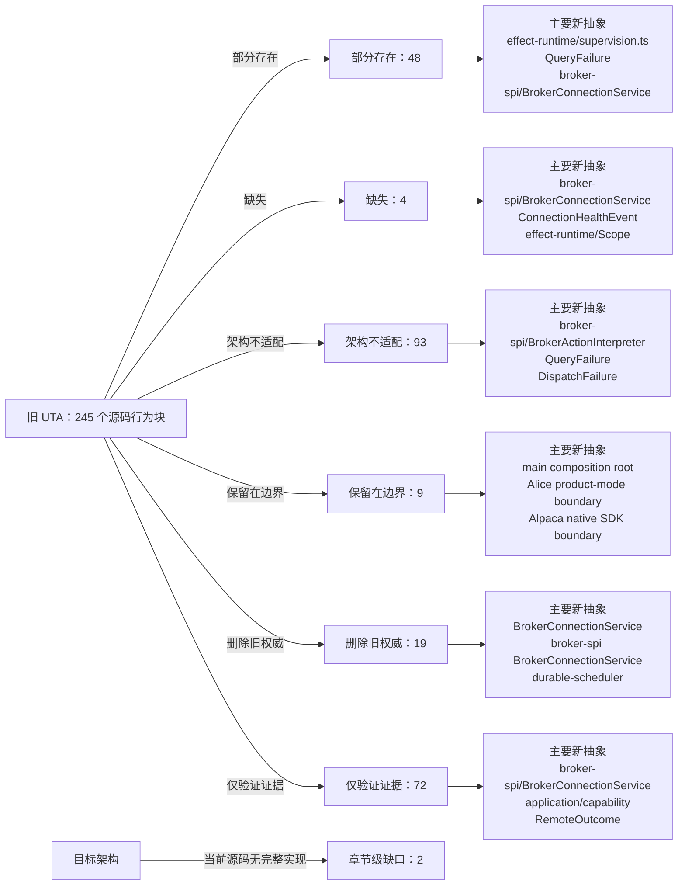

<!-- Auto-generated by scripts/uta-effect-runtime-map.mjs from mapping.json. Do not edit by hand. -->
<!-- Regenerate with `node scripts/uta-effect-runtime-map.mjs`. -->

# UTA 功能替代关系：第 4 章 Effect model

目标架构原文：[`docs/uta-effect-runtime-architecture.md:281-312`](../uta-effect-runtime-architecture.md#L281-L312)。

## 结论

部分存在 48；缺失 4；架构不适配 93；保留在边界 9；删除旧权威 19；仅验证证据 72。状态只描述当前实现相对于目标架构的关系，不表示迁移已经落地。

## 替代关系图

## 章节级目标缺口

| 依据 | 目标义务 | 当前缺口 | 必须补充或调整 |
|---|---|---|---|
| docs/uta-effect-runtime-architecture.md:307-307 | Effect Queue boundary | No current facility implements Queue as bounded admission/worker wake-up while durable jobs remain authoritative in SQLite. Legacy queues and Promise chains either lack capacity or durability separation. | Use a configured-capacity Effect Queue only for admission/wake-up, block producers at capacity, and persist EffectJob identity before any broker mutation. Never present the Queue as the authoritative job store. |
| docs/uta-effect-runtime-architecture.md:308-308 | STM / TRef boundary | No current facility explicitly models atomic in-memory ProposalSnapshot views while preventing them from becoming crash-recovery authority. | Use STM/TRef only for editable pre-prepare proposal views; after prepare, journal-backed transaction/version/job state is authoritative and restart-recoverable. |

## 源码映射

| 映射 ID | 当前源码 | 符号或行为块 | 当前功能 | 替代状态 | 新 UTA 抽象与做法 | 不适配位置与原因 | 必须补充或调整 | 重复索引 |
|---|---|---|---|---|---|---|---|---|
| `MAP-6496594BF0` | [`packages/uta-broker-alpaca/src/index.ts:7-9`](../../packages/uta-broker-alpaca/src/index.ts#L7-L9) | createBroker | Accepts an id, optional label, and Record<string, unknown> brokerConfig; calls AlpacaBroker.fromConfig and uses Object.assign to add brokerEngine. The result is a legacy IBroker object, not an Effect Layer or typed broker-spi interpreter. | 架构不适配 | 3.7 brokers/<broker>/；4 Effect model；9.1 Connection Layer；9.2 Typed action interpreter；9.3 Remote outcome；9.4 Capability derivation；12.2 Unknown-outcome protocol；16 Target source layout；17 Migration sequence / Slice 4: first real broker；19 Architectural prohibitions services/uta/src/brokers/alpaca/；services/uta/src/broker-spi/BrokerConnectionService；services/uta/src/broker-spi/BrokerActionInterpreter；services/uta/src/broker-spi/RemoteOutcome；services/uta/src/durable-scheduler/；services/uta/src/main.ts Replace this legacy factory export with the target versioned pack entrypoint: validate the typed Alpaca configuration, return the adapter's scoped BrokerConnectionService Layer and action-specific BrokerActionInterpreter, and let main.ts register it for durable-scheduler dispatch. Dispatch must carry a DispatchIdentity, persist outcomes through the scheduler/journal path, and expose compensation compilation; no wrapper-created object may become transaction-kernel state. | The current factory performs immediate legacy object construction, erases configuration as Record<string, unknown>, adds an ad-hoc brokerEngine property, and supplies none of the target availability, dispatch, observation, unknown-outcome, idempotency, or compensation contracts. It therefore cannot satisfy the Alpaca typed-interpreter migration or crash-recovery protocol. | Implement and export the Alpaca target interpreter/connection descriptor, including native request compilation, typed broker failures, paper/live capability derivation, remote order observation, idempotency proof or reconcile-before-retry, and compensation programs. Register it through the composition root and durable scheduler; delete the old Alpaca dispatcher path once this adapter owns the account mutation. | **DUP-005** |
| `MAP-9D3DC42AC9` | [`packages/uta-broker-ccxt/src/index.ts:7-9`](../../packages/uta-broker-ccxt/src/index.ts#L7-L9) | createBroker | Accepts an id, optional label, and Record<string, unknown> brokerConfig; calls CcxtBroker.fromConfig and uses Object.assign to add brokerEngine. The result is a legacy IBroker object, not an Effect Layer or typed broker-spi interpreter. | 架构不适配 | 3.7 brokers/<broker>/；4 Effect model；9.1 Connection Layer；9.2 Typed action interpreter；9.3 Remote outcome；9.4 Capability derivation；12.2 Unknown-outcome protocol；16 Target source layout；17 Migration sequence / Slice 5: heterogeneous brokers；19 Architectural prohibitions services/uta/src/brokers/ccxt/；services/uta/src/broker-spi/BrokerConnectionService；services/uta/src/broker-spi/BrokerActionInterpreter；services/uta/src/broker-spi/RemoteOutcome；services/uta/src/durable-scheduler/；services/uta/src/main.ts Replace this legacy factory export with the target versioned pack entrypoint: validate typed CCXT configuration, return the adapter's scoped BrokerConnectionService Layer and action-specific BrokerActionInterpreter, and let main.ts register it for durable-scheduler dispatch. Dispatch must carry a DispatchIdentity, persist outcomes through the scheduler/journal path, and expose compensation compilation; no wrapper-created object may become transaction-kernel state. | The current factory performs immediate legacy object construction, erases configuration as Record<string, unknown>, adds an ad-hoc brokerEngine property, and supplies none of the target availability, dispatch, observation, unknown-outcome, idempotency, or compensation contracts. It cannot prove CCXT sub-account or venue-specific capability derivation. | Implement and export the CCXT target interpreter/connection descriptor, including exchange-native request compilation, typed broker failures, sub-account or wallet capability derivation, remote order/position observation, idempotency proof or reconcile-before-retry, and compensation programs. Register it through the composition root and durable scheduler; delete the old CCXT dispatcher path once this adapter owns account mutations. | **DUP-010** |
| `MAP-3392948A39` | [`packages/uta-broker-ibkr/src/index.ts:7-9`](../../packages/uta-broker-ibkr/src/index.ts#L7-L9) | createBroker | Accepts an id, optional label, and Record<string, unknown> brokerConfig; calls IbkrBroker.fromConfig and uses Object.assign to add brokerEngine. The result is a legacy IBroker object, not an Effect Layer or typed broker-spi interpreter. | 架构不适配 | 3.7 brokers/<broker>/；4 Effect model；9.1 Connection Layer；9.2 Typed action interpreter；9.3 Remote outcome；9.4 Capability derivation；12.2 Unknown-outcome protocol；16 Target source layout；17 Migration sequence / Slice 5: heterogeneous brokers；19 Architectural prohibitions services/uta/src/brokers/ibkr/；services/uta/src/broker-spi/BrokerConnectionService；services/uta/src/broker-spi/BrokerActionInterpreter；services/uta/src/broker-spi/RemoteOutcome；services/uta/src/durable-scheduler/；services/uta/src/main.ts Replace this legacy factory export with the target versioned pack entrypoint: validate typed IBKR configuration, return the adapter's scoped BrokerConnectionService Layer and action-specific BrokerActionInterpreter, and let main.ts register it for durable-scheduler dispatch. Dispatch must carry a DispatchIdentity, persist outcomes through the scheduler/journal path, and expose compensation compilation; no wrapper-created object may become transaction-kernel state. | The current factory performs immediate legacy object construction, erases configuration as Record<string, unknown>, adds an ad-hoc brokerEngine property, and supplies none of the target availability, dispatch, observation, unknown-outcome, idempotency, or compensation contracts. It cannot represent IBKR callback-stream health or linked-account identity in the target SPI. | Implement and export the IBKR target interpreter/connection descriptor, including scoped callback streams, linked-account and native-order identity, typed broker failures, remote observation, idempotency proof or reconcile-before-retry, and compensation programs. Register it through the composition root and durable scheduler; delete the old IBKR dispatcher path once this adapter owns account mutations. | **DUP-015** |
| `MAP-50C8158380` | [`packages/uta-broker-leverup/src/index.ts:7-9`](../../packages/uta-broker-leverup/src/index.ts#L7-L9) | createBroker | Accepts an id, optional label, and Record<string, unknown> brokerConfig; calls LeverupBroker.fromConfig and uses Object.assign to add brokerEngine. The result is a legacy IBroker object, not an Effect Layer or typed broker-spi interpreter. | 架构不适配 | 3.7 brokers/<broker>/；4 Effect model；9.1 Connection Layer；9.2 Typed action interpreter；9.3 Remote outcome；9.4 Capability derivation；12.2 Unknown-outcome protocol；16 Target source layout；17 Migration sequence / Slice 5: heterogeneous brokers；19 Architectural prohibitions services/uta/src/brokers/leverup/；services/uta/src/broker-spi/BrokerConnectionService；services/uta/src/broker-spi/BrokerActionInterpreter；services/uta/src/broker-spi/RemoteOutcome；services/uta/src/durable-scheduler/；services/uta/src/main.ts Replace this legacy factory export with the target versioned pack entrypoint: validate typed LeverUp configuration, return the adapter's scoped BrokerConnectionService/relayer Layer and action-specific BrokerActionInterpreter, and let main.ts register it for durable-scheduler dispatch. Dispatch must carry a DispatchIdentity, persist outcomes through the scheduler/journal path, and expose compensation compilation; no wrapper-created object may become transaction-kernel state. | The current factory performs immediate legacy object construction, erases configuration as Record<string, unknown>, adds an ad-hoc brokerEngine property, and supplies none of the target availability, dispatch, observation, unknown-outcome, idempotency, or compensation contracts. It cannot reconcile a relayer-accepted mutation after a lost process or network boundary. | Implement and export the LeverUp target interpreter/connection descriptor, including relayer-native request compilation, typed relayer failures, dispatch identity, explicit observation/reconciliation after timeout, capability derivation, idempotency proof or reconcile-before-retry, and compensation programs. Register it through the composition root and durable scheduler; delete the old LeverUp dispatcher path once this adapter owns account mutations. | **DUP-020** |
| `MAP-E52D407CDC` | [`packages/uta-broker-longbridge/src/index.ts:7-9`](../../packages/uta-broker-longbridge/src/index.ts#L7-L9) | createBroker | Accepts an id, optional label, and Record<string, unknown> brokerConfig; calls LongbridgeBroker.fromConfig and uses Object.assign to add brokerEngine. The result is a legacy IBroker object, not an Effect Layer or typed broker-spi interpreter. | 架构不适配 | 3.7 brokers/<broker>/；4 Effect model；9.1 Connection Layer；9.2 Typed action interpreter；9.3 Remote outcome；9.4 Capability derivation；12.2 Unknown-outcome protocol；16 Target source layout；17 Migration sequence / Slice 5: heterogeneous brokers；19 Architectural prohibitions services/uta/src/brokers/longbridge/；services/uta/src/broker-spi/BrokerConnectionService；services/uta/src/broker-spi/BrokerActionInterpreter；services/uta/src/broker-spi/RemoteOutcome；services/uta/src/durable-scheduler/；services/uta/src/market-and-accounting/；services/uta/src/main.ts Replace this legacy factory export with the target versioned pack entrypoint: validate typed Longbridge configuration, return the adapter's scoped BrokerConnectionService Layer and action-specific BrokerActionInterpreter, and let main.ts register it for durable-scheduler dispatch. Dispatch must carry a DispatchIdentity, persist outcomes through the scheduler/journal path, and expose compensation compilation; no wrapper-created object may become transaction-kernel state. | The current factory performs immediate legacy object construction, erases configuration as Record<string, unknown>, adds an ad-hoc brokerEngine property, and supplies none of the target availability, dispatch, observation, unknown-outcome, idempotency, or compensation contracts. It cannot express Longbridge's jurisdiction and currency boundaries as typed broker/market observations. | Implement and export the Longbridge target interpreter/connection descriptor, including native request compilation, typed broker failures, account and jurisdiction metadata, currency-qualified observations, remote order/exposure reconciliation, idempotency proof or reconcile-before-retry, and compensation programs. Register it through the composition root and durable scheduler; delete the old Longbridge dispatcher path once this adapter owns account mutations. | **DUP-025** |
| `MAP-E954ABE476` | [`packages/uta-protocol/src/brokers/preset-catalog.ts:524-531`](../../packages/uta-protocol/src/brokers/preset-catalog.ts#L524-L531) | getBrokerPreset | Finds a preset by raw string id and throws a generic Error listing known ids when absent. | 部分存在 | 4. Effect model；5.7 Complete type contract — error channels；9.4 Capability derivation；14. Public protocol；15. Security and authority；19. Architectural prohibitions protocol/config parser；CapabilityUnavailable；QueryFailure；application/ Parse preset identifiers at the configuration/application boundary into a closed preset/config ADT and return a typed unknown-preset failure. | Unknown external input throws a generic Error/string list rather than returning a named failure; the list itself can expose registry details and no capability context. | Replace getBrokerPreset's throw with a typed Result/Effect failure and schema-decoded preset id; keep registry lookup outside domain and never use it as capability proof. | **DUP-044** |
| `MAP-4FEAB1D03E` | [`packages/uta-protocol/src/brokers/preset-catalog.ts:533-537`](../../packages/uta-protocol/src/brokers/preset-catalog.ts#L533-L537) | isPaperPreset | Looks up a raw preset id and invokes an optional custom isPaper callback or generic mode heuristic over Record<string, unknown>. | 部分存在 | 4. Effect model；7.1 Embedded database；9.4 Capability derivation；14. Public protocol；15. Security and authority；19. Architectural prohibitions broker-specific config ADT；ActionContext；CapabilitySet；protocol/config schemas Derive environment/account mode from each validated broker config ADT and make it part of connection/capability context, not a generic callback result. | An optional callback plus raw config record can silently classify unknown or incompatible modes and is disconnected from actual broker connection/venue state. | Remove generic isPaper behavior from runtime decisions, use exhaustive config variants and adapter-observed environment metadata, and expose uncertainty as a typed capability result. | **DUP-045** |
| `MAP-139EBB287C` | [`packages/uta-protocol/src/client/UTAClient.ts:1-11`](../../packages/uta-protocol/src/client/UTAClient.ts#L1-L11) | UTA client transport contract documentation | Describes a low-level HTTP helper with higher-level adapters layered elsewhere and explicitly says errors are normalized to JavaScript Errors; endpoint validation and WireBrokerError round-trip are future work. | 架构不适配 | 2.1 Alice owns；3.9 transport/ and protocol/；4. Effect model；9.2 Typed action interpreter；12.3 Defects and expected failures；14. Public protocol；15. Security and authority；19. Architectural prohibitions transport/http；protocol/；application/；TransactionFailure；QueryFailure Make the client SDK a typed proxy for the transaction-oriented public routes, decoding named success/failure schemas and preserving correlation/authorization context. | The module explicitly documents unvalidated endpoints and Error-based failures, contrary to the target requirement that every request/response use shared runtime schemas and typed expected failures. | Replace the generic low-level public contract with route-specific typed methods/codecs and typed failure mapping; keep any raw HTTP primitive private to transport/http. | **DUP-056** |
| `MAP-A4FE5AF865` | [`packages/uta-protocol/src/client/UTAClient.ts:13-20`](../../packages/uta-protocol/src/client/UTAClient.ts#L13-L20) | UTAClientOptions | Accepts a base URL, optional fetch override, and optional timeout in milliseconds with a default of 15 seconds. | 部分存在 | 2.1 Alice owns；3.2 effect-runtime/；3.9 transport/ and protocol/；4. Effect model；12.1 Startup sequence；14. Public protocol；15. Security and authority transport/http；effect-runtime/；protocol/；transport principal authentication；transaction authorizer actor/policy/capability Retain base URL/clock configuration at the transport boundary, but add the authenticated typed proxy and explicit cancellation/timeout failure mapping required by protocol routes. | The options contain no transport-principal authentication context or route schema configuration. Timeout is a local abort setting with no typed transport/QueryFailure mapping, and transaction actor/policy/capability authorization is not modeled as a separate application/kernel input. | Compose authenticated transport and route-specific codecs; map administrative-read timeout/abort to typed transport or QueryFailure variants. Separately pass actor, policy, and capability context to prepare/approve; reserve RemoteOutcome.Unknown for ambiguous durable broker dispatch. | **DUP-057** |
| `MAP-06118417F5` | [`packages/uta-protocol/src/client/UTAClient.ts:31-35`](../../packages/uta-protocol/src/client/UTAClient.ts#L31-L35) | RequestOpts | Accepts an unknown body, string/number/undefined query record, and optional AbortSignal. | 架构不适配 | 3.9 transport/ and protocol/；4. Effect model；8.1 Admission；9.2 Typed action interpreter；14. Public protocol；19. Architectural prohibitions transport/http；protocol/ request schemas；TransactionCommand；QueryFailure Make each route's request type a decoded named schema and carry cancellation/timeout through the transport Effect boundary without weakening body/query types. | `body?: unknown` and a raw query map permit unvalidated commands, while no typed admission response or expected transport failure is represented. | Replace RequestOpts with route-specific request records/codecs; keep AbortSignal as an implementation boundary and map transport failures to typed protocol errors. | **DUP-059** |
| `MAP-7E1806AFC4` | [`packages/uta-protocol/src/client/UTAClient.ts:37-46`](../../packages/uta-protocol/src/client/UTAClient.ts#L37-L46) | UTAHttpError | Throws an Error subclass carrying HTTP status, unknown body, and a message string; it does not decode a failure envelope. | 架构不适配 | 1. Thesis and non-negotiable properties；4. Effect model；5.7 Complete type contract — error channels；9.2 Typed action interpreter；12.3 Defects and expected failures；14. Public protocol；19. Architectural prohibitions TransactionFailure；QueryFailure；DispatchFailure；ProtocolViolation；protocol/ failure schemas Return/decode route-specific TransactionFailure or QueryFailure ADTs, preserving HTTP transport metadata separately and treating malformed bodies as ProtocolViolation. | Unknown body plus message-based Error handling collapses expected failures and malformed responses; consumers cannot exhaustively handle validation/conflict/capability/storage/unknown outcomes. | Replace UTAHttpError with typed client failure decoding and a distinct malformed-response defect/protocol-violation path; update all callers to handle the ADTs. | **DUP-060** |
| `MAP-22C9C06082` | [`packages/uta-protocol/src/client/UTAClient.ts:48-61`](../../packages/uta-protocol/src/client/UTAClient.ts#L48-L61) | createUTAClient initialization and buildUrl | Normalizes a trailing slash, selects global/override fetch, defaults timeout, and constructs URLs from arbitrary paths and query entries by String conversion. | 部分存在 | 2.1 Alice owns；3.2 effect-runtime/；3.9 transport/ and protocol/；4. Effect model；8.1 Admission；14. Public protocol；15. Security and authority；19. Architectural prohibitions transport/http；effect-runtime/；protocol/；application/ Keep URL construction as a private transport helper, but bind it to the closed route table, authenticated transport layer, and typed query encoders. | Arbitrary path/query construction permits calls outside the public route contract and silently stringifies unvalidated values; auth and correlation handling are absent here. | Hide buildUrl behind route-specific client methods, validate/encode query parameters from named schemas, and compose transport authentication/correlation explicitly. | **DUP-061** |
| `MAP-8C22894ED4` | [`packages/uta-protocol/src/client/UTAClient.ts:63-88`](../../packages/uta-protocol/src/client/UTAClient.ts#L63-L88) | UTAClient.request | Builds a JSON request, creates an AbortController timeout, performs fetch, parses response text with safeJSON, extracts an `error` field by object cast on non-2xx, and casts successful body to T without validation. | 架构不适配 | 1. Thesis and non-negotiable properties；3.4 journal-store/；3.5 durable-scheduler/；3.9 transport/ and protocol/；4. Effect model；5.7 Complete type contract — public protocol envelopes；7.2 Single logical writer and group commit；8.1 Admission；9.2 Typed action interpreter；12.2 Unknown-outcome protocol；14. Public protocol；15. Security and authority；19. Architectural prohibitions transport/http；protocol/；TransactionCommand；PrepareTransactionResponse；GetTransactionResponse；TransactionFailure；QueryFailure Encode a named request, send it through authenticated transport, decode the exact success/failure schema, and preserve typed timeout/transport/protocol outcomes without generic casts. | Successful responses are body as T, errors are reduced to a string error field/message, and timeout/abort has no route-specific typed transport/auth/protocol representation. | Implement route-specific success and failure schema decoding plus typed transport/auth/protocol errors and correlation metadata. A public request timeout is not itself RemoteOutcome.Unknown; only a durable scheduler handling ambiguous broker dispatch may create that outcome. | **DUP-062** |
| `MAP-E56045946F` | [`packages/uta-protocol/src/client/UTAClient.ts:101-103`](../../packages/uta-protocol/src/client/UTAClient.ts#L101-L103) | safeJSON | Attempts JSON.parse and returns either the parsed unknown value or the original response text on parse failure. | 架构不适配 | 3.9 transport/ and protocol/；4. Effect model；9.2 Typed action interpreter；12.3 Defects and expected failures；14. Public protocol；19. Architectural prohibitions protocol/ codecs；ProtocolViolation；QueryFailure；TransactionFailure Decode through the expected named schema and turn malformed JSON/schema into an explicit ProtocolViolation/typed transport failure with evidence. | Returning arbitrary text as unknown silently accepts malformed responses and prevents exhaustive protocol failure handling. | Remove safeJSON as the response contract; parse syntax then decode the route schema, fail loudly on malformed data, and preserve redacted evidence for diagnostics. | **DUP-064** |
| `MAP-654966E128` | [`packages/uta-protocol/src/types/broker.spec.ts:1-3`](../../packages/uta-protocol/src/types/broker.spec.ts#L1-L3) | BrokerError test import | The spec imports the legacy BrokerError class directly from the broker wire-types module. | 仅验证证据 | 4. Effect model；9.2 Typed action interpreter；12.3 Defects and expected failures；18. Verification contract；19. Architectural prohibitions broker-spi/；BrokerRejection；DispatchFailure；protocol/ Use the spec as migration evidence only, then replace the import with the target broker failure and protocol-schema constructors. | This is evidence of a class-based legacy error contract, not proof of the target typed failure channel. | Retire the class-based fixture when BrokerRejection/DispatchFailure schemas and adapter mapping are available, and test exhaustive failure encoding instead. | **DUP-067** |
| `MAP-ACEFB58A14` | [`packages/uta-protocol/src/types/broker.spec.ts:5-19`](../../packages/uta-protocol/src/types/broker.spec.ts#L5-L19) | structured BrokerError preservation test | Builds an Error-like object with name BrokerError, code AUTH, and permanent true, then asserts BrokerError.from preserves the code, permanence, and original cause. | 仅验证证据 | 4. Effect model；9.2 Typed action interpreter；12.3 Defects and expected failures；18. Verification contract；19. Architectural prohibitions BrokerRejection；DispatchFailure；BrokerActionInterpreter；protocol/ failure schemas Replace this compatibility assertion with a boundary test that decodes a named broker rejection and exhaustively maps it to the corresponding DispatchFailure without relying on constructor identity or string metadata. | The test protects cross-package class-like string-code preservation, whereas the target requires typed failure variants and schema decoding. | Delete this legacy test once adapter failures are represented by the target ADTs; retain a test for lossless structured rejection fields and explicit unknown/protocol-violation handling. | **DUP-068** |
| `MAP-1A43E0FCC4` | [`packages/uta-protocol/src/types/broker.spec.ts:21-28`](../../packages/uta-protocol/src/types/broker.spec.ts#L21-L28) | unknown BrokerError code fallback test | Builds an Error-like object with an unrecognized string code and asserts BrokerError.from silently converts it to UNKNOWN. | 仅验证证据 | 4. Effect model；9.2 Typed action interpreter；12.3 Defects and expected failures；18. Verification contract；19. Architectural prohibitions ProtocolViolation；DispatchFailure；BrokerRejection；protocol/ failure schemas Replace silent code fallback with a schema/parser test proving that an unrecognized persisted or remote failure becomes an explicit ProtocolViolation/defect path, while expected broker failures remain exhaustive ADT variants. | The test enshrines permissive unknown-code coercion, which can hide malformed protocol data and violates the target distinction between expected failures and defects. | Remove the UNKNOWN fallback assertion and test loud preservation of malformed evidence plus typed recovery behavior. | **DUP-069** |
| `MAP-6C0ADD0EA4` | [`packages/uta-protocol/src/types/broker.ts:14-20`](../../packages/uta-protocol/src/types/broker.ts#L14-L20) | BrokerErrorCode and code registry | Defines a closed string union of CONFIG/AUTH/NETWORK/EXCHANGE/MARKET_CLOSED/CONNECTING/UNKNOWN and a ReadonlySet used to validate structured codes. | 架构不适配 | 4. Effect model；9.2 Typed action interpreter；12.3 Defects and expected failures；19. Architectural prohibitions BrokerRejection；CapabilityFailure；ConnectionFailure；DispatchFailure；TransactionFailure Replace string codes with the closed broker/action failure ADTs and map adapter-specific errors to named variants carrying typed evidence. | A flat code set does not encode action, observation, capability, connection, or dispatch relationships and includes an UNKNOWN fallback rather than an explicit malformed-protocol defect. | Define exhaustive failure variants in broker-spi/domain, add boundary schemas, and make each adapter map native failures to those variants without a shared string classifier. | **DUP-071** |
| `MAP-710D1204ED` | [`packages/uta-protocol/src/types/broker.ts:22-42`](../../packages/uta-protocol/src/types/broker.ts#L22-L42) | BrokerError constructor and permanence flag | The BrokerError class stores a code and message, derives `permanent` from CONFIG/AUTH, and extends Error for normal JavaScript exception handling. | 架构不适配 | 4. Effect model；9.2 Typed action interpreter；12.3 Defects and expected failures；14. Public protocol；19. Architectural prohibitions TransactionFailure；DispatchFailure；BrokerRejection；protocol/ failure schemas Represent expected rejection, unavailable connection, unknown outcome, and protocol violation as tagged values carried by Effect failures and named public envelopes; reserve exceptions for defects/unexpected failures. | A single Error subclass with a boolean permanence flag collapses distinct expected failure channels and exposes message-oriented behavior across the wire. | Delete BrokerError as the domain/protocol error model and introduce exhaustive failure constructors plus schema encoders for HTTP, journal, scheduler, and broker boundaries. | **DUP-072** |
| `MAP-6ED1656D7F` | [`packages/uta-protocol/src/types/broker.ts:44-61`](../../packages/uta-protocol/src/types/broker.ts#L44-L61) | BrokerError.from cross-package wrapper | Accepts unknown input, trusts only an object named BrokerError with a recognized string code, otherwise classifies message text or uses a fallback, and copies an Error as cause. | 架构不适配 | 4. Effect model；9.2 Typed action interpreter；12.3 Defects and expected failures；14. Public protocol；19. Architectural prohibitions BrokerActionInterpreter；BrokerRejection；DispatchFailure；ProtocolViolation Decode untrusted adapter/transport input with a named schema and preserve structured rejection evidence; map unknown shape to ProtocolViolation or a defect rather than guessing from message text. | Unknown data is narrowed with casts and class/name checks, and message classification can turn malformed or ambiguous failures into the wrong expected variant. | Remove `BrokerError.from`; add explicit parser functions for native adapter errors and wire failures, with exhaustive mapping and loud malformed-record handling. | **DUP-073** |
| `MAP-9F0ED3057E` | [`packages/uta-protocol/src/types/broker.ts:63-79`](../../packages/uta-protocol/src/types/broker.ts#L63-L79) | BrokerError.classifyMessage | Lowercases arbitrary error text and applies regexes for market closed, network, authentication, forbidden, insufficient funds, and margin before returning a code. | 架构不适配 | 4. Effect model；9.2 Typed action interpreter；12.3 Defects and expected failures；19. Architectural prohibitions BrokerActionInterpreter；BrokerRejection；DispatchFailure；ProtocolViolation Have each broker adapter return typed failure variants from its native response/error schema; preserve the original evidence and classify only through explicit adapter code, not regex text. | The target explicitly prohibits string-regex error classification as the domain error model; regexes cannot distinguish action-specific rejection, unavailable connection, unknown remote outcome, and protocol defects reliably. | Delete the regex classifier and implement per-adapter typed error mapping plus exhaustive DispatchFailure/TransactionFailure handling. | **DUP-074** |
| `MAP-FE024081BB` | [`packages/uta-protocol/src/types/broker.ts:170-180`](../../packages/uta-protocol/src/types/broker.ts#L170-L180) | PlaceOrderResult | Uses a success boolean plus optional orderId/error/message, native Execution/OrderState objects, and optional bracket legs for place/modify/close results. | 架构不适配 | 1. Thesis and non-negotiable properties；4. Effect model；5.7 Complete type contract — broker capability and interpreter association；9.2 Typed action interpreter；9.3 Remote outcome；12.2 Unknown-outcome protocol；14. Public protocol；19. Architectural prohibitions BrokerActionInterpreter；RemoteOutcome；DispatchFailure；PlaceOrderAcknowledgement；TransactionResult Use action-specific acknowledgement, observation, rejection, and unknown-outcome ADTs tied to DispatchIdentity; let the kernel persist the durable transition before and after dispatch. | Boolean success and optional error/message fields cannot distinguish accepted, working, filled, rejected, or unknown outcomes, and native SDK values leak through the public type. | Delete PlaceOrderResult, define the closed BrokerActionTypeMap contracts and RemoteOutcome/DispatchFailure variants, and expose only named protocol envelopes. | **DUP-078** |
| `MAP-98D887D066` | [`packages/uta-protocol/src/types/broker.ts:415-426`](../../packages/uta-protocol/src/types/broker.ts#L415-L426) | BrokerConnectionStateEvent | Defines alive/dead/restored string states and an optional error string for an adapter-to-UTA transport signal. | 部分存在 | 3.2 effect-runtime/；3.6 broker-spi/；4. Effect model；9.1 Connection Layer；12.1 Startup sequence；13. Observability BrokerConnectionService；ConnectionHealthEvent；ConnectionFailure；effect-runtime/ Make connection health a typed Stream from a scoped BrokerConnectionService Layer, with reconnect/readiness evidence and no transaction state in the connection object. | The event has an open-ended error string and no connection identity, readiness evidence, or typed failure channel; listeners are optional callbacks rather than Effect streams. | Replace the callback event with BrokerConnectionService.observeHealth and typed ConnectionFailure/health variants managed by adapter Scope/Layers. | **DUP-091** |
| `MAP-25118F5AFA` | [`packages/uta-protocol/src/types/broker.ts:475-498`](../../packages/uta-protocol/src/types/broker.ts#L475-L498) | IBroker lifecycle methods | The generic IBroker interface exposes id/label/brokerEngine/meta, Promise-based init/close, and an optional callback listener for connection state. | 删除旧权威 | 2.2 UTA owns；3.2 effect-runtime/；3.6 broker-spi/；4. Effect model；9.1 Connection Layer；12.1 Startup sequence；15. Security and authority；17.6 Slice 6: delete the legacy kernel；19. Architectural prohibitions BrokerConnectionService；effect-runtime/；Scope；Layer；ConnectionHealthEvent Replace lifecycle callbacks with a scoped BrokerConnectionService supplied by an Effect Layer; keep connection identity/health inside broker-spi and adapter scope, not transaction state. | Promise<void>, optional listeners, and a generic metadata bag cannot express Effect requirements/failures, Scope ownership, supervision, or typed health streams. | Delete this lifecycle portion of IBroker as adapters migrate, implement BrokerConnectionService/Layers, and expose typed connection/capability failures to the scheduler and application. | **DUP-096** |
| `MAP-255335BC1C` | [`packages/uta-protocol/src/types/broker.ts:524-529`](../../packages/uta-protocol/src/types/broker.ts#L524-L529) | IBroker trading mutation methods | Defines placeOrder, modifyOrder with Partial<Order>, cancelOrder, and closePosition as direct Promise mutations returning PlaceOrderResult. | 删除旧权威 | 1. Thesis and non-negotiable properties；3.3 transaction-kernel/；3.5 durable-scheduler/；3.6 broker-spi/；4. Effect model；5.3 Two-phase transaction protocol；5.7 Complete type contract — order and trading action ADTs；8. Scheduling, ordering, and concurrency；9.2 Typed action interpreter；12.2 Unknown-outcome protocol；17.6 Slice 6: delete the legacy kernel；19. Architectural prohibitions transaction-kernel/；durable-scheduler/；TradeAction；PreparedStep；BrokerActionInterpreter；DispatchIdentity；RemoteOutcome Make application commands enter transaction-kernel prepare/approve/execute; scheduler dispatches typed broker-spi actions only after DispatchPlanned durability and reconciles unknown outcomes. | Direct Promise mutation bypasses prepare, before-images, compensation proof, durable outbox/job admission, dispatch identity, typed remote outcomes, and backpressure. | Delete generic write methods and PlaceOrderResult when migration lands; implement action-specific BrokerActionInterpreter ports consumed by transaction-kernel and durable-scheduler. | **DUP-098** |
| `MAP-BC6607AA1D` | [`packages/uta-protocol/src/types/broker.ts:607-610`](../../packages/uta-protocol/src/types/broker.ts#L607-L610) | IBroker getCapabilities | Returns the static AccountCapabilities string-array shape synchronously, with no Effect failure, requirements, or action-specific availability. | 删除旧权威 | 3.2 effect-runtime/；3.6 broker-spi/；4. Effect model；9.2 Typed action interpreter；9.4 Capability derivation；14. Public protocol；17.6 Slice 6: delete the legacy kernel；19. Architectural prohibitions CapabilitySet；ActionAvailability；ActionContext；BrokerConnectionService；CapabilityFailure Expose Effectful, context-derived CapabilitySet/ActionAvailability from broker-spi and the public capabilities application service. | The static synchronous result cannot represent degraded/unavailable capabilities, requirements, context, idempotency, compensation class, or schema. | Replace getCapabilities with BrokerConnectionService and action-interpreter availability ports returning typed Effect failures/results, then remove the legacy method. | **DUP-102** |
| `MAP-430A3CCB4D` | [`packages/uta-protocol/src/types/errors.ts:1-19`](../../packages/uta-protocol/src/types/errors.ts#L1-L19) | WireBrokerError | Defines the failure wire shape used by every endpoint as string code, human message, transient boolean, and optional hint; comments promise lossless reconstruction of the in-process BrokerError. | 架构不适配 | 1. Thesis and non-negotiable properties；4. Effect model；5.7 Complete type contract — error channels；9.2 Typed action interpreter；12.3 Defects and expected failures；14. Public protocol；15. Security and authority；19. Architectural prohibitions；3.1 domain/；3.9 transport/ and protocol/ TransactionFailure；QueryFailure；DispatchFailure；BrokerRejection；ProtocolViolation；protocol/ failure schemas Encode named TransactionFailure, QueryFailure, DispatchFailure, capability, connection, and broker-rejection variants with exhaustive schemas and redacted structured evidence. | `code: string`, `message: string`, and `transient: boolean` collapse expected failure variants, do not preserve action/dispatch/transaction identity, and make Error.message the effective protocol model. | Delete WireBrokerError as the universal error envelope; define route-specific failure ADTs/codecs, map them exhaustively in transport/CLI/UI, and redact native payloads/secrets. | **DUP-105** |
| `MAP-DE16B51F52` | [`packages/uta-protocol/src/types/git.ts:60-77`](../../packages/uta-protocol/src/types/git.ts#L60-L77) | OperationResult | Combines action, success boolean, flat status, optional native Execution/OrderState, optional string error, child legs, symbol attribution, and raw unknown payload. | 删除旧权威 | 1. Thesis and non-negotiable properties；4. Effect model；5.7 Complete type contract — broker capability and interpreter association；6. State tiers and snapshots；9.2 Typed action interpreter；9.3 Remote outcome；11. Approval and Git audit projection；12.2 Unknown-outcome protocol；14. Public protocol；17.6 Slice 6: delete the legacy kernel；19. Architectural prohibitions BrokerActionTypeMap；RemoteOutcome；DispatchFailure；TransactionResult；ProjectionName；projection-store/ Persist action-specific acknowledgement/rejection/observation/unknown variants keyed by DispatchIdentity, and expose a transaction result/projection with typed failures. | `success`, optional error text, and `raw?: unknown` erase the relation among action, acknowledgement, observation, error, compensation, and remote outcome; native SDK values leak into the contract. | Delete OperationResult, migrate result handling to BrokerActionTypeMap/RemoteOutcome/TransactionFailure, and generate Git history summaries from journal/projection events. | **DUP-110** |
| `MAP-4AFBEA2B00` | [`services/uta/src/__tests__/trading-tools.spec.ts:27-36`](../../services/uta/src/__tests__/trading-tools.spec.ts#L27-L36) | asSDK | Casts an in-process UTAManager to UTAManagerSDK because the tool accepts an HTTP-adapter-shaped interface; the comments document that getFxRates is absent and silently falls through to empty rates. | 仅验证证据 | §2 System boundary；§3.9 transport/ and protocol/；§4 Effect model；§14 Public protocol；§19 Architectural prohibitions typed UTA client/proxy；transport/http；protocol (@traderalice/uta-protocol)；application/account-query；application/capability Replace the structural cast and missing-method fallback fixture with a typed client/protocol adapter. Tests should decode named requests and responses and represent unavailable FX/capability data explicitly instead of relying on a method superset and empty fallback. | — | — | **DUP-143** |
| `MAP-A88187B75A` | [`services/uta/src/__tests__/trading-tools.spec.ts:69-87`](../../services/uta/src/__tests__/trading-tools.spec.ts#L69-L87) | UTAManager.resolveOne | Returns the sole UTA for an exact source and throws a string-bearing error when no UTA matches the requested source. | 仅验证证据 | §2 System boundary；§3.9 transport/ and protocol/；§4 Effect model；§14 Public protocol；§15 Security and authority；§18 Verification contract application/account-query；domain identifiers；protocol error schema；transport/http Map failed account resolution to a named application/protocol error variant at the boundary, preserving exact identity routing without making a thrown message the public error contract. | — | — | **DUP-145** |
| `MAP-560B7EEA32` | [`services/uta/src/__tests__/trading-tools.spec.ts:291-296`](../../services/uta/src/__tests__/trading-tools.spec.ts#L291-L296) | createTradingTools.getQuote.malformedAliceId | Invokes getQuote with an identifier lacking the expected separator and verifies that the result contains an Invalid aliceId error. | 仅验证证据 | §2 System boundary；§3.9 transport/ and protocol/；§4 Effect model；§14 Public protocol；§15 Security and authority；§18 Verification contract protocol codecs；domain identifiers；application/account-query；transport/http；typed error schema Decode a structured account/instrument identifier with a named schema before any broker call and return a typed malformed-input/protocol error; retain this assertion as boundary-rejection evidence rather than a regex error contract. | — | — | **DUP-156** |
| `MAP-E66037B98B` | [`services/uta/src/__tests__/trading-tools.spec.ts:331-340`](../../services/uta/src/__tests__/trading-tools.spec.ts#L331-L340) | createTradingTools.getContractDetails.crossUTA | Passes an Alice identifier belonging to another account while selecting mock-paper and verifies that the tool reports the account mismatch without a broker call assertion. | 仅验证证据 | §2 System boundary；§3.9 transport/ and protocol/；§4 Effect model；§14 Public protocol；§15 Security and authority；§18 Verification contract application/account-query；domain account identity；protocol error schema；transport/http；broker-spi Enforce account/UTA ownership in the application boundary and return a structured identity/authorization error before invoking any foreign broker interpreter; keep the mismatch test as a security-boundary invariant. | — | — | **DUP-159** |
| `MAP-4DE6045663` | [`services/uta/src/__tests__/trading-tools.spec.ts:373-387`](../../services/uta/src/__tests__/trading-tools.spec.ts#L373-L387) | placeOrder.inputSchema.invalidNumerics | Uses a non-positive totalQuantity and verifies that the placeOrder schema rejects the input before execution. | 仅验证证据 | §2 System boundary；§3.9 transport/ and protocol/；§4 Effect model；§5 Transaction algebra；§14 Public protocol；§15 Security and authority；§18 Verification contract protocol action schema；domain order/action ADTs；application/transaction；transaction-kernel；transport/http；typed validation errors Reject malformed or non-positive order quantities with a named schema/domain failure before prepare or broker dispatch; this test remains evidence for the input gate, not for authorization, durability, or execution semantics. | — | — | **DUP-161** |
| `MAP-73F753A129` | [`services/uta/src/domain/trading/__test__/e2e/setup.ts:62-84`](../../services/uta/src/domain/trading/__test__/e2e/setup.ts#L62-L84) | BROKER_INIT_TIMEOUT_MS and initWithTimeout | Imposes a 30-second Promise timeout around broker.init and settles once either initialization or timeout/error wins. | 保留在边界 | 4 Effect model；9.1 Connection Layer；12.1 Startup sequence；18.3 Real broker acceptance effect-runtime Scope/Supervision；brokers scoped Layer；broker-spi ConnectionFailure Keep this bounded test setup guard, while target runtime uses Effect scopes, typed connection failures, and supervised reconnect/shutdown policies. | Promise timeout and direct broker.init do not establish target startup ordering, scoped Layers, heartbeats, or typed degraded account capability. | — | **DUP-212** |
| `MAP-3D797361F3` | [`services/uta/src/domain/trading/__test__/e2e/setup.ts:86-95`](../../services/uta/src/domain/trading/__test__/e2e/setup.ts#L86-L95) | cached/getTestAccounts | Caches one Promise of initialized paper TestAccount records at module scope so subsequent suites reuse the same broker instances. | 保留在边界 | 3.2 effect-runtime/；3.6 broker-spi/；4 Effect model；7 Durability architecture；8 Scheduling, ordering, and concurrency；12.1 Startup sequence；17 Migration sequence；18.2 Concurrency scenarios effect-runtime root Scope；broker-spi scoped Layers；durable-scheduler Retain singleton reuse only as a test harness optimization; target process composition should own scoped Layers and durable services, while tests isolate account/journal namespaces explicitly. | The module-global Promise is in-memory and requires serial Vitest execution; it is not a durable runtime scope, startup recovery coordinator, queue, or concurrency proof. | — | **DUP-213** |
| `MAP-B4CCE8940E` | [`services/uta/src/domain/trading/__test__/e2e/setup.ts:97-139`](../../services/uta/src/domain/trading/__test__/e2e/setup.ts#L97-L139) | initAll | Reads UTA config, skips non-paper/credentialless/disabled accounts, probes IBKR reachability, creates each broker through the legacy factory, initializes it with a timeout, and returns the surviving broker records. | 保留在边界 | 2 System boundary；3.2 effect-runtime/；3.6 broker-spi/；4 Effect model；9.1 Connection Layer；12.1 Startup sequence；15 Security and authority；17 Migration sequence；18.3 Real broker acceptance main composition root；effect-runtime Layers/Scope；broker-spi connection and capability services；application account service；transaction-kernel startup recovery Use this only to select safe external paper accounts; target main composition must acquire scoped broker Layers, open/verify/recover SQLite before admission, and expose typed degraded capabilities without blocking unrelated accounts. | The helper calls readUTAsConfig/createBroker/IBroker directly and only skips initialization failures; it does not run target journal migrations/invariant checks, recover unfinished work, or establish broker-spi capabilities. | — | **DUP-214** |
| `MAP-AF81F62711` | [`services/uta/src/domain/trading/__test__/uta-health.spec.ts:1-22`](../../services/uta/src/domain/trading/__test__/uta-health.spec.ts#L1-L22) | health test fixtures flush / createUTA | Imports UnifiedTradingAccount and MockBroker, extends the contract, advances fake timers by zero to settle constructor-triggered _connect, and constructs a UTA with an optional MockBroker. | 仅验证证据 | §3.2 effect-runtime/；§3.7 brokers/<broker>/；§4 Effect model；§9.1 Connection Layer；§12.1 Startup sequence；§18 Verification contract；§19 Architectural prohibitions effect-runtime Layer/Scope/Fiber；broker-spi/BrokerConnectionService；brokers/Mock；main composition root；verification harness Retain MockBroker as a scoped connection fixture, but construct it through effect-runtime Layers and supervised Fibers and observe typed health events; do not use constructor fire-and-forget as the target lifecycle or treat timer flushing as durable recovery evidence. | — | — | **DUP-244** |
| `MAP-D71042F42A` | [`services/uta/src/domain/trading/__test__/uta-health.spec.ts:24-35`](../../services/uta/src/domain/trading/__test__/uta-health.spec.ts#L24-L35) | UTA health initial connect healthy | With fake timers, constructs a UTA, flushes the initial asynchronous connect, and asserts healthy state, a Date-valued lastSuccessAt, and recovering=false. | 仅验证证据 | §4 Effect model；§9.1 Connection Layer；§12.1 Startup sequence；§13 Observability；§18 Verification contract effect-runtime/Scope and Fiber；broker-spi/BrokerConnectionService；brokers/Mock；application/capability Record startup reachability evidence as a connection-service health event and capability projection. The target startup sequence must establish journal validity and classify unfinished work before admission; this test covers only broker connection state. | — | — | **DUP-245** |
| `MAP-EF93AB390A` | [`services/uta/src/domain/trading/__test__/uta-health.spec.ts:37-48`](../../services/uta/src/domain/trading/__test__/uta-health.spec.ts#L37-L48) | UTA health initial connect failure | Configures MockBroker.init to fail at startup, flushes the asynchronous connect, and asserts offline health, recovering=true, and the captured simulated init error before closing the UTA. | 仅验证证据 | §4 Effect model；§9.1 Connection Layer；§12.1 Startup sequence；§12.3 Defects and expected failures；§13 Observability；§18 Verification contract broker-spi/BrokerConnectionService；effect-runtime/Schedule and Fiber；application/capability；brokers/Mock；observability Map connection acquisition failure to a typed unavailable/degraded capability and supervised recovery signal. Keep broker-error evidence, but do not infer the full startup contract because SQLite open, migrations, journal verification, and unfinished-work classification are outside this test. | — | — | **DUP-246** |
| `MAP-1F940280FC` | [`services/uta/src/domain/trading/__test__/uta-health.spec.ts:50-67`](../../services/uta/src/domain/trading/__test__/uta-health.spec.ts#L50-L67) | UTA health initial recovery success | Fails the first init attempt, asserts offline, advances five seconds, and verifies that recovery succeeds and recovering becomes false. | 仅验证证据 | §4 Effect model；§9.1 Connection Layer；§12.1 Startup sequence；§13 Observability；§18 Verification contract effect-runtime/Schedule；effect-runtime/Fiber；broker-spi/BrokerConnectionService；durable-scheduler；brokers/Mock Map the first reconnect attempt to an explicit supervised connection schedule and health event. Durable trading jobs must remain in durable-scheduler/journal-store rather than being represented by this in-memory timer. | — | — | **DUP-247** |
| `MAP-7D71DB21A0` | [`services/uta/src/domain/trading/__test__/uta-health.spec.ts:69-91`](../../services/uta/src/domain/trading/__test__/uta-health.spec.ts#L69-L91) | UTA health exponentialBackoff | Keeps MockBroker down across recovery attempts at five, ten, and twenty seconds, asserting offline throughout, recovering=true, and explicit close cleanup. | 仅验证证据 | §4 Effect model；§8 Scheduling, ordering, and concurrency；§9.1 Connection Layer；§12.1 Startup sequence；§12.3 Defects and expected failures；§13 Observability；§19 Architectural prohibitions effect-runtime/Schedule；effect-runtime/Fiber；broker-spi/BrokerConnectionService；durable-scheduler；observability Preserve exponential reconnect policy as an explicit typed Schedule with observable attempt state, while separating connection retries from broker-mutation retries; the target must never use this policy to blindly redispatch an unknown mutation. | — | — | **DUP-248** |
| `MAP-589FE4B148` | [`services/uta/src/domain/trading/__test__/uta-health.spec.ts:93-110`](../../services/uta/src/domain/trading/__test__/uta-health.spec.ts#L93-L110) | UTA health later recovery | Fails initial connect and the first recovery, advances to the second recovery window, and verifies that the UTA becomes healthy after the broker's failure budget is exhausted. | 仅验证证据 | §4 Effect model；§9.1 Connection Layer；§12.1 Startup sequence；§13 Observability；§18 Verification contract effect-runtime/Schedule and Fiber；broker-spi/BrokerConnectionService；application/capability；brokers/Mock；observability Use as evidence that a supervised connection worker can recover after multiple failures and clear its degraded capability; target verification should also assert that durable transactions and reconciliation jobs remain correctly classified during the outage. | — | — | **DUP-249** |
| `MAP-9C2B1A32E6` | [`services/uta/src/domain/trading/__test__/uta-health.spec.ts:112-127`](../../services/uta/src/domain/trading/__test__/uta-health.spec.ts#L112-L127) | UTA health runtime degradedThreshold | After a healthy connect, injects three consecutive getAccount failures and asserts the health state transitions from healthy to degraded. | 仅验证证据 | §4 Effect model；§9.1 Connection Layer；§12.3 Defects and expected failures；§13 Observability；§18 Verification contract broker-spi/BrokerConnectionService；effect-runtime；application/capability；observability；brokers/Mock Map consecutive operation failures to typed connection-health events and a capability degradation projection rather than only a mutable health string; retain the threshold as policy evidence if the target product policy keeps it. | — | — | **DUP-250** |
| `MAP-A227BE1784` | [`services/uta/src/domain/trading/__test__/uta-health.spec.ts:129-141`](../../services/uta/src/domain/trading/__test__/uta-health.spec.ts#L129-L141) | UTA health runtime offlineThreshold | After six consecutive getAccount failures, asserts offline health and recovering=true, then closes the UTA. | 仅验证证据 | §4 Effect model；§8 Scheduling, ordering, and concurrency；§9.1 Connection Layer；§12.1 Startup sequence；§13 Observability；§18 Verification contract broker-spi/BrokerConnectionService；effect-runtime/Schedule and Fiber；application/capability；durable-scheduler；observability Map the offline transition to an unavailable connection capability and a supervised reconnect worker; durable-scheduler must independently preserve/reconcile pending work, which this threshold test does not exercise. | — | — | **DUP-251** |
| `MAP-21CC430684` | [`services/uta/src/domain/trading/__test__/uta-health.spec.ts:143-159`](../../services/uta/src/domain/trading/__test__/uta-health.spec.ts#L143-L159) | UTA health runtime recovery | Drives six failures to offline, advances the five-second recovery interval, and verifies that the broker's return restores healthy state and clears recovering. | 仅验证证据 | §4 Effect model；§9.1 Connection Layer；§12.1 Startup sequence；§13 Observability；§18 Verification contract effect-runtime/Schedule and Fiber；broker-spi/BrokerConnectionService；application/capability；durable-scheduler；brokers/Mock Use as runtime-disconnect recovery evidence for a scoped connection service. The target recovery path must reclassify outstanding durable work and expose typed degraded capabilities while unrelated accounts remain available. | — | — | **DUP-252** |
| `MAP-56FD13561B` | [`services/uta/src/domain/trading/__test__/uta-health.spec.ts:161-175`](../../services/uta/src/domain/trading/__test__/uta-health.spec.ts#L161-L175) | UTA health successfulCallReset | Injects four failures, observes degraded health, then allows the next getAccount call to succeed and verifies healthy state and consecutiveFailures=0. | 仅验证证据 | §4 Effect model；§9.1 Connection Layer；§13 Observability；§18 Verification contract broker-spi/BrokerConnectionService；effect-runtime；application/capability；observability Capture successful broker observation as a typed health update with reset counters/timestamps while keeping broker-observed state distinct from transaction state; this is evidence for reachability policy only. | — | — | **DUP-253** |
| `MAP-39DD2BB1A1` | [`services/uta/src/domain/trading/__test__/uta-health.spec.ts:177-188`](../../services/uta/src/domain/trading/__test__/uta-health.spec.ts#L177-L188) | UTA health crossMethodFailures | Causes getAccount and getPositions to fail under one broker failure budget, verifies the shared consecutive failure count, then confirms getMarketClock success restores healthy state. | 仅验证证据 | §4 Effect model；§9.1 Connection Layer；§10 Accounting and market boundaries；§13 Observability；§18 Verification contract broker-spi/BrokerConnectionService；application/account-query；market-and-accounting；effect-runtime；observability Aggregate reachability across account, position, and market-clock calls in the connection service, while keeping accounting/market observations as separate typed domain inputs; retain this as cross-method health evidence. | — | — | **DUP-254** |
| `MAP-687A495AFD` | [`services/uta/src/domain/trading/__test__/uta-health.spec.ts:191-207`](../../services/uta/src/domain/trading/__test__/uta-health.spec.ts#L191-L207) | UTA health offlineFailFast | After six failed account calls, invokes getAccount again and asserts an offline-and-reconnecting error, demonstrating a fail-fast path that avoids another broker call while recovery is active. | 仅验证证据 | §4 Effect model；§8 Scheduling, ordering, and concurrency；§9.1 Connection Layer；§12.3 Defects and expected failures；§13 Observability；§18 Verification contract broker-spi/BrokerConnectionService；application/account-query；effect-runtime；application/capability；observability Map fail-fast behavior to a typed ConnectionUnavailable/degraded capability at the application boundary, and verify that reconnect fibers do not dispatch ordinary queries until reachability returns. | — | — | **DUP-255** |
| `MAP-A1F54D2BA5` | [`services/uta/src/domain/trading/__test__/uta-health.spec.ts:244-258`](../../services/uta/src/domain/trading/__test__/uta-health.spec.ts#L244-L258) | UTA health closeCleanup | Starts recovery with a permanently failing broker, asserts recovering=true, closes the UTA, and verifies that the recovery timer is cancelled and recovering becomes false. | 仅验证证据 | §4 Effect model；§9.1 Connection Layer；§12.1 Startup sequence；§18 Verification contract；§19 Architectural prohibitions effect-runtime/Scope；broker-spi/BrokerConnectionService；durable-scheduler；main composition root；supervised recovery Fiber Map close to scoped shutdown of connection resources and recovery/health fibers, proving no timer or worker remains after shutdown; keep finalizers as resource cleanup and not as durable business compensation. | — | — | **DUP-258** |
| `MAP-4C741F2512` | [`services/uta/src/domain/trading/brokers/alpaca/AlpacaBroker.spec.ts:1-24`](../../services/uta/src/domain/trading/brokers/alpaca/AlpacaBroker.spec.ts#L1-L24) | Alpaca SDK mock | Mocks the SDK with a constructor using any and only supplies selected account/order/market methods; getAssets and getBarsV2 are omitted from the default mock and tests mutate the private client through any. | 仅验证证据 | §4 Effect model；§9.1 Connection Layer；§9.2 Typed action interpreter；§18.3 Real broker acceptance；§19 Architectural prohibitions AlpacaTestLayer；AlpacaNativeSchemas；BrokerConnectionService；BrokerActionInterpreter Retain the scenarios as adapter evidence, but migrate the fixture to a typed Alpaca test Layer/native boundary and avoid private-client/any mutation; add typed failure/outcome fixtures. | — | — | **DUP-273** |
| `MAP-749FA0DF7B` | [`services/uta/src/domain/trading/brokers/alpaca/AlpacaBroker.ts:11-13`](../../services/uta/src/domain/trading/brokers/alpaca/AlpacaBroker.ts#L11-L13) | Alpaca SDK and Decimal imports | The adapter imports the Alpaca SDK and Decimal directly. These are native-boundary dependencies, and Decimal is used to preserve decimal strings at the wire boundary. | 保留在边界 | §3.7 brokers/<broker>；§4 Effect model；§5.7 Nominal identities and financial values；§9.2 Typed action interpreter Alpaca native SDK boundary；AlpacaActionInterpreter；DecimalString Keep the SDK and Decimal implementation inside the Alpaca adapter, but expose only typed broker-spi effects, acknowledgements, observations, and DecimalString values to the kernel. | — | — | **DUP-292** |
| `MAP-B9801A7C06` | [`services/uta/src/domain/trading/brokers/alpaca/AlpacaBroker.ts:78-99`](../../services/uta/src/domain/trading/brokers/alpaca/AlpacaBroker.ts#L78-L99) | alpacaErrorMessage and isRecentSipDenied | Converts unknown SDK failures to strings by inspecting axios-like response data, and classifies the SIP fallback using HTTP status plus a case-insensitive error-message regex. | 架构不适配 | §4 Effect model；§9.2 Typed action interpreter；§9.3 Remote outcome；§12.3 Defects and expected failures；§13 Observability；§19 Architectural prohibitions AlpacaFailureSchema；DispatchFailure；ObservationFailure；RemoteOutcome；RedactedNativeResponse Decode Alpaca error bodies into tagged adapter failures and map them to broker rejection, connection failure, protocol violation, or observation failure. Represent data-feed denial as a typed provider condition with explicit data-quality metadata, not as domain error classification by regex. | Expected failures are reduced to Error.message strings, and a regex over a rendered message controls behavior; this loses error variants and conflates provider protocol with domain failure. | Add runtime schemas for Alpaca error responses and feed-denial responses, exhaustive mapping to broker-spi failure ADTs, and redacted structured logging with dispatch/account context. | **DUP-298** |
| `MAP-0ABCB3F3AD` | [`services/uta/src/domain/trading/brokers/alpaca/AlpacaBroker.ts:151-203`](../../services/uta/src/domain/trading/brokers/alpaca/AlpacaBroker.ts#L151-L203) | init | Validates credential presence, constructs the SDK client, retries getAccount up to five times with exponential setTimeout delays, throws a special auth error after two auth-like message matches, and starts refreshCatalog as an unawaited promise before returning. | 架构不适配 | §4 Effect model；§8.4 Fairness and backpressure；§9.1 Connection Layer；§12.1 Startup sequence；§12.3 Defects and expected failures；§13 Observability；§15 Security and authority；2.2 UTA owns；2.3 Broker adapters own AlpacaConnectionLayer；ConnectionHealthEvent；ConnectionFailure；CapabilityFailure；Scoped Layer Acquire Alpaca through a scoped Effect Layer, report typed health/failure events, and let startup classify unfinished durable work before admission. Reconnect policy may schedule connection acquisition, but it must not be a blind mutation retry; catalog refresh should be a supervised typed job. | The lifecycle is promise-based and class-local, classifies auth by error-message regex, has no health stream/reconnect/shutdown protocol, and detaches catalog work with no durability or supervision. | Implement BrokerConnectionService acquisition, health, reconnect, and shutdown in a scoped Layer; map auth/network/protocol failures to tagged variants and supervise catalog observation separately from transaction dispatch. | **DUP-302** |
| `MAP-64290341EC` | [`services/uta/src/domain/trading/brokers/alpaca/AlpacaBroker.ts:205-207`](../../services/uta/src/domain/trading/brokers/alpaca/AlpacaBroker.ts#L205-L207) | close | close() is an empty method because the Alpaca SDK has no explicit close operation. | 缺失 | §4 Effect model；§9.1 Connection Layer；§12.1 Startup sequence ScopedAlpacaConnection；Layer finalizer；ConnectionHealthEvent Provide a scoped Layer finalizer that stops supervised workers, marks the connection unavailable, and releases any SDK/subscription resources even when the SDK has no explicit close call. | No lifecycle finalizer or shutdown state is represented, so the target connection scope and orderly recovery boundary are absent. | Add scoped acquire/release semantics around the SDK client and supervised health/catalog fibers; make shutdown observable to the scheduler. | **DUP-303** |
| `MAP-C2CA1F9078` | [`services/uta/src/domain/trading/brokers/alpaca/AlpacaBroker.ts:491-498`](../../services/uta/src/domain/trading/brokers/alpaca/AlpacaBroker.ts#L491-L498) | getOrder | Calls getOrder and maps the response, but catches every exception and returns null, including authentication, transport, malformed-response, and unknown-outcome failures. | 架构不适配 | §4 Effect model；§6 State tiers and snapshots；§9.3 Remote outcome；§12.2 Unknown-outcome protocol；§12.3 Defects and expected failures；§19 Architectural prohibitions observe；RemoteOutcome<OrderSnapshot>；ObservationFailure；BrokerOrderNotFound；ConnectionFailure Implement an observe(identity) SPI operation that decodes the order and returns Confirmed, StillWorking, Rejected, or Unknown; return a typed not-found only when Alpaca provides conclusive absence. | The catch-all null is the permissive fallback prohibited by the architecture and can turn an unavailable or malformed broker into a false not-found result. | Classify Alpaca responses into typed observation outcomes/failures, preserve evidence, and schedule reconciliation for indeterminate reads instead of returning null. | **DUP-315** |
| `MAP-0694EDABFF` | [`services/uta/src/domain/trading/brokers/ccxt/ccxt-types.ts:42-53`](../../services/uta/src/domain/trading/brokers/ccxt/ccxt-types.ts#L42-L53) | envInt and initialization retry constants | Reads positive integer retry settings from process.env and exports fixed retry count/base delay defaults for market initialization. | 架构不适配 | 4 Effect model；8.4 Fairness and backpressure；9.1 Connection Layer；12.1 Startup sequence；19 Architectural prohibitions；3.7 brokers/<broker>/ effect-runtime/Schedule；brokers/ccxt/ConnectionLayer；durable-scheduler/ConnectionWorker；domain/CapabilityFailure Move retry/backoff policy into an injected typed Effect Schedule/connection policy with observable limits and no hidden mutation retry semantics. | Process environment and constants own retry timing outside runtime policy; the same pattern is adjacent to broker mutation paths and cannot express unknown-outcome safety or reach degradation. | Inject a named reconnect/catalog schedule and persist/emit typed retry/reach state; prohibit this policy from deciding mutation redispatch. | **DUP-344** |
| `MAP-F137AC7009` | [`services/uta/src/domain/trading/brokers/ccxt/CcxtBroker.spec.ts:1-46`](../../services/uta/src/domain/trading/brokers/ccxt/CcxtBroker.spec.ts#L1-L46) | CCXT unit-test mock setup | Mocks the entire CCXT module and initializes all exchange methods as vi.fn, so the unit suite exercises CcxtBroker logic without real SDK/network behavior. | 仅验证证据 | 4 Effect model；9.2 Typed action interpreter；18 Verification contract；19 Architectural prohibitions brokers/ccxt/CcxtInterpreter；broker-spi/NativeResponseSchema；effect-runtime/Layer Keep deterministic mapping tests but add target interpreter, durability, and real-SDK integration evidence; mocks cannot prove the runtime contract. | — | — | **DUP-350** |
| `MAP-6367D87808` | [`services/uta/src/domain/trading/brokers/factory.ts:1-20`](../../services/uta/src/domain/trading/brokers/factory.ts#L1-L20) | preset-to-engine factory boundary and imports | Module documentation describes the preset-to-engine factory boundary; lines 15-19 import legacy IBroker, dynamic registry, preset catalog, UTAConfig, and FxService. Factory execution begins at line 26. | 架构不适配 | 2.2 UTA owns；3.2 effect-runtime；3.6 broker-spi；9.1 Connection Layer；14 Public protocol；16 Target source layout application account service；main composition root；effect-runtime Layer/Scope；broker-spi BrokerConnectionService Treat this range only as the legacy module/composition boundary. Move assembly to main/effect-runtime and keep domain code independent of IBroker, registry, UTAConfig, and FxService imports. | The module boundary places composition dependencies under domain and advertises a generic IBroker factory, but this cited range does not execute preset lookup, parsing, engine loading, or construction. | Move composition imports and factory ownership to main/effect-runtime; map the implementation at lines 26-47 separately to scoped typed connection construction. | **DUP-453** |
| `MAP-093F5766C9` | [`services/uta/src/domain/trading/brokers/factory.ts:26-40`](../../services/uta/src/domain/trading/brokers/factory.ts#L26-L40) | createBroker preset parsing, engine resolution, and generic creation | Looks up presetId, parses presetConfig, casts the parsed value to Record<string, unknown>, translates it to another Record, loads a generic engine entry, parses engine config but discards the parsed result, and creates an IBroker with id/label/brokerConfig plus keyless flag. | 架构不适配 | 3.2 effect-runtime；3.6 broker-spi；4 Effect model；9.1 Connection Layer；9.2 Typed action interpreter；19 Architectural prohibitions；2.2 UTA owns protocol named account-config schema；BrokerAdapterDefinition<Engine>；broker-spi BrokerConnectionService；application typed construction failure Parse the account connection intent once into an engine-indexed ADT, pass the refined config to a typed adapter definition, and construct its scoped Layer/interpreters. Preserve the parsed schema value instead of erasing it and map failures to named typed errors. | `as Record<string, unknown>` and `entry.configSchema.parse(engineConfig)` followed by an ignored result erase config types. The returned IBroker erases action/result/error/observation/compensation relationships, and all parse/loader failures escape as thrown errors. | Define a typed engine-to-config/adapter map, make preset and engine schemas produce named types, return `Effect<BrokerConnectionService, BrokerConfigFailure \| BrokerPackUnavailable, Requirements>`, and eliminate the generic IBroker factory result. | **DUP-455** |
| `MAP-E010E516DB` | [`services/uta/src/domain/trading/brokers/factory.ts:42-47`](../../services/uta/src/domain/trading/brokers/factory.ts#L42-L47) | optional setFxService duck typing | Checks for a runtime property named setFxService through an unknown cast and invokes a second unknown cast when present; brokers without the method silently skip FX injection. | 架构不适配 | 3.2 effect-runtime；4 Effect model；9.1 Connection Layer；9.4 Capability derivation；10.1 Accounting owns；19 Architectural prohibitions effect-runtime service Layer；market-and-accounting FX observation service；broker-spi ActionContext Make FX/currency requirements part of the typed adapter Layer or ActionContext and derive availability from whether those requirements are satisfied; do not mutate an opaque broker object after creation. | Runtime method probing and `unknown as` casts explicitly erase the dependency contract and can create a broker that appears constructed while lacking required currency behavior. | Remove the setter and unknown casts; require the named FX service in the adapter's Effect requirements or make the absence an explicit typed unavailable capability. | **DUP-456** |
| `MAP-1E12763B4D` | [`services/uta/src/domain/trading/brokers/ibkr/ibkr-contracts.ts:32-45`](../../services/uta/src/domain/trading/brokers/ibkr/ibkr-contracts.ts#L32-L45) | classifyIbkrError | Converts a numeric TWS error code/message into a legacy BrokerError code and constructs an Error whose message embeds the raw code and text. | 架构不适配 | 4 Effect model；9.2 Typed action interpreter；9.3 Remote outcome；12.3 Defects and expected failures；13 Observability；19 Architectural prohibitions brokers/ibkr/errors.ts；broker-spi/errors；domain/errors DispatchFailure；protocol/schemas Decode native IBKR errors into a versioned IbkrError value and exhaustively map them to typed ConnectionFailure, BrokerRejection, ObservationFailure, CapabilityUnavailable, or health-hint variants while preserving structured evidence. | The result is a legacy Error/BrokerError with message-based semantics, cannot distinguish request/read/write/connection context, and cannot preserve a mutation's unknown remote outcome. | Replace BrokerError construction with schema-backed broker error ADTs, include reqId/dispatch context and redacted evidence, and persist typed rejection/unknown transitions through the scheduler/journal. | **DUP-468** |
| `MAP-E39D85CC2A` | [`services/uta/src/domain/trading/brokers/ibkr/ibkr-contracts.ts:47-77`](../../services/uta/src/domain/trading/brokers/ibkr/ibkr-contracts.ts#L47-L77) | classifyCode | Classifies connectivity/auth/exchange/market failures with numeric branches and regular-expression matching against free-form messages, collapsing all unrecognized codes to UNKNOWN. | 架构不适配 | 4 Effect model；9.2 Typed action interpreter；9.3 Remote outcome；12.3 Defects and expected failures；13 Observability；19 Architectural prohibitions brokers/ibkr/errors.ts；broker-spi/errors；domain/errors BrokerRejection and ConnectionFailure；protocol/schemas Use explicit native-code tables plus structured IBKR error fields and context-specific mapping; message text may be retained as redacted evidence but must not be the domain classification mechanism. | Regex classification and a broad UNKNOWN bucket violate the prohibition on string-regex error models and erase whether an error is expected rejection, unavailable connection, capability/entitlement, protocol violation, or defect. | Define exhaustive/checked code mappings and typed fallback ProtocolViolation/UnknownNativeError, route 1100/1101/1102 through ConnectionHealthEvent, and preserve actionable rejection/observation evidence without string inference. | **DUP-469** |
| `MAP-58696726F2` | [`services/uta/src/domain/trading/brokers/ibkr/ibkr-types.ts:28-33`](../../services/uta/src/domain/trading/brokers/ibkr/ibkr-types.ts#L28-L33) | PendingRequest | Models pending callbacks as resolve/reject functions plus a raw timer, with a generic default unknown result. | 架构不适配 | 4 Effect model；5.7 Complete type contract；9.2 Typed action interpreter；19 Architectural prohibitions effect/Deferred；brokers/ibkr/request-codecs.ts；broker-spi/action-interpreter；domain/errors Replace with closed request-family ADTs and Effect Deferred/Scope cancellation, so each request has a statically known acknowledgement/observation/failure type. | Generic unknown and Error callbacks erase the action/result/error relationship and make malformed callback values indistinguishable from expected failures. | Define typed pending variants keyed by BrokerActionTypeMap/request family, decode callbacks with Schema before completion, and represent timeout/interruption with explicit typed failures or unknown dispatch evidence. | **DUP-472** |
| `MAP-0CE70CB540` | [`services/uta/src/domain/trading/brokers/ibkr/ibkr-types.ts:35-44`](../../services/uta/src/domain/trading/brokers/ibkr/ibkr-types.ts#L35-L44) | TickSnapshot | Represents quote snapshots as an object whose bid, ask, last, volume, high, low, and timestamp are all optional unvalidated numbers. | 架构不适配 | 4 Effect model；6 State tiers and snapshots；9.2 Typed action interpreter；10.1 Accounting owns；19 Architectural prohibitions brokers/ibkr/market-data-schema.ts；domain/accounting QuoteObservation；broker-spi/errors ObservationFailure；protocol/schemas Model quote observations as a named schema/ADT with contract identity, currency, observedAt, live/delayed quality, field availability, and explicit unavailable/partial states. | Optional-field soup and raw numbers cannot distinguish absent ticks from zero, delayed versus live quality, invalid payloads, or an observation failure/valuation uncertainty. | Replace TickSnapshot with Schema-decoded QuoteObservation and typed quality/failure variants; keep serialization DecimalString/Instant semantics across the SPI and accounting projection. | **DUP-473** |
| `MAP-904AF53A43` | [`services/uta/src/domain/trading/brokers/ibkr/IbkrBroker.ts:92-102`](../../services/uta/src/domain/trading/brokers/ibkr/IbkrBroker.ts#L92-L102) | fromConfig factory | Parses an untrusted Record with the static Zod schema and constructs a concrete IbkrBroker from factory metadata and parsed connection settings. | 删除旧权威 | 3 Module graph and allowed dependencies；4 Effect model；9.1 Connection Layer；16 Target source layout；17 Slice 6: delete the legacy kernel；17.5 Slice 5: heterogeneous brokers；17.6 Slice 6: delete the legacy kernel effect-runtime/layers.ts；brokers/ibkr/connection-layer.ts；brokers/ibkr/index.ts Replace fromConfig's concrete IBroker construction authority with an IBKR scoped Layer factory registered by the composition root; the new authority is brokers/ibkr/connection-layer.ts plus typed config codecs. | This factory creates the legacy Promise adapter and therefore lets callers own a broker object outside the target Layer/Scope and transaction-kernel boundaries. | Remove the old fromConfig path when the typed IBKR pack becomes authoritative; register a Layer/provider that acquires the connection resource and supplies BrokerConnectionService and BrokerActionInterpreter. | **DUP-493** |
| `MAP-B620DB7F24` | [`services/uta/src/domain/trading/brokers/ibkr/IbkrBroker.ts:104-131`](../../services/uta/src/domain/trading/brokers/ibkr/IbkrBroker.ts#L104-L131) | IbkrBroker instance state and constructor | Stores mutable bridge/client/config/account fields, promise caches for canonical contracts and option marks, then directly constructs RequestBridge and EClient in the constructor. | 架构不适配 | 3.7 brokers/<broker>/；4 Effect model；9.1 Connection Layer；12.1 Startup sequence effect-runtime/layers.ts；broker-spi/connection BrokerConnectionService；brokers/ibkr/connection-layer.ts；effect-runtime/supervision.ts Construct the SDK client, callback bridge, subscriptions, and caches inside a scoped IBKR Layer; keep transaction state and dispatch records in the kernel/journal, not on the connection service. | Direct constructor allocation bypasses Effect Layer/Scope and creates a long-lived mutable broker object whose connection/account/read caches are ambient state. | Move resource construction to acquireRelease, expose services through typed requirements, and make contract/mark caches scoped or projection-backed with explicit invalidation and account/connection identity. | **DUP-494** |
| `MAP-E99E61B1B5` | [`services/uta/src/domain/trading/brokers/ibkr/IbkrBroker.ts:133-167`](../../services/uta/src/domain/trading/brokers/ibkr/IbkrBroker.ts#L133-L167) | dead-connection and write-liveness gates | Refuses known-dead reads/writes, probes currentTime immediately before writes, marks the bridge dead on probe failure, and forwards a legacy callback listener. | 部分存在 | 4 Effect model；9.1 Connection Layer；12.1 Startup sequence；13 Observability broker-spi/connection BrokerConnectionService；broker-spi/connection-health ConnectionHealthEvent；effect-runtime/supervision.ts；domain/errors ConnectionUnavailable Retain stale-read containment and pre-write liveness probing as typed connection policy in the IBKR interpreter, returning ConnectionUnavailable/CapabilityUnavailable rather than throwing ad hoc BrokerError messages. | The gate's intent matches target connection reach semantics, but it depends on a mutable boolean/callback, catches all probe failures into a string error, and does not expose structured degraded capabilities or supervised recovery state. | Implement health and probe policies through BrokerConnectionService.observeHealth and supervised Effect fibers, carry ConnectionId/AccountId evidence, and have the scheduler classify writes before dispatch. | **DUP-495** |
| `MAP-18B5B86E3E` | [`services/uta/src/domain/trading/brokers/ibkr/IbkrBroker.ts:169-180`](../../services/uta/src/domain/trading/brokers/ibkr/IbkrBroker.ts#L169-L180) | interval heartbeat | Starts a 45-second setInterval currentTime probe, logs a warning and marks the connection dead on failure, and calls unref so the timer does not keep the process alive. | 架构不适配 | 4 Effect model；8 Scheduling, ordering, and concurrency；9.1 Connection Layer；12.1 Startup sequence；13 Observability；19 Architectural prohibitions effect-runtime/supervision.ts；effect-runtime/runtime.ts；broker-spi/connection-health；effect/Schedule Implement heartbeat as a supervised scoped fiber using the runtime Clock/Schedule, with typed health events and reconnect policy; finalization must cancel it deterministically. | A detached raw timer is not a supervised fiber or explicit Schedule, has no connection/account correlation fields, and only marks dead without scheduling/reconciling unfinished work. | Remove setInterval/unref from the adapter lifecycle, add a scoped heartbeat/reconnect supervisor, and persist or trigger recovery classification for dispatches affected by liveness loss. | **DUP-496** |
| `MAP-7BA90560A5` | [`services/uta/src/domain/trading/brokers/ibkr/IbkrBroker.ts:182-223`](../../services/uta/src/domain/trading/brokers/ibkr/IbkrBroker.ts#L182-L223) | init connection and account readiness | Forces teardown of a half-open dead client, skips an already-connected client, waits for the handshake, requests delayed market data, picks configured or first managed account, starts account updates, waits for initial download, marks alive, and logs connection details. | 架构不适配 | 4 Effect model；9.1 Connection Layer；9.4 Capability derivation；12.1 Startup sequence；13 Observability；15 Security and authority；2.2 UTA owns；2.3 Broker adapters own brokers/ibkr/connection-layer.ts；effect-runtime/layers.ts；broker-spi/connection-health；broker-spi/capabilities；domain/account AccountIdentity Make initialization the scoped connection Layer acquisition sequence: connect, decode managed-account identity, establish subscriptions, derive delayed/live capabilities, and publish alive only after required reach is proven; supervision owns retries. | Initialization is an imperative method over a reusable mutable object, selects only one account, configures market-data behavior without typed capability output, and exposes a console log rather than structured health evidence. | Move all acquisition/subscription/reach checks into acquireRelease and typed health/capability services, preserve all linked accounts, redact operational logs, and classify incomplete private-read readiness as degraded rather than alive. | **DUP-497** |
| `MAP-0D20097BFE` | [`services/uta/src/domain/trading/brokers/ibkr/IbkrBroker.ts:225-229`](../../services/uta/src/domain/trading/brokers/ibkr/IbkrBroker.ts#L225-L229) | close lifecycle | Stops the heartbeat and account subscription and disconnects EClient directly. | 部分存在 | 4 Effect model；9.1 Connection Layer；12.1 Startup sequence effect-runtime/layers.ts；brokers/ibkr/connection-layer.ts；effect-runtime/supervision.ts Use the scoped Layer finalizer to stop subscriptions, cancel health fibers, reject/complete local Deferreds, and close EClient exactly once. | The local cleanup is present but is manually callable, not tied to Scope/interruption, and does not coordinate durable scheduler/journal recovery for work interrupted by shutdown. | Make close a resource finalizer and let startup/recovery classify persisted dispatches separately from local socket cleanup. | **DUP-498** |
| `MAP-EA3426DB91` | [`services/uta/src/domain/trading/brokers/ibkr/request-bridge.spec.ts:160-175`](../../services/uta/src/domain/trading/brokers/ibkr/request-bridge.spec.ts#L160-L175) | coalesced current-time probe test | Starts two current-time probes, verifies only one reqCurrentTime wire call occurs, then resolves both callers with the same callback timestamp. | 仅验证证据 | 4 Effect model；8.4 Fairness and backpressure；9.1 Connection Layer；18.2 Concurrency scenarios broker-spi/connection.spec.ts；effect/Deferred；effect-runtime/supervision.ts Retain as connection-service concurrency evidence for one in-flight probe per partition and typed shared completion under Scope cancellation. | — | — | **DUP-530** |
| `MAP-425C7453CF` | [`services/uta/src/domain/trading/brokers/ibkr/request-bridge.ts:39-41`](../../services/uta/src/domain/trading/brokers/ibkr/request-bridge.ts#L39-L41) | bridge timeout constants | Uses three fixed millisecond constants for generic requests, market snapshots, and initial account download. | 部分存在 | 4 Effect model；8 Scheduling, ordering, and concurrency；9.3 Remote outcome；12.2 Unknown-outcome protocol effect-runtime/supervision.ts；durable-scheduler/policies.ts；broker-spi/remote-outcome Retain operation-specific deadlines as adapter policy, but express them through Effect Schedule/timeout services and distinguish read timeout from a dispatched mutation's unknown outcome. | Timeouts are raw setTimeout durations attached to local Promises; there is no declared retry/reconciliation policy, lease identity, or distinction between an observation timeout and an already-dispatched mutation. | Define typed timeout policies in the connection/interpreter Layer and route mutation deadline expiry to DispatchOutcomeUnknown plus a durable Observe job rather than BrokerError NETWORK. | **DUP-545** |
| `MAP-845E2E1907` | [`services/uta/src/domain/trading/brokers/ibkr/request-bridge.ts:50-60`](../../services/uta/src/domain/trading/brokers/ibkr/request-bridge.ts#L50-L60) | request registries | Uses Map<number, PendingRequest> with generic default unknown, Map<number, unknown[]> collectors, and a separately typed orderPending map keyed by native orderId. | 架构不适配 | 4 Effect model；5.7 Complete type contract；9.2 Typed action interpreter；19 Architectural prohibitions broker-spi/action-interpreter；domain/identifiers DispatchId and StepId；brokers/ibkr/request-codecs.ts Replace the generic maps with an action/request-tagged registry whose key and result type are closed by BrokerActionTypeMap, backed by Effect Deferred or scoped fibers. | unknown[] and generic PendingRequest erase the relationship among request, acknowledgement, observation, failure, and compensation; a native orderId is also being used as an execution identity. | Define one typed request variant per IBKR callback family, decode at registration/resolve time, carry DispatchIdentity separately from native ids, and make malformed callback payloads ProtocolViolation defects or typed observation failures. | **DUP-547** |
| `MAP-F1F5CC8E26` | [`services/uta/src/domain/trading/brokers/ibkr/request-bridge.ts:91-100`](../../services/uta/src/domain/trading/brokers/ibkr/request-bridge.ts#L91-L100) | handshake, probe, and listener state | Stores Promise resolve/reject/timer fields for connection handshake and current-time probes plus a callback listener for connection state. | 部分存在 | 4 Effect model；9.1 Connection Layer；12.1 Startup sequence；13 Observability effect-runtime/layers.ts；effect-runtime/supervision.ts；broker-spi/connection BrokerConnectionService；broker-spi/connection-health Represent handshake and health as scoped Effects and a typed observeHealth Stream; retain a listener only as an adapter-to-service implementation detail if it is converted into ConnectionHealthEvent values. | The fields encode resource lifecycle in ad hoc mutable Promises and expose only a callback, with no Scope ownership, supervision policy, connection id, account reach, or structured health evidence. | Have the scoped connection Layer own handshake/probe fibers and publish typed health events carrying connection/account identity and evidence; ensure logs/metrics can attach target correlation fields without secrets. | **DUP-549** |
| `MAP-5BAF58A52C` | [`services/uta/src/domain/trading/brokers/ibkr/request-bridge.ts:104-111`](../../services/uta/src/domain/trading/brokers/ibkr/request-bridge.ts#L104-L111) | client and connection listener setters | Accepts a mutable EClient reference and an optional untyped callback listener for connection state. | 部分存在 | 4 Effect model；9.1 Connection Layer；12.1 Startup sequence broker-spi/connection BrokerConnectionService；effect-runtime/layers.ts；effect-runtime/supervision.ts Construct the EClient inside the scoped IBKR Layer and expose health through BrokerConnectionService.observeHealth rather than setter-based ambient mutation. | The public bridge API permits client replacement outside resource construction and models health as an untyped callback, so shutdown/reconnect ownership is not enforced by Scope. | Remove setter-based lifecycle injection from the SPI; have the Layer instantiate, acquire, subscribe, and finalize the client while converting health events to the typed connection stream. | **DUP-550** |
| `MAP-B062D3EBE2` | [`services/uta/src/domain/trading/brokers/ibkr/request-bridge.ts:130-183`](../../services/uta/src/domain/trading/brokers/ibkr/request-bridge.ts#L130-L183) | waitForConnect | Connects EClient and waits for nextValidId, observes transport and handshake Promise failures together, tears down failed sockets, and rejects superseded or timed-out attempts. | 部分存在 | 4 Effect model；9.1 Connection Layer；12.1 Startup sequence brokers/ibkr/connection-layer.ts；effect-runtime/layers.ts；effect-runtime/supervision.ts Preserve the careful handshake/teardown sequencing inside a scoped acquireRelease Layer and return typed ConnectionFailure variants; the supervising runtime should own reconnect attempts. | The behavior is robust against early socket close and unhandled Promise rejection, but direct EClient.connect plus Promise.allSettled is outside Effect Scope and does not establish a supervised reconnect/readiness service. | Implement connect/handshake as a scoped Effect resource, classify transport and handshake failures structurally, and publish readiness only after account reach requirements are met; let recovery schedule retries independently. | **DUP-552** |
| `MAP-E3F1D354E8` | [`services/uta/src/domain/trading/brokers/ibkr/request-bridge.ts:185-196`](../../services/uta/src/domain/trading/brokers/ibkr/request-bridge.ts#L185-L196) | connection waiter cleanup | Clears handshake timers and Promise callbacks and rejects the active connect attempt when a socket attempt is superseded or fails. | 部分存在 | 4 Effect model；9.1 Connection Layer；12.1 Startup sequence effect-runtime/supervision.ts；brokers/ibkr/connection-layer.ts；broker-spi/connection-health Translate this cleanup into Scope finalizers and interruption-safe Deferred completion in the connection Layer. | Cleanup only governs local Promise fields and has no typed lifecycle state or durable recovery checkpoint; an interrupted attempt is not represented in the target connection health model. | Make acquire/release and interruption handlers close the SDK socket, complete typed connection failures exactly once, and emit a health transition consumed by the recovery supervisor. | **DUP-553** |
| `MAP-39C8BA9947` | [`services/uta/src/domain/trading/brokers/ibkr/request-bridge.ts:200-218`](../../services/uta/src/domain/trading/brokers/ibkr/request-bridge.ts#L200-L218) | generic request and collector registration | Registers a single-value request or an array collector in local maps; timeout removes related maps and rejects with BrokerError NETWORK. | 架构不适配 | 4 Effect model；8.3 Durable jobs and leases；9.2 Typed action interpreter；12.2 Unknown-outcome protocol；19 Architectural prohibitions brokers/ibkr/request-codecs.ts；broker-spi/action-interpreter；broker-spi/remote-outcome；effect-runtime/supervision.ts Use action-specific Effect requests for read observations and typed dispatch handles for mutations. A timeout after a durable dispatch must create an unknown-outcome checkpoint and schedule observation rather than reject as a generic network error. | The registry is untyped and local, and every timeout becomes the same BrokerError regardless of whether a mutation crossed the broker boundary; no durable identity or reconciliation job is created. | Separate read-request failure from DispatchFailure, attach request schemas and correlation identities, and persist/requeue observation work through the durable scheduler for any ambiguous mutation result. | **DUP-554** |
| `MAP-D9471DCF4C` | [`services/uta/src/domain/trading/brokers/ibkr/request-bridge.ts:277-307`](../../services/uta/src/domain/trading/brokers/ibkr/request-bridge.ts#L277-L307) | current-time probe | Coalesces concurrent reqCurrentTime calls into one in-flight request, clears the cache on timeout or synchronous send failure, and resolves from the currentTime callback. | 部分存在 | 4 Effect model；8.4 Fairness and backpressure；9.1 Connection Layer；12.1 Startup sequence broker-spi/connection BrokerConnectionService；effect-runtime/supervision.ts；effect-runtime/runtime.ts Keep coalescing as a connection-health optimization, implemented with a scoped Effect/Deferred and explicit probe Schedule; expose structured failure evidence to the health stream. | The probe correctly avoids duplicate wire requests but uses mutable Promise/timer fields, a single generic BrokerError, and no supervised state transition or account reach semantics. | Move probe ownership into the Connection Layer, add cancellation/finalization and typed ConnectionFailure, and make successful readiness distinct from a transient restored hint. | **DUP-557** |
| `MAP-78A465AAC0` | [`services/uta/src/domain/trading/brokers/ibkr/request-bridge.ts:351-395`](../../services/uta/src/domain/trading/brokers/ibkr/request-bridge.ts#L351-L395) | request resolution helpers | Resolves or rejects generic reqId and orderId waiters, pushes unknown callback items into collectors, and clears maps/timers when a response arrives. | 架构不适配 | 4 Effect model；5.7 Complete type contract；9.2 Typed action interpreter；12.2 Unknown-outcome protocol；19 Architectural prohibitions brokers/ibkr/request-codecs.ts；broker-spi/action-interpreter；broker-spi/remote-outcome；domain/errors Replace these helpers with exhaustive request-family handlers that decode a callback before completing an Effect Deferred and preserve dispatch state when completion is ambiguous. | resolveRequest accepts unknown values and collector resolution is inferred from callback order; no type-level association among action, ack, observation, error, or compensation survives the bridge. | Introduce a closed callback/request ADT and per-family codecs, return ProtocolViolation for malformed responses, and route mutation resolution through persisted DispatchConfirmed/Rejected/Unknown events. | **DUP-559** |
| `MAP-C4E36D3BF5` | [`services/uta/src/domain/trading/brokers/ibkr/request-bridge.ts:488-517`](../../services/uta/src/domain/trading/brokers/ibkr/request-bridge.ts#L488-L517) | IBKR error callback routing | Ignores 2100-2199 farm-status messages, classifies system connectivity loss codes as dead, emits restored for 1101/1102 without claiming full readiness, classifies request errors into BrokerError, and rejects reqId or orderId pending maps. | 架构不适配 | 4 Effect model；9.2 Typed action interpreter；9.3 Remote outcome；12.3 Defects and expected failures；13 Observability；19 Architectural prohibitions；9.1 Connection Layer；12.1 Startup sequence；15 Security and authority；17.5 Slice 5: heterogeneous brokers brokers/ibkr/errors.ts；broker-spi/errors；domain/errors DispatchFailure；broker-spi/connection-health；brokers/ibkr/ConnectionLayer；broker-spi/ConnectionHealthEvent；effect-runtime/supervision Decode each native error callback into a structured IbkrError with code, reqId, timestamp, severity, and message, then exhaustively map it to ConnectionFailure, BrokerRejection, ObservationFailure, CapabilityUnavailable, or a restored health hint. | Native-code decoding is adapter-local, but hard-coded ranges and string-oriented BrokerError produce coarse health/failure state. Rejecting a local waiter cannot preserve ambiguous mutation evidence, and events lack connection/account/attempt/capability context. | Create versioned exhaustive IBKR error mappings and structured ConnectionHealthEvent with identity/evidence; persist broker rejection or unknown mutation evidence separately, and let Scope/supervision own reconnect and subscription restoration. | **DUP-562** |
| `MAP-47D85C4ABA` | [`services/uta/src/domain/trading/brokers/ibkr/request-bridge.ts:565-580`](../../services/uta/src/domain/trading/brokers/ibkr/request-bridge.ts#L565-L580) | accountSummary callback map | Stores accountSummary values by tag by casting the generic unknown[] collector slot to Map<string,string>, then resolves the same slot at accountSummaryEnd. | 架构不适配 | 4 Effect model；6 State tiers and snapshots；9.2 Typed action interpreter；10.1 Accounting owns；19 Architectural prohibitions brokers/ibkr/account-schema.ts；projection-store/accounting.ts；domain/accounting Money；protocol/schemas Decode account-summary rows into a typed AccountObservation collection with currency-qualified Money/FX fields and project it through the accounting store. | The cast makes a Map occupy an unknown[] registry slot, violating the no-untyped-registry rule and allowing malformed tags/values to cross the adapter without validation. | Give accountSummary its own typed request channel and Schema, preserve account/currency/tag provenance, and map missing or invalid values to explicit observation failures instead of an erased cast. | **DUP-565** |
| `MAP-BFAD7F58E4` | [`services/uta/src/domain/trading/brokers/ibkr/request-bridge.ts:802-806`](../../services/uta/src/domain/trading/brokers/ibkr/request-bridge.ts#L802-L806) | currentTime callback | Resolves the one in-flight current-time probe from the native callback and ignores callbacks after local cleanup. | 部分存在 | 4 Effect model；9.1 Connection Layer；12.1 Startup sequence broker-spi/connection BrokerConnectionService；effect-runtime/supervision.ts Keep this callback as a native adapter edge, but complete a scoped typed Deferred carrying probe evidence and health transition data. | The callback only completes a mutable Promise and has no typed timestamp schema, connection identity, or supervised health transition. | Decode/validate the timestamp, associate it with ConnectionId, and route completion through the Connection Layer health stream with interruption-safe finalization. | **DUP-571** |
| `MAP-16D7FC3B84` | [`services/uta/src/domain/trading/brokers/index.ts:15-16`](../../services/uta/src/domain/trading/brokers/index.ts#L15-L16) | createBroker barrel export | Exports the Promise-based generic createBroker factory from the domain trading barrel. | 删除旧权威 | 2.2 UTA owns；3.2 effect-runtime；3.6 broker-spi；9.1 Connection Layer；16 Target source layout；17 Slice 6 main composition root；application account service；effect-runtime Layer/Scope；broker-spi BrokerConnectionService The new authority is the main/application composition root providing typed broker Layers and services; remove direct domain-barrel factory access once callers use account/application APIs. | The export exposes connection construction through a domain compatibility surface and returns the generic IBroker rather than a scoped typed connection/interpreter. | Move assembly to the composition boundary, migrate callers, and delete this barrel export. | **DUP-573** |
| `MAP-F105D05B4C` | [`services/uta/src/domain/trading/brokers/longbridge/LongbridgeBroker.spec.ts:47-82`](../../services/uta/src/domain/trading/brokers/longbridge/LongbridgeBroker.spec.ts#L47-L82) | attachMockContexts and makeBroker | Bypasses init by mutating private tradeCtx and quoteCtx through as-unknown casts, and constructs a broker with literal test credentials and only paper/id overrides. | 仅验证证据 | 4 Effect model；9.1 Connection Layer；12.1 Startup sequence；15 Security and authority；18.3 Real broker acceptance effect-runtime/Scope and Layer；broker-spi/BrokerConnectionService；sealed broker configuration；LongbridgeInterpreter test harness Use a scoped test Layer or explicit native-boundary fixture for adapter tests, with separate tests for config parsing, connection readiness, shutdown, and credential redaction; keep private-field injection only for pure mapper isolation. | The helpers intentionally bypass connection lifecycle and type-checking, so passing tests here do not establish target lifecycle ownership or configuration/security behavior. | Add lifecycle/schema harness coverage and keep this bypass isolated to deterministic unit tests. | **DUP-594** |
| `MAP-ABF45B8D66` | [`services/uta/src/domain/trading/brokers/longbridge/LongbridgeBroker.spec.ts:235-275`](../../services/uta/src/domain/trading/brokers/longbridge/LongbridgeBroker.spec.ts#L235-L275) | init specs | Tests missing appKey/appSecret/accessToken rejection, successful accountBalance probe, and AUTH failure after repeated 401-like errors with a mocked timer. | 仅验证证据 | 4 Effect model；9.1 Connection Layer；12.1 Startup sequence；12.3 Defects and expected failures；13 Observability；18.3 Real broker acceptance broker-spi/BrokerConnectionService；BrokerConnectionStateEvent；effect-runtime/Schedule；effect-runtime/Scope；typed ConnectionFailure Add scoped Layer tests for readiness, heartbeat/reconnect, shutdown, typed connection health events, and startup recovery classification; keep credential validation as a boundary test. | The current specs only exercise a mocked probe and regex-auth retry. They do not prove resource finalization, connection health, reconnect schedules, redaction, or recovery before command admission. | Add target lifecycle and recovery tests and stop treating a successful accountBalance probe as proof of a ready target connection. | **DUP-599** |
| `MAP-B7CFC53F8F` | [`services/uta/src/domain/trading/brokers/longbridge/LongbridgeBroker.ts:153-172`](../../services/uta/src/domain/trading/brokers/longbridge/LongbridgeBroker.ts#L153-L172) | LongbridgeBroker identity, state, and FX setter | Stores brokerEngine, id, label, config, uninitialized non-null TradeContext and QuoteContext fields, and an optional mutable FxService; the constructor derives default identity labels and setFxService mutates the FX dependency after construction. | 部分存在 | 4 Effect model；9.1 Connection Layer；10.1 Accounting owns；15 Security and authority broker-spi/BrokerConnectionService；ConnectionId；effect-runtime/Scope；market-and-accounting/FX observations Provide the SDK handles and FX/accounting service as scoped Effect requirements, with a nominal ConnectionId and immutable adapter identity; keep transaction state out of the connection object. | Connection readiness is represented by uninitialized mutable fields and FX is injected through a duck-typed setter. No scoped Layer, health event stream, connection identity type, or typed FX observation requirement exists. | Construct LongbridgeConnection and its broker interpreter in a Layer/Scope, expose typed connection health and capability effects, and inject the target FX observation service at composition rather than mutating the adapter. | **DUP-627** |
| `MAP-4DE673DCFE` | [`services/uta/src/domain/trading/brokers/longbridge/LongbridgeBroker.ts:174-228`](../../services/uta/src/domain/trading/brokers/longbridge/LongbridgeBroker.ts#L174-L228) | init | Checks credential strings, builds Longbridge Config, creates trade and quote contexts, probes accountBalance, retries up to five times with timer sleeps, classifies authentication by message regex after two attempts, logs connection status, and rethrows the final raw error. | 架构不适配 | 4 Effect model；9.1 Connection Layer；12.1 Startup sequence；12.3 Defects and expected failures；13 Observability；19 Architectural prohibitions；2.2 UTA owns；2.3 Broker adapters own broker-spi/BrokerConnectionService；BrokerConnectionStateEvent；effect-runtime/Scope and Layer；effect-runtime/Schedule；typed ConnectionFailure Wrap SDK acquisition, readiness, heartbeat, reconnect, and shutdown in a scoped BrokerConnectionService Layer. Use an explicit connection Schedule and typed ConnectionFailure variants, emit alive/dead/restored events with connection context, and let startup recovery classify unfinished work before admission. | The adapter owns mutable SDK handles and a one-shot private account read, uses sleep-based retries and message-regex auth classification, has no health stream or reconnect protocol, and may reject with an unclassified raw lastErr. | Replace init with scoped connection acquisition and typed readiness/recovery effects; remove regex-based domain classification and raw rethrow, and emit redacted correlated observability records instead of only broker-id console logs. | **DUP-628** |
| `MAP-39CF059275` | [`services/uta/src/domain/trading/brokers/longbridge/LongbridgeBroker.ts:230-233`](../../services/uta/src/domain/trading/brokers/longbridge/LongbridgeBroker.ts#L230-L233) | close | close is a no-op because the Longbridge SDK exposes no explicit close and relies on Rust-handle garbage collection for websocket pools. | 缺失 | 4 Effect model；9.1 Connection Layer；12.1 Startup sequence effect-runtime/Scope finalizers；broker-spi/BrokerConnectionService；BrokerConnectionStateEvent Keep SDK-specific release mechanics at the adapter boundary, but acquire the contexts inside a Scope whose finalizer terminates subscriptions/pools as supported and marks the connection closed for the owning runtime. | There is no explicit scoped resource ownership, shutdown signal, or health transition, so lifecycle completion is delegated to garbage collection rather than the target connection service. | Implement a scoped Longbridge connection Layer with deterministic finalization and shutdown ordering, even if the finalizer can only release the SDK handle and emit the terminal connection state. | **DUP-629** |
| `MAP-B4CEC1AF32` | [`services/uta/src/domain/trading/brokers/mock/MockBroker.ts:164-215`](../../services/uta/src/domain/trading/brokers/mock/MockBroker.ts#L164-L215) | MockBroker constructor, config schema, and mutable state | Self-registers through static Zod configSchema/configFields/fromConfig, initializes id/label/cash, and owns in-memory position, order, mark-price, contract-registry, PnL, order-id, override, logging, and failure state. | 架构不适配 | 1. Thesis and non-negotiable properties；2. System boundary；3.7 brokers/<broker>/；4. Effect model；6. State tiers and snapshots；7. Durability architecture；9.1 Connection Layer；9.4 Capability derivation；12. Recovery model；17. Migration sequence — Slice 1: durable kernel with MockBroker；19. Architectural prohibitions；20. First falsifier effect-runtime/Layer；broker-spi/BrokerConnectionService；brokers/mock/MockInterpreter；transaction-kernel；journal-store；durable-scheduler；projection-store Use MockBroker only as a scoped broker interpreter/resource layer. Put transaction state, dispatch records, effect jobs, locks, and projections in SQLite through journal-store, and let transaction-kernel/scheduler own all durable mutation and recovery state. The adapter retains only broker/native simulation state and exposes typed observation and dispatch operations. | All execution authority is volatile in process memory; there is no journal, outbox, durable job, lease, logical lock, schema migration, Effect Layer/Scope, recovery state, or first-falsifier path. Static self-registration also does not derive capabilities from full context. | Implement the Slice 1 journal writer, prepared placeOrder transaction, durable job, Mock broker interpreter, and restart/reconciliation protocol. Rewire config construction through the composition root and scoped broker Layer, then remove this class as the account mutation authority. | **DUP-678** |
| `MAP-1F7945D7FF` | [`services/uta/src/domain/trading/brokers/mock/MockBroker.ts:217-252`](../../services/uta/src/domain/trading/brokers/mock/MockBroker.ts#L217-L252) | call tracking and failure check helpers | Records method names, arguments, and Date.now timestamps; exposes calls/callCount/lastCall/resetCalls; throws generic Error for configured method or count failures. | 仅验证证据 | 4. Effect model；9.1 Connection Layer；12.3 Defects and expected failures；13. Observability；18. Verification contract；20. First falsifier effect-runtime/Clock；effect-runtime/typed failures；observability/ExecutionContext；broker-spi/ConnectionFailure；verification/crash harness Use structured test instrumentation around the Mock interpreter and scheduler. Runtime failures should be tagged ConnectionFailure, BrokerRejection, ProtocolViolation, or OutcomeUnknown and carry transaction/step/dispatch context; crash verification should control process boundaries rather than configure ad hoc throws. | The call log has no execution identity or redaction policy, while simulated failures collapse to Error.message and do not model durable unknown outcomes. | Keep equivalent instrumentation only in test support, and add typed failure injection plus crash-boundary hooks to the durable kernel verification harness. | **DUP-679** |
| `MAP-8C05962CF7` | [`services/uta/src/domain/trading/brokers/mock/MockBroker.ts:254-256`](../../services/uta/src/domain/trading/brokers/mock/MockBroker.ts#L254-L256) | MockBroker init | Records init and runs the generic failure injector for init. | 部分存在 | 3.2 effect-runtime/；3.7 brokers/<broker>/；4. Effect model；9.1 Connection Layer；12.1 Startup sequence；17. Migration sequence — Slice 1: durable kernel with MockBroker effect-runtime/Scope；effect-runtime/Layer；broker-spi/BrokerConnectionService；recovery/startup coordinator Acquire MockBroker through a test Layer that can emit typed connection outcomes and participates in ordered recovery startup. | A Promise stub has no typed connection identity, health stream, journal recovery ordering, or scope ownership. | Provide a scoped Mock connection service and typed failure plan for Slice 1. | **DUP-680** |
| `MAP-A20A4E0C8F` | [`services/uta/src/domain/trading/brokers/mock/MockBroker.ts:257-257`](../../services/uta/src/domain/trading/brokers/mock/MockBroker.ts#L257-L257) | MockBroker close | Only records a close call; it releases no resource, cancels no fiber, and publishes no lifecycle state. | 缺失 | 3.2 effect-runtime/；3.7 brokers/<broker>/；4. Effect model；9.1 Connection Layer；12.1 Startup sequence；17. Migration sequence — Slice 1: durable kernel with MockBroker effect-runtime/Scope；effect-runtime/Layer；broker-spi/BrokerConnectionService；recovery/startup coordinator Finalize the Mock Layer deterministically and expose shutdown state to the runtime test harness. | No scoped shutdown behavior exists beyond call logging. | Make close a Scope finalizer and verify startup/shutdown ordering in the target runtime. | **DUP-681** |
| `MAP-46ED6C273F` | [`services/uta/src/domain/trading/brokers/mock/MockBroker.ts:278-325`](../../services/uta/src/domain/trading/brokers/mock/MockBroker.ts#L278-L325) | MockBroker.placeOrder | Allocates mock-ord IDs; immediately applies market orders at mark/default price and mutates positions/cash; stores filled orders; stores limit/stop orders as Submitted and returns legacy PlaceOrderResult/OrderState values. | 架构不适配 | 1. Thesis and non-negotiable properties；3.7 brokers/<broker>/；4. Effect model；5.3 Two-phase transaction protocol；5.4 Commit criteria；5.5 Compensation capability；6. State tiers and snapshots；7.2 Single logical writer and group commit；8.3 Durable jobs and leases；9.2 Typed action interpreter；9.3 Remote outcome；12.2 Unknown-outcome protocol；17. Migration sequence — Slice 1: durable kernel with MockBroker；18.1 Kernel crash matrix；19. Architectural prohibitions；20. First falsifier domain/TradeAction.PlaceOrder；transaction-kernel/compiler；transaction-kernel/coordinator；broker-spi/BrokerActionInterpreter；broker-spi/DispatchIdentity；broker-spi/RemoteOutcome；journal-store/DispatchPlanned；durable-scheduler/EffectJob；domain/PlaceOrderAcknowledgement Compile a typed PlaceOrder action during prepare, capture before-image/preconditions and compensation capability, append TransactionPrepared/DispatchPlanned plus an EffectJob atomically, wait for the durability acknowledgement, then call MockInterpreter.dispatch with DispatchIdentity. Persist Confirmed, Rejected, or Unknown and reconcile by observation; map filled/working semantics to the declared CommitCriterion. | The broker mutation begins directly in a promise method before any durable intent, uses SDK objects and PlaceOrderResult, has no client/dispatch identity or idempotency contract, and cannot distinguish timeout/crash from rejection or recover after process death. | Move position/cash/order mutation behind broker-spi dispatch and journal-store events, implement durable scheduler recovery and Mock observation, and delete direct IBroker write ownership once Slice 1 is authoritative. | **DUP-683** |
| `MAP-91432AF5F2` | [`services/uta/src/domain/trading/brokers/mock/MockBroker.ts:890-902`](../../services/uta/src/domain/trading/brokers/mock/MockBroker.ts#L890-L902) | setFailMode, setFailMethod, and clearFailMethod | Configures count-based failures consumed by init, getAccount, and getPositions, plus method-name failures checked by those same paths; placeOrder, fill/cancel controls, mark-price, and tick methods do not consume this injector. | 仅验证证据 | 4. Effect model；9.1 Connection Layer；12.3 Defects and expected failures；13. Observability；18.1 Kernel crash matrix；20. First falsifier effect-runtime/typed failures；broker-spi/ConnectionFailure；broker-spi/RemoteOutcome；verification/crash harness Retain failure injection only in the verification harness, with typed failure variants and explicit crash/timeout controls. Use it to test unknown outcomes and reconciliation, not as a runtime health model. | Generic Error injection cannot distinguish expected broker rejection, unavailable connection, protocol violation, process death, and unknown remote outcome. | Add typed MockInterpreter failure plans and process-boundary crash scenarios to the Slice 1 verification harness; do not export these controls as production broker behavior. | **DUP-703** |
| `MAP-6D6A28953D` | [`services/uta/src/domain/trading/brokers/others/leverup/eip712.ts:138-163`](../../services/uta/src/domain/trading/brokers/others/leverup/eip712.ts#L138-L163) | signOpenPosition | Builds the domain, signs either nested or flattened typed data, and lets viem exceptions escape as generic promise rejection; the flat path spreads openData into another unvalidated object. | 架构不适配 | 4 Effect model；5.3 Two-phase transaction protocol；5.7 Complete type contract；7.3 Authoritative tables；9.2 Typed action interpreter；12.2 Unknown-outcome protocol；13 Observability；15 Security and authority；19 Architectural prohibitions broker-spi/BrokerActionInterpreter；broker-spi/NativeRequest；domain/DispatchIdentity；journal-store/RedactedNativeRequest；typed SigningFailure Have the interpreter compile and validate one native request, sign it within the scoped credential boundary, and return a typed Sign/Protocol failure plus redacted request metadata tied to DispatchId. | Signing is a free function over a native credential object with unresolved schema variant and no typed failure, payload redaction, dispatch identity, deadline policy, or durability barrier. | Move signing behind BrokerActionInterpreter.dispatch requirements, canonicalize the type map, validate every field, redact stored/logged data, and persist intent before invoking it. | **DUP-721** |
| `MAP-CAE8A402AD` | [`services/uta/src/domain/trading/brokers/others/leverup/eip712.ts:165-190`](../../services/uta/src/domain/trading/brokers/others/leverup/eip712.ts#L165-L190) | signClosePosition | Signs close data through the nested or flat primary type and returns the raw signature, with no native schema validation, typed failure, dispatch identity, or credential boundary. | 架构不适配 | 4 Effect model；5.3 Two-phase transaction protocol；5.7 Complete type contract；7.3 Authoritative tables；9.2 Typed action interpreter；12.2 Unknown-outcome protocol；13 Observability；15 Security and authority；19 Architectural prohibitions domain/TradeAction.ClosePosition；broker-spi/BrokerActionInterpreter；domain/DispatchIdentity；journal-store/RedactedNativeRequest；typed SigningFailure Compile/sign close only as a broker interpreter operation after a durable prepared step and before dispatch, with canonical schema/version and typed result/error mapping. | A close signature is indistinguishable from an ad hoc request and cannot be reconciled or proven safe after an interrupted relayer call; a schema toggle can invalidate the signature. | Delete the free-function public signing boundary, inject a constrained signer into the adapter Layer, and bind close signatures to durable dispatch/position observation evidence. | **DUP-722** |
| `MAP-C6C1199DD4` | [`services/uta/src/domain/trading/brokers/others/leverup/LeverupBroker.spec.ts:20-34`](../../services/uta/src/domain/trading/brokers/others/leverup/LeverupBroker.spec.ts#L20-L34) | viem chain and balance mock | Mocks createPublicClient/getChainId/readContract to return testnet chainId, USDC balance, and decimals; it proves init can pass without a real scoped connection. | 仅验证证据 | 4 Effect model；9.1 Connection Layer；12.1 Startup sequence；15 Security and authority；18.4 Packaging and storage acceptance broker-spi/BrokerConnectionService；ConnectionHealthEvent；typed ConnectionFailure Add connection-Layer tests for chain/address coherence, reader/relayer reach, degraded capability, shutdown/reconnect, and startup recovery ordering; keep this mock only for pure broker unit tests. | — | — | **DUP-727** |
| `MAP-A9E4B4C39D` | [`services/uta/src/domain/trading/brokers/others/leverup/LeverupBroker.spec.ts:36-48`](../../services/uta/src/domain/trading/brokers/others/leverup/LeverupBroker.spec.ts#L36-L48) | fetch restoration and module imports | Captures/restores global fetch around each test and imports the legacy broker, pair/decimal/signing helpers, and network constants directly. | 仅验证证据 | 3.7 brokers/<broker>；4 Effect model；9.2 Typed action interpreter；12 Recovery model；17 Migration sequence adapter test Layer；broker-spi interpreter exports；durable scheduler test harness Update fixtures to instantiate the target scoped adapter services and scheduler/journal test harness; avoid direct tests of a legacy class once migration Slice 5 makes the interpreter authoritative. | — | — | **DUP-728** |
| `MAP-E00D066E13` | [`services/uta/src/domain/trading/brokers/others/leverup/LeverupBroker.spec.ts:50-59`](../../services/uta/src/domain/trading/brokers/others/leverup/LeverupBroker.spec.ts#L50-L59) | MockFetchOptions | Defines unvalidated test options for Pyth bytes/price, unknown position arrays, relayer open/close responses, and boolean status responses, including unknown[] positions. | 仅验证证据 | 4 Effect model；6 State tiers and snapshots；9 Broker service-provider interface；10 Accounting and market boundaries；12 Recovery model；18 Verification contract；19 Architectural prohibitions protocol/Schema fixtures；broker-spi/RemoteOutcome；market-and-accounting/PriceObservation；journal-store/RemoteObservation Replace boolean/unknown test fixtures with schema-valid action-specific acknowledgements, observations, typed failures, and explicit Confirmed/Rejected/StillWorking/Unknown cases. | — | — | **DUP-729** |
| `MAP-DD63DE7255` | [`services/uta/src/domain/trading/brokers/others/leverup/LeverupBroker.spec.ts:61-116`](../../services/uta/src/domain/trading/brokers/others/leverup/LeverupBroker.spec.ts#L61-L116) | installFetchMock | Routes global fetch by URL substring to mocked Hermes, reader, open/close relayer, status, and 404 responses; it parses submitted open JSON in one test but otherwise trusts arbitrary JSON. | 仅验证证据 | 4 Effect model；6 State tiers and snapshots；7.3 Authoritative tables；9.2 Typed action interpreter；9.3 Remote outcome；10 Accounting and market boundaries；12.2 Unknown-outcome protocol；13 Observability；15 Security and authority；18.1 Kernel crash matrix；19 Architectural prohibitions；20 First falsifier broker-spi/NativeRequestSchema；broker-spi/RemoteOutcome；journal-store/DispatchRecord；durable-scheduler/ObserveJob；redaction test utilities Retain mock transport for adapter boundary tests, then add durable integration fixtures that simulate POST accepted/response lost, status still working, rejection, malformed response, reader pagination, and process restart without redispatch. | — | — | **DUP-730** |
| `MAP-F8AC526698` | [`services/uta/src/domain/trading/brokers/others/leverup/LeverupBroker.spec.ts:241-267`](../../services/uta/src/domain/trading/brokers/others/leverup/LeverupBroker.spec.ts#L241-L267) | placeOrder validation tests | Tests rejection of non-market order types, unknown pairs, and missing totalQuantity through legacy PlaceOrderResult.error strings. | 仅验证证据 | 4 Effect model；5.1 Commands, events, effects, and state；5.7 Complete type contract；9.2 Typed action interpreter；14 Public protocol；18.3 Real broker acceptance；19 Architectural prohibitions domain/TradeAction.PlaceOrder；transaction-kernel/ValidationFailed；broker-spi/ActionAvailability；protocol/Schema Port these cases to runtime-schema/action-prepare tests asserting typed ValidationFailed/CapabilityUnavailable and zero broker mutation before prepare succeeds. | — | — | **DUP-736** |
| `MAP-D61B8CB8B4` | [`services/uta/src/domain/trading/brokers/others/leverup/LeverupBroker.spec.ts:303-313`](../../services/uta/src/domain/trading/brokers/others/leverup/LeverupBroker.spec.ts#L303-L313) | relayer submission error test | Mocks a 503 and expects placeOrder to return success=false with an error string containing status/body text. | 仅验证证据 | 4 Effect model；5.3 Two-phase transaction protocol；9.2 Typed action interpreter；9.3 Remote outcome；12.2 Unknown-outcome protocol；13 Observability；19 Architectural prohibitions broker-spi/DispatchFailure；broker-spi/RemoteOutcome；typed ConnectionFailure；journal-store/RemoteObservation Split pre-dispatch unavailable failure from post-dispatch unknown outcome in tests and assert typed failure persistence/reconciliation rather than string matching. | — | — | **DUP-738** |
| `MAP-CB02240E08` | [`services/uta/src/domain/trading/brokers/others/leverup/LeverupBroker.ts:11-65`](../../services/uta/src/domain/trading/brokers/others/leverup/LeverupBroker.ts#L11-L65) | legacy IBroker and SDK imports | Imports @traderalice/ibkr Contract/Order/result classes and the generic IBroker interface, then wires native pair, decimal, EIP-712, Pyth, relayer, reader, and viem account values directly into the legacy adapter. | 架构不适配 | 3 Module graph and allowed dependencies；3.7 brokers/<broker>；4 Effect model；9 Broker service-provider interface；14 Public protocol；19 Architectural prohibitions domain/TradeAction；broker-spi/BrokerActionInterpreter；broker-spi/BrokerConnectionService；protocol/runtime schemas Keep viem and relayer-native values behind a broker adapter boundary, but expose only domain TradeAction, PreparedStep, DispatchIdentity, typed acknowledgements/observations, and BrokerFailure through broker-spi; remove direct IBroker/IBKR values from the target path. | The class is itself a legacy IBroker surface: transport/application callers can pass SDK Order/Contract values and receive SDK result objects. This violates the target prohibition on broker SDK values in domain, transaction, and public protocol types and prevents compiler-checked action/result/error/observation associations. | Introduce a LeverUp BrokerActionInterpreter and Connection Layer with runtime schemas and adapters from legacy Contract/Order only at the compatibility edge; migrate every caller, then remove these generic imports and IBroker write methods. | **DUP-749** |
| `MAP-079143FA81` | [`services/uta/src/domain/trading/brokers/others/leverup/LeverupBroker.ts:83-96`](../../services/uta/src/domain/trading/brokers/others/leverup/LeverupBroker.ts#L83-L96) | configSchema and fromConfig | Validates network and a regex-shaped privateKey with Zod, accepts a Record<string, unknown>, casts the parsed key to a template literal, and constructs the mutable adapter. | 部分存在 | 3.2 effect-runtime；3.7 brokers/<broker>；4 Effect model；9.1 Connection Layer；15 Security and authority；16 Target source layout；17 Migration sequence effect-runtime/Layer；broker-spi/BrokerConnectionService；sealed credential service；domain/AccountId Use a typed broker connection configuration decoded at the process boundary, obtain the private key through the existing sealed credential path, and build a scoped BrokerConnectionService Layer whose requirements and capability failures are explicit. | Shape validation is present, but the target has no typed credential/connection requirement here: a raw secret is carried in a generic config record, then cast, with no Layer/Scope, account identity binding, or typed unavailable/degraded capability. | Replace Record<string, unknown> plus the cast with a named configuration schema/secret reference and a scoped connection constructor; keep the key confined to the UTA process and never include it in logs or persisted native payloads. | **DUP-751** |
| `MAP-5E91CFA930` | [`services/uta/src/domain/trading/brokers/others/leverup/LeverupBroker.ts:132-150`](../../services/uta/src/domain/trading/brokers/others/leverup/LeverupBroker.ts#L132-L150) | LeverUp init | Derives an account from private key, constructs relayer/reader clients, probes only RPC chainId, marks initialized, and logs the wallet address. | 部分存在 | 2.2 UTA owns；3.7 brokers/<broker>；4 Effect model；9.1 Connection Layer；12.1 Startup sequence；12.3 Defects and expected failures；13 Observability；15 Security and authority；18 Verification contract broker-spi/BrokerConnectionService；effect-runtime/Scope；ConnectionHealthEvent；typed ConnectionFailure；durable startup recovery scan Acquire a scoped LeverUp connection with typed secret handling, RPC/relayer/reader reach, chain/contract identity, capability, and health evidence. | Only RPC is probed; relayer/reader reach, environment coherence, reconnect, and typed failures are absent, and wallet identity is logged through console. | Use a scoped connection Layer with complete typed probes and redacted structured logs; run it after journal recovery classification. | **DUP-753** |
| `MAP-61E3A9F0E4` | [`services/uta/src/domain/trading/brokers/others/leverup/LeverupBroker.ts:152-155`](../../services/uta/src/domain/trading/brokers/others/leverup/LeverupBroker.ts#L152-L155) | LeverUp traderAddress | Returns the account address derived during init as a private getter. | 部分存在 | 2.2 UTA owns；9.1 Connection Layer；15 Security and authority domain/AccountIdentity；broker-spi/BrokerConnectionService Expose typed public account identity from the scoped connection service while keeping signing credentials private to UTA. | The address is available only through mutable initialized adapter state and is not bound to typed connection/network identity. | Publish a typed account/connection identity after validated acquisition; never expose the private key. | **DUP-754** |
| `MAP-796DFD3470` | [`services/uta/src/domain/trading/brokers/others/leverup/LeverupBroker.ts:157-159`](../../services/uta/src/domain/trading/brokers/others/leverup/LeverupBroker.ts#L157-L159) | LeverUp close | Returns without releasing clients or publishing a shutdown state because viem clients expose no explicit close. | 缺失 | 2.2 UTA owns；3.7 brokers/<broker>；4 Effect model；9.1 Connection Layer；12.1 Startup sequence；12.3 Defects and expected failures；13 Observability；15 Security and authority；18 Verification contract broker-spi/BrokerConnectionService；effect-runtime/Scope；ConnectionHealthEvent；typed ConnectionFailure；durable startup recovery scan Scope finalization must cancel owned work and publish terminal connection state even if native clients need no close call. | No finalizer, cancellation, shutdown signal, or health transition is implemented. | Add deterministic scoped shutdown around relayer/reader fibers and connection state. | **DUP-755** |
| `MAP-6A6E5DA953` | [`services/uta/src/domain/trading/brokers/others/leverup/LeverupBroker.ts:161-165`](../../services/uta/src/domain/trading/brokers/others/leverup/LeverupBroker.ts#L161-L165) | LeverUp ensureInit | Throws legacy BrokerError(CONFIG) when a call occurs before mutable initialized is true. | 架构不适配 | 2.2 UTA owns；3.7 brokers/<broker>；4 Effect model；9.1 Connection Layer；12.1 Startup sequence；12.3 Defects and expected failures；13 Observability；15 Security and authority；18 Verification contract broker-spi/BrokerConnectionService；effect-runtime/Scope；ConnectionHealthEvent；typed ConnectionFailure；durable startup recovery scan Make an acquired BrokerConnectionService a typed Effect requirement so uninitialized calls are unrepresentable. | A mutable boolean plus runtime throw replaces Layer acquisition and typed requirements. | Remove the gate from target operations and require the scoped connection service in the Effect environment. | **DUP-756** |
| `MAP-90178E421A` | [`services/uta/src/domain/trading/brokers/others/leverup/LeverupBroker.ts:213-227`](../../services/uta/src/domain/trading/brokers/others/leverup/LeverupBroker.ts#L213-L227) | placeOrder validation | Requires initialization, rejects every non-MKT order with a string error, resolves a pair, and rejects only the IBKR UNSET_DECIMAL quantity sentinel before dispatch logic begins. | 架构不适配 | 4 Effect model；5.1 Commands, events, effects, and state；5.7 Complete type contract；9.2 Typed action interpreter；14 Public protocol；19 Architectural prohibitions domain/TradeAction.PlaceOrder；domain/OrderSpec；transaction-kernel/TransactionFailure；broker-spi/ActionAvailability；protocol/Schema Decode a typed PlaceOrder action with explicit order variant, side, Quantity, TimeInForce, instrument, account, and validation issues; return ValidationFailed/CapabilityUnavailable before any broker call. | Validation is tied to legacy IBKR objects and a market-only string policy, accepts no positive/range/quote-currency/session/account guards, and returns PlaceOrderResult error text instead of a typed failure ADT. | Replace this method boundary with runtime Schema decoding and exhaustive action validation in prepare; derive LeverUp market-order capability from account/instrument context and reject malformed quantities as typed domain failures. | **DUP-760** |
| `MAP-AFEC8DA518` | [`services/uta/src/domain/trading/brokers/others/leverup/LeverupBroker.ts:276-317`](../../services/uta/src/domain/trading/brokers/others/leverup/LeverupBroker.ts#L276-L317) | placeOrder relayer submission and tracking | Serializes the signed native payload and Pyth binary data to POST, receives inputHash, immediately stores Submitted in an in-memory Map, returns a legacy success with that hash, and collapses all thrown failures to a string error. | 架构不适配 | 4 Effect model；5.3 Two-phase transaction protocol；5.7 Complete type contract；6 State tiers and snapshots；7.3 Authoritative tables；8.3 Durable jobs and leases；9.2 Typed action interpreter；9.3 Remote outcome；12.2 Unknown-outcome protocol；13 Observability；15 Security and authority；18.1 Kernel crash matrix；18.3 Real broker acceptance；19 Architectural prohibitions；20 First falsifier；17.5 Slice 5: heterogeneous brokers；17.6 Slice 6: delete the legacy kernel journal-store/DispatchPlanned；journal-store/DispatchOutcomeUnknown；durable-scheduler/EffectJob；broker-spi/RemoteOutcome；transaction-kernel/TransactionState Persist TransactionPrepared/StepQueued/DispatchPlanned and a redacted native request atomically, await durability, dispatch via the scheduler, append Confirmed/Rejected/OutcomeUnknown, and keep reconciliation/compensation jobs durable across restart. | The relayer mutation starts before any durable intent is acknowledged; only inputHash and a lossy Submitted record survive in process memory. If POST succeeds but the response is lost, callers receive a failure and may retry blindly. There is no observation job, unknown state, receipt evidence, compensation, or crash-matrix path. | Delete direct POST and Map tracking from the generic method, implement typed dispatch/observe/compensation interpreter operations, persist redacted request/receipt, and map HTTP/network failures after the dispatch boundary to OutcomeUnknown rather than PlaceOrderResult.error. | **DUP-763** |
| `MAP-C5F7182D33` | [`services/uta/src/domain/trading/brokers/others/leverup/pyth.ts:31-48`](../../services/uta/src/domain/trading/brokers/others/leverup/pyth.ts#L31-L48) | fetchPythUpdateData | Builds a multi-feed Hermes URL, performs fetch, limits error text, casts JSON to PythUpdateResponse, and checks only that binary.data is nonempty before returning the raw response. | 部分存在 | 4 Effect model；6 State tiers and snapshots；9.2 Typed action interpreter；9.3 Remote outcome；10.1 Accounting owns；10.2 Market and jurisdiction owns；12 Recovery model；13 Observability；15 Security and authority；19 Architectural prohibitions effect-runtime/typed network effect；protocol/Schema；broker-spi/Observation；market-and-accounting/PriceObservation；journal-store/RedactedNativeRequest Implement as an Effect adapter service with bounded request policy, schema-decoded response, typed NetworkUnavailable/ProtocolViolation failures, and feed-specific observation metadata; use binary data only inside native request compilation. | Fetch has no timeout/cancellation/backpressure/retry policy, no URL/feed validation, no response schema decode, and throws Error strings. It returns native update bytes without proving freshness or matching parsed price to each requested instrument. | Move network I/O behind the scoped broker/market Layer, validate all fields and feed IDs, keep expected failures typed, and persist/log only redacted identifiers and hashes where evidence is needed. | **DUP-782** |
| `MAP-A94BD9AD27` | [`services/uta/src/domain/trading/brokers/others/leverup/reader-client.ts:15-22`](../../services/uta/src/domain/trading/brokers/others/leverup/reader-client.ts#L15-L22) | ReaderClient viem imports and ERC20_ABI | Creates a viem PublicClient/HTTP transport and parses a minimal ERC-20 ABI for USDC balance and decimals reads. | 保留在边界 | 3.7 brokers/<broker>；4 Effect model；9.1 Connection Layer；12.1 Startup sequence；15 Security and authority；19 Architectural prohibitions broker-spi/BrokerConnectionService；effect-runtime/Layer；protocol/Schema；typed ConnectionFailure Keep viem and the ABI private to the LeverUp adapter boundary, but acquire the transport through a scoped connection Layer and map SDK/network failures to typed SPI failures. | The native SDK use is appropriate only at the adapter edge; this module currently constructs an unscoped client and exposes a PublicClient field to the broker class. | Hide the PublicClient behind BrokerConnectionService operations, add lifecycle/health/cancellation policy, and prevent SDK values from crossing the SPI/domain boundary. | **DUP-784** |
| `MAP-D8D93BC61D` | [`services/uta/src/domain/trading/brokers/others/leverup/reader-client.ts:67-76`](../../services/uta/src/domain/trading/brokers/others/leverup/reader-client.ts#L67-L76) | ReaderClient constructor | Stores NetworkConstants and constructs an unscoped viem PublicClient over HTTP; there is no reader REST client object, health stream, reconnect policy, or typed requirement. | 部分存在 | 3.2 effect-runtime；3.7 brokers/<broker>；4 Effect model；8.4 Fairness and backpressure；9.1 Connection Layer；12.1 Startup sequence；15 Security and authority effect-runtime/Scope；broker-spi/BrokerConnectionService；ConnectionHealthEvent；effect-runtime/Schedule Construct RPC/reader resources through a scoped LeverUp Connection Layer that owns transport lifetime, health, rate limits, cancellation, and degraded capability state. | The class directly owns a long-lived SDK object and leaves REST fetches as global fetch calls; neither connection is supervised or represented as a typed broker reach/capability. | Move transport construction and health/reconnect/rate-limit policy into Effect Layer services; expose only typed read operations to the interpreter and query projections. | **DUP-787** |
| `MAP-68B42E34DB` | [`services/uta/src/domain/trading/brokers/others/leverup/reader-client.ts:80-90`](../../services/uta/src/domain/trading/brokers/others/leverup/reader-client.ts#L80-L90) | fetchOpenPositions | Requests exactly page=0 with caller limit, casts JSON to PaginatedPositions, filters to status OPEN, and turns non-2xx responses into truncated Error strings. | 架构不适配 | 4 Effect model；6 State tiers and snapshots；8.4 Fairness and backpressure；9.2 Typed action interpreter；9.3 Remote outcome；10.1 Accounting owns；12.2 Unknown-outcome protocol；13 Observability；19 Architectural prohibitions broker-spi/Observation；market-and-accounting/PositionProjection；durable-scheduler/ObserveJob；typed ReaderFailure；protocol/Schema Expose a typed, complete position observation operation used by account queries, prepare before-images, and reconciliation; paginate durably and distinguish unavailable/partial/unknown remote state. | First-page-only/open-only filtering cannot prove a complete account or close outcome; after a relayer timeout a missing/open position observation is not classified, and string errors/casts lose protocol evidence. | Schema-decode and exhaust all pages, retain closed/unknown records needed for reconciliation, return typed failures/partial observations, and make observation jobs resumable through the durable scheduler. | **DUP-788** |
| `MAP-339E61F930` | [`services/uta/src/domain/trading/brokers/others/leverup/relayer-client.ts:54-63`](../../services/uta/src/domain/trading/brokers/others/leverup/relayer-client.ts#L54-L63) | RelayerClient constructor and submit methods | Stores a base URL, POSTs open/close payloads to fixed MONAD query endpoints, and returns only the opaque inputHash; no durable dispatch identity, timeout/cancellation, or typed failure is involved. | 架构不适配 | 4 Effect model；5.3 Two-phase transaction protocol；7.3 Authoritative tables；8.3 Durable jobs and leases；9.2 Typed action interpreter；12.2 Unknown-outcome protocol；15 Security and authority；19 Architectural prohibitions；20 First falsifier；17.5 Slice 5: heterogeneous brokers；17.6 Slice 6: delete the legacy kernel broker-spi/BrokerActionInterpreter；domain/DispatchIdentity；journal-store/DispatchPlanned；durable-scheduler/EffectJob；broker-spi/RemoteOutcome Make submit an adapter operation invoked only after durable DispatchPlanned acknowledgement; pass a typed DispatchIdentity and return an action-specific acknowledgement/evidence value to the scheduler. | A successful POST is not linked to transaction/step/job state, and a timeout or lost response after relayer acceptance is treated as an ordinary thrown error by the caller. The client cannot guarantee no duplicate submission. | Wrap HTTP in typed Effect requirements with deadline/cancellation and map post-boundary failures to OutcomeUnknown; persist inputHash and native request before any retry or caller success. | **DUP-792** |
| `MAP-25EDC2AA39` | [`services/uta/src/domain/trading/brokers/others/leverup/relayer-client.ts:65-72`](../../services/uta/src/domain/trading/brokers/others/leverup/relayer-client.ts#L65-L72) | getStatus | GETs a status URL by inputHash, truncates non-2xx body text into an Error, and casts arbitrary JSON to RelayerStatusResponse. | 架构不适配 | 4 Effect model；6 State tiers and snapshots；7.3 Authoritative tables；9.2 Typed action interpreter；9.3 Remote outcome；12.2 Unknown-outcome protocol；13 Observability；19 Architectural prohibitions；20 First falsifier；17.5 Slice 5: heterogeneous brokers；17.6 Slice 6: delete the legacy kernel broker-spi/RemoteOutcome；journal-store/RemoteObservation；durable-scheduler/ObserveJob；protocol/Schema；typed ObservationFailure Schema-decode status into an exhaustive RemoteOutcome/Observation and append it as a durable remote observation keyed by DispatchId/inputHash; retain protocol evidence on malformed/unknown response. | A cast trusts untrusted JSON and exposes no observation timestamp/version/evidence. HTTP failure is not distinguishable from remote rejection or unknown reach, so reconciliation cannot make a justified transition. | Add response Schema and typed status mapping, preserve raw data only under redaction, and have the scheduler retry observations under explicit policy without redispatching the mutation. | **DUP-793** |
| `MAP-96515A5FA2` | [`services/uta/src/domain/trading/brokers/others/leverup/relayer-client.ts:74-93`](../../services/uta/src/domain/trading/brokers/others/leverup/relayer-client.ts#L74-L93) | pollUntilExecuted | Uses an in-memory timer loop with default 1.5-second interval/30-second timeout, returns the first executed status, and represents timeout as executed=false/success=false/reason='poll timeout'. | 架构不适配 | 4 Effect model；5.3 Two-phase transaction protocol；5.7 Complete type contract；6 State tiers and snapshots；7.3 Authoritative tables；8.3 Durable jobs and leases；9.2 Typed action interpreter；9.3 Remote outcome；12.2 Unknown-outcome protocol；13 Observability；18.1 Kernel crash matrix；19 Architectural prohibitions；20 First falsifier；17.5 Slice 5: heterogeneous brokers；17.6 Slice 6: delete the legacy kernel durable-scheduler/ObserveJob；journal-store/RemoteObservation；broker-spi/RemoteOutcome；domain/TransactionState.Reconciling；effect-runtime/Schedule Delete polling as the recovery authority; schedule durable Observe jobs with leases/backoff/checkpoints, classify each result as Confirmed/Rejected/StillWorking/Unknown, and resume expired work after restart. | The timer is lost on process death, timeout is indistinguishable from rejection to existing callers, there is no reconciliation checkpoint/evidence, and no observation path continues beyond 30 seconds. A relayer-accepted mutation can remain an untracked blind retry hazard. | Implement scheduler-owned observation and reconciliation with bounded backoff, lease expiry handling, native inputHash/positionHash lookup, terminal commit/abort/compensation transitions, and explicit RecoveryRequired when evidence remains insufficient. | **DUP-794** |
| `MAP-A283DD30CA` | [`services/uta/src/domain/trading/brokers/others/leverup/relayer-client.ts:95-106`](../../services/uta/src/domain/trading/brokers/others/leverup/relayer-client.ts#L95-L106) | post | Accepts an untyped body, serializes it directly with JSON.stringify, performs fetch POST, truncates error text, and casts any successful JSON to a caller-selected generic type. | 架构不适配 | 4 Effect model；6 State tiers and snapshots；7.3 Authoritative tables；9.2 Typed action interpreter；13 Observability；15 Security and authority；19 Architectural prohibitions protocol/Schema；broker-spi/NativeRequest；broker-spi/DispatchFailure；journal-store/RedactedNativeRequest Use action-specific runtime schemas, typed Effect network failures, bounded/cancellable transport, and redacted native request/receipt codecs at the adapter boundary. | `unknown` body and generic JSON cast erase the relation among action, request, acknowledgement, error, observation, and compensation; full signed payloads are sent without a redaction/persistence policy and failures collapse to Error text. | Replace the generic helper with schema-indexed POST operations, classify pre-dispatch versus post-dispatch failures, and ensure logs/journal store only redacted/sealed native payloads and correlation metadata. | **DUP-795** |
| `MAP-09A529447A` | [`services/uta/src/domain/trading/brokers/others/leverup/types.ts:8-22`](../../services/uta/src/domain/trading/brokers/others/leverup/types.ts#L8-L22) | LeverupNetwork and LeverupBrokerConfig | Defines live/testnet network tags and a config containing optional id/label, network, and a raw template-literal privateKey; comments warn that the key controls wallet funds. | 部分存在 | 3.1 domain；3.7 brokers/<broker>；4 Effect model；9.1 Connection Layer；15 Security and authority；16 Target source layout；17 Migration sequence；19 Architectural prohibitions effect-runtime/Layer；broker-spi/BrokerConnectionService；sealed credential service；domain/AccountId；protocol/Schema Use a named LeverUp connection configuration with network identity and a secret-store credential requirement; derive AccountId/address inside the scoped connection Layer and never pass raw key strings through generic config/public protocol. | The private key is only syntactically branded and is carried as a plain config field; no secret reference, account permission/read-only mode, credential lifecycle, or network/account identity is modeled. | Replace privateKey in public config with an injected sealed credential/secret requirement, validate derived account/network/Trader Agent authorization at Layer acquisition, and keep warnings out of runtime logs/protocol payloads. | **DUP-796** |
| `MAP-F4B8428675` | [`services/uta/src/domain/trading/brokers/presets.spec.ts:73-88`](../../services/uta/src/domain/trading/brokers/presets.spec.ts#L73-L88) | per-preset schema-to-engine round-trip tests | For every preset, asserts the sample passes preset.zodSchema and that toEngineConfig output is accepted by the target engine configSchema obtained from loadBrokerEngine. | 仅验证证据 | 3.2 effect-runtime；3.6 broker-spi；4 Effect model；9.2 Typed action interpreter；14 Public protocol；18 Verification contract；19 Architectural prohibitions protocol named account-config schemas；broker-spi BrokerAdapterDefinition；effect-runtime adapter Layer Keep round-trip coverage at the adapter packaging boundary, but use typed adapter definitions and named schema outputs; separately verify the action/interpreter/capability contract rather than only config parsing. | — | — | **DUP-802** |
| `MAP-EFDE4EFD6B` | [`services/uta/src/domain/trading/brokers/registry.spec.ts:1-28`](../../services/uta/src/domain/trading/brokers/registry.spec.ts#L1-L28) | temporary pack filesystem and environment lifecycle setup | Creates a temporary OPENALICE_HOME, disables workspace packs, resets modules before each test, removes the temporary directory/restores environment afterward, and resets modules again. | 仅验证证据 | 3.2 effect-runtime；3.6 broker-spi；16 Target source layout；18 Verification contract effect-runtime pack loader tests；main composition-root packaging fixtures Retain filesystem/environment isolation for pack-loader boundary tests, but make the fixture exercise typed adapter modules and scoped Layers rather than generic IBroker entries. | — | — | **DUP-807** |
| `MAP-964B3CADF0` | [`services/uta/src/domain/trading/brokers/registry.spec.ts:30-56`](../../services/uta/src/domain/trading/brokers/registry.spec.ts#L30-L56) | activateCcxtModule test fixture | Writes a release entrypoint, package metadata, broker-pack manifest, and active.json pointer under the temporary runtime directory to simulate an activated CCXT pack. | 仅验证证据 | 3.2 effect-runtime；3.6 broker-spi；9.1 Connection Layer；16 Target source layout；18.4 Packaging and storage acceptance；19 Architectural prohibitions versioned BrokerAdapterModule manifest；effect-runtime pack loader；broker-spi adapter package Keep activated-release/pointer coverage as packaging evidence, expanding the fixture manifest to identify the typed adapter module and its SPI version/capability contract. | — | — | **DUP-808** |
| `MAP-2E9FCB05D5` | [`services/uta/src/domain/trading/brokers/registry.spec.ts:58-65`](../../services/uta/src/domain/trading/brokers/registry.spec.ts#L58-L65) | validModuleSource test fixture | Builds module source text exporting only API version, string engine identity, an untyped parse method, and a generic createBroker returning a plain object. | 仅验证证据 | 3.6 broker-spi；4 Effect model；9.2 Typed action interpreter；19 Architectural prohibitions broker-spi BrokerAdapterModule；BrokerActionTypeMap；effect-runtime Layer Replace this minimal source with a typed adapter-module fixture that exports connection Layer, action interpreter, capability derivation, remote observation, and compensation contracts. | — | — | **DUP-809** |
| `MAP-AB74D13B81` | [`services/uta/src/domain/trading/brokers/registry.spec.ts:67-80`](../../services/uta/src/domain/trading/brokers/registry.spec.ts#L67-L80) | built-in Mock and absent live engine test | Asserts an absent live CCXT pack rejects with BrokerPackUnavailableError metadata while Mock remains loadable without evaluating a live SDK and returns an object tagged brokerEngine=mock. | 仅验证证据 | 2.2 UTA owns；3.2 effect-runtime；3.6 broker-spi；9.1 Connection Layer；12.1 Startup sequence；17 Slice 1: durable kernel with MockBroker；18 Verification contract MockBroker broker-spi interpreter；effect-runtime optional pack loader；application typed pack availability Retain the lazy-loading/Mock vertical-slice evidence, but assert a typed Mock adapter Layer and structured unavailable-pack failure; pair it with durable dispatch/recovery tests because the architecture says registry success alone is not proof. | — | — | **DUP-810** |
| `MAP-1729810891` | [`services/uta/src/domain/trading/brokers/registry.spec.ts:82-91`](../../services/uta/src/domain/trading/brokers/registry.spec.ts#L82-L91) | activated pack load and config validation test | Activates a valid CCXT source, loads it through the registry, calls generic createBroker, and separately checks the untyped configSchema parser accepts a sample object. | 仅验证证据 | 3.2 effect-runtime；3.6 broker-spi；4 Effect model；9.2 Typed action interpreter；16 Target source layout；18 Verification contract；19 Architectural prohibitions typed BrokerAdapterModule；broker-spi BrokerConnectionService；effect-runtime scoped Layer Port this to validate a versioned typed adapter definition, scoped connection lifecycle, action capability set, and boundary schemas rather than generic object creation. | — | — | **DUP-811** |
| `MAP-E2F6BC0E7E` | [`services/uta/src/domain/trading/brokers/registry.spec.ts:93-107`](../../services/uta/src/domain/trading/brokers/registry.spec.ts#L93-L107) | invalid module rejection tests | Checks API-version mismatch, engine-identity mismatch, and missing configSchema/createBroker exports are wrapped as BrokerPackUnavailableError with actionable message text. | 仅验证证据 | 3.6 broker-spi；4 Effect model；9.2 Typed action interpreter；12.3 Defects and expected failures；18 Verification contract；19 Architectural prohibitions typed pack validation failure；broker-spi BrokerAdapterModule decoder；protocol/application failure mapping Retain invalid-pack coverage but assert exhaustive structured failure variants and missing typed SPI surfaces, not Error.message regexes. | — | — | **DUP-812** |
| `MAP-2E5F0661A6` | [`services/uta/src/domain/trading/brokers/registry.spec.ts:109-120`](../../services/uta/src/domain/trading/brokers/registry.spec.ts#L109-L120) | failed-load cache eviction test | Loads a broken release, verifies failure, activates a repaired release, and verifies the same process can load the repair without restart. | 仅验证证据 | 3.2 effect-runtime；3.6 broker-spi；9.1 Connection Layer；12.1 Startup sequence；18 Verification contract effect-runtime adapter-definition memoization；broker-spi Layer reload policy；application pack recovery Keep reload/recovery evidence at the composition boundary, and separately ensure no connection or durable transaction state is hidden in the definition cache. | — | — | **DUP-813** |
| `MAP-507FF8C434` | [`services/uta/src/domain/trading/brokers/registry.spec.ts:122-134`](../../services/uta/src/domain/trading/brokers/registry.spec.ts#L122-L134) | corrupt active pointer test | Writes malformed active.json and asserts the registry wraps pointer parse failure as BrokerPackUnavailableError with engine/code and an actionable invalid message. | 仅验证证据 | 3.2 effect-runtime；4 Effect model；16 Target source layout；18 Verification contract；19 Architectural prohibitions pack manifest decoder；effect-runtime PackLoadFailure；application typed availability error Preserve corrupt-pointer packaging evidence while asserting a structured decoder failure that cannot be mistaken for a broker rejection or unknown remote outcome. | — | — | **DUP-814** |
| `MAP-CEF7AFFAF1` | [`services/uta/src/domain/trading/brokers/registry.ts:1-6`](../../services/uta/src/domain/trading/brokers/registry.ts#L1-L6) | optional runtime pack loader boundary intent | Declares that live engines are optional runtime packs and Mock is the only built-in engine so unused vendor SDKs are not evaluated during startup. | 保留在边界 | 2.2 UTA owns；3.2 effect-runtime；3.6 broker-spi；9.1 Connection Layer；16 Target source layout；17 Migration sequence main composition root；effect-runtime scoped pack loader；broker-spi BrokerConnectionService Retain lazy optional adapter-pack loading as a composition/packaging boundary; it must provide typed broker-spi Layers and never become a transaction-kernel or domain dependency. | — | — | **DUP-815** |
| `MAP-D47789CDE0` | [`services/uta/src/domain/trading/brokers/registry.ts:8-21`](../../services/uta/src/domain/trading/brokers/registry.ts#L8-L21) | pack-loader imports and infrastructure coupling | Uses Node URL/path utilities, unparameterized Zod types, the generic IBroker, built-in MockBroker, BrokerEngine/pack resolver types, and app resource paths. | 部分存在 | 3.1 domain；3.2 effect-runtime；3.6 broker-spi；9.1 Connection Layer；16 Target source layout；19 Architectural prohibitions main composition root；effect-runtime/BrokerPackLoader；broker-spi BrokerAdapterModule Move Node filesystem/module-resolution code into the composition/runtime pack loader and import only SDK-free adapter module contracts from broker-spi; adapters themselves remain under brokers/<broker>. | The loader currently lives under a domain/trading path and imports/returns the legacy IBroker, while target domain must be pure and the SPI must contain no concrete SDK or infrastructure dependencies. | Relocate loader ownership to main/effect-runtime, replace IBroker imports with a typed adapter-module contract, and keep Node module loading outside domain and transaction code. | **DUP-816** |
| `MAP-D74C77540F` | [`services/uta/src/domain/trading/brokers/registry.ts:23-26`](../../services/uta/src/domain/trading/brokers/registry.ts#L23-L26) | BrokerEngineEntry | Defines an engine registry entry as unparameterized z.ZodType plus createBroker(config with Record<string, unknown>) returning generic IBroker. | 架构不适配 | 3.6 broker-spi；4 Effect model；9.2 Typed action interpreter；9.4 Capability derivation；19 Architectural prohibitions broker-spi BrokerAdapterDefinition<Config, Actions>；broker-spi BrokerConnectionService；broker-spi CapabilitySet Replace with an engine-indexed discriminated BrokerAdapterDefinition that binds a named config schema, scoped connection Layer, action interpreter type map, capability derivation, observation/reconciliation, and compensation compilation. | The registry signature erases config type and every action/result/error/observation/compensation relationship, exactly the untyped-registry shape prohibited by the architecture. | Make the registry generic over a closed broker-engine definition map and expose typed Schema/Effect services; eliminate Record<string, unknown> and generic IBroker from the entry contract. | **DUP-817** |
| `MAP-D37C32D3D3` | [`services/uta/src/domain/trading/brokers/registry.ts:28-33`](../../services/uta/src/domain/trading/brokers/registry.ts#L28-L33) | BrokerPackModule dynamic export contract | Requires only numeric API version, string engine identity, unparameterized configSchema, and generic createBroker exports from a dynamically imported module. | 架构不适配 | 3.2 effect-runtime；3.6 broker-spi；4 Effect model；9.2 Typed action interpreter；16 Target source layout；19 Architectural prohibitions effect-runtime versioned adapter module；broker-spi BrokerAdapterModule；broker-spi BrokerActionTypeMap Version and validate a module contract that exports the typed adapter Layer, connection identity, action schemas/interpreters, capability derivation, native request/observation codecs, error mapping, and compensation/outcome-resolution rules. | API/version and engine strings protect only pack loading; the module contract contains no typed connection lifecycle, action availability, dispatch identity/idempotency, remote observation, reconciliation, or compensation surface. | Define a versioned SDK-free BrokerAdapterModule schema/type whose engine discriminant binds all SPI capabilities and whose boundary loader validates the exported shape without raw casts. | **DUP-818** |
| `MAP-3BB0EF71F5` | [`services/uta/src/domain/trading/brokers/registry.ts:35-42`](../../services/uta/src/domain/trading/brokers/registry.ts#L35-L42) | BrokerPackUnavailableError | Wraps unavailable/invalid pack details in a class extending Error with a code string and installable engine field; callers must inspect name/code/message. | 部分存在 | 3.2 effect-runtime；3.6 broker-spi；4 Effect model；9.3 Remote outcome；12.3 Defects and expected failures；19 Architectural prohibitions effect-runtime PackLoadFailure；broker-spi CapabilityFailure/ConnectionFailure；application typed account availability Keep a packaging-layer unavailable-pack variant, then translate it at the application/broker boundary into a named capability or connection failure; preserve structured causes without making Error.message the domain error model. | The loader's failure is expected operational state but is represented as a generic Error with free-form detail. It cannot distinguish invalid pack, unavailable connection, unavailable action, or protocol violation for typed consumers. | Define an exhaustive pack/connection failure ADT, retain engine/release/cause fields structurally, and map it to broker-spi/application error channels before transaction scheduling. | **DUP-819** |
| `MAP-30B07B33AF` | [`services/uta/src/domain/trading/brokers/registry.ts:44-50`](../../services/uta/src/domain/trading/brokers/registry.ts#L44-L50) | workspaceEntries | Maps each installable engine to a source path under appResourcesHome for workspace development loading. | 部分存在 | 3.2 effect-runtime；3.6 broker-spi；9.1 Connection Layer；16 Target source layout；18.4 Packaging and storage acceptance；19 Architectural prohibitions main composition root pack manifest；effect-runtime adapter loader；brokers/<broker> package entry Keep workspace-pack lookup only as an explicit development packaging concern; resolve a typed pack manifest to a BrokerAdapterModule and do not expose source paths as the broker registry's runtime type. | A string path table is not a typed adapter registry and has no relation between engine, config, action schemas, capabilities, and interpreters; it also places workspace fallback policy beside domain imports. | Move path resolution to the composition root, validate a versioned pack manifest/module, and have the registry return a typed adapter Layer/definition keyed by the closed BrokerEngine union. | **DUP-820** |
| `MAP-AD49E3FECC` | [`services/uta/src/domain/trading/brokers/registry.ts:52-55`](../../services/uta/src/domain/trading/brokers/registry.ts#L52-L55) | broker-engine definition cache | Caches in-flight/resolved BrokerEngineEntry promises by engine and exposes clearBrokerEngineCache to reset the process-local cache. | 保留在边界 | 3.2 effect-runtime；3.6 broker-spi；9.1 Connection Layer；12.1 Startup sequence；19 Architectural prohibitions effect-runtime Layer memoization；broker-spi adapter definition cache；durable-scheduler connection lifecycle A process-local cache of immutable adapter definitions may remain at composition time, provided it never owns connection state or durable jobs; actual connections must be Scope-managed Layers and cache invalidation must not affect transaction durability. | — | — | **DUP-821** |
| `MAP-D0D9F4AA44` | [`services/uta/src/domain/trading/brokers/registry.ts:58-67`](../../services/uta/src/domain/trading/brokers/registry.ts#L58-L67) | loadBrokerEngine cached public loader | Returns a Promise<BrokerEngineEntry>, memoizes by BrokerEngine, and deletes the cache entry when loading rejects so a subsequent repair can retry. | 架构不适配 | 3.2 effect-runtime；3.6 broker-spi；4 Effect model；9.1 Connection Layer；12.1 Startup sequence；19 Architectural prohibitions effect-runtime Layer acquisition；broker-spi BrokerAdapterModule；application PackLoadFailure Expose typed Effect Layer/module acquisition with structured pack failures and explicit lifecycle; memoize definitions using Effect Layer semantics, not a Promise that resolves to generic IBroker construction. | The public loader erases requirements/failures into Promise rejection and returns a registry entry with no action interpreter, capability, outcome, or compensation typing. | Return an Effect service/typed adapter definition, model retry/reload as a composition policy, and keep connection acquisition/reconnect/shutdown in the scoped adapter Layer. | **DUP-822** |
| `MAP-5C8AA54A45` | [`services/uta/src/domain/trading/brokers/registry.ts:69-111`](../../services/uta/src/domain/trading/brokers/registry.ts#L69-L111) | loadBrokerEngineUncached | Special-cases MockBroker, resolves an active installed pack, dynamically imports it, optionally falls back to workspace source paths, wraps failures in BrokerPackUnavailableError, and otherwise reports the pack absent. | 部分存在 | 2.2 UTA owns；3.2 effect-runtime；3.6 broker-spi；9.1 Connection Layer；12.1 Startup sequence；16 Target source layout；17 Migration sequence；19 Architectural prohibitions main composition root；effect-runtime scoped adapter Layers；broker-spi BrokerConnectionService and BrokerActionInterpreter；durable-scheduler worker requirements Retain lazy pack selection and Mock as a composition-root vertical slice, but have each branch yield a typed adapter Layer/module. The scheduler/kernel should receive only broker-spi services and never import this loader or a concrete adapter. | The loading policy is a useful boundary, but both the Mock branch and dynamic branch resolve the legacy generic IBroker entry; no typed connection resource, action availability, observation/reconciliation, or compensation is provided. | Implement a typed MockBroker SPI interpreter first, make installed/workspace modules satisfy the same versioned BrokerAdapterModule, and move this orchestration outside domain/trading. | **DUP-823** |
| `MAP-D804E25471` | [`services/uta/src/domain/trading/brokers/registry.ts:113-124`](../../services/uta/src/domain/trading/brokers/registry.ts#L113-L124) | validateModule | Checks raw import is object, casts it to Partial<BrokerPackModule>, compares API version and engine strings, checks configSchema/createBroker presence, and returns those values without validating schema parameterization or adapter capabilities. | 架构不适配 | 3.2 effect-runtime；3.6 broker-spi；4 Effect model；9.2 Typed action interpreter；16 Target source layout；19 Architectural prohibitions effect-runtime pack boundary decoder；broker-spi BrokerAdapterModule；Schema.Schema and BrokerActionTypeMap Decode the module export at the pack boundary into a concrete, versioned BrokerAdapterModule and reject any module lacking typed layers/interpreters/capability/outcome/compensation contracts. | The `raw as Partial<BrokerPackModule>` cast bypasses the type system, and presence checks accept an untyped parser/constructor pair that cannot prove the closed SPI relationship or broker SDK isolation. | Replace raw casts and presence checks with a boundary parser for the versioned module manifest/exports, bind engine-specific types exhaustively, and return a typed validation failure. | **DUP-824** |
| `MAP-13ABF99986` | [`services/uta/src/domain/trading/brokers/registry.ts:126-131`](../../services/uta/src/domain/trading/brokers/registry.ts#L126-L131) | workspacePacksAllowed | Allows workspace pack loading when an explicit environment variable is 1, disallows it at 0, otherwise enables it in test or launcher=dev environments. | 保留在边界 | 3.2 effect-runtime；4 Effect model；16 Target source layout；18.4 Packaging and storage acceptance；19 Architectural prohibitions main composition root environment policy；effect-runtime packaging configuration Keep development/test workspace-pack policy outside domain and transaction code, with explicit packaging configuration and tests; production must resolve installed, versioned adapter packs only. | — | — | **DUP-825** |
| `MAP-36F0A228A0` | [`services/uta/src/domain/trading/contract-discipline.spec.ts:46-76`](../../services/uta/src/domain/trading/contract-discipline.spec.ts#L46-L76) | universal contract validation test cluster | Covers a valid STK, missing symbol, an unknown SecType injected through a forced cast, and empty exchange/currency rejection. The unknown-value case explicitly models old JSON loading into an SDK object. | 仅验证证据 | 3.1 domain/；3.7 brokers/<broker>/；4 Effect model；5.7 Complete type contract — nominal identities and financial values；5.7 Complete type contract — error channels；9.4 Capability derivation；10.2 Market and jurisdiction owns；14 Public protocol；18 Verification contract；19 Architectural prohibitions protocol runtime Schema；brokers/<broker>/ response decoder；domain.InstrumentDescriptor；domain.ValidationIssue；market-and-accounting.MarketContext Move malformed/legacy-record coverage to boundary Schema decode tests that yield typed ValidationFailed issues. Add identity, venue, listing/account jurisdiction, and market-session cases; remove forced casts once persistence and transport decoders construct refined values. | — | — | **DUP-829** |
| `MAP-73CA066D9E` | [`services/uta/src/domain/trading/contract-discipline.spec.ts:138-147`](../../services/uta/src/domain/trading/contract-discipline.spec.ts#L138-L147) | assertContract test cluster | Expects invalid OPT output to throw a joined Error message and valid STK output not to throw. | 仅验证证据 | 4 Effect model；5.7 Complete type contract — error channels；9.2 Typed action interpreter；14 Public protocol；18 Verification contract；19 Architectural prohibitions domain.ValidationIssue；TransactionFailure.ValidationFailed；brokers/<broker>/ boundary decoder；protocol named failure schema Replace message-based throw assertions with exhaustive typed-failure assertions at the adapter/application boundary, and keep a separate defect test only for impossible invariant violations. | — | — | **DUP-833** |
| `MAP-880959554F` | [`services/uta/src/domain/trading/contract-discipline.ts:66-66`](../../services/uta/src/domain/trading/contract-discipline.ts#L66-L66) | ValidationResult | Represents validation success or failure, but failure is an array of unstructured strings. | 架构不适配 | 4 Effect model；5.7 Complete type contract — error channels；9.2 Typed action interpreter；14 Public protocol；19 Architectural prohibitions domain.ValidationIssue；TransactionFailure.ValidationFailed；protocol named failure schema；broker-spi typed boundary failures Replace string[] with a closed ValidationIssue ADT and return it through the domain/application Result or the target TransactionFailure.ValidationFailed channel. Encode the same variants at protocol boundaries. | Expected failures are collapsed into message strings instead of precise variants carrying the invalid field, instrument context, or observed value. | Define exhaustive validation failure variants, update all callers to handle them structurally, and reserve thrown defects for impossible invariants rather than ordinary invalid contracts. | **DUP-840** |
| `MAP-933E16B57D` | [`services/uta/src/domain/trading/contract-discipline.ts:68-100`](../../services/uta/src/domain/trading/contract-discipline.ts#L68-L100) | validateContract | Mutates no state and checks truthiness of universal fields, runtime SecType membership, the static per-SecType field list, and OPT/FOP right values. It accepts a mutable IBKR Contract and returns plain error strings; it does not validate nominal identity, venue/jurisdiction, market session, or broker capability. | 架构不适配 | 3.1 domain/；3.7 brokers/<broker>/；4 Effect model；5.7 Complete type contract — nominal identities and financial values；5.7 Complete type contract — error channels；9.4 Capability derivation；10.2 Market and jurisdiction owns；14 Public protocol；19 Architectural prohibitions domain.InstrumentDescriptor parser；domain.InstrumentId；domain.ValidationIssue；brokers/<broker>/ response Schema；market-and-accounting.MarketContext；broker-spi.CapabilitySet Make boundary decoding construct a broker-neutral InstrumentDescriptor/InstrumentId or return a typed ValidationFailed result. Keep native sentinel and SecType checks in the adapter, then validate context-dependent availability through broker-spi with venue, jurisdiction, account, instrument, and session inputs. | The validator is coupled to a broker SDK object, uses a permissive field bag, returns unstructured strings, and treats static field presence as sufficient instrument validity. It cannot enforce the target identity and market/capability boundaries. | Replace this API with named domain constructors/Schema decoders and typed validation failures; migrate buildContract and broker response paths to decode at the adapter boundary and pass only constructed domain values onward. | **DUP-841** |
| `MAP-7B846115CB` | [`services/uta/src/domain/trading/contract-discipline.ts:102-112`](../../services/uta/src/domain/trading/contract-discipline.ts#L102-L112) | assertContract | Calls validateContract and throws a generic Error whose message joins all validation strings when the contract is invalid. | 架构不适配 | 4 Effect model；5.7 Complete type contract — error channels；9.2 Typed action interpreter；14 Public protocol；19 Architectural prohibitions TransactionFailure.ValidationFailed；broker-spi typed boundary failure；brokers/<broker>/ contract decoder Use a typed Result/Either at the broker boundary and map ordinary invalid native output to a structured protocol/broker failure. Only defects such as impossible post-decode invariants may throw or terminate a supervised component. | Ordinary contract rejection is represented as Error.message, contrary to the target's exhaustive expected-failure channels. | Delete the throwing validation API from the domain path, return a typed failure ADT, and migrate broker output funnels and protocol/application mappings to exhaustively handle it. | **DUP-842** |
| `MAP-6CEBFDFFDD` | [`services/uta/src/domain/trading/contract-search-rules.spec.ts:66-74`](../../services/uta/src/domain/trading/contract-search-rules.spec.ts#L66-L74) | normalization edge-case tests | Checks empty input remains empty and surrounding whitespace is trimmed before crypto normalization. | 仅验证证据 | 3.1 domain/；4 Effect model；14 Public protocol；18 Verification contract；19 Architectural prohibitions domain.InstrumentSearchPattern parser；protocol request Schema；domain.QueryFailure Retain the deterministic empty/trim boundary in the target parser and add an explicit typed empty-query response at application/protocol boundaries; do not let an empty pattern turn into a silent broad broker sweep. | — | — | **DUP-848** |
| `MAP-F70A1BBFEE` | [`services/uta/src/domain/trading/git/interfaces.ts:77-81`](../../services/uta/src/domain/trading/git/interfaces.ts#L77-L81) | TradingGitConfig | Injects an untyped executeOperation callback, an asynchronous getGitState callback, and an optional onCommit callback receiving exported Git state. | 架构不适配 | 4 Effect model；5.7 Complete type contract；7.2 Single logical writer and group commit；9.2 Typed action interpreter；11 Approval and Git audit projection；12 Recovery model；19 Architectural prohibitions effect-runtime Layers；broker-spi/BrokerActionInterpreter；journal-store writer；projection-store/git-audit Replace callbacks with Effect services carrying typed failures and requirements: broker interpreter dispatch/observe ports, journal append with post-commit acknowledgement, and projection update/export services. | executeOperation returns unknown and can mutate a broker directly; onCommit makes an external callback the persistence path; neither callback carries durable dispatch identity, typed failure, lease, or acknowledgement semantics. | Introduce typed Effect service dependencies, persist intent and jobs through journal-store before dispatch, and emit Git projection updates from committed journal events rather than a caller-supplied JSON callback. | **DUP-899** |
| `MAP-2CCB3134A8` | [`services/uta/src/domain/trading/git/TradingGit.spec.ts:135-173`](../../services/uta/src/domain/trading/git/TradingGit.spec.ts#L135-L173) | TradingGit push execution and clearing tests | Asserts push executes staged operations, reads state, returns submitted results, and clears staging on success. | 仅验证证据 | 4 Effect model；5.3 Two-phase transaction protocol；5.5 Compensation capability；7.2 Single logical writer and group commit；8.3 Durable jobs and leases；9.2 Typed action interpreter；9.3 Remote outcome；12.2 Unknown-outcome protocol；17 Slice 1: durable kernel with MockBroker；18.1 Kernel crash matrix；20 First falsifier journal-store writer；durable-scheduler worker；broker-spi MockBroker；RemoteOutcome；transaction-kernel recovery Replace with durable prepare/approve/job/dispatch/acknowledgement tests and post-commit projection assertions. | Only successful one-process callback sequencing is observed; no write-ahead or crash boundary exists. | Add journal-before-dispatch and acknowledgement-before-projection runtime cases. | **DUP-904** |
| `MAP-25866E7F22` | [`services/uta/src/domain/trading/git/TradingGit.spec.ts:175-208`](../../services/uta/src/domain/trading/git/TradingGit.spec.ts#L175-L208) | TradingGit push empty and expected-hash guards | Asserts empty/uncommitted pushes fail and mismatched/missing pending hashes prevent callback execution while a matching hash proceeds. | 仅验证证据 | 4 Effect model；5.3 Two-phase transaction protocol；5.5 Compensation capability；7.2 Single logical writer and group commit；8.3 Durable jobs and leases；9.2 Typed action interpreter；9.3 Remote outcome；12.2 Unknown-outcome protocol；17 Slice 1: durable kernel with MockBroker；18.1 Kernel crash matrix；20 First falsifier journal-store writer；durable-scheduler worker；broker-spi MockBroker；RemoteOutcome；transaction-kernel recovery Validate transaction id, revision, planDigest, actor/policy, and expiry before durable approval. | A process-local pending hash is weaker than a durable prepared-plan identity and cannot survive restart. | Port guard behavior to typed approval conflicts and stale/mismatched approval tests. | **DUP-905** |
| `MAP-5923C9DD53` | [`services/uta/src/domain/trading/git/TradingGit.spec.ts:210-247`](../../services/uta/src/domain/trading/git/TradingGit.spec.ts#L210-L247) | TradingGit concurrent-write guards | Uses an in-flight Promise to reject a second push and reject staging/recommit while the first write runs. | 仅验证证据 | 4 Effect model；5.3 Two-phase transaction protocol；5.5 Compensation capability；7.2 Single logical writer and group commit；8.3 Durable jobs and leases；9.2 Typed action interpreter；9.3 Remote outcome；12.2 Unknown-outcome protocol；17 Slice 1: durable kernel with MockBroker；18.1 Kernel crash matrix；20 First falsifier journal-store writer；durable-scheduler worker；broker-spi MockBroker；RemoteOutcome；transaction-kernel recovery Verify durable ConflictKey leases serialize same-key jobs while independent partitions may progress. | One object-wide boolean rejects all concurrent writes and has no durable lease, partition, fairness, or restart semantics. | Test same-key exclusion, independent-key concurrency, lease expiry, and no blind redispatch. | **DUP-906** |
| `MAP-1E81D2713F` | [`services/uta/src/domain/trading/git/TradingGit.spec.ts:249-261`](../../services/uta/src/domain/trading/git/TradingGit.spec.ts#L249-L261) | TradingGit onCommit callback test | Asserts onCommit receives exported in-memory Git state once after push. | 仅验证证据 | 4 Effect model；5.3 Two-phase transaction protocol；5.5 Compensation capability；7.2 Single logical writer and group commit；8.3 Durable jobs and leases；9.2 Typed action interpreter；9.3 Remote outcome；12.2 Unknown-outcome protocol；17 Slice 1: durable kernel with MockBroker；18.1 Kernel crash matrix；20 First falsifier journal-store writer；durable-scheduler worker；broker-spi MockBroker；RemoteOutcome；transaction-kernel recovery Verify journal commit acknowledgement precedes asynchronous rebuildable projection update. | A callback over aggregate state is treated as persistence evidence and has no idempotent checkpoint/failure recovery. | Test projection failure cannot authorize or repeat broker dispatch and projection rebuild catches up from journal events. | **DUP-907** |
| `MAP-D6856F9117` | [`services/uta/src/domain/trading/git/TradingGit.spec.ts:263-289`](../../services/uta/src/domain/trading/git/TradingGit.spec.ts#L263-L289) | TradingGit rejection and exception conversion tests | Asserts resolved failure values and thrown network Error both become legacy rejected result entries. | 仅验证证据 | 4 Effect model；5.3 Two-phase transaction protocol；5.5 Compensation capability；7.2 Single logical writer and group commit；8.3 Durable jobs and leases；9.2 Typed action interpreter；9.3 Remote outcome；12.2 Unknown-outcome protocol；17 Slice 1: durable kernel with MockBroker；18.1 Kernel crash matrix；20 First falsifier journal-store writer；durable-scheduler worker；broker-spi MockBroker；RemoteOutcome；transaction-kernel recovery Keep broker rejection, dispatch failure, observation failure, and RemoteOutcome.Unknown as distinct typed outcomes. | Thrown network errors after a possible remote mutation are falsely finalized as rejected; no ambiguity/reconciliation state exists. | Add typed failure classification and Unknown -> durable reconciliation scenarios. | **DUP-908** |
| `MAP-1A49DD8DEE` | [`services/uta/src/domain/trading/git/TradingGit.spec.ts:291-387`](../../services/uta/src/domain/trading/git/TradingGit.spec.ts#L291-L387) | TradingGit order-state projection tests | Maps callback success and optional OrderState into submitted, filled, cancelled, or rejected labels, with success=true Inactive still placed in submitted array. | 仅验证证据 | 4 Effect model；5.3 Two-phase transaction protocol；5.5 Compensation capability；7.2 Single logical writer and group commit；8.3 Durable jobs and leases；9.2 Typed action interpreter；9.3 Remote outcome；12.2 Unknown-outcome protocol；17 Slice 1: durable kernel with MockBroker；18.1 Kernel crash matrix；20 First falsifier journal-store writer；durable-scheduler worker；broker-spi MockBroker；RemoteOutcome；transaction-kernel recovery Derive read labels from DispatchState, RemoteOutcome, observations, and commit criterion after durable persistence. | Legacy labels conflate callback success, venue state, and transaction completion; contradictory success/rejected combinations are representable. | Test exhaustive typed projection mapping and prohibit venue acceptance from satisfying a fill criterion. | **DUP-909** |
| `MAP-FE5C1D68F9` | [`services/uta/src/domain/trading/git/TradingGit.spec.ts:389-406`](../../services/uta/src/domain/trading/git/TradingGit.spec.ts#L389-L406) | TradingGit failed-cancel result test | Asserts a callback failure for cancelOrder appears in rejected with an error string. | 仅验证证据 | 4 Effect model；5.3 Two-phase transaction protocol；5.5 Compensation capability；7.2 Single logical writer and group commit；8.3 Durable jobs and leases；9.2 Typed action interpreter；9.3 Remote outcome；12.2 Unknown-outcome protocol；17 Slice 1: durable kernel with MockBroker；18.1 Kernel crash matrix；20 First falsifier journal-store writer；durable-scheduler worker；broker-spi MockBroker；RemoteOutcome；transaction-kernel recovery Represent cancel compile/dispatch/rejection/unknown/already-terminal outcomes distinctly and persist observation evidence. | A string failure cannot distinguish definite rejection from ambiguous remote cancellation. | Add cancel-specific typed and restart/reconciliation cases. | **DUP-910** |
| `MAP-CA6C7E648F` | [`services/uta/src/domain/trading/git/TradingGit.ts:45-52`](../../services/uta/src/domain/trading/git/TradingGit.ts#L45-L52) | PendingHashConflictError | Defines an Error subclass with a string code and name for stale or concurrent pending-commit writes. | 架构不适配 | 4 Effect model；5.7 Error channels；8.5 Isolation；12.3 Defects and expected failures；19 Architectural prohibitions TransactionFailure.VersionConflict；typed admission failure；effect-runtime typed errors Replace this exception with a typed VersionConflict or admission failure returned by the transaction decision/kernel boundary; reserve defects for impossible invariants. | Expected optimistic-concurrency failure is represented as a JavaScript Error with string matching rather than a precise failure ADT carrying expected and actual versions. | Add versioned transaction commands and typed VersionConflict failures, then exhaustively map them in protocol, CLI/UI, and metrics consumers. | **DUP-925** |
| `MAP-0CBE2FB0D9` | [`services/uta/src/domain/trading/git/TradingGit.ts:54-59`](../../services/uta/src/domain/trading/git/TradingGit.ts#L54-L59) | isPendingHashConflict | Recognizes the custom error by instanceof or by checking arbitrary unknown object's code/name strings. | 架构不适配 | 4 Effect model；5.7 Error channels；8.5 Isolation；12.3 Defects and expected failures；19 Architectural prohibitions TransactionFailure ADT；protocol error schemas Pattern-match the typed transaction failure variant at the Effect boundary and encode/decode it with a named schema; remove string-regex/error-name classification. | The predicate erases error provenance and accepts ad hoc objects, directly conflicting with the target's exhaustive tagged error channels and prohibition on string-based classification. | Delete the classifier after callers consume typed VersionConflict/Storage/Dispatch failures from transaction-kernel and journal-store services. | **DUP-926** |
| `MAP-2DD4753D43` | [`services/uta/src/domain/trading/git/TradingGit.ts:119-185`](../../services/uta/src/domain/trading/git/TradingGit.ts#L119-L185) | push and executePush | push checks the expected pending hash, then executes each staged operation through executeOperation, catches exceptions into rejected results, reads getGitState, appends an in-memory GitCommit, invokes onCommit, clears staging, and returns submitted/rejected arrays. | 架构不适配 | 4 Effect model；5.3 Two-phase transaction protocol；5.5 Compensation capability；7.2 Single logical writer and group commit；7.3 Authoritative tables；8.1 Admission；8.3 Durable jobs and leases；9.2 Typed action interpreter；9.3 Remote outcome；11 Approval and Git audit projection；12.2 Unknown-outcome protocol；17 Slice 6: delete the legacy kernel；19 Architectural prohibitions；20 First falsifier；1 Thesis and non-negotiable properties transaction-kernel/coordinator；journal-store/effect outbox；durable-scheduler/worker；broker-spi/BrokerActionInterpreter；RemoteOutcome Replace push with approve/queue commands: atomically append approval, DispatchPlanned, and EffectJob; wait for journal durability, let durable-scheduler dispatch typed broker actions, then persist confirmed/rejected/unknown outcomes and evolve terminal or compensation state. | push executes broker mutations before any durable intent/job acknowledgement. It then appends an in-memory commit and awaits onCommit before clearing staging; if onCommit fails, pending staging remains and retry can dispatch the same operations again. Exceptions become rejected, with no unknown/reconciliation, and partial groups have no compensation. | Journal prepared/approved state, dispatch identity, and EffectJob before any broker call. Persist Ack/RemoteOutcome before projections; a Git projection failure must neither authorize nor repeat broker work. Add leases, reconciliation, compensation, and idempotent restart handling. | **DUP-929** |
| `MAP-973EB4700E` | [`services/uta/src/domain/trading/git/TradingGit.ts:929-977`](../../services/uta/src/domain/trading/git/TradingGit.ts#L929-L977) | parseOperationResult and mapOrderStatus | Casts unknown callback output to a record, maps success/error/orderId/orderState/legs into OperationResult, and maps IBKR status strings Filled/Cancelled/Inactive/default to legacy operation statuses. | 架构不适配 | 3.1 domain/；4 Effect model；5.7 Complete type contract；9.2 Typed action interpreter；9.3 Remote outcome；12.3 Defects and expected failures；14 Public protocol；19 Architectural prohibitions broker-spi/BrokerActionInterpreter；RemoteOutcome；Effect typed failures；broker adapter response schemas Decode each broker response with an adapter-specific schema and map it to typed acknowledgement, observation, rejection, or unknown outcome; let the scheduler persist the mapping and transaction kernel evolve state. | Unknown broker output is handled by unchecked casts; status strings are collapsed into submitted/filled/cancelled/rejected and transport/SDK errors become generic result strings, with no typed rejection versus unknown distinction. | Implement exhaustive broker-specific response/error schemas and RemoteOutcome mapping, preserving dispatch identity and evidence; remove raw OperationResult parsing from TradingGit. | **DUP-952** |
| `MAP-F123F6082F` | [`services/uta/src/domain/trading/guards/cooldown.ts:6-32`](../../services/uta/src/domain/trading/guards/cooldown.ts#L6-L32) | CooldownGuard.check | Maintains a mutable per-symbol lastTradeTime map, reads Date.now, skips non-placeOrder operations, rejects elapsed intervals with a string, and records the current time before dispatch when allowed. | 架构不适配 | 1. Thesis and non-negotiable properties；3.1 domain/；4. Effect model；5.3 Two-phase transaction protocol；8.5 Isolation；10.2 Market and jurisdiction owns；12.3 Defects and expected failures；19. Architectural prohibitions domain/ValidationIssue；domain/Precondition；transaction-kernel/compiler；effect-runtime/Clock；journal-store/last accepted event；market-and-accounting/MarketSession Make cooldown validation a pure function over typed action, current Instant, and journal/broker-observed prior activity. Return Either/Result<ValidationIssue> without mutating state; record the accepted action timestamp only as a durable transaction event after prepare/admission. | The guard is stateful, uses an ambient wall clock, mutates before dispatch succeeds, keys by an unbranded symbol instead of account/instrument conflict identity, and collapses rejection into a string. | Remove the mutable guard class from preparation, inject Effect Clock only at the application boundary, derive a durable conflict/precondition from journal events, and map failure to TransactionFailure.ValidationFailed. | **DUP-955** |
| `MAP-EC7E347D9E` | [`services/uta/src/domain/trading/guards/guard-pipeline.ts:1-37`](../../services/uta/src/domain/trading/guards/guard-pipeline.ts#L1-L37) | createGuardPipeline | Builds a wrapper around a direct dispatcher; fetches positions and account concurrently from IBroker, runs mutable guard instances in order, returns `{ success:false, error:string }` on first rejection, and calls dispatcher after all guards allow. | 架构不适配 | 1. Thesis and non-negotiable properties；3.1 domain/；3.3 transaction-kernel/；4. Effect model；5.3 Two-phase transaction protocol；6. State tiers and snapshots；7.2 Single logical writer and group commit；8.1 Admission；9.2 Typed action interpreter；12.3 Defects and expected failures；17. Migration sequence — Slice 1: durable kernel with MockBroker；19. Architectural prohibitions transaction-kernel/compiler；domain/BeforeImage；domain/Precondition；domain/ValidationIssue；broker-spi/BrokerActionInterpreter；journal-store；durable-scheduler Replace the wrapper with pure preparation validation in transaction-kernel/compiler. The compiler receives a typed proposal and immutable broker/account/market observations, returns a PreparedPlan or typed TransactionFailure, and emits no broker mutation. Execution begins only after journal-store durably records the plan/outbox job and durable-scheduler dispatches it. | The pipeline directly reads a legacy broker and then directly dispatches; it has no transaction revision, before-images, preconditions, capability/compensation proof, durable admission, typed failures, or Effect requirements. | Migrate every guard to a typed ValidationRule/decision function, make preparation return Either<PreparedPlan, TransactionFailure>, and move dispatch to broker-spi plus durable-scheduler after the durability barrier. Delete the direct dispatcher wrapper. | **DUP-956** |
| `MAP-4933588230` | [`services/uta/src/domain/trading/guards/guards.spec.ts:121-162`](../../services/uta/src/domain/trading/guards/guards.spec.ts#L121-L162) | CooldownGuard tests | Checks first trade allowance, same-symbol rapid rejection, different-symbol allowance, and non-placeOrder bypass using the guard's mutable Date.now state. | 仅验证证据 | 4. Effect model；5.3 Two-phase transaction protocol；8.5 Isolation；10.2 Market and jurisdiction owns；17. Migration sequence；18.2 Concurrency scenarios；19. Architectural prohibitions effect-runtime/Clock；domain/Precondition；domain/ValidationIssue；transaction-kernel/compiler；journal-store/conflict keys Port to deterministic pure tests that pass explicit Instants and prior durable accepted-action observations; add concurrent transaction/conflict-key and restart cases. | The tests validate a mutable in-process map and ambient clock, not durable account/instrument conflict identity or typed precondition failure. | Replace with pure validation and journal-backed cooldown/precondition tests, then add scheduler/concurrency coverage. | **DUP-960** |
| `MAP-909C3AD7DA` | [`services/uta/src/domain/trading/guards/guards.spec.ts:193-267`](../../services/uta/src/domain/trading/guards/guards.spec.ts#L193-L267) | createGuardPipeline tests | Checks identity passthrough when no guards, dispatcher call when guards allow, string rejection and no dispatch when one rejects, first-rejection short circuit, and concurrent account/position context fetching. | 仅验证证据 | 3.3 transaction-kernel/；4. Effect model；5.3 Two-phase transaction protocol；6. State tiers and snapshots；7.2 Single logical writer and group commit；8.1 Admission；9.2 Typed action interpreter；17. Migration sequence；18.1 Kernel crash matrix；19. Architectural prohibitions transaction-kernel/compiler；domain/ValidationIssue；broker-spi/Observation；journal-store；durable-scheduler；effect-runtime/Effect Replace wrapper identity/dispatcher assertions with preparation tests that prove no broker mutation occurs, typed failures short-circuit prepare, and execution is admitted only after durable plan/job acknowledgement. Add scheduler/recovery tests separately. | The tests treat direct dispatcher invocation as the success boundary and only observe legacy string results; they do not prove durable admission, before-images, capability/compensation checks, or crash recovery. | Migrate to typed compiler/coordinator tests and add the Slice 1 falsifier/crash matrix around MockInterpreter dispatch. | **DUP-962** |
| `MAP-381B0ECC7A` | [`services/uta/src/domain/trading/guards/registry.ts:12-19`](../../services/uta/src/domain/trading/guards/registry.ts#L12-L19) | registry map and registerGuard | Stores factory functions in a mutable global Map and permits arbitrary third-party replacement/registration by string type. | 架构不适配 | 3.2 effect-runtime/；3.3 transaction-kernel/；5.7 Complete type contract；9.4 Capability derivation；16. Target source layout；19. Architectural prohibitions effect-runtime/Layer；transaction-kernel/compiler；domain/ValidationRule；closed typed registries Use Effect Layer composition or a closed typed registry owned by transaction-kernel/compiler. Extension implementations must declare schemas and typed failures and be composed at the root, not mutate process-global preparation policy. | Global mutable registration permits runtime policy changes without durable/versioned configuration, exhaustive typing, capability evidence, or startup validation. | Delete registerGuard, introduce typed Layer/config composition, and validate the complete rule set before opening admission. | **DUP-969** |
| `MAP-CD34F7EFDA` | [`services/uta/src/domain/trading/guards/registry.ts:21-35`](../../services/uta/src/domain/trading/guards/registry.ts#L21-L35) | resolveGuards | Resolves `{type:string, options?:Record}` configs, warns and silently skips unknown types, creates mutable guard instances, and returns an array. | 架构不适配 | 3.3 transaction-kernel/；4. Effect model；5.3 Two-phase transaction protocol；8.1 Admission；9.4 Capability derivation；12.3 Defects and expected failures；16. Target source layout；19. Architectural prohibitions domain/ValidationRuleConfig；transaction-kernel/compiler；Effect Schema；TransactionFailure.ValidationFailed；CapabilityUnavailableReason Decode a named, versioned validation policy with Effect Schema at application admission; return typed configuration/validation failures for unknown or malformed rules. Compile rules into pure preparation decisions before creating PreparedPlan. | Unknown rule types are silently dropped, malformed options are deferred to constructors, and the result is an untyped mutable list; silent fallback is prohibited for trading preparation. | Make resolution return an explicit Result/Effect failure, decode each rule's schema, version policy, and wire the resulting typed rule set into transaction-kernel/compiler. | **DUP-970** |
| `MAP-38E91ECD6A` | [`services/uta/src/domain/trading/guards/types.ts:11-15`](../../services/uta/src/domain/trading/guards/types.ts#L11-L15) | OperationGuard | Defines a guard with a name and check method returning a nullable string or Promise of nullable string. | 架构不适配 | 1. Thesis and non-negotiable properties；3.1 domain/；4. Effect model；5.3 Two-phase transaction protocol；5.7 Complete type contract；9.2 Typed action interpreter；12.3 Defects and expected failures；19. Architectural prohibitions domain/ValidationRule；domain/ValidationIssue；TransactionFailure.ValidationFailed；Effect.Effect；transaction-kernel/compiler Define pure typed ValidationRule/Decision functions returning Either or Result of accepted preparation facts versus NonEmpty ValidationIssue; wrap effects only at the compiler/application boundary and map to TransactionFailure. | Expected rejection is collapsed into a string/null convention, rule requirements are untyped, async checks can perform uncontrolled effects, and no exhaustive failure mapping exists. | Replace OperationGuard with typed rules whose action applicability and required observations are explicit; make compiler failure exhaustive and prevent direct dispatch from the validation interface. | **DUP-975** |
| `MAP-C466C2AC10` | [`services/uta/src/domain/trading/index.ts:31-33`](../../services/uta/src/domain/trading/index.ts#L31-L33) | createBroker export | Reexports the asynchronous concrete broker factory from the domain/trading barrel. | 删除旧权威 | 2.2 UTA owns；3.2 `effect-runtime/`；3.6 `broker-spi/`；3.7 `brokers/<broker>/`；4. Effect model；9.1 Connection Layer；12.1 Startup sequence；16. Target source layout；17. Migration sequence；19. Architectural prohibitions main composition root；effect-runtime adapter Layers；broker-spi BrokerConnectionService；brokers/<broker> interpreters Compose concrete broker adapters in main/effect-runtime and provide typed broker-spi Layers to application, kernel, and scheduler; do not export a generic factory from the domain barrel. | A domain-facing runtime factory couples callers to concrete adapter selection and bypasses the target Layer/Scope construction boundary. | Remove this barrel export, migrate composition callers to adapter Layers/service tags, and keep broker selection/config decoding at the composition root. | **DUP-983** |
| `MAP-3D1C0DC287` | [`services/uta/src/domain/trading/order-entry.spec.ts:1-23`](../../services/uta/src/domain/trading/order-entry.spec.ts#L1-L23) | makeFakeUta test double | Builds a minimal structural fake containing commit, push, and reject spies, with PushResult shape cast through unknown to exercise the one-shot helper without a real UTA. | 仅验证证据 | 4. Effect model；5.2 Transaction state；14. Public protocol；18. Verification contract；19. Architectural prohibitions application/transaction test harness；protocol transaction responses；transaction-kernel test interpreter Replace the fake with a MockBroker plus application/transaction and journal-store test harness that exercises typed command and event boundaries rather than structural UTA casts. | — | — | **DUP-999** |
| `MAP-9D7DDC4081` | [`services/uta/src/domain/trading/order-entry.spec.ts:40-95`](../../services/uta/src/domain/trading/order-entry.spec.ts#L40-L95) | one-shot phase-error tests | Asserts stage failure skips commit/push, commit failure returns without reject, an unused reject failure cannot replace the commit error, push failure is reported, and non-Error stage throws are stringified. | 仅验证证据 | 4. Effect model；5.2 Transaction state；5.3 Two-phase transaction protocol；12.2 Unknown-outcome protocol；12.3 Defects and expected failures；14. Public protocol；18.1 Kernel crash matrix；19. Architectural prohibitions transaction-kernel failure ADTs；application transaction commands；durable-scheduler remote outcome；protocol failure envelopes；effect-runtime defect handling Replace phase-string assertions with typed ValidationFailed, CapabilityUnavailable, StorageFailure, DispatchFailure, and OutcomeUnknown cases, including durable rejection/unknown recovery and no detached rollback. | — | — | **DUP-1001** |
| `MAP-82BEA44FEB` | [`services/uta/src/domain/trading/order-entry.ts:1-33`](../../services/uta/src/domain/trading/order-entry.ts#L1-L33) | OrderEntryPhase and OrderEntryResult | Defines a one-shot result union with a successful PushResult or a failed stage, commit, or push phase carrying a string error. | 架构不适配 | 4. Effect model；5.2 Transaction state；5.3 Two-phase transaction protocol；11. Approval and Git audit projection；14. Public protocol；17. Migration sequence；19. Architectural prohibitions；3.3 transaction-kernel/；3.9 transport/ and protocol/ application/transaction service；transaction-kernel TransactionState and failure ADTs；protocol transaction envelopes；projection-store/git-audit Expose transaction-oriented responses for draft, prepare, approve, reject, and recovery with typed TransactionFailure/QueryFailure variants; do not expose PushResult or string phase errors as the public contract. | The union encodes legacy Git phases and flattens all expected failures to Error.message, while target state and errors are transaction ADTs with durable identities and approval semantics. | Delete OrderEntryResult as the public mutation contract and replace it with shared protocol transaction response schemas. | **DUP-1002** |
| `MAP-684E054D47` | [`services/uta/src/domain/trading/order-entry.ts:35-73`](../../services/uta/src/domain/trading/order-entry.ts#L35-L73) | executeOneShotOrder | Invokes a caller stage callback, synchronously commits to TradingGit, then pushes the pending hash; catches stage, commit, and push exceptions separately and returns a phase-tagged string error. The comments state that a form submission bypasses manual approval. | 删除旧权威 | 4. Effect model；5.2 Transaction state；5.3 Two-phase transaction protocol；7.2 Single logical writer and group commit；8.1 Admission；11. Approval and Git audit projection；14. Public protocol；17. Migration sequence；19. Architectural prohibitions；3.3 transaction-kernel/；3.9 transport/ and protocol/ application/transaction service；transaction-kernel prepare/approve/coordinator；journal-store/writer；durable-scheduler/admission and workers；protocol transaction endpoints Replace with application CreateDraft/ReplaceDraft followed by Prepare and explicit Approve. The kernel durably records the plan and effect jobs before scheduler dispatch; user-supplied form intent may satisfy a policy decision only through a typed authorization event, never by bypassing approval state. | This helper couples staging, Git commit, and broker mutation in one call, bypasses the target approval transition, has no durability acknowledgement or dispatch identity, and cannot distinguish unknown remote outcome from rejection. | Delete executeOneShotOrder after transaction endpoints and policy-aware approval are available; migrate callers to typed application transaction commands and durable scheduler execution. | **DUP-1003** |
| `MAP-D69EDB1AEE` | [`services/uta/src/domain/trading/order-entry.ts:75-77`](../../services/uta/src/domain/trading/order-entry.ts#L75-L77) | errorMessage | Converts Error instances to message strings and all other thrown values with String(err). | 架构不适配 | 4. Effect model；12.3 Defects and expected failures；13. Observability；14. Public protocol；19. Architectural prohibitions；3.3 transaction-kernel/；3.9 transport/ and protocol/ domain/TransactionFailure ADT；protocol failure schemas；effect-runtime defect policy；observability mapping Map typed expected failures exhaustively at the application/protocol boundary; preserve structured fields and reserve defects for supervised runtime handling. | String coercion destroys failure tags, dispatch identity, precondition data, and distinction between programmer defects and expected domain/broker failures. | Remove errorMessage and require typed failure channels from stage/prepare/approve/dispatch services. | **DUP-1004** |
| `MAP-66445C2610` | [`services/uta/src/domain/trading/order-history.ts:46-51`](../../services/uta/src/domain/trading/order-history.ts#L46-L51) | decStr | Accepts Decimal \| undefined \| null by declaration, suppresses UNSET_DECIMAL, and otherwise stringifies through new Decimal(String(value)); the stringification branch is an unchecked fallback for out-of-contract runtime input. | 架构不适配 | 3.1 domain/；4. Effect model；9.2 Typed action interpreter；14. Public protocol；19. Architectural prohibitions domain/DecimalString；broker adapter native decoder；protocol decimal schema；projection-store serialization Decode broker-native decimals at adapter boundaries into branded DecimalString or domain value objects and encode protocol values through named schemas. | The declared input is narrow, but the unchecked runtime fallback and broker SDK sentinel remain embedded in a projection helper; values are not qualified by instrument or currency. | Remove generic sentinel conversion from projection code and require typed adapter-decoded decimal values. | **DUP-1009** |
| `MAP-2D60F8CF3A` | [`services/uta/src/domain/trading/order-sync-poller.spec.ts:103-118`](../../services/uta/src/domain/trading/order-sync-poller.spec.ts#L103-L118) | per-account failure isolation test | Creates two pending legacy orders, forces account A sync to reject, and asserts account B still syncs while a string log contains the error. It does not inspect durable leases, typed failures, retries, or unknown outcomes. | 仅验证证据 | 4. Effect model；7.2 Single logical writer and group commit；8.2 Partitioning；8.3 Durable jobs and leases；8.4 Fairness and backpressure；9.3 Remote outcome；12.3 Defects and expected failures；13. Observability；18.2 Concurrency scenarios durable-scheduler partition worker；journal-store EffectJob/lease；typed DispatchFailure；effect-runtime supervision；structured observability Retain independent-partition progress as a concurrency invariant, but assert typed failure persistence, lease isolation, backpressure, structured correlation fields, and recovery/reconciliation for the failed account. | — | — | **DUP-1019** |
| `MAP-E279FE276F` | [`services/uta/src/domain/trading/order-sync-poller.ts:20-31`](../../services/uta/src/domain/trading/order-sync-poller.ts#L20-L31) | OrderSyncPollerOptions | Defines unvalidated numeric fast and slow intervals with defaults, a raw string logger callback, and a slow-lane observation setting described as config-driven but not represented by a durable schedule identity. | 部分存在 | 4. Effect model；8.1 Admission；8.4 Fairness and backpressure；13. Observability；16. Target source layout effect-runtime Clock and Schedule；durable-scheduler typed schedule policy；observability structured event sink；journal-store job notBefore Translate cadence configuration into a typed scheduler policy with Clock/Schedule, durable notBefore timestamps and schedule identity, and structured observability context. Keep external observation as an explicit Observe job policy rather than an interval hidden in a timer. | Numbers can be zero, negative, fractional, or otherwise invalid without a typed rejection; callbacks have no transaction/account/partition metadata and the cadence is not persisted across restart. | Define validated schedule/policy ADTs and persist next observation times in EFFECT_JOBS or equivalent journal-store state. Route logs through structured observability and make capacity/backpressure behavior explicit. | **DUP-1021** |
| `MAP-EC918D5C43` | [`services/uta/src/domain/trading/order-sync-poller.ts:33-37`](../../services/uta/src/domain/trading/order-sync-poller.ts#L33-L37) | OrderSyncPoller interface | Exposes only an immediate tick and a timer stop operation; it exposes no durable admission result, job identity, lease, typed failure, reconciliation checkpoint, or supervised lifecycle. | 架构不适配 | 3.2 `effect-runtime/`；3.5 `durable-scheduler/`；4. Effect model；5. Transaction algebra；8.3 Durable jobs and leases；12. Recovery model；16. Target source layout durable-scheduler SchedulerService；durable-scheduler Worker；effect-runtime Scope；journal-store EffectJob/DispatchRecord Expose scheduler worker/admission services whose operations return typed job/lease state and whose lifecycle is owned by a supervised Scope. A manual wake-up may remain as an optimization, never as the source of pending work. | The interface models an ephemeral polling loop, not the target durable scheduler contract. | Replace it with typed durable-scheduler admission/worker interfaces for claim, dispatch, observe, reconcile, compensation, and shutdown; keep any tick-like wake-up internal and non-authoritative. | **DUP-1022** |
| `MAP-E32A9F0696` | [`services/uta/src/domain/trading/order-sync-poller.ts:39-51`](../../services/uta/src/domain/trading/order-sync-poller.ts#L39-L51) | startOrderSyncPoller setup | Accepts an iterable supplier of live UnifiedTradingAccount objects, derives slow-lane cadence by Math.round(interval ratio), and initializes process-local running/tickCount closure state used by the later timer callback. | 架构不适配 | 1. Thesis and non-negotiable properties；3.2 `effect-runtime/`；3.4 `journal-store/`；3.5 `durable-scheduler/`；4. Effect model；7.2 Single logical writer and group commit；8.1 Admission；8.3 Durable jobs and leases；9.1 Connection Layer；12.1 Startup sequence；13. Observability；16. Target source layout；19. Architectural prohibitions effect-runtime root Scope and Clock；durable-scheduler admission/lease store；journal-store SQLite writer；broker-spi BrokerConnectionService；durable-scheduler ObserveWorker Construct the durable scheduler from Layers, open its SQLite-backed job store, recover expired leases, and start supervised workers after startup classification. Use explicit partition/concurrency policies rather than a closure over live account objects. | Cadence and tick state are process-local and disappear on restart; the setup has no durable queue, lease, admission acknowledgement, or broker connection service boundary. | Move construction to durable-scheduler/effect-runtime composition and persist job state in journal-store. Start only after migrations/projection rebuild/recovery scan, then acquire broker Layers and supervise workers under root Scope. | **DUP-1023** |
| `MAP-BAF46FCF2F` | [`services/uta/src/domain/trading/order-sync-poller.ts:53-61`](../../services/uta/src/domain/trading/order-sync-poller.ts#L53-L61) | tick reentrancy and slow-lane schedule | Drops an invocation silently when running is true, increments an in-memory tick counter, and computes first/every-N external observation passes from modulo arithmetic. | 架构不适配 | 1. Thesis and non-negotiable properties；4. Effect model；8.1 Admission；8.3 Durable jobs and leases；8.4 Fairness and backpressure；12. Recovery model；19. Architectural prohibitions durable-scheduler admission/backpressure；effect-runtime Fiber supervision；effect-runtime Schedule；journal-store durable next-run state Use durable job admission with explicit capacity/backpressure and scheduler leases. Coalescing or wake-up suppression may be a documented typed policy, but accepted work must remain durably represented and restartable. | The running guard silently drops concurrent tick calls, and the modulo counter is lost on process restart; neither operation is represented as durable work or a reconciliation checkpoint. | Remove the boolean drop path and in-memory cadence counter from the authority. Persist Observe/Dispatch jobs and next-run times, apply typed coalescing only where allowed, and have worker claims/retries follow lease and unknown-outcome rules. | **DUP-1024** |
| `MAP-870F4383FA` | [`services/uta/src/domain/trading/order-sync-poller.ts:93-104`](../../services/uta/src/domain/trading/order-sync-poller.ts#L93-L104) | poller finalization and stop | Resets the in-memory running flag in finally; timer callbacks fire-and-forget void tick; stop only clears the interval and does not await an in-flight pass or coordinate worker/connection shutdown. | 部分存在 | 3.2 `effect-runtime/`；3.4 `journal-store/`；3.5 `durable-scheduler/`；4. Effect model；8.3 Durable jobs and leases；12.1 Startup sequence；12.3 Defects and expected failures；13. Observability；16. Target source layout effect-runtime Fiber and Scope；durable-scheduler Worker shutdown；journal-store lease state；broker-spi connection Layer Make worker lifetime a supervised Scope resource: stop admission, await/cancel worker fibers according to policy, release leases/connections, and persist any interrupted dispatch as Unknown/reconciliation work before shutdown completes. | The stop boundary has no completion result and can leave a broker call running after the timer is cleared; detached void tick is not a durable mutation boundary. | Replace timer cleanup with structured concurrency and shutdown ordering in effect-runtime/durable-scheduler, with durable lease release/recovery and typed shutdown failures. | **DUP-1027** |
| `MAP-60408331F8` | [`services/uta/src/domain/trading/OrderHelper.ts:1-44`](../../services/uta/src/domain/trading/OrderHelper.ts#L1-L44) | SENTINEL_DECIMAL_FIELDS | Documents the IBKR sentinel boundary and enumerates Decimal-valued Order fields whose UNSET_DECIMAL value must not cross JSON or UI boundaries. | 删除旧权威 | 3.1 domain/；4. Effect model；9.2 Typed action interpreter；14. Public protocol；19. Architectural prohibitions brokers/<broker>/native boundary schemas；broker-spi/native request compiler；protocol/order schemas Keep the field mapping inside each broker adapter's native boundary schema and explicitly encode absent values in named protocol/domain types; the domain module must not import IBKR Order or sentinels. | The single sentinel authority is located under domain/trading and is coupled to one SDK, violating the ban on broker SDK values in domain and public protocol types. | Move sentinel recognition and native serialization to brokers/ibkr or other adapter boundary modules, then remove this domain-level list. | **DUP-1028** |
| `MAP-7476DDDBBC` | [`services/uta/src/domain/trading/OrderHelper.ts:72-103`](../../services/uta/src/domain/trading/OrderHelper.ts#L72-L103) | OrderHelper.read and OrderHelper.toWire | Reads selected Order fields into a nullable view and shallow-copies Order or Partial<Order> to a Record, deleting sentinel Decimal properties before JSON serialization. | 删除旧权威 | 3.1 domain/；4. Effect model；5.7 Complete type contract；9.2 Typed action interpreter；14. Public protocol；19. Architectural prohibitions brokers/<broker>/native codec；broker-spi/action schemas；protocol/order serialization；domain/OrderSpec Implement explicit native-to-domain and domain-to-native codecs per broker adapter. Protocol encoding must use named schemas and typed fields, never shallow-copy Record<string, unknown>; JSON views come from protocol projections. | toWire returns an untyped Record and accepts Partial<Order>; read/toWire therefore preserve a generic SDK bag rather than proving action/result relationships or schema-valid serialization. | Remove the generic helper after adapter codecs and protocol schemas are in place; retain only typed boundary functions with exhaustive fields and redaction rules. | **DUP-1030** |
| `MAP-69E23AB274` | [`services/uta/src/domain/trading/snapshot/builder.ts:81-85`](../../services/uta/src/domain/trading/snapshot/builder.ts#L81-L85) | buildSnapshot catch boundary | Logs a warning containing the account and error message, then returns null for any build failure. | 架构不适配 | 4 Effect model；6 State tiers and snapshots；9.3 Remote outcome；12.3 Defects and expected failures；13 Observability；14 Public protocol；19 Architectural prohibitions typed QueryFailure；ProjectionUnavailable；effect-runtime supervision；observability redaction Return typed expected query/capability/storage failures and let supervision handle defects; log structured redacted context without collapsing corruption or projection failure into empty/no-data. | All errors, including malformed data or storage defects, are converted to null after a string warning; callers cannot distinguish unavailable, projection failure, corruption, or expected no-data. | Introduce exhaustive failure variants and named protocol mapping, preserve evidence for defects, and prohibit catch-all null fallback for projection/storage corruption. | **DUP-1049** |
| `MAP-F7BC708300` | [`services/uta/src/domain/trading/snapshot/scheduler.ts:31-44`](../../services/uta/src/domain/trading/snapshot/scheduler.ts#L31-L44) | createSnapshotScheduler Pump construction | Creates a core Pump named snapshot, configured with the interval/enabled values, whose tick directly awaits snapshotService.takeAllSnapshots('scheduled'). | 架构不适配 | 4 Effect model；6 State tiers and snapshots；7.2 Single logical writer and group commit；7.4 Snapshot and compaction policy；8.1 Admission；8.3 Durable jobs and leases；12.1 Startup sequence；17 Migration sequence；19 Architectural prohibitions；2.2 UTA owns durable-scheduler/admission；durable-scheduler/worker；journal-store/EFFECT_JOBS；Effect Schedule Have a durable scheduler admit per-account snapshot jobs through journal-store, claim them with leases, execute projection reads under supervision, and resume expired work after restart. | Pump is an in-memory interval callback; a process stop drops scheduling state, there is no durable job identity/backpressure/lease, and the tick directly invokes account-wide work. | Delete Pump as snapshot authority and implement persistent jobs, partition/fairness policy, durable acknowledgements, and startup recovery classification. | **DUP-1053** |
| `MAP-330646FEBC` | [`services/uta/src/domain/trading/snapshot/scheduler.ts:46-57`](../../services/uta/src/domain/trading/snapshot/scheduler.ts#L46-L57) | SnapshotScheduler lifecycle methods | start calls pump.start, stop calls pump.stop, and runNow delegates to pump.runNow; no scheduler state or durable result is returned. | 架构不适配 | 4 Effect model；8 Scheduling, ordering, and concurrency；12 Recovery model；13 Observability；14 Public protocol supervised durable-scheduler fibers；Effect typed failures；snapshot job/query protocol Map lifecycle to supervised scheduler fibers and map runNow to typed durable admission or an explicit query command returning job identity/status. | Manual and periodic execution share a local Pump and expose no accepted/rejected durable identity, typed failure, lease, or recovery evidence. | Persist manual/periodic snapshot jobs before execution, supervise worker failures, and report job state through projection/protocol APIs. | **DUP-1054** |
| `MAP-5BD7779096` | [`services/uta/src/domain/trading/snapshot/service.ts:45-76`](../../services/uta/src/domain/trading/snapshot/service.ts#L45-L76) | takeSnapshot | Looks up a UTA, builds a live snapshot, skips/stores no data with a snapshot.skipped event, appends successful snapshots to the cached store, logs snapshot.taken, and catches all errors into warning plus snapshot.error/null. | 架构不适配 | 4 Effect model；6 State tiers and snapshots；7.3 Authoritative tables；9 Broker service-provider interface；11 Approval and Git audit projection；12 Recovery model；13 Observability；14 Public protocol；19 Architectural prohibitions application/account-query；projection-store snapshot read model；journal-store writer；BrokerConnectionService；typed QueryFailure Query validated projections or admit a durable snapshot job; persist authoritative events/projection checkpoints through journal-store and emit structured observability separately, with typed errors for unavailable/corrupt/storage states. | The service directly writes JSONL through SnapshotStore, uses a UTA object as live authority, and swallows event-log/store/build errors into null; no SQLite durability acknowledgement or rebuildable projection is involved. | Replace with typed Effect service calls, shared SQLite writer/projection updates, and explicit failure mapping; ensure projection failure cannot alter already committed journal/broker facts. | **DUP-1058** |
| `MAP-D073ACA66E` | [`services/uta/src/domain/trading/snapshot/snapshot.spec.ts:530-566`](../../services/uta/src/domain/trading/snapshot/snapshot.spec.ts#L530-L566) | scheduler serialization/stop/error tests | Verifies concurrent runNow calls coalesce, stop suppresses future execution, and one service error does not kill later scheduler runs. | 仅验证证据 | 4 Effect model；8.3 Durable jobs and leases；8.4 Fairness and backpressure；12 Recovery model；18.2 Concurrency scenarios；19 Architectural prohibitions supervised durable-scheduler worker；Effect failure channel；job lease/retry policy Replace in-memory coalescing/swallowed pump errors with durable idempotent job admission, typed failures, supervision, lease expiry, and explicit retry/reconciliation policy. | — | — | **DUP-1074** |
| `MAP-27891FCB27` | [`services/uta/src/domain/trading/UnifiedTradingAccount.spec.ts:533-580`](../../services/uta/src/domain/trading/UnifiedTradingAccount.spec.ts#L533-L580) | stagePlaceOrder required-field gate tests | Tests rejection of missing quantities/prices, quantity and cash exclusivity, trailing field exclusivity, non-MKT cash quantity, and empty-string required values before Git staging. | 仅验证证据 | 3.1 domain/；4. Effect model；5.7 Complete type contract；14. Public protocol；18.2 Concurrency scenarios；19. Architectural prohibitions protocol/order schemas；domain/OrderSpec constructors；domain/ValidationIssue；transaction-kernel/prepare Convert to schema/domain validation tests asserting exhaustive tagged ValidationFailed issues and impossible invalid variants rather than regex matching Error.message. | — | — | **DUP-1100** |
| `MAP-B3655A0EA7` | [`services/uta/src/domain/trading/UnifiedTradingAccount.spec.ts:934-978`](../../services/uta/src/domain/trading/UnifiedTradingAccount.spec.ts#L934-L978) | sync per-order fallback and backoff tests | Tests per-order polling when no listing API exists and fake-timer age-based backoff after two hours and five minutes. | 仅验证证据 | 4. Effect model；8.3 Durable jobs and leases；8.4 Fairness and backpressure；9.3 Remote outcome；12.2 Unknown-outcome protocol；18.1 Kernel crash matrix；19. Architectural prohibitions durable-scheduler/Schedule and leases；broker-spi/observe；journal-store/EFFECT_JOBS；effect-runtime/supervision Migrate timing assertions to durable scheduler schedule identities, persisted notBefore/lease fields, restart recovery, and no blind redispatch after unknown outcomes. | — | — | **DUP-1111** |
| `MAP-FFFCA4765D` | [`services/uta/src/domain/trading/UnifiedTradingAccount.spec.ts:1051-1081`](../../services/uta/src/domain/trading/UnifiedTradingAccount.spec.ts#L1051-L1081) | guard pipeline tests | Tests symbol-whitelist guard rejection prevents broker.placeOrder and guard success permits it. | 仅验证证据 | 4. Effect model；5.3 Two-phase transaction protocol；9.2 Typed action interpreter；12.3 Defects and expected failures；18.2 Concurrency scenarios transaction-kernel/business guards；domain/ValidationIssue and CapabilityUnavailable；broker-spi/action interpreter；application/authorization Move guard evaluation to prepare, return typed validation/capability failures, and test that no durable dispatch job or broker call exists after rejection. | — | — | **DUP-1114** |
| `MAP-C7ACDD9C7A` | [`services/uta/src/domain/trading/UnifiedTradingAccount.spec.ts:1148-1204`](../../services/uta/src/domain/trading/UnifiedTradingAccount.spec.ts#L1148-L1204) | health transport-event and threshold tests | Tests dead/restored connection events, immediate offline status, recovery nudge, degraded after three failures, offline after six failures, and successful recovery after initial failure. | 仅验证证据 | 4. Effect model；8.3 Durable jobs and leases；9.1 Connection Layer；12.1 Startup sequence；12.3 Defects and expected failures；13. Observability；18.3 Real broker acceptance broker-spi/observeHealth；effect-runtime/Schedule；application/capability projection；observability health metrics Map threshold/event assertions to typed broker connection health stream and supervised schedules; test typed degraded capabilities rather than mutable UTA counters. | — | — | **DUP-1117** |
| `MAP-D3C71D3098` | [`services/uta/src/domain/trading/UnifiedTradingAccount.spec.ts:1205-1253`](../../services/uta/src/domain/trading/UnifiedTradingAccount.spec.ts#L1205-L1253) | UTA health success reset and offline mutation tests | Verifies a successful broker read resets failure counters, offline mode fails fast, and push is rejected while offline. | 仅验证证据 | 4. Effect model；8.3 Durable jobs and leases；9.1 Connection Layer；12.1 Startup sequence；12.3 Defects and expected failures；13. Observability；18.3 Real broker acceptance；19. Architectural prohibitions effect-runtime/Scope and supervision；broker-spi/connection；application/capability service；protocol health schema Model typed connection health/capability state and keep mutation admission behind durable recovery plus availability checks. | Mutable counters and generic throws do not distinguish expected query failure, connection loss, or transaction recovery state. | Test typed degraded/offline events and admission policy independently from durable job outcomes. | **DUP-1118** |
| `MAP-A0FAA65E2D` | [`services/uta/src/domain/trading/UnifiedTradingAccount.spec.ts:1255-1285`](../../services/uta/src/domain/trading/UnifiedTradingAccount.spec.ts#L1255-L1285) | UTA runtime reconnect and close-timer tests | Advances fake timers to verify auto-recovery after broker failures and that close cancels the recovery timer. | 仅验证证据 | 4. Effect model；8.3 Durable jobs and leases；9.1 Connection Layer；12.1 Startup sequence；12.3 Defects and expected failures；13. Observability；18.3 Real broker acceptance；19. Architectural prohibitions effect-runtime/Scope and supervision；broker-spi/connection；application/capability service；protocol health schema Supervise reconnect schedules in Scope and restore capabilities only after typed probes and durable recovery classification. | Timer-local recovery has no persisted attempt identity, startup scan, broker subscription restoration, or job reconciliation. | Test scoped cancellation, reconnect evidence, subscription restore, and restart classification. | **DUP-1119** |
| `MAP-AB9C95B763` | [`services/uta/src/domain/trading/UnifiedTradingAccount.spec.ts:1287-1312`](../../services/uta/src/domain/trading/UnifiedTradingAccount.spec.ts#L1287-L1312) | UTA health snapshot and cross-method counter tests | Verifies getHealthInfo fields and that failures across account/position reads share one counter which any successful market-clock call resets. | 仅验证证据 | 4. Effect model；8.3 Durable jobs and leases；9.1 Connection Layer；12.1 Startup sequence；12.3 Defects and expected failures；13. Observability；18.3 Real broker acceptance；19. Architectural prohibitions effect-runtime/Scope and supervision；broker-spi/connection；application/capability service；protocol health schema Expose structured connection/operation health projections with per-capability evidence and execution context. | One aggregate counter lets an unrelated successful method erase evidence for a failing capability and is not a durable operational view. | Track typed capability health and structured observations without cross-method false recovery. | **DUP-1120** |
| `MAP-58BE22469E` | [`services/uta/src/domain/trading/UnifiedTradingAccount.spec.ts:1526-1577`](../../services/uta/src/domain/trading/UnifiedTradingAccount.spec.ts#L1526-L1577) | cold-start connecting gate tests | Tests connecting=true until initial connect settles, fast CONNECTING failure after a slow 1.5 second grace without poisoning health, and normal reads after instant connection. | 仅验证证据 | 4. Effect model；8.3 Durable jobs and leases；9.1 Connection Layer；12.1 Startup sequence；13. Observability；18.3 Real broker acceptance；19. Architectural prohibitions effect-runtime/Scope and supervision；broker-spi/connection health；application/query admission；protocol CapabilityUnavailable Retain latency and non-poisoning intent in scoped connection/capability tests; replace Promise/timer assumptions with typed effect schedules and startup admission behavior. | — | — | **DUP-1126** |
| `MAP-DC4D7B4995` | [`services/uta/src/domain/trading/UnifiedTradingAccount.ts:1-37`](../../services/uta/src/domain/trading/UnifiedTradingAccount.ts#L1-L37) | UTA module dependencies | The domain module imports Decimal plus concrete IBKR Contract and Order classes, BrokerError and IBroker, TradingGit, cost-basis and Git-history projections, and guard-pipeline construction. These imports make the class a broker and persistence boundary rather than a pure domain module. | 架构不适配 | 3.1 domain/；3.6 broker-spi/；3.8 projection-store/；4. Effect model；17. Migration sequence；19. Architectural prohibitions domain/identifiers and domain/action types；broker-spi/action-interpreter；journal-store/writer；projection-store/git-audit；effect-runtime/layers Split pure action, identifier, error, and evolution types into domain/. Move native Contract and Order conversion into brokers/<broker>/ boundary schemas, move Git projections into projection-store/, and have application/transaction call transaction-kernel and durable-scheduler services. | Domain imports concrete broker SDK values, mutable Git persistence, and runtime guard construction, while the target domain may not import SDKs, Effect services, SQLite, filesystem APIs, timers, or broker adapters. | Remove these runtime dependencies from domain/trading; expose typed domain actions and broker-spi ports, with journal-store and projection-store supplied by the composition root. | **DUP-1127** |
| `MAP-00D45A7149` | [`services/uta/src/domain/trading/UnifiedTradingAccount.ts:313-328`](../../services/uta/src/domain/trading/UnifiedTradingAccount.ts#L313-L328) | _notePermanent and _noteFailure | Classifies permanent failures using BrokerError identity or a structural name/permanent check, and stores the exception's string message and failure timestamp. | 架构不适配 | 4. Effect model；9.1 Connection Layer；12.3 Defects and expected failures；13. Observability；19. Architectural prohibitions domain/typed failure ADTs；broker-spi/CapabilityFailure and ConnectionFailure；effect-runtime supervision；observability event schema Decode native adapter failures once into typed BrokerRejection, ConnectionUnavailable, CapabilityUnavailable, ProtocolViolation, or OutcomeUnknown variants; preserve structured fields through protocol and observability mappings. | Expected failure identity is inferred from class identity or object fields and then reduced to a string; target failures must remain tagged ADTs and defects must be distinguished from expected failures. | Remove string-based permanent/failure classification and make broker-spi boundary schemas construct exhaustive failure variants. | **DUP-1139** |
| `MAP-0A714E7908` | [`services/uta/src/domain/trading/UnifiedTradingAccount.ts:395-407`](../../services/uta/src/domain/trading/UnifiedTradingAccount.ts#L395-L407) | _awaitConnectOrGrace | Races the initial connect promise against a 1.5 second timer and clears the timer in a finalizer, allowing reads to fail fast with CONNECTING while initialization continues. | 删除旧权威 | 4. Effect model；8. Scheduling, ordering, and concurrency；9.1 Connection Layer；12.1 Startup sequence；19. Architectural prohibitions effect-runtime/Scope and Schedule；broker-spi/connection；application/query admission Use Effect-scoped connection acquisition and typed capability availability; unrelated account queries may proceed while a supervised connection fiber reports degraded reach, but trading admission must have durable transaction/job identity. | A raw timer and Promise.race provide local latency behavior but no typed schedule identity, scope supervision, or distinction between query availability and mutation admission. | Move cold-start grace and retry policy into effect-runtime/broker-spi schedules and expose typed Connecting or CapabilityUnavailable query results. | **DUP-1142** |
| `MAP-A0A0E5EBC7` | [`services/uta/src/domain/trading/UnifiedTradingAccount.ts:409-438`](../../services/uta/src/domain/trading/UnifiedTradingAccount.ts#L409-L438) | _callBroker | Rejects disabled or reconnecting accounts, waits for initial grace, invokes an arbitrary broker function, resets health on success, maps thrown values with BrokerError.from, and increments failure health on error. | 删除旧权威 | 4. Effect model；8. Scheduling, ordering, and concurrency；9.1 Connection Layer；9.2 Typed action interpreter；9.3 Remote outcome；12.3 Defects and expected failures；13. Observability；19. Architectural prohibitions broker-spi/query and action interfaces；Effect typed failure channels；durable-scheduler reconciliation workers；observability context Replace the arbitrary callback wrapper with separate typed query and action ports. Query effects return typed QueryFailure. BrokerActionInterpreter.dispatch returns Effect<Ack, DispatchFailure, Requirements>; observe returns Effect<RemoteOutcome<Observation>, ObservationFailure, Requirements>. | One helper wraps reads and mutations alike, catches every exception into BrokerError, and has no dispatch identity, durability barrier, unknown-outcome state, or typed requirements. | Delete _callBroker as the mutation boundary. Persist dispatch identity before calling dispatch, then schedule observe/reconciliation after ambiguous dispatch; reserve Confirmed/Rejected/StillWorking/Unknown for observe, not dispatch. | **DUP-1143** |
| `MAP-463948E2EB` | [`services/uta/src/domain/trading/UnifiedTradingAccount.ts:440-505`](../../services/uta/src/domain/trading/UnifiedTradingAccount.ts#L440-L505) | _emitHealthChange, _onSuccess, _onFailure, nudgeRecovery, _startRecovery, _scheduleRecoveryAttempt | Emits UTA health callbacks, resets or increments counters, starts exponential timer recovery, and retries broker reach until target or permanent disablement. | 删除旧权威 | 4. Effect model；8.3 Durable jobs and leases；8.4 Fairness and backpressure；9.1 Connection Layer；12.1 Startup sequence；13. Observability；19. Architectural prohibitions effect-runtime/Schedule and supervision；broker-spi/connection health；durable-scheduler/leases；application/capability projection Implement reconnect and health supervision as scoped Effect fibers using named schedules and typed events. Durable trading reconciliation and compensation schedules belong to durable-scheduler, not a UTA timer. | Recovery is a process-local setTimeout loop with no durable lease, schedule identity, backpressure, shutdown scope, or journal evidence; callbacks carry only account id and mutable snapshot. | Delete these UTA timers and counters; move connection supervision to effect-runtime and broker-spi, and move trading retry/reconcile work to durable-scheduler jobs. | **DUP-1144** |
| `MAP-1F24B04239` | [`services/uta/src/domain/trading/UnifiedTradingAccount.ts:597-638`](../../services/uta/src/domain/trading/UnifiedTradingAccount.ts#L597-L638) | _validatePlaceOrderParams | Uses open string orderType and optional parameter fields to enforce quantity/cash exclusivity and required prices for market, limit, stop, stop-limit, and trailing orders, throwing interpolated Error messages. | 架构不适配 | 3.1 domain/；4. Effect model；5.7 Complete type contract；14. Public protocol；19. Architectural prohibitions domain/OrderSpec exhaustive union；protocol/order schemas；transaction-kernel/validation；domain/ValidationIssue Decode each order variant at the transport boundary into MarketOrder, LimitOrder, StopOrder, StopLimitOrder, or TrailingOrder. Domain constructors enforce required fields and return ValidationIssue ADTs; no runtime switch over optional bags is needed. | Partial optional fields and raw strings permit states the target explicitly forbids, and expected validation failures collapse into Error.message. | Delete this parameter-bag validator and replace it with exhaustive schema decoding and typed domain validation that produces ValidationFailed issues. | **DUP-1149** |
| `MAP-E59A917F82` | [`services/uta/src/domain/trading/UnifiedTradingAccount.ts:793-804`](../../services/uta/src/domain/trading/UnifiedTradingAccount.ts#L793-L804) | push | Checks read-only, disabled, and offline status, then invokes TradingGit.push with a pending Git hash; post-push callbacks are launched without awaiting them. | 删除旧权威 | 4. Effect model；5.3 Two-phase transaction protocol；7.2 Single logical writer and group commit；8.3 Durable jobs and leases；9.2 Typed action interpreter；12.2 Unknown-outcome protocol；17. Migration sequence；19. Architectural prohibitions；20. First falsifier；1 Thesis and non-negotiable properties transaction-kernel/coordinator；journal-store/effect outbox；durable-scheduler/worker；broker-spi/action interpreter and remote outcome；effect-runtime/supervision After durable approval, journal-store creates a durable dispatch job. durable-scheduler claims it with a lease, dispatches through broker-spi using DispatchIdentity, and records Confirmed, Rejected, or Unknown before projection updates. | Broker mutation is reached through Git push without a durable DispatchPlanned event or acknowledgement barrier; a process crash or timeout can leave remote outcome unknown and no recovery identity. | Delete push as the mutation owner and implement the kernel-to-scheduler write-ahead protocol, including idempotency identity, observation, compensation, and typed dispatch failures. | **DUP-1158** |
| `MAP-CBFF2224B1` | [`services/uta/src/domain/trading/UnifiedTradingAccount.ts:931-951`](../../services/uta/src/domain/trading/UnifiedTradingAccount.ts#L931-L951) | _pollState and _pollBackoffDue | Stores first-seen and last-polled timestamps in an in-memory Map and applies immediate, one-minute, or five-minute polling intervals by order age. | 删除旧权威 | 4. Effect model；8.3 Durable jobs and leases；8.4 Fairness and backpressure；12.2 Unknown-outcome protocol；17. Migration sequence；19. Architectural prohibitions durable-scheduler/Schedule；durable-scheduler/leases；journal-store EFFECT_JOBS；broker-spi/remote observation Persist next-observation time, schedule identity, lease, attempt, and outcome state in EFFECT_JOBS; use durable scheduler policies with explicit backpressure and restart recovery. | The Map is lost on restart, cannot coordinate workers, and is presented as execution scheduling despite being non-durable. | Remove the in-memory poll state and schedule durable Observe jobs keyed by dispatch/order conflict identity. | **DUP-1164** |
| `MAP-D37BF3A34F` | [`services/uta/src/domain/trading/UnifiedTradingAccount.ts:1210-1235`](../../services/uta/src/domain/trading/UnifiedTradingAccount.ts#L1210-L1235) | _expandAliceIdIfNeeded | Resolves an aliceId-only Contract and dynamically overlays nondefault fields, skipping empty strings, nullish values, zero, and IBKR numeric sentinels to avoid clobbering broker-resolved fields. | 架构不适配 | 3.1 domain/；4. Effect model；9.2 Typed action interpreter；14. Public protocol；19. Architectural prohibitions protocol/request decoder；application/instrument resolver；broker-spi/native request compiler；domain/Instrument reference Decode request overrides with a named schema into a typed instrument reference and explicit override record; broker adapter compilers apply only schema-valid fields and own native sentinel handling. | Dynamic Record<string, unknown> casts and sentinel/zero heuristics copy concrete SDK defaults across a boundary; this is untyped JSON-like behavior and can silently reinterpret fields. | Remove dynamic overlay and require protocol boundary schemas plus typed override constructors; isolate native sentinel logic in each broker adapter. | **DUP-1177** |
| `MAP-6474FE1FB1` | [`services/uta/src/domain/trading/uta-manager.ts:36-49`](../../services/uta/src/domain/trading/uta-manager.ts#L36-L49) | UTAManager fields and constructor | Stores UnifiedTradingAccount instances in an in-memory Map, tracks reconnecting ids in a Set, and accepts optional EventLog, ToolCenter, and FxService references as mutable manager dependencies. | 架构不适配 | 2.2 UTA owns；3.2 `effect-runtime/`；3.6 `broker-spi/`；4. Effect model；9.1 Connection Layer；10.1 Accounting owns；12. Recovery model；13. Observability；15. Security and authority；16. Target source layout effect-runtime service tags/Layers；effect-runtime root Scope；broker-spi BrokerConnectionService；application/account service；market-and-accounting FX service；observability service Make broker connections scoped services supplied by effect-runtime Layers, with account identity and health represented by broker-spi and durable account/job state. Inject accounting and observability services through typed Layers; do not use an in-memory object map as execution authority. | The in-memory map and optional object references are the effective lifecycle and dependency-injection mechanism. They have no durable account identity, connection scope, capability degradation model, or supervised-fiber ownership. | Introduce service tags and Layers for account lifecycle, BrokerConnectionService, accounting/FX observations, and observability. Keep only ephemeral handles in a runtime registry, while journal-store and projection-store own durable account and transaction state. | **DUP-1195** |
| `MAP-09E0F7957B` | [`services/uta/src/domain/trading/uta-manager.ts:51-57`](../../services/uta/src/domain/trading/uta-manager.ts#L51-L57) | setSnapshotHooks and setFxService | Allows snapshot and FX dependencies to be replaced after manager construction through mutable setters; later UTA construction reads the current fields. | 架构不适配 | 3.2 `effect-runtime/`；4. Effect model；6. State tiers and snapshots；10.1 Accounting owns；13. Observability；16. Target source layout effect-runtime Layers；market-and-accounting FxObservation；projection-store snapshot worker Resolve these services once through the composition Layer and pass typed accounting/projection services to application queries. Snapshot scheduling should be a supervised durable worker, not a mutable callback installed on a manager. | Mutable post-construction setters permit different accounts to observe different dependency state and provide no scope, lifecycle, or typed failure semantics. | Remove the setters from the runtime authority; construct the application services from effect-runtime Layers and expose explicit configuration/reload commands that preserve durable state and typed service identity. | **DUP-1196** |
| `MAP-C764A73F05` | [`services/uta/src/domain/trading/uta-manager.ts:82-123`](../../services/uta/src/domain/trading/uta-manager.ts#L82-L123) | reconnectUTA | Uses a raw-string Set to reject concurrent reconnects, rereads config, removes and closes the old UTA, creates a replacement, awaits its connection check, conditionally registers CCXT tools by inspecting the broker preset, and converts all failures to a string-based ReconnectResult after console logging. | 架构不适配 | 2.2 UTA owns；3.2 `effect-runtime/`；3.5 `durable-scheduler/`；3.6 `broker-spi/`；4. Effect model；7. Durability architecture；8.3 Durable jobs and leases；9.1 Connection Layer；12.1 Startup sequence；12.2 Unknown-outcome protocol；12.3 Defects and expected failures；13. Observability；15. Security and authority；17. Migration sequence；19. Architectural prohibitions；20. First falsifier effect-runtime supervision and reconnect Schedule；broker-spi BrokerConnectionService；durable-scheduler recovery worker；journal-store transaction/job state；typed ConnectionFailure and CapabilityFailure；application capability service Make reconnect a supervised scoped connection transition. Preserve account identity and durable jobs, classify leases and dispatches before replacing a connection, expose typed degraded capabilities, and schedule reconciliation for any dispatch that crossed the remote boundary. Surface typed failures instead of stringifying them or registering concrete vendor tools here. | The old connection is removed before unfinished work is inspected, so a failed replacement can leave the account absent from the registry. Reconnect has no durable lease/dispatch classification, no unknown-outcome handling, no typed failure channel, and couples lifecycle to the CCXT preset and ToolCenter. | Implement reconnect in effect-runtime/broker-spi with a scoped Layer and supervised Schedule, persist connection and recovery transitions through journal-store, and let durable-scheduler resume/reconcile work. Move capability publication to application/protocol and make shutdown/reconnect errors explicit ADTs. | **DUP-1198** |
| `MAP-3A43AEAF75` | [`services/uta/src/http/routes-simulator.ts:81-101`](../../services/uta/src/http/routes-simulator.ts#L81-L101) | resolveMock and parseBody | resolveMock looks up a UTA by path id, performs an instanceof MockBroker check, and emits ad hoc string errors; parseBody catches invalid JSON and returns Zod issue arrays in a local {error, issues} envelope. | 部分存在 | 3.9 transport/ and protocol/；4 Effect model；9.2 Typed action interpreter；12.3 Defects and expected failures；14 Public protocol；15 Security and authority；19 Architectural prohibitions transport/http；protocol runtime schemas；application/simulator service；TransactionFailure；QueryFailure Authenticate/authorize at transport, decode a named simulator protocol, resolve a typed application capability, and exhaustively encode protocol failure variants instead of returning Error.message/Zod-specific envelopes. | Resolution and validation are local imperative checks with concrete-class detection and unstructured errors; there is no typed authorization, capability, or protocol failure mapping. | Add the target transport authentication/authorization and shared codec layer, expose a typed MockBroker simulator capability through application/broker-spi, and map expected failures to named response variants. | **DUP-1214** |
| `MAP-F3C5E04898` | [`services/uta/src/http/routes-trading.ts:1-11`](../../services/uta/src/http/routes-trading.ts#L1-L11) | route module imports | The boundary imports Hono/Zod but also UnifiedTradingAccount, BrokerError, order-entry, TradingGit hash handling, order-history projections, and a domain contract-search helper; route composition therefore reaches legacy execution and Git persistence APIs directly. | 部分存在 | 3.3 transaction-kernel/；3.8 projection-store/；3.9 transport/ and protocol/；4 Effect model；11 Approval and Git audit projection；12.3 Defects and expected failures；14 Public protocol；19 Architectural prohibitions transport/http；protocol；application/transaction；transaction-kernel；projection-store；TransactionFailure；QueryFailure Make HTTP depend on protocol codecs and application services only. Application services should call transaction-kernel, projection-store, market-and-accounting, or broker-spi; legacy TradingGit/order-entry symbols should disappear when transaction authority migrates. | The HTTP module directly imports old UTA/Git execution and projection helpers rather than target application/protocol abstractions, and BrokerError is collapsed later into ad hoc HTTP fields. | Introduce transport-facing application service interfaces and shared protocol schemas, then migrate/remove direct UnifiedTradingAccount, TradingGit, and order-entry dependencies. | **DUP-1228** |
| `MAP-75C6D069F1` | [`services/uta/src/http/routes-trading.ts:61-78`](../../services/uta/src/http/routes-trading.ts#L61-L78) | PHASE_STATUS and runOneShot | Maps executeOneShotOrder's stage/commit/push string error union to HTTP 400/500 and returns {error, phase}; successful requests return the push result directly. | 删除旧权威 | 4 Effect model；5.3 Two-phase transaction protocol；8.1 Admission；11 Approval and Git audit projection；12.3 Defects and expected failures；14 Public protocol；17 Migration sequence；19 Architectural prohibitions application/transaction；transaction-kernel；journal-store；durable-scheduler；TransactionFailure；PrepareTransactionResponse Replace this helper with application transaction commands: create/replace draft, prepare, approve/reject, and query transaction state. The new authority is transaction-kernel plus journal-store/durable-scheduler, which returns typed transaction envelopes rather than a stage/commit/push phase string. | — | — | **DUP-1230** |
| `MAP-5C97C6CC79` | [`services/uta/src/http/routes-trading.ts:97-125`](../../services/uta/src/http/routes-trading.ts#L97-L125) | queryAccount | Implements shared route query handling: offline accounts are nudged and return 503 with health info; broker errors are converted to {error, code, transient} and 500/503 based on a permanent boolean; successful values are serialized directly. | 部分存在 | 4 Effect model；6 State tiers and snapshots；9.1 Connection Layer；9.3 Remote outcome；12.3 Defects and expected failures；13 Observability；14 Public protocol；19 Architectural prohibitions BrokerConnectionService；CapabilitySet；QueryFailure；TransactionFailure；application/account-query；effect-runtime Have application query services return typed QueryFailure/connection capability variants and let the protocol encoder exhaustively map them. Recovery/reconnect should be supervised connection/application work, not an untyped nudge inside a query handler. | Health and broker failures are represented by local strings/booleans and direct side effects; expected failures are not the target ADTs and successful/native values have no named response schema. | Model offline/degraded/recovery states with broker-spi/effect-runtime services, remove string-based error mapping, and encode account queries through shared protocol schemas. | **DUP-1234** |
| `MAP-E98645ED1A` | [`services/uta/src/http/routes-trading.ts:217-224`](../../services/uta/src/http/routes-trading.ts#L217-L224) | POST /uta/:id/reconnect | Calls utaManager.reconnectUTA(id) directly and chooses HTTP 200 or 500 from a success boolean, with no account existence, authorization, typed connection state, or protocol failure mapping. | 部分存在 | 3.2 effect-runtime/；3.9 transport/ and protocol/；9.1 Connection Layer；12.3 Defects and expected failures；14 Public protocol；15 Security and authority effect-runtime supervision；BrokerConnectionService；application/account service；ConnectionFailure；protocol capability response Expose reconnect as an authenticated application/connection command backed by scoped BrokerConnectionService and supervision; return typed connection health/capability state and expected ConnectionFailure variants. | Connection lifecycle is reached through the legacy manager and reduced to success/500 rather than target scoped Layer/supervision and typed degraded capability. | Move reconnect into the connection application service/effect-runtime, add id/authorization/protocol validation, and map typed connection outcomes without a generic boolean status. | **DUP-1240** |
| `MAP-44AA5A48AB` | [`services/uta/src/http/routes-trading.ts:241-259`](../../services/uta/src/http/routes-trading.ts#L241-L259) | POST /uta/:id/simulate-price | Accepts any array-valued changes field, calls uta.simulatePriceChange directly for all account types, and classifies thrown errors by regex matching 'simulate' or 'mock' to choose 400 versus 500. | 部分存在 | 3.9 transport/ and protocol/；4 Effect model；9.2 Typed action interpreter；10.1 Accounting owns；12.3 Defects and expected failures；14 Public protocol；19 Architectural prohibitions application/account-query；market-and-accounting valuation service；protocol price-simulation schema；QueryFailure；CapabilityUnavailable Model hypothetical pricing as a typed accounting/valuation query service with a shared request/response schema and explicit capability/unavailable failures; do not classify domain failures by message regex. | Input is only checked as Array, the route reaches a legacy UTA method, and error category is inferred from text, contrary to typed protocol/error channels. | Define typed price-change/valuation codecs, move simulation to application/account-query and market-and-accounting, and exhaustively map structured failures. | **DUP-1242** |
| `MAP-6837C09018` | [`services/uta/src/http/trading-order-entry.spec.ts:20-69`](../../services/uta/src/http/trading-order-entry.spec.ts#L20-L69) | makeMockUTA | Builds a vi-stubbed UTA capturing stagePlaceOrder/stageClosePosition/stageCancelOrder, synchronous commit, async push, reject, and status calls; configured failures model stage, commit, or push phases and return a legacy PushResult. | 仅验证证据 | 4 Effect model；5.3 Two-phase transaction protocol；7.2 Single logical writer and group commit；8.3 Durable jobs and leases；9.2 Typed action interpreter；11 Approval and Git audit projection；12.2 Unknown-outcome protocol；18 Verification contract；19 Architectural prohibitions transaction-kernel；journal-store；durable-scheduler；BrokerActionInterpreter；DispatchIdentity；RemoteOutcome；TransactionFailure Replace stubs with a real application/transaction fixture and MockBroker interpreter. Verify durable journal acknowledgements before dispatch, typed failures, durable jobs, and unknown-outcome/recovery transitions rather than call order alone. | — | — | **DUP-1280** |
| `MAP-EA13BA2333` | [`services/uta/src/http/trading-order-entry.spec.ts:144-176`](../../services/uta/src/http/trading-order-entry.spec.ts#L144-L176) | place-order stage and commit failure tests | Configures the UTA stub to throw during staging or commit, then verifies phase=stage/commit, HTTP 400, no later phase, and no reject when commit has no prepared hash. | 仅验证证据 | 4 Effect model；5.3 Two-phase transaction protocol；7.2 Single logical writer and group commit；8.1 Admission；11 Approval and Git audit projection；12.3 Defects and expected failures；14 Public protocol；18 Verification contract TransactionFailure；TransactionState；transaction-kernel；journal-store；application/transaction；protocol transaction envelopes Replace phase-string assertions with typed Validation/Precondition/Storage/Capability failures and durable-state assertions: prepare failure leaves no prepared plan, and approval/rejection follows transaction state rather than a Git hash. | — | — | **DUP-1284** |
| `MAP-4030819860` | [`services/uta/src/main.ts:41-44`](../../services/uta/src/main.ts#L41-L44) | startUTAService bootstrap | startUTAService records an ISO start timestamp, prints a bootstrap message, and then performs all remaining construction imperatively. | 部分存在 | 3.2 effect-runtime/；4 Effect model；12 Recovery model；12.1 Startup sequence；13 Observability；16 Target source layout effect-runtime/runtime.ts；effect-runtime/supervision.ts；StartupRecoveryCoordinator；ObservabilityContext Retain a single composition entry, but run it through the Effect runtime with a root Scope and structured startup lifecycle. Startup success should mean journal/schema verification and recovery classification have completed, not merely that imperative construction began. | The async function is not an Effect root, does not expose typed requirements/failures, and logs no startup/recovery state before constructing account and transport services. | Implement runMain/runUTA as the target runtime entry that acquires Layers, opens and verifies the database, rebuilds projections, starts supervised fibers, and only then opens command admission. | **DUP-1299** |
| `MAP-F0D5CAEC8A` | [`services/uta/src/main.ts:179-193`](../../services/uta/src/main.ts#L179-L193) | manual shutdown orchestration | SIGINT/SIGTERM invokes an idempotent shutdown that clears the catalog timer, stops snapshots, closes the HTTP server, closes all legacy UTAs and EventLog while swallowing close errors, then calls process.exit(0). | 架构不适配 | 3.2 effect-runtime/；3.5 durable-scheduler/；3.7 brokers/<broker>/；4 Effect model；7 Durability architecture；8 Scheduling, ordering, and concurrency；9.1 Connection Layer；12.1 Startup sequence；12.3 Defects and expected failures；13 Observability；17 Migration sequence；19 Architectural prohibitions effect-runtime/RootScope；effect-runtime/ShutdownCoordinator；durable-scheduler/DurableScheduler；journal-store/JournalWriter；brokers/<broker>/ScopedLayer；SupervisedFiber Replace manual handles and process.exit with root Scope/fiber supervision and explicit shutdown ordering: stop admission, quiesce/await durable workers, stop observation/reconciliation and adapter fibers, flush/commit journal state, release broker resources, then close transport. Preserve typed failures/evidence rather than swallowing all shutdown errors. | The root has no Effect Scope or durable scheduler, closes a legacy EventLog rather than JournalStore, swallows lifecycle failures, and cannot prove durable acknowledgements or worker quiescence. | Create ShutdownCoordinator over RootScope, DurableScheduler, BrokerConnectionService Layers, ProjectionStore, and JournalStore; retain every fiber/resource handle, await cancellation and durability barriers, and map defects according to runtime policy instead of force-exiting from the composition function. | **DUP-1315** |
| `MAP-62BFB82A86` | [`services/uta/src/main.ts:195-200`](../../services/uta/src/main.ts#L195-L200) | standalone dispatch guard and fatal catch | The module skips auto-start when an internal role dispatcher marker is set; otherwise it starts the service and logs any rejected startup promise as fatal before exiting with status 1. | 部分存在 | 3.2 effect-runtime/；4 Effect model；12.3 Defects and expected failures；13 Observability；16 Target source layout；17 Migration sequence effect-runtime/runMain；FatalDefectPolicy；StartupFailureSchema；SupervisedFiber Keep a single guarded process entry if the host requires it, but delegate startup to effect-runtime/runMain with typed expected failures and an explicit defect policy. The process boundary may terminate on an unhandled defect only after preserving journal/log evidence. | The catch flattens every startup failure into console text and process.exit, with no distinction between expected typed failures and defects and no runtime supervision policy. | Have runMain return/handle Transaction/Storage/Connection failure ADTs separately from defects, record structured startup failure context, and let the runtime own termination/restart behavior while preserving the internal dispatch guard. | **DUP-1316** |
| `MAP-14BB289E6A` | [`services/uta/src/uta-startup-resilience.spec.ts:38-47`](../../services/uta/src/uta-startup-resilience.spec.ts#L38-L47) | stopChild | stopChild sends SIGTERM, waits up to three seconds, escalates to SIGKILL if needed, and waits for exit, ensuring the child process and its resources are cleaned up. | 仅验证证据 | 4 Effect model；12 Recovery model；18 Verification contract effect-runtime/ShutdownCoordinator；RootScope；kernel crash/restart harness Keep this as bounded test cleanup. For target recovery evidence, add a deliberate kill/restart phase that records the durable boundary before termination rather than only shutting down cleanly. | The helper tests termination cleanup, not whether durable state survives abrupt process death or whether workers reconcile after restart. | Use a separate crash harness for the kernel crash matrix and first falsifier; retain stopChild for finally-block cleanup. | **DUP-1323** |
| `MAP-F1A6447C79` | [`src/services/uta-client/UTAAccountSDK.ts:13-45`](../../src/services/uta-client/UTAAccountSDK.ts#L13-L45) | UTA protocol type imports | Imports UTAClient plus account, market-data, health, capability, accounting, Git, staging, and contract-expansion wire types for compile-time generic HTTP calls. | 部分存在 | 3.9 transport/ and protocol/；4 Effect model；5.7 Complete type contract；6 State tiers and snapshots；9 Broker service-provider interface；10 Accounting and market boundaries；14 Public protocol；19 Architectural prohibitions protocol runtime schemas；transport/http；QueryFailure；TransactionFailure；CapabilitySet；domain value objects Replace compile-time-only generic payload assertions with named runtime schemas at the transport boundary, and map responses into neutral domain/projection ADTs before Alice receives them. | The imports support generic client type parameters but do not establish runtime decoding, branded identifiers, exhaustive expected failures, or a durable transaction protocol at this boundary. | Add endpoint-specific protocol codecs and typed error envelopes, then migrate each method to consume decoded AccountId, InstrumentId, Money, capability, projection, and transaction values rather than unchecked generic responses. | **DUP-1333** |
| `MAP-1072AF5B51` | [`src/services/uta-client/UTAAccountSDK.ts:48-53`](../../src/services/uta-client/UTAAccountSDK.ts#L48-L53) | NotImplementedInSDK | Constructs a JavaScript Error whose message embeds the method name, missing route, and a Step 6 follow-up claim. | 架构不适配 | 4 Effect model；5.7 Complete type contract；12.3 Defects and expected failures；14 Public protocol；19 Architectural prohibitions QueryFailure；TransactionFailure；CapabilityUnavailableReason；RemoteOutcome Delete this error class and make the protocol boundary decode named expected failure variants; reserve defects for impossible state or schema invariants rather than route availability. | Expected unavailability and unimplemented operations collapse into Error.message text instead of typed query, capability, transaction, or remote-outcome failures. | Define endpoint-specific failure ADTs and exhaustive transport/application mappings, including a precise unsupported-operation or capability-unavailable case where a compatibility projection is intentionally retained. | **DUP-1335** |
| `MAP-A0797DAD22` | [`src/services/uta-client/UTAAccountSDK.ts:234-240`](../../src/services/uta-client/UTAAccountSDK.ts#L234-L240) | show | GETs a wallet commit by hash and converts an Error whose message contains Commit not found into null while rethrowing other errors. | 架构不适配 | 4 Effect model；6 State tiers and snapshots；11 Approval and Git audit projection；12.3 Defects and expected failures；14 Public protocol；19 Architectural prohibitions projection-store Git audit；QueryFailure；typed not-found variant；protocol audit schema Keep the read-only audit projection only if needed, but decode a typed not-found/query-failure envelope; never classify errors by substring matching or expose Git as recovery state. | The method classifies Error.message with substring matching, which is not a typed domain error model, and its commit-hash lookup is not distinguished from typed storage/projection failure. | Add a typed CommitNotFound/ProjectionUnavailable/StorageFailure mapping at the protocol boundary and make the projection query exhaustive over those variants. | **DUP-1353** |
| `MAP-D147414CA0` | [`src/services/uta-client/UTAAccountSDK.ts:377-379`](../../src/services/uta-client/UTAAccountSDK.ts#L377-L379) | setCurrentRound | Silently does nothing for a simulation round number because the heartbeat-driven round is treated as UTA-internal. | 删除旧权威 | 4 Effect model；8 Scheduling, ordering, and concurrency；12 Recovery model；17 Migration sequence；19 Architectural prohibitions effect-runtime clock；durable-scheduler；broker observation/test clock；MockBroker Delete the Alice setter; use an explicit clock/simulation service in the UTA composition root or MockBroker test layer, with scheduler state represented by durable jobs where applicable. | The compatibility setter has no effect and silently discards simulation/control input, while target scheduling and clocks are owned by UTA runtime composition. | Move simulation time/round control into target runtime/test dependencies and remove setCurrentRound from the proxy. | **DUP-1372** |
| `MAP-F0015AC61F` | [`src/services/uta-client/UTAAccountSDK.ts:381-383`](../../src/services/uta-client/UTAAccountSDK.ts#L381-L383) | close | Resolves immediately because the proxy has no local state to close; UTA owns broker shutdown. | 删除旧权威 | 2.1 Alice owns；2.2 UTA owns；4 Effect model；9.1 Connection Layer；12.1 Startup sequence；17 Migration sequence；17.6 Slice 6: delete the legacy kernel Alice typed UTA proxy；effect-runtime Scope；BrokerConnectionService；UTA shutdown supervisor Delete this Alice-side no-op compatibility method after confirming no current public caller requires it; UTA process composition owns the corresponding lifecycle directly. | The method does nothing and no current Alice caller uses it, so it is not a read-only compatibility projection serving a public contract. Retaining it obscures the Slice 6 ownership cut. | Remove the no-op method and migrate any future lifecycle need to the UTA process composition or an explicit typed public query/command contract. | **DUP-1373** |
| `MAP-579425FCFE` | [`src/services/uta-client/UTAAccountSDK.ts:385-388`](../../src/services/uta-client/UTAAccountSDK.ts#L385-L388) | assertVenueWritable | Evaluates an optional dynamic callback and throws a plain Error when it returns a reason; only push and simulatePriceChange call this guard. | 架构不适配 | 1 Thesis and non-negotiable properties；4 Effect model；5.3 Two-phase transaction protocol；9.4 Capability derivation；14 Public protocol；15 Security and authority；19 Architectural prohibitions CapabilitySet；ActionAvailability；transaction-kernel；TransactionFailure CapabilityUnavailable；transport authorization Keep a local preflight only for UX, but enforce read-only/keyless and action capability rules in UTA during draft preparation, approval, and dispatch, returning typed CapabilityUnavailable or authorization failures. | A string callback in Alice guards only two legacy writes; stage/commit remain possible, direct callers bypass it, and failure is a generic Error rather than a target typed capability/transaction failure. | Move the authoritative guard into application/transaction-kernel and broker capability services, cover every executable action, and map failures through the protocol schema. | **DUP-1374** |
| `MAP-EBBB24441A` | [`src/services/uta-client/UTAManagerSDK.spec.ts:8-10`](../../src/services/uta-client/UTAManagerSDK.spec.ts#L8-L10) | spec imports | Uses Vitest and imports UTAManagerSDK plus UTATier/UTASummary shared wire types; no runtime protocol schema or transport decoder is exercised. | 仅验证证据 | 3.9 transport/ and protocol/；4 Effect model；14 Public protocol；18 Verification contract；19 Architectural prohibitions protocol runtime schemas；transport/http；application/account-query；typed QueryFailure Use typed boundary fixtures and runtime codec tests for the target protocol; retain these imports only for compatibility projection tests, not as proof of UTA architecture. | — | — | **DUP-1376** |
| `MAP-2817C64BCD` | [`src/services/uta-client/UTAManagerSDK.spec.ts:21-33`](../../src/services/uta-client/UTAManagerSDK.spec.ts#L21-L33) | fakeClient test transport | Stubs only GET /api/trading/uta and POST stage-place-order/push, throws for all other paths, and casts the object to never instead of validating the UTAClient boundary. | 仅验证证据 | 3.9 transport/ and protocol/；4 Effect model；5.3 Two-phase transaction protocol；7 Durability architecture；8 Scheduling, ordering, and concurrency；12 Recovery model；14 Public protocol；18 Verification contract；19 Architectural prohibitions typed transport/http test client；transaction-kernel；journal-store；durable-scheduler；RemoteOutcome Replace or supplement with a schema-valid transport fixture that exercises named account/capability/transaction responses, typed failures, durability acknowledgements, and unknown-outcome protocols; retain this stub only for the narrow compatibility tests. | — | — | **DUP-1378** |
| `MAP-78D1F29BC2` | [`src/services/uta-client/UTAManagerSDK.spec.ts:95-115`](../../src/services/uta-client/UTAManagerSDK.spec.ts#L95-L115) | unavailable carrier test | Asserts unavailable mode returns empty lists/maps for reads, returns a shaped reconnect failure, silently resolves remove, and throws plain errors for equity and contract details without touching the HTTP client. | 架构不适配 | 2.1 Alice owns；4 Effect model；6 State tiers and snapshots；9.4 Capability derivation；12 Recovery model；14 Public protocol；15 Security and authority；19 Architectural prohibitions typed QueryFailure；CapabilitySet degraded state；application availability service；transport/http error envelope Replace the expectations with explicit typed offline/Lite versus UTA-unavailable outcomes: no broker call is correct for intentionally disabled product mode, but callers must not interpret unavailable as an empty authoritative account/projection set; lifecycle operations must return typed results rather than silently succeed. | The test enshrines permissive empty fallbacks and plain Error rejection, contrary to typed expected failures, degraded capabilities, preserved evidence, and the prohibition on silent fallback states. | Define availability/query/reconnect/remove ADTs and update the manager and this spec to assert exhaustive variants, explicit offline semantics, and failure evidence. | **DUP-1385** |
| `MAP-1103449DFC` | [`src/services/uta-client/UTAManagerSDK.ts:21-26`](../../src/services/uta-client/UTAManagerSDK.ts#L21-L26) | UTA manager protocol imports | Imports generic UTAClient, UTASummary, AggregatedEquity, and ContractSearchHit wire types from the shared package. | 部分存在 | 3.9 transport/ and protocol/；4 Effect model；6 State tiers and snapshots；9 Broker service-provider interface；10 Accounting and market boundaries；14 Public protocol；19 Architectural prohibitions protocol runtime schemas；transport/http；application/account-query；CapabilitySet；QueryFailure Use named runtime codecs and neutral domain/projection ADTs for manager queries, with exhaustive typed failures instead of generic client type assertions. | These are compile-time shapes consumed through UTAClient's generic methods; the manager does not prove runtime decoding, branded identity, projection authority, or typed query failure. | Define and use endpoint schemas for summaries, account state, equity, capabilities, and search, and map transport/application failures exhaustively. | **DUP-1388** |
| `MAP-42C229AF4E` | [`src/services/uta-client/UTAManagerSDK.ts:32-39`](../../src/services/uta-client/UTAManagerSDK.ts#L32-L39) | UTAManagerSDKDeps | Accepts a generic UTAClient, static-or-dynamic unavailableReason for offline/lite mode, and a dynamic readonlyMutationReason callback. | 部分存在 | 2.1 Alice owns；3.2 effect-runtime/；3.9 transport/ and protocol/；4 Effect model；9.4 Capability derivation；12.1 Startup sequence；14 Public protocol；15 Security and authority Alice product-mode boundary；transport/http；application capability service；typed QueryFailure；CapabilitySet Keep product-mode selection in Alice, but represent UTA unavailability, degraded reach, and action authorization through typed protocol results; the readonly callback may be a UI precheck only. | A string-or-function reason and local callback are not a typed failure/capability model and allow the manager to turn unavailable UTA reads into empty arrays while relying on Alice for mutation policy. | Add schema-backed availability/capability envelopes and move authoritative write authorization to UTA application/transaction services. | **DUP-1390** |
| `MAP-1981D2BF1C` | [`src/services/uta-client/UTAManagerSDK.ts:77-79`](../../src/services/uta-client/UTAManagerSDK.ts#L77-L79) | closeAll | Silently no-ops on shutdown because Alice has no broker connections and UTA closes its own brokers on SIGTERM. | 删除旧权威 | 2.1 Alice owns；2.2 UTA owns；4 Effect model；9.1 Connection Layer；12.1 Startup sequence；17 Migration sequence；17.6 Slice 6: delete the legacy kernel effect-runtime Scope；BrokerConnectionService；UTA shutdown supervisor；Alice transport lifecycle Delete this Alice-side no-op compatibility method after confirming no current public caller requires it; UTA process composition owns the corresponding lifecycle directly. | The method does nothing and no current Alice caller uses it, so it is not a read-only compatibility projection serving a public contract. Retaining it obscures the Slice 6 ownership cut. | Remove the no-op method and migrate any future lifecycle need to the UTA process composition or an explicit typed public query/command contract. | **DUP-1397** |
| `MAP-3DBEF5B1DA` | [`src/services/uta-client/UTAManagerSDK.ts:110-119`](../../src/services/uta-client/UTAManagerSDK.ts#L110-L119) | resolveOne | Resolves a source through prefix matching, then throws plain Error text for zero hits or ambiguous hits and returns the sole proxy otherwise. | 部分存在 | 4 Effect model；6 State tiers and snapshots；9.4 Capability derivation；14 Public protocol；19 Architectural prohibitions application/account-query；QueryFailure；typed AccountNotFound/AmbiguousAccount variants；domain AccountId Keep the helper only as an Alice convenience, but have the underlying application query return named not-found/ambiguous variants and map them exhaustively at the protocol boundary. | Expected resolution failures collapse into Error.message strings, and raw prefix strings are used instead of a typed account-resolution query with explicit ambiguity semantics. | Define AccountNotFound and AmbiguousAccount query failures, decode account identity, and replace generic throws with exhaustive typed mapping while preserving the compatibility messages only at the outer UI layer if needed. | **DUP-1400** |
| `MAP-B7BA614FC2` | [`src/services/uta-client/UTAManagerSDK.ts:155-158`](../../src/services/uta-client/UTAManagerSDK.ts#L155-L158) | getAggregatedEquity | Throws a plain Error when unavailable, otherwise GETs /api/trading/equity and returns AggregatedEquity. | 部分存在 | 2.2 UTA owns；4 Effect model；6 State tiers and snapshots；7.3 Authoritative tables；10.1 Accounting owns；12.3 Defects and expected failures；14 Public protocol；19 Architectural prohibitions market-and-accounting accounting service；projection-store accounting；Money；QueryFailure；protocol equity projection Expose aggregate equity through a typed accounting/projection query with currency-qualified values, FX provenance/warnings, freshness, and typed unavailable/storage failures; keep aggregation outside Alice's authority. | The method relies on a legacy route and generic response and turns unavailability into a generic Error, without proving the target accounting projection, valuation uncertainty, or typed query failure. | Define the aggregate accounting schema and application query, decode it at transport, and map unavailable/FX/projection/storage variants exhaustively. | **DUP-1405** |
| `MAP-54B73EF7D3` | [`src/services/uta-client/UTAManagerSDK.ts:169-185`](../../src/services/uta-client/UTAManagerSDK.ts#L169-L185) | reconnectUTA | Ignores the requested account id, invokes triggerUTARestart for the whole UTA process, waits for Guardian readiness, and returns a ReconnectResult success/error object. | 架构不适配 | 2.2 UTA owns；3.2 effect-runtime/；3.5 durable-scheduler/；9.1 Connection Layer；12 Recovery model；14 Public protocol；15 Security and authority；17 Migration sequence；19 Architectural prohibitions BrokerConnectionService；effect-runtime supervised Scope；application account-lifecycle/recovery service；transport/http admin boundary；typed connection failure Send a typed reconnect/account-lifecycle command through UTA's authenticated application/admin protocol; UTA's scoped broker Layer should reconnect the requested connection/account and report typed state/evidence without Guardian process orchestration in Alice. | Whole-process restart is coarse, ignores account identity, bypasses the UTA protocol and connection service, and cannot express typed connection/recovery state or per-account capability degradation. | Implement scoped UTA reconnect semantics and protocol response, migrate callers, and remove direct triggerUTARestart from Alice manager code. | **DUP-1407** |
| `MAP-CED1F6DB38` | [`src/services/uta-client/UTAManagerSDK.ts:225-228`](../../src/services/uta-client/UTAManagerSDK.ts#L225-L228) | assertAvailable | Throws a plain Error containing unavailableReason when the local product-mode guard is set. | 架构不适配 | 4 Effect model；5.7 Complete type contract；12.3 Defects and expected failures；14 Public protocol；15 Security and authority；19 Architectural prohibitions QueryFailure；CapabilityUnavailableReason；transport/http error envelope；application availability service Map unavailable/offline/lite state to a named protocol/application failure or an explicit product-mode variant, and let UI presentation choose wording after exhaustive decoding. | Expected unavailability is collapsed to Error.message, contrary to typed failure channels and the requirement to distinguish unavailable connection, capability degradation, projection failure, and defects. | Define and decode availability/query failure ADTs and remove plain Error as the manager's transport-facing failure model. | **DUP-1411** |
| `MAP-D030B466D9` | [`src/services/uta-client/UTAManagerSDK.ts:230-234`](../../src/services/uta-client/UTAManagerSDK.ts#L230-L234) | getUnavailableReason | Resolves unavailableReason dynamically when it is a function, otherwise returns its string value or undefined. | 保留在边界 | 2.1 Alice owns；4 Effect model；12 Recovery model；14 Public protocol；15 Security and authority Alice product-mode boundary；application availability service；typed QueryFailure Retain dynamic product-mode lookup as an Alice presentation concern, but use it only to select/interpret a typed UTA availability result; it must not replace UTA's observed health or failure protocol. | — | — | **DUP-1412** |
| `MAP-CEB68E968D` | [`src/services/uta-supervisor/health.ts:15-22`](../../src/services/uta-supervisor/health.ts#L15-L22) | WaitOpts readiness options | Requires a raw baseUrl and permits raw timeoutMs and intervalMs. waitForUTAReady forwards these after defaults of 15_000ms and 200ms without endpoint, positivity, finiteness, or cancellation validation. | 部分存在 | 3.9 `transport/` and `protocol/`；4 Effect model；12.1 Startup sequence；13 Observability Alice process readiness boundary；services/uta/src/protocol endpoint configuration；services/uta/src/effect-runtime Clock and Schedule；refined Duration Keep these as Alice-side probe inputs, but construct them from a validated endpoint and positive-duration configuration, with an explicit cancellable clock/schedule at the supervision boundary. | Malformed endpoint and timing state can reach a process-boundary probe; the target boundary model requires named runtime-decoded values and explicit scheduling rather than unconstrained strings and numbers. | Add validated endpoint and duration schemas/types, reject invalid overrides, and make deadline/cancellation behavior explicit before invoking the probe. | **DUP-1417** |
| `MAP-6F1E8D6910` | [`src/services/uta-supervisor/health.ts:24-30`](../../src/services/uta-supervisor/health.ts#L24-L30) | decodeUTAHealth | Casts unknown JSON to Partial<HealthBody>, checks ok===true, startedAt is a string, and utas is a number, then casts back to HealthBody; invalid input raises the generic Error message Invalid UTA health response. | 架构不适配 | 3.9 `transport/` and `protocol/`；4 Effect model；5.7 Complete type contract / Error channels；5.7 Complete type contract / Public protocol envelopes；13 Observability；14 Public protocol services/uta/src/protocol UTAHealthResponse runtime schema；services/uta/src/transport/http response decoder；typed InvalidHealthResponse failure；Instant Replace the cast/manual decoder with the shared protocol runtime schema, returning a constructed UTAHealthResponse and mapping malformed payloads to an explicit InvalidHealthResponse branch at the optional-carrier/transport boundary. | Unknown JSON is first trusted as a typed partial and the only failure signal is a generic Error string; the decoder does not validate timestamp format or count domain and loses structured decode evidence. | Implement/export the named runtime schema, decode unknown at the HTTP boundary, and make invalid_response handling exhaustive and typed instead of relying on Error.message. | **DUP-1418** |
| `MAP-ABEDDF53B2` | [`src/services/uta-supervisor/health.ts:32-43`](../../src/services/uta-supervisor/health.ts#L32-L43) | waitForUTAReady | Always calls waitForOptionalCarrier with enabled:true, /__uta/health, 15s/200ms defaults, and decodeUTAHealth. It returns a body only for healthy; not_configured, HTTP, invalid-response, timeout, and unreachable phases collapse to null. The generic helper supports disabled, but this wrapper cannot reach it. | 部分存在 | 2.1 Alice owns；2.2 UTA owns；3.9 `transport/` and `protocol/`；4 Effect model；9.1 Connection Layer；12.1 Startup sequence；13 Observability Alice process Proxy readiness probe；discriminated optional-carrier health result；services/uta/src/effect-runtime Clock and Schedule；services/uta/src/broker-spi BrokerConnectionService.observeHealth Retain an Alice-side optional readiness adapter, but return a discriminated readiness result (or an Option paired with preserved reason/evidence), make disabled policy explicit, and leave durable transaction startup/recovery to UTA effect-runtime. | The wrapper hard-codes enabled mode, erases every degraded/not-configured/error reason, and asserts body presence instead of representing phase/body coupling. Intentional disabled exists only in the generic optional-carrier contract. | Use an exhaustive health-result ADT with an explicit disabled branch, eliminate body!, and let callers map phase to lite-mode/UI policy without losing reachability or decode evidence. | **DUP-1419** |
| `MAP-4510706FF1` | [`src/services/uta-supervisor/restart-trigger.ts:18-27`](../../src/services/uta-supervisor/restart-trigger.ts#L18-L27) | TriggerOpts | Exposes optional raw utaUrl, flagPath, timeoutMs, and intervalMs overrides, with documented defaults but no endpoint/path validation or positive finite duration constraints. | 部分存在 | 3.9 `transport/` and `protocol/`；4 Effect model；8.1 Admission；12.1 Startup sequence；16 Target source layout Alice process-control API；services/uta/src/protocol endpoint/config schema；services/uta/src/effect-runtime Clock and Schedule；typed RestartOutcome Keep testable process-control options at the Alice boundary, but construct them from validated endpoint/path/duration values and an explicit cancellable supervision schedule. | The options permit malformed paths, URLs, and timing values to reach filesystem and network side effects; they are not a named typed process-control contract. | Introduce boundary schemas/refined types for endpoint, control-file path, timeout, and interval, reject invalid overrides, and represent cancellation/deadline policy explicitly. | **DUP-1421** |
| `MAP-A565129D19` | [`src/services/uta-supervisor/restart-trigger.ts:29-37`](../../src/services/uta-supervisor/restart-trigger.ts#L29-L37) | TriggerResult | Returns boolean triggered/ready flags, optional raw oldStartedAt/newStartedAt strings, and an optional freeform error. The shape cannot distinguish local flag persistence, Guardian acceptance, disabled policy, write failure, unreachable UTA, invalid health, or timeout. | 部分存在 | 2.1 Alice owns；2.2 UTA owns；4 Effect model；5.7 Complete type contract / Error channels；12.1 Startup sequence；13 Observability；14 Public protocol typed RestartOutcome at the Alice–Guardian boundary；Instant；services/uta/src/protocol health/restart schemas；services/uta/src/effect-runtime supervision Define a discriminated RestartOutcome with explicit Disabled, FlagPersisted, Ready{before,after:Instant}, TimedOut{evidence}, InvalidHealth, Unreachable, and LocalWriteFailure branches. Keep it as process-control state rather than transaction state. | Boolean flags and optional fields form an untyped state combination, timestamps are not nominal values, and failure detail is reduced to Error.message-compatible text. | Replace TriggerResult with an exhaustive typed outcome and a shared runtime schema/codec for any result crossing the Alice process boundary; preserve evidence needed for observability. | **DUP-1422** |
| `MAP-9767014E35` | [`src/services/uta-supervisor/restart-trigger.ts:45-51`](../../src/services/uta-supervisor/restart-trigger.ts#L45-L51) | fetchHealth | Fetches a URL with no AbortSignal, requires only Response.ok, casts response.json() directly to the optional HealthBody, and collapses non-2xx, malformed JSON, and all thrown/network failures to null. | 架构不适配 | 3.9 `transport/` and `protocol/`；4 Effect model；12.1 Startup sequence；13 Observability；14 Public protocol services/uta/src/transport/http typed health probe；discriminated health-probe failure ADT；services/uta/src/effect-runtime Clock and Schedule；shared UTAHealthResponse schema Reuse the shared optional-carrier probe or a typed HTTP health service with per-request AbortSignal, runtime schema decoding, and distinct HTTP/invalid/timeout/unreachable results; feed that evidence into RestartOutcome. | A malformed startedAt-only payload can be treated as ready by the caller, a hanging fetch can overrun the nominal deadline, and all failure classes/evidence are lost as null. | Remove the raw JSON cast/null helper, enforce request timeout and cancellation, decode unknown through the shared schema, and return exhaustive healthy/degraded variants. | **DUP-1424** |
| `MAP-B3BED45272` | [`src/services/uta-supervisor/restart-trigger.ts:53-56`](../../src/services/uta-supervisor/restart-trigger.ts#L53-L56) | triggerUTARestart disabled guard | Checks process env through isUTADisabled and, when true, returns triggered:false and ready:false with the literal error UTA disabled by OPENALICE_LITE_MODE before URL, health, or file I/O. | 部分存在 | 2.1 Alice owns；3.9 `transport/` and `protocol/`；4 Effect model；14 Public protocol；15 Security and authority TradingModePolicy；Alice process-control boundary；services/uta/src/application capability service；typed CapabilityUnavailable/UtaDisabled result Preserve the no-I/O short circuit for an intentionally disabled carrier, but derive it from the same typed mode/capability policy used by Alice's UTA surfaces and return an exhaustive disabled reason. | The guard recognizes OPENALICE_UTA_DISABLED as well but reports only the lite flag, ignores config-derived lite policy, and collapses mode/source into a freeform string rather than a typed capability result. | Centralize env/config interpretation in a typed TradingModePolicy/capability service and have restart gating consume its Disabled/Enabled variants while keeping broker authority in UTA. | **DUP-1425** |
| `MAP-A9866AE52B` | [`src/services/uta-supervisor/restart-trigger.ts:60-61`](../../src/services/uta-supervisor/restart-trigger.ts#L60-L61) | trigger polling budget defaults | Uses raw timeoutMs or 20_000ms and raw intervalMs or 200ms; no validation prevents zero, negative, NaN, or infinite values from changing loop/deadline behavior. | 部分存在 | 4 Effect model；8.1 Admission；8.4 Fairness and backpressure；12.1 Startup sequence；13 Observability services/uta/src/effect-runtime Clock and Schedule；refined positive Duration；typed RestartOutcome Keep a bounded readiness wait at the process boundary, but use validated positive durations and a cancellable schedule with observable timeout evidence; do not represent it as durable trading work. | The local polling policy is an unconstrained number pair rather than an explicit schedule/deadline type, so invalid values can busy-loop, skip polling, or create an unbounded wait. | Validate timeout/interval, enforce a hard deadline including in-flight fetches, and return typed timeout/cancellation evidence. | **DUP-1427** |
| `MAP-E993F5FB47` | [`src/services/uta-supervisor/restart-trigger.ts:72-81`](../../src/services/uta-supervisor/restart-trigger.ts#L72-L81) | restart readiness polling and result | Sleeps interval, fetches health until Date.now() reaches the deadline, and accepts any truthy startedAt unequal to oldStartedAt as ready. Otherwise it returns ready:false with oldStartedAt and the generic UTA did not come back within timeout error; an in-flight fetch can exceed the nominal deadline. | 架构不适配 | 2. System boundary；4 Effect model；5.7 Complete type contract / Error channels；12.1 Startup sequence；13 Observability；18.4 Packaging and storage acceptance services/uta/src/effect-runtime cancellable Schedule；services/uta/src/protocol RestartOutcome；Instant/process-generation comparison；Alice health boundary Use a cancellable bounded probe schedule over decoded UTAHealthResponse, require a strictly newer validated generation/Instant or an explicit Guardian acknowledgment, and return typed Ready/Timeout/Unreachable/Invalid outcomes with preserved evidence. | The implementation contradicts its own documented newer-than-baseline rule by testing string inequality, can accept malformed values or a pre-existing service when oldStartedAt is undefined, and collapses every wait failure to one error string. | Add per-request timeout/cancellation, validate every response, compare typed process identity rather than raw inequality, and preserve failure class/evidence in RestartOutcome. | **DUP-1430** |
| `MAP-AF5DDC0F35` | [`src/services/uta-supervisor/url.ts:17-19`](../../src/services/uta-supervisor/url.ts#L17-L19) | isUTADisabled | Returns true when either OPENALICE_LITE_MODE or OPENALICE_UTA_DISABLED is parsed as truthy and false otherwise; it returns no source, reason, or mode variant. | 部分存在 | 2.1 Alice owns；3.9 `transport/` and `protocol/`；4 Effect model；14 Public protocol；15 Security and authority TradingModePolicy；services/uta/src/application capability service；Alice process-control boundary；typed CapabilityUnavailable/UtaDisabled result Keep legacy environment flags as inputs to one centralized typed TradingModePolicy/capability service, then have readiness/restart/client boundaries consume explicit Enabled, Disabled, or policy-restricted variants instead of a bare boolean. | This is only an environment-flag compatibility gate; it does not represent config-selected lite mode, readonly versus pro capability, account-level permissions, source/lock state, or a structured unavailable reason. | Centralize env/config interpretation and expose the resulting discriminated capability/mode value to supervisor and public protocol paths while preserving UTA's broker authority. | **DUP-1434** |
| `MAP-DF9D77E0FF` | [`src/services/uta-supervisor/url.ts:21-25`](../../src/services/uta-supervisor/url.ts#L21-L25) | truthy environment parser | Maps undefined or empty to false, lowercases the raw value, and accepts exactly 1, true, yes, or on. It does not trim whitespace and silently maps every other string to false. | 部分存在 | 3.9 `transport/` and `protocol/`；4 Effect model；7.1 Embedded database；14 Public protocol；15 Security and authority Zod-backed configuration parser；TradingModePolicy；typed protocol capability state Retain accepted legacy spellings only through the centralized configuration parser, with trimming and an explicit invalid-configuration result; ensure the same parsed policy drives mode resolution, readiness, and restart gating. | Ad hoc parsing has no invalid state and makes values such as ' true ' silently select the non-disabled path, so malformed deployment configuration can alter carrier authority without evidence. | Replace this private boolean conversion with the shared schema parser, normalize input consistently, and exhaustively handle invalid, disabled, and enabled policy states. | **DUP-1435** |

## 重复索引说明

`DUP-*` 表示同一源码行范围也被其他章节引用。重复是跨架构关注点，不计入覆盖率两次；完整交叉表见 [覆盖率与重复索引报告](coverage.md)。
