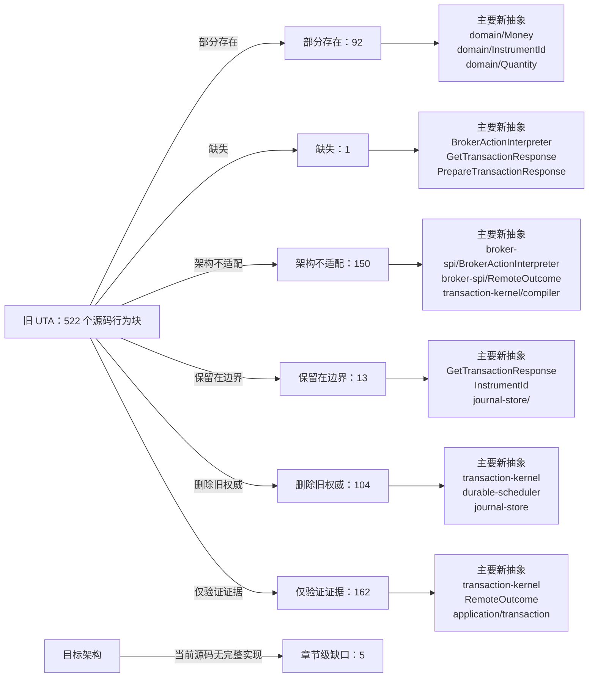

<!-- Auto-generated by scripts/uta-effect-runtime-map.mjs from mapping.json. Do not edit by hand. -->
<!-- Regenerate with `node scripts/uta-effect-runtime-map.mjs`. -->

# UTA 功能替代关系：第 5 章 Transaction algebra

目标架构原文：[`docs/uta-effect-runtime-architecture.md:313-846`](../uta-effect-runtime-architecture.md#L313-L846)。

## 结论

部分存在 92；缺失 1；架构不适配 150；保留在边界 13；删除旧权威 104；仅验证证据 162。状态只描述当前实现相对于目标架构的关系，不表示迁移已经落地。

## 替代关系图

## 章节级目标缺口

| 依据 | 目标义务 | 当前缺口 | 必须补充或调整 |
|---|---|---|---|
| docs/uta-effect-runtime-architecture.md:315-338 | Decision and Evolution contracts | Current guards, switch dispatch, and mutable aggregates do not implement a canonical decide result containing non-empty events plus external effects or a pure exhaustive evolve boundary. | Add typed Decision<State, Command, Event, ExternalEffect, Failure> and Evolution<State, Event>; decisions are pure, accepted facts become durable events, and evolution exhaustively applies them. |
| docs/uta-effect-runtime-architecture.md:403-412 | Lock release lifecycle invariant | Mappings mention durable locks but no current implementation guarantees release only after terminal state or explicit operator-owned recovery is durable. | Persist lock ownership/release with transaction transitions and prohibit release before Committed, Compensated, or durable RecoveryRequired ownership. |
| docs/uta-effect-runtime-architecture.md:418-430 | Complete CommitCriterion ADT | No current type represents AcceptedByVenue, WorkingAtVenue, FullyFilled, TargetExposureReached, and NativeAtomicGroupConfirmed as an immutable prepared-plan criterion. | Add the exhaustive ADT to PreparedPlan and require settlement to evaluate it; venue acceptance must never be reinterpreted as fill completion. |
| docs/uta-effect-runtime-architecture.md:432-444 | Complete CompensationCapability ADT | No current contract models Exact, StateRestoring, Economic with risk, and None with reason, or enforces policy-specific admission. Cancel plus replace is currently treated too casually despite identity and queue-priority loss. | Compile a capability for every step during prepare, enforce allowed classes per execution policy, and never classify cancel-plus-replace as exact rollback. |
| docs/uta-effect-runtime-architecture.md:446-456 | Complete ExecutionPolicy ADT | No current type represents IndependentBatch, AllOrCompensate with accepted undo class, and VenueNativeAtomic with mechanism. Git grouping, approval messages, and request grouping can be mistaken for atomicity. | Add the exhaustive policy ADT, bind it to the prepared transaction, and enforce compensation/native-atomic evidence during admission and settlement. |

## 源码映射

| 映射 ID | 当前源码 | 符号或行为块 | 当前功能 | 替代状态 | 新 UTA 抽象与做法 | 不适配位置与原因 | 必须补充或调整 | 重复索引 |
|---|---|---|---|---|---|---|---|---|
| `MAP-52A6B771BA` | [`packages/uta-protocol/src/brokers/preset-catalog.ts:470-495`](../../packages/uta-protocol/src/brokers/preset-catalog.ts#L470-L495) | SIMULATOR_PRESET | Declares a mock simulator with in-memory state, cash as a coerced number, no credentials, and a random _instanceId fingerprint used to derive a unique id; its hint states all state is wiped on restart. | 架构不适配 | 1. Thesis and non-negotiable properties；3.7 brokers/<broker>/；3.4 journal-store/；3.5 durable-scheduler/；5.3 Two-phase transaction protocol；7.1 Embedded database；12.1 Startup sequence；14. Public protocol；17.1 Slice 1: durable kernel with MockBroker；18. Verification contract；20. First falsifier MockBroker interpreter；transaction-kernel/；journal-store/；durable-scheduler/；DispatchIdentity；RemoteOutcome Retain MockBroker as the first executable adapter, but make transaction intent, jobs, outcomes, and mock broker observations durable in SQLite and recoverable across restart. | The current advertised simulator is explicitly process-memory-only and cash is a coerced number; it cannot satisfy the MockBroker crash/recovery falsifier or prove no duplicate dispatch. | Replace in-memory simulator authority with the durable MockBroker vertical slice, use DecimalString/Money and typed commands/outcomes, and keep any panel controls as a boundary over that slice. | **DUP-042** |
| `MAP-E954ABE476` | [`packages/uta-protocol/src/brokers/preset-catalog.ts:524-531`](../../packages/uta-protocol/src/brokers/preset-catalog.ts#L524-L531) | getBrokerPreset | Finds a preset by raw string id and throws a generic Error listing known ids when absent. | 部分存在 | 4. Effect model；5.7 Complete type contract — error channels；9.4 Capability derivation；14. Public protocol；15. Security and authority；19. Architectural prohibitions protocol/config parser；CapabilityUnavailable；QueryFailure；application/ Parse preset identifiers at the configuration/application boundary into a closed preset/config ADT and return a typed unknown-preset failure. | Unknown external input throws a generic Error/string list rather than returning a named failure; the list itself can expose registry details and no capability context. | Replace getBrokerPreset's throw with a typed Result/Effect failure and schema-decoded preset id; keep registry lookup outside domain and never use it as capability proof. | **DUP-044** |
| `MAP-ED0CF2A5B8` | [`packages/uta-protocol/src/brokers/preset-catalog.ts:539-555`](../../packages/uta-protocol/src/brokers/preset-catalog.ts#L539-L555) | canonicalize | Recursively traverses unknown values, treats arrays specially, casts objects to Record<string, unknown>, sorts keys, and returns a new unknown value for JSON stringification. | 架构不适配 | 3.1 domain/；3.4 journal-store/；3.9 transport/ and protocol/；5.7 Complete type contract — nominal identities and financial values；7.3 Authoritative tables；14. Public protocol；19. Architectural prohibitions domain/ branded identity constructors；journal-store/；protocol/ schemas；AccountId；ConnectionId Construct branded identities from validated typed fields and use named codecs for any persistence serialization; do not canonicalize arbitrary unknown records as domain identity. | The implementation is an untyped JSON cast/traversal and can hash arbitrary values, contrary to the target ban on untyped JSON casts and permissive persistence shapes. | Delete canonicalize from kernel-facing identity logic, parse config into concrete ADTs first, and serialize only named versioned values through protocol/journal schemas. | **DUP-046** |
| `MAP-4E1058C577` | [`packages/uta-protocol/src/brokers/preset-catalog.ts:557-580`](../../packages/uta-protocol/src/brokers/preset-catalog.ts#L557-L580) | deriveUtaId | Filters arbitrary presetConfig fields named by fingerprintFields, fills missing values with null, canonicalizes them, hashes preset id plus JSON to eight hex characters, and returns `${preset.id}-${hash}`. | 部分存在 | 2.2 UTA owns；3.1 domain/；3.4 journal-store/；3.7 brokers/<broker>/；5.7 Complete type contract — nominal identities and financial values；7.1 Embedded database；9.1 Connection Layer；11. Approval and Git audit projection；14. Public protocol；15. Security and authority；17.6 Slice 6: delete the legacy kernel；19. Architectural prohibitions AccountId；ConnectionId；InstrumentId；journal-store/；BrokerConnectionIdentity；protocol/config schemas Introduce typed, durable AccountId/ConnectionId construction from validated broker identity context; retain old ids only as explicit migration compatibility projections. | The current identity is an unbranded 32-bit string hash over generic fields (including secret-derived values for some presets), has no collision/identity evidence in the domain type, and couples account identity to UI preset ids. | Define nominal identity constructors and migration mapping, separate credential storage from identity metadata, persist identity/context in journal/config schemas, and stop using derived strings as transaction identity. | **DUP-047** |
| `MAP-E9688DBE16` | [`packages/uta-protocol/src/brokers/preset-catalog.ts:582-588`](../../packages/uta-protocol/src/brokers/preset-catalog.ts#L582-L588) | mintInstanceId | Generates a random four-byte hex token for simulator preset identity seeding. | 部分存在 | 3.1 domain/；3.4 journal-store/；5.7 Complete type contract — nominal identities and financial values；7.1 Embedded database；17.1 Slice 1: durable kernel with MockBroker；18. Verification contract；20. First falsifier AccountId；ConnectionId；MockBroker；journal-store/；protocol/config schemas Use a typed persisted MockBroker AccountId/ConnectionId constructor and retain randomness only as the generation mechanism, not as an unvalidated public identity string. | The token has no branded type, persistence/restore contract, or relationship to durable mock broker state; uniqueness is only a process/config convention. | Persist and decode simulator identity through journal/config schemas and use it in DispatchIdentity/recovery tests across restart. | **DUP-048** |
| `MAP-006AF2BF79` | [`packages/uta-protocol/src/brokers/search-rules.ts:25-55`](../../packages/uta-protocol/src/brokers/search-rules.ts#L25-L55) | normalizeBrokerSearchPattern | Trims a symbol; for crypto/currency strips a recognized quote suffix when a regex match exists; for equity/commodity/unknown returns the trimmed symbol, with a default switch branch returning it unchanged. | 保留在边界 | 3.1 domain/；3.6 broker-spi/；3.9 transport/ and protocol/；5.7 Complete type contract — nominal identities and financial values；9.4 Capability derivation；10.2 Market and jurisdiction owns；14. Public protocol；19. Architectural prohibitions application/account-query service；broker-spi/；market-and-accounting/；InstrumentId；protocol/ search schema Retain as a pure application search-query normalizer, then pass the result to a typed broker search port that returns normalized instrument/market metadata and explicit no-match/unsupported outcomes. | The function intentionally relies on symbol heuristics and a permissive fallback; it does not validate a market context or construct a nominal InstrumentId and therefore cannot be a domain action resolver. | Keep the function out of domain/transaction-kernel, add a decoded AssetClassHint/search request, remove fallback use for execution, and require broker-observed resolution before TradeAction construction. | **DUP-055** |
| `MAP-A458F81B6D` | [`packages/uta-protocol/src/client/UTAClient.ts:22-29`](../../packages/uta-protocol/src/client/UTAClient.ts#L22-L29) | UTAClient generic methods | Exposes arbitrary `request<T>` plus generic get/post/put/delete wrappers, all defaulting T to unknown and accepting raw method/path/body/query values. | 架构不适配 | 2.1 Alice owns；3.9 transport/ and protocol/；5.7 Complete type contract — public protocol envelopes；9.2 Typed action interpreter；14. Public protocol；15. Security and authority；19. Architectural prohibitions transport/http；protocol/；application/；PrepareTransactionResponse；GetTransactionResponse Expose typed methods for POST/PUT/GET transaction routes, capabilities, account state, events, and recovery, each paired with named request/response/failure schemas. | Any caller can send an arbitrary path/method and receive an unchecked unknown, so the client does not enforce the listed public routes or prevent broker-native payloads from entering generic endpoints. | Delete the generic public methods or make the raw primitive private; migrate every caller to route-specific typed proxy methods and exhaustive response decoding. | **DUP-058** |
| `MAP-7E1806AFC4` | [`packages/uta-protocol/src/client/UTAClient.ts:37-46`](../../packages/uta-protocol/src/client/UTAClient.ts#L37-L46) | UTAHttpError | Throws an Error subclass carrying HTTP status, unknown body, and a message string; it does not decode a failure envelope. | 架构不适配 | 1. Thesis and non-negotiable properties；4. Effect model；5.7 Complete type contract — error channels；9.2 Typed action interpreter；12.3 Defects and expected failures；14. Public protocol；19. Architectural prohibitions TransactionFailure；QueryFailure；DispatchFailure；ProtocolViolation；protocol/ failure schemas Return/decode route-specific TransactionFailure or QueryFailure ADTs, preserving HTTP transport metadata separately and treating malformed bodies as ProtocolViolation. | Unknown body plus message-based Error handling collapses expected failures and malformed responses; consumers cannot exhaustively handle validation/conflict/capability/storage/unknown outcomes. | Replace UTAHttpError with typed client failure decoding and a distinct malformed-response defect/protocol-violation path; update all callers to handle the ADTs. | **DUP-060** |
| `MAP-8C22894ED4` | [`packages/uta-protocol/src/client/UTAClient.ts:63-88`](../../packages/uta-protocol/src/client/UTAClient.ts#L63-L88) | UTAClient.request | Builds a JSON request, creates an AbortController timeout, performs fetch, parses response text with safeJSON, extracts an `error` field by object cast on non-2xx, and casts successful body to T without validation. | 架构不适配 | 1. Thesis and non-negotiable properties；3.4 journal-store/；3.5 durable-scheduler/；3.9 transport/ and protocol/；4. Effect model；5.7 Complete type contract — public protocol envelopes；7.2 Single logical writer and group commit；8.1 Admission；9.2 Typed action interpreter；12.2 Unknown-outcome protocol；14. Public protocol；15. Security and authority；19. Architectural prohibitions transport/http；protocol/；TransactionCommand；PrepareTransactionResponse；GetTransactionResponse；TransactionFailure；QueryFailure Encode a named request, send it through authenticated transport, decode the exact success/failure schema, and preserve typed timeout/transport/protocol outcomes without generic casts. | Successful responses are body as T, errors are reduced to a string error field/message, and timeout/abort has no route-specific typed transport/auth/protocol representation. | Implement route-specific success and failure schema decoding plus typed transport/auth/protocol errors and correlation metadata. A public request timeout is not itself RemoteOutcome.Unknown; only a durable scheduler handling ambiguous broker dispatch may create that outcome. | **DUP-062** |
| `MAP-7A38B02DED` | [`packages/uta-protocol/src/client/UTAClient.ts:90-99`](../../packages/uta-protocol/src/client/UTAClient.ts#L90-L99) | UTAClient convenience methods | Returns generic get/post/put/delete closures that forward arbitrary paths and unknown bodies into request. | 删除旧权威 | 3.9 transport/ and protocol/；5.7 Complete type contract — public protocol envelopes；8.1 Admission；9.2 Typed action interpreter；14. Public protocol；19. Architectural prohibitions transport/http；protocol/；application/；TransactionCommand Replace generic closures with typed methods for each documented transaction/capability/account route; keep raw request private as an implementation detail if needed. | The public convenience surface erases route identity and schemas and lets callers send arbitrary native or malformed payloads. | Delete these generic exported methods, migrate callers to typed route methods, and make the client decode every response/failure before returning. | **DUP-063** |
| `MAP-E43DFC70EF` | [`packages/uta-protocol/src/schemas/index.ts:1-10`](../../packages/uta-protocol/src/schemas/index.ts#L1-L10) | empty Zod schema barrel | Documents one Zod request/response pair per endpoint but exports nothing. | 缺失 | 3.9 transport/ and protocol/；5.7 Complete type contract；9.2 Typed action interpreter；14. Public protocol；18. Verification contract protocol/；transport/http；PrepareTransactionResponse；GetTransactionResponse；BrokerActionInterpreter Populate protocol/ with named schemas for every public request and response, including transaction draft/prepare/approve/reject/recover, transaction/event queries, capabilities, and account state. | No runtime decoder exists for requests, responses, branded identifiers, transaction states, failure variants, broker outcomes, or capability views. | Define and export each route's schema/type pair, decode at transport ingress and response egress, and add persistence schemas separately for journal payloads rather than accepting unknown JSON. | **DUP-066** |
| `MAP-F59E470DFF` | [`packages/uta-protocol/src/types/broker.ts:83-106`](../../packages/uta-protocol/src/types/broker.ts#L83-L106) | PositionRisk | Models optional leverage, liquidation price, and cross/isolated margin mode as strings and an unbranded union, mainly for leveraged crypto derivatives. | 部分存在 | 3.1 domain/；5.7 Complete type contract — nominal identities and financial values；10.1 Accounting owns；14. Public protocol；19. Architectural prohibitions market-and-accounting/；domain/ExposureSnapshot；protocol/ position schema Move risk observations into the accounting/market projection with refined decimal values and explicit instrument/account identity, then expose a named read projection schema. | The concept is useful accounting/market data, but values are raw strings, optional fields are not schema-refined, and the type is not connected to branded account/instrument/currency identities or observation provenance. | Define a typed risk observation in market-and-accounting, attach account/instrument/observedAt context, validate decimal/currency values at the boundary, and expose it only through account-state projections. | **DUP-075** |
| `MAP-634E72490E` | [`packages/uta-protocol/src/types/broker.ts:108-155`](../../packages/uta-protocol/src/types/broker.ts#L108-L155) | Position | Defines a position around a broker-native Contract, a Decimal runtime quantity, raw currency text, long/short, string monetary fields, multiplier, optional cost-basis source, and optional risk metadata. | 架构不适配 | 3.1 domain/；5.7 Complete type contract — nominal identities and financial values；6. State tiers and snapshots；10.1 Accounting owns；14. Public protocol；19. Architectural prohibitions domain/；domain/Quantity；domain/Money；domain/InstrumentId；market-and-accounting/；projection-store/；protocol/ Translate broker observations into normalized position/exposure projections using InstrumentId, Quantity, CurrencyCode, DecimalString/Money, and explicit observation timestamps; keep native Contract conversion in adapters. | The public type embeds an IBKR Contract and runtime Decimal, uses interchangeable strings for identity/currency/money, and mixes broker observation with accounting projection state. | Replace Position with a named normalized projection/domain type, add boundary schemas and branded value constructors, and have adapters map SDK positions before journal/projection use. | **DUP-076** |
| `MAP-77D0297A77` | [`packages/uta-protocol/src/types/broker.ts:159-168`](../../packages/uta-protocol/src/types/broker.ts#L159-L168) | PlaceOrderLeg | Represents a protective child order with an unbranded string orderId and a takeProfit/stopLoss kind union. | 部分存在 | 5.7 Complete type contract — dispatch and durable-job records；5.7 Complete type contract — compensation programs；9.2 Typed action interpreter；9.3 Remote outcome；12.2 Unknown-outcome protocol；14. Public protocol；19. Architectural prohibitions DispatchIdentity；PlaceOrderAcknowledgement；CompensationStep；BrokerActionInterpreter；projection-store/ Return child-order identities as branded BrokerOrderId values inside a typed place-order acknowledgement and persist their dispatch/observation relationship in the journal. | The child relationship is present, but the ID is an arbitrary string and the result has no transaction/step/dispatch identity, remote outcome, or durable observation context. | Introduce a typed acknowledgement/observation contract keyed by DispatchIdentity and map child legs into broker-spi and journal records before exposing a normalized projection. | **DUP-077** |
| `MAP-FE024081BB` | [`packages/uta-protocol/src/types/broker.ts:170-180`](../../packages/uta-protocol/src/types/broker.ts#L170-L180) | PlaceOrderResult | Uses a success boolean plus optional orderId/error/message, native Execution/OrderState objects, and optional bracket legs for place/modify/close results. | 架构不适配 | 1. Thesis and non-negotiable properties；4. Effect model；5.7 Complete type contract — broker capability and interpreter association；9.2 Typed action interpreter；9.3 Remote outcome；12.2 Unknown-outcome protocol；14. Public protocol；19. Architectural prohibitions BrokerActionInterpreter；RemoteOutcome；DispatchFailure；PlaceOrderAcknowledgement；TransactionResult Use action-specific acknowledgement, observation, rejection, and unknown-outcome ADTs tied to DispatchIdentity; let the kernel persist the durable transition before and after dispatch. | Boolean success and optional error/message fields cannot distinguish accepted, working, filled, rejected, or unknown outcomes, and native SDK values leak through the public type. | Delete PlaceOrderResult, define the closed BrokerActionTypeMap contracts and RemoteOutcome/DispatchFailure variants, and expose only named protocol envelopes. | **DUP-078** |
| `MAP-BAD8B38E04` | [`packages/uta-protocol/src/types/broker.ts:184-202`](../../packages/uta-protocol/src/types/broker.ts#L184-L202) | ExpandContractFilters | Accepts optional expiry/right, numeric strike bounds, optional OPT/FUT secType, and an optional limit with a documented default/cap. | 架构不适配 | 5.7 Complete type contract — nominal identities and financial values；8.4 Fairness and backpressure；9.4 Capability derivation；14. Public protocol；19. Architectural prohibitions application/account-query service；broker-spi/；protocol/ contract-search request schema；domain/InstrumentId Define a named, validated contract-search/expansion query with branded instrument identity and decimal-safe strike/range values; let the broker adapter advertise expansion capability and explicit pagination semantics. | Optional-field combinations are not a discriminated query ADT, strike bounds use IEEE number values, and a broker-side silent default/cap is encoded in the public contract. | Replace this shape with a protocol schema and explicit expansion variants, validate decimal strings and limits, and return a truncation/page token or full-count contract without silent caps. | **DUP-079** |
| `MAP-403375E19B` | [`packages/uta-protocol/src/types/broker.ts:204-211`](../../packages/uta-protocol/src/types/broker.ts#L204-L211) | OptionGridEntry | Carries exchange/tradingClass/multiplier strings, expiration strings, and numeric strike arrays for an option-chain parameter grid. | 架构不适配 | 3.6 broker-spi/；5.7 Complete type contract — nominal identities and financial values；9.4 Capability derivation；10.2 Market and jurisdiction owns；14. Public protocol；19. Architectural prohibitions broker-spi/；market-and-accounting/；domain/InstrumentId；protocol/ contract-search response schema Keep native option-chain discovery inside the broker adapter, decode its response, and emit normalized market/instrument metadata with decimal-safe strike values through a named query projection. | Native exchange/trading-class values and number strikes cross the shared protocol without account/jurisdiction/currency identity or runtime schema validation. | Add adapter-local native schemas and a normalized contract-expansion response ADT; use DecimalString and refined instrument metadata at the public boundary. | **DUP-080** |
| `MAP-89DA5A834C` | [`packages/uta-protocol/src/types/broker.ts:213-223`](../../packages/uta-protocol/src/types/broker.ts#L213-L223) | ContractExpansion | Uses a `kind` string but leaves contracts, total, grid, and hint independently optional, with concrete results typed as broker-native Contract[]. | 架构不适配 | 3.1 domain/；3.6 broker-spi/；3.9 transport/ and protocol/；5.7 Complete type contract；9.2 Typed action interpreter；14. Public protocol；19. Architectural prohibitions domain/；broker-spi/；protocol/ contract-expansion ADT；application/account-query service Model contracts and option grids as separate tagged response variants with required fields, normalized identity, and explicit continuation/truncation information. | `kind` does not enforce which fields exist, and the concrete branch exposes IBKR Contracts directly; malformed partial states are representable. | Replace with a discriminated protocol ADT, decode every branch at transport, and map native contracts to normalized Instrument/Contract views before returning them. | **DUP-081** |
| `MAP-C6BE0A6EA7` | [`packages/uta-protocol/src/types/broker.ts:225-246`](../../packages/uta-protocol/src/types/broker.ts#L225-L246) | OpenOrder | Returns a broker-native Contract/Order/OrderState triplet with optional string orderId, average fill price, and TP/SL parameters. | 架构不适配 | 3.6 broker-spi/；3.8 projection-store/；5.7 Complete type contract — before-images, observations, and preconditions；6. State tiers and snapshots；9.3 Remote outcome；12.2 Unknown-outcome protocol；14. Public protocol；19. Architectural prohibitions OrderSnapshot；DispatchIdentity；projection-store/；broker-spi/；protocol/ Map broker order observations into OrderSnapshot and read projections keyed by branded BrokerOrderId/ClientOrderId, with explicit status, version, and observation provenance. | The type is an SDK-shaped object triplet, does not carry a typed order version or observation timestamp, and allows unbranded IDs and optional fields that cannot drive preconditions/reconciliation safely. | Delete the native triplet from the public contract, add adapter schemas and normalized OrderSnapshot/projection schemas, and persist remote observations through the journal. | **DUP-082** |
| `MAP-0422181E7C` | [`packages/uta-protocol/src/types/broker.ts:248-262`](../../packages/uta-protocol/src/types/broker.ts#L248-L262) | AccountInfo | Models account equity and margin fields as raw strings, optional values, and an unqualified baseCurrency string, with dayTradesRemaining as a number. | 部分存在 | 5.7 Complete type contract — nominal identities and financial values；6. State tiers and snapshots；10.1 Accounting owns；14. Public protocol；19. Architectural prohibitions market-and-accounting/；domain/Money；domain/CurrencyCode；projection-store/；protocol/ account-state schema Expose an account-state projection built from currency-qualified Money and typed accounting observations, preserving unknown/unsupported buckets explicitly. | The account query concept maps to the target projection, but monetary strings are not currency-qualified DecimalString values and optional fields have no named schema or uncertainty semantics. | Define normalized accounting/account-state types with CurrencyCode, Money, valuation uncertainty, and runtime schemas; map broker-native account tags only inside adapters. | **DUP-083** |
| `MAP-8C79F4D559` | [`packages/uta-protocol/src/types/broker.ts:349-364`](../../packages/uta-protocol/src/types/broker.ts#L349-L364) | Bar | Carries JavaScript Date timestamp and OHLCV strings, with no instrument or quote-currency identity in the value itself. | 架构不适配 | 5.7 Complete type contract — nominal identities and financial values；6. State tiers and snapshots；9.2 Typed action interpreter；10.1 Accounting owns；14. Public protocol；19. Architectural prohibitions market-and-accounting/；domain/Price；domain/Quantity；domain/Instant；protocol/ bar schema Emit normalized OHLCV observations carrying InstrumentId, CurrencyCode/Price, Quantity, and branded Instant, with adapter-native conversion hidden. | Raw strings and Date do not enforce decimal/currency/instrument identity, and the value is not tied to a broker observation context or named schema. | Introduce a decoded bar observation/projection type using target value objects and validate it at the broker/protocol boundary. | **DUP-089** |
| `MAP-46669371C2` | [`packages/uta-protocol/src/types/broker.ts:445-450`](../../packages/uta-protocol/src/types/broker.ts#L445-L450) | AccountCapabilities | Exposes supportedSecTypes and supportedOrderTypes as string arrays and an optional historicalBars object. | 架构不适配 | 3.1 domain/；3.6 broker-spi/；5.7 Complete type contract — broker capability and interpreter association；9.2 Typed action interpreter；9.4 Capability derivation；14. Public protocol；19. Architectural prohibitions BrokerActionTypeMap；ActionAvailability；CapabilitySet；ActionContext；protocol/ capabilities schema Replace static string arrays with a closed action-to-contract CapabilitySet whose availability includes the action schema, idempotency mode, compensation class, and precise unavailable reason. | The architecture explicitly says `supportedOrderTypes` is insufficient; this shape erases action/result/error/observation/compensation relationships and ignores account, venue, instrument, jurisdiction, and session context. | Implement BrokerActionTypeMap and CapabilitySet in broker-spi, derive per-action availability from ActionContext, and encode the ADT at the public boundary. | **DUP-093** |
| `MAP-AE61B1C6B0` | [`packages/uta-protocol/src/types/broker.ts:468-473`](../../packages/uta-protocol/src/types/broker.ts#L468-L473) | TpSlParams | Represents take-profit and stop-loss as independently optional nested objects, with optional stop-loss limitPrice. | 架构不适配 | 5.7 Complete type contract — order and trading action ADTs；5.7 Complete type contract — compensation capability；9.2 Typed action interpreter；14. Public protocol；19. Architectural prohibitions OrderSpec；TradeAction；BrokerActionTypeMap；protocol/ order schema Encode order variants and protective behavior in explicit OrderSpec/TradeAction ADTs with required fields for each variant and action-specific broker capability. | Independent optional TP/SL fields permit invalid combinations and are not linked to a tagged order/action variant or compensation policy. | Replace TpSlParams with explicit order/action variants and adapter-level bracket acknowledgement/compensation contracts; reject unsupported combinations through typed capability failures. | **DUP-095** |
| `MAP-255335BC1C` | [`packages/uta-protocol/src/types/broker.ts:524-529`](../../packages/uta-protocol/src/types/broker.ts#L524-L529) | IBroker trading mutation methods | Defines placeOrder, modifyOrder with Partial<Order>, cancelOrder, and closePosition as direct Promise mutations returning PlaceOrderResult. | 删除旧权威 | 1. Thesis and non-negotiable properties；3.3 transaction-kernel/；3.5 durable-scheduler/；3.6 broker-spi/；4. Effect model；5.3 Two-phase transaction protocol；5.7 Complete type contract — order and trading action ADTs；8. Scheduling, ordering, and concurrency；9.2 Typed action interpreter；12.2 Unknown-outcome protocol；17.6 Slice 6: delete the legacy kernel；19. Architectural prohibitions transaction-kernel/；durable-scheduler/；TradeAction；PreparedStep；BrokerActionInterpreter；DispatchIdentity；RemoteOutcome Make application commands enter transaction-kernel prepare/approve/execute; scheduler dispatches typed broker-spi actions only after DispatchPlanned durability and reconciles unknown outcomes. | Direct Promise mutation bypasses prepare, before-images, compensation proof, durable outbox/job admission, dispatch identity, typed remote outcomes, and backpressure. | Delete generic write methods and PlaceOrderResult when migration lands; implement action-specific BrokerActionInterpreter ports consumed by transaction-kernel and durable-scheduler. | **DUP-098** |
| `MAP-3AB8DE4D1E` | [`packages/uta-protocol/src/types/broker.ts:531-551`](../../packages/uta-protocol/src/types/broker.ts#L531-L551) | IBroker sub-account methods | Provides optional listSubAccounts and optional subAccountForContract string selectors, with documented implicit-default/ignored-selector behavior for most brokers. | 删除旧权威 | 3.1 domain/；3.5 durable-scheduler/；3.6 broker-spi/；5.7 Complete type contract — order and trading action ADTs；8.2 Partitioning；9.4 Capability derivation；10.2 Market and jurisdiction owns；15. Security and authority；17.6 Slice 6: delete the legacy kernel；19. Architectural prohibitions ActionContext；ConflictKey；AccountId；ConnectionId；CapabilitySet；broker-spi/ Carry explicit branded account/sub-account/connection context through TradeAction, ActionContext, capability derivation, and conflict-key partitioning; reject ambiguous writes before preparation. | Optional discovery and ignored selectors allow invalid/ambiguous target selection to be represented and hide whether a broker truly supports compartments. | Replace these selectors with typed account context and capability results, migrate callers, and remove the methods from the generic facade after broker-spi ownership is established. | **DUP-099** |
| `MAP-40929B6DB6` | [`packages/uta-protocol/src/types/broker.ts:611-620`](../../packages/uta-protocol/src/types/broker.ts#L611-L620) | IBroker native identity methods | Uses string getNativeKey and resolveNativeKey around broker-native Contract values for Alice's `aliceId` convention. | 删除旧权威 | 2.3 Brokers own；3.1 domain/；3.7 brokers/<broker>/；3.9 transport/ and protocol/；5.7 Complete type contract — nominal identities and financial values；9.2 Typed action interpreter；10.2 Market and jurisdiction owns；14. Public protocol；17.6 Slice 6: delete the legacy kernel；19. Architectural prohibitions InstrumentId；BrokerOrderId；AccountId；broker-spi/；brokers/<broker>/；protocol/ Keep native-key resolution inside each broker adapter and expose only branded InstrumentId/BrokerOrderId/AccountId values in domain and protocol types. | Identity is an arbitrary string convention attached to an optional SDK augmentation; no nominal identity type or broker/account/venue context is enforced. | Introduce domain identity constructors/codecs, migrate aliceId consumers to InstrumentId and related branded IDs, and remove the generic methods from IBroker. | **DUP-103** |
| `MAP-A27D9FADF9` | [`packages/uta-protocol/src/types/contract-ext.ts:1-31`](../../packages/uta-protocol/src/types/contract-ext.ts#L1-L31) | IBKR Contract aliceId declaration augmentation | Imports @traderalice/ibkr and globally adds optional `aliceId?: string` to its Contract interface, documenting broker-specific native keys and `stampAliceId` construction. | 删除旧权威 | 2.3 Brokers own；3.1 domain/；3.7 brokers/<broker>/；3.9 transport/ and protocol/；5.7 Complete type contract — nominal identities and financial values；9.2 Typed action interpreter；10.2 Market and jurisdiction owns；14. Public protocol；17.6 Slice 6: delete the legacy kernel；19. Architectural prohibitions InstrumentId；BrokerOrderId；brokers/<broker>/；broker-spi/；domain/；protocol/ Keep each broker's native key and SDK augmentation inside its adapter, then construct branded InstrumentId and other domain identities at the adapter boundary. | A shared optional field mutates a broker SDK type and treats a string concatenation convention as system identity; consumers can observe a partial/native identity with no schema or domain brand. | Remove the public declaration merge and side-effect import, add explicit identity constructors/codecs in domain/broker-spi, and migrate all aliceId consumers before deleting the compatibility field. | **DUP-104** |
| `MAP-430A3CCB4D` | [`packages/uta-protocol/src/types/errors.ts:1-19`](../../packages/uta-protocol/src/types/errors.ts#L1-L19) | WireBrokerError | Defines the failure wire shape used by every endpoint as string code, human message, transient boolean, and optional hint; comments promise lossless reconstruction of the in-process BrokerError. | 架构不适配 | 1. Thesis and non-negotiable properties；4. Effect model；5.7 Complete type contract — error channels；9.2 Typed action interpreter；12.3 Defects and expected failures；14. Public protocol；15. Security and authority；19. Architectural prohibitions；3.1 domain/；3.9 transport/ and protocol/ TransactionFailure；QueryFailure；DispatchFailure；BrokerRejection；ProtocolViolation；protocol/ failure schemas Encode named TransactionFailure, QueryFailure, DispatchFailure, capability, connection, and broker-rejection variants with exhaustive schemas and redacted structured evidence. | `code: string`, `message: string`, and `transient: boolean` collapse expected failure variants, do not preserve action/dispatch/transaction identity, and make Error.message the effective protocol model. | Delete WireBrokerError as the universal error envelope; define route-specific failure ADTs/codecs, map them exhaustively in transport/CLI/UI, and redact native payloads/secrets. | **DUP-105** |
| `MAP-89E53C0637` | [`packages/uta-protocol/src/types/git.ts:13-16`](../../packages/uta-protocol/src/types/git.ts#L13-L16) | CommitHash | Defines CommitHash as an unconstrained string while documenting an 8-character short SHA-256 hash. | 保留在边界 | 5.7 Complete type contract — nominal identities and financial values；11. Approval and Git audit projection；14. Public protocol；17.6 Slice 6: delete the legacy kernel；19. Architectural prohibitions Git audit projection；journal-store/；Branded<TransactionId>；protocol/ Retain a validated Git hash only as an optional human-readable audit/export pointer; use branded TransactionId/TransactionRevision for execution identity. | Git hashes are not transaction identity, and the current alias has no runtime validation, but the architecture explicitly permits Git audit projections. | Keep CommitHash out of kernel identity and persistence authority, add a hash schema for projection/export only, and source the projection from journal events. | **DUP-107** |
| `MAP-298D6BB247` | [`packages/uta-protocol/src/types/git.ts:18-54`](../../packages/uta-protocol/src/types/git.ts#L18-L54) | Operation discriminated union | Defines place/modify/close/cancel/sync, external-order observation, and balance-reconciliation operations; several variants carry IBKR Contract/Order/OrderCancel or Decimal, while modifyOrder uses Partial<Order>. | 删除旧权威 | 3.1 domain/；3.3 transaction-kernel/；3.8 projection-store/；5.1 Commands, events, effects, and state；5.7 Complete type contract — order and trading action ADTs；6. State tiers and snapshots；10.1 Accounting owns；11. Approval and Git audit projection；14. Public protocol；17.6 Slice 6: delete the legacy kernel；19. Architectural prohibitions TradeAction；TransactionCommand；TransactionEvent；transaction-kernel/；journal-store/；projection-store/；market-and-accounting/ Replace executable operation staging with TransactionCommand/CreateDraft/ReplaceDraft carrying the closed TradeAction and OrderSpec ADTs; represent broker observations and balance reconciliation as typed events/projection inputs rather than Git operations. | The union mixes commands, external facts, sync, and accounting events, exposes native broker values, permits Partial<Order> and optional-field soup, and has no transaction revision, precondition, compensation, or durable identity. | Delete Operation as execution authority, migrate all stage/commit/sync callers to transaction-kernel commands/events and broker observation protocols, and retain only normalized audit projection variants. | **DUP-108** |
| `MAP-4B40267FF6` | [`packages/uta-protocol/src/types/git.ts:56-58`](../../packages/uta-protocol/src/types/git.ts#L56-L58) | OperationStatus | Defines submitted/filled/rejected/cancelled/user-rejected as a flat string status union for Git operation results. | 删除旧权威 | 5.2 Transaction state；5.7 Complete type contract — dispatch and durable-job records；6. State tiers and snapshots；9.3 Remote outcome；11. Approval and Git audit projection；12.2 Unknown-outcome protocol；14. Public protocol；17.6 Slice 6: delete the legacy kernel；19. Architectural prohibitions TransactionState；DispatchState；RemoteOutcome；TransactionResult；projection-store/ Replace the flat label with the complete TransactionState ADT: Draft, Preparing, AwaitingApproval, Queued, Executing, Reconciling, Aborting, Compensating, Committed, Compensated, and RecoveryRequired, each with its canonical payload; model DispatchState and RemoteOutcome separately. | The status list cannot represent the complete transaction lifecycle and payloads, durable dispatch/reconciliation/abort/compensation progress, recovery-required ownership, or the distinction between venue acceptance and final commit criterion. | Remove OperationStatus from kernel/API contracts. Evolve the complete TransactionState exhaustively from journal events and derive legacy history labels only in a typed read projection. | **DUP-109** |
| `MAP-DE16B51F52` | [`packages/uta-protocol/src/types/git.ts:60-77`](../../packages/uta-protocol/src/types/git.ts#L60-L77) | OperationResult | Combines action, success boolean, flat status, optional native Execution/OrderState, optional string error, child legs, symbol attribution, and raw unknown payload. | 删除旧权威 | 1. Thesis and non-negotiable properties；4. Effect model；5.7 Complete type contract — broker capability and interpreter association；6. State tiers and snapshots；9.2 Typed action interpreter；9.3 Remote outcome；11. Approval and Git audit projection；12.2 Unknown-outcome protocol；14. Public protocol；17.6 Slice 6: delete the legacy kernel；19. Architectural prohibitions BrokerActionTypeMap；RemoteOutcome；DispatchFailure；TransactionResult；ProjectionName；projection-store/ Persist action-specific acknowledgement/rejection/observation/unknown variants keyed by DispatchIdentity, and expose a transaction result/projection with typed failures. | `success`, optional error text, and `raw?: unknown` erase the relation among action, acknowledgement, observation, error, compensation, and remote outcome; native SDK values leak into the contract. | Delete OperationResult, migrate result handling to BrokerActionTypeMap/RemoteOutcome/TransactionFailure, and generate Git history summaries from journal/projection events. | **DUP-110** |
| `MAP-BDE3556BBA` | [`packages/uta-protocol/src/types/git.ts:91-102`](../../packages/uta-protocol/src/types/git.ts#L91-L102) | GitCommit | Models a Git hash/parent/message with Operation[]/OperationResult[] and a raw stateAfter snapshot, timestamp, and optional round. | 部分存在 | 3.4 journal-store/；3.8 projection-store/；5.1 Commands, events, effects, and state；7.3 Authoritative tables；11. Approval and Git audit projection；14. Public protocol；17.6 Slice 6: delete the legacy kernel；19. Architectural prohibitions TransactionEvent；journal-store/；projection-store/；Git audit projection；TransactionId Generate a Git audit commit projection from append-only journal events and transaction summaries; store execution facts, dispatches, jobs, and projections in SQLite instead. | The shape makes Git commit contents look like execution authority and includes native operations/results and embedded mutable state; it lacks transaction id/revision, journal sequence, dispatch identity, and durability boundaries. | Stop persisting/reading GitCommit as the execution source, define a normalized audit projection with optional CommitHash, and rebuild it from journal/projection checkpoints. | **DUP-112** |
| `MAP-DC3A63D407` | [`packages/uta-protocol/src/types/git.ts:104-110`](../../packages/uta-protocol/src/types/git.ts#L104-L110) | AddResult | Returns a staged operation with an index and `staged: true`. | 删除旧权威 | 5.1 Commands, events, effects, and state；7.2 Single logical writer and group commit；8.1 Admission；11. Approval and Git audit projection；14. Public protocol；17.2 Slice 2: transaction and approval protocol；19. Architectural prohibitions TransactionCommand；ReplaceDraft；journal-store/；transaction-kernel/；protocol/ Replace staging responses with durable draft transaction identity/version and a typed ReplaceDraft/transaction projection response. | An array index and boolean staged flag are not a durable transaction identity or version and do not prove journal admission. | Delete AddResult and return TransactionId/TransactionVersion after durable draft creation or replacement. | **DUP-113** |
| `MAP-B611B25F33` | [`packages/uta-protocol/src/types/git.ts:112-117`](../../packages/uta-protocol/src/types/git.ts#L112-L117) | CommitPrepareResult | Returns `prepared: true`, a Git CommitHash/message, and operationCount for pre-commit preparation. | 删除旧权威 | 5.3 Two-phase transaction protocol；7.3 Authoritative tables；11. Approval and Git audit projection；14. Public protocol；17.2 Slice 2: transaction and approval protocol；19. Architectural prohibitions PrepareTransactionResponse；PreparedPlan；TransactionRevision；journal-store/；transaction-kernel/ Return PrepareTransactionResponse with PreparedPlan or a typed rejected/conflict variant, including transaction revision, digest, preconditions, compensation, and commit criterion. | Git hash/message/count do not expose a prepared plan, before-images, preconditions, compensation capability, expiry, or durable transaction revision. | Delete CommitPrepareResult and migrate prepare callers to the target `/transactions/:id/prepare` response schema. | **DUP-114** |
| `MAP-C39C98EBC8` | [`packages/uta-protocol/src/types/git.ts:119-125`](../../packages/uta-protocol/src/types/git.ts#L119-L125) | PushResult | Returns a Git hash/message/count plus submitted and rejected OperationResult arrays from a push. | 删除旧权威 | 1. Thesis and non-negotiable properties；5.2 Transaction state；5.3 Two-phase transaction protocol；7.3 Authoritative tables；8.1 Admission；9.3 Remote outcome；11. Approval and Git audit projection；12.2 Unknown-outcome protocol；14. Public protocol；17.6 Slice 6: delete the legacy kernel；19. Architectural prohibitions TransactionState；EffectJob；DispatchRecord；RemoteOutcome；TransactionResult；durable-scheduler/；journal-store/ Replace push with approve/admission followed by durable job identity and queryable transaction state; report typed confirmed/rejected/unknown outcomes asynchronously. | Push synchronously bundles Git persistence and broker mutations, has no durability acknowledgement/job lease/dispatch identity, and collapses partial/unknown work into submitted/rejected arrays. | Delete PushResult and migrate to `/transactions/:id/approve`, durable scheduler jobs, and GetTransactionResponse/event queries. | **DUP-115** |
| `MAP-FC6B6B08DC` | [`packages/uta-protocol/src/types/git.ts:127-131`](../../packages/uta-protocol/src/types/git.ts#L127-L131) | RejectResult | Returns a Git hash/message/count for rejecting a pending commit. | 删除旧权威 | 5.2 Transaction state；7.3 Authoritative tables；11. Approval and Git audit projection；14. Public protocol；17.2 Slice 2: transaction and approval protocol；19. Architectural prohibitions TransactionCommand Reject；TransactionEvent TransactionRejected；journal-store/；protocol/ Use the canonical Reject { transactionId, reason } command and durable TransactionRejected event; transaction state determines that rejection is valid only before dispatch. | Git hash and operation count do not identify the transaction or enforce rejection-before-dispatch semantics. The canonical Reject command itself does not carry revision or actor. | Delete RejectResult and migrate to POST /transactions/:id/reject with a typed command acknowledgement. If transport uses an optimistic version header/precondition, validate it before constructing the canonical Reject command rather than adding fields to the ADT. | **DUP-116** |
| `MAP-DC943FF022` | [`packages/uta-protocol/src/types/git.ts:133-139`](../../packages/uta-protocol/src/types/git.ts#L133-L139) | GitStatus | Reports staged Operation[], pending message/hash, Git head hash, and commit count. | 保留在边界 | 5.2 Transaction state；6. State tiers and snapshots；7.3 Authoritative tables；11. Approval and Git audit projection；14. Public protocol；17.6 Slice 6: delete the legacy kernel；19. Architectural prohibitions GetTransactionResponse；projection-store/；journal-store/；TransactionState；TransactionVersion Retain a GitStatus-shaped read-only compatibility schema only while the current public SDK consumes it; derive it from transaction and Git-audit projections, never execution state. | Git staging/head fields cannot control execution. Deleting the type immediately would contradict the retained public status boundary, so it must be an explicitly temporary projection contract. | Make the SDK and route consume a typed projection backed by durable events; remove only when the public compatibility contract is deliberately retired. | **DUP-117** |
| `MAP-2DA6BBE2CF` | [`packages/uta-protocol/src/types/git.ts:141-158`](../../packages/uta-protocol/src/types/git.ts#L141-L158) | OperationSummary | Summarizes a symbol, OperationAction, textual change, flat status, and optional string order terms for review surfaces. | 部分存在 | 5.7 Complete type contract — order and trading action ADTs；6. State tiers and snapshots；11. Approval and Git audit projection；14. Public protocol；17.6 Slice 6: delete the legacy kernel；19. Architectural prohibitions projection-store/；TradeAction；TransactionState；Git audit projection；protocol/ Keep a normalized review projection derived from TransactionCommand/PreparedPlan and journal events, with exact action/order variants and transaction revision/digest. | The review concept is compatible with an audit/read projection, but symbol/change strings and optional untyped order terms lose the closed action/order relationship and transaction identity. | Replace OperationAction/string terms with a typed transaction summary projection; retain textual change only as presentation generated from typed data. | **DUP-118** |
| `MAP-ED7DB561BF` | [`packages/uta-protocol/src/types/git.ts:176-186`](../../packages/uta-protocol/src/types/git.ts#L176-L186) | OrderStatusUpdate | Carries order id/symbol, previous/current flat OperationStatus, and optional decimal-string fill fields for sync updates. | 删除旧权威 | 5.2 Transaction state；6. State tiers and snapshots；9.3 Remote outcome；11. Approval and Git audit projection；12.2 Unknown-outcome protocol；14. Public protocol；17.6 Slice 6: delete the legacy kernel；19. Architectural prohibitions RemoteOutcome；OrderSnapshot；DispatchIdentity；TransactionEvent；projection-store/ Represent broker observation/reconciliation as typed RemoteOutcome and TransactionEvent records keyed by DispatchIdentity and native observation evidence; derive history updates as projections. | Sync status deltas have no dispatch identity, observation timestamp/version/evidence, unknown state, or durable reconciliation checkpoint and reuse a flat Git status. | Delete OrderStatusUpdate from the execution/sync contract and migrate sync polling to durable scheduler observation jobs and journal events. | **DUP-121** |
| `MAP-19CA6A1780` | [`packages/uta-protocol/src/types/git.ts:194-201`](../../packages/uta-protocol/src/types/git.ts#L194-L201) | PriceChangeInput | Accepts a symbol or aliceId, including `all`, and a free-form absolute/relative change string for simulator price mutation. | 保留在边界 | 5.7 Complete type contract — nominal identities and financial values；8.1 Admission；9.2 Typed action interpreter；14. Public protocol；17.1 Slice 1: durable kernel with MockBroker；18. Verification contract；20. First falsifier MockBroker interpreter；TradeAction；InstrumentId；protocol/ admin test schema；durable-scheduler/ Keep price injection only as an explicit MockBroker/admin test harness command, decoded by a named schema and routed to simulated broker observation; never treat it as a trading transaction or durable execution authority. | The input is intentionally a dev/test control surface, but free-form symbol/change strings are not suitable as kernel actions and must not be used to prove live execution semantics. | Confine this command to MockBroker test tooling, validate absolute/relative variants as an ADT, and persist resulting mock observations through the same journal/reconciliation path used by the falsifier. | **DUP-123** |
| `MAP-0CEEC81F23` | [`packages/uta-protocol/src/types/git.ts:225-246`](../../packages/uta-protocol/src/types/git.ts#L225-L246) | SimulatePriceChangeResult | Combines success boolean/error string, current and simulated account/position states, and string summary deltas including worstCase. | 保留在边界 | 1. Thesis and non-negotiable properties；5.7 Complete type contract — error channels；6. State tiers and snapshots；10.1 Accounting owns；12.2 Unknown-outcome protocol；14. Public protocol；17.1 Slice 1: durable kernel with MockBroker；18. Verification contract；20. First falsifier MockBroker interpreter；TransactionFailure；QueryFailure；market-and-accounting/；projection-store/；protocol/ Keep only as a named simulator preview response; use typed QueryFailure/validation failures and derive preview data without claiming broker dispatch or transaction commitment. | Success/error text and nested ad hoc state are not target transaction or accounting ADTs; the response says nothing about durable mock observations, dispatch identity, or recovery. | Separate simulator preview from execution protocol, add runtime schema and typed query/validation failures, and exercise the durable MockBroker crash/reconciliation path independently. | **DUP-126** |
| `MAP-B2851598C6` | [`packages/uta-protocol/src/types/git.ts:248-282`](../../packages/uta-protocol/src/types/git.ts#L248-L282) | StagePlaceOrderParams | Defines AI/SDK staging input with aliceId/symbol, optional subAccountId, string order terms, optional TP/SL, and many IBKR-shaped fields; comments require callers to stringify numbers and say subAccountId is validated but not persisted. | 删除旧权威 | 3.1 domain/；3.3 transaction-kernel/；3.6 broker-spi/；5.3 Two-phase transaction protocol；5.7 Complete type contract — order and trading action ADTs；8.2 Partitioning；9.4 Capability derivation；14. Public protocol；15. Security and authority；17.2 Slice 2: transaction and approval protocol；19. Architectural prohibitions TradeAction；OrderSpec；TransactionCommand ReplaceDraft；ActionContext；CapabilitySet；protocol/ transaction draft schema Decode a tagged TradeAction/OrderSpec into ReplaceDraft with branded account/instrument/order identities, explicit sub-account context, preconditions, and typed capability checks. | The stage input is an optional-field IBKR-shaped bag, uses arbitrary strings for identity/order terms, and explicitly does not persist the target sub-account, so the prepared action cannot prove its write target. | Delete StagePlaceOrderParams, migrate AI/SDK callers to the transaction draft schema, and make decimal/order variants and multi-wallet target selection explicit and durable. | **DUP-127** |
| `MAP-36EE24CDBE` | [`packages/uta-protocol/src/types/git.ts:284-294`](../../packages/uta-protocol/src/types/git.ts#L284-L294) | StageModifyOrderParams | Defines a staging bag keyed by string orderId with optional quantity/prices/orderType/tif fields, mirroring Partial<Order> semantics. | 删除旧权威 | 3.1 domain/；3.3 transaction-kernel/；3.6 broker-spi/；5.7 Complete type contract — order and trading action ADTs；9.2 Typed action interpreter；14. Public protocol；17.6 Slice 6: delete the legacy kernel；19. Architectural prohibitions TradeAction ModifyOrder；OrderSpec；BrokerOrderId；TransactionCommand ReplaceDraft；protocol/ Use a ModifyOrder TradeAction with branded BrokerOrderId and a complete replacement OrderSpec variant validated against an order before-image. | Optional mutable fields permit invalid/incomplete replacements and the order id is not nominal; no before-image, order version, compensation, or capability contract is carried. | Delete the staging bag and translate callers to typed ModifyOrder actions with OrderVersion preconditions and broker-spi compensation/interpreter contracts. | **DUP-128** |
| `MAP-011C785E0E` | [`packages/uta-protocol/src/types/git.ts:296-306`](../../packages/uta-protocol/src/types/git.ts#L296-L306) | StageClosePositionParams | Defines a staging bag keyed by aliceId/symbol with optional quantity and optional subAccountId, where empty quantity closes the full position. | 删除旧权威 | 3.1 domain/；3.3 transaction-kernel/；3.6 broker-spi/；5.3 Two-phase transaction protocol；5.7 Complete type contract — order and trading action ADTs；8.2 Partitioning；9.4 Capability derivation；10.1 Accounting owns；14. Public protocol；17.6 Slice 6: delete the legacy kernel；19. Architectural prohibitions TradeAction ClosePosition；Quantity；ExposureSnapshot；ConflictKey；ActionContext；transaction-kernel/ Use ClosePosition with branded AccountId/InstrumentId and an explicit Quantity\|'All' variant, bind ExposureSnapshot/preconditions, and compile compensation before dispatch. | Optional identity/quantity fields and an optional wallet target permit ambiguous writes; no exposure before-image, conflict key, commit criterion, or compensation capability is represented. | Delete StageClosePositionParams and migrate to typed ClosePosition actions in transaction drafts, with mandatory multi-sub-account context and durable exposure preconditions. | **DUP-129** |
| `MAP-A774AC84F2` | [`packages/uta-protocol/src/types/git.ts:308-322`](../../packages/uta-protocol/src/types/git.ts#L308-L322) | getOperationSymbol | Switches over legacy Operation variants and returns contract.symbol/aliceId where available, otherwise the literal `unknown`; modify/cancel/sync have no symbol. | 删除旧权威 | 3.1 domain/；3.8 projection-store/；5.7 Complete type contract — nominal identities and financial values；9.4 Capability derivation；10.2 Market and jurisdiction owns；11. Approval and Git audit projection；14. Public protocol；17.6 Slice 6: delete the legacy kernel；19. Architectural prohibitions InstrumentId；TradeAction；projection-store/；market-and-accounting/；Git audit projection Derive display identity from typed TradeAction/instrument projection fields; do not infer identity from native symbol/aliceId fallbacks or return an untyped unknown sentinel. | The helper depends on legacy/native fields, loses identity for several action variants, and uses a permissive string fallback instead of a nominal InstrumentId or explicit absence variant. | Delete the helper with Operation, migrate consumers to typed action/projection mappers, and require explicit instrument identity where the target contract needs it. | **DUP-130** |
| `MAP-8CE1592385` | [`packages/uta-protocol/src/types/history.ts:32-34`](../../packages/uta-protocol/src/types/history.ts#L32-L34) | OrderHistoryStatus and OrderHistorySource | Uses flat string unions for submitted/filled/cancelled/rejected/user-rejected and alice/external source labels. | 部分存在 | 5.2 Transaction state；6. State tiers and snapshots；9.3 Remote outcome；11. Approval and Git audit projection；12.2 Unknown-outcome protocol；14. Public protocol；19. Architectural prohibitions TransactionState；RemoteOutcome；OrderSnapshot；Git audit projection；protocol/ history schema Derive history labels from typed TransactionState, DispatchState, and RemoteOutcome, retaining source as a projection dimension rather than execution truth. | The labels omit prepared/queued/executing/reconciling/unknown/compensating/recovery states and cannot encode observation evidence or transaction identity. | Replace execution use of these unions with typed state/outcome mappers; keep compatibility labels only in a validated history projection. | **DUP-132** |
| `MAP-732B845474` | [`packages/uta-protocol/src/types/history.ts:36-59`](../../packages/uta-protocol/src/types/history.ts#L36-L59) | OrderHistoryEntry | Collapses an order lifecycle into one row with optional broker order id/order terms/fills, flat status/source, Git commit hash/message, and optional string error. | 部分存在 | 5.7 Complete type contract — before-images, observations, and preconditions；6. State tiers and snapshots；7.4 Snapshot and compaction policy；9.3 Remote outcome；11. Approval and Git audit projection；12.2 Unknown-outcome protocol；13. Observability；14. Public protocol；17.6 Slice 6: delete the legacy kernel；19. Architectural prohibitions OrderSnapshot；TransactionId；DispatchIdentity；projection-store/；Git audit projection；journal-store/；protocol/ history schema Build order history from journal events, normalized order/remote observations, and projection checkpoints; expose transaction/revision/dispatch correlation and retain CommitHash only as audit pointer. | The row is a useful read projection, but optional order terms, flat status, commit hash/message authority, and free-form error omit order version, observation timestamp/evidence, transaction identity, and unknown/reconciliation state. | Redesign the history projection schema around typed OrderSnapshot/RemoteOutcome and journal correlation, then keep only presentation-compatible fields as derived output. | **DUP-133** |
| `MAP-56C6192DB1` | [`packages/uta-protocol/src/types/history.ts:61-76`](../../packages/uta-protocol/src/types/history.ts#L61-L76) | TradeHistorySource and TradeHistoryEntry | Represents fill/reconcile rows with optional order id, HistoryContract, side, decimal-string quantity/price/value, source order/external/reconcile, and Git commit hash. | 部分存在 | 5.7 Complete type contract — nominal identities and financial values；6. State tiers and snapshots；7.4 Snapshot and compaction policy；10.1 Accounting owns；11. Approval and Git audit projection；12.2 Unknown-outcome protocol；14. Public protocol；17.6 Slice 6: delete the legacy kernel；19. Architectural prohibitions market-and-accounting/；Fill；ExposureSnapshot；RemoteOutcome；projection-store/；Git audit projection；journal-store/ Generate trade history from typed broker acknowledgements/observations and accounting fill/reconciliation events, with currency-qualified Money/Quantity and journal correlation. | The read-only fill projection is directionally valid, but quantity/price/value lack branded instrument/currency context, optional order identity is not linked to dispatch, and Git hash remains the only audit pointer. | Move authority to journal/accounting projections, add typed Fill/Reconciliation records and observation timestamps, and retain CommitHash only as optional derived audit metadata. | **DUP-134** |
| `MAP-33B2356199` | [`packages/uta-protocol/src/types/index.ts:1-22`](../../packages/uta-protocol/src/types/index.ts#L1-L22) | wire types barrel and contract augmentation side effect | Describes the exports as narrow wire types, then re-exports BrokerError/broker SDK-shaped types, Git types, manager types, and history types; importing the barrel also executes contract-ext declaration augmentation. | 架构不适配 | 3.1 domain/；3.6 broker-spi/；3.9 transport/ and protocol/；14. Public protocol；17. Migration sequence；19. Architectural prohibitions domain/；broker-spi/；protocol/；projection-store/ Split normalized protocol DTOs from adapter-native and compatibility projections. Export transaction commands, envelopes, failure ADTs, capability views, and query projections from protocol/, while moving native contract augmentation and legacy Git execution types out of the shared barrel. | The declared wire boundary is not narrow in practice: it exports native IBKR types, Decimal-bearing values, `Partial<Order>` shapes, and Git-as-execution types; it also registers a global native SDK augmentation on import. | Replace these exports with named target protocol schemas/types, remove the side-effect augmentation from the public barrel, and retain Git only as an explicit projection/export boundary backed by the journal. | **DUP-135** |
| `MAP-1E2638E1F3` | [`services/uta/src/__tests__/trading-tools.spec.ts:123-135`](../../services/uta/src/__tests__/trading-tools.spec.ts#L123-L135) | getOrders.makeOpenOrder | Builds an OpenOrder fixture from native IBKR Order, OrderState, and contract values, including Decimal quantities/prices and an Alice identifier. | 仅验证证据 | §3.1 domain/；§3.7 brokers/<broker>/；§5.7 Complete type contract；§6 State tiers and snapshots；§9.2 Typed action interpreter；§14 Public protocol domain/order and identifiers；projection-store/orders；broker-spi；brokers/Mock；protocol order schema Replace native OpenOrder fixtures at the public-test seam with normalized order snapshots or projection records. Native IBKR objects may remain adapter-side evidence, while domain/order and protocol schemas carry only broker-neutral values. | — | — | **DUP-148** |
| `MAP-EBC1DF5535` | [`services/uta/src/__tests__/trading-tools.spec.ts:137-167`](../../services/uta/src/__tests__/trading-tools.spec.ts#L137-L167) | getOrders.compactSummaries | Executes a staged and pushed market order, then checks that getOrders returns compact fields such as source, action, orderType, quantity, and status while excluding raw IBKR fields. | 仅验证证据 | §2 System boundary；§3.8 projection-store/；§3.9 transport/ and protocol/；§5 Transaction algebra；§6 State tiers and snapshots；§9.2 Typed action interpreter；§13 Observability；§14 Public protocol；§15 Security and authority application/account-query；projection-store/orders；protocol order schema；broker-spi/BrokerActionInterpreter；brokers/Mock Use this as read-projection boundary evidence: the target orders query should encode normalized named fields, omit broker-native SDK fields, and read from rebuildable projection state after journaled execution; the fixture itself does not prove durable dispatch. | — | — | **DUP-149** |
| `MAP-0CD7FA4541` | [`services/uta/src/__tests__/trading-tools.spec.ts:195-211`](../../services/uta/src/__tests__/trading-tools.spec.ts#L195-L211) | getOrders.optionalFields | Mocks a limit order with a lmtPrice and nested take-profit/stop-loss values and verifies that explicitly present optional fields survive summarization. | 仅验证证据 | §3.1 domain/；§3.8 projection-store/；§3.9 transport/ and protocol/；§5.7 Complete type contract；§6 State tiers and snapshots；§9.2 Typed action interpreter；§14 Public protocol domain/order ADT；projection-store/orders；protocol order schema；brokers/Mock；broker-spi/BrokerActionInterpreter Carry optional order terms through a broker-neutral order ADT and rebuildable order projection, with schema-defined nested risk terms and decimal values; use the current test as evidence for preservation rather than raw-object compatibility. | — | — | **DUP-151** |
| `MAP-07DB18F4C8` | [`services/uta/src/__tests__/trading-tools.spec.ts:213-228`](../../services/uta/src/__tests__/trading-tools.spec.ts#L213-L228) | getOrders.decimalSerialization | Sets a small Decimal limit price and verifies that the tool emits the exact decimal string instead of a JavaScript number. | 仅验证证据 | §3.1 domain/；§3.8 projection-store/；§5.7 Complete type contract；§7.1 Embedded database；§9.2 Typed action interpreter；§14 Public protocol；§15 Security and authority domain decimal value objects；protocol schemas；projection-store/orders；journal-store serialization；broker-spi Preserve decimal precision through domain value objects, versioned journal/projection serialization, adapter normalization, and the public response schema; keep the exact-string assertion as a precision regression check. | — | — | **DUP-152** |
| `MAP-0C2AAEE0A8` | [`services/uta/src/__tests__/trading-tools.spec.ts:230-242`](../../services/uta/src/__tests__/trading-tools.spec.ts#L230-L242) | getOrders.orderIdentity | Provides a string orderId from getPendingOrderIds while the native Order carries a numeric sentinel, and verifies that the returned summary preserves the explicit string identity. | 仅验证证据 | §3.1 domain/；§3.8 projection-store/；§5.7 Complete type contract；§6 State tiers and snapshots；§14 Public protocol；§18 Verification contract domain identifiers；projection-store/orders；protocol order schema；application/account-query Use a branded BrokerOrderId/dispatch identity as the projection join key and public identifier, rather than reading a native SDK sentinel; retain the test as identity-preservation evidence. | — | — | **DUP-153** |
| `MAP-27AD48107A` | [`services/uta/src/__tests__/trading-tools.spec.ts:344-371`](../../services/uta/src/__tests__/trading-tools.spec.ts#L344-L371) | placeOrder.inputSchema.emptyOptionalNumerics | Uses the placeOrder input schema with empty strings for optional numeric fields and verifies parsing succeeds, empty fields become undefined, and totalQuantity remains the supplied decimal string. | 仅验证证据 | §2 System boundary；§3.9 transport/ and protocol/；§5.7 Complete type contract；§7.1 Embedded database；§14 Public protocol；§15 Security and authority；§18 Verification contract TypeBox agent tool schema；protocol action schema；application/transaction；domain order/action ADTs；transport/http；transaction-kernel Model optional numeric inputs as omitted-or-decimal values at the tool/protocol decode boundary, then compile a typed transaction command; retain empty-string normalization only as client ergonomics and keep authorization/approval in application/transaction-kernel services. | — | — | **DUP-160** |
| `MAP-4DE6045663` | [`services/uta/src/__tests__/trading-tools.spec.ts:373-387`](../../services/uta/src/__tests__/trading-tools.spec.ts#L373-L387) | placeOrder.inputSchema.invalidNumerics | Uses a non-positive totalQuantity and verifies that the placeOrder schema rejects the input before execution. | 仅验证证据 | §2 System boundary；§3.9 transport/ and protocol/；§4 Effect model；§5 Transaction algebra；§14 Public protocol；§15 Security and authority；§18 Verification contract protocol action schema；domain order/action ADTs；application/transaction；transaction-kernel；transport/http；typed validation errors Reject malformed or non-positive order quantities with a named schema/domain failure before prepare or broker dispatch; this test remains evidence for the input gate, not for authorization, durability, or execution semantics. | — | — | **DUP-161** |
| `MAP-4D4A864108` | [`services/uta/src/domain/trading/__test__/e2e/ccxt-bybit.e2e.spec.ts:140-184`](../../services/uta/src/domain/trading/__test__/e2e/ccxt-bybit.e2e.spec.ts#L140-L184) | Bybit TPSL and fetched order | Computes TP/SL from a quote, places a market order with TPSL through generic IBroker, optionally asserts returned TPSL prices, and closes the position. | 部分存在 | 5.5 Compensation capability；9.2 Typed action interpreter；9.3 Remote outcome；12.2 Unknown-outcome protocol；18.3 Real broker acceptance transaction-kernel compensation compiler；broker-spi BrokerActionInterpreter；brokers/ccxt/Bybit interpreter；durable-scheduler Compile TPSL into target typed action/compensation plans, journal parent and conditional dispatch identities, and reconcile fetched observations before cleanup. | Missing TPSL is treated as a note; direct generic placeOrder/getOrder has no typed unsupported outcome, durable identity, compensation, or recovery semantics. | Define target Bybit TPSL capability and observation schemas and add durable scheduler/reconciliation evidence. | **DUP-174** |
| `MAP-2B14BC2DD9` | [`services/uta/src/domain/trading/__test__/e2e/ibkr-paper.e2e.spec.ts:128-217`](../../services/uta/src/domain/trading/__test__/e2e/ibkr-paper.e2e.spec.ts#L128-L217) | IbkrBroker canonical conId routing | Fetches canonical USD.CHF contract details, records positions/open-order baselines, submits a deliberately polluted conId-based what-if order, records result evidence, cancels any accidental order, and asserts final positions/open-order IDs match baseline. | 部分存在 | 5.3 Two-phase transaction protocol；9.2 Typed action interpreter；9.4 Capability derivation；10.2 Market and jurisdiction owns；12.2 Unknown-outcome protocol；13 Observability；18.3 Real broker acceptance；19 Architectural prohibitions broker-spi IBKR action interpreter；market-and-accounting jurisdiction/instrument service；transaction-kernel preconditions；journal-store；projection-store；observability redaction Keep the canonical identity and baseline assertions as an adapter/acceptance case, but route the action through typed broker-spi identity normalization and target journal/scheduler evidence. | This directly calls generic IBroker with SDK Contract/Order values and a what-if flag; it proves routing and cleanup but not durable intent, dispatch identity, typed capability, unknown outcome, or target journal/projection semantics. | Define canonical IBKR action and observation schemas, persist target dispatch/evidence fields, and add restart/reconciliation variants while keeping the exact baseline invariant. | **DUP-201** |
| `MAP-B41A0A0990` | [`services/uta/src/domain/trading/__test__/e2e/ibkr-paper.e2e.spec.ts:221-268`](../../services/uta/src/domain/trading/__test__/e2e/ibkr-paper.e2e.spec.ts#L221-L268) | IbkrBroker order lifecycle | Discovers AAPL, places a safe $1 GTC limit order, queries it singly and in a batch, cancels it, and finally cancels it again if still open. | 部分存在 | 5.3 Two-phase transaction protocol；9.2 Typed action interpreter；12 Recovery model；18.3 Real broker acceptance broker-spi IBKR interpreter；durable-scheduler；journal-store；transaction-kernel Use this as a target broker acceptance case with a durable place/cancel transaction, dispatch identity lookup, lease/reconciliation, and authoritative open-order projection. | The generic direct place/get/cancel calls have no durable job, pre-dispatch acknowledgement, typed remote outcome, compensation, or restart proof; cleanup is process-local. | Wrap the scenario in transaction-kernel/journal-store/scheduler services and assert target journal/projection state plus baseline after restart and cancellation. | **DUP-202** |
| `MAP-FACA90D0FC` | [`services/uta/src/domain/trading/__test__/e2e/uta-alpaca.e2e.spec.ts:23-33`](../../services/uta/src/domain/trading/__test__/e2e/uta-alpaca.e2e.spec.ts#L23-L33) | beforeAll Alpaca UTA setup | Loads the first configured Alpaca paper account, constructs UnifiedTradingAccount around its broker, waits for connection, and snapshots broker.getMarketClock().isOpen for later skips. | 删除旧权威 | 2.2 UTA owns；5.3 Two-phase transaction protocol；9.1 Connection Layer；10.2 Market and jurisdiction owns；17.4 Slice 4: first real broker；18.3 Real broker acceptance effect-runtime；brokers/alpaca connection Layer；broker-spi；application/account-query service；market-and-accounting Replace the global UnifiedTradingAccount setup with the target composition root and scoped Alpaca broker Layer. Expose typed connection health, capabilities, and market/session observations through broker-spi and pass immutable observations into transaction-kernel preparation. | The setup proves only that the legacy broker object connects and that one account-wide boolean clock is readable; it does not create a scoped Layer, typed capability result, durable account identity, or venue/instrument session observation. | Delete UnifiedTradingAccount execution ownership after the Alpaca target path is authoritative; add broker-spi connection/capability services and market-and-accounting session queries consumed by the transaction/application layers. | **DUP-216** |
| `MAP-58F0FF7798` | [`services/uta/src/domain/trading/__test__/e2e/uta-alpaca.e2e.spec.ts:37-78`](../../services/uta/src/domain/trading/__test__/e2e/uta-alpaca.e2e.spec.ts#L37-L78) | describe UTA — Alpaca order lifecycle | Stages a $1 AAPL limit buy, commits it, pushes it through UnifiedTradingAccount, then stages and pushes a cancel; it asserts prepared/submitted results and at least two legacy log commits. | 删除旧权威 | 5.2 Transaction state；5.3 Two-phase transaction protocol；7 Durability architecture；8 Scheduling, ordering, and concurrency；11 Approval and Git audit projection；12 Recovery model；17.4 Slice 4: first real broker；18.1 Kernel crash matrix；18.3 Real broker acceptance；20 First falsifier transaction-kernel/coordinator；journal-store；durable-scheduler；brokers/alpaca typed interpreter；projection-store；broker-spi Replace stage/commit/push/cancel with a prepared transaction, durable approval, DispatchPlanned outbox job, leased scheduler execution, typed Alpaca acknowledgement, and journaled cancel/compensation projection. Add the MockBroker crash experiment separately before using this as Slice 4 evidence. | The legacy push mutates through UnifiedTradingAccount/IBroker without a durable intent acknowledgement, dispatch identity, lease, journal event, compensation declaration, or remote unknown-outcome path. It runs in one process and supplies no 18.1 crash-matrix or 20 first-falsifier evidence. | Remove this legacy execution test when the target path lands; assert durable state before dispatch, typed accepted/rejected/unknown outcomes, restart classification, and no blind duplicate, then assert the real Alpaca baseline is restored. | **DUP-217** |
| `MAP-8CB6B26E83` | [`services/uta/src/domain/trading/__test__/e2e/uta-alpaca.e2e.spec.ts:133-172`](../../services/uta/src/domain/trading/__test__/e2e/uta-alpaca.e2e.spec.ts#L133-L172) | describe UTA — Alpaca TPSL bracket | Stages a market AAPL buy with take-profit and stop-loss fields, pushes it, fetches the order, conditionally checks returned bracket prices, then closes the position for cleanup. | 删除旧权威 | 5.5 Compensation capability；5.7 Complete type contract；9.2 Typed action interpreter；9.3 Remote outcome；12.2 Unknown-outcome protocol；17.4 Slice 4: first real broker；18.3 Real broker acceptance transaction-kernel compensation compiler；broker-spi BrokerActionInterpreter；brokers/alpaca typed interpreter；durable-scheduler；journal-store Compile TPSL as a typed prepared action with an explicit compensation capability and declared commit criterion, dispatch it through the Alpaca interpreter with a stable identity, journal the parent/conditional observations, and reconcile until the target criterion is reached. | The current test passes optional TPSL data through legacy placeOrder and treats missing fetched TPSL as a log-only note; it has no typed availability/compensation contract, durable dispatch record, unknown outcome handling, or proof that conditional legs are reconciled. | Replace the legacy path with target transaction-kernel and broker-spi TPSL action types, explicit capability/unsupported outcomes, journaled acknowledgements, and cleanup that proves the required baseline. | **DUP-219** |
| `MAP-628E0887B1` | [`services/uta/src/domain/trading/__test__/e2e/uta-alpaca.e2e.spec.ts:176-246`](../../services/uta/src/domain/trading/__test__/e2e/uta-alpaca.e2e.spec.ts#L176-L246) | describe UTA — Alpaca fill flow (AAPL) | During market hours, records initial AAPL quantity, performs stage -> commit -> push for a market buy, optionally syncs, verifies position quantity increased by one, stages/pushes a close, optionally syncs, and verifies quantity returned to the initial value plus two log entries. | 删除旧权威 | 5.3 Two-phase transaction protocol；7.4 Snapshot and compaction policy；8.5 Isolation；9.3 Remote outcome；10.1 Accounting owns；12 Recovery model；17.4 Slice 4: first real broker；18.3 Real broker acceptance transaction-kernel；journal-store；durable-scheduler；brokers/alpaca typed interpreter；projection-store；market-and-accounting Retain the paper lifecycle as a target Alpaca acceptance scenario, but drive it through prepared transactions, durable jobs, typed observation/reconciliation, accounting projections, and a baseline assertion over positions and open orders. | The current scenario checks a broker position delta and legacy log only. It does not persist before-images or dispatch boundaries, distinguish accepted/working/filled criteria in a transaction state, reconcile unknown outcomes, or prove restart/recovery. | Delete the UnifiedTradingAccount version after migration and add target journal/scheduler assertions plus crash/restart variants; require account baseline restoration, including no unexpected open orders, after both buy and close. | **DUP-220** |
| `MAP-42049295D7` | [`services/uta/src/domain/trading/__test__/e2e/uta-bybit.e2e.spec.ts:24-47`](../../services/uta/src/domain/trading/__test__/e2e/uta-bybit.e2e.spec.ts#L24-L47) | beforeAll Bybit UTA setup | Loads a CCXT Bybit account, searches ETH for a CRYPTO_PERP, forms a legacy account-qualified aliceId, constructs UnifiedTradingAccount, waits for connection, and skips if setup is unavailable. | 删除旧权威 | 2.2 UTA owns；5.3 Two-phase transaction protocol；9.1 Connection Layer；9.4 Capability derivation；10.2 Market and jurisdiction owns；17.5 Slice 5: heterogeneous brokers；18.3 Real broker acceptance effect-runtime；brokers/ccxt typed interpreter；broker-spi；application capability service；market-and-accounting Replace the legacy wrapper with a scoped CCXT/Bybit connection Layer and typed capability derivation for the account, wallet/sub-account, venue, and ETH perpetual instrument. | The setup resolves a native key and constructs UnifiedTradingAccount but does not expose a target capability ADT, durable account identity, scoped connection health, or market/jurisdiction observation. | Delete UnifiedTradingAccount setup after migration and route the Bybit adapter through broker-spi and target application/transaction services. | **DUP-221** |
| `MAP-E9EB273A72` | [`services/uta/src/domain/trading/__test__/e2e/uta-bybit.e2e.spec.ts:49-122`](../../services/uta/src/domain/trading/__test__/e2e/uta-bybit.e2e.spec.ts#L49-L122) | buy/sync/verify/close lifecycle | Records initial perp quantity, performs stage -> commit -> push for a market buy, conditionally syncs submitted orders, asserts an ETH position and no pending orders, closes 0.01 ETH, conditionally syncs, and asserts net quantity returns near baseline plus legacy history entries. | 删除旧权威 | 5.2 Transaction state；5.3 Two-phase transaction protocol；7 Durability architecture；8 Isolation and partitioning；9.3 Remote outcome；10.1 Accounting owns；12 Recovery model；17.5 Slice 5: heterogeneous brokers；18.3 Real broker acceptance transaction-kernel；journal-store；durable-scheduler；brokers/ccxt/Bybit interpreter；projection-store；market-and-accounting Retain the Bybit demo lifecycle as broker acceptance after migrating it to prepared transaction plans, durable jobs, stable dispatch identities, typed observation/reconciliation, and position/order projections with baseline cleanup. | The path uses legacy stage/commit/push/sync and tests only broker position/history outcomes. It has no durable intent before mutation, lease/partition behavior, unknown-outcome reconciliation, compensation declaration, or restart proof. | Replace the UnifiedTradingAccount scenario with a target transaction/scheduler scenario and require no unexpected open orders plus explicit accepted/working/filled/unknown criterion handling. | **DUP-222** |
| `MAP-4A1400D914` | [`services/uta/src/domain/trading/__test__/e2e/uta-bybit.e2e.spec.ts:203-236`](../../services/uta/src/domain/trading/__test__/e2e/uta-bybit.e2e.spec.ts#L203-L236) | buy with TPSL and fetched order | Stages and pushes a Bybit market buy with take-profit/stop-loss prices, fetches the resulting order, conditionally asserts returned TPSL prices, and closes the position. | 删除旧权威 | 5.5 Compensation capability；9.2 Typed action interpreter；9.3 Remote outcome；12.2 Unknown-outcome protocol；17.5 Slice 5: heterogeneous brokers；18.3 Real broker acceptance transaction-kernel compensation compiler；broker-spi BrokerActionInterpreter；brokers/ccxt/Bybit interpreter；durable-scheduler；journal-store Compile Bybit TPSL as a typed prepared action with explicit capability and compensation semantics, persist dispatch/observation records, and reconcile parent plus conditional orders through the scheduler. | Missing TPSL is accepted as a note, while the legacy path has no typed unsupported outcome, durable dispatch identity, compensation program, or unknown remote result handling. | Replace the legacy push/fetch flow with target action interpreter and reconciliation assertions, including a declared policy for separate conditional orders and cleanup. | **DUP-224** |
| `MAP-BA81ADF360` | [`services/uta/src/domain/trading/__test__/e2e/uta-ccxt-bybit.e2e.spec.ts:21-43`](../../services/uta/src/domain/trading/__test__/e2e/uta-ccxt-bybit.e2e.spec.ts#L21-L43) | beforeAll Bybit legacy UTA setup | Loads a Bybit CCXT account, discovers an ETH perpetual, builds an account-qualified aliceId, and constructs and connects UnifiedTradingAccount; tests skip without it. | 删除旧权威 | 2.2 UTA owns；5.3 Two-phase transaction protocol；9.1 Connection Layer；17.5 Slice 5: heterogeneous brokers；18.3 Real broker acceptance effect-runtime；brokers/ccxt/Bybit interpreter；broker-spi；transaction-kernel Use a scoped CCXT/Bybit broker-spi Layer and target application/transaction services instead of constructing UnifiedTradingAccount in the suite. | The fixture binds account connection and execution to the legacy UTA object and does not establish durable runtime services or target capability state. | Delete the legacy fixture after target migration and initialize the target composition root with an account-scoped broker Layer. | **DUP-225** |
| `MAP-96BCC45A7C` | [`services/uta/src/domain/trading/__test__/e2e/uta-ccxt-bybit.e2e.spec.ts:45-98`](../../services/uta/src/domain/trading/__test__/e2e/uta-ccxt-bybit.e2e.spec.ts#L45-L98) | full lifecycle buy/sync/close | Stages and commits a 0.01 ETH market buy, pushes it, conditionally syncs to filled, closes the same quantity, conditionally syncs, compares final exchange quantity to the initial value, and checks at least two legacy commits. | 删除旧权威 | 5.2 Transaction state；5.3 Two-phase transaction protocol；7 Durability architecture；8 Isolation and partitioning；9.3 Remote outcome；10.1 Accounting owns；12 Recovery model；17.5 Slice 5: heterogeneous brokers；18.3 Real broker acceptance transaction-kernel；journal-store；durable-scheduler；brokers/ccxt/Bybit interpreter；projection-store Rewrite as two target transactions with durable prepare/outbox, conflict keys, leased dispatch, broker observations, and projections; assert the required account baseline after close. | Legacy stage/commit/push/sync and log are the authority. There is no durable pre-dispatch intent, stable dispatch identity, unknown-outcome reconciliation, compensation contract, or restart evidence. | Remove legacy execution ownership and add target scheduler/journal assertions plus crash and reconciliation variants for the Bybit paper lifecycle. | **DUP-226** |
| `MAP-3FD0A99D87` | [`services/uta/src/domain/trading/__test__/e2e/uta-ccxt-bybit.e2e.spec.ts:100-134`](../../services/uta/src/domain/trading/__test__/e2e/uta-ccxt-bybit.e2e.spec.ts#L100-L134) | TPSL round-trip | Stages and pushes a Bybit market order with computed TPSL prices, fetches the order after a delay, conditionally checks returned prices, and closes the position. | 删除旧权威 | 5.5 Compensation capability；9.2 Typed action interpreter；9.3 Remote outcome；12.2 Unknown-outcome protocol；17.5 Slice 5: heterogeneous brokers；18.3 Real broker acceptance transaction-kernel compensation compiler；broker-spi BrokerActionInterpreter；brokers/ccxt/Bybit interpreter；durable-scheduler Represent TPSL as a typed Bybit action and test its capability, durable dispatch identity, observed parent/conditional state, and compensation through the target kernel. | The legacy test treats absent returned TPSL as acceptable and has no typed capability result, compensation plan, durable record, or unknown outcome path. | Replace the legacy path with target action/interpreter and reconciliation evidence; make unsupported/separate-leg behavior an explicit typed result rather than a note. | **DUP-227** |
| `MAP-CAA43D746F` | [`services/uta/src/domain/trading/__test__/e2e/uta-ccxt-bybit.e2e.spec.ts:136-180`](../../services/uta/src/domain/trading/__test__/e2e/uta-ccxt-bybit.e2e.spec.ts#L136-L180) | reject approval behavior | Stages and commits a buy without pushing, rejects it with and without a reason, then asserts staging is cleared and legacy log/show entries contain user-rejected status and error text. | 部分存在 | 5.2 Transaction state；7 Durability architecture；11 Approval and Git audit projection；12.3 Defects and expected failures；17.2 Slice 2: transaction and approval protocol；18.3 Real broker acceptance transaction-kernel approval state；journal-store；projection-store Git audit；protocol transaction schemas Keep the user-facing review/reject behavior but drive it through Draft/Prepared/AwaitingApproval/Compensated states. Approval binds revision/plan digest/expiry/actor; rejection uses canonical Reject { transactionId, reason }. Both append durable events and feed a rebuildable Git audit projection. | The test proves legacy hash/staging/log rejection behavior, but not a durable canonical rejection transition, state guard, event ordering, or Compensated state with no compensation work before dispatch. | Add transaction-oriented approval and rejection schemas and journal assertions. Keep approval bindings on Approve; do not add them to Reject. Remove TradingGit rejection authority after the target protocol is authoritative. | **DUP-228** |
| `MAP-61B4CADFAF` | [`services/uta/src/domain/trading/__test__/e2e/uta-ibkr.e2e.spec.ts:22-32`](../../services/uta/src/domain/trading/__test__/e2e/uta-ibkr.e2e.spec.ts#L22-L32) | beforeAll IBKR UTA setup | Loads an IBKR account, constructs UnifiedTradingAccount, waits for connection, and snapshots broker.getMarketClock().isOpen. | 删除旧权威 | 2.2 UTA owns；5.3 Two-phase transaction protocol；9.1 Connection Layer；10.2 Market and jurisdiction owns；17.5 Slice 5: heterogeneous brokers；18.3 Real broker acceptance effect-runtime；brokers/ibkr connection Layer；broker-spi；market-and-accounting；transaction-kernel Replace the legacy setup with a scoped IBKR connection Layer, typed callback/health capability service, and market-session observation consumed by target application and transaction services. | The setup only validates legacy connection and a coarse account-wide clock; it does not expose typed linked-account identity, callback streams, capability derivation, or durable transaction context. | Delete UnifiedTradingAccount ownership after target IBKR migration and initialize the target composition root with broker-spi IBKR services. | **DUP-230** |
| `MAP-5C9F33F93C` | [`services/uta/src/domain/trading/__test__/e2e/uta-ibkr.e2e.spec.ts:36-89`](../../services/uta/src/domain/trading/__test__/e2e/uta-ibkr.e2e.spec.ts#L36-L89) | FX identity staging | Searches for a USD.CHF CASH contract, forms an IBKR native-key aliceId, stages a limit order with display-only USDCHF, asserts conId identity and empty routing fields, commits without pushing, records evidence, then rejects/cleans staging. | 部分存在 | 5.3 Two-phase transaction protocol；5.7 Complete type contract；6 State tiers and snapshots；9.2 Typed action interpreter；10.2 Market and jurisdiction owns；10.3 Transaction kernel consumes observations；11 Approval and Git audit projection；17.5 Slice 5: heterogeneous brokers；18.3 Real broker acceptance domain identifiers and action ADTs；transaction-kernel preconditions；broker-spi IBKR interpreter；market-and-accounting jurisdiction/instrument service；journal-store；projection-store Retain the conId/display-symbol invariant in a target prepare test: resolve account, jurisdiction, instrument, and canonical IBKR identity into a typed prepared plan, persist the prepared event, and reject through the approval state machine. | The current legacy staging test observes correct conId/display fields but has no typed transaction revision, durable prepared event, market/jurisdiction observation, conflict key, or broker-spi action schema. | Move identity resolution into domain/broker-spi preparation and journal-store projections; make approval/rejection target state durable before removing legacy UTA staging. | **DUP-231** |
| `MAP-DC819A17DE` | [`services/uta/src/domain/trading/__test__/e2e/uta-ibkr.e2e.spec.ts:93-138`](../../services/uta/src/domain/trading/__test__/e2e/uta-ibkr.e2e.spec.ts#L93-L138) | IBKR legacy limit order lifecycle | Discovers AAPL, stages a $1 GTC limit buy, commits and pushes it, stages/pushes a cancel, and checks two legacy log commits. | 删除旧权威 | 5.3 Two-phase transaction protocol；7 Durability architecture；8 Scheduling, ordering, and concurrency；9.2 Typed action interpreter；11 Approval and Git audit projection；12 Recovery model；17.5 Slice 5: heterogeneous brokers；18.3 Real broker acceptance transaction-kernel；journal-store；durable-scheduler；brokers/ibkr typed interpreter；projection-store Replace stage/commit/push/cancel with target prepared transaction, durable job/lease, typed IBKR dispatch identity and acknowledgement, and a journaled cancel/compensation transition. | No durable pre-dispatch intent, lease, conflict key, typed remote outcome, compensation capability, restart classification, or authoritative journal is asserted. | Delete the legacy test when target IBKR execution becomes authoritative and add scheduler/recovery plus baseline open-order assertions. | **DUP-232** |
| `MAP-34BF36C838` | [`services/uta/src/domain/trading/__test__/e2e/uta-ibkr.e2e.spec.ts:142-169`](../../services/uta/src/domain/trading/__test__/e2e/uta-ibkr.e2e.spec.ts#L142-L169) | IBKR TPSL pass-through | Stages an IBKR limit order with TPSL, pushes it, asserts submission succeeds, then stages and pushes a cancel; the comments state IBKR ignores TPSL. | 删除旧权威 | 5.5 Compensation capability；9.2 Typed action interpreter；9.4 Capability derivation；12.3 Defects and expected failures；17.5 Slice 5: heterogeneous brokers；18.3 Real broker acceptance broker-spi action availability；transaction-kernel compensation compiler；brokers/ibkr typed interpreter；durable-scheduler Derive IBKR TPSL availability as a typed capability result; reject or compile supported legs explicitly, then journal dispatch and cancellation through target transaction semantics. | The legacy test treats ignored TPSL as successful pass-through and never asserts a typed unsupported capability, compensation policy, or durable outcome. | Replace pass-through behavior with an explicit IBKR action schema/availability contract and target journal/scheduler test. | **DUP-233** |
| `MAP-147173C2A5` | [`services/uta/src/domain/trading/__test__/e2e/uta-ibkr.e2e.spec.ts:173-247`](../../services/uta/src/domain/trading/__test__/e2e/uta-ibkr.e2e.spec.ts#L173-L247) | IBKR legacy fill flow | During market hours, records initial AAPL quantity, performs stage -> commit -> push for a market buy, optionally syncs, verifies quantity increased, closes one share, optionally syncs, verifies the initial quantity and at least two legacy log commits. | 删除旧权威 | 5.3 Two-phase transaction protocol；7 Durability architecture；8 Isolation and ordering；9.3 Remote outcome；10.1 Accounting owns；12 Recovery model；17.5 Slice 5: heterogeneous brokers；18.3 Real broker acceptance transaction-kernel；journal-store；durable-scheduler；brokers/ibkr typed interpreter；projection-store；market-and-accounting Retain as IBKR paper acceptance after migration to target prepared plans, callback/observation reconciliation, durable jobs, accounting projections, and exact position/open-order baseline cleanup. | The current path delegates all authority to UnifiedTradingAccount and generic IBroker; it does not prove durable dispatch, callback stream integration, unknown outcome handling, compensation, or crash/restart recovery. | Delete legacy execution ownership after migration and add target IBKR callback/reconciliation and crash scenarios with no unexpected open orders. | **DUP-234** |
| `MAP-55F8053385` | [`services/uta/src/domain/trading/__test__/e2e/uta-lifecycle.e2e.spec.ts:21-26`](../../services/uta/src/domain/trading/__test__/e2e/uta-lifecycle.e2e.spec.ts#L21-L26) | beforeEach MockBroker setup | Creates a fresh in-memory MockBroker with cash and quotes and wraps it in UnifiedTradingAccount before each scenario. | 删除旧权威 | 3.3 transaction-kernel/；3.4 journal-store/；3.6 broker-spi/；5.3 Two-phase transaction protocol；7 Durability architecture；12 Recovery model；17.1 Slice 1: durable kernel with MockBroker；18.1 Kernel crash matrix；20 First falsifier brokers/mock typed interpreter；transaction-kernel；journal-store；durable-scheduler；effect-runtime Make MockBroker a broker-spi interpreter behind the target transaction-kernel and initialize an embedded SQLite journal, projection store, and durable scheduler for each isolated vertical-slice run. | The current fixture explicitly uses an in-memory exchange and UnifiedTradingAccount; no SQLite journal, durable outbox/job, transaction revision, recovery coordinator, or scoped Effect runtime exists in this setup. | Replace the legacy fixture with the Slice 1 composition and use it to exercise the first-falsifier crash sequence before retaining any real-broker lifecycle evidence. | **DUP-235** |
| `MAP-81E8AC49C4` | [`services/uta/src/domain/trading/__test__/e2e/uta-lifecycle.e2e.spec.ts:30-64`](../../services/uta/src/domain/trading/__test__/e2e/uta-lifecycle.e2e.spec.ts#L30-L64) | market-buy dispatch and immediate-fill lifecycle tests | Stages/commits/pushes market buys, asserts submitted/filled results, immediate Mock position/cash mutation, and that sync has no later update. | 删除旧权威 | 5 Transaction algebra；5.2 Transaction state；5.3 Two-phase transaction protocol；7 Durability architecture；8 Scheduling, ordering, and concurrency；11 Approval and Git audit projection；12 Recovery model；17.1 Slice 1: durable kernel with MockBroker；18.1 Kernel crash matrix；18.2 Concurrency scenarios；20 First falsifier transaction-kernel/coordinator；journal-store；durable-scheduler；brokers/mock；projection-store；effect-runtime Test PlaceOrder prepare/approval/durable dispatch, explicit Ack versus commit criterion, observation, and projection update. | One-process immediate fill conflates venue acceptance, fill observation, and committed transaction; no durable intent or restart cut is exercised. | For every mutation terminate exactly after: transaction prepared and before approval; approval committed and before job claim; job claim committed and before dispatch; broker accepted and before acknowledgement persistence; acknowledgement persisted and before projection update; abort persisted and before compensation; compensation dispatched and before its acknowledgement. After restart, permit exactly one justified next action and no blind duplicate. | **DUP-236** |
| `MAP-6119E3BEEE` | [`services/uta/src/domain/trading/__test__/e2e/uta-lifecycle.e2e.spec.ts:66-108`](../../services/uta/src/domain/trading/__test__/e2e/uta-lifecycle.e2e.spec.ts#L66-L108) | account state and limit-order reconciliation tests | Pushes a market buy and a submitted limit order, reads live GitState, externally fills the order, then calls sync and asserts filled projection state. | 删除旧权威 | 5 Transaction algebra；5.2 Transaction state；5.3 Two-phase transaction protocol；7 Durability architecture；8 Scheduling, ordering, and concurrency；11 Approval and Git audit projection；12 Recovery model；17.1 Slice 1: durable kernel with MockBroker；18.1 Kernel crash matrix；18.2 Concurrency scenarios；20 First falsifier transaction-kernel/coordinator；journal-store；durable-scheduler；brokers/mock；projection-store；effect-runtime Persist dispatch identity and StillWorking outcome, schedule durable observation, journal the fill, and rebuild account/order projections. | Pending identity and reconciliation live in memory; external fill and sync have no durable job, lease, observation evidence, or restart behavior. | For every mutation terminate exactly after: transaction prepared and before approval; approval committed and before job claim; job claim committed and before dispatch; broker accepted and before acknowledgement persistence; acknowledgement persisted and before projection update; abort persisted and before compensation; compensation dispatched and before its acknowledgement. After restart, permit exactly one justified next action and no blind duplicate. | **DUP-237** |
| `MAP-7076DD2230` | [`services/uta/src/domain/trading/__test__/e2e/uta-lifecycle.e2e.spec.ts:110-123`](../../services/uta/src/domain/trading/__test__/e2e/uta-lifecycle.e2e.spec.ts#L110-L123) | partial-close lifecycle test | Buys ten units, stages a close of three, pushes it, and asserts a seven-unit Mock position. | 删除旧权威 | 5 Transaction algebra；5.2 Transaction state；5.3 Two-phase transaction protocol；7 Durability architecture；8 Scheduling, ordering, and concurrency；11 Approval and Git audit projection；12 Recovery model；17.1 Slice 1: durable kernel with MockBroker；18.1 Kernel crash matrix；18.2 Concurrency scenarios；20 First falsifier transaction-kernel/coordinator；journal-store；durable-scheduler；brokers/mock；projection-store；effect-runtime Prepare a reduce-only ClosePosition with before-image, ExposureEquals precondition, conflict key, compensation capability, and TargetExposureReached criterion. | The test proves arithmetic only; it does not cover external exposure change, same-exposure serialization, partial fill, unknown outcome, or restart. | For every mutation terminate exactly after: transaction prepared and before approval; approval committed and before job claim; job claim committed and before dispatch; broker accepted and before acknowledgement persistence; acknowledgement persisted and before projection update; abort persisted and before compensation; compensation dispatched and before its acknowledgement. After restart, permit exactly one justified next action and no blind duplicate. | **DUP-238** |
| `MAP-5F648FC9E1` | [`services/uta/src/domain/trading/__test__/e2e/uta-lifecycle.e2e.spec.ts:125-137`](../../services/uta/src/domain/trading/__test__/e2e/uta-lifecycle.e2e.spec.ts#L125-L137) | full-close lifecycle test | Buys and fully closes a Mock position, then asserts no position and restored cash. | 删除旧权威 | 5 Transaction algebra；5.2 Transaction state；5.3 Two-phase transaction protocol；7 Durability architecture；8 Scheduling, ordering, and concurrency；11 Approval and Git audit projection；12 Recovery model；17.1 Slice 1: durable kernel with MockBroker；18.1 Kernel crash matrix；18.2 Concurrency scenarios；20 First falsifier transaction-kernel/coordinator；journal-store；durable-scheduler；brokers/mock；projection-store；effect-runtime Test full-close prepared state, durable dispatch/observation, signed accounting effects, and terminal criterion across restart. | A synchronous in-memory close cannot prove durable compensation, residual exposure handling, cash provenance, or recovery. | For every mutation terminate exactly after: transaction prepared and before approval; approval committed and before job claim; job claim committed and before dispatch; broker accepted and before acknowledgement persistence; acknowledgement persisted and before projection update; abort persisted and before compensation; compensation dispatched and before its acknowledgement. After restart, permit exactly one justified next action and no blind duplicate. | **DUP-239** |
| `MAP-C63562DE19` | [`services/uta/src/domain/trading/__test__/e2e/uta-lifecycle.e2e.spec.ts:139-151`](../../services/uta/src/domain/trading/__test__/e2e/uta-lifecycle.e2e.spec.ts#L139-L151) | cancel-order lifecycle test | Creates a pending limit order, stages/pushes cancel, and asserts the Mock order is Cancelled. | 删除旧权威 | 5 Transaction algebra；5.2 Transaction state；5.3 Two-phase transaction protocol；7 Durability architecture；8 Scheduling, ordering, and concurrency；11 Approval and Git audit projection；12 Recovery model；17.1 Slice 1: durable kernel with MockBroker；18.1 Kernel crash matrix；18.2 Concurrency scenarios；20 First falsifier transaction-kernel/coordinator；journal-store；durable-scheduler；brokers/mock；projection-store；effect-runtime Compile CancelOrder with native identity/precondition, durably dispatch, observe remote cancellation, and commit only when the criterion is met. | No cancel-before-image, identity recovery, unknown outcome, already-terminal handling, lease, or restart is exercised. | For every mutation terminate exactly after: transaction prepared and before approval; approval committed and before job claim; job claim committed and before dispatch; broker accepted and before acknowledgement persistence; acknowledgement persisted and before projection update; abort persisted and before compensation; compensation dispatched and before its acknowledgement. After restart, permit exactly one justified next action and no blind duplicate. | **DUP-240** |
| `MAP-3EEA8F2FEB` | [`services/uta/src/domain/trading/__test__/e2e/uta-lifecycle.e2e.spec.ts:153-167`](../../services/uta/src/domain/trading/__test__/e2e/uta-lifecycle.e2e.spec.ts#L153-L167) | legacy commit-history lifecycle test | Pushes buy and close operations and asserts reverse-chronological in-memory Git log messages. | 删除旧权威 | 5 Transaction algebra；5.2 Transaction state；5.3 Two-phase transaction protocol；7 Durability architecture；8 Scheduling, ordering, and concurrency；11 Approval and Git audit projection；12 Recovery model；17.1 Slice 1: durable kernel with MockBroker；18.1 Kernel crash matrix；18.2 Concurrency scenarios；20 First falsifier transaction-kernel/coordinator；journal-store；durable-scheduler；brokers/mock；projection-store；effect-runtime Verify Git history is a rebuildable audit projection of durable transaction events and survives projection failure/rebuild. | Only in-memory commit ordering is tested; no authoritative journal, checkpoint, schema, actor, plan digest, or projection recovery exists. | For every mutation terminate exactly after: transaction prepared and before approval; approval committed and before job claim; job claim committed and before dispatch; broker accepted and before acknowledgement persistence; acknowledgement persisted and before projection update; abort persisted and before compensation; compensation dispatched and before its acknowledgement. After restart, permit exactly one justified next action and no blind duplicate. | **DUP-241** |
| `MAP-04EB2CF21F` | [`services/uta/src/domain/trading/__test__/e2e/uta-lifecycle.e2e.spec.ts:171-204`](../../services/uta/src/domain/trading/__test__/e2e/uta-lifecycle.e2e.spec.ts#L171-L204) | describe UTA — TPSL end-to-end | Spies on legacy broker.placeOrder to assert TPSL values are forwarded for a market buy and undefined is forwarded when no TPSL is supplied. | 删除旧权威 | 5.5 Compensation capability；5.7 Complete type contract；9.2 Typed action interpreter；12.2 Unknown-outcome protocol；17.1 Slice 1: durable kernel with MockBroker；18.3 Real broker acceptance domain action ADTs；transaction-kernel compensation compiler；broker-spi BrokerActionInterpreter；brokers/mock Model TPSL as a typed action variant and assert MockBroker interpreter input, declared compensation capability, durable dispatch, and observed outcome through the target kernel rather than spying on a generic legacy method. | Argument forwarding is the only observable contract; no action schema, availability result, compensation class, durable dispatch identity, journal event, or outcome reconciliation is exercised. | Remove the spy-based legacy test and assert the target typed action/compensation/outbox contract plus broker observation. | **DUP-242** |
| `MAP-14999AF99F` | [`services/uta/src/domain/trading/__test__/e2e/uta-lifecycle.e2e.spec.ts:208-282`](../../services/uta/src/domain/trading/__test__/e2e/uta-lifecycle.e2e.spec.ts#L208-L282) | describe UTA — precision end-to-end | Checks fractional quantities, exact partial-close arithmetic, string limit-price and quantity preservation in JSON output, and Decimal equality through stage -> push -> broker order/position. The cited range does not assert status-field encoding. | 部分存在 | 1 Thesis and non-negotiable properties；5.7 Complete type contract；6 State tiers and snapshots；7.3 Authoritative tables；10.1 Accounting owns；18.3 Real broker acceptance domain decimal value objects and Money；journal-store schema codecs；projection-store；transaction-kernel；market-and-accounting Port the precision cases to nominal domain Quantity/Price/Money types and verify schema codecs, journal persistence, projection rebuild, and protocol encoding preserve exact decimal values. | The assertions prove Decimal/string behavior only on the legacy in-memory path; they do not prove currency-qualified money, FX source/timestamp, persisted schema precision, projection rebuild, or crash-safe recovery of financial values. | Introduce target domain value objects and SQLite codecs, then add accounting/currency/FX and restart round-trip cases instead of relying on legacy wire JSON and Decimal implementation details. | **DUP-243** |
| `MAP-DBB2C39ABF` | [`services/uta/src/domain/trading/__test__/uta-health.spec.ts:209-222`](../../services/uta/src/domain/trading/__test__/uta-health.spec.ts#L209-L222) | UTA health offlinePush | After taking the account offline, stages and commits an order, then asserts push rejects with an offline error and closes the UTA. | 仅验证证据 | §5 Transaction algebra；§8 Scheduling, ordering, and concurrency；§9 Broker service-provider interface；§12 Recovery model；§14 Public protocol；§15 Security and authority；§18 Verification contract application/transaction；transaction-kernel；durable-scheduler；broker-spi/BrokerConnectionService；protocol transaction commands；effect-runtime Map offline execution rejection to a typed connection failure while requiring prepare/approve to create durable transaction and job identities before scheduler dispatch; replace direct push semantics with the transaction-oriented protocol and recovery command. | — | — | **DUP-256** |
| `MAP-02559D426B` | [`services/uta/src/domain/trading/__test__/uta-health.spec.ts:224-241`](../../services/uta/src/domain/trading/__test__/uta-health.spec.ts#L224-L241) | UTA health offlineStageCommit | After broker failure, verifies that stagePlaceOrder and commit still succeed as local in-memory operations and that commit reports prepared=true without contacting the broker. | 仅验证证据 | §5 Transaction algebra；§6 State tiers and snapshots；§7 Durability architecture；§8.1 Admission；§12.1 Startup sequence；§14 Public protocol；§18 Verification contract；§19 Architectural prohibitions domain transaction proposal；transaction-kernel；journal-store；durable-scheduler；application/transaction；protocol transaction schemas Interpret staging as an editable proposal snapshot and commit/prepare as a durable journal transaction in the target. The current in-memory success while offline is migration evidence only; it does not establish SQLite durability, admission acknowledgement, or crash recovery. | — | — | **DUP-257** |
| `MAP-168095825B` | [`services/uta/src/domain/trading/brokers/alpaca/alpaca-contracts.ts:1-11`](../../services/uta/src/domain/trading/brokers/alpaca/alpaca-contracts.ts#L1-L11) | legacy contract helper imports | Documents pure contract helpers but imports IBKR Contract/OrderState, a contract extension side effect, and the legacy contract builder. | 架构不适配 | §3.1 domain/；§3.7 brokers/<broker>；§5.7 Nominal identities and financial values；§9.2 Typed action interpreter；§10.2 Market and jurisdiction owns；§16 Target source layout；§17 Slice 4: first real broker InstrumentId；AlpacaInstrumentResolver；AlpacaActionInterpreter；OrderSnapshot Replace compatibility Contract/OrderState construction with domain InstrumentId and broker-spi native identity/request/observation schemas. Keep any legacy mapper outside the interpreter as an explicit projection. | The supposedly pure helper module depends on mutable compatibility classes and a side-effect extension, so its outputs are not target domain ADTs. | Split pure domain identity/timeframe functions from Alpaca native codecs; remove contract-ext and IBKR objects from the target execution path. | **DUP-259** |
| `MAP-FA45E0F2BB` | [`services/uta/src/domain/trading/brokers/alpaca/alpaca-contracts.ts:19-27`](../../services/uta/src/domain/trading/brokers/alpaca/alpaca-contracts.ts#L19-L27) | makeContract | Creates a legacy STK/SMART/USD Contract from a ticker using the shared builder. | 架构不适配 | §3.1 domain/；§3.7 brokers/<broker>；§5.7 Nominal identities and financial values；§9.2 Typed action interpreter；§10.2 Market and jurisdiction owns InstrumentId；InstrumentMetadata；AlpacaNativeRequest；VenueIdentity Construct a branded InstrumentId/native Alpaca symbol request and obtain exchange, currency, listing jurisdiction, and venue metadata from validated instrument context. Produce a legacy Contract only in a read projection. | The helper hardcodes security type, exchange, and currency and cannot represent account/venue/jurisdiction context or non-STK capability decisions. | Replace makeContract in execution code with typed InstrumentId and Alpaca request compilers; derive metadata from the instrument catalog/market boundary. | **DUP-261** |
| `MAP-6BB04953AD` | [`services/uta/src/domain/trading/brokers/alpaca/alpaca-contracts.ts:29-40`](../../services/uta/src/domain/trading/brokers/alpaca/alpaca-contracts.ts#L29-L40) | resolveSymbol | Accepts any nonempty Contract.symbol, rejects only explicit non-STK secType, uppercases the symbol, and returns null when symbol is absent. | 架构不适配 | §5.3 Two-phase transaction protocol；§5.7 Before-images, observations, and preconditions；§9.4 Capability derivation；§10.2 Market and jurisdiction owns；§19 Architectural prohibitions InstrumentResolver；InstrumentId；CapabilityUnavailable；ValidationFailed；PreconditionFailed Resolve a validated InstrumentId through catalog and account/market context; return a typed resolution/capability failure for unknown, stale, unauthorized, or unsupported instruments instead of accepting a symbol string. | Symbol presence plus an optional STK check is not broker observation or instrument validation and permits guessed/unlisted symbols into preparation and dispatch. | Add runtime instrument resolution against the catalog, enforce venue/jurisdiction/account permissions, and remove null/string resolution from action preparation. | **DUP-262** |
| `MAP-EAC4E9DC46` | [`services/uta/src/domain/trading/brokers/alpaca/alpaca-contracts.ts:42-65`](../../services/uta/src/domain/trading/brokers/alpaca/alpaca-contracts.ts#L42-L65) | mapAlpacaOrderStatus | Collapses Alpaca status strings into IBKR Filled, Submitted, Cancelled, or Inactive; partially filled remains Submitted and unknown statuses default to Submitted. | 架构不适配 | §5.7 Before-images, observations, and preconditions；§6 State tiers and snapshots；§9.2 Typed action interpreter；§9.3 Remote outcome；§12.2 Unknown-outcome protocol；§19 Architectural prohibitions AlpacaOrderStatusSchema；OrderSnapshot；RemoteOutcome<OrderSnapshot>；BrokerRejection；ProtocolViolation Decode native statuses exhaustively into typed order observations and RemoteOutcome variants. Preserve PartiallyFilled/Working, Rejected, Cancelled, Expired, and unknown protocol evidence rather than mapping them to a single legacy string. | The default-to-Submitted branch can treat a new or malformed native status as working, and status collapse loses rejection/expiry/partial-fill semantics needed for commit and reconciliation. | Add a runtime status schema and exhaustive mapping to OrderSnapshot/RemoteOutcome; unknown native values must be ProtocolViolation or explicit observation failure. | **DUP-263** |
| `MAP-FDBC88A893` | [`services/uta/src/domain/trading/brokers/alpaca/alpaca-contracts.ts:67-73`](../../services/uta/src/domain/trading/brokers/alpaca/alpaca-contracts.ts#L67-L73) | makeOrderState | Constructs a mutable legacy OrderState, assigns the collapsed status, and optionally copies a rejection reason string. | 架构不适配 | §5.7 Before-images, observations, and preconditions；§6 State tiers and snapshots；§9.2 Typed action interpreter；§9.3 Remote outcome；§12.3 Defects and expected failures；§13 Observability OrderSnapshot；BrokerRejection；PlaceOrderAcknowledgement；ObservationFailure Return an immutable typed order observation/acknowledgement with branded IDs, status, filled quantity, version, timestamps, and structured rejection. Emit legacy OrderState only through a compatibility projection. | A mutable compatibility state cannot carry broker order version, observation time, dispatch identity, or a distinction between confirmed, still-working, rejected, and unknown outcomes. | Remove makeOrderState from the target interpreter path and implement named Alpaca order observation/ack schemas with exhaustive failure mapping. | **DUP-264** |
| `MAP-D50CF7C166` | [`services/uta/src/domain/trading/brokers/alpaca/alpaca-types.ts:32-51`](../../services/uta/src/domain/trading/brokers/alpaca/alpaca-types.ts#L32-L51) | AlpacaOrderRaw | Describes order rows with optional quantity/notional/prices/fill fields, native status, timestamps, reject reason, optional order class, and recursive legs; all provider strings are unconstrained. | 架构不适配 | §5.7 Before-images, observations, and preconditions；§5.7 Dispatch and durable-job records；§6 State tiers and snapshots；§9.2 Typed action interpreter；§9.3 Remote outcome；§12.2 Unknown-outcome protocol；§13 Observability；§19 Architectural prohibitions AlpacaOrderSchema；OrderSnapshot；OrderObservation；DispatchIdentity；OrderLegObservation；BrokerRejection Replace the interface with a versioned native response schema and map quantity/notional as distinct variants, native UUID/version/status/timestamps/fills/legs into OrderSnapshot and RemoteOutcome evidence. | No runtime decoder or branded identity exists; nullable quantity/notional is semantically conflated by the mapper, statuses are open strings, and no broker-order version or observation identity is defined. | Implement AlpacaOrderSchema/leg schema, exhaustive status and order-type codecs, native ID/version preservation, and typed leg/fill observations used by dispatch reconciliation. | **DUP-268** |
| `MAP-451B66A518` | [`services/uta/src/domain/trading/brokers/alpaca/AlpacaBroker.spec.ts:81-94`](../../services/uta/src/domain/trading/brokers/alpaca/AlpacaBroker.spec.ts#L81-L94) | searchContracts tests | Verifies empty input returns no results and unloaded catalog input is uppercased and echoed as one STK contract. | 仅验证证据 | §5.3 Two-phase transaction protocol；§9.4 Capability derivation；§10.2 Market and jurisdiction owns；§18.3 Real broker acceptance；§19 Architectural prohibitions InstrumentResolver；InstrumentCatalogProjection；CapabilityUnavailable；InstrumentId Preserve the empty-query case if the public query contract requires it, but replace the echo assertion with validated catalog resolution and an explicit unavailable/unknown result when the catalog cannot be trusted. | — | — | **DUP-275** |
| `MAP-3372FF782B` | [`services/uta/src/domain/trading/brokers/alpaca/AlpacaBroker.spec.ts:96-253`](../../services/uta/src/domain/trading/brokers/alpaca/AlpacaBroker.spec.ts#L96-L253) | placeOrder tests | Covers successful placement, bracket leg ID extraction, OTO for one exit leg, bracket for two legs, simple orders without legs, and unresolved-contract failure using mocked createOrder calls. | 仅验证证据 | §5.3 Two-phase transaction protocol；§5.5 Compensation capability；§9.2 Typed action interpreter；§9.3 Remote outcome；§12.2 Unknown-outcome protocol；§17 Slice 4: first real broker；§18.3 Real broker acceptance；§20 First falsifier PreparedPlaceOrder；DispatchIdentity；PlaceOrderAcknowledgement；NativeAtomicGroup；RemoteOutcome<OrderSnapshot>；CompensationProgram Use these as current native mapping evidence, then rewrite tests for durable DispatchPlanned-before-dispatch, typed acknowledgement/rejection/Unknown reconciliation, client identity, native group commit criteria, and compensation. | — | — | **DUP-276** |
| `MAP-D34D87EEB6` | [`services/uta/src/domain/trading/brokers/alpaca/AlpacaBroker.spec.ts:255-299`](../../services/uta/src/domain/trading/brokers/alpaca/AlpacaBroker.spec.ts#L255-L299) | precision tests | Asserts that quantity and price Decimal values are serialized as exact decimal strings without IEEE-754 corruption. | 仅验证证据 | §5.7 Nominal identities and financial values；§9.2 Typed action interpreter；§10.1 Accounting owns；§18.3 Real broker acceptance DecimalString；Quantity；Price；AlpacaPlaceOrderRequestSchema Retain as boundary precision evidence and extend the typed interpreter tests to cover Money/Quantity/Price schema decoding and attached-leg prices without parseFloat conversion. | — | — | **DUP-277** |
| `MAP-D25F93A942` | [`services/uta/src/domain/trading/brokers/alpaca/AlpacaBroker.spec.ts:359-402`](../../services/uta/src/domain/trading/brokers/alpaca/AlpacaBroker.spec.ts#L359-L402) | modifyOrder tests | Verifies replaceOrder receives mapped qty/limit/TIF fields and API failure becomes a false PlaceOrderResult with an error string. | 仅验证证据 | §5.3 Two-phase transaction protocol；§5.7 Before-images, observations, and preconditions；§9.2 Typed action interpreter；§9.3 Remote outcome；§12.2 Unknown-outcome protocol；§18.3 Real broker acceptance；§19 Architectural prohibitions PreparedModifyOrder；OrderVersion；ModifyOrderAcknowledgement；RemoteOutcome<OrderSnapshot>；ModifyOrderFailure Rewrite around a complete typed replacement action, before-image/version precondition, persisted dispatch identity, typed rejection/Unknown outcome, and state-restoring compensation. | — | — | **DUP-280** |
| `MAP-3C0F790B85` | [`services/uta/src/domain/trading/brokers/alpaca/AlpacaBroker.spec.ts:404-455`](../../services/uta/src/domain/trading/brokers/alpaca/AlpacaBroker.spec.ts#L404-L455) | modifyOrder null-check tests | Verifies Partial<Order> with only selected fields does not send undefined patch properties and maps explicit limit/stop changes. | 仅验证证据 | §5.3 Two-phase transaction protocol；§5.7 Order and trading action ADTs；§5.5 Compensation capability；§12.2 Unknown-outcome protocol；§19 Architectural prohibitions ModifyOrderAction；OrderSpec；PreparedModifyOrder；RestoreOrder Replace optional-field patch assertions with exhaustive OrderSpec variant/request-schema assertions; retain absence-of-undefined coverage at the native encoder boundary rather than preserving Partial<Order>. | — | — | **DUP-281** |
| `MAP-A99C29C26A` | [`services/uta/src/domain/trading/brokers/alpaca/AlpacaBroker.spec.ts:457-484`](../../services/uta/src/domain/trading/brokers/alpaca/AlpacaBroker.spec.ts#L457-L484) | cancelOrder tests | Verifies a successful void cancel call yields locally constructed Cancelled status and an API error yields false result/error string. | 仅验证证据 | §5.3 Two-phase transaction protocol；§9.2 Typed action interpreter；§9.3 Remote outcome；§12.2 Unknown-outcome protocol；§18.3 Real broker acceptance；§19 Architectural prohibitions PreparedCancelOrder；CancelOrderAcknowledgement；RemoteOutcome<OrderSnapshot>；DispatchFailure Rewrite to verify durable intent, typed acknowledgement, observation-confirmed cancellation, explicit rejection, and Unknown reconciliation after timeout or restart; do not assert local success from a void SDK response. | — | — | **DUP-282** |
| `MAP-053E34F691` | [`services/uta/src/domain/trading/brokers/alpaca/AlpacaBroker.spec.ts:486-556`](../../services/uta/src/domain/trading/brokers/alpaca/AlpacaBroker.spec.ts#L486-L556) | closePosition tests | Covers native full close, partial close as a reverse market order after reading a long position, and unresolved-contract failure. | 仅验证证据 | §5.3 Two-phase transaction protocol；§5.5 Compensation capability；§8.2 Partitioning；§8.5 Isolation；§9.2 Typed action interpreter；§10.1 Accounting owns；§12.2 Unknown-outcome protocol；§17 Slice 4: first real broker；§18.2 Concurrency scenarios PreparedClosePosition；ExposureSnapshot；ExposureEquals；ConflictKey Exposure；RestoreExposure；RemoteOutcome<ExposureSnapshot> Retain native/partial intent scenarios, then add race/precondition, exposure conflict-key, target-exposure commit, compensation, and restart/unknown-outcome assertions. | — | — | **DUP-283** |
| `MAP-4AF53E630B` | [`services/uta/src/domain/trading/brokers/alpaca/AlpacaBroker.spec.ts:641-767`](../../services/uta/src/domain/trading/brokers/alpaca/AlpacaBroker.spec.ts#L641-L767) | getOrder tests | Covers direct string UUID argument, filled order mapping, null on any not-found error, numeric orderId=0 compatibility, bracket/stop-limit TP/SL extraction, and no TP/SL on simple orders. | 仅验证证据 | §5.7 Before-images, observations, and preconditions；§6 State tiers and snapshots；§9.2 Typed action interpreter；§9.3 Remote outcome；§12.2 Unknown-outcome protocol；§17 Slice 4: first real broker；§18.3 Real broker acceptance；§19 Architectural prohibitions OrderSnapshot；BrokerOrderId；OrderLegObservation；RemoteOutcome<OrderSnapshot>；NativeAtomicGroup Keep UUID/native-leg evidence but remove the numeric-zero assertion from the execution contract; test branded BrokerOrderId preservation, typed not-found versus observation failure, and bracket/OTO group reconciliation. | — | — | **DUP-286** |
| `MAP-749FA0DF7B` | [`services/uta/src/domain/trading/brokers/alpaca/AlpacaBroker.ts:11-13`](../../services/uta/src/domain/trading/brokers/alpaca/AlpacaBroker.ts#L11-L13) | Alpaca SDK and Decimal imports | The adapter imports the Alpaca SDK and Decimal directly. These are native-boundary dependencies, and Decimal is used to preserve decimal strings at the wire boundary. | 保留在边界 | §3.7 brokers/<broker>；§4 Effect model；§5.7 Nominal identities and financial values；§9.2 Typed action interpreter Alpaca native SDK boundary；AlpacaActionInterpreter；DecimalString Keep the SDK and Decimal implementation inside the Alpaca adapter, but expose only typed broker-spi effects, acknowledgements, observations, and DecimalString values to the kernel. | — | — | **DUP-292** |
| `MAP-262317C16D` | [`services/uta/src/domain/trading/brokers/alpaca/AlpacaBroker.ts:14-29`](../../services/uta/src/domain/trading/brokers/alpaca/AlpacaBroker.ts#L14-L29) | Legacy IBKR facade imports | The adapter's public behavior is built on @traderalice/ibkr Contract, Order, OrderState, ContractDetails, and the legacy IBroker, PlaceOrderResult, OpenOrder, Position, Quote, and AccountInfo types. | 架构不适配 | §3.1 domain/；§3.7 brokers/<broker>；§5.7 Complete type contract；§9.2 Typed action interpreter；§16 Target source layout；§17 Slice 4: first real broker TradeAction；BrokerActionTypeMap；PreparedStep；AlpacaActionInterpreter；BrokerConnectionService Replace the legacy IBroker facade with an Alpaca broker-spi interpreter whose typed ports consume TradeAction variants and return action-specific acknowledgements, observations, and failures. Keep IBKR compatibility only in an explicit compatibility projection, if a current public contract still requires it. | The adapter accepts legacy mutable classes and generic result objects instead of the closed action/result/error/observation relationships required by the target SPI. | Introduce AlpacaActionInterpreter implementations for PlaceOrder, ModifyOrder, CancelOrder, and ClosePosition over domain ADTs; migrate callers to BrokerActionTypeMap and remove these legacy write/query types from the execution path. | **DUP-293** |
| `MAP-BB249EB32E` | [`services/uta/src/domain/trading/brokers/alpaca/AlpacaBroker.ts:30-42`](../../services/uta/src/domain/trading/brokers/alpaca/AlpacaBroker.ts#L30-L42) | Legacy contract extension and helper imports | The file side-effect imports contract-ext.js and obtains makeContract, buildPosition, and fuzzyRankContracts from the legacy broker/contract layer. | 架构不适配 | §3.1 domain/；§3.7 brokers/<broker>；§5.7 Nominal identities and financial values；§9.2 Typed action interpreter；§10.1 Accounting owns；§16 Target source layout；§17 Slice 4: first real broker InstrumentId；AlpacaInstrumentResolver；PositionObservation；AlpacaActionInterpreter Move symbol/instrument identity into typed domain constructors and make Alpaca-specific request/response conversion local to the adapter. Emit accounting observations through the target projection boundary instead of constructing compatibility Contract and Position objects in the execution path. | A side-effectful IBKR extension and legacy contract builder couple the adapter to compatibility objects; no branded InstrumentId or typed accounting observation crosses the boundary. | Replace contract-ext/buildPosition dependencies with validated InstrumentId/PositionObservation schemas and an Alpaca native request compiler; retain a separate compatibility mapper only if required by the public projection. | **DUP-294** |
| `MAP-ECD2F82DA3` | [`services/uta/src/domain/trading/brokers/alpaca/AlpacaBroker.ts:54-64`](../../services/uta/src/domain/trading/brokers/alpaca/AlpacaBroker.ts#L54-L64) | ibkrOrderTypeToAlpaca | Maps string IBKR order type codes to Alpaca request strings and lowercases unknown codes by default. | 架构不适配 | §5.7 Order and trading action ADTs；§9.2 Typed action interpreter；§12.2 Unknown-outcome protocol；§19 Architectural prohibitions OrderSpec；AlpacaPlaceOrderRequestSchema；ActionAvailability；BrokerRejection Compile each exhaustive OrderSpec variant to a validated Alpaca request schema. Unsupported variants must produce a typed CapabilityUnavailable or ValidationFailed result rather than a lowercased permissive fallback. | A raw string switch with a default silently manufactures a native request for an unrecognized order type, so the action schema and capability relationship is erased. | Replace the string mapper with exhaustive OrderSpec pattern matching and typed native request construction, including explicit availability for each supported Alpaca order variant. | **DUP-296** |
| `MAP-0F3A295D51` | [`services/uta/src/domain/trading/brokers/alpaca/AlpacaBroker.ts:66-76`](../../services/uta/src/domain/trading/brokers/alpaca/AlpacaBroker.ts#L66-L76) | ibkrTifToAlpaca | Maps string TIF codes to Alpaca values and defaults an empty or unknown value to day. | 架构不适配 | §5.7 Order and trading action ADTs；§9.2 Typed action interpreter；§19 Architectural prohibitions TimeInForce；AlpacaPlaceOrderRequestSchema；ValidationFailed Parse the closed TimeInForce ADT and compile only valid Alpaca-supported values; a missing or unsupported TIF should be a typed validation/capability failure, not an implicit Day. | The default silently changes caller intent and creates the permissive fallback state explicitly prohibited by the target architecture. | Make TIF required in the action schema, validate it before preparation, and map it exhaustively in the Alpaca interpreter. | **DUP-297** |
| `MAP-49BC37B6CE` | [`services/uta/src/domain/trading/brokers/alpaca/AlpacaBroker.ts:145-149`](../../services/uta/src/domain/trading/brokers/alpaca/AlpacaBroker.ts#L145-L149) | AlpacaBroker constructor identity | Derives unbranded string id and label from paper/live mode, allowing caller-supplied id to override the default. | 部分存在 | §5.7 Nominal identities and financial values；§9.1 Connection Layer；§9.4 Capability derivation；§10.2 Market and jurisdiction owns；§15 Security and authority BrokerConnectionIdentity；AccountId；ConnectionId；AccountJurisdiction Construct branded connection/account identity with account type, broker entity, jurisdiction, and mode as separate fields; retain label only as presentation metadata. | A single string id does not identify the account, connection, jurisdiction, or sub-account context required for capability and conflict-key derivation. | Introduce BrokerConnectionIdentity/AccountId constructors and pass jurisdiction, account type, and sub-account context into capability and action availability decisions. | **DUP-301** |
| `MAP-F52A496199` | [`services/uta/src/domain/trading/brokers/alpaca/AlpacaBroker.ts:235-257`](../../services/uta/src/domain/trading/brokers/alpaca/AlpacaBroker.ts#L235-L257) | searchContracts | Returns no results for an empty pattern, otherwise uses a fuzzy-ranked catalog when loaded; if catalog loading has not happened or failed, it echoes the uppercased input as a guessed STK contract. | 架构不适配 | §5.3 Two-phase transaction protocol；§5.7 Before-images, observations, and preconditions；§9.4 Capability derivation；§10.2 Market and jurisdiction owns；§19 Architectural prohibitions InstrumentResolver；InstrumentId；CapabilityUnavailable；PreconditionFailed；InstrumentCatalogProjection Resolve an input against validated instrument metadata and return a typed instrument-resolution result. If the catalog is unavailable or the symbol is unknown, surface CapabilityUnavailable/ValidationFailed rather than fabricating a contract. | The pre-catalog echo can produce an unverified instrument and bypasses broker observation, catalog freshness, and capability checks; it is a permissive fallback state. | Remove the echo fallback, require a validated InstrumentId/catalog match during prepare, and carry market/jurisdiction/instrument permissions into the action availability decision. | **DUP-305** |
| `MAP-B25118D3A4` | [`services/uta/src/domain/trading/brokers/alpaca/AlpacaBroker.ts:259-268`](../../services/uta/src/domain/trading/brokers/alpaca/AlpacaBroker.ts#L259-L268) | getContractDetails | Resolves a symbol and returns a legacy ContractDetails object with hardcoded exchanges, order types, and COMMON stock type; unresolved symbols return null. | 部分存在 | §5.3 Two-phase transaction protocol；§9.4 Capability derivation；§10.2 Market and jurisdiction owns；§14 Public protocol ActionAvailability；CapabilitySet；InstrumentMetadata；GetCapabilitiesResponse Expose typed instrument metadata and contextual ActionAvailability through the broker SPI/application capability service. Keep a compatibility ContractDetails projection only at a legacy read boundary. | Static strings do not derive availability from account type, jurisdiction, venue session, instrument, or current connection health, and null is not a typed query failure. | Implement contextual capability derivation and named protocol schemas; map legacy details from that source rather than hardcoding exchange/order lists. | **DUP-306** |
| `MAP-CFEE6FFFEA` | [`services/uta/src/domain/trading/brokers/alpaca/AlpacaBroker.ts:273-347`](../../services/uta/src/domain/trading/brokers/alpaca/AlpacaBroker.ts#L273-L347) | placeOrder | Resolves a legacy Contract to a ticker, builds an untyped Alpaca request from mutable Order fields, supports qty or notional, prices, trailing fields, extended hours, and bracket/OTO legs, calls createOrder directly, then returns PlaceOrderResult with the parent/leg IDs or a string error. | 架构不适配 | §1 Thesis and non-negotiable properties；§3.3 transaction-kernel/；§5.3 Two-phase transaction protocol；§5.5 Compensation capability；§5.7 Order and trading action ADTs；§5.7 Dispatch and durable-job records；§9.2 Typed action interpreter；§9.3 Remote outcome；§12.2 Unknown-outcome protocol；§13 Observability；§17 Slice 4: first real broker；§18.3 Real broker acceptance；§19 Architectural prohibitions；§20 First falsifier；2.2 UTA owns；2.3 Broker adapters own PreparedPlaceOrder；AlpacaPlaceOrderRequestSchema；DispatchIdentity；PlaceOrderAcknowledgement；RemoteOutcome<OrderSnapshot>；CompensationCapability；NativeAtomicGroupConfirmed Compile a typed PlaceOrder action and compensation capability during prepare, persist DispatchPlanned with a client/dispatch identity before calling Alpaca, dispatch through the interpreter, and persist Confirmed/Rejected/Unknown outcomes. Map bracket/OTO to a declared native atomic-group capability only when the venue observation proves the group criterion; otherwise track parent and child observations separately. | The method mutates the broker directly without a durable intent barrier, dispatch identity/idempotency key, before-image/precondition, commit criterion, compensation proof, or unknown-outcome observation. It also builds Record<string, unknown> payloads and converts attached prices through parseFloat. | Add Alpaca place-request/ack/observation schemas, clientOrderId/DispatchIdentity compilation, `dispatch` and `observe` SPI methods, typed rejection mapping, and compensation compilation for working orders/native groups. Remove PlaceOrderResult as the execution authority. | **DUP-307** |
| `MAP-E8E6E71EFB` | [`services/uta/src/domain/trading/brokers/alpaca/AlpacaBroker.ts:349-368`](../../services/uta/src/domain/trading/brokers/alpaca/AlpacaBroker.ts#L349-L368) | modifyOrder | Accepts Partial<Order>, copies whichever optional quantity/price/trailing/TIF fields are present into an untyped patch, calls replaceOrder, and returns success or stringified error. | 架构不适配 | §5.3 Two-phase transaction protocol；§5.5 Compensation capability；§5.7 Order and trading action ADTs；§5.7 Before-images, observations, and preconditions；§8.5 Isolation；§9.2 Typed action interpreter；§12.2 Unknown-outcome protocol；§19 Architectural prohibitions PreparedModifyOrder；OrderVersion；RestoreOrder；ModifyOrderAcknowledgement；RemoteOutcome<OrderSnapshot> Use a closed ModifyOrder action containing a complete replacement OrderSpec, load an ExistingOrder before-image and OrderVersion precondition, compile a RestoreOrder capability with semantic-loss metadata, then dispatch and observe through the SPI. | Partial<Order> is the optional-field soup prohibited by the target, and direct replacement has no version guard, logical order lock, durable dispatch identity, compensation, or unknown-outcome reconciliation. | Add typed replacement schemas and Alpaca replace request/ack/observation mappings; persist plan and dispatch records before replaceOrder and reconcile by broker/client identity after timeout or restart. | **DUP-308** |
| `MAP-D276945617` | [`services/uta/src/domain/trading/brokers/alpaca/AlpacaBroker.ts:370-379`](../../services/uta/src/domain/trading/brokers/alpaca/AlpacaBroker.ts#L370-L379) | cancelOrder | Calls cancelOrder and returns a locally constructed Cancelled OrderState with the requested string ID; any SDK failure becomes a string error. | 架构不适配 | §5.3 Two-phase transaction protocol；§5.7 Dispatch and durable-job records；§9.2 Typed action interpreter；§9.3 Remote outcome；§12.2 Unknown-outcome protocol；§13 Observability；§19 Architectural prohibitions PreparedCancelOrder；CancelOrderAcknowledgement；RemoteOutcome<OrderSnapshot>；OrderVersion；DispatchFailure Prepare cancellation against an observed order/version, persist dispatch intent, dispatch a typed cancel action, and observe the order until cancellation is confirmed or a typed Unknown/Rejected outcome is durable. | A successful SDK call is treated as a terminal cancellation without an acknowledgement or remote observation; a timeout can leave the remote state unknown and the method cannot reconcile it. | Implement CancelOrder interpreter/observation schemas, cancellation commit criteria, dispatch identity lookup, typed broker rejection, and reconciliation jobs; remove local success construction as authoritative state. | **DUP-309** |
| `MAP-7C95D7E4A8` | [`services/uta/src/domain/trading/brokers/alpaca/AlpacaBroker.ts:381-413`](../../services/uta/src/domain/trading/brokers/alpaca/AlpacaBroker.ts#L381-L413) | closePosition | For a partial close, reads current positions and submits a reverse market order; for a full close, calls Alpaca closePosition directly. Both paths return legacy PlaceOrderResult and have no precondition or compensation state. | 架构不适配 | §5.3 Two-phase transaction protocol；§5.5 Compensation capability；§5.7 Before-images, observations, and preconditions；§8.2 Partitioning；§8.5 Isolation；§9.2 Typed action interpreter；§9.3 Remote outcome；§10.1 Accounting owns；§12.2 Unknown-outcome protocol；§17 Slice 4: first real broker；§18.2 Concurrency scenarios PreparedClosePosition；ExposureSnapshot；RestoreExposure；ExposureEquals；ConflictKey Exposure；ClosePositionAcknowledgement Prepare ClosePosition against an ExposureSnapshot, acquire the exposure conflict key, and compile either a typed native close action or a quantity-specific order. Persist the dispatch and reconcile the resulting exposure to the declared target before commit; compile economic/state-restoring compensation when required. | The read-then-write partial close races external activity, full close has no before-image, and neither path has an exposure precondition, durable lock, dispatch identity, commit criterion, compensation, or unknown-outcome path. | Implement ClosePosition action/observation schemas, ExposureEquals preconditions, exposure partitioning, target-exposure commit criteria, and RestoreExposure compensation/recovery. | **DUP-310** |
| `MAP-0A1AF127FE` | [`services/uta/src/domain/trading/brokers/alpaca/AlpacaBroker.ts:593-601`](../../services/uta/src/domain/trading/brokers/alpaca/AlpacaBroker.ts#L593-L601) | getCapabilities | Returns a flat AccountCapabilities object with STK, five order type strings, and historicalBars quality set to iex regardless of current feed/account/session context. | 架构不适配 | §5.7 Broker capability and interpreter association；§8.4 Fairness and backpressure；§9.4 Capability derivation；§10.2 Market and jurisdiction owns；§14 Public protocol；§19 Architectural prohibitions；2.2 UTA owns；2.3 Broker adapters own CapabilitySet；ActionAvailability；CapabilityUnavailableReason；BrokerConnectionService.capabilities Derive a closed CapabilitySet per action from broker/SDK version, connection/account mode, jurisdiction, venue session, instrument, and permissions. Each action must be Available with schema/idempotency/compensation or Unavailable with a precise reason. | Flat string arrays cannot express contextual availability, idempotency strategy, compensation class, connection degradation, or data-feed quality; the static iex claim can contradict the actual request. | Implement the broker-spi capability service and map capabilities from validated account/market context, including dispatch identity strategy and compensation availability for every action. | **DUP-319** |
| `MAP-D988AF12EE` | [`services/uta/src/domain/trading/brokers/alpaca/AlpacaBroker.ts:618-625`](../../services/uta/src/domain/trading/brokers/alpaca/AlpacaBroker.ts#L618-L625) | getNativeKey and resolveNativeKey | Uses the raw contract symbol as the native key and reconstructs a legacy STK/USD contract from an unbranded string. | 架构不适配 | §5.7 Nominal identities and financial values；§9.2 Typed action interpreter；§9.3 Remote outcome；§10.2 Market and jurisdiction owns；§12.2 Unknown-outcome protocol InstrumentId；BrokerOrderId；DispatchIdentity；AlpacaNativeIdentity Use branded InstrumentId/BrokerOrderId and DispatchIdentity values, with explicit conversion for Alpaca symbols and client order IDs. Native identity resolution must be sufficient for observation/reconciliation and must not reconstruct a guessed contract. | The raw symbol string is not an account/venue-scoped identity and cannot represent dispatch or broker-order identity; reconstruction hardcodes legacy contract fields. | Define Alpaca native identity schemas and identity compilers used by action dispatch and observe, with account/connection context and no unbranded string interchangeability. | **DUP-321** |
| `MAP-2C63E4B337` | [`services/uta/src/domain/trading/brokers/alpaca/AlpacaBroker.ts:630-656`](../../services/uta/src/domain/trading/brokers/alpaca/AlpacaBroker.ts#L630-L656) | mapOpenOrder | Maps an Alpaca order row to a legacy Contract/Order/OpenOrder, conflates qty and notional into totalQuantity, uppercases native strings, sets numeric orderId to 0 because Alpaca uses UUIDs, and preserves the UUID only in an optional outer field; it attaches filled quantity/average price and mapped status. | 架构不适配 | §5.7 Before-images, observations, and preconditions；§5.7 Dispatch and durable-job records；§6 State tiers and snapshots；§9.2 Typed action interpreter；§9.3 Remote outcome；§10.1 Accounting owns；§12.2 Unknown-outcome protocol；§13 Observability；§19 Architectural prohibitions OrderSnapshot；BrokerOrderId；OrderObservation；PlaceOrderAcknowledgement；RemoteOutcome<OrderSnapshot>；FillObservation Decode into an OrderSnapshot/OrderObservation with branded BrokerOrderId, broker order version/status, exact quantity versus notional semantics, fill details, timestamps, rejection reason, and native evidence. Produce an IBKR-compatible OpenOrder only as a rebuildable compatibility projection. | The numeric ID is intentionally discarded, notional is interpreted as units, raw status/type/TIF strings are not validated, created/filled timestamps and version are dropped, and the mapper cannot represent StillWorking/Unknown/reconciliation evidence. | Add AlpacaOrderSchema and exhaustive native-status/order-spec mapping, preserve UUID identity and order version, model quantity/notional as distinct variants, and emit typed order/fill observations for reconciliation and accounting. | **DUP-322** |
| `MAP-3059D38FCE` | [`services/uta/src/domain/trading/brokers/alpaca/AlpacaBroker.ts:658-674`](../../services/uta/src/domain/trading/brokers/alpaca/AlpacaBroker.ts#L658-L674) | extractTpSl | Extracts take-profit and stop-loss prices only when order_class is bracket, classifies legs by limit/stop fields, and returns legacy TpSlParams without leg state, group identity, or OTO support. | 部分存在 | §5.5 Compensation capability；§5.7 Prepared plans and steps；§9.2 Typed action interpreter；§9.3 Remote outcome；§12.2 Unknown-outcome protocol；§17 Slice 4: first real broker；§18.3 Real broker acceptance NativeAtomicGroup；OrderLegObservation；PreparedPlaceOrder；CompensationProgram；RemoteOutcome<OrderSnapshot> Model Alpaca bracket/OTO as a typed native group with parent/leg identities and per-leg observations. Associate the group with the prepared step and declare whether native atomic confirmation or explicit leg reconciliation is the commit criterion. | The reader ignores OTO groups even though placeOrder emits them and loses leg status/identity semantics needed to reconcile held or triggered legs and compile compensation. | Add native-group schemas and observation/reconciliation for bracket and OTO legs, plus a declared NativeAtomicGroupConfirmed or per-leg commit/compensation policy. | **DUP-323** |
| `MAP-2FB8A60A26` | [`services/uta/src/domain/trading/brokers/ccxt/ccxt-contracts.spec.ts:1-24`](../../services/uta/src/domain/trading/brokers/ccxt/ccxt-contracts.spec.ts#L1-L24) | contract translator test fixtures | Defines CCXT market fixtures with active/id/symbol fields and imports marketToContract, contractToCcxt, and ccxtTypeToSecType for unit-level translator tests. | 仅验证证据 | 5.7 Complete type contract；9.2 Typed action interpreter；18 Verification contract brokers/ccxt/NativeMarketSchema；domain/Instrument；broker-spi/NativeIdentity Carry fixture construction into schema-level and broker-interpreter tests, adding malformed/unknown native response cases. | — | — | **DUP-325** |
| `MAP-00DA721165` | [`services/uta/src/domain/trading/brokers/ccxt/ccxt-contracts.spec.ts:26-77`](../../services/uta/src/domain/trading/brokers/ccxt/ccxt-contracts.spec.ts#L26-L77) | marketToContract translator tests | Asserts spot, perp, USDC-margined perp, and dated future wire symbols map to expected localSymbol, secType, exchange, currency, expiry, multiplier, and valid universal fields. | 仅验证证据 | 5.7 Complete type contract；6 State tiers and snapshots；9.2 Typed action interpreter；10.2 Market and jurisdiction owns；18 Verification contract domain/Instrument；domain/InstrumentId；market-and-accounting/InstrumentMetadata；brokers/ccxt/NativeMarketSchema Preserve these identity/expiry/settlement invariants as target native-schema and instrument-mapping tests, then assert branded target values rather than IBKR Contract fields. | — | — | **DUP-326** |
| `MAP-00DCA04091` | [`services/uta/src/domain/trading/brokers/ccxt/ccxt-contracts.spec.ts:79-103`](../../services/uta/src/domain/trading/brokers/ccxt/ccxt-contracts.spec.ts#L79-L103) | contractToCcxt translator tests | Asserts direct lookup from spot/perp localSymbol and fallback resolution for a user-created Contract with no localSymbol. | 仅验证证据 | 5.7 Complete type contract；6 State tiers and snapshots；9.2 Typed action interpreter；18 Verification contract domain/InstrumentId；broker-spi/NativeIdentity；market-and-accounting/InstrumentCatalog Retain direct wire identity and fallback/ambiguity coverage in a typed instrument catalog test suite with explicit NotFound/Ambiguous outcomes. | — | — | **DUP-327** |
| `MAP-1767B100E0` | [`services/uta/src/domain/trading/brokers/ccxt/ccxt-contracts.spec.ts:105-112`](../../services/uta/src/domain/trading/brokers/ccxt/ccxt-contracts.spec.ts#L105-L112) | ccxtTypeToSecType tests | Pins spot, swap, future, and option mappings to CRYPTO, CRYPTO_PERP, FUT, and OPT. | 仅验证证据 | 5.7 Complete type contract；9.2 Typed action interpreter；18 Verification contract；19 Architectural prohibitions domain/Instrument；brokers/ccxt/NativeMarketSchema；broker-spi/ProtocolViolation Convert to exhaustive native market-type decoding tests and add an explicit unknown-type failure case instead of a default CRYPTO mapping. | — | — | **DUP-328** |
| `MAP-F0A14EF839` | [`services/uta/src/domain/trading/brokers/ccxt/ccxt-contracts.ts:24-53`](../../services/uta/src/domain/trading/brokers/ccxt/ccxt-contracts.ts#L24-L53) | ccxtTypeToSecType, mapOrderStatus, and makeOrderState | Maps spot/swap/future/option to legacy security strings, maps a small CCXT status set to Filled/Submitted/Cancelled/Inactive, and defaults all unknown statuses to Submitted in OrderState. | 架构不适配 | 5.7 Complete type contract；6 State tiers and snapshots；9.2 Typed action interpreter；9.3 Remote outcome；12.2 Unknown-outcome protocol；19 Architectural prohibitions；3.7 brokers/<broker>/ domain/OrderSnapshot；broker-spi/RemoteOutcome；domain/OrderStatus；domain/ObservationFailure Replace string mappings with exhaustive schemas for instrument and order status, preserving PendingSubmit/Working/PartiallyFilled/Filled/Cancelled and explicit unknown/rejected evidence. | Unknown or newly introduced CCXT statuses silently become Submitted, and security/status types are legacy strings with no exhaustive failure or remote-outcome representation. | Define total native-to-domain decoders with a ProtocolViolation/UnknownStatus variant and map status plus fills to OrderSnapshot/RemoteOutcome without permissive defaults. | **DUP-330** |
| `MAP-63CF278660` | [`services/uta/src/domain/trading/brokers/ccxt/ccxt-contracts.ts:55-111`](../../services/uta/src/domain/trading/brokers/ccxt/ccxt-contracts.ts#L55-L111) | marketToContract | Builds an IBKR Contract from CcxtMarket, preserving CCXT wire symbol as localSymbol, maps market type, quote, expiry, contractSize, strike, and option right, and relies on buildContract validation. | 部分存在 | 5.7 Complete type contract；6 State tiers and snapshots；9.2 Typed action interpreter；10.2 Market and jurisdiction owns；19 Architectural prohibitions；3.7 brokers/<broker>/ domain/Instrument；domain/InstrumentId；market-and-accounting/InstrumentMetadata；brokers/ccxt/NativeMarketSchema Decode native CCXT markets into target Instrument/InstrumentMetadata with branded identity, venue, settlement, expiry, multiplier, and jurisdiction facts while retaining the wire symbol only inside the adapter. | The output is a mutable external IBKR Contract, casts raw market metadata, and leaves missing expiry/contract information to legacy validation; target domain types must not depend on broker SDK objects. | Introduce a CCXT market response schema and pure mapper to target instrument ADTs/nominal identifiers, with explicit invalid-market errors and settlement/currency semantics. | **DUP-331** |
| `MAP-50D001548B` | [`services/uta/src/domain/trading/brokers/ccxt/ccxt-contracts.ts:113-144`](../../services/uta/src/domain/trading/brokers/ccxt/ccxt-contracts.ts#L113-L144) | contractToCcxt | Resolves a Contract by direct localSymbol lookup, then symbol lookup, then a unique base/security-type/currency search; ambiguous or missing results return null. | 部分存在 | 5.7 Complete type contract；6 State tiers and snapshots；9.2 Typed action interpreter；14 Public protocol；19 Architectural prohibitions；3.7 brokers/<broker>/ domain/InstrumentId；broker-spi/NativeIdentity；market-and-accounting/InstrumentCatalog；protocol/ValidationIssue Resolve a branded InstrumentId/native key through a typed catalog query returning Found, Ambiguous, or NotFound variants; only the CCXT adapter translates it to a wire symbol. | Resolution accepts mutable Contract strings and collapses missing versus ambiguous identity into null; exchangeName is not used to encode a typed venue identity. | Make identity resolution total and nominal, preserve venue/settlement distinctions, and return explicit validation failures before action preparation. | **DUP-332** |
| `MAP-0F3B0FE1A7` | [`services/uta/src/domain/trading/brokers/ccxt/ccxt-types.ts:31-40`](../../services/uta/src/domain/trading/brokers/ccxt/ccxt-types.ts#L31-L40) | CcxtMarket | Models a subset of native market metadata as unbranded strings, optional settle/active values, and optional numeric price/amount precision. | 架构不适配 | 5.7 Complete type contract；9.2 Typed action interpreter；10.2 Market and jurisdiction owns；19 Architectural prohibitions；3.7 brokers/<broker>/ brokers/ccxt/NativeMarketSchema；domain/Instrument；domain/InstrumentId；market-and-accounting/InstrumentMetadata Keep CcxtMarket as an adapter-local decoded native type and map it to branded domain instrument/precision/settlement types before crossing the broker boundary. | `id`, `symbol`, `base`, `quote`, and `type` are interchangeable strings; metadata omits jurisdiction/session/capability and uses floating-point precision. | Define a complete native response schema plus target DecimalString/nominal identity mapping and explicit unsupported/incomplete market variants. | **DUP-343** |
| `MAP-611040E552` | [`services/uta/src/domain/trading/brokers/ccxt/ccxt-types.ts:55-75`](../../services/uta/src/domain/trading/brokers/ccxt/ccxt-types.ts#L55-L75) | FundingRate, OrderBookLevel, and OrderBook | Defines CCXT-specific funding and order-book result objects using an IBKR Contract, JavaScript numbers, optional Dates, and tuple levels. | 部分存在 | 5.7 Complete type contract；9.2 Typed action interpreter；10.1 Accounting owns；14 Public protocol；3.7 brokers/<broker>/ market-and-accounting/FundingObservation；market-and-accounting/OrderBookObservation；protocol/MarketDataCodec；domain/DecimalString；domain/InstrumentId Keep adapter-native response shapes internal, then encode market/accounting observations with branded instrument identity, DecimalString values, source, and observation time. | The types expose legacy Contract and raw number values across the adapter/tool boundary and do not represent unavailable, stale, or malformed market observations. | Define schema-backed public market-data envelopes and target accounting observations; map numeric wire values to DecimalString at the boundary. | **DUP-345** |
| `MAP-42D6C92810` | [`services/uta/src/domain/trading/brokers/ccxt/CcxtBroker.spec.ts:222-253`](../../services/uta/src/domain/trading/brokers/ccxt/CcxtBroker.spec.ts#L222-L253) | cancelOrder cache tests | Tests cancellation with uncached undefined symbol, error conversion on failed cancel, and cached symbol forwarding with synthetic Cancelled state. | 仅验证证据 | 5.3 Two-phase transaction protocol；9.2 Typed action interpreter；12.2 Unknown-outcome protocol；18 Verification contract；19 Architectural prohibitions domain/CancelOrder；broker-spi/RemoteOutcome；durable-scheduler/EffectJobWorker Replace direct-call assertions with durable CancelOrder dispatch, observation, and unknown-outcome tests; retain symbol identity coverage. | — | — | **DUP-354** |
| `MAP-FF6EBB6D62` | [`services/uta/src/domain/trading/brokers/ccxt/CcxtBroker.spec.ts:255-310`](../../services/uta/src/domain/trading/brokers/ccxt/CcxtBroker.spec.ts#L255-L310) | notional sizing tests | Tests cashQty conversion through ticker price and rejects an order with neither totalQuantity nor cashQty. | 仅验证证据 | 5.3 Two-phase transaction protocol；9.2 Typed action interpreter；10.1 Accounting owns；18 Verification contract domain/OrderSpec；transaction-kernel/TransactionCompiler；broker-spi/ActionAvailability；domain/ValidationIssue Preserve quantity/notional validation as prepare-phase tests using DecimalString/Money/Quantity and explicit price preconditions. | — | — | **DUP-355** |
| `MAP-C05B75E8A4` | [`services/uta/src/domain/trading/brokers/ccxt/CcxtBroker.spec.ts:312-337`](../../services/uta/src/domain/trading/brokers/ccxt/CcxtBroker.spec.ts#L312-L337) | async placeOrder behavior test | Asserts successful order placement returns an id but no execution even when the mocked exchange reports closed and filled data, because fills arrive via sync. | 仅验证证据 | 5.3 Two-phase transaction protocol；6 State tiers and snapshots；9.3 Remote outcome；12.2 Unknown-outcome protocol；18 Verification contract domain/DispatchConfirmed；broker-spi/RemoteOutcome；projection-store/OrdersProjection；durable-scheduler/ReconciliationWorker Carry the asynchronous acknowledgement/observation distinction into durable dispatch tests, including accepted/working/filled commit criteria. | — | — | **DUP-356** |
| `MAP-030151E268` | [`services/uta/src/domain/trading/brokers/ccxt/CcxtBroker.spec.ts:556-636`](../../services/uta/src/domain/trading/brokers/ccxt/CcxtBroker.spec.ts#L556-L636) | quantity-based placeOrder tests | Tests MKT and LMT symbol/type/side/amount/price forwarding and failed contract resolution through legacy PlaceOrderResult. | 仅验证证据 | 5.3 Two-phase transaction protocol；9.2 Typed action interpreter；12.2 Unknown-outcome protocol；18 Verification contract；19 Architectural prohibitions domain/PlaceOrder；broker-spi/BrokerActionInterpreter；domain/DispatchIdentity；durable-scheduler/EffectJobWorker Replace direct createOrder forwarding assertions with prepared-plan, durable dispatch, native request, and typed outcome tests. | — | — | **DUP-360** |
| `MAP-7EAA877DA1` | [`services/uta/src/domain/trading/brokers/ccxt/CcxtBroker.spec.ts:638-682`](../../services/uta/src/domain/trading/brokers/ccxt/CcxtBroker.spec.ts#L638-L682) | modifyOrder tests | Tests original-order lookup, editOrder field mapping, returned edited id/status, and an unknown cache error. | 仅验证证据 | 5.2 Transaction state；5.3 Two-phase transaction protocol；9.2 Typed action interpreter；12.2 Unknown-outcome protocol；18 Verification contract；19 Architectural prohibitions domain/ModifyOrder；domain/OrderSnapshot；transaction-kernel/TransactionCompiler；broker-spi/BrokerActionInterpreter Preserve before-image and field mapping assertions in typed ModifyOrder preparation/dispatch tests, adding version conflicts and recovery. | — | — | **DUP-361** |
| `MAP-9A09519EAE` | [`services/uta/src/domain/trading/brokers/ccxt/CcxtBroker.spec.ts:684-762`](../../services/uta/src/domain/trading/brokers/ccxt/CcxtBroker.spec.ts#L684-L762) | modifyOrder Partial<Order> forwarding tests | Tests fallback to original price and forwarding of auxPrice, trailing fields, tif, and omission of undefined params through Partial<Order>. | 仅验证证据 | 5.2 Transaction state；5.7 Complete type contract；9.2 Typed action interpreter；12.2 Unknown-outcome protocol；19 Architectural prohibitions domain/OrderSpec；domain/ModifyOrder；domain/OrderSnapshot；broker-spi/NativeRequestSchema Replace optional-field forwarding tests with exhaustive replacement OrderSpec variants and native schema tests; add invalid-combination rejection. | — | — | **DUP-362** |
| `MAP-269CE6D072` | [`services/uta/src/domain/trading/brokers/ccxt/CcxtBroker.spec.ts:764-813`](../../services/uta/src/domain/trading/brokers/ccxt/CcxtBroker.spec.ts#L764-L813) | closePosition tests | Tests reverse-side market closing with full position quantity and an error when no matching position exists. | 仅验证证据 | 5.3 Two-phase transaction protocol；5.5 Compensation capability；9.2 Typed action interpreter；10.1 Accounting owns；12.2 Unknown-outcome protocol；18 Verification contract domain/ClosePosition；domain/ExposureSnapshot；transaction-kernel/TransactionCompiler；broker-spi/BrokerActionInterpreter Carry exposure match, target quantity, reduce-only capability, compensation, and remote settlement into ClosePosition integration tests. | — | — | **DUP-363** |
| `MAP-C61E0A3515` | [`services/uta/src/domain/trading/brokers/ccxt/CcxtBroker.spec.ts:815-889`](../../services/uta/src/domain/trading/brokers/ccxt/CcxtBroker.spec.ts#L815-L889) | precision and reduceOnly tests | Tests Decimal quantity/contractSize preservation and that derivative close passes reduceOnly true to createOrder. | 仅验证证据 | 5.7 Complete type contract；9.2 Typed action interpreter；10.1 Accounting owns；18 Verification contract domain/DecimalString；domain/Quantity；brokers/ccxt/NativeRequestSchema；market-and-accounting/ExposureProjection Retain decimal and derivative reduce-only invariants in schema-backed interpreter tests with branded quantity values. | — | — | **DUP-364** |
| `MAP-DD87586D0B` | [`services/uta/src/domain/trading/brokers/ccxt/CcxtBroker.ts:509-560`](../../services/uta/src/domain/trading/brokers/ccxt/CcxtBroker.ts#L509-L560) | placeOrder preflight, sizing, and attached TP/SL gate | Resolves the symbol, derives size from totalQuantity or cashQty divided by a limit/ticker price, rejects missing sizing, and refuses attached TP/SL unless a venue override is registered. | 部分存在 | 5.3 Two-phase transaction protocol；9.2 Typed action interpreter；10.1 Accounting owns；17 Migration sequence；19 Architectural prohibitions transaction-kernel/TransactionCompiler；domain/TradeAction；broker-spi/ActionAvailability；brokers/ccxt/TpSlCapability Compile PlaceOrder into a prepared typed action with explicit quantity/notional semantics, TP/SL capability, preconditions, compensation class, and commit criterion before any broker request. | Sizing and TP/SL decisions occur inside a legacy method; notional conversion performs a live ticker read, params are untyped, and capability refusal is an error string rather than ActionAvailability. | Move sizing/precondition and attached-protection validation into prepare, use DecimalString/Money/Quantity, and let the interpreter expose venue-verified TP/SL availability and compensation semantics. | **DUP-392** |
| `MAP-D8B89D3086` | [`services/uta/src/domain/trading/brokers/ccxt/CcxtBroker.ts:563-626`](../../services/uta/src/domain/trading/brokers/ccxt/CcxtBroker.ts#L563-L626) | placeOrder direct CCXT dispatch | Builds raw params for TP/SL and triggerPrice, maps MKT/LMT/STP/STP LMT, refuses trailing types, calls an override or createOrder directly, caches orderId to symbol, and returns PlaceOrderResult or an error string. | 删除旧权威 | 5.3 Two-phase transaction protocol；7.2 Single logical writer and group commit；8.3 Durable jobs and leases；9.2 Typed action interpreter；12.2 Unknown-outcome protocol；19 Architectural prohibitions；17.5 Slice 5: heterogeneous brokers；17.6 Slice 6: delete the legacy kernel broker-spi/BrokerActionInterpreter；domain/DispatchIdentity；journal-store/JournalWriter；durable-scheduler/EffectJobWorker；domain/RemoteOutcome The scheduler must persist DispatchPlanned and a durable job, wait for the journal acknowledgement, dispatch through CcxtInterpreter with a DispatchIdentity, and persist Confirmed, Rejected, or Unknown outcomes. | A broker mutation starts directly from placeOrder with no write-ahead intent, durable dispatch identity, lease, acknowledgment boundary, compensation proof, or unknown-outcome path. | Delete this mutating method as an authority; implement typed dispatch/observation/compensation in broker-spi plus transaction-kernel and durable-scheduler, with raw params sealed/redacted at the adapter boundary. | **DUP-393** |
| `MAP-B3682B35F1` | [`services/uta/src/domain/trading/brokers/ccxt/CcxtBroker.ts:628-645`](../../services/uta/src/domain/trading/brokers/ccxt/CcxtBroker.ts#L628-L645) | cancelOrder | Looks up an in-memory order symbol, invokes an override or default cancel fallback, and returns a synthetic Cancelled OrderState or an error string. | 删除旧权威 | 5.5 Compensation capability；8.3 Durable jobs and leases；9.2 Typed action interpreter；12.2 Unknown-outcome protocol；17 Migration sequence；19 Architectural prohibitions；17.5 Slice 5: heterogeneous brokers；17.6 Slice 6: delete the legacy kernel domain/TradeAction；broker-spi/BrokerActionInterpreter；domain/CompensationProgram；domain/RemoteOutcome；durable-scheduler/EffectJobWorker Represent cancellation as a typed CancelOrder or compensation action with a persisted dispatch identity and observe the remote order until a confirmed terminal state. | Cancellation is a direct side effect and reports success solely from the call returning; cache miss passes undefined symbol and timeout/error cannot be distinguished from remote rejection or unknown outcome. | Remove legacy cancelOrder execution ownership and route CancelOrder/compensation through durable dispatch, typed failure mapping, and observation/reconciliation. | **DUP-394** |
| `MAP-5444AEA948` | [`services/uta/src/domain/trading/brokers/ccxt/CcxtBroker.ts:647-689`](../../services/uta/src/domain/trading/brokers/ccxt/CcxtBroker.ts#L647-L689) | modifyOrder | Requires an in-memory symbol, fetches the original order, combines Partial<Order> changes with original amount/price/type/side, forwards stop/trailing/time-in-force params, and calls editOrder directly. | 删除旧权威 | 5.2 Transaction state；5.3 Two-phase transaction protocol；9.2 Typed action interpreter；12.2 Unknown-outcome protocol；17 Migration sequence；19 Architectural prohibitions；17.5 Slice 5: heterogeneous brokers；17.6 Slice 6: delete the legacy kernel domain/ModifyOrder；domain/OrderSnapshot；transaction-kernel/TransactionCompiler；broker-spi/BrokerActionInterpreter；domain/Precondition Prepare ModifyOrder from a typed replacement OrderSpec and broker-observed before-image, bind OrderVersion/preconditions and compensation, then dispatch and reconcile through the SPI. | Partial<Order> permits invalid field combinations, the before-image is fetched inside execution, and editOrder is invoked without durable planning, lock, version check, or remote-outcome classification. | Delete this legacy mutator; introduce typed ModifyOrder preparation with an OrderSnapshot, explicit field-complete replacement, conflict key, compensation capability, and durable outcome handling. | **DUP-395** |
| `MAP-8BB5475313` | [`services/uta/src/domain/trading/brokers/ccxt/CcxtBroker.ts:691-726`](../../services/uta/src/domain/trading/brokers/ccxt/CcxtBroker.ts#L691-L726) | closePosition | Reads current positions, matches a position by CCXT symbol or symbol/secType fallback, creates a reverse market Order, and adds reduceOnly only for derivatives before delegating to placeOrder. | 删除旧权威 | 5.3 Two-phase transaction protocol；5.5 Compensation capability；9.2 Typed action interpreter；10.1 Accounting owns；12.2 Unknown-outcome protocol；17 Migration sequence；17.5 Slice 5: heterogeneous brokers；17.6 Slice 6: delete the legacy kernel domain/ClosePosition；domain/ExposureSnapshot；transaction-kernel/TransactionCompiler；broker-spi/BrokerActionInterpreter；domain/CompensationCapability Compile ClosePosition against an ExposureSnapshot with an explicit target quantity, venue reduce-only capability, precondition, commit criterion, and economic/state-restoring compensation policy. | Position close performs a remote read and mutation in one legacy call, uses fallback identity matching, and has no durable exposure lock, before-image, compensation class, or unknown-result recovery. | Delete closePosition execution ownership and implement ClosePosition in the transaction kernel with CCXT-specific reduce-only mapping and observation-driven settlement. | **DUP-396** |
| `MAP-03894C09ED` | [`services/uta/src/domain/trading/brokers/ccxt/CcxtBroker.ts:1132-1169`](../../services/uta/src/domain/trading/brokers/ccxt/CcxtBroker.ts#L1132-L1169) | convertCcxtOrder | Maps native symbol, side, amount, type, limit price, filled amount, parsed integer orderId, status, average fill, and optional take-profit/stop-loss prices into legacy OpenOrder and Order objects; unknown market returns null. | 架构不适配 | 5.7 Complete type contract；6 State tiers and snapshots；9.2 Typed action interpreter；9.3 Remote outcome；10.1 Accounting owns；19 Architectural prohibitions domain/OrderSnapshot；domain/BrokerOrderId；domain/ClientOrderId；broker-spi/OrderObservation；projection-store/OrdersProjection Decode native orders into a versioned OrderObservation/OrderSnapshot with nominal broker/client IDs, exhaustive status, fill, protection, and instrument variants. | Native IDs are parsed to a numeric legacy field and may become zero, status mapping defaults unknown states to Submitted, and the result is a mutable IBKR object rather than a typed observation. | Remove integer ID coercion and permissive status default; define branded IDs, exhaustive status/rejection mapping, fill/protection schemas, and explicit malformed-response failures. | **DUP-405** |
| `MAP-6BEC79DD1A` | [`services/uta/src/domain/trading/brokers/ccxt/CcxtBroker.ts:1305-1326`](../../services/uta/src/domain/trading/brokers/ccxt/CcxtBroker.ts#L1305-L1326) | getNativeKey and resolveNativeKey | Uses Contract.localSymbol or symbol as the native key, directly looks up CCXT market symbols, maps found markets back to Contracts, and creates a skeletal Contract for unknown keys. | 部分存在 | 5.7 Complete type contract；6 State tiers and snapshots；9.2 Typed action interpreter；19 Architectural prohibitions domain/InstrumentId；domain/BrokerOrderId；broker-spi/NativeIdentity；market-and-accounting/InstrumentCatalog Use branded broker-native InstrumentId/dispatch identities with schema validation and explicit UnknownInstrument evidence; preserve CCXT wire symbols only inside the adapter. | Identity is interchangeable string data, depends on mutable Contract fields, and fabricates a skeletal contract for unknown keys that later fails downstream. | Define nominal native identity types and total decode results; remove skeletal fallback and preserve unknown native keys as typed unavailable observations. | **DUP-412** |
| `MAP-A5CD6EF457` | [`services/uta/src/domain/trading/brokers/ccxt/exchanges/bitget.ccxt.spec.ts:27-44`](../../services/uta/src/domain/trading/brokers/ccxt/exchanges/bitget.ccxt.spec.ts#L27-L44) | Bitget CCXT TP/SL namespace routing test | Asserts a swap trigger/profit_loss open-order request routes to the Bitget plan endpoint with productType and planType parameters. | 仅验证证据 | 5.5 Compensation capability；9.2 Typed action interpreter；12.2 Unknown-outcome protocol；18.3 Real broker acceptance brokers/ccxt/BitgetClassicInterpreter；domain/CompensationCapability；broker-spi/OrderObservation Carry the native conditional-order namespace assertion into a typed Bitget order interpreter test and add dispatch/reconciliation evidence for attached protection. | — | — | **DUP-416** |
| `MAP-DD9535B452` | [`services/uta/src/domain/trading/brokers/ccxt/exchanges/hyperliquid.ts:1-19`](../../services/uta/src/domain/trading/brokers/ccxt/exchanges/hyperliquid.ts#L1-L19) | Hyperliquid adapter semantics | Documents that CCXT emulates market orders as slippage-bounded IOC limits requiring a reference ticker and that parsed positions omit markPrice while exposing positionValue/notional. | 部分存在 | 5.4 Commit criteria；9.2 Typed action interpreter；10.1 Accounting owns；12.2 Unknown-outcome protocol；3.7 brokers/<broker>/ brokers/ccxt/HyperliquidInterpreter；domain/CommitCriterion；domain/Price；broker-spi/PositionObservation Represent Hyperliquid market-order emulation and recovered mark price as explicit native protocol semantics and capability/valuation evidence in the interpreter. | The documented venue behavior is not represented in a typed action/capability contract; a market order is semantically an IOC limit with a fetched, mutable reference price. | Declare Hyperliquid order semantics, slippage/price preconditions, and observation mapping in broker-spi so preparation can choose an honest commit criterion. | **DUP-433** |
| `MAP-DD56DE539D` | [`services/uta/src/domain/trading/brokers/ccxt/exchanges/hyperliquid.ts:20-41`](../../services/uta/src/domain/trading/brokers/ccxt/exchanges/hyperliquid.ts#L20-L41) | hyperliquidOverrides.placeOrder | For a market order without a supplied price, fetches ticker.last or ticker.close, rejects when neither exists, and passes the reference price to default createOrder. | 架构不适配 | 5.3 Two-phase transaction protocol；7.2 Single logical writer and group commit；9.2 Typed action interpreter；12.2 Unknown-outcome protocol；19 Architectural prohibitions；3.7 brokers/<broker>/ brokers/ccxt/HyperliquidInterpreter；domain/PreparedAction；broker-spi/DispatchIdentity；domain/RemoteOutcome Prepare a Hyperliquid native request with an explicit reference-price/slippage precondition, persist dispatch intent, then dispatch and reconcile the IOC-limit result through the SPI. | The ticker read and direct order call happen inside the legacy mutation path; the reference price can change between preparation and dispatch and no durable identity or unknown-outcome handling exists. | Move price acquisition/validation to prepare, bind it to the prepared plan, and make the scheduler/interpreter own dispatch, acknowledgment, and reconciliation. | **DUP-434** |
| `MAP-ED742AC7B1` | [`services/uta/src/domain/trading/brokers/ccxt/overrides.ts:31-144`](../../services/uta/src/domain/trading/brokers/ccxt/overrides.ts#L31-L144) | CcxtExchangeOverrides and CcxtSubAccountDef interfaces | Defines optional strict-read flags and optional hooks for balance, order lookup/cancel, placement, positions, attached TP/SL, open-order enumeration, and sub-account wallet definitions; hooks receive raw Exchange and Record params. | 架构不适配 | 3.7 brokers/<broker>；5.7 Complete type contract；9.2 Typed action interpreter；9.4 Capability derivation；12.2 Unknown-outcome protocol；19 Architectural prohibitions broker-spi/BrokerActionInterpreter；broker-spi/ActionAvailability；broker-spi/RemoteOutcome；domain/AccountMetadata；domain/CompensationCapability Replace optional method hooks with a closed action type map associating each action with request, acknowledgement, observation, failure, availability, idempotency, and compensation. | An optional-method bag plus raw Record params erases the relation among actions and their results; strictness, wallet types, and TP/SL support are untyped booleans/strings. | Define exhaustive per-action interpreter contracts and typed capability/observation ADTs; make native parameters schema-bound and retain venue policy in adapter implementations. | **DUP-438** |
| `MAP-5B4370AB4D` | [`services/uta/src/domain/trading/brokers/ccxt/overrides.ts:169-183`](../../services/uta/src/domain/trading/brokers/ccxt/overrides.ts#L169-L183) | defaultCancelOrderById | Calls cancelOrder with the symbol and, after any failure when a symbol exists, retries with stop:true; rethrows only the first error if the fallback fails. | 架构不适配 | 5.5 Compensation capability；9.2 Typed action interpreter；12.2 Unknown-outcome protocol；19 Architectural prohibitions broker-spi/BrokerActionInterpreter；broker-spi/RemoteOutcome；domain/CompensationProgram；durable-scheduler/ReconciliationWorker Compile cancel/compensation actions with explicit idempotency and observe the remote order after ambiguous cancellation; only use a fallback endpoint when the adapter proves safe semantics. | A failed cancel call is immediately followed by another remote mutation path without durable outcome classification; the original error is rethrown without evidence of remote state. | Move fallback selection into a typed interpreter with dispatch identity, classify timeout/lost socket as Unknown, and reconcile before any redispatch. | **DUP-440** |
| `MAP-4FA5723DDD` | [`services/uta/src/domain/trading/brokers/contract-builder.spec.ts:5-58`](../../services/uta/src/domain/trading/brokers/contract-builder.spec.ts#L5-L58) | buildContract validation behavior tests | Covers STK universal fields and localSymbol/multiplier defaults; OPT required expiry/strike/right/multiplier; valid OPT; FUT expiry/multiplier; unknown SecType rejection; and CRYPTO/CRYPTO_PERP minimal fields. | 仅验证证据 | 3.1 domain；3.7 brokers/<broker>；5.7 Complete type contract；9.2 Typed action interpreter；18 Verification contract domain Instrument parser；brokers/ibkr contract boundary schema；broker-spi actionSchema Preserve the SecType boundary cases as adapter/domain regression evidence, but assert typed Instrument/schema results and typed validation failures after the SDK conversion moves into brokers/ibkr. | — | — | **DUP-446** |
| `MAP-C3F4ACD09F` | [`services/uta/src/domain/trading/brokers/contract-builder.spec.ts:60-205`](../../services/uta/src/domain/trading/brokers/contract-builder.spec.ts#L60-L205) | buildPosition pass-through, derivation, multiplier, and risk behavior tests | Covers derived marketValue/PnL, pass-through upstream values, multiplier inheritance and override, avgCostSource preservation, OPT/FOP multiplier-loss guards, and the allowed STK multiplier default. | 仅验证证据 | 3.1 domain；5.3 Two-phase transaction protocol；9.3 Remote outcome；12.3 Defects and expected failures；18 Verification contract domain position-math；broker-spi observation decoder；domain ProtocolViolation Retain the arithmetic and derivative-multiplier cases as pure-domain and adapter-observation tests; replace plain Error assertions with the typed failure/observation contract and remove SDK Contract construction from shared tests. | — | — | **DUP-447** |
| `MAP-E748A339C5` | [`services/uta/src/domain/trading/brokers/contract-builder.ts:27-47`](../../services/uta/src/domain/trading/brokers/contract-builder.ts#L27-L47) | BuildContractInput | Defines a single optional-field input record with raw symbol, SecType, exchange, currency, optional derivative expiry/strike/right/multiplier, and optional IBKR-specific identity/description fields. | 部分存在 | 3.1 domain；3.6 broker-spi；5.7 Complete type contract；19 Architectural prohibitions domain/Instrument；domain/InstrumentId and nominal value objects；broker-spi actionSchema；brokers/<broker> native contract compiler Replace the universal record with a refined domain Instrument/InstrumentId plus derivative-specific tagged variants; let an adapter-specific compiler accept the venue's validated catalog identity and produce its native request. | Optional fields form an invalid-state-permitting contract record and mix IBKR identity fields with cross-broker data. The target action model uses closed ADTs and nominal identifiers rather than optional-field combinations or raw SDK-shaped records. | Introduce parser/constructors that return typed validation failures, model derivative requirements as variants, and keep conId/tradingClass/IBKR expiry encoding inside the IBKR adapter rather than the generic broker domain. | **DUP-449** |
| `MAP-BD0C97191F` | [`services/uta/src/domain/trading/brokers/contract-builder.ts:49-74`](../../services/uta/src/domain/trading/brokers/contract-builder.ts#L49-L74) | buildContract | Constructs a new IBKR Contract, copies supplied fields, defaults localSymbol to symbol, and calls assertContract; invalid SecType/derivative fields throw synchronously before returning the SDK object. | 架构不适配 | 3.7 brokers/<broker>；5.7 Complete type contract；9.2 Typed action interpreter；12.3 Defects and expected failures；19 Architectural prohibitions brokers/ibkr native contract codec；domain validation Result/ValidationIssue；broker-spi actionSchema Implement an IBKR-only boundary codec that parses an adapter response/request schema and returns a typed Instrument or NativeRequest; use a named validation/protocol failure at the application boundary instead of exporting a vendor Contract from shared domain code. | The function both constructs a concrete SDK object and throws Error through assertContract. It cannot serve the SDK-free broker SPI, and malformed broker data is not represented as a typed validation/protocol failure. | Move this function under the IBKR adapter, replace the generic input with a broker boundary schema, and map invalid output to a typed ProtocolViolation/ValidationFailed path while preserving the useful SecType checks. | **DUP-450** |
| `MAP-4D036C0223` | [`services/uta/src/domain/trading/brokers/contract-builder.ts:78-100`](../../services/uta/src/domain/trading/brokers/contract-builder.ts#L78-L100) | BuildPositionInput | Defines the position-builder input around a concrete Contract, Decimal quantity, string monetary values, long/short side, optional multiplier override, optional precomputed marketValue/unrealizedPnL, avgCostSource, and PositionRisk. | 部分存在 | 3.1 domain；5.7 Complete type contract；9.3 Remote outcome；9.4 Capability derivation；10.1 Accounting owns；19 Architectural prohibitions domain/Position and ExposureSnapshot；market-and-accounting/DecimalString and Money；broker-spi remote observation schema；brokers/<broker> response decoder Define a SDK-free PositionObservation/ExposureSnapshot with nominal account/instrument/currency identifiers and validated decimal values; adapters map native responses into it and the domain derives deterministic values from explicit observation variants. | The input combines a vendor Contract with raw strings and optional pass-through fields, so the type does not distinguish validated broker observations from locally derived values or make account/currency/instrument identity explicit. | Move native Contract decoding to adapters, parse monetary values into domain value objects, make upstream-reported versus derived valuation a tagged observation choice, and keep venue risk metadata in a typed broker/domain observation. | **DUP-451** |
| `MAP-5BDBD294C0` | [`services/uta/src/domain/trading/brokers/contract-builder.ts:102-161`](../../services/uta/src/domain/trading/brokers/contract-builder.ts#L102-L161) | buildPosition | Chooses an explicit or Contract-derived multiplier, rejects OPT/FOP multiplier 1 or empty with a plain Error, trusts both supplied marketValue and unrealizedPnL when present, otherwise derives missing values with derivePositionMath, and returns a Position containing the concrete Contract and optional risk/provenance. | 部分存在 | 3.1 domain；5.3 Two-phase transaction protocol；9.3 Remote outcome；12.3 Defects and expected failures；19 Architectural prohibitions domain pure position evolution/math；broker-spi Observation and ObservationFailure；domain ProtocolViolation；transaction-kernel typed failure mapping Retain the deterministic multiplier-aware calculation as a domain function over typed observations, but have adapters validate broker-reported valuation and emit a typed observation/protocol failure. The transaction kernel consumes the result without any SDK Contract. | The pure calculation is reusable, but this implementation trusts an untagged pair of optional upstream values, embeds an SDK object in the returned domain Position, and reports a malformed derivative multiplier through untyped Error rather than a typed protocol/observation failure. | Split `derivePositionMath`-style pure logic from adapter decoding, model upstream valuation versus derivation explicitly, and map multiplier loss to the broker SPI's typed observation/ProtocolViolation channel before persistence or dispatch. | **DUP-452** |
| `MAP-FCA7E87D0D` | [`services/uta/src/domain/trading/brokers/ibkr/ibkr-types.ts:1-10`](../../services/uta/src/domain/trading/brokers/ibkr/ibkr-types.ts#L1-L10) | IBKR internal type boundary | Declares adapter-local types while importing raw Contract/Order/OrderState SDK classes and the legacy Position type from the broker protocol. | 部分存在 | 3.1 domain/；3.7 brokers/<broker>/；5.7 Complete type contract；9.2 Typed action interpreter；16 Target source layout brokers/ibkr/native-types.ts；broker-spi/action-interpreter；domain/identifiers；protocol/schemas Keep native SDK types in adapter-internal modules, but define named schema/domain mappings at the boundary so the SPI sees nominal actions, acknowledgements, observations, and failures. | The file is under the legacy domain path and imports a protocol Position alongside SDK values, so adapter-native representation and domain/projection representation are not separated by a typed codec. | Move raw SDK aliases to brokers/ibkr and add schema-backed native-to-domain mappers; prevent these types from being imported by transaction-kernel or public protocol modules. | **DUP-470** |
| `MAP-58696726F2` | [`services/uta/src/domain/trading/brokers/ibkr/ibkr-types.ts:28-33`](../../services/uta/src/domain/trading/brokers/ibkr/ibkr-types.ts#L28-L33) | PendingRequest | Models pending callbacks as resolve/reject functions plus a raw timer, with a generic default unknown result. | 架构不适配 | 4 Effect model；5.7 Complete type contract；9.2 Typed action interpreter；19 Architectural prohibitions effect/Deferred；brokers/ibkr/request-codecs.ts；broker-spi/action-interpreter；domain/errors Replace with closed request-family ADTs and Effect Deferred/Scope cancellation, so each request has a statically known acknowledgement/observation/failure type. | Generic unknown and Error callbacks erase the action/result/error relationship and make malformed callback values indistinguishable from expected failures. | Define typed pending variants keyed by BrokerActionTypeMap/request family, decode callbacks with Schema before completion, and represent timeout/interruption with explicit typed failures or unknown dispatch evidence. | **DUP-472** |
| `MAP-DD39DF4F2F` | [`services/uta/src/domain/trading/brokers/ibkr/ibkr-types.ts:52-59`](../../services/uta/src/domain/trading/brokers/ibkr/ibkr-types.ts#L52-L59) | CollectedOpenOrder | Carries raw SDK Contract, Order, and OrderState objects with optional avgFillPrice captured from orderStatus. | 架构不适配 | 5.7 Complete type contract；6 State tiers and snapshots；9.2 Typed action interpreter；9.3 Remote outcome；12.2 Unknown-outcome protocol；19 Architectural prohibitions domain/orders OrderSnapshot；broker-spi/action-interpreter；broker-spi/remote-outcome；projection-store/orders.ts；protocol/schemas Decode native order callbacks into OrderSnapshot, BrokerReceipt, FillObservation, and RemoteOutcome ADTs with branded BrokerOrderId/ClientOrderId, version, status, and observedAt. | Raw SDK values and optional fill price cross the internal boundary without schema or identity/provenance, and the type cannot express still-working, rejected, unknown, or compensation-relevant outcomes. | Replace CollectedOpenOrder with separate validated native callback and domain observation types; persist order/fill observations and correlate them to DispatchIdentity for reconciliation. | **DUP-475** |
| `MAP-2C43F936E4` | [`services/uta/src/domain/trading/brokers/ibkr/IbkrBroker.spec.ts:1-87`](../../services/uta/src/domain/trading/brokers/ibkr/IbkrBroker.spec.ts#L1-L87) | broker contract-I/O fixtures and doubles | Defines bare prototype construction, native Contract/Order fixtures, recorded canonical contracts, and a mocked bridge/client with request, snapshot, liveness, order, and contract-detail methods. | 仅验证证据 | 5.7 Complete type contract；9.2 Typed action interpreter；10.1 Accounting owns；18.3 Real broker acceptance brokers/ibkr/interpreter.spec.ts；broker-spi/action-interpreter；protocol/schemas；domain/identifiers Port fixtures to typed interpreter/mapper harnesses that construct domain actions and schema-decoded native responses; avoid private-field casts and bare prototype objects for runtime evidence. | — | — | **DUP-476** |
| `MAP-E8631F6112` | [`services/uta/src/domain/trading/brokers/ibkr/IbkrBroker.spec.ts:89-118`](../../services/uta/src/domain/trading/brokers/ibkr/IbkrBroker.spec.ts#L89-L118) | canonical conId replay test | Replays every recorded canonical contract through placeOrder and verifies the sent native Contract preserves conId, symbol/localSymbol, secType, exchange, primaryExchange, currency, tradingClass, and multiplier. | 仅验证证据 | 5.7 Complete type contract；9.2 Typed action interpreter；18.3 Real broker acceptance brokers/ibkr/native-contract.spec.ts；brokers/ibkr/interpreter.spec.ts；domain/identifiers InstrumentId Retain as native mapping evidence after migration, asserting the typed PlaceOrder interpreter emits the canonical broker request from nominal instrument identity without leaking SDK values. | — | — | **DUP-477** |
| `MAP-54D5DEDE7A` | [`services/uta/src/domain/trading/brokers/ibkr/IbkrBroker.spec.ts:120-158`](../../services/uta/src/domain/trading/brokers/ibkr/IbkrBroker.spec.ts#L120-L158) | polluted conId lookup test | Supplies a conId with display-only USDCHF/STK/SMART/USD fields, verifies a clean conId lookup strips pollution, and verifies the canonical USD.CHF CASH/IDEALPRO contract is sent. | 仅验证证据 | 5.7 Complete type contract；9.2 Typed action interpreter；10.2 Market and jurisdiction owns；18.3 Real broker acceptance brokers/ibkr/native-contract.spec.ts；brokers/ibkr/contract-resolver.ts；domain/instruments InstrumentId Port as an identity/routing boundary test proving caller display fields cannot narrow canonical conId resolution and jurisdiction-specific CASH routing is preserved. | — | — | **DUP-478** |
| `MAP-70788F3360` | [`services/uta/src/domain/trading/brokers/ibkr/IbkrBroker.spec.ts:178-191`](../../services/uta/src/domain/trading/brokers/ibkr/IbkrBroker.spec.ts#L178-L191) | non-stock routing refusal test | Supplies a CASH contract without exchange and verifies placeOrder returns a loud missing-routing error without contract lookup or client.placeOrder. | 仅验证证据 | 5.7 Complete type contract；9.2 Typed action interpreter；10.2 Market and jurisdiction owns；18.3 Real broker acceptance domain/errors ValidationFailed；brokers/ibkr/interpreter.spec.ts；market-and-accounting/jurisdiction.ts Port as a typed validation/capability test asserting non-STK actions require resolved routing metadata and cannot dispatch an guessed native request. | — | — | **DUP-480** |
| `MAP-3AE4A4B8AE` | [`services/uta/src/domain/trading/brokers/ibkr/IbkrBroker.spec.ts:218-240`](../../services/uta/src/domain/trading/brokers/ibkr/IbkrBroker.spec.ts#L218-L240) | canonical modification routing test | Mocks getOrder to return a polluted conId contract, modifies it, and verifies the replacement order uses the canonical CASH/IDEALPRO/CHF routing fields. | 仅验证证据 | 5.7 Complete type contract；9.2 Typed action interpreter；18.3 Real broker acceptance domain/action ModifyOrder；brokers/ibkr/interpreter.spec.ts；domain/identifiers BrokerOrderId Port as typed ModifyOrder routing evidence with an ExistingOrder before-image and canonical instrument resolution before dispatch. | — | — | **DUP-483** |
| `MAP-34DBADFED6` | [`services/uta/src/domain/trading/brokers/ibkr/IbkrBroker.spec.ts:242-259`](../../services/uta/src/domain/trading/brokers/ibkr/IbkrBroker.spec.ts#L242-L259) | FX close-position routing test | Mocks a USD.CHF position and verifies closePosition delegates a cloned IDEALPRO contract without overwriting the position's venue contract. | 仅验证证据 | 5.7 Complete type contract；9.2 Typed action interpreter；10.1 Accounting owns；18.3 Real broker acceptance domain/action ClosePosition；domain/accounting ExposureSnapshot；brokers/ibkr/interpreter.spec.ts Port as ClosePosition before-image/routing evidence, asserting the typed action uses an ExposureSnapshot and native clone while preserving accounting projection ownership. | — | — | **DUP-484** |
| `MAP-770FB4496A` | [`services/uta/src/domain/trading/brokers/ibkr/IbkrBroker.spec.ts:262-289`](../../services/uta/src/domain/trading/brokers/ibkr/IbkrBroker.spec.ts#L262-L289) | attached TP/SL refusal tests | Verifies placeOrder refuses takeProfit and stopLoss requests with no bridge access, while an empty tpsl object passes the refusal gate and proceeds to later runtime access. | 仅验证证据 | 5.3 Two-phase transaction protocol；9.2 Typed action interpreter；17 Slice 5: heterogeneous brokers；18.3 Real broker acceptance domain/action PlaceOrder；broker-spi/capabilities ActionAvailability；transaction-kernel/compiler.ts；brokers/ibkr/interpreter.spec.ts Retain as capability/compensation evidence: bracket actions must be explicitly unavailable until a multi-step native bracket interpreter and compensation policy exist; an empty optional config must not imply protection. | — | — | **DUP-485** |
| `MAP-486EF87033` | [`services/uta/src/domain/trading/brokers/ibkr/IbkrBroker.spec.ts:291-325`](../../services/uta/src/domain/trading/brokers/ibkr/IbkrBroker.spec.ts#L291-L325) | nativeKey hub/leaf identity tests | Verifies conId precedence, issuer: bond-directory keys, bare symbol convenience, explicit issuer-directory refusal, and conId/symbol round trips. | 仅验证证据 | 5.7 Complete type contract；9.2 Typed action interpreter；10.2 Market and jurisdiction owns；18.3 Real broker acceptance brokers/ibkr/identity.spec.ts；domain/identifiers InstrumentId and DirectoryId；brokers/ibkr/contract-resolver.ts Port as typed identity evidence preserving tradeable leaf versus non-tradeable issuer-directory distinction and requiring explicit expansion before actions. | — | — | **DUP-486** |
| `MAP-B6CBC19102` | [`services/uta/src/domain/trading/brokers/ibkr/IbkrBroker.ts:322-348`](../../services/uta/src/domain/trading/brokers/ibkr/IbkrBroker.ts#L322-L348) | resolveConIdContract | Coalesces conId lookups, performs a deliberately clean canonical query, errors when no matching conId is returned, clones results, and removes rejected promises so transient failures can retry. | 部分存在 | 5.7 Complete type contract；6 State tiers and snapshots；9.2 Typed action interpreter；12.1 Startup sequence brokers/ibkr/contract-resolver.ts；domain/identifiers InstrumentId；broker-spi/action-interpreter；domain/errors ObservationFailure Preserve clean canonical lookup and retry-on-failure in a typed instrument resolver, returning branded InstrumentId/canonical metadata and structured observation failures. | Identity resolution is still a raw numeric conId Promise cache with generic exceptions and no durable/versioned observation or account/connection context. | Schema-decode canonical details, map failures to typed resolver errors, and let prepared actions bind the resulting nominal instrument/precondition instead of retaining mutable SDK contracts. | **DUP-504** |
| `MAP-5F63915F5B` | [`services/uta/src/domain/trading/brokers/ibkr/IbkrBroker.ts:350-381`](../../services/uta/src/domain/trading/brokers/ibkr/IbkrBroker.ts#L350-L381) | resolveRoutableContract | Resolves conId identity without caller routing pollution, preserves aliceId, applies STK convenience defaults, and explicitly refuses non-STK contracts missing required routing fields. | 部分存在 | 5.7 Complete type contract；9.2 Typed action interpreter；10.2 Market and jurisdiction owns；19 Architectural prohibitions brokers/ibkr/native-contract.ts；broker-spi/action-interpreter；domain/instruments InstrumentId；market-and-accounting/jurisdiction.ts Keep this as a strict native routing mapper behind the interpreter; accept only validated domain InstrumentId/contract context and return a typed unavailable/invalid-routing outcome. | The loud missing-field guard is good, but the API accepts mutable SDK Contract and string/aliceId hints, and STK defaults can still encode an implicit instrument assumption outside the target action schema. | Compile routable native requests from typed action variants and resolved instrument metadata, make routing defaults an explicit capability policy, and prevent native Contract mutation beyond the adapter. | **DUP-505** |
| `MAP-2024564D67` | [`services/uta/src/domain/trading/brokers/ibkr/IbkrBroker.ts:384-476`](../../services/uta/src/domain/trading/brokers/ibkr/IbkrBroker.ts#L384-L476) | expandContract | Expands issuer directories to bonds, conId underlyings to option/futures leaves or option parameter grids, applies filters and an explicit limit, sorts results, and returns raw Contract/parameter structures with hints. | 部分存在 | 5.7 Complete type contract；9.2 Typed action interpreter；10.2 Market and jurisdiction owns；14 Public protocol；19 Architectural prohibitions brokers/ibkr/contract-resolver.ts；domain/instruments ExpansionQuery；protocol/schemas；market-and-accounting/jurisdiction.ts Retain IBKR-specific hub/leaf expansion as an adapter capability, but expose a typed ExpansionQuery/ExpansionResult ADT with nominal identities, explicit pagination/limits, and venue/jurisdiction metadata. | The grammar and explicit hint avoid silent truncation, yet nativeKey parsing, optional filter bags, raw SDK contracts, and unvalidated option-grid objects do not satisfy the target closed domain/protocol types. | Replace string/optional-field parsing with a validated expansion command, schema-decode every result, make limits/pagination part of the protocol, and refuse directory keys in trade actions through typed capability failure. | **DUP-506** |
| `MAP-86EFC621F8` | [`services/uta/src/domain/trading/brokers/ibkr/IbkrBroker.ts:478-507`](../../services/uta/src/domain/trading/brokers/ibkr/IbkrBroker.ts#L478-L507) | legacy placeOrder | Refuses attached TP/SL, resolves a routable native Contract, probes liveness, allocates a TWS order id, calls client.placeOrder directly, waits for an openOrder callback, and returns PlaceOrderResult or a string error. | 删除旧权威 | 5.3 Two-phase transaction protocol；7.3 Authoritative tables；8.3 Durable jobs and leases；9.2 Typed action interpreter；9.3 Remote outcome；12.2 Unknown-outcome protocol；17 Slice 6: delete the legacy kernel；19 Architectural prohibitions；20 First falsifier；2.2 UTA owns；2.3 Broker adapters own；17.5 Slice 5: heterogeneous brokers；17.6 Slice 6: delete the legacy kernel transaction-kernel/compiler.ts；journal-store/dispatch-attempts.ts；durable-scheduler/workers.ts；broker-spi/action-interpreter PlaceOrder；broker-spi/remote-outcome RemoteOutcome Make the new authority a typed PlaceOrder interpreter invoked only by a prepared/approved transaction job: persist DispatchPlanned and identity, dispatch after durable acknowledgement, map receipt/observation, and reconcile unknown outcomes. Keep the TP/SL capability refusal as a typed unavailable result until bracket compensation is implemented. | The method mutates IBKR before any durable intent, treats openOrder as confirmation, catches failures into PlaceOrderResult.error, has no client idempotency identity, and cannot recover if the process dies after venue acceptance. | Delete the generic write method when Slice 6 lands; route PlaceOrder through PreparedPlaceOrder, DispatchRecord, durable scheduler leases, BrokerRejection/OutcomeUnknown, and observation by native/client identity. | **DUP-507** |
| `MAP-39D2A7D5F0` | [`services/uta/src/domain/trading/brokers/ibkr/IbkrBroker.ts:509-543`](../../services/uta/src/domain/trading/brokers/ibkr/IbkrBroker.ts#L509-L543) | legacy modifyOrder | Fetches an open/completed order, mutates the original native Order in place from Partial<Order> changes, resolves its contract, probes liveness, reuses numeric orderId in client.placeOrder, and returns a string-based PlaceOrderResult. | 删除旧权威 | 5.3 Two-phase transaction protocol；5.7 Complete type contract；7.3 Authoritative tables；8.2 Partitioning；9.2 Typed action interpreter；12.2 Unknown-outcome protocol；17 Slice 6: delete the legacy kernel；19 Architectural prohibitions；17.5 Slice 5: heterogeneous brokers；17.6 Slice 6: delete the legacy kernel domain/action ModifyOrder；transaction-kernel/compiler.ts；domain/orders OrderSnapshot；domain/identifiers BrokerOrderId；broker-spi/action-interpreter ModifyOrder Replace with a typed ModifyOrder action containing a BrokerOrderId and complete OrderSpec, capture an ExistingOrder before-image/version, compile compensation, and dispatch/reconcile through the durable interpreter. | Partial<Order> is an optional-field soup, the cached order is mutated in place, no order-version precondition or before-image is bound, and remote acceptance/unknown outcome is not durable. | Remove this IBroker method under Slice 6; use PreparedModifyOrder plus OrderVersion precondition, DispatchIdentity, typed acknowledgement/observation, and compensation compilation. | **DUP-508** |
| `MAP-661D1A0287` | [`services/uta/src/domain/trading/brokers/ibkr/IbkrBroker.ts:545-559`](../../services/uta/src/domain/trading/brokers/ibkr/IbkrBroker.ts#L545-L559) | legacy cancelOrder | Calls client.cancelOrder directly after a write liveness probe, waits on the order pending map, synthesizes a Cancelled OrderState, and returns PlaceOrderResult or a string error. | 删除旧权威 | 5.3 Two-phase transaction protocol；5.7 Complete type contract；7.3 Authoritative tables；8.3 Durable jobs and leases；9.2 Typed action interpreter；12.2 Unknown-outcome protocol；17 Slice 6: delete the legacy kernel；19 Architectural prohibitions；17.5 Slice 5: heterogeneous brokers；17.6 Slice 6: delete the legacy kernel domain/action CancelOrder；transaction-kernel/compiler.ts；broker-spi/action-interpreter CancelOrder；broker-spi/remote-outcome；journal-store/dispatch-attempts.ts Use PreparedCancelOrder with an ExistingOrder before-image/version and a typed cancellation interpreter; persist dispatch intent before cancelOrder and observe the native order until the declared criterion is reached. | Cancellation is a direct mutation with no durable dispatch/barrier, synthetic local state can be returned before venue confirmation, and connection loss is collapsed into a generic error. | Delete the generic method when the new interpreter is authoritative; schedule cancel dispatch/observation jobs, map confirmed/rejected/unknown outcomes, and compile state-restoring compensation where policy permits. | **DUP-509** |
| `MAP-755E02823B` | [`services/uta/src/domain/trading/brokers/ibkr/IbkrBroker.ts:561-585`](../../services/uta/src/domain/trading/brokers/ibkr/IbkrBroker.ts#L561-L585) | legacy closePosition | Reads the current cached positions, finds by conId or display symbol, derives opposite side and quantity, clones the TWS contract, and delegates to placeOrder for a market close. | 删除旧权威 | 5.3 Two-phase transaction protocol；5.7 Complete type contract；8.2 Partitioning；9.2 Typed action interpreter；10.3 Transaction kernel consumes, but does not own；12.2 Unknown-outcome protocol；17 Slice 6: delete the legacy kernel；17.5 Slice 5: heterogeneous brokers；17.6 Slice 6: delete the legacy kernel domain/action ClosePosition；domain/accounting ExposureSnapshot；transaction-kernel/compiler.ts；broker-spi/action-interpreter ClosePosition；market-and-accounting/accounting.ts Replace with PreparedClosePosition bound to an ExposureSnapshot, conflict key, precondition, commit criterion, and declared economic/state-restoring compensation; dispatch through the typed interpreter. | The read-then-write sequence races external activity, matches ambiguous display symbols, lacks exposure preconditions/locks/compensation, and ultimately bypasses durable dispatch through the legacy placeOrder method. | Remove this generic write path under Slice 6; have the transaction kernel compile close actions and the scheduler invoke a typed ClosePosition interpreter after durable preparation. | **DUP-510** |
| `MAP-8EE3F8826D` | [`services/uta/src/domain/trading/brokers/ibkr/IbkrBroker.ts:777-798`](../../services/uta/src/domain/trading/brokers/ibkr/IbkrBroker.ts#L777-L798) | getOrder and fill enrichment | Searches open orders first, falls back to completed orders, and adds avgFillPrice from orderStatus cache or callback data to a legacy OpenOrder object. | 部分存在 | 5.7 Complete type contract；6 State tiers and snapshots；9.2 Typed action interpreter；12.2 Unknown-outcome protocol domain/orders OrderSnapshot；broker-spi/remote-outcome；projection-store/orders.ts；domain/identifiers BrokerOrderId and ClientOrderId Return a schema-validated OrderSnapshot/RemoteOutcome observation with broker order, client order, permId, version, fills, and status; use it for both queries and reconciliation. | A string orderId and ephemeral avg-fill cache do not preserve client/perm identity, broker version, observation time, or conclusive absence; completed/open listing behavior cannot prove an unknown dispatch result. | Introduce typed order identity and observation codecs, persist fills/order versions in the order projection, and have reconciliation query the authoritative broker observation path instead of this two-list fallback alone. | **DUP-517** |
| `MAP-8C37B26E30` | [`services/uta/src/domain/trading/brokers/ibkr/IbkrBroker.ts:881-918`](../../services/uta/src/domain/trading/brokers/ibkr/IbkrBroker.ts#L881-L918) | nativeKey identity grammar | Uses conId as canonical leaf key, issuer:<issuerId> for BOND issuer directories, and bare symbols as STK convenience; refuses issuer directories in resolveNativeKey and fills SMART/USD defaults for bare symbols. | 部分存在 | 5.7 Complete type contract；9.2 Typed action interpreter；10.2 Market and jurisdiction owns；17 Slice 5: heterogeneous brokers domain/identifiers InstrumentId；brokers/ibkr/identity.ts；brokers/ibkr/contract-resolver.ts；market-and-accounting/jurisdiction.ts Preserve explicit IBKR hub-versus-leaf refusal in the native adapter, but replace unbranded strings with nominal InstrumentId/DirectoryId and typed resolution/expansion commands; only a validated leaf may enter a trade action. | The grammar improves identity safety, yet numeric/string keys and bare-symbol STK defaults remain ambiguous outside the domain ADT, issuer errors are generic Error messages, and account/market context is absent. | Define typed IBKR identity variants and schema codecs, map conId/issuer/symbol to nominal domain identities with jurisdiction metadata, and make directory resolution a distinct non-tradeable capability outcome. | **DUP-521** |
| `MAP-CAF9BBFC26` | [`services/uta/src/domain/trading/brokers/ibkr/request-bridge.ts:43-49`](../../services/uta/src/domain/trading/brokers/ibkr/request-bridge.ts#L43-L49) | connection and identity state fields | Stores unbranded numeric request/order counters, one auto-detected account string, and a mutable EClient reference on the bridge instance. | 架构不适配 | 5.7 Complete type contract；9.1 Connection Layer；12.1 Startup sequence domain/identifiers ConnectionId and AccountId；broker-spi/connection；brokers/ibkr/connection-layer.ts Keep native reqId/orderId values private to the IBKR adapter, but associate them with branded ConnectionId, AccountId, StepId, and DispatchId records in the target Layer/interpreter. | Numeric counters and a single accountId_ cannot represent the target nominal identities or multiple linked IBKR managed accounts, and the client lifetime is not owned by Scope. | Introduce a scoped ConnectionResource carrying explicit connection/account identity and account-selection state; generate dispatch identities outside this native counter state and expose typed account metadata. | **DUP-546** |
| `MAP-845E2E1907` | [`services/uta/src/domain/trading/brokers/ibkr/request-bridge.ts:50-60`](../../services/uta/src/domain/trading/brokers/ibkr/request-bridge.ts#L50-L60) | request registries | Uses Map<number, PendingRequest> with generic default unknown, Map<number, unknown[]> collectors, and a separately typed orderPending map keyed by native orderId. | 架构不适配 | 4 Effect model；5.7 Complete type contract；9.2 Typed action interpreter；19 Architectural prohibitions broker-spi/action-interpreter；domain/identifiers DispatchId and StepId；brokers/ibkr/request-codecs.ts Replace the generic maps with an action/request-tagged registry whose key and result type are closed by BrokerActionTypeMap, backed by Effect Deferred or scoped fibers. | unknown[] and generic PendingRequest erase the relationship among request, acknowledgement, observation, failure, and compensation; a native orderId is also being used as an execution identity. | Define one typed request variant per IBKR callback family, decode at registration/resolve time, carry DispatchIdentity separately from native ids, and make malformed callback payloads ProtocolViolation defects or typed observation failures. | **DUP-547** |
| `MAP-3C19D7269C` | [`services/uta/src/domain/trading/brokers/ibkr/request-bridge.ts:113-125`](../../services/uta/src/domain/trading/brokers/ibkr/request-bridge.ts#L113-L125) | native id allocation and account discovery | Allocates request ids from 10000, increments next valid native order ids, and returns only the first account from managedAccounts. | 架构不适配 | 5.7 Complete type contract；9.1 Connection Layer；12.1 Startup sequence domain/identifiers DispatchId, AccountId, ConnectionId；domain/account AccountIdentity；brokers/ibkr/account-selection.ts Keep reqId/orderId allocation private, but bind native values to branded dispatch/step identities and retain the complete linked-account set with an explicit configured account selector. | The first-account policy loses linked-account identity and cannot distinguish client order id, broker order id, connection id, and dispatch id; auto-discovery is not a typed account resource. | Decode managedAccounts into AccountIdentity records, reject ambiguous configuration, and let the connection Layer expose selected account plus all linked-account metadata to capability derivation and reconciliation. | **DUP-551** |
| `MAP-96642209F5` | [`services/uta/src/domain/trading/brokers/ibkr/request-bridge.ts:233-275`](../../services/uta/src/domain/trading/brokers/ibkr/request-bridge.ts#L233-L275) | order and batch request APIs | Waits for openOrder callbacks for place/modify/cancel, starts single-slot reqOpenOrders/reqCompletedOrders collectors directly on EClient, and exposes cached fill data. | 架构不适配 | 5.3 Two-phase transaction protocol；7.3 Authoritative tables；8.3 Durable jobs and leases；9.2 Typed action interpreter；12.2 Unknown-outcome protocol；17 Slice 6: delete the legacy kernel；19 Architectural prohibitions transaction-kernel/compiler.ts；durable-scheduler/workers.ts；broker-spi/action-interpreter；broker-spi/remote-outcome；projection-store/orders.ts Remove these write-facing Promise APIs from the generic bridge. The new IBKR interpreter should compile typed actions, dispatch with DispatchIdentity, map an acknowledgement, and expose observe by native id/client identity; listing queries belong to rebuildable order projections. | An openOrder callback is treated as a write acknowledgement, batch requests can collide, and fill data is an ephemeral native-id cache. No DispatchPlanned durability barrier, broker receipt schema, unknown outcome, or reconciliation path exists. | Implement typed Place/Modify/Cancel interpreters behind the scheduler, persist attempts/observations, support native order id plus client/perm identity, and replace singleton listing collectors with independently scheduled observations. | **DUP-556** |
| `MAP-78A465AAC0` | [`services/uta/src/domain/trading/brokers/ibkr/request-bridge.ts:351-395`](../../services/uta/src/domain/trading/brokers/ibkr/request-bridge.ts#L351-L395) | request resolution helpers | Resolves or rejects generic reqId and orderId waiters, pushes unknown callback items into collectors, and clears maps/timers when a response arrives. | 架构不适配 | 4 Effect model；5.7 Complete type contract；9.2 Typed action interpreter；12.2 Unknown-outcome protocol；19 Architectural prohibitions brokers/ibkr/request-codecs.ts；broker-spi/action-interpreter；broker-spi/remote-outcome；domain/errors Replace these helpers with exhaustive request-family handlers that decode a callback before completing an Effect Deferred and preserve dispatch state when completion is ambiguous. | resolveRequest accepts unknown values and collector resolution is inferred from callback order; no type-level association among action, ack, observation, error, or compensation survives the bridge. | Introduce a closed callback/request ADT and per-family codecs, return ProtocolViolation for malformed responses, and route mutation resolution through persisted DispatchConfirmed/Rejected/Unknown events. | **DUP-559** |
| `MAP-EDE0047578` | [`services/uta/src/domain/trading/brokers/ibkr/request-bridge.ts:738-798`](../../services/uta/src/domain/trading/brokers/ibkr/request-bridge.ts#L738-L798) | order observation callbacks | Pushes openOrder rows into pending write waiters and batch collectors, caches positive fills from orderStatus, resolves cancel waiters on Cancelled, and closes open/completed order batches at their end callbacks. | 架构不适配 | 5.3 Two-phase transaction protocol；6 State tiers and snapshots；8.3 Durable jobs and leases；9.2 Typed action interpreter；9.3 Remote outcome；12.2 Unknown-outcome protocol；17 Slice 6: delete the legacy kernel；19 Architectural prohibitions broker-spi/action-interpreter；broker-spi/remote-outcome RemoteOutcome；domain/orders OrderSnapshot；durable-scheduler/workers.ts；journal-store/dispatch-attempts.ts Separate streaming order observations from dispatch acknowledgements. The typed interpreter must map native order/perm/client identities to OrderSnapshot and resolve a durable dispatch as Confirmed, Rejected, StillWorking, or Unknown; batch listings belong to a partitioned observation worker. | openOrder is accepted as the result of a place/modify request, cancellation synthesizes a local empty OrderState, and fill data is an ephemeral cache. A lost callback/socket cannot distinguish remote acceptance from rejection or still-working state. | Persist DispatchPlanned before mutation, decode receipts/observations, observe by native order id plus client/perm identity after timeout, and remove write completion from callback-side Promise maps when the new interpreter is authoritative. | **DUP-570** |
| `MAP-CB5B6AC097` | [`services/uta/src/domain/trading/brokers/longbridge/longbridge-contracts.ts:27-43`](../../services/uta/src/domain/trading/brokers/longbridge/longbridge-contracts.ts#L27-L43) | makeContract | Parses a native suffixed symbol, looks up suffix metadata with unknown/bare symbols defaulting to US, and builds an IBKR STK Contract while preserving the native string as localSymbol. | 部分存在 | 3.7 brokers/<broker>/；5.7 Nominal identities and financial values；9.2 Typed action interpreter；10.2 Market and jurisdiction owns；19 Architectural prohibitions InstrumentId；CurrencyCode；market-and-accounting/Instrument；brokers/longbridge/native contract mapper；broker-spi/dispatch identity Construct a validated Longbridge instrument identity and target contract carrying native venue, currency, listing jurisdiction, and instrument type; only emit an IBKR compatibility Contract after that identity is resolved. | Every result is forced to STK and unknown/bare suffixes become US, so derivative and ambiguous instruments can be represented as a trade-ready contract without sufficient evidence. | Require a validated native instrument record, map derivative fields and jurisdiction, and reject unsupported or ambiguous suffixes rather than defaulting to US/STK. | **DUP-578** |
| `MAP-C517435305` | [`services/uta/src/domain/trading/brokers/longbridge/longbridge-contracts.ts:45-57`](../../services/uta/src/domain/trading/brokers/longbridge/longbridge-contracts.ts#L45-L57) | parseLbSymbol | Splits on the last period, uppercases the suffix, preserves the suffixed ticker casing, and treats any bare ticker as a US symbol. | 架构不适配 | 5.7 Nominal identities and financial values；9.2 Typed action interpreter；10.2 Market and jurisdiction owns；19 Architectural prohibitions InstrumentId；market-and-accounting/venue identity；brokers/longbridge/native symbol schema Parse a closed validated Longbridge native-symbol type requiring an explicit supported venue suffix or an independently resolved catalog identity; normalize ticker and suffix according to venue rules. | Bare symbols and arbitrary suffixes are accepted without validation, and bare input is assigned to US even though the same ticker can exist on multiple Longbridge markets. | Replace the permissive parser with a schema/refined constructor that rejects ambiguous or unknown symbols and produces a branded InstrumentId with venue metadata. | **DUP-579** |
| `MAP-CF32BE43EE` | [`services/uta/src/domain/trading/brokers/longbridge/longbridge-contracts.ts:59-92`](../../services/uta/src/domain/trading/brokers/longbridge/longbridge-contracts.ts#L59-L92) | resolveSymbol and inferSuffixFromCurrency | Prefers localSymbol, then parses the native suffix after the first aliceId separator, then constructs a suffix from contract currency; CNY and CNH collapse to SH and all other unknown currencies default to US. | 架构不适配 | 3.7 brokers/<broker>/；5.7 Nominal identities and financial values；9.2 Typed action interpreter；10.2 Market and jurisdiction owns；19 Architectural prohibitions InstrumentId；CurrencyCode；market-and-accounting/venue and jurisdiction；broker-spi/dispatch identity Resolve a branded Longbridge InstrumentId from explicit native identity and validated venue metadata; currency may corroborate an identity but must not select a venue when multiple listings are possible. | Currency inference loses SH versus SZ and defaults unknown currencies to US; parsing a free-form aliceId string is not a typed identity boundary and can route the same ticker to the wrong venue. | Remove lossy currency suffix inference, validate aliceId/native-key components with a schema, and require explicit market identity for all contract, observation, and dispatch paths. | **DUP-580** |
| `MAP-D77E448B20` | [`services/uta/src/domain/trading/brokers/longbridge/longbridge-contracts.ts:109-136`](../../services/uta/src/domain/trading/brokers/longbridge/longbridge-contracts.ts#L109-L136) | mapLbOrderStatus | Maps Longbridge numeric status values to four coarse IBKR strings, treats partial-filled and pending states as Submitted, and defaults every unknown status to Submitted. | 架构不适配 | 5.7 Before-images, observations, and preconditions；6 State tiers and snapshots；9.2 Typed action interpreter；9.3 Remote outcome；12.2 Unknown-outcome protocol；19 Architectural prohibitions OrderSnapshot；RemoteOutcome<OrderSnapshot>；broker-spi/BrokerRejection；typed ProtocolViolation Decode native order status exhaustively into a typed OrderSnapshot status and RemoteOutcome; preserve still-working, rejected, cancelled, filled, expired, and unknown evidence for reconciliation. | The four-string projection cannot represent target remote outcomes or broker-specific rejection semantics, and the default Submitted branch hides unknown SDK values or protocol drift. | Remove the default, schema-validate the native status enum, and map status plus broker evidence into typed observation/rejection/unknown variants before compatibility projection. | **DUP-582** |
| `MAP-C75A8AB5E2` | [`services/uta/src/domain/trading/brokers/longbridge/longbridge-contracts.ts:138-144`](../../services/uta/src/domain/trading/brokers/longbridge/longbridge-contracts.ts#L138-L144) | makeOrderState | Creates an IBKR OrderState from the coarse status and only copies msg as rejectReason for numeric status 14 Rejected. | 架构不适配 | 5.7 Error channels；6 State tiers and snapshots；9.2 Typed action interpreter；9.3 Remote outcome；12.3 Defects and expected failures；19 Architectural prohibitions broker-spi/BrokerRejection；RemoteOutcome；OrderSnapshot；typed DispatchFailure Keep OrderState only as a compatibility projection from a typed Longbridge order observation; represent rejection, protocol violation, unavailable connection, and unknown outcome as closed error/outcome variants with redacted evidence. | A free-form message and coarse status cannot distinguish expected rejection from transport uncertainty or malformed data, and only one numeric status gets a reason. | Add schema-backed native error/rejection decoding and typed RemoteOutcome/DispatchFailure mapping, then remove this direct string-based state constructor from the authoritative path. | **DUP-583** |
| `MAP-DE6DDE18C3` | [`services/uta/src/domain/trading/brokers/longbridge/longbridge-types.ts:76-90`](../../services/uta/src/domain/trading/brokers/longbridge/longbridge-types.ts#L76-L90) | LongbridgeOrderLike | Models native string orderId, numeric status/side/orderType/timeInForce, quantity and executedQuantity, optional prices, currency, and free-form msg. | 部分存在 | 5.7 Before-images, observations, and preconditions；6 State tiers and snapshots；9.2 Typed action interpreter；9.3 Remote outcome；12.2 Unknown-outcome protocol；19 Architectural prohibitions；3.7 brokers/<broker>/ BrokerOrderId；OrderSnapshot；broker-spi/native order schema；RemoteOutcome；broker-spi/BrokerRejection Schema-decode native orders into typed BrokerOrderId, order specification, filled quantity, broker version/status, currency/instrument metadata, and structured rejection evidence before producing compatibility OpenOrder values. | The interface does not refine numeric enums, does not model a broker order version or remote outcome, and leaves msg as untyped text; its executedQuantity relationship is not enforced by the type. | Add a runtime native order schema with exhaustive enum decoders and typed rejection/outcome evidence, then map to OrderSnapshot and projection-store orders. | **DUP-589** |
| `MAP-F2F4CA1A39` | [`services/uta/src/domain/trading/brokers/longbridge/LongbridgeBroker.spec.ts:84-168`](../../services/uta/src/domain/trading/brokers/longbridge/LongbridgeBroker.spec.ts#L84-L168) | symbol parsing and contract resolution specs | Proves HK/US/SH/SZ/SG suffix parsing, bare-ticker US fallback, suffix-to-exchange/currency Contract construction, localSymbol round-trip, aliceId native-key fallback, HKD currency inference, and null for an empty contract. | 仅验证证据 | 3.7 brokers/<broker>/；5.7 Nominal identities and financial values；9.2 Typed action interpreter；10.2 Market and jurisdiction owns；19 Architectural prohibitions InstrumentId；CurrencyCode；market-and-accounting/venue identity；brokers/longbridge/native contract schema Preserve tests for validated native-key round trips, but add rejection cases for ambiguous/bare/unknown suffixes, board-specific CNY identity, derivative types, and mismatched currency/venue metadata. | The suite documents and locks in permissive US and lossy currency fallbacks that the target architecture forbids; it does not test typed identity validation or jurisdiction preservation. | Replace fallback assertions with target InstrumentId/schema behavior once the Longbridge identity interpreter is migrated. | **DUP-595** |
| `MAP-E1A5D342A5` | [`services/uta/src/domain/trading/brokers/longbridge/LongbridgeBroker.spec.ts:170-201`](../../services/uta/src/domain/trading/brokers/longbridge/LongbridgeBroker.spec.ts#L170-L201) | ibkrOrderTypeToLb specs | Asserts HK MKT→ELO, US MKT→MO, LMT→LO for both markets, STP→MIT, STP LMT→LIT, TRAIL→TSMPCT, and null for an unknown order type. | 仅验证证据 | 5.7 Order and trading action ADTs；9.2 Typed action interpreter；9.4 Capability derivation；17 Slice 5: heterogeneous brokers；19 Architectural prohibitions domain/OrderSpec；broker-spi/ActionAvailability；brokers/longbridge/native-request compiler Carry forward market-aware native mapping assertions behind typed OrderSpec fixtures, and add unsupported derivative/amount-trailing/account-permission cases that assert structured unavailability. | The tests prove only raw string-to-enum translation and do not exercise action schemas, capability context, idempotency, compensation, or typed failure variants. | Reframe these as interpreter contract tests after the new SPI is authoritative. | **DUP-596** |
| `MAP-4D504B3E91` | [`services/uta/src/domain/trading/brokers/longbridge/LongbridgeBroker.spec.ts:203-223`](../../services/uta/src/domain/trading/brokers/longbridge/LongbridgeBroker.spec.ts#L203-L223) | ibkrTifToLb specs | Asserts DAY and empty map to Day, GTC and FOK/IOC behavior, with IOC and FOK expected to return null. | 仅验证证据 | 5.7 Order and trading action ADTs；9.2 Typed action interpreter；9.4 Capability derivation；19 Architectural prohibitions domain/TimeInForce；broker-spi/ActionAvailability；CapabilityUnavailableReason Test typed TimeInForce decoding and per-market availability, including explicit rejection of unknown values rather than silently mapping them to Day. | No test covers unknown TIF strings, GTD semantics, or a structured unavailable reason; the current mapper's permissive default is untested. | Add target schema/interpreter cases that distinguish validation failure from venue capability unavailability. | **DUP-597** |
| `MAP-1FA8030A9B` | [`services/uta/src/domain/trading/brokers/longbridge/LongbridgeBroker.spec.ts:225-233`](../../services/uta/src/domain/trading/brokers/longbridge/LongbridgeBroker.spec.ts#L225-L233) | mapLbOrderStatus specs | Asserts Filled, Rejected→Inactive, Canceled→Cancelled, PartialFilled→Submitted, and New→Submitted mappings. | 仅验证证据 | 5.7 Before-images, observations, and preconditions；6 State tiers and snapshots；9.2 Typed action interpreter；9.3 Remote outcome；12.2 Unknown-outcome protocol；19 Architectural prohibitions OrderSnapshot；RemoteOutcome；broker-spi/BrokerRejection；typed ProtocolViolation Test exhaustive native status decoding into target order observations and RemoteOutcome, including unknown numeric values and evidence-preserving protocol violations. | The tests encode coarse IBKR status strings and do not cover still-working versus unknown, rejection evidence, broker version, or malformed status behavior. | Replace these assertions with typed observation/outcome contract tests during migration. | **DUP-598** |
| `MAP-A1AEAB7EEB` | [`services/uta/src/domain/trading/brokers/longbridge/LongbridgeBroker.spec.ts:380-391`](../../services/uta/src/domain/trading/brokers/longbridge/LongbridgeBroker.spec.ts#L380-L391) | negative quantity short-position spec | Asserts negative native quantity becomes short side with absolute quantity in the returned Position. | 仅验证证据 | 5.7 Nominal identities and financial values；6 State tiers and snapshots；10.1 Accounting owns ExposureSnapshot；Quantity；market-and-accounting/position projection Keep the sign-to-side invariant as a pure domain/evolution test and separately verify broker observation preserves the signed native quantity and currency before projection normalization. | The test observes only the normalized legacy Position and does not cover typed signed quantity, cost-basis provenance, or exposure reconciliation. | Move the invariant to target domain tests and add broker observation/projection coverage. | **DUP-602** |
| `MAP-CAE41001D0` | [`services/uta/src/domain/trading/brokers/longbridge/LongbridgeBroker.spec.ts:534-570`](../../services/uta/src/domain/trading/brokers/longbridge/LongbridgeBroker.spec.ts#L534-L570) | placeOrder translation specs | Asserts successful HK MKT→ELO and US MKT→MO submissions, returned order ids, and raw SDK symbol/side/type values. | 仅验证证据 | 5.3 Two-phase transaction protocol；7.2 Single logical writer and group commit；8.3 Durable jobs and leases；9.2 Typed action interpreter；9.3 Remote outcome；12.2 Unknown-outcome protocol；17 Slice 5: heterogeneous brokers；20 First falsifier domain/PlaceOrder；broker-spi/BrokerActionInterpreter；journal-store/DispatchRecord；durable-scheduler/EffectJob；broker-spi/RemoteOutcome Retain market-aware request translation in an interpreter test, but require a supplied DispatchIdentity and test that dispatch occurs only after durable planning plus acknowledgement persistence. | The specs call the legacy mutation directly and do not exercise transaction preparation, outbox durability, native identity, observation, compensation, or crash recovery. | Replace direct PlaceOrderResult assertions with action-specific acknowledgement/remote-outcome tests in the target durable path. | **DUP-608** |
| `MAP-BEFFDF63C5` | [`services/uta/src/domain/trading/brokers/longbridge/LongbridgeBroker.spec.ts:572-598`](../../services/uta/src/domain/trading/brokers/longbridge/LongbridgeBroker.spec.ts#L572-L598) | placeOrder validation specs | Asserts unresolvable contract, unknown order type, and corresponding string errors are returned without submitting an order. | 仅验证证据 | 5.7 Error channels；9.2 Typed action interpreter；9.4 Capability derivation；12.3 Defects and expected failures；19 Architectural prohibitions ValidationFailed；CapabilityUnavailable；broker-spi/ActionAvailability；domain/TradeAction Retain refusal coverage but assert closed typed ValidationFailed or CapabilityUnavailable variants carrying field/reason evidence, with no durable dispatch job created for rejected preparation. | The current tests only match error strings and do not distinguish invalid identity from unsupported capability or prove the transaction remains non-dispatched. | Add target preparation/error-envelope tests and remove string-only acceptance criteria. | **DUP-609** |
| `MAP-878575E9EE` | [`services/uta/src/domain/trading/brokers/longbridge/LongbridgeBroker.spec.ts:600-627`](../../services/uta/src/domain/trading/brokers/longbridge/LongbridgeBroker.spec.ts#L600-L627) | placeOrder TIF and quantity validation specs | Asserts IOC rejection and zero quantity rejection through failed PlaceOrderResult strings. | 仅验证证据 | 5.7 Order and trading action ADTs；5.7 Error channels；9.2 Typed action interpreter；12.3 Defects and expected failures；19 Architectural prohibitions domain/OrderSpec；ValidationFailed；CapabilityUnavailable；broker-spi/ActionAvailability Test schema-level OrderSpec validation and per-market TIF availability as typed preparation failures, and assert no dispatch identity/job is persisted for rejection. | String matching does not prove the requested action variant, venue capability, or durable rejection event; unknown TIF fallback is not covered. | Add target action-schema and prepare-response cases for invalid quantity and unsupported TIF. | **DUP-610** |
| `MAP-D79C2F71F2` | [`services/uta/src/domain/trading/brokers/longbridge/LongbridgeBroker.spec.ts:629-646`](../../services/uta/src/domain/trading/brokers/longbridge/LongbridgeBroker.spec.ts#L629-L646) | placeOrder limit-parameter spec | Asserts LMT maps to LO, SELL maps to Sell, and submittedPrice preserves Decimal text for an HK order. | 仅验证证据 | 5.7 Order and trading action ADTs；9.2 Typed action interpreter；10.1 Accounting owns domain/LimitOrder；Price；broker-spi/native request compiler；DecimalString Retain exact Decimal serialization and market-side mapping in native request compiler tests, adding typed Price/instrument currency checks and durable dispatch identity. | The spec observes only the legacy SDK call and does not verify typed price currency, lot constraints, request redaction, or durable dispatch semantics. | Move it to target compiler/interpreter coverage with schema-backed request assertions. | **DUP-611** |
| `MAP-5350D6AC75` | [`services/uta/src/domain/trading/brokers/longbridge/LongbridgeBroker.spec.ts:648-662`](../../services/uta/src/domain/trading/brokers/longbridge/LongbridgeBroker.spec.ts#L648-L662) | placeOrder SDK-error spec | Mocks submitOrder rejection and asserts failed PlaceOrderResult exposes the SDK error message containing insufficient buying power. | 仅验证证据 | 5.7 Error channels；9.2 Typed action interpreter；9.3 Remote outcome；12.2 Unknown-outcome protocol；13 Observability；19 Architectural prohibitions PlaceOrderFailure；BrokerRejection；DispatchFailure；RemoteOutcome；redacted observability Test structured buying-power rejection separately from timeout/connection unknown outcome, and assert redacted typed evidence plus the correct journal transition. | The test treats all SDK exceptions as a string failure and cannot prove rejection versus accepted-but-unacknowledged unknown outcome. | Add typed error/outcome fixtures and durable journal assertions for dispatch failure classification. | **DUP-612** |
| `MAP-CCB1983C80` | [`services/uta/src/domain/trading/brokers/longbridge/LongbridgeBroker.spec.ts:667-685`](../../services/uta/src/domain/trading/brokers/longbridge/LongbridgeBroker.spec.ts#L667-L685) | cancelOrder specs | Asserts direct cancelOrder success returns success and direct SDK rejection returns a string failure containing order not found. | 仅验证证据 | 5.3 Two-phase transaction protocol；7.2 Single logical writer and group commit；9.2 Typed action interpreter；9.3 Remote outcome；12.2 Unknown-outcome protocol；17 Slice 6: delete the legacy kernel；19 Architectural prohibitions domain/CancelOrder；transaction-kernel/PreparedCancelOrder；broker-spi/RemoteOutcome；BrokerRejection；journal-store/DispatchRecord Replace direct-call assertions with prepared cancellation, durable dispatch, typed rejection/unknown outcome, and observation of the native order state. | No test covers before-image/version precondition, durable intent, cancellation accepted without acknowledgement, reconciliation, or compensation. | Add target CancelOrder interpreter/recovery scenarios and remove string-only expectations. | **DUP-613** |
| `MAP-724EE5B17D` | [`services/uta/src/domain/trading/brokers/longbridge/LongbridgeBroker.spec.ts:687-706`](../../services/uta/src/domain/trading/brokers/longbridge/LongbridgeBroker.spec.ts#L687-L706) | modifyOrder specs | Asserts missing totalQuantity is rejected and a quantity-only replacement calls replaceOrder with the expected order id and quantity. | 仅验证证据 | 5.3 Two-phase transaction protocol；5.7 Before-images, observations, and preconditions；7.2 Single logical writer and group commit；9.2 Typed action interpreter；12.2 Unknown-outcome protocol；17 Slice 6: delete the legacy kernel domain/ModifyOrder；OrderSnapshot；transaction-kernel/PreparedModifyOrder；broker-spi/RemoteOutcome；CompensationProgram Test typed replacement action, ExistingOrder before-image, OrderVersion precondition, durable dispatch identity, native acknowledgement, and unknown-outcome reconciliation. | The current specs do not test order versioning, compensation, partial replacement failure, remote observation, or durable scheduling. | Add target prepared-plan/interpreter tests and drop direct replaceOrder call assertions at migration cutover. | **DUP-614** |
| `MAP-6FEA0D0AA9` | [`services/uta/src/domain/trading/brokers/longbridge/LongbridgeBroker.spec.ts:812-816`](../../services/uta/src/domain/trading/brokers/longbridge/LongbridgeBroker.spec.ts#L812-L816) | getNativeKey spec | Asserts a Contract made from 700.HK yields native key 700.HK. | 仅验证证据 | 5.7 Nominal identities and financial values；9.2 Typed action interpreter；10.2 Market and jurisdiction owns InstrumentId；broker-spi/dispatch identity；market-and-accounting/venue identity Retain lossless native identity round-trip as a branded InstrumentId test and add rejection for ambiguous or mismatched venue/currency inputs. | The test covers only a valid legacy string and does not prove identity schema, branding, or collision resistance. | Move identity assertions to the target native-key constructor/interpreter boundary. | **DUP-620** |
| `MAP-149A0DE19D` | [`services/uta/src/domain/trading/brokers/longbridge/LongbridgeBroker.spec.ts:818-823`](../../services/uta/src/domain/trading/brokers/longbridge/LongbridgeBroker.spec.ts#L818-L823) | resolveNativeKey spec | Asserts resolving AAPL.US reconstructs symbol AAPL and exchange SMART. | 仅验证证据 | 5.7 Nominal identities and financial values；9.2 Typed action interpreter；10.2 Market and jurisdiction owns；19 Architectural prohibitions InstrumentId；market-and-accounting/venue identity；brokers/longbridge/native contract mapper Test schema-validated native identity reconstruction with venue, currency, instrument type, and unsupported-key rejection; retain compatibility Contract assertions only as projections. | The test confirms the US fallback path but not validation, derivative identity, account/jurisdiction context, or ambiguous symbol refusal. | Add target identity/schema cases and replace permissive fallback expectations. | **DUP-621** |
| `MAP-9218DFF430` | [`services/uta/src/domain/trading/brokers/longbridge/LongbridgeBroker.ts:71-101`](../../services/uta/src/domain/trading/brokers/longbridge/LongbridgeBroker.ts#L71-L101) | ibkrOrderTypeToLb | Maps the legacy IBKR orderType string and market suffix to raw Longbridge enums: HK MKT becomes ELO, other MKT becomes MO, LMT becomes LO, stops become MIT or LIT, and trailing variants become percentage-based SDK types; unknown strings return null. | 部分存在 | 5.7 Order and trading action ADTs；9.2 Typed action interpreter；9.4 Capability derivation；17 Slice 5: heterogeneous brokers；19 Architectural prohibitions domain/OrderSpec；broker-spi/BrokerActionInterpreter；broker-spi/ActionAvailability；brokers/longbridge/native-request compiler Implement this as the Longbridge native-request compiler over typed OrderSpec variants, with market, instrument, account, and jurisdiction context supplied by ActionContext and an explicit unavailable capability for unsupported variants. | The mapper accepts arbitrary strings and returns a raw SDK enum or null; it has no typed action schema, account or jurisdiction context, idempotency identity, or structured reason. The amount-based trailing variants in the target ADT are not represented by this mapping. | Move mapping behind LongbridgeInterpreter.actionSchema and native request compilation, and return typed ActionAvailability or CapabilityUnavailable for every unsupported order combination instead of a bare null. | **DUP-624** |
| `MAP-A6705CD1ED` | [`services/uta/src/domain/trading/brokers/longbridge/LongbridgeBroker.ts:103-121`](../../services/uta/src/domain/trading/brokers/longbridge/LongbridgeBroker.ts#L103-L121) | ibkrTifToLb | Maps DAY and empty TIF to Day, GTC to GoodTilCanceled, GTD to GoodTilDate, rejects IOC/FOK/OPG with null, and silently defaults every other string to Day. | 架构不适配 | 5.7 Order and trading action ADTs；9.2 Typed action interpreter；9.4 Capability derivation；19 Architectural prohibitions domain/TimeInForce；broker-spi/ActionAvailability；broker-spi/CapabilityUnavailableReason；brokers/longbridge/native-request compiler Decode only the closed domain TimeInForce union and derive per-market availability; unsupported and unrecognized values must remain explicit typed failures before dispatch. | Unknown input is silently converted to Day, which can change the requested order semantics and is a permissive fallback rather than an unavailable action reason. | Remove the default-to-Day branch, validate the domain TIF at the boundary, and emit a precise CapabilityUnavailable or ValidationFailed variant for unsupported Longbridge TIFs. | **DUP-625** |
| `MAP-4472AC0A90` | [`services/uta/src/domain/trading/brokers/longbridge/LongbridgeBroker.ts:269-313`](../../services/uta/src/domain/trading/brokers/longbridge/LongbridgeBroker.ts#L269-L313) | placeOrder | Resolves a legacy Contract, maps its mutable IBKR Order type/TIF, validates quantity, casts Decimal values to never for SubmitOrderOptions, directly calls tradeCtx.submitOrder, immediately returns a New PlaceOrderResult, and converts any thrown error to a string. | 删除旧权威 | 5.3 Two-phase transaction protocol；5.4 Commit criteria；5.5 Compensation capability；7.2 Single logical writer and group commit；8.3 Durable jobs and leases；9.2 Typed action interpreter；9.3 Remote outcome；12.2 Unknown-outcome protocol；17 Slice 5: heterogeneous brokers；17 Slice 6: delete the legacy kernel；19 Architectural prohibitions；20 First falsifier；2.2 UTA owns；2.3 Broker adapters own；17.5 Slice 5: heterogeneous brokers；17.6 Slice 6: delete the legacy kernel transaction-kernel/PreparedPlaceOrder；domain/TradeAction and PreparedPlan；journal-store/DispatchRecord；durable-scheduler/EffectJob；broker-spi/BrokerActionInterpreter；broker-spi/RemoteOutcome；CompensationCapability The new authority is transaction-kernel preparation plus durable-scheduler dispatch through LongbridgeInterpreter.dispatch. It must persist DispatchPlanned and an EffectJob before the SDK call, carry DispatchIdentity, record Confirmed/Rejected/Unknown, observe after uncertain transport, and compile compensation before execution. | This generic write begins a broker mutation directly: no durable intent, before-image, preconditions, logical lock, idempotency identity, commit criterion, compensation proof, acknowledgement persistence, or unknown-outcome reconciliation exists. A timeout/error is returned as a string failure even when Longbridge may have accepted the order. | Remove this IBroker write method after the Longbridge target path is authoritative; route PlaceOrder actions through the prepared-plan/outbox protocol and replace PlaceOrderResult with action-specific acknowledgement and typed failure projections. | **DUP-632** |
| `MAP-8B830F55F5` | [`services/uta/src/domain/trading/brokers/longbridge/LongbridgeBroker.ts:315-335`](../../services/uta/src/domain/trading/brokers/longbridge/LongbridgeBroker.ts#L315-L335) | modifyOrder | Accepts Partial<Order>, requires totalQuantity, builds a ReplaceOrderOptions object with unchecked Decimal casts, directly calls replaceOrder, returns Replaced on any SDK acknowledgement, and stringifies all exceptions. | 删除旧权威 | 5.3 Two-phase transaction protocol；5.5 Compensation capability；7.2 Single logical writer and group commit；8.3 Durable jobs and leases；9.2 Typed action interpreter；9.3 Remote outcome；12.2 Unknown-outcome protocol；17 Slice 6: delete the legacy kernel；19 Architectural prohibitions；17.5 Slice 5: heterogeneous brokers；17.6 Slice 6: delete the legacy kernel domain/ModifyOrder；domain/OrderSnapshot；transaction-kernel/PreparedModifyOrder；broker-spi/BrokerActionInterpreter；broker-spi/RemoteOutcome；CompensationProgram The new authority is a PreparedModifyOrder step with an ExistingOrder before-image, OrderVersion precondition, declared compensation capability, durable dispatch identity, and Longbridge observe/remote-outcome mapping. | Partial mutable order fields erase the action invariant; there is no before-image or order version, durable dispatch barrier, idempotency/reconciliation path, compensation compiler, or typed modification failure. | Delete the generic modifyOrder implementation at cutover and expose only the target typed interpreter path; map replacement acknowledgement, observation, rejection, and unknown outcome into the transaction journal. | **DUP-633** |
| `MAP-8387D189AE` | [`services/uta/src/domain/trading/brokers/longbridge/LongbridgeBroker.ts:337-344`](../../services/uta/src/domain/trading/brokers/longbridge/LongbridgeBroker.ts#L337-L344) | cancelOrder | Directly calls Longbridge cancelOrder with a string order id, returns a synthetic Cancelled OrderState on acknowledgement, and returns a string error on any exception. | 删除旧权威 | 5.3 Two-phase transaction protocol；5.5 Compensation capability；7.2 Single logical writer and group commit；8.3 Durable jobs and leases；9.2 Typed action interpreter；9.3 Remote outcome；12.2 Unknown-outcome protocol；17 Slice 6: delete the legacy kernel；19 Architectural prohibitions；17.5 Slice 5: heterogeneous brokers；17.6 Slice 6: delete the legacy kernel domain/CancelOrder；domain/OrderSnapshot；transaction-kernel/PreparedCancelOrder；broker-spi/BrokerActionInterpreter；broker-spi/RemoteOutcome；CompensationProgram The new authority is PreparedCancelOrder executed by the durable scheduler through LongbridgeInterpreter, with an OrderVersion precondition, typed acknowledgement/observation/rejection, and reconciliation before any terminal state. | An SDK acknowledgement is treated as a terminal cancellation without observing the remote order, and a transport failure is treated as a plain error; no durable intent, identity, unknown state, or compensation contract is present. | Remove the generic write method after migration and route cancellation through the journal/outbox and typed action interpreter; preserve the broker-native order id as a branded identity. | **DUP-634** |
| `MAP-06A7A665B6` | [`services/uta/src/domain/trading/brokers/longbridge/LongbridgeBroker.ts:346-362`](../../services/uta/src/domain/trading/brokers/longbridge/LongbridgeBroker.ts#L346-L362) | closePosition | Resolves a symbol, fetches the current positions, finds a matching position, chooses the requested or full quantity, constructs a reverse DAY market Order, and delegates to placeOrder; missing positions become a string failure. | 删除旧权威 | 5.3 Two-phase transaction protocol；5.5 Compensation capability；7.2 Single logical writer and group commit；8.2 Partitioning；9.2 Typed action interpreter；9.3 Remote outcome；10.3 Transaction kernel consumes, but does not own；12.2 Unknown-outcome protocol；17 Slice 5: heterogeneous brokers；17 Slice 6: delete the legacy kernel；19 Architectural prohibitions；17.5 Slice 5: heterogeneous brokers；17.6 Slice 6: delete the legacy kernel domain/ClosePosition；ExposureSnapshot；transaction-kernel/PreparedClosePosition；ConflictKey Exposure；broker-spi/BrokerActionInterpreter；CompensationProgram The new authority is a typed ClosePosition action prepared from an ExposureSnapshot, guarded by an exposure precondition and conflict lock, then dispatched and reconciled by the durable scheduler through the Longbridge interpreter with an explicit compensation class. | The read-then-reverse-order sequence races external activity, loses the before-image and target exposure criterion, and delegates to the same non-durable placeOrder path. A replacement market order is not exact rollback and its result is not reconciled. | Remove this generic closePosition method after cutover; compile ClosePosition in transaction-kernel, preserve exposure/currency/instrument identity, and let the target compensation/recovery protocol own partial or uncertain closes. | **DUP-635** |
| `MAP-224C7730A0` | [`services/uta/src/domain/trading/brokers/longbridge/LongbridgeBroker.ts:683-692`](../../services/uta/src/domain/trading/brokers/longbridge/LongbridgeBroker.ts#L683-L692) | getNativeKey and resolveNativeKey | Uses resolveSymbol to extract a suffixed string or falls back to contract.symbol, and reconstructs a Contract from any nativeKey through makeContract. | 部分存在 | 3.7 brokers/<broker>/；5.7 Nominal identities and financial values；9.2 Typed action interpreter；10.2 Market and jurisdiction owns；19 Architectural prohibitions InstrumentId；BrokerOrderId；CurrencyCode；broker-spi/dispatch identity；market-and-accounting/venue identity Define a Longbridge-native InstrumentId/identity constructor that validates the suffix, venue, instrument type, and currency, and use it consistently in dispatch identities, observations, and contract reconstruction. | Native identity remains an unbranded string and delegates ambiguity to lossy currency inference; resolveNativeKey can reconstruct an unverified or wrong-market contract from arbitrary input. | Validate and brand native instrument identities at the broker boundary, preserve venue/listing metadata, and refuse ambiguous or unsupported keys instead of defaulting them through makeContract. | **DUP-651** |
| `MAP-FBC40DB2EA` | [`services/uta/src/domain/trading/brokers/longbridge/LongbridgeBroker.ts:694-714`](../../services/uta/src/domain/trading/brokers/longbridge/LongbridgeBroker.ts#L694-L714) | mapOpenOrder | Maps a raw Longbridge order to an IBKR Contract and mutable Order, maps side/type/TIF, copies quantity and optional price, sets order.orderId to numeric zero, creates a coarse OrderState, and copies executedPrice as avgFillPrice while ignoring executedQuantity and the raw native orderId field in OpenOrder.orderId. | 架构不适配 | 5.7 Before-images, observations, and preconditions；6 State tiers and snapshots；9.2 Typed action interpreter；9.3 Remote outcome；10.1 Accounting owns；12.3 Defects and expected failures；19 Architectural prohibitions OrderSnapshot；BrokerOrderId；broker-spi/order observation schema；RemoteOutcome<OrderSnapshot>；projection-store/orders Decode native orders into an OrderSnapshot carrying branded BrokerOrderId, full order specification, filled quantity, version/status, currency and instrument metadata; retain an IBKR-shaped OpenOrder only as an explicit compatibility projection. | The broker-native id is lost from OpenOrder.orderId and replaced with zero, filled quantity and version are discarded, derivatives are reconstructed as STK, and coarse status/error mapping cannot support reconciliation or optimistic preconditions. | Preserve and validate native order identity, map executed quantity and broker version, emit typed observations/outcomes, and remove the numeric-zero compatibility path once the target order projection is authoritative. | **DUP-652** |
| `MAP-6F32F8A928` | [`services/uta/src/domain/trading/brokers/longbridge/LongbridgeBroker.ts:716-734`](../../services/uta/src/domain/trading/brokers/longbridge/LongbridgeBroker.ts#L716-L734) | lbOrderTypeToIbkr | Reverse-maps Longbridge order enums to IBKR strings, including amount and percentage trailing variants, but defaults every unknown numeric enum to LMT. | 架构不适配 | 5.7 Order and trading action ADTs；6 State tiers and snapshots；9.2 Typed action interpreter；19 Architectural prohibitions domain/OrderSpec；OrderSnapshot；broker-spi/native response schema；typed ProtocolViolation Decode the closed native order-type union exhaustively into a typed OrderSpec or ProtocolViolation; preserve unknown enum evidence and never invent a limit order. | The default LMT branch hides SDK/version drift or malformed data and can misrepresent a remote order's semantics in projections and compensation. | Remove the fallback, validate the native enum at the boundary, and make every supported native variant map exhaustively or fail with a typed protocol violation. | **DUP-653** |
| `MAP-51D9E4799C` | [`services/uta/src/domain/trading/brokers/longbridge/LongbridgeBroker.ts:736-743`](../../services/uta/src/domain/trading/brokers/longbridge/LongbridgeBroker.ts#L736-L743) | lbTifToIbkr | Maps GoodTilCanceled and GoodTilDate to GTC/GTD and Day or every unknown numeric value to DAY. | 架构不适配 | 5.7 Order and trading action ADTs；6 State tiers and snapshots；9.2 Typed action interpreter；19 Architectural prohibitions domain/TimeInForce；OrderSnapshot；broker-spi/native response schema；typed ProtocolViolation Decode native TIF exhaustively into the domain TimeInForce union and preserve unknown values as a typed protocol violation or unknown observation. | Unknown native TIF values are rewritten as DAY, erasing evidence and potentially changing the semantics of an observed order. | Remove the default branch, validate the native enum, and make the compatibility projection fail loudly or carry an explicit unknown status. | **DUP-654** |
| `MAP-74610A30AF` | [`services/uta/src/domain/trading/brokers/mock/MockBroker.spec.ts:21-81`](../../services/uta/src/domain/trading/brokers/mock/MockBroker.spec.ts#L21-L81) | precision behavior tests | Checks Decimal quantity round-trips through market placement, exact quantity retention, full close removal, and Decimal partial-close subtraction. | 仅验证证据 | 1. Thesis and non-negotiable properties；5.7 Complete type contract；6. State tiers and snapshots；9.2 Typed action interpreter；10.1 Accounting owns；17. Migration sequence — Slice 1: durable kernel with MockBroker；18.2 Concurrency scenarios domain/DecimalString；domain/Quantity；domain/pure evolution；brokers/mock/MockInterpreter；projection-store/accounting Preserve these numeric invariants as pure domain/evolution tests and Mock interpreter tests, then assert the same values after journal recovery and projection rebuild. | The tests inspect in-memory Position output only; they do not prove typed persistence, transaction preconditions, dispatch durability, or post-crash reconciliation. | Port to typed Quantity/DecimalString fixtures and add durable integration assertions around the same fills/closures. | **DUP-658** |
| `MAP-50275FA75F` | [`services/uta/src/domain/trading/brokers/mock/MockBroker.spec.ts:83-158`](../../services/uta/src/domain/trading/brokers/mock/MockBroker.spec.ts#L83-L158) | placeOrder behavior tests | Verifies market orders fill synchronously in the mock, limit orders remain Submitted, buy creates a long position, and repeated buys recalculate average cost. | 仅验证证据 | 5.3 Two-phase transaction protocol；5.4 Commit criteria；6. State tiers and snapshots；9.2 Typed action interpreter；9.3 Remote outcome；12.2 Unknown-outcome protocol；17. Migration sequence — Slice 1: durable kernel with MockBroker；18.1 Kernel crash matrix；20. First falsifier domain/TradeAction.PlaceOrder；domain/OrderSnapshot；broker-spi/PlaceOrderAcknowledgement；broker-spi/RemoteOutcome；journal-store/DispatchPlanned；verification/first falsifier Keep these as broker semantics, but rewrite around typed PlaceOrder actions and declared commit criteria. Add cases for durable DispatchPlanned before dispatch, accepted-before-ack crash, observation reconciliation, and no blind redispatch. | Assertions rely on legacy PlaceOrderResult/OrderState and immediate in-memory settlement; they do not distinguish acceptance from fill or test a durable unknown outcome. | Port to MockInterpreter/broker-spi schemas and pair with the architecture's seven crash boundaries and first-falsifier experiment. | **DUP-659** |
| `MAP-377A30A5EC` | [`services/uta/src/domain/trading/brokers/mock/MockBroker.spec.ts:160-201`](../../services/uta/src/domain/trading/brokers/mock/MockBroker.spec.ts#L160-L201) | closePosition behavior tests | Verifies full and partial close of a long position and reports an error when no position exists. | 仅验证证据 | 5.3 Two-phase transaction protocol；5.7 Complete type contract；9.2 Typed action interpreter；10.3 Transaction kernel consumes, but does not own；12.2 Unknown-outcome protocol；17. Migration sequence domain/TradeAction.ClosePosition；domain/ExposureSnapshot；domain/PreparedClosePosition；broker-spi/ClosePositionFailure；projection-store/accounting Retain exposure and quantity invariants as typed ClosePosition preparation/interpreter tests, including ExposureEquals conflicts and target-exposure commit criteria; persist and rebuild the resulting projection. | The tests only assert mutable positions and a string error, with no before-image/version, typed failure, compensation capability, or recovery path. | Port to ClosePosition ADTs and add durable/precondition/reconciliation scenarios. | **DUP-660** |
| `MAP-5484E0ABE8` | [`services/uta/src/domain/trading/brokers/mock/MockBroker.spec.ts:203-229`](../../services/uta/src/domain/trading/brokers/mock/MockBroker.spec.ts#L203-L229) | cancelOrder behavior tests | Verifies cancellation of a pending order and failure for an unknown order ID through legacy PlaceOrderResult and OrderState. | 仅验证证据 | 5.3 Two-phase transaction protocol；5.5 Compensation capability；5.7 Complete type contract；9.2 Typed action interpreter；12.2 Unknown-outcome protocol；17. Migration sequence；19. Architectural prohibitions domain/TradeAction.CancelOrder；domain/OrderSnapshot；broker-spi/CancelOrderAcknowledgement；broker-spi/RemoteOutcome；transaction-kernel Rewrite as typed CancelOrder observation/acknowledgement tests with order-version preconditions and unknown outcome reconciliation, then include crash/lease recovery coverage. | No durable dispatch, typed missing-order/version failure, identity/idempotency, or compensation semantics are asserted. | Migrate to broker-spi CancelOrder contracts and transaction-kernel/scheduler integration tests. | **DUP-661** |
| `MAP-B20F6E5551` | [`services/uta/src/domain/trading/brokers/mock/MockBroker.spec.ts:231-261`](../../services/uta/src/domain/trading/brokers/mock/MockBroker.spec.ts#L231-L261) | modifyOrder behavior tests | Verifies quantity/limit-price changes on a pending order and returns a generic failure for an unknown order. | 仅验证证据 | 5.3 Two-phase transaction protocol；5.7 Complete type contract；9.2 Typed action interpreter；12.2 Unknown-outcome protocol；17. Migration sequence；19. Architectural prohibitions domain/TradeAction.ModifyOrder；domain/PreparedModifyOrder；domain/OrderSnapshot；broker-spi/ModifyOrderFailure Port to a typed replacement OrderSpec with ExistingOrder/OrderVersion before-image, capability/compensation declaration, durable dispatch, and observation reconciliation. | Tests pin mutable Partial<Order> and error strings rather than the target closed order ADTs and versioned preconditions. | Replace legacy fixtures and add typed conflict/unknown-outcome cases in the Mock interpreter integration suite. | **DUP-662** |
| `MAP-399D99B7AB` | [`services/uta/src/domain/trading/brokers/mock/MockBroker.spec.ts:286-308`](../../services/uta/src/domain/trading/brokers/mock/MockBroker.spec.ts#L286-L308) | fillPendingOrder behavior test | Places a pending limit order, manually fills it at a specified price, then observes Filled status and a created position. | 仅验证证据 | 5.3 Two-phase transaction protocol；6. State tiers and snapshots；9.2 Typed action interpreter；12.2 Unknown-outcome protocol；17. Migration sequence — Slice 1: durable kernel with MockBroker；18.1 Kernel crash matrix；20. First falsifier brokers/mock/MockInterpreter；broker-spi/RemoteObservation；domain/OrderSnapshot；domain/ExposureSnapshot；verification/first falsifier Retain as a deterministic Mock observation fixture test, then add durable dispatch/observation persistence and restart assertions so manual fill is a broker observation rather than a direct settlement shortcut. | The test never records DispatchPlanned, acknowledgement, observation evidence, or a recovery decision. | Port to the typed broker observation and journal integration harness and include accepted-before-ack crash coverage. | **DUP-664** |
| `MAP-BEE79BFA7C` | [`services/uta/src/domain/trading/brokers/mock/MockBroker.spec.ts:310-339`](../../services/uta/src/domain/trading/brokers/mock/MockBroker.spec.ts#L310-L339) | getAccount behavior tests | Checks configured cash defaults and verifies cash, unrealized PnL, and net liquidation after a marked buy. | 仅验证证据 | 5.7 Complete type contract；6. State tiers and snapshots；9.2 Typed action interpreter；10.1 Accounting owns；10.3 Transaction kernel consumes, but does not own；12. Recovery model；18.2 Concurrency scenarios market-and-accounting/AccountProjection；domain/Money；domain/ExposureSnapshot；projection-store/accounting；journal-store Keep the valuation equations as pure accounting tests and assert the same projection after typed broker observations, journal evolution, and rebuild/recovery. | The test reads live mutable state and legacy string fields; it does not test currency-qualified Money, source/timestamp uncertainty, journal authority, or external activity. | Port to market-and-accounting pure functions plus durable projection integration tests. | **DUP-665** |
| `MAP-CDC7079D83` | [`services/uta/src/domain/trading/brokers/mock/MockBroker.spec.ts:415-447`](../../services/uta/src/domain/trading/brokers/mock/MockBroker.spec.ts#L415-L447) | factory helper behavior tests | Checks defaults and overrides for native Contract, Position, OpenOrder, and PlaceOrderResult helper factories. | 仅验证证据 | 3.1 domain/；3.7 brokers/<broker>/；5.7 Complete type contract；9.2 Typed action interpreter；17. Migration sequence；19. Architectural prohibitions domain/OrderSpec；domain/OrderSnapshot；domain/ExposureSnapshot；brokers/mock/test-fixtures Replace with typed domain and Mock native fixture constructor tests that reject invalid combinations and do not expose PlaceOrderResult. | These tests intentionally pin the old SDK/Partial shapes and do not test target action/type relationship, schema decoding, or typed failure behavior. | Migrate fixture tests with the new constructors before deleting legacy helper exports. | **DUP-669** |
| `MAP-ADE49309E9` | [`services/uta/src/domain/trading/brokers/mock/MockBroker.spec.ts:449-540`](../../services/uta/src/domain/trading/brokers/mock/MockBroker.spec.ts#L449-L540) | position keying and external deposit convergence tests | Checks that UTA-stamped aliceId contracts and simulator native keys converge to one position across deposit, market buy, close, and pending limit fill. | 仅验证证据 | 2.3 Brokers own；5.7 Complete type contract；6. State tiers and snapshots；9.2 Typed action interpreter；10.1 Accounting owns；12.2 Unknown-outcome protocol；17. Migration sequence；18.2 Concurrency scenarios；20. First falsifier domain/InstrumentId；broker-spi/Observation；market-and-accounting/ExposureSnapshot；projection-store/accounting；brokers/mock/test harness；verification/first falsifier Preserve identity-convergence coverage at the Mock adapter boundary, then assert typed account/instrument identity and reconciliation events across an external deposit and Alice-originated action. Include restart/recovery and concurrent exposure-precondition cases. | The tests inspect a single mutable map and rely on alias-key behavior; they do not prove durable identity persistence, observation ordering, precondition invalidation, or unknown outcomes. | Port to nominal identities/observations and journal/projection integration, with explicit external-activity reconciliation. | **DUP-670** |
| `MAP-47DB032F5A` | [`services/uta/src/domain/trading/brokers/mock/MockBroker.spec.ts:542-648`](../../services/uta/src/domain/trading/brokers/mock/MockBroker.spec.ts#L542-L648) | multiplier discipline regression tests | Checks option multiplier cash debit, preservation of derivative Contract metadata after sell-down/re-resolution, and oversell rejection without phantom cash credit. | 仅验证证据 | 1. Thesis and non-negotiable properties；3.7 brokers/<broker>/；5.7 Complete type contract；6. State tiers and snapshots；9.2 Typed action interpreter；10.1 Accounting owns；12.2 Unknown-outcome protocol；17. Migration sequence — Slice 1: durable kernel with MockBroker；18.1 Kernel crash matrix；20. First falsifier domain/Quantity；domain/Price；domain/Instrument；market-and-accounting/valuation；brokers/mock/MockInterpreter；domain/ValidationIssue；verification/first falsifier Keep these as high-value adapter/domain invariants, porting them to typed instrument metadata and pure Decimal evolution. Add durability and reconciliation cases proving metadata survives restart and oversell rejection is journaled without cash mutation. | Current tests prove only direct in-memory arithmetic and registry behavior; they do not prove durable observations, typed errors, preconditions, dispatch identity, or crash recovery. | Port to target schemas and add Slice 1 integration/crash tests around the same multiplier and rejection invariants. | **DUP-671** |
| `MAP-0151919B70` | [`services/uta/src/domain/trading/brokers/mock/MockBroker.spec.ts:650-730`](../../services/uta/src/domain/trading/brokers/mock/MockBroker.spec.ts#L650-L730) | short-position netLiquidation aggregation regression tests | Checks short option and stock positions, plus mixed long/short positions, to ensure net liquidation and unrealized PnL use signed exposure and multipliers correctly. | 仅验证证据 | 1. Thesis and non-negotiable properties；5.7 Complete type contract；6. State tiers and snapshots；9.2 Typed action interpreter；10.1 Accounting owns；12.2 Unknown-outcome protocol；17. Migration sequence；18.2 Concurrency scenarios market-and-accounting/valuation；domain/ExposureSnapshot；domain/Money；projection-store/accounting；brokers/mock/MockInterpreter Retain the signed-exposure valuation cases as pure accounting/property tests and durable projection tests. Feed them through typed broker observations and verify rebuild/reconciliation preserves equity and PnL. | The tests do not exercise currency/FX, observed-at uncertainty, journal events, external activity, or post-crash projection rebuild; they only validate MockBroker's current map aggregation. | Move valuation assertions into market-and-accounting and add journal/projection integration coverage for signed exposure and multiplier behavior. | **DUP-672** |
| `MAP-D6BA46AF1A` | [`services/uta/src/domain/trading/brokers/mock/MockBroker.ts:40-52`](../../services/uta/src/domain/trading/brokers/mock/MockBroker.ts#L40-L52) | multiplierOf | Converts Contract.multiplier to Decimal, defaults absent or zero multipliers to one, and is used for cash and valuation arithmetic. | 部分存在 | 3.7 brokers/<broker>/；5.7 Complete type contract；9.2 Typed action interpreter；10.1 Accounting owns domain/Quantity；domain/Price；domain/DecimalString；market-and-accounting/valuation；brokers/mock/MockInterpreter Retain Decimal arithmetic in the adapter and pure domain valuation, but derive a validated multiplier from typed instrument metadata and serialize it as DecimalString. The Mock interpreter should reject malformed instrument metadata with a typed protocol or capability failure instead of silently normalizing zero. | The helper accepts a native SDK Contract and silently treats zero as one, so invalid contract metadata can produce a valid-looking valuation. The multiplier is not part of a typed instrument/currency value object. | Add a domain instrument/multiplier constructor and typed validation; use it from MockInterpreter and market-and-accounting valuation, with an explicit ValidationFailed or ProtocolViolation result for invalid multipliers. | **DUP-674** |
| `MAP-0F7F332B24` | [`services/uta/src/domain/trading/brokers/mock/MockBroker.ts:54-76`](../../services/uta/src/domain/trading/brokers/mock/MockBroker.ts#L54-L76) | InternalPosition and InternalOrder | Stores mutable positions and orders with native Contract and Order objects, string status tags, and optional fill fields for submitted, filled, and cancelled state. | 架构不适配 | 3.1 domain/；5.7 Complete type contract；6. State tiers and snapshots；9.2 Typed action interpreter；19. Architectural prohibitions domain/OrderSnapshot；domain/ExposureSnapshot；domain/OrderSpec；broker-spi/RemoteOutcome；projection-store/orders Replace these internal mutable records with typed domain snapshots and broker-local native records. The adapter may hold native SDK state only as an interpreter detail, while transaction-kernel persists versioned OrderSnapshot/ExposureSnapshot observations and the scheduler records RemoteOutcome. | Optional fields and string statuses are not the closed ADTs required by the target; the records have no account identity, broker version, observedAt, dispatch identity, or explicit unknown outcome. | Define action-specific domain records and schemas, map native order/position observations at the broker boundary, persist them through journal-store/projection-store, and make every state transition exhaustive rather than mutating optional fields. | **DUP-675** |
| `MAP-559086B869` | [`services/uta/src/domain/trading/brokers/mock/MockBroker.ts:78-108`](../../services/uta/src/domain/trading/brokers/mock/MockBroker.ts#L78-L108) | CallRecord, MockBrokerOptions, default account and capabilities | Defines call-log records, constructor options, fixed account defaults, and DEFAULT_CAPABILITIES with security/order-type string arrays plus historicalBars as { supported, quality }. | 部分存在 | 1. Thesis and non-negotiable properties；3.7 brokers/<broker>/；5.7 Complete type contract；9.4 Capability derivation；13. Observability；16. Target source layout broker-spi/CapabilitySet；broker-spi/CapabilityFailure；domain/AccountId；domain/Money；observability/ExecutionContext；brokers/mock/MockInterpreter Keep test-only call records outside the runtime contract. Replace account defaults with typed account/currency snapshots and replace string capability arrays with a context-derived CapabilitySet whose action entries carry availability, action schema, idempotency, and compensation class. | Capabilities are not action-indexed or derived from account, jurisdiction, venue, instrument, and session context. Account values are bare strings and the call record has no transaction/step/dispatch/conflict context required for runtime observability. | Add broker-spi CapabilitySet and CapabilityFailure schemas, typed Money/account projections, and structured execution context. Restrict CallRecord to test instrumentation rather than exporting it as broker state. | **DUP-676** |
| `MAP-26F708C6F8` | [`services/uta/src/domain/trading/brokers/mock/MockBroker.ts:110-160`](../../services/uta/src/domain/trading/brokers/mock/MockBroker.ts#L110-L160) | makeContract, makePosition, makeOpenOrder, makePlaceOrderResult | Provides exported test/factory helpers that build native IBKR Contract, Position, OpenOrder, and legacy PlaceOrderResult values through Partial overrides and mutable SDK instances. | 删除旧权威 | 3.1 domain/；3.7 brokers/<broker>/；5.7 Complete type contract；9.2 Typed action interpreter；16. Target source layout；17. Migration sequence domain/OrderSpec；domain/OrderSnapshot；domain/ExposureSnapshot；broker-spi/PlaceOrderAcknowledgement；brokers/mock/test-fixtures Replace the generic factories with schema-backed domain fixture constructors and Mock adapter native-fixture builders. The new fixtures should construct valid OrderSpec, OrderSnapshot, ExposureSnapshot, and action-specific acknowledgement/observation values; no target code should construct PlaceOrderResult. | Partial native objects and Partial<Contract> permit invalid combinations, and PlaceOrderResult is explicitly removed by Slice 6. These helpers encode the old SDK shape rather than the closed action/type relationships. | Create typed fixture constructors in domain and brokers/mock test support, migrate all specs, then delete the legacy helper exports with the IBroker write surface. | **DUP-677** |
| `MAP-46ED6C273F` | [`services/uta/src/domain/trading/brokers/mock/MockBroker.ts:278-325`](../../services/uta/src/domain/trading/brokers/mock/MockBroker.ts#L278-L325) | MockBroker.placeOrder | Allocates mock-ord IDs; immediately applies market orders at mark/default price and mutates positions/cash; stores filled orders; stores limit/stop orders as Submitted and returns legacy PlaceOrderResult/OrderState values. | 架构不适配 | 1. Thesis and non-negotiable properties；3.7 brokers/<broker>/；4. Effect model；5.3 Two-phase transaction protocol；5.4 Commit criteria；5.5 Compensation capability；6. State tiers and snapshots；7.2 Single logical writer and group commit；8.3 Durable jobs and leases；9.2 Typed action interpreter；9.3 Remote outcome；12.2 Unknown-outcome protocol；17. Migration sequence — Slice 1: durable kernel with MockBroker；18.1 Kernel crash matrix；19. Architectural prohibitions；20. First falsifier domain/TradeAction.PlaceOrder；transaction-kernel/compiler；transaction-kernel/coordinator；broker-spi/BrokerActionInterpreter；broker-spi/DispatchIdentity；broker-spi/RemoteOutcome；journal-store/DispatchPlanned；durable-scheduler/EffectJob；domain/PlaceOrderAcknowledgement Compile a typed PlaceOrder action during prepare, capture before-image/preconditions and compensation capability, append TransactionPrepared/DispatchPlanned plus an EffectJob atomically, wait for the durability acknowledgement, then call MockInterpreter.dispatch with DispatchIdentity. Persist Confirmed, Rejected, or Unknown and reconcile by observation; map filled/working semantics to the declared CommitCriterion. | The broker mutation begins directly in a promise method before any durable intent, uses SDK objects and PlaceOrderResult, has no client/dispatch identity or idempotency contract, and cannot distinguish timeout/crash from rejection or recover after process death. | Move position/cash/order mutation behind broker-spi dispatch and journal-store events, implement durable scheduler recovery and Mock observation, and delete direct IBroker write ownership once Slice 1 is authoritative. | **DUP-683** |
| `MAP-5FA8553583` | [`services/uta/src/domain/trading/brokers/mock/MockBroker.ts:327-355`](../../services/uta/src/domain/trading/brokers/mock/MockBroker.ts#L327-L355) | MockBroker.modifyOrder | Directly mutates selected fields of a submitted native Order and returns a generic success/failure PlaceOrderResult; rejects missing or non-pending IDs with an error string. | 删除旧权威 | 3.7 brokers/<broker>/；5.3 Two-phase transaction protocol；5.7 Complete type contract；9.2 Typed action interpreter；12.2 Unknown-outcome protocol；17. Migration sequence；19. Architectural prohibitions domain/TradeAction.ModifyOrder；domain/PreparedModifyOrder；domain/OrderSnapshot；broker-spi/ModifyOrderAcknowledgement；transaction-kernel/compiler Replace this generic write method with a typed ModifyOrder action/interpreter path that requires an ExistingOrder before-image, OrderVersion precondition, declared compensation capability, dispatch identity, and typed acknowledgement/observation. Keep native field mapping only inside MockInterpreter. | Partial<Order> and mutable SDK fields erase the relationship among replacement, before-image, version, error, observation, and compensation; failure is an untyped message and there is no unknown-outcome path. | Add PreparedModifyOrder and ModifyOrderFailure/acknowledgement schemas to broker-spi/domain, route through transaction-kernel and scheduler, then remove the legacy method per Slice 6. | **DUP-684** |
| `MAP-F133CDF76E` | [`services/uta/src/domain/trading/brokers/mock/MockBroker.ts:357-367`](../../services/uta/src/domain/trading/brokers/mock/MockBroker.ts#L357-L367) | MockBroker.cancelOrder | Directly changes a submitted native order to Cancelled and returns generic PlaceOrderResult/OrderState, or returns an error string for an unknown/non-pending order. | 删除旧权威 | 3.7 brokers/<broker>/；5.3 Two-phase transaction protocol；5.5 Compensation capability；5.7 Complete type contract；9.2 Typed action interpreter；12.2 Unknown-outcome protocol；17. Migration sequence；19. Architectural prohibitions domain/TradeAction.CancelOrder；domain/PreparedCancelOrder；broker-spi/CancelOrderAcknowledgement；broker-spi/RemoteOutcome；transaction-kernel/coordinator Use a typed CancelOrder transaction step with ExistingOrder/OrderVersion before-image, cancellation compensation semantics, durable dispatch planning, and broker observation. The new action interpreter returns a CancelOrderAcknowledgement or typed failure, never a string result. | No durable dispatch intent, remote outcome, broker-native cancellation identity, or compensation declaration exists; the generic method is exactly the legacy write surface targeted for removal. | Implement PreparedCancelOrder and its interpreter/scheduler path, migrate callers, and delete MockBroker.cancelOrder and PlaceOrderResult handling after the new authority is active. | **DUP-685** |
| `MAP-09ABC1ADD4` | [`services/uta/src/domain/trading/brokers/mock/MockBroker.ts:369-383`](../../services/uta/src/domain/trading/brokers/mock/MockBroker.ts#L369-L383) | MockBroker.closePosition | Looks up a mutable position, constructs an opposite-side market Order, and delegates to placeOrder; missing positions return an error string. | 删除旧权威 | 3.7 brokers/<broker>/；5.3 Two-phase transaction protocol；5.4 Commit criteria；5.7 Complete type contract；9.2 Typed action interpreter；10.3 Transaction kernel consumes, but does not own；12.2 Unknown-outcome protocol；17. Migration sequence；19. Architectural prohibitions domain/TradeAction.ClosePosition；domain/PreparedClosePosition；domain/ExposureSnapshot；broker-spi/ClosePositionAcknowledgement；transaction-kernel/compiler Compile ClosePosition against an observed ExposureSnapshot with a typed quantity/'All' action, ExposureEquals and market-session preconditions, a declared compensation class, and an explicit target-exposure commit criterion. Dispatch and reconcile through the broker SPI rather than synthesizing a legacy order in the broker facade. | The method reads and mutates local broker state, has no exposure version/precondition, target exposure, compensation, durable intent, or typed missing-exposure failure, and hides close semantics as an opposite-side SDK order. | Add PreparedClosePosition and exposure observation/evolution types, route it through transaction-kernel and MockInterpreter, then remove the generic closePosition method. | **DUP-686** |
| `MAP-5842AA2B07` | [`services/uta/src/domain/trading/brokers/mock/MockBroker.ts:387-415`](../../services/uta/src/domain/trading/brokers/mock/MockBroker.ts#L387-L415) | MockBroker.getAccount | Computes cash, long/short market values, unrealized PnL, and net liquidation from mutable positions using Decimal, or returns an account override directly. | 部分存在 | 3.1 domain/；5.7 Complete type contract；6. State tiers and snapshots；9.2 Typed action interpreter；10.1 Accounting owns；10.3 Transaction kernel consumes, but does not own；12. Recovery model；13. Observability market-and-accounting/AccountProjection；domain/Money；domain/ExposureSnapshot；broker-spi/AccountObservation；projection-store/accounting；journal-store Retain the Decimal valuation invariant as a pure accounting function and expose broker observations through a typed account-observation interpreter. Persist/rebuild account and exposure projections from journal and reconciliation events; the transaction kernel consumes snapshots as preconditions and never mutates them directly. | The current method derives authoritative account state from volatile adapter maps or bypasses it with an override, uses bare strings, has no currency/FX/source/timestamp model, and is not journal-backed or rebuildable. | Split native account observation from market-and-accounting valuation/projection, add schema-validated Money/account snapshots, and make overrides test fixtures rather than an execution authority. | **DUP-687** |
| `MAP-0BBDEA8E36` | [`services/uta/src/domain/trading/brokers/mock/MockBroker.ts:417-435`](../../services/uta/src/domain/trading/brokers/mock/MockBroker.ts#L417-L435) | MockBroker.getPositions | Reads mutable InternalPosition records, derives current market prices, and returns native-shaped Position values built from Decimal quantity/cost and optional wallet source. | 部分存在 | 3.1 domain/；5.7 Complete type contract；6. State tiers and snapshots；9.2 Typed action interpreter；10.1 Accounting owns；12.2 Unknown-outcome protocol domain/ExposureSnapshot；domain/Position；broker-spi/Observation；market-and-accounting/position projection；projection-store/accounting Map broker observations into typed ExposureSnapshot/Position values with account and instrument identities, observedAt, currency, multiplier, and version. Let projection-store rebuild current positions from journal/reconciliation events while the adapter remains the remote observation boundary. | Returned Position values are legacy DTOs with no nominal account/instrument identity, observation version or timestamp; the source is mutable in-memory state and cannot distinguish local intent from broker truth. | Define schema-backed position/exposure observations and projection evolution, then replace direct getPositions consumption in preparation guards with immutable broker observations. | **DUP-688** |
| `MAP-C0D557E0BD` | [`services/uta/src/domain/trading/brokers/mock/MockBroker.ts:437-476`](../../services/uta/src/domain/trading/brokers/mock/MockBroker.ts#L437-L476) | getOrders, getOrder, getOpenOrders, and _toOpenOrder | Reads mutable native order records, returns null or arrays for missing IDs, reports Submitted/Filled/Cancelled status, and mutates the native order to attach cumulative filled quantity before returning it. | 部分存在 | 3.7 brokers/<broker>/；5.7 Complete type contract；6. State tiers and snapshots；9.2 Typed action interpreter；9.3 Remote outcome；12.2 Unknown-outcome protocol；13. Observability；19. Architectural prohibitions domain/OrderSnapshot；broker-spi/OrderObservation；broker-spi/RemoteOutcome；projection-store/orders；journal-store/REMOTE_OBSERVATIONS Expose typed order observations keyed by BrokerOrderId/ClientOrderId and version, returning explicit absence or RemoteOutcome rather than null/native DTOs. Persist observations and evolve projections without mutating SDK records while reading them. | There is no broker order version, account identity, dispatch/client identity, observed timestamp, StillWorking/Unknown outcome, or typed query failure; read code mutates native objects and uses null for absence. | Add OrderSnapshot/OrderObservation schemas and broker-spi observe methods, persist observations through journal-store, and map missing/working/unknown states exhaustively in projection-store. | **DUP-689** |
| `MAP-BBC8C72572` | [`services/uta/src/domain/trading/brokers/mock/MockBroker.ts:514-517`](../../services/uta/src/domain/trading/brokers/mock/MockBroker.ts#L514-L517) | getMarketClock | Always returns `{ isOpen: true }` and records the call. | 架构不适配 | 3.7 brokers/<broker>/；5.3 Two-phase transaction protocol；9.2 Typed action interpreter；10.2 Market and jurisdiction owns；17. Migration sequence；19. Architectural prohibitions market-and-accounting/MarketSession；broker-spi/ActionAvailability；domain/Precondition；domain/CapabilityUnavailableReason Derive market-session availability from typed venue/instrument/session observations and include MarketSessionOpen or an explicit capability-unavailable reason in preparation. Mock should expose a configurable deterministic session fixture, not a perpetual boolean. | A hardcoded account-wide boolean cannot prove venue, instrument, timezone, holiday, or jurisdiction availability and would allow preparation when the target market precondition is false. | Move market-session logic to market-and-accounting, return typed availability/precondition failures, and have MockInterpreter derive capabilities from the session fixture. | **DUP-691** |
| `MAP-202708E052` | [`services/uta/src/domain/trading/brokers/mock/MockBroker.ts:519-521`](../../services/uta/src/domain/trading/brokers/mock/MockBroker.ts#L519-L521) | getCapabilities | Returns one process-constant AccountCapabilities object containing supported security/order type string arrays and historical-bar support. | 架构不适配 | 1. Thesis and non-negotiable properties；3.6 broker-spi/；5.7 Complete type contract；9.4 Capability derivation；15. Security and authority；19. Architectural prohibitions broker-spi/CapabilitySet；broker-spi/ActionAvailability；broker-spi/CapabilityFailure；domain/ActionTag；application/capability service Implement a typed CapabilitySet indexed by closed action tags. Each availability result must carry action schema, idempotency mode, compensation class, and a precise unavailable reason derived from broker/version/connection/account/jurisdiction/venue/instrument/session context. | String arrays cannot express action-specific schema, idempotency, compensation, or context-dependent degradation, and this method has no Effect requirement or failure channel. | Replace AccountCapabilities with broker-spi capability derivation and application capability queries; make transaction-kernel preparation consume the same typed availability result. | **DUP-692** |
| `MAP-5D79D1084D` | [`services/uta/src/domain/trading/brokers/mock/MockBroker.ts:525-543`](../../services/uta/src/domain/trading/brokers/mock/MockBroker.ts#L525-L543) | getNativeKey and resolveNativeKey | Uses localSymbol or symbol as a map key, remembers full native Contracts, and otherwise fabricates an STK Contract for unknown keys. | 部分存在 | 3.7 brokers/<broker>/；5.7 Complete type contract；6. State tiers and snapshots；9.2 Typed action interpreter；10.1 Accounting owns；19. Architectural prohibitions domain/InstrumentId；domain/BrokerOrderId；broker-spi/InstrumentMetadata；journal-store/versioned identifiers；brokers/mock/native identity mapping Define nominal InstrumentId/connection/account identities and a schema-validated native identity mapping in the Mock adapter. Persist the identity and instrument metadata with observations/actions so re-resolution never fabricates a mismatched security type. | Bare strings can collide across account/venue/sub-account and an unknown key silently becomes STK, losing contract identity and producing an invalid-but-usable native value. | Introduce typed identity constructors and explicit UnknownInstrument/ProtocolViolation failures; persist identity metadata in journal/projection records and remove fallback fabrication. | **DUP-693** |
| `MAP-A3F1814B97` | [`services/uta/src/domain/trading/brokers/mock/MockBroker.ts:580-628`](../../services/uta/src/domain/trading/brokers/mock/MockBroker.ts#L580-L628) | fillOrder and cancelPendingOrder | Simulator control methods manually fill submitted orders, validate positive/remaining quantity, apply position/cash mutation, track cumulative/average fill, or force-cancel without IBroker idempotency. | 保留在边界 | 5.3 Two-phase transaction protocol；5.5 Compensation capability；6. State tiers and snapshots；9.2 Typed action interpreter；12.2 Unknown-outcome protocol；17. Migration sequence — Slice 1: durable kernel with MockBroker；18.1 Kernel crash matrix；20. First falsifier brokers/mock/MockInterpreter；broker-spi/OrderObservation；broker-spi/RemoteOutcome；domain/Fill；journal-store/DispatchConfirmed；verification/first falsifier Keep manual fill/cancel controls only for a Mock venue simulator that emits broker-observed fill/cancel events. The kernel must reach those outcomes through a durable dispatch identity and observation/reconciliation path, and partial fills must evolve typed OrderSnapshot/ExposureSnapshot. | These methods mutate the adapter synchronously and bypass DispatchPlanned, idempotency, durable acknowledgement, compensation, and unknown-outcome recovery. | Separate simulator event injection from transaction execution, add typed observation/event emission, and exercise them through the Slice 1 crash matrix rather than treating a direct method call as durable settlement. | **DUP-695** |
| `MAP-AB61645548` | [`services/uta/src/domain/trading/brokers/mock/MockBroker.ts:630-663`](../../services/uta/src/domain/trading/brokers/mock/MockBroker.ts#L630-L663) | _buildContract and _rememberContract | Builds native Contracts from partial caller fields, carries derivative metadata, and caches the first Contract per native key for later re-resolution. | 部分存在 | 3.7 brokers/<broker>/；5.7 Complete type contract；9.2 Typed action interpreter；10.1 Accounting owns；19. Architectural prohibitions domain/Instrument；domain/InstrumentId；broker-spi/InstrumentMetadata；brokers/mock/native schema；market-and-accounting Keep native Contract construction inside the adapter, but decode caller input into a typed Instrument/InstrumentMetadata schema first and persist the chosen identity/metadata with observations. Domain actions receive InstrumentId and typed Quantity/Price, never Partial<Contract>. | Partial native input and an in-memory first-write cache permit invalid or conflicting metadata and are not durable/rebuildable. The cast to SecType bypasses boundary validation. | Add an Effect Schema/native response decoder and explicit metadata conflict failure, then move registry persistence to journal/projection data or reconstruct it from broker observations. | **DUP-696** |
| `MAP-89456D4461` | [`services/uta/src/domain/trading/brokers/mock/MockBroker.ts:799-839`](../../services/uta/src/domain/trading/brokers/mock/MockBroker.ts#L799-L839) | _matchPendingOrders | Scans submitted orders by native key, applies limit/stop/stop-limit trigger rules, and calls fillOrder at current mark price; stop-limit behavior is intentionally collapsed for simulation. | 部分存在 | 3.7 brokers/<broker>/；5.3 Two-phase transaction protocol；9.2 Typed action interpreter；9.3 Remote outcome；10.2 Market and jurisdiction owns；12.2 Unknown-outcome protocol；18.1 Kernel crash matrix；19. Architectural prohibitions brokers/mock/MockInterpreter；domain/OrderSpec；domain/OrderSnapshot；broker-spi/RemoteObservation；market-and-accounting/MarketSession Move trigger matching into the Mock interpreter/market simulator as a deterministic native behavior that emits typed order observations. Preserve precise action variants and declared commit criteria; model unsupported stop-limit semantics as explicit capability unavailability rather than an undocumented collapse in production paths. | Matching is volatile and directly settles orders, has no durable event or observation identity, and silently approximates stop-limit semantics, which cannot prove a target action contract. | Define supported OrderSpec variants/capabilities, typed trigger/fill observations, and scheduler/journal settlement; reject unsupported variants explicitly in preparation. | **DUP-699** |
| `MAP-67B9817A3D` | [`services/uta/src/domain/trading/brokers/mock/MockBroker.ts:858-888`](../../services/uta/src/domain/trading/brokers/mock/MockBroker.ts#L858-L888) | setPositions and setOrders compatibility injectors | Clears and directly repopulates mutable position/order maps from legacy Position/OpenOrder arrays, including an unchecked cast from native status to InternalOrder status. | 删除旧权威 | 5.7 Complete type contract；6. State tiers and snapshots；9.2 Typed action interpreter；12. Recovery model；17. Migration sequence — Slice 6: delete the legacy kernel；19. Architectural prohibitions brokers/mock/test fixtures；domain/OrderSnapshot；domain/ExposureSnapshot；broker-spi/Observation Replace direct map injection with schema-validated Mock observation fixtures or explicit initial broker state in a test-only scoped adapter. The target state is reconstructed from typed observations/journal events, not arbitrary legacy DTOs. | These methods bypass action validation, durable state, broker observation identity, and status exhaustiveness; the cast can create impossible internal state. | Migrate specs to typed fixture constructors, remove direct mutable-state injectors from the runtime adapter, and keep any fixture API outside the production SPI. | **DUP-702** |
| `MAP-38E8988911` | [`services/uta/src/domain/trading/brokers/mock/MockBroker.ts:904-913`](../../services/uta/src/domain/trading/brokers/mock/MockBroker.ts#L904-L913) | setAccountInfo | Mutates an account override object, merging partial string fields and bypassing computed position/cash values for subsequent getAccount calls. | 保留在边界 | 5.7 Complete type contract；6. State tiers and snapshots；9.2 Typed action interpreter；10.1 Accounting owns；12. Recovery model；19. Architectural prohibitions domain/AccountSnapshot；market-and-accounting/AccountProjection；broker-spi/AccountObservation；brokers/mock/test fixtures Keep account overrides only as validated Mock observation fixtures for tests. Runtime account state must come from broker observations and journal/projection evolution, with currency-qualified Money and explicit valuation uncertainty. | Partial account info can override authoritative computed state without a version, source, timestamp, or typed currency/valuation model. | Replace with schema-backed AccountObservation fixtures and projection inputs; remove override mutation from any production execution path. | **DUP-704** |
| `MAP-150B8F86DC` | [`services/uta/src/domain/trading/brokers/mock/MockBroker.ts:917-966`](../../services/uta/src/domain/trading/brokers/mock/MockBroker.ts#L917-L966) | _applyFill | Mutates or removes position-map entries, recalculates weighted average cost, increases an existing long/short side, and reduces or closes it. SELL with no position and oversell throw generic Error; this path never flips long to short or short to long. | 部分存在 | 1. Thesis and non-negotiable properties；3.1 domain/；5.1 Commands, events, effects, and state；5.7 Complete type contract；6. State tiers and snapshots；9.2 Typed action interpreter；10.1 Accounting owns；12.3 Defects and expected failures；18.2 Concurrency scenarios；20. First falsifier domain/pure evolution；domain/ExposureSnapshot；domain/Fill；domain/ValidationIssue；broker-spi/BrokerRejection；market-and-accounting/valuation Extract the deterministic position evolution and oversell checks into a pure domain function returning an Either/Result with typed validation or broker rejection. The Mock interpreter applies accepted transitions to broker simulation and emits observations; journal/projection evolves authoritative local state. | The arithmetic is deterministic and rejects important invalid fills, but it mutates adapter state and throws strings/Errors; it lacks account/instrument identity, preconditions, event output, compensation, and durable ordering. | Implement pure typed fill/evolution and error ADTs, add conflict/precondition checks in transaction-kernel, and make adapter mutation occur only after durable dispatch intent. | **DUP-705** |
| `MAP-CF5A1A7070` | [`services/uta/src/domain/trading/brokers/mock/MockBroker.ts:968-978`](../../services/uta/src/domain/trading/brokers/mock/MockBroker.ts#L968-L978) | _cloneOrder | Copies selected native Order fields, parses a mock order ID, and omits other native fields while constructing a mutable SDK object. | 部分存在 | 3.7 brokers/<broker>/；5.7 Complete type contract；9.2 Typed action interpreter；19. Architectural prohibitions domain/OrderSpec；broker-spi/native request schema；brokers/mock/MockInterpreter；domain/ClientOrderId Compile domain OrderSpec into a fully schema-validated native request inside MockInterpreter and decode native receipts into typed acknowledgements/observations. Keep any SDK clone helper private to that adapter and do not use it as a domain order snapshot. | The clone is lossy, mutable, SDK-specific, and derives identity by parsing a string; omitted fields can silently change order semantics. | Define complete native request/receipt schemas and explicit ClientOrderId/BrokerOrderId mapping, then remove reliance on this lossy clone in target transaction code. | **DUP-706** |
| `MAP-63F62A28BF` | [`services/uta/src/domain/trading/brokers/others/leverup/decimals.ts:13-20`](../../services/uta/src/domain/trading/brokers/others/leverup/decimals.ts#L13-L20) | LeverUp decimal constants | Defines QTY_DECIMALS=10, PRICE_DECIMALS=18, and USDC_DECIMALS=6 as global numeric constants for protocol quantity, price, and collateral conversion. | 部分存在 | 3.1 domain；5.7 Complete type contract；6 State tiers and snapshots；10.1 Accounting owns；19 Architectural prohibitions domain/DecimalString；domain/Quantity；domain/Price；domain/Money；market-and-accounting/CurrencyMetadata Retain protocol scale metadata inside the LeverUp adapter, but construct branded DecimalString/Quantity/Price/Money values with instrument and currency context and obtain collateral decimals from validated token metadata. | Scales are unbranded global numbers: USDC is hardcoded for every collateral path, price/quantity scales are not tied to InstrumentId, and no runtime range/precision policy is represented. | Make scale metadata part of a validated LeverUp instrument/collateral descriptor and prevent raw numbers from crossing domain/accounting boundaries. | **DUP-707** |
| `MAP-93BB15270F` | [`services/uta/src/domain/trading/brokers/others/leverup/decimals.ts:22-28`](../../services/uta/src/domain/trading/brokers/others/leverup/decimals.ts#L22-L28) | decimalToWei | Accepts Decimal or string, multiplies by 10^decimals, truncates excess precision with ROUND_DOWN, and converts the result to bigint. | 部分存在 | 3.1 domain；5.7 Complete type contract；7.3 Authoritative tables；9.2 Typed action interpreter；10.1 Accounting owns；19 Architectural prohibitions domain/DecimalString；domain/Quantity；domain/Price；domain/Money；protocol/Schema Use a pure, schema-backed conversion over refined DecimalString values and return a typed precision/range failure when the native field cannot represent the domain amount. | Strings/Decimal values are accepted without finite/sign/range validation; silent truncation can change a requested order, and the generic decimals argument has no currency/instrument meaning or uint-width check. | Validate and brand input values, make rounding policy explicit in the prepared action, enforce native integer bounds, and surface truncation as a typed validation issue instead of silently changing intent. | **DUP-708** |
| `MAP-CA68AA9D2A` | [`services/uta/src/domain/trading/brokers/others/leverup/decimals.ts:30-32`](../../services/uta/src/domain/trading/brokers/others/leverup/decimals.ts#L30-L32) | weiToDecimal | Converts bigint or decimal string to an unbranded Decimal by dividing by 10^decimals. | 部分存在 | 3.1 domain；5.7 Complete type contract；6 State tiers and snapshots；10.1 Accounting owns；19 Architectural prohibitions domain/DecimalString；domain/Quantity；domain/Price；domain/Money；market-and-accounting/AccountingObservation Decode native integers into branded Quantity/Price/Money values using the validated instrument/currency scale and preserve source/as-of metadata when producing observations. | The reverse conversion loses what the integer represents and returns a mutable-library value without a nominal identity, currency, instrument, or scale provenance. | Replace generic reverse conversion at broker boundaries with typed constructors that require the expected native field and reject invalid/unknown scale metadata. | **DUP-709** |
| `MAP-B6898CEF97` | [`services/uta/src/domain/trading/brokers/others/leverup/decimals.ts:34-40`](../../services/uta/src/domain/trading/brokers/others/leverup/decimals.ts#L34-L40) | qtyToWei and weiToQty | Converts base-asset quantity using the fixed protocol 10-decimal scale in both directions. | 部分存在 | 3.1 domain；5.7 Complete type contract；6 State tiers and snapshots；9.2 Typed action interpreter；10.1 Accounting owns；19 Architectural prohibitions domain/Quantity；domain/InstrumentId；broker-spi/native request compiler；market-and-accounting/PositionProjection Keep this deterministic adapter helper behind a typed Quantity constructor requiring InstrumentId and validated LeverUp scale; use it only when compiling/decoding native fields. | A raw quantity has no instrument identity or sign/range policy, so the helper cannot prevent applying 10dp to a different native field or using an invalid value in a prepared plan. | Thread nominal Quantity through the conversion API and validate native width/precision before dispatch and before building position projections. | **DUP-710** |
| `MAP-EB598077BB` | [`services/uta/src/domain/trading/brokers/others/leverup/decimals.ts:42-48`](../../services/uta/src/domain/trading/brokers/others/leverup/decimals.ts#L42-L48) | priceToWei and weiToPrice | Converts prices with a fixed 18-decimal scale using Decimal arithmetic, without quote currency, instrument, oracle source, confidence, or freshness context. | 部分存在 | 3.1 domain；5.7 Complete type contract；6 State tiers and snapshots；9.2 Typed action interpreter；10.1 Accounting owns；10.2 Market and jurisdiction owns；12 Recovery model；19 Architectural prohibitions domain/Price；market-and-accounting/PriceObservation；broker-spi/native request compiler；domain/Precondition Represent Price as instrument/quote-qualified DecimalString and attach source/publish time/confidence when converting a Pyth observation to a native uint128 field. | The conversion itself cannot enforce quote currency or oracle freshness and is used with JavaScript-number Pyth values upstream, allowing precision and stale-price errors to become signed payloads. | Use Decimal end-to-end, validate native uint128 bounds and market observation freshness before conversion, and bind the resulting price observation as a prepare precondition. | **DUP-711** |
| `MAP-98D8B226B2` | [`services/uta/src/domain/trading/brokers/others/leverup/decimals.ts:50-56`](../../services/uta/src/domain/trading/brokers/others/leverup/decimals.ts#L50-L56) | amountInToWei and weiToAmountIn | Converts collateral amount using a caller-supplied tokenDecimals number, but current broker callers always pass the hardcoded USDC_DECIMALS constant. | 部分存在 | 3.1 domain；5.7 Complete type contract；6 State tiers and snapshots；9.2 Typed action interpreter；10.1 Accounting owns；15 Security and authority；19 Architectural prohibitions domain/Money；domain/CurrencyCode；market-and-accounting/CurrencyMetadata；broker-spi/native request compiler Require a currency-qualified Money/collateral descriptor with validated token address and decimals; keep conversion internal to the LeverUp interpreter and persist only redacted native request data. | A bare decimals argument permits wrong-token/wrong-scale conversions and has no currency/address binding, balance or buying-power precondition, or lossless DecimalString contract. | Replace tokenDecimals as an unconstrained number with validated CurrencyMetadata/CollateralAsset and typed Money conversion, then derive USDC/LVUSD choices from account capabilities. | **DUP-712** |
| `MAP-A8F11986D4` | [`services/uta/src/domain/trading/brokers/others/leverup/eip712.ts:1-11`](../../services/uta/src/domain/trading/brokers/others/leverup/eip712.ts#L1-L11) | EIP-712 schema ambiguity module comment | States that LeverUp documentation conflicts between flat and nested EIP-712 schemas, exports both, defaults to nested, and promises a future testnet confirmation before deleting the loser. | 架构不适配 | 3.7 brokers/<broker>；5.7 Complete type contract；9.2 Typed action interpreter；12.2 Unknown-outcome protocol；15 Security and authority；17 Migration sequence；19 Architectural prohibitions broker-spi/NativeRequest；protocol/Schema；domain/DispatchIdentity；journal-store/DispatchRecord Verify one canonical schema against the live/testnet contract, version it explicitly if necessary, and compile/sign only that schema inside the LeverUp interpreter. | The active schema is unresolved and the code has no implemented relayer-rejection fallback despite the comment. Signing a different primary type changes the dispatch payload and invalidates outcome/idempotency evidence. | Complete a controlled protocol verification, delete the losing definitions and mutable variant path, and persist protocol/schema version with any native dispatch record. | **DUP-713** |
| `MAP-351C6A94E7` | [`services/uta/src/domain/trading/brokers/others/leverup/eip712.ts:16-39`](../../services/uta/src/domain/trading/brokers/others/leverup/eip712.ts#L16-L39) | OpenDataInput and position message interfaces | Models native open/close EIP-712 messages with raw addresses, bigint protocol fields, trader address, bytes32 salt, and bigint deadline; these types are not runtime schemas or domain actions. | 部分存在 | 3.1 domain；3.7 brokers/<broker>；5.7 Complete type contract；7.3 Authoritative tables；9.2 Typed action interpreter；15 Security and authority；19 Architectural prohibitions domain/TradeAction；broker-spi/NativeRequest；protocol/Schema；journal-store/RedactedNativeRequest Keep these as private adapter-native representations, but derive them from a validated domain action and encode/decode them with named runtime schemas before signing or redacted persistence. | Raw native interfaces can be constructed without address/checksum, uint-width, deadline, quantity, or schema validation and are easy to confuse with the target domain action/dispatch records. | Make native messages adapter-private, add schemas/redaction and exhaustive conversion from PreparedStep, and prohibit their use in transaction/public protocol types. | **DUP-714** |
| `MAP-518E08C180` | [`services/uta/src/domain/trading/brokers/others/leverup/eip712.ts:54-75`](../../services/uta/src/domain/trading/brokers/others/leverup/eip712.ts#L54-L75) | OPEN_TYPES_NESTED | Defines the nested OneClickOpenDataInput/OpenDataInput primary type and native uint/address/bool field layout used by the default signer. | 架构不适配 | 3.7 brokers/<broker>；5.7 Complete type contract；7.3 Authoritative tables；9.2 Typed action interpreter；12.2 Unknown-outcome protocol；15 Security and authority；19 Architectural prohibitions broker-spi/NativeRequestSchema；domain/PreparedPlaceOrder；journal-store/RedactedNativeRequest；domain/DispatchIdentity After protocol verification, retain exactly one canonical native schema in the adapter and compile it from PreparedPlaceOrder; persist a redacted/versioned representation tied to DispatchId. | Nested is only a guess based on an example, while the target requires a closed action/result/error/observation association and reproducible native request identity. | Validate the nested layout against the deployed contract, remove schema ambiguity, enforce field widths/deadline/addresses, and record schema version with dispatch evidence. | **DUP-716** |
| `MAP-6E2E6F9904` | [`services/uta/src/domain/trading/brokers/others/leverup/eip712.ts:79-97`](../../services/uta/src/domain/trading/brokers/others/leverup/eip712.ts#L79-L97) | OPEN_TYPES_FLAT | Defines a second flat OneClickOpenPosition primary type with the same native fields hoisted into one struct. | 架构不适配 | 3.7 brokers/<broker>；5.7 Complete type contract；7.3 Authoritative tables；9.2 Typed action interpreter；12.2 Unknown-outcome protocol；15 Security and authority；17 Migration sequence；19 Architectural prohibitions broker-spi/NativeRequestSchema；domain/PreparedPlaceOrder；journal-store/DispatchRecord Delete this alternate schema once the deployed contract is verified; if upstream has a protocol version transition, model versions explicitly in the broker adapter and capability metadata rather than selecting at runtime. | Keeping both schemas lets the same logical action produce incompatible signatures and makes retries/reconciliation unable to identify the exact native operation. | Remove the loser and add a one-time fixture/live verification that the surviving schema's signature is accepted and observable by the relayer. | **DUP-717** |
| `MAP-A9DB1F677B` | [`services/uta/src/domain/trading/brokers/others/leverup/eip712.ts:101-117`](../../services/uta/src/domain/trading/brokers/others/leverup/eip712.ts#L101-L117) | CLOSE_TYPES_NESTED and CLOSE_TYPES_FLAT | Defines two close primary type names for the same positionHash/deadline fields and selects between them through SchemaVariant. | 架构不适配 | 5.7 Complete type contract；7.3 Authoritative tables；9.2 Typed action interpreter；12.2 Unknown-outcome protocol；15 Security and authority；17 Migration sequence；19 Architectural prohibitions domain/TradeAction.ClosePosition；broker-spi/NativeRequestSchema；journal-store/DispatchRecord；broker-spi/RemoteOutcome Use one canonical close schema and compile it from a prepared ClosePosition action whose positionHash is a validated broker observation and whose dispatch identity is durable. | The alternate primary type is unresolved and close requests are not linked to a transaction/step/dispatch record; a timeout cannot be reconciled from this module's type information. | Verify and collapse to one schema, validate positionHash/deadline, and associate native close payload/version with DispatchIdentity and observation/reconciliation jobs. | **DUP-718** |
| `MAP-12314DC5A5` | [`services/uta/src/domain/trading/brokers/others/leverup/eip712.ts:121-124`](../../services/uta/src/domain/trading/brokers/others/leverup/eip712.ts#L121-L124) | generateOpenSalt | Hashes a string containing Date.now and Math.random to make a 32-byte open salt. | 架构不适配 | 5.3 Two-phase transaction protocol；5.7 Complete type contract；7.3 Authoritative tables；8.3 Durable jobs and leases；9.2 Typed action interpreter；12.2 Unknown-outcome protocol；13 Observability；15 Security and authority；19 Architectural prohibitions domain/DispatchIdentity；domain/ClientOrderId；journal-store/DispatchRecord；durable-scheduler/EffectJob；broker-spi/IdempotencyContract Generate or derive a stable native idempotency value from a durable DispatchId/attempt, using a CSPRNG only for an opaque nonce created after durable intent and persisting the mapping before POST. | Math.random is not a secure identity source and the salt is never persisted before dispatch. A process restart or lost response cannot prove that a retry is the same operation or that a new salt is safe. | Move identity allocation to journal-store/transaction-kernel, use branded DispatchId/ClientOrderId, and allow redispatch only under a declared native idempotency contract or after observe-before-retry. | **DUP-719** |
| `MAP-2D927BE0BD` | [`services/uta/src/domain/trading/brokers/others/leverup/eip712.ts:128-136`](../../services/uta/src/domain/trading/brokers/others/leverup/eip712.ts#L128-L136) | SchemaVariant and SignOpenInput | Allows a caller to select nested or flat signing and passes a credential-bearing PrivateKeyAccount plus raw chain/agent/message values into the signer. | 架构不适配 | 3.7 brokers/<broker>；5.7 Complete type contract；9.2 Typed action interpreter；12.2 Unknown-outcome protocol；15 Security and authority；19 Architectural prohibitions broker-spi/BrokerActionInterpreter；effect-runtime/Layer；domain/PreparedStep；sealed credential service Make schema/version and signer requirements private implementation details of the scoped broker interpreter; accept PreparedAction plus DispatchIdentity and return typed native acknowledgement/failure. | Public signing input exposes mutable protocol choice and a native account object, while no relation to transaction/step/dispatch identity or credential service is encoded. | Remove SchemaVariant from runtime callers, inject a signer inside the Connection Layer, and make all native signing failures typed and associated with the durable dispatch record. | **DUP-720** |
| `MAP-6D6A28953D` | [`services/uta/src/domain/trading/brokers/others/leverup/eip712.ts:138-163`](../../services/uta/src/domain/trading/brokers/others/leverup/eip712.ts#L138-L163) | signOpenPosition | Builds the domain, signs either nested or flattened typed data, and lets viem exceptions escape as generic promise rejection; the flat path spreads openData into another unvalidated object. | 架构不适配 | 4 Effect model；5.3 Two-phase transaction protocol；5.7 Complete type contract；7.3 Authoritative tables；9.2 Typed action interpreter；12.2 Unknown-outcome protocol；13 Observability；15 Security and authority；19 Architectural prohibitions broker-spi/BrokerActionInterpreter；broker-spi/NativeRequest；domain/DispatchIdentity；journal-store/RedactedNativeRequest；typed SigningFailure Have the interpreter compile and validate one native request, sign it within the scoped credential boundary, and return a typed Sign/Protocol failure plus redacted request metadata tied to DispatchId. | Signing is a free function over a native credential object with unresolved schema variant and no typed failure, payload redaction, dispatch identity, deadline policy, or durability barrier. | Move signing behind BrokerActionInterpreter.dispatch requirements, canonicalize the type map, validate every field, redact stored/logged data, and persist intent before invoking it. | **DUP-721** |
| `MAP-CAE8A402AD` | [`services/uta/src/domain/trading/brokers/others/leverup/eip712.ts:165-190`](../../services/uta/src/domain/trading/brokers/others/leverup/eip712.ts#L165-L190) | signClosePosition | Signs close data through the nested or flat primary type and returns the raw signature, with no native schema validation, typed failure, dispatch identity, or credential boundary. | 架构不适配 | 4 Effect model；5.3 Two-phase transaction protocol；5.7 Complete type contract；7.3 Authoritative tables；9.2 Typed action interpreter；12.2 Unknown-outcome protocol；13 Observability；15 Security and authority；19 Architectural prohibitions domain/TradeAction.ClosePosition；broker-spi/BrokerActionInterpreter；domain/DispatchIdentity；journal-store/RedactedNativeRequest；typed SigningFailure Compile/sign close only as a broker interpreter operation after a durable prepared step and before dispatch, with canonical schema/version and typed result/error mapping. | A close signature is indistinguishable from an ad hoc request and cannot be reconciled or proven safe after an interrupted relayer call; a schema toggle can invalidate the signature. | Delete the free-function public signing boundary, inject a constrained signer into the adapter Layer, and bind close signatures to durable dispatch/position observation evidence. | **DUP-722** |
| `MAP-405AB5279C` | [`services/uta/src/domain/trading/brokers/others/leverup/LeverupBroker.spec.ts:127-158`](../../services/uta/src/domain/trading/brokers/others/leverup/LeverupBroker.spec.ts#L127-L158) | broker/order/contract test helpers | Creates legacy LeverupBroker instances from raw privateKey config, initializes them, and builds legacy IBKR Order/Contract objects with CRYPTO_PERP/LEVERUP metadata. | 仅验证证据 | 3.1 domain；3.7 brokers/<broker>；5.7 Complete type contract；9.2 Typed action interpreter；14 Public protocol；17 Migration sequence domain/TradeAction；protocol/Schema；broker-spi/ActionContext；target interpreter fixture Build typed domain actions and prepared plans in tests, then feed them to the target interpreter through a connection Layer; retain legacy Contract/Order helpers only for a compatibility projection test. | — | — | **DUP-732** |
| `MAP-C78F741F42` | [`services/uta/src/domain/trading/brokers/others/leverup/LeverupBroker.spec.ts:219-239`](../../services/uta/src/domain/trading/brokers/others/leverup/LeverupBroker.spec.ts#L219-L239) | native key roundtrip and synthetic fallback tests | Tests known pair roundtrip and explicitly expects resolveNativeKey('FAKE/USD') to synthesize a CRYPTO_PERP Contract instead of returning a typed not-found result. | 删除旧权威 | 3.1 domain；5.7 Complete type contract；9.4 Capability derivation；10.2 Market and jurisdiction owns；14 Public protocol；17 Migration sequence；19 Architectural prohibitions domain/InstrumentId；market-and-accounting/InstrumentCatalog；typed InstrumentNotFound；broker-spi/ActionAvailability Delete the synthetic-fallback expectation and test branded catalog resolution plus explicit InstrumentNotFound/CapabilityUnavailable; keep known-key roundtrip only as a compatibility projection test. | This assertion pins the target-forbidden permissive fallback in which an unsupported instrument looks valid until write time. | Rewrite the test against the target catalog/query boundary and remove fallback behavior when the new interpreter becomes authoritative. | **DUP-735** |
| `MAP-F8AC526698` | [`services/uta/src/domain/trading/brokers/others/leverup/LeverupBroker.spec.ts:241-267`](../../services/uta/src/domain/trading/brokers/others/leverup/LeverupBroker.spec.ts#L241-L267) | placeOrder validation tests | Tests rejection of non-market order types, unknown pairs, and missing totalQuantity through legacy PlaceOrderResult.error strings. | 仅验证证据 | 4 Effect model；5.1 Commands, events, effects, and state；5.7 Complete type contract；9.2 Typed action interpreter；14 Public protocol；18.3 Real broker acceptance；19 Architectural prohibitions domain/TradeAction.PlaceOrder；transaction-kernel/ValidationFailed；broker-spi/ActionAvailability；protocol/Schema Port these cases to runtime-schema/action-prepare tests asserting typed ValidationFailed/CapabilityUnavailable and zero broker mutation before prepare succeeds. | — | — | **DUP-736** |
| `MAP-2FF2A5B544` | [`services/uta/src/domain/trading/brokers/others/leverup/LeverupBroker.spec.ts:269-301`](../../services/uta/src/domain/trading/brokers/others/leverup/LeverupBroker.spec.ts#L269-L301) | placeOrder success and Pyth payload tests | Tests that a mocked Pyth price plus relayer inputHash yields immediate Submitted success and that binary Pyth update data is copied into the POST body; no durability barrier, dispatch identity, redaction, or restart is asserted. | 仅验证证据 | 5.3 Two-phase transaction protocol；7.3 Authoritative tables；8.3 Durable jobs and leases；9.2 Typed action interpreter；9.3 Remote outcome；10.1 Accounting owns；12.2 Unknown-outcome protocol；13 Observability；15 Security and authority；18.1 Kernel crash matrix；20 First falsifier journal-store/DispatchPlanned；durable-scheduler/EffectJob；broker-spi/RemoteOutcome；market-and-accounting/PriceObservation；redaction schema Replace immediate-success assertions with integration scenarios proving durable plan/dispatch ordering, native schema, redacted persistence, relayer identity, explicit unknown outcome, reconciliation, and no duplicate after restart. | — | — | **DUP-737** |
| `MAP-D61B8CB8B4` | [`services/uta/src/domain/trading/brokers/others/leverup/LeverupBroker.spec.ts:303-313`](../../services/uta/src/domain/trading/brokers/others/leverup/LeverupBroker.spec.ts#L303-L313) | relayer submission error test | Mocks a 503 and expects placeOrder to return success=false with an error string containing status/body text. | 仅验证证据 | 4 Effect model；5.3 Two-phase transaction protocol；9.2 Typed action interpreter；9.3 Remote outcome；12.2 Unknown-outcome protocol；13 Observability；19 Architectural prohibitions broker-spi/DispatchFailure；broker-spi/RemoteOutcome；typed ConnectionFailure；journal-store/RemoteObservation Split pre-dispatch unavailable failure from post-dispatch unknown outcome in tests and assert typed failure persistence/reconciliation rather than string matching. | — | — | **DUP-738** |
| `MAP-A2A0451C27` | [`services/uta/src/domain/trading/brokers/others/leverup/LeverupBroker.spec.ts:315-359`](../../services/uta/src/domain/trading/brokers/others/leverup/LeverupBroker.spec.ts#L315-L359) | closePosition tests | Tests unknown pair/no open position and successful close submission from one mocked REST position, asserting immediate inputHash success; it ignores quantity, durable close dispatch, status polling, and recovery. | 仅验证证据 | 5.3 Two-phase transaction protocol；5.7 Complete type contract；6 State tiers and snapshots；7.3 Authoritative tables；8.5 Isolation；9.2 Typed action interpreter；9.3 Remote outcome；10.1 Accounting owns；12.2 Unknown-outcome protocol；17 Migration sequence；18.1 Kernel crash matrix；20 First falsifier domain/TradeAction.ClosePosition；domain/ExposureSnapshot；journal-store/DispatchRecord；durable-scheduler/ObserveJob；broker-spi/RemoteOutcome Rewrite as prepare/execute/reconcile tests with exposure before-image, quantity semantics, conflict key, durable close dispatch, lost response, status observation, compensation/residual risk, and restart. | — | — | **DUP-739** |
| `MAP-50F8D30457` | [`services/uta/src/domain/trading/brokers/others/leverup/LeverupBroker.spec.ts:361-375`](../../services/uta/src/domain/trading/brokers/others/leverup/LeverupBroker.spec.ts#L361-L375) | modify and cancel rejection tests | Pins generic modifyOrder/cancelOrder methods returning false/error text for unsupported operations. | 删除旧权威 | 5.5 Compensation capability；5.7 Complete type contract；9.2 Typed action interpreter；9.4 Capability derivation；12 Recovery model；17 Migration sequence；19 Architectural prohibitions broker-spi/ActionAvailability；domain/CompensationCapability；transaction-kernel/CompensationProgram Remove these generic method tests and test typed unavailable capabilities plus whatever close/cancel compensation classes the LeverUp interpreter actually declares. | The tests preserve the old IBroker write surface and cannot prove compensation or capability semantics. | Delete after migrating to the target action map and add exhaustive capability/NonCompensatable tests. | **DUP-740** |
| `MAP-B100B9C54C` | [`services/uta/src/domain/trading/brokers/others/leverup/LeverupBroker.spec.ts:488-552`](../../services/uta/src/domain/trading/brokers/others/leverup/LeverupBroker.spec.ts#L488-L552) | EIP-712 signature determinism tests | Uses the fixed key to assert nested and flat signatures differ and close nested signatures are deterministic for identical input; it proves signing mechanics but preserves unresolved schema duality and no dispatch identity. | 仅验证证据 | 5.7 Complete type contract；7.3 Authoritative tables；9.2 Typed action interpreter；12.2 Unknown-outcome protocol；13 Observability；15 Security and authority；17 Migration sequence；18.3 Real broker acceptance；19 Architectural prohibitions broker-spi/NativeRequestSchema；domain/DispatchIdentity；journal-store/RedactedNativeRequest；broker-spi/IdempotencyContract Keep deterministic vectors for the verified canonical schema, then add tests for native request redaction, durable identity/schema version, relayer acceptance, and observe-before-retry semantics. | — | — | **DUP-745** |
| `MAP-B04EEC79F3` | [`services/uta/src/domain/trading/brokers/others/leverup/LeverupBroker.spec.ts:556-567`](../../services/uta/src/domain/trading/brokers/others/leverup/LeverupBroker.spec.ts#L556-L567) | decimal conversion tests | Asserts qty 10dp, price 18dp, and USDC amount 6dp expected bigint values. | 仅验证证据 | 3.1 domain；5.7 Complete type contract；6 State tiers and snapshots；10.1 Accounting owns；18.3 Real broker acceptance；19 Architectural prohibitions domain/Quantity；domain/Price；domain/Money；market-and-accounting/CurrencyMetadata Retain vectors but add boundary tests for invalid/negative/over-precision/overflow values, token metadata mismatch, and branded instrument/currency association. | — | — | **DUP-746** |
| `MAP-50F0F7A825` | [`services/uta/src/domain/trading/brokers/others/leverup/LeverupBroker.spec.ts:569-575`](../../services/uta/src/domain/trading/brokers/others/leverup/LeverupBroker.spec.ts#L569-L575) | generateOpenSalt test | Asserts two immediate generateOpenSalt calls produce distinct lowercase 32-byte hex strings. | 仅验证证据 | 5.3 Two-phase transaction protocol；7.3 Authoritative tables；8.3 Durable jobs and leases；9.2 Typed action interpreter；12.2 Unknown-outcome protocol；15 Security and authority；18.1 Kernel crash matrix；19 Architectural prohibitions domain/DispatchIdentity；journal-store/DispatchRecord；durable-scheduler/EffectJob；broker-spi/IdempotencyContract Replace uniqueness-only coverage with durable identity/restart tests proving a retried dispatch reuses the same allowed native idempotency identity or reconciles before any new mutation. | — | — | **DUP-747** |
| `MAP-D1A1D77A33` | [`services/uta/src/domain/trading/brokers/others/leverup/LeverupBroker.ts:1-9`](../../services/uta/src/domain/trading/brokers/others/leverup/LeverupBroker.ts#L1-L9) | LeverupBroker module contract comment | The module comment documents a direct sign-EIP712, POST-to-relayer, then status-poll flow under the legacy others broker tree. This cited comment does not prove when placeOrder returns or where polling occurs; those implementation ranges are mapped separately. | 架构不适配 | 3.7 brokers/<broker>；5.3 Two-phase transaction protocol；9.2 Typed action interpreter；12.2 Unknown-outcome protocol；17 Migration sequence；19 Architectural prohibitions；17.5 Slice 5: heterogeneous brokers；17.6 Slice 6: delete the legacy kernel brokers/leverup/LeverupInterpreter；transaction-kernel/PreparedPlan；durable-scheduler/EffectJob；broker-spi/RemoteOutcome Replace the legacy flow with a LeverUp broker interpreter invoked by durable scheduler jobs: prepare native open/close actions without mutation, persist dispatch identity, dispatch once, and schedule observation/reconciliation until a typed remote outcome is durable. | The documented direct-adapter ownership omits a durable prepare/dispatch boundary, compensation proof, and restart-safe outcome protocol. | Make the Slice 5 typed interpreter and scheduler authoritative, with durable DispatchPlanned/EffectJob before POST and observed Confirmed/Rejected/StillWorking/Unknown outcomes; then delete the legacy path in Slice 6. | **DUP-748** |
| `MAP-BC274E8422` | [`services/uta/src/domain/trading/brokers/others/leverup/LeverupBroker.ts:69-78`](../../services/uta/src/domain/trading/brokers/others/leverup/LeverupBroker.ts#L69-L78) | OrderTrackingRecord | Defines an in-memory record keyed by relayer inputHash containing pair, BUY/SELL, Decimal quantity, mutable status, optional transaction hash, and free-form reason. | 架构不适配 | 5.7 Complete type contract；6 State tiers and snapshots；7.3 Authoritative tables；8.3 Durable jobs and leases；9.3 Remote outcome；12 Recovery model；13 Observability journal-store/DispatchRecord；journal-store/RemoteObservation；durable-scheduler/EffectJob；domain/DispatchState；broker-spi/RemoteOutcome Replace this process-local record with journal-backed DispatchRecord, DispatchAttempt, RemoteObservation, and Order/Execution projections keyed by branded DispatchId/StepId/JobId; rehydrate all non-terminal work on startup. | The record is lost on restart, has no transaction/revision/step/attempt or idempotency identity, and only has Submitted/Filled/Cancelled/Inactive instead of Confirmed/Rejected/StillWorking/Unknown. It cannot justify recovery or distinguish a failed observation from a rejected remote mutation. | Persist a redacted native request and dispatch identity before relayer submission, append each status observation and reconciliation checkpoint, and model unknown outcomes explicitly rather than mutating a Map entry. | **DUP-750** |
| `MAP-BA518AF53A` | [`services/uta/src/domain/trading/brokers/others/leverup/LeverupBroker.ts:100-128`](../../services/uta/src/domain/trading/brokers/others/leverup/LeverupBroker.ts#L100-L128) | LeverupBroker instance state and constructor | Stores legacy id/label/meta, network configuration, private-key account, relayer and reader clients, a mutable initialized flag, a mutable EIP-712 schema variant, and a Map of tracked orders; constructor only assigns id/label/config. | 架构不适配 | 2.2 UTA owns；3.7 brokers/<broker>；5.2 Transaction state；6 State tiers and snapshots；7 Durability architecture；8 Scheduling, ordering, and concurrency；9.1 Connection Layer；12 Recovery model；15 Security and authority；17 Migration sequence effect-runtime/Scope；broker-spi/BrokerConnectionService；journal-store；projection-store；durable-scheduler；transaction-kernel/TransactionState Make connection/resource state a scoped Layer and put transaction/order/dispatch state in journal/projection stores. The interpreter should receive immutable prepared actions and dispatch identities rather than own mutable execution state. | The class owns credentials, remote clients, initialization state, schema selection, and order state in one mutable object. None of those states is durable, supervised, lease-aware, or associated with transaction revisions and conflict keys. | Delete the mutable execution authority from LeverupBroker; compose the connection Layer, journal store, projection store, and scheduler at the UTA composition root and expose only typed broker services. | **DUP-752** |
| `MAP-796C0C5B19` | [`services/uta/src/domain/trading/brokers/others/leverup/LeverupBroker.ts:192-203`](../../services/uta/src/domain/trading/brokers/others/leverup/LeverupBroker.ts#L192-L203) | pairToContract | Converts a LeverupPair into a legacy Contract, forces every crypto/forex/stock/commodity pair to CRYPTO_PERP, uses quote as currency, and embeds a display description/high-leverage marker. | 部分存在 | 3.1 domain；3.7 brokers/<broker>；5.7 Complete type contract；9 Broker service-provider interface；10.2 Market and jurisdiction owns；14 Public protocol；19 Architectural prohibitions domain/InstrumentId；domain/Price/Quantity；market-and-accounting/MarketMetadata；broker-spi/ActionContext Map each validated pair to a branded InstrumentId plus explicit venue, category, quote currency, synthetic-perp semantics, jurisdiction, and market metadata; create legacy Contract only in the compatibility projection. | The mapping loses the distinction between crypto, forex, stocks, and commodities by forcing CRYPTO_PERP and uses unbranded strings. The target requires instrument/market context for capability derivation and accounting, not a display Contract as the domain identity. | Add typed instrument metadata and preserve the synthetic/underlying category in market-and-accounting; prohibit pairToContract output from crossing kernel/SPI boundaries except through a named legacy projection. | **DUP-758** |
| `MAP-D8C97E1870` | [`services/uta/src/domain/trading/brokers/others/leverup/LeverupBroker.ts:205-209`](../../services/uta/src/domain/trading/brokers/others/leverup/LeverupBroker.ts#L205-L209) | resolvePair | Resolves a pair solely from contract.localSymbol or contract.symbol through exact symbol lookup; missing/empty keys become undefined. | 部分存在 | 3.1 domain；3.7 brokers/<broker>；5.7 Complete type contract；9.4 Capability derivation；10.2 Market and jurisdiction owns；14 Public protocol；19 Architectural prohibitions domain/InstrumentId；broker-spi/ActionAvailability；market-and-accounting/MarketMetadata；typed ValidationFailed Resolve a branded InstrumentId through a network/account/venue-aware catalog and return a typed instrument-resolution failure or unavailable capability when it is not supported. | Symbol text is not a nominal instrument identity and resolution ignores network, account permissions, jurisdiction, session, and pair-base version; undefined is later converted into generic error strings. | Decode and validate an InstrumentId/catalog key at the boundary and make resolution exhaustive with explicit NotFound/CapabilityUnavailable variants. | **DUP-759** |
| `MAP-90178E421A` | [`services/uta/src/domain/trading/brokers/others/leverup/LeverupBroker.ts:213-227`](../../services/uta/src/domain/trading/brokers/others/leverup/LeverupBroker.ts#L213-L227) | placeOrder validation | Requires initialization, rejects every non-MKT order with a string error, resolves a pair, and rejects only the IBKR UNSET_DECIMAL quantity sentinel before dispatch logic begins. | 架构不适配 | 4 Effect model；5.1 Commands, events, effects, and state；5.7 Complete type contract；9.2 Typed action interpreter；14 Public protocol；19 Architectural prohibitions domain/TradeAction.PlaceOrder；domain/OrderSpec；transaction-kernel/TransactionFailure；broker-spi/ActionAvailability；protocol/Schema Decode a typed PlaceOrder action with explicit order variant, side, Quantity, TimeInForce, instrument, account, and validation issues; return ValidationFailed/CapabilityUnavailable before any broker call. | Validation is tied to legacy IBKR objects and a market-only string policy, accepts no positive/range/quote-currency/session/account guards, and returns PlaceOrderResult error text instead of a typed failure ADT. | Replace this method boundary with runtime Schema decoding and exhaustive action validation in prepare; derive LeverUp market-order capability from account/instrument context and reject malformed quantities as typed domain failures. | **DUP-760** |
| `MAP-5EDC8088C6` | [`services/uta/src/domain/trading/brokers/others/leverup/LeverupBroker.ts:229-256`](../../services/uta/src/domain/trading/brokers/others/leverup/LeverupBroker.ts#L229-L256) | placeOrder Pyth read and OpenDataInput construction | Fetches a single Pyth price, treats BUY as long, hardcodes USDC/LVUSD, assumes quote USD, computes 1x notional as amountIn, and converts quantity/price/TPSL to protocol integers with broker=0. | 架构不适配 | 3.7 brokers/<broker>；5.3 Two-phase transaction protocol；5.4 Commit criteria；5.7 Complete type contract；9.2 Typed action interpreter；10.1 Accounting owns；10.2 Market and jurisdiction owns；12 Recovery model；15 Security and authority；19 Architectural prohibitions transaction-kernel/PreparedPlan；domain/PreparedPlaceOrder；market-and-accounting/PriceObservation；market-and-accounting/Money；broker-spi/native request compiler Compile a prepared native open action from a validated domain PlaceOrder and immutable price/accounting/market observations. Bind the exact commit criterion, collateral, leverage/margin rules, preconditions, and compensation capability before dispatch. | Native mutation payload is built inside the legacy write method after the Pyth call, with a USD-only/1x assumption, hardcoded collateral, no stale/confidence/market-session checks, no account buying-power precondition, no quantity or uint-width bounds, and no prepared before-image/compensation. | Move payload compilation into BrokerActionInterpreter.compile/prepare, use typed Money/Quantity/Price and validated PriceObservation, resolve collateral and leverage from account context, bind preconditions/commit criterion, and persist only a redacted native request. | **DUP-761** |
| `MAP-6786905A37` | [`services/uta/src/domain/trading/brokers/others/leverup/LeverupBroker.ts:258-274`](../../services/uta/src/domain/trading/brokers/others/leverup/LeverupBroker.ts#L258-L274) | placeOrder signing input | Generates a Date.now/Math.random salt, uses a five-minute deadline, builds a native message with trader address and BigInt fields, and selects a mutable nested/flat schema variant for EIP-712 signing. | 架构不适配 | 5.3 Two-phase transaction protocol；5.7 Complete type contract；7.3 Authoritative tables；8.3 Durable jobs and leases；9.2 Typed action interpreter；12.2 Unknown-outcome protocol；13 Observability；15 Security and authority；19 Architectural prohibitions domain/DispatchIdentity；journal-store/DispatchRecord；durable-scheduler/EffectJob；broker-spi/NativeRequest；broker-spi/IdempotencyContract Derive a stable native request from a durable DispatchIdentity/attempt and one canonical EIP-712 schema; generate any native salt with a CSPRNG and persist its relationship to the dispatch before crossing the relayer boundary. | The identity is generated in memory at mutation time, is not tied to a transaction/step/job, uses Math.random, and has an unresolved schema variant. A retry cannot prove whether the same native operation was already accepted. | Choose and validate one protocol schema, derive/persist dispatch identity and idempotency data before signing/sending, enforce deadline/chain/agent checks, and never expose account/secret material outside the adapter signing boundary. | **DUP-762** |
| `MAP-AFEC8DA518` | [`services/uta/src/domain/trading/brokers/others/leverup/LeverupBroker.ts:276-317`](../../services/uta/src/domain/trading/brokers/others/leverup/LeverupBroker.ts#L276-L317) | placeOrder relayer submission and tracking | Serializes the signed native payload and Pyth binary data to POST, receives inputHash, immediately stores Submitted in an in-memory Map, returns a legacy success with that hash, and collapses all thrown failures to a string error. | 架构不适配 | 4 Effect model；5.3 Two-phase transaction protocol；5.7 Complete type contract；6 State tiers and snapshots；7.3 Authoritative tables；8.3 Durable jobs and leases；9.2 Typed action interpreter；9.3 Remote outcome；12.2 Unknown-outcome protocol；13 Observability；15 Security and authority；18.1 Kernel crash matrix；18.3 Real broker acceptance；19 Architectural prohibitions；20 First falsifier；17.5 Slice 5: heterogeneous brokers；17.6 Slice 6: delete the legacy kernel journal-store/DispatchPlanned；journal-store/DispatchOutcomeUnknown；durable-scheduler/EffectJob；broker-spi/RemoteOutcome；transaction-kernel/TransactionState Persist TransactionPrepared/StepQueued/DispatchPlanned and a redacted native request atomically, await durability, dispatch via the scheduler, append Confirmed/Rejected/OutcomeUnknown, and keep reconciliation/compensation jobs durable across restart. | The relayer mutation starts before any durable intent is acknowledged; only inputHash and a lossy Submitted record survive in process memory. If POST succeeds but the response is lost, callers receive a failure and may retry blindly. There is no observation job, unknown state, receipt evidence, compensation, or crash-matrix path. | Delete direct POST and Map tracking from the generic method, implement typed dispatch/observe/compensation interpreter operations, persist redacted request/receipt, and map HTTP/network failures after the dispatch boundary to OutcomeUnknown rather than PlaceOrderResult.error. | **DUP-763** |
| `MAP-04032EFDC4` | [`services/uta/src/domain/trading/brokers/others/leverup/LeverupBroker.ts:319-325`](../../services/uta/src/domain/trading/brokers/others/leverup/LeverupBroker.ts#L319-L325) | modifyOrder and cancelOrder | Always returns unsuccessful PlaceOrderResult strings; modification is unsupported and cancellation is described as unavailable for market orders, with no native action or capability object. | 删除旧权威 | 5.5 Compensation capability；5.7 Complete type contract；9.2 Typed action interpreter；9.4 Capability derivation；12 Recovery model；17 Migration sequence；19 Architectural prohibitions；17.5 Slice 5: heterogeneous brokers；17.6 Slice 6: delete the legacy kernel broker-spi/ActionAvailability；domain/CompensationCapability；domain/CancelOrder；transaction-kernel/CompensationProgram Remove generic IBroker modify/cancel methods; advertise typed ModifyOrder/CancelOrder availability as unavailable where appropriate and compile close/cancel compensation for an accepted open action through the transaction kernel. | Unsupported operations are represented as ad hoc legacy write calls and error strings, not as capability derivation or a declared compensation class. Telling callers to cancel-and-replace is not exact rollback. | Delete these methods with the legacy IBroker path and add LeverUp ActionAvailability/NonCompensatable reasons plus explicit compensation rules for a prepared or accepted action. | **DUP-764** |
| `MAP-B53E29D3CC` | [`services/uta/src/domain/trading/brokers/others/leverup/LeverupBroker.ts:327-374`](../../services/uta/src/domain/trading/brokers/others/leverup/LeverupBroker.ts#L327-L374) | closePosition | Resolves a pair, fetches the first matching open REST position, ignores the requested quantity, signs a close message, POSTs to the relayer, and returns Submitted/inputHash immediately without inserting any order-tracking record. | 架构不适配 | 5.3 Two-phase transaction protocol；5.5 Compensation capability；5.7 Complete type contract；6 State tiers and snapshots；7.3 Authoritative tables；8.5 Isolation；9.2 Typed action interpreter；9.3 Remote outcome；10.1 Accounting owns；12.2 Unknown-outcome protocol；15 Security and authority；17 Migration sequence；18.1 Kernel crash matrix；18.3 Real broker acceptance；19 Architectural prohibitions；20 First falsifier；17.5 Slice 5: heterogeneous brokers；17.6 Slice 6: delete the legacy kernel domain/TradeAction.ClosePosition；domain/ExposureSnapshot；transaction-kernel/PreparedClosePosition；journal-store/DispatchRecord；broker-spi/RemoteOutcome；durable-scheduler/compensation worker Prepare a ClosePosition action against a broker-observed ExposureSnapshot, honor quantity/all semantics, bind order/exposure preconditions and compensation capability, then use the same durable dispatch/observe/reconcile protocol as open. | The read-before-write is an unversioned REST snapshot and the requested quantity is discarded. Submission has no durable intent, conflict lock, dispatch identity association, tracking, receipt, unknown outcome, compensation, or restart recovery; a lost response can produce a duplicate close. | Implement typed close action preparation and native compilation, persist dispatch/identity before POST, reconcile by positionHash/client identity and chain/REST observations, and record confirmed/rejected/unknown plus residual risk. | **DUP-765** |
| `MAP-4AD307691B` | [`services/uta/src/domain/trading/brokers/others/leverup/LeverupBroker.ts:522-527`](../../services/uta/src/domain/trading/brokers/others/leverup/LeverupBroker.ts#L522-L527) | getCapabilities | Advertises only string arrays supportedSecTypes=['CRYPTO_PERP'] and supportedOrderTypes=['MKT'] for every network, account, pair category, jurisdiction, and session. | 架构不适配 | 5.7 Complete type contract；9.2 Typed action interpreter；9.4 Capability derivation；10.2 Market and jurisdiction owns；14 Public protocol；17 Migration sequence；19 Architectural prohibitions broker-spi/CapabilitySet；broker-spi/ActionAvailability；domain/CapabilityUnavailableReason；application/capability service Derive a closed CapabilitySet per account/connection/instrument/market context, including canonical action schema, idempotency mode, compensation class, and precise unavailable/degraded reason. | String arrays cannot express whether a particular pair, account, collateral, market session, or relayer schema is usable, and the advertised CRYPTO_PERP class hides the static registry's forex/stock/commodity instruments. | Implement the typed capability derivation contract and remove generic AccountCapabilities from the target path; make unsupported order/close/modify behavior a capability result, not an error string. | **DUP-771** |
| `MAP-17D90B12AC` | [`services/uta/src/domain/trading/brokers/others/leverup/LeverupBroker.ts:531-547`](../../services/uta/src/domain/trading/brokers/others/leverup/LeverupBroker.ts#L531-L547) | getNativeKey and resolveNativeKey | Uses localSymbol or symbol as a plain native key, reconstructs known pairs, and synthesizes an apparently valid CRYPTO_PERP Contract for unknown keys so aliceId remains constructible while trade-time resolution later fails. | 架构不适配 | 3.1 domain；3.7 brokers/<broker>；5.7 Complete type contract；9 Broker service-provider interface；10.2 Market and jurisdiction owns；14 Public protocol；19 Architectural prohibitions domain/InstrumentId；application/account-query service；market-and-accounting/MarketMetadata；typed QueryFailure/ValidationFailed Use branded InstrumentId/native catalog identities and return an explicit not-found or unavailable result; keep any legacy Contract reconstruction as a read-only compatibility projection only. | The synthetic fallback creates a target-forbidden permissive state: an unsupported instrument looks valid until a later write. Plain strings also cannot preserve network, pairBase version, venue, or jurisdiction identity. | Remove fallback synthesis from execution resolution, validate catalog membership at the boundary, and make unknown/stale catalog entries visible as typed failures with evidence. | **DUP-772** |
| `MAP-96C363D9C7` | [`services/uta/src/domain/trading/brokers/others/leverup/LeverupBroker.ts:557-560`](../../services/uta/src/domain/trading/brokers/others/leverup/LeverupBroker.ts#L557-L560) | _setSchemaVariant | Provides a mutable internal hook that changes the active EIP-712 nested/flat schema at runtime. | 架构不适配 | 5.7 Complete type contract；9.2 Typed action interpreter；12.2 Unknown-outcome protocol；15 Security and authority；17 Migration sequence；19 Architectural prohibitions broker-spi/NativeRequest；domain/DispatchIdentity；journal-store/DispatchRecord；protocol/Schema Select one validated native schema in the adapter implementation and version it explicitly if the upstream protocol changes; schema selection must be part of capability/version metadata, not mutable test state. | A runtime toggle can make the signed payload and relayer interpretation diverge and invalidates idempotent reconciliation evidence; the comment's promised automatic flip on rejection is not implemented. | Remove the mutation hook after a canonical schema is verified, add boundary schema/version tests, and persist the selected protocol version with the dispatch identity when versioning is unavoidable. | **DUP-774** |
| `MAP-6528AEB1B4` | [`services/uta/src/domain/trading/brokers/others/leverup/pairs.ts:14-27`](../../services/uta/src/domain/trading/brokers/others/leverup/pairs.ts#L14-L27) | LeverupPair | Defines pair symbol/base/quote, raw pairBase and Pyth feed addresses, optional highLeverage marker, and a four-value category union; all identifiers are unbranded strings except address template literals. | 部分存在 | 3.1 domain；5.7 Complete type contract；9.2 Typed action interpreter；9.4 Capability derivation；10.2 Market and jurisdiction owns；14 Public protocol；19 Architectural prohibitions domain/InstrumentId；domain/CurrencyCode；market-and-accounting/MarketMetadata；broker-spi/ActionContext；broker-spi/CapabilitySet；protocol/Schema Model a validated LeverUp InstrumentDescriptor with branded InstrumentId/CurrencyCode/PairBase/PythFeedId, venue/jurisdiction/session metadata, collateral/leverage policy, and network/version identity. | The registry type omits account permissions, operating/listing jurisdiction, session type, decimals/collateral, contract version, and capability conditions; raw strings can be mixed across fields. | Decode/version the catalog at the adapter boundary and expose typed instrument/market metadata to capability derivation and accounting rather than passing LeverupPair through kernel/protocol. | **DUP-776** |
| `MAP-902BBDA309` | [`services/uta/src/domain/trading/brokers/others/leverup/pairs.ts:70-76`](../../services/uta/src/domain/trading/brokers/others/leverup/pairs.ts#L70-L76) | getPairs and findPairBySymbol | Selects the network array and performs exact case-sensitive symbol lookup; missing symbols return undefined. | 部分存在 | 3.1 domain；5.7 Complete type contract；9.4 Capability derivation；10.2 Market and jurisdiction owns；14 Public protocol；19 Architectural prohibitions domain/InstrumentId；market-and-accounting/InstrumentCatalog；broker-spi/ActionAvailability；typed InstrumentNotFound Expose immutable validated catalog queries returning branded InstrumentId/descriptors or typed InstrumentNotFound/CapabilityUnavailable results. | The function returns mutable arrays and undefined, has no normalized identity/version/account/network/session context, and exact symbol matching is not a complete instrument-resolution contract. | Make catalog data immutable/schema-backed, normalize and brand symbols, require network/account context, and make resolution exhaustive at the application/SPI boundary. | **DUP-779** |
| `MAP-6690E83E34` | [`services/uta/src/domain/trading/brokers/others/leverup/pairs.ts:78-81`](../../services/uta/src/domain/trading/brokers/others/leverup/pairs.ts#L78-L81) | findPairByPairBase | Lowercases a raw pairBase string and searches the selected network array, returning undefined for unknown addresses. | 部分存在 | 3.1 domain；5.7 Complete type contract；9.2 Typed action interpreter；9.3 Remote outcome；10.2 Market and jurisdiction owns；12 Recovery model；19 Architectural prohibitions domain/PairBaseId；domain/InstrumentId；broker-spi/Observation；market-and-accounting/InstrumentCatalog Decode pairBase as a branded native instrument identity tied to catalog version/network and return typed resolution/observation failures with evidence. | A lowercased string lookup cannot establish that a pairBase is deployed/current, that its feed and token metadata match, or that an observed remote position belongs to the expected instrument. | Validate pairBase/address/feed consistency at catalog load and carry catalog version/native identity into position observations and prepared actions. | **DUP-780** |
| `MAP-6966FD8244` | [`services/uta/src/domain/trading/brokers/others/leverup/pyth.ts:54-73`](../../services/uta/src/domain/trading/brokers/others/leverup/pyth.ts#L54-L73) | fetchPythPrice | Fetches one feed, selects parsed[0], converts the integer price with Number and Math.pow(10, expo), returns a JavaScript number/Date/raw updateData, and does not check confidence or age. | 架构不适配 | 3.1 domain；5.7 Complete type contract；6 State tiers and snapshots；9.2 Typed action interpreter；9.3 Remote outcome；10.1 Accounting owns；10.2 Market and jurisdiction owns；12 Recovery model；13 Observability；19 Architectural prohibitions market-and-accounting/PriceObservation；domain/Price；domain/DecimalString；domain/Precondition；broker-spi/ObservationFailure Return a schema-validated PriceObservation with DecimalString price/confidence, feed/instrument/currency identity, publish Instant, source, freshness decision, and update bytes kept for the native interpreter. | Number conversion loses precision for signed large oracle integers; parsed[0] is not checked against feedId; confidence, future/old publish times, negative/zero validity, and session/jurisdiction are ignored before the price is signed into an order. | Use Decimal/string arithmetic, validate feed binding and exponent, apply an explicit freshness/confidence policy, and bind the observation as a prepare precondition rather than an implicit current price. | **DUP-783** |
| `MAP-4996C21AA2` | [`services/uta/src/domain/trading/brokers/others/leverup/reader-client.ts:31-57`](../../services/uta/src/domain/trading/brokers/others/leverup/reader-client.ts#L31-L57) | RestPositionRecord | Models raw REST position fields as strings/booleans/number timestamp, includes protocol-scale comments, and optionally carries closeInfo with close price/PnL/fee strings; no runtime decoder or observation/version identity exists. | 部分存在 | 3.7 brokers/<broker>；5.7 Complete type contract；6 State tiers and snapshots；9.2 Typed action interpreter；9.3 Remote outcome；10.1 Accounting owns；12 Recovery model；13 Observability；19 Architectural prohibitions protocol/Schema；broker-spi/Observation；domain/ExposureSnapshot；market-and-accounting/PositionProjection；journal-store/RemoteObservation Decode REST records into a typed broker observation with branded PositionId/InstrumentId, currency/scale metadata, status ADT, version/as-of/source, fee/PnL fields, and retained unknown evidence. | The interface is trusted via JSON cast, uses raw strings and number timestamp, does not model position versions or reconciliation by dispatch/position identity, and does not distinguish valuation/accounting uncertainty. | Add runtime schemas and native-to-domain decoders; preserve all fields/unknown statuses, source time, and positionHash in RemoteObservation/PositionProjection instead of exposing this raw shape. | **DUP-785** |
| `MAP-2B8DD3E4BD` | [`services/uta/src/domain/trading/brokers/others/leverup/reader-client.ts:103-110`](../../services/uta/src/domain/trading/brokers/others/leverup/reader-client.ts#L103-L110) | getUsdcDecimals | Reads token decimals from chain but returns a raw number; current broker accounting and payload conversion use hardcoded USDC_DECIMALS instead of this method. | 部分存在 | 3.1 domain；5.7 Complete type contract；6 State tiers and snapshots；9.2 Typed action interpreter；10.1 Accounting owns；12 Recovery model；15 Security and authority；19 Architectural prohibitions market-and-accounting/CurrencyMetadata；domain/Money；broker-spi/NativeRequest；protocol/Schema Validate and cache token/currency metadata in the connection/catalog Layer and use that metadata consistently for Money conversion and prepared native requests. | The method is disconnected from the actual conversion path, returns an unbranded number, and does not verify the token address/network or a supported decimals range. | Make currency metadata a typed prerequisite of account/action preparation; reject disagreement between chain metadata and configured catalog instead of silently using 6dp. | **DUP-790** |
| `MAP-D8B1941723` | [`services/uta/src/domain/trading/brokers/others/leverup/relayer-client.ts:13-52`](../../services/uta/src/domain/trading/brokers/others/leverup/relayer-client.ts#L13-L52) | Relayer request and status interfaces | Defines native open/close request fields as raw strings, signatures and hashes as template strings, and status as executed/success booleans with optional txnHash/reason. | 架构不适配 | 3.7 brokers/<broker>；5.7 Complete type contract；7.3 Authoritative tables；9.2 Typed action interpreter；9.3 Remote outcome；12.2 Unknown-outcome protocol；13 Observability；15 Security and authority；19 Architectural prohibitions；20 First falsifier；17.5 Slice 5: heterogeneous brokers broker-spi/DispatchIdentity；broker-spi/RemoteOutcome；journal-store/DispatchRecord；journal-store/RemoteObservation；protocol/Schema；broker-spi/RedactedNativeRequest Replace these unvalidated response/request interfaces at the SPI boundary with named runtime schemas and an action-specific map: NativeRequest, Ack, Observation, Failure, and RemoteOutcome with Confirmed/Rejected/StillWorking/Unknown. | The booleans cannot distinguish pending/working/rejected/unknown, requests have no dispatch/attempt/idempotency identity, and native payload/receipt redaction/versioning is absent. | Decode every request/response, preserve inputHash/txnHash/evidence in journal records, model unknown explicitly, and associate open/close status with the typed action contract and compensation capability. | **DUP-791** |
| `MAP-339E61F930` | [`services/uta/src/domain/trading/brokers/others/leverup/relayer-client.ts:54-63`](../../services/uta/src/domain/trading/brokers/others/leverup/relayer-client.ts#L54-L63) | RelayerClient constructor and submit methods | Stores a base URL, POSTs open/close payloads to fixed MONAD query endpoints, and returns only the opaque inputHash; no durable dispatch identity, timeout/cancellation, or typed failure is involved. | 架构不适配 | 4 Effect model；5.3 Two-phase transaction protocol；7.3 Authoritative tables；8.3 Durable jobs and leases；9.2 Typed action interpreter；12.2 Unknown-outcome protocol；15 Security and authority；19 Architectural prohibitions；20 First falsifier；17.5 Slice 5: heterogeneous brokers；17.6 Slice 6: delete the legacy kernel broker-spi/BrokerActionInterpreter；domain/DispatchIdentity；journal-store/DispatchPlanned；durable-scheduler/EffectJob；broker-spi/RemoteOutcome Make submit an adapter operation invoked only after durable DispatchPlanned acknowledgement; pass a typed DispatchIdentity and return an action-specific acknowledgement/evidence value to the scheduler. | A successful POST is not linked to transaction/step/job state, and a timeout or lost response after relayer acceptance is treated as an ordinary thrown error by the caller. The client cannot guarantee no duplicate submission. | Wrap HTTP in typed Effect requirements with deadline/cancellation and map post-boundary failures to OutcomeUnknown; persist inputHash and native request before any retry or caller success. | **DUP-792** |
| `MAP-96515A5FA2` | [`services/uta/src/domain/trading/brokers/others/leverup/relayer-client.ts:74-93`](../../services/uta/src/domain/trading/brokers/others/leverup/relayer-client.ts#L74-L93) | pollUntilExecuted | Uses an in-memory timer loop with default 1.5-second interval/30-second timeout, returns the first executed status, and represents timeout as executed=false/success=false/reason='poll timeout'. | 架构不适配 | 4 Effect model；5.3 Two-phase transaction protocol；5.7 Complete type contract；6 State tiers and snapshots；7.3 Authoritative tables；8.3 Durable jobs and leases；9.2 Typed action interpreter；9.3 Remote outcome；12.2 Unknown-outcome protocol；13 Observability；18.1 Kernel crash matrix；19 Architectural prohibitions；20 First falsifier；17.5 Slice 5: heterogeneous brokers；17.6 Slice 6: delete the legacy kernel durable-scheduler/ObserveJob；journal-store/RemoteObservation；broker-spi/RemoteOutcome；domain/TransactionState.Reconciling；effect-runtime/Schedule Delete polling as the recovery authority; schedule durable Observe jobs with leases/backoff/checkpoints, classify each result as Confirmed/Rejected/StillWorking/Unknown, and resume expired work after restart. | The timer is lost on process death, timeout is indistinguishable from rejection to existing callers, there is no reconciliation checkpoint/evidence, and no observation path continues beyond 30 seconds. A relayer-accepted mutation can remain an untracked blind retry hazard. | Implement scheduler-owned observation and reconciliation with bounded backoff, lease expiry handling, native inputHash/positionHash lookup, terminal commit/abort/compensation transitions, and explicit RecoveryRequired when evidence remains insufficient. | **DUP-794** |
| `MAP-F45EE8D4C7` | [`services/uta/src/domain/trading/brokers/presets.spec.ts:245-302`](../../services/uta/src/domain/trading/brokers/presets.spec.ts#L245-L302) | deriveUtaId deterministic identity tests | Checks stable preset-prefixed IDs, canonical object-key ordering, fingerprint-field filtering, differing fingerprint values/presets, undefined-versus-null normalization, and Mock _instanceId behavior. | 仅验证证据 | 2.2 UTA owns；3.1 domain；5.7 Complete type contract；14 Public protocol；17 Migration sequence；19 Architectural prohibitions domain AccountId nominal identifier；application account identity service；transaction-kernel TransactionId/DispatchIdentity Preserve deterministic account identity behavior as an account/application test, but keep it distinct from transaction/dispatch identity and represent the output as a nominal AccountId rather than a generic string. | — | — | **DUP-806** |
| `MAP-B7395F4C42` | [`services/uta/src/domain/trading/contract-discipline.spec.ts:10-22`](../../services/uta/src/domain/trading/contract-discipline.spec.ts#L10-L22) | makeContract test fixture | Constructs a mutable IBKR Contract from Partial<Contract>, fills universal defaults, and conditionally copies native derivative/display fields. This fixture establishes the SDK object and optional-field assumptions used by all tests. | 仅验证证据 | 3.1 domain/；3.7 brokers/<broker>/；5.7 Complete type contract — nominal identities and financial values；18 Verification contract；19 Architectural prohibitions domain.InstrumentDescriptor fixture；domain.InstrumentId；brokers/<broker>/ native fixture decoder；protocol runtime Schema Rewrite fixtures around precise domain instrument variants and a broker-boundary decode fixture. Use explicit derivative constructors instead of Partial<Contract>, and keep any SDK sentinel setup confined to adapter tests. | — | — | **DUP-827** |
| `MAP-99C18EAB60` | [`services/uta/src/domain/trading/contract-discipline.spec.ts:24-44`](../../services/uta/src/domain/trading/contract-discipline.spec.ts#L24-L44) | SecType taxonomy test cluster | Asserts the exact IBKR taxonomy plus CRYPTO_PERP and verifies case-sensitive runtime narrowing for valid, invalid, empty, and null values. | 仅验证证据 | 3.1 domain/；3.7 brokers/<broker>/；5.7 Complete type contract — nominal identities and financial values；9.4 Capability derivation；10.2 Market and jurisdiction owns；18 Verification contract；19 Architectural prohibitions domain.InstrumentKind；brokers/<broker>/ SecType codec；broker-spi.CapabilitySet；market-and-accounting.MarketContext Retain an adapter codec test for the native allowlist, and add domain tests for broker-neutral instrument variants, nominal InstrumentId, venue/listing jurisdiction, and context-dependent capability derivation. Do not use this list as the kernel's instrument model. | — | — | **DUP-828** |
| `MAP-36F0A228A0` | [`services/uta/src/domain/trading/contract-discipline.spec.ts:46-76`](../../services/uta/src/domain/trading/contract-discipline.spec.ts#L46-L76) | universal contract validation test cluster | Covers a valid STK, missing symbol, an unknown SecType injected through a forced cast, and empty exchange/currency rejection. The unknown-value case explicitly models old JSON loading into an SDK object. | 仅验证证据 | 3.1 domain/；3.7 brokers/<broker>/；4 Effect model；5.7 Complete type contract — nominal identities and financial values；5.7 Complete type contract — error channels；9.4 Capability derivation；10.2 Market and jurisdiction owns；14 Public protocol；18 Verification contract；19 Architectural prohibitions protocol runtime Schema；brokers/<broker>/ response decoder；domain.InstrumentDescriptor；domain.ValidationIssue；market-and-accounting.MarketContext Move malformed/legacy-record coverage to boundary Schema decode tests that yield typed ValidationFailed issues. Add identity, venue, listing/account jurisdiction, and market-session cases; remove forced casts once persistence and transport decoders construct refined values. | — | — | **DUP-829** |
| `MAP-3562FB9C00` | [`services/uta/src/domain/trading/contract-discipline.spec.ts:78-108`](../../services/uta/src/domain/trading/contract-discipline.spec.ts#L78-L108) | OPT/FOP validation test cluster | Verifies missing expiry/strike/right/multiplier rejection, a complete OPT acceptance, and invalid option-right rejection. | 仅验证证据 | 3.1 domain/；3.7 brokers/<broker>/；5.7 Complete type contract — nominal identities and financial values；9.4 Capability derivation；10.2 Market and jurisdiction owns；18 Verification contract；19 Architectural prohibitions domain derivative instrument variants；brokers/<broker>/ option codec；broker-spi.CapabilitySet；market-and-accounting.MarketContext Preserve these structural cases as native adapter decode tests, then test typed domain option values and broker availability under account, venue, jurisdiction, and session context. Assert structured failures rather than error-message regexes. | — | — | **DUP-830** |
| `MAP-2044134F6B` | [`services/uta/src/domain/trading/contract-discipline.spec.ts:110-120`](../../services/uta/src/domain/trading/contract-discipline.spec.ts#L110-L120) | FUT validation test cluster | Verifies FUT requires expiry and multiplier while not requiring strike/right, then accepts a complete futures contract. | 仅验证证据 | 3.1 domain/；3.7 brokers/<broker>/；5.7 Complete type contract — nominal identities and financial values；9.4 Capability derivation；10.2 Market and jurisdiction owns；18 Verification contract domain derivative instrument variants；brokers/<broker>/ futures codec；broker-spi.CapabilitySet；market-and-accounting.MarketContext Keep native FUT shape coverage at the adapter boundary and add target domain tests for InstrumentId, contract multiplier as a refined value, venue/jurisdiction, and capability availability. | — | — | **DUP-831** |
| `MAP-B82909F33A` | [`services/uta/src/domain/trading/contract-discipline.spec.ts:122-136`](../../services/uta/src/domain/trading/contract-discipline.spec.ts#L122-L136) | STK/CRYPTO/CRYPTO_PERP validation test cluster | Accepts STK, CRYPTO, and CRYPTO_PERP with only universal fields, including BYBIT and USDT examples; it treats crypto classification as a SecType/native-contract property. | 仅验证证据 | 3.1 domain/；3.7 brokers/<broker>/；5.7 Complete type contract — nominal identities and financial values；9.4 Capability derivation；10.2 Market and jurisdiction owns；15 Security and authority；18 Verification contract；19 Architectural prohibitions domain.InstrumentDescriptor；domain.InstrumentId；market-and-accounting.MarketContext；broker-spi.CapabilitySet Retain the structural adapter cases, but test that venue and listing/account jurisdiction determine the domain instrument context and that keyless/read-only accounts expose data capability without executable transaction authority. Do not infer asset class from SecType alone. | — | — | **DUP-832** |
| `MAP-73CA066D9E` | [`services/uta/src/domain/trading/contract-discipline.spec.ts:138-147`](../../services/uta/src/domain/trading/contract-discipline.spec.ts#L138-L147) | assertContract test cluster | Expects invalid OPT output to throw a joined Error message and valid STK output not to throw. | 仅验证证据 | 4 Effect model；5.7 Complete type contract — error channels；9.2 Typed action interpreter；14 Public protocol；18 Verification contract；19 Architectural prohibitions domain.ValidationIssue；TransactionFailure.ValidationFailed；brokers/<broker>/ boundary decoder；protocol named failure schema Replace message-based throw assertions with exhaustive typed-failure assertions at the adapter/application boundary, and keep a separate defect test only for impossible invariant violations. | — | — | **DUP-833** |
| `MAP-4D916C23A7` | [`services/uta/src/domain/trading/contract-discipline.ts:1-19`](../../services/uta/src/domain/trading/contract-discipline.ts#L1-L19) | module contract-discipline documentation | Documents the intended canonical SecType taxonomy, per-SecType field requirements, and a future broker-output enforcement phase. The comments are design claims; this range performs no runtime validation. | 仅验证证据 | 3.1 domain/；3.6 broker-spi/；3.7 brokers/<broker>/；5.7 Complete type contract — nominal identities and financial values；17 Slice 6: delete the legacy kernel；19 Architectural prohibitions domain.InstrumentId；domain.InstrumentDescriptor；broker-spi typed ports；brokers/<broker>/ boundary schemas Use the target module map as the source of truth: describe native-contract validation as an adapter-boundary concern and describe the domain in terms of nominal instrument values, market context, and typed failures. Remove phase-status prose that can diverge from the executable ownership. | — | — | **DUP-834** |
| `MAP-8AF74BCDDF` | [`services/uta/src/domain/trading/contract-discipline.ts:21-28`](../../services/uta/src/domain/trading/contract-discipline.ts#L21-L28) | IBKR Contract import and SecType re-export | Imports the broker SDK Contract class, UNSET_DOUBLE sentinel, and SecType type directly into domain/trading, then re-exports the broker-native SecType for internal callers. No domain-owned instrument identity is introduced. | 架构不适配 | 3.1 domain/；3.6 broker-spi/；3.7 brokers/<broker>/；5.7 Complete type contract — nominal identities and financial values；14 Public protocol；19 Architectural prohibitions domain.InstrumentId；domain.InstrumentDescriptor；broker-spi instrument metadata；brokers/<broker>/ native contract decoder Remove broker SDK imports from domain. Define domain instrument records and branded InstrumentId values in domain, decode native contracts inside each brokers/<broker> adapter, and expose only broker-spi/domain values to the kernel and protocol. Keep any SecType translation local to the adapter. | The target domain must not import broker SDKs, while this module's validation types and implementation are keyed directly to the IBKR Contract class and its native sentinel. | Introduce a broker-neutral InstrumentDescriptor/InstrumentId domain contract, add native-to-domain codecs in each broker adapter, migrate callers, and delete this SDK import and compatibility re-export. | **DUP-835** |
| `MAP-0093FE974C` | [`services/uta/src/domain/trading/contract-discipline.ts:30-36`](../../services/uta/src/domain/trading/contract-discipline.ts#L30-L36) | SEC_TYPES | Defines the IBKR-native allowlist plus the OpenAlice CRYPTO_PERP extension as a readonly array typed by the SDK SecType union. | 保留在边界 | 3.1 domain/；3.6 broker-spi/；3.7 brokers/<broker>/；5.7 Complete type contract — nominal identities and financial values；9.4 Capability derivation；10.2 Market and jurisdiction owns；17 Slice 5: heterogeneous brokers；19 Architectural prohibitions brokers/ibkr native SecType decoder；domain.InstrumentDescriptor；market-and-accounting.MarketContext；broker-spi.CapabilitySet Retain the native allowlist only in the relevant broker boundary as a decoder/encoder guard. Map it to a broker-neutral instrument kind plus venue, listing jurisdiction, and account context before the kernel or public protocol sees it; it must not remain a domain authority. | — | — | **DUP-836** |
| `MAP-41CDC6BAAB` | [`services/uta/src/domain/trading/contract-discipline.ts:38-42`](../../services/uta/src/domain/trading/contract-discipline.ts#L38-L42) | SEC_TYPE_SET; isSecType | Builds a runtime Set from SEC_TYPES and narrows an unknown value by string membership; the predicate is case-sensitive and accepts only the native allowlist. | 保留在边界 | 3.1 domain/；3.7 brokers/<broker>/；5.7 Complete type contract — nominal identities and financial values；9.4 Capability derivation；14 Public protocol；19 Architectural prohibitions brokers/<broker>/ boundary Schema；domain.InstrumentKind；protocol runtime codecs Keep this check, if needed, in the bytes/native-response boundary as a named Schema decoder that yields a precise domain instrument variant or a typed protocol violation. Internal domain code should receive constructed values and should not repeat permissive unknown-string narrowing. | — | — | **DUP-837** |
| `MAP-54ECEAEE5E` | [`services/uta/src/domain/trading/contract-discipline.ts:46-51`](../../services/uta/src/domain/trading/contract-discipline.ts#L46-L51) | ContractRequirements | Declares a universal list of SDK Contract keys and a partial per-SecType map of additional required SDK fields. The type permits missing entries for most SecTypes and has no instrument identity, venue, market, or jurisdiction fields. | 部分存在 | 3.1 domain/；3.6 broker-spi/；5.7 Complete type contract — nominal identities and financial values；9.4 Capability derivation；10.2 Market and jurisdiction owns；14 Public protocol domain.InstrumentDescriptor；domain.InstrumentId；market-and-accounting.MarketContext；broker-spi.ActionAvailability；protocol named instrument schema Replace the SDK-keyed requirement bag with discriminated, broker-neutral instrument schemas whose valid fields are determined by the instrument variant. Add explicit venue/listing/account jurisdiction and market-session context, and keep any native field requirements in adapter codecs. | Requirements validate only a few native field names and cannot express nominal identity, listing jurisdiction, account jurisdiction, session, or broker capability. | Define precise domain instrument variants and context records, map native contracts into them at the adapter boundary, and derive context-dependent availability through broker-spi rather than a partial Record<SecType, fields>. | **DUP-838** |
| `MAP-BE2FC8EECC` | [`services/uta/src/domain/trading/contract-discipline.ts:53-62`](../../services/uta/src/domain/trading/contract-discipline.ts#L53-L62) | SECTYPE_REQUIREMENTS | Requires symbol/secType/exchange/currency for every native contract; adds expiry, strike, right, and multiplier for OPT/FOP and expiry/multiplier for FUT. Other types are implicitly accepted with only the universal fields. | 部分存在 | 3.1 domain/；3.6 broker-spi/；3.7 brokers/<broker>/；5.7 Complete type contract — nominal identities and financial values；9.4 Capability derivation；10.2 Market and jurisdiction owns；17 Slice 5: heterogeneous brokers brokers/<broker>/ native contract schema；domain.InstrumentDescriptor；broker-spi.CapabilitySet；market-and-accounting.MarketContext Preserve the derivative-field rules as adapter-specific decode rules where they reflect a venue wire contract, then produce typed domain variants. Add capability derivation over account type, jurisdiction, venue, instrument, sub-account/wallet, and current session rather than treating all non-derivatives as universally valid. | The static map is keyed by native SecType and omits context-sensitive capability, venue/session, listing jurisdiction, account jurisdiction, sub-account, and stable InstrumentId requirements. | Move native field checks into broker boundary schemas and implement broker-spi availability/context derivation returning Available or Unavailable ADTs for the resolved domain instrument. | **DUP-839** |
| `MAP-880959554F` | [`services/uta/src/domain/trading/contract-discipline.ts:66-66`](../../services/uta/src/domain/trading/contract-discipline.ts#L66-L66) | ValidationResult | Represents validation success or failure, but failure is an array of unstructured strings. | 架构不适配 | 4 Effect model；5.7 Complete type contract — error channels；9.2 Typed action interpreter；14 Public protocol；19 Architectural prohibitions domain.ValidationIssue；TransactionFailure.ValidationFailed；protocol named failure schema；broker-spi typed boundary failures Replace string[] with a closed ValidationIssue ADT and return it through the domain/application Result or the target TransactionFailure.ValidationFailed channel. Encode the same variants at protocol boundaries. | Expected failures are collapsed into message strings instead of precise variants carrying the invalid field, instrument context, or observed value. | Define exhaustive validation failure variants, update all callers to handle them structurally, and reserve thrown defects for impossible invariants rather than ordinary invalid contracts. | **DUP-840** |
| `MAP-933E16B57D` | [`services/uta/src/domain/trading/contract-discipline.ts:68-100`](../../services/uta/src/domain/trading/contract-discipline.ts#L68-L100) | validateContract | Mutates no state and checks truthiness of universal fields, runtime SecType membership, the static per-SecType field list, and OPT/FOP right values. It accepts a mutable IBKR Contract and returns plain error strings; it does not validate nominal identity, venue/jurisdiction, market session, or broker capability. | 架构不适配 | 3.1 domain/；3.7 brokers/<broker>/；4 Effect model；5.7 Complete type contract — nominal identities and financial values；5.7 Complete type contract — error channels；9.4 Capability derivation；10.2 Market and jurisdiction owns；14 Public protocol；19 Architectural prohibitions domain.InstrumentDescriptor parser；domain.InstrumentId；domain.ValidationIssue；brokers/<broker>/ response Schema；market-and-accounting.MarketContext；broker-spi.CapabilitySet Make boundary decoding construct a broker-neutral InstrumentDescriptor/InstrumentId or return a typed ValidationFailed result. Keep native sentinel and SecType checks in the adapter, then validate context-dependent availability through broker-spi with venue, jurisdiction, account, instrument, and session inputs. | The validator is coupled to a broker SDK object, uses a permissive field bag, returns unstructured strings, and treats static field presence as sufficient instrument validity. It cannot enforce the target identity and market/capability boundaries. | Replace this API with named domain constructors/Schema decoders and typed validation failures; migrate buildContract and broker response paths to decode at the adapter boundary and pass only constructed domain values onward. | **DUP-841** |
| `MAP-7B846115CB` | [`services/uta/src/domain/trading/contract-discipline.ts:102-112`](../../services/uta/src/domain/trading/contract-discipline.ts#L102-L112) | assertContract | Calls validateContract and throws a generic Error whose message joins all validation strings when the contract is invalid. | 架构不适配 | 4 Effect model；5.7 Complete type contract — error channels；9.2 Typed action interpreter；14 Public protocol；19 Architectural prohibitions TransactionFailure.ValidationFailed；broker-spi typed boundary failure；brokers/<broker>/ contract decoder Use a typed Result/Either at the broker boundary and map ordinary invalid native output to a structured protocol/broker failure. Only defects such as impossible post-decode invariants may throw or terminate a supervised component. | Ordinary contract rejection is represented as Error.message, contrary to the target's exhaustive expected-failure channels. | Delete the throwing validation API from the domain path, return a typed failure ADT, and migrate broker output funnels and protocol/application mappings to exhaustively handle it. | **DUP-842** |
| `MAP-BA4B6EEB3B` | [`services/uta/src/domain/trading/contract-discipline.ts:114-124`](../../services/uta/src/domain/trading/contract-discipline.ts#L114-L124) | hasContractField | Interprets empty strings, the IBKR UNSET_DOUBLE number, and nullish values as absent for a dynamically selected Contract key. | 保留在边界 | 3.1 domain/；3.7 brokers/<broker>/；5.7 Complete type contract — nominal identities and financial values；9.2 Typed action interpreter；19 Architectural prohibitions brokers/ibkr native response decoder；domain refined instrument values；broker-spi boundary schemas Retain sentinel interpretation only in the broker-native decoder, where the SDK's default conventions are known. Emit refined domain fields or a typed decode failure; do not expose a generic keyof Contract helper to the new domain/kernel. | — | — | **DUP-843** |
| `MAP-C6D66D3913` | [`services/uta/src/domain/trading/contract-ext.ts:1-7`](../../services/uta/src/domain/trading/contract-ext.ts#L1-L7) | Contract.aliceId compatibility barrel | Side-effect imports @traderalice/uta-protocol so its module augmentation adds optional aliceId to the IBKR Contract class. The file creates no identity and has no runtime validation. | 删除旧权威 | 3.1 domain/；3.7 brokers/<broker>/；5.7 Complete type contract — nominal identities and financial values；9.2 Typed action interpreter；14 Public protocol；15 Security and authority；17 Slice 6: delete the legacy kernel；19 Architectural prohibitions domain.InstrumentId；domain.InstrumentDescriptor；broker-spi.DispatchIdentity；brokers/<broker>/ native-key mapper；protocol named contract-search schema Delete the SDK declaration-merge shim after callers migrate. Each adapter should map its native key to a branded domain InstrumentId, and the protocol search result should carry an explicit typed identity/display descriptor rather than attaching aliceId to a broker SDK object. | — | — | **DUP-844** |
| `MAP-30D95BD47F` | [`services/uta/src/domain/trading/contract-search.spec.ts:9-14`](../../services/uta/src/domain/trading/contract-search.spec.ts#L9-L14) | makeDesc search fixture | Creates an IBKR ContractDescription, fills its native Contract through makeContract, sets aliceId/symbol, and initializes derivativeSecTypes to an empty string array. | 仅验证证据 | 3.1 domain/；3.7 brokers/<broker>/；5.7 Complete type contract — nominal identities and financial values；9.2 Typed action interpreter；14 Public protocol；18 Verification contract；19 Architectural prohibitions domain.InstrumentId；domain.InstrumentDescriptor；brokers/<broker>/ response decoder；protocol named search schema Replace this fixture with a decoded broker-neutral search hit carrying branded InstrumentId, structured derivative information, venue/jurisdiction, and display data. Keep native Contract construction in adapter-specific tests only. | — | — | **DUP-850** |
| `MAP-75A64813DC` | [`services/uta/src/domain/trading/contract-search.ts:16-25`](../../services/uta/src/domain/trading/contract-search.ts#L16-L25) | search manager/protocol dependencies | Imports legacy UTAManager and the protocol AssetClassHint, re-exports ContractSearchHit from @traderalice/uta-protocol, and imports it for the return type. The protocol hit currently embeds ContractDescription['contract'], which is an IBKR SDK object type. | 架构不适配 | 3.1 domain/；3.6 broker-spi/；3.9 transport/ and protocol/；5.7 Complete type contract — nominal identities and financial values；9.2 Typed action interpreter；14 Public protocol；19 Architectural prohibitions application/account-query；domain.InstrumentId；broker-spi instrument-search port；protocol named search schema；brokers/<broker>/ response decoder Move the orchestration dependency to application/account-query and make the protocol type a broker-neutral schema containing InstrumentId, display fields, venue/jurisdiction, capability/availability, and typed query errors. Adapters decode SDK objects before this boundary. | A domain/trading module is coupled to a legacy manager, and its public type re-export leaks an IBKR Contract through the shared protocol, directly violating the no-SDK-in-domain/protocol rule. | Define the broker-neutral search request/response schemas and application service, migrate HTTP/AI/UI callers, and remove the SDK-derived ContractSearchHit import/re-export from this path. | **DUP-854** |
| `MAP-CA5605FEB6` | [`services/uta/src/domain/trading/cost-basis.spec.ts:1-88`](../../services/uta/src/domain/trading/cost-basis.spec.ts#L1-L88) | cost-basis test fixtures and GitCommit constructors | Builds IBKR Contract and Order SDK objects, composite aliceId strings, raw Operation/OperationResult records, and synthetic GitCommit snapshots for placeOrder, closePosition, and reconcileBalance scenarios. | 仅验证证据 | §5.7 Complete type contract；§7.3 Authoritative tables；§10.1 Accounting owns；§11 Approval and Git audit projection；§16 Target source layout；§17 Slice 6: delete the legacy kernel domain/FillEvent；domain/ReconciliationEvent；journal-store/DomainJournal；projection-store/accounting；domain/Contract Replace legacy SDK/Git fixtures with schema-validated domain fill and reconciliation events, journal sequence/identity fixtures, and projection-store rebuild inputs. Preserve the arithmetic invariants while removing GitCommit and broker-SDK values from the accounting-domain test boundary. | These fixtures prove only the legacy Git and SDK-shaped input contract; they do not exercise journal durability, branded identities, typed provenance, or projection rebuildability. | Add target-domain constructors and durable journal/projection fixtures when the accounting slice migrates; keep these helpers as evidence of the old boundary, not as the new authority. | **DUP-857** |
| `MAP-977FF0C895` | [`services/uta/src/domain/trading/cost-basis.spec.ts:89-265`](../../services/uta/src/domain/trading/cost-basis.spec.ts#L89-L265) | recomputeCostBasisFromCommits test cluster | Tests null for empty or unrelated history; weighted-average buys; average-preserving partial sells; zero reset on full or oversell; fresh basis after a full sell; reconcileBalance mark-price bootstrap and negative drift; failed or missing-price results being ignored; aliceId filtering; closePosition sells; and Decimal quantity precision. | 仅验证证据 | §5.1 Commands, events, effects, and state；§5.7 Complete type contract；§6 State tiers and snapshots；§7.3 Authoritative tables；§10.1 Accounting owns；§11 Approval and Git audit projection；§17 Slice 5: heterogeneous brokers；§17 Slice 6: delete the legacy kernel；§19 Architectural prohibitions domain/CostBasisState；domain/FillEvent；domain/ReconciliationEvent；journal-store/DomainJournal；projection-store/accounting；domain/ValidationFailure Port the valid WAC arithmetic cases to pure CostBasisState evolution and add journal-backed projection rebuild tests. Replace null/skip expectations with explicit empty, unavailable, invalid, and provenance-bearing states; add typed currency/instrument identity and the selected short/lot/oversell policy. | The assertions intentionally lock in legacy behaviors that treat empty history or malformed fields as null/no-op and treat first observation at a mark as an acquisition cost; they also cannot prove durable recovery or event ordering. | Rewrite these cases around typed journal events and projection-store/accounting; retain only policy assertions that the target accounting design explicitly adopts. | **DUP-858** |
| `MAP-7BEE7FDB8C` | [`services/uta/src/domain/trading/cost-basis.spec.ts:266-301`](../../services/uta/src/domain/trading/cost-basis.spec.ts#L266-L301) | pendingBuy and syncCommit fixtures | Creates a submitted order with no execution data and a synthetic syncOrders commit with one result per orderId, optionally carrying filled quantity and execution price. | 仅验证证据 | §5.7 Complete type contract；§7.3 Authoritative tables；§9.2 Typed action interpreter；§10.1 Accounting owns；§11 Approval and Git audit projection；§17 Slice 5: heterogeneous brokers domain/FillEvent；domain/RemoteOutcome；journal-store/DomainJournal；projection-store/accounting；broker-spi/BrokerActionInterpreter Replace these fixtures with a durable dispatch/remote-observation sequence: a prepared order, a typed StillWorking or Confirmed observation, and an accounting FillEvent carrying execution price and source order identity. | The fixture models asynchronous fills as a Git sync side channel and does not model dispatch identity, remote outcome states, durability acknowledgement, or reconciliation leases. | Exercise the broker-spi observation contract and journal events directly, with durable event identity and explicit unknown/still-working outcomes. | **DUP-859** |
| `MAP-68C7EFD89F` | [`services/uta/src/domain/trading/cost-basis.spec.ts:302-374`](../../services/uta/src/domain/trading/cost-basis.spec.ts#L302-L374) | sync-fill attribution test cluster | Tests execution-price attribution for delayed fills, deduplication when the originating result already had execution data, filtering by aliceId and filled status, external-order observation attribution, and sell-side quantity reduction without moving WAC. | 仅验证证据 | §5.1 Commands, events, effects, and state；§6 State tiers and snapshots；§7.3 Authoritative tables；§9.2 Typed action interpreter；§10.1 Accounting owns；§11 Approval and Git audit projection；§12.2 Unknown-outcome protocol；§17 Slice 5: heterogeneous brokers；§19 Architectural prohibitions broker-spi/RemoteOutcome；domain/FillEvent；domain/CostBasisState；journal-store/DomainJournal；projection-store/accounting；domain/DispatchId Keep the execution-price, idempotent-fill, external-observation, and sell-policy invariants, but drive them from durable DispatchId/order identity and typed remote observations. Add unknown-outcome/reconciliation cases and prove a journal replay cannot double-apply a fill. | The tests show the desired execution-price behavior but encode it through Git sync commits; they do not prove crash recovery, durable deduplication, typed remote outcome handling, or protection against blind redispatch. | Move the scenarios to broker-spi and journal-store integration boundaries and make the accounting projection consume only confirmed, uniquely identified fill events. | **DUP-860** |
| `MAP-FE12115ED5` | [`services/uta/src/domain/trading/cost-basis.ts:26-36`](../../services/uta/src/domain/trading/cost-basis.ts#L26-L36) | CostBasisResult and legacy Git imports | Imports GitCommit, Operation, and OperationResult and returns avgCost and qty as unqualified Decimal values plus a diagnostic fillCount; no currency, instrument, account identity, observation timestamp, or acquisition source is carried. | 部分存在 | §3.1 domain；§5.7 Complete type contract — Nominal identities and financial values；§10.1 Accounting owns；§16 Target source layout；§17 Slice 6: delete the legacy kernel domain/CostBasis；domain/Quantity；domain/Money；domain/CurrencyCode；domain/InstrumentId；projection-store/accounting Replace the result with a typed accounting projection containing branded AccountId/InstrumentId/CurrencyCode, DecimalString or Decimal values at the computation boundary, quantity and per-unit price relationships, fill/reconciliation provenance, and an explicit valuation or basis status. | Raw Decimal fields cannot distinguish instruments or currencies, and the result is coupled to legacy Git operation/result shapes instead of typed domain events and rebuildable projections. | Introduce named domain value objects and an accounting projection schema; decode persisted events at the journal boundary and expose a typed cost-basis state rather than an unqualified result bag. | **DUP-862** |
| `MAP-EBE3DF37DD` | [`services/uta/src/domain/trading/cost-basis.ts:38-134`](../../services/uta/src/domain/trading/cost-basis.ts#L38-L134) | recomputeCostBasisFromCommits | Runs a two-pass in-memory replay over the caller-provided commit array. It builds an orderId-to-origin map, handles syncOrders separately, applies successful filled quantities/prices using WAC buys and average-preserving sells, clamps zero or oversold positions to zero, increments fillCount, and returns null when no fill was applied. | 删除旧权威 | §3.1 domain；§5.1 Commands, events, effects, and state；§5.7 Complete type contract；§6 State tiers and snapshots；§7.3 Authoritative tables；§10.1 Accounting owns；§11 Approval and Git audit projection；§17 Slice 5: heterogeneous brokers；§17 Slice 6: delete the legacy kernel；§19 Architectural prohibitions journal-store/DomainJournal；projection-store/accounting；domain/CostBasisState；domain/FillEvent；domain/ReconciliationEvent；domain/Quantity；domain/Price Replace this function with a pure, exhaustive cost-basis evolution over typed journal events and a durable projection-store/accounting writer. The projection must use journal sequence and event identity for ordering/idempotency, preserve execution and reconciliation provenance, return typed unavailable/corrupt states instead of null or silent skips, and evolve through an explicit policy for sells, shorts, and oversells. | GitCommit[] is the only input authority and its array order is trusted as chronology; mutable Map/Set/local state performs ad hoc sync attribution; unsuccessful, malformed, or missing-price records are silently ignored; a mixed commit containing syncOrders skips paired non-sync operations; no durable event sequence, source timestamp, currency, or remote observation is represented; null delegates to a mark-price bootstrap; oversells erase possible short exposure. | Move accounting evolution behind journal-store events and projection-store/accounting, decode and validate each fill/reconciliation at the boundary, use typed event identity and durable sequence for deduplication, preserve explicit source/price provenance, and emit typed failure or unavailable variants for incomplete/corrupt history rather than treating it as empty history or inventing a mark-price basis. | **DUP-863** |
| `MAP-FE7C71CD03` | [`services/uta/src/domain/trading/cost-basis.ts:136-148`](../../services/uta/src/domain/trading/cost-basis.ts#L136-L148) | matchesAliceId | Selects legacy operations by comparing an unbranded composite aliceId string against contract.aliceId for order-like operations or op.aliceId for reconcileBalance; every other operation returns false. | 删除旧权威 | §3.1 domain；§5.7 Complete type contract — Nominal identities；§10.1 Accounting owns；§11 Approval and Git audit projection；§16 Target source layout；§17 Slice 6: delete the legacy kernel；§19 Architectural prohibitions domain/AccountId；domain/InstrumentId；domain/FillEvent；domain/ReconciliationEvent；journal-store/DomainJournal Remove the string matcher with Git replay. Typed journal events should carry branded account and instrument identities, and the accounting projection should select only event variants whose schema already proves the relevant ownership. | Composite strings and optional broker Contract fields are used as identity, while unknown operation variants are silently treated as unrelated. This cannot enforce the target nominal identity relationships or distinguish malformed persisted events from an unrelated account. | Decode branded AccountId/InstrumentId and explicit event variants in the journal schema; make unsupported or malformed variants typed failures and retain Git only as an export projection. | **DUP-864** |
| `MAP-EB2F40AA83` | [`services/uta/src/domain/trading/cost-basis.ts:150-167`](../../services/uta/src/domain/trading/cost-basis.ts#L150-L167) | fillDirection | Treats an order as a sell only when its action uppercases exactly to SELL; every other placeOrder/observeExternalOrder action becomes a buy, closePosition always sells, and reconcileBalance uses the sign of quantityDelta. | 架构不适配 | §3.1 domain；§5.7 Complete type contract — Order and trading action ADTs；§10.1 Accounting owns；§12.3 Defects and expected failures；§19 Architectural prohibitions domain/Side；domain/FillEvent；domain/ReconciliationEvent；domain/ValidationFailure；domain/CostBasisState Use a validated Side ADT on a typed FillEvent and an explicit reconciliation direction variant. The parser must accept only declared Buy/Sell semantics and return ValidationFailed or a domain-specific accounting failure for missing, unknown, or contradictory order actions; close operations must be interpreted from typed exposure state rather than an unconditional sell rule. | Unknown, missing, or malformed order actions silently become buys. The function also cannot represent a short open/close transition and assumes every closePosition is a long-spot sell, which is incompatible with exhaustive typed state evolution and the requirement that corruption fail loudly. | Remove the buy default and `default` branch, validate side/direction at the boundary, model short exposure and close semantics explicitly in the cost-basis state, and preserve a typed error for unsupported actions. | **DUP-865** |
| `MAP-556EBB388B` | [`services/uta/src/domain/trading/cost-basis.ts:169-173`](../../services/uta/src/domain/trading/cost-basis.ts#L169-L173) | isCostBasisRelevant | Returns false for unsuccessful or missing filledQty/filledPrice results and recognizes only placeOrder, closePosition, and reconcileBalance; it omits observeExternalOrder even though the replay function handles that operation and sync attribution. | 架构不适配 | §3.1 domain；§5.1 Commands, events, effects, and state；§6 State tiers and snapshots；§7.3 Authoritative tables；§10.1 Accounting owns；§11 Approval and Git audit projection；§12.3 Defects and expected failures；§19 Architectural prohibitions domain/FillEvent；domain/ReconciliationEvent；journal-store/DomainJournal；projection-store/accounting；domain/ValidationFailure Replace the boolean helper with one exhaustive journal-event decoder used by both normal-fill and asynchronous-observation paths. It should include observed external fills when their schema proves side, quantity, price, and provenance; reject malformed or incomplete records as typed failures; and use durable event identity for deduplication. | The relevance predicate and replay implementation disagree about observeExternalOrder, so valid observed fills can be excluded from one pipeline and later reintroduced through a mark-price drift reconciliation. Missing fields are silently classified as irrelevant instead of exposing corrupt or incomplete persisted state. | Delete the split predicate/replay authority, centralize event decoding and validation in the accounting domain, include external-order observations, and persist explicit reconciliation or failure events rather than silently dropping records. | **DUP-866** |
| `MAP-592DD5394C` | [`services/uta/src/domain/trading/fx-service.spec.ts:13-28`](../../services/uta/src/domain/trading/fx-service.spec.ts#L13-L28) | USD passthrough test | Asserts USD returns rate 1 with source live and a newly generated timestamp without calling the currency client. | 仅验证证据 | §3.1 domain；§5.7 Complete type contract — Money；§10.1 Accounting owns；§16 Target source layout；§19 Architectural prohibitions market-and-accounting/FxObservation；domain/Money；domain/CurrencyCode Retain the identity-conversion invariant as a typed CurrencyCode/Money case, but do not claim a synthetic current timestamp is a live market observation; assert an explicit identity/no-FX provenance variant. | The test locks in a fabricated live source/timestamp for USD rather than a distinguished identity conversion. | Rewrite the assertion against the target valuation ADT and its explicit USD identity semantics. | **DUP-868** |
| `MAP-1955CFFDB9` | [`services/uta/src/domain/trading/fx-service.spec.ts:135-166`](../../services/uta/src/domain/trading/fx-service.spec.ts#L135-L166) | convertToUsd warning and zero tests | Asserts live conversion has no warning, default conversion emits an fxWarning string, stale cache conversion emits no warning, and zero amount returns immediately without warning. | 仅验证证据 | §5.7 Complete type contract — Money；§6 State tiers and snapshots；§10.1 Accounting owns；§13 Observability；§14 Public protocol；§19 Architectural prohibitions market-and-accounting/ValuationService；market-and-accounting/ValuationUncertainty；protocol/ValuationResult；domain/Money Test a typed ValuationResult that preserves FX source, timestamp, age, and uncertainty for live/stale/default/identity cases and requires explicit handling of unknown FX; do not use warning presence as the contract. | The tests lock in silent stale use and zero/prose-warning behavior while the caller aggregates the returned USD strings into account totals. | Rewrite around currency-qualified Money and exhaustive uncertainty outcomes, including the policy for zero amounts and default/stale observations. | **DUP-875** |
| `MAP-0A93815E49` | [`services/uta/src/domain/trading/fx-service.spec.ts:168-175`](../../services/uta/src/domain/trading/fx-service.spec.ts#L168-L175) | currency normalization test | Asserts lower-case hkd is uppercased before vendor lookup and returns the vendor rate. | 仅验证证据 | §3.1 domain；§5.7 Complete type contract — CurrencyCode；§10.1 Accounting owns；§16 Target source layout domain/CurrencyCode；protocol/FxRateSchema；market-and-accounting/FxObservation Keep canonical currency-code normalization in the boundary schema and assert that the resulting branded CurrencyCode remains attached to the observation/result. | The test checks string normalization only and does not prove code validity, currency pair identity, or provenance. | Port to the CurrencyCode constructor/schema and typed observation contract. | **DUP-876** |
| `MAP-3FBA652916` | [`services/uta/src/domain/trading/fx-service.ts:12-40`](../../services/uta/src/domain/trading/fx-service.ts#L12-L40) | FX rate and conversion result types | Imports CurrencyClientLike directly and defines FxRateTable/FxRate using string keys, number rates, plain timestamp strings, a three-way source union, optional stale, and ConvertResult containing only a USD string plus optional warning text. | 部分存在 | §3.1 domain；§5.7 Complete type contract — Nominal identities and financial values；§9.2 Typed action interpreter；§10.1 Accounting owns；§16 Target source layout；§19 Architectural prohibitions market-and-accounting/FxRateObservation；domain/CurrencyCode；domain/Money；domain/DecimalString；market-and-accounting/ValuationResult；market-and-accounting/ValuationUncertainty Define branded CurrencyCode/Instant/DecimalString values and an FX observation/result ADT carrying from/to currencies, Decimal rate, provider or observation identity, observedAt, freshness, and explicit uncertainty. Return currency-qualified Money or a typed unavailable/uncertain variant rather than a bare USD string and warning. | Raw Record<string,...>, number, and string fields erase currency identity and provenance; `cached` and `default` are not modeled as distinct observation evidence, and ConvertResult cannot carry source, timestamp, or uncertainty to accounting callers. | Move these schemas to market-and-accounting, decode external responses at the boundary, use Decimal for rate arithmetic and branded serialized values, and make conversion results exhaustive over confirmed, stale/estimated, and unknown states. | **DUP-879** |
| `MAP-2683B949E2` | [`services/uta/src/domain/trading/fx-service.ts:207-220`](../../services/uta/src/domain/trading/fx-service.ts#L207-L220) | convertToUsd | Parses a raw amount with Decimal, returns zero before looking up FX, multiplies by the selected numeric rate, and emits only a warning string for default-source rates. It exposes no source/timestamp/uncertainty in the result. | 架构不适配 | §3.1 domain；§5.7 Complete type contract — Money and DecimalString；§6 State tiers and snapshots；§10.1 Accounting owns；§14 Public protocol；§16 Target source layout；§19 Architectural prohibitions market-and-accounting/ValuationService；domain/Money；market-and-accounting/FxRateObservation；market-and-accounting/ValuationUncertainty；protocol/ValuationResult Expose a typed currency-qualified valuation operation that returns Money plus its FX observation or an explicit uncertain/unavailable variant. Preserve provenance for zero amounts as a policy decision, reject malformed amounts, and require callers aggregating account equity/PnL to handle default/stale/unknown outcomes exhaustively rather than reading a warning string. | The zero early return bypasses FX provenance, and non-zero conversions can use unknown 1:1 or default rates while returning only a bare USD string. The actual UtaManager aggregation adds these values to total equity/cash/PnL, so the display warning is not an accounting safeguard. | Replace ConvertResult with a schema-backed ValuationResult/Money ADT, remove the hidden zero/unknown shortcuts, and make account projection/aggregation consume only an explicitly accepted FX observation with uncertainty recorded. | **DUP-885** |
| `MAP-C65E9CB2ED` | [`services/uta/src/domain/trading/git/interfaces.ts:1-26`](../../services/uta/src/domain/trading/git/interfaces.ts#L1-L26) | legacy Git boundary imports | Imports Decimal and broker SDK Contract/Order types together with Git operation, result, commit, state, sync, and simulation types from the local Git boundary. | 架构不适配 | 3.1 domain/；9.2 Typed action interpreter；15 Security and authority；19 Architectural prohibitions domain/TradeAction；broker-spi/BrokerActionInterpreter；protocol runtime schemas Replace SDK-bearing interface imports with branded domain transaction ADTs and named protocol schemas; keep Contract/Order conversion only inside brokers/<broker> interpreters. | The current boundary makes IBKR SDK values part of the Git/domain contract and has no typed action/acknowledgement/observation/error relationship. | Define domain TradeAction and transaction failure types, expose broker-spi typed ports, and decode public/persisted values with runtime schemas before they reach application or kernel code. | **DUP-892** |
| `MAP-C2C9449357` | [`services/uta/src/domain/trading/git/interfaces.ts:28-34`](../../services/uta/src/domain/trading/git/interfaces.ts#L28-L34) | ITradingGit proposal and execution methods | Combines add, commit, push, and reject in one Git-styled contract. | 架构不适配 | 3.3 transaction-kernel/；3.4 journal-store/；3.5 durable-scheduler/；3.8 projection-store/；5 Transaction algebra；6 State tiers and snapshots；11 Approval and Git audit projection；17 Slice 6: delete the legacy kernel；19 Architectural prohibitions transaction-kernel/commands；application/transaction service；journal-store Use Draft/ReplaceDraft/Prepare/Approve/Reject transaction commands with durable events; remove push as broker-mutation authority. | Proposal editing, approval identity, rejection, and broker execution share one interface and Git hash semantics. | Migrate callers to typed transaction commands and journal-backed state transitions; retain Git only as an audit projection. | **DUP-893** |
| `MAP-E712DEE4C8` | [`services/uta/src/domain/trading/git/interfaces.ts:36-44`](../../services/uta/src/domain/trading/git/interfaces.ts#L36-L44) | ITradingGit synthetic balance reconciliation | Accepts an aliceId, Decimal quantity delta and mark price, complete stateAfter, and optional message to synthesize a commit. | 架构不适配 | 3.3 transaction-kernel/；3.4 journal-store/；3.5 durable-scheduler/；3.8 projection-store/；5 Transaction algebra；6 State tiers and snapshots；11 Approval and Git audit projection；17 Slice 6: delete the legacy kernel；19 Architectural prohibitions market-and-accounting/observation；transaction-kernel/reconciliation；projection-store Persist broker/account observations and explicit reconciliation events, then derive audit/history projections. | A synthetic Git commit takes computed state as authority without observation provenance, typed discrepancy, or durable reconciliation job. | Model reconciliation input/outcome as typed events and jobs; never accept stateAfter as execution authority. | **DUP-894** |
| `MAP-78D27998B6` | [`services/uta/src/domain/trading/git/interfaces.ts:46-50`](../../services/uta/src/domain/trading/git/interfaces.ts#L46-L50) | ITradingGit audit query methods | Exposes log, show, and status as synchronous Git-shaped reads. | 保留在边界 | 3.3 transaction-kernel/；3.4 journal-store/；3.5 durable-scheduler/；3.8 projection-store/；5 Transaction algebra；6 State tiers and snapshots；11 Approval and Git audit projection；17 Slice 6: delete the legacy kernel；19 Architectural prohibitions projection-store/GitAuditProjection；application/query services；protocol/read schemas Retain compatible read-only Git-shaped views as typed projections of journal events. | The current reads are backed by in-memory execution authority rather than rebuildable checkpointed projections. | Serve these views from projection-store with typed query failures and documented compatibility semantics. | **DUP-895** |
| `MAP-E5FDCD5D01` | [`services/uta/src/domain/trading/git/interfaces.ts:52-65`](../../services/uta/src/domain/trading/git/interfaces.ts#L52-L65) | ITradingGit order synchronization and observation | Accepts externally supplied order-status updates/current state, exposes pending and known ids, and synthesizes commits for observed open orders. | 架构不适配 | 3.3 transaction-kernel/；3.4 journal-store/；3.5 durable-scheduler/；3.8 projection-store/；5 Transaction algebra；6 State tiers and snapshots；11 Approval and Git audit projection；17 Slice 6: delete the legacy kernel；19 Architectural prohibitions durable-scheduler/reconciliation workers；broker-spi/observe；journal-store/remote observations；projection-store/orders Schedule durable observe/reconcile jobs by dispatch/order identity, persist RemoteObservation and typed outcomes, and rebuild order projections. | Polling, identity memory, externally supplied state, and synthetic audit commits are combined without durable lease, attempt, completeness, or unknown-outcome protocol. | Move observation to scheduler workers; persist attempts/results and make listing completeness explicit before updating projections. | **DUP-896** |
| `MAP-470C74976B` | [`services/uta/src/domain/trading/git/interfaces.ts:67-70`](../../services/uta/src/domain/trading/git/interfaces.ts#L67-L70) | ITradingGit serialization and round tagging | Exports legacy Git state and mutates a process-local current-round integer. | 架构不适配 | 3.3 transaction-kernel/；3.4 journal-store/；3.5 durable-scheduler/；3.8 projection-store/；5 Transaction algebra；6 State tiers and snapshots；11 Approval and Git audit projection；17 Slice 6: delete the legacy kernel；19 Architectural prohibitions journal-store/schema migrations；projection-store/checkpoints；observability/ExecutionContext Persist canonical events with schema versions; derive export/audit projections and carry round as structured context where required. | A serialized in-memory aggregate and mutable tag are treated as recoverable state without journal verification or checkpoint provenance. | Replace exportState restoration with journal recovery/projection rebuild and typed migration; do not make round metadata execution authority. | **DUP-897** |
| `MAP-D40EA86F40` | [`services/uta/src/domain/trading/git/interfaces.ts:72-74`](../../services/uta/src/domain/trading/git/interfaces.ts#L72-L74) | ITradingGit price simulation | Runs price-change simulation through the same Git authority interface. | 架构不适配 | 3.3 transaction-kernel/；3.4 journal-store/；3.5 durable-scheduler/；3.8 projection-store/；5 Transaction algebra；6 State tiers and snapshots；11 Approval and Git audit projection；17 Slice 6: delete the legacy kernel；19 Architectural prohibitions market-and-accounting/simulation query service；application/query service Expose deterministic simulation as a separate read/query service over explicit snapshots. | Simulation is coupled to mutable trading authority and has no explicit input snapshot/version or typed uncertainty. | Move it to market-and-accounting/application and bind results to input projection version and valuation assumptions. | **DUP-898** |
| `MAP-F70A1BBFEE` | [`services/uta/src/domain/trading/git/interfaces.ts:77-81`](../../services/uta/src/domain/trading/git/interfaces.ts#L77-L81) | TradingGitConfig | Injects an untyped executeOperation callback, an asynchronous getGitState callback, and an optional onCommit callback receiving exported Git state. | 架构不适配 | 4 Effect model；5.7 Complete type contract；7.2 Single logical writer and group commit；9.2 Typed action interpreter；11 Approval and Git audit projection；12 Recovery model；19 Architectural prohibitions effect-runtime Layers；broker-spi/BrokerActionInterpreter；journal-store writer；projection-store/git-audit Replace callbacks with Effect services carrying typed failures and requirements: broker interpreter dispatch/observe ports, journal append with post-commit acknowledgement, and projection update/export services. | executeOperation returns unknown and can mutate a broker directly; onCommit makes an external callback the persistence path; neither callback carries durable dispatch identity, typed failure, lease, or acknowledgement semantics. | Introduce typed Effect service dependencies, persist intent and jobs through journal-store before dispatch, and emit Git projection updates from committed journal events rather than a caller-supplied JSON callback. | **DUP-899** |
| `MAP-F54308897B` | [`services/uta/src/domain/trading/git/TradingGit.spec.ts:1-59`](../../services/uta/src/domain/trading/git/TradingGit.spec.ts#L1-L59) | TradingGit test fixtures | Builds IBKR Contract/Order fixtures, legacy GitState fixtures, untyped executeOperation/getGitState callbacks, and place/close Operation values used by all TradingGit tests. | 仅验证证据 | 3.1 domain/；5.7 Complete type contract；9.2 Typed action interpreter；18 Verification contract；19 Architectural prohibitions domain/TradeAction fixtures；broker-spi MockBroker interpreter；protocol schemas Retain the scenarios as migration evidence but rebuild fixtures around domain TradeAction, PreparedPlan, typed broker acknowledgements/observations, and MockBroker vertical-slice services. | — | — | **DUP-900** |
| `MAP-EEB474FAFB` | [`services/uta/src/domain/trading/git/TradingGit.spec.ts:61-68`](../../services/uta/src/domain/trading/git/TradingGit.spec.ts#L61-L68) | TradingGit suite setup | Creates a fresh TradingGit with callback configuration before each test. | 仅验证证据 | 5 Transaction algebra；6 State tiers and snapshots；7 Durability architecture；18 Verification contract transaction-kernel test Layer；journal-store test database；durable-scheduler test runtime Replace per-instance in-memory setup with a test Effect Layer containing SQLite journal/projection stores, transaction kernel, scheduler, and MockBroker. | — | — | **DUP-901** |
| `MAP-83170A39D2` | [`services/uta/src/domain/trading/git/TradingGit.spec.ts:72-107`](../../services/uta/src/domain/trading/git/TradingGit.spec.ts#L72-L107) | add behavior tests | Verifies staging indexes/status, rejects additional staging after legacy git.commit while a proposal awaits push, and allows push of the matching pending hash to execute once. It does not exercise an already-approved target transaction. | 仅验证证据 | 5.2 Transaction state；5.3 Two-phase transaction protocol；6 State tiers and snapshots；8.5 Isolation；11 Approval and Git audit projection；18.2 Concurrency scenarios Draft proposal；TransactionVersion/plan digest；transaction-kernel approval guard Recast as Draft replacement and approval immutability tests: changing actions increments version/invalidates approval, and only a durable matching revision/digest can queue work. | — | — | **DUP-902** |
| `MAP-F746052C23` | [`services/uta/src/domain/trading/git/TradingGit.spec.ts:111-131`](../../services/uta/src/domain/trading/git/TradingGit.spec.ts#L111-L131) | commit preparation tests | Verifies commit creates an eight-character hash/message/count, rejects an empty staging area, and exposes the pending message in status. | 仅验证证据 | 5.2 Transaction state；5.3 Two-phase transaction protocol；11 Approval and Git audit projection；18 Verification contract TransactionCommand.Prepare；PreparedPlan.digest；projection-store/transactions Replace with prepare tests proving before-images, compensation, preconditions, commit criterion, revision, and durable TransactionPrepared acknowledgement; test plan digest only as a binding value. | — | — | **DUP-903** |
| `MAP-2CCB3134A8` | [`services/uta/src/domain/trading/git/TradingGit.spec.ts:135-173`](../../services/uta/src/domain/trading/git/TradingGit.spec.ts#L135-L173) | TradingGit push execution and clearing tests | Asserts push executes staged operations, reads state, returns submitted results, and clears staging on success. | 仅验证证据 | 4 Effect model；5.3 Two-phase transaction protocol；5.5 Compensation capability；7.2 Single logical writer and group commit；8.3 Durable jobs and leases；9.2 Typed action interpreter；9.3 Remote outcome；12.2 Unknown-outcome protocol；17 Slice 1: durable kernel with MockBroker；18.1 Kernel crash matrix；20 First falsifier journal-store writer；durable-scheduler worker；broker-spi MockBroker；RemoteOutcome；transaction-kernel recovery Replace with durable prepare/approve/job/dispatch/acknowledgement tests and post-commit projection assertions. | Only successful one-process callback sequencing is observed; no write-ahead or crash boundary exists. | Add journal-before-dispatch and acknowledgement-before-projection runtime cases. | **DUP-904** |
| `MAP-25866E7F22` | [`services/uta/src/domain/trading/git/TradingGit.spec.ts:175-208`](../../services/uta/src/domain/trading/git/TradingGit.spec.ts#L175-L208) | TradingGit push empty and expected-hash guards | Asserts empty/uncommitted pushes fail and mismatched/missing pending hashes prevent callback execution while a matching hash proceeds. | 仅验证证据 | 4 Effect model；5.3 Two-phase transaction protocol；5.5 Compensation capability；7.2 Single logical writer and group commit；8.3 Durable jobs and leases；9.2 Typed action interpreter；9.3 Remote outcome；12.2 Unknown-outcome protocol；17 Slice 1: durable kernel with MockBroker；18.1 Kernel crash matrix；20 First falsifier journal-store writer；durable-scheduler worker；broker-spi MockBroker；RemoteOutcome；transaction-kernel recovery Validate transaction id, revision, planDigest, actor/policy, and expiry before durable approval. | A process-local pending hash is weaker than a durable prepared-plan identity and cannot survive restart. | Port guard behavior to typed approval conflicts and stale/mismatched approval tests. | **DUP-905** |
| `MAP-5923C9DD53` | [`services/uta/src/domain/trading/git/TradingGit.spec.ts:210-247`](../../services/uta/src/domain/trading/git/TradingGit.spec.ts#L210-L247) | TradingGit concurrent-write guards | Uses an in-flight Promise to reject a second push and reject staging/recommit while the first write runs. | 仅验证证据 | 4 Effect model；5.3 Two-phase transaction protocol；5.5 Compensation capability；7.2 Single logical writer and group commit；8.3 Durable jobs and leases；9.2 Typed action interpreter；9.3 Remote outcome；12.2 Unknown-outcome protocol；17 Slice 1: durable kernel with MockBroker；18.1 Kernel crash matrix；20 First falsifier journal-store writer；durable-scheduler worker；broker-spi MockBroker；RemoteOutcome；transaction-kernel recovery Verify durable ConflictKey leases serialize same-key jobs while independent partitions may progress. | One object-wide boolean rejects all concurrent writes and has no durable lease, partition, fairness, or restart semantics. | Test same-key exclusion, independent-key concurrency, lease expiry, and no blind redispatch. | **DUP-906** |
| `MAP-1E81D2713F` | [`services/uta/src/domain/trading/git/TradingGit.spec.ts:249-261`](../../services/uta/src/domain/trading/git/TradingGit.spec.ts#L249-L261) | TradingGit onCommit callback test | Asserts onCommit receives exported in-memory Git state once after push. | 仅验证证据 | 4 Effect model；5.3 Two-phase transaction protocol；5.5 Compensation capability；7.2 Single logical writer and group commit；8.3 Durable jobs and leases；9.2 Typed action interpreter；9.3 Remote outcome；12.2 Unknown-outcome protocol；17 Slice 1: durable kernel with MockBroker；18.1 Kernel crash matrix；20 First falsifier journal-store writer；durable-scheduler worker；broker-spi MockBroker；RemoteOutcome；transaction-kernel recovery Verify journal commit acknowledgement precedes asynchronous rebuildable projection update. | A callback over aggregate state is treated as persistence evidence and has no idempotent checkpoint/failure recovery. | Test projection failure cannot authorize or repeat broker dispatch and projection rebuild catches up from journal events. | **DUP-907** |
| `MAP-D6856F9117` | [`services/uta/src/domain/trading/git/TradingGit.spec.ts:263-289`](../../services/uta/src/domain/trading/git/TradingGit.spec.ts#L263-L289) | TradingGit rejection and exception conversion tests | Asserts resolved failure values and thrown network Error both become legacy rejected result entries. | 仅验证证据 | 4 Effect model；5.3 Two-phase transaction protocol；5.5 Compensation capability；7.2 Single logical writer and group commit；8.3 Durable jobs and leases；9.2 Typed action interpreter；9.3 Remote outcome；12.2 Unknown-outcome protocol；17 Slice 1: durable kernel with MockBroker；18.1 Kernel crash matrix；20 First falsifier journal-store writer；durable-scheduler worker；broker-spi MockBroker；RemoteOutcome；transaction-kernel recovery Keep broker rejection, dispatch failure, observation failure, and RemoteOutcome.Unknown as distinct typed outcomes. | Thrown network errors after a possible remote mutation are falsely finalized as rejected; no ambiguity/reconciliation state exists. | Add typed failure classification and Unknown -> durable reconciliation scenarios. | **DUP-908** |
| `MAP-1A49DD8DEE` | [`services/uta/src/domain/trading/git/TradingGit.spec.ts:291-387`](../../services/uta/src/domain/trading/git/TradingGit.spec.ts#L291-L387) | TradingGit order-state projection tests | Maps callback success and optional OrderState into submitted, filled, cancelled, or rejected labels, with success=true Inactive still placed in submitted array. | 仅验证证据 | 4 Effect model；5.3 Two-phase transaction protocol；5.5 Compensation capability；7.2 Single logical writer and group commit；8.3 Durable jobs and leases；9.2 Typed action interpreter；9.3 Remote outcome；12.2 Unknown-outcome protocol；17 Slice 1: durable kernel with MockBroker；18.1 Kernel crash matrix；20 First falsifier journal-store writer；durable-scheduler worker；broker-spi MockBroker；RemoteOutcome；transaction-kernel recovery Derive read labels from DispatchState, RemoteOutcome, observations, and commit criterion after durable persistence. | Legacy labels conflate callback success, venue state, and transaction completion; contradictory success/rejected combinations are representable. | Test exhaustive typed projection mapping and prohibit venue acceptance from satisfying a fill criterion. | **DUP-909** |
| `MAP-FE5C1D68F9` | [`services/uta/src/domain/trading/git/TradingGit.spec.ts:389-406`](../../services/uta/src/domain/trading/git/TradingGit.spec.ts#L389-L406) | TradingGit failed-cancel result test | Asserts a callback failure for cancelOrder appears in rejected with an error string. | 仅验证证据 | 4 Effect model；5.3 Two-phase transaction protocol；5.5 Compensation capability；7.2 Single logical writer and group commit；8.3 Durable jobs and leases；9.2 Typed action interpreter；9.3 Remote outcome；12.2 Unknown-outcome protocol；17 Slice 1: durable kernel with MockBroker；18.1 Kernel crash matrix；20 First falsifier journal-store writer；durable-scheduler worker；broker-spi MockBroker；RemoteOutcome；transaction-kernel recovery Represent cancel compile/dispatch/rejection/unknown/already-terminal outcomes distinctly and persist observation evidence. | A string failure cannot distinguish definite rejection from ambiguous remote cancellation. | Add cancel-specific typed and restart/reconciliation cases. | **DUP-910** |
| `MAP-F1A04A6551` | [`services/uta/src/domain/trading/git/TradingGit.spec.ts:490-516`](../../services/uta/src/domain/trading/git/TradingGit.spec.ts#L490-L516) | reject expected-hash tests | Verifies stale or missing expected hashes do not append rejection commits and matching hashes create a user-rejected commit while clearing pending state. | 仅验证证据 | 5.2 Transaction state；7.3 Authoritative tables；11 Approval and Git audit projection；18 Verification contract TransactionCommand.Reject；TransactionEvent.TransactionRejected；journal-store optimistic versioning Test durable rejection by transaction id/revision/approval digest, assert no compensation job before dispatch, and verify the Git audit projection is emitted from TransactionRejected. | — | Test durable rejection by canonical transaction id and optional reason, assert the state guard permits it only before dispatch, assert no compensation job is created, and verify Git audit projection is emitted from TransactionRejected. Any optimistic version check belongs to request-envelope metadata, not the Reject ADT. | **DUP-912** |
| `MAP-C2D03D14BB` | [`services/uta/src/domain/trading/git/TradingGit.spec.ts:541-559`](../../services/uta/src/domain/trading/git/TradingGit.spec.ts#L541-L559) | status query tests | Verifies initial clean Git status and head/commitCount after a push. | 仅验证证据 | 5.2 Transaction state；6 State tiers and snapshots；7.3 Authoritative tables；11 Approval and Git audit projection；14 Public protocol；18 Verification contract GetTransactionResponse；ProposalSnapshot；projection-store/transactions Replace with tests for Draft/Prepared/Queued/Executing/Reconciling/terminal transaction states, durable version and journal sequence, and independent projection rebuild. | — | — | **DUP-914** |
| `MAP-515C919214` | [`services/uta/src/domain/trading/git/TradingGit.ts:38-43`](../../services/uta/src/domain/trading/git/TradingGit.ts#L38-L43) | generateCommitHash | Serializes an arbitrary object, hashes it with SHA-256, and truncates the digest to eight hexadecimal characters for a commit hash. | 部分存在 | 5.7 Complete type contract；7.3 Authoritative tables；11 Approval and Git audit projection；19 Architectural prohibitions domain/PlanDigest；domain/TransactionId；journal-store sequence allocation；projection-store/git-audit Use a full, named PlanDigest over a canonical prepared plan for approval binding, while allocating TransactionId, revision, and journal sequence independently; expose any Git hash only in the audit projection. | The function resembles a digest but currently generates a short Git identity from mutable SDK-shaped operations and timestamps; it is neither a branded plan digest nor a durable transaction identity. | Canonicalize and schema-encode PreparedPlan for a branded digest, persist transaction revision/plan digest in journal-store, and stop using the Git hash as execution or recovery identity. | **DUP-924** |
| `MAP-CA6C7E648F` | [`services/uta/src/domain/trading/git/TradingGit.ts:45-52`](../../services/uta/src/domain/trading/git/TradingGit.ts#L45-L52) | PendingHashConflictError | Defines an Error subclass with a string code and name for stale or concurrent pending-commit writes. | 架构不适配 | 4 Effect model；5.7 Error channels；8.5 Isolation；12.3 Defects and expected failures；19 Architectural prohibitions TransactionFailure.VersionConflict；typed admission failure；effect-runtime typed errors Replace this exception with a typed VersionConflict or admission failure returned by the transaction decision/kernel boundary; reserve defects for impossible invariants. | Expected optimistic-concurrency failure is represented as a JavaScript Error with string matching rather than a precise failure ADT carrying expected and actual versions. | Add versioned transaction commands and typed VersionConflict failures, then exhaustively map them in protocol, CLI/UI, and metrics consumers. | **DUP-925** |
| `MAP-0CBE2FB0D9` | [`services/uta/src/domain/trading/git/TradingGit.ts:54-59`](../../services/uta/src/domain/trading/git/TradingGit.ts#L54-L59) | isPendingHashConflict | Recognizes the custom error by instanceof or by checking arbitrary unknown object's code/name strings. | 架构不适配 | 4 Effect model；5.7 Error channels；8.5 Isolation；12.3 Defects and expected failures；19 Architectural prohibitions TransactionFailure ADT；protocol error schemas Pattern-match the typed transaction failure variant at the Effect boundary and encode/decode it with a named schema; remove string-regex/error-name classification. | The predicate erases error provenance and accepts ad hoc objects, directly conflicting with the target's exhaustive tagged error channels and prohibition on string-based classification. | Delete the classifier after callers consume typed VersionConflict/Storage/Dispatch failures from transaction-kernel and journal-store services. | **DUP-926** |
| `MAP-56BCFFC93E` | [`services/uta/src/domain/trading/git/TradingGit.ts:61-73`](../../services/uta/src/domain/trading/git/TradingGit.ts#L61-L73) | TradingGit state fields and constructor | Stores staging operations, pending message/hash, an in-flight write flag, an in-memory commit array/head, current round, and the full TradingGitConfig including executeOperation, getGitState, and onCommit. | 架构不适配 | 5.2 Transaction state；6 State tiers and snapshots；7 Durability architecture；8 Scheduling, ordering, and concurrency；11 Approval and Git audit projection；12 Recovery model；17 Slice 6: delete the legacy kernel ProposalSnapshot in STM/TRef；journal-store/transaction store；transaction-kernel/coordinator；durable-scheduler Keep only an in-memory proposal view in Effect STM/TRef; persist prepared/approved/dispatch state in SQLite journal-store and rebuild projections/jobs on startup. | Editable proposal state may be lost before prepare under the target model. This object also keeps pending approval identity, commit history, and write serialization only in process memory; any prepared/approved/queued/recovery authority therefore disappears on crash, and no durable transaction/job/lock state exists. | Keep only explicitly pre-prepare ProposalSnapshot state in STM/TRef. Model TransactionState/TransactionVersion in the domain, persist every post-prepare event and effect job atomically, and remove in-memory commits/pendingHash as authority. | **DUP-927** |
| `MAP-B9BBBF4697` | [`services/uta/src/domain/trading/git/TradingGit.ts:77-117`](../../services/uta/src/domain/trading/git/TradingGit.ts#L77-L117) | add and commit | add appends an Operation to an in-memory staging array after conflict checks; commit computes a timestamped eight-character hash, stores a message/hash, and returns a preparation result without validating a plan, before-image, compensation, locks, or expiry. | 部分存在 | 5.2 Transaction state；5.3 Two-phase transaction protocol；5.5 Compensation capability；6 State tiers and snapshots；8.5 Isolation；11 Approval and Git audit projection；17 Slice 2: transaction and approval protocol；19 Architectural prohibitions ProposalSnapshot；transaction-kernel/compiler；TransactionCommand.Prepare；PreparedPlan；journal-store Map add to editing a Draft proposal and commit to a typed Prepare command that loads before-images, validates actions, determines conflict keys, compiles compensation, and durably records TransactionPrepared. | The current methods provide a useful editable/staged UX but treat a Git message/hash as preparation; they do not create TransactionId/revision, typed PreparedStep, preconditions, compensation capability, locks, commit criterion, or durable acknowledgement. | Introduce draft replacement and prepare commands with optimistic version checks and durable journal/projection writes; retain message only as audit metadata, not as approval authority. | **DUP-928** |
| `MAP-2DD4753D43` | [`services/uta/src/domain/trading/git/TradingGit.ts:119-185`](../../services/uta/src/domain/trading/git/TradingGit.ts#L119-L185) | push and executePush | push checks the expected pending hash, then executes each staged operation through executeOperation, catches exceptions into rejected results, reads getGitState, appends an in-memory GitCommit, invokes onCommit, clears staging, and returns submitted/rejected arrays. | 架构不适配 | 4 Effect model；5.3 Two-phase transaction protocol；5.5 Compensation capability；7.2 Single logical writer and group commit；7.3 Authoritative tables；8.1 Admission；8.3 Durable jobs and leases；9.2 Typed action interpreter；9.3 Remote outcome；11 Approval and Git audit projection；12.2 Unknown-outcome protocol；17 Slice 6: delete the legacy kernel；19 Architectural prohibitions；20 First falsifier；1 Thesis and non-negotiable properties transaction-kernel/coordinator；journal-store/effect outbox；durable-scheduler/worker；broker-spi/BrokerActionInterpreter；RemoteOutcome Replace push with approve/queue commands: atomically append approval, DispatchPlanned, and EffectJob; wait for journal durability, let durable-scheduler dispatch typed broker actions, then persist confirmed/rejected/unknown outcomes and evolve terminal or compensation state. | push executes broker mutations before any durable intent/job acknowledgement. It then appends an in-memory commit and awaits onCommit before clearing staging; if onCommit fails, pending staging remains and retry can dispatch the same operations again. Exceptions become rejected, with no unknown/reconciliation, and partial groups have no compensation. | Journal prepared/approved state, dispatch identity, and EffectJob before any broker call. Persist Ack/RemoteOutcome before projections; a Git projection failure must neither authorize nor repeat broker work. Add leases, reconciliation, compensation, and idempotent restart handling. | **DUP-929** |
| `MAP-951F07F5BA` | [`services/uta/src/domain/trading/git/TradingGit.ts:187-239`](../../services/uta/src/domain/trading/git/TradingGit.ts#L187-L239) | reject and executeReject | reject verifies the pending hash, creates and appends a synthetic user-rejected GitCommit, then awaits onCommit. Only after callback success does it clear staging and return; callback failure leaves the pending proposal in memory, so retry may append another rejection. | 部分存在 | 5.2 Transaction state；5.3 Two-phase transaction protocol；7.3 Authoritative tables；11 Approval and Git audit projection；12 Recovery model；17 Slice 2: transaction and approval protocol TransactionCommand.Reject；TransactionEvent.TransactionRejected；journal-store；projection-store/git-audit Map rejection to a durable TransactionRejected event from AwaitingApproval/Prepared, update the transaction projection, and emit a Git audit row from that event; do not create an execution-authority commit. | No broker call occurs, but rejection durability depends on an in-memory commit plus callback. Callback failure leaves staging/pending identity intact; there is no durable TransactionRejected event. | Persist TransactionCommand.Reject { transactionId, reason } and TransactionRejected atomically, then update projections idempotently. Do not invent revision/actor/sequence fields on the canonical Reject ADT, and keep pre-dispatch rejection free of compensation jobs. | **DUP-930** |
| `MAP-C3E41E2B51` | [`services/uta/src/domain/trading/git/TradingGit.ts:241-258`](../../services/uta/src/domain/trading/git/TradingGit.ts#L241-L258) | beginWrite and assertPrepared | Guards push/reject against an in-flight write, requires a caller-supplied pending hash equal to the in-memory hash, and checks that staged operations and pending message/hash exist. | 部分存在 | 5.7 Complete type contract；8.5 Isolation；11 Approval and Git audit projection；12.3 Defects and expected failures；19 Architectural prohibitions TransactionVersion；Approval binding；typed VersionConflict；journal-store optimistic version check Replace hash equality and booleans with transaction revision/plan-digest/approval-expiry validation performed atomically by journal-store and transaction-kernel. | The guard provides a local stale-review check but cannot prevent cross-process races, cannot bind actor/revision/expiry, and reports expected conflict as an exception. | Persist and compare transaction version and plan digest in a single SQLite transition; return typed conflict failures and require durable approval when policy demands it. | **DUP-931** |
| `MAP-9540E06E03` | [`services/uta/src/domain/trading/git/TradingGit.ts:260-328`](../../services/uta/src/domain/trading/git/TradingGit.ts#L260-L328) | recordReconcile | Synthesizes a successful reconcileBalance operation/result from a quantity delta and mark price, appends it directly to the Git commit array, advances head, and calls onCommit without staging or broker dispatch. | 删除旧权威 | 5.1 Commands, events, effects, and state；7.3 Authoritative tables；9.3 Remote outcome；10 Accounting and market boundaries；11 Approval and Git audit projection；12 Recovery model；17 Slice 6: delete the legacy kernel；19 Architectural prohibitions journal-store/remote observations；market-and-accounting position projection；projection-store/git-audit；TransactionEvent Delete synthetic Git reconciliation commits; ingest broker/account observations as typed journal events and evolve accounting/position projections, with a Git audit row generated from those events if required. | An observed balance delta is asserted as a successful filled trading operation and Git becomes the durable-looking source of cost-basis history, although the target requires broker truth reconciliation and separate accounting projections. | Replace with a broker-observation/reconciliation command and typed observation event carrying evidence and timestamp; derive accounting and Git audit projections without inventing a TradeAction result. | **DUP-932** |
| `MAP-595E9F79F1` | [`services/uta/src/domain/trading/git/TradingGit.ts:330-378`](../../services/uta/src/domain/trading/git/TradingGit.ts#L330-L378) | recordObservedOrders | Turns externally observed open orders into one synthetic observeExternalOrder commit with submitted results, advances the Git head, and invokes onCommit; later pending scanning treats those order IDs like Alice-placed orders. | 删除旧权威 | 5.1 Commands, events, effects, and state；7.3 Authoritative tables；9.2 Typed action interpreter；9.3 Remote outcome；11 Approval and Git audit projection；12 Recovery model；17 Slice 6: delete the legacy kernel；19 Architectural prohibitions broker-spi/observe；journal-store/REMOTE_OBSERVATIONS；projection-store/orders；durable-scheduler/reconciliation Record broker-observed orders and their native identities as observation events/projection rows; schedule reconciliation through durable-scheduler, and export a Git audit view without treating observation as a local commit. | The method folds broker truth into a synthetic Git commit and thereby uses the Git log to drive future polling; it has no observation evidence schema, dispatch identity, reconciliation state, or durable job. | Move external-order discovery to broker-spi observation and journal-store observations, then derive pending/reconciliation jobs from authoritative durable state. | **DUP-933** |
| `MAP-6A0302D45C` | [`services/uta/src/domain/trading/git/TradingGit.ts:455-524`](../../services/uta/src/domain/trading/git/TradingGit.ts#L455-L524) | formatOperationChange | Formats place, close, modify, cancel, sync, externally observed, and reconcile operations into human-readable strings, including order status, quantity, prices, and fill details. | 部分存在 | 3.1 domain/；3.8 projection-store/；5.7 Complete type contract；10 Accounting and market boundaries；11 Approval and Git audit projection；13 Observability；14 Public protocol；19 Architectural prohibitions projection-store/git-audit；domain/TradeAction；protocol audit schemas；market-and-accounting Keep human-readable formatting as a pure audit-view projection, but feed it typed TradeAction/TransactionEvent and accounting observations; redact native payloads and expose a schema-validated result. | Presentation is useful, but it is coupled to legacy action tags, broker SDK Order fields, and synthetic reconcile/sync records that are not target transaction events. | Define exhaustive view formatting for target transaction events and accounting/broker observations, with no SDK-native values crossing the projection/public boundary. | **DUP-937** |
| `MAP-D89349A0F1` | [`services/uta/src/domain/trading/git/TradingGit.ts:536-544`](../../services/uta/src/domain/trading/git/TradingGit.ts#L536-L544) | status | Returns staged operations, pending message/hash, head hash, and in-memory commit count as the current Git status. | 架构不适配 | 5.2 Transaction state；6 State tiers and snapshots；7.3 Authoritative tables；11 Approval and Git audit projection；14 Public protocol；17 Slice 6: delete the legacy kernel；19 Architectural prohibitions ProposalSnapshot；GetTransactionResponse；projection-store/transactions；journal-store Split status into a proposal query backed by STM and durable transaction/projection queries backed by SQLite; expose transaction state/version/sequence instead of a Git head as execution status. | The method exposes process-local staging and commit history as the account's current state, omitting target transaction states, revisions, journal sequence, jobs, leases, unknown outcomes, and recovery risk. | Migrate status consumers to transaction/projection APIs and remove Git status as an execution authority; retain only a clearly named audit projection view. | **DUP-940** |
| `MAP-24879D4410` | [`services/uta/src/domain/trading/git/TradingGit.ts:588-604`](../../services/uta/src/domain/trading/git/TradingGit.ts#L588-L604) | rehydrateOperation | Switches over legacy operation tags and reconstructs Decimal quantity for closePosition or Order instances for place/observed operations; unknown tags pass through unchanged. | 架构不适配 | 3.1 domain/；5.7 Complete type contract；7.3 Authoritative tables；9.2 Typed action interpreter；12.3 Defects and expected failures；19 Architectural prohibitions domain/TradeAction；Effect Schema decoders；journal-store payload schemas；broker adapters Decode closed domain transaction/event unions exhaustively at persistence boundaries; map broker-native payloads through adapter schemas and reject unknown/malformed variants as defects. | The default branch silently accepts unknown operation variants and only repairs a few Decimal fields, violating closed ADTs and corruption-fails-loudly recovery. | Replace legacy operation rehydration with exhaustive versioned decoders and migration steps, preserving action/result/observation/compensation relationships. | **DUP-944** |
| `MAP-AA480A4C40` | [`services/uta/src/domain/trading/git/TradingGit.ts:648-650`](../../services/uta/src/domain/trading/git/TradingGit.ts#L648-L650) | setCurrentRound | Stores an optional numeric round on subsequently created Git commits. | 删除旧权威 | 5.7 Complete type contract；11 Approval and Git audit projection；13 Observability；17 Slice 6: delete the legacy kernel TransactionRevision；session/correlation metadata；projection-store/git-audit Replace round tagging with TransactionRevision, journal sequence, Session correlation, step/dispatch identifiers, and explicit audit metadata. | A free numeric round is not a transaction revision, journal sequence, or approval binding and has no durable semantics. | Remove currentRound from execution state and map any surviving UI grouping to explicit projection metadata. | **DUP-947** |
| `MAP-31E8F89464` | [`services/uta/src/domain/trading/git/TradingGit.ts:654-690`](../../services/uta/src/domain/trading/git/TradingGit.ts#L654-L690) | sync | Creates a synthetic syncOrders Git commit from order status updates and current GitState, advances the head, invokes onCommit, and returns update count/hash; empty updates return the current head without a commit. | 架构不适配 | 5.1 Commands, events, effects, and state；7.3 Authoritative tables；8.3 Durable jobs and leases；9.3 Remote outcome；10.3 Transaction kernel consumes, but does not own；11 Approval and Git audit projection；12.2 Unknown-outcome protocol；17 Slice 6: delete the legacy kernel；19 Architectural prohibitions broker-spi/observe；journal-store/REMOTE_OBSERVATIONS；durable-scheduler/reconciliation jobs；projection-store/orders and Git audit Persist typed broker observations and dispatch outcomes as journal events, evolve order/transaction projections, and schedule further reconciliation durably until a RemoteOutcome is confirmed/rejected/unknown. | Sync promotes polled broker statuses into a successful Git commit and local head, with no dispatch identity, evidence, unknown outcome, lease, observation record, or accounting projection. | Delete syncOrders as a Git persistence path; implement broker observe/reconcile commands, durable observation checkpoints/jobs, and projection updates from journal events. | **DUP-948** |
| `MAP-973EB4700E` | [`services/uta/src/domain/trading/git/TradingGit.ts:929-977`](../../services/uta/src/domain/trading/git/TradingGit.ts#L929-L977) | parseOperationResult and mapOrderStatus | Casts unknown callback output to a record, maps success/error/orderId/orderState/legs into OperationResult, and maps IBKR status strings Filled/Cancelled/Inactive/default to legacy operation statuses. | 架构不适配 | 3.1 domain/；4 Effect model；5.7 Complete type contract；9.2 Typed action interpreter；9.3 Remote outcome；12.3 Defects and expected failures；14 Public protocol；19 Architectural prohibitions broker-spi/BrokerActionInterpreter；RemoteOutcome；Effect typed failures；broker adapter response schemas Decode each broker response with an adapter-specific schema and map it to typed acknowledgement, observation, rejection, or unknown outcome; let the scheduler persist the mapping and transaction kernel evolve state. | Unknown broker output is handled by unchecked casts; status strings are collapsed into submitted/filled/cancelled/rejected and transport/SDK errors become generic result strings, with no typed rejection versus unknown distinction. | Implement exhaustive broker-specific response/error schemas and RemoteOutcome mapping, preserving dispatch identity and evidence; remove raw OperationResult parsing from TradingGit. | **DUP-952** |
| `MAP-110B9E5ED3` | [`services/uta/src/domain/trading/git/types.ts:1-6`](../../services/uta/src/domain/trading/git/types.ts#L1-L6) | Git protocol compatibility shim | Re-exports every Git/operation type from @traderalice/uta-protocol so relative imports under domain/trading continue to compile until a physical move. | 删除旧权威 | 3.1 domain/；5.7 Complete type contract；11 Approval and Git audit projection；14 Public protocol；16 Target source layout；17 Slice 6: delete the legacy kernel；19 Architectural prohibitions domain transaction types；protocol runtime schemas；projection-store/git-audit Move each consumer to its owning domain, broker-spi, journal, projection, or public protocol schema module; retain only named Git-audit view types where required by a current contract. | The wildcard re-export hides ownership and preserves a legacy operation/result union across domain, persistence, and protocol boundaries instead of enforcing target module dependencies. | Perform a type-by-type migration, delete the wildcard shim and stale aliases, and add versioned schemas for persisted/public target types. | **DUP-953** |
| `MAP-B4E6F4C1A3` | [`services/uta/src/domain/trading/guards/cooldown.ts:1-4`](../../services/uta/src/domain/trading/guards/cooldown.ts#L1-L4) | cooldown default and imports | Imports legacy OperationGuard/GuardContext and getOperationSymbol, and declares a raw 60-second numeric default. | 部分存在 | 3.1 domain/；5.3 Two-phase transaction protocol；8.5 Isolation；10.2 Market and jurisdiction owns transaction-kernel/compiler；effect-runtime/Clock；domain/Precondition；market-and-accounting/MarketSession Represent cooldown as a typed preparation policy/precondition with a supplied Instant/last-dispatch observation and decode its configuration through a schema. | The default is an unbranded number tied to legacy operation symbols and has no clock/observation contract. | Define a domain CooldownPolicy/Precondition and pass deterministic time/last-action observations from transaction-kernel rather than reading wall-clock time in a guard. | **DUP-954** |
| `MAP-F123F6082F` | [`services/uta/src/domain/trading/guards/cooldown.ts:6-32`](../../services/uta/src/domain/trading/guards/cooldown.ts#L6-L32) | CooldownGuard.check | Maintains a mutable per-symbol lastTradeTime map, reads Date.now, skips non-placeOrder operations, rejects elapsed intervals with a string, and records the current time before dispatch when allowed. | 架构不适配 | 1. Thesis and non-negotiable properties；3.1 domain/；4. Effect model；5.3 Two-phase transaction protocol；8.5 Isolation；10.2 Market and jurisdiction owns；12.3 Defects and expected failures；19. Architectural prohibitions domain/ValidationIssue；domain/Precondition；transaction-kernel/compiler；effect-runtime/Clock；journal-store/last accepted event；market-and-accounting/MarketSession Make cooldown validation a pure function over typed action, current Instant, and journal/broker-observed prior activity. Return Either/Result<ValidationIssue> without mutating state; record the accepted action timestamp only as a durable transaction event after prepare/admission. | The guard is stateful, uses an ambient wall clock, mutates before dispatch succeeds, keys by an unbranded symbol instead of account/instrument conflict identity, and collapses rejection into a string. | Remove the mutable guard class from preparation, inject Effect Clock only at the application boundary, derive a durable conflict/precondition from journal events, and map failure to TransactionFailure.ValidationFailed. | **DUP-955** |
| `MAP-EC7E347D9E` | [`services/uta/src/domain/trading/guards/guard-pipeline.ts:1-37`](../../services/uta/src/domain/trading/guards/guard-pipeline.ts#L1-L37) | createGuardPipeline | Builds a wrapper around a direct dispatcher; fetches positions and account concurrently from IBroker, runs mutable guard instances in order, returns `{ success:false, error:string }` on first rejection, and calls dispatcher after all guards allow. | 架构不适配 | 1. Thesis and non-negotiable properties；3.1 domain/；3.3 transaction-kernel/；4. Effect model；5.3 Two-phase transaction protocol；6. State tiers and snapshots；7.2 Single logical writer and group commit；8.1 Admission；9.2 Typed action interpreter；12.3 Defects and expected failures；17. Migration sequence — Slice 1: durable kernel with MockBroker；19. Architectural prohibitions transaction-kernel/compiler；domain/BeforeImage；domain/Precondition；domain/ValidationIssue；broker-spi/BrokerActionInterpreter；journal-store；durable-scheduler Replace the wrapper with pure preparation validation in transaction-kernel/compiler. The compiler receives a typed proposal and immutable broker/account/market observations, returns a PreparedPlan or typed TransactionFailure, and emits no broker mutation. Execution begins only after journal-store durably records the plan/outbox job and durable-scheduler dispatches it. | The pipeline directly reads a legacy broker and then directly dispatches; it has no transaction revision, before-images, preconditions, capability/compensation proof, durable admission, typed failures, or Effect requirements. | Migrate every guard to a typed ValidationRule/decision function, make preparation return Either<PreparedPlan, TransactionFailure>, and move dispatch to broker-spi plus durable-scheduler after the durability barrier. Delete the direct dispatcher wrapper. | **DUP-956** |
| `MAP-3B189C535B` | [`services/uta/src/domain/trading/guards/guards.spec.ts:1-15`](../../services/uta/src/domain/trading/guards/guards.spec.ts#L1-L15) | guard spec imports and setup | Imports legacy guard classes/pipeline/registry types, IBKR SDK helpers, legacy Operation/AccountInfo/Position types, and MockBroker; loads contract extensions. | 仅验证证据 | 3.1 domain/；5.3 Two-phase transaction protocol；17. Migration sequence；18. Verification contract；19. Architectural prohibitions domain/ValidationIssue；transaction-kernel/compiler；broker-spi/MockInterpreter；verification/preparation harness Use these imports only for current behavior evidence; port the suite to domain action/observation fixtures and transaction-kernel preparation tests, with separate durable scheduler/crash coverage. | The suite is coupled to legacy IBroker/Operation and native SDK DTOs and cannot observe durable typed failure or recovery behavior. | Migrate setup to typed actions, observations, and schemas before deleting the legacy guard barrel/types. | **DUP-957** |
| `MAP-23766FB528` | [`services/uta/src/domain/trading/guards/guards.spec.ts:17-52`](../../services/uta/src/domain/trading/guards/guards.spec.ts#L17-L52) | makePlaceOrderOp and makeContext test helpers | Constructs legacy placeOrder operations with native Contract/Order fields and assembles a GuardContext from mutable Position[] and AccountInfo string fields. | 仅验证证据 | 5.3 Two-phase transaction protocol；5.7 Complete type contract；6. State tiers and snapshots；9.2 Typed action interpreter；10.1 Accounting owns；17. Migration sequence；18. Verification contract domain/TradeAction.PlaceOrder；domain/OrderSpec；domain/ExposureSnapshot；domain/AccountSnapshot；transaction-kernel/compiler Replace helpers with schema-backed TradeAction/OrderSpec, BeforeImage, ExposureSnapshot, and typed account/market observations. Use them to exercise pure preparation and then durable Slice 1 integration. | The helpers permit partial/native order combinations and legacy mutable DTOs, with no transaction identity, revision, precondition, capability, or compensation data. | Create typed fixture constructors and migrate every guard test before removing legacy Operation and GuardContext. | **DUP-958** |
| `MAP-3921C05A55` | [`services/uta/src/domain/trading/guards/guards.spec.ts:54-119`](../../services/uta/src/domain/trading/guards/guards.spec.ts#L54-L119) | MaxPositionSizeGuard tests | Checks allowed/exceeding cash quantities, existing position value aggregation, default 25% behavior, non-placeOrder bypass, and permissive allowance when quantity-based size cannot be estimated for a new symbol. | 仅验证证据 | 1. Thesis and non-negotiable properties；5.3 Two-phase transaction protocol；5.7 Complete type contract；6. State tiers and snapshots；9.2 Typed action interpreter；10.1 Accounting owns；17. Migration sequence；18.2 Concurrency scenarios；19. Architectural prohibitions domain/ValidationIssue；domain/Precondition；domain/ExposureSnapshot；market-and-accounting/AccountProjection；transaction-kernel/compiler；broker-spi/ActionAvailability Keep the arithmetic cases as pure preparation-validation tests using typed Money/Quantity and observed exposure/account snapshots. Replace the permissive unknown-estimate case with an explicit capability/observation requirement or typed validation outcome, according to the prepared action contract. | The tests pin string rejection and a silent allow-on-unknown policy; they do not assert typed ValidationFailed, buying-power/exposure preconditions, capability derivation, or durable prepare semantics. | Port to transaction-kernel/compiler and add boundary cases for unavailable price/instrument valuation, currency, stale observations, and version conflicts. | **DUP-959** |
| `MAP-4933588230` | [`services/uta/src/domain/trading/guards/guards.spec.ts:121-162`](../../services/uta/src/domain/trading/guards/guards.spec.ts#L121-L162) | CooldownGuard tests | Checks first trade allowance, same-symbol rapid rejection, different-symbol allowance, and non-placeOrder bypass using the guard's mutable Date.now state. | 仅验证证据 | 4. Effect model；5.3 Two-phase transaction protocol；8.5 Isolation；10.2 Market and jurisdiction owns；17. Migration sequence；18.2 Concurrency scenarios；19. Architectural prohibitions effect-runtime/Clock；domain/Precondition；domain/ValidationIssue；transaction-kernel/compiler；journal-store/conflict keys Port to deterministic pure tests that pass explicit Instants and prior durable accepted-action observations; add concurrent transaction/conflict-key and restart cases. | The tests validate a mutable in-process map and ambient clock, not durable account/instrument conflict identity or typed precondition failure. | Replace with pure validation and journal-backed cooldown/precondition tests, then add scheduler/concurrency coverage. | **DUP-960** |
| `MAP-7409CE214D` | [`services/uta/src/domain/trading/guards/guards.spec.ts:164-191`](../../services/uta/src/domain/trading/guards/guards.spec.ts#L164-L191) | SymbolWhitelistGuard tests | Checks allowed and rejected symbols, constructor throws for missing/empty arrays, and allows operations where getOperationSymbol returns unknown. | 仅验证证据 | 3.1 domain/；5.3 Two-phase transaction protocol；5.7 Complete type contract；9.4 Capability derivation；17. Migration sequence；19. Architectural prohibitions domain/InstrumentId；domain/ValidationIssue；transaction-kernel/compiler；broker-spi/ActionAvailability Port to schema-decoded instrument/action validation tests. Decide through the typed action contract whether an absent instrument is a validation failure or an explicitly non-applicable rule; never silently authorize an unresolved target by string sentinel. | The suite blesses a throwing constructor, raw symbols, and unknown-symbol allowance; it does not test nominal identity or typed validation/capability failure. | Add schema and exhaustive rule tests for all action variants and unresolved instrument cases. | **DUP-961** |
| `MAP-909C3AD7DA` | [`services/uta/src/domain/trading/guards/guards.spec.ts:193-267`](../../services/uta/src/domain/trading/guards/guards.spec.ts#L193-L267) | createGuardPipeline tests | Checks identity passthrough when no guards, dispatcher call when guards allow, string rejection and no dispatch when one rejects, first-rejection short circuit, and concurrent account/position context fetching. | 仅验证证据 | 3.3 transaction-kernel/；4. Effect model；5.3 Two-phase transaction protocol；6. State tiers and snapshots；7.2 Single logical writer and group commit；8.1 Admission；9.2 Typed action interpreter；17. Migration sequence；18.1 Kernel crash matrix；19. Architectural prohibitions transaction-kernel/compiler；domain/ValidationIssue；broker-spi/Observation；journal-store；durable-scheduler；effect-runtime/Effect Replace wrapper identity/dispatcher assertions with preparation tests that prove no broker mutation occurs, typed failures short-circuit prepare, and execution is admitted only after durable plan/job acknowledgement. Add scheduler/recovery tests separately. | The tests treat direct dispatcher invocation as the success boundary and only observe legacy string results; they do not prove durable admission, before-images, capability/compensation checks, or crash recovery. | Migrate to typed compiler/coordinator tests and add the Slice 1 falsifier/crash matrix around MockInterpreter dispatch. | **DUP-962** |
| `MAP-97E0672862` | [`services/uta/src/domain/trading/guards/guards.spec.ts:269-293`](../../services/uta/src/domain/trading/guards/guards.spec.ts#L269-L293) | resolveGuards tests | Checks built-in string guard type resolution, warns and skips unknown types, and returns an empty list for empty config. | 仅验证证据 | 3.1 domain/；3.3 transaction-kernel/；5.7 Complete type contract；9.4 Capability derivation；16. Target source layout；17. Migration sequence；19. Architectural prohibitions domain/ValidationRule；transaction-kernel/compiler；broker-spi/CapabilitySet；Effect Schema；closed action/type maps Replace registry tests with schema/compile-time coverage for a closed, typed validation-rule set and explicit configuration failure. Unknown rules must not be silently skipped when they affect preparation authority. | Current tests codify an untyped Map and console.warn fallback, directly contrary to the prohibition on untyped registries and silent fallback states. | Port configuration decoding to Effect Schema/named rule constructors and test exhaustive failure mapping. | **DUP-963** |
| `MAP-4A48C821C3` | [`services/uta/src/domain/trading/guards/guards.spec.ts:295-306`](../../services/uta/src/domain/trading/guards/guards.spec.ts#L295-L306) | registerGuard tests | Registers an arbitrary custom guard factory in a process-global registry and resolves it by a string type. | 仅验证证据 | 3.1 domain/；5.7 Complete type contract；9.2 Typed action interpreter；16. Target source layout；19. Architectural prohibitions domain/ValidationRule；transaction-kernel/compiler；effect-runtime/Layer；closed typed registries If extension points remain, register typed rule implementations through composition-root Layers with declared action/failure schemas; otherwise delete dynamic registration and use compiler-checked built-in rule associations. | The test blesses process-global dynamic registration that can erase action/result/error relationships and alter preparation policy without schema or capability proof. | Replace with typed Layer composition or a closed map and add configuration/versioning tests. | **DUP-964** |
| `MAP-ADFBE7F5CF` | [`services/uta/src/domain/trading/guards/index.ts:1-6`](../../services/uta/src/domain/trading/guards/index.ts#L1-L6) | guards barrel exports | Exports the direct guard pipeline, dynamic registry, three mutable guard classes, and legacy GuardContext/OperationGuard/GuardRegistryEntry interfaces. | 删除旧权威 | 3.1 domain/；3.3 transaction-kernel/；5.3 Two-phase transaction protocol；9.2 Typed action interpreter；16. Target source layout；17. Migration sequence；19. Architectural prohibitions domain/ValidationRule；domain/ValidationIssue；transaction-kernel/compiler；broker-spi/CapabilitySet；effect-runtime/Layer Replace this barrel with pure typed validation constructors/rules consumed by transaction-kernel/compiler. Export no dispatcher wrapper, dynamic string registry, raw options, or string-returning guard interface. | The barrel preserves the old guard API and makes direct broker reads/dispatch and untyped registration part of the public domain surface. | Migrate imports to domain validation and transaction-kernel compiler modules, then delete the guards barrel once all callers use typed preparation. | **DUP-965** |
| `MAP-90A054EDC1` | [`services/uta/src/domain/trading/guards/max-position-size.ts:1-5`](../../services/uta/src/domain/trading/guards/max-position-size.ts#L1-L5) | max-position-size default and imports | Imports Decimal, IBKR's UNSET_DECIMAL, and legacy guard context/types; declares a raw 25 percent default. | 部分存在 | 3.1 domain/；5.7 Complete type contract；9.2 Typed action interpreter；10.1 Accounting owns domain/Money；domain/Quantity；domain/ValidationIssue；market-and-accounting/AccountProjection Decode a typed maximum-exposure policy and use domain Money/Quantity/DecimalString values; keep IBKR sentinel handling inside native adapter decoding. | The rule's configuration and input types are raw numbers/legacy SDK sentinels rather than schema-validated target values. | Introduce typed policy/config schemas and convert native orders to OrderSpec before validation. | **DUP-966** |
| `MAP-865F7C9623` | [`services/uta/src/domain/trading/guards/max-position-size.ts:7-49`](../../services/uta/src/domain/trading/guards/max-position-size.ts#L7-L49) | MaxPositionSizeGuard.check | For placeOrder operations, finds an existing same-symbol position, estimates added value from cashQty or quantity×marketPrice, computes projected equity percentage with Decimal, rejects above max with a string, and allows when estimation is impossible or operation is not placeOrder. | 架构不适配 | 1. Thesis and non-negotiable properties；3.1 domain/；5.3 Two-phase transaction protocol；5.7 Complete type contract；6. State tiers and snapshots；9.2 Typed action interpreter；10.1 Accounting owns；17. Migration sequence；18.2 Concurrency scenarios；19. Architectural prohibitions domain/ValidationIssue；domain/Precondition.BuyingPowerAtLeast；domain/ExposureSnapshot；market-and-accounting/AccountProjection；transaction-kernel/compiler；broker-spi/ActionAvailability Implement a pure typed exposure/preparation rule over OrderSpec, immutable ExposureSnapshot, currency-qualified account projection, multiplier/price observations, and policy. Return ValidationFailed/CapabilityUnavailable/PreconditionFailed ADTs and require explicit observation availability instead of silently allowing an unestimable new symbol. | It relies on legacy Operation/IBKR Order, compares bare symbols, ignores side/multiplier/currency/short exposure and unknown valuation policy, and turns rejection into a string while allowing missing data to bypass the limit. | Move sizing into transaction-kernel/compiler plus market-and-accounting valuation, model exposure and buying-power preconditions, and map all unavailable/invalid cases to typed failures before any dispatch. | **DUP-967** |
| `MAP-1D7814E6DD` | [`services/uta/src/domain/trading/guards/registry.ts:1-10`](../../services/uta/src/domain/trading/guards/registry.ts#L1-L10) | builtinGuards registry entries | Constructs a process-local array of three guard types identified by raw strings and factories accepting Record<string, unknown>. | 架构不适配 | 3.1 domain/；5.7 Complete type contract；9.2 Typed action interpreter；16. Target source layout；19. Architectural prohibitions domain/ValidationRule；transaction-kernel/compiler；Effect Schema；closed action/type maps Use a compiler-checked collection of typed ValidationRule implementations whose action applicability, option schema, issue ADT, and required observations are explicit. Compose it through the application/transaction-kernel Layer rather than raw string factories. | The registry erases the relationship between action, options, observations, result, and failure and is explicitly the untyped registry shape prohibited by the architecture. | Replace string/Record factories with named typed rules and schema decoding; make adding a rule update exhaustive action/failure mappings. | **DUP-968** |
| `MAP-381B0ECC7A` | [`services/uta/src/domain/trading/guards/registry.ts:12-19`](../../services/uta/src/domain/trading/guards/registry.ts#L12-L19) | registry map and registerGuard | Stores factory functions in a mutable global Map and permits arbitrary third-party replacement/registration by string type. | 架构不适配 | 3.2 effect-runtime/；3.3 transaction-kernel/；5.7 Complete type contract；9.4 Capability derivation；16. Target source layout；19. Architectural prohibitions effect-runtime/Layer；transaction-kernel/compiler；domain/ValidationRule；closed typed registries Use Effect Layer composition or a closed typed registry owned by transaction-kernel/compiler. Extension implementations must declare schemas and typed failures and be composed at the root, not mutate process-global preparation policy. | Global mutable registration permits runtime policy changes without durable/versioned configuration, exhaustive typing, capability evidence, or startup validation. | Delete registerGuard, introduce typed Layer/config composition, and validate the complete rule set before opening admission. | **DUP-969** |
| `MAP-CD34F7EFDA` | [`services/uta/src/domain/trading/guards/registry.ts:21-35`](../../services/uta/src/domain/trading/guards/registry.ts#L21-L35) | resolveGuards | Resolves `{type:string, options?:Record}` configs, warns and silently skips unknown types, creates mutable guard instances, and returns an array. | 架构不适配 | 3.3 transaction-kernel/；4. Effect model；5.3 Two-phase transaction protocol；8.1 Admission；9.4 Capability derivation；12.3 Defects and expected failures；16. Target source layout；19. Architectural prohibitions domain/ValidationRuleConfig；transaction-kernel/compiler；Effect Schema；TransactionFailure.ValidationFailed；CapabilityUnavailableReason Decode a named, versioned validation policy with Effect Schema at application admission; return typed configuration/validation failures for unknown or malformed rules. Compile rules into pure preparation decisions before creating PreparedPlan. | Unknown rule types are silently dropped, malformed options are deferred to constructors, and the result is an untyped mutable list; silent fallback is prohibited for trading preparation. | Make resolution return an explicit Result/Effect failure, decode each rule's schema, version policy, and wire the resulting typed rule set into transaction-kernel/compiler. | **DUP-970** |
| `MAP-2DA2B0FD1D` | [`services/uta/src/domain/trading/guards/symbol-whitelist.ts:1-3`](../../services/uta/src/domain/trading/guards/symbol-whitelist.ts#L1-L3) | SymbolWhitelistGuard imports | Imports legacy OperationGuard/GuardContext and resolves symbols from legacy Operation values via getOperationSymbol. | 架构不适配 | 3.1 domain/；5.7 Complete type contract；9.2 Typed action interpreter；19. Architectural prohibitions domain/TradeAction；domain/InstrumentId；domain/ValidationIssue；transaction-kernel/compiler Consume typed TradeAction/InstrumentId values from preparation; native symbol extraction belongs in the protocol/broker boundary decoder, not inside a domain guard. | The guard depends on a legacy operation union and a string symbol sentinel rather than nominal instrument identity and schema-validated actions. | Migrate callers to domain TradeAction and delete getOperationSymbol dependence from target validation. | **DUP-971** |
| `MAP-1CDFD8E4DA` | [`services/uta/src/domain/trading/guards/symbol-whitelist.ts:4-25`](../../services/uta/src/domain/trading/guards/symbol-whitelist.ts#L4-L25) | SymbolWhitelistGuard | Stores an allowed Set from an unchecked options cast, throws generic Error for missing/empty symbols, permits unknown-symbol operations, and returns a string rejection for disallowed symbols. | 架构不适配 | 1. Thesis and non-negotiable properties；3.1 domain/；5.3 Two-phase transaction protocol；5.7 Complete type contract；9.4 Capability derivation；16. Target source layout；19. Architectural prohibitions domain/ValidationRule；domain/InstrumentId；domain/ValidationIssue；transaction-kernel/compiler；Effect Schema Decode a non-empty whitelist schema at configuration admission and implement a pure rule over nominal InstrumentId/TradeAction. Return a typed ValidationIssue for disallowed or unresolved instruments and make applicability exhaustive across action variants. | Unchecked `as string[]`, constructor throws, raw symbol Set, string error, and unknown-symbol allow all violate boundary parsing and typed expected-failure requirements. | Add schema-backed policy construction and typed validation ADTs, decide unresolved-instrument behavior explicitly, and remove the mutable class from direct dispatch pipelines. | **DUP-972** |
| `MAP-E8C4D090C3` | [`services/uta/src/domain/trading/guards/types.ts:1-3`](../../services/uta/src/domain/trading/guards/types.ts#L1-L3) | guard type imports | Imports legacy Operation plus broker-specific Position and AccountInfo as the inputs to all guards. | 架构不适配 | 3.1 domain/；5.7 Complete type contract；6. State tiers and snapshots；9.2 Typed action interpreter；10.1 Accounting owns；19. Architectural prohibitions domain/TradeAction；domain/ExposureSnapshot；domain/AccountSnapshot；domain/ValidationIssue；broker-spi/Observation Make validation depend on domain TradeAction and immutable domain/accounting observations; keep broker DTO decoding at broker-spi boundaries. | The target domain cannot import broker-specific DTOs/legacy Git operations, and these types have no nominal identities, versions, timestamps, or schema boundary. | Replace imports with domain action/snapshot/error modules and adapt broker observations before preparation. | **DUP-973** |
| `MAP-FB69BBC6D0` | [`services/uta/src/domain/trading/guards/types.ts:4-9`](../../services/uta/src/domain/trading/guards/types.ts#L4-L9) | GuardContext | Defines a read-only interface containing legacy Operation, Position array, and AccountInfo object for guard checks. | 架构不适配 | 3.1 domain/；5.3 Two-phase transaction protocol；5.7 Complete type contract；6. State tiers and snapshots；10.3 Transaction kernel consumes, but does not own domain/TradeAction；domain/BeforeImage；domain/ExposureSnapshot；domain/AccountSnapshot；domain/Precondition Replace GuardContext with a typed preparation input containing transaction revision/proposal, typed action, broker-observed before-images, account/market observations, capability availability, and policy configuration. | The context is read-only only at the TypeScript surface but is not a target snapshot/precondition model; it omits transaction identity/revision, instrument/account identity, versions, market session, and compensation/capability evidence. | Define a domain/transaction PreparationContext or compiler input and ensure all fields are schema-constructed immutable values. | **DUP-974** |
| `MAP-38E91ECD6A` | [`services/uta/src/domain/trading/guards/types.ts:11-15`](../../services/uta/src/domain/trading/guards/types.ts#L11-L15) | OperationGuard | Defines a guard with a name and check method returning a nullable string or Promise of nullable string. | 架构不适配 | 1. Thesis and non-negotiable properties；3.1 domain/；4. Effect model；5.3 Two-phase transaction protocol；5.7 Complete type contract；9.2 Typed action interpreter；12.3 Defects and expected failures；19. Architectural prohibitions domain/ValidationRule；domain/ValidationIssue；TransactionFailure.ValidationFailed；Effect.Effect；transaction-kernel/compiler Define pure typed ValidationRule/Decision functions returning Either or Result of accepted preparation facts versus NonEmpty ValidationIssue; wrap effects only at the compiler/application boundary and map to TransactionFailure. | Expected rejection is collapsed into a string/null convention, rule requirements are untyped, async checks can perform uncontrolled effects, and no exhaustive failure mapping exists. | Replace OperationGuard with typed rules whose action applicability and required observations are explicit; make compiler failure exhaustive and prevent direct dispatch from the validation interface. | **DUP-975** |
| `MAP-ACA43262AC` | [`services/uta/src/domain/trading/guards/types.ts:17-21`](../../services/uta/src/domain/trading/guards/types.ts#L17-L21) | GuardRegistryEntry | Defines a string type plus a factory taking Record<string, unknown> and returning the string-based OperationGuard. | 架构不适配 | 3.1 domain/；5.7 Complete type contract；9.2 Typed action interpreter；16. Target source layout；19. Architectural prohibitions domain/ValidationRuleConfig；Effect Schema；transaction-kernel/compiler；closed typed rule map Replace with a typed/versioned rule configuration whose schema, applicable action tags, required observations, and ValidationIssue type are preserved through compilation. | Raw string/Record factory signatures erase all relationships among action, options, success, failure, and side effects and enable the prohibited untyped registry. | Delete GuardRegistryEntry and dynamic registry use; compose named typed rules through schema validation and the transaction-kernel/application Layer. | **DUP-976** |
| `MAP-7DD89036D6` | [`services/uta/src/domain/trading/index.ts:4-6`](../../services/uta/src/domain/trading/index.ts#L4-L6) | UnifiedTradingAccount exports | Reexports the execution-bearing UnifiedTradingAccount class and legacy stage parameter types from domain/trading. | 删除旧权威 | 3.1 `domain/`；3.3 `transaction-kernel/`；3.4 `journal-store/`；3.5 `durable-scheduler/`；5. Transaction algebra；6. State tiers and snapshots；7. Durability architecture；8. Scheduling, ordering, and concurrency；9. Broker service-provider interface；11. Approval and Git audit projection；14. Public protocol；16. Target source layout；17. Migration sequence；19. Architectural prohibitions domain TradeAction/OrderSpec；application transaction service；transaction-kernel compiler/coordinator；journal-store；durable-scheduler；broker-spi BrokerActionInterpreter Replace the public class/staging API with transaction-oriented application/protocol commands and pure domain TradeAction/OrderSpec values; broker effects go through transaction-kernel and durable-scheduler. | The barrel makes UnifiedTradingAccount and its staging API the public execution authority, exactly the legacy ownership the migration's Slice 6 requires removing. | Delete these runtime exports when the new transaction protocol is authoritative, migrate callers to application/protocol services, and retain only an explicit compatibility projection if a current read contract requires it. | **DUP-978** |
| `MAP-41FE208558` | [`services/uta/src/domain/trading/index.ts:17-24`](../../services/uta/src/domain/trading/index.ts#L17-L24) | generic broker execution type exports | Exports IBroker, Position, PlaceOrderResult, and OpenOrder types from the generic brokers barrel, alongside a comment warning against eager concrete SDK imports. | 删除旧权威 | 3.3 `transaction-kernel/`；3.4 `journal-store/`；3.5 `durable-scheduler/`；3.6 `broker-spi/`；3.7 `brokers/<broker>/`；5.7 Complete type contract；7.3 Authoritative tables；8.3 Durable jobs and leases；9.2 Typed action interpreter；11. Approval and Git audit projection；16. Target source layout；17. Migration sequence；19. Architectural prohibitions broker-spi BrokerActionInterpreter；broker-spi DispatchIdentity；domain TradeAction；transaction-kernel compiler；durable-scheduler worker；journal-store DispatchRecord Replace generic IBroker write methods and PlaceOrderResult with the closed broker-spi action/type map, typed acknowledgements, observations, failures, dispatch identity, and compensation compiler. Keep adapter implementations behind broker-spi. | The target explicitly requires removal of generic IBroker write methods and PlaceOrderResult; exporting them preserves an untyped relationship among action, result, error, observation, and compensation. | Delete these generic execution exports during Slice 6, migrate adapters and callers to BrokerActionInterpreter/ActionContract/RemoteOutcome, and expose only SDK-free domain/protocol types from the composition boundary. | **DUP-981** |
| `MAP-C2848F848F` | [`services/uta/src/domain/trading/index.ts:35-58`](../../services/uta/src/domain/trading/index.ts#L35-L58) | TradingGit execution/persistence exports | Reexports TradingGit and its full staging, commit, push, status, operation, result, sync, simulation, and GitExportState type surface. | 删除旧权威 | 3.3 `transaction-kernel/`；3.4 `journal-store/`；3.5 `durable-scheduler/`；3.8 `projection-store/`；5. Transaction algebra；6. State tiers and snapshots；7. Durability architecture；8. Scheduling, ordering, and concurrency；11. Approval and Git audit projection；12. Recovery model；14. Public protocol；16. Target source layout；17. Migration sequence；19. Architectural prohibitions；20. First falsifier transaction-kernel transaction commands/events；journal-store authoritative journal；durable-scheduler EffectJob/DispatchRecord；projection-store Git audit projection；protocol approval/recovery schemas Move staging/prepare/approve/reject/execute/recover to transaction-kernel/application/protocol; retain only a projection-store Git audit exporter and read view generated from journal events. | TradingGit is exported as the execution, approval, sync, and persistence surface, while the target explicitly says Git hashes are not transaction ids and Git persistence is not recovery authority. | Delete the TradingGit runtime/export authority after protocol migration, remove file-backed completed-commit persistence, and generate any required human-readable Git projection from SQLite journal events. | **DUP-984** |
| `MAP-0A182AEB30` | [`services/uta/src/domain/trading/index.ts:76-89`](../../services/uta/src/domain/trading/index.ts#L76-L89) | guard pipeline/registry exports | Reexports guard construction, a mutable string-keyed custom registry, built-in guards, and GuardContext/OperationGuard/GuardRegistryEntry types from the legacy Git/broker-backed path. | 架构不适配 | 3.1 `domain/`；3.3 `transaction-kernel/`；3.6 `broker-spi/`；5.3 Two-phase transaction protocol；5.7 Complete type contract；8.5 Isolation；9.4 Capability derivation；14. Public protocol；16. Target source layout；19. Architectural prohibitions domain ValidationIssue and pure guard decisions；transaction-kernel prepare/compiler；broker-spi ActionAvailability；typed guard registry Keep pure, deterministic guard rules in domain/transaction-kernel preparation, consuming typed before-images and accounting/market observations. Use a closed or schema-validated guard registry and return ValidationIssue ADTs. | The exported guard path is coupled to Git Operation and generic IBroker reads, returns strings, performs broker IO during dispatch, and silently skips unknown registry types; it cannot prove preparation-time validation or typed failure exhaustiveness. | Move guard evaluation into transaction-kernel/domain preparation, replace string errors and permissive registry skips with typed ValidationIssue/CapabilityUnavailable outcomes, and expose only schema-safe guard configuration through application/protocol. | **DUP-986** |
| `MAP-DCAD63E801` | [`services/uta/src/domain/trading/keyless-data-uta.spec.ts:46-51`](../../services/uta/src/domain/trading/keyless-data-uta.spec.ts#L46-L51) | keyless venue asset-class test | For an OKX keyless broker, expects assetClassFor to return crypto even when the supplied native-looking contract says FUT or STK, using venue as the authority. | 仅验证证据 | 3.1 domain/；3.7 brokers/<broker>/；5.7 Complete type contract — nominal identities and financial values；9.4 Capability derivation；10.2 Market and jurisdiction owns；18 Verification contract；19 Architectural prohibitions market-and-accounting.MarketContext；domain.InstrumentDescriptor；broker-spi.CapabilitySet；brokers/<broker>/ native decoder Replace the SDK-contract heuristic assertion with a market/jurisdiction context test: the adapter decodes the venue's instrument/listing facts into a domain descriptor and derives capability from venue, account, jurisdiction, instrument, and session. Do not let a contradictory native SecType be silently reclassified without a typed decode rule. | — | — | **DUP-997** |
| `MAP-3D1C0DC287` | [`services/uta/src/domain/trading/order-entry.spec.ts:1-23`](../../services/uta/src/domain/trading/order-entry.spec.ts#L1-L23) | makeFakeUta test double | Builds a minimal structural fake containing commit, push, and reject spies, with PushResult shape cast through unknown to exercise the one-shot helper without a real UTA. | 仅验证证据 | 4. Effect model；5.2 Transaction state；14. Public protocol；18. Verification contract；19. Architectural prohibitions application/transaction test harness；protocol transaction responses；transaction-kernel test interpreter Replace the fake with a MockBroker plus application/transaction and journal-store test harness that exercises typed command and event boundaries rather than structural UTA casts. | — | — | **DUP-999** |
| `MAP-8BBBB36AD2` | [`services/uta/src/domain/trading/order-entry.spec.ts:25-38`](../../services/uta/src/domain/trading/order-entry.spec.ts#L25-L38) | one-shot happy-path test | Asserts the stage callback, commit message, pending hash handoff to push, successful PushResult, and no reject call on the happy path. | 仅验证证据 | 5.2 Transaction state；5.3 Two-phase transaction protocol；7.2 Single logical writer and group commit；8.1 Admission；11. Approval and Git audit projection；14. Public protocol；18.1 Kernel crash matrix application/transaction service；transaction-kernel coordinator；journal-store durability acknowledgement；durable-scheduler dispatch；projection-store/git-audit Replace with an end-to-end Draft to Prepared to Approved to Queued scenario asserting durable transaction/job identity before broker dispatch and resulting projection. | — | — | **DUP-1000** |
| `MAP-9D7DDC4081` | [`services/uta/src/domain/trading/order-entry.spec.ts:40-95`](../../services/uta/src/domain/trading/order-entry.spec.ts#L40-L95) | one-shot phase-error tests | Asserts stage failure skips commit/push, commit failure returns without reject, an unused reject failure cannot replace the commit error, push failure is reported, and non-Error stage throws are stringified. | 仅验证证据 | 4. Effect model；5.2 Transaction state；5.3 Two-phase transaction protocol；12.2 Unknown-outcome protocol；12.3 Defects and expected failures；14. Public protocol；18.1 Kernel crash matrix；19. Architectural prohibitions transaction-kernel failure ADTs；application transaction commands；durable-scheduler remote outcome；protocol failure envelopes；effect-runtime defect handling Replace phase-string assertions with typed ValidationFailed, CapabilityUnavailable, StorageFailure, DispatchFailure, and OutcomeUnknown cases, including durable rejection/unknown recovery and no detached rollback. | — | — | **DUP-1001** |
| `MAP-82BEA44FEB` | [`services/uta/src/domain/trading/order-entry.ts:1-33`](../../services/uta/src/domain/trading/order-entry.ts#L1-L33) | OrderEntryPhase and OrderEntryResult | Defines a one-shot result union with a successful PushResult or a failed stage, commit, or push phase carrying a string error. | 架构不适配 | 4. Effect model；5.2 Transaction state；5.3 Two-phase transaction protocol；11. Approval and Git audit projection；14. Public protocol；17. Migration sequence；19. Architectural prohibitions；3.3 transaction-kernel/；3.9 transport/ and protocol/ application/transaction service；transaction-kernel TransactionState and failure ADTs；protocol transaction envelopes；projection-store/git-audit Expose transaction-oriented responses for draft, prepare, approve, reject, and recovery with typed TransactionFailure/QueryFailure variants; do not expose PushResult or string phase errors as the public contract. | The union encodes legacy Git phases and flattens all expected failures to Error.message, while target state and errors are transaction ADTs with durable identities and approval semantics. | Delete OrderEntryResult as the public mutation contract and replace it with shared protocol transaction response schemas. | **DUP-1002** |
| `MAP-684E054D47` | [`services/uta/src/domain/trading/order-entry.ts:35-73`](../../services/uta/src/domain/trading/order-entry.ts#L35-L73) | executeOneShotOrder | Invokes a caller stage callback, synchronously commits to TradingGit, then pushes the pending hash; catches stage, commit, and push exceptions separately and returns a phase-tagged string error. The comments state that a form submission bypasses manual approval. | 删除旧权威 | 4. Effect model；5.2 Transaction state；5.3 Two-phase transaction protocol；7.2 Single logical writer and group commit；8.1 Admission；11. Approval and Git audit projection；14. Public protocol；17. Migration sequence；19. Architectural prohibitions；3.3 transaction-kernel/；3.9 transport/ and protocol/ application/transaction service；transaction-kernel prepare/approve/coordinator；journal-store/writer；durable-scheduler/admission and workers；protocol transaction endpoints Replace with application CreateDraft/ReplaceDraft followed by Prepare and explicit Approve. The kernel durably records the plan and effect jobs before scheduler dispatch; user-supplied form intent may satisfy a policy decision only through a typed authorization event, never by bypassing approval state. | This helper couples staging, Git commit, and broker mutation in one call, bypasses the target approval transition, has no durability acknowledgement or dispatch identity, and cannot distinguish unknown remote outcome from rejection. | Delete executeOneShotOrder after transaction endpoints and policy-aware approval are available; migrate callers to typed application transaction commands and durable scheduler execution. | **DUP-1003** |
| `MAP-0BC39A0EFF` | [`services/uta/src/domain/trading/order-history.ts:53-68`](../../services/uta/src/domain/trading/order-history.ts#L53-L68) | orderFields | Maps an optional concrete Order to BUY/SELL side, order type, quantity, limit price, and stop price, defaulting missing or non-SELL action to BUY and suppressing sentinels. | 架构不适配 | 3.1 domain/；5.7 Complete type contract；9.2 Typed action interpreter；11. Approval and Git audit projection；14. Public protocol；19. Architectural prohibitions domain/OrderSpec；domain/Side；broker-spi/order observation codec；projection-store/orders；protocol History schemas Pattern-match exhaustive domain OrderSpec/OrderSnapshot variants and project side, quantity, and prices from already decoded values. Invalid or absent action data becomes a typed observation/projection issue, not an implicit BUY. | Optional Order and default-BUY behavior erase action invariants; Partial/SDK fields and unqualified decimal strings conflict with target closed ADTs. | Replace orderFields with exhaustive domain-to-history mapping after broker boundary decoding. | **DUP-1010** |
| `MAP-9A7B5853BF` | [`services/uta/src/domain/trading/order-sync-poller.spec.ts:15-25`](../../services/uta/src/domain/trading/order-sync-poller.spec.ts#L15-L25) | placePendingLimitBuy test helper | Stages a legacy Git placeOrder operation, commits a message, pushes by pending Git hash, and extracts the broker order id from PushResult. | 仅验证证据 | 5.3 Two-phase transaction protocol；7.2 Single logical writer and group commit；8.1 Admission；8.3 Durable jobs and leases；9.2 Typed action interpreter；11. Approval and Git audit projection；18.1 Kernel crash matrix；20. First falsifier transaction-kernel PlaceOrder compiler；journal-store DispatchPlanned；durable-scheduler Dispatch worker；broker-spi PlaceOrder acknowledgement；projection-store Git audit Replace this helper with a typed CreateDraft/Prepare/Approve flow that obtains a durable transaction/job identity before broker dispatch; use the order id only as broker observation data, never as transaction identity. | — | — | **DUP-1015** |
| `MAP-F6CFDCE6F2` | [`services/uta/src/domain/trading/order-sync-poller.spec.ts:27-54`](../../services/uta/src/domain/trading/order-sync-poller.spec.ts#L27-L54) | full lifecycle poller test | Places a pending limit order, verifies a tick leaves it working, changes MockBroker price to cross the limit, ticks again, and asserts a [sync] Git commit with filled status, quantity, and price. | 仅验证证据 | 5.2 Transaction state；5.3 Two-phase transaction protocol；5.4 Commit criteria；6. State tiers and snapshots；7.3 Authoritative tables；8.3 Durable jobs and leases；9.2 Typed action interpreter；9.3 Remote outcome；11. Approval and Git audit projection；12.2 Unknown-outcome protocol；18.1 Kernel crash matrix；18.3 Real broker acceptance；20. First falsifier transaction-kernel TransactionState；journal-store DispatchRecord/EffectJob；durable-scheduler order worker；broker-spi RemoteOutcome；projection-store orders/executions；MockBroker interpreter Retain the fill/price assertion as a domain-observation invariant, but add durable DispatchPlanned/ack/projection assertions and the crash-before-ack restart scenario required by the first falsifier; verify no blind duplicate dispatch. | — | — | **DUP-1016** |
| `MAP-855D4FE105` | [`services/uta/src/domain/trading/order-sync-poller.spec.ts:70-101`](../../services/uta/src/domain/trading/order-sync-poller.spec.ts#L70-L101) | external order observation test | Places an order directly through MockBroker, proves legacy Git has no pending id, uses tick 1 to create an [observed] Git commit, then crosses price and uses tick 2 to create a [sync] filled commit. | 仅验证证据 | 5.1 Commands, events, effects, and state；5.2 Transaction state；6. State tiers and snapshots；7.3 Authoritative tables；8.3 Durable jobs and leases；9.2 Typed action interpreter；9.3 Remote outcome；11. Approval and Git audit projection；12.2 Unknown-outcome protocol；18.1 Kernel crash matrix；20. First falsifier durable-scheduler Observe job；broker-spi RemoteOutcome；journal-store REMOTE_OBSERVATIONS；projection-store orders；projection-store Git audit Translate external observation into a durable Observe job and journaled broker observation, then assert projection rebuild and fast-lane scheduling from durable state; include timeout/restart and idempotency evidence. | — | — | **DUP-1018** |
| `MAP-8D05311B0B` | [`services/uta/src/domain/trading/order-sync-poller.ts:1-18`](../../services/uta/src/domain/trading/order-sync-poller.ts#L1-L18) | order-sync module contract | Documents a Git-based place/approve/poll/sync lifecycle, says pending order ids come from an in-memory Git log, and gates broker round trips on healthy accounts with pending orders. | 架构不适配 | 1. Thesis and non-negotiable properties；3.4 `journal-store/`；3.5 `durable-scheduler/`；3.8 `projection-store/`；5. Transaction algebra；6. State tiers and snapshots；7. Durability architecture；8. Scheduling, ordering, and concurrency；9. Broker service-provider interface；11. Approval and Git audit projection；12. Recovery model；17. Migration sequence；19. Architectural prohibitions；20. First falsifier；2.2 UTA owns durable-scheduler admission/leases/workers；transaction-kernel effect outbox；journal-store transaction and order projections；broker-spi RemoteOutcome；projection-store Git audit projection Replace the Git poll loop with durable-scheduler Observe/Dispatch jobs emitted by transaction-kernel and journal-store. Pending/unknown work must be discovered from durable job and dispatch state, while Git remains a rebuildable audit projection. | The stated source of pending work is an in-memory legacy Git log, and sync is a side effect that updates Git rather than a durable scheduler outcome. There is no dispatch identity, lease, journal event, or crash-recovery protocol. | Delete this legacy polling authority after the durable scheduler vertical slice is authoritative. Implement typed durable jobs, broker-spi observation, journaled remote outcomes, and projection updates with the no-blind-retry rule. | **DUP-1020** |
| `MAP-EC918D5C43` | [`services/uta/src/domain/trading/order-sync-poller.ts:33-37`](../../services/uta/src/domain/trading/order-sync-poller.ts#L33-L37) | OrderSyncPoller interface | Exposes only an immediate tick and a timer stop operation; it exposes no durable admission result, job identity, lease, typed failure, reconciliation checkpoint, or supervised lifecycle. | 架构不适配 | 3.2 `effect-runtime/`；3.5 `durable-scheduler/`；4. Effect model；5. Transaction algebra；8.3 Durable jobs and leases；12. Recovery model；16. Target source layout durable-scheduler SchedulerService；durable-scheduler Worker；effect-runtime Scope；journal-store EffectJob/DispatchRecord Expose scheduler worker/admission services whose operations return typed job/lease state and whose lifecycle is owned by a supervised Scope. A manual wake-up may remain as an optimization, never as the source of pending work. | The interface models an ephemeral polling loop, not the target durable scheduler contract. | Replace it with typed durable-scheduler admission/worker interfaces for claim, dispatch, observe, reconcile, compensation, and shutdown; keep any tick-like wake-up internal and non-authoritative. | **DUP-1022** |
| `MAP-0F70BAA7CC` | [`services/uta/src/domain/trading/order-sync-poller.ts:62-75`](../../services/uta/src/domain/trading/order-sync-poller.ts#L62-L75) | external-order observation loop | Iterates live accounts, skips keyless/unhealthy accounts, calls observeExternalOrders only on the slow pass, logs positive counts, and catches observation failures as strings while continuing. | 架构不适配 | 3.5 `durable-scheduler/`；3.6 `broker-spi/`；3.8 `projection-store/`；5. Transaction algebra；7.3 Authoritative tables；8.3 Durable jobs and leases；9.2 Typed action interpreter；9.3 Remote outcome；11. Approval and Git audit projection；12.2 Unknown-outcome protocol；12.3 Defects and expected failures；13. Observability；19. Architectural prohibitions；20. First falsifier durable-scheduler Observe job；broker-spi BrokerActionInterpreter.observe；journal-store REMOTE_OBSERVATIONS；projection-store orders；typed ObservationFailure/RemoteOutcome Schedule durable Observe jobs partitioned by account/connection, dispatch through broker-spi observe, persist Confirmed/Rejected/StillWorking/Unknown outcomes and reconciliation checkpoints, then rebuild order projections. Keyless/unavailable capability decisions should be typed rather than silently skipped. | Observation is coupled to a timer and in-memory UTA, its result is delegated to Git-backed UTA behavior, and failures are only console strings; no remote observation record or durable next schedule exists. | Implement Observe jobs and leases in durable-scheduler/journal-store, use broker-spi RemoteOutcome and typed ObservationFailure, and let projection-store consume journal events. Preserve unknown outcomes and account degradation as state instead of dropping the pass. | **DUP-1025** |
| `MAP-5D07510B31` | [`services/uta/src/domain/trading/order-sync-poller.ts:77-91`](../../services/uta/src/domain/trading/order-sync-poller.ts#L77-L91) | pending-order sync loop | Checks pending ids from each UTA's in-memory Git state, calls UnifiedTradingAccount.sync directly, logs only positive updates, and catches a broker/account failure so later accounts still run. | 架构不适配 | 1. Thesis and non-negotiable properties；3.3 `transaction-kernel/`；3.4 `journal-store/`；3.5 `durable-scheduler/`；3.8 `projection-store/`；5. Transaction algebra；6. State tiers and snapshots；7.2 Single logical writer and group commit；8.2 Partitioning；8.3 Durable jobs and leases；8.4 Fairness and backpressure；9.2 Typed action interpreter；9.3 Remote outcome；11. Approval and Git audit projection；12.2 Unknown-outcome protocol；13. Observability；18.2 Concurrency scenarios；20. First falsifier transaction-kernel coordinator；journal-store DispatchRecord/EffectJob；durable-scheduler lease worker；broker-spi dispatch/observe；projection-store orders/executions；typed DispatchFailure Claim durable jobs by explicit Account/Order conflict keys, dispatch through BrokerActionInterpreter with a durable DispatchPlanned barrier, record acknowledgement/rejection/unknown outcome, and update order/execution projections without using Git as pending authority. | Direct sync bypasses transaction-kernel, journal-store, durable job leases, dispatch identity, and projection checkpoints. Continuing after one account's failure is useful fairness behavior, but the failure is untyped and the work is not durably represented. | Replace getPendingOrderIds/sync polling with durable-scheduler workers over journal-store EFFECT_JOBS and DISPATCH_ATTEMPTS, typed broker-spi outcomes, and projection-store order updates. Add reconciliation rather than redispatch after timeout/crash. | **DUP-1026** |
| `MAP-AE40B3965B` | [`services/uta/src/domain/trading/OrderHelper.ts:46-70`](../../services/uta/src/domain/trading/OrderHelper.ts#L46-L70) | OrderView and unsetToUndef | Defines a narrow nullable broker-internal OrderView and converts UNSET_DECIMAL to undefined for selected action, quantity, price, fill, and order metadata fields. | 删除旧权威 | 3.1 domain/；5.7 Complete type contract；9.2 Typed action interpreter；14. Public protocol；19. Architectural prohibitions domain/OrderSpec；broker-spi/native response schema；brokers/<broker>/boundary codec；protocol/order observation schema Replace with broker-specific native response decoding into exhaustive domain OrderSpec/OrderSnapshot values; absent optional data should be represented by schema-defined variants, not a SDK-derived nullable view. | OrderView is still a partial SDK-shaped structure and exposes optional-field combinations instead of the target action/order ADTs. | Delete OrderView from domain/trading and add adapter boundary schemas plus explicit domain constructors. | **DUP-1029** |
| `MAP-7476DDDBBC` | [`services/uta/src/domain/trading/OrderHelper.ts:72-103`](../../services/uta/src/domain/trading/OrderHelper.ts#L72-L103) | OrderHelper.read and OrderHelper.toWire | Reads selected Order fields into a nullable view and shallow-copies Order or Partial<Order> to a Record, deleting sentinel Decimal properties before JSON serialization. | 删除旧权威 | 3.1 domain/；4. Effect model；5.7 Complete type contract；9.2 Typed action interpreter；14. Public protocol；19. Architectural prohibitions brokers/<broker>/native codec；broker-spi/action schemas；protocol/order serialization；domain/OrderSpec Implement explicit native-to-domain and domain-to-native codecs per broker adapter. Protocol encoding must use named schemas and typed fields, never shallow-copy Record<string, unknown>; JSON views come from protocol projections. | toWire returns an untyped Record and accepts Partial<Order>; read/toWire therefore preserve a generic SDK bag rather than proving action/result relationships or schema-valid serialization. | Remove the generic helper after adapter codecs and protocol schemas are in place; retain only typed boundary functions with exhaustive fields and redaction rules. | **DUP-1030** |
| `MAP-B9E75F067C` | [`services/uta/src/domain/trading/position-math.spec.ts:1-4`](../../services/uta/src/domain/trading/position-math.spec.ts#L1-L4) | position-math test imports | Imports Decimal and the four raw position/account aggregation helpers directly from the legacy trading module. | 仅验证证据 | §3.1 domain；§5.7 Complete type contract；§10.1 Accounting owns；§16 Target source layout domain/Position；domain/Valuation；market-and-accounting/AccountValuation；domain/Money Point tests at the target typed domain valuation and market-and-accounting projection functions rather than raw trading-module helpers. | The imports expose the old unqualified helper API and do not establish currency, instrument, observation, or durable projection boundaries. | Migrate imports and fixtures with the accounting vertical slice. | **DUP-1031** |
| `MAP-022335DA27` | [`services/uta/src/domain/trading/position-math.spec.ts:5-60`](../../services/uta/src/domain/trading/position-math.spec.ts#L5-L60) | derivePositionMath test cluster | Asserts stock, option, and futures multiplier arithmetic; long/short PnL sign; Decimal/string/number input equivalence; and the defensive zero-multiplier-to-one behavior. | 仅验证证据 | §3.1 domain；§5.7 Complete type contract — Financial values；§9.4 Capability derivation；§10.1 Accounting owns；§12.3 Defects and expected failures；§16 Target source layout；§19 Architectural prohibitions domain/Position；domain/Quantity；domain/Price；domain/ContractMultiplier；market-and-accounting/Valuation；domain/ValidationFailure Retain valid multiplier and side arithmetic as typed domain tests, add currency/instrument/mark provenance, and change missing/zero/invalid multiplier cases to typed validation or capability failures. | The tests codify raw heterogeneous input acceptance and an implicit multiplier fallback that can hide broker metadata defects. | Rewrite against constructed Quantity/Price/Position/ContractMultiplier values and assert exhaustive invalid-input handling. | **DUP-1032** |
| `MAP-45921BE3BA` | [`services/uta/src/domain/trading/position-math.spec.ts:62-75`](../../services/uta/src/domain/trading/position-math.spec.ts#L62-L75) | pnlOf test cluster | Asserts pnlOf matches derivePositionMath and returns zero when mark equals average cost. | 仅验证证据 | §3.1 domain；§5.7 Complete type contract — Financial values；§10.1 Accounting owns；§16 Target source layout domain/Valuation；market-and-accounting/ValuationResult；domain/DecimalString Keep the zero-at-cost and consistency invariants in one typed valuation test suite, asserting currency-qualified output and shared calculation authority. | The test only compares two legacy helper implementations and cannot catch provenance, currency, stale-mark, or typed-input errors. | Replace the duplicate-helper comparison with a target valuation result and observation-aware assertions. | **DUP-1033** |
| `MAP-1DD062830E` | [`services/uta/src/domain/trading/position-math.spec.ts:77-89`](../../services/uta/src/domain/trading/position-math.spec.ts#L77-L89) | multiplierToDecimal test cluster | Asserts missing/empty multipliers and zero all become one, while numeric strings including fractional values parse. | 仅验证证据 | §3.1 domain；§5.7 Complete type contract — Financial values；§9.4 Capability derivation；§10.1 Accounting owns；§12.3 Defects and expected failures；§19 Architectural prohibitions domain/ContractMultiplier；domain/InstrumentSpec；broker-spi/CapabilitySet；domain/ValidationFailure Replace fallback expectations with positive-multiplier construction tests and explicit failures for missing, zero, negative, malformed, or non-finite metadata. | This cluster intentionally locks in the prohibited zero/empty-to-one fallback. | Adopt the target instrument metadata and capability/validation error contract. | **DUP-1034** |
| `MAP-70D15B704F` | [`services/uta/src/domain/trading/position-math.spec.ts:91-138`](../../services/uta/src/domain/trading/position-math.spec.ts#L91-L138) | aggregateAccountFromPositions test cluster | Asserts cash-only, long-only, short-only, mixed long/short, and Decimal/string input equivalence under the positive-notional/side-sign convention. | 仅验证证据 | §3.1 domain；§5.7 Complete type contract — Money；§10.1 Accounting owns；§12.3 Defects and expected failures；§16 Target source layout；§19 Architectural prohibitions market-and-accounting/AccountValuation；market-and-accounting/CashBuckets；domain/Money；domain/PositionExposure；domain/ValidationFailure Retain economic short-notional invariants only after adding currency-qualified cash/margin and position exposure fixtures; add incompatible-currency, missing-FX, margin, fee, and invalid-side cases with typed outcomes. | The tests assume all raw amounts share a currency and that cash includes short proceeds; they do not test broker-native cash/margin buckets, FX provenance, valuation uncertainty, or invalid runtime variants. | Move the scenarios to the market-and-accounting projection boundary and make aggregation consume typed observations rather than raw strings/numbers. | **DUP-1035** |
| `MAP-D53569BA15` | [`services/uta/src/domain/trading/position-math.ts:1-18`](../../services/uta/src/domain/trading/position-math.ts#L1-L18) | position-math module contract documentation | Declares a broker-facing single source for multiplier-applied marketValue and unrealizedPnL and states that brokers, UTA reconcile, and UI consumers funnel through it; quantity, average cost, and mark are per-unit values with side sign applied only to PnL. | 部分存在 | §3.1 domain；§5.7 Complete type contract — Financial values；§10.1 Accounting owns；§16 Target source layout；§19 Architectural prohibitions domain/Position；domain/Quantity；domain/Price；market-and-accounting/Valuation；domain/DecimalString Retain the deterministic multiplier arithmetic as a domain/accounting function, but rewrite its contract around broker-neutral typed Position/Quantity/Price values and currency-qualified valuation. Broker adapters should map observations into the domain rather than the domain documenting an IBroker.Position contract. | The stated authority is an IBroker contract and the module is used as a cross-layer broker/UI helper; target domain functions must be broker-neutral, currency-qualified, and independent of adapter-native contracts. | Move the semantic contract to domain/accounting and market-and-accounting, keep broker mapping at adapters, and expose typed valuation/provenance rather than raw broker-shaped strings. | **DUP-1036** |
| `MAP-A901893CDA` | [`services/uta/src/domain/trading/position-math.ts:20-33`](../../services/uta/src/domain/trading/position-math.ts#L20-L33) | PositionMathInput and PositionMathOutput | Accepts quantity, marketPrice, and avgCost as Decimal\|string\|number, multiplier as raw string, side as a two-value string union, and returns marketValue/unrealizedPnL as unqualified strings. | 部分存在 | §3.1 domain；§5.7 Complete type contract — Nominal identities and financial values；§10.1 Accounting owns；§16 Target source layout；§19 Architectural prohibitions domain/Quantity；domain/Price；domain/Money；domain/InstrumentId；domain/CurrencyCode；domain/DecimalString；market-and-accounting/ValuationResult Model Quantity with InstrumentId, Price with InstrumentId and quote CurrencyCode, Money/DecimalString for outputs, and a validated instrument multiplier/Side ADT. Return a valuation result that preserves currency and mark/observation provenance. | The union accepts unparsed external values and the output loses instrument, currency, side/exposure identity, source, and uncertainty; a raw multiplier string can be absent or invalid at runtime. | Introduce boundary schemas/constructors for these values and change callers to pass constructed domain values; keep Decimal arithmetic internal and serialize only branded DecimalString at persistence/protocol boundaries. | **DUP-1037** |
| `MAP-948A6A2A73` | [`services/uta/src/domain/trading/position-math.ts:35-39`](../../services/uta/src/domain/trading/position-math.ts#L35-L39) | toDecimal | Coerces null, undefined, or empty string to Decimal(0); otherwise constructs Decimal or returns an already supplied Decimal, without finite/non-NaN validation. | 架构不适配 | §3.1 domain；§5.7 Complete type contract — Financial values；§12.3 Defects and expected failures；§19 Architectural prohibitions domain/DecimalString；domain/ValidationFailure；protocol/ValueSchema Decode and refine numeric values at the protocol/broker boundary, then let pure math receive a valid Decimal/DecimalString. Missing, empty, malformed, non-finite, or otherwise invalid financial values must produce a typed ValidationFailed/ProtocolViolation instead of becoming zero or propagating NaN. | An absent financial field is silently treated as zero, and the function does not prove finite values; this can turn incomplete broker observations into plausible valuations and violates the requirement that corrupt state fail loudly. | Remove the zero default, add a named numeric parser/schema with finite and domain-range checks, and make callers handle the typed failure before entering accounting math. | **DUP-1038** |
| `MAP-147386F739` | [`services/uta/src/domain/trading/position-math.ts:41-46`](../../services/uta/src/domain/trading/position-math.ts#L41-L46) | multiplierToDecimal | Parses a multiplier string but maps empty or missing values and exactly zero to Decimal(1); negative or otherwise invalid values are not constrained by a positive instrument contract. | 架构不适配 | §3.1 domain；§5.7 Complete type contract — Financial values；§9.4 Capability derivation；§10.1 Accounting owns；§12.3 Defects and expected failures；§19 Architectural prohibitions domain/InstrumentSpec；domain/ContractMultiplier；domain/ValidationFailure；broker-spi/CapabilitySet；market-and-accounting/Valuation Resolve a required positive ContractMultiplier from validated instrument metadata and carry it in the typed Position/InstrumentSpec. Missing, zero, negative, NaN, or malformed multipliers must be unavailable/invalid capability or validation failures, never an inferred one. | The function intentionally interprets broker omission or zero as one, so a missing contract multiplier silently changes market value and PnL; this is an implicit fallback state prohibited by the target. | Delete the 1 fallback, validate multiplier positivity and instrument applicability at the broker/domain boundary, and propagate CapabilityUnavailable or ValidationFailed when metadata is absent. | **DUP-1039** |
| `MAP-6033F222D1` | [`services/uta/src/domain/trading/position-math.ts:48-65`](../../services/uta/src/domain/trading/position-math.ts#L48-L65) | derivePositionMath | Computes marketValue as quantity × mark × multiplier and unrealizedPnL as quantity × (mark − avg) × multiplier × (+1 long/−1 short), returning decimal strings; any runtime side other than long is treated as short. | 部分存在 | §3.1 domain；§5.7 Complete type contract — Financial values；§10.1 Accounting owns；§12.3 Defects and expected failures；§16 Target source layout；§19 Architectural prohibitions domain/Position；domain/Quantity；domain/Price；domain/Money；domain/Side；market-and-accounting/ValuationResult Keep the pure Decimal formula as the core of a typed valuation function, but consume validated Position/Quantity/Price/ContractMultiplier/Side values and return currency-qualified Money/DecimalString plus mark observation and uncertainty. Exhaustively validate Side instead of using a ternary fallback. | The arithmetic is deterministic and generally matches the documented convention, but inputs are raw/unqualified, no valuation source or currency is returned, and unknown runtime side values silently become short. The output cannot distinguish observed valuation from stale/default/unknown marks. | Move the function into domain/accounting, use typed constructors and exhaustive side handling, and attach market observation/provenance/uncertainty at market-and-accounting before exposing the valuation. | **DUP-1040** |
| `MAP-C33457A353` | [`services/uta/src/domain/trading/position-math.ts:67-79`](../../services/uta/src/domain/trading/position-math.ts#L67-L79) | pnlOf | Repeats the PnL calculation independently from derivePositionMath for consumers that already have marketValue, using the same raw inputs and the same multiplier-to-one and non-long-side behavior. | 部分存在 | §3.1 domain；§5.7 Complete type contract — Financial values；§10.1 Accounting owns；§16 Target source layout；§19 Architectural prohibitions domain/Position；domain/Valuation；market-and-accounting/ValuationResult；domain/DecimalString Expose one typed pure valuation calculation and derive both market value and PnL from it, or make this a narrow projection of that function. Preserve Decimal precision and typed provenance while eliminating a second raw-input formula that can drift. | The repeated implementation duplicates the formula and its implicit multiplier/side fallbacks, and returns only an unqualified string, so reconcile and UI paths can diverge from the target accounting valuation contract. | Consolidate the calculation behind the typed domain valuation function and migrate callers to the same validated Position/Price/mark observation inputs. | **DUP-1041** |
| `MAP-B5B21108F4` | [`services/uta/src/domain/trading/position-math.ts:81-93`](../../services/uta/src/domain/trading/position-math.ts#L81-L93) | AggregateInput and AggregateOutput | Defines aggregation inputs as side plus a raw Decimal\|string\|number marketValue and outputs Decimal netLiquidation and signed totalMarketValue, with no currency, account, cash bucket, margin bucket, or valuation source. | 部分存在 | §3.1 domain；§5.7 Complete type contract — Money and Quantity；§10.1 Accounting owns；§16 Target source layout；§19 Architectural prohibitions domain/Money；domain/AccountId；domain/PositionExposure；market-and-accounting/CashBuckets；market-and-accounting/ValuationResult Model cash, margin, and position values as currency-qualified Money buckets keyed by AccountId and instrument exposure, then aggregate only compatible currencies or convert through a typed FX observation. | The types assume every amount is directly summable and carry no currency or account identity; they cannot represent broker-native cash/margin buckets or valuation uncertainty required by accounting. | Replace raw aggregate records with domain Money/PositionExposure and account-bucket types, and make FX conversion/uncertainty explicit before producing net liquidation. | **DUP-1042** |
| `MAP-A318FB662B` | [`services/uta/src/domain/trading/position-math.ts:95-106`](../../services/uta/src/domain/trading/position-math.ts#L95-L106) | aggregateAccountFromPositions contract documentation | Explains that marketValue is always-positive notional and that short positions must be subtracted because short-sale premium is already in cash, avoiding a 2× short-notional equity inflation. | 部分存在 | §3.1 domain；§5.7 Complete type contract — Financial values；§10.1 Accounting owns；§16 Target source layout；§19 Architectural prohibitions domain/PositionExposure；market-and-accounting/CashBuckets；market-and-accounting/Valuation；domain/Money Preserve the economic invariant in an explicit PositionExposure/CashBuckets projection with a documented signed-exposure convention and broker-specific margin treatment; do not infer account equity solely from unqualified notional values. | The contract assumes one positive-notional convention and that cash already contains short-sale proceeds, but it has no currency, margin, collateral, fees, or broker-observed account-balance boundary. | Move account equity semantics into market-and-accounting projections that consume broker-native cash/margin observations and typed position exposure, then apply the policy through currency-aware valuation. | **DUP-1043** |
| `MAP-A50E762BBD` | [`services/uta/src/domain/trading/position-math.ts:107-118`](../../services/uta/src/domain/trading/position-math.ts#L107-L118) | aggregateAccountFromPositions | Folds an iterable of raw position market values into a local Decimal total, negating only entries whose side equals short, and returns cash plus that total; every other runtime side is treated as long. | 架构不适配 | §3.1 domain；§5.7 Complete type contract — Money；§10.1 Accounting owns；§12.3 Defects and expected failures；§16 Target source layout；§19 Architectural prohibitions market-and-accounting/AccountValuation；market-and-accounting/CashBuckets；domain/Money；domain/PositionExposure；domain/ValidationFailure Implement a pure reducer over validated currency-qualified cash/margin and exposure observations, with explicit side/exposure variants and FX conversion decisions. Reject incompatible currencies, invalid sides, or missing valuation evidence rather than assuming long USD notional. | The reducer silently treats an unknown side as long, directly adds unqualified cash and notionals, ignores FX, fees, margin, and valuation uncertainty, and returns an in-memory total rather than evolving the durable accounting projection. | Replace raw AggregateInput with typed account and exposure observations, validate side and currency exhaustively, consume explicit FX/mark observations, and persist resulting accounting projections through journal-store/projection-store. | **DUP-1044** |
| `MAP-E9161D7938` | [`services/uta/src/domain/trading/snapshot/snapshot.spec.ts:568-624`](../../services/uta/src/domain/trading/snapshot/snapshot.spec.ts#L568-L624) | UTA post-push/reject hook tests | Verifies post-push and post-reject callbacks fire after successful Git operations, disabled push does not invoke the post-push hook, and hook errors do not alter push return values. | 仅验证证据 | 5.3 Two-phase transaction protocol；7.2 Single logical writer and group commit；11 Approval and Git audit projection；12 Recovery model；13 Observability；17 Slice 2: transaction and approval protocol；18 Verification contract transaction event subscribers；projection-store Git audit exporter；Effect supervision Replace operation hooks with subscriptions to durable TransactionApproved/Committed/Rejected and projection checkpoint events; verify projection failure cannot roll back acknowledged journal/broker work. | — | — | **DUP-1075** |
| `MAP-BF84B32A4C` | [`services/uta/src/domain/trading/snapshot/types.ts:10-12`](../../services/uta/src/domain/trading/snapshot/types.ts#L10-L12) | SnapshotTrigger | Defines four string triggers: scheduled, post-push, post-reject, and manual. | 部分存在 | 5.1 Commands, events, effects, and state；6 State tiers and snapshots；8 Scheduling, ordering, and concurrency；11 Approval and Git audit projection；14 Public protocol TransactionEvent；durable-scheduler snapshot job kind；protocol trigger schema Keep trigger semantics as named domain/protocol variants, mapping post-push/reject to durable transaction events and scheduled/manual to typed snapshot-job admission. | String triggers capture presentation causes but are not tied to journal sequence, transaction identity, job identity, or typed scheduler policy. | Define a closed trigger/event ADT and persist correlation to transaction/journal/job records where applicable. | **DUP-1086** |
| `MAP-177DF827E5` | [`services/uta/src/domain/trading/UnifiedTradingAccount.spec.ts:1-23`](../../services/uta/src/domain/trading/UnifiedTradingAccount.spec.ts#L1-L23) | createUTA and getStagedPlaceOrder fixtures | Creates a real UnifiedTradingAccount around MockBroker and extracts the first staged placeOrder operation through status, asserting the current test seam is UTA plus TradingGit staging. | 仅验证证据 | 5.2 Transaction state；9.2 Typed action interpreter；11. Approval and Git audit projection；18. Verification contract transaction-kernel test harness；brokers/Mock interpreter；journal-store test fixture；projection-store/order view Retain the observable fixture intent as vertical-slice tests using MockBroker, application transaction commands, journal events, scheduler workers, and projection queries; do not preserve Git staging as the test authority. | — | — | **DUP-1089** |
| `MAP-7F92A5F120` | [`services/uta/src/domain/trading/UnifiedTradingAccount.spec.ts:25-83`](../../services/uta/src/domain/trading/UnifiedTradingAccount.spec.ts#L25-L83) | read-only and keyless account-mutation guard tests | Tests asVendor defaults, funded read-only local staging/commit, read-only push refusal before broker mutation, defensive TradingGit dispatch refusal, keyless implied read-only and proposal refusal, and normal-account staging. | 仅验证证据 | 5.2 Transaction state；5.3 Two-phase transaction protocol；14. Public protocol；15. Security and authority；18.2 Concurrency scenarios application/authorization；transaction-kernel capability checks；protocol transaction failure schemas；brokers/Mock interpreter Convert these into authorization and capability integration tests: read-only and keyless accounts must not create executable plans, while any allowed review draft is non-dispatchable and durable approval remains policy-bound. | — | — | **DUP-1090** |
| `MAP-4144027899` | [`services/uta/src/domain/trading/UnifiedTradingAccount.spec.ts:85-153`](../../services/uta/src/domain/trading/UnifiedTradingAccount.spec.ts#L85-L153) | sub-account write disambiguation tests | Tests implicit single-wallet fallback, required selector for multi-wallet brokers, valid instrument-consistent selector, unknown wallet refusal, instrument/wallet mismatch refusal, commit-message sub tag, and clearing staged wallet metadata between cycles. | 仅验证证据 | 5.3 Two-phase transaction protocol；8.2 Partitioning；8.5 Isolation；9.4 Capability derivation；18.2 Concurrency scenarios broker-spi/CapabilitySet；transaction-kernel/prepared target and locks；durable-scheduler/partitions；protocol capability responses Preserve wallet disambiguation as capability and partition tests, asserting the selected sub-account is structured in the prepared action and conflict key rather than only in Git message text. | — | — | **DUP-1091** |
| `MAP-189E766E12` | [`services/uta/src/domain/trading/UnifiedTradingAccount.spec.ts:155-246`](../../services/uta/src/domain/trading/UnifiedTradingAccount.spec.ts#L155-L246) | operation-dispatch placeOrder tests | Tests direct Git operation dispatch to broker.placeOrder, preserving contract fields and order fields, returning submitted results, and recording broker rejection. | 仅验证证据 | 5.3 Two-phase transaction protocol；9.2 Typed action interpreter；9.3 Remote outcome；12.3 Defects and expected failures；17. Migration sequence；18.3 Real broker acceptance transaction-kernel/prepared PlaceOrder；broker-spi/action interpreter；durable-scheduler/dispatch worker；journal-store/outcome events；brokers/Mock interpreter Replace direct spy assertions with a MockBroker vertical slice asserting durable DispatchPlanned before dispatch, typed acknowledgement/rejection, and projection update after journal persistence. | — | — | **DUP-1092** |
| `MAP-F5D4E6C3D4` | [`services/uta/src/domain/trading/UnifiedTradingAccount.spec.ts:247-298`](../../services/uta/src/domain/trading/UnifiedTradingAccount.spec.ts#L247-L298) | operation-dispatch closePosition tests | Tests close dispatch with Decimal quantity, live position lookup, oversized and stale-position rejection before broker call, and undefined quantity for full close. | 仅验证证据 | 5.3 Two-phase transaction protocol；5.7 Complete type contract；8.5 Isolation；9.2 Typed action interpreter；10.3 Transaction kernel consumes, but does not own；12.3 Defects and expected failures；18.2 Concurrency scenarios domain/ClosePosition；transaction-kernel ExposureSnapshot and precondition；broker-spi/observe and interpreter；journal-store；brokers/Mock interpreter Test typed Quantity or All, durable ExposureSnapshot/precondition invalidation, conflict serialization, and typed PreconditionFailed without relying on UTA Git dispatch spies. | — | — | **DUP-1093** |
| `MAP-7A53419830` | [`services/uta/src/domain/trading/UnifiedTradingAccount.spec.ts:299-316`](../../services/uta/src/domain/trading/UnifiedTradingAccount.spec.ts#L299-L316) | operation-dispatch cancelOrder tests | Tests broker.cancelOrder invocation and a cancelled submitted result from a raw Git cancel operation. | 仅验证证据 | 5.3 Two-phase transaction protocol；9.2 Typed action interpreter；9.3 Remote outcome；11. Approval and Git audit projection；12.2 Unknown-outcome protocol；18.3 Real broker acceptance domain/CancelOrder；transaction-kernel ExistingOrder snapshot；broker-spi/cancel interpreter；durable-scheduler/observation；projection-store/orders Test cancel as a prepared typed action with order version precondition, durable dispatch identity, remote observation, and order projection transition. | — | — | **DUP-1094** |
| `MAP-1FA95F90E8` | [`services/uta/src/domain/trading/UnifiedTradingAccount.spec.ts:317-331`](../../services/uta/src/domain/trading/UnifiedTradingAccount.spec.ts#L317-L331) | operation-dispatch modifyOrder tests | Tests forwarding a Partial<Order> quantity and limit price change to broker.modifyOrder by raw order id. | 仅验证证据 | 5.3 Two-phase transaction protocol；5.7 Complete type contract；9.2 Typed action interpreter；12.2 Unknown-outcome protocol；18.2 Concurrency scenarios domain/ModifyOrder and OrderSpec；transaction-kernel OrderVersion before-image；broker-spi/modify interpreter；journal-store/outcome events Replace Partial<Order> forwarding with a test that prepares a complete replacement OrderSpec from an ExistingOrder snapshot and handles conflict or unknown outcome through durable recovery. | — | — | **DUP-1095** |
| `MAP-4221233892` | [`services/uta/src/domain/trading/UnifiedTradingAccount.spec.ts:495-532`](../../services/uta/src/domain/trading/UnifiedTradingAccount.spec.ts#L495-L532) | stagePlaceOrder action and order-type tests | Tests BUY and SELL staging, supported market/limit/stop/stop-limit/trailing orderType forwarding, and extraction of the staged IBKR Order from TradingGit status. | 仅验证证据 | 3.1 domain/；5.2 Transaction state；5.7 Complete type contract；14. Public protocol；18.2 Concurrency scenarios；19. Architectural prohibitions domain/OrderSpec exhaustive variants；application/transaction draft；protocol/order schemas；transaction-kernel/compiler Retain side and variant coverage as typed OrderSpec construction tests and assert drafts contain no broker SDK objects or optional-field bags. | — | — | **DUP-1099** |
| `MAP-27891FCB27` | [`services/uta/src/domain/trading/UnifiedTradingAccount.spec.ts:533-580`](../../services/uta/src/domain/trading/UnifiedTradingAccount.spec.ts#L533-L580) | stagePlaceOrder required-field gate tests | Tests rejection of missing quantities/prices, quantity and cash exclusivity, trailing field exclusivity, non-MKT cash quantity, and empty-string required values before Git staging. | 仅验证证据 | 3.1 domain/；4. Effect model；5.7 Complete type contract；14. Public protocol；18.2 Concurrency scenarios；19. Architectural prohibitions protocol/order schemas；domain/OrderSpec constructors；domain/ValidationIssue；transaction-kernel/prepare Convert to schema/domain validation tests asserting exhaustive tagged ValidationFailed issues and impossible invalid variants rather than regex matching Error.message. | — | — | **DUP-1100** |
| `MAP-079C9ED6FF` | [`services/uta/src/domain/trading/UnifiedTradingAccount.spec.ts:582-643`](../../services/uta/src/domain/trading/UnifiedTradingAccount.spec.ts#L582-L643) | stagePlaceOrder numeric construction and precision tests | Tests Decimal construction for quantity, cash, limit, stop, trailing fields, crypto-scale string precision, and JSON serialization of staged decimal values as strings. | 仅验证证据 | 3.1 domain/；5.7 Complete type contract；7.3 Authoritative tables；14. Public protocol；18.3 Real broker acceptance；19. Architectural prohibitions domain/DecimalString, Quantity, Price；protocol decimal schemas；journal-store versioned payload codecs；broker-spi/native compiler Keep precision and serialization tests at protocol, domain value-object, and journal schema boundaries; add currency/instrument qualification and forbid SDK Decimal objects in persisted payloads. | — | — | **DUP-1101** |
| `MAP-49119F272B` | [`services/uta/src/domain/trading/UnifiedTradingAccount.spec.ts:644-668`](../../services/uta/src/domain/trading/UnifiedTradingAccount.spec.ts#L644-L668) | stagePlaceOrder time-in-force and contract overlay tests | Tests default DAY and GTC overrides, outsideRth, and aliceId plus symbol fields on the staged native contract. | 仅验证证据 | 3.1 domain/；5.7 Complete type contract；9.2 Typed action interpreter；14. Public protocol；18.3 Real broker acceptance；19. Architectural prohibitions domain/TimeInForce and OrderSpec；protocol/order schema；broker-spi/native compiler；transaction-kernel/prepared action Assert TimeInForce is a closed domain variant and instrument identity is branded; test native field compilation only in the selected broker adapter. | — | — | **DUP-1102** |
| `MAP-8DFEA924F8` | [`services/uta/src/domain/trading/UnifiedTradingAccount.spec.ts:669-702`](../../services/uta/src/domain/trading/UnifiedTradingAccount.spec.ts#L669-L702) | stagePlaceOrder take-profit and stop-loss tests | Tests optional takeProfit, stopLoss, both together, and omission as nested tpsl fields on a staged placeOrder operation. | 仅验证证据 | 3.1 domain/；5.3 Two-phase transaction protocol；5.5 Compensation capability；9.2 Typed action interpreter；14. Public protocol；18.2 Concurrency scenarios；19. Architectural prohibitions domain/TradeAction and contingent-order types；transaction-kernel/compensation；broker-spi/action capability；protocol/order schema Model contingent orders as typed action steps or a broker capability with explicit compensation/idempotency semantics; test prepared plan relationships rather than optional nested Git fields. | — | — | **DUP-1103** |
| `MAP-062ABEC10D` | [`services/uta/src/domain/trading/UnifiedTradingAccount.spec.ts:704-736`](../../services/uta/src/domain/trading/UnifiedTradingAccount.spec.ts#L704-L736) | stageModifyOrder tests | Tests Decimal conversion for provided modification fields and omission of fields not provided in a Partial<Order> change object. | 仅验证证据 | 3.1 domain/；5.3 Two-phase transaction protocol；5.7 Complete type contract；14. Public protocol；18.2 Concurrency scenarios；19. Architectural prohibitions domain/ModifyOrder and OrderSpec；transaction-kernel ExistingOrder before-image；protocol/order schema；broker-spi/modify interpreter Replace optional-field assertions with complete replacement OrderSpec plus ExistingOrder version/precondition tests. | — | — | **DUP-1104** |
| `MAP-1F652F4091` | [`services/uta/src/domain/trading/UnifiedTradingAccount.spec.ts:738-772`](../../services/uta/src/domain/trading/UnifiedTradingAccount.spec.ts#L738-L772) | stageClosePosition tests | Tests Decimal partial-close staging, undefined full-close quantity, and rejection of zero, negative, infinite, and nonnumeric quantities before staging. | 仅验证证据 | 3.1 domain/；5.3 Two-phase transaction protocol；8.5 Isolation；10.3 Transaction kernel consumes, but does not own；18.2 Concurrency scenarios；19. Architectural prohibitions domain/ClosePosition Quantity or All；transaction-kernel ExposureSnapshot；protocol/quantity schema；broker-spi/close interpreter Keep quantity boundary tests as typed Quantity or All decoding, then test durable exposure precondition and conflict behavior separately. | — | — | **DUP-1105** |
| `MAP-4303E3E80A` | [`services/uta/src/domain/trading/UnifiedTradingAccount.spec.ts:802-814`](../../services/uta/src/domain/trading/UnifiedTradingAccount.spec.ts#L802-L814) | stageCancelOrder tests | Tests that a cancelOrder operation with orderId is added to Git staging and exposed through status. | 仅验证证据 | 5.2 Transaction state；5.3 Two-phase transaction protocol；11. Approval and Git audit projection；14. Public protocol；18.2 Concurrency scenarios domain/CancelOrder；application/transaction draft；transaction-kernel/preparation；projection-store/git-audit Replace with draft/prepare/approve protocol tests and assert cancel action is represented in typed transaction state and audit projection. | — | — | **DUP-1107** |
| `MAP-6089771399` | [`services/uta/src/domain/trading/UnifiedTradingAccount.spec.ts:816-852`](../../services/uta/src/domain/trading/UnifiedTradingAccount.spec.ts#L816-L852) | Git flow edge-case tests | Tests empty-commit refusal, push-before-commit refusal, multiple operations in one Git push, and clearing Git staging after successful push. | 仅验证证据 | 5.2 Transaction state；5.3 Two-phase transaction protocol；7.2 Single logical writer and group commit；8.1 Admission；11. Approval and Git audit projection；17. Migration sequence；18.1 Kernel crash matrix；19. Architectural prohibitions application/transaction；transaction-kernel/coordinator；journal-store/writer；durable-scheduler/admission；projection-store/git-audit Replace Git lifecycle assertions with durable Draft to Prepared to Approved to Queued transitions, bounded admission, independent-batch policy, and crash/restart evidence. | — | — | **DUP-1108** |
| `MAP-FFFCA4765D` | [`services/uta/src/domain/trading/UnifiedTradingAccount.spec.ts:1051-1081`](../../services/uta/src/domain/trading/UnifiedTradingAccount.spec.ts#L1051-L1081) | guard pipeline tests | Tests symbol-whitelist guard rejection prevents broker.placeOrder and guard success permits it. | 仅验证证据 | 4. Effect model；5.3 Two-phase transaction protocol；9.2 Typed action interpreter；12.3 Defects and expected failures；18.2 Concurrency scenarios transaction-kernel/business guards；domain/ValidationIssue and CapabilityUnavailable；broker-spi/action interpreter；application/authorization Move guard evaluation to prepare, return typed validation/capability failures, and test that no durable dispatch job or broker call exists after rejection. | — | — | **DUP-1114** |
| `MAP-2965B55AF1` | [`services/uta/src/domain/trading/UnifiedTradingAccount.ts:41-55`](../../services/uta/src/domain/trading/UnifiedTradingAccount.ts#L41-L55) | UnifiedTradingAccountOptions | Options combine untyped guard descriptors, saved Git state, commit and lifecycle callbacks, and readOnly, keyless, and asVendor booleans. Constructor behavior is selected by these options. | 架构不适配 | 3.1 domain/；5.2 Transaction state；9.4 Capability derivation；14. Public protocol；15. Security and authority；16. Target source layout；19. Architectural prohibitions domain/account and capability types；application/transaction service；broker-spi/capabilities；effect-runtime/supervision；protocol/schemas Model account identity, reach, authorization, and capability as named ADTs and services. Keep callbacks in application/effect-runtime supervision, replace saved Git state with journal-store recovery, and decode options through protocol/config schemas. | The options are flag soup and include persistence callbacks to Git state; they do not express typed transaction authorization, capability availability, versioned revisions, or durable recovery policy. | Replace the option bag with constructed AccountId, account capability, authorization, connection, and runtime-layer services; persist transaction state through journal-store instead of onCommit callbacks. | **DUP-1128** |
| `MAP-760AAF71FB` | [`services/uta/src/domain/trading/UnifiedTradingAccount.ts:59-78`](../../services/uta/src/domain/trading/UnifiedTradingAccount.ts#L59-L78) | StagePlaceOrderParams, StageModifyOrderParams, StageClosePositionParams | The module re-exports protocol staging parameter types and documents numeric values as decimal strings, preserving precision through staging before constructing broker Order objects. | 架构不适配 | 3.1 domain/；5.7 Complete type contract；14. Public protocol；19. Architectural prohibitions domain/OrderSpec；domain/TradeAction；protocol/schemas；broker-spi/action schemas Decode public requests into exhaustive PlaceOrder, ModifyOrder, ClosePosition, and CancelOrder TradeAction variants. Use Quantity, Price, Money, and DecimalString domain values, then let a broker adapter compile the action to native payloads. | The staging surface is a loose parameter bag whose values are later copied into a concrete SDK Order; target OrderSpec variants must make required fields and action relationships impossible to omit. | Delete the staging parameter re-export at the domain boundary and introduce schema-decoded TradeAction ADTs with typed identifiers, quantities, prices, and time-in-force variants. | **DUP-1129** |
| `MAP-7ACD53B4BE` | [`services/uta/src/domain/trading/UnifiedTradingAccount.ts:141-156`](../../services/uta/src/domain/trading/UnifiedTradingAccount.ts#L141-L156) | constructor account flags and connection listener | Copies broker identity and account flags, installs health/post-push/post-reject callbacks, optimistically sets reach, and registers the broker connection-state listener. | 删除旧权威 | 3.3 transaction-kernel/；3.4 journal-store/；3.5 durable-scheduler/；3.6 broker-spi/；5.3 Two-phase transaction protocol；7.2 Single logical writer and group commit；11. Approval and Git audit projection；12.1 Startup sequence；17. Migration sequence；19. Architectural prohibitions application/account service；broker-spi/BrokerConnectionService；effect-runtime/Layer and Scope Acquire a typed broker connection Layer, derive account reach/capabilities from its state stream, and inject application callbacks through services rather than constructor fields. | Mutable reach and callback ownership are installed directly on the legacy account object before scoped acquisition or typed connection identity. | Move connection acquisition/listener lifetime to Scope and publish typed connection/account events to application and observability services. | **DUP-1131** |
| `MAP-8B7A06270E` | [`services/uta/src/domain/trading/UnifiedTradingAccount.ts:157-178`](../../services/uta/src/domain/trading/UnifiedTradingAccount.ts#L157-L178) | constructor live GitState reader | Builds a closure that reads pending ids from legacy Git, concurrently fetches broker account/positions/orders through _callBroker, stamps aliceId, filters pending statuses, and returns GitState. | 删除旧权威 | 3.3 transaction-kernel/；3.4 journal-store/；3.5 durable-scheduler/；3.6 broker-spi/；5.3 Two-phase transaction protocol；7.2 Single logical writer and group commit；11. Approval and Git audit projection；12.1 Startup sequence；17. Migration sequence；19. Architectural prohibitions broker-spi/query services；market-and-accounting；projection-store/account state Decode typed broker observations, journal reconciliation evidence, and serve account state from rebuildable projections. | A Git callback assembles authoritative-looking state from live mutable SDK reads with no persisted observation, completeness, provenance, or projection checkpoint. | Separate broker queries from projection reads; persist relevant observations and rebuild account/order/exposure views from journal plus observations. | **DUP-1132** |
| `MAP-124109541E` | [`services/uta/src/domain/trading/UnifiedTradingAccount.ts:180-200`](../../services/uta/src/domain/trading/UnifiedTradingAccount.ts#L180-L200) | constructor mutation dispatcher and guards | Switches legacy Operation actions into direct broker place/modify/close/cancel calls, performs a close-quantity live read, and wraps the dispatcher in an in-process guard pipeline. | 删除旧权威 | 3.3 transaction-kernel/；3.4 journal-store/；3.5 durable-scheduler/；3.6 broker-spi/；5.3 Two-phase transaction protocol；7.2 Single logical writer and group commit；11. Approval and Git audit projection；12.1 Startup sequence；17. Migration sequence；19. Architectural prohibitions transaction-kernel/compiler；durable-scheduler；broker-spi/BrokerActionInterpreter Compile typed actions/preconditions/compensation, durably plan jobs, then dispatch through exhaustive broker interpreters. | Direct broker mutation occurs behind a runtime switch and guards with no durable prepare/dispatch identity, lease, acknowledgement, compensation, or unknown-outcome reconciliation. | Delete this dispatcher after all actions use the journal/outbox/scheduler/interpreter path; persist preconditions and conflict keys before dispatch. | **DUP-1133** |
| `MAP-ABF83BBE4D` | [`services/uta/src/domain/trading/UnifiedTradingAccount.ts:201-209`](../../services/uta/src/domain/trading/UnifiedTradingAccount.ts#L201-L209) | constructor TradingGit configuration and restore | Constructs TradingGitConfig from the direct dispatcher, live state reader, and onCommit callback, then restores or creates TradingGit from optional saved state. | 删除旧权威 | 3.3 transaction-kernel/；3.4 journal-store/；3.5 durable-scheduler/；3.6 broker-spi/；5.3 Two-phase transaction protocol；7.2 Single logical writer and group commit；11. Approval and Git audit projection；12.1 Startup sequence；17. Migration sequence；19. Architectural prohibitions transaction-kernel/coordinator；journal-store；projection-store/GitAuditProjection Restore authority from verified SQLite journal events; generate Git audit state only as a rebuildable projection. | Serialized TradingGit state, callback persistence, and direct dispatcher are composed as execution authority without schema migration, journal verification, or recovery classification. | Open/migrate/verify the embedded database, recover non-terminal transactions, and replace savedState restoration with projection rebuild. | **DUP-1134** |
| `MAP-B4A46EAD8C` | [`services/uta/src/domain/trading/UnifiedTradingAccount.ts:211-224`](../../services/uta/src/domain/trading/UnifiedTradingAccount.ts#L211-L224) | constructor fire-and-forget broker connection | Starts _connect immediately, catches its promise only to suppress unhandled rejection, stores the raw promise for waitForConnect, and leaves UTA usable during the connection window. | 删除旧权威 | 3.3 transaction-kernel/；3.4 journal-store/；3.5 durable-scheduler/；3.6 broker-spi/；5.3 Two-phase transaction protocol；7.2 Single logical writer and group commit；11. Approval and Git audit projection；12.1 Startup sequence；17. Migration sequence；19. Architectural prohibitions effect-runtime/startup coordinator；effect-runtime/Scope and supervision；broker-spi/BrokerConnectionService Acquire connections in supervised scopes during ordered startup after journal verification/recovery classification, then open admission according to typed reach/capability state. | Fire-and-forget startup runs before durable recovery/admission ordering and represents failures only through a raw Promise and mutable health state. | Supervise acquisition/retry/cancellation as Effect fibers, expose typed readiness, and prevent mutation admission until recovery and required broker reach are established. | **DUP-1135** |
| `MAP-520CFD3057` | [`services/uta/src/domain/trading/UnifiedTradingAccount.ts:549-563`](../../services/uta/src/domain/trading/UnifiedTradingAccount.ts#L549-L563) | _assertCanCreateProposal and _assertCanMutateAccount | Allows funded read-only accounts to stage and commit local proposals, refuses keyless staging, and refuses all broker mutations for read-only accounts with BrokerError CONFIG messages. | 部分存在 | 5.3 Two-phase transaction protocol；9.4 Capability derivation；14. Public protocol；15. Security and authority application/authorization service；transaction-kernel/prepare and approve；broker-spi/CapabilitySet；protocol transaction failures Preserve the policy distinction as typed account capabilities and authorization: a read-only account may expose non-executable review data only if policy permits, while keyless accounts have no executable action capability. Kernel prepare/approve must enforce it before jobs exist. | Authorization is two booleans checked at staging or dispatch, with generic BrokerError strings; it is not bound to transaction revision, actor, plan digest, capability context, or durable approval. | Move mutation authorization to application/transaction and transaction-kernel capability checks, returning CapabilityUnavailable or ValidationFailed ADTs. | **DUP-1147** |
| `MAP-D615CBA78E` | [`services/uta/src/domain/trading/UnifiedTradingAccount.ts:565-595`](../../services/uta/src/domain/trading/UnifiedTradingAccount.ts#L565-L595) | _assertCloseQuantityWithinPosition | Immediately before close dispatch, reads live positions, finds the same broker native key, rejects nonpositive or oversized quantities, and allows full close with undefined quantity. | 部分存在 | 5.3 Two-phase transaction protocol；5.7 Complete type contract；8.5 Isolation；9.2 Typed action interpreter；10.3 Transaction kernel consumes, but does not own；12.2 Unknown-outcome protocol transaction-kernel/preconditions and logical locks；domain/ExposureSnapshot；broker-spi/observe；market-and-accounting/positions Keep the reduce-only invariant, but capture an ExposureSnapshot before prepare, bind an ExposureEquals or quantity precondition and conflict key, then re-observe before dispatch and return PreconditionFailed if invalidated. | The check is an in-memory read during dispatch; it has no durable before-image, optimistic version, logical lock, typed precondition, or recovery behavior if the remote result is unknown. | Compile close actions with an Exposure before-image, ExposureEquals/quantity precondition, compensation capability, and account/instrument conflict key. If external activity invalidates the precondition, persist a typed conflict and require explicit re-prepare rather than silently adjusting or dispatching. | **DUP-1148** |
| `MAP-1F24B04239` | [`services/uta/src/domain/trading/UnifiedTradingAccount.ts:597-638`](../../services/uta/src/domain/trading/UnifiedTradingAccount.ts#L597-L638) | _validatePlaceOrderParams | Uses open string orderType and optional parameter fields to enforce quantity/cash exclusivity and required prices for market, limit, stop, stop-limit, and trailing orders, throwing interpolated Error messages. | 架构不适配 | 3.1 domain/；4. Effect model；5.7 Complete type contract；14. Public protocol；19. Architectural prohibitions domain/OrderSpec exhaustive union；protocol/order schemas；transaction-kernel/validation；domain/ValidationIssue Decode each order variant at the transport boundary into MarketOrder, LimitOrder, StopOrder, StopLimitOrder, or TrailingOrder. Domain constructors enforce required fields and return ValidationIssue ADTs; no runtime switch over optional bags is needed. | Partial optional fields and raw strings permit states the target explicitly forbids, and expected validation failures collapse into Error.message. | Delete this parameter-bag validator and replace it with exhaustive schema decoding and typed domain validation that produces ValidationFailed issues. | **DUP-1149** |
| `MAP-82E54D80F1` | [`services/uta/src/domain/trading/UnifiedTradingAccount.ts:657-689`](../../services/uta/src/domain/trading/UnifiedTradingAccount.ts#L657-L689) | _resolveWriteSubAccount | Synchronously resolves from this._subAccounts ?? [], rejects unknown or ambiguous ids only after the asynchronous connection warm-up has populated that cache, checks broker.subAccountForContract consistency, and returns an id for commit-message stamping. | 架构不适配 | 5.3 Two-phase transaction protocol；8.2 Partitioning；8.5 Isolation；9.4 Capability derivation；14. Public protocol；19. Architectural prohibitions domain/AccountId and InstrumentId；broker-spi/action availability；transaction-kernel/conflict keys；durable-scheduler/partitions；protocol capability response Resolve account and sub-account during prepare, derive capability from instrument and venue context, and bind Account, Exposure, or Connection conflict keys to the prepared step. Persist the selected sub-account as structured action data, not an audit-message suffix. | Writes can stage before asynchronous sub-account warm-up establishes whether the account is multi-wallet, bypassing the ambiguity guard. Selection is then stored as a plain Git-message suffix with no prepared-plan identity, capability, partition, or durable precondition. | Block prepare on completed typed account/sub-account discovery, make sub-account a branded TradeAction/PreparedStep field, persist it, derive capability from it, and partition by the resulting conflict key. | **DUP-1151** |
| `MAP-7864431508` | [`services/uta/src/domain/trading/UnifiedTradingAccount.ts:693-725`](../../services/uta/src/domain/trading/UnifiedTradingAccount.ts#L693-L725) | stagePlaceOrder | Rejects keyless proposals, validates a loose parameter bag, resolves an aliceId to a native Contract, constructs an IBKR Order with Decimal fields/default DAY and optional parent/OCA/TP-SL fields, then adds a placeOrder operation to TradingGit staging. | 架构不适配 | 3.1 domain/；5.2 Transaction state；5.3 Two-phase transaction protocol；5.7 Complete type contract；9.2 Typed action interpreter；11. Approval and Git audit projection；14. Public protocol；17. Migration sequence；19. Architectural prohibitions application/transaction draft service；domain/TradeAction PlaceOrder；domain/OrderSpec；transaction-kernel/compiler；broker-spi/action interpreter；journal-store Replace staging with application ReplaceDraft/CreateDraft commands containing typed PlaceOrder actions. Prepare resolves account/instrument and compiles a PreparedPlaceOrder with before-image, preconditions, compensation, and conflict keys before any broker mutation. | This function writes mutable Git staging and constructs a concrete IBKR Order with optional-field combinations; it has no durable draft revision, prepared plan, before-image, compensation capability, or write-ahead barrier. | Delete UTA staging and native Order construction; decode protocol input into domain OrderSpec and let transaction-kernel compile broker-neutral prepared steps. | **DUP-1152** |
| `MAP-100C8043F8` | [`services/uta/src/domain/trading/UnifiedTradingAccount.ts:727-740`](../../services/uta/src/domain/trading/UnifiedTradingAccount.ts#L727-L740) | stageModifyOrder | Builds Partial<Order> changes from optional decimal and order metadata fields and adds a modifyOrder operation keyed by an unbranded orderId to Git staging. | 架构不适配 | 3.1 domain/；5.2 Transaction state；5.3 Two-phase transaction protocol；5.7 Complete type contract；9.2 Typed action interpreter；14. Public protocol；19. Architectural prohibitions domain/ModifyOrder action；domain/OrderSpec；transaction-kernel before-image and compensation；broker-spi/action interpreter；protocol schemas Decode a complete replacement OrderSpec and branded BrokerOrderId into a ModifyOrder action. Prepare loads an ExistingOrder before-image, order version precondition, compensation capability, and Order conflict key. | Partial<Order> and optional changes erase the relationship between a modification and the existing order snapshot; the current code does not read version, before-image, or compensation information. | Delete Partial<Order> staging and implement typed ModifyOrder preparation with an existing-order snapshot and optimistic OrderVersion precondition. | **DUP-1153** |
| `MAP-603C98B3C5` | [`services/uta/src/domain/trading/UnifiedTradingAccount.ts:742-767`](../../services/uta/src/domain/trading/UnifiedTradingAccount.ts#L742-L767) | stageClosePosition | Resolves aliceId to a native Contract, parses optional quantity as Decimal, rejects nonpositive/nonfinite values, validates sub-account selection, and stages closePosition with undefined meaning full close. | 架构不适配 | 3.1 domain/；5.2 Transaction state；5.3 Two-phase transaction protocol；8.2 Partitioning；9.2 Typed action interpreter；10.3 Transaction kernel consumes, but does not own；14. Public protocol；19. Architectural prohibitions domain/ClosePosition action；domain/Quantity and ExposureSnapshot；transaction-kernel/preconditions；broker-spi/observe and interpreter；durable-scheduler/conflict partitions；protocol schemas Decode ClosePosition with Quantity or All, resolve the typed instrument and sub-account during prepare, load an ExposureSnapshot, and compile a broker-neutral prepared close step with preconditions and compensation. | The staged operation keeps a native Contract and mutable Decimal optional value in Git, while the current quantity check is deferred to dispatch and no exposure before-image or durable lock is created. | Replace this staging operation with a typed ClosePosition action and transaction-kernel prepare path; use broker observation only for immutable preconditions and adapters for native payloads. | **DUP-1154** |
| `MAP-A0C78D8C68` | [`services/uta/src/domain/trading/UnifiedTradingAccount.ts:769-772`](../../services/uta/src/domain/trading/UnifiedTradingAccount.ts#L769-L772) | stageCancelOrder | Checks keyless proposal policy and adds a cancelOrder operation containing only an unbranded orderId to Git staging. | 架构不适配 | 3.1 domain/；5.2 Transaction state；5.3 Two-phase transaction protocol；9.2 Typed action interpreter；14. Public protocol；19. Architectural prohibitions domain/CancelOrder action；transaction-kernel ExistingOrder before-image；broker-spi/cancel interpreter；protocol/transaction schemas Create a typed CancelOrder draft action with branded account and BrokerOrderId, then prepare it against an ExistingOrder snapshot and compile cancellation/compensation policy. | The operation is admitted to mutable Git staging without order existence, version, capability, conflict, or compensation data. | Move cancel validation and preparation into application/transaction and transaction-kernel; remove direct Git staging of raw ids. | **DUP-1155** |
| `MAP-DBBD7BE69C` | [`services/uta/src/domain/trading/UnifiedTradingAccount.ts:776-781`](../../services/uta/src/domain/trading/UnifiedTradingAccount.ts#L776-L781) | commit | Calls TradingGit.commit with a message, returns its prepared hash and operation count, and clears transient sub-account tracking after success. | 删除旧权威 | 5.2 Transaction state；5.3 Two-phase transaction protocol；7. Durability architecture；11. Approval and Git audit projection；14. Public protocol；17. Migration sequence；19. Architectural prohibitions application/transaction prepare service；transaction-kernel/compiler and coordinator；journal-store transaction events；protocol PrepareTransactionResponse；projection-store/git-audit Replace commit with a typed Prepare command that durably records a revision, plan digest, before-images, preconditions, compensation capabilities, and commit criterion. Git commit summaries are emitted only after journal events exist. | A Git commit hash is the only prepared token and persistence barrier; it is not a transaction identity, does not prove durability before dispatch, and does not include approval or undo proof. | Delete UTA commit ownership and have transaction-kernel/journal-store return branded TransactionId, revision, and plan digest. | **DUP-1156** |
| `MAP-7C856D1CDF` | [`services/uta/src/domain/trading/UnifiedTradingAccount.ts:784-791`](../../services/uta/src/domain/trading/UnifiedTradingAccount.ts#L784-L791) | _stampSubAccount | Deduplicates staged sub-account ids and appends them to the human commit message as a sub tag; the Operation and GitCommit schemas remain unchanged. | 删除旧权威 | 5.3 Two-phase transaction protocol；9.4 Capability derivation；11. Approval and Git audit projection；14. Public protocol；17. Migration sequence；19. Architectural prohibitions domain/TradeAction target account；transaction-kernel PreparedStep；journal-store transaction payload；projection-store/git-audit Persist the selected account and sub-account as typed action and prepared-step fields, derive scheduler partition/conflict keys from them, and include them in the Git audit projection from journal events. | A semantically required execution target is hidden in free-form text and is absent from operation and transaction schemas; audit text cannot drive dispatch, authorization, or partitioning. | Remove message stamping and extend typed action, prepared plan, journal, and projection schemas with the target sub-account. | **DUP-1157** |
| `MAP-E59A917F82` | [`services/uta/src/domain/trading/UnifiedTradingAccount.ts:793-804`](../../services/uta/src/domain/trading/UnifiedTradingAccount.ts#L793-L804) | push | Checks read-only, disabled, and offline status, then invokes TradingGit.push with a pending Git hash; post-push callbacks are launched without awaiting them. | 删除旧权威 | 4. Effect model；5.3 Two-phase transaction protocol；7.2 Single logical writer and group commit；8.3 Durable jobs and leases；9.2 Typed action interpreter；12.2 Unknown-outcome protocol；17. Migration sequence；19. Architectural prohibitions；20. First falsifier；1 Thesis and non-negotiable properties transaction-kernel/coordinator；journal-store/effect outbox；durable-scheduler/worker；broker-spi/action interpreter and remote outcome；effect-runtime/supervision After durable approval, journal-store creates a durable dispatch job. durable-scheduler claims it with a lease, dispatches through broker-spi using DispatchIdentity, and records Confirmed, Rejected, or Unknown before projection updates. | Broker mutation is reached through Git push without a durable DispatchPlanned event or acknowledgement barrier; a process crash or timeout can leave remote outcome unknown and no recovery identity. | Delete push as the mutation owner and implement the kernel-to-scheduler write-ahead protocol, including idempotency identity, observation, compensation, and typed dispatch failures. | **DUP-1158** |
| `MAP-152865F791` | [`services/uta/src/domain/trading/UnifiedTradingAccount.ts:806-811`](../../services/uta/src/domain/trading/UnifiedTradingAccount.ts#L806-L811) | reject | Calls TradingGit.reject with a reason and pending Git hash, clears sub-account tracking, and launches an unawaited post-reject callback. | 删除旧权威 | 5.2 Transaction state；5.3 Two-phase transaction protocol；7. Durability architecture；11. Approval and Git audit projection；12.3 Defects and expected failures；14. Public protocol；17. Migration sequence application/transaction reject command；transaction-kernel state evolution；journal-store TransactionRejected event；projection-store/git-audit Implement the canonical Reject { transactionId, reason } command and durably append TransactionRejected from the valid pre-dispatch state; rejection creates no compensation job and the audit projection follows the journal. | Rejection authorizes a Git hash rather than a transaction id, and its callback is detached from durable state. This layer does not implement the canonical transaction-state guard or durable event. | Replace reject with transaction-kernel rejection and journal-store acknowledgement. Keep actor/audit context in the command envelope or observability context if needed, not as invented fields on the canonical Reject ADT. | **DUP-1159** |
| `MAP-2F3E94599C` | [`services/uta/src/domain/trading/uta-manager.spec.ts:24-53`](../../services/uta/src/domain/trading/uta-manager.spec.ts#L24-L53) | registration add/remove test cluster | Covers add/get/has/size, duplicate-id rejection by matching an Error message, synchronous removal without close, and unknown get returning undefined. | 仅验证证据 | 2.2 UTA owns；3.3 `transaction-kernel/`；3.4 `journal-store/`；3.5 `durable-scheduler/`；5.7 Complete type contract；12.3 Defects and expected failures；14. Public protocol；18.2 Concurrency scenarios domain AccountId；application/account service；journal-store account lifecycle；effect-runtime Scope；typed AccountNotFound/AccountConflict Replace with behavior tests for typed account lifecycle commands, durable account state, scoped connection release, duplicate AccountId conflict, and restart visibility; do not assert legacy Error.message or map size as authority. | — | — | **DUP-1184** |
| `MAP-CF54E62DC9` | [`services/uta/src/domain/trading/uta-manager.spec.ts:77-109`](../../services/uta/src/domain/trading/uta-manager.spec.ts#L77-L109) | resolve/resolveOne test cluster | Checks all-account resolution, exact id matching, empty unknown resolution, zero-match Error throwing, and a nominal resolveOne success. The test named 'multiple matches via resolve override' never overrides resolve and therefore does not exercise the multiple-match branch. | 仅验证证据 | 3.3 `transaction-kernel/`；3.4 `journal-store/`；3.8 `projection-store/`；5.7 Complete type contract；8.2 Partitioning；9.4 Capability derivation；14. Public protocol；15. Security and authority domain AccountId and ConflictKey；application/account-query service；typed QueryFailure；protocol account resolver Test branded identity parsing, authorization/scoping, typed NotFound/Ambiguous results, and conflict-key derivation; add a real ambiguous-alias fixture if aliases remain in the application boundary. | — | — | **DUP-1186** |
| `MAP-246FD3AA47` | [`services/uta/src/domain/trading/uta-manager.ts:144-153`](../../services/uta/src/domain/trading/uta-manager.ts#L144-L153) | add and remove registry methods | Registers UnifiedTradingAccount objects under raw string ids, throws a generic Error on duplicate ids, and removes entries without closing or otherwise coordinating their broker resources. | 部分存在 | 2.2 UTA owns；3.2 `effect-runtime/`；3.3 `transaction-kernel/`；3.4 `journal-store/`；3.5 `durable-scheduler/`；5.7 Complete type contract；8.2 Partitioning；9.1 Connection Layer；12.1 Startup sequence；16. Target source layout domain AccountId；application/account service；effect-runtime Scope；journal-store account registry；durable-scheduler partition registry Retain an ephemeral runtime lookup only as a handle to a typed AccountId/connection service, while account existence and lifecycle are journal-backed. Duplicate, missing, and close failures should be typed domain/application outcomes. | The map is not a durable account registry, ids are interchangeable strings, duplicate failure is Error.message-based, and remove bypasses the close/recovery lifecycle. | Add branded AccountId and application account lifecycle commands backed by journal-store; use effect-runtime Scope for connection ownership and durable-scheduler for partition/job cleanup. Replace generic exceptions with typed account lifecycle failures. | **DUP-1201** |
| `MAP-C1DA09E298` | [`services/uta/src/domain/trading/uta-manager.ts:157-159`](../../services/uta/src/domain/trading/uta-manager.ts#L157-L159) | get | Returns the mutable UnifiedTradingAccount instance directly for a raw string id, exposing broker, Git, staging, and execution methods to any caller with the manager reference. | 架构不适配 | 3.3 `transaction-kernel/`；3.6 `broker-spi/`；3.8 `projection-store/`；3.9 `transport/` and `protocol/`；5.7 Complete type contract；9.2 Typed action interpreter；14. Public protocol；15. Security and authority application/account-query service；protocol named account schema；broker-spi typed ports；transaction-kernel coordinator Expose typed query/application interfaces and protocol responses rather than a UnifiedTradingAccount object. Mutations must enter the transaction-kernel command path; read methods must return domain/projection values that contain no adapter-native SDK object. | A direct object lookup bypasses application authorization, protocol decoding, journal admission, and broker-spi/kernel boundaries, and permits callers to reach legacy Git execution methods. | Replace get with an internal typed account-service handle or application query response keyed by branded AccountId. Remove public access to UTA execution ownership and route all mutations through transaction commands and durable jobs. | **DUP-1202** |
| `MAP-A4D2C6FE82` | [`services/uta/src/domain/trading/uta-manager.ts:181-201`](../../services/uta/src/domain/trading/uta-manager.ts#L181-L201) | resolve and resolveOne | Resolves an optional source only by exact raw-string map id, returns all live account objects when source is omitted, and throws generic Error messages for zero or multiple matches. | 架构不适配 | 3.3 `transaction-kernel/`；3.8 `projection-store/`；3.9 `transport/` and `protocol/`；5.7 Complete type contract；8.2 Partitioning；9.4 Capability derivation；14. Public protocol；15. Security and authority domain AccountId and ConflictKey；application/account-query service；protocol QueryFailure；projection-store account projection Resolve a branded AccountId through application authorization and return a typed account reference/query result. If aliases are needed, model them explicitly and return exhaustive NotFound/Ambiguous outcomes rather than throwing Error.message strings. | Source is an unvalidated string and resolution returns execution-capable objects; unknown and ambiguous resolution are not typed protocol/application failures and do not establish scheduler conflict keys. | Define account identity and alias parsing at the protocol boundary, map it to domain AccountId/ConflictKey, and make resolve/resolveOne return typed QueryFailure or an application service result. Remove direct UTA object exposure. | **DUP-1205** |
| `MAP-631DC01624` | [`services/uta/src/http/routes-simulator.ts:24-41`](../../services/uta/src/http/routes-simulator.ts#L24-L41) | numericString, setMarkPriceSchema, tickPriceSchema, fillOrderSchema | Simulator price and fill bodies are validated with local Zod schemas; numericString accepts either a string or a number and normalizes both to String, while price movement and fill quantity remain unbranded primitive values. | 部分存在 | 3.9 transport/ and protocol/；5.7 Complete type contract；14 Public protocol；19 Architectural prohibitions protocol simulator-control codecs；DecimalString；Price；Quantity Define named simulator-control request schemas at the protocol boundary using DecimalString/Price/Quantity representations and preserve simulator-only command intent through the application service. | Local schemas accept ordinary numbers and erase nominal financial types during normalization; the target requires shared runtime schemas and branded decimal/domain values at the boundary. | Replace these local Zod-only shapes with shared protocol codecs that decode DecimalString and simulator command variants, then pass constructed values to the application service. | **DUP-1212** |
| `MAP-6A13EE36A7` | [`services/uta/src/http/routes-simulator.ts:43-77`](../../services/uta/src/http/routes-simulator.ts#L43-L77) | contractSchema, externalDepositSchema, externalWithdrawSchema, externalTradeSchema | The simulator accepts a permissive IBKR-like contract object plus nativeKey and wallet/external-trade fields; derivative metadata, secType, side, quantity, and price are validated locally but remain optional/native-key request fields. | 架构不适配 | 3.7 brokers/<broker>/；3.9 transport/ and protocol/；5.7 Complete type contract；9.2 Typed action interpreter；14 Public protocol；17 Migration sequence；19 Architectural prohibitions protocol simulator-control schemas；InstrumentId；TradeAction；brokers/mock；BrokerActionInterpreter Keep external activity and mark/fill controls as an explicitly simulator-only protocol, with broker-specific contract decoding inside brokers/mock; production trading requests must use TradeAction and domain InstrumentId rather than broker-native contract bags. | The public body shape is a permissive broker-specific contract surface and direct state-mutation command, not a named domain/protocol ADT. Optional fields allow invalid combinations that the target order/action contract forbids. | Create a simulator-control ADT with explicit command variants and typed DecimalString/contract metadata, validate it through shared protocol codecs, and ensure only the MockBroker interpreter/application service consumes broker-native fields. | **DUP-1213** |
| `MAP-24F7AD27D6` | [`services/uta/src/http/routes-simulator.ts:151-165`](../../services/uta/src/http/routes-simulator.ts#L151-L165) | POST /uta/:id/orders/:orderId/fill | Resolves a MockBroker, accepts optional price/qty, directly forces a pending order fill, and returns {ok:true}; broker exceptions become a 400 string error. | 架构不适配 | 3.7 brokers/<broker>/；3.9 transport/ and protocol/；5.3 Two-phase transaction protocol；9.2 Typed action interpreter；12.2 Unknown-outcome protocol；14 Public protocol；17 Migration sequence；20 First falsifier；15 Security and authority brokers/mock；application simulator-control service；PreparedStep；DispatchIdentity；RemoteOutcome Retain only as a MockBroker harness operation for deterministic fill/recovery scenarios; production fills must be broker observations attached to a durable dispatch, not a route-forced mutation. | Manual fill bypasses prepare, write-ahead dispatch, compensation, and remote-outcome reconciliation by mutating the simulator directly. The route has no authenticated transport principal or separate operation-authorization check; direct MockBroker mutation is mounted as an HTTP surface. | Isolate and type this simulator command for test/admin use, and cover the production path with transaction-kernel/durable-scheduler dispatch and observation protocols. Make the simulator/admin surface unavailable in deployed runtime or require authenticated transport plus distinct typed operation authorization; never expose it as production execution authority. | **DUP-1219** |
| `MAP-DFB69CBAAD` | [`services/uta/src/http/routes-simulator.ts:167-179`](../../services/uta/src/http/routes-simulator.ts#L167-L179) | POST /uta/:id/orders/:orderId/cancel | Directly invokes MockBroker.cancelPendingOrder for a forced simulator cancellation and emits an unstructured 400 on failure. | 架构不适配 | 3.7 brokers/<broker>/；3.9 transport/ and protocol/；5.3 Two-phase transaction protocol；9.2 Typed action interpreter；11 Approval and Git audit projection；14 Public protocol；17 Migration sequence；19 Architectural prohibitions；15 Security and authority brokers/mock；TradeAction.CancelOrder；transaction-kernel；durable-scheduler；protocol simulator-control response Keep only as simulator/admin control for deterministic fixture cleanup; a real cancel is a typed TradeAction.CancelOrder prepared and dispatched by the transaction kernel/scheduler. | The forced cancellation has no transaction identity, before-image, precondition, dispatch record, approval state, or reconciliation outcome. The route has no authenticated transport principal or separate operation-authorization check; direct MockBroker mutation is mounted as an HTTP surface. | Do not route production cancellation through this handler; add a typed simulator-control command and use the target cancel transaction path for executable trading. Make the simulator/admin surface unavailable in deployed runtime or require authenticated transport plus distinct typed operation authorization; never expose it as production execution authority. | **DUP-1220** |
| `MAP-B198583232` | [`services/uta/src/http/routes-trading-wallet.spec.ts:16-39`](../../services/uta/src/http/routes-trading-wallet.spec.ts#L16-L39) | wallet push/reject missing expectedPendingHash tests | Asserts push and reject return 409 PENDING_HASH_REQUIRED and do not call mutation methods when the legacy pending hash is absent. | 仅验证证据 | 5.2 Transaction state；8.5 Isolation；11 Approval and Git audit projection；14 Public protocol；18 Verification contract；19 Architectural prohibitions TransactionRevision；PlanDigest；TransactionCommand.Approve；TransactionCommand.Reject；TransactionFailure.VersionConflict；application/transaction Migrate the behavioral assertion to stale/missing transaction revision or plan-digest approval commands, verifying typed Conflict/ValidationFailed responses and no journal mutation on rejected authorization. | — | For approve/push, test missing or stale transaction revision, planDigest, expiry, and actor/policy bindings. For reject, test the canonical { transactionId, reason } command and valid pre-dispatch state. In both cases assert typed conflicts and no journal mutation on failed boundary validation. | **DUP-1225** |
| `MAP-6AF6021791` | [`services/uta/src/http/routes-trading-wallet.spec.ts:41-57`](../../services/uta/src/http/routes-trading-wallet.spec.ts#L41-L57) | wallet push hash-conflict test | Stubs push to throw PendingHashConflictError and verifies a stale expected hash yields 409 PENDING_HASH_CONFLICT while push receives the stale hash. | 仅验证证据 | 5.2 Transaction state；8.5 Isolation；11 Approval and Git audit projection；12.3 Defects and expected failures；14 Public protocol；18 Verification contract；19 Architectural prohibitions TransactionVersion；TransactionRevision；PlanDigest；TransactionCommand.Approve；TransactionFailure.VersionConflict；journal-store Replace Git hash conflict coverage with transaction version/plan-digest conflict coverage and assert a typed VersionConflict plus unchanged durable transaction state. | — | — | **DUP-1226** |
| `MAP-FE1C608463` | [`services/uta/src/http/routes-trading-wallet.spec.ts:59-78`](../../services/uta/src/http/routes-trading-wallet.spec.ts#L59-L78) | wallet push expected-hash success test | Stubs push to return a Git PushResult and verifies matching expectedPendingHash produces HTTP 200 and forwards the hash to push. | 仅验证证据 | 5.3 Two-phase transaction protocol；7.2 Single logical writer and group commit；8.1 Admission；11 Approval and Git audit projection；14 Public protocol；17 Migration sequence；18 Verification contract TransactionCommand.Approve；transaction-kernel；journal-store；durable-scheduler；GetTransactionResponse；DispatchIdentity Migrate this success case to approving a prepared transaction, asserting a durable approval/job identity and scheduler-visible state; broker execution and unknown-outcome handling should be covered by target integration/crash tests rather than a Git push stub. | — | — | **DUP-1227** |
| `MAP-F3C5E04898` | [`services/uta/src/http/routes-trading.ts:1-11`](../../services/uta/src/http/routes-trading.ts#L1-L11) | route module imports | The boundary imports Hono/Zod but also UnifiedTradingAccount, BrokerError, order-entry, TradingGit hash handling, order-history projections, and a domain contract-search helper; route composition therefore reaches legacy execution and Git persistence APIs directly. | 部分存在 | 3.3 transaction-kernel/；3.8 projection-store/；3.9 transport/ and protocol/；4 Effect model；11 Approval and Git audit projection；12.3 Defects and expected failures；14 Public protocol；19 Architectural prohibitions transport/http；protocol；application/transaction；transaction-kernel；projection-store；TransactionFailure；QueryFailure Make HTTP depend on protocol codecs and application services only. Application services should call transaction-kernel, projection-store, market-and-accounting, or broker-spi; legacy TradingGit/order-entry symbols should disappear when transaction authority migrates. | The HTTP module directly imports old UTA/Git execution and projection helpers rather than target application/protocol abstractions, and BrokerError is collapsed later into ad hoc HTTP fields. | Introduce transport-facing application service interfaces and shared protocol schemas, then migrate/remove direct UnifiedTradingAccount, TradingGit, and order-entry dependencies. | **DUP-1228** |
| `MAP-3CBE1C6172` | [`services/uta/src/http/routes-trading.ts:13-60`](../../services/uta/src/http/routes-trading.ts#L13-L60) | placeOrderSchema, closePositionSchema, cancelOrderSchema | Local Zod schemas validate the legacy wallet/order request shapes. Place-order uses optional quantity/cash/price/order fields with a free-form orderType and aliceId; close/cancel retain legacy ids and commit message requirements. | 架构不适配 | 3.9 transport/ and protocol/；5.7 Complete type contract；11 Approval and Git audit projection；14 Public protocol；19 Architectural prohibitions protocol TradeAction；TransactionCommand；TransactionFailure；DecimalString；application/transaction；transaction-kernel Decode shared transaction protocol schemas into closed TradeAction/TransactionCommand variants, with branded identifiers, DecimalString values, explicit order variants, revision/plan metadata, and no legacy Git commit message in the action payload. | Optional-field bags and free-form orderType violate the target closed action ADTs; aliceId/message are legacy surface concerns, and the route-local schema is not the shared runtime protocol schema. | Define and consume @traderalice/uta-protocol transaction schemas for draft/prepare/approve/reject and action variants; remove local one-shot wallet schemas and map validation failures to TransactionFailure/PrepareTransactionResponse. | **DUP-1229** |
| `MAP-75C6D069F1` | [`services/uta/src/http/routes-trading.ts:61-78`](../../services/uta/src/http/routes-trading.ts#L61-L78) | PHASE_STATUS and runOneShot | Maps executeOneShotOrder's stage/commit/push string error union to HTTP 400/500 and returns {error, phase}; successful requests return the push result directly. | 删除旧权威 | 4 Effect model；5.3 Two-phase transaction protocol；8.1 Admission；11 Approval and Git audit projection；12.3 Defects and expected failures；14 Public protocol；17 Migration sequence；19 Architectural prohibitions application/transaction；transaction-kernel；journal-store；durable-scheduler；TransactionFailure；PrepareTransactionResponse Replace this helper with application transaction commands: create/replace draft, prepare, approve/reject, and query transaction state. The new authority is transaction-kernel plus journal-store/durable-scheduler, which returns typed transaction envelopes rather than a stage/commit/push phase string. | — | — | **DUP-1230** |
| `MAP-0FC7B6DD68` | [`services/uta/src/http/routes-trading.ts:84-88`](../../services/uta/src/http/routes-trading.ts#L84-L88) | readExpectedPendingHash | Extracts and trims a legacy expectedPendingHash from an unknown request body, returning undefined for absent/non-string values. | 删除旧权威 | 5.7 Complete type contract；8.5 Isolation；11 Approval and Git audit projection；14 Public protocol；19 Architectural prohibitions TransactionRevision；PlanDigest；TransactionCommand.Approve；TransactionCommand.Reject；transaction-kernel The replacement authority is the transaction approval protocol, which binds transaction id, revision, plan digest, expiry, and actor; Git pending hashes are not transaction identity or approval authority. | — | — | **DUP-1232** |
| `MAP-3194C27217` | [`services/uta/src/http/routes-trading.ts:226-239`](../../services/uta/src/http/routes-trading.ts#L226-L239) | POST /uta/:id/sync | Accepts an unvalidated optional numeric delayMs and calls uta.sync directly to force broker state synchronization; all exceptions become a 500 string error. | 部分存在 | 3.3 transaction-kernel/；3.5 durable-scheduler/；3.9 transport/ and protocol/；5.3 Two-phase transaction protocol；8.3 Durable jobs and leases；9.3 Remote outcome；12.2 Unknown-outcome protocol；14 Public protocol；19 Architectural prohibitions transaction-kernel recovery coordinator；durable-scheduler Observe/Reconcile jobs；BrokerActionInterpreter.observe；RemoteOutcome；RequestRecovery；protocol recovery command Translate an authenticated sync/recovery request into a typed durable observation/reconciliation or RequestRecovery command. The scheduler should persist and execute observation jobs, not let HTTP invoke an imperative account sync with an arbitrary delay. | The route has no command schema, durable job identity, lease/reconciliation semantics, or unknown-outcome handling; it calls legacy in-memory UTA synchronization directly. | Add a protocol recovery/sync command and application service that schedules durable Observe/Reconcile work through durable-scheduler and records outcomes in journal-store. | **DUP-1241** |
| `MAP-8239373D6C` | [`services/uta/src/http/routes-trading.ts:283-293`](../../services/uta/src/http/routes-trading.ts#L283-L293) | GET /uta/:id/orders | Accepts comma-separated raw ids or derives pending ids from account.getPendingOrderIds, calls account.getOrders directly, and returns raw order objects. | 部分存在 | 3.8 projection-store/；3.9 transport/ and protocol/；5.7 Complete type contract；6 State tiers and snapshots；8.5 Isolation；9.2 Typed action interpreter；14 Public protocol application/account-query；projection-store orders/executions；OrderSnapshot；BrokerOrderId；Precondition；protocol orders response Decode typed BrokerOrderId/account query filters and read order projections with observation/version fields from application/projection-store; broker observation belongs behind broker-spi. | Raw comma-separated ids and direct pending-order calls bypass typed identifiers, projection authority, preconditions, and shared response schemas. | Define orders query codecs and typed OrderSnapshot projection service; use broker-spi only for reconciliation/refresh, not direct HTTP account calls. | **DUP-1246** |
| `MAP-AC8C619E99` | [`services/uta/src/http/routes-trading.ts:416-420`](../../services/uta/src/http/routes-trading.ts#L416-L420) | GET /uta/:id/wallet/status | Returns uta.status(), exposing pending Git message/staging/head state as the wallet status response. | 保留在边界 | 5.2 Transaction state；6 State tiers and snapshots；11 Approval and Git audit projection；14 Public protocol；17 Migration sequence；19 Architectural prohibitions GetTransactionResponse；TransactionState；projection-store approval inbox；application/transaction query Temporarily serve the current wallet status contract as a read-only compatibility projection over durable transaction/Git-audit state. | The current route exposes live TradingGit authority. It cannot be deleted while UTAAccountSDK.status remains public, but it must not authorize execution. | Reimplement on projection-store with typed query failures; retire route and GitStatus together only after all public callers migrate. | **DUP-1257** |
| `MAP-F454EFC3B2` | [`services/uta/src/http/routes-trading.ts:422-441`](../../services/uta/src/http/routes-trading.ts#L422-L441) | POST /uta/:id/wallet/commit | Validates a nonempty message, calls uta.commit synchronously to finalize staged Git operations, and returns the prepared Git commit or a generic 500 string error. | 删除旧权威 | 5.2 Transaction state；5.3 Two-phase transaction protocol；7.2 Single logical writer and group commit；8.1 Admission；11 Approval and Git audit projection；14 Public protocol；17 Migration sequence；19 Architectural prohibitions TransactionCommand.Prepare；transaction-kernel；journal-store；application/transaction；PrepareTransactionResponse；protocol transaction schemas Replace Git commit with POST /transactions/:id/prepare: compile/validate a transaction, capture before-images/preconditions/compensation, append TransactionPrepared durably, and return PrepareTransactionResponse. Git may later receive an audit projection. | — | — | **DUP-1258** |
| `MAP-6BF94B5092` | [`services/uta/src/http/routes-trading.ts:443-469`](../../services/uta/src/http/routes-trading.ts#L443-L469) | POST /uta/:id/wallet/reject | Requires pending Git state and an expectedPendingHash, optionally accepts a reason, calls uta.reject, and maps hash conflicts to a 409 code while all other errors become 500 strings. | 删除旧权威 | 5.2 Transaction state；5.3 Two-phase transaction protocol；8.5 Isolation；11 Approval and Git audit projection；12.3 Defects and expected failures；14 Public protocol；17 Migration sequence；19 Architectural prohibitions TransactionCommand.Reject；TransactionState；TransactionRevision；application/transaction；transaction-kernel；TransactionFailure.VersionConflict Replace with POST /transactions/:id/reject carrying the canonical typed transaction id and optional reason. The kernel appends TransactionRejected only from a valid pre-dispatch state; no Git pending hash is required. | The route authorizes rejection with a process-local Git hash and returns string errors. It has no shared runtime schema or typed transaction-state conflict; revision/actor are not fields of the canonical Reject command. | Decode the canonical Reject { transactionId, reason } request and typed failure envelope. Any optimistic transport version precondition remains boundary metadata and must not be added to TransactionCommand.Reject or TransactionRejected. | **DUP-1259** |
| `MAP-7B9EA96B62` | [`services/uta/src/http/routes-trading.ts:471-496`](../../services/uta/src/http/routes-trading.ts#L471-L496) | POST /uta/:id/wallet/push | Requires pending Git state and expectedPendingHash, calls uta.push to execute staged operations, maps PendingHashConflictError to 409, and exposes push result or string 500. | 删除旧权威 | 1 Thesis and non-negotiable properties；5.3 Two-phase transaction protocol；7.2 Single logical writer and group commit；8.3 Durable jobs and leases；9.2 Typed action interpreter；11 Approval and Git audit projection；12.2 Unknown-outcome protocol；14 Public protocol；17 Migration sequence；19 Architectural prohibitions TransactionCommand.Approve；transaction-kernel；journal-store；durable-scheduler；BrokerActionInterpreter；DispatchIdentity；RemoteOutcome；GetTransactionResponse Replace with POST /transactions/:id/approve carrying transaction revision, planDigest, expiry, and actor/policy context. Validate all bindings, durably append TransactionApproved, then atomically plan dispatch/effect jobs; stale or mismatched approval returns a typed conflict. | — | Remove direct Git-hash push. Bind approval to transaction id, revision, immutable plan digest, expiry, and actor; persist TransactionApproved before DispatchPlanned/EffectJob and expose a typed transaction response. | **DUP-1260** |
| `MAP-58D4065C2F` | [`services/uta/src/http/routes-trading.ts:498-516`](../../services/uta/src/http/routes-trading.ts#L498-L516) | POST /uta/:id/wallet/stage-place-order | Stage-only route accepts arbitrary JSON and calls uta.stagePlaceOrder directly, returning TradingGit.add-like result or a string 400 error. | 删除旧权威 | 5.1 Commands, events, effects, and state；5.7 Complete type contract；8.1 Admission；11 Approval and Git audit projection；14 Public protocol；17 Migration sequence；19 Architectural prohibitions TransactionCommand.ReplaceDraft；TradeAction.PlaceOrder；transaction-kernel；application/transaction；protocol transaction schemas Replace with a typed draft replacement/create command carrying TradeAction.PlaceOrder. The new authority is application/transaction plus transaction-kernel/journal-store; staging is Draft state, not TradingGit staging. | — | — | **DUP-1261** |
| `MAP-9B42BF213C` | [`services/uta/src/http/routes-trading.ts:518-528`](../../services/uta/src/http/routes-trading.ts#L518-L528) | POST /uta/:id/wallet/stage-modify-order | Stage-only route accepts arbitrary JSON and directly calls uta.stageModifyOrder, returning a legacy Git add result or a string 400 error. | 删除旧权威 | 5.1 Commands, events, effects, and state；5.7 Complete type contract；8.1 Admission；11 Approval and Git audit projection；14 Public protocol；17 Migration sequence；19 Architectural prohibitions TransactionCommand.ReplaceDraft；TradeAction.ModifyOrder；PreparedStep.PreparedModifyOrder；transaction-kernel；protocol transaction schemas Replace with a typed draft/action command for TradeAction.ModifyOrder; application/transaction and transaction-kernel capture ExistingOrder before-image, preconditions, and compensation capability. | — | — | **DUP-1262** |
| `MAP-98CE02C334` | [`services/uta/src/http/routes-trading.ts:530-540`](../../services/uta/src/http/routes-trading.ts#L530-L540) | POST /uta/:id/wallet/stage-close-position | Stage-only route accepts arbitrary JSON and directly calls uta.stageClosePosition, returning a legacy Git add result or a string 400 error. | 删除旧权威 | 5.1 Commands, events, effects, and state；5.7 Complete type contract；8.1 Admission；10.1 Accounting owns；11 Approval and Git audit projection；14 Public protocol；17 Migration sequence；19 Architectural prohibitions TransactionCommand.ReplaceDraft；TradeAction.ClosePosition；PreparedStep.PreparedClosePosition；transaction-kernel；market-and-accounting；protocol transaction schemas Replace with a typed TradeAction.ClosePosition draft command whose quantity is Quantity or All; kernel preparation consumes exposure/accounting observations and proves compensation before approval. | — | — | **DUP-1263** |
| `MAP-D5B92C2A08` | [`services/uta/src/http/routes-trading.ts:542-555`](../../services/uta/src/http/routes-trading.ts#L542-L555) | POST /uta/:id/wallet/stage-cancel-order | Stage-only cancel route manually checks that orderId is a string, calls uta.stageCancelOrder, and returns a legacy Git add result or string 400 error. | 删除旧权威 | 5.1 Commands, events, effects, and state；5.7 Complete type contract；8.1 Admission；8.5 Isolation；11 Approval and Git audit projection；14 Public protocol；17 Migration sequence；19 Architectural prohibitions TransactionCommand.ReplaceDraft；TradeAction.CancelOrder；PreparedStep.PreparedCancelOrder；Precondition.OrderVersion；transaction-kernel；protocol transaction schemas Replace with a typed TradeAction.CancelOrder draft command and typed BrokerOrderId/version precondition; target preparation persists the action and required compensation/locks in transaction state. | — | — | **DUP-1264** |
| `MAP-52CB0F382D` | [`services/uta/src/http/routes-trading.ts:557-576`](../../services/uta/src/http/routes-trading.ts#L557-L576) | POST /uta/:id/wallet/place-order | One-shot handler validates the legacy place-order bag, strips message, calls uta.stagePlaceOrder, then runOneShot performs commit and push in one HTTP request. | 删除旧权威 | 1 Thesis and non-negotiable properties；5.3 Two-phase transaction protocol；8.1 Admission；11 Approval and Git audit projection；14 Public protocol；17 Migration sequence；19 Architectural prohibitions TradeAction.PlaceOrder；TransactionCommand.ReplaceDraft；TransactionCommand.Prepare；TransactionCommand.Approve；transaction-kernel；journal-store；durable-scheduler；protocol transaction schemas Delete the one-shot Git pipeline and expose transaction-oriented create/replace/prepare/approve routes. The target must durably prepare and approve before scheduling dispatch, with no HTTP convenience path bypassing approval or durable jobs. | — | — | **DUP-1265** |
| `MAP-32AD0C3DCD` | [`services/uta/src/http/routes-trading.ts:578-592`](../../services/uta/src/http/routes-trading.ts#L578-L592) | POST /uta/:id/wallet/close-position | One-shot close handler validates the legacy close body, strips message, preserves qty as a string, then stages/commits/pushes through runOneShot. | 删除旧权威 | 1 Thesis and non-negotiable properties；5.3 Two-phase transaction protocol；5.7 Complete type contract；8.1 Admission；10.1 Accounting owns；11 Approval and Git audit projection；14 Public protocol；17 Migration sequence；19 Architectural prohibitions TradeAction.ClosePosition；Quantity；TransactionCommand；transaction-kernel；market-and-accounting；durable-scheduler；protocol transaction schemas Replace with a typed ClosePosition transaction draft/prepare/approve flow. Quantity/All is decoded as a domain value, before-image and compensation are prepared, and scheduler execution follows durable approval. | — | — | **DUP-1266** |
| `MAP-AC5E619E59` | [`services/uta/src/http/routes-trading.ts:594-606`](../../services/uta/src/http/routes-trading.ts#L594-L606) | POST /uta/:id/wallet/cancel-order | One-shot cancel validates orderId/message, stages cancellation, and immediately commits/pushes through the Git pipeline. | 删除旧权威 | 1 Thesis and non-negotiable properties；5.3 Two-phase transaction protocol；5.7 Complete type contract；8.1 Admission；11 Approval and Git audit projection；14 Public protocol；17 Migration sequence；19 Architectural prohibitions TradeAction.CancelOrder；BrokerOrderId；TransactionCommand；transaction-kernel；durable-scheduler；protocol transaction schemas Replace with a typed CancelOrder transaction and explicit approval command; the kernel captures the order before-image/version and scheduler dispatches only after durable approval. | — | — | **DUP-1267** |
| `MAP-9DB36046FA` | [`services/uta/src/http/simulator.spec.ts:88-128`](../../services/uta/src/http/simulator.spec.ts#L88-L128) | mark-price route tests | Uses a real MockBroker to place a limit order, verifies mark-price updates leave it pending then auto-fill it at the trigger price and update positions, and verifies malformed body returns 400. | 仅验证证据 | 3.7 brokers/<broker>/；3.9 transport/ and protocol/；5.3 Two-phase transaction protocol；9.2 Typed action interpreter；9.3 Remote outcome；12.2 Unknown-outcome protocol；14 Public protocol；17 Migration sequence；18 Verification contract；20 First falsifier brokers/mock；BrokerActionInterpreter；RemoteOutcome；transaction-kernel；durable-scheduler；protocol simulator-control schemas Use as MockBroker matching evidence, and add crash/restart tests proving DispatchPlanned/unknown outcome recovery; malformed requests should assert shared simulator protocol validation rather than only 400. | — | — | **DUP-1275** |
| `MAP-25883E620A` | [`services/uta/src/http/simulator.spec.ts:176-208`](../../services/uta/src/http/simulator.spec.ts#L176-L208) | manual fill route tests | Places a pending limit order on a real MockBroker, manually fills it through the simulator endpoint, verifies pending state clears, and verifies an unknown order id returns 400. | 仅验证证据 | 3.7 brokers/<broker>/；3.9 transport/ and protocol/；5.3 Two-phase transaction protocol；9.2 Typed action interpreter；9.3 Remote outcome；12.2 Unknown-outcome protocol；14 Public protocol；17 Migration sequence；18 Verification contract；20 First falsifier brokers/mock；transaction-kernel；durable-scheduler；DispatchIdentity；RemoteOutcome；protocol simulator-control response Use as simulator control evidence, but add target integration assertions that broker fills arrive as typed observations tied to dispatch identity and do not rely on forced HTTP mutation for production state. | — | — | **DUP-1278** |
| `MAP-8D000718DA` | [`services/uta/src/http/trading-order-entry.spec.ts:1-18`](../../services/uta/src/http/trading-order-entry.spec.ts#L1-L18) | one-shot route test contract and imports | Defines the current one-shot contract as one HTTP roundtrip wrapping stage→commit→push, with phase-specific errors, message validation, and numeric-string precision expectations, then imports createTradingRoutes. | 仅验证证据 | 5.3 Two-phase transaction protocol；11 Approval and Git audit projection；14 Public protocol；17 Migration sequence；18 Verification contract；19 Architectural prohibitions TransactionCommand；TransactionState；application/transaction；transaction-kernel；protocol transaction schemas Use this as evidence of the legacy one-shot contract; replace it with protocol/application integration tests for draft/prepare/approve/reject and durable job admission, because the target has no stage→Git commit→push authority. | — | — | **DUP-1279** |
| `MAP-6837C09018` | [`services/uta/src/http/trading-order-entry.spec.ts:20-69`](../../services/uta/src/http/trading-order-entry.spec.ts#L20-L69) | makeMockUTA | Builds a vi-stubbed UTA capturing stagePlaceOrder/stageClosePosition/stageCancelOrder, synchronous commit, async push, reject, and status calls; configured failures model stage, commit, or push phases and return a legacy PushResult. | 仅验证证据 | 4 Effect model；5.3 Two-phase transaction protocol；7.2 Single logical writer and group commit；8.3 Durable jobs and leases；9.2 Typed action interpreter；11 Approval and Git audit projection；12.2 Unknown-outcome protocol；18 Verification contract；19 Architectural prohibitions transaction-kernel；journal-store；durable-scheduler；BrokerActionInterpreter；DispatchIdentity；RemoteOutcome；TransactionFailure Replace stubs with a real application/transaction fixture and MockBroker interpreter. Verify durable journal acknowledgements before dispatch, typed failures, durable jobs, and unknown-outcome/recovery transitions rather than call order alone. | — | — | **DUP-1280** |
| `MAP-6E09B3ED77` | [`services/uta/src/http/trading-order-entry.spec.ts:95-114`](../../services/uta/src/http/trading-order-entry.spec.ts#L95-L114) | place-order happy-path test | Posts a legacy place-order body and asserts HTTP 200, a PushResult hash, and exact stagePlaceOrder→commit→push call order. | 仅验证证据 | 5.3 Two-phase transaction protocol；8.1 Admission；11 Approval and Git audit projection；14 Public protocol；17 Migration sequence；18 Verification contract TradeAction.PlaceOrder；TransactionCommand；transaction-kernel；journal-store；durable-scheduler；PrepareTransactionResponse Migrate to an integration test that creates/replaces a PlaceOrder draft, prepares it, approves it, verifies durable job identity/admission, and observes target transaction state rather than asserting legacy method order. | — | — | **DUP-1282** |
| `MAP-9CF3FC0756` | [`services/uta/src/http/trading-order-entry.spec.ts:116-142`](../../services/uta/src/http/trading-order-entry.spec.ts#L116-L142) | place-order validation tests | Verifies missing commit message and missing totalQuantity/cashQty return 400 without invoking stage, commit, or push. | 仅验证证据 | 3.9 transport/ and protocol/；5.7 Complete type contract；14 Public protocol；18 Verification contract；19 Architectural prohibitions protocol TradeAction schema；TransactionFailure.ValidationFailed；PrepareTransactionResponse；application/transaction Retain validation intent but assert shared protocol decoding and ValidationFailed issues for closed TradeAction variants; verify no draft/prepare journal mutation is admitted for invalid commands. | — | — | **DUP-1283** |
| `MAP-EA13BA2333` | [`services/uta/src/http/trading-order-entry.spec.ts:144-176`](../../services/uta/src/http/trading-order-entry.spec.ts#L144-L176) | place-order stage and commit failure tests | Configures the UTA stub to throw during staging or commit, then verifies phase=stage/commit, HTTP 400, no later phase, and no reject when commit has no prepared hash. | 仅验证证据 | 4 Effect model；5.3 Two-phase transaction protocol；7.2 Single logical writer and group commit；8.1 Admission；11 Approval and Git audit projection；12.3 Defects and expected failures；14 Public protocol；18 Verification contract TransactionFailure；TransactionState；transaction-kernel；journal-store；application/transaction；protocol transaction envelopes Replace phase-string assertions with typed Validation/Precondition/Storage/Capability failures and durable-state assertions: prepare failure leaves no prepared plan, and approval/rejection follows transaction state rather than a Git hash. | — | — | **DUP-1284** |
| `MAP-2FADFA4CDF` | [`services/uta/src/http/trading-order-entry.spec.ts:178-191`](../../services/uta/src/http/trading-order-entry.spec.ts#L178-L191) | place-order push failure test | Configures push to throw and asserts HTTP 500 with phase=push, exercising the final legacy broker execution phase without checking durable intent or remote outcome. | 仅验证证据 | 1 Thesis and non-negotiable properties；5.3 Two-phase transaction protocol；8.3 Durable jobs and leases；9.3 Remote outcome；12.2 Unknown-outcome protocol；14 Public protocol；18 Verification contract；20 First falsifier durable-scheduler；BrokerActionInterpreter；DispatchIdentity；RemoteOutcome；TransactionFailure.DispatchFailure；journal-store Migrate to a real broker/interpreter failure test that proves DispatchPlanned was durable before dispatch and records rejected or unknown outcome with reconciliation; do not equate a push exception with a simple 500. | — | — | **DUP-1285** |
| `MAP-891F1FEA91` | [`services/uta/src/http/trading-order-entry.spec.ts:205-220`](../../services/uta/src/http/trading-order-entry.spec.ts#L205-L220) | place-order numeric precision test | Posts a high-precision totalQuantity and inspects captured stage arguments to ensure the exact string reaches legacy staging without float conversion. | 仅验证证据 | 5.7 Complete type contract；10.1 Accounting owns；14 Public protocol；18 Verification contract；19 Architectural prohibitions DecimalString；Quantity；TradeAction.PlaceOrder；protocol action schema；transaction-kernel Preserve this observable precision requirement in a target protocol/integration test, asserting decoded Quantity/DecimalString survives draft, prepared plan, journal serialization, and broker compilation without IEEE-754 conversion. | — | — | **DUP-1287** |
| `MAP-165076A00B` | [`services/uta/src/http/trading-order-entry.spec.ts:222-233`](../../services/uta/src/http/trading-order-entry.spec.ts#L222-L233) | place-order commit-message propagation test | Posts a one-shot order and asserts the exact user message is passed to legacy uta.commit. | 仅验证证据 | 5.1 Commands, events, effects, and state；11 Approval and Git audit projection；14 Public protocol；17 Migration sequence；18 Verification contract TransactionCommand；TransactionEvent；ApprovalActor；projection-store Git audit；application/transaction Replace message forwarding with assertions that transaction draft/prepare carries typed intent and approval actor/reason metadata; any Git message is generated as an audit projection, not execution authority. | — | — | **DUP-1288** |
| `MAP-EC8F4C5533` | [`services/uta/src/http/trading-order-entry.spec.ts:236-267`](../../services/uta/src/http/trading-order-entry.spec.ts#L236-L267) | close-position one-shot tests | Covers explicit close quantity and close-all behavior, asserting HTTP 200 and that legacy stageClosePosition receives a string qty or no qty, preserving Decimal precision and All semantics through stage/commit/push. | 仅验证证据 | 5.3 Two-phase transaction protocol；5.7 Complete type contract；10.1 Accounting owns；11 Approval and Git audit projection；14 Public protocol；17 Migration sequence；18 Verification contract TradeAction.ClosePosition；Quantity \| All；ExposureSnapshot；market-and-accounting；transaction-kernel；protocol transaction schemas Retain both explicit-quantity and All behavior in target transaction tests, asserting typed ClosePosition action, exposure before-image/preconditions, prepared compensation capability, and durable approval/job state. | — | — | **DUP-1289** |
| `MAP-6AED1E318D` | [`services/uta/src/http/trading-order-entry.spec.ts:269-277`](../../services/uta/src/http/trading-order-entry.spec.ts#L269-L277) | close-position validation test | Verifies missing commit message returns 400 and no staging occurs for close-position. | 仅验证证据 | 3.9 transport/ and protocol/；5.7 Complete type contract；14 Public protocol；18 Verification contract protocol ClosePosition schema；TransactionFailure.ValidationFailed；application/transaction Migrate to shared ClosePosition protocol validation and assert ValidationFailed with no draft/prepare mutation when required actor/intent fields are absent. | — | — | **DUP-1290** |
| `MAP-D236542360` | [`services/uta/src/http/trading-order-entry.spec.ts:280-296`](../../services/uta/src/http/trading-order-entry.spec.ts#L280-L296) | cancel-order happy-path test | Posts a legacy cancel-order body and asserts HTTP 200 plus a staged orderId forwarded to stageCancelOrder. | 仅验证证据 | 5.3 Two-phase transaction protocol；5.7 Complete type contract；8.5 Isolation；11 Approval and Git audit projection；14 Public protocol；17 Migration sequence；18 Verification contract TradeAction.CancelOrder；BrokerOrderId；Precondition.OrderVersion；transaction-kernel；durable-scheduler；protocol transaction schemas Replace with a target CancelOrder integration test that prepares a typed BrokerOrderId/version action, persists before-image/precondition/compensation, and verifies approval creates a durable job. | — | — | **DUP-1291** |
| `MAP-A034B94A3A` | [`services/uta/src/http/trading-order-entry.spec.ts:298-315`](../../services/uta/src/http/trading-order-entry.spec.ts#L298-L315) | cancel-order validation tests | Verifies empty orderId and empty commit message each return HTTP 400 for the one-shot legacy route. | 仅验证证据 | 3.9 transport/ and protocol/；5.7 Complete type contract；14 Public protocol；18 Verification contract；19 Architectural prohibitions protocol CancelOrder schema；BrokerOrderId；TransactionFailure.ValidationFailed；application/transaction Retain invalid identifier/intent coverage against shared CancelOrder codecs and typed ValidationFailed responses; do not retain the Git commit-message requirement as part of the action schema. | — | — | **DUP-1292** |
| `MAP-071F6FB24A` | [`services/uta/src/main.ts:19-33`](../../services/uta/src/main.ts#L19-L33) | entry imports: concrete trading, market, polling, and keyless implementations | The root imports UTAManager and snapshot factories through the legacy trading barrel, FxService, TypeBB SDK currency construction and credential mapping, the order-sync poller, and keyless data-source builders. | 架构不适配 | 3 Module graph and allowed dependencies；3.3 transaction-kernel/；3.5 durable-scheduler/；3.6 broker-spi/；3.7 brokers/<broker>/；10 Accounting and market boundaries；8 Scheduling, ordering, and concurrency；9 Broker service-provider interface；10 Accounting and market boundaries；16 Target source layout；17 Migration sequence transaction-kernel/Coordinator；durable-scheduler/Worker；broker-spi/BrokerActionInterpreter；brokers/<broker>/Layer；market-and-accounting/FxObservationService；application/AccountQueryService The root should depend on abstract target Layers and service constructors only. Concrete broker SDK clients, legacy account managers, FX adapters, and polling loops must be assembled inside brokers, market-and-accounting, application, or durable-scheduler according to the target graph. | These imports make main.ts depend on concrete legacy domain objects and an SDK-backed market client; the target graph requires the kernel and scheduler to consume broker-spi ports and the root not to own broker mappings or execution loops. | Introduce target module imports for transaction-kernel, journal/projection stores, durable-scheduler, broker-spi adapter Layers, and market-and-accounting; migrate each caller away from UTAManager, direct SDKCurrencyClient, startOrderSyncPoller, and keyless legacy constructors before deleting the old barrel path. | **DUP-1295** |
| `MAP-DFDC1D0116` | [`services/uta/src/main.ts:116-128`](../../services/uta/src/main.ts#L116-L128) | legacy order-sync poller | The root starts a raw interval poller with a fast pending-order lane and a slower external-order observation lane; it reads pending state from the legacy manager/Git model and invokes direct broker sync, with a duration fallback for malformed config. | 删除旧权威 | 3.5 durable-scheduler/；3.7 brokers/<broker>/；5.3 Two-phase transaction protocol；8 Scheduling, ordering, and concurrency；9.2 Typed action interpreter；9.3 Remote outcome；12.2 Unknown-outcome protocol；19 Architectural prohibitions；20 First falsifier durable-scheduler/EffectJob；durable-scheduler/LeaseWorker；broker-spi/RemoteOutcome；transaction-kernel/RecordDispatchOutcome；journal-store/TransactionEvent Delete the raw order-sync path as execution authority. DurableScheduler workers must claim durable Observe/Reconcile jobs, call broker-spi observe by dispatch/client identity, persist confirmed/rejected/unknown outcomes, and reschedule without blind redispatch. | The poller has no durable job identity, lease, dispatch identity, journal acknowledgement, or unknown-outcome state; it scans legacy in-memory/Git pending IDs, and the returned stop handle is not retained at this construction boundary. | Migrate pending and external-order observation into durable-scheduler and journal-store, implement typed RemoteOutcome reconciliation, and remove startOrderSyncPoller plus its legacy sync callers after the scheduler owns the path. | **DUP-1309** |
| `MAP-F1A6447C79` | [`src/services/uta-client/UTAAccountSDK.ts:13-45`](../../src/services/uta-client/UTAAccountSDK.ts#L13-L45) | UTA protocol type imports | Imports UTAClient plus account, market-data, health, capability, accounting, Git, staging, and contract-expansion wire types for compile-time generic HTTP calls. | 部分存在 | 3.9 transport/ and protocol/；4 Effect model；5.7 Complete type contract；6 State tiers and snapshots；9 Broker service-provider interface；10 Accounting and market boundaries；14 Public protocol；19 Architectural prohibitions protocol runtime schemas；transport/http；QueryFailure；TransactionFailure；CapabilitySet；domain value objects Replace compile-time-only generic payload assertions with named runtime schemas at the transport boundary, and map responses into neutral domain/projection ADTs before Alice receives them. | The imports support generic client type parameters but do not establish runtime decoding, branded identifiers, exhaustive expected failures, or a durable transaction protocol at this boundary. | Add endpoint-specific protocol codecs and typed error envelopes, then migrate each method to consume decoded AccountId, InstrumentId, Money, capability, projection, and transaction values rather than unchecked generic responses. | **DUP-1333** |
| `MAP-1072AF5B51` | [`src/services/uta-client/UTAAccountSDK.ts:48-53`](../../src/services/uta-client/UTAAccountSDK.ts#L48-L53) | NotImplementedInSDK | Constructs a JavaScript Error whose message embeds the method name, missing route, and a Step 6 follow-up claim. | 架构不适配 | 4 Effect model；5.7 Complete type contract；12.3 Defects and expected failures；14 Public protocol；19 Architectural prohibitions QueryFailure；TransactionFailure；CapabilityUnavailableReason；RemoteOutcome Delete this error class and make the protocol boundary decode named expected failure variants; reserve defects for impossible state or schema invariants rather than route availability. | Expected unavailability and unimplemented operations collapse into Error.message text instead of typed query, capability, transaction, or remote-outcome failures. | Define endpoint-specific failure ADTs and exhaustive transport/application mappings, including a precise unsupported-operation or capability-unavailable case where a compatibility projection is intentionally retained. | **DUP-1335** |
| `MAP-5E17F0B590` | [`src/services/uta-client/UTAAccountSDK.ts:274-280`](../../src/services/uta-client/UTAAccountSDK.ts#L274-L280) | push | Checks the Alice readonly callback, then POSTs expectedPendingHash to wallet/push and returns PushResult. | 删除旧权威 | 1 Thesis and non-negotiable properties；2.2 UTA owns；5.2 Transaction state；5.3 Two-phase transaction protocol；7 Durability architecture；8 Scheduling, ordering, and concurrency；9.2 Typed action interpreter；11 Approval and Git audit projection；12.2 Unknown-outcome protocol；14 Public protocol；15 Security and authority；17 Migration sequence；19 Architectural prohibitions；20 First falsifier transaction-kernel；journal-store；durable-scheduler；broker-spi BrokerActionInterpreter；TransactionCommand Approve；DispatchIdentity；RemoteOutcome Replace the callback plus wallet push with POST /transactions/:id/approve. Persist approval bound to actor, policy, transaction revision, immutable planDigest, and expiry; reject stale/mismatched approval before DispatchPlanned or EffectJob. | The Alice callback and pending Git hash are not authorization authority. No durable approval binds actor/policy/revision/digest/expiry, and direct wallet mutation lacks write-ahead dispatch, compensation, conflict/precondition, lease, or unknown-outcome handling. | Migrate callers to typed prepare/approve APIs; enforce read-only/keyless policy in UTA; validate and durably record all approval bindings before scheduler admission, then make journal/job state the sole execution authority. | **DUP-1359** |
| `MAP-F58C379DB0` | [`src/services/uta-client/UTAAccountSDK.ts:282-290`](../../src/services/uta-client/UTAAccountSDK.ts#L282-L290) | reject | POSTs an optional reason and expectedPendingHash to wallet/reject without a readonly guard or canonical transaction identifier. | 删除旧权威 | 5.2 Transaction state；5.3 Two-phase transaction protocol；6 State tiers and snapshots；11 Approval and Git audit projection；12 Recovery model；14 Public protocol；17 Migration sequence；19 Architectural prohibitions TransactionCommand Reject；transaction-kernel；application transaction service；protocol POST /transactions/:id/reject；projection-store Git audit Replace the Git pending-hash operation with the typed Reject transaction command and POST /transactions/:id/reject; persist the rejection state in the journal and generate any audit projection from that event. | A process-local pending Git hash is used as identity/concurrency boundary, so rejection is not a durable TransactionCommand.Reject { transactionId, reason } transition and failures are not typed. | Migrate callers to POST /transactions/:id/reject with the named canonical command/response schemas and typed state conflicts. Any optimistic version precondition remains transport-envelope metadata; remove wallet/reject authority. | **DUP-1360** |
| `MAP-2078F71FB4` | [`src/services/uta-client/UTAAccountSDK.ts:299-304`](../../src/services/uta-client/UTAAccountSDK.ts#L299-L304) | stagePlaceOrder | POSTs StagePlaceOrderParams to wallet/stage-place-order and returns AddResult asynchronously for the old stage ceremony. | 删除旧权威 | 5.2 Transaction state；5.3 Two-phase transaction protocol；5.7 Complete type contract；6 State tiers and snapshots；11 Approval and Git audit projection；14 Public protocol；17 Migration sequence；19 Architectural prohibitions TransactionCommand ReplaceDraft；TradeAction PlaceOrder；ProposalSnapshot；transaction-kernel；journal-store Convert validated parameters into the domain PlaceOrder ADT and replace wallet staging with a typed draft replacement command, such as PUT /transactions/:id/draft; keep draft edits in proposal/durable transaction state, not Git wallet files. | The method mutates legacy wallet/Git staging state and accepts a compatibility parameter bag without target before-images, nominal IDs, preconditions, compensation capability, or transaction revision. | Migrate callers to draft transaction identity/version and PlaceOrder schema, then delete the wallet stage-place-order route as an execution authority. | **DUP-1361** |
| `MAP-9B517DECDC` | [`src/services/uta-client/UTAAccountSDK.ts:306-311`](../../src/services/uta-client/UTAAccountSDK.ts#L306-L311) | stageModifyOrder | POSTs StageModifyOrderParams to wallet/stage-modify-order and returns AddResult for the old staged modification ceremony. | 删除旧权威 | 5.2 Transaction state；5.3 Two-phase transaction protocol；5.7 Complete type contract；6 State tiers and snapshots；11 Approval and Git audit projection；14 Public protocol；17 Migration sequence；19 Architectural prohibitions TransactionCommand ReplaceDraft；TradeAction ModifyOrder；PreparedModifyOrder；BeforeImage；transaction-kernel Represent the modification as a typed ModifyOrder draft action, then prepare it through transaction-kernel with an ExistingOrder before-image, OrderVersion precondition, compensation capability, and durable revision. | Legacy wallet staging does not capture the target order before-image, broker order version, conflict key, compensation, or transaction state transition. | Introduce the typed ModifyOrder draft/prepare protocol and remove wallet/stage-modify-order once the application transaction service is authoritative. | **DUP-1362** |
| `MAP-B8EEA0928E` | [`src/services/uta-client/UTAAccountSDK.ts:313-318`](../../src/services/uta-client/UTAAccountSDK.ts#L313-L318) | stageClosePosition | POSTs StageClosePositionParams to wallet/stage-close-position and returns AddResult for the old staged position-close ceremony. | 删除旧权威 | 5.2 Transaction state；5.3 Two-phase transaction protocol；5.7 Complete type contract；9.4 Capability derivation；10.1 Accounting owns；11 Approval and Git audit projection；14 Public protocol；17 Migration sequence；19 Architectural prohibitions TransactionCommand ReplaceDraft；TradeAction ClosePosition；PreparedClosePosition；ExposureSnapshot；CompensationCapability；transaction-kernel Represent the close as a typed ClosePosition action with an Exposure before-image, market/accounting observations, conflict keys, commit criterion, and declared compensation, then submit it as a transaction draft. | The wallet stage call has no durable proposal/revision, exposure snapshot, jurisdiction/capability validation, compensation class, or target transaction state. | Migrate to the ClosePosition domain/protocol action and prepare service, then remove the legacy wallet staging route and AddResult ceremony. | **DUP-1363** |
| `MAP-C856390894` | [`src/services/uta-client/UTAAccountSDK.ts:320-325`](../../src/services/uta-client/UTAAccountSDK.ts#L320-L325) | stageCancelOrder | POSTs a raw orderId object to wallet/stage-cancel-order and returns AddResult for the old staged cancellation ceremony. | 删除旧权威 | 5.2 Transaction state；5.3 Two-phase transaction protocol；5.7 Complete type contract；8 Scheduling, ordering, and concurrency；9.2 Typed action interpreter；11 Approval and Git audit projection；14 Public protocol；17 Migration sequence；19 Architectural prohibitions TransactionCommand ReplaceDraft；TradeAction CancelOrder；PreparedCancelOrder；ConflictKey Order；transaction-kernel Use a typed CancelOrder draft action with branded BrokerOrderId, ExistingOrder before-image, order conflict key, preconditions, and a declared compensation capability; prepare it through the transaction application service. | The raw orderId wallet staging call cannot express transaction revision, order version, before-image, compensation, or durable scheduling semantics. | Migrate to the CancelOrder protocol and kernel path, then delete wallet/stage-cancel-order and its AddResult compatibility authority. | **DUP-1364** |
| `MAP-28B2A25500` | [`src/services/uta-client/UTAAccountSDK.ts:329-334`](../../src/services/uta-client/UTAAccountSDK.ts#L329-L334) | commit | POSTs a human message to wallet/commit and returns CommitPrepareResult, treating a Git commit-like operation as the stage-to-prepare transition. | 删除旧权威 | 5.2 Transaction state；5.3 Two-phase transaction protocol；7.3 Authoritative tables；11 Approval and Git audit projection；14 Public protocol；17 Migration sequence；19 Architectural prohibitions transaction-kernel prepare；TransactionPrepared event；PreparedPlan；journal-store；Git audit projection Replace this call with POST /transactions/:id/prepare returning PreparedPlan or typed rejection/conflict; write TransactionPrepared, before-images, locks, preconditions, compensation capability, and commit criterion to the authoritative journal, while optionally projecting the message into Git audit. | The Git commit/message route is not a target transaction prepare: it does not prove a plan, capture broker-observed before-images, acquire durable locks, or establish the target durable state. | Migrate commit callers to transaction id/revision and prepare schemas, make journal-store/transaction-kernel authoritative, and remove TradingGit commit execution authority. | **DUP-1365** |
| `MAP-2EB2A80626` | [`src/services/uta-client/UTAAccountSDK.ts:343-349`](../../src/services/uta-client/UTAAccountSDK.ts#L343-L349) | simulatePriceChange | Checks the Alice readonly callback and POSTs a list of PriceChangeInput values to simulate-price, returning SimulatePriceChangeResult. | 删除旧权威 | 3.7 brokers/<broker>/；5.3 Two-phase transaction protocol；7 Durability architecture；9.2 Typed action interpreter；12 Recovery model；18 Verification contract；19 Architectural prohibitions brokers/Mock interpreter；market observation fixtures；transaction-kernel；journal-store；durable-scheduler Remove this production proxy mutation; provide deterministic price/observation control only through the MockBroker vertical slice and typed test fixture boundary, never as an unprepared broker mutation. | The method crosses the UTA boundary with a direct simulated mutation and no durable intent, dispatch identity, broker interpreter contract, reconciliation, or typed remote outcome. | Move simulation into MockBroker/test composition, cover crash/recovery through the target verification contract, and delete the Alice account method and route. | **DUP-1367** |
| `MAP-A2AEF44B22` | [`src/services/uta-client/UTAAccountSDK.ts:366-369`](../../src/services/uta-client/UTAAccountSDK.ts#L366-L369) | nudgeRecovery | Silently does nothing because recovery is expected to happen autonomously in UTA reconnect logic. | 删除旧权威 | 5.7 Complete type contract；8 Scheduling, ordering, and concurrency；12 Recovery model；14 Public protocol；17 Migration sequence；19 Architectural prohibitions RequestRecovery transaction command；durable-scheduler reconciliation worker；application recovery service；protocol POST /transactions/:id/recover Remove this no-op and expose recovery only through a typed application/admin recovery command that records actor, transaction identity, evidence, and next durable action. | The method cannot request, observe, or prove recovery and silently hides whether an unknown or compensation-required transaction exists. | Migrate recovery callers to RequestRecovery and scheduler reconciliation endpoints, then delete the local nudge hook. | **DUP-1370** |
| `MAP-579425FCFE` | [`src/services/uta-client/UTAAccountSDK.ts:385-388`](../../src/services/uta-client/UTAAccountSDK.ts#L385-L388) | assertVenueWritable | Evaluates an optional dynamic callback and throws a plain Error when it returns a reason; only push and simulatePriceChange call this guard. | 架构不适配 | 1 Thesis and non-negotiable properties；4 Effect model；5.3 Two-phase transaction protocol；9.4 Capability derivation；14 Public protocol；15 Security and authority；19 Architectural prohibitions CapabilitySet；ActionAvailability；transaction-kernel；TransactionFailure CapabilityUnavailable；transport authorization Keep a local preflight only for UX, but enforce read-only/keyless and action capability rules in UTA during draft preparation, approval, and dispatch, returning typed CapabilityUnavailable or authorization failures. | A string callback in Alice guards only two legacy writes; stage/commit remain possible, direct callers bypass it, and failure is a generic Error rather than a target typed capability/transaction failure. | Move the authoritative guard into application/transaction-kernel and broker capability services, cover every executable action, and map failures through the protocol schema. | **DUP-1374** |
| `MAP-2817C64BCD` | [`src/services/uta-client/UTAManagerSDK.spec.ts:21-33`](../../src/services/uta-client/UTAManagerSDK.spec.ts#L21-L33) | fakeClient test transport | Stubs only GET /api/trading/uta and POST stage-place-order/push, throws for all other paths, and casts the object to never instead of validating the UTAClient boundary. | 仅验证证据 | 3.9 transport/ and protocol/；4 Effect model；5.3 Two-phase transaction protocol；7 Durability architecture；8 Scheduling, ordering, and concurrency；12 Recovery model；14 Public protocol；18 Verification contract；19 Architectural prohibitions typed transport/http test client；transaction-kernel；journal-store；durable-scheduler；RemoteOutcome Replace or supplement with a schema-valid transport fixture that exercises named account/capability/transaction responses, typed failures, durability acknowledgements, and unknown-outcome protocols; retain this stub only for the narrow compatibility tests. | — | — | **DUP-1378** |
| `MAP-5E72A7392C` | [`src/services/uta-client/UTAManagerSDK.spec.ts:117-128`](../../src/services/uta-client/UTAManagerSDK.spec.ts#L117-L128) | readonly product-mode test | Asserts local stagePlaceOrder remains allowed while account.push rejects with Trading mode is readonly through the Alice callback. | 仅验证证据 | 1 Thesis and non-negotiable properties；5.2 Transaction state；5.3 Two-phase transaction protocol；9.4 Capability derivation；14 Public protocol；15 Security and authority；17 Migration sequence；18 Verification contract；19 Architectural prohibitions TransactionCommand ReplaceDraft；transaction-kernel；CapabilitySet；CapabilityUnavailableReason；transport/http authorization Retain only as legacy UX evidence; replace with a target test that permits editable Draft if policy allows, rejects prepare/approve for read-only or keyless accounts with a typed capability failure, and proves no executable job is persisted. | — | — | **DUP-1386** |
| `MAP-CED1F6DB38` | [`src/services/uta-client/UTAManagerSDK.ts:225-228`](../../src/services/uta-client/UTAManagerSDK.ts#L225-L228) | assertAvailable | Throws a plain Error containing unavailableReason when the local product-mode guard is set. | 架构不适配 | 4 Effect model；5.7 Complete type contract；12.3 Defects and expected failures；14 Public protocol；15 Security and authority；19 Architectural prohibitions QueryFailure；CapabilityUnavailableReason；transport/http error envelope；application availability service Map unavailable/offline/lite state to a named protocol/application failure or an explicit product-mode variant, and let UI presentation choose wording after exhaustive decoding. | Expected unavailability is collapsed to Error.message, contrary to typed failure channels and the requirement to distinguish unavailable connection, capability degradation, projection failure, and defects. | Define and decode availability/query failure ADTs and remove plain Error as the manager's transport-facing failure model. | **DUP-1411** |
| `MAP-43A7CB72EF` | [`src/services/uta-supervisor/health.ts:9-13`](../../src/services/uta-supervisor/health.ts#L9-L13) | HealthBody wire shape | Declares ok:boolean, startedAt:string, and utas:number as a TypeScript interface. The type permits ok=false, arbitrary timestamp strings, and any number (including non-finite or negative values), and has no runtime schema or branded Instant. | 部分存在 | 3.9 `transport/` and `protocol/`；5.7 Complete type contract / Before-images, observations, and preconditions；5.7 Complete type contract / Public protocol envelopes；9.1 Connection Layer；13 Observability；14 Public protocol services/uta/src/protocol UTAHealthResponse schema；services/uta/src/transport/http health codec；Instant；services/uta/src/broker-spi BrokerConnectionService.observeHealth Define one shared readonly UTAHealthResponse wire schema/type in protocol, with a validated Instant or process-generation value and a non-negative integer UTA count. Use it at both the UTA health endpoint and Alice probes, while keeping process readiness distinct from BrokerConnectionService health. | The current interface is only compile-time and is not a shared boundary contract; its permitted values are broader than decodeUTAHealth accepts and it does not preserve a typed process identity. | Add/export the named protocol runtime schema and inferred type, validate the timestamp/generation and count at both HTTP boundaries, and remove this standalone unconstrained shape. | **DUP-1416** |
| `MAP-6F1E8D6910` | [`src/services/uta-supervisor/health.ts:24-30`](../../src/services/uta-supervisor/health.ts#L24-L30) | decodeUTAHealth | Casts unknown JSON to Partial<HealthBody>, checks ok===true, startedAt is a string, and utas is a number, then casts back to HealthBody; invalid input raises the generic Error message Invalid UTA health response. | 架构不适配 | 3.9 `transport/` and `protocol/`；4 Effect model；5.7 Complete type contract / Error channels；5.7 Complete type contract / Public protocol envelopes；13 Observability；14 Public protocol services/uta/src/protocol UTAHealthResponse runtime schema；services/uta/src/transport/http response decoder；typed InvalidHealthResponse failure；Instant Replace the cast/manual decoder with the shared protocol runtime schema, returning a constructed UTAHealthResponse and mapping malformed payloads to an explicit InvalidHealthResponse branch at the optional-carrier/transport boundary. | Unknown JSON is first trusted as a typed partial and the only failure signal is a generic Error string; the decoder does not validate timestamp format or count domain and loses structured decode evidence. | Implement/export the named runtime schema, decode unknown at the HTTP boundary, and make invalid_response handling exhaustive and typed instead of relying on Error.message. | **DUP-1418** |
| `MAP-A565129D19` | [`src/services/uta-supervisor/restart-trigger.ts:29-37`](../../src/services/uta-supervisor/restart-trigger.ts#L29-L37) | TriggerResult | Returns boolean triggered/ready flags, optional raw oldStartedAt/newStartedAt strings, and an optional freeform error. The shape cannot distinguish local flag persistence, Guardian acceptance, disabled policy, write failure, unreachable UTA, invalid health, or timeout. | 部分存在 | 2.1 Alice owns；2.2 UTA owns；4 Effect model；5.7 Complete type contract / Error channels；12.1 Startup sequence；13 Observability；14 Public protocol typed RestartOutcome at the Alice–Guardian boundary；Instant；services/uta/src/protocol health/restart schemas；services/uta/src/effect-runtime supervision Define a discriminated RestartOutcome with explicit Disabled, FlagPersisted, Ready{before,after:Instant}, TimedOut{evidence}, InvalidHealth, Unreachable, and LocalWriteFailure branches. Keep it as process-control state rather than transaction state. | Boolean flags and optional fields form an untyped state combination, timestamps are not nominal values, and failure detail is reduced to Error.message-compatible text. | Replace TriggerResult with an exhaustive typed outcome and a shared runtime schema/codec for any result crossing the Alice process boundary; preserve evidence needed for observability. | **DUP-1422** |
| `MAP-17FC029A85` | [`src/services/uta-supervisor/restart-trigger.ts:39-43`](../../src/services/uta-supervisor/restart-trigger.ts#L39-L43) | restart-local HealthBody | Defines a second private health shape in which ok, startedAt, and utas are all optional; fetchHealth later trusts arbitrary JSON as this type. It diverges from health.ts's required HealthBody. | 架构不适配 | 3.9 `transport/` and `protocol/`；5.7 Complete type contract / Public protocol envelopes；9.1 Connection Layer；13 Observability；14 Public protocol services/uta/src/protocol UTAHealthResponse shared schema；services/uta/src/transport/http health decoder；Instant；services/uta/src/broker-spi BrokerConnectionService.observeHealth Delete the duplicate type and consume the shared decoded UTAHealthResponse; represent process generation/time as Instant and keep connection-health observations separate from process readiness. | Two independent interfaces permit absent/invalid fields and prevent readiness and restart paths from sharing one runtime-checked health contract. | Centralize the health schema/type, route restart probes through it, and validate every field before comparing process identity. | **DUP-1423** |
| `MAP-42056E5B7F` | [`src/services/uta-supervisor/restart-trigger.ts:63-64`](../../src/services/uta-supervisor/restart-trigger.ts#L63-L64) | pre-trigger health baseline | Performs one best-effort fetch and stores only pre?.startedAt as oldStartedAt; a failed or malformed baseline becomes undefined without a distinct reason. | 部分存在 | 3.9 `transport/` and `protocol/`；5.7 Complete type contract / Before-images, observations, and preconditions；12.1 Startup sequence；13 Observability shared UTAHealthResponse schema；Instant/process-generation observation；typed RestartOutcome evidence Keep a baseline observation at the Alice process boundary, but make it a validated process identity and represent absence explicitly. If the baseline is unavailable, require a Guardian-issued restart acknowledgment or generation token before claiming readiness. | Undefined baseline is indistinguishable from no prior process, and raw strings are later compared without validating timestamp/generation semantics; this permits a pre-existing process to satisfy the restart wait. | Decode the baseline through the shared schema, parse Instant or use an explicit generation token, and carry baseline failure evidence into the final result. | **DUP-1428** |
| `MAP-E993F5FB47` | [`src/services/uta-supervisor/restart-trigger.ts:72-81`](../../src/services/uta-supervisor/restart-trigger.ts#L72-L81) | restart readiness polling and result | Sleeps interval, fetches health until Date.now() reaches the deadline, and accepts any truthy startedAt unequal to oldStartedAt as ready. Otherwise it returns ready:false with oldStartedAt and the generic UTA did not come back within timeout error; an in-flight fetch can exceed the nominal deadline. | 架构不适配 | 2. System boundary；4 Effect model；5.7 Complete type contract / Error channels；12.1 Startup sequence；13 Observability；18.4 Packaging and storage acceptance services/uta/src/effect-runtime cancellable Schedule；services/uta/src/protocol RestartOutcome；Instant/process-generation comparison；Alice health boundary Use a cancellable bounded probe schedule over decoded UTAHealthResponse, require a strictly newer validated generation/Instant or an explicit Guardian acknowledgment, and return typed Ready/Timeout/Unreachable/Invalid outcomes with preserved evidence. | The implementation contradicts its own documented newer-than-baseline rule by testing string inequality, can accept malformed values or a pre-existing service when oldStartedAt is undefined, and collapses every wait failure to one error string. | Add per-request timeout/cancellation, validate every response, compare typed process identity rather than raw inequality, and preserve failure class/evidence in RestartOutcome. | **DUP-1430** |

## 重复索引说明

`DUP-*` 表示同一源码行范围也被其他章节引用。重复是跨架构关注点，不计入覆盖率两次；完整交叉表见 [覆盖率与重复索引报告](coverage.md)。
