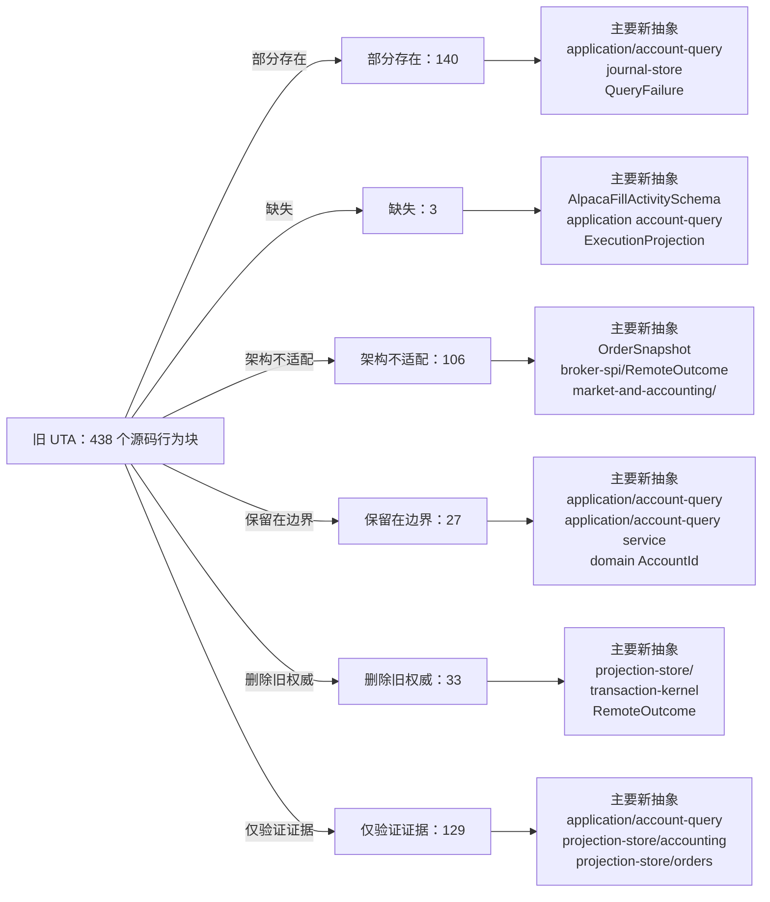

<!-- Auto-generated by scripts/uta-effect-runtime-map.mjs from mapping.json. Do not edit by hand. -->
<!-- Regenerate with `node scripts/uta-effect-runtime-map.mjs`. -->

# UTA 功能替代关系：第 6 章 State tiers and snapshots

目标架构原文：[`docs/uta-effect-runtime-architecture.md:847-881`](../uta-effect-runtime-architecture.md#L847-L881)。

## 结论

部分存在 140；缺失 3；架构不适配 106；保留在边界 27；删除旧权威 33；仅验证证据 129。状态只描述当前实现相对于目标架构的关系，不表示迁移已经落地。

## 替代关系图

## 章节级目标缺口

本章没有独立于源码行映射的目标级缺口。

## 源码映射

| 映射 ID | 当前源码 | 符号或行为块 | 当前功能 | 替代状态 | 新 UTA 抽象与做法 | 不适配位置与原因 | 必须补充或调整 | 重复索引 |
|---|---|---|---|---|---|---|---|---|
| `MAP-634E72490E` | [`packages/uta-protocol/src/types/broker.ts:108-155`](../../packages/uta-protocol/src/types/broker.ts#L108-L155) | Position | Defines a position around a broker-native Contract, a Decimal runtime quantity, raw currency text, long/short, string monetary fields, multiplier, optional cost-basis source, and optional risk metadata. | 架构不适配 | 3.1 domain/；5.7 Complete type contract — nominal identities and financial values；6. State tiers and snapshots；10.1 Accounting owns；14. Public protocol；19. Architectural prohibitions domain/；domain/Quantity；domain/Money；domain/InstrumentId；market-and-accounting/；projection-store/；protocol/ Translate broker observations into normalized position/exposure projections using InstrumentId, Quantity, CurrencyCode, DecimalString/Money, and explicit observation timestamps; keep native Contract conversion in adapters. | The public type embeds an IBKR Contract and runtime Decimal, uses interchangeable strings for identity/currency/money, and mixes broker observation with accounting projection state. | Replace Position with a named normalized projection/domain type, add boundary schemas and branded value constructors, and have adapters map SDK positions before journal/projection use. | **DUP-076** |
| `MAP-C6BE0A6EA7` | [`packages/uta-protocol/src/types/broker.ts:225-246`](../../packages/uta-protocol/src/types/broker.ts#L225-L246) | OpenOrder | Returns a broker-native Contract/Order/OrderState triplet with optional string orderId, average fill price, and TP/SL parameters. | 架构不适配 | 3.6 broker-spi/；3.8 projection-store/；5.7 Complete type contract — before-images, observations, and preconditions；6. State tiers and snapshots；9.3 Remote outcome；12.2 Unknown-outcome protocol；14. Public protocol；19. Architectural prohibitions OrderSnapshot；DispatchIdentity；projection-store/；broker-spi/；protocol/ Map broker order observations into OrderSnapshot and read projections keyed by branded BrokerOrderId/ClientOrderId, with explicit status, version, and observation provenance. | The type is an SDK-shaped object triplet, does not carry a typed order version or observation timestamp, and allows unbranded IDs and optional fields that cannot drive preconditions/reconciliation safely. | Delete the native triplet from the public contract, add adapter schemas and normalized OrderSnapshot/projection schemas, and persist remote observations through the journal. | **DUP-082** |
| `MAP-0422181E7C` | [`packages/uta-protocol/src/types/broker.ts:248-262`](../../packages/uta-protocol/src/types/broker.ts#L248-L262) | AccountInfo | Models account equity and margin fields as raw strings, optional values, and an unqualified baseCurrency string, with dayTradesRemaining as a number. | 部分存在 | 5.7 Complete type contract — nominal identities and financial values；6. State tiers and snapshots；10.1 Accounting owns；14. Public protocol；19. Architectural prohibitions market-and-accounting/；domain/Money；domain/CurrencyCode；projection-store/；protocol/ account-state schema Expose an account-state projection built from currency-qualified Money and typed accounting observations, preserving unknown/unsupported buckets explicitly. | The account query concept maps to the target projection, but monetary strings are not currency-qualified DecimalString values and optional fields have no named schema or uncertainty semantics. | Define normalized accounting/account-state types with CurrencyCode, Money, valuation uncertainty, and runtime schemas; map broker-native account tags only inside adapters. | **DUP-083** |
| `MAP-7E5E549A48` | [`packages/uta-protocol/src/types/broker.ts:298-313`](../../packages/uta-protocol/src/types/broker.ts#L298-L313) | Quote | Returns broker-native Contract plus string last/bid/ask/volume/high/low and a JavaScript Date timestamp. | 架构不适配 | 3.6 broker-spi/；3.8 projection-store/；6. State tiers and snapshots；9.3 Remote outcome；10.1 Accounting owns；14. Public protocol；19. Architectural prohibitions broker-spi/；domain/InstrumentId；domain/Instant；market-and-accounting/；protocol/ quote schema Decode quote observations in the adapter and expose normalized instrument/currency/DecimalString values with branded Instant and explicit observation provenance. | A native Contract and JavaScript Date cross the wire; numeric strings have no currency/decimal refinement, and the observation is not associated with a connection/instrument identity type. | Add a quote observation schema and adapter codec, replace Contract/Date/raw strings with normalized identities and branded values, and keep it in the read projection boundary. | **DUP-085** |
| `MAP-8C2153421E` | [`packages/uta-protocol/src/types/broker.ts:315-320`](../../packages/uta-protocol/src/types/broker.ts#L315-L320) | MarketClock | Represents market availability as an account-independent `isOpen` boolean with optional next-open/next-close/timestamp Dates. | 架构不适配 | 3.1 domain/；6. State tiers and snapshots；9.4 Capability derivation；10.2 Market and jurisdiction owns；14. Public protocol；19. Architectural prohibitions market-and-accounting/；MarketSession；ActionContext；protocol/ market-session schema Make market-session queries depend on venue, instrument, session type, jurisdiction, and branded Instant, returning a typed session observation rather than an account-wide boolean. | The architecture explicitly rejects an account-wide market-clock boolean; this shape cannot express venue/instrument/session/jurisdiction or distinguish observed session facts from capability. | Replace MarketClock with a market-and-accounting session query/observation ADT and use it as a typed precondition/capability input. | **DUP-086** |
| `MAP-8C79F4D559` | [`packages/uta-protocol/src/types/broker.ts:349-364`](../../packages/uta-protocol/src/types/broker.ts#L349-L364) | Bar | Carries JavaScript Date timestamp and OHLCV strings, with no instrument or quote-currency identity in the value itself. | 架构不适配 | 5.7 Complete type contract — nominal identities and financial values；6. State tiers and snapshots；9.2 Typed action interpreter；10.1 Accounting owns；14. Public protocol；19. Architectural prohibitions market-and-accounting/；domain/Price；domain/Quantity；domain/Instant；protocol/ bar schema Emit normalized OHLCV observations carrying InstrumentId, CurrencyCode/Price, Quantity, and branded Instant, with adapter-native conversion hidden. | Raw strings and Date do not enforce decimal/currency/instrument identity, and the value is not tied to a broker observation context or named schema. | Introduce a decoded bar observation/projection type using target value objects and validate it at the broker/protocol boundary. | **DUP-089** |
| `MAP-3EEBF25E8D` | [`packages/uta-protocol/src/types/broker.ts:366-413`](../../packages/uta-protocol/src/types/broker.ts#L366-L413) | BrokerHealth, UTAReach, UTATier, and BrokerHealthInfo | Models healthy/degraded/offline status, a down/connected/readable reach ladder, static data/account/trading tier, failure counters/timestamps, recovering/connecting, and disabled flags. | 部分存在 | 1. Thesis and non-negotiable properties；3.6 broker-spi/；6. State tiers and snapshots；9.1 Connection Layer；9.4 Capability derivation；12.1 Startup sequence；13. Observability；15. Security and authority BrokerConnectionService；ConnectionHealthEvent；CapabilitySet；CapabilityFailure；effect-runtime/；application/capability service Use scoped BrokerConnectionService health streams and typed capability degradation, with connection/account identity and durable operational projections. | The reach/tier concept is directionally useful, but status is a mutable summary with raw error text and booleans rather than typed health events, capability failures, and connection-layer requirements. | Define ConnectionHealthEvent/ConnectionFailure and CapabilityUnavailable ADTs, derive capabilities from ActionContext, and persist/query health as a projection without making health a broker mutation gate for unrelated accounts. | **DUP-090** |
| `MAP-781BB54D06` | [`packages/uta-protocol/src/types/broker.ts:500-522`](../../packages/uta-protocol/src/types/broker.ts#L500-L522) | IBroker contract search and catalog methods | Provides Promise-based searchContracts/getContractDetails, optional expandContract, and optional refreshCatalog, all using broker-native Contract/ContractDescription types and optional behavior. | 删除旧权威 | 3.6 broker-spi/；3.7 brokers/<broker>/；3.8 projection-store/；3.9 transport/ and protocol/；9.2 Typed action interpreter；9.4 Capability derivation；14. Public protocol；17.6 Slice 6: delete the legacy kernel；19. Architectural prohibitions application/account-query service；broker-spi/；brokers/<broker>/；projection-store/；protocol/ search schemas Move search/expansion into an application query service backed by broker adapter ports; adapters decode native responses and return normalized instrument/query projections. | Search, expansion, and catalog refresh are mixed into a generic broker facade, native SDK values cross the boundary, and optional methods make capability absence implicit. | Remove these methods from IBroker, define typed broker-spi query ports and explicit capability/unavailable results, and keep catalog projections separate from execution authority. | **DUP-097** |
| `MAP-BAFF102815` | [`packages/uta-protocol/src/types/broker.ts:553-584`](../../packages/uta-protocol/src/types/broker.ts#L553-L584) | IBroker account/order query methods | Defines Promise-based getAccount/getPositions/getOrders/getOrder and optional getOpenOrders, returning AccountInfo, Position, and OpenOrder values, with symbol hints and empty-array fallback semantics. | 删除旧权威 | 3.6 broker-spi/；3.8 projection-store/；6. State tiers and snapshots；9.2 Typed action interpreter；9.3 Remote outcome；10.1 Accounting owns；12.2 Unknown-outcome protocol；14. Public protocol；17.6 Slice 6: delete the legacy kernel；19. Architectural prohibitions application/account-query service；projection-store/；OrderSnapshot；ExposureSnapshot；RemoteOutcome；broker-spi/ Have broker adapters provide typed observations to application query/projection services; use the journal and reconciliation protocol for order state rather than direct SDK-shaped reads in the public facade. | Queries return native objects and optional/empty fallback semantics with no typed QueryFailure, projection checkpoint, observation identity, or branded precondition values. | Define normalized account/order/position query ports and QueryFailure schemas, migrate all callers, and remove these methods from IBroker once projection-store/application services are authoritative. | **DUP-100** |
| `MAP-7056B295D1` | [`packages/uta-protocol/src/types/broker.ts:585-605`](../../packages/uta-protocol/src/types/broker.ts#L585-L605) | IBroker market-data and historical methods | Defines getQuote/getMarketClock, optional getHistorical, and optional venue-decided assetClassFor, all as direct Promise calls with native Contract inputs and string-union outputs. | 删除旧权威 | 3.6 broker-spi/；3.8 projection-store/；6. State tiers and snapshots；9.2 Typed action interpreter；9.4 Capability derivation；10.2 Market and jurisdiction owns；14. Public protocol；17.6 Slice 6: delete the legacy kernel；19. Architectural prohibitions market-and-accounting/；application/account-query service；broker-spi/；CapabilitySet；protocol/ market-data schemas Move market/session/accounting observations behind typed broker-spi and market-and-accounting query services, with capability-derived support and normalized protocol projections. | Native contracts, JavaScript Dates, raw strings, optional method absence, and direct promises do not express market/jurisdiction context, typed failures, or explicit unsupported capability. | Delete these methods from IBroker after migration, add typed query/capability ports and schemas, and make unsupported historical/session operations return explicit typed failures. | **DUP-101** |
| `MAP-298D6BB247` | [`packages/uta-protocol/src/types/git.ts:18-54`](../../packages/uta-protocol/src/types/git.ts#L18-L54) | Operation discriminated union | Defines place/modify/close/cancel/sync, external-order observation, and balance-reconciliation operations; several variants carry IBKR Contract/Order/OrderCancel or Decimal, while modifyOrder uses Partial<Order>. | 删除旧权威 | 3.1 domain/；3.3 transaction-kernel/；3.8 projection-store/；5.1 Commands, events, effects, and state；5.7 Complete type contract — order and trading action ADTs；6. State tiers and snapshots；10.1 Accounting owns；11. Approval and Git audit projection；14. Public protocol；17.6 Slice 6: delete the legacy kernel；19. Architectural prohibitions TradeAction；TransactionCommand；TransactionEvent；transaction-kernel/；journal-store/；projection-store/；market-and-accounting/ Replace executable operation staging with TransactionCommand/CreateDraft/ReplaceDraft carrying the closed TradeAction and OrderSpec ADTs; represent broker observations and balance reconciliation as typed events/projection inputs rather than Git operations. | The union mixes commands, external facts, sync, and accounting events, exposes native broker values, permits Partial<Order> and optional-field soup, and has no transaction revision, precondition, compensation, or durable identity. | Delete Operation as execution authority, migrate all stage/commit/sync callers to transaction-kernel commands/events and broker observation protocols, and retain only normalized audit projection variants. | **DUP-108** |
| `MAP-4B40267FF6` | [`packages/uta-protocol/src/types/git.ts:56-58`](../../packages/uta-protocol/src/types/git.ts#L56-L58) | OperationStatus | Defines submitted/filled/rejected/cancelled/user-rejected as a flat string status union for Git operation results. | 删除旧权威 | 5.2 Transaction state；5.7 Complete type contract — dispatch and durable-job records；6. State tiers and snapshots；9.3 Remote outcome；11. Approval and Git audit projection；12.2 Unknown-outcome protocol；14. Public protocol；17.6 Slice 6: delete the legacy kernel；19. Architectural prohibitions TransactionState；DispatchState；RemoteOutcome；TransactionResult；projection-store/ Replace the flat label with the complete TransactionState ADT: Draft, Preparing, AwaitingApproval, Queued, Executing, Reconciling, Aborting, Compensating, Committed, Compensated, and RecoveryRequired, each with its canonical payload; model DispatchState and RemoteOutcome separately. | The status list cannot represent the complete transaction lifecycle and payloads, durable dispatch/reconciliation/abort/compensation progress, recovery-required ownership, or the distinction between venue acceptance and final commit criterion. | Remove OperationStatus from kernel/API contracts. Evolve the complete TransactionState exhaustively from journal events and derive legacy history labels only in a typed read projection. | **DUP-109** |
| `MAP-DE16B51F52` | [`packages/uta-protocol/src/types/git.ts:60-77`](../../packages/uta-protocol/src/types/git.ts#L60-L77) | OperationResult | Combines action, success boolean, flat status, optional native Execution/OrderState, optional string error, child legs, symbol attribution, and raw unknown payload. | 删除旧权威 | 1. Thesis and non-negotiable properties；4. Effect model；5.7 Complete type contract — broker capability and interpreter association；6. State tiers and snapshots；9.2 Typed action interpreter；9.3 Remote outcome；11. Approval and Git audit projection；12.2 Unknown-outcome protocol；14. Public protocol；17.6 Slice 6: delete the legacy kernel；19. Architectural prohibitions BrokerActionTypeMap；RemoteOutcome；DispatchFailure；TransactionResult；ProjectionName；projection-store/ Persist action-specific acknowledgement/rejection/observation/unknown variants keyed by DispatchIdentity, and expose a transaction result/projection with typed failures. | `success`, optional error text, and `raw?: unknown` erase the relation among action, acknowledgement, observation, error, compensation, and remote outcome; native SDK values leak into the contract. | Delete OperationResult, migrate result handling to BrokerActionTypeMap/RemoteOutcome/TransactionFailure, and generate Git history summaries from journal/projection events. | **DUP-110** |
| `MAP-FEF9B7F5AE` | [`packages/uta-protocol/src/types/git.ts:79-89`](../../packages/uta-protocol/src/types/git.ts#L79-L89) | GitState | Stores raw string account totals plus arrays of Position and OpenOrder values as the state snapshot after a Git commit. | 部分存在 | 6. State tiers and snapshots；7.4 Snapshot and compaction policy；10.1 Accounting owns；11. Approval and Git audit projection；14. Public protocol；17.6 Slice 6: delete the legacy kernel；19. Architectural prohibitions projection-store/；market-and-accounting/；domain/Money；GetTransactionResponse；journal-store/ Retain a read-only account/order projection if needed for compatibility, rebuilt from journal and broker reconciliation; use normalized accounting types and make it non-authoritative. | A commit embeds mutable-looking account state and native Position/OpenOrder arrays, with unqualified strings and no projection checkpoint/version or rebuild semantics. | Move state authority to journal-store/projection-store, replace fields with normalized account-state projections, and mark any Git state export as rebuildable compatibility output. | **DUP-111** |
| `MAP-DC943FF022` | [`packages/uta-protocol/src/types/git.ts:133-139`](../../packages/uta-protocol/src/types/git.ts#L133-L139) | GitStatus | Reports staged Operation[], pending message/hash, Git head hash, and commit count. | 保留在边界 | 5.2 Transaction state；6. State tiers and snapshots；7.3 Authoritative tables；11. Approval and Git audit projection；14. Public protocol；17.6 Slice 6: delete the legacy kernel；19. Architectural prohibitions GetTransactionResponse；projection-store/；journal-store/；TransactionState；TransactionVersion Retain a GitStatus-shaped read-only compatibility schema only while the current public SDK consumes it; derive it from transaction and Git-audit projections, never execution state. | Git staging/head fields cannot control execution. Deleting the type immediately would contradict the retained public status boundary, so it must be an explicitly temporary projection contract. | Make the SDK and route consume a typed projection backed by durable events; remove only when the public compatibility contract is deliberately retired. | **DUP-117** |
| `MAP-2DA6BBE2CF` | [`packages/uta-protocol/src/types/git.ts:141-158`](../../packages/uta-protocol/src/types/git.ts#L141-L158) | OperationSummary | Summarizes a symbol, OperationAction, textual change, flat status, and optional string order terms for review surfaces. | 部分存在 | 5.7 Complete type contract — order and trading action ADTs；6. State tiers and snapshots；11. Approval and Git audit projection；14. Public protocol；17.6 Slice 6: delete the legacy kernel；19. Architectural prohibitions projection-store/；TradeAction；TransactionState；Git audit projection；protocol/ Keep a normalized review projection derived from TransactionCommand/PreparedPlan and journal events, with exact action/order variants and transaction revision/digest. | The review concept is compatible with an audit/read projection, but symbol/change strings and optional untyped order terms lose the closed action/order relationship and transaction identity. | Replace OperationAction/string terms with a typed transaction summary projection; retain textual change only as presentation generated from typed data. | **DUP-118** |
| `MAP-18E2D21F66` | [`packages/uta-protocol/src/types/git.ts:160-167`](../../packages/uta-protocol/src/types/git.ts#L160-L167) | CommitLogEntry | Represents a Git log row with hash/parent/message/timestamp/round and OperationSummary[] only. | 部分存在 | 6. State tiers and snapshots；7.4 Snapshot and compaction policy；11. Approval and Git audit projection；13. Observability；14. Public protocol；17.6 Slice 6: delete the legacy kernel；19. Architectural prohibitions Git audit projection；projection-store/；journal-store/；TransactionId；JournalSequence Expose Git log as a rebuildable audit projection annotated or correlated with transaction ids/revisions and journal sequences, never as recovery authority. | The row has no transaction/revision/state/sequence and assumes Git's narrative is sufficient for execution history, while target recovery reads SQLite journal and broker observations. | Build CommitLogEntry-compatible output only from projection-store checkpoints and journal events, with a typed compatibility schema and no execution writes. | **DUP-119** |
| `MAP-ED7DB561BF` | [`packages/uta-protocol/src/types/git.ts:176-186`](../../packages/uta-protocol/src/types/git.ts#L176-L186) | OrderStatusUpdate | Carries order id/symbol, previous/current flat OperationStatus, and optional decimal-string fill fields for sync updates. | 删除旧权威 | 5.2 Transaction state；6. State tiers and snapshots；9.3 Remote outcome；11. Approval and Git audit projection；12.2 Unknown-outcome protocol；14. Public protocol；17.6 Slice 6: delete the legacy kernel；19. Architectural prohibitions RemoteOutcome；OrderSnapshot；DispatchIdentity；TransactionEvent；projection-store/ Represent broker observation/reconciliation as typed RemoteOutcome and TransactionEvent records keyed by DispatchIdentity and native observation evidence; derive history updates as projections. | Sync status deltas have no dispatch identity, observation timestamp/version/evidence, unknown state, or durable reconciliation checkpoint and reuse a flat Git status. | Delete OrderStatusUpdate from the execution/sync contract and migrate sync polling to durable scheduler observation jobs and journal events. | **DUP-121** |
| `MAP-8AD42F6839` | [`packages/uta-protocol/src/types/git.ts:203-211`](../../packages/uta-protocol/src/types/git.ts#L203-L211) | SimulationPositionCurrent | Reports simulator symbol, long/short side, decimal-string quantity/cost/price/PnL/value for the pre-change state. | 保留在边界 | 6. State tiers and snapshots；10.1 Accounting owns；14. Public protocol；17.1 Slice 1: durable kernel with MockBroker；18. Verification contract；20. First falsifier MockBroker observation；market-and-accounting/；projection-store/；protocol/ simulator projection Retain as a read-only simulator projection if needed by the dev panel, generated from normalized mock account/exposure observations and never used as journal authority. | The DTO has no InstrumentId/CurrencyCode/Instant or projection checkpoint and is tied to the current in-memory simulator presentation. | Use a named simulator projection schema backed by the durable MockBroker slice, or keep it explicitly dev-only and outside domain/transaction-kernel types. | **DUP-124** |
| `MAP-CAFDD48B6D` | [`packages/uta-protocol/src/types/git.ts:213-223`](../../packages/uta-protocol/src/types/git.ts#L213-L223) | SimulationPositionAfter | Reports simulator position values after a simulated price, including PnL change and percentage as decimal strings. | 保留在边界 | 6. State tiers and snapshots；10.1 Accounting owns；14. Public protocol；17.1 Slice 1: durable kernel with MockBroker；18. Verification contract；20. First falsifier MockBroker observation；market-and-accounting/；projection-store/；protocol/ simulator projection Keep as a derived UI/test projection from typed mock observations and accounting functions; do not let it substitute for transaction result/remote outcome records. | The result is a simulator-specific derived view with unbranded symbol and no declared currency/observation identity; it does not represent the target commit criterion or recovery state. | Generate it from normalized mock account projections and name its schema as a test/presentation boundary, while verifying recovery through journal/remote observation separately. | **DUP-125** |
| `MAP-0CEEC81F23` | [`packages/uta-protocol/src/types/git.ts:225-246`](../../packages/uta-protocol/src/types/git.ts#L225-L246) | SimulatePriceChangeResult | Combines success boolean/error string, current and simulated account/position states, and string summary deltas including worstCase. | 保留在边界 | 1. Thesis and non-negotiable properties；5.7 Complete type contract — error channels；6. State tiers and snapshots；10.1 Accounting owns；12.2 Unknown-outcome protocol；14. Public protocol；17.1 Slice 1: durable kernel with MockBroker；18. Verification contract；20. First falsifier MockBroker interpreter；TransactionFailure；QueryFailure；market-and-accounting/；projection-store/；protocol/ Keep only as a named simulator preview response; use typed QueryFailure/validation failures and derive preview data without claiming broker dispatch or transaction commitment. | Success/error text and nested ad hoc state are not target transaction or accounting ADTs; the response says nothing about durable mock observations, dispatch identity, or recovery. | Separate simulator preview from execution protocol, add runtime schema and typed query/validation failures, and exercise the durable MockBroker crash/reconciliation path independently. | **DUP-126** |
| `MAP-A774AC84F2` | [`packages/uta-protocol/src/types/git.ts:308-322`](../../packages/uta-protocol/src/types/git.ts#L308-L322) | getOperationSymbol | Switches over legacy Operation variants and returns contract.symbol/aliceId where available, otherwise the literal `unknown`; modify/cancel/sync have no symbol. | 删除旧权威 | 3.1 domain/；3.8 projection-store/；5.7 Complete type contract — nominal identities and financial values；9.4 Capability derivation；10.2 Market and jurisdiction owns；11. Approval and Git audit projection；14. Public protocol；17.6 Slice 6: delete the legacy kernel；19. Architectural prohibitions InstrumentId；TradeAction；projection-store/；market-and-accounting/；Git audit projection Derive display identity from typed TradeAction/instrument projection fields; do not infer identity from native symbol/aliceId fallbacks or return an untyped unknown sentinel. | The helper depends on legacy/native fields, loses identity for several action variants, and uses a permissive string fallback instead of a nominal InstrumentId or explicit absence variant. | Delete the helper with Operation, migrate consumers to typed action/projection mappers, and require explicit instrument identity where the target contract needs it. | **DUP-130** |
| `MAP-29B08BE41B` | [`packages/uta-protocol/src/types/history.ts:15-30`](../../packages/uta-protocol/src/types/history.ts#L15-L30) | HistoryContract | Defines an IBKR-superset compact contract with all identity/market fields optional, including optional string aliceId, symbol/localSymbol/secType/currency/exchange and derivative fields. | 部分存在 | 3.8 projection-store/；3.9 transport/ and protocol/；6. State tiers and snapshots；10.2 Market and jurisdiction owns；11. Approval and Git audit projection；14. Public protocol；19. Architectural prohibitions projection-store/；domain/InstrumentId；market-and-accounting/；Git audit projection；protocol/ history schema Keep history as a read projection with a normalized instrument identity and explicit derivative/instrument variants; map IBKR/venue-native fields only in adapters. | The projection intent is compatible with the target read/audit boundary, but an optional-field IBKR superset and optional aliceId cannot guarantee instrument identity, currency, venue, or derivative validity. | Define a normalized HistoryInstrument/InstrumentId projection schema, preserve broker-native details as redacted adapter metadata only, and validate required fields per instrument variant. | **DUP-131** |
| `MAP-8CE1592385` | [`packages/uta-protocol/src/types/history.ts:32-34`](../../packages/uta-protocol/src/types/history.ts#L32-L34) | OrderHistoryStatus and OrderHistorySource | Uses flat string unions for submitted/filled/cancelled/rejected/user-rejected and alice/external source labels. | 部分存在 | 5.2 Transaction state；6. State tiers and snapshots；9.3 Remote outcome；11. Approval and Git audit projection；12.2 Unknown-outcome protocol；14. Public protocol；19. Architectural prohibitions TransactionState；RemoteOutcome；OrderSnapshot；Git audit projection；protocol/ history schema Derive history labels from typed TransactionState, DispatchState, and RemoteOutcome, retaining source as a projection dimension rather than execution truth. | The labels omit prepared/queued/executing/reconciling/unknown/compensating/recovery states and cannot encode observation evidence or transaction identity. | Replace execution use of these unions with typed state/outcome mappers; keep compatibility labels only in a validated history projection. | **DUP-132** |
| `MAP-732B845474` | [`packages/uta-protocol/src/types/history.ts:36-59`](../../packages/uta-protocol/src/types/history.ts#L36-L59) | OrderHistoryEntry | Collapses an order lifecycle into one row with optional broker order id/order terms/fills, flat status/source, Git commit hash/message, and optional string error. | 部分存在 | 5.7 Complete type contract — before-images, observations, and preconditions；6. State tiers and snapshots；7.4 Snapshot and compaction policy；9.3 Remote outcome；11. Approval and Git audit projection；12.2 Unknown-outcome protocol；13. Observability；14. Public protocol；17.6 Slice 6: delete the legacy kernel；19. Architectural prohibitions OrderSnapshot；TransactionId；DispatchIdentity；projection-store/；Git audit projection；journal-store/；protocol/ history schema Build order history from journal events, normalized order/remote observations, and projection checkpoints; expose transaction/revision/dispatch correlation and retain CommitHash only as audit pointer. | The row is a useful read projection, but optional order terms, flat status, commit hash/message authority, and free-form error omit order version, observation timestamp/evidence, transaction identity, and unknown/reconciliation state. | Redesign the history projection schema around typed OrderSnapshot/RemoteOutcome and journal correlation, then keep only presentation-compatible fields as derived output. | **DUP-133** |
| `MAP-56C6192DB1` | [`packages/uta-protocol/src/types/history.ts:61-76`](../../packages/uta-protocol/src/types/history.ts#L61-L76) | TradeHistorySource and TradeHistoryEntry | Represents fill/reconcile rows with optional order id, HistoryContract, side, decimal-string quantity/price/value, source order/external/reconcile, and Git commit hash. | 部分存在 | 5.7 Complete type contract — nominal identities and financial values；6. State tiers and snapshots；7.4 Snapshot and compaction policy；10.1 Accounting owns；11. Approval and Git audit projection；12.2 Unknown-outcome protocol；14. Public protocol；17.6 Slice 6: delete the legacy kernel；19. Architectural prohibitions market-and-accounting/；Fill；ExposureSnapshot；RemoteOutcome；projection-store/；Git audit projection；journal-store/ Generate trade history from typed broker acknowledgements/observations and accounting fill/reconciliation events, with currency-qualified Money/Quantity and journal correlation. | The read-only fill projection is directionally valid, but quantity/price/value lack branded instrument/currency context, optional order identity is not linked to dispatch, and Git hash remains the only audit pointer. | Move authority to journal/accounting projections, add typed Fill/Reconciliation records and observation timestamps, and retain CommitHash only as optional derived audit metadata. | **DUP-134** |
| `MAP-864224E5A6` | [`packages/uta-protocol/src/types/manager.ts:1-10`](../../packages/uta-protocol/src/types/manager.ts#L1-L10) | manager native imports | Imports AccountCapabilities/BrokerHealth/BrokerHealthInfo from broker.ts and ContractDescription from @traderalice/ibkr for manager-level summaries and search results. | 架构不适配 | 3.6 broker-spi/；3.8 projection-store/；3.9 transport/ and protocol/；9.4 Capability derivation；10.1 Accounting owns；14. Public protocol；19. Architectural prohibitions application/；projection-store/；broker-spi/；market-and-accounting/；protocol/ Make manager query services consume normalized account/capability projections and adapter-decoded instrument metadata, not shared IBKR types. | The manager wire module directly imports a broker-native ContractDescription and re-exports capability/health shapes that are not target ADTs. | Remove native imports from public manager types, define named account/capability/search projection schemas, and isolate SDK conversion inside broker adapters. | **DUP-136** |
| `MAP-75E0ED8B2B` | [`packages/uta-protocol/src/types/manager.ts:12-19`](../../packages/uta-protocol/src/types/manager.ts#L12-L19) | UTASummary | Summarizes a UTA id/label, an asVendor boolean, AccountCapabilities, and BrokerHealthInfo. | 部分存在 | 2.2 UTA owns；3.8 projection-store/；6. State tiers and snapshots；9.4 Capability derivation；13. Observability；14. Public protocol；15. Security and authority application/capability service；projection-store/；CapabilitySet；BrokerConnectionService；ConnectionHealthEvent；protocol/ account summary schema Expose a typed account/capability query projection with branded account/connection identity, capability ADTs, and health/reach evidence derived by UTA. | The summary concept is a query projection, but id/label are raw strings, capabilities are static string arrays, health is a mutable summary with raw error text, and asVendor does not express target authority/context. | Replace with an account query/capability response schema backed by projection-store and BrokerConnectionService, retaining presentation labels only at the UI boundary. | **DUP-137** |
| `MAP-02219D5749` | [`packages/uta-protocol/src/types/manager.ts:21-37`](../../packages/uta-protocol/src/types/manager.ts#L21-L37) | AggregatedEquity | Aggregates total equity/cash/PnL as strings, optional string FX warnings, and anonymous per-account rows with raw id/currency/health fields. | 部分存在 | 3.8 projection-store/；6. State tiers and snapshots；7.4 Snapshot and compaction policy；10.1 Accounting owns；13. Observability；14. Public protocol；19. Architectural prohibitions market-and-accounting/；Money；CurrencyCode；FX observation；projection-store/；protocol/ account-state schema Serve aggregated accounting as a projection over currency-qualified Money and explicit FX observations/uncertainty, with per-account identity and projection checkpoints. | Raw monetary strings and warning text do not encode currency, FX source/timestamp, valuation uncertainty, or typed accounting failure; anonymous nested objects are not named domain/protocol types. | Define accounting aggregation/projection types with Money, CurrencyCode, FX observation and typed warning/failure variants, then expose them through a named account-state schema. | **DUP-138** |
| `MAP-6EAA6A8F74` | [`packages/uta-protocol/src/types/manager.ts:39-42`](../../packages/uta-protocol/src/types/manager.ts#L39-L42) | ContractSearchResult | Groups broker-native ContractDescription[] under a raw string accountId. | 架构不适配 | 3.6 broker-spi/；3.8 projection-store/；3.9 transport/ and protocol/；9.4 Capability derivation；10.2 Market and jurisdiction owns；14. Public protocol；19. Architectural prohibitions application/account-query service；broker-spi/；domain/InstrumentId；market-and-accounting/；protocol/ search response schema Return a named normalized contract/instrument search response keyed by branded AccountId/ConnectionId, with adapter-native details decoded before crossing protocol. | ContractDescription is imported directly from the IBKR SDK and account identity is an interchangeable string; no runtime schema or venue/instrument/jurisdiction context is guaranteed. | Replace ContractDescription[] with normalized instrument/contract projection variants and decode/validate them at the application protocol boundary. | **DUP-139** |
| `MAP-6BAF8CB0BF` | [`packages/uta-protocol/src/types/manager.ts:44-58`](../../packages/uta-protocol/src/types/manager.ts#L44-L58) | ContractSearchHit | Flattens an aggregated search hit into a raw source string, broker-native contract, string derivative security types, and optional venue-decided asset class. | 架构不适配 | 3.6 broker-spi/；3.8 projection-store/；3.9 transport/ and protocol/；9.4 Capability derivation；10.2 Market and jurisdiction owns；14. Public protocol；19. Architectural prohibitions application/account-query service；broker-spi/；domain/InstrumentId；market-and-accounting/；protocol/ search response schema Use a normalized search hit containing branded account/instrument identity, explicit venue/jurisdiction/instrument metadata, and a validated asset-class variant derived by the broker/application boundary. | The hit exposes ContractDescription['contract'], raw derivative secType strings, optional assetClass fallback semantics, and no branded identity or schema; consumers can feed broker-native data directly to later routes. | Define a closed normalized search response ADT and adapter codecs; make asset-class/context resolution explicit and prevent generic routes from accepting native contract payloads. | **DUP-140** |
| `MAP-8588C24A12` | [`services/uta/src/__tests__/trading-tools.spec.ts:91-99`](../../services/uta/src/__tests__/trading-tools.spec.ts#L91-L99) | createTradingTools.listUTAs | Calls the tool layer with no arguments and verifies that it returns an array of summaries containing the registered account identifier. | 仅验证证据 | §2.1 Alice owns；§3.8 projection-store/；§3.9 transport/ and protocol/；§6 State tiers and snapshots；§13 Observability；§14 Public protocol；§15 Security and authority application/account-query；projection-store；protocol account-state schema；transport/http Treat this as read-only account projection evidence. The target query should return a named account/capability summary with reachability state and no credentials or native adapter object, verified through the public schema. | — | — | **DUP-146** |
| `MAP-1E2638E1F3` | [`services/uta/src/__tests__/trading-tools.spec.ts:123-135`](../../services/uta/src/__tests__/trading-tools.spec.ts#L123-L135) | getOrders.makeOpenOrder | Builds an OpenOrder fixture from native IBKR Order, OrderState, and contract values, including Decimal quantities/prices and an Alice identifier. | 仅验证证据 | §3.1 domain/；§3.7 brokers/<broker>/；§5.7 Complete type contract；§6 State tiers and snapshots；§9.2 Typed action interpreter；§14 Public protocol domain/order and identifiers；projection-store/orders；broker-spi；brokers/Mock；protocol order schema Replace native OpenOrder fixtures at the public-test seam with normalized order snapshots or projection records. Native IBKR objects may remain adapter-side evidence, while domain/order and protocol schemas carry only broker-neutral values. | — | — | **DUP-148** |
| `MAP-EBC1DF5535` | [`services/uta/src/__tests__/trading-tools.spec.ts:137-167`](../../services/uta/src/__tests__/trading-tools.spec.ts#L137-L167) | getOrders.compactSummaries | Executes a staged and pushed market order, then checks that getOrders returns compact fields such as source, action, orderType, quantity, and status while excluding raw IBKR fields. | 仅验证证据 | §2 System boundary；§3.8 projection-store/；§3.9 transport/ and protocol/；§5 Transaction algebra；§6 State tiers and snapshots；§9.2 Typed action interpreter；§13 Observability；§14 Public protocol；§15 Security and authority application/account-query；projection-store/orders；protocol order schema；broker-spi/BrokerActionInterpreter；brokers/Mock Use this as read-projection boundary evidence: the target orders query should encode normalized named fields, omit broker-native SDK fields, and read from rebuildable projection state after journaled execution; the fixture itself does not prove durable dispatch. | — | — | **DUP-149** |
| `MAP-0682C42EA8` | [`services/uta/src/__tests__/trading-tools.spec.ts:169-193`](../../services/uta/src/__tests__/trading-tools.spec.ts#L169-L193) | getOrders.UNSETFiltering | Mocks a raw OpenOrder with IBKR UNSET numeric values and zero parentId, then verifies that unset optional fields are omitted from the returned order summary. | 仅验证证据 | §3.7 brokers/<broker>/；§3.8 projection-store/；§3.9 transport/ and protocol/；§6 State tiers and snapshots；§9.2 Typed action interpreter；§14 Public protocol；§15 Security and authority brokers/Mock；broker-spi/BrokerActionInterpreter；projection-store/orders；protocol order schema Normalize adapter sentinel values at the broker/projection boundary and validate the resulting named response schema; preserve absence semantics without allowing raw SDK sentinels into public protocol or stored projections. | — | — | **DUP-150** |
| `MAP-0CD7FA4541` | [`services/uta/src/__tests__/trading-tools.spec.ts:195-211`](../../services/uta/src/__tests__/trading-tools.spec.ts#L195-L211) | getOrders.optionalFields | Mocks a limit order with a lmtPrice and nested take-profit/stop-loss values and verifies that explicitly present optional fields survive summarization. | 仅验证证据 | §3.1 domain/；§3.8 projection-store/；§3.9 transport/ and protocol/；§5.7 Complete type contract；§6 State tiers and snapshots；§9.2 Typed action interpreter；§14 Public protocol domain/order ADT；projection-store/orders；protocol order schema；brokers/Mock；broker-spi/BrokerActionInterpreter Carry optional order terms through a broker-neutral order ADT and rebuildable order projection, with schema-defined nested risk terms and decimal values; use the current test as evidence for preservation rather than raw-object compatibility. | — | — | **DUP-151** |
| `MAP-07DB18F4C8` | [`services/uta/src/__tests__/trading-tools.spec.ts:213-228`](../../services/uta/src/__tests__/trading-tools.spec.ts#L213-L228) | getOrders.decimalSerialization | Sets a small Decimal limit price and verifies that the tool emits the exact decimal string instead of a JavaScript number. | 仅验证证据 | §3.1 domain/；§3.8 projection-store/；§5.7 Complete type contract；§7.1 Embedded database；§9.2 Typed action interpreter；§14 Public protocol；§15 Security and authority domain decimal value objects；protocol schemas；projection-store/orders；journal-store serialization；broker-spi Preserve decimal precision through domain value objects, versioned journal/projection serialization, adapter normalization, and the public response schema; keep the exact-string assertion as a precision regression check. | — | — | **DUP-152** |
| `MAP-0C2AAEE0A8` | [`services/uta/src/__tests__/trading-tools.spec.ts:230-242`](../../services/uta/src/__tests__/trading-tools.spec.ts#L230-L242) | getOrders.orderIdentity | Provides a string orderId from getPendingOrderIds while the native Order carries a numeric sentinel, and verifies that the returned summary preserves the explicit string identity. | 仅验证证据 | §3.1 domain/；§3.8 projection-store/；§5.7 Complete type contract；§6 State tiers and snapshots；§14 Public protocol；§18 Verification contract domain identifiers；projection-store/orders；protocol order schema；application/account-query Use a branded BrokerOrderId/dispatch identity as the projection join key and public identifier, rather than reading a native SDK sentinel; retain the test as identity-preservation evidence. | — | — | **DUP-153** |
| `MAP-CA93BD9449` | [`services/uta/src/__tests__/trading-tools.spec.ts:244-270`](../../services/uta/src/__tests__/trading-tools.spec.ts#L244-L270) | getOrders.groupByContract | Mocks three pending orders across AAPL and ETH and verifies that groupBy contract returns an object keyed by each Alice contract identifier with the expected order clusters. | 仅验证证据 | §2 System boundary；§3.8 projection-store/；§6 State tiers and snapshots；§8.2 Partitioning；§14 Public protocol；§18.2 Concurrency scenarios projection-store/orders；application/account-query；domain InstrumentId and ConflictKey；protocol grouped-order schema Represent grouped results as a named read projection keyed by broker-neutral InstrumentId/contract identity. If grouping feeds scheduling, derive explicit ConflictKey values; do not make an untyped object the transaction or queue authority. | — | — | **DUP-154** |
| `MAP-47B29B6218` | [`services/uta/src/domain/trading/__test__/e2e/uta-ccxt-bybit.e2e.spec.ts:182-216`](../../services/uta/src/domain/trading/__test__/e2e/uta-ccxt-bybit.e2e.spec.ts#L182-L216) | sentinel status/show/export boundary | Stages a market order, asserts a large Decimal sentinel is absent from status, pushes it, asserts the sentinel is absent from show/exportGitState/log, and closes the resulting position. | 部分存在 | 3.8 projection-store/；6 State tiers and snapshots；11 Approval and Git audit projection；13 Observability；14 Public protocol；17.2 Slice 2: transaction and approval protocol；19 Architectural prohibitions projection-store；protocol codecs and schemas；journal-store；observability redaction schemas Retain the boundary invariant as a projection/protocol test: decode and encode named schemas from journal-derived projections and verify financial sentinel/default values cannot cross public or audit boundaries. | The current assertions cover legacy status/show/export/log JSON only; they do not exercise named protocol schemas, journal-derived rebuilds, redaction, transaction/dispatch identifiers, or target projection authority. | Move the sentinel check to projection-store and protocol integration tests and remove legacy exportGitState persistence once the journal is authoritative. | **DUP-229** |
| `MAP-5C9F33F93C` | [`services/uta/src/domain/trading/__test__/e2e/uta-ibkr.e2e.spec.ts:36-89`](../../services/uta/src/domain/trading/__test__/e2e/uta-ibkr.e2e.spec.ts#L36-L89) | FX identity staging | Searches for a USD.CHF CASH contract, forms an IBKR native-key aliceId, stages a limit order with display-only USDCHF, asserts conId identity and empty routing fields, commits without pushing, records evidence, then rejects/cleans staging. | 部分存在 | 5.3 Two-phase transaction protocol；5.7 Complete type contract；6 State tiers and snapshots；9.2 Typed action interpreter；10.2 Market and jurisdiction owns；10.3 Transaction kernel consumes observations；11 Approval and Git audit projection；17.5 Slice 5: heterogeneous brokers；18.3 Real broker acceptance domain identifiers and action ADTs；transaction-kernel preconditions；broker-spi IBKR interpreter；market-and-accounting jurisdiction/instrument service；journal-store；projection-store Retain the conId/display-symbol invariant in a target prepare test: resolve account, jurisdiction, instrument, and canonical IBKR identity into a typed prepared plan, persist the prepared event, and reject through the approval state machine. | The current legacy staging test observes correct conId/display fields but has no typed transaction revision, durable prepared event, market/jurisdiction observation, conflict key, or broker-spi action schema. | Move identity resolution into domain/broker-spi preparation and journal-store projections; make approval/rejection target state durable before removing legacy UTA staging. | **DUP-231** |
| `MAP-14999AF99F` | [`services/uta/src/domain/trading/__test__/e2e/uta-lifecycle.e2e.spec.ts:208-282`](../../services/uta/src/domain/trading/__test__/e2e/uta-lifecycle.e2e.spec.ts#L208-L282) | describe UTA — precision end-to-end | Checks fractional quantities, exact partial-close arithmetic, string limit-price and quantity preservation in JSON output, and Decimal equality through stage -> push -> broker order/position. The cited range does not assert status-field encoding. | 部分存在 | 1 Thesis and non-negotiable properties；5.7 Complete type contract；6 State tiers and snapshots；7.3 Authoritative tables；10.1 Accounting owns；18.3 Real broker acceptance domain decimal value objects and Money；journal-store schema codecs；projection-store；transaction-kernel；market-and-accounting Port the precision cases to nominal domain Quantity/Price/Money types and verify schema codecs, journal persistence, projection rebuild, and protocol encoding preserve exact decimal values. | The assertions prove Decimal/string behavior only on the legacy in-memory path; they do not prove currency-qualified money, FX source/timestamp, persisted schema precision, projection rebuild, or crash-safe recovery of financial values. | Introduce target domain value objects and SQLite codecs, then add accounting/currency/FX and restart round-trip cases instead of relying on legacy wire JSON and Decimal implementation details. | **DUP-243** |
| `MAP-02559D426B` | [`services/uta/src/domain/trading/__test__/uta-health.spec.ts:224-241`](../../services/uta/src/domain/trading/__test__/uta-health.spec.ts#L224-L241) | UTA health offlineStageCommit | After broker failure, verifies that stagePlaceOrder and commit still succeed as local in-memory operations and that commit reports prepared=true without contacting the broker. | 仅验证证据 | §5 Transaction algebra；§6 State tiers and snapshots；§7 Durability architecture；§8.1 Admission；§12.1 Startup sequence；§14 Public protocol；§18 Verification contract；§19 Architectural prohibitions domain transaction proposal；transaction-kernel；journal-store；durable-scheduler；application/transaction；protocol transaction schemas Interpret staging as an editable proposal snapshot and commit/prepare as a durable journal transaction in the target. The current in-memory success while offline is migration evidence only; it does not establish SQLite durability, admission acknowledgement, or crash recovery. | — | — | **DUP-257** |
| `MAP-EAC4E9DC46` | [`services/uta/src/domain/trading/brokers/alpaca/alpaca-contracts.ts:42-65`](../../services/uta/src/domain/trading/brokers/alpaca/alpaca-contracts.ts#L42-L65) | mapAlpacaOrderStatus | Collapses Alpaca status strings into IBKR Filled, Submitted, Cancelled, or Inactive; partially filled remains Submitted and unknown statuses default to Submitted. | 架构不适配 | §5.7 Before-images, observations, and preconditions；§6 State tiers and snapshots；§9.2 Typed action interpreter；§9.3 Remote outcome；§12.2 Unknown-outcome protocol；§19 Architectural prohibitions AlpacaOrderStatusSchema；OrderSnapshot；RemoteOutcome<OrderSnapshot>；BrokerRejection；ProtocolViolation Decode native statuses exhaustively into typed order observations and RemoteOutcome variants. Preserve PartiallyFilled/Working, Rejected, Cancelled, Expired, and unknown protocol evidence rather than mapping them to a single legacy string. | The default-to-Submitted branch can treat a new or malformed native status as working, and status collapse loses rejection/expiry/partial-fill semantics needed for commit and reconciliation. | Add a runtime status schema and exhaustive mapping to OrderSnapshot/RemoteOutcome; unknown native values must be ProtocolViolation or explicit observation failure. | **DUP-263** |
| `MAP-FDBC88A893` | [`services/uta/src/domain/trading/brokers/alpaca/alpaca-contracts.ts:67-73`](../../services/uta/src/domain/trading/brokers/alpaca/alpaca-contracts.ts#L67-L73) | makeOrderState | Constructs a mutable legacy OrderState, assigns the collapsed status, and optionally copies a rejection reason string. | 架构不适配 | §5.7 Before-images, observations, and preconditions；§6 State tiers and snapshots；§9.2 Typed action interpreter；§9.3 Remote outcome；§12.3 Defects and expected failures；§13 Observability OrderSnapshot；BrokerRejection；PlaceOrderAcknowledgement；ObservationFailure Return an immutable typed order observation/acknowledgement with branded IDs, status, filled quantity, version, timestamps, and structured rejection. Emit legacy OrderState only through a compatibility projection. | A mutable compatibility state cannot carry broker order version, observation time, dispatch identity, or a distinction between confirmed, still-working, rejected, and unknown outcomes. | Remove makeOrderState from the target interpreter path and implement named Alpaca order observation/ack schemas with exhaustive failure mapping. | **DUP-264** |
| `MAP-E1BE5EBCAD` | [`services/uta/src/domain/trading/brokers/alpaca/alpaca-types.ts:9-18`](../../services/uta/src/domain/trading/brokers/alpaca/alpaca-types.ts#L9-L18) | AlpacaBrokerRaw | Describes account response strings and numeric day-trade count for cash, equity, portfolio value, buying power, and day-trade buckets without runtime validation or currency/timestamp fields. | 架构不适配 | §6 State tiers and snapshots；§9.2 Typed action interpreter；§10.1 Accounting owns；§12.3 Defects and expected failures AlpacaAccountSchema；AccountObservation；Money；BrokerCashBuckets；ObservationFailure Decode account responses with a runtime schema and map to AccountObservation containing branded currency-qualified Money, broker-native cash/margin buckets, observedAt, and explicit unavailable/protocol failures. | A TypeScript interface is erased at runtime and the shape has no currency, observation time, account identity, or validation failure channel. | Introduce AlpacaAccountSchema plus typed accounting observation mapping; reject malformed values instead of allowing them into Decimal constructors. | **DUP-266** |
| `MAP-FE06BD8DFB` | [`services/uta/src/domain/trading/brokers/alpaca/alpaca-types.ts:20-30`](../../services/uta/src/domain/trading/brokers/alpaca/alpaca-types.ts#L20-L30) | AlpacaPositionRaw | Describes raw position strings for symbol, side, quantity, prices, market value, PnL, and cost basis; side and numeric validity are unconstrained. | 架构不适配 | §6 State tiers and snapshots；§9.2 Typed action interpreter；§10.1 Accounting owns；§12.3 Defects and expected failures AlpacaPositionSchema；PositionObservation；ExposureSnapshot；AccountingProjection Decode side, decimal strings, symbol identity, and timestamps with AlpacaPositionSchema, then construct PositionObservation/ExposureSnapshot with account/instrument/currency and valuation source. | The interface cannot reject unknown sides or malformed decimals and omits account identity, currency, observedAt, and version needed for accounting and preconditions. | Add runtime schema validation and map positions to typed accounting observations; represent unknown side/protocol values as explicit failures. | **DUP-267** |
| `MAP-D50CF7C166` | [`services/uta/src/domain/trading/brokers/alpaca/alpaca-types.ts:32-51`](../../services/uta/src/domain/trading/brokers/alpaca/alpaca-types.ts#L32-L51) | AlpacaOrderRaw | Describes order rows with optional quantity/notional/prices/fill fields, native status, timestamps, reject reason, optional order class, and recursive legs; all provider strings are unconstrained. | 架构不适配 | §5.7 Before-images, observations, and preconditions；§5.7 Dispatch and durable-job records；§6 State tiers and snapshots；§9.2 Typed action interpreter；§9.3 Remote outcome；§12.2 Unknown-outcome protocol；§13 Observability；§19 Architectural prohibitions AlpacaOrderSchema；OrderSnapshot；OrderObservation；DispatchIdentity；OrderLegObservation；BrokerRejection Replace the interface with a versioned native response schema and map quantity/notional as distinct variants, native UUID/version/status/timestamps/fills/legs into OrderSnapshot and RemoteOutcome evidence. | No runtime decoder or branded identity exists; nullable quantity/notional is semantically conflated by the mapper, statuses are open strings, and no broker-order version or observation identity is defined. | Implement AlpacaOrderSchema/leg schema, exhaustive status and order-type codecs, native ID/version preservation, and typed leg/fill observations used by dispatch reconciliation. | **DUP-268** |
| `MAP-9E30EAD352` | [`services/uta/src/domain/trading/brokers/alpaca/alpaca-types.ts:53-57`](../../services/uta/src/domain/trading/brokers/alpaca/alpaca-types.ts#L53-L57) | AlpacaSnapshotRaw | Describes latest trade, latest quote, and daily bar numeric fields with string timestamps, but does not validate presence, numeric ranges, source, or venue identity. | 部分存在 | §6 State tiers and snapshots；§9.2 Typed action interpreter；§10.2 Market and jurisdiction owns；§12.3 Defects and expected failures AlpacaSnapshotSchema；MarketDataObservation；VenueIdentity；ObservationFailure Decode snapshot data into a typed MarketDataObservation with venue/instrument identity, source/quality, bid/ask/trade timestamps, and explicit malformed/unavailable failures. | The interface omits source/quality/venue/session context and provides no runtime boundary validation. | Add AlpacaSnapshotSchema and map it to market-and-accounting observation types. | **DUP-269** |
| `MAP-13D1329A19` | [`services/uta/src/domain/trading/brokers/alpaca/alpaca-types.ts:59-66`](../../services/uta/src/domain/trading/brokers/alpaca/alpaca-types.ts#L59-L66) | AlpacaBarRaw | Describes OHLCV bar numeric fields and a timestamp as a compile-time-only shape. | 部分存在 | §6 State tiers and snapshots；§9.2 Typed action interpreter；§10.2 Market and jurisdiction owns；§12.3 Defects and expected failures AlpacaBarSchema；HistoricalBarsObservation；MarketDataQuality；ObservationFailure Use a runtime AlpacaBarSchema and emit typed historical observations with feed/source/data quality, interval, venue, and bounds metadata. | The type carries no runtime validation or data-source/quality metadata, so malformed bars and feed changes cannot be represented explicitly. | Define the bar schema and typed historical observation codec, including explicit feed-denial and unavailable-data failures. | **DUP-270** |
| `MAP-0E85D36517` | [`services/uta/src/domain/trading/brokers/alpaca/alpaca-types.ts:68-79`](../../services/uta/src/domain/trading/brokers/alpaca/alpaca-types.ts#L68-L79) | AlpacaFillActivityRaw | Defines a FILL activity shape with symbol, side, quantities, price, cumulative/leaves quantity, transaction time, order ID, and fill type, but no code in this five-file adapter consumes it. | 缺失 | §6 State tiers and snapshots；§9.2 Typed action interpreter；§9.3 Remote outcome；§10.1 Accounting owns；§12.2 Unknown-outcome protocol；§18.3 Real broker acceptance AlpacaFillActivitySchema；FillObservation；ExecutionProjection；RemoteOutcome<OrderSnapshot> Turn fill activities into a validated FillObservation stream/reconciliation input tied to BrokerOrderId and DispatchIdentity, then evolve executions, cost basis, realized PnL, and order progress from those observations. | The provider shape exists only as an unused interface; no fill observation, ingestion, deduplication, accounting event, or recovery path is implemented. | Add schema decoding and a durable observation/projection path for fills, including cumulative/leaves reconciliation and duplicate/out-of-order handling. | **DUP-271** |
| `MAP-D0F05BBCB5` | [`services/uta/src/domain/trading/brokers/alpaca/alpaca-types.ts:81-86`](../../services/uta/src/domain/trading/brokers/alpaca/alpaca-types.ts#L81-L86) | AlpacaClockRaw | Describes account-wide is_open and next-open/close/timestamp strings without venue/session type or runtime validation. | 架构不适配 | §6 State tiers and snapshots；§9.2 Typed action interpreter；§10.2 Market and jurisdiction owns；§12.3 Defects and expected failures AlpacaClockSchema；MarketSessionQuery；VenueSessionObservation；ObservationFailure Decode the venue clock into a typed session observation and let market-and-accounting answer instrument/venue/session queries; retain account clock only as compatibility evidence. | The raw shape cannot represent venue timezone, instrument/session context, jurisdiction, or malformed/unavailable clock failures. | Add AlpacaClockSchema and map it into MarketSessionQuery/Observation types with explicit venue and session metadata. | **DUP-272** |
| `MAP-5A3A747EBA` | [`services/uta/src/domain/trading/brokers/alpaca/AlpacaBroker.spec.ts:301-327`](../../services/uta/src/domain/trading/brokers/alpaca/AlpacaBroker.spec.ts#L301-L327) | getPositions tests | Verifies raw Alpaca position fields map to legacy Position contract, Decimal quantity/cost/price/value/PnL, and long side. | 仅验证证据 | §6 State tiers and snapshots；§9.2 Typed action interpreter；§10.1 Accounting owns；§18.3 Real broker acceptance PositionObservation；ExposureSnapshot；AccountingProjection；AlpacaPositionSchema Keep the mapping scenario as evidence, then assert the typed PositionObservation/ExposureSnapshot including account/instrument identity, currency, observedAt, and explicit side/valuation semantics. | — | — | **DUP-278** |
| `MAP-3DA66A43BA` | [`services/uta/src/domain/trading/brokers/alpaca/AlpacaBroker.spec.ts:558-609`](../../services/uta/src/domain/trading/brokers/alpaca/AlpacaBroker.spec.ts#L558-L609) | getAccount tests | Verifies account equity/cash/buying power/day-trade mapping, aggregate unrealized PnL, omitted realized PnL, and Decimal aggregation precision. | 仅验证证据 | §6 State tiers and snapshots；§9.2 Typed action interpreter；§10.1 Accounting owns；§10.3 Transaction kernel consumes, but does not own；§18.3 Real broker acceptance AccountObservation；Money；BrokerCashBuckets；PositionProjection；AccountingProjection Retain Decimal aggregation evidence while migrating assertions to currency-qualified Money, source/timestamp observations, broker cash/margin buckets, and fill-derived realized/cost-basis projections. | — | — | **DUP-284** |
| `MAP-20EEB58E82` | [`services/uta/src/domain/trading/brokers/alpaca/AlpacaBroker.spec.ts:611-639`](../../services/uta/src/domain/trading/brokers/alpaca/AlpacaBroker.spec.ts#L611-L639) | getOrders tests | Verifies getOrders sequentially calls getOrder for each ID and returns mapped legacy order symbols/statuses. | 仅验证证据 | §6 State tiers and snapshots；§8.3 Durable jobs and leases；§9.2 Typed action interpreter；§9.3 Remote outcome；§12.2 Unknown-outcome protocol；§18.3 Real broker acceptance ObserveOrderJob；OrderObservation；RemoteOutcome<OrderSnapshot>；OrdersProjection Rewrite to assert one typed observation result per requested ID, preservation of not-found versus unavailable/Unknown, durable reconciliation checkpoints, and projection updates. | — | — | **DUP-285** |
| `MAP-4AF53E630B` | [`services/uta/src/domain/trading/brokers/alpaca/AlpacaBroker.spec.ts:641-767`](../../services/uta/src/domain/trading/brokers/alpaca/AlpacaBroker.spec.ts#L641-L767) | getOrder tests | Covers direct string UUID argument, filled order mapping, null on any not-found error, numeric orderId=0 compatibility, bracket/stop-limit TP/SL extraction, and no TP/SL on simple orders. | 仅验证证据 | §5.7 Before-images, observations, and preconditions；§6 State tiers and snapshots；§9.2 Typed action interpreter；§9.3 Remote outcome；§12.2 Unknown-outcome protocol；§17 Slice 4: first real broker；§18.3 Real broker acceptance；§19 Architectural prohibitions OrderSnapshot；BrokerOrderId；OrderLegObservation；RemoteOutcome<OrderSnapshot>；NativeAtomicGroup Keep UUID/native-leg evidence but remove the numeric-zero assertion from the execution contract; test branded BrokerOrderId preservation, typed not-found versus observation failure, and bracket/OTO group reconciliation. | — | — | **DUP-286** |
| `MAP-3C5D748AD0` | [`services/uta/src/domain/trading/brokers/alpaca/AlpacaBroker.spec.ts:769-805`](../../services/uta/src/domain/trading/brokers/alpaca/AlpacaBroker.spec.ts#L769-L805) | getQuote tests | Verifies snapshot trade/quote/volume conversion to legacy Quote and throws for unresolved contracts. | 仅验证证据 | §6 State tiers and snapshots；§9.2 Typed action interpreter；§10.2 Market and jurisdiction owns；§18.3 Real broker acceptance MarketDataObservation；QuoteSchema；VenueSessionObservation；QueryFailure Migrate assertions to decoded MarketDataObservation with instrument/venue/source/quality/timestamps and typed resolution/query failures; keep a compatibility Quote projection test only at the public read boundary. | — | — | **DUP-287** |
| `MAP-CDB6B2021B` | [`services/uta/src/domain/trading/brokers/alpaca/AlpacaBroker.spec.ts:807-869`](../../services/uta/src/domain/trading/brokers/alpaca/AlpacaBroker.spec.ts#L807-L869) | getHistorical tests | Verifies async bar draining, adjusted timeframe/limit options, bounded-window tail slicing, unresolved-contract errors, and the legacy iex capability quality. | 仅验证证据 | §6 State tiers and snapshots；§9.2 Typed action interpreter；§10.2 Market and jurisdiction owns；§18.3 Real broker acceptance；§19 Architectural prohibitions HistoricalBarsObservation；AlpacaBarSchema；MarketDataQuality；ObservationFailure Retain window and precision scenarios, then assert schema-decoded bars and explicit actual feed/data quality; replace legacy static iex and generic Error expectations with typed availability/failure variants. | — | — | **DUP-288** |
| `MAP-B0EB90D81C` | [`services/uta/src/domain/trading/brokers/alpaca/AlpacaBroker.spec.ts:871-893`](../../services/uta/src/domain/trading/brokers/alpaca/AlpacaBroker.spec.ts#L871-L893) | getMarketClock tests | Verifies account-wide clock fields are mapped to Date values. | 仅验证证据 | §6 State tiers and snapshots；§9.2 Typed action interpreter；§10.2 Market and jurisdiction owns；§18.3 Real broker acceptance MarketSessionQuery；VenueSessionObservation；MarketDataQueryFailure Replace account-wide clock assertions with venue/instrument/session query assertions, including timezone/session status and typed unavailable-market behavior. | — | — | **DUP-289** |
| `MAP-3FA23D96E2` | [`services/uta/src/domain/trading/brokers/alpaca/AlpacaBroker.ts:127-143`](../../services/uta/src/domain/trading/brokers/alpaca/AlpacaBroker.ts#L127-L143) | AlpacaBroker instance state | Stores a non-null asserted SDK client plus mutable in-memory catalog and symbol map; catalog null means not attempted and an empty array means a successful empty result. | 部分存在 | §3.7 brokers/<broker>；§6 State tiers and snapshots；§7.4 Snapshot and compaction policy；§9.1 Connection Layer；§12.1 Startup sequence ScopedAlpacaConnection；InstrumentCatalogProjection；BrokerConnectionService；RemoteObservation Keep connection resources in a scoped Layer and keep catalog data in a rebuildable read projection with an explicit freshness/status value. Transaction state and dispatch identity must not live on the connection object. | The SDK resource and readiness state are mutable class fields, and catalog freshness/error state is implicit in null versus empty rather than a decoded projection state. | Move client acquisition/health to BrokerConnectionService and model catalog availability/freshness with a typed projection; ensure startup/recovery can distinguish unavailable connection from empty catalog. | **DUP-300** |
| `MAP-DEA87BE3CD` | [`services/uta/src/domain/trading/brokers/alpaca/AlpacaBroker.ts:211-233`](../../services/uta/src/domain/trading/brokers/alpaca/AlpacaBroker.ts#L211-L233) | refreshCatalog | Calls getAssets through an unknown cast, filters rows whose tradable flag is false, atomically replaces the in-memory catalog and map, logs success, and rethrows failures while preserving the old cache. | 部分存在 | §3.7 brokers/<broker>；§6 State tiers and snapshots；§7.4 Snapshot and compaction policy；§9.2 Typed action interpreter；§10.2 Market and jurisdiction owns AlpacaAssetSchema；InstrumentCatalogProjection；ObservationFailure；MarketMetadata Decode getAssets responses with AlpacaAssetSchema, map them to validated instrument/venue metadata, and update a rebuildable projection with freshness and failure evidence. Preserve stale data only as an explicit projection state. | The SDK response is cast rather than decoded and the in-memory replacement has no durable/read-projection schema, freshness, jurisdiction, or typed failure state. | Introduce a typed catalog observation service and projection update path, and expose catalog unavailability/staleness to capability derivation instead of only logging/rethrowing. | **DUP-304** |
| `MAP-A57DA48B5D` | [`services/uta/src/domain/trading/brokers/alpaca/AlpacaBroker.ts:417-441`](../../services/uta/src/domain/trading/brokers/alpaca/AlpacaBroker.ts#L417-L441) | getAccount | Reads account and positions concurrently, sums position unrealized_pl with Decimal, and maps equity/cash/buying power/daytrade count to a legacy AccountInfo; failures are converted through BrokerError.from. | 部分存在 | §6 State tiers and snapshots；§9.2 Typed action interpreter；§9.3 Remote outcome；§10.1 Accounting owns；§10.3 Transaction kernel consumes, but does not own；§12.3 Defects and expected failures；§13 Observability；2.2 UTA owns；2.3 Broker adapters own AccountObservation；Money；BrokerCashBuckets；PositionProjection；AccountingProjection；QueryFailure Decode account and position observations into currency-qualified Money, broker cash/margin buckets, valuation timestamp/source, and accounting projection events. The transaction kernel should consume these immutable observations as preconditions rather than receive a legacy mutable AccountInfo. | Decimal arithmetic is preserved, but values are unbranded strings with a hardcoded USD base, unrealized PnL is recomputed from unvalidated positions, and no source/timestamp/version or typed query failure is returned. | Add Alpaca account/position schemas and accounting mappers with CurrencyCode/Money, observation timestamps, broker-native buckets, and explicit unavailable/protocol failures. | **DUP-311** |
| `MAP-894C4D8526` | [`services/uta/src/domain/trading/brokers/alpaca/AlpacaBroker.ts:443-455`](../../services/uta/src/domain/trading/brokers/alpaca/AlpacaBroker.ts#L443-L455) | contractFor | Builds a legacy STK Contract and enriches it from the in-memory symbol catalog with description and primary exchange, falling back to a bare contract when catalog metadata is absent. | 部分存在 | §3.7 brokers/<broker>；§6 State tiers and snapshots；§9.2 Typed action interpreter；§10.2 Market and jurisdiction owns InstrumentId；InstrumentMetadata；InstrumentCatalogProjection；VenueIdentity Resolve a validated InstrumentId and return typed InstrumentMetadata/VenueIdentity from the catalog projection. Generate a legacy Contract only in a compatibility read mapper. | Catalog enrichment is optional mutable state on a legacy Contract and omits explicit instrument identity, listing jurisdiction, venue timezone, and freshness. | Create a typed instrument metadata resolver backed by a projection and make missing/stale metadata explicit to prepare/capability checks. | **DUP-312** |
| `MAP-FBF8E94277` | [`services/uta/src/domain/trading/brokers/alpaca/AlpacaBroker.ts:457-480`](../../services/uta/src/domain/trading/brokers/alpaca/AlpacaBroker.ts#L457-L480) | getPositions | Maps raw Alpaca positions to legacy Position objects, uses long versus any-other-value as short, passes through Decimal prices/values, sets realizedPnL to '0' and multiplier to '1', and throws BrokerError.from on failure. | 部分存在 | §6 State tiers and snapshots；§9.2 Typed action interpreter；§9.3 Remote outcome；§10.1 Accounting owns；§10.3 Transaction kernel consumes, but does not own；§12.3 Defects and expected failures；§13 Observability；2.2 UTA owns；2.3 Broker adapters own PositionObservation；ExposureSnapshot；AccountingProjection；CurrencyCode；DecimalString；ObservationFailure Decode each raw position into a typed PositionObservation/ExposureSnapshot with instrument/account identity, currency, observedAt, side ADT, quantity, cost basis, market value, and valuation source; evolve accounting projections from that observation. | The raw response is cast without schema validation, unknown side values become short, realized PnL is fabricated as zero, and no observation timestamp/version or branded account/instrument identity is preserved. | Add an exhaustive Alpaca position decoder, explicit unknown-side/protocol failure, accounting observation timestamps and currency, and a separate projection path for realized PnL/fill-derived cost basis. | **DUP-313** |
| `MAP-BEC8B440B3` | [`services/uta/src/domain/trading/brokers/alpaca/AlpacaBroker.ts:482-489`](../../services/uta/src/domain/trading/brokers/alpaca/AlpacaBroker.ts#L482-L489) | getOrders | Fetches each requested ID sequentially through getOrder and silently omits any ID for which getOrder returns null. | 架构不适配 | §6 State tiers and snapshots；§8.3 Durable jobs and leases；§9.3 Remote outcome；§12.2 Unknown-outcome protocol；§19 Architectural prohibitions ObserveOrderJob；RemoteOutcome<OrderSnapshot>；QueryFailure；BrokerOrderId Use typed observation jobs keyed by BrokerOrderId/DispatchIdentity and preserve a distinct NotFound, unavailable, protocol, or Unknown result for each requested order; update projections from observed facts. | Missing orders, connection failures, and unknown outcomes collapse into omission, so reconciliation cannot distinguish conclusive absence from an observation failure. | Replace nullable sequential reads with a typed batch observation service and durable reconciliation/checkpoint handling; never silently drop requested IDs. | **DUP-314** |
| `MAP-C2CA1F9078` | [`services/uta/src/domain/trading/brokers/alpaca/AlpacaBroker.ts:491-498`](../../services/uta/src/domain/trading/brokers/alpaca/AlpacaBroker.ts#L491-L498) | getOrder | Calls getOrder and maps the response, but catches every exception and returns null, including authentication, transport, malformed-response, and unknown-outcome failures. | 架构不适配 | §4 Effect model；§6 State tiers and snapshots；§9.3 Remote outcome；§12.2 Unknown-outcome protocol；§12.3 Defects and expected failures；§19 Architectural prohibitions observe；RemoteOutcome<OrderSnapshot>；ObservationFailure；BrokerOrderNotFound；ConnectionFailure Implement an observe(identity) SPI operation that decodes the order and returns Confirmed, StillWorking, Rejected, or Unknown; return a typed not-found only when Alpaca provides conclusive absence. | The catch-all null is the permissive fallback prohibited by the architecture and can turn an unavailable or malformed broker into a false not-found result. | Classify Alpaca responses into typed observation outcomes/failures, preserve evidence, and schedule reconciliation for indeterminate reads instead of returning null. | **DUP-315** |
| `MAP-AECC0CF17C` | [`services/uta/src/domain/trading/brokers/alpaca/AlpacaBroker.ts:500-509`](../../services/uta/src/domain/trading/brokers/alpaca/AlpacaBroker.ts#L500-L509) | getOpenOrders | Queries Alpaca with status=open, casts the SDK response to AlpacaOrderRaw[], maps each row to legacy OpenOrder, and converts all request failures to BrokerError.from. | 部分存在 | §6 State tiers and snapshots；§7.3 Authoritative tables；§9.2 Typed action interpreter；§9.3 Remote outcome；§10.1 Accounting owns；§12.2 Unknown-outcome protocol OpenOrderObservation；RemoteObservation；OrdersProjection；AlpacaOrderSchema；ObservationFailure Expose open-order listing as a typed broker observation, decode every row, retain native IDs/status/version evidence, and update the rebuildable order projection/checkpoint used by reconciliation. | The list response is cast and immediately projected to a legacy type; there is no typed pagination/observation identity, response version, reconciliation checkpoint, or distinction between unavailable data and an empty open-order set. | Add Alpaca order-list schemas and an observation projection API with explicit empty-versus-unavailable semantics and reconciliation evidence. | **DUP-316** |
| `MAP-1D39C444E7` | [`services/uta/src/domain/trading/brokers/alpaca/AlpacaBroker.ts:511-529`](../../services/uta/src/domain/trading/brokers/alpaca/AlpacaBroker.ts#L511-L529) | getQuote | Resolves a ticker, calls getSnapshot, casts the response, converts numeric trade/quote/volume fields to strings, and returns a legacy Quote with a trade timestamp. | 部分存在 | §3.7 brokers/<broker>；§6 State tiers and snapshots；§9.2 Typed action interpreter；§10.2 Market and jurisdiction owns；§13 Observability MarketDataObservation；QuoteSchema；VenueIdentity；InstrumentId；QueryFailure Decode Alpaca snapshot data into a typed market observation carrying instrument/venue identity, bid/ask/trade timestamps, data source and quality, then expose a compatibility Quote projection only at the read boundary. | The snapshot is unvalidated, returns a legacy contract, loses venue/source/quality metadata, and has no typed market-data failure or session context. | Add snapshot runtime schema and MarketDataObservation mapping with branded instrument/venue IDs, source timestamps, quality, and typed failures. | **DUP-317** |
| `MAP-21C40C002D` | [`services/uta/src/domain/trading/brokers/alpaca/AlpacaBroker.ts:531-591`](../../services/uta/src/domain/trading/brokers/alpaca/AlpacaBroker.ts#L531-L591) | getHistorical | Maps a BarInterval to Alpaca timeframe, drains getBarsV2, requests SIP first, retries IEX only for a regex-classified recent-SIP 403, tail-slices bounded results to preserve most-recent-N semantics, and returns legacy Bar strings. | 部分存在 | §6 State tiers and snapshots；§9.2 Typed action interpreter；§9.3 Remote outcome；§10.2 Market and jurisdiction owns；§12.3 Defects and expected failures；§13 Observability；§19 Architectural prohibitions HistoricalBarsObservation；AlpacaBarSchema；MarketDataQuality；ObservationFailure；TypedFeedAvailability Retain the timeframe/window semantics behind a typed historical-bars interpreter. Decode every bar, carry feed/source/data quality and request bounds, and represent SIP denial/IEX fallback as explicit typed availability/data-quality metadata rather than a message-regex branch. | Bars and generator responses are cast without runtime schemas; SIP/IEX quality is not returned with the data, getCapabilities always reports iex even after SIP success, and the fallback is driven by regex text. | Define AlpacaBarSchema and feed-denial variants, return a typed MarketDataObservation with actual feed quality, and map malformed/transport/permission failures to explicit query failures. | **DUP-318** |
| `MAP-9C9DF0B00B` | [`services/uta/src/domain/trading/brokers/alpaca/AlpacaBroker.ts:603-615`](../../services/uta/src/domain/trading/brokers/alpaca/AlpacaBroker.ts#L603-L615) | getMarketClock | Reads one account-wide Alpaca clock and maps is_open/next_open/next_close/timestamp to a legacy MarketClock object. | 架构不适配 | §6 State tiers and snapshots；§9.2 Typed action interpreter；§10.2 Market and jurisdiction owns；§14 Public protocol MarketSessionQuery；VenueSessionObservation；InstrumentJurisdiction；MarketDataQueryFailure Implement a market-session query parameterized by venue, instrument/listing jurisdiction, session type, and time, returning a typed session observation. Keep account-wide clock only as a compatibility projection. | A single boolean clock is not the target market boundary and cannot express venue timezone, holiday/session rules, instrument jurisdiction, or account permissions. | Move clock/session derivation to market-and-accounting and have Alpaca provide validated venue/session observations to it. | **DUP-320** |
| `MAP-2C63E4B337` | [`services/uta/src/domain/trading/brokers/alpaca/AlpacaBroker.ts:630-656`](../../services/uta/src/domain/trading/brokers/alpaca/AlpacaBroker.ts#L630-L656) | mapOpenOrder | Maps an Alpaca order row to a legacy Contract/Order/OpenOrder, conflates qty and notional into totalQuantity, uppercases native strings, sets numeric orderId to 0 because Alpaca uses UUIDs, and preserves the UUID only in an optional outer field; it attaches filled quantity/average price and mapped status. | 架构不适配 | §5.7 Before-images, observations, and preconditions；§5.7 Dispatch and durable-job records；§6 State tiers and snapshots；§9.2 Typed action interpreter；§9.3 Remote outcome；§10.1 Accounting owns；§12.2 Unknown-outcome protocol；§13 Observability；§19 Architectural prohibitions OrderSnapshot；BrokerOrderId；OrderObservation；PlaceOrderAcknowledgement；RemoteOutcome<OrderSnapshot>；FillObservation Decode into an OrderSnapshot/OrderObservation with branded BrokerOrderId, broker order version/status, exact quantity versus notional semantics, fill details, timestamps, rejection reason, and native evidence. Produce an IBKR-compatible OpenOrder only as a rebuildable compatibility projection. | The numeric ID is intentionally discarded, notional is interpreted as units, raw status/type/TIF strings are not validated, created/filled timestamps and version are dropped, and the mapper cannot represent StillWorking/Unknown/reconciliation evidence. | Add AlpacaOrderSchema and exhaustive native-status/order-spec mapping, preserve UUID identity and order version, model quantity/notional as distinct variants, and emit typed order/fill observations for reconciliation and accounting. | **DUP-322** |
| `MAP-00DA721165` | [`services/uta/src/domain/trading/brokers/ccxt/ccxt-contracts.spec.ts:26-77`](../../services/uta/src/domain/trading/brokers/ccxt/ccxt-contracts.spec.ts#L26-L77) | marketToContract translator tests | Asserts spot, perp, USDC-margined perp, and dated future wire symbols map to expected localSymbol, secType, exchange, currency, expiry, multiplier, and valid universal fields. | 仅验证证据 | 5.7 Complete type contract；6 State tiers and snapshots；9.2 Typed action interpreter；10.2 Market and jurisdiction owns；18 Verification contract domain/Instrument；domain/InstrumentId；market-and-accounting/InstrumentMetadata；brokers/ccxt/NativeMarketSchema Preserve these identity/expiry/settlement invariants as target native-schema and instrument-mapping tests, then assert branded target values rather than IBKR Contract fields. | — | — | **DUP-326** |
| `MAP-00DCA04091` | [`services/uta/src/domain/trading/brokers/ccxt/ccxt-contracts.spec.ts:79-103`](../../services/uta/src/domain/trading/brokers/ccxt/ccxt-contracts.spec.ts#L79-L103) | contractToCcxt translator tests | Asserts direct lookup from spot/perp localSymbol and fallback resolution for a user-created Contract with no localSymbol. | 仅验证证据 | 5.7 Complete type contract；6 State tiers and snapshots；9.2 Typed action interpreter；18 Verification contract domain/InstrumentId；broker-spi/NativeIdentity；market-and-accounting/InstrumentCatalog Retain direct wire identity and fallback/ambiguity coverage in a typed instrument catalog test suite with explicit NotFound/Ambiguous outcomes. | — | — | **DUP-327** |
| `MAP-F0A14EF839` | [`services/uta/src/domain/trading/brokers/ccxt/ccxt-contracts.ts:24-53`](../../services/uta/src/domain/trading/brokers/ccxt/ccxt-contracts.ts#L24-L53) | ccxtTypeToSecType, mapOrderStatus, and makeOrderState | Maps spot/swap/future/option to legacy security strings, maps a small CCXT status set to Filled/Submitted/Cancelled/Inactive, and defaults all unknown statuses to Submitted in OrderState. | 架构不适配 | 5.7 Complete type contract；6 State tiers and snapshots；9.2 Typed action interpreter；9.3 Remote outcome；12.2 Unknown-outcome protocol；19 Architectural prohibitions；3.7 brokers/<broker>/ domain/OrderSnapshot；broker-spi/RemoteOutcome；domain/OrderStatus；domain/ObservationFailure Replace string mappings with exhaustive schemas for instrument and order status, preserving PendingSubmit/Working/PartiallyFilled/Filled/Cancelled and explicit unknown/rejected evidence. | Unknown or newly introduced CCXT statuses silently become Submitted, and security/status types are legacy strings with no exhaustive failure or remote-outcome representation. | Define total native-to-domain decoders with a ProtocolViolation/UnknownStatus variant and map status plus fills to OrderSnapshot/RemoteOutcome without permissive defaults. | **DUP-330** |
| `MAP-63CF278660` | [`services/uta/src/domain/trading/brokers/ccxt/ccxt-contracts.ts:55-111`](../../services/uta/src/domain/trading/brokers/ccxt/ccxt-contracts.ts#L55-L111) | marketToContract | Builds an IBKR Contract from CcxtMarket, preserving CCXT wire symbol as localSymbol, maps market type, quote, expiry, contractSize, strike, and option right, and relies on buildContract validation. | 部分存在 | 5.7 Complete type contract；6 State tiers and snapshots；9.2 Typed action interpreter；10.2 Market and jurisdiction owns；19 Architectural prohibitions；3.7 brokers/<broker>/ domain/Instrument；domain/InstrumentId；market-and-accounting/InstrumentMetadata；brokers/ccxt/NativeMarketSchema Decode native CCXT markets into target Instrument/InstrumentMetadata with branded identity, venue, settlement, expiry, multiplier, and jurisdiction facts while retaining the wire symbol only inside the adapter. | The output is a mutable external IBKR Contract, casts raw market metadata, and leaves missing expiry/contract information to legacy validation; target domain types must not depend on broker SDK objects. | Introduce a CCXT market response schema and pure mapper to target instrument ADTs/nominal identifiers, with explicit invalid-market errors and settlement/currency semantics. | **DUP-331** |
| `MAP-50D001548B` | [`services/uta/src/domain/trading/brokers/ccxt/ccxt-contracts.ts:113-144`](../../services/uta/src/domain/trading/brokers/ccxt/ccxt-contracts.ts#L113-L144) | contractToCcxt | Resolves a Contract by direct localSymbol lookup, then symbol lookup, then a unique base/security-type/currency search; ambiguous or missing results return null. | 部分存在 | 5.7 Complete type contract；6 State tiers and snapshots；9.2 Typed action interpreter；14 Public protocol；19 Architectural prohibitions；3.7 brokers/<broker>/ domain/InstrumentId；broker-spi/NativeIdentity；market-and-accounting/InstrumentCatalog；protocol/ValidationIssue Resolve a branded InstrumentId/native key through a typed catalog query returning Found, Ambiguous, or NotFound variants; only the CCXT adapter translates it to a wire symbol. | Resolution accepts mutable Contract strings and collapses missing versus ambiguous identity into null; exchangeName is not used to encode a typed venue identity. | Make identity resolution total and nominal, preserve venue/settlement distinctions, and return explicit validation failures before action preparation. | **DUP-332** |
| `MAP-27C6050997` | [`services/uta/src/domain/trading/brokers/ccxt/ccxt-tools.spec.ts:35-68`](../../services/uta/src/domain/trading/brokers/ccxt/ccxt-tools.spec.ts#L35-L68) | makeSwapMarket and makeCcxtUta fixtures | Builds a swap market and a UTA whose broker init/account/positions/orders are stubbed, then registers it in UTAManager for tool resolution tests. | 仅验证证据 | 2.1 Alice owns；6 State tiers and snapshots；9.2 Typed action interpreter；14 Public protocol；18 Verification contract application/AccountQueryService；protocol/AccountSelector；broker-spi/ConnectionIdentity Replace legacy UTA fixture setup with a target application service and scoped mock connection layer, preserving account identity and instrument resolution assertions. | — | — | **DUP-335** |
| `MAP-F873979BCA` | [`services/uta/src/domain/trading/brokers/ccxt/CcxtBroker.spec.ts:51-93`](../../services/uta/src/domain/trading/brokers/ccxt/CcxtBroker.spec.ts#L51-L93) | CCXT broker test fixtures | Builds spot/swap market objects, account configs, and a helper that forcibly marks a broker initialized and injects its markets for isolated method tests. | 仅验证证据 | 6 State tiers and snapshots；9.1 Connection Layer；18 Verification contract；19 Architectural prohibitions brokers/ccxt/ConnectionLayer；market-and-accounting/InstrumentCatalog；broker-spi/BrokerActionInterpreter Replace private-state injection with scoped connection/catalog fixtures and prepared target domain values; retain only behavior assertions. | — | — | **DUP-351** |
| `MAP-C05B75E8A4` | [`services/uta/src/domain/trading/brokers/ccxt/CcxtBroker.spec.ts:312-337`](../../services/uta/src/domain/trading/brokers/ccxt/CcxtBroker.spec.ts#L312-L337) | async placeOrder behavior test | Asserts successful order placement returns an id but no execution even when the mocked exchange reports closed and filled data, because fills arrive via sync. | 仅验证证据 | 5.3 Two-phase transaction protocol；6 State tiers and snapshots；9.3 Remote outcome；12.2 Unknown-outcome protocol；18 Verification contract domain/DispatchConfirmed；broker-spi/RemoteOutcome；projection-store/OrdersProjection；durable-scheduler/ReconciliationWorker Carry the asynchronous acknowledgement/observation distinction into durable dispatch tests, including accepted/working/filled commit criteria. | — | — | **DUP-356** |
| `MAP-DA97124E26` | [`services/uta/src/domain/trading/brokers/ccxt/CcxtBroker.spec.ts:339-470`](../../services/uta/src/domain/trading/brokers/ccxt/CcxtBroker.spec.ts#L339-L470) | Bybit getOrder tests | Tests Bybit open/closed/conditional endpoint fallback, missing-cache and not-found nulls, and extraction of complete, partial, or absent TP/SL fields. | 仅验证证据 | 6 State tiers and snapshots；9.2 Typed action interpreter；9.3 Remote outcome；12.2 Unknown-outcome protocol；18 Verification contract；19 Architectural prohibitions brokers/ccxt/BybitInterpreter；broker-spi/OrderObservation；broker-spi/RemoteOutcome；projection-store/OrdersProjection Preserve endpoint coverage and TP/SL mapping while changing null/error assertions to typed observation outcomes and reconciliation evidence. | — | — | **DUP-357** |
| `MAP-96DFCD8720` | [`services/uta/src/domain/trading/brokers/ccxt/CcxtBroker.spec.ts:891-983`](../../services/uta/src/domain/trading/brokers/ccxt/CcxtBroker.spec.ts#L891-L983) | getAccount tests | Tests wallet-equity net liquidation, stablecoin aggregation, spot valuation, credential failure, Binance multi-wallet aggregation/tolerated delivery failure, and initial margin/PnL rollups. | 仅验证证据 | 6 State tiers and snapshots；9.2 Typed action interpreter；10.1 Accounting owns；12.2 Unknown-outcome protocol；18 Verification contract；19 Architectural prohibitions market-and-accounting/AccountingProjection；broker-spi/AccountObservation；domain/ValuationUncertainty；projection-store/AccountingProjection Preserve accounting invariants but assert journaled observations, incomplete-wallet evidence, valuation uncertainty, and typed query failures in target projections. | — | — | **DUP-365** |
| `MAP-13B4870B11` | [`services/uta/src/domain/trading/brokers/ccxt/CcxtBroker.spec.ts:1155-1245`](../../services/uta/src/domain/trading/brokers/ccxt/CcxtBroker.spec.ts#L1155-L1245) | CCXT derivative position mapping tests | Verifies derivative quantity, side, cost/mark/PnL, leverage, liquidation price, and margin mode mapping, including omission of absent or zero risk fields. | 仅验证证据 | 6 State tiers and snapshots；9.2 Typed action interpreter；9.3 Remote outcome；10.1 Accounting owns；12.2 Unknown-outcome protocol；18 Verification contract；19 Architectural prohibitions broker-spi/PositionObservation；market-and-accounting/ExposureProjection；projection-store/PositionsProjection；domain/ValuationUncertainty Port to typed derivative PositionObservation decoding with explicit missing/uncertain fields and provenance. | Tests current value mapping but not durable observation identity, timestamp/completeness, or uncertainty instead of zero/default omission. | Assert typed observation schemas and reconciliation/projection behavior. | **DUP-367** |
| `MAP-941D4989E1` | [`services/uta/src/domain/trading/brokers/ccxt/CcxtBroker.spec.ts:1247-1292`](../../services/uta/src/domain/trading/brokers/ccxt/CcxtBroker.spec.ts#L1247-L1292) | CCXT zero-size and unknown-market position tests | Verifies zero-size derivative rows and rows without loaded market metadata are silently omitted. | 仅验证证据 | 6 State tiers and snapshots；9.2 Typed action interpreter；9.3 Remote outcome；10.1 Accounting owns；12.2 Unknown-outcome protocol；18 Verification contract；19 Architectural prohibitions broker-spi/PositionObservation；market-and-accounting/ExposureProjection；projection-store/PositionsProjection；domain/ValuationUncertainty Define explicit omission/completeness policy and retain unknown-instrument evidence for reconciliation. | Silent dropping can make broker exposure appear complete and zero when source rows were unrecognized. | Return typed partial observations with raw/native identity and operational evidence. | **DUP-368** |
| `MAP-13B0841BEB` | [`services/uta/src/domain/trading/brokers/ccxt/CcxtBroker.spec.ts:1294-1446`](../../services/uta/src/domain/trading/brokers/ccxt/CcxtBroker.spec.ts#L1294-L1446) | CCXT spot synthesis and identity tests | Verifies spot positions synthesized from balances, free+used quantity, no-market/zero/stablecoin filtering, distinct spot/perp local symbols, and per-symbol ticker fallback. | 仅验证证据 | 6 State tiers and snapshots；9.2 Typed action interpreter；9.3 Remote outcome；10.1 Accounting owns；12.2 Unknown-outcome protocol；18 Verification contract；19 Architectural prohibitions broker-spi/PositionObservation；market-and-accounting/ExposureProjection；projection-store/PositionsProjection；domain/ValuationUncertainty Separate signed balance observations, instrument identity, quote observations, and valuation projections under market/accounting policy. | Adapter tests encode stablecoin valuation/filtering and ticker fallback as complete positions without durable observation provenance or uncertainty. | Test signed balance buckets, peg/FX observations, catalog completeness, timestamp quality, and projection rebuild. | **DUP-369** |
| `MAP-BD94311C25` | [`services/uta/src/domain/trading/brokers/ccxt/CcxtBroker.spec.ts:1473-1515`](../../services/uta/src/domain/trading/brokers/ccxt/CcxtBroker.spec.ts#L1473-L1515) | getOrders tests | Tests sequential Bybit order lookup and status mapping, skipping uncached/unfound orders, and empty input behavior. | 仅验证证据 | 6 State tiers and snapshots；9.2 Typed action interpreter；12.2 Unknown-outcome protocol；18 Verification contract broker-spi/OrderObservation；projection-store/OrdersProjection；durable-scheduler/ReconciliationWorker Carry lookup/status and empty-input behavior into typed order query/reconciliation tests without conflating unknown orders with absence. | — | — | **DUP-371** |
| `MAP-35AC3BA580` | [`services/uta/src/domain/trading/brokers/ccxt/CcxtBroker.ts:782-889`](../../services/uta/src/domain/trading/brokers/ccxt/CcxtBroker.ts#L782-L889) | fetchAssetHoldings | Aggregates non-stable positive wallet totals by coin, prices holdings from preferred spot markets using bulk tickers with per-symbol fallback, and builds long wallet positions with markPrice as a wallet-ledger placeholder cost. | 部分存在 | 6 State tiers and snapshots；9.2 Typed action interpreter；10.1 Accounting owns；12.2 Unknown-outcome protocol；19 Architectural prohibitions market-and-accounting/BalanceObservation；projection-store/PositionsProjection；domain/ExposureSnapshot；journal-store/JournalWriter Emit validated wallet balance and valuation observations into accounting projections; retain mark-price fallback only as explicit valuation uncertainty and reconcile quantities against the durable wallet ledger. | Raw balance records, ticker fallback, skipped assets, and avgCost placeholder are assembled in the broker facade; skipped data and valuation uncertainty are warnings rather than typed projection facts. | Define balance/valuation schemas and uncertainty ADTs, persist observation timestamps/evidence, and let accounting own cost basis, FX/quote treatment, and reconciliation. | **DUP-399** |
| `MAP-7A96BC3C72` | [`services/uta/src/domain/trading/brokers/ccxt/CcxtBroker.ts:932-1031`](../../services/uta/src/domain/trading/brokers/ccxt/CcxtBroker.ts#L932-L1031) | getAccount | Returns zeroed USD data for keyless mode; otherwise drops every balance with total <= 0, treats a hard-coded stablecoin set as exact 1:1 USD cash, prices remaining positive assets, rolls derivative PnL/margin, and wraps failures as BrokerError. | 部分存在 | 6 State tiers and snapshots；9.2 Typed action interpreter；10.1 Accounting owns；12.3 Defects and expected failures；14 Public protocol；19 Architectural prohibitions market-and-accounting/AccountValuation；projection-store/AccountingProjection；broker-spi/AccountObservation；protocol/AccountStateCodec；domain/QueryFailure Move account valuation to market-and-accounting/accounting projections fed by typed broker observations; represent keyless as unavailable-account capability rather than synthetic zero cash. | Negative balances/liabilities are discarded, stablecoins are valued at 1:1 without an FX observation or peg-quality marker, unpriceable assets are omitted, and keyless mode looks like valid zero equity. | Preserve signed balance buckets; model stablecoin/USD conversion as timestamped FxObservation with peg quality/uncertainty; retain unpriceable liabilities/assets as typed unknown valuation, and prevent incomplete reads from masquerading as zero/complete equity. | **DUP-401** |
| `MAP-452BD82D18` | [`services/uta/src/domain/trading/brokers/ccxt/CcxtBroker.ts:1033-1097`](../../services/uta/src/domain/trading/brokers/ccxt/CcxtBroker.ts#L1033-L1097) | getPositions | Skips keyless reads, fetches derivative positions and wallet-synthesized spot holdings, converts size with Decimal, replaces missing markPrice, entryPrice, and unrealizedPnl with zero, maps risk, skips zero-size/unknown-market rows, and returns the combined list. | 部分存在 | 6 State tiers and snapshots；9.2 Typed action interpreter；9.3 Remote outcome；10.1 Accounting owns；12.2 Unknown-outcome protocol；19 Architectural prohibitions broker-spi/PositionObservation；market-and-accounting/ExposureProjection；projection-store/PositionsProjection；domain/ExposureSnapshot Validate and persist derivative and wallet position observations, then let accounting/projection services build immutable exposure snapshots with explicit unknown or omitted-data evidence. | Missing valuation/PnL becomes an apparently valid zero; unknown markets and zero quantities are dropped and keyless returns empty. Live observations have no durable reconciliation/provenance state. | Use typed unavailable/uncertain price, cost, and PnL observations instead of zero defaults; preserve unknown instruments as evidence and rebuild projections from journaled observations. | **DUP-402** |
| `MAP-68984949FD` | [`services/uta/src/domain/trading/brokers/ccxt/CcxtBroker.ts:1099-1110`](../../services/uta/src/domain/trading/brokers/ccxt/CcxtBroker.ts#L1099-L1110) | getOrders | For non-keyless accounts, sequentially calls getOrder for each requested identifier and omits null results; keyless returns an empty list. | 部分存在 | 6 State tiers and snapshots；9.2 Typed action interpreter；12.2 Unknown-outcome protocol broker-spi/OrderObservation；projection-store/OrdersProjection；durable-scheduler/ReconciliationWorker Query the rebuildable order projection and schedule typed observations for stale or unknown orders; distinguish no order from unavailable observation. | Missing orders are silently omitted, keyless is represented as an empty result, and each lookup is a direct sequential remote call with no projection/checkpoint or observation status. | Return typed query results with unavailable/unknown evidence and reconcile requested dispatch identities through the durable scheduler. | **DUP-403** |
| `MAP-43A1221FB0` | [`services/uta/src/domain/trading/brokers/ccxt/CcxtBroker.ts:1112-1130`](../../services/uta/src/domain/trading/brokers/ccxt/CcxtBroker.ts#L1112-L1130) | getOrder remote lookup | Uses an in-memory orderId-to-symbol cache or caller hint, calls a venue override/default fetcher, converts the result, and catches every lookup failure as null. | 架构不适配 | 6 State tiers and snapshots；9.2 Typed action interpreter；9.3 Remote outcome；12.2 Unknown-outcome protocol；19 Architectural prohibitions broker-spi/RemoteOutcome；broker-spi/OrderObservation；durable-scheduler/ReconciliationWorker；domain/DispatchIdentity Implement observe(dispatchIdentity) returning Confirmed, Rejected, StillWorking, or Unknown with typed evidence; never translate timeout, transport loss, or missing symbol into null. | All exceptions, including transport interruption and an indeterminate remote mutation, are collapsed to null; the cache is process-local and cannot establish durable identity after restart. | Persist native/client dispatch identity and symbol context, map endpoint responses to RemoteOutcome, and schedule reconciliation instead of returning an untyped empty result. | **DUP-404** |
| `MAP-03894C09ED` | [`services/uta/src/domain/trading/brokers/ccxt/CcxtBroker.ts:1132-1169`](../../services/uta/src/domain/trading/brokers/ccxt/CcxtBroker.ts#L1132-L1169) | convertCcxtOrder | Maps native symbol, side, amount, type, limit price, filled amount, parsed integer orderId, status, average fill, and optional take-profit/stop-loss prices into legacy OpenOrder and Order objects; unknown market returns null. | 架构不适配 | 5.7 Complete type contract；6 State tiers and snapshots；9.2 Typed action interpreter；9.3 Remote outcome；10.1 Accounting owns；19 Architectural prohibitions domain/OrderSnapshot；domain/BrokerOrderId；domain/ClientOrderId；broker-spi/OrderObservation；projection-store/OrdersProjection Decode native orders into a versioned OrderObservation/OrderSnapshot with nominal broker/client IDs, exhaustive status, fill, protection, and instrument variants. | Native IDs are parsed to a numeric legacy field and may become zero, status mapping defaults unknown states to Submitted, and the result is a mutable IBKR object rather than a typed observation. | Remove integer ID coercion and permissive status default; define branded IDs, exhaustive status/rejection mapping, fill/protection schemas, and explicit malformed-response failures. | **DUP-405** |
| `MAP-B1984D4EF6` | [`services/uta/src/domain/trading/brokers/ccxt/CcxtBroker.ts:1171-1205`](../../services/uta/src/domain/trading/brokers/ccxt/CcxtBroker.ts#L1171-L1205) | getOpenOrders external listing | Lists all orders through an override/default fetcher and converts each; strict adapters propagate failures, while permissive venues warn once and return an empty list when listing is unavailable. | 架构不适配 | 6 State tiers and snapshots；9.2 Typed action interpreter；9.3 Remote outcome；12.2 Unknown-outcome protocol；13 Observability；19 Architectural prohibitions broker-spi/OrderObservation；domain/RemoteOutcome；durable-scheduler/ReconciliationWorker；projection-store/OrdersProjection Expose complete/partial/unavailable order-list observations as typed results with evidence and reconciliation checkpoints; do not convert inability to enumerate into an authoritative empty set. | The permissive fallback erases external-order uncertainty and can hide real orders; strictness is an optional override rather than a capability/observation contract. | Delete empty-list degradation for trading truth, require venue-specific enumeration coverage or explicit Unavailable evidence, and persist reconciliation state and diagnostics. | **DUP-406** |
| `MAP-6BEC79DD1A` | [`services/uta/src/domain/trading/brokers/ccxt/CcxtBroker.ts:1305-1326`](../../services/uta/src/domain/trading/brokers/ccxt/CcxtBroker.ts#L1305-L1326) | getNativeKey and resolveNativeKey | Uses Contract.localSymbol or symbol as the native key, directly looks up CCXT market symbols, maps found markets back to Contracts, and creates a skeletal Contract for unknown keys. | 部分存在 | 5.7 Complete type contract；6 State tiers and snapshots；9.2 Typed action interpreter；19 Architectural prohibitions domain/InstrumentId；domain/BrokerOrderId；broker-spi/NativeIdentity；market-and-accounting/InstrumentCatalog Use branded broker-native InstrumentId/dispatch identities with schema validation and explicit UnknownInstrument evidence; preserve CCXT wire symbols only inside the adapter. | Identity is interchangeable string data, depends on mutable Contract fields, and fabricates a skeletal contract for unknown keys that later fails downstream. | Define nominal native identity types and total decode results; remove skeletal fallback and preserve unknown native keys as typed unavailable observations. | **DUP-412** |
| `MAP-D0F4B7EAFE` | [`services/uta/src/domain/trading/brokers/ccxt/exchanges/bitget.spec.ts:77-99`](../../services/uta/src/domain/trading/brokers/ccxt/exchanges/bitget.spec.ts#L77-L99) | Bitget order deduplication tests | Asserts duplicate native ids in one symbol are merged and equal ids across different symbols remain distinct using symbol:id keys. | 仅验证证据 | 6 State tiers and snapshots；9.2 Typed action interpreter；12.2 Unknown-outcome protocol；18 Verification contract domain/BrokerOrderId；domain/InstrumentId；projection-store/OrdersProjection Retain symbol-plus-native-id identity invariants with branded target identifiers and projection reconciliation tests. | — | — | **DUP-421** |
| `MAP-B432FAA965` | [`services/uta/src/domain/trading/brokers/ccxt/exchanges/bitget.ts:17-30`](../../services/uta/src/domain/trading/brokers/ccxt/exchanges/bitget.ts#L17-L30) | fetchAndMergeOpenOrders | Sequentially fetches each configured open-order namespace and deduplicates non-empty orders by symbol plus native order id. | 部分存在 | 6 State tiers and snapshots；8.4 Fairness and backpressure；9.2 Typed action interpreter；12.2 Unknown-outcome protocol brokers/ccxt/BitgetClassicInterpreter；broker-spi/OrderObservation；projection-store/OrdersProjection；durable-scheduler/ReconciliationWorker Keep sequential namespace coverage and symbol/id deduplication in Bitget observation mapping, but emit typed completeness/evidence and persist the result for reconciliation. | The function returns raw SDK orders and has no request identity, timestamp, completeness marker, rate-limit policy, or typed failure/outcome semantics. | Decode each namespace, record complete versus partial observation evidence, and integrate the sweep with durable observation jobs and order projection checkpoints. | **DUP-424** |
| `MAP-8F4D954D91` | [`services/uta/src/domain/trading/brokers/ccxt/exchanges/bybit.spec.ts:9-28`](../../services/uta/src/domain/trading/brokers/ccxt/exchanges/bybit.spec.ts#L9-L28) | Bybit spot/swap open-order sweep test | Asserts category-scoped spot and swap requests are both made, overlapping id is deduplicated, and merged ids are returned. | 仅验证证据 | 6 State tiers and snapshots；8.4 Fairness and backpressure；9.2 Typed action interpreter；12.2 Unknown-outcome protocol；18 Verification contract brokers/ccxt/BybitInterpreter；broker-spi/OrderObservation；projection-store/OrdersProjection Preserve category completeness/deduplication in typed observation and projection tests with category evidence and scheduling policy. | — | — | **DUP-429** |
| `MAP-9D14A7D985` | [`services/uta/src/domain/trading/brokers/ccxt/exchanges/bybit.ts:33-52`](../../services/uta/src/domain/trading/brokers/ccxt/exchanges/bybit.ts#L33-L52) | Bybit fetchAllOpenOrders category sweep | Queries spot and swap categories explicitly, merges orders by non-empty id, and throws when either category request fails so a partial listing cannot look empty. | 部分存在 | 6 State tiers and snapshots；8.4 Fairness and backpressure；9.2 Typed action interpreter；12.2 Unknown-outcome protocol；13 Observability；3.7 brokers/<broker>/ brokers/ccxt/BybitInterpreter；broker-spi/OrderObservation；projection-store/OrdersProjection；durable-scheduler/ReconciliationWorker Retain category completeness and deduplication as a typed Bybit order observation, with persisted category evidence and rate-limit/backpressure policy. | The result is raw SDK data and a thrown error without completeness metadata, observation timestamp, durable checkpoint, or explicit unavailable outcome. | Persist category-level observation evidence, decode native orders, and integrate the sweep into reconciliation workers instead of a direct legacy read. | **DUP-432** |
| `MAP-AE93DB138F` | [`services/uta/src/domain/trading/brokers/ccxt/exchanges/hyperliquid.ts:43-53`](../../services/uta/src/domain/trading/brokers/ccxt/exchanges/hyperliquid.ts#L43-L53) | hyperliquidOverrides.fetchPositions | Calls default fetchPositions and fills a missing markPrice by absolute notional divided by absolute contracts when both are present and contracts is nonzero. | 部分存在 | 6 State tiers and snapshots；9.2 Typed action interpreter；10.1 Accounting owns；12.2 Unknown-outcome protocol；3.7 brokers/<broker>/ brokers/ccxt/HyperliquidInterpreter；broker-spi/PositionObservation；market-and-accounting/ValuationObservation；projection-store/PositionsProjection Retain the venue-specific derived mark calculation in a typed position observation mapper and mark the value as derived with source/evidence metadata. | The mapper mutates raw SDK objects and does not indicate whether recovered markPrice is authoritative, stale, or derived for accounting/reconciliation. | Add a derived-price field/source ADT and observation timestamp, validate zero/negative notional cases, and persist the observation before projection use. | **DUP-435** |
| `MAP-A333A49CA4` | [`services/uta/src/domain/trading/brokers/ibkr/ibkr-contracts.ts:24-30`](../../services/uta/src/domain/trading/brokers/ibkr/ibkr-contracts.ts#L24-L30) | resolveSymbol | Returns localSymbol first, then symbol, or null when neither exists, for display-oriented contract identity. | 保留在边界 | 6 State tiers and snapshots；9.2 Typed action interpreter；16 Target source layout brokers/ibkr/native-contract.ts；domain/instruments InstrumentDisplay Keep display-symbol extraction at the native adapter/read-projection boundary; it must not serve as a trade identity in the transaction kernel. | — | Relocate the helper and ensure callers use branded InstrumentId/BrokerOrderId for actions, retaining this only for presentation metadata. | **DUP-467** |
| `MAP-0CE70CB540` | [`services/uta/src/domain/trading/brokers/ibkr/ibkr-types.ts:35-44`](../../services/uta/src/domain/trading/brokers/ibkr/ibkr-types.ts#L35-L44) | TickSnapshot | Represents quote snapshots as an object whose bid, ask, last, volume, high, low, and timestamp are all optional unvalidated numbers. | 架构不适配 | 4 Effect model；6 State tiers and snapshots；9.2 Typed action interpreter；10.1 Accounting owns；19 Architectural prohibitions brokers/ibkr/market-data-schema.ts；domain/accounting QuoteObservation；broker-spi/errors ObservationFailure；protocol/schemas Model quote observations as a named schema/ADT with contract identity, currency, observedAt, live/delayed quality, field availability, and explicit unavailable/partial states. | Optional-field soup and raw numbers cannot distinguish absent ticks from zero, delayed versus live quality, invalid payloads, or an observation failure/valuation uncertainty. | Replace TickSnapshot with Schema-decoded QuoteObservation and typed quality/failure variants; keep serialization DecimalString/Instant semantics across the SPI and accounting projection. | **DUP-473** |
| `MAP-BB811E09D4` | [`services/uta/src/domain/trading/brokers/ibkr/ibkr-types.ts:46-50`](../../services/uta/src/domain/trading/brokers/ibkr/ibkr-types.ts#L46-L50) | AccountDownloadResult | Stores account download values in Map<string,string> and positions in a mutable Position array. | 架构不适配 | 6 State tiers and snapshots；7.3 Authoritative tables；9.2 Typed action interpreter；10.1 Accounting owns；19 Architectural prohibitions projection-store/accounting.ts；market-and-accounting/fx.ts；domain/accounting AccountObservation；protocol/schemas Replace with versioned AccountObservation/AccountingSnapshot schemas containing typed cash/margin/FX buckets, account identity, source, observedAt, and projection checkpoint metadata. | Raw string maps and mutable arrays are an untyped read cache, not a rebuildable projection or accounting value model; they lose currency provenance, FX uncertainty, timestamps, and durable authority. | Decode account rows into named ADTs, persist/project them through journal/projection stores, and keep in-memory subscription buffers explicitly rebuildable and non-authoritative. | **DUP-474** |
| `MAP-DD39DF4F2F` | [`services/uta/src/domain/trading/brokers/ibkr/ibkr-types.ts:52-59`](../../services/uta/src/domain/trading/brokers/ibkr/ibkr-types.ts#L52-L59) | CollectedOpenOrder | Carries raw SDK Contract, Order, and OrderState objects with optional avgFillPrice captured from orderStatus. | 架构不适配 | 5.7 Complete type contract；6 State tiers and snapshots；9.2 Typed action interpreter；9.3 Remote outcome；12.2 Unknown-outcome protocol；19 Architectural prohibitions domain/orders OrderSnapshot；broker-spi/action-interpreter；broker-spi/remote-outcome；projection-store/orders.ts；protocol/schemas Decode native order callbacks into OrderSnapshot, BrokerReceipt, FillObservation, and RemoteOutcome ADTs with branded BrokerOrderId/ClientOrderId, version, status, and observedAt. | Raw SDK values and optional fill price cross the internal boundary without schema or identity/provenance, and the type cannot express still-working, rejected, unknown, or compensation-relevant outcomes. | Replace CollectedOpenOrder with separate validated native callback and domain observation types; persist order/fill observations and correlate them to DispatchIdentity for reconciliation. | **DUP-475** |
| `MAP-AF239E68C8` | [`services/uta/src/domain/trading/brokers/ibkr/IbkrBroker.spec.ts:193-204`](../../services/uta/src/domain/trading/brokers/ibkr/IbkrBroker.spec.ts#L193-L204) | conId lookup coalescing and clone test | Runs two concurrent getQuote calls for one conId, verifies one contract-details request, verifies returned Contract objects are independent, and confirms mutating one does not affect the other. | 仅验证证据 | 6 State tiers and snapshots；8.2 Partitioning；9.2 Typed action interpreter；18.2 Concurrency scenarios brokers/ibkr/contract-cache.spec.ts；effect/Deferred；domain/identifiers InstrumentId Retain as bounded resolver concurrency evidence, asserting one in-flight lookup per connection/instrument and independent native ownership clones. | — | — | **DUP-481** |
| `MAP-C4E977F76D` | [`services/uta/src/domain/trading/brokers/ibkr/IbkrBroker.spec.ts:327-387`](../../services/uta/src/domain/trading/brokers/ibkr/IbkrBroker.spec.ts#L327-L387) | mixed-currency account math tests | Verifies ExchangeRate conversion for per-position PnL, broker NetLiquidation precedence, fallback reconstruction only when broker value is absent/non-finite, and no garbage summation when FX is missing. | 仅验证证据 | 6 State tiers and snapshots；10.1 Accounting owns；18.3 Real broker acceptance market-and-accounting/fx.spec.ts；projection-store/accounting.spec.ts；domain/accounting Money and ValuationUncertainty Retain as accounting acceptance evidence after mapping to Money/FxObservation/ValuationUncertainty ADTs, including broker-fact precedence and explicit missing-FX behavior. | — | — | **DUP-487** |
| `MAP-B2954789E1` | [`services/uta/src/domain/trading/brokers/ibkr/IbkrBroker.spec.ts:389-473`](../../services/uta/src/domain/trading/brokers/ibkr/IbkrBroker.spec.ts#L389-L473) | option mark and valuation tests | Verifies multiplier-aware midpoint/value/PnL overlays, preservation of broker cache on unavailable snapshots, concurrent same-conId coalescing, and no snapshots for non-option positions. | 仅验证证据 | 6 State tiers and snapshots；8.4 Fairness and backpressure；9.2 Typed action interpreter；10.1 Accounting owns；18.2 Concurrency scenarios market-and-accounting/valuation.spec.ts；projection-store/accounting.ts；broker-spi/errors ObservationFailure；effect/Deferred Port as valuation projection evidence with explicit fresh/stale/unavailable quality, bounded observation concurrency, and typed account/instrument identity rather than null fallback assertions. | — | — | **DUP-488** |
| `MAP-9C13E5C386` | [`services/uta/src/domain/trading/brokers/ibkr/IbkrBroker.ts:231-267`](../../services/uta/src/domain/trading/brokers/ibkr/IbkrBroker.ts#L231-L267) | searchContracts | Sends reqMatchingSymbols, strips an optional .USD suffix, expands CASH family hubs inline, passes through other rows including BOND issuer hubs, and returns raw ContractDescription values. | 部分存在 | 6 State tiers and snapshots；9.2 Typed action interpreter；10.2 Market and jurisdiction owns；16 Target source layout brokers/ibkr/contract-resolver.ts；brokers/ibkr/native-contract-schema.ts；domain/instruments InstrumentId；market-and-accounting/jurisdiction.ts Retain broker-specific search/expansion behavior inside an IBKR instrument resolver, but decode native rows and return typed leaf/hub instrument metadata with explicit market and jurisdiction context. | The method directly calls EClient and exposes SDK objects, applies string parsing/defaults outside a schema, and does not produce nominal InstrumentId or an ADT distinguishing tradeable leaves from directories. | Add request/response schemas and a typed InstrumentResolution ADT, move CASH/BOND hub policy into the resolver, and keep native ContractDescription out of transaction/public protocol types. | **DUP-499** |
| `MAP-913C2331F4` | [`services/uta/src/domain/trading/brokers/ibkr/IbkrBroker.ts:294-313`](../../services/uta/src/domain/trading/brokers/ibkr/IbkrBroker.ts#L294-L313) | contractDetailsQuery | Clones a request Contract, applies STK-only SMART/USD defaults, registers a generic collector, calls reqContractDetails, remembers canonical contracts, and returns raw details. | 部分存在 | 6 State tiers and snapshots；9.2 Typed action interpreter；10.2 Market and jurisdiction owns；19 Architectural prohibitions brokers/ibkr/native-contract.ts；brokers/ibkr/native-contract-schema.ts；domain/instruments InstrumentId；market-and-accounting/jurisdiction.ts Keep routing-default logic as a native adapter mapper, but make the query input/output schemas explicit and map canonical details to nominal InstrumentId plus market/jurisdiction observations. | The clean-clone behavior is useful, but a generic collector and mutable native Contract are trusted, and defaulting/identity semantics are not represented in a typed resolver protocol. | Introduce versioned native schemas and an exhaustive query result ADT; keep defaults only for an explicitly tagged convenience query and never let them narrow conId/issuer identity. | **DUP-502** |
| `MAP-F35B2FF883` | [`services/uta/src/domain/trading/brokers/ibkr/IbkrBroker.ts:315-320`](../../services/uta/src/domain/trading/brokers/ibkr/IbkrBroker.ts#L315-L320) | canonical contract cache seeding | Caches the first canonical ContractDetails result per conId as a resolved Promise and does not replace an existing/in-flight lookup. | 部分存在 | 6 State tiers and snapshots；8.2 Partitioning；9.2 Typed action interpreter；12.1 Startup sequence brokers/ibkr/contract-cache.ts；domain/identifiers InstrumentId；projection-store/orders.ts；effect/Deferred Retain request coalescing as a bounded adapter cache, keyed by branded InstrumentId/connection context and invalidated on reconnect or canonical-version change. | The cache is an unbounded in-memory map of mutable SDK values with no account/connection scope, eviction, persistence, or schema version; it can survive as a stale authority inside the broker object. | Constrain and scope the cache, clone at every ownership boundary, validate canonical data, and make durable instrument projections—not this Promise map—the authority for prepared plans. | **DUP-503** |
| `MAP-B6CBC19102` | [`services/uta/src/domain/trading/brokers/ibkr/IbkrBroker.ts:322-348`](../../services/uta/src/domain/trading/brokers/ibkr/IbkrBroker.ts#L322-L348) | resolveConIdContract | Coalesces conId lookups, performs a deliberately clean canonical query, errors when no matching conId is returned, clones results, and removes rejected promises so transient failures can retry. | 部分存在 | 5.7 Complete type contract；6 State tiers and snapshots；9.2 Typed action interpreter；12.1 Startup sequence brokers/ibkr/contract-resolver.ts；domain/identifiers InstrumentId；broker-spi/action-interpreter；domain/errors ObservationFailure Preserve clean canonical lookup and retry-on-failure in a typed instrument resolver, returning branded InstrumentId/canonical metadata and structured observation failures. | Identity resolution is still a raw numeric conId Promise cache with generic exceptions and no durable/versioned observation or account/connection context. | Schema-decode canonical details, map failures to typed resolver errors, and let prepared actions bind the resulting nominal instrument/precondition instead of retaining mutable SDK contracts. | **DUP-504** |
| `MAP-8094360130` | [`services/uta/src/domain/trading/brokers/ibkr/IbkrBroker.ts:598-604`](../../services/uta/src/domain/trading/brokers/ibkr/IbkrBroker.ts#L598-L604) | fxRate account helper | Reads ExchangeRate:<currency> from a string Map, returns null when absent or Decimal construction throws, but does not reject zero, negative, or non-finite Decimal values. | 部分存在 | 6 State tiers and snapshots；9.2 Typed action interpreter；10.1 Accounting owns market-and-accounting/fx.ts；domain/accounting FxObservation；projection-store/accounting.ts Map IBKR ExchangeRate observations into typed FX values with source, timestamp, base/quote currencies, and explicit unknown quality; accounting must never infer 1:1 for missing FX. | The helper lacks rate provenance/time and finite-positive validation; a syntactically accepted but unusable rate can enter accounting as a bare Decimal. | Decode ExchangeRate rows into FxObservation/UnknownFx ADTs and make accounting projections preserve valuation uncertainty rather than relying on a bare Decimal/null helper. | **DUP-511** |
| `MAP-3FBCE06D0D` | [`services/uta/src/domain/trading/brokers/ibkr/IbkrBroker.ts:606-660`](../../services/uta/src/domain/trading/brokers/ibkr/IbkrBroker.ts#L606-L660) | getAccount accounting projection | Reads the bridge cache, converts position PnL/market values with ExchangeRate tags, prefers broker NetLiquidation, reconstructs only as fallback, and returns legacy AccountInfo strings with zero defaults. | 部分存在 | 6 State tiers and snapshots；9.2 Typed action interpreter；10.1 Accounting owns；10.3 Transaction kernel consumes, but does not own；12.2 Unknown-outcome protocol；13 Observability；2.2 UTA owns；2.3 Broker adapters own projection-store/accounting.ts；market-and-accounting/fx.ts；domain/accounting Money and ValuationUncertainty；broker-spi/action-interpreter Retain the broker-fact preference and currency-aware arithmetic in a typed accounting mapper, but emit immutable AccountObservation/FX/valuation events and rebuildable projections rather than returning a mutable-cache-derived legacy object. | The mixed-currency correction is useful, but values are parsed from untyped strings, invalid/missing fields collapse to zero or fallback, no source/timestamp/uncertainty is retained, and the transaction kernel cannot consume a durable observation/precondition. | Introduce schemas for cash/margin/NetLiquidation/FX, use currency-qualified Money and explicit valuation uncertainty, persist observations/checkpoints, and expose typed account-query results separately from transaction execution. | **DUP-512** |
| `MAP-3B7869F8BB` | [`services/uta/src/domain/trading/brokers/ibkr/IbkrBroker.ts:662-699`](../../services/uta/src/domain/trading/brokers/ibkr/IbkrBroker.ts#L662-L699) | getPositions and option refresh orchestration | Returns bridge-cached positions, finds option/FOP rows, refreshes them concurrently with a cursor-limited worker pool, and leaves non-option rows untouched. | 部分存在 | 6 State tiers and snapshots；8.4 Fairness and backpressure；9.2 Typed action interpreter；10.1 Accounting owns；12.2 Unknown-outcome protocol；2.2 UTA owns；2.3 Broker adapters own projection-store/accounting.ts；market-and-accounting/valuation.ts；durable-scheduler/partitions.ts；broker-spi/remote-outcome Keep bounded option-mark fan-out as an adapter read policy, but schedule/coordinate it through typed observation work and project results with valuation quality and account/instrument identity. | The output is a mutable in-memory cache snapshot, the concurrency limit is a local constant rather than a declared connection policy, and failed/unknown marks are not represented in accounting or reconciliation state. | Move position reads to a rebuildable accounting projection, declare market-data concurrency/rate limits in capability policy, and record mark observations or explicit uncertainty instead of silently overlaying transient values. | **DUP-513** |
| `MAP-E721ADE1B2` | [`services/uta/src/domain/trading/brokers/ibkr/IbkrBroker.ts:701-722`](../../services/uta/src/domain/trading/brokers/ibkr/IbkrBroker.ts#L701-L722) | refreshOptionPosition | Uses conId-keyed success/failure TTL and an in-flight Promise map to deduplicate option mark refreshes, then overlays the result on a cached Position. | 部分存在 | 6 State tiers and snapshots；8.4 Fairness and backpressure；9.2 Typed action interpreter；10.1 Accounting owns；12.2 Unknown-outcome protocol market-and-accounting/valuation.ts；projection-store/accounting.ts；broker-spi/action-interpreter；effect/Deferred Retain bounded coalescing for read-only option observations, but key it by branded account/instrument identity and return a typed valuation state (fresh, stale, unavailable) to the accounting projection. | The TTL cache is local to the broker object and does not carry observation source/time/quality or durable checkpoint; conId alone is insufficient across linked accounts/connections. | Scope/invalidate the cache with connection/account identity, decode mark observations, and project explicit valuation uncertainty instead of treating a null overlay as an invisible fallback. | **DUP-514** |
| `MAP-2992D9D142` | [`services/uta/src/domain/trading/brokers/ibkr/IbkrBroker.ts:724-757`](../../services/uta/src/domain/trading/brokers/ibkr/IbkrBroker.ts#L724-L757) | fetchOptionMark | Requests a bid/ask snapshot, validates positive values, computes a midpoint and multiplier-aware value/PnL overlay, caches success, and catches every error to cache null and preserve the old broker values. | 架构不适配 | 6 State tiers and snapshots；9.2 Typed action interpreter；9.3 Remote outcome；10.1 Accounting owns；12.3 Defects and expected failures；19 Architectural prohibitions market-and-accounting/valuation.ts；broker-spi/errors ObservationFailure；domain/accounting ValuationUncertainty；projection-store/accounting.ts Map positive bid/ask to a typed valuation observation, but return explicit entitlement/closed-market/unavailable variants and preserve stale-mark evidence in accounting; do not erase all failures into null. | The catch-all fallback hides protocol, network, and programmer defects alike, turns unavailable data into a successful unchanged position, and has no typed evidence or uncertainty state for downstream consumers. | Replace catch-all null caching with exhaustive typed failure mapping and explicit stale/unavailable valuation projection; only suppress repeated polling through a typed capability/degradation policy. | **DUP-515** |
| `MAP-444B5B305F` | [`services/uta/src/domain/trading/brokers/ibkr/IbkrBroker.ts:759-775`](../../services/uta/src/domain/trading/brokers/ibkr/IbkrBroker.ts#L759-L775) | getOrders and getOpenOrders | Lists this clientId's open orders through reqOpenOrders and enriches each with cached average fill data; comments acknowledge manual TWS orders are not observed. | 部分存在 | 6 State tiers and snapshots；9.2 Typed action interpreter；9.3 Remote outcome；12.2 Unknown-outcome protocol；18.3 Real broker acceptance projection-store/orders.ts；broker-spi/remote-outcome；domain/orders OrderSnapshot；brokers/ibkr/order-observer.ts Implement a broker observation service that reconciles open, completed, external/manual, and client-created orders by native orderId, permId, and client identity, then projects typed OrderSnapshot values. | reqOpenOrders intentionally excludes manual/external orders, while results are raw SDK rows and fill cache data; the adapter cannot prove absence or reconcile an unknown dispatch against all relevant IBKR order identities. | Add reqAllOpenOrders/permId observation where supported, decode all order callbacks, persist observation evidence, and wire the observer into unknown-outcome reconciliation and order projections. | **DUP-516** |
| `MAP-8EE3F8826D` | [`services/uta/src/domain/trading/brokers/ibkr/IbkrBroker.ts:777-798`](../../services/uta/src/domain/trading/brokers/ibkr/IbkrBroker.ts#L777-L798) | getOrder and fill enrichment | Searches open orders first, falls back to completed orders, and adds avgFillPrice from orderStatus cache or callback data to a legacy OpenOrder object. | 部分存在 | 5.7 Complete type contract；6 State tiers and snapshots；9.2 Typed action interpreter；12.2 Unknown-outcome protocol domain/orders OrderSnapshot；broker-spi/remote-outcome；projection-store/orders.ts；domain/identifiers BrokerOrderId and ClientOrderId Return a schema-validated OrderSnapshot/RemoteOutcome observation with broker order, client order, permId, version, fills, and status; use it for both queries and reconciliation. | A string orderId and ephemeral avg-fill cache do not preserve client/perm identity, broker version, observation time, or conclusive absence; completed/open listing behavior cannot prove an unknown dispatch result. | Introduce typed order identity and observation codecs, persist fills/order versions in the order projection, and have reconciliation query the authoritative broker observation path instead of this two-list fallback alone. | **DUP-517** |
| `MAP-9747579870` | [`services/uta/src/domain/trading/brokers/ibkr/IbkrBroker.ts:800-839`](../../services/uta/src/domain/trading/brokers/ibkr/IbkrBroker.ts#L800-L839) | getQuote and requestSnapshot | Resolves a routable Contract, registers a snapshot request, calls reqMktData with snapshot and non-regulatory flags, and converts optional ticks into Quote strings using zero defaults for absent last/bid/ask/volume. | 架构不适配 | 6 State tiers and snapshots；9.2 Typed action interpreter；9.3 Remote outcome；10.1 Accounting owns；19 Architectural prohibitions brokers/ibkr/market-data.ts；protocol/schemas；domain/accounting QuoteObservation；broker-spi/errors ObservationFailure Expose a typed market observation interpreter with delayed/live quality, timestamp, currency, and explicit missing fields; retain regulatory-snapshot policy as a capability decision rather than embedding it in a legacy Quote conversion. | Raw SDK ticks are returned through legacy Quote, absent values become the numeric string 0, and request timeout/entitlement state is not represented; direct EClient dispatch is not supervised or schema-validated. | Define QuoteObservation/MarketDataAvailability schemas, map missing/entitlement/timeout outcomes explicitly, and route snapshots through the scoped broker service with declared rate/concurrency limits. | **DUP-518** |
| `MAP-BEB6FE316A` | [`services/uta/src/domain/trading/brokers/ibkr/request-bridge.spec.ts:192-200`](../../services/uta/src/domain/trading/brokers/ibkr/request-bridge.spec.ts#L192-L200) | early bid/ask snapshot test | Registers a snapshot with resolveOnBidAsk, injects positive bid and ask ticks, and verifies the Promise resolves immediately with both values. | 仅验证证据 | 6 State tiers and snapshots；9.2 Typed action interpreter；10.1 Accounting owns；18.3 Real broker acceptance brokers/ibkr/market-data.spec.ts；domain/accounting QuoteObservation；protocol/schemas Retain as market-data adapter evidence, asserting typed QuoteObservation quality/timestamp and early completion only for the option-mark policy. | — | — | **DUP-532** |
| `MAP-0FFE8EF06E` | [`services/uta/src/domain/trading/brokers/ibkr/request-bridge.spec.ts:202-217`](../../services/uta/src/domain/trading/brokers/ibkr/request-bridge.spec.ts#L202-L217) | snapshot-end completion test | Injects bid/ask into an ordinary snapshot, confirms it remains unresolved before tickSnapshotEnd, then verifies resolution at the end callback. | 仅验证证据 | 6 State tiers and snapshots；9.2 Typed action interpreter；18.3 Real broker acceptance brokers/ibkr/market-data.spec.ts；broker-spi/action-interpreter；protocol/schemas Port as a typed snapshot lifecycle test proving ordinary quote completion waits for the declared end marker and preserves partial/missing tick state. | — | — | **DUP-533** |
| `MAP-63AEC10CAF` | [`services/uta/src/domain/trading/brokers/ibkr/request-bridge.spec.ts:220-237`](../../services/uta/src/domain/trading/brokers/ibkr/request-bridge.spec.ts#L220-L237) | account cache subscription fixture | Documents IBKR full-download versus delta semantics and defines readyBridge by seeding pending positions/account values and completing accountDownloadEnd. | 仅验证证据 | 6 State tiers and snapshots；9.1 Connection Layer；10.1 Accounting owns；18.3 Real broker acceptance brokers/ibkr/account-mapper.spec.ts；projection-store/accounting.ts；broker-spi/connection Retain the timing fixture as evidence for the typed account observation stream and projection checkpoint model, replacing private-field casts with an adapter test harness. | — | — | **DUP-534** |
| `MAP-0DF25AB1B4` | [`services/uta/src/domain/trading/brokers/ibkr/request-bridge.spec.ts:239-247`](../../services/uta/src/domain/trading/brokers/ibkr/request-bridge.spec.ts#L239-L247) | live position delta test | Applies a second updatePortfolio row without downloadEnd and verifies the live cache immediately reflects the new quantity while retaining other positions. | 仅验证证据 | 6 State tiers and snapshots；10.1 Accounting owns；18.3 Real broker acceptance projection-store/accounting.spec.ts；domain/accounting PositionObservation Port as projection evidence that delta observations update the current read projection before the next full-download checkpoint, with account/instrument identity and observedAt. | — | — | **DUP-535** |
| `MAP-CD565305A6` | [`services/uta/src/domain/trading/brokers/ibkr/request-bridge.spec.ts:249-255`](../../services/uta/src/domain/trading/brokers/ibkr/request-bridge.spec.ts#L249-L255) | zero-position removal test | Sends a zero-quantity update and verifies the corresponding conId is removed immediately from the cached positions. | 仅验证证据 | 6 State tiers and snapshots；10.1 Accounting owns；18.3 Real broker acceptance projection-store/accounting.spec.ts；domain/accounting ExposureSnapshot Retain as an accounting projection invariant: a conclusive zero exposure observation removes the current position without waiting for a full download. | — | — | **DUP-536** |
| `MAP-02C7AD6770` | [`services/uta/src/domain/trading/brokers/ibkr/request-bridge.spec.ts:257-261`](../../services/uta/src/domain/trading/brokers/ibkr/request-bridge.spec.ts#L257-L261) | live account-value delta test | Updates TotalCashValue without downloadEnd and verifies the live cache immediately carries the new value. | 仅验证证据 | 6 State tiers and snapshots；10.1 Accounting owns；18.3 Real broker acceptance projection-store/accounting.spec.ts；domain/accounting AccountValueObservation Port as a typed accounting projection test preserving immediate delta visibility and currency/source provenance. | — | — | **DUP-537** |
| `MAP-8446FB3C9C` | [`services/uta/src/domain/trading/brokers/ibkr/request-bridge.spec.ts:263-274`](../../services/uta/src/domain/trading/brokers/ibkr/request-bridge.spec.ts#L263-L274) | position deduplication test | Applies repeated updates for the same conId before the next download and verifies the final cache has two unique positions with the latest quantity. | 仅验证证据 | 6 State tiers and snapshots；8.2 Partitioning；10.1 Accounting owns；18.2 Concurrency scenarios projection-store/accounting.spec.ts；durable-scheduler/partitions.ts；domain/identifiers InstrumentId Retain as coalescing/projection evidence, expressed with typed instrument keys and deterministic evolution rather than mutable array implementation assertions. | — | — | **DUP-538** |
| `MAP-55F8FAEE10` | [`services/uta/src/domain/trading/brokers/ibkr/request-bridge.spec.ts:276-284`](../../services/uta/src/domain/trading/brokers/ibkr/request-bridge.spec.ts#L276-L284) | mid-window close non-resurrection test | Removes TSLA by delta, applies a subsequent full burst containing only AAPL, and verifies the swap does not resurrect TSLA. | 仅验证证据 | 6 State tiers and snapshots；10.1 Accounting owns；12.1 Startup sequence；18.3 Real broker acceptance projection-store/accounting.spec.ts；brokers/ibkr/account-reconciler.ts；effect-runtime/supervision.ts Port as a reconciliation invariant proving a full-download checkpoint merges post-baseline deltas without resurrecting a conclusively closed exposure. | — | — | **DUP-539** |
| `MAP-AF2240CA8D` | [`services/uta/src/domain/trading/brokers/ibkr/request-bridge.spec.ts:286-293`](../../services/uta/src/domain/trading/brokers/ibkr/request-bridge.spec.ts#L286-L293) | currency-aware account fixture | Defines a readyBridge helper that creates an empty completed account cache for account-value ordering tests. | 仅验证证据 | 6 State tiers and snapshots；10.1 Accounting owns；18.3 Real broker acceptance projection-store/accounting.spec.ts；market-and-accounting/fx.ts Port to a typed account-value observation fixture with explicit account/base-currency identity and no private-field cast. | — | — | **DUP-540** |
| `MAP-B4CCAF38F7` | [`services/uta/src/domain/trading/brokers/ibkr/request-bridge.spec.ts:294-302`](../../services/uta/src/domain/trading/brokers/ibkr/request-bridge.spec.ts#L294-L302) | BASE account value precedence test | Sends BASE then HKD CashBalance rows and verifies the plain key remains the BASE value while both composite keys are retained. | 仅验证证据 | 6 State tiers and snapshots；10.1 Accounting owns；18.3 Real broker acceptance market-and-accounting/fx.spec.ts；projection-store/accounting.ts；domain/accounting Money Retain as accounting mapping evidence that consolidated BASE values cannot be clobbered by later currency rows and all currency-qualified observations remain queryable. | — | — | **DUP-541** |
| `MAP-3A9EBFB7AC` | [`services/uta/src/domain/trading/brokers/ibkr/request-bridge.spec.ts:304-311`](../../services/uta/src/domain/trading/brokers/ibkr/request-bridge.spec.ts#L304-L311) | late BASE correction test | Sends HKD before BASE, verifies a provisional plain key, then verifies the late BASE row reclaims the plain key while preserving the HKD composite value. | 仅验证证据 | 6 State tiers and snapshots；10.1 Accounting owns；18.3 Real broker acceptance market-and-accounting/fx.spec.ts；projection-store/accounting.ts；domain/accounting FxObservation Port as an order-independent projection test for BASE precedence and explicit provisional currency data. | — | — | **DUP-542** |
| `MAP-FA3A258F67` | [`services/uta/src/domain/trading/brokers/ibkr/request-bridge.spec.ts:313-319`](../../services/uta/src/domain/trading/brokers/ibkr/request-bridge.spec.ts#L313-L319) | single-send account tag test | Sends a NetLiquidation value with one USD line and no BASE line, verifying the plain key is retained and no ExchangeRate:USD value is invented. | 仅验证证据 | 6 State tiers and snapshots；10.1 Accounting owns；18.3 Real broker acceptance；19 Architectural prohibitions market-and-accounting/fx.spec.ts；domain/accounting Money；protocol/schemas Retain as evidence that a single-send tag is not treated as an FX observation and that the mapper never invents a missing rate or implicit conversion. | — | — | **DUP-543** |
| `MAP-C907FECB22` | [`services/uta/src/domain/trading/brokers/ibkr/request-bridge.ts:61-90`](../../services/uta/src/domain/trading/brokers/ibkr/request-bridge.ts#L61-L90) | batch collectors and account/fill caches | Maintains single-slot openOrders/completedOrders collectors, mutable account cache buffers, and an in-memory fillData map keyed by native numeric orderId. | 架构不适配 | 6 State tiers and snapshots；7.3 Authoritative tables；8.3 Durable jobs and leases；8.4 Fairness and backpressure；9.3 Remote outcome；19 Architectural prohibitions projection-store/accounting.ts；projection-store/orders.ts；durable-scheduler/partitions.ts；journal-store/journal.ts；broker-spi/remote-outcome Move account/order data to rebuildable projections and make every collection request a typed, independently keyed observation job. Use durable scheduler partitions and explicit backpressure for order work; only use in-memory refs as rebuildable subscriptions. | Concurrent callers can overwrite the single-slot batch collectors, while account/fill caches are neither durable nor associated with transaction/dispatch identity. There is no durable queue, lease, or remote-observation record. | Replace singleton collectors with per-request typed handles and scheduler admission; persist dispatch/observation identities and project account/order updates from journal events and reconciled broker observations. | **DUP-548** |
| `MAP-3C364480A5` | [`services/uta/src/domain/trading/brokers/ibkr/request-bridge.ts:220-229`](../../services/uta/src/domain/trading/brokers/ibkr/request-bridge.ts#L220-L229) | market snapshot request registration | Allocates a snapshot accumulator with optional resolve-on-bid/ask behavior and reuses generic Promise timeout cleanup. | 部分存在 | 6 State tiers and snapshots；9.2 Typed action interpreter；9.3 Remote outcome；10.1 Accounting owns brokers/ibkr/market-data.ts；broker-spi/action-interpreter；domain/accounting QuoteObservation；protocol/schemas Retain snapshot-specific early completion as a broker market-data optimization, but decode ticks into a named QuoteObservation schema carrying quality, currency, timestamp, and missing-data state. | Tick accumulators are optional numeric bags and generic Promise results; they do not identify observation quality or represent an explicit unavailable/degraded market-data outcome. | Add a Schema-decoded snapshot observation type and typed ObservationFailure/CapabilityUnavailable mapping; keep snapshot reads separate from mutation reconciliation and avoid treating absent fields as zero. | **DUP-555** |
| `MAP-73BED6D9B7` | [`services/uta/src/domain/trading/brokers/ibkr/request-bridge.ts:311-347`](../../services/uta/src/domain/trading/brokers/ibkr/request-bridge.ts#L311-L347) | persistent account subscription lifecycle | Starts reqAccountUpdates once, waits for the first accountDownloadEnd, exposes a cache, and stops the subscription through the stored EClient reference. | 部分存在 | 6 State tiers and snapshots；9.1 Connection Layer；10.1 Accounting owns；12.1 Startup sequence brokers/ibkr/connection-layer.ts；projection-store/accounting.ts；market-and-accounting/fx.ts；broker-spi/connection-health Keep IBKR account updates as an adapter-owned subscription, but acquire/resubscribe/finalize it inside the scoped Layer and emit typed account observations into projection-store/accounting. | The subscription and readiness state are local mutable cache fields; no reconnect resubscription protocol, account identity context, typed currency/FX observations, or rebuildable projection checkpoint is present. | Decode updatePortfolio/updateAccountValue/accountDownloadEnd into versioned account observation events, associate them with selected AccountId/ConnectionId, and let recovery reacquire the stream before advertising alive. | **DUP-558** |
| `MAP-5E70703666` | [`services/uta/src/domain/trading/brokers/ibkr/request-bridge.ts:397-440`](../../services/uta/src/domain/trading/brokers/ibkr/request-bridge.ts#L397-L440) | rejectAll connection teardown | Rejects all pending request/order/batch/current-time Promises, clears account caches and subscription state, and discards local in-flight observations when the socket fails. | 架构不适配 | 6 State tiers and snapshots；7.3 Authoritative tables；9.3 Remote outcome；12.1 Startup sequence；19 Architectural prohibitions durable-scheduler/recovery-worker.ts；broker-spi/remote-outcome；journal-store/journal.ts；projection-store/accounting.ts On connection loss, fail read observations as typed unavailable errors but persist each dispatched mutation as OutcomeUnknown with evidence and schedule native-id/client-identity reconciliation after reconnect. | Rejecting and clearing all state treats socket loss as a local network failure even when IBKR may have accepted an order; it destroys the evidence needed to distinguish no dispatch, accepted, rejected, or still-working remote outcomes. | Stop clearing mutation identity on teardown, persist/retain dispatch attempts outside the connection object, and have startup/recovery classify them into Observe, Requeue, or Compensation work. | **DUP-560** |
| `MAP-2CC312D952` | [`services/uta/src/domain/trading/brokers/ibkr/request-bridge.ts:521-538`](../../services/uta/src/domain/trading/brokers/ibkr/request-bridge.ts#L521-L538) | symbol and contract detail callbacks | Resolves symbolSamples directly and pushes contractDetails/bondContractDetails into a generic collector until contractDetailsEnd. | 部分存在 | 6 State tiers and snapshots；9.2 Typed action interpreter；10.2 Market and jurisdiction owns；19 Architectural prohibitions brokers/ibkr/native-contract-schema.ts；brokers/ibkr/contract-resolver.ts；domain/instruments InstrumentId；protocol/schemas Keep these SDK callbacks inside the IBKR adapter, but decode ContractDescription/ContractDetails with schemas and map them to typed instrument identity, market, jurisdiction, and expansion observations. | Raw SDK objects enter generic collector arrays with no runtime validation, versioning, or explicit distinction between tradeable leaves and issuer/family directories. | Add named native response schemas and an exhaustive resolver result ADT for leaf versus hub; only return domain InstrumentId/contract metadata beyond the adapter boundary. | **DUP-563** |
| `MAP-812E5F3DBE` | [`services/uta/src/domain/trading/brokers/ibkr/request-bridge.ts:542-563`](../../services/uta/src/domain/trading/brokers/ibkr/request-bridge.ts#L542-L563) | option-chain callback collection | Converts Set expirations/strikes to sorted arrays and pushes a structurally inferred option-chain object into the generic collector. | 部分存在 | 6 State tiers and snapshots；9.2 Typed action interpreter；10.2 Market and jurisdiction owns；19 Architectural prohibitions brokers/ibkr/option-chain-schema.ts；domain/instruments OptionChain；market-and-accounting/market-sessions.ts Decode option-chain parameters into a named schema that preserves venue/exchange, underlying InstrumentId, trading class, multiplier, expiry set, and strike set, then return a typed expansion result. | The collector payload is an anonymous object and callback values are trusted without Schema; no market/jurisdiction metadata or identity relation is enforced. | Define a versioned OptionChainObservation codec and mapper, reject malformed callback data as ProtocolViolation, and keep only typed expansion data in the interpreter output. | **DUP-564** |
| `MAP-47D85C4ABA` | [`services/uta/src/domain/trading/brokers/ibkr/request-bridge.ts:565-580`](../../services/uta/src/domain/trading/brokers/ibkr/request-bridge.ts#L565-L580) | accountSummary callback map | Stores accountSummary values by tag by casting the generic unknown[] collector slot to Map<string,string>, then resolves the same slot at accountSummaryEnd. | 架构不适配 | 4 Effect model；6 State tiers and snapshots；9.2 Typed action interpreter；10.1 Accounting owns；19 Architectural prohibitions brokers/ibkr/account-schema.ts；projection-store/accounting.ts；domain/accounting Money；protocol/schemas Decode account-summary rows into a typed AccountObservation collection with currency-qualified Money/FX fields and project it through the accounting store. | The cast makes a Map occupy an unknown[] registry slot, violating the no-untyped-registry rule and allowing malformed tags/values to cross the adapter without validation. | Give accountSummary its own typed request channel and Schema, preserve account/currency/tag provenance, and map missing or invalid values to explicit observation failures instead of an erased cast. | **DUP-565** |
| `MAP-A914DC7B3C` | [`services/uta/src/domain/trading/brokers/ibkr/request-bridge.ts:584-602`](../../services/uta/src/domain/trading/brokers/ibkr/request-bridge.ts#L584-L602) | position cache upsert helper | Upserts or removes a position by contract conId in a mutable array, preventing duplicate updates and deleting zero rows. | 部分存在 | 6 State tiers and snapshots；8.2 Partitioning；9.3 Remote outcome；10.1 Accounting owns projection-store/accounting.ts；domain/identifiers InstrumentId；domain/accounting ExposureSnapshot；durable-scheduler/partitions.ts Retain conId-based coalescing as an adapter subscription detail, but emit immutable typed position observations keyed by AccountId/InstrumentId into the rebuildable accounting projection. | The deduplication behavior is useful, but mutable arrays keyed only by native conId are not a durable projection and do not carry account, observation time, currency, or reconciliation sequence. | Map conId to branded InstrumentId, include account/connection and observedAt metadata, and apply updates through projection checkpoints rather than mutating connection-owned arrays. | **DUP-566** |
| `MAP-EA0EAB9AD4` | [`services/uta/src/domain/trading/brokers/ibkr/request-bridge.ts:604-642`](../../services/uta/src/domain/trading/brokers/ibkr/request-bridge.ts#L604-L642) | updatePortfolio callback | Builds a Position from raw IBKR callback values, normalizes derivative averageCost by multiplier, removes zero quantities, and applies the row to both pending and live caches. | 部分存在 | 6 State tiers and snapshots；9.2 Typed action interpreter；10.1 Accounting owns；12.2 Unknown-outcome protocol brokers/ibkr/account-mapper.ts；market-and-accounting/accounting.ts；projection-store/accounting.ts；domain/accounting PositionObservation Preserve the multiplier normalization and zero-position semantics in a typed IBKR accounting mapper, then emit broker-observed position events and evolve projections outside the connection object. | Raw Decimal/string callback values and SDK Contract are trusted directly, and the resulting Position is only an in-memory cache row with no timestamp, sequence, account identity, or provenance for reconciliation. | Schema-decode all callback fields, create currency-qualified position/exposure observations with observedAt and source, and persist/project them through the accounting boundary rather than storing mutable rows on RequestBridge. | **DUP-567** |
| `MAP-21AAFAB4E1` | [`services/uta/src/domain/trading/brokers/ibkr/request-bridge.ts:644-678`](../../services/uta/src/domain/trading/brokers/ibkr/request-bridge.ts#L644-L678) | account-value deltas and download swap | Stores currency-qualified composite keys, protects the consolidated BASE/plain key from per-currency overwrites, applies deltas to the live cache, atomically swaps the pending full download, and resolves initial readiness. | 部分存在 | 6 State tiers and snapshots；9.1 Connection Layer；10.1 Accounting owns；12.1 Startup sequence market-and-accounting/fx.ts；projection-store/accounting.ts；brokers/ibkr/account-mapper.ts；broker-spi/connection-health Keep BASE-versus-currency provenance and immediate delta visibility, but represent values as typed broker cash/margin/FX observations and update rebuildable projections with a journal/checkpoint. | The composite-key fix prevents one known clobbering bug, yet Map<string,string> remains unvalidated, has no source/timestamp/FX quality, and the pending/live swap is not durable or reconnect-safe. | Define AccountValueObservation and FxObservation schemas, preserve all account/currency lines in projection storage, reconcile deltas after reconnect, and publish readiness only after a typed baseline is committed. | **DUP-568** |
| `MAP-3AB2C8FA44` | [`services/uta/src/domain/trading/brokers/ibkr/request-bridge.ts:682-734`](../../services/uta/src/domain/trading/brokers/ibkr/request-bridge.ts#L682-L734) | market-data snapshot callbacks | Maps live and delayed tick codes into an optional TickSnapshot, optionally resolves once positive bid/ask arrive, records volume/timestamp, and resolves ordinary snapshots at tickSnapshotEnd. | 部分存在 | 6 State tiers and snapshots；9.2 Typed action interpreter；9.3 Remote outcome；10.1 Accounting owns；19 Architectural prohibitions brokers/ibkr/market-data-schema.ts；domain/accounting QuoteObservation；broker-spi/action-interpreter；broker-spi/errors ObservationFailure Retain live/delayed tick mapping and early bid/ask completion as adapter behavior, but Schema-decode each tick and return QuoteObservation with explicit quality, timestamp, currency, and unavailable/partial variants. | Optional numeric fields and magic tick type 45 are trusted, with no runtime codec or explicit delayed/entitlement/partial-data state; generic timeout cleanup can erase observation evidence. | Add exhaustive tick-code mapping and versioned snapshot schema, preserve delayed quality and missing values, and map timeout/entitlement to typed observation/capability failures. | **DUP-569** |
| `MAP-EDE0047578` | [`services/uta/src/domain/trading/brokers/ibkr/request-bridge.ts:738-798`](../../services/uta/src/domain/trading/brokers/ibkr/request-bridge.ts#L738-L798) | order observation callbacks | Pushes openOrder rows into pending write waiters and batch collectors, caches positive fills from orderStatus, resolves cancel waiters on Cancelled, and closes open/completed order batches at their end callbacks. | 架构不适配 | 5.3 Two-phase transaction protocol；6 State tiers and snapshots；8.3 Durable jobs and leases；9.2 Typed action interpreter；9.3 Remote outcome；12.2 Unknown-outcome protocol；17 Slice 6: delete the legacy kernel；19 Architectural prohibitions broker-spi/action-interpreter；broker-spi/remote-outcome RemoteOutcome；domain/orders OrderSnapshot；durable-scheduler/workers.ts；journal-store/dispatch-attempts.ts Separate streaming order observations from dispatch acknowledgements. The typed interpreter must map native order/perm/client identities to OrderSnapshot and resolve a durable dispatch as Confirmed, Rejected, StillWorking, or Unknown; batch listings belong to a partitioned observation worker. | openOrder is accepted as the result of a place/modify request, cancellation synthesizes a local empty OrderState, and fill data is an ephemeral cache. A lost callback/socket cannot distinguish remote acceptance from rejection or still-working state. | Persist DispatchPlanned before mutation, decode receipts/observations, observe by native order id plus client/perm identity after timeout, and remove write completion from callback-side Promise maps when the new interpreter is authoritative. | **DUP-570** |
| `MAP-D77E448B20` | [`services/uta/src/domain/trading/brokers/longbridge/longbridge-contracts.ts:109-136`](../../services/uta/src/domain/trading/brokers/longbridge/longbridge-contracts.ts#L109-L136) | mapLbOrderStatus | Maps Longbridge numeric status values to four coarse IBKR strings, treats partial-filled and pending states as Submitted, and defaults every unknown status to Submitted. | 架构不适配 | 5.7 Before-images, observations, and preconditions；6 State tiers and snapshots；9.2 Typed action interpreter；9.3 Remote outcome；12.2 Unknown-outcome protocol；19 Architectural prohibitions OrderSnapshot；RemoteOutcome<OrderSnapshot>；broker-spi/BrokerRejection；typed ProtocolViolation Decode native order status exhaustively into a typed OrderSnapshot status and RemoteOutcome; preserve still-working, rejected, cancelled, filled, expired, and unknown evidence for reconciliation. | The four-string projection cannot represent target remote outcomes or broker-specific rejection semantics, and the default Submitted branch hides unknown SDK values or protocol drift. | Remove the default, schema-validate the native status enum, and map status plus broker evidence into typed observation/rejection/unknown variants before compatibility projection. | **DUP-582** |
| `MAP-C75A8AB5E2` | [`services/uta/src/domain/trading/brokers/longbridge/longbridge-contracts.ts:138-144`](../../services/uta/src/domain/trading/brokers/longbridge/longbridge-contracts.ts#L138-L144) | makeOrderState | Creates an IBKR OrderState from the coarse status and only copies msg as rejectReason for numeric status 14 Rejected. | 架构不适配 | 5.7 Error channels；6 State tiers and snapshots；9.2 Typed action interpreter；9.3 Remote outcome；12.3 Defects and expected failures；19 Architectural prohibitions broker-spi/BrokerRejection；RemoteOutcome；OrderSnapshot；typed DispatchFailure Keep OrderState only as a compatibility projection from a typed Longbridge order observation; represent rejection, protocol violation, unavailable connection, and unknown outcome as closed error/outcome variants with redacted evidence. | A free-form message and coarse status cannot distinguish expected rejection from transport uncertainty or malformed data, and only one numeric status gets a reason. | Add schema-backed native error/rejection decoding and typed RemoteOutcome/DispatchFailure mapping, then remove this direct string-based state constructor from the authoritative path. | **DUP-583** |
| `MAP-1B0A73A8CA` | [`services/uta/src/domain/trading/brokers/longbridge/longbridge-types.ts:34-42`](../../services/uta/src/domain/trading/brokers/longbridge/longbridge-types.ts#L34-L42) | LongbridgeAccountBalanceLike | Models only currency and five numeric-like SDK balance fields via toString: totalCash, netAssets, buyPower, initMargin, and maintenanceMargin. | 部分存在 | 6 State tiers and snapshots；9.2 Typed action interpreter；10.1 Accounting owns；19 Architectural prohibitions；3.7 brokers/<broker>/ Money；CurrencyCode；broker-spi/account observation schema；market-and-accounting/FX observations；projection-store/accounting Schema-decode each native balance bucket into currency-qualified Money and named cash/margin observations with broker timestamp/source and account context; let accounting preserve buckets and FX uncertainty. | The interface provides no runtime validation, timestamp, source, account/sub-account, or typed CurrencyCode/Money relationship, so callers can trust malformed values and lose provenance. | Add an Effect Schema/native parser and a target account-observation type that carries currency, bucket semantics, observation time, and validation failures. | **DUP-586** |
| `MAP-06A331A1E5` | [`services/uta/src/domain/trading/brokers/longbridge/longbridge-types.ts:44-57`](../../services/uta/src/domain/trading/brokers/longbridge/longbridge-types.ts#L44-L57) | LongbridgeStockPositionLike and response | Models symbol, name, quantity, costPrice, currency, numeric market, and channel-grouped positions; accountChannel is retained only in the outer response shape and is discarded by getPositions. | 部分存在 | 6 State tiers and snapshots；9.2 Typed action interpreter；10.1 Accounting owns；10.2 Market and jurisdiction owns；12.2 Unknown-outcome protocol；19 Architectural prohibitions；3.7 brokers/<broker>/ ExposureSnapshot；InstrumentId；CurrencyCode；market-and-accounting/venue and jurisdiction；broker-spi/remote observation schema Parse stock positions into typed exposure observations retaining channel/sub-account, native market, instrument type, currency, observedAt, and cost-basis provenance; emit explicit incomplete metadata when enrichment is unavailable. | These are structural interfaces only, with unbranded strings/numbers and no observation timestamp, account identity, derivative discriminator, or schema-level quantity/value validation. | Replace the interfaces at the native boundary with runtime schemas and a typed Longbridge ExposureObservation that feeds accounting/projection-store without discarding channel or market context. | **DUP-587** |
| `MAP-34C03E3ABF` | [`services/uta/src/domain/trading/brokers/longbridge/longbridge-types.ts:59-74`](../../services/uta/src/domain/trading/brokers/longbridge/longbridge-types.ts#L59-L74) | LongbridgeSecurityQuoteLike and LongbridgeSecurityDepthLike | Models quote last/open/high/low/volume/timestamp and depth asks/bids with nullable price and numeric volume; depth has no timestamp, market identity, or feed-quality fields. | 部分存在 | 6 State tiers and snapshots；9.2 Typed action interpreter；10.2 Market and jurisdiction owns；13 Observability；19 Architectural prohibitions；3.7 brokers/<broker>/ broker-spi/market observation schema；Quote；market-and-accounting/venue and session；typed data-quality/ObservationFailure Decode quote/depth responses with validated Decimal strings, venue/instrument/session context, source/freshness, and explicit unavailable/degraded quality; map into the market observation boundary rather than a false numeric default. | No runtime schema or provenance exists, and depth prices can be null without a typed distinction between absent liquidity and unavailable data. | Introduce native response schemas and market observation types carrying observation time, feed quality, venue/session identity, and typed decode/transport failures. | **DUP-588** |
| `MAP-DE6DDE18C3` | [`services/uta/src/domain/trading/brokers/longbridge/longbridge-types.ts:76-90`](../../services/uta/src/domain/trading/brokers/longbridge/longbridge-types.ts#L76-L90) | LongbridgeOrderLike | Models native string orderId, numeric status/side/orderType/timeInForce, quantity and executedQuantity, optional prices, currency, and free-form msg. | 部分存在 | 5.7 Before-images, observations, and preconditions；6 State tiers and snapshots；9.2 Typed action interpreter；9.3 Remote outcome；12.2 Unknown-outcome protocol；19 Architectural prohibitions；3.7 brokers/<broker>/ BrokerOrderId；OrderSnapshot；broker-spi/native order schema；RemoteOutcome；broker-spi/BrokerRejection Schema-decode native orders into typed BrokerOrderId, order specification, filled quantity, broker version/status, currency/instrument metadata, and structured rejection evidence before producing compatibility OpenOrder values. | The interface does not refine numeric enums, does not model a broker order version or remote outcome, and leaves msg as untyped text; its executedQuantity relationship is not enforced by the type. | Add a runtime native order schema with exhaustive enum decoders and typed rejection/outcome evidence, then map to OrderSnapshot and projection-store orders. | **DUP-589** |
| `MAP-F13669001D` | [`services/uta/src/domain/trading/brokers/longbridge/longbridge-types.ts:103-115`](../../services/uta/src/domain/trading/brokers/longbridge/longbridge-types.ts#L103-L115) | LongbridgeOptionQuoteLike and LongbridgeWarrantQuoteLike | Models option contractMultiplier and warrant conversionRatio as toString-capable values keyed by symbol, with comments describing their economic meaning. | 部分存在 | 6 State tiers and snapshots；9.2 Typed action interpreter；10.1 Accounting owns；19 Architectural prohibitions；3.7 brokers/<broker>/ ExposureSnapshot；market-and-accounting/valuation；broker-spi/native response schema；DecimalString Parse multiplier and conversion ratio as validated DecimalString values tied to a typed InstrumentId and observation timestamp; make absence or invalid values explicit rather than defaulting to one. | The interfaces do not enforce positive/finite decimal values, instrument type, source/freshness, or a required relationship to the position observation. | Introduce runtime schemas and typed multiplier observations, then make accounting and capability consumers handle unavailable derivative metadata as uncertainty. | **DUP-591** |
| `MAP-1FA8030A9B` | [`services/uta/src/domain/trading/brokers/longbridge/LongbridgeBroker.spec.ts:225-233`](../../services/uta/src/domain/trading/brokers/longbridge/LongbridgeBroker.spec.ts#L225-L233) | mapLbOrderStatus specs | Asserts Filled, Rejected→Inactive, Canceled→Cancelled, PartialFilled→Submitted, and New→Submitted mappings. | 仅验证证据 | 5.7 Before-images, observations, and preconditions；6 State tiers and snapshots；9.2 Typed action interpreter；9.3 Remote outcome；12.2 Unknown-outcome protocol；19 Architectural prohibitions OrderSnapshot；RemoteOutcome；broker-spi/BrokerRejection；typed ProtocolViolation Test exhaustive native status decoding into target order observations and RemoteOutcome, including unknown numeric values and evidence-preserving protocol violations. | The tests encode coarse IBKR status strings and do not cover still-working versus unknown, rejection evidence, broker version, or malformed status behavior. | Replace these assertions with typed observation/outcome contract tests during migration. | **DUP-598** |
| `MAP-4E3338B271` | [`services/uta/src/domain/trading/brokers/longbridge/LongbridgeBroker.spec.ts:277-336`](../../services/uta/src/domain/trading/brokers/longbridge/LongbridgeBroker.spec.ts#L277-L336) | getAccount specs | Tests no-FX HKD bucket selection, no-FX largest-netAssets selection, empty balances as zeros, and FX folding of HKD plus USD into HKD. | 仅验证证据 | 6 State tiers and snapshots；10.1 Accounting owns；10.3 Transaction kernel consumes, but does not own；12.3 Defects and expected failures；19 Architectural prohibitions Money；CurrencyCode；market-and-accounting/FX observations；valuation uncertainty；projection-store/accounting Test preservation of per-currency buckets, FX source/timestamp and stale/unknown states, explicit valuation uncertainty, account context, and projection rebuild behavior. | The suite locks in dropping non-HKD buckets and collapsing FX to AccountInfo; it does not test unknown FX, default-rate warnings, stale observations, margin buckets, or unrealized/realized accounting provenance. | Replace fallback assertions with target accounting observation/projection tests and a typed unknown-FX case. | **DUP-600** |
| `MAP-044F075AE6` | [`services/uta/src/domain/trading/brokers/longbridge/LongbridgeBroker.spec.ts:340-378`](../../services/uta/src/domain/trading/brokers/longbridge/LongbridgeBroker.spec.ts#L340-L378) | position flattening and zero-quantity specs | Asserts channel flattening across HK and US, contract/currency/quantity/marketValue mapping, and omission of zero-quantity positions. | 仅验证证据 | 6 State tiers and snapshots；9.2 Typed action interpreter；10.1 Accounting owns；10.2 Market and jurisdiction owns ExposureSnapshot；InstrumentId；market-and-accounting/venue；projection-store/accounting Retain behavior assertions while adding channel/sub-account, observedAt, native market, cost provenance, and schema-validation checks in the target observation mapper. | The tests verify only legacy Position output and do not prove preservation of channel/account identity or typed observation data. | Expand to target ExposureSnapshot/projection tests when the new Longbridge reader exists. | **DUP-601** |
| `MAP-A1AEAB7EEB` | [`services/uta/src/domain/trading/brokers/longbridge/LongbridgeBroker.spec.ts:380-391`](../../services/uta/src/domain/trading/brokers/longbridge/LongbridgeBroker.spec.ts#L380-L391) | negative quantity short-position spec | Asserts negative native quantity becomes short side with absolute quantity in the returned Position. | 仅验证证据 | 5.7 Nominal identities and financial values；6 State tiers and snapshots；10.1 Accounting owns ExposureSnapshot；Quantity；market-and-accounting/position projection Keep the sign-to-side invariant as a pure domain/evolution test and separately verify broker observation preserves the signed native quantity and currency before projection normalization. | The test observes only the normalized legacy Position and does not cover typed signed quantity, cost-basis provenance, or exposure reconciliation. | Move the invariant to target domain tests and add broker observation/projection coverage. | **DUP-602** |
| `MAP-CB076F4422` | [`services/uta/src/domain/trading/brokers/longbridge/LongbridgeBroker.spec.ts:393-427`](../../services/uta/src/domain/trading/brokers/longbridge/LongbridgeBroker.spec.ts#L393-L427) | live quote and quote-failure position specs | Asserts live lastDone replaces costPrice for valuation, Decimal-derived market value and unrealized PnL, and quote failure falls back to costPrice with zero PnL. | 仅验证证据 | 6 State tiers and snapshots；9.2 Typed action interpreter；10.1 Accounting owns；12.2 Unknown-outcome protocol；19 Architectural prohibitions market-and-accounting/market observation；ExposureSnapshot；valuation uncertainty；typed ObservationFailure Keep live-mark arithmetic coverage, but change failure coverage to assert an explicit unavailable/stale valuation state and no fabricated cost mark; include observation source/time and projection behavior. | The test codifies the target-prohibited fallback from unavailable market data to cost basis and does not test valuation uncertainty or reconciliation. | Replace the fallback expectation with typed data-quality behavior in the target accounting boundary. | **DUP-603** |
| `MAP-551B60712E` | [`services/uta/src/domain/trading/brokers/longbridge/LongbridgeBroker.spec.ts:429-475`](../../services/uta/src/domain/trading/brokers/longbridge/LongbridgeBroker.spec.ts#L429-L475) | option and warrant multiplier specs | Asserts US option contractMultiplier 100 and HK warrant conversionRatio 0.1 affect multiplier, marketValue, and unrealizedPnL. | 仅验证证据 | 6 State tiers and snapshots；9.2 Typed action interpreter；10.1 Accounting owns；10.2 Market and jurisdiction owns ExposureSnapshot；market-and-accounting/instrument metadata；DecimalString；projection-store/accounting Retain multiplier arithmetic as target observation/projection evidence, adding invalid, missing, stale, and mismatched-instrument metadata cases that produce typed uncertainty rather than one. | Only successful metadata paths are tested; there is no target evidence for the actual adapter schema, multiplier provenance, account context, or safe handling of unavailable ratios. | Add schema and uncertainty coverage around derivative metadata before using these tests as migration acceptance. | **DUP-604** |
| `MAP-58D7C0FC99` | [`services/uta/src/domain/trading/brokers/longbridge/LongbridgeBroker.spec.ts:477-505`](../../services/uta/src/domain/trading/brokers/longbridge/LongbridgeBroker.spec.ts#L477-L505) | mixed stock and option batch spec | Asserts one stock and one option in one stockPositions batch receive independent quote marks and multipliers with separate market values. | 仅验证证据 | 6 State tiers and snapshots；9.2 Typed action interpreter；10.1 Accounting owns；10.2 Market and jurisdiction owns ExposureSnapshot；InstrumentId；market-and-accounting/instrument metadata；projection-store/accounting Use this as a target mixed-instrument observation test, adding explicit instrument type, venue, currency, account-channel, and observation provenance assertions. | The test checks output math only and would pass without proving typed derivative identity or preservation of market/account metadata. | Move the assertion to the target mapper/projection boundary and include schema-decoded metadata. | **DUP-605** |
| `MAP-AED659F1F2` | [`services/uta/src/domain/trading/brokers/longbridge/LongbridgeBroker.spec.ts:507-522`](../../services/uta/src/domain/trading/brokers/longbridge/LongbridgeBroker.spec.ts#L507-L522) | staticInfo failure position spec | Asserts staticInfo failure does not throw, leaves live quote intact, defaults multiplier to one, and returns an undercounted option-like Position. | 仅验证证据 | 6 State tiers and snapshots；9.2 Typed action interpreter；10.1 Accounting owns；12.2 Unknown-outcome protocol；19 Architectural prohibitions ExposureSnapshot；typed ObservationFailure；market-and-accounting/valuation；projection-store/accounting Replace this with an assertion that metadata failure is explicit, retains the instrument as unresolved, and prevents a false equity valuation while scheduling observation/reconciliation. | This test deliberately locks in silent derivative-to-equity coercion and multiplier one, directly documenting a target-prohibited permissive fallback. | Delete the fallback expectation and add typed incomplete-observation/projection behavior. | **DUP-606** |
| `MAP-7E38FF8EE5` | [`services/uta/src/domain/trading/brokers/longbridge/LongbridgeBroker.spec.ts:710-734`](../../services/uta/src/domain/trading/brokers/longbridge/LongbridgeBroker.spec.ts#L710-L734) | getQuote success spec | Mocks quote and depth for 700.HK and asserts last, best bid/ask, and volume mapping. | 仅验证证据 | 6 State tiers and snapshots；9.2 Typed action interpreter；10.2 Market and jurisdiction owns；13 Observability broker-spi/market observation schema；Quote；market-and-accounting/venue and session Retain successful quote/depth mapping as schema and market-observation evidence, adding timestamp, venue/session, feed source, and Decimal validation assertions. | The test does not exercise native response validation, market context, depth quality, stale data, or observability correlation. | Move coverage to the target market observation adapter and include typed quality/provenance. | **DUP-615** |
| `MAP-B3AFB5C72C` | [`services/uta/src/domain/trading/brokers/longbridge/LongbridgeBroker.spec.ts:736-755`](../../services/uta/src/domain/trading/brokers/longbridge/LongbridgeBroker.spec.ts#L736-L755) | getQuote depth-failure spec | Mocks a valid quote and rejected depth call, then asserts last remains available while bid and ask become numeric strings zero. | 仅验证证据 | 6 State tiers and snapshots；9.2 Typed action interpreter；10.2 Market and jurisdiction owns；12.3 Defects and expected failures；19 Architectural prohibitions broker-spi/market observation schema；typed ObservationFailure；market-and-accounting/valuation/data quality Change the assertion to preserve quote with an explicit depth-unavailable quality/error variant rather than zero bid/ask, and test how the market projection represents partial data. | The test codifies a false numeric fallback and does not distinguish absent order-book liquidity from a failed depth request. | Replace zero assertions with target typed data-quality and redacted failure evidence. | **DUP-616** |
| `MAP-B35B59A740` | [`services/uta/src/domain/trading/brokers/longbridge/LongbridgeBroker.spec.ts:828-843`](../../services/uta/src/domain/trading/brokers/longbridge/LongbridgeBroker.spec.ts#L828-L843) | dec and mockBalance helpers | Provides a toString-only decimal mock and constructs unvalidated balance-like objects with default zero fields for account tests. | 仅验证证据 | 6 State tiers and snapshots；9.2 Typed action interpreter；10.1 Accounting owns；18.3 Real broker acceptance；19 Architectural prohibitions Effect Schema native response schemas；Money；CurrencyCode；broker-spi/account observation schema；market-and-accounting/FX observations Use schema-valid native fixtures with explicit currency, timestamps, source, and malformed-value cases; keep toString mocks only in isolated pure Decimal tests. | These helpers bypass runtime shape validation and cannot expose malformed SDK values, FX provenance, account context, or native response defects; the file also has no tests for closePosition, getOrders/getOrder, contract details/search, or unknown-outcome recovery. | Add missing target boundary and recovery scenarios and avoid using permissive helper objects as migration evidence. | **DUP-622** |
| `MAP-AE0972BE69` | [`services/uta/src/domain/trading/brokers/longbridge/LongbridgeBroker.ts:364-380`](../../services/uta/src/domain/trading/brokers/longbridge/LongbridgeBroker.ts#L364-L380) | getAccount | Casts accountBalance output to LongbridgeAccountBalanceLike[], then returns foldBalancesToBase without await inside the try block; accountBalance failures are wrapped by BrokerError.from, but asynchronous FX/folding failures can bypass that catch. | 部分存在 | 6 State tiers and snapshots；9.2 Typed action interpreter；10.1 Accounting owns；10.3 Transaction kernel consumes, but does not own；12.3 Defects and expected failures；19 Architectural prohibitions；2.2 UTA owns；2.3 Broker adapters own broker-spi/account observation schema；market-and-accounting/FX observations；application/account-query；projection-store/accounting；typed QueryFailure Make accountBalance a schema-decoded broker account observation and let application/account-query consume it into currency-qualified accounting projections; preserve typed connection, storage, and FX failures across the Effect boundary. | The adapter produces the legacy AccountInfo directly from an unchecked native array, drops observation provenance and sub-account context, and has a missing await that lets fold/FX rejection escape BrokerError mapping. | Add a named account-observation schema and typed failure channel, include observation time and account context, and await/propagate folding or move valuation to market-and-accounting/projection-store. | **DUP-636** |
| `MAP-B6320BAFF1` | [`services/uta/src/domain/trading/brokers/longbridge/LongbridgeBroker.ts:381-409`](../../services/uta/src/domain/trading/brokers/longbridge/LongbridgeBroker.ts#L381-L409) | foldBalancesToBase without FX | For an empty response returns zero HKD values; without FxService it chooses the HKD bucket or the largest netAssets bucket, reports that bucket as the base currency, and discards all other currency buckets. | 架构不适配 | 6 State tiers and snapshots；10.1 Accounting owns；10.3 Transaction kernel consumes, but does not own；12.3 Defects and expected failures；19 Architectural prohibitions Money；CurrencyCode；market-and-accounting/FX observations；valuation uncertainty；projection-store/accounting Preserve each broker-native cash, buying-power, and margin bucket as currency-qualified accounting observations. If conversion is unavailable, expose valuation uncertainty or an explicit typed degraded result rather than selecting one bucket as if it were the account total. | The no-FX branch loses non-base cash and may relabel a USD/CNY account as its base without a valuation marker; this silently discards exposure and conflicts with the requirement that unknown FX never become an implicit valuation. | Remove largest-bucket fallback, retain all currency buckets with CurrencyCode/Money values and timestamps, and make missing FX a typed uncertainty/degraded capability handled by market-and-accounting. | **DUP-637** |
| `MAP-2EDFABE32A` | [`services/uta/src/domain/trading/brokers/longbridge/LongbridgeBroker.ts:411-435`](../../services/uta/src/domain/trading/brokers/longbridge/LongbridgeBroker.ts#L411-L435) | foldBalancesToBase with FX | Converts every balance bucket to HKD through fxRate, sums net liquidation, cash, buying power, and margins with Decimal, and always reports unrealizedPnL as zero. | 部分存在 | 6 State tiers and snapshots；10.1 Accounting owns；10.3 Transaction kernel consumes, but does not own；12.3 Defects and expected failures Money；CurrencyCode；market-and-accounting/FX observations；projection-store/accounting；ExposureSnapshot Use the broker adapter to emit raw currency-qualified balance observations and FX observations; let accounting projections derive base-currency valuation and uncertainty while retaining the original buckets and source timestamps. | Decimal summation is deterministic, but the adapter collapses currencies before persistence, discards FX source/freshness, and hardcodes unrealizedPnL to zero instead of preserving broker/accounting observations. | Return or persist per-currency balances and explicit FX provenance, then derive unrealized and realized values in market-and-accounting/projection-store rather than hardcoding the legacy AccountInfo field. | **DUP-638** |
| `MAP-E45F535798` | [`services/uta/src/domain/trading/brokers/longbridge/LongbridgeBroker.ts:437-447`](../../services/uta/src/domain/trading/brokers/longbridge/LongbridgeBroker.ts#L437-L447) | fxRate | Returns Decimal one for equal currencies; otherwise calls FxService.convertToUsd for one unit of each currency and divides the USD results to derive a cross-rate, reading only the usd field. | 架构不适配 | 6 State tiers and snapshots；10.1 Accounting owns；12.3 Defects and expected failures；19 Architectural prohibitions market-and-accounting/FX observations；CurrencyCode；Money；valuation uncertainty Consume a typed FX observation containing rate, source, timestamp, and stale/uncertain status; refuse or mark valuation when no valid rate exists, and keep the FX observation linked to the accounting projection. | The method discards FxService source and freshness warnings and inherits its unknown-currency 1:1 fallback, so a missing or unknown FX rate can silently produce a false cross-currency total. | Change the FX service contract to return typed rate observations/errors, propagate fxWarning or an uncertainty variant, and prohibit 1:1 conversion for unknown currencies in the Longbridge accounting path. | **DUP-639** |
| `MAP-F91287463C` | [`services/uta/src/domain/trading/brokers/longbridge/LongbridgeBroker.ts:449-509`](../../services/uta/src/domain/trading/brokers/longbridge/LongbridgeBroker.ts#L449-L509) | getPositions | Calls stockPositions through an unchecked cast, flattens all account channels, drops zero quantities, deduplicates symbols, fetches quotes and staticInfo in parallel, classifies derivatives by numeric tags, fetches option/warrant multipliers, and maps every raw position. | 部分存在 | 6 State tiers and snapshots；9.2 Typed action interpreter；9.3 Remote outcome；10.1 Accounting owns；10.2 Market and jurisdiction owns；12.2 Unknown-outcome protocol；13 Observability；19 Architectural prohibitions；2.2 UTA owns；2.3 Broker adapters own broker-spi/remote observation schemas；ExposureSnapshot；InstrumentId；market-and-accounting/venue and jurisdiction；projection-store/accounting；typed ObservationFailure Implement a schema-decoded Longbridge observation reader that preserves account channel, instrument/venue/jurisdiction, observation times, derivative metadata, and valuation quality, then emits observations for rebuildable projections. | The method trusts native shapes, discards channel/sub-account and market context, does not preserve observation provenance, and turns enrichment failures into defaults rather than typed unavailable/unknown observations. | Add boundary schemas and typed observation failures, carry account and market identity through the position pipeline, and make incomplete quote/static/multiplier data explicit to accounting and reconciliation instead of silently degrading. | **DUP-640** |
| `MAP-9763981047` | [`services/uta/src/domain/trading/brokers/longbridge/LongbridgeBroker.ts:511-541`](../../services/uta/src/domain/trading/brokers/longbridge/LongbridgeBroker.ts#L511-L541) | buildPosition | Builds an always-STK Contract from the native symbol, sets description, uses cost as a mark when no quote exists, defaults multiplier to one, derives market value and unrealized PnL with absolute quantity and Decimal, marks side from sign, and hardcodes realizedPnL to zero. | 部分存在 | 3.7 brokers/<broker>/；6 State tiers and snapshots；9.2 Typed action interpreter；10.1 Accounting owns；10.2 Market and jurisdiction owns；19 Architectural prohibitions ExposureSnapshot；InstrumentId；market-and-accounting/Instrument and valuation；projection-store/accounting；brokers/longbridge/observation mapper Emit a typed exposure observation with instrument type, currency, multiplier, cost-basis provenance, mark source/time, and valuation quality; let market-and-accounting and projection-store derive PnL and retain realized fills. | The mapper conflates every holding with STK, uses an unqualified fallback mark, loses mark provenance and market metadata, hardcodes realized PnL, and performs accounting projection inside the broker adapter. | Map native instrument metadata to a target InstrumentId/ExposureSnapshot, represent missing marks or multipliers as uncertainty, preserve cost/fill provenance, and move derived accounting to the accounting projection boundary. | **DUP-641** |
| `MAP-6B2FD586C2` | [`services/uta/src/domain/trading/brokers/longbridge/LongbridgeBroker.ts:543-557`](../../services/uta/src/domain/trading/brokers/longbridge/LongbridgeBroker.ts#L543-L557) | fetchQuoteMap | Batch-calls quote for symbols, stores lastDone as Decimal, and on any failure logs a warning and returns an empty map so buildPosition uses costPrice. | 架构不适配 | 6 State tiers and snapshots；9.2 Typed action interpreter；10.1 Accounting owns；13 Observability；19 Architectural prohibitions broker-spi/native response schema；market-and-accounting/market observation；valuation uncertainty；typed ObservationFailure Decode quote responses with a native schema and return a typed observation or explicit unavailable/stale valuation state; do not fabricate a current mark from cost basis. | A transport, schema, or rate-limit failure is swallowed and converted into a plausible-looking cost mark, hiding valuation uncertainty and violating the prohibition on permissive fallback states. | Replace the empty-map fallback with typed failure/quality data, record source and timestamp, and let accounting decide how an unavailable market observation affects projections. | **DUP-642** |
| `MAP-7EC922FE58` | [`services/uta/src/domain/trading/brokers/longbridge/LongbridgeBroker.ts:577-593`](../../services/uta/src/domain/trading/brokers/longbridge/LongbridgeBroker.ts#L577-L593) | fetchOptionMultiplierMap | Batch-calls optionQuote through an unchecked cast, stores contractMultiplier as Decimal, and on failure logs a warning and returns an empty map so the multiplier defaults to one. | 架构不适配 | 6 State tiers and snapshots；9.2 Typed action interpreter；10.1 Accounting owns；12.2 Unknown-outcome protocol；13 Observability；19 Architectural prohibitions broker-spi/native response schema；ExposureSnapshot；market-and-accounting/valuation；typed ObservationFailure Decode and validate option multiplier observations as required instrument metadata; if unavailable, expose an explicit incomplete/uncertain exposure and schedule observation rather than valuing the contract as one share. | Missing multiplier data silently undercounts option exposure and PnL by using one, directly violating the target's prohibition on permissive fallback states. | Remove the empty-map-to-one behavior, add a typed multiplier-unavailable state/error, and prevent accounting projection or transaction preparation from treating an unresolved derivative multiplier as valid. | **DUP-644** |
| `MAP-F3E1B444EC` | [`services/uta/src/domain/trading/brokers/longbridge/LongbridgeBroker.ts:595-611`](../../services/uta/src/domain/trading/brokers/longbridge/LongbridgeBroker.ts#L595-L611) | fetchWarrantMultiplierMap | Batch-calls warrantQuote through an unchecked cast, stores conversionRatio as Decimal, and on failure logs a warning and returns an empty map so the multiplier defaults to one. | 架构不适配 | 6 State tiers and snapshots；9.2 Typed action interpreter；10.1 Accounting owns；12.2 Unknown-outcome protocol；13 Observability；19 Architectural prohibitions broker-spi/native response schema；ExposureSnapshot；market-and-accounting/valuation；typed ObservationFailure Decode and validate issuer-specific warrant conversion ratios and retain an explicit incomplete exposure when the ratio cannot be observed; reconciliation should retry the observation without inventing a one-to-one ratio. | A missing warrant conversion ratio silently values each warrant as one underlying unit, producing materially false market value and PnL. | Replace the one multiplier fallback with typed metadata-unavailable evidence and gate accounting/transaction decisions on a valid conversion-ratio observation. | **DUP-645** |
| `MAP-B6BFE850B2` | [`services/uta/src/domain/trading/brokers/longbridge/LongbridgeBroker.ts:613-620`](../../services/uta/src/domain/trading/brokers/longbridge/LongbridgeBroker.ts#L613-L620) | getOrders | Iterates requested string ids sequentially, calls getOrder for each, and drops every null result from the returned list. | 部分存在 | 6 State tiers and snapshots；9.2 Typed action interpreter；9.3 Remote outcome；12.2 Unknown-outcome protocol；13 Observability broker-spi/order observation schema；projection-store/orders；application/account-query；typed QueryFailure Keep a Longbridge order observation query at the adapter boundary, but decode each result and preserve typed missing, unavailable, and unknown outcomes for the application/projection layer; use the optional getOpenOrders capability only if Longbridge can enumerate it. | Sequential direct reads are not tied to the durable order projection or reconciliation identity, and nulls from getOrder are silently omitted so not-found, transport failure, and malformed data cannot be distinguished. | Introduce schema-decoded order observations and typed query failures, preserve broker-native ids, and make list aggregation explicit about omitted/not-found versus unavailable results. | **DUP-646** |
| `MAP-C2165A9F8E` | [`services/uta/src/domain/trading/brokers/longbridge/LongbridgeBroker.ts:622-629`](../../services/uta/src/domain/trading/brokers/longbridge/LongbridgeBroker.ts#L622-L629) | getOrder | Calls orderDetail through an unchecked cast, maps the result, and catches every error—including network, permission, malformed response, and not-found cases—to return null. | 架构不适配 | 6 State tiers and snapshots；9.2 Typed action interpreter；9.3 Remote outcome；12.2 Unknown-outcome protocol；13 Observability；19 Architectural prohibitions broker-spi/order observation schema；OrderSnapshot；RemoteOutcome；typed QueryFailure；projection-store/orders Decode orderDetail into a typed OrderSnapshot/RemoteOutcome observation and distinguish conclusive absence from unavailable or malformed responses; schedule reconciliation for an order whose remote outcome is indeterminate. | Catch-all null erases evidence and can make an unknown remote order look absent, while the native response itself is unchecked and no symbolHint or durable observation identity is used. | Replace catch-all null with typed failure mapping and redacted evidence, validate the native order response, and integrate order observation with the scheduler/projection rather than silently dropping it. | **DUP-647** |
| `MAP-C6EFEC85F5` | [`services/uta/src/domain/trading/brokers/longbridge/LongbridgeBroker.ts:631-657`](../../services/uta/src/domain/trading/brokers/longbridge/LongbridgeBroker.ts#L631-L657) | getQuote | Resolves a symbol, runs quote and depth in parallel, uses the first quote and first bid/ask prices, converts fields to strings, returns a Quote, substitutes empty depth with bid/ask zero when depth fails, and wraps the outer failure with BrokerError.from. | 架构不适配 | 6 State tiers and snapshots；9.2 Typed action interpreter；9.3 Remote outcome；10.2 Market and jurisdiction owns；12.3 Defects and expected failures；13 Observability；19 Architectural prohibitions broker-spi/market observation schema；market-and-accounting/venue and market session；Quote；typed QueryFailure；valuation/data quality Schema-decode quote and depth observations with venue/instrument/session context and explicit freshness/availability; expose absent depth as a typed data-quality condition rather than numeric zero, while preserving the quote observation timestamp. | The native quote/depth values are unchecked and depth failure becomes a false zero bid/ask, so consumers cannot distinguish no liquidity from an unavailable depth feed. | Add native response schemas and typed market-data failures/quality, remove zero substitution, and route observations through the market boundary with source and session metadata. | **DUP-648** |
| `MAP-FBC40DB2EA` | [`services/uta/src/domain/trading/brokers/longbridge/LongbridgeBroker.ts:694-714`](../../services/uta/src/domain/trading/brokers/longbridge/LongbridgeBroker.ts#L694-L714) | mapOpenOrder | Maps a raw Longbridge order to an IBKR Contract and mutable Order, maps side/type/TIF, copies quantity and optional price, sets order.orderId to numeric zero, creates a coarse OrderState, and copies executedPrice as avgFillPrice while ignoring executedQuantity and the raw native orderId field in OpenOrder.orderId. | 架构不适配 | 5.7 Before-images, observations, and preconditions；6 State tiers and snapshots；9.2 Typed action interpreter；9.3 Remote outcome；10.1 Accounting owns；12.3 Defects and expected failures；19 Architectural prohibitions OrderSnapshot；BrokerOrderId；broker-spi/order observation schema；RemoteOutcome<OrderSnapshot>；projection-store/orders Decode native orders into an OrderSnapshot carrying branded BrokerOrderId, full order specification, filled quantity, version/status, currency and instrument metadata; retain an IBKR-shaped OpenOrder only as an explicit compatibility projection. | The broker-native id is lost from OpenOrder.orderId and replaced with zero, filled quantity and version are discarded, derivatives are reconstructed as STK, and coarse status/error mapping cannot support reconciliation or optimistic preconditions. | Preserve and validate native order identity, map executed quantity and broker version, emit typed observations/outcomes, and remove the numeric-zero compatibility path once the target order projection is authoritative. | **DUP-652** |
| `MAP-6F32F8A928` | [`services/uta/src/domain/trading/brokers/longbridge/LongbridgeBroker.ts:716-734`](../../services/uta/src/domain/trading/brokers/longbridge/LongbridgeBroker.ts#L716-L734) | lbOrderTypeToIbkr | Reverse-maps Longbridge order enums to IBKR strings, including amount and percentage trailing variants, but defaults every unknown numeric enum to LMT. | 架构不适配 | 5.7 Order and trading action ADTs；6 State tiers and snapshots；9.2 Typed action interpreter；19 Architectural prohibitions domain/OrderSpec；OrderSnapshot；broker-spi/native response schema；typed ProtocolViolation Decode the closed native order-type union exhaustively into a typed OrderSpec or ProtocolViolation; preserve unknown enum evidence and never invent a limit order. | The default LMT branch hides SDK/version drift or malformed data and can misrepresent a remote order's semantics in projections and compensation. | Remove the fallback, validate the native enum at the boundary, and make every supported native variant map exhaustively or fail with a typed protocol violation. | **DUP-653** |
| `MAP-51D9E4799C` | [`services/uta/src/domain/trading/brokers/longbridge/LongbridgeBroker.ts:736-743`](../../services/uta/src/domain/trading/brokers/longbridge/LongbridgeBroker.ts#L736-L743) | lbTifToIbkr | Maps GoodTilCanceled and GoodTilDate to GTC/GTD and Day or every unknown numeric value to DAY. | 架构不适配 | 5.7 Order and trading action ADTs；6 State tiers and snapshots；9.2 Typed action interpreter；19 Architectural prohibitions domain/TimeInForce；OrderSnapshot；broker-spi/native response schema；typed ProtocolViolation Decode native TIF exhaustively into the domain TimeInForce union and preserve unknown values as a typed protocol violation or unknown observation. | Unknown native TIF values are rewritten as DAY, erasing evidence and potentially changing the semantics of an observed order. | Remove the default branch, validate the native enum, and make the compatibility projection fail loudly or carry an explicit unknown status. | **DUP-654** |
| `MAP-2807C05FCC` | [`services/uta/src/domain/trading/brokers/mock/MockBroker.spec.ts:1-19`](../../services/uta/src/domain/trading/brokers/mock/MockBroker.spec.ts#L1-L19) | MockBroker spec setup | Imports Vitest, Decimal, IBKR SDK classes, and legacy MockBroker factories; creates a fresh in-memory broker with cash before every test. | 仅验证证据 | 6. State tiers and snapshots；17. Migration sequence — Slice 1: durable kernel with MockBroker；18. Verification contract；20. First falsifier verification/MockInterpreter harness；transaction-kernel；journal-store；durable-scheduler Retain fixture setup as adapter-level unit support, then add/port the scenarios to a durable Slice 1 harness that opens SQLite, prepares a transaction, dispatches through MockInterpreter, and restarts the runtime at crash boundaries. | The setup proves only volatile object behavior and does not create a durable transaction, job, journal, or broker observation boundary. | Add a separate integration/crash fixture with typed actions and persistent state; do not treat beforeEach MockBroker construction as first-falsifier coverage. | **DUP-657** |
| `MAP-74610A30AF` | [`services/uta/src/domain/trading/brokers/mock/MockBroker.spec.ts:21-81`](../../services/uta/src/domain/trading/brokers/mock/MockBroker.spec.ts#L21-L81) | precision behavior tests | Checks Decimal quantity round-trips through market placement, exact quantity retention, full close removal, and Decimal partial-close subtraction. | 仅验证证据 | 1. Thesis and non-negotiable properties；5.7 Complete type contract；6. State tiers and snapshots；9.2 Typed action interpreter；10.1 Accounting owns；17. Migration sequence — Slice 1: durable kernel with MockBroker；18.2 Concurrency scenarios domain/DecimalString；domain/Quantity；domain/pure evolution；brokers/mock/MockInterpreter；projection-store/accounting Preserve these numeric invariants as pure domain/evolution tests and Mock interpreter tests, then assert the same values after journal recovery and projection rebuild. | The tests inspect in-memory Position output only; they do not prove typed persistence, transaction preconditions, dispatch durability, or post-crash reconciliation. | Port to typed Quantity/DecimalString fixtures and add durable integration assertions around the same fills/closures. | **DUP-658** |
| `MAP-50275FA75F` | [`services/uta/src/domain/trading/brokers/mock/MockBroker.spec.ts:83-158`](../../services/uta/src/domain/trading/brokers/mock/MockBroker.spec.ts#L83-L158) | placeOrder behavior tests | Verifies market orders fill synchronously in the mock, limit orders remain Submitted, buy creates a long position, and repeated buys recalculate average cost. | 仅验证证据 | 5.3 Two-phase transaction protocol；5.4 Commit criteria；6. State tiers and snapshots；9.2 Typed action interpreter；9.3 Remote outcome；12.2 Unknown-outcome protocol；17. Migration sequence — Slice 1: durable kernel with MockBroker；18.1 Kernel crash matrix；20. First falsifier domain/TradeAction.PlaceOrder；domain/OrderSnapshot；broker-spi/PlaceOrderAcknowledgement；broker-spi/RemoteOutcome；journal-store/DispatchPlanned；verification/first falsifier Keep these as broker semantics, but rewrite around typed PlaceOrder actions and declared commit criteria. Add cases for durable DispatchPlanned before dispatch, accepted-before-ack crash, observation reconciliation, and no blind redispatch. | Assertions rely on legacy PlaceOrderResult/OrderState and immediate in-memory settlement; they do not distinguish acceptance from fill or test a durable unknown outcome. | Port to MockInterpreter/broker-spi schemas and pair with the architecture's seven crash boundaries and first-falsifier experiment. | **DUP-659** |
| `MAP-BDF7756398` | [`services/uta/src/domain/trading/brokers/mock/MockBroker.spec.ts:263-284`](../../services/uta/src/domain/trading/brokers/mock/MockBroker.spec.ts#L263-L284) | getOrder behavior tests | Verifies an existing order can be read by ID and an unknown ID returns null. | 仅验证证据 | 6. State tiers and snapshots；9.2 Typed action interpreter；9.3 Remote outcome；12.2 Unknown-outcome protocol；13. Observability；19. Architectural prohibitions domain/OrderSnapshot；broker-spi/OrderObservation；broker-spi/RemoteOutcome；projection-store/orders Retain lookup coverage but assert typed OrderSnapshot/OrderObservation with account/broker identity, version, timestamp, explicit absence, and Unknown/StillWorking outcome variants. | Null/native DTO assertions do not prove the target observation model, persistence, versioning, or unknown-outcome handling. | Port to broker-spi observation schemas and projection-store query tests. | **DUP-663** |
| `MAP-399D99B7AB` | [`services/uta/src/domain/trading/brokers/mock/MockBroker.spec.ts:286-308`](../../services/uta/src/domain/trading/brokers/mock/MockBroker.spec.ts#L286-L308) | fillPendingOrder behavior test | Places a pending limit order, manually fills it at a specified price, then observes Filled status and a created position. | 仅验证证据 | 5.3 Two-phase transaction protocol；6. State tiers and snapshots；9.2 Typed action interpreter；12.2 Unknown-outcome protocol；17. Migration sequence — Slice 1: durable kernel with MockBroker；18.1 Kernel crash matrix；20. First falsifier brokers/mock/MockInterpreter；broker-spi/RemoteObservation；domain/OrderSnapshot；domain/ExposureSnapshot；verification/first falsifier Retain as a deterministic Mock observation fixture test, then add durable dispatch/observation persistence and restart assertions so manual fill is a broker observation rather than a direct settlement shortcut. | The test never records DispatchPlanned, acknowledgement, observation evidence, or a recovery decision. | Port to the typed broker observation and journal integration harness and include accepted-before-ack crash coverage. | **DUP-664** |
| `MAP-BEE79BFA7C` | [`services/uta/src/domain/trading/brokers/mock/MockBroker.spec.ts:310-339`](../../services/uta/src/domain/trading/brokers/mock/MockBroker.spec.ts#L310-L339) | getAccount behavior tests | Checks configured cash defaults and verifies cash, unrealized PnL, and net liquidation after a marked buy. | 仅验证证据 | 5.7 Complete type contract；6. State tiers and snapshots；9.2 Typed action interpreter；10.1 Accounting owns；10.3 Transaction kernel consumes, but does not own；12. Recovery model；18.2 Concurrency scenarios market-and-accounting/AccountProjection；domain/Money；domain/ExposureSnapshot；projection-store/accounting；journal-store Keep the valuation equations as pure accounting tests and assert the same projection after typed broker observations, journal evolution, and rebuild/recovery. | The test reads live mutable state and legacy string fields; it does not test currency-qualified Money, source/timestamp uncertainty, journal authority, or external activity. | Port to market-and-accounting pure functions plus durable projection integration tests. | **DUP-665** |
| `MAP-0DD83C8637` | [`services/uta/src/domain/trading/brokers/mock/MockBroker.spec.ts:341-359`](../../services/uta/src/domain/trading/brokers/mock/MockBroker.spec.ts#L341-L359) | getHistorical behavior test | Checks deterministic synthetic bars are ascending, string-typed, mark-price anchored, gently increasing, and call-tracked. | 仅验证证据 | 6. State tiers and snapshots；9.2 Typed action interpreter；10.2 Market and jurisdiction owns；18.3 Real broker acceptance broker-spi/MarketObservation；market-and-accounting/PriceObservation；brokers/mock/test market fixture Retain deterministic fixture coverage for the Mock market adapter, but assert a typed observation schema with venue/instrument/currency/source/timestamp and explicit stale/unavailable behavior. | The test only checks synthetic legacy Bar strings and does not prove a target market/session boundary or broker observation contract. | Port to schema-backed market observations and keep this as adapter fixture coverage, separate from transaction authority. | **DUP-666** |
| `MAP-B4C7FEA646` | [`services/uta/src/domain/trading/brokers/mock/MockBroker.spec.ts:402-413`](../../services/uta/src/domain/trading/brokers/mock/MockBroker.spec.ts#L402-L413) | accountInfo constructor override test | Checks that constructor accountInfo overrides are returned by getAccount for selected string fields. | 仅验证证据 | 6. State tiers and snapshots；9.2 Typed action interpreter；10.1 Accounting owns；18. Verification contract；19. Architectural prohibitions domain/AccountSnapshot；broker-spi/AccountObservation；market-and-accounting/AccountProjection；brokers/mock/test fixtures Replace with a schema-validated account-observation fixture test and assert projection evolution/rebuild; do not preserve an unchecked override as runtime authority. | The test blesses a mutable bypass of computed/accounting state and has no source, timestamp, currency, or persistence semantics. | Port to AccountObservation fixture constructors and projection-store tests; delete the legacy override path from production execution. | **DUP-668** |
| `MAP-ADE49309E9` | [`services/uta/src/domain/trading/brokers/mock/MockBroker.spec.ts:449-540`](../../services/uta/src/domain/trading/brokers/mock/MockBroker.spec.ts#L449-L540) | position keying and external deposit convergence tests | Checks that UTA-stamped aliceId contracts and simulator native keys converge to one position across deposit, market buy, close, and pending limit fill. | 仅验证证据 | 2.3 Brokers own；5.7 Complete type contract；6. State tiers and snapshots；9.2 Typed action interpreter；10.1 Accounting owns；12.2 Unknown-outcome protocol；17. Migration sequence；18.2 Concurrency scenarios；20. First falsifier domain/InstrumentId；broker-spi/Observation；market-and-accounting/ExposureSnapshot；projection-store/accounting；brokers/mock/test harness；verification/first falsifier Preserve identity-convergence coverage at the Mock adapter boundary, then assert typed account/instrument identity and reconciliation events across an external deposit and Alice-originated action. Include restart/recovery and concurrent exposure-precondition cases. | The tests inspect a single mutable map and rely on alias-key behavior; they do not prove durable identity persistence, observation ordering, precondition invalidation, or unknown outcomes. | Port to nominal identities/observations and journal/projection integration, with explicit external-activity reconciliation. | **DUP-670** |
| `MAP-47DB032F5A` | [`services/uta/src/domain/trading/brokers/mock/MockBroker.spec.ts:542-648`](../../services/uta/src/domain/trading/brokers/mock/MockBroker.spec.ts#L542-L648) | multiplier discipline regression tests | Checks option multiplier cash debit, preservation of derivative Contract metadata after sell-down/re-resolution, and oversell rejection without phantom cash credit. | 仅验证证据 | 1. Thesis and non-negotiable properties；3.7 brokers/<broker>/；5.7 Complete type contract；6. State tiers and snapshots；9.2 Typed action interpreter；10.1 Accounting owns；12.2 Unknown-outcome protocol；17. Migration sequence — Slice 1: durable kernel with MockBroker；18.1 Kernel crash matrix；20. First falsifier domain/Quantity；domain/Price；domain/Instrument；market-and-accounting/valuation；brokers/mock/MockInterpreter；domain/ValidationIssue；verification/first falsifier Keep these as high-value adapter/domain invariants, porting them to typed instrument metadata and pure Decimal evolution. Add durability and reconciliation cases proving metadata survives restart and oversell rejection is journaled without cash mutation. | Current tests prove only direct in-memory arithmetic and registry behavior; they do not prove durable observations, typed errors, preconditions, dispatch identity, or crash recovery. | Port to target schemas and add Slice 1 integration/crash tests around the same multiplier and rejection invariants. | **DUP-671** |
| `MAP-0151919B70` | [`services/uta/src/domain/trading/brokers/mock/MockBroker.spec.ts:650-730`](../../services/uta/src/domain/trading/brokers/mock/MockBroker.spec.ts#L650-L730) | short-position netLiquidation aggregation regression tests | Checks short option and stock positions, plus mixed long/short positions, to ensure net liquidation and unrealized PnL use signed exposure and multipliers correctly. | 仅验证证据 | 1. Thesis and non-negotiable properties；5.7 Complete type contract；6. State tiers and snapshots；9.2 Typed action interpreter；10.1 Accounting owns；12.2 Unknown-outcome protocol；17. Migration sequence；18.2 Concurrency scenarios market-and-accounting/valuation；domain/ExposureSnapshot；domain/Money；projection-store/accounting；brokers/mock/MockInterpreter Retain the signed-exposure valuation cases as pure accounting/property tests and durable projection tests. Feed them through typed broker observations and verify rebuild/reconciliation preserves equity and PnL. | The tests do not exercise currency/FX, observed-at uncertainty, journal events, external activity, or post-crash projection rebuild; they only validate MockBroker's current map aggregation. | Move valuation assertions into market-and-accounting and add journal/projection integration coverage for signed exposure and multiplier behavior. | **DUP-672** |
| `MAP-0F7F332B24` | [`services/uta/src/domain/trading/brokers/mock/MockBroker.ts:54-76`](../../services/uta/src/domain/trading/brokers/mock/MockBroker.ts#L54-L76) | InternalPosition and InternalOrder | Stores mutable positions and orders with native Contract and Order objects, string status tags, and optional fill fields for submitted, filled, and cancelled state. | 架构不适配 | 3.1 domain/；5.7 Complete type contract；6. State tiers and snapshots；9.2 Typed action interpreter；19. Architectural prohibitions domain/OrderSnapshot；domain/ExposureSnapshot；domain/OrderSpec；broker-spi/RemoteOutcome；projection-store/orders Replace these internal mutable records with typed domain snapshots and broker-local native records. The adapter may hold native SDK state only as an interpreter detail, while transaction-kernel persists versioned OrderSnapshot/ExposureSnapshot observations and the scheduler records RemoteOutcome. | Optional fields and string statuses are not the closed ADTs required by the target; the records have no account identity, broker version, observedAt, dispatch identity, or explicit unknown outcome. | Define action-specific domain records and schemas, map native order/position observations at the broker boundary, persist them through journal-store/projection-store, and make every state transition exhaustive rather than mutating optional fields. | **DUP-675** |
| `MAP-B4CEC1AF32` | [`services/uta/src/domain/trading/brokers/mock/MockBroker.ts:164-215`](../../services/uta/src/domain/trading/brokers/mock/MockBroker.ts#L164-L215) | MockBroker constructor, config schema, and mutable state | Self-registers through static Zod configSchema/configFields/fromConfig, initializes id/label/cash, and owns in-memory position, order, mark-price, contract-registry, PnL, order-id, override, logging, and failure state. | 架构不适配 | 1. Thesis and non-negotiable properties；2. System boundary；3.7 brokers/<broker>/；4. Effect model；6. State tiers and snapshots；7. Durability architecture；9.1 Connection Layer；9.4 Capability derivation；12. Recovery model；17. Migration sequence — Slice 1: durable kernel with MockBroker；19. Architectural prohibitions；20. First falsifier effect-runtime/Layer；broker-spi/BrokerConnectionService；brokers/mock/MockInterpreter；transaction-kernel；journal-store；durable-scheduler；projection-store Use MockBroker only as a scoped broker interpreter/resource layer. Put transaction state, dispatch records, effect jobs, locks, and projections in SQLite through journal-store, and let transaction-kernel/scheduler own all durable mutation and recovery state. The adapter retains only broker/native simulation state and exposes typed observation and dispatch operations. | All execution authority is volatile in process memory; there is no journal, outbox, durable job, lease, logical lock, schema migration, Effect Layer/Scope, recovery state, or first-falsifier path. Static self-registration also does not derive capabilities from full context. | Implement the Slice 1 journal writer, prepared placeOrder transaction, durable job, Mock broker interpreter, and restart/reconciliation protocol. Rewire config construction through the composition root and scoped broker Layer, then remove this class as the account mutation authority. | **DUP-678** |
| `MAP-46ED6C273F` | [`services/uta/src/domain/trading/brokers/mock/MockBroker.ts:278-325`](../../services/uta/src/domain/trading/brokers/mock/MockBroker.ts#L278-L325) | MockBroker.placeOrder | Allocates mock-ord IDs; immediately applies market orders at mark/default price and mutates positions/cash; stores filled orders; stores limit/stop orders as Submitted and returns legacy PlaceOrderResult/OrderState values. | 架构不适配 | 1. Thesis and non-negotiable properties；3.7 brokers/<broker>/；4. Effect model；5.3 Two-phase transaction protocol；5.4 Commit criteria；5.5 Compensation capability；6. State tiers and snapshots；7.2 Single logical writer and group commit；8.3 Durable jobs and leases；9.2 Typed action interpreter；9.3 Remote outcome；12.2 Unknown-outcome protocol；17. Migration sequence — Slice 1: durable kernel with MockBroker；18.1 Kernel crash matrix；19. Architectural prohibitions；20. First falsifier domain/TradeAction.PlaceOrder；transaction-kernel/compiler；transaction-kernel/coordinator；broker-spi/BrokerActionInterpreter；broker-spi/DispatchIdentity；broker-spi/RemoteOutcome；journal-store/DispatchPlanned；durable-scheduler/EffectJob；domain/PlaceOrderAcknowledgement Compile a typed PlaceOrder action during prepare, capture before-image/preconditions and compensation capability, append TransactionPrepared/DispatchPlanned plus an EffectJob atomically, wait for the durability acknowledgement, then call MockInterpreter.dispatch with DispatchIdentity. Persist Confirmed, Rejected, or Unknown and reconcile by observation; map filled/working semantics to the declared CommitCriterion. | The broker mutation begins directly in a promise method before any durable intent, uses SDK objects and PlaceOrderResult, has no client/dispatch identity or idempotency contract, and cannot distinguish timeout/crash from rejection or recover after process death. | Move position/cash/order mutation behind broker-spi dispatch and journal-store events, implement durable scheduler recovery and Mock observation, and delete direct IBroker write ownership once Slice 1 is authoritative. | **DUP-683** |
| `MAP-5842AA2B07` | [`services/uta/src/domain/trading/brokers/mock/MockBroker.ts:387-415`](../../services/uta/src/domain/trading/brokers/mock/MockBroker.ts#L387-L415) | MockBroker.getAccount | Computes cash, long/short market values, unrealized PnL, and net liquidation from mutable positions using Decimal, or returns an account override directly. | 部分存在 | 3.1 domain/；5.7 Complete type contract；6. State tiers and snapshots；9.2 Typed action interpreter；10.1 Accounting owns；10.3 Transaction kernel consumes, but does not own；12. Recovery model；13. Observability market-and-accounting/AccountProjection；domain/Money；domain/ExposureSnapshot；broker-spi/AccountObservation；projection-store/accounting；journal-store Retain the Decimal valuation invariant as a pure accounting function and expose broker observations through a typed account-observation interpreter. Persist/rebuild account and exposure projections from journal and reconciliation events; the transaction kernel consumes snapshots as preconditions and never mutates them directly. | The current method derives authoritative account state from volatile adapter maps or bypasses it with an override, uses bare strings, has no currency/FX/source/timestamp model, and is not journal-backed or rebuildable. | Split native account observation from market-and-accounting valuation/projection, add schema-validated Money/account snapshots, and make overrides test fixtures rather than an execution authority. | **DUP-687** |
| `MAP-0BBDEA8E36` | [`services/uta/src/domain/trading/brokers/mock/MockBroker.ts:417-435`](../../services/uta/src/domain/trading/brokers/mock/MockBroker.ts#L417-L435) | MockBroker.getPositions | Reads mutable InternalPosition records, derives current market prices, and returns native-shaped Position values built from Decimal quantity/cost and optional wallet source. | 部分存在 | 3.1 domain/；5.7 Complete type contract；6. State tiers and snapshots；9.2 Typed action interpreter；10.1 Accounting owns；12.2 Unknown-outcome protocol domain/ExposureSnapshot；domain/Position；broker-spi/Observation；market-and-accounting/position projection；projection-store/accounting Map broker observations into typed ExposureSnapshot/Position values with account and instrument identities, observedAt, currency, multiplier, and version. Let projection-store rebuild current positions from journal/reconciliation events while the adapter remains the remote observation boundary. | Returned Position values are legacy DTOs with no nominal account/instrument identity, observation version or timestamp; the source is mutable in-memory state and cannot distinguish local intent from broker truth. | Define schema-backed position/exposure observations and projection evolution, then replace direct getPositions consumption in preparation guards with immutable broker observations. | **DUP-688** |
| `MAP-C0D557E0BD` | [`services/uta/src/domain/trading/brokers/mock/MockBroker.ts:437-476`](../../services/uta/src/domain/trading/brokers/mock/MockBroker.ts#L437-L476) | getOrders, getOrder, getOpenOrders, and _toOpenOrder | Reads mutable native order records, returns null or arrays for missing IDs, reports Submitted/Filled/Cancelled status, and mutates the native order to attach cumulative filled quantity before returning it. | 部分存在 | 3.7 brokers/<broker>/；5.7 Complete type contract；6. State tiers and snapshots；9.2 Typed action interpreter；9.3 Remote outcome；12.2 Unknown-outcome protocol；13. Observability；19. Architectural prohibitions domain/OrderSnapshot；broker-spi/OrderObservation；broker-spi/RemoteOutcome；projection-store/orders；journal-store/REMOTE_OBSERVATIONS Expose typed order observations keyed by BrokerOrderId/ClientOrderId and version, returning explicit absence or RemoteOutcome rather than null/native DTOs. Persist observations and evolve projections without mutating SDK records while reading them. | There is no broker order version, account identity, dispatch/client identity, observed timestamp, StillWorking/Unknown outcome, or typed query failure; read code mutates native objects and uses null for absence. | Add OrderSnapshot/OrderObservation schemas and broker-spi observe methods, persist observations through journal-store, and map missing/working/unknown states exhaustively in projection-store. | **DUP-689** |
| `MAP-04B4087714` | [`services/uta/src/domain/trading/brokers/mock/MockBroker.ts:479-511`](../../services/uta/src/domain/trading/brokers/mock/MockBroker.ts#L479-L511) | getQuote and getHistorical | Returns mark-price-derived quote strings and deterministic synthetic historical bars, with fallback price 100 and Date-based timestamps. | 部分存在 | 3.7 brokers/<broker>/；6. State tiers and snapshots；9.2 Typed action interpreter；10.2 Market and jurisdiction owns；12. Recovery model；18.3 Real broker acceptance broker-spi/MarketObservation；market-and-accounting/MarketSession；market-and-accounting/FXObservation；brokers/mock/test market fixture Keep synthetic data only as a Mock market-observation fixture. Production-facing preparation should consume schema-validated quote/bar observations with instrument, venue, currency, source, timestamp, and uncertainty; target tests should assert broker observation/reconciliation behavior rather than legacy DTO strings. | Fallback prices and synthetic bars are not identified by venue/session/source and do not model unavailable or stale observations; native Quote/Bar shapes are not target domain market observations. | Define typed market observations in broker-spi/market-and-accounting, make absence/staleness explicit, and isolate deterministic fixtures from transaction execution authority. | **DUP-690** |
| `MAP-5D79D1084D` | [`services/uta/src/domain/trading/brokers/mock/MockBroker.ts:525-543`](../../services/uta/src/domain/trading/brokers/mock/MockBroker.ts#L525-L543) | getNativeKey and resolveNativeKey | Uses localSymbol or symbol as a map key, remembers full native Contracts, and otherwise fabricates an STK Contract for unknown keys. | 部分存在 | 3.7 brokers/<broker>/；5.7 Complete type contract；6. State tiers and snapshots；9.2 Typed action interpreter；10.1 Accounting owns；19. Architectural prohibitions domain/InstrumentId；domain/BrokerOrderId；broker-spi/InstrumentMetadata；journal-store/versioned identifiers；brokers/mock/native identity mapping Define nominal InstrumentId/connection/account identities and a schema-validated native identity mapping in the Mock adapter. Persist the identity and instrument metadata with observations/actions so re-resolution never fabricates a mismatched security type. | Bare strings can collide across account/venue/sub-account and an unknown key silently becomes STK, losing contract identity and producing an invalid-but-usable native value. | Introduce typed identity constructors and explicit UnknownInstrument/ProtocolViolation failures; persist identity metadata in journal/projection records and remove fallback fabrication. | **DUP-693** |
| `MAP-FED35111E9` | [`services/uta/src/domain/trading/brokers/mock/MockBroker.ts:546-578`](../../services/uta/src/domain/trading/brokers/mock/MockBroker.ts#L546-L578) | setMarkPrice, tickPrice, and getMarkPrice | Provides a simulator-only mutable mark-price map, supports Decimal/string/number input, ticks by percentage, and auto-matches pending orders through setMarkPrice. | 保留在边界 | 6. State tiers and snapshots；9.3 Remote outcome；10.2 Market and jurisdiction owns；12.2 Unknown-outcome protocol；18.1 Kernel crash matrix；20. First falsifier brokers/mock/market fixture；broker-spi/Observation；journal-store/REMOTE_OBSERVATIONS；verification/MockBroker crash harness Retain a mark-price control surface only as a Mock broker/test harness for producing deterministic broker observations and trigger events. It must not be used by transaction code as durable state; observation events and scheduler reconciliation remain the authority. | The current map is volatile and directly drives fills, with no observedAt/source/version or durable event. Calling it from the execution path would conflate simulator control with broker truth. | Narrow these methods to test/dev boundary APIs, emit typed observation fixtures, and use journal-store/scheduler state for all execution decisions and recovery. | **DUP-694** |
| `MAP-A3F1814B97` | [`services/uta/src/domain/trading/brokers/mock/MockBroker.ts:580-628`](../../services/uta/src/domain/trading/brokers/mock/MockBroker.ts#L580-L628) | fillOrder and cancelPendingOrder | Simulator control methods manually fill submitted orders, validate positive/remaining quantity, apply position/cash mutation, track cumulative/average fill, or force-cancel without IBroker idempotency. | 保留在边界 | 5.3 Two-phase transaction protocol；5.5 Compensation capability；6. State tiers and snapshots；9.2 Typed action interpreter；12.2 Unknown-outcome protocol；17. Migration sequence — Slice 1: durable kernel with MockBroker；18.1 Kernel crash matrix；20. First falsifier brokers/mock/MockInterpreter；broker-spi/OrderObservation；broker-spi/RemoteOutcome；domain/Fill；journal-store/DispatchConfirmed；verification/first falsifier Keep manual fill/cancel controls only for a Mock venue simulator that emits broker-observed fill/cancel events. The kernel must reach those outcomes through a durable dispatch identity and observation/reconciliation path, and partial fills must evolve typed OrderSnapshot/ExposureSnapshot. | These methods mutate the adapter synchronously and bypass DispatchPlanned, idempotency, durable acknowledgement, compensation, and unknown-outcome recovery. | Separate simulator event injection from transaction execution, add typed observation/event emission, and exercise them through the Slice 1 crash matrix rather than treating a direct method call as durable settlement. | **DUP-695** |
| `MAP-B8A614D67A` | [`services/uta/src/domain/trading/brokers/mock/MockBroker.ts:665-755`](../../services/uta/src/domain/trading/brokers/mock/MockBroker.ts#L665-L755) | externalDeposit, externalWithdraw, and externalTrade | Simulator-only god-view methods inject wallet deposits/withdrawals and off-Alice trades, mutate positions/cash, mark wallet-sourced positions, and allow a short to open through externalTrade. | 保留在边界 | 2.3 Brokers own；6. State tiers and snapshots；9.2 Typed action interpreter；10.1 Accounting owns；10.3 Transaction kernel consumes, but does not own；12.2 Unknown-outcome protocol；17. Migration sequence；18.2 Concurrency scenarios；20. First falsifier broker-spi/RemoteObservation；domain/ExposureSnapshot；domain/BalanceObservation；market-and-accounting/accounting events；projection-store/accounting；brokers/mock/test harness Retain external activity only as a Mock broker observation injector representing facts that Alice did not initiate. Emit typed balance/position/fill observations with source and timestamp; let reconciliation create explicit journal events and projections, never mutate transaction state directly. | The methods synchronously alter the same mutable maps used by Alice-originated orders, do not persist broker observations, and cannot express ordering, unknown outcome, or reconciliation evidence. | Move these controls behind a broker-observation fixture boundary, record reconciliation events through journal-store, and test external activity as precondition invalidation/reconciliation rather than as a direct account mutation. | **DUP-697** |
| `MAP-F0F4E26989` | [`services/uta/src/domain/trading/brokers/mock/MockBroker.ts:757-797`](../../services/uta/src/domain/trading/brokers/mock/MockBroker.ts#L757-L797) | getSimulatorState | Builds a UI-oriented snapshot of cash, mark prices, positions, native derivative metadata, wallet source, and submitted orders from mutable maps. | 保留在边界 | 6. State tiers and snapshots；10.1 Accounting owns；11. Approval and Git audit projection；13. Observability；16. Target source layout；19. Architectural prohibitions projection-store/accounting；projection-store/orders；application/account-query service；protocol/GetAccountStateResponse；brokers/mock/test harness Keep a simulator read view only as a rebuildable projection or test fixture. The public/application query path should expose named protocol schemas backed by projection-store; the view must not become an alternate trading authority or serialize native adapter objects. | It is assembled directly from volatile adapter state, has ad hoc arrays/optional strings, and is not journal-derived, schema-versioned, or separated from UI presentation. | Create a projection-store/application query model with named schemas and rebuild semantics; narrow getSimulatorState to test/dev use and remove it from transaction decisions. | **DUP-698** |
| `MAP-48652AA629` | [`services/uta/src/domain/trading/brokers/mock/MockBroker.ts:841-844`](../../services/uta/src/domain/trading/brokers/mock/MockBroker.ts#L841-L844) | _markPriceFor | Resolves a mark price from the mutable native-key map or returns null. | 部分存在 | 6. State tiers and snapshots；9.3 Remote outcome；10.2 Market and jurisdiction owns；12.2 Unknown-outcome protocol broker-spi/MarketObservation；market-and-accounting/PriceObservation；domain/Precondition Use a typed, timestamped market observation lookup inside MockInterpreter and pass the resulting immutable observation to preparation/reconciliation. Missing/stale data must be represented as a typed availability or precondition failure. | The lookup returns an unversioned Decimal or null from volatile state and has no source, timestamp, currency, venue, or stale-data semantics. | Define and decode PriceObservation, propagate explicit missing/stale outcomes, and keep lookup state outside durable transaction authority. | **DUP-700** |
| `MAP-67B9817A3D` | [`services/uta/src/domain/trading/brokers/mock/MockBroker.ts:858-888`](../../services/uta/src/domain/trading/brokers/mock/MockBroker.ts#L858-L888) | setPositions and setOrders compatibility injectors | Clears and directly repopulates mutable position/order maps from legacy Position/OpenOrder arrays, including an unchecked cast from native status to InternalOrder status. | 删除旧权威 | 5.7 Complete type contract；6. State tiers and snapshots；9.2 Typed action interpreter；12. Recovery model；17. Migration sequence — Slice 6: delete the legacy kernel；19. Architectural prohibitions brokers/mock/test fixtures；domain/OrderSnapshot；domain/ExposureSnapshot；broker-spi/Observation Replace direct map injection with schema-validated Mock observation fixtures or explicit initial broker state in a test-only scoped adapter. The target state is reconstructed from typed observations/journal events, not arbitrary legacy DTOs. | These methods bypass action validation, durable state, broker observation identity, and status exhaustiveness; the cast can create impossible internal state. | Migrate specs to typed fixture constructors, remove direct mutable-state injectors from the runtime adapter, and keep any fixture API outside the production SPI. | **DUP-702** |
| `MAP-38E8988911` | [`services/uta/src/domain/trading/brokers/mock/MockBroker.ts:904-913`](../../services/uta/src/domain/trading/brokers/mock/MockBroker.ts#L904-L913) | setAccountInfo | Mutates an account override object, merging partial string fields and bypassing computed position/cash values for subsequent getAccount calls. | 保留在边界 | 5.7 Complete type contract；6. State tiers and snapshots；9.2 Typed action interpreter；10.1 Accounting owns；12. Recovery model；19. Architectural prohibitions domain/AccountSnapshot；market-and-accounting/AccountProjection；broker-spi/AccountObservation；brokers/mock/test fixtures Keep account overrides only as validated Mock observation fixtures for tests. Runtime account state must come from broker observations and journal/projection evolution, with currency-qualified Money and explicit valuation uncertainty. | Partial account info can override authoritative computed state without a version, source, timestamp, or typed currency/valuation model. | Replace with schema-backed AccountObservation fixtures and projection inputs; remove override mutation from any production execution path. | **DUP-704** |
| `MAP-150B8F86DC` | [`services/uta/src/domain/trading/brokers/mock/MockBroker.ts:917-966`](../../services/uta/src/domain/trading/brokers/mock/MockBroker.ts#L917-L966) | _applyFill | Mutates or removes position-map entries, recalculates weighted average cost, increases an existing long/short side, and reduces or closes it. SELL with no position and oversell throw generic Error; this path never flips long to short or short to long. | 部分存在 | 1. Thesis and non-negotiable properties；3.1 domain/；5.1 Commands, events, effects, and state；5.7 Complete type contract；6. State tiers and snapshots；9.2 Typed action interpreter；10.1 Accounting owns；12.3 Defects and expected failures；18.2 Concurrency scenarios；20. First falsifier domain/pure evolution；domain/ExposureSnapshot；domain/Fill；domain/ValidationIssue；broker-spi/BrokerRejection；market-and-accounting/valuation Extract the deterministic position evolution and oversell checks into a pure domain function returning an Either/Result with typed validation or broker rejection. The Mock interpreter applies accepted transitions to broker simulation and emits observations; journal/projection evolves authoritative local state. | The arithmetic is deterministic and rejects important invalid fills, but it mutates adapter state and throws strings/Errors; it lacks account/instrument identity, preconditions, event output, compensation, and durable ordering. | Implement pure typed fill/evolution and error ADTs, add conflict/precondition checks in transaction-kernel, and make adapter mutation occur only after durable dispatch intent. | **DUP-705** |
| `MAP-63F62A28BF` | [`services/uta/src/domain/trading/brokers/others/leverup/decimals.ts:13-20`](../../services/uta/src/domain/trading/brokers/others/leverup/decimals.ts#L13-L20) | LeverUp decimal constants | Defines QTY_DECIMALS=10, PRICE_DECIMALS=18, and USDC_DECIMALS=6 as global numeric constants for protocol quantity, price, and collateral conversion. | 部分存在 | 3.1 domain；5.7 Complete type contract；6 State tiers and snapshots；10.1 Accounting owns；19 Architectural prohibitions domain/DecimalString；domain/Quantity；domain/Price；domain/Money；market-and-accounting/CurrencyMetadata Retain protocol scale metadata inside the LeverUp adapter, but construct branded DecimalString/Quantity/Price/Money values with instrument and currency context and obtain collateral decimals from validated token metadata. | Scales are unbranded global numbers: USDC is hardcoded for every collateral path, price/quantity scales are not tied to InstrumentId, and no runtime range/precision policy is represented. | Make scale metadata part of a validated LeverUp instrument/collateral descriptor and prevent raw numbers from crossing domain/accounting boundaries. | **DUP-707** |
| `MAP-CA68AA9D2A` | [`services/uta/src/domain/trading/brokers/others/leverup/decimals.ts:30-32`](../../services/uta/src/domain/trading/brokers/others/leverup/decimals.ts#L30-L32) | weiToDecimal | Converts bigint or decimal string to an unbranded Decimal by dividing by 10^decimals. | 部分存在 | 3.1 domain；5.7 Complete type contract；6 State tiers and snapshots；10.1 Accounting owns；19 Architectural prohibitions domain/DecimalString；domain/Quantity；domain/Price；domain/Money；market-and-accounting/AccountingObservation Decode native integers into branded Quantity/Price/Money values using the validated instrument/currency scale and preserve source/as-of metadata when producing observations. | The reverse conversion loses what the integer represents and returns a mutable-library value without a nominal identity, currency, instrument, or scale provenance. | Replace generic reverse conversion at broker boundaries with typed constructors that require the expected native field and reject invalid/unknown scale metadata. | **DUP-709** |
| `MAP-B6898CEF97` | [`services/uta/src/domain/trading/brokers/others/leverup/decimals.ts:34-40`](../../services/uta/src/domain/trading/brokers/others/leverup/decimals.ts#L34-L40) | qtyToWei and weiToQty | Converts base-asset quantity using the fixed protocol 10-decimal scale in both directions. | 部分存在 | 3.1 domain；5.7 Complete type contract；6 State tiers and snapshots；9.2 Typed action interpreter；10.1 Accounting owns；19 Architectural prohibitions domain/Quantity；domain/InstrumentId；broker-spi/native request compiler；market-and-accounting/PositionProjection Keep this deterministic adapter helper behind a typed Quantity constructor requiring InstrumentId and validated LeverUp scale; use it only when compiling/decoding native fields. | A raw quantity has no instrument identity or sign/range policy, so the helper cannot prevent applying 10dp to a different native field or using an invalid value in a prepared plan. | Thread nominal Quantity through the conversion API and validate native width/precision before dispatch and before building position projections. | **DUP-710** |
| `MAP-EB598077BB` | [`services/uta/src/domain/trading/brokers/others/leverup/decimals.ts:42-48`](../../services/uta/src/domain/trading/brokers/others/leverup/decimals.ts#L42-L48) | priceToWei and weiToPrice | Converts prices with a fixed 18-decimal scale using Decimal arithmetic, without quote currency, instrument, oracle source, confidence, or freshness context. | 部分存在 | 3.1 domain；5.7 Complete type contract；6 State tiers and snapshots；9.2 Typed action interpreter；10.1 Accounting owns；10.2 Market and jurisdiction owns；12 Recovery model；19 Architectural prohibitions domain/Price；market-and-accounting/PriceObservation；broker-spi/native request compiler；domain/Precondition Represent Price as instrument/quote-qualified DecimalString and attach source/publish time/confidence when converting a Pyth observation to a native uint128 field. | The conversion itself cannot enforce quote currency or oracle freshness and is used with JavaScript-number Pyth values upstream, allowing precision and stale-price errors to become signed payloads. | Use Decimal end-to-end, validate native uint128 bounds and market observation freshness before conversion, and bind the resulting price observation as a prepare precondition. | **DUP-711** |
| `MAP-98D8B226B2` | [`services/uta/src/domain/trading/brokers/others/leverup/decimals.ts:50-56`](../../services/uta/src/domain/trading/brokers/others/leverup/decimals.ts#L50-L56) | amountInToWei and weiToAmountIn | Converts collateral amount using a caller-supplied tokenDecimals number, but current broker callers always pass the hardcoded USDC_DECIMALS constant. | 部分存在 | 3.1 domain；5.7 Complete type contract；6 State tiers and snapshots；9.2 Typed action interpreter；10.1 Accounting owns；15 Security and authority；19 Architectural prohibitions domain/Money；domain/CurrencyCode；market-and-accounting/CurrencyMetadata；broker-spi/native request compiler Require a currency-qualified Money/collateral descriptor with validated token address and decimals; keep conversion internal to the LeverUp interpreter and persist only redacted native request data. | A bare decimals argument permits wrong-token/wrong-scale conversions and has no currency/address binding, balance or buying-power precondition, or lossless DecimalString contract. | Replace tokenDecimals as an unconstrained number with validated CurrencyMetadata/CollateralAsset and typed Money conversion, then derive USDC/LVUSD choices from account capabilities. | **DUP-712** |
| `MAP-E00D066E13` | [`services/uta/src/domain/trading/brokers/others/leverup/LeverupBroker.spec.ts:50-59`](../../services/uta/src/domain/trading/brokers/others/leverup/LeverupBroker.spec.ts#L50-L59) | MockFetchOptions | Defines unvalidated test options for Pyth bytes/price, unknown position arrays, relayer open/close responses, and boolean status responses, including unknown[] positions. | 仅验证证据 | 4 Effect model；6 State tiers and snapshots；9 Broker service-provider interface；10 Accounting and market boundaries；12 Recovery model；18 Verification contract；19 Architectural prohibitions protocol/Schema fixtures；broker-spi/RemoteOutcome；market-and-accounting/PriceObservation；journal-store/RemoteObservation Replace boolean/unknown test fixtures with schema-valid action-specific acknowledgements, observations, typed failures, and explicit Confirmed/Rejected/StillWorking/Unknown cases. | — | — | **DUP-729** |
| `MAP-DD63DE7255` | [`services/uta/src/domain/trading/brokers/others/leverup/LeverupBroker.spec.ts:61-116`](../../services/uta/src/domain/trading/brokers/others/leverup/LeverupBroker.spec.ts#L61-L116) | installFetchMock | Routes global fetch by URL substring to mocked Hermes, reader, open/close relayer, status, and 404 responses; it parses submitted open JSON in one test but otherwise trusts arbitrary JSON. | 仅验证证据 | 4 Effect model；6 State tiers and snapshots；7.3 Authoritative tables；9.2 Typed action interpreter；9.3 Remote outcome；10 Accounting and market boundaries；12.2 Unknown-outcome protocol；13 Observability；15 Security and authority；18.1 Kernel crash matrix；19 Architectural prohibitions；20 First falsifier broker-spi/NativeRequestSchema；broker-spi/RemoteOutcome；journal-store/DispatchRecord；durable-scheduler/ObserveJob；redaction test utilities Retain mock transport for adapter boundary tests, then add durable integration fixtures that simulate POST accepted/response lost, status still working, rejection, malformed response, reader pagination, and process restart without redispatch. | — | — | **DUP-730** |
| `MAP-AC474EA806` | [`services/uta/src/domain/trading/brokers/others/leverup/LeverupBroker.spec.ts:118-125`](../../services/uta/src/domain/trading/brokers/others/leverup/LeverupBroker.spec.ts#L118-L125) | test lifecycle hooks | Installs a default fetch mock before each test, restores global fetch after each test, and clears Vitest mocks; no journal/database/scheduler cleanup or restart fixture exists. | 仅验证证据 | 6 State tiers and snapshots；7 Durability architecture；8 Scheduling, ordering, and concurrency；12 Recovery model；18 Verification contract；20 First falsifier journal-store/SQLite test database；durable-scheduler/test worker；crash/restart harness Add isolated-but-real SQLite journal/scheduler fixtures and explicit crash/restart phases for each dispatch boundary; assert durable state and exactly one justified next action after restart. | — | — | **DUP-731** |
| `MAP-A2A0451C27` | [`services/uta/src/domain/trading/brokers/others/leverup/LeverupBroker.spec.ts:315-359`](../../services/uta/src/domain/trading/brokers/others/leverup/LeverupBroker.spec.ts#L315-L359) | closePosition tests | Tests unknown pair/no open position and successful close submission from one mocked REST position, asserting immediate inputHash success; it ignores quantity, durable close dispatch, status polling, and recovery. | 仅验证证据 | 5.3 Two-phase transaction protocol；5.7 Complete type contract；6 State tiers and snapshots；7.3 Authoritative tables；8.5 Isolation；9.2 Typed action interpreter；9.3 Remote outcome；10.1 Accounting owns；12.2 Unknown-outcome protocol；17 Migration sequence；18.1 Kernel crash matrix；20 First falsifier domain/TradeAction.ClosePosition；domain/ExposureSnapshot；journal-store/DispatchRecord；durable-scheduler/ObserveJob；broker-spi/RemoteOutcome Rewrite as prepare/execute/reconcile tests with exposure before-image, quantity semantics, conflict key, durable close dispatch, lost response, status observation, compensation/residual risk, and restart. | — | — | **DUP-739** |
| `MAP-AC1BAD4D60` | [`services/uta/src/domain/trading/brokers/others/leverup/LeverupBroker.spec.ts:377-391`](../../services/uta/src/domain/trading/brokers/others/leverup/LeverupBroker.spec.ts#L377-L391) | getQuote tests | Tests Pyth numeric parsing, bid=ask=last mid semantics, and unknown-pair throw; no confidence/freshness/precision/source/session or typed market failure is covered. | 仅验证证据 | 6 State tiers and snapshots；9.2 Typed action interpreter；9.3 Remote outcome；10.1 Accounting owns；10.2 Market and jurisdiction owns；12 Recovery model；13 Observability；18.3 Real broker acceptance；19 Architectural prohibitions market-and-accounting/PriceObservation；domain/Price；market-and-accounting/MarketSession；typed ObservationFailure Add market-observation tests for Decimal precision, feed binding, confidence/age rejection, session state, source timestamp, and typed unavailable/stale outcomes; do not assert fabricated liquidity. | — | — | **DUP-741** |
| `MAP-B9BAFEC82F` | [`services/uta/src/domain/trading/brokers/others/leverup/LeverupBroker.spec.ts:393-431`](../../services/uta/src/domain/trading/brokers/others/leverup/LeverupBroker.spec.ts#L393-L431) | getAccount and getPositions tests | Tests USDC cash conversion and one mocked position mapping, asserting USD account and long side but not units for fees/PnL, complete pagination, unknown records, as-of observations, or accounting projection rebuild. | 仅验证证据 | 6 State tiers and snapshots；9.2 Typed action interpreter；10.1 Accounting owns；10.2 Market and jurisdiction owns；11 Approval and Git audit projection；12 Recovery model；13 Observability；18.3 Real broker acceptance；19 Architectural prohibitions market-and-accounting/AccountingProjection；projection-store/PositionProjection；broker-spi/Observation；journal-store/RemoteObservation Test schema-decoded multi-page observations, currency/scale/cost-basis/PnL handling, unknown valuation, projection rebuild from journal, and reconciliation after remote mutation. | — | — | **DUP-742** |
| `MAP-A3B8CD6164` | [`services/uta/src/domain/trading/brokers/others/leverup/LeverupBroker.spec.ts:433-471`](../../services/uta/src/domain/trading/brokers/others/leverup/LeverupBroker.spec.ts#L433-L471) | getOrder in-memory status transition tests | Places through the legacy adapter, then expects Submitted followed by Filled after a mutable mock status transition and null for an unknown Map key; no restart or durable observation job is exercised. | 删除旧权威 | 6 State tiers and snapshots；7.3 Authoritative tables；8.3 Durable jobs and leases；9.2 Typed action interpreter；9.3 Remote outcome；12.2 Unknown-outcome protocol；17 Migration sequence；18.1 Kernel crash matrix；20 First falsifier projection-store/OrderProjection；journal-store/RemoteObservation；durable-scheduler/ObserveJob；domain/TransactionState.Reconciling Replace with a durable integration test that reloads journal/projection state in a fresh process, models still-working/unknown/rejected/confirmed observations, and proves no blind redispatch. | The assertions make an in-memory Map and two-state status transition the order authority, exactly the behavior the target recovery model removes. | Delete after Slice 5 migration and add scheduler/reconciliation/restart coverage keyed by DispatchId/inputHash. | **DUP-743** |
| `MAP-B04EEC79F3` | [`services/uta/src/domain/trading/brokers/others/leverup/LeverupBroker.spec.ts:556-567`](../../services/uta/src/domain/trading/brokers/others/leverup/LeverupBroker.spec.ts#L556-L567) | decimal conversion tests | Asserts qty 10dp, price 18dp, and USDC amount 6dp expected bigint values. | 仅验证证据 | 3.1 domain；5.7 Complete type contract；6 State tiers and snapshots；10.1 Accounting owns；18.3 Real broker acceptance；19 Architectural prohibitions domain/Quantity；domain/Price；domain/Money；market-and-accounting/CurrencyMetadata Retain vectors but add boundary tests for invalid/negative/over-precision/overflow values, token metadata mismatch, and branded instrument/currency association. | — | — | **DUP-746** |
| `MAP-BC274E8422` | [`services/uta/src/domain/trading/brokers/others/leverup/LeverupBroker.ts:69-78`](../../services/uta/src/domain/trading/brokers/others/leverup/LeverupBroker.ts#L69-L78) | OrderTrackingRecord | Defines an in-memory record keyed by relayer inputHash containing pair, BUY/SELL, Decimal quantity, mutable status, optional transaction hash, and free-form reason. | 架构不适配 | 5.7 Complete type contract；6 State tiers and snapshots；7.3 Authoritative tables；8.3 Durable jobs and leases；9.3 Remote outcome；12 Recovery model；13 Observability journal-store/DispatchRecord；journal-store/RemoteObservation；durable-scheduler/EffectJob；domain/DispatchState；broker-spi/RemoteOutcome Replace this process-local record with journal-backed DispatchRecord, DispatchAttempt, RemoteObservation, and Order/Execution projections keyed by branded DispatchId/StepId/JobId; rehydrate all non-terminal work on startup. | The record is lost on restart, has no transaction/revision/step/attempt or idempotency identity, and only has Submitted/Filled/Cancelled/Inactive instead of Confirmed/Rejected/StillWorking/Unknown. It cannot justify recovery or distinguish a failed observation from a rejected remote mutation. | Persist a redacted native request and dispatch identity before relayer submission, append each status observation and reconciliation checkpoint, and model unknown outcomes explicitly rather than mutating a Map entry. | **DUP-750** |
| `MAP-BA518AF53A` | [`services/uta/src/domain/trading/brokers/others/leverup/LeverupBroker.ts:100-128`](../../services/uta/src/domain/trading/brokers/others/leverup/LeverupBroker.ts#L100-L128) | LeverupBroker instance state and constructor | Stores legacy id/label/meta, network configuration, private-key account, relayer and reader clients, a mutable initialized flag, a mutable EIP-712 schema variant, and a Map of tracked orders; constructor only assigns id/label/config. | 架构不适配 | 2.2 UTA owns；3.7 brokers/<broker>；5.2 Transaction state；6 State tiers and snapshots；7 Durability architecture；8 Scheduling, ordering, and concurrency；9.1 Connection Layer；12 Recovery model；15 Security and authority；17 Migration sequence effect-runtime/Scope；broker-spi/BrokerConnectionService；journal-store；projection-store；durable-scheduler；transaction-kernel/TransactionState Make connection/resource state a scoped Layer and put transaction/order/dispatch state in journal/projection stores. The interpreter should receive immutable prepared actions and dispatch identities rather than own mutable execution state. | The class owns credentials, remote clients, initialization state, schema selection, and order state in one mutable object. None of those states is durable, supervised, lease-aware, or associated with transaction revisions and conflict keys. | Delete the mutable execution authority from LeverupBroker; compose the connection Layer, journal store, projection store, and scheduler at the UTA composition root and expose only typed broker services. | **DUP-752** |
| `MAP-AFEC8DA518` | [`services/uta/src/domain/trading/brokers/others/leverup/LeverupBroker.ts:276-317`](../../services/uta/src/domain/trading/brokers/others/leverup/LeverupBroker.ts#L276-L317) | placeOrder relayer submission and tracking | Serializes the signed native payload and Pyth binary data to POST, receives inputHash, immediately stores Submitted in an in-memory Map, returns a legacy success with that hash, and collapses all thrown failures to a string error. | 架构不适配 | 4 Effect model；5.3 Two-phase transaction protocol；5.7 Complete type contract；6 State tiers and snapshots；7.3 Authoritative tables；8.3 Durable jobs and leases；9.2 Typed action interpreter；9.3 Remote outcome；12.2 Unknown-outcome protocol；13 Observability；15 Security and authority；18.1 Kernel crash matrix；18.3 Real broker acceptance；19 Architectural prohibitions；20 First falsifier；17.5 Slice 5: heterogeneous brokers；17.6 Slice 6: delete the legacy kernel journal-store/DispatchPlanned；journal-store/DispatchOutcomeUnknown；durable-scheduler/EffectJob；broker-spi/RemoteOutcome；transaction-kernel/TransactionState Persist TransactionPrepared/StepQueued/DispatchPlanned and a redacted native request atomically, await durability, dispatch via the scheduler, append Confirmed/Rejected/OutcomeUnknown, and keep reconciliation/compensation jobs durable across restart. | The relayer mutation starts before any durable intent is acknowledged; only inputHash and a lossy Submitted record survive in process memory. If POST succeeds but the response is lost, callers receive a failure and may retry blindly. There is no observation job, unknown state, receipt evidence, compensation, or crash-matrix path. | Delete direct POST and Map tracking from the generic method, implement typed dispatch/observe/compensation interpreter operations, persist redacted request/receipt, and map HTTP/network failures after the dispatch boundary to OutcomeUnknown rather than PlaceOrderResult.error. | **DUP-763** |
| `MAP-B53E29D3CC` | [`services/uta/src/domain/trading/brokers/others/leverup/LeverupBroker.ts:327-374`](../../services/uta/src/domain/trading/brokers/others/leverup/LeverupBroker.ts#L327-L374) | closePosition | Resolves a pair, fetches the first matching open REST position, ignores the requested quantity, signs a close message, POSTs to the relayer, and returns Submitted/inputHash immediately without inserting any order-tracking record. | 架构不适配 | 5.3 Two-phase transaction protocol；5.5 Compensation capability；5.7 Complete type contract；6 State tiers and snapshots；7.3 Authoritative tables；8.5 Isolation；9.2 Typed action interpreter；9.3 Remote outcome；10.1 Accounting owns；12.2 Unknown-outcome protocol；15 Security and authority；17 Migration sequence；18.1 Kernel crash matrix；18.3 Real broker acceptance；19 Architectural prohibitions；20 First falsifier；17.5 Slice 5: heterogeneous brokers；17.6 Slice 6: delete the legacy kernel domain/TradeAction.ClosePosition；domain/ExposureSnapshot；transaction-kernel/PreparedClosePosition；journal-store/DispatchRecord；broker-spi/RemoteOutcome；durable-scheduler/compensation worker Prepare a ClosePosition action against a broker-observed ExposureSnapshot, honor quantity/all semantics, bind order/exposure preconditions and compensation capability, then use the same durable dispatch/observe/reconcile protocol as open. | The read-before-write is an unversioned REST snapshot and the requested quantity is discarded. Submission has no durable intent, conflict lock, dispatch identity association, tracking, receipt, unknown outcome, compensation, or restart recovery; a lost response can produce a duplicate close. | Implement typed close action preparation and native compilation, persist dispatch/identity before POST, reconcile by positionHash/client identity and chain/REST observations, and record confirmed/rejected/unknown plus residual risk. | **DUP-765** |
| `MAP-123F8DBC3D` | [`services/uta/src/domain/trading/brokers/others/leverup/LeverupBroker.ts:378-414`](../../services/uta/src/domain/trading/brokers/others/leverup/LeverupBroker.ts#L378-L414) | getAccount | Reads USDC balance and open positions concurrently, converts cash and margin using hardcoded 6 decimals, subtracts funding/holding fee strings, and returns an approximate USD AccountInfo with realizedPnL fixed to 0 and comments acknowledging unconfirmed units. | 部分存在 | 6 State tiers and snapshots；9.3 Remote outcome；10.1 Accounting owns；10.2 Market and jurisdiction owns；10.3 Transaction kernel consumes；12 Recovery model；13 Observability；17 Migration sequence；19 Architectural prohibitions market-and-accounting/Money；market-and-accounting/AccountingObservation；projection-store/AccountingProjection；domain/CurrencyCode；broker-spi/typed observations Expose typed broker-observed cash/margin/fee/fill observations and derive read-only accounting projections with currency-qualified Money, source timestamps, cost basis, valuation uncertainty, and explicit FX/unknown values. | Net liquidation is an approximation: fee units are treated as Decimal strings without a declared scale, only open positions are included, realized PnL is fabricated as 0, base currency is forced to USD, and no observation source/time or reconciliation checkpoint is retained. | Move aggregation to market-and-accounting/projection-store, validate all native scales and currencies, preserve unknown valuation/FX as typed uncertainty, and never let an approximate query mutate or stand in for the authoritative journal. | **DUP-766** |
| `MAP-0233341AE8` | [`services/uta/src/domain/trading/brokers/others/leverup/LeverupBroker.ts:416-448`](../../services/uta/src/domain/trading/brokers/others/leverup/LeverupBroker.ts#L416-L448) | getPositions | Fetches open REST records, silently skips unknown pairBase values, converts qty/entry/margin, uses entryPrice as marketPrice, reports margin as marketValue, and hardcodes both PnL fields to zero before building legacy Position objects. | 部分存在 | 6 State tiers and snapshots；9.3 Remote outcome；10.1 Accounting owns；10.2 Market and jurisdiction owns；12 Recovery model；13 Observability；17 Migration sequence；19 Architectural prohibitions broker-spi/Observation；market-and-accounting/PositionProjection；market-and-accounting/PriceObservation；projection-store/ProjectionCheckpoint；domain/InstrumentId Decode complete broker position observations into domain positions and accounting projections with native position identity, as-of timestamps, current market observations, fees/PnL/cost basis, and typed unknown-instrument evidence. | Unknown pair data is discarded, market value/PnL are knowingly placeholders, and no position version or observed-at identity is carried. This cannot serve as a before-image or prove that a relayer mutation changed remote exposure. | Replace silent skip and placeholder fields with schema validation and typed observation failures/retained evidence; reconcile positions by native positionHash and derive valuation/PnL through accounting projections. | **DUP-767** |
| `MAP-5D7C69A184` | [`services/uta/src/domain/trading/brokers/others/leverup/LeverupBroker.ts:450-492`](../../services/uta/src/domain/trading/brokers/others/leverup/LeverupBroker.ts#L450-L492) | getOrders and getOrder | Looks up only the in-memory orderTracking Map, polls relayer status on demand while status is Submitted, maps executed success to Filled and executed failure to Inactive, suppresses status network errors by retaining the prior state, and returns a legacy OpenOrder. | 架构不适配 | 6 State tiers and snapshots；7.3 Authoritative tables；8.3 Durable jobs and leases；9.2 Typed action interpreter；9.3 Remote outcome；12.2 Unknown-outcome protocol；13 Observability；17 Migration sequence；18.1 Kernel crash matrix；19 Architectural prohibitions；20 First falsifier projection-store/OrderProjection；journal-store/RemoteObservation；broker-spi/RemoteOutcome；durable-scheduler/ObserveJob；domain/OrderSnapshot Query rebuildable order projections and schedule durable Observe jobs keyed by DispatchIdentity/native inputHash; preserve StillWorking/Unknown and evidence rather than overwriting with Filled/Inactive or swallowing failures. | Orders disappear after restart or process replacement, close submissions are not tracked, and a failed GET leaves a stale Submitted state without a reconciliation checkpoint. The two booleans executed/success cannot distinguish working, rejected, absent, and unknown outcomes. | Remove the Map lookup as authority, add durable order/observation projections and reconciliation leases, map status exhaustively, and expose typed QueryFailure/ProjectionUnavailable rather than stale success-shaped objects. | **DUP-768** |
| `MAP-481A2438E0` | [`services/uta/src/domain/trading/brokers/others/leverup/LeverupBroker.ts:494-514`](../../services/uta/src/domain/trading/brokers/others/leverup/LeverupBroker.ts#L494-L514) | getQuote | Fetches Pyth's numeric price and returns it as last, bid, and ask with volume 0 and Pyth publishTime; it has no confidence interval, staleness guard, venue/session context, or bid/ask source. | 部分存在 | 6 State tiers and snapshots；9.3 Remote outcome；10.1 Accounting owns；10.2 Market and jurisdiction owns；12 Recovery model；13 Observability；19 Architectural prohibitions market-and-accounting/PriceObservation；market-and-accounting/MarketSession；domain/Price；broker-spi/ObservationFailure；projection-store/MarketProjection Return a typed Pyth market observation with feed identity, Decimal price/confidence, publish time, source, freshness policy, venue/instrument/session, and explicit unavailable/stale failure; do not fabricate bid/ask or volume. | Pyth is converted to JavaScript number upstream and this method presents a mid as both bid and ask and zero volume, so downstream accounting cannot tell an oracle mid from executable liquidity or stale/unavailable data. | Decode and validate price observations at the adapter boundary, preserve Decimal precision/confidence/source/time, and let the market service decide session/freshness and quote semantics. | **DUP-769** |
| `MAP-BC7663242A` | [`services/uta/src/domain/trading/brokers/others/leverup/LeverupBroker.ts:562-566`](../../services/uta/src/domain/trading/brokers/others/leverup/LeverupBroker.ts#L562-L566) | _fetchOpenPositionsRaw | Exposes the reader's raw RestPositionRecord array as an internal async method for tests and future debug tools. | 部分存在 | 3.7 brokers/<broker>；6 State tiers and snapshots；9.2 Typed action interpreter；9.3 Remote outcome；12 Recovery model；13 Observability；15 Security and authority；19 Architectural prohibitions broker-spi/Observation；protocol/Schema；projection-store/PositionProjection；journal-store/RemoteObservation Keep raw REST decoding private to the adapter and expose only validated, redacted broker observations through the SPI/projection query service. | The method crosses an unvalidated native REST shape and makes it available to test/debug callers; raw records lack schema version, source/as-of identity, and reconciliation linkage. | Delete the raw accessor, decode with a named runtime schema, retain rejected payload evidence under redaction, and expose typed position observations keyed by native position identity. | **DUP-775** |
| `MAP-D33182231F` | [`services/uta/src/domain/trading/brokers/others/leverup/pairs.ts:29-60`](../../services/uta/src/domain/trading/brokers/others/leverup/pairs.ts#L29-L60) | MAINNET_PAIRS | Hardcodes a static mainnet list across crypto, high-leverage placeholders, forex, stocks, and commodities; the comment says only 20 of 23 documented pairs are captured and 500x pairBase values are placeholders. | 部分存在 | 3.7 brokers/<broker>；6 State tiers and snapshots；9.4 Capability derivation；10.2 Market and jurisdiction owns；12 Recovery model；14 Public protocol；17 Migration sequence；18.3 Real broker acceptance；19 Architectural prohibitions market-and-accounting/InstrumentCatalog；domain/InstrumentId；broker-spi/CapabilitySet；protocol/Schema；projection-store/catalog snapshot Replace the ad hoc array with a versioned, schema-validated instrument catalog whose entries carry deployed addresses/feed IDs, network availability, jurisdiction/session/collateral metadata, and capability status. | The catalog is incomplete by its own comment, includes placeholder addresses, and has no source/version/checksum or runtime validation. Capability and execution can therefore advertise instruments that cannot be safely dispatched. | Populate and verify every supported network-specific entry from authoritative deployed metadata, fail closed for absent/placeholder pairs, persist catalog version in prepared plans, and add real broker acceptance/reconciliation coverage. | **DUP-777** |
| `MAP-970DB739F5` | [`services/uta/src/domain/trading/brokers/others/leverup/pyth.ts:14-23`](../../services/uta/src/domain/trading/brokers/others/leverup/pyth.ts#L14-L23) | HERMES_BASE and PythUpdateResponse | Defines a fixed public Hermes URL and an interface with binary update hex strings plus optional parsed prices/confidence/exponent/publish time; JSON is not decoded by a runtime schema. | 部分存在 | 3.7 brokers/<broker>；6 State tiers and snapshots；9.2 Typed action interpreter；9.3 Remote outcome；10.1 Accounting owns；10.2 Market and jurisdiction owns；12 Recovery model；13 Observability；19 Architectural prohibitions protocol/Schema；market-and-accounting/PriceObservation；broker-spi/ObservationFailure；journal-store/RedactedNativeRequest Keep Hermes as an adapter boundary, but decode its response with a named schema into a typed PriceObservation/update payload carrying feed identity, confidence, exponent, publish time, source, and freshness status. | The optional parsed shape and raw `string` fields are trusted through a cast; no schema version, response size/field validation, feed-to-instrument binding, timeout, or staleness policy is represented. | Add runtime boundary decoding, typed network/parse failures, freshness/confidence checks, redaction rules for persisted update data, and source/as-of metadata for accounting/market projections. | **DUP-781** |
| `MAP-C5F7182D33` | [`services/uta/src/domain/trading/brokers/others/leverup/pyth.ts:31-48`](../../services/uta/src/domain/trading/brokers/others/leverup/pyth.ts#L31-L48) | fetchPythUpdateData | Builds a multi-feed Hermes URL, performs fetch, limits error text, casts JSON to PythUpdateResponse, and checks only that binary.data is nonempty before returning the raw response. | 部分存在 | 4 Effect model；6 State tiers and snapshots；9.2 Typed action interpreter；9.3 Remote outcome；10.1 Accounting owns；10.2 Market and jurisdiction owns；12 Recovery model；13 Observability；15 Security and authority；19 Architectural prohibitions effect-runtime/typed network effect；protocol/Schema；broker-spi/Observation；market-and-accounting/PriceObservation；journal-store/RedactedNativeRequest Implement as an Effect adapter service with bounded request policy, schema-decoded response, typed NetworkUnavailable/ProtocolViolation failures, and feed-specific observation metadata; use binary data only inside native request compilation. | Fetch has no timeout/cancellation/backpressure/retry policy, no URL/feed validation, no response schema decode, and throws Error strings. It returns native update bytes without proving freshness or matching parsed price to each requested instrument. | Move network I/O behind the scoped broker/market Layer, validate all fields and feed IDs, keep expected failures typed, and persist/log only redacted identifiers and hashes where evidence is needed. | **DUP-782** |
| `MAP-6966FD8244` | [`services/uta/src/domain/trading/brokers/others/leverup/pyth.ts:54-73`](../../services/uta/src/domain/trading/brokers/others/leverup/pyth.ts#L54-L73) | fetchPythPrice | Fetches one feed, selects parsed[0], converts the integer price with Number and Math.pow(10, expo), returns a JavaScript number/Date/raw updateData, and does not check confidence or age. | 架构不适配 | 3.1 domain；5.7 Complete type contract；6 State tiers and snapshots；9.2 Typed action interpreter；9.3 Remote outcome；10.1 Accounting owns；10.2 Market and jurisdiction owns；12 Recovery model；13 Observability；19 Architectural prohibitions market-and-accounting/PriceObservation；domain/Price；domain/DecimalString；domain/Precondition；broker-spi/ObservationFailure Return a schema-validated PriceObservation with DecimalString price/confidence, feed/instrument/currency identity, publish Instant, source, freshness decision, and update bytes kept for the native interpreter. | Number conversion loses precision for signed large oracle integers; parsed[0] is not checked against feedId; confidence, future/old publish times, negative/zero validity, and session/jurisdiction are ignored before the price is signed into an order. | Use Decimal/string arithmetic, validate feed binding and exponent, apply an explicit freshness/confidence policy, and bind the observation as a prepare precondition rather than an implicit current price. | **DUP-783** |
| `MAP-4996C21AA2` | [`services/uta/src/domain/trading/brokers/others/leverup/reader-client.ts:31-57`](../../services/uta/src/domain/trading/brokers/others/leverup/reader-client.ts#L31-L57) | RestPositionRecord | Models raw REST position fields as strings/booleans/number timestamp, includes protocol-scale comments, and optionally carries closeInfo with close price/PnL/fee strings; no runtime decoder or observation/version identity exists. | 部分存在 | 3.7 brokers/<broker>；5.7 Complete type contract；6 State tiers and snapshots；9.2 Typed action interpreter；9.3 Remote outcome；10.1 Accounting owns；12 Recovery model；13 Observability；19 Architectural prohibitions protocol/Schema；broker-spi/Observation；domain/ExposureSnapshot；market-and-accounting/PositionProjection；journal-store/RemoteObservation Decode REST records into a typed broker observation with branded PositionId/InstrumentId, currency/scale metadata, status ADT, version/as-of/source, fee/PnL fields, and retained unknown evidence. | The interface is trusted via JSON cast, uses raw strings and number timestamp, does not model position versions or reconciliation by dispatch/position identity, and does not distinguish valuation/accounting uncertainty. | Add runtime schemas and native-to-domain decoders; preserve all fields/unknown statuses, source time, and positionHash in RemoteObservation/PositionProjection instead of exposing this raw shape. | **DUP-785** |
| `MAP-6CE514231C` | [`services/uta/src/domain/trading/brokers/others/leverup/reader-client.ts:59-65`](../../services/uta/src/domain/trading/brokers/others/leverup/reader-client.ts#L59-L65) | PaginatedPositions | Defines a pagination envelope with content and page counters but has no runtime validation or cursor/next-page semantics. | 部分存在 | 6 State tiers and snapshots；9.2 Typed action interpreter；9.3 Remote outcome；12 Recovery model；13 Observability；19 Architectural prohibitions protocol/Schema；broker-spi/Observation；projection-store/ProjectionCheckpoint；durable-scheduler/ObserveJob Decode and exhaust pagination/cursor responses in the adapter and attach an observation checkpoint/as-of marker to the resulting position snapshot. | Although totalPages exists, the client only requests page 0; positions beyond the first page silently disappear, making account/exposure observations incomplete and unsafe for close/recovery decisions. | Implement bounded pagination with typed checkpoint/partial-result handling, or explicitly fail when the complete remote snapshot cannot be acquired; never treat page 0 as authoritative. | **DUP-786** |
| `MAP-68B42E34DB` | [`services/uta/src/domain/trading/brokers/others/leverup/reader-client.ts:80-90`](../../services/uta/src/domain/trading/brokers/others/leverup/reader-client.ts#L80-L90) | fetchOpenPositions | Requests exactly page=0 with caller limit, casts JSON to PaginatedPositions, filters to status OPEN, and turns non-2xx responses into truncated Error strings. | 架构不适配 | 4 Effect model；6 State tiers and snapshots；8.4 Fairness and backpressure；9.2 Typed action interpreter；9.3 Remote outcome；10.1 Accounting owns；12.2 Unknown-outcome protocol；13 Observability；19 Architectural prohibitions broker-spi/Observation；market-and-accounting/PositionProjection；durable-scheduler/ObserveJob；typed ReaderFailure；protocol/Schema Expose a typed, complete position observation operation used by account queries, prepare before-images, and reconciliation; paginate durably and distinguish unavailable/partial/unknown remote state. | First-page-only/open-only filtering cannot prove a complete account or close outcome; after a relayer timeout a missing/open position observation is not classified, and string errors/casts lose protocol evidence. | Schema-decode and exhaust all pages, retain closed/unknown records needed for reconciliation, return typed failures/partial observations, and make observation jobs resumable through the durable scheduler. | **DUP-788** |
| `MAP-1F4643BAB5` | [`services/uta/src/domain/trading/brokers/others/leverup/reader-client.ts:94-101`](../../services/uta/src/domain/trading/brokers/others/leverup/reader-client.ts#L94-L101) | getUsdcBalance | Calls ERC20 balanceOf for a supplied address and casts the viem result to Promise<bigint>, with no account/currency/as-of wrapper or typed failure mapping. | 部分存在 | 3.1 domain；6 State tiers and snapshots；9.1 Connection Layer；9.3 Remote outcome；10.1 Accounting owns；12 Recovery model；13 Observability；19 Architectural prohibitions domain/Money；domain/AccountId；market-and-accounting/AccountingObservation；broker-spi/BrokerConnectionService；typed QueryFailure Return a currency-qualified cash observation with token/currency identity, account identity, block/as-of time, source, and typed RPC failure; let accounting projection consume it. | The raw bigint is not tied to the configured account/currency/token metadata or observation time and SDK errors escape untyped, so a balance read cannot be a durable accounting observation. | Validate result type/address/token/network, wrap in an AccountingObservation/Money decoder, and map RPC failure/degraded reach into typed query/capability states. | **DUP-789** |
| `MAP-2B8DD3E4BD` | [`services/uta/src/domain/trading/brokers/others/leverup/reader-client.ts:103-110`](../../services/uta/src/domain/trading/brokers/others/leverup/reader-client.ts#L103-L110) | getUsdcDecimals | Reads token decimals from chain but returns a raw number; current broker accounting and payload conversion use hardcoded USDC_DECIMALS instead of this method. | 部分存在 | 3.1 domain；5.7 Complete type contract；6 State tiers and snapshots；9.2 Typed action interpreter；10.1 Accounting owns；12 Recovery model；15 Security and authority；19 Architectural prohibitions market-and-accounting/CurrencyMetadata；domain/Money；broker-spi/NativeRequest；protocol/Schema Validate and cache token/currency metadata in the connection/catalog Layer and use that metadata consistently for Money conversion and prepared native requests. | The method is disconnected from the actual conversion path, returns an unbranded number, and does not verify the token address/network or a supported decimals range. | Make currency metadata a typed prerequisite of account/action preparation; reject disagreement between chain metadata and configured catalog instead of silently using 6dp. | **DUP-790** |
| `MAP-25EDC2AA39` | [`services/uta/src/domain/trading/brokers/others/leverup/relayer-client.ts:65-72`](../../services/uta/src/domain/trading/brokers/others/leverup/relayer-client.ts#L65-L72) | getStatus | GETs a status URL by inputHash, truncates non-2xx body text into an Error, and casts arbitrary JSON to RelayerStatusResponse. | 架构不适配 | 4 Effect model；6 State tiers and snapshots；7.3 Authoritative tables；9.2 Typed action interpreter；9.3 Remote outcome；12.2 Unknown-outcome protocol；13 Observability；19 Architectural prohibitions；20 First falsifier；17.5 Slice 5: heterogeneous brokers；17.6 Slice 6: delete the legacy kernel broker-spi/RemoteOutcome；journal-store/RemoteObservation；durable-scheduler/ObserveJob；protocol/Schema；typed ObservationFailure Schema-decode status into an exhaustive RemoteOutcome/Observation and append it as a durable remote observation keyed by DispatchId/inputHash; retain protocol evidence on malformed/unknown response. | A cast trusts untrusted JSON and exposes no observation timestamp/version/evidence. HTTP failure is not distinguishable from remote rejection or unknown reach, so reconciliation cannot make a justified transition. | Add response Schema and typed status mapping, preserve raw data only under redaction, and have the scheduler retry observations under explicit policy without redispatching the mutation. | **DUP-793** |
| `MAP-96515A5FA2` | [`services/uta/src/domain/trading/brokers/others/leverup/relayer-client.ts:74-93`](../../services/uta/src/domain/trading/brokers/others/leverup/relayer-client.ts#L74-L93) | pollUntilExecuted | Uses an in-memory timer loop with default 1.5-second interval/30-second timeout, returns the first executed status, and represents timeout as executed=false/success=false/reason='poll timeout'. | 架构不适配 | 4 Effect model；5.3 Two-phase transaction protocol；5.7 Complete type contract；6 State tiers and snapshots；7.3 Authoritative tables；8.3 Durable jobs and leases；9.2 Typed action interpreter；9.3 Remote outcome；12.2 Unknown-outcome protocol；13 Observability；18.1 Kernel crash matrix；19 Architectural prohibitions；20 First falsifier；17.5 Slice 5: heterogeneous brokers；17.6 Slice 6: delete the legacy kernel durable-scheduler/ObserveJob；journal-store/RemoteObservation；broker-spi/RemoteOutcome；domain/TransactionState.Reconciling；effect-runtime/Schedule Delete polling as the recovery authority; schedule durable Observe jobs with leases/backoff/checkpoints, classify each result as Confirmed/Rejected/StillWorking/Unknown, and resume expired work after restart. | The timer is lost on process death, timeout is indistinguishable from rejection to existing callers, there is no reconciliation checkpoint/evidence, and no observation path continues beyond 30 seconds. A relayer-accepted mutation can remain an untracked blind retry hazard. | Implement scheduler-owned observation and reconciliation with bounded backoff, lease expiry handling, native inputHash/positionHash lookup, terminal commit/abort/compensation transitions, and explicit RecoveryRequired when evidence remains insufficient. | **DUP-794** |
| `MAP-A283DD30CA` | [`services/uta/src/domain/trading/brokers/others/leverup/relayer-client.ts:95-106`](../../services/uta/src/domain/trading/brokers/others/leverup/relayer-client.ts#L95-L106) | post | Accepts an untyped body, serializes it directly with JSON.stringify, performs fetch POST, truncates error text, and casts any successful JSON to a caller-selected generic type. | 架构不适配 | 4 Effect model；6 State tiers and snapshots；7.3 Authoritative tables；9.2 Typed action interpreter；13 Observability；15 Security and authority；19 Architectural prohibitions protocol/Schema；broker-spi/NativeRequest；broker-spi/DispatchFailure；journal-store/RedactedNativeRequest Use action-specific runtime schemas, typed Effect network failures, bounded/cancellable transport, and redacted native request/receipt codecs at the adapter boundary. | `unknown` body and generic JSON cast erase the relation among action, request, acknowledgement, error, observation, and compensation; full signed payloads are sent without a redaction/persistence policy and failures collapse to Error text. | Replace the generic helper with schema-indexed POST operations, classify pre-dispatch versus post-dispatch failures, and ensure logs/journal store only redacted/sealed native payloads and correlation metadata. | **DUP-795** |
| `MAP-B24803E3AD` | [`services/uta/src/domain/trading/brokers/others/leverup/types.ts:24-36`](../../services/uta/src/domain/trading/brokers/others/leverup/types.ts#L24-L36) | NetworkConstants interface | Defines chainId, RPC and native contract addresses, relayerBase, and readerBase as raw numbers/strings without endpoint health, connection identity, deployed-version, jurisdiction, token metadata, or feed catalog. | 部分存在 | 3.1 domain；3.7 brokers/<broker>；6 State tiers and snapshots；9.1 Connection Layer；9.4 Capability derivation；10.2 Market and jurisdiction owns；12 Recovery model；15 Security and authority；19 Architectural prohibitions broker-spi/BrokerConnectionIdentity；broker-spi/BrokerConnectionService；market-and-accounting/MarketMetadata；protocol/Schema；domain/NetworkIdentity Model validated network/connection metadata with branded chain/contract/feed/token identities, endpoint capabilities, jurisdiction/session metadata, and adapter protocol version. | Raw endpoint/address strings can be mixed or stale and do not prove that RPC, relayer, reader, token decimals, pair catalog, and EIP-712 verifying contract refer to one deployed network. | Decode/version constants at startup, verify chain and contract/network consistency, expose health/degraded reach as typed connection state, and bind catalog/protocol version to the connection identity. | **DUP-797** |
| `MAP-45D5DE1B9D` | [`services/uta/src/domain/trading/contract-search.spec.ts:17-30`](../../services/uta/src/domain/trading/contract-search.spec.ts#L17-L30) | default aggregate search vendor-participation test | Adds an enabled and an asVendor:false UTA, mocks both broker searches, and verifies default aggregation returns only the vendor-participating source without calling the excluded broker. | 仅验证证据 | 2. System boundary；3.1 domain/；3.8 projection-store/；6 State tiers and snapshots；9.4 Capability derivation；10.2 Market and jurisdiction owns；14 Public protocol；15 Security and authority；18 Verification contract application/account-query；broker-spi.CapabilitySet；domain.AccountId；market-and-accounting.MarketContext；protocol search request/response Schema Retain the default source-participation scenario as an application query test, but drive inclusion from typed account/capability/market availability and return structured degraded-source information. Add assertions for identity, ranking, deduplication, and explicit limits. | — | — | **DUP-851** |
| `MAP-A999864CD2` | [`services/uta/src/domain/trading/contract-search.ts:44-65`](../../services/uta/src/domain/trading/contract-search.ts#L44-L65) | searchTradeableContracts fan-out and hit projection | Runs broker searches concurrently with Promise.allSettled, silently drops rejected sources, flattens native descriptions, copies raw derivativeSecTypes, and optionally asks the broker for assetClassFor. It performs no cross-source score, deterministic rank, deduplication, result limit, or typed source-failure reporting. | 架构不适配 | 3.1 domain/；3.8 projection-store/；3.9 transport/ and protocol/；6 State tiers and snapshots；9.2 Typed action interpreter；9.4 Capability derivation；10.2 Market and jurisdiction owns；13 Observability；14 Public protocol；18 Verification contract；19 Architectural prohibitions application/account-query；projection-store query views；domain.InstrumentId；brokers/<broker>/ native response Schema；broker-spi typed search/capability port；market-and-accounting.MarketContext；protocol named search schema Have each adapter return decoded InstrumentDescriptor values with branded InstrumentId, venue/listing/account jurisdiction, and typed capability/availability. The application query may fan out concurrently, but must preserve typed degraded-source/query failures, define deterministic ranking/dedup/limit semantics, and encode a named broker-neutral protocol response rather than returning SDK objects. | Promise.allSettled prevents one failure from aborting the sweep but hides the failure entirely; the flattened response leaks native SDK values and an optional heuristic asset class, so consumers cannot distinguish no match, unavailable source, or protocol failure. | Replace native ContractSearchHit construction with an application/projection query model and protocol Schema; add adapter boundary decoding, typed failure/availability fields, explicit identity mapping, market context, and an observable ranking contract. | **DUP-856** |
| `MAP-977FF0C895` | [`services/uta/src/domain/trading/cost-basis.spec.ts:89-265`](../../services/uta/src/domain/trading/cost-basis.spec.ts#L89-L265) | recomputeCostBasisFromCommits test cluster | Tests null for empty or unrelated history; weighted-average buys; average-preserving partial sells; zero reset on full or oversell; fresh basis after a full sell; reconcileBalance mark-price bootstrap and negative drift; failed or missing-price results being ignored; aliceId filtering; closePosition sells; and Decimal quantity precision. | 仅验证证据 | §5.1 Commands, events, effects, and state；§5.7 Complete type contract；§6 State tiers and snapshots；§7.3 Authoritative tables；§10.1 Accounting owns；§11 Approval and Git audit projection；§17 Slice 5: heterogeneous brokers；§17 Slice 6: delete the legacy kernel；§19 Architectural prohibitions domain/CostBasisState；domain/FillEvent；domain/ReconciliationEvent；journal-store/DomainJournal；projection-store/accounting；domain/ValidationFailure Port the valid WAC arithmetic cases to pure CostBasisState evolution and add journal-backed projection rebuild tests. Replace null/skip expectations with explicit empty, unavailable, invalid, and provenance-bearing states; add typed currency/instrument identity and the selected short/lot/oversell policy. | The assertions intentionally lock in legacy behaviors that treat empty history or malformed fields as null/no-op and treat first observation at a mark as an acquisition cost; they also cannot prove durable recovery or event ordering. | Rewrite these cases around typed journal events and projection-store/accounting; retain only policy assertions that the target accounting design explicitly adopts. | **DUP-858** |
| `MAP-68C7EFD89F` | [`services/uta/src/domain/trading/cost-basis.spec.ts:302-374`](../../services/uta/src/domain/trading/cost-basis.spec.ts#L302-L374) | sync-fill attribution test cluster | Tests execution-price attribution for delayed fills, deduplication when the originating result already had execution data, filtering by aliceId and filled status, external-order observation attribution, and sell-side quantity reduction without moving WAC. | 仅验证证据 | §5.1 Commands, events, effects, and state；§6 State tiers and snapshots；§7.3 Authoritative tables；§9.2 Typed action interpreter；§10.1 Accounting owns；§11 Approval and Git audit projection；§12.2 Unknown-outcome protocol；§17 Slice 5: heterogeneous brokers；§19 Architectural prohibitions broker-spi/RemoteOutcome；domain/FillEvent；domain/CostBasisState；journal-store/DomainJournal；projection-store/accounting；domain/DispatchId Keep the execution-price, idempotent-fill, external-observation, and sell-policy invariants, but drive them from durable DispatchId/order identity and typed remote observations. Add unknown-outcome/reconciliation cases and prove a journal replay cannot double-apply a fill. | The tests show the desired execution-price behavior but encode it through Git sync commits; they do not prove crash recovery, durable deduplication, typed remote outcome handling, or protection against blind redispatch. | Move the scenarios to broker-spi and journal-store integration boundaries and make the accounting projection consume only confirmed, uniquely identified fill events. | **DUP-860** |
| `MAP-EBE3DF37DD` | [`services/uta/src/domain/trading/cost-basis.ts:38-134`](../../services/uta/src/domain/trading/cost-basis.ts#L38-L134) | recomputeCostBasisFromCommits | Runs a two-pass in-memory replay over the caller-provided commit array. It builds an orderId-to-origin map, handles syncOrders separately, applies successful filled quantities/prices using WAC buys and average-preserving sells, clamps zero or oversold positions to zero, increments fillCount, and returns null when no fill was applied. | 删除旧权威 | §3.1 domain；§5.1 Commands, events, effects, and state；§5.7 Complete type contract；§6 State tiers and snapshots；§7.3 Authoritative tables；§10.1 Accounting owns；§11 Approval and Git audit projection；§17 Slice 5: heterogeneous brokers；§17 Slice 6: delete the legacy kernel；§19 Architectural prohibitions journal-store/DomainJournal；projection-store/accounting；domain/CostBasisState；domain/FillEvent；domain/ReconciliationEvent；domain/Quantity；domain/Price Replace this function with a pure, exhaustive cost-basis evolution over typed journal events and a durable projection-store/accounting writer. The projection must use journal sequence and event identity for ordering/idempotency, preserve execution and reconciliation provenance, return typed unavailable/corrupt states instead of null or silent skips, and evolve through an explicit policy for sells, shorts, and oversells. | GitCommit[] is the only input authority and its array order is trusted as chronology; mutable Map/Set/local state performs ad hoc sync attribution; unsuccessful, malformed, or missing-price records are silently ignored; a mixed commit containing syncOrders skips paired non-sync operations; no durable event sequence, source timestamp, currency, or remote observation is represented; null delegates to a mark-price bootstrap; oversells erase possible short exposure. | Move accounting evolution behind journal-store events and projection-store/accounting, decode and validate each fill/reconciliation at the boundary, use typed event identity and durable sequence for deduplication, preserve explicit source/price provenance, and emit typed failure or unavailable variants for incomplete/corrupt history rather than treating it as empty history or inventing a mark-price basis. | **DUP-863** |
| `MAP-556EBB388B` | [`services/uta/src/domain/trading/cost-basis.ts:169-173`](../../services/uta/src/domain/trading/cost-basis.ts#L169-L173) | isCostBasisRelevant | Returns false for unsuccessful or missing filledQty/filledPrice results and recognizes only placeOrder, closePosition, and reconcileBalance; it omits observeExternalOrder even though the replay function handles that operation and sync attribution. | 架构不适配 | §3.1 domain；§5.1 Commands, events, effects, and state；§6 State tiers and snapshots；§7.3 Authoritative tables；§10.1 Accounting owns；§11 Approval and Git audit projection；§12.3 Defects and expected failures；§19 Architectural prohibitions domain/FillEvent；domain/ReconciliationEvent；journal-store/DomainJournal；projection-store/accounting；domain/ValidationFailure Replace the boolean helper with one exhaustive journal-event decoder used by both normal-fill and asynchronous-observation paths. It should include observed external fills when their schema proves side, quantity, price, and provenance; reject malformed or incomplete records as typed failures; and use durable event identity for deduplication. | The relevance predicate and replay implementation disagree about observeExternalOrder, so valid observed fills can be excluded from one pipeline and later reintroduced through a mark-price drift reconciliation. Missing fields are silently classified as irrelevant instead of exposing corrupt or incomplete persisted state. | Delete the split predicate/replay authority, centralize event decoding and validation in the accounting domain, include external-order observations, and persist explicit reconciliation or failure events rather than silently dropping records. | **DUP-866** |
| `MAP-A6935CF652` | [`services/uta/src/domain/trading/fx-service.spec.ts:45-62`](../../services/uta/src/domain/trading/fx-service.spec.ts#L45-L62) | fresh cache and TTL tests | Asserts the second request uses an in-memory cache and that a 100 ms TTL triggers a new vendor request after a timer delay. | 仅验证证据 | §6 State tiers and snapshots；§7 Durability architecture；§8 Scheduling, ordering, and concurrency；§10.1 Accounting owns；§16 Target source layout；§19 Architectural prohibitions market-and-accounting/FxObservationCache；effect-runtime/Clock；market-and-accounting/FxRateObservation Retain cache efficiency only as a boundary optimization tested with an injected Clock; separately assert that cache entries cannot become durable accounting authority and retain their observation age/source. | Wall-clock sleeps test mutable process-local behavior and do not prove explicit freshness semantics or the durable projection boundary. | Use deterministic clock injection and target cache/observation types, plus an integration assertion that accounting records the observation rather than the cache entry itself. | **DUP-870** |
| `MAP-F57EB058EB` | [`services/uta/src/domain/trading/fx-service.spec.ts:64-80`](../../services/uta/src/domain/trading/fx-service.spec.ts#L64-L80) | stale cache fallback test | After TTL expiry and a vendor failure, asserts the old rate is returned as source cached with stale true. | 仅验证证据 | §6 State tiers and snapshots；§10.1 Accounting owns；§12.2 Unknown-outcome protocol；§19 Architectural prohibitions market-and-accounting/FxRateObservation；market-and-accounting/ValuationUncertainty；domain/UnknownFx Retain stale-observation coverage only if the target policy explicitly allows it, and require an age/uncertainty ADT plus an explicit caller decision before valuation. | The current assertion treats stale data as an acceptable ordinary rate and the conversion test later suppresses a warning for it; it does not prove valuation uncertainty is recorded. | Expect an explicit stale/uncertain result or typed unavailable outcome and test that account valuation cannot silently treat it as confirmed. | **DUP-871** |
| `MAP-1955CFFDB9` | [`services/uta/src/domain/trading/fx-service.spec.ts:135-166`](../../services/uta/src/domain/trading/fx-service.spec.ts#L135-L166) | convertToUsd warning and zero tests | Asserts live conversion has no warning, default conversion emits an fxWarning string, stale cache conversion emits no warning, and zero amount returns immediately without warning. | 仅验证证据 | §5.7 Complete type contract — Money；§6 State tiers and snapshots；§10.1 Accounting owns；§13 Observability；§14 Public protocol；§19 Architectural prohibitions market-and-accounting/ValuationService；market-and-accounting/ValuationUncertainty；protocol/ValuationResult；domain/Money Test a typed ValuationResult that preserves FX source, timestamp, age, and uncertainty for live/stale/default/identity cases and requires explicit handling of unknown FX; do not use warning presence as the contract. | The tests lock in silent stale use and zero/prose-warning behavior while the caller aggregates the returned USD strings into account totals. | Rewrite around currency-qualified Money and exhaustive uncertainty outcomes, including the policy for zero amounts and default/stale observations. | **DUP-875** |
| `MAP-A66387BED8` | [`services/uta/src/domain/trading/fx-service.ts:73-79`](../../services/uta/src/domain/trading/fx-service.ts#L73-L79) | LiveCacheEntry | Keeps a rate, provider timestamp string, and Date.now-based fetchedAt in an in-memory cache entry used for TTL decisions. | 部分存在 | §3.1 domain；§6 State tiers and snapshots；§7 Durability architecture；§10.1 Accounting owns；§16 Target source layout；§19 Architectural prohibitions market-and-accounting/FxObservationCache；market-and-accounting/FxRateObservation；projection-store/accounting；journal-store Keep an ephemeral cache only as a non-authoritative market-data boundary optimization, outside the domain kernel and accounting projection. Every rate consumed by valuation must be a typed observation with its actual observedAt/fetchedAt, freshness classification, and explicit uncertainty; durable accounting state must be journal/projection-backed. | The mutable cache has no durable observation identity or uncertainty and can feed accounting directly; fetchedAt is process-local and is not an authoritative state tier. | Move the cache behind a market-and-accounting service boundary, prevent it from masquerading as durable accounting state, and persist/propagate typed observations when valuation is recorded. | **DUP-881** |
| `MAP-20D6995F44` | [`services/uta/src/domain/trading/fx-service.ts:81-103`](../../services/uta/src/domain/trading/fx-service.ts#L81-L103) | FxService state and constructor | Owns mutable liveRates/defaultWarned maps/sets, a cached hub table, hub outage backoff, an optional CurrencyClientLike, optional hub configuration, and a caller-supplied TTL; it can run with no client. | 部分存在 | §3.1 domain；§6 State tiers and snapshots；§7 Durability architecture；§9.1 Connection Layer；§10.1 Accounting owns；§16 Target source layout；§19 Architectural prohibitions market-and-accounting/FxObservationService；effect-runtime/Layer；broker-spi/MarketDataPort；projection-store/accounting；journal-store Make FX acquisition a market-and-accounting service supplied by a typed Layer/port. Keep process-local caches and warn deduplication private to that boundary if useful, but never make optional absence or mutable cache state the accounting authority; inject a typed provider and explicit unavailable policy. | Mutable cache, warning, hub-backoff, and client ownership live in a domain/trading class, while target domain code is pure and accounting state is durable/rebuildable. Optional client absence changes semantics to fallback estimates rather than a typed capability/unavailable state. | Move the class and its side effects to market-and-accounting/Effect composition, use a typed market-data/broker port and typed capability failure, and ensure accounting projections record the observation or explicit unavailable result. | **DUP-882** |
| `MAP-B7DBA0C5CB` | [`services/uta/src/domain/trading/fx-service.ts:140-205`](../../services/uta/src/domain/trading/fx-service.ts#L140-L205) | getRate | Normalizes the code, bypasses the client for USD with a current timestamp and source live, then tries fresh in-memory cache, hub table, vendor snapshots, stale vendor cache, a hardcoded default, and finally an unknown-currency 1:1 result. Vendor errors are silently swallowed; hub-derived stale data can be returned as live after getRate refreshes fetchedAt. | 架构不适配 | §3.1 domain；§6 State tiers and snapshots；§7 Durability architecture；§9.2 Typed action interpreter；§10.1 Accounting owns；§12.3 Defects and expected failures；§16 Target source layout；§19 Architectural prohibitions；2.2 UTA owns market-and-accounting/FxObservationService；market-and-accounting/FxRateObservation；market-and-accounting/ValuationUncertainty；domain/CurrencyCode；domain/UnknownFx；effect-runtime/Schedule Replace priority/fallback return with an exhaustive typed lookup result: a confirmed provider observation, an explicitly stale/default estimate carrying uncertainty and age, or UnknownFx/unavailable. Reconciliation or valuation callers must decide whether an uncertain result is admissible; the function must not label reused data live or invent 1:1. | Unknown currencies become rate 1 with source default and a 1970 timestamp; stale data can be promoted to live; provider/hub errors disappear; source identity and age are not durable; and the API has no typed distinction between unavailable, malformed, stale, default, and confirmed rates. | Remove implicit 1:1 and silent catch/freshness promotion, validate all provider rates as finite positive Decimal values, preserve observation metadata, and make uncertainty/unavailability explicit at the market-and-accounting boundary before any account valuation. | **DUP-884** |
| `MAP-2683B949E2` | [`services/uta/src/domain/trading/fx-service.ts:207-220`](../../services/uta/src/domain/trading/fx-service.ts#L207-L220) | convertToUsd | Parses a raw amount with Decimal, returns zero before looking up FX, multiplies by the selected numeric rate, and emits only a warning string for default-source rates. It exposes no source/timestamp/uncertainty in the result. | 架构不适配 | §3.1 domain；§5.7 Complete type contract — Money and DecimalString；§6 State tiers and snapshots；§10.1 Accounting owns；§14 Public protocol；§16 Target source layout；§19 Architectural prohibitions market-and-accounting/ValuationService；domain/Money；market-and-accounting/FxRateObservation；market-and-accounting/ValuationUncertainty；protocol/ValuationResult Expose a typed currency-qualified valuation operation that returns Money plus its FX observation or an explicit uncertain/unavailable variant. Preserve provenance for zero amounts as a policy decision, reject malformed amounts, and require callers aggregating account equity/PnL to handle default/stale/unknown outcomes exhaustively rather than reading a warning string. | The zero early return bypasses FX provenance, and non-zero conversions can use unknown 1:1 or default rates while returning only a bare USD string. The actual UtaManager aggregation adds these values to total equity/cash/PnL, so the display warning is not an accounting safeguard. | Replace ConvertResult with a schema-backed ValuationResult/Money ADT, remove the hidden zero/unknown shortcuts, and make account projection/aggregation consume only an explicitly accepted FX observation with uncertainty recorded. | **DUP-885** |
| `MAP-26E3CBF3C8` | [`services/uta/src/domain/trading/git-persistence.ts:1-10`](../../services/uta/src/domain/trading/git-persistence.ts#L1-L10) | Git persistence module boundary | Defines Git state persistence as pure helpers plus direct Node filesystem IO and imports GitExportState as a castable shape plus dataPath. | 架构不适配 | 3.1 `domain/`；3.4 `journal-store/`；3.8 `projection-store/`；6. State tiers and snapshots；7.1 Embedded database；11. Approval and Git audit projection；16. Target source layout；17. Migration sequence；19. Architectural prohibitions journal-store SQLite schema/migrations；projection-store Git audit projection；Effect Schema persistence codecs；application audit export Remove filesystem persistence from domain/trading. Journal-store should own typed SQLite records; a projection-store Git exporter may materialize human-readable commits from journal events without becoming execution or recovery authority. | The module is a direct file-backed authority in the trading domain and uses unvalidated JSON casts, contrary to the target single SQLite store and schema-decoded journal/projection boundaries. | Delete this persistence module after migration to journal-store/projection-store. Introduce versioned Effect Schema codecs and durable SQLite transactions, and keep Git export strictly rebuildable/read-only. | **DUP-886** |
| `MAP-BE3B808F2D` | [`services/uta/src/domain/trading/git-persistence.ts:14-16`](../../services/uta/src/domain/trading/git-persistence.ts#L14-L16) | gitFilePath | Maps each account to data/trading/<accountId>/commit.json as the primary completed-commit state file. | 删除旧权威 | 6. State tiers and snapshots；7.1 Embedded database；7.4 Snapshot and compaction policy；11. Approval and Git audit projection；16. Target source layout；17. Migration sequence；19. Architectural prohibitions journal-store uta.sqlite；projection-store Git audit projection；domain AccountId Use the single <OPENALICE_HOME>/data/trading/uta.sqlite journal/projection database as local authority; if Git output remains, write it as an explicit projection from journal events. | Per-account commit.json files are treated as persisted trading state and cannot atomically coordinate transactions, jobs, locks, outcomes, and projections across accounts. | Remove gitFilePath and migrate callers to journal-store transaction/event APIs. Keep any Git export path in projection-store as a non-authoritative, rebuildable output with explicit checkpoint/retention policy. | **DUP-887** |
| `MAP-0D11241FE8` | [`services/uta/src/domain/trading/git-persistence.ts:18-23`](../../services/uta/src/domain/trading/git-persistence.ts#L18-L23) | LEGACY_GIT_PATHS | Maintains hard-coded fallback paths for bybit-main and Alpaca ids under crypto-trading/securities-trading, explicitly labeled backward compatibility with a TODO to remove before v1.0. | 删除旧权威 | 6. State tiers and snapshots；7.1 Embedded database；7.4 Snapshot and compaction policy；11. Approval and Git audit projection；16. Target source layout；17. Migration sequence；19. Architectural prohibitions journal-store migrations；projection-store Git audit exporter；domain AccountId migration Replace legacy fallback reads with a journal-store migration/import performed at the migration boundary, then expose only the current Git audit projection if a public compatibility contract still requires it. | The fallback preserves multiple JSON authorities and makes path selection part of runtime recovery, whereas the target has one SQLite authority and explicit migrations. | Remove LEGACY_GIT_PATHS and the fallback branch after persisted-shape migration is established; import any shipped records into the journal once, validate them with named schemas, and record migration evidence. | **DUP-888** |
| `MAP-9E51B81D73` | [`services/uta/src/domain/trading/git-persistence.ts:27-40`](../../services/uta/src/domain/trading/git-persistence.ts#L27-L40) | loadGitState | Reads primary JSON, casts JSON.parse output directly to GitExportState, catches every error, falls back to a legacy path for selected ids, and returns undefined when parsing or IO fails. | 架构不适配 | 1. Thesis and non-negotiable properties；3.4 `journal-store/`；3.8 `projection-store/`；6. State tiers and snapshots；7.1 Embedded database；11. Approval and Git audit projection；12.1 Startup sequence；12.3 Defects and expected failures；19. Architectural prohibitions；20. First falsifier journal-store startup replay；Effect Schema Git/audit decoder；projection-store rebuild；typed StorageFailure/CorruptJournal Startup should migrate/open SQLite, decode versioned journal records with Effect Schema, verify invariants, and rebuild projections. Git audit state can be regenerated from valid journal events and must never determine whether execution resumes. | Malformed JSON, permission errors, and corruption are indistinguishable from no saved state; the direct cast bypasses runtime schema validation, and fallback can silently select a different authority. This violates the explicit corruption and permissive-fallback prohibitions. | Remove loadGitState from execution initialization. Implement typed journal-store replay/migration with CorruptJournal/StorageFailure outcomes, fail loudly while preserving evidence, and derive Git/audit projections only after authoritative state is valid. | **DUP-889** |
| `MAP-D1C7BFF02C` | [`services/uta/src/domain/trading/git-persistence.ts:42-49`](../../services/uta/src/domain/trading/git-persistence.ts#L42-L49) | createGitPersister | Returns an async callback that creates the account directory and writes pretty-printed JSON to commit.json whenever a legacy Git commit callback runs. | 删除旧权威 | 1. Thesis and non-negotiable properties；3.4 `journal-store/`；3.8 `projection-store/`；6. State tiers and snapshots；7.1 Embedded database；11. Approval and Git audit projection；16. Target source layout；17. Migration sequence；19. Architectural prohibitions journal-store append-only journal；projection-store Git audit writer；durable-scheduler acknowledgement barrier；Effect Schema export codec Persist accepted transaction events, dispatch records, and projections transactionally in journal-store before remote mutation; generate Git commits asynchronously from a durable projection checkpoint and never use them for recovery or authorization. | The callback writes a second file-backed representation after the legacy Git operation and provides no SQLite transaction, journal sequence, projection checkpoint, schema version, or failure policy. | Delete createGitPersister as execution wiring. Add a journal writer with post-commit projection export, typed export failures/lag, and rebuild support; ensure a Git write cannot authorize, repeat, or compensate broker work. | **DUP-890** |
| `MAP-C2C9449357` | [`services/uta/src/domain/trading/git/interfaces.ts:28-34`](../../services/uta/src/domain/trading/git/interfaces.ts#L28-L34) | ITradingGit proposal and execution methods | Combines add, commit, push, and reject in one Git-styled contract. | 架构不适配 | 3.3 transaction-kernel/；3.4 journal-store/；3.5 durable-scheduler/；3.8 projection-store/；5 Transaction algebra；6 State tiers and snapshots；11 Approval and Git audit projection；17 Slice 6: delete the legacy kernel；19 Architectural prohibitions transaction-kernel/commands；application/transaction service；journal-store Use Draft/ReplaceDraft/Prepare/Approve/Reject transaction commands with durable events; remove push as broker-mutation authority. | Proposal editing, approval identity, rejection, and broker execution share one interface and Git hash semantics. | Migrate callers to typed transaction commands and journal-backed state transitions; retain Git only as an audit projection. | **DUP-893** |
| `MAP-E712DEE4C8` | [`services/uta/src/domain/trading/git/interfaces.ts:36-44`](../../services/uta/src/domain/trading/git/interfaces.ts#L36-L44) | ITradingGit synthetic balance reconciliation | Accepts an aliceId, Decimal quantity delta and mark price, complete stateAfter, and optional message to synthesize a commit. | 架构不适配 | 3.3 transaction-kernel/；3.4 journal-store/；3.5 durable-scheduler/；3.8 projection-store/；5 Transaction algebra；6 State tiers and snapshots；11 Approval and Git audit projection；17 Slice 6: delete the legacy kernel；19 Architectural prohibitions market-and-accounting/observation；transaction-kernel/reconciliation；projection-store Persist broker/account observations and explicit reconciliation events, then derive audit/history projections. | A synthetic Git commit takes computed state as authority without observation provenance, typed discrepancy, or durable reconciliation job. | Model reconciliation input/outcome as typed events and jobs; never accept stateAfter as execution authority. | **DUP-894** |
| `MAP-78D27998B6` | [`services/uta/src/domain/trading/git/interfaces.ts:46-50`](../../services/uta/src/domain/trading/git/interfaces.ts#L46-L50) | ITradingGit audit query methods | Exposes log, show, and status as synchronous Git-shaped reads. | 保留在边界 | 3.3 transaction-kernel/；3.4 journal-store/；3.5 durable-scheduler/；3.8 projection-store/；5 Transaction algebra；6 State tiers and snapshots；11 Approval and Git audit projection；17 Slice 6: delete the legacy kernel；19 Architectural prohibitions projection-store/GitAuditProjection；application/query services；protocol/read schemas Retain compatible read-only Git-shaped views as typed projections of journal events. | The current reads are backed by in-memory execution authority rather than rebuildable checkpointed projections. | Serve these views from projection-store with typed query failures and documented compatibility semantics. | **DUP-895** |
| `MAP-E5FDCD5D01` | [`services/uta/src/domain/trading/git/interfaces.ts:52-65`](../../services/uta/src/domain/trading/git/interfaces.ts#L52-L65) | ITradingGit order synchronization and observation | Accepts externally supplied order-status updates/current state, exposes pending and known ids, and synthesizes commits for observed open orders. | 架构不适配 | 3.3 transaction-kernel/；3.4 journal-store/；3.5 durable-scheduler/；3.8 projection-store/；5 Transaction algebra；6 State tiers and snapshots；11 Approval and Git audit projection；17 Slice 6: delete the legacy kernel；19 Architectural prohibitions durable-scheduler/reconciliation workers；broker-spi/observe；journal-store/remote observations；projection-store/orders Schedule durable observe/reconcile jobs by dispatch/order identity, persist RemoteObservation and typed outcomes, and rebuild order projections. | Polling, identity memory, externally supplied state, and synthetic audit commits are combined without durable lease, attempt, completeness, or unknown-outcome protocol. | Move observation to scheduler workers; persist attempts/results and make listing completeness explicit before updating projections. | **DUP-896** |
| `MAP-470C74976B` | [`services/uta/src/domain/trading/git/interfaces.ts:67-70`](../../services/uta/src/domain/trading/git/interfaces.ts#L67-L70) | ITradingGit serialization and round tagging | Exports legacy Git state and mutates a process-local current-round integer. | 架构不适配 | 3.3 transaction-kernel/；3.4 journal-store/；3.5 durable-scheduler/；3.8 projection-store/；5 Transaction algebra；6 State tiers and snapshots；11 Approval and Git audit projection；17 Slice 6: delete the legacy kernel；19 Architectural prohibitions journal-store/schema migrations；projection-store/checkpoints；observability/ExecutionContext Persist canonical events with schema versions; derive export/audit projections and carry round as structured context where required. | A serialized in-memory aggregate and mutable tag are treated as recoverable state without journal verification or checkpoint provenance. | Replace exportState restoration with journal recovery/projection rebuild and typed migration; do not make round metadata execution authority. | **DUP-897** |
| `MAP-D40EA86F40` | [`services/uta/src/domain/trading/git/interfaces.ts:72-74`](../../services/uta/src/domain/trading/git/interfaces.ts#L72-L74) | ITradingGit price simulation | Runs price-change simulation through the same Git authority interface. | 架构不适配 | 3.3 transaction-kernel/；3.4 journal-store/；3.5 durable-scheduler/；3.8 projection-store/；5 Transaction algebra；6 State tiers and snapshots；11 Approval and Git audit projection；17 Slice 6: delete the legacy kernel；19 Architectural prohibitions market-and-accounting/simulation query service；application/query service Expose deterministic simulation as a separate read/query service over explicit snapshots. | Simulation is coupled to mutable trading authority and has no explicit input snapshot/version or typed uncertainty. | Move it to market-and-accounting/application and bind results to input projection version and valuation assumptions. | **DUP-898** |
| `MAP-EEB474FAFB` | [`services/uta/src/domain/trading/git/TradingGit.spec.ts:61-68`](../../services/uta/src/domain/trading/git/TradingGit.spec.ts#L61-L68) | TradingGit suite setup | Creates a fresh TradingGit with callback configuration before each test. | 仅验证证据 | 5 Transaction algebra；6 State tiers and snapshots；7 Durability architecture；18 Verification contract transaction-kernel test Layer；journal-store test database；durable-scheduler test runtime Replace per-instance in-memory setup with a test Effect Layer containing SQLite journal/projection stores, transaction kernel, scheduler, and MockBroker. | — | — | **DUP-901** |
| `MAP-83170A39D2` | [`services/uta/src/domain/trading/git/TradingGit.spec.ts:72-107`](../../services/uta/src/domain/trading/git/TradingGit.spec.ts#L72-L107) | add behavior tests | Verifies staging indexes/status, rejects additional staging after legacy git.commit while a proposal awaits push, and allows push of the matching pending hash to execute once. It does not exercise an already-approved target transaction. | 仅验证证据 | 5.2 Transaction state；5.3 Two-phase transaction protocol；6 State tiers and snapshots；8.5 Isolation；11 Approval and Git audit projection；18.2 Concurrency scenarios Draft proposal；TransactionVersion/plan digest；transaction-kernel approval guard Recast as Draft replacement and approval immutability tests: changing actions increments version/invalidates approval, and only a durable matching revision/digest can queue work. | — | — | **DUP-902** |
| `MAP-F746052C23` | [`services/uta/src/domain/trading/git/TradingGit.spec.ts:111-131`](../../services/uta/src/domain/trading/git/TradingGit.spec.ts#L111-L131) | commit preparation tests | Verifies commit creates an eight-character hash/message/count, rejects an empty staging area, and exposes the pending message in status. | 仅验证证据 | 5.2 Transaction state；5.3 Two-phase transaction protocol；11 Approval and Git audit projection；18 Verification contract TransactionCommand.Prepare；PreparedPlan.digest；projection-store/transactions Replace with prepare tests proving before-images, compensation, preconditions, commit criterion, revision, and durable TransactionPrepared acknowledgement; test plan digest only as a binding value. | — | — | **DUP-903** |
| `MAP-2E86D75B27` | [`services/uta/src/domain/trading/git/TradingGit.spec.ts:520-537`](../../services/uta/src/domain/trading/git/TradingGit.spec.ts#L520-L537) | show query tests | Verifies unknown hash returns null and a pushed hash returns a full projected commit with operations/results. | 仅验证证据 | 3.8 projection-store/；6 State tiers and snapshots；11 Approval and Git audit projection；14 Public protocol；18 Verification contract projection-store/git-audit；journal-store event query；QueryFailure.TransactionNotFound Replace with read-only journal/projection query tests keyed by TransactionId/audit identity, including typed not-found and projection-unavailable failures after rebuild. | — | — | **DUP-913** |
| `MAP-C2D03D14BB` | [`services/uta/src/domain/trading/git/TradingGit.spec.ts:541-559`](../../services/uta/src/domain/trading/git/TradingGit.spec.ts#L541-L559) | status query tests | Verifies initial clean Git status and head/commitCount after a push. | 仅验证证据 | 5.2 Transaction state；6 State tiers and snapshots；7.3 Authoritative tables；11 Approval and Git audit projection；14 Public protocol；18 Verification contract GetTransactionResponse；ProposalSnapshot；projection-store/transactions Replace with tests for Draft/Prepared/Queued/Executing/Reconciling/terminal transaction states, durable version and journal sequence, and independent projection rebuild. | — | — | **DUP-914** |
| `MAP-6897B55067` | [`services/uta/src/domain/trading/git/TradingGit.spec.ts:651-754`](../../services/uta/src/domain/trading/git/TradingGit.spec.ts#L651-L754) | export/restore tests | Verifies GitExportState round-trip, Decimal rehydration for current and legacy numeric fields, reconcileBalance persistence, and log stability after JSON serialization. | 仅验证证据 | 6 State tiers and snapshots；7.3 Authoritative tables；12 Recovery model；17 Slice 6: delete the legacy kernel；18.4 Packaging and storage acceptance；19 Architectural prohibitions journal-store migrations；Effect Schema persistence decoding；transaction-kernel recovery；projection-store rebuild Replace file export/restore tests with SQLite migration, corruption, backup/restore, startup recovery, and projection rebuild tests; retain legacy fixtures only as explicit migration inputs. | — | — | **DUP-916** |
| `MAP-56BCFFC93E` | [`services/uta/src/domain/trading/git/TradingGit.ts:61-73`](../../services/uta/src/domain/trading/git/TradingGit.ts#L61-L73) | TradingGit state fields and constructor | Stores staging operations, pending message/hash, an in-flight write flag, an in-memory commit array/head, current round, and the full TradingGitConfig including executeOperation, getGitState, and onCommit. | 架构不适配 | 5.2 Transaction state；6 State tiers and snapshots；7 Durability architecture；8 Scheduling, ordering, and concurrency；11 Approval and Git audit projection；12 Recovery model；17 Slice 6: delete the legacy kernel ProposalSnapshot in STM/TRef；journal-store/transaction store；transaction-kernel/coordinator；durable-scheduler Keep only an in-memory proposal view in Effect STM/TRef; persist prepared/approved/dispatch state in SQLite journal-store and rebuild projections/jobs on startup. | Editable proposal state may be lost before prepare under the target model. This object also keeps pending approval identity, commit history, and write serialization only in process memory; any prepared/approved/queued/recovery authority therefore disappears on crash, and no durable transaction/job/lock state exists. | Keep only explicitly pre-prepare ProposalSnapshot state in STM/TRef. Model TransactionState/TransactionVersion in the domain, persist every post-prepare event and effect job atomically, and remove in-memory commits/pendingHash as authority. | **DUP-927** |
| `MAP-B9BBBF4697` | [`services/uta/src/domain/trading/git/TradingGit.ts:77-117`](../../services/uta/src/domain/trading/git/TradingGit.ts#L77-L117) | add and commit | add appends an Operation to an in-memory staging array after conflict checks; commit computes a timestamped eight-character hash, stores a message/hash, and returns a preparation result without validating a plan, before-image, compensation, locks, or expiry. | 部分存在 | 5.2 Transaction state；5.3 Two-phase transaction protocol；5.5 Compensation capability；6 State tiers and snapshots；8.5 Isolation；11 Approval and Git audit projection；17 Slice 2: transaction and approval protocol；19 Architectural prohibitions ProposalSnapshot；transaction-kernel/compiler；TransactionCommand.Prepare；PreparedPlan；journal-store Map add to editing a Draft proposal and commit to a typed Prepare command that loads before-images, validates actions, determines conflict keys, compiles compensation, and durably records TransactionPrepared. | The current methods provide a useful editable/staged UX but treat a Git message/hash as preparation; they do not create TransactionId/revision, typed PreparedStep, preconditions, compensation capability, locks, commit criterion, or durable acknowledgement. | Introduce draft replacement and prepare commands with optimistic version checks and durable journal/projection writes; retain message only as audit metadata, not as approval authority. | **DUP-928** |
| `MAP-BD4401DF5F` | [`services/uta/src/domain/trading/git/TradingGit.ts:393-414`](../../services/uta/src/domain/trading/git/TradingGit.ts#L393-L414) | log | Reverses the in-memory commit array, optionally filters by operation symbol, limits rows, and projects each commit to a CommitLogEntry with operation summaries. | 部分存在 | 3.8 projection-store/；6 State tiers and snapshots；11 Approval and Git audit projection；13 Observability；14 Public protocol；16 Target source layout projection-store/git-audit；projection-store/transactions；protocol transaction event/query schema Retain the user-facing query shape as a read-only Git/audit projection query over SQLite journal-derived rows, with pagination and named runtime schemas. | The read behavior is suitable for an audit view, but it reads process-local commit history and operation symbols rather than a rebuildable projection keyed by transaction/journal sequence. | Build CommitLogEntry-compatible output from projection-store checkpoints and transaction events; remove direct dependency on TradingGit state. | **DUP-935** |
| `MAP-3CAB2FACBC` | [`services/uta/src/domain/trading/git/TradingGit.ts:531-534`](../../services/uta/src/domain/trading/git/TradingGit.ts#L531-L534) | show | Finds a commit by hash in the in-memory commits array and returns a projected commit or null. | 部分存在 | 3.8 projection-store/；6 State tiers and snapshots；11 Approval and Git audit projection；14 Public protocol；16 Target source layout projection-store/git-audit；journal-store transaction-event query；protocol GetTransactionResponse Implement show as a read-only projection/journal query by transaction or audit projection identity, with explicit TransactionNotFound/ProjectionUnavailable failures. | The query is read-only, but its source is an in-memory Git array and its hash is not a target transaction identifier; it cannot serve after restart or projection rebuild. | Persist journal events and derive a Git audit projection; expose transaction/event queries with named schemas and typed not-found failures. | **DUP-939** |
| `MAP-D89349A0F1` | [`services/uta/src/domain/trading/git/TradingGit.ts:536-544`](../../services/uta/src/domain/trading/git/TradingGit.ts#L536-L544) | status | Returns staged operations, pending message/hash, head hash, and in-memory commit count as the current Git status. | 架构不适配 | 5.2 Transaction state；6 State tiers and snapshots；7.3 Authoritative tables；11 Approval and Git audit projection；14 Public protocol；17 Slice 6: delete the legacy kernel；19 Architectural prohibitions ProposalSnapshot；GetTransactionResponse；projection-store/transactions；journal-store Split status into a proposal query backed by STM and durable transaction/projection queries backed by SQLite; expose transaction state/version/sequence instead of a Git head as execution status. | The method exposes process-local staging and commit history as the account's current state, omitting target transaction states, revisions, journal sequence, jobs, leases, unknown outcomes, and recovery risk. | Migrate status consumers to transaction/projection APIs and remove Git status as an execution authority; retain only a clearly named audit projection view. | **DUP-940** |
| `MAP-D8B8506C6C` | [`services/uta/src/domain/trading/git/TradingGit.ts:563-577`](../../services/uta/src/domain/trading/git/TradingGit.ts#L563-L577) | exportState and restore | Exports projected commits and head as GitExportState and restores a new TradingGit by assigning restored commits/head, leaving staging/pending state empty. | 删除旧权威 | 6 State tiers and snapshots；7 Durability architecture；11 Approval and Git audit projection；12 Recovery model；17 Slice 6: delete the legacy kernel；19 Architectural prohibitions journal-store/migrations；transaction-kernel/recovery；projection-store/git-audit；SQLite UTA database Delete GitExportState persistence as an authority; recover transactions, jobs, observations, and projections from SQLite journal/migrations, rebuilding Git audit output from events. | JSON export/restore is the only completed-history persistence exposed here and cannot recover in-flight prepared/approved/dispatch/reconciliation state or prove durable boundaries. | Implement versioned journal schemas, atomic projections/effect jobs, startup invariant checks, and recovery classification; remove file-backed completed-commit restore from execution paths. | **DUP-942** |
| `MAP-5478B3A377` | [`services/uta/src/domain/trading/git/TradingGit.ts:579-585`](../../services/uta/src/domain/trading/git/TradingGit.ts#L579-L585) | rehydrateCommit | Rehydrates each persisted commit's operations and GitState after JSON round-trip before assigning it to the restored Git instance. | 删除旧权威 | 6 State tiers and snapshots；7.3 Authoritative tables；12 Recovery model；17 Slice 6: delete the legacy kernel；19 Architectural prohibitions journal-store versioned payload schemas；transaction-kernel recovery；projection-store rebuild Replace ad hoc rehydration with versioned Effect Schema decoding of journal payloads and deterministic projection rebuild from validated events. | The code trusts a legacy JSON object and repairs selected fields after parsing; it does not validate schema versions, sequence invariants, or impossible transaction states. | Add named persistence schemas/migrations and fail loudly on malformed records; remove Git commit rehydration once journal recovery is authoritative. | **DUP-943** |
| `MAP-49CD3DC4C6` | [`services/uta/src/domain/trading/git/TradingGit.ts:632-645`](../../services/uta/src/domain/trading/git/TradingGit.ts#L632-L645) | rehydrateGitState | Rehydrates persisted position quantities as Decimal and fills a missing multiplier with one before returning the legacy GitState. | 删除旧权威 | 6 State tiers and snapshots；7.3 Authoritative tables；10.1 Accounting owns；12 Recovery model；17 Slice 6: delete the legacy kernel market-and-accounting position projection；journal-store schemas；projection-store/accounting Rebuild positions/exposure/accounting projections from journal events and broker observations using currency/instrument-qualified domain values; remove compatibility repair from Git restore. | The method silently patches historical shape differences inside Git state, while the target makes accounting/position projections separate and requires schema/migration evidence for persisted data. | Create explicit migrations and typed accounting/position projection schemas, then delete rehydrateGitState with legacy file-backed state. | **DUP-946** |
| `MAP-A899CFD901` | [`services/uta/src/domain/trading/git/TradingGit.ts:753-897`](../../services/uta/src/domain/trading/git/TradingGit.ts#L753-L897) | simulatePriceChange | Reads GitState through getGitState, computes current equity/PnL, applies absolute or relative price changes by symbol or all positions, excludes derivative rows from underlying-symbol changes, applies multipliers, and returns current/simulated states plus worst-case text. | 保留在边界 | 3.1 domain/；6 State tiers and snapshots；10 Accounting and market boundaries；13 Observability；14 Public protocol；16 Target source layout market-and-accounting valuation query；projection-store/positions；application/account-query；domain Decimal/Money/Exposure Retain the user-facing simulation capability as a read-only application/market-and-accounting query over validated position and valuation projections, not as part of transaction execution or Git persistence. | The calculation is read-only and useful, but its source is a legacy GitState callback and SDK Contract fields; it is located in the execution/history authority rather than accounting/market boundaries. | Move the pure valuation calculation and derivative rules to market-and-accounting/application, consume projection-store position snapshots, and expose a named protocol result with typed financial values. | **DUP-950** |
| `MAP-EC7E347D9E` | [`services/uta/src/domain/trading/guards/guard-pipeline.ts:1-37`](../../services/uta/src/domain/trading/guards/guard-pipeline.ts#L1-L37) | createGuardPipeline | Builds a wrapper around a direct dispatcher; fetches positions and account concurrently from IBroker, runs mutable guard instances in order, returns `{ success:false, error:string }` on first rejection, and calls dispatcher after all guards allow. | 架构不适配 | 1. Thesis and non-negotiable properties；3.1 domain/；3.3 transaction-kernel/；4. Effect model；5.3 Two-phase transaction protocol；6. State tiers and snapshots；7.2 Single logical writer and group commit；8.1 Admission；9.2 Typed action interpreter；12.3 Defects and expected failures；17. Migration sequence — Slice 1: durable kernel with MockBroker；19. Architectural prohibitions transaction-kernel/compiler；domain/BeforeImage；domain/Precondition；domain/ValidationIssue；broker-spi/BrokerActionInterpreter；journal-store；durable-scheduler Replace the wrapper with pure preparation validation in transaction-kernel/compiler. The compiler receives a typed proposal and immutable broker/account/market observations, returns a PreparedPlan or typed TransactionFailure, and emits no broker mutation. Execution begins only after journal-store durably records the plan/outbox job and durable-scheduler dispatches it. | The pipeline directly reads a legacy broker and then directly dispatches; it has no transaction revision, before-images, preconditions, capability/compensation proof, durable admission, typed failures, or Effect requirements. | Migrate every guard to a typed ValidationRule/decision function, make preparation return Either<PreparedPlan, TransactionFailure>, and move dispatch to broker-spi plus durable-scheduler after the durability barrier. Delete the direct dispatcher wrapper. | **DUP-956** |
| `MAP-23766FB528` | [`services/uta/src/domain/trading/guards/guards.spec.ts:17-52`](../../services/uta/src/domain/trading/guards/guards.spec.ts#L17-L52) | makePlaceOrderOp and makeContext test helpers | Constructs legacy placeOrder operations with native Contract/Order fields and assembles a GuardContext from mutable Position[] and AccountInfo string fields. | 仅验证证据 | 5.3 Two-phase transaction protocol；5.7 Complete type contract；6. State tiers and snapshots；9.2 Typed action interpreter；10.1 Accounting owns；17. Migration sequence；18. Verification contract domain/TradeAction.PlaceOrder；domain/OrderSpec；domain/ExposureSnapshot；domain/AccountSnapshot；transaction-kernel/compiler Replace helpers with schema-backed TradeAction/OrderSpec, BeforeImage, ExposureSnapshot, and typed account/market observations. Use them to exercise pure preparation and then durable Slice 1 integration. | The helpers permit partial/native order combinations and legacy mutable DTOs, with no transaction identity, revision, precondition, capability, or compensation data. | Create typed fixture constructors and migrate every guard test before removing legacy Operation and GuardContext. | **DUP-958** |
| `MAP-3921C05A55` | [`services/uta/src/domain/trading/guards/guards.spec.ts:54-119`](../../services/uta/src/domain/trading/guards/guards.spec.ts#L54-L119) | MaxPositionSizeGuard tests | Checks allowed/exceeding cash quantities, existing position value aggregation, default 25% behavior, non-placeOrder bypass, and permissive allowance when quantity-based size cannot be estimated for a new symbol. | 仅验证证据 | 1. Thesis and non-negotiable properties；5.3 Two-phase transaction protocol；5.7 Complete type contract；6. State tiers and snapshots；9.2 Typed action interpreter；10.1 Accounting owns；17. Migration sequence；18.2 Concurrency scenarios；19. Architectural prohibitions domain/ValidationIssue；domain/Precondition；domain/ExposureSnapshot；market-and-accounting/AccountProjection；transaction-kernel/compiler；broker-spi/ActionAvailability Keep the arithmetic cases as pure preparation-validation tests using typed Money/Quantity and observed exposure/account snapshots. Replace the permissive unknown-estimate case with an explicit capability/observation requirement or typed validation outcome, according to the prepared action contract. | The tests pin string rejection and a silent allow-on-unknown policy; they do not assert typed ValidationFailed, buying-power/exposure preconditions, capability derivation, or durable prepare semantics. | Port to transaction-kernel/compiler and add boundary cases for unavailable price/instrument valuation, currency, stale observations, and version conflicts. | **DUP-959** |
| `MAP-909C3AD7DA` | [`services/uta/src/domain/trading/guards/guards.spec.ts:193-267`](../../services/uta/src/domain/trading/guards/guards.spec.ts#L193-L267) | createGuardPipeline tests | Checks identity passthrough when no guards, dispatcher call when guards allow, string rejection and no dispatch when one rejects, first-rejection short circuit, and concurrent account/position context fetching. | 仅验证证据 | 3.3 transaction-kernel/；4. Effect model；5.3 Two-phase transaction protocol；6. State tiers and snapshots；7.2 Single logical writer and group commit；8.1 Admission；9.2 Typed action interpreter；17. Migration sequence；18.1 Kernel crash matrix；19. Architectural prohibitions transaction-kernel/compiler；domain/ValidationIssue；broker-spi/Observation；journal-store；durable-scheduler；effect-runtime/Effect Replace wrapper identity/dispatcher assertions with preparation tests that prove no broker mutation occurs, typed failures short-circuit prepare, and execution is admitted only after durable plan/job acknowledgement. Add scheduler/recovery tests separately. | The tests treat direct dispatcher invocation as the success boundary and only observe legacy string results; they do not prove durable admission, before-images, capability/compensation checks, or crash recovery. | Migrate to typed compiler/coordinator tests and add the Slice 1 falsifier/crash matrix around MockInterpreter dispatch. | **DUP-962** |
| `MAP-865F7C9623` | [`services/uta/src/domain/trading/guards/max-position-size.ts:7-49`](../../services/uta/src/domain/trading/guards/max-position-size.ts#L7-L49) | MaxPositionSizeGuard.check | For placeOrder operations, finds an existing same-symbol position, estimates added value from cashQty or quantity×marketPrice, computes projected equity percentage with Decimal, rejects above max with a string, and allows when estimation is impossible or operation is not placeOrder. | 架构不适配 | 1. Thesis and non-negotiable properties；3.1 domain/；5.3 Two-phase transaction protocol；5.7 Complete type contract；6. State tiers and snapshots；9.2 Typed action interpreter；10.1 Accounting owns；17. Migration sequence；18.2 Concurrency scenarios；19. Architectural prohibitions domain/ValidationIssue；domain/Precondition.BuyingPowerAtLeast；domain/ExposureSnapshot；market-and-accounting/AccountProjection；transaction-kernel/compiler；broker-spi/ActionAvailability Implement a pure typed exposure/preparation rule over OrderSpec, immutable ExposureSnapshot, currency-qualified account projection, multiplier/price observations, and policy. Return ValidationFailed/CapabilityUnavailable/PreconditionFailed ADTs and require explicit observation availability instead of silently allowing an unestimable new symbol. | It relies on legacy Operation/IBKR Order, compares bare symbols, ignores side/multiplier/currency/short exposure and unknown valuation policy, and turns rejection into a string while allowing missing data to bypass the limit. | Move sizing into transaction-kernel/compiler plus market-and-accounting valuation, model exposure and buying-power preconditions, and map all unavailable/invalid cases to typed failures before any dispatch. | **DUP-967** |
| `MAP-E8C4D090C3` | [`services/uta/src/domain/trading/guards/types.ts:1-3`](../../services/uta/src/domain/trading/guards/types.ts#L1-L3) | guard type imports | Imports legacy Operation plus broker-specific Position and AccountInfo as the inputs to all guards. | 架构不适配 | 3.1 domain/；5.7 Complete type contract；6. State tiers and snapshots；9.2 Typed action interpreter；10.1 Accounting owns；19. Architectural prohibitions domain/TradeAction；domain/ExposureSnapshot；domain/AccountSnapshot；domain/ValidationIssue；broker-spi/Observation Make validation depend on domain TradeAction and immutable domain/accounting observations; keep broker DTO decoding at broker-spi boundaries. | The target domain cannot import broker-specific DTOs/legacy Git operations, and these types have no nominal identities, versions, timestamps, or schema boundary. | Replace imports with domain action/snapshot/error modules and adapt broker observations before preparation. | **DUP-973** |
| `MAP-FB69BBC6D0` | [`services/uta/src/domain/trading/guards/types.ts:4-9`](../../services/uta/src/domain/trading/guards/types.ts#L4-L9) | GuardContext | Defines a read-only interface containing legacy Operation, Position array, and AccountInfo object for guard checks. | 架构不适配 | 3.1 domain/；5.3 Two-phase transaction protocol；5.7 Complete type contract；6. State tiers and snapshots；10.3 Transaction kernel consumes, but does not own domain/TradeAction；domain/BeforeImage；domain/ExposureSnapshot；domain/AccountSnapshot；domain/Precondition Replace GuardContext with a typed preparation input containing transaction revision/proposal, typed action, broker-observed before-images, account/market observations, capability availability, and policy configuration. | The context is read-only only at the TypeScript surface but is not a target snapshot/precondition model; it omits transaction identity/revision, instrument/account identity, versions, market session, and compensation/capability evidence. | Define a domain/transaction PreparationContext or compiler input and ensure all fields are schema-constructed immutable values. | **DUP-974** |
| `MAP-7DD89036D6` | [`services/uta/src/domain/trading/index.ts:4-6`](../../services/uta/src/domain/trading/index.ts#L4-L6) | UnifiedTradingAccount exports | Reexports the execution-bearing UnifiedTradingAccount class and legacy stage parameter types from domain/trading. | 删除旧权威 | 3.1 `domain/`；3.3 `transaction-kernel/`；3.4 `journal-store/`；3.5 `durable-scheduler/`；5. Transaction algebra；6. State tiers and snapshots；7. Durability architecture；8. Scheduling, ordering, and concurrency；9. Broker service-provider interface；11. Approval and Git audit projection；14. Public protocol；16. Target source layout；17. Migration sequence；19. Architectural prohibitions domain TradeAction/OrderSpec；application transaction service；transaction-kernel compiler/coordinator；journal-store；durable-scheduler；broker-spi BrokerActionInterpreter Replace the public class/staging API with transaction-oriented application/protocol commands and pure domain TradeAction/OrderSpec values; broker effects go through transaction-kernel and durable-scheduler. | The barrel makes UnifiedTradingAccount and its staging API the public execution authority, exactly the legacy ownership the migration's Slice 6 requires removing. | Delete these runtime exports when the new transaction protocol is authoritative, migrate callers to application/protocol services, and retain only an explicit compatibility projection if a current read contract requires it. | **DUP-978** |
| `MAP-EFD22B7831` | [`services/uta/src/domain/trading/index.ts:10-15`](../../services/uta/src/domain/trading/index.ts#L10-L15) | manager DTO type exports | Reexports UTASummary, AggregatedEquity, ContractSearchResult, and SnapshotHooks through the old manager path. | 保留在边界 | 3.8 `projection-store/`；3.9 `transport/` and `protocol/`；6. State tiers and snapshots；8. Scheduling, ordering, and concurrency；11. Approval and Git audit projection；13. Observability；14. Public protocol；16. Target source layout；17. Migration sequence @traderalice/uta-protocol schemas；application/account-query service；projection-store account/Git views；durable-scheduler status view Keep only type-only compatibility aliases while canonical response schemas and snapshot/status views move to protocol/application/projection-store. They must not expose legacy execution classes or make the barrel an authority. | — | — | **DUP-980** |
| `MAP-32B6CEE9FA` | [`services/uta/src/domain/trading/index.ts:25-30`](../../services/uta/src/domain/trading/index.ts#L25-L30) | broker account/read/capability type exports | Exports AccountInfo, Quote, MarketClock, AccountCapabilities, and TpSlParams from the generic broker types barrel for broad consumption. | 部分存在 | 3.1 `domain/`；3.6 `broker-spi/`；3.7 `brokers/<broker>/`；3.8 `projection-store/`；9.1 Connection Layer；9.4 Capability derivation；10.1 Accounting owns；10.2 Market and jurisdiction owns；14. Public protocol；16. Target source layout domain Money/Position/Instrument types；broker-spi CapabilitySet and BrokerConnectionService；market-and-accounting MarketClock/FX；projection-store accounting views；protocol named query schemas Retain concepts only after splitting ownership: broker-spi owns typed connection/capability/observation ports, domain owns SDK-free positions and money, market-and-accounting owns clock/jurisdiction/FX, and protocol owns response schemas. | The barrel presents heterogeneous broker models as one generic surface; capabilities are not contextual ADTs, and several values are consumed directly by legacy UTA/SDK paths rather than typed domain/protocol boundaries. | Refactor each type into its target owner, remove SDK-native fields from domain/protocol, and expose contextual availability/market/accounting schemas through application services instead of this generic barrel. | **DUP-982** |
| `MAP-C2848F848F` | [`services/uta/src/domain/trading/index.ts:35-58`](../../services/uta/src/domain/trading/index.ts#L35-L58) | TradingGit execution/persistence exports | Reexports TradingGit and its full staging, commit, push, status, operation, result, sync, simulation, and GitExportState type surface. | 删除旧权威 | 3.3 `transaction-kernel/`；3.4 `journal-store/`；3.5 `durable-scheduler/`；3.8 `projection-store/`；5. Transaction algebra；6. State tiers and snapshots；7. Durability architecture；8. Scheduling, ordering, and concurrency；11. Approval and Git audit projection；12. Recovery model；14. Public protocol；16. Target source layout；17. Migration sequence；19. Architectural prohibitions；20. First falsifier transaction-kernel transaction commands/events；journal-store authoritative journal；durable-scheduler EffectJob/DispatchRecord；projection-store Git audit projection；protocol approval/recovery schemas Move staging/prepare/approve/reject/execute/recover to transaction-kernel/application/protocol; retain only a projection-store Git audit exporter and read view generated from journal events. | TradingGit is exported as the execution, approval, sync, and persistence surface, while the target explicitly says Git hashes are not transaction ids and Git persistence is not recovery authority. | Delete the TradingGit runtime/export authority after protocol migration, remove file-backed completed-commit persistence, and generate any required human-readable Git projection from SQLite journal events. | **DUP-984** |
| `MAP-38D1A9619B` | [`services/uta/src/domain/trading/index.ts:60-74`](../../services/uta/src/domain/trading/index.ts#L60-L74) | snapshot service/scheduler/store exports | Reexports snapshot creation, scheduling, chunked store, builder, and snapshot types from domain/trading. | 部分存在 | 3.2 `effect-runtime/`；3.5 `durable-scheduler/`；3.8 `projection-store/`；6. State tiers and snapshots；7.4 Snapshot and compaction policy；8.3 Durable jobs and leases；12.1 Startup sequence；16. Target source layout；17. Migration sequence；19. Architectural prohibitions projection-store rebuildable snapshots；journal-store projection checkpoints；durable-scheduler snapshot worker；effect-runtime Scope Retain snapshot functionality only as a rebuildable projection/compaction concern: move store and query ownership to projection-store, scheduling to durable-scheduler, and supervision to effect-runtime, with journal checkpoint guards for unfinished/reconciling work. | The exported implementation lives under domain/trading and currently exposes a file-backed snapshot store/scheduler, while the target domain must be pure and the SQLite journal/projection boundary must remain authoritative. | Refactor exports to target owners, validate snapshot payloads, persist checkpoint/retention metadata durably, and ensure compaction never deletes data needed by unfinished or recovery-required transactions. | **DUP-985** |
| `MAP-E7FFEA181E` | [`services/uta/src/domain/trading/keyless-data-sources.ts:9-15`](../../services/uta/src/domain/trading/keyless-data-sources.ts#L9-L15) | keyless data-source policy documentation | States that keyless public-data UTAs are optional, not persisted to accounts.json, and must be explicit trading.json choices to avoid unsolicited connections to public exchanges. | 仅验证证据 | 2.2 UTA owns；3.1 domain/；6 State tiers and snapshots；9.1 Connection Layer；9.4 Capability derivation；15 Security and authority；16 Target source layout；17 Slice 5: heterogeneous brokers application account registration；broker-spi.ConnectionService；broker-spi.CapabilitySet；domain.AccountId；protocol account/capability schema Preserve explicit opt-in and non-persistence of public data sources, but document them as typed data-only account capabilities managed by the UTA connection layer. The target must make their no-plan/no-mutation authority executable rather than relying on injected config flags. | — | — | **DUP-988** |
| `MAP-5B129B67D7` | [`services/uta/src/domain/trading/keyless-data-sources.ts:17-23`](../../services/uta/src/domain/trading/keyless-data-sources.ts#L17-L23) | buildKeylessDataUTAs deduplication and collision filter | Accepts the closed keyless source list and raw existing id Set, deduplicates requested sources in insertion order, and skips generated `${ex}-readonly` ids already present. | 部分存在 | 2.2 UTA owns；3.1 domain/；6 State tiers and snapshots；9.1 Connection Layer；9.4 Capability derivation；15 Security and authority；16 Target source layout；18 Verification contract domain.AccountId；application account registration；broker-spi.ConnectionService；protocol config Schema；journal-store account authority Decode configured sources at the config boundary into nominal AccountId/account-registration values and perform collision handling against the authoritative account registry. Keep deterministic deduplication, but make the generated data-source identity and lifecycle explicit rather than raw strings. | The current filter is deterministic but operates on unbranded strings and config arrays; it does not establish durable account identity, authorization, or a typed data-only capability. | Introduce a validated AccountId constructor/registry lookup, return a typed data-source registration, and have application startup reconcile it with the authoritative account/config projection before acquiring a broker Layer. | **DUP-989** |
| `MAP-6AE1898715` | [`services/uta/src/domain/trading/keyless-data-sources.ts:24-36`](../../services/uta/src/domain/trading/keyless-data-sources.ts#L24-L36) | buildKeylessDataUTAs UTAConfig projection | Creates one UTAConfig per selected exchange with generated id/label, ccxt-custom presetConfig, enabled=true, empty guards, keyless=true, readOnly=true, asVendor=true, and editable=false. It carries no venue/jurisdiction/session metadata or typed capability set. | 部分存在 | 2.2 UTA owns；3.1 domain/；3.7 brokers/<broker>/；6 State tiers and snapshots；9.1 Connection Layer；9.4 Capability derivation；10.2 Market and jurisdiction owns；14 Public protocol；15 Security and authority；16 Target source layout；17 Slice 5: heterogeneous brokers；19 Architectural prohibitions application account-query/config service；domain read-only data account；broker-spi.ConnectionService；broker-spi.CapabilitySet；market-and-accounting.MarketContext；protocol account/capabilities schema Replace the config-object projection with a typed account/data-source registration that acquires a scoped broker connection Layer without credentials, declares historical-data availability, includes venue/timezone/listing and operating/account jurisdiction, and returns Unavailable for all executable transaction actions. Expose the capability and read-only state through named protocol schemas. | Boolean keyless/readOnly/asVendor/editable flags and an untyped presetConfig do not prove the target security boundary; no domain account ADT, capability ADT, venue/jurisdiction metadata, or protocol-visible unavailable actions is produced here. | Build a target account registration/capability record at the application boundary, derive broker-spi availability from full context, and enforce in application/transaction-kernel that data-only accounts cannot create executable plans rather than depending on downstream legacy guards. | **DUP-990** |
| `MAP-EB5CA76553` | [`services/uta/src/domain/trading/keyless-data-uta.spec.ts:29-32`](../../services/uta/src/domain/trading/keyless-data-uta.spec.ts#L29-L32) | keyless id collision test | Verifies a user-defined binance-readonly id suppresses generated Binance and leaves the other selected exchange. | 仅验证证据 | 3.1 domain/；6 State tiers and snapshots；9.1 Connection Layer；9.4 Capability derivation；15 Security and authority；18 Verification contract domain.AccountId；application account registry；protocol config Schema；broker-spi.ConnectionService Retain collision protection but test it against the authoritative typed account registry, including conflicting account kind/capability and lifecycle cases; an id string match alone must not silently choose an authority. | — | — | **DUP-995** |
| `MAP-29525F619A` | [`services/uta/src/domain/trading/keyless-data-uta.spec.ts:53-64`](../../services/uta/src/domain/trading/keyless-data-uta.spec.ts#L53-L64) | keyless account-read fallback tests | Expects keyless Binance getAccount to return zero-valued cash/equity and getPositions/getOrders to return empty arrays without authentication or initialization. | 仅验证证据 | 3.1 domain/；6 State tiers and snapshots；9.1 Connection Layer；9.4 Capability derivation；10.1 Accounting owns；15 Security and authority；18 Verification contract；19 Architectural prohibitions domain.AccountState ADT；market-and-accounting accounting projections；broker-spi.CapabilitySet；protocol account-state schema；application account-query Replace zero/empty success fallbacks with an explicit typed data-only/unavailable account-state result. The target must distinguish no account capability from a real zero balance, keep accounting projections honest, and expose the capability through protocol/application queries while forbidding executable plans. | — | — | **DUP-998** |
| `MAP-7DA6DF620B` | [`services/uta/src/domain/trading/order-history.spec.ts:8-41`](../../services/uta/src/domain/trading/order-history.spec.ts#L8-L41) | commit, contract, and limitBuy fixtures | Builds GitCommit fixtures with zeroed GitState snapshots and concrete IBKR Contract/Order values for projection tests. | 仅验证证据 | 3.1 domain/；6. State tiers and snapshots；7.3 Authoritative tables；11. Approval and Git audit projection；18. Verification contract；19. Architectural prohibitions journal-store event fixtures；projection-store reducers；domain/Instrument and OrderSpec；brokers/Mock interpreter Replace GitCommit/SDK fixtures with versioned journal event and typed domain-action fixtures; retain only projection compatibility assertions. | — | — | **DUP-1005** |
| `MAP-51B32EF77E` | [`services/uta/src/domain/trading/order-history.spec.ts:43-120`](../../services/uta/src/domain/trading/order-history.spec.ts#L43-L120) | projectOrderHistory behavior tests | Tests place-to-sync collapse into one filled row, external-order provenance plus cancel resolution, preservation of option contract fields, and rejected-before-submit anonymous rows. | 仅验证证据 | 6. State tiers and snapshots；7.3 Authoritative tables；9.2 Typed action interpreter；11. Approval and Git audit projection；12.2 Unknown-outcome protocol；14. Public protocol；18.3 Real broker acceptance；19. Architectural prohibitions projection-store/orders；projection-store/git-audit；journal-store/remote observations；broker-spi observation；protocol History schemas Retain these observable history cases as projection-store rebuild tests over journal events, adding unknown/still-working and restart checkpoint cases; preserve option instrument fields through typed domain projections. | — | — | **DUP-1006** |
| `MAP-CD50878370` | [`services/uta/src/domain/trading/order-history.spec.ts:122-168`](../../services/uta/src/domain/trading/order-history.spec.ts#L122-L168) | projectTradeHistory behavior tests | Tests one sync fill with origin side/contract join, reconcile foldings labeled as reconcile, and no double count when origin and sync both report the same fill. | 仅验证证据 | 6. State tiers and snapshots；7.3 Authoritative tables；9.2 Typed action interpreter；10.1 Accounting owns；11. Approval and Git audit projection；12.2 Unknown-outcome protocol；18.1 Kernel crash matrix；20. First falsifier market-and-accounting/fills；projection-store/accounting；journal-store/remote observations；broker-spi/RemoteOutcome Retain fill deduplication and reconcile provenance as accounting projection tests keyed by durable dispatch/fill identity, including crash recovery and currency-qualified value assertions. | — | — | **DUP-1007** |
| `MAP-2A6F3FE722` | [`services/uta/src/domain/trading/order-history.ts:24-44`](../../services/uta/src/domain/trading/order-history.ts#L24-L44) | toHistoryContract | Projects a concrete broker Contract to HistoryContract, preserving aliceId, symbols, security type, currency, exchange, expiry, strike, right, and multiplier while filtering unset option values. | 部分存在 | 3.1 domain/；3.8 projection-store/；9.2 Typed action interpreter；11. Approval and Git audit projection；14. Public protocol；19. Architectural prohibitions projection-store/orders；projection-store/git-audit；domain/Instrument；broker-spi/native response codec；protocol HistoryContract schema Keep the public HistoryContract projection shape if required, but build it from domain instrument/order events and typed broker observations; native Contract decoding remains in brokers/<broker>. | The projection helper accepts an adapter-native Contract in a domain module and relies on sentinel/unset semantics rather than a constructed domain Instrument value. | Move native Contract mapping to broker adapters and make projection-store consume typed instrument fields from journal/projection events. | **DUP-1008** |
| `MAP-B34D1F5166` | [`services/uta/src/domain/trading/order-history.ts:71-131`](../../services/uta/src/domain/trading/order-history.ts#L71-L131) | projectOrderHistory | Folds Git commits newest/oldest iteration into one row per order, introduces place, externally observed, and close operations, resolves cancel and sync results, preserves rejected anonymous rows, sorts newest first, and applies an optional limit. | 部分存在 | 6. State tiers and snapshots；7.3 Authoritative tables；8.3 Durable jobs and leases；11. Approval and Git audit projection；12.2 Unknown-outcome protocol；14. Public protocol；17. Migration sequence；19. Architectural prohibitions projection-store/orders；projection-store/git-audit；journal-store event reader；durable-scheduler observation outcomes；application/order-query Retain one-row lifecycle projection semantics, but consume journal Transaction/Dispatch/RemoteObservation events and current order projection tables. Rebuild projection by checkpoint and expose typed order history protocol responses. | The fold uses Git commits/results as both history and execution state, keys lifecycle by unbranded orderId, and treats only successful cancel/sync results as terminal without the target unknown/reconciliation states. | Implement order-history projection-store reducer over journal events, including Prepared, Working, StillWorking, Unknown, Rejected, Filled, Cancelled, and external-observation provenance. | **DUP-1011** |
| `MAP-0C54B9142F` | [`services/uta/src/domain/trading/order-history.ts:134-251`](../../services/uta/src/domain/trading/order-history.ts#L134-L251) | projectTradeHistory | Indexes origin operations by orderId, emits sync or immediate fills and reconcileBalance foldings, computes Decimal value with multiplier, marks external source, deduplicates origin versus sync fills, sorts newest first, and limits output. | 部分存在 | 6. State tiers and snapshots；7.3 Authoritative tables；9.2 Typed action interpreter；10.1 Accounting owns；11. Approval and Git audit projection；12.2 Unknown-outcome protocol；14. Public protocol；19. Architectural prohibitions；20. First falsifier market-and-accounting/fills and cost basis；projection-store/accounting；projection-store/orders；journal-store/remote observations；broker-spi/RemoteOutcome Move fill and reconciliation projection to market-and-accounting/projection-store, joining typed journal events and broker observations by DispatchId/BrokerOrderId. Preserve deduplication and source labels, but qualify quantity, price, currency, multiplier, and valuation provenance. | The current fold trusts Git operation/result alignment, uses unbranded ids and raw decimal multiplication, and cannot represent unknown remote outcomes or currency-qualified valuation. | Define accounting projection reducers over journal events with typed fill identities, currency-aware Money, explicit reconcile source, and checkpoint/rebuild semantics. | **DUP-1012** |
| `MAP-F6CFDCE6F2` | [`services/uta/src/domain/trading/order-sync-poller.spec.ts:27-54`](../../services/uta/src/domain/trading/order-sync-poller.spec.ts#L27-L54) | full lifecycle poller test | Places a pending limit order, verifies a tick leaves it working, changes MockBroker price to cross the limit, ticks again, and asserts a [sync] Git commit with filled status, quantity, and price. | 仅验证证据 | 5.2 Transaction state；5.3 Two-phase transaction protocol；5.4 Commit criteria；6. State tiers and snapshots；7.3 Authoritative tables；8.3 Durable jobs and leases；9.2 Typed action interpreter；9.3 Remote outcome；11. Approval and Git audit projection；12.2 Unknown-outcome protocol；18.1 Kernel crash matrix；18.3 Real broker acceptance；20. First falsifier transaction-kernel TransactionState；journal-store DispatchRecord/EffectJob；durable-scheduler order worker；broker-spi RemoteOutcome；projection-store orders/executions；MockBroker interpreter Retain the fill/price assertion as a domain-observation invariant, but add durable DispatchPlanned/ack/projection assertions and the crash-before-ack restart scenario required by the first falsifier; verify no blind duplicate dispatch. | — | — | **DUP-1016** |
| `MAP-855D4FE105` | [`services/uta/src/domain/trading/order-sync-poller.spec.ts:70-101`](../../services/uta/src/domain/trading/order-sync-poller.spec.ts#L70-L101) | external order observation test | Places an order directly through MockBroker, proves legacy Git has no pending id, uses tick 1 to create an [observed] Git commit, then crosses price and uses tick 2 to create a [sync] filled commit. | 仅验证证据 | 5.1 Commands, events, effects, and state；5.2 Transaction state；6. State tiers and snapshots；7.3 Authoritative tables；8.3 Durable jobs and leases；9.2 Typed action interpreter；9.3 Remote outcome；11. Approval and Git audit projection；12.2 Unknown-outcome protocol；18.1 Kernel crash matrix；20. First falsifier durable-scheduler Observe job；broker-spi RemoteOutcome；journal-store REMOTE_OBSERVATIONS；projection-store orders；projection-store Git audit Translate external observation into a durable Observe job and journaled broker observation, then assert projection rebuild and fast-lane scheduling from durable state; include timeout/restart and idempotency evidence. | — | — | **DUP-1018** |
| `MAP-8D05311B0B` | [`services/uta/src/domain/trading/order-sync-poller.ts:1-18`](../../services/uta/src/domain/trading/order-sync-poller.ts#L1-L18) | order-sync module contract | Documents a Git-based place/approve/poll/sync lifecycle, says pending order ids come from an in-memory Git log, and gates broker round trips on healthy accounts with pending orders. | 架构不适配 | 1. Thesis and non-negotiable properties；3.4 `journal-store/`；3.5 `durable-scheduler/`；3.8 `projection-store/`；5. Transaction algebra；6. State tiers and snapshots；7. Durability architecture；8. Scheduling, ordering, and concurrency；9. Broker service-provider interface；11. Approval and Git audit projection；12. Recovery model；17. Migration sequence；19. Architectural prohibitions；20. First falsifier；2.2 UTA owns durable-scheduler admission/leases/workers；transaction-kernel effect outbox；journal-store transaction and order projections；broker-spi RemoteOutcome；projection-store Git audit projection Replace the Git poll loop with durable-scheduler Observe/Dispatch jobs emitted by transaction-kernel and journal-store. Pending/unknown work must be discovered from durable job and dispatch state, while Git remains a rebuildable audit projection. | The stated source of pending work is an in-memory legacy Git log, and sync is a side effect that updates Git rather than a durable scheduler outcome. There is no dispatch identity, lease, journal event, or crash-recovery protocol. | Delete this legacy polling authority after the durable scheduler vertical slice is authoritative. Implement typed durable jobs, broker-spi observation, journaled remote outcomes, and projection updates with the no-blind-retry rule. | **DUP-1020** |
| `MAP-5D07510B31` | [`services/uta/src/domain/trading/order-sync-poller.ts:77-91`](../../services/uta/src/domain/trading/order-sync-poller.ts#L77-L91) | pending-order sync loop | Checks pending ids from each UTA's in-memory Git state, calls UnifiedTradingAccount.sync directly, logs only positive updates, and catches a broker/account failure so later accounts still run. | 架构不适配 | 1. Thesis and non-negotiable properties；3.3 `transaction-kernel/`；3.4 `journal-store/`；3.5 `durable-scheduler/`；3.8 `projection-store/`；5. Transaction algebra；6. State tiers and snapshots；7.2 Single logical writer and group commit；8.2 Partitioning；8.3 Durable jobs and leases；8.4 Fairness and backpressure；9.2 Typed action interpreter；9.3 Remote outcome；11. Approval and Git audit projection；12.2 Unknown-outcome protocol；13. Observability；18.2 Concurrency scenarios；20. First falsifier transaction-kernel coordinator；journal-store DispatchRecord/EffectJob；durable-scheduler lease worker；broker-spi dispatch/observe；projection-store orders/executions；typed DispatchFailure Claim durable jobs by explicit Account/Order conflict keys, dispatch through BrokerActionInterpreter with a durable DispatchPlanned barrier, record acknowledgement/rejection/unknown outcome, and update order/execution projections without using Git as pending authority. | Direct sync bypasses transaction-kernel, journal-store, durable job leases, dispatch identity, and projection checkpoints. Continuing after one account's failure is useful fairness behavior, but the failure is untyped and the work is not durably represented. | Replace getPendingOrderIds/sync polling with durable-scheduler workers over journal-store EFFECT_JOBS and DISPATCH_ATTEMPTS, typed broker-spi outcomes, and projection-store order updates. Add reconciliation rather than redispatch after timeout/crash. | **DUP-1026** |
| `MAP-92BA447044` | [`services/uta/src/domain/trading/snapshot/builder.ts:1-12`](../../services/uta/src/domain/trading/snapshot/builder.ts#L1-L12) | snapshot builder boundary imports | Documents a null-on-unavailable snapshot policy and imports IBKR sentinel handling, UnifiedTradingAccount, and snapshot types. | 架构不适配 | 3.8 projection-store/；6 State tiers and snapshots；9 Broker service-provider interface；11 Approval and Git audit projection；14 Public protocol；19 Architectural prohibitions projection-store snapshot projector；BrokerConnectionService；protocol SnapshotView schema Move snapshot projection construction behind application/projection-store services consuming typed account/order/position observations and schemas, not a UnifiedTradingAccount/SDK object. | The boundary is explicitly tied to a legacy account object and SDK sentinel policy; it has no projection checkpoint, typed query failure, or schema decoder. | Define a versioned SnapshotView/read-model schema and make the builder consume projection rows or typed broker observations through services. | **DUP-1045** |
| `MAP-3EA45A1B4F` | [`services/uta/src/domain/trading/snapshot/builder.ts:13-18`](../../services/uta/src/domain/trading/snapshot/builder.ts#L13-L18) | buildSnapshot availability guard | Returns null immediately when the UTA is disabled or its health is offline. | 部分存在 | 6 State tiers and snapshots；9.1 Connection Layer；12.1 Startup sequence；14 Public protocol BrokerConnectionService；CapabilityUnavailable；QueryFailure.ProjectionUnavailable Preserve the no-fabrication policy as a typed degraded-capability/query result in application and projection layers; do not create a snapshot from unavailable broker truth. | The guard has the right no-data intent but collapses disabled/offline distinctions into null and bypasses the target typed capability/error channels. | Return a named unavailable/degraded variant or typed query failure and expose account health through BrokerConnectionService/projection schemas. | **DUP-1046** |
| `MAP-473BE32758` | [`services/uta/src/domain/trading/snapshot/builder.ts:20-31`](../../services/uta/src/domain/trading/snapshot/builder.ts#L20-L31) | buildSnapshot synchronization and account queries | Best-effort calls uta.sync(), reads pending order IDs from uta.git, then concurrently fetches account info, positions, and orders from the UnifiedTradingAccount. | 架构不适配 | 6 State tiers and snapshots；8.3 Durable jobs and leases；9.1 Connection Layer；9.3 Remote outcome；12.2 Unknown-outcome protocol；19 Architectural prohibitions broker-spi observation；durable-scheduler reconciliation；projection-store/orders/accounting Use broker observation/reconciliation workers and read-only projection queries; snapshot reads must not invoke Git sync or infer order state from local intent. | Snapshot creation triggers a legacy Git poll and explicitly swallows sync errors, then queries live UTA state; no dispatch identity, observation evidence, durable checkpoint, or typed failure is involved. | Remove uta.sync/getPendingOrderIds from the builder, schedule observation separately through durable-scheduler, and read validated journal-derived order/account/position projections. | **DUP-1047** |
| `MAP-2A00814D1F` | [`services/uta/src/domain/trading/snapshot/builder.ts:33-80`](../../services/uta/src/domain/trading/snapshot/builder.ts#L33-L80) | buildSnapshot projection assembly | Reads Git status and assembles account financial strings, positions with broker-derived identifiers and optional contract metadata, submitted/pre-submitted open orders, health, headCommit, and pendingCommits into a UTASnapshot. | 架构不适配 | 6 State tiers and snapshots；7.4 Snapshot and compaction policy；9.3 Remote outcome；10 Accounting and market boundaries；11 Approval and Git audit projection；13 Observability；14 Public protocol；15 Security and authority；19 Architectural prohibitions projection-store/accounting；projection-store/orders；projection-store/git-audit；market-and-accounting；protocol SnapshotView Build a read-only snapshot view from SQLite projection-store tables/checkpoints for account, positions, orders, health, and Git audit; keep broker-native identifiers and payloads behind typed/redacted schemas. | Current UTASnapshot mixes live broker facts, mutable Git staging/head hashes, and account state in a file-oriented model; Git intent is presented alongside broker truth and is not rebuildable from journal events. | Define separate projection rows/read models, derive Git audit fields from journal events, and expose snapshot queries through application/protocol schemas without UnifiedTradingAccount or raw SDK values. | **DUP-1048** |
| `MAP-69E23AB274` | [`services/uta/src/domain/trading/snapshot/builder.ts:81-85`](../../services/uta/src/domain/trading/snapshot/builder.ts#L81-L85) | buildSnapshot catch boundary | Logs a warning containing the account and error message, then returns null for any build failure. | 架构不适配 | 4 Effect model；6 State tiers and snapshots；9.3 Remote outcome；12.3 Defects and expected failures；13 Observability；14 Public protocol；19 Architectural prohibitions typed QueryFailure；ProjectionUnavailable；effect-runtime supervision；observability redaction Return typed expected query/capability/storage failures and let supervision handle defects; log structured redacted context without collapsing corruption or projection failure into empty/no-data. | All errors, including malformed data or storage defects, are converted to null after a string warning; callers cannot distinguish unavailable, projection failure, corruption, or expected no-data. | Introduce exhaustive failure variants and named protocol mapping, preserve evidence for defects, and prohibit catch-all null fallback for projection/storage corruption. | **DUP-1049** |
| `MAP-27667D4B9F` | [`services/uta/src/domain/trading/snapshot/index.ts:1-8`](../../services/uta/src/domain/trading/snapshot/index.ts#L1-L8) | snapshot barrel exports | Exports snapshot service, scheduler/config, JSONL store, builder, and plain snapshot/index types from one domain/trading barrel. | 部分存在 | 3.4 journal-store/；3.5 durable-scheduler/；3.8 projection-store/；6 State tiers and snapshots；16 Target source layout；17 Slice 6: delete the legacy kernel；19 Architectural prohibitions projection-store；journal-store；durable-scheduler；application/account-query Repoint exports to projection-store snapshot query/read models, journal-store migration/writer services, and durable-scheduler snapshot jobs; expose no direct JSONL writer as authority. | The barrel exposes a file-backed store and Pump scheduler as if they were the domain's snapshot authority, while the target separates rebuildable projections from journal and durable scheduling. | Migrate callers to target-owned modules, retain only compatible query contracts, and remove legacy store/scheduler exports once the SQLite projection path is authoritative. | **DUP-1050** |
| `MAP-5F2BAD0154` | [`services/uta/src/domain/trading/snapshot/scheduler.ts:19-29`](../../services/uta/src/domain/trading/snapshot/scheduler.ts#L19-L29) | SnapshotConfig and SnapshotScheduler | Defines an enabled/every string configuration and lifecycle API with start, stop, and manual runNow methods. | 架构不适配 | 6 State tiers and snapshots；8 Scheduling, ordering, and concurrency；12.1 Startup sequence；14 Public protocol；16 Target source layout durable-scheduler schedule policy；Effect Schedule；snapshot EffectJob Define a typed durable snapshot-job policy with persisted admission, lease, retry/reconciliation, and manual-trigger commands; keep lifecycle methods at the supervised runtime boundary only. | A boolean plus free-form interval and runNow API describes an in-process timer, not durable work identity, admission acknowledgement, partitioning, lease, or restart semantics. | Replace string config with a typed schedule/policy and journal-backed EffectJob admission; expose typed trigger/query APIs. | **DUP-1052** |
| `MAP-F7BC708300` | [`services/uta/src/domain/trading/snapshot/scheduler.ts:31-44`](../../services/uta/src/domain/trading/snapshot/scheduler.ts#L31-L44) | createSnapshotScheduler Pump construction | Creates a core Pump named snapshot, configured with the interval/enabled values, whose tick directly awaits snapshotService.takeAllSnapshots('scheduled'). | 架构不适配 | 4 Effect model；6 State tiers and snapshots；7.2 Single logical writer and group commit；7.4 Snapshot and compaction policy；8.1 Admission；8.3 Durable jobs and leases；12.1 Startup sequence；17 Migration sequence；19 Architectural prohibitions；2.2 UTA owns durable-scheduler/admission；durable-scheduler/worker；journal-store/EFFECT_JOBS；Effect Schedule Have a durable scheduler admit per-account snapshot jobs through journal-store, claim them with leases, execute projection reads under supervision, and resume expired work after restart. | Pump is an in-memory interval callback; a process stop drops scheduling state, there is no durable job identity/backpressure/lease, and the tick directly invokes account-wide work. | Delete Pump as snapshot authority and implement persistent jobs, partition/fairness policy, durable acknowledgements, and startup recovery classification. | **DUP-1053** |
| `MAP-B273D4875A` | [`services/uta/src/domain/trading/snapshot/service.ts:1-18`](../../services/uta/src/domain/trading/snapshot/service.ts#L1-L18) | snapshot service policy constants | Documents null-on-no-data behavior, one retry for failed accounts, and per-account store caching; defines a fixed three-second retry delay. | 架构不适配 | 6 State tiers and snapshots；7 Durability architecture；8 Scheduling, ordering, and concurrency；12 Recovery model；13 Observability；19 Architectural prohibitions durable-scheduler retry policy；projection-store query service；typed CapabilityUnavailable/QueryFailure Express no-fabrication, retry, and degraded-account policy as typed application/scheduler policies backed by durable jobs and explicit schedules, not comments plus setTimeout. | Policy is implemented through nulls, local timers, and cached file stores; it has no persisted admission or typed distinction among no-data, failure, and corruption. | Move policy into durable-scheduler/application services with typed outcomes and explicit observability. | **DUP-1055** |
| `MAP-FC05F3240D` | [`services/uta/src/domain/trading/snapshot/service.ts:20-25`](../../services/uta/src/domain/trading/snapshot/service.ts#L20-L25) | SnapshotService interface | Defines snapshot collection, all-account fan-out, recent-read, and timestamp-delete methods as Promise APIs. | 架构不适配 | 6 State tiers and snapshots；7.3 Authoritative tables；7.4 Snapshot and compaction policy；8 Scheduling, ordering, and concurrency；11 Approval and Git audit projection；14 Public protocol；16 Target source layout；19 Architectural prohibitions application/account-query；projection-store snapshot query；durable-scheduler；typed QueryFailure Split into read-only projection query, durable snapshot-job admission/worker, and explicit retention/compaction interfaces with typed Effect failures. | The interface combines collection, persistence, scheduling, query, and destructive deletion, returning null/boolean instead of typed unavailable/storage/authorization outcomes. | Define transaction/projection query schemas and scheduler commands separately; remove direct append/delete authority from the public service. | **DUP-1056** |
| `MAP-622FCFCD63` | [`services/uta/src/domain/trading/snapshot/service.ts:27-43`](../../services/uta/src/domain/trading/snapshot/service.ts#L27-L43) | createSnapshotService and account store cache | Captures UTAManager/EventLog/baseDir dependencies and caches one SnapshotStore per account in a process-local Map, constructing it lazily with an optional filesystem base directory. | 架构不适配 | 3.4 journal-store/；3.8 projection-store/；6 State tiers and snapshots；7.1 Embedded database；8.1 Admission；11 Approval and Git audit projection；16 Target source layout；19 Architectural prohibitions journal-store SQLite service；projection-store；application/account-query；durable-scheduler Inject shared journal/projection/database services through Effect Layers; account identity is a typed domain key, not a cache selecting independent JSONL stores. | Per-account store instances and baseDir make filesystem files the persistence authority, while target requires one SQLite database coordinating accounts, events, jobs, locks, and projections. | Remove the Map/filesystem store dependency, inject shared SQLite journal/projection services, and make event logging observability-only. | **DUP-1057** |
| `MAP-5BD7779096` | [`services/uta/src/domain/trading/snapshot/service.ts:45-76`](../../services/uta/src/domain/trading/snapshot/service.ts#L45-L76) | takeSnapshot | Looks up a UTA, builds a live snapshot, skips/stores no data with a snapshot.skipped event, appends successful snapshots to the cached store, logs snapshot.taken, and catches all errors into warning plus snapshot.error/null. | 架构不适配 | 4 Effect model；6 State tiers and snapshots；7.3 Authoritative tables；9 Broker service-provider interface；11 Approval and Git audit projection；12 Recovery model；13 Observability；14 Public protocol；19 Architectural prohibitions application/account-query；projection-store snapshot read model；journal-store writer；BrokerConnectionService；typed QueryFailure Query validated projections or admit a durable snapshot job; persist authoritative events/projection checkpoints through journal-store and emit structured observability separately, with typed errors for unavailable/corrupt/storage states. | The service directly writes JSONL through SnapshotStore, uses a UTA object as live authority, and swallows event-log/store/build errors into null; no SQLite durability acknowledgement or rebuildable projection is involved. | Replace with typed Effect service calls, shared SQLite writer/projection updates, and explicit failure mapping; ensure projection failure cannot alter already committed journal/broker facts. | **DUP-1058** |
| `MAP-19A41F635E` | [`services/uta/src/domain/trading/snapshot/service.ts:78-102`](../../services/uta/src/domain/trading/snapshot/service.ts#L78-L102) | takeAllSnapshots | Resolves all manager accounts, runs takeSnapshot for each with Promise.allSettled, collects fulfilled nulls, waits three seconds, and retries failed IDs once. | 架构不适配 | 6 State tiers and snapshots；8.1 Admission；8.4 Fairness and backpressure；9.1 Connection Layer；12 Recovery model；13 Observability；18.2 Concurrency scenarios；19 Architectural prohibitions durable-scheduler admission/partitions；Effect Schedule；BrokerConnectionService health；projection-store snapshot worker Admit one durable snapshot job per account or typed partition, apply configured backpressure/concurrency, and let supervised workers retry only according to explicit read/projection policy with restart recovery. | Promise fan-out and setTimeout retry are process-local and have no accepted durable job identity, capacity/backpressure, lease, partition policy, or restart classification. | Move fan-out/retry to durable-scheduler jobs backed by journal-store and typed schedules; expose per-account degraded capability instead of silently losing work. | **DUP-1059** |
| `MAP-226B693FB4` | [`services/uta/src/domain/trading/snapshot/service.ts:104-112`](../../services/uta/src/domain/trading/snapshot/service.ts#L104-L112) | getRecent and deleteSnapshot | Delegates account recent reads to SnapshotStore.readRange({limit}) and delegates timestamp deletion to SnapshotStore.deleteByTimestamp. | 架构不适配 | 6 State tiers and snapshots；7.4 Snapshot and compaction policy；11 Approval and Git audit projection；14 Public protocol；17 Slice 6: delete the legacy kernel；19 Architectural prohibitions projection-store snapshot query；journal-store checkpoint/retention policy；protocol read schema Keep getRecent as a read-only projection query; replace timestamp deletion with explicit operational retention/compaction over rebuildable projections that never removes journal evidence required for active recovery. | Both operations act on the file-backed snapshot index; deletion can remove the only local copy without journal-derived rebuild semantics or explicit retention policy. | Read from SQLite projection tables/checkpoints and route deletion/compaction through an authorized policy service separate from normal query APIs. | **DUP-1060** |
| `MAP-2EF977A049` | [`services/uta/src/domain/trading/snapshot/snapshot.spec.ts:1-57`](../../services/uta/src/domain/trading/snapshot/snapshot.spec.ts#L1-L57) | snapshot test fixtures | Creates UnifiedTradingAccount/MockBroker fixtures, temporary JSONL paths/directories, submitted and filled IBKR orders, and a microtask flush helper for builder/store/service/scheduler tests. | 仅验证证据 | 3.8 projection-store/；6 State tiers and snapshots；7 Durability architecture；8 Scheduling, ordering, and concurrency；9 Broker service-provider interface；18 Verification contract projection-store test Layer；journal-store test database；durable-scheduler test runtime；broker-spi MockBroker Rebuild fixtures around typed broker observations, SQLite projection/journal services, and durable scheduler workers; retain temporary paths only for database/storage acceptance tests. | — | — | **DUP-1061** |
| `MAP-83DAA2E639` | [`services/uta/src/domain/trading/snapshot/snapshot.spec.ts:58-137`](../../services/uta/src/domain/trading/snapshot/snapshot.spec.ts#L58-L137) | snapshot builder data and metadata tests | Verifies healthy snapshots contain account data and positions, all financial values are strings, positions use aliceId, derivative contract metadata is retained, and default stock multiplier metadata is omitted. | 仅验证证据 | 6 State tiers and snapshots；9.3 Remote outcome；10 Accounting and market boundaries；11 Approval and Git audit projection；13 Observability；14 Public protocol；18 Verification contract projection-store/accounting；projection-store/positions；broker-spi observations；protocol SnapshotView schema Retain as read-projection/schema evidence, sourcing account/position observations from journal-derived projections and broker adapters rather than UnifiedTradingAccount direct calls. | — | — | **DUP-1062** |
| `MAP-FAA33A98FD` | [`services/uta/src/domain/trading/snapshot/snapshot.spec.ts:139-225`](../../services/uta/src/domain/trading/snapshot/snapshot.spec.ts#L139-L225) | snapshot builder filtering and failure tests | Verifies only submitted/pre-submitted orders are included, disabled/offline/query-failing accounts return null, Git head/pending hashes and trigger are copied, and unavailable optional account fields remain undefined. | 仅验证证据 | 6 State tiers and snapshots；9.1 Connection Layer；9.3 Remote outcome；11 Approval and Git audit projection；12 Recovery model；13 Observability；14 Public protocol；18 Verification contract；19 Architectural prohibitions projection-store/orders；broker-spi BrokerConnectionService；QueryFailure/CapabilityUnavailable；protocol SnapshotView Replace null/error assertions with typed degraded capability/query failures and projection queries; assert Git audit is rebuildable and unavailable broker state never fabricates a snapshot. | — | — | **DUP-1063** |
| `MAP-DCBAABE629` | [`services/uta/src/domain/trading/snapshot/snapshot.spec.ts:227-261`](../../services/uta/src/domain/trading/snapshot/snapshot.spec.ts#L227-L261) | snapshot store fixture and lifecycle setup | Defines a plain UTASnapshot factory with account/position/order/health/Git fields, creates a per-test chunked file store under a temporary directory, and removes that directory after each test. | 仅验证证据 | 6 State tiers and snapshots；7.1 Embedded database；7.4 Snapshot and compaction policy；18.4 Packaging and storage acceptance；19 Architectural prohibitions journal-store SQLite schema/migrations；projection-store snapshot read model Replace JSONL fixture setup with a test SQLite database and projection checkpoint setup; use legacy file fixtures only for migration/backup acceptance. | — | — | **DUP-1064** |
| `MAP-95A7E16E24` | [`services/uta/src/domain/trading/snapshot/snapshot.spec.ts:263-301`](../../services/uta/src/domain/trading/snapshot/snapshot.spec.ts#L263-L301) | snapshot append/chunk/index tests | Verifies first append creates readable storage, 51 snapshots roll into a second chunk, index metadata tracks chunk boundaries, and reads return newest timestamps first. | 仅验证证据 | 6 State tiers and snapshots；7.3 Authoritative tables；7.4 Snapshot and compaction policy；11 Approval and Git audit projection；18.4 Packaging and storage acceptance journal-store writer；projection-store/checkpoint；SQLite snapshot projection Replace chunk/index assertions with atomic journal-plus-projection/checkpoint assertions and explicit rebuild/compaction policies; historical projection updates may be asynchronous only behind durable checkpoints. | — | — | **DUP-1065** |
| `MAP-A605F93FC5` | [`services/uta/src/domain/trading/snapshot/snapshot.spec.ts:303-351`](../../services/uta/src/domain/trading/snapshot/snapshot.spec.ts#L303-L351) | snapshot range query tests | Verifies reverse chronological order, result limits, time-range filtering, and reading across multiple chunks. | 仅验证证据 | 6 State tiers and snapshots；7.3 Authoritative tables；7.4 Snapshot and compaction policy；11 Approval and Git audit projection；14 Public protocol；18 Verification contract projection-store snapshot query；journal/projection checkpoint；protocol query schema Retain query behavior as read-only projection tests over SQLite indexes/checkpoints, including typed projection-unavailable failure and rebuild equivalence. | — | — | **DUP-1066** |
| `MAP-E65165A605` | [`services/uta/src/domain/trading/snapshot/snapshot.spec.ts:371-395`](../../services/uta/src/domain/trading/snapshot/snapshot.spec.ts#L371-L395) | snapshot service fixture setup | Creates UTAManager, EventLog JSONL, temporary service directory, one MockBroker account, and SnapshotService before each service test, then resets/removes them afterward. | 仅验证证据 | 3.8 projection-store/；6 State tiers and snapshots；7.1 Embedded database；8 Scheduling, ordering, and concurrency；11 Approval and Git audit projection；18.4 Packaging and storage acceptance application/account-query；projection-store；journal-store SQLite；durable-scheduler test Layer Use application/projection services over the shared SQLite database and durable scheduler test Layer; event-log setup should be observability-only, not snapshot authority. | — | — | **DUP-1068** |
| `MAP-30284C5902` | [`services/uta/src/domain/trading/snapshot/snapshot.spec.ts:397-432`](../../services/uta/src/domain/trading/snapshot/snapshot.spec.ts#L397-L432) | single snapshot service tests | Verifies a manual snapshot is stored and event-logged, unknown account returns null, and builder failure returns null with snapshot.skipped and no stored snapshot. | 仅验证证据 | 6 State tiers and snapshots；7.3 Authoritative tables；9.1 Connection Layer；11 Approval and Git audit projection；12 Recovery model；13 Observability；14 Public protocol；18 Verification contract application/account-query；projection-store snapshot view；QueryFailure/CapabilityUnavailable；observability Retain observable query behavior but use typed ProjectionUnavailable/degraded account results, journal-derived projections, and non-authoritative structured observability events. | — | — | **DUP-1069** |
| `MAP-F2E552347E` | [`services/uta/src/domain/trading/snapshot/snapshot.spec.ts:434-466`](../../services/uta/src/domain/trading/snapshot/snapshot.spec.ts#L434-L466) | takeAllSnapshots tests | Verifies all manager accounts are attempted and a disabled/failing account does not prevent another account from being stored, with taken/skipped events recorded. | 仅验证证据 | 6 State tiers and snapshots；8.1 Admission；8.4 Fairness and backpressure；9.1 Connection Layer；12 Recovery model；13 Observability；18.2 Concurrency scenarios durable-scheduler admission/partitions；projection-store snapshot worker；BrokerConnectionService health Replace manager-wide Promise.all behavior with durable per-account jobs/partitions, explicit backpressure and typed degraded capability; verify restart resumes accepted snapshot work. | — | — | **DUP-1070** |
| `MAP-BC1C2B98A1` | [`services/uta/src/domain/trading/snapshot/snapshot.spec.ts:468-477`](../../services/uta/src/domain/trading/snapshot/snapshot.spec.ts#L468-L477) | getRecent service test | Takes two snapshots and verifies getRecent returns the requested limit from the store. | 仅验证证据 | 6 State tiers and snapshots；11 Approval and Git audit projection；14 Public protocol；18 Verification contract projection-store snapshot query；protocol read model Retain as read-query behavior against a rebuildable projection store, with explicit query schema and checkpoint consistency. | — | — | **DUP-1071** |
| `MAP-051EE15C40` | [`services/uta/src/domain/trading/snapshot/snapshot.spec.ts:503-528`](../../services/uta/src/domain/trading/snapshot/snapshot.spec.ts#L503-L528) | scheduler run/config tests | Verifies runNow invokes scheduled snapshotting, start is idempotent, disabled config suppresses automatic firing while runNow still works. | 仅验证证据 | 6 State tiers and snapshots；8.1 Admission；8.3 Durable jobs and leases；12.1 Startup sequence；14 Public protocol；18 Verification contract durable-scheduler/admission；Effect Schedule；snapshot EffectJob Replace Pump calls with durable job admission/manual trigger commands, asserting job identity, persisted state, lease/restart behavior, and explicit disabled capability policy. | — | — | **DUP-1073** |
| `MAP-78D69C071D` | [`services/uta/src/domain/trading/snapshot/store.ts:1-24`](../../services/uta/src/domain/trading/snapshot/store.ts#L1-L24) | chunked JSONL storage layout | Declares per-account snapshot directories, index.json plus chunk-NNNN.jsonl files, a 50-record chunk size, and Node filesystem/dataPath dependencies; comments describe a Promise write chain for corruption avoidance. | 架构不适配 | 6 State tiers and snapshots；7.1 Embedded database；7.3 Authoritative tables；7.4 Snapshot and compaction policy；16 Target source layout；17 Migration sequence；19 Architectural prohibitions；3.8 projection-store/ journal-store SQLite schema/migrations；projection-store snapshot tables/checkpoints Treat snapshots as a rebuildable historical read projection in the single UTA SQLite database, with typed projection tables and checkpoints; SQLite WAL/ACID provides storage atomicity. | This historical projection is not execution authority, but it is a separate file store with no shared SQLite transaction/checkpoint boundary and is not demonstrably rebuildable from the authoritative journal and observations. | Migrate historical snapshots into rebuildable projection tables with checkpoints; preserve legacy files only as explicit migration inputs, then delete JSONL/index storage after cutover. | **DUP-1076** |
| `MAP-D9EDA3CFCA` | [`services/uta/src/domain/trading/snapshot/store.ts:26-34`](../../services/uta/src/domain/trading/snapshot/store.ts#L26-L34) | SnapshotStoreOptions and SnapshotStore | Exposes append, time-range/limit readRange, and timestamp deletion for a snapshot store, with an optional filesystem base directory. | 架构不适配 | 6 State tiers and snapshots；7.3 Authoritative tables；7.4 Snapshot and compaction policy；11 Approval and Git audit projection；14 Public protocol；17 Slice 6: delete the legacy kernel；19 Architectural prohibitions；3.8 projection-store/ journal-store writer；projection-store read model；retention/compaction policy；typed query protocol Split write/event projection, read-only query, and retention policy interfaces; inject shared SQLite services and return typed storage/query failures. | One interface grants ordinary callers direct append and delete authority over a file projection and uses unrefined strings for account/time identity. | Define domain/protocol schemas for snapshot queries and retention commands, with journal-store as sole write authority and projection-store as rebuildable read access. | **DUP-1077** |
| `MAP-D8989CCCCB` | [`services/uta/src/domain/trading/snapshot/store.ts:36-41`](../../services/uta/src/domain/trading/snapshot/store.ts#L36-L41) | createSnapshotStore paths and process write chain | Builds per-account snapshot/index paths and initializes an unbounded process-local Promise write chain. | 架构不适配 | 6 State tiers and snapshots；7.1 Embedded database；7.3 Authoritative tables；12.3 Defects and expected failures；18.4 Packaging and storage acceptance；19 Architectural prohibitions；3.8 projection-store/ journal-store SQLite service；Effect Schema/migrator；projection checkpoint；typed StorageFailure Use the single configured SQLite database plus supervised bounded writer admission; historical projections use tables/checkpoints. | Per-account files and a process-local chain are neither a shared database boundary nor crash-safe durable admission. | Move storage paths to the one embedded database and writer queue; remove per-account JSON authority. | **DUP-1078** |
| `MAP-CF8F8B0486` | [`services/uta/src/domain/trading/snapshot/store.ts:43-50`](../../services/uta/src/domain/trading/snapshot/store.ts#L43-L50) | readIndex | Reads/parses index.json and returns an empty version-1 index on every read or JSON error. | 架构不适配 | 6 State tiers and snapshots；7.1 Embedded database；7.3 Authoritative tables；12.3 Defects and expected failures；18.4 Packaging and storage acceptance；19 Architectural prohibitions；3.8 projection-store/ journal-store SQLite service；Effect Schema/migrator；projection checkpoint；typed StorageFailure Read typed projection/checkpoint rows and surface schema/corruption failures. | Missing, permission, I/O, and corrupt JSON are all silently treated as an empty history, destroying diagnostic evidence. | Differentiate not-found from typed storage/corruption defects; stop the affected worker on malformed persisted records. | **DUP-1079** |
| `MAP-22671716C7` | [`services/uta/src/domain/trading/snapshot/store.ts:52-57`](../../services/uta/src/domain/trading/snapshot/store.ts#L52-L57) | saveIndex | Writes formatted JSON to a process-id temp file and renames it over index.json. | 架构不适配 | 6 State tiers and snapshots；7.1 Embedded database；7.3 Authoritative tables；12.3 Defects and expected failures；18.4 Packaging and storage acceptance；19 Architectural prohibitions；3.8 projection-store/ journal-store SQLite service；Effect Schema/migrator；projection checkpoint；typed StorageFailure Commit projection rows and checkpoint atomically in SQLite through the logical writer. | Atomic rename covers one index file but not the preceding chunk append, so index/chunk updates are not one transaction. | Replace split file writes with one database transaction and post-commit acknowledgement. | **DUP-1080** |
| `MAP-88C7B6755F` | [`services/uta/src/domain/trading/snapshot/store.ts:59-61`](../../services/uta/src/domain/trading/snapshot/store.ts#L59-L61) | chunkName | Formats monotonically numbered chunk filenames with four-digit padding. | 删除旧权威 | 6 State tiers and snapshots；7.1 Embedded database；7.3 Authoritative tables；12.3 Defects and expected failures；18.4 Packaging and storage acceptance；19 Architectural prohibitions；3.8 projection-store/ projection-store/checkpoints Use database primary keys/checkpoints rather than filesystem chunk identities. | Filename sequencing is a file-store concern with no durable projection checkpoint semantics. | Delete after snapshot projection migration. | **DUP-1081** |
| `MAP-C7360CA0A4` | [`services/uta/src/domain/trading/snapshot/store.ts:63-86`](../../services/uta/src/domain/trading/snapshot/store.ts#L63-L86) | doAppend | Reads the index, creates or updates a chunk metadata record, appends one JSON line, then saves the index via temporary-file rename. | 删除旧权威 | 6 State tiers and snapshots；7.2 Single logical writer and group commit；7.3 Authoritative tables；7.4 Snapshot and compaction policy；11 Approval and Git audit projection；12 Recovery model；17 Migration sequence；19 Architectural prohibitions；3.8 projection-store/ journal-store writer/group commit；projection-store checkpoint；SQLite transaction Delete direct append authority; append a typed journal/projection command through the single logical writer and atomically update any execution-relevant projection/checkpoint in SQLite. | Appending snapshot JSON and then separately replacing index metadata is not one durable UTA transaction and can leave files/index inconsistent across crash boundaries. | Persist versioned rows and projection checkpoints in SQLite, acknowledge only after commit, and rebuild read projections from journal events where necessary. | **DUP-1082** |
| `MAP-CECC039853` | [`services/uta/src/domain/trading/snapshot/store.ts:88-125`](../../services/uta/src/domain/trading/snapshot/store.ts#L88-L125) | doDelete | Searches indexed chunks by time, rewrites/removes matching JSONL lines/files, updates chunk metadata, saves the index, and returns whether a timestamp was found. | 删除旧权威 | 6 State tiers and snapshots；7.3 Authoritative tables；7.4 Snapshot and compaction policy；11 Approval and Git audit projection；12 Recovery model；17 Slice 6: delete the legacy kernel；19 Architectural prohibitions；3.8 projection-store/ projection-store retention/compaction；journal-store append-only journal；SQLite checkpoint Delete this as a normal snapshot operation; implement explicit retention/compaction over rebuildable projections while retaining journal events required by unfinished/reconciling/compensating transactions. | Physical deletion/rewriting is performed directly against the only stored copy and can erase evidence; it has no journal sequence, retention policy, or active-transaction safety check. | Move compaction to an authorized operational service with SQLite/checkpoint semantics and enforce the target retention rule that unfinished recovery evidence is never deleted. | **DUP-1083** |
| `MAP-7CCB6F93A0` | [`services/uta/src/domain/trading/snapshot/store.ts:141-168`](../../services/uta/src/domain/trading/snapshot/store.ts#L141-L168) | readRange | Reads index chunks newest-first, skips chunks outside optional ISO-string bounds, parses JSONL lines newest-first, applies bounds/limit, and returns snapshots without schema validation. | 部分存在 | 6 State tiers and snapshots；7.3 Authoritative tables；7.4 Snapshot and compaction policy；11 Approval and Git audit projection；12 Recovery model；14 Public protocol；18 Verification contract；19 Architectural prohibitions；3.8 projection-store/ projection-store snapshot query；Effect Schema decoder；projection checkpoint；QueryFailure.ProjectionUnavailable Retain reverse-time/range/limit query behavior as a read-only SQLite projection query with runtime schema decoding and checkpoint/availability metadata. | The query shape is useful, but it trusts raw JSON casts and file index metadata; malformed lines can throw without typed query failure and the source is not rebuildable from the journal. | Read validated projection rows, map storage/projection errors to QueryFailure, and expose checkpoint/rebuild status; remove direct JSONL dependence after migration. | **DUP-1085** |
| `MAP-BF84B32A4C` | [`services/uta/src/domain/trading/snapshot/types.ts:10-12`](../../services/uta/src/domain/trading/snapshot/types.ts#L10-L12) | SnapshotTrigger | Defines four string triggers: scheduled, post-push, post-reject, and manual. | 部分存在 | 5.1 Commands, events, effects, and state；6 State tiers and snapshots；8 Scheduling, ordering, and concurrency；11 Approval and Git audit projection；14 Public protocol TransactionEvent；durable-scheduler snapshot job kind；protocol trigger schema Keep trigger semantics as named domain/protocol variants, mapping post-push/reject to durable transaction events and scheduled/manual to typed snapshot-job admission. | String triggers capture presentation causes but are not tied to journal sequence, transaction identity, job identity, or typed scheduler policy. | Define a closed trigger/event ADT and persist correlation to transaction/journal/job records where applicable. | **DUP-1086** |
| `MAP-587333CEE9` | [`services/uta/src/domain/trading/snapshot/types.ts:14-66`](../../services/uta/src/domain/trading/snapshot/types.ts#L14-L66) | UTASnapshot | Defines a plain interface containing account financial strings, position/order arrays with string IDs and optional broker contract metadata, health, Git headCommit, and pendingCommits. | 架构不适配 | 3.1 domain/；3.8 projection-store/；6 State tiers and snapshots；7.3 Authoritative tables；9 Broker service-provider interface；10 Accounting and market boundaries；11 Approval and Git audit projection；13 Observability；14 Public protocol；15 Security and authority；19 Architectural prohibitions projection-store/accounting；projection-store/orders/positions；domain branded identifiers/Money/Quantity；protocol SnapshotView schema；Git audit projection Replace with versioned runtime schemas for separate accounting/order/position/health/Git-audit read models, using branded IDs, Money/Quantity/Instant, redacted native metadata, and projection checkpoint identity. | The interface uses interchangeable strings/numbers and optional-field soup, embeds Git pending/head state beside broker observations, has no schema/version/checkpoint, and leaves numeric strike unqualified. | Model snapshot views as named projection schemas and domain value objects; derive Git fields from journal events and keep broker-native data behind redaction/adapter schemas. | **DUP-1087** |
| `MAP-26E7DEFDF7` | [`services/uta/src/domain/trading/snapshot/types.ts:68-80`](../../services/uta/src/domain/trading/snapshot/types.ts#L68-L80) | SnapshotChunkEntry and SnapshotIndex | Defines version-1 chunk file/count/start/end metadata for the JSONL index. | 删除旧权威 | 6 State tiers and snapshots；7.3 Authoritative tables；7.4 Snapshot and compaction policy；11 Approval and Git audit projection；12 Recovery model；17 Migration sequence；19 Architectural prohibitions projection-store/checkpoint；journal-store schema/migrations；SQLite indexes Replace file chunk metadata with SQLite projection tables/indexes and named projection checkpoints; retain explicit retention/compaction metadata only in the operational projection layer. | The type encodes a home-grown JSONL storage engine and is not connected to journal sequence, schema migration, projection checkpoint, or active transaction retention safety. | Delete chunk/index types after migration, add versioned SQLite schemas/checkpoints, and make compaction/rebuild state explicit and durable. | **DUP-1088** |
| `MAP-81E9BDAC4E` | [`services/uta/src/domain/trading/UnifiedTradingAccount.spec.ts:333-390`](../../services/uta/src/domain/trading/UnifiedTradingAccount.spec.ts#L333-L390) | getState bridge tests | Tests account, position, and pending-order aggregation from three broker reads, default realized PnL, aliceId stamping, and filtering pending statuses to Submitted or PreSubmitted. | 仅验证证据 | 6. State tiers and snapshots；9.3 Remote outcome；10.1 Accounting owns；14. Public protocol；18.3 Real broker acceptance application/account-query；broker-spi/observe；projection-store/accounting, positions, orders；protocol account-state schema Retain account-state observable assertions but source them from typed broker observations and projection-store, including freshness/checkpoint semantics and currency-qualified values. | — | — | **DUP-1096** |
| `MAP-FE83587457` | [`services/uta/src/domain/trading/UnifiedTradingAccount.spec.ts:392-431`](../../services/uta/src/domain/trading/UnifiedTradingAccount.spec.ts#L392-L431) | getAccount PnL invariant tests | Tests same-currency position PnL overriding a broker placeholder and mixed-currency positions preserving the broker-reported value. | 仅验证证据 | 6. State tiers and snapshots；10.1 Accounting owns；10.3 Transaction kernel consumes, but does not own；18.3 Real broker acceptance；19. Architectural prohibitions market-and-accounting/FX and valuation；projection-store/accounting；application/account-query；protocol Money schema Keep these as accounting projection tests, extending them to explicit currency-qualified Money and FX observations rather than a same-currency boolean guard. | — | — | **DUP-1097** |
| `MAP-D4F5440582` | [`services/uta/src/domain/trading/UnifiedTradingAccount.spec.ts:854-903`](../../services/uta/src/domain/trading/UnifiedTradingAccount.spec.ts#L854-L903) | sync basic fill and fill-aggregation tests | Tests empty pending result, pending order becoming filled, and cumulative partial fills with weighted average execution price and decimal quantity. | 仅验证证据 | 6. State tiers and snapshots；7.3 Authoritative tables；9.3 Remote outcome；10.1 Accounting owns；12.2 Unknown-outcome protocol；18.1 Kernel crash matrix；18.3 Real broker acceptance；20. First falsifier durable-scheduler/observation worker；broker-spi/RemoteOutcome；journal-store/dispatch outcomes；projection-store/orders；market-and-accounting/fills Retain as MockBroker vertical-slice scenarios asserting durable observation/outcome events, fill accounting projection, and no duplicate execution after restart. | — | — | **DUP-1109** |
| `MAP-C735359708` | [`services/uta/src/domain/trading/UnifiedTradingAccount.spec.ts:979-1011`](../../services/uta/src/domain/trading/UnifiedTradingAccount.spec.ts#L979-L1011) | sync localSymbol hint and absent-order tests | Tests forwarding localSymbol as broker lookup hint and leaving a pending order unchanged when broker lookup returns no order. | 仅验证证据 | 6. State tiers and snapshots；9.2 Typed action interpreter；9.3 Remote outcome；12.2 Unknown-outcome protocol；14. Public protocol；18.3 Real broker acceptance；19. Architectural prohibitions broker-spi/native observation identity；durable-scheduler/reconciliation；journal-store/REMOTE_OBSERVATIONS；projection-store/orders Retain symbol-hint behavior inside adapter observation tests and assert absent evidence becomes StillWorking or Unknown, never an implicit terminal state. | — | — | **DUP-1112** |
| `MAP-92B40EBFD5` | [`services/uta/src/domain/trading/UnifiedTradingAccount.spec.ts:1083-1101`](../../services/uta/src/domain/trading/UnifiedTradingAccount.spec.ts#L1083-L1101) | savedState constructor restoration test | Pushes a Git commit, exports GitExportState, constructs a new UTA with savedState, and expects Git log restoration. | 仅验证证据 | 6. State tiers and snapshots；7.4 Snapshot and compaction policy；11. Approval and Git audit projection；12. Recovery model；17. Migration sequence；18.4 Packaging and storage acceptance；19. Architectural prohibitions journal-store/migrations and recovery；projection-store/rebuild；transaction-kernel/recovery；projection-store/git-audit Replace saved Git restoration with SQLite journal restart/rebuild tests that recover unfinished transactions, leases, projections, and audit export from authoritative events. | — | — | **DUP-1115** |
| `MAP-4189A98E6F` | [`services/uta/src/domain/trading/UnifiedTradingAccount.spec.ts:1352-1372`](../../services/uta/src/domain/trading/UnifiedTradingAccount.spec.ts#L1352-L1372) | wallet position pass-through tests | Tests broker-sourced and unspecified avgCostSource positions pass through unchanged through getPositions. | 仅验证证据 | 6. State tiers and snapshots；9.3 Remote outcome；10.1 Accounting owns；18.3 Real broker acceptance broker-spi/observe；market-and-accounting/positions；projection-store/positions；application/account-query Retain pass-through behavior as observation/projection tests, with explicit source and valuation metadata in the accounting domain. | — | — | **DUP-1122** |
| `MAP-E991350693` | [`services/uta/src/domain/trading/UnifiedTradingAccount.spec.ts:1428-1482`](../../services/uta/src/domain/trading/UnifiedTradingAccount.spec.ts#L1428-L1482) | wallet mark-price drift and residual reconciliation tests | Tests stable bootstrap cost basis after mark movement, upward quantity drift weighted-average cost, and PnL recomputation. | 仅验证证据 | 6. State tiers and snapshots；7.4 Snapshot and compaction policy；10.1 Accounting owns；12.2 Unknown-outcome protocol；18.2 Concurrency scenarios；20. First falsifier market-and-accounting/cost-basis；journal-store/domain events；projection-store/positions；broker-spi/remote observations；durable-scheduler/reconciliation Keep weighted-average and race behavior as accounting/reconciliation integration tests driven by durable observed events and broker identity, including crash recovery. | — | — | **DUP-1124** |
| `MAP-502614A0DB` | [`services/uta/src/domain/trading/UnifiedTradingAccount.ts:815-825`](../../services/uta/src/domain/trading/UnifiedTradingAccount.ts#L815-L825) | log, show, status | Exposes TradingGit commit log, hash lookup, and staging/pending status directly through UTA. | 部分存在 | 6. State tiers and snapshots；11. Approval and Git audit projection；14. Public protocol；16. Target source layout；17. Migration sequence；19. Architectural prohibitions projection-store/git-audit；projection-store/transactions and orders；application/transaction query service；protocol/GetTransactionResponse Keep public audit/query compatibility only as read-only projection-store services generated from journal events. Use TransactionId, revision, state, and projection checkpoints as authority; retain Git hash only as an audit field. | These methods treat TradingGit as the live transaction and staging authority, expose Git hash lookup as a primary query, and return legacy status rather than transaction state ADTs. | Redirect queries to projection-store/application query services and remove their dependence on TradingGit persistence once the public compatibility projection is migrated. | **DUP-1160** |
| `MAP-6E4258767C` | [`services/uta/src/domain/trading/UnifiedTradingAccount.ts:917-919`](../../services/uta/src/domain/trading/UnifiedTradingAccount.ts#L917-L919) | getPendingOrderIds | Returns pending order identifiers, symbols, and local symbols directly from TradingGit. | 部分存在 | 6. State tiers and snapshots；8. Scheduling, ordering, and concurrency；11. Approval and Git audit projection；14. Public protocol projection-store/orders；durable-scheduler/job admission；application/order query service；protocol order view schema Query rebuildable order projection-store rows and durable scheduler eligibility through application services; scheduler owns pending work while clients receive typed order summaries. | Pending work and read projection are both inferred from Git state, which is not a durable job store or authoritative recovery source. | Split order query from scheduler admission and source both from journal-backed projections and effect-job records. | **DUP-1162** |
| `MAP-80F3D97161` | [`services/uta/src/domain/trading/UnifiedTradingAccount.ts:921-929`](../../services/uta/src/domain/trading/UnifiedTradingAccount.ts#L921-L929) | orderHistory and tradeHistory | Projects exported Git commits into exchange-style one-row order and fill history with a default limit. | 保留在边界 | 3.8 projection-store/；6. State tiers and snapshots；10. Accounting and market boundaries；11. Approval and Git audit projection；14. Public protocol；16. Target source layout；17. Migration sequence projection-store/orders；projection-store/accounting；projection-store/git-audit；application/account-query service；protocol History schemas Retain these public read shapes only as compatibility projection facades. Rebuild order and trade rows from journal events, broker observations, and accounting projections; never use Git export as execution or recovery authority. | The public shape is useful, but the current implementation reads Git persistence directly and can only reflect what Git commits contain. | Reimplement the facade over projection-store tables/checkpoints and document Git history as derived audit data, not transaction identity. | **DUP-1163** |
| `MAP-1EF01B52AD` | [`services/uta/src/domain/trading/UnifiedTradingAccount.ts:983-989`](../../services/uta/src/domain/trading/UnifiedTradingAccount.ts#L983-L989) | simulatePriceChange and setCurrentRound | Delegates price simulation and simulation-round mutation directly to TradingGit, exposing test or mock controls through the production account facade. | 删除旧权威 | 3.1 domain/；6. State tiers and snapshots；10. Accounting and market boundaries；17. Migration sequence；18. Verification contract；19. Architectural prohibitions brokers/Mock interpreter；market-and-accounting/test observations；projection-store/checkpoints Keep simulation controls in the MockBroker vertical slice and test-specific market observation service, not in UTA execution or Git persistence. Production accounting consumes observed events only. | The methods mutate an in-process Git engine and current round without transaction journal semantics or a broker observation identity. | Delete these UTA methods from the production authority and expose explicit MockBroker/test-layer commands for deterministic verification. | **DUP-1166** |
| `MAP-E8B780DC9D` | [`services/uta/src/domain/trading/UnifiedTradingAccount.ts:1005-1024`](../../services/uta/src/domain/trading/UnifiedTradingAccount.ts#L1005-L1024) | getAccount | Reads broker account info, reads positions again, sums position unrealized PnL with Decimal when every position currency matches base currency, and otherwise preserves the broker-reported value. | 部分存在 | 6. State tiers and snapshots；10.1 Accounting owns；10.3 Transaction kernel consumes, but does not own；12.3 Defects and expected failures；14. Public protocol；19. Architectural prohibitions market-and-accounting/account projection；market-and-accounting/FX observations；projection-store/balances and positions；application/account-query；protocol Money schema Build account read projections from currency-qualified broker observations and accounting events. Use explicit FX observations and valuation uncertainty; expose broker-reported or derived values as typed valuation variants. | The UTA mutates an adapter AccountInfo object and sums decimal PnL only for same-currency positions; it has no currency-qualified Money, FX source/timestamp, valuation uncertainty, or projection checkpoint. | Move PnL aggregation into market-and-accounting and projection-store, reject unknown FX rather than implicit same-unit assumptions, and make account query failures typed. | **DUP-1167** |
| `MAP-D19FB60347` | [`services/uta/src/domain/trading/UnifiedTradingAccount.ts:1026-1031`](../../services/uta/src/domain/trading/UnifiedTradingAccount.ts#L1026-L1031) | getPositions | Reads positions directly from the broker, stamps aliceId on native contracts, runs wallet cost-basis reconciliation that may append Git commits, and returns mutable broker Position objects. | 部分存在 | 6. State tiers and snapshots；7.4 Snapshot and compaction policy；9.3 Remote outcome；10.1 Accounting owns；10.3 Transaction kernel consumes, but does not own；12.2 Unknown-outcome protocol；14. Public protocol broker-spi/observe；market-and-accounting/positions and cost basis；projection-store/positions；journal-store/reconciliation events；application/account-query Treat broker positions as remote observations and evolve accounting/position projections from journal events. Query services return rebuildable typed position views; reconciliation writes domain events through journal-store. | A read query mutates returned SDK objects and can write a synthetic Git commit, coupling broker observation, accounting mutation, and query response to TradingGit. | Split observation, accounting evolution, and query projection; make reconciliation a journaled typed event handled by accounting/projection services. | **DUP-1168** |
| `MAP-044AE7B4DD` | [`services/uta/src/domain/trading/UnifiedTradingAccount.ts:1040-1106`](../../services/uta/src/domain/trading/UnifiedTradingAccount.ts#L1040-L1106) | _reconcileWalletPositions | For wallet-sourced positions, compares broker quantity with cost basis reconstructed from Git, suppresses drift recording while matching orders are pending, records reconcileBalance at broker avgCost or markPrice beyond 1e-8, then mutates avgCost and unrealizedPnL using pnlOf. | 部分存在 | 6. State tiers and snapshots；7.4 Snapshot and compaction policy；10.1 Accounting owns；10.3 Transaction kernel consumes, but does not own；11. Approval and Git audit projection；12.2 Unknown-outcome protocol；18. Verification contract；19. Architectural prohibitions；20. First falsifier market-and-accounting/cost-basis；journal-store/domain events；projection-store/accounting and positions；broker-spi/remote observation；durable-scheduler/reconciliation worker；transaction-kernel/preconditions Retain cost-basis and residual-exposure semantics in market-and-accounting, but consume fills/reconciliations from journal and broker observations. A durable reconciliation worker records quantity drift with typed evidence and projection checkpoints; in-flight dispatch identity prevents double counting. | Cost basis is reconstructed from Git commits and reconciliation writes Git directly during a read. Mark-price bootstrap, 1e-8 tolerance, and in-flight detection are not durable typed accounting events or broker-observation records. | Introduce journaled ReconcileBalance or residual-exposure events with currency/instrument metadata, durable scheduler reconciliation, and accounting projection evolution independent of UTA reads. | **DUP-1169** |
| `MAP-0AF3B67931` | [`services/uta/src/domain/trading/UnifiedTradingAccount.ts:1115-1124`](../../services/uta/src/domain/trading/UnifiedTradingAccount.ts#L1115-L1124) | _buildReconcileStateAfter | Builds a synthetic GitState with zero account values, the current positions array, and no pending orders solely to satisfy GitCommit stateAfter for a reconcile commit. | 删除旧权威 | 6. State tiers and snapshots；7.3 Authoritative tables；11. Approval and Git audit projection；17. Migration sequence journal-store/domain event payloads；projection-store/accounting and positions；projection-store/git-audit Remove synthetic GitState from accounting reconciliation. Journaled domain events carry explicit observed positions and accounting evidence; projections rebuild state from those events and broker observations. | Zero-valued stateAfter is a fabricated snapshot that can look authoritative while omitting account balances and pending orders. | Delete this helper with Git persistence; define a versioned reconciliation event schema and projection checkpoint instead. | **DUP-1170** |
| `MAP-8DC763EDB9` | [`services/uta/src/domain/trading/UnifiedTradingAccount.ts:1126-1130`](../../services/uta/src/domain/trading/UnifiedTradingAccount.ts#L1126-L1130) | getOrders | Reads selected broker orders, stamps aliceId on each native Contract, and returns concrete OpenOrder objects. | 部分存在 | 6. State tiers and snapshots；9.2 Typed action interpreter；9.3 Remote outcome；14. Public protocol；19. Architectural prohibitions broker-spi/observe；projection-store/orders；application/order-query；protocol/order observation schemas Expose typed order observations through application/order-query and projection-store. Broker adapters decode native responses at their boundary and return domain OrderSnapshot values. | The method exposes adapter-native OpenOrder and Contract objects from a domain class and bypasses rebuildable order projections. | Add broker-spi observation schemas and map to named OrderSnapshot/protocol views before leaving the application boundary. | **DUP-1171** |
| `MAP-A4B5DBBF39` | [`services/uta/src/domain/trading/UnifiedTradingAccount.ts:1243-1245`](../../services/uta/src/domain/trading/UnifiedTradingAccount.ts#L1243-L1245) | getState | Returns the private _getState result, combining direct broker account, position, and pending-order reads into a GitState. | 部分存在 | 6. State tiers and snapshots；9.3 Remote outcome；10. Accounting and market boundaries；14. Public protocol；16. Target source layout application/account-query；projection-store/accounting and positions；broker-spi/observe；protocol/account state schema Serve account state from application/account-query over broker-observed and journal-backed projections, with explicit freshness and query failure types; use GitState only as compatibility output. | The result is a legacy GitState assembled by a UTA closure and bypasses the accounting/projection-store split; it also differs from getAccount's PnL invariant. | Move state assembly to application/account-query and projection-store, then map to a compatibility protocol schema if required. | **DUP-1179** |
| `MAP-6B72864B5E` | [`services/uta/src/domain/trading/UnifiedTradingAccount.ts:1247-1249`](../../services/uta/src/domain/trading/UnifiedTradingAccount.ts#L1247-L1249) | exportGitState | Exports TradingGit's complete GitExportState directly from UTA. | 保留在边界 | 6. State tiers and snapshots；7.4 Snapshot and compaction policy；11. Approval and Git audit projection；14. Public protocol；16. Target source layout；17. Migration sequence projection-store/git-audit；journal-store journal reader；application/audit query；protocol Git export schema Retain only as an explicit compatibility export if a current public consumer requires it; generate it from journal events and projection-store checkpoints, never use it for recovery or authorization. | The current export is sourced from Git persistence, which the target declares non-authoritative and non-recoverable. | Redirect export to a projection-store Git audit renderer and remove TradingGit as the source once consumers migrate. | **DUP-1180** |
| `MAP-5C85CDA9F5` | [`services/uta/src/domain/trading/uta-manager.spec.ts:111-140`](../../services/uta/src/domain/trading/uta-manager.spec.ts#L111-L140) | getAggregatedEquity test cluster | Verifies Decimal aggregation of equity/cash/realized PnL and UTA-derived unrealized PnL across two accounts, plus zero totals for an empty manager. It does not cover keyless exclusion, unhealthy/error states, currency qualification, FX provenance, unknown FX, or durable accounting projections. | 仅验证证据 | 6. State tiers and snapshots；7.1 Embedded database；9.3 Remote outcome；10.1 Accounting owns；10.3 Transaction kernel consumes, but does not own；12.3 Defects and expected failures；14. Public protocol；18. Verification contract；20. First falsifier market-and-accounting AccountingProjection；domain Money/CurrencyCode；projection-store balances/positions；journal-store observation events；protocol AggregatedEquity Retain Decimal precision as an invariant test, but move the fixture to durable accounting projections and add multi-currency/FX-source, valuation-uncertainty, unavailable-account, and restart/rebuild cases. | — | — | **DUP-1187** |
| `MAP-167CD10E5C` | [`services/uta/src/domain/trading/uta-manager.spec.ts:142-180`](../../services/uta/src/domain/trading/uta-manager.spec.ts#L142-L180) | searchContracts default/vendor test cluster | Verifies default search across two accounts and exclusion of an asVendor:false account, including that the excluded broker method is not called. No typed unavailable/no-match result or broker-spi capability schema is asserted. | 仅验证证据 | 3.6 `broker-spi/`；3.7 `brokers/<broker>/`；3.8 `projection-store/`；9.2 Typed action interpreter；9.4 Capability derivation；10.2 Market and jurisdiction owns；14. Public protocol application/account-query service；broker-spi instrument catalog；projection-store catalog view；protocol ContractSearchHit Retain vendor-participation policy as an application query test, with typed capability gating and explicit distinction among no matches, unavailable connection, and projection failure. | — | — | **DUP-1188** |
| `MAP-9717307646` | [`services/uta/src/domain/trading/uta-manager.spec.ts:181-229`](../../services/uta/src/domain/trading/uta-manager.spec.ts#L181-L229) | searchContracts scoped/no-match test cluster | Verifies accountId scoping, explicit search through an asVendor-disabled account, and filtering an account with an empty result. It does not test unknown account as a typed failure, unhealthy accounts, thrown broker errors, or native-contract redaction. | 仅验证证据 | 3.6 `broker-spi/`；3.7 `brokers/<broker>/`；3.8 `projection-store/`；9.2 Typed action interpreter；9.3 Remote outcome；12.3 Defects and expected failures；14. Public protocol；15. Security and authority application/account-query service；domain AccountId；broker-spi typed observation；protocol QueryFailure/ContractSearchHit Retain explicit account scoping, but assert branded identity, authorization, adapter boundary schemas, and typed no-match/unavailable outcomes in the application query service. | — | — | **DUP-1189** |
| `MAP-C6D49BEAB0` | [`services/uta/src/domain/trading/uta-manager.spec.ts:231-249`](../../services/uta/src/domain/trading/uta-manager.spec.ts#L231-L249) | getContractDetails test cluster | Checks a direct MockBroker contract-details result for a known account and null for an unknown account; it asserts native contract fields and does not exercise a protocol codec or typed query failure. | 仅验证证据 | 3.6 `broker-spi/`；3.7 `brokers/<broker>/`；3.8 `projection-store/`；9.2 Typed action interpreter；10.2 Market and jurisdiction owns；14. Public protocol application/account-query service；broker-spi contract-details port；protocol ContractDetails schema；domain InstrumentId/market metadata Keep the read-path contract outside transaction-kernel, but assert named protocol output, adapter-native redaction/isolation, and typed NotFound/Unavailable responses. | — | — | **DUP-1190** |
| `MAP-64E32766E4` | [`services/uta/src/domain/trading/uta-manager.ts:31-34`](../../services/uta/src/domain/trading/uta-manager.ts#L31-L34) | SnapshotHooks | Defines optional raw-string account callbacks for post-push and post-reject side effects, with no transaction id, revision, journal sequence, checkpoint, typed failure, or durability contract. | 架构不适配 | 3.2 `effect-runtime/`；3.8 `projection-store/`；6. State tiers and snapshots；11. Approval and Git audit projection；13. Observability；16. Target source layout projection-store Git audit projection；journal-store projection checkpoints；effect-runtime supervised fiber；typed projection event Replace callback hooks with a typed journal/projection event path. A supervised projection or snapshot worker should consume durable transaction events and checkpoint them; projection failure must not authorize, repeat, or roll back broker work. | The hook shape is an untyped, detached callback around the legacy Git flow and cannot identify a transaction revision or prove a durable projection boundary. | Define typed projection commands/events keyed by branded account and transaction identities, persist the authoritative event first, and let effect-runtime supervise projection/snapshot work from journal checkpoints instead of invoking arbitrary callbacks from the account manager. | **DUP-1194** |
| `MAP-09E0F7957B` | [`services/uta/src/domain/trading/uta-manager.ts:51-57`](../../services/uta/src/domain/trading/uta-manager.ts#L51-L57) | setSnapshotHooks and setFxService | Allows snapshot and FX dependencies to be replaced after manager construction through mutable setters; later UTA construction reads the current fields. | 架构不适配 | 3.2 `effect-runtime/`；4. Effect model；6. State tiers and snapshots；10.1 Accounting owns；13. Observability；16. Target source layout effect-runtime Layers；market-and-accounting FxObservation；projection-store snapshot worker Resolve these services once through the composition Layer and pass typed accounting/projection services to application queries. Snapshot scheduling should be a supervised durable worker, not a mutable callback installed on a manager. | Mutable post-construction setters permit different accounts to observe different dependency state and provide no scope, lifecycle, or typed failure semantics. | Remove the setters from the runtime authority; construct the application services from effect-runtime Layers and expose explicit configuration/reload commands that preserve durable state and typed service identity. | **DUP-1196** |
| `MAP-81F5FC7879` | [`services/uta/src/domain/trading/uta-manager.ts:61-80`](../../services/uta/src/domain/trading/uta-manager.ts#L61-L80) | initUTA | Creates a broker from config, loads GitExportState from disk, constructs UnifiedTradingAccount with guards/keyless/read-only/vendor flags and callbacks, registers it in the map, and returns without awaiting waitForConnect. | 架构不适配 | 2.2 UTA owns；3.2 `effect-runtime/`；3.3 `transaction-kernel/`；3.4 `journal-store/`；3.6 `broker-spi/`；3.7 `brokers/<broker>/`；6. State tiers and snapshots；7.1 Embedded database；9.1 Connection Layer；11. Approval and Git audit projection；12.1 Startup sequence；15. Security and authority；17. Migration sequence；19. Architectural prohibitions application/account service；effect-runtime Layers and Scope；broker-spi BrokerConnectionService；journal-store SQLite migrations and replay；transaction-kernel coordinator；projection-store Git audit projection At startup, open and verify uta.sqlite, rebuild stale projections, acquire the scoped broker connection Layer, then scan and classify unfinished durable work before admitting commands. Create account/query services over branded domain state; treat Git export as a rebuildable projection only. | Broker construction and UnifiedTradingAccount own the connection/execution object, while loadGitState and createGitPersister make a per-account JSON export part of initialization and execution. No journal migration, durable transaction replay, dispatch identity, job state, or startup recovery classification occurs here, and the method returns before connection verification. | Replace initUTA with an application/runtime account bootstrap that uses broker-spi connection services and effect-runtime Scope, persists transaction/account state in the single journal-store SQLite database, and derives Git/audit output asynchronously from projection-store. Remove UTA execution ownership and the file callback before enabling the new path. | **DUP-1197** |
| `MAP-E7384ED36A` | [`services/uta/src/domain/trading/uta-manager.ts:205-221`](../../services/uta/src/domain/trading/uta-manager.ts#L205-L221) | getAggregatedEquity account reads | Runs getAccount directly against every non-keyless healthy UTA in parallel, nudges recovery for unhealthy accounts, and converts any broker/query exception into info: null rather than an error state. | 架构不适配 | 2.2 UTA owns；3.6 `broker-spi/`；3.8 `projection-store/`；6. State tiers and snapshots；9.3 Remote outcome；10.1 Accounting owns；10.3 Transaction kernel consumes, but does not own；12.3 Defects and expected failures；13. Observability；14. Public protocol application/account-query service；projection-store accounting projection；market-and-accounting accounting service；broker-spi remote observation；typed QueryFailure/ProjectionUnavailable Read account, position, and valuation projections from projection-store, with broker observation workers updating them through typed events. Return explicit health/valuation uncertainty or typed ProjectionUnavailable rather than converting unavailable data to a successful null result. | The query performs live broker IO in a manager, mutates recovery scheduling as a read side effect, and collapses unavailable/failed observations into null. No durable observation, journal sequence, projection checkpoint, or typed query failure is involved. | Move reads to application/account-query over projection-store and make broker observation a broker-spi/durable-scheduler responsibility. Preserve unknown/degraded state and journal the observation/recovery transition; do not fabricate a zero account from a missing broker response. | **DUP-1206** |
| `MAP-B5DBB6EB27` | [`services/uta/src/domain/trading/uta-manager.ts:223-268`](../../services/uta/src/domain/trading/uta-manager.ts#L223-L268) | getAggregatedEquity accounting reduction and response | Aggregates Decimal strings, defaults missing baseCurrency to USD, optionally converts four values through FxService, collects only the equity conversion warning, passes through values without FxService, emits zero-valued account rows when info is null, and returns string totals/accounts. | 架构不适配 | 1. Thesis and non-negotiable properties；3.8 `projection-store/`；6. State tiers and snapshots；7.1 Embedded database；9.3 Remote outcome；10.1 Accounting owns；10.3 Transaction kernel consumes, but does not own；12.3 Defects and expected failures；14. Public protocol；19. Architectural prohibitions domain Money and CurrencyCode；market-and-accounting FxObservation；projection-store balances/positions；application/account-query service；protocol AggregatedEquity schema；typed valuation uncertainty Have market-and-accounting produce currency-qualified Money and timestamped FX observations, then project account totals with explicit valuation certainty. Aggregate only validated values; preserve missing/unknown currency and unavailable account state instead of defaulting to USD or zero. | Raw numeric strings lose currency/value provenance, missing info is represented as a successful USD zero, and the manager does not return FX source/timestamp or valuation uncertainty. The conversion service's fallback/warning is reduced to one optional string and cannot satisfy the target no-implicit-1:1 rule. | Define Money/CurrencyCode and valuation ADTs in domain, persist accounting and FX observations in projection-store/journal-store, and expose a schema-validated aggregation query. Unknown FX must remain explicit; aggregation must not silently pass through or zero failed accounts. | **DUP-1207** |
| `MAP-DC4CB2CF21` | [`services/uta/src/domain/trading/uta-manager.ts:272-296`](../../services/uta/src/domain/trading/uta-manager.ts#L272-L296) | searchContracts | Searches either one explicitly named account (including an asVendor-disabled account) or all asVendor accounts in parallel, nudges unhealthy accounts, calls live UTA search, converts all errors and offline states to empty results, and filters out accounts with no hits. | 保留在边界 | 2.2 UTA owns；3.6 `broker-spi/`；3.7 `brokers/<broker>/`；3.8 `projection-store/`；9.2 Typed action interpreter；9.3 Remote outcome；9.4 Capability derivation；10.2 Market and jurisdiction owns；14. Public protocol；16. Target source layout application/account-query service；broker-spi typed instrument catalog/query；projection-store catalog projection；protocol ContractSearchHit/QueryFailure；domain AccountId Retain contract discovery as a read-only application/account-query boundary outside transaction-kernel, but route it through a broker-spi instrument/catalog port and named protocol schema. Preserve explicit no-match versus unavailable/degraded outcomes and apply vendor/capability policy in application. | The read boundary is legitimate outside the transaction kernel, but the implementation directly exposes IBKR descriptions, uses live UTA objects, casts an optional account lookup, and collapses offline/errors into no matches. | Move the operation to application/account-query with broker-spi schemas and typed QueryFailure/CapabilityUnavailable results; optionally rebuild a catalog projection for cheap discovery. Keep adapter-native ContractDescription values inside adapters and decode protocol-facing hits at the boundary. | **DUP-1208** |
| `MAP-BACDB7078D` | [`services/uta/src/domain/trading/uta-manager.ts:298-305`](../../services/uta/src/domain/trading/uta-manager.ts#L298-L305) | getContractDetails | Looks up a live UTA by raw accountId, returns null for an unknown account, and forwards an IBKR Contract query and ContractDetails response directly to the broker-facing UTA. | 保留在边界 | 3.6 `broker-spi/`；3.7 `brokers/<broker>/`；3.8 `projection-store/`；3.9 `transport/` and `protocol/`；9.2 Typed action interpreter；9.3 Remote outcome；10.2 Market and jurisdiction owns；14. Public protocol；16. Target source layout application/account-query service；broker-spi contract-details port；protocol ContractDetails schema；domain InstrumentId/market metadata Keep details lookup as a read-only account-query boundary outside transaction-kernel, with adapter-native contract conversion isolated in brokers/<broker> and a named protocol response. | The query boundary is valid, but raw account/SDK types cross it and an unknown account is silently encoded as null rather than a typed QueryFailure. | Introduce a typed account-query service and broker-spi details request/response, return NotFound/Unavailable ADTs, and encode only protocol-safe contract/instrument metadata at transport. | **DUP-1209** |
| `MAP-0E76C75480` | [`services/uta/src/http/routes-simulator.ts:105-114`](../../services/uta/src/http/routes-simulator.ts#L105-L114) | createSimulatorRoutes and GET /utas | Creates an independent Hono app and lists only manager entries whose broker is a MockBroker, returning id/label summaries. | 保留在边界 | 2.2 UTA owns；3.8 projection-store/；3.9 transport/ and protocol/；6 State tiers and snapshots；14 Public protocol；17 Migration sequence；15 Security and authority transport/http simulator boundary；application/capability service；projection-store；CapabilitySet Retain only as an explicitly non-production MockBroker test/admin capability listing; production account state/listing should use the application account-query service and named projection/protocol schemas. This control view stays outside the transaction kernel because it selects simulator fixtures rather than submitting trading commands. | This endpoint is a simulator fixture discovery surface, not a target transaction API; it must not be mistaken for the authoritative account/capability listing. The route has no authenticated transport principal or separate operation-authorization check; direct MockBroker mutation is mounted as an HTTP surface. | Constrain and document it as simulator-only, authenticate the admin/dev boundary, and encode the returned simulator summaries with a named schema. Make the simulator/admin surface unavailable in deployed runtime or require authenticated transport plus distinct typed operation authorization; never expose it as production execution authority. | **DUP-1215** |
| `MAP-D266753674` | [`services/uta/src/http/routes-simulator.ts:116-121`](../../services/uta/src/http/routes-simulator.ts#L116-L121) | GET /uta/:id/state | Resolves a MockBroker and serializes its full simulator state directly through getSimulatorState without an application query or explicit response schema. | 保留在边界 | 3.8 projection-store/；3.9 transport/ and protocol/；6 State tiers and snapshots；9.3 Remote outcome；14 Public protocol；17 Migration sequence；20 First falsifier；15 Security and authority brokers/mock simulator state；application/account-query；projection-store；protocol account-state schema Retain as a MockBroker-only harness snapshot used to inspect the vertical slice and falsifier evidence, outside production transaction authority. Target account state queries should come from typed application/projection services rather than this raw simulator snapshot. | The response is an internal simulator state view and is not the target authoritative account or transaction projection. The route has no authenticated transport principal or separate operation-authorization check; direct MockBroker mutation is mounted as an HTTP surface. | Keep it behind an explicit simulator/admin capability and add a named simulator-state response schema; do not use it as the production account state endpoint. Make the simulator/admin surface unavailable in deployed runtime or require authenticated transport plus distinct typed operation authorization; never expose it as production execution authority. | **DUP-1216** |
| `MAP-1C7C835F5A` | [`services/uta/src/http/routes-simulator.ts:181-193`](../../services/uta/src/http/routes-simulator.ts#L181-L193) | POST /uta/:id/external-deposit | Directly injects a wallet-source position into MockBroker through externalDeposit, bypassing the order pipeline, then returns {ok:true}; failures become string 400 responses. | 架构不适配 | 2.3 Brokers own；3.7 brokers/<broker>/；6 State tiers and snapshots；9.3 Remote outcome；10.1 Accounting owns；12.2 Unknown-outcome protocol；14 Public protocol；17 Migration sequence；20 First falsifier；15 Security and authority brokers/mock external-observation fixture；market-and-accounting；projection-store；RemoteOutcome；protocol simulator-control response Retain only as a simulator injection of an external broker/account event for reconciliation tests. It remains outside the transaction kernel because it models a remote fact arriving independently of UTA intent; production accounting projections must evolve from typed observations. | The route mutates broker-observed position state locally and returns success without a durable observation/journal event or accounting projection update. The route has no authenticated transport principal or separate operation-authorization check; direct MockBroker mutation is mounted as an HTTP surface. | Keep it behind simulator/admin scope, emit a typed external-observation fixture, and ensure production external activity enters through broker observation/reconciliation and journal events. Make the simulator/admin surface unavailable in deployed runtime or require authenticated transport plus distinct typed operation authorization; never expose it as production execution authority. | **DUP-1221** |
| `MAP-2444CEB754` | [`services/uta/src/http/routes-simulator.ts:195-207`](../../services/uta/src/http/routes-simulator.ts#L195-L207) | POST /uta/:id/external-withdraw | Directly injects a simulator withdrawal by calling MockBroker.externalWithdraw(nativeKey, quantity), bypassing transaction and accounting services, with string 400 errors. | 架构不适配 | 2.3 Brokers own；3.7 brokers/<broker>/；6 State tiers and snapshots；9.3 Remote outcome；10.1 Accounting owns；12.2 Unknown-outcome protocol；14 Public protocol；17 Migration sequence；20 First falsifier；15 Security and authority brokers/mock external-observation fixture；market-and-accounting；projection-store；RemoteOutcome；protocol simulator-control response Retain only as a MockBroker external-event fixture for reconciliation tests; a production withdrawal is an observed broker/accounting fact and must be journaled/projected through the target observation path. | Direct state mutation has no durable observation, sequence, reconciliation checkpoint, or typed accounting event. The route has no authenticated transport principal or separate operation-authorization check; direct MockBroker mutation is mounted as an HTTP surface. | Isolate the fixture boundary and add typed observation evidence; do not reuse this endpoint as a production wallet mutation. Make the simulator/admin surface unavailable in deployed runtime or require authenticated transport plus distinct typed operation authorization; never expose it as production execution authority. | **DUP-1222** |
| `MAP-6CE9D89D9B` | [`services/uta/src/http/routes-simulator.ts:209-221`](../../services/uta/src/http/routes-simulator.ts#L209-L221) | POST /uta/:id/external-trade | Directly injects a user-executed exchange trade into MockBroker.externalTrade with native contract metadata and returns {ok:true}; errors are unstructured 400 strings. | 架构不适配 | 2.3 Brokers own；3.7 brokers/<broker>/；6 State tiers and snapshots；9.2 Typed action interpreter；9.3 Remote outcome；10.1 Accounting owns；12.2 Unknown-outcome protocol；14 Public protocol；17 Migration sequence；20 First falsifier；15 Security and authority brokers/mock external-observation fixture；market-and-accounting；projection-store；RemoteOutcome；protocol simulator-control response Retain only as a simulator fixture for externally-originated fills/trades and reconciliation scenarios; production execution remains a typed transaction dispatch and production external activity is broker-observed and journaled. | The route directly changes position/cash state with no durable transaction/observation identity, accounting event, compensation, or unknown-outcome handling. The route has no authenticated transport principal or separate operation-authorization check; direct MockBroker mutation is mounted as an HTTP surface. | Constrain to simulator/admin scope, use a typed external-observation command, and verify production projections evolve from journaled broker observations rather than this route. Make the simulator/admin surface unavailable in deployed runtime or require authenticated transport plus distinct typed operation authorization; never expose it as production execution authority. | **DUP-1223** |
| `MAP-146D2109B6` | [`services/uta/src/http/routes-trading.ts:90-95`](../../services/uta/src/http/routes-trading.ts#L90-L95) | resolveAccount | Reads the path id and directly resolves a UnifiedTradingAccount through UTAEngineContext. Missing ids return null for each caller to turn into a local 404. | 部分存在 | 2.2 UTA owns；3.8 projection-store/；3.9 transport/ and protocol/；6 State tiers and snapshots；14 Public protocol；15 Security and authority application/account-query；application/transaction；projection-store；protocol AccountId Resolve a typed AccountId through an authenticated application account-query/capability service and return named account-state responses; HTTP should not expose UnifiedTradingAccount as its internal service type. | Path strings are passed directly into in-process account lookup with no protocol decoding, authorization decision, or projection/service boundary. | Add transport AccountId decoding and authorization, then replace direct manager/UTA resolution with application services returning typed query failures. | **DUP-1233** |
| `MAP-5C97C6CC79` | [`services/uta/src/http/routes-trading.ts:97-125`](../../services/uta/src/http/routes-trading.ts#L97-L125) | queryAccount | Implements shared route query handling: offline accounts are nudged and return 503 with health info; broker errors are converted to {error, code, transient} and 500/503 based on a permanent boolean; successful values are serialized directly. | 部分存在 | 4 Effect model；6 State tiers and snapshots；9.1 Connection Layer；9.3 Remote outcome；12.3 Defects and expected failures；13 Observability；14 Public protocol；19 Architectural prohibitions BrokerConnectionService；CapabilitySet；QueryFailure；TransactionFailure；application/account-query；effect-runtime Have application query services return typed QueryFailure/connection capability variants and let the protocol encoder exhaustively map them. Recovery/reconnect should be supervised connection/application work, not an untyped nudge inside a query handler. | Health and broker failures are represented by local strings/booleans and direct side effects; expected failures are not the target ADTs and successful/native values have no named response schema. | Model offline/degraded/recovery states with broker-spi/effect-runtime services, remove string-based error mapping, and encode account queries through shared protocol schemas. | **DUP-1234** |
| `MAP-2F69B76FDC` | [`services/uta/src/http/routes-trading.ts:127-135`](../../services/uta/src/http/routes-trading.ts#L127-L135) | createTradingRoutes and GET /uta | Creates an unauthenticated Hono route set and lists ctx.utaManager.listUTAs() directly as the response for GET /uta. | 部分存在 | 2.1 Alice owns；2.2 UTA owns；3.8 projection-store/；3.9 transport/ and protocol/；14 Public protocol；15 Security and authority transport/http；protocol account-list schema；application/account-query；projection-store Keep Alice-owned user authentication and presentation at the Alice BFF. At the trusted loopback boundary, decode a named account-list query and call UTA application/account-query with a typed transport principal; transaction actor/policy authorization remains a separate kernel concern. | Alice authenticates the user-facing proxy, but this UTA loopback route exposes raw manager summaries and has no named protocol schema or typed transport-principal boundary. Transport authentication must not be conflated with transaction authorization. | Preserve Alice authentication/proxy ownership, add the shared loopback transport and response schemas, and source summaries from application/projection-store rather than ctx.utaManager. Pass actor/policy separately to transaction commands. | **DUP-1235** |
| `MAP-A7201E902B` | [`services/uta/src/http/routes-trading.ts:137-142`](../../services/uta/src/http/routes-trading.ts#L137-L142) | GET /equity | Calls utaManager.getAggregatedEquity() and serializes its result without a request/response schema or accounting/valuation error model. | 部分存在 | 3.8 projection-store/；3.9 transport/ and protocol/；6 State tiers and snapshots；10.1 Accounting owns；14 Public protocol market-and-accounting；projection-store accounting view；application/account-query；Money/valuation schemas Expose an application accounting query backed by projection-store and market-and-accounting valuation observations, encoded as typed currency-qualified money and explicit valuation uncertainty. | The route directly invokes a manager aggregate and returns an untyped aggregate shape; target accounting owns currency/FX/uncertainty and read projections are rebuildable. | Move aggregation into market-and-accounting/projection-store, define a shared equity response schema, and map storage/FX/projection failures explicitly. | **DUP-1236** |
| `MAP-95C382B4F8` | [`services/uta/src/http/routes-trading.ts:167-190`](../../services/uta/src/http/routes-trading.ts#L167-L190) | GET /fx-rates | Walks each UTA; skips offline accounts and catches errors only around positions/account reads. It collects non-USD currencies, then calls ctx.fxService.getRate outside that catch, so FX failures escape. Returns primitive rate/source/timestamp records. | 部分存在 | 3.8 projection-store/；3.9 transport/ and protocol/；6 State tiers and snapshots；10.1 Accounting owns；12.3 Defects and expected failures；14 Public protocol；19 Architectural prohibitions market-and-accounting FX service；projection-store accounting view；CurrencyCode；Money；QueryFailure Query an accounting/FX application service backed by typed FX observations and projections; unknown/unavailable FX must remain explicit in the response rather than becoming omission or an implicit conversion. | Transport performs live aggregation, omits offline or failed account reads, lets FX failures escape as generic route failure, and returns primitive strings/numbers without currency-qualified values or typed uncertainty. | Move currency discovery and FX observation to market-and-accounting/projection-store, define a shared FX response/error schema, and preserve unknown or unavailable rates explicitly. | **DUP-1238** |
| `MAP-4EFAFBF364` | [`services/uta/src/http/routes-trading.ts:261-267`](../../services/uta/src/http/routes-trading.ts#L261-L267) | GET /uta/:id/subaccounts | Resolves an account then calls account.listSubAccounts through queryAccount, returning raw sub-account values and health-derived ad hoc errors. | 部分存在 | 3.8 projection-store/；3.9 transport/ and protocol/；9.4 Capability derivation；10.2 Market and jurisdiction owns；14 Public protocol application/account-query；projection-store；SubAccountRef；CapabilitySet；protocol account query schemas Query typed SubAccountRef/account projections through application/account-query and derive wallet availability through broker-spi capabilities and jurisdiction context. | The route calls the legacy account object directly and does not provide named sub-account/query schemas or capability context. | Move sub-account listing to application/projection services, decode AccountId, and map typed query/capability failures. | **DUP-1243** |
| `MAP-87FA16A102` | [`services/uta/src/http/routes-trading.ts:269-274`](../../services/uta/src/http/routes-trading.ts#L269-L274) | GET /uta/:id/account | Resolves a UTA and directly calls getAccount, optionally passing an unvalidated subAccountId query string; queryAccount serializes the native account result. | 部分存在 | 3.8 projection-store/；3.9 transport/ and protocol/；6 State tiers and snapshots；10.1 Accounting owns；14 Public protocol application/account-query；projection-store accounting view；Money；CurrencyCode；protocol account-state schema Decode account and sub-account identifiers, query the application accounting/account-state service, and return a named projection schema with currency-qualified values and explicit uncertainty. | The handler exposes a legacy broker/account return object and primitive query id directly; it is not a typed projection query at the transport boundary. | Introduce protocol AccountState/SubAccountRef codecs and application query service backed by projection-store/market-and-accounting. | **DUP-1244** |
| `MAP-D250B2BDC3` | [`services/uta/src/http/routes-trading.ts:276-281`](../../services/uta/src/http/routes-trading.ts#L276-L281) | GET /uta/:id/positions | Calls account.getPositions with an optional raw subAccountId and returns {positions: ...} through queryAccount, exposing broker/account-native position values. | 部分存在 | 3.8 projection-store/；3.9 transport/ and protocol/；6 State tiers and snapshots；9.3 Remote outcome；10.1 Accounting owns；14 Public protocol application/account-query；projection-store position/exposure view；ExposureSnapshot；Quantity；protocol positions response Read rebuildable position/exposure projections through application/account-query, with typed InstrumentId/Quantity/CurrencyCode and broker-observation freshness/uncertainty. | The route directly queries the legacy account/broker object and serializes the result without target projection, observation, or domain-value schemas. | Move position queries to projection-store/market-and-accounting and encode a named positions response with explicit stale/unknown state. | **DUP-1245** |
| `MAP-8239373D6C` | [`services/uta/src/http/routes-trading.ts:283-293`](../../services/uta/src/http/routes-trading.ts#L283-L293) | GET /uta/:id/orders | Accepts comma-separated raw ids or derives pending ids from account.getPendingOrderIds, calls account.getOrders directly, and returns raw order objects. | 部分存在 | 3.8 projection-store/；3.9 transport/ and protocol/；5.7 Complete type contract；6 State tiers and snapshots；8.5 Isolation；9.2 Typed action interpreter；14 Public protocol application/account-query；projection-store orders/executions；OrderSnapshot；BrokerOrderId；Precondition；protocol orders response Decode typed BrokerOrderId/account query filters and read order projections with observation/version fields from application/projection-store; broker observation belongs behind broker-spi. | Raw comma-separated ids and direct pending-order calls bypass typed identifiers, projection authority, preconditions, and shared response schemas. | Define orders query codecs and typed OrderSnapshot projection service; use broker-spi only for reconciliation/refresh, not direct HTTP account calls. | **DUP-1246** |
| `MAP-FC80F364B6` | [`services/uta/src/http/routes-trading.ts:380-388`](../../services/uta/src/http/routes-trading.ts#L380-L388) | GET /uta/:id/wallet/log | Reads a legacy TradingGit log directly from UnifiedTradingAccount, with ad hoc numeric limit/symbol query parsing, and returns commit records. | 部分存在 | 3.4 journal-store/；3.8 projection-store/；3.9 transport/ and protocol/；6 State tiers and snapshots；11 Approval and Git audit projection；14 Public protocol；17 Migration sequence；19 Architectural prohibitions journal-store；projection-store Git audit；application/audit query；TransactionEvent；protocol audit/log schema Retain the public audit view only as a compatibility projection sourced from journal events. The new authority is journal-store plus projection-store Git/audit projection; TradingGit cannot remain the execution or persistence authority. | The route reads UTA-owned TradingGit state directly, while target Git is rebuildable human-readable projection and SQLite journal is authoritative. | Create an application audit query over projection-store/journal-store with typed limits/filters and remove direct TradingGit reads after migration. | **DUP-1253** |
| `MAP-F42728FD63` | [`services/uta/src/http/routes-trading.ts:390-399`](../../services/uta/src/http/routes-trading.ts#L390-L399) | GET /uta/:id/order-history | Projects lifecycle-collapsed order rows from uta.exportGitState().commits using domain order-history logic and returns them as an exchange-frontend view. | 部分存在 | 3.4 journal-store/；3.8 projection-store/；3.9 transport/ and protocol/；6 State tiers and snapshots；11 Approval and Git audit projection；14 Public protocol；17 Migration sequence；19 Architectural prohibitions projection-store orders projection；journal-store；application/account-query；OrderSnapshot；protocol order-history schema Keep the endpoint only as an explicit compatibility projection, rebuilt from transaction journal events and broker observations; query projection-store order views rather than exportGitState commits. | Current order history treats Git commits as its source, contrary to the target journal authority and rebuildable projection contract. | Build order-history projection from TransactionEvent/Dispatch outcomes, expose a shared response schema, and remove Git export dependency once the new projection is authoritative. | **DUP-1254** |
| `MAP-F589132F03` | [`services/uta/src/http/routes-trading.ts:401-406`](../../services/uta/src/http/routes-trading.ts#L401-L406) | GET /uta/:id/trade-history | Projects fill-only trade rows from exported Git commits and returns them as a raw trade list. | 部分存在 | 3.4 journal-store/；3.8 projection-store/；3.9 transport/ and protocol/；6 State tiers and snapshots；10.1 Accounting owns；11 Approval and Git audit projection；14 Public protocol；17 Migration sequence projection-store executions/trades；journal-store；market-and-accounting cost-basis projection；application/account-query；protocol trade-history schema Serve a typed execution/trade projection built from journaled dispatch outcomes and broker observations; accounting/cost basis belongs to market-and-accounting, while Git remains only an optional audit projection. | The route uses Git commit export as history authority and returns untyped records, with no broker-observed execution/reconciliation or accounting projection boundary. | Implement projection-store executions/trades from TransactionEvent and RemoteOutcome, add typed query/response schemas, and remove direct Git export reads. | **DUP-1255** |
| `MAP-B9C114CCA4` | [`services/uta/src/http/routes-trading.ts:408-414`](../../services/uta/src/http/routes-trading.ts#L408-L414) | GET /uta/:id/wallet/show/:hash | Looks up a Git commit by hash through uta.show and returns the commit or a 404 string error. | 部分存在 | 3.4 journal-store/；3.8 projection-store/；3.9 transport/ and protocol/；6 State tiers and snapshots；11 Approval and Git audit projection；14 Public protocol；17 Migration sequence；19 Architectural prohibitions projection-store Git audit；journal-store；application/audit query；TransactionEvent；protocol audit response If the current public audit contract requires it, retain a read-only audit projection lookup by projection key; transaction identity and recovery must come from journal-store, not Git commit hashes. | The route treats a Git hash as the lookup authority, while target Git hashes are not transaction identifiers and Git persistence is not recovery source. | Expose a typed audit-projection query keyed separately from TransactionId, and source it from journal events/projection checkpoints. | **DUP-1256** |
| `MAP-AC8C619E99` | [`services/uta/src/http/routes-trading.ts:416-420`](../../services/uta/src/http/routes-trading.ts#L416-L420) | GET /uta/:id/wallet/status | Returns uta.status(), exposing pending Git message/staging/head state as the wallet status response. | 保留在边界 | 5.2 Transaction state；6 State tiers and snapshots；11 Approval and Git audit projection；14 Public protocol；17 Migration sequence；19 Architectural prohibitions GetTransactionResponse；TransactionState；projection-store approval inbox；application/transaction query Temporarily serve the current wallet status contract as a read-only compatibility projection over durable transaction/Git-audit state. | The current route exposes live TradingGit authority. It cannot be deleted while UTAAccountSDK.status remains public, but it must not authorize execution. | Reimplement on projection-store with typed query failures; retire route and GitStatus together only after all public callers migrate. | **DUP-1257** |
| `MAP-4D35581185` | [`services/uta/src/http/routes-trading.ts:608-630`](../../services/uta/src/http/routes-trading.ts#L608-L630) | per-account snapshot routes | GET snapshots reads an optional file-backed SnapshotService and silently returns an empty list on missing service/errors; DELETE decodes a timestamp and directly deletes a snapshot, returning simple success/not-found responses. | 部分存在 | 3.4 journal-store/；3.8 projection-store/；3.9 transport/ and protocol/；6 State tiers and snapshots；7.4 Snapshot and compaction policy；10.1 Accounting owns；14 Public protocol；19 Architectural prohibitions projection-store；journal-store；market-and-accounting；application/account-query；protocol snapshot schemas Migrate snapshot/read views to typed SQLite projection-store queries and explicit retention/compaction policy. Keep deletion as an authorized projection-retention command only if the public contract needs it; never make JSONL snapshots a transaction authority. | The route delegates to the current file-backed snapshot service, hides all read/delete failures as empty/simple responses, and has no shared schemas or projection checkpoint semantics. | Replace SnapshotService access with application/projection-store services backed by SQLite, define typed query/retention commands, and preserve explicit storage/projection failures. | **DUP-1268** |
| `MAP-8F1E449867` | [`services/uta/src/http/routes-trading.ts:632-694`](../../services/uta/src/http/routes-trading.ts#L632-L694) | GET /snapshots/equity-curve | Loads per-account snapshots, groups timestamps by minute, sums Number-converted net liquidation values, carries forward missing accounts, and silently returns {points:[]} on any failure. | 部分存在 | 3.8 projection-store/；3.9 transport/ and protocol/；6 State tiers and snapshots；7.4 Snapshot and compaction policy；10.1 Accounting owns；12.3 Defects and expected failures；14 Public protocol；19 Architectural prohibitions projection-store accounting/equity projection；journal-store；market-and-accounting；application/account-query；Money；QueryFailure；protocol equity-curve schema Query a durable accounting/equity projection with currency-qualified values and explicit valuation freshness/uncertainty; any carry-forward policy must belong to the projection service and be named, not recomputed with Number in transport. | Transport performs aggregation over file-backed snapshots, coerces financial values to JavaScript numbers, mutates intermediate records for carry-forward, and hides projection/storage failures as empty data. | Move equity-curve construction to market-and-accounting/projection-store, use Decimal/Money schemas, define explicit timestamp/account aggregation policy, and encode QueryFailure instead of silently returning no points. | **DUP-1269** |
| `MAP-2B0B0BF616` | [`services/uta/src/http/simulator.spec.ts:13-31`](../../services/uta/src/http/simulator.spec.ts#L13-L31) | FakeUTA and makeCtx | Creates a fake UTA map with MockBroker or arbitrary object values, exposes get/resolve/listUTAs manager stubs, and casts the context to UTAEngineContext. | 仅验证证据 | 3.7 brokers/<broker>/；3.8 projection-store/；3.9 transport/ and protocol/；9.2 Typed action interpreter；14 Public protocol；17 Migration sequence；18 Verification contract brokers/mock；application/account-query；protocol account/simulator schemas；transport/http Use a typed simulator application fixture and named protocol schemas; for target tests, construct real broker-spi/mock interpreter and application services instead of casting arbitrary objects into UTAEngineContext. | — | — | **DUP-1271** |
| `MAP-793589DE30` | [`services/uta/src/http/simulator.spec.ts:46-56`](../../services/uta/src/http/simulator.spec.ts#L46-L56) | GET /utas simulator-list test | Creates one real MockBroker and one non-Mock object, verifies GET /utas returns 200 and includes only the simulator id. | 仅验证证据 | 3.7 brokers/<broker>/；3.8 projection-store/；3.9 transport/ and protocol/；14 Public protocol；17 Migration sequence brokers/mock；CapabilitySet；application simulator-control service；protocol simulator list schema Keep as simulator-boundary evidence, then migrate the assertion to a typed simulator capability/list response and separately test that production account listing comes from application/projection services. | — | — | **DUP-1273** |
| `MAP-3C4CDD1C56` | [`services/uta/src/http/simulator.spec.ts:58-86`](../../services/uta/src/http/simulator.spec.ts#L58-L86) | GET /uta/:id/state tests | Verifies a full raw MockBroker snapshot after setting a mark price, 404 for unknown ids, and 400 when the selected broker is not a simulator. | 仅验证证据 | 3.7 brokers/<broker>/；3.8 projection-store/；3.9 transport/ and protocol/；9.3 Remote outcome；14 Public protocol；17 Migration sequence；18 Verification contract；20 First falsifier brokers/mock simulator state；protocol simulator-state schema；application/account-query；projection-store Retain snapshot/error checks as simulator evidence, but add typed response validation and target account-state projection tests; this raw snapshot must not substitute for durable journal/projection or reconciliation evidence. | — | — | **DUP-1274** |
| `MAP-1BDBE358B1` | [`services/uta/src/http/simulator.spec.ts:130-150`](../../services/uta/src/http/simulator.spec.ts#L130-L150) | external-deposit route test | Calls the simulator endpoint with a wallet-source deposit, then checks MockBroker position quantity, wallet avg-cost source, and mark-price placeholder cost. | 仅验证证据 | 2.3 Brokers own；3.7 brokers/<broker>/；6 State tiers and snapshots；9.3 Remote outcome；10.1 Accounting owns；12.2 Unknown-outcome protocol；17 Migration sequence；18 Verification contract；20 First falsifier brokers/mock external-observation fixture；market-and-accounting；projection-store；RemoteOutcome Retain as evidence that external simulator injections affect MockBroker state, then add target observation/journal/projection assertions showing external activity is reconciled and accounting values remain typed. | — | — | **DUP-1276** |
| `MAP-8878826403` | [`services/uta/src/http/simulator.spec.ts:152-174`](../../services/uta/src/http/simulator.spec.ts#L152-L174) | external-trade route test | Injects a BUY trade through the simulator endpoint and verifies position avg cost, wallet-source tagging, and cash decrease on the real MockBroker. | 仅验证证据 | 2.3 Brokers own；3.7 brokers/<broker>/；6 State tiers and snapshots；9.3 Remote outcome；10.1 Accounting owns；12.2 Unknown-outcome protocol；17 Migration sequence；18 Verification contract；20 First falsifier brokers/mock external-observation fixture；market-and-accounting；projection-store；RemoteOutcome Retain the deterministic simulator assertion, but cover the target broker-observation path, journal event, projection update, and unknown/reconcile behavior in the durable vertical slice. | — | — | **DUP-1277** |
| `MAP-CDD00B4C1B` | [`services/uta/src/main.ts:69-75`](../../services/uta/src/main.ts#L69-L75) | survivor purge and keyless account construction | Startup reads account config, purges ephemeral accounts, derives surviving IDs, constructs keyless data UTAs, and logs enabled keyless sources before any durable transaction recovery step. | 部分存在 | 2.2 UTA owns；6 State tiers and snapshots；7.1 Embedded database；9.4 Capability derivation；10 Accounting and market boundaries；12.1 Startup sequence；15 Security and authority journal-store/AccountState；projection-store/AccountProjection；broker-spi/ActionAvailability；market-and-accounting/MarketObservation；StartupRecoveryCoordinator Keep sealed account configuration and keyless read-only capability derivation at the boundary, but represent account lifecycle and ephemeral cleanup in the SQLite schema/projections. Startup recovery must open/verify/rebuild the database and classify unfinished work before constructing executable capabilities. | The current path mutates/removes file-backed account/trading directories and creates legacy UTA objects before journal verification, recovery scanning, or typed capability derivation. | Replace purgeEphemeralUTAs with a journal/projection lifecycle operation, derive keyless accounts as explicit read-only broker-spi capabilities, and make account construction occur after startup recovery has established authoritative state. | **DUP-1303** |
| `MAP-58B5F119B7` | [`services/uta/src/main.ts:102-108`](../../services/uta/src/main.ts#L102-L108) | snapshot service and post-push/post-reject hooks | The root creates SnapshotService over UTAManager/EventLog and installs onPostPush and onPostReject callbacks that trigger snapshots after legacy Git push/reject operations. | 部分存在 | 6 State tiers and snapshots；7.4 Snapshot and compaction policy；11 Approval and Git audit projection；16 Target source layout；17 Migration sequence projection-store/ReadProjection；projection-store/GitAuditProjection；journal-store/TransactionEvent；application/AccountQueryService Retain snapshots only as rebuildable read projections. Trigger them from journal transaction events or projection checkpoints, not from Git push/reject hooks, and ensure a projection failure cannot alter or roll back an acknowledged broker outcome. | The current hooks treat legacy Git-like state transitions as the trigger and pass a file-backed EventLog/manager into snapshot code; target approval is a durable transaction state transition and Git is only an audit projection. | Subscribe projection-store to authoritative journal events, make snapshot persistence rebuildable from SQLite and broker observations, and remove direct UTAManager snapshot hooks once transaction-kernel events provide the trigger. | **DUP-1307** |
| `MAP-E09A9CD997` | [`services/uta/src/main.ts:110-114`](../../services/uta/src/main.ts#L110-L114) | snapshot scheduler startup | The root creates a Pump-backed snapshot scheduler, starts it before HTTP binding, and logs its configured interval when enabled. | 部分存在 | 3.2 effect-runtime/；3.5 durable-scheduler/；6 State tiers and snapshots；7.4 Snapshot and compaction policy；8 Scheduling, ordering, and concurrency；12.1 Startup sequence effect-runtime/SupervisedFiber；projection-store/CheckpointScheduler；durable-scheduler/Worker Keep periodic read-projection/compaction work separate from trading jobs, but run it as a supervised scoped fiber with explicit checkpoint state and stop ordering. It must not be treated as the durable execution scheduler. | The Pump starts independently of journal validation/recovery and has no durable checkpoint, lease, supervision identity, or root-scope ownership. | Move snapshot scheduling into projection-store/effect-runtime, persist checkpoint progress in SQLite where needed, start it after recovery classification, and stop/await it through the root Scope. | **DUP-1308** |
| `MAP-6C6CAA25D4` | [`services/uta/src/types.ts:16-18`](../../services/uta/src/types.ts#L16-L18) | context imports | The type module imports concrete UTAManager, FxService, and SnapshotService types from the legacy trading domain and snapshot barrel. | 架构不适配 | 3 Module graph and allowed dependencies；3.3 transaction-kernel/；3.8 projection-store/；10 Accounting and market boundaries；9 Broker service-provider interface；10 Accounting and market boundaries；14 Public protocol；16 Target source layout；17 Migration sequence application/TransactionService；application/AccountQueryService；application/CapabilityService；projection-store/ProjectionReader；market-and-accounting/FxObservationService；broker-spi/BrokerConnectionService Import only target service contracts from application, projection-store, and market-and-accounting. Concrete UTAManager, FxService, and snapshot implementation types must disappear from the transport context as legacy modules are migrated. | The imports cross the target boundaries into a concrete legacy manager, mutable FX service, and snapshot implementation; the target transport/application graph uses protocol/application abstractions and rebuildable projections. | Introduce named target interfaces/services, migrate route constructors and tests to them, and remove these imports once all callers use transaction/application/projection contracts. | **DUP-1318** |
| `MAP-0FC5D42419` | [`services/uta/src/types.ts:20-30`](../../services/uta/src/types.ts#L20-L30) | UTAEngineContext interface | UTAEngineContext exposes utaManager and fxService as required concrete services and snapshotService as an optional service, with the optionality justified by tests and route-level graceful guards. | 架构不适配 | 3.3 transaction-kernel/；3.8 projection-store/；3.9 transport/ and protocol/；10 Accounting and market boundaries；6 State tiers and snapshots；9 Broker service-provider interface；10 Accounting and market boundaries；12.1 Startup sequence；14 Public protocol；15 Security and authority；16 Target source layout application/TransactionService；application/AccountQueryService；application/CapabilityService；projection-store/ProjectionReader；market-and-accounting/FxObservationService；RuntimeHealth Replace the interface with a transport dependency record of typed application services and read-only projection/query services. Snapshot queries should be a projection capability with a defined availability result, not an optional concrete field; mutation and broker lifecycle stay behind application/kernel ports. | The context directly exposes the legacy execution manager and mutable FX service, while optional snapshot wiring makes a service absence a route-level fallback rather than a typed projection/query failure; it also carries no auth, capability, health, or transaction protocol contracts. | Define protocol-facing service contracts for transaction commands, account/capability queries, projection reads, and typed health; migrate every route and test double, then delete UTAEngineContext's legacy fields and optional snapshot escape hatch. | **DUP-1319** |
| `MAP-F1A6447C79` | [`src/services/uta-client/UTAAccountSDK.ts:13-45`](../../src/services/uta-client/UTAAccountSDK.ts#L13-L45) | UTA protocol type imports | Imports UTAClient plus account, market-data, health, capability, accounting, Git, staging, and contract-expansion wire types for compile-time generic HTTP calls. | 部分存在 | 3.9 transport/ and protocol/；4 Effect model；5.7 Complete type contract；6 State tiers and snapshots；9 Broker service-provider interface；10 Accounting and market boundaries；14 Public protocol；19 Architectural prohibitions protocol runtime schemas；transport/http；QueryFailure；TransactionFailure；CapabilitySet；domain value objects Replace compile-time-only generic payload assertions with named runtime schemas at the transport boundary, and map responses into neutral domain/projection ADTs before Alice receives them. | The imports support generic client type parameters but do not establish runtime decoding, branded identifiers, exhaustive expected failures, or a durable transaction protocol at this boundary. | Add endpoint-specific protocol codecs and typed error envelopes, then migrate each method to consume decoded AccountId, InstrumentId, Money, capability, projection, and transaction values rather than unchecked generic responses. | **DUP-1333** |
| `MAP-43F6B8ADAA` | [`src/services/uta-client/UTAAccountSDK.ts:87-97`](../../src/services/uta-client/UTAAccountSDK.ts#L87-L97) | health and disabled readouts | Returns a hard-coded healthy health value and false disabled flag without consulting UTA or broker-observed state. | 架构不适配 | 2.2 UTA owns；6 State tiers and snapshots；9.1 Connection Layer；12 Recovery model；15 Security and authority BrokerConnectionService；ConnectionHealthEvent；application account-query；CapabilitySet Expose UTA-observed connection health and degraded capability data through a named query projection; do not infer health or enabled status from the existence of an Alice proxy. | The optimistic constants hide offline, degraded, recovering, disabled, and keyless states, contradicting UTA ownership of connection lifecycle and the requirement to expose typed degraded capabilities. | Remove hard-coded getters or back them with decoded UTA health projections, and make action availability/authorization derive from UTA's connection, account, jurisdiction, market, and instrument context. | **DUP-1338** |
| `MAP-F199C6F4E7` | [`src/services/uta-client/UTAAccountSDK.ts:99-112`](../../src/services/uta-client/UTAAccountSDK.ts#L99-L112) | getHealthInfo | Returns a fabricated healthy/readable/trading BrokerHealthInfo with zero failures and all lifecycle flags false; comments call it an optimistic minimal shape. | 部分存在 | 2.2 UTA owns；6 State tiers and snapshots；9.1 Connection Layer；12.1 Startup sequence；14 Public protocol ConnectionHealthEvent；application account-query；CapabilitySet；projection-store Query the UTA health projection with a runtime schema and preserve observed reach, recovery, and failure evidence; derive any compatibility BrokerHealthInfo only from that projection. | No broker observation or UTA summary is read, so the method cannot represent the target's degraded-capability and recovery states and can report healthy while the service is unavailable. | Add a typed health/capability query route, decode it at the protocol boundary, and map unavailable/recovering/disabled states without optimistic defaults. | **DUP-1339** |
| `MAP-EC915A8014` | [`src/services/uta-client/UTAAccountSDK.ts:136-139`](../../src/services/uta-client/UTAAccountSDK.ts#L136-L139) | getAccount | GETs account information for one account, optionally passing subAccountId as a query parameter, and returns the generic AccountInfo response. | 部分存在 | 2.2 UTA owns；3.8 projection-store/；10.1 Accounting owns；14 Public protocol application/account-query；projection-store accounting；Money and currency-qualified values；QueryFailure Expose decoded account-state/accounting projections through application/account-query and the target account protocol, preserving sub-account scope as a typed query field. | The legacy per-UTA route is not the target named account-state protocol, and generic payload typing does not guarantee currency-qualified values, projection freshness, or typed query failure. | Add runtime account-state schemas, map monetary values to the accounting boundary, and return typed unavailable/projection/storage failures instead of unchecked AccountInfo. | **DUP-1343** |
| `MAP-0D8AA62971` | [`src/services/uta-client/UTAAccountSDK.ts:141-146`](../../src/services/uta-client/UTAAccountSDK.ts#L141-L146) | getPositions | GETs positions for an optional sub-account and unwraps the positions array from a generic response envelope. | 部分存在 | 2.2 UTA owns；3.8 projection-store/；10.1 Accounting owns；10.3 Transaction kernel consumes, but does not own；14 Public protocol projection-store positions/exposure；application/account-query；domain ExposureSnapshot；protocol position schema Serve positions and exposure from UTA's rebuildable typed projection, with broker observations feeding events and sub-account scope represented explicitly in the protocol. | The method exposes a legacy array route with no runtime schema or observation/projection version and does not express the target separation between broker facts, accounting projections, and kernel preconditions. | Define versioned position/exposure query schemas and application services, then map decoded broker observations into projection views without making Alice authoritative. | **DUP-1344** |
| `MAP-3516988AF1` | [`src/services/uta-client/UTAAccountSDK.ts:148-153`](../../src/services/uta-client/UTAAccountSDK.ts#L148-L153) | getOrders | Builds an optional comma-separated ids query parameter, GETs the per-account orders route, and unwraps OpenOrder[] from a generic response. | 部分存在 | 2.2 UTA owns；3.8 projection-store/；8 Scheduling, ordering, and concurrency；14 Public protocol；19 Architectural prohibitions projection-store orders and executions；application/account-query；domain BrokerOrderId；protocol order query schema Expose typed order/execution projections through the UTA application query service; decode order-id filters as a schema rather than comma-separated transport text. | The legacy route and comma-joined raw IDs do not model branded BrokerOrderId values, projection/version semantics, or target protocol failures, and the generic OpenOrder shape is not proven to be rebuildable projection data. | Introduce a named order-query request/response codec and typed filtering, with projection-store as the read authority and reconciliation events as its source. | **DUP-1345** |
| `MAP-0022C45125` | [`src/services/uta-client/UTAAccountSDK.ts:228-232`](../../src/services/uta-client/UTAAccountSDK.ts#L228-L232) | log | GETs wallet/log with optional limit and symbol filters and unwraps CommitLogEntry[] as the account's commit history. | 保留在边界 | 6 State tiers and snapshots；11 Approval and Git audit projection；14 Public protocol；17 Migration sequence；19 Architectural prohibitions projection-store Git audit；Git export projection；application audit query；protocol audit schema Retain only as a read-only compatibility projection because the target explicitly permits human-readable Git audit views; make projection-store/journal events authoritative and ensure the wallet route is not a TradingGit execution or recovery authority. | — | — | **DUP-1352** |
| `MAP-A0797DAD22` | [`src/services/uta-client/UTAAccountSDK.ts:234-240`](../../src/services/uta-client/UTAAccountSDK.ts#L234-L240) | show | GETs a wallet commit by hash and converts an Error whose message contains Commit not found into null while rethrowing other errors. | 架构不适配 | 4 Effect model；6 State tiers and snapshots；11 Approval and Git audit projection；12.3 Defects and expected failures；14 Public protocol；19 Architectural prohibitions projection-store Git audit；QueryFailure；typed not-found variant；protocol audit schema Keep the read-only audit projection only if needed, but decode a typed not-found/query-failure envelope; never classify errors by substring matching or expose Git as recovery state. | The method classifies Error.message with substring matching, which is not a typed domain error model, and its commit-hash lookup is not distinguished from typed storage/projection failure. | Add a typed CommitNotFound/ProjectionUnavailable/StorageFailure mapping at the protocol boundary and make the projection query exhaustive over those variants. | **DUP-1353** |
| `MAP-0CE77CE878` | [`src/services/uta-client/UTAAccountSDK.ts:242-244`](../../src/services/uta-client/UTAAccountSDK.ts#L242-L244) | status | GETs wallet/status and returns GitStatus directly as the account's current wallet status. | 保留在边界 | 6 State tiers and snapshots；11 Approval and Git audit projection；14 Public protocol；17 Migration sequence；19 Architectural prohibitions projection-store Git audit；application audit query；protocol audit/status schema Retain as an explicit compatibility/audit projection only; source it from rebuildable journal-derived projection state and do not let it authorize execution, determine recovery, or serve as the transaction state machine. | — | — | **DUP-1354** |
| `MAP-88D8077822` | [`src/services/uta-client/UTAAccountSDK.ts:246-252`](../../src/services/uta-client/UTAAccountSDK.ts#L246-L252) | orderHistory | GETs a wallet-independent per-account order-history route with a numeric limit in the URL and returns an orders projection. | 部分存在 | 6 State tiers and snapshots；8 Scheduling, ordering, and concurrency；14 Public protocol；18 Verification contract；19 Architectural prohibitions projection-store orders；application account-query；protocol order-history schema；durable-scheduler reconciliation Expose order history as a named, bounded, runtime-decoded projection query rebuilt from journal and broker reconciliation events; keep this proxy only as a read projection. | The route and limit interpolation are legacy/unvalidated transport behavior, and the method does not establish projection checkpoint, reconciliation, or typed query-failure semantics. | Define a schema-backed history request/response and ensure projection-store is rebuildable and independent of execution authority; test stale/unknown/reconciled order states. | **DUP-1355** |
| `MAP-4BD1D6E885` | [`src/services/uta-client/UTAAccountSDK.ts:254-260`](../../src/services/uta-client/UTAAccountSDK.ts#L254-L260) | tradeHistory | GETs a per-account trade-history route with an interpolated limit and returns fills/trades from a generic envelope. | 部分存在 | 6 State tiers and snapshots；8 Scheduling, ordering, and concurrency；9.3 Remote outcome；10.1 Accounting owns；14 Public protocol；18 Verification contract；19 Architectural prohibitions projection-store executions；market-and-accounting cost-basis projection；broker-spi remote observations；protocol trade-history schema Serve fills and reconciled executions from a typed projection fed by broker observations, carrying dispatch/order identity and accounting fields without making the read view an execution authority. | The generic legacy route has no runtime schema or explicit remote-outcome/reconciliation identity, and its history cannot by itself prove broker truth or accounting projection provenance. | Add a named trade-history schema with bounded query parameters, reconciliation metadata, and typed projection failures; derive it from journal and broker observations. | **DUP-1356** |
| `MAP-E46B6C1B23` | [`src/services/uta-client/UTAAccountSDK.ts:262-266`](../../src/services/uta-client/UTAAccountSDK.ts#L262-L266) | getState | Always throws NotImplementedInSDK because wallet status cannot yet be synthesized into the legacy GitState shape and the expected wallet-state route is absent. | 缺失 | 6 State tiers and snapshots；11 Approval and Git audit projection；14 Public protocol；17 Migration sequence；19 Architectural prohibitions projection-store transaction/account state；application account-query；GetTransactionResponse；Git audit projection Either remove this legacy GitState method or implement an explicit compatibility projection over journal-derived account/transaction state; the target authority must be transaction journal/projections, not wallet Git state. | The public method is guaranteed to fail and names a route that is not implemented; no target account/transaction state schema is returned. | Choose a current public compatibility contract, define its runtime schema and projection source, and replace the stub before retaining the export. | **DUP-1357** |
| `MAP-2D273CE5F0` | [`src/services/uta-client/UTAAccountSDK.ts:268-270`](../../src/services/uta-client/UTAAccountSDK.ts#L268-L270) | exportGitState | Always throws NotImplementedInSDK for a missing wallet/export route while exposing a synchronous GitExportState return shape. | 缺失 | 6 State tiers and snapshots；11 Approval and Git audit projection；14 Public protocol；17 Migration sequence；19 Architectural prohibitions projection-store Git audit；Git export projection；transport/protocol audit export Implement export only as a read-only, rebuildable Git audit projection generated from the SQLite journal, or remove this compatibility method if no current public contract requires it. | The target explicitly permits Git export as a projection, but this method has no route, always throws, and still presents a synchronous legacy state shape. | Add a named export query/schema backed by projection-store and journal events, with Git hashes excluded from transaction identity and recovery decisions. | **DUP-1358** |
| `MAP-F58C379DB0` | [`src/services/uta-client/UTAAccountSDK.ts:282-290`](../../src/services/uta-client/UTAAccountSDK.ts#L282-L290) | reject | POSTs an optional reason and expectedPendingHash to wallet/reject without a readonly guard or canonical transaction identifier. | 删除旧权威 | 5.2 Transaction state；5.3 Two-phase transaction protocol；6 State tiers and snapshots；11 Approval and Git audit projection；12 Recovery model；14 Public protocol；17 Migration sequence；19 Architectural prohibitions TransactionCommand Reject；transaction-kernel；application transaction service；protocol POST /transactions/:id/reject；projection-store Git audit Replace the Git pending-hash operation with the typed Reject transaction command and POST /transactions/:id/reject; persist the rejection state in the journal and generate any audit projection from that event. | A process-local pending Git hash is used as identity/concurrency boundary, so rejection is not a durable TransactionCommand.Reject { transactionId, reason } transition and failures are not typed. | Migrate callers to POST /transactions/:id/reject with the named canonical command/response schemas and typed state conflicts. Any optimistic version precondition remains transport-envelope metadata; remove wallet/reject authority. | **DUP-1360** |
| `MAP-2078F71FB4` | [`src/services/uta-client/UTAAccountSDK.ts:299-304`](../../src/services/uta-client/UTAAccountSDK.ts#L299-L304) | stagePlaceOrder | POSTs StagePlaceOrderParams to wallet/stage-place-order and returns AddResult asynchronously for the old stage ceremony. | 删除旧权威 | 5.2 Transaction state；5.3 Two-phase transaction protocol；5.7 Complete type contract；6 State tiers and snapshots；11 Approval and Git audit projection；14 Public protocol；17 Migration sequence；19 Architectural prohibitions TransactionCommand ReplaceDraft；TradeAction PlaceOrder；ProposalSnapshot；transaction-kernel；journal-store Convert validated parameters into the domain PlaceOrder ADT and replace wallet staging with a typed draft replacement command, such as PUT /transactions/:id/draft; keep draft edits in proposal/durable transaction state, not Git wallet files. | The method mutates legacy wallet/Git staging state and accepts a compatibility parameter bag without target before-images, nominal IDs, preconditions, compensation capability, or transaction revision. | Migrate callers to draft transaction identity/version and PlaceOrder schema, then delete the wallet stage-place-order route as an execution authority. | **DUP-1361** |
| `MAP-9B517DECDC` | [`src/services/uta-client/UTAAccountSDK.ts:306-311`](../../src/services/uta-client/UTAAccountSDK.ts#L306-L311) | stageModifyOrder | POSTs StageModifyOrderParams to wallet/stage-modify-order and returns AddResult for the old staged modification ceremony. | 删除旧权威 | 5.2 Transaction state；5.3 Two-phase transaction protocol；5.7 Complete type contract；6 State tiers and snapshots；11 Approval and Git audit projection；14 Public protocol；17 Migration sequence；19 Architectural prohibitions TransactionCommand ReplaceDraft；TradeAction ModifyOrder；PreparedModifyOrder；BeforeImage；transaction-kernel Represent the modification as a typed ModifyOrder draft action, then prepare it through transaction-kernel with an ExistingOrder before-image, OrderVersion precondition, compensation capability, and durable revision. | Legacy wallet staging does not capture the target order before-image, broker order version, conflict key, compensation, or transaction state transition. | Introduce the typed ModifyOrder draft/prepare protocol and remove wallet/stage-modify-order once the application transaction service is authoritative. | **DUP-1362** |
| `MAP-B8EEA0928E` | [`src/services/uta-client/UTAAccountSDK.ts:313-318`](../../src/services/uta-client/UTAAccountSDK.ts#L313-L318) | stageClosePosition | POSTs StageClosePositionParams to wallet/stage-close-position and returns AddResult for the old staged position-close ceremony. | 删除旧权威 | 5.2 Transaction state；5.3 Two-phase transaction protocol；5.7 Complete type contract；9.4 Capability derivation；10.1 Accounting owns；11 Approval and Git audit projection；14 Public protocol；17 Migration sequence；19 Architectural prohibitions TransactionCommand ReplaceDraft；TradeAction ClosePosition；PreparedClosePosition；ExposureSnapshot；CompensationCapability；transaction-kernel Represent the close as a typed ClosePosition action with an Exposure before-image, market/accounting observations, conflict keys, commit criterion, and declared compensation, then submit it as a transaction draft. | The wallet stage call has no durable proposal/revision, exposure snapshot, jurisdiction/capability validation, compensation class, or target transaction state. | Migrate to the ClosePosition domain/protocol action and prepare service, then remove the legacy wallet staging route and AddResult ceremony. | **DUP-1363** |
| `MAP-C856390894` | [`src/services/uta-client/UTAAccountSDK.ts:320-325`](../../src/services/uta-client/UTAAccountSDK.ts#L320-L325) | stageCancelOrder | POSTs a raw orderId object to wallet/stage-cancel-order and returns AddResult for the old staged cancellation ceremony. | 删除旧权威 | 5.2 Transaction state；5.3 Two-phase transaction protocol；5.7 Complete type contract；8 Scheduling, ordering, and concurrency；9.2 Typed action interpreter；11 Approval and Git audit projection；14 Public protocol；17 Migration sequence；19 Architectural prohibitions TransactionCommand ReplaceDraft；TradeAction CancelOrder；PreparedCancelOrder；ConflictKey Order；transaction-kernel Use a typed CancelOrder draft action with branded BrokerOrderId, ExistingOrder before-image, order conflict key, preconditions, and a declared compensation capability; prepare it through the transaction application service. | The raw orderId wallet staging call cannot express transaction revision, order version, before-image, compensation, or durable scheduling semantics. | Migrate to the CancelOrder protocol and kernel path, then delete wallet/stage-cancel-order and its AddResult compatibility authority. | **DUP-1364** |
| `MAP-28B2A25500` | [`src/services/uta-client/UTAAccountSDK.ts:329-334`](../../src/services/uta-client/UTAAccountSDK.ts#L329-L334) | commit | POSTs a human message to wallet/commit and returns CommitPrepareResult, treating a Git commit-like operation as the stage-to-prepare transition. | 删除旧权威 | 5.2 Transaction state；5.3 Two-phase transaction protocol；7.3 Authoritative tables；11 Approval and Git audit projection；14 Public protocol；17 Migration sequence；19 Architectural prohibitions transaction-kernel prepare；TransactionPrepared event；PreparedPlan；journal-store；Git audit projection Replace this call with POST /transactions/:id/prepare returning PreparedPlan or typed rejection/conflict; write TransactionPrepared, before-images, locks, preconditions, compensation capability, and commit criterion to the authoritative journal, while optionally projecting the message into Git audit. | The Git commit/message route is not a target transaction prepare: it does not prove a plan, capture broker-observed before-images, acquire durable locks, or establish the target durable state. | Migrate commit callers to transaction id/revision and prepare schemas, make journal-store/transaction-kernel authoritative, and remove TradingGit commit execution authority. | **DUP-1365** |
| `MAP-ED4E7C549B` | [`src/services/uta-client/UTAAccountSDK.ts:371-375`](../../src/services/uta-client/UTAAccountSDK.ts#L371-L375) | getPendingOrderIds | Always returns an empty array and explains that pending-order snapshot construction now lives in UTA, so Alice should not need it. | 删除旧权威 | 6 State tiers and snapshots；8 Scheduling, ordering, and concurrency；11 Approval and Git audit projection；14 Public protocol；17 Migration sequence；19 Architectural prohibitions projection-store orders；application account-query；durable-scheduler；Alice read proxy Delete the internal snapshot helper from Alice; when a public query is required, read a typed order projection from UTA, whose journal/reconciliation state is authoritative. | Returning [] is a silent fallback that can misrepresent pending work and is not a target projection/query contract. | Remove callers or migrate them to the typed order projection, then delete this no-op compatibility method. | **DUP-1371** |
| `MAP-39D0CF621F` | [`src/services/uta-client/UTAManagerSDK.spec.ts:1-7`](../../src/services/uta-client/UTAManagerSDK.spec.ts#L1-L7) | spec module contract | States that resolve tier filtering is a compatibility behavior: no-source aggregates include all accounts by default, tradingOnly drops data-tier sources, and explicit data sources still resolve. | 仅验证证据 | 2.1 Alice owns；6 State tiers and snapshots；9.4 Capability derivation；14 Public protocol；17 Migration sequence；19 Architectural prohibitions Alice source-resolution compatibility projection；application/account-query；CapabilitySet Retain this as evidence for the Alice compatibility contract only if source resolution remains public; add separate protocol/application tests for typed account summaries and capability ADTs. | — | — | **DUP-1375** |
| `MAP-3EDA7CA17C` | [`src/services/uta-client/UTAManagerSDK.spec.ts:12-19`](../../src/services/uta-client/UTAManagerSDK.spec.ts#L12-L19) | summary test fixture | Builds legacy UTASummary fixtures with raw string ids, boolean asVendor, array capabilities, and healthy connected BrokerHealthInfo for all cases. | 仅验证证据 | 3.8 projection-store/；3.9 transport/ and protocol/；6 State tiers and snapshots；9.4 Capability derivation；14 Public protocol；15 Security and authority；18 Verification contract；19 Architectural prohibitions protocol account-summary schema；CapabilitySet；ActionAvailability；projection-store；typed health Keep as a compatibility fixture only; target tests should construct decoded branded identities, observed health/degraded variants, and full capability availability ADTs rather than optimistic legacy summaries. | — | — | **DUP-1377** |
| `MAP-3C82640A79` | [`src/services/uta-client/UTAManagerSDK.spec.ts:35-40`](../../src/services/uta-client/UTAManagerSDK.spec.ts#L35-L40) | UTAS tier fixture | Defines trading, account, and data-tier summaries including keyless readonly-style Binance and OKX sources for resolution tests. | 仅验证证据 | 2.1 Alice owns；6 State tiers and snapshots；9.4 Capability derivation；14 Public protocol；18 Verification contract application/account-query；CapabilitySet；typed account summary Retain the fixture for the source-participation compatibility policy, and add target fixtures for typed account capabilities, read-only/keyless action rejection, and observed degraded reach. | — | — | **DUP-1379** |
| `MAP-10BAE11640` | [`src/services/uta-client/UTAManagerSDK.spec.ts:42-47`](../../src/services/uta-client/UTAManagerSDK.spec.ts#L42-L47) | resolve default compatibility test | Asserts resolve() without options includes trading, account, and data-tier accounts, preserving back-compat aggregate participation. | 仅验证证据 | 2.1 Alice owns；6 State tiers and snapshots；9.4 Capability derivation；14 Public protocol；17 Migration sequence Alice source-resolution compatibility projection；application/account-query；projection-store account summary Retain only as a compatibility regression for the Alice query helper; it does not prove UTA account lifecycle, broker truth, durable projections, or target protocol conformance. | — | — | **DUP-1380** |
| `MAP-CE833CC605` | [`src/services/uta-client/UTAManagerSDK.spec.ts:49-53`](../../src/services/uta-client/UTAManagerSDK.spec.ts#L49-L53) | resolve tradingOnly tier test | Asserts no-source resolve with tradingOnly excludes data-tier accounts and keeps trading/account-tier accounts. | 仅验证证据 | 2.1 Alice owns；6 State tiers and snapshots；9.4 Capability derivation；14 Public protocol；17 Migration sequence Alice source-resolution compatibility projection；application/account-query；CapabilitySet Retain as evidence for the Alice presentation policy if still required; pair it with a target capability query test proving data-tier accounts cannot create executable plans rather than merely being filtered. | — | — | **DUP-1381** |
| `MAP-D176AC7146` | [`src/services/uta-client/UTAManagerSDK.spec.ts:68-93`](../../src/services/uta-client/UTAManagerSDK.spec.ts#L68-L93) | data-source participation test | Asserts getBarCapabilities includes enabled vendor sources, excludes asVendor false, skips unsupported bars, and defaults a missing quality to realtime. | 仅验证证据 | 2.1 Alice owns；3.8 projection-store/；9.4 Capability derivation；10.2 Market and jurisdiction owns；14 Public protocol；18 Verification contract；19 Architectural prohibitions application/capability service；CapabilitySet；market-and-accounting historical-data capability；projection-store Retain as evidence for current Alice bar-source presentation behavior; add target tests for contextual ActionAvailability, explicit quality uncertainty, typed degraded reach, and broker-observed capability derivation. | — | — | **DUP-1384** |
| `MAP-78D1F29BC2` | [`src/services/uta-client/UTAManagerSDK.spec.ts:95-115`](../../src/services/uta-client/UTAManagerSDK.spec.ts#L95-L115) | unavailable carrier test | Asserts unavailable mode returns empty lists/maps for reads, returns a shaped reconnect failure, silently resolves remove, and throws plain errors for equity and contract details without touching the HTTP client. | 架构不适配 | 2.1 Alice owns；4 Effect model；6 State tiers and snapshots；9.4 Capability derivation；12 Recovery model；14 Public protocol；15 Security and authority；19 Architectural prohibitions typed QueryFailure；CapabilitySet degraded state；application availability service；transport/http error envelope Replace the expectations with explicit typed offline/Lite versus UTA-unavailable outcomes: no broker call is correct for intentionally disabled product mode, but callers must not interpret unavailable as an empty authoritative account/projection set; lifecycle operations must return typed results rather than silently succeed. | The test enshrines permissive empty fallbacks and plain Error rejection, contrary to typed expected failures, degraded capabilities, preserved evidence, and the prohibition on silent fallback states. | Define availability/query/reconnect/remove ADTs and update the manager and this spec to assert exhaustive variants, explicit offline semantics, and failure evidence. | **DUP-1385** |
| `MAP-1103449DFC` | [`src/services/uta-client/UTAManagerSDK.ts:21-26`](../../src/services/uta-client/UTAManagerSDK.ts#L21-L26) | UTA manager protocol imports | Imports generic UTAClient, UTASummary, AggregatedEquity, and ContractSearchHit wire types from the shared package. | 部分存在 | 3.9 transport/ and protocol/；4 Effect model；6 State tiers and snapshots；9 Broker service-provider interface；10 Accounting and market boundaries；14 Public protocol；19 Architectural prohibitions protocol runtime schemas；transport/http；application/account-query；CapabilitySet；QueryFailure Use named runtime codecs and neutral domain/projection ADTs for manager queries, with exhaustive typed failures instead of generic client type assertions. | These are compile-time shapes consumed through UTAClient's generic methods; the manager does not prove runtime decoding, branded identity, projection authority, or typed query failure. | Define and use endpoint schemas for summaries, account state, equity, capabilities, and search, and map transport/application failures exhaustively. | **DUP-1388** |
| `MAP-476FF8B5A1` | [`src/services/uta-client/UTAManagerSDK.ts:52-55`](../../src/services/uta-client/UTAManagerSDK.ts#L52-L55) | setSnapshotHooks | Accepts an unknown hook object and silently no-ops because UTA owns its snapshot scheduler. | 删除旧权威 | 2.2 UTA owns；3.5 durable-scheduler/；6 State tiers and snapshots；8 Scheduling, ordering, and concurrency；17 Migration sequence；19 Architectural prohibitions；17.6 Slice 6: delete the legacy kernel durable-scheduler；projection-store；effect-runtime Schedule Delete this Alice-side no-op compatibility method after confirming no current public caller requires it; UTA process composition owns the corresponding lifecycle directly. | The method does nothing and no current Alice caller uses it, so it is not a read-only compatibility projection serving a public contract. Retaining it obscures the Slice 6 ownership cut. | Remove the no-op method and migrate any future lifecycle need to the UTA process composition or an explicit typed public query/command contract. | **DUP-1392** |
| `MAP-59F02D72BB` | [`src/services/uta-client/UTAManagerSDK.ts:83-87`](../../src/services/uta-client/UTAManagerSDK.ts#L83-L87) | listUTAs | Returns [] whenever unavailableReason is set; otherwise GETs /api/trading/uta and unwraps utas from a generic response. | 部分存在 | 2.1 Alice owns；2.2 UTA owns；3.8 projection-store/；3.9 transport/ and protocol/；6 State tiers and snapshots；9.4 Capability derivation；12.1 Startup sequence；14 Public protocol；19 Architectural prohibitions application/account-query；projection-store account summary；CapabilitySet；protocol account-list schema；QueryFailure Keep account listing as Alice presentation only if it is a current public projection, but decode a named account-summary schema and distinguish explicit Lite/offline mode from UTA query failure or typed degraded capability. | Unavailable UTA is silently represented as an empty account list, and the HTTP response is unchecked; target requires authoritative UTA projections and typed degraded/failure semantics rather than permissive empty fallback. | Add a schema-backed account-list/query service with explicit availability variants, then update consumers so an unavailable service cannot be mistaken for no configured accounts. | **DUP-1398** |
| `MAP-42A878D622` | [`src/services/uta-client/UTAManagerSDK.ts:89-108`](../../src/services/uta-client/UTAManagerSDK.ts#L89-L108) | resolve | Asynchronously lists summaries, matches exact id or provider-prefix when source is supplied, and with no source plus tradingOnly filters out data-tier accounts while allowing explicit data-tier resolution. | 保留在边界 | 2.1 Alice owns；3.8 projection-store/；9.4 Capability derivation；14 Public protocol；17 Migration sequence Alice source-resolution compatibility projection；application/account-query；CapabilitySet；domain AccountId Retain this source-resolution policy at the Alice presentation boundary if current consumers require it: resolve against a decoded UTA account-summary projection, preserve explicit-source behavior, and keep the tradingOnly policy out of the execution kernel. | — | — | **DUP-1399** |
| `MAP-3DBEF5B1DA` | [`src/services/uta-client/UTAManagerSDK.ts:110-119`](../../src/services/uta-client/UTAManagerSDK.ts#L110-L119) | resolveOne | Resolves a source through prefix matching, then throws plain Error text for zero hits or ambiguous hits and returns the sole proxy otherwise. | 部分存在 | 4 Effect model；6 State tiers and snapshots；9.4 Capability derivation；14 Public protocol；19 Architectural prohibitions application/account-query；QueryFailure；typed AccountNotFound/AmbiguousAccount variants；domain AccountId Keep the helper only as an Alice convenience, but have the underlying application query return named not-found/ambiguous variants and map them exhaustively at the protocol boundary. | Expected resolution failures collapse into Error.message strings, and raw prefix strings are used instead of a typed account-resolution query with explicit ambiguity semantics. | Define AccountNotFound and AmbiguousAccount query failures, decode account identity, and replace generic throws with exhaustive typed mapping while preserving the compatibility messages only at the outer UI layer if needed. | **DUP-1400** |
| `MAP-D701154BEF` | [`src/services/uta-client/UTAManagerSDK.ts:121-125`](../../src/services/uta-client/UTAManagerSDK.ts#L121-L125) | get | Lists all summaries, performs an exact id lookup, and returns an account proxy or undefined. | 保留在边界 | 2.1 Alice owns；3.8 projection-store/；9.4 Capability derivation；14 Public protocol Alice typed UTA proxy；application/account-query；projection-store account summary；domain AccountId Retain as an optional Alice-side lookup convenience over the decoded account-summary projection; it remains outside the kernel and must not own broker or transaction state. | — | — | **DUP-1401** |
| `MAP-33FE42CE06` | [`src/services/uta-client/UTAManagerSDK.ts:127-130`](../../src/services/uta-client/UTAManagerSDK.ts#L127-L130) | has | Lists all summaries and returns a boolean based on exact id membership. | 保留在边界 | 2.1 Alice owns；3.8 projection-store/；9.4 Capability derivation；14 Public protocol Alice account-query convenience；application/account-query；projection-store account summary Retain only as a presentation/query convenience over UTA's decoded account summary; it stays outside the transaction kernel and must not be used as proof that a broker connection or capability is available. | — | — | **DUP-1402** |
| `MAP-9D5D973F76` | [`src/services/uta-client/UTAManagerSDK.ts:132-146`](../../src/services/uta-client/UTAManagerSDK.ts#L132-L146) | getBarCapabilities | Returns an id-to-quality record from UTA summaries, skips asVendor false and unsupported historical bars, and defaults missing quality to realtime; unavailable mode returns {}. | 部分存在 | 2.1 Alice owns；3.8 projection-store/；10 Accounting and market boundaries；9.4 Capability derivation；10.2 Market and jurisdiction owns；12 Recovery model；14 Public protocol；19 Architectural prohibitions application/capability service；CapabilitySet；ActionAvailability；market-and-accounting historical-data capability；projection-store Preserve source participation as a read projection if needed, but obtain a runtime-decoded capability set derived by UTA from broker/version/account/jurisdiction/market/instrument context; represent unavailable quality explicitly rather than defaulting silently. | A flat string-to-quality record, asVendor flag, realtime fallback, and empty unavailable result do not implement the target ADT capability model or typed degraded behavior. | Add a capability query schema/service and map historical-bar entitlement to an explicit availability ADT, retaining the current vendor filtering only as presentation policy. | **DUP-1403** |
| `MAP-F70A0055B5` | [`src/services/uta-client/UTAManagerSDK.ts:148-153`](../../src/services/uta-client/UTAManagerSDK.ts#L148-L153) | size | Replaces the old synchronous size getter with an async method that counts the current listUTAs response. | 保留在边界 | 2.1 Alice owns；3.8 projection-store/；6 State tiers and snapshots；14 Public protocol；17 Migration sequence Alice account-query convenience；application/account-query；projection-store account summary Retain only as a derived Alice query convenience over the account-summary projection; it remains outside the kernel and should inherit typed availability semantics from listUTAs. | — | — | **DUP-1404** |
| `MAP-B7BA614FC2` | [`src/services/uta-client/UTAManagerSDK.ts:155-158`](../../src/services/uta-client/UTAManagerSDK.ts#L155-L158) | getAggregatedEquity | Throws a plain Error when unavailable, otherwise GETs /api/trading/equity and returns AggregatedEquity. | 部分存在 | 2.2 UTA owns；4 Effect model；6 State tiers and snapshots；7.3 Authoritative tables；10.1 Accounting owns；12.3 Defects and expected failures；14 Public protocol；19 Architectural prohibitions market-and-accounting accounting service；projection-store accounting；Money；QueryFailure；protocol equity projection Expose aggregate equity through a typed accounting/projection query with currency-qualified values, FX provenance/warnings, freshness, and typed unavailable/storage failures; keep aggregation outside Alice's authority. | The method relies on a legacy route and generic response and turns unavailability into a generic Error, without proving the target accounting projection, valuation uncertainty, or typed query failure. | Define the aggregate accounting schema and application query, decode it at transport, and map unavailable/FX/projection/storage variants exhaustively. | **DUP-1405** |
| `MAP-C7EDABAD8A` | [`src/services/uta-client/UTAManagerSDK.ts:160-167`](../../src/services/uta-client/UTAManagerSDK.ts#L160-L167) | getFxRates | Returns [] in unavailable mode; otherwise GETs flat rates from /api/trading/fx-rates and returns currency/rate/source/updatedAt records. | 部分存在 | 2.2 UTA owns；6 State tiers and snapshots；7 Durability architecture；10.1 Accounting owns；12.3 Defects and expected failures；14 Public protocol；19 Architectural prohibitions market-and-accounting FX service；FX observation；projection-store accounting；protocol FX schema；QueryFailure Query versioned, runtime-decoded FX observations/projections with source and timestamp, preserving unknown/unavailable FX explicitly; do not equate unavailable mode with an empty rate set. | The flat generic response and empty fallback do not establish typed FX observations, durable provenance, or the target prohibition against implicit/unknown conversion and permissive fallback. | Add an FX observation/query schema and typed availability/failure mapping, with accounting projection ownership in UTA and no Alice-side 1:1 fallback semantics. | **DUP-1406** |
| `MAP-4080E8FCB3` | [`src/services/uta-client/UTAManagerSDK.ts:236-243`](../../src/services/uta-client/UTAManagerSDK.ts#L236-L243) | accountFromSummary | Constructs UTAAccountSDK proxies from a summary, copying id and label and forwarding the manager readonly callback. | 保留在边界 | 2.1 Alice owns；2.2 UTA owns；3.8 projection-store/；9.4 Capability derivation；14 Public protocol；15 Security and authority Alice typed UTA client/proxy；application/account-query；projection-store account summary；domain AccountId Retain as the manager's boundary conversion from a decoded UTA account summary to an Alice presentation proxy; keep only label/presentation data locally and never copy broker state or execution authority. | — | — | **DUP-1413** |

## 重复索引说明

`DUP-*` 表示同一源码行范围也被其他章节引用。重复是跨架构关注点，不计入覆盖率两次；完整交叉表见 [覆盖率与重复索引报告](coverage.md)。
