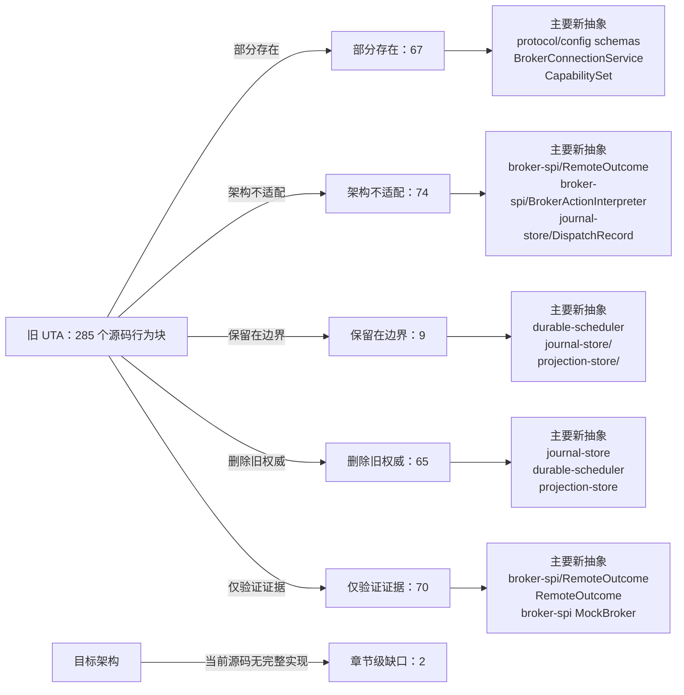

<!-- Auto-generated by scripts/uta-effect-runtime-map.mjs from mapping.json. Do not edit by hand. -->
<!-- Regenerate with `node scripts/uta-effect-runtime-map.mjs`. -->

# UTA 功能替代关系：第 7 章 Durability architecture

目标架构原文：[`docs/uta-effect-runtime-architecture.md:882-1056`](../uta-effect-runtime-architecture.md#L882-L1056)。

## 结论

部分存在 67；架构不适配 74；保留在边界 9；删除旧权威 65；仅验证证据 70。状态只描述当前实现相对于目标架构的关系，不表示迁移已经落地。

## 替代关系图

## 章节级目标缺口

| 依据 | 目标义务 | 当前缺口 | 必须补充或调整 |
|---|---|---|---|
| docs/uta-effect-runtime-architecture.md:884-918 | Selected embedded SQLite stack and authority boundary | No current source composes effect, @effect/sql, @effect/sql-sqlite-node, and better-sqlite3 at <OPENALICE_HOME>/data/trading/uta.sqlite with WAL, foreign keys, full synchronous durability, read-only query services, and typed no-bypass storage failures. | Add the single process-local database Layer, monotonic migrations, versioned Effect Schema codecs, required pragmas, one writer service, read-only query access, and typed StorageFailure. Distinguish SQLite physical WAL from the UTA domain journal. |
| docs/uta-effect-runtime-architecture.md:953-1043 | Authoritative table model and schema constraints | No current schema implements TRANSACTIONS, TRANSACTION_EVENTS, TRANSACTION_STEPS, DISPATCH_ATTEMPTS, EFFECT_JOBS, LOGICAL_LOCKS, REMOTE_OBSERVATIONS, COMPENSATION_STEPS, and PROJECTION_CHECKPOINTS with the listed keys, relationships, lease/idempotency fields, and named payload schemas. | Introduce these tables and FK/PK constraints in journal-store migrations; every payload uses a named versioned runtime schema and participates in the one logical writer transaction. |

## 源码映射

| 映射 ID | 当前源码 | 符号或行为块 | 当前功能 | 替代状态 | 新 UTA 抽象与做法 | 不适配位置与原因 | 必须补充或调整 | 重复索引 |
|---|---|---|---|---|---|---|---|---|
| `MAP-CC2177368A` | [`packages/uta-protocol/src/brokers/preset-catalog.ts:1-14`](../../packages/uta-protocol/src/brokers/preset-catalog.ts#L1-L14) | broker preset catalog setup | Declares the catalog as the single source for wizard account types, imports Zod for per-preset validation, and imports node crypto for deterministic/random UTA id helpers. | 部分存在 | 2. System boundary；3.7 brokers/<broker>/；3.9 transport/ and protocol/；7.1 Embedded database；9.1 Connection Layer；14. Public protocol；15. Security and authority；19. Architectural prohibitions protocol/config schemas；application/；broker-spi/；brokers/<broker>/；BrokerConnectionService Treat the catalog as configuration/presentation input only; validate each broker connection with named schemas and let UTA-owned adapter Layers consume sealed configuration. | A shared package owns wizard configuration and identity minting, but this setup does not separate Alice presentation from UTA credential authority or broker-spi capability/connection ownership. | Split config/presentation declarations from runtime broker adapters, define explicit config codecs and secret references, and ensure catalog identity helpers cannot become execution or persistence authority. | **DUP-026** |
| `MAP-601F6E2834` | [`packages/uta-protocol/src/brokers/preset-catalog.ts:37-98`](../../packages/uta-protocol/src/brokers/preset-catalog.ts#L37-L98) | BrokerPresetDef | Defines preset metadata, Zod config schema, optional modes/subtitle/write-only fields, string fingerprint fields, a `toEngineConfig` function returning Record<string, unknown>, and optional isPaper callback accepting Record<string, unknown>. | 部分存在 | 2.1 Alice owns；2.2 UTA owns；3.7 brokers/<broker>/；3.9 transport/ and protocol/；7.1 Embedded database；9.1 Connection Layer；9.4 Capability derivation；14. Public protocol；15. Security and authority；17. Migration sequence；19. Architectural prohibitions protocol/config schemas；BrokerConnectionService；BrokerActionTypeMap；CapabilitySet；brokers/<broker>/；application/ Use BrokerPresetDef only to describe presentation/config entry points, then parse into broker-specific typed connection config and secret references before constructing scoped adapter Layers. | The schema itself is generic ZodType, engine translation and paper detection use raw Record<string, unknown>, fingerprints are string field names, and no action capability/connection/jurisdiction contract is attached. | Introduce broker-specific config ADTs/codecs, remove raw Record-based runtime handoff, separate secret storage from public metadata, and derive capabilities through broker-spi ActionContext rather than preset metadata. | **DUP-030** |
| `MAP-EBB7846E5F` | [`packages/uta-protocol/src/brokers/preset-catalog.ts:108-154`](../../packages/uta-protocol/src/brokers/preset-catalog.ts#L108-L154) | BINANCE_PRESET | Declares Binance live/demo modes, API key/secret Zod fields, write-only metadata, mode/API-key fingerprinting, and a raw engine config with demoTrading semantics. | 部分存在 | 3.7 brokers/<broker>/；3.9 transport/ and protocol/；7.1 Embedded database；9.1 Connection Layer；9.4 Capability derivation；14. Public protocol；15. Security and authority；17.5 Slice 5: heterogeneous brokers；19. Architectural prohibitions brokers/Alpaca-style adapter config；BrokerConnectionService；CapabilitySet；protocol/config schemas Parse Binance connection config into a UTA-owned secret/config value, construct a scoped adapter Layer, and derive per-wallet/action capabilities from account, venue, instrument, and mode context. | The UI schema and toEngineConfig expose a generic record carrying credentials and a boolean-like demo mode; no typed connection identity, sub-account context, action availability, idempotency, or compensation contract is present. | Replace raw engine handoff with a broker-specific config codec/secret reference and broker-spi capability derivation; keep preset data presentation-only. | **DUP-032** |
| `MAP-BB8EAF65B0` | [`packages/uta-protocol/src/brokers/preset-catalog.ts:156-189`](../../packages/uta-protocol/src/brokers/preset-catalog.ts#L156-L189) | OKX_PRESET | Declares OKX live/demo modes, API key/secret/passphrase fields, write-only metadata, mode/API-key fingerprinting, and raw sandbox engine config. | 部分存在 | 3.7 brokers/<broker>/；3.9 transport/ and protocol/；7.1 Embedded database；9.1 Connection Layer；9.4 Capability derivation；14. Public protocol；15. Security and authority；17.5 Slice 5: heterogeneous brokers；19. Architectural prohibitions brokers/<broker>/；BrokerConnectionService；CapabilitySet；protocol/config schemas Validate OKX connection credentials/config in UTA, construct its scoped adapter, and derive action/sub-account capabilities rather than treating demo as a generic sandbox boolean. | Credentials and venue mode are passed through generic preset data, while no typed connection/capability/interpreter association or jurisdiction/sub-account contract is represented. | Introduce an OKX-specific config ADT and secret boundary, then register typed BrokerActionInterpreter availability/dispatch/observe/compensation implementations. | **DUP-033** |
| `MAP-6E3C5642E6` | [`packages/uta-protocol/src/brokers/preset-catalog.ts:191-224`](../../packages/uta-protocol/src/brokers/preset-catalog.ts#L191-L224) | BYBIT_PRESET | Declares live/testnet/demo modes, API credentials, write-only fields, fingerprints, and raw engine config with separate sandbox/demoTrading booleans. | 部分存在 | 3.7 brokers/<broker>/；3.9 transport/ and protocol/；7.1 Embedded database；9.1 Connection Layer；9.4 Capability derivation；14. Public protocol；15. Security and authority；17.5 Slice 5: heterogeneous brokers；19. Architectural prohibitions brokers/<broker>/；BrokerConnectionService；CapabilitySet；ActionAvailability；protocol/config schemas Represent Bybit environment as a validated config variant and derive capabilities/idempotency/compensation for each account and venue mode through broker-spi. | Separate booleans can express invalid mode combinations and raw engine config is untyped; no target action contract or typed unavailable reason is attached. | Replace booleans/Record handoff with an exhaustive Bybit config ADT, adapter Layer, and CapabilitySet registration. | **DUP-034** |
| `MAP-2F4E92A2AE` | [`packages/uta-protocol/src/brokers/preset-catalog.ts:226-257`](../../packages/uta-protocol/src/brokers/preset-catalog.ts#L226-L257) | HYPERLIQUID_PRESET | Declares live/testnet mode, walletAddress/privateKey fields, write-only private key, wallet/mode fingerprinting, and raw sandbox engine config. | 部分存在 | 3.7 brokers/<broker>/；3.9 transport/ and protocol/；7.1 Embedded database；9.1 Connection Layer；9.4 Capability derivation；14. Public protocol；15. Security and authority；17.5 Slice 5: heterogeneous brokers；19. Architectural prohibitions brokers/<broker>/；BrokerConnectionService；CapabilitySet；protocol/config schemas；domain/AccountId Keep wallet credentials in UTA-owned sealed config, construct a scoped Hyperliquid adapter, and derive wallet/venue/instrument action capabilities via broker-spi. | A raw record carries a private key and mode with no typed secret reference, account/connection identity, jurisdiction, availability, idempotency, or compensation contract. | Add a Hyperliquid-specific config/secret codec and typed adapter registration; never expose private-key fields through generic protocol/catalog payloads. | **DUP-035** |
| `MAP-B9545FA731` | [`packages/uta-protocol/src/brokers/preset-catalog.ts:259-292`](../../packages/uta-protocol/src/brokers/preset-catalog.ts#L259-L292) | BITGET_PRESET | Declares live/demo mode, API key/secret/passphrase fields, write-only metadata, mode/API-key fingerprints, and raw engine config with demoTrading. | 部分存在 | 3.7 brokers/<broker>/；3.9 transport/ and protocol/；7.1 Embedded database；9.1 Connection Layer；9.4 Capability derivation；14. Public protocol；15. Security and authority；17.5 Slice 5: heterogeneous brokers；19. Architectural prohibitions brokers/<broker>/；BrokerConnectionService；CapabilitySet；protocol/config schemas Parse Bitget credentials/environment into a typed UTA-owned connection config, then derive separate-wallet/action capability and typed unavailable results in the adapter. | The preset does not express Bitget wallet/account scope or action contracts and passes secrets/mode through a generic engine record. | Introduce typed Bitget configuration and broker-spi registration, with secret isolation and capability derivation from account/sub-account/venue context. | **DUP-036** |
| `MAP-F62E863C78` | [`packages/uta-protocol/src/brokers/preset-catalog.ts:294-333`](../../packages/uta-protocol/src/brokers/preset-catalog.ts#L294-L333) | CCXT_CUSTOM_PRESET | Provides an escape-hatch Zod object with optional exchange/sandbox/demo/credential/wallet fields and loops over defined fields to pass them through a Record<string, unknown>. | 架构不适配 | 3.7 brokers/<broker>/；3.9 transport/ and protocol/；7.1 Embedded database；9.4 Capability derivation；14. Public protocol；15. Security and authority；17.5 Slice 5: heterogeneous brokers；19. Architectural prohibitions broker-spi/；BrokerActionTypeMap；CapabilitySet；protocol/config schemas；brokers/<broker>/ Replace the open-ended custom config with an explicitly parsed exchange-specific config/plugin boundary; no generic route or kernel may accept pass-through credential/action bags. | Nearly every field is optional, exchange semantics are delegated to an untyped Record, and the preset is an untyped registry escape hatch; this violates the prohibition on permissive fallback states and untyped registries. | Remove CCXT_CUSTOM as a kernel/runtime contract, require a concrete adapter/config schema per supported exchange, and return typed CapabilityUnavailable for unsupported actions instead of silently passing fields through. | **DUP-037** |
| `MAP-2862195456` | [`packages/uta-protocol/src/brokers/preset-catalog.ts:337-367`](../../packages/uta-protocol/src/brokers/preset-catalog.ts#L337-L367) | ALPACA_PRESET | Declares paper/live mode, API key/secret fields, write-only metadata, mode/API-key fingerprints, and raw engine config with paper boolean. | 部分存在 | 3.7 brokers/<broker>/；3.9 transport/ and protocol/；7.1 Embedded database；9.1 Connection Layer；9.4 Capability derivation；14. Public protocol；15. Security and authority；17.4 Slice 4: first real broker；19. Architectural prohibitions brokers/Alpaca；BrokerConnectionService；BrokerActionTypeMap；CapabilitySet；protocol/config schemas Use an Alpaca-specific validated config/secret boundary and typed action interpreter, then make the new path authoritative before deleting its legacy dispatcher path. | Preset mode/credentials are generic form data and do not carry typed connection identity, action capability, dispatch idempotency, observation, or compensation semantics. | Add Alpaca adapter Layer and BrokerActionInterpreter contracts, keep credentials UTA-owned, and migrate the preset to reference validated config rather than pass a raw record. | **DUP-038** |
| `MAP-DE2769E2F7` | [`packages/uta-protocol/src/brokers/preset-catalog.ts:369-398`](../../packages/uta-protocol/src/brokers/preset-catalog.ts#L369-L398) | IBKR_PRESET | Declares host/port/clientId/accountId form fields, default ports, fingerprints, raw engine config, and paper detection based on port numbers. | 部分存在 | 3.7 brokers/<broker>/；3.9 transport/ and protocol/；7.1 Embedded database；9.1 Connection Layer；9.4 Capability derivation；10.2 Market and jurisdiction owns；14. Public protocol；15. Security and authority；17.5 Slice 5: heterogeneous brokers；19. Architectural prohibitions brokers/IBKR；BrokerConnectionService；ConnectionId；CapabilitySet；protocol/config schemas Validate an IBKR connection config, construct the scoped SDK Layer inside brokers/IBKR, and derive linked-account/market/jurisdiction capabilities through broker-spi. | Port-number paper detection and raw host/account strings do not encode connection identity, account jurisdiction, linked-account context, health stream, action capability, or typed failure. | Replace generic engine config with an IBKR connection ADT/secret/config codec and typed BrokerConnectionService/capability registration; keep port defaults presentation/config only. | **DUP-039** |
| `MAP-42A8E8BFCC` | [`packages/uta-protocol/src/brokers/preset-catalog.ts:400-433`](../../packages/uta-protocol/src/brokers/preset-catalog.ts#L400-L433) | LONGBRIDGE_PRESET | Declares live/paper mode and appKey/appSecret/accessToken fields, marks all credentials write-only, fingerprints mode/appKey, and passes a raw engine config. | 部分存在 | 3.7 brokers/<broker>/；3.9 transport/ and protocol/；7.1 Embedded database；9.1 Connection Layer；9.4 Capability derivation；10.2 Market and jurisdiction owns；14. Public protocol；15. Security and authority；17.5 Slice 5: heterogeneous brokers；19. Architectural prohibitions brokers/Longbridge；BrokerConnectionService；CapabilitySet；market-and-accounting/；protocol/config schemas Use Longbridge-specific validated secret/config input and derive region/jurisdiction/instrument capabilities in the typed adapter before transaction preparation. | The form config has raw credentials and mode but no typed jurisdiction/region/account context or broker action/interpreter contract; access-token lifecycle is only prose. | Define typed Longbridge connection/credential and market-jurisdiction metadata, then register its BrokerActionInterpreter and capability/unavailable results. | **DUP-040** |
| `MAP-FA8441EFDE` | [`packages/uta-protocol/src/brokers/preset-catalog.ts:437-468`](../../packages/uta-protocol/src/brokers/preset-catalog.ts#L437-L468) | LEVERUP_PRESET | Declares live/testnet mode and a regex-validated private key, marks it write-only, fingerprints mode/privateKey, and passes network/privateKey through a raw engine record. | 部分存在 | 3.7 brokers/<broker>/；3.9 transport/ and protocol/；7.1 Embedded database；9.4 Capability derivation；14. Public protocol；15. Security and authority；17.5 Slice 5: heterogeneous brokers；19. Architectural prohibitions brokers/LeverUp；BrokerConnectionService；CapabilitySet；protocol/config schemas；domain/AccountId Keep the wallet secret in UTA-owned sealed configuration, validate a typed network/account context, and expose LeverUp through a typed interpreter with explicit relayer reconciliation/compensation capability. | Fingerprinting a private key and passing it through a generic record does not establish nominal account identity, idempotency, remote outcome, or compensation; network is only a string union in form data. | Replace raw config handoff with a typed wallet/relayer adapter boundary and broker-spi capability/reconciliation contract; do not expose secret-derived identity fields in public protocol data. | **DUP-041** |
| `MAP-52A6B771BA` | [`packages/uta-protocol/src/brokers/preset-catalog.ts:470-495`](../../packages/uta-protocol/src/brokers/preset-catalog.ts#L470-L495) | SIMULATOR_PRESET | Declares a mock simulator with in-memory state, cash as a coerced number, no credentials, and a random _instanceId fingerprint used to derive a unique id; its hint states all state is wiped on restart. | 架构不适配 | 1. Thesis and non-negotiable properties；3.7 brokers/<broker>/；3.4 journal-store/；3.5 durable-scheduler/；5.3 Two-phase transaction protocol；7.1 Embedded database；12.1 Startup sequence；14. Public protocol；17.1 Slice 1: durable kernel with MockBroker；18. Verification contract；20. First falsifier MockBroker interpreter；transaction-kernel/；journal-store/；durable-scheduler/；DispatchIdentity；RemoteOutcome Retain MockBroker as the first executable adapter, but make transaction intent, jobs, outcomes, and mock broker observations durable in SQLite and recoverable across restart. | The current advertised simulator is explicitly process-memory-only and cash is a coerced number; it cannot satisfy the MockBroker crash/recovery falsifier or prove no duplicate dispatch. | Replace in-memory simulator authority with the durable MockBroker vertical slice, use DecimalString/Money and typed commands/outcomes, and keep any panel controls as a boundary over that slice. | **DUP-042** |
| `MAP-4FEAB1D03E` | [`packages/uta-protocol/src/brokers/preset-catalog.ts:533-537`](../../packages/uta-protocol/src/brokers/preset-catalog.ts#L533-L537) | isPaperPreset | Looks up a raw preset id and invokes an optional custom isPaper callback or generic mode heuristic over Record<string, unknown>. | 部分存在 | 4. Effect model；7.1 Embedded database；9.4 Capability derivation；14. Public protocol；15. Security and authority；19. Architectural prohibitions broker-specific config ADT；ActionContext；CapabilitySet；protocol/config schemas Derive environment/account mode from each validated broker config ADT and make it part of connection/capability context, not a generic callback result. | An optional callback plus raw config record can silently classify unknown or incompatible modes and is disconnected from actual broker connection/venue state. | Remove generic isPaper behavior from runtime decisions, use exhaustive config variants and adapter-observed environment metadata, and expose uncertainty as a typed capability result. | **DUP-045** |
| `MAP-ED0CF2A5B8` | [`packages/uta-protocol/src/brokers/preset-catalog.ts:539-555`](../../packages/uta-protocol/src/brokers/preset-catalog.ts#L539-L555) | canonicalize | Recursively traverses unknown values, treats arrays specially, casts objects to Record<string, unknown>, sorts keys, and returns a new unknown value for JSON stringification. | 架构不适配 | 3.1 domain/；3.4 journal-store/；3.9 transport/ and protocol/；5.7 Complete type contract — nominal identities and financial values；7.3 Authoritative tables；14. Public protocol；19. Architectural prohibitions domain/ branded identity constructors；journal-store/；protocol/ schemas；AccountId；ConnectionId Construct branded identities from validated typed fields and use named codecs for any persistence serialization; do not canonicalize arbitrary unknown records as domain identity. | The implementation is an untyped JSON cast/traversal and can hash arbitrary values, contrary to the target ban on untyped JSON casts and permissive persistence shapes. | Delete canonicalize from kernel-facing identity logic, parse config into concrete ADTs first, and serialize only named versioned values through protocol/journal schemas. | **DUP-046** |
| `MAP-4E1058C577` | [`packages/uta-protocol/src/brokers/preset-catalog.ts:557-580`](../../packages/uta-protocol/src/brokers/preset-catalog.ts#L557-L580) | deriveUtaId | Filters arbitrary presetConfig fields named by fingerprintFields, fills missing values with null, canonicalizes them, hashes preset id plus JSON to eight hex characters, and returns `${preset.id}-${hash}`. | 部分存在 | 2.2 UTA owns；3.1 domain/；3.4 journal-store/；3.7 brokers/<broker>/；5.7 Complete type contract — nominal identities and financial values；7.1 Embedded database；9.1 Connection Layer；11. Approval and Git audit projection；14. Public protocol；15. Security and authority；17.6 Slice 6: delete the legacy kernel；19. Architectural prohibitions AccountId；ConnectionId；InstrumentId；journal-store/；BrokerConnectionIdentity；protocol/config schemas Introduce typed, durable AccountId/ConnectionId construction from validated broker identity context; retain old ids only as explicit migration compatibility projections. | The current identity is an unbranded 32-bit string hash over generic fields (including secret-derived values for some presets), has no collision/identity evidence in the domain type, and couples account identity to UI preset ids. | Define nominal identity constructors and migration mapping, separate credential storage from identity metadata, persist identity/context in journal/config schemas, and stop using derived strings as transaction identity. | **DUP-047** |
| `MAP-E9688DBE16` | [`packages/uta-protocol/src/brokers/preset-catalog.ts:582-588`](../../packages/uta-protocol/src/brokers/preset-catalog.ts#L582-L588) | mintInstanceId | Generates a random four-byte hex token for simulator preset identity seeding. | 部分存在 | 3.1 domain/；3.4 journal-store/；5.7 Complete type contract — nominal identities and financial values；7.1 Embedded database；17.1 Slice 1: durable kernel with MockBroker；18. Verification contract；20. First falsifier AccountId；ConnectionId；MockBroker；journal-store/；protocol/config schemas Use a typed persisted MockBroker AccountId/ConnectionId constructor and retain randomness only as the generation mechanism, not as an unvalidated public identity string. | The token has no branded type, persistence/restore contract, or relationship to durable mock broker state; uniqueness is only a process/config convention. | Persist and decode simulator identity through journal/config schemas and use it in DispatchIdentity/recovery tests across restart. | **DUP-048** |
| `MAP-21AAC99E0D` | [`packages/uta-protocol/src/brokers/presets.ts:1-16`](../../packages/uta-protocol/src/brokers/presets.ts#L1-L16) | broker preset serialization setup | Documents conversion of BrokerPresetDef Zod schemas to JSON Schema for the frontend and imports Zod plus catalog types. | 部分存在 | 2.1 Alice owns；3.9 transport/ and protocol/；7.1 Embedded database；14. Public protocol；15. Security and authority；19. Architectural prohibitions Alice UI presentation projection；protocol/config schemas；application/ Keep JSON Schema generation only for Alice's form presentation and pair it with UTA-owned named config codecs; do not treat generated form JSON as runtime domain/protocol schema. | The same shared package presents frontend JSON Schema as if it were the request/response contract, but the target separates presentation metadata from transport/persistence schemas and secret authority. | Separate presentation serialization from protocol codecs, ensure write-only/secret fields never become runtime payloads, and export named request/response/config schemas independently. | **DUP-049** |
| `MAP-F8525C7A99` | [`packages/uta-protocol/src/brokers/presets.ts:18-32`](../../packages/uta-protocol/src/brokers/presets.ts#L18-L32) | SerializedBrokerPreset | Defines the frontend serialized preset with metadata, engine/guard string unions, optional modes, subtitle fields, and `schema: Record<string, unknown>`. | 部分存在 | 2.1 Alice owns；3.7 brokers/<broker>/；3.9 transport/ and protocol/；7.1 Embedded database；9.4 Capability derivation；14. Public protocol；15. Security and authority；19. Architectural prohibitions Alice UI presentation projection；protocol/config schemas；BrokerConnectionService；CapabilitySet Retain as an explicitly presentation-only DTO, while runtime config/capability contracts use named schemas and typed adapter services. | The raw JSON Schema record and optional metadata are not a decoded connection config or capability ADT, and the public shape can be mistaken for broker runtime support. | Move SerializedBrokerPreset to a presentation module, replace raw runtime use with named config schemas, and prevent engine/guard metadata from authorizing actions. | **DUP-050** |
| `MAP-5C311A55C1` | [`packages/uta-protocol/src/brokers/presets.ts:34-54`](../../packages/uta-protocol/src/brokers/presets.ts#L34-L54) | buildJsonSchema | Calls z.toJSONSchema, casts the result and properties to Record types, rewrites mode enum to oneOf titles, and mutates writeOnly markers by field name. | 架构不适配 | 3.7 brokers/<broker>/；3.9 transport/ and protocol/；7.1 Embedded database；9.4 Capability derivation；14. Public protocol；15. Security and authority；19. Architectural prohibitions protocol/config schemas；Alice UI presentation projection；BrokerConnectionService；brokers/<broker>/ Generate presentation JSON Schema from a validated, broker-specific config definition without using it as the transport/persistence decoder; use named runtime codecs at every boundary. | The function relies on casts to untyped records and mutates arbitrary JSON Schema properties, violating the target prohibition on untyped JSON casts when the result is exported as a protocol-facing shape. | Constrain this helper to a presentation serializer, add explicit runtime schemas for each endpoint/config, and remove raw-record casts from kernel-facing code. | **DUP-051** |
| `MAP-8C22894ED4` | [`packages/uta-protocol/src/client/UTAClient.ts:63-88`](../../packages/uta-protocol/src/client/UTAClient.ts#L63-L88) | UTAClient.request | Builds a JSON request, creates an AbortController timeout, performs fetch, parses response text with safeJSON, extracts an `error` field by object cast on non-2xx, and casts successful body to T without validation. | 架构不适配 | 1. Thesis and non-negotiable properties；3.4 journal-store/；3.5 durable-scheduler/；3.9 transport/ and protocol/；4. Effect model；5.7 Complete type contract — public protocol envelopes；7.2 Single logical writer and group commit；8.1 Admission；9.2 Typed action interpreter；12.2 Unknown-outcome protocol；14. Public protocol；15. Security and authority；19. Architectural prohibitions transport/http；protocol/；TransactionCommand；PrepareTransactionResponse；GetTransactionResponse；TransactionFailure；QueryFailure Encode a named request, send it through authenticated transport, decode the exact success/failure schema, and preserve typed timeout/transport/protocol outcomes without generic casts. | Successful responses are body as T, errors are reduced to a string error field/message, and timeout/abort has no route-specific typed transport/auth/protocol representation. | Implement route-specific success and failure schema decoding plus typed transport/auth/protocol errors and correlation metadata. A public request timeout is not itself RemoteOutcome.Unknown; only a durable scheduler handling ambiguous broker dispatch may create that outcome. | **DUP-062** |
| `MAP-0647BF0194` | [`packages/uta-protocol/src/types/broker.ts:452-466`](../../packages/uta-protocol/src/types/broker.ts#L452-L466) | BrokerConfigField | Describes dynamic frontend form fields with primitive type strings, optional defaults/options/descriptions, an unknown default value, and a sensitive flag. | 部分存在 | 3.7 brokers/<broker>/；3.9 transport/ and protocol/；7.1 Embedded database；9.1 Connection Layer；14. Public protocol；15. Security and authority；19. Architectural prohibitions protocol/config schemas；BrokerConnectionService；brokers/<broker>/；application/ Keep form metadata as a presentation projection, but validate connection configuration with named broker-specific schemas and pass credentials through UTA-owned sealed configuration into scoped adapter Layers. | The descriptor is presentation-oriented and can be retained outside the kernel, but `default: unknown` and primitive string options are not a typed connection configuration or capability contract; sensitive is only a UI flag. | Separate UI field descriptors from broker connection config ADTs, prohibit secret defaults/echoes, and make adapter Layers consume validated UTA-owned secret/config inputs. | **DUP-094** |
| `MAP-FEF9B7F5AE` | [`packages/uta-protocol/src/types/git.ts:79-89`](../../packages/uta-protocol/src/types/git.ts#L79-L89) | GitState | Stores raw string account totals plus arrays of Position and OpenOrder values as the state snapshot after a Git commit. | 部分存在 | 6. State tiers and snapshots；7.4 Snapshot and compaction policy；10.1 Accounting owns；11. Approval and Git audit projection；14. Public protocol；17.6 Slice 6: delete the legacy kernel；19. Architectural prohibitions projection-store/；market-and-accounting/；domain/Money；GetTransactionResponse；journal-store/ Retain a read-only account/order projection if needed for compatibility, rebuilt from journal and broker reconciliation; use normalized accounting types and make it non-authoritative. | A commit embeds mutable-looking account state and native Position/OpenOrder arrays, with unqualified strings and no projection checkpoint/version or rebuild semantics. | Move state authority to journal-store/projection-store, replace fields with normalized account-state projections, and mark any Git state export as rebuildable compatibility output. | **DUP-111** |
| `MAP-BDE3556BBA` | [`packages/uta-protocol/src/types/git.ts:91-102`](../../packages/uta-protocol/src/types/git.ts#L91-L102) | GitCommit | Models a Git hash/parent/message with Operation[]/OperationResult[] and a raw stateAfter snapshot, timestamp, and optional round. | 部分存在 | 3.4 journal-store/；3.8 projection-store/；5.1 Commands, events, effects, and state；7.3 Authoritative tables；11. Approval and Git audit projection；14. Public protocol；17.6 Slice 6: delete the legacy kernel；19. Architectural prohibitions TransactionEvent；journal-store/；projection-store/；Git audit projection；TransactionId Generate a Git audit commit projection from append-only journal events and transaction summaries; store execution facts, dispatches, jobs, and projections in SQLite instead. | The shape makes Git commit contents look like execution authority and includes native operations/results and embedded mutable state; it lacks transaction id/revision, journal sequence, dispatch identity, and durability boundaries. | Stop persisting/reading GitCommit as the execution source, define a normalized audit projection with optional CommitHash, and rebuild it from journal/projection checkpoints. | **DUP-112** |
| `MAP-DC3A63D407` | [`packages/uta-protocol/src/types/git.ts:104-110`](../../packages/uta-protocol/src/types/git.ts#L104-L110) | AddResult | Returns a staged operation with an index and `staged: true`. | 删除旧权威 | 5.1 Commands, events, effects, and state；7.2 Single logical writer and group commit；8.1 Admission；11. Approval and Git audit projection；14. Public protocol；17.2 Slice 2: transaction and approval protocol；19. Architectural prohibitions TransactionCommand；ReplaceDraft；journal-store/；transaction-kernel/；protocol/ Replace staging responses with durable draft transaction identity/version and a typed ReplaceDraft/transaction projection response. | An array index and boolean staged flag are not a durable transaction identity or version and do not prove journal admission. | Delete AddResult and return TransactionId/TransactionVersion after durable draft creation or replacement. | **DUP-113** |
| `MAP-B611B25F33` | [`packages/uta-protocol/src/types/git.ts:112-117`](../../packages/uta-protocol/src/types/git.ts#L112-L117) | CommitPrepareResult | Returns `prepared: true`, a Git CommitHash/message, and operationCount for pre-commit preparation. | 删除旧权威 | 5.3 Two-phase transaction protocol；7.3 Authoritative tables；11. Approval and Git audit projection；14. Public protocol；17.2 Slice 2: transaction and approval protocol；19. Architectural prohibitions PrepareTransactionResponse；PreparedPlan；TransactionRevision；journal-store/；transaction-kernel/ Return PrepareTransactionResponse with PreparedPlan or a typed rejected/conflict variant, including transaction revision, digest, preconditions, compensation, and commit criterion. | Git hash/message/count do not expose a prepared plan, before-images, preconditions, compensation capability, expiry, or durable transaction revision. | Delete CommitPrepareResult and migrate prepare callers to the target `/transactions/:id/prepare` response schema. | **DUP-114** |
| `MAP-C39C98EBC8` | [`packages/uta-protocol/src/types/git.ts:119-125`](../../packages/uta-protocol/src/types/git.ts#L119-L125) | PushResult | Returns a Git hash/message/count plus submitted and rejected OperationResult arrays from a push. | 删除旧权威 | 1. Thesis and non-negotiable properties；5.2 Transaction state；5.3 Two-phase transaction protocol；7.3 Authoritative tables；8.1 Admission；9.3 Remote outcome；11. Approval and Git audit projection；12.2 Unknown-outcome protocol；14. Public protocol；17.6 Slice 6: delete the legacy kernel；19. Architectural prohibitions TransactionState；EffectJob；DispatchRecord；RemoteOutcome；TransactionResult；durable-scheduler/；journal-store/ Replace push with approve/admission followed by durable job identity and queryable transaction state; report typed confirmed/rejected/unknown outcomes asynchronously. | Push synchronously bundles Git persistence and broker mutations, has no durability acknowledgement/job lease/dispatch identity, and collapses partial/unknown work into submitted/rejected arrays. | Delete PushResult and migrate to `/transactions/:id/approve`, durable scheduler jobs, and GetTransactionResponse/event queries. | **DUP-115** |
| `MAP-FC6B6B08DC` | [`packages/uta-protocol/src/types/git.ts:127-131`](../../packages/uta-protocol/src/types/git.ts#L127-L131) | RejectResult | Returns a Git hash/message/count for rejecting a pending commit. | 删除旧权威 | 5.2 Transaction state；7.3 Authoritative tables；11. Approval and Git audit projection；14. Public protocol；17.2 Slice 2: transaction and approval protocol；19. Architectural prohibitions TransactionCommand Reject；TransactionEvent TransactionRejected；journal-store/；protocol/ Use the canonical Reject { transactionId, reason } command and durable TransactionRejected event; transaction state determines that rejection is valid only before dispatch. | Git hash and operation count do not identify the transaction or enforce rejection-before-dispatch semantics. The canonical Reject command itself does not carry revision or actor. | Delete RejectResult and migrate to POST /transactions/:id/reject with a typed command acknowledgement. If transport uses an optimistic version header/precondition, validate it before constructing the canonical Reject command rather than adding fields to the ADT. | **DUP-116** |
| `MAP-DC943FF022` | [`packages/uta-protocol/src/types/git.ts:133-139`](../../packages/uta-protocol/src/types/git.ts#L133-L139) | GitStatus | Reports staged Operation[], pending message/hash, Git head hash, and commit count. | 保留在边界 | 5.2 Transaction state；6. State tiers and snapshots；7.3 Authoritative tables；11. Approval and Git audit projection；14. Public protocol；17.6 Slice 6: delete the legacy kernel；19. Architectural prohibitions GetTransactionResponse；projection-store/；journal-store/；TransactionState；TransactionVersion Retain a GitStatus-shaped read-only compatibility schema only while the current public SDK consumes it; derive it from transaction and Git-audit projections, never execution state. | Git staging/head fields cannot control execution. Deleting the type immediately would contradict the retained public status boundary, so it must be an explicitly temporary projection contract. | Make the SDK and route consume a typed projection backed by durable events; remove only when the public compatibility contract is deliberately retired. | **DUP-117** |
| `MAP-18E2D21F66` | [`packages/uta-protocol/src/types/git.ts:160-167`](../../packages/uta-protocol/src/types/git.ts#L160-L167) | CommitLogEntry | Represents a Git log row with hash/parent/message/timestamp/round and OperationSummary[] only. | 部分存在 | 6. State tiers and snapshots；7.4 Snapshot and compaction policy；11. Approval and Git audit projection；13. Observability；14. Public protocol；17.6 Slice 6: delete the legacy kernel；19. Architectural prohibitions Git audit projection；projection-store/；journal-store/；TransactionId；JournalSequence Expose Git log as a rebuildable audit projection annotated or correlated with transaction ids/revisions and journal sequences, never as recovery authority. | The row has no transaction/revision/state/sequence and assumes Git's narrative is sufficient for execution history, while target recovery reads SQLite journal and broker observations. | Build CommitLogEntry-compatible output only from projection-store checkpoints and journal events, with a typed compatibility schema and no execution writes. | **DUP-119** |
| `MAP-601583B467` | [`packages/uta-protocol/src/types/git.ts:169-174`](../../packages/uta-protocol/src/types/git.ts#L169-L174) | GitExportState | Exports all GitCommit values and a Git head hash. | 保留在边界 | 7.3 Authoritative tables；7.4 Snapshot and compaction policy；11. Approval and Git audit projection；14. Public protocol；17.6 Slice 6: delete the legacy kernel；19. Architectural prohibitions Git audit projection；projection-store/；journal-store/；protocol/ export schema Retain an explicit Git export for human-readable audit compatibility, generated from SQLite journal/projection state and excluded from recovery or authorization. | The export is a valid compatibility boundary only if Git remains a projection; current type does not state or enforce its rebuildable/non-authoritative source. | Keep the export endpoint as a typed projection, source it from journal events, and ensure Git hashes cannot be used as transaction identity or dispatch/retry authority. | **DUP-120** |
| `MAP-A9AE528869` | [`packages/uta-protocol/src/types/git.ts:188-192`](../../packages/uta-protocol/src/types/git.ts#L188-L192) | SyncResult | Returns a Git hash, updatedCount, and an array of OrderStatusUpdate values after synchronizing orders. | 删除旧权威 | 7.3 Authoritative tables；8.3 Durable jobs and leases；9.3 Remote outcome；11. Approval and Git audit projection；12.1 Startup sequence；12.2 Unknown-outcome protocol；14. Public protocol；17.6 Slice 6: delete the legacy kernel；19. Architectural prohibitions durable-scheduler/；EffectJob；RemoteOutcome；journal-store/；projection-store/ Schedule typed observation/reconciliation jobs, persist checkpoints and outcomes, and query updated transaction/account projections separately from audit export. | A synchronous hash/count response treats sync as Git persistence and has no durable job/lease/checkpoint or explicit unknown-outcome protocol. | Delete SyncResult as the scheduler contract and expose durable reconciliation job/event identities and typed query responses. | **DUP-122** |
| `MAP-732B845474` | [`packages/uta-protocol/src/types/history.ts:36-59`](../../packages/uta-protocol/src/types/history.ts#L36-L59) | OrderHistoryEntry | Collapses an order lifecycle into one row with optional broker order id/order terms/fills, flat status/source, Git commit hash/message, and optional string error. | 部分存在 | 5.7 Complete type contract — before-images, observations, and preconditions；6. State tiers and snapshots；7.4 Snapshot and compaction policy；9.3 Remote outcome；11. Approval and Git audit projection；12.2 Unknown-outcome protocol；13. Observability；14. Public protocol；17.6 Slice 6: delete the legacy kernel；19. Architectural prohibitions OrderSnapshot；TransactionId；DispatchIdentity；projection-store/；Git audit projection；journal-store/；protocol/ history schema Build order history from journal events, normalized order/remote observations, and projection checkpoints; expose transaction/revision/dispatch correlation and retain CommitHash only as audit pointer. | The row is a useful read projection, but optional order terms, flat status, commit hash/message authority, and free-form error omit order version, observation timestamp/evidence, transaction identity, and unknown/reconciliation state. | Redesign the history projection schema around typed OrderSnapshot/RemoteOutcome and journal correlation, then keep only presentation-compatible fields as derived output. | **DUP-133** |
| `MAP-56C6192DB1` | [`packages/uta-protocol/src/types/history.ts:61-76`](../../packages/uta-protocol/src/types/history.ts#L61-L76) | TradeHistorySource and TradeHistoryEntry | Represents fill/reconcile rows with optional order id, HistoryContract, side, decimal-string quantity/price/value, source order/external/reconcile, and Git commit hash. | 部分存在 | 5.7 Complete type contract — nominal identities and financial values；6. State tiers and snapshots；7.4 Snapshot and compaction policy；10.1 Accounting owns；11. Approval and Git audit projection；12.2 Unknown-outcome protocol；14. Public protocol；17.6 Slice 6: delete the legacy kernel；19. Architectural prohibitions market-and-accounting/；Fill；ExposureSnapshot；RemoteOutcome；projection-store/；Git audit projection；journal-store/ Generate trade history from typed broker acknowledgements/observations and accounting fill/reconciliation events, with currency-qualified Money/Quantity and journal correlation. | The read-only fill projection is directionally valid, but quantity/price/value lack branded instrument/currency context, optional order identity is not linked to dispatch, and Git hash remains the only audit pointer. | Move authority to journal/accounting projections, add typed Fill/Reconciliation records and observation timestamps, and retain CommitHash only as optional derived audit metadata. | **DUP-134** |
| `MAP-02219D5749` | [`packages/uta-protocol/src/types/manager.ts:21-37`](../../packages/uta-protocol/src/types/manager.ts#L21-L37) | AggregatedEquity | Aggregates total equity/cash/PnL as strings, optional string FX warnings, and anonymous per-account rows with raw id/currency/health fields. | 部分存在 | 3.8 projection-store/；6. State tiers and snapshots；7.4 Snapshot and compaction policy；10.1 Accounting owns；13. Observability；14. Public protocol；19. Architectural prohibitions market-and-accounting/；Money；CurrencyCode；FX observation；projection-store/；protocol/ account-state schema Serve aggregated accounting as a projection over currency-qualified Money and explicit FX observations/uncertainty, with per-account identity and projection checkpoints. | Raw monetary strings and warning text do not encode currency, FX source/timestamp, valuation uncertainty, or typed accounting failure; anonymous nested objects are not named domain/protocol types. | Define accounting aggregation/projection types with Money, CurrencyCode, FX observation and typed warning/failure variants, then expose them through a named account-state schema. | **DUP-138** |
| `MAP-07DB18F4C8` | [`services/uta/src/__tests__/trading-tools.spec.ts:213-228`](../../services/uta/src/__tests__/trading-tools.spec.ts#L213-L228) | getOrders.decimalSerialization | Sets a small Decimal limit price and verifies that the tool emits the exact decimal string instead of a JavaScript number. | 仅验证证据 | §3.1 domain/；§3.8 projection-store/；§5.7 Complete type contract；§7.1 Embedded database；§9.2 Typed action interpreter；§14 Public protocol；§15 Security and authority domain decimal value objects；protocol schemas；projection-store/orders；journal-store serialization；broker-spi Preserve decimal precision through domain value objects, versioned journal/projection serialization, adapter normalization, and the public response schema; keep the exact-string assertion as a precision regression check. | — | — | **DUP-152** |
| `MAP-27AD48107A` | [`services/uta/src/__tests__/trading-tools.spec.ts:344-371`](../../services/uta/src/__tests__/trading-tools.spec.ts#L344-L371) | placeOrder.inputSchema.emptyOptionalNumerics | Uses the placeOrder input schema with empty strings for optional numeric fields and verifies parsing succeeds, empty fields become undefined, and totalQuantity remains the supplied decimal string. | 仅验证证据 | §2 System boundary；§3.9 transport/ and protocol/；§5.7 Complete type contract；§7.1 Embedded database；§14 Public protocol；§15 Security and authority；§18 Verification contract TypeBox agent tool schema；protocol action schema；application/transaction；domain order/action ADTs；transport/http；transaction-kernel Model optional numeric inputs as omitted-or-decimal values at the tool/protocol decode boundary, then compile a typed transaction command; retain empty-string normalization only as client ergonomics and keep authorization/approval in application/transaction-kernel services. | — | — | **DUP-160** |
| `MAP-424F0FB69C` | [`services/uta/src/domain/trading/__test__/e2e/live-paper-evidence.ts:6-38`](../../services/uta/src/domain/trading/__test__/e2e/live-paper-evidence.ts#L6-L38) | ContractEvidence and LivePaperEvidence schemas | Defines a compact evidence record containing contract identity, optional request/result, position/open-order counts, cleanup baseline match, and an optional note. | 保留在边界 | 7.3 Authoritative tables；13 Observability；18.3 Real broker acceptance observability evidence schema；projection-store acceptance views；broker-spi identity/observation types Retain as non-authoritative test evidence, extending only if target acceptance needs transaction/revision/step/dispatch/journal identifiers and redaction metadata. | The schema intentionally omits transaction id, revision, step id, dispatch id, conflict key, journal sequence, lease, and reconciliation schedule, so it cannot serve as target runtime state or observability. | — | **DUP-205** |
| `MAP-C2F022975E` | [`services/uta/src/domain/trading/__test__/e2e/live-paper-evidence.ts:68-87`](../../services/uta/src/domain/trading/__test__/e2e/live-paper-evidence.ts#L68-L87) | recordLivePaperEvidence | Creates an ignored data/uta-live-paper-runs directory by default and appends one JSONL record containing schemaVersion, timestamp, Git commit, paper flag, broker name, and scenario evidence. | 保留在边界 | 7 Durability architecture；11 Approval and Git audit projection；13 Observability；18.3 Real broker acceptance；18.4 Packaging and storage acceptance；19 Architectural prohibitions test evidence sink；observability；projection-store acceptance artifact Retain only as a clearly non-authoritative paper-test artifact; target journal-store remains the sole trading authority, and acceptance records should reference journal/dispatch identities without persisting secrets or native payloads. | No assigned e2e file exercises source/Docker/Electron package migration, abrupt termination, backup/restore, relocation, or corrupt journal/schema handling required by 18.4. This JSONL helper is not evidence of SQLite durability and must never replace it. | — | **DUP-208** |
| `MAP-3D797361F3` | [`services/uta/src/domain/trading/__test__/e2e/setup.ts:86-95`](../../services/uta/src/domain/trading/__test__/e2e/setup.ts#L86-L95) | cached/getTestAccounts | Caches one Promise of initialized paper TestAccount records at module scope so subsequent suites reuse the same broker instances. | 保留在边界 | 3.2 effect-runtime/；3.6 broker-spi/；4 Effect model；7 Durability architecture；8 Scheduling, ordering, and concurrency；12.1 Startup sequence；17 Migration sequence；18.2 Concurrency scenarios effect-runtime root Scope；broker-spi scoped Layers；durable-scheduler Retain singleton reuse only as a test harness optimization; target process composition should own scoped Layers and durable services, while tests isolate account/journal namespaces explicitly. | The module-global Promise is in-memory and requires serial Vitest execution; it is not a durable runtime scope, startup recovery coordinator, queue, or concurrency proof. | — | **DUP-213** |
| `MAP-58F0FF7798` | [`services/uta/src/domain/trading/__test__/e2e/uta-alpaca.e2e.spec.ts:37-78`](../../services/uta/src/domain/trading/__test__/e2e/uta-alpaca.e2e.spec.ts#L37-L78) | describe UTA — Alpaca order lifecycle | Stages a $1 AAPL limit buy, commits it, pushes it through UnifiedTradingAccount, then stages and pushes a cancel; it asserts prepared/submitted results and at least two legacy log commits. | 删除旧权威 | 5.2 Transaction state；5.3 Two-phase transaction protocol；7 Durability architecture；8 Scheduling, ordering, and concurrency；11 Approval and Git audit projection；12 Recovery model；17.4 Slice 4: first real broker；18.1 Kernel crash matrix；18.3 Real broker acceptance；20 First falsifier transaction-kernel/coordinator；journal-store；durable-scheduler；brokers/alpaca typed interpreter；projection-store；broker-spi Replace stage/commit/push/cancel with a prepared transaction, durable approval, DispatchPlanned outbox job, leased scheduler execution, typed Alpaca acknowledgement, and journaled cancel/compensation projection. Add the MockBroker crash experiment separately before using this as Slice 4 evidence. | The legacy push mutates through UnifiedTradingAccount/IBroker without a durable intent acknowledgement, dispatch identity, lease, journal event, compensation declaration, or remote unknown-outcome path. It runs in one process and supplies no 18.1 crash-matrix or 20 first-falsifier evidence. | Remove this legacy execution test when the target path lands; assert durable state before dispatch, typed accepted/rejected/unknown outcomes, restart classification, and no blind duplicate, then assert the real Alpaca baseline is restored. | **DUP-217** |
| `MAP-628E0887B1` | [`services/uta/src/domain/trading/__test__/e2e/uta-alpaca.e2e.spec.ts:176-246`](../../services/uta/src/domain/trading/__test__/e2e/uta-alpaca.e2e.spec.ts#L176-L246) | describe UTA — Alpaca fill flow (AAPL) | During market hours, records initial AAPL quantity, performs stage -> commit -> push for a market buy, optionally syncs, verifies position quantity increased by one, stages/pushes a close, optionally syncs, and verifies quantity returned to the initial value plus two log entries. | 删除旧权威 | 5.3 Two-phase transaction protocol；7.4 Snapshot and compaction policy；8.5 Isolation；9.3 Remote outcome；10.1 Accounting owns；12 Recovery model；17.4 Slice 4: first real broker；18.3 Real broker acceptance transaction-kernel；journal-store；durable-scheduler；brokers/alpaca typed interpreter；projection-store；market-and-accounting Retain the paper lifecycle as a target Alpaca acceptance scenario, but drive it through prepared transactions, durable jobs, typed observation/reconciliation, accounting projections, and a baseline assertion over positions and open orders. | The current scenario checks a broker position delta and legacy log only. It does not persist before-images or dispatch boundaries, distinguish accepted/working/filled criteria in a transaction state, reconcile unknown outcomes, or prove restart/recovery. | Delete the UnifiedTradingAccount version after migration and add target journal/scheduler assertions plus crash/restart variants; require account baseline restoration, including no unexpected open orders, after both buy and close. | **DUP-220** |
| `MAP-E9EB273A72` | [`services/uta/src/domain/trading/__test__/e2e/uta-bybit.e2e.spec.ts:49-122`](../../services/uta/src/domain/trading/__test__/e2e/uta-bybit.e2e.spec.ts#L49-L122) | buy/sync/verify/close lifecycle | Records initial perp quantity, performs stage -> commit -> push for a market buy, conditionally syncs submitted orders, asserts an ETH position and no pending orders, closes 0.01 ETH, conditionally syncs, and asserts net quantity returns near baseline plus legacy history entries. | 删除旧权威 | 5.2 Transaction state；5.3 Two-phase transaction protocol；7 Durability architecture；8 Isolation and partitioning；9.3 Remote outcome；10.1 Accounting owns；12 Recovery model；17.5 Slice 5: heterogeneous brokers；18.3 Real broker acceptance transaction-kernel；journal-store；durable-scheduler；brokers/ccxt/Bybit interpreter；projection-store；market-and-accounting Retain the Bybit demo lifecycle as broker acceptance after migrating it to prepared transaction plans, durable jobs, stable dispatch identities, typed observation/reconciliation, and position/order projections with baseline cleanup. | The path uses legacy stage/commit/push/sync and tests only broker position/history outcomes. It has no durable intent before mutation, lease/partition behavior, unknown-outcome reconciliation, compensation declaration, or restart proof. | Replace the UnifiedTradingAccount scenario with a target transaction/scheduler scenario and require no unexpected open orders plus explicit accepted/working/filled/unknown criterion handling. | **DUP-222** |
| `MAP-96BCC45A7C` | [`services/uta/src/domain/trading/__test__/e2e/uta-ccxt-bybit.e2e.spec.ts:45-98`](../../services/uta/src/domain/trading/__test__/e2e/uta-ccxt-bybit.e2e.spec.ts#L45-L98) | full lifecycle buy/sync/close | Stages and commits a 0.01 ETH market buy, pushes it, conditionally syncs to filled, closes the same quantity, conditionally syncs, compares final exchange quantity to the initial value, and checks at least two legacy commits. | 删除旧权威 | 5.2 Transaction state；5.3 Two-phase transaction protocol；7 Durability architecture；8 Isolation and partitioning；9.3 Remote outcome；10.1 Accounting owns；12 Recovery model；17.5 Slice 5: heterogeneous brokers；18.3 Real broker acceptance transaction-kernel；journal-store；durable-scheduler；brokers/ccxt/Bybit interpreter；projection-store Rewrite as two target transactions with durable prepare/outbox, conflict keys, leased dispatch, broker observations, and projections; assert the required account baseline after close. | Legacy stage/commit/push/sync and log are the authority. There is no durable pre-dispatch intent, stable dispatch identity, unknown-outcome reconciliation, compensation contract, or restart evidence. | Remove legacy execution ownership and add target scheduler/journal assertions plus crash and reconciliation variants for the Bybit paper lifecycle. | **DUP-226** |
| `MAP-CAA43D746F` | [`services/uta/src/domain/trading/__test__/e2e/uta-ccxt-bybit.e2e.spec.ts:136-180`](../../services/uta/src/domain/trading/__test__/e2e/uta-ccxt-bybit.e2e.spec.ts#L136-L180) | reject approval behavior | Stages and commits a buy without pushing, rejects it with and without a reason, then asserts staging is cleared and legacy log/show entries contain user-rejected status and error text. | 部分存在 | 5.2 Transaction state；7 Durability architecture；11 Approval and Git audit projection；12.3 Defects and expected failures；17.2 Slice 2: transaction and approval protocol；18.3 Real broker acceptance transaction-kernel approval state；journal-store；projection-store Git audit；protocol transaction schemas Keep the user-facing review/reject behavior but drive it through Draft/Prepared/AwaitingApproval/Compensated states. Approval binds revision/plan digest/expiry/actor; rejection uses canonical Reject { transactionId, reason }. Both append durable events and feed a rebuildable Git audit projection. | The test proves legacy hash/staging/log rejection behavior, but not a durable canonical rejection transition, state guard, event ordering, or Compensated state with no compensation work before dispatch. | Add transaction-oriented approval and rejection schemas and journal assertions. Keep approval bindings on Approve; do not add them to Reject. Remove TradingGit rejection authority after the target protocol is authoritative. | **DUP-228** |
| `MAP-DC819A17DE` | [`services/uta/src/domain/trading/__test__/e2e/uta-ibkr.e2e.spec.ts:93-138`](../../services/uta/src/domain/trading/__test__/e2e/uta-ibkr.e2e.spec.ts#L93-L138) | IBKR legacy limit order lifecycle | Discovers AAPL, stages a $1 GTC limit buy, commits and pushes it, stages/pushes a cancel, and checks two legacy log commits. | 删除旧权威 | 5.3 Two-phase transaction protocol；7 Durability architecture；8 Scheduling, ordering, and concurrency；9.2 Typed action interpreter；11 Approval and Git audit projection；12 Recovery model；17.5 Slice 5: heterogeneous brokers；18.3 Real broker acceptance transaction-kernel；journal-store；durable-scheduler；brokers/ibkr typed interpreter；projection-store Replace stage/commit/push/cancel with target prepared transaction, durable job/lease, typed IBKR dispatch identity and acknowledgement, and a journaled cancel/compensation transition. | No durable pre-dispatch intent, lease, conflict key, typed remote outcome, compensation capability, restart classification, or authoritative journal is asserted. | Delete the legacy test when target IBKR execution becomes authoritative and add scheduler/recovery plus baseline open-order assertions. | **DUP-232** |
| `MAP-147173C2A5` | [`services/uta/src/domain/trading/__test__/e2e/uta-ibkr.e2e.spec.ts:173-247`](../../services/uta/src/domain/trading/__test__/e2e/uta-ibkr.e2e.spec.ts#L173-L247) | IBKR legacy fill flow | During market hours, records initial AAPL quantity, performs stage -> commit -> push for a market buy, optionally syncs, verifies quantity increased, closes one share, optionally syncs, verifies the initial quantity and at least two legacy log commits. | 删除旧权威 | 5.3 Two-phase transaction protocol；7 Durability architecture；8 Isolation and ordering；9.3 Remote outcome；10.1 Accounting owns；12 Recovery model；17.5 Slice 5: heterogeneous brokers；18.3 Real broker acceptance transaction-kernel；journal-store；durable-scheduler；brokers/ibkr typed interpreter；projection-store；market-and-accounting Retain as IBKR paper acceptance after migration to target prepared plans, callback/observation reconciliation, durable jobs, accounting projections, and exact position/open-order baseline cleanup. | The current path delegates all authority to UnifiedTradingAccount and generic IBroker; it does not prove durable dispatch, callback stream integration, unknown outcome handling, compensation, or crash/restart recovery. | Delete legacy execution ownership after migration and add target IBKR callback/reconciliation and crash scenarios with no unexpected open orders. | **DUP-234** |
| `MAP-55F8053385` | [`services/uta/src/domain/trading/__test__/e2e/uta-lifecycle.e2e.spec.ts:21-26`](../../services/uta/src/domain/trading/__test__/e2e/uta-lifecycle.e2e.spec.ts#L21-L26) | beforeEach MockBroker setup | Creates a fresh in-memory MockBroker with cash and quotes and wraps it in UnifiedTradingAccount before each scenario. | 删除旧权威 | 3.3 transaction-kernel/；3.4 journal-store/；3.6 broker-spi/；5.3 Two-phase transaction protocol；7 Durability architecture；12 Recovery model；17.1 Slice 1: durable kernel with MockBroker；18.1 Kernel crash matrix；20 First falsifier brokers/mock typed interpreter；transaction-kernel；journal-store；durable-scheduler；effect-runtime Make MockBroker a broker-spi interpreter behind the target transaction-kernel and initialize an embedded SQLite journal, projection store, and durable scheduler for each isolated vertical-slice run. | The current fixture explicitly uses an in-memory exchange and UnifiedTradingAccount; no SQLite journal, durable outbox/job, transaction revision, recovery coordinator, or scoped Effect runtime exists in this setup. | Replace the legacy fixture with the Slice 1 composition and use it to exercise the first-falsifier crash sequence before retaining any real-broker lifecycle evidence. | **DUP-235** |
| `MAP-81E8AC49C4` | [`services/uta/src/domain/trading/__test__/e2e/uta-lifecycle.e2e.spec.ts:30-64`](../../services/uta/src/domain/trading/__test__/e2e/uta-lifecycle.e2e.spec.ts#L30-L64) | market-buy dispatch and immediate-fill lifecycle tests | Stages/commits/pushes market buys, asserts submitted/filled results, immediate Mock position/cash mutation, and that sync has no later update. | 删除旧权威 | 5 Transaction algebra；5.2 Transaction state；5.3 Two-phase transaction protocol；7 Durability architecture；8 Scheduling, ordering, and concurrency；11 Approval and Git audit projection；12 Recovery model；17.1 Slice 1: durable kernel with MockBroker；18.1 Kernel crash matrix；18.2 Concurrency scenarios；20 First falsifier transaction-kernel/coordinator；journal-store；durable-scheduler；brokers/mock；projection-store；effect-runtime Test PlaceOrder prepare/approval/durable dispatch, explicit Ack versus commit criterion, observation, and projection update. | One-process immediate fill conflates venue acceptance, fill observation, and committed transaction; no durable intent or restart cut is exercised. | For every mutation terminate exactly after: transaction prepared and before approval; approval committed and before job claim; job claim committed and before dispatch; broker accepted and before acknowledgement persistence; acknowledgement persisted and before projection update; abort persisted and before compensation; compensation dispatched and before its acknowledgement. After restart, permit exactly one justified next action and no blind duplicate. | **DUP-236** |
| `MAP-6119E3BEEE` | [`services/uta/src/domain/trading/__test__/e2e/uta-lifecycle.e2e.spec.ts:66-108`](../../services/uta/src/domain/trading/__test__/e2e/uta-lifecycle.e2e.spec.ts#L66-L108) | account state and limit-order reconciliation tests | Pushes a market buy and a submitted limit order, reads live GitState, externally fills the order, then calls sync and asserts filled projection state. | 删除旧权威 | 5 Transaction algebra；5.2 Transaction state；5.3 Two-phase transaction protocol；7 Durability architecture；8 Scheduling, ordering, and concurrency；11 Approval and Git audit projection；12 Recovery model；17.1 Slice 1: durable kernel with MockBroker；18.1 Kernel crash matrix；18.2 Concurrency scenarios；20 First falsifier transaction-kernel/coordinator；journal-store；durable-scheduler；brokers/mock；projection-store；effect-runtime Persist dispatch identity and StillWorking outcome, schedule durable observation, journal the fill, and rebuild account/order projections. | Pending identity and reconciliation live in memory; external fill and sync have no durable job, lease, observation evidence, or restart behavior. | For every mutation terminate exactly after: transaction prepared and before approval; approval committed and before job claim; job claim committed and before dispatch; broker accepted and before acknowledgement persistence; acknowledgement persisted and before projection update; abort persisted and before compensation; compensation dispatched and before its acknowledgement. After restart, permit exactly one justified next action and no blind duplicate. | **DUP-237** |
| `MAP-7076DD2230` | [`services/uta/src/domain/trading/__test__/e2e/uta-lifecycle.e2e.spec.ts:110-123`](../../services/uta/src/domain/trading/__test__/e2e/uta-lifecycle.e2e.spec.ts#L110-L123) | partial-close lifecycle test | Buys ten units, stages a close of three, pushes it, and asserts a seven-unit Mock position. | 删除旧权威 | 5 Transaction algebra；5.2 Transaction state；5.3 Two-phase transaction protocol；7 Durability architecture；8 Scheduling, ordering, and concurrency；11 Approval and Git audit projection；12 Recovery model；17.1 Slice 1: durable kernel with MockBroker；18.1 Kernel crash matrix；18.2 Concurrency scenarios；20 First falsifier transaction-kernel/coordinator；journal-store；durable-scheduler；brokers/mock；projection-store；effect-runtime Prepare a reduce-only ClosePosition with before-image, ExposureEquals precondition, conflict key, compensation capability, and TargetExposureReached criterion. | The test proves arithmetic only; it does not cover external exposure change, same-exposure serialization, partial fill, unknown outcome, or restart. | For every mutation terminate exactly after: transaction prepared and before approval; approval committed and before job claim; job claim committed and before dispatch; broker accepted and before acknowledgement persistence; acknowledgement persisted and before projection update; abort persisted and before compensation; compensation dispatched and before its acknowledgement. After restart, permit exactly one justified next action and no blind duplicate. | **DUP-238** |
| `MAP-5F648FC9E1` | [`services/uta/src/domain/trading/__test__/e2e/uta-lifecycle.e2e.spec.ts:125-137`](../../services/uta/src/domain/trading/__test__/e2e/uta-lifecycle.e2e.spec.ts#L125-L137) | full-close lifecycle test | Buys and fully closes a Mock position, then asserts no position and restored cash. | 删除旧权威 | 5 Transaction algebra；5.2 Transaction state；5.3 Two-phase transaction protocol；7 Durability architecture；8 Scheduling, ordering, and concurrency；11 Approval and Git audit projection；12 Recovery model；17.1 Slice 1: durable kernel with MockBroker；18.1 Kernel crash matrix；18.2 Concurrency scenarios；20 First falsifier transaction-kernel/coordinator；journal-store；durable-scheduler；brokers/mock；projection-store；effect-runtime Test full-close prepared state, durable dispatch/observation, signed accounting effects, and terminal criterion across restart. | A synchronous in-memory close cannot prove durable compensation, residual exposure handling, cash provenance, or recovery. | For every mutation terminate exactly after: transaction prepared and before approval; approval committed and before job claim; job claim committed and before dispatch; broker accepted and before acknowledgement persistence; acknowledgement persisted and before projection update; abort persisted and before compensation; compensation dispatched and before its acknowledgement. After restart, permit exactly one justified next action and no blind duplicate. | **DUP-239** |
| `MAP-C63562DE19` | [`services/uta/src/domain/trading/__test__/e2e/uta-lifecycle.e2e.spec.ts:139-151`](../../services/uta/src/domain/trading/__test__/e2e/uta-lifecycle.e2e.spec.ts#L139-L151) | cancel-order lifecycle test | Creates a pending limit order, stages/pushes cancel, and asserts the Mock order is Cancelled. | 删除旧权威 | 5 Transaction algebra；5.2 Transaction state；5.3 Two-phase transaction protocol；7 Durability architecture；8 Scheduling, ordering, and concurrency；11 Approval and Git audit projection；12 Recovery model；17.1 Slice 1: durable kernel with MockBroker；18.1 Kernel crash matrix；18.2 Concurrency scenarios；20 First falsifier transaction-kernel/coordinator；journal-store；durable-scheduler；brokers/mock；projection-store；effect-runtime Compile CancelOrder with native identity/precondition, durably dispatch, observe remote cancellation, and commit only when the criterion is met. | No cancel-before-image, identity recovery, unknown outcome, already-terminal handling, lease, or restart is exercised. | For every mutation terminate exactly after: transaction prepared and before approval; approval committed and before job claim; job claim committed and before dispatch; broker accepted and before acknowledgement persistence; acknowledgement persisted and before projection update; abort persisted and before compensation; compensation dispatched and before its acknowledgement. After restart, permit exactly one justified next action and no blind duplicate. | **DUP-240** |
| `MAP-3EEA8F2FEB` | [`services/uta/src/domain/trading/__test__/e2e/uta-lifecycle.e2e.spec.ts:153-167`](../../services/uta/src/domain/trading/__test__/e2e/uta-lifecycle.e2e.spec.ts#L153-L167) | legacy commit-history lifecycle test | Pushes buy and close operations and asserts reverse-chronological in-memory Git log messages. | 删除旧权威 | 5 Transaction algebra；5.2 Transaction state；5.3 Two-phase transaction protocol；7 Durability architecture；8 Scheduling, ordering, and concurrency；11 Approval and Git audit projection；12 Recovery model；17.1 Slice 1: durable kernel with MockBroker；18.1 Kernel crash matrix；18.2 Concurrency scenarios；20 First falsifier transaction-kernel/coordinator；journal-store；durable-scheduler；brokers/mock；projection-store；effect-runtime Verify Git history is a rebuildable audit projection of durable transaction events and survives projection failure/rebuild. | Only in-memory commit ordering is tested; no authoritative journal, checkpoint, schema, actor, plan digest, or projection recovery exists. | For every mutation terminate exactly after: transaction prepared and before approval; approval committed and before job claim; job claim committed and before dispatch; broker accepted and before acknowledgement persistence; acknowledgement persisted and before projection update; abort persisted and before compensation; compensation dispatched and before its acknowledgement. After restart, permit exactly one justified next action and no blind duplicate. | **DUP-241** |
| `MAP-14999AF99F` | [`services/uta/src/domain/trading/__test__/e2e/uta-lifecycle.e2e.spec.ts:208-282`](../../services/uta/src/domain/trading/__test__/e2e/uta-lifecycle.e2e.spec.ts#L208-L282) | describe UTA — precision end-to-end | Checks fractional quantities, exact partial-close arithmetic, string limit-price and quantity preservation in JSON output, and Decimal equality through stage -> push -> broker order/position. The cited range does not assert status-field encoding. | 部分存在 | 1 Thesis and non-negotiable properties；5.7 Complete type contract；6 State tiers and snapshots；7.3 Authoritative tables；10.1 Accounting owns；18.3 Real broker acceptance domain decimal value objects and Money；journal-store schema codecs；projection-store；transaction-kernel；market-and-accounting Port the precision cases to nominal domain Quantity/Price/Money types and verify schema codecs, journal persistence, projection rebuild, and protocol encoding preserve exact decimal values. | The assertions prove Decimal/string behavior only on the legacy in-memory path; they do not prove currency-qualified money, FX source/timestamp, persisted schema precision, projection rebuild, or crash-safe recovery of financial values. | Introduce target domain value objects and SQLite codecs, then add accounting/currency/FX and restart round-trip cases instead of relying on legacy wire JSON and Decimal implementation details. | **DUP-243** |
| `MAP-02559D426B` | [`services/uta/src/domain/trading/__test__/uta-health.spec.ts:224-241`](../../services/uta/src/domain/trading/__test__/uta-health.spec.ts#L224-L241) | UTA health offlineStageCommit | After broker failure, verifies that stagePlaceOrder and commit still succeed as local in-memory operations and that commit reports prepared=true without contacting the broker. | 仅验证证据 | §5 Transaction algebra；§6 State tiers and snapshots；§7 Durability architecture；§8.1 Admission；§12.1 Startup sequence；§14 Public protocol；§18 Verification contract；§19 Architectural prohibitions domain transaction proposal；transaction-kernel；journal-store；durable-scheduler；application/transaction；protocol transaction schemas Interpret staging as an editable proposal snapshot and commit/prepare as a durable journal transaction in the target. The current in-memory success while offline is migration evidence only; it does not establish SQLite durability, admission acknowledgement, or crash recovery. | — | — | **DUP-257** |
| `MAP-1F8F896823` | [`services/uta/src/domain/trading/brokers/alpaca/AlpacaBroker.ts:44-52`](../../services/uta/src/domain/trading/brokers/alpaca/AlpacaBroker.ts#L44-L52) | AlpacaAssetRaw | Defines an unvalidated local interface for the subset of /v2/assets used by the in-memory catalog: symbol, optional name/class/exchange/tradable/status. | 部分存在 | §3.7 brokers/<broker>；§7.4 Snapshot and compaction policy；§9.2 Typed action interpreter；§10.2 Market and jurisdiction owns AlpacaAssetSchema；InstrumentCatalogProjection；InstrumentMetadata Retain this provider-specific shape only as the source for a named runtime schema; decode asset rows at the SDK boundary and publish validated instrument metadata to the rebuildable catalog/projection used by action availability. | The interface is compile-time-only and accepts malformed or incomplete provider data; catalog metadata is not represented as a typed instrument/venue observation. | Add an AlpacaAssetSchema with explicit decode failures and map it to InstrumentMetadata including venue, listing jurisdiction, tradability, and instrument identity. | **DUP-295** |
| `MAP-3FA23D96E2` | [`services/uta/src/domain/trading/brokers/alpaca/AlpacaBroker.ts:127-143`](../../services/uta/src/domain/trading/brokers/alpaca/AlpacaBroker.ts#L127-L143) | AlpacaBroker instance state | Stores a non-null asserted SDK client plus mutable in-memory catalog and symbol map; catalog null means not attempted and an empty array means a successful empty result. | 部分存在 | §3.7 brokers/<broker>；§6 State tiers and snapshots；§7.4 Snapshot and compaction policy；§9.1 Connection Layer；§12.1 Startup sequence ScopedAlpacaConnection；InstrumentCatalogProjection；BrokerConnectionService；RemoteObservation Keep connection resources in a scoped Layer and keep catalog data in a rebuildable read projection with an explicit freshness/status value. Transaction state and dispatch identity must not live on the connection object. | The SDK resource and readiness state are mutable class fields, and catalog freshness/error state is implicit in null versus empty rather than a decoded projection state. | Move client acquisition/health to BrokerConnectionService and model catalog availability/freshness with a typed projection; ensure startup/recovery can distinguish unavailable connection from empty catalog. | **DUP-300** |
| `MAP-DEA87BE3CD` | [`services/uta/src/domain/trading/brokers/alpaca/AlpacaBroker.ts:211-233`](../../services/uta/src/domain/trading/brokers/alpaca/AlpacaBroker.ts#L211-L233) | refreshCatalog | Calls getAssets through an unknown cast, filters rows whose tradable flag is false, atomically replaces the in-memory catalog and map, logs success, and rethrows failures while preserving the old cache. | 部分存在 | §3.7 brokers/<broker>；§6 State tiers and snapshots；§7.4 Snapshot and compaction policy；§9.2 Typed action interpreter；§10.2 Market and jurisdiction owns AlpacaAssetSchema；InstrumentCatalogProjection；ObservationFailure；MarketMetadata Decode getAssets responses with AlpacaAssetSchema, map them to validated instrument/venue metadata, and update a rebuildable projection with freshness and failure evidence. Preserve stale data only as an explicit projection state. | The SDK response is cast rather than decoded and the in-memory replacement has no durable/read-projection schema, freshness, jurisdiction, or typed failure state. | Introduce a typed catalog observation service and projection update path, and expose catalog unavailability/staleness to capability derivation instead of only logging/rethrowing. | **DUP-304** |
| `MAP-AECC0CF17C` | [`services/uta/src/domain/trading/brokers/alpaca/AlpacaBroker.ts:500-509`](../../services/uta/src/domain/trading/brokers/alpaca/AlpacaBroker.ts#L500-L509) | getOpenOrders | Queries Alpaca with status=open, casts the SDK response to AlpacaOrderRaw[], maps each row to legacy OpenOrder, and converts all request failures to BrokerError.from. | 部分存在 | §6 State tiers and snapshots；§7.3 Authoritative tables；§9.2 Typed action interpreter；§9.3 Remote outcome；§10.1 Accounting owns；§12.2 Unknown-outcome protocol OpenOrderObservation；RemoteObservation；OrdersProjection；AlpacaOrderSchema；ObservationFailure Expose open-order listing as a typed broker observation, decode every row, retain native IDs/status/version evidence, and update the rebuildable order projection/checkpoint used by reconciliation. | The list response is cast and immediately projected to a legacy type; there is no typed pagination/observation identity, response version, reconciliation checkpoint, or distinction between unavailable data and an empty open-order set. | Add Alpaca order-list schemas and an observation projection API with explicit empty-versus-unavailable semantics and reconciliation evidence. | **DUP-316** |
| `MAP-DEA8D0FAE0` | [`services/uta/src/domain/trading/brokers/ccxt/CcxtBroker.ts:329-398`](../../services/uta/src/domain/trading/brokers/ccxt/CcxtBroker.ts#L329-L398) | init fetchMarkets wrapper and retry policy | Overrides fetchMarkets to iterate CCXT-declared market types while excluding options, retries each type with exponential setTimeout delays, fails initialization if any type cannot load, then calls loadMarkets and marks the broker initialized. | 架构不适配 | 8.4 Fairness and backpressure；9.1 Connection Layer；12.1 Startup sequence；19 Architectural prohibitions brokers/ccxt/ConnectionLayer；market-and-accounting/InstrumentCatalog；effect-runtime/Schedule；durable-scheduler/ConnectionWorker Load and refresh venue catalog through the scoped connection/interpreter using typed schedules and catalog observations; expose degraded reach instead of embedding ad hoc retry in the broker facade. | Retries use process timers, console warnings, mutable CCXT options, and an untyped thrown Error; market loading is not an Effect service, durable job, health event, or typed capability transition. | Remove local retry ownership, implement an explicit Effect Schedule/connection worker policy, parse market responses, persist catalog/reach evidence, and classify partial venue availability as a typed capability state. | **DUP-387** |
| `MAP-D8B89D3086` | [`services/uta/src/domain/trading/brokers/ccxt/CcxtBroker.ts:563-626`](../../services/uta/src/domain/trading/brokers/ccxt/CcxtBroker.ts#L563-L626) | placeOrder direct CCXT dispatch | Builds raw params for TP/SL and triggerPrice, maps MKT/LMT/STP/STP LMT, refuses trailing types, calls an override or createOrder directly, caches orderId to symbol, and returns PlaceOrderResult or an error string. | 删除旧权威 | 5.3 Two-phase transaction protocol；7.2 Single logical writer and group commit；8.3 Durable jobs and leases；9.2 Typed action interpreter；12.2 Unknown-outcome protocol；19 Architectural prohibitions；17.5 Slice 5: heterogeneous brokers；17.6 Slice 6: delete the legacy kernel broker-spi/BrokerActionInterpreter；domain/DispatchIdentity；journal-store/JournalWriter；durable-scheduler/EffectJobWorker；domain/RemoteOutcome The scheduler must persist DispatchPlanned and a durable job, wait for the journal acknowledgement, dispatch through CcxtInterpreter with a DispatchIdentity, and persist Confirmed, Rejected, or Unknown outcomes. | A broker mutation starts directly from placeOrder with no write-ahead intent, durable dispatch identity, lease, acknowledgment boundary, compensation proof, or unknown-outcome path. | Delete this mutating method as an authority; implement typed dispatch/observation/compensation in broker-spi plus transaction-kernel and durable-scheduler, with raw params sealed/redacted at the adapter boundary. | **DUP-393** |
| `MAP-6455883050` | [`services/uta/src/domain/trading/brokers/ccxt/CcxtBroker.ts:891-930`](../../services/uta/src/domain/trading/brokers/ccxt/CcxtBroker.ts#L891-L930) | gatherWalletBalances | When walletTypes is empty, awaits one unscoped fetchBalance outside the per-wallet try and any failure propagates. With wallet types, fetches sequentially; permissive modes skip a failed wallet while strictPrivateReads rethrows. Accumulates raw balances and totalInitialMargin. | 部分存在 | 7.3 Authoritative tables；8.4 Fairness and backpressure；9.4 Capability derivation；10.1 Accounting owns；12.3 Defects and expected failures；19 Architectural prohibitions broker-spi/AccountObservation；market-and-accounting/MarginObservation；domain/QueryFailure；projection-store/AccountingProjection Fetch account namespaces through typed observation jobs with per-wallet evidence and an explicit strict/permissive policy derived from capabilities, then write accounting projections through journal-backed services. | The unscoped branch fails as a whole; the per-wallet branch may silently omit failed wallets. Raw Record<string, unknown> data and conditional omission can produce incomplete account truth without typed completeness evidence. | Decode each wallet response, classify unavailable versus partial versus complete observations, persist evidence, and make strictness a typed capability/policy rather than an optional override flag. | **DUP-400** |
| `MAP-DD56DE539D` | [`services/uta/src/domain/trading/brokers/ccxt/exchanges/hyperliquid.ts:20-41`](../../services/uta/src/domain/trading/brokers/ccxt/exchanges/hyperliquid.ts#L20-L41) | hyperliquidOverrides.placeOrder | For a market order without a supplied price, fetches ticker.last or ticker.close, rejects when neither exists, and passes the reference price to default createOrder. | 架构不适配 | 5.3 Two-phase transaction protocol；7.2 Single logical writer and group commit；9.2 Typed action interpreter；12.2 Unknown-outcome protocol；19 Architectural prohibitions；3.7 brokers/<broker>/ brokers/ccxt/HyperliquidInterpreter；domain/PreparedAction；broker-spi/DispatchIdentity；domain/RemoteOutcome Prepare a Hyperliquid native request with an explicit reference-price/slippage precondition, persist dispatch intent, then dispatch and reconcile the IOC-limit result through the SPI. | The ticker read and direct order call happen inside the legacy mutation path; the reference price can change between preparation and dispatch and no durable identity or unknown-outcome handling exists. | Move price acquisition/validation to prepare, bind it to the prepared plan, and make the scheduler/interpreter own dispatch, acknowledgment, and reconciliation. | **DUP-434** |
| `MAP-F032485592` | [`services/uta/src/domain/trading/brokers/ccxt/overrides.ts:185-196`](../../services/uta/src/domain/trading/brokers/ccxt/overrides.ts#L185-L196) | defaultPlaceOrder | Directly forwards symbol, string type, side, amount, optional price, and raw params to exchange.createOrder and returns the raw CCXT order. | 架构不适配 | 1 Thesis and non-negotiable properties；7 Durability architecture；9.2 Typed action interpreter；10.1 Accounting owns；12.2 Unknown-outcome protocol；19 Architectural prohibitions broker-spi/BrokerActionInterpreter；broker-spi/DispatchIdentity；journal-store/JournalWriter Keep createOrder only inside the CCXT action interpreter after durable dispatch intent and exact native request decoding. | A direct SDK mutation with arbitrary type/params and no durable dispatch identity, acknowledgement, observation, or unknown-outcome path. | Compile a typed PlaceOrder action, journal DispatchPlanned/EffectJob, then dispatch with stable identity and reconcile RemoteOutcome before projections. | **DUP-441** |
| `MAP-6AAB1AB711` | [`services/uta/src/domain/trading/brokers/ccxt/overrides.ts:198-201`](../../services/uta/src/domain/trading/brokers/ccxt/overrides.ts#L198-L201) | defaultFetchPositions | Directly forwards an unscoped fetchPositions call and returns raw CCXT position rows. | 部分存在 | 1 Thesis and non-negotiable properties；7 Durability architecture；9.2 Typed action interpreter；10.1 Accounting owns；12.2 Unknown-outcome protocol；19 Architectural prohibitions broker-spi/PositionObservation；market-and-accounting/ExposureProjection Decode raw positions into typed, provenance-bearing observations at the CCXT boundary. | The pass-through has no response schema, completeness evidence, account partition, or typed query failure. | Add a native response codec, account/sub-account scope, observation timestamp/completeness, and typed QueryFailure. | **DUP-442** |
| `MAP-A1AE3F307F` | [`services/uta/src/domain/trading/brokers/ccxt/overrides.ts:203-213`](../../services/uta/src/domain/trading/brokers/ccxt/overrides.ts#L203-L213) | defaultFetchAllOpenOrders | Uses one unscoped fetchOpenOrders call. Comments record live OKX evidence that it returned spot plus swap orders and explicitly warn that CCXT does not generalize this completeness to other venues. | 部分存在 | 1 Thesis and non-negotiable properties；7 Durability architecture；9.2 Typed action interpreter；10.1 Accounting owns；12.2 Unknown-outcome protocol；19 Architectural prohibitions broker-spi/OpenOrderObservation；projection-store/OrdersProjection；broker-spi/CapabilitySet Retain the OKX-specific evidence in an OKX adapter policy; every venue must declare and verify its own listing scope/completeness. | One venue-specific live observation cannot prove account-wide completeness for arbitrary exchanges; incomplete enumeration can corrupt reconciliation truth. | Require per-venue capability/evidence for complete listing or return typed Partial/Unavailable observation and reconcile by known order identity. | **DUP-443** |
| `MAP-69B1FD6A99` | [`services/uta/src/domain/trading/brokers/ibkr/ibkr-types.ts:13-24`](../../services/uta/src/domain/trading/brokers/ibkr/ibkr-types.ts#L13-L24) | IbkrBrokerConfig | Defines optional primitive id/label/host/port/clientId/accountId settings, with comments describing default TWS paper port and first managed account auto-detection. | 部分存在 | 7.1 Embedded database；9.1 Connection Layer；9.4 Capability derivation；15 Security and authority；16 Target source layout protocol/config.ts；brokers/ibkr/connection-layer.ts；domain/account AccountIdentity；effect-runtime/layers.ts Replace with a refined BrokerConnectionConfig schema and AccountSelector/AccountIdentity model consumed by the scoped Layer; retain credentials in the existing external sealed configuration path. | Optional host/port/clientId/accountId primitives permit ambiguous or invalid connection/account state and cannot represent linked accounts, account jurisdiction, tier/reach, or capability context. | Add runtime parsing/refined constructors, explicit account selection/all-managed-account identity, connection identity, and Layer-owned defaults; derive reach/capability policy instead of relying on comments and optional fields. | **DUP-471** |
| `MAP-BB811E09D4` | [`services/uta/src/domain/trading/brokers/ibkr/ibkr-types.ts:46-50`](../../services/uta/src/domain/trading/brokers/ibkr/ibkr-types.ts#L46-L50) | AccountDownloadResult | Stores account download values in Map<string,string> and positions in a mutable Position array. | 架构不适配 | 6 State tiers and snapshots；7.3 Authoritative tables；9.2 Typed action interpreter；10.1 Accounting owns；19 Architectural prohibitions projection-store/accounting.ts；market-and-accounting/fx.ts；domain/accounting AccountObservation；protocol/schemas Replace with versioned AccountObservation/AccountingSnapshot schemas containing typed cash/margin/FX buckets, account identity, source, observedAt, and projection checkpoint metadata. | Raw string maps and mutable arrays are an untyped read cache, not a rebuildable projection or accounting value model; they lose currency provenance, FX uncertainty, timestamps, and durable authority. | Decode account rows into named ADTs, persist/project them through journal/projection stores, and keep in-memory subscription buffers explicitly rebuildable and non-authoritative. | **DUP-474** |
| `MAP-F4D1FDCBB6` | [`services/uta/src/domain/trading/brokers/ibkr/IbkrBroker.ts:73-90`](../../services/uta/src/domain/trading/brokers/ibkr/IbkrBroker.ts#L73-L90) | static config schema and fields | Defines a Zod brokerConfig schema and UI config field descriptors for host, port, clientId, optional accountId, and paper mode, with TWS/Gateway authentication delegated to the logged-in process. | 部分存在 | 7.1 Embedded database；9.1 Connection Layer；9.4 Capability derivation；15 Security and authority；16 Target source layout protocol/config.ts；brokers/ibkr/connection-layer.ts；effect-runtime/layers.ts；broker-spi/capabilities Keep Zod at the external configuration boundary, but have it construct a refined IBKR connection configuration consumed by the scoped Layer, including explicit linked-account selection, jurisdiction/context, and reach/capability policy. | The schema validates primitive connection settings only; account identity is one optional string, paper is presentation metadata, and no typed capability/connection identity is derived from account, SDK, venue, or jurisdiction context. | Introduce BrokerConnectionConfig/AccountSelector constructors and a Layer factory that owns the configured resource; derive ActionAvailability and credential authority from the full account context rather than static field arrays. | **DUP-492** |
| `MAP-86EFC621F8` | [`services/uta/src/domain/trading/brokers/ibkr/IbkrBroker.ts:478-507`](../../services/uta/src/domain/trading/brokers/ibkr/IbkrBroker.ts#L478-L507) | legacy placeOrder | Refuses attached TP/SL, resolves a routable native Contract, probes liveness, allocates a TWS order id, calls client.placeOrder directly, waits for an openOrder callback, and returns PlaceOrderResult or a string error. | 删除旧权威 | 5.3 Two-phase transaction protocol；7.3 Authoritative tables；8.3 Durable jobs and leases；9.2 Typed action interpreter；9.3 Remote outcome；12.2 Unknown-outcome protocol；17 Slice 6: delete the legacy kernel；19 Architectural prohibitions；20 First falsifier；2.2 UTA owns；2.3 Broker adapters own；17.5 Slice 5: heterogeneous brokers；17.6 Slice 6: delete the legacy kernel transaction-kernel/compiler.ts；journal-store/dispatch-attempts.ts；durable-scheduler/workers.ts；broker-spi/action-interpreter PlaceOrder；broker-spi/remote-outcome RemoteOutcome Make the new authority a typed PlaceOrder interpreter invoked only by a prepared/approved transaction job: persist DispatchPlanned and identity, dispatch after durable acknowledgement, map receipt/observation, and reconcile unknown outcomes. Keep the TP/SL capability refusal as a typed unavailable result until bracket compensation is implemented. | The method mutates IBKR before any durable intent, treats openOrder as confirmation, catches failures into PlaceOrderResult.error, has no client idempotency identity, and cannot recover if the process dies after venue acceptance. | Delete the generic write method when Slice 6 lands; route PlaceOrder through PreparedPlaceOrder, DispatchRecord, durable scheduler leases, BrokerRejection/OutcomeUnknown, and observation by native/client identity. | **DUP-507** |
| `MAP-39D2A7D5F0` | [`services/uta/src/domain/trading/brokers/ibkr/IbkrBroker.ts:509-543`](../../services/uta/src/domain/trading/brokers/ibkr/IbkrBroker.ts#L509-L543) | legacy modifyOrder | Fetches an open/completed order, mutates the original native Order in place from Partial<Order> changes, resolves its contract, probes liveness, reuses numeric orderId in client.placeOrder, and returns a string-based PlaceOrderResult. | 删除旧权威 | 5.3 Two-phase transaction protocol；5.7 Complete type contract；7.3 Authoritative tables；8.2 Partitioning；9.2 Typed action interpreter；12.2 Unknown-outcome protocol；17 Slice 6: delete the legacy kernel；19 Architectural prohibitions；17.5 Slice 5: heterogeneous brokers；17.6 Slice 6: delete the legacy kernel domain/action ModifyOrder；transaction-kernel/compiler.ts；domain/orders OrderSnapshot；domain/identifiers BrokerOrderId；broker-spi/action-interpreter ModifyOrder Replace with a typed ModifyOrder action containing a BrokerOrderId and complete OrderSpec, capture an ExistingOrder before-image/version, compile compensation, and dispatch/reconcile through the durable interpreter. | Partial<Order> is an optional-field soup, the cached order is mutated in place, no order-version precondition or before-image is bound, and remote acceptance/unknown outcome is not durable. | Remove this IBroker method under Slice 6; use PreparedModifyOrder plus OrderVersion precondition, DispatchIdentity, typed acknowledgement/observation, and compensation compilation. | **DUP-508** |
| `MAP-661D1A0287` | [`services/uta/src/domain/trading/brokers/ibkr/IbkrBroker.ts:545-559`](../../services/uta/src/domain/trading/brokers/ibkr/IbkrBroker.ts#L545-L559) | legacy cancelOrder | Calls client.cancelOrder directly after a write liveness probe, waits on the order pending map, synthesizes a Cancelled OrderState, and returns PlaceOrderResult or a string error. | 删除旧权威 | 5.3 Two-phase transaction protocol；5.7 Complete type contract；7.3 Authoritative tables；8.3 Durable jobs and leases；9.2 Typed action interpreter；12.2 Unknown-outcome protocol；17 Slice 6: delete the legacy kernel；19 Architectural prohibitions；17.5 Slice 5: heterogeneous brokers；17.6 Slice 6: delete the legacy kernel domain/action CancelOrder；transaction-kernel/compiler.ts；broker-spi/action-interpreter CancelOrder；broker-spi/remote-outcome；journal-store/dispatch-attempts.ts Use PreparedCancelOrder with an ExistingOrder before-image/version and a typed cancellation interpreter; persist dispatch intent before cancelOrder and observe the native order until the declared criterion is reached. | Cancellation is a direct mutation with no durable dispatch/barrier, synthetic local state can be returned before venue confirmation, and connection loss is collapsed into a generic error. | Delete the generic method when the new interpreter is authoritative; schedule cancel dispatch/observation jobs, map confirmed/rejected/unknown outcomes, and compile state-restoring compensation where policy permits. | **DUP-509** |
| `MAP-C907FECB22` | [`services/uta/src/domain/trading/brokers/ibkr/request-bridge.ts:61-90`](../../services/uta/src/domain/trading/brokers/ibkr/request-bridge.ts#L61-L90) | batch collectors and account/fill caches | Maintains single-slot openOrders/completedOrders collectors, mutable account cache buffers, and an in-memory fillData map keyed by native numeric orderId. | 架构不适配 | 6 State tiers and snapshots；7.3 Authoritative tables；8.3 Durable jobs and leases；8.4 Fairness and backpressure；9.3 Remote outcome；19 Architectural prohibitions projection-store/accounting.ts；projection-store/orders.ts；durable-scheduler/partitions.ts；journal-store/journal.ts；broker-spi/remote-outcome Move account/order data to rebuildable projections and make every collection request a typed, independently keyed observation job. Use durable scheduler partitions and explicit backpressure for order work; only use in-memory refs as rebuildable subscriptions. | Concurrent callers can overwrite the single-slot batch collectors, while account/fill caches are neither durable nor associated with transaction/dispatch identity. There is no durable queue, lease, or remote-observation record. | Replace singleton collectors with per-request typed handles and scheduler admission; persist dispatch/observation identities and project account/order updates from journal events and reconciled broker observations. | **DUP-548** |
| `MAP-96642209F5` | [`services/uta/src/domain/trading/brokers/ibkr/request-bridge.ts:233-275`](../../services/uta/src/domain/trading/brokers/ibkr/request-bridge.ts#L233-L275) | order and batch request APIs | Waits for openOrder callbacks for place/modify/cancel, starts single-slot reqOpenOrders/reqCompletedOrders collectors directly on EClient, and exposes cached fill data. | 架构不适配 | 5.3 Two-phase transaction protocol；7.3 Authoritative tables；8.3 Durable jobs and leases；9.2 Typed action interpreter；12.2 Unknown-outcome protocol；17 Slice 6: delete the legacy kernel；19 Architectural prohibitions transaction-kernel/compiler.ts；durable-scheduler/workers.ts；broker-spi/action-interpreter；broker-spi/remote-outcome；projection-store/orders.ts Remove these write-facing Promise APIs from the generic bridge. The new IBKR interpreter should compile typed actions, dispatch with DispatchIdentity, map an acknowledgement, and expose observe by native id/client identity; listing queries belong to rebuildable order projections. | An openOrder callback is treated as a write acknowledgement, batch requests can collide, and fill data is an ephemeral native-id cache. No DispatchPlanned durability barrier, broker receipt schema, unknown outcome, or reconciliation path exists. | Implement typed Place/Modify/Cancel interpreters behind the scheduler, persist attempts/observations, support native order id plus client/perm identity, and replace singleton listing collectors with independently scheduled observations. | **DUP-556** |
| `MAP-5E70703666` | [`services/uta/src/domain/trading/brokers/ibkr/request-bridge.ts:397-440`](../../services/uta/src/domain/trading/brokers/ibkr/request-bridge.ts#L397-L440) | rejectAll connection teardown | Rejects all pending request/order/batch/current-time Promises, clears account caches and subscription state, and discards local in-flight observations when the socket fails. | 架构不适配 | 6 State tiers and snapshots；7.3 Authoritative tables；9.3 Remote outcome；12.1 Startup sequence；19 Architectural prohibitions durable-scheduler/recovery-worker.ts；broker-spi/remote-outcome；journal-store/journal.ts；projection-store/accounting.ts On connection loss, fail read observations as typed unavailable errors but persist each dispatched mutation as OutcomeUnknown with evidence and schedule native-id/client-identity reconciliation after reconnect. | Rejecting and clearing all state treats socket loss as a local network failure even when IBKR may have accepted an order; it destroys the evidence needed to distinguish no dispatch, accepted, rejected, or still-working remote outcomes. | Stop clearing mutation identity on teardown, persist/retain dispatch attempts outside the connection object, and have startup/recovery classify them into Observe, Requeue, or Compensation work. | **DUP-560** |
| `MAP-FCDA99890A` | [`services/uta/src/domain/trading/brokers/longbridge/longbridge-types.ts:9-32`](../../services/uta/src/domain/trading/brokers/longbridge/longbridge-types.ts#L9-L32) | LongbridgeBrokerConfig | Declares optional id and label, required appKey/appSecret/accessToken, a paper flag, and optional HTTP/quote-websocket/trade-websocket endpoint overrides; comments state tokens are manually rotated and paper is currently only a label/marker unless matching credentials are supplied. | 部分存在 | 7.1 Embedded database；9.1 Connection Layer；15 Security and authority；17 Slice 5: heterogeneous brokers；3.7 brokers/<broker>/ brokers/longbridge/LongbridgeInterpreter；broker-spi/BrokerConnectionService；effect-runtime/Layer；sealed broker configuration Keep a Longbridge-specific configuration boundary, but decode it into a scoped BrokerConnectionService configuration with nominal connection/account identity and explicit paper/live environment semantics; credentials remain in sealed configuration and outside journal payloads. | This is only a compile-time interface and is consumed through generic records/unchecked casts; it does not validate endpoint/account environment or construct the target scoped service. | Pair the config with a runtime schema and target Layer construction, and carry explicit account/jurisdiction/permission context needed for capability derivation. | **DUP-585** |
| `MAP-CAE41001D0` | [`services/uta/src/domain/trading/brokers/longbridge/LongbridgeBroker.spec.ts:534-570`](../../services/uta/src/domain/trading/brokers/longbridge/LongbridgeBroker.spec.ts#L534-L570) | placeOrder translation specs | Asserts successful HK MKT→ELO and US MKT→MO submissions, returned order ids, and raw SDK symbol/side/type values. | 仅验证证据 | 5.3 Two-phase transaction protocol；7.2 Single logical writer and group commit；8.3 Durable jobs and leases；9.2 Typed action interpreter；9.3 Remote outcome；12.2 Unknown-outcome protocol；17 Slice 5: heterogeneous brokers；20 First falsifier domain/PlaceOrder；broker-spi/BrokerActionInterpreter；journal-store/DispatchRecord；durable-scheduler/EffectJob；broker-spi/RemoteOutcome Retain market-aware request translation in an interpreter test, but require a supplied DispatchIdentity and test that dispatch occurs only after durable planning plus acknowledgement persistence. | The specs call the legacy mutation directly and do not exercise transaction preparation, outbox durability, native identity, observation, compensation, or crash recovery. | Replace direct PlaceOrderResult assertions with action-specific acknowledgement/remote-outcome tests in the target durable path. | **DUP-608** |
| `MAP-CCB1983C80` | [`services/uta/src/domain/trading/brokers/longbridge/LongbridgeBroker.spec.ts:667-685`](../../services/uta/src/domain/trading/brokers/longbridge/LongbridgeBroker.spec.ts#L667-L685) | cancelOrder specs | Asserts direct cancelOrder success returns success and direct SDK rejection returns a string failure containing order not found. | 仅验证证据 | 5.3 Two-phase transaction protocol；7.2 Single logical writer and group commit；9.2 Typed action interpreter；9.3 Remote outcome；12.2 Unknown-outcome protocol；17 Slice 6: delete the legacy kernel；19 Architectural prohibitions domain/CancelOrder；transaction-kernel/PreparedCancelOrder；broker-spi/RemoteOutcome；BrokerRejection；journal-store/DispatchRecord Replace direct-call assertions with prepared cancellation, durable dispatch, typed rejection/unknown outcome, and observation of the native order state. | No test covers before-image/version precondition, durable intent, cancellation accepted without acknowledgement, reconciliation, or compensation. | Add target CancelOrder interpreter/recovery scenarios and remove string-only expectations. | **DUP-613** |
| `MAP-724EE5B17D` | [`services/uta/src/domain/trading/brokers/longbridge/LongbridgeBroker.spec.ts:687-706`](../../services/uta/src/domain/trading/brokers/longbridge/LongbridgeBroker.spec.ts#L687-L706) | modifyOrder specs | Asserts missing totalQuantity is rejected and a quantity-only replacement calls replaceOrder with the expected order id and quantity. | 仅验证证据 | 5.3 Two-phase transaction protocol；5.7 Before-images, observations, and preconditions；7.2 Single logical writer and group commit；9.2 Typed action interpreter；12.2 Unknown-outcome protocol；17 Slice 6: delete the legacy kernel domain/ModifyOrder；OrderSnapshot；transaction-kernel/PreparedModifyOrder；broker-spi/RemoteOutcome；CompensationProgram Test typed replacement action, ExistingOrder before-image, OrderVersion precondition, durable dispatch identity, native acknowledgement, and unknown-outcome reconciliation. | The current specs do not test order versioning, compensation, partial replacement failure, remote observation, or durable scheduling. | Add target prepared-plan/interpreter tests and drop direct replaceOrder call assertions at migration cutover. | **DUP-614** |
| `MAP-50CE86A3DE` | [`services/uta/src/domain/trading/brokers/longbridge/LongbridgeBroker.ts:125-151`](../../services/uta/src/domain/trading/brokers/longbridge/LongbridgeBroker.ts#L125-L151) | LongbridgeBroker configSchema and fromConfig | Defines a Zod schema for appKey, appSecret, accessToken, paper, and optional endpoint overrides, then parses a generic brokerConfig record and constructs LongbridgeBroker with those fields. | 部分存在 | 7.1 Embedded database；9.1 Connection Layer；15 Security and authority；17 Slice 5: heterogeneous brokers brokers/longbridge/LongbridgeInterpreter；broker-spi/BrokerConnectionService；effect-runtime/Layer；sealed broker configuration Retain Zod at the external broker-pack configuration boundary, but have it construct the target Longbridge connection Layer and typed broker service; keep credentials outside the journal database and bind an explicit ConnectionId and account context. | Configuration validation is present, but fromConfig directly constructs the legacy mutable adapter and does not establish a scoped connection service, typed account/jurisdiction context, or native response validation. | Route parsed configuration into a scoped BrokerConnectionService/LongbridgeInterpreter Layer and preserve the sealed credential path while removing direct legacy-class construction at migration cutover. | **DUP-626** |
| `MAP-4472AC0A90` | [`services/uta/src/domain/trading/brokers/longbridge/LongbridgeBroker.ts:269-313`](../../services/uta/src/domain/trading/brokers/longbridge/LongbridgeBroker.ts#L269-L313) | placeOrder | Resolves a legacy Contract, maps its mutable IBKR Order type/TIF, validates quantity, casts Decimal values to never for SubmitOrderOptions, directly calls tradeCtx.submitOrder, immediately returns a New PlaceOrderResult, and converts any thrown error to a string. | 删除旧权威 | 5.3 Two-phase transaction protocol；5.4 Commit criteria；5.5 Compensation capability；7.2 Single logical writer and group commit；8.3 Durable jobs and leases；9.2 Typed action interpreter；9.3 Remote outcome；12.2 Unknown-outcome protocol；17 Slice 5: heterogeneous brokers；17 Slice 6: delete the legacy kernel；19 Architectural prohibitions；20 First falsifier；2.2 UTA owns；2.3 Broker adapters own；17.5 Slice 5: heterogeneous brokers；17.6 Slice 6: delete the legacy kernel transaction-kernel/PreparedPlaceOrder；domain/TradeAction and PreparedPlan；journal-store/DispatchRecord；durable-scheduler/EffectJob；broker-spi/BrokerActionInterpreter；broker-spi/RemoteOutcome；CompensationCapability The new authority is transaction-kernel preparation plus durable-scheduler dispatch through LongbridgeInterpreter.dispatch. It must persist DispatchPlanned and an EffectJob before the SDK call, carry DispatchIdentity, record Confirmed/Rejected/Unknown, observe after uncertain transport, and compile compensation before execution. | This generic write begins a broker mutation directly: no durable intent, before-image, preconditions, logical lock, idempotency identity, commit criterion, compensation proof, acknowledgement persistence, or unknown-outcome reconciliation exists. A timeout/error is returned as a string failure even when Longbridge may have accepted the order. | Remove this IBroker write method after the Longbridge target path is authoritative; route PlaceOrder actions through the prepared-plan/outbox protocol and replace PlaceOrderResult with action-specific acknowledgement and typed failure projections. | **DUP-632** |
| `MAP-8B830F55F5` | [`services/uta/src/domain/trading/brokers/longbridge/LongbridgeBroker.ts:315-335`](../../services/uta/src/domain/trading/brokers/longbridge/LongbridgeBroker.ts#L315-L335) | modifyOrder | Accepts Partial<Order>, requires totalQuantity, builds a ReplaceOrderOptions object with unchecked Decimal casts, directly calls replaceOrder, returns Replaced on any SDK acknowledgement, and stringifies all exceptions. | 删除旧权威 | 5.3 Two-phase transaction protocol；5.5 Compensation capability；7.2 Single logical writer and group commit；8.3 Durable jobs and leases；9.2 Typed action interpreter；9.3 Remote outcome；12.2 Unknown-outcome protocol；17 Slice 6: delete the legacy kernel；19 Architectural prohibitions；17.5 Slice 5: heterogeneous brokers；17.6 Slice 6: delete the legacy kernel domain/ModifyOrder；domain/OrderSnapshot；transaction-kernel/PreparedModifyOrder；broker-spi/BrokerActionInterpreter；broker-spi/RemoteOutcome；CompensationProgram The new authority is a PreparedModifyOrder step with an ExistingOrder before-image, OrderVersion precondition, declared compensation capability, durable dispatch identity, and Longbridge observe/remote-outcome mapping. | Partial mutable order fields erase the action invariant; there is no before-image or order version, durable dispatch barrier, idempotency/reconciliation path, compensation compiler, or typed modification failure. | Delete the generic modifyOrder implementation at cutover and expose only the target typed interpreter path; map replacement acknowledgement, observation, rejection, and unknown outcome into the transaction journal. | **DUP-633** |
| `MAP-8387D189AE` | [`services/uta/src/domain/trading/brokers/longbridge/LongbridgeBroker.ts:337-344`](../../services/uta/src/domain/trading/brokers/longbridge/LongbridgeBroker.ts#L337-L344) | cancelOrder | Directly calls Longbridge cancelOrder with a string order id, returns a synthetic Cancelled OrderState on acknowledgement, and returns a string error on any exception. | 删除旧权威 | 5.3 Two-phase transaction protocol；5.5 Compensation capability；7.2 Single logical writer and group commit；8.3 Durable jobs and leases；9.2 Typed action interpreter；9.3 Remote outcome；12.2 Unknown-outcome protocol；17 Slice 6: delete the legacy kernel；19 Architectural prohibitions；17.5 Slice 5: heterogeneous brokers；17.6 Slice 6: delete the legacy kernel domain/CancelOrder；domain/OrderSnapshot；transaction-kernel/PreparedCancelOrder；broker-spi/BrokerActionInterpreter；broker-spi/RemoteOutcome；CompensationProgram The new authority is PreparedCancelOrder executed by the durable scheduler through LongbridgeInterpreter, with an OrderVersion precondition, typed acknowledgement/observation/rejection, and reconciliation before any terminal state. | An SDK acknowledgement is treated as a terminal cancellation without observing the remote order, and a transport failure is treated as a plain error; no durable intent, identity, unknown state, or compensation contract is present. | Remove the generic write method after migration and route cancellation through the journal/outbox and typed action interpreter; preserve the broker-native order id as a branded identity. | **DUP-634** |
| `MAP-06A7A665B6` | [`services/uta/src/domain/trading/brokers/longbridge/LongbridgeBroker.ts:346-362`](../../services/uta/src/domain/trading/brokers/longbridge/LongbridgeBroker.ts#L346-L362) | closePosition | Resolves a symbol, fetches the current positions, finds a matching position, chooses the requested or full quantity, constructs a reverse DAY market Order, and delegates to placeOrder; missing positions become a string failure. | 删除旧权威 | 5.3 Two-phase transaction protocol；5.5 Compensation capability；7.2 Single logical writer and group commit；8.2 Partitioning；9.2 Typed action interpreter；9.3 Remote outcome；10.3 Transaction kernel consumes, but does not own；12.2 Unknown-outcome protocol；17 Slice 5: heterogeneous brokers；17 Slice 6: delete the legacy kernel；19 Architectural prohibitions；17.5 Slice 5: heterogeneous brokers；17.6 Slice 6: delete the legacy kernel domain/ClosePosition；ExposureSnapshot；transaction-kernel/PreparedClosePosition；ConflictKey Exposure；broker-spi/BrokerActionInterpreter；CompensationProgram The new authority is a typed ClosePosition action prepared from an ExposureSnapshot, guarded by an exposure precondition and conflict lock, then dispatched and reconciled by the durable scheduler through the Longbridge interpreter with an explicit compensation class. | The read-then-reverse-order sequence races external activity, loses the before-image and target exposure criterion, and delegates to the same non-durable placeOrder path. A replacement market order is not exact rollback and its result is not reconciled. | Remove this generic closePosition method after cutover; compile ClosePosition in transaction-kernel, preserve exposure/currency/instrument identity, and let the target compensation/recovery protocol own partial or uncertain closes. | **DUP-635** |
| `MAP-B4CEC1AF32` | [`services/uta/src/domain/trading/brokers/mock/MockBroker.ts:164-215`](../../services/uta/src/domain/trading/brokers/mock/MockBroker.ts#L164-L215) | MockBroker constructor, config schema, and mutable state | Self-registers through static Zod configSchema/configFields/fromConfig, initializes id/label/cash, and owns in-memory position, order, mark-price, contract-registry, PnL, order-id, override, logging, and failure state. | 架构不适配 | 1. Thesis and non-negotiable properties；2. System boundary；3.7 brokers/<broker>/；4. Effect model；6. State tiers and snapshots；7. Durability architecture；9.1 Connection Layer；9.4 Capability derivation；12. Recovery model；17. Migration sequence — Slice 1: durable kernel with MockBroker；19. Architectural prohibitions；20. First falsifier effect-runtime/Layer；broker-spi/BrokerConnectionService；brokers/mock/MockInterpreter；transaction-kernel；journal-store；durable-scheduler；projection-store Use MockBroker only as a scoped broker interpreter/resource layer. Put transaction state, dispatch records, effect jobs, locks, and projections in SQLite through journal-store, and let transaction-kernel/scheduler own all durable mutation and recovery state. The adapter retains only broker/native simulation state and exposes typed observation and dispatch operations. | All execution authority is volatile in process memory; there is no journal, outbox, durable job, lease, logical lock, schema migration, Effect Layer/Scope, recovery state, or first-falsifier path. Static self-registration also does not derive capabilities from full context. | Implement the Slice 1 journal writer, prepared placeOrder transaction, durable job, Mock broker interpreter, and restart/reconciliation protocol. Rewire config construction through the composition root and scoped broker Layer, then remove this class as the account mutation authority. | **DUP-678** |
| `MAP-46ED6C273F` | [`services/uta/src/domain/trading/brokers/mock/MockBroker.ts:278-325`](../../services/uta/src/domain/trading/brokers/mock/MockBroker.ts#L278-L325) | MockBroker.placeOrder | Allocates mock-ord IDs; immediately applies market orders at mark/default price and mutates positions/cash; stores filled orders; stores limit/stop orders as Submitted and returns legacy PlaceOrderResult/OrderState values. | 架构不适配 | 1. Thesis and non-negotiable properties；3.7 brokers/<broker>/；4. Effect model；5.3 Two-phase transaction protocol；5.4 Commit criteria；5.5 Compensation capability；6. State tiers and snapshots；7.2 Single logical writer and group commit；8.3 Durable jobs and leases；9.2 Typed action interpreter；9.3 Remote outcome；12.2 Unknown-outcome protocol；17. Migration sequence — Slice 1: durable kernel with MockBroker；18.1 Kernel crash matrix；19. Architectural prohibitions；20. First falsifier domain/TradeAction.PlaceOrder；transaction-kernel/compiler；transaction-kernel/coordinator；broker-spi/BrokerActionInterpreter；broker-spi/DispatchIdentity；broker-spi/RemoteOutcome；journal-store/DispatchPlanned；durable-scheduler/EffectJob；domain/PlaceOrderAcknowledgement Compile a typed PlaceOrder action during prepare, capture before-image/preconditions and compensation capability, append TransactionPrepared/DispatchPlanned plus an EffectJob atomically, wait for the durability acknowledgement, then call MockInterpreter.dispatch with DispatchIdentity. Persist Confirmed, Rejected, or Unknown and reconcile by observation; map filled/working semantics to the declared CommitCriterion. | The broker mutation begins directly in a promise method before any durable intent, uses SDK objects and PlaceOrderResult, has no client/dispatch identity or idempotency contract, and cannot distinguish timeout/crash from rejection or recover after process death. | Move position/cash/order mutation behind broker-spi dispatch and journal-store events, implement durable scheduler recovery and Mock observation, and delete direct IBroker write ownership once Slice 1 is authoritative. | **DUP-683** |
| `MAP-93BB15270F` | [`services/uta/src/domain/trading/brokers/others/leverup/decimals.ts:22-28`](../../services/uta/src/domain/trading/brokers/others/leverup/decimals.ts#L22-L28) | decimalToWei | Accepts Decimal or string, multiplies by 10^decimals, truncates excess precision with ROUND_DOWN, and converts the result to bigint. | 部分存在 | 3.1 domain；5.7 Complete type contract；7.3 Authoritative tables；9.2 Typed action interpreter；10.1 Accounting owns；19 Architectural prohibitions domain/DecimalString；domain/Quantity；domain/Price；domain/Money；protocol/Schema Use a pure, schema-backed conversion over refined DecimalString values and return a typed precision/range failure when the native field cannot represent the domain amount. | Strings/Decimal values are accepted without finite/sign/range validation; silent truncation can change a requested order, and the generic decimals argument has no currency/instrument meaning or uint-width check. | Validate and brand input values, make rounding policy explicit in the prepared action, enforce native integer bounds, and surface truncation as a typed validation issue instead of silently changing intent. | **DUP-708** |
| `MAP-351C6A94E7` | [`services/uta/src/domain/trading/brokers/others/leverup/eip712.ts:16-39`](../../services/uta/src/domain/trading/brokers/others/leverup/eip712.ts#L16-L39) | OpenDataInput and position message interfaces | Models native open/close EIP-712 messages with raw addresses, bigint protocol fields, trader address, bytes32 salt, and bigint deadline; these types are not runtime schemas or domain actions. | 部分存在 | 3.1 domain；3.7 brokers/<broker>；5.7 Complete type contract；7.3 Authoritative tables；9.2 Typed action interpreter；15 Security and authority；19 Architectural prohibitions domain/TradeAction；broker-spi/NativeRequest；protocol/Schema；journal-store/RedactedNativeRequest Keep these as private adapter-native representations, but derive them from a validated domain action and encode/decode them with named runtime schemas before signing or redacted persistence. | Raw native interfaces can be constructed without address/checksum, uint-width, deadline, quantity, or schema validation and are easy to confuse with the target domain action/dispatch records. | Make native messages adapter-private, add schemas/redaction and exhaustive conversion from PreparedStep, and prohibit their use in transaction/public protocol types. | **DUP-714** |
| `MAP-518E08C180` | [`services/uta/src/domain/trading/brokers/others/leverup/eip712.ts:54-75`](../../services/uta/src/domain/trading/brokers/others/leverup/eip712.ts#L54-L75) | OPEN_TYPES_NESTED | Defines the nested OneClickOpenDataInput/OpenDataInput primary type and native uint/address/bool field layout used by the default signer. | 架构不适配 | 3.7 brokers/<broker>；5.7 Complete type contract；7.3 Authoritative tables；9.2 Typed action interpreter；12.2 Unknown-outcome protocol；15 Security and authority；19 Architectural prohibitions broker-spi/NativeRequestSchema；domain/PreparedPlaceOrder；journal-store/RedactedNativeRequest；domain/DispatchIdentity After protocol verification, retain exactly one canonical native schema in the adapter and compile it from PreparedPlaceOrder; persist a redacted/versioned representation tied to DispatchId. | Nested is only a guess based on an example, while the target requires a closed action/result/error/observation association and reproducible native request identity. | Validate the nested layout against the deployed contract, remove schema ambiguity, enforce field widths/deadline/addresses, and record schema version with dispatch evidence. | **DUP-716** |
| `MAP-6E2E6F9904` | [`services/uta/src/domain/trading/brokers/others/leverup/eip712.ts:79-97`](../../services/uta/src/domain/trading/brokers/others/leverup/eip712.ts#L79-L97) | OPEN_TYPES_FLAT | Defines a second flat OneClickOpenPosition primary type with the same native fields hoisted into one struct. | 架构不适配 | 3.7 brokers/<broker>；5.7 Complete type contract；7.3 Authoritative tables；9.2 Typed action interpreter；12.2 Unknown-outcome protocol；15 Security and authority；17 Migration sequence；19 Architectural prohibitions broker-spi/NativeRequestSchema；domain/PreparedPlaceOrder；journal-store/DispatchRecord Delete this alternate schema once the deployed contract is verified; if upstream has a protocol version transition, model versions explicitly in the broker adapter and capability metadata rather than selecting at runtime. | Keeping both schemas lets the same logical action produce incompatible signatures and makes retries/reconciliation unable to identify the exact native operation. | Remove the loser and add a one-time fixture/live verification that the surviving schema's signature is accepted and observable by the relayer. | **DUP-717** |
| `MAP-A9DB1F677B` | [`services/uta/src/domain/trading/brokers/others/leverup/eip712.ts:101-117`](../../services/uta/src/domain/trading/brokers/others/leverup/eip712.ts#L101-L117) | CLOSE_TYPES_NESTED and CLOSE_TYPES_FLAT | Defines two close primary type names for the same positionHash/deadline fields and selects between them through SchemaVariant. | 架构不适配 | 5.7 Complete type contract；7.3 Authoritative tables；9.2 Typed action interpreter；12.2 Unknown-outcome protocol；15 Security and authority；17 Migration sequence；19 Architectural prohibitions domain/TradeAction.ClosePosition；broker-spi/NativeRequestSchema；journal-store/DispatchRecord；broker-spi/RemoteOutcome Use one canonical close schema and compile it from a prepared ClosePosition action whose positionHash is a validated broker observation and whose dispatch identity is durable. | The alternate primary type is unresolved and close requests are not linked to a transaction/step/dispatch record; a timeout cannot be reconciled from this module's type information. | Verify and collapse to one schema, validate positionHash/deadline, and associate native close payload/version with DispatchIdentity and observation/reconciliation jobs. | **DUP-718** |
| `MAP-12314DC5A5` | [`services/uta/src/domain/trading/brokers/others/leverup/eip712.ts:121-124`](../../services/uta/src/domain/trading/brokers/others/leverup/eip712.ts#L121-L124) | generateOpenSalt | Hashes a string containing Date.now and Math.random to make a 32-byte open salt. | 架构不适配 | 5.3 Two-phase transaction protocol；5.7 Complete type contract；7.3 Authoritative tables；8.3 Durable jobs and leases；9.2 Typed action interpreter；12.2 Unknown-outcome protocol；13 Observability；15 Security and authority；19 Architectural prohibitions domain/DispatchIdentity；domain/ClientOrderId；journal-store/DispatchRecord；durable-scheduler/EffectJob；broker-spi/IdempotencyContract Generate or derive a stable native idempotency value from a durable DispatchId/attempt, using a CSPRNG only for an opaque nonce created after durable intent and persisting the mapping before POST. | Math.random is not a secure identity source and the salt is never persisted before dispatch. A process restart or lost response cannot prove that a retry is the same operation or that a new salt is safe. | Move identity allocation to journal-store/transaction-kernel, use branded DispatchId/ClientOrderId, and allow redispatch only under a declared native idempotency contract or after observe-before-retry. | **DUP-719** |
| `MAP-6D6A28953D` | [`services/uta/src/domain/trading/brokers/others/leverup/eip712.ts:138-163`](../../services/uta/src/domain/trading/brokers/others/leverup/eip712.ts#L138-L163) | signOpenPosition | Builds the domain, signs either nested or flattened typed data, and lets viem exceptions escape as generic promise rejection; the flat path spreads openData into another unvalidated object. | 架构不适配 | 4 Effect model；5.3 Two-phase transaction protocol；5.7 Complete type contract；7.3 Authoritative tables；9.2 Typed action interpreter；12.2 Unknown-outcome protocol；13 Observability；15 Security and authority；19 Architectural prohibitions broker-spi/BrokerActionInterpreter；broker-spi/NativeRequest；domain/DispatchIdentity；journal-store/RedactedNativeRequest；typed SigningFailure Have the interpreter compile and validate one native request, sign it within the scoped credential boundary, and return a typed Sign/Protocol failure plus redacted request metadata tied to DispatchId. | Signing is a free function over a native credential object with unresolved schema variant and no typed failure, payload redaction, dispatch identity, deadline policy, or durability barrier. | Move signing behind BrokerActionInterpreter.dispatch requirements, canonicalize the type map, validate every field, redact stored/logged data, and persist intent before invoking it. | **DUP-721** |
| `MAP-CAE8A402AD` | [`services/uta/src/domain/trading/brokers/others/leverup/eip712.ts:165-190`](../../services/uta/src/domain/trading/brokers/others/leverup/eip712.ts#L165-L190) | signClosePosition | Signs close data through the nested or flat primary type and returns the raw signature, with no native schema validation, typed failure, dispatch identity, or credential boundary. | 架构不适配 | 4 Effect model；5.3 Two-phase transaction protocol；5.7 Complete type contract；7.3 Authoritative tables；9.2 Typed action interpreter；12.2 Unknown-outcome protocol；13 Observability；15 Security and authority；19 Architectural prohibitions domain/TradeAction.ClosePosition；broker-spi/BrokerActionInterpreter；domain/DispatchIdentity；journal-store/RedactedNativeRequest；typed SigningFailure Compile/sign close only as a broker interpreter operation after a durable prepared step and before dispatch, with canonical schema/version and typed result/error mapping. | A close signature is indistinguishable from an ad hoc request and cannot be reconciled or proven safe after an interrupted relayer call; a schema toggle can invalidate the signature. | Delete the free-function public signing boundary, inject a constrained signer into the adapter Layer, and bind close signatures to durable dispatch/position observation evidence. | **DUP-722** |
| `MAP-DD63DE7255` | [`services/uta/src/domain/trading/brokers/others/leverup/LeverupBroker.spec.ts:61-116`](../../services/uta/src/domain/trading/brokers/others/leverup/LeverupBroker.spec.ts#L61-L116) | installFetchMock | Routes global fetch by URL substring to mocked Hermes, reader, open/close relayer, status, and 404 responses; it parses submitted open JSON in one test but otherwise trusts arbitrary JSON. | 仅验证证据 | 4 Effect model；6 State tiers and snapshots；7.3 Authoritative tables；9.2 Typed action interpreter；9.3 Remote outcome；10 Accounting and market boundaries；12.2 Unknown-outcome protocol；13 Observability；15 Security and authority；18.1 Kernel crash matrix；19 Architectural prohibitions；20 First falsifier broker-spi/NativeRequestSchema；broker-spi/RemoteOutcome；journal-store/DispatchRecord；durable-scheduler/ObserveJob；redaction test utilities Retain mock transport for adapter boundary tests, then add durable integration fixtures that simulate POST accepted/response lost, status still working, rejection, malformed response, reader pagination, and process restart without redispatch. | — | — | **DUP-730** |
| `MAP-AC474EA806` | [`services/uta/src/domain/trading/brokers/others/leverup/LeverupBroker.spec.ts:118-125`](../../services/uta/src/domain/trading/brokers/others/leverup/LeverupBroker.spec.ts#L118-L125) | test lifecycle hooks | Installs a default fetch mock before each test, restores global fetch after each test, and clears Vitest mocks; no journal/database/scheduler cleanup or restart fixture exists. | 仅验证证据 | 6 State tiers and snapshots；7 Durability architecture；8 Scheduling, ordering, and concurrency；12 Recovery model；18 Verification contract；20 First falsifier journal-store/SQLite test database；durable-scheduler/test worker；crash/restart harness Add isolated-but-real SQLite journal/scheduler fixtures and explicit crash/restart phases for each dispatch boundary; assert durable state and exactly one justified next action after restart. | — | — | **DUP-731** |
| `MAP-2FF2A5B544` | [`services/uta/src/domain/trading/brokers/others/leverup/LeverupBroker.spec.ts:269-301`](../../services/uta/src/domain/trading/brokers/others/leverup/LeverupBroker.spec.ts#L269-L301) | placeOrder success and Pyth payload tests | Tests that a mocked Pyth price plus relayer inputHash yields immediate Submitted success and that binary Pyth update data is copied into the POST body; no durability barrier, dispatch identity, redaction, or restart is asserted. | 仅验证证据 | 5.3 Two-phase transaction protocol；7.3 Authoritative tables；8.3 Durable jobs and leases；9.2 Typed action interpreter；9.3 Remote outcome；10.1 Accounting owns；12.2 Unknown-outcome protocol；13 Observability；15 Security and authority；18.1 Kernel crash matrix；20 First falsifier journal-store/DispatchPlanned；durable-scheduler/EffectJob；broker-spi/RemoteOutcome；market-and-accounting/PriceObservation；redaction schema Replace immediate-success assertions with integration scenarios proving durable plan/dispatch ordering, native schema, redacted persistence, relayer identity, explicit unknown outcome, reconciliation, and no duplicate after restart. | — | — | **DUP-737** |
| `MAP-A2A0451C27` | [`services/uta/src/domain/trading/brokers/others/leverup/LeverupBroker.spec.ts:315-359`](../../services/uta/src/domain/trading/brokers/others/leverup/LeverupBroker.spec.ts#L315-L359) | closePosition tests | Tests unknown pair/no open position and successful close submission from one mocked REST position, asserting immediate inputHash success; it ignores quantity, durable close dispatch, status polling, and recovery. | 仅验证证据 | 5.3 Two-phase transaction protocol；5.7 Complete type contract；6 State tiers and snapshots；7.3 Authoritative tables；8.5 Isolation；9.2 Typed action interpreter；9.3 Remote outcome；10.1 Accounting owns；12.2 Unknown-outcome protocol；17 Migration sequence；18.1 Kernel crash matrix；20 First falsifier domain/TradeAction.ClosePosition；domain/ExposureSnapshot；journal-store/DispatchRecord；durable-scheduler/ObserveJob；broker-spi/RemoteOutcome Rewrite as prepare/execute/reconcile tests with exposure before-image, quantity semantics, conflict key, durable close dispatch, lost response, status observation, compensation/residual risk, and restart. | — | — | **DUP-739** |
| `MAP-A3B8CD6164` | [`services/uta/src/domain/trading/brokers/others/leverup/LeverupBroker.spec.ts:433-471`](../../services/uta/src/domain/trading/brokers/others/leverup/LeverupBroker.spec.ts#L433-L471) | getOrder in-memory status transition tests | Places through the legacy adapter, then expects Submitted followed by Filled after a mutable mock status transition and null for an unknown Map key; no restart or durable observation job is exercised. | 删除旧权威 | 6 State tiers and snapshots；7.3 Authoritative tables；8.3 Durable jobs and leases；9.2 Typed action interpreter；9.3 Remote outcome；12.2 Unknown-outcome protocol；17 Migration sequence；18.1 Kernel crash matrix；20 First falsifier projection-store/OrderProjection；journal-store/RemoteObservation；durable-scheduler/ObserveJob；domain/TransactionState.Reconciling Replace with a durable integration test that reloads journal/projection state in a fresh process, models still-working/unknown/rejected/confirmed observations, and proves no blind redispatch. | The assertions make an in-memory Map and two-state status transition the order authority, exactly the behavior the target recovery model removes. | Delete after Slice 5 migration and add scheduler/reconciliation/restart coverage keyed by DispatchId/inputHash. | **DUP-743** |
| `MAP-B100B9C54C` | [`services/uta/src/domain/trading/brokers/others/leverup/LeverupBroker.spec.ts:488-552`](../../services/uta/src/domain/trading/brokers/others/leverup/LeverupBroker.spec.ts#L488-L552) | EIP-712 signature determinism tests | Uses the fixed key to assert nested and flat signatures differ and close nested signatures are deterministic for identical input; it proves signing mechanics but preserves unresolved schema duality and no dispatch identity. | 仅验证证据 | 5.7 Complete type contract；7.3 Authoritative tables；9.2 Typed action interpreter；12.2 Unknown-outcome protocol；13 Observability；15 Security and authority；17 Migration sequence；18.3 Real broker acceptance；19 Architectural prohibitions broker-spi/NativeRequestSchema；domain/DispatchIdentity；journal-store/RedactedNativeRequest；broker-spi/IdempotencyContract Keep deterministic vectors for the verified canonical schema, then add tests for native request redaction, durable identity/schema version, relayer acceptance, and observe-before-retry semantics. | — | — | **DUP-745** |
| `MAP-50F0F7A825` | [`services/uta/src/domain/trading/brokers/others/leverup/LeverupBroker.spec.ts:569-575`](../../services/uta/src/domain/trading/brokers/others/leverup/LeverupBroker.spec.ts#L569-L575) | generateOpenSalt test | Asserts two immediate generateOpenSalt calls produce distinct lowercase 32-byte hex strings. | 仅验证证据 | 5.3 Two-phase transaction protocol；7.3 Authoritative tables；8.3 Durable jobs and leases；9.2 Typed action interpreter；12.2 Unknown-outcome protocol；15 Security and authority；18.1 Kernel crash matrix；19 Architectural prohibitions domain/DispatchIdentity；journal-store/DispatchRecord；durable-scheduler/EffectJob；broker-spi/IdempotencyContract Replace uniqueness-only coverage with durable identity/restart tests proving a retried dispatch reuses the same allowed native idempotency identity or reconciles before any new mutation. | — | — | **DUP-747** |
| `MAP-BC274E8422` | [`services/uta/src/domain/trading/brokers/others/leverup/LeverupBroker.ts:69-78`](../../services/uta/src/domain/trading/brokers/others/leverup/LeverupBroker.ts#L69-L78) | OrderTrackingRecord | Defines an in-memory record keyed by relayer inputHash containing pair, BUY/SELL, Decimal quantity, mutable status, optional transaction hash, and free-form reason. | 架构不适配 | 5.7 Complete type contract；6 State tiers and snapshots；7.3 Authoritative tables；8.3 Durable jobs and leases；9.3 Remote outcome；12 Recovery model；13 Observability journal-store/DispatchRecord；journal-store/RemoteObservation；durable-scheduler/EffectJob；domain/DispatchState；broker-spi/RemoteOutcome Replace this process-local record with journal-backed DispatchRecord, DispatchAttempt, RemoteObservation, and Order/Execution projections keyed by branded DispatchId/StepId/JobId; rehydrate all non-terminal work on startup. | The record is lost on restart, has no transaction/revision/step/attempt or idempotency identity, and only has Submitted/Filled/Cancelled/Inactive instead of Confirmed/Rejected/StillWorking/Unknown. It cannot justify recovery or distinguish a failed observation from a rejected remote mutation. | Persist a redacted native request and dispatch identity before relayer submission, append each status observation and reconciliation checkpoint, and model unknown outcomes explicitly rather than mutating a Map entry. | **DUP-750** |
| `MAP-BA518AF53A` | [`services/uta/src/domain/trading/brokers/others/leverup/LeverupBroker.ts:100-128`](../../services/uta/src/domain/trading/brokers/others/leverup/LeverupBroker.ts#L100-L128) | LeverupBroker instance state and constructor | Stores legacy id/label/meta, network configuration, private-key account, relayer and reader clients, a mutable initialized flag, a mutable EIP-712 schema variant, and a Map of tracked orders; constructor only assigns id/label/config. | 架构不适配 | 2.2 UTA owns；3.7 brokers/<broker>；5.2 Transaction state；6 State tiers and snapshots；7 Durability architecture；8 Scheduling, ordering, and concurrency；9.1 Connection Layer；12 Recovery model；15 Security and authority；17 Migration sequence effect-runtime/Scope；broker-spi/BrokerConnectionService；journal-store；projection-store；durable-scheduler；transaction-kernel/TransactionState Make connection/resource state a scoped Layer and put transaction/order/dispatch state in journal/projection stores. The interpreter should receive immutable prepared actions and dispatch identities rather than own mutable execution state. | The class owns credentials, remote clients, initialization state, schema selection, and order state in one mutable object. None of those states is durable, supervised, lease-aware, or associated with transaction revisions and conflict keys. | Delete the mutable execution authority from LeverupBroker; compose the connection Layer, journal store, projection store, and scheduler at the UTA composition root and expose only typed broker services. | **DUP-752** |
| `MAP-6786905A37` | [`services/uta/src/domain/trading/brokers/others/leverup/LeverupBroker.ts:258-274`](../../services/uta/src/domain/trading/brokers/others/leverup/LeverupBroker.ts#L258-L274) | placeOrder signing input | Generates a Date.now/Math.random salt, uses a five-minute deadline, builds a native message with trader address and BigInt fields, and selects a mutable nested/flat schema variant for EIP-712 signing. | 架构不适配 | 5.3 Two-phase transaction protocol；5.7 Complete type contract；7.3 Authoritative tables；8.3 Durable jobs and leases；9.2 Typed action interpreter；12.2 Unknown-outcome protocol；13 Observability；15 Security and authority；19 Architectural prohibitions domain/DispatchIdentity；journal-store/DispatchRecord；durable-scheduler/EffectJob；broker-spi/NativeRequest；broker-spi/IdempotencyContract Derive a stable native request from a durable DispatchIdentity/attempt and one canonical EIP-712 schema; generate any native salt with a CSPRNG and persist its relationship to the dispatch before crossing the relayer boundary. | The identity is generated in memory at mutation time, is not tied to a transaction/step/job, uses Math.random, and has an unresolved schema variant. A retry cannot prove whether the same native operation was already accepted. | Choose and validate one protocol schema, derive/persist dispatch identity and idempotency data before signing/sending, enforce deadline/chain/agent checks, and never expose account/secret material outside the adapter signing boundary. | **DUP-762** |
| `MAP-AFEC8DA518` | [`services/uta/src/domain/trading/brokers/others/leverup/LeverupBroker.ts:276-317`](../../services/uta/src/domain/trading/brokers/others/leverup/LeverupBroker.ts#L276-L317) | placeOrder relayer submission and tracking | Serializes the signed native payload and Pyth binary data to POST, receives inputHash, immediately stores Submitted in an in-memory Map, returns a legacy success with that hash, and collapses all thrown failures to a string error. | 架构不适配 | 4 Effect model；5.3 Two-phase transaction protocol；5.7 Complete type contract；6 State tiers and snapshots；7.3 Authoritative tables；8.3 Durable jobs and leases；9.2 Typed action interpreter；9.3 Remote outcome；12.2 Unknown-outcome protocol；13 Observability；15 Security and authority；18.1 Kernel crash matrix；18.3 Real broker acceptance；19 Architectural prohibitions；20 First falsifier；17.5 Slice 5: heterogeneous brokers；17.6 Slice 6: delete the legacy kernel journal-store/DispatchPlanned；journal-store/DispatchOutcomeUnknown；durable-scheduler/EffectJob；broker-spi/RemoteOutcome；transaction-kernel/TransactionState Persist TransactionPrepared/StepQueued/DispatchPlanned and a redacted native request atomically, await durability, dispatch via the scheduler, append Confirmed/Rejected/OutcomeUnknown, and keep reconciliation/compensation jobs durable across restart. | The relayer mutation starts before any durable intent is acknowledged; only inputHash and a lossy Submitted record survive in process memory. If POST succeeds but the response is lost, callers receive a failure and may retry blindly. There is no observation job, unknown state, receipt evidence, compensation, or crash-matrix path. | Delete direct POST and Map tracking from the generic method, implement typed dispatch/observe/compensation interpreter operations, persist redacted request/receipt, and map HTTP/network failures after the dispatch boundary to OutcomeUnknown rather than PlaceOrderResult.error. | **DUP-763** |
| `MAP-B53E29D3CC` | [`services/uta/src/domain/trading/brokers/others/leverup/LeverupBroker.ts:327-374`](../../services/uta/src/domain/trading/brokers/others/leverup/LeverupBroker.ts#L327-L374) | closePosition | Resolves a pair, fetches the first matching open REST position, ignores the requested quantity, signs a close message, POSTs to the relayer, and returns Submitted/inputHash immediately without inserting any order-tracking record. | 架构不适配 | 5.3 Two-phase transaction protocol；5.5 Compensation capability；5.7 Complete type contract；6 State tiers and snapshots；7.3 Authoritative tables；8.5 Isolation；9.2 Typed action interpreter；9.3 Remote outcome；10.1 Accounting owns；12.2 Unknown-outcome protocol；15 Security and authority；17 Migration sequence；18.1 Kernel crash matrix；18.3 Real broker acceptance；19 Architectural prohibitions；20 First falsifier；17.5 Slice 5: heterogeneous brokers；17.6 Slice 6: delete the legacy kernel domain/TradeAction.ClosePosition；domain/ExposureSnapshot；transaction-kernel/PreparedClosePosition；journal-store/DispatchRecord；broker-spi/RemoteOutcome；durable-scheduler/compensation worker Prepare a ClosePosition action against a broker-observed ExposureSnapshot, honor quantity/all semantics, bind order/exposure preconditions and compensation capability, then use the same durable dispatch/observe/reconcile protocol as open. | The read-before-write is an unversioned REST snapshot and the requested quantity is discarded. Submission has no durable intent, conflict lock, dispatch identity association, tracking, receipt, unknown outcome, compensation, or restart recovery; a lost response can produce a duplicate close. | Implement typed close action preparation and native compilation, persist dispatch/identity before POST, reconcile by positionHash/client identity and chain/REST observations, and record confirmed/rejected/unknown plus residual risk. | **DUP-765** |
| `MAP-5D7C69A184` | [`services/uta/src/domain/trading/brokers/others/leverup/LeverupBroker.ts:450-492`](../../services/uta/src/domain/trading/brokers/others/leverup/LeverupBroker.ts#L450-L492) | getOrders and getOrder | Looks up only the in-memory orderTracking Map, polls relayer status on demand while status is Submitted, maps executed success to Filled and executed failure to Inactive, suppresses status network errors by retaining the prior state, and returns a legacy OpenOrder. | 架构不适配 | 6 State tiers and snapshots；7.3 Authoritative tables；8.3 Durable jobs and leases；9.2 Typed action interpreter；9.3 Remote outcome；12.2 Unknown-outcome protocol；13 Observability；17 Migration sequence；18.1 Kernel crash matrix；19 Architectural prohibitions；20 First falsifier projection-store/OrderProjection；journal-store/RemoteObservation；broker-spi/RemoteOutcome；durable-scheduler/ObserveJob；domain/OrderSnapshot Query rebuildable order projections and schedule durable Observe jobs keyed by DispatchIdentity/native inputHash; preserve StillWorking/Unknown and evidence rather than overwriting with Filled/Inactive or swallowing failures. | Orders disappear after restart or process replacement, close submissions are not tracked, and a failed GET leaves a stale Submitted state without a reconciliation checkpoint. The two booleans executed/success cannot distinguish working, rejected, absent, and unknown outcomes. | Remove the Map lookup as authority, add durable order/observation projections and reconciliation leases, map status exhaustively, and expose typed QueryFailure/ProjectionUnavailable rather than stale success-shaped objects. | **DUP-768** |
| `MAP-D8B1941723` | [`services/uta/src/domain/trading/brokers/others/leverup/relayer-client.ts:13-52`](../../services/uta/src/domain/trading/brokers/others/leverup/relayer-client.ts#L13-L52) | Relayer request and status interfaces | Defines native open/close request fields as raw strings, signatures and hashes as template strings, and status as executed/success booleans with optional txnHash/reason. | 架构不适配 | 3.7 brokers/<broker>；5.7 Complete type contract；7.3 Authoritative tables；9.2 Typed action interpreter；9.3 Remote outcome；12.2 Unknown-outcome protocol；13 Observability；15 Security and authority；19 Architectural prohibitions；20 First falsifier；17.5 Slice 5: heterogeneous brokers broker-spi/DispatchIdentity；broker-spi/RemoteOutcome；journal-store/DispatchRecord；journal-store/RemoteObservation；protocol/Schema；broker-spi/RedactedNativeRequest Replace these unvalidated response/request interfaces at the SPI boundary with named runtime schemas and an action-specific map: NativeRequest, Ack, Observation, Failure, and RemoteOutcome with Confirmed/Rejected/StillWorking/Unknown. | The booleans cannot distinguish pending/working/rejected/unknown, requests have no dispatch/attempt/idempotency identity, and native payload/receipt redaction/versioning is absent. | Decode every request/response, preserve inputHash/txnHash/evidence in journal records, model unknown explicitly, and associate open/close status with the typed action contract and compensation capability. | **DUP-791** |
| `MAP-339E61F930` | [`services/uta/src/domain/trading/brokers/others/leverup/relayer-client.ts:54-63`](../../services/uta/src/domain/trading/brokers/others/leverup/relayer-client.ts#L54-L63) | RelayerClient constructor and submit methods | Stores a base URL, POSTs open/close payloads to fixed MONAD query endpoints, and returns only the opaque inputHash; no durable dispatch identity, timeout/cancellation, or typed failure is involved. | 架构不适配 | 4 Effect model；5.3 Two-phase transaction protocol；7.3 Authoritative tables；8.3 Durable jobs and leases；9.2 Typed action interpreter；12.2 Unknown-outcome protocol；15 Security and authority；19 Architectural prohibitions；20 First falsifier；17.5 Slice 5: heterogeneous brokers；17.6 Slice 6: delete the legacy kernel broker-spi/BrokerActionInterpreter；domain/DispatchIdentity；journal-store/DispatchPlanned；durable-scheduler/EffectJob；broker-spi/RemoteOutcome Make submit an adapter operation invoked only after durable DispatchPlanned acknowledgement; pass a typed DispatchIdentity and return an action-specific acknowledgement/evidence value to the scheduler. | A successful POST is not linked to transaction/step/job state, and a timeout or lost response after relayer acceptance is treated as an ordinary thrown error by the caller. The client cannot guarantee no duplicate submission. | Wrap HTTP in typed Effect requirements with deadline/cancellation and map post-boundary failures to OutcomeUnknown; persist inputHash and native request before any retry or caller success. | **DUP-792** |
| `MAP-25EDC2AA39` | [`services/uta/src/domain/trading/brokers/others/leverup/relayer-client.ts:65-72`](../../services/uta/src/domain/trading/brokers/others/leverup/relayer-client.ts#L65-L72) | getStatus | GETs a status URL by inputHash, truncates non-2xx body text into an Error, and casts arbitrary JSON to RelayerStatusResponse. | 架构不适配 | 4 Effect model；6 State tiers and snapshots；7.3 Authoritative tables；9.2 Typed action interpreter；9.3 Remote outcome；12.2 Unknown-outcome protocol；13 Observability；19 Architectural prohibitions；20 First falsifier；17.5 Slice 5: heterogeneous brokers；17.6 Slice 6: delete the legacy kernel broker-spi/RemoteOutcome；journal-store/RemoteObservation；durable-scheduler/ObserveJob；protocol/Schema；typed ObservationFailure Schema-decode status into an exhaustive RemoteOutcome/Observation and append it as a durable remote observation keyed by DispatchId/inputHash; retain protocol evidence on malformed/unknown response. | A cast trusts untrusted JSON and exposes no observation timestamp/version/evidence. HTTP failure is not distinguishable from remote rejection or unknown reach, so reconciliation cannot make a justified transition. | Add response Schema and typed status mapping, preserve raw data only under redaction, and have the scheduler retry observations under explicit policy without redispatching the mutation. | **DUP-793** |
| `MAP-96515A5FA2` | [`services/uta/src/domain/trading/brokers/others/leverup/relayer-client.ts:74-93`](../../services/uta/src/domain/trading/brokers/others/leverup/relayer-client.ts#L74-L93) | pollUntilExecuted | Uses an in-memory timer loop with default 1.5-second interval/30-second timeout, returns the first executed status, and represents timeout as executed=false/success=false/reason='poll timeout'. | 架构不适配 | 4 Effect model；5.3 Two-phase transaction protocol；5.7 Complete type contract；6 State tiers and snapshots；7.3 Authoritative tables；8.3 Durable jobs and leases；9.2 Typed action interpreter；9.3 Remote outcome；12.2 Unknown-outcome protocol；13 Observability；18.1 Kernel crash matrix；19 Architectural prohibitions；20 First falsifier；17.5 Slice 5: heterogeneous brokers；17.6 Slice 6: delete the legacy kernel durable-scheduler/ObserveJob；journal-store/RemoteObservation；broker-spi/RemoteOutcome；domain/TransactionState.Reconciling；effect-runtime/Schedule Delete polling as the recovery authority; schedule durable Observe jobs with leases/backoff/checkpoints, classify each result as Confirmed/Rejected/StillWorking/Unknown, and resume expired work after restart. | The timer is lost on process death, timeout is indistinguishable from rejection to existing callers, there is no reconciliation checkpoint/evidence, and no observation path continues beyond 30 seconds. A relayer-accepted mutation can remain an untracked blind retry hazard. | Implement scheduler-owned observation and reconciliation with bounded backoff, lease expiry handling, native inputHash/positionHash lookup, terminal commit/abort/compensation transitions, and explicit RecoveryRequired when evidence remains insufficient. | **DUP-794** |
| `MAP-A283DD30CA` | [`services/uta/src/domain/trading/brokers/others/leverup/relayer-client.ts:95-106`](../../services/uta/src/domain/trading/brokers/others/leverup/relayer-client.ts#L95-L106) | post | Accepts an untyped body, serializes it directly with JSON.stringify, performs fetch POST, truncates error text, and casts any successful JSON to a caller-selected generic type. | 架构不适配 | 4 Effect model；6 State tiers and snapshots；7.3 Authoritative tables；9.2 Typed action interpreter；13 Observability；15 Security and authority；19 Architectural prohibitions protocol/Schema；broker-spi/NativeRequest；broker-spi/DispatchFailure；journal-store/RedactedNativeRequest Use action-specific runtime schemas, typed Effect network failures, bounded/cancellable transport, and redacted native request/receipt codecs at the adapter boundary. | `unknown` body and generic JSON cast erase the relation among action, request, acknowledgement, error, observation, and compensation; full signed payloads are sent without a redaction/persistence policy and failures collapse to Error text. | Replace the generic helper with schema-indexed POST operations, classify pre-dispatch versus post-dispatch failures, and ensure logs/journal store only redacted/sealed native payloads and correlation metadata. | **DUP-795** |
| `MAP-CA5605FEB6` | [`services/uta/src/domain/trading/cost-basis.spec.ts:1-88`](../../services/uta/src/domain/trading/cost-basis.spec.ts#L1-L88) | cost-basis test fixtures and GitCommit constructors | Builds IBKR Contract and Order SDK objects, composite aliceId strings, raw Operation/OperationResult records, and synthetic GitCommit snapshots for placeOrder, closePosition, and reconcileBalance scenarios. | 仅验证证据 | §5.7 Complete type contract；§7.3 Authoritative tables；§10.1 Accounting owns；§11 Approval and Git audit projection；§16 Target source layout；§17 Slice 6: delete the legacy kernel domain/FillEvent；domain/ReconciliationEvent；journal-store/DomainJournal；projection-store/accounting；domain/Contract Replace legacy SDK/Git fixtures with schema-validated domain fill and reconciliation events, journal sequence/identity fixtures, and projection-store rebuild inputs. Preserve the arithmetic invariants while removing GitCommit and broker-SDK values from the accounting-domain test boundary. | These fixtures prove only the legacy Git and SDK-shaped input contract; they do not exercise journal durability, branded identities, typed provenance, or projection rebuildability. | Add target-domain constructors and durable journal/projection fixtures when the accounting slice migrates; keep these helpers as evidence of the old boundary, not as the new authority. | **DUP-857** |
| `MAP-977FF0C895` | [`services/uta/src/domain/trading/cost-basis.spec.ts:89-265`](../../services/uta/src/domain/trading/cost-basis.spec.ts#L89-L265) | recomputeCostBasisFromCommits test cluster | Tests null for empty or unrelated history; weighted-average buys; average-preserving partial sells; zero reset on full or oversell; fresh basis after a full sell; reconcileBalance mark-price bootstrap and negative drift; failed or missing-price results being ignored; aliceId filtering; closePosition sells; and Decimal quantity precision. | 仅验证证据 | §5.1 Commands, events, effects, and state；§5.7 Complete type contract；§6 State tiers and snapshots；§7.3 Authoritative tables；§10.1 Accounting owns；§11 Approval and Git audit projection；§17 Slice 5: heterogeneous brokers；§17 Slice 6: delete the legacy kernel；§19 Architectural prohibitions domain/CostBasisState；domain/FillEvent；domain/ReconciliationEvent；journal-store/DomainJournal；projection-store/accounting；domain/ValidationFailure Port the valid WAC arithmetic cases to pure CostBasisState evolution and add journal-backed projection rebuild tests. Replace null/skip expectations with explicit empty, unavailable, invalid, and provenance-bearing states; add typed currency/instrument identity and the selected short/lot/oversell policy. | The assertions intentionally lock in legacy behaviors that treat empty history or malformed fields as null/no-op and treat first observation at a mark as an acquisition cost; they also cannot prove durable recovery or event ordering. | Rewrite these cases around typed journal events and projection-store/accounting; retain only policy assertions that the target accounting design explicitly adopts. | **DUP-858** |
| `MAP-7BEE7FDB8C` | [`services/uta/src/domain/trading/cost-basis.spec.ts:266-301`](../../services/uta/src/domain/trading/cost-basis.spec.ts#L266-L301) | pendingBuy and syncCommit fixtures | Creates a submitted order with no execution data and a synthetic syncOrders commit with one result per orderId, optionally carrying filled quantity and execution price. | 仅验证证据 | §5.7 Complete type contract；§7.3 Authoritative tables；§9.2 Typed action interpreter；§10.1 Accounting owns；§11 Approval and Git audit projection；§17 Slice 5: heterogeneous brokers domain/FillEvent；domain/RemoteOutcome；journal-store/DomainJournal；projection-store/accounting；broker-spi/BrokerActionInterpreter Replace these fixtures with a durable dispatch/remote-observation sequence: a prepared order, a typed StillWorking or Confirmed observation, and an accounting FillEvent carrying execution price and source order identity. | The fixture models asynchronous fills as a Git sync side channel and does not model dispatch identity, remote outcome states, durability acknowledgement, or reconciliation leases. | Exercise the broker-spi observation contract and journal events directly, with durable event identity and explicit unknown/still-working outcomes. | **DUP-859** |
| `MAP-68C7EFD89F` | [`services/uta/src/domain/trading/cost-basis.spec.ts:302-374`](../../services/uta/src/domain/trading/cost-basis.spec.ts#L302-L374) | sync-fill attribution test cluster | Tests execution-price attribution for delayed fills, deduplication when the originating result already had execution data, filtering by aliceId and filled status, external-order observation attribution, and sell-side quantity reduction without moving WAC. | 仅验证证据 | §5.1 Commands, events, effects, and state；§6 State tiers and snapshots；§7.3 Authoritative tables；§9.2 Typed action interpreter；§10.1 Accounting owns；§11 Approval and Git audit projection；§12.2 Unknown-outcome protocol；§17 Slice 5: heterogeneous brokers；§19 Architectural prohibitions broker-spi/RemoteOutcome；domain/FillEvent；domain/CostBasisState；journal-store/DomainJournal；projection-store/accounting；domain/DispatchId Keep the execution-price, idempotent-fill, external-observation, and sell-policy invariants, but drive them from durable DispatchId/order identity and typed remote observations. Add unknown-outcome/reconciliation cases and prove a journal replay cannot double-apply a fill. | The tests show the desired execution-price behavior but encode it through Git sync commits; they do not prove crash recovery, durable deduplication, typed remote outcome handling, or protection against blind redispatch. | Move the scenarios to broker-spi and journal-store integration boundaries and make the accounting projection consume only confirmed, uniquely identified fill events. | **DUP-860** |
| `MAP-EBE3DF37DD` | [`services/uta/src/domain/trading/cost-basis.ts:38-134`](../../services/uta/src/domain/trading/cost-basis.ts#L38-L134) | recomputeCostBasisFromCommits | Runs a two-pass in-memory replay over the caller-provided commit array. It builds an orderId-to-origin map, handles syncOrders separately, applies successful filled quantities/prices using WAC buys and average-preserving sells, clamps zero or oversold positions to zero, increments fillCount, and returns null when no fill was applied. | 删除旧权威 | §3.1 domain；§5.1 Commands, events, effects, and state；§5.7 Complete type contract；§6 State tiers and snapshots；§7.3 Authoritative tables；§10.1 Accounting owns；§11 Approval and Git audit projection；§17 Slice 5: heterogeneous brokers；§17 Slice 6: delete the legacy kernel；§19 Architectural prohibitions journal-store/DomainJournal；projection-store/accounting；domain/CostBasisState；domain/FillEvent；domain/ReconciliationEvent；domain/Quantity；domain/Price Replace this function with a pure, exhaustive cost-basis evolution over typed journal events and a durable projection-store/accounting writer. The projection must use journal sequence and event identity for ordering/idempotency, preserve execution and reconciliation provenance, return typed unavailable/corrupt states instead of null or silent skips, and evolve through an explicit policy for sells, shorts, and oversells. | GitCommit[] is the only input authority and its array order is trusted as chronology; mutable Map/Set/local state performs ad hoc sync attribution; unsuccessful, malformed, or missing-price records are silently ignored; a mixed commit containing syncOrders skips paired non-sync operations; no durable event sequence, source timestamp, currency, or remote observation is represented; null delegates to a mark-price bootstrap; oversells erase possible short exposure. | Move accounting evolution behind journal-store events and projection-store/accounting, decode and validate each fill/reconciliation at the boundary, use typed event identity and durable sequence for deduplication, preserve explicit source/price provenance, and emit typed failure or unavailable variants for incomplete/corrupt history rather than treating it as empty history or inventing a mark-price basis. | **DUP-863** |
| `MAP-556EBB388B` | [`services/uta/src/domain/trading/cost-basis.ts:169-173`](../../services/uta/src/domain/trading/cost-basis.ts#L169-L173) | isCostBasisRelevant | Returns false for unsuccessful or missing filledQty/filledPrice results and recognizes only placeOrder, closePosition, and reconcileBalance; it omits observeExternalOrder even though the replay function handles that operation and sync attribution. | 架构不适配 | §3.1 domain；§5.1 Commands, events, effects, and state；§6 State tiers and snapshots；§7.3 Authoritative tables；§10.1 Accounting owns；§11 Approval and Git audit projection；§12.3 Defects and expected failures；§19 Architectural prohibitions domain/FillEvent；domain/ReconciliationEvent；journal-store/DomainJournal；projection-store/accounting；domain/ValidationFailure Replace the boolean helper with one exhaustive journal-event decoder used by both normal-fill and asynchronous-observation paths. It should include observed external fills when their schema proves side, quantity, price, and provenance; reject malformed or incomplete records as typed failures; and use durable event identity for deduplication. | The relevance predicate and replay implementation disagree about observeExternalOrder, so valid observed fills can be excluded from one pipeline and later reintroduced through a mark-price drift reconciliation. Missing fields are silently classified as irrelevant instead of exposing corrupt or incomplete persisted state. | Delete the split predicate/replay authority, centralize event decoding and validation in the accounting domain, include external-order observations, and persist explicit reconciliation or failure events rather than silently dropping records. | **DUP-866** |
| `MAP-A6935CF652` | [`services/uta/src/domain/trading/fx-service.spec.ts:45-62`](../../services/uta/src/domain/trading/fx-service.spec.ts#L45-L62) | fresh cache and TTL tests | Asserts the second request uses an in-memory cache and that a 100 ms TTL triggers a new vendor request after a timer delay. | 仅验证证据 | §6 State tiers and snapshots；§7 Durability architecture；§8 Scheduling, ordering, and concurrency；§10.1 Accounting owns；§16 Target source layout；§19 Architectural prohibitions market-and-accounting/FxObservationCache；effect-runtime/Clock；market-and-accounting/FxRateObservation Retain cache efficiency only as a boundary optimization tested with an injected Clock; separately assert that cache entries cannot become durable accounting authority and retain their observation age/source. | Wall-clock sleeps test mutable process-local behavior and do not prove explicit freshness semantics or the durable projection boundary. | Use deterministic clock injection and target cache/observation types, plus an integration assertion that accounting records the observation rather than the cache entry itself. | **DUP-870** |
| `MAP-A66387BED8` | [`services/uta/src/domain/trading/fx-service.ts:73-79`](../../services/uta/src/domain/trading/fx-service.ts#L73-L79) | LiveCacheEntry | Keeps a rate, provider timestamp string, and Date.now-based fetchedAt in an in-memory cache entry used for TTL decisions. | 部分存在 | §3.1 domain；§6 State tiers and snapshots；§7 Durability architecture；§10.1 Accounting owns；§16 Target source layout；§19 Architectural prohibitions market-and-accounting/FxObservationCache；market-and-accounting/FxRateObservation；projection-store/accounting；journal-store Keep an ephemeral cache only as a non-authoritative market-data boundary optimization, outside the domain kernel and accounting projection. Every rate consumed by valuation must be a typed observation with its actual observedAt/fetchedAt, freshness classification, and explicit uncertainty; durable accounting state must be journal/projection-backed. | The mutable cache has no durable observation identity or uncertainty and can feed accounting directly; fetchedAt is process-local and is not an authoritative state tier. | Move the cache behind a market-and-accounting service boundary, prevent it from masquerading as durable accounting state, and persist/propagate typed observations when valuation is recorded. | **DUP-881** |
| `MAP-20D6995F44` | [`services/uta/src/domain/trading/fx-service.ts:81-103`](../../services/uta/src/domain/trading/fx-service.ts#L81-L103) | FxService state and constructor | Owns mutable liveRates/defaultWarned maps/sets, a cached hub table, hub outage backoff, an optional CurrencyClientLike, optional hub configuration, and a caller-supplied TTL; it can run with no client. | 部分存在 | §3.1 domain；§6 State tiers and snapshots；§7 Durability architecture；§9.1 Connection Layer；§10.1 Accounting owns；§16 Target source layout；§19 Architectural prohibitions market-and-accounting/FxObservationService；effect-runtime/Layer；broker-spi/MarketDataPort；projection-store/accounting；journal-store Make FX acquisition a market-and-accounting service supplied by a typed Layer/port. Keep process-local caches and warn deduplication private to that boundary if useful, but never make optional absence or mutable cache state the accounting authority; inject a typed provider and explicit unavailable policy. | Mutable cache, warning, hub-backoff, and client ownership live in a domain/trading class, while target domain code is pure and accounting state is durable/rebuildable. Optional client absence changes semantics to fallback estimates rather than a typed capability/unavailable state. | Move the class and its side effects to market-and-accounting/Effect composition, use a typed market-data/broker port and typed capability failure, and ensure accounting projections record the observation or explicit unavailable result. | **DUP-882** |
| `MAP-B7DBA0C5CB` | [`services/uta/src/domain/trading/fx-service.ts:140-205`](../../services/uta/src/domain/trading/fx-service.ts#L140-L205) | getRate | Normalizes the code, bypasses the client for USD with a current timestamp and source live, then tries fresh in-memory cache, hub table, vendor snapshots, stale vendor cache, a hardcoded default, and finally an unknown-currency 1:1 result. Vendor errors are silently swallowed; hub-derived stale data can be returned as live after getRate refreshes fetchedAt. | 架构不适配 | §3.1 domain；§6 State tiers and snapshots；§7 Durability architecture；§9.2 Typed action interpreter；§10.1 Accounting owns；§12.3 Defects and expected failures；§16 Target source layout；§19 Architectural prohibitions；2.2 UTA owns market-and-accounting/FxObservationService；market-and-accounting/FxRateObservation；market-and-accounting/ValuationUncertainty；domain/CurrencyCode；domain/UnknownFx；effect-runtime/Schedule Replace priority/fallback return with an exhaustive typed lookup result: a confirmed provider observation, an explicitly stale/default estimate carrying uncertainty and age, or UnknownFx/unavailable. Reconciliation or valuation callers must decide whether an uncertain result is admissible; the function must not label reused data live or invent 1:1. | Unknown currencies become rate 1 with source default and a 1970 timestamp; stale data can be promoted to live; provider/hub errors disappear; source identity and age are not durable; and the API has no typed distinction between unavailable, malformed, stale, default, and confirmed rates. | Remove implicit 1:1 and silent catch/freshness promotion, validate all provider rates as finite positive Decimal values, preserve observation metadata, and make uncertainty/unavailability explicit at the market-and-accounting boundary before any account valuation. | **DUP-884** |
| `MAP-26E3CBF3C8` | [`services/uta/src/domain/trading/git-persistence.ts:1-10`](../../services/uta/src/domain/trading/git-persistence.ts#L1-L10) | Git persistence module boundary | Defines Git state persistence as pure helpers plus direct Node filesystem IO and imports GitExportState as a castable shape plus dataPath. | 架构不适配 | 3.1 `domain/`；3.4 `journal-store/`；3.8 `projection-store/`；6. State tiers and snapshots；7.1 Embedded database；11. Approval and Git audit projection；16. Target source layout；17. Migration sequence；19. Architectural prohibitions journal-store SQLite schema/migrations；projection-store Git audit projection；Effect Schema persistence codecs；application audit export Remove filesystem persistence from domain/trading. Journal-store should own typed SQLite records; a projection-store Git exporter may materialize human-readable commits from journal events without becoming execution or recovery authority. | The module is a direct file-backed authority in the trading domain and uses unvalidated JSON casts, contrary to the target single SQLite store and schema-decoded journal/projection boundaries. | Delete this persistence module after migration to journal-store/projection-store. Introduce versioned Effect Schema codecs and durable SQLite transactions, and keep Git export strictly rebuildable/read-only. | **DUP-886** |
| `MAP-BE3B808F2D` | [`services/uta/src/domain/trading/git-persistence.ts:14-16`](../../services/uta/src/domain/trading/git-persistence.ts#L14-L16) | gitFilePath | Maps each account to data/trading/<accountId>/commit.json as the primary completed-commit state file. | 删除旧权威 | 6. State tiers and snapshots；7.1 Embedded database；7.4 Snapshot and compaction policy；11. Approval and Git audit projection；16. Target source layout；17. Migration sequence；19. Architectural prohibitions journal-store uta.sqlite；projection-store Git audit projection；domain AccountId Use the single <OPENALICE_HOME>/data/trading/uta.sqlite journal/projection database as local authority; if Git output remains, write it as an explicit projection from journal events. | Per-account commit.json files are treated as persisted trading state and cannot atomically coordinate transactions, jobs, locks, outcomes, and projections across accounts. | Remove gitFilePath and migrate callers to journal-store transaction/event APIs. Keep any Git export path in projection-store as a non-authoritative, rebuildable output with explicit checkpoint/retention policy. | **DUP-887** |
| `MAP-0D11241FE8` | [`services/uta/src/domain/trading/git-persistence.ts:18-23`](../../services/uta/src/domain/trading/git-persistence.ts#L18-L23) | LEGACY_GIT_PATHS | Maintains hard-coded fallback paths for bybit-main and Alpaca ids under crypto-trading/securities-trading, explicitly labeled backward compatibility with a TODO to remove before v1.0. | 删除旧权威 | 6. State tiers and snapshots；7.1 Embedded database；7.4 Snapshot and compaction policy；11. Approval and Git audit projection；16. Target source layout；17. Migration sequence；19. Architectural prohibitions journal-store migrations；projection-store Git audit exporter；domain AccountId migration Replace legacy fallback reads with a journal-store migration/import performed at the migration boundary, then expose only the current Git audit projection if a public compatibility contract still requires it. | The fallback preserves multiple JSON authorities and makes path selection part of runtime recovery, whereas the target has one SQLite authority and explicit migrations. | Remove LEGACY_GIT_PATHS and the fallback branch after persisted-shape migration is established; import any shipped records into the journal once, validate them with named schemas, and record migration evidence. | **DUP-888** |
| `MAP-9E51B81D73` | [`services/uta/src/domain/trading/git-persistence.ts:27-40`](../../services/uta/src/domain/trading/git-persistence.ts#L27-L40) | loadGitState | Reads primary JSON, casts JSON.parse output directly to GitExportState, catches every error, falls back to a legacy path for selected ids, and returns undefined when parsing or IO fails. | 架构不适配 | 1. Thesis and non-negotiable properties；3.4 `journal-store/`；3.8 `projection-store/`；6. State tiers and snapshots；7.1 Embedded database；11. Approval and Git audit projection；12.1 Startup sequence；12.3 Defects and expected failures；19. Architectural prohibitions；20. First falsifier journal-store startup replay；Effect Schema Git/audit decoder；projection-store rebuild；typed StorageFailure/CorruptJournal Startup should migrate/open SQLite, decode versioned journal records with Effect Schema, verify invariants, and rebuild projections. Git audit state can be regenerated from valid journal events and must never determine whether execution resumes. | Malformed JSON, permission errors, and corruption are indistinguishable from no saved state; the direct cast bypasses runtime schema validation, and fallback can silently select a different authority. This violates the explicit corruption and permissive-fallback prohibitions. | Remove loadGitState from execution initialization. Implement typed journal-store replay/migration with CorruptJournal/StorageFailure outcomes, fail loudly while preserving evidence, and derive Git/audit projections only after authoritative state is valid. | **DUP-889** |
| `MAP-D1C7BFF02C` | [`services/uta/src/domain/trading/git-persistence.ts:42-49`](../../services/uta/src/domain/trading/git-persistence.ts#L42-L49) | createGitPersister | Returns an async callback that creates the account directory and writes pretty-printed JSON to commit.json whenever a legacy Git commit callback runs. | 删除旧权威 | 1. Thesis and non-negotiable properties；3.4 `journal-store/`；3.8 `projection-store/`；6. State tiers and snapshots；7.1 Embedded database；11. Approval and Git audit projection；16. Target source layout；17. Migration sequence；19. Architectural prohibitions journal-store append-only journal；projection-store Git audit writer；durable-scheduler acknowledgement barrier；Effect Schema export codec Persist accepted transaction events, dispatch records, and projections transactionally in journal-store before remote mutation; generate Git commits asynchronously from a durable projection checkpoint and never use them for recovery or authorization. | The callback writes a second file-backed representation after the legacy Git operation and provides no SQLite transaction, journal sequence, projection checkpoint, schema version, or failure policy. | Delete createGitPersister as execution wiring. Add a journal writer with post-commit projection export, typed export failures/lag, and rebuild support; ensure a Git write cannot authorize, repeat, or compensate broker work. | **DUP-890** |
| `MAP-C2C9449357` | [`services/uta/src/domain/trading/git/interfaces.ts:28-34`](../../services/uta/src/domain/trading/git/interfaces.ts#L28-L34) | ITradingGit proposal and execution methods | Combines add, commit, push, and reject in one Git-styled contract. | 架构不适配 | 3.3 transaction-kernel/；3.4 journal-store/；3.5 durable-scheduler/；3.8 projection-store/；5 Transaction algebra；6 State tiers and snapshots；11 Approval and Git audit projection；17 Slice 6: delete the legacy kernel；19 Architectural prohibitions transaction-kernel/commands；application/transaction service；journal-store Use Draft/ReplaceDraft/Prepare/Approve/Reject transaction commands with durable events; remove push as broker-mutation authority. | Proposal editing, approval identity, rejection, and broker execution share one interface and Git hash semantics. | Migrate callers to typed transaction commands and journal-backed state transitions; retain Git only as an audit projection. | **DUP-893** |
| `MAP-E712DEE4C8` | [`services/uta/src/domain/trading/git/interfaces.ts:36-44`](../../services/uta/src/domain/trading/git/interfaces.ts#L36-L44) | ITradingGit synthetic balance reconciliation | Accepts an aliceId, Decimal quantity delta and mark price, complete stateAfter, and optional message to synthesize a commit. | 架构不适配 | 3.3 transaction-kernel/；3.4 journal-store/；3.5 durable-scheduler/；3.8 projection-store/；5 Transaction algebra；6 State tiers and snapshots；11 Approval and Git audit projection；17 Slice 6: delete the legacy kernel；19 Architectural prohibitions market-and-accounting/observation；transaction-kernel/reconciliation；projection-store Persist broker/account observations and explicit reconciliation events, then derive audit/history projections. | A synthetic Git commit takes computed state as authority without observation provenance, typed discrepancy, or durable reconciliation job. | Model reconciliation input/outcome as typed events and jobs; never accept stateAfter as execution authority. | **DUP-894** |
| `MAP-78D27998B6` | [`services/uta/src/domain/trading/git/interfaces.ts:46-50`](../../services/uta/src/domain/trading/git/interfaces.ts#L46-L50) | ITradingGit audit query methods | Exposes log, show, and status as synchronous Git-shaped reads. | 保留在边界 | 3.3 transaction-kernel/；3.4 journal-store/；3.5 durable-scheduler/；3.8 projection-store/；5 Transaction algebra；6 State tiers and snapshots；11 Approval and Git audit projection；17 Slice 6: delete the legacy kernel；19 Architectural prohibitions projection-store/GitAuditProjection；application/query services；protocol/read schemas Retain compatible read-only Git-shaped views as typed projections of journal events. | The current reads are backed by in-memory execution authority rather than rebuildable checkpointed projections. | Serve these views from projection-store with typed query failures and documented compatibility semantics. | **DUP-895** |
| `MAP-E5FDCD5D01` | [`services/uta/src/domain/trading/git/interfaces.ts:52-65`](../../services/uta/src/domain/trading/git/interfaces.ts#L52-L65) | ITradingGit order synchronization and observation | Accepts externally supplied order-status updates/current state, exposes pending and known ids, and synthesizes commits for observed open orders. | 架构不适配 | 3.3 transaction-kernel/；3.4 journal-store/；3.5 durable-scheduler/；3.8 projection-store/；5 Transaction algebra；6 State tiers and snapshots；11 Approval and Git audit projection；17 Slice 6: delete the legacy kernel；19 Architectural prohibitions durable-scheduler/reconciliation workers；broker-spi/observe；journal-store/remote observations；projection-store/orders Schedule durable observe/reconcile jobs by dispatch/order identity, persist RemoteObservation and typed outcomes, and rebuild order projections. | Polling, identity memory, externally supplied state, and synthetic audit commits are combined without durable lease, attempt, completeness, or unknown-outcome protocol. | Move observation to scheduler workers; persist attempts/results and make listing completeness explicit before updating projections. | **DUP-896** |
| `MAP-470C74976B` | [`services/uta/src/domain/trading/git/interfaces.ts:67-70`](../../services/uta/src/domain/trading/git/interfaces.ts#L67-L70) | ITradingGit serialization and round tagging | Exports legacy Git state and mutates a process-local current-round integer. | 架构不适配 | 3.3 transaction-kernel/；3.4 journal-store/；3.5 durable-scheduler/；3.8 projection-store/；5 Transaction algebra；6 State tiers and snapshots；11 Approval and Git audit projection；17 Slice 6: delete the legacy kernel；19 Architectural prohibitions journal-store/schema migrations；projection-store/checkpoints；observability/ExecutionContext Persist canonical events with schema versions; derive export/audit projections and carry round as structured context where required. | A serialized in-memory aggregate and mutable tag are treated as recoverable state without journal verification or checkpoint provenance. | Replace exportState restoration with journal recovery/projection rebuild and typed migration; do not make round metadata execution authority. | **DUP-897** |
| `MAP-D40EA86F40` | [`services/uta/src/domain/trading/git/interfaces.ts:72-74`](../../services/uta/src/domain/trading/git/interfaces.ts#L72-L74) | ITradingGit price simulation | Runs price-change simulation through the same Git authority interface. | 架构不适配 | 3.3 transaction-kernel/；3.4 journal-store/；3.5 durable-scheduler/；3.8 projection-store/；5 Transaction algebra；6 State tiers and snapshots；11 Approval and Git audit projection；17 Slice 6: delete the legacy kernel；19 Architectural prohibitions market-and-accounting/simulation query service；application/query service Expose deterministic simulation as a separate read/query service over explicit snapshots. | Simulation is coupled to mutable trading authority and has no explicit input snapshot/version or typed uncertainty. | Move it to market-and-accounting/application and bind results to input projection version and valuation assumptions. | **DUP-898** |
| `MAP-F70A1BBFEE` | [`services/uta/src/domain/trading/git/interfaces.ts:77-81`](../../services/uta/src/domain/trading/git/interfaces.ts#L77-L81) | TradingGitConfig | Injects an untyped executeOperation callback, an asynchronous getGitState callback, and an optional onCommit callback receiving exported Git state. | 架构不适配 | 4 Effect model；5.7 Complete type contract；7.2 Single logical writer and group commit；9.2 Typed action interpreter；11 Approval and Git audit projection；12 Recovery model；19 Architectural prohibitions effect-runtime Layers；broker-spi/BrokerActionInterpreter；journal-store writer；projection-store/git-audit Replace callbacks with Effect services carrying typed failures and requirements: broker interpreter dispatch/observe ports, journal append with post-commit acknowledgement, and projection update/export services. | executeOperation returns unknown and can mutate a broker directly; onCommit makes an external callback the persistence path; neither callback carries durable dispatch identity, typed failure, lease, or acknowledgement semantics. | Introduce typed Effect service dependencies, persist intent and jobs through journal-store before dispatch, and emit Git projection updates from committed journal events rather than a caller-supplied JSON callback. | **DUP-899** |
| `MAP-EEB474FAFB` | [`services/uta/src/domain/trading/git/TradingGit.spec.ts:61-68`](../../services/uta/src/domain/trading/git/TradingGit.spec.ts#L61-L68) | TradingGit suite setup | Creates a fresh TradingGit with callback configuration before each test. | 仅验证证据 | 5 Transaction algebra；6 State tiers and snapshots；7 Durability architecture；18 Verification contract transaction-kernel test Layer；journal-store test database；durable-scheduler test runtime Replace per-instance in-memory setup with a test Effect Layer containing SQLite journal/projection stores, transaction kernel, scheduler, and MockBroker. | — | — | **DUP-901** |
| `MAP-2CCB3134A8` | [`services/uta/src/domain/trading/git/TradingGit.spec.ts:135-173`](../../services/uta/src/domain/trading/git/TradingGit.spec.ts#L135-L173) | TradingGit push execution and clearing tests | Asserts push executes staged operations, reads state, returns submitted results, and clears staging on success. | 仅验证证据 | 4 Effect model；5.3 Two-phase transaction protocol；5.5 Compensation capability；7.2 Single logical writer and group commit；8.3 Durable jobs and leases；9.2 Typed action interpreter；9.3 Remote outcome；12.2 Unknown-outcome protocol；17 Slice 1: durable kernel with MockBroker；18.1 Kernel crash matrix；20 First falsifier journal-store writer；durable-scheduler worker；broker-spi MockBroker；RemoteOutcome；transaction-kernel recovery Replace with durable prepare/approve/job/dispatch/acknowledgement tests and post-commit projection assertions. | Only successful one-process callback sequencing is observed; no write-ahead or crash boundary exists. | Add journal-before-dispatch and acknowledgement-before-projection runtime cases. | **DUP-904** |
| `MAP-25866E7F22` | [`services/uta/src/domain/trading/git/TradingGit.spec.ts:175-208`](../../services/uta/src/domain/trading/git/TradingGit.spec.ts#L175-L208) | TradingGit push empty and expected-hash guards | Asserts empty/uncommitted pushes fail and mismatched/missing pending hashes prevent callback execution while a matching hash proceeds. | 仅验证证据 | 4 Effect model；5.3 Two-phase transaction protocol；5.5 Compensation capability；7.2 Single logical writer and group commit；8.3 Durable jobs and leases；9.2 Typed action interpreter；9.3 Remote outcome；12.2 Unknown-outcome protocol；17 Slice 1: durable kernel with MockBroker；18.1 Kernel crash matrix；20 First falsifier journal-store writer；durable-scheduler worker；broker-spi MockBroker；RemoteOutcome；transaction-kernel recovery Validate transaction id, revision, planDigest, actor/policy, and expiry before durable approval. | A process-local pending hash is weaker than a durable prepared-plan identity and cannot survive restart. | Port guard behavior to typed approval conflicts and stale/mismatched approval tests. | **DUP-905** |
| `MAP-5923C9DD53` | [`services/uta/src/domain/trading/git/TradingGit.spec.ts:210-247`](../../services/uta/src/domain/trading/git/TradingGit.spec.ts#L210-L247) | TradingGit concurrent-write guards | Uses an in-flight Promise to reject a second push and reject staging/recommit while the first write runs. | 仅验证证据 | 4 Effect model；5.3 Two-phase transaction protocol；5.5 Compensation capability；7.2 Single logical writer and group commit；8.3 Durable jobs and leases；9.2 Typed action interpreter；9.3 Remote outcome；12.2 Unknown-outcome protocol；17 Slice 1: durable kernel with MockBroker；18.1 Kernel crash matrix；20 First falsifier journal-store writer；durable-scheduler worker；broker-spi MockBroker；RemoteOutcome；transaction-kernel recovery Verify durable ConflictKey leases serialize same-key jobs while independent partitions may progress. | One object-wide boolean rejects all concurrent writes and has no durable lease, partition, fairness, or restart semantics. | Test same-key exclusion, independent-key concurrency, lease expiry, and no blind redispatch. | **DUP-906** |
| `MAP-1E81D2713F` | [`services/uta/src/domain/trading/git/TradingGit.spec.ts:249-261`](../../services/uta/src/domain/trading/git/TradingGit.spec.ts#L249-L261) | TradingGit onCommit callback test | Asserts onCommit receives exported in-memory Git state once after push. | 仅验证证据 | 4 Effect model；5.3 Two-phase transaction protocol；5.5 Compensation capability；7.2 Single logical writer and group commit；8.3 Durable jobs and leases；9.2 Typed action interpreter；9.3 Remote outcome；12.2 Unknown-outcome protocol；17 Slice 1: durable kernel with MockBroker；18.1 Kernel crash matrix；20 First falsifier journal-store writer；durable-scheduler worker；broker-spi MockBroker；RemoteOutcome；transaction-kernel recovery Verify journal commit acknowledgement precedes asynchronous rebuildable projection update. | A callback over aggregate state is treated as persistence evidence and has no idempotent checkpoint/failure recovery. | Test projection failure cannot authorize or repeat broker dispatch and projection rebuild catches up from journal events. | **DUP-907** |
| `MAP-D6856F9117` | [`services/uta/src/domain/trading/git/TradingGit.spec.ts:263-289`](../../services/uta/src/domain/trading/git/TradingGit.spec.ts#L263-L289) | TradingGit rejection and exception conversion tests | Asserts resolved failure values and thrown network Error both become legacy rejected result entries. | 仅验证证据 | 4 Effect model；5.3 Two-phase transaction protocol；5.5 Compensation capability；7.2 Single logical writer and group commit；8.3 Durable jobs and leases；9.2 Typed action interpreter；9.3 Remote outcome；12.2 Unknown-outcome protocol；17 Slice 1: durable kernel with MockBroker；18.1 Kernel crash matrix；20 First falsifier journal-store writer；durable-scheduler worker；broker-spi MockBroker；RemoteOutcome；transaction-kernel recovery Keep broker rejection, dispatch failure, observation failure, and RemoteOutcome.Unknown as distinct typed outcomes. | Thrown network errors after a possible remote mutation are falsely finalized as rejected; no ambiguity/reconciliation state exists. | Add typed failure classification and Unknown -> durable reconciliation scenarios. | **DUP-908** |
| `MAP-1A49DD8DEE` | [`services/uta/src/domain/trading/git/TradingGit.spec.ts:291-387`](../../services/uta/src/domain/trading/git/TradingGit.spec.ts#L291-L387) | TradingGit order-state projection tests | Maps callback success and optional OrderState into submitted, filled, cancelled, or rejected labels, with success=true Inactive still placed in submitted array. | 仅验证证据 | 4 Effect model；5.3 Two-phase transaction protocol；5.5 Compensation capability；7.2 Single logical writer and group commit；8.3 Durable jobs and leases；9.2 Typed action interpreter；9.3 Remote outcome；12.2 Unknown-outcome protocol；17 Slice 1: durable kernel with MockBroker；18.1 Kernel crash matrix；20 First falsifier journal-store writer；durable-scheduler worker；broker-spi MockBroker；RemoteOutcome；transaction-kernel recovery Derive read labels from DispatchState, RemoteOutcome, observations, and commit criterion after durable persistence. | Legacy labels conflate callback success, venue state, and transaction completion; contradictory success/rejected combinations are representable. | Test exhaustive typed projection mapping and prohibit venue acceptance from satisfying a fill criterion. | **DUP-909** |
| `MAP-FE5C1D68F9` | [`services/uta/src/domain/trading/git/TradingGit.spec.ts:389-406`](../../services/uta/src/domain/trading/git/TradingGit.spec.ts#L389-L406) | TradingGit failed-cancel result test | Asserts a callback failure for cancelOrder appears in rejected with an error string. | 仅验证证据 | 4 Effect model；5.3 Two-phase transaction protocol；5.5 Compensation capability；7.2 Single logical writer and group commit；8.3 Durable jobs and leases；9.2 Typed action interpreter；9.3 Remote outcome；12.2 Unknown-outcome protocol；17 Slice 1: durable kernel with MockBroker；18.1 Kernel crash matrix；20 First falsifier journal-store writer；durable-scheduler worker；broker-spi MockBroker；RemoteOutcome；transaction-kernel recovery Represent cancel compile/dispatch/rejection/unknown/already-terminal outcomes distinctly and persist observation evidence. | A string failure cannot distinguish definite rejection from ambiguous remote cancellation. | Add cancel-specific typed and restart/reconciliation cases. | **DUP-910** |
| `MAP-F1A04A6551` | [`services/uta/src/domain/trading/git/TradingGit.spec.ts:490-516`](../../services/uta/src/domain/trading/git/TradingGit.spec.ts#L490-L516) | reject expected-hash tests | Verifies stale or missing expected hashes do not append rejection commits and matching hashes create a user-rejected commit while clearing pending state. | 仅验证证据 | 5.2 Transaction state；7.3 Authoritative tables；11 Approval and Git audit projection；18 Verification contract TransactionCommand.Reject；TransactionEvent.TransactionRejected；journal-store optimistic versioning Test durable rejection by transaction id/revision/approval digest, assert no compensation job before dispatch, and verify the Git audit projection is emitted from TransactionRejected. | — | Test durable rejection by canonical transaction id and optional reason, assert the state guard permits it only before dispatch, assert no compensation job is created, and verify Git audit projection is emitted from TransactionRejected. Any optimistic version check belongs to request-envelope metadata, not the Reject ADT. | **DUP-912** |
| `MAP-C2D03D14BB` | [`services/uta/src/domain/trading/git/TradingGit.spec.ts:541-559`](../../services/uta/src/domain/trading/git/TradingGit.spec.ts#L541-L559) | status query tests | Verifies initial clean Git status and head/commitCount after a push. | 仅验证证据 | 5.2 Transaction state；6 State tiers and snapshots；7.3 Authoritative tables；11 Approval and Git audit projection；14 Public protocol；18 Verification contract GetTransactionResponse；ProposalSnapshot；projection-store/transactions Replace with tests for Draft/Prepared/Queued/Executing/Reconciling/terminal transaction states, durable version and journal sequence, and independent projection rebuild. | — | — | **DUP-914** |
| `MAP-6897B55067` | [`services/uta/src/domain/trading/git/TradingGit.spec.ts:651-754`](../../services/uta/src/domain/trading/git/TradingGit.spec.ts#L651-L754) | export/restore tests | Verifies GitExportState round-trip, Decimal rehydration for current and legacy numeric fields, reconcileBalance persistence, and log stability after JSON serialization. | 仅验证证据 | 6 State tiers and snapshots；7.3 Authoritative tables；12 Recovery model；17 Slice 6: delete the legacy kernel；18.4 Packaging and storage acceptance；19 Architectural prohibitions journal-store migrations；Effect Schema persistence decoding；transaction-kernel recovery；projection-store rebuild Replace file export/restore tests with SQLite migration, corruption, backup/restore, startup recovery, and projection rebuild tests; retain legacy fixtures only as explicit migration inputs. | — | — | **DUP-916** |
| `MAP-D4E27E6A2A` | [`services/uta/src/domain/trading/git/TradingGit.spec.ts:772-798`](../../services/uta/src/domain/trading/git/TradingGit.spec.ts#L772-L798) | sync tests | Verifies nonempty order updates produce a sync commit/hash/count and empty updates return no-op metadata. | 仅验证证据 | 7.3 Authoritative tables；8.3 Durable jobs and leases；9.3 Remote outcome；11 Approval and Git audit projection；12.2 Unknown-outcome protocol；18.2 Concurrency scenarios broker-spi observe；journal-store remote observations；durable-scheduler reconciliation；projection-store/orders Replace with observation/reconciliation tests that persist native identity and outcome evidence, schedule follow-up observation durably, and distinguish confirmed, rejected, working, and unknown states. | — | — | **DUP-918** |
| `MAP-9CD95A7E38` | [`services/uta/src/domain/trading/git/TradingGit.spec.ts:802-941`](../../services/uta/src/domain/trading/git/TradingGit.spec.ts#L802-L941) | pending-order scan tests | Verifies pending order discovery, removal after filled sync, bracket leg tracking, multi-result sync safety, and exclusion of orders filled at push time. | 仅验证证据 | 7.3 Authoritative tables；8.2 Partitioning；8.3 Durable jobs and leases；9.3 Remote outcome；12 Recovery model；17 Slice 6: delete the legacy kernel；18.1 Kernel crash matrix journal-store dispatch/effect-job tables；durable-scheduler leases/partitions；broker-spi observation；projection-store/orders Replace Git scanning tests with durable job/dispatch projection tests covering bracket identities, conflict partitions, lease expiry, restart classification, and no blind redispatch. | — | — | **DUP-919** |
| `MAP-515C919214` | [`services/uta/src/domain/trading/git/TradingGit.ts:38-43`](../../services/uta/src/domain/trading/git/TradingGit.ts#L38-L43) | generateCommitHash | Serializes an arbitrary object, hashes it with SHA-256, and truncates the digest to eight hexadecimal characters for a commit hash. | 部分存在 | 5.7 Complete type contract；7.3 Authoritative tables；11 Approval and Git audit projection；19 Architectural prohibitions domain/PlanDigest；domain/TransactionId；journal-store sequence allocation；projection-store/git-audit Use a full, named PlanDigest over a canonical prepared plan for approval binding, while allocating TransactionId, revision, and journal sequence independently; expose any Git hash only in the audit projection. | The function resembles a digest but currently generates a short Git identity from mutable SDK-shaped operations and timestamps; it is neither a branded plan digest nor a durable transaction identity. | Canonicalize and schema-encode PreparedPlan for a branded digest, persist transaction revision/plan digest in journal-store, and stop using the Git hash as execution or recovery identity. | **DUP-924** |
| `MAP-56BCFFC93E` | [`services/uta/src/domain/trading/git/TradingGit.ts:61-73`](../../services/uta/src/domain/trading/git/TradingGit.ts#L61-L73) | TradingGit state fields and constructor | Stores staging operations, pending message/hash, an in-flight write flag, an in-memory commit array/head, current round, and the full TradingGitConfig including executeOperation, getGitState, and onCommit. | 架构不适配 | 5.2 Transaction state；6 State tiers and snapshots；7 Durability architecture；8 Scheduling, ordering, and concurrency；11 Approval and Git audit projection；12 Recovery model；17 Slice 6: delete the legacy kernel ProposalSnapshot in STM/TRef；journal-store/transaction store；transaction-kernel/coordinator；durable-scheduler Keep only an in-memory proposal view in Effect STM/TRef; persist prepared/approved/dispatch state in SQLite journal-store and rebuild projections/jobs on startup. | Editable proposal state may be lost before prepare under the target model. This object also keeps pending approval identity, commit history, and write serialization only in process memory; any prepared/approved/queued/recovery authority therefore disappears on crash, and no durable transaction/job/lock state exists. | Keep only explicitly pre-prepare ProposalSnapshot state in STM/TRef. Model TransactionState/TransactionVersion in the domain, persist every post-prepare event and effect job atomically, and remove in-memory commits/pendingHash as authority. | **DUP-927** |
| `MAP-2DD4753D43` | [`services/uta/src/domain/trading/git/TradingGit.ts:119-185`](../../services/uta/src/domain/trading/git/TradingGit.ts#L119-L185) | push and executePush | push checks the expected pending hash, then executes each staged operation through executeOperation, catches exceptions into rejected results, reads getGitState, appends an in-memory GitCommit, invokes onCommit, clears staging, and returns submitted/rejected arrays. | 架构不适配 | 4 Effect model；5.3 Two-phase transaction protocol；5.5 Compensation capability；7.2 Single logical writer and group commit；7.3 Authoritative tables；8.1 Admission；8.3 Durable jobs and leases；9.2 Typed action interpreter；9.3 Remote outcome；11 Approval and Git audit projection；12.2 Unknown-outcome protocol；17 Slice 6: delete the legacy kernel；19 Architectural prohibitions；20 First falsifier；1 Thesis and non-negotiable properties transaction-kernel/coordinator；journal-store/effect outbox；durable-scheduler/worker；broker-spi/BrokerActionInterpreter；RemoteOutcome Replace push with approve/queue commands: atomically append approval, DispatchPlanned, and EffectJob; wait for journal durability, let durable-scheduler dispatch typed broker actions, then persist confirmed/rejected/unknown outcomes and evolve terminal or compensation state. | push executes broker mutations before any durable intent/job acknowledgement. It then appends an in-memory commit and awaits onCommit before clearing staging; if onCommit fails, pending staging remains and retry can dispatch the same operations again. Exceptions become rejected, with no unknown/reconciliation, and partial groups have no compensation. | Journal prepared/approved state, dispatch identity, and EffectJob before any broker call. Persist Ack/RemoteOutcome before projections; a Git projection failure must neither authorize nor repeat broker work. Add leases, reconciliation, compensation, and idempotent restart handling. | **DUP-929** |
| `MAP-951F07F5BA` | [`services/uta/src/domain/trading/git/TradingGit.ts:187-239`](../../services/uta/src/domain/trading/git/TradingGit.ts#L187-L239) | reject and executeReject | reject verifies the pending hash, creates and appends a synthetic user-rejected GitCommit, then awaits onCommit. Only after callback success does it clear staging and return; callback failure leaves the pending proposal in memory, so retry may append another rejection. | 部分存在 | 5.2 Transaction state；5.3 Two-phase transaction protocol；7.3 Authoritative tables；11 Approval and Git audit projection；12 Recovery model；17 Slice 2: transaction and approval protocol TransactionCommand.Reject；TransactionEvent.TransactionRejected；journal-store；projection-store/git-audit Map rejection to a durable TransactionRejected event from AwaitingApproval/Prepared, update the transaction projection, and emit a Git audit row from that event; do not create an execution-authority commit. | No broker call occurs, but rejection durability depends on an in-memory commit plus callback. Callback failure leaves staging/pending identity intact; there is no durable TransactionRejected event. | Persist TransactionCommand.Reject { transactionId, reason } and TransactionRejected atomically, then update projections idempotently. Do not invent revision/actor/sequence fields on the canonical Reject ADT, and keep pre-dispatch rejection free of compensation jobs. | **DUP-930** |
| `MAP-9540E06E03` | [`services/uta/src/domain/trading/git/TradingGit.ts:260-328`](../../services/uta/src/domain/trading/git/TradingGit.ts#L260-L328) | recordReconcile | Synthesizes a successful reconcileBalance operation/result from a quantity delta and mark price, appends it directly to the Git commit array, advances head, and calls onCommit without staging or broker dispatch. | 删除旧权威 | 5.1 Commands, events, effects, and state；7.3 Authoritative tables；9.3 Remote outcome；10 Accounting and market boundaries；11 Approval and Git audit projection；12 Recovery model；17 Slice 6: delete the legacy kernel；19 Architectural prohibitions journal-store/remote observations；market-and-accounting position projection；projection-store/git-audit；TransactionEvent Delete synthetic Git reconciliation commits; ingest broker/account observations as typed journal events and evolve accounting/position projections, with a Git audit row generated from those events if required. | An observed balance delta is asserted as a successful filled trading operation and Git becomes the durable-looking source of cost-basis history, although the target requires broker truth reconciliation and separate accounting projections. | Replace with a broker-observation/reconciliation command and typed observation event carrying evidence and timestamp; derive accounting and Git audit projections without inventing a TradeAction result. | **DUP-932** |
| `MAP-595E9F79F1` | [`services/uta/src/domain/trading/git/TradingGit.ts:330-378`](../../services/uta/src/domain/trading/git/TradingGit.ts#L330-L378) | recordObservedOrders | Turns externally observed open orders into one synthetic observeExternalOrder commit with submitted results, advances the Git head, and invokes onCommit; later pending scanning treats those order IDs like Alice-placed orders. | 删除旧权威 | 5.1 Commands, events, effects, and state；7.3 Authoritative tables；9.2 Typed action interpreter；9.3 Remote outcome；11 Approval and Git audit projection；12 Recovery model；17 Slice 6: delete the legacy kernel；19 Architectural prohibitions broker-spi/observe；journal-store/REMOTE_OBSERVATIONS；projection-store/orders；durable-scheduler/reconciliation Record broker-observed orders and their native identities as observation events/projection rows; schedule reconciliation through durable-scheduler, and export a Git audit view without treating observation as a local commit. | The method folds broker truth into a synthetic Git commit and thereby uses the Git log to drive future polling; it has no observation evidence schema, dispatch identity, reconciliation state, or durable job. | Move external-order discovery to broker-spi observation and journal-store observations, then derive pending/reconciliation jobs from authoritative durable state. | **DUP-933** |
| `MAP-2F871AAB45` | [`services/uta/src/domain/trading/git/TradingGit.ts:379-389`](../../services/uta/src/domain/trading/git/TradingGit.ts#L379-L389) | getKnownOrderIds | Scans every in-memory commit result and bracket leg to return a set of broker order IDs previously seen by the Git log. | 删除旧权威 | 7.3 Authoritative tables；8.3 Durable jobs and leases；9.3 Remote outcome；11 Approval and Git audit projection；12 Recovery model；17 Slice 6: delete the legacy kernel journal-store/DISPATCH_ATTEMPTS；journal-store/REMOTE_OBSERVATIONS；projection-store/orders；durable-scheduler/reconciliation Query known native identities from journal-store dispatch/observation records or the rebuildable order projection; use durable reconciliation jobs rather than a Git-log scan. | Order identity knowledge exists only in the Git commit array, so restart/recovery depends on legacy persistence and cannot distinguish dispatch attempts from external observations. | Persist native IDs and dispatch identities in typed journal tables and expose a projection query for observation diffing. | **DUP-934** |
| `MAP-D89349A0F1` | [`services/uta/src/domain/trading/git/TradingGit.ts:536-544`](../../services/uta/src/domain/trading/git/TradingGit.ts#L536-L544) | status | Returns staged operations, pending message/hash, head hash, and in-memory commit count as the current Git status. | 架构不适配 | 5.2 Transaction state；6 State tiers and snapshots；7.3 Authoritative tables；11 Approval and Git audit projection；14 Public protocol；17 Slice 6: delete the legacy kernel；19 Architectural prohibitions ProposalSnapshot；GetTransactionResponse；projection-store/transactions；journal-store Split status into a proposal query backed by STM and durable transaction/projection queries backed by SQLite; expose transaction state/version/sequence instead of a Git head as execution status. | The method exposes process-local staging and commit history as the account's current state, omitting target transaction states, revisions, journal sequence, jobs, leases, unknown outcomes, and recovery risk. | Migrate status consumers to transaction/projection APIs and remove Git status as an execution authority; retain only a clearly named audit projection view. | **DUP-940** |
| `MAP-D8B8506C6C` | [`services/uta/src/domain/trading/git/TradingGit.ts:563-577`](../../services/uta/src/domain/trading/git/TradingGit.ts#L563-L577) | exportState and restore | Exports projected commits and head as GitExportState and restores a new TradingGit by assigning restored commits/head, leaving staging/pending state empty. | 删除旧权威 | 6 State tiers and snapshots；7 Durability architecture；11 Approval and Git audit projection；12 Recovery model；17 Slice 6: delete the legacy kernel；19 Architectural prohibitions journal-store/migrations；transaction-kernel/recovery；projection-store/git-audit；SQLite UTA database Delete GitExportState persistence as an authority; recover transactions, jobs, observations, and projections from SQLite journal/migrations, rebuilding Git audit output from events. | JSON export/restore is the only completed-history persistence exposed here and cannot recover in-flight prepared/approved/dispatch/reconciliation state or prove durable boundaries. | Implement versioned journal schemas, atomic projections/effect jobs, startup invariant checks, and recovery classification; remove file-backed completed-commit restore from execution paths. | **DUP-942** |
| `MAP-5478B3A377` | [`services/uta/src/domain/trading/git/TradingGit.ts:579-585`](../../services/uta/src/domain/trading/git/TradingGit.ts#L579-L585) | rehydrateCommit | Rehydrates each persisted commit's operations and GitState after JSON round-trip before assigning it to the restored Git instance. | 删除旧权威 | 6 State tiers and snapshots；7.3 Authoritative tables；12 Recovery model；17 Slice 6: delete the legacy kernel；19 Architectural prohibitions journal-store versioned payload schemas；transaction-kernel recovery；projection-store rebuild Replace ad hoc rehydration with versioned Effect Schema decoding of journal payloads and deterministic projection rebuild from validated events. | The code trusts a legacy JSON object and repairs selected fields after parsing; it does not validate schema versions, sequence invariants, or impossible transaction states. | Add named persistence schemas/migrations and fail loudly on malformed records; remove Git commit rehydration once journal recovery is authoritative. | **DUP-943** |
| `MAP-24879D4410` | [`services/uta/src/domain/trading/git/TradingGit.ts:588-604`](../../services/uta/src/domain/trading/git/TradingGit.ts#L588-L604) | rehydrateOperation | Switches over legacy operation tags and reconstructs Decimal quantity for closePosition or Order instances for place/observed operations; unknown tags pass through unchanged. | 架构不适配 | 3.1 domain/；5.7 Complete type contract；7.3 Authoritative tables；9.2 Typed action interpreter；12.3 Defects and expected failures；19 Architectural prohibitions domain/TradeAction；Effect Schema decoders；journal-store payload schemas；broker adapters Decode closed domain transaction/event unions exhaustively at persistence boundaries; map broker-native payloads through adapter schemas and reject unknown/malformed variants as defects. | The default branch silently accepts unknown operation variants and only repairs a few Decimal fields, violating closed ADTs and corruption-fails-loudly recovery. | Replace legacy operation rehydration with exhaustive versioned decoders and migration steps, preserving action/result/observation/compensation relationships. | **DUP-944** |
| `MAP-9D6D33CC94` | [`services/uta/src/domain/trading/git/TradingGit.ts:606-630`](../../services/uta/src/domain/trading/git/TradingGit.ts#L606-L630) | rehydrateOrder | Copies a parsed Order onto a new SDK Order instance and wraps several JSON string/number fields in Decimal, including legacy numeric values. | 架构不适配 | 3.1 domain/；7.3 Authoritative tables；9.2 Typed action interpreter；12 Recovery model；19 Architectural prohibitions broker adapter boundary schema；domain OrderSpec；journal-store redacted payload schema Decode a domain OrderSpec or broker-specific persisted request with a named schema; keep SDK Order construction inside the concrete broker interpreter. | Persistence restoration depends on mutable SDK class defaults and permissive field copying/casts rather than a closed OrderSpec ADT and versioned schema. | Persist validated serializable domain/order payloads, migrate legacy records explicitly, and reject malformed payloads rather than constructing SDK objects in the Git authority. | **DUP-945** |
| `MAP-49CD3DC4C6` | [`services/uta/src/domain/trading/git/TradingGit.ts:632-645`](../../services/uta/src/domain/trading/git/TradingGit.ts#L632-L645) | rehydrateGitState | Rehydrates persisted position quantities as Decimal and fills a missing multiplier with one before returning the legacy GitState. | 删除旧权威 | 6 State tiers and snapshots；7.3 Authoritative tables；10.1 Accounting owns；12 Recovery model；17 Slice 6: delete the legacy kernel market-and-accounting position projection；journal-store schemas；projection-store/accounting Rebuild positions/exposure/accounting projections from journal events and broker observations using currency/instrument-qualified domain values; remove compatibility repair from Git restore. | The method silently patches historical shape differences inside Git state, while the target makes accounting/position projections separate and requires schema/migration evidence for persisted data. | Create explicit migrations and typed accounting/position projection schemas, then delete rehydrateGitState with legacy file-backed state. | **DUP-946** |
| `MAP-31E8F89464` | [`services/uta/src/domain/trading/git/TradingGit.ts:654-690`](../../services/uta/src/domain/trading/git/TradingGit.ts#L654-L690) | sync | Creates a synthetic syncOrders Git commit from order status updates and current GitState, advances the head, invokes onCommit, and returns update count/hash; empty updates return the current head without a commit. | 架构不适配 | 5.1 Commands, events, effects, and state；7.3 Authoritative tables；8.3 Durable jobs and leases；9.3 Remote outcome；10.3 Transaction kernel consumes, but does not own；11 Approval and Git audit projection；12.2 Unknown-outcome protocol；17 Slice 6: delete the legacy kernel；19 Architectural prohibitions broker-spi/observe；journal-store/REMOTE_OBSERVATIONS；durable-scheduler/reconciliation jobs；projection-store/orders and Git audit Persist typed broker observations and dispatch outcomes as journal events, evolve order/transaction projections, and schedule further reconciliation durably until a RemoteOutcome is confirmed/rejected/unknown. | Sync promotes polled broker statuses into a successful Git commit and local head, with no dispatch identity, evidence, unknown outcome, lease, observation record, or accounting projection. | Delete syncOrders as a Git persistence path; implement broker observe/reconcile commands, durable observation checkpoints/jobs, and projection updates from journal events. | **DUP-948** |
| `MAP-87101B3109` | [`services/uta/src/domain/trading/git/TradingGit.ts:692-749`](../../services/uta/src/domain/trading/git/TradingGit.ts#L692-L749) | getPendingOrderIds | Scans commits newest-first to infer latest status per order and bracket leg, then scans operations/results to return submitted order IDs with symbol/localSymbol/aliceId lookup hints. | 删除旧权威 | 7.3 Authoritative tables；8.2 Partitioning；8.3 Durable jobs and leases；9.3 Remote outcome；11 Approval and Git audit projection；12 Recovery model；17 Slice 6: delete the legacy kernel；19 Architectural prohibitions journal-store/DISPATCH_ATTEMPTS；journal-store/EFFECT_JOBS；durable-scheduler/partitions and leases；broker-spi/observe；projection-store/orders Derive pending dispatch/reconciliation work from durable step, dispatch, observation, and EffectJob rows; partition by typed ConflictKey and claim with leases. | Pending work is inferred from a Git array and status strings; it cannot represent planned/claimed/unknown jobs, leases, conflict keys, or expired-work recovery and remains coupled to synthetic commits. | Persist order/leg identities, dispatch state, partition keys, and reconciliation jobs in journal-store; remove Git-log scanning as scheduler admission. | **DUP-949** |
| `MAP-EC7E347D9E` | [`services/uta/src/domain/trading/guards/guard-pipeline.ts:1-37`](../../services/uta/src/domain/trading/guards/guard-pipeline.ts#L1-L37) | createGuardPipeline | Builds a wrapper around a direct dispatcher; fetches positions and account concurrently from IBroker, runs mutable guard instances in order, returns `{ success:false, error:string }` on first rejection, and calls dispatcher after all guards allow. | 架构不适配 | 1. Thesis and non-negotiable properties；3.1 domain/；3.3 transaction-kernel/；4. Effect model；5.3 Two-phase transaction protocol；6. State tiers and snapshots；7.2 Single logical writer and group commit；8.1 Admission；9.2 Typed action interpreter；12.3 Defects and expected failures；17. Migration sequence — Slice 1: durable kernel with MockBroker；19. Architectural prohibitions transaction-kernel/compiler；domain/BeforeImage；domain/Precondition；domain/ValidationIssue；broker-spi/BrokerActionInterpreter；journal-store；durable-scheduler Replace the wrapper with pure preparation validation in transaction-kernel/compiler. The compiler receives a typed proposal and immutable broker/account/market observations, returns a PreparedPlan or typed TransactionFailure, and emits no broker mutation. Execution begins only after journal-store durably records the plan/outbox job and durable-scheduler dispatches it. | The pipeline directly reads a legacy broker and then directly dispatches; it has no transaction revision, before-images, preconditions, capability/compensation proof, durable admission, typed failures, or Effect requirements. | Migrate every guard to a typed ValidationRule/decision function, make preparation return Either<PreparedPlan, TransactionFailure>, and move dispatch to broker-spi plus durable-scheduler after the durability barrier. Delete the direct dispatcher wrapper. | **DUP-956** |
| `MAP-909C3AD7DA` | [`services/uta/src/domain/trading/guards/guards.spec.ts:193-267`](../../services/uta/src/domain/trading/guards/guards.spec.ts#L193-L267) | createGuardPipeline tests | Checks identity passthrough when no guards, dispatcher call when guards allow, string rejection and no dispatch when one rejects, first-rejection short circuit, and concurrent account/position context fetching. | 仅验证证据 | 3.3 transaction-kernel/；4. Effect model；5.3 Two-phase transaction protocol；6. State tiers and snapshots；7.2 Single logical writer and group commit；8.1 Admission；9.2 Typed action interpreter；17. Migration sequence；18.1 Kernel crash matrix；19. Architectural prohibitions transaction-kernel/compiler；domain/ValidationIssue；broker-spi/Observation；journal-store；durable-scheduler；effect-runtime/Effect Replace wrapper identity/dispatcher assertions with preparation tests that prove no broker mutation occurs, typed failures short-circuit prepare, and execution is admitted only after durable plan/job acknowledgement. Add scheduler/recovery tests separately. | The tests treat direct dispatcher invocation as the success boundary and only observe legacy string results; they do not prove durable admission, before-images, capability/compensation checks, or crash recovery. | Migrate to typed compiler/coordinator tests and add the Slice 1 falsifier/crash matrix around MockInterpreter dispatch. | **DUP-962** |
| `MAP-3A811B60A0` | [`services/uta/src/domain/trading/index.ts:1-2`](../../services/uta/src/domain/trading/index.ts#L1-L2) | contract-ext side-effect import | Loads a global IBKR Contract extension as a side effect whenever the trading barrel is imported. | 架构不适配 | 3.1 `domain/`；3.7 `brokers/<broker>/`；3.9 `transport/` and `protocol/`；7.1 Embedded database；16. Target source layout；19. Architectural prohibitions brokers/<broker> adapter boundary schema；broker-spi InstrumentId；protocol contract codec Keep native Contract decoration/mapping inside the relevant broker adapter or protocol codec; domain and public barrels should expose SDK-free instrument identifiers and schemas. | A domain barrel performs a global SDK mutation, making adapter-native representation a process-wide prerequisite and violating the pure-domain/no-concrete-SDK boundary. | Remove the side-effect import from this barrel and replace it with explicit adapter-local conversion or schema construction; migrate callers to broker-spi/domain instrument values. | **DUP-977** |
| `MAP-7DD89036D6` | [`services/uta/src/domain/trading/index.ts:4-6`](../../services/uta/src/domain/trading/index.ts#L4-L6) | UnifiedTradingAccount exports | Reexports the execution-bearing UnifiedTradingAccount class and legacy stage parameter types from domain/trading. | 删除旧权威 | 3.1 `domain/`；3.3 `transaction-kernel/`；3.4 `journal-store/`；3.5 `durable-scheduler/`；5. Transaction algebra；6. State tiers and snapshots；7. Durability architecture；8. Scheduling, ordering, and concurrency；9. Broker service-provider interface；11. Approval and Git audit projection；14. Public protocol；16. Target source layout；17. Migration sequence；19. Architectural prohibitions domain TradeAction/OrderSpec；application transaction service；transaction-kernel compiler/coordinator；journal-store；durable-scheduler；broker-spi BrokerActionInterpreter Replace the public class/staging API with transaction-oriented application/protocol commands and pure domain TradeAction/OrderSpec values; broker effects go through transaction-kernel and durable-scheduler. | The barrel makes UnifiedTradingAccount and its staging API the public execution authority, exactly the legacy ownership the migration's Slice 6 requires removing. | Delete these runtime exports when the new transaction protocol is authoritative, migrate callers to application/protocol services, and retain only an explicit compatibility projection if a current read contract requires it. | **DUP-978** |
| `MAP-DD2FE66A82` | [`services/uta/src/domain/trading/index.ts:8-9`](../../services/uta/src/domain/trading/index.ts#L8-L9) | UTAManager runtime export | Reexports the in-memory, broker/Git-coupled UTAManager class as the trading domain's manager entry point. | 删除旧权威 | 2.2 UTA owns；3.2 `effect-runtime/`；3.3 `transaction-kernel/`；3.4 `journal-store/`；3.5 `durable-scheduler/`；3.6 `broker-spi/`；11. Approval and Git audit projection；12. Recovery model；14. Public protocol；16. Target source layout；17. Migration sequence；19. Architectural prohibitions application/account service；application/account-query service；transaction-kernel coordinator；effect-runtime composition root；journal-store；durable-scheduler Publish application account/query and transaction services from the composition/protocol boundary; keep runtime connection handles private to effect-runtime and do not expose a manager that owns Git execution. | The exported class aggregates lifecycle, broker factory, file persistence, query, tool registration, and legacy execution, so importing the barrel exposes incompatible authority. | Remove the UTAManager runtime export after callers migrate to application services and typed protocol clients; if a compatibility facade is unavoidable, make it read/query-only and non-authoritative. | **DUP-979** |
| `MAP-41FE208558` | [`services/uta/src/domain/trading/index.ts:17-24`](../../services/uta/src/domain/trading/index.ts#L17-L24) | generic broker execution type exports | Exports IBroker, Position, PlaceOrderResult, and OpenOrder types from the generic brokers barrel, alongside a comment warning against eager concrete SDK imports. | 删除旧权威 | 3.3 `transaction-kernel/`；3.4 `journal-store/`；3.5 `durable-scheduler/`；3.6 `broker-spi/`；3.7 `brokers/<broker>/`；5.7 Complete type contract；7.3 Authoritative tables；8.3 Durable jobs and leases；9.2 Typed action interpreter；11. Approval and Git audit projection；16. Target source layout；17. Migration sequence；19. Architectural prohibitions broker-spi BrokerActionInterpreter；broker-spi DispatchIdentity；domain TradeAction；transaction-kernel compiler；durable-scheduler worker；journal-store DispatchRecord Replace generic IBroker write methods and PlaceOrderResult with the closed broker-spi action/type map, typed acknowledgements, observations, failures, dispatch identity, and compensation compiler. Keep adapter implementations behind broker-spi. | The target explicitly requires removal of generic IBroker write methods and PlaceOrderResult; exporting them preserves an untyped relationship among action, result, error, observation, and compensation. | Delete these generic execution exports during Slice 6, migrate adapters and callers to BrokerActionInterpreter/ActionContract/RemoteOutcome, and expose only SDK-free domain/protocol types from the composition boundary. | **DUP-981** |
| `MAP-C2848F848F` | [`services/uta/src/domain/trading/index.ts:35-58`](../../services/uta/src/domain/trading/index.ts#L35-L58) | TradingGit execution/persistence exports | Reexports TradingGit and its full staging, commit, push, status, operation, result, sync, simulation, and GitExportState type surface. | 删除旧权威 | 3.3 `transaction-kernel/`；3.4 `journal-store/`；3.5 `durable-scheduler/`；3.8 `projection-store/`；5. Transaction algebra；6. State tiers and snapshots；7. Durability architecture；8. Scheduling, ordering, and concurrency；11. Approval and Git audit projection；12. Recovery model；14. Public protocol；16. Target source layout；17. Migration sequence；19. Architectural prohibitions；20. First falsifier transaction-kernel transaction commands/events；journal-store authoritative journal；durable-scheduler EffectJob/DispatchRecord；projection-store Git audit projection；protocol approval/recovery schemas Move staging/prepare/approve/reject/execute/recover to transaction-kernel/application/protocol; retain only a projection-store Git audit exporter and read view generated from journal events. | TradingGit is exported as the execution, approval, sync, and persistence surface, while the target explicitly says Git hashes are not transaction ids and Git persistence is not recovery authority. | Delete the TradingGit runtime/export authority after protocol migration, remove file-backed completed-commit persistence, and generate any required human-readable Git projection from SQLite journal events. | **DUP-984** |
| `MAP-38D1A9619B` | [`services/uta/src/domain/trading/index.ts:60-74`](../../services/uta/src/domain/trading/index.ts#L60-L74) | snapshot service/scheduler/store exports | Reexports snapshot creation, scheduling, chunked store, builder, and snapshot types from domain/trading. | 部分存在 | 3.2 `effect-runtime/`；3.5 `durable-scheduler/`；3.8 `projection-store/`；6. State tiers and snapshots；7.4 Snapshot and compaction policy；8.3 Durable jobs and leases；12.1 Startup sequence；16. Target source layout；17. Migration sequence；19. Architectural prohibitions projection-store rebuildable snapshots；journal-store projection checkpoints；durable-scheduler snapshot worker；effect-runtime Scope Retain snapshot functionality only as a rebuildable projection/compaction concern: move store and query ownership to projection-store, scheduling to durable-scheduler, and supervision to effect-runtime, with journal checkpoint guards for unfinished/reconciling work. | The exported implementation lives under domain/trading and currently exposes a file-backed snapshot store/scheduler, while the target domain must be pure and the SQLite journal/projection boundary must remain authoritative. | Refactor exports to target owners, validate snapshot payloads, persist checkpoint/retention metadata durably, and ensure compaction never deletes data needed by unfinished or recovery-required transactions. | **DUP-985** |
| `MAP-8BBBB36AD2` | [`services/uta/src/domain/trading/order-entry.spec.ts:25-38`](../../services/uta/src/domain/trading/order-entry.spec.ts#L25-L38) | one-shot happy-path test | Asserts the stage callback, commit message, pending hash handoff to push, successful PushResult, and no reject call on the happy path. | 仅验证证据 | 5.2 Transaction state；5.3 Two-phase transaction protocol；7.2 Single logical writer and group commit；8.1 Admission；11. Approval and Git audit projection；14. Public protocol；18.1 Kernel crash matrix application/transaction service；transaction-kernel coordinator；journal-store durability acknowledgement；durable-scheduler dispatch；projection-store/git-audit Replace with an end-to-end Draft to Prepared to Approved to Queued scenario asserting durable transaction/job identity before broker dispatch and resulting projection. | — | — | **DUP-1000** |
| `MAP-684E054D47` | [`services/uta/src/domain/trading/order-entry.ts:35-73`](../../services/uta/src/domain/trading/order-entry.ts#L35-L73) | executeOneShotOrder | Invokes a caller stage callback, synchronously commits to TradingGit, then pushes the pending hash; catches stage, commit, and push exceptions separately and returns a phase-tagged string error. The comments state that a form submission bypasses manual approval. | 删除旧权威 | 4. Effect model；5.2 Transaction state；5.3 Two-phase transaction protocol；7.2 Single logical writer and group commit；8.1 Admission；11. Approval and Git audit projection；14. Public protocol；17. Migration sequence；19. Architectural prohibitions；3.3 transaction-kernel/；3.9 transport/ and protocol/ application/transaction service；transaction-kernel prepare/approve/coordinator；journal-store/writer；durable-scheduler/admission and workers；protocol transaction endpoints Replace with application CreateDraft/ReplaceDraft followed by Prepare and explicit Approve. The kernel durably records the plan and effect jobs before scheduler dispatch; user-supplied form intent may satisfy a policy decision only through a typed authorization event, never by bypassing approval state. | This helper couples staging, Git commit, and broker mutation in one call, bypasses the target approval transition, has no durability acknowledgement or dispatch identity, and cannot distinguish unknown remote outcome from rejection. | Delete executeOneShotOrder after transaction endpoints and policy-aware approval are available; migrate callers to typed application transaction commands and durable scheduler execution. | **DUP-1003** |
| `MAP-7DA6DF620B` | [`services/uta/src/domain/trading/order-history.spec.ts:8-41`](../../services/uta/src/domain/trading/order-history.spec.ts#L8-L41) | commit, contract, and limitBuy fixtures | Builds GitCommit fixtures with zeroed GitState snapshots and concrete IBKR Contract/Order values for projection tests. | 仅验证证据 | 3.1 domain/；6. State tiers and snapshots；7.3 Authoritative tables；11. Approval and Git audit projection；18. Verification contract；19. Architectural prohibitions journal-store event fixtures；projection-store reducers；domain/Instrument and OrderSpec；brokers/Mock interpreter Replace GitCommit/SDK fixtures with versioned journal event and typed domain-action fixtures; retain only projection compatibility assertions. | — | — | **DUP-1005** |
| `MAP-51B32EF77E` | [`services/uta/src/domain/trading/order-history.spec.ts:43-120`](../../services/uta/src/domain/trading/order-history.spec.ts#L43-L120) | projectOrderHistory behavior tests | Tests place-to-sync collapse into one filled row, external-order provenance plus cancel resolution, preservation of option contract fields, and rejected-before-submit anonymous rows. | 仅验证证据 | 6. State tiers and snapshots；7.3 Authoritative tables；9.2 Typed action interpreter；11. Approval and Git audit projection；12.2 Unknown-outcome protocol；14. Public protocol；18.3 Real broker acceptance；19. Architectural prohibitions projection-store/orders；projection-store/git-audit；journal-store/remote observations；broker-spi observation；protocol History schemas Retain these observable history cases as projection-store rebuild tests over journal events, adding unknown/still-working and restart checkpoint cases; preserve option instrument fields through typed domain projections. | — | — | **DUP-1006** |
| `MAP-CD50878370` | [`services/uta/src/domain/trading/order-history.spec.ts:122-168`](../../services/uta/src/domain/trading/order-history.spec.ts#L122-L168) | projectTradeHistory behavior tests | Tests one sync fill with origin side/contract join, reconcile foldings labeled as reconcile, and no double count when origin and sync both report the same fill. | 仅验证证据 | 6. State tiers and snapshots；7.3 Authoritative tables；9.2 Typed action interpreter；10.1 Accounting owns；11. Approval and Git audit projection；12.2 Unknown-outcome protocol；18.1 Kernel crash matrix；20. First falsifier market-and-accounting/fills；projection-store/accounting；journal-store/remote observations；broker-spi/RemoteOutcome Retain fill deduplication and reconcile provenance as accounting projection tests keyed by durable dispatch/fill identity, including crash recovery and currency-qualified value assertions. | — | — | **DUP-1007** |
| `MAP-B34D1F5166` | [`services/uta/src/domain/trading/order-history.ts:71-131`](../../services/uta/src/domain/trading/order-history.ts#L71-L131) | projectOrderHistory | Folds Git commits newest/oldest iteration into one row per order, introduces place, externally observed, and close operations, resolves cancel and sync results, preserves rejected anonymous rows, sorts newest first, and applies an optional limit. | 部分存在 | 6. State tiers and snapshots；7.3 Authoritative tables；8.3 Durable jobs and leases；11. Approval and Git audit projection；12.2 Unknown-outcome protocol；14. Public protocol；17. Migration sequence；19. Architectural prohibitions projection-store/orders；projection-store/git-audit；journal-store event reader；durable-scheduler observation outcomes；application/order-query Retain one-row lifecycle projection semantics, but consume journal Transaction/Dispatch/RemoteObservation events and current order projection tables. Rebuild projection by checkpoint and expose typed order history protocol responses. | The fold uses Git commits/results as both history and execution state, keys lifecycle by unbranded orderId, and treats only successful cancel/sync results as terminal without the target unknown/reconciliation states. | Implement order-history projection-store reducer over journal events, including Prepared, Working, StillWorking, Unknown, Rejected, Filled, Cancelled, and external-observation provenance. | **DUP-1011** |
| `MAP-0C54B9142F` | [`services/uta/src/domain/trading/order-history.ts:134-251`](../../services/uta/src/domain/trading/order-history.ts#L134-L251) | projectTradeHistory | Indexes origin operations by orderId, emits sync or immediate fills and reconcileBalance foldings, computes Decimal value with multiplier, marks external source, deduplicates origin versus sync fills, sorts newest first, and limits output. | 部分存在 | 6. State tiers and snapshots；7.3 Authoritative tables；9.2 Typed action interpreter；10.1 Accounting owns；11. Approval and Git audit projection；12.2 Unknown-outcome protocol；14. Public protocol；19. Architectural prohibitions；20. First falsifier market-and-accounting/fills and cost basis；projection-store/accounting；projection-store/orders；journal-store/remote observations；broker-spi/RemoteOutcome Move fill and reconciliation projection to market-and-accounting/projection-store, joining typed journal events and broker observations by DispatchId/BrokerOrderId. Preserve deduplication and source labels, but qualify quantity, price, currency, multiplier, and valuation provenance. | The current fold trusts Git operation/result alignment, uses unbranded ids and raw decimal multiplication, and cannot represent unknown remote outcomes or currency-qualified valuation. | Define accounting projection reducers over journal events with typed fill identities, currency-aware Money, explicit reconcile source, and checkpoint/rebuild semantics. | **DUP-1012** |
| `MAP-9B65095C78` | [`services/uta/src/domain/trading/order-history.ts:254-263`](../../services/uta/src/domain/trading/order-history.ts#L254-L263) | commitSourceIsExternal | Scans Git commit operation/result pairs to decide whether an order id originated from observeExternalOrder. | 部分存在 | 7.3 Authoritative tables；9.3 Remote outcome；11. Approval and Git audit projection；12.2 Unknown-outcome protocol；19. Architectural prohibitions journal-store/remote observations；projection-store/orders provenance；broker-spi/observation identity Carry external provenance as a typed event/projection field from journaled broker observation; do not rescan Git commits at query time. | External provenance is inferred by a linear Git scan and can fail when the operation/result sequence is incomplete or a remote outcome is unknown. | Persist observation source and DispatchId/BrokerOrderId in journal events and project provenance directly. | **DUP-1013** |
| `MAP-A173AC5D0E` | [`services/uta/src/domain/trading/order-sync-poller.spec.ts:1-13`](../../services/uta/src/domain/trading/order-sync-poller.spec.ts#L1-L13) | poller test fixture | Creates UnifiedTradingAccount directly around MockBroker and imports the legacy poller; no durable journal, transaction kernel, scheduler lease store, or scoped broker Layer is exercised. | 仅验证证据 | 2.2 UTA owns；3.2 `effect-runtime/`；3.7 `brokers/<broker>/`；7.1 Embedded database；9.1 Connection Layer；18.3 Real broker acceptance；20. First falsifier MockBroker broker-spi interpreter；application/account service；effect-runtime test Layer；journal-store SQLite fixture；durable-scheduler worker Use the fixture as legacy behavior evidence; target tests should launch the MockBroker durable vertical slice and inspect journal/job/projection state across worker restarts. | — | — | **DUP-1014** |
| `MAP-9A7B5853BF` | [`services/uta/src/domain/trading/order-sync-poller.spec.ts:15-25`](../../services/uta/src/domain/trading/order-sync-poller.spec.ts#L15-L25) | placePendingLimitBuy test helper | Stages a legacy Git placeOrder operation, commits a message, pushes by pending Git hash, and extracts the broker order id from PushResult. | 仅验证证据 | 5.3 Two-phase transaction protocol；7.2 Single logical writer and group commit；8.1 Admission；8.3 Durable jobs and leases；9.2 Typed action interpreter；11. Approval and Git audit projection；18.1 Kernel crash matrix；20. First falsifier transaction-kernel PlaceOrder compiler；journal-store DispatchPlanned；durable-scheduler Dispatch worker；broker-spi PlaceOrder acknowledgement；projection-store Git audit Replace this helper with a typed CreateDraft/Prepare/Approve flow that obtains a durable transaction/job identity before broker dispatch; use the order id only as broker observation data, never as transaction identity. | — | — | **DUP-1015** |
| `MAP-F6CFDCE6F2` | [`services/uta/src/domain/trading/order-sync-poller.spec.ts:27-54`](../../services/uta/src/domain/trading/order-sync-poller.spec.ts#L27-L54) | full lifecycle poller test | Places a pending limit order, verifies a tick leaves it working, changes MockBroker price to cross the limit, ticks again, and asserts a [sync] Git commit with filled status, quantity, and price. | 仅验证证据 | 5.2 Transaction state；5.3 Two-phase transaction protocol；5.4 Commit criteria；6. State tiers and snapshots；7.3 Authoritative tables；8.3 Durable jobs and leases；9.2 Typed action interpreter；9.3 Remote outcome；11. Approval and Git audit projection；12.2 Unknown-outcome protocol；18.1 Kernel crash matrix；18.3 Real broker acceptance；20. First falsifier transaction-kernel TransactionState；journal-store DispatchRecord/EffectJob；durable-scheduler order worker；broker-spi RemoteOutcome；projection-store orders/executions；MockBroker interpreter Retain the fill/price assertion as a domain-observation invariant, but add durable DispatchPlanned/ack/projection assertions and the crash-before-ack restart scenario required by the first falsifier; verify no blind duplicate dispatch. | — | — | **DUP-1016** |
| `MAP-855D4FE105` | [`services/uta/src/domain/trading/order-sync-poller.spec.ts:70-101`](../../services/uta/src/domain/trading/order-sync-poller.spec.ts#L70-L101) | external order observation test | Places an order directly through MockBroker, proves legacy Git has no pending id, uses tick 1 to create an [observed] Git commit, then crosses price and uses tick 2 to create a [sync] filled commit. | 仅验证证据 | 5.1 Commands, events, effects, and state；5.2 Transaction state；6. State tiers and snapshots；7.3 Authoritative tables；8.3 Durable jobs and leases；9.2 Typed action interpreter；9.3 Remote outcome；11. Approval and Git audit projection；12.2 Unknown-outcome protocol；18.1 Kernel crash matrix；20. First falsifier durable-scheduler Observe job；broker-spi RemoteOutcome；journal-store REMOTE_OBSERVATIONS；projection-store orders；projection-store Git audit Translate external observation into a durable Observe job and journaled broker observation, then assert projection rebuild and fast-lane scheduling from durable state; include timeout/restart and idempotency evidence. | — | — | **DUP-1018** |
| `MAP-2D60F8CF3A` | [`services/uta/src/domain/trading/order-sync-poller.spec.ts:103-118`](../../services/uta/src/domain/trading/order-sync-poller.spec.ts#L103-L118) | per-account failure isolation test | Creates two pending legacy orders, forces account A sync to reject, and asserts account B still syncs while a string log contains the error. It does not inspect durable leases, typed failures, retries, or unknown outcomes. | 仅验证证据 | 4. Effect model；7.2 Single logical writer and group commit；8.2 Partitioning；8.3 Durable jobs and leases；8.4 Fairness and backpressure；9.3 Remote outcome；12.3 Defects and expected failures；13. Observability；18.2 Concurrency scenarios durable-scheduler partition worker；journal-store EffectJob/lease；typed DispatchFailure；effect-runtime supervision；structured observability Retain independent-partition progress as a concurrency invariant, but assert typed failure persistence, lease isolation, backpressure, structured correlation fields, and recovery/reconciliation for the failed account. | — | — | **DUP-1019** |
| `MAP-8D05311B0B` | [`services/uta/src/domain/trading/order-sync-poller.ts:1-18`](../../services/uta/src/domain/trading/order-sync-poller.ts#L1-L18) | order-sync module contract | Documents a Git-based place/approve/poll/sync lifecycle, says pending order ids come from an in-memory Git log, and gates broker round trips on healthy accounts with pending orders. | 架构不适配 | 1. Thesis and non-negotiable properties；3.4 `journal-store/`；3.5 `durable-scheduler/`；3.8 `projection-store/`；5. Transaction algebra；6. State tiers and snapshots；7. Durability architecture；8. Scheduling, ordering, and concurrency；9. Broker service-provider interface；11. Approval and Git audit projection；12. Recovery model；17. Migration sequence；19. Architectural prohibitions；20. First falsifier；2.2 UTA owns durable-scheduler admission/leases/workers；transaction-kernel effect outbox；journal-store transaction and order projections；broker-spi RemoteOutcome；projection-store Git audit projection Replace the Git poll loop with durable-scheduler Observe/Dispatch jobs emitted by transaction-kernel and journal-store. Pending/unknown work must be discovered from durable job and dispatch state, while Git remains a rebuildable audit projection. | The stated source of pending work is an in-memory legacy Git log, and sync is a side effect that updates Git rather than a durable scheduler outcome. There is no dispatch identity, lease, journal event, or crash-recovery protocol. | Delete this legacy polling authority after the durable scheduler vertical slice is authoritative. Implement typed durable jobs, broker-spi observation, journaled remote outcomes, and projection updates with the no-blind-retry rule. | **DUP-1020** |
| `MAP-E32A9F0696` | [`services/uta/src/domain/trading/order-sync-poller.ts:39-51`](../../services/uta/src/domain/trading/order-sync-poller.ts#L39-L51) | startOrderSyncPoller setup | Accepts an iterable supplier of live UnifiedTradingAccount objects, derives slow-lane cadence by Math.round(interval ratio), and initializes process-local running/tickCount closure state used by the later timer callback. | 架构不适配 | 1. Thesis and non-negotiable properties；3.2 `effect-runtime/`；3.4 `journal-store/`；3.5 `durable-scheduler/`；4. Effect model；7.2 Single logical writer and group commit；8.1 Admission；8.3 Durable jobs and leases；9.1 Connection Layer；12.1 Startup sequence；13. Observability；16. Target source layout；19. Architectural prohibitions effect-runtime root Scope and Clock；durable-scheduler admission/lease store；journal-store SQLite writer；broker-spi BrokerConnectionService；durable-scheduler ObserveWorker Construct the durable scheduler from Layers, open its SQLite-backed job store, recover expired leases, and start supervised workers after startup classification. Use explicit partition/concurrency policies rather than a closure over live account objects. | Cadence and tick state are process-local and disappear on restart; the setup has no durable queue, lease, admission acknowledgement, or broker connection service boundary. | Move construction to durable-scheduler/effect-runtime composition and persist job state in journal-store. Start only after migrations/projection rebuild/recovery scan, then acquire broker Layers and supervise workers under root Scope. | **DUP-1023** |
| `MAP-0F70BAA7CC` | [`services/uta/src/domain/trading/order-sync-poller.ts:62-75`](../../services/uta/src/domain/trading/order-sync-poller.ts#L62-L75) | external-order observation loop | Iterates live accounts, skips keyless/unhealthy accounts, calls observeExternalOrders only on the slow pass, logs positive counts, and catches observation failures as strings while continuing. | 架构不适配 | 3.5 `durable-scheduler/`；3.6 `broker-spi/`；3.8 `projection-store/`；5. Transaction algebra；7.3 Authoritative tables；8.3 Durable jobs and leases；9.2 Typed action interpreter；9.3 Remote outcome；11. Approval and Git audit projection；12.2 Unknown-outcome protocol；12.3 Defects and expected failures；13. Observability；19. Architectural prohibitions；20. First falsifier durable-scheduler Observe job；broker-spi BrokerActionInterpreter.observe；journal-store REMOTE_OBSERVATIONS；projection-store orders；typed ObservationFailure/RemoteOutcome Schedule durable Observe jobs partitioned by account/connection, dispatch through broker-spi observe, persist Confirmed/Rejected/StillWorking/Unknown outcomes and reconciliation checkpoints, then rebuild order projections. Keyless/unavailable capability decisions should be typed rather than silently skipped. | Observation is coupled to a timer and in-memory UTA, its result is delegated to Git-backed UTA behavior, and failures are only console strings; no remote observation record or durable next schedule exists. | Implement Observe jobs and leases in durable-scheduler/journal-store, use broker-spi RemoteOutcome and typed ObservationFailure, and let projection-store consume journal events. Preserve unknown outcomes and account degradation as state instead of dropping the pass. | **DUP-1025** |
| `MAP-5D07510B31` | [`services/uta/src/domain/trading/order-sync-poller.ts:77-91`](../../services/uta/src/domain/trading/order-sync-poller.ts#L77-L91) | pending-order sync loop | Checks pending ids from each UTA's in-memory Git state, calls UnifiedTradingAccount.sync directly, logs only positive updates, and catches a broker/account failure so later accounts still run. | 架构不适配 | 1. Thesis and non-negotiable properties；3.3 `transaction-kernel/`；3.4 `journal-store/`；3.5 `durable-scheduler/`；3.8 `projection-store/`；5. Transaction algebra；6. State tiers and snapshots；7.2 Single logical writer and group commit；8.2 Partitioning；8.3 Durable jobs and leases；8.4 Fairness and backpressure；9.2 Typed action interpreter；9.3 Remote outcome；11. Approval and Git audit projection；12.2 Unknown-outcome protocol；13. Observability；18.2 Concurrency scenarios；20. First falsifier transaction-kernel coordinator；journal-store DispatchRecord/EffectJob；durable-scheduler lease worker；broker-spi dispatch/observe；projection-store orders/executions；typed DispatchFailure Claim durable jobs by explicit Account/Order conflict keys, dispatch through BrokerActionInterpreter with a durable DispatchPlanned barrier, record acknowledgement/rejection/unknown outcome, and update order/execution projections without using Git as pending authority. | Direct sync bypasses transaction-kernel, journal-store, durable job leases, dispatch identity, and projection checkpoints. Continuing after one account's failure is useful fairness behavior, but the failure is untyped and the work is not durably represented. | Replace getPendingOrderIds/sync polling with durable-scheduler workers over journal-store EFFECT_JOBS and DISPATCH_ATTEMPTS, typed broker-spi outcomes, and projection-store order updates. Add reconciliation rather than redispatch after timeout/crash. | **DUP-1026** |
| `MAP-870F4383FA` | [`services/uta/src/domain/trading/order-sync-poller.ts:93-104`](../../services/uta/src/domain/trading/order-sync-poller.ts#L93-L104) | poller finalization and stop | Resets the in-memory running flag in finally; timer callbacks fire-and-forget void tick; stop only clears the interval and does not await an in-flight pass or coordinate worker/connection shutdown. | 部分存在 | 3.2 `effect-runtime/`；3.4 `journal-store/`；3.5 `durable-scheduler/`；4. Effect model；8.3 Durable jobs and leases；12.1 Startup sequence；12.3 Defects and expected failures；13. Observability；16. Target source layout effect-runtime Fiber and Scope；durable-scheduler Worker shutdown；journal-store lease state；broker-spi connection Layer Make worker lifetime a supervised Scope resource: stop admission, await/cancel worker fibers according to policy, release leases/connections, and persist any interrupted dispatch as Unknown/reconciliation work before shutdown completes. | The stop boundary has no completion result and can leave a broker call running after the timer is cleared; detached void tick is not a durable mutation boundary. | Replace timer cleanup with structured concurrency and shutdown ordering in effect-runtime/durable-scheduler, with durable lease release/recovery and typed shutdown failures. | **DUP-1027** |
| `MAP-2A00814D1F` | [`services/uta/src/domain/trading/snapshot/builder.ts:33-80`](../../services/uta/src/domain/trading/snapshot/builder.ts#L33-L80) | buildSnapshot projection assembly | Reads Git status and assembles account financial strings, positions with broker-derived identifiers and optional contract metadata, submitted/pre-submitted open orders, health, headCommit, and pendingCommits into a UTASnapshot. | 架构不适配 | 6 State tiers and snapshots；7.4 Snapshot and compaction policy；9.3 Remote outcome；10 Accounting and market boundaries；11 Approval and Git audit projection；13 Observability；14 Public protocol；15 Security and authority；19 Architectural prohibitions projection-store/accounting；projection-store/orders；projection-store/git-audit；market-and-accounting；protocol SnapshotView Build a read-only snapshot view from SQLite projection-store tables/checkpoints for account, positions, orders, health, and Git audit; keep broker-native identifiers and payloads behind typed/redacted schemas. | Current UTASnapshot mixes live broker facts, mutable Git staging/head hashes, and account state in a file-oriented model; Git intent is presented alongside broker truth and is not rebuildable from journal events. | Define separate projection rows/read models, derive Git audit fields from journal events, and expose snapshot queries through application/protocol schemas without UnifiedTradingAccount or raw SDK values. | **DUP-1048** |
| `MAP-27667D4B9F` | [`services/uta/src/domain/trading/snapshot/index.ts:1-8`](../../services/uta/src/domain/trading/snapshot/index.ts#L1-L8) | snapshot barrel exports | Exports snapshot service, scheduler/config, JSONL store, builder, and plain snapshot/index types from one domain/trading barrel. | 部分存在 | 3.4 journal-store/；3.5 durable-scheduler/；3.8 projection-store/；6 State tiers and snapshots；16 Target source layout；17 Slice 6: delete the legacy kernel；19 Architectural prohibitions projection-store；journal-store；durable-scheduler；application/account-query Repoint exports to projection-store snapshot query/read models, journal-store migration/writer services, and durable-scheduler snapshot jobs; expose no direct JSONL writer as authority. | The barrel exposes a file-backed store and Pump scheduler as if they were the domain's snapshot authority, while the target separates rebuildable projections from journal and durable scheduling. | Migrate callers to target-owned modules, retain only compatible query contracts, and remove legacy store/scheduler exports once the SQLite projection path is authoritative. | **DUP-1050** |
| `MAP-F7BC708300` | [`services/uta/src/domain/trading/snapshot/scheduler.ts:31-44`](../../services/uta/src/domain/trading/snapshot/scheduler.ts#L31-L44) | createSnapshotScheduler Pump construction | Creates a core Pump named snapshot, configured with the interval/enabled values, whose tick directly awaits snapshotService.takeAllSnapshots('scheduled'). | 架构不适配 | 4 Effect model；6 State tiers and snapshots；7.2 Single logical writer and group commit；7.4 Snapshot and compaction policy；8.1 Admission；8.3 Durable jobs and leases；12.1 Startup sequence；17 Migration sequence；19 Architectural prohibitions；2.2 UTA owns durable-scheduler/admission；durable-scheduler/worker；journal-store/EFFECT_JOBS；Effect Schedule Have a durable scheduler admit per-account snapshot jobs through journal-store, claim them with leases, execute projection reads under supervision, and resume expired work after restart. | Pump is an in-memory interval callback; a process stop drops scheduling state, there is no durable job identity/backpressure/lease, and the tick directly invokes account-wide work. | Delete Pump as snapshot authority and implement persistent jobs, partition/fairness policy, durable acknowledgements, and startup recovery classification. | **DUP-1053** |
| `MAP-B273D4875A` | [`services/uta/src/domain/trading/snapshot/service.ts:1-18`](../../services/uta/src/domain/trading/snapshot/service.ts#L1-L18) | snapshot service policy constants | Documents null-on-no-data behavior, one retry for failed accounts, and per-account store caching; defines a fixed three-second retry delay. | 架构不适配 | 6 State tiers and snapshots；7 Durability architecture；8 Scheduling, ordering, and concurrency；12 Recovery model；13 Observability；19 Architectural prohibitions durable-scheduler retry policy；projection-store query service；typed CapabilityUnavailable/QueryFailure Express no-fabrication, retry, and degraded-account policy as typed application/scheduler policies backed by durable jobs and explicit schedules, not comments plus setTimeout. | Policy is implemented through nulls, local timers, and cached file stores; it has no persisted admission or typed distinction among no-data, failure, and corruption. | Move policy into durable-scheduler/application services with typed outcomes and explicit observability. | **DUP-1055** |
| `MAP-FC05F3240D` | [`services/uta/src/domain/trading/snapshot/service.ts:20-25`](../../services/uta/src/domain/trading/snapshot/service.ts#L20-L25) | SnapshotService interface | Defines snapshot collection, all-account fan-out, recent-read, and timestamp-delete methods as Promise APIs. | 架构不适配 | 6 State tiers and snapshots；7.3 Authoritative tables；7.4 Snapshot and compaction policy；8 Scheduling, ordering, and concurrency；11 Approval and Git audit projection；14 Public protocol；16 Target source layout；19 Architectural prohibitions application/account-query；projection-store snapshot query；durable-scheduler；typed QueryFailure Split into read-only projection query, durable snapshot-job admission/worker, and explicit retention/compaction interfaces with typed Effect failures. | The interface combines collection, persistence, scheduling, query, and destructive deletion, returning null/boolean instead of typed unavailable/storage/authorization outcomes. | Define transaction/projection query schemas and scheduler commands separately; remove direct append/delete authority from the public service. | **DUP-1056** |
| `MAP-622FCFCD63` | [`services/uta/src/domain/trading/snapshot/service.ts:27-43`](../../services/uta/src/domain/trading/snapshot/service.ts#L27-L43) | createSnapshotService and account store cache | Captures UTAManager/EventLog/baseDir dependencies and caches one SnapshotStore per account in a process-local Map, constructing it lazily with an optional filesystem base directory. | 架构不适配 | 3.4 journal-store/；3.8 projection-store/；6 State tiers and snapshots；7.1 Embedded database；8.1 Admission；11 Approval and Git audit projection；16 Target source layout；19 Architectural prohibitions journal-store SQLite service；projection-store；application/account-query；durable-scheduler Inject shared journal/projection/database services through Effect Layers; account identity is a typed domain key, not a cache selecting independent JSONL stores. | Per-account store instances and baseDir make filesystem files the persistence authority, while target requires one SQLite database coordinating accounts, events, jobs, locks, and projections. | Remove the Map/filesystem store dependency, inject shared SQLite journal/projection services, and make event logging observability-only. | **DUP-1057** |
| `MAP-5BD7779096` | [`services/uta/src/domain/trading/snapshot/service.ts:45-76`](../../services/uta/src/domain/trading/snapshot/service.ts#L45-L76) | takeSnapshot | Looks up a UTA, builds a live snapshot, skips/stores no data with a snapshot.skipped event, appends successful snapshots to the cached store, logs snapshot.taken, and catches all errors into warning plus snapshot.error/null. | 架构不适配 | 4 Effect model；6 State tiers and snapshots；7.3 Authoritative tables；9 Broker service-provider interface；11 Approval and Git audit projection；12 Recovery model；13 Observability；14 Public protocol；19 Architectural prohibitions application/account-query；projection-store snapshot read model；journal-store writer；BrokerConnectionService；typed QueryFailure Query validated projections or admit a durable snapshot job; persist authoritative events/projection checkpoints through journal-store and emit structured observability separately, with typed errors for unavailable/corrupt/storage states. | The service directly writes JSONL through SnapshotStore, uses a UTA object as live authority, and swallows event-log/store/build errors into null; no SQLite durability acknowledgement or rebuildable projection is involved. | Replace with typed Effect service calls, shared SQLite writer/projection updates, and explicit failure mapping; ensure projection failure cannot alter already committed journal/broker facts. | **DUP-1058** |
| `MAP-226B693FB4` | [`services/uta/src/domain/trading/snapshot/service.ts:104-112`](../../services/uta/src/domain/trading/snapshot/service.ts#L104-L112) | getRecent and deleteSnapshot | Delegates account recent reads to SnapshotStore.readRange({limit}) and delegates timestamp deletion to SnapshotStore.deleteByTimestamp. | 架构不适配 | 6 State tiers and snapshots；7.4 Snapshot and compaction policy；11 Approval and Git audit projection；14 Public protocol；17 Slice 6: delete the legacy kernel；19 Architectural prohibitions projection-store snapshot query；journal-store checkpoint/retention policy；protocol read schema Keep getRecent as a read-only projection query; replace timestamp deletion with explicit operational retention/compaction over rebuildable projections that never removes journal evidence required for active recovery. | Both operations act on the file-backed snapshot index; deletion can remove the only local copy without journal-derived rebuild semantics or explicit retention policy. | Read from SQLite projection tables/checkpoints and route deletion/compaction through an authorized policy service separate from normal query APIs. | **DUP-1060** |
| `MAP-2EF977A049` | [`services/uta/src/domain/trading/snapshot/snapshot.spec.ts:1-57`](../../services/uta/src/domain/trading/snapshot/snapshot.spec.ts#L1-L57) | snapshot test fixtures | Creates UnifiedTradingAccount/MockBroker fixtures, temporary JSONL paths/directories, submitted and filled IBKR orders, and a microtask flush helper for builder/store/service/scheduler tests. | 仅验证证据 | 3.8 projection-store/；6 State tiers and snapshots；7 Durability architecture；8 Scheduling, ordering, and concurrency；9 Broker service-provider interface；18 Verification contract projection-store test Layer；journal-store test database；durable-scheduler test runtime；broker-spi MockBroker Rebuild fixtures around typed broker observations, SQLite projection/journal services, and durable scheduler workers; retain temporary paths only for database/storage acceptance tests. | — | — | **DUP-1061** |
| `MAP-DCBAABE629` | [`services/uta/src/domain/trading/snapshot/snapshot.spec.ts:227-261`](../../services/uta/src/domain/trading/snapshot/snapshot.spec.ts#L227-L261) | snapshot store fixture and lifecycle setup | Defines a plain UTASnapshot factory with account/position/order/health/Git fields, creates a per-test chunked file store under a temporary directory, and removes that directory after each test. | 仅验证证据 | 6 State tiers and snapshots；7.1 Embedded database；7.4 Snapshot and compaction policy；18.4 Packaging and storage acceptance；19 Architectural prohibitions journal-store SQLite schema/migrations；projection-store snapshot read model Replace JSONL fixture setup with a test SQLite database and projection checkpoint setup; use legacy file fixtures only for migration/backup acceptance. | — | — | **DUP-1064** |
| `MAP-95A7E16E24` | [`services/uta/src/domain/trading/snapshot/snapshot.spec.ts:263-301`](../../services/uta/src/domain/trading/snapshot/snapshot.spec.ts#L263-L301) | snapshot append/chunk/index tests | Verifies first append creates readable storage, 51 snapshots roll into a second chunk, index metadata tracks chunk boundaries, and reads return newest timestamps first. | 仅验证证据 | 6 State tiers and snapshots；7.3 Authoritative tables；7.4 Snapshot and compaction policy；11 Approval and Git audit projection；18.4 Packaging and storage acceptance journal-store writer；projection-store/checkpoint；SQLite snapshot projection Replace chunk/index assertions with atomic journal-plus-projection/checkpoint assertions and explicit rebuild/compaction policies; historical projection updates may be asynchronous only behind durable checkpoints. | — | — | **DUP-1065** |
| `MAP-A605F93FC5` | [`services/uta/src/domain/trading/snapshot/snapshot.spec.ts:303-351`](../../services/uta/src/domain/trading/snapshot/snapshot.spec.ts#L303-L351) | snapshot range query tests | Verifies reverse chronological order, result limits, time-range filtering, and reading across multiple chunks. | 仅验证证据 | 6 State tiers and snapshots；7.3 Authoritative tables；7.4 Snapshot and compaction policy；11 Approval and Git audit projection；14 Public protocol；18 Verification contract projection-store snapshot query；journal/projection checkpoint；protocol query schema Retain query behavior as read-only projection tests over SQLite indexes/checkpoints, including typed projection-unavailable failure and rebuild equivalence. | — | — | **DUP-1066** |
| `MAP-DF2BB19B01` | [`services/uta/src/domain/trading/snapshot/snapshot.spec.ts:353-369`](../../services/uta/src/domain/trading/snapshot/snapshot.spec.ts#L353-L369) | snapshot empty/concurrent append tests | Verifies an empty store returns an empty list and concurrent append calls serialize safely through the store write chain. | 仅验证证据 | 7.2 Single logical writer and group commit；8.1 Admission；8.4 Fairness and backpressure；18.2 Concurrency scenarios；19 Architectural prohibitions journal-store bounded writer queue；SQLite transaction；projection-store writer Verify a configured-capacity journal queue blocks producers at capacity without dropping/rejecting trading commands, drains all currently available work into SQLite transactions without a silent batch cap, and completes per-command acknowledgement only after commit. | — | — | **DUP-1067** |
| `MAP-E65165A605` | [`services/uta/src/domain/trading/snapshot/snapshot.spec.ts:371-395`](../../services/uta/src/domain/trading/snapshot/snapshot.spec.ts#L371-L395) | snapshot service fixture setup | Creates UTAManager, EventLog JSONL, temporary service directory, one MockBroker account, and SnapshotService before each service test, then resets/removes them afterward. | 仅验证证据 | 3.8 projection-store/；6 State tiers and snapshots；7.1 Embedded database；8 Scheduling, ordering, and concurrency；11 Approval and Git audit projection；18.4 Packaging and storage acceptance application/account-query；projection-store；journal-store SQLite；durable-scheduler test Layer Use application/projection services over the shared SQLite database and durable scheduler test Layer; event-log setup should be observability-only, not snapshot authority. | — | — | **DUP-1068** |
| `MAP-30284C5902` | [`services/uta/src/domain/trading/snapshot/snapshot.spec.ts:397-432`](../../services/uta/src/domain/trading/snapshot/snapshot.spec.ts#L397-L432) | single snapshot service tests | Verifies a manual snapshot is stored and event-logged, unknown account returns null, and builder failure returns null with snapshot.skipped and no stored snapshot. | 仅验证证据 | 6 State tiers and snapshots；7.3 Authoritative tables；9.1 Connection Layer；11 Approval and Git audit projection；12 Recovery model；13 Observability；14 Public protocol；18 Verification contract application/account-query；projection-store snapshot view；QueryFailure/CapabilityUnavailable；observability Retain observable query behavior but use typed ProjectionUnavailable/degraded account results, journal-derived projections, and non-authoritative structured observability events. | — | — | **DUP-1069** |
| `MAP-3AF27244D4` | [`services/uta/src/domain/trading/snapshot/snapshot.spec.ts:479-501`](../../services/uta/src/domain/trading/snapshot/snapshot.spec.ts#L479-L501) | scheduler test setup | Creates a mock SnapshotService, a 15-minute enabled scheduler, and stops it after each test. | 仅验证证据 | 7 Durability architecture；8 Scheduling, ordering, and concurrency；18 Verification contract durable-scheduler test Layer；projection snapshot job Use a durable scheduler test Layer with persisted snapshot jobs and lease state; keep stop/start as supervised runtime lifecycle tests. | — | — | **DUP-1072** |
| `MAP-E9161D7938` | [`services/uta/src/domain/trading/snapshot/snapshot.spec.ts:568-624`](../../services/uta/src/domain/trading/snapshot/snapshot.spec.ts#L568-L624) | UTA post-push/reject hook tests | Verifies post-push and post-reject callbacks fire after successful Git operations, disabled push does not invoke the post-push hook, and hook errors do not alter push return values. | 仅验证证据 | 5.3 Two-phase transaction protocol；7.2 Single logical writer and group commit；11 Approval and Git audit projection；12 Recovery model；13 Observability；17 Slice 2: transaction and approval protocol；18 Verification contract transaction event subscribers；projection-store Git audit exporter；Effect supervision Replace operation hooks with subscriptions to durable TransactionApproved/Committed/Rejected and projection checkpoint events; verify projection failure cannot roll back acknowledged journal/broker work. | — | — | **DUP-1075** |
| `MAP-78D69C071D` | [`services/uta/src/domain/trading/snapshot/store.ts:1-24`](../../services/uta/src/domain/trading/snapshot/store.ts#L1-L24) | chunked JSONL storage layout | Declares per-account snapshot directories, index.json plus chunk-NNNN.jsonl files, a 50-record chunk size, and Node filesystem/dataPath dependencies; comments describe a Promise write chain for corruption avoidance. | 架构不适配 | 6 State tiers and snapshots；7.1 Embedded database；7.3 Authoritative tables；7.4 Snapshot and compaction policy；16 Target source layout；17 Migration sequence；19 Architectural prohibitions；3.8 projection-store/ journal-store SQLite schema/migrations；projection-store snapshot tables/checkpoints Treat snapshots as a rebuildable historical read projection in the single UTA SQLite database, with typed projection tables and checkpoints; SQLite WAL/ACID provides storage atomicity. | This historical projection is not execution authority, but it is a separate file store with no shared SQLite transaction/checkpoint boundary and is not demonstrably rebuildable from the authoritative journal and observations. | Migrate historical snapshots into rebuildable projection tables with checkpoints; preserve legacy files only as explicit migration inputs, then delete JSONL/index storage after cutover. | **DUP-1076** |
| `MAP-D9EDA3CFCA` | [`services/uta/src/domain/trading/snapshot/store.ts:26-34`](../../services/uta/src/domain/trading/snapshot/store.ts#L26-L34) | SnapshotStoreOptions and SnapshotStore | Exposes append, time-range/limit readRange, and timestamp deletion for a snapshot store, with an optional filesystem base directory. | 架构不适配 | 6 State tiers and snapshots；7.3 Authoritative tables；7.4 Snapshot and compaction policy；11 Approval and Git audit projection；14 Public protocol；17 Slice 6: delete the legacy kernel；19 Architectural prohibitions；3.8 projection-store/ journal-store writer；projection-store read model；retention/compaction policy；typed query protocol Split write/event projection, read-only query, and retention policy interfaces; inject shared SQLite services and return typed storage/query failures. | One interface grants ordinary callers direct append and delete authority over a file projection and uses unrefined strings for account/time identity. | Define domain/protocol schemas for snapshot queries and retention commands, with journal-store as sole write authority and projection-store as rebuildable read access. | **DUP-1077** |
| `MAP-D8989CCCCB` | [`services/uta/src/domain/trading/snapshot/store.ts:36-41`](../../services/uta/src/domain/trading/snapshot/store.ts#L36-L41) | createSnapshotStore paths and process write chain | Builds per-account snapshot/index paths and initializes an unbounded process-local Promise write chain. | 架构不适配 | 6 State tiers and snapshots；7.1 Embedded database；7.3 Authoritative tables；12.3 Defects and expected failures；18.4 Packaging and storage acceptance；19 Architectural prohibitions；3.8 projection-store/ journal-store SQLite service；Effect Schema/migrator；projection checkpoint；typed StorageFailure Use the single configured SQLite database plus supervised bounded writer admission; historical projections use tables/checkpoints. | Per-account files and a process-local chain are neither a shared database boundary nor crash-safe durable admission. | Move storage paths to the one embedded database and writer queue; remove per-account JSON authority. | **DUP-1078** |
| `MAP-CF8F8B0486` | [`services/uta/src/domain/trading/snapshot/store.ts:43-50`](../../services/uta/src/domain/trading/snapshot/store.ts#L43-L50) | readIndex | Reads/parses index.json and returns an empty version-1 index on every read or JSON error. | 架构不适配 | 6 State tiers and snapshots；7.1 Embedded database；7.3 Authoritative tables；12.3 Defects and expected failures；18.4 Packaging and storage acceptance；19 Architectural prohibitions；3.8 projection-store/ journal-store SQLite service；Effect Schema/migrator；projection checkpoint；typed StorageFailure Read typed projection/checkpoint rows and surface schema/corruption failures. | Missing, permission, I/O, and corrupt JSON are all silently treated as an empty history, destroying diagnostic evidence. | Differentiate not-found from typed storage/corruption defects; stop the affected worker on malformed persisted records. | **DUP-1079** |
| `MAP-22671716C7` | [`services/uta/src/domain/trading/snapshot/store.ts:52-57`](../../services/uta/src/domain/trading/snapshot/store.ts#L52-L57) | saveIndex | Writes formatted JSON to a process-id temp file and renames it over index.json. | 架构不适配 | 6 State tiers and snapshots；7.1 Embedded database；7.3 Authoritative tables；12.3 Defects and expected failures；18.4 Packaging and storage acceptance；19 Architectural prohibitions；3.8 projection-store/ journal-store SQLite service；Effect Schema/migrator；projection checkpoint；typed StorageFailure Commit projection rows and checkpoint atomically in SQLite through the logical writer. | Atomic rename covers one index file but not the preceding chunk append, so index/chunk updates are not one transaction. | Replace split file writes with one database transaction and post-commit acknowledgement. | **DUP-1080** |
| `MAP-88C7B6755F` | [`services/uta/src/domain/trading/snapshot/store.ts:59-61`](../../services/uta/src/domain/trading/snapshot/store.ts#L59-L61) | chunkName | Formats monotonically numbered chunk filenames with four-digit padding. | 删除旧权威 | 6 State tiers and snapshots；7.1 Embedded database；7.3 Authoritative tables；12.3 Defects and expected failures；18.4 Packaging and storage acceptance；19 Architectural prohibitions；3.8 projection-store/ projection-store/checkpoints Use database primary keys/checkpoints rather than filesystem chunk identities. | Filename sequencing is a file-store concern with no durable projection checkpoint semantics. | Delete after snapshot projection migration. | **DUP-1081** |
| `MAP-C7360CA0A4` | [`services/uta/src/domain/trading/snapshot/store.ts:63-86`](../../services/uta/src/domain/trading/snapshot/store.ts#L63-L86) | doAppend | Reads the index, creates or updates a chunk metadata record, appends one JSON line, then saves the index via temporary-file rename. | 删除旧权威 | 6 State tiers and snapshots；7.2 Single logical writer and group commit；7.3 Authoritative tables；7.4 Snapshot and compaction policy；11 Approval and Git audit projection；12 Recovery model；17 Migration sequence；19 Architectural prohibitions；3.8 projection-store/ journal-store writer/group commit；projection-store checkpoint；SQLite transaction Delete direct append authority; append a typed journal/projection command through the single logical writer and atomically update any execution-relevant projection/checkpoint in SQLite. | Appending snapshot JSON and then separately replacing index metadata is not one durable UTA transaction and can leave files/index inconsistent across crash boundaries. | Persist versioned rows and projection checkpoints in SQLite, acknowledge only after commit, and rebuild read projections from journal events where necessary. | **DUP-1082** |
| `MAP-CECC039853` | [`services/uta/src/domain/trading/snapshot/store.ts:88-125`](../../services/uta/src/domain/trading/snapshot/store.ts#L88-L125) | doDelete | Searches indexed chunks by time, rewrites/removes matching JSONL lines/files, updates chunk metadata, saves the index, and returns whether a timestamp was found. | 删除旧权威 | 6 State tiers and snapshots；7.3 Authoritative tables；7.4 Snapshot and compaction policy；11 Approval and Git audit projection；12 Recovery model；17 Slice 6: delete the legacy kernel；19 Architectural prohibitions；3.8 projection-store/ projection-store retention/compaction；journal-store append-only journal；SQLite checkpoint Delete this as a normal snapshot operation; implement explicit retention/compaction over rebuildable projections while retaining journal events required by unfinished/reconciling/compensating transactions. | Physical deletion/rewriting is performed directly against the only stored copy and can erase evidence; it has no journal sequence, retention policy, or active-transaction safety check. | Move compaction to an authorized operational service with SQLite/checkpoint semantics and enforce the target retention rule that unfinished recovery evidence is never deleted. | **DUP-1083** |
| `MAP-25F7996D49` | [`services/uta/src/domain/trading/snapshot/store.ts:127-139`](../../services/uta/src/domain/trading/snapshot/store.ts#L127-L139) | public append/delete serialization | Chains append and delete promises behind writeChain, advances the chain even after errors, and returns the underlying promise to each caller. | 架构不适配 | 7.2 Single logical writer and group commit；8.1 Admission；8.4 Fairness and backpressure；12 Recovery model；19 Architectural prohibitions；3.8 projection-store/ bounded journal Queue；journal writer Deferred acknowledgement；durable-scheduler admission Use a configured-capacity bounded Effect Queue and supervised single logical writer. Producers block at capacity; the writer drains all currently available work without a silent fixed batch cap and completes each Deferred only after SQLite commit. | The unbounded Promise chain serializes one process file calls but has no capacity, blocking backpressure, durable admission identity, group drain, or commit acknowledgement. It advances after errors and provides no no-drop/no-truncate guarantee. | Replace it with bounded blocking admission, all-available group drain, typed storage failure, and per-command Deferred acknowledgement after commit. Never drop, truncate, silently reject, or detach persistence after a broker call. | **DUP-1084** |
| `MAP-7CCB6F93A0` | [`services/uta/src/domain/trading/snapshot/store.ts:141-168`](../../services/uta/src/domain/trading/snapshot/store.ts#L141-L168) | readRange | Reads index chunks newest-first, skips chunks outside optional ISO-string bounds, parses JSONL lines newest-first, applies bounds/limit, and returns snapshots without schema validation. | 部分存在 | 6 State tiers and snapshots；7.3 Authoritative tables；7.4 Snapshot and compaction policy；11 Approval and Git audit projection；12 Recovery model；14 Public protocol；18 Verification contract；19 Architectural prohibitions；3.8 projection-store/ projection-store snapshot query；Effect Schema decoder；projection checkpoint；QueryFailure.ProjectionUnavailable Retain reverse-time/range/limit query behavior as a read-only SQLite projection query with runtime schema decoding and checkpoint/availability metadata. | The query shape is useful, but it trusts raw JSON casts and file index metadata; malformed lines can throw without typed query failure and the source is not rebuildable from the journal. | Read validated projection rows, map storage/projection errors to QueryFailure, and expose checkpoint/rebuild status; remove direct JSONL dependence after migration. | **DUP-1085** |
| `MAP-587333CEE9` | [`services/uta/src/domain/trading/snapshot/types.ts:14-66`](../../services/uta/src/domain/trading/snapshot/types.ts#L14-L66) | UTASnapshot | Defines a plain interface containing account financial strings, position/order arrays with string IDs and optional broker contract metadata, health, Git headCommit, and pendingCommits. | 架构不适配 | 3.1 domain/；3.8 projection-store/；6 State tiers and snapshots；7.3 Authoritative tables；9 Broker service-provider interface；10 Accounting and market boundaries；11 Approval and Git audit projection；13 Observability；14 Public protocol；15 Security and authority；19 Architectural prohibitions projection-store/accounting；projection-store/orders/positions；domain branded identifiers/Money/Quantity；protocol SnapshotView schema；Git audit projection Replace with versioned runtime schemas for separate accounting/order/position/health/Git-audit read models, using branded IDs, Money/Quantity/Instant, redacted native metadata, and projection checkpoint identity. | The interface uses interchangeable strings/numbers and optional-field soup, embeds Git pending/head state beside broker observations, has no schema/version/checkpoint, and leaves numeric strike unqualified. | Model snapshot views as named projection schemas and domain value objects; derive Git fields from journal events and keep broker-native data behind redaction/adapter schemas. | **DUP-1087** |
| `MAP-26E7DEFDF7` | [`services/uta/src/domain/trading/snapshot/types.ts:68-80`](../../services/uta/src/domain/trading/snapshot/types.ts#L68-L80) | SnapshotChunkEntry and SnapshotIndex | Defines version-1 chunk file/count/start/end metadata for the JSONL index. | 删除旧权威 | 6 State tiers and snapshots；7.3 Authoritative tables；7.4 Snapshot and compaction policy；11 Approval and Git audit projection；12 Recovery model；17 Migration sequence；19 Architectural prohibitions projection-store/checkpoint；journal-store schema/migrations；SQLite indexes Replace file chunk metadata with SQLite projection tables/indexes and named projection checkpoints; retain explicit retention/compaction metadata only in the operational projection layer. | The type encodes a home-grown JSONL storage engine and is not connected to journal sequence, schema migration, projection checkpoint, or active transaction retention safety. | Delete chunk/index types after migration, add versioned SQLite schemas/checkpoints, and make compaction/rebuild state explicit and durable. | **DUP-1088** |
| `MAP-079C9ED6FF` | [`services/uta/src/domain/trading/UnifiedTradingAccount.spec.ts:582-643`](../../services/uta/src/domain/trading/UnifiedTradingAccount.spec.ts#L582-L643) | stagePlaceOrder numeric construction and precision tests | Tests Decimal construction for quantity, cash, limit, stop, trailing fields, crypto-scale string precision, and JSON serialization of staged decimal values as strings. | 仅验证证据 | 3.1 domain/；5.7 Complete type contract；7.3 Authoritative tables；14. Public protocol；18.3 Real broker acceptance；19. Architectural prohibitions domain/DecimalString, Quantity, Price；protocol decimal schemas；journal-store versioned payload codecs；broker-spi/native compiler Keep precision and serialization tests at protocol, domain value-object, and journal schema boundaries; add currency/instrument qualification and forbid SDK Decimal objects in persisted payloads. | — | — | **DUP-1101** |
| `MAP-6089771399` | [`services/uta/src/domain/trading/UnifiedTradingAccount.spec.ts:816-852`](../../services/uta/src/domain/trading/UnifiedTradingAccount.spec.ts#L816-L852) | Git flow edge-case tests | Tests empty-commit refusal, push-before-commit refusal, multiple operations in one Git push, and clearing Git staging after successful push. | 仅验证证据 | 5.2 Transaction state；5.3 Two-phase transaction protocol；7.2 Single logical writer and group commit；8.1 Admission；11. Approval and Git audit projection；17. Migration sequence；18.1 Kernel crash matrix；19. Architectural prohibitions application/transaction；transaction-kernel/coordinator；journal-store/writer；durable-scheduler/admission；projection-store/git-audit Replace Git lifecycle assertions with durable Draft to Prepared to Approved to Queued transitions, bounded admission, independent-batch policy, and crash/restart evidence. | — | — | **DUP-1108** |
| `MAP-D4F5440582` | [`services/uta/src/domain/trading/UnifiedTradingAccount.spec.ts:854-903`](../../services/uta/src/domain/trading/UnifiedTradingAccount.spec.ts#L854-L903) | sync basic fill and fill-aggregation tests | Tests empty pending result, pending order becoming filled, and cumulative partial fills with weighted average execution price and decimal quantity. | 仅验证证据 | 6. State tiers and snapshots；7.3 Authoritative tables；9.3 Remote outcome；10.1 Accounting owns；12.2 Unknown-outcome protocol；18.1 Kernel crash matrix；18.3 Real broker acceptance；20. First falsifier durable-scheduler/observation worker；broker-spi/RemoteOutcome；journal-store/dispatch outcomes；projection-store/orders；market-and-accounting/fills Retain as MockBroker vertical-slice scenarios asserting durable observation/outcome events, fill accounting projection, and no duplicate execution after restart. | — | — | **DUP-1109** |
| `MAP-D4AEAAD74E` | [`services/uta/src/domain/trading/UnifiedTradingAccount.spec.ts:1013-1049`](../../services/uta/src/domain/trading/UnifiedTradingAccount.spec.ts#L1013-L1049) | wallet reconciliation race-guard test | Tests that quantity drift is not recorded at mark price while a matching order is pending, then residual drift is reconciled after fill and sync settle. | 仅验证证据 | 7.4 Snapshot and compaction policy；8.5 Isolation；10.1 Accounting owns；12.2 Unknown-outcome protocol；18.1 Kernel crash matrix；20. First falsifier market-and-accounting/cost basis；journal-store/reconciliation events；durable-scheduler/observation；transaction-kernel preconditions；projection-store/positions Retain as a crash/concurrency scenario using durable dispatch identity and accounting events, proving fills cannot be double-counted as mark-price reconciliation. | — | — | **DUP-1113** |
| `MAP-92B40EBFD5` | [`services/uta/src/domain/trading/UnifiedTradingAccount.spec.ts:1083-1101`](../../services/uta/src/domain/trading/UnifiedTradingAccount.spec.ts#L1083-L1101) | savedState constructor restoration test | Pushes a Git commit, exports GitExportState, constructs a new UTA with savedState, and expects Git log restoration. | 仅验证证据 | 6. State tiers and snapshots；7.4 Snapshot and compaction policy；11. Approval and Git audit projection；12. Recovery model；17. Migration sequence；18.4 Packaging and storage acceptance；19. Architectural prohibitions journal-store/migrations and recovery；projection-store/rebuild；transaction-kernel/recovery；projection-store/git-audit Replace saved Git restoration with SQLite journal restart/rebuild tests that recover unfinished transactions, leases, projections, and audit export from authoritative events. | — | — | **DUP-1115** |
| `MAP-5B98644210` | [`services/uta/src/domain/trading/UnifiedTradingAccount.spec.ts:1373-1427`](../../services/uta/src/domain/trading/UnifiedTradingAccount.spec.ts#L1373-L1427) | wallet cost-basis bootstrap tests | Tests wallet positions bootstrapping from broker avgCost when available, falling back to markPrice, creating reconcileBalance commits, and producing initial PnL. | 仅验证证据 | 7.3 Authoritative tables；10.1 Accounting owns；11. Approval and Git audit projection；12.2 Unknown-outcome protocol；18.3 Real broker acceptance；19. Architectural prohibitions market-and-accounting/cost-basis；journal-store/reconciliation event；projection-store/accounting and positions；durable-scheduler/reconciliation Retain accounting outcomes but assert journaled reconciliation events and rebuildable cost-basis projection, including source price provenance and no Git authority. | — | — | **DUP-1123** |
| `MAP-E991350693` | [`services/uta/src/domain/trading/UnifiedTradingAccount.spec.ts:1428-1482`](../../services/uta/src/domain/trading/UnifiedTradingAccount.spec.ts#L1428-L1482) | wallet mark-price drift and residual reconciliation tests | Tests stable bootstrap cost basis after mark movement, upward quantity drift weighted-average cost, and PnL recomputation. | 仅验证证据 | 6. State tiers and snapshots；7.4 Snapshot and compaction policy；10.1 Accounting owns；12.2 Unknown-outcome protocol；18.2 Concurrency scenarios；20. First falsifier market-and-accounting/cost-basis；journal-store/domain events；projection-store/positions；broker-spi/remote observations；durable-scheduler/reconciliation Keep weighted-average and race behavior as accounting/reconciliation integration tests driven by durable observed events and broker identity, including crash recovery. | — | — | **DUP-1124** |
| `MAP-EE6C7F95C5` | [`services/uta/src/domain/trading/UnifiedTradingAccount.spec.ts:1483-1524`](../../services/uta/src/domain/trading/UnifiedTradingAccount.spec.ts#L1483-L1524) | wallet dust and missing-identity tests | Tests no reconcile commit for sub-dust quantity changes and successful defensive handling when broker contracts initially lack aliceId. | 仅验证证据 | 3.1 domain/；7.4 Snapshot and compaction policy；10.1 Accounting owns；18.2 Concurrency scenarios；19. Architectural prohibitions domain/Quantity and InstrumentId；journal-store/reconciliation event；market-and-accounting/cost-basis；broker-spi/native identity Retain tolerance and identity-boundary tests with branded identifiers and explicit accounting residual policy; do not silently synthesize missing identity in a domain SDK object. | — | — | **DUP-1125** |
| `MAP-7ACD53B4BE` | [`services/uta/src/domain/trading/UnifiedTradingAccount.ts:141-156`](../../services/uta/src/domain/trading/UnifiedTradingAccount.ts#L141-L156) | constructor account flags and connection listener | Copies broker identity and account flags, installs health/post-push/post-reject callbacks, optimistically sets reach, and registers the broker connection-state listener. | 删除旧权威 | 3.3 transaction-kernel/；3.4 journal-store/；3.5 durable-scheduler/；3.6 broker-spi/；5.3 Two-phase transaction protocol；7.2 Single logical writer and group commit；11. Approval and Git audit projection；12.1 Startup sequence；17. Migration sequence；19. Architectural prohibitions application/account service；broker-spi/BrokerConnectionService；effect-runtime/Layer and Scope Acquire a typed broker connection Layer, derive account reach/capabilities from its state stream, and inject application callbacks through services rather than constructor fields. | Mutable reach and callback ownership are installed directly on the legacy account object before scoped acquisition or typed connection identity. | Move connection acquisition/listener lifetime to Scope and publish typed connection/account events to application and observability services. | **DUP-1131** |
| `MAP-8B7A06270E` | [`services/uta/src/domain/trading/UnifiedTradingAccount.ts:157-178`](../../services/uta/src/domain/trading/UnifiedTradingAccount.ts#L157-L178) | constructor live GitState reader | Builds a closure that reads pending ids from legacy Git, concurrently fetches broker account/positions/orders through _callBroker, stamps aliceId, filters pending statuses, and returns GitState. | 删除旧权威 | 3.3 transaction-kernel/；3.4 journal-store/；3.5 durable-scheduler/；3.6 broker-spi/；5.3 Two-phase transaction protocol；7.2 Single logical writer and group commit；11. Approval and Git audit projection；12.1 Startup sequence；17. Migration sequence；19. Architectural prohibitions broker-spi/query services；market-and-accounting；projection-store/account state Decode typed broker observations, journal reconciliation evidence, and serve account state from rebuildable projections. | A Git callback assembles authoritative-looking state from live mutable SDK reads with no persisted observation, completeness, provenance, or projection checkpoint. | Separate broker queries from projection reads; persist relevant observations and rebuild account/order/exposure views from journal plus observations. | **DUP-1132** |
| `MAP-124109541E` | [`services/uta/src/domain/trading/UnifiedTradingAccount.ts:180-200`](../../services/uta/src/domain/trading/UnifiedTradingAccount.ts#L180-L200) | constructor mutation dispatcher and guards | Switches legacy Operation actions into direct broker place/modify/close/cancel calls, performs a close-quantity live read, and wraps the dispatcher in an in-process guard pipeline. | 删除旧权威 | 3.3 transaction-kernel/；3.4 journal-store/；3.5 durable-scheduler/；3.6 broker-spi/；5.3 Two-phase transaction protocol；7.2 Single logical writer and group commit；11. Approval and Git audit projection；12.1 Startup sequence；17. Migration sequence；19. Architectural prohibitions transaction-kernel/compiler；durable-scheduler；broker-spi/BrokerActionInterpreter Compile typed actions/preconditions/compensation, durably plan jobs, then dispatch through exhaustive broker interpreters. | Direct broker mutation occurs behind a runtime switch and guards with no durable prepare/dispatch identity, lease, acknowledgement, compensation, or unknown-outcome reconciliation. | Delete this dispatcher after all actions use the journal/outbox/scheduler/interpreter path; persist preconditions and conflict keys before dispatch. | **DUP-1133** |
| `MAP-ABF83BBE4D` | [`services/uta/src/domain/trading/UnifiedTradingAccount.ts:201-209`](../../services/uta/src/domain/trading/UnifiedTradingAccount.ts#L201-L209) | constructor TradingGit configuration and restore | Constructs TradingGitConfig from the direct dispatcher, live state reader, and onCommit callback, then restores or creates TradingGit from optional saved state. | 删除旧权威 | 3.3 transaction-kernel/；3.4 journal-store/；3.5 durable-scheduler/；3.6 broker-spi/；5.3 Two-phase transaction protocol；7.2 Single logical writer and group commit；11. Approval and Git audit projection；12.1 Startup sequence；17. Migration sequence；19. Architectural prohibitions transaction-kernel/coordinator；journal-store；projection-store/GitAuditProjection Restore authority from verified SQLite journal events; generate Git audit state only as a rebuildable projection. | Serialized TradingGit state, callback persistence, and direct dispatcher are composed as execution authority without schema migration, journal verification, or recovery classification. | Open/migrate/verify the embedded database, recover non-terminal transactions, and replace savedState restoration with projection rebuild. | **DUP-1134** |
| `MAP-B4A46EAD8C` | [`services/uta/src/domain/trading/UnifiedTradingAccount.ts:211-224`](../../services/uta/src/domain/trading/UnifiedTradingAccount.ts#L211-L224) | constructor fire-and-forget broker connection | Starts _connect immediately, catches its promise only to suppress unhandled rejection, stores the raw promise for waitForConnect, and leaves UTA usable during the connection window. | 删除旧权威 | 3.3 transaction-kernel/；3.4 journal-store/；3.5 durable-scheduler/；3.6 broker-spi/；5.3 Two-phase transaction protocol；7.2 Single logical writer and group commit；11. Approval and Git audit projection；12.1 Startup sequence；17. Migration sequence；19. Architectural prohibitions effect-runtime/startup coordinator；effect-runtime/Scope and supervision；broker-spi/BrokerConnectionService Acquire connections in supervised scopes during ordered startup after journal verification/recovery classification, then open admission according to typed reach/capability state. | Fire-and-forget startup runs before durable recovery/admission ordering and represents failures only through a raw Promise and mutable health state. | Supervise acquisition/retry/cancellation as Effect fibers, expose typed readiness, and prevent mutation admission until recovery and required broker reach are established. | **DUP-1135** |
| `MAP-3714A83594` | [`services/uta/src/domain/trading/UnifiedTradingAccount.ts:354-393`](../../services/uta/src/domain/trading/UnifiedTradingAccount.ts#L354-L393) | _connect | Runs initial broker reach probing asynchronously, clears the connecting gate, warms sub-account cache, emits health changes, starts recovery when below target, and throws BrokerError for disabled or unreachable accounts. | 删除旧权威 | 3.2 effect-runtime/；3.4 journal-store/；3.5 durable-scheduler/；3.6 broker-spi/；9.1 Connection Layer；12.1 Startup sequence；13. Observability；17. Migration sequence；19. Architectural prohibitions effect-runtime/runtime and supervision；broker-spi/connection Layer；journal-store startup/recovery scan；durable-scheduler worker startup；application admission Implement the architecture startup sequence in the composition root: open/migrate and verify journal, rebuild projections, acquire broker Layers, scan unfinished transactions and leases, then open typed command admission. Connection recovery can continue in supervised fibers. | Initial connection is fire-and-forget from an account object and can expose the entity before durable journal validation or unfinished-work classification; its sub-account warming and recovery are not durable jobs. | Delete _connect and move startup, connection acquisition, and recovery scheduling into effect-runtime, journal-store, durable-scheduler, and application admission. | **DUP-1141** |
| `MAP-DBBD7BE69C` | [`services/uta/src/domain/trading/UnifiedTradingAccount.ts:776-781`](../../services/uta/src/domain/trading/UnifiedTradingAccount.ts#L776-L781) | commit | Calls TradingGit.commit with a message, returns its prepared hash and operation count, and clears transient sub-account tracking after success. | 删除旧权威 | 5.2 Transaction state；5.3 Two-phase transaction protocol；7. Durability architecture；11. Approval and Git audit projection；14. Public protocol；17. Migration sequence；19. Architectural prohibitions application/transaction prepare service；transaction-kernel/compiler and coordinator；journal-store transaction events；protocol PrepareTransactionResponse；projection-store/git-audit Replace commit with a typed Prepare command that durably records a revision, plan digest, before-images, preconditions, compensation capabilities, and commit criterion. Git commit summaries are emitted only after journal events exist. | A Git commit hash is the only prepared token and persistence barrier; it is not a transaction identity, does not prove durability before dispatch, and does not include approval or undo proof. | Delete UTA commit ownership and have transaction-kernel/journal-store return branded TransactionId, revision, and plan digest. | **DUP-1156** |
| `MAP-E59A917F82` | [`services/uta/src/domain/trading/UnifiedTradingAccount.ts:793-804`](../../services/uta/src/domain/trading/UnifiedTradingAccount.ts#L793-L804) | push | Checks read-only, disabled, and offline status, then invokes TradingGit.push with a pending Git hash; post-push callbacks are launched without awaiting them. | 删除旧权威 | 4. Effect model；5.3 Two-phase transaction protocol；7.2 Single logical writer and group commit；8.3 Durable jobs and leases；9.2 Typed action interpreter；12.2 Unknown-outcome protocol；17. Migration sequence；19. Architectural prohibitions；20. First falsifier；1 Thesis and non-negotiable properties transaction-kernel/coordinator；journal-store/effect outbox；durable-scheduler/worker；broker-spi/action interpreter and remote outcome；effect-runtime/supervision After durable approval, journal-store creates a durable dispatch job. durable-scheduler claims it with a lease, dispatches through broker-spi using DispatchIdentity, and records Confirmed, Rejected, or Unknown before projection updates. | Broker mutation is reached through Git push without a durable DispatchPlanned event or acknowledgement barrier; a process crash or timeout can leave remote outcome unknown and no recovery identity. | Delete push as the mutation owner and implement the kernel-to-scheduler write-ahead protocol, including idempotency identity, observation, compensation, and typed dispatch failures. | **DUP-1158** |
| `MAP-152865F791` | [`services/uta/src/domain/trading/UnifiedTradingAccount.ts:806-811`](../../services/uta/src/domain/trading/UnifiedTradingAccount.ts#L806-L811) | reject | Calls TradingGit.reject with a reason and pending Git hash, clears sub-account tracking, and launches an unawaited post-reject callback. | 删除旧权威 | 5.2 Transaction state；5.3 Two-phase transaction protocol；7. Durability architecture；11. Approval and Git audit projection；12.3 Defects and expected failures；14. Public protocol；17. Migration sequence application/transaction reject command；transaction-kernel state evolution；journal-store TransactionRejected event；projection-store/git-audit Implement the canonical Reject { transactionId, reason } command and durably append TransactionRejected from the valid pre-dispatch state; rejection creates no compensation job and the audit projection follows the journal. | Rejection authorizes a Git hash rather than a transaction id, and its callback is detached from durable state. This layer does not implement the canonical transaction-state guard or durable event. | Replace reject with transaction-kernel rejection and journal-store acknowledgement. Keep actor/audit context in the command envelope or observability context if needed, not as invented fields on the canonical Reject ADT. | **DUP-1159** |
| `MAP-C11719131D` | [`services/uta/src/domain/trading/UnifiedTradingAccount.ts:827-915`](../../services/uta/src/domain/trading/UnifiedTradingAccount.ts#L827-L915) | sync | Scans Git pending order ids, optionally delays, uses open-order listing or an in-memory per-order backoff, confirms absent orders with getOrder, maps statuses and fill data, fetches state, and writes a Git sync commit. | 删除旧权威 | 7. Durability architecture；8. Scheduling, ordering, and concurrency；8.3 Durable jobs and leases；8.4 Fairness and backpressure；9.2 Typed action interpreter；9.3 Remote outcome；12.2 Unknown-outcome protocol；17. Migration sequence；18. Verification contract；19. Architectural prohibitions；20. First falsifier durable-scheduler/observation jobs and leases；broker-spi/observe；broker-spi/RemoteOutcome；journal-store dispatch/outcome events；projection-store/orders Represent observation and reconciliation as durable Observe jobs linked to DispatchIdentity. Scheduler workers query broker-spi, persist Confirmed/Rejected/StillWorking/Unknown outcomes, and evolve order projections from journal events. | Polling is UTA-owned, backoff is in memory and resets after restart, status mapping is not exhaustive, and no dispatch identity or unknown-outcome event protects against blind redispatch. | Delete sync and _pollBackoffDue as execution authority; add durable scheduler leases, partition keys, typed remote outcomes, and crash/restart reconciliation. | **DUP-1161** |
| `MAP-5C48EEF269` | [`services/uta/src/domain/trading/UnifiedTradingAccount.ts:953-981`](../../services/uta/src/domain/trading/UnifiedTradingAccount.ts#L953-L981) | observeExternalOrders | Lists broker open orders, filters ids unknown to Git, stamps aliceId, records all unknown orders in one observed Git commit with a broker state snapshot, and returns the count. | 部分存在 | 7. Durability architecture；8.3 Durable jobs and leases；9.2 Typed action interpreter；9.3 Remote outcome；11. Approval and Git audit projection；12.2 Unknown-outcome protocol；14. Public protocol；18. Verification contract broker-spi/observe；durable-scheduler/observation worker；journal-store/REMOTE_OBSERVATIONS；projection-store/orders and git-audit；application/order query Retain external-order observation, but run it as a durable broker observation job. Persist broker observations and append typed external-order events to the journal; derive order and Git audit projections afterward. | Only currently open orders are observed, identity is compared against Git, and the observation is persisted as a Git commit; closed/external history and crash-safe observation identity are not modeled. | Add broker-spi observation by native/client identity, journal-backed external-order events, scheduler lease/reconciliation, and rebuildable projections. | **DUP-1165** |
| `MAP-D19FB60347` | [`services/uta/src/domain/trading/UnifiedTradingAccount.ts:1026-1031`](../../services/uta/src/domain/trading/UnifiedTradingAccount.ts#L1026-L1031) | getPositions | Reads positions directly from the broker, stamps aliceId on native contracts, runs wallet cost-basis reconciliation that may append Git commits, and returns mutable broker Position objects. | 部分存在 | 6. State tiers and snapshots；7.4 Snapshot and compaction policy；9.3 Remote outcome；10.1 Accounting owns；10.3 Transaction kernel consumes, but does not own；12.2 Unknown-outcome protocol；14. Public protocol broker-spi/observe；market-and-accounting/positions and cost basis；projection-store/positions；journal-store/reconciliation events；application/account-query Treat broker positions as remote observations and evolve accounting/position projections from journal events. Query services return rebuildable typed position views; reconciliation writes domain events through journal-store. | A read query mutates returned SDK objects and can write a synthetic Git commit, coupling broker observation, accounting mutation, and query response to TradingGit. | Split observation, accounting evolution, and query projection; make reconciliation a journaled typed event handled by accounting/projection services. | **DUP-1168** |
| `MAP-044AE7B4DD` | [`services/uta/src/domain/trading/UnifiedTradingAccount.ts:1040-1106`](../../services/uta/src/domain/trading/UnifiedTradingAccount.ts#L1040-L1106) | _reconcileWalletPositions | For wallet-sourced positions, compares broker quantity with cost basis reconstructed from Git, suppresses drift recording while matching orders are pending, records reconcileBalance at broker avgCost or markPrice beyond 1e-8, then mutates avgCost and unrealizedPnL using pnlOf. | 部分存在 | 6. State tiers and snapshots；7.4 Snapshot and compaction policy；10.1 Accounting owns；10.3 Transaction kernel consumes, but does not own；11. Approval and Git audit projection；12.2 Unknown-outcome protocol；18. Verification contract；19. Architectural prohibitions；20. First falsifier market-and-accounting/cost-basis；journal-store/domain events；projection-store/accounting and positions；broker-spi/remote observation；durable-scheduler/reconciliation worker；transaction-kernel/preconditions Retain cost-basis and residual-exposure semantics in market-and-accounting, but consume fills/reconciliations from journal and broker observations. A durable reconciliation worker records quantity drift with typed evidence and projection checkpoints; in-flight dispatch identity prevents double counting. | Cost basis is reconstructed from Git commits and reconciliation writes Git directly during a read. Mark-price bootstrap, 1e-8 tolerance, and in-flight detection are not durable typed accounting events or broker-observation records. | Introduce journaled ReconcileBalance or residual-exposure events with currency/instrument metadata, durable scheduler reconciliation, and accounting projection evolution independent of UTA reads. | **DUP-1169** |
| `MAP-0AF3B67931` | [`services/uta/src/domain/trading/UnifiedTradingAccount.ts:1115-1124`](../../services/uta/src/domain/trading/UnifiedTradingAccount.ts#L1115-L1124) | _buildReconcileStateAfter | Builds a synthetic GitState with zero account values, the current positions array, and no pending orders solely to satisfy GitCommit stateAfter for a reconcile commit. | 删除旧权威 | 6. State tiers and snapshots；7.3 Authoritative tables；11. Approval and Git audit projection；17. Migration sequence journal-store/domain event payloads；projection-store/accounting and positions；projection-store/git-audit Remove synthetic GitState from accounting reconciliation. Journaled domain events carry explicit observed positions and accounting evidence; projections rebuild state from those events and broker observations. | Zero-valued stateAfter is a fabricated snapshot that can look authoritative while omitting account balances and pending orders. | Delete this helper with Git persistence; define a versioned reconciliation event schema and projection checkpoint instead. | **DUP-1170** |
| `MAP-6B72864B5E` | [`services/uta/src/domain/trading/UnifiedTradingAccount.ts:1247-1249`](../../services/uta/src/domain/trading/UnifiedTradingAccount.ts#L1247-L1249) | exportGitState | Exports TradingGit's complete GitExportState directly from UTA. | 保留在边界 | 6. State tiers and snapshots；7.4 Snapshot and compaction policy；11. Approval and Git audit projection；14. Public protocol；16. Target source layout；17. Migration sequence projection-store/git-audit；journal-store journal reader；application/audit query；protocol Git export schema Retain only as an explicit compatibility export if a current public consumer requires it; generate it from journal events and projection-store checkpoints, never use it for recovery or authorization. | The current export is sourced from Git persistence, which the target declares non-authoritative and non-recoverable. | Redirect export to a projection-store Git audit renderer and remove TradingGit as the source once consumers migrate. | **DUP-1180** |
| `MAP-EAE8B7150D` | [`services/uta/src/domain/trading/uta-manager.spec.ts:1-15`](../../services/uta/src/domain/trading/uta-manager.spec.ts#L1-L15) | test imports and makeUta fixture | The fixture constructs UnifiedTradingAccount directly around MockBroker and forwards legacy UTA options; it does not create a journal, scheduler, broker-spi Layer, or application service. | 仅验证证据 | 2.2 UTA owns；3.2 `effect-runtime/`；3.7 `brokers/<broker>/`；7.1 Embedded database；9.1 Connection Layer；18.3 Real broker acceptance；20. First falsifier MockBroker broker-spi interpreter；application/account service；effect-runtime test Layer；journal-store SQLite test database；durable-scheduler test worker Use this fixture behavior as legacy evidence only; target tests should construct the MockBroker vertical slice through application/account and transaction-kernel Layers with durable journal-store and scheduler state. | — | — | **DUP-1182** |
| `MAP-CF1AB5610D` | [`services/uta/src/domain/trading/uta-manager.spec.ts:17-22`](../../services/uta/src/domain/trading/uta-manager.spec.ts#L17-L22) | UTAManager suite setup | beforeEach creates a fresh in-memory UTAManager with no EventLog, ToolCenter, FxService, durable storage, connection scope, or recovery worker. | 仅验证证据 | 2.2 UTA owns；3.2 `effect-runtime/`；3.4 `journal-store/`；3.5 `durable-scheduler/`；12.1 Startup sequence；18. Verification contract effect-runtime root Scope；journal-store SQLite fixture；durable-scheduler supervisor；application/account-query service Retain the fresh-suite isolation idea, but initialize an isolated SQLite database and supervised runtime Scope so lifecycle/recovery tests observe durable state rather than a new map. | — | — | **DUP-1183** |
| `MAP-2F3E94599C` | [`services/uta/src/domain/trading/uta-manager.spec.ts:24-53`](../../services/uta/src/domain/trading/uta-manager.spec.ts#L24-L53) | registration add/remove test cluster | Covers add/get/has/size, duplicate-id rejection by matching an Error message, synchronous removal without close, and unknown get returning undefined. | 仅验证证据 | 2.2 UTA owns；3.3 `transaction-kernel/`；3.4 `journal-store/`；3.5 `durable-scheduler/`；5.7 Complete type contract；12.3 Defects and expected failures；14. Public protocol；18.2 Concurrency scenarios domain AccountId；application/account service；journal-store account lifecycle；effect-runtime Scope；typed AccountNotFound/AccountConflict Replace with behavior tests for typed account lifecycle commands, durable account state, scoped connection release, duplicate AccountId conflict, and restart visibility; do not assert legacy Error.message or map size as authority. | — | — | **DUP-1184** |
| `MAP-CF54E62DC9` | [`services/uta/src/domain/trading/uta-manager.spec.ts:77-109`](../../services/uta/src/domain/trading/uta-manager.spec.ts#L77-L109) | resolve/resolveOne test cluster | Checks all-account resolution, exact id matching, empty unknown resolution, zero-match Error throwing, and a nominal resolveOne success. The test named 'multiple matches via resolve override' never overrides resolve and therefore does not exercise the multiple-match branch. | 仅验证证据 | 3.3 `transaction-kernel/`；3.4 `journal-store/`；3.8 `projection-store/`；5.7 Complete type contract；8.2 Partitioning；9.4 Capability derivation；14. Public protocol；15. Security and authority domain AccountId and ConflictKey；application/account-query service；typed QueryFailure；protocol account resolver Test branded identity parsing, authorization/scoping, typed NotFound/Ambiguous results, and conflict-key derivation; add a real ambiguous-alias fixture if aliases remain in the application boundary. | — | — | **DUP-1186** |
| `MAP-5C85CDA9F5` | [`services/uta/src/domain/trading/uta-manager.spec.ts:111-140`](../../services/uta/src/domain/trading/uta-manager.spec.ts#L111-L140) | getAggregatedEquity test cluster | Verifies Decimal aggregation of equity/cash/realized PnL and UTA-derived unrealized PnL across two accounts, plus zero totals for an empty manager. It does not cover keyless exclusion, unhealthy/error states, currency qualification, FX provenance, unknown FX, or durable accounting projections. | 仅验证证据 | 6. State tiers and snapshots；7.1 Embedded database；9.3 Remote outcome；10.1 Accounting owns；10.3 Transaction kernel consumes, but does not own；12.3 Defects and expected failures；14. Public protocol；18. Verification contract；20. First falsifier market-and-accounting AccountingProjection；domain Money/CurrencyCode；projection-store balances/positions；journal-store observation events；protocol AggregatedEquity Retain Decimal precision as an invariant test, but move the fixture to durable accounting projections and add multi-currency/FX-source, valuation-uncertainty, unavailable-account, and restart/rebuild cases. | — | — | **DUP-1187** |
| `MAP-997D4009EE` | [`services/uta/src/domain/trading/uta-manager.spec.ts:251-275`](../../services/uta/src/domain/trading/uta-manager.spec.ts#L251-L275) | closeAll test cluster | Verifies both brokers receive close and the map clears, and explicitly codifies that a rejected close is swallowed while manager size becomes zero. It does not stop a scheduler, classify leases, or preserve cleanup/recovery evidence. | 仅验证证据 | 2.2 UTA owns；3.2 `effect-runtime/`；3.4 `journal-store/`；3.5 `durable-scheduler/`；8.3 Durable jobs and leases；12.1 Startup sequence；12.3 Defects and expected failures；13. Observability；18.1 Kernel crash matrix effect-runtime shutdown Scope；durable-scheduler supervisor；journal-store recovery state；typed ConnectionFailure Replace with shutdown-order tests that stop admission/workers, release scoped broker layers, classify unfinished jobs, and retain typed cleanup defects or RecoveryRequired state. | — | — | **DUP-1191** |
| `MAP-E6F356C3B1` | [`services/uta/src/domain/trading/uta-manager.ts:1-21`](../../services/uta/src/domain/trading/uta-manager.ts#L1-L21) | module dependency boundary and ownership declaration | The file presents UTAManager as the owner of UTA lifecycle and cross-account operations, while importing Decimal, IBKR Contract types, concrete broker construction and preset lookup, CCXT tool construction, UnifiedTradingAccount, file-backed Git persistence, configuration, Alice EventLog/ToolCenter, FxService, and a side-effectful contract extension. | 架构不适配 | 1. Thesis and non-negotiable properties；2.2 UTA owns；3.1 `domain/`；3.2 `effect-runtime/`；3.6 `broker-spi/`；3.7 `brokers/<broker>/`；3.4 `journal-store/`；11. Approval and Git audit projection；16. Target source layout；19. Architectural prohibitions application/account service；application/account-query service；effect-runtime Layers and Scope；broker-spi BrokerConnectionService；journal-store SQLite journal；projection-store Git audit Move lifecycle and query orchestration into application services, compose broker adapters and runtime Layers from the main/effect-runtime boundary, and route durable state through journal-store and projection-store. Keep domain imports limited to pure branded identifiers, value objects, and deterministic decisions; adapt native contracts only inside broker adapters and protocol codecs. | A module under the current domain/trading boundary combines concrete SDK/adapter construction, configuration and Alice service dependencies, filesystem persistence, broker-facing objects, and cross-account decisions. This violates the target dependency graph and gives the manager responsibilities that belong to application, runtime, broker-spi, journal, and projection modules. | Replace this manager implementation with application/account and application/account-query services backed by broker-spi ports and typed protocol schemas. Remove concrete broker, IBKR SDK, EventLog/ToolCenter, and Git-file imports from domain; make journal-store the execution authority and projection-store the read/audit authority. | **DUP-1192** |
| `MAP-81F5FC7879` | [`services/uta/src/domain/trading/uta-manager.ts:61-80`](../../services/uta/src/domain/trading/uta-manager.ts#L61-L80) | initUTA | Creates a broker from config, loads GitExportState from disk, constructs UnifiedTradingAccount with guards/keyless/read-only/vendor flags and callbacks, registers it in the map, and returns without awaiting waitForConnect. | 架构不适配 | 2.2 UTA owns；3.2 `effect-runtime/`；3.3 `transaction-kernel/`；3.4 `journal-store/`；3.6 `broker-spi/`；3.7 `brokers/<broker>/`；6. State tiers and snapshots；7.1 Embedded database；9.1 Connection Layer；11. Approval and Git audit projection；12.1 Startup sequence；15. Security and authority；17. Migration sequence；19. Architectural prohibitions application/account service；effect-runtime Layers and Scope；broker-spi BrokerConnectionService；journal-store SQLite migrations and replay；transaction-kernel coordinator；projection-store Git audit projection At startup, open and verify uta.sqlite, rebuild stale projections, acquire the scoped broker connection Layer, then scan and classify unfinished durable work before admitting commands. Create account/query services over branded domain state; treat Git export as a rebuildable projection only. | Broker construction and UnifiedTradingAccount own the connection/execution object, while loadGitState and createGitPersister make a per-account JSON export part of initialization and execution. No journal migration, durable transaction replay, dispatch identity, job state, or startup recovery classification occurs here, and the method returns before connection verification. | Replace initUTA with an application/runtime account bootstrap that uses broker-spi connection services and effect-runtime Scope, persists transaction/account state in the single journal-store SQLite database, and derives Git/audit output asynchronously from projection-store. Remove UTA execution ownership and the file callback before enabling the new path. | **DUP-1197** |
| `MAP-C764A73F05` | [`services/uta/src/domain/trading/uta-manager.ts:82-123`](../../services/uta/src/domain/trading/uta-manager.ts#L82-L123) | reconnectUTA | Uses a raw-string Set to reject concurrent reconnects, rereads config, removes and closes the old UTA, creates a replacement, awaits its connection check, conditionally registers CCXT tools by inspecting the broker preset, and converts all failures to a string-based ReconnectResult after console logging. | 架构不适配 | 2.2 UTA owns；3.2 `effect-runtime/`；3.5 `durable-scheduler/`；3.6 `broker-spi/`；4. Effect model；7. Durability architecture；8.3 Durable jobs and leases；9.1 Connection Layer；12.1 Startup sequence；12.2 Unknown-outcome protocol；12.3 Defects and expected failures；13. Observability；15. Security and authority；17. Migration sequence；19. Architectural prohibitions；20. First falsifier effect-runtime supervision and reconnect Schedule；broker-spi BrokerConnectionService；durable-scheduler recovery worker；journal-store transaction/job state；typed ConnectionFailure and CapabilityFailure；application capability service Make reconnect a supervised scoped connection transition. Preserve account identity and durable jobs, classify leases and dispatches before replacing a connection, expose typed degraded capabilities, and schedule reconciliation for any dispatch that crossed the remote boundary. Surface typed failures instead of stringifying them or registering concrete vendor tools here. | The old connection is removed before unfinished work is inspected, so a failed replacement can leave the account absent from the registry. Reconnect has no durable lease/dispatch classification, no unknown-outcome handling, no typed failure channel, and couples lifecycle to the CCXT preset and ToolCenter. | Implement reconnect in effect-runtime/broker-spi with a scoped Layer and supervised Schedule, persist connection and recovery transitions through journal-store, and let durable-scheduler resume/reconcile work. Move capability publication to application/protocol and make shutdown/reconnect errors explicit ADTs. | **DUP-1198** |
| `MAP-246FD3AA47` | [`services/uta/src/domain/trading/uta-manager.ts:144-153`](../../services/uta/src/domain/trading/uta-manager.ts#L144-L153) | add and remove registry methods | Registers UnifiedTradingAccount objects under raw string ids, throws a generic Error on duplicate ids, and removes entries without closing or otherwise coordinating their broker resources. | 部分存在 | 2.2 UTA owns；3.2 `effect-runtime/`；3.3 `transaction-kernel/`；3.4 `journal-store/`；3.5 `durable-scheduler/`；5.7 Complete type contract；8.2 Partitioning；9.1 Connection Layer；12.1 Startup sequence；16. Target source layout domain AccountId；application/account service；effect-runtime Scope；journal-store account registry；durable-scheduler partition registry Retain an ephemeral runtime lookup only as a handle to a typed AccountId/connection service, while account existence and lifecycle are journal-backed. Duplicate, missing, and close failures should be typed domain/application outcomes. | The map is not a durable account registry, ids are interchangeable strings, duplicate failure is Error.message-based, and remove bypasses the close/recovery lifecycle. | Add branded AccountId and application account lifecycle commands backed by journal-store; use effect-runtime Scope for connection ownership and durable-scheduler for partition/job cleanup. Replace generic exceptions with typed account lifecycle failures. | **DUP-1201** |
| `MAP-CC4FEDA7EF` | [`services/uta/src/domain/trading/uta-manager.ts:171-177`](../../services/uta/src/domain/trading/uta-manager.ts#L171-L177) | has and size | Reports only in-memory map membership and count; neither reflects durable account state nor connection/job recovery state. | 部分存在 | 2.2 UTA owns；3.4 `journal-store/`；3.5 `durable-scheduler/`；8.3 Durable jobs and leases；12.1 Startup sequence；14. Public protocol application/account-query service；journal-store account projection；effect-runtime connection registry Keep an internal runtime-handle lookup if needed for scoped connections, but expose account availability through a typed application query that distinguishes configured, connected, degraded, and recovery-required states. | Map membership cannot tell whether an account is durably configured, disabled, disconnected, leased, or awaiting recovery. | Back public existence/availability queries with journal/projection state and reserve in-memory membership for non-authoritative runtime handles keyed by branded AccountId. | **DUP-1204** |
| `MAP-A4D2C6FE82` | [`services/uta/src/domain/trading/uta-manager.ts:181-201`](../../services/uta/src/domain/trading/uta-manager.ts#L181-L201) | resolve and resolveOne | Resolves an optional source only by exact raw-string map id, returns all live account objects when source is omitted, and throws generic Error messages for zero or multiple matches. | 架构不适配 | 3.3 `transaction-kernel/`；3.8 `projection-store/`；3.9 `transport/` and `protocol/`；5.7 Complete type contract；8.2 Partitioning；9.4 Capability derivation；14. Public protocol；15. Security and authority domain AccountId and ConflictKey；application/account-query service；protocol QueryFailure；projection-store account projection Resolve a branded AccountId through application authorization and return a typed account reference/query result. If aliases are needed, model them explicitly and return exhaustive NotFound/Ambiguous outcomes rather than throwing Error.message strings. | Source is an unvalidated string and resolution returns execution-capable objects; unknown and ambiguous resolution are not typed protocol/application failures and do not establish scheduler conflict keys. | Define account identity and alias parsing at the protocol boundary, map it to domain AccountId/ConflictKey, and make resolve/resolveOne return typed QueryFailure or an application service result. Remove direct UTA object exposure. | **DUP-1205** |
| `MAP-B5DBB6EB27` | [`services/uta/src/domain/trading/uta-manager.ts:223-268`](../../services/uta/src/domain/trading/uta-manager.ts#L223-L268) | getAggregatedEquity accounting reduction and response | Aggregates Decimal strings, defaults missing baseCurrency to USD, optionally converts four values through FxService, collects only the equity conversion warning, passes through values without FxService, emits zero-valued account rows when info is null, and returns string totals/accounts. | 架构不适配 | 1. Thesis and non-negotiable properties；3.8 `projection-store/`；6. State tiers and snapshots；7.1 Embedded database；9.3 Remote outcome；10.1 Accounting owns；10.3 Transaction kernel consumes, but does not own；12.3 Defects and expected failures；14. Public protocol；19. Architectural prohibitions domain Money and CurrencyCode；market-and-accounting FxObservation；projection-store balances/positions；application/account-query service；protocol AggregatedEquity schema；typed valuation uncertainty Have market-and-accounting produce currency-qualified Money and timestamped FX observations, then project account totals with explicit valuation certainty. Aggregate only validated values; preserve missing/unknown currency and unavailable account state instead of defaulting to USD or zero. | Raw numeric strings lose currency/value provenance, missing info is represented as a successful USD zero, and the manager does not return FX source/timestamp or valuation uncertainty. The conversion service's fallback/warning is reduced to one optional string and cannot satisfy the target no-implicit-1:1 rule. | Define Money/CurrencyCode and valuation ADTs in domain, persist accounting and FX observations in projection-store/journal-store, and expose a schema-validated aggregation query. Unknown FX must remain explicit; aggregation must not silently pass through or zero failed accounts. | **DUP-1207** |
| `MAP-A52D6896E9` | [`services/uta/src/domain/trading/uta-manager.ts:309-314`](../../services/uta/src/domain/trading/uta-manager.ts#L309-L314) | closeAll | Calls close on every live UTA concurrently with Promise.allSettled, ignores individual close failures, and clears the map regardless of whether resources actually closed. | 部分存在 | 2.2 UTA owns；3.2 `effect-runtime/`；3.4 `journal-store/`；3.5 `durable-scheduler/`；8.3 Durable jobs and leases；12.1 Startup sequence；12.3 Defects and expected failures；13. Observability；16. Target source layout；18. Verification contract effect-runtime root Scope and shutdown ordering；durable-scheduler worker supervisor；journal-store recovery state；broker-spi connection Layer Retain shutdown as a runtime boundary, but close the root Scope in the prescribed order: stop admission, classify/lease recovery work, stop scheduler workers, release broker Layers, and preserve typed failures/defect evidence. | This only closes in-memory accounts; it neither stops the durable scheduler nor coordinates unfinished jobs, and Promise.allSettled turns resource defects into apparent successful shutdown. | Move closeAll semantics to effect-runtime supervision and durable-scheduler shutdown, await scoped connection release, and keep journal evidence for failed cleanup or recovery-required work instead of clearing authority unconditionally. | **DUP-1210** |
| `MAP-FE1C608463` | [`services/uta/src/http/routes-trading-wallet.spec.ts:59-78`](../../services/uta/src/http/routes-trading-wallet.spec.ts#L59-L78) | wallet push expected-hash success test | Stubs push to return a Git PushResult and verifies matching expectedPendingHash produces HTTP 200 and forwards the hash to push. | 仅验证证据 | 5.3 Two-phase transaction protocol；7.2 Single logical writer and group commit；8.1 Admission；11 Approval and Git audit projection；14 Public protocol；17 Migration sequence；18 Verification contract TransactionCommand.Approve；transaction-kernel；journal-store；durable-scheduler；GetTransactionResponse；DispatchIdentity Migrate this success case to approving a prepared transaction, asserting a durable approval/job identity and scheduler-visible state; broker execution and unknown-outcome handling should be covered by target integration/crash tests rather than a Git push stub. | — | — | **DUP-1227** |
| `MAP-F454EFC3B2` | [`services/uta/src/http/routes-trading.ts:422-441`](../../services/uta/src/http/routes-trading.ts#L422-L441) | POST /uta/:id/wallet/commit | Validates a nonempty message, calls uta.commit synchronously to finalize staged Git operations, and returns the prepared Git commit or a generic 500 string error. | 删除旧权威 | 5.2 Transaction state；5.3 Two-phase transaction protocol；7.2 Single logical writer and group commit；8.1 Admission；11 Approval and Git audit projection；14 Public protocol；17 Migration sequence；19 Architectural prohibitions TransactionCommand.Prepare；transaction-kernel；journal-store；application/transaction；PrepareTransactionResponse；protocol transaction schemas Replace Git commit with POST /transactions/:id/prepare: compile/validate a transaction, capture before-images/preconditions/compensation, append TransactionPrepared durably, and return PrepareTransactionResponse. Git may later receive an audit projection. | — | — | **DUP-1258** |
| `MAP-7B9EA96B62` | [`services/uta/src/http/routes-trading.ts:471-496`](../../services/uta/src/http/routes-trading.ts#L471-L496) | POST /uta/:id/wallet/push | Requires pending Git state and expectedPendingHash, calls uta.push to execute staged operations, maps PendingHashConflictError to 409, and exposes push result or string 500. | 删除旧权威 | 1 Thesis and non-negotiable properties；5.3 Two-phase transaction protocol；7.2 Single logical writer and group commit；8.3 Durable jobs and leases；9.2 Typed action interpreter；11 Approval and Git audit projection；12.2 Unknown-outcome protocol；14 Public protocol；17 Migration sequence；19 Architectural prohibitions TransactionCommand.Approve；transaction-kernel；journal-store；durable-scheduler；BrokerActionInterpreter；DispatchIdentity；RemoteOutcome；GetTransactionResponse Replace with POST /transactions/:id/approve carrying transaction revision, planDigest, expiry, and actor/policy context. Validate all bindings, durably append TransactionApproved, then atomically plan dispatch/effect jobs; stale or mismatched approval returns a typed conflict. | — | Remove direct Git-hash push. Bind approval to transaction id, revision, immutable plan digest, expiry, and actor; persist TransactionApproved before DispatchPlanned/EffectJob and expose a typed transaction response. | **DUP-1260** |
| `MAP-4D35581185` | [`services/uta/src/http/routes-trading.ts:608-630`](../../services/uta/src/http/routes-trading.ts#L608-L630) | per-account snapshot routes | GET snapshots reads an optional file-backed SnapshotService and silently returns an empty list on missing service/errors; DELETE decodes a timestamp and directly deletes a snapshot, returning simple success/not-found responses. | 部分存在 | 3.4 journal-store/；3.8 projection-store/；3.9 transport/ and protocol/；6 State tiers and snapshots；7.4 Snapshot and compaction policy；10.1 Accounting owns；14 Public protocol；19 Architectural prohibitions projection-store；journal-store；market-and-accounting；application/account-query；protocol snapshot schemas Migrate snapshot/read views to typed SQLite projection-store queries and explicit retention/compaction policy. Keep deletion as an authorized projection-retention command only if the public contract needs it; never make JSONL snapshots a transaction authority. | The route delegates to the current file-backed snapshot service, hides all read/delete failures as empty/simple responses, and has no shared schemas or projection checkpoint semantics. | Replace SnapshotService access with application/projection-store services backed by SQLite, define typed query/retention commands, and preserve explicit storage/projection failures. | **DUP-1268** |
| `MAP-8F1E449867` | [`services/uta/src/http/routes-trading.ts:632-694`](../../services/uta/src/http/routes-trading.ts#L632-L694) | GET /snapshots/equity-curve | Loads per-account snapshots, groups timestamps by minute, sums Number-converted net liquidation values, carries forward missing accounts, and silently returns {points:[]} on any failure. | 部分存在 | 3.8 projection-store/；3.9 transport/ and protocol/；6 State tiers and snapshots；7.4 Snapshot and compaction policy；10.1 Accounting owns；12.3 Defects and expected failures；14 Public protocol；19 Architectural prohibitions projection-store accounting/equity projection；journal-store；market-and-accounting；application/account-query；Money；QueryFailure；protocol equity-curve schema Query a durable accounting/equity projection with currency-qualified values and explicit valuation freshness/uncertainty; any carry-forward policy must belong to the projection service and be named, not recomputed with Number in transport. | Transport performs aggregation over file-backed snapshots, coerces financial values to JavaScript numbers, mutates intermediate records for carry-forward, and hides projection/storage failures as empty data. | Move equity-curve construction to market-and-accounting/projection-store, use Decimal/Money schemas, define explicit timestamp/account aggregation policy, and encode QueryFailure instead of silently returning no points. | **DUP-1269** |
| `MAP-6837C09018` | [`services/uta/src/http/trading-order-entry.spec.ts:20-69`](../../services/uta/src/http/trading-order-entry.spec.ts#L20-L69) | makeMockUTA | Builds a vi-stubbed UTA capturing stagePlaceOrder/stageClosePosition/stageCancelOrder, synchronous commit, async push, reject, and status calls; configured failures model stage, commit, or push phases and return a legacy PushResult. | 仅验证证据 | 4 Effect model；5.3 Two-phase transaction protocol；7.2 Single logical writer and group commit；8.3 Durable jobs and leases；9.2 Typed action interpreter；11 Approval and Git audit projection；12.2 Unknown-outcome protocol；18 Verification contract；19 Architectural prohibitions transaction-kernel；journal-store；durable-scheduler；BrokerActionInterpreter；DispatchIdentity；RemoteOutcome；TransactionFailure Replace stubs with a real application/transaction fixture and MockBroker interpreter. Verify durable journal acknowledgements before dispatch, typed failures, durable jobs, and unknown-outcome/recovery transitions rather than call order alone. | — | — | **DUP-1280** |
| `MAP-EA13BA2333` | [`services/uta/src/http/trading-order-entry.spec.ts:144-176`](../../services/uta/src/http/trading-order-entry.spec.ts#L144-L176) | place-order stage and commit failure tests | Configures the UTA stub to throw during staging or commit, then verifies phase=stage/commit, HTTP 400, no later phase, and no reject when commit has no prepared hash. | 仅验证证据 | 4 Effect model；5.3 Two-phase transaction protocol；7.2 Single logical writer and group commit；8.1 Admission；11 Approval and Git audit projection；12.3 Defects and expected failures；14 Public protocol；18 Verification contract TransactionFailure；TransactionState；transaction-kernel；journal-store；application/transaction；protocol transaction envelopes Replace phase-string assertions with typed Validation/Precondition/Storage/Capability failures and durable-state assertions: prepare failure leaves no prepared plan, and approval/rejection follows transaction state rather than a Git hash. | — | — | **DUP-1284** |
| `MAP-4F1B3065A3` | [`services/uta/src/main.ts:13-18`](../../services/uta/src/main.ts#L13-L18) | entry imports: HTTP, configuration, legacy journal, and tool registry | The root imports Hono/server primitives, broad OpenAlice config helpers, duration parsing, the JSONL EventLog factory, and Alice's ToolCenter. | 部分存在 | 3 Module graph and allowed dependencies；3.2 effect-runtime/；3.4 journal-store/；3.9 transport/ and protocol/；7.1 Embedded database；15 Security and authority；16 Target source layout transport/http/AuthenticatedRouter；effect-runtime/layers.ts；journal-store/JournalStore；projection-store/ProjectionStore；application/CapabilityService Retain a transport constructor and typed configuration boundary at the root, but replace EventLog and ToolCenter construction with JournalStore/ProjectionStore and the target runtime/application Layers. Agent-tool registration belongs to Alice's agent boundary, not the UTA composition root. | The current dependency set exposes the root directly to a file-backed event log and Alice tool registry instead of the target SQLite journal, projection, scheduler, and authenticated transport layers. | Make the root import only target layer/factory modules: decode sealed configuration, build effect-runtime, journal-store, projection-store, durable-scheduler, broker adapters, and transport/http; remove direct EventLog and ToolCenter construction. | **DUP-1294** |
| `MAP-756E9DC555` | [`services/uta/src/main.ts:56-56`](../../services/uta/src/main.ts#L56-L56) | loadConfig | The root awaits the broad OpenAlice loadConfig before constructing UTA services. | 部分存在 | 3.2 effect-runtime/；7.1 Embedded database；15 Security and authority；16 Target source layout effect-runtime/ConfigLayer；journal-store/SQLiteDatabase；broker-spi/CredentialProvider Retain the existing typed/sealed configuration source as an input boundary, but decode only target UTA configuration into effect-runtime, broker Layers, and market/accounting services; broker credentials remain outside SQLite. | Configuration loading is a broad legacy application call and is not connected to target database migration, typed runtime requirements, or scoped broker credential Layers. | Create a target ConfigLayer that validates UTA settings, opens the single SQLite path, and supplies sealed credentials to broker adapters without putting credentials or arbitrary config payloads in journal records. | **DUP-1301** |
| `MAP-2C295F499B` | [`services/uta/src/main.ts:58-66`](../../services/uta/src/main.ts#L58-L66) | legacy dependency construction | The root documents and constructs a JSONL EventLog, a ToolCenter, and a UTAManager that becomes the in-process owner of account execution and lifecycle. | 删除旧权威 | 2.2 UTA owns；3.2 effect-runtime/；3.3 transaction-kernel/；3.4 journal-store/；3.5 durable-scheduler/；3.7 brokers/<broker>/；7 Durability architecture；11 Approval and Git audit projection；16 Target source layout；17 Migration sequence journal-store/JournalStore；transaction-kernel/TransactionCoordinator；durable-scheduler/DurableScheduler；brokers/<broker>/ConnectionLayer；projection-store/GitAuditProjection Delete EventLog as the trading execution authority, ToolCenter registration from UTA, and UTAManager as the mutation owner. Replace them with SQLite-backed JournalStore, TransactionCoordinator, DurableScheduler, broker-spi adapter Layers, and a rebuildable Git audit projection; agent tools stay in Alice. | The current construction creates the exact legacy authorities that migration Slice 6 requires removing: file-backed event history, an in-process account manager, and UTA-owned tool registration. | Migrate health/account queries and mutation callers to target application services, route all execution events/jobs through JournalStore and TransactionCoordinator, and remove this construction once no caller depends on the legacy manager or EventLog. | **DUP-1302** |
| `MAP-CDD00B4C1B` | [`services/uta/src/main.ts:69-75`](../../services/uta/src/main.ts#L69-L75) | survivor purge and keyless account construction | Startup reads account config, purges ephemeral accounts, derives surviving IDs, constructs keyless data UTAs, and logs enabled keyless sources before any durable transaction recovery step. | 部分存在 | 2.2 UTA owns；6 State tiers and snapshots；7.1 Embedded database；9.4 Capability derivation；10 Accounting and market boundaries；12.1 Startup sequence；15 Security and authority journal-store/AccountState；projection-store/AccountProjection；broker-spi/ActionAvailability；market-and-accounting/MarketObservation；StartupRecoveryCoordinator Keep sealed account configuration and keyless read-only capability derivation at the boundary, but represent account lifecycle and ephemeral cleanup in the SQLite schema/projections. Startup recovery must open/verify/rebuild the database and classify unfinished work before constructing executable capabilities. | The current path mutates/removes file-backed account/trading directories and creates legacy UTA objects before journal verification, recovery scanning, or typed capability derivation. | Replace purgeEphemeralUTAs with a journal/projection lifecycle operation, derive keyless accounts as explicit read-only broker-spi capabilities, and make account construction occur after startup recovery has established authoritative state. | **DUP-1303** |
| `MAP-58B5F119B7` | [`services/uta/src/main.ts:102-108`](../../services/uta/src/main.ts#L102-L108) | snapshot service and post-push/post-reject hooks | The root creates SnapshotService over UTAManager/EventLog and installs onPostPush and onPostReject callbacks that trigger snapshots after legacy Git push/reject operations. | 部分存在 | 6 State tiers and snapshots；7.4 Snapshot and compaction policy；11 Approval and Git audit projection；16 Target source layout；17 Migration sequence projection-store/ReadProjection；projection-store/GitAuditProjection；journal-store/TransactionEvent；application/AccountQueryService Retain snapshots only as rebuildable read projections. Trigger them from journal transaction events or projection checkpoints, not from Git push/reject hooks, and ensure a projection failure cannot alter or roll back an acknowledged broker outcome. | The current hooks treat legacy Git-like state transitions as the trigger and pass a file-backed EventLog/manager into snapshot code; target approval is a durable transaction state transition and Git is only an audit projection. | Subscribe projection-store to authoritative journal events, make snapshot persistence rebuildable from SQLite and broker observations, and remove direct UTAManager snapshot hooks once transaction-kernel events provide the trigger. | **DUP-1307** |
| `MAP-E09A9CD997` | [`services/uta/src/main.ts:110-114`](../../services/uta/src/main.ts#L110-L114) | snapshot scheduler startup | The root creates a Pump-backed snapshot scheduler, starts it before HTTP binding, and logs its configured interval when enabled. | 部分存在 | 3.2 effect-runtime/；3.5 durable-scheduler/；6 State tiers and snapshots；7.4 Snapshot and compaction policy；8 Scheduling, ordering, and concurrency；12.1 Startup sequence effect-runtime/SupervisedFiber；projection-store/CheckpointScheduler；durable-scheduler/Worker Keep periodic read-projection/compaction work separate from trading jobs, but run it as a supervised scoped fiber with explicit checkpoint state and stop ordering. It must not be treated as the durable execution scheduler. | The Pump starts independently of journal validation/recovery and has no durable checkpoint, lease, supervision identity, or root-scope ownership. | Move snapshot scheduling into projection-store/effect-runtime, persist checkpoint progress in SQLite where needed, start it after recovery classification, and stop/await it through the root Scope. | **DUP-1308** |
| `MAP-F0D5CAEC8A` | [`services/uta/src/main.ts:179-193`](../../services/uta/src/main.ts#L179-L193) | manual shutdown orchestration | SIGINT/SIGTERM invokes an idempotent shutdown that clears the catalog timer, stops snapshots, closes the HTTP server, closes all legacy UTAs and EventLog while swallowing close errors, then calls process.exit(0). | 架构不适配 | 3.2 effect-runtime/；3.5 durable-scheduler/；3.7 brokers/<broker>/；4 Effect model；7 Durability architecture；8 Scheduling, ordering, and concurrency；9.1 Connection Layer；12.1 Startup sequence；12.3 Defects and expected failures；13 Observability；17 Migration sequence；19 Architectural prohibitions effect-runtime/RootScope；effect-runtime/ShutdownCoordinator；durable-scheduler/DurableScheduler；journal-store/JournalWriter；brokers/<broker>/ScopedLayer；SupervisedFiber Replace manual handles and process.exit with root Scope/fiber supervision and explicit shutdown ordering: stop admission, quiesce/await durable workers, stop observation/reconciliation and adapter fibers, flush/commit journal state, release broker resources, then close transport. Preserve typed failures/evidence rather than swallowing all shutdown errors. | The root has no Effect Scope or durable scheduler, closes a legacy EventLog rather than JournalStore, swallows lifecycle failures, and cannot prove durable acknowledgements or worker quiescence. | Create ShutdownCoordinator over RootScope, DurableScheduler, BrokerConnectionService Layers, ProjectionStore, and JournalStore; retain every fiber/resource handle, await cancellation and durability barriers, and map defects according to runtime policy instead of force-exiting from the composition function. | **DUP-1315** |
| `MAP-609A59F711` | [`services/uta/src/uta-startup-resilience.spec.ts:58-87`](../../services/uta/src/uta-startup-resilience.spec.ts#L58-L87) | isolated two-account configuration fixture | The test reserves an ephemeral UTA port, creates a fake TWS port, writes one failing read-only IBKR account plus one healthy read-only simulator account, disables snapshots, and disables external-order observation. | 仅验证证据 | 2.2 UTA owns；7.1 Embedded database；9.1 Connection Layer；9.4 Capability derivation；12.1 Startup sequence；15 Security and authority；18.3 Real broker acceptance；18.4 Packaging and storage acceptance broker-spi/CapabilitySet；brokers/ibkr/ConnectionLayer；brokers/mock/MockBrokerInterpreter；journal-store/SQLiteDatabase Retain the two-account isolation fixture, but target it at sealed configuration plus a temporary SQLite database and explicit degraded capability schemas; keep the healthy account independent of the failed broker Layer. | The fixture writes legacy account/config JSON and has no SQLite schema, journal, projection, lease, or credential-sealing assertion; both accounts are read-only so no transaction path is exercised. | Add target config/database setup, verify schema and recovery gates, and include a prepared/queued MockBroker mutation for durable startup evidence while retaining the handshake account as the degraded connection case. | **DUP-1325** |
| `MAP-32D2FDFBF9` | [`services/uta/src/uta-startup-resilience.spec.ts:159-165`](../../services/uta/src/uta-startup-resilience.spec.ts#L159-L165) | finally cleanup and test timeout | The finally block terminates the child, closes the fake TWS, recursively removes the temporary home, and applies the combined startup/cleanup timeout to the test. | 仅验证证据 | 7 Durability architecture；12 Recovery model；18 Verification contract；18.4 Packaging and storage acceptance test TemporaryHome；effect-runtime/ShutdownCoordinator；SQLite backup/recovery fixture Retain deterministic cleanup, but target durable-storage tests should inspect/retain the temporary SQLite evidence before cleanup when a recovery assertion fails. | Cleanup removes all durable evidence after the scenario and the test does not verify database validity, migration, or crash residue. | Capture diagnostic journal/database artifacts on failure and add explicit SQLite open/migrate/abrupt-termination assertions in the packaging/storage acceptance suite. | **DUP-1329** |
| `MAP-5E17F0B590` | [`src/services/uta-client/UTAAccountSDK.ts:274-280`](../../src/services/uta-client/UTAAccountSDK.ts#L274-L280) | push | Checks the Alice readonly callback, then POSTs expectedPendingHash to wallet/push and returns PushResult. | 删除旧权威 | 1 Thesis and non-negotiable properties；2.2 UTA owns；5.2 Transaction state；5.3 Two-phase transaction protocol；7 Durability architecture；8 Scheduling, ordering, and concurrency；9.2 Typed action interpreter；11 Approval and Git audit projection；12.2 Unknown-outcome protocol；14 Public protocol；15 Security and authority；17 Migration sequence；19 Architectural prohibitions；20 First falsifier transaction-kernel；journal-store；durable-scheduler；broker-spi BrokerActionInterpreter；TransactionCommand Approve；DispatchIdentity；RemoteOutcome Replace the callback plus wallet push with POST /transactions/:id/approve. Persist approval bound to actor, policy, transaction revision, immutable planDigest, and expiry; reject stale/mismatched approval before DispatchPlanned or EffectJob. | The Alice callback and pending Git hash are not authorization authority. No durable approval binds actor/policy/revision/digest/expiry, and direct wallet mutation lacks write-ahead dispatch, compensation, conflict/precondition, lease, or unknown-outcome handling. | Migrate callers to typed prepare/approve APIs; enforce read-only/keyless policy in UTA; validate and durably record all approval bindings before scheduler admission, then make journal/job state the sole execution authority. | **DUP-1359** |
| `MAP-28B2A25500` | [`src/services/uta-client/UTAAccountSDK.ts:329-334`](../../src/services/uta-client/UTAAccountSDK.ts#L329-L334) | commit | POSTs a human message to wallet/commit and returns CommitPrepareResult, treating a Git commit-like operation as the stage-to-prepare transition. | 删除旧权威 | 5.2 Transaction state；5.3 Two-phase transaction protocol；7.3 Authoritative tables；11 Approval and Git audit projection；14 Public protocol；17 Migration sequence；19 Architectural prohibitions transaction-kernel prepare；TransactionPrepared event；PreparedPlan；journal-store；Git audit projection Replace this call with POST /transactions/:id/prepare returning PreparedPlan or typed rejection/conflict; write TransactionPrepared, before-images, locks, preconditions, compensation capability, and commit criterion to the authoritative journal, while optionally projecting the message into Git audit. | The Git commit/message route is not a target transaction prepare: it does not prove a plan, capture broker-observed before-images, acquire durable locks, or establish the target durable state. | Migrate commit callers to transaction id/revision and prepare schemas, make journal-store/transaction-kernel authoritative, and remove TradingGit commit execution authority. | **DUP-1365** |
| `MAP-2EB2A80626` | [`src/services/uta-client/UTAAccountSDK.ts:343-349`](../../src/services/uta-client/UTAAccountSDK.ts#L343-L349) | simulatePriceChange | Checks the Alice readonly callback and POSTs a list of PriceChangeInput values to simulate-price, returning SimulatePriceChangeResult. | 删除旧权威 | 3.7 brokers/<broker>/；5.3 Two-phase transaction protocol；7 Durability architecture；9.2 Typed action interpreter；12 Recovery model；18 Verification contract；19 Architectural prohibitions brokers/Mock interpreter；market observation fixtures；transaction-kernel；journal-store；durable-scheduler Remove this production proxy mutation; provide deterministic price/observation control only through the MockBroker vertical slice and typed test fixture boundary, never as an unprepared broker mutation. | The method crosses the UTA boundary with a direct simulated mutation and no durable intent, dispatch identity, broker interpreter contract, reconciliation, or typed remote outcome. | Move simulation into MockBroker/test composition, cover crash/recovery through the target verification contract, and delete the Alice account method and route. | **DUP-1367** |
| `MAP-2817C64BCD` | [`src/services/uta-client/UTAManagerSDK.spec.ts:21-33`](../../src/services/uta-client/UTAManagerSDK.spec.ts#L21-L33) | fakeClient test transport | Stubs only GET /api/trading/uta and POST stage-place-order/push, throws for all other paths, and casts the object to never instead of validating the UTAClient boundary. | 仅验证证据 | 3.9 transport/ and protocol/；4 Effect model；5.3 Two-phase transaction protocol；7 Durability architecture；8 Scheduling, ordering, and concurrency；12 Recovery model；14 Public protocol；18 Verification contract；19 Architectural prohibitions typed transport/http test client；transaction-kernel；journal-store；durable-scheduler；RemoteOutcome Replace or supplement with a schema-valid transport fixture that exercises named account/capability/transaction responses, typed failures, durability acknowledgements, and unknown-outcome protocols; retain this stub only for the narrow compatibility tests. | — | — | **DUP-1378** |
| `MAP-EDF4CE65FB` | [`src/services/uta-client/UTAManagerSDK.ts:41-50`](../../src/services/uta-client/UTAManagerSDK.ts#L41-L50) | UTAManagerSDK constructor and state | Stores only the UTAClient and two optional Alice-side callbacks; it holds no broker connections, transaction state, journal, scheduler, or projection authority. | 保留在边界 | 2.1 Alice owns；2.2 UTA owns；3 Module graph and allowed dependencies；7 Durability architecture；8 Scheduling, ordering, and concurrency；9 Broker service-provider interface；14 Public protocol；17 Migration sequence Alice typed UTA client/proxy；transport/http；journal-store；transaction-kernel；durable-scheduler；BrokerConnectionService Retain the stateless manager as an Alice transport/presentation proxy because target UTA owns broker connections, journal, kernel, scheduler, and projections; ensure every method delegates to named protocol services rather than recreating those authorities here. | — | — | **DUP-1391** |
| `MAP-51667E4DF0` | [`src/services/uta-client/UTAManagerSDK.ts:63-69`](../../src/services/uta-client/UTAManagerSDK.ts#L63-L69) | initUTA | Claims to be a no-op but actually always throws NotImplementedInSDK, directing callers to write accounts.json and trigger a Guardian restart outside the manager. | 删除旧权威 | 2.2 UTA owns；3.4 journal-store/；3.7 brokers/<broker>/；3.9 transport/ and protocol/；7 Durability architecture；9.1 Connection Layer；12.1 Startup sequence；14 Public protocol；15 Security and authority；17 Migration sequence；19 Architectural prohibitions application account-lifecycle service；BrokerConnectionService；journal-store；transport/http admin boundary；typed account mutation command Delete this file/restart bootstrap path and provide a typed UTA account-lifecycle command/application service that persists account configuration in UTA's declared authority, acquires broker Layers, and returns a schema-backed result. | The method is guaranteed to fail, depends on Alice writing accounts.json, and delegates lifecycle to process restart; target UTA owns connections and forbids alternate file-backed trading authority. | Define the account add/update lifecycle protocol and durable storage boundary, migrate configuration callers, and remove accounts.json-plus-Guardian as the manager's operational contract. | **DUP-1395** |
| `MAP-B7BA614FC2` | [`src/services/uta-client/UTAManagerSDK.ts:155-158`](../../src/services/uta-client/UTAManagerSDK.ts#L155-L158) | getAggregatedEquity | Throws a plain Error when unavailable, otherwise GETs /api/trading/equity and returns AggregatedEquity. | 部分存在 | 2.2 UTA owns；4 Effect model；6 State tiers and snapshots；7.3 Authoritative tables；10.1 Accounting owns；12.3 Defects and expected failures；14 Public protocol；19 Architectural prohibitions market-and-accounting accounting service；projection-store accounting；Money；QueryFailure；protocol equity projection Expose aggregate equity through a typed accounting/projection query with currency-qualified values, FX provenance/warnings, freshness, and typed unavailable/storage failures; keep aggregation outside Alice's authority. | The method relies on a legacy route and generic response and turns unavailability into a generic Error, without proving the target accounting projection, valuation uncertainty, or typed query failure. | Define the aggregate accounting schema and application query, decode it at transport, and map unavailable/FX/projection/storage variants exhaustively. | **DUP-1405** |
| `MAP-C7EDABAD8A` | [`src/services/uta-client/UTAManagerSDK.ts:160-167`](../../src/services/uta-client/UTAManagerSDK.ts#L160-L167) | getFxRates | Returns [] in unavailable mode; otherwise GETs flat rates from /api/trading/fx-rates and returns currency/rate/source/updatedAt records. | 部分存在 | 2.2 UTA owns；6 State tiers and snapshots；7 Durability architecture；10.1 Accounting owns；12.3 Defects and expected failures；14 Public protocol；19 Architectural prohibitions market-and-accounting FX service；FX observation；projection-store accounting；protocol FX schema；QueryFailure Query versioned, runtime-decoded FX observations/projections with source and timestamp, preserving unknown/unavailable FX explicitly; do not equate unavailable mode with an empty rate set. | The flat generic response and empty fallback do not establish typed FX observations, durable provenance, or the target prohibition against implicit/unknown conversion and permissive fallback. | Add an FX observation/query schema and typed availability/failure mapping, with accounting projection ownership in UTA and no Alice-side 1:1 fallback semantics. | **DUP-1406** |
| `MAP-BBC590EFEB` | [`src/services/uta-client/UTAManagerSDK.ts:187-196`](../../src/services/uta-client/UTAManagerSDK.ts#L187-L196) | removeUTA | Ignores the account id, skips in unavailable mode, otherwise triggers a whole-process restart and catches failures as a console warning after an external accounts.json deletion. | 架构不适配 | 2.2 UTA owns；3.4 journal-store/；3.5 durable-scheduler/；9.1 Connection Layer；12 Recovery model；13 Observability；14 Public protocol；15 Security and authority；17 Migration sequence；19 Architectural prohibitions application account-lifecycle service；journal-store；BrokerConnectionService；transport/http admin boundary；typed domain failure；observability Replace file deletion plus restart with an authenticated, typed UTA account-removal command that durably records lifecycle state, closes the scoped broker Layer, handles unfinished work/recovery, and returns an explicit result. | The method relies on Alice-side accounts.json authority, ignores the target id, restarts unrelated brokers, and swallows restart failure into best-effort logging; target persistence and lifecycle remain inside UTA and expected failures retain evidence. | Define durable account lifecycle/removal semantics and protocol, migrate configuration callers, preserve unfinished transaction/recovery evidence, and remove the restart-and-warning implementation. | **DUP-1408** |
| `MAP-A630EBD86C` | [`src/services/uta-supervisor/restart-trigger.ts:1-11`](../../src/services/uta-supervisor/restart-trigger.ts#L1-L11) | Guardian restart protocol documentation | Documents an Alice-to-Guardian protocol: write data/control/restart-uta.flag atomically, Guardian debounces and respawns UTA, then Alice polls /__uta/health for a startedAt newer than the pre-trigger value until timeout. The comments describe process control, not a trading transaction. | 仅验证证据 | 2. System boundary；2.1 Alice owns；2.2 UTA owns；7.1 Embedded database；9.1 Connection Layer；12.1 Startup sequence；13 Observability；18.4 Packaging and storage acceptance Alice–Guardian process-control boundary；services/uta/src/effect-runtime supervision；UTA startup health endpoint；services/uta/src/broker-spi BrokerConnectionService Retain this as a process-boundary contract and explicitly separate it from UTA journal/scheduler recovery. Normal account reconnects belong to scoped UTA broker connection services; process restart remains a host-supervision concern. | — | — | **DUP-1420** |
| `MAP-A6456BE807` | [`src/services/uta-supervisor/restart-trigger.ts:57-59`](../../src/services/uta-supervisor/restart-trigger.ts#L57-L59) | trigger endpoint and control-path setup | Selects opts.utaUrl or resolveUTAUrl(), defaults flagPath to dataPath('control','restart-uta.flag'), and builds the health URL by removing at most one trailing slash from the raw URL. | 部分存在 | 2. System boundary；3.9 `transport/` and `protocol/`；7.1 Embedded database；9.1 Connection Layer；12.1 Startup sequence Alice Proxy endpoint configuration；Alice–Guardian process-control boundary；services/uta/src/protocol endpoint schema；services/uta/src/effect-runtime supervision Retain URL/path ownership at the Alice-to-Guardian boundary and keep the control flag outside journal-store, but consume validated endpoint and path values and normalize them once through the shared endpoint type. | Raw URL/path overrides and one-slash normalization are not a named runtime-config contract; invalid values can reach the HTTP/filesystem boundary, while the control flag must not be mistaken for the UTA trading journal. | Validate endpoint and control-file path inputs, centralize trailing-slash/URL normalization, and document the flag as process control rather than durable transaction state. | **DUP-1426** |
| `MAP-505C4A4F7D` | [`src/services/uta-supervisor/restart-trigger.ts:66-70`](../../src/services/uta-supervisor/restart-trigger.ts#L66-L70) | atomic Guardian flag write | Creates the control directory, writes a new ISO request timestamp to a fixed .tmp sibling in UTF-8, and renames it over restart-uta.flag. Rename completion is the only local trigger acknowledgment. | 保留在边界 | 2. System boundary；7.1 Embedded database；9.1 Connection Layer；12.1 Startup sequence；18.4 Packaging and storage acceptance Alice–Guardian process-control boundary；dataPath control flag；services/uta/src/effect-runtime supervision Keep the atomic control-file handoff outside journal-store and durable-scheduler: it signals supervised process lifecycle, not trading intent or broker durability. Surface local filesystem failures as typed boundary outcomes and keep ordinary broker reconnects inside UTA connection Layers. | — | — | **DUP-1429** |
| `MAP-9D3F24C206` | [`src/services/uta-supervisor/url.ts:13-15`](../../src/services/uta-supervisor/url.ts#L13-L15) | resolveUTAUrl local fallback | Trims OPENALICE_UTA_PORT, falls back to literal 47333 when absent/empty, and interpolates the raw value into http://127.0.0.1:${port}. | 部分存在 | 2. System boundary；3.9 `transport/` and `protocol/`；7.1 Embedded database；14 Public protocol；16 Target source layout；19 Architectural prohibitions Alice process Proxy endpoint；services/uta/src/transport/http endpoint configuration；Zod-backed configuration parser Retain the stable 127.0.0.1:47333 default for standalone Alice when the port is absent, but construct it from a refined 1–65535 port value and share the resulting endpoint with all process-boundary clients. | The port is never parsed or range-checked, so malformed injected values produce invalid endpoints; the intentional absent-port default is not separated from invalid configuration. | Validate the injected port, reject malformed values instead of silently constructing a URL, and make the conventional default an explicit configuration value. | **DUP-1433** |
| `MAP-DF9D77E0FF` | [`src/services/uta-supervisor/url.ts:21-25`](../../src/services/uta-supervisor/url.ts#L21-L25) | truthy environment parser | Maps undefined or empty to false, lowercases the raw value, and accepts exactly 1, true, yes, or on. It does not trim whitespace and silently maps every other string to false. | 部分存在 | 3.9 `transport/` and `protocol/`；4 Effect model；7.1 Embedded database；14 Public protocol；15 Security and authority Zod-backed configuration parser；TradingModePolicy；typed protocol capability state Retain accepted legacy spellings only through the centralized configuration parser, with trimming and an explicit invalid-configuration result; ensure the same parsed policy drives mode resolution, readiness, and restart gating. | Ad hoc parsing has no invalid state and makes values such as ' true ' silently select the non-disabled path, so malformed deployment configuration can alter carrier authority without evidence. | Replace this private boolean conversion with the shared schema parser, normalize input consistently, and exhaustively handle invalid, disabled, and enabled policy states. | **DUP-1435** |

## 重复索引说明

`DUP-*` 表示同一源码行范围也被其他章节引用。重复是跨架构关注点，不计入覆盖率两次；完整交叉表见 [覆盖率与重复索引报告](coverage.md)。
