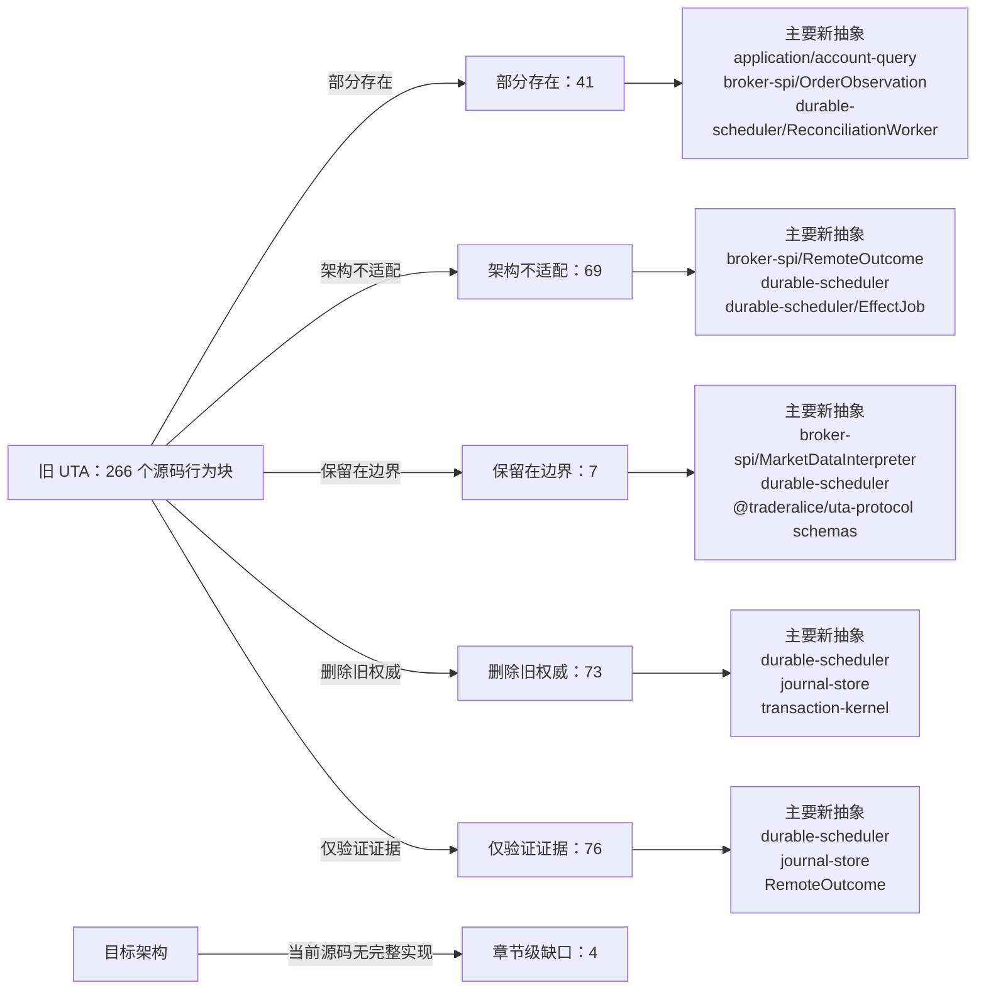

<!-- Auto-generated by scripts/uta-effect-runtime-map.mjs from mapping.json. Do not edit by hand. -->
<!-- Regenerate with `node scripts/uta-effect-runtime-map.mjs`. -->

# UTA 功能替代关系：第 8 章 Scheduling, ordering, and concurrency

目标架构原文：[`docs/uta-effect-runtime-architecture.md:1057-1118`](../uta-effect-runtime-architecture.md#L1057-L1118)。

## 结论

部分存在 41；架构不适配 69；保留在边界 7；删除旧权威 73；仅验证证据 76。状态只描述当前实现相对于目标架构的关系，不表示迁移已经落地。

## 替代关系图

## 章节级目标缺口

| 依据 | 目标义务 | 当前缺口 | 必须补充或调整 |
|---|---|---|---|
| docs/uta-effect-runtime-architecture.md:1065-1078 | ConflictKey ADT and scheduler exclusion | Current code has scattered account/order/exposure guards but no exhaustive Account/Exposure/Order/Connection ConflictKey contract or scheduler guarantee that same-key jobs exclude while independent partitions progress within broker limits. | Compile and persist conflict keys during prepare; enforce same-key non-concurrency and allow independent-key concurrency only within connection-declared limits. |
| docs/uta-effect-runtime-architecture.md:1080-1092 | Atomic lease acquisition and dispatch-boundary recovery | No current worker atomically selects eligible unleased work, stamps owner/expiry, appends JobClaimed, commits, and then executes. Restart cannot distinguish reclaim from work that crossed dispatch. | Implement the complete SQLite lease transaction; expired pre-dispatch work may be reclaimed, while any prior attempt across the dispatch boundary enters observation/reconciliation rather than blind redispatch. |
| docs/uta-effect-runtime-architecture.md:1094-1101 | Fair blocking admission and separate lossy market data | Current timers/queues do not express connection concurrency/rate policy, starvation-safe priority, no-drop trading backpressure, and explicit separation from lossy/coalescing market-data streams. | Declare typed per-connection limits, block trading producers at capacity, prohibit truncation/drop, and isolate any explicitly lossy market-data policy from durable command admission. |
| docs/uta-effect-runtime-architecture.md:1103-1117 | Complete preconditions including buying power | No chapter mapping names BuyingPowerAtLeast(amount), and current live checks do not durably bind external-state versions or require re-prepare when invalidated. | Add TransactionVersion, OrderVersion, ExposureSnapshot, and BuyingPowerAtLeast variants to PreparedStep; external invalidation yields a typed conflict and explicit re-prepare. |

## 源码映射

| 映射 ID | 当前源码 | 符号或行为块 | 当前功能 | 替代状态 | 新 UTA 抽象与做法 | 不适配位置与原因 | 必须补充或调整 | 重复索引 |
|---|---|---|---|---|---|---|---|---|
| `MAP-06118417F5` | [`packages/uta-protocol/src/client/UTAClient.ts:31-35`](../../packages/uta-protocol/src/client/UTAClient.ts#L31-L35) | RequestOpts | Accepts an unknown body, string/number/undefined query record, and optional AbortSignal. | 架构不适配 | 3.9 transport/ and protocol/；4. Effect model；8.1 Admission；9.2 Typed action interpreter；14. Public protocol；19. Architectural prohibitions transport/http；protocol/ request schemas；TransactionCommand；QueryFailure Make each route's request type a decoded named schema and carry cancellation/timeout through the transport Effect boundary without weakening body/query types. | `body?: unknown` and a raw query map permit unvalidated commands, while no typed admission response or expected transport failure is represented. | Replace RequestOpts with route-specific request records/codecs; keep AbortSignal as an implementation boundary and map transport failures to typed protocol errors. | **DUP-059** |
| `MAP-22C9C06082` | [`packages/uta-protocol/src/client/UTAClient.ts:48-61`](../../packages/uta-protocol/src/client/UTAClient.ts#L48-L61) | createUTAClient initialization and buildUrl | Normalizes a trailing slash, selects global/override fetch, defaults timeout, and constructs URLs from arbitrary paths and query entries by String conversion. | 部分存在 | 2.1 Alice owns；3.2 effect-runtime/；3.9 transport/ and protocol/；4. Effect model；8.1 Admission；14. Public protocol；15. Security and authority；19. Architectural prohibitions transport/http；effect-runtime/；protocol/；application/ Keep URL construction as a private transport helper, but bind it to the closed route table, authenticated transport layer, and typed query encoders. | Arbitrary path/query construction permits calls outside the public route contract and silently stringifies unvalidated values; auth and correlation handling are absent here. | Hide buildUrl behind route-specific client methods, validate/encode query parameters from named schemas, and compose transport authentication/correlation explicitly. | **DUP-061** |
| `MAP-8C22894ED4` | [`packages/uta-protocol/src/client/UTAClient.ts:63-88`](../../packages/uta-protocol/src/client/UTAClient.ts#L63-L88) | UTAClient.request | Builds a JSON request, creates an AbortController timeout, performs fetch, parses response text with safeJSON, extracts an `error` field by object cast on non-2xx, and casts successful body to T without validation. | 架构不适配 | 1. Thesis and non-negotiable properties；3.4 journal-store/；3.5 durable-scheduler/；3.9 transport/ and protocol/；4. Effect model；5.7 Complete type contract — public protocol envelopes；7.2 Single logical writer and group commit；8.1 Admission；9.2 Typed action interpreter；12.2 Unknown-outcome protocol；14. Public protocol；15. Security and authority；19. Architectural prohibitions transport/http；protocol/；TransactionCommand；PrepareTransactionResponse；GetTransactionResponse；TransactionFailure；QueryFailure Encode a named request, send it through authenticated transport, decode the exact success/failure schema, and preserve typed timeout/transport/protocol outcomes without generic casts. | Successful responses are body as T, errors are reduced to a string error field/message, and timeout/abort has no route-specific typed transport/auth/protocol representation. | Implement route-specific success and failure schema decoding plus typed transport/auth/protocol errors and correlation metadata. A public request timeout is not itself RemoteOutcome.Unknown; only a durable scheduler handling ambiguous broker dispatch may create that outcome. | **DUP-062** |
| `MAP-7A38B02DED` | [`packages/uta-protocol/src/client/UTAClient.ts:90-99`](../../packages/uta-protocol/src/client/UTAClient.ts#L90-L99) | UTAClient convenience methods | Returns generic get/post/put/delete closures that forward arbitrary paths and unknown bodies into request. | 删除旧权威 | 3.9 transport/ and protocol/；5.7 Complete type contract — public protocol envelopes；8.1 Admission；9.2 Typed action interpreter；14. Public protocol；19. Architectural prohibitions transport/http；protocol/；application/；TransactionCommand Replace generic closures with typed methods for each documented transaction/capability/account route; keep raw request private as an implementation detail if needed. | The public convenience surface erases route identity and schemas and lets callers send arbitrary native or malformed payloads. | Delete these generic exported methods, migrate callers to typed route methods, and make the client decode every response/failure before returning. | **DUP-063** |
| `MAP-BAD8B38E04` | [`packages/uta-protocol/src/types/broker.ts:184-202`](../../packages/uta-protocol/src/types/broker.ts#L184-L202) | ExpandContractFilters | Accepts optional expiry/right, numeric strike bounds, optional OPT/FUT secType, and an optional limit with a documented default/cap. | 架构不适配 | 5.7 Complete type contract — nominal identities and financial values；8.4 Fairness and backpressure；9.4 Capability derivation；14. Public protocol；19. Architectural prohibitions application/account-query service；broker-spi/；protocol/ contract-search request schema；domain/InstrumentId Define a named, validated contract-search/expansion query with branded instrument identity and decimal-safe strike/range values; let the broker adapter advertise expansion capability and explicit pagination semantics. | Optional-field combinations are not a discriminated query ADT, strike bounds use IEEE number values, and a broker-side silent default/cap is encoded in the public contract. | Replace this shape with a protocol schema and explicit expansion variants, validate decimal strings and limits, and return a truncation/page token or full-count contract without silent caps. | **DUP-079** |
| `MAP-BFD66E07FA` | [`packages/uta-protocol/src/types/broker.ts:336-347`](../../packages/uta-protocol/src/types/broker.ts#L336-L347) | BarParams | Accepts a BarInterval, optional JavaScript Date start/end, optional numeric limit, and optional price-stream selector; comments define broker truncation and defaults. | 部分存在 | 3.6 broker-spi/；8.4 Fairness and backpressure；9.4 Capability derivation；10.2 Market and jurisdiction owns；14. Public protocol；19. Architectural prohibitions protocol/ historical-bars request schema；broker-spi/；market-and-accounting/ Validate a named historical-bars query with branded Instant, bounded explicit pagination, and capability-driven interval/stream support. | Optional Date/number fields and broker-derived windows/truncation make request semantics implicit and allow silent limits; no public runtime schema is present. | Replace Date/number inputs with decoded Instant/positive bounded values, expose explicit pagination/continuation, and map unsupported streams to typed capability failures. | **DUP-088** |
| `MAP-255335BC1C` | [`packages/uta-protocol/src/types/broker.ts:524-529`](../../packages/uta-protocol/src/types/broker.ts#L524-L529) | IBroker trading mutation methods | Defines placeOrder, modifyOrder with Partial<Order>, cancelOrder, and closePosition as direct Promise mutations returning PlaceOrderResult. | 删除旧权威 | 1. Thesis and non-negotiable properties；3.3 transaction-kernel/；3.5 durable-scheduler/；3.6 broker-spi/；4. Effect model；5.3 Two-phase transaction protocol；5.7 Complete type contract — order and trading action ADTs；8. Scheduling, ordering, and concurrency；9.2 Typed action interpreter；12.2 Unknown-outcome protocol；17.6 Slice 6: delete the legacy kernel；19. Architectural prohibitions transaction-kernel/；durable-scheduler/；TradeAction；PreparedStep；BrokerActionInterpreter；DispatchIdentity；RemoteOutcome Make application commands enter transaction-kernel prepare/approve/execute; scheduler dispatches typed broker-spi actions only after DispatchPlanned durability and reconciles unknown outcomes. | Direct Promise mutation bypasses prepare, before-images, compensation proof, durable outbox/job admission, dispatch identity, typed remote outcomes, and backpressure. | Delete generic write methods and PlaceOrderResult when migration lands; implement action-specific BrokerActionInterpreter ports consumed by transaction-kernel and durable-scheduler. | **DUP-098** |
| `MAP-3AB8DE4D1E` | [`packages/uta-protocol/src/types/broker.ts:531-551`](../../packages/uta-protocol/src/types/broker.ts#L531-L551) | IBroker sub-account methods | Provides optional listSubAccounts and optional subAccountForContract string selectors, with documented implicit-default/ignored-selector behavior for most brokers. | 删除旧权威 | 3.1 domain/；3.5 durable-scheduler/；3.6 broker-spi/；5.7 Complete type contract — order and trading action ADTs；8.2 Partitioning；9.4 Capability derivation；10.2 Market and jurisdiction owns；15. Security and authority；17.6 Slice 6: delete the legacy kernel；19. Architectural prohibitions ActionContext；ConflictKey；AccountId；ConnectionId；CapabilitySet；broker-spi/ Carry explicit branded account/sub-account/connection context through TradeAction, ActionContext, capability derivation, and conflict-key partitioning; reject ambiguous writes before preparation. | Optional discovery and ignored selectors allow invalid/ambiguous target selection to be represented and hide whether a broker truly supports compartments. | Replace these selectors with typed account context and capability results, migrate callers, and remove the methods from the generic facade after broker-spi ownership is established. | **DUP-099** |
| `MAP-DC3A63D407` | [`packages/uta-protocol/src/types/git.ts:104-110`](../../packages/uta-protocol/src/types/git.ts#L104-L110) | AddResult | Returns a staged operation with an index and `staged: true`. | 删除旧权威 | 5.1 Commands, events, effects, and state；7.2 Single logical writer and group commit；8.1 Admission；11. Approval and Git audit projection；14. Public protocol；17.2 Slice 2: transaction and approval protocol；19. Architectural prohibitions TransactionCommand；ReplaceDraft；journal-store/；transaction-kernel/；protocol/ Replace staging responses with durable draft transaction identity/version and a typed ReplaceDraft/transaction projection response. | An array index and boolean staged flag are not a durable transaction identity or version and do not prove journal admission. | Delete AddResult and return TransactionId/TransactionVersion after durable draft creation or replacement. | **DUP-113** |
| `MAP-C39C98EBC8` | [`packages/uta-protocol/src/types/git.ts:119-125`](../../packages/uta-protocol/src/types/git.ts#L119-L125) | PushResult | Returns a Git hash/message/count plus submitted and rejected OperationResult arrays from a push. | 删除旧权威 | 1. Thesis and non-negotiable properties；5.2 Transaction state；5.3 Two-phase transaction protocol；7.3 Authoritative tables；8.1 Admission；9.3 Remote outcome；11. Approval and Git audit projection；12.2 Unknown-outcome protocol；14. Public protocol；17.6 Slice 6: delete the legacy kernel；19. Architectural prohibitions TransactionState；EffectJob；DispatchRecord；RemoteOutcome；TransactionResult；durable-scheduler/；journal-store/ Replace push with approve/admission followed by durable job identity and queryable transaction state; report typed confirmed/rejected/unknown outcomes asynchronously. | Push synchronously bundles Git persistence and broker mutations, has no durability acknowledgement/job lease/dispatch identity, and collapses partial/unknown work into submitted/rejected arrays. | Delete PushResult and migrate to `/transactions/:id/approve`, durable scheduler jobs, and GetTransactionResponse/event queries. | **DUP-115** |
| `MAP-A9AE528869` | [`packages/uta-protocol/src/types/git.ts:188-192`](../../packages/uta-protocol/src/types/git.ts#L188-L192) | SyncResult | Returns a Git hash, updatedCount, and an array of OrderStatusUpdate values after synchronizing orders. | 删除旧权威 | 7.3 Authoritative tables；8.3 Durable jobs and leases；9.3 Remote outcome；11. Approval and Git audit projection；12.1 Startup sequence；12.2 Unknown-outcome protocol；14. Public protocol；17.6 Slice 6: delete the legacy kernel；19. Architectural prohibitions durable-scheduler/；EffectJob；RemoteOutcome；journal-store/；projection-store/ Schedule typed observation/reconciliation jobs, persist checkpoints and outcomes, and query updated transaction/account projections separately from audit export. | A synchronous hash/count response treats sync as Git persistence and has no durable job/lease/checkpoint or explicit unknown-outcome protocol. | Delete SyncResult as the scheduler contract and expose durable reconciliation job/event identities and typed query responses. | **DUP-122** |
| `MAP-19CA6A1780` | [`packages/uta-protocol/src/types/git.ts:194-201`](../../packages/uta-protocol/src/types/git.ts#L194-L201) | PriceChangeInput | Accepts a symbol or aliceId, including `all`, and a free-form absolute/relative change string for simulator price mutation. | 保留在边界 | 5.7 Complete type contract — nominal identities and financial values；8.1 Admission；9.2 Typed action interpreter；14. Public protocol；17.1 Slice 1: durable kernel with MockBroker；18. Verification contract；20. First falsifier MockBroker interpreter；TradeAction；InstrumentId；protocol/ admin test schema；durable-scheduler/ Keep price injection only as an explicit MockBroker/admin test harness command, decoded by a named schema and routed to simulated broker observation; never treat it as a trading transaction or durable execution authority. | The input is intentionally a dev/test control surface, but free-form symbol/change strings are not suitable as kernel actions and must not be used to prove live execution semantics. | Confine this command to MockBroker test tooling, validate absolute/relative variants as an ADT, and persist resulting mock observations through the same journal/reconciliation path used by the falsifier. | **DUP-123** |
| `MAP-B2851598C6` | [`packages/uta-protocol/src/types/git.ts:248-282`](../../packages/uta-protocol/src/types/git.ts#L248-L282) | StagePlaceOrderParams | Defines AI/SDK staging input with aliceId/symbol, optional subAccountId, string order terms, optional TP/SL, and many IBKR-shaped fields; comments require callers to stringify numbers and say subAccountId is validated but not persisted. | 删除旧权威 | 3.1 domain/；3.3 transaction-kernel/；3.6 broker-spi/；5.3 Two-phase transaction protocol；5.7 Complete type contract — order and trading action ADTs；8.2 Partitioning；9.4 Capability derivation；14. Public protocol；15. Security and authority；17.2 Slice 2: transaction and approval protocol；19. Architectural prohibitions TradeAction；OrderSpec；TransactionCommand ReplaceDraft；ActionContext；CapabilitySet；protocol/ transaction draft schema Decode a tagged TradeAction/OrderSpec into ReplaceDraft with branded account/instrument/order identities, explicit sub-account context, preconditions, and typed capability checks. | The stage input is an optional-field IBKR-shaped bag, uses arbitrary strings for identity/order terms, and explicitly does not persist the target sub-account, so the prepared action cannot prove its write target. | Delete StagePlaceOrderParams, migrate AI/SDK callers to the transaction draft schema, and make decimal/order variants and multi-wallet target selection explicit and durable. | **DUP-127** |
| `MAP-011C785E0E` | [`packages/uta-protocol/src/types/git.ts:296-306`](../../packages/uta-protocol/src/types/git.ts#L296-L306) | StageClosePositionParams | Defines a staging bag keyed by aliceId/symbol with optional quantity and optional subAccountId, where empty quantity closes the full position. | 删除旧权威 | 3.1 domain/；3.3 transaction-kernel/；3.6 broker-spi/；5.3 Two-phase transaction protocol；5.7 Complete type contract — order and trading action ADTs；8.2 Partitioning；9.4 Capability derivation；10.1 Accounting owns；14. Public protocol；17.6 Slice 6: delete the legacy kernel；19. Architectural prohibitions TradeAction ClosePosition；Quantity；ExposureSnapshot；ConflictKey；ActionContext；transaction-kernel/ Use ClosePosition with branded AccountId/InstrumentId and an explicit Quantity\|'All' variant, bind ExposureSnapshot/preconditions, and compile compensation before dispatch. | Optional identity/quantity fields and an optional wallet target permit ambiguous writes; no exposure before-image, conflict key, commit criterion, or compensation capability is represented. | Delete StageClosePositionParams and migrate to typed ClosePosition actions in transaction drafts, with mandatory multi-sub-account context and durable exposure preconditions. | **DUP-129** |
| `MAP-CA93BD9449` | [`services/uta/src/__tests__/trading-tools.spec.ts:244-270`](../../services/uta/src/__tests__/trading-tools.spec.ts#L244-L270) | getOrders.groupByContract | Mocks three pending orders across AAPL and ETH and verifies that groupBy contract returns an object keyed by each Alice contract identifier with the expected order clusters. | 仅验证证据 | §2 System boundary；§3.8 projection-store/；§6 State tiers and snapshots；§8.2 Partitioning；§14 Public protocol；§18.2 Concurrency scenarios projection-store/orders；application/account-query；domain InstrumentId and ConflictKey；protocol grouped-order schema Represent grouped results as a named read projection keyed by broker-neutral InstrumentId/contract identity. If grouping feeds scheduling, derive explicit ConflictKey values; do not make an untyped object the transaction or queue authority. | — | — | **DUP-154** |
| `MAP-3D797361F3` | [`services/uta/src/domain/trading/__test__/e2e/setup.ts:86-95`](../../services/uta/src/domain/trading/__test__/e2e/setup.ts#L86-L95) | cached/getTestAccounts | Caches one Promise of initialized paper TestAccount records at module scope so subsequent suites reuse the same broker instances. | 保留在边界 | 3.2 effect-runtime/；3.6 broker-spi/；4 Effect model；7 Durability architecture；8 Scheduling, ordering, and concurrency；12.1 Startup sequence；17 Migration sequence；18.2 Concurrency scenarios effect-runtime root Scope；broker-spi scoped Layers；durable-scheduler Retain singleton reuse only as a test harness optimization; target process composition should own scoped Layers and durable services, while tests isolate account/journal namespaces explicitly. | The module-global Promise is in-memory and requires serial Vitest execution; it is not a durable runtime scope, startup recovery coordinator, queue, or concurrency proof. | — | **DUP-213** |
| `MAP-58F0FF7798` | [`services/uta/src/domain/trading/__test__/e2e/uta-alpaca.e2e.spec.ts:37-78`](../../services/uta/src/domain/trading/__test__/e2e/uta-alpaca.e2e.spec.ts#L37-L78) | describe UTA — Alpaca order lifecycle | Stages a $1 AAPL limit buy, commits it, pushes it through UnifiedTradingAccount, then stages and pushes a cancel; it asserts prepared/submitted results and at least two legacy log commits. | 删除旧权威 | 5.2 Transaction state；5.3 Two-phase transaction protocol；7 Durability architecture；8 Scheduling, ordering, and concurrency；11 Approval and Git audit projection；12 Recovery model；17.4 Slice 4: first real broker；18.1 Kernel crash matrix；18.3 Real broker acceptance；20 First falsifier transaction-kernel/coordinator；journal-store；durable-scheduler；brokers/alpaca typed interpreter；projection-store；broker-spi Replace stage/commit/push/cancel with a prepared transaction, durable approval, DispatchPlanned outbox job, leased scheduler execution, typed Alpaca acknowledgement, and journaled cancel/compensation projection. Add the MockBroker crash experiment separately before using this as Slice 4 evidence. | The legacy push mutates through UnifiedTradingAccount/IBroker without a durable intent acknowledgement, dispatch identity, lease, journal event, compensation declaration, or remote unknown-outcome path. It runs in one process and supplies no 18.1 crash-matrix or 20 first-falsifier evidence. | Remove this legacy execution test when the target path lands; assert durable state before dispatch, typed accepted/rejected/unknown outcomes, restart classification, and no blind duplicate, then assert the real Alpaca baseline is restored. | **DUP-217** |
| `MAP-628E0887B1` | [`services/uta/src/domain/trading/__test__/e2e/uta-alpaca.e2e.spec.ts:176-246`](../../services/uta/src/domain/trading/__test__/e2e/uta-alpaca.e2e.spec.ts#L176-L246) | describe UTA — Alpaca fill flow (AAPL) | During market hours, records initial AAPL quantity, performs stage -> commit -> push for a market buy, optionally syncs, verifies position quantity increased by one, stages/pushes a close, optionally syncs, and verifies quantity returned to the initial value plus two log entries. | 删除旧权威 | 5.3 Two-phase transaction protocol；7.4 Snapshot and compaction policy；8.5 Isolation；9.3 Remote outcome；10.1 Accounting owns；12 Recovery model；17.4 Slice 4: first real broker；18.3 Real broker acceptance transaction-kernel；journal-store；durable-scheduler；brokers/alpaca typed interpreter；projection-store；market-and-accounting Retain the paper lifecycle as a target Alpaca acceptance scenario, but drive it through prepared transactions, durable jobs, typed observation/reconciliation, accounting projections, and a baseline assertion over positions and open orders. | The current scenario checks a broker position delta and legacy log only. It does not persist before-images or dispatch boundaries, distinguish accepted/working/filled criteria in a transaction state, reconcile unknown outcomes, or prove restart/recovery. | Delete the UnifiedTradingAccount version after migration and add target journal/scheduler assertions plus crash/restart variants; require account baseline restoration, including no unexpected open orders, after both buy and close. | **DUP-220** |
| `MAP-E9EB273A72` | [`services/uta/src/domain/trading/__test__/e2e/uta-bybit.e2e.spec.ts:49-122`](../../services/uta/src/domain/trading/__test__/e2e/uta-bybit.e2e.spec.ts#L49-L122) | buy/sync/verify/close lifecycle | Records initial perp quantity, performs stage -> commit -> push for a market buy, conditionally syncs submitted orders, asserts an ETH position and no pending orders, closes 0.01 ETH, conditionally syncs, and asserts net quantity returns near baseline plus legacy history entries. | 删除旧权威 | 5.2 Transaction state；5.3 Two-phase transaction protocol；7 Durability architecture；8 Isolation and partitioning；9.3 Remote outcome；10.1 Accounting owns；12 Recovery model；17.5 Slice 5: heterogeneous brokers；18.3 Real broker acceptance transaction-kernel；journal-store；durable-scheduler；brokers/ccxt/Bybit interpreter；projection-store；market-and-accounting Retain the Bybit demo lifecycle as broker acceptance after migrating it to prepared transaction plans, durable jobs, stable dispatch identities, typed observation/reconciliation, and position/order projections with baseline cleanup. | The path uses legacy stage/commit/push/sync and tests only broker position/history outcomes. It has no durable intent before mutation, lease/partition behavior, unknown-outcome reconciliation, compensation declaration, or restart proof. | Replace the UnifiedTradingAccount scenario with a target transaction/scheduler scenario and require no unexpected open orders plus explicit accepted/working/filled/unknown criterion handling. | **DUP-222** |
| `MAP-96BCC45A7C` | [`services/uta/src/domain/trading/__test__/e2e/uta-ccxt-bybit.e2e.spec.ts:45-98`](../../services/uta/src/domain/trading/__test__/e2e/uta-ccxt-bybit.e2e.spec.ts#L45-L98) | full lifecycle buy/sync/close | Stages and commits a 0.01 ETH market buy, pushes it, conditionally syncs to filled, closes the same quantity, conditionally syncs, compares final exchange quantity to the initial value, and checks at least two legacy commits. | 删除旧权威 | 5.2 Transaction state；5.3 Two-phase transaction protocol；7 Durability architecture；8 Isolation and partitioning；9.3 Remote outcome；10.1 Accounting owns；12 Recovery model；17.5 Slice 5: heterogeneous brokers；18.3 Real broker acceptance transaction-kernel；journal-store；durable-scheduler；brokers/ccxt/Bybit interpreter；projection-store Rewrite as two target transactions with durable prepare/outbox, conflict keys, leased dispatch, broker observations, and projections; assert the required account baseline after close. | Legacy stage/commit/push/sync and log are the authority. There is no durable pre-dispatch intent, stable dispatch identity, unknown-outcome reconciliation, compensation contract, or restart evidence. | Remove legacy execution ownership and add target scheduler/journal assertions plus crash and reconciliation variants for the Bybit paper lifecycle. | **DUP-226** |
| `MAP-DC819A17DE` | [`services/uta/src/domain/trading/__test__/e2e/uta-ibkr.e2e.spec.ts:93-138`](../../services/uta/src/domain/trading/__test__/e2e/uta-ibkr.e2e.spec.ts#L93-L138) | IBKR legacy limit order lifecycle | Discovers AAPL, stages a $1 GTC limit buy, commits and pushes it, stages/pushes a cancel, and checks two legacy log commits. | 删除旧权威 | 5.3 Two-phase transaction protocol；7 Durability architecture；8 Scheduling, ordering, and concurrency；9.2 Typed action interpreter；11 Approval and Git audit projection；12 Recovery model；17.5 Slice 5: heterogeneous brokers；18.3 Real broker acceptance transaction-kernel；journal-store；durable-scheduler；brokers/ibkr typed interpreter；projection-store Replace stage/commit/push/cancel with target prepared transaction, durable job/lease, typed IBKR dispatch identity and acknowledgement, and a journaled cancel/compensation transition. | No durable pre-dispatch intent, lease, conflict key, typed remote outcome, compensation capability, restart classification, or authoritative journal is asserted. | Delete the legacy test when target IBKR execution becomes authoritative and add scheduler/recovery plus baseline open-order assertions. | **DUP-232** |
| `MAP-147173C2A5` | [`services/uta/src/domain/trading/__test__/e2e/uta-ibkr.e2e.spec.ts:173-247`](../../services/uta/src/domain/trading/__test__/e2e/uta-ibkr.e2e.spec.ts#L173-L247) | IBKR legacy fill flow | During market hours, records initial AAPL quantity, performs stage -> commit -> push for a market buy, optionally syncs, verifies quantity increased, closes one share, optionally syncs, verifies the initial quantity and at least two legacy log commits. | 删除旧权威 | 5.3 Two-phase transaction protocol；7 Durability architecture；8 Isolation and ordering；9.3 Remote outcome；10.1 Accounting owns；12 Recovery model；17.5 Slice 5: heterogeneous brokers；18.3 Real broker acceptance transaction-kernel；journal-store；durable-scheduler；brokers/ibkr typed interpreter；projection-store；market-and-accounting Retain as IBKR paper acceptance after migration to target prepared plans, callback/observation reconciliation, durable jobs, accounting projections, and exact position/open-order baseline cleanup. | The current path delegates all authority to UnifiedTradingAccount and generic IBroker; it does not prove durable dispatch, callback stream integration, unknown outcome handling, compensation, or crash/restart recovery. | Delete legacy execution ownership after migration and add target IBKR callback/reconciliation and crash scenarios with no unexpected open orders. | **DUP-234** |
| `MAP-81E8AC49C4` | [`services/uta/src/domain/trading/__test__/e2e/uta-lifecycle.e2e.spec.ts:30-64`](../../services/uta/src/domain/trading/__test__/e2e/uta-lifecycle.e2e.spec.ts#L30-L64) | market-buy dispatch and immediate-fill lifecycle tests | Stages/commits/pushes market buys, asserts submitted/filled results, immediate Mock position/cash mutation, and that sync has no later update. | 删除旧权威 | 5 Transaction algebra；5.2 Transaction state；5.3 Two-phase transaction protocol；7 Durability architecture；8 Scheduling, ordering, and concurrency；11 Approval and Git audit projection；12 Recovery model；17.1 Slice 1: durable kernel with MockBroker；18.1 Kernel crash matrix；18.2 Concurrency scenarios；20 First falsifier transaction-kernel/coordinator；journal-store；durable-scheduler；brokers/mock；projection-store；effect-runtime Test PlaceOrder prepare/approval/durable dispatch, explicit Ack versus commit criterion, observation, and projection update. | One-process immediate fill conflates venue acceptance, fill observation, and committed transaction; no durable intent or restart cut is exercised. | For every mutation terminate exactly after: transaction prepared and before approval; approval committed and before job claim; job claim committed and before dispatch; broker accepted and before acknowledgement persistence; acknowledgement persisted and before projection update; abort persisted and before compensation; compensation dispatched and before its acknowledgement. After restart, permit exactly one justified next action and no blind duplicate. | **DUP-236** |
| `MAP-6119E3BEEE` | [`services/uta/src/domain/trading/__test__/e2e/uta-lifecycle.e2e.spec.ts:66-108`](../../services/uta/src/domain/trading/__test__/e2e/uta-lifecycle.e2e.spec.ts#L66-L108) | account state and limit-order reconciliation tests | Pushes a market buy and a submitted limit order, reads live GitState, externally fills the order, then calls sync and asserts filled projection state. | 删除旧权威 | 5 Transaction algebra；5.2 Transaction state；5.3 Two-phase transaction protocol；7 Durability architecture；8 Scheduling, ordering, and concurrency；11 Approval and Git audit projection；12 Recovery model；17.1 Slice 1: durable kernel with MockBroker；18.1 Kernel crash matrix；18.2 Concurrency scenarios；20 First falsifier transaction-kernel/coordinator；journal-store；durable-scheduler；brokers/mock；projection-store；effect-runtime Persist dispatch identity and StillWorking outcome, schedule durable observation, journal the fill, and rebuild account/order projections. | Pending identity and reconciliation live in memory; external fill and sync have no durable job, lease, observation evidence, or restart behavior. | For every mutation terminate exactly after: transaction prepared and before approval; approval committed and before job claim; job claim committed and before dispatch; broker accepted and before acknowledgement persistence; acknowledgement persisted and before projection update; abort persisted and before compensation; compensation dispatched and before its acknowledgement. After restart, permit exactly one justified next action and no blind duplicate. | **DUP-237** |
| `MAP-7076DD2230` | [`services/uta/src/domain/trading/__test__/e2e/uta-lifecycle.e2e.spec.ts:110-123`](../../services/uta/src/domain/trading/__test__/e2e/uta-lifecycle.e2e.spec.ts#L110-L123) | partial-close lifecycle test | Buys ten units, stages a close of three, pushes it, and asserts a seven-unit Mock position. | 删除旧权威 | 5 Transaction algebra；5.2 Transaction state；5.3 Two-phase transaction protocol；7 Durability architecture；8 Scheduling, ordering, and concurrency；11 Approval and Git audit projection；12 Recovery model；17.1 Slice 1: durable kernel with MockBroker；18.1 Kernel crash matrix；18.2 Concurrency scenarios；20 First falsifier transaction-kernel/coordinator；journal-store；durable-scheduler；brokers/mock；projection-store；effect-runtime Prepare a reduce-only ClosePosition with before-image, ExposureEquals precondition, conflict key, compensation capability, and TargetExposureReached criterion. | The test proves arithmetic only; it does not cover external exposure change, same-exposure serialization, partial fill, unknown outcome, or restart. | For every mutation terminate exactly after: transaction prepared and before approval; approval committed and before job claim; job claim committed and before dispatch; broker accepted and before acknowledgement persistence; acknowledgement persisted and before projection update; abort persisted and before compensation; compensation dispatched and before its acknowledgement. After restart, permit exactly one justified next action and no blind duplicate. | **DUP-238** |
| `MAP-5F648FC9E1` | [`services/uta/src/domain/trading/__test__/e2e/uta-lifecycle.e2e.spec.ts:125-137`](../../services/uta/src/domain/trading/__test__/e2e/uta-lifecycle.e2e.spec.ts#L125-L137) | full-close lifecycle test | Buys and fully closes a Mock position, then asserts no position and restored cash. | 删除旧权威 | 5 Transaction algebra；5.2 Transaction state；5.3 Two-phase transaction protocol；7 Durability architecture；8 Scheduling, ordering, and concurrency；11 Approval and Git audit projection；12 Recovery model；17.1 Slice 1: durable kernel with MockBroker；18.1 Kernel crash matrix；18.2 Concurrency scenarios；20 First falsifier transaction-kernel/coordinator；journal-store；durable-scheduler；brokers/mock；projection-store；effect-runtime Test full-close prepared state, durable dispatch/observation, signed accounting effects, and terminal criterion across restart. | A synchronous in-memory close cannot prove durable compensation, residual exposure handling, cash provenance, or recovery. | For every mutation terminate exactly after: transaction prepared and before approval; approval committed and before job claim; job claim committed and before dispatch; broker accepted and before acknowledgement persistence; acknowledgement persisted and before projection update; abort persisted and before compensation; compensation dispatched and before its acknowledgement. After restart, permit exactly one justified next action and no blind duplicate. | **DUP-239** |
| `MAP-C63562DE19` | [`services/uta/src/domain/trading/__test__/e2e/uta-lifecycle.e2e.spec.ts:139-151`](../../services/uta/src/domain/trading/__test__/e2e/uta-lifecycle.e2e.spec.ts#L139-L151) | cancel-order lifecycle test | Creates a pending limit order, stages/pushes cancel, and asserts the Mock order is Cancelled. | 删除旧权威 | 5 Transaction algebra；5.2 Transaction state；5.3 Two-phase transaction protocol；7 Durability architecture；8 Scheduling, ordering, and concurrency；11 Approval and Git audit projection；12 Recovery model；17.1 Slice 1: durable kernel with MockBroker；18.1 Kernel crash matrix；18.2 Concurrency scenarios；20 First falsifier transaction-kernel/coordinator；journal-store；durable-scheduler；brokers/mock；projection-store；effect-runtime Compile CancelOrder with native identity/precondition, durably dispatch, observe remote cancellation, and commit only when the criterion is met. | No cancel-before-image, identity recovery, unknown outcome, already-terminal handling, lease, or restart is exercised. | For every mutation terminate exactly after: transaction prepared and before approval; approval committed and before job claim; job claim committed and before dispatch; broker accepted and before acknowledgement persistence; acknowledgement persisted and before projection update; abort persisted and before compensation; compensation dispatched and before its acknowledgement. After restart, permit exactly one justified next action and no blind duplicate. | **DUP-240** |
| `MAP-3EEA8F2FEB` | [`services/uta/src/domain/trading/__test__/e2e/uta-lifecycle.e2e.spec.ts:153-167`](../../services/uta/src/domain/trading/__test__/e2e/uta-lifecycle.e2e.spec.ts#L153-L167) | legacy commit-history lifecycle test | Pushes buy and close operations and asserts reverse-chronological in-memory Git log messages. | 删除旧权威 | 5 Transaction algebra；5.2 Transaction state；5.3 Two-phase transaction protocol；7 Durability architecture；8 Scheduling, ordering, and concurrency；11 Approval and Git audit projection；12 Recovery model；17.1 Slice 1: durable kernel with MockBroker；18.1 Kernel crash matrix；18.2 Concurrency scenarios；20 First falsifier transaction-kernel/coordinator；journal-store；durable-scheduler；brokers/mock；projection-store；effect-runtime Verify Git history is a rebuildable audit projection of durable transaction events and survives projection failure/rebuild. | Only in-memory commit ordering is tested; no authoritative journal, checkpoint, schema, actor, plan digest, or projection recovery exists. | For every mutation terminate exactly after: transaction prepared and before approval; approval committed and before job claim; job claim committed and before dispatch; broker accepted and before acknowledgement persistence; acknowledgement persisted and before projection update; abort persisted and before compensation; compensation dispatched and before its acknowledgement. After restart, permit exactly one justified next action and no blind duplicate. | **DUP-241** |
| `MAP-7D71DB21A0` | [`services/uta/src/domain/trading/__test__/uta-health.spec.ts:69-91`](../../services/uta/src/domain/trading/__test__/uta-health.spec.ts#L69-L91) | UTA health exponentialBackoff | Keeps MockBroker down across recovery attempts at five, ten, and twenty seconds, asserting offline throughout, recovering=true, and explicit close cleanup. | 仅验证证据 | §4 Effect model；§8 Scheduling, ordering, and concurrency；§9.1 Connection Layer；§12.1 Startup sequence；§12.3 Defects and expected failures；§13 Observability；§19 Architectural prohibitions effect-runtime/Schedule；effect-runtime/Fiber；broker-spi/BrokerConnectionService；durable-scheduler；observability Preserve exponential reconnect policy as an explicit typed Schedule with observable attempt state, while separating connection retries from broker-mutation retries; the target must never use this policy to blindly redispatch an unknown mutation. | — | — | **DUP-248** |
| `MAP-A227BE1784` | [`services/uta/src/domain/trading/__test__/uta-health.spec.ts:129-141`](../../services/uta/src/domain/trading/__test__/uta-health.spec.ts#L129-L141) | UTA health runtime offlineThreshold | After six consecutive getAccount failures, asserts offline health and recovering=true, then closes the UTA. | 仅验证证据 | §4 Effect model；§8 Scheduling, ordering, and concurrency；§9.1 Connection Layer；§12.1 Startup sequence；§13 Observability；§18 Verification contract broker-spi/BrokerConnectionService；effect-runtime/Schedule and Fiber；application/capability；durable-scheduler；observability Map the offline transition to an unavailable connection capability and a supervised reconnect worker; durable-scheduler must independently preserve/reconcile pending work, which this threshold test does not exercise. | — | — | **DUP-251** |
| `MAP-687A495AFD` | [`services/uta/src/domain/trading/__test__/uta-health.spec.ts:191-207`](../../services/uta/src/domain/trading/__test__/uta-health.spec.ts#L191-L207) | UTA health offlineFailFast | After six failed account calls, invokes getAccount again and asserts an offline-and-reconnecting error, demonstrating a fail-fast path that avoids another broker call while recovery is active. | 仅验证证据 | §4 Effect model；§8 Scheduling, ordering, and concurrency；§9.1 Connection Layer；§12.3 Defects and expected failures；§13 Observability；§18 Verification contract broker-spi/BrokerConnectionService；application/account-query；effect-runtime；application/capability；observability Map fail-fast behavior to a typed ConnectionUnavailable/degraded capability at the application boundary, and verify that reconnect fibers do not dispatch ordinary queries until reachability returns. | — | — | **DUP-255** |
| `MAP-DBB2C39ABF` | [`services/uta/src/domain/trading/__test__/uta-health.spec.ts:209-222`](../../services/uta/src/domain/trading/__test__/uta-health.spec.ts#L209-L222) | UTA health offlinePush | After taking the account offline, stages and commits an order, then asserts push rejects with an offline error and closes the UTA. | 仅验证证据 | §5 Transaction algebra；§8 Scheduling, ordering, and concurrency；§9 Broker service-provider interface；§12 Recovery model；§14 Public protocol；§15 Security and authority；§18 Verification contract application/transaction；transaction-kernel；durable-scheduler；broker-spi/BrokerConnectionService；protocol transaction commands；effect-runtime Map offline execution rejection to a typed connection failure while requiring prepare/approve to create durable transaction and job identities before scheduler dispatch; replace direct push semantics with the transaction-oriented protocol and recovery command. | — | — | **DUP-256** |
| `MAP-02559D426B` | [`services/uta/src/domain/trading/__test__/uta-health.spec.ts:224-241`](../../services/uta/src/domain/trading/__test__/uta-health.spec.ts#L224-L241) | UTA health offlineStageCommit | After broker failure, verifies that stagePlaceOrder and commit still succeed as local in-memory operations and that commit reports prepared=true without contacting the broker. | 仅验证证据 | §5 Transaction algebra；§6 State tiers and snapshots；§7 Durability architecture；§8.1 Admission；§12.1 Startup sequence；§14 Public protocol；§18 Verification contract；§19 Architectural prohibitions domain transaction proposal；transaction-kernel；journal-store；durable-scheduler；application/transaction；protocol transaction schemas Interpret staging as an editable proposal snapshot and commit/prepare as a durable journal transaction in the target. The current in-memory success while offline is migration evidence only; it does not establish SQLite durability, admission acknowledgement, or crash recovery. | — | — | **DUP-257** |
| `MAP-053E34F691` | [`services/uta/src/domain/trading/brokers/alpaca/AlpacaBroker.spec.ts:486-556`](../../services/uta/src/domain/trading/brokers/alpaca/AlpacaBroker.spec.ts#L486-L556) | closePosition tests | Covers native full close, partial close as a reverse market order after reading a long position, and unresolved-contract failure. | 仅验证证据 | §5.3 Two-phase transaction protocol；§5.5 Compensation capability；§8.2 Partitioning；§8.5 Isolation；§9.2 Typed action interpreter；§10.1 Accounting owns；§12.2 Unknown-outcome protocol；§17 Slice 4: first real broker；§18.2 Concurrency scenarios PreparedClosePosition；ExposureSnapshot；ExposureEquals；ConflictKey Exposure；RestoreExposure；RemoteOutcome<ExposureSnapshot> Retain native/partial intent scenarios, then add race/precondition, exposure conflict-key, target-exposure commit, compensation, and restart/unknown-outcome assertions. | — | — | **DUP-283** |
| `MAP-20EEB58E82` | [`services/uta/src/domain/trading/brokers/alpaca/AlpacaBroker.spec.ts:611-639`](../../services/uta/src/domain/trading/brokers/alpaca/AlpacaBroker.spec.ts#L611-L639) | getOrders tests | Verifies getOrders sequentially calls getOrder for each ID and returns mapped legacy order symbols/statuses. | 仅验证证据 | §6 State tiers and snapshots；§8.3 Durable jobs and leases；§9.2 Typed action interpreter；§9.3 Remote outcome；§12.2 Unknown-outcome protocol；§18.3 Real broker acceptance ObserveOrderJob；OrderObservation；RemoteOutcome<OrderSnapshot>；OrdersProjection Rewrite to assert one typed observation result per requested ID, preservation of not-found versus unavailable/Unknown, durable reconciliation checkpoints, and projection updates. | — | — | **DUP-285** |
| `MAP-0ABCB3F3AD` | [`services/uta/src/domain/trading/brokers/alpaca/AlpacaBroker.ts:151-203`](../../services/uta/src/domain/trading/brokers/alpaca/AlpacaBroker.ts#L151-L203) | init | Validates credential presence, constructs the SDK client, retries getAccount up to five times with exponential setTimeout delays, throws a special auth error after two auth-like message matches, and starts refreshCatalog as an unawaited promise before returning. | 架构不适配 | §4 Effect model；§8.4 Fairness and backpressure；§9.1 Connection Layer；§12.1 Startup sequence；§12.3 Defects and expected failures；§13 Observability；§15 Security and authority；2.2 UTA owns；2.3 Broker adapters own AlpacaConnectionLayer；ConnectionHealthEvent；ConnectionFailure；CapabilityFailure；Scoped Layer Acquire Alpaca through a scoped Effect Layer, report typed health/failure events, and let startup classify unfinished durable work before admission. Reconnect policy may schedule connection acquisition, but it must not be a blind mutation retry; catalog refresh should be a supervised typed job. | The lifecycle is promise-based and class-local, classifies auth by error-message regex, has no health stream/reconnect/shutdown protocol, and detaches catalog work with no durability or supervision. | Implement BrokerConnectionService acquisition, health, reconnect, and shutdown in a scoped Layer; map auth/network/protocol failures to tagged variants and supervise catalog observation separately from transaction dispatch. | **DUP-302** |
| `MAP-CFEE6FFFEA` | [`services/uta/src/domain/trading/brokers/alpaca/AlpacaBroker.ts:273-347`](../../services/uta/src/domain/trading/brokers/alpaca/AlpacaBroker.ts#L273-L347) | placeOrder | Resolves a legacy Contract to a ticker, builds an untyped Alpaca request from mutable Order fields, supports qty or notional, prices, trailing fields, extended hours, and bracket/OTO legs, calls createOrder directly, then returns PlaceOrderResult with the parent/leg IDs or a string error. | 架构不适配 | §1 Thesis and non-negotiable properties；§3.3 transaction-kernel/；§5.3 Two-phase transaction protocol；§5.5 Compensation capability；§5.7 Order and trading action ADTs；§5.7 Dispatch and durable-job records；§9.2 Typed action interpreter；§9.3 Remote outcome；§12.2 Unknown-outcome protocol；§13 Observability；§17 Slice 4: first real broker；§18.3 Real broker acceptance；§19 Architectural prohibitions；§20 First falsifier；2.2 UTA owns；2.3 Broker adapters own PreparedPlaceOrder；AlpacaPlaceOrderRequestSchema；DispatchIdentity；PlaceOrderAcknowledgement；RemoteOutcome<OrderSnapshot>；CompensationCapability；NativeAtomicGroupConfirmed Compile a typed PlaceOrder action and compensation capability during prepare, persist DispatchPlanned with a client/dispatch identity before calling Alpaca, dispatch through the interpreter, and persist Confirmed/Rejected/Unknown outcomes. Map bracket/OTO to a declared native atomic-group capability only when the venue observation proves the group criterion; otherwise track parent and child observations separately. | The method mutates the broker directly without a durable intent barrier, dispatch identity/idempotency key, before-image/precondition, commit criterion, compensation proof, or unknown-outcome observation. It also builds Record<string, unknown> payloads and converts attached prices through parseFloat. | Add Alpaca place-request/ack/observation schemas, clientOrderId/DispatchIdentity compilation, `dispatch` and `observe` SPI methods, typed rejection mapping, and compensation compilation for working orders/native groups. Remove PlaceOrderResult as the execution authority. | **DUP-307** |
| `MAP-E8E6E71EFB` | [`services/uta/src/domain/trading/brokers/alpaca/AlpacaBroker.ts:349-368`](../../services/uta/src/domain/trading/brokers/alpaca/AlpacaBroker.ts#L349-L368) | modifyOrder | Accepts Partial<Order>, copies whichever optional quantity/price/trailing/TIF fields are present into an untyped patch, calls replaceOrder, and returns success or stringified error. | 架构不适配 | §5.3 Two-phase transaction protocol；§5.5 Compensation capability；§5.7 Order and trading action ADTs；§5.7 Before-images, observations, and preconditions；§8.5 Isolation；§9.2 Typed action interpreter；§12.2 Unknown-outcome protocol；§19 Architectural prohibitions PreparedModifyOrder；OrderVersion；RestoreOrder；ModifyOrderAcknowledgement；RemoteOutcome<OrderSnapshot> Use a closed ModifyOrder action containing a complete replacement OrderSpec, load an ExistingOrder before-image and OrderVersion precondition, compile a RestoreOrder capability with semantic-loss metadata, then dispatch and observe through the SPI. | Partial<Order> is the optional-field soup prohibited by the target, and direct replacement has no version guard, logical order lock, durable dispatch identity, compensation, or unknown-outcome reconciliation. | Add typed replacement schemas and Alpaca replace request/ack/observation mappings; persist plan and dispatch records before replaceOrder and reconcile by broker/client identity after timeout or restart. | **DUP-308** |
| `MAP-7C95D7E4A8` | [`services/uta/src/domain/trading/brokers/alpaca/AlpacaBroker.ts:381-413`](../../services/uta/src/domain/trading/brokers/alpaca/AlpacaBroker.ts#L381-L413) | closePosition | For a partial close, reads current positions and submits a reverse market order; for a full close, calls Alpaca closePosition directly. Both paths return legacy PlaceOrderResult and have no precondition or compensation state. | 架构不适配 | §5.3 Two-phase transaction protocol；§5.5 Compensation capability；§5.7 Before-images, observations, and preconditions；§8.2 Partitioning；§8.5 Isolation；§9.2 Typed action interpreter；§9.3 Remote outcome；§10.1 Accounting owns；§12.2 Unknown-outcome protocol；§17 Slice 4: first real broker；§18.2 Concurrency scenarios PreparedClosePosition；ExposureSnapshot；RestoreExposure；ExposureEquals；ConflictKey Exposure；ClosePositionAcknowledgement Prepare ClosePosition against an ExposureSnapshot, acquire the exposure conflict key, and compile either a typed native close action or a quantity-specific order. Persist the dispatch and reconcile the resulting exposure to the declared target before commit; compile economic/state-restoring compensation when required. | The read-then-write partial close races external activity, full close has no before-image, and neither path has an exposure precondition, durable lock, dispatch identity, commit criterion, compensation, or unknown-outcome path. | Implement ClosePosition action/observation schemas, ExposureEquals preconditions, exposure partitioning, target-exposure commit criteria, and RestoreExposure compensation/recovery. | **DUP-310** |
| `MAP-BEC8B440B3` | [`services/uta/src/domain/trading/brokers/alpaca/AlpacaBroker.ts:482-489`](../../services/uta/src/domain/trading/brokers/alpaca/AlpacaBroker.ts#L482-L489) | getOrders | Fetches each requested ID sequentially through getOrder and silently omits any ID for which getOrder returns null. | 架构不适配 | §6 State tiers and snapshots；§8.3 Durable jobs and leases；§9.3 Remote outcome；§12.2 Unknown-outcome protocol；§19 Architectural prohibitions ObserveOrderJob；RemoteOutcome<OrderSnapshot>；QueryFailure；BrokerOrderId Use typed observation jobs keyed by BrokerOrderId/DispatchIdentity and preserve a distinct NotFound, unavailable, protocol, or Unknown result for each requested order; update projections from observed facts. | Missing orders, connection failures, and unknown outcomes collapse into omission, so reconciliation cannot distinguish conclusive absence from an observation failure. | Replace nullable sequential reads with a typed batch observation service and durable reconciliation/checkpoint handling; never silently drop requested IDs. | **DUP-314** |
| `MAP-0A1AF127FE` | [`services/uta/src/domain/trading/brokers/alpaca/AlpacaBroker.ts:593-601`](../../services/uta/src/domain/trading/brokers/alpaca/AlpacaBroker.ts#L593-L601) | getCapabilities | Returns a flat AccountCapabilities object with STK, five order type strings, and historicalBars quality set to iex regardless of current feed/account/session context. | 架构不适配 | §5.7 Broker capability and interpreter association；§8.4 Fairness and backpressure；§9.4 Capability derivation；§10.2 Market and jurisdiction owns；§14 Public protocol；§19 Architectural prohibitions；2.2 UTA owns；2.3 Broker adapters own CapabilitySet；ActionAvailability；CapabilityUnavailableReason；BrokerConnectionService.capabilities Derive a closed CapabilitySet per action from broker/SDK version, connection/account mode, jurisdiction, venue session, instrument, and permissions. Each action must be Available with schema/idempotency/compensation or Unavailable with a precise reason. | Flat string arrays cannot express contextual availability, idempotency strategy, compensation class, connection degradation, or data-feed quality; the static iex claim can contradict the actual request. | Implement the broker-spi capability service and map capabilities from validated account/market context, including dispatch identity strategy and compensation availability for every action. | **DUP-319** |
| `MAP-CC557A8B9C` | [`services/uta/src/domain/trading/brokers/ccxt/ccxt-tools.ts:68-95`](../../services/uta/src/domain/trading/brokers/ccxt/ccxt-tools.ts#L68-L95) | getOrderBook AI tool | Defines aliceId, bounded optional limit, and source input, resolves the account and Contract, calls getOrderBook with default limit 20, and returns source plus broker fields. | 部分存在 | 2.1 Alice owns；8.4 Fairness and backpressure；9.2 Typed action interpreter；10.2 Market and jurisdiction owns；14 Public protocol；15 Security and authority protocol/OrderBookRequest；protocol/OrderBookResponse；application/MarketDataService；domain/QueryFailure Use a named OrderBookRequest/Response schema with typed limit policy, source/observation metadata, authorization, and market-data backpressure semantics. | The tool validates only limit syntax and spreads an untyped result; it does not expose stale/unavailable states or route through the target protocol/application boundary. | Encode order-book levels and failures with protocol schemas, enforce typed market-data policy, and move account/contract resolution into application services. | **DUP-341** |
| `MAP-0694EDABFF` | [`services/uta/src/domain/trading/brokers/ccxt/ccxt-types.ts:42-53`](../../services/uta/src/domain/trading/brokers/ccxt/ccxt-types.ts#L42-L53) | envInt and initialization retry constants | Reads positive integer retry settings from process.env and exports fixed retry count/base delay defaults for market initialization. | 架构不适配 | 4 Effect model；8.4 Fairness and backpressure；9.1 Connection Layer；12.1 Startup sequence；19 Architectural prohibitions；3.7 brokers/<broker>/ effect-runtime/Schedule；brokers/ccxt/ConnectionLayer；durable-scheduler/ConnectionWorker；domain/CapabilityFailure Move retry/backoff policy into an injected typed Effect Schedule/connection policy with observable limits and no hidden mutation retry semantics. | Process environment and constants own retry timing outside runtime policy; the same pattern is adjacent to broker mutation paths and cannot express unknown-outcome safety or reach degradation. | Inject a named reconnect/catalog schedule and persist/emit typed retry/reach state; prohibit this policy from deciding mutation redispatch. | **DUP-344** |
| `MAP-E1440798A9` | [`services/uta/src/domain/trading/brokers/ccxt/CcxtBroker.spec.ts:1555-1660`](../../services/uta/src/domain/trading/brokers/ccxt/CcxtBroker.spec.ts#L1555-L1660) | getHistorical tests | Tests OHLCV mapping, trailing-window anchoring across intervals, explicit end bound, unsupported timeframe refusal, and unresolved contract errors. | 仅验证证据 | 8.4 Fairness and backpressure；9.2 Typed action interpreter；10.2 Market and jurisdiction owns；14 Public protocol；18 Verification contract market-and-accounting/BarService；broker-spi/MarketDataInterpreter；protocol/MarketDataCodec Carry trailing-window, bound, and support-policy assertions into target market-data integration tests with typed rate/backpressure behavior. | — | — | **DUP-373** |
| `MAP-DEA8D0FAE0` | [`services/uta/src/domain/trading/brokers/ccxt/CcxtBroker.ts:329-398`](../../services/uta/src/domain/trading/brokers/ccxt/CcxtBroker.ts#L329-L398) | init fetchMarkets wrapper and retry policy | Overrides fetchMarkets to iterate CCXT-declared market types while excluding options, retries each type with exponential setTimeout delays, fails initialization if any type cannot load, then calls loadMarkets and marks the broker initialized. | 架构不适配 | 8.4 Fairness and backpressure；9.1 Connection Layer；12.1 Startup sequence；19 Architectural prohibitions brokers/ccxt/ConnectionLayer；market-and-accounting/InstrumentCatalog；effect-runtime/Schedule；durable-scheduler/ConnectionWorker Load and refresh venue catalog through the scoped connection/interpreter using typed schedules and catalog observations; expose degraded reach instead of embedding ad hoc retry in the broker facade. | Retries use process timers, console warnings, mutable CCXT options, and an untyped thrown Error; market loading is not an Effect service, durable job, health event, or typed capability transition. | Remove local retry ownership, implement an explicit Effect Schedule/connection worker policy, parse market responses, persist catalog/reach evidence, and classify partial venue availability as a typed capability state. | **DUP-387** |
| `MAP-D8B89D3086` | [`services/uta/src/domain/trading/brokers/ccxt/CcxtBroker.ts:563-626`](../../services/uta/src/domain/trading/brokers/ccxt/CcxtBroker.ts#L563-L626) | placeOrder direct CCXT dispatch | Builds raw params for TP/SL and triggerPrice, maps MKT/LMT/STP/STP LMT, refuses trailing types, calls an override or createOrder directly, caches orderId to symbol, and returns PlaceOrderResult or an error string. | 删除旧权威 | 5.3 Two-phase transaction protocol；7.2 Single logical writer and group commit；8.3 Durable jobs and leases；9.2 Typed action interpreter；12.2 Unknown-outcome protocol；19 Architectural prohibitions；17.5 Slice 5: heterogeneous brokers；17.6 Slice 6: delete the legacy kernel broker-spi/BrokerActionInterpreter；domain/DispatchIdentity；journal-store/JournalWriter；durable-scheduler/EffectJobWorker；domain/RemoteOutcome The scheduler must persist DispatchPlanned and a durable job, wait for the journal acknowledgement, dispatch through CcxtInterpreter with a DispatchIdentity, and persist Confirmed, Rejected, or Unknown outcomes. | A broker mutation starts directly from placeOrder with no write-ahead intent, durable dispatch identity, lease, acknowledgment boundary, compensation proof, or unknown-outcome path. | Delete this mutating method as an authority; implement typed dispatch/observation/compensation in broker-spi plus transaction-kernel and durable-scheduler, with raw params sealed/redacted at the adapter boundary. | **DUP-393** |
| `MAP-B3682B35F1` | [`services/uta/src/domain/trading/brokers/ccxt/CcxtBroker.ts:628-645`](../../services/uta/src/domain/trading/brokers/ccxt/CcxtBroker.ts#L628-L645) | cancelOrder | Looks up an in-memory order symbol, invokes an override or default cancel fallback, and returns a synthetic Cancelled OrderState or an error string. | 删除旧权威 | 5.5 Compensation capability；8.3 Durable jobs and leases；9.2 Typed action interpreter；12.2 Unknown-outcome protocol；17 Migration sequence；19 Architectural prohibitions；17.5 Slice 5: heterogeneous brokers；17.6 Slice 6: delete the legacy kernel domain/TradeAction；broker-spi/BrokerActionInterpreter；domain/CompensationProgram；domain/RemoteOutcome；durable-scheduler/EffectJobWorker Represent cancellation as a typed CancelOrder or compensation action with a persisted dispatch identity and observe the remote order until a confirmed terminal state. | Cancellation is a direct side effect and reports success solely from the call returning; cache miss passes undefined symbol and timeout/error cannot be distinguished from remote rejection or unknown outcome. | Remove legacy cancelOrder execution ownership and route CancelOrder/compensation through durable dispatch, typed failure mapping, and observation/reconciliation. | **DUP-394** |
| `MAP-5444AEA948` | [`services/uta/src/domain/trading/brokers/ccxt/CcxtBroker.ts:647-689`](../../services/uta/src/domain/trading/brokers/ccxt/CcxtBroker.ts#L647-L689) | modifyOrder | Requires an in-memory symbol, fetches the original order, combines Partial<Order> changes with original amount/price/type/side, forwards stop/trailing/time-in-force params, and calls editOrder directly. | 删除旧权威 | 5.2 Transaction state；5.3 Two-phase transaction protocol；9.2 Typed action interpreter；12.2 Unknown-outcome protocol；17 Migration sequence；19 Architectural prohibitions；17.5 Slice 5: heterogeneous brokers；17.6 Slice 6: delete the legacy kernel domain/ModifyOrder；domain/OrderSnapshot；transaction-kernel/TransactionCompiler；broker-spi/BrokerActionInterpreter；domain/Precondition Prepare ModifyOrder from a typed replacement OrderSpec and broker-observed before-image, bind OrderVersion/preconditions and compensation, then dispatch and reconcile through the SPI. | Partial<Order> permits invalid field combinations, the before-image is fetched inside execution, and editOrder is invoked without durable planning, lock, version check, or remote-outcome classification. | Delete this legacy mutator; introduce typed ModifyOrder preparation with an OrderSnapshot, explicit field-complete replacement, conflict key, compensation capability, and durable outcome handling. | **DUP-395** |
| `MAP-6455883050` | [`services/uta/src/domain/trading/brokers/ccxt/CcxtBroker.ts:891-930`](../../services/uta/src/domain/trading/brokers/ccxt/CcxtBroker.ts#L891-L930) | gatherWalletBalances | When walletTypes is empty, awaits one unscoped fetchBalance outside the per-wallet try and any failure propagates. With wallet types, fetches sequentially; permissive modes skip a failed wallet while strictPrivateReads rethrows. Accumulates raw balances and totalInitialMargin. | 部分存在 | 7.3 Authoritative tables；8.4 Fairness and backpressure；9.4 Capability derivation；10.1 Accounting owns；12.3 Defects and expected failures；19 Architectural prohibitions broker-spi/AccountObservation；market-and-accounting/MarginObservation；domain/QueryFailure；projection-store/AccountingProjection Fetch account namespaces through typed observation jobs with per-wallet evidence and an explicit strict/permissive policy derived from capabilities, then write accounting projections through journal-backed services. | The unscoped branch fails as a whole; the per-wallet branch may silently omit failed wallets. Raw Record<string, unknown> data and conditional omission can produce incomplete account truth without typed completeness evidence. | Decode each wallet response, classify unavailable versus partial versus complete observations, persist evidence, and make strictness a typed capability/policy rather than an optional override flag. | **DUP-400** |
| `MAP-724573CD02` | [`services/uta/src/domain/trading/brokers/ccxt/CcxtBroker.ts:1234-1279`](../../services/uta/src/domain/trading/brokers/ccxt/CcxtBroker.ts#L1234-L1279) | getHistorical OHLCV | Validates timeframe support, anchors bounded requests to the recent trailing window, filters start/end bounds, selects the latest limit rows, maps OHLCV numbers to string bars, and wraps errors. | 保留在边界 | 8.4 Fairness and backpressure；9.2 Typed action interpreter；10.2 Market and jurisdiction owns；14 Public protocol；18.3 Real broker acceptance market-and-accounting/BarService；broker-spi/MarketDataInterpreter；protocol/MarketDataCodec；effect-runtime/Schedule Retain the trailing-window and interval validation policy in a market-data interpreter, with typed bar schemas, venue limits, and explicit rate/backpressure policy. | — | — | **DUP-408** |
| `MAP-C20A19F881` | [`services/uta/src/domain/trading/brokers/ccxt/CcxtBroker.ts:1354-1375`](../../services/uta/src/domain/trading/brokers/ccxt/CcxtBroker.ts#L1354-L1375) | getOrderBook | Resolves a symbol, calls fetchOrderBook with an optional limit, maps bid and ask levels while replacing nulls with zero, and returns a timestamped OrderBook. | 保留在边界 | 8.4 Fairness and backpressure；9.2 Typed action interpreter；10.2 Market and jurisdiction owns；14 Public protocol market-and-accounting/OrderBookObservation；broker-spi/MarketDataInterpreter；protocol/OrderBookCodec Retain as a public market-data interpreter boundary after schema-validating levels and preserving missing/null levels as typed data rather than substituting zero. | — | — | **DUP-414** |
| `MAP-D119678B33` | [`services/uta/src/domain/trading/brokers/ccxt/exchanges/bitget.spec.ts:57-75`](../../services/uta/src/domain/trading/brokers/ccxt/exchanges/bitget.spec.ts#L57-L75) | Bitget six-namespace open-order sweep test | Asserts sequential requests cover spot regular/trigger and four USDT-M regular/trigger/plan/trailing parameter sets and return one order per namespace. | 仅验证证据 | 8.4 Fairness and backpressure；9.2 Typed action interpreter；12.2 Unknown-outcome protocol；18 Verification contract brokers/ccxt/BitgetClassicInterpreter；durable-scheduler/ReconciliationWorker；broker-spi/OrderObservation Preserve complete namespace and sequential-rate-policy assertions, adding durable observation/checkpoint and typed partial-list tests. | — | — | **DUP-420** |
| `MAP-B432FAA965` | [`services/uta/src/domain/trading/brokers/ccxt/exchanges/bitget.ts:17-30`](../../services/uta/src/domain/trading/brokers/ccxt/exchanges/bitget.ts#L17-L30) | fetchAndMergeOpenOrders | Sequentially fetches each configured open-order namespace and deduplicates non-empty orders by symbol plus native order id. | 部分存在 | 6 State tiers and snapshots；8.4 Fairness and backpressure；9.2 Typed action interpreter；12.2 Unknown-outcome protocol brokers/ccxt/BitgetClassicInterpreter；broker-spi/OrderObservation；projection-store/OrdersProjection；durable-scheduler/ReconciliationWorker Keep sequential namespace coverage and symbol/id deduplication in Bitget observation mapping, but emit typed completeness/evidence and persist the result for reconciliation. | The function returns raw SDK orders and has no request identity, timestamp, completeness marker, rate-limit policy, or typed failure/outcome semantics. | Decode each namespace, record complete versus partial observation evidence, and integrate the sweep with durable observation jobs and order projection checkpoints. | **DUP-424** |
| `MAP-56798F3CBB` | [`services/uta/src/domain/trading/brokers/ccxt/exchanges/bitget.ts:55-67`](../../services/uta/src/domain/trading/brokers/ccxt/exchanges/bitget.ts#L55-L67) | Bitget all-open-orders namespace sweep | Sequentially queries spot regular/trigger and USDT-M regular, normal-plan, profit-loss, and trailing namespaces, merging results through fetchAndMergeOpenOrders. | 部分存在 | 8.4 Fairness and backpressure；9.2 Typed action interpreter；12.2 Unknown-outcome protocol；13 Observability brokers/ccxt/BitgetClassicInterpreter；durable-scheduler/ReconciliationWorker；broker-spi/OrderObservation；projection-store/OrdersProjection Preserve the full namespace coverage and sequential rate-sensitive policy, but report namespace-level observation evidence and persist a complete order projection. | The sweep is not durable or observable beyond console behavior, and all six raw requests share no typed lease, retry, failure, or completeness record. | Add explicit namespace capabilities, rate-limit/backpressure policy, typed error mapping, and journaled reconciliation checkpoints for each sweep. | **DUP-427** |
| `MAP-8F4D954D91` | [`services/uta/src/domain/trading/brokers/ccxt/exchanges/bybit.spec.ts:9-28`](../../services/uta/src/domain/trading/brokers/ccxt/exchanges/bybit.spec.ts#L9-L28) | Bybit spot/swap open-order sweep test | Asserts category-scoped spot and swap requests are both made, overlapping id is deduplicated, and merged ids are returned. | 仅验证证据 | 6 State tiers and snapshots；8.4 Fairness and backpressure；9.2 Typed action interpreter；12.2 Unknown-outcome protocol；18 Verification contract brokers/ccxt/BybitInterpreter；broker-spi/OrderObservation；projection-store/OrdersProjection Preserve category completeness/deduplication in typed observation and projection tests with category evidence and scheduling policy. | — | — | **DUP-429** |
| `MAP-9D14A7D985` | [`services/uta/src/domain/trading/brokers/ccxt/exchanges/bybit.ts:33-52`](../../services/uta/src/domain/trading/brokers/ccxt/exchanges/bybit.ts#L33-L52) | Bybit fetchAllOpenOrders category sweep | Queries spot and swap categories explicitly, merges orders by non-empty id, and throws when either category request fails so a partial listing cannot look empty. | 部分存在 | 6 State tiers and snapshots；8.4 Fairness and backpressure；9.2 Typed action interpreter；12.2 Unknown-outcome protocol；13 Observability；3.7 brokers/<broker>/ brokers/ccxt/BybitInterpreter；broker-spi/OrderObservation；projection-store/OrdersProjection；durable-scheduler/ReconciliationWorker Retain category completeness and deduplication as a typed Bybit order observation, with persisted category evidence and rate-limit/backpressure policy. | The result is raw SDK data and a thrown error without completeness metadata, observation timestamp, durable checkpoint, or explicit unavailable outcome. | Persist category-level observation evidence, decode native orders, and integrate the sweep into reconciliation workers instead of a direct legacy read. | **DUP-432** |
| `MAP-BD469BCA6D` | [`services/uta/src/domain/trading/brokers/fuzzy-rank.spec.ts:71-101`](../../services/uta/src/domain/trading/brokers/fuzzy-rank.spec.ts#L71-L101) | limit, stability, quote fallback, and missing-field tests | Tests explicit/default limits (5 and 50), stable source-order tie breaking, quote-only low-priority matching, and graceful missing Contract fields. | 仅验证证据 | 8.1 Admission；9.4 Capability derivation；14 Public protocol；18 Verification contract；19 Architectural prohibitions application paginated CatalogSearchResult；protocol explicit truncation metadata；domain catalog entry parser Retain tie and fallback cases; replace silent-limit assertions with explicit pagination/truncation behavior and replace missing SDK fields with boundary-schema rejection or typed optional catalog fields. | — | — | **DUP-459** |
| `MAP-A4E9FFB7DA` | [`services/uta/src/domain/trading/brokers/fuzzy-rank.ts:31-34`](../../services/uta/src/domain/trading/brokers/fuzzy-rank.ts#L31-L34) | FuzzyRankOptions | Defines an optional numeric limit with a documented default of 50, but no cursor, total, truncation marker, or explicit pagination contract. | 架构不适配 | 8.1 Admission；9.4 Capability derivation；14 Public protocol；19 Architectural prohibitions application CatalogSearchResult；protocol pagination/truncation schema；broker-spi catalog capability Use an explicit query/pagination schema whose response reports total/continuation or an explicit bounded result policy; keep any broker/UI limit visible to the caller and never silently discard matches. | The default cap is silent and the return type cannot report truncation. The architecture explicitly prohibits silent caps/truncation and requires named protocol schemas at boundaries. | Replace FuzzyRankOptions with typed page/cursor limits and return a result envelope carrying total/continuation/truncation semantics; validate limits at the protocol boundary. | **DUP-462** |
| `MAP-41607450D3` | [`services/uta/src/domain/trading/brokers/fuzzy-rank.ts:75-99`](../../services/uta/src/domain/trading/brokers/fuzzy-rank.ts#L75-L99) | fuzzyRankContracts | Trims the query, scores and filters entries, stable-sorts by descending score and source order, silently slices to limit/default 50, then creates new IBKR ContractDescription objects by Object.assign from input contracts. | 架构不适配 | 3.1 domain；3.6 broker-spi；8.1 Admission；9.2 Typed action interpreter；14 Public protocol；19 Architectural prohibitions application CatalogSearchResult；broker-spi catalog/search port；protocol named result schema Return SDK-free ranked catalog results in a named application/protocol envelope with score/order metadata and explicit page/truncation information; adapters perform native-to-domain decoding before this function. | The function creates vendor SDK objects in a shared module and silently truncates results, while the target has no SDK values in SPI/public types and forbids dropped or silently capped work/results. | Remove ContractDescription/Contract construction, add an explicit pagination/result schema, and route native search/enumeration through broker-spi catalog capabilities. | **DUP-464** |
| `MAP-AF239E68C8` | [`services/uta/src/domain/trading/brokers/ibkr/IbkrBroker.spec.ts:193-204`](../../services/uta/src/domain/trading/brokers/ibkr/IbkrBroker.spec.ts#L193-L204) | conId lookup coalescing and clone test | Runs two concurrent getQuote calls for one conId, verifies one contract-details request, verifies returned Contract objects are independent, and confirms mutating one does not affect the other. | 仅验证证据 | 6 State tiers and snapshots；8.2 Partitioning；9.2 Typed action interpreter；18.2 Concurrency scenarios brokers/ibkr/contract-cache.spec.ts；effect/Deferred；domain/identifiers InstrumentId Retain as bounded resolver concurrency evidence, asserting one in-flight lookup per connection/instrument and independent native ownership clones. | — | — | **DUP-481** |
| `MAP-B2954789E1` | [`services/uta/src/domain/trading/brokers/ibkr/IbkrBroker.spec.ts:389-473`](../../services/uta/src/domain/trading/brokers/ibkr/IbkrBroker.spec.ts#L389-L473) | option mark and valuation tests | Verifies multiplier-aware midpoint/value/PnL overlays, preservation of broker cache on unavailable snapshots, concurrent same-conId coalescing, and no snapshots for non-option positions. | 仅验证证据 | 6 State tiers and snapshots；8.4 Fairness and backpressure；9.2 Typed action interpreter；10.1 Accounting owns；18.2 Concurrency scenarios market-and-accounting/valuation.spec.ts；projection-store/accounting.ts；broker-spi/errors ObservationFailure；effect/Deferred Port as valuation projection evidence with explicit fresh/stale/unavailable quality, bounded observation concurrency, and typed account/instrument identity rather than null fallback assertions. | — | — | **DUP-488** |
| `MAP-18B5B86E3E` | [`services/uta/src/domain/trading/brokers/ibkr/IbkrBroker.ts:169-180`](../../services/uta/src/domain/trading/brokers/ibkr/IbkrBroker.ts#L169-L180) | interval heartbeat | Starts a 45-second setInterval currentTime probe, logs a warning and marks the connection dead on failure, and calls unref so the timer does not keep the process alive. | 架构不适配 | 4 Effect model；8 Scheduling, ordering, and concurrency；9.1 Connection Layer；12.1 Startup sequence；13 Observability；19 Architectural prohibitions effect-runtime/supervision.ts；effect-runtime/runtime.ts；broker-spi/connection-health；effect/Schedule Implement heartbeat as a supervised scoped fiber using the runtime Clock/Schedule, with typed health events and reconnect policy; finalization must cancel it deterministically. | A detached raw timer is not a supervised fiber or explicit Schedule, has no connection/account correlation fields, and only marks dead without scheduling/reconciling unfinished work. | Remove setInterval/unref from the adapter lifecycle, add a scoped heartbeat/reconnect supervisor, and persist or trigger recovery classification for dispatches affected by liveness loss. | **DUP-496** |
| `MAP-F35B2FF883` | [`services/uta/src/domain/trading/brokers/ibkr/IbkrBroker.ts:315-320`](../../services/uta/src/domain/trading/brokers/ibkr/IbkrBroker.ts#L315-L320) | canonical contract cache seeding | Caches the first canonical ContractDetails result per conId as a resolved Promise and does not replace an existing/in-flight lookup. | 部分存在 | 6 State tiers and snapshots；8.2 Partitioning；9.2 Typed action interpreter；12.1 Startup sequence brokers/ibkr/contract-cache.ts；domain/identifiers InstrumentId；projection-store/orders.ts；effect/Deferred Retain request coalescing as a bounded adapter cache, keyed by branded InstrumentId/connection context and invalidated on reconnect or canonical-version change. | The cache is an unbounded in-memory map of mutable SDK values with no account/connection scope, eviction, persistence, or schema version; it can survive as a stale authority inside the broker object. | Constrain and scope the cache, clone at every ownership boundary, validate canonical data, and make durable instrument projections—not this Promise map—the authority for prepared plans. | **DUP-503** |
| `MAP-86EFC621F8` | [`services/uta/src/domain/trading/brokers/ibkr/IbkrBroker.ts:478-507`](../../services/uta/src/domain/trading/brokers/ibkr/IbkrBroker.ts#L478-L507) | legacy placeOrder | Refuses attached TP/SL, resolves a routable native Contract, probes liveness, allocates a TWS order id, calls client.placeOrder directly, waits for an openOrder callback, and returns PlaceOrderResult or a string error. | 删除旧权威 | 5.3 Two-phase transaction protocol；7.3 Authoritative tables；8.3 Durable jobs and leases；9.2 Typed action interpreter；9.3 Remote outcome；12.2 Unknown-outcome protocol；17 Slice 6: delete the legacy kernel；19 Architectural prohibitions；20 First falsifier；2.2 UTA owns；2.3 Broker adapters own；17.5 Slice 5: heterogeneous brokers；17.6 Slice 6: delete the legacy kernel transaction-kernel/compiler.ts；journal-store/dispatch-attempts.ts；durable-scheduler/workers.ts；broker-spi/action-interpreter PlaceOrder；broker-spi/remote-outcome RemoteOutcome Make the new authority a typed PlaceOrder interpreter invoked only by a prepared/approved transaction job: persist DispatchPlanned and identity, dispatch after durable acknowledgement, map receipt/observation, and reconcile unknown outcomes. Keep the TP/SL capability refusal as a typed unavailable result until bracket compensation is implemented. | The method mutates IBKR before any durable intent, treats openOrder as confirmation, catches failures into PlaceOrderResult.error, has no client idempotency identity, and cannot recover if the process dies after venue acceptance. | Delete the generic write method when Slice 6 lands; route PlaceOrder through PreparedPlaceOrder, DispatchRecord, durable scheduler leases, BrokerRejection/OutcomeUnknown, and observation by native/client identity. | **DUP-507** |
| `MAP-39D2A7D5F0` | [`services/uta/src/domain/trading/brokers/ibkr/IbkrBroker.ts:509-543`](../../services/uta/src/domain/trading/brokers/ibkr/IbkrBroker.ts#L509-L543) | legacy modifyOrder | Fetches an open/completed order, mutates the original native Order in place from Partial<Order> changes, resolves its contract, probes liveness, reuses numeric orderId in client.placeOrder, and returns a string-based PlaceOrderResult. | 删除旧权威 | 5.3 Two-phase transaction protocol；5.7 Complete type contract；7.3 Authoritative tables；8.2 Partitioning；9.2 Typed action interpreter；12.2 Unknown-outcome protocol；17 Slice 6: delete the legacy kernel；19 Architectural prohibitions；17.5 Slice 5: heterogeneous brokers；17.6 Slice 6: delete the legacy kernel domain/action ModifyOrder；transaction-kernel/compiler.ts；domain/orders OrderSnapshot；domain/identifiers BrokerOrderId；broker-spi/action-interpreter ModifyOrder Replace with a typed ModifyOrder action containing a BrokerOrderId and complete OrderSpec, capture an ExistingOrder before-image/version, compile compensation, and dispatch/reconcile through the durable interpreter. | Partial<Order> is an optional-field soup, the cached order is mutated in place, no order-version precondition or before-image is bound, and remote acceptance/unknown outcome is not durable. | Remove this IBroker method under Slice 6; use PreparedModifyOrder plus OrderVersion precondition, DispatchIdentity, typed acknowledgement/observation, and compensation compilation. | **DUP-508** |
| `MAP-661D1A0287` | [`services/uta/src/domain/trading/brokers/ibkr/IbkrBroker.ts:545-559`](../../services/uta/src/domain/trading/brokers/ibkr/IbkrBroker.ts#L545-L559) | legacy cancelOrder | Calls client.cancelOrder directly after a write liveness probe, waits on the order pending map, synthesizes a Cancelled OrderState, and returns PlaceOrderResult or a string error. | 删除旧权威 | 5.3 Two-phase transaction protocol；5.7 Complete type contract；7.3 Authoritative tables；8.3 Durable jobs and leases；9.2 Typed action interpreter；12.2 Unknown-outcome protocol；17 Slice 6: delete the legacy kernel；19 Architectural prohibitions；17.5 Slice 5: heterogeneous brokers；17.6 Slice 6: delete the legacy kernel domain/action CancelOrder；transaction-kernel/compiler.ts；broker-spi/action-interpreter CancelOrder；broker-spi/remote-outcome；journal-store/dispatch-attempts.ts Use PreparedCancelOrder with an ExistingOrder before-image/version and a typed cancellation interpreter; persist dispatch intent before cancelOrder and observe the native order until the declared criterion is reached. | Cancellation is a direct mutation with no durable dispatch/barrier, synthetic local state can be returned before venue confirmation, and connection loss is collapsed into a generic error. | Delete the generic method when the new interpreter is authoritative; schedule cancel dispatch/observation jobs, map confirmed/rejected/unknown outcomes, and compile state-restoring compensation where policy permits. | **DUP-509** |
| `MAP-755E02823B` | [`services/uta/src/domain/trading/brokers/ibkr/IbkrBroker.ts:561-585`](../../services/uta/src/domain/trading/brokers/ibkr/IbkrBroker.ts#L561-L585) | legacy closePosition | Reads the current cached positions, finds by conId or display symbol, derives opposite side and quantity, clones the TWS contract, and delegates to placeOrder for a market close. | 删除旧权威 | 5.3 Two-phase transaction protocol；5.7 Complete type contract；8.2 Partitioning；9.2 Typed action interpreter；10.3 Transaction kernel consumes, but does not own；12.2 Unknown-outcome protocol；17 Slice 6: delete the legacy kernel；17.5 Slice 5: heterogeneous brokers；17.6 Slice 6: delete the legacy kernel domain/action ClosePosition；domain/accounting ExposureSnapshot；transaction-kernel/compiler.ts；broker-spi/action-interpreter ClosePosition；market-and-accounting/accounting.ts Replace with PreparedClosePosition bound to an ExposureSnapshot, conflict key, precondition, commit criterion, and declared economic/state-restoring compensation; dispatch through the typed interpreter. | The read-then-write sequence races external activity, matches ambiguous display symbols, lacks exposure preconditions/locks/compensation, and ultimately bypasses durable dispatch through the legacy placeOrder method. | Remove this generic write path under Slice 6; have the transaction kernel compile close actions and the scheduler invoke a typed ClosePosition interpreter after durable preparation. | **DUP-510** |
| `MAP-3B7869F8BB` | [`services/uta/src/domain/trading/brokers/ibkr/IbkrBroker.ts:662-699`](../../services/uta/src/domain/trading/brokers/ibkr/IbkrBroker.ts#L662-L699) | getPositions and option refresh orchestration | Returns bridge-cached positions, finds option/FOP rows, refreshes them concurrently with a cursor-limited worker pool, and leaves non-option rows untouched. | 部分存在 | 6 State tiers and snapshots；8.4 Fairness and backpressure；9.2 Typed action interpreter；10.1 Accounting owns；12.2 Unknown-outcome protocol；2.2 UTA owns；2.3 Broker adapters own projection-store/accounting.ts；market-and-accounting/valuation.ts；durable-scheduler/partitions.ts；broker-spi/remote-outcome Keep bounded option-mark fan-out as an adapter read policy, but schedule/coordinate it through typed observation work and project results with valuation quality and account/instrument identity. | The output is a mutable in-memory cache snapshot, the concurrency limit is a local constant rather than a declared connection policy, and failed/unknown marks are not represented in accounting or reconciliation state. | Move position reads to a rebuildable accounting projection, declare market-data concurrency/rate limits in capability policy, and record mark observations or explicit uncertainty instead of silently overlaying transient values. | **DUP-513** |
| `MAP-E721ADE1B2` | [`services/uta/src/domain/trading/brokers/ibkr/IbkrBroker.ts:701-722`](../../services/uta/src/domain/trading/brokers/ibkr/IbkrBroker.ts#L701-L722) | refreshOptionPosition | Uses conId-keyed success/failure TTL and an in-flight Promise map to deduplicate option mark refreshes, then overlays the result on a cached Position. | 部分存在 | 6 State tiers and snapshots；8.4 Fairness and backpressure；9.2 Typed action interpreter；10.1 Accounting owns；12.2 Unknown-outcome protocol market-and-accounting/valuation.ts；projection-store/accounting.ts；broker-spi/action-interpreter；effect/Deferred Retain bounded coalescing for read-only option observations, but key it by branded account/instrument identity and return a typed valuation state (fresh, stale, unavailable) to the accounting projection. | The TTL cache is local to the broker object and does not carry observation source/time/quality or durable checkpoint; conId alone is insufficient across linked accounts/connections. | Scope/invalidate the cache with connection/account identity, decode mark observations, and project explicit valuation uncertainty instead of treating a null overlay as an invisible fallback. | **DUP-514** |
| `MAP-EA3426DB91` | [`services/uta/src/domain/trading/brokers/ibkr/request-bridge.spec.ts:160-175`](../../services/uta/src/domain/trading/brokers/ibkr/request-bridge.spec.ts#L160-L175) | coalesced current-time probe test | Starts two current-time probes, verifies only one reqCurrentTime wire call occurs, then resolves both callers with the same callback timestamp. | 仅验证证据 | 4 Effect model；8.4 Fairness and backpressure；9.1 Connection Layer；18.2 Concurrency scenarios broker-spi/connection.spec.ts；effect/Deferred；effect-runtime/supervision.ts Retain as connection-service concurrency evidence for one in-flight probe per partition and typed shared completion under Scope cancellation. | — | — | **DUP-530** |
| `MAP-8446FB3C9C` | [`services/uta/src/domain/trading/brokers/ibkr/request-bridge.spec.ts:263-274`](../../services/uta/src/domain/trading/brokers/ibkr/request-bridge.spec.ts#L263-L274) | position deduplication test | Applies repeated updates for the same conId before the next download and verifies the final cache has two unique positions with the latest quantity. | 仅验证证据 | 6 State tiers and snapshots；8.2 Partitioning；10.1 Accounting owns；18.2 Concurrency scenarios projection-store/accounting.spec.ts；durable-scheduler/partitions.ts；domain/identifiers InstrumentId Retain as coalescing/projection evidence, expressed with typed instrument keys and deterministic evolution rather than mutable array implementation assertions. | — | — | **DUP-538** |
| `MAP-425C7453CF` | [`services/uta/src/domain/trading/brokers/ibkr/request-bridge.ts:39-41`](../../services/uta/src/domain/trading/brokers/ibkr/request-bridge.ts#L39-L41) | bridge timeout constants | Uses three fixed millisecond constants for generic requests, market snapshots, and initial account download. | 部分存在 | 4 Effect model；8 Scheduling, ordering, and concurrency；9.3 Remote outcome；12.2 Unknown-outcome protocol effect-runtime/supervision.ts；durable-scheduler/policies.ts；broker-spi/remote-outcome Retain operation-specific deadlines as adapter policy, but express them through Effect Schedule/timeout services and distinguish read timeout from a dispatched mutation's unknown outcome. | Timeouts are raw setTimeout durations attached to local Promises; there is no declared retry/reconciliation policy, lease identity, or distinction between an observation timeout and an already-dispatched mutation. | Define typed timeout policies in the connection/interpreter Layer and route mutation deadline expiry to DispatchOutcomeUnknown plus a durable Observe job rather than BrokerError NETWORK. | **DUP-545** |
| `MAP-C907FECB22` | [`services/uta/src/domain/trading/brokers/ibkr/request-bridge.ts:61-90`](../../services/uta/src/domain/trading/brokers/ibkr/request-bridge.ts#L61-L90) | batch collectors and account/fill caches | Maintains single-slot openOrders/completedOrders collectors, mutable account cache buffers, and an in-memory fillData map keyed by native numeric orderId. | 架构不适配 | 6 State tiers and snapshots；7.3 Authoritative tables；8.3 Durable jobs and leases；8.4 Fairness and backpressure；9.3 Remote outcome；19 Architectural prohibitions projection-store/accounting.ts；projection-store/orders.ts；durable-scheduler/partitions.ts；journal-store/journal.ts；broker-spi/remote-outcome Move account/order data to rebuildable projections and make every collection request a typed, independently keyed observation job. Use durable scheduler partitions and explicit backpressure for order work; only use in-memory refs as rebuildable subscriptions. | Concurrent callers can overwrite the single-slot batch collectors, while account/fill caches are neither durable nor associated with transaction/dispatch identity. There is no durable queue, lease, or remote-observation record. | Replace singleton collectors with per-request typed handles and scheduler admission; persist dispatch/observation identities and project account/order updates from journal events and reconciled broker observations. | **DUP-548** |
| `MAP-39C8BA9947` | [`services/uta/src/domain/trading/brokers/ibkr/request-bridge.ts:200-218`](../../services/uta/src/domain/trading/brokers/ibkr/request-bridge.ts#L200-L218) | generic request and collector registration | Registers a single-value request or an array collector in local maps; timeout removes related maps and rejects with BrokerError NETWORK. | 架构不适配 | 4 Effect model；8.3 Durable jobs and leases；9.2 Typed action interpreter；12.2 Unknown-outcome protocol；19 Architectural prohibitions brokers/ibkr/request-codecs.ts；broker-spi/action-interpreter；broker-spi/remote-outcome；effect-runtime/supervision.ts Use action-specific Effect requests for read observations and typed dispatch handles for mutations. A timeout after a durable dispatch must create an unknown-outcome checkpoint and schedule observation rather than reject as a generic network error. | The registry is untyped and local, and every timeout becomes the same BrokerError regardless of whether a mutation crossed the broker boundary; no durable identity or reconciliation job is created. | Separate read-request failure from DispatchFailure, attach request schemas and correlation identities, and persist/requeue observation work through the durable scheduler for any ambiguous mutation result. | **DUP-554** |
| `MAP-96642209F5` | [`services/uta/src/domain/trading/brokers/ibkr/request-bridge.ts:233-275`](../../services/uta/src/domain/trading/brokers/ibkr/request-bridge.ts#L233-L275) | order and batch request APIs | Waits for openOrder callbacks for place/modify/cancel, starts single-slot reqOpenOrders/reqCompletedOrders collectors directly on EClient, and exposes cached fill data. | 架构不适配 | 5.3 Two-phase transaction protocol；7.3 Authoritative tables；8.3 Durable jobs and leases；9.2 Typed action interpreter；12.2 Unknown-outcome protocol；17 Slice 6: delete the legacy kernel；19 Architectural prohibitions transaction-kernel/compiler.ts；durable-scheduler/workers.ts；broker-spi/action-interpreter；broker-spi/remote-outcome；projection-store/orders.ts Remove these write-facing Promise APIs from the generic bridge. The new IBKR interpreter should compile typed actions, dispatch with DispatchIdentity, map an acknowledgement, and expose observe by native id/client identity; listing queries belong to rebuildable order projections. | An openOrder callback is treated as a write acknowledgement, batch requests can collide, and fill data is an ephemeral native-id cache. No DispatchPlanned durability barrier, broker receipt schema, unknown outcome, or reconciliation path exists. | Implement typed Place/Modify/Cancel interpreters behind the scheduler, persist attempts/observations, support native order id plus client/perm identity, and replace singleton listing collectors with independently scheduled observations. | **DUP-556** |
| `MAP-D9471DCF4C` | [`services/uta/src/domain/trading/brokers/ibkr/request-bridge.ts:277-307`](../../services/uta/src/domain/trading/brokers/ibkr/request-bridge.ts#L277-L307) | current-time probe | Coalesces concurrent reqCurrentTime calls into one in-flight request, clears the cache on timeout or synchronous send failure, and resolves from the currentTime callback. | 部分存在 | 4 Effect model；8.4 Fairness and backpressure；9.1 Connection Layer；12.1 Startup sequence broker-spi/connection BrokerConnectionService；effect-runtime/supervision.ts；effect-runtime/runtime.ts Keep coalescing as a connection-health optimization, implemented with a scoped Effect/Deferred and explicit probe Schedule; expose structured failure evidence to the health stream. | The probe correctly avoids duplicate wire requests but uses mutable Promise/timer fields, a single generic BrokerError, and no supervised state transition or account reach semantics. | Move probe ownership into the Connection Layer, add cancellation/finalization and typed ConnectionFailure, and make successful readiness distinct from a transient restored hint. | **DUP-557** |
| `MAP-A914DC7B3C` | [`services/uta/src/domain/trading/brokers/ibkr/request-bridge.ts:584-602`](../../services/uta/src/domain/trading/brokers/ibkr/request-bridge.ts#L584-L602) | position cache upsert helper | Upserts or removes a position by contract conId in a mutable array, preventing duplicate updates and deleting zero rows. | 部分存在 | 6 State tiers and snapshots；8.2 Partitioning；9.3 Remote outcome；10.1 Accounting owns projection-store/accounting.ts；domain/identifiers InstrumentId；domain/accounting ExposureSnapshot；durable-scheduler/partitions.ts Retain conId-based coalescing as an adapter subscription detail, but emit immutable typed position observations keyed by AccountId/InstrumentId into the rebuildable accounting projection. | The deduplication behavior is useful, but mutable arrays keyed only by native conId are not a durable projection and do not carry account, observation time, currency, or reconciliation sequence. | Map conId to branded InstrumentId, include account/connection and observedAt metadata, and apply updates through projection checkpoints rather than mutating connection-owned arrays. | **DUP-566** |
| `MAP-EDE0047578` | [`services/uta/src/domain/trading/brokers/ibkr/request-bridge.ts:738-798`](../../services/uta/src/domain/trading/brokers/ibkr/request-bridge.ts#L738-L798) | order observation callbacks | Pushes openOrder rows into pending write waiters and batch collectors, caches positive fills from orderStatus, resolves cancel waiters on Cancelled, and closes open/completed order batches at their end callbacks. | 架构不适配 | 5.3 Two-phase transaction protocol；6 State tiers and snapshots；8.3 Durable jobs and leases；9.2 Typed action interpreter；9.3 Remote outcome；12.2 Unknown-outcome protocol；17 Slice 6: delete the legacy kernel；19 Architectural prohibitions broker-spi/action-interpreter；broker-spi/remote-outcome RemoteOutcome；domain/orders OrderSnapshot；durable-scheduler/workers.ts；journal-store/dispatch-attempts.ts Separate streaming order observations from dispatch acknowledgements. The typed interpreter must map native order/perm/client identities to OrderSnapshot and resolve a durable dispatch as Confirmed, Rejected, StillWorking, or Unknown; batch listings belong to a partitioned observation worker. | openOrder is accepted as the result of a place/modify request, cancellation synthesizes a local empty OrderState, and fill data is an ephemeral cache. A lost callback/socket cannot distinguish remote acceptance from rejection or still-working state. | Persist DispatchPlanned before mutation, decode receipts/observations, observe by native order id plus client/perm identity after timeout, and remove write completion from callback-side Promise maps when the new interpreter is authoritative. | **DUP-570** |
| `MAP-CAE41001D0` | [`services/uta/src/domain/trading/brokers/longbridge/LongbridgeBroker.spec.ts:534-570`](../../services/uta/src/domain/trading/brokers/longbridge/LongbridgeBroker.spec.ts#L534-L570) | placeOrder translation specs | Asserts successful HK MKT→ELO and US MKT→MO submissions, returned order ids, and raw SDK symbol/side/type values. | 仅验证证据 | 5.3 Two-phase transaction protocol；7.2 Single logical writer and group commit；8.3 Durable jobs and leases；9.2 Typed action interpreter；9.3 Remote outcome；12.2 Unknown-outcome protocol；17 Slice 5: heterogeneous brokers；20 First falsifier domain/PlaceOrder；broker-spi/BrokerActionInterpreter；journal-store/DispatchRecord；durable-scheduler/EffectJob；broker-spi/RemoteOutcome Retain market-aware request translation in an interpreter test, but require a supplied DispatchIdentity and test that dispatch occurs only after durable planning plus acknowledgement persistence. | The specs call the legacy mutation directly and do not exercise transaction preparation, outbox durability, native identity, observation, compensation, or crash recovery. | Replace direct PlaceOrderResult assertions with action-specific acknowledgement/remote-outcome tests in the target durable path. | **DUP-608** |
| `MAP-4472AC0A90` | [`services/uta/src/domain/trading/brokers/longbridge/LongbridgeBroker.ts:269-313`](../../services/uta/src/domain/trading/brokers/longbridge/LongbridgeBroker.ts#L269-L313) | placeOrder | Resolves a legacy Contract, maps its mutable IBKR Order type/TIF, validates quantity, casts Decimal values to never for SubmitOrderOptions, directly calls tradeCtx.submitOrder, immediately returns a New PlaceOrderResult, and converts any thrown error to a string. | 删除旧权威 | 5.3 Two-phase transaction protocol；5.4 Commit criteria；5.5 Compensation capability；7.2 Single logical writer and group commit；8.3 Durable jobs and leases；9.2 Typed action interpreter；9.3 Remote outcome；12.2 Unknown-outcome protocol；17 Slice 5: heterogeneous brokers；17 Slice 6: delete the legacy kernel；19 Architectural prohibitions；20 First falsifier；2.2 UTA owns；2.3 Broker adapters own；17.5 Slice 5: heterogeneous brokers；17.6 Slice 6: delete the legacy kernel transaction-kernel/PreparedPlaceOrder；domain/TradeAction and PreparedPlan；journal-store/DispatchRecord；durable-scheduler/EffectJob；broker-spi/BrokerActionInterpreter；broker-spi/RemoteOutcome；CompensationCapability The new authority is transaction-kernel preparation plus durable-scheduler dispatch through LongbridgeInterpreter.dispatch. It must persist DispatchPlanned and an EffectJob before the SDK call, carry DispatchIdentity, record Confirmed/Rejected/Unknown, observe after uncertain transport, and compile compensation before execution. | This generic write begins a broker mutation directly: no durable intent, before-image, preconditions, logical lock, idempotency identity, commit criterion, compensation proof, acknowledgement persistence, or unknown-outcome reconciliation exists. A timeout/error is returned as a string failure even when Longbridge may have accepted the order. | Remove this IBroker write method after the Longbridge target path is authoritative; route PlaceOrder actions through the prepared-plan/outbox protocol and replace PlaceOrderResult with action-specific acknowledgement and typed failure projections. | **DUP-632** |
| `MAP-8B830F55F5` | [`services/uta/src/domain/trading/brokers/longbridge/LongbridgeBroker.ts:315-335`](../../services/uta/src/domain/trading/brokers/longbridge/LongbridgeBroker.ts#L315-L335) | modifyOrder | Accepts Partial<Order>, requires totalQuantity, builds a ReplaceOrderOptions object with unchecked Decimal casts, directly calls replaceOrder, returns Replaced on any SDK acknowledgement, and stringifies all exceptions. | 删除旧权威 | 5.3 Two-phase transaction protocol；5.5 Compensation capability；7.2 Single logical writer and group commit；8.3 Durable jobs and leases；9.2 Typed action interpreter；9.3 Remote outcome；12.2 Unknown-outcome protocol；17 Slice 6: delete the legacy kernel；19 Architectural prohibitions；17.5 Slice 5: heterogeneous brokers；17.6 Slice 6: delete the legacy kernel domain/ModifyOrder；domain/OrderSnapshot；transaction-kernel/PreparedModifyOrder；broker-spi/BrokerActionInterpreter；broker-spi/RemoteOutcome；CompensationProgram The new authority is a PreparedModifyOrder step with an ExistingOrder before-image, OrderVersion precondition, declared compensation capability, durable dispatch identity, and Longbridge observe/remote-outcome mapping. | Partial mutable order fields erase the action invariant; there is no before-image or order version, durable dispatch barrier, idempotency/reconciliation path, compensation compiler, or typed modification failure. | Delete the generic modifyOrder implementation at cutover and expose only the target typed interpreter path; map replacement acknowledgement, observation, rejection, and unknown outcome into the transaction journal. | **DUP-633** |
| `MAP-8387D189AE` | [`services/uta/src/domain/trading/brokers/longbridge/LongbridgeBroker.ts:337-344`](../../services/uta/src/domain/trading/brokers/longbridge/LongbridgeBroker.ts#L337-L344) | cancelOrder | Directly calls Longbridge cancelOrder with a string order id, returns a synthetic Cancelled OrderState on acknowledgement, and returns a string error on any exception. | 删除旧权威 | 5.3 Two-phase transaction protocol；5.5 Compensation capability；7.2 Single logical writer and group commit；8.3 Durable jobs and leases；9.2 Typed action interpreter；9.3 Remote outcome；12.2 Unknown-outcome protocol；17 Slice 6: delete the legacy kernel；19 Architectural prohibitions；17.5 Slice 5: heterogeneous brokers；17.6 Slice 6: delete the legacy kernel domain/CancelOrder；domain/OrderSnapshot；transaction-kernel/PreparedCancelOrder；broker-spi/BrokerActionInterpreter；broker-spi/RemoteOutcome；CompensationProgram The new authority is PreparedCancelOrder executed by the durable scheduler through LongbridgeInterpreter, with an OrderVersion precondition, typed acknowledgement/observation/rejection, and reconciliation before any terminal state. | An SDK acknowledgement is treated as a terminal cancellation without observing the remote order, and a transport failure is treated as a plain error; no durable intent, identity, unknown state, or compensation contract is present. | Remove the generic write method after migration and route cancellation through the journal/outbox and typed action interpreter; preserve the broker-native order id as a branded identity. | **DUP-634** |
| `MAP-06A7A665B6` | [`services/uta/src/domain/trading/brokers/longbridge/LongbridgeBroker.ts:346-362`](../../services/uta/src/domain/trading/brokers/longbridge/LongbridgeBroker.ts#L346-L362) | closePosition | Resolves a symbol, fetches the current positions, finds a matching position, chooses the requested or full quantity, constructs a reverse DAY market Order, and delegates to placeOrder; missing positions become a string failure. | 删除旧权威 | 5.3 Two-phase transaction protocol；5.5 Compensation capability；7.2 Single logical writer and group commit；8.2 Partitioning；9.2 Typed action interpreter；9.3 Remote outcome；10.3 Transaction kernel consumes, but does not own；12.2 Unknown-outcome protocol；17 Slice 5: heterogeneous brokers；17 Slice 6: delete the legacy kernel；19 Architectural prohibitions；17.5 Slice 5: heterogeneous brokers；17.6 Slice 6: delete the legacy kernel domain/ClosePosition；ExposureSnapshot；transaction-kernel/PreparedClosePosition；ConflictKey Exposure；broker-spi/BrokerActionInterpreter；CompensationProgram The new authority is a typed ClosePosition action prepared from an ExposureSnapshot, guarded by an exposure precondition and conflict lock, then dispatched and reconciled by the durable scheduler through the Longbridge interpreter with an explicit compensation class. | The read-then-reverse-order sequence races external activity, loses the before-image and target exposure criterion, and delegates to the same non-durable placeOrder path. A replacement market order is not exact rollback and its result is not reconciled. | Remove this generic closePosition method after cutover; compile ClosePosition in transaction-kernel, preserve exposure/currency/instrument identity, and let the target compensation/recovery protocol own partial or uncertain closes. | **DUP-635** |
| `MAP-46ED6C273F` | [`services/uta/src/domain/trading/brokers/mock/MockBroker.ts:278-325`](../../services/uta/src/domain/trading/brokers/mock/MockBroker.ts#L278-L325) | MockBroker.placeOrder | Allocates mock-ord IDs; immediately applies market orders at mark/default price and mutates positions/cash; stores filled orders; stores limit/stop orders as Submitted and returns legacy PlaceOrderResult/OrderState values. | 架构不适配 | 1. Thesis and non-negotiable properties；3.7 brokers/<broker>/；4. Effect model；5.3 Two-phase transaction protocol；5.4 Commit criteria；5.5 Compensation capability；6. State tiers and snapshots；7.2 Single logical writer and group commit；8.3 Durable jobs and leases；9.2 Typed action interpreter；9.3 Remote outcome；12.2 Unknown-outcome protocol；17. Migration sequence — Slice 1: durable kernel with MockBroker；18.1 Kernel crash matrix；19. Architectural prohibitions；20. First falsifier domain/TradeAction.PlaceOrder；transaction-kernel/compiler；transaction-kernel/coordinator；broker-spi/BrokerActionInterpreter；broker-spi/DispatchIdentity；broker-spi/RemoteOutcome；journal-store/DispatchPlanned；durable-scheduler/EffectJob；domain/PlaceOrderAcknowledgement Compile a typed PlaceOrder action during prepare, capture before-image/preconditions and compensation capability, append TransactionPrepared/DispatchPlanned plus an EffectJob atomically, wait for the durability acknowledgement, then call MockInterpreter.dispatch with DispatchIdentity. Persist Confirmed, Rejected, or Unknown and reconcile by observation; map filled/working semantics to the declared CommitCriterion. | The broker mutation begins directly in a promise method before any durable intent, uses SDK objects and PlaceOrderResult, has no client/dispatch identity or idempotency contract, and cannot distinguish timeout/crash from rejection or recover after process death. | Move position/cash/order mutation behind broker-spi dispatch and journal-store events, implement durable scheduler recovery and Mock observation, and delete direct IBroker write ownership once Slice 1 is authoritative. | **DUP-683** |
| `MAP-12314DC5A5` | [`services/uta/src/domain/trading/brokers/others/leverup/eip712.ts:121-124`](../../services/uta/src/domain/trading/brokers/others/leverup/eip712.ts#L121-L124) | generateOpenSalt | Hashes a string containing Date.now and Math.random to make a 32-byte open salt. | 架构不适配 | 5.3 Two-phase transaction protocol；5.7 Complete type contract；7.3 Authoritative tables；8.3 Durable jobs and leases；9.2 Typed action interpreter；12.2 Unknown-outcome protocol；13 Observability；15 Security and authority；19 Architectural prohibitions domain/DispatchIdentity；domain/ClientOrderId；journal-store/DispatchRecord；durable-scheduler/EffectJob；broker-spi/IdempotencyContract Generate or derive a stable native idempotency value from a durable DispatchId/attempt, using a CSPRNG only for an opaque nonce created after durable intent and persisting the mapping before POST. | Math.random is not a secure identity source and the salt is never persisted before dispatch. A process restart or lost response cannot prove that a retry is the same operation or that a new salt is safe. | Move identity allocation to journal-store/transaction-kernel, use branded DispatchId/ClientOrderId, and allow redispatch only under a declared native idempotency contract or after observe-before-retry. | **DUP-719** |
| `MAP-AC474EA806` | [`services/uta/src/domain/trading/brokers/others/leverup/LeverupBroker.spec.ts:118-125`](../../services/uta/src/domain/trading/brokers/others/leverup/LeverupBroker.spec.ts#L118-L125) | test lifecycle hooks | Installs a default fetch mock before each test, restores global fetch after each test, and clears Vitest mocks; no journal/database/scheduler cleanup or restart fixture exists. | 仅验证证据 | 6 State tiers and snapshots；7 Durability architecture；8 Scheduling, ordering, and concurrency；12 Recovery model；18 Verification contract；20 First falsifier journal-store/SQLite test database；durable-scheduler/test worker；crash/restart harness Add isolated-but-real SQLite journal/scheduler fixtures and explicit crash/restart phases for each dispatch boundary; assert durable state and exactly one justified next action after restart. | — | — | **DUP-731** |
| `MAP-2FF2A5B544` | [`services/uta/src/domain/trading/brokers/others/leverup/LeverupBroker.spec.ts:269-301`](../../services/uta/src/domain/trading/brokers/others/leverup/LeverupBroker.spec.ts#L269-L301) | placeOrder success and Pyth payload tests | Tests that a mocked Pyth price plus relayer inputHash yields immediate Submitted success and that binary Pyth update data is copied into the POST body; no durability barrier, dispatch identity, redaction, or restart is asserted. | 仅验证证据 | 5.3 Two-phase transaction protocol；7.3 Authoritative tables；8.3 Durable jobs and leases；9.2 Typed action interpreter；9.3 Remote outcome；10.1 Accounting owns；12.2 Unknown-outcome protocol；13 Observability；15 Security and authority；18.1 Kernel crash matrix；20 First falsifier journal-store/DispatchPlanned；durable-scheduler/EffectJob；broker-spi/RemoteOutcome；market-and-accounting/PriceObservation；redaction schema Replace immediate-success assertions with integration scenarios proving durable plan/dispatch ordering, native schema, redacted persistence, relayer identity, explicit unknown outcome, reconciliation, and no duplicate after restart. | — | — | **DUP-737** |
| `MAP-A2A0451C27` | [`services/uta/src/domain/trading/brokers/others/leverup/LeverupBroker.spec.ts:315-359`](../../services/uta/src/domain/trading/brokers/others/leverup/LeverupBroker.spec.ts#L315-L359) | closePosition tests | Tests unknown pair/no open position and successful close submission from one mocked REST position, asserting immediate inputHash success; it ignores quantity, durable close dispatch, status polling, and recovery. | 仅验证证据 | 5.3 Two-phase transaction protocol；5.7 Complete type contract；6 State tiers and snapshots；7.3 Authoritative tables；8.5 Isolation；9.2 Typed action interpreter；9.3 Remote outcome；10.1 Accounting owns；12.2 Unknown-outcome protocol；17 Migration sequence；18.1 Kernel crash matrix；20 First falsifier domain/TradeAction.ClosePosition；domain/ExposureSnapshot；journal-store/DispatchRecord；durable-scheduler/ObserveJob；broker-spi/RemoteOutcome Rewrite as prepare/execute/reconcile tests with exposure before-image, quantity semantics, conflict key, durable close dispatch, lost response, status observation, compensation/residual risk, and restart. | — | — | **DUP-739** |
| `MAP-A3B8CD6164` | [`services/uta/src/domain/trading/brokers/others/leverup/LeverupBroker.spec.ts:433-471`](../../services/uta/src/domain/trading/brokers/others/leverup/LeverupBroker.spec.ts#L433-L471) | getOrder in-memory status transition tests | Places through the legacy adapter, then expects Submitted followed by Filled after a mutable mock status transition and null for an unknown Map key; no restart or durable observation job is exercised. | 删除旧权威 | 6 State tiers and snapshots；7.3 Authoritative tables；8.3 Durable jobs and leases；9.2 Typed action interpreter；9.3 Remote outcome；12.2 Unknown-outcome protocol；17 Migration sequence；18.1 Kernel crash matrix；20 First falsifier projection-store/OrderProjection；journal-store/RemoteObservation；durable-scheduler/ObserveJob；domain/TransactionState.Reconciling Replace with a durable integration test that reloads journal/projection state in a fresh process, models still-working/unknown/rejected/confirmed observations, and proves no blind redispatch. | The assertions make an in-memory Map and two-state status transition the order authority, exactly the behavior the target recovery model removes. | Delete after Slice 5 migration and add scheduler/reconciliation/restart coverage keyed by DispatchId/inputHash. | **DUP-743** |
| `MAP-50F0F7A825` | [`services/uta/src/domain/trading/brokers/others/leverup/LeverupBroker.spec.ts:569-575`](../../services/uta/src/domain/trading/brokers/others/leverup/LeverupBroker.spec.ts#L569-L575) | generateOpenSalt test | Asserts two immediate generateOpenSalt calls produce distinct lowercase 32-byte hex strings. | 仅验证证据 | 5.3 Two-phase transaction protocol；7.3 Authoritative tables；8.3 Durable jobs and leases；9.2 Typed action interpreter；12.2 Unknown-outcome protocol；15 Security and authority；18.1 Kernel crash matrix；19 Architectural prohibitions domain/DispatchIdentity；journal-store/DispatchRecord；durable-scheduler/EffectJob；broker-spi/IdempotencyContract Replace uniqueness-only coverage with durable identity/restart tests proving a retried dispatch reuses the same allowed native idempotency identity or reconciles before any new mutation. | — | — | **DUP-747** |
| `MAP-BC274E8422` | [`services/uta/src/domain/trading/brokers/others/leverup/LeverupBroker.ts:69-78`](../../services/uta/src/domain/trading/brokers/others/leverup/LeverupBroker.ts#L69-L78) | OrderTrackingRecord | Defines an in-memory record keyed by relayer inputHash containing pair, BUY/SELL, Decimal quantity, mutable status, optional transaction hash, and free-form reason. | 架构不适配 | 5.7 Complete type contract；6 State tiers and snapshots；7.3 Authoritative tables；8.3 Durable jobs and leases；9.3 Remote outcome；12 Recovery model；13 Observability journal-store/DispatchRecord；journal-store/RemoteObservation；durable-scheduler/EffectJob；domain/DispatchState；broker-spi/RemoteOutcome Replace this process-local record with journal-backed DispatchRecord, DispatchAttempt, RemoteObservation, and Order/Execution projections keyed by branded DispatchId/StepId/JobId; rehydrate all non-terminal work on startup. | The record is lost on restart, has no transaction/revision/step/attempt or idempotency identity, and only has Submitted/Filled/Cancelled/Inactive instead of Confirmed/Rejected/StillWorking/Unknown. It cannot justify recovery or distinguish a failed observation from a rejected remote mutation. | Persist a redacted native request and dispatch identity before relayer submission, append each status observation and reconciliation checkpoint, and model unknown outcomes explicitly rather than mutating a Map entry. | **DUP-750** |
| `MAP-BA518AF53A` | [`services/uta/src/domain/trading/brokers/others/leverup/LeverupBroker.ts:100-128`](../../services/uta/src/domain/trading/brokers/others/leverup/LeverupBroker.ts#L100-L128) | LeverupBroker instance state and constructor | Stores legacy id/label/meta, network configuration, private-key account, relayer and reader clients, a mutable initialized flag, a mutable EIP-712 schema variant, and a Map of tracked orders; constructor only assigns id/label/config. | 架构不适配 | 2.2 UTA owns；3.7 brokers/<broker>；5.2 Transaction state；6 State tiers and snapshots；7 Durability architecture；8 Scheduling, ordering, and concurrency；9.1 Connection Layer；12 Recovery model；15 Security and authority；17 Migration sequence effect-runtime/Scope；broker-spi/BrokerConnectionService；journal-store；projection-store；durable-scheduler；transaction-kernel/TransactionState Make connection/resource state a scoped Layer and put transaction/order/dispatch state in journal/projection stores. The interpreter should receive immutable prepared actions and dispatch identities rather than own mutable execution state. | The class owns credentials, remote clients, initialization state, schema selection, and order state in one mutable object. None of those states is durable, supervised, lease-aware, or associated with transaction revisions and conflict keys. | Delete the mutable execution authority from LeverupBroker; compose the connection Layer, journal store, projection store, and scheduler at the UTA composition root and expose only typed broker services. | **DUP-752** |
| `MAP-6786905A37` | [`services/uta/src/domain/trading/brokers/others/leverup/LeverupBroker.ts:258-274`](../../services/uta/src/domain/trading/brokers/others/leverup/LeverupBroker.ts#L258-L274) | placeOrder signing input | Generates a Date.now/Math.random salt, uses a five-minute deadline, builds a native message with trader address and BigInt fields, and selects a mutable nested/flat schema variant for EIP-712 signing. | 架构不适配 | 5.3 Two-phase transaction protocol；5.7 Complete type contract；7.3 Authoritative tables；8.3 Durable jobs and leases；9.2 Typed action interpreter；12.2 Unknown-outcome protocol；13 Observability；15 Security and authority；19 Architectural prohibitions domain/DispatchIdentity；journal-store/DispatchRecord；durable-scheduler/EffectJob；broker-spi/NativeRequest；broker-spi/IdempotencyContract Derive a stable native request from a durable DispatchIdentity/attempt and one canonical EIP-712 schema; generate any native salt with a CSPRNG and persist its relationship to the dispatch before crossing the relayer boundary. | The identity is generated in memory at mutation time, is not tied to a transaction/step/job, uses Math.random, and has an unresolved schema variant. A retry cannot prove whether the same native operation was already accepted. | Choose and validate one protocol schema, derive/persist dispatch identity and idempotency data before signing/sending, enforce deadline/chain/agent checks, and never expose account/secret material outside the adapter signing boundary. | **DUP-762** |
| `MAP-AFEC8DA518` | [`services/uta/src/domain/trading/brokers/others/leverup/LeverupBroker.ts:276-317`](../../services/uta/src/domain/trading/brokers/others/leverup/LeverupBroker.ts#L276-L317) | placeOrder relayer submission and tracking | Serializes the signed native payload and Pyth binary data to POST, receives inputHash, immediately stores Submitted in an in-memory Map, returns a legacy success with that hash, and collapses all thrown failures to a string error. | 架构不适配 | 4 Effect model；5.3 Two-phase transaction protocol；5.7 Complete type contract；6 State tiers and snapshots；7.3 Authoritative tables；8.3 Durable jobs and leases；9.2 Typed action interpreter；9.3 Remote outcome；12.2 Unknown-outcome protocol；13 Observability；15 Security and authority；18.1 Kernel crash matrix；18.3 Real broker acceptance；19 Architectural prohibitions；20 First falsifier；17.5 Slice 5: heterogeneous brokers；17.6 Slice 6: delete the legacy kernel journal-store/DispatchPlanned；journal-store/DispatchOutcomeUnknown；durable-scheduler/EffectJob；broker-spi/RemoteOutcome；transaction-kernel/TransactionState Persist TransactionPrepared/StepQueued/DispatchPlanned and a redacted native request atomically, await durability, dispatch via the scheduler, append Confirmed/Rejected/OutcomeUnknown, and keep reconciliation/compensation jobs durable across restart. | The relayer mutation starts before any durable intent is acknowledged; only inputHash and a lossy Submitted record survive in process memory. If POST succeeds but the response is lost, callers receive a failure and may retry blindly. There is no observation job, unknown state, receipt evidence, compensation, or crash-matrix path. | Delete direct POST and Map tracking from the generic method, implement typed dispatch/observe/compensation interpreter operations, persist redacted request/receipt, and map HTTP/network failures after the dispatch boundary to OutcomeUnknown rather than PlaceOrderResult.error. | **DUP-763** |
| `MAP-B53E29D3CC` | [`services/uta/src/domain/trading/brokers/others/leverup/LeverupBroker.ts:327-374`](../../services/uta/src/domain/trading/brokers/others/leverup/LeverupBroker.ts#L327-L374) | closePosition | Resolves a pair, fetches the first matching open REST position, ignores the requested quantity, signs a close message, POSTs to the relayer, and returns Submitted/inputHash immediately without inserting any order-tracking record. | 架构不适配 | 5.3 Two-phase transaction protocol；5.5 Compensation capability；5.7 Complete type contract；6 State tiers and snapshots；7.3 Authoritative tables；8.5 Isolation；9.2 Typed action interpreter；9.3 Remote outcome；10.1 Accounting owns；12.2 Unknown-outcome protocol；15 Security and authority；17 Migration sequence；18.1 Kernel crash matrix；18.3 Real broker acceptance；19 Architectural prohibitions；20 First falsifier；17.5 Slice 5: heterogeneous brokers；17.6 Slice 6: delete the legacy kernel domain/TradeAction.ClosePosition；domain/ExposureSnapshot；transaction-kernel/PreparedClosePosition；journal-store/DispatchRecord；broker-spi/RemoteOutcome；durable-scheduler/compensation worker Prepare a ClosePosition action against a broker-observed ExposureSnapshot, honor quantity/all semantics, bind order/exposure preconditions and compensation capability, then use the same durable dispatch/observe/reconcile protocol as open. | The read-before-write is an unversioned REST snapshot and the requested quantity is discarded. Submission has no durable intent, conflict lock, dispatch identity association, tracking, receipt, unknown outcome, compensation, or restart recovery; a lost response can produce a duplicate close. | Implement typed close action preparation and native compilation, persist dispatch/identity before POST, reconcile by positionHash/client identity and chain/REST observations, and record confirmed/rejected/unknown plus residual risk. | **DUP-765** |
| `MAP-5D7C69A184` | [`services/uta/src/domain/trading/brokers/others/leverup/LeverupBroker.ts:450-492`](../../services/uta/src/domain/trading/brokers/others/leverup/LeverupBroker.ts#L450-L492) | getOrders and getOrder | Looks up only the in-memory orderTracking Map, polls relayer status on demand while status is Submitted, maps executed success to Filled and executed failure to Inactive, suppresses status network errors by retaining the prior state, and returns a legacy OpenOrder. | 架构不适配 | 6 State tiers and snapshots；7.3 Authoritative tables；8.3 Durable jobs and leases；9.2 Typed action interpreter；9.3 Remote outcome；12.2 Unknown-outcome protocol；13 Observability；17 Migration sequence；18.1 Kernel crash matrix；19 Architectural prohibitions；20 First falsifier projection-store/OrderProjection；journal-store/RemoteObservation；broker-spi/RemoteOutcome；durable-scheduler/ObserveJob；domain/OrderSnapshot Query rebuildable order projections and schedule durable Observe jobs keyed by DispatchIdentity/native inputHash; preserve StillWorking/Unknown and evidence rather than overwriting with Filled/Inactive or swallowing failures. | Orders disappear after restart or process replacement, close submissions are not tracked, and a failed GET leaves a stale Submitted state without a reconciliation checkpoint. The two booleans executed/success cannot distinguish working, rejected, absent, and unknown outcomes. | Remove the Map lookup as authority, add durable order/observation projections and reconciliation leases, map status exhaustively, and expose typed QueryFailure/ProjectionUnavailable rather than stale success-shaped objects. | **DUP-768** |
| `MAP-D8D93BC61D` | [`services/uta/src/domain/trading/brokers/others/leverup/reader-client.ts:67-76`](../../services/uta/src/domain/trading/brokers/others/leverup/reader-client.ts#L67-L76) | ReaderClient constructor | Stores NetworkConstants and constructs an unscoped viem PublicClient over HTTP; there is no reader REST client object, health stream, reconnect policy, or typed requirement. | 部分存在 | 3.2 effect-runtime；3.7 brokers/<broker>；4 Effect model；8.4 Fairness and backpressure；9.1 Connection Layer；12.1 Startup sequence；15 Security and authority effect-runtime/Scope；broker-spi/BrokerConnectionService；ConnectionHealthEvent；effect-runtime/Schedule Construct RPC/reader resources through a scoped LeverUp Connection Layer that owns transport lifetime, health, rate limits, cancellation, and degraded capability state. | The class directly owns a long-lived SDK object and leaves REST fetches as global fetch calls; neither connection is supervised or represented as a typed broker reach/capability. | Move transport construction and health/reconnect/rate-limit policy into Effect Layer services; expose only typed read operations to the interpreter and query projections. | **DUP-787** |
| `MAP-68B42E34DB` | [`services/uta/src/domain/trading/brokers/others/leverup/reader-client.ts:80-90`](../../services/uta/src/domain/trading/brokers/others/leverup/reader-client.ts#L80-L90) | fetchOpenPositions | Requests exactly page=0 with caller limit, casts JSON to PaginatedPositions, filters to status OPEN, and turns non-2xx responses into truncated Error strings. | 架构不适配 | 4 Effect model；6 State tiers and snapshots；8.4 Fairness and backpressure；9.2 Typed action interpreter；9.3 Remote outcome；10.1 Accounting owns；12.2 Unknown-outcome protocol；13 Observability；19 Architectural prohibitions broker-spi/Observation；market-and-accounting/PositionProjection；durable-scheduler/ObserveJob；typed ReaderFailure；protocol/Schema Expose a typed, complete position observation operation used by account queries, prepare before-images, and reconciliation; paginate durably and distinguish unavailable/partial/unknown remote state. | First-page-only/open-only filtering cannot prove a complete account or close outcome; after a relayer timeout a missing/open position observation is not classified, and string errors/casts lose protocol evidence. | Schema-decode and exhaust all pages, retain closed/unknown records needed for reconciliation, return typed failures/partial observations, and make observation jobs resumable through the durable scheduler. | **DUP-788** |
| `MAP-339E61F930` | [`services/uta/src/domain/trading/brokers/others/leverup/relayer-client.ts:54-63`](../../services/uta/src/domain/trading/brokers/others/leverup/relayer-client.ts#L54-L63) | RelayerClient constructor and submit methods | Stores a base URL, POSTs open/close payloads to fixed MONAD query endpoints, and returns only the opaque inputHash; no durable dispatch identity, timeout/cancellation, or typed failure is involved. | 架构不适配 | 4 Effect model；5.3 Two-phase transaction protocol；7.3 Authoritative tables；8.3 Durable jobs and leases；9.2 Typed action interpreter；12.2 Unknown-outcome protocol；15 Security and authority；19 Architectural prohibitions；20 First falsifier；17.5 Slice 5: heterogeneous brokers；17.6 Slice 6: delete the legacy kernel broker-spi/BrokerActionInterpreter；domain/DispatchIdentity；journal-store/DispatchPlanned；durable-scheduler/EffectJob；broker-spi/RemoteOutcome Make submit an adapter operation invoked only after durable DispatchPlanned acknowledgement; pass a typed DispatchIdentity and return an action-specific acknowledgement/evidence value to the scheduler. | A successful POST is not linked to transaction/step/job state, and a timeout or lost response after relayer acceptance is treated as an ordinary thrown error by the caller. The client cannot guarantee no duplicate submission. | Wrap HTTP in typed Effect requirements with deadline/cancellation and map post-boundary failures to OutcomeUnknown; persist inputHash and native request before any retry or caller success. | **DUP-792** |
| `MAP-96515A5FA2` | [`services/uta/src/domain/trading/brokers/others/leverup/relayer-client.ts:74-93`](../../services/uta/src/domain/trading/brokers/others/leverup/relayer-client.ts#L74-L93) | pollUntilExecuted | Uses an in-memory timer loop with default 1.5-second interval/30-second timeout, returns the first executed status, and represents timeout as executed=false/success=false/reason='poll timeout'. | 架构不适配 | 4 Effect model；5.3 Two-phase transaction protocol；5.7 Complete type contract；6 State tiers and snapshots；7.3 Authoritative tables；8.3 Durable jobs and leases；9.2 Typed action interpreter；9.3 Remote outcome；12.2 Unknown-outcome protocol；13 Observability；18.1 Kernel crash matrix；19 Architectural prohibitions；20 First falsifier；17.5 Slice 5: heterogeneous brokers；17.6 Slice 6: delete the legacy kernel durable-scheduler/ObserveJob；journal-store/RemoteObservation；broker-spi/RemoteOutcome；domain/TransactionState.Reconciling；effect-runtime/Schedule Delete polling as the recovery authority; schedule durable Observe jobs with leases/backoff/checkpoints, classify each result as Confirmed/Rejected/StillWorking/Unknown, and resume expired work after restart. | The timer is lost on process death, timeout is indistinguishable from rejection to existing callers, there is no reconciliation checkpoint/evidence, and no observation path continues beyond 30 seconds. A relayer-accepted mutation can remain an untracked blind retry hazard. | Implement scheduler-owned observation and reconciliation with bounded backoff, lease expiry handling, native inputHash/positionHash lookup, terminal commit/abort/compensation transitions, and explicit RecoveryRequired when evidence remains insufficient. | **DUP-794** |
| `MAP-A6935CF652` | [`services/uta/src/domain/trading/fx-service.spec.ts:45-62`](../../services/uta/src/domain/trading/fx-service.spec.ts#L45-L62) | fresh cache and TTL tests | Asserts the second request uses an in-memory cache and that a 100 ms TTL triggers a new vendor request after a timer delay. | 仅验证证据 | §6 State tiers and snapshots；§7 Durability architecture；§8 Scheduling, ordering, and concurrency；§10.1 Accounting owns；§16 Target source layout；§19 Architectural prohibitions market-and-accounting/FxObservationCache；effect-runtime/Clock；market-and-accounting/FxRateObservation Retain cache efficiency only as a boundary optimization tested with an injected Clock; separately assert that cache entries cannot become durable accounting authority and retain their observation age/source. | Wall-clock sleeps test mutable process-local behavior and do not prove explicit freshness semantics or the durable projection boundary. | Use deterministic clock injection and target cache/observation types, plus an integration assertion that accounting records the observation rather than the cache entry itself. | **DUP-870** |
| `MAP-C2C9449357` | [`services/uta/src/domain/trading/git/interfaces.ts:28-34`](../../services/uta/src/domain/trading/git/interfaces.ts#L28-L34) | ITradingGit proposal and execution methods | Combines add, commit, push, and reject in one Git-styled contract. | 架构不适配 | 3.3 transaction-kernel/；3.4 journal-store/；3.5 durable-scheduler/；3.8 projection-store/；5 Transaction algebra；6 State tiers and snapshots；11 Approval and Git audit projection；17 Slice 6: delete the legacy kernel；19 Architectural prohibitions transaction-kernel/commands；application/transaction service；journal-store Use Draft/ReplaceDraft/Prepare/Approve/Reject transaction commands with durable events; remove push as broker-mutation authority. | Proposal editing, approval identity, rejection, and broker execution share one interface and Git hash semantics. | Migrate callers to typed transaction commands and journal-backed state transitions; retain Git only as an audit projection. | **DUP-893** |
| `MAP-E712DEE4C8` | [`services/uta/src/domain/trading/git/interfaces.ts:36-44`](../../services/uta/src/domain/trading/git/interfaces.ts#L36-L44) | ITradingGit synthetic balance reconciliation | Accepts an aliceId, Decimal quantity delta and mark price, complete stateAfter, and optional message to synthesize a commit. | 架构不适配 | 3.3 transaction-kernel/；3.4 journal-store/；3.5 durable-scheduler/；3.8 projection-store/；5 Transaction algebra；6 State tiers and snapshots；11 Approval and Git audit projection；17 Slice 6: delete the legacy kernel；19 Architectural prohibitions market-and-accounting/observation；transaction-kernel/reconciliation；projection-store Persist broker/account observations and explicit reconciliation events, then derive audit/history projections. | A synthetic Git commit takes computed state as authority without observation provenance, typed discrepancy, or durable reconciliation job. | Model reconciliation input/outcome as typed events and jobs; never accept stateAfter as execution authority. | **DUP-894** |
| `MAP-78D27998B6` | [`services/uta/src/domain/trading/git/interfaces.ts:46-50`](../../services/uta/src/domain/trading/git/interfaces.ts#L46-L50) | ITradingGit audit query methods | Exposes log, show, and status as synchronous Git-shaped reads. | 保留在边界 | 3.3 transaction-kernel/；3.4 journal-store/；3.5 durable-scheduler/；3.8 projection-store/；5 Transaction algebra；6 State tiers and snapshots；11 Approval and Git audit projection；17 Slice 6: delete the legacy kernel；19 Architectural prohibitions projection-store/GitAuditProjection；application/query services；protocol/read schemas Retain compatible read-only Git-shaped views as typed projections of journal events. | The current reads are backed by in-memory execution authority rather than rebuildable checkpointed projections. | Serve these views from projection-store with typed query failures and documented compatibility semantics. | **DUP-895** |
| `MAP-E5FDCD5D01` | [`services/uta/src/domain/trading/git/interfaces.ts:52-65`](../../services/uta/src/domain/trading/git/interfaces.ts#L52-L65) | ITradingGit order synchronization and observation | Accepts externally supplied order-status updates/current state, exposes pending and known ids, and synthesizes commits for observed open orders. | 架构不适配 | 3.3 transaction-kernel/；3.4 journal-store/；3.5 durable-scheduler/；3.8 projection-store/；5 Transaction algebra；6 State tiers and snapshots；11 Approval and Git audit projection；17 Slice 6: delete the legacy kernel；19 Architectural prohibitions durable-scheduler/reconciliation workers；broker-spi/observe；journal-store/remote observations；projection-store/orders Schedule durable observe/reconcile jobs by dispatch/order identity, persist RemoteObservation and typed outcomes, and rebuild order projections. | Polling, identity memory, externally supplied state, and synthetic audit commits are combined without durable lease, attempt, completeness, or unknown-outcome protocol. | Move observation to scheduler workers; persist attempts/results and make listing completeness explicit before updating projections. | **DUP-896** |
| `MAP-470C74976B` | [`services/uta/src/domain/trading/git/interfaces.ts:67-70`](../../services/uta/src/domain/trading/git/interfaces.ts#L67-L70) | ITradingGit serialization and round tagging | Exports legacy Git state and mutates a process-local current-round integer. | 架构不适配 | 3.3 transaction-kernel/；3.4 journal-store/；3.5 durable-scheduler/；3.8 projection-store/；5 Transaction algebra；6 State tiers and snapshots；11 Approval and Git audit projection；17 Slice 6: delete the legacy kernel；19 Architectural prohibitions journal-store/schema migrations；projection-store/checkpoints；observability/ExecutionContext Persist canonical events with schema versions; derive export/audit projections and carry round as structured context where required. | A serialized in-memory aggregate and mutable tag are treated as recoverable state without journal verification or checkpoint provenance. | Replace exportState restoration with journal recovery/projection rebuild and typed migration; do not make round metadata execution authority. | **DUP-897** |
| `MAP-D40EA86F40` | [`services/uta/src/domain/trading/git/interfaces.ts:72-74`](../../services/uta/src/domain/trading/git/interfaces.ts#L72-L74) | ITradingGit price simulation | Runs price-change simulation through the same Git authority interface. | 架构不适配 | 3.3 transaction-kernel/；3.4 journal-store/；3.5 durable-scheduler/；3.8 projection-store/；5 Transaction algebra；6 State tiers and snapshots；11 Approval and Git audit projection；17 Slice 6: delete the legacy kernel；19 Architectural prohibitions market-and-accounting/simulation query service；application/query service Expose deterministic simulation as a separate read/query service over explicit snapshots. | Simulation is coupled to mutable trading authority and has no explicit input snapshot/version or typed uncertainty. | Move it to market-and-accounting/application and bind results to input projection version and valuation assumptions. | **DUP-898** |
| `MAP-83170A39D2` | [`services/uta/src/domain/trading/git/TradingGit.spec.ts:72-107`](../../services/uta/src/domain/trading/git/TradingGit.spec.ts#L72-L107) | add behavior tests | Verifies staging indexes/status, rejects additional staging after legacy git.commit while a proposal awaits push, and allows push of the matching pending hash to execute once. It does not exercise an already-approved target transaction. | 仅验证证据 | 5.2 Transaction state；5.3 Two-phase transaction protocol；6 State tiers and snapshots；8.5 Isolation；11 Approval and Git audit projection；18.2 Concurrency scenarios Draft proposal；TransactionVersion/plan digest；transaction-kernel approval guard Recast as Draft replacement and approval immutability tests: changing actions increments version/invalidates approval, and only a durable matching revision/digest can queue work. | — | — | **DUP-902** |
| `MAP-2CCB3134A8` | [`services/uta/src/domain/trading/git/TradingGit.spec.ts:135-173`](../../services/uta/src/domain/trading/git/TradingGit.spec.ts#L135-L173) | TradingGit push execution and clearing tests | Asserts push executes staged operations, reads state, returns submitted results, and clears staging on success. | 仅验证证据 | 4 Effect model；5.3 Two-phase transaction protocol；5.5 Compensation capability；7.2 Single logical writer and group commit；8.3 Durable jobs and leases；9.2 Typed action interpreter；9.3 Remote outcome；12.2 Unknown-outcome protocol；17 Slice 1: durable kernel with MockBroker；18.1 Kernel crash matrix；20 First falsifier journal-store writer；durable-scheduler worker；broker-spi MockBroker；RemoteOutcome；transaction-kernel recovery Replace with durable prepare/approve/job/dispatch/acknowledgement tests and post-commit projection assertions. | Only successful one-process callback sequencing is observed; no write-ahead or crash boundary exists. | Add journal-before-dispatch and acknowledgement-before-projection runtime cases. | **DUP-904** |
| `MAP-25866E7F22` | [`services/uta/src/domain/trading/git/TradingGit.spec.ts:175-208`](../../services/uta/src/domain/trading/git/TradingGit.spec.ts#L175-L208) | TradingGit push empty and expected-hash guards | Asserts empty/uncommitted pushes fail and mismatched/missing pending hashes prevent callback execution while a matching hash proceeds. | 仅验证证据 | 4 Effect model；5.3 Two-phase transaction protocol；5.5 Compensation capability；7.2 Single logical writer and group commit；8.3 Durable jobs and leases；9.2 Typed action interpreter；9.3 Remote outcome；12.2 Unknown-outcome protocol；17 Slice 1: durable kernel with MockBroker；18.1 Kernel crash matrix；20 First falsifier journal-store writer；durable-scheduler worker；broker-spi MockBroker；RemoteOutcome；transaction-kernel recovery Validate transaction id, revision, planDigest, actor/policy, and expiry before durable approval. | A process-local pending hash is weaker than a durable prepared-plan identity and cannot survive restart. | Port guard behavior to typed approval conflicts and stale/mismatched approval tests. | **DUP-905** |
| `MAP-5923C9DD53` | [`services/uta/src/domain/trading/git/TradingGit.spec.ts:210-247`](../../services/uta/src/domain/trading/git/TradingGit.spec.ts#L210-L247) | TradingGit concurrent-write guards | Uses an in-flight Promise to reject a second push and reject staging/recommit while the first write runs. | 仅验证证据 | 4 Effect model；5.3 Two-phase transaction protocol；5.5 Compensation capability；7.2 Single logical writer and group commit；8.3 Durable jobs and leases；9.2 Typed action interpreter；9.3 Remote outcome；12.2 Unknown-outcome protocol；17 Slice 1: durable kernel with MockBroker；18.1 Kernel crash matrix；20 First falsifier journal-store writer；durable-scheduler worker；broker-spi MockBroker；RemoteOutcome；transaction-kernel recovery Verify durable ConflictKey leases serialize same-key jobs while independent partitions may progress. | One object-wide boolean rejects all concurrent writes and has no durable lease, partition, fairness, or restart semantics. | Test same-key exclusion, independent-key concurrency, lease expiry, and no blind redispatch. | **DUP-906** |
| `MAP-1E81D2713F` | [`services/uta/src/domain/trading/git/TradingGit.spec.ts:249-261`](../../services/uta/src/domain/trading/git/TradingGit.spec.ts#L249-L261) | TradingGit onCommit callback test | Asserts onCommit receives exported in-memory Git state once after push. | 仅验证证据 | 4 Effect model；5.3 Two-phase transaction protocol；5.5 Compensation capability；7.2 Single logical writer and group commit；8.3 Durable jobs and leases；9.2 Typed action interpreter；9.3 Remote outcome；12.2 Unknown-outcome protocol；17 Slice 1: durable kernel with MockBroker；18.1 Kernel crash matrix；20 First falsifier journal-store writer；durable-scheduler worker；broker-spi MockBroker；RemoteOutcome；transaction-kernel recovery Verify journal commit acknowledgement precedes asynchronous rebuildable projection update. | A callback over aggregate state is treated as persistence evidence and has no idempotent checkpoint/failure recovery. | Test projection failure cannot authorize or repeat broker dispatch and projection rebuild catches up from journal events. | **DUP-907** |
| `MAP-D6856F9117` | [`services/uta/src/domain/trading/git/TradingGit.spec.ts:263-289`](../../services/uta/src/domain/trading/git/TradingGit.spec.ts#L263-L289) | TradingGit rejection and exception conversion tests | Asserts resolved failure values and thrown network Error both become legacy rejected result entries. | 仅验证证据 | 4 Effect model；5.3 Two-phase transaction protocol；5.5 Compensation capability；7.2 Single logical writer and group commit；8.3 Durable jobs and leases；9.2 Typed action interpreter；9.3 Remote outcome；12.2 Unknown-outcome protocol；17 Slice 1: durable kernel with MockBroker；18.1 Kernel crash matrix；20 First falsifier journal-store writer；durable-scheduler worker；broker-spi MockBroker；RemoteOutcome；transaction-kernel recovery Keep broker rejection, dispatch failure, observation failure, and RemoteOutcome.Unknown as distinct typed outcomes. | Thrown network errors after a possible remote mutation are falsely finalized as rejected; no ambiguity/reconciliation state exists. | Add typed failure classification and Unknown -> durable reconciliation scenarios. | **DUP-908** |
| `MAP-1A49DD8DEE` | [`services/uta/src/domain/trading/git/TradingGit.spec.ts:291-387`](../../services/uta/src/domain/trading/git/TradingGit.spec.ts#L291-L387) | TradingGit order-state projection tests | Maps callback success and optional OrderState into submitted, filled, cancelled, or rejected labels, with success=true Inactive still placed in submitted array. | 仅验证证据 | 4 Effect model；5.3 Two-phase transaction protocol；5.5 Compensation capability；7.2 Single logical writer and group commit；8.3 Durable jobs and leases；9.2 Typed action interpreter；9.3 Remote outcome；12.2 Unknown-outcome protocol；17 Slice 1: durable kernel with MockBroker；18.1 Kernel crash matrix；20 First falsifier journal-store writer；durable-scheduler worker；broker-spi MockBroker；RemoteOutcome；transaction-kernel recovery Derive read labels from DispatchState, RemoteOutcome, observations, and commit criterion after durable persistence. | Legacy labels conflate callback success, venue state, and transaction completion; contradictory success/rejected combinations are representable. | Test exhaustive typed projection mapping and prohibit venue acceptance from satisfying a fill criterion. | **DUP-909** |
| `MAP-FE5C1D68F9` | [`services/uta/src/domain/trading/git/TradingGit.spec.ts:389-406`](../../services/uta/src/domain/trading/git/TradingGit.spec.ts#L389-L406) | TradingGit failed-cancel result test | Asserts a callback failure for cancelOrder appears in rejected with an error string. | 仅验证证据 | 4 Effect model；5.3 Two-phase transaction protocol；5.5 Compensation capability；7.2 Single logical writer and group commit；8.3 Durable jobs and leases；9.2 Typed action interpreter；9.3 Remote outcome；12.2 Unknown-outcome protocol；17 Slice 1: durable kernel with MockBroker；18.1 Kernel crash matrix；20 First falsifier journal-store writer；durable-scheduler worker；broker-spi MockBroker；RemoteOutcome；transaction-kernel recovery Represent cancel compile/dispatch/rejection/unknown/already-terminal outcomes distinctly and persist observation evidence. | A string failure cannot distinguish definite rejection from ambiguous remote cancellation. | Add cancel-specific typed and restart/reconciliation cases. | **DUP-910** |
| `MAP-D4E27E6A2A` | [`services/uta/src/domain/trading/git/TradingGit.spec.ts:772-798`](../../services/uta/src/domain/trading/git/TradingGit.spec.ts#L772-L798) | sync tests | Verifies nonempty order updates produce a sync commit/hash/count and empty updates return no-op metadata. | 仅验证证据 | 7.3 Authoritative tables；8.3 Durable jobs and leases；9.3 Remote outcome；11 Approval and Git audit projection；12.2 Unknown-outcome protocol；18.2 Concurrency scenarios broker-spi observe；journal-store remote observations；durable-scheduler reconciliation；projection-store/orders Replace with observation/reconciliation tests that persist native identity and outcome evidence, schedule follow-up observation durably, and distinguish confirmed, rejected, working, and unknown states. | — | — | **DUP-918** |
| `MAP-9CD95A7E38` | [`services/uta/src/domain/trading/git/TradingGit.spec.ts:802-941`](../../services/uta/src/domain/trading/git/TradingGit.spec.ts#L802-L941) | pending-order scan tests | Verifies pending order discovery, removal after filled sync, bracket leg tracking, multi-result sync safety, and exclusion of orders filled at push time. | 仅验证证据 | 7.3 Authoritative tables；8.2 Partitioning；8.3 Durable jobs and leases；9.3 Remote outcome；12 Recovery model；17 Slice 6: delete the legacy kernel；18.1 Kernel crash matrix journal-store dispatch/effect-job tables；durable-scheduler leases/partitions；broker-spi observation；projection-store/orders Replace Git scanning tests with durable job/dispatch projection tests covering bracket identities, conflict partitions, lease expiry, restart classification, and no blind redispatch. | — | — | **DUP-919** |
| `MAP-CA6C7E648F` | [`services/uta/src/domain/trading/git/TradingGit.ts:45-52`](../../services/uta/src/domain/trading/git/TradingGit.ts#L45-L52) | PendingHashConflictError | Defines an Error subclass with a string code and name for stale or concurrent pending-commit writes. | 架构不适配 | 4 Effect model；5.7 Error channels；8.5 Isolation；12.3 Defects and expected failures；19 Architectural prohibitions TransactionFailure.VersionConflict；typed admission failure；effect-runtime typed errors Replace this exception with a typed VersionConflict or admission failure returned by the transaction decision/kernel boundary; reserve defects for impossible invariants. | Expected optimistic-concurrency failure is represented as a JavaScript Error with string matching rather than a precise failure ADT carrying expected and actual versions. | Add versioned transaction commands and typed VersionConflict failures, then exhaustively map them in protocol, CLI/UI, and metrics consumers. | **DUP-925** |
| `MAP-0CBE2FB0D9` | [`services/uta/src/domain/trading/git/TradingGit.ts:54-59`](../../services/uta/src/domain/trading/git/TradingGit.ts#L54-L59) | isPendingHashConflict | Recognizes the custom error by instanceof or by checking arbitrary unknown object's code/name strings. | 架构不适配 | 4 Effect model；5.7 Error channels；8.5 Isolation；12.3 Defects and expected failures；19 Architectural prohibitions TransactionFailure ADT；protocol error schemas Pattern-match the typed transaction failure variant at the Effect boundary and encode/decode it with a named schema; remove string-regex/error-name classification. | The predicate erases error provenance and accepts ad hoc objects, directly conflicting with the target's exhaustive tagged error channels and prohibition on string-based classification. | Delete the classifier after callers consume typed VersionConflict/Storage/Dispatch failures from transaction-kernel and journal-store services. | **DUP-926** |
| `MAP-56BCFFC93E` | [`services/uta/src/domain/trading/git/TradingGit.ts:61-73`](../../services/uta/src/domain/trading/git/TradingGit.ts#L61-L73) | TradingGit state fields and constructor | Stores staging operations, pending message/hash, an in-flight write flag, an in-memory commit array/head, current round, and the full TradingGitConfig including executeOperation, getGitState, and onCommit. | 架构不适配 | 5.2 Transaction state；6 State tiers and snapshots；7 Durability architecture；8 Scheduling, ordering, and concurrency；11 Approval and Git audit projection；12 Recovery model；17 Slice 6: delete the legacy kernel ProposalSnapshot in STM/TRef；journal-store/transaction store；transaction-kernel/coordinator；durable-scheduler Keep only an in-memory proposal view in Effect STM/TRef; persist prepared/approved/dispatch state in SQLite journal-store and rebuild projections/jobs on startup. | Editable proposal state may be lost before prepare under the target model. This object also keeps pending approval identity, commit history, and write serialization only in process memory; any prepared/approved/queued/recovery authority therefore disappears on crash, and no durable transaction/job/lock state exists. | Keep only explicitly pre-prepare ProposalSnapshot state in STM/TRef. Model TransactionState/TransactionVersion in the domain, persist every post-prepare event and effect job atomically, and remove in-memory commits/pendingHash as authority. | **DUP-927** |
| `MAP-B9BBBF4697` | [`services/uta/src/domain/trading/git/TradingGit.ts:77-117`](../../services/uta/src/domain/trading/git/TradingGit.ts#L77-L117) | add and commit | add appends an Operation to an in-memory staging array after conflict checks; commit computes a timestamped eight-character hash, stores a message/hash, and returns a preparation result without validating a plan, before-image, compensation, locks, or expiry. | 部分存在 | 5.2 Transaction state；5.3 Two-phase transaction protocol；5.5 Compensation capability；6 State tiers and snapshots；8.5 Isolation；11 Approval and Git audit projection；17 Slice 2: transaction and approval protocol；19 Architectural prohibitions ProposalSnapshot；transaction-kernel/compiler；TransactionCommand.Prepare；PreparedPlan；journal-store Map add to editing a Draft proposal and commit to a typed Prepare command that loads before-images, validates actions, determines conflict keys, compiles compensation, and durably records TransactionPrepared. | The current methods provide a useful editable/staged UX but treat a Git message/hash as preparation; they do not create TransactionId/revision, typed PreparedStep, preconditions, compensation capability, locks, commit criterion, or durable acknowledgement. | Introduce draft replacement and prepare commands with optimistic version checks and durable journal/projection writes; retain message only as audit metadata, not as approval authority. | **DUP-928** |
| `MAP-2DD4753D43` | [`services/uta/src/domain/trading/git/TradingGit.ts:119-185`](../../services/uta/src/domain/trading/git/TradingGit.ts#L119-L185) | push and executePush | push checks the expected pending hash, then executes each staged operation through executeOperation, catches exceptions into rejected results, reads getGitState, appends an in-memory GitCommit, invokes onCommit, clears staging, and returns submitted/rejected arrays. | 架构不适配 | 4 Effect model；5.3 Two-phase transaction protocol；5.5 Compensation capability；7.2 Single logical writer and group commit；7.3 Authoritative tables；8.1 Admission；8.3 Durable jobs and leases；9.2 Typed action interpreter；9.3 Remote outcome；11 Approval and Git audit projection；12.2 Unknown-outcome protocol；17 Slice 6: delete the legacy kernel；19 Architectural prohibitions；20 First falsifier；1 Thesis and non-negotiable properties transaction-kernel/coordinator；journal-store/effect outbox；durable-scheduler/worker；broker-spi/BrokerActionInterpreter；RemoteOutcome Replace push with approve/queue commands: atomically append approval, DispatchPlanned, and EffectJob; wait for journal durability, let durable-scheduler dispatch typed broker actions, then persist confirmed/rejected/unknown outcomes and evolve terminal or compensation state. | push executes broker mutations before any durable intent/job acknowledgement. It then appends an in-memory commit and awaits onCommit before clearing staging; if onCommit fails, pending staging remains and retry can dispatch the same operations again. Exceptions become rejected, with no unknown/reconciliation, and partial groups have no compensation. | Journal prepared/approved state, dispatch identity, and EffectJob before any broker call. Persist Ack/RemoteOutcome before projections; a Git projection failure must neither authorize nor repeat broker work. Add leases, reconciliation, compensation, and idempotent restart handling. | **DUP-929** |
| `MAP-C3E41E2B51` | [`services/uta/src/domain/trading/git/TradingGit.ts:241-258`](../../services/uta/src/domain/trading/git/TradingGit.ts#L241-L258) | beginWrite and assertPrepared | Guards push/reject against an in-flight write, requires a caller-supplied pending hash equal to the in-memory hash, and checks that staged operations and pending message/hash exist. | 部分存在 | 5.7 Complete type contract；8.5 Isolation；11 Approval and Git audit projection；12.3 Defects and expected failures；19 Architectural prohibitions TransactionVersion；Approval binding；typed VersionConflict；journal-store optimistic version check Replace hash equality and booleans with transaction revision/plan-digest/approval-expiry validation performed atomically by journal-store and transaction-kernel. | The guard provides a local stale-review check but cannot prevent cross-process races, cannot bind actor/revision/expiry, and reports expected conflict as an exception. | Persist and compare transaction version and plan digest in a single SQLite transition; return typed conflict failures and require durable approval when policy demands it. | **DUP-931** |
| `MAP-2F871AAB45` | [`services/uta/src/domain/trading/git/TradingGit.ts:379-389`](../../services/uta/src/domain/trading/git/TradingGit.ts#L379-L389) | getKnownOrderIds | Scans every in-memory commit result and bracket leg to return a set of broker order IDs previously seen by the Git log. | 删除旧权威 | 7.3 Authoritative tables；8.3 Durable jobs and leases；9.3 Remote outcome；11 Approval and Git audit projection；12 Recovery model；17 Slice 6: delete the legacy kernel journal-store/DISPATCH_ATTEMPTS；journal-store/REMOTE_OBSERVATIONS；projection-store/orders；durable-scheduler/reconciliation Query known native identities from journal-store dispatch/observation records or the rebuildable order projection; use durable reconciliation jobs rather than a Git-log scan. | Order identity knowledge exists only in the Git commit array, so restart/recovery depends on legacy persistence and cannot distinguish dispatch attempts from external observations. | Persist native IDs and dispatch identities in typed journal tables and expose a projection query for observation diffing. | **DUP-934** |
| `MAP-31E8F89464` | [`services/uta/src/domain/trading/git/TradingGit.ts:654-690`](../../services/uta/src/domain/trading/git/TradingGit.ts#L654-L690) | sync | Creates a synthetic syncOrders Git commit from order status updates and current GitState, advances the head, invokes onCommit, and returns update count/hash; empty updates return the current head without a commit. | 架构不适配 | 5.1 Commands, events, effects, and state；7.3 Authoritative tables；8.3 Durable jobs and leases；9.3 Remote outcome；10.3 Transaction kernel consumes, but does not own；11 Approval and Git audit projection；12.2 Unknown-outcome protocol；17 Slice 6: delete the legacy kernel；19 Architectural prohibitions broker-spi/observe；journal-store/REMOTE_OBSERVATIONS；durable-scheduler/reconciliation jobs；projection-store/orders and Git audit Persist typed broker observations and dispatch outcomes as journal events, evolve order/transaction projections, and schedule further reconciliation durably until a RemoteOutcome is confirmed/rejected/unknown. | Sync promotes polled broker statuses into a successful Git commit and local head, with no dispatch identity, evidence, unknown outcome, lease, observation record, or accounting projection. | Delete syncOrders as a Git persistence path; implement broker observe/reconcile commands, durable observation checkpoints/jobs, and projection updates from journal events. | **DUP-948** |
| `MAP-87101B3109` | [`services/uta/src/domain/trading/git/TradingGit.ts:692-749`](../../services/uta/src/domain/trading/git/TradingGit.ts#L692-L749) | getPendingOrderIds | Scans commits newest-first to infer latest status per order and bracket leg, then scans operations/results to return submitted order IDs with symbol/localSymbol/aliceId lookup hints. | 删除旧权威 | 7.3 Authoritative tables；8.2 Partitioning；8.3 Durable jobs and leases；9.3 Remote outcome；11 Approval and Git audit projection；12 Recovery model；17 Slice 6: delete the legacy kernel；19 Architectural prohibitions journal-store/DISPATCH_ATTEMPTS；journal-store/EFFECT_JOBS；durable-scheduler/partitions and leases；broker-spi/observe；projection-store/orders Derive pending dispatch/reconciliation work from durable step, dispatch, observation, and EffectJob rows; partition by typed ConflictKey and claim with leases. | Pending work is inferred from a Git array and status strings; it cannot represent planned/claimed/unknown jobs, leases, conflict keys, or expired-work recovery and remains coupled to synthetic commits. | Persist order/leg identities, dispatch state, partition keys, and reconciliation jobs in journal-store; remove Git-log scanning as scheduler admission. | **DUP-949** |
| `MAP-B4E6F4C1A3` | [`services/uta/src/domain/trading/guards/cooldown.ts:1-4`](../../services/uta/src/domain/trading/guards/cooldown.ts#L1-L4) | cooldown default and imports | Imports legacy OperationGuard/GuardContext and getOperationSymbol, and declares a raw 60-second numeric default. | 部分存在 | 3.1 domain/；5.3 Two-phase transaction protocol；8.5 Isolation；10.2 Market and jurisdiction owns transaction-kernel/compiler；effect-runtime/Clock；domain/Precondition；market-and-accounting/MarketSession Represent cooldown as a typed preparation policy/precondition with a supplied Instant/last-dispatch observation and decode its configuration through a schema. | The default is an unbranded number tied to legacy operation symbols and has no clock/observation contract. | Define a domain CooldownPolicy/Precondition and pass deterministic time/last-action observations from transaction-kernel rather than reading wall-clock time in a guard. | **DUP-954** |
| `MAP-F123F6082F` | [`services/uta/src/domain/trading/guards/cooldown.ts:6-32`](../../services/uta/src/domain/trading/guards/cooldown.ts#L6-L32) | CooldownGuard.check | Maintains a mutable per-symbol lastTradeTime map, reads Date.now, skips non-placeOrder operations, rejects elapsed intervals with a string, and records the current time before dispatch when allowed. | 架构不适配 | 1. Thesis and non-negotiable properties；3.1 domain/；4. Effect model；5.3 Two-phase transaction protocol；8.5 Isolation；10.2 Market and jurisdiction owns；12.3 Defects and expected failures；19. Architectural prohibitions domain/ValidationIssue；domain/Precondition；transaction-kernel/compiler；effect-runtime/Clock；journal-store/last accepted event；market-and-accounting/MarketSession Make cooldown validation a pure function over typed action, current Instant, and journal/broker-observed prior activity. Return Either/Result<ValidationIssue> without mutating state; record the accepted action timestamp only as a durable transaction event after prepare/admission. | The guard is stateful, uses an ambient wall clock, mutates before dispatch succeeds, keys by an unbranded symbol instead of account/instrument conflict identity, and collapses rejection into a string. | Remove the mutable guard class from preparation, inject Effect Clock only at the application boundary, derive a durable conflict/precondition from journal events, and map failure to TransactionFailure.ValidationFailed. | **DUP-955** |
| `MAP-EC7E347D9E` | [`services/uta/src/domain/trading/guards/guard-pipeline.ts:1-37`](../../services/uta/src/domain/trading/guards/guard-pipeline.ts#L1-L37) | createGuardPipeline | Builds a wrapper around a direct dispatcher; fetches positions and account concurrently from IBroker, runs mutable guard instances in order, returns `{ success:false, error:string }` on first rejection, and calls dispatcher after all guards allow. | 架构不适配 | 1. Thesis and non-negotiable properties；3.1 domain/；3.3 transaction-kernel/；4. Effect model；5.3 Two-phase transaction protocol；6. State tiers and snapshots；7.2 Single logical writer and group commit；8.1 Admission；9.2 Typed action interpreter；12.3 Defects and expected failures；17. Migration sequence — Slice 1: durable kernel with MockBroker；19. Architectural prohibitions transaction-kernel/compiler；domain/BeforeImage；domain/Precondition；domain/ValidationIssue；broker-spi/BrokerActionInterpreter；journal-store；durable-scheduler Replace the wrapper with pure preparation validation in transaction-kernel/compiler. The compiler receives a typed proposal and immutable broker/account/market observations, returns a PreparedPlan or typed TransactionFailure, and emits no broker mutation. Execution begins only after journal-store durably records the plan/outbox job and durable-scheduler dispatches it. | The pipeline directly reads a legacy broker and then directly dispatches; it has no transaction revision, before-images, preconditions, capability/compensation proof, durable admission, typed failures, or Effect requirements. | Migrate every guard to a typed ValidationRule/decision function, make preparation return Either<PreparedPlan, TransactionFailure>, and move dispatch to broker-spi plus durable-scheduler after the durability barrier. Delete the direct dispatcher wrapper. | **DUP-956** |
| `MAP-4933588230` | [`services/uta/src/domain/trading/guards/guards.spec.ts:121-162`](../../services/uta/src/domain/trading/guards/guards.spec.ts#L121-L162) | CooldownGuard tests | Checks first trade allowance, same-symbol rapid rejection, different-symbol allowance, and non-placeOrder bypass using the guard's mutable Date.now state. | 仅验证证据 | 4. Effect model；5.3 Two-phase transaction protocol；8.5 Isolation；10.2 Market and jurisdiction owns；17. Migration sequence；18.2 Concurrency scenarios；19. Architectural prohibitions effect-runtime/Clock；domain/Precondition；domain/ValidationIssue；transaction-kernel/compiler；journal-store/conflict keys Port to deterministic pure tests that pass explicit Instants and prior durable accepted-action observations; add concurrent transaction/conflict-key and restart cases. | The tests validate a mutable in-process map and ambient clock, not durable account/instrument conflict identity or typed precondition failure. | Replace with pure validation and journal-backed cooldown/precondition tests, then add scheduler/concurrency coverage. | **DUP-960** |
| `MAP-909C3AD7DA` | [`services/uta/src/domain/trading/guards/guards.spec.ts:193-267`](../../services/uta/src/domain/trading/guards/guards.spec.ts#L193-L267) | createGuardPipeline tests | Checks identity passthrough when no guards, dispatcher call when guards allow, string rejection and no dispatch when one rejects, first-rejection short circuit, and concurrent account/position context fetching. | 仅验证证据 | 3.3 transaction-kernel/；4. Effect model；5.3 Two-phase transaction protocol；6. State tiers and snapshots；7.2 Single logical writer and group commit；8.1 Admission；9.2 Typed action interpreter；17. Migration sequence；18.1 Kernel crash matrix；19. Architectural prohibitions transaction-kernel/compiler；domain/ValidationIssue；broker-spi/Observation；journal-store；durable-scheduler；effect-runtime/Effect Replace wrapper identity/dispatcher assertions with preparation tests that prove no broker mutation occurs, typed failures short-circuit prepare, and execution is admitted only after durable plan/job acknowledgement. Add scheduler/recovery tests separately. | The tests treat direct dispatcher invocation as the success boundary and only observe legacy string results; they do not prove durable admission, before-images, capability/compensation checks, or crash recovery. | Migrate to typed compiler/coordinator tests and add the Slice 1 falsifier/crash matrix around MockInterpreter dispatch. | **DUP-962** |
| `MAP-CD34F7EFDA` | [`services/uta/src/domain/trading/guards/registry.ts:21-35`](../../services/uta/src/domain/trading/guards/registry.ts#L21-L35) | resolveGuards | Resolves `{type:string, options?:Record}` configs, warns and silently skips unknown types, creates mutable guard instances, and returns an array. | 架构不适配 | 3.3 transaction-kernel/；4. Effect model；5.3 Two-phase transaction protocol；8.1 Admission；9.4 Capability derivation；12.3 Defects and expected failures；16. Target source layout；19. Architectural prohibitions domain/ValidationRuleConfig；transaction-kernel/compiler；Effect Schema；TransactionFailure.ValidationFailed；CapabilityUnavailableReason Decode a named, versioned validation policy with Effect Schema at application admission; return typed configuration/validation failures for unknown or malformed rules. Compile rules into pure preparation decisions before creating PreparedPlan. | Unknown rule types are silently dropped, malformed options are deferred to constructors, and the result is an untyped mutable list; silent fallback is prohibited for trading preparation. | Make resolution return an explicit Result/Effect failure, decode each rule's schema, version policy, and wire the resulting typed rule set into transaction-kernel/compiler. | **DUP-970** |
| `MAP-7DD89036D6` | [`services/uta/src/domain/trading/index.ts:4-6`](../../services/uta/src/domain/trading/index.ts#L4-L6) | UnifiedTradingAccount exports | Reexports the execution-bearing UnifiedTradingAccount class and legacy stage parameter types from domain/trading. | 删除旧权威 | 3.1 `domain/`；3.3 `transaction-kernel/`；3.4 `journal-store/`；3.5 `durable-scheduler/`；5. Transaction algebra；6. State tiers and snapshots；7. Durability architecture；8. Scheduling, ordering, and concurrency；9. Broker service-provider interface；11. Approval and Git audit projection；14. Public protocol；16. Target source layout；17. Migration sequence；19. Architectural prohibitions domain TradeAction/OrderSpec；application transaction service；transaction-kernel compiler/coordinator；journal-store；durable-scheduler；broker-spi BrokerActionInterpreter Replace the public class/staging API with transaction-oriented application/protocol commands and pure domain TradeAction/OrderSpec values; broker effects go through transaction-kernel and durable-scheduler. | The barrel makes UnifiedTradingAccount and its staging API the public execution authority, exactly the legacy ownership the migration's Slice 6 requires removing. | Delete these runtime exports when the new transaction protocol is authoritative, migrate callers to application/protocol services, and retain only an explicit compatibility projection if a current read contract requires it. | **DUP-978** |
| `MAP-DD2FE66A82` | [`services/uta/src/domain/trading/index.ts:8-9`](../../services/uta/src/domain/trading/index.ts#L8-L9) | UTAManager runtime export | Reexports the in-memory, broker/Git-coupled UTAManager class as the trading domain's manager entry point. | 删除旧权威 | 2.2 UTA owns；3.2 `effect-runtime/`；3.3 `transaction-kernel/`；3.4 `journal-store/`；3.5 `durable-scheduler/`；3.6 `broker-spi/`；11. Approval and Git audit projection；12. Recovery model；14. Public protocol；16. Target source layout；17. Migration sequence；19. Architectural prohibitions application/account service；application/account-query service；transaction-kernel coordinator；effect-runtime composition root；journal-store；durable-scheduler Publish application account/query and transaction services from the composition/protocol boundary; keep runtime connection handles private to effect-runtime and do not expose a manager that owns Git execution. | The exported class aggregates lifecycle, broker factory, file persistence, query, tool registration, and legacy execution, so importing the barrel exposes incompatible authority. | Remove the UTAManager runtime export after callers migrate to application services and typed protocol clients; if a compatibility facade is unavoidable, make it read/query-only and non-authoritative. | **DUP-979** |
| `MAP-EFD22B7831` | [`services/uta/src/domain/trading/index.ts:10-15`](../../services/uta/src/domain/trading/index.ts#L10-L15) | manager DTO type exports | Reexports UTASummary, AggregatedEquity, ContractSearchResult, and SnapshotHooks through the old manager path. | 保留在边界 | 3.8 `projection-store/`；3.9 `transport/` and `protocol/`；6. State tiers and snapshots；8. Scheduling, ordering, and concurrency；11. Approval and Git audit projection；13. Observability；14. Public protocol；16. Target source layout；17. Migration sequence @traderalice/uta-protocol schemas；application/account-query service；projection-store account/Git views；durable-scheduler status view Keep only type-only compatibility aliases while canonical response schemas and snapshot/status views move to protocol/application/projection-store. They must not expose legacy execution classes or make the barrel an authority. | — | — | **DUP-980** |
| `MAP-41FE208558` | [`services/uta/src/domain/trading/index.ts:17-24`](../../services/uta/src/domain/trading/index.ts#L17-L24) | generic broker execution type exports | Exports IBroker, Position, PlaceOrderResult, and OpenOrder types from the generic brokers barrel, alongside a comment warning against eager concrete SDK imports. | 删除旧权威 | 3.3 `transaction-kernel/`；3.4 `journal-store/`；3.5 `durable-scheduler/`；3.6 `broker-spi/`；3.7 `brokers/<broker>/`；5.7 Complete type contract；7.3 Authoritative tables；8.3 Durable jobs and leases；9.2 Typed action interpreter；11. Approval and Git audit projection；16. Target source layout；17. Migration sequence；19. Architectural prohibitions broker-spi BrokerActionInterpreter；broker-spi DispatchIdentity；domain TradeAction；transaction-kernel compiler；durable-scheduler worker；journal-store DispatchRecord Replace generic IBroker write methods and PlaceOrderResult with the closed broker-spi action/type map, typed acknowledgements, observations, failures, dispatch identity, and compensation compiler. Keep adapter implementations behind broker-spi. | The target explicitly requires removal of generic IBroker write methods and PlaceOrderResult; exporting them preserves an untyped relationship among action, result, error, observation, and compensation. | Delete these generic execution exports during Slice 6, migrate adapters and callers to BrokerActionInterpreter/ActionContract/RemoteOutcome, and expose only SDK-free domain/protocol types from the composition boundary. | **DUP-981** |
| `MAP-C2848F848F` | [`services/uta/src/domain/trading/index.ts:35-58`](../../services/uta/src/domain/trading/index.ts#L35-L58) | TradingGit execution/persistence exports | Reexports TradingGit and its full staging, commit, push, status, operation, result, sync, simulation, and GitExportState type surface. | 删除旧权威 | 3.3 `transaction-kernel/`；3.4 `journal-store/`；3.5 `durable-scheduler/`；3.8 `projection-store/`；5. Transaction algebra；6. State tiers and snapshots；7. Durability architecture；8. Scheduling, ordering, and concurrency；11. Approval and Git audit projection；12. Recovery model；14. Public protocol；16. Target source layout；17. Migration sequence；19. Architectural prohibitions；20. First falsifier transaction-kernel transaction commands/events；journal-store authoritative journal；durable-scheduler EffectJob/DispatchRecord；projection-store Git audit projection；protocol approval/recovery schemas Move staging/prepare/approve/reject/execute/recover to transaction-kernel/application/protocol; retain only a projection-store Git audit exporter and read view generated from journal events. | TradingGit is exported as the execution, approval, sync, and persistence surface, while the target explicitly says Git hashes are not transaction ids and Git persistence is not recovery authority. | Delete the TradingGit runtime/export authority after protocol migration, remove file-backed completed-commit persistence, and generate any required human-readable Git projection from SQLite journal events. | **DUP-984** |
| `MAP-38D1A9619B` | [`services/uta/src/domain/trading/index.ts:60-74`](../../services/uta/src/domain/trading/index.ts#L60-L74) | snapshot service/scheduler/store exports | Reexports snapshot creation, scheduling, chunked store, builder, and snapshot types from domain/trading. | 部分存在 | 3.2 `effect-runtime/`；3.5 `durable-scheduler/`；3.8 `projection-store/`；6. State tiers and snapshots；7.4 Snapshot and compaction policy；8.3 Durable jobs and leases；12.1 Startup sequence；16. Target source layout；17. Migration sequence；19. Architectural prohibitions projection-store rebuildable snapshots；journal-store projection checkpoints；durable-scheduler snapshot worker；effect-runtime Scope Retain snapshot functionality only as a rebuildable projection/compaction concern: move store and query ownership to projection-store, scheduling to durable-scheduler, and supervision to effect-runtime, with journal checkpoint guards for unfinished/reconciling work. | The exported implementation lives under domain/trading and currently exposes a file-backed snapshot store/scheduler, while the target domain must be pure and the SQLite journal/projection boundary must remain authoritative. | Refactor exports to target owners, validate snapshot payloads, persist checkpoint/retention metadata durably, and ensure compaction never deletes data needed by unfinished or recovery-required transactions. | **DUP-985** |
| `MAP-0A182AEB30` | [`services/uta/src/domain/trading/index.ts:76-89`](../../services/uta/src/domain/trading/index.ts#L76-L89) | guard pipeline/registry exports | Reexports guard construction, a mutable string-keyed custom registry, built-in guards, and GuardContext/OperationGuard/GuardRegistryEntry types from the legacy Git/broker-backed path. | 架构不适配 | 3.1 `domain/`；3.3 `transaction-kernel/`；3.6 `broker-spi/`；5.3 Two-phase transaction protocol；5.7 Complete type contract；8.5 Isolation；9.4 Capability derivation；14. Public protocol；16. Target source layout；19. Architectural prohibitions domain ValidationIssue and pure guard decisions；transaction-kernel prepare/compiler；broker-spi ActionAvailability；typed guard registry Keep pure, deterministic guard rules in domain/transaction-kernel preparation, consuming typed before-images and accounting/market observations. Use a closed or schema-validated guard registry and return ValidationIssue ADTs. | The exported guard path is coupled to Git Operation and generic IBroker reads, returns strings, performs broker IO during dispatch, and silently skips unknown registry types; it cannot prove preparation-time validation or typed failure exhaustiveness. | Move guard evaluation into transaction-kernel/domain preparation, replace string errors and permissive registry skips with typed ValidationIssue/CapabilityUnavailable outcomes, and expose only schema-safe guard configuration through application/protocol. | **DUP-986** |
| `MAP-8BBBB36AD2` | [`services/uta/src/domain/trading/order-entry.spec.ts:25-38`](../../services/uta/src/domain/trading/order-entry.spec.ts#L25-L38) | one-shot happy-path test | Asserts the stage callback, commit message, pending hash handoff to push, successful PushResult, and no reject call on the happy path. | 仅验证证据 | 5.2 Transaction state；5.3 Two-phase transaction protocol；7.2 Single logical writer and group commit；8.1 Admission；11. Approval and Git audit projection；14. Public protocol；18.1 Kernel crash matrix application/transaction service；transaction-kernel coordinator；journal-store durability acknowledgement；durable-scheduler dispatch；projection-store/git-audit Replace with an end-to-end Draft to Prepared to Approved to Queued scenario asserting durable transaction/job identity before broker dispatch and resulting projection. | — | — | **DUP-1000** |
| `MAP-684E054D47` | [`services/uta/src/domain/trading/order-entry.ts:35-73`](../../services/uta/src/domain/trading/order-entry.ts#L35-L73) | executeOneShotOrder | Invokes a caller stage callback, synchronously commits to TradingGit, then pushes the pending hash; catches stage, commit, and push exceptions separately and returns a phase-tagged string error. The comments state that a form submission bypasses manual approval. | 删除旧权威 | 4. Effect model；5.2 Transaction state；5.3 Two-phase transaction protocol；7.2 Single logical writer and group commit；8.1 Admission；11. Approval and Git audit projection；14. Public protocol；17. Migration sequence；19. Architectural prohibitions；3.3 transaction-kernel/；3.9 transport/ and protocol/ application/transaction service；transaction-kernel prepare/approve/coordinator；journal-store/writer；durable-scheduler/admission and workers；protocol transaction endpoints Replace with application CreateDraft/ReplaceDraft followed by Prepare and explicit Approve. The kernel durably records the plan and effect jobs before scheduler dispatch; user-supplied form intent may satisfy a policy decision only through a typed authorization event, never by bypassing approval state. | This helper couples staging, Git commit, and broker mutation in one call, bypasses the target approval transition, has no durability acknowledgement or dispatch identity, and cannot distinguish unknown remote outcome from rejection. | Delete executeOneShotOrder after transaction endpoints and policy-aware approval are available; migrate callers to typed application transaction commands and durable scheduler execution. | **DUP-1003** |
| `MAP-B34D1F5166` | [`services/uta/src/domain/trading/order-history.ts:71-131`](../../services/uta/src/domain/trading/order-history.ts#L71-L131) | projectOrderHistory | Folds Git commits newest/oldest iteration into one row per order, introduces place, externally observed, and close operations, resolves cancel and sync results, preserves rejected anonymous rows, sorts newest first, and applies an optional limit. | 部分存在 | 6. State tiers and snapshots；7.3 Authoritative tables；8.3 Durable jobs and leases；11. Approval and Git audit projection；12.2 Unknown-outcome protocol；14. Public protocol；17. Migration sequence；19. Architectural prohibitions projection-store/orders；projection-store/git-audit；journal-store event reader；durable-scheduler observation outcomes；application/order-query Retain one-row lifecycle projection semantics, but consume journal Transaction/Dispatch/RemoteObservation events and current order projection tables. Rebuild projection by checkpoint and expose typed order history protocol responses. | The fold uses Git commits/results as both history and execution state, keys lifecycle by unbranded orderId, and treats only successful cancel/sync results as terminal without the target unknown/reconciliation states. | Implement order-history projection-store reducer over journal events, including Prepared, Working, StillWorking, Unknown, Rejected, Filled, Cancelled, and external-observation provenance. | **DUP-1011** |
| `MAP-9A7B5853BF` | [`services/uta/src/domain/trading/order-sync-poller.spec.ts:15-25`](../../services/uta/src/domain/trading/order-sync-poller.spec.ts#L15-L25) | placePendingLimitBuy test helper | Stages a legacy Git placeOrder operation, commits a message, pushes by pending Git hash, and extracts the broker order id from PushResult. | 仅验证证据 | 5.3 Two-phase transaction protocol；7.2 Single logical writer and group commit；8.1 Admission；8.3 Durable jobs and leases；9.2 Typed action interpreter；11. Approval and Git audit projection；18.1 Kernel crash matrix；20. First falsifier transaction-kernel PlaceOrder compiler；journal-store DispatchPlanned；durable-scheduler Dispatch worker；broker-spi PlaceOrder acknowledgement；projection-store Git audit Replace this helper with a typed CreateDraft/Prepare/Approve flow that obtains a durable transaction/job identity before broker dispatch; use the order id only as broker observation data, never as transaction identity. | — | — | **DUP-1015** |
| `MAP-F6CFDCE6F2` | [`services/uta/src/domain/trading/order-sync-poller.spec.ts:27-54`](../../services/uta/src/domain/trading/order-sync-poller.spec.ts#L27-L54) | full lifecycle poller test | Places a pending limit order, verifies a tick leaves it working, changes MockBroker price to cross the limit, ticks again, and asserts a [sync] Git commit with filled status, quantity, and price. | 仅验证证据 | 5.2 Transaction state；5.3 Two-phase transaction protocol；5.4 Commit criteria；6. State tiers and snapshots；7.3 Authoritative tables；8.3 Durable jobs and leases；9.2 Typed action interpreter；9.3 Remote outcome；11. Approval and Git audit projection；12.2 Unknown-outcome protocol；18.1 Kernel crash matrix；18.3 Real broker acceptance；20. First falsifier transaction-kernel TransactionState；journal-store DispatchRecord/EffectJob；durable-scheduler order worker；broker-spi RemoteOutcome；projection-store orders/executions；MockBroker interpreter Retain the fill/price assertion as a domain-observation invariant, but add durable DispatchPlanned/ack/projection assertions and the crash-before-ack restart scenario required by the first falsifier; verify no blind duplicate dispatch. | — | — | **DUP-1016** |
| `MAP-B4499C0EF7` | [`services/uta/src/domain/trading/order-sync-poller.spec.ts:56-68`](../../services/uta/src/domain/trading/order-sync-poller.spec.ts#L56-L68) | skip/no-pending poller test | The test title claims keyless and unhealthy skipping, but the fixture creates one default healthy, non-keyless UTA. It only proves no-pending avoids sync and a pending order causes one sync call. | 仅验证证据 | 3.5 `durable-scheduler/`；3.6 `broker-spi/`；8.1 Admission；8.4 Fairness and backpressure；9.4 Capability derivation；12.3 Defects and expected failures；18.2 Concurrency scenarios durable-scheduler admission policy；broker-spi CapabilitySet；typed CapabilityUnavailable；journal-store queued job state Keep the no-work optimization as a scheduler test, and add actual keyless/degraded fixtures asserting typed capability exclusion, durable pending work, lease behavior, and recovery rather than relying on the test title. | — | — | **DUP-1017** |
| `MAP-855D4FE105` | [`services/uta/src/domain/trading/order-sync-poller.spec.ts:70-101`](../../services/uta/src/domain/trading/order-sync-poller.spec.ts#L70-L101) | external order observation test | Places an order directly through MockBroker, proves legacy Git has no pending id, uses tick 1 to create an [observed] Git commit, then crosses price and uses tick 2 to create a [sync] filled commit. | 仅验证证据 | 5.1 Commands, events, effects, and state；5.2 Transaction state；6. State tiers and snapshots；7.3 Authoritative tables；8.3 Durable jobs and leases；9.2 Typed action interpreter；9.3 Remote outcome；11. Approval and Git audit projection；12.2 Unknown-outcome protocol；18.1 Kernel crash matrix；20. First falsifier durable-scheduler Observe job；broker-spi RemoteOutcome；journal-store REMOTE_OBSERVATIONS；projection-store orders；projection-store Git audit Translate external observation into a durable Observe job and journaled broker observation, then assert projection rebuild and fast-lane scheduling from durable state; include timeout/restart and idempotency evidence. | — | — | **DUP-1018** |
| `MAP-2D60F8CF3A` | [`services/uta/src/domain/trading/order-sync-poller.spec.ts:103-118`](../../services/uta/src/domain/trading/order-sync-poller.spec.ts#L103-L118) | per-account failure isolation test | Creates two pending legacy orders, forces account A sync to reject, and asserts account B still syncs while a string log contains the error. It does not inspect durable leases, typed failures, retries, or unknown outcomes. | 仅验证证据 | 4. Effect model；7.2 Single logical writer and group commit；8.2 Partitioning；8.3 Durable jobs and leases；8.4 Fairness and backpressure；9.3 Remote outcome；12.3 Defects and expected failures；13. Observability；18.2 Concurrency scenarios durable-scheduler partition worker；journal-store EffectJob/lease；typed DispatchFailure；effect-runtime supervision；structured observability Retain independent-partition progress as a concurrency invariant, but assert typed failure persistence, lease isolation, backpressure, structured correlation fields, and recovery/reconciliation for the failed account. | — | — | **DUP-1019** |
| `MAP-8D05311B0B` | [`services/uta/src/domain/trading/order-sync-poller.ts:1-18`](../../services/uta/src/domain/trading/order-sync-poller.ts#L1-L18) | order-sync module contract | Documents a Git-based place/approve/poll/sync lifecycle, says pending order ids come from an in-memory Git log, and gates broker round trips on healthy accounts with pending orders. | 架构不适配 | 1. Thesis and non-negotiable properties；3.4 `journal-store/`；3.5 `durable-scheduler/`；3.8 `projection-store/`；5. Transaction algebra；6. State tiers and snapshots；7. Durability architecture；8. Scheduling, ordering, and concurrency；9. Broker service-provider interface；11. Approval and Git audit projection；12. Recovery model；17. Migration sequence；19. Architectural prohibitions；20. First falsifier；2.2 UTA owns durable-scheduler admission/leases/workers；transaction-kernel effect outbox；journal-store transaction and order projections；broker-spi RemoteOutcome；projection-store Git audit projection Replace the Git poll loop with durable-scheduler Observe/Dispatch jobs emitted by transaction-kernel and journal-store. Pending/unknown work must be discovered from durable job and dispatch state, while Git remains a rebuildable audit projection. | The stated source of pending work is an in-memory legacy Git log, and sync is a side effect that updates Git rather than a durable scheduler outcome. There is no dispatch identity, lease, journal event, or crash-recovery protocol. | Delete this legacy polling authority after the durable scheduler vertical slice is authoritative. Implement typed durable jobs, broker-spi observation, journaled remote outcomes, and projection updates with the no-blind-retry rule. | **DUP-1020** |
| `MAP-E279FE276F` | [`services/uta/src/domain/trading/order-sync-poller.ts:20-31`](../../services/uta/src/domain/trading/order-sync-poller.ts#L20-L31) | OrderSyncPollerOptions | Defines unvalidated numeric fast and slow intervals with defaults, a raw string logger callback, and a slow-lane observation setting described as config-driven but not represented by a durable schedule identity. | 部分存在 | 4. Effect model；8.1 Admission；8.4 Fairness and backpressure；13. Observability；16. Target source layout effect-runtime Clock and Schedule；durable-scheduler typed schedule policy；observability structured event sink；journal-store job notBefore Translate cadence configuration into a typed scheduler policy with Clock/Schedule, durable notBefore timestamps and schedule identity, and structured observability context. Keep external observation as an explicit Observe job policy rather than an interval hidden in a timer. | Numbers can be zero, negative, fractional, or otherwise invalid without a typed rejection; callbacks have no transaction/account/partition metadata and the cadence is not persisted across restart. | Define validated schedule/policy ADTs and persist next observation times in EFFECT_JOBS or equivalent journal-store state. Route logs through structured observability and make capacity/backpressure behavior explicit. | **DUP-1021** |
| `MAP-EC918D5C43` | [`services/uta/src/domain/trading/order-sync-poller.ts:33-37`](../../services/uta/src/domain/trading/order-sync-poller.ts#L33-L37) | OrderSyncPoller interface | Exposes only an immediate tick and a timer stop operation; it exposes no durable admission result, job identity, lease, typed failure, reconciliation checkpoint, or supervised lifecycle. | 架构不适配 | 3.2 `effect-runtime/`；3.5 `durable-scheduler/`；4. Effect model；5. Transaction algebra；8.3 Durable jobs and leases；12. Recovery model；16. Target source layout durable-scheduler SchedulerService；durable-scheduler Worker；effect-runtime Scope；journal-store EffectJob/DispatchRecord Expose scheduler worker/admission services whose operations return typed job/lease state and whose lifecycle is owned by a supervised Scope. A manual wake-up may remain as an optimization, never as the source of pending work. | The interface models an ephemeral polling loop, not the target durable scheduler contract. | Replace it with typed durable-scheduler admission/worker interfaces for claim, dispatch, observe, reconcile, compensation, and shutdown; keep any tick-like wake-up internal and non-authoritative. | **DUP-1022** |
| `MAP-E32A9F0696` | [`services/uta/src/domain/trading/order-sync-poller.ts:39-51`](../../services/uta/src/domain/trading/order-sync-poller.ts#L39-L51) | startOrderSyncPoller setup | Accepts an iterable supplier of live UnifiedTradingAccount objects, derives slow-lane cadence by Math.round(interval ratio), and initializes process-local running/tickCount closure state used by the later timer callback. | 架构不适配 | 1. Thesis and non-negotiable properties；3.2 `effect-runtime/`；3.4 `journal-store/`；3.5 `durable-scheduler/`；4. Effect model；7.2 Single logical writer and group commit；8.1 Admission；8.3 Durable jobs and leases；9.1 Connection Layer；12.1 Startup sequence；13. Observability；16. Target source layout；19. Architectural prohibitions effect-runtime root Scope and Clock；durable-scheduler admission/lease store；journal-store SQLite writer；broker-spi BrokerConnectionService；durable-scheduler ObserveWorker Construct the durable scheduler from Layers, open its SQLite-backed job store, recover expired leases, and start supervised workers after startup classification. Use explicit partition/concurrency policies rather than a closure over live account objects. | Cadence and tick state are process-local and disappear on restart; the setup has no durable queue, lease, admission acknowledgement, or broker connection service boundary. | Move construction to durable-scheduler/effect-runtime composition and persist job state in journal-store. Start only after migrations/projection rebuild/recovery scan, then acquire broker Layers and supervise workers under root Scope. | **DUP-1023** |
| `MAP-BAF46FCF2F` | [`services/uta/src/domain/trading/order-sync-poller.ts:53-61`](../../services/uta/src/domain/trading/order-sync-poller.ts#L53-L61) | tick reentrancy and slow-lane schedule | Drops an invocation silently when running is true, increments an in-memory tick counter, and computes first/every-N external observation passes from modulo arithmetic. | 架构不适配 | 1. Thesis and non-negotiable properties；4. Effect model；8.1 Admission；8.3 Durable jobs and leases；8.4 Fairness and backpressure；12. Recovery model；19. Architectural prohibitions durable-scheduler admission/backpressure；effect-runtime Fiber supervision；effect-runtime Schedule；journal-store durable next-run state Use durable job admission with explicit capacity/backpressure and scheduler leases. Coalescing or wake-up suppression may be a documented typed policy, but accepted work must remain durably represented and restartable. | The running guard silently drops concurrent tick calls, and the modulo counter is lost on process restart; neither operation is represented as durable work or a reconciliation checkpoint. | Remove the boolean drop path and in-memory cadence counter from the authority. Persist Observe/Dispatch jobs and next-run times, apply typed coalescing only where allowed, and have worker claims/retries follow lease and unknown-outcome rules. | **DUP-1024** |
| `MAP-0F70BAA7CC` | [`services/uta/src/domain/trading/order-sync-poller.ts:62-75`](../../services/uta/src/domain/trading/order-sync-poller.ts#L62-L75) | external-order observation loop | Iterates live accounts, skips keyless/unhealthy accounts, calls observeExternalOrders only on the slow pass, logs positive counts, and catches observation failures as strings while continuing. | 架构不适配 | 3.5 `durable-scheduler/`；3.6 `broker-spi/`；3.8 `projection-store/`；5. Transaction algebra；7.3 Authoritative tables；8.3 Durable jobs and leases；9.2 Typed action interpreter；9.3 Remote outcome；11. Approval and Git audit projection；12.2 Unknown-outcome protocol；12.3 Defects and expected failures；13. Observability；19. Architectural prohibitions；20. First falsifier durable-scheduler Observe job；broker-spi BrokerActionInterpreter.observe；journal-store REMOTE_OBSERVATIONS；projection-store orders；typed ObservationFailure/RemoteOutcome Schedule durable Observe jobs partitioned by account/connection, dispatch through broker-spi observe, persist Confirmed/Rejected/StillWorking/Unknown outcomes and reconciliation checkpoints, then rebuild order projections. Keyless/unavailable capability decisions should be typed rather than silently skipped. | Observation is coupled to a timer and in-memory UTA, its result is delegated to Git-backed UTA behavior, and failures are only console strings; no remote observation record or durable next schedule exists. | Implement Observe jobs and leases in durable-scheduler/journal-store, use broker-spi RemoteOutcome and typed ObservationFailure, and let projection-store consume journal events. Preserve unknown outcomes and account degradation as state instead of dropping the pass. | **DUP-1025** |
| `MAP-5D07510B31` | [`services/uta/src/domain/trading/order-sync-poller.ts:77-91`](../../services/uta/src/domain/trading/order-sync-poller.ts#L77-L91) | pending-order sync loop | Checks pending ids from each UTA's in-memory Git state, calls UnifiedTradingAccount.sync directly, logs only positive updates, and catches a broker/account failure so later accounts still run. | 架构不适配 | 1. Thesis and non-negotiable properties；3.3 `transaction-kernel/`；3.4 `journal-store/`；3.5 `durable-scheduler/`；3.8 `projection-store/`；5. Transaction algebra；6. State tiers and snapshots；7.2 Single logical writer and group commit；8.2 Partitioning；8.3 Durable jobs and leases；8.4 Fairness and backpressure；9.2 Typed action interpreter；9.3 Remote outcome；11. Approval and Git audit projection；12.2 Unknown-outcome protocol；13. Observability；18.2 Concurrency scenarios；20. First falsifier transaction-kernel coordinator；journal-store DispatchRecord/EffectJob；durable-scheduler lease worker；broker-spi dispatch/observe；projection-store orders/executions；typed DispatchFailure Claim durable jobs by explicit Account/Order conflict keys, dispatch through BrokerActionInterpreter with a durable DispatchPlanned barrier, record acknowledgement/rejection/unknown outcome, and update order/execution projections without using Git as pending authority. | Direct sync bypasses transaction-kernel, journal-store, durable job leases, dispatch identity, and projection checkpoints. Continuing after one account's failure is useful fairness behavior, but the failure is untyped and the work is not durably represented. | Replace getPendingOrderIds/sync polling with durable-scheduler workers over journal-store EFFECT_JOBS and DISPATCH_ATTEMPTS, typed broker-spi outcomes, and projection-store order updates. Add reconciliation rather than redispatch after timeout/crash. | **DUP-1026** |
| `MAP-870F4383FA` | [`services/uta/src/domain/trading/order-sync-poller.ts:93-104`](../../services/uta/src/domain/trading/order-sync-poller.ts#L93-L104) | poller finalization and stop | Resets the in-memory running flag in finally; timer callbacks fire-and-forget void tick; stop only clears the interval and does not await an in-flight pass or coordinate worker/connection shutdown. | 部分存在 | 3.2 `effect-runtime/`；3.4 `journal-store/`；3.5 `durable-scheduler/`；4. Effect model；8.3 Durable jobs and leases；12.1 Startup sequence；12.3 Defects and expected failures；13. Observability；16. Target source layout effect-runtime Fiber and Scope；durable-scheduler Worker shutdown；journal-store lease state；broker-spi connection Layer Make worker lifetime a supervised Scope resource: stop admission, await/cancel worker fibers according to policy, release leases/connections, and persist any interrupted dispatch as Unknown/reconciliation work before shutdown completes. | The stop boundary has no completion result and can leave a broker call running after the timer is cleared; detached void tick is not a durable mutation boundary. | Replace timer cleanup with structured concurrency and shutdown ordering in effect-runtime/durable-scheduler, with durable lease release/recovery and typed shutdown failures. | **DUP-1027** |
| `MAP-473BE32758` | [`services/uta/src/domain/trading/snapshot/builder.ts:20-31`](../../services/uta/src/domain/trading/snapshot/builder.ts#L20-L31) | buildSnapshot synchronization and account queries | Best-effort calls uta.sync(), reads pending order IDs from uta.git, then concurrently fetches account info, positions, and orders from the UnifiedTradingAccount. | 架构不适配 | 6 State tiers and snapshots；8.3 Durable jobs and leases；9.1 Connection Layer；9.3 Remote outcome；12.2 Unknown-outcome protocol；19 Architectural prohibitions broker-spi observation；durable-scheduler reconciliation；projection-store/orders/accounting Use broker observation/reconciliation workers and read-only projection queries; snapshot reads must not invoke Git sync or infer order state from local intent. | Snapshot creation triggers a legacy Git poll and explicitly swallows sync errors, then queries live UTA state; no dispatch identity, observation evidence, durable checkpoint, or typed failure is involved. | Remove uta.sync/getPendingOrderIds from the builder, schedule observation separately through durable-scheduler, and read validated journal-derived order/account/position projections. | **DUP-1047** |
| `MAP-27667D4B9F` | [`services/uta/src/domain/trading/snapshot/index.ts:1-8`](../../services/uta/src/domain/trading/snapshot/index.ts#L1-L8) | snapshot barrel exports | Exports snapshot service, scheduler/config, JSONL store, builder, and plain snapshot/index types from one domain/trading barrel. | 部分存在 | 3.4 journal-store/；3.5 durable-scheduler/；3.8 projection-store/；6 State tiers and snapshots；16 Target source layout；17 Slice 6: delete the legacy kernel；19 Architectural prohibitions projection-store；journal-store；durable-scheduler；application/account-query Repoint exports to projection-store snapshot query/read models, journal-store migration/writer services, and durable-scheduler snapshot jobs; expose no direct JSONL writer as authority. | The barrel exposes a file-backed store and Pump scheduler as if they were the domain's snapshot authority, while the target separates rebuildable projections from journal and durable scheduling. | Migrate callers to target-owned modules, retain only compatible query contracts, and remove legacy store/scheduler exports once the SQLite projection path is authoritative. | **DUP-1050** |
| `MAP-F64B549F14` | [`services/uta/src/domain/trading/snapshot/scheduler.ts:1-18`](../../services/uta/src/domain/trading/snapshot/scheduler.ts#L1-L18) | snapshot scheduler legacy event boundary | Documents the migration from an internal cron.fire event consumer to a private interval Pump and states that UTA post-push/post-reject hooks call the service directly. | 架构不适配 | 3.5 durable-scheduler/；8 Scheduling, ordering, and concurrency；11 Approval and Git audit projection；12 Recovery model；17 Migration sequence；19 Architectural prohibitions durable-scheduler；transaction event subscription；projection-store Git audit Replace both legacy cron/event and private Pump paths with one durable scheduler/event-driven job model; trigger post-transaction snapshots from committed journal events. | The comments record a local timer/event workaround rather than a durable scheduler contract, and direct hooks remain coupled to legacy Git operation completion. | Implement durable jobs and event subscriptions from journal transitions, then remove the legacy timer/hook authority. | **DUP-1051** |
| `MAP-5F2BAD0154` | [`services/uta/src/domain/trading/snapshot/scheduler.ts:19-29`](../../services/uta/src/domain/trading/snapshot/scheduler.ts#L19-L29) | SnapshotConfig and SnapshotScheduler | Defines an enabled/every string configuration and lifecycle API with start, stop, and manual runNow methods. | 架构不适配 | 6 State tiers and snapshots；8 Scheduling, ordering, and concurrency；12.1 Startup sequence；14 Public protocol；16 Target source layout durable-scheduler schedule policy；Effect Schedule；snapshot EffectJob Define a typed durable snapshot-job policy with persisted admission, lease, retry/reconciliation, and manual-trigger commands; keep lifecycle methods at the supervised runtime boundary only. | A boolean plus free-form interval and runNow API describes an in-process timer, not durable work identity, admission acknowledgement, partitioning, lease, or restart semantics. | Replace string config with a typed schedule/policy and journal-backed EffectJob admission; expose typed trigger/query APIs. | **DUP-1052** |
| `MAP-F7BC708300` | [`services/uta/src/domain/trading/snapshot/scheduler.ts:31-44`](../../services/uta/src/domain/trading/snapshot/scheduler.ts#L31-L44) | createSnapshotScheduler Pump construction | Creates a core Pump named snapshot, configured with the interval/enabled values, whose tick directly awaits snapshotService.takeAllSnapshots('scheduled'). | 架构不适配 | 4 Effect model；6 State tiers and snapshots；7.2 Single logical writer and group commit；7.4 Snapshot and compaction policy；8.1 Admission；8.3 Durable jobs and leases；12.1 Startup sequence；17 Migration sequence；19 Architectural prohibitions；2.2 UTA owns durable-scheduler/admission；durable-scheduler/worker；journal-store/EFFECT_JOBS；Effect Schedule Have a durable scheduler admit per-account snapshot jobs through journal-store, claim them with leases, execute projection reads under supervision, and resume expired work after restart. | Pump is an in-memory interval callback; a process stop drops scheduling state, there is no durable job identity/backpressure/lease, and the tick directly invokes account-wide work. | Delete Pump as snapshot authority and implement persistent jobs, partition/fairness policy, durable acknowledgements, and startup recovery classification. | **DUP-1053** |
| `MAP-330646FEBC` | [`services/uta/src/domain/trading/snapshot/scheduler.ts:46-57`](../../services/uta/src/domain/trading/snapshot/scheduler.ts#L46-L57) | SnapshotScheduler lifecycle methods | start calls pump.start, stop calls pump.stop, and runNow delegates to pump.runNow; no scheduler state or durable result is returned. | 架构不适配 | 4 Effect model；8 Scheduling, ordering, and concurrency；12 Recovery model；13 Observability；14 Public protocol supervised durable-scheduler fibers；Effect typed failures；snapshot job/query protocol Map lifecycle to supervised scheduler fibers and map runNow to typed durable admission or an explicit query command returning job identity/status. | Manual and periodic execution share a local Pump and expose no accepted/rejected durable identity, typed failure, lease, or recovery evidence. | Persist manual/periodic snapshot jobs before execution, supervise worker failures, and report job state through projection/protocol APIs. | **DUP-1054** |
| `MAP-B273D4875A` | [`services/uta/src/domain/trading/snapshot/service.ts:1-18`](../../services/uta/src/domain/trading/snapshot/service.ts#L1-L18) | snapshot service policy constants | Documents null-on-no-data behavior, one retry for failed accounts, and per-account store caching; defines a fixed three-second retry delay. | 架构不适配 | 6 State tiers and snapshots；7 Durability architecture；8 Scheduling, ordering, and concurrency；12 Recovery model；13 Observability；19 Architectural prohibitions durable-scheduler retry policy；projection-store query service；typed CapabilityUnavailable/QueryFailure Express no-fabrication, retry, and degraded-account policy as typed application/scheduler policies backed by durable jobs and explicit schedules, not comments plus setTimeout. | Policy is implemented through nulls, local timers, and cached file stores; it has no persisted admission or typed distinction among no-data, failure, and corruption. | Move policy into durable-scheduler/application services with typed outcomes and explicit observability. | **DUP-1055** |
| `MAP-FC05F3240D` | [`services/uta/src/domain/trading/snapshot/service.ts:20-25`](../../services/uta/src/domain/trading/snapshot/service.ts#L20-L25) | SnapshotService interface | Defines snapshot collection, all-account fan-out, recent-read, and timestamp-delete methods as Promise APIs. | 架构不适配 | 6 State tiers and snapshots；7.3 Authoritative tables；7.4 Snapshot and compaction policy；8 Scheduling, ordering, and concurrency；11 Approval and Git audit projection；14 Public protocol；16 Target source layout；19 Architectural prohibitions application/account-query；projection-store snapshot query；durable-scheduler；typed QueryFailure Split into read-only projection query, durable snapshot-job admission/worker, and explicit retention/compaction interfaces with typed Effect failures. | The interface combines collection, persistence, scheduling, query, and destructive deletion, returning null/boolean instead of typed unavailable/storage/authorization outcomes. | Define transaction/projection query schemas and scheduler commands separately; remove direct append/delete authority from the public service. | **DUP-1056** |
| `MAP-622FCFCD63` | [`services/uta/src/domain/trading/snapshot/service.ts:27-43`](../../services/uta/src/domain/trading/snapshot/service.ts#L27-L43) | createSnapshotService and account store cache | Captures UTAManager/EventLog/baseDir dependencies and caches one SnapshotStore per account in a process-local Map, constructing it lazily with an optional filesystem base directory. | 架构不适配 | 3.4 journal-store/；3.8 projection-store/；6 State tiers and snapshots；7.1 Embedded database；8.1 Admission；11 Approval and Git audit projection；16 Target source layout；19 Architectural prohibitions journal-store SQLite service；projection-store；application/account-query；durable-scheduler Inject shared journal/projection/database services through Effect Layers; account identity is a typed domain key, not a cache selecting independent JSONL stores. | Per-account store instances and baseDir make filesystem files the persistence authority, while target requires one SQLite database coordinating accounts, events, jobs, locks, and projections. | Remove the Map/filesystem store dependency, inject shared SQLite journal/projection services, and make event logging observability-only. | **DUP-1057** |
| `MAP-19A41F635E` | [`services/uta/src/domain/trading/snapshot/service.ts:78-102`](../../services/uta/src/domain/trading/snapshot/service.ts#L78-L102) | takeAllSnapshots | Resolves all manager accounts, runs takeSnapshot for each with Promise.allSettled, collects fulfilled nulls, waits three seconds, and retries failed IDs once. | 架构不适配 | 6 State tiers and snapshots；8.1 Admission；8.4 Fairness and backpressure；9.1 Connection Layer；12 Recovery model；13 Observability；18.2 Concurrency scenarios；19 Architectural prohibitions durable-scheduler admission/partitions；Effect Schedule；BrokerConnectionService health；projection-store snapshot worker Admit one durable snapshot job per account or typed partition, apply configured backpressure/concurrency, and let supervised workers retry only according to explicit read/projection policy with restart recovery. | Promise fan-out and setTimeout retry are process-local and have no accepted durable job identity, capacity/backpressure, lease, partition policy, or restart classification. | Move fan-out/retry to durable-scheduler jobs backed by journal-store and typed schedules; expose per-account degraded capability instead of silently losing work. | **DUP-1059** |
| `MAP-2EF977A049` | [`services/uta/src/domain/trading/snapshot/snapshot.spec.ts:1-57`](../../services/uta/src/domain/trading/snapshot/snapshot.spec.ts#L1-L57) | snapshot test fixtures | Creates UnifiedTradingAccount/MockBroker fixtures, temporary JSONL paths/directories, submitted and filled IBKR orders, and a microtask flush helper for builder/store/service/scheduler tests. | 仅验证证据 | 3.8 projection-store/；6 State tiers and snapshots；7 Durability architecture；8 Scheduling, ordering, and concurrency；9 Broker service-provider interface；18 Verification contract projection-store test Layer；journal-store test database；durable-scheduler test runtime；broker-spi MockBroker Rebuild fixtures around typed broker observations, SQLite projection/journal services, and durable scheduler workers; retain temporary paths only for database/storage acceptance tests. | — | — | **DUP-1061** |
| `MAP-DF2BB19B01` | [`services/uta/src/domain/trading/snapshot/snapshot.spec.ts:353-369`](../../services/uta/src/domain/trading/snapshot/snapshot.spec.ts#L353-L369) | snapshot empty/concurrent append tests | Verifies an empty store returns an empty list and concurrent append calls serialize safely through the store write chain. | 仅验证证据 | 7.2 Single logical writer and group commit；8.1 Admission；8.4 Fairness and backpressure；18.2 Concurrency scenarios；19 Architectural prohibitions journal-store bounded writer queue；SQLite transaction；projection-store writer Verify a configured-capacity journal queue blocks producers at capacity without dropping/rejecting trading commands, drains all currently available work into SQLite transactions without a silent batch cap, and completes per-command acknowledgement only after commit. | — | — | **DUP-1067** |
| `MAP-E65165A605` | [`services/uta/src/domain/trading/snapshot/snapshot.spec.ts:371-395`](../../services/uta/src/domain/trading/snapshot/snapshot.spec.ts#L371-L395) | snapshot service fixture setup | Creates UTAManager, EventLog JSONL, temporary service directory, one MockBroker account, and SnapshotService before each service test, then resets/removes them afterward. | 仅验证证据 | 3.8 projection-store/；6 State tiers and snapshots；7.1 Embedded database；8 Scheduling, ordering, and concurrency；11 Approval and Git audit projection；18.4 Packaging and storage acceptance application/account-query；projection-store；journal-store SQLite；durable-scheduler test Layer Use application/projection services over the shared SQLite database and durable scheduler test Layer; event-log setup should be observability-only, not snapshot authority. | — | — | **DUP-1068** |
| `MAP-F2E552347E` | [`services/uta/src/domain/trading/snapshot/snapshot.spec.ts:434-466`](../../services/uta/src/domain/trading/snapshot/snapshot.spec.ts#L434-L466) | takeAllSnapshots tests | Verifies all manager accounts are attempted and a disabled/failing account does not prevent another account from being stored, with taken/skipped events recorded. | 仅验证证据 | 6 State tiers and snapshots；8.1 Admission；8.4 Fairness and backpressure；9.1 Connection Layer；12 Recovery model；13 Observability；18.2 Concurrency scenarios durable-scheduler admission/partitions；projection-store snapshot worker；BrokerConnectionService health Replace manager-wide Promise.all behavior with durable per-account jobs/partitions, explicit backpressure and typed degraded capability; verify restart resumes accepted snapshot work. | — | — | **DUP-1070** |
| `MAP-3AF27244D4` | [`services/uta/src/domain/trading/snapshot/snapshot.spec.ts:479-501`](../../services/uta/src/domain/trading/snapshot/snapshot.spec.ts#L479-L501) | scheduler test setup | Creates a mock SnapshotService, a 15-minute enabled scheduler, and stops it after each test. | 仅验证证据 | 7 Durability architecture；8 Scheduling, ordering, and concurrency；18 Verification contract durable-scheduler test Layer；projection snapshot job Use a durable scheduler test Layer with persisted snapshot jobs and lease state; keep stop/start as supervised runtime lifecycle tests. | — | — | **DUP-1072** |
| `MAP-051EE15C40` | [`services/uta/src/domain/trading/snapshot/snapshot.spec.ts:503-528`](../../services/uta/src/domain/trading/snapshot/snapshot.spec.ts#L503-L528) | scheduler run/config tests | Verifies runNow invokes scheduled snapshotting, start is idempotent, disabled config suppresses automatic firing while runNow still works. | 仅验证证据 | 6 State tiers and snapshots；8.1 Admission；8.3 Durable jobs and leases；12.1 Startup sequence；14 Public protocol；18 Verification contract durable-scheduler/admission；Effect Schedule；snapshot EffectJob Replace Pump calls with durable job admission/manual trigger commands, asserting job identity, persisted state, lease/restart behavior, and explicit disabled capability policy. | — | — | **DUP-1073** |
| `MAP-D073ACA66E` | [`services/uta/src/domain/trading/snapshot/snapshot.spec.ts:530-566`](../../services/uta/src/domain/trading/snapshot/snapshot.spec.ts#L530-L566) | scheduler serialization/stop/error tests | Verifies concurrent runNow calls coalesce, stop suppresses future execution, and one service error does not kill later scheduler runs. | 仅验证证据 | 4 Effect model；8.3 Durable jobs and leases；8.4 Fairness and backpressure；12 Recovery model；18.2 Concurrency scenarios；19 Architectural prohibitions supervised durable-scheduler worker；Effect failure channel；job lease/retry policy Replace in-memory coalescing/swallowed pump errors with durable idempotent job admission, typed failures, supervision, lease expiry, and explicit retry/reconciliation policy. | — | — | **DUP-1074** |
| `MAP-25F7996D49` | [`services/uta/src/domain/trading/snapshot/store.ts:127-139`](../../services/uta/src/domain/trading/snapshot/store.ts#L127-L139) | public append/delete serialization | Chains append and delete promises behind writeChain, advances the chain even after errors, and returns the underlying promise to each caller. | 架构不适配 | 7.2 Single logical writer and group commit；8.1 Admission；8.4 Fairness and backpressure；12 Recovery model；19 Architectural prohibitions；3.8 projection-store/ bounded journal Queue；journal writer Deferred acknowledgement；durable-scheduler admission Use a configured-capacity bounded Effect Queue and supervised single logical writer. Producers block at capacity; the writer drains all currently available work without a silent fixed batch cap and completes each Deferred only after SQLite commit. | The unbounded Promise chain serializes one process file calls but has no capacity, blocking backpressure, durable admission identity, group drain, or commit acknowledgement. It advances after errors and provides no no-drop/no-truncate guarantee. | Replace it with bounded blocking admission, all-available group drain, typed storage failure, and per-command Deferred acknowledgement after commit. Never drop, truncate, silently reject, or detach persistence after a broker call. | **DUP-1084** |
| `MAP-BF84B32A4C` | [`services/uta/src/domain/trading/snapshot/types.ts:10-12`](../../services/uta/src/domain/trading/snapshot/types.ts#L10-L12) | SnapshotTrigger | Defines four string triggers: scheduled, post-push, post-reject, and manual. | 部分存在 | 5.1 Commands, events, effects, and state；6 State tiers and snapshots；8 Scheduling, ordering, and concurrency；11 Approval and Git audit projection；14 Public protocol TransactionEvent；durable-scheduler snapshot job kind；protocol trigger schema Keep trigger semantics as named domain/protocol variants, mapping post-push/reject to durable transaction events and scheduled/manual to typed snapshot-job admission. | String triggers capture presentation causes but are not tied to journal sequence, transaction identity, job identity, or typed scheduler policy. | Define a closed trigger/event ADT and persist correlation to transaction/journal/job records where applicable. | **DUP-1086** |
| `MAP-4144027899` | [`services/uta/src/domain/trading/UnifiedTradingAccount.spec.ts:85-153`](../../services/uta/src/domain/trading/UnifiedTradingAccount.spec.ts#L85-L153) | sub-account write disambiguation tests | Tests implicit single-wallet fallback, required selector for multi-wallet brokers, valid instrument-consistent selector, unknown wallet refusal, instrument/wallet mismatch refusal, commit-message sub tag, and clearing staged wallet metadata between cycles. | 仅验证证据 | 5.3 Two-phase transaction protocol；8.2 Partitioning；8.5 Isolation；9.4 Capability derivation；18.2 Concurrency scenarios broker-spi/CapabilitySet；transaction-kernel/prepared target and locks；durable-scheduler/partitions；protocol capability responses Preserve wallet disambiguation as capability and partition tests, asserting the selected sub-account is structured in the prepared action and conflict key rather than only in Git message text. | — | — | **DUP-1091** |
| `MAP-F5D4E6C3D4` | [`services/uta/src/domain/trading/UnifiedTradingAccount.spec.ts:247-298`](../../services/uta/src/domain/trading/UnifiedTradingAccount.spec.ts#L247-L298) | operation-dispatch closePosition tests | Tests close dispatch with Decimal quantity, live position lookup, oversized and stale-position rejection before broker call, and undefined quantity for full close. | 仅验证证据 | 5.3 Two-phase transaction protocol；5.7 Complete type contract；8.5 Isolation；9.2 Typed action interpreter；10.3 Transaction kernel consumes, but does not own；12.3 Defects and expected failures；18.2 Concurrency scenarios domain/ClosePosition；transaction-kernel ExposureSnapshot and precondition；broker-spi/observe and interpreter；journal-store；brokers/Mock interpreter Test typed Quantity or All, durable ExposureSnapshot/precondition invalidation, conflict serialization, and typed PreconditionFailed without relying on UTA Git dispatch spies. | — | — | **DUP-1093** |
| `MAP-1F652F4091` | [`services/uta/src/domain/trading/UnifiedTradingAccount.spec.ts:738-772`](../../services/uta/src/domain/trading/UnifiedTradingAccount.spec.ts#L738-L772) | stageClosePosition tests | Tests Decimal partial-close staging, undefined full-close quantity, and rejection of zero, negative, infinite, and nonnumeric quantities before staging. | 仅验证证据 | 3.1 domain/；5.3 Two-phase transaction protocol；8.5 Isolation；10.3 Transaction kernel consumes, but does not own；18.2 Concurrency scenarios；19. Architectural prohibitions domain/ClosePosition Quantity or All；transaction-kernel ExposureSnapshot；protocol/quantity schema；broker-spi/close interpreter Keep quantity boundary tests as typed Quantity or All decoding, then test durable exposure precondition and conflict behavior separately. | — | — | **DUP-1105** |
| `MAP-6089771399` | [`services/uta/src/domain/trading/UnifiedTradingAccount.spec.ts:816-852`](../../services/uta/src/domain/trading/UnifiedTradingAccount.spec.ts#L816-L852) | Git flow edge-case tests | Tests empty-commit refusal, push-before-commit refusal, multiple operations in one Git push, and clearing Git staging after successful push. | 仅验证证据 | 5.2 Transaction state；5.3 Two-phase transaction protocol；7.2 Single logical writer and group commit；8.1 Admission；11. Approval and Git audit projection；17. Migration sequence；18.1 Kernel crash matrix；19. Architectural prohibitions application/transaction；transaction-kernel/coordinator；journal-store/writer；durable-scheduler/admission；projection-store/git-audit Replace Git lifecycle assertions with durable Draft to Prepared to Approved to Queued transitions, bounded admission, independent-batch policy, and crash/restart evidence. | — | — | **DUP-1108** |
| `MAP-58E656CE5A` | [`services/uta/src/domain/trading/UnifiedTradingAccount.spec.ts:904-933`](../../services/uta/src/domain/trading/UnifiedTradingAccount.spec.ts#L904-L933) | sync listing-mode tests | Tests open-order listing optimization, confirming only orders absent from the listing and avoiding repeated getOrder calls for still-working orders. | 仅验证证据 | 8.3 Durable jobs and leases；8.4 Fairness and backpressure；9.3 Remote outcome；12.2 Unknown-outcome protocol；18.1 Kernel crash matrix；19. Architectural prohibitions durable-scheduler/observation jobs；broker-spi/observe；journal-store/REMOTE_OBSERVATIONS；projection-store/orders Preserve the call-efficiency intent as scheduler and adapter tests, while requiring StillWorking/Unknown outcomes and durable next-observation schedules rather than local Git pending scans. | — | — | **DUP-1110** |
| `MAP-B3655A0EA7` | [`services/uta/src/domain/trading/UnifiedTradingAccount.spec.ts:934-978`](../../services/uta/src/domain/trading/UnifiedTradingAccount.spec.ts#L934-L978) | sync per-order fallback and backoff tests | Tests per-order polling when no listing API exists and fake-timer age-based backoff after two hours and five minutes. | 仅验证证据 | 4. Effect model；8.3 Durable jobs and leases；8.4 Fairness and backpressure；9.3 Remote outcome；12.2 Unknown-outcome protocol；18.1 Kernel crash matrix；19. Architectural prohibitions durable-scheduler/Schedule and leases；broker-spi/observe；journal-store/EFFECT_JOBS；effect-runtime/supervision Migrate timing assertions to durable scheduler schedule identities, persisted notBefore/lease fields, restart recovery, and no blind redispatch after unknown outcomes. | — | — | **DUP-1111** |
| `MAP-D4AEAAD74E` | [`services/uta/src/domain/trading/UnifiedTradingAccount.spec.ts:1013-1049`](../../services/uta/src/domain/trading/UnifiedTradingAccount.spec.ts#L1013-L1049) | wallet reconciliation race-guard test | Tests that quantity drift is not recorded at mark price while a matching order is pending, then residual drift is reconciled after fill and sync settle. | 仅验证证据 | 7.4 Snapshot and compaction policy；8.5 Isolation；10.1 Accounting owns；12.2 Unknown-outcome protocol；18.1 Kernel crash matrix；20. First falsifier market-and-accounting/cost basis；journal-store/reconciliation events；durable-scheduler/observation；transaction-kernel preconditions；projection-store/positions Retain as a crash/concurrency scenario using durable dispatch identity and accounting events, proving fills cannot be double-counted as mark-price reconciliation. | — | — | **DUP-1113** |
| `MAP-B047ACC95D` | [`services/uta/src/domain/trading/UnifiedTradingAccount.spec.ts:1103-1147`](../../services/uta/src/domain/trading/UnifiedTradingAccount.spec.ts#L1103-L1147) | health initial-connect and recovery tests | Tests automatic healthy startup, offline initial connect, timer recovery after fail mode, and recovery after broker availability returns. | 仅验证证据 | 3.2 effect-runtime/；8.3 Durable jobs and leases；9.1 Connection Layer；12.1 Startup sequence；13. Observability；18.3 Real broker acceptance effect-runtime/supervision；broker-spi/connection health；application/capability service；durable-scheduler startup recovery Retain health/recovery tests around scoped broker Layers and typed capability streams; distinguish connection recovery from durable transaction recovery. | — | — | **DUP-1116** |
| `MAP-C7ACDD9C7A` | [`services/uta/src/domain/trading/UnifiedTradingAccount.spec.ts:1148-1204`](../../services/uta/src/domain/trading/UnifiedTradingAccount.spec.ts#L1148-L1204) | health transport-event and threshold tests | Tests dead/restored connection events, immediate offline status, recovery nudge, degraded after three failures, offline after six failures, and successful recovery after initial failure. | 仅验证证据 | 4. Effect model；8.3 Durable jobs and leases；9.1 Connection Layer；12.1 Startup sequence；12.3 Defects and expected failures；13. Observability；18.3 Real broker acceptance broker-spi/observeHealth；effect-runtime/Schedule；application/capability projection；observability health metrics Map threshold/event assertions to typed broker connection health stream and supervised schedules; test typed degraded capabilities rather than mutable UTA counters. | — | — | **DUP-1117** |
| `MAP-D3C71D3098` | [`services/uta/src/domain/trading/UnifiedTradingAccount.spec.ts:1205-1253`](../../services/uta/src/domain/trading/UnifiedTradingAccount.spec.ts#L1205-L1253) | UTA health success reset and offline mutation tests | Verifies a successful broker read resets failure counters, offline mode fails fast, and push is rejected while offline. | 仅验证证据 | 4. Effect model；8.3 Durable jobs and leases；9.1 Connection Layer；12.1 Startup sequence；12.3 Defects and expected failures；13. Observability；18.3 Real broker acceptance；19. Architectural prohibitions effect-runtime/Scope and supervision；broker-spi/connection；application/capability service；protocol health schema Model typed connection health/capability state and keep mutation admission behind durable recovery plus availability checks. | Mutable counters and generic throws do not distinguish expected query failure, connection loss, or transaction recovery state. | Test typed degraded/offline events and admission policy independently from durable job outcomes. | **DUP-1118** |
| `MAP-A0FAA65E2D` | [`services/uta/src/domain/trading/UnifiedTradingAccount.spec.ts:1255-1285`](../../services/uta/src/domain/trading/UnifiedTradingAccount.spec.ts#L1255-L1285) | UTA runtime reconnect and close-timer tests | Advances fake timers to verify auto-recovery after broker failures and that close cancels the recovery timer. | 仅验证证据 | 4. Effect model；8.3 Durable jobs and leases；9.1 Connection Layer；12.1 Startup sequence；12.3 Defects and expected failures；13. Observability；18.3 Real broker acceptance；19. Architectural prohibitions effect-runtime/Scope and supervision；broker-spi/connection；application/capability service；protocol health schema Supervise reconnect schedules in Scope and restore capabilities only after typed probes and durable recovery classification. | Timer-local recovery has no persisted attempt identity, startup scan, broker subscription restoration, or job reconciliation. | Test scoped cancellation, reconnect evidence, subscription restore, and restart classification. | **DUP-1119** |
| `MAP-AB9C95B763` | [`services/uta/src/domain/trading/UnifiedTradingAccount.spec.ts:1287-1312`](../../services/uta/src/domain/trading/UnifiedTradingAccount.spec.ts#L1287-L1312) | UTA health snapshot and cross-method counter tests | Verifies getHealthInfo fields and that failures across account/position reads share one counter which any successful market-clock call resets. | 仅验证证据 | 4. Effect model；8.3 Durable jobs and leases；9.1 Connection Layer；12.1 Startup sequence；12.3 Defects and expected failures；13. Observability；18.3 Real broker acceptance；19. Architectural prohibitions effect-runtime/Scope and supervision；broker-spi/connection；application/capability service；protocol health schema Expose structured connection/operation health projections with per-capability evidence and execution context. | One aggregate counter lets an unrelated successful method erase evidence for a failing capability and is not a durable operational view. | Track typed capability health and structured observations without cross-method false recovery. | **DUP-1120** |
| `MAP-58BE22469E` | [`services/uta/src/domain/trading/UnifiedTradingAccount.spec.ts:1526-1577`](../../services/uta/src/domain/trading/UnifiedTradingAccount.spec.ts#L1526-L1577) | cold-start connecting gate tests | Tests connecting=true until initial connect settles, fast CONNECTING failure after a slow 1.5 second grace without poisoning health, and normal reads after instant connection. | 仅验证证据 | 4. Effect model；8.3 Durable jobs and leases；9.1 Connection Layer；12.1 Startup sequence；13. Observability；18.3 Real broker acceptance；19. Architectural prohibitions effect-runtime/Scope and supervision；broker-spi/connection health；application/query admission；protocol CapabilityUnavailable Retain latency and non-poisoning intent in scoped connection/capability tests; replace Promise/timer assumptions with typed effect schedules and startup admission behavior. | — | — | **DUP-1126** |
| `MAP-076B11499E` | [`services/uta/src/domain/trading/UnifiedTradingAccount.ts:82-139`](../../services/uta/src/domain/trading/UnifiedTradingAccount.ts#L82-L139) | UnifiedTradingAccount state fields | The class stores broker and TradingGit references, account flags, mutable health counters, recovery timers, an initial-connect promise, a cached sub-account list, and transient staged sub-account IDs. | 删除旧权威 | 2.2 UTA owns；3.2 effect-runtime/；3.5 durable-scheduler/；3.6 broker-spi/；12. Recovery model；16. Target source layout；17. Migration sequence；19. Architectural prohibitions effect-runtime Scope and supervised fibers；broker-spi/connection；durable-scheduler/leases and partitions；transaction-kernel/coordinator；journal-store/transaction store Delete UTA execution state. Connection state belongs to scoped broker-spi layers and effect-runtime supervision; transaction state, staged proposals, locks, and dispatch identities belong to transaction-kernel and journal-store; sub-account capability is supplied by broker-spi. | One object currently owns broker lifecycle, transaction history, health scheduling, and staging metadata. Mutable in-memory fields cannot be the durable authority or the target separation of concerns. | Remove these fields with UnifiedTradingAccount execution ownership and inject typed services from the composition root; retain only an explicit compatibility query facade if a current public contract still requires one. | **DUP-1130** |
| `MAP-7ACD53B4BE` | [`services/uta/src/domain/trading/UnifiedTradingAccount.ts:141-156`](../../services/uta/src/domain/trading/UnifiedTradingAccount.ts#L141-L156) | constructor account flags and connection listener | Copies broker identity and account flags, installs health/post-push/post-reject callbacks, optimistically sets reach, and registers the broker connection-state listener. | 删除旧权威 | 3.3 transaction-kernel/；3.4 journal-store/；3.5 durable-scheduler/；3.6 broker-spi/；5.3 Two-phase transaction protocol；7.2 Single logical writer and group commit；11. Approval and Git audit projection；12.1 Startup sequence；17. Migration sequence；19. Architectural prohibitions application/account service；broker-spi/BrokerConnectionService；effect-runtime/Layer and Scope Acquire a typed broker connection Layer, derive account reach/capabilities from its state stream, and inject application callbacks through services rather than constructor fields. | Mutable reach and callback ownership are installed directly on the legacy account object before scoped acquisition or typed connection identity. | Move connection acquisition/listener lifetime to Scope and publish typed connection/account events to application and observability services. | **DUP-1131** |
| `MAP-8B7A06270E` | [`services/uta/src/domain/trading/UnifiedTradingAccount.ts:157-178`](../../services/uta/src/domain/trading/UnifiedTradingAccount.ts#L157-L178) | constructor live GitState reader | Builds a closure that reads pending ids from legacy Git, concurrently fetches broker account/positions/orders through _callBroker, stamps aliceId, filters pending statuses, and returns GitState. | 删除旧权威 | 3.3 transaction-kernel/；3.4 journal-store/；3.5 durable-scheduler/；3.6 broker-spi/；5.3 Two-phase transaction protocol；7.2 Single logical writer and group commit；11. Approval and Git audit projection；12.1 Startup sequence；17. Migration sequence；19. Architectural prohibitions broker-spi/query services；market-and-accounting；projection-store/account state Decode typed broker observations, journal reconciliation evidence, and serve account state from rebuildable projections. | A Git callback assembles authoritative-looking state from live mutable SDK reads with no persisted observation, completeness, provenance, or projection checkpoint. | Separate broker queries from projection reads; persist relevant observations and rebuild account/order/exposure views from journal plus observations. | **DUP-1132** |
| `MAP-124109541E` | [`services/uta/src/domain/trading/UnifiedTradingAccount.ts:180-200`](../../services/uta/src/domain/trading/UnifiedTradingAccount.ts#L180-L200) | constructor mutation dispatcher and guards | Switches legacy Operation actions into direct broker place/modify/close/cancel calls, performs a close-quantity live read, and wraps the dispatcher in an in-process guard pipeline. | 删除旧权威 | 3.3 transaction-kernel/；3.4 journal-store/；3.5 durable-scheduler/；3.6 broker-spi/；5.3 Two-phase transaction protocol；7.2 Single logical writer and group commit；11. Approval and Git audit projection；12.1 Startup sequence；17. Migration sequence；19. Architectural prohibitions transaction-kernel/compiler；durable-scheduler；broker-spi/BrokerActionInterpreter Compile typed actions/preconditions/compensation, durably plan jobs, then dispatch through exhaustive broker interpreters. | Direct broker mutation occurs behind a runtime switch and guards with no durable prepare/dispatch identity, lease, acknowledgement, compensation, or unknown-outcome reconciliation. | Delete this dispatcher after all actions use the journal/outbox/scheduler/interpreter path; persist preconditions and conflict keys before dispatch. | **DUP-1133** |
| `MAP-ABF83BBE4D` | [`services/uta/src/domain/trading/UnifiedTradingAccount.ts:201-209`](../../services/uta/src/domain/trading/UnifiedTradingAccount.ts#L201-L209) | constructor TradingGit configuration and restore | Constructs TradingGitConfig from the direct dispatcher, live state reader, and onCommit callback, then restores or creates TradingGit from optional saved state. | 删除旧权威 | 3.3 transaction-kernel/；3.4 journal-store/；3.5 durable-scheduler/；3.6 broker-spi/；5.3 Two-phase transaction protocol；7.2 Single logical writer and group commit；11. Approval and Git audit projection；12.1 Startup sequence；17. Migration sequence；19. Architectural prohibitions transaction-kernel/coordinator；journal-store；projection-store/GitAuditProjection Restore authority from verified SQLite journal events; generate Git audit state only as a rebuildable projection. | Serialized TradingGit state, callback persistence, and direct dispatcher are composed as execution authority without schema migration, journal verification, or recovery classification. | Open/migrate/verify the embedded database, recover non-terminal transactions, and replace savedState restoration with projection rebuild. | **DUP-1134** |
| `MAP-B4A46EAD8C` | [`services/uta/src/domain/trading/UnifiedTradingAccount.ts:211-224`](../../services/uta/src/domain/trading/UnifiedTradingAccount.ts#L211-L224) | constructor fire-and-forget broker connection | Starts _connect immediately, catches its promise only to suppress unhandled rejection, stores the raw promise for waitForConnect, and leaves UTA usable during the connection window. | 删除旧权威 | 3.3 transaction-kernel/；3.4 journal-store/；3.5 durable-scheduler/；3.6 broker-spi/；5.3 Two-phase transaction protocol；7.2 Single logical writer and group commit；11. Approval and Git audit projection；12.1 Startup sequence；17. Migration sequence；19. Architectural prohibitions effect-runtime/startup coordinator；effect-runtime/Scope and supervision；broker-spi/BrokerConnectionService Acquire connections in supervised scopes during ordered startup after journal verification/recovery classification, then open admission according to typed reach/capability state. | Fire-and-forget startup runs before durable recovery/admission ordering and represents failures only through a raw Promise and mutable health state. | Supervise acquisition/retry/cancellation as Effect fibers, expose typed readiness, and prevent mutation admission until recovery and required broker reach are established. | **DUP-1135** |
| `MAP-3714A83594` | [`services/uta/src/domain/trading/UnifiedTradingAccount.ts:354-393`](../../services/uta/src/domain/trading/UnifiedTradingAccount.ts#L354-L393) | _connect | Runs initial broker reach probing asynchronously, clears the connecting gate, warms sub-account cache, emits health changes, starts recovery when below target, and throws BrokerError for disabled or unreachable accounts. | 删除旧权威 | 3.2 effect-runtime/；3.4 journal-store/；3.5 durable-scheduler/；3.6 broker-spi/；9.1 Connection Layer；12.1 Startup sequence；13. Observability；17. Migration sequence；19. Architectural prohibitions effect-runtime/runtime and supervision；broker-spi/connection Layer；journal-store startup/recovery scan；durable-scheduler worker startup；application admission Implement the architecture startup sequence in the composition root: open/migrate and verify journal, rebuild projections, acquire broker Layers, scan unfinished transactions and leases, then open typed command admission. Connection recovery can continue in supervised fibers. | Initial connection is fire-and-forget from an account object and can expose the entity before durable journal validation or unfinished-work classification; its sub-account warming and recovery are not durable jobs. | Delete _connect and move startup, connection acquisition, and recovery scheduling into effect-runtime, journal-store, durable-scheduler, and application admission. | **DUP-1141** |
| `MAP-0A714E7908` | [`services/uta/src/domain/trading/UnifiedTradingAccount.ts:395-407`](../../services/uta/src/domain/trading/UnifiedTradingAccount.ts#L395-L407) | _awaitConnectOrGrace | Races the initial connect promise against a 1.5 second timer and clears the timer in a finalizer, allowing reads to fail fast with CONNECTING while initialization continues. | 删除旧权威 | 4. Effect model；8. Scheduling, ordering, and concurrency；9.1 Connection Layer；12.1 Startup sequence；19. Architectural prohibitions effect-runtime/Scope and Schedule；broker-spi/connection；application/query admission Use Effect-scoped connection acquisition and typed capability availability; unrelated account queries may proceed while a supervised connection fiber reports degraded reach, but trading admission must have durable transaction/job identity. | A raw timer and Promise.race provide local latency behavior but no typed schedule identity, scope supervision, or distinction between query availability and mutation admission. | Move cold-start grace and retry policy into effect-runtime/broker-spi schedules and expose typed Connecting or CapabilityUnavailable query results. | **DUP-1142** |
| `MAP-A0A0E5EBC7` | [`services/uta/src/domain/trading/UnifiedTradingAccount.ts:409-438`](../../services/uta/src/domain/trading/UnifiedTradingAccount.ts#L409-L438) | _callBroker | Rejects disabled or reconnecting accounts, waits for initial grace, invokes an arbitrary broker function, resets health on success, maps thrown values with BrokerError.from, and increments failure health on error. | 删除旧权威 | 4. Effect model；8. Scheduling, ordering, and concurrency；9.1 Connection Layer；9.2 Typed action interpreter；9.3 Remote outcome；12.3 Defects and expected failures；13. Observability；19. Architectural prohibitions broker-spi/query and action interfaces；Effect typed failure channels；durable-scheduler reconciliation workers；observability context Replace the arbitrary callback wrapper with separate typed query and action ports. Query effects return typed QueryFailure. BrokerActionInterpreter.dispatch returns Effect<Ack, DispatchFailure, Requirements>; observe returns Effect<RemoteOutcome<Observation>, ObservationFailure, Requirements>. | One helper wraps reads and mutations alike, catches every exception into BrokerError, and has no dispatch identity, durability barrier, unknown-outcome state, or typed requirements. | Delete _callBroker as the mutation boundary. Persist dispatch identity before calling dispatch, then schedule observe/reconciliation after ambiguous dispatch; reserve Confirmed/Rejected/StillWorking/Unknown for observe, not dispatch. | **DUP-1143** |
| `MAP-463948E2EB` | [`services/uta/src/domain/trading/UnifiedTradingAccount.ts:440-505`](../../services/uta/src/domain/trading/UnifiedTradingAccount.ts#L440-L505) | _emitHealthChange, _onSuccess, _onFailure, nudgeRecovery, _startRecovery, _scheduleRecoveryAttempt | Emits UTA health callbacks, resets or increments counters, starts exponential timer recovery, and retries broker reach until target or permanent disablement. | 删除旧权威 | 4. Effect model；8.3 Durable jobs and leases；8.4 Fairness and backpressure；9.1 Connection Layer；12.1 Startup sequence；13. Observability；19. Architectural prohibitions effect-runtime/Schedule and supervision；broker-spi/connection health；durable-scheduler/leases；application/capability projection Implement reconnect and health supervision as scoped Effect fibers using named schedules and typed events. Durable trading reconciliation and compensation schedules belong to durable-scheduler, not a UTA timer. | Recovery is a process-local setTimeout loop with no durable lease, schedule identity, backpressure, shutdown scope, or journal evidence; callbacks carry only account id and mutable snapshot. | Delete these UTA timers and counters; move connection supervision to effect-runtime and broker-spi, and move trading retry/reconcile work to durable-scheduler jobs. | **DUP-1144** |
| `MAP-D615CBA78E` | [`services/uta/src/domain/trading/UnifiedTradingAccount.ts:565-595`](../../services/uta/src/domain/trading/UnifiedTradingAccount.ts#L565-L595) | _assertCloseQuantityWithinPosition | Immediately before close dispatch, reads live positions, finds the same broker native key, rejects nonpositive or oversized quantities, and allows full close with undefined quantity. | 部分存在 | 5.3 Two-phase transaction protocol；5.7 Complete type contract；8.5 Isolation；9.2 Typed action interpreter；10.3 Transaction kernel consumes, but does not own；12.2 Unknown-outcome protocol transaction-kernel/preconditions and logical locks；domain/ExposureSnapshot；broker-spi/observe；market-and-accounting/positions Keep the reduce-only invariant, but capture an ExposureSnapshot before prepare, bind an ExposureEquals or quantity precondition and conflict key, then re-observe before dispatch and return PreconditionFailed if invalidated. | The check is an in-memory read during dispatch; it has no durable before-image, optimistic version, logical lock, typed precondition, or recovery behavior if the remote result is unknown. | Compile close actions with an Exposure before-image, ExposureEquals/quantity precondition, compensation capability, and account/instrument conflict key. If external activity invalidates the precondition, persist a typed conflict and require explicit re-prepare rather than silently adjusting or dispatching. | **DUP-1148** |
| `MAP-F0694AE4F6` | [`services/uta/src/domain/trading/UnifiedTradingAccount.ts:642-655`](../../services/uta/src/domain/trading/UnifiedTradingAccount.ts#L642-L655) | _ensureSubAccounts and listSubAccounts | Fetches and memoizes broker sub-account references, falling back to one implicit unified default, and exposes the cache through a UTA method. | 部分存在 | 8.2 Partitioning；9.1 Connection Layer；9.4 Capability derivation；14. Public protocol broker-spi/capabilities；broker-spi/connection metadata；application/capability service；durable-scheduler/partitioning Retain sub-account discovery as broker capability metadata and use it to derive action availability and explicit partition/conflict keys. Expose a typed application capability query rather than a mutable UTA cache. | The cache is local, can silently synthesize a default, and is not tied to connection/account/instrument/jurisdiction capability derivation or durable partition identity. | Move list and fallback policy into broker-spi capability derivation; reject unavailable metadata explicitly instead of silently fabricating a wallet for mutations. | **DUP-1150** |
| `MAP-82E54D80F1` | [`services/uta/src/domain/trading/UnifiedTradingAccount.ts:657-689`](../../services/uta/src/domain/trading/UnifiedTradingAccount.ts#L657-L689) | _resolveWriteSubAccount | Synchronously resolves from this._subAccounts ?? [], rejects unknown or ambiguous ids only after the asynchronous connection warm-up has populated that cache, checks broker.subAccountForContract consistency, and returns an id for commit-message stamping. | 架构不适配 | 5.3 Two-phase transaction protocol；8.2 Partitioning；8.5 Isolation；9.4 Capability derivation；14. Public protocol；19. Architectural prohibitions domain/AccountId and InstrumentId；broker-spi/action availability；transaction-kernel/conflict keys；durable-scheduler/partitions；protocol capability response Resolve account and sub-account during prepare, derive capability from instrument and venue context, and bind Account, Exposure, or Connection conflict keys to the prepared step. Persist the selected sub-account as structured action data, not an audit-message suffix. | Writes can stage before asynchronous sub-account warm-up establishes whether the account is multi-wallet, bypassing the ambiguity guard. Selection is then stored as a plain Git-message suffix with no prepared-plan identity, capability, partition, or durable precondition. | Block prepare on completed typed account/sub-account discovery, make sub-account a branded TradeAction/PreparedStep field, persist it, derive capability from it, and partition by the resulting conflict key. | **DUP-1151** |
| `MAP-603C98B3C5` | [`services/uta/src/domain/trading/UnifiedTradingAccount.ts:742-767`](../../services/uta/src/domain/trading/UnifiedTradingAccount.ts#L742-L767) | stageClosePosition | Resolves aliceId to a native Contract, parses optional quantity as Decimal, rejects nonpositive/nonfinite values, validates sub-account selection, and stages closePosition with undefined meaning full close. | 架构不适配 | 3.1 domain/；5.2 Transaction state；5.3 Two-phase transaction protocol；8.2 Partitioning；9.2 Typed action interpreter；10.3 Transaction kernel consumes, but does not own；14. Public protocol；19. Architectural prohibitions domain/ClosePosition action；domain/Quantity and ExposureSnapshot；transaction-kernel/preconditions；broker-spi/observe and interpreter；durable-scheduler/conflict partitions；protocol schemas Decode ClosePosition with Quantity or All, resolve the typed instrument and sub-account during prepare, load an ExposureSnapshot, and compile a broker-neutral prepared close step with preconditions and compensation. | The staged operation keeps a native Contract and mutable Decimal optional value in Git, while the current quantity check is deferred to dispatch and no exposure before-image or durable lock is created. | Replace this staging operation with a typed ClosePosition action and transaction-kernel prepare path; use broker observation only for immutable preconditions and adapters for native payloads. | **DUP-1154** |
| `MAP-E59A917F82` | [`services/uta/src/domain/trading/UnifiedTradingAccount.ts:793-804`](../../services/uta/src/domain/trading/UnifiedTradingAccount.ts#L793-L804) | push | Checks read-only, disabled, and offline status, then invokes TradingGit.push with a pending Git hash; post-push callbacks are launched without awaiting them. | 删除旧权威 | 4. Effect model；5.3 Two-phase transaction protocol；7.2 Single logical writer and group commit；8.3 Durable jobs and leases；9.2 Typed action interpreter；12.2 Unknown-outcome protocol；17. Migration sequence；19. Architectural prohibitions；20. First falsifier；1 Thesis and non-negotiable properties transaction-kernel/coordinator；journal-store/effect outbox；durable-scheduler/worker；broker-spi/action interpreter and remote outcome；effect-runtime/supervision After durable approval, journal-store creates a durable dispatch job. durable-scheduler claims it with a lease, dispatches through broker-spi using DispatchIdentity, and records Confirmed, Rejected, or Unknown before projection updates. | Broker mutation is reached through Git push without a durable DispatchPlanned event or acknowledgement barrier; a process crash or timeout can leave remote outcome unknown and no recovery identity. | Delete push as the mutation owner and implement the kernel-to-scheduler write-ahead protocol, including idempotency identity, observation, compensation, and typed dispatch failures. | **DUP-1158** |
| `MAP-C11719131D` | [`services/uta/src/domain/trading/UnifiedTradingAccount.ts:827-915`](../../services/uta/src/domain/trading/UnifiedTradingAccount.ts#L827-L915) | sync | Scans Git pending order ids, optionally delays, uses open-order listing or an in-memory per-order backoff, confirms absent orders with getOrder, maps statuses and fill data, fetches state, and writes a Git sync commit. | 删除旧权威 | 7. Durability architecture；8. Scheduling, ordering, and concurrency；8.3 Durable jobs and leases；8.4 Fairness and backpressure；9.2 Typed action interpreter；9.3 Remote outcome；12.2 Unknown-outcome protocol；17. Migration sequence；18. Verification contract；19. Architectural prohibitions；20. First falsifier durable-scheduler/observation jobs and leases；broker-spi/observe；broker-spi/RemoteOutcome；journal-store dispatch/outcome events；projection-store/orders Represent observation and reconciliation as durable Observe jobs linked to DispatchIdentity. Scheduler workers query broker-spi, persist Confirmed/Rejected/StillWorking/Unknown outcomes, and evolve order projections from journal events. | Polling is UTA-owned, backoff is in memory and resets after restart, status mapping is not exhaustive, and no dispatch identity or unknown-outcome event protects against blind redispatch. | Delete sync and _pollBackoffDue as execution authority; add durable scheduler leases, partition keys, typed remote outcomes, and crash/restart reconciliation. | **DUP-1161** |
| `MAP-6E4258767C` | [`services/uta/src/domain/trading/UnifiedTradingAccount.ts:917-919`](../../services/uta/src/domain/trading/UnifiedTradingAccount.ts#L917-L919) | getPendingOrderIds | Returns pending order identifiers, symbols, and local symbols directly from TradingGit. | 部分存在 | 6. State tiers and snapshots；8. Scheduling, ordering, and concurrency；11. Approval and Git audit projection；14. Public protocol projection-store/orders；durable-scheduler/job admission；application/order query service；protocol order view schema Query rebuildable order projection-store rows and durable scheduler eligibility through application services; scheduler owns pending work while clients receive typed order summaries. | Pending work and read projection are both inferred from Git state, which is not a durable job store or authoritative recovery source. | Split order query from scheduler admission and source both from journal-backed projections and effect-job records. | **DUP-1162** |
| `MAP-CBFF2224B1` | [`services/uta/src/domain/trading/UnifiedTradingAccount.ts:931-951`](../../services/uta/src/domain/trading/UnifiedTradingAccount.ts#L931-L951) | _pollState and _pollBackoffDue | Stores first-seen and last-polled timestamps in an in-memory Map and applies immediate, one-minute, or five-minute polling intervals by order age. | 删除旧权威 | 4. Effect model；8.3 Durable jobs and leases；8.4 Fairness and backpressure；12.2 Unknown-outcome protocol；17. Migration sequence；19. Architectural prohibitions durable-scheduler/Schedule；durable-scheduler/leases；journal-store EFFECT_JOBS；broker-spi/remote observation Persist next-observation time, schedule identity, lease, attempt, and outcome state in EFFECT_JOBS; use durable scheduler policies with explicit backpressure and restart recovery. | The Map is lost on restart, cannot coordinate workers, and is presented as execution scheduling despite being non-durable. | Remove the in-memory poll state and schedule durable Observe jobs keyed by dispatch/order conflict identity. | **DUP-1164** |
| `MAP-5C48EEF269` | [`services/uta/src/domain/trading/UnifiedTradingAccount.ts:953-981`](../../services/uta/src/domain/trading/UnifiedTradingAccount.ts#L953-L981) | observeExternalOrders | Lists broker open orders, filters ids unknown to Git, stamps aliceId, records all unknown orders in one observed Git commit with a broker state snapshot, and returns the count. | 部分存在 | 7. Durability architecture；8.3 Durable jobs and leases；9.2 Typed action interpreter；9.3 Remote outcome；11. Approval and Git audit projection；12.2 Unknown-outcome protocol；14. Public protocol；18. Verification contract broker-spi/observe；durable-scheduler/observation worker；journal-store/REMOTE_OBSERVATIONS；projection-store/orders and git-audit；application/order query Retain external-order observation, but run it as a durable broker observation job. Persist broker observations and append typed external-order events to the journal; derive order and Git audit projections afterward. | Only currently open orders are observed, identity is compared against Git, and the observation is persisted as a Git commit; closed/external history and crash-safe observation identity are not modeled. | Add broker-spi observation by native/client identity, journal-backed external-order events, scheduler lease/reconciliation, and rebuildable projections. | **DUP-1165** |
| `MAP-CF1AB5610D` | [`services/uta/src/domain/trading/uta-manager.spec.ts:17-22`](../../services/uta/src/domain/trading/uta-manager.spec.ts#L17-L22) | UTAManager suite setup | beforeEach creates a fresh in-memory UTAManager with no EventLog, ToolCenter, FxService, durable storage, connection scope, or recovery worker. | 仅验证证据 | 2.2 UTA owns；3.2 `effect-runtime/`；3.4 `journal-store/`；3.5 `durable-scheduler/`；12.1 Startup sequence；18. Verification contract effect-runtime root Scope；journal-store SQLite fixture；durable-scheduler supervisor；application/account-query service Retain the fresh-suite isolation idea, but initialize an isolated SQLite database and supervised runtime Scope so lifecycle/recovery tests observe durable state rather than a new map. | — | — | **DUP-1183** |
| `MAP-2F3E94599C` | [`services/uta/src/domain/trading/uta-manager.spec.ts:24-53`](../../services/uta/src/domain/trading/uta-manager.spec.ts#L24-L53) | registration add/remove test cluster | Covers add/get/has/size, duplicate-id rejection by matching an Error message, synchronous removal without close, and unknown get returning undefined. | 仅验证证据 | 2.2 UTA owns；3.3 `transaction-kernel/`；3.4 `journal-store/`；3.5 `durable-scheduler/`；5.7 Complete type contract；12.3 Defects and expected failures；14. Public protocol；18.2 Concurrency scenarios domain AccountId；application/account service；journal-store account lifecycle；effect-runtime Scope；typed AccountNotFound/AccountConflict Replace with behavior tests for typed account lifecycle commands, durable account state, scoped connection release, duplicate AccountId conflict, and restart visibility; do not assert legacy Error.message or map size as authority. | — | — | **DUP-1184** |
| `MAP-7DDACC8390` | [`services/uta/src/domain/trading/uta-manager.spec.ts:55-75`](../../services/uta/src/domain/trading/uta-manager.spec.ts#L55-L75) | listUTAs test cluster | Verifies two live MockBroker summaries, their ids/asVendor values, and that an asVendor:false option appears in the returned summary. It does not check contextual capability availability, degraded health, projection consistency, or protocol decoding. | 仅验证证据 | 2.2 UTA owns；3.6 `broker-spi/`；3.8 `projection-store/`；9.1 Connection Layer；9.4 Capability derivation；13. Observability；14. Public protocol application/account-query service；projection-store account projection；broker-spi CapabilitySet；protocol UTASummary Retain summary behavior as a query contract test, expanded to assert schema-decoded account projections, contextual Available/Unavailable capability ADTs, and durable degraded/recovery health. | — | — | **DUP-1185** |
| `MAP-CF54E62DC9` | [`services/uta/src/domain/trading/uta-manager.spec.ts:77-109`](../../services/uta/src/domain/trading/uta-manager.spec.ts#L77-L109) | resolve/resolveOne test cluster | Checks all-account resolution, exact id matching, empty unknown resolution, zero-match Error throwing, and a nominal resolveOne success. The test named 'multiple matches via resolve override' never overrides resolve and therefore does not exercise the multiple-match branch. | 仅验证证据 | 3.3 `transaction-kernel/`；3.4 `journal-store/`；3.8 `projection-store/`；5.7 Complete type contract；8.2 Partitioning；9.4 Capability derivation；14. Public protocol；15. Security and authority domain AccountId and ConflictKey；application/account-query service；typed QueryFailure；protocol account resolver Test branded identity parsing, authorization/scoping, typed NotFound/Ambiguous results, and conflict-key derivation; add a real ambiguous-alias fixture if aliases remain in the application boundary. | — | — | **DUP-1186** |
| `MAP-997D4009EE` | [`services/uta/src/domain/trading/uta-manager.spec.ts:251-275`](../../services/uta/src/domain/trading/uta-manager.spec.ts#L251-L275) | closeAll test cluster | Verifies both brokers receive close and the map clears, and explicitly codifies that a rejected close is swallowed while manager size becomes zero. It does not stop a scheduler, classify leases, or preserve cleanup/recovery evidence. | 仅验证证据 | 2.2 UTA owns；3.2 `effect-runtime/`；3.4 `journal-store/`；3.5 `durable-scheduler/`；8.3 Durable jobs and leases；12.1 Startup sequence；12.3 Defects and expected failures；13. Observability；18.1 Kernel crash matrix effect-runtime shutdown Scope；durable-scheduler supervisor；journal-store recovery state；typed ConnectionFailure Replace with shutdown-order tests that stop admission/workers, release scoped broker layers, classify unfinished jobs, and retain typed cleanup defects or RecoveryRequired state. | — | — | **DUP-1191** |
| `MAP-C764A73F05` | [`services/uta/src/domain/trading/uta-manager.ts:82-123`](../../services/uta/src/domain/trading/uta-manager.ts#L82-L123) | reconnectUTA | Uses a raw-string Set to reject concurrent reconnects, rereads config, removes and closes the old UTA, creates a replacement, awaits its connection check, conditionally registers CCXT tools by inspecting the broker preset, and converts all failures to a string-based ReconnectResult after console logging. | 架构不适配 | 2.2 UTA owns；3.2 `effect-runtime/`；3.5 `durable-scheduler/`；3.6 `broker-spi/`；4. Effect model；7. Durability architecture；8.3 Durable jobs and leases；9.1 Connection Layer；12.1 Startup sequence；12.2 Unknown-outcome protocol；12.3 Defects and expected failures；13. Observability；15. Security and authority；17. Migration sequence；19. Architectural prohibitions；20. First falsifier effect-runtime supervision and reconnect Schedule；broker-spi BrokerConnectionService；durable-scheduler recovery worker；journal-store transaction/job state；typed ConnectionFailure and CapabilityFailure；application capability service Make reconnect a supervised scoped connection transition. Preserve account identity and durable jobs, classify leases and dispatches before replacing a connection, expose typed degraded capabilities, and schedule reconciliation for any dispatch that crossed the remote boundary. Surface typed failures instead of stringifying them or registering concrete vendor tools here. | The old connection is removed before unfinished work is inspected, so a failed replacement can leave the account absent from the registry. Reconnect has no durable lease/dispatch classification, no unknown-outcome handling, no typed failure channel, and couples lifecycle to the CCXT preset and ToolCenter. | Implement reconnect in effect-runtime/broker-spi with a scoped Layer and supervised Schedule, persist connection and recovery transitions through journal-store, and let durable-scheduler resume/reconcile work. Move capability publication to application/protocol and make shutdown/reconnect errors explicit ADTs. | **DUP-1198** |
| `MAP-DBCEAE4A84` | [`services/uta/src/domain/trading/uta-manager.ts:125-131`](../../services/uta/src/domain/trading/uta-manager.ts#L125-L131) | removeUTA | If present, deletes the UTA from the in-memory map before awaiting close; close errors are caught and discarded. Missing ids are silently a no-op. | 架构不适配 | 2.2 UTA owns；3.2 `effect-runtime/`；3.5 `durable-scheduler/`；8.3 Durable jobs and leases；12.1 Startup sequence；12.3 Defects and expected failures；13. Observability；15. Security and authority effect-runtime root Scope；application/account service；journal-store account lifecycle state；durable-scheduler lease/recovery service；typed ConnectionFailure Route account removal through a typed account lifecycle command that records disabled/removed state, stops or reassigns durable jobs, and releases the scoped connection under supervised shutdown. Preserve failures as evidence and return a typed result. | Removal is only an in-memory deregistration; it neither coordinates durable jobs/locks nor guarantees resource release, and it hides a connection defect as success. | Replace map deletion with journal-backed account lifecycle state plus effect-runtime Scope release and durable-scheduler lease handling. Do not swallow close defects; map expected failures to a typed lifecycle result and keep defects observable. | **DUP-1199** |
| `MAP-246FD3AA47` | [`services/uta/src/domain/trading/uta-manager.ts:144-153`](../../services/uta/src/domain/trading/uta-manager.ts#L144-L153) | add and remove registry methods | Registers UnifiedTradingAccount objects under raw string ids, throws a generic Error on duplicate ids, and removes entries without closing or otherwise coordinating their broker resources. | 部分存在 | 2.2 UTA owns；3.2 `effect-runtime/`；3.3 `transaction-kernel/`；3.4 `journal-store/`；3.5 `durable-scheduler/`；5.7 Complete type contract；8.2 Partitioning；9.1 Connection Layer；12.1 Startup sequence；16. Target source layout domain AccountId；application/account service；effect-runtime Scope；journal-store account registry；durable-scheduler partition registry Retain an ephemeral runtime lookup only as a handle to a typed AccountId/connection service, while account existence and lifecycle are journal-backed. Duplicate, missing, and close failures should be typed domain/application outcomes. | The map is not a durable account registry, ids are interchangeable strings, duplicate failure is Error.message-based, and remove bypasses the close/recovery lifecycle. | Add branded AccountId and application account lifecycle commands backed by journal-store; use effect-runtime Scope for connection ownership and durable-scheduler for partition/job cleanup. Replace generic exceptions with typed account lifecycle failures. | **DUP-1201** |
| `MAP-C1DA09E298` | [`services/uta/src/domain/trading/uta-manager.ts:157-159`](../../services/uta/src/domain/trading/uta-manager.ts#L157-L159) | get | Returns the mutable UnifiedTradingAccount instance directly for a raw string id, exposing broker, Git, staging, and execution methods to any caller with the manager reference. | 架构不适配 | 3.3 `transaction-kernel/`；3.6 `broker-spi/`；3.8 `projection-store/`；3.9 `transport/` and `protocol/`；5.7 Complete type contract；9.2 Typed action interpreter；14. Public protocol；15. Security and authority application/account-query service；protocol named account schema；broker-spi typed ports；transaction-kernel coordinator Expose typed query/application interfaces and protocol responses rather than a UnifiedTradingAccount object. Mutations must enter the transaction-kernel command path; read methods must return domain/projection values that contain no adapter-native SDK object. | A direct object lookup bypasses application authorization, protocol decoding, journal admission, and broker-spi/kernel boundaries, and permits callers to reach legacy Git execution methods. | Replace get with an internal typed account-service handle or application query response keyed by branded AccountId. Remove public access to UTA execution ownership and route all mutations through transaction commands and durable jobs. | **DUP-1202** |
| `MAP-FDF1578687` | [`services/uta/src/domain/trading/uta-manager.ts:161-169`](../../services/uta/src/domain/trading/uta-manager.ts#L161-L169) | listUTAs | Builds UTASummary values by reading each live UTA's label, asVendor flag, AccountCapabilities, and BrokerHealthInfo directly from the in-memory account object. | 部分存在 | 2.2 UTA owns；3.6 `broker-spi/`；3.8 `projection-store/`；3.9 `transport/` and `protocol/`；9.1 Connection Layer；9.4 Capability derivation；13. Observability；14. Public protocol；16. Target source layout application/account-query service；projection-store account projection；broker-spi CapabilitySet；protocol UTASummary/GetCapabilitiesResponse Keep account listing as an application query outside the transaction kernel, but source identity/health from durable projections and capabilities from contextual broker-spi ADTs. Encode the result with a named protocol schema. | The summary concept is a valid query boundary, but the implementation reads ephemeral live objects and the current capability shape is broker/account-level data rather than a contextual CapabilitySet with typed unavailable reasons. | Create projection-store account/health views and an application account-query service that joins them with broker-spi capability availability. Return branded, schema-decoded protocol values and preserve degraded/offline state instead of exposing UTA objects. | **DUP-1203** |
| `MAP-CC4FEDA7EF` | [`services/uta/src/domain/trading/uta-manager.ts:171-177`](../../services/uta/src/domain/trading/uta-manager.ts#L171-L177) | has and size | Reports only in-memory map membership and count; neither reflects durable account state nor connection/job recovery state. | 部分存在 | 2.2 UTA owns；3.4 `journal-store/`；3.5 `durable-scheduler/`；8.3 Durable jobs and leases；12.1 Startup sequence；14. Public protocol application/account-query service；journal-store account projection；effect-runtime connection registry Keep an internal runtime-handle lookup if needed for scoped connections, but expose account availability through a typed application query that distinguishes configured, connected, degraded, and recovery-required states. | Map membership cannot tell whether an account is durably configured, disabled, disconnected, leased, or awaiting recovery. | Back public existence/availability queries with journal/projection state and reserve in-memory membership for non-authoritative runtime handles keyed by branded AccountId. | **DUP-1204** |
| `MAP-A4D2C6FE82` | [`services/uta/src/domain/trading/uta-manager.ts:181-201`](../../services/uta/src/domain/trading/uta-manager.ts#L181-L201) | resolve and resolveOne | Resolves an optional source only by exact raw-string map id, returns all live account objects when source is omitted, and throws generic Error messages for zero or multiple matches. | 架构不适配 | 3.3 `transaction-kernel/`；3.8 `projection-store/`；3.9 `transport/` and `protocol/`；5.7 Complete type contract；8.2 Partitioning；9.4 Capability derivation；14. Public protocol；15. Security and authority domain AccountId and ConflictKey；application/account-query service；protocol QueryFailure；projection-store account projection Resolve a branded AccountId through application authorization and return a typed account reference/query result. If aliases are needed, model them explicitly and return exhaustive NotFound/Ambiguous outcomes rather than throwing Error.message strings. | Source is an unvalidated string and resolution returns execution-capable objects; unknown and ambiguous resolution are not typed protocol/application failures and do not establish scheduler conflict keys. | Define account identity and alias parsing at the protocol boundary, map it to domain AccountId/ConflictKey, and make resolve/resolveOne return typed QueryFailure or an application service result. Remove direct UTA object exposure. | **DUP-1205** |
| `MAP-A52D6896E9` | [`services/uta/src/domain/trading/uta-manager.ts:309-314`](../../services/uta/src/domain/trading/uta-manager.ts#L309-L314) | closeAll | Calls close on every live UTA concurrently with Promise.allSettled, ignores individual close failures, and clears the map regardless of whether resources actually closed. | 部分存在 | 2.2 UTA owns；3.2 `effect-runtime/`；3.4 `journal-store/`；3.5 `durable-scheduler/`；8.3 Durable jobs and leases；12.1 Startup sequence；12.3 Defects and expected failures；13. Observability；16. Target source layout；18. Verification contract effect-runtime root Scope and shutdown ordering；durable-scheduler worker supervisor；journal-store recovery state；broker-spi connection Layer Retain shutdown as a runtime boundary, but close the root Scope in the prescribed order: stop admission, classify/lease recovery work, stop scheduler workers, release broker Layers, and preserve typed failures/defect evidence. | This only closes in-memory accounts; it neither stops the durable scheduler nor coordinates unfinished jobs, and Promise.allSettled turns resource defects into apparent successful shutdown. | Move closeAll semantics to effect-runtime supervision and durable-scheduler shutdown, await scoped connection release, and keep journal evidence for failed cleanup or recovery-required work instead of clearing authority unconditionally. | **DUP-1210** |
| `MAP-B198583232` | [`services/uta/src/http/routes-trading-wallet.spec.ts:16-39`](../../services/uta/src/http/routes-trading-wallet.spec.ts#L16-L39) | wallet push/reject missing expectedPendingHash tests | Asserts push and reject return 409 PENDING_HASH_REQUIRED and do not call mutation methods when the legacy pending hash is absent. | 仅验证证据 | 5.2 Transaction state；8.5 Isolation；11 Approval and Git audit projection；14 Public protocol；18 Verification contract；19 Architectural prohibitions TransactionRevision；PlanDigest；TransactionCommand.Approve；TransactionCommand.Reject；TransactionFailure.VersionConflict；application/transaction Migrate the behavioral assertion to stale/missing transaction revision or plan-digest approval commands, verifying typed Conflict/ValidationFailed responses and no journal mutation on rejected authorization. | — | For approve/push, test missing or stale transaction revision, planDigest, expiry, and actor/policy bindings. For reject, test the canonical { transactionId, reason } command and valid pre-dispatch state. In both cases assert typed conflicts and no journal mutation on failed boundary validation. | **DUP-1225** |
| `MAP-6AF6021791` | [`services/uta/src/http/routes-trading-wallet.spec.ts:41-57`](../../services/uta/src/http/routes-trading-wallet.spec.ts#L41-L57) | wallet push hash-conflict test | Stubs push to throw PendingHashConflictError and verifies a stale expected hash yields 409 PENDING_HASH_CONFLICT while push receives the stale hash. | 仅验证证据 | 5.2 Transaction state；8.5 Isolation；11 Approval and Git audit projection；12.3 Defects and expected failures；14 Public protocol；18 Verification contract；19 Architectural prohibitions TransactionVersion；TransactionRevision；PlanDigest；TransactionCommand.Approve；TransactionFailure.VersionConflict；journal-store Replace Git hash conflict coverage with transaction version/plan-digest conflict coverage and assert a typed VersionConflict plus unchanged durable transaction state. | — | — | **DUP-1226** |
| `MAP-FE1C608463` | [`services/uta/src/http/routes-trading-wallet.spec.ts:59-78`](../../services/uta/src/http/routes-trading-wallet.spec.ts#L59-L78) | wallet push expected-hash success test | Stubs push to return a Git PushResult and verifies matching expectedPendingHash produces HTTP 200 and forwards the hash to push. | 仅验证证据 | 5.3 Two-phase transaction protocol；7.2 Single logical writer and group commit；8.1 Admission；11 Approval and Git audit projection；14 Public protocol；17 Migration sequence；18 Verification contract TransactionCommand.Approve；transaction-kernel；journal-store；durable-scheduler；GetTransactionResponse；DispatchIdentity Migrate this success case to approving a prepared transaction, asserting a durable approval/job identity and scheduler-visible state; broker execution and unknown-outcome handling should be covered by target integration/crash tests rather than a Git push stub. | — | — | **DUP-1227** |
| `MAP-75C6D069F1` | [`services/uta/src/http/routes-trading.ts:61-78`](../../services/uta/src/http/routes-trading.ts#L61-L78) | PHASE_STATUS and runOneShot | Maps executeOneShotOrder's stage/commit/push string error union to HTTP 400/500 and returns {error, phase}; successful requests return the push result directly. | 删除旧权威 | 4 Effect model；5.3 Two-phase transaction protocol；8.1 Admission；11 Approval and Git audit projection；12.3 Defects and expected failures；14 Public protocol；17 Migration sequence；19 Architectural prohibitions application/transaction；transaction-kernel；journal-store；durable-scheduler；TransactionFailure；PrepareTransactionResponse Replace this helper with application transaction commands: create/replace draft, prepare, approve/reject, and query transaction state. The new authority is transaction-kernel plus journal-store/durable-scheduler, which returns typed transaction envelopes rather than a stage/commit/push phase string. | — | — | **DUP-1230** |
| `MAP-0FC7B6DD68` | [`services/uta/src/http/routes-trading.ts:84-88`](../../services/uta/src/http/routes-trading.ts#L84-L88) | readExpectedPendingHash | Extracts and trims a legacy expectedPendingHash from an unknown request body, returning undefined for absent/non-string values. | 删除旧权威 | 5.7 Complete type contract；8.5 Isolation；11 Approval and Git audit projection；14 Public protocol；19 Architectural prohibitions TransactionRevision；PlanDigest；TransactionCommand.Approve；TransactionCommand.Reject；transaction-kernel The replacement authority is the transaction approval protocol, which binds transaction id, revision, plan digest, expiry, and actor; Git pending hashes are not transaction identity or approval authority. | — | — | **DUP-1232** |
| `MAP-3194C27217` | [`services/uta/src/http/routes-trading.ts:226-239`](../../services/uta/src/http/routes-trading.ts#L226-L239) | POST /uta/:id/sync | Accepts an unvalidated optional numeric delayMs and calls uta.sync directly to force broker state synchronization; all exceptions become a 500 string error. | 部分存在 | 3.3 transaction-kernel/；3.5 durable-scheduler/；3.9 transport/ and protocol/；5.3 Two-phase transaction protocol；8.3 Durable jobs and leases；9.3 Remote outcome；12.2 Unknown-outcome protocol；14 Public protocol；19 Architectural prohibitions transaction-kernel recovery coordinator；durable-scheduler Observe/Reconcile jobs；BrokerActionInterpreter.observe；RemoteOutcome；RequestRecovery；protocol recovery command Translate an authenticated sync/recovery request into a typed durable observation/reconciliation or RequestRecovery command. The scheduler should persist and execute observation jobs, not let HTTP invoke an imperative account sync with an arbitrary delay. | The route has no command schema, durable job identity, lease/reconciliation semantics, or unknown-outcome handling; it calls legacy in-memory UTA synchronization directly. | Add a protocol recovery/sync command and application service that schedules durable Observe/Reconcile work through durable-scheduler and records outcomes in journal-store. | **DUP-1241** |
| `MAP-8239373D6C` | [`services/uta/src/http/routes-trading.ts:283-293`](../../services/uta/src/http/routes-trading.ts#L283-L293) | GET /uta/:id/orders | Accepts comma-separated raw ids or derives pending ids from account.getPendingOrderIds, calls account.getOrders directly, and returns raw order objects. | 部分存在 | 3.8 projection-store/；3.9 transport/ and protocol/；5.7 Complete type contract；6 State tiers and snapshots；8.5 Isolation；9.2 Typed action interpreter；14 Public protocol application/account-query；projection-store orders/executions；OrderSnapshot；BrokerOrderId；Precondition；protocol orders response Decode typed BrokerOrderId/account query filters and read order projections with observation/version fields from application/projection-store; broker observation belongs behind broker-spi. | Raw comma-separated ids and direct pending-order calls bypass typed identifiers, projection authority, preconditions, and shared response schemas. | Define orders query codecs and typed OrderSnapshot projection service; use broker-spi only for reconciliation/refresh, not direct HTTP account calls. | **DUP-1246** |
| `MAP-F454EFC3B2` | [`services/uta/src/http/routes-trading.ts:422-441`](../../services/uta/src/http/routes-trading.ts#L422-L441) | POST /uta/:id/wallet/commit | Validates a nonempty message, calls uta.commit synchronously to finalize staged Git operations, and returns the prepared Git commit or a generic 500 string error. | 删除旧权威 | 5.2 Transaction state；5.3 Two-phase transaction protocol；7.2 Single logical writer and group commit；8.1 Admission；11 Approval and Git audit projection；14 Public protocol；17 Migration sequence；19 Architectural prohibitions TransactionCommand.Prepare；transaction-kernel；journal-store；application/transaction；PrepareTransactionResponse；protocol transaction schemas Replace Git commit with POST /transactions/:id/prepare: compile/validate a transaction, capture before-images/preconditions/compensation, append TransactionPrepared durably, and return PrepareTransactionResponse. Git may later receive an audit projection. | — | — | **DUP-1258** |
| `MAP-6BF94B5092` | [`services/uta/src/http/routes-trading.ts:443-469`](../../services/uta/src/http/routes-trading.ts#L443-L469) | POST /uta/:id/wallet/reject | Requires pending Git state and an expectedPendingHash, optionally accepts a reason, calls uta.reject, and maps hash conflicts to a 409 code while all other errors become 500 strings. | 删除旧权威 | 5.2 Transaction state；5.3 Two-phase transaction protocol；8.5 Isolation；11 Approval and Git audit projection；12.3 Defects and expected failures；14 Public protocol；17 Migration sequence；19 Architectural prohibitions TransactionCommand.Reject；TransactionState；TransactionRevision；application/transaction；transaction-kernel；TransactionFailure.VersionConflict Replace with POST /transactions/:id/reject carrying the canonical typed transaction id and optional reason. The kernel appends TransactionRejected only from a valid pre-dispatch state; no Git pending hash is required. | The route authorizes rejection with a process-local Git hash and returns string errors. It has no shared runtime schema or typed transaction-state conflict; revision/actor are not fields of the canonical Reject command. | Decode the canonical Reject { transactionId, reason } request and typed failure envelope. Any optimistic transport version precondition remains boundary metadata and must not be added to TransactionCommand.Reject or TransactionRejected. | **DUP-1259** |
| `MAP-7B9EA96B62` | [`services/uta/src/http/routes-trading.ts:471-496`](../../services/uta/src/http/routes-trading.ts#L471-L496) | POST /uta/:id/wallet/push | Requires pending Git state and expectedPendingHash, calls uta.push to execute staged operations, maps PendingHashConflictError to 409, and exposes push result or string 500. | 删除旧权威 | 1 Thesis and non-negotiable properties；5.3 Two-phase transaction protocol；7.2 Single logical writer and group commit；8.3 Durable jobs and leases；9.2 Typed action interpreter；11 Approval and Git audit projection；12.2 Unknown-outcome protocol；14 Public protocol；17 Migration sequence；19 Architectural prohibitions TransactionCommand.Approve；transaction-kernel；journal-store；durable-scheduler；BrokerActionInterpreter；DispatchIdentity；RemoteOutcome；GetTransactionResponse Replace with POST /transactions/:id/approve carrying transaction revision, planDigest, expiry, and actor/policy context. Validate all bindings, durably append TransactionApproved, then atomically plan dispatch/effect jobs; stale or mismatched approval returns a typed conflict. | — | Remove direct Git-hash push. Bind approval to transaction id, revision, immutable plan digest, expiry, and actor; persist TransactionApproved before DispatchPlanned/EffectJob and expose a typed transaction response. | **DUP-1260** |
| `MAP-58D4065C2F` | [`services/uta/src/http/routes-trading.ts:498-516`](../../services/uta/src/http/routes-trading.ts#L498-L516) | POST /uta/:id/wallet/stage-place-order | Stage-only route accepts arbitrary JSON and calls uta.stagePlaceOrder directly, returning TradingGit.add-like result or a string 400 error. | 删除旧权威 | 5.1 Commands, events, effects, and state；5.7 Complete type contract；8.1 Admission；11 Approval and Git audit projection；14 Public protocol；17 Migration sequence；19 Architectural prohibitions TransactionCommand.ReplaceDraft；TradeAction.PlaceOrder；transaction-kernel；application/transaction；protocol transaction schemas Replace with a typed draft replacement/create command carrying TradeAction.PlaceOrder. The new authority is application/transaction plus transaction-kernel/journal-store; staging is Draft state, not TradingGit staging. | — | — | **DUP-1261** |
| `MAP-9B42BF213C` | [`services/uta/src/http/routes-trading.ts:518-528`](../../services/uta/src/http/routes-trading.ts#L518-L528) | POST /uta/:id/wallet/stage-modify-order | Stage-only route accepts arbitrary JSON and directly calls uta.stageModifyOrder, returning a legacy Git add result or a string 400 error. | 删除旧权威 | 5.1 Commands, events, effects, and state；5.7 Complete type contract；8.1 Admission；11 Approval and Git audit projection；14 Public protocol；17 Migration sequence；19 Architectural prohibitions TransactionCommand.ReplaceDraft；TradeAction.ModifyOrder；PreparedStep.PreparedModifyOrder；transaction-kernel；protocol transaction schemas Replace with a typed draft/action command for TradeAction.ModifyOrder; application/transaction and transaction-kernel capture ExistingOrder before-image, preconditions, and compensation capability. | — | — | **DUP-1262** |
| `MAP-98CE02C334` | [`services/uta/src/http/routes-trading.ts:530-540`](../../services/uta/src/http/routes-trading.ts#L530-L540) | POST /uta/:id/wallet/stage-close-position | Stage-only route accepts arbitrary JSON and directly calls uta.stageClosePosition, returning a legacy Git add result or a string 400 error. | 删除旧权威 | 5.1 Commands, events, effects, and state；5.7 Complete type contract；8.1 Admission；10.1 Accounting owns；11 Approval and Git audit projection；14 Public protocol；17 Migration sequence；19 Architectural prohibitions TransactionCommand.ReplaceDraft；TradeAction.ClosePosition；PreparedStep.PreparedClosePosition；transaction-kernel；market-and-accounting；protocol transaction schemas Replace with a typed TradeAction.ClosePosition draft command whose quantity is Quantity or All; kernel preparation consumes exposure/accounting observations and proves compensation before approval. | — | — | **DUP-1263** |
| `MAP-D5B92C2A08` | [`services/uta/src/http/routes-trading.ts:542-555`](../../services/uta/src/http/routes-trading.ts#L542-L555) | POST /uta/:id/wallet/stage-cancel-order | Stage-only cancel route manually checks that orderId is a string, calls uta.stageCancelOrder, and returns a legacy Git add result or string 400 error. | 删除旧权威 | 5.1 Commands, events, effects, and state；5.7 Complete type contract；8.1 Admission；8.5 Isolation；11 Approval and Git audit projection；14 Public protocol；17 Migration sequence；19 Architectural prohibitions TransactionCommand.ReplaceDraft；TradeAction.CancelOrder；PreparedStep.PreparedCancelOrder；Precondition.OrderVersion；transaction-kernel；protocol transaction schemas Replace with a typed TradeAction.CancelOrder draft command and typed BrokerOrderId/version precondition; target preparation persists the action and required compensation/locks in transaction state. | — | — | **DUP-1264** |
| `MAP-52CB0F382D` | [`services/uta/src/http/routes-trading.ts:557-576`](../../services/uta/src/http/routes-trading.ts#L557-L576) | POST /uta/:id/wallet/place-order | One-shot handler validates the legacy place-order bag, strips message, calls uta.stagePlaceOrder, then runOneShot performs commit and push in one HTTP request. | 删除旧权威 | 1 Thesis and non-negotiable properties；5.3 Two-phase transaction protocol；8.1 Admission；11 Approval and Git audit projection；14 Public protocol；17 Migration sequence；19 Architectural prohibitions TradeAction.PlaceOrder；TransactionCommand.ReplaceDraft；TransactionCommand.Prepare；TransactionCommand.Approve；transaction-kernel；journal-store；durable-scheduler；protocol transaction schemas Delete the one-shot Git pipeline and expose transaction-oriented create/replace/prepare/approve routes. The target must durably prepare and approve before scheduling dispatch, with no HTTP convenience path bypassing approval or durable jobs. | — | — | **DUP-1265** |
| `MAP-32AD0C3DCD` | [`services/uta/src/http/routes-trading.ts:578-592`](../../services/uta/src/http/routes-trading.ts#L578-L592) | POST /uta/:id/wallet/close-position | One-shot close handler validates the legacy close body, strips message, preserves qty as a string, then stages/commits/pushes through runOneShot. | 删除旧权威 | 1 Thesis and non-negotiable properties；5.3 Two-phase transaction protocol；5.7 Complete type contract；8.1 Admission；10.1 Accounting owns；11 Approval and Git audit projection；14 Public protocol；17 Migration sequence；19 Architectural prohibitions TradeAction.ClosePosition；Quantity；TransactionCommand；transaction-kernel；market-and-accounting；durable-scheduler；protocol transaction schemas Replace with a typed ClosePosition transaction draft/prepare/approve flow. Quantity/All is decoded as a domain value, before-image and compensation are prepared, and scheduler execution follows durable approval. | — | — | **DUP-1266** |
| `MAP-AC5E619E59` | [`services/uta/src/http/routes-trading.ts:594-606`](../../services/uta/src/http/routes-trading.ts#L594-L606) | POST /uta/:id/wallet/cancel-order | One-shot cancel validates orderId/message, stages cancellation, and immediately commits/pushes through the Git pipeline. | 删除旧权威 | 1 Thesis and non-negotiable properties；5.3 Two-phase transaction protocol；5.7 Complete type contract；8.1 Admission；11 Approval and Git audit projection；14 Public protocol；17 Migration sequence；19 Architectural prohibitions TradeAction.CancelOrder；BrokerOrderId；TransactionCommand；transaction-kernel；durable-scheduler；protocol transaction schemas Replace with a typed CancelOrder transaction and explicit approval command; the kernel captures the order before-image/version and scheduler dispatches only after durable approval. | — | — | **DUP-1267** |
| `MAP-6837C09018` | [`services/uta/src/http/trading-order-entry.spec.ts:20-69`](../../services/uta/src/http/trading-order-entry.spec.ts#L20-L69) | makeMockUTA | Builds a vi-stubbed UTA capturing stagePlaceOrder/stageClosePosition/stageCancelOrder, synchronous commit, async push, reject, and status calls; configured failures model stage, commit, or push phases and return a legacy PushResult. | 仅验证证据 | 4 Effect model；5.3 Two-phase transaction protocol；7.2 Single logical writer and group commit；8.3 Durable jobs and leases；9.2 Typed action interpreter；11 Approval and Git audit projection；12.2 Unknown-outcome protocol；18 Verification contract；19 Architectural prohibitions transaction-kernel；journal-store；durable-scheduler；BrokerActionInterpreter；DispatchIdentity；RemoteOutcome；TransactionFailure Replace stubs with a real application/transaction fixture and MockBroker interpreter. Verify durable journal acknowledgements before dispatch, typed failures, durable jobs, and unknown-outcome/recovery transitions rather than call order alone. | — | — | **DUP-1280** |
| `MAP-8A6F5C59E6` | [`services/uta/src/http/trading-order-entry.spec.ts:71-93`](../../services/uta/src/http/trading-order-entry.spec.ts#L71-L93) | makeRoutes and post helper | Creates a minimal casted UTAEngineContext containing only manager.get and invokes createTradingRoutes; post sends JSON to the Hono app and parses the response. | 仅验证证据 | 3.9 transport/ and protocol/；8.1 Admission；14 Public protocol；18 Verification contract transport/http；protocol runtime schemas；application/transaction；transaction-kernel Retain the boundary helper shape but supply real authenticated application services and assert shared protocol codecs, transaction identity/state, and durable admission rather than a casted manager stub. | — | — | **DUP-1281** |
| `MAP-6E09B3ED77` | [`services/uta/src/http/trading-order-entry.spec.ts:95-114`](../../services/uta/src/http/trading-order-entry.spec.ts#L95-L114) | place-order happy-path test | Posts a legacy place-order body and asserts HTTP 200, a PushResult hash, and exact stagePlaceOrder→commit→push call order. | 仅验证证据 | 5.3 Two-phase transaction protocol；8.1 Admission；11 Approval and Git audit projection；14 Public protocol；17 Migration sequence；18 Verification contract TradeAction.PlaceOrder；TransactionCommand；transaction-kernel；journal-store；durable-scheduler；PrepareTransactionResponse Migrate to an integration test that creates/replaces a PlaceOrder draft, prepares it, approves it, verifies durable job identity/admission, and observes target transaction state rather than asserting legacy method order. | — | — | **DUP-1282** |
| `MAP-EA13BA2333` | [`services/uta/src/http/trading-order-entry.spec.ts:144-176`](../../services/uta/src/http/trading-order-entry.spec.ts#L144-L176) | place-order stage and commit failure tests | Configures the UTA stub to throw during staging or commit, then verifies phase=stage/commit, HTTP 400, no later phase, and no reject when commit has no prepared hash. | 仅验证证据 | 4 Effect model；5.3 Two-phase transaction protocol；7.2 Single logical writer and group commit；8.1 Admission；11 Approval and Git audit projection；12.3 Defects and expected failures；14 Public protocol；18 Verification contract TransactionFailure；TransactionState；transaction-kernel；journal-store；application/transaction；protocol transaction envelopes Replace phase-string assertions with typed Validation/Precondition/Storage/Capability failures and durable-state assertions: prepare failure leaves no prepared plan, and approval/rejection follows transaction state rather than a Git hash. | — | — | **DUP-1284** |
| `MAP-2FADFA4CDF` | [`services/uta/src/http/trading-order-entry.spec.ts:178-191`](../../services/uta/src/http/trading-order-entry.spec.ts#L178-L191) | place-order push failure test | Configures push to throw and asserts HTTP 500 with phase=push, exercising the final legacy broker execution phase without checking durable intent or remote outcome. | 仅验证证据 | 1 Thesis and non-negotiable properties；5.3 Two-phase transaction protocol；8.3 Durable jobs and leases；9.3 Remote outcome；12.2 Unknown-outcome protocol；14 Public protocol；18 Verification contract；20 First falsifier durable-scheduler；BrokerActionInterpreter；DispatchIdentity；RemoteOutcome；TransactionFailure.DispatchFailure；journal-store Migrate to a real broker/interpreter failure test that proves DispatchPlanned was durable before dispatch and records rejected or unknown outcome with reconciliation; do not equate a push exception with a simple 500. | — | — | **DUP-1285** |
| `MAP-D236542360` | [`services/uta/src/http/trading-order-entry.spec.ts:280-296`](../../services/uta/src/http/trading-order-entry.spec.ts#L280-L296) | cancel-order happy-path test | Posts a legacy cancel-order body and asserts HTTP 200 plus a staged orderId forwarded to stageCancelOrder. | 仅验证证据 | 5.3 Two-phase transaction protocol；5.7 Complete type contract；8.5 Isolation；11 Approval and Git audit projection；14 Public protocol；17 Migration sequence；18 Verification contract TradeAction.CancelOrder；BrokerOrderId；Precondition.OrderVersion；transaction-kernel；durable-scheduler；protocol transaction schemas Replace with a target CancelOrder integration test that prepares a typed BrokerOrderId/version action, persists before-image/precondition/compensation, and verifies approval creates a durable job. | — | — | **DUP-1291** |
| `MAP-071F6FB24A` | [`services/uta/src/main.ts:19-33`](../../services/uta/src/main.ts#L19-L33) | entry imports: concrete trading, market, polling, and keyless implementations | The root imports UTAManager and snapshot factories through the legacy trading barrel, FxService, TypeBB SDK currency construction and credential mapping, the order-sync poller, and keyless data-source builders. | 架构不适配 | 3 Module graph and allowed dependencies；3.3 transaction-kernel/；3.5 durable-scheduler/；3.6 broker-spi/；3.7 brokers/<broker>/；10 Accounting and market boundaries；8 Scheduling, ordering, and concurrency；9 Broker service-provider interface；10 Accounting and market boundaries；16 Target source layout；17 Migration sequence transaction-kernel/Coordinator；durable-scheduler/Worker；broker-spi/BrokerActionInterpreter；brokers/<broker>/Layer；market-and-accounting/FxObservationService；application/AccountQueryService The root should depend on abstract target Layers and service constructors only. Concrete broker SDK clients, legacy account managers, FX adapters, and polling loops must be assembled inside brokers, market-and-accounting, application, or durable-scheduler according to the target graph. | These imports make main.ts depend on concrete legacy domain objects and an SDK-backed market client; the target graph requires the kernel and scheduler to consume broker-spi ports and the root not to own broker mappings or execution loops. | Introduce target module imports for transaction-kernel, journal/projection stores, durable-scheduler, broker-spi adapter Layers, and market-and-accounting; migrate each caller away from UTAManager, direct SDKCurrencyClient, startOrderSyncPoller, and keyless legacy constructors before deleting the old barrel path. | **DUP-1295** |
| `MAP-C9D53377C0` | [`services/uta/src/main.ts:39-39`](../../services/uta/src/main.ts#L39-L39) | CATALOG_REFRESH_MS | A process-global six-hour interval is configured for catalog refreshes. | 部分存在 | 3.2 effect-runtime/；3.5 durable-scheduler/；3.7 brokers/<broker>/；8 Scheduling, ordering, and concurrency；9.1 Connection Layer；13 Observability effect-runtime/Schedule；brokers/<broker>/CatalogService；durable-scheduler/Worker Move catalog refresh cadence into a scoped adapter or market-data service with an explicit Effect Schedule and typed failure/health reporting; it must be supervised and stopped with the root Scope. | The cadence is a raw global timer policy in the composition module and has no typed schedule, connection capability, lease, or recovery identity. | Define catalog refresh as a broker/market service schedule owned by a supervised Layer, report failures through typed observability, and include its fiber in shutdown/restart supervision. | **DUP-1298** |
| `MAP-E09A9CD997` | [`services/uta/src/main.ts:110-114`](../../services/uta/src/main.ts#L110-L114) | snapshot scheduler startup | The root creates a Pump-backed snapshot scheduler, starts it before HTTP binding, and logs its configured interval when enabled. | 部分存在 | 3.2 effect-runtime/；3.5 durable-scheduler/；6 State tiers and snapshots；7.4 Snapshot and compaction policy；8 Scheduling, ordering, and concurrency；12.1 Startup sequence effect-runtime/SupervisedFiber；projection-store/CheckpointScheduler；durable-scheduler/Worker Keep periodic read-projection/compaction work separate from trading jobs, but run it as a supervised scoped fiber with explicit checkpoint state and stop ordering. It must not be treated as the durable execution scheduler. | The Pump starts independently of journal validation/recovery and has no durable checkpoint, lease, supervision identity, or root-scope ownership. | Move snapshot scheduling into projection-store/effect-runtime, persist checkpoint progress in SQLite where needed, start it after recovery classification, and stop/await it through the root Scope. | **DUP-1308** |
| `MAP-DFDC1D0116` | [`services/uta/src/main.ts:116-128`](../../services/uta/src/main.ts#L116-L128) | legacy order-sync poller | The root starts a raw interval poller with a fast pending-order lane and a slower external-order observation lane; it reads pending state from the legacy manager/Git model and invokes direct broker sync, with a duration fallback for malformed config. | 删除旧权威 | 3.5 durable-scheduler/；3.7 brokers/<broker>/；5.3 Two-phase transaction protocol；8 Scheduling, ordering, and concurrency；9.2 Typed action interpreter；9.3 Remote outcome；12.2 Unknown-outcome protocol；19 Architectural prohibitions；20 First falsifier durable-scheduler/EffectJob；durable-scheduler/LeaseWorker；broker-spi/RemoteOutcome；transaction-kernel/RecordDispatchOutcome；journal-store/TransactionEvent Delete the raw order-sync path as execution authority. DurableScheduler workers must claim durable Observe/Reconcile jobs, call broker-spi observe by dispatch/client identity, persist confirmed/rejected/unknown outcomes, and reschedule without blind redispatch. | The poller has no durable job identity, lease, dispatch identity, journal acknowledgement, or unknown-outcome state; it scans legacy in-memory/Git pending IDs, and the returned stop handle is not retained at this construction boundary. | Migrate pending and external-order observation into durable-scheduler and journal-store, implement typed RemoteOutcome reconciliation, and remove startOrderSyncPoller plus its legacy sync callers after the scheduler owns the path. | **DUP-1309** |
| `MAP-C762FC3F5D` | [`services/uta/src/main.ts:130-141`](../../services/uta/src/main.ts#L130-L141) | catalog refresh timer | A global setInterval periodically iterates every legacy UTA and invokes refreshCatalog, logging per-account errors; the timer is merely unref'd and has no returned lifecycle handle. | 部分存在 | 3.2 effect-runtime/；3.5 durable-scheduler/；3.7 brokers/<broker>/；8 Scheduling, ordering, and concurrency；9.1 Connection Layer；13 Observability brokers/<broker>/CatalogService；BrokerConnectionService；effect-runtime/Schedule；SupervisedFiber Place catalog refresh in each broker adapter/market service's scoped Layer and use an explicit Effect Schedule with typed health events, backpressure, and cancellation tied to the root Scope. | The raw timer is detached from runtime supervision and has no durable or typed schedule identity; it also reaches concrete legacy accounts directly. | Return a managed fiber/resource from adapter construction, expose catalog reach as typed capability/health, and await its cancellation during shutdown rather than relying on unref. | **DUP-1310** |
| `MAP-F0D5CAEC8A` | [`services/uta/src/main.ts:179-193`](../../services/uta/src/main.ts#L179-L193) | manual shutdown orchestration | SIGINT/SIGTERM invokes an idempotent shutdown that clears the catalog timer, stops snapshots, closes the HTTP server, closes all legacy UTAs and EventLog while swallowing close errors, then calls process.exit(0). | 架构不适配 | 3.2 effect-runtime/；3.5 durable-scheduler/；3.7 brokers/<broker>/；4 Effect model；7 Durability architecture；8 Scheduling, ordering, and concurrency；9.1 Connection Layer；12.1 Startup sequence；12.3 Defects and expected failures；13 Observability；17 Migration sequence；19 Architectural prohibitions effect-runtime/RootScope；effect-runtime/ShutdownCoordinator；durable-scheduler/DurableScheduler；journal-store/JournalWriter；brokers/<broker>/ScopedLayer；SupervisedFiber Replace manual handles and process.exit with root Scope/fiber supervision and explicit shutdown ordering: stop admission, quiesce/await durable workers, stop observation/reconciliation and adapter fibers, flush/commit journal state, release broker resources, then close transport. Preserve typed failures/evidence rather than swallowing all shutdown errors. | The root has no Effect Scope or durable scheduler, closes a legacy EventLog rather than JournalStore, swallows lifecycle failures, and cannot prove durable acknowledgements or worker quiescence. | Create ShutdownCoordinator over RootScope, DurableScheduler, BrokerConnectionService Layers, ProjectionStore, and JournalStore; retain every fiber/resource handle, await cancellation and durability barriers, and map defects according to runtime policy instead of force-exiting from the composition function. | **DUP-1315** |
| `MAP-69F213D397` | [`services/uta/src/uta-startup-resilience.spec.ts:34-36`](../../services/uta/src/uta-startup-resilience.spec.ts#L34-L36) | delay | delay returns a Promise resolved by a timer and is used to poll startup without busy looping. | 仅验证证据 | 8 Scheduling, ordering, and concurrency；12.1 Startup sequence；18 Verification contract test polling helper；RuntimeHealth Keep as a test polling helper; production scheduling must use Effect Schedule/SupervisedFiber rather than this helper. | — | — | **DUP-1322** |
| `MAP-3516988AF1` | [`src/services/uta-client/UTAAccountSDK.ts:148-153`](../../src/services/uta-client/UTAAccountSDK.ts#L148-L153) | getOrders | Builds an optional comma-separated ids query parameter, GETs the per-account orders route, and unwraps OpenOrder[] from a generic response. | 部分存在 | 2.2 UTA owns；3.8 projection-store/；8 Scheduling, ordering, and concurrency；14 Public protocol；19 Architectural prohibitions projection-store orders and executions；application/account-query；domain BrokerOrderId；protocol order query schema Expose typed order/execution projections through the UTA application query service; decode order-id filters as a schema rather than comma-separated transport text. | The legacy route and comma-joined raw IDs do not model branded BrokerOrderId values, projection/version semantics, or target protocol failures, and the generic OpenOrder shape is not proven to be rebuildable projection data. | Introduce a named order-query request/response codec and typed filtering, with projection-store as the read authority and reconciliation events as its source. | **DUP-1345** |
| `MAP-88D8077822` | [`src/services/uta-client/UTAAccountSDK.ts:246-252`](../../src/services/uta-client/UTAAccountSDK.ts#L246-L252) | orderHistory | GETs a wallet-independent per-account order-history route with a numeric limit in the URL and returns an orders projection. | 部分存在 | 6 State tiers and snapshots；8 Scheduling, ordering, and concurrency；14 Public protocol；18 Verification contract；19 Architectural prohibitions projection-store orders；application account-query；protocol order-history schema；durable-scheduler reconciliation Expose order history as a named, bounded, runtime-decoded projection query rebuilt from journal and broker reconciliation events; keep this proxy only as a read projection. | The route and limit interpolation are legacy/unvalidated transport behavior, and the method does not establish projection checkpoint, reconciliation, or typed query-failure semantics. | Define a schema-backed history request/response and ensure projection-store is rebuildable and independent of execution authority; test stale/unknown/reconciled order states. | **DUP-1355** |
| `MAP-4BD1D6E885` | [`src/services/uta-client/UTAAccountSDK.ts:254-260`](../../src/services/uta-client/UTAAccountSDK.ts#L254-L260) | tradeHistory | GETs a per-account trade-history route with an interpolated limit and returns fills/trades from a generic envelope. | 部分存在 | 6 State tiers and snapshots；8 Scheduling, ordering, and concurrency；9.3 Remote outcome；10.1 Accounting owns；14 Public protocol；18 Verification contract；19 Architectural prohibitions projection-store executions；market-and-accounting cost-basis projection；broker-spi remote observations；protocol trade-history schema Serve fills and reconciled executions from a typed projection fed by broker observations, carrying dispatch/order identity and accounting fields without making the read view an execution authority. | The generic legacy route has no runtime schema or explicit remote-outcome/reconciliation identity, and its history cannot by itself prove broker truth or accounting projection provenance. | Add a named trade-history schema with bounded query parameters, reconciliation metadata, and typed projection failures; derive it from journal and broker observations. | **DUP-1356** |
| `MAP-5E17F0B590` | [`src/services/uta-client/UTAAccountSDK.ts:274-280`](../../src/services/uta-client/UTAAccountSDK.ts#L274-L280) | push | Checks the Alice readonly callback, then POSTs expectedPendingHash to wallet/push and returns PushResult. | 删除旧权威 | 1 Thesis and non-negotiable properties；2.2 UTA owns；5.2 Transaction state；5.3 Two-phase transaction protocol；7 Durability architecture；8 Scheduling, ordering, and concurrency；9.2 Typed action interpreter；11 Approval and Git audit projection；12.2 Unknown-outcome protocol；14 Public protocol；15 Security and authority；17 Migration sequence；19 Architectural prohibitions；20 First falsifier transaction-kernel；journal-store；durable-scheduler；broker-spi BrokerActionInterpreter；TransactionCommand Approve；DispatchIdentity；RemoteOutcome Replace the callback plus wallet push with POST /transactions/:id/approve. Persist approval bound to actor, policy, transaction revision, immutable planDigest, and expiry; reject stale/mismatched approval before DispatchPlanned or EffectJob. | The Alice callback and pending Git hash are not authorization authority. No durable approval binds actor/policy/revision/digest/expiry, and direct wallet mutation lacks write-ahead dispatch, compensation, conflict/precondition, lease, or unknown-outcome handling. | Migrate callers to typed prepare/approve APIs; enforce read-only/keyless policy in UTA; validate and durably record all approval bindings before scheduler admission, then make journal/job state the sole execution authority. | **DUP-1359** |
| `MAP-C856390894` | [`src/services/uta-client/UTAAccountSDK.ts:320-325`](../../src/services/uta-client/UTAAccountSDK.ts#L320-L325) | stageCancelOrder | POSTs a raw orderId object to wallet/stage-cancel-order and returns AddResult for the old staged cancellation ceremony. | 删除旧权威 | 5.2 Transaction state；5.3 Two-phase transaction protocol；5.7 Complete type contract；8 Scheduling, ordering, and concurrency；9.2 Typed action interpreter；11 Approval and Git audit projection；14 Public protocol；17 Migration sequence；19 Architectural prohibitions TransactionCommand ReplaceDraft；TradeAction CancelOrder；PreparedCancelOrder；ConflictKey Order；transaction-kernel Use a typed CancelOrder draft action with branded BrokerOrderId, ExistingOrder before-image, order conflict key, preconditions, and a declared compensation capability; prepare it through the transaction application service. | The raw orderId wallet staging call cannot express transaction revision, order version, before-image, compensation, or durable scheduling semantics. | Migrate to the CancelOrder protocol and kernel path, then delete wallet/stage-cancel-order and its AddResult compatibility authority. | **DUP-1364** |
| `MAP-8D25A7D9F1` | [`src/services/uta-client/UTAAccountSDK.ts:336-341`](../../src/services/uta-client/UTAAccountSDK.ts#L336-L341) | sync | POSTs an optional delayMs object to a generic per-account sync route and returns SyncResult. | 删除旧权威 | 8 Scheduling, ordering, and concurrency；9.3 Remote outcome；12 Recovery model；14 Public protocol；17 Migration sequence；19 Architectural prohibitions durable-scheduler；BrokerConnectionService；RemoteOutcome；reconciliation jobs；application recovery service Replace opaque sync with explicit typed observation/reconciliation or recovery commands handled by durable-scheduler and broker-spi; persist leases, unknown outcomes, observations, and next schedules in journal-store. | A generic delayed sync call has no durable job identity, partition/lease semantics, remote-outcome classification, or distinction between normal observation and recovery. | Define typed reconciliation/recovery protocol operations and migrate callers, then remove the wallet/account sync authority and delay-based compatibility route. | **DUP-1366** |
| `MAP-2F5EC699F7` | [`src/services/uta-client/UTAAccountSDK.ts:351-355`](../../src/services/uta-client/UTAAccountSDK.ts#L351-L355) | refreshCatalog | Resolves immediately and states that catalog refresh is internal to UTA's six-hour loop, intentionally avoiding a round trip. | 删除旧权威 | 2.2 UTA owns；3.7 brokers/<broker>/；8 Scheduling, ordering, and concurrency；9 Broker service-provider interface；10.2 Market and jurisdiction owns；17 Migration sequence；19 Architectural prohibitions durable-scheduler；brokers/<broker> catalog service；market-and-accounting；effect-runtime Schedule Delete the Alice compatibility hook once callers migrate; UTA's broker adapters and durable scheduler own catalog refresh policy, observation, and persistence. | The method exposes a legacy lifecycle hook that silently does nothing, rather than a typed scheduler/application command or a documented read projection. | Remove refreshCatalog from the Alice-facing execution shape and implement any required refresh as a UTA-owned scheduled job with durable state and typed failures. | **DUP-1368** |
| `MAP-A2AEF44B22` | [`src/services/uta-client/UTAAccountSDK.ts:366-369`](../../src/services/uta-client/UTAAccountSDK.ts#L366-L369) | nudgeRecovery | Silently does nothing because recovery is expected to happen autonomously in UTA reconnect logic. | 删除旧权威 | 5.7 Complete type contract；8 Scheduling, ordering, and concurrency；12 Recovery model；14 Public protocol；17 Migration sequence；19 Architectural prohibitions RequestRecovery transaction command；durable-scheduler reconciliation worker；application recovery service；protocol POST /transactions/:id/recover Remove this no-op and expose recovery only through a typed application/admin recovery command that records actor, transaction identity, evidence, and next durable action. | The method cannot request, observe, or prove recovery and silently hides whether an unknown or compensation-required transaction exists. | Migrate recovery callers to RequestRecovery and scheduler reconciliation endpoints, then delete the local nudge hook. | **DUP-1370** |
| `MAP-ED4E7C549B` | [`src/services/uta-client/UTAAccountSDK.ts:371-375`](../../src/services/uta-client/UTAAccountSDK.ts#L371-L375) | getPendingOrderIds | Always returns an empty array and explains that pending-order snapshot construction now lives in UTA, so Alice should not need it. | 删除旧权威 | 6 State tiers and snapshots；8 Scheduling, ordering, and concurrency；11 Approval and Git audit projection；14 Public protocol；17 Migration sequence；19 Architectural prohibitions projection-store orders；application account-query；durable-scheduler；Alice read proxy Delete the internal snapshot helper from Alice; when a public query is required, read a typed order projection from UTA, whose journal/reconciliation state is authoritative. | Returning [] is a silent fallback that can misrepresent pending work and is not a target projection/query contract. | Remove callers or migrate them to the typed order projection, then delete this no-op compatibility method. | **DUP-1371** |
| `MAP-D147414CA0` | [`src/services/uta-client/UTAAccountSDK.ts:377-379`](../../src/services/uta-client/UTAAccountSDK.ts#L377-L379) | setCurrentRound | Silently does nothing for a simulation round number because the heartbeat-driven round is treated as UTA-internal. | 删除旧权威 | 4 Effect model；8 Scheduling, ordering, and concurrency；12 Recovery model；17 Migration sequence；19 Architectural prohibitions effect-runtime clock；durable-scheduler；broker observation/test clock；MockBroker Delete the Alice setter; use an explicit clock/simulation service in the UTA composition root or MockBroker test layer, with scheduler state represented by durable jobs where applicable. | The compatibility setter has no effect and silently discards simulation/control input, while target scheduling and clocks are owned by UTA runtime composition. | Move simulation time/round control into target runtime/test dependencies and remove setCurrentRound from the proxy. | **DUP-1372** |
| `MAP-2817C64BCD` | [`src/services/uta-client/UTAManagerSDK.spec.ts:21-33`](../../src/services/uta-client/UTAManagerSDK.spec.ts#L21-L33) | fakeClient test transport | Stubs only GET /api/trading/uta and POST stage-place-order/push, throws for all other paths, and casts the object to never instead of validating the UTAClient boundary. | 仅验证证据 | 3.9 transport/ and protocol/；4 Effect model；5.3 Two-phase transaction protocol；7 Durability architecture；8 Scheduling, ordering, and concurrency；12 Recovery model；14 Public protocol；18 Verification contract；19 Architectural prohibitions typed transport/http test client；transaction-kernel；journal-store；durable-scheduler；RemoteOutcome Replace or supplement with a schema-valid transport fixture that exercises named account/capability/transaction responses, typed failures, durability acknowledgements, and unknown-outcome protocols; retain this stub only for the narrow compatibility tests. | — | — | **DUP-1378** |
| `MAP-EDF4CE65FB` | [`src/services/uta-client/UTAManagerSDK.ts:41-50`](../../src/services/uta-client/UTAManagerSDK.ts#L41-L50) | UTAManagerSDK constructor and state | Stores only the UTAClient and two optional Alice-side callbacks; it holds no broker connections, transaction state, journal, scheduler, or projection authority. | 保留在边界 | 2.1 Alice owns；2.2 UTA owns；3 Module graph and allowed dependencies；7 Durability architecture；8 Scheduling, ordering, and concurrency；9 Broker service-provider interface；14 Public protocol；17 Migration sequence Alice typed UTA client/proxy；transport/http；journal-store；transaction-kernel；durable-scheduler；BrokerConnectionService Retain the stateless manager as an Alice transport/presentation proxy because target UTA owns broker connections, journal, kernel, scheduler, and projections; ensure every method delegates to named protocol services rather than recreating those authorities here. | — | — | **DUP-1391** |
| `MAP-476FF8B5A1` | [`src/services/uta-client/UTAManagerSDK.ts:52-55`](../../src/services/uta-client/UTAManagerSDK.ts#L52-L55) | setSnapshotHooks | Accepts an unknown hook object and silently no-ops because UTA owns its snapshot scheduler. | 删除旧权威 | 2.2 UTA owns；3.5 durable-scheduler/；6 State tiers and snapshots；8 Scheduling, ordering, and concurrency；17 Migration sequence；19 Architectural prohibitions；17.6 Slice 6: delete the legacy kernel durable-scheduler；projection-store；effect-runtime Schedule Delete this Alice-side no-op compatibility method after confirming no current public caller requires it; UTA process composition owns the corresponding lifecycle directly. | The method does nothing and no current Alice caller uses it, so it is not a read-only compatibility projection serving a public contract. Retaining it obscures the Slice 6 ownership cut. | Remove the no-op method and migrate any future lifecycle need to the UTA process composition or an explicit typed public query/command contract. | **DUP-1392** |
| `MAP-54B73EF7D3` | [`src/services/uta-client/UTAManagerSDK.ts:169-185`](../../src/services/uta-client/UTAManagerSDK.ts#L169-L185) | reconnectUTA | Ignores the requested account id, invokes triggerUTARestart for the whole UTA process, waits for Guardian readiness, and returns a ReconnectResult success/error object. | 架构不适配 | 2.2 UTA owns；3.2 effect-runtime/；3.5 durable-scheduler/；9.1 Connection Layer；12 Recovery model；14 Public protocol；15 Security and authority；17 Migration sequence；19 Architectural prohibitions BrokerConnectionService；effect-runtime supervised Scope；application account-lifecycle/recovery service；transport/http admin boundary；typed connection failure Send a typed reconnect/account-lifecycle command through UTA's authenticated application/admin protocol; UTA's scoped broker Layer should reconnect the requested connection/account and report typed state/evidence without Guardian process orchestration in Alice. | Whole-process restart is coarse, ignores account identity, bypasses the UTA protocol and connection service, and cannot express typed connection/recovery state or per-account capability degradation. | Implement scoped UTA reconnect semantics and protocol response, migrate callers, and remove direct triggerUTARestart from Alice manager code. | **DUP-1407** |
| `MAP-BBC590EFEB` | [`src/services/uta-client/UTAManagerSDK.ts:187-196`](../../src/services/uta-client/UTAManagerSDK.ts#L187-L196) | removeUTA | Ignores the account id, skips in unavailable mode, otherwise triggers a whole-process restart and catches failures as a console warning after an external accounts.json deletion. | 架构不适配 | 2.2 UTA owns；3.4 journal-store/；3.5 durable-scheduler/；9.1 Connection Layer；12 Recovery model；13 Observability；14 Public protocol；15 Security and authority；17 Migration sequence；19 Architectural prohibitions application account-lifecycle service；journal-store；BrokerConnectionService；transport/http admin boundary；typed domain failure；observability Replace file deletion plus restart with an authenticated, typed UTA account-removal command that durably records lifecycle state, closes the scoped broker Layer, handles unfinished work/recovery, and returns an explicit result. | The method relies on Alice-side accounts.json authority, ignores the target id, restarts unrelated brokers, and swallows restart failure into best-effort logging; target persistence and lifecycle remain inside UTA and expected failures retain evidence. | Define durable account lifecycle/removal semantics and protocol, migrate configuration callers, preserve unfinished transaction/recovery evidence, and remove the restart-and-warning implementation. | **DUP-1408** |
| `MAP-4510706FF1` | [`src/services/uta-supervisor/restart-trigger.ts:18-27`](../../src/services/uta-supervisor/restart-trigger.ts#L18-L27) | TriggerOpts | Exposes optional raw utaUrl, flagPath, timeoutMs, and intervalMs overrides, with documented defaults but no endpoint/path validation or positive finite duration constraints. | 部分存在 | 3.9 `transport/` and `protocol/`；4 Effect model；8.1 Admission；12.1 Startup sequence；16 Target source layout Alice process-control API；services/uta/src/protocol endpoint/config schema；services/uta/src/effect-runtime Clock and Schedule；typed RestartOutcome Keep testable process-control options at the Alice boundary, but construct them from validated endpoint/path/duration values and an explicit cancellable supervision schedule. | The options permit malformed paths, URLs, and timing values to reach filesystem and network side effects; they are not a named typed process-control contract. | Introduce boundary schemas/refined types for endpoint, control-file path, timeout, and interval, reject invalid overrides, and represent cancellation/deadline policy explicitly. | **DUP-1421** |
| `MAP-A9866AE52B` | [`src/services/uta-supervisor/restart-trigger.ts:60-61`](../../src/services/uta-supervisor/restart-trigger.ts#L60-L61) | trigger polling budget defaults | Uses raw timeoutMs or 20_000ms and raw intervalMs or 200ms; no validation prevents zero, negative, NaN, or infinite values from changing loop/deadline behavior. | 部分存在 | 4 Effect model；8.1 Admission；8.4 Fairness and backpressure；12.1 Startup sequence；13 Observability services/uta/src/effect-runtime Clock and Schedule；refined positive Duration；typed RestartOutcome Keep a bounded readiness wait at the process boundary, but use validated positive durations and a cancellable schedule with observable timeout evidence; do not represent it as durable trading work. | The local polling policy is an unconstrained number pair rather than an explicit schedule/deadline type, so invalid values can busy-loop, skip polling, or create an unbounded wait. | Validate timeout/interval, enforce a hard deadline including in-flight fetches, and return typed timeout/cancellation evidence. | **DUP-1427** |

## 重复索引说明

`DUP-*` 表示同一源码行范围也被其他章节引用。重复是跨架构关注点，不计入覆盖率两次；完整交叉表见 [覆盖率与重复索引报告](coverage.md)。
