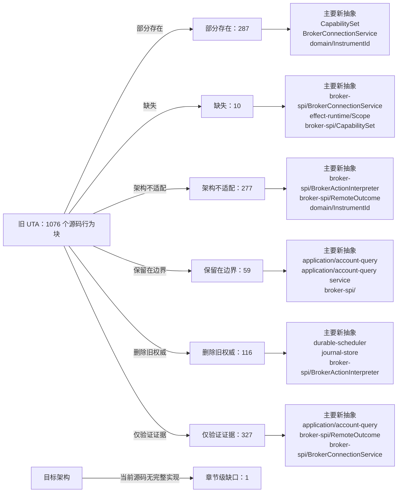

<!-- Auto-generated by scripts/uta-effect-runtime-map.mjs from mapping.json. Do not edit by hand. -->
<!-- Regenerate with `node scripts/uta-effect-runtime-map.mjs`. -->

# UTA 功能替代关系：第 9 章 Broker service-provider interface

目标架构原文：[`docs/uta-effect-runtime-architecture.md:1119-1186`](../uta-effect-runtime-architecture.md#L1119-L1186)。

## 结论

部分存在 287；缺失 10；架构不适配 277；保留在边界 59；删除旧权威 116；仅验证证据 327。状态只描述当前实现相对于目标架构的关系，不表示迁移已经落地。

## 替代关系图

## 章节级目标缺口

| 依据 | 目标义务 | 当前缺口 | 必须补充或调整 |
|---|---|---|---|
| docs/uta-effect-runtime-architecture.md:1119-1185 | Complete broker service-provider interface | Current adapters expose legacy Promise-based IBroker objects, mutable connection state, direct mutations, static capability arrays, and ad hoc observation. No current broker-spi module implements the complete scoped BrokerConnectionService, typed BrokerActionInterpreter dispatch/observe/compensation contract, RemoteOutcome ADT, and context-derived ActionAvailability. | Introduce the complete typed SPI with the first executable broker slice: scoped connection Layer, runtime action schema, contextual availability, durable dispatch identity, separate observe RemoteOutcome, typed failures, and compensation compilation. Migrate each adapter without allowing old and new paths to own the same mutation. |

## 源码映射

| 映射 ID | 当前源码 | 符号或行为块 | 当前功能 | 替代状态 | 新 UTA 抽象与做法 | 不适配位置与原因 | 必须补充或调整 | 重复索引 |
|---|---|---|---|---|---|---|---|---|
| `MAP-9AD9951502` | [`packages/uta-broker-alpaca/src/index.ts:1-1`](../../packages/uta-broker-alpaca/src/index.ts#L1-L1) | AlpacaBroker import | The release wrapper imports the concrete AlpacaBroker from services/uta/src/domain/trading/brokers/alpaca, binding the pack to the legacy domain/trading IBroker implementation rather than to a target brokers/alpaca interpreter. | 删除旧权威 | 3.7 brokers/<broker>/；9.1 Connection Layer；9.2 Typed action interpreter；16 Target source layout；17 Migration sequence / Slice 4: first real broker；19 Architectural prohibitions services/uta/src/brokers/alpaca/；services/uta/src/broker-spi/BrokerConnectionService；services/uta/src/broker-spi/BrokerActionInterpreter；services/uta/src/main.ts Remove the legacy import when the target pack contract becomes authoritative. Import the pack-local Alpaca adapter entrypoint under services/uta/src/brokers/alpaca instead, and expose a typed BrokerConnectionService Layer plus BrokerActionInterpreter descriptor for registration by services/uta/src/main.ts. The wrapper may assemble the adapter but must not own transaction state or kernel decisions. | The current import reaches the old domain/trading broker class, so the release module has no target connection Layer, typed action map, broker-spi failure channel, remote observation contract, or compensation capability to register. | Delete the legacy class dependency and move Alpaca SDK request/response schemas, error mapping, dispatch identity/idempotency, observation, and compensation compilation behind the target broker-spi adapter. Register that adapter only at the composition root; keep transaction-kernel ownership in the kernel. | **DUP-001** |
| `MAP-DA5BBE56B3` | [`packages/uta-broker-alpaca/src/index.ts:3-3`](../../packages/uta-broker-alpaca/src/index.ts#L3-L3) | BROKER_PACK_API_VERSION | Exports pack API version 1, which currently gates the legacy module shape whose createBroker returns an IBroker and whose companion exports are configSchema and BROKER_ENGINE. | 部分存在 | 3 Module graph and allowed dependencies；9 Broker service-provider interface；16 Target source layout；17 Migration sequence services/uta/src/broker-spi/BrokerConnectionService；services/uta/src/broker-spi/BrokerActionInterpreter；services/uta/src/main.ts Retain a versioned release boundary, but advance the pack API version for the target interpreter/connection descriptor contract. The loader and every wrapper must change together so a legacy IBroker pack cannot be accepted as a target adapter pack. | Leaving version 1 while changing the exported broker value would make the loader treat the legacy IBroker contract as compatible with the target broker-spi contract; the current version carries no target interpreter/Layer guarantee. | Define the next versioned pack entry contract around the target BrokerActionInterpreter and BrokerConnectionService Layer, update the pack loader's validation and all five wrappers atomically, and reject old module shapes rather than coercing them into the kernel. | **DUP-002** |
| `MAP-607170E22C` | [`packages/uta-broker-alpaca/src/index.ts:5-5`](../../packages/uta-broker-alpaca/src/index.ts#L5-L5) | configSchema | Re-exports AlpacaBroker.configSchema from the legacy class, so the pack boundary validates the old brokerConfig shape but does not expose a target adapter descriptor or associate configuration with a scoped connection Layer and typed action interpreter. | 部分存在 | 3.7 brokers/<broker>/；9.1 Connection Layer；9.2 Typed action interpreter；9.4 Capability derivation；15 Security and authority；16 Target source layout services/uta/src/brokers/alpaca/；services/uta/src/broker-spi/BrokerConnectionService；services/uta/src/broker-spi/BrokerActionInterpreter Define the Alpaca connection/configuration schema beside the target adapter and export it through the versioned pack descriptor. Keep credential parsing at the trusted UTA boundary and provide separate target action, acknowledgement, observation, error, availability, and redacted-native-payload schemas through the interpreter rather than relying on a legacy class static. | The alias is coupled to the legacy implementation and only validates construction input; it does not prove the target action-type map, capability derivation, native boundary schemas, or credential-bearing scoped Layer required by chapters 3.7 and 9. | Move the Alpaca config schema to the target brokers/alpaca adapter, make its parsed output feed BrokerConnectionService construction, and add the typed BrokerActionInterpreter schemas and capability derivation required by the target pack contract without exposing SDK values to kernel or protocol types. | **DUP-004** |
| `MAP-6496594BF0` | [`packages/uta-broker-alpaca/src/index.ts:7-9`](../../packages/uta-broker-alpaca/src/index.ts#L7-L9) | createBroker | Accepts an id, optional label, and Record<string, unknown> brokerConfig; calls AlpacaBroker.fromConfig and uses Object.assign to add brokerEngine. The result is a legacy IBroker object, not an Effect Layer or typed broker-spi interpreter. | 架构不适配 | 3.7 brokers/<broker>/；4 Effect model；9.1 Connection Layer；9.2 Typed action interpreter；9.3 Remote outcome；9.4 Capability derivation；12.2 Unknown-outcome protocol；16 Target source layout；17 Migration sequence / Slice 4: first real broker；19 Architectural prohibitions services/uta/src/brokers/alpaca/；services/uta/src/broker-spi/BrokerConnectionService；services/uta/src/broker-spi/BrokerActionInterpreter；services/uta/src/broker-spi/RemoteOutcome；services/uta/src/durable-scheduler/；services/uta/src/main.ts Replace this legacy factory export with the target versioned pack entrypoint: validate the typed Alpaca configuration, return the adapter's scoped BrokerConnectionService Layer and action-specific BrokerActionInterpreter, and let main.ts register it for durable-scheduler dispatch. Dispatch must carry a DispatchIdentity, persist outcomes through the scheduler/journal path, and expose compensation compilation; no wrapper-created object may become transaction-kernel state. | The current factory performs immediate legacy object construction, erases configuration as Record<string, unknown>, adds an ad-hoc brokerEngine property, and supplies none of the target availability, dispatch, observation, unknown-outcome, idempotency, or compensation contracts. It therefore cannot satisfy the Alpaca typed-interpreter migration or crash-recovery protocol. | Implement and export the Alpaca target interpreter/connection descriptor, including native request compilation, typed broker failures, paper/live capability derivation, remote order observation, idempotency proof or reconcile-before-retry, and compensation programs. Register it through the composition root and durable scheduler; delete the old Alpaca dispatcher path once this adapter owns the account mutation. | **DUP-005** |
| `MAP-B40F4C1C42` | [`packages/uta-broker-ccxt/src/index.ts:1-1`](../../packages/uta-broker-ccxt/src/index.ts#L1-L1) | CcxtBroker import | The release wrapper imports the concrete CcxtBroker from services/uta/src/domain/trading/brokers/ccxt, binding the pack to the legacy domain/trading IBroker implementation rather than to a target brokers/ccxt interpreter. | 删除旧权威 | 3.7 brokers/<broker>/；9.1 Connection Layer；9.2 Typed action interpreter；16 Target source layout；17 Migration sequence / Slice 5: heterogeneous brokers；19 Architectural prohibitions services/uta/src/brokers/ccxt/；services/uta/src/broker-spi/BrokerConnectionService；services/uta/src/broker-spi/BrokerActionInterpreter；services/uta/src/main.ts Remove the legacy import when the target pack contract becomes authoritative. Import the pack-local CCXT adapter entrypoint under services/uta/src/brokers/ccxt instead, and expose a typed BrokerConnectionService Layer plus BrokerActionInterpreter descriptor for registration by services/uta/src/main.ts. The wrapper may assemble the adapter but must not own transaction state or kernel decisions. | The current import reaches the old domain/trading broker class, so the release module has no target connection Layer, typed action map, broker-spi failure channel, remote observation contract, or compensation capability to register. | Delete the legacy class dependency and move CCXT SDK request/response schemas, exchange error mapping, dispatch identity/idempotency, observation, and compensation compilation behind the target broker-spi adapter. Register that adapter only at the composition root; keep transaction-kernel ownership in the kernel. | **DUP-006** |
| `MAP-ACA4BDF989` | [`packages/uta-broker-ccxt/src/index.ts:3-3`](../../packages/uta-broker-ccxt/src/index.ts#L3-L3) | BROKER_PACK_API_VERSION | Exports pack API version 1, which currently gates the legacy module shape whose createBroker returns an IBroker and whose companion exports are configSchema and BROKER_ENGINE. | 部分存在 | 3 Module graph and allowed dependencies；9 Broker service-provider interface；16 Target source layout；17 Migration sequence services/uta/src/broker-spi/BrokerConnectionService；services/uta/src/broker-spi/BrokerActionInterpreter；services/uta/src/main.ts Retain a versioned release boundary, but advance the pack API version for the target interpreter/connection descriptor contract. The loader and every wrapper must change together so a legacy IBroker pack cannot be accepted as a target adapter pack. | Leaving version 1 while changing the exported broker value would make the loader treat the legacy IBroker contract as compatible with the target broker-spi contract; the current version carries no target interpreter/Layer guarantee. | Define the next versioned pack entry contract around the target BrokerActionInterpreter and BrokerConnectionService Layer, update the pack loader's validation and all five wrappers atomically, and reject old module shapes rather than coercing them into the kernel. | **DUP-007** |
| `MAP-F3151B31E7` | [`packages/uta-broker-ccxt/src/index.ts:5-5`](../../packages/uta-broker-ccxt/src/index.ts#L5-L5) | configSchema | Re-exports CcxtBroker.configSchema from the legacy class, so the pack boundary validates the old exchange/account configuration but does not expose a target adapter descriptor or associate configuration with a scoped connection Layer and typed action interpreter. | 部分存在 | 3.7 brokers/<broker>/；9.1 Connection Layer；9.2 Typed action interpreter；9.4 Capability derivation；15 Security and authority；16 Target source layout services/uta/src/brokers/ccxt/；services/uta/src/broker-spi/BrokerConnectionService；services/uta/src/broker-spi/BrokerActionInterpreter Define the CCXT connection/configuration schema beside the target adapter and export it through the versioned pack descriptor. Keep exchange credentials and keyless/public-data mode at the trusted UTA boundary, and provide separate target action, acknowledgement, observation, error, availability, and redacted-native-payload schemas through the interpreter rather than relying on a legacy class static. | The alias is coupled to the legacy implementation and only validates construction input; it does not prove the target action-type map, exchange/sub-account capability derivation, native boundary schemas, or credential-bearing scoped Layer required by chapters 3.7 and 9. | Move the CCXT config schema to the target brokers/ccxt adapter, make its parsed output feed BrokerConnectionService construction, and add capability derivation over exchange, sub-account or wallet, venue, instrument, and session context plus the typed BrokerActionInterpreter schemas. | **DUP-009** |
| `MAP-9D3DC42AC9` | [`packages/uta-broker-ccxt/src/index.ts:7-9`](../../packages/uta-broker-ccxt/src/index.ts#L7-L9) | createBroker | Accepts an id, optional label, and Record<string, unknown> brokerConfig; calls CcxtBroker.fromConfig and uses Object.assign to add brokerEngine. The result is a legacy IBroker object, not an Effect Layer or typed broker-spi interpreter. | 架构不适配 | 3.7 brokers/<broker>/；4 Effect model；9.1 Connection Layer；9.2 Typed action interpreter；9.3 Remote outcome；9.4 Capability derivation；12.2 Unknown-outcome protocol；16 Target source layout；17 Migration sequence / Slice 5: heterogeneous brokers；19 Architectural prohibitions services/uta/src/brokers/ccxt/；services/uta/src/broker-spi/BrokerConnectionService；services/uta/src/broker-spi/BrokerActionInterpreter；services/uta/src/broker-spi/RemoteOutcome；services/uta/src/durable-scheduler/；services/uta/src/main.ts Replace this legacy factory export with the target versioned pack entrypoint: validate typed CCXT configuration, return the adapter's scoped BrokerConnectionService Layer and action-specific BrokerActionInterpreter, and let main.ts register it for durable-scheduler dispatch. Dispatch must carry a DispatchIdentity, persist outcomes through the scheduler/journal path, and expose compensation compilation; no wrapper-created object may become transaction-kernel state. | The current factory performs immediate legacy object construction, erases configuration as Record<string, unknown>, adds an ad-hoc brokerEngine property, and supplies none of the target availability, dispatch, observation, unknown-outcome, idempotency, or compensation contracts. It cannot prove CCXT sub-account or venue-specific capability derivation. | Implement and export the CCXT target interpreter/connection descriptor, including exchange-native request compilation, typed broker failures, sub-account or wallet capability derivation, remote order/position observation, idempotency proof or reconcile-before-retry, and compensation programs. Register it through the composition root and durable scheduler; delete the old CCXT dispatcher path once this adapter owns account mutations. | **DUP-010** |
| `MAP-1E5FD0A690` | [`packages/uta-broker-ibkr/src/index.ts:1-1`](../../packages/uta-broker-ibkr/src/index.ts#L1-L1) | IbkrBroker import | The release wrapper imports the concrete IbkrBroker from services/uta/src/domain/trading/brokers/ibkr, binding the pack to the legacy domain/trading IBroker implementation rather than to a target brokers/ibkr interpreter. | 删除旧权威 | 3.7 brokers/<broker>/；9.1 Connection Layer；9.2 Typed action interpreter；16 Target source layout；17 Migration sequence / Slice 5: heterogeneous brokers；19 Architectural prohibitions services/uta/src/brokers/ibkr/；services/uta/src/broker-spi/BrokerConnectionService；services/uta/src/broker-spi/BrokerActionInterpreter；services/uta/src/main.ts Remove the legacy import when the target pack contract becomes authoritative. Import the pack-local IBKR adapter entrypoint under services/uta/src/brokers/ibkr instead, and expose a typed BrokerConnectionService Layer plus BrokerActionInterpreter descriptor for registration by services/uta/src/main.ts. The wrapper may assemble the adapter but must not own transaction state or kernel decisions. | The current import reaches the old domain/trading broker class, so the release module has no target connection Layer, typed action map, broker-spi failure channel, remote observation contract, or compensation capability to register. | Delete the legacy class dependency and move IBKR SDK request/response schemas, callback/connection error mapping, dispatch identity/idempotency, observation, and compensation compilation behind the target broker-spi adapter. Register that adapter only at the composition root; keep transaction-kernel ownership in the kernel. | **DUP-011** |
| `MAP-AB521AFE64` | [`packages/uta-broker-ibkr/src/index.ts:3-3`](../../packages/uta-broker-ibkr/src/index.ts#L3-L3) | BROKER_PACK_API_VERSION | Exports pack API version 1, which currently gates the legacy module shape whose createBroker returns an IBroker and whose companion exports are configSchema and BROKER_ENGINE. | 部分存在 | 3 Module graph and allowed dependencies；9 Broker service-provider interface；16 Target source layout；17 Migration sequence services/uta/src/broker-spi/BrokerConnectionService；services/uta/src/broker-spi/BrokerActionInterpreter；services/uta/src/main.ts Retain a versioned release boundary, but advance the pack API version for the target interpreter/connection descriptor contract. The loader and every wrapper must change together so a legacy IBroker pack cannot be accepted as a target adapter pack. | Leaving version 1 while changing the exported broker value would make the loader treat the legacy IBroker contract as compatible with the target broker-spi contract; the current version carries no target interpreter/Layer guarantee. | Define the next versioned pack entry contract around the target BrokerActionInterpreter and BrokerConnectionService Layer, update the pack loader's validation and all five wrappers atomically, and reject old module shapes rather than coercing them into the kernel. | **DUP-012** |
| `MAP-C4C40BAECB` | [`packages/uta-broker-ibkr/src/index.ts:5-5`](../../packages/uta-broker-ibkr/src/index.ts#L5-L5) | configSchema | Re-exports IbkrBroker.configSchema from the legacy class, so the pack boundary validates the old host/port/client configuration but does not expose a target adapter descriptor or associate configuration with a scoped connection Layer and typed action interpreter. | 部分存在 | 3.7 brokers/<broker>/；9.1 Connection Layer；9.2 Typed action interpreter；9.4 Capability derivation；15 Security and authority；16 Target source layout services/uta/src/brokers/ibkr/；services/uta/src/broker-spi/BrokerConnectionService；services/uta/src/broker-spi/BrokerActionInterpreter Define the IBKR connection/configuration schema beside the target adapter and export it through the versioned pack descriptor. Keep endpoint credentials and account identity at the trusted UTA boundary, and provide separate target action, acknowledgement, observation, error, availability, and redacted-native-payload schemas through the interpreter rather than relying on a legacy class static. | The alias is coupled to the legacy implementation and only validates construction input; it does not prove the target action-type map, callback stream/linked-account identity, native boundary schemas, or credential-bearing scoped Layer required by chapters 3.7 and 9. | Move the IBKR config schema to the target brokers/ibkr adapter, make its parsed output feed BrokerConnectionService construction, and add capability derivation plus callback/observation schemas for linked accounts and native order identities through BrokerActionInterpreter. | **DUP-014** |
| `MAP-3392948A39` | [`packages/uta-broker-ibkr/src/index.ts:7-9`](../../packages/uta-broker-ibkr/src/index.ts#L7-L9) | createBroker | Accepts an id, optional label, and Record<string, unknown> brokerConfig; calls IbkrBroker.fromConfig and uses Object.assign to add brokerEngine. The result is a legacy IBroker object, not an Effect Layer or typed broker-spi interpreter. | 架构不适配 | 3.7 brokers/<broker>/；4 Effect model；9.1 Connection Layer；9.2 Typed action interpreter；9.3 Remote outcome；9.4 Capability derivation；12.2 Unknown-outcome protocol；16 Target source layout；17 Migration sequence / Slice 5: heterogeneous brokers；19 Architectural prohibitions services/uta/src/brokers/ibkr/；services/uta/src/broker-spi/BrokerConnectionService；services/uta/src/broker-spi/BrokerActionInterpreter；services/uta/src/broker-spi/RemoteOutcome；services/uta/src/durable-scheduler/；services/uta/src/main.ts Replace this legacy factory export with the target versioned pack entrypoint: validate typed IBKR configuration, return the adapter's scoped BrokerConnectionService Layer and action-specific BrokerActionInterpreter, and let main.ts register it for durable-scheduler dispatch. Dispatch must carry a DispatchIdentity, persist outcomes through the scheduler/journal path, and expose compensation compilation; no wrapper-created object may become transaction-kernel state. | The current factory performs immediate legacy object construction, erases configuration as Record<string, unknown>, adds an ad-hoc brokerEngine property, and supplies none of the target availability, dispatch, observation, unknown-outcome, idempotency, or compensation contracts. It cannot represent IBKR callback-stream health or linked-account identity in the target SPI. | Implement and export the IBKR target interpreter/connection descriptor, including scoped callback streams, linked-account and native-order identity, typed broker failures, remote observation, idempotency proof or reconcile-before-retry, and compensation programs. Register it through the composition root and durable scheduler; delete the old IBKR dispatcher path once this adapter owns account mutations. | **DUP-015** |
| `MAP-AE59785B88` | [`packages/uta-broker-leverup/src/index.ts:1-1`](../../packages/uta-broker-leverup/src/index.ts#L1-L1) | LeverupBroker import | The release wrapper imports the concrete LeverupBroker from services/uta/src/domain/trading/brokers/others/leverup, binding the pack to the legacy domain/trading IBroker implementation rather than to a target brokers/leverup interpreter. | 删除旧权威 | 3.7 brokers/<broker>/；9.1 Connection Layer；9.2 Typed action interpreter；16 Target source layout；17 Migration sequence / Slice 5: heterogeneous brokers；19 Architectural prohibitions services/uta/src/brokers/leverup/；services/uta/src/broker-spi/BrokerConnectionService；services/uta/src/broker-spi/BrokerActionInterpreter；services/uta/src/main.ts Remove the legacy import when the target pack contract becomes authoritative. Import the pack-local LeverUp adapter entrypoint under services/uta/src/brokers/leverup instead, and expose a typed BrokerConnectionService Layer plus BrokerActionInterpreter descriptor for registration by services/uta/src/main.ts. The wrapper may assemble the adapter but must not own transaction state or kernel decisions. | The current import reaches the old domain/trading broker class, so the release module has no target connection Layer, typed action map, broker-spi failure channel, remote observation contract, or compensation capability to register. | Delete the legacy class dependency and move LeverUp SDK/relayer request and response schemas, relayer error mapping, dispatch identity/idempotency, observation, and compensation compilation behind the target broker-spi adapter. Register that adapter only at the composition root; keep transaction-kernel ownership in the kernel. | **DUP-016** |
| `MAP-1B0FB784F5` | [`packages/uta-broker-leverup/src/index.ts:3-3`](../../packages/uta-broker-leverup/src/index.ts#L3-L3) | BROKER_PACK_API_VERSION | Exports pack API version 1, which currently gates the legacy module shape whose createBroker returns an IBroker and whose companion exports are configSchema and BROKER_ENGINE. | 部分存在 | 3 Module graph and allowed dependencies；9 Broker service-provider interface；16 Target source layout；17 Migration sequence services/uta/src/broker-spi/BrokerConnectionService；services/uta/src/broker-spi/BrokerActionInterpreter；services/uta/src/main.ts Retain a versioned release boundary, but advance the pack API version for the target interpreter/connection descriptor contract. The loader and every wrapper must change together so a legacy IBroker pack cannot be accepted as a target adapter pack. | Leaving version 1 while changing the exported broker value would make the loader treat the legacy IBroker contract as compatible with the target broker-spi contract; the current version carries no target interpreter/Layer guarantee. | Define the next versioned pack entry contract around the target BrokerActionInterpreter and BrokerConnectionService Layer, update the pack loader's validation and all five wrappers atomically, and reject old module shapes rather than coercing them into the kernel. | **DUP-017** |
| `MAP-2564A889E7` | [`packages/uta-broker-leverup/src/index.ts:5-5`](../../packages/uta-broker-leverup/src/index.ts#L5-L5) | configSchema | Re-exports LeverupBroker.configSchema from the legacy class, so the pack boundary validates the old network/private-key configuration but does not expose a target adapter descriptor or associate configuration with a scoped connection Layer and typed action interpreter. | 部分存在 | 3.7 brokers/<broker>/；9.1 Connection Layer；9.2 Typed action interpreter；9.4 Capability derivation；15 Security and authority；16 Target source layout services/uta/src/brokers/leverup/；services/uta/src/broker-spi/BrokerConnectionService；services/uta/src/broker-spi/BrokerActionInterpreter Define the LeverUp connection/configuration schema beside the target adapter and export it through the versioned pack descriptor. Keep private-key handling inside the UTA credential boundary and scoped connection/relayer Layer, and provide separate target action, acknowledgement, observation, error, availability, and redacted-native-payload schemas through the interpreter rather than relying on a legacy class static. | The alias is coupled to the legacy implementation and only validates construction input; it does not prove the target action-type map, relayer capability derivation, native boundary schemas, or credential-bearing scoped Layer required by chapters 3.7 and 9. | Move the LeverUp config schema to the target brokers/leverup adapter, make its parsed output feed BrokerConnectionService and relayer construction, and add capability derivation plus typed BrokerActionInterpreter schemas for network, instrument, relayer, and market-session availability. | **DUP-019** |
| `MAP-50C8158380` | [`packages/uta-broker-leverup/src/index.ts:7-9`](../../packages/uta-broker-leverup/src/index.ts#L7-L9) | createBroker | Accepts an id, optional label, and Record<string, unknown> brokerConfig; calls LeverupBroker.fromConfig and uses Object.assign to add brokerEngine. The result is a legacy IBroker object, not an Effect Layer or typed broker-spi interpreter. | 架构不适配 | 3.7 brokers/<broker>/；4 Effect model；9.1 Connection Layer；9.2 Typed action interpreter；9.3 Remote outcome；9.4 Capability derivation；12.2 Unknown-outcome protocol；16 Target source layout；17 Migration sequence / Slice 5: heterogeneous brokers；19 Architectural prohibitions services/uta/src/brokers/leverup/；services/uta/src/broker-spi/BrokerConnectionService；services/uta/src/broker-spi/BrokerActionInterpreter；services/uta/src/broker-spi/RemoteOutcome；services/uta/src/durable-scheduler/；services/uta/src/main.ts Replace this legacy factory export with the target versioned pack entrypoint: validate typed LeverUp configuration, return the adapter's scoped BrokerConnectionService/relayer Layer and action-specific BrokerActionInterpreter, and let main.ts register it for durable-scheduler dispatch. Dispatch must carry a DispatchIdentity, persist outcomes through the scheduler/journal path, and expose compensation compilation; no wrapper-created object may become transaction-kernel state. | The current factory performs immediate legacy object construction, erases configuration as Record<string, unknown>, adds an ad-hoc brokerEngine property, and supplies none of the target availability, dispatch, observation, unknown-outcome, idempotency, or compensation contracts. It cannot reconcile a relayer-accepted mutation after a lost process or network boundary. | Implement and export the LeverUp target interpreter/connection descriptor, including relayer-native request compilation, typed relayer failures, dispatch identity, explicit observation/reconciliation after timeout, capability derivation, idempotency proof or reconcile-before-retry, and compensation programs. Register it through the composition root and durable scheduler; delete the old LeverUp dispatcher path once this adapter owns account mutations. | **DUP-020** |
| `MAP-75B61EBF36` | [`packages/uta-broker-longbridge/src/index.ts:1-1`](../../packages/uta-broker-longbridge/src/index.ts#L1-L1) | LongbridgeBroker import | The release wrapper imports the concrete LongbridgeBroker from services/uta/src/domain/trading/brokers/longbridge, binding the pack to the legacy domain/trading IBroker implementation rather than to a target brokers/longbridge interpreter. | 删除旧权威 | 3.7 brokers/<broker>/；9.1 Connection Layer；9.2 Typed action interpreter；16 Target source layout；17 Migration sequence / Slice 5: heterogeneous brokers；19 Architectural prohibitions services/uta/src/brokers/longbridge/；services/uta/src/broker-spi/BrokerConnectionService；services/uta/src/broker-spi/BrokerActionInterpreter；services/uta/src/main.ts Remove the legacy import when the target pack contract becomes authoritative. Import the pack-local Longbridge adapter entrypoint under services/uta/src/brokers/longbridge instead, and expose a typed BrokerConnectionService Layer plus BrokerActionInterpreter descriptor for registration by services/uta/src/main.ts. The wrapper may assemble the adapter but must not own transaction state or kernel decisions. | The current import reaches the old domain/trading broker class, so the release module has no target connection Layer, typed action map, broker-spi failure channel, remote observation contract, or compensation capability to register. | Delete the legacy class dependency and move Longbridge SDK request/response schemas, jurisdiction/currency-aware error mapping, dispatch identity/idempotency, observation, and compensation compilation behind the target broker-spi adapter. Register that adapter only at the composition root; keep transaction-kernel ownership in the kernel. | **DUP-021** |
| `MAP-F093E8F942` | [`packages/uta-broker-longbridge/src/index.ts:3-3`](../../packages/uta-broker-longbridge/src/index.ts#L3-L3) | BROKER_PACK_API_VERSION | Exports pack API version 1, which currently gates the legacy module shape whose createBroker returns an IBroker and whose companion exports are configSchema and BROKER_ENGINE. | 部分存在 | 3 Module graph and allowed dependencies；9 Broker service-provider interface；16 Target source layout；17 Migration sequence services/uta/src/broker-spi/BrokerConnectionService；services/uta/src/broker-spi/BrokerActionInterpreter；services/uta/src/main.ts Retain a versioned release boundary, but advance the pack API version for the target interpreter/connection descriptor contract. The loader and every wrapper must change together so a legacy IBroker pack cannot be accepted as a target adapter pack. | Leaving version 1 while changing the exported broker value would make the loader treat the legacy IBroker contract as compatible with the target broker-spi contract; the current version carries no target interpreter/Layer guarantee. | Define the next versioned pack entry contract around the target BrokerActionInterpreter and BrokerConnectionService Layer, update the pack loader's validation and all five wrappers atomically, and reject old module shapes rather than coercing them into the kernel. | **DUP-022** |
| `MAP-1986FE3044` | [`packages/uta-broker-longbridge/src/index.ts:5-5`](../../packages/uta-broker-longbridge/src/index.ts#L5-L5) | configSchema | Re-exports LongbridgeBroker.configSchema from the legacy class, so the pack boundary validates the old app-key/app-secret/access-token configuration but does not expose a target adapter descriptor or associate configuration with a scoped connection Layer and typed action interpreter. | 部分存在 | 3.7 brokers/<broker>/；9.1 Connection Layer；9.2 Typed action interpreter；9.4 Capability derivation；15 Security and authority；16 Target source layout services/uta/src/brokers/longbridge/；services/uta/src/broker-spi/BrokerConnectionService；services/uta/src/broker-spi/BrokerActionInterpreter；services/uta/src/market-and-accounting/ Define the Longbridge connection/configuration schema beside the target adapter and export it through the versioned pack descriptor. Keep credentials inside the UTA-owned scoped Layer, and provide separate target action, acknowledgement, observation, error, availability, jurisdiction, currency, and redacted-native-payload schemas through the interpreter rather than relying on a legacy class static. | The alias is coupled to the legacy implementation and only validates construction input; it does not prove the target action-type map, jurisdiction/currency capability derivation, native boundary schemas, or credential-bearing scoped Layer required by chapters 3.7 and 9. | Move the Longbridge config schema to the target brokers/longbridge adapter, make its parsed output feed BrokerConnectionService construction, and connect the adapter's account/market/jurisdiction metadata to market-and-accounting while keeping typed BrokerActionInterpreter schemas at the broker boundary. | **DUP-024** |
| `MAP-E52D407CDC` | [`packages/uta-broker-longbridge/src/index.ts:7-9`](../../packages/uta-broker-longbridge/src/index.ts#L7-L9) | createBroker | Accepts an id, optional label, and Record<string, unknown> brokerConfig; calls LongbridgeBroker.fromConfig and uses Object.assign to add brokerEngine. The result is a legacy IBroker object, not an Effect Layer or typed broker-spi interpreter. | 架构不适配 | 3.7 brokers/<broker>/；4 Effect model；9.1 Connection Layer；9.2 Typed action interpreter；9.3 Remote outcome；9.4 Capability derivation；12.2 Unknown-outcome protocol；16 Target source layout；17 Migration sequence / Slice 5: heterogeneous brokers；19 Architectural prohibitions services/uta/src/brokers/longbridge/；services/uta/src/broker-spi/BrokerConnectionService；services/uta/src/broker-spi/BrokerActionInterpreter；services/uta/src/broker-spi/RemoteOutcome；services/uta/src/durable-scheduler/；services/uta/src/market-and-accounting/；services/uta/src/main.ts Replace this legacy factory export with the target versioned pack entrypoint: validate typed Longbridge configuration, return the adapter's scoped BrokerConnectionService Layer and action-specific BrokerActionInterpreter, and let main.ts register it for durable-scheduler dispatch. Dispatch must carry a DispatchIdentity, persist outcomes through the scheduler/journal path, and expose compensation compilation; no wrapper-created object may become transaction-kernel state. | The current factory performs immediate legacy object construction, erases configuration as Record<string, unknown>, adds an ad-hoc brokerEngine property, and supplies none of the target availability, dispatch, observation, unknown-outcome, idempotency, or compensation contracts. It cannot express Longbridge's jurisdiction and currency boundaries as typed broker/market observations. | Implement and export the Longbridge target interpreter/connection descriptor, including native request compilation, typed broker failures, account and jurisdiction metadata, currency-qualified observations, remote order/exposure reconciliation, idempotency proof or reconcile-before-retry, and compensation programs. Register it through the composition root and durable scheduler; delete the old Longbridge dispatcher path once this adapter owns account mutations. | **DUP-025** |
| `MAP-CC2177368A` | [`packages/uta-protocol/src/brokers/preset-catalog.ts:1-14`](../../packages/uta-protocol/src/brokers/preset-catalog.ts#L1-L14) | broker preset catalog setup | Declares the catalog as the single source for wizard account types, imports Zod for per-preset validation, and imports node crypto for deterministic/random UTA id helpers. | 部分存在 | 2. System boundary；3.7 brokers/<broker>/；3.9 transport/ and protocol/；7.1 Embedded database；9.1 Connection Layer；14. Public protocol；15. Security and authority；19. Architectural prohibitions protocol/config schemas；application/；broker-spi/；brokers/<broker>/；BrokerConnectionService Treat the catalog as configuration/presentation input only; validate each broker connection with named schemas and let UTA-owned adapter Layers consume sealed configuration. | A shared package owns wizard configuration and identity minting, but this setup does not separate Alice presentation from UTA credential authority or broker-spi capability/connection ownership. | Split config/presentation declarations from runtime broker adapters, define explicit config codecs and secret references, and ensure catalog identity helpers cannot become execution or persistence authority. | **DUP-026** |
| `MAP-00030A134A` | [`packages/uta-protocol/src/brokers/preset-catalog.ts:16-18`](../../packages/uta-protocol/src/brokers/preset-catalog.ts#L16-L18) | BrokerEngine | Defines a six-member string union for ccxt, alpaca, ibkr, leverup, longbridge, and mock engine names. | 部分存在 | 3.6 broker-spi/；3.7 brokers/<broker>/；9.1 Connection Layer；9.2 Typed action interpreter；14. Public protocol；17.4 Slice 4: first real broker；19. Architectural prohibitions；17.1 Slice 1: durable kernel with MockBroker；17.5 Slice 5: heterogeneous brokers BrokerActionTypeMap；BrokerConnectionService；brokers/<broker>/；CapabilitySet Keep adapter selection in composition/application configuration, but associate each engine with a typed BrokerConnectionService and action-interpreter set rather than using a bare engine string. | The union identifies implementation labels only; it does not close the action/result/error/observation/compensation contract or broker connection requirements. | Replace runtime reliance on BrokerEngine strings with typed adapter registration/composition and compile-time BrokerActionTypeMap coverage. | **DUP-027** |
| `MAP-601F6E2834` | [`packages/uta-protocol/src/brokers/preset-catalog.ts:37-98`](../../packages/uta-protocol/src/brokers/preset-catalog.ts#L37-L98) | BrokerPresetDef | Defines preset metadata, Zod config schema, optional modes/subtitle/write-only fields, string fingerprint fields, a `toEngineConfig` function returning Record<string, unknown>, and optional isPaper callback accepting Record<string, unknown>. | 部分存在 | 2.1 Alice owns；2.2 UTA owns；3.7 brokers/<broker>/；3.9 transport/ and protocol/；7.1 Embedded database；9.1 Connection Layer；9.4 Capability derivation；14. Public protocol；15. Security and authority；17. Migration sequence；19. Architectural prohibitions protocol/config schemas；BrokerConnectionService；BrokerActionTypeMap；CapabilitySet；brokers/<broker>/；application/ Use BrokerPresetDef only to describe presentation/config entry points, then parse into broker-specific typed connection config and secret references before constructing scoped adapter Layers. | The schema itself is generic ZodType, engine translation and paper detection use raw Record<string, unknown>, fingerprints are string field names, and no action capability/connection/jurisdiction contract is attached. | Introduce broker-specific config ADTs/codecs, remove raw Record-based runtime handoff, separate secret storage from public metadata, and derive capabilities through broker-spi ActionContext rather than preset metadata. | **DUP-030** |
| `MAP-E745F1370E` | [`packages/uta-protocol/src/brokers/preset-catalog.ts:100-106`](../../packages/uta-protocol/src/brokers/preset-catalog.ts#L100-L106) | defaultIsPaper | Converts an arbitrary config record's mode to a lowercase string and returns true for demo/testnet/paper, treating all other values as non-paper. | 部分存在 | 3.7 brokers/<broker>/；3.9 transport/ and protocol/；9.4 Capability derivation；14. Public protocol；15. Security and authority；19. Architectural prohibitions broker-specific connection config；ActionContext；CapabilitySet；protocol/config schemas Derive account environment from a validated broker-specific config variant and expose it as typed context/capability metadata. | A generic mode string and boolean conflates venue-specific demo/testnet/paper semantics and can classify unknown values silently. | Replace with exhaustive per-preset config parsing and an explicit environment variant; reject unknown mode values at the boundary. | **DUP-031** |
| `MAP-EBB7846E5F` | [`packages/uta-protocol/src/brokers/preset-catalog.ts:108-154`](../../packages/uta-protocol/src/brokers/preset-catalog.ts#L108-L154) | BINANCE_PRESET | Declares Binance live/demo modes, API key/secret Zod fields, write-only metadata, mode/API-key fingerprinting, and a raw engine config with demoTrading semantics. | 部分存在 | 3.7 brokers/<broker>/；3.9 transport/ and protocol/；7.1 Embedded database；9.1 Connection Layer；9.4 Capability derivation；14. Public protocol；15. Security and authority；17.5 Slice 5: heterogeneous brokers；19. Architectural prohibitions brokers/Alpaca-style adapter config；BrokerConnectionService；CapabilitySet；protocol/config schemas Parse Binance connection config into a UTA-owned secret/config value, construct a scoped adapter Layer, and derive per-wallet/action capabilities from account, venue, instrument, and mode context. | The UI schema and toEngineConfig expose a generic record carrying credentials and a boolean-like demo mode; no typed connection identity, sub-account context, action availability, idempotency, or compensation contract is present. | Replace raw engine handoff with a broker-specific config codec/secret reference and broker-spi capability derivation; keep preset data presentation-only. | **DUP-032** |
| `MAP-BB8EAF65B0` | [`packages/uta-protocol/src/brokers/preset-catalog.ts:156-189`](../../packages/uta-protocol/src/brokers/preset-catalog.ts#L156-L189) | OKX_PRESET | Declares OKX live/demo modes, API key/secret/passphrase fields, write-only metadata, mode/API-key fingerprinting, and raw sandbox engine config. | 部分存在 | 3.7 brokers/<broker>/；3.9 transport/ and protocol/；7.1 Embedded database；9.1 Connection Layer；9.4 Capability derivation；14. Public protocol；15. Security and authority；17.5 Slice 5: heterogeneous brokers；19. Architectural prohibitions brokers/<broker>/；BrokerConnectionService；CapabilitySet；protocol/config schemas Validate OKX connection credentials/config in UTA, construct its scoped adapter, and derive action/sub-account capabilities rather than treating demo as a generic sandbox boolean. | Credentials and venue mode are passed through generic preset data, while no typed connection/capability/interpreter association or jurisdiction/sub-account contract is represented. | Introduce an OKX-specific config ADT and secret boundary, then register typed BrokerActionInterpreter availability/dispatch/observe/compensation implementations. | **DUP-033** |
| `MAP-6E3C5642E6` | [`packages/uta-protocol/src/brokers/preset-catalog.ts:191-224`](../../packages/uta-protocol/src/brokers/preset-catalog.ts#L191-L224) | BYBIT_PRESET | Declares live/testnet/demo modes, API credentials, write-only fields, fingerprints, and raw engine config with separate sandbox/demoTrading booleans. | 部分存在 | 3.7 brokers/<broker>/；3.9 transport/ and protocol/；7.1 Embedded database；9.1 Connection Layer；9.4 Capability derivation；14. Public protocol；15. Security and authority；17.5 Slice 5: heterogeneous brokers；19. Architectural prohibitions brokers/<broker>/；BrokerConnectionService；CapabilitySet；ActionAvailability；protocol/config schemas Represent Bybit environment as a validated config variant and derive capabilities/idempotency/compensation for each account and venue mode through broker-spi. | Separate booleans can express invalid mode combinations and raw engine config is untyped; no target action contract or typed unavailable reason is attached. | Replace booleans/Record handoff with an exhaustive Bybit config ADT, adapter Layer, and CapabilitySet registration. | **DUP-034** |
| `MAP-2F4E92A2AE` | [`packages/uta-protocol/src/brokers/preset-catalog.ts:226-257`](../../packages/uta-protocol/src/brokers/preset-catalog.ts#L226-L257) | HYPERLIQUID_PRESET | Declares live/testnet mode, walletAddress/privateKey fields, write-only private key, wallet/mode fingerprinting, and raw sandbox engine config. | 部分存在 | 3.7 brokers/<broker>/；3.9 transport/ and protocol/；7.1 Embedded database；9.1 Connection Layer；9.4 Capability derivation；14. Public protocol；15. Security and authority；17.5 Slice 5: heterogeneous brokers；19. Architectural prohibitions brokers/<broker>/；BrokerConnectionService；CapabilitySet；protocol/config schemas；domain/AccountId Keep wallet credentials in UTA-owned sealed config, construct a scoped Hyperliquid adapter, and derive wallet/venue/instrument action capabilities via broker-spi. | A raw record carries a private key and mode with no typed secret reference, account/connection identity, jurisdiction, availability, idempotency, or compensation contract. | Add a Hyperliquid-specific config/secret codec and typed adapter registration; never expose private-key fields through generic protocol/catalog payloads. | **DUP-035** |
| `MAP-B9545FA731` | [`packages/uta-protocol/src/brokers/preset-catalog.ts:259-292`](../../packages/uta-protocol/src/brokers/preset-catalog.ts#L259-L292) | BITGET_PRESET | Declares live/demo mode, API key/secret/passphrase fields, write-only metadata, mode/API-key fingerprints, and raw engine config with demoTrading. | 部分存在 | 3.7 brokers/<broker>/；3.9 transport/ and protocol/；7.1 Embedded database；9.1 Connection Layer；9.4 Capability derivation；14. Public protocol；15. Security and authority；17.5 Slice 5: heterogeneous brokers；19. Architectural prohibitions brokers/<broker>/；BrokerConnectionService；CapabilitySet；protocol/config schemas Parse Bitget credentials/environment into a typed UTA-owned connection config, then derive separate-wallet/action capability and typed unavailable results in the adapter. | The preset does not express Bitget wallet/account scope or action contracts and passes secrets/mode through a generic engine record. | Introduce typed Bitget configuration and broker-spi registration, with secret isolation and capability derivation from account/sub-account/venue context. | **DUP-036** |
| `MAP-F62E863C78` | [`packages/uta-protocol/src/brokers/preset-catalog.ts:294-333`](../../packages/uta-protocol/src/brokers/preset-catalog.ts#L294-L333) | CCXT_CUSTOM_PRESET | Provides an escape-hatch Zod object with optional exchange/sandbox/demo/credential/wallet fields and loops over defined fields to pass them through a Record<string, unknown>. | 架构不适配 | 3.7 brokers/<broker>/；3.9 transport/ and protocol/；7.1 Embedded database；9.4 Capability derivation；14. Public protocol；15. Security and authority；17.5 Slice 5: heterogeneous brokers；19. Architectural prohibitions broker-spi/；BrokerActionTypeMap；CapabilitySet；protocol/config schemas；brokers/<broker>/ Replace the open-ended custom config with an explicitly parsed exchange-specific config/plugin boundary; no generic route or kernel may accept pass-through credential/action bags. | Nearly every field is optional, exchange semantics are delegated to an untyped Record, and the preset is an untyped registry escape hatch; this violates the prohibition on permissive fallback states and untyped registries. | Remove CCXT_CUSTOM as a kernel/runtime contract, require a concrete adapter/config schema per supported exchange, and return typed CapabilityUnavailable for unsupported actions instead of silently passing fields through. | **DUP-037** |
| `MAP-2862195456` | [`packages/uta-protocol/src/brokers/preset-catalog.ts:337-367`](../../packages/uta-protocol/src/brokers/preset-catalog.ts#L337-L367) | ALPACA_PRESET | Declares paper/live mode, API key/secret fields, write-only metadata, mode/API-key fingerprints, and raw engine config with paper boolean. | 部分存在 | 3.7 brokers/<broker>/；3.9 transport/ and protocol/；7.1 Embedded database；9.1 Connection Layer；9.4 Capability derivation；14. Public protocol；15. Security and authority；17.4 Slice 4: first real broker；19. Architectural prohibitions brokers/Alpaca；BrokerConnectionService；BrokerActionTypeMap；CapabilitySet；protocol/config schemas Use an Alpaca-specific validated config/secret boundary and typed action interpreter, then make the new path authoritative before deleting its legacy dispatcher path. | Preset mode/credentials are generic form data and do not carry typed connection identity, action capability, dispatch idempotency, observation, or compensation semantics. | Add Alpaca adapter Layer and BrokerActionInterpreter contracts, keep credentials UTA-owned, and migrate the preset to reference validated config rather than pass a raw record. | **DUP-038** |
| `MAP-DE2769E2F7` | [`packages/uta-protocol/src/brokers/preset-catalog.ts:369-398`](../../packages/uta-protocol/src/brokers/preset-catalog.ts#L369-L398) | IBKR_PRESET | Declares host/port/clientId/accountId form fields, default ports, fingerprints, raw engine config, and paper detection based on port numbers. | 部分存在 | 3.7 brokers/<broker>/；3.9 transport/ and protocol/；7.1 Embedded database；9.1 Connection Layer；9.4 Capability derivation；10.2 Market and jurisdiction owns；14. Public protocol；15. Security and authority；17.5 Slice 5: heterogeneous brokers；19. Architectural prohibitions brokers/IBKR；BrokerConnectionService；ConnectionId；CapabilitySet；protocol/config schemas Validate an IBKR connection config, construct the scoped SDK Layer inside brokers/IBKR, and derive linked-account/market/jurisdiction capabilities through broker-spi. | Port-number paper detection and raw host/account strings do not encode connection identity, account jurisdiction, linked-account context, health stream, action capability, or typed failure. | Replace generic engine config with an IBKR connection ADT/secret/config codec and typed BrokerConnectionService/capability registration; keep port defaults presentation/config only. | **DUP-039** |
| `MAP-42A8E8BFCC` | [`packages/uta-protocol/src/brokers/preset-catalog.ts:400-433`](../../packages/uta-protocol/src/brokers/preset-catalog.ts#L400-L433) | LONGBRIDGE_PRESET | Declares live/paper mode and appKey/appSecret/accessToken fields, marks all credentials write-only, fingerprints mode/appKey, and passes a raw engine config. | 部分存在 | 3.7 brokers/<broker>/；3.9 transport/ and protocol/；7.1 Embedded database；9.1 Connection Layer；9.4 Capability derivation；10.2 Market and jurisdiction owns；14. Public protocol；15. Security and authority；17.5 Slice 5: heterogeneous brokers；19. Architectural prohibitions brokers/Longbridge；BrokerConnectionService；CapabilitySet；market-and-accounting/；protocol/config schemas Use Longbridge-specific validated secret/config input and derive region/jurisdiction/instrument capabilities in the typed adapter before transaction preparation. | The form config has raw credentials and mode but no typed jurisdiction/region/account context or broker action/interpreter contract; access-token lifecycle is only prose. | Define typed Longbridge connection/credential and market-jurisdiction metadata, then register its BrokerActionInterpreter and capability/unavailable results. | **DUP-040** |
| `MAP-FA8441EFDE` | [`packages/uta-protocol/src/brokers/preset-catalog.ts:437-468`](../../packages/uta-protocol/src/brokers/preset-catalog.ts#L437-L468) | LEVERUP_PRESET | Declares live/testnet mode and a regex-validated private key, marks it write-only, fingerprints mode/privateKey, and passes network/privateKey through a raw engine record. | 部分存在 | 3.7 brokers/<broker>/；3.9 transport/ and protocol/；7.1 Embedded database；9.4 Capability derivation；14. Public protocol；15. Security and authority；17.5 Slice 5: heterogeneous brokers；19. Architectural prohibitions brokers/LeverUp；BrokerConnectionService；CapabilitySet；protocol/config schemas；domain/AccountId Keep the wallet secret in UTA-owned sealed configuration, validate a typed network/account context, and expose LeverUp through a typed interpreter with explicit relayer reconciliation/compensation capability. | Fingerprinting a private key and passing it through a generic record does not establish nominal account identity, idempotency, remote outcome, or compensation; network is only a string union in form data. | Replace raw config handoff with a typed wallet/relayer adapter boundary and broker-spi capability/reconciliation contract; do not expose secret-derived identity fields in public protocol data. | **DUP-041** |
| `MAP-9A17C2A8CC` | [`packages/uta-protocol/src/brokers/preset-catalog.ts:497-522`](../../packages/uta-protocol/src/brokers/preset-catalog.ts#L497-L522) | BROKER_PRESET_CATALOG | Exports an ordered array of all broker preset definitions for wizard rendering, grouped as recommended/crypto/testing and including the simulator and custom CCXT escape hatch. | 保留在边界 | 2.1 Alice owns；3.7 brokers/<broker>/；3.9 transport/ and protocol/；9.4 Capability derivation；14. Public protocol；15. Security and authority；17. Migration sequence；19. Architectural prohibitions；20. First falsifier Alice UI presentation projection；application/；broker-spi/；brokers/<broker>/；CapabilitySet Keep the ordered catalog for Alice's account-picker presentation, but runtime broker registration/capabilities must come from typed broker-spi adapters and the durable kernel, not this array. | The catalog is a UI registry and does not prove adapter capability, connection health, transaction durability, or recovery; custom/permissive/simulator entries must not become generic runtime fallback. | Mark the catalog presentation-only, separate it from adapter composition, and gate each selectable preset through a validated config and typed capability/connection service. | **DUP-043** |
| `MAP-E954ABE476` | [`packages/uta-protocol/src/brokers/preset-catalog.ts:524-531`](../../packages/uta-protocol/src/brokers/preset-catalog.ts#L524-L531) | getBrokerPreset | Finds a preset by raw string id and throws a generic Error listing known ids when absent. | 部分存在 | 4. Effect model；5.7 Complete type contract — error channels；9.4 Capability derivation；14. Public protocol；15. Security and authority；19. Architectural prohibitions protocol/config parser；CapabilityUnavailable；QueryFailure；application/ Parse preset identifiers at the configuration/application boundary into a closed preset/config ADT and return a typed unknown-preset failure. | Unknown external input throws a generic Error/string list rather than returning a named failure; the list itself can expose registry details and no capability context. | Replace getBrokerPreset's throw with a typed Result/Effect failure and schema-decoded preset id; keep registry lookup outside domain and never use it as capability proof. | **DUP-044** |
| `MAP-4FEAB1D03E` | [`packages/uta-protocol/src/brokers/preset-catalog.ts:533-537`](../../packages/uta-protocol/src/brokers/preset-catalog.ts#L533-L537) | isPaperPreset | Looks up a raw preset id and invokes an optional custom isPaper callback or generic mode heuristic over Record<string, unknown>. | 部分存在 | 4. Effect model；7.1 Embedded database；9.4 Capability derivation；14. Public protocol；15. Security and authority；19. Architectural prohibitions broker-specific config ADT；ActionContext；CapabilitySet；protocol/config schemas Derive environment/account mode from each validated broker config ADT and make it part of connection/capability context, not a generic callback result. | An optional callback plus raw config record can silently classify unknown or incompatible modes and is disconnected from actual broker connection/venue state. | Remove generic isPaper behavior from runtime decisions, use exhaustive config variants and adapter-observed environment metadata, and expose uncertainty as a typed capability result. | **DUP-045** |
| `MAP-ED0CF2A5B8` | [`packages/uta-protocol/src/brokers/preset-catalog.ts:539-555`](../../packages/uta-protocol/src/brokers/preset-catalog.ts#L539-L555) | canonicalize | Recursively traverses unknown values, treats arrays specially, casts objects to Record<string, unknown>, sorts keys, and returns a new unknown value for JSON stringification. | 架构不适配 | 3.1 domain/；3.4 journal-store/；3.9 transport/ and protocol/；5.7 Complete type contract — nominal identities and financial values；7.3 Authoritative tables；14. Public protocol；19. Architectural prohibitions domain/ branded identity constructors；journal-store/；protocol/ schemas；AccountId；ConnectionId Construct branded identities from validated typed fields and use named codecs for any persistence serialization; do not canonicalize arbitrary unknown records as domain identity. | The implementation is an untyped JSON cast/traversal and can hash arbitrary values, contrary to the target ban on untyped JSON casts and permissive persistence shapes. | Delete canonicalize from kernel-facing identity logic, parse config into concrete ADTs first, and serialize only named versioned values through protocol/journal schemas. | **DUP-046** |
| `MAP-4E1058C577` | [`packages/uta-protocol/src/brokers/preset-catalog.ts:557-580`](../../packages/uta-protocol/src/brokers/preset-catalog.ts#L557-L580) | deriveUtaId | Filters arbitrary presetConfig fields named by fingerprintFields, fills missing values with null, canonicalizes them, hashes preset id plus JSON to eight hex characters, and returns `${preset.id}-${hash}`. | 部分存在 | 2.2 UTA owns；3.1 domain/；3.4 journal-store/；3.7 brokers/<broker>/；5.7 Complete type contract — nominal identities and financial values；7.1 Embedded database；9.1 Connection Layer；11. Approval and Git audit projection；14. Public protocol；15. Security and authority；17.6 Slice 6: delete the legacy kernel；19. Architectural prohibitions AccountId；ConnectionId；InstrumentId；journal-store/；BrokerConnectionIdentity；protocol/config schemas Introduce typed, durable AccountId/ConnectionId construction from validated broker identity context; retain old ids only as explicit migration compatibility projections. | The current identity is an unbranded 32-bit string hash over generic fields (including secret-derived values for some presets), has no collision/identity evidence in the domain type, and couples account identity to UI preset ids. | Define nominal identity constructors and migration mapping, separate credential storage from identity metadata, persist identity/context in journal/config schemas, and stop using derived strings as transaction identity. | **DUP-047** |
| `MAP-F8525C7A99` | [`packages/uta-protocol/src/brokers/presets.ts:18-32`](../../packages/uta-protocol/src/brokers/presets.ts#L18-L32) | SerializedBrokerPreset | Defines the frontend serialized preset with metadata, engine/guard string unions, optional modes, subtitle fields, and `schema: Record<string, unknown>`. | 部分存在 | 2.1 Alice owns；3.7 brokers/<broker>/；3.9 transport/ and protocol/；7.1 Embedded database；9.4 Capability derivation；14. Public protocol；15. Security and authority；19. Architectural prohibitions Alice UI presentation projection；protocol/config schemas；BrokerConnectionService；CapabilitySet Retain as an explicitly presentation-only DTO, while runtime config/capability contracts use named schemas and typed adapter services. | The raw JSON Schema record and optional metadata are not a decoded connection config or capability ADT, and the public shape can be mistaken for broker runtime support. | Move SerializedBrokerPreset to a presentation module, replace raw runtime use with named config schemas, and prevent engine/guard metadata from authorizing actions. | **DUP-050** |
| `MAP-5C311A55C1` | [`packages/uta-protocol/src/brokers/presets.ts:34-54`](../../packages/uta-protocol/src/brokers/presets.ts#L34-L54) | buildJsonSchema | Calls z.toJSONSchema, casts the result and properties to Record types, rewrites mode enum to oneOf titles, and mutates writeOnly markers by field name. | 架构不适配 | 3.7 brokers/<broker>/；3.9 transport/ and protocol/；7.1 Embedded database；9.4 Capability derivation；14. Public protocol；15. Security and authority；19. Architectural prohibitions protocol/config schemas；Alice UI presentation projection；BrokerConnectionService；brokers/<broker>/ Generate presentation JSON Schema from a validated, broker-specific config definition without using it as the transport/persistence decoder; use named runtime codecs at every boundary. | The function relies on casts to untyped records and mutates arbitrary JSON Schema properties, violating the target prohibition on untyped JSON casts when the result is exported as a protocol-facing shape. | Constrain this helper to a presentation serializer, add explicit runtime schemas for each endpoint/config, and remove raw-record casts from kernel-facing code. | **DUP-051** |
| `MAP-1D576100CB` | [`packages/uta-protocol/src/brokers/presets.ts:56-72`](../../packages/uta-protocol/src/brokers/presets.ts#L56-L72) | BUILTIN_BROKER_PRESETS | Maps every catalog definition into a serialized frontend array, copying metadata and generated raw schema. | 保留在边界 | 2.1 Alice owns；3.7 brokers/<broker>/；3.9 transport/ and protocol/；9.4 Capability derivation；14. Public protocol；15. Security and authority；17. Migration sequence；19. Architectural prohibitions；20. First falsifier Alice UI presentation projection；application/；broker-spi/；CapabilitySet；MockBroker Keep this array for the account-picker UI only; runtime adapter registration, capability derivation, transaction execution, and MockBroker recovery must be independent typed services. | The serialized catalog is presentation metadata and therefore outside the new kernel, but its engine/schema fields cannot prove broker capability or durable execution and its raw schemas are not enough for transport validation. | Mark it non-authoritative, prevent callers from using it as a broker registry, and route selected presets through validated config plus BrokerConnectionService/CapabilitySet. | **DUP-052** |
| `MAP-41D1B056C8` | [`packages/uta-protocol/src/brokers/search-rules.ts:1-14`](../../packages/uta-protocol/src/brokers/search-rules.ts#L1-L14) | contract search heuristic boundary and AssetClassHint | Documents a deliberate heuristic bridge from data-vendor symbols to broker tickers and defines AssetClassHint as a five-member string union. | 保留在边界 | 2.1 Alice owns；3.1 domain/；3.9 transport/ and protocol/；9.4 Capability derivation；10.2 Market and jurisdiction owns；14. Public protocol；19. Architectural prohibitions application/account-query service；market-and-accounting/；broker-spi/；protocol/ search schema Keep vendor-to-broker search normalization at the application query boundary only; return normalized instrument identity and broker-observed metadata before any action can be prepared. | The heuristic is not a domain identity or capability proof and must not be imported by transaction-kernel/domain code; AssetClassHint is not a branded instrument/market observation. | Move/label the helper as an application search adapter, parse its input with a named query schema, and require broker/venue resolution before using a result in a TradeAction. | **DUP-053** |
| `MAP-819A30C052` | [`packages/uta-protocol/src/brokers/search-rules.ts:16-23`](../../packages/uta-protocol/src/brokers/search-rules.ts#L16-L23) | QUOTE_CURRENCIES and suffix regex | Defines an ordered list of quote currencies and a case-insensitive regex that strips a recognized suffix from an uppercase alphanumeric symbol. | 保留在边界 | 3.1 domain/；3.6 broker-spi/；9.4 Capability derivation；10.2 Market and jurisdiction owns；14. Public protocol；19. Architectural prohibitions application/account-query service；market-and-accounting/；broker-spi/；InstrumentId Use this deterministic normalization only to form a broker search query; broker adapter response and market/instrument metadata must establish the actual InstrumentId and quote currency. | A suffix regex cannot establish venue identity, instrument type, settlement currency, or jurisdiction and may not be used as the executable instrument identity or capability source. | Keep it outside domain/kernel, validate the query input, and require a typed broker search/market resolution step before returning or executing a contract. | **DUP-054** |
| `MAP-006AF2BF79` | [`packages/uta-protocol/src/brokers/search-rules.ts:25-55`](../../packages/uta-protocol/src/brokers/search-rules.ts#L25-L55) | normalizeBrokerSearchPattern | Trims a symbol; for crypto/currency strips a recognized quote suffix when a regex match exists; for equity/commodity/unknown returns the trimmed symbol, with a default switch branch returning it unchanged. | 保留在边界 | 3.1 domain/；3.6 broker-spi/；3.9 transport/ and protocol/；5.7 Complete type contract — nominal identities and financial values；9.4 Capability derivation；10.2 Market and jurisdiction owns；14. Public protocol；19. Architectural prohibitions application/account-query service；broker-spi/；market-and-accounting/；InstrumentId；protocol/ search schema Retain as a pure application search-query normalizer, then pass the result to a typed broker search port that returns normalized instrument/market metadata and explicit no-match/unsupported outcomes. | The function intentionally relies on symbol heuristics and a permissive fallback; it does not validate a market context or construct a nominal InstrumentId and therefore cannot be a domain action resolver. | Keep the function out of domain/transaction-kernel, add a decoded AssetClassHint/search request, remove fallback use for execution, and require broker-observed resolution before TradeAction construction. | **DUP-055** |
| `MAP-139EBB287C` | [`packages/uta-protocol/src/client/UTAClient.ts:1-11`](../../packages/uta-protocol/src/client/UTAClient.ts#L1-L11) | UTA client transport contract documentation | Describes a low-level HTTP helper with higher-level adapters layered elsewhere and explicitly says errors are normalized to JavaScript Errors; endpoint validation and WireBrokerError round-trip are future work. | 架构不适配 | 2.1 Alice owns；3.9 transport/ and protocol/；4. Effect model；9.2 Typed action interpreter；12.3 Defects and expected failures；14. Public protocol；15. Security and authority；19. Architectural prohibitions transport/http；protocol/；application/；TransactionFailure；QueryFailure Make the client SDK a typed proxy for the transaction-oriented public routes, decoding named success/failure schemas and preserving correlation/authorization context. | The module explicitly documents unvalidated endpoints and Error-based failures, contrary to the target requirement that every request/response use shared runtime schemas and typed expected failures. | Replace the generic low-level public contract with route-specific typed methods/codecs and typed failure mapping; keep any raw HTTP primitive private to transport/http. | **DUP-056** |
| `MAP-A458F81B6D` | [`packages/uta-protocol/src/client/UTAClient.ts:22-29`](../../packages/uta-protocol/src/client/UTAClient.ts#L22-L29) | UTAClient generic methods | Exposes arbitrary `request<T>` plus generic get/post/put/delete wrappers, all defaulting T to unknown and accepting raw method/path/body/query values. | 架构不适配 | 2.1 Alice owns；3.9 transport/ and protocol/；5.7 Complete type contract — public protocol envelopes；9.2 Typed action interpreter；14. Public protocol；15. Security and authority；19. Architectural prohibitions transport/http；protocol/；application/；PrepareTransactionResponse；GetTransactionResponse Expose typed methods for POST/PUT/GET transaction routes, capabilities, account state, events, and recovery, each paired with named request/response/failure schemas. | Any caller can send an arbitrary path/method and receive an unchecked unknown, so the client does not enforce the listed public routes or prevent broker-native payloads from entering generic endpoints. | Delete the generic public methods or make the raw primitive private; migrate every caller to route-specific typed proxy methods and exhaustive response decoding. | **DUP-058** |
| `MAP-06118417F5` | [`packages/uta-protocol/src/client/UTAClient.ts:31-35`](../../packages/uta-protocol/src/client/UTAClient.ts#L31-L35) | RequestOpts | Accepts an unknown body, string/number/undefined query record, and optional AbortSignal. | 架构不适配 | 3.9 transport/ and protocol/；4. Effect model；8.1 Admission；9.2 Typed action interpreter；14. Public protocol；19. Architectural prohibitions transport/http；protocol/ request schemas；TransactionCommand；QueryFailure Make each route's request type a decoded named schema and carry cancellation/timeout through the transport Effect boundary without weakening body/query types. | `body?: unknown` and a raw query map permit unvalidated commands, while no typed admission response or expected transport failure is represented. | Replace RequestOpts with route-specific request records/codecs; keep AbortSignal as an implementation boundary and map transport failures to typed protocol errors. | **DUP-059** |
| `MAP-7E1806AFC4` | [`packages/uta-protocol/src/client/UTAClient.ts:37-46`](../../packages/uta-protocol/src/client/UTAClient.ts#L37-L46) | UTAHttpError | Throws an Error subclass carrying HTTP status, unknown body, and a message string; it does not decode a failure envelope. | 架构不适配 | 1. Thesis and non-negotiable properties；4. Effect model；5.7 Complete type contract — error channels；9.2 Typed action interpreter；12.3 Defects and expected failures；14. Public protocol；19. Architectural prohibitions TransactionFailure；QueryFailure；DispatchFailure；ProtocolViolation；protocol/ failure schemas Return/decode route-specific TransactionFailure or QueryFailure ADTs, preserving HTTP transport metadata separately and treating malformed bodies as ProtocolViolation. | Unknown body plus message-based Error handling collapses expected failures and malformed responses; consumers cannot exhaustively handle validation/conflict/capability/storage/unknown outcomes. | Replace UTAHttpError with typed client failure decoding and a distinct malformed-response defect/protocol-violation path; update all callers to handle the ADTs. | **DUP-060** |
| `MAP-8C22894ED4` | [`packages/uta-protocol/src/client/UTAClient.ts:63-88`](../../packages/uta-protocol/src/client/UTAClient.ts#L63-L88) | UTAClient.request | Builds a JSON request, creates an AbortController timeout, performs fetch, parses response text with safeJSON, extracts an `error` field by object cast on non-2xx, and casts successful body to T without validation. | 架构不适配 | 1. Thesis and non-negotiable properties；3.4 journal-store/；3.5 durable-scheduler/；3.9 transport/ and protocol/；4. Effect model；5.7 Complete type contract — public protocol envelopes；7.2 Single logical writer and group commit；8.1 Admission；9.2 Typed action interpreter；12.2 Unknown-outcome protocol；14. Public protocol；15. Security and authority；19. Architectural prohibitions transport/http；protocol/；TransactionCommand；PrepareTransactionResponse；GetTransactionResponse；TransactionFailure；QueryFailure Encode a named request, send it through authenticated transport, decode the exact success/failure schema, and preserve typed timeout/transport/protocol outcomes without generic casts. | Successful responses are body as T, errors are reduced to a string error field/message, and timeout/abort has no route-specific typed transport/auth/protocol representation. | Implement route-specific success and failure schema decoding plus typed transport/auth/protocol errors and correlation metadata. A public request timeout is not itself RemoteOutcome.Unknown; only a durable scheduler handling ambiguous broker dispatch may create that outcome. | **DUP-062** |
| `MAP-7A38B02DED` | [`packages/uta-protocol/src/client/UTAClient.ts:90-99`](../../packages/uta-protocol/src/client/UTAClient.ts#L90-L99) | UTAClient convenience methods | Returns generic get/post/put/delete closures that forward arbitrary paths and unknown bodies into request. | 删除旧权威 | 3.9 transport/ and protocol/；5.7 Complete type contract — public protocol envelopes；8.1 Admission；9.2 Typed action interpreter；14. Public protocol；19. Architectural prohibitions transport/http；protocol/；application/；TransactionCommand Replace generic closures with typed methods for each documented transaction/capability/account route; keep raw request private as an implementation detail if needed. | The public convenience surface erases route identity and schemas and lets callers send arbitrary native or malformed payloads. | Delete these generic exported methods, migrate callers to typed route methods, and make the client decode every response/failure before returning. | **DUP-063** |
| `MAP-E56045946F` | [`packages/uta-protocol/src/client/UTAClient.ts:101-103`](../../packages/uta-protocol/src/client/UTAClient.ts#L101-L103) | safeJSON | Attempts JSON.parse and returns either the parsed unknown value or the original response text on parse failure. | 架构不适配 | 3.9 transport/ and protocol/；4. Effect model；9.2 Typed action interpreter；12.3 Defects and expected failures；14. Public protocol；19. Architectural prohibitions protocol/ codecs；ProtocolViolation；QueryFailure；TransactionFailure Decode through the expected named schema and turn malformed JSON/schema into an explicit ProtocolViolation/typed transport failure with evidence. | Returning arbitrary text as unknown silently accepts malformed responses and prevents exhaustive protocol failure handling. | Remove safeJSON as the response contract; parse syntax then decode the route schema, fail loudly on malformed data, and preserve redacted evidence for diagnostics. | **DUP-064** |
| `MAP-E43DFC70EF` | [`packages/uta-protocol/src/schemas/index.ts:1-10`](../../packages/uta-protocol/src/schemas/index.ts#L1-L10) | empty Zod schema barrel | Documents one Zod request/response pair per endpoint but exports nothing. | 缺失 | 3.9 transport/ and protocol/；5.7 Complete type contract；9.2 Typed action interpreter；14. Public protocol；18. Verification contract protocol/；transport/http；PrepareTransactionResponse；GetTransactionResponse；BrokerActionInterpreter Populate protocol/ with named schemas for every public request and response, including transaction draft/prepare/approve/reject/recover, transaction/event queries, capabilities, and account state. | No runtime decoder exists for requests, responses, branded identifiers, transaction states, failure variants, broker outcomes, or capability views. | Define and export each route's schema/type pair, decode at transport ingress and response egress, and add persistence schemas separately for journal payloads rather than accepting unknown JSON. | **DUP-066** |
| `MAP-654966E128` | [`packages/uta-protocol/src/types/broker.spec.ts:1-3`](../../packages/uta-protocol/src/types/broker.spec.ts#L1-L3) | BrokerError test import | The spec imports the legacy BrokerError class directly from the broker wire-types module. | 仅验证证据 | 4. Effect model；9.2 Typed action interpreter；12.3 Defects and expected failures；18. Verification contract；19. Architectural prohibitions broker-spi/；BrokerRejection；DispatchFailure；protocol/ Use the spec as migration evidence only, then replace the import with the target broker failure and protocol-schema constructors. | This is evidence of a class-based legacy error contract, not proof of the target typed failure channel. | Retire the class-based fixture when BrokerRejection/DispatchFailure schemas and adapter mapping are available, and test exhaustive failure encoding instead. | **DUP-067** |
| `MAP-ACEFB58A14` | [`packages/uta-protocol/src/types/broker.spec.ts:5-19`](../../packages/uta-protocol/src/types/broker.spec.ts#L5-L19) | structured BrokerError preservation test | Builds an Error-like object with name BrokerError, code AUTH, and permanent true, then asserts BrokerError.from preserves the code, permanence, and original cause. | 仅验证证据 | 4. Effect model；9.2 Typed action interpreter；12.3 Defects and expected failures；18. Verification contract；19. Architectural prohibitions BrokerRejection；DispatchFailure；BrokerActionInterpreter；protocol/ failure schemas Replace this compatibility assertion with a boundary test that decodes a named broker rejection and exhaustively maps it to the corresponding DispatchFailure without relying on constructor identity or string metadata. | The test protects cross-package class-like string-code preservation, whereas the target requires typed failure variants and schema decoding. | Delete this legacy test once adapter failures are represented by the target ADTs; retain a test for lossless structured rejection fields and explicit unknown/protocol-violation handling. | **DUP-068** |
| `MAP-1A43E0FCC4` | [`packages/uta-protocol/src/types/broker.spec.ts:21-28`](../../packages/uta-protocol/src/types/broker.spec.ts#L21-L28) | unknown BrokerError code fallback test | Builds an Error-like object with an unrecognized string code and asserts BrokerError.from silently converts it to UNKNOWN. | 仅验证证据 | 4. Effect model；9.2 Typed action interpreter；12.3 Defects and expected failures；18. Verification contract；19. Architectural prohibitions ProtocolViolation；DispatchFailure；BrokerRejection；protocol/ failure schemas Replace silent code fallback with a schema/parser test proving that an unrecognized persisted or remote failure becomes an explicit ProtocolViolation/defect path, while expected broker failures remain exhaustive ADT variants. | The test enshrines permissive unknown-code coercion, which can hide malformed protocol data and violates the target distinction between expected failures and defects. | Remove the UNKNOWN fallback assertion and test loud preservation of malformed evidence plus typed recovery behavior. | **DUP-069** |
| `MAP-D4DBF6173C` | [`packages/uta-protocol/src/types/broker.ts:1-12`](../../packages/uta-protocol/src/types/broker.ts#L1-L12) | broker module native imports | Imports Contract, Order, OrderState, Execution, OrderCancel, and contract-description types from @traderalice/ibkr, imports Decimal, and side-effect imports contract-ext. | 架构不适配 | 3.6 broker-spi/；3.7 brokers/<broker>/；3.9 transport/ and protocol/；9.2 Typed action interpreter；14. Public protocol；19. Architectural prohibitions domain/；broker-spi/；brokers/<broker>/；protocol/ Keep SDK imports inside each brokers/<broker>/ adapter and translate at that boundary into domain actions, observations, branded identifiers, DecimalString, and named protocol schemas. | The shared protocol module directly depends on broker SDK object types and a runtime Decimal class, so native values cross the public and kernel boundaries. | Remove native SDK/Decimal imports from shared protocol types; define adapter-local codecs and normalized domain/protocol values for every crossing. | **DUP-070** |
| `MAP-6C0ADD0EA4` | [`packages/uta-protocol/src/types/broker.ts:14-20`](../../packages/uta-protocol/src/types/broker.ts#L14-L20) | BrokerErrorCode and code registry | Defines a closed string union of CONFIG/AUTH/NETWORK/EXCHANGE/MARKET_CLOSED/CONNECTING/UNKNOWN and a ReadonlySet used to validate structured codes. | 架构不适配 | 4. Effect model；9.2 Typed action interpreter；12.3 Defects and expected failures；19. Architectural prohibitions BrokerRejection；CapabilityFailure；ConnectionFailure；DispatchFailure；TransactionFailure Replace string codes with the closed broker/action failure ADTs and map adapter-specific errors to named variants carrying typed evidence. | A flat code set does not encode action, observation, capability, connection, or dispatch relationships and includes an UNKNOWN fallback rather than an explicit malformed-protocol defect. | Define exhaustive failure variants in broker-spi/domain, add boundary schemas, and make each adapter map native failures to those variants without a shared string classifier. | **DUP-071** |
| `MAP-710D1204ED` | [`packages/uta-protocol/src/types/broker.ts:22-42`](../../packages/uta-protocol/src/types/broker.ts#L22-L42) | BrokerError constructor and permanence flag | The BrokerError class stores a code and message, derives `permanent` from CONFIG/AUTH, and extends Error for normal JavaScript exception handling. | 架构不适配 | 4. Effect model；9.2 Typed action interpreter；12.3 Defects and expected failures；14. Public protocol；19. Architectural prohibitions TransactionFailure；DispatchFailure；BrokerRejection；protocol/ failure schemas Represent expected rejection, unavailable connection, unknown outcome, and protocol violation as tagged values carried by Effect failures and named public envelopes; reserve exceptions for defects/unexpected failures. | A single Error subclass with a boolean permanence flag collapses distinct expected failure channels and exposes message-oriented behavior across the wire. | Delete BrokerError as the domain/protocol error model and introduce exhaustive failure constructors plus schema encoders for HTTP, journal, scheduler, and broker boundaries. | **DUP-072** |
| `MAP-6ED1656D7F` | [`packages/uta-protocol/src/types/broker.ts:44-61`](../../packages/uta-protocol/src/types/broker.ts#L44-L61) | BrokerError.from cross-package wrapper | Accepts unknown input, trusts only an object named BrokerError with a recognized string code, otherwise classifies message text or uses a fallback, and copies an Error as cause. | 架构不适配 | 4. Effect model；9.2 Typed action interpreter；12.3 Defects and expected failures；14. Public protocol；19. Architectural prohibitions BrokerActionInterpreter；BrokerRejection；DispatchFailure；ProtocolViolation Decode untrusted adapter/transport input with a named schema and preserve structured rejection evidence; map unknown shape to ProtocolViolation or a defect rather than guessing from message text. | Unknown data is narrowed with casts and class/name checks, and message classification can turn malformed or ambiguous failures into the wrong expected variant. | Remove `BrokerError.from`; add explicit parser functions for native adapter errors and wire failures, with exhaustive mapping and loud malformed-record handling. | **DUP-073** |
| `MAP-9F0ED3057E` | [`packages/uta-protocol/src/types/broker.ts:63-79`](../../packages/uta-protocol/src/types/broker.ts#L63-L79) | BrokerError.classifyMessage | Lowercases arbitrary error text and applies regexes for market closed, network, authentication, forbidden, insufficient funds, and margin before returning a code. | 架构不适配 | 4. Effect model；9.2 Typed action interpreter；12.3 Defects and expected failures；19. Architectural prohibitions BrokerActionInterpreter；BrokerRejection；DispatchFailure；ProtocolViolation Have each broker adapter return typed failure variants from its native response/error schema; preserve the original evidence and classify only through explicit adapter code, not regex text. | The target explicitly prohibits string-regex error classification as the domain error model; regexes cannot distinguish action-specific rejection, unavailable connection, unknown remote outcome, and protocol defects reliably. | Delete the regex classifier and implement per-adapter typed error mapping plus exhaustive DispatchFailure/TransactionFailure handling. | **DUP-074** |
| `MAP-77D0297A77` | [`packages/uta-protocol/src/types/broker.ts:159-168`](../../packages/uta-protocol/src/types/broker.ts#L159-L168) | PlaceOrderLeg | Represents a protective child order with an unbranded string orderId and a takeProfit/stopLoss kind union. | 部分存在 | 5.7 Complete type contract — dispatch and durable-job records；5.7 Complete type contract — compensation programs；9.2 Typed action interpreter；9.3 Remote outcome；12.2 Unknown-outcome protocol；14. Public protocol；19. Architectural prohibitions DispatchIdentity；PlaceOrderAcknowledgement；CompensationStep；BrokerActionInterpreter；projection-store/ Return child-order identities as branded BrokerOrderId values inside a typed place-order acknowledgement and persist their dispatch/observation relationship in the journal. | The child relationship is present, but the ID is an arbitrary string and the result has no transaction/step/dispatch identity, remote outcome, or durable observation context. | Introduce a typed acknowledgement/observation contract keyed by DispatchIdentity and map child legs into broker-spi and journal records before exposing a normalized projection. | **DUP-077** |
| `MAP-FE024081BB` | [`packages/uta-protocol/src/types/broker.ts:170-180`](../../packages/uta-protocol/src/types/broker.ts#L170-L180) | PlaceOrderResult | Uses a success boolean plus optional orderId/error/message, native Execution/OrderState objects, and optional bracket legs for place/modify/close results. | 架构不适配 | 1. Thesis and non-negotiable properties；4. Effect model；5.7 Complete type contract — broker capability and interpreter association；9.2 Typed action interpreter；9.3 Remote outcome；12.2 Unknown-outcome protocol；14. Public protocol；19. Architectural prohibitions BrokerActionInterpreter；RemoteOutcome；DispatchFailure；PlaceOrderAcknowledgement；TransactionResult Use action-specific acknowledgement, observation, rejection, and unknown-outcome ADTs tied to DispatchIdentity; let the kernel persist the durable transition before and after dispatch. | Boolean success and optional error/message fields cannot distinguish accepted, working, filled, rejected, or unknown outcomes, and native SDK values leak through the public type. | Delete PlaceOrderResult, define the closed BrokerActionTypeMap contracts and RemoteOutcome/DispatchFailure variants, and expose only named protocol envelopes. | **DUP-078** |
| `MAP-BAD8B38E04` | [`packages/uta-protocol/src/types/broker.ts:184-202`](../../packages/uta-protocol/src/types/broker.ts#L184-L202) | ExpandContractFilters | Accepts optional expiry/right, numeric strike bounds, optional OPT/FUT secType, and an optional limit with a documented default/cap. | 架构不适配 | 5.7 Complete type contract — nominal identities and financial values；8.4 Fairness and backpressure；9.4 Capability derivation；14. Public protocol；19. Architectural prohibitions application/account-query service；broker-spi/；protocol/ contract-search request schema；domain/InstrumentId Define a named, validated contract-search/expansion query with branded instrument identity and decimal-safe strike/range values; let the broker adapter advertise expansion capability and explicit pagination semantics. | Optional-field combinations are not a discriminated query ADT, strike bounds use IEEE number values, and a broker-side silent default/cap is encoded in the public contract. | Replace this shape with a protocol schema and explicit expansion variants, validate decimal strings and limits, and return a truncation/page token or full-count contract without silent caps. | **DUP-079** |
| `MAP-403375E19B` | [`packages/uta-protocol/src/types/broker.ts:204-211`](../../packages/uta-protocol/src/types/broker.ts#L204-L211) | OptionGridEntry | Carries exchange/tradingClass/multiplier strings, expiration strings, and numeric strike arrays for an option-chain parameter grid. | 架构不适配 | 3.6 broker-spi/；5.7 Complete type contract — nominal identities and financial values；9.4 Capability derivation；10.2 Market and jurisdiction owns；14. Public protocol；19. Architectural prohibitions broker-spi/；market-and-accounting/；domain/InstrumentId；protocol/ contract-search response schema Keep native option-chain discovery inside the broker adapter, decode its response, and emit normalized market/instrument metadata with decimal-safe strike values through a named query projection. | Native exchange/trading-class values and number strikes cross the shared protocol without account/jurisdiction/currency identity or runtime schema validation. | Add adapter-local native schemas and a normalized contract-expansion response ADT; use DecimalString and refined instrument metadata at the public boundary. | **DUP-080** |
| `MAP-89DA5A834C` | [`packages/uta-protocol/src/types/broker.ts:213-223`](../../packages/uta-protocol/src/types/broker.ts#L213-L223) | ContractExpansion | Uses a `kind` string but leaves contracts, total, grid, and hint independently optional, with concrete results typed as broker-native Contract[]. | 架构不适配 | 3.1 domain/；3.6 broker-spi/；3.9 transport/ and protocol/；5.7 Complete type contract；9.2 Typed action interpreter；14. Public protocol；19. Architectural prohibitions domain/；broker-spi/；protocol/ contract-expansion ADT；application/account-query service Model contracts and option grids as separate tagged response variants with required fields, normalized identity, and explicit continuation/truncation information. | `kind` does not enforce which fields exist, and the concrete branch exposes IBKR Contracts directly; malformed partial states are representable. | Replace with a discriminated protocol ADT, decode every branch at transport, and map native contracts to normalized Instrument/Contract views before returning them. | **DUP-081** |
| `MAP-C6BE0A6EA7` | [`packages/uta-protocol/src/types/broker.ts:225-246`](../../packages/uta-protocol/src/types/broker.ts#L225-L246) | OpenOrder | Returns a broker-native Contract/Order/OrderState triplet with optional string orderId, average fill price, and TP/SL parameters. | 架构不适配 | 3.6 broker-spi/；3.8 projection-store/；5.7 Complete type contract — before-images, observations, and preconditions；6. State tiers and snapshots；9.3 Remote outcome；12.2 Unknown-outcome protocol；14. Public protocol；19. Architectural prohibitions OrderSnapshot；DispatchIdentity；projection-store/；broker-spi/；protocol/ Map broker order observations into OrderSnapshot and read projections keyed by branded BrokerOrderId/ClientOrderId, with explicit status, version, and observation provenance. | The type is an SDK-shaped object triplet, does not carry a typed order version or observation timestamp, and allows unbranded IDs and optional fields that cannot drive preconditions/reconciliation safely. | Delete the native triplet from the public contract, add adapter schemas and normalized OrderSnapshot/projection schemas, and persist remote observations through the journal. | **DUP-082** |
| `MAP-C959380106` | [`packages/uta-protocol/src/types/broker.ts:264-294`](../../packages/uta-protocol/src/types/broker.ts#L264-L294) | SubAccountRef | Represents an in-broker wallet/compartment with string id/label and a spot/derivatives/unified kind, while documenting implicit default behavior for single-wallet brokers. | 部分存在 | 2.2 UTA owns；3.6 broker-spi/；9.1 Connection Layer；9.4 Capability derivation；10.2 Market and jurisdiction owns；14. Public protocol；15. Security and authority BrokerConnectionIdentity；ActionContext；CapabilitySet；application/account-query service；domain/AccountId Retain sub-account as an explicit account/connection context in broker-spi and capability derivation, with branded identity and per-write target requirements. | The current taxonomy captures separate wallets but uses interchangeable strings and documents implicit/ignored selectors rather than making write ambiguity impossible in the action type. | Define branded ConnectionId/AccountId/SubAccountId context, make target selection mandatory for multi-compartment writes, and derive availability from the full ActionContext. | **DUP-084** |
| `MAP-7E5E549A48` | [`packages/uta-protocol/src/types/broker.ts:298-313`](../../packages/uta-protocol/src/types/broker.ts#L298-L313) | Quote | Returns broker-native Contract plus string last/bid/ask/volume/high/low and a JavaScript Date timestamp. | 架构不适配 | 3.6 broker-spi/；3.8 projection-store/；6. State tiers and snapshots；9.3 Remote outcome；10.1 Accounting owns；14. Public protocol；19. Architectural prohibitions broker-spi/；domain/InstrumentId；domain/Instant；market-and-accounting/；protocol/ quote schema Decode quote observations in the adapter and expose normalized instrument/currency/DecimalString values with branded Instant and explicit observation provenance. | A native Contract and JavaScript Date cross the wire; numeric strings have no currency/decimal refinement, and the observation is not associated with a connection/instrument identity type. | Add a quote observation schema and adapter codec, replace Contract/Date/raw strings with normalized identities and branded values, and keep it in the read projection boundary. | **DUP-085** |
| `MAP-8C2153421E` | [`packages/uta-protocol/src/types/broker.ts:315-320`](../../packages/uta-protocol/src/types/broker.ts#L315-L320) | MarketClock | Represents market availability as an account-independent `isOpen` boolean with optional next-open/next-close/timestamp Dates. | 架构不适配 | 3.1 domain/；6. State tiers and snapshots；9.4 Capability derivation；10.2 Market and jurisdiction owns；14. Public protocol；19. Architectural prohibitions market-and-accounting/；MarketSession；ActionContext；protocol/ market-session schema Make market-session queries depend on venue, instrument, session type, jurisdiction, and branded Instant, returning a typed session observation rather than an account-wide boolean. | The architecture explicitly rejects an account-wide market-clock boolean; this shape cannot express venue/instrument/session/jurisdiction or distinguish observed session facts from capability. | Replace MarketClock with a market-and-accounting session query/observation ADT and use it as a typed precondition/capability input. | **DUP-086** |
| `MAP-FC2ABFBF22` | [`packages/uta-protocol/src/types/broker.ts:322-334`](../../packages/uta-protocol/src/types/broker.ts#L322-L334) | BarInterval and BarWhatToShow | Defines small string unions for normalized bar intervals and IBKR-oriented price streams, with comments that non-IBKR brokers ignore some values. | 部分存在 | 3.6 broker-spi/；9.4 Capability derivation；10.2 Market and jurisdiction owns；14. Public protocol；19. Architectural prohibitions broker-spi/；CapabilitySet；market-and-accounting/；protocol/ historical-bars schema Keep interval/price-stream variants as a query boundary only, and have broker-spi capabilities explicitly state supported subsets and quality semantics. | The enums are a useful normalized boundary but have no runtime schemas and the documented ignore behavior is permissive rather than an explicit unavailable/unsupported capability result. | Add named query schemas and typed capability derivation; reject unsupported values or return a precise CapabilityUnavailable reason instead of silently ignoring them. | **DUP-087** |
| `MAP-BFD66E07FA` | [`packages/uta-protocol/src/types/broker.ts:336-347`](../../packages/uta-protocol/src/types/broker.ts#L336-L347) | BarParams | Accepts a BarInterval, optional JavaScript Date start/end, optional numeric limit, and optional price-stream selector; comments define broker truncation and defaults. | 部分存在 | 3.6 broker-spi/；8.4 Fairness and backpressure；9.4 Capability derivation；10.2 Market and jurisdiction owns；14. Public protocol；19. Architectural prohibitions protocol/ historical-bars request schema；broker-spi/；market-and-accounting/ Validate a named historical-bars query with branded Instant, bounded explicit pagination, and capability-driven interval/stream support. | Optional Date/number fields and broker-derived windows/truncation make request semantics implicit and allow silent limits; no public runtime schema is present. | Replace Date/number inputs with decoded Instant/positive bounded values, expose explicit pagination/continuation, and map unsupported streams to typed capability failures. | **DUP-088** |
| `MAP-8C79F4D559` | [`packages/uta-protocol/src/types/broker.ts:349-364`](../../packages/uta-protocol/src/types/broker.ts#L349-L364) | Bar | Carries JavaScript Date timestamp and OHLCV strings, with no instrument or quote-currency identity in the value itself. | 架构不适配 | 5.7 Complete type contract — nominal identities and financial values；6. State tiers and snapshots；9.2 Typed action interpreter；10.1 Accounting owns；14. Public protocol；19. Architectural prohibitions market-and-accounting/；domain/Price；domain/Quantity；domain/Instant；protocol/ bar schema Emit normalized OHLCV observations carrying InstrumentId, CurrencyCode/Price, Quantity, and branded Instant, with adapter-native conversion hidden. | Raw strings and Date do not enforce decimal/currency/instrument identity, and the value is not tied to a broker observation context or named schema. | Introduce a decoded bar observation/projection type using target value objects and validate it at the broker/protocol boundary. | **DUP-089** |
| `MAP-3EEBF25E8D` | [`packages/uta-protocol/src/types/broker.ts:366-413`](../../packages/uta-protocol/src/types/broker.ts#L366-L413) | BrokerHealth, UTAReach, UTATier, and BrokerHealthInfo | Models healthy/degraded/offline status, a down/connected/readable reach ladder, static data/account/trading tier, failure counters/timestamps, recovering/connecting, and disabled flags. | 部分存在 | 1. Thesis and non-negotiable properties；3.6 broker-spi/；6. State tiers and snapshots；9.1 Connection Layer；9.4 Capability derivation；12.1 Startup sequence；13. Observability；15. Security and authority BrokerConnectionService；ConnectionHealthEvent；CapabilitySet；CapabilityFailure；effect-runtime/；application/capability service Use scoped BrokerConnectionService health streams and typed capability degradation, with connection/account identity and durable operational projections. | The reach/tier concept is directionally useful, but status is a mutable summary with raw error text and booleans rather than typed health events, capability failures, and connection-layer requirements. | Define ConnectionHealthEvent/ConnectionFailure and CapabilityUnavailable ADTs, derive capabilities from ActionContext, and persist/query health as a projection without making health a broker mutation gate for unrelated accounts. | **DUP-090** |
| `MAP-98D887D066` | [`packages/uta-protocol/src/types/broker.ts:415-426`](../../packages/uta-protocol/src/types/broker.ts#L415-L426) | BrokerConnectionStateEvent | Defines alive/dead/restored string states and an optional error string for an adapter-to-UTA transport signal. | 部分存在 | 3.2 effect-runtime/；3.6 broker-spi/；4. Effect model；9.1 Connection Layer；12.1 Startup sequence；13. Observability BrokerConnectionService；ConnectionHealthEvent；ConnectionFailure；effect-runtime/ Make connection health a typed Stream from a scoped BrokerConnectionService Layer, with reconnect/readiness evidence and no transaction state in the connection object. | The event has an open-ended error string and no connection identity, readiness evidence, or typed failure channel; listeners are optional callbacks rather than Effect streams. | Replace the callback event with BrokerConnectionService.observeHealth and typed ConnectionFailure/health variants managed by adapter Scope/Layers. | **DUP-091** |
| `MAP-609FF636E8` | [`packages/uta-protocol/src/types/broker.ts:428-443`](../../packages/uta-protocol/src/types/broker.ts#L428-L443) | HistoricalBarsCapability | Uses a supported boolean, optional quality union, and optional supportedBarSizes array to describe historical-bar entitlements. | 部分存在 | 3.6 broker-spi/；9.2 Typed action interpreter；9.4 Capability derivation；10.1 Accounting owns；14. Public protocol；19. Architectural prohibitions CapabilitySet；ActionAvailability；CapabilityFailure；protocol/ capability schema Represent historical-bar availability as an action/query capability derived from broker, account, jurisdiction, instrument, and session context, with explicit unavailable reasons and quality. | Quality is useful metadata, but optional arrays and a boolean do not identify the full context or express a precise unavailable reason; unsupported intervals can still be silently ignored by consumers. | Make capability results a discriminated Available/Unavailable ADT with a validated supported subset and context, then expose it through the capabilities protocol. | **DUP-092** |
| `MAP-46669371C2` | [`packages/uta-protocol/src/types/broker.ts:445-450`](../../packages/uta-protocol/src/types/broker.ts#L445-L450) | AccountCapabilities | Exposes supportedSecTypes and supportedOrderTypes as string arrays and an optional historicalBars object. | 架构不适配 | 3.1 domain/；3.6 broker-spi/；5.7 Complete type contract — broker capability and interpreter association；9.2 Typed action interpreter；9.4 Capability derivation；14. Public protocol；19. Architectural prohibitions BrokerActionTypeMap；ActionAvailability；CapabilitySet；ActionContext；protocol/ capabilities schema Replace static string arrays with a closed action-to-contract CapabilitySet whose availability includes the action schema, idempotency mode, compensation class, and precise unavailable reason. | The architecture explicitly says `supportedOrderTypes` is insufficient; this shape erases action/result/error/observation/compensation relationships and ignores account, venue, instrument, jurisdiction, and session context. | Implement BrokerActionTypeMap and CapabilitySet in broker-spi, derive per-action availability from ActionContext, and encode the ADT at the public boundary. | **DUP-093** |
| `MAP-0647BF0194` | [`packages/uta-protocol/src/types/broker.ts:452-466`](../../packages/uta-protocol/src/types/broker.ts#L452-L466) | BrokerConfigField | Describes dynamic frontend form fields with primitive type strings, optional defaults/options/descriptions, an unknown default value, and a sensitive flag. | 部分存在 | 3.7 brokers/<broker>/；3.9 transport/ and protocol/；7.1 Embedded database；9.1 Connection Layer；14. Public protocol；15. Security and authority；19. Architectural prohibitions protocol/config schemas；BrokerConnectionService；brokers/<broker>/；application/ Keep form metadata as a presentation projection, but validate connection configuration with named broker-specific schemas and pass credentials through UTA-owned sealed configuration into scoped adapter Layers. | The descriptor is presentation-oriented and can be retained outside the kernel, but `default: unknown` and primitive string options are not a typed connection configuration or capability contract; sensitive is only a UI flag. | Separate UI field descriptors from broker connection config ADTs, prohibit secret defaults/echoes, and make adapter Layers consume validated UTA-owned secret/config inputs. | **DUP-094** |
| `MAP-AE61B1C6B0` | [`packages/uta-protocol/src/types/broker.ts:468-473`](../../packages/uta-protocol/src/types/broker.ts#L468-L473) | TpSlParams | Represents take-profit and stop-loss as independently optional nested objects, with optional stop-loss limitPrice. | 架构不适配 | 5.7 Complete type contract — order and trading action ADTs；5.7 Complete type contract — compensation capability；9.2 Typed action interpreter；14. Public protocol；19. Architectural prohibitions OrderSpec；TradeAction；BrokerActionTypeMap；protocol/ order schema Encode order variants and protective behavior in explicit OrderSpec/TradeAction ADTs with required fields for each variant and action-specific broker capability. | Independent optional TP/SL fields permit invalid combinations and are not linked to a tagged order/action variant or compensation policy. | Replace TpSlParams with explicit order/action variants and adapter-level bracket acknowledgement/compensation contracts; reject unsupported combinations through typed capability failures. | **DUP-095** |
| `MAP-25118F5AFA` | [`packages/uta-protocol/src/types/broker.ts:475-498`](../../packages/uta-protocol/src/types/broker.ts#L475-L498) | IBroker lifecycle methods | The generic IBroker interface exposes id/label/brokerEngine/meta, Promise-based init/close, and an optional callback listener for connection state. | 删除旧权威 | 2.2 UTA owns；3.2 effect-runtime/；3.6 broker-spi/；4. Effect model；9.1 Connection Layer；12.1 Startup sequence；15. Security and authority；17.6 Slice 6: delete the legacy kernel；19. Architectural prohibitions BrokerConnectionService；effect-runtime/；Scope；Layer；ConnectionHealthEvent Replace lifecycle callbacks with a scoped BrokerConnectionService supplied by an Effect Layer; keep connection identity/health inside broker-spi and adapter scope, not transaction state. | Promise<void>, optional listeners, and a generic metadata bag cannot express Effect requirements/failures, Scope ownership, supervision, or typed health streams. | Delete this lifecycle portion of IBroker as adapters migrate, implement BrokerConnectionService/Layers, and expose typed connection/capability failures to the scheduler and application. | **DUP-096** |
| `MAP-781BB54D06` | [`packages/uta-protocol/src/types/broker.ts:500-522`](../../packages/uta-protocol/src/types/broker.ts#L500-L522) | IBroker contract search and catalog methods | Provides Promise-based searchContracts/getContractDetails, optional expandContract, and optional refreshCatalog, all using broker-native Contract/ContractDescription types and optional behavior. | 删除旧权威 | 3.6 broker-spi/；3.7 brokers/<broker>/；3.8 projection-store/；3.9 transport/ and protocol/；9.2 Typed action interpreter；9.4 Capability derivation；14. Public protocol；17.6 Slice 6: delete the legacy kernel；19. Architectural prohibitions application/account-query service；broker-spi/；brokers/<broker>/；projection-store/；protocol/ search schemas Move search/expansion into an application query service backed by broker adapter ports; adapters decode native responses and return normalized instrument/query projections. | Search, expansion, and catalog refresh are mixed into a generic broker facade, native SDK values cross the boundary, and optional methods make capability absence implicit. | Remove these methods from IBroker, define typed broker-spi query ports and explicit capability/unavailable results, and keep catalog projections separate from execution authority. | **DUP-097** |
| `MAP-255335BC1C` | [`packages/uta-protocol/src/types/broker.ts:524-529`](../../packages/uta-protocol/src/types/broker.ts#L524-L529) | IBroker trading mutation methods | Defines placeOrder, modifyOrder with Partial<Order>, cancelOrder, and closePosition as direct Promise mutations returning PlaceOrderResult. | 删除旧权威 | 1. Thesis and non-negotiable properties；3.3 transaction-kernel/；3.5 durable-scheduler/；3.6 broker-spi/；4. Effect model；5.3 Two-phase transaction protocol；5.7 Complete type contract — order and trading action ADTs；8. Scheduling, ordering, and concurrency；9.2 Typed action interpreter；12.2 Unknown-outcome protocol；17.6 Slice 6: delete the legacy kernel；19. Architectural prohibitions transaction-kernel/；durable-scheduler/；TradeAction；PreparedStep；BrokerActionInterpreter；DispatchIdentity；RemoteOutcome Make application commands enter transaction-kernel prepare/approve/execute; scheduler dispatches typed broker-spi actions only after DispatchPlanned durability and reconciles unknown outcomes. | Direct Promise mutation bypasses prepare, before-images, compensation proof, durable outbox/job admission, dispatch identity, typed remote outcomes, and backpressure. | Delete generic write methods and PlaceOrderResult when migration lands; implement action-specific BrokerActionInterpreter ports consumed by transaction-kernel and durable-scheduler. | **DUP-098** |
| `MAP-3AB8DE4D1E` | [`packages/uta-protocol/src/types/broker.ts:531-551`](../../packages/uta-protocol/src/types/broker.ts#L531-L551) | IBroker sub-account methods | Provides optional listSubAccounts and optional subAccountForContract string selectors, with documented implicit-default/ignored-selector behavior for most brokers. | 删除旧权威 | 3.1 domain/；3.5 durable-scheduler/；3.6 broker-spi/；5.7 Complete type contract — order and trading action ADTs；8.2 Partitioning；9.4 Capability derivation；10.2 Market and jurisdiction owns；15. Security and authority；17.6 Slice 6: delete the legacy kernel；19. Architectural prohibitions ActionContext；ConflictKey；AccountId；ConnectionId；CapabilitySet；broker-spi/ Carry explicit branded account/sub-account/connection context through TradeAction, ActionContext, capability derivation, and conflict-key partitioning; reject ambiguous writes before preparation. | Optional discovery and ignored selectors allow invalid/ambiguous target selection to be represented and hide whether a broker truly supports compartments. | Replace these selectors with typed account context and capability results, migrate callers, and remove the methods from the generic facade after broker-spi ownership is established. | **DUP-099** |
| `MAP-BAFF102815` | [`packages/uta-protocol/src/types/broker.ts:553-584`](../../packages/uta-protocol/src/types/broker.ts#L553-L584) | IBroker account/order query methods | Defines Promise-based getAccount/getPositions/getOrders/getOrder and optional getOpenOrders, returning AccountInfo, Position, and OpenOrder values, with symbol hints and empty-array fallback semantics. | 删除旧权威 | 3.6 broker-spi/；3.8 projection-store/；6. State tiers and snapshots；9.2 Typed action interpreter；9.3 Remote outcome；10.1 Accounting owns；12.2 Unknown-outcome protocol；14. Public protocol；17.6 Slice 6: delete the legacy kernel；19. Architectural prohibitions application/account-query service；projection-store/；OrderSnapshot；ExposureSnapshot；RemoteOutcome；broker-spi/ Have broker adapters provide typed observations to application query/projection services; use the journal and reconciliation protocol for order state rather than direct SDK-shaped reads in the public facade. | Queries return native objects and optional/empty fallback semantics with no typed QueryFailure, projection checkpoint, observation identity, or branded precondition values. | Define normalized account/order/position query ports and QueryFailure schemas, migrate all callers, and remove these methods from IBroker once projection-store/application services are authoritative. | **DUP-100** |
| `MAP-7056B295D1` | [`packages/uta-protocol/src/types/broker.ts:585-605`](../../packages/uta-protocol/src/types/broker.ts#L585-L605) | IBroker market-data and historical methods | Defines getQuote/getMarketClock, optional getHistorical, and optional venue-decided assetClassFor, all as direct Promise calls with native Contract inputs and string-union outputs. | 删除旧权威 | 3.6 broker-spi/；3.8 projection-store/；6. State tiers and snapshots；9.2 Typed action interpreter；9.4 Capability derivation；10.2 Market and jurisdiction owns；14. Public protocol；17.6 Slice 6: delete the legacy kernel；19. Architectural prohibitions market-and-accounting/；application/account-query service；broker-spi/；CapabilitySet；protocol/ market-data schemas Move market/session/accounting observations behind typed broker-spi and market-and-accounting query services, with capability-derived support and normalized protocol projections. | Native contracts, JavaScript Dates, raw strings, optional method absence, and direct promises do not express market/jurisdiction context, typed failures, or explicit unsupported capability. | Delete these methods from IBroker after migration, add typed query/capability ports and schemas, and make unsupported historical/session operations return explicit typed failures. | **DUP-101** |
| `MAP-BC6607AA1D` | [`packages/uta-protocol/src/types/broker.ts:607-610`](../../packages/uta-protocol/src/types/broker.ts#L607-L610) | IBroker getCapabilities | Returns the static AccountCapabilities string-array shape synchronously, with no Effect failure, requirements, or action-specific availability. | 删除旧权威 | 3.2 effect-runtime/；3.6 broker-spi/；4. Effect model；9.2 Typed action interpreter；9.4 Capability derivation；14. Public protocol；17.6 Slice 6: delete the legacy kernel；19. Architectural prohibitions CapabilitySet；ActionAvailability；ActionContext；BrokerConnectionService；CapabilityFailure Expose Effectful, context-derived CapabilitySet/ActionAvailability from broker-spi and the public capabilities application service. | The static synchronous result cannot represent degraded/unavailable capabilities, requirements, context, idempotency, compensation class, or schema. | Replace getCapabilities with BrokerConnectionService and action-interpreter availability ports returning typed Effect failures/results, then remove the legacy method. | **DUP-102** |
| `MAP-40929B6DB6` | [`packages/uta-protocol/src/types/broker.ts:611-620`](../../packages/uta-protocol/src/types/broker.ts#L611-L620) | IBroker native identity methods | Uses string getNativeKey and resolveNativeKey around broker-native Contract values for Alice's `aliceId` convention. | 删除旧权威 | 2.3 Brokers own；3.1 domain/；3.7 brokers/<broker>/；3.9 transport/ and protocol/；5.7 Complete type contract — nominal identities and financial values；9.2 Typed action interpreter；10.2 Market and jurisdiction owns；14. Public protocol；17.6 Slice 6: delete the legacy kernel；19. Architectural prohibitions InstrumentId；BrokerOrderId；AccountId；broker-spi/；brokers/<broker>/；protocol/ Keep native-key resolution inside each broker adapter and expose only branded InstrumentId/BrokerOrderId/AccountId values in domain and protocol types. | Identity is an arbitrary string convention attached to an optional SDK augmentation; no nominal identity type or broker/account/venue context is enforced. | Introduce domain identity constructors/codecs, migrate aliceId consumers to InstrumentId and related branded IDs, and remove the generic methods from IBroker. | **DUP-103** |
| `MAP-A27D9FADF9` | [`packages/uta-protocol/src/types/contract-ext.ts:1-31`](../../packages/uta-protocol/src/types/contract-ext.ts#L1-L31) | IBKR Contract aliceId declaration augmentation | Imports @traderalice/ibkr and globally adds optional `aliceId?: string` to its Contract interface, documenting broker-specific native keys and `stampAliceId` construction. | 删除旧权威 | 2.3 Brokers own；3.1 domain/；3.7 brokers/<broker>/；3.9 transport/ and protocol/；5.7 Complete type contract — nominal identities and financial values；9.2 Typed action interpreter；10.2 Market and jurisdiction owns；14. Public protocol；17.6 Slice 6: delete the legacy kernel；19. Architectural prohibitions InstrumentId；BrokerOrderId；brokers/<broker>/；broker-spi/；domain/；protocol/ Keep each broker's native key and SDK augmentation inside its adapter, then construct branded InstrumentId and other domain identities at the adapter boundary. | A shared optional field mutates a broker SDK type and treats a string concatenation convention as system identity; consumers can observe a partial/native identity with no schema or domain brand. | Remove the public declaration merge and side-effect import, add explicit identity constructors/codecs in domain/broker-spi, and migrate all aliceId consumers before deleting the compatibility field. | **DUP-104** |
| `MAP-430A3CCB4D` | [`packages/uta-protocol/src/types/errors.ts:1-19`](../../packages/uta-protocol/src/types/errors.ts#L1-L19) | WireBrokerError | Defines the failure wire shape used by every endpoint as string code, human message, transient boolean, and optional hint; comments promise lossless reconstruction of the in-process BrokerError. | 架构不适配 | 1. Thesis and non-negotiable properties；4. Effect model；5.7 Complete type contract — error channels；9.2 Typed action interpreter；12.3 Defects and expected failures；14. Public protocol；15. Security and authority；19. Architectural prohibitions；3.1 domain/；3.9 transport/ and protocol/ TransactionFailure；QueryFailure；DispatchFailure；BrokerRejection；ProtocolViolation；protocol/ failure schemas Encode named TransactionFailure, QueryFailure, DispatchFailure, capability, connection, and broker-rejection variants with exhaustive schemas and redacted structured evidence. | `code: string`, `message: string`, and `transient: boolean` collapse expected failure variants, do not preserve action/dispatch/transaction identity, and make Error.message the effective protocol model. | Delete WireBrokerError as the universal error envelope; define route-specific failure ADTs/codecs, map them exhaustively in transport/CLI/UI, and redact native payloads/secrets. | **DUP-105** |
| `MAP-4B40267FF6` | [`packages/uta-protocol/src/types/git.ts:56-58`](../../packages/uta-protocol/src/types/git.ts#L56-L58) | OperationStatus | Defines submitted/filled/rejected/cancelled/user-rejected as a flat string status union for Git operation results. | 删除旧权威 | 5.2 Transaction state；5.7 Complete type contract — dispatch and durable-job records；6. State tiers and snapshots；9.3 Remote outcome；11. Approval and Git audit projection；12.2 Unknown-outcome protocol；14. Public protocol；17.6 Slice 6: delete the legacy kernel；19. Architectural prohibitions TransactionState；DispatchState；RemoteOutcome；TransactionResult；projection-store/ Replace the flat label with the complete TransactionState ADT: Draft, Preparing, AwaitingApproval, Queued, Executing, Reconciling, Aborting, Compensating, Committed, Compensated, and RecoveryRequired, each with its canonical payload; model DispatchState and RemoteOutcome separately. | The status list cannot represent the complete transaction lifecycle and payloads, durable dispatch/reconciliation/abort/compensation progress, recovery-required ownership, or the distinction between venue acceptance and final commit criterion. | Remove OperationStatus from kernel/API contracts. Evolve the complete TransactionState exhaustively from journal events and derive legacy history labels only in a typed read projection. | **DUP-109** |
| `MAP-DE16B51F52` | [`packages/uta-protocol/src/types/git.ts:60-77`](../../packages/uta-protocol/src/types/git.ts#L60-L77) | OperationResult | Combines action, success boolean, flat status, optional native Execution/OrderState, optional string error, child legs, symbol attribution, and raw unknown payload. | 删除旧权威 | 1. Thesis and non-negotiable properties；4. Effect model；5.7 Complete type contract — broker capability and interpreter association；6. State tiers and snapshots；9.2 Typed action interpreter；9.3 Remote outcome；11. Approval and Git audit projection；12.2 Unknown-outcome protocol；14. Public protocol；17.6 Slice 6: delete the legacy kernel；19. Architectural prohibitions BrokerActionTypeMap；RemoteOutcome；DispatchFailure；TransactionResult；ProjectionName；projection-store/ Persist action-specific acknowledgement/rejection/observation/unknown variants keyed by DispatchIdentity, and expose a transaction result/projection with typed failures. | `success`, optional error text, and `raw?: unknown` erase the relation among action, acknowledgement, observation, error, compensation, and remote outcome; native SDK values leak into the contract. | Delete OperationResult, migrate result handling to BrokerActionTypeMap/RemoteOutcome/TransactionFailure, and generate Git history summaries from journal/projection events. | **DUP-110** |
| `MAP-C39C98EBC8` | [`packages/uta-protocol/src/types/git.ts:119-125`](../../packages/uta-protocol/src/types/git.ts#L119-L125) | PushResult | Returns a Git hash/message/count plus submitted and rejected OperationResult arrays from a push. | 删除旧权威 | 1. Thesis and non-negotiable properties；5.2 Transaction state；5.3 Two-phase transaction protocol；7.3 Authoritative tables；8.1 Admission；9.3 Remote outcome；11. Approval and Git audit projection；12.2 Unknown-outcome protocol；14. Public protocol；17.6 Slice 6: delete the legacy kernel；19. Architectural prohibitions TransactionState；EffectJob；DispatchRecord；RemoteOutcome；TransactionResult；durable-scheduler/；journal-store/ Replace push with approve/admission followed by durable job identity and queryable transaction state; report typed confirmed/rejected/unknown outcomes asynchronously. | Push synchronously bundles Git persistence and broker mutations, has no durability acknowledgement/job lease/dispatch identity, and collapses partial/unknown work into submitted/rejected arrays. | Delete PushResult and migrate to `/transactions/:id/approve`, durable scheduler jobs, and GetTransactionResponse/event queries. | **DUP-115** |
| `MAP-ED7DB561BF` | [`packages/uta-protocol/src/types/git.ts:176-186`](../../packages/uta-protocol/src/types/git.ts#L176-L186) | OrderStatusUpdate | Carries order id/symbol, previous/current flat OperationStatus, and optional decimal-string fill fields for sync updates. | 删除旧权威 | 5.2 Transaction state；6. State tiers and snapshots；9.3 Remote outcome；11. Approval and Git audit projection；12.2 Unknown-outcome protocol；14. Public protocol；17.6 Slice 6: delete the legacy kernel；19. Architectural prohibitions RemoteOutcome；OrderSnapshot；DispatchIdentity；TransactionEvent；projection-store/ Represent broker observation/reconciliation as typed RemoteOutcome and TransactionEvent records keyed by DispatchIdentity and native observation evidence; derive history updates as projections. | Sync status deltas have no dispatch identity, observation timestamp/version/evidence, unknown state, or durable reconciliation checkpoint and reuse a flat Git status. | Delete OrderStatusUpdate from the execution/sync contract and migrate sync polling to durable scheduler observation jobs and journal events. | **DUP-121** |
| `MAP-A9AE528869` | [`packages/uta-protocol/src/types/git.ts:188-192`](../../packages/uta-protocol/src/types/git.ts#L188-L192) | SyncResult | Returns a Git hash, updatedCount, and an array of OrderStatusUpdate values after synchronizing orders. | 删除旧权威 | 7.3 Authoritative tables；8.3 Durable jobs and leases；9.3 Remote outcome；11. Approval and Git audit projection；12.1 Startup sequence；12.2 Unknown-outcome protocol；14. Public protocol；17.6 Slice 6: delete the legacy kernel；19. Architectural prohibitions durable-scheduler/；EffectJob；RemoteOutcome；journal-store/；projection-store/ Schedule typed observation/reconciliation jobs, persist checkpoints and outcomes, and query updated transaction/account projections separately from audit export. | A synchronous hash/count response treats sync as Git persistence and has no durable job/lease/checkpoint or explicit unknown-outcome protocol. | Delete SyncResult as the scheduler contract and expose durable reconciliation job/event identities and typed query responses. | **DUP-122** |
| `MAP-19CA6A1780` | [`packages/uta-protocol/src/types/git.ts:194-201`](../../packages/uta-protocol/src/types/git.ts#L194-L201) | PriceChangeInput | Accepts a symbol or aliceId, including `all`, and a free-form absolute/relative change string for simulator price mutation. | 保留在边界 | 5.7 Complete type contract — nominal identities and financial values；8.1 Admission；9.2 Typed action interpreter；14. Public protocol；17.1 Slice 1: durable kernel with MockBroker；18. Verification contract；20. First falsifier MockBroker interpreter；TradeAction；InstrumentId；protocol/ admin test schema；durable-scheduler/ Keep price injection only as an explicit MockBroker/admin test harness command, decoded by a named schema and routed to simulated broker observation; never treat it as a trading transaction or durable execution authority. | The input is intentionally a dev/test control surface, but free-form symbol/change strings are not suitable as kernel actions and must not be used to prove live execution semantics. | Confine this command to MockBroker test tooling, validate absolute/relative variants as an ADT, and persist resulting mock observations through the same journal/reconciliation path used by the falsifier. | **DUP-123** |
| `MAP-B2851598C6` | [`packages/uta-protocol/src/types/git.ts:248-282`](../../packages/uta-protocol/src/types/git.ts#L248-L282) | StagePlaceOrderParams | Defines AI/SDK staging input with aliceId/symbol, optional subAccountId, string order terms, optional TP/SL, and many IBKR-shaped fields; comments require callers to stringify numbers and say subAccountId is validated but not persisted. | 删除旧权威 | 3.1 domain/；3.3 transaction-kernel/；3.6 broker-spi/；5.3 Two-phase transaction protocol；5.7 Complete type contract — order and trading action ADTs；8.2 Partitioning；9.4 Capability derivation；14. Public protocol；15. Security and authority；17.2 Slice 2: transaction and approval protocol；19. Architectural prohibitions TradeAction；OrderSpec；TransactionCommand ReplaceDraft；ActionContext；CapabilitySet；protocol/ transaction draft schema Decode a tagged TradeAction/OrderSpec into ReplaceDraft with branded account/instrument/order identities, explicit sub-account context, preconditions, and typed capability checks. | The stage input is an optional-field IBKR-shaped bag, uses arbitrary strings for identity/order terms, and explicitly does not persist the target sub-account, so the prepared action cannot prove its write target. | Delete StagePlaceOrderParams, migrate AI/SDK callers to the transaction draft schema, and make decimal/order variants and multi-wallet target selection explicit and durable. | **DUP-127** |
| `MAP-36EE24CDBE` | [`packages/uta-protocol/src/types/git.ts:284-294`](../../packages/uta-protocol/src/types/git.ts#L284-L294) | StageModifyOrderParams | Defines a staging bag keyed by string orderId with optional quantity/prices/orderType/tif fields, mirroring Partial<Order> semantics. | 删除旧权威 | 3.1 domain/；3.3 transaction-kernel/；3.6 broker-spi/；5.7 Complete type contract — order and trading action ADTs；9.2 Typed action interpreter；14. Public protocol；17.6 Slice 6: delete the legacy kernel；19. Architectural prohibitions TradeAction ModifyOrder；OrderSpec；BrokerOrderId；TransactionCommand ReplaceDraft；protocol/ Use a ModifyOrder TradeAction with branded BrokerOrderId and a complete replacement OrderSpec variant validated against an order before-image. | Optional mutable fields permit invalid/incomplete replacements and the order id is not nominal; no before-image, order version, compensation, or capability contract is carried. | Delete the staging bag and translate callers to typed ModifyOrder actions with OrderVersion preconditions and broker-spi compensation/interpreter contracts. | **DUP-128** |
| `MAP-011C785E0E` | [`packages/uta-protocol/src/types/git.ts:296-306`](../../packages/uta-protocol/src/types/git.ts#L296-L306) | StageClosePositionParams | Defines a staging bag keyed by aliceId/symbol with optional quantity and optional subAccountId, where empty quantity closes the full position. | 删除旧权威 | 3.1 domain/；3.3 transaction-kernel/；3.6 broker-spi/；5.3 Two-phase transaction protocol；5.7 Complete type contract — order and trading action ADTs；8.2 Partitioning；9.4 Capability derivation；10.1 Accounting owns；14. Public protocol；17.6 Slice 6: delete the legacy kernel；19. Architectural prohibitions TradeAction ClosePosition；Quantity；ExposureSnapshot；ConflictKey；ActionContext；transaction-kernel/ Use ClosePosition with branded AccountId/InstrumentId and an explicit Quantity\|'All' variant, bind ExposureSnapshot/preconditions, and compile compensation before dispatch. | Optional identity/quantity fields and an optional wallet target permit ambiguous writes; no exposure before-image, conflict key, commit criterion, or compensation capability is represented. | Delete StageClosePositionParams and migrate to typed ClosePosition actions in transaction drafts, with mandatory multi-sub-account context and durable exposure preconditions. | **DUP-129** |
| `MAP-A774AC84F2` | [`packages/uta-protocol/src/types/git.ts:308-322`](../../packages/uta-protocol/src/types/git.ts#L308-L322) | getOperationSymbol | Switches over legacy Operation variants and returns contract.symbol/aliceId where available, otherwise the literal `unknown`; modify/cancel/sync have no symbol. | 删除旧权威 | 3.1 domain/；3.8 projection-store/；5.7 Complete type contract — nominal identities and financial values；9.4 Capability derivation；10.2 Market and jurisdiction owns；11. Approval and Git audit projection；14. Public protocol；17.6 Slice 6: delete the legacy kernel；19. Architectural prohibitions InstrumentId；TradeAction；projection-store/；market-and-accounting/；Git audit projection Derive display identity from typed TradeAction/instrument projection fields; do not infer identity from native symbol/aliceId fallbacks or return an untyped unknown sentinel. | The helper depends on legacy/native fields, loses identity for several action variants, and uses a permissive string fallback instead of a nominal InstrumentId or explicit absence variant. | Delete the helper with Operation, migrate consumers to typed action/projection mappers, and require explicit instrument identity where the target contract needs it. | **DUP-130** |
| `MAP-8CE1592385` | [`packages/uta-protocol/src/types/history.ts:32-34`](../../packages/uta-protocol/src/types/history.ts#L32-L34) | OrderHistoryStatus and OrderHistorySource | Uses flat string unions for submitted/filled/cancelled/rejected/user-rejected and alice/external source labels. | 部分存在 | 5.2 Transaction state；6. State tiers and snapshots；9.3 Remote outcome；11. Approval and Git audit projection；12.2 Unknown-outcome protocol；14. Public protocol；19. Architectural prohibitions TransactionState；RemoteOutcome；OrderSnapshot；Git audit projection；protocol/ history schema Derive history labels from typed TransactionState, DispatchState, and RemoteOutcome, retaining source as a projection dimension rather than execution truth. | The labels omit prepared/queued/executing/reconciling/unknown/compensating/recovery states and cannot encode observation evidence or transaction identity. | Replace execution use of these unions with typed state/outcome mappers; keep compatibility labels only in a validated history projection. | **DUP-132** |
| `MAP-732B845474` | [`packages/uta-protocol/src/types/history.ts:36-59`](../../packages/uta-protocol/src/types/history.ts#L36-L59) | OrderHistoryEntry | Collapses an order lifecycle into one row with optional broker order id/order terms/fills, flat status/source, Git commit hash/message, and optional string error. | 部分存在 | 5.7 Complete type contract — before-images, observations, and preconditions；6. State tiers and snapshots；7.4 Snapshot and compaction policy；9.3 Remote outcome；11. Approval and Git audit projection；12.2 Unknown-outcome protocol；13. Observability；14. Public protocol；17.6 Slice 6: delete the legacy kernel；19. Architectural prohibitions OrderSnapshot；TransactionId；DispatchIdentity；projection-store/；Git audit projection；journal-store/；protocol/ history schema Build order history from journal events, normalized order/remote observations, and projection checkpoints; expose transaction/revision/dispatch correlation and retain CommitHash only as audit pointer. | The row is a useful read projection, but optional order terms, flat status, commit hash/message authority, and free-form error omit order version, observation timestamp/evidence, transaction identity, and unknown/reconciliation state. | Redesign the history projection schema around typed OrderSnapshot/RemoteOutcome and journal correlation, then keep only presentation-compatible fields as derived output. | **DUP-133** |
| `MAP-33B2356199` | [`packages/uta-protocol/src/types/index.ts:1-22`](../../packages/uta-protocol/src/types/index.ts#L1-L22) | wire types barrel and contract augmentation side effect | Describes the exports as narrow wire types, then re-exports BrokerError/broker SDK-shaped types, Git types, manager types, and history types; importing the barrel also executes contract-ext declaration augmentation. | 架构不适配 | 3.1 domain/；3.6 broker-spi/；3.9 transport/ and protocol/；14. Public protocol；17. Migration sequence；19. Architectural prohibitions domain/；broker-spi/；protocol/；projection-store/ Split normalized protocol DTOs from adapter-native and compatibility projections. Export transaction commands, envelopes, failure ADTs, capability views, and query projections from protocol/, while moving native contract augmentation and legacy Git execution types out of the shared barrel. | The declared wire boundary is not narrow in practice: it exports native IBKR types, Decimal-bearing values, `Partial<Order>` shapes, and Git-as-execution types; it also registers a global native SDK augmentation on import. | Replace these exports with named target protocol schemas/types, remove the side-effect augmentation from the public barrel, and retain Git only as an explicit projection/export boundary backed by the journal. | **DUP-135** |
| `MAP-864224E5A6` | [`packages/uta-protocol/src/types/manager.ts:1-10`](../../packages/uta-protocol/src/types/manager.ts#L1-L10) | manager native imports | Imports AccountCapabilities/BrokerHealth/BrokerHealthInfo from broker.ts and ContractDescription from @traderalice/ibkr for manager-level summaries and search results. | 架构不适配 | 3.6 broker-spi/；3.8 projection-store/；3.9 transport/ and protocol/；9.4 Capability derivation；10.1 Accounting owns；14. Public protocol；19. Architectural prohibitions application/；projection-store/；broker-spi/；market-and-accounting/；protocol/ Make manager query services consume normalized account/capability projections and adapter-decoded instrument metadata, not shared IBKR types. | The manager wire module directly imports a broker-native ContractDescription and re-exports capability/health shapes that are not target ADTs. | Remove native imports from public manager types, define named account/capability/search projection schemas, and isolate SDK conversion inside broker adapters. | **DUP-136** |
| `MAP-75E0ED8B2B` | [`packages/uta-protocol/src/types/manager.ts:12-19`](../../packages/uta-protocol/src/types/manager.ts#L12-L19) | UTASummary | Summarizes a UTA id/label, an asVendor boolean, AccountCapabilities, and BrokerHealthInfo. | 部分存在 | 2.2 UTA owns；3.8 projection-store/；6. State tiers and snapshots；9.4 Capability derivation；13. Observability；14. Public protocol；15. Security and authority application/capability service；projection-store/；CapabilitySet；BrokerConnectionService；ConnectionHealthEvent；protocol/ account summary schema Expose a typed account/capability query projection with branded account/connection identity, capability ADTs, and health/reach evidence derived by UTA. | The summary concept is a query projection, but id/label are raw strings, capabilities are static string arrays, health is a mutable summary with raw error text, and asVendor does not express target authority/context. | Replace with an account query/capability response schema backed by projection-store and BrokerConnectionService, retaining presentation labels only at the UI boundary. | **DUP-137** |
| `MAP-6EAA6A8F74` | [`packages/uta-protocol/src/types/manager.ts:39-42`](../../packages/uta-protocol/src/types/manager.ts#L39-L42) | ContractSearchResult | Groups broker-native ContractDescription[] under a raw string accountId. | 架构不适配 | 3.6 broker-spi/；3.8 projection-store/；3.9 transport/ and protocol/；9.4 Capability derivation；10.2 Market and jurisdiction owns；14. Public protocol；19. Architectural prohibitions application/account-query service；broker-spi/；domain/InstrumentId；market-and-accounting/；protocol/ search response schema Return a named normalized contract/instrument search response keyed by branded AccountId/ConnectionId, with adapter-native details decoded before crossing protocol. | ContractDescription is imported directly from the IBKR SDK and account identity is an interchangeable string; no runtime schema or venue/instrument/jurisdiction context is guaranteed. | Replace ContractDescription[] with normalized instrument/contract projection variants and decode/validate them at the application protocol boundary. | **DUP-139** |
| `MAP-6BAF8CB0BF` | [`packages/uta-protocol/src/types/manager.ts:44-58`](../../packages/uta-protocol/src/types/manager.ts#L44-L58) | ContractSearchHit | Flattens an aggregated search hit into a raw source string, broker-native contract, string derivative security types, and optional venue-decided asset class. | 架构不适配 | 3.6 broker-spi/；3.8 projection-store/；3.9 transport/ and protocol/；9.4 Capability derivation；10.2 Market and jurisdiction owns；14. Public protocol；19. Architectural prohibitions application/account-query service；broker-spi/；domain/InstrumentId；market-and-accounting/；protocol/ search response schema Use a normalized search hit containing branded account/instrument identity, explicit venue/jurisdiction/instrument metadata, and a validated asset-class variant derived by the broker/application boundary. | The hit exposes ContractDescription['contract'], raw derivative secType strings, optional assetClass fallback semantics, and no branded identity or schema; consumers can feed broker-native data directly to later routes. | Define a closed normalized search response ADT and adapter codecs; make asset-class/context resolution explicit and prevent generic routes from accepting native contract payloads. | **DUP-140** |
| `MAP-38469CADA4` | [`services/uta/src/__tests__/trading-tools.spec.ts:1-15`](../../services/uta/src/__tests__/trading-tools.spec.ts#L1-L15) | trading-tools test boundary imports | Imports createTradingTools, UTAManager, UnifiedTradingAccount, MockBroker, IBKR Order/OpenOrder values, and contract extensions; the comments explicitly place this spec at Alice's tool boundary over co-located UTA broker/domain stubs. | 仅验证证据 | §2 System boundary；§3 Module graph and allowed dependencies；§3.9 transport/ and protocol/；§9 Broker service-provider interface；§18 Verification contract transport/http；protocol (@traderalice/uta-protocol)；application/account-query；broker-spi；brokers/Mock；verification fixtures Retain the fixture as integration evidence, but migrate the exercised seam to a typed UTA client/protocol request and response through transport/http; keep MockBroker behind broker-spi and keep broker-native values confined to adapter-side test fixtures. | — | — | **DUP-141** |
| `MAP-3FABE05A73` | [`services/uta/src/__tests__/trading-tools.spec.ts:17-24`](../../services/uta/src/__tests__/trading-tools.spec.ts#L17-L24) | makeUta / makeManager | Constructs one UnifiedTradingAccount for each MockBroker and registers each account in a UTAManager, giving tool tests an in-process multi-account manager. | 仅验证证据 | §2 System boundary；§3 Module graph and allowed dependencies；§9.1 Connection Layer；§17 Migration sequence；§18.1 Kernel crash matrix main composition root；effect-runtime；brokers/Mock；broker-spi/BrokerConnectionService；application/account-query；verification fixtures Use the helper only as current-path evidence; the target fixture should compose a scoped MockBroker Layer and application/account-query service from the composition root, with account lifecycle owned by UTA rather than by an in-process legacy manager helper. | — | — | **DUP-142** |
| `MAP-0B6606BE1C` | [`services/uta/src/__tests__/trading-tools.spec.ts:103-119`](../../services/uta/src/__tests__/trading-tools.spec.ts#L103-L119) | createTradingTools.searchContracts | Spies on two separate MockBroker instances and verifies that searchContracts aggregates one matching contract description from each registered UTA. | 仅验证证据 | §2 System boundary；§3.8 projection-store/；§3.9 transport/ and protocol/；§9.2 Typed action interpreter；§10 Accounting and market boundaries；§18 Verification contract application/account-query；broker-spi/BrokerActionInterpreter；brokers/Mock；market-and-accounting；protocol contract-query schema Map the aggregation to a typed account/instrument query that normalizes broker observations behind broker-spi and returns a named contract projection; retain multi-account aggregation as verification evidence without exposing broker SDK descriptions publicly. | — | — | **DUP-147** |
| `MAP-1E2638E1F3` | [`services/uta/src/__tests__/trading-tools.spec.ts:123-135`](../../services/uta/src/__tests__/trading-tools.spec.ts#L123-L135) | getOrders.makeOpenOrder | Builds an OpenOrder fixture from native IBKR Order, OrderState, and contract values, including Decimal quantities/prices and an Alice identifier. | 仅验证证据 | §3.1 domain/；§3.7 brokers/<broker>/；§5.7 Complete type contract；§6 State tiers and snapshots；§9.2 Typed action interpreter；§14 Public protocol domain/order and identifiers；projection-store/orders；broker-spi；brokers/Mock；protocol order schema Replace native OpenOrder fixtures at the public-test seam with normalized order snapshots or projection records. Native IBKR objects may remain adapter-side evidence, while domain/order and protocol schemas carry only broker-neutral values. | — | — | **DUP-148** |
| `MAP-EBC1DF5535` | [`services/uta/src/__tests__/trading-tools.spec.ts:137-167`](../../services/uta/src/__tests__/trading-tools.spec.ts#L137-L167) | getOrders.compactSummaries | Executes a staged and pushed market order, then checks that getOrders returns compact fields such as source, action, orderType, quantity, and status while excluding raw IBKR fields. | 仅验证证据 | §2 System boundary；§3.8 projection-store/；§3.9 transport/ and protocol/；§5 Transaction algebra；§6 State tiers and snapshots；§9.2 Typed action interpreter；§13 Observability；§14 Public protocol；§15 Security and authority application/account-query；projection-store/orders；protocol order schema；broker-spi/BrokerActionInterpreter；brokers/Mock Use this as read-projection boundary evidence: the target orders query should encode normalized named fields, omit broker-native SDK fields, and read from rebuildable projection state after journaled execution; the fixture itself does not prove durable dispatch. | — | — | **DUP-149** |
| `MAP-0682C42EA8` | [`services/uta/src/__tests__/trading-tools.spec.ts:169-193`](../../services/uta/src/__tests__/trading-tools.spec.ts#L169-L193) | getOrders.UNSETFiltering | Mocks a raw OpenOrder with IBKR UNSET numeric values and zero parentId, then verifies that unset optional fields are omitted from the returned order summary. | 仅验证证据 | §3.7 brokers/<broker>/；§3.8 projection-store/；§3.9 transport/ and protocol/；§6 State tiers and snapshots；§9.2 Typed action interpreter；§14 Public protocol；§15 Security and authority brokers/Mock；broker-spi/BrokerActionInterpreter；projection-store/orders；protocol order schema Normalize adapter sentinel values at the broker/projection boundary and validate the resulting named response schema; preserve absence semantics without allowing raw SDK sentinels into public protocol or stored projections. | — | — | **DUP-150** |
| `MAP-0CD7FA4541` | [`services/uta/src/__tests__/trading-tools.spec.ts:195-211`](../../services/uta/src/__tests__/trading-tools.spec.ts#L195-L211) | getOrders.optionalFields | Mocks a limit order with a lmtPrice and nested take-profit/stop-loss values and verifies that explicitly present optional fields survive summarization. | 仅验证证据 | §3.1 domain/；§3.8 projection-store/；§3.9 transport/ and protocol/；§5.7 Complete type contract；§6 State tiers and snapshots；§9.2 Typed action interpreter；§14 Public protocol domain/order ADT；projection-store/orders；protocol order schema；brokers/Mock；broker-spi/BrokerActionInterpreter Carry optional order terms through a broker-neutral order ADT and rebuildable order projection, with schema-defined nested risk terms and decimal values; use the current test as evidence for preservation rather than raw-object compatibility. | — | — | **DUP-151** |
| `MAP-07DB18F4C8` | [`services/uta/src/__tests__/trading-tools.spec.ts:213-228`](../../services/uta/src/__tests__/trading-tools.spec.ts#L213-L228) | getOrders.decimalSerialization | Sets a small Decimal limit price and verifies that the tool emits the exact decimal string instead of a JavaScript number. | 仅验证证据 | §3.1 domain/；§3.8 projection-store/；§5.7 Complete type contract；§7.1 Embedded database；§9.2 Typed action interpreter；§14 Public protocol；§15 Security and authority domain decimal value objects；protocol schemas；projection-store/orders；journal-store serialization；broker-spi Preserve decimal precision through domain value objects, versioned journal/projection serialization, adapter normalization, and the public response schema; keep the exact-string assertion as a precision regression check. | — | — | **DUP-152** |
| `MAP-DF17C576FF` | [`services/uta/src/__tests__/trading-tools.spec.ts:274-289`](../../services/uta/src/__tests__/trading-tools.spec.ts#L274-L289) | createTradingTools.getQuote.resolution | Resolves mock-paper\|AAPL through the UTA, spies on broker.getQuote, verifies that the broker receives a native contract with populated symbol/localSymbol and the original Alice identifier, and checks the quote source. | 仅验证证据 | §2 System boundary；§3.7 brokers/<broker>/；§3.9 transport/ and protocol/；§9.2 Typed action interpreter；§14 Public protocol；§15 Security and authority transport/http；protocol quote schema；application/account-query；broker-spi/BrokerActionInterpreter；brokers/Mock Resolve the typed account/instrument identity in application services, pass a broker-neutral action/query to broker-spi, and encode a named quote response; keep native contract expansion confined to the broker interpreter boundary. | — | — | **DUP-155** |
| `MAP-CEE9B91D31` | [`services/uta/src/__tests__/trading-tools.spec.ts:298-310`](../../services/uta/src/__tests__/trading-tools.spec.ts#L298-L310) | createTradingTools.getQuote.sourceRouting | Registers Alpaca and Bybit accounts, calls getQuote with bybit-main\|BTC and no explicit source, and verifies only the Bybit broker receives the request. | 仅验证证据 | §2 System boundary；§3.7 brokers/<broker>/；§3.9 transport/ and protocol/；§9.1 Connection Layer；§9.2 Typed action interpreter；§14 Public protocol；§15 Security and authority application/account-query；domain AccountId/InstrumentId；broker-spi/BrokerConnectionService；broker-spi/BrokerActionInterpreter；protocol quote schema Use authenticated, typed account identity to select exactly one broker connection and interpreter before dispatching a read action; preserve the no-cross-account-routing invariant at the application and protocol boundary. | — | — | **DUP-157** |
| `MAP-08E9053B72` | [`services/uta/src/__tests__/trading-tools.spec.ts:314-329`](../../services/uta/src/__tests__/trading-tools.spec.ts#L314-L329) | createTradingTools.getContractDetails.expansion | Calls getContractDetails with a source and Alice identifier, spies on the broker, and verifies that the broker receives an expanded native query retaining the original identifier. | 仅验证证据 | §2 System boundary；§3.7 brokers/<broker>/；§3.9 transport/ and protocol/；§9.2 Typed action interpreter；§10 Accounting and market boundaries；§14 Public protocol；§15 Security and authority application/account-query；market-and-accounting；broker-spi/BrokerActionInterpreter；protocol contract schema；brokers/Mock Map contract details through typed market/account services and broker-spi, expanding broker-native instrument fields only inside the adapter; return normalized contract data through the public schema. | — | — | **DUP-158** |
| `MAP-5A0732EC10` | [`services/uta/src/domain/trading/__test__/e2e/alpaca-paper.e2e.spec.ts:22-30`](../../services/uta/src/domain/trading/__test__/e2e/alpaca-paper.e2e.spec.ts#L22-L30) | beforeAll Alpaca broker setup | Selects an Alpaca paper account, stores its generic IBroker, queries the market clock, and records a boolean marketOpen guard. | 保留在边界 | 2.3 Brokers own；9.1 Connection Layer；10.2 Market and jurisdiction owns；18.3 Real broker acceptance brokers/alpaca scoped Layer；broker-spi connection/session service；market-and-accounting Keep account selection as paper-test boundary and move connection/session acquisition to the target Alpaca broker-spi Layer. | The fixture observes a coarse account-wide boolean and generic IBroker, not typed venue/instrument session or capability observations. | — | **DUP-162** |
| `MAP-60855A8312` | [`services/uta/src/domain/trading/__test__/e2e/alpaca-paper.e2e.spec.ts:34-68`](../../services/uta/src/domain/trading/__test__/e2e/alpaca-paper.e2e.spec.ts#L34-L68) | Alpaca connectivity | Queries account equity/cash, market clock, AAPL search, and positions; asserts positive values, AAPL identity, and Decimal/string field types. | 仅验证证据 | 9 Broker service-provider interface；10 Accounting and market boundaries；18.3 Real broker acceptance brokers/alpaca typed interpreter；broker-spi account/query service；market-and-accounting Retain as low-level Alpaca adapter evidence and add typed target account/market observation tests. | Read-only connectivity assertions do not prove durable transaction, scheduler, reconciliation, compensation, or crash behavior. | — | **DUP-163** |
| `MAP-7E7AB00B65` | [`services/uta/src/domain/trading/__test__/e2e/alpaca-paper.e2e.spec.ts:72-109`](../../services/uta/src/domain/trading/__test__/e2e/alpaca-paper.e2e.spec.ts#L72-L109) | Alpaca direct limit order lifecycle | Creates a native Contract/Order, places a $1 GTC limit buy, queries it singly and in batch, cancels it, and asserts success/order identity. | 部分存在 | 9.2 Typed action interpreter；9.3 Remote outcome；12.2 Unknown-outcome protocol；18.3 Real broker acceptance broker-spi DispatchIdentity；brokers/alpaca typed interpreter；durable-scheduler；journal-store Retain as adapter acceptance through a target typed action interpreter and durable place/query/cancel transaction with dispatch identity and reconciliation. | The direct generic IBroker call uses native Contract/Order and timer-based query; no durable intent, lease, unknown outcome, compensation, or restart is tested. | Add target journal/scheduler assertions and baseline cleanup, then make the typed broker-spi action the only mutation path. | **DUP-164** |
| `MAP-415093F05F` | [`services/uta/src/domain/trading/__test__/e2e/alpaca-paper.e2e.spec.ts:113-130`](../../services/uta/src/domain/trading/__test__/e2e/alpaca-paper.e2e.spec.ts#L113-L130) | Alpaca quote observation | During market hours, creates an AAPL contract and asserts positive last/bid/ask/volume from getQuote. | 仅验证证据 | 9.1 Connection Layer；9.4 Capability derivation；10.2 Market and jurisdiction owns；18.3 Real broker acceptance broker-spi market-data observation；market-and-accounting session service Retain as read-only adapter evidence and represent market/session availability through typed broker-spi results. | Quote checks do not prove transaction durability, accounting projection, or recovery. | — | **DUP-165** |
| `MAP-DA8940C7D3` | [`services/uta/src/domain/trading/__test__/e2e/alpaca-paper.e2e.spec.ts:132-176`](../../services/uta/src/domain/trading/__test__/e2e/alpaca-paper.e2e.spec.ts#L132-L176) | Alpaca market buy and order query | Places a market AAPL buy during market hours, requires success and a UUID-like orderId, then places another buy, waits, queries it, and requires Filled. | 部分存在 | 9.2 Typed action interpreter；9.3 Remote outcome；10.1 Accounting owns；12.2 Unknown-outcome protocol；18.3 Real broker acceptance broker-spi DispatchIdentity/RemoteOutcome；brokers/alpaca typed interpreter；durable-scheduler；market-and-accounting Run these mutations through prepared target Alpaca actions and durable scheduler observation, asserting accepted/working/filled criteria and stable dispatch identity. | The suite calls generic placeOrder and uses a timer before getOrder; it has no journaled dispatch intent, unknown-outcome protocol, compensation, or restart/no-blind-retry proof. | Add target journal/scheduler/reconciliation assertions and clean up by target transaction rather than an untracked broker mutation. | **DUP-166** |
| `MAP-D684830A67` | [`services/uta/src/domain/trading/__test__/e2e/alpaca-paper.e2e.spec.ts:178-196`](../../services/uta/src/domain/trading/__test__/e2e/alpaca-paper.e2e.spec.ts#L178-L196) | Alpaca position and close | Reads AAPL positions after the prior buy, requires a positive quantity, and closes the AAPL position through generic closePosition. | 部分存在 | 9.2 Typed action interpreter；9.3 Remote outcome；10.1 Accounting owns；12.2 Unknown-outcome protocol；18.3 Real broker acceptance market-and-accounting position projection；broker-spi compensation/close action；durable-scheduler Use target accounting projection and typed close/compensation action with durable observation and baseline verification. | The scenario assumes state left by a preceding test, has no explicit baseline delta, journal authority, compensation capability, or unknown outcome handling. | Isolate a target transaction baseline and assert exact position/open-order restoration after durable close/reconciliation. | **DUP-167** |
| `MAP-0FB902DDBC` | [`services/uta/src/domain/trading/__test__/e2e/alpaca-paper.e2e.spec.ts:198-221`](../../services/uta/src/domain/trading/__test__/e2e/alpaca-paper.e2e.spec.ts#L198-L221) | Alpaca getOrders by known ID | Places another market buy, waits, queries getOrders with its ID, requires one result, and closes the position. | 部分存在 | 9.2 Typed action interpreter；9.3 Remote outcome；12.2 Unknown-outcome protocol；18.3 Real broker acceptance broker-spi DispatchIdentity；journal-store；durable-scheduler；brokers/alpaca typed interpreter Make batch lookup a target projection/reconciliation query keyed by durable dispatch identity and perform cleanup through a target transaction. | Known-ID lookup is direct generic IBroker evidence only; no journal/projection consistency, lease/restart, unknown outcome, or baseline proof exists. | Add durable dispatch/projection assertions and exact cleanup baseline. | **DUP-168** |
| `MAP-A9C599CFB8` | [`services/uta/src/domain/trading/__test__/e2e/ccxt-bybit.e2e.spec.ts:19-34`](../../services/uta/src/domain/trading/__test__/e2e/ccxt-bybit.e2e.spec.ts#L19-L34) | beforeAll Bybit broker setup | Selects a Bybit CCXT sandbox/demo account, stores its generic IBroker, and skips the suite if unavailable. | 保留在边界 | 2.3 Brokers own；9.1 Connection Layer；9.4 Capability derivation；15 Security and authority；18.3 Real broker acceptance brokers/ccxt/Bybit scoped Layer；broker-spi；effect-runtime Keep paper account selection as a test boundary and migrate broker access to the scoped CCXT/Bybit broker-spi Layer. | The setup provides only generic IBroker availability, not typed connection identity, capability context, or health/degraded state. | — | **DUP-169** |
| `MAP-B65B828516` | [`services/uta/src/domain/trading/__test__/e2e/ccxt-bybit.e2e.spec.ts:36-56`](../../services/uta/src/domain/trading/__test__/e2e/ccxt-bybit.e2e.spec.ts#L36-L56) | Bybit account/position/contract reads | Queries account equity, positions, and ETH contracts, requiring positive equity, an array, and a CRYPTO_PERP result. | 仅验证证据 | 9.4 Capability derivation；10.1 Accounting owns；10.2 Market and jurisdiction owns；18.3 Real broker acceptance broker-spi account/market observation；market-and-accounting；brokers/ccxt/Bybit interpreter Retain as direct adapter read evidence and add typed capability/accounting projection cases. | These reads do not prove target action schemas, durable execution, reconciliation, or recovery. | — | **DUP-170** |
| `MAP-68FD1B154A` | [`services/uta/src/domain/trading/__test__/e2e/ccxt-bybit.e2e.spec.ts:58-91`](../../services/uta/src/domain/trading/__test__/e2e/ccxt-bybit.e2e.spec.ts#L58-L91) | Bybit raw diagnostic plus generic placeOrder | Searches ETH, calls the internal raw CCXT createOrder for diagnostics, closes through the broker closePosition method, then places a market order via generic IBroker and asserts success/orderId and optional execution values. | 部分存在 | 9.2 Typed action interpreter；9.3 Remote outcome；12.2 Unknown-outcome protocol；13 Observability；18.3 Real broker acceptance；19 Architectural prohibitions brokers/ccxt/Bybit adapter；broker-spi DispatchIdentity/RemoteOutcome；durable-scheduler；observability redaction Move raw response inspection into adapter-only diagnostics and route the acceptance mutation through a typed Bybit interpreter with durable dispatch identity and reconciliation. | The scenario bypasses the abstraction with an any-cast Exchange call, then uses generic IBroker; it has no durable intent, typed unknown outcome, compensation, or target redaction proof. | Remove raw SDK calls from the target mutation scenario, define boundary schemas/error mapping, and add journal/scheduler/restart assertions. | **DUP-171** |
| `MAP-585A2F9006` | [`services/uta/src/domain/trading/__test__/e2e/ccxt-bybit.e2e.spec.ts:93-109`](../../services/uta/src/domain/trading/__test__/e2e/ccxt-bybit.e2e.spec.ts#L93-L109) | Bybit position and reduceOnly close | Reads positions after the preceding buy, requires an ETH position, then closes 0.01 ETH through generic closePosition and asserts success. | 部分存在 | 9.2 Typed action interpreter；9.3 Remote outcome；10.1 Accounting owns；12.2 Unknown-outcome protocol；18.3 Real broker acceptance broker-spi close/compensation action；market-and-accounting position projection；durable-scheduler Make position observation and reduceOnly close target typed actions/projections with durable compensation/reconciliation and baseline isolation. | It depends on prior test state and direct generic broker methods; no baseline delta, durable close intent, unknown outcome, or recovery is tested. | Isolate the account baseline and assert target journal/projection plus exact cleanup after restart-capable close. | **DUP-172** |
| `MAP-32BC46FDBD` | [`services/uta/src/domain/trading/__test__/e2e/ccxt-bybit.e2e.spec.ts:111-138`](../../services/uta/src/domain/trading/__test__/e2e/ccxt-bybit.e2e.spec.ts#L111-L138) | Bybit order query by ID | Places a market order, waits for settlement, queries it by returned ID, requires Filled, then closes the position. | 部分存在 | 9.2 Typed action interpreter；9.3 Remote outcome；12.2 Unknown-outcome protocol；18.3 Real broker acceptance broker-spi DispatchIdentity；durable-scheduler；journal-store；brokers/ccxt/Bybit interpreter Use durable DispatchIdentity and target remote-outcome observation/reconciliation instead of timer-based generic getOrder. | A sleep and direct query do not prove durable dispatch, lease recovery, unknown outcome, idempotency, or no blind retry. | Add journaled dispatch/observation, restart/reconciliation, and exact baseline cleanup assertions. | **DUP-173** |
| `MAP-4D4A864108` | [`services/uta/src/domain/trading/__test__/e2e/ccxt-bybit.e2e.spec.ts:140-184`](../../services/uta/src/domain/trading/__test__/e2e/ccxt-bybit.e2e.spec.ts#L140-L184) | Bybit TPSL and fetched order | Computes TP/SL from a quote, places a market order with TPSL through generic IBroker, optionally asserts returned TPSL prices, and closes the position. | 部分存在 | 5.5 Compensation capability；9.2 Typed action interpreter；9.3 Remote outcome；12.2 Unknown-outcome protocol；18.3 Real broker acceptance transaction-kernel compensation compiler；broker-spi BrokerActionInterpreter；brokers/ccxt/Bybit interpreter；durable-scheduler Compile TPSL into target typed action/compensation plans, journal parent and conditional dispatch identities, and reconcile fetched observations before cleanup. | Missing TPSL is treated as a note; direct generic placeOrder/getOrder has no typed unsupported outcome, durable identity, compensation, or recovery semantics. | Define target Bybit TPSL capability and observation schemas and add durable scheduler/reconciliation evidence. | **DUP-174** |
| `MAP-E5356E684D` | [`services/uta/src/domain/trading/__test__/e2e/ccxt-bybit.e2e.spec.ts:186-234`](../../services/uta/src/domain/trading/__test__/e2e/ccxt-bybit.e2e.spec.ts#L186-L234) | Bybit conditional/trigger order diagnostic | Opens a position, creates a trigger order through raw CCXT, mutates the broker's internal orderSymbolCache via any, queries the raw order ID through generic getOrder, cancels it, and closes the position. | 架构不适配 | 9.2 Typed action interpreter；9.3 Remote outcome；12.2 Unknown-outcome protocol；13 Observability；19 Architectural prohibitions broker-spi DispatchIdentity/RemoteOutcome；brokers/ccxt/Bybit adapter；durable-scheduler；observability Expose conditional order compilation, stable dispatch identity, observation, and cancellation through the typed Bybit broker-spi interpreter; keep internal symbol caches private and non-authoritative. | The test directly calls raw SDK createOrder and writes an internal cache through any, bypassing the adapter boundary and relying on in-memory state. It cannot prove durable observation/reconciliation or safe recovery. | Remove raw/cache mutation from the target path; implement typed trigger action schemas, native error/observation decoding, journaled dispatch identity, and reconciliation/cancellation jobs. | **DUP-175** |
| `MAP-14606B82FF` | [`services/uta/src/domain/trading/__test__/e2e/ccxt-hyperliquid-markets.e2e.spec.ts:18-38`](../../services/uta/src/domain/trading/__test__/e2e/ccxt-hyperliquid-markets.e2e.spec.ts#L18-L38) | dummy credentials and public Hyperliquid init | Defines dummy wallet/private-key strings, constructs a sandbox Hyperliquid CcxtBroker, initializes it, and captures initialization errors without making private API calls. | 保留在边界 | 2.3 Brokers own；9.1 Connection Layer；15 Security and authority；18.3 Real broker acceptance brokers/ccxt/Hyperliquid connection Layer；broker-spi；test account boundary Retain as a public-market adapter boundary test; use target broker-spi construction and a test-only credential provider that cannot be mistaken for production credential custody. | Dummy literals and direct CcxtBroker construction bypass target composition and do not prove scoped credentials, capability derivation, or durable runtime startup. | — | **DUP-176** |
| `MAP-444A62C6D5` | [`services/uta/src/domain/trading/__test__/e2e/ccxt-hyperliquid-markets.e2e.spec.ts:40-62`](../../services/uta/src/domain/trading/__test__/e2e/ccxt-hyperliquid-markets.e2e.spec.ts#L40-L62) | Hyperliquid market loading assertions | Requires sandbox initialization, at least 100 markets, and both spot and swap market types in the internal exchange map. | 仅验证证据 | 9.4 Capability derivation；10.2 Market and jurisdiction owns；18.3 Real broker acceptance brokers/ccxt/Hyperliquid interpreter；broker-spi capability derivation；market-and-accounting instrument catalog Retain as read-only adapter evidence and expose the resulting typed instrument/capability catalog through broker-spi. | Market counts/types do not prove transaction preparation, durable scheduling, accounting, reconciliation, or packaging behavior. | — | **DUP-177** |
| `MAP-301A0F7EF8` | [`services/uta/src/domain/trading/__test__/e2e/ccxt-hyperliquid-markets.e2e.spec.ts:64-79`](../../services/uta/src/domain/trading/__test__/e2e/ccxt-hyperliquid-markets.e2e.spec.ts#L64-L79) | Hyperliquid BTC perpetual search | Searches BTC through CcxtBroker and requires a result whose symbol/localSymbol identifies the BTC perpetual. | 仅验证证据 | 9.4 Capability derivation；10.2 Market and jurisdiction owns；18.3 Real broker acceptance broker-spi capability derivation；market-and-accounting instrument identity；brokers/ccxt/Hyperliquid interpreter Keep as instrument mapping evidence and add typed venue/account/instrument capability cases in the target adapter. | The search result alone provides no target protocol, transaction, journal, scheduler, or recovery evidence. | — | **DUP-178** |
| `MAP-50F731ABB9` | [`services/uta/src/domain/trading/__test__/e2e/ccxt-hyperliquid.e2e.spec.ts:35-50`](../../services/uta/src/domain/trading/__test__/e2e/ccxt-hyperliquid.e2e.spec.ts#L35-L50) | beforeAll Hyperliquid setup | Selects a configured Hyperliquid sandbox account, stores its generic IBroker, logs connection, and skips all tests if absent. | 保留在边界 | 2.3 Brokers own；9.1 Connection Layer；9.4 Capability derivation；15 Security and authority；18.3 Real broker acceptance brokers/ccxt/Hyperliquid scoped Layer；broker-spi；effect-runtime Keep sandbox account selection at the test boundary, but acquire Hyperliquid through a scoped broker-spi Layer with typed wallet/account capability. | The suite exposes a generic IBroker and has no target connection health/capability or durable runtime state. | — | **DUP-179** |
| `MAP-8D31A540CC` | [`services/uta/src/domain/trading/__test__/e2e/ccxt-hyperliquid.e2e.spec.ts:54-74`](../../services/uta/src/domain/trading/__test__/e2e/ccxt-hyperliquid.e2e.spec.ts#L54-L74) | Hyperliquid account and position observations | Asserts USD base currency and nonnegative equity, then checks position currency, recovered positive market price, and marketValue approximately equals quantity times market price. | 部分存在 | 9.2 Typed action interpreter；9.4 Capability derivation；10.1 Accounting owns；10.2 Market and jurisdiction owns；18.3 Real broker acceptance broker-spi account/position observation；market-and-accounting position/exposure projection；domain Money/Exposure Map Hyperliquid account/position observations into typed accounting projections and expose market/currency normalization as broker-spi observations. | The direct assertions cover a normalized position result but not currency-qualified Money, FX evidence, cost basis, valuation uncertainty, immutable preconditions, or journal/projection rebuild. | Add typed accounting observations and persistence/projection round trips and test their consumption by transaction-kernel preparation. | **DUP-180** |
| `MAP-5460468AB4` | [`services/uta/src/domain/trading/__test__/e2e/ccxt-hyperliquid.e2e.spec.ts:78-93`](../../services/uta/src/domain/trading/__test__/e2e/ccxt-hyperliquid.e2e.spec.ts#L78-L93) | Hyperliquid BTC/ETH market search | Searches BTC and ETH and requires a CRYPTO_PERP result for each. | 仅验证证据 | 9.4 Capability derivation；10.2 Market and jurisdiction owns；18.3 Real broker acceptance broker-spi capability derivation；market-and-accounting instrument catalog；brokers/ccxt/Hyperliquid interpreter Retain as adapter market evidence and add typed availability/session/jurisdiction assertions in the target capability service. | Search coverage alone is not transaction, durability, concurrency, or recovery evidence. | — | **DUP-181** |
| `MAP-A60C86B58F` | [`services/uta/src/domain/trading/__test__/e2e/ccxt-hyperliquid.e2e.spec.ts:97-129`](../../services/uta/src/domain/trading/__test__/e2e/ccxt-hyperliquid.e2e.spec.ts#L97-L129) | Hyperliquid BTC buy and position | Places a 0.001 BTC perpetual market buy, requires success/orderId and positive execution when present, then queries positions and requires a USD-normalized BTC position. | 部分存在 | 9.2 Typed action interpreter；9.3 Remote outcome；9.4 Capability derivation；10.1 Accounting owns；12.2 Unknown-outcome protocol；18.3 Real broker acceptance brokers/ccxt/Hyperliquid typed interpreter；broker-spi DispatchIdentity/RemoteOutcome；durable-scheduler；market-and-accounting Use as Hyperliquid paper acceptance through a typed action interpreter, durable dispatch identity, remote outcome reconciliation, and accounting projection. | It directly calls generic IBroker and accepts optional execution details; no durable intent, unknown outcome, compensation, baseline open-order check, or restart path is exercised. | Add target journal/scheduler records and reconciliation/crash scenarios, then require exact baseline cleanup. | **DUP-182** |
| `MAP-914C5731FE` | [`services/uta/src/domain/trading/__test__/e2e/ccxt-hyperliquid.e2e.spec.ts:131-166`](../../services/uta/src/domain/trading/__test__/e2e/ccxt-hyperliquid.e2e.spec.ts#L131-L166) | Hyperliquid close and order query | Closes 0.001 BTC with reduceOnly, then independently places another buy, waits, queries by orderId requiring Filled, and closes it. | 部分存在 | 9.2 Typed action interpreter；9.3 Remote outcome；12.2 Unknown-outcome protocol；18.3 Real broker acceptance broker-spi DispatchIdentity；durable-scheduler；journal-store；brokers/ccxt/Hyperliquid interpreter Drive close and observation through durable target jobs keyed by dispatch identity and distinguish confirmed/working/rejected/unknown outcomes before cleanup. | Timer-based getOrder/final close is not durable reconciliation and has no lease expiry, restart classification, compensation state, or no-blind-retry assertion. | Add journal-backed scheduler/reconciliation and account baseline/open-order assertions. | **DUP-183** |
| `MAP-CCFD876360` | [`services/uta/src/domain/trading/__test__/e2e/ccxt-okx.e2e.spec.ts:43-58`](../../services/uta/src/domain/trading/__test__/e2e/ccxt-okx.e2e.spec.ts#L43-L58) | beforeAll OKX setup and broker narrowing | Selects an OKX CCXT demo account from shared setup, stores its generic IBroker, logs connection, and narrows the nullable value with a local helper. | 保留在边界 | 2.3 Brokers own；9.1 Connection Layer；9.4 Capability derivation；15 Security and authority；18.3 Real broker acceptance brokers/ccxt/OKX scoped Layer；broker-spi connection/capability service；effect-runtime Keep account selection as test boundary and migrate its narrowed broker to a typed OKX broker-spi interpreter/connection service. | The suite exposes a generic IBroker and nullable assertion helper rather than target connection identity, capabilities, or typed degraded availability. | — | **DUP-184** |
| `MAP-CC43DAFDFD` | [`services/uta/src/domain/trading/__test__/e2e/ccxt-okx.e2e.spec.ts:62-82`](../../services/uta/src/domain/trading/__test__/e2e/ccxt-okx.e2e.spec.ts#L62-L82) | OKX connectivity and position observations | Asserts demo account base currency/equity, retrieves derivative and synthesized spot positions, and checks currency, positive market price, and marketValue approximately equals quantity times market price. | 部分存在 | 9.2 Typed action interpreter；9.4 Capability derivation；10.1 Accounting owns；10.2 Market and jurisdiction owns；18.3 Real broker acceptance broker-spi account/position observation；market-and-accounting position projection；domain Money/Exposure Feed these observations through typed broker-spi schemas into market-and-accounting projections, preserving distinct spot/perpetual identities and valuation uncertainty. | The direct generic IBroker assertions cover adapter output but not currency-qualified Money, FX/source timestamps, cost basis, uncertainty, or target projection/journal boundaries. | Add typed account/position observations and projection-store round trips, then consume them as immutable transaction preconditions. | **DUP-185** |
| `MAP-4B824156CE` | [`services/uta/src/domain/trading/__test__/e2e/ccxt-okx.e2e.spec.ts:86-102`](../../services/uta/src/domain/trading/__test__/e2e/ccxt-okx.e2e.spec.ts#L86-L102) | OKX market search | Searches BTC and ETH and requires the expected spot and perpetual local-symbol identities. | 仅验证证据 | 9.4 Capability derivation；10.2 Market and jurisdiction owns；18.3 Real broker acceptance broker-spi capability derivation；market-and-accounting instrument/session service；brokers/ccxt/OKX interpreter Retain as CCXT/OKX adapter market-identity evidence and add target capability ADT cases for venue/account/instrument context. | Search results alone do not prove typed action availability, jurisdiction/session constraints, durable identity, or transaction execution semantics. | — | **DUP-186** |
| `MAP-FBF3A41608` | [`services/uta/src/domain/trading/__test__/e2e/ccxt-okx.e2e.spec.ts:106-161`](../../services/uta/src/domain/trading/__test__/e2e/ccxt-okx.e2e.spec.ts#L106-L161) | OKX spot synthesis buy/sell | Buys approximately $50 of BTC/USDT spot using cashQty, waits for balance propagation, asserts CcxtBroker synthesizes a long Position with positive value and zero unrealized PnL, then sells the position and allows only a small dust remainder. | 部分存在 | 9.2 Typed action interpreter；9.3 Remote outcome；9.4 Capability derivation；10.1 Accounting owns；12.2 Unknown-outcome protocol；18.3 Real broker acceptance brokers/ccxt/OKX typed interpreter；broker-spi remote observation；market-and-accounting spot projection；durable-scheduler Retain the spot synthesis acceptance case behind a typed OKX action interpreter and journal-backed position projection; declare the cashQty/spot compensation policy and reconcile balance observations. | The test mutates through generic IBroker and infers positions from balance after a timer; it has no stable dispatch identity, durable intent, unknown-outcome handling, compensation, or target accounting projection. | Add typed spot action/observation schemas, durable scheduler dispatch and reconciliation, and exact baseline/open-order cleanup before considering the target real-broker requirement covered. | **DUP-187** |
| `MAP-7DAC2704FB` | [`services/uta/src/domain/trading/__test__/e2e/ccxt-okx.e2e.spec.ts:173-195`](../../services/uta/src/domain/trading/__test__/e2e/ccxt-okx.e2e.spec.ts#L173-L195) | isCashModeError and tryPerpBuy | Classifies OKX failures by searching raw error strings for code 51010/account-mode text and wraps a generic placeOrder result into an orderId/cashMode boolean. | 架构不适配 | 9.2 Typed action interpreter；9.4 Capability derivation；12.3 Defects and expected failures；19 Architectural prohibitions broker-spi ActionAvailability；typed CapabilityFailure/BrokerRejection；brokers/ccxt/OKX error decoder Have the OKX adapter decode native failures into typed capability/rejection variants and return ActionAvailability; keep account-mode restrictions as structured data rather than regex classification or a boolean flag. | The architecture prohibits string-message classification as the domain error model; this helper uses substring matching on raw error text, returns a cashMode boolean, and hides the typed reason from callers. | Implement a CCXT/OKX boundary schema/error decoder and exhaustive broker-spi availability/rejection ADTs, then remove substring-based isCashModeError and the flag soup. | **DUP-188** |
| `MAP-0A7103653D` | [`services/uta/src/domain/trading/__test__/e2e/ccxt-okx.e2e.spec.ts:197-230`](../../services/uta/src/domain/trading/__test__/e2e/ccxt-okx.e2e.spec.ts#L197-L230) | OKX derivative buy/position/close | Attempts a 0.01 ETH perpetual buy, skips Cash-mode accounts, checks a separate ETH/USDT:USDT position identity, and closes it while treating mode/empty-position errors as skips. | 部分存在 | 9.2 Typed action interpreter；9.3 Remote outcome；9.4 Capability derivation；10.2 Market and jurisdiction owns；12.2 Unknown-outcome protocol；18.3 Real broker acceptance；19 Architectural prohibitions broker-spi ActionAvailability；brokers/ccxt/OKX interpreter；market-and-accounting instrument identity；durable-scheduler Express OKX Cash/Margin availability and separate spot/perp identities as typed capability and instrument ADTs; dispatch and close through target durable jobs with reconciliation. | The scenario provides useful account-mode and contract-identity evidence but uses string matching, generic IBroker calls, and skip branches rather than target availability/rejection/unknown-outcome types. | Replace skip/error-string handling with exhaustive typed capability/rejection outcomes and add journaled dispatch/observation plus baseline cleanup. | **DUP-189** |
| `MAP-C7223C2B36` | [`services/uta/src/domain/trading/__test__/e2e/ccxt-okx.e2e.spec.ts:234-254`](../../services/uta/src/domain/trading/__test__/e2e/ccxt-okx.e2e.spec.ts#L234-L254) | OKX order query after place | Places a derivative buy via the helper, waits for settlement, queries by returned orderId, requires Filled, then finds and closes the ETH perpetual. | 部分存在 | 9.2 Typed action interpreter；9.3 Remote outcome；12.2 Unknown-outcome protocol；18.3 Real broker acceptance broker-spi DispatchIdentity；durable-scheduler；journal-store；brokers/ccxt/OKX interpreter Make order query a target observation/reconciliation step keyed by durable DispatchIdentity, distinguishing confirmed fill, working, rejection, and unknown outcomes. | A timer plus generic getOrder is used; no durable dispatch record, lease/restart recovery, typed remote outcome, or compensation is tested. | Add target scheduler/journal recovery and no-blind-redispatch assertions around the OKX order identity. | **DUP-190** |
| `MAP-D16449202E` | [`services/uta/src/domain/trading/__test__/e2e/ccxt-raw-diagnostic.e2e.spec.ts:15-27`](../../services/uta/src/domain/trading/__test__/e2e/ccxt-raw-diagnostic.e2e.spec.ts#L15-L27) | beforeAll raw exchange setup | Loads a Bybit account, extracts the broker's internal CCXT Exchange through an any cast, and skips the diagnostic suite when no account is configured. | 保留在边界 | 2.3 Brokers own；9.2 Typed action interpreter；15 Security and authority；18.3 Real broker acceptance brokers/ccxt boundary test harness；broker-spi；test account boundary Retain only as an adapter diagnostic boundary; target production tests must access CCXT through the broker-spi interpreter and never expose the SDK instance beyond the adapter. | The internal Exchange extraction is intentionally diagnostic and untyped; it is not a target runtime API or evidence of credential isolation. | — | **DUP-191** |
| `MAP-58AE86AEDD` | [`services/uta/src/domain/trading/__test__/e2e/ccxt-raw-diagnostic.e2e.spec.ts:29-54`](../../services/uta/src/domain/trading/__test__/e2e/ccxt-raw-diagnostic.e2e.spec.ts#L29-L54) | raw createOrder response diagnostic | Calls CCXT createOrder directly for an ETH perpetual, prints selected normalized/raw response fields, and best-effort closes with a reduce-only raw order. | 仅验证证据 | 9.2 Typed action interpreter；9.3 Remote outcome；12.2 Unknown-outcome protocol；13 Observability；19 Architectural prohibitions brokers/ccxt/Bybit adapter；broker-spi DispatchIdentity/RemoteOutcome；observability redaction Use only as temporary adapter investigation; once the native mapping is known, encode it in typed broker-spi boundary schemas and observe through the target interpreter. | It bypasses UTA/journal/scheduler, logs raw native payloads including info, and does not assert durable identity, redaction, unknown outcomes, or compensation. | Remove raw native response logging or pass it through a broker-specific redaction schema; replace the diagnostic mutation path with a typed interpreter scenario that persists dispatch identity, outcome, and cleanup evidence without logging complete native payloads. | **DUP-192** |
| `MAP-47ED37A445` | [`services/uta/src/domain/trading/__test__/e2e/ccxt-raw-diagnostic.e2e.spec.ts:56-90`](../../services/uta/src/domain/trading/__test__/e2e/ccxt-raw-diagnostic.e2e.spec.ts#L56-L90) | raw closed/open order diagnostics | Directly fetches closed and open orders from CCXT and prints selected IDs/status/symbol/amount fields without assertions beyond successful calls. | 仅验证证据 | 9.2 Typed action interpreter；9.3 Remote outcome；12.2 Unknown-outcome protocol；13 Observability；19 Architectural prohibitions broker-spi observation schema；brokers/ccxt/Bybit adapter；observability redaction Retain as diagnostic evidence only; convert stable findings into typed adapter tests for broker-spi observation and reconciliation. | Printed raw SDK observations are not a target contract and provide no durable/recovery or redaction proof. | — | **DUP-193** |
| `MAP-B5990574ED` | [`services/uta/src/domain/trading/__test__/e2e/ccxt-raw-diagnostic.e2e.spec.ts:92-113`](../../services/uta/src/domain/trading/__test__/e2e/ccxt-raw-diagnostic.e2e.spec.ts#L92-L113) | spot versus perpetual orderId diagnostic | Checks whether spot/perpetual markets exist, places and closes raw perp orders, and optionally places a spot order while printing orderId formats and failures. | 仅验证证据 | 9.2 Typed action interpreter；9.3 Remote outcome；9.4 Capability derivation；18.3 Real broker acceptance broker-spi DispatchIdentity；brokers/ccxt/Bybit capability derivation；durable-scheduler Use the observed ID differences to define typed dispatch identity and instrument capability fixtures, then test them through the adapter rather than raw Exchange calls. | No assertion establishes a target dispatch identity/idempotency contract, durable outbox, or reconciliation policy for spot versus perp. | — | **DUP-194** |
| `MAP-8D95A00EF9` | [`services/uta/src/domain/trading/__test__/e2e/ccxt-raw-diagnostic.e2e.spec.ts:115-124`](../../services/uta/src/domain/trading/__test__/e2e/ccxt-raw-diagnostic.e2e.spec.ts#L115-L124) | market.id versus market.symbol diagnostic | Enumerates ETH/USDT markets and logs native id, symbol, type, and settle values. | 仅验证证据 | 9.4 Capability derivation；10.2 Market and jurisdiction owns brokers/ccxt market boundary；market-and-accounting instrument identity Convert stable mapping findings into typed CCXT instrument identity and market capability tests. | This is logging-only native metadata evidence and does not assert target instrument, jurisdiction, session, or capability ADTs. | — | **DUP-195** |
| `MAP-E4B0D38A44` | [`services/uta/src/domain/trading/__test__/e2e/ccxt-raw-diagnostic.e2e.spec.ts:126-158`](../../services/uta/src/domain/trading/__test__/e2e/ccxt-raw-diagnostic.e2e.spec.ts#L126-L158) | closed orders since-filter diagnostic | Compares unbounded and since-filtered closed-order fetches, places a new order, checks whether it appears in a recent query, and best-effort closes it. | 仅验证证据 | 9.2 Typed action interpreter；9.3 Remote outcome；12.2 Unknown-outcome protocol；18.3 Real broker acceptance；19 Architectural prohibitions broker-spi remote observation；durable-scheduler reconciliation；brokers/ccxt/Bybit adapter Use this investigation to implement typed native observation/reconciliation semantics keyed by DispatchIdentity, with target scheduler checkpoints and no blind redispatch. | Time-window list inspection is not durable reconciliation and does not establish absent/working/confirmed outcome semantics or idempotency. | — | **DUP-196** |
| `MAP-9762F1BB09` | [`services/uta/src/domain/trading/__test__/e2e/ibkr-paper.e2e.spec.ts:25-30`](../../services/uta/src/domain/trading/__test__/e2e/ibkr-paper.e2e.spec.ts#L25-L30) | requiredOrderId | Throws if an open IBKR order lacks an orderId, preventing cleanup from continuing with an unverifiable identity. | 保留在边界 | 9.2 Typed action interpreter；12.2 Unknown-outcome protocol；13 Observability；18.3 Real broker acceptance broker-spi DispatchIdentity；durable-scheduler reconciliation；observability Retain this test-only cleanup guard, but replace its untyped order shape with the target broker-spi order/dispatch identity type and preserve the failure as evidence. | It is a local safety helper, not a durable identity or reconciliation implementation; it cannot prove unknown-outcome handling. | — | **DUP-197** |
| `MAP-25C7BC81F2` | [`services/uta/src/domain/trading/__test__/e2e/ibkr-paper.e2e.spec.ts:32-40`](../../services/uta/src/domain/trading/__test__/e2e/ibkr-paper.e2e.spec.ts#L32-L40) | beforeAll IBKR paper setup | Loads the first IBKR test account, snapshots its broker and market-open state, and logs connection status; the test requires a reachable TWS/Gateway supplied by setup. | 保留在边界 | 2.3 Brokers own；9.1 Connection Layer；15 Security and authority；18.3 Real broker acceptance brokers/ibkr scoped Layer；broker-spi connection health；effect-runtime；test account boundary Keep the external TWS/Gateway setup as a paper-account boundary, but have target runtime acquire it via the scoped IBKR Layer and expose typed degraded capabilities. | The fixture bypasses target runtime composition and observes only a boolean market clock; it does not test connection health streams, credential authority, or degraded capability ADTs. | — | **DUP-198** |
| `MAP-813BFD59A1` | [`services/uta/src/domain/trading/__test__/e2e/ibkr-paper.e2e.spec.ts:44-92`](../../services/uta/src/domain/trading/__test__/e2e/ibkr-paper.e2e.spec.ts#L44-L92) | IbkrBroker connectivity | Directly queries IBKR account equity/cash, market clock, AAPL contract search/details, and positions; asserts basic positive values, conId, symbol, and Decimal/string field types. | 仅验证证据 | 9 Broker service-provider interface；10 Accounting and market boundaries；13 Observability；18.3 Real broker acceptance brokers/ibkr typed interpreter；broker-spi connection/query service；market-and-accounting；projection-store Retain as low-level IBKR adapter smoke evidence, and add target application/protocol tests that consume typed broker-spi observations rather than SDK-shaped values. | Connectivity and read-field assertions do not prove transaction preparation, durable scheduling, dispatch identity, reconciliation, accounting projections, or crash recovery. | — | **DUP-199** |
| `MAP-EE69E2CB46` | [`services/uta/src/domain/trading/__test__/e2e/ibkr-paper.e2e.spec.ts:96-124`](../../services/uta/src/domain/trading/__test__/e2e/ibkr-paper.e2e.spec.ts#L96-L124) | IbkrBroker currency tracking | Asserts account.baseCurrency is a nonempty string and, when positions exist, each position has a currency matching contract.currency. | 部分存在 | 9.4 Capability derivation；10.1 Accounting owns；10.2 Market and jurisdiction owns；10.3 Transaction kernel consumes observations；18.3 Real broker acceptance market-and-accounting accounting projection；domain Currency/Money；broker-spi account observation Promote these observations into typed currency-qualified accounting inputs and test them through the target broker-spi/accounting projection boundary. | The test covers currency labels only; it does not verify currency-qualified Money, FX observations/source/timestamp, margin buckets, cost basis, valuation uncertainty, or immutable preconditions. | Add target accounting and market observations plus journal/projection round trips and make transaction-kernel preparation consume them without mutating accounting state. | **DUP-200** |
| `MAP-2B14BC2DD9` | [`services/uta/src/domain/trading/__test__/e2e/ibkr-paper.e2e.spec.ts:128-217`](../../services/uta/src/domain/trading/__test__/e2e/ibkr-paper.e2e.spec.ts#L128-L217) | IbkrBroker canonical conId routing | Fetches canonical USD.CHF contract details, records positions/open-order baselines, submits a deliberately polluted conId-based what-if order, records result evidence, cancels any accidental order, and asserts final positions/open-order IDs match baseline. | 部分存在 | 5.3 Two-phase transaction protocol；9.2 Typed action interpreter；9.4 Capability derivation；10.2 Market and jurisdiction owns；12.2 Unknown-outcome protocol；13 Observability；18.3 Real broker acceptance；19 Architectural prohibitions broker-spi IBKR action interpreter；market-and-accounting jurisdiction/instrument service；transaction-kernel preconditions；journal-store；projection-store；observability redaction Keep the canonical identity and baseline assertions as an adapter/acceptance case, but route the action through typed broker-spi identity normalization and target journal/scheduler evidence. | This directly calls generic IBroker with SDK Contract/Order values and a what-if flag; it proves routing and cleanup but not durable intent, dispatch identity, typed capability, unknown outcome, or target journal/projection semantics. | Define canonical IBKR action and observation schemas, persist target dispatch/evidence fields, and add restart/reconciliation variants while keeping the exact baseline invariant. | **DUP-201** |
| `MAP-B41A0A0990` | [`services/uta/src/domain/trading/__test__/e2e/ibkr-paper.e2e.spec.ts:221-268`](../../services/uta/src/domain/trading/__test__/e2e/ibkr-paper.e2e.spec.ts#L221-L268) | IbkrBroker order lifecycle | Discovers AAPL, places a safe $1 GTC limit order, queries it singly and in a batch, cancels it, and finally cancels it again if still open. | 部分存在 | 5.3 Two-phase transaction protocol；9.2 Typed action interpreter；12 Recovery model；18.3 Real broker acceptance broker-spi IBKR interpreter；durable-scheduler；journal-store；transaction-kernel Use this as a target broker acceptance case with a durable place/cancel transaction, dispatch identity lookup, lease/reconciliation, and authoritative open-order projection. | The generic direct place/get/cancel calls have no durable job, pre-dispatch acknowledgement, typed remote outcome, compensation, or restart proof; cleanup is process-local. | Wrap the scenario in transaction-kernel/journal-store/scheduler services and assert target journal/projection state plus baseline after restart and cancellation. | **DUP-202** |
| `MAP-FFA9030D49` | [`services/uta/src/domain/trading/__test__/e2e/ibkr-paper.e2e.spec.ts:272-299`](../../services/uta/src/domain/trading/__test__/e2e/ibkr-paper.e2e.spec.ts#L272-L299) | IbkrBroker AAPL quote | During market hours, requests an AAPL snapshot quote and asserts positive last/bid/ask; a known TWS snapshot timeout is logged and skipped. | 仅验证证据 | 9.1 Connection Layer；9.4 Capability derivation；10.2 Market and jurisdiction owns；18.3 Real broker acceptance broker-spi market-data observation；market-and-accounting session service；effect-runtime typed degraded capability Retain as an IBKR market-data adapter observation, but represent timeout/degraded reach as a typed capability/observation result instead of a test-only exception branch. | This is read-only market-data evidence and does not test trading transaction durability, reconciliation, or accounting projection. | — | **DUP-203** |
| `MAP-F9A4323AA5` | [`services/uta/src/domain/trading/__test__/e2e/ibkr-paper.e2e.spec.ts:301-367`](../../services/uta/src/domain/trading/__test__/e2e/ibkr-paper.e2e.spec.ts#L301-L367) | IbkrBroker fill and exact baseline cleanup | Records AAPL position and open-order baselines, places a market buy, polls until quantity increases by one, queries the order, cancels newly open orders, closes only the created delta, polls back to baseline, and asserts final open-order IDs and quantity exactly match baseline. | 部分存在 | 9.2 Typed action interpreter；9.3 Remote outcome；10.1 Accounting owns；12 Recovery model；13 Observability；18.3 Real broker acceptance broker-spi IBKR interpreter；durable-scheduler reconciliation；market-and-accounting position projection；journal-store；observability Retain the strong baseline-delta cleanup as target IBKR paper acceptance, but execute it through the transaction kernel and durable scheduler with typed dispatch/observation/reconciliation records. | The scenario gives useful real-broker fill and cleanup evidence, yet all mutation and polling is through generic IBroker in one process; it has no durable intent, crash boundary, unknown-outcome protocol, compensation state, or journal-backed projection. | Add dispatch identity and journal assertions, kill/restart reconciliation variants, and target accounting projection checks while preserving exact baseline restoration. | **DUP-204** |
| `MAP-FA821E371F` | [`services/uta/src/domain/trading/__test__/e2e/live-paper-evidence.ts:54-65`](../../services/uta/src/domain/trading/__test__/e2e/live-paper-evidence.ts#L54-L65) | contractEvidence | Projects native IBKR Contract fields into the compact ContractEvidence record. | 保留在边界 | 9.2 Typed action interpreter；10.2 Market and jurisdiction owns；13 Observability；18.3 Real broker acceptance broker-spi observation schema；market-and-accounting instrument identity；observability redaction schema Keep this adapter-test projection at the boundary, or replace the native Contract parameter with a target broker-spi observation type when the adapter migrates. | It copies SDK-native fields for evidence and is not a target domain/protocol type or authoritative projection. | — | **DUP-207** |
| `MAP-3BF311EBD5` | [`services/uta/src/domain/trading/__test__/e2e/setup.ts:18-23`](../../services/uta/src/domain/trading/__test__/e2e/setup.ts#L18-L23) | TestAccount | Defines the test account record as id, label, broker engine, and a generic IBroker instance. | 保留在边界 | 2.3 Brokers own；3.6 broker-spi/；9 Broker service-provider interface；15 Security and authority；18.3 Real broker acceptance broker-spi BrokerConnectionService；broker-spi CapabilitySet；effect-runtime scoped Layer Keep a test-only account selection record, migrating its broker field to target broker-spi connection/capability services when adapters migrate. | The record intentionally exposes the legacy generic IBroker and has no typed connection identity, capability set, health stream, or scoped requirements. | — | **DUP-209** |
| `MAP-C34FFFADB8` | [`services/uta/src/domain/trading/__test__/e2e/setup.ts:27-48`](../../services/uta/src/domain/trading/__test__/e2e/setup.ts#L27-L48) | isPaper and hasCredentials | Filters configured accounts through preset.isPaper and checks engine-specific credential presence; IBKR is treated as reachable through TWS/Gateway without an API key. | 保留在边界 | 2.3 Brokers own；9.1 Connection Layer；9.4 Capability derivation；15 Security and authority；18.3 Real broker acceptance broker-spi connection/capability services；effect-runtime Layer；credential injection boundary Retain paper/sandbox safety at the external test boundary, but source account configuration and credential availability through the target composition/secret boundary and typed broker capability checks. | The helper uses a generic Record cast for presetConfig and treats credential presence as a boolean; it does not prove UTA-only credential custody or typed degraded capabilities. | — | **DUP-210** |
| `MAP-85AF389920` | [`services/uta/src/domain/trading/__test__/e2e/setup.ts:50-58`](../../services/uta/src/domain/trading/__test__/e2e/setup.ts#L50-L58) | isTcpReachable | Attempts a bounded TCP connection to a host/port and resolves true on connect or false on timeout/error, used to skip IBKR when local TWS/Gateway is unavailable. | 保留在边界 | 2 System boundary；9.1 Connection Layer；18.3 Real broker acceptance brokers/ibkr scoped connection Layer；broker-spi ConnectionHealthEvent；effect-runtime supervision Keep as a test preflight or replace it with target connection Layer health; do not use it as the runtime's connection/recovery implementation. | A raw TCP probe does not establish authenticated broker health, capability degradation, reconnect supervision, or scoped resource lifecycle. | — | **DUP-211** |
| `MAP-73F753A129` | [`services/uta/src/domain/trading/__test__/e2e/setup.ts:62-84`](../../services/uta/src/domain/trading/__test__/e2e/setup.ts#L62-L84) | BROKER_INIT_TIMEOUT_MS and initWithTimeout | Imposes a 30-second Promise timeout around broker.init and settles once either initialization or timeout/error wins. | 保留在边界 | 4 Effect model；9.1 Connection Layer；12.1 Startup sequence；18.3 Real broker acceptance effect-runtime Scope/Supervision；brokers scoped Layer；broker-spi ConnectionFailure Keep this bounded test setup guard, while target runtime uses Effect scopes, typed connection failures, and supervised reconnect/shutdown policies. | Promise timeout and direct broker.init do not establish target startup ordering, scoped Layers, heartbeats, or typed degraded account capability. | — | **DUP-212** |
| `MAP-B4CCE8940E` | [`services/uta/src/domain/trading/__test__/e2e/setup.ts:97-139`](../../services/uta/src/domain/trading/__test__/e2e/setup.ts#L97-L139) | initAll | Reads UTA config, skips non-paper/credentialless/disabled accounts, probes IBKR reachability, creates each broker through the legacy factory, initializes it with a timeout, and returns the surviving broker records. | 保留在边界 | 2 System boundary；3.2 effect-runtime/；3.6 broker-spi/；4 Effect model；9.1 Connection Layer；12.1 Startup sequence；15 Security and authority；17 Migration sequence；18.3 Real broker acceptance main composition root；effect-runtime Layers/Scope；broker-spi connection and capability services；application account service；transaction-kernel startup recovery Use this only to select safe external paper accounts; target main composition must acquire scoped broker Layers, open/verify/recover SQLite before admission, and expose typed degraded capabilities without blocking unrelated accounts. | The helper calls readUTAsConfig/createBroker/IBroker directly and only skips initialization failures; it does not run target journal migrations/invariant checks, recover unfinished work, or establish broker-spi capabilities. | — | **DUP-214** |
| `MAP-23AEA53AD6` | [`services/uta/src/domain/trading/__test__/e2e/setup.ts:141-144`](../../services/uta/src/domain/trading/__test__/e2e/setup.ts#L141-L144) | filterByProvider | Filters initialized test accounts by provider engine equality. | 保留在边界 | 9.4 Capability derivation；18.3 Real broker acceptance broker-spi capability/account identity Keep as a test selection helper; target runtime selection should use typed broker/account capability identity rather than a provider string alone. | Provider filtering does not account for venue, jurisdiction, account type, wallet/sub-account, instrument, or session context required for target capability derivation. | — | **DUP-215** |
| `MAP-FACA90D0FC` | [`services/uta/src/domain/trading/__test__/e2e/uta-alpaca.e2e.spec.ts:23-33`](../../services/uta/src/domain/trading/__test__/e2e/uta-alpaca.e2e.spec.ts#L23-L33) | beforeAll Alpaca UTA setup | Loads the first configured Alpaca paper account, constructs UnifiedTradingAccount around its broker, waits for connection, and snapshots broker.getMarketClock().isOpen for later skips. | 删除旧权威 | 2.2 UTA owns；5.3 Two-phase transaction protocol；9.1 Connection Layer；10.2 Market and jurisdiction owns；17.4 Slice 4: first real broker；18.3 Real broker acceptance effect-runtime；brokers/alpaca connection Layer；broker-spi；application/account-query service；market-and-accounting Replace the global UnifiedTradingAccount setup with the target composition root and scoped Alpaca broker Layer. Expose typed connection health, capabilities, and market/session observations through broker-spi and pass immutable observations into transaction-kernel preparation. | The setup proves only that the legacy broker object connects and that one account-wide boolean clock is readable; it does not create a scoped Layer, typed capability result, durable account identity, or venue/instrument session observation. | Delete UnifiedTradingAccount execution ownership after the Alpaca target path is authoritative; add broker-spi connection/capability services and market-and-accounting session queries consumed by the transaction/application layers. | **DUP-216** |
| `MAP-B164304E0C` | [`services/uta/src/domain/trading/__test__/e2e/uta-alpaca.e2e.spec.ts:87-129`](../../services/uta/src/domain/trading/__test__/e2e/uta-alpaca.e2e.spec.ts#L87-L129) | describe UTA — Alpaca AI tool aliceId resolution | Calls searchContracts, obtains the returned aliceId, then invokes getQuote and getContractDetails through createTradingTools and asserts a quote/spec is returned without an error. | 架构不适配 | 2 System boundary；3.9 transport/ and protocol/；9 Broker service-provider interface；14 Public protocol；15 Security and authority；17.2 Slice 2: transaction and approval protocol transport/http；protocol codecs and schemas；application/account-query service；broker-spi capability/query service Move this scenario to a protocol/transport integration test that decodes named request schemas, authenticates/authorizes, calls application query services, and encodes named response schemas while the broker adapter remains behind broker-spi. | The test invokes tool implementation functions directly, casts the SDK to Function and records, and bypasses transport authentication, protocol decoding/encoding, and an application service boundary. | Define typed query request/response schemas and route search, quote, and contract details through transport/http -> protocol -> application; remove the direct Function/record casts and legacy manager dependency. | **DUP-218** |
| `MAP-8CB6B26E83` | [`services/uta/src/domain/trading/__test__/e2e/uta-alpaca.e2e.spec.ts:133-172`](../../services/uta/src/domain/trading/__test__/e2e/uta-alpaca.e2e.spec.ts#L133-L172) | describe UTA — Alpaca TPSL bracket | Stages a market AAPL buy with take-profit and stop-loss fields, pushes it, fetches the order, conditionally checks returned bracket prices, then closes the position for cleanup. | 删除旧权威 | 5.5 Compensation capability；5.7 Complete type contract；9.2 Typed action interpreter；9.3 Remote outcome；12.2 Unknown-outcome protocol；17.4 Slice 4: first real broker；18.3 Real broker acceptance transaction-kernel compensation compiler；broker-spi BrokerActionInterpreter；brokers/alpaca typed interpreter；durable-scheduler；journal-store Compile TPSL as a typed prepared action with an explicit compensation capability and declared commit criterion, dispatch it through the Alpaca interpreter with a stable identity, journal the parent/conditional observations, and reconcile until the target criterion is reached. | The current test passes optional TPSL data through legacy placeOrder and treats missing fetched TPSL as a log-only note; it has no typed availability/compensation contract, durable dispatch record, unknown outcome handling, or proof that conditional legs are reconciled. | Replace the legacy path with target transaction-kernel and broker-spi TPSL action types, explicit capability/unsupported outcomes, journaled acknowledgements, and cleanup that proves the required baseline. | **DUP-219** |
| `MAP-628E0887B1` | [`services/uta/src/domain/trading/__test__/e2e/uta-alpaca.e2e.spec.ts:176-246`](../../services/uta/src/domain/trading/__test__/e2e/uta-alpaca.e2e.spec.ts#L176-L246) | describe UTA — Alpaca fill flow (AAPL) | During market hours, records initial AAPL quantity, performs stage -> commit -> push for a market buy, optionally syncs, verifies position quantity increased by one, stages/pushes a close, optionally syncs, and verifies quantity returned to the initial value plus two log entries. | 删除旧权威 | 5.3 Two-phase transaction protocol；7.4 Snapshot and compaction policy；8.5 Isolation；9.3 Remote outcome；10.1 Accounting owns；12 Recovery model；17.4 Slice 4: first real broker；18.3 Real broker acceptance transaction-kernel；journal-store；durable-scheduler；brokers/alpaca typed interpreter；projection-store；market-and-accounting Retain the paper lifecycle as a target Alpaca acceptance scenario, but drive it through prepared transactions, durable jobs, typed observation/reconciliation, accounting projections, and a baseline assertion over positions and open orders. | The current scenario checks a broker position delta and legacy log only. It does not persist before-images or dispatch boundaries, distinguish accepted/working/filled criteria in a transaction state, reconcile unknown outcomes, or prove restart/recovery. | Delete the UnifiedTradingAccount version after migration and add target journal/scheduler assertions plus crash/restart variants; require account baseline restoration, including no unexpected open orders, after both buy and close. | **DUP-220** |
| `MAP-42049295D7` | [`services/uta/src/domain/trading/__test__/e2e/uta-bybit.e2e.spec.ts:24-47`](../../services/uta/src/domain/trading/__test__/e2e/uta-bybit.e2e.spec.ts#L24-L47) | beforeAll Bybit UTA setup | Loads a CCXT Bybit account, searches ETH for a CRYPTO_PERP, forms a legacy account-qualified aliceId, constructs UnifiedTradingAccount, waits for connection, and skips if setup is unavailable. | 删除旧权威 | 2.2 UTA owns；5.3 Two-phase transaction protocol；9.1 Connection Layer；9.4 Capability derivation；10.2 Market and jurisdiction owns；17.5 Slice 5: heterogeneous brokers；18.3 Real broker acceptance effect-runtime；brokers/ccxt typed interpreter；broker-spi；application capability service；market-and-accounting Replace the legacy wrapper with a scoped CCXT/Bybit connection Layer and typed capability derivation for the account, wallet/sub-account, venue, and ETH perpetual instrument. | The setup resolves a native key and constructs UnifiedTradingAccount but does not expose a target capability ADT, durable account identity, scoped connection health, or market/jurisdiction observation. | Delete UnifiedTradingAccount setup after migration and route the Bybit adapter through broker-spi and target application/transaction services. | **DUP-221** |
| `MAP-E9EB273A72` | [`services/uta/src/domain/trading/__test__/e2e/uta-bybit.e2e.spec.ts:49-122`](../../services/uta/src/domain/trading/__test__/e2e/uta-bybit.e2e.spec.ts#L49-L122) | buy/sync/verify/close lifecycle | Records initial perp quantity, performs stage -> commit -> push for a market buy, conditionally syncs submitted orders, asserts an ETH position and no pending orders, closes 0.01 ETH, conditionally syncs, and asserts net quantity returns near baseline plus legacy history entries. | 删除旧权威 | 5.2 Transaction state；5.3 Two-phase transaction protocol；7 Durability architecture；8 Isolation and partitioning；9.3 Remote outcome；10.1 Accounting owns；12 Recovery model；17.5 Slice 5: heterogeneous brokers；18.3 Real broker acceptance transaction-kernel；journal-store；durable-scheduler；brokers/ccxt/Bybit interpreter；projection-store；market-and-accounting Retain the Bybit demo lifecycle as broker acceptance after migrating it to prepared transaction plans, durable jobs, stable dispatch identities, typed observation/reconciliation, and position/order projections with baseline cleanup. | The path uses legacy stage/commit/push/sync and tests only broker position/history outcomes. It has no durable intent before mutation, lease/partition behavior, unknown-outcome reconciliation, compensation declaration, or restart proof. | Replace the UnifiedTradingAccount scenario with a target transaction/scheduler scenario and require no unexpected open orders plus explicit accepted/working/filled/unknown criterion handling. | **DUP-222** |
| `MAP-E136AE0A4B` | [`services/uta/src/domain/trading/__test__/e2e/uta-bybit.e2e.spec.ts:133-199`](../../services/uta/src/domain/trading/__test__/e2e/uta-bybit.e2e.spec.ts#L133-L199) | AI tool aliceId resolution clusters | Invokes searchContracts, getQuote, getOrderBook, getFundingRate, and getContractDetails by calling tool execute functions directly; asserts no error, non-empty market data, and a returned contract for a real Bybit aliceId. | 架构不适配 | 2 System boundary；3.9 transport/ and protocol/；9 Broker service-provider interface；14 Public protocol；15 Security and authority；17.2 Slice 2: transaction and approval protocol transport/http；protocol codecs and schemas；application/account-query service；broker-spi market query service Exercise these reads through authenticated protocol/transport requests and named schemas backed by an application capability/query service; keep CCXT SDK details inside the adapter. | The test uses direct tool implementation calls, `Function` and `Record` casts, and a legacy manager; it bypasses transport authentication, request decoding, response encoding, and the target public protocol boundary. | Create typed protocol requests/responses for contract search, quote, order book, funding, and details, then remove direct execute/cast calls from the target evidence. | **DUP-223** |
| `MAP-4A1400D914` | [`services/uta/src/domain/trading/__test__/e2e/uta-bybit.e2e.spec.ts:203-236`](../../services/uta/src/domain/trading/__test__/e2e/uta-bybit.e2e.spec.ts#L203-L236) | buy with TPSL and fetched order | Stages and pushes a Bybit market buy with take-profit/stop-loss prices, fetches the resulting order, conditionally asserts returned TPSL prices, and closes the position. | 删除旧权威 | 5.5 Compensation capability；9.2 Typed action interpreter；9.3 Remote outcome；12.2 Unknown-outcome protocol；17.5 Slice 5: heterogeneous brokers；18.3 Real broker acceptance transaction-kernel compensation compiler；broker-spi BrokerActionInterpreter；brokers/ccxt/Bybit interpreter；durable-scheduler；journal-store Compile Bybit TPSL as a typed prepared action with explicit capability and compensation semantics, persist dispatch/observation records, and reconcile parent plus conditional orders through the scheduler. | Missing TPSL is accepted as a note, while the legacy path has no typed unsupported outcome, durable dispatch identity, compensation program, or unknown remote result handling. | Replace the legacy push/fetch flow with target action interpreter and reconciliation assertions, including a declared policy for separate conditional orders and cleanup. | **DUP-224** |
| `MAP-BA81ADF360` | [`services/uta/src/domain/trading/__test__/e2e/uta-ccxt-bybit.e2e.spec.ts:21-43`](../../services/uta/src/domain/trading/__test__/e2e/uta-ccxt-bybit.e2e.spec.ts#L21-L43) | beforeAll Bybit legacy UTA setup | Loads a Bybit CCXT account, discovers an ETH perpetual, builds an account-qualified aliceId, and constructs and connects UnifiedTradingAccount; tests skip without it. | 删除旧权威 | 2.2 UTA owns；5.3 Two-phase transaction protocol；9.1 Connection Layer；17.5 Slice 5: heterogeneous brokers；18.3 Real broker acceptance effect-runtime；brokers/ccxt/Bybit interpreter；broker-spi；transaction-kernel Use a scoped CCXT/Bybit broker-spi Layer and target application/transaction services instead of constructing UnifiedTradingAccount in the suite. | The fixture binds account connection and execution to the legacy UTA object and does not establish durable runtime services or target capability state. | Delete the legacy fixture after target migration and initialize the target composition root with an account-scoped broker Layer. | **DUP-225** |
| `MAP-96BCC45A7C` | [`services/uta/src/domain/trading/__test__/e2e/uta-ccxt-bybit.e2e.spec.ts:45-98`](../../services/uta/src/domain/trading/__test__/e2e/uta-ccxt-bybit.e2e.spec.ts#L45-L98) | full lifecycle buy/sync/close | Stages and commits a 0.01 ETH market buy, pushes it, conditionally syncs to filled, closes the same quantity, conditionally syncs, compares final exchange quantity to the initial value, and checks at least two legacy commits. | 删除旧权威 | 5.2 Transaction state；5.3 Two-phase transaction protocol；7 Durability architecture；8 Isolation and partitioning；9.3 Remote outcome；10.1 Accounting owns；12 Recovery model；17.5 Slice 5: heterogeneous brokers；18.3 Real broker acceptance transaction-kernel；journal-store；durable-scheduler；brokers/ccxt/Bybit interpreter；projection-store Rewrite as two target transactions with durable prepare/outbox, conflict keys, leased dispatch, broker observations, and projections; assert the required account baseline after close. | Legacy stage/commit/push/sync and log are the authority. There is no durable pre-dispatch intent, stable dispatch identity, unknown-outcome reconciliation, compensation contract, or restart evidence. | Remove legacy execution ownership and add target scheduler/journal assertions plus crash and reconciliation variants for the Bybit paper lifecycle. | **DUP-226** |
| `MAP-3FD0A99D87` | [`services/uta/src/domain/trading/__test__/e2e/uta-ccxt-bybit.e2e.spec.ts:100-134`](../../services/uta/src/domain/trading/__test__/e2e/uta-ccxt-bybit.e2e.spec.ts#L100-L134) | TPSL round-trip | Stages and pushes a Bybit market order with computed TPSL prices, fetches the order after a delay, conditionally checks returned prices, and closes the position. | 删除旧权威 | 5.5 Compensation capability；9.2 Typed action interpreter；9.3 Remote outcome；12.2 Unknown-outcome protocol；17.5 Slice 5: heterogeneous brokers；18.3 Real broker acceptance transaction-kernel compensation compiler；broker-spi BrokerActionInterpreter；brokers/ccxt/Bybit interpreter；durable-scheduler Represent TPSL as a typed Bybit action and test its capability, durable dispatch identity, observed parent/conditional state, and compensation through the target kernel. | The legacy test treats absent returned TPSL as acceptable and has no typed capability result, compensation plan, durable record, or unknown outcome path. | Replace the legacy path with target action/interpreter and reconciliation evidence; make unsupported/separate-leg behavior an explicit typed result rather than a note. | **DUP-227** |
| `MAP-61B4CADFAF` | [`services/uta/src/domain/trading/__test__/e2e/uta-ibkr.e2e.spec.ts:22-32`](../../services/uta/src/domain/trading/__test__/e2e/uta-ibkr.e2e.spec.ts#L22-L32) | beforeAll IBKR UTA setup | Loads an IBKR account, constructs UnifiedTradingAccount, waits for connection, and snapshots broker.getMarketClock().isOpen. | 删除旧权威 | 2.2 UTA owns；5.3 Two-phase transaction protocol；9.1 Connection Layer；10.2 Market and jurisdiction owns；17.5 Slice 5: heterogeneous brokers；18.3 Real broker acceptance effect-runtime；brokers/ibkr connection Layer；broker-spi；market-and-accounting；transaction-kernel Replace the legacy setup with a scoped IBKR connection Layer, typed callback/health capability service, and market-session observation consumed by target application and transaction services. | The setup only validates legacy connection and a coarse account-wide clock; it does not expose typed linked-account identity, callback streams, capability derivation, or durable transaction context. | Delete UnifiedTradingAccount ownership after target IBKR migration and initialize the target composition root with broker-spi IBKR services. | **DUP-230** |
| `MAP-5C9F33F93C` | [`services/uta/src/domain/trading/__test__/e2e/uta-ibkr.e2e.spec.ts:36-89`](../../services/uta/src/domain/trading/__test__/e2e/uta-ibkr.e2e.spec.ts#L36-L89) | FX identity staging | Searches for a USD.CHF CASH contract, forms an IBKR native-key aliceId, stages a limit order with display-only USDCHF, asserts conId identity and empty routing fields, commits without pushing, records evidence, then rejects/cleans staging. | 部分存在 | 5.3 Two-phase transaction protocol；5.7 Complete type contract；6 State tiers and snapshots；9.2 Typed action interpreter；10.2 Market and jurisdiction owns；10.3 Transaction kernel consumes observations；11 Approval and Git audit projection；17.5 Slice 5: heterogeneous brokers；18.3 Real broker acceptance domain identifiers and action ADTs；transaction-kernel preconditions；broker-spi IBKR interpreter；market-and-accounting jurisdiction/instrument service；journal-store；projection-store Retain the conId/display-symbol invariant in a target prepare test: resolve account, jurisdiction, instrument, and canonical IBKR identity into a typed prepared plan, persist the prepared event, and reject through the approval state machine. | The current legacy staging test observes correct conId/display fields but has no typed transaction revision, durable prepared event, market/jurisdiction observation, conflict key, or broker-spi action schema. | Move identity resolution into domain/broker-spi preparation and journal-store projections; make approval/rejection target state durable before removing legacy UTA staging. | **DUP-231** |
| `MAP-DC819A17DE` | [`services/uta/src/domain/trading/__test__/e2e/uta-ibkr.e2e.spec.ts:93-138`](../../services/uta/src/domain/trading/__test__/e2e/uta-ibkr.e2e.spec.ts#L93-L138) | IBKR legacy limit order lifecycle | Discovers AAPL, stages a $1 GTC limit buy, commits and pushes it, stages/pushes a cancel, and checks two legacy log commits. | 删除旧权威 | 5.3 Two-phase transaction protocol；7 Durability architecture；8 Scheduling, ordering, and concurrency；9.2 Typed action interpreter；11 Approval and Git audit projection；12 Recovery model；17.5 Slice 5: heterogeneous brokers；18.3 Real broker acceptance transaction-kernel；journal-store；durable-scheduler；brokers/ibkr typed interpreter；projection-store Replace stage/commit/push/cancel with target prepared transaction, durable job/lease, typed IBKR dispatch identity and acknowledgement, and a journaled cancel/compensation transition. | No durable pre-dispatch intent, lease, conflict key, typed remote outcome, compensation capability, restart classification, or authoritative journal is asserted. | Delete the legacy test when target IBKR execution becomes authoritative and add scheduler/recovery plus baseline open-order assertions. | **DUP-232** |
| `MAP-34BF36C838` | [`services/uta/src/domain/trading/__test__/e2e/uta-ibkr.e2e.spec.ts:142-169`](../../services/uta/src/domain/trading/__test__/e2e/uta-ibkr.e2e.spec.ts#L142-L169) | IBKR TPSL pass-through | Stages an IBKR limit order with TPSL, pushes it, asserts submission succeeds, then stages and pushes a cancel; the comments state IBKR ignores TPSL. | 删除旧权威 | 5.5 Compensation capability；9.2 Typed action interpreter；9.4 Capability derivation；12.3 Defects and expected failures；17.5 Slice 5: heterogeneous brokers；18.3 Real broker acceptance broker-spi action availability；transaction-kernel compensation compiler；brokers/ibkr typed interpreter；durable-scheduler Derive IBKR TPSL availability as a typed capability result; reject or compile supported legs explicitly, then journal dispatch and cancellation through target transaction semantics. | The legacy test treats ignored TPSL as successful pass-through and never asserts a typed unsupported capability, compensation policy, or durable outcome. | Replace pass-through behavior with an explicit IBKR action schema/availability contract and target journal/scheduler test. | **DUP-233** |
| `MAP-147173C2A5` | [`services/uta/src/domain/trading/__test__/e2e/uta-ibkr.e2e.spec.ts:173-247`](../../services/uta/src/domain/trading/__test__/e2e/uta-ibkr.e2e.spec.ts#L173-L247) | IBKR legacy fill flow | During market hours, records initial AAPL quantity, performs stage -> commit -> push for a market buy, optionally syncs, verifies quantity increased, closes one share, optionally syncs, verifies the initial quantity and at least two legacy log commits. | 删除旧权威 | 5.3 Two-phase transaction protocol；7 Durability architecture；8 Isolation and ordering；9.3 Remote outcome；10.1 Accounting owns；12 Recovery model；17.5 Slice 5: heterogeneous brokers；18.3 Real broker acceptance transaction-kernel；journal-store；durable-scheduler；brokers/ibkr typed interpreter；projection-store；market-and-accounting Retain as IBKR paper acceptance after migration to target prepared plans, callback/observation reconciliation, durable jobs, accounting projections, and exact position/open-order baseline cleanup. | The current path delegates all authority to UnifiedTradingAccount and generic IBroker; it does not prove durable dispatch, callback stream integration, unknown outcome handling, compensation, or crash/restart recovery. | Delete legacy execution ownership after migration and add target IBKR callback/reconciliation and crash scenarios with no unexpected open orders. | **DUP-234** |
| `MAP-04EB2CF21F` | [`services/uta/src/domain/trading/__test__/e2e/uta-lifecycle.e2e.spec.ts:171-204`](../../services/uta/src/domain/trading/__test__/e2e/uta-lifecycle.e2e.spec.ts#L171-L204) | describe UTA — TPSL end-to-end | Spies on legacy broker.placeOrder to assert TPSL values are forwarded for a market buy and undefined is forwarded when no TPSL is supplied. | 删除旧权威 | 5.5 Compensation capability；5.7 Complete type contract；9.2 Typed action interpreter；12.2 Unknown-outcome protocol；17.1 Slice 1: durable kernel with MockBroker；18.3 Real broker acceptance domain action ADTs；transaction-kernel compensation compiler；broker-spi BrokerActionInterpreter；brokers/mock Model TPSL as a typed action variant and assert MockBroker interpreter input, declared compensation capability, durable dispatch, and observed outcome through the target kernel rather than spying on a generic legacy method. | Argument forwarding is the only observable contract; no action schema, availability result, compensation class, durable dispatch identity, journal event, or outcome reconciliation is exercised. | Remove the spy-based legacy test and assert the target typed action/compensation/outbox contract plus broker observation. | **DUP-242** |
| `MAP-AF81F62711` | [`services/uta/src/domain/trading/__test__/uta-health.spec.ts:1-22`](../../services/uta/src/domain/trading/__test__/uta-health.spec.ts#L1-L22) | health test fixtures flush / createUTA | Imports UnifiedTradingAccount and MockBroker, extends the contract, advances fake timers by zero to settle constructor-triggered _connect, and constructs a UTA with an optional MockBroker. | 仅验证证据 | §3.2 effect-runtime/；§3.7 brokers/<broker>/；§4 Effect model；§9.1 Connection Layer；§12.1 Startup sequence；§18 Verification contract；§19 Architectural prohibitions effect-runtime Layer/Scope/Fiber；broker-spi/BrokerConnectionService；brokers/Mock；main composition root；verification harness Retain MockBroker as a scoped connection fixture, but construct it through effect-runtime Layers and supervised Fibers and observe typed health events; do not use constructor fire-and-forget as the target lifecycle or treat timer flushing as durable recovery evidence. | — | — | **DUP-244** |
| `MAP-D71042F42A` | [`services/uta/src/domain/trading/__test__/uta-health.spec.ts:24-35`](../../services/uta/src/domain/trading/__test__/uta-health.spec.ts#L24-L35) | UTA health initial connect healthy | With fake timers, constructs a UTA, flushes the initial asynchronous connect, and asserts healthy state, a Date-valued lastSuccessAt, and recovering=false. | 仅验证证据 | §4 Effect model；§9.1 Connection Layer；§12.1 Startup sequence；§13 Observability；§18 Verification contract effect-runtime/Scope and Fiber；broker-spi/BrokerConnectionService；brokers/Mock；application/capability Record startup reachability evidence as a connection-service health event and capability projection. The target startup sequence must establish journal validity and classify unfinished work before admission; this test covers only broker connection state. | — | — | **DUP-245** |
| `MAP-EF93AB390A` | [`services/uta/src/domain/trading/__test__/uta-health.spec.ts:37-48`](../../services/uta/src/domain/trading/__test__/uta-health.spec.ts#L37-L48) | UTA health initial connect failure | Configures MockBroker.init to fail at startup, flushes the asynchronous connect, and asserts offline health, recovering=true, and the captured simulated init error before closing the UTA. | 仅验证证据 | §4 Effect model；§9.1 Connection Layer；§12.1 Startup sequence；§12.3 Defects and expected failures；§13 Observability；§18 Verification contract broker-spi/BrokerConnectionService；effect-runtime/Schedule and Fiber；application/capability；brokers/Mock；observability Map connection acquisition failure to a typed unavailable/degraded capability and supervised recovery signal. Keep broker-error evidence, but do not infer the full startup contract because SQLite open, migrations, journal verification, and unfinished-work classification are outside this test. | — | — | **DUP-246** |
| `MAP-1F940280FC` | [`services/uta/src/domain/trading/__test__/uta-health.spec.ts:50-67`](../../services/uta/src/domain/trading/__test__/uta-health.spec.ts#L50-L67) | UTA health initial recovery success | Fails the first init attempt, asserts offline, advances five seconds, and verifies that recovery succeeds and recovering becomes false. | 仅验证证据 | §4 Effect model；§9.1 Connection Layer；§12.1 Startup sequence；§13 Observability；§18 Verification contract effect-runtime/Schedule；effect-runtime/Fiber；broker-spi/BrokerConnectionService；durable-scheduler；brokers/Mock Map the first reconnect attempt to an explicit supervised connection schedule and health event. Durable trading jobs must remain in durable-scheduler/journal-store rather than being represented by this in-memory timer. | — | — | **DUP-247** |
| `MAP-7D71DB21A0` | [`services/uta/src/domain/trading/__test__/uta-health.spec.ts:69-91`](../../services/uta/src/domain/trading/__test__/uta-health.spec.ts#L69-L91) | UTA health exponentialBackoff | Keeps MockBroker down across recovery attempts at five, ten, and twenty seconds, asserting offline throughout, recovering=true, and explicit close cleanup. | 仅验证证据 | §4 Effect model；§8 Scheduling, ordering, and concurrency；§9.1 Connection Layer；§12.1 Startup sequence；§12.3 Defects and expected failures；§13 Observability；§19 Architectural prohibitions effect-runtime/Schedule；effect-runtime/Fiber；broker-spi/BrokerConnectionService；durable-scheduler；observability Preserve exponential reconnect policy as an explicit typed Schedule with observable attempt state, while separating connection retries from broker-mutation retries; the target must never use this policy to blindly redispatch an unknown mutation. | — | — | **DUP-248** |
| `MAP-589FE4B148` | [`services/uta/src/domain/trading/__test__/uta-health.spec.ts:93-110`](../../services/uta/src/domain/trading/__test__/uta-health.spec.ts#L93-L110) | UTA health later recovery | Fails initial connect and the first recovery, advances to the second recovery window, and verifies that the UTA becomes healthy after the broker's failure budget is exhausted. | 仅验证证据 | §4 Effect model；§9.1 Connection Layer；§12.1 Startup sequence；§13 Observability；§18 Verification contract effect-runtime/Schedule and Fiber；broker-spi/BrokerConnectionService；application/capability；brokers/Mock；observability Use as evidence that a supervised connection worker can recover after multiple failures and clear its degraded capability; target verification should also assert that durable transactions and reconciliation jobs remain correctly classified during the outage. | — | — | **DUP-249** |
| `MAP-9C2B1A32E6` | [`services/uta/src/domain/trading/__test__/uta-health.spec.ts:112-127`](../../services/uta/src/domain/trading/__test__/uta-health.spec.ts#L112-L127) | UTA health runtime degradedThreshold | After a healthy connect, injects three consecutive getAccount failures and asserts the health state transitions from healthy to degraded. | 仅验证证据 | §4 Effect model；§9.1 Connection Layer；§12.3 Defects and expected failures；§13 Observability；§18 Verification contract broker-spi/BrokerConnectionService；effect-runtime；application/capability；observability；brokers/Mock Map consecutive operation failures to typed connection-health events and a capability degradation projection rather than only a mutable health string; retain the threshold as policy evidence if the target product policy keeps it. | — | — | **DUP-250** |
| `MAP-A227BE1784` | [`services/uta/src/domain/trading/__test__/uta-health.spec.ts:129-141`](../../services/uta/src/domain/trading/__test__/uta-health.spec.ts#L129-L141) | UTA health runtime offlineThreshold | After six consecutive getAccount failures, asserts offline health and recovering=true, then closes the UTA. | 仅验证证据 | §4 Effect model；§8 Scheduling, ordering, and concurrency；§9.1 Connection Layer；§12.1 Startup sequence；§13 Observability；§18 Verification contract broker-spi/BrokerConnectionService；effect-runtime/Schedule and Fiber；application/capability；durable-scheduler；observability Map the offline transition to an unavailable connection capability and a supervised reconnect worker; durable-scheduler must independently preserve/reconcile pending work, which this threshold test does not exercise. | — | — | **DUP-251** |
| `MAP-21CC430684` | [`services/uta/src/domain/trading/__test__/uta-health.spec.ts:143-159`](../../services/uta/src/domain/trading/__test__/uta-health.spec.ts#L143-L159) | UTA health runtime recovery | Drives six failures to offline, advances the five-second recovery interval, and verifies that the broker's return restores healthy state and clears recovering. | 仅验证证据 | §4 Effect model；§9.1 Connection Layer；§12.1 Startup sequence；§13 Observability；§18 Verification contract effect-runtime/Schedule and Fiber；broker-spi/BrokerConnectionService；application/capability；durable-scheduler；brokers/Mock Use as runtime-disconnect recovery evidence for a scoped connection service. The target recovery path must reclassify outstanding durable work and expose typed degraded capabilities while unrelated accounts remain available. | — | — | **DUP-252** |
| `MAP-56FD13561B` | [`services/uta/src/domain/trading/__test__/uta-health.spec.ts:161-175`](../../services/uta/src/domain/trading/__test__/uta-health.spec.ts#L161-L175) | UTA health successfulCallReset | Injects four failures, observes degraded health, then allows the next getAccount call to succeed and verifies healthy state and consecutiveFailures=0. | 仅验证证据 | §4 Effect model；§9.1 Connection Layer；§13 Observability；§18 Verification contract broker-spi/BrokerConnectionService；effect-runtime；application/capability；observability Capture successful broker observation as a typed health update with reset counters/timestamps while keeping broker-observed state distinct from transaction state; this is evidence for reachability policy only. | — | — | **DUP-253** |
| `MAP-39DD2BB1A1` | [`services/uta/src/domain/trading/__test__/uta-health.spec.ts:177-188`](../../services/uta/src/domain/trading/__test__/uta-health.spec.ts#L177-L188) | UTA health crossMethodFailures | Causes getAccount and getPositions to fail under one broker failure budget, verifies the shared consecutive failure count, then confirms getMarketClock success restores healthy state. | 仅验证证据 | §4 Effect model；§9.1 Connection Layer；§10 Accounting and market boundaries；§13 Observability；§18 Verification contract broker-spi/BrokerConnectionService；application/account-query；market-and-accounting；effect-runtime；observability Aggregate reachability across account, position, and market-clock calls in the connection service, while keeping accounting/market observations as separate typed domain inputs; retain this as cross-method health evidence. | — | — | **DUP-254** |
| `MAP-687A495AFD` | [`services/uta/src/domain/trading/__test__/uta-health.spec.ts:191-207`](../../services/uta/src/domain/trading/__test__/uta-health.spec.ts#L191-L207) | UTA health offlineFailFast | After six failed account calls, invokes getAccount again and asserts an offline-and-reconnecting error, demonstrating a fail-fast path that avoids another broker call while recovery is active. | 仅验证证据 | §4 Effect model；§8 Scheduling, ordering, and concurrency；§9.1 Connection Layer；§12.3 Defects and expected failures；§13 Observability；§18 Verification contract broker-spi/BrokerConnectionService；application/account-query；effect-runtime；application/capability；observability Map fail-fast behavior to a typed ConnectionUnavailable/degraded capability at the application boundary, and verify that reconnect fibers do not dispatch ordinary queries until reachability returns. | — | — | **DUP-255** |
| `MAP-DBB2C39ABF` | [`services/uta/src/domain/trading/__test__/uta-health.spec.ts:209-222`](../../services/uta/src/domain/trading/__test__/uta-health.spec.ts#L209-L222) | UTA health offlinePush | After taking the account offline, stages and commits an order, then asserts push rejects with an offline error and closes the UTA. | 仅验证证据 | §5 Transaction algebra；§8 Scheduling, ordering, and concurrency；§9 Broker service-provider interface；§12 Recovery model；§14 Public protocol；§15 Security and authority；§18 Verification contract application/transaction；transaction-kernel；durable-scheduler；broker-spi/BrokerConnectionService；protocol transaction commands；effect-runtime Map offline execution rejection to a typed connection failure while requiring prepare/approve to create durable transaction and job identities before scheduler dispatch; replace direct push semantics with the transaction-oriented protocol and recovery command. | — | — | **DUP-256** |
| `MAP-A1F54D2BA5` | [`services/uta/src/domain/trading/__test__/uta-health.spec.ts:244-258`](../../services/uta/src/domain/trading/__test__/uta-health.spec.ts#L244-L258) | UTA health closeCleanup | Starts recovery with a permanently failing broker, asserts recovering=true, closes the UTA, and verifies that the recovery timer is cancelled and recovering becomes false. | 仅验证证据 | §4 Effect model；§9.1 Connection Layer；§12.1 Startup sequence；§18 Verification contract；§19 Architectural prohibitions effect-runtime/Scope；broker-spi/BrokerConnectionService；durable-scheduler；main composition root；supervised recovery Fiber Map close to scoped shutdown of connection resources and recovery/health fibers, proving no timer or worker remains after shutdown; keep finalizers as resource cleanup and not as durable business compensation. | — | — | **DUP-258** |
| `MAP-168095825B` | [`services/uta/src/domain/trading/brokers/alpaca/alpaca-contracts.ts:1-11`](../../services/uta/src/domain/trading/brokers/alpaca/alpaca-contracts.ts#L1-L11) | legacy contract helper imports | Documents pure contract helpers but imports IBKR Contract/OrderState, a contract extension side effect, and the legacy contract builder. | 架构不适配 | §3.1 domain/；§3.7 brokers/<broker>；§5.7 Nominal identities and financial values；§9.2 Typed action interpreter；§10.2 Market and jurisdiction owns；§16 Target source layout；§17 Slice 4: first real broker InstrumentId；AlpacaInstrumentResolver；AlpacaActionInterpreter；OrderSnapshot Replace compatibility Contract/OrderState construction with domain InstrumentId and broker-spi native identity/request/observation schemas. Keep any legacy mapper outside the interpreter as an explicit projection. | The supposedly pure helper module depends on mutable compatibility classes and a side-effect extension, so its outputs are not target domain ADTs. | Split pure domain identity/timeframe functions from Alpaca native codecs; remove contract-ext and IBKR objects from the target execution path. | **DUP-259** |
| `MAP-B4DB89297E` | [`services/uta/src/domain/trading/brokers/alpaca/alpaca-contracts.ts:13-17`](../../services/uta/src/domain/trading/brokers/alpaca/alpaca-contracts.ts#L13-L17) | ALPACA_TIMEFRAME | Maps the closed BarInterval keys to Alpaca v2 timeframe strings such as 1Min, 1Hour, and 1Day. | 部分存在 | §3.7 brokers/<broker>；§9.2 Typed action interpreter；§10.2 Market and jurisdiction owns HistoricalBarsRequest；AlpacaTimeframe；MarketDataObservation Retain the deterministic mapping at the Alpaca market-data boundary, but make the output a validated AlpacaTimeframe and reject unsupported intervals through a typed capability/validation result. | The map returns unconstrained strings and has no runtime schema or explicit feed/session/data-quality context. | Define a closed timeframe codec and include interval/feed/venue context in the typed historical-bars request. | **DUP-260** |
| `MAP-FA45E0F2BB` | [`services/uta/src/domain/trading/brokers/alpaca/alpaca-contracts.ts:19-27`](../../services/uta/src/domain/trading/brokers/alpaca/alpaca-contracts.ts#L19-L27) | makeContract | Creates a legacy STK/SMART/USD Contract from a ticker using the shared builder. | 架构不适配 | §3.1 domain/；§3.7 brokers/<broker>；§5.7 Nominal identities and financial values；§9.2 Typed action interpreter；§10.2 Market and jurisdiction owns InstrumentId；InstrumentMetadata；AlpacaNativeRequest；VenueIdentity Construct a branded InstrumentId/native Alpaca symbol request and obtain exchange, currency, listing jurisdiction, and venue metadata from validated instrument context. Produce a legacy Contract only in a read projection. | The helper hardcodes security type, exchange, and currency and cannot represent account/venue/jurisdiction context or non-STK capability decisions. | Replace makeContract in execution code with typed InstrumentId and Alpaca request compilers; derive metadata from the instrument catalog/market boundary. | **DUP-261** |
| `MAP-6BB04953AD` | [`services/uta/src/domain/trading/brokers/alpaca/alpaca-contracts.ts:29-40`](../../services/uta/src/domain/trading/brokers/alpaca/alpaca-contracts.ts#L29-L40) | resolveSymbol | Accepts any nonempty Contract.symbol, rejects only explicit non-STK secType, uppercases the symbol, and returns null when symbol is absent. | 架构不适配 | §5.3 Two-phase transaction protocol；§5.7 Before-images, observations, and preconditions；§9.4 Capability derivation；§10.2 Market and jurisdiction owns；§19 Architectural prohibitions InstrumentResolver；InstrumentId；CapabilityUnavailable；ValidationFailed；PreconditionFailed Resolve a validated InstrumentId through catalog and account/market context; return a typed resolution/capability failure for unknown, stale, unauthorized, or unsupported instruments instead of accepting a symbol string. | Symbol presence plus an optional STK check is not broker observation or instrument validation and permits guessed/unlisted symbols into preparation and dispatch. | Add runtime instrument resolution against the catalog, enforce venue/jurisdiction/account permissions, and remove null/string resolution from action preparation. | **DUP-262** |
| `MAP-EAC4E9DC46` | [`services/uta/src/domain/trading/brokers/alpaca/alpaca-contracts.ts:42-65`](../../services/uta/src/domain/trading/brokers/alpaca/alpaca-contracts.ts#L42-L65) | mapAlpacaOrderStatus | Collapses Alpaca status strings into IBKR Filled, Submitted, Cancelled, or Inactive; partially filled remains Submitted and unknown statuses default to Submitted. | 架构不适配 | §5.7 Before-images, observations, and preconditions；§6 State tiers and snapshots；§9.2 Typed action interpreter；§9.3 Remote outcome；§12.2 Unknown-outcome protocol；§19 Architectural prohibitions AlpacaOrderStatusSchema；OrderSnapshot；RemoteOutcome<OrderSnapshot>；BrokerRejection；ProtocolViolation Decode native statuses exhaustively into typed order observations and RemoteOutcome variants. Preserve PartiallyFilled/Working, Rejected, Cancelled, Expired, and unknown protocol evidence rather than mapping them to a single legacy string. | The default-to-Submitted branch can treat a new or malformed native status as working, and status collapse loses rejection/expiry/partial-fill semantics needed for commit and reconciliation. | Add a runtime status schema and exhaustive mapping to OrderSnapshot/RemoteOutcome; unknown native values must be ProtocolViolation or explicit observation failure. | **DUP-263** |
| `MAP-FDBC88A893` | [`services/uta/src/domain/trading/brokers/alpaca/alpaca-contracts.ts:67-73`](../../services/uta/src/domain/trading/brokers/alpaca/alpaca-contracts.ts#L67-L73) | makeOrderState | Constructs a mutable legacy OrderState, assigns the collapsed status, and optionally copies a rejection reason string. | 架构不适配 | §5.7 Before-images, observations, and preconditions；§6 State tiers and snapshots；§9.2 Typed action interpreter；§9.3 Remote outcome；§12.3 Defects and expected failures；§13 Observability OrderSnapshot；BrokerRejection；PlaceOrderAcknowledgement；ObservationFailure Return an immutable typed order observation/acknowledgement with branded IDs, status, filled quantity, version, timestamps, and structured rejection. Emit legacy OrderState only through a compatibility projection. | A mutable compatibility state cannot carry broker order version, observation time, dispatch identity, or a distinction between confirmed, still-working, rejected, and unknown outcomes. | Remove makeOrderState from the target interpreter path and implement named Alpaca order observation/ack schemas with exhaustive failure mapping. | **DUP-264** |
| `MAP-ADF2C4D82C` | [`services/uta/src/domain/trading/brokers/alpaca/alpaca-types.ts:1-7`](../../services/uta/src/domain/trading/brokers/alpaca/alpaca-types.ts#L1-L7) | AlpacaBrokerConfig | Defines a plain configuration record with optional id/label, raw apiKey/secretKey strings, and a paper boolean. | 部分存在 | §3.7 brokers/<broker>；§9.1 Connection Layer；§15 Security and authority；§16 Target source layout SecretReference；BrokerConnectionIdentity；AlpacaConnectionLayer；AccountId Keep a non-secret connection configuration shape at the boundary, inject credentials from UTA's sealed secret path into a scoped Layer, and model account/mode/jurisdiction as typed identity fields. | The type carries credential material directly and has no secret reference, connection identity, account jurisdiction, or capability context. | Replace raw key fields in internal execution types with a secret reference/injected credential service and add branded connection/account identity. | **DUP-265** |
| `MAP-E1BE5EBCAD` | [`services/uta/src/domain/trading/brokers/alpaca/alpaca-types.ts:9-18`](../../services/uta/src/domain/trading/brokers/alpaca/alpaca-types.ts#L9-L18) | AlpacaBrokerRaw | Describes account response strings and numeric day-trade count for cash, equity, portfolio value, buying power, and day-trade buckets without runtime validation or currency/timestamp fields. | 架构不适配 | §6 State tiers and snapshots；§9.2 Typed action interpreter；§10.1 Accounting owns；§12.3 Defects and expected failures AlpacaAccountSchema；AccountObservation；Money；BrokerCashBuckets；ObservationFailure Decode account responses with a runtime schema and map to AccountObservation containing branded currency-qualified Money, broker-native cash/margin buckets, observedAt, and explicit unavailable/protocol failures. | A TypeScript interface is erased at runtime and the shape has no currency, observation time, account identity, or validation failure channel. | Introduce AlpacaAccountSchema plus typed accounting observation mapping; reject malformed values instead of allowing them into Decimal constructors. | **DUP-266** |
| `MAP-FE06BD8DFB` | [`services/uta/src/domain/trading/brokers/alpaca/alpaca-types.ts:20-30`](../../services/uta/src/domain/trading/brokers/alpaca/alpaca-types.ts#L20-L30) | AlpacaPositionRaw | Describes raw position strings for symbol, side, quantity, prices, market value, PnL, and cost basis; side and numeric validity are unconstrained. | 架构不适配 | §6 State tiers and snapshots；§9.2 Typed action interpreter；§10.1 Accounting owns；§12.3 Defects and expected failures AlpacaPositionSchema；PositionObservation；ExposureSnapshot；AccountingProjection Decode side, decimal strings, symbol identity, and timestamps with AlpacaPositionSchema, then construct PositionObservation/ExposureSnapshot with account/instrument/currency and valuation source. | The interface cannot reject unknown sides or malformed decimals and omits account identity, currency, observedAt, and version needed for accounting and preconditions. | Add runtime schema validation and map positions to typed accounting observations; represent unknown side/protocol values as explicit failures. | **DUP-267** |
| `MAP-D50CF7C166` | [`services/uta/src/domain/trading/brokers/alpaca/alpaca-types.ts:32-51`](../../services/uta/src/domain/trading/brokers/alpaca/alpaca-types.ts#L32-L51) | AlpacaOrderRaw | Describes order rows with optional quantity/notional/prices/fill fields, native status, timestamps, reject reason, optional order class, and recursive legs; all provider strings are unconstrained. | 架构不适配 | §5.7 Before-images, observations, and preconditions；§5.7 Dispatch and durable-job records；§6 State tiers and snapshots；§9.2 Typed action interpreter；§9.3 Remote outcome；§12.2 Unknown-outcome protocol；§13 Observability；§19 Architectural prohibitions AlpacaOrderSchema；OrderSnapshot；OrderObservation；DispatchIdentity；OrderLegObservation；BrokerRejection Replace the interface with a versioned native response schema and map quantity/notional as distinct variants, native UUID/version/status/timestamps/fills/legs into OrderSnapshot and RemoteOutcome evidence. | No runtime decoder or branded identity exists; nullable quantity/notional is semantically conflated by the mapper, statuses are open strings, and no broker-order version or observation identity is defined. | Implement AlpacaOrderSchema/leg schema, exhaustive status and order-type codecs, native ID/version preservation, and typed leg/fill observations used by dispatch reconciliation. | **DUP-268** |
| `MAP-9E30EAD352` | [`services/uta/src/domain/trading/brokers/alpaca/alpaca-types.ts:53-57`](../../services/uta/src/domain/trading/brokers/alpaca/alpaca-types.ts#L53-L57) | AlpacaSnapshotRaw | Describes latest trade, latest quote, and daily bar numeric fields with string timestamps, but does not validate presence, numeric ranges, source, or venue identity. | 部分存在 | §6 State tiers and snapshots；§9.2 Typed action interpreter；§10.2 Market and jurisdiction owns；§12.3 Defects and expected failures AlpacaSnapshotSchema；MarketDataObservation；VenueIdentity；ObservationFailure Decode snapshot data into a typed MarketDataObservation with venue/instrument identity, source/quality, bid/ask/trade timestamps, and explicit malformed/unavailable failures. | The interface omits source/quality/venue/session context and provides no runtime boundary validation. | Add AlpacaSnapshotSchema and map it to market-and-accounting observation types. | **DUP-269** |
| `MAP-13D1329A19` | [`services/uta/src/domain/trading/brokers/alpaca/alpaca-types.ts:59-66`](../../services/uta/src/domain/trading/brokers/alpaca/alpaca-types.ts#L59-L66) | AlpacaBarRaw | Describes OHLCV bar numeric fields and a timestamp as a compile-time-only shape. | 部分存在 | §6 State tiers and snapshots；§9.2 Typed action interpreter；§10.2 Market and jurisdiction owns；§12.3 Defects and expected failures AlpacaBarSchema；HistoricalBarsObservation；MarketDataQuality；ObservationFailure Use a runtime AlpacaBarSchema and emit typed historical observations with feed/source/data quality, interval, venue, and bounds metadata. | The type carries no runtime validation or data-source/quality metadata, so malformed bars and feed changes cannot be represented explicitly. | Define the bar schema and typed historical observation codec, including explicit feed-denial and unavailable-data failures. | **DUP-270** |
| `MAP-0E85D36517` | [`services/uta/src/domain/trading/brokers/alpaca/alpaca-types.ts:68-79`](../../services/uta/src/domain/trading/brokers/alpaca/alpaca-types.ts#L68-L79) | AlpacaFillActivityRaw | Defines a FILL activity shape with symbol, side, quantities, price, cumulative/leaves quantity, transaction time, order ID, and fill type, but no code in this five-file adapter consumes it. | 缺失 | §6 State tiers and snapshots；§9.2 Typed action interpreter；§9.3 Remote outcome；§10.1 Accounting owns；§12.2 Unknown-outcome protocol；§18.3 Real broker acceptance AlpacaFillActivitySchema；FillObservation；ExecutionProjection；RemoteOutcome<OrderSnapshot> Turn fill activities into a validated FillObservation stream/reconciliation input tied to BrokerOrderId and DispatchIdentity, then evolve executions, cost basis, realized PnL, and order progress from those observations. | The provider shape exists only as an unused interface; no fill observation, ingestion, deduplication, accounting event, or recovery path is implemented. | Add schema decoding and a durable observation/projection path for fills, including cumulative/leaves reconciliation and duplicate/out-of-order handling. | **DUP-271** |
| `MAP-D0F05BBCB5` | [`services/uta/src/domain/trading/brokers/alpaca/alpaca-types.ts:81-86`](../../services/uta/src/domain/trading/brokers/alpaca/alpaca-types.ts#L81-L86) | AlpacaClockRaw | Describes account-wide is_open and next-open/close/timestamp strings without venue/session type or runtime validation. | 架构不适配 | §6 State tiers and snapshots；§9.2 Typed action interpreter；§10.2 Market and jurisdiction owns；§12.3 Defects and expected failures AlpacaClockSchema；MarketSessionQuery；VenueSessionObservation；ObservationFailure Decode the venue clock into a typed session observation and let market-and-accounting answer instrument/venue/session queries; retain account clock only as compatibility evidence. | The raw shape cannot represent venue timezone, instrument/session context, jurisdiction, or malformed/unavailable clock failures. | Add AlpacaClockSchema and map it into MarketSessionQuery/Observation types with explicit venue and session metadata. | **DUP-272** |
| `MAP-4C741F2512` | [`services/uta/src/domain/trading/brokers/alpaca/AlpacaBroker.spec.ts:1-24`](../../services/uta/src/domain/trading/brokers/alpaca/AlpacaBroker.spec.ts#L1-L24) | Alpaca SDK mock | Mocks the SDK with a constructor using any and only supplies selected account/order/market methods; getAssets and getBarsV2 are omitted from the default mock and tests mutate the private client through any. | 仅验证证据 | §4 Effect model；§9.1 Connection Layer；§9.2 Typed action interpreter；§18.3 Real broker acceptance；§19 Architectural prohibitions AlpacaTestLayer；AlpacaNativeSchemas；BrokerConnectionService；BrokerActionInterpreter Retain the scenarios as adapter evidence, but migrate the fixture to a typed Alpaca test Layer/native boundary and avoid private-client/any mutation; add typed failure/outcome fixtures. | — | — | **DUP-273** |
| `MAP-BDB66E4D30` | [`services/uta/src/domain/trading/brokers/alpaca/AlpacaBroker.spec.ts:28-79`](../../services/uta/src/domain/trading/brokers/alpaca/AlpacaBroker.spec.ts#L28-L79) | init test cluster | Covers missing credentials, successful account connectivity, and authentication retry exhaustion using mocked SDK calls and synchronous timer substitution. | 仅验证证据 | §9.1 Connection Layer；§12.1 Startup sequence；§12.3 Defects and expected failures；§15 Security and authority；§18.3 Real broker acceptance BrokerConnectionService；ConnectionHealthEvent；ConnectionFailure；SecretReference；StartupRecovery Use these as lifecycle evidence while rewriting them around scoped Layer acquisition, typed auth/connection failures, supervised shutdown, and startup recovery classification; verify no broker mutation can occur before durable dispatch. | — | — | **DUP-274** |
| `MAP-451B66A518` | [`services/uta/src/domain/trading/brokers/alpaca/AlpacaBroker.spec.ts:81-94`](../../services/uta/src/domain/trading/brokers/alpaca/AlpacaBroker.spec.ts#L81-L94) | searchContracts tests | Verifies empty input returns no results and unloaded catalog input is uppercased and echoed as one STK contract. | 仅验证证据 | §5.3 Two-phase transaction protocol；§9.4 Capability derivation；§10.2 Market and jurisdiction owns；§18.3 Real broker acceptance；§19 Architectural prohibitions InstrumentResolver；InstrumentCatalogProjection；CapabilityUnavailable；InstrumentId Preserve the empty-query case if the public query contract requires it, but replace the echo assertion with validated catalog resolution and an explicit unavailable/unknown result when the catalog cannot be trusted. | — | — | **DUP-275** |
| `MAP-3372FF782B` | [`services/uta/src/domain/trading/brokers/alpaca/AlpacaBroker.spec.ts:96-253`](../../services/uta/src/domain/trading/brokers/alpaca/AlpacaBroker.spec.ts#L96-L253) | placeOrder tests | Covers successful placement, bracket leg ID extraction, OTO for one exit leg, bracket for two legs, simple orders without legs, and unresolved-contract failure using mocked createOrder calls. | 仅验证证据 | §5.3 Two-phase transaction protocol；§5.5 Compensation capability；§9.2 Typed action interpreter；§9.3 Remote outcome；§12.2 Unknown-outcome protocol；§17 Slice 4: first real broker；§18.3 Real broker acceptance；§20 First falsifier PreparedPlaceOrder；DispatchIdentity；PlaceOrderAcknowledgement；NativeAtomicGroup；RemoteOutcome<OrderSnapshot>；CompensationProgram Use these as current native mapping evidence, then rewrite tests for durable DispatchPlanned-before-dispatch, typed acknowledgement/rejection/Unknown reconciliation, client identity, native group commit criteria, and compensation. | — | — | **DUP-276** |
| `MAP-D34D87EEB6` | [`services/uta/src/domain/trading/brokers/alpaca/AlpacaBroker.spec.ts:255-299`](../../services/uta/src/domain/trading/brokers/alpaca/AlpacaBroker.spec.ts#L255-L299) | precision tests | Asserts that quantity and price Decimal values are serialized as exact decimal strings without IEEE-754 corruption. | 仅验证证据 | §5.7 Nominal identities and financial values；§9.2 Typed action interpreter；§10.1 Accounting owns；§18.3 Real broker acceptance DecimalString；Quantity；Price；AlpacaPlaceOrderRequestSchema Retain as boundary precision evidence and extend the typed interpreter tests to cover Money/Quantity/Price schema decoding and attached-leg prices without parseFloat conversion. | — | — | **DUP-277** |
| `MAP-5A3A747EBA` | [`services/uta/src/domain/trading/brokers/alpaca/AlpacaBroker.spec.ts:301-327`](../../services/uta/src/domain/trading/brokers/alpaca/AlpacaBroker.spec.ts#L301-L327) | getPositions tests | Verifies raw Alpaca position fields map to legacy Position contract, Decimal quantity/cost/price/value/PnL, and long side. | 仅验证证据 | §6 State tiers and snapshots；§9.2 Typed action interpreter；§10.1 Accounting owns；§18.3 Real broker acceptance PositionObservation；ExposureSnapshot；AccountingProjection；AlpacaPositionSchema Keep the mapping scenario as evidence, then assert the typed PositionObservation/ExposureSnapshot including account/instrument identity, currency, observedAt, and explicit side/valuation semantics. | — | — | **DUP-278** |
| `MAP-186E3AA482` | [`services/uta/src/domain/trading/brokers/alpaca/AlpacaBroker.spec.ts:329-357`](../../services/uta/src/domain/trading/brokers/alpaca/AlpacaBroker.spec.ts#L329-L357) | getContractDetails tests | Verifies valid symbol details return hardcoded exchange/order-type/stock fields and unresolved symbols return null. | 仅验证证据 | §9.4 Capability derivation；§10.2 Market and jurisdiction owns；§14 Public protocol；§18.3 Real broker acceptance CapabilitySet；ActionAvailability；InstrumentMetadata；CapabilitiesResponse Retain compatibility projection coverage only if needed; add capability-service assertions for contextual Available/Unavailable ADTs and typed instrument-resolution failures. | — | — | **DUP-279** |
| `MAP-D25F93A942` | [`services/uta/src/domain/trading/brokers/alpaca/AlpacaBroker.spec.ts:359-402`](../../services/uta/src/domain/trading/brokers/alpaca/AlpacaBroker.spec.ts#L359-L402) | modifyOrder tests | Verifies replaceOrder receives mapped qty/limit/TIF fields and API failure becomes a false PlaceOrderResult with an error string. | 仅验证证据 | §5.3 Two-phase transaction protocol；§5.7 Before-images, observations, and preconditions；§9.2 Typed action interpreter；§9.3 Remote outcome；§12.2 Unknown-outcome protocol；§18.3 Real broker acceptance；§19 Architectural prohibitions PreparedModifyOrder；OrderVersion；ModifyOrderAcknowledgement；RemoteOutcome<OrderSnapshot>；ModifyOrderFailure Rewrite around a complete typed replacement action, before-image/version precondition, persisted dispatch identity, typed rejection/Unknown outcome, and state-restoring compensation. | — | — | **DUP-280** |
| `MAP-3C0F790B85` | [`services/uta/src/domain/trading/brokers/alpaca/AlpacaBroker.spec.ts:404-455`](../../services/uta/src/domain/trading/brokers/alpaca/AlpacaBroker.spec.ts#L404-L455) | modifyOrder null-check tests | Verifies Partial<Order> with only selected fields does not send undefined patch properties and maps explicit limit/stop changes. | 仅验证证据 | §5.3 Two-phase transaction protocol；§5.7 Order and trading action ADTs；§5.5 Compensation capability；§12.2 Unknown-outcome protocol；§19 Architectural prohibitions ModifyOrderAction；OrderSpec；PreparedModifyOrder；RestoreOrder Replace optional-field patch assertions with exhaustive OrderSpec variant/request-schema assertions; retain absence-of-undefined coverage at the native encoder boundary rather than preserving Partial<Order>. | — | — | **DUP-281** |
| `MAP-A99C29C26A` | [`services/uta/src/domain/trading/brokers/alpaca/AlpacaBroker.spec.ts:457-484`](../../services/uta/src/domain/trading/brokers/alpaca/AlpacaBroker.spec.ts#L457-L484) | cancelOrder tests | Verifies a successful void cancel call yields locally constructed Cancelled status and an API error yields false result/error string. | 仅验证证据 | §5.3 Two-phase transaction protocol；§9.2 Typed action interpreter；§9.3 Remote outcome；§12.2 Unknown-outcome protocol；§18.3 Real broker acceptance；§19 Architectural prohibitions PreparedCancelOrder；CancelOrderAcknowledgement；RemoteOutcome<OrderSnapshot>；DispatchFailure Rewrite to verify durable intent, typed acknowledgement, observation-confirmed cancellation, explicit rejection, and Unknown reconciliation after timeout or restart; do not assert local success from a void SDK response. | — | — | **DUP-282** |
| `MAP-053E34F691` | [`services/uta/src/domain/trading/brokers/alpaca/AlpacaBroker.spec.ts:486-556`](../../services/uta/src/domain/trading/brokers/alpaca/AlpacaBroker.spec.ts#L486-L556) | closePosition tests | Covers native full close, partial close as a reverse market order after reading a long position, and unresolved-contract failure. | 仅验证证据 | §5.3 Two-phase transaction protocol；§5.5 Compensation capability；§8.2 Partitioning；§8.5 Isolation；§9.2 Typed action interpreter；§10.1 Accounting owns；§12.2 Unknown-outcome protocol；§17 Slice 4: first real broker；§18.2 Concurrency scenarios PreparedClosePosition；ExposureSnapshot；ExposureEquals；ConflictKey Exposure；RestoreExposure；RemoteOutcome<ExposureSnapshot> Retain native/partial intent scenarios, then add race/precondition, exposure conflict-key, target-exposure commit, compensation, and restart/unknown-outcome assertions. | — | — | **DUP-283** |
| `MAP-3DA66A43BA` | [`services/uta/src/domain/trading/brokers/alpaca/AlpacaBroker.spec.ts:558-609`](../../services/uta/src/domain/trading/brokers/alpaca/AlpacaBroker.spec.ts#L558-L609) | getAccount tests | Verifies account equity/cash/buying power/day-trade mapping, aggregate unrealized PnL, omitted realized PnL, and Decimal aggregation precision. | 仅验证证据 | §6 State tiers and snapshots；§9.2 Typed action interpreter；§10.1 Accounting owns；§10.3 Transaction kernel consumes, but does not own；§18.3 Real broker acceptance AccountObservation；Money；BrokerCashBuckets；PositionProjection；AccountingProjection Retain Decimal aggregation evidence while migrating assertions to currency-qualified Money, source/timestamp observations, broker cash/margin buckets, and fill-derived realized/cost-basis projections. | — | — | **DUP-284** |
| `MAP-20EEB58E82` | [`services/uta/src/domain/trading/brokers/alpaca/AlpacaBroker.spec.ts:611-639`](../../services/uta/src/domain/trading/brokers/alpaca/AlpacaBroker.spec.ts#L611-L639) | getOrders tests | Verifies getOrders sequentially calls getOrder for each ID and returns mapped legacy order symbols/statuses. | 仅验证证据 | §6 State tiers and snapshots；§8.3 Durable jobs and leases；§9.2 Typed action interpreter；§9.3 Remote outcome；§12.2 Unknown-outcome protocol；§18.3 Real broker acceptance ObserveOrderJob；OrderObservation；RemoteOutcome<OrderSnapshot>；OrdersProjection Rewrite to assert one typed observation result per requested ID, preservation of not-found versus unavailable/Unknown, durable reconciliation checkpoints, and projection updates. | — | — | **DUP-285** |
| `MAP-4AF53E630B` | [`services/uta/src/domain/trading/brokers/alpaca/AlpacaBroker.spec.ts:641-767`](../../services/uta/src/domain/trading/brokers/alpaca/AlpacaBroker.spec.ts#L641-L767) | getOrder tests | Covers direct string UUID argument, filled order mapping, null on any not-found error, numeric orderId=0 compatibility, bracket/stop-limit TP/SL extraction, and no TP/SL on simple orders. | 仅验证证据 | §5.7 Before-images, observations, and preconditions；§6 State tiers and snapshots；§9.2 Typed action interpreter；§9.3 Remote outcome；§12.2 Unknown-outcome protocol；§17 Slice 4: first real broker；§18.3 Real broker acceptance；§19 Architectural prohibitions OrderSnapshot；BrokerOrderId；OrderLegObservation；RemoteOutcome<OrderSnapshot>；NativeAtomicGroup Keep UUID/native-leg evidence but remove the numeric-zero assertion from the execution contract; test branded BrokerOrderId preservation, typed not-found versus observation failure, and bracket/OTO group reconciliation. | — | — | **DUP-286** |
| `MAP-3C5D748AD0` | [`services/uta/src/domain/trading/brokers/alpaca/AlpacaBroker.spec.ts:769-805`](../../services/uta/src/domain/trading/brokers/alpaca/AlpacaBroker.spec.ts#L769-L805) | getQuote tests | Verifies snapshot trade/quote/volume conversion to legacy Quote and throws for unresolved contracts. | 仅验证证据 | §6 State tiers and snapshots；§9.2 Typed action interpreter；§10.2 Market and jurisdiction owns；§18.3 Real broker acceptance MarketDataObservation；QuoteSchema；VenueSessionObservation；QueryFailure Migrate assertions to decoded MarketDataObservation with instrument/venue/source/quality/timestamps and typed resolution/query failures; keep a compatibility Quote projection test only at the public read boundary. | — | — | **DUP-287** |
| `MAP-CDB6B2021B` | [`services/uta/src/domain/trading/brokers/alpaca/AlpacaBroker.spec.ts:807-869`](../../services/uta/src/domain/trading/brokers/alpaca/AlpacaBroker.spec.ts#L807-L869) | getHistorical tests | Verifies async bar draining, adjusted timeframe/limit options, bounded-window tail slicing, unresolved-contract errors, and the legacy iex capability quality. | 仅验证证据 | §6 State tiers and snapshots；§9.2 Typed action interpreter；§10.2 Market and jurisdiction owns；§18.3 Real broker acceptance；§19 Architectural prohibitions HistoricalBarsObservation；AlpacaBarSchema；MarketDataQuality；ObservationFailure Retain window and precision scenarios, then assert schema-decoded bars and explicit actual feed/data quality; replace legacy static iex and generic Error expectations with typed availability/failure variants. | — | — | **DUP-288** |
| `MAP-B0EB90D81C` | [`services/uta/src/domain/trading/brokers/alpaca/AlpacaBroker.spec.ts:871-893`](../../services/uta/src/domain/trading/brokers/alpaca/AlpacaBroker.spec.ts#L871-L893) | getMarketClock tests | Verifies account-wide clock fields are mapped to Date values. | 仅验证证据 | §6 State tiers and snapshots；§9.2 Typed action interpreter；§10.2 Market and jurisdiction owns；§18.3 Real broker acceptance MarketSessionQuery；VenueSessionObservation；MarketDataQueryFailure Replace account-wide clock assertions with venue/instrument/session query assertions, including timezone/session status and typed unavailable-market behavior. | — | — | **DUP-289** |
| `MAP-A1FCB75450` | [`services/uta/src/domain/trading/brokers/alpaca/AlpacaBroker.spec.ts:895-904`](../../services/uta/src/domain/trading/brokers/alpaca/AlpacaBroker.spec.ts#L895-L904) | getCapabilities tests | Asserts static supported security type and order type arrays. | 仅验证证据 | §9.4 Capability derivation；§10.2 Market and jurisdiction owns；§14 Public protocol；§18.3 Real broker acceptance；§19 Architectural prohibitions CapabilitySet；ActionAvailability；CapabilityUnavailableReason；CapabilitiesResponse Replace flat-array assertions with contextual Available/Unavailable ADTs, idempotency and compensation classes, data-feed quality, and degraded connection capabilities. | — | — | **DUP-290** |
| `MAP-63A967FD50` | [`services/uta/src/domain/trading/brokers/alpaca/AlpacaBroker.spec.ts:906-946`](../../services/uta/src/domain/trading/brokers/alpaca/AlpacaBroker.spec.ts#L906-L946) | historical feed handling tests | Verifies SIP is requested first, a specific recent-SIP 403 triggers IEX fallback, and a non-SIP 500 propagates without fallback. | 仅验证证据 | §9.2 Typed action interpreter；§9.3 Remote outcome；§10.2 Market and jurisdiction owns；§12.3 Defects and expected failures；§13 Observability；§18.3 Real broker acceptance；§19 Architectural prohibitions TypedFeedAvailability；HistoricalBarsObservation；ObservationFailure；MarketDataQuality Retain provider-specific fallback coverage but drive it from decoded feed-denial variants and assert the returned data-quality/source metadata and structured evidence, not message text. | — | — | **DUP-291** |
| `MAP-749FA0DF7B` | [`services/uta/src/domain/trading/brokers/alpaca/AlpacaBroker.ts:11-13`](../../services/uta/src/domain/trading/brokers/alpaca/AlpacaBroker.ts#L11-L13) | Alpaca SDK and Decimal imports | The adapter imports the Alpaca SDK and Decimal directly. These are native-boundary dependencies, and Decimal is used to preserve decimal strings at the wire boundary. | 保留在边界 | §3.7 brokers/<broker>；§4 Effect model；§5.7 Nominal identities and financial values；§9.2 Typed action interpreter Alpaca native SDK boundary；AlpacaActionInterpreter；DecimalString Keep the SDK and Decimal implementation inside the Alpaca adapter, but expose only typed broker-spi effects, acknowledgements, observations, and DecimalString values to the kernel. | — | — | **DUP-292** |
| `MAP-262317C16D` | [`services/uta/src/domain/trading/brokers/alpaca/AlpacaBroker.ts:14-29`](../../services/uta/src/domain/trading/brokers/alpaca/AlpacaBroker.ts#L14-L29) | Legacy IBKR facade imports | The adapter's public behavior is built on @traderalice/ibkr Contract, Order, OrderState, ContractDetails, and the legacy IBroker, PlaceOrderResult, OpenOrder, Position, Quote, and AccountInfo types. | 架构不适配 | §3.1 domain/；§3.7 brokers/<broker>；§5.7 Complete type contract；§9.2 Typed action interpreter；§16 Target source layout；§17 Slice 4: first real broker TradeAction；BrokerActionTypeMap；PreparedStep；AlpacaActionInterpreter；BrokerConnectionService Replace the legacy IBroker facade with an Alpaca broker-spi interpreter whose typed ports consume TradeAction variants and return action-specific acknowledgements, observations, and failures. Keep IBKR compatibility only in an explicit compatibility projection, if a current public contract still requires it. | The adapter accepts legacy mutable classes and generic result objects instead of the closed action/result/error/observation relationships required by the target SPI. | Introduce AlpacaActionInterpreter implementations for PlaceOrder, ModifyOrder, CancelOrder, and ClosePosition over domain ADTs; migrate callers to BrokerActionTypeMap and remove these legacy write/query types from the execution path. | **DUP-293** |
| `MAP-BB249EB32E` | [`services/uta/src/domain/trading/brokers/alpaca/AlpacaBroker.ts:30-42`](../../services/uta/src/domain/trading/brokers/alpaca/AlpacaBroker.ts#L30-L42) | Legacy contract extension and helper imports | The file side-effect imports contract-ext.js and obtains makeContract, buildPosition, and fuzzyRankContracts from the legacy broker/contract layer. | 架构不适配 | §3.1 domain/；§3.7 brokers/<broker>；§5.7 Nominal identities and financial values；§9.2 Typed action interpreter；§10.1 Accounting owns；§16 Target source layout；§17 Slice 4: first real broker InstrumentId；AlpacaInstrumentResolver；PositionObservation；AlpacaActionInterpreter Move symbol/instrument identity into typed domain constructors and make Alpaca-specific request/response conversion local to the adapter. Emit accounting observations through the target projection boundary instead of constructing compatibility Contract and Position objects in the execution path. | A side-effectful IBKR extension and legacy contract builder couple the adapter to compatibility objects; no branded InstrumentId or typed accounting observation crosses the boundary. | Replace contract-ext/buildPosition dependencies with validated InstrumentId/PositionObservation schemas and an Alpaca native request compiler; retain a separate compatibility mapper only if required by the public projection. | **DUP-294** |
| `MAP-1F8F896823` | [`services/uta/src/domain/trading/brokers/alpaca/AlpacaBroker.ts:44-52`](../../services/uta/src/domain/trading/brokers/alpaca/AlpacaBroker.ts#L44-L52) | AlpacaAssetRaw | Defines an unvalidated local interface for the subset of /v2/assets used by the in-memory catalog: symbol, optional name/class/exchange/tradable/status. | 部分存在 | §3.7 brokers/<broker>；§7.4 Snapshot and compaction policy；§9.2 Typed action interpreter；§10.2 Market and jurisdiction owns AlpacaAssetSchema；InstrumentCatalogProjection；InstrumentMetadata Retain this provider-specific shape only as the source for a named runtime schema; decode asset rows at the SDK boundary and publish validated instrument metadata to the rebuildable catalog/projection used by action availability. | The interface is compile-time-only and accepts malformed or incomplete provider data; catalog metadata is not represented as a typed instrument/venue observation. | Add an AlpacaAssetSchema with explicit decode failures and map it to InstrumentMetadata including venue, listing jurisdiction, tradability, and instrument identity. | **DUP-295** |
| `MAP-ECD2F82DA3` | [`services/uta/src/domain/trading/brokers/alpaca/AlpacaBroker.ts:54-64`](../../services/uta/src/domain/trading/brokers/alpaca/AlpacaBroker.ts#L54-L64) | ibkrOrderTypeToAlpaca | Maps string IBKR order type codes to Alpaca request strings and lowercases unknown codes by default. | 架构不适配 | §5.7 Order and trading action ADTs；§9.2 Typed action interpreter；§12.2 Unknown-outcome protocol；§19 Architectural prohibitions OrderSpec；AlpacaPlaceOrderRequestSchema；ActionAvailability；BrokerRejection Compile each exhaustive OrderSpec variant to a validated Alpaca request schema. Unsupported variants must produce a typed CapabilityUnavailable or ValidationFailed result rather than a lowercased permissive fallback. | A raw string switch with a default silently manufactures a native request for an unrecognized order type, so the action schema and capability relationship is erased. | Replace the string mapper with exhaustive OrderSpec pattern matching and typed native request construction, including explicit availability for each supported Alpaca order variant. | **DUP-296** |
| `MAP-0F3A295D51` | [`services/uta/src/domain/trading/brokers/alpaca/AlpacaBroker.ts:66-76`](../../services/uta/src/domain/trading/brokers/alpaca/AlpacaBroker.ts#L66-L76) | ibkrTifToAlpaca | Maps string TIF codes to Alpaca values and defaults an empty or unknown value to day. | 架构不适配 | §5.7 Order and trading action ADTs；§9.2 Typed action interpreter；§19 Architectural prohibitions TimeInForce；AlpacaPlaceOrderRequestSchema；ValidationFailed Parse the closed TimeInForce ADT and compile only valid Alpaca-supported values; a missing or unsupported TIF should be a typed validation/capability failure, not an implicit Day. | The default silently changes caller intent and creates the permissive fallback state explicitly prohibited by the target architecture. | Make TIF required in the action schema, validate it before preparation, and map it exhaustively in the Alpaca interpreter. | **DUP-297** |
| `MAP-B9801A7C06` | [`services/uta/src/domain/trading/brokers/alpaca/AlpacaBroker.ts:78-99`](../../services/uta/src/domain/trading/brokers/alpaca/AlpacaBroker.ts#L78-L99) | alpacaErrorMessage and isRecentSipDenied | Converts unknown SDK failures to strings by inspecting axios-like response data, and classifies the SIP fallback using HTTP status plus a case-insensitive error-message regex. | 架构不适配 | §4 Effect model；§9.2 Typed action interpreter；§9.3 Remote outcome；§12.3 Defects and expected failures；§13 Observability；§19 Architectural prohibitions AlpacaFailureSchema；DispatchFailure；ObservationFailure；RemoteOutcome；RedactedNativeResponse Decode Alpaca error bodies into tagged adapter failures and map them to broker rejection, connection failure, protocol violation, or observation failure. Represent data-feed denial as a typed provider condition with explicit data-quality metadata, not as domain error classification by regex. | Expected failures are reduced to Error.message strings, and a regex over a rendered message controls behavior; this loses error variants and conflates provider protocol with domain failure. | Add runtime schemas for Alpaca error responses and feed-denial responses, exhaustive mapping to broker-spi failure ADTs, and redacted structured logging with dispatch/account context. | **DUP-298** |
| `MAP-36636F09DE` | [`services/uta/src/domain/trading/brokers/alpaca/AlpacaBroker.ts:101-125`](../../services/uta/src/domain/trading/brokers/alpaca/AlpacaBroker.ts#L101-L125) | AlpacaBroker static registration and fromConfig | Defines a class-level Zod config schema/configFields and constructs the broker from a generic brokerConfig record, translating apiSecret to the instance's secretKey or an empty string. | 部分存在 | §3.7 brokers/<broker>；§9.1 Connection Layer；§9.4 Capability derivation；§15 Security and authority；§16 Target source layout AlpacaConnectionLayer；BrokerConnectionIdentity；SecretReference；CapabilitySet Use Zod only at the configuration boundary, then construct a scoped AlpacaConnectionLayer from a secret reference supplied by UTA's credential path. Expose a typed BrokerConnectionIdentity and capability service rather than a generic class factory as the execution authority. | Configuration is accepted as plain strings and tied to a legacy class; the target requires UTA-only credential custody, scoped connection construction, and typed connection/capability services. | Replace fromConfig's raw credential materialization with secret-store injection into a Layer, validate account/mode identity, and register the Alpaca interpreter/capabilities through the broker-spi composition root. | **DUP-299** |
| `MAP-3FA23D96E2` | [`services/uta/src/domain/trading/brokers/alpaca/AlpacaBroker.ts:127-143`](../../services/uta/src/domain/trading/brokers/alpaca/AlpacaBroker.ts#L127-L143) | AlpacaBroker instance state | Stores a non-null asserted SDK client plus mutable in-memory catalog and symbol map; catalog null means not attempted and an empty array means a successful empty result. | 部分存在 | §3.7 brokers/<broker>；§6 State tiers and snapshots；§7.4 Snapshot and compaction policy；§9.1 Connection Layer；§12.1 Startup sequence ScopedAlpacaConnection；InstrumentCatalogProjection；BrokerConnectionService；RemoteObservation Keep connection resources in a scoped Layer and keep catalog data in a rebuildable read projection with an explicit freshness/status value. Transaction state and dispatch identity must not live on the connection object. | The SDK resource and readiness state are mutable class fields, and catalog freshness/error state is implicit in null versus empty rather than a decoded projection state. | Move client acquisition/health to BrokerConnectionService and model catalog availability/freshness with a typed projection; ensure startup/recovery can distinguish unavailable connection from empty catalog. | **DUP-300** |
| `MAP-49BC37B6CE` | [`services/uta/src/domain/trading/brokers/alpaca/AlpacaBroker.ts:145-149`](../../services/uta/src/domain/trading/brokers/alpaca/AlpacaBroker.ts#L145-L149) | AlpacaBroker constructor identity | Derives unbranded string id and label from paper/live mode, allowing caller-supplied id to override the default. | 部分存在 | §5.7 Nominal identities and financial values；§9.1 Connection Layer；§9.4 Capability derivation；§10.2 Market and jurisdiction owns；§15 Security and authority BrokerConnectionIdentity；AccountId；ConnectionId；AccountJurisdiction Construct branded connection/account identity with account type, broker entity, jurisdiction, and mode as separate fields; retain label only as presentation metadata. | A single string id does not identify the account, connection, jurisdiction, or sub-account context required for capability and conflict-key derivation. | Introduce BrokerConnectionIdentity/AccountId constructors and pass jurisdiction, account type, and sub-account context into capability and action availability decisions. | **DUP-301** |
| `MAP-0ABCB3F3AD` | [`services/uta/src/domain/trading/brokers/alpaca/AlpacaBroker.ts:151-203`](../../services/uta/src/domain/trading/brokers/alpaca/AlpacaBroker.ts#L151-L203) | init | Validates credential presence, constructs the SDK client, retries getAccount up to five times with exponential setTimeout delays, throws a special auth error after two auth-like message matches, and starts refreshCatalog as an unawaited promise before returning. | 架构不适配 | §4 Effect model；§8.4 Fairness and backpressure；§9.1 Connection Layer；§12.1 Startup sequence；§12.3 Defects and expected failures；§13 Observability；§15 Security and authority；2.2 UTA owns；2.3 Broker adapters own AlpacaConnectionLayer；ConnectionHealthEvent；ConnectionFailure；CapabilityFailure；Scoped Layer Acquire Alpaca through a scoped Effect Layer, report typed health/failure events, and let startup classify unfinished durable work before admission. Reconnect policy may schedule connection acquisition, but it must not be a blind mutation retry; catalog refresh should be a supervised typed job. | The lifecycle is promise-based and class-local, classifies auth by error-message regex, has no health stream/reconnect/shutdown protocol, and detaches catalog work with no durability or supervision. | Implement BrokerConnectionService acquisition, health, reconnect, and shutdown in a scoped Layer; map auth/network/protocol failures to tagged variants and supervise catalog observation separately from transaction dispatch. | **DUP-302** |
| `MAP-64290341EC` | [`services/uta/src/domain/trading/brokers/alpaca/AlpacaBroker.ts:205-207`](../../services/uta/src/domain/trading/brokers/alpaca/AlpacaBroker.ts#L205-L207) | close | close() is an empty method because the Alpaca SDK has no explicit close operation. | 缺失 | §4 Effect model；§9.1 Connection Layer；§12.1 Startup sequence ScopedAlpacaConnection；Layer finalizer；ConnectionHealthEvent Provide a scoped Layer finalizer that stops supervised workers, marks the connection unavailable, and releases any SDK/subscription resources even when the SDK has no explicit close call. | No lifecycle finalizer or shutdown state is represented, so the target connection scope and orderly recovery boundary are absent. | Add scoped acquire/release semantics around the SDK client and supervised health/catalog fibers; make shutdown observable to the scheduler. | **DUP-303** |
| `MAP-DEA87BE3CD` | [`services/uta/src/domain/trading/brokers/alpaca/AlpacaBroker.ts:211-233`](../../services/uta/src/domain/trading/brokers/alpaca/AlpacaBroker.ts#L211-L233) | refreshCatalog | Calls getAssets through an unknown cast, filters rows whose tradable flag is false, atomically replaces the in-memory catalog and map, logs success, and rethrows failures while preserving the old cache. | 部分存在 | §3.7 brokers/<broker>；§6 State tiers and snapshots；§7.4 Snapshot and compaction policy；§9.2 Typed action interpreter；§10.2 Market and jurisdiction owns AlpacaAssetSchema；InstrumentCatalogProjection；ObservationFailure；MarketMetadata Decode getAssets responses with AlpacaAssetSchema, map them to validated instrument/venue metadata, and update a rebuildable projection with freshness and failure evidence. Preserve stale data only as an explicit projection state. | The SDK response is cast rather than decoded and the in-memory replacement has no durable/read-projection schema, freshness, jurisdiction, or typed failure state. | Introduce a typed catalog observation service and projection update path, and expose catalog unavailability/staleness to capability derivation instead of only logging/rethrowing. | **DUP-304** |
| `MAP-F52A496199` | [`services/uta/src/domain/trading/brokers/alpaca/AlpacaBroker.ts:235-257`](../../services/uta/src/domain/trading/brokers/alpaca/AlpacaBroker.ts#L235-L257) | searchContracts | Returns no results for an empty pattern, otherwise uses a fuzzy-ranked catalog when loaded; if catalog loading has not happened or failed, it echoes the uppercased input as a guessed STK contract. | 架构不适配 | §5.3 Two-phase transaction protocol；§5.7 Before-images, observations, and preconditions；§9.4 Capability derivation；§10.2 Market and jurisdiction owns；§19 Architectural prohibitions InstrumentResolver；InstrumentId；CapabilityUnavailable；PreconditionFailed；InstrumentCatalogProjection Resolve an input against validated instrument metadata and return a typed instrument-resolution result. If the catalog is unavailable or the symbol is unknown, surface CapabilityUnavailable/ValidationFailed rather than fabricating a contract. | The pre-catalog echo can produce an unverified instrument and bypasses broker observation, catalog freshness, and capability checks; it is a permissive fallback state. | Remove the echo fallback, require a validated InstrumentId/catalog match during prepare, and carry market/jurisdiction/instrument permissions into the action availability decision. | **DUP-305** |
| `MAP-B25118D3A4` | [`services/uta/src/domain/trading/brokers/alpaca/AlpacaBroker.ts:259-268`](../../services/uta/src/domain/trading/brokers/alpaca/AlpacaBroker.ts#L259-L268) | getContractDetails | Resolves a symbol and returns a legacy ContractDetails object with hardcoded exchanges, order types, and COMMON stock type; unresolved symbols return null. | 部分存在 | §5.3 Two-phase transaction protocol；§9.4 Capability derivation；§10.2 Market and jurisdiction owns；§14 Public protocol ActionAvailability；CapabilitySet；InstrumentMetadata；GetCapabilitiesResponse Expose typed instrument metadata and contextual ActionAvailability through the broker SPI/application capability service. Keep a compatibility ContractDetails projection only at a legacy read boundary. | Static strings do not derive availability from account type, jurisdiction, venue session, instrument, or current connection health, and null is not a typed query failure. | Implement contextual capability derivation and named protocol schemas; map legacy details from that source rather than hardcoding exchange/order lists. | **DUP-306** |
| `MAP-CFEE6FFFEA` | [`services/uta/src/domain/trading/brokers/alpaca/AlpacaBroker.ts:273-347`](../../services/uta/src/domain/trading/brokers/alpaca/AlpacaBroker.ts#L273-L347) | placeOrder | Resolves a legacy Contract to a ticker, builds an untyped Alpaca request from mutable Order fields, supports qty or notional, prices, trailing fields, extended hours, and bracket/OTO legs, calls createOrder directly, then returns PlaceOrderResult with the parent/leg IDs or a string error. | 架构不适配 | §1 Thesis and non-negotiable properties；§3.3 transaction-kernel/；§5.3 Two-phase transaction protocol；§5.5 Compensation capability；§5.7 Order and trading action ADTs；§5.7 Dispatch and durable-job records；§9.2 Typed action interpreter；§9.3 Remote outcome；§12.2 Unknown-outcome protocol；§13 Observability；§17 Slice 4: first real broker；§18.3 Real broker acceptance；§19 Architectural prohibitions；§20 First falsifier；2.2 UTA owns；2.3 Broker adapters own PreparedPlaceOrder；AlpacaPlaceOrderRequestSchema；DispatchIdentity；PlaceOrderAcknowledgement；RemoteOutcome<OrderSnapshot>；CompensationCapability；NativeAtomicGroupConfirmed Compile a typed PlaceOrder action and compensation capability during prepare, persist DispatchPlanned with a client/dispatch identity before calling Alpaca, dispatch through the interpreter, and persist Confirmed/Rejected/Unknown outcomes. Map bracket/OTO to a declared native atomic-group capability only when the venue observation proves the group criterion; otherwise track parent and child observations separately. | The method mutates the broker directly without a durable intent barrier, dispatch identity/idempotency key, before-image/precondition, commit criterion, compensation proof, or unknown-outcome observation. It also builds Record<string, unknown> payloads and converts attached prices through parseFloat. | Add Alpaca place-request/ack/observation schemas, clientOrderId/DispatchIdentity compilation, `dispatch` and `observe` SPI methods, typed rejection mapping, and compensation compilation for working orders/native groups. Remove PlaceOrderResult as the execution authority. | **DUP-307** |
| `MAP-E8E6E71EFB` | [`services/uta/src/domain/trading/brokers/alpaca/AlpacaBroker.ts:349-368`](../../services/uta/src/domain/trading/brokers/alpaca/AlpacaBroker.ts#L349-L368) | modifyOrder | Accepts Partial<Order>, copies whichever optional quantity/price/trailing/TIF fields are present into an untyped patch, calls replaceOrder, and returns success or stringified error. | 架构不适配 | §5.3 Two-phase transaction protocol；§5.5 Compensation capability；§5.7 Order and trading action ADTs；§5.7 Before-images, observations, and preconditions；§8.5 Isolation；§9.2 Typed action interpreter；§12.2 Unknown-outcome protocol；§19 Architectural prohibitions PreparedModifyOrder；OrderVersion；RestoreOrder；ModifyOrderAcknowledgement；RemoteOutcome<OrderSnapshot> Use a closed ModifyOrder action containing a complete replacement OrderSpec, load an ExistingOrder before-image and OrderVersion precondition, compile a RestoreOrder capability with semantic-loss metadata, then dispatch and observe through the SPI. | Partial<Order> is the optional-field soup prohibited by the target, and direct replacement has no version guard, logical order lock, durable dispatch identity, compensation, or unknown-outcome reconciliation. | Add typed replacement schemas and Alpaca replace request/ack/observation mappings; persist plan and dispatch records before replaceOrder and reconcile by broker/client identity after timeout or restart. | **DUP-308** |
| `MAP-D276945617` | [`services/uta/src/domain/trading/brokers/alpaca/AlpacaBroker.ts:370-379`](../../services/uta/src/domain/trading/brokers/alpaca/AlpacaBroker.ts#L370-L379) | cancelOrder | Calls cancelOrder and returns a locally constructed Cancelled OrderState with the requested string ID; any SDK failure becomes a string error. | 架构不适配 | §5.3 Two-phase transaction protocol；§5.7 Dispatch and durable-job records；§9.2 Typed action interpreter；§9.3 Remote outcome；§12.2 Unknown-outcome protocol；§13 Observability；§19 Architectural prohibitions PreparedCancelOrder；CancelOrderAcknowledgement；RemoteOutcome<OrderSnapshot>；OrderVersion；DispatchFailure Prepare cancellation against an observed order/version, persist dispatch intent, dispatch a typed cancel action, and observe the order until cancellation is confirmed or a typed Unknown/Rejected outcome is durable. | A successful SDK call is treated as a terminal cancellation without an acknowledgement or remote observation; a timeout can leave the remote state unknown and the method cannot reconcile it. | Implement CancelOrder interpreter/observation schemas, cancellation commit criteria, dispatch identity lookup, typed broker rejection, and reconciliation jobs; remove local success construction as authoritative state. | **DUP-309** |
| `MAP-7C95D7E4A8` | [`services/uta/src/domain/trading/brokers/alpaca/AlpacaBroker.ts:381-413`](../../services/uta/src/domain/trading/brokers/alpaca/AlpacaBroker.ts#L381-L413) | closePosition | For a partial close, reads current positions and submits a reverse market order; for a full close, calls Alpaca closePosition directly. Both paths return legacy PlaceOrderResult and have no precondition or compensation state. | 架构不适配 | §5.3 Two-phase transaction protocol；§5.5 Compensation capability；§5.7 Before-images, observations, and preconditions；§8.2 Partitioning；§8.5 Isolation；§9.2 Typed action interpreter；§9.3 Remote outcome；§10.1 Accounting owns；§12.2 Unknown-outcome protocol；§17 Slice 4: first real broker；§18.2 Concurrency scenarios PreparedClosePosition；ExposureSnapshot；RestoreExposure；ExposureEquals；ConflictKey Exposure；ClosePositionAcknowledgement Prepare ClosePosition against an ExposureSnapshot, acquire the exposure conflict key, and compile either a typed native close action or a quantity-specific order. Persist the dispatch and reconcile the resulting exposure to the declared target before commit; compile economic/state-restoring compensation when required. | The read-then-write partial close races external activity, full close has no before-image, and neither path has an exposure precondition, durable lock, dispatch identity, commit criterion, compensation, or unknown-outcome path. | Implement ClosePosition action/observation schemas, ExposureEquals preconditions, exposure partitioning, target-exposure commit criteria, and RestoreExposure compensation/recovery. | **DUP-310** |
| `MAP-A57DA48B5D` | [`services/uta/src/domain/trading/brokers/alpaca/AlpacaBroker.ts:417-441`](../../services/uta/src/domain/trading/brokers/alpaca/AlpacaBroker.ts#L417-L441) | getAccount | Reads account and positions concurrently, sums position unrealized_pl with Decimal, and maps equity/cash/buying power/daytrade count to a legacy AccountInfo; failures are converted through BrokerError.from. | 部分存在 | §6 State tiers and snapshots；§9.2 Typed action interpreter；§9.3 Remote outcome；§10.1 Accounting owns；§10.3 Transaction kernel consumes, but does not own；§12.3 Defects and expected failures；§13 Observability；2.2 UTA owns；2.3 Broker adapters own AccountObservation；Money；BrokerCashBuckets；PositionProjection；AccountingProjection；QueryFailure Decode account and position observations into currency-qualified Money, broker cash/margin buckets, valuation timestamp/source, and accounting projection events. The transaction kernel should consume these immutable observations as preconditions rather than receive a legacy mutable AccountInfo. | Decimal arithmetic is preserved, but values are unbranded strings with a hardcoded USD base, unrealized PnL is recomputed from unvalidated positions, and no source/timestamp/version or typed query failure is returned. | Add Alpaca account/position schemas and accounting mappers with CurrencyCode/Money, observation timestamps, broker-native buckets, and explicit unavailable/protocol failures. | **DUP-311** |
| `MAP-894C4D8526` | [`services/uta/src/domain/trading/brokers/alpaca/AlpacaBroker.ts:443-455`](../../services/uta/src/domain/trading/brokers/alpaca/AlpacaBroker.ts#L443-L455) | contractFor | Builds a legacy STK Contract and enriches it from the in-memory symbol catalog with description and primary exchange, falling back to a bare contract when catalog metadata is absent. | 部分存在 | §3.7 brokers/<broker>；§6 State tiers and snapshots；§9.2 Typed action interpreter；§10.2 Market and jurisdiction owns InstrumentId；InstrumentMetadata；InstrumentCatalogProjection；VenueIdentity Resolve a validated InstrumentId and return typed InstrumentMetadata/VenueIdentity from the catalog projection. Generate a legacy Contract only in a compatibility read mapper. | Catalog enrichment is optional mutable state on a legacy Contract and omits explicit instrument identity, listing jurisdiction, venue timezone, and freshness. | Create a typed instrument metadata resolver backed by a projection and make missing/stale metadata explicit to prepare/capability checks. | **DUP-312** |
| `MAP-FBF8E94277` | [`services/uta/src/domain/trading/brokers/alpaca/AlpacaBroker.ts:457-480`](../../services/uta/src/domain/trading/brokers/alpaca/AlpacaBroker.ts#L457-L480) | getPositions | Maps raw Alpaca positions to legacy Position objects, uses long versus any-other-value as short, passes through Decimal prices/values, sets realizedPnL to '0' and multiplier to '1', and throws BrokerError.from on failure. | 部分存在 | §6 State tiers and snapshots；§9.2 Typed action interpreter；§9.3 Remote outcome；§10.1 Accounting owns；§10.3 Transaction kernel consumes, but does not own；§12.3 Defects and expected failures；§13 Observability；2.2 UTA owns；2.3 Broker adapters own PositionObservation；ExposureSnapshot；AccountingProjection；CurrencyCode；DecimalString；ObservationFailure Decode each raw position into a typed PositionObservation/ExposureSnapshot with instrument/account identity, currency, observedAt, side ADT, quantity, cost basis, market value, and valuation source; evolve accounting projections from that observation. | The raw response is cast without schema validation, unknown side values become short, realized PnL is fabricated as zero, and no observation timestamp/version or branded account/instrument identity is preserved. | Add an exhaustive Alpaca position decoder, explicit unknown-side/protocol failure, accounting observation timestamps and currency, and a separate projection path for realized PnL/fill-derived cost basis. | **DUP-313** |
| `MAP-BEC8B440B3` | [`services/uta/src/domain/trading/brokers/alpaca/AlpacaBroker.ts:482-489`](../../services/uta/src/domain/trading/brokers/alpaca/AlpacaBroker.ts#L482-L489) | getOrders | Fetches each requested ID sequentially through getOrder and silently omits any ID for which getOrder returns null. | 架构不适配 | §6 State tiers and snapshots；§8.3 Durable jobs and leases；§9.3 Remote outcome；§12.2 Unknown-outcome protocol；§19 Architectural prohibitions ObserveOrderJob；RemoteOutcome<OrderSnapshot>；QueryFailure；BrokerOrderId Use typed observation jobs keyed by BrokerOrderId/DispatchIdentity and preserve a distinct NotFound, unavailable, protocol, or Unknown result for each requested order; update projections from observed facts. | Missing orders, connection failures, and unknown outcomes collapse into omission, so reconciliation cannot distinguish conclusive absence from an observation failure. | Replace nullable sequential reads with a typed batch observation service and durable reconciliation/checkpoint handling; never silently drop requested IDs. | **DUP-314** |
| `MAP-C2CA1F9078` | [`services/uta/src/domain/trading/brokers/alpaca/AlpacaBroker.ts:491-498`](../../services/uta/src/domain/trading/brokers/alpaca/AlpacaBroker.ts#L491-L498) | getOrder | Calls getOrder and maps the response, but catches every exception and returns null, including authentication, transport, malformed-response, and unknown-outcome failures. | 架构不适配 | §4 Effect model；§6 State tiers and snapshots；§9.3 Remote outcome；§12.2 Unknown-outcome protocol；§12.3 Defects and expected failures；§19 Architectural prohibitions observe；RemoteOutcome<OrderSnapshot>；ObservationFailure；BrokerOrderNotFound；ConnectionFailure Implement an observe(identity) SPI operation that decodes the order and returns Confirmed, StillWorking, Rejected, or Unknown; return a typed not-found only when Alpaca provides conclusive absence. | The catch-all null is the permissive fallback prohibited by the architecture and can turn an unavailable or malformed broker into a false not-found result. | Classify Alpaca responses into typed observation outcomes/failures, preserve evidence, and schedule reconciliation for indeterminate reads instead of returning null. | **DUP-315** |
| `MAP-AECC0CF17C` | [`services/uta/src/domain/trading/brokers/alpaca/AlpacaBroker.ts:500-509`](../../services/uta/src/domain/trading/brokers/alpaca/AlpacaBroker.ts#L500-L509) | getOpenOrders | Queries Alpaca with status=open, casts the SDK response to AlpacaOrderRaw[], maps each row to legacy OpenOrder, and converts all request failures to BrokerError.from. | 部分存在 | §6 State tiers and snapshots；§7.3 Authoritative tables；§9.2 Typed action interpreter；§9.3 Remote outcome；§10.1 Accounting owns；§12.2 Unknown-outcome protocol OpenOrderObservation；RemoteObservation；OrdersProjection；AlpacaOrderSchema；ObservationFailure Expose open-order listing as a typed broker observation, decode every row, retain native IDs/status/version evidence, and update the rebuildable order projection/checkpoint used by reconciliation. | The list response is cast and immediately projected to a legacy type; there is no typed pagination/observation identity, response version, reconciliation checkpoint, or distinction between unavailable data and an empty open-order set. | Add Alpaca order-list schemas and an observation projection API with explicit empty-versus-unavailable semantics and reconciliation evidence. | **DUP-316** |
| `MAP-1D39C444E7` | [`services/uta/src/domain/trading/brokers/alpaca/AlpacaBroker.ts:511-529`](../../services/uta/src/domain/trading/brokers/alpaca/AlpacaBroker.ts#L511-L529) | getQuote | Resolves a ticker, calls getSnapshot, casts the response, converts numeric trade/quote/volume fields to strings, and returns a legacy Quote with a trade timestamp. | 部分存在 | §3.7 brokers/<broker>；§6 State tiers and snapshots；§9.2 Typed action interpreter；§10.2 Market and jurisdiction owns；§13 Observability MarketDataObservation；QuoteSchema；VenueIdentity；InstrumentId；QueryFailure Decode Alpaca snapshot data into a typed market observation carrying instrument/venue identity, bid/ask/trade timestamps, data source and quality, then expose a compatibility Quote projection only at the read boundary. | The snapshot is unvalidated, returns a legacy contract, loses venue/source/quality metadata, and has no typed market-data failure or session context. | Add snapshot runtime schema and MarketDataObservation mapping with branded instrument/venue IDs, source timestamps, quality, and typed failures. | **DUP-317** |
| `MAP-21C40C002D` | [`services/uta/src/domain/trading/brokers/alpaca/AlpacaBroker.ts:531-591`](../../services/uta/src/domain/trading/brokers/alpaca/AlpacaBroker.ts#L531-L591) | getHistorical | Maps a BarInterval to Alpaca timeframe, drains getBarsV2, requests SIP first, retries IEX only for a regex-classified recent-SIP 403, tail-slices bounded results to preserve most-recent-N semantics, and returns legacy Bar strings. | 部分存在 | §6 State tiers and snapshots；§9.2 Typed action interpreter；§9.3 Remote outcome；§10.2 Market and jurisdiction owns；§12.3 Defects and expected failures；§13 Observability；§19 Architectural prohibitions HistoricalBarsObservation；AlpacaBarSchema；MarketDataQuality；ObservationFailure；TypedFeedAvailability Retain the timeframe/window semantics behind a typed historical-bars interpreter. Decode every bar, carry feed/source/data quality and request bounds, and represent SIP denial/IEX fallback as explicit typed availability/data-quality metadata rather than a message-regex branch. | Bars and generator responses are cast without runtime schemas; SIP/IEX quality is not returned with the data, getCapabilities always reports iex even after SIP success, and the fallback is driven by regex text. | Define AlpacaBarSchema and feed-denial variants, return a typed MarketDataObservation with actual feed quality, and map malformed/transport/permission failures to explicit query failures. | **DUP-318** |
| `MAP-0A1AF127FE` | [`services/uta/src/domain/trading/brokers/alpaca/AlpacaBroker.ts:593-601`](../../services/uta/src/domain/trading/brokers/alpaca/AlpacaBroker.ts#L593-L601) | getCapabilities | Returns a flat AccountCapabilities object with STK, five order type strings, and historicalBars quality set to iex regardless of current feed/account/session context. | 架构不适配 | §5.7 Broker capability and interpreter association；§8.4 Fairness and backpressure；§9.4 Capability derivation；§10.2 Market and jurisdiction owns；§14 Public protocol；§19 Architectural prohibitions；2.2 UTA owns；2.3 Broker adapters own CapabilitySet；ActionAvailability；CapabilityUnavailableReason；BrokerConnectionService.capabilities Derive a closed CapabilitySet per action from broker/SDK version, connection/account mode, jurisdiction, venue session, instrument, and permissions. Each action must be Available with schema/idempotency/compensation or Unavailable with a precise reason. | Flat string arrays cannot express contextual availability, idempotency strategy, compensation class, connection degradation, or data-feed quality; the static iex claim can contradict the actual request. | Implement the broker-spi capability service and map capabilities from validated account/market context, including dispatch identity strategy and compensation availability for every action. | **DUP-319** |
| `MAP-9C9DF0B00B` | [`services/uta/src/domain/trading/brokers/alpaca/AlpacaBroker.ts:603-615`](../../services/uta/src/domain/trading/brokers/alpaca/AlpacaBroker.ts#L603-L615) | getMarketClock | Reads one account-wide Alpaca clock and maps is_open/next_open/next_close/timestamp to a legacy MarketClock object. | 架构不适配 | §6 State tiers and snapshots；§9.2 Typed action interpreter；§10.2 Market and jurisdiction owns；§14 Public protocol MarketSessionQuery；VenueSessionObservation；InstrumentJurisdiction；MarketDataQueryFailure Implement a market-session query parameterized by venue, instrument/listing jurisdiction, session type, and time, returning a typed session observation. Keep account-wide clock only as a compatibility projection. | A single boolean clock is not the target market boundary and cannot express venue timezone, holiday/session rules, instrument jurisdiction, or account permissions. | Move clock/session derivation to market-and-accounting and have Alpaca provide validated venue/session observations to it. | **DUP-320** |
| `MAP-D988AF12EE` | [`services/uta/src/domain/trading/brokers/alpaca/AlpacaBroker.ts:618-625`](../../services/uta/src/domain/trading/brokers/alpaca/AlpacaBroker.ts#L618-L625) | getNativeKey and resolveNativeKey | Uses the raw contract symbol as the native key and reconstructs a legacy STK/USD contract from an unbranded string. | 架构不适配 | §5.7 Nominal identities and financial values；§9.2 Typed action interpreter；§9.3 Remote outcome；§10.2 Market and jurisdiction owns；§12.2 Unknown-outcome protocol InstrumentId；BrokerOrderId；DispatchIdentity；AlpacaNativeIdentity Use branded InstrumentId/BrokerOrderId and DispatchIdentity values, with explicit conversion for Alpaca symbols and client order IDs. Native identity resolution must be sufficient for observation/reconciliation and must not reconstruct a guessed contract. | The raw symbol string is not an account/venue-scoped identity and cannot represent dispatch or broker-order identity; reconstruction hardcodes legacy contract fields. | Define Alpaca native identity schemas and identity compilers used by action dispatch and observe, with account/connection context and no unbranded string interchangeability. | **DUP-321** |
| `MAP-2C63E4B337` | [`services/uta/src/domain/trading/brokers/alpaca/AlpacaBroker.ts:630-656`](../../services/uta/src/domain/trading/brokers/alpaca/AlpacaBroker.ts#L630-L656) | mapOpenOrder | Maps an Alpaca order row to a legacy Contract/Order/OpenOrder, conflates qty and notional into totalQuantity, uppercases native strings, sets numeric orderId to 0 because Alpaca uses UUIDs, and preserves the UUID only in an optional outer field; it attaches filled quantity/average price and mapped status. | 架构不适配 | §5.7 Before-images, observations, and preconditions；§5.7 Dispatch and durable-job records；§6 State tiers and snapshots；§9.2 Typed action interpreter；§9.3 Remote outcome；§10.1 Accounting owns；§12.2 Unknown-outcome protocol；§13 Observability；§19 Architectural prohibitions OrderSnapshot；BrokerOrderId；OrderObservation；PlaceOrderAcknowledgement；RemoteOutcome<OrderSnapshot>；FillObservation Decode into an OrderSnapshot/OrderObservation with branded BrokerOrderId, broker order version/status, exact quantity versus notional semantics, fill details, timestamps, rejection reason, and native evidence. Produce an IBKR-compatible OpenOrder only as a rebuildable compatibility projection. | The numeric ID is intentionally discarded, notional is interpreted as units, raw status/type/TIF strings are not validated, created/filled timestamps and version are dropped, and the mapper cannot represent StillWorking/Unknown/reconciliation evidence. | Add AlpacaOrderSchema and exhaustive native-status/order-spec mapping, preserve UUID identity and order version, model quantity/notional as distinct variants, and emit typed order/fill observations for reconciliation and accounting. | **DUP-322** |
| `MAP-3059D38FCE` | [`services/uta/src/domain/trading/brokers/alpaca/AlpacaBroker.ts:658-674`](../../services/uta/src/domain/trading/brokers/alpaca/AlpacaBroker.ts#L658-L674) | extractTpSl | Extracts take-profit and stop-loss prices only when order_class is bracket, classifies legs by limit/stop fields, and returns legacy TpSlParams without leg state, group identity, or OTO support. | 部分存在 | §5.5 Compensation capability；§5.7 Prepared plans and steps；§9.2 Typed action interpreter；§9.3 Remote outcome；§12.2 Unknown-outcome protocol；§17 Slice 4: first real broker；§18.3 Real broker acceptance NativeAtomicGroup；OrderLegObservation；PreparedPlaceOrder；CompensationProgram；RemoteOutcome<OrderSnapshot> Model Alpaca bracket/OTO as a typed native group with parent/leg identities and per-leg observations. Associate the group with the prepared step and declare whether native atomic confirmation or explicit leg reconciliation is the commit criterion. | The reader ignores OTO groups even though placeOrder emits them and loses leg status/identity semantics needed to reconcile held or triggered legs and compile compensation. | Add native-group schemas and observation/reconciliation for bracket and OTO legs, plus a declared NativeAtomicGroupConfirmed or per-leg commit/compensation policy. | **DUP-323** |
| `MAP-CBE13E6174` | [`services/uta/src/domain/trading/brokers/alpaca/index.ts:1-2`](../../services/uta/src/domain/trading/brokers/alpaca/index.ts#L1-L2) | Alpaca broker barrel | Exports the legacy AlpacaBroker class and AlpacaBrokerConfig type only; no scoped connection Layer, typed interpreter, capability service, native schemas, or recovery hooks are exported. | 删除旧权威 | §3.7 brokers/<broker>；§9.1 Connection Layer；§9.2 Typed action interpreter；§9.4 Capability derivation；§16 Target source layout；§17 Slice 4: first real broker AlpacaConnectionLayer；AlpacaActionInterpreter；CapabilitySet；AlpacaNativeSchemas；effect-runtime/main composition loader Replace the legacy class/config barrel with the Alpaca broker pack entry exporting a scoped connection Layer, action interpreters, capability derivation, native boundary schemas, and observation/reconciliation services. The new pack becomes the Slice 4 authority before the old dispatcher export is removed. | The barrel exposes only the pre-kernel IBroker implementation, so the composition root cannot acquire the target SPI services or typed recovery behavior. | Export Alpaca-owned connection, interpreter, capability, and native codec modules. Register/compose broker packs only in effect-runtime/main; remove the legacy AlpacaBroker barrel authority after Slice 4 cutover. | **DUP-324** |
| `MAP-2FB8A60A26` | [`services/uta/src/domain/trading/brokers/ccxt/ccxt-contracts.spec.ts:1-24`](../../services/uta/src/domain/trading/brokers/ccxt/ccxt-contracts.spec.ts#L1-L24) | contract translator test fixtures | Defines CCXT market fixtures with active/id/symbol fields and imports marketToContract, contractToCcxt, and ccxtTypeToSecType for unit-level translator tests. | 仅验证证据 | 5.7 Complete type contract；9.2 Typed action interpreter；18 Verification contract brokers/ccxt/NativeMarketSchema；domain/Instrument；broker-spi/NativeIdentity Carry fixture construction into schema-level and broker-interpreter tests, adding malformed/unknown native response cases. | — | — | **DUP-325** |
| `MAP-00DA721165` | [`services/uta/src/domain/trading/brokers/ccxt/ccxt-contracts.spec.ts:26-77`](../../services/uta/src/domain/trading/brokers/ccxt/ccxt-contracts.spec.ts#L26-L77) | marketToContract translator tests | Asserts spot, perp, USDC-margined perp, and dated future wire symbols map to expected localSymbol, secType, exchange, currency, expiry, multiplier, and valid universal fields. | 仅验证证据 | 5.7 Complete type contract；6 State tiers and snapshots；9.2 Typed action interpreter；10.2 Market and jurisdiction owns；18 Verification contract domain/Instrument；domain/InstrumentId；market-and-accounting/InstrumentMetadata；brokers/ccxt/NativeMarketSchema Preserve these identity/expiry/settlement invariants as target native-schema and instrument-mapping tests, then assert branded target values rather than IBKR Contract fields. | — | — | **DUP-326** |
| `MAP-00DCA04091` | [`services/uta/src/domain/trading/brokers/ccxt/ccxt-contracts.spec.ts:79-103`](../../services/uta/src/domain/trading/brokers/ccxt/ccxt-contracts.spec.ts#L79-L103) | contractToCcxt translator tests | Asserts direct lookup from spot/perp localSymbol and fallback resolution for a user-created Contract with no localSymbol. | 仅验证证据 | 5.7 Complete type contract；6 State tiers and snapshots；9.2 Typed action interpreter；18 Verification contract domain/InstrumentId；broker-spi/NativeIdentity；market-and-accounting/InstrumentCatalog Retain direct wire identity and fallback/ambiguity coverage in a typed instrument catalog test suite with explicit NotFound/Ambiguous outcomes. | — | — | **DUP-327** |
| `MAP-1767B100E0` | [`services/uta/src/domain/trading/brokers/ccxt/ccxt-contracts.spec.ts:105-112`](../../services/uta/src/domain/trading/brokers/ccxt/ccxt-contracts.spec.ts#L105-L112) | ccxtTypeToSecType tests | Pins spot, swap, future, and option mappings to CRYPTO, CRYPTO_PERP, FUT, and OPT. | 仅验证证据 | 5.7 Complete type contract；9.2 Typed action interpreter；18 Verification contract；19 Architectural prohibitions domain/Instrument；brokers/ccxt/NativeMarketSchema；broker-spi/ProtocolViolation Convert to exhaustive native market-type decoding tests and add an explicit unknown-type failure case instead of a default CRYPTO mapping. | — | — | **DUP-328** |
| `MAP-C2F10E778E` | [`services/uta/src/domain/trading/brokers/ccxt/ccxt-contracts.ts:1-22`](../../services/uta/src/domain/trading/brokers/ccxt/ccxt-contracts.ts#L1-L22) | CCXT_TIMEFRAME | Maps the normalized BarInterval union to CCXT timeframe strings using an explicit static table. | 保留在边界 | 9.2 Typed action interpreter；10.2 Market and jurisdiction owns；14 Public protocol；3.7 brokers/<broker>/ market-and-accounting/BarService；broker-spi/MarketDataInterpreter；protocol/MarketDataCodec Retain the explicit timeframe codec at the market-data adapter boundary and validate support through a typed venue capability response. | — | — | **DUP-329** |
| `MAP-F0A14EF839` | [`services/uta/src/domain/trading/brokers/ccxt/ccxt-contracts.ts:24-53`](../../services/uta/src/domain/trading/brokers/ccxt/ccxt-contracts.ts#L24-L53) | ccxtTypeToSecType, mapOrderStatus, and makeOrderState | Maps spot/swap/future/option to legacy security strings, maps a small CCXT status set to Filled/Submitted/Cancelled/Inactive, and defaults all unknown statuses to Submitted in OrderState. | 架构不适配 | 5.7 Complete type contract；6 State tiers and snapshots；9.2 Typed action interpreter；9.3 Remote outcome；12.2 Unknown-outcome protocol；19 Architectural prohibitions；3.7 brokers/<broker>/ domain/OrderSnapshot；broker-spi/RemoteOutcome；domain/OrderStatus；domain/ObservationFailure Replace string mappings with exhaustive schemas for instrument and order status, preserving PendingSubmit/Working/PartiallyFilled/Filled/Cancelled and explicit unknown/rejected evidence. | Unknown or newly introduced CCXT statuses silently become Submitted, and security/status types are legacy strings with no exhaustive failure or remote-outcome representation. | Define total native-to-domain decoders with a ProtocolViolation/UnknownStatus variant and map status plus fills to OrderSnapshot/RemoteOutcome without permissive defaults. | **DUP-330** |
| `MAP-63CF278660` | [`services/uta/src/domain/trading/brokers/ccxt/ccxt-contracts.ts:55-111`](../../services/uta/src/domain/trading/brokers/ccxt/ccxt-contracts.ts#L55-L111) | marketToContract | Builds an IBKR Contract from CcxtMarket, preserving CCXT wire symbol as localSymbol, maps market type, quote, expiry, contractSize, strike, and option right, and relies on buildContract validation. | 部分存在 | 5.7 Complete type contract；6 State tiers and snapshots；9.2 Typed action interpreter；10.2 Market and jurisdiction owns；19 Architectural prohibitions；3.7 brokers/<broker>/ domain/Instrument；domain/InstrumentId；market-and-accounting/InstrumentMetadata；brokers/ccxt/NativeMarketSchema Decode native CCXT markets into target Instrument/InstrumentMetadata with branded identity, venue, settlement, expiry, multiplier, and jurisdiction facts while retaining the wire symbol only inside the adapter. | The output is a mutable external IBKR Contract, casts raw market metadata, and leaves missing expiry/contract information to legacy validation; target domain types must not depend on broker SDK objects. | Introduce a CCXT market response schema and pure mapper to target instrument ADTs/nominal identifiers, with explicit invalid-market errors and settlement/currency semantics. | **DUP-331** |
| `MAP-50D001548B` | [`services/uta/src/domain/trading/brokers/ccxt/ccxt-contracts.ts:113-144`](../../services/uta/src/domain/trading/brokers/ccxt/ccxt-contracts.ts#L113-L144) | contractToCcxt | Resolves a Contract by direct localSymbol lookup, then symbol lookup, then a unique base/security-type/currency search; ambiguous or missing results return null. | 部分存在 | 5.7 Complete type contract；6 State tiers and snapshots；9.2 Typed action interpreter；14 Public protocol；19 Architectural prohibitions；3.7 brokers/<broker>/ domain/InstrumentId；broker-spi/NativeIdentity；market-and-accounting/InstrumentCatalog；protocol/ValidationIssue Resolve a branded InstrumentId/native key through a typed catalog query returning Found, Ambiguous, or NotFound variants; only the CCXT adapter translates it to a wire symbol. | Resolution accepts mutable Contract strings and collapses missing versus ambiguous identity into null; exchangeName is not used to encode a typed venue identity. | Make identity resolution total and nominal, preserve venue/settlement distinctions, and return explicit validation failures before action preparation. | **DUP-332** |
| `MAP-249466CED5` | [`services/uta/src/domain/trading/brokers/ccxt/ccxt-contracts.ts:146-180`](../../services/uta/src/domain/trading/brokers/ccxt/ccxt-contracts.ts#L146-L180) | resolveContractSync | Scans active markets linearly, matches base, optional mapped security type, optional quote currency, and defaults no-currency searches to USDT/USD/USDC, returning symbol strings. | 部分存在 | 9.4 Capability derivation；10.2 Market and jurisdiction owns；14 Public protocol；3.7 brokers/<broker>/ market-and-accounting/InstrumentCatalog；application/CapabilityService；domain/InstrumentQuery Move catalog lookup and ambiguity handling into market-and-accounting with indexed, typed instrument metadata and capability context. | The matcher hard-codes quote policy, has no venue/jurisdiction/session context, and returns unbranded strings; a linear scan cannot express typed availability or invalid metadata. | Build a typed catalog index keyed by venue/native identity and return explicit query outcomes with quote/settlement/instrument constraints. | **DUP-333** |
| `MAP-433462008E` | [`services/uta/src/domain/trading/brokers/ccxt/ccxt-tools.spec.ts:1-33`](../../services/uta/src/domain/trading/brokers/ccxt/ccxt-tools.spec.ts#L1-L33) | CCXT tool test mocks and imports | Mocks CCXT and constructs legacy CcxtBroker, UnifiedTradingAccount, UTAManager, and MockBroker fixtures so tool tests do not exercise real connection or protocol boundaries. | 仅验证证据 | 2.1 Alice owns；9.2 Typed action interpreter；14 Public protocol；18 Verification contract application/MarketDataService；protocol/MarketDataCodec；broker-spi/MarketDataInterpreter Retain isolated codec tests but add application/protocol integration coverage that exercises account authorization and typed market-data responses. | — | — | **DUP-334** |
| `MAP-27C6050997` | [`services/uta/src/domain/trading/brokers/ccxt/ccxt-tools.spec.ts:35-68`](../../services/uta/src/domain/trading/brokers/ccxt/ccxt-tools.spec.ts#L35-L68) | makeSwapMarket and makeCcxtUta fixtures | Builds a swap market and a UTA whose broker init/account/positions/orders are stubbed, then registers it in UTAManager for tool resolution tests. | 仅验证证据 | 2.1 Alice owns；6 State tiers and snapshots；9.2 Typed action interpreter；14 Public protocol；18 Verification contract application/AccountQueryService；protocol/AccountSelector；broker-spi/ConnectionIdentity Replace legacy UTA fixture setup with a target application service and scoped mock connection layer, preserving account identity and instrument resolution assertions. | — | — | **DUP-335** |
| `MAP-054253553C` | [`services/uta/src/domain/trading/brokers/ccxt/ccxt-tools.spec.ts:71-127`](../../services/uta/src/domain/trading/brokers/ccxt/ccxt-tools.spec.ts#L71-L127) | getOrderBook tool tests | Checks aliceId resolution to a Contract with localSymbol, malformed and wrong-UTA errors, no-CCXT-account error, source propagation, and bid/ask result forwarding. | 仅验证证据 | 2.1 Alice owns；9.2 Typed action interpreter；14 Public protocol；15 Security and authority；18 Verification contract protocol/OrderBookRequest；protocol/OrderBookResponse；application/MarketDataService；domain/QueryFailure Carry these account-resolution and output assertions into typed protocol/application tests, adding authorization, stale/unavailable, and schema rejection cases. | — | — | **DUP-336** |
| `MAP-A023467285` | [`services/uta/src/domain/trading/brokers/ccxt/ccxt-tools.spec.ts:129-150`](../../services/uta/src/domain/trading/brokers/ccxt/ccxt-tools.spec.ts#L129-L150) | getFundingRate tool tests | Checks aliceId resolution, forwarding of a Contract with localSymbol, source propagation, and fundingRate result for the funding tool. | 仅验证证据 | 2.1 Alice owns；9.2 Typed action interpreter；10.1 Accounting owns；14 Public protocol；18 Verification contract protocol/FundingRateRequest；protocol/FundingRateResponse；application/MarketDataService Carry funding request/response and account-selection assertions into schema-backed application tests with observation time/source and typed failure cases. | — | — | **DUP-337** |
| `MAP-9A16EE1A3C` | [`services/uta/src/domain/trading/brokers/ccxt/ccxt-tools.ts:1-18`](../../services/uta/src/domain/trading/brokers/ccxt/ccxt-tools.ts#L1-L18) | CCXT AI tool broker boundary | Defines a CcxtDataBroker interface with legacy Contract inputs and Record<string, unknown> outputs for funding and order-book tools, and imports UnifiedTradingAccount/UTAManager. | 架构不适配 | 2.1 Alice owns；3.9 transport/ and protocol/；9.2 Typed action interpreter；14 Public protocol；19 Architectural prohibitions application/MarketDataService；protocol/MarketDataCodec；broker-spi/MarketDataInterpreter；application/CapabilityService Make tools call application market-data services through named protocol schemas; do not let AI tools depend on UnifiedTradingAccount or return adapter-native records. | The tool layer reaches through legacy UTA objects and uses untyped Record results, contrary to the target boundary where Alice/tools call protocol/application services and never see adapter-native values. | Replace CcxtDataBroker with typed application service ports and protocol envelopes for FundingObservation and OrderBookObservation. | **DUP-338** |
| `MAP-808F4F2BEE` | [`services/uta/src/domain/trading/brokers/ccxt/ccxt-tools.ts:20-39`](../../services/uta/src/domain/trading/brokers/ccxt/ccxt-tools.ts#L20-L39) | createCcxtProviderTools resolver | Resolves an optional source through UTAManager, filters accounts by brokerEngine and method presence, and returns string error objects for zero or multiple CCXT targets. | 部分存在 | 2.1 Alice owns；9.4 Capability derivation；14 Public protocol；15 Security and authority application/AccountQueryService；application/CapabilityService；protocol/QueryFailure；protocol/AccountSelector Resolve account and broker capability through an application service returning typed AccountSelector/QueryFailure values and authorized connection metadata. | Selection is string-based duck typing over legacy UTA instances; errors are free-form strings and no authorization, account capability, or connection health is checked. | Define protocol account selectors and exhaustive query failures, then route selection through application services rather than introspecting broker methods. | **DUP-339** |
| `MAP-F12C6450E2` | [`services/uta/src/domain/trading/brokers/ccxt/ccxt-tools.ts:41-66`](../../services/uta/src/domain/trading/brokers/ccxt/ccxt-tools.ts#L41-L66) | getFundingRate AI tool | Defines a Zod input with aliceId/source, resolves the UTA, converts aliceId via contractFromAliceId, calls getFundingRate, and spreads the broker result into an object with source. | 部分存在 | 2.1 Alice owns；9.2 Typed action interpreter；10.1 Accounting owns；14 Public protocol；15 Security and authority protocol/FundingRateRequest；protocol/FundingRateResponse；application/MarketDataService；domain/QueryFailure Decode a typed FundingRateRequest at the tool/protocol boundary, authorize account access, call application MarketDataService, and encode a named FundingRateResponse. | Only input shape is validated; the output and broker errors are untyped, and the tool directly forwards a legacy Contract/record result without freshness or availability semantics. | Add shared request/response schemas, typed failure mapping, account authorization, and observation timestamp/source fields. | **DUP-340** |
| `MAP-CC557A8B9C` | [`services/uta/src/domain/trading/brokers/ccxt/ccxt-tools.ts:68-95`](../../services/uta/src/domain/trading/brokers/ccxt/ccxt-tools.ts#L68-L95) | getOrderBook AI tool | Defines aliceId, bounded optional limit, and source input, resolves the account and Contract, calls getOrderBook with default limit 20, and returns source plus broker fields. | 部分存在 | 2.1 Alice owns；8.4 Fairness and backpressure；9.2 Typed action interpreter；10.2 Market and jurisdiction owns；14 Public protocol；15 Security and authority protocol/OrderBookRequest；protocol/OrderBookResponse；application/MarketDataService；domain/QueryFailure Use a named OrderBookRequest/Response schema with typed limit policy, source/observation metadata, authorization, and market-data backpressure semantics. | The tool validates only limit syntax and spreads an untyped result; it does not expose stale/unavailable states or route through the target protocol/application boundary. | Encode order-book levels and failures with protocol schemas, enforce typed market-data policy, and move account/contract resolution into application services. | **DUP-341** |
| `MAP-434A149C16` | [`services/uta/src/domain/trading/brokers/ccxt/ccxt-types.ts:1-29`](../../services/uta/src/domain/trading/brokers/ccxt/ccxt-types.ts#L1-L29) | CcxtBrokerConfig and credential field union | Defines optional id/label, required exchange and sandbox, optional keyless/demo/options, and ten optional credential fields with a tuple-derived credential-name union. | 架构不适配 | 9.1 Connection Layer；14 Public protocol；15 Security and authority；16 Target source layout；3.7 brokers/<broker>/ protocol/CcxtConnectionConfig；brokers/ccxt/ConnectionLayer；domain/CredentialReference；domain/CapabilityFailure Use a versioned runtime schema with refined venue/account mode and credential references; keep secret material outside the trading database and public protocol. | The config is optional-field credential soup with raw options and no account/jurisdiction/permission model; `secret` values are accepted directly instead of a target credential reference. | Replace the interface with decoded connection requirements and sealed credential handles, validate mode combinations, and keep credentials in the configured secret path. | **DUP-342** |
| `MAP-0F3B0FE1A7` | [`services/uta/src/domain/trading/brokers/ccxt/ccxt-types.ts:31-40`](../../services/uta/src/domain/trading/brokers/ccxt/ccxt-types.ts#L31-L40) | CcxtMarket | Models a subset of native market metadata as unbranded strings, optional settle/active values, and optional numeric price/amount precision. | 架构不适配 | 5.7 Complete type contract；9.2 Typed action interpreter；10.2 Market and jurisdiction owns；19 Architectural prohibitions；3.7 brokers/<broker>/ brokers/ccxt/NativeMarketSchema；domain/Instrument；domain/InstrumentId；market-and-accounting/InstrumentMetadata Keep CcxtMarket as an adapter-local decoded native type and map it to branded domain instrument/precision/settlement types before crossing the broker boundary. | `id`, `symbol`, `base`, `quote`, and `type` are interchangeable strings; metadata omits jurisdiction/session/capability and uses floating-point precision. | Define a complete native response schema plus target DecimalString/nominal identity mapping and explicit unsupported/incomplete market variants. | **DUP-343** |
| `MAP-0694EDABFF` | [`services/uta/src/domain/trading/brokers/ccxt/ccxt-types.ts:42-53`](../../services/uta/src/domain/trading/brokers/ccxt/ccxt-types.ts#L42-L53) | envInt and initialization retry constants | Reads positive integer retry settings from process.env and exports fixed retry count/base delay defaults for market initialization. | 架构不适配 | 4 Effect model；8.4 Fairness and backpressure；9.1 Connection Layer；12.1 Startup sequence；19 Architectural prohibitions；3.7 brokers/<broker>/ effect-runtime/Schedule；brokers/ccxt/ConnectionLayer；durable-scheduler/ConnectionWorker；domain/CapabilityFailure Move retry/backoff policy into an injected typed Effect Schedule/connection policy with observable limits and no hidden mutation retry semantics. | Process environment and constants own retry timing outside runtime policy; the same pattern is adjacent to broker mutation paths and cannot express unknown-outcome safety or reach degradation. | Inject a named reconnect/catalog schedule and persist/emit typed retry/reach state; prohibit this policy from deciding mutation redispatch. | **DUP-344** |
| `MAP-611040E552` | [`services/uta/src/domain/trading/brokers/ccxt/ccxt-types.ts:55-75`](../../services/uta/src/domain/trading/brokers/ccxt/ccxt-types.ts#L55-L75) | FundingRate, OrderBookLevel, and OrderBook | Defines CCXT-specific funding and order-book result objects using an IBKR Contract, JavaScript numbers, optional Dates, and tuple levels. | 部分存在 | 5.7 Complete type contract；9.2 Typed action interpreter；10.1 Accounting owns；14 Public protocol；3.7 brokers/<broker>/ market-and-accounting/FundingObservation；market-and-accounting/OrderBookObservation；protocol/MarketDataCodec；domain/DecimalString；domain/InstrumentId Keep adapter-native response shapes internal, then encode market/accounting observations with branded instrument identity, DecimalString values, source, and observation time. | The types expose legacy Contract and raw number values across the adapter/tool boundary and do not represent unavailable, stale, or malformed market observations. | Define schema-backed public market-data envelopes and target accounting observations; map numeric wire values to DecimalString at the boundary. | **DUP-345** |
| `MAP-C861789270` | [`services/uta/src/domain/trading/brokers/ccxt/CcxtBroker.e2e.spec.ts:1-12`](../../services/uta/src/domain/trading/brokers/ccxt/CcxtBroker.e2e.spec.ts#L1-L12) | keyless CCXT e2e harness | Documents a gated real-network test that uses actual CCXT exchanges and no credentials to exercise construct, init, and public history; it is skipped unless CCXT_E2E is set. | 仅验证证据 | 9.1 Connection Layer；15 Security and authority；18.3 Real broker acceptance brokers/ccxt/ConnectionLayer；broker-spi/MarketDataInterpreter；domain/CredentialReference Retain as public connection/market-data evidence and add the target real-broker crash, dispatch identity, unknown-outcome, and compensation scenarios. | — | — | **DUP-346** |
| `MAP-412EC97A15` | [`services/uta/src/domain/trading/brokers/ccxt/CcxtBroker.e2e.spec.ts:13-51`](../../services/uta/src/domain/trading/brokers/ccxt/CcxtBroker.e2e.spec.ts#L13-L51) | keyless Binance/OKX/Bybit historical data e2e | For each listed exchange, constructs keyless broker, initializes without credentials, checks realtime historical capability, fetches recent bars across five intervals, and asserts 50 ordered fresh positive-close bars. | 仅验证证据 | 9.1 Connection Layer；9.4 Capability derivation；10.2 Market and jurisdiction owns；12.2 Unknown-outcome protocol；18.3 Real broker acceptance brokers/ccxt/ConnectionLayer；broker-spi/CapabilitySet；market-and-accounting/BarService；protocol/MarketDataCodec Preserve cross-venue freshness and timeframe acceptance as market-data acceptance tests; supplement with typed capability/unavailable responses and the target mutation recovery matrix. | — | — | **DUP-347** |
| `MAP-65D7275A18` | [`services/uta/src/domain/trading/brokers/ccxt/CcxtBroker.guard.spec.ts:1-15`](../../services/uta/src/domain/trading/brokers/ccxt/CcxtBroker.guard.spec.ts#L1-L15) | real-CCXT guard test harness | Uses the real CCXT module and runs construct-time only, offline tests so sandbox/demo endpoint behavior is not hidden by a mock. | 仅验证证据 | 9.1 Connection Layer；15 Security and authority；18 Verification contract brokers/ccxt/ConnectionLayer；protocol/CcxtConnectionConfig；domain/CapabilityFailure Retain these real-SDK configuration guards at the target connection Layer boundary and add typed decoded failure assertions. | — | — | **DUP-348** |
| `MAP-FC06C6C847` | [`services/uta/src/domain/trading/brokers/ccxt/CcxtBroker.guard.spec.ts:16-46`](../../services/uta/src/domain/trading/brokers/ccxt/CcxtBroker.guard.spec.ts#L16-L46) | sandbox and demo endpoint guard tests | Asserts clear CONFIG failures for OKX without demo endpoint, combined Binance demo+sandbox, and KuCoin without testnet URL, while allowing Binance demo construction. | 仅验证证据 | 9.1 Connection Layer；12.1 Startup sequence；15 Security and authority；18.3 Real broker acceptance brokers/ccxt/ConnectionLayer；domain/CapabilityFailure；effect-runtime/Scope Preserve endpoint compatibility and contradictory-mode tests for scoped Layer acquisition, mapping failures to typed CapabilityFailure rather than message matching. | — | — | **DUP-349** |
| `MAP-F137AC7009` | [`services/uta/src/domain/trading/brokers/ccxt/CcxtBroker.spec.ts:1-46`](../../services/uta/src/domain/trading/brokers/ccxt/CcxtBroker.spec.ts#L1-L46) | CCXT unit-test mock setup | Mocks the entire CCXT module and initializes all exchange methods as vi.fn, so the unit suite exercises CcxtBroker logic without real SDK/network behavior. | 仅验证证据 | 4 Effect model；9.2 Typed action interpreter；18 Verification contract；19 Architectural prohibitions brokers/ccxt/CcxtInterpreter；broker-spi/NativeResponseSchema；effect-runtime/Layer Keep deterministic mapping tests but add target interpreter, durability, and real-SDK integration evidence; mocks cannot prove the runtime contract. | — | — | **DUP-350** |
| `MAP-F873979BCA` | [`services/uta/src/domain/trading/brokers/ccxt/CcxtBroker.spec.ts:51-93`](../../services/uta/src/domain/trading/brokers/ccxt/CcxtBroker.spec.ts#L51-L93) | CCXT broker test fixtures | Builds spot/swap market objects, account configs, and a helper that forcibly marks a broker initialized and injects its markets for isolated method tests. | 仅验证证据 | 6 State tiers and snapshots；9.1 Connection Layer；18 Verification contract；19 Architectural prohibitions brokers/ccxt/ConnectionLayer；market-and-accounting/InstrumentCatalog；broker-spi/BrokerActionInterpreter Replace private-state injection with scoped connection/catalog fixtures and prepared target domain values; retain only behavior assertions. | — | — | **DUP-351** |
| `MAP-AAC72283AD` | [`services/uta/src/domain/trading/brokers/ccxt/CcxtBroker.spec.ts:95-173`](../../services/uta/src/domain/trading/brokers/ccxt/CcxtBroker.spec.ts#L95-L173) | constructor and proxy tests | Tests unknown exchange rejection, metadata/id defaults, proxy environment precedence/collapse, socks routing, and no-proxy behavior. | 仅验证证据 | 9.1 Connection Layer；15 Security and authority；18 Verification contract brokers/ccxt/ConnectionLayer；protocol/CcxtConnectionConfig；domain/CapabilityFailure Carry configuration guard and proxy invariants into scoped connection Layer tests, using typed failures and secret-safe setup. | — | — | **DUP-352** |
| `MAP-77E91CC2BE` | [`services/uta/src/domain/trading/brokers/ccxt/CcxtBroker.spec.ts:175-220`](../../services/uta/src/domain/trading/brokers/ccxt/CcxtBroker.spec.ts#L175-L220) | searchContracts tests | Tests empty patterns, case-insensitive base filtering, stable quote filtering, inactive-market exclusion, and derivative-before-spot ordering. | 仅验证证据 | 9.4 Capability derivation；10.2 Market and jurisdiction owns；14 Public protocol；18 Verification contract market-and-accounting/InstrumentCatalog；domain/InstrumentQuery；protocol/ContractQueryCodec Preserve catalog filtering/order invariants in typed instrument query tests and add jurisdiction/session/capability cases. | — | — | **DUP-353** |
| `MAP-42D6C92810` | [`services/uta/src/domain/trading/brokers/ccxt/CcxtBroker.spec.ts:222-253`](../../services/uta/src/domain/trading/brokers/ccxt/CcxtBroker.spec.ts#L222-L253) | cancelOrder cache tests | Tests cancellation with uncached undefined symbol, error conversion on failed cancel, and cached symbol forwarding with synthetic Cancelled state. | 仅验证证据 | 5.3 Two-phase transaction protocol；9.2 Typed action interpreter；12.2 Unknown-outcome protocol；18 Verification contract；19 Architectural prohibitions domain/CancelOrder；broker-spi/RemoteOutcome；durable-scheduler/EffectJobWorker Replace direct-call assertions with durable CancelOrder dispatch, observation, and unknown-outcome tests; retain symbol identity coverage. | — | — | **DUP-354** |
| `MAP-FF6EBB6D62` | [`services/uta/src/domain/trading/brokers/ccxt/CcxtBroker.spec.ts:255-310`](../../services/uta/src/domain/trading/brokers/ccxt/CcxtBroker.spec.ts#L255-L310) | notional sizing tests | Tests cashQty conversion through ticker price and rejects an order with neither totalQuantity nor cashQty. | 仅验证证据 | 5.3 Two-phase transaction protocol；9.2 Typed action interpreter；10.1 Accounting owns；18 Verification contract domain/OrderSpec；transaction-kernel/TransactionCompiler；broker-spi/ActionAvailability；domain/ValidationIssue Preserve quantity/notional validation as prepare-phase tests using DecimalString/Money/Quantity and explicit price preconditions. | — | — | **DUP-355** |
| `MAP-C05B75E8A4` | [`services/uta/src/domain/trading/brokers/ccxt/CcxtBroker.spec.ts:312-337`](../../services/uta/src/domain/trading/brokers/ccxt/CcxtBroker.spec.ts#L312-L337) | async placeOrder behavior test | Asserts successful order placement returns an id but no execution even when the mocked exchange reports closed and filled data, because fills arrive via sync. | 仅验证证据 | 5.3 Two-phase transaction protocol；6 State tiers and snapshots；9.3 Remote outcome；12.2 Unknown-outcome protocol；18 Verification contract domain/DispatchConfirmed；broker-spi/RemoteOutcome；projection-store/OrdersProjection；durable-scheduler/ReconciliationWorker Carry the asynchronous acknowledgement/observation distinction into durable dispatch tests, including accepted/working/filled commit criteria. | — | — | **DUP-356** |
| `MAP-DA97124E26` | [`services/uta/src/domain/trading/brokers/ccxt/CcxtBroker.spec.ts:339-470`](../../services/uta/src/domain/trading/brokers/ccxt/CcxtBroker.spec.ts#L339-L470) | Bybit getOrder tests | Tests Bybit open/closed/conditional endpoint fallback, missing-cache and not-found nulls, and extraction of complete, partial, or absent TP/SL fields. | 仅验证证据 | 6 State tiers and snapshots；9.2 Typed action interpreter；9.3 Remote outcome；12.2 Unknown-outcome protocol；18 Verification contract；19 Architectural prohibitions brokers/ccxt/BybitInterpreter；broker-spi/OrderObservation；broker-spi/RemoteOutcome；projection-store/OrdersProjection Preserve endpoint coverage and TP/SL mapping while changing null/error assertions to typed observation outcomes and reconciliation evidence. | — | — | **DUP-357** |
| `MAP-C28BF69053` | [`services/uta/src/domain/trading/brokers/ccxt/CcxtBroker.spec.ts:472-523`](../../services/uta/src/domain/trading/brokers/ccxt/CcxtBroker.spec.ts#L472-L523) | default getOrder tests | Tests Binance/default fetchOrder and stop:true fallback for regular and conditional orders, plus null when both lookups fail. | 仅验证证据 | 9.2 Typed action interpreter；9.3 Remote outcome；12.2 Unknown-outcome protocol；18 Verification contract brokers/ccxt/DefaultInterpreter；broker-spi/RemoteOutcome；durable-scheduler/ReconciliationWorker Carry fallback endpoint behavior into typed default interpreter tests and distinguish absent, rejected, and unknown outcomes. | — | — | **DUP-358** |
| `MAP-DD0D9D955F` | [`services/uta/src/domain/trading/brokers/ccxt/CcxtBroker.spec.ts:525-554`](../../services/uta/src/domain/trading/brokers/ccxt/CcxtBroker.spec.ts#L525-L554) | getContractDetails tests | Tests resolved market metadata and minTick mapping plus null for an unresolvable local symbol. | 仅验证证据 | 9.4 Capability derivation；10.2 Market and jurisdiction owns；14 Public protocol；18 Verification contract market-and-accounting/InstrumentMetadata；protocol/ContractDetailsCodec；application/CapabilityService Retain metadata and unresolved-identity coverage with typed Found/NotFound/Ambiguous protocol results. | — | — | **DUP-359** |
| `MAP-030151E268` | [`services/uta/src/domain/trading/brokers/ccxt/CcxtBroker.spec.ts:556-636`](../../services/uta/src/domain/trading/brokers/ccxt/CcxtBroker.spec.ts#L556-L636) | quantity-based placeOrder tests | Tests MKT and LMT symbol/type/side/amount/price forwarding and failed contract resolution through legacy PlaceOrderResult. | 仅验证证据 | 5.3 Two-phase transaction protocol；9.2 Typed action interpreter；12.2 Unknown-outcome protocol；18 Verification contract；19 Architectural prohibitions domain/PlaceOrder；broker-spi/BrokerActionInterpreter；domain/DispatchIdentity；durable-scheduler/EffectJobWorker Replace direct createOrder forwarding assertions with prepared-plan, durable dispatch, native request, and typed outcome tests. | — | — | **DUP-360** |
| `MAP-7EAA877DA1` | [`services/uta/src/domain/trading/brokers/ccxt/CcxtBroker.spec.ts:638-682`](../../services/uta/src/domain/trading/brokers/ccxt/CcxtBroker.spec.ts#L638-L682) | modifyOrder tests | Tests original-order lookup, editOrder field mapping, returned edited id/status, and an unknown cache error. | 仅验证证据 | 5.2 Transaction state；5.3 Two-phase transaction protocol；9.2 Typed action interpreter；12.2 Unknown-outcome protocol；18 Verification contract；19 Architectural prohibitions domain/ModifyOrder；domain/OrderSnapshot；transaction-kernel/TransactionCompiler；broker-spi/BrokerActionInterpreter Preserve before-image and field mapping assertions in typed ModifyOrder preparation/dispatch tests, adding version conflicts and recovery. | — | — | **DUP-361** |
| `MAP-9A09519EAE` | [`services/uta/src/domain/trading/brokers/ccxt/CcxtBroker.spec.ts:684-762`](../../services/uta/src/domain/trading/brokers/ccxt/CcxtBroker.spec.ts#L684-L762) | modifyOrder Partial<Order> forwarding tests | Tests fallback to original price and forwarding of auxPrice, trailing fields, tif, and omission of undefined params through Partial<Order>. | 仅验证证据 | 5.2 Transaction state；5.7 Complete type contract；9.2 Typed action interpreter；12.2 Unknown-outcome protocol；19 Architectural prohibitions domain/OrderSpec；domain/ModifyOrder；domain/OrderSnapshot；broker-spi/NativeRequestSchema Replace optional-field forwarding tests with exhaustive replacement OrderSpec variants and native schema tests; add invalid-combination rejection. | — | — | **DUP-362** |
| `MAP-269CE6D072` | [`services/uta/src/domain/trading/brokers/ccxt/CcxtBroker.spec.ts:764-813`](../../services/uta/src/domain/trading/brokers/ccxt/CcxtBroker.spec.ts#L764-L813) | closePosition tests | Tests reverse-side market closing with full position quantity and an error when no matching position exists. | 仅验证证据 | 5.3 Two-phase transaction protocol；5.5 Compensation capability；9.2 Typed action interpreter；10.1 Accounting owns；12.2 Unknown-outcome protocol；18 Verification contract domain/ClosePosition；domain/ExposureSnapshot；transaction-kernel/TransactionCompiler；broker-spi/BrokerActionInterpreter Carry exposure match, target quantity, reduce-only capability, compensation, and remote settlement into ClosePosition integration tests. | — | — | **DUP-363** |
| `MAP-C61E0A3515` | [`services/uta/src/domain/trading/brokers/ccxt/CcxtBroker.spec.ts:815-889`](../../services/uta/src/domain/trading/brokers/ccxt/CcxtBroker.spec.ts#L815-L889) | precision and reduceOnly tests | Tests Decimal quantity/contractSize preservation and that derivative close passes reduceOnly true to createOrder. | 仅验证证据 | 5.7 Complete type contract；9.2 Typed action interpreter；10.1 Accounting owns；18 Verification contract domain/DecimalString；domain/Quantity；brokers/ccxt/NativeRequestSchema；market-and-accounting/ExposureProjection Retain decimal and derivative reduce-only invariants in schema-backed interpreter tests with branded quantity values. | — | — | **DUP-364** |
| `MAP-96DFCD8720` | [`services/uta/src/domain/trading/brokers/ccxt/CcxtBroker.spec.ts:891-983`](../../services/uta/src/domain/trading/brokers/ccxt/CcxtBroker.spec.ts#L891-L983) | getAccount tests | Tests wallet-equity net liquidation, stablecoin aggregation, spot valuation, credential failure, Binance multi-wallet aggregation/tolerated delivery failure, and initial margin/PnL rollups. | 仅验证证据 | 6 State tiers and snapshots；9.2 Typed action interpreter；10.1 Accounting owns；12.2 Unknown-outcome protocol；18 Verification contract；19 Architectural prohibitions market-and-accounting/AccountingProjection；broker-spi/AccountObservation；domain/ValuationUncertainty；projection-store/AccountingProjection Preserve accounting invariants but assert journaled observations, incomplete-wallet evidence, valuation uncertainty, and typed query failures in target projections. | — | — | **DUP-365** |
| `MAP-D0D258423E` | [`services/uta/src/domain/trading/brokers/ccxt/CcxtBroker.spec.ts:985-1153`](../../services/uta/src/domain/trading/brokers/ccxt/CcxtBroker.spec.ts#L985-L1153) | sub-account tests | Tests unified/default and Binance/Bitget sub-account listings, Bitget routing/strict failures, spot-versus-derivative routing, scoped account/position reads, and unknown selector refusal. | 仅验证证据 | 9.4 Capability derivation；10.1 Accounting owns；12.3 Defects and expected failures；14 Public protocol；18 Verification contract broker-spi/AccountMetadata；broker-spi/CapabilitySet；application/AccountQueryService；domain/QueryFailure Carry sub-account identity, scope, strict completeness, and unknown-selector behavior into typed account/capability integration tests. | — | — | **DUP-366** |
| `MAP-13B4870B11` | [`services/uta/src/domain/trading/brokers/ccxt/CcxtBroker.spec.ts:1155-1245`](../../services/uta/src/domain/trading/brokers/ccxt/CcxtBroker.spec.ts#L1155-L1245) | CCXT derivative position mapping tests | Verifies derivative quantity, side, cost/mark/PnL, leverage, liquidation price, and margin mode mapping, including omission of absent or zero risk fields. | 仅验证证据 | 6 State tiers and snapshots；9.2 Typed action interpreter；9.3 Remote outcome；10.1 Accounting owns；12.2 Unknown-outcome protocol；18 Verification contract；19 Architectural prohibitions broker-spi/PositionObservation；market-and-accounting/ExposureProjection；projection-store/PositionsProjection；domain/ValuationUncertainty Port to typed derivative PositionObservation decoding with explicit missing/uncertain fields and provenance. | Tests current value mapping but not durable observation identity, timestamp/completeness, or uncertainty instead of zero/default omission. | Assert typed observation schemas and reconciliation/projection behavior. | **DUP-367** |
| `MAP-941D4989E1` | [`services/uta/src/domain/trading/brokers/ccxt/CcxtBroker.spec.ts:1247-1292`](../../services/uta/src/domain/trading/brokers/ccxt/CcxtBroker.spec.ts#L1247-L1292) | CCXT zero-size and unknown-market position tests | Verifies zero-size derivative rows and rows without loaded market metadata are silently omitted. | 仅验证证据 | 6 State tiers and snapshots；9.2 Typed action interpreter；9.3 Remote outcome；10.1 Accounting owns；12.2 Unknown-outcome protocol；18 Verification contract；19 Architectural prohibitions broker-spi/PositionObservation；market-and-accounting/ExposureProjection；projection-store/PositionsProjection；domain/ValuationUncertainty Define explicit omission/completeness policy and retain unknown-instrument evidence for reconciliation. | Silent dropping can make broker exposure appear complete and zero when source rows were unrecognized. | Return typed partial observations with raw/native identity and operational evidence. | **DUP-368** |
| `MAP-13B0841BEB` | [`services/uta/src/domain/trading/brokers/ccxt/CcxtBroker.spec.ts:1294-1446`](../../services/uta/src/domain/trading/brokers/ccxt/CcxtBroker.spec.ts#L1294-L1446) | CCXT spot synthesis and identity tests | Verifies spot positions synthesized from balances, free+used quantity, no-market/zero/stablecoin filtering, distinct spot/perp local symbols, and per-symbol ticker fallback. | 仅验证证据 | 6 State tiers and snapshots；9.2 Typed action interpreter；9.3 Remote outcome；10.1 Accounting owns；12.2 Unknown-outcome protocol；18 Verification contract；19 Architectural prohibitions broker-spi/PositionObservation；market-and-accounting/ExposureProjection；projection-store/PositionsProjection；domain/ValuationUncertainty Separate signed balance observations, instrument identity, quote observations, and valuation projections under market/accounting policy. | Adapter tests encode stablecoin valuation/filtering and ticker fallback as complete positions without durable observation provenance or uncertainty. | Test signed balance buckets, peg/FX observations, catalog completeness, timestamp quality, and projection rebuild. | **DUP-369** |
| `MAP-EFA3DC1861` | [`services/uta/src/domain/trading/brokers/ccxt/CcxtBroker.spec.ts:1448-1471`](../../services/uta/src/domain/trading/brokers/ccxt/CcxtBroker.spec.ts#L1448-L1471) | getOpenOrders strict/permissive tests | Tests Bitget namespace failure propagation and Binance permissive empty-list fallback when open-order enumeration fails. | 仅验证证据 | 9.2 Typed action interpreter；9.3 Remote outcome；12.2 Unknown-outcome protocol；13 Observability；18 Verification contract；19 Architectural prohibitions broker-spi/OrderObservation；broker-spi/RemoteOutcome；durable-scheduler/ReconciliationWorker；projection-store/OrdersProjection Retain strict no-false-empty coverage, but replace permissive empty-list assertion with typed unavailable evidence and explicit reconciliation scheduling. | — | — | **DUP-370** |
| `MAP-BD94311C25` | [`services/uta/src/domain/trading/brokers/ccxt/CcxtBroker.spec.ts:1473-1515`](../../services/uta/src/domain/trading/brokers/ccxt/CcxtBroker.spec.ts#L1473-L1515) | getOrders tests | Tests sequential Bybit order lookup and status mapping, skipping uncached/unfound orders, and empty input behavior. | 仅验证证据 | 6 State tiers and snapshots；9.2 Typed action interpreter；12.2 Unknown-outcome protocol；18 Verification contract broker-spi/OrderObservation；projection-store/OrdersProjection；durable-scheduler/ReconciliationWorker Carry lookup/status and empty-input behavior into typed order query/reconciliation tests without conflating unknown orders with absence. | — | — | **DUP-371** |
| `MAP-84ED65764F` | [`services/uta/src/domain/trading/brokers/ccxt/CcxtBroker.spec.ts:1517-1553`](../../services/uta/src/domain/trading/brokers/ccxt/CcxtBroker.spec.ts#L1517-L1553) | getQuote tests | Tests ticker field mapping to string quote values/timestamp and an error for an unresolved contract. | 仅验证证据 | 9.2 Typed action interpreter；10.2 Market and jurisdiction owns；14 Public protocol；18 Verification contract market-and-accounting/QuoteObservation；protocol/MarketDataCodec；application/MarketDataService Retain quote mapping and unresolved instrument coverage in schema-backed market-data tests with typed unavailable/freshness states. | — | — | **DUP-372** |
| `MAP-E1440798A9` | [`services/uta/src/domain/trading/brokers/ccxt/CcxtBroker.spec.ts:1555-1660`](../../services/uta/src/domain/trading/brokers/ccxt/CcxtBroker.spec.ts#L1555-L1660) | getHistorical tests | Tests OHLCV mapping, trailing-window anchoring across intervals, explicit end bound, unsupported timeframe refusal, and unresolved contract errors. | 仅验证证据 | 8.4 Fairness and backpressure；9.2 Typed action interpreter；10.2 Market and jurisdiction owns；14 Public protocol；18 Verification contract market-and-accounting/BarService；broker-spi/MarketDataInterpreter；protocol/MarketDataCodec Carry trailing-window, bound, and support-policy assertions into target market-data integration tests with typed rate/backpressure behavior. | — | — | **DUP-373** |
| `MAP-A6AEF5E71C` | [`services/uta/src/domain/trading/brokers/ccxt/CcxtBroker.spec.ts:1662-1677`](../../services/uta/src/domain/trading/brokers/ccxt/CcxtBroker.spec.ts#L1662-L1677) | getMarketClock test | Asserts crypto market clock always reports open with a timestamp between before/after Date.now calls. | 仅验证证据 | 9.4 Capability derivation；10.2 Market and jurisdiction owns；18 Verification contract；19 Architectural prohibitions market-and-accounting/MarketSessionService；broker-spi/CapabilitySet；protocol/MarketClockCodec Replace unconditional-open assertion with venue/instrument/session query tests covering 24/7 crypto and unavailable/stale session metadata. | — | — | **DUP-374** |
| `MAP-23A28BDB57` | [`services/uta/src/domain/trading/brokers/ccxt/CcxtBroker.spec.ts:1679-1688`](../../services/uta/src/domain/trading/brokers/ccxt/CcxtBroker.spec.ts#L1679-L1688) | getCapabilities test | Pins static CRYPTO/CRYPTO_PERP supported security types and MKT/LMT order types. | 仅验证证据 | 9.4 Capability derivation；14 Public protocol；18 Verification contract；19 Architectural prohibitions broker-spi/CapabilitySet；application/CapabilityService；protocol/CapabilityCodec Replace static-array assertion with context-derived ActionAvailability tests covering idempotency, compensation, account, venue, and instrument differences. | — | — | **DUP-375** |
| `MAP-C1097A9D6C` | [`services/uta/src/domain/trading/brokers/ccxt/CcxtBroker.spec.ts:1690-1697`](../../services/uta/src/domain/trading/brokers/ccxt/CcxtBroker.spec.ts#L1690-L1697) | close lifecycle test | Asserts CcxtBroker.close resolves undefined because the current implementation is a no-op. | 仅验证证据 | 9.1 Connection Layer；12.1 Startup sequence；18 Verification contract；19 Architectural prohibitions effect-runtime/Scope；broker-spi/BrokerConnectionService；effect-runtime/Supervision Replace the no-op assertion with scoped connection shutdown, worker cancellation, and durable recovery lifecycle tests. | — | — | **DUP-376** |
| `MAP-8240582100` | [`services/uta/src/domain/trading/brokers/ccxt/CcxtBroker.ts:1-54`](../../services/uta/src/domain/trading/brokers/ccxt/CcxtBroker.ts#L1-L54) | CcxtBroker imports and legacy IBroker surface | Imports CCXT Exchange, Order, and Position SDK types and implements the generic IBroker surface through Contract, OrderState, PlaceOrderResult, and the exchange override registry. | 删除旧权威 | 3.7 brokers/<broker>；9.2 Typed action interpreter；17 Migration sequence；19 Architectural prohibitions brokers/ccxt/CcxtInterpreter；broker-spi/BrokerActionInterpreter；domain/TradeAction；transaction-kernel/TransactionCoordinator Replace the generic IBroker class with a CCXT interpreter that accepts typed domain actions and returns typed acknowledgements, observations, failures, and compensation programs; keep CCXT SDK imports confined to that adapter. | The current class is the legacy execution owner and its method/result types are not the broker SPI action contract; SDK and IBroker concepts are coupled to the facade. | Delete this execution surface after CcxtInterpreter and the transaction-kernel scheduler path are authoritative, retaining only adapter-local SDK translation. | **DUP-377** |
| `MAP-56273A243C` | [`services/uta/src/domain/trading/brokers/ccxt/CcxtBroker.ts:56-89`](../../services/uta/src/domain/trading/brokers/ccxt/CcxtBroker.ts#L56-L89) | UNIFIED_SUBACCOUNT and ccxtPositionRisk | Defines an implicit unified wallet and converts positive leverage/liquidation values plus cross or isolated margin mode from a raw CCXT position into optional PositionRisk strings. | 部分存在 | 9.2 Typed action interpreter；10.1 Accounting owns brokers/ccxt/PositionObservationMapper；domain/PositionRisk；projection-store/PositionsProjection Parse the native position response through a named schema and emit a typed derivative observation whose risk fields are part of the domain position projection. | The mapper consumes CcxtRawPosition directly, treats missing fields by ad hoc numeric tests, and returns the legacy optional PositionRisk bag rather than a validated observation ADT. | Add a CCXT native-response schema and explicit risk observation variant; map absent or non-computed risk values without exposing raw SDK shape to accounting projections. | **DUP-378** |
| `MAP-EE7F9C235F` | [`services/uta/src/domain/trading/brokers/ccxt/CcxtBroker.ts:91-119`](../../services/uta/src/domain/trading/brokers/ccxt/CcxtBroker.ts#L91-L119) | applyEnvProxy | Selects HTTPS_PROXY, HTTP_PROXY, or ALL_PROXY by precedence and writes one socksProxy or httpsProxy property on the CCXT exchange. | 保留在边界 | 3.7 brokers/<broker>；9.1 Connection Layer；15 Security and authority brokers/ccxt/ConnectionLayer；effect-runtime/ConfigLayer Keep adapter-local proxy application inside scoped CCXT connection acquisition using validated/redacted configuration. | Environment parsing is process-global and the raw string is assigned without a typed URL/config boundary. | Parse proxy configuration once in ConfigLayer, redact it structurally, and inject a validated proxy value into the connection Layer. | **DUP-379** |
| `MAP-5BCD637D54` | [`services/uta/src/domain/trading/brokers/ccxt/CcxtBroker.ts:121-145`](../../services/uta/src/domain/trading/brokers/ccxt/CcxtBroker.ts#L121-L145) | CCXT balance and quote policy constants | Defines a hard-coded stablecoin-as-USD set, reserved balance keys, spot quote preference, and a helper that normalizes those stablecoin quotes to USD. | 架构不适配 | 10.1 Accounting owns；10.2 Market and jurisdiction owns market-and-accounting/CurrencyCode；market-and-accounting/FxObservation；broker-spi/AccountObservation Decode reserved native fields in the adapter, but move stablecoin valuation and quote preference into typed market/accounting policy with observed peg quality. | Hard-coded strings treat listed stablecoins as exact USD and encode valuation/search policy inside the broker adapter without provenance or uncertainty. | Use validated CurrencyCode and timestamped FxObservation/peg policy; keep only native response-field decoding in CCXT. | **DUP-380** |
| `MAP-3ABAAAB00D` | [`services/uta/src/domain/trading/brokers/ccxt/CcxtBroker.ts:147-154`](../../services/uta/src/domain/trading/brokers/ccxt/CcxtBroker.ts#L147-L154) | ibkrOrderTypeToCcxt | Maps MKT/LMT to market/limit and lowercases every other arbitrary string. | 架构不适配 | 3.7 brokers/<broker>；9.2 Typed action interpreter domain/OrderSpec；broker-spi/NativeRequestSchema Compile the exhaustive domain OrderSpec variants accepted by CCXT into validated native request types. | Unknown strings are silently lowercased and forwarded rather than rejected as unsupported capability/action. | Use exhaustive tagged variants and return typed CapabilityUnavailable/CompileFailure for unsupported order types. | **DUP-381** |
| `MAP-13B658BD72` | [`services/uta/src/domain/trading/brokers/ccxt/CcxtBroker.ts:163-215`](../../services/uta/src/domain/trading/brokers/ccxt/CcxtBroker.ts#L163-L215) | CcxtBroker.configSchema, configFields, and fromConfig | Uses Zod to parse exchange, sandbox, demoTrading, options, and optional credential aliases, then constructs CcxtBroker while reading keyless from the unparsed brokerConfig record. | 部分存在 | 9.1 Connection Layer；14 Public protocol；15 Security and authority；16 Target source layout protocol/CcxtConnectionConfig；brokers/ccxt/ConnectionLayer；application/AccountService；domain/CredentialRequirement Decode a closed, versioned CCXT connection configuration at the transport/application boundary and pass a refined account connection requirement to a scoped adapter Layer. | The config has optional credential soup, raw options, legacy apiSecret handling, and an untyped keyless escape through Record<string, unknown>; it is not a target connection/capability schema. | Create a named runtime schema for venue, account mode, credential references, sandbox/demo compatibility, and adapter options; reject unknown or contradictory modes before Layer acquisition. | **DUP-382** |
| `MAP-3C9073B2F0` | [`services/uta/src/domain/trading/brokers/ccxt/CcxtBroker.ts:220-295`](../../services/uta/src/domain/trading/brokers/ccxt/CcxtBroker.ts#L220-L295) | CcxtBroker instance state, constructor, and sandbox/demo guards | Declares adapter identity/state, dynamically constructs a CCXT exchange with selected credentials, applies proxy settings, enables sandbox or demo mode, and rejects unknown exchanges, incompatible modes, or missing demo endpoints as BrokerError(CONFIG). | 部分存在 | 2.3 Brokers own；9.1 Connection Layer；12.1 Startup sequence；15 Security and authority brokers/ccxt/ConnectionLayer；broker-spi/BrokerConnectionService；effect-runtime/Scope；domain/CapabilityFailure Acquire the exchange inside a scoped CCXT connection Layer with typed config/connection failures, identity, health, reconnect, and secret isolation; retain venue mode guards inside acquisition. | The constructor directly owns mutable SDK state and connection-mode setup outside Effect Scope; credentials cross unknown records, and no typed connection identity/health/supervision exists. | Move construction/config validation into the CCXT Layer, schema-decode credentials/options, structurally redact secrets, and expose only typed connection services. | **DUP-383** |
| `MAP-3B7FF54C95` | [`services/uta/src/domain/trading/brokers/ccxt/CcxtBroker.ts:297-301`](../../services/uta/src/domain/trading/brokers/ccxt/CcxtBroker.ts#L297-L301) | CcxtBroker markets getter | Casts the mutable exchange.markets SDK cache to Record<string, CcxtMarket>. | 架构不适配 | 2.3 Brokers own；9.1 Connection Layer；12.1 Startup sequence；15 Security and authority brokers/ccxt/native market codec；market-and-accounting/InstrumentCatalog Decode the native market cache into a versioned typed catalog observation owned by market-and-accounting. | An unchecked cast exposes mutable SDK values and no catalog version, completeness, timestamp, or failure evidence. | Replace the cast with a named native schema and typed immutable catalog projection. | **DUP-384** |
| `MAP-022EF0154D` | [`services/uta/src/domain/trading/brokers/ccxt/CcxtBroker.ts:303-307`](../../services/uta/src/domain/trading/brokers/ccxt/CcxtBroker.ts#L303-L307) | CcxtBroker ensureInit | Throws BrokerError(CONFIG) when mutable initialized is false. | 架构不适配 | 2.3 Brokers own；9.1 Connection Layer；12.1 Startup sequence；15 Security and authority effect-runtime/Layer requirement；broker-spi/BrokerConnectionService Require an acquired scoped connection service so uninitialized operations are not constructible. | A mutable boolean and runtime throw substitute for typed Layer requirements and scoped resource ownership. | Remove the guard from target operations and provide the acquired connection through the Effect environment. | **DUP-385** |
| `MAP-AF39887E35` | [`services/uta/src/domain/trading/brokers/ccxt/CcxtBroker.ts:311-327`](../../services/uta/src/domain/trading/brokers/ccxt/CcxtBroker.ts#L311-L327) | init credential validation | Skips required-credential checks only for keyless accounts; otherwise queries the CCXT exchange requiredCredentials map and throws a formatted CONFIG BrokerError listing missing fields. | 部分存在 | 9.1 Connection Layer；12.1 Startup sequence；15 Security and authority broker-spi/BrokerConnectionService；domain/CapabilityFailure；effect-runtime/Supervision Have the scoped connection Layer decode credential availability and expose typed available/degraded capability state before command admission. | Credential validation is an imperative startup check with formatted text and no typed availability or health stream; keyless is a local boolean rather than a capability mode. | Return a typed ConnectionFailure or CapabilitySet from Layer acquisition, distinguish public-only from executable accounts, and make startup classification durable/supervised. | **DUP-386** |
| `MAP-DEA8D0FAE0` | [`services/uta/src/domain/trading/brokers/ccxt/CcxtBroker.ts:329-398`](../../services/uta/src/domain/trading/brokers/ccxt/CcxtBroker.ts#L329-L398) | init fetchMarkets wrapper and retry policy | Overrides fetchMarkets to iterate CCXT-declared market types while excluding options, retries each type with exponential setTimeout delays, fails initialization if any type cannot load, then calls loadMarkets and marks the broker initialized. | 架构不适配 | 8.4 Fairness and backpressure；9.1 Connection Layer；12.1 Startup sequence；19 Architectural prohibitions brokers/ccxt/ConnectionLayer；market-and-accounting/InstrumentCatalog；effect-runtime/Schedule；durable-scheduler/ConnectionWorker Load and refresh venue catalog through the scoped connection/interpreter using typed schedules and catalog observations; expose degraded reach instead of embedding ad hoc retry in the broker facade. | Retries use process timers, console warnings, mutable CCXT options, and an untyped thrown Error; market loading is not an Effect service, durable job, health event, or typed capability transition. | Remove local retry ownership, implement an explicit Effect Schedule/connection worker policy, parse market responses, persist catalog/reach evidence, and classify partial venue availability as a typed capability state. | **DUP-387** |
| `MAP-D9AB7D19DE` | [`services/uta/src/domain/trading/brokers/ccxt/CcxtBroker.ts:400-402`](../../services/uta/src/domain/trading/brokers/ccxt/CcxtBroker.ts#L400-L402) | CCXT close | Returns without releasing resources or publishing lifecycle state; the comment assumes CCXT needs no explicit close. | 缺失 | 9.1 Connection Layer；12.1 Startup sequence effect-runtime/Scope；broker-spi/BrokerConnectionService Scope finalization must release/abort adapter-owned resources where supported and always emit terminal connection state. | No finalizer, shutdown signal, cancellation, or closed health transition is implemented. | Implement deterministic scoped shutdown for CCXT connection resources and supervised fibers, even when the SDK close action is a no-op. | **DUP-388** |
| `MAP-E0A8AE3647` | [`services/uta/src/domain/trading/brokers/ccxt/CcxtBroker.ts:404-415`](../../services/uta/src/domain/trading/brokers/ccxt/CcxtBroker.ts#L404-L415) | refreshCatalog | After ensureInit, forces CCXT loadMarkets(true), counts the mutable SDK market cache, and logs completion. | 部分存在 | 9.1 Connection Layer；10.2 Market and jurisdiction owns；12.1 Startup sequence market-and-accounting/InstrumentCatalog；broker-spi/MarketDataInterpreter；effect-runtime/supervision Refresh through a supervised catalog service, decode a versioned catalog observation, and update a typed projection with success/failure evidence. | Mutates an SDK cache and logs a count with no typed catalog version, projection checkpoint, schedule ownership, or failure state. | Move refresh scheduling to effect-runtime and catalog ownership to market-and-accounting; persist/observe refresh outcomes. | **DUP-389** |
| `MAP-03F1393E52` | [`services/uta/src/domain/trading/brokers/ccxt/CcxtBroker.ts:419-488`](../../services/uta/src/domain/trading/brokers/ccxt/CcxtBroker.ts#L419-L488) | searchContracts | Filters active markets to base/quote pairs in USDT, USD, or USDC, sorts derivative and quote preferences, fuzzy-ranks mapped Contracts, skips markets that fail conversion, and annotates FUT/OPT derivative types. | 部分存在 | 9.4 Capability derivation；10.2 Market and jurisdiction owns；14 Public protocol market-and-accounting/InstrumentCatalog；domain/InstrumentId；application/CapabilityService；protocol/ContractQueryCodec Move instrument catalog filtering, identity, jurisdiction, and searchable projections to market-and-accounting; let capability queries return typed availability rather than legacy ContractDescription arrays. | Search policy is hard-coded to three quote currencies and legacy fuzzy ContractDescription; malformed markets are merely skipped and no jurisdiction/session/instrument capability context is returned. | Decode native market metadata, assign branded InstrumentId and venue/jurisdiction facts, define explicit query policy, and surface unavailable or malformed catalog entries as typed evidence. | **DUP-390** |
| `MAP-8A3F42E196` | [`services/uta/src/domain/trading/brokers/ccxt/CcxtBroker.ts:491-505`](../../services/uta/src/domain/trading/brokers/ccxt/CcxtBroker.ts#L491-L505) | getContractDetails | Resolves a Contract to a CCXT market, converts it back to a Contract, and returns longName plus numeric price precision in ContractDetails; unresolved contracts return null. | 部分存在 | 9.4 Capability derivation；10.2 Market and jurisdiction owns；14 Public protocol market-and-accounting/InstrumentMetadata；broker-spi/CapabilitySet；protocol/ContractDetailsCodec Return validated instrument metadata and capability context from the market service using branded identifiers and DecimalString precision. | ContractDetails and numeric minTick are legacy mutable objects; null conflates absent, ambiguous, and malformed identity, and venue/account/jurisdiction capability is absent. | Define a typed metadata query result with explicit NotFound/Ambiguous/Invalid variants, instrument identity, quote/settlement, precision, and availability context. | **DUP-391** |
| `MAP-DD87586D0B` | [`services/uta/src/domain/trading/brokers/ccxt/CcxtBroker.ts:509-560`](../../services/uta/src/domain/trading/brokers/ccxt/CcxtBroker.ts#L509-L560) | placeOrder preflight, sizing, and attached TP/SL gate | Resolves the symbol, derives size from totalQuantity or cashQty divided by a limit/ticker price, rejects missing sizing, and refuses attached TP/SL unless a venue override is registered. | 部分存在 | 5.3 Two-phase transaction protocol；9.2 Typed action interpreter；10.1 Accounting owns；17 Migration sequence；19 Architectural prohibitions transaction-kernel/TransactionCompiler；domain/TradeAction；broker-spi/ActionAvailability；brokers/ccxt/TpSlCapability Compile PlaceOrder into a prepared typed action with explicit quantity/notional semantics, TP/SL capability, preconditions, compensation class, and commit criterion before any broker request. | Sizing and TP/SL decisions occur inside a legacy method; notional conversion performs a live ticker read, params are untyped, and capability refusal is an error string rather than ActionAvailability. | Move sizing/precondition and attached-protection validation into prepare, use DecimalString/Money/Quantity, and let the interpreter expose venue-verified TP/SL availability and compensation semantics. | **DUP-392** |
| `MAP-D8B89D3086` | [`services/uta/src/domain/trading/brokers/ccxt/CcxtBroker.ts:563-626`](../../services/uta/src/domain/trading/brokers/ccxt/CcxtBroker.ts#L563-L626) | placeOrder direct CCXT dispatch | Builds raw params for TP/SL and triggerPrice, maps MKT/LMT/STP/STP LMT, refuses trailing types, calls an override or createOrder directly, caches orderId to symbol, and returns PlaceOrderResult or an error string. | 删除旧权威 | 5.3 Two-phase transaction protocol；7.2 Single logical writer and group commit；8.3 Durable jobs and leases；9.2 Typed action interpreter；12.2 Unknown-outcome protocol；19 Architectural prohibitions；17.5 Slice 5: heterogeneous brokers；17.6 Slice 6: delete the legacy kernel broker-spi/BrokerActionInterpreter；domain/DispatchIdentity；journal-store/JournalWriter；durable-scheduler/EffectJobWorker；domain/RemoteOutcome The scheduler must persist DispatchPlanned and a durable job, wait for the journal acknowledgement, dispatch through CcxtInterpreter with a DispatchIdentity, and persist Confirmed, Rejected, or Unknown outcomes. | A broker mutation starts directly from placeOrder with no write-ahead intent, durable dispatch identity, lease, acknowledgment boundary, compensation proof, or unknown-outcome path. | Delete this mutating method as an authority; implement typed dispatch/observation/compensation in broker-spi plus transaction-kernel and durable-scheduler, with raw params sealed/redacted at the adapter boundary. | **DUP-393** |
| `MAP-B3682B35F1` | [`services/uta/src/domain/trading/brokers/ccxt/CcxtBroker.ts:628-645`](../../services/uta/src/domain/trading/brokers/ccxt/CcxtBroker.ts#L628-L645) | cancelOrder | Looks up an in-memory order symbol, invokes an override or default cancel fallback, and returns a synthetic Cancelled OrderState or an error string. | 删除旧权威 | 5.5 Compensation capability；8.3 Durable jobs and leases；9.2 Typed action interpreter；12.2 Unknown-outcome protocol；17 Migration sequence；19 Architectural prohibitions；17.5 Slice 5: heterogeneous brokers；17.6 Slice 6: delete the legacy kernel domain/TradeAction；broker-spi/BrokerActionInterpreter；domain/CompensationProgram；domain/RemoteOutcome；durable-scheduler/EffectJobWorker Represent cancellation as a typed CancelOrder or compensation action with a persisted dispatch identity and observe the remote order until a confirmed terminal state. | Cancellation is a direct side effect and reports success solely from the call returning; cache miss passes undefined symbol and timeout/error cannot be distinguished from remote rejection or unknown outcome. | Remove legacy cancelOrder execution ownership and route CancelOrder/compensation through durable dispatch, typed failure mapping, and observation/reconciliation. | **DUP-394** |
| `MAP-5444AEA948` | [`services/uta/src/domain/trading/brokers/ccxt/CcxtBroker.ts:647-689`](../../services/uta/src/domain/trading/brokers/ccxt/CcxtBroker.ts#L647-L689) | modifyOrder | Requires an in-memory symbol, fetches the original order, combines Partial<Order> changes with original amount/price/type/side, forwards stop/trailing/time-in-force params, and calls editOrder directly. | 删除旧权威 | 5.2 Transaction state；5.3 Two-phase transaction protocol；9.2 Typed action interpreter；12.2 Unknown-outcome protocol；17 Migration sequence；19 Architectural prohibitions；17.5 Slice 5: heterogeneous brokers；17.6 Slice 6: delete the legacy kernel domain/ModifyOrder；domain/OrderSnapshot；transaction-kernel/TransactionCompiler；broker-spi/BrokerActionInterpreter；domain/Precondition Prepare ModifyOrder from a typed replacement OrderSpec and broker-observed before-image, bind OrderVersion/preconditions and compensation, then dispatch and reconcile through the SPI. | Partial<Order> permits invalid field combinations, the before-image is fetched inside execution, and editOrder is invoked without durable planning, lock, version check, or remote-outcome classification. | Delete this legacy mutator; introduce typed ModifyOrder preparation with an OrderSnapshot, explicit field-complete replacement, conflict key, compensation capability, and durable outcome handling. | **DUP-395** |
| `MAP-8BB5475313` | [`services/uta/src/domain/trading/brokers/ccxt/CcxtBroker.ts:691-726`](../../services/uta/src/domain/trading/brokers/ccxt/CcxtBroker.ts#L691-L726) | closePosition | Reads current positions, matches a position by CCXT symbol or symbol/secType fallback, creates a reverse market Order, and adds reduceOnly only for derivatives before delegating to placeOrder. | 删除旧权威 | 5.3 Two-phase transaction protocol；5.5 Compensation capability；9.2 Typed action interpreter；10.1 Accounting owns；12.2 Unknown-outcome protocol；17 Migration sequence；17.5 Slice 5: heterogeneous brokers；17.6 Slice 6: delete the legacy kernel domain/ClosePosition；domain/ExposureSnapshot；transaction-kernel/TransactionCompiler；broker-spi/BrokerActionInterpreter；domain/CompensationCapability Compile ClosePosition against an ExposureSnapshot with an explicit target quantity, venue reduce-only capability, precondition, commit criterion, and economic/state-restoring compensation policy. | Position close performs a remote read and mutation in one legacy call, uses fallback identity matching, and has no durable exposure lock, before-image, compensation class, or unknown-result recovery. | Delete closePosition execution ownership and implement ClosePosition in the transaction kernel with CCXT-specific reduce-only mapping and observation-driven settlement. | **DUP-396** |
| `MAP-D41146E23D` | [`services/uta/src/domain/trading/brokers/ccxt/CcxtBroker.ts:728-769`](../../services/uta/src/domain/trading/brokers/ccxt/CcxtBroker.ts#L728-L769) | sub-account resolution and wallet selectors | Uses exchange overrides or one implicit unified account, exposes listSubAccounts and contract routing, validates selectors, and maps sub-account definitions to CCXT balance types. | 部分存在 | 9.4 Capability derivation；10.1 Accounting owns；10.2 Market and jurisdiction owns；14 Public protocol broker-spi/AccountMetadata；broker-spi/CapabilitySet；domain/AccountId；application/AccountQueryService Expose typed account/sub-account metadata and derive availability from account, instrument, venue, and jurisdiction context; use branded identifiers in all selectors. | Sub-account identity is string-based and derived only from secType, while wallet types are unvalidated CCXT strings; no account identity, jurisdiction, permissions, or capability ADT is carried. | Define AccountId/SubAccountId metadata and capability derivation in broker-spi, validate venue wallet routes, and make scoped query/write context explicit. | **DUP-397** |
| `MAP-6E4BF40E6B` | [`services/uta/src/domain/trading/brokers/ccxt/CcxtBroker.ts:771-780`](../../services/uta/src/domain/trading/brokers/ccxt/CcxtBroker.ts#L771-L780) | fetchDerivativePositions | Selects a venue position override when present and otherwise calls default CCXT fetchPositions, returning raw native positions to account and position methods. | 部分存在 | 9.2 Typed action interpreter；9.3 Remote outcome；10.1 Accounting owns brokers/ccxt/PositionObservationMapper；broker-spi/Observation；projection-store/PositionsProjection Make derivative observation a typed broker interpreter operation that validates raw responses and records observation timestamps/evidence for projections and reconciliation. | The helper returns unparsed SDK positions and has no observation identity, timestamp contract, failure variant, or reconciliation checkpoint. | Add native response schemas, typed ObservationFailure mapping, and journal/projection integration for position observations. | **DUP-398** |
| `MAP-35AC3BA580` | [`services/uta/src/domain/trading/brokers/ccxt/CcxtBroker.ts:782-889`](../../services/uta/src/domain/trading/brokers/ccxt/CcxtBroker.ts#L782-L889) | fetchAssetHoldings | Aggregates non-stable positive wallet totals by coin, prices holdings from preferred spot markets using bulk tickers with per-symbol fallback, and builds long wallet positions with markPrice as a wallet-ledger placeholder cost. | 部分存在 | 6 State tiers and snapshots；9.2 Typed action interpreter；10.1 Accounting owns；12.2 Unknown-outcome protocol；19 Architectural prohibitions market-and-accounting/BalanceObservation；projection-store/PositionsProjection；domain/ExposureSnapshot；journal-store/JournalWriter Emit validated wallet balance and valuation observations into accounting projections; retain mark-price fallback only as explicit valuation uncertainty and reconcile quantities against the durable wallet ledger. | Raw balance records, ticker fallback, skipped assets, and avgCost placeholder are assembled in the broker facade; skipped data and valuation uncertainty are warnings rather than typed projection facts. | Define balance/valuation schemas and uncertainty ADTs, persist observation timestamps/evidence, and let accounting own cost basis, FX/quote treatment, and reconciliation. | **DUP-399** |
| `MAP-6455883050` | [`services/uta/src/domain/trading/brokers/ccxt/CcxtBroker.ts:891-930`](../../services/uta/src/domain/trading/brokers/ccxt/CcxtBroker.ts#L891-L930) | gatherWalletBalances | When walletTypes is empty, awaits one unscoped fetchBalance outside the per-wallet try and any failure propagates. With wallet types, fetches sequentially; permissive modes skip a failed wallet while strictPrivateReads rethrows. Accumulates raw balances and totalInitialMargin. | 部分存在 | 7.3 Authoritative tables；8.4 Fairness and backpressure；9.4 Capability derivation；10.1 Accounting owns；12.3 Defects and expected failures；19 Architectural prohibitions broker-spi/AccountObservation；market-and-accounting/MarginObservation；domain/QueryFailure；projection-store/AccountingProjection Fetch account namespaces through typed observation jobs with per-wallet evidence and an explicit strict/permissive policy derived from capabilities, then write accounting projections through journal-backed services. | The unscoped branch fails as a whole; the per-wallet branch may silently omit failed wallets. Raw Record<string, unknown> data and conditional omission can produce incomplete account truth without typed completeness evidence. | Decode each wallet response, classify unavailable versus partial versus complete observations, persist evidence, and make strictness a typed capability/policy rather than an optional override flag. | **DUP-400** |
| `MAP-7A96BC3C72` | [`services/uta/src/domain/trading/brokers/ccxt/CcxtBroker.ts:932-1031`](../../services/uta/src/domain/trading/brokers/ccxt/CcxtBroker.ts#L932-L1031) | getAccount | Returns zeroed USD data for keyless mode; otherwise drops every balance with total <= 0, treats a hard-coded stablecoin set as exact 1:1 USD cash, prices remaining positive assets, rolls derivative PnL/margin, and wraps failures as BrokerError. | 部分存在 | 6 State tiers and snapshots；9.2 Typed action interpreter；10.1 Accounting owns；12.3 Defects and expected failures；14 Public protocol；19 Architectural prohibitions market-and-accounting/AccountValuation；projection-store/AccountingProjection；broker-spi/AccountObservation；protocol/AccountStateCodec；domain/QueryFailure Move account valuation to market-and-accounting/accounting projections fed by typed broker observations; represent keyless as unavailable-account capability rather than synthetic zero cash. | Negative balances/liabilities are discarded, stablecoins are valued at 1:1 without an FX observation or peg-quality marker, unpriceable assets are omitted, and keyless mode looks like valid zero equity. | Preserve signed balance buckets; model stablecoin/USD conversion as timestamped FxObservation with peg quality/uncertainty; retain unpriceable liabilities/assets as typed unknown valuation, and prevent incomplete reads from masquerading as zero/complete equity. | **DUP-401** |
| `MAP-452BD82D18` | [`services/uta/src/domain/trading/brokers/ccxt/CcxtBroker.ts:1033-1097`](../../services/uta/src/domain/trading/brokers/ccxt/CcxtBroker.ts#L1033-L1097) | getPositions | Skips keyless reads, fetches derivative positions and wallet-synthesized spot holdings, converts size with Decimal, replaces missing markPrice, entryPrice, and unrealizedPnl with zero, maps risk, skips zero-size/unknown-market rows, and returns the combined list. | 部分存在 | 6 State tiers and snapshots；9.2 Typed action interpreter；9.3 Remote outcome；10.1 Accounting owns；12.2 Unknown-outcome protocol；19 Architectural prohibitions broker-spi/PositionObservation；market-and-accounting/ExposureProjection；projection-store/PositionsProjection；domain/ExposureSnapshot Validate and persist derivative and wallet position observations, then let accounting/projection services build immutable exposure snapshots with explicit unknown or omitted-data evidence. | Missing valuation/PnL becomes an apparently valid zero; unknown markets and zero quantities are dropped and keyless returns empty. Live observations have no durable reconciliation/provenance state. | Use typed unavailable/uncertain price, cost, and PnL observations instead of zero defaults; preserve unknown instruments as evidence and rebuild projections from journaled observations. | **DUP-402** |
| `MAP-68984949FD` | [`services/uta/src/domain/trading/brokers/ccxt/CcxtBroker.ts:1099-1110`](../../services/uta/src/domain/trading/brokers/ccxt/CcxtBroker.ts#L1099-L1110) | getOrders | For non-keyless accounts, sequentially calls getOrder for each requested identifier and omits null results; keyless returns an empty list. | 部分存在 | 6 State tiers and snapshots；9.2 Typed action interpreter；12.2 Unknown-outcome protocol broker-spi/OrderObservation；projection-store/OrdersProjection；durable-scheduler/ReconciliationWorker Query the rebuildable order projection and schedule typed observations for stale or unknown orders; distinguish no order from unavailable observation. | Missing orders are silently omitted, keyless is represented as an empty result, and each lookup is a direct sequential remote call with no projection/checkpoint or observation status. | Return typed query results with unavailable/unknown evidence and reconcile requested dispatch identities through the durable scheduler. | **DUP-403** |
| `MAP-43A1221FB0` | [`services/uta/src/domain/trading/brokers/ccxt/CcxtBroker.ts:1112-1130`](../../services/uta/src/domain/trading/brokers/ccxt/CcxtBroker.ts#L1112-L1130) | getOrder remote lookup | Uses an in-memory orderId-to-symbol cache or caller hint, calls a venue override/default fetcher, converts the result, and catches every lookup failure as null. | 架构不适配 | 6 State tiers and snapshots；9.2 Typed action interpreter；9.3 Remote outcome；12.2 Unknown-outcome protocol；19 Architectural prohibitions broker-spi/RemoteOutcome；broker-spi/OrderObservation；durable-scheduler/ReconciliationWorker；domain/DispatchIdentity Implement observe(dispatchIdentity) returning Confirmed, Rejected, StillWorking, or Unknown with typed evidence; never translate timeout, transport loss, or missing symbol into null. | All exceptions, including transport interruption and an indeterminate remote mutation, are collapsed to null; the cache is process-local and cannot establish durable identity after restart. | Persist native/client dispatch identity and symbol context, map endpoint responses to RemoteOutcome, and schedule reconciliation instead of returning an untyped empty result. | **DUP-404** |
| `MAP-03894C09ED` | [`services/uta/src/domain/trading/brokers/ccxt/CcxtBroker.ts:1132-1169`](../../services/uta/src/domain/trading/brokers/ccxt/CcxtBroker.ts#L1132-L1169) | convertCcxtOrder | Maps native symbol, side, amount, type, limit price, filled amount, parsed integer orderId, status, average fill, and optional take-profit/stop-loss prices into legacy OpenOrder and Order objects; unknown market returns null. | 架构不适配 | 5.7 Complete type contract；6 State tiers and snapshots；9.2 Typed action interpreter；9.3 Remote outcome；10.1 Accounting owns；19 Architectural prohibitions domain/OrderSnapshot；domain/BrokerOrderId；domain/ClientOrderId；broker-spi/OrderObservation；projection-store/OrdersProjection Decode native orders into a versioned OrderObservation/OrderSnapshot with nominal broker/client IDs, exhaustive status, fill, protection, and instrument variants. | Native IDs are parsed to a numeric legacy field and may become zero, status mapping defaults unknown states to Submitted, and the result is a mutable IBKR object rather than a typed observation. | Remove integer ID coercion and permissive status default; define branded IDs, exhaustive status/rejection mapping, fill/protection schemas, and explicit malformed-response failures. | **DUP-405** |
| `MAP-B1984D4EF6` | [`services/uta/src/domain/trading/brokers/ccxt/CcxtBroker.ts:1171-1205`](../../services/uta/src/domain/trading/brokers/ccxt/CcxtBroker.ts#L1171-L1205) | getOpenOrders external listing | Lists all orders through an override/default fetcher and converts each; strict adapters propagate failures, while permissive venues warn once and return an empty list when listing is unavailable. | 架构不适配 | 6 State tiers and snapshots；9.2 Typed action interpreter；9.3 Remote outcome；12.2 Unknown-outcome protocol；13 Observability；19 Architectural prohibitions broker-spi/OrderObservation；domain/RemoteOutcome；durable-scheduler/ReconciliationWorker；projection-store/OrdersProjection Expose complete/partial/unavailable order-list observations as typed results with evidence and reconciliation checkpoints; do not convert inability to enumerate into an authoritative empty set. | The permissive fallback erases external-order uncertainty and can hide real orders; strictness is an optional override rather than a capability/observation contract. | Delete empty-list degradation for trading truth, require venue-specific enumeration coverage or explicit Unavailable evidence, and persist reconciliation state and diagnostics. | **DUP-406** |
| `MAP-4193D2ACAC` | [`services/uta/src/domain/trading/brokers/ccxt/CcxtBroker.ts:1207-1232`](../../services/uta/src/domain/trading/brokers/ccxt/CcxtBroker.ts#L1207-L1232) | getQuote | Resolves a CCXT symbol, fetches a ticker, maps last/bid/ask/volume/high/low to string values, and uses ticker.timestamp when present or new Date() otherwise. | 保留在边界 | 9.2 Typed action interpreter；10.2 Market and jurisdiction owns；14 Public protocol market-and-accounting/QuoteObservation；broker-spi/MarketDataInterpreter；protocol/MarketDataCodec Retain this as a CCXT market-data boundary after replacing mutable Contract/Quote and raw ticker conversion with validated market-data schemas and explicit timestamp/availability states. | A missing venue timestamp is replaced with local now without provenance, so stale/untimestamped data can appear current. | Return a typed QuoteObservation with source timestamp, observed-at timestamp, and explicit timestamp provenance/quality; never substitute local now as if it were venue time. | **DUP-407** |
| `MAP-724573CD02` | [`services/uta/src/domain/trading/brokers/ccxt/CcxtBroker.ts:1234-1279`](../../services/uta/src/domain/trading/brokers/ccxt/CcxtBroker.ts#L1234-L1279) | getHistorical OHLCV | Validates timeframe support, anchors bounded requests to the recent trailing window, filters start/end bounds, selects the latest limit rows, maps OHLCV numbers to string bars, and wraps errors. | 保留在边界 | 8.4 Fairness and backpressure；9.2 Typed action interpreter；10.2 Market and jurisdiction owns；14 Public protocol；18.3 Real broker acceptance market-and-accounting/BarService；broker-spi/MarketDataInterpreter；protocol/MarketDataCodec；effect-runtime/Schedule Retain the trailing-window and interval validation policy in a market-data interpreter, with typed bar schemas, venue limits, and explicit rate/backpressure policy. | — | — | **DUP-408** |
| `MAP-30D23E468A` | [`services/uta/src/domain/trading/brokers/ccxt/CcxtBroker.ts:1281-1288`](../../services/uta/src/domain/trading/brokers/ccxt/CcxtBroker.ts#L1281-L1288) | assetClassFor | Returns crypto for every CCXT venue instrument and documents that venue-level asset class is distinct from spot/perp/future/option security type. | 保留在边界 | 9.4 Capability derivation；10.2 Market and jurisdiction owns；14 Public protocol；19 Architectural prohibitions domain/AssetClass；brokers/ccxt/native identity Retain venue-decided crypto asset-class classification in the CCXT adapter and preserve security type separately. | No architectural mismatch in the venue-level rule; migrate the primitive string into the canonical AssetClass codec. | Return the canonical typed AssetClass while keeping product/security type separate. | **DUP-409** |
| `MAP-1FEC8E666F` | [`services/uta/src/domain/trading/brokers/ccxt/CcxtBroker.ts:1290-1296`](../../services/uta/src/domain/trading/brokers/ccxt/CcxtBroker.ts#L1290-L1296) | getCapabilities | Returns static account-wide CRYPTO/CRYPTO_PERP and MKT/LMT arrays plus historicalBars { supported:true, quality:realtime }. | 架构不适配 | 9.4 Capability derivation；10.2 Market and jurisdiction owns；14 Public protocol；19 Architectural prohibitions broker-spi/CapabilitySet；application/CapabilityService Derive action-indexed capabilities from connection, venue, account permission, instrument, jurisdiction, and session context. | Static arrays cannot express per-action availability, native schema, idempotency, compensation, or contextual degradation. | Implement typed CapabilitySet derivation and explicit CapabilityUnavailable evidence. | **DUP-410** |
| `MAP-4107F398E7` | [`services/uta/src/domain/trading/brokers/ccxt/CcxtBroker.ts:1298-1303`](../../services/uta/src/domain/trading/brokers/ccxt/CcxtBroker.ts#L1298-L1303) | getMarketClock | Always returns isOpen:true with the local current time. | 架构不适配 | 9.4 Capability derivation；10.2 Market and jurisdiction owns；14 Public protocol；19 Architectural prohibitions market-and-accounting/MarketSessionService；broker-spi/MarketDataInterpreter Query or derive typed venue/session observations with source time and availability. | An unconditional open clock fabricates session truth and conflates local observation time with venue state. | Return typed session status/provenance or Unavailable; do not synthesize open=true. | **DUP-411** |
| `MAP-6BEC79DD1A` | [`services/uta/src/domain/trading/brokers/ccxt/CcxtBroker.ts:1305-1326`](../../services/uta/src/domain/trading/brokers/ccxt/CcxtBroker.ts#L1305-L1326) | getNativeKey and resolveNativeKey | Uses Contract.localSymbol or symbol as the native key, directly looks up CCXT market symbols, maps found markets back to Contracts, and creates a skeletal Contract for unknown keys. | 部分存在 | 5.7 Complete type contract；6 State tiers and snapshots；9.2 Typed action interpreter；19 Architectural prohibitions domain/InstrumentId；domain/BrokerOrderId；broker-spi/NativeIdentity；market-and-accounting/InstrumentCatalog Use branded broker-native InstrumentId/dispatch identities with schema validation and explicit UnknownInstrument evidence; preserve CCXT wire symbols only inside the adapter. | Identity is interchangeable string data, depends on mutable Contract fields, and fabricates a skeletal contract for unknown keys that later fails downstream. | Define nominal native identity types and total decode results; remove skeletal fallback and preserve unknown native keys as typed unavailable observations. | **DUP-412** |
| `MAP-DD2E55D8B2` | [`services/uta/src/domain/trading/brokers/ccxt/CcxtBroker.ts:1328-1352`](../../services/uta/src/domain/trading/brokers/ccxt/CcxtBroker.ts#L1328-L1352) | getFundingRate | Resolves a symbol, calls fetchFundingRate, maps funding and optional next/previous values and timestamp to a FundingRate, defaulting missing numeric fields to zero/undefined. | 保留在边界 | 9.2 Typed action interpreter；10.1 Accounting owns；14 Public protocol market-and-accounting/FundingObservation；broker-spi/MarketDataInterpreter；protocol/FundingRateCodec Retain as a typed CCXT market/accounting observation boundary with validated funding response, explicit unavailable fields, currency/time semantics, and no silent zero for unknown funding. | — | — | **DUP-413** |
| `MAP-C20A19F881` | [`services/uta/src/domain/trading/brokers/ccxt/CcxtBroker.ts:1354-1375`](../../services/uta/src/domain/trading/brokers/ccxt/CcxtBroker.ts#L1354-L1375) | getOrderBook | Resolves a symbol, calls fetchOrderBook with an optional limit, maps bid and ask levels while replacing nulls with zero, and returns a timestamped OrderBook. | 保留在边界 | 8.4 Fairness and backpressure；9.2 Typed action interpreter；10.2 Market and jurisdiction owns；14 Public protocol market-and-accounting/OrderBookObservation；broker-spi/MarketDataInterpreter；protocol/OrderBookCodec Retain as a public market-data interpreter boundary after schema-validating levels and preserving missing/null levels as typed data rather than substituting zero. | — | — | **DUP-414** |
| `MAP-D084EF97BB` | [`services/uta/src/domain/trading/brokers/ccxt/exchanges/bitget.ccxt.spec.ts:1-25`](../../services/uta/src/domain/trading/brokers/ccxt/exchanges/bitget.ccxt.spec.ts#L1-L25) | Bitget CCXT balance routing contract tests | Uses real ccxt.bitget with mocked native private methods to assert unscoped balance routes to spot and explicit swap/productType USDT-FUTURES routes to contract assets. | 仅验证证据 | 9.2 Typed action interpreter；10.1 Accounting owns；18.3 Real broker acceptance brokers/ccxt/BitgetClassicInterpreter；broker-spi/AccountObservation；market-and-accounting/AccountingProjection Retain native routing assertions in Bitget schema/interpreter tests and add account-family and incomplete-wallet evidence. | — | — | **DUP-415** |
| `MAP-A5CD6EF457` | [`services/uta/src/domain/trading/brokers/ccxt/exchanges/bitget.ccxt.spec.ts:27-44`](../../services/uta/src/domain/trading/brokers/ccxt/exchanges/bitget.ccxt.spec.ts#L27-L44) | Bitget CCXT TP/SL namespace routing test | Asserts a swap trigger/profit_loss open-order request routes to the Bitget plan endpoint with productType and planType parameters. | 仅验证证据 | 5.5 Compensation capability；9.2 Typed action interpreter；12.2 Unknown-outcome protocol；18.3 Real broker acceptance brokers/ccxt/BitgetClassicInterpreter；domain/CompensationCapability；broker-spi/OrderObservation Carry the native conditional-order namespace assertion into a typed Bitget order interpreter test and add dispatch/reconciliation evidence for attached protection. | — | — | **DUP-416** |
| `MAP-F14E67E0AE` | [`services/uta/src/domain/trading/brokers/ccxt/exchanges/bitget.spec.ts:1-15`](../../services/uta/src/domain/trading/brokers/ccxt/exchanges/bitget.spec.ts#L1-L15) | Bitget override test fixtures | Defines fake CCXT orders and a minimal fake Exchange with position/open-order methods for isolated override tests. | 仅验证证据 | 9.2 Typed action interpreter；18 Verification contract brokers/ccxt/BitgetClassicInterpreter；broker-spi/NativeResponseSchema Replace raw fake Exchange fixtures with schema-backed native response fixtures and interpreter-level test services. | — | — | **DUP-417** |
| `MAP-2305603E29` | [`services/uta/src/domain/trading/brokers/ccxt/exchanges/bitget.spec.ts:16-24`](../../services/uta/src/domain/trading/brokers/ccxt/exchanges/bitget.spec.ts#L16-L24) | Bitget strict account declaration test | Pins spot and USDT-M sub-account definitions and asserts strictPrivateReads and strictOpenOrderReads are true. | 仅验证证据 | 9.4 Capability derivation；10.1 Accounting owns；12.3 Defects and expected failures；18 Verification contract broker-spi/CapabilitySet；broker-spi/AccountMetadata；domain/QueryFailure Retain strict account namespace coverage as a typed capability/completeness test instead of testing optional override flags. | — | — | **DUP-418** |
| `MAP-0AD385A30A` | [`services/uta/src/domain/trading/brokers/ccxt/exchanges/bitget.spec.ts:26-55`](../../services/uta/src/domain/trading/brokers/ccxt/exchanges/bitget.spec.ts#L26-L55) | Bitget balance and position routing tests | Asserts swap balance receives USDT-FUTURES while spot remains unmodified, and positions query the same product namespace. | 仅验证证据 | 9.2 Typed action interpreter；10.1 Accounting owns；18 Verification contract brokers/ccxt/BitgetClassicInterpreter；broker-spi/AccountObservation；market-and-accounting/MarginObservation Carry product routing assertions into native request schema/interpreter tests and verify decoded observations, timestamps, and account scope. | — | — | **DUP-419** |
| `MAP-D119678B33` | [`services/uta/src/domain/trading/brokers/ccxt/exchanges/bitget.spec.ts:57-75`](../../services/uta/src/domain/trading/brokers/ccxt/exchanges/bitget.spec.ts#L57-L75) | Bitget six-namespace open-order sweep test | Asserts sequential requests cover spot regular/trigger and four USDT-M regular/trigger/plan/trailing parameter sets and return one order per namespace. | 仅验证证据 | 8.4 Fairness and backpressure；9.2 Typed action interpreter；12.2 Unknown-outcome protocol；18 Verification contract brokers/ccxt/BitgetClassicInterpreter；durable-scheduler/ReconciliationWorker；broker-spi/OrderObservation Preserve complete namespace and sequential-rate-policy assertions, adding durable observation/checkpoint and typed partial-list tests. | — | — | **DUP-420** |
| `MAP-D0F4B7EAFE` | [`services/uta/src/domain/trading/brokers/ccxt/exchanges/bitget.spec.ts:77-99`](../../services/uta/src/domain/trading/brokers/ccxt/exchanges/bitget.spec.ts#L77-L99) | Bitget order deduplication tests | Asserts duplicate native ids in one symbol are merged and equal ids across different symbols remain distinct using symbol:id keys. | 仅验证证据 | 6 State tiers and snapshots；9.2 Typed action interpreter；12.2 Unknown-outcome protocol；18 Verification contract domain/BrokerOrderId；domain/InstrumentId；projection-store/OrdersProjection Retain symbol-plus-native-id identity invariants with branded target identifiers and projection reconciliation tests. | — | — | **DUP-421** |
| `MAP-5AA0964109` | [`services/uta/src/domain/trading/brokers/ccxt/exchanges/bitget.spec.ts:101-112`](../../services/uta/src/domain/trading/brokers/ccxt/exchanges/bitget.spec.ts#L101-L112) | Bitget namespace failure test | Asserts an error from the profit_loss namespace rejects the entire sweep instead of returning a partial list. | 仅验证证据 | 9.3 Remote outcome；12.2 Unknown-outcome protocol；18 Verification contract broker-spi/RemoteOutcome；broker-spi/OrderObservation；durable-scheduler/ReconciliationWorker Retain the no-false-empty invariant and assert a typed incomplete observation plus reconciliation checkpoint rather than only a thrown message. | — | — | **DUP-422** |
| `MAP-8BF5C81D82` | [`services/uta/src/domain/trading/brokers/ccxt/exchanges/bitget.ts:1-15`](../../services/uta/src/domain/trading/brokers/ccxt/exchanges/bitget.ts#L1-L15) | Bitget Classic adapter boundary | Documents and identifies a Classic-account-only adapter, warning that Bitget Unified Trading Account v3 must not be enabled through a transport option. | 部分存在 | 3.7 brokers/<broker>；9.4 Capability derivation；10.1 Accounting owns；15 Security and authority；17 Migration sequence brokers/ccxt/BitgetClassicInterpreter；broker-spi/AccountMetadata；broker-spi/CapabilitySet；protocol/CcxtConnectionConfig Retain explicit Bitget account-family separation as typed connection/account metadata and capability derivation in the target adapter. | The distinction exists only as adapter documentation and a registry choice; no typed account-family discriminator prevents a mismatched Bitget UTA configuration. | Add a Bitget account-family ADT and reject Classic/UTA mode mismatches during connection Layer acquisition. | **DUP-423** |
| `MAP-B432FAA965` | [`services/uta/src/domain/trading/brokers/ccxt/exchanges/bitget.ts:17-30`](../../services/uta/src/domain/trading/brokers/ccxt/exchanges/bitget.ts#L17-L30) | fetchAndMergeOpenOrders | Sequentially fetches each configured open-order namespace and deduplicates non-empty orders by symbol plus native order id. | 部分存在 | 6 State tiers and snapshots；8.4 Fairness and backpressure；9.2 Typed action interpreter；12.2 Unknown-outcome protocol brokers/ccxt/BitgetClassicInterpreter；broker-spi/OrderObservation；projection-store/OrdersProjection；durable-scheduler/ReconciliationWorker Keep sequential namespace coverage and symbol/id deduplication in Bitget observation mapping, but emit typed completeness/evidence and persist the result for reconciliation. | The function returns raw SDK orders and has no request identity, timestamp, completeness marker, rate-limit policy, or typed failure/outcome semantics. | Decode each namespace, record complete versus partial observation evidence, and integrate the sweep with durable observation jobs and order projection checkpoints. | **DUP-424** |
| `MAP-4714F941FF` | [`services/uta/src/domain/trading/brokers/ccxt/exchanges/bitget.ts:32-42`](../../services/uta/src/domain/trading/brokers/ccxt/exchanges/bitget.ts#L32-L42) | Bitget strict flags and subAccounts | Declares strict private and open-order reads and exposes spot and USDT-M Futures sub-accounts with spot/swap wallet selectors. | 部分存在 | 9.4 Capability derivation；10.1 Accounting owns；12.3 Defects and expected failures broker-spi/AccountMetadata；broker-spi/CapabilitySet；domain/QueryFailure；projection-store/AccountingProjection Represent Bitget account namespaces, read completeness, and permission requirements in typed capabilities and observation policies. | Strictness and wallet routing are optional properties on a generic override object; they do not encode account identity, permissions, or explicit partial-observation ADTs. | Replace flags with a Bitget account metadata/capability implementation that declares required namespace coverage and typed failure behavior. | **DUP-425** |
| `MAP-B224A5F3E2` | [`services/uta/src/domain/trading/brokers/ccxt/exchanges/bitget.ts:44-53`](../../services/uta/src/domain/trading/brokers/ccxt/exchanges/bitget.ts#L44-L53) | Bitget balance and position routing | Adds productType USDT-FUTURES to swap balance requests and fetches positions from the same product namespace; spot balances pass through unchanged. | 部分存在 | 9.2 Typed action interpreter；10.1 Accounting owns brokers/ccxt/BitgetClassicInterpreter；broker-spi/AccountObservation；market-and-accounting/MarginObservation Keep product routing inside the Bitget native interpreter and decode balances/positions into typed account observations. | Routing receives raw params and returns raw records/positions; no schema proves that the selected product namespace matches the account capability or observation completeness. | Validate productType and account family at the boundary, then return typed balance/position observations with source and timestamp. | **DUP-426** |
| `MAP-56798F3CBB` | [`services/uta/src/domain/trading/brokers/ccxt/exchanges/bitget.ts:55-67`](../../services/uta/src/domain/trading/brokers/ccxt/exchanges/bitget.ts#L55-L67) | Bitget all-open-orders namespace sweep | Sequentially queries spot regular/trigger and USDT-M regular, normal-plan, profit-loss, and trailing namespaces, merging results through fetchAndMergeOpenOrders. | 部分存在 | 8.4 Fairness and backpressure；9.2 Typed action interpreter；12.2 Unknown-outcome protocol；13 Observability brokers/ccxt/BitgetClassicInterpreter；durable-scheduler/ReconciliationWorker；broker-spi/OrderObservation；projection-store/OrdersProjection Preserve the full namespace coverage and sequential rate-sensitive policy, but report namespace-level observation evidence and persist a complete order projection. | The sweep is not durable or observable beyond console behavior, and all six raw requests share no typed lease, retry, failure, or completeness record. | Add explicit namespace capabilities, rate-limit/backpressure policy, typed error mapping, and journaled reconciliation checkpoints for each sweep. | **DUP-427** |
| `MAP-AF6737A53E` | [`services/uta/src/domain/trading/brokers/ccxt/exchanges/bybit.spec.ts:1-8`](../../services/uta/src/domain/trading/brokers/ccxt/exchanges/bybit.spec.ts#L1-L8) | Bybit override test fixtures | Defines fake native orders and imports the Bybit override for isolated open-order listing tests. | 仅验证证据 | 9.2 Typed action interpreter；18 Verification contract brokers/ccxt/BybitInterpreter；broker-spi/NativeResponseSchema Use schema-backed Bybit native order fixtures in interpreter tests. | — | — | **DUP-428** |
| `MAP-8F4D954D91` | [`services/uta/src/domain/trading/brokers/ccxt/exchanges/bybit.spec.ts:9-28`](../../services/uta/src/domain/trading/brokers/ccxt/exchanges/bybit.spec.ts#L9-L28) | Bybit spot/swap open-order sweep test | Asserts category-scoped spot and swap requests are both made, overlapping id is deduplicated, and merged ids are returned. | 仅验证证据 | 6 State tiers and snapshots；8.4 Fairness and backpressure；9.2 Typed action interpreter；12.2 Unknown-outcome protocol；18 Verification contract brokers/ccxt/BybitInterpreter；broker-spi/OrderObservation；projection-store/OrdersProjection Preserve category completeness/deduplication in typed observation and projection tests with category evidence and scheduling policy. | — | — | **DUP-429** |
| `MAP-4651A86203` | [`services/uta/src/domain/trading/brokers/ccxt/exchanges/bybit.spec.ts:30-40`](../../services/uta/src/domain/trading/brokers/ccxt/exchanges/bybit.spec.ts#L30-L40) | Bybit partial-category failure test | Asserts a swap category error rejects the sweep even when spot returned an order, preventing a partial listing from being treated as complete. | 仅验证证据 | 9.3 Remote outcome；12.2 Unknown-outcome protocol；18 Verification contract broker-spi/RemoteOutcome；broker-spi/OrderObservation；durable-scheduler/ReconciliationWorker Retain the no-false-empty invariant and assert typed incomplete evidence and scheduled reconciliation. | — | — | **DUP-430** |
| `MAP-A80A70DAA5` | [`services/uta/src/domain/trading/brokers/ccxt/exchanges/bybit.ts:1-31`](../../services/uta/src/domain/trading/brokers/ccxt/exchanges/bybit.ts#L1-L31) | Bybit fetchOrderById override | Looks up an order through open regular, open conditional, closed regular, and closed conditional endpoints in sequence, using stop:true for conditional paths, and throws a generic not-found Error after all fail. | 部分存在 | 9.2 Typed action interpreter；9.3 Remote outcome；12.2 Unknown-outcome protocol；19 Architectural prohibitions；3.7 brokers/<broker>/ brokers/ccxt/BybitInterpreter；broker-spi/OrderObservation；broker-spi/RemoteOutcome；domain/ObservationFailure Keep Bybit endpoint ordering as native observation logic, but decode each response and classify absence, rejection, transport failure, and indeterminate outcome explicitly. | The override uses untyped casts, catches every failure, and ends in a generic Error; endpoint fallback is not connected to durable dispatch identity or reconciliation. | Implement a typed Bybit order observer with endpoint-specific error classification, evidence, and scheduler-driven reconciliation for unknown results. | **DUP-431** |
| `MAP-9D14A7D985` | [`services/uta/src/domain/trading/brokers/ccxt/exchanges/bybit.ts:33-52`](../../services/uta/src/domain/trading/brokers/ccxt/exchanges/bybit.ts#L33-L52) | Bybit fetchAllOpenOrders category sweep | Queries spot and swap categories explicitly, merges orders by non-empty id, and throws when either category request fails so a partial listing cannot look empty. | 部分存在 | 6 State tiers and snapshots；8.4 Fairness and backpressure；9.2 Typed action interpreter；12.2 Unknown-outcome protocol；13 Observability；3.7 brokers/<broker>/ brokers/ccxt/BybitInterpreter；broker-spi/OrderObservation；projection-store/OrdersProjection；durable-scheduler/ReconciliationWorker Retain category completeness and deduplication as a typed Bybit order observation, with persisted category evidence and rate-limit/backpressure policy. | The result is raw SDK data and a thrown error without completeness metadata, observation timestamp, durable checkpoint, or explicit unavailable outcome. | Persist category-level observation evidence, decode native orders, and integrate the sweep into reconciliation workers instead of a direct legacy read. | **DUP-432** |
| `MAP-DD9535B452` | [`services/uta/src/domain/trading/brokers/ccxt/exchanges/hyperliquid.ts:1-19`](../../services/uta/src/domain/trading/brokers/ccxt/exchanges/hyperliquid.ts#L1-L19) | Hyperliquid adapter semantics | Documents that CCXT emulates market orders as slippage-bounded IOC limits requiring a reference ticker and that parsed positions omit markPrice while exposing positionValue/notional. | 部分存在 | 5.4 Commit criteria；9.2 Typed action interpreter；10.1 Accounting owns；12.2 Unknown-outcome protocol；3.7 brokers/<broker>/ brokers/ccxt/HyperliquidInterpreter；domain/CommitCriterion；domain/Price；broker-spi/PositionObservation Represent Hyperliquid market-order emulation and recovered mark price as explicit native protocol semantics and capability/valuation evidence in the interpreter. | The documented venue behavior is not represented in a typed action/capability contract; a market order is semantically an IOC limit with a fetched, mutable reference price. | Declare Hyperliquid order semantics, slippage/price preconditions, and observation mapping in broker-spi so preparation can choose an honest commit criterion. | **DUP-433** |
| `MAP-DD56DE539D` | [`services/uta/src/domain/trading/brokers/ccxt/exchanges/hyperliquid.ts:20-41`](../../services/uta/src/domain/trading/brokers/ccxt/exchanges/hyperliquid.ts#L20-L41) | hyperliquidOverrides.placeOrder | For a market order without a supplied price, fetches ticker.last or ticker.close, rejects when neither exists, and passes the reference price to default createOrder. | 架构不适配 | 5.3 Two-phase transaction protocol；7.2 Single logical writer and group commit；9.2 Typed action interpreter；12.2 Unknown-outcome protocol；19 Architectural prohibitions；3.7 brokers/<broker>/ brokers/ccxt/HyperliquidInterpreter；domain/PreparedAction；broker-spi/DispatchIdentity；domain/RemoteOutcome Prepare a Hyperliquid native request with an explicit reference-price/slippage precondition, persist dispatch intent, then dispatch and reconcile the IOC-limit result through the SPI. | The ticker read and direct order call happen inside the legacy mutation path; the reference price can change between preparation and dispatch and no durable identity or unknown-outcome handling exists. | Move price acquisition/validation to prepare, bind it to the prepared plan, and make the scheduler/interpreter own dispatch, acknowledgment, and reconciliation. | **DUP-434** |
| `MAP-AE93DB138F` | [`services/uta/src/domain/trading/brokers/ccxt/exchanges/hyperliquid.ts:43-53`](../../services/uta/src/domain/trading/brokers/ccxt/exchanges/hyperliquid.ts#L43-L53) | hyperliquidOverrides.fetchPositions | Calls default fetchPositions and fills a missing markPrice by absolute notional divided by absolute contracts when both are present and contracts is nonzero. | 部分存在 | 6 State tiers and snapshots；9.2 Typed action interpreter；10.1 Accounting owns；12.2 Unknown-outcome protocol；3.7 brokers/<broker>/ brokers/ccxt/HyperliquidInterpreter；broker-spi/PositionObservation；market-and-accounting/ValuationObservation；projection-store/PositionsProjection Retain the venue-specific derived mark calculation in a typed position observation mapper and mark the value as derived with source/evidence metadata. | The mapper mutates raw SDK objects and does not indicate whether recovered markPrice is authoritative, stale, or derived for accounting/reconciliation. | Add a derived-price field/source ADT and observation timestamp, validate zero/negative notional cases, and persist the observation before projection use. | **DUP-435** |
| `MAP-5CC2CA6EF1` | [`services/uta/src/domain/trading/brokers/ccxt/overrides.ts:1-30`](../../services/uta/src/domain/trading/brokers/ccxt/overrides.ts#L1-L30) | override module registry imports and extension policy | Documents a default-plus-override convention and imports Bitget, Bybit, and Hyperliquid adapter objects into a shared registry module. | 部分存在 | 3.7 brokers/<broker>；9.2 Typed action interpreter；16 Target source layout；17 Migration sequence brokers/ccxt/CcxtInterpreter；broker-spi/BrokerActionInterpreter；broker-spi/CapabilitySet Retain a CCXT adapter composition point but make each registered venue implementation a typed interpreter/connection Layer rather than a generic override bag. | The registry is an adapter-local extension mechanism, but its contract is still defined by legacy CcxtBroker methods and SDK values. | Move registration to a typed CCXT interpreter registry keyed by action contracts and connection identity; keep venue-specific code out of the transaction kernel. | **DUP-437** |
| `MAP-ED742AC7B1` | [`services/uta/src/domain/trading/brokers/ccxt/overrides.ts:31-144`](../../services/uta/src/domain/trading/brokers/ccxt/overrides.ts#L31-L144) | CcxtExchangeOverrides and CcxtSubAccountDef interfaces | Defines optional strict-read flags and optional hooks for balance, order lookup/cancel, placement, positions, attached TP/SL, open-order enumeration, and sub-account wallet definitions; hooks receive raw Exchange and Record params. | 架构不适配 | 3.7 brokers/<broker>；5.7 Complete type contract；9.2 Typed action interpreter；9.4 Capability derivation；12.2 Unknown-outcome protocol；19 Architectural prohibitions broker-spi/BrokerActionInterpreter；broker-spi/ActionAvailability；broker-spi/RemoteOutcome；domain/AccountMetadata；domain/CompensationCapability Replace optional method hooks with a closed action type map associating each action with request, acknowledgement, observation, failure, availability, idempotency, and compensation. | An optional-method bag plus raw Record params erases the relation among actions and their results; strictness, wallet types, and TP/SL support are untyped booleans/strings. | Define exhaustive per-action interpreter contracts and typed capability/observation ADTs; make native parameters schema-bound and retain venue policy in adapter implementations. | **DUP-438** |
| `MAP-663AADE476` | [`services/uta/src/domain/trading/brokers/ccxt/overrides.ts:146-167`](../../services/uta/src/domain/trading/brokers/ccxt/overrides.ts#L146-L167) | defaultFetchBalance and defaultFetchOrderById | Preserves unscoped fetchBalance calls and tries fetchOrder first, then fetchOrder with stop:true, throwing a generic not-found Error if both fail. | 架构不适配 | 9.2 Typed action interpreter；9.3 Remote outcome；12.2 Unknown-outcome protocol；19 Architectural prohibitions broker-spi/OrderObservation；broker-spi/RemoteOutcome；domain/ObservationFailure；brokers/ccxt/NativeResponseSchema Decode balance/order responses through native schemas and return typed observation/failure variants; select regular versus conditional endpoints from the prepared action and capability contract. | Endpoint fallback catches all failures and emits a generic Error, so transport loss or an accepted-but-unacknowledged operation is not distinguishable from absence. | Map classified SDK/network failures to RemoteOutcome and ObservationFailure, preserving evidence and scheduling reconciliation instead of generic throw/not-found behavior. | **DUP-439** |
| `MAP-5B4370AB4D` | [`services/uta/src/domain/trading/brokers/ccxt/overrides.ts:169-183`](../../services/uta/src/domain/trading/brokers/ccxt/overrides.ts#L169-L183) | defaultCancelOrderById | Calls cancelOrder with the symbol and, after any failure when a symbol exists, retries with stop:true; rethrows only the first error if the fallback fails. | 架构不适配 | 5.5 Compensation capability；9.2 Typed action interpreter；12.2 Unknown-outcome protocol；19 Architectural prohibitions broker-spi/BrokerActionInterpreter；broker-spi/RemoteOutcome；domain/CompensationProgram；durable-scheduler/ReconciliationWorker Compile cancel/compensation actions with explicit idempotency and observe the remote order after ambiguous cancellation; only use a fallback endpoint when the adapter proves safe semantics. | A failed cancel call is immediately followed by another remote mutation path without durable outcome classification; the original error is rethrown without evidence of remote state. | Move fallback selection into a typed interpreter with dispatch identity, classify timeout/lost socket as Unknown, and reconcile before any redispatch. | **DUP-440** |
| `MAP-F032485592` | [`services/uta/src/domain/trading/brokers/ccxt/overrides.ts:185-196`](../../services/uta/src/domain/trading/brokers/ccxt/overrides.ts#L185-L196) | defaultPlaceOrder | Directly forwards symbol, string type, side, amount, optional price, and raw params to exchange.createOrder and returns the raw CCXT order. | 架构不适配 | 1 Thesis and non-negotiable properties；7 Durability architecture；9.2 Typed action interpreter；10.1 Accounting owns；12.2 Unknown-outcome protocol；19 Architectural prohibitions broker-spi/BrokerActionInterpreter；broker-spi/DispatchIdentity；journal-store/JournalWriter Keep createOrder only inside the CCXT action interpreter after durable dispatch intent and exact native request decoding. | A direct SDK mutation with arbitrary type/params and no durable dispatch identity, acknowledgement, observation, or unknown-outcome path. | Compile a typed PlaceOrder action, journal DispatchPlanned/EffectJob, then dispatch with stable identity and reconcile RemoteOutcome before projections. | **DUP-441** |
| `MAP-6AAB1AB711` | [`services/uta/src/domain/trading/brokers/ccxt/overrides.ts:198-201`](../../services/uta/src/domain/trading/brokers/ccxt/overrides.ts#L198-L201) | defaultFetchPositions | Directly forwards an unscoped fetchPositions call and returns raw CCXT position rows. | 部分存在 | 1 Thesis and non-negotiable properties；7 Durability architecture；9.2 Typed action interpreter；10.1 Accounting owns；12.2 Unknown-outcome protocol；19 Architectural prohibitions broker-spi/PositionObservation；market-and-accounting/ExposureProjection Decode raw positions into typed, provenance-bearing observations at the CCXT boundary. | The pass-through has no response schema, completeness evidence, account partition, or typed query failure. | Add a native response codec, account/sub-account scope, observation timestamp/completeness, and typed QueryFailure. | **DUP-442** |
| `MAP-A1AE3F307F` | [`services/uta/src/domain/trading/brokers/ccxt/overrides.ts:203-213`](../../services/uta/src/domain/trading/brokers/ccxt/overrides.ts#L203-L213) | defaultFetchAllOpenOrders | Uses one unscoped fetchOpenOrders call. Comments record live OKX evidence that it returned spot plus swap orders and explicitly warn that CCXT does not generalize this completeness to other venues. | 部分存在 | 1 Thesis and non-negotiable properties；7 Durability architecture；9.2 Typed action interpreter；10.1 Accounting owns；12.2 Unknown-outcome protocol；19 Architectural prohibitions broker-spi/OpenOrderObservation；projection-store/OrdersProjection；broker-spi/CapabilitySet Retain the OKX-specific evidence in an OKX adapter policy; every venue must declare and verify its own listing scope/completeness. | One venue-specific live observation cannot prove account-wide completeness for arbitrary exchanges; incomplete enumeration can corrupt reconciliation truth. | Require per-venue capability/evidence for complete listing or return typed Partial/Unavailable observation and reconcile by known order identity. | **DUP-443** |
| `MAP-AB05DEE8D4` | [`services/uta/src/domain/trading/brokers/ccxt/overrides.ts:215-234`](../../services/uta/src/domain/trading/brokers/ccxt/overrides.ts#L215-L234) | exchangeOverrides registry and Binance sub-account declaration | Registers Binance spot and derivatives wallet types, Bitget, Bybit, and Hyperliquid overrides in a string-keyed Record; Binance merges future and delivery reads conceptually through the shared broker. | 部分存在 | 9.4 Capability derivation；10.1 Accounting owns；12.1 Startup sequence；16 Target source layout brokers/ccxt/CapabilityDerivation；broker-spi/AccountMetadata；market-and-accounting/AccountingProjection；brokers/ccxt/ConnectionLayer Keep venue registration as an adapter composition concern, but register typed account metadata, action availability, native routing, and observation coverage for each venue/account family. | The registry has no versioned SDK/account/jurisdiction context, capability derivation, connection identity, or typed policy for tolerated wallet failures. | Replace the raw Record with a typed venue/account registry and explicit Binance/Bitget account-family interpreters; persist completeness and permission evidence. | **DUP-444** |
| `MAP-ACEFA5D60A` | [`services/uta/src/domain/trading/brokers/contract-builder.spec.ts:1-3`](../../services/uta/src/domain/trading/brokers/contract-builder.spec.ts#L1-L3) | test imports and SDK fixture dependency | Imports Vitest, Decimal.js, and the shared builders; the entire specification exercises the IBKR Contract-shaped boundary directly. | 仅验证证据 | 3.1 domain；3.7 brokers/<broker>；18 Verification contract；19 Architectural prohibitions brokers/ibkr contract codec tests；domain position-math tests；broker-spi typed observation tests Use these imports as migration evidence, then split the suite into SDK-specific adapter codec tests and SDK-free domain math/observation tests. | — | — | **DUP-445** |
| `MAP-4FA5723DDD` | [`services/uta/src/domain/trading/brokers/contract-builder.spec.ts:5-58`](../../services/uta/src/domain/trading/brokers/contract-builder.spec.ts#L5-L58) | buildContract validation behavior tests | Covers STK universal fields and localSymbol/multiplier defaults; OPT required expiry/strike/right/multiplier; valid OPT; FUT expiry/multiplier; unknown SecType rejection; and CRYPTO/CRYPTO_PERP minimal fields. | 仅验证证据 | 3.1 domain；3.7 brokers/<broker>；5.7 Complete type contract；9.2 Typed action interpreter；18 Verification contract domain Instrument parser；brokers/ibkr contract boundary schema；broker-spi actionSchema Preserve the SecType boundary cases as adapter/domain regression evidence, but assert typed Instrument/schema results and typed validation failures after the SDK conversion moves into brokers/ibkr. | — | — | **DUP-446** |
| `MAP-C3F4ACD09F` | [`services/uta/src/domain/trading/brokers/contract-builder.spec.ts:60-205`](../../services/uta/src/domain/trading/brokers/contract-builder.spec.ts#L60-L205) | buildPosition pass-through, derivation, multiplier, and risk behavior tests | Covers derived marketValue/PnL, pass-through upstream values, multiplier inheritance and override, avgCostSource preservation, OPT/FOP multiplier-loss guards, and the allowed STK multiplier default. | 仅验证证据 | 3.1 domain；5.3 Two-phase transaction protocol；9.3 Remote outcome；12.3 Defects and expected failures；18 Verification contract domain position-math；broker-spi observation decoder；domain ProtocolViolation Retain the arithmetic and derivative-multiplier cases as pure-domain and adapter-observation tests; replace plain Error assertions with the typed failure/observation contract and remove SDK Contract construction from shared tests. | — | — | **DUP-447** |
| `MAP-D0EA3C0CF2` | [`services/uta/src/domain/trading/brokers/contract-builder.ts:1-23`](../../services/uta/src/domain/trading/brokers/contract-builder.ts#L1-L23) | module boundary, imports, and IBKR-as-truth contract/position funnel | Documents and implements a shared output funnel that every broker is expected to use; imports the concrete @traderalice/ibkr Contract, Decimal.js, the protocol Position type, contract-discipline validation, and position math. | 架构不适配 | 3.1 domain；3.6 broker-spi；3.7 brokers/<broker>；19 Architectural prohibitions domain/Instrument and Position value objects；broker-spi/BrokerActionInterpreter；brokers/<broker> boundary codecs Keep only SDK-free deterministic normalization in domain; move Contract construction and native response decoding into each broker adapter (for example brokers/ibkr/contract-codec), with broker-spi carrying named domain observations and native-request contracts. | The shared domain/trading/brokers module hard-codes an IBKR SDK value as the cross-broker output type. The target forbids broker SDK values in domain, transaction, and public protocol types, and requires adapters—not a generic funnel—to interpret native effects. | Split the pure multiplier/math portion from vendor conversion, define typed domain instrument/position observations, and make each adapter validate its native boundary before producing those values; do not expose Contract from broker-spi or domain. | **DUP-448** |
| `MAP-E748A339C5` | [`services/uta/src/domain/trading/brokers/contract-builder.ts:27-47`](../../services/uta/src/domain/trading/brokers/contract-builder.ts#L27-L47) | BuildContractInput | Defines a single optional-field input record with raw symbol, SecType, exchange, currency, optional derivative expiry/strike/right/multiplier, and optional IBKR-specific identity/description fields. | 部分存在 | 3.1 domain；3.6 broker-spi；5.7 Complete type contract；19 Architectural prohibitions domain/Instrument；domain/InstrumentId and nominal value objects；broker-spi actionSchema；brokers/<broker> native contract compiler Replace the universal record with a refined domain Instrument/InstrumentId plus derivative-specific tagged variants; let an adapter-specific compiler accept the venue's validated catalog identity and produce its native request. | Optional fields form an invalid-state-permitting contract record and mix IBKR identity fields with cross-broker data. The target action model uses closed ADTs and nominal identifiers rather than optional-field combinations or raw SDK-shaped records. | Introduce parser/constructors that return typed validation failures, model derivative requirements as variants, and keep conId/tradingClass/IBKR expiry encoding inside the IBKR adapter rather than the generic broker domain. | **DUP-449** |
| `MAP-BD0C97191F` | [`services/uta/src/domain/trading/brokers/contract-builder.ts:49-74`](../../services/uta/src/domain/trading/brokers/contract-builder.ts#L49-L74) | buildContract | Constructs a new IBKR Contract, copies supplied fields, defaults localSymbol to symbol, and calls assertContract; invalid SecType/derivative fields throw synchronously before returning the SDK object. | 架构不适配 | 3.7 brokers/<broker>；5.7 Complete type contract；9.2 Typed action interpreter；12.3 Defects and expected failures；19 Architectural prohibitions brokers/ibkr native contract codec；domain validation Result/ValidationIssue；broker-spi actionSchema Implement an IBKR-only boundary codec that parses an adapter response/request schema and returns a typed Instrument or NativeRequest; use a named validation/protocol failure at the application boundary instead of exporting a vendor Contract from shared domain code. | The function both constructs a concrete SDK object and throws Error through assertContract. It cannot serve the SDK-free broker SPI, and malformed broker data is not represented as a typed validation/protocol failure. | Move this function under the IBKR adapter, replace the generic input with a broker boundary schema, and map invalid output to a typed ProtocolViolation/ValidationFailed path while preserving the useful SecType checks. | **DUP-450** |
| `MAP-4D036C0223` | [`services/uta/src/domain/trading/brokers/contract-builder.ts:78-100`](../../services/uta/src/domain/trading/brokers/contract-builder.ts#L78-L100) | BuildPositionInput | Defines the position-builder input around a concrete Contract, Decimal quantity, string monetary values, long/short side, optional multiplier override, optional precomputed marketValue/unrealizedPnL, avgCostSource, and PositionRisk. | 部分存在 | 3.1 domain；5.7 Complete type contract；9.3 Remote outcome；9.4 Capability derivation；10.1 Accounting owns；19 Architectural prohibitions domain/Position and ExposureSnapshot；market-and-accounting/DecimalString and Money；broker-spi remote observation schema；brokers/<broker> response decoder Define a SDK-free PositionObservation/ExposureSnapshot with nominal account/instrument/currency identifiers and validated decimal values; adapters map native responses into it and the domain derives deterministic values from explicit observation variants. | The input combines a vendor Contract with raw strings and optional pass-through fields, so the type does not distinguish validated broker observations from locally derived values or make account/currency/instrument identity explicit. | Move native Contract decoding to adapters, parse monetary values into domain value objects, make upstream-reported versus derived valuation a tagged observation choice, and keep venue risk metadata in a typed broker/domain observation. | **DUP-451** |
| `MAP-5BDBD294C0` | [`services/uta/src/domain/trading/brokers/contract-builder.ts:102-161`](../../services/uta/src/domain/trading/brokers/contract-builder.ts#L102-L161) | buildPosition | Chooses an explicit or Contract-derived multiplier, rejects OPT/FOP multiplier 1 or empty with a plain Error, trusts both supplied marketValue and unrealizedPnL when present, otherwise derives missing values with derivePositionMath, and returns a Position containing the concrete Contract and optional risk/provenance. | 部分存在 | 3.1 domain；5.3 Two-phase transaction protocol；9.3 Remote outcome；12.3 Defects and expected failures；19 Architectural prohibitions domain pure position evolution/math；broker-spi Observation and ObservationFailure；domain ProtocolViolation；transaction-kernel typed failure mapping Retain the deterministic multiplier-aware calculation as a domain function over typed observations, but have adapters validate broker-reported valuation and emit a typed observation/protocol failure. The transaction kernel consumes the result without any SDK Contract. | The pure calculation is reusable, but this implementation trusts an untagged pair of optional upstream values, embeds an SDK object in the returned domain Position, and reports a malformed derivative multiplier through untyped Error rather than a typed protocol/observation failure. | Split `derivePositionMath`-style pure logic from adapter decoding, model upstream valuation versus derivation explicitly, and map multiplier loss to the broker SPI's typed observation/ProtocolViolation channel before persistence or dispatch. | **DUP-452** |
| `MAP-6367D87808` | [`services/uta/src/domain/trading/brokers/factory.ts:1-20`](../../services/uta/src/domain/trading/brokers/factory.ts#L1-L20) | preset-to-engine factory boundary and imports | Module documentation describes the preset-to-engine factory boundary; lines 15-19 import legacy IBroker, dynamic registry, preset catalog, UTAConfig, and FxService. Factory execution begins at line 26. | 架构不适配 | 2.2 UTA owns；3.2 effect-runtime；3.6 broker-spi；9.1 Connection Layer；14 Public protocol；16 Target source layout application account service；main composition root；effect-runtime Layer/Scope；broker-spi BrokerConnectionService Treat this range only as the legacy module/composition boundary. Move assembly to main/effect-runtime and keep domain code independent of IBroker, registry, UTAConfig, and FxService imports. | The module boundary places composition dependencies under domain and advertises a generic IBroker factory, but this cited range does not execute preset lookup, parsing, engine loading, or construction. | Move composition imports and factory ownership to main/effect-runtime; map the implementation at lines 26-47 separately to scoped typed connection construction. | **DUP-453** |
| `MAP-C3B978232C` | [`services/uta/src/domain/trading/brokers/factory.ts:21-24`](../../services/uta/src/domain/trading/brokers/factory.ts#L21-L24) | BrokerServices | Declares an optional FxService duck-typed service bag; brokers may opt into one optional setter. | 架构不适配 | 3.2 effect-runtime；3.6 broker-spi；9.1 Connection Layer；10.1 Accounting owns market-and-accounting FX service；effect-runtime Layer requirements；broker-spi typed service requirements Inject market/accounting observations or FX requirements through typed Effect service requirements on the relevant interpreter/Layer, with capability derivation receiving explicit context. | An optional property plus duck-typed setter is not a typed service dependency and allows a broker to silently omit a required accounting boundary. | Replace BrokerServices and setter detection with named FX/accounting service tags and a Layer requirement; make missing requirements a typed construction or capability failure. | **DUP-454** |
| `MAP-093F5766C9` | [`services/uta/src/domain/trading/brokers/factory.ts:26-40`](../../services/uta/src/domain/trading/brokers/factory.ts#L26-L40) | createBroker preset parsing, engine resolution, and generic creation | Looks up presetId, parses presetConfig, casts the parsed value to Record<string, unknown>, translates it to another Record, loads a generic engine entry, parses engine config but discards the parsed result, and creates an IBroker with id/label/brokerConfig plus keyless flag. | 架构不适配 | 3.2 effect-runtime；3.6 broker-spi；4 Effect model；9.1 Connection Layer；9.2 Typed action interpreter；19 Architectural prohibitions；2.2 UTA owns protocol named account-config schema；BrokerAdapterDefinition<Engine>；broker-spi BrokerConnectionService；application typed construction failure Parse the account connection intent once into an engine-indexed ADT, pass the refined config to a typed adapter definition, and construct its scoped Layer/interpreters. Preserve the parsed schema value instead of erasing it and map failures to named typed errors. | `as Record<string, unknown>` and `entry.configSchema.parse(engineConfig)` followed by an ignored result erase config types. The returned IBroker erases action/result/error/observation/compensation relationships, and all parse/loader failures escape as thrown errors. | Define a typed engine-to-config/adapter map, make preset and engine schemas produce named types, return `Effect<BrokerConnectionService, BrokerConfigFailure \| BrokerPackUnavailable, Requirements>`, and eliminate the generic IBroker factory result. | **DUP-455** |
| `MAP-E010E516DB` | [`services/uta/src/domain/trading/brokers/factory.ts:42-47`](../../services/uta/src/domain/trading/brokers/factory.ts#L42-L47) | optional setFxService duck typing | Checks for a runtime property named setFxService through an unknown cast and invokes a second unknown cast when present; brokers without the method silently skip FX injection. | 架构不适配 | 3.2 effect-runtime；4 Effect model；9.1 Connection Layer；9.4 Capability derivation；10.1 Accounting owns；19 Architectural prohibitions effect-runtime service Layer；market-and-accounting FX observation service；broker-spi ActionContext Make FX/currency requirements part of the typed adapter Layer or ActionContext and derive availability from whether those requirements are satisfied; do not mutate an opaque broker object after creation. | Runtime method probing and `unknown as` casts explicitly erase the dependency contract and can create a broker that appears constructed while lacking required currency behavior. | Remove the setter and unknown casts; require the named FX service in the adapter's Effect requirements or make the absence an explicit typed unavailable capability. | **DUP-456** |
| `MAP-5A77E2D561` | [`services/uta/src/domain/trading/brokers/fuzzy-rank.spec.ts:1-17`](../../services/uta/src/domain/trading/brokers/fuzzy-rank.spec.ts#L1-L17) | ranking test fixture helper | Builds each fixture by constructing an IBKR Contract, populating symbol/localSymbol/description/secType, and attaching optional base/quote/name hints; the result helper reads ContractDescription.contract.symbol. | 仅验证证据 | 3.1 domain；3.7 brokers/<broker>；18 Verification contract；19 Architectural prohibitions domain InstrumentSummary fixtures；application catalog-search tests；brokers/<broker> native catalog decoder tests Port fixtures to the SDK-free catalog entry schema and reserve Contract construction for adapter-specific codec tests. | — | — | **DUP-457** |
| `MAP-C0F9438F7F` | [`services/uta/src/domain/trading/brokers/fuzzy-rank.spec.ts:19-69`](../../services/uta/src/domain/trading/brokers/fuzzy-rank.spec.ts#L19-L69) | exact/prefix/name/regex ranking tests | Tests empty queries, zero-score filtering, exact symbol/base/name precedence, symbol prefix precedence, name word-boundary behavior, and regex-metacharacter escaping. | 仅验证证据 | 3.1 domain；9.4 Capability derivation；18 Verification contract domain pure catalog ranking；application CatalogSearchResult Keep these deterministic ranking cases as pure function evidence while changing expected values to the canonical catalog entry/result type. | — | — | **DUP-458** |
| `MAP-BD469BCA6D` | [`services/uta/src/domain/trading/brokers/fuzzy-rank.spec.ts:71-101`](../../services/uta/src/domain/trading/brokers/fuzzy-rank.spec.ts#L71-L101) | limit, stability, quote fallback, and missing-field tests | Tests explicit/default limits (5 and 50), stable source-order tie breaking, quote-only low-priority matching, and graceful missing Contract fields. | 仅验证证据 | 8.1 Admission；9.4 Capability derivation；14 Public protocol；18 Verification contract；19 Architectural prohibitions application paginated CatalogSearchResult；protocol explicit truncation metadata；domain catalog entry parser Retain tie and fallback cases; replace silent-limit assertions with explicit pagination/truncation behavior and replace missing SDK fields with boundary-schema rejection or typed optional catalog fields. | — | — | **DUP-459** |
| `MAP-FBB735D928` | [`services/uta/src/domain/trading/brokers/fuzzy-rank.ts:1-18`](../../services/uta/src/domain/trading/brokers/fuzzy-rank.ts#L1-L18) | catalog-ranking module boundary and SDK imports | Defines a shared ranking utility for full-catalog brokers (Alpaca, CCXT, Mock), while server-side IBKR search bypasses it; imports ContractDescription and Contract from the IBKR SDK. | 架构不适配 | 3.1 domain；3.6 broker-spi；3.7 brokers/<broker>；14 Public protocol；19 Architectural prohibitions application catalog-search service；broker-spi search/catalog capability；domain InstrumentSummary Keep deterministic ranking at a catalog/query boundary over SDK-free InstrumentSummary entries; let each adapter choose enumeration versus venue-side search and convert its native results before ranking or protocol encoding. | A supposedly cross-broker domain utility exposes concrete SDK catalog objects and couples all enumerating brokers to IBKR's ContractDescription representation. | Move SDK mapping into adapters, define a named catalog/search result schema in application/protocol, and keep the ranking function independent of vendor classes. | **DUP-460** |
| `MAP-1D24B84F9B` | [`services/uta/src/domain/trading/brokers/fuzzy-rank.ts:20-29`](../../services/uta/src/domain/trading/brokers/fuzzy-rank.ts#L20-L29) | FuzzyRankInput | Accepts a Pick of IBKR Contract fields plus optional raw base, quote, and name hints; missing fields are intentionally tolerated for catalog entries. | 部分存在 | 3.1 domain；3.6 broker-spi；9.2 Typed action interpreter；14 Public protocol；19 Architectural prohibitions domain InstrumentSummary；broker-spi catalog entry schema；protocol named search result Define a closed catalog entry type with canonical instrument identity, display label, venue, asset class, and optional normalized base/quote fields; adapters parse their own native catalog rows into it. | The input is an SDK-shaped Pick with optional strings and no nominal instrument/venue/account identity, so invalid or venue-specific catalog states remain representable. | Replace Pick<Contract> and free-form hints with a refined SDK-free catalog entry schema and make adapter boundary decoders responsible for missing/invalid native fields. | **DUP-461** |
| `MAP-A4E9FFB7DA` | [`services/uta/src/domain/trading/brokers/fuzzy-rank.ts:31-34`](../../services/uta/src/domain/trading/brokers/fuzzy-rank.ts#L31-L34) | FuzzyRankOptions | Defines an optional numeric limit with a documented default of 50, but no cursor, total, truncation marker, or explicit pagination contract. | 架构不适配 | 8.1 Admission；9.4 Capability derivation；14 Public protocol；19 Architectural prohibitions application CatalogSearchResult；protocol pagination/truncation schema；broker-spi catalog capability Use an explicit query/pagination schema whose response reports total/continuation or an explicit bounded result policy; keep any broker/UI limit visible to the caller and never silently discard matches. | The default cap is silent and the return type cannot report truncation. The architecture explicitly prohibits silent caps/truncation and requires named protocol schemas at boundaries. | Replace FuzzyRankOptions with typed page/cursor limits and return a result envelope carrying total/continuation/truncation semantics; validate limits at the protocol boundary. | **DUP-462** |
| `MAP-4C9A6FE792` | [`services/uta/src/domain/trading/brokers/fuzzy-rank.ts:36-73`](../../services/uta/src/domain/trading/brokers/fuzzy-rank.ts#L36-L73) | score | Performs deterministic case-insensitive ranking: exact symbol/base/name 100, symbol/base prefix 80, name word-boundary prefix 70, whole-word name 50, symbol/local/name substring 30, quote-only 20, otherwise 0; escapes query regex metacharacters. | 部分存在 | 3.1 domain；3.6 broker-spi；9.4 Capability derivation；14 Public protocol domain pure catalog ranking；application catalog-search service；domain InstrumentSummary Retain the deterministic scoring policy as a pure catalog-search function after changing its input to the canonical catalog entry; make score/tie/truncation policy explicit in the query result contract. | The scoring itself is deterministic, but it derives fields from an SDK Contract and free-form optional strings. Result limiting and ContractDescription construction occur in the separate fuzzyRankContracts function and must be mapped there, not attributed to this range. | Parameterize the pure scorer over SDK-free catalog data and pair it with explicit result metadata; keep venue capability selection and native search bypass in adapters/application. | **DUP-463** |
| `MAP-41607450D3` | [`services/uta/src/domain/trading/brokers/fuzzy-rank.ts:75-99`](../../services/uta/src/domain/trading/brokers/fuzzy-rank.ts#L75-L99) | fuzzyRankContracts | Trims the query, scores and filters entries, stable-sorts by descending score and source order, silently slices to limit/default 50, then creates new IBKR ContractDescription objects by Object.assign from input contracts. | 架构不适配 | 3.1 domain；3.6 broker-spi；8.1 Admission；9.2 Typed action interpreter；14 Public protocol；19 Architectural prohibitions application CatalogSearchResult；broker-spi catalog/search port；protocol named result schema Return SDK-free ranked catalog results in a named application/protocol envelope with score/order metadata and explicit page/truncation information; adapters perform native-to-domain decoding before this function. | The function creates vendor SDK objects in a shared module and silently truncates results, while the target has no SDK values in SPI/public types and forbids dropped or silently capped work/results. | Remove ContractDescription/Contract construction, add an explicit pagination/result schema, and route native search/enumeration through broker-spi catalog capabilities. | **DUP-464** |
| `MAP-96E3C803EA` | [`services/uta/src/domain/trading/brokers/ibkr/ibkr-contracts.ts:1-12`](../../services/uta/src/domain/trading/brokers/ibkr/ibkr-contracts.ts#L1-L12) | IBKR native contract helper boundary | Defines a broker-specific helper module importing the native Contract class, legacy BrokerError types, contract-ext/buildContract, and SecType; comments state IBKR Contract is treated as the native application type. | 保留在边界 | 3.1 domain/；3.7 brokers/<broker>/；9.2 Typed action interpreter；16 Target source layout brokers/ibkr/native-contract.ts；brokers/ibkr/native-contract-schema.ts；domain/instruments InstrumentId Keep native Contract construction and display/error mapping outside the kernel because they are IBKR SDK concerns, but relocate this module under brokers/ibkr and make its outputs adapter-internal. | — | Move SDK imports and native helper code to the IBKR adapter boundary; expose only schema-validated domain instrument metadata and typed SPI failures. | **DUP-465** |
| `MAP-D20AD6C750` | [`services/uta/src/domain/trading/brokers/ibkr/ibkr-contracts.ts:14-21`](../../services/uta/src/domain/trading/brokers/ibkr/ibkr-contracts.ts#L14-L21) | makeContract | Builds a standard IBKR Contract through buildContract, defaulting symbol requests to STK, SMART, and USD while accepting a SecType override. | 保留在边界 | 3.7 brokers/<broker>/；9.2 Typed action interpreter；10.2 Market and jurisdiction owns；16 Target source layout brokers/ibkr/native-contract.ts；brokers/ibkr/contract-resolver.ts；domain/instruments InstrumentId；market-and-accounting/jurisdiction.ts Retain this native convenience constructor only inside the IBKR mapper; target action compilation must use resolved nominal instrument metadata and may not silently assume STK/SMART/USD for a non-explicit instrument. | — | Relocate the helper and add a tagged convenience-query path; make all tradeable non-STK contracts require typed routing/jurisdiction resolution before native construction. | **DUP-466** |
| `MAP-A333A49CA4` | [`services/uta/src/domain/trading/brokers/ibkr/ibkr-contracts.ts:24-30`](../../services/uta/src/domain/trading/brokers/ibkr/ibkr-contracts.ts#L24-L30) | resolveSymbol | Returns localSymbol first, then symbol, or null when neither exists, for display-oriented contract identity. | 保留在边界 | 6 State tiers and snapshots；9.2 Typed action interpreter；16 Target source layout brokers/ibkr/native-contract.ts；domain/instruments InstrumentDisplay Keep display-symbol extraction at the native adapter/read-projection boundary; it must not serve as a trade identity in the transaction kernel. | — | Relocate the helper and ensure callers use branded InstrumentId/BrokerOrderId for actions, retaining this only for presentation metadata. | **DUP-467** |
| `MAP-1E12763B4D` | [`services/uta/src/domain/trading/brokers/ibkr/ibkr-contracts.ts:32-45`](../../services/uta/src/domain/trading/brokers/ibkr/ibkr-contracts.ts#L32-L45) | classifyIbkrError | Converts a numeric TWS error code/message into a legacy BrokerError code and constructs an Error whose message embeds the raw code and text. | 架构不适配 | 4 Effect model；9.2 Typed action interpreter；9.3 Remote outcome；12.3 Defects and expected failures；13 Observability；19 Architectural prohibitions brokers/ibkr/errors.ts；broker-spi/errors；domain/errors DispatchFailure；protocol/schemas Decode native IBKR errors into a versioned IbkrError value and exhaustively map them to typed ConnectionFailure, BrokerRejection, ObservationFailure, CapabilityUnavailable, or health-hint variants while preserving structured evidence. | The result is a legacy Error/BrokerError with message-based semantics, cannot distinguish request/read/write/connection context, and cannot preserve a mutation's unknown remote outcome. | Replace BrokerError construction with schema-backed broker error ADTs, include reqId/dispatch context and redacted evidence, and persist typed rejection/unknown transitions through the scheduler/journal. | **DUP-468** |
| `MAP-E39D85CC2A` | [`services/uta/src/domain/trading/brokers/ibkr/ibkr-contracts.ts:47-77`](../../services/uta/src/domain/trading/brokers/ibkr/ibkr-contracts.ts#L47-L77) | classifyCode | Classifies connectivity/auth/exchange/market failures with numeric branches and regular-expression matching against free-form messages, collapsing all unrecognized codes to UNKNOWN. | 架构不适配 | 4 Effect model；9.2 Typed action interpreter；9.3 Remote outcome；12.3 Defects and expected failures；13 Observability；19 Architectural prohibitions brokers/ibkr/errors.ts；broker-spi/errors；domain/errors BrokerRejection and ConnectionFailure；protocol/schemas Use explicit native-code tables plus structured IBKR error fields and context-specific mapping; message text may be retained as redacted evidence but must not be the domain classification mechanism. | Regex classification and a broad UNKNOWN bucket violate the prohibition on string-regex error models and erase whether an error is expected rejection, unavailable connection, capability/entitlement, protocol violation, or defect. | Define exhaustive/checked code mappings and typed fallback ProtocolViolation/UnknownNativeError, route 1100/1101/1102 through ConnectionHealthEvent, and preserve actionable rejection/observation evidence without string inference. | **DUP-469** |
| `MAP-FCA7E87D0D` | [`services/uta/src/domain/trading/brokers/ibkr/ibkr-types.ts:1-10`](../../services/uta/src/domain/trading/brokers/ibkr/ibkr-types.ts#L1-L10) | IBKR internal type boundary | Declares adapter-local types while importing raw Contract/Order/OrderState SDK classes and the legacy Position type from the broker protocol. | 部分存在 | 3.1 domain/；3.7 brokers/<broker>/；5.7 Complete type contract；9.2 Typed action interpreter；16 Target source layout brokers/ibkr/native-types.ts；broker-spi/action-interpreter；domain/identifiers；protocol/schemas Keep native SDK types in adapter-internal modules, but define named schema/domain mappings at the boundary so the SPI sees nominal actions, acknowledgements, observations, and failures. | The file is under the legacy domain path and imports a protocol Position alongside SDK values, so adapter-native representation and domain/projection representation are not separated by a typed codec. | Move raw SDK aliases to brokers/ibkr and add schema-backed native-to-domain mappers; prevent these types from being imported by transaction-kernel or public protocol modules. | **DUP-470** |
| `MAP-69B1FD6A99` | [`services/uta/src/domain/trading/brokers/ibkr/ibkr-types.ts:13-24`](../../services/uta/src/domain/trading/brokers/ibkr/ibkr-types.ts#L13-L24) | IbkrBrokerConfig | Defines optional primitive id/label/host/port/clientId/accountId settings, with comments describing default TWS paper port and first managed account auto-detection. | 部分存在 | 7.1 Embedded database；9.1 Connection Layer；9.4 Capability derivation；15 Security and authority；16 Target source layout protocol/config.ts；brokers/ibkr/connection-layer.ts；domain/account AccountIdentity；effect-runtime/layers.ts Replace with a refined BrokerConnectionConfig schema and AccountSelector/AccountIdentity model consumed by the scoped Layer; retain credentials in the existing external sealed configuration path. | Optional host/port/clientId/accountId primitives permit ambiguous or invalid connection/account state and cannot represent linked accounts, account jurisdiction, tier/reach, or capability context. | Add runtime parsing/refined constructors, explicit account selection/all-managed-account identity, connection identity, and Layer-owned defaults; derive reach/capability policy instead of relying on comments and optional fields. | **DUP-471** |
| `MAP-58696726F2` | [`services/uta/src/domain/trading/brokers/ibkr/ibkr-types.ts:28-33`](../../services/uta/src/domain/trading/brokers/ibkr/ibkr-types.ts#L28-L33) | PendingRequest | Models pending callbacks as resolve/reject functions plus a raw timer, with a generic default unknown result. | 架构不适配 | 4 Effect model；5.7 Complete type contract；9.2 Typed action interpreter；19 Architectural prohibitions effect/Deferred；brokers/ibkr/request-codecs.ts；broker-spi/action-interpreter；domain/errors Replace with closed request-family ADTs and Effect Deferred/Scope cancellation, so each request has a statically known acknowledgement/observation/failure type. | Generic unknown and Error callbacks erase the action/result/error relationship and make malformed callback values indistinguishable from expected failures. | Define typed pending variants keyed by BrokerActionTypeMap/request family, decode callbacks with Schema before completion, and represent timeout/interruption with explicit typed failures or unknown dispatch evidence. | **DUP-472** |
| `MAP-0CE70CB540` | [`services/uta/src/domain/trading/brokers/ibkr/ibkr-types.ts:35-44`](../../services/uta/src/domain/trading/brokers/ibkr/ibkr-types.ts#L35-L44) | TickSnapshot | Represents quote snapshots as an object whose bid, ask, last, volume, high, low, and timestamp are all optional unvalidated numbers. | 架构不适配 | 4 Effect model；6 State tiers and snapshots；9.2 Typed action interpreter；10.1 Accounting owns；19 Architectural prohibitions brokers/ibkr/market-data-schema.ts；domain/accounting QuoteObservation；broker-spi/errors ObservationFailure；protocol/schemas Model quote observations as a named schema/ADT with contract identity, currency, observedAt, live/delayed quality, field availability, and explicit unavailable/partial states. | Optional-field soup and raw numbers cannot distinguish absent ticks from zero, delayed versus live quality, invalid payloads, or an observation failure/valuation uncertainty. | Replace TickSnapshot with Schema-decoded QuoteObservation and typed quality/failure variants; keep serialization DecimalString/Instant semantics across the SPI and accounting projection. | **DUP-473** |
| `MAP-BB811E09D4` | [`services/uta/src/domain/trading/brokers/ibkr/ibkr-types.ts:46-50`](../../services/uta/src/domain/trading/brokers/ibkr/ibkr-types.ts#L46-L50) | AccountDownloadResult | Stores account download values in Map<string,string> and positions in a mutable Position array. | 架构不适配 | 6 State tiers and snapshots；7.3 Authoritative tables；9.2 Typed action interpreter；10.1 Accounting owns；19 Architectural prohibitions projection-store/accounting.ts；market-and-accounting/fx.ts；domain/accounting AccountObservation；protocol/schemas Replace with versioned AccountObservation/AccountingSnapshot schemas containing typed cash/margin/FX buckets, account identity, source, observedAt, and projection checkpoint metadata. | Raw string maps and mutable arrays are an untyped read cache, not a rebuildable projection or accounting value model; they lose currency provenance, FX uncertainty, timestamps, and durable authority. | Decode account rows into named ADTs, persist/project them through journal/projection stores, and keep in-memory subscription buffers explicitly rebuildable and non-authoritative. | **DUP-474** |
| `MAP-DD39DF4F2F` | [`services/uta/src/domain/trading/brokers/ibkr/ibkr-types.ts:52-59`](../../services/uta/src/domain/trading/brokers/ibkr/ibkr-types.ts#L52-L59) | CollectedOpenOrder | Carries raw SDK Contract, Order, and OrderState objects with optional avgFillPrice captured from orderStatus. | 架构不适配 | 5.7 Complete type contract；6 State tiers and snapshots；9.2 Typed action interpreter；9.3 Remote outcome；12.2 Unknown-outcome protocol；19 Architectural prohibitions domain/orders OrderSnapshot；broker-spi/action-interpreter；broker-spi/remote-outcome；projection-store/orders.ts；protocol/schemas Decode native order callbacks into OrderSnapshot, BrokerReceipt, FillObservation, and RemoteOutcome ADTs with branded BrokerOrderId/ClientOrderId, version, status, and observedAt. | Raw SDK values and optional fill price cross the internal boundary without schema or identity/provenance, and the type cannot express still-working, rejected, unknown, or compensation-relevant outcomes. | Replace CollectedOpenOrder with separate validated native callback and domain observation types; persist order/fill observations and correlate them to DispatchIdentity for reconciliation. | **DUP-475** |
| `MAP-2C43F936E4` | [`services/uta/src/domain/trading/brokers/ibkr/IbkrBroker.spec.ts:1-87`](../../services/uta/src/domain/trading/brokers/ibkr/IbkrBroker.spec.ts#L1-L87) | broker contract-I/O fixtures and doubles | Defines bare prototype construction, native Contract/Order fixtures, recorded canonical contracts, and a mocked bridge/client with request, snapshot, liveness, order, and contract-detail methods. | 仅验证证据 | 5.7 Complete type contract；9.2 Typed action interpreter；10.1 Accounting owns；18.3 Real broker acceptance brokers/ibkr/interpreter.spec.ts；broker-spi/action-interpreter；protocol/schemas；domain/identifiers Port fixtures to typed interpreter/mapper harnesses that construct domain actions and schema-decoded native responses; avoid private-field casts and bare prototype objects for runtime evidence. | — | — | **DUP-476** |
| `MAP-E8631F6112` | [`services/uta/src/domain/trading/brokers/ibkr/IbkrBroker.spec.ts:89-118`](../../services/uta/src/domain/trading/brokers/ibkr/IbkrBroker.spec.ts#L89-L118) | canonical conId replay test | Replays every recorded canonical contract through placeOrder and verifies the sent native Contract preserves conId, symbol/localSymbol, secType, exchange, primaryExchange, currency, tradingClass, and multiplier. | 仅验证证据 | 5.7 Complete type contract；9.2 Typed action interpreter；18.3 Real broker acceptance brokers/ibkr/native-contract.spec.ts；brokers/ibkr/interpreter.spec.ts；domain/identifiers InstrumentId Retain as native mapping evidence after migration, asserting the typed PlaceOrder interpreter emits the canonical broker request from nominal instrument identity without leaking SDK values. | — | — | **DUP-477** |
| `MAP-54D5DEDE7A` | [`services/uta/src/domain/trading/brokers/ibkr/IbkrBroker.spec.ts:120-158`](../../services/uta/src/domain/trading/brokers/ibkr/IbkrBroker.spec.ts#L120-L158) | polluted conId lookup test | Supplies a conId with display-only USDCHF/STK/SMART/USD fields, verifies a clean conId lookup strips pollution, and verifies the canonical USD.CHF CASH/IDEALPRO contract is sent. | 仅验证证据 | 5.7 Complete type contract；9.2 Typed action interpreter；10.2 Market and jurisdiction owns；18.3 Real broker acceptance brokers/ibkr/native-contract.spec.ts；brokers/ibkr/contract-resolver.ts；domain/instruments InstrumentId Port as an identity/routing boundary test proving caller display fields cannot narrow canonical conId resolution and jurisdiction-specific CASH routing is preserved. | — | — | **DUP-478** |
| `MAP-54F1CD6C8B` | [`services/uta/src/domain/trading/brokers/ibkr/IbkrBroker.spec.ts:160-176`](../../services/uta/src/domain/trading/brokers/ibkr/IbkrBroker.spec.ts#L160-L176) | symbol convenience non-mutation test | Places a symbol-form STK and verifies the input Contract remains without routing defaults while the sent clone receives STK/SMART/USD defaults. | 仅验证证据 | 9.2 Typed action interpreter；18.3 Real broker acceptance brokers/ibkr/native-contract.spec.ts；brokers/ibkr/interpreter.spec.ts Retain as adapter ownership evidence that routing defaults are applied only to a native request clone and never mutate staged/domain input. | — | — | **DUP-479** |
| `MAP-70788F3360` | [`services/uta/src/domain/trading/brokers/ibkr/IbkrBroker.spec.ts:178-191`](../../services/uta/src/domain/trading/brokers/ibkr/IbkrBroker.spec.ts#L178-L191) | non-stock routing refusal test | Supplies a CASH contract without exchange and verifies placeOrder returns a loud missing-routing error without contract lookup or client.placeOrder. | 仅验证证据 | 5.7 Complete type contract；9.2 Typed action interpreter；10.2 Market and jurisdiction owns；18.3 Real broker acceptance domain/errors ValidationFailed；brokers/ibkr/interpreter.spec.ts；market-and-accounting/jurisdiction.ts Port as a typed validation/capability test asserting non-STK actions require resolved routing metadata and cannot dispatch an guessed native request. | — | — | **DUP-480** |
| `MAP-AF239E68C8` | [`services/uta/src/domain/trading/brokers/ibkr/IbkrBroker.spec.ts:193-204`](../../services/uta/src/domain/trading/brokers/ibkr/IbkrBroker.spec.ts#L193-L204) | conId lookup coalescing and clone test | Runs two concurrent getQuote calls for one conId, verifies one contract-details request, verifies returned Contract objects are independent, and confirms mutating one does not affect the other. | 仅验证证据 | 6 State tiers and snapshots；8.2 Partitioning；9.2 Typed action interpreter；18.2 Concurrency scenarios brokers/ibkr/contract-cache.spec.ts；effect/Deferred；domain/identifiers InstrumentId Retain as bounded resolver concurrency evidence, asserting one in-flight lookup per connection/instrument and independent native ownership clones. | — | — | **DUP-481** |
| `MAP-C0E918CDCE` | [`services/uta/src/domain/trading/brokers/ibkr/IbkrBroker.spec.ts:206-216`](../../services/uta/src/domain/trading/brokers/ibkr/IbkrBroker.spec.ts#L206-L216) | failed canonical lookup retry test | Forces the first contract collector request to reject, verifies getQuote rejects, then verifies the next call retries and succeeds with the canonical exchange; two wire lookups are observed. | 仅验证证据 | 9.2 Typed action interpreter；12.1 Startup sequence；18.2 Concurrency scenarios brokers/ibkr/contract-resolver.spec.ts；domain/errors ObservationFailure；effect-runtime/supervision.ts Port as resolver failure/retry evidence with typed ObservationFailure and scoped cache invalidation, ensuring transient lookup failure does not poison canonical identity. | — | — | **DUP-482** |
| `MAP-3AE4A4B8AE` | [`services/uta/src/domain/trading/brokers/ibkr/IbkrBroker.spec.ts:218-240`](../../services/uta/src/domain/trading/brokers/ibkr/IbkrBroker.spec.ts#L218-L240) | canonical modification routing test | Mocks getOrder to return a polluted conId contract, modifies it, and verifies the replacement order uses the canonical CASH/IDEALPRO/CHF routing fields. | 仅验证证据 | 5.7 Complete type contract；9.2 Typed action interpreter；18.3 Real broker acceptance domain/action ModifyOrder；brokers/ibkr/interpreter.spec.ts；domain/identifiers BrokerOrderId Port as typed ModifyOrder routing evidence with an ExistingOrder before-image and canonical instrument resolution before dispatch. | — | — | **DUP-483** |
| `MAP-34DBADFED6` | [`services/uta/src/domain/trading/brokers/ibkr/IbkrBroker.spec.ts:242-259`](../../services/uta/src/domain/trading/brokers/ibkr/IbkrBroker.spec.ts#L242-L259) | FX close-position routing test | Mocks a USD.CHF position and verifies closePosition delegates a cloned IDEALPRO contract without overwriting the position's venue contract. | 仅验证证据 | 5.7 Complete type contract；9.2 Typed action interpreter；10.1 Accounting owns；18.3 Real broker acceptance domain/action ClosePosition；domain/accounting ExposureSnapshot；brokers/ibkr/interpreter.spec.ts Port as ClosePosition before-image/routing evidence, asserting the typed action uses an ExposureSnapshot and native clone while preserving accounting projection ownership. | — | — | **DUP-484** |
| `MAP-770FB4496A` | [`services/uta/src/domain/trading/brokers/ibkr/IbkrBroker.spec.ts:262-289`](../../services/uta/src/domain/trading/brokers/ibkr/IbkrBroker.spec.ts#L262-L289) | attached TP/SL refusal tests | Verifies placeOrder refuses takeProfit and stopLoss requests with no bridge access, while an empty tpsl object passes the refusal gate and proceeds to later runtime access. | 仅验证证据 | 5.3 Two-phase transaction protocol；9.2 Typed action interpreter；17 Slice 5: heterogeneous brokers；18.3 Real broker acceptance domain/action PlaceOrder；broker-spi/capabilities ActionAvailability；transaction-kernel/compiler.ts；brokers/ibkr/interpreter.spec.ts Retain as capability/compensation evidence: bracket actions must be explicitly unavailable until a multi-step native bracket interpreter and compensation policy exist; an empty optional config must not imply protection. | — | — | **DUP-485** |
| `MAP-486EF87033` | [`services/uta/src/domain/trading/brokers/ibkr/IbkrBroker.spec.ts:291-325`](../../services/uta/src/domain/trading/brokers/ibkr/IbkrBroker.spec.ts#L291-L325) | nativeKey hub/leaf identity tests | Verifies conId precedence, issuer: bond-directory keys, bare symbol convenience, explicit issuer-directory refusal, and conId/symbol round trips. | 仅验证证据 | 5.7 Complete type contract；9.2 Typed action interpreter；10.2 Market and jurisdiction owns；18.3 Real broker acceptance brokers/ibkr/identity.spec.ts；domain/identifiers InstrumentId and DirectoryId；brokers/ibkr/contract-resolver.ts Port as typed identity evidence preserving tradeable leaf versus non-tradeable issuer-directory distinction and requiring explicit expansion before actions. | — | — | **DUP-486** |
| `MAP-B2954789E1` | [`services/uta/src/domain/trading/brokers/ibkr/IbkrBroker.spec.ts:389-473`](../../services/uta/src/domain/trading/brokers/ibkr/IbkrBroker.spec.ts#L389-L473) | option mark and valuation tests | Verifies multiplier-aware midpoint/value/PnL overlays, preservation of broker cache on unavailable snapshots, concurrent same-conId coalescing, and no snapshots for non-option positions. | 仅验证证据 | 6 State tiers and snapshots；8.4 Fairness and backpressure；9.2 Typed action interpreter；10.1 Accounting owns；18.2 Concurrency scenarios market-and-accounting/valuation.spec.ts；projection-store/accounting.ts；broker-spi/errors ObservationFailure；effect/Deferred Port as valuation projection evidence with explicit fresh/stale/unavailable quality, bounded observation concurrency, and typed account/instrument identity rather than null fallback assertions. | — | — | **DUP-488** |
| `MAP-6F9134EF6E` | [`services/uta/src/domain/trading/brokers/ibkr/IbkrBroker.spec.ts:475-535`](../../services/uta/src/domain/trading/brokers/ibkr/IbkrBroker.spec.ts#L475-L535) | dead-connection and write-probe tests | Verifies cache-backed reads and writes refuse a known-dead connection, placeOrder probes immediately before client.placeOrder, failed probes mark dead without sending an order, and modify/cancel share the probe. | 仅验证证据 | 9.1 Connection Layer；12.1 Startup sequence；13 Observability；18.2 Concurrency scenarios；18.3 Real broker acceptance brokers/ibkr/connection-layer.spec.ts；broker-spi/connection-health；effect-runtime/supervision.ts；broker-spi/action-interpreter Port as connection/interpreter integration evidence, asserting typed degraded reach, pre-dispatch liveness, no mutation after probe failure, and reconciliation scheduling for any already-planned dispatch. | — | — | **DUP-489** |
| `MAP-C5F72FFBD4` | [`services/uta/src/domain/trading/brokers/ibkr/IbkrBroker.ts:1-47`](../../services/uta/src/domain/trading/brokers/ibkr/IbkrBroker.ts#L1-L47) | legacy IbkrBroker module contract and imports | Documents a Promise-based IBroker adapter and imports raw IBKR EClient/Contract/Order classes plus legacy AccountInfo, Position, Quote, MarketClock, PlaceOrderResult, and BrokerError types. | 部分存在 | 3.7 brokers/<broker>/；9.2 Typed action interpreter；16 Target source layout；17 Slice 5: heterogeneous brokers brokers/ibkr/connection-layer.ts；brokers/ibkr/interpreter.ts；broker-spi/action-interpreter；domain/action TradeAction Split this adapter into target brokers/ibkr connection, interpreter, native mapping, schema, and outcome modules. Keep SDK classes private to that adapter while exposing typed SPI actions and observations instead of the generic IBroker surface. | The module is located under legacy domain/trading/brokers and its public dependency is Promise/IBroker with native SDK values; it has no typed action contract or separation between connection and transaction execution. | Move the implementation behind BrokerConnectionService and BrokerActionInterpreter, migrate callers to TradeAction/PreparedStep contracts, and remove raw SDK values from domain, transaction, and protocol types. | **DUP-490** |
| `MAP-1141592A9E` | [`services/uta/src/domain/trading/brokers/ibkr/IbkrBroker.ts:49-71`](../../services/uta/src/domain/trading/brokers/ibkr/IbkrBroker.ts#L49-L71) | native contract ownership clone | Defines option-mark cache constants and cloneContract, which creates a fresh mutable IBKR Contract including combo legs and delta-neutral data before routing or handing ownership across boundaries. | 保留在边界 | 3.7 brokers/<broker>/；9.2 Typed action interpreter；16 Target source layout brokers/ibkr/native-contract.ts；brokers/ibkr/interpreter.ts Keep this clone at the IBKR native adapter boundary because the SDK decoder mutates Contract objects and canonical routing must not mutate staged or cached domain values; relocate it to brokers/ibkr/native-contract.ts and never expose the clone helper to the kernel. | — | Relocate the ownership clone with the native mapper and cover all mutable SDK sub-objects; no transaction-kernel dependency should be introduced. | **DUP-491** |
| `MAP-F4D1FDCBB6` | [`services/uta/src/domain/trading/brokers/ibkr/IbkrBroker.ts:73-90`](../../services/uta/src/domain/trading/brokers/ibkr/IbkrBroker.ts#L73-L90) | static config schema and fields | Defines a Zod brokerConfig schema and UI config field descriptors for host, port, clientId, optional accountId, and paper mode, with TWS/Gateway authentication delegated to the logged-in process. | 部分存在 | 7.1 Embedded database；9.1 Connection Layer；9.4 Capability derivation；15 Security and authority；16 Target source layout protocol/config.ts；brokers/ibkr/connection-layer.ts；effect-runtime/layers.ts；broker-spi/capabilities Keep Zod at the external configuration boundary, but have it construct a refined IBKR connection configuration consumed by the scoped Layer, including explicit linked-account selection, jurisdiction/context, and reach/capability policy. | The schema validates primitive connection settings only; account identity is one optional string, paper is presentation metadata, and no typed capability/connection identity is derived from account, SDK, venue, or jurisdiction context. | Introduce BrokerConnectionConfig/AccountSelector constructors and a Layer factory that owns the configured resource; derive ActionAvailability and credential authority from the full account context rather than static field arrays. | **DUP-492** |
| `MAP-904AF53A43` | [`services/uta/src/domain/trading/brokers/ibkr/IbkrBroker.ts:92-102`](../../services/uta/src/domain/trading/brokers/ibkr/IbkrBroker.ts#L92-L102) | fromConfig factory | Parses an untrusted Record with the static Zod schema and constructs a concrete IbkrBroker from factory metadata and parsed connection settings. | 删除旧权威 | 3 Module graph and allowed dependencies；4 Effect model；9.1 Connection Layer；16 Target source layout；17 Slice 6: delete the legacy kernel；17.5 Slice 5: heterogeneous brokers；17.6 Slice 6: delete the legacy kernel effect-runtime/layers.ts；brokers/ibkr/connection-layer.ts；brokers/ibkr/index.ts Replace fromConfig's concrete IBroker construction authority with an IBKR scoped Layer factory registered by the composition root; the new authority is brokers/ibkr/connection-layer.ts plus typed config codecs. | This factory creates the legacy Promise adapter and therefore lets callers own a broker object outside the target Layer/Scope and transaction-kernel boundaries. | Remove the old fromConfig path when the typed IBKR pack becomes authoritative; register a Layer/provider that acquires the connection resource and supplies BrokerConnectionService and BrokerActionInterpreter. | **DUP-493** |
| `MAP-B620DB7F24` | [`services/uta/src/domain/trading/brokers/ibkr/IbkrBroker.ts:104-131`](../../services/uta/src/domain/trading/brokers/ibkr/IbkrBroker.ts#L104-L131) | IbkrBroker instance state and constructor | Stores mutable bridge/client/config/account fields, promise caches for canonical contracts and option marks, then directly constructs RequestBridge and EClient in the constructor. | 架构不适配 | 3.7 brokers/<broker>/；4 Effect model；9.1 Connection Layer；12.1 Startup sequence effect-runtime/layers.ts；broker-spi/connection BrokerConnectionService；brokers/ibkr/connection-layer.ts；effect-runtime/supervision.ts Construct the SDK client, callback bridge, subscriptions, and caches inside a scoped IBKR Layer; keep transaction state and dispatch records in the kernel/journal, not on the connection service. | Direct constructor allocation bypasses Effect Layer/Scope and creates a long-lived mutable broker object whose connection/account/read caches are ambient state. | Move resource construction to acquireRelease, expose services through typed requirements, and make contract/mark caches scoped or projection-backed with explicit invalidation and account/connection identity. | **DUP-494** |
| `MAP-E99E61B1B5` | [`services/uta/src/domain/trading/brokers/ibkr/IbkrBroker.ts:133-167`](../../services/uta/src/domain/trading/brokers/ibkr/IbkrBroker.ts#L133-L167) | dead-connection and write-liveness gates | Refuses known-dead reads/writes, probes currentTime immediately before writes, marks the bridge dead on probe failure, and forwards a legacy callback listener. | 部分存在 | 4 Effect model；9.1 Connection Layer；12.1 Startup sequence；13 Observability broker-spi/connection BrokerConnectionService；broker-spi/connection-health ConnectionHealthEvent；effect-runtime/supervision.ts；domain/errors ConnectionUnavailable Retain stale-read containment and pre-write liveness probing as typed connection policy in the IBKR interpreter, returning ConnectionUnavailable/CapabilityUnavailable rather than throwing ad hoc BrokerError messages. | The gate's intent matches target connection reach semantics, but it depends on a mutable boolean/callback, catches all probe failures into a string error, and does not expose structured degraded capabilities or supervised recovery state. | Implement health and probe policies through BrokerConnectionService.observeHealth and supervised Effect fibers, carry ConnectionId/AccountId evidence, and have the scheduler classify writes before dispatch. | **DUP-495** |
| `MAP-18B5B86E3E` | [`services/uta/src/domain/trading/brokers/ibkr/IbkrBroker.ts:169-180`](../../services/uta/src/domain/trading/brokers/ibkr/IbkrBroker.ts#L169-L180) | interval heartbeat | Starts a 45-second setInterval currentTime probe, logs a warning and marks the connection dead on failure, and calls unref so the timer does not keep the process alive. | 架构不适配 | 4 Effect model；8 Scheduling, ordering, and concurrency；9.1 Connection Layer；12.1 Startup sequence；13 Observability；19 Architectural prohibitions effect-runtime/supervision.ts；effect-runtime/runtime.ts；broker-spi/connection-health；effect/Schedule Implement heartbeat as a supervised scoped fiber using the runtime Clock/Schedule, with typed health events and reconnect policy; finalization must cancel it deterministically. | A detached raw timer is not a supervised fiber or explicit Schedule, has no connection/account correlation fields, and only marks dead without scheduling/reconciling unfinished work. | Remove setInterval/unref from the adapter lifecycle, add a scoped heartbeat/reconnect supervisor, and persist or trigger recovery classification for dispatches affected by liveness loss. | **DUP-496** |
| `MAP-7BA90560A5` | [`services/uta/src/domain/trading/brokers/ibkr/IbkrBroker.ts:182-223`](../../services/uta/src/domain/trading/brokers/ibkr/IbkrBroker.ts#L182-L223) | init connection and account readiness | Forces teardown of a half-open dead client, skips an already-connected client, waits for the handshake, requests delayed market data, picks configured or first managed account, starts account updates, waits for initial download, marks alive, and logs connection details. | 架构不适配 | 4 Effect model；9.1 Connection Layer；9.4 Capability derivation；12.1 Startup sequence；13 Observability；15 Security and authority；2.2 UTA owns；2.3 Broker adapters own brokers/ibkr/connection-layer.ts；effect-runtime/layers.ts；broker-spi/connection-health；broker-spi/capabilities；domain/account AccountIdentity Make initialization the scoped connection Layer acquisition sequence: connect, decode managed-account identity, establish subscriptions, derive delayed/live capabilities, and publish alive only after required reach is proven; supervision owns retries. | Initialization is an imperative method over a reusable mutable object, selects only one account, configures market-data behavior without typed capability output, and exposes a console log rather than structured health evidence. | Move all acquisition/subscription/reach checks into acquireRelease and typed health/capability services, preserve all linked accounts, redact operational logs, and classify incomplete private-read readiness as degraded rather than alive. | **DUP-497** |
| `MAP-0D20097BFE` | [`services/uta/src/domain/trading/brokers/ibkr/IbkrBroker.ts:225-229`](../../services/uta/src/domain/trading/brokers/ibkr/IbkrBroker.ts#L225-L229) | close lifecycle | Stops the heartbeat and account subscription and disconnects EClient directly. | 部分存在 | 4 Effect model；9.1 Connection Layer；12.1 Startup sequence effect-runtime/layers.ts；brokers/ibkr/connection-layer.ts；effect-runtime/supervision.ts Use the scoped Layer finalizer to stop subscriptions, cancel health fibers, reject/complete local Deferreds, and close EClient exactly once. | The local cleanup is present but is manually callable, not tied to Scope/interruption, and does not coordinate durable scheduler/journal recovery for work interrupted by shutdown. | Make close a resource finalizer and let startup/recovery classify persisted dispatches separately from local socket cleanup. | **DUP-498** |
| `MAP-9C13E5C386` | [`services/uta/src/domain/trading/brokers/ibkr/IbkrBroker.ts:231-267`](../../services/uta/src/domain/trading/brokers/ibkr/IbkrBroker.ts#L231-L267) | searchContracts | Sends reqMatchingSymbols, strips an optional .USD suffix, expands CASH family hubs inline, passes through other rows including BOND issuer hubs, and returns raw ContractDescription values. | 部分存在 | 6 State tiers and snapshots；9.2 Typed action interpreter；10.2 Market and jurisdiction owns；16 Target source layout brokers/ibkr/contract-resolver.ts；brokers/ibkr/native-contract-schema.ts；domain/instruments InstrumentId；market-and-accounting/jurisdiction.ts Retain broker-specific search/expansion behavior inside an IBKR instrument resolver, but decode native rows and return typed leaf/hub instrument metadata with explicit market and jurisdiction context. | The method directly calls EClient and exposes SDK objects, applies string parsing/defaults outside a schema, and does not produce nominal InstrumentId or an ADT distinguishing tradeable leaves from directories. | Add request/response schemas and a typed InstrumentResolution ADT, move CASH/BOND hub policy into the resolver, and keep native ContractDescription out of transaction/public protocol types. | **DUP-499** |
| `MAP-786C1F3DCE` | [`services/uta/src/domain/trading/brokers/ibkr/IbkrBroker.ts:269-287`](../../services/uta/src/domain/trading/brokers/ibkr/IbkrBroker.ts#L269-L287) | CASH hub expansion | Builds a CASH query, requests details, maps raw ContractDetails to ContractDescription, and catches every error by logging a warning and returning an empty result. | 架构不适配 | 9.2 Typed action interpreter；10.2 Market and jurisdiction owns；12.3 Defects and expected failures；19 Architectural prohibitions brokers/ibkr/contract-resolver.ts；protocol/schemas；domain/errors ObservationFailure；market-and-accounting/jurisdiction.ts Return a typed expansion result or a typed ContractResolutionFailure/CapabilityUnavailable outcome; preserve the failure evidence so callers can distinguish no matching pair from unavailable IBKR data. | Returning [] for any transport, protocol, or venue failure silently turns an unavailable contract family into an empty successful search and loses the reason needed for recovery. | Decode the response, classify expected failure variants, and remove the catch-to-empty fallback; only return an explicit empty result when the broker conclusively reports no matching contracts. | **DUP-500** |
| `MAP-5368C5F5A6` | [`services/uta/src/domain/trading/brokers/ibkr/IbkrBroker.ts:289-292`](../../services/uta/src/domain/trading/brokers/ibkr/IbkrBroker.ts#L289-L292) | single contract details query | Calls the multi-result contractDetailsQuery and returns the first ContractDetails row or null. | 部分存在 | 9.2 Typed action interpreter；10.2 Market and jurisdiction owns；12.3 Defects and expected failures brokers/ibkr/contract-resolver.ts；protocol/schemas；domain/errors QueryFailure Expose a typed resolver query returning an explicit NoMatch versus ObservationFailure variant, with validated ContractDetails mapped to domain instrument metadata. | An empty successful contractDetailsQuery becomes null; a rejected query propagates. The raw SDK ContractDetails object still crosses the legacy interface without a runtime schema. | Represent empty success explicitly (Option/NotFound) and preserve propagated query failures as typed QueryFailure; decode callback payloads before application/kernel use. | **DUP-501** |
| `MAP-913C2331F4` | [`services/uta/src/domain/trading/brokers/ibkr/IbkrBroker.ts:294-313`](../../services/uta/src/domain/trading/brokers/ibkr/IbkrBroker.ts#L294-L313) | contractDetailsQuery | Clones a request Contract, applies STK-only SMART/USD defaults, registers a generic collector, calls reqContractDetails, remembers canonical contracts, and returns raw details. | 部分存在 | 6 State tiers and snapshots；9.2 Typed action interpreter；10.2 Market and jurisdiction owns；19 Architectural prohibitions brokers/ibkr/native-contract.ts；brokers/ibkr/native-contract-schema.ts；domain/instruments InstrumentId；market-and-accounting/jurisdiction.ts Keep routing-default logic as a native adapter mapper, but make the query input/output schemas explicit and map canonical details to nominal InstrumentId plus market/jurisdiction observations. | The clean-clone behavior is useful, but a generic collector and mutable native Contract are trusted, and defaulting/identity semantics are not represented in a typed resolver protocol. | Introduce versioned native schemas and an exhaustive query result ADT; keep defaults only for an explicitly tagged convenience query and never let them narrow conId/issuer identity. | **DUP-502** |
| `MAP-F35B2FF883` | [`services/uta/src/domain/trading/brokers/ibkr/IbkrBroker.ts:315-320`](../../services/uta/src/domain/trading/brokers/ibkr/IbkrBroker.ts#L315-L320) | canonical contract cache seeding | Caches the first canonical ContractDetails result per conId as a resolved Promise and does not replace an existing/in-flight lookup. | 部分存在 | 6 State tiers and snapshots；8.2 Partitioning；9.2 Typed action interpreter；12.1 Startup sequence brokers/ibkr/contract-cache.ts；domain/identifiers InstrumentId；projection-store/orders.ts；effect/Deferred Retain request coalescing as a bounded adapter cache, keyed by branded InstrumentId/connection context and invalidated on reconnect or canonical-version change. | The cache is an unbounded in-memory map of mutable SDK values with no account/connection scope, eviction, persistence, or schema version; it can survive as a stale authority inside the broker object. | Constrain and scope the cache, clone at every ownership boundary, validate canonical data, and make durable instrument projections—not this Promise map—the authority for prepared plans. | **DUP-503** |
| `MAP-B6CBC19102` | [`services/uta/src/domain/trading/brokers/ibkr/IbkrBroker.ts:322-348`](../../services/uta/src/domain/trading/brokers/ibkr/IbkrBroker.ts#L322-L348) | resolveConIdContract | Coalesces conId lookups, performs a deliberately clean canonical query, errors when no matching conId is returned, clones results, and removes rejected promises so transient failures can retry. | 部分存在 | 5.7 Complete type contract；6 State tiers and snapshots；9.2 Typed action interpreter；12.1 Startup sequence brokers/ibkr/contract-resolver.ts；domain/identifiers InstrumentId；broker-spi/action-interpreter；domain/errors ObservationFailure Preserve clean canonical lookup and retry-on-failure in a typed instrument resolver, returning branded InstrumentId/canonical metadata and structured observation failures. | Identity resolution is still a raw numeric conId Promise cache with generic exceptions and no durable/versioned observation or account/connection context. | Schema-decode canonical details, map failures to typed resolver errors, and let prepared actions bind the resulting nominal instrument/precondition instead of retaining mutable SDK contracts. | **DUP-504** |
| `MAP-5F63915F5B` | [`services/uta/src/domain/trading/brokers/ibkr/IbkrBroker.ts:350-381`](../../services/uta/src/domain/trading/brokers/ibkr/IbkrBroker.ts#L350-L381) | resolveRoutableContract | Resolves conId identity without caller routing pollution, preserves aliceId, applies STK convenience defaults, and explicitly refuses non-STK contracts missing required routing fields. | 部分存在 | 5.7 Complete type contract；9.2 Typed action interpreter；10.2 Market and jurisdiction owns；19 Architectural prohibitions brokers/ibkr/native-contract.ts；broker-spi/action-interpreter；domain/instruments InstrumentId；market-and-accounting/jurisdiction.ts Keep this as a strict native routing mapper behind the interpreter; accept only validated domain InstrumentId/contract context and return a typed unavailable/invalid-routing outcome. | The loud missing-field guard is good, but the API accepts mutable SDK Contract and string/aliceId hints, and STK defaults can still encode an implicit instrument assumption outside the target action schema. | Compile routable native requests from typed action variants and resolved instrument metadata, make routing defaults an explicit capability policy, and prevent native Contract mutation beyond the adapter. | **DUP-505** |
| `MAP-2024564D67` | [`services/uta/src/domain/trading/brokers/ibkr/IbkrBroker.ts:384-476`](../../services/uta/src/domain/trading/brokers/ibkr/IbkrBroker.ts#L384-L476) | expandContract | Expands issuer directories to bonds, conId underlyings to option/futures leaves or option parameter grids, applies filters and an explicit limit, sorts results, and returns raw Contract/parameter structures with hints. | 部分存在 | 5.7 Complete type contract；9.2 Typed action interpreter；10.2 Market and jurisdiction owns；14 Public protocol；19 Architectural prohibitions brokers/ibkr/contract-resolver.ts；domain/instruments ExpansionQuery；protocol/schemas；market-and-accounting/jurisdiction.ts Retain IBKR-specific hub/leaf expansion as an adapter capability, but expose a typed ExpansionQuery/ExpansionResult ADT with nominal identities, explicit pagination/limits, and venue/jurisdiction metadata. | The grammar and explicit hint avoid silent truncation, yet nativeKey parsing, optional filter bags, raw SDK contracts, and unvalidated option-grid objects do not satisfy the target closed domain/protocol types. | Replace string/optional-field parsing with a validated expansion command, schema-decode every result, make limits/pagination part of the protocol, and refuse directory keys in trade actions through typed capability failure. | **DUP-506** |
| `MAP-86EFC621F8` | [`services/uta/src/domain/trading/brokers/ibkr/IbkrBroker.ts:478-507`](../../services/uta/src/domain/trading/brokers/ibkr/IbkrBroker.ts#L478-L507) | legacy placeOrder | Refuses attached TP/SL, resolves a routable native Contract, probes liveness, allocates a TWS order id, calls client.placeOrder directly, waits for an openOrder callback, and returns PlaceOrderResult or a string error. | 删除旧权威 | 5.3 Two-phase transaction protocol；7.3 Authoritative tables；8.3 Durable jobs and leases；9.2 Typed action interpreter；9.3 Remote outcome；12.2 Unknown-outcome protocol；17 Slice 6: delete the legacy kernel；19 Architectural prohibitions；20 First falsifier；2.2 UTA owns；2.3 Broker adapters own；17.5 Slice 5: heterogeneous brokers；17.6 Slice 6: delete the legacy kernel transaction-kernel/compiler.ts；journal-store/dispatch-attempts.ts；durable-scheduler/workers.ts；broker-spi/action-interpreter PlaceOrder；broker-spi/remote-outcome RemoteOutcome Make the new authority a typed PlaceOrder interpreter invoked only by a prepared/approved transaction job: persist DispatchPlanned and identity, dispatch after durable acknowledgement, map receipt/observation, and reconcile unknown outcomes. Keep the TP/SL capability refusal as a typed unavailable result until bracket compensation is implemented. | The method mutates IBKR before any durable intent, treats openOrder as confirmation, catches failures into PlaceOrderResult.error, has no client idempotency identity, and cannot recover if the process dies after venue acceptance. | Delete the generic write method when Slice 6 lands; route PlaceOrder through PreparedPlaceOrder, DispatchRecord, durable scheduler leases, BrokerRejection/OutcomeUnknown, and observation by native/client identity. | **DUP-507** |
| `MAP-39D2A7D5F0` | [`services/uta/src/domain/trading/brokers/ibkr/IbkrBroker.ts:509-543`](../../services/uta/src/domain/trading/brokers/ibkr/IbkrBroker.ts#L509-L543) | legacy modifyOrder | Fetches an open/completed order, mutates the original native Order in place from Partial<Order> changes, resolves its contract, probes liveness, reuses numeric orderId in client.placeOrder, and returns a string-based PlaceOrderResult. | 删除旧权威 | 5.3 Two-phase transaction protocol；5.7 Complete type contract；7.3 Authoritative tables；8.2 Partitioning；9.2 Typed action interpreter；12.2 Unknown-outcome protocol；17 Slice 6: delete the legacy kernel；19 Architectural prohibitions；17.5 Slice 5: heterogeneous brokers；17.6 Slice 6: delete the legacy kernel domain/action ModifyOrder；transaction-kernel/compiler.ts；domain/orders OrderSnapshot；domain/identifiers BrokerOrderId；broker-spi/action-interpreter ModifyOrder Replace with a typed ModifyOrder action containing a BrokerOrderId and complete OrderSpec, capture an ExistingOrder before-image/version, compile compensation, and dispatch/reconcile through the durable interpreter. | Partial<Order> is an optional-field soup, the cached order is mutated in place, no order-version precondition or before-image is bound, and remote acceptance/unknown outcome is not durable. | Remove this IBroker method under Slice 6; use PreparedModifyOrder plus OrderVersion precondition, DispatchIdentity, typed acknowledgement/observation, and compensation compilation. | **DUP-508** |
| `MAP-661D1A0287` | [`services/uta/src/domain/trading/brokers/ibkr/IbkrBroker.ts:545-559`](../../services/uta/src/domain/trading/brokers/ibkr/IbkrBroker.ts#L545-L559) | legacy cancelOrder | Calls client.cancelOrder directly after a write liveness probe, waits on the order pending map, synthesizes a Cancelled OrderState, and returns PlaceOrderResult or a string error. | 删除旧权威 | 5.3 Two-phase transaction protocol；5.7 Complete type contract；7.3 Authoritative tables；8.3 Durable jobs and leases；9.2 Typed action interpreter；12.2 Unknown-outcome protocol；17 Slice 6: delete the legacy kernel；19 Architectural prohibitions；17.5 Slice 5: heterogeneous brokers；17.6 Slice 6: delete the legacy kernel domain/action CancelOrder；transaction-kernel/compiler.ts；broker-spi/action-interpreter CancelOrder；broker-spi/remote-outcome；journal-store/dispatch-attempts.ts Use PreparedCancelOrder with an ExistingOrder before-image/version and a typed cancellation interpreter; persist dispatch intent before cancelOrder and observe the native order until the declared criterion is reached. | Cancellation is a direct mutation with no durable dispatch/barrier, synthetic local state can be returned before venue confirmation, and connection loss is collapsed into a generic error. | Delete the generic method when the new interpreter is authoritative; schedule cancel dispatch/observation jobs, map confirmed/rejected/unknown outcomes, and compile state-restoring compensation where policy permits. | **DUP-509** |
| `MAP-755E02823B` | [`services/uta/src/domain/trading/brokers/ibkr/IbkrBroker.ts:561-585`](../../services/uta/src/domain/trading/brokers/ibkr/IbkrBroker.ts#L561-L585) | legacy closePosition | Reads the current cached positions, finds by conId or display symbol, derives opposite side and quantity, clones the TWS contract, and delegates to placeOrder for a market close. | 删除旧权威 | 5.3 Two-phase transaction protocol；5.7 Complete type contract；8.2 Partitioning；9.2 Typed action interpreter；10.3 Transaction kernel consumes, but does not own；12.2 Unknown-outcome protocol；17 Slice 6: delete the legacy kernel；17.5 Slice 5: heterogeneous brokers；17.6 Slice 6: delete the legacy kernel domain/action ClosePosition；domain/accounting ExposureSnapshot；transaction-kernel/compiler.ts；broker-spi/action-interpreter ClosePosition；market-and-accounting/accounting.ts Replace with PreparedClosePosition bound to an ExposureSnapshot, conflict key, precondition, commit criterion, and declared economic/state-restoring compensation; dispatch through the typed interpreter. | The read-then-write sequence races external activity, matches ambiguous display symbols, lacks exposure preconditions/locks/compensation, and ultimately bypasses durable dispatch through the legacy placeOrder method. | Remove this generic write path under Slice 6; have the transaction kernel compile close actions and the scheduler invoke a typed ClosePosition interpreter after durable preparation. | **DUP-510** |
| `MAP-8094360130` | [`services/uta/src/domain/trading/brokers/ibkr/IbkrBroker.ts:598-604`](../../services/uta/src/domain/trading/brokers/ibkr/IbkrBroker.ts#L598-L604) | fxRate account helper | Reads ExchangeRate:<currency> from a string Map, returns null when absent or Decimal construction throws, but does not reject zero, negative, or non-finite Decimal values. | 部分存在 | 6 State tiers and snapshots；9.2 Typed action interpreter；10.1 Accounting owns market-and-accounting/fx.ts；domain/accounting FxObservation；projection-store/accounting.ts Map IBKR ExchangeRate observations into typed FX values with source, timestamp, base/quote currencies, and explicit unknown quality; accounting must never infer 1:1 for missing FX. | The helper lacks rate provenance/time and finite-positive validation; a syntactically accepted but unusable rate can enter accounting as a bare Decimal. | Decode ExchangeRate rows into FxObservation/UnknownFx ADTs and make accounting projections preserve valuation uncertainty rather than relying on a bare Decimal/null helper. | **DUP-511** |
| `MAP-3FBCE06D0D` | [`services/uta/src/domain/trading/brokers/ibkr/IbkrBroker.ts:606-660`](../../services/uta/src/domain/trading/brokers/ibkr/IbkrBroker.ts#L606-L660) | getAccount accounting projection | Reads the bridge cache, converts position PnL/market values with ExchangeRate tags, prefers broker NetLiquidation, reconstructs only as fallback, and returns legacy AccountInfo strings with zero defaults. | 部分存在 | 6 State tiers and snapshots；9.2 Typed action interpreter；10.1 Accounting owns；10.3 Transaction kernel consumes, but does not own；12.2 Unknown-outcome protocol；13 Observability；2.2 UTA owns；2.3 Broker adapters own projection-store/accounting.ts；market-and-accounting/fx.ts；domain/accounting Money and ValuationUncertainty；broker-spi/action-interpreter Retain the broker-fact preference and currency-aware arithmetic in a typed accounting mapper, but emit immutable AccountObservation/FX/valuation events and rebuildable projections rather than returning a mutable-cache-derived legacy object. | The mixed-currency correction is useful, but values are parsed from untyped strings, invalid/missing fields collapse to zero or fallback, no source/timestamp/uncertainty is retained, and the transaction kernel cannot consume a durable observation/precondition. | Introduce schemas for cash/margin/NetLiquidation/FX, use currency-qualified Money and explicit valuation uncertainty, persist observations/checkpoints, and expose typed account-query results separately from transaction execution. | **DUP-512** |
| `MAP-3B7869F8BB` | [`services/uta/src/domain/trading/brokers/ibkr/IbkrBroker.ts:662-699`](../../services/uta/src/domain/trading/brokers/ibkr/IbkrBroker.ts#L662-L699) | getPositions and option refresh orchestration | Returns bridge-cached positions, finds option/FOP rows, refreshes them concurrently with a cursor-limited worker pool, and leaves non-option rows untouched. | 部分存在 | 6 State tiers and snapshots；8.4 Fairness and backpressure；9.2 Typed action interpreter；10.1 Accounting owns；12.2 Unknown-outcome protocol；2.2 UTA owns；2.3 Broker adapters own projection-store/accounting.ts；market-and-accounting/valuation.ts；durable-scheduler/partitions.ts；broker-spi/remote-outcome Keep bounded option-mark fan-out as an adapter read policy, but schedule/coordinate it through typed observation work and project results with valuation quality and account/instrument identity. | The output is a mutable in-memory cache snapshot, the concurrency limit is a local constant rather than a declared connection policy, and failed/unknown marks are not represented in accounting or reconciliation state. | Move position reads to a rebuildable accounting projection, declare market-data concurrency/rate limits in capability policy, and record mark observations or explicit uncertainty instead of silently overlaying transient values. | **DUP-513** |
| `MAP-E721ADE1B2` | [`services/uta/src/domain/trading/brokers/ibkr/IbkrBroker.ts:701-722`](../../services/uta/src/domain/trading/brokers/ibkr/IbkrBroker.ts#L701-L722) | refreshOptionPosition | Uses conId-keyed success/failure TTL and an in-flight Promise map to deduplicate option mark refreshes, then overlays the result on a cached Position. | 部分存在 | 6 State tiers and snapshots；8.4 Fairness and backpressure；9.2 Typed action interpreter；10.1 Accounting owns；12.2 Unknown-outcome protocol market-and-accounting/valuation.ts；projection-store/accounting.ts；broker-spi/action-interpreter；effect/Deferred Retain bounded coalescing for read-only option observations, but key it by branded account/instrument identity and return a typed valuation state (fresh, stale, unavailable) to the accounting projection. | The TTL cache is local to the broker object and does not carry observation source/time/quality or durable checkpoint; conId alone is insufficient across linked accounts/connections. | Scope/invalidate the cache with connection/account identity, decode mark observations, and project explicit valuation uncertainty instead of treating a null overlay as an invisible fallback. | **DUP-514** |
| `MAP-2992D9D142` | [`services/uta/src/domain/trading/brokers/ibkr/IbkrBroker.ts:724-757`](../../services/uta/src/domain/trading/brokers/ibkr/IbkrBroker.ts#L724-L757) | fetchOptionMark | Requests a bid/ask snapshot, validates positive values, computes a midpoint and multiplier-aware value/PnL overlay, caches success, and catches every error to cache null and preserve the old broker values. | 架构不适配 | 6 State tiers and snapshots；9.2 Typed action interpreter；9.3 Remote outcome；10.1 Accounting owns；12.3 Defects and expected failures；19 Architectural prohibitions market-and-accounting/valuation.ts；broker-spi/errors ObservationFailure；domain/accounting ValuationUncertainty；projection-store/accounting.ts Map positive bid/ask to a typed valuation observation, but return explicit entitlement/closed-market/unavailable variants and preserve stale-mark evidence in accounting; do not erase all failures into null. | The catch-all fallback hides protocol, network, and programmer defects alike, turns unavailable data into a successful unchanged position, and has no typed evidence or uncertainty state for downstream consumers. | Replace catch-all null caching with exhaustive typed failure mapping and explicit stale/unavailable valuation projection; only suppress repeated polling through a typed capability/degradation policy. | **DUP-515** |
| `MAP-444B5B305F` | [`services/uta/src/domain/trading/brokers/ibkr/IbkrBroker.ts:759-775`](../../services/uta/src/domain/trading/brokers/ibkr/IbkrBroker.ts#L759-L775) | getOrders and getOpenOrders | Lists this clientId's open orders through reqOpenOrders and enriches each with cached average fill data; comments acknowledge manual TWS orders are not observed. | 部分存在 | 6 State tiers and snapshots；9.2 Typed action interpreter；9.3 Remote outcome；12.2 Unknown-outcome protocol；18.3 Real broker acceptance projection-store/orders.ts；broker-spi/remote-outcome；domain/orders OrderSnapshot；brokers/ibkr/order-observer.ts Implement a broker observation service that reconciles open, completed, external/manual, and client-created orders by native orderId, permId, and client identity, then projects typed OrderSnapshot values. | reqOpenOrders intentionally excludes manual/external orders, while results are raw SDK rows and fill cache data; the adapter cannot prove absence or reconcile an unknown dispatch against all relevant IBKR order identities. | Add reqAllOpenOrders/permId observation where supported, decode all order callbacks, persist observation evidence, and wire the observer into unknown-outcome reconciliation and order projections. | **DUP-516** |
| `MAP-8EE3F8826D` | [`services/uta/src/domain/trading/brokers/ibkr/IbkrBroker.ts:777-798`](../../services/uta/src/domain/trading/brokers/ibkr/IbkrBroker.ts#L777-L798) | getOrder and fill enrichment | Searches open orders first, falls back to completed orders, and adds avgFillPrice from orderStatus cache or callback data to a legacy OpenOrder object. | 部分存在 | 5.7 Complete type contract；6 State tiers and snapshots；9.2 Typed action interpreter；12.2 Unknown-outcome protocol domain/orders OrderSnapshot；broker-spi/remote-outcome；projection-store/orders.ts；domain/identifiers BrokerOrderId and ClientOrderId Return a schema-validated OrderSnapshot/RemoteOutcome observation with broker order, client order, permId, version, fills, and status; use it for both queries and reconciliation. | A string orderId and ephemeral avg-fill cache do not preserve client/perm identity, broker version, observation time, or conclusive absence; completed/open listing behavior cannot prove an unknown dispatch result. | Introduce typed order identity and observation codecs, persist fills/order versions in the order projection, and have reconciliation query the authoritative broker observation path instead of this two-list fallback alone. | **DUP-517** |
| `MAP-9747579870` | [`services/uta/src/domain/trading/brokers/ibkr/IbkrBroker.ts:800-839`](../../services/uta/src/domain/trading/brokers/ibkr/IbkrBroker.ts#L800-L839) | getQuote and requestSnapshot | Resolves a routable Contract, registers a snapshot request, calls reqMktData with snapshot and non-regulatory flags, and converts optional ticks into Quote strings using zero defaults for absent last/bid/ask/volume. | 架构不适配 | 6 State tiers and snapshots；9.2 Typed action interpreter；9.3 Remote outcome；10.1 Accounting owns；19 Architectural prohibitions brokers/ibkr/market-data.ts；protocol/schemas；domain/accounting QuoteObservation；broker-spi/errors ObservationFailure Expose a typed market observation interpreter with delayed/live quality, timestamp, currency, and explicit missing fields; retain regulatory-snapshot policy as a capability decision rather than embedding it in a legacy Quote conversion. | Raw SDK ticks are returned through legacy Quote, absent values become the numeric string 0, and request timeout/entitlement state is not represented; direct EClient dispatch is not supervised or schema-validated. | Define QuoteObservation/MarketDataAvailability schemas, map missing/entitlement/timeout outcomes explicitly, and route snapshots through the scoped broker service with declared rate/concurrency limits. | **DUP-518** |
| `MAP-6D904561E8` | [`services/uta/src/domain/trading/brokers/ibkr/IbkrBroker.ts:841-870`](../../services/uta/src/domain/trading/brokers/ibkr/IbkrBroker.ts#L841-L870) | getMarketClock | Uses TWS currentTime when available, falls back to local Date on any error, computes a fixed weekday 09:30-16:00 America/New_York window, and returns a boolean isOpen plus timestamp. | 架构不适配 | 9.2 Typed action interpreter；10.2 Market and jurisdiction owns；12.3 Defects and expected failures；19 Architectural prohibitions market-and-accounting/market-sessions.ts；domain/market SessionQuery；broker-spi/errors ObservationFailure Replace the account-wide NYSE baseline with a typed market-session query over venue, instrument, session type, jurisdiction, holidays, and observed clock; return explicit clock-unavailable/degraded outcomes. | A local-time fallback and fixed NYSE schedule can report open for a non-NYSE instrument or hide a clock failure, violating the target market/jurisdiction boundary and typed failure model. | Implement MarketSessionQuery in market-and-accounting, map IBKR ContractDetails.tradingHours/session data, and propagate unavailable clock/session evidence instead of silently substituting local time. | **DUP-519** |
| `MAP-C44B9CCD9F` | [`services/uta/src/domain/trading/brokers/ibkr/IbkrBroker.ts:872-879`](../../services/uta/src/domain/trading/brokers/ibkr/IbkrBroker.ts#L872-L879) | flat getCapabilities | Returns fixed arrays of supported security types and order type strings for every IBKR account/context. | 架构不适配 | 9.4 Capability derivation；10.2 Market and jurisdiction owns；15 Security and authority；19 Architectural prohibitions；2.2 UTA owns；2.3 Broker adapters own broker-spi/capabilities.ts；broker-spi/ActionAvailability；domain/account AccountIdentity；market-and-accounting/jurisdiction.ts Implement CapabilitySet/ActionAvailability derivation using IBKR SDK version, connection/account type, account permissions, jurisdiction, venue/session, instrument, and sub-account context; expose usable action schemas and idempotency/compensation class. | Static string arrays do not express per-action availability, account permission/read-only status, market/jurisdiction constraints, idempotency, or compensation capability. | Delete this flat method in favor of typed capabilities from the broker SPI and return precise CapabilityUnavailable reasons for each action/context. | **DUP-520** |
| `MAP-8C37B26E30` | [`services/uta/src/domain/trading/brokers/ibkr/IbkrBroker.ts:881-918`](../../services/uta/src/domain/trading/brokers/ibkr/IbkrBroker.ts#L881-L918) | nativeKey identity grammar | Uses conId as canonical leaf key, issuer:<issuerId> for BOND issuer directories, and bare symbols as STK convenience; refuses issuer directories in resolveNativeKey and fills SMART/USD defaults for bare symbols. | 部分存在 | 5.7 Complete type contract；9.2 Typed action interpreter；10.2 Market and jurisdiction owns；17 Slice 5: heterogeneous brokers domain/identifiers InstrumentId；brokers/ibkr/identity.ts；brokers/ibkr/contract-resolver.ts；market-and-accounting/jurisdiction.ts Preserve explicit IBKR hub-versus-leaf refusal in the native adapter, but replace unbranded strings with nominal InstrumentId/DirectoryId and typed resolution/expansion commands; only a validated leaf may enter a trade action. | The grammar improves identity safety, yet numeric/string keys and bare-symbol STK defaults remain ambiguous outside the domain ADT, issuer errors are generic Error messages, and account/market context is absent. | Define typed IBKR identity variants and schema codecs, map conId/issuer/symbol to nominal domain identities with jurisdiction metadata, and make directory resolution a distinct non-tradeable capability outcome. | **DUP-521** |
| `MAP-E874ED272F` | [`services/uta/src/domain/trading/brokers/ibkr/index.ts:1-2`](../../services/uta/src/domain/trading/brokers/ibkr/index.ts#L1-L2) | IBKR barrel exports | Exports only the concrete legacy IbkrBroker class and IbkrBrokerConfig type; no connection Layer, typed interpreter, schemas, capabilities, or remote-outcome service is exposed. | 部分存在 | 3.7 brokers/<broker>/；9 Broker service-provider interface；16 Target source layout；17 Slice 6: delete the legacy kernel；17.5 Slice 5: heterogeneous brokers；17.6 Slice 6: delete the legacy kernel brokers/ibkr/index.ts；brokers/ibkr/connection-layer.ts；brokers/ibkr/interpreter.ts；broker-spi/capabilities；broker-spi/remote-outcome Make the broker-pack barrel expose the scoped IBKR connection Layer, typed action interpreter, capability derivation, schemas, and native mapping boundary; retain a concrete legacy export only as an explicit compatibility projection until migration completes. | The current barrel makes the old IBroker object the adapter's authority and gives consumers no target SPI service or typed outcome surface. | Update the barrel during Slice 5/6 migration to register/export target IBKR services and remove the generic IbkrBroker/PlaceOrderResult execution export once the new scheduler path owns the account mutation. | **DUP-522** |
| `MAP-9FCA9EFBE0` | [`services/uta/src/domain/trading/brokers/ibkr/request-bridge.spec.ts:1-19`](../../services/uta/src/domain/trading/brokers/ibkr/request-bridge.spec.ts#L1-L19) | bridge test fixtures | Imports the native IBKR transport and defines stk plus pushUpdate helpers that construct SDK Contracts and invoke updatePortfolio with Decimal quantities and string values. | 仅验证证据 | 9.1 Connection Layer；10.1 Accounting owns；18.3 Real broker acceptance brokers/ibkr/connection-layer.spec.ts；brokers/ibkr/account-mapper.spec.ts；broker-spi/connection Retain these fixtures as adapter-boundary evidence, then port them to schema-decoder/account-observation tests using branded account/instrument identities and typed Effect failures. | — | — | **DUP-523** |
| `MAP-96192FAD43` | [`services/uta/src/domain/trading/brokers/ibkr/request-bridge.spec.ts:21-58`](../../services/uta/src/domain/trading/brokers/ibkr/request-bridge.spec.ts#L21-L58) | normal handshake test | Runs a local TCP server that performs the IBKR greeting/start-api exchange, verifies waitForConnect resolves, client is connected, and nextValidId seeds the order counter, then disconnects cleanly. | 仅验证证据 | 9.1 Connection Layer；12.1 Startup sequence；18.3 Real broker acceptance brokers/ibkr/connection-layer.spec.ts；effect-runtime/layers.ts；broker-spi/connection-health Port as a scoped Layer integration scenario proving handshake readiness, native id capture, finalizer disconnect, and typed alive health after account reach requirements. | — | — | **DUP-524** |
| `MAP-E1E35E6D53` | [`services/uta/src/domain/trading/brokers/ibkr/request-bridge.spec.ts:60-91`](../../services/uta/src/domain/trading/brokers/ibkr/request-bridge.spec.ts#L60-L91) | handshake close rejection test | Destroys the server socket during protocol startup and verifies the bridge rejects promptly with a handshake-specific network error after listeners are installed, without waiting for the full timeout. | 仅验证证据 | 9.1 Connection Layer；12.1 Startup sequence；18.1 Kernel crash matrix brokers/ibkr/connection-layer.spec.ts；effect-runtime/supervision.ts；domain/errors ConnectionFailure Retain as scoped connection failure evidence, asserting typed ConnectionFailure, prompt resource teardown, and no leaked/unhandled fiber rather than matching an Error message. | — | — | **DUP-525** |
| `MAP-2905EACC44` | [`services/uta/src/domain/trading/brokers/ibkr/request-bridge.spec.ts:93-121`](../../services/uta/src/domain/trading/brokers/ibkr/request-bridge.spec.ts#L93-L121) | silent handshake timeout test | Uses a silent TCP server and verifies a short bridge timeout rejects promptly, disconnects the client, and leaves isConnected false. | 仅验证证据 | 9.1 Connection Layer；12.1 Startup sequence；18.1 Kernel crash matrix brokers/ibkr/connection-layer.ts；effect-runtime/supervision.ts；broker-spi/connection-health Port to an acquire timeout/finalizer integration test that observes typed timeout evidence and confirms the scoped Layer does not advertise readiness or leak a socket. | — | — | **DUP-526** |
| `MAP-D932C26FEF` | [`services/uta/src/domain/trading/brokers/ibkr/request-bridge.spec.ts:124-133`](../../services/uta/src/domain/trading/brokers/ibkr/request-bridge.spec.ts#L124-L133) | 10xxx request-error routing test | Registers a snapshot request, injects IBKR error 10089, and verifies the pending request rejects with the actionable subscription message instead of silently timing out. | 仅验证证据 | 9.2 Typed action interpreter；9.3 Remote outcome；12.3 Defects and expected failures；18.3 Real broker acceptance；19 Architectural prohibitions brokers/ibkr/errors.spec.ts；broker-spi/errors ObservationFailure；protocol/schemas Port as a native-error codec test asserting structured entitlement/CapabilityUnavailable mapping and preserved code/request evidence, not message-text matching. | — | — | **DUP-527** |
| `MAP-0DDC87F65C` | [`services/uta/src/domain/trading/brokers/ibkr/request-bridge.spec.ts:135-139`](../../services/uta/src/domain/trading/brokers/ibkr/request-bridge.spec.ts#L135-L139) | farm-status noise test | Injects a 2104 system status message with no pending request and verifies it is ignored without throwing. | 仅验证证据 | 9.1 Connection Layer；12.3 Defects and expected failures；18.3 Real broker acceptance brokers/ibkr/errors.spec.ts；broker-spi/connection-health Retain as an exhaustive native-error classification case proving informational farm events do not become request failures while health state remains unchanged. | — | — | **DUP-528** |
| `MAP-90AB7C4BFE` | [`services/uta/src/domain/trading/brokers/ibkr/request-bridge.spec.ts:141-157`](../../services/uta/src/domain/trading/brokers/ibkr/request-bridge.spec.ts#L141-L157) | dead/restored/alive state test | Injects 1100 and verifies dead state, injects 1102 and verifies restored is only a retry nudge, then calls markAlive and verifies alive clears the dead flag. | 仅验证证据 | 9.1 Connection Layer；12.1 Startup sequence；18.3 Real broker acceptance broker-spi/connection-health ConnectionHealthEvent；brokers/ibkr/connection-layer.spec.ts；effect-runtime/supervision.ts Port to a health-stream/reconnect scenario preserving dead versus restored-hint versus readiness-confirmed alive semantics, with structured evidence and account reach checks. | — | — | **DUP-529** |
| `MAP-EA3426DB91` | [`services/uta/src/domain/trading/brokers/ibkr/request-bridge.spec.ts:160-175`](../../services/uta/src/domain/trading/brokers/ibkr/request-bridge.spec.ts#L160-L175) | coalesced current-time probe test | Starts two current-time probes, verifies only one reqCurrentTime wire call occurs, then resolves both callers with the same callback timestamp. | 仅验证证据 | 4 Effect model；8.4 Fairness and backpressure；9.1 Connection Layer；18.2 Concurrency scenarios broker-spi/connection.spec.ts；effect/Deferred；effect-runtime/supervision.ts Retain as connection-service concurrency evidence for one in-flight probe per partition and typed shared completion under Scope cancellation. | — | — | **DUP-530** |
| `MAP-EA146DB928` | [`services/uta/src/domain/trading/brokers/ibkr/request-bridge.spec.ts:177-190`](../../services/uta/src/domain/trading/brokers/ibkr/request-bridge.spec.ts#L177-L190) | failed probe retry test | Makes the first reqCurrentTime send throw synchronously, verifies the Promise rejects, then retries and verifies a second wire call resolves successfully. | 仅验证证据 | 9.1 Connection Layer；12.1 Startup sequence；18.2 Concurrency scenarios brokers/ibkr/connection-layer.spec.ts；broker-spi/connection-health；domain/errors ConnectionFailure Port as a scoped probe failure/retry test proving failed Deferred state is cleared, health degradation is emitted, and a subsequent supervised probe can recover. | — | — | **DUP-531** |
| `MAP-BEB6FE316A` | [`services/uta/src/domain/trading/brokers/ibkr/request-bridge.spec.ts:192-200`](../../services/uta/src/domain/trading/brokers/ibkr/request-bridge.spec.ts#L192-L200) | early bid/ask snapshot test | Registers a snapshot with resolveOnBidAsk, injects positive bid and ask ticks, and verifies the Promise resolves immediately with both values. | 仅验证证据 | 6 State tiers and snapshots；9.2 Typed action interpreter；10.1 Accounting owns；18.3 Real broker acceptance brokers/ibkr/market-data.spec.ts；domain/accounting QuoteObservation；protocol/schemas Retain as market-data adapter evidence, asserting typed QuoteObservation quality/timestamp and early completion only for the option-mark policy. | — | — | **DUP-532** |
| `MAP-0FFE8EF06E` | [`services/uta/src/domain/trading/brokers/ibkr/request-bridge.spec.ts:202-217`](../../services/uta/src/domain/trading/brokers/ibkr/request-bridge.spec.ts#L202-L217) | snapshot-end completion test | Injects bid/ask into an ordinary snapshot, confirms it remains unresolved before tickSnapshotEnd, then verifies resolution at the end callback. | 仅验证证据 | 6 State tiers and snapshots；9.2 Typed action interpreter；18.3 Real broker acceptance brokers/ibkr/market-data.spec.ts；broker-spi/action-interpreter；protocol/schemas Port as a typed snapshot lifecycle test proving ordinary quote completion waits for the declared end marker and preserves partial/missing tick state. | — | — | **DUP-533** |
| `MAP-63AEC10CAF` | [`services/uta/src/domain/trading/brokers/ibkr/request-bridge.spec.ts:220-237`](../../services/uta/src/domain/trading/brokers/ibkr/request-bridge.spec.ts#L220-L237) | account cache subscription fixture | Documents IBKR full-download versus delta semantics and defines readyBridge by seeding pending positions/account values and completing accountDownloadEnd. | 仅验证证据 | 6 State tiers and snapshots；9.1 Connection Layer；10.1 Accounting owns；18.3 Real broker acceptance brokers/ibkr/account-mapper.spec.ts；projection-store/accounting.ts；broker-spi/connection Retain the timing fixture as evidence for the typed account observation stream and projection checkpoint model, replacing private-field casts with an adapter test harness. | — | — | **DUP-534** |
| `MAP-367B727301` | [`services/uta/src/domain/trading/brokers/ibkr/request-bridge.ts:1-37`](../../services/uta/src/domain/trading/brokers/ibkr/request-bridge.ts#L1-L37) | RequestBridge module boundary | Extends the IBKR SDK DefaultEWrapper and imports raw Contract/Order callback types, legacy BrokerError, buildPosition, and adapter-local Promise payload types; this class is the callback-to-Promise seam for the whole adapter. | 部分存在 | 3.1 domain/；3.7 brokers/<broker>/；9.2 Typed action interpreter；16 Target source layout brokers/ibkr/connection-layer.ts；broker-spi/connection；broker-spi/action-interpreter；protocol/schemas；domain/accounting Move the seam under brokers/ibkr as a private native SDK boundary. Decode each callback with named Effect Schema and expose only BrokerConnectionService plus action-specific interpreter operations; raw SDK classes must stop at the adapter boundary and buildPosition must move into an accounting mapper. | The current file lives in the legacy domain/trading/brokers path while mixing socket callbacks, account projection construction, error classification, and untyped request registries. No scoped Layer, typed Effect requirement, or runtime Schema separates these concerns. | Split connection acquisition/health, typed callback codecs, account/market mappers, and action dispatch into target broker modules; replace legacy BrokerError/Promise plumbing at the SPI boundary with typed failure ADTs. | **DUP-544** |
| `MAP-425C7453CF` | [`services/uta/src/domain/trading/brokers/ibkr/request-bridge.ts:39-41`](../../services/uta/src/domain/trading/brokers/ibkr/request-bridge.ts#L39-L41) | bridge timeout constants | Uses three fixed millisecond constants for generic requests, market snapshots, and initial account download. | 部分存在 | 4 Effect model；8 Scheduling, ordering, and concurrency；9.3 Remote outcome；12.2 Unknown-outcome protocol effect-runtime/supervision.ts；durable-scheduler/policies.ts；broker-spi/remote-outcome Retain operation-specific deadlines as adapter policy, but express them through Effect Schedule/timeout services and distinguish read timeout from a dispatched mutation's unknown outcome. | Timeouts are raw setTimeout durations attached to local Promises; there is no declared retry/reconciliation policy, lease identity, or distinction between an observation timeout and an already-dispatched mutation. | Define typed timeout policies in the connection/interpreter Layer and route mutation deadline expiry to DispatchOutcomeUnknown plus a durable Observe job rather than BrokerError NETWORK. | **DUP-545** |
| `MAP-CAF9BBFC26` | [`services/uta/src/domain/trading/brokers/ibkr/request-bridge.ts:43-49`](../../services/uta/src/domain/trading/brokers/ibkr/request-bridge.ts#L43-L49) | connection and identity state fields | Stores unbranded numeric request/order counters, one auto-detected account string, and a mutable EClient reference on the bridge instance. | 架构不适配 | 5.7 Complete type contract；9.1 Connection Layer；12.1 Startup sequence domain/identifiers ConnectionId and AccountId；broker-spi/connection；brokers/ibkr/connection-layer.ts Keep native reqId/orderId values private to the IBKR adapter, but associate them with branded ConnectionId, AccountId, StepId, and DispatchId records in the target Layer/interpreter. | Numeric counters and a single accountId_ cannot represent the target nominal identities or multiple linked IBKR managed accounts, and the client lifetime is not owned by Scope. | Introduce a scoped ConnectionResource carrying explicit connection/account identity and account-selection state; generate dispatch identities outside this native counter state and expose typed account metadata. | **DUP-546** |
| `MAP-845E2E1907` | [`services/uta/src/domain/trading/brokers/ibkr/request-bridge.ts:50-60`](../../services/uta/src/domain/trading/brokers/ibkr/request-bridge.ts#L50-L60) | request registries | Uses Map<number, PendingRequest> with generic default unknown, Map<number, unknown[]> collectors, and a separately typed orderPending map keyed by native orderId. | 架构不适配 | 4 Effect model；5.7 Complete type contract；9.2 Typed action interpreter；19 Architectural prohibitions broker-spi/action-interpreter；domain/identifiers DispatchId and StepId；brokers/ibkr/request-codecs.ts Replace the generic maps with an action/request-tagged registry whose key and result type are closed by BrokerActionTypeMap, backed by Effect Deferred or scoped fibers. | unknown[] and generic PendingRequest erase the relationship among request, acknowledgement, observation, failure, and compensation; a native orderId is also being used as an execution identity. | Define one typed request variant per IBKR callback family, decode at registration/resolve time, carry DispatchIdentity separately from native ids, and make malformed callback payloads ProtocolViolation defects or typed observation failures. | **DUP-547** |
| `MAP-C907FECB22` | [`services/uta/src/domain/trading/brokers/ibkr/request-bridge.ts:61-90`](../../services/uta/src/domain/trading/brokers/ibkr/request-bridge.ts#L61-L90) | batch collectors and account/fill caches | Maintains single-slot openOrders/completedOrders collectors, mutable account cache buffers, and an in-memory fillData map keyed by native numeric orderId. | 架构不适配 | 6 State tiers and snapshots；7.3 Authoritative tables；8.3 Durable jobs and leases；8.4 Fairness and backpressure；9.3 Remote outcome；19 Architectural prohibitions projection-store/accounting.ts；projection-store/orders.ts；durable-scheduler/partitions.ts；journal-store/journal.ts；broker-spi/remote-outcome Move account/order data to rebuildable projections and make every collection request a typed, independently keyed observation job. Use durable scheduler partitions and explicit backpressure for order work; only use in-memory refs as rebuildable subscriptions. | Concurrent callers can overwrite the single-slot batch collectors, while account/fill caches are neither durable nor associated with transaction/dispatch identity. There is no durable queue, lease, or remote-observation record. | Replace singleton collectors with per-request typed handles and scheduler admission; persist dispatch/observation identities and project account/order updates from journal events and reconciled broker observations. | **DUP-548** |
| `MAP-F1F5CC8E26` | [`services/uta/src/domain/trading/brokers/ibkr/request-bridge.ts:91-100`](../../services/uta/src/domain/trading/brokers/ibkr/request-bridge.ts#L91-L100) | handshake, probe, and listener state | Stores Promise resolve/reject/timer fields for connection handshake and current-time probes plus a callback listener for connection state. | 部分存在 | 4 Effect model；9.1 Connection Layer；12.1 Startup sequence；13 Observability effect-runtime/layers.ts；effect-runtime/supervision.ts；broker-spi/connection BrokerConnectionService；broker-spi/connection-health Represent handshake and health as scoped Effects and a typed observeHealth Stream; retain a listener only as an adapter-to-service implementation detail if it is converted into ConnectionHealthEvent values. | The fields encode resource lifecycle in ad hoc mutable Promises and expose only a callback, with no Scope ownership, supervision policy, connection id, account reach, or structured health evidence. | Have the scoped connection Layer own handshake/probe fibers and publish typed health events carrying connection/account identity and evidence; ensure logs/metrics can attach target correlation fields without secrets. | **DUP-549** |
| `MAP-5BAF58A52C` | [`services/uta/src/domain/trading/brokers/ibkr/request-bridge.ts:104-111`](../../services/uta/src/domain/trading/brokers/ibkr/request-bridge.ts#L104-L111) | client and connection listener setters | Accepts a mutable EClient reference and an optional untyped callback listener for connection state. | 部分存在 | 4 Effect model；9.1 Connection Layer；12.1 Startup sequence broker-spi/connection BrokerConnectionService；effect-runtime/layers.ts；effect-runtime/supervision.ts Construct the EClient inside the scoped IBKR Layer and expose health through BrokerConnectionService.observeHealth rather than setter-based ambient mutation. | The public bridge API permits client replacement outside resource construction and models health as an untyped callback, so shutdown/reconnect ownership is not enforced by Scope. | Remove setter-based lifecycle injection from the SPI; have the Layer instantiate, acquire, subscribe, and finalize the client while converting health events to the typed connection stream. | **DUP-550** |
| `MAP-3C19D7269C` | [`services/uta/src/domain/trading/brokers/ibkr/request-bridge.ts:113-125`](../../services/uta/src/domain/trading/brokers/ibkr/request-bridge.ts#L113-L125) | native id allocation and account discovery | Allocates request ids from 10000, increments next valid native order ids, and returns only the first account from managedAccounts. | 架构不适配 | 5.7 Complete type contract；9.1 Connection Layer；12.1 Startup sequence domain/identifiers DispatchId, AccountId, ConnectionId；domain/account AccountIdentity；brokers/ibkr/account-selection.ts Keep reqId/orderId allocation private, but bind native values to branded dispatch/step identities and retain the complete linked-account set with an explicit configured account selector. | The first-account policy loses linked-account identity and cannot distinguish client order id, broker order id, connection id, and dispatch id; auto-discovery is not a typed account resource. | Decode managedAccounts into AccountIdentity records, reject ambiguous configuration, and let the connection Layer expose selected account plus all linked-account metadata to capability derivation and reconciliation. | **DUP-551** |
| `MAP-B062D3EBE2` | [`services/uta/src/domain/trading/brokers/ibkr/request-bridge.ts:130-183`](../../services/uta/src/domain/trading/brokers/ibkr/request-bridge.ts#L130-L183) | waitForConnect | Connects EClient and waits for nextValidId, observes transport and handshake Promise failures together, tears down failed sockets, and rejects superseded or timed-out attempts. | 部分存在 | 4 Effect model；9.1 Connection Layer；12.1 Startup sequence brokers/ibkr/connection-layer.ts；effect-runtime/layers.ts；effect-runtime/supervision.ts Preserve the careful handshake/teardown sequencing inside a scoped acquireRelease Layer and return typed ConnectionFailure variants; the supervising runtime should own reconnect attempts. | The behavior is robust against early socket close and unhandled Promise rejection, but direct EClient.connect plus Promise.allSettled is outside Effect Scope and does not establish a supervised reconnect/readiness service. | Implement connect/handshake as a scoped Effect resource, classify transport and handshake failures structurally, and publish readiness only after account reach requirements are met; let recovery schedule retries independently. | **DUP-552** |
| `MAP-E3F1D354E8` | [`services/uta/src/domain/trading/brokers/ibkr/request-bridge.ts:185-196`](../../services/uta/src/domain/trading/brokers/ibkr/request-bridge.ts#L185-L196) | connection waiter cleanup | Clears handshake timers and Promise callbacks and rejects the active connect attempt when a socket attempt is superseded or fails. | 部分存在 | 4 Effect model；9.1 Connection Layer；12.1 Startup sequence effect-runtime/supervision.ts；brokers/ibkr/connection-layer.ts；broker-spi/connection-health Translate this cleanup into Scope finalizers and interruption-safe Deferred completion in the connection Layer. | Cleanup only governs local Promise fields and has no typed lifecycle state or durable recovery checkpoint; an interrupted attempt is not represented in the target connection health model. | Make acquire/release and interruption handlers close the SDK socket, complete typed connection failures exactly once, and emit a health transition consumed by the recovery supervisor. | **DUP-553** |
| `MAP-39C8BA9947` | [`services/uta/src/domain/trading/brokers/ibkr/request-bridge.ts:200-218`](../../services/uta/src/domain/trading/brokers/ibkr/request-bridge.ts#L200-L218) | generic request and collector registration | Registers a single-value request or an array collector in local maps; timeout removes related maps and rejects with BrokerError NETWORK. | 架构不适配 | 4 Effect model；8.3 Durable jobs and leases；9.2 Typed action interpreter；12.2 Unknown-outcome protocol；19 Architectural prohibitions brokers/ibkr/request-codecs.ts；broker-spi/action-interpreter；broker-spi/remote-outcome；effect-runtime/supervision.ts Use action-specific Effect requests for read observations and typed dispatch handles for mutations. A timeout after a durable dispatch must create an unknown-outcome checkpoint and schedule observation rather than reject as a generic network error. | The registry is untyped and local, and every timeout becomes the same BrokerError regardless of whether a mutation crossed the broker boundary; no durable identity or reconciliation job is created. | Separate read-request failure from DispatchFailure, attach request schemas and correlation identities, and persist/requeue observation work through the durable scheduler for any ambiguous mutation result. | **DUP-554** |
| `MAP-3C364480A5` | [`services/uta/src/domain/trading/brokers/ibkr/request-bridge.ts:220-229`](../../services/uta/src/domain/trading/brokers/ibkr/request-bridge.ts#L220-L229) | market snapshot request registration | Allocates a snapshot accumulator with optional resolve-on-bid/ask behavior and reuses generic Promise timeout cleanup. | 部分存在 | 6 State tiers and snapshots；9.2 Typed action interpreter；9.3 Remote outcome；10.1 Accounting owns brokers/ibkr/market-data.ts；broker-spi/action-interpreter；domain/accounting QuoteObservation；protocol/schemas Retain snapshot-specific early completion as a broker market-data optimization, but decode ticks into a named QuoteObservation schema carrying quality, currency, timestamp, and missing-data state. | Tick accumulators are optional numeric bags and generic Promise results; they do not identify observation quality or represent an explicit unavailable/degraded market-data outcome. | Add a Schema-decoded snapshot observation type and typed ObservationFailure/CapabilityUnavailable mapping; keep snapshot reads separate from mutation reconciliation and avoid treating absent fields as zero. | **DUP-555** |
| `MAP-96642209F5` | [`services/uta/src/domain/trading/brokers/ibkr/request-bridge.ts:233-275`](../../services/uta/src/domain/trading/brokers/ibkr/request-bridge.ts#L233-L275) | order and batch request APIs | Waits for openOrder callbacks for place/modify/cancel, starts single-slot reqOpenOrders/reqCompletedOrders collectors directly on EClient, and exposes cached fill data. | 架构不适配 | 5.3 Two-phase transaction protocol；7.3 Authoritative tables；8.3 Durable jobs and leases；9.2 Typed action interpreter；12.2 Unknown-outcome protocol；17 Slice 6: delete the legacy kernel；19 Architectural prohibitions transaction-kernel/compiler.ts；durable-scheduler/workers.ts；broker-spi/action-interpreter；broker-spi/remote-outcome；projection-store/orders.ts Remove these write-facing Promise APIs from the generic bridge. The new IBKR interpreter should compile typed actions, dispatch with DispatchIdentity, map an acknowledgement, and expose observe by native id/client identity; listing queries belong to rebuildable order projections. | An openOrder callback is treated as a write acknowledgement, batch requests can collide, and fill data is an ephemeral native-id cache. No DispatchPlanned durability barrier, broker receipt schema, unknown outcome, or reconciliation path exists. | Implement typed Place/Modify/Cancel interpreters behind the scheduler, persist attempts/observations, support native order id plus client/perm identity, and replace singleton listing collectors with independently scheduled observations. | **DUP-556** |
| `MAP-D9471DCF4C` | [`services/uta/src/domain/trading/brokers/ibkr/request-bridge.ts:277-307`](../../services/uta/src/domain/trading/brokers/ibkr/request-bridge.ts#L277-L307) | current-time probe | Coalesces concurrent reqCurrentTime calls into one in-flight request, clears the cache on timeout or synchronous send failure, and resolves from the currentTime callback. | 部分存在 | 4 Effect model；8.4 Fairness and backpressure；9.1 Connection Layer；12.1 Startup sequence broker-spi/connection BrokerConnectionService；effect-runtime/supervision.ts；effect-runtime/runtime.ts Keep coalescing as a connection-health optimization, implemented with a scoped Effect/Deferred and explicit probe Schedule; expose structured failure evidence to the health stream. | The probe correctly avoids duplicate wire requests but uses mutable Promise/timer fields, a single generic BrokerError, and no supervised state transition or account reach semantics. | Move probe ownership into the Connection Layer, add cancellation/finalization and typed ConnectionFailure, and make successful readiness distinct from a transient restored hint. | **DUP-557** |
| `MAP-73BED6D9B7` | [`services/uta/src/domain/trading/brokers/ibkr/request-bridge.ts:311-347`](../../services/uta/src/domain/trading/brokers/ibkr/request-bridge.ts#L311-L347) | persistent account subscription lifecycle | Starts reqAccountUpdates once, waits for the first accountDownloadEnd, exposes a cache, and stops the subscription through the stored EClient reference. | 部分存在 | 6 State tiers and snapshots；9.1 Connection Layer；10.1 Accounting owns；12.1 Startup sequence brokers/ibkr/connection-layer.ts；projection-store/accounting.ts；market-and-accounting/fx.ts；broker-spi/connection-health Keep IBKR account updates as an adapter-owned subscription, but acquire/resubscribe/finalize it inside the scoped Layer and emit typed account observations into projection-store/accounting. | The subscription and readiness state are local mutable cache fields; no reconnect resubscription protocol, account identity context, typed currency/FX observations, or rebuildable projection checkpoint is present. | Decode updatePortfolio/updateAccountValue/accountDownloadEnd into versioned account observation events, associate them with selected AccountId/ConnectionId, and let recovery reacquire the stream before advertising alive. | **DUP-558** |
| `MAP-78A465AAC0` | [`services/uta/src/domain/trading/brokers/ibkr/request-bridge.ts:351-395`](../../services/uta/src/domain/trading/brokers/ibkr/request-bridge.ts#L351-L395) | request resolution helpers | Resolves or rejects generic reqId and orderId waiters, pushes unknown callback items into collectors, and clears maps/timers when a response arrives. | 架构不适配 | 4 Effect model；5.7 Complete type contract；9.2 Typed action interpreter；12.2 Unknown-outcome protocol；19 Architectural prohibitions brokers/ibkr/request-codecs.ts；broker-spi/action-interpreter；broker-spi/remote-outcome；domain/errors Replace these helpers with exhaustive request-family handlers that decode a callback before completing an Effect Deferred and preserve dispatch state when completion is ambiguous. | resolveRequest accepts unknown values and collector resolution is inferred from callback order; no type-level association among action, ack, observation, error, or compensation survives the bridge. | Introduce a closed callback/request ADT and per-family codecs, return ProtocolViolation for malformed responses, and route mutation resolution through persisted DispatchConfirmed/Rejected/Unknown events. | **DUP-559** |
| `MAP-5E70703666` | [`services/uta/src/domain/trading/brokers/ibkr/request-bridge.ts:397-440`](../../services/uta/src/domain/trading/brokers/ibkr/request-bridge.ts#L397-L440) | rejectAll connection teardown | Rejects all pending request/order/batch/current-time Promises, clears account caches and subscription state, and discards local in-flight observations when the socket fails. | 架构不适配 | 6 State tiers and snapshots；7.3 Authoritative tables；9.3 Remote outcome；12.1 Startup sequence；19 Architectural prohibitions durable-scheduler/recovery-worker.ts；broker-spi/remote-outcome；journal-store/journal.ts；projection-store/accounting.ts On connection loss, fail read observations as typed unavailable errors but persist each dispatched mutation as OutcomeUnknown with evidence and schedule native-id/client-identity reconciliation after reconnect. | Rejecting and clearing all state treats socket loss as a local network failure even when IBKR may have accepted an order; it destroys the evidence needed to distinguish no dispatch, accepted, rejected, or still-working remote outcomes. | Stop clearing mutation identity on teardown, persist/retain dispatch attempts outside the connection object, and have startup/recovery classify them into Observe, Requeue, or Compensation work. | **DUP-560** |
| `MAP-5560ED4CEB` | [`services/uta/src/domain/trading/brokers/ibkr/request-bridge.ts:446-484`](../../services/uta/src/domain/trading/brokers/ibkr/request-bridge.ts#L446-L484) | connection callbacks and health flags | Sets nextOrderId from nextValidId, retains the first managed account, marks the socket dead on connectionClosed and rejects pending requests, and emits alive only through markAlive after readiness. Error-code restoration is implemented separately at lines 488-505. | 部分存在 | 9.1 Connection Layer；12.1 Startup sequence；12.3 Defects and expected failures；13 Observability；15 Security and authority broker-spi/connection BrokerConnectionService；broker-spi/connection-health ConnectionHealthEvent；effect-runtime/supervision.ts；domain/account AccountIdentity Preserve the distinction between dead, restored hint, and readiness-confirmed alive, but expose it as a typed health Stream from a scoped Layer and retain complete linked-account identity. | The callbacks use booleans/string notifications without connection/account evidence, attempt identity, or degraded-capability reach; connectionClosed still invokes destructive rejectAll. This range does not classify 1101/1102. | Publish structured health events with ConnectionId/AccountId and evidence, let supervision reconnect and re-subscribe, and keep credentials/account authority inside UTA while exposing only typed degraded capabilities. | **DUP-561** |
| `MAP-C4E36D3BF5` | [`services/uta/src/domain/trading/brokers/ibkr/request-bridge.ts:488-517`](../../services/uta/src/domain/trading/brokers/ibkr/request-bridge.ts#L488-L517) | IBKR error callback routing | Ignores 2100-2199 farm-status messages, classifies system connectivity loss codes as dead, emits restored for 1101/1102 without claiming full readiness, classifies request errors into BrokerError, and rejects reqId or orderId pending maps. | 架构不适配 | 4 Effect model；9.2 Typed action interpreter；9.3 Remote outcome；12.3 Defects and expected failures；13 Observability；19 Architectural prohibitions；9.1 Connection Layer；12.1 Startup sequence；15 Security and authority；17.5 Slice 5: heterogeneous brokers brokers/ibkr/errors.ts；broker-spi/errors；domain/errors DispatchFailure；broker-spi/connection-health；brokers/ibkr/ConnectionLayer；broker-spi/ConnectionHealthEvent；effect-runtime/supervision Decode each native error callback into a structured IbkrError with code, reqId, timestamp, severity, and message, then exhaustively map it to ConnectionFailure, BrokerRejection, ObservationFailure, CapabilityUnavailable, or a restored health hint. | Native-code decoding is adapter-local, but hard-coded ranges and string-oriented BrokerError produce coarse health/failure state. Rejecting a local waiter cannot preserve ambiguous mutation evidence, and events lack connection/account/attempt/capability context. | Create versioned exhaustive IBKR error mappings and structured ConnectionHealthEvent with identity/evidence; persist broker rejection or unknown mutation evidence separately, and let Scope/supervision own reconnect and subscription restoration. | **DUP-562** |
| `MAP-2CC312D952` | [`services/uta/src/domain/trading/brokers/ibkr/request-bridge.ts:521-538`](../../services/uta/src/domain/trading/brokers/ibkr/request-bridge.ts#L521-L538) | symbol and contract detail callbacks | Resolves symbolSamples directly and pushes contractDetails/bondContractDetails into a generic collector until contractDetailsEnd. | 部分存在 | 6 State tiers and snapshots；9.2 Typed action interpreter；10.2 Market and jurisdiction owns；19 Architectural prohibitions brokers/ibkr/native-contract-schema.ts；brokers/ibkr/contract-resolver.ts；domain/instruments InstrumentId；protocol/schemas Keep these SDK callbacks inside the IBKR adapter, but decode ContractDescription/ContractDetails with schemas and map them to typed instrument identity, market, jurisdiction, and expansion observations. | Raw SDK objects enter generic collector arrays with no runtime validation, versioning, or explicit distinction between tradeable leaves and issuer/family directories. | Add named native response schemas and an exhaustive resolver result ADT for leaf versus hub; only return domain InstrumentId/contract metadata beyond the adapter boundary. | **DUP-563** |
| `MAP-812E5F3DBE` | [`services/uta/src/domain/trading/brokers/ibkr/request-bridge.ts:542-563`](../../services/uta/src/domain/trading/brokers/ibkr/request-bridge.ts#L542-L563) | option-chain callback collection | Converts Set expirations/strikes to sorted arrays and pushes a structurally inferred option-chain object into the generic collector. | 部分存在 | 6 State tiers and snapshots；9.2 Typed action interpreter；10.2 Market and jurisdiction owns；19 Architectural prohibitions brokers/ibkr/option-chain-schema.ts；domain/instruments OptionChain；market-and-accounting/market-sessions.ts Decode option-chain parameters into a named schema that preserves venue/exchange, underlying InstrumentId, trading class, multiplier, expiry set, and strike set, then return a typed expansion result. | The collector payload is an anonymous object and callback values are trusted without Schema; no market/jurisdiction metadata or identity relation is enforced. | Define a versioned OptionChainObservation codec and mapper, reject malformed callback data as ProtocolViolation, and keep only typed expansion data in the interpreter output. | **DUP-564** |
| `MAP-47D85C4ABA` | [`services/uta/src/domain/trading/brokers/ibkr/request-bridge.ts:565-580`](../../services/uta/src/domain/trading/brokers/ibkr/request-bridge.ts#L565-L580) | accountSummary callback map | Stores accountSummary values by tag by casting the generic unknown[] collector slot to Map<string,string>, then resolves the same slot at accountSummaryEnd. | 架构不适配 | 4 Effect model；6 State tiers and snapshots；9.2 Typed action interpreter；10.1 Accounting owns；19 Architectural prohibitions brokers/ibkr/account-schema.ts；projection-store/accounting.ts；domain/accounting Money；protocol/schemas Decode account-summary rows into a typed AccountObservation collection with currency-qualified Money/FX fields and project it through the accounting store. | The cast makes a Map occupy an unknown[] registry slot, violating the no-untyped-registry rule and allowing malformed tags/values to cross the adapter without validation. | Give accountSummary its own typed request channel and Schema, preserve account/currency/tag provenance, and map missing or invalid values to explicit observation failures instead of an erased cast. | **DUP-565** |
| `MAP-A914DC7B3C` | [`services/uta/src/domain/trading/brokers/ibkr/request-bridge.ts:584-602`](../../services/uta/src/domain/trading/brokers/ibkr/request-bridge.ts#L584-L602) | position cache upsert helper | Upserts or removes a position by contract conId in a mutable array, preventing duplicate updates and deleting zero rows. | 部分存在 | 6 State tiers and snapshots；8.2 Partitioning；9.3 Remote outcome；10.1 Accounting owns projection-store/accounting.ts；domain/identifiers InstrumentId；domain/accounting ExposureSnapshot；durable-scheduler/partitions.ts Retain conId-based coalescing as an adapter subscription detail, but emit immutable typed position observations keyed by AccountId/InstrumentId into the rebuildable accounting projection. | The deduplication behavior is useful, but mutable arrays keyed only by native conId are not a durable projection and do not carry account, observation time, currency, or reconciliation sequence. | Map conId to branded InstrumentId, include account/connection and observedAt metadata, and apply updates through projection checkpoints rather than mutating connection-owned arrays. | **DUP-566** |
| `MAP-EA0EAB9AD4` | [`services/uta/src/domain/trading/brokers/ibkr/request-bridge.ts:604-642`](../../services/uta/src/domain/trading/brokers/ibkr/request-bridge.ts#L604-L642) | updatePortfolio callback | Builds a Position from raw IBKR callback values, normalizes derivative averageCost by multiplier, removes zero quantities, and applies the row to both pending and live caches. | 部分存在 | 6 State tiers and snapshots；9.2 Typed action interpreter；10.1 Accounting owns；12.2 Unknown-outcome protocol brokers/ibkr/account-mapper.ts；market-and-accounting/accounting.ts；projection-store/accounting.ts；domain/accounting PositionObservation Preserve the multiplier normalization and zero-position semantics in a typed IBKR accounting mapper, then emit broker-observed position events and evolve projections outside the connection object. | Raw Decimal/string callback values and SDK Contract are trusted directly, and the resulting Position is only an in-memory cache row with no timestamp, sequence, account identity, or provenance for reconciliation. | Schema-decode all callback fields, create currency-qualified position/exposure observations with observedAt and source, and persist/project them through the accounting boundary rather than storing mutable rows on RequestBridge. | **DUP-567** |
| `MAP-21AAFAB4E1` | [`services/uta/src/domain/trading/brokers/ibkr/request-bridge.ts:644-678`](../../services/uta/src/domain/trading/brokers/ibkr/request-bridge.ts#L644-L678) | account-value deltas and download swap | Stores currency-qualified composite keys, protects the consolidated BASE/plain key from per-currency overwrites, applies deltas to the live cache, atomically swaps the pending full download, and resolves initial readiness. | 部分存在 | 6 State tiers and snapshots；9.1 Connection Layer；10.1 Accounting owns；12.1 Startup sequence market-and-accounting/fx.ts；projection-store/accounting.ts；brokers/ibkr/account-mapper.ts；broker-spi/connection-health Keep BASE-versus-currency provenance and immediate delta visibility, but represent values as typed broker cash/margin/FX observations and update rebuildable projections with a journal/checkpoint. | The composite-key fix prevents one known clobbering bug, yet Map<string,string> remains unvalidated, has no source/timestamp/FX quality, and the pending/live swap is not durable or reconnect-safe. | Define AccountValueObservation and FxObservation schemas, preserve all account/currency lines in projection storage, reconcile deltas after reconnect, and publish readiness only after a typed baseline is committed. | **DUP-568** |
| `MAP-3AB2C8FA44` | [`services/uta/src/domain/trading/brokers/ibkr/request-bridge.ts:682-734`](../../services/uta/src/domain/trading/brokers/ibkr/request-bridge.ts#L682-L734) | market-data snapshot callbacks | Maps live and delayed tick codes into an optional TickSnapshot, optionally resolves once positive bid/ask arrive, records volume/timestamp, and resolves ordinary snapshots at tickSnapshotEnd. | 部分存在 | 6 State tiers and snapshots；9.2 Typed action interpreter；9.3 Remote outcome；10.1 Accounting owns；19 Architectural prohibitions brokers/ibkr/market-data-schema.ts；domain/accounting QuoteObservation；broker-spi/action-interpreter；broker-spi/errors ObservationFailure Retain live/delayed tick mapping and early bid/ask completion as adapter behavior, but Schema-decode each tick and return QuoteObservation with explicit quality, timestamp, currency, and unavailable/partial variants. | Optional numeric fields and magic tick type 45 are trusted, with no runtime codec or explicit delayed/entitlement/partial-data state; generic timeout cleanup can erase observation evidence. | Add exhaustive tick-code mapping and versioned snapshot schema, preserve delayed quality and missing values, and map timeout/entitlement to typed observation/capability failures. | **DUP-569** |
| `MAP-EDE0047578` | [`services/uta/src/domain/trading/brokers/ibkr/request-bridge.ts:738-798`](../../services/uta/src/domain/trading/brokers/ibkr/request-bridge.ts#L738-L798) | order observation callbacks | Pushes openOrder rows into pending write waiters and batch collectors, caches positive fills from orderStatus, resolves cancel waiters on Cancelled, and closes open/completed order batches at their end callbacks. | 架构不适配 | 5.3 Two-phase transaction protocol；6 State tiers and snapshots；8.3 Durable jobs and leases；9.2 Typed action interpreter；9.3 Remote outcome；12.2 Unknown-outcome protocol；17 Slice 6: delete the legacy kernel；19 Architectural prohibitions broker-spi/action-interpreter；broker-spi/remote-outcome RemoteOutcome；domain/orders OrderSnapshot；durable-scheduler/workers.ts；journal-store/dispatch-attempts.ts Separate streaming order observations from dispatch acknowledgements. The typed interpreter must map native order/perm/client identities to OrderSnapshot and resolve a durable dispatch as Confirmed, Rejected, StillWorking, or Unknown; batch listings belong to a partitioned observation worker. | openOrder is accepted as the result of a place/modify request, cancellation synthesizes a local empty OrderState, and fill data is an ephemeral cache. A lost callback/socket cannot distinguish remote acceptance from rejection or still-working state. | Persist DispatchPlanned before mutation, decode receipts/observations, observe by native order id plus client/perm identity after timeout, and remove write completion from callback-side Promise maps when the new interpreter is authoritative. | **DUP-570** |
| `MAP-BFAD7F58E4` | [`services/uta/src/domain/trading/brokers/ibkr/request-bridge.ts:802-806`](../../services/uta/src/domain/trading/brokers/ibkr/request-bridge.ts#L802-L806) | currentTime callback | Resolves the one in-flight current-time probe from the native callback and ignores callbacks after local cleanup. | 部分存在 | 4 Effect model；9.1 Connection Layer；12.1 Startup sequence broker-spi/connection BrokerConnectionService；effect-runtime/supervision.ts Keep this callback as a native adapter edge, but complete a scoped typed Deferred carrying probe evidence and health transition data. | The callback only completes a mutable Promise and has no typed timestamp schema, connection identity, or supervised health transition. | Decode/validate the timestamp, associate it with ConnectionId, and route completion through the Connection Layer health stream with interruption-safe finalization. | **DUP-571** |
| `MAP-D914E7F49F` | [`services/uta/src/domain/trading/brokers/index.ts:1-13`](../../services/uta/src/domain/trading/brokers/index.ts#L1-L13) | generic broker type barrel | Re-exports IBroker, PlaceOrderResult, Position, account/query types, AccountCapabilities, and form metadata from the compatibility types module. | 删除旧权威 | 3.6 broker-spi；9.2 Typed action interpreter；14 Public protocol；17 Slice 6；19 Architectural prohibitions broker-spi BrokerActionInterpreter；broker-spi CapabilitySet；protocol transaction/query schemas Replace this generic barrel with SDK-free broker-spi service/interpreter/capability types and named protocol query projections. The new authority is broker-spi for execution ports and protocol/application for public account/query data; remove IBroker and PlaceOrderResult after caller migration. | The barrel makes the legacy generic IBroker and PlaceOrderResult reachable as if they were the broker contract, contrary to the migration requirement to remove generic write methods/results and the prohibition on type-erasing action relationships. | Migrate imports to broker-spi/domain/protocol types, then delete the generic re-exports and leave only explicit compatibility projections that serve a current public contract. | **DUP-572** |
| `MAP-16D7FC3B84` | [`services/uta/src/domain/trading/brokers/index.ts:15-16`](../../services/uta/src/domain/trading/brokers/index.ts#L15-L16) | createBroker barrel export | Exports the Promise-based generic createBroker factory from the domain trading barrel. | 删除旧权威 | 2.2 UTA owns；3.2 effect-runtime；3.6 broker-spi；9.1 Connection Layer；16 Target source layout；17 Slice 6 main composition root；application account service；effect-runtime Layer/Scope；broker-spi BrokerConnectionService The new authority is the main/application composition root providing typed broker Layers and services; remove direct domain-barrel factory access once callers use account/application APIs. | The export exposes connection construction through a domain compatibility surface and returns the generic IBroker rather than a scoped typed connection/interpreter. | Move assembly to the composition boundary, migrate callers, and delete this barrel export. | **DUP-573** |
| `MAP-4D0C34ED53` | [`services/uta/src/domain/trading/brokers/index.ts:18-33`](../../services/uta/src/domain/trading/brokers/index.ts#L18-L33) | preset catalog and serialization re-exports | Re-exports the shared user-facing preset catalog, lookup/paper helpers, serialized preset forms, BrokerPresetDef, BrokerEngine, mode/subtitle metadata, and schema-facing types. | 部分存在 | 3.1 domain；3.6 broker-spi；9.4 Capability derivation；14 Public protocol；15 Security and authority；16 Target source layout；19 Architectural prohibitions protocol AccountPreset/connection-intent schemas；application account configuration service；broker-spi typed adapter definitions Keep user-facing preset presentation at protocol/application setup boundaries, but export named validated account-connection schemas rather than making domain/trading/brokers the authority for Zod/Record-based engine config. | The re-export mixes UI/preset metadata and raw engine-config translation with broker execution types. BrokerPresetDef uses unparameterized Zod and Record<string, unknown>, so it is not a typed broker SPI or domain model. | Move preset catalog ownership to protocol/application, derive a typed connection-intent ADT, keep credentials only in UTA-owned runtime inputs, and stop exposing preset engine/config records through the broker domain barrel. | **DUP-574** |
| `MAP-E981F551DA` | [`services/uta/src/domain/trading/brokers/index.ts:35-36`](../../services/uta/src/domain/trading/brokers/index.ts#L35-L36) | optional live broker pack non-export boundary | States that live broker implementations are not re-exported and are built/loaded as optional packs by registry.ts. | 保留在边界 | 2.2 UTA owns；3.2 effect-runtime；3.6 broker-spi；16 Target source layout；17 Migration sequence main composition root；effect-runtime pack Layer loader；brokers/<broker> adapters Retain the non-re-export rule: concrete adapters and SDKs stay behind the composition/pack boundary, while the kernel consumes broker-spi services. Relocate the loader authority out of domain if needed, but do not add concrete adapter imports to the kernel. | — | — | **DUP-575** |
| `MAP-312213403A` | [`services/uta/src/domain/trading/brokers/longbridge/index.ts:1-2`](../../services/uta/src/domain/trading/brokers/longbridge/index.ts#L1-L2) | Longbridge broker barrel | Exports the legacy LongbridgeBroker class and LongbridgeBrokerConfig type only; it exports no scoped connection Layer, broker-spi action interpreter, native schemas, capability derivation, or recovery hooks. | 删除旧权威 | 3.7 brokers/<broker>/；9.1 Connection Layer；9.2 Typed action interpreter；12.1 Startup sequence；17 Slice 5: heterogeneous brokers；17 Slice 6: delete the legacy kernel brokers/longbridge/LongbridgeInterpreter；broker-spi/BrokerConnectionService；broker-spi/BrokerActionInterpreter；effect-runtime/Layer；durable-scheduler/recovery worker The replacement authority is a Longbridge adapter barrel exporting the scoped connection Layer, typed action interpreters, capability derivation, and native boundary schemas; compatibility exports may remain only until the new path owns the account. | The barrel is the entry point to the generic IBroker/PlaceOrderResult implementation, so pack loading reaches direct legacy mutations rather than the target SPI and durable scheduler. | Switch the Longbridge pack entry to target adapter exports, then remove the LongbridgeBroker/config legacy re-export after Slice 5 migration and Slice 6 kernel cutover. | **DUP-576** |
| `MAP-E0B62F1C14` | [`services/uta/src/domain/trading/brokers/longbridge/longbridge-contracts.ts:9-25`](../../services/uta/src/domain/trading/brokers/longbridge/longbridge-contracts.ts#L9-L25) | SuffixInfo and SUFFIX_TABLE | Defines plain suffix metadata: HK→SEHK/HKD, US→SMART/USD, SH→SSE/CNY, SZ→SZSE/CNY, and SG→SGX/SGD. | 部分存在 | 3.7 brokers/<broker>/；9.4 Capability derivation；10.2 Market and jurisdiction owns；19 Architectural prohibitions domain/InstrumentId；CurrencyCode；market-and-accounting/venue identity；market-and-accounting/Jurisdiction；brokers/longbridge/native contract schema Retain broker-specific venue metadata at the Longbridge boundary, but represent suffix, listing venue, currency, jurisdiction, and instrument type as validated domain metadata rather than a loose string Record. | The table has no jurisdiction, account permission, instrument type, timezone, or SDK-version context, and unknown suffixes are handled by callers through a US fallback. | Introduce a schema-backed Longbridge instrument/venue registry that validates suffixes and supplies target market-and-accounting metadata before contract or capability derivation. | **DUP-577** |
| `MAP-CB5B6AC097` | [`services/uta/src/domain/trading/brokers/longbridge/longbridge-contracts.ts:27-43`](../../services/uta/src/domain/trading/brokers/longbridge/longbridge-contracts.ts#L27-L43) | makeContract | Parses a native suffixed symbol, looks up suffix metadata with unknown/bare symbols defaulting to US, and builds an IBKR STK Contract while preserving the native string as localSymbol. | 部分存在 | 3.7 brokers/<broker>/；5.7 Nominal identities and financial values；9.2 Typed action interpreter；10.2 Market and jurisdiction owns；19 Architectural prohibitions InstrumentId；CurrencyCode；market-and-accounting/Instrument；brokers/longbridge/native contract mapper；broker-spi/dispatch identity Construct a validated Longbridge instrument identity and target contract carrying native venue, currency, listing jurisdiction, and instrument type; only emit an IBKR compatibility Contract after that identity is resolved. | Every result is forced to STK and unknown/bare suffixes become US, so derivative and ambiguous instruments can be represented as a trade-ready contract without sufficient evidence. | Require a validated native instrument record, map derivative fields and jurisdiction, and reject unsupported or ambiguous suffixes rather than defaulting to US/STK. | **DUP-578** |
| `MAP-C517435305` | [`services/uta/src/domain/trading/brokers/longbridge/longbridge-contracts.ts:45-57`](../../services/uta/src/domain/trading/brokers/longbridge/longbridge-contracts.ts#L45-L57) | parseLbSymbol | Splits on the last period, uppercases the suffix, preserves the suffixed ticker casing, and treats any bare ticker as a US symbol. | 架构不适配 | 5.7 Nominal identities and financial values；9.2 Typed action interpreter；10.2 Market and jurisdiction owns；19 Architectural prohibitions InstrumentId；market-and-accounting/venue identity；brokers/longbridge/native symbol schema Parse a closed validated Longbridge native-symbol type requiring an explicit supported venue suffix or an independently resolved catalog identity; normalize ticker and suffix according to venue rules. | Bare symbols and arbitrary suffixes are accepted without validation, and bare input is assigned to US even though the same ticker can exist on multiple Longbridge markets. | Replace the permissive parser with a schema/refined constructor that rejects ambiguous or unknown symbols and produces a branded InstrumentId with venue metadata. | **DUP-579** |
| `MAP-CF32BE43EE` | [`services/uta/src/domain/trading/brokers/longbridge/longbridge-contracts.ts:59-92`](../../services/uta/src/domain/trading/brokers/longbridge/longbridge-contracts.ts#L59-L92) | resolveSymbol and inferSuffixFromCurrency | Prefers localSymbol, then parses the native suffix after the first aliceId separator, then constructs a suffix from contract currency; CNY and CNH collapse to SH and all other unknown currencies default to US. | 架构不适配 | 3.7 brokers/<broker>/；5.7 Nominal identities and financial values；9.2 Typed action interpreter；10.2 Market and jurisdiction owns；19 Architectural prohibitions InstrumentId；CurrencyCode；market-and-accounting/venue and jurisdiction；broker-spi/dispatch identity Resolve a branded Longbridge InstrumentId from explicit native identity and validated venue metadata; currency may corroborate an identity but must not select a venue when multiple listings are possible. | Currency inference loses SH versus SZ and defaults unknown currencies to US; parsing a free-form aliceId string is not a typed identity boundary and can route the same ticker to the wrong venue. | Remove lossy currency suffix inference, validate aliceId/native-key components with a schema, and require explicit market identity for all contract, observation, and dispatch paths. | **DUP-580** |
| `MAP-C9E3109EB0` | [`services/uta/src/domain/trading/brokers/longbridge/longbridge-contracts.ts:94-107`](../../services/uta/src/domain/trading/brokers/longbridge/longbridge-contracts.ts#L94-L107) | marketToSuffix | Maps numeric SDK market values US/HK/CN/SG to suffixes, collapses CN to SH, and defaults unknown values—including Crypto—to US; the helper has no current caller in the Longbridge directory. | 删除旧权威 | 9.4 Capability derivation；10.2 Market and jurisdiction owns；17 Slice 5: heterogeneous brokers；19 Architectural prohibitions market-and-accounting/MarketIdentity；market-and-accounting/Jurisdiction；domain/InstrumentId；brokers/longbridge/native response schema The replacement authority is the typed Longbridge instrument/market decoder in brokers/longbridge plus market-and-accounting venue metadata; it must preserve CN board identity and reject unknown SDK values. | This unused legacy helper invents US for unknown markets and collapses CN, so retaining it would preserve an unsafe fallback despite no current caller. | Delete marketToSuffix with the old adapter, and have target observation/contract mappers exhaustively decode the native market enum into validated market identity. | **DUP-581** |
| `MAP-D77E448B20` | [`services/uta/src/domain/trading/brokers/longbridge/longbridge-contracts.ts:109-136`](../../services/uta/src/domain/trading/brokers/longbridge/longbridge-contracts.ts#L109-L136) | mapLbOrderStatus | Maps Longbridge numeric status values to four coarse IBKR strings, treats partial-filled and pending states as Submitted, and defaults every unknown status to Submitted. | 架构不适配 | 5.7 Before-images, observations, and preconditions；6 State tiers and snapshots；9.2 Typed action interpreter；9.3 Remote outcome；12.2 Unknown-outcome protocol；19 Architectural prohibitions OrderSnapshot；RemoteOutcome<OrderSnapshot>；broker-spi/BrokerRejection；typed ProtocolViolation Decode native order status exhaustively into a typed OrderSnapshot status and RemoteOutcome; preserve still-working, rejected, cancelled, filled, expired, and unknown evidence for reconciliation. | The four-string projection cannot represent target remote outcomes or broker-specific rejection semantics, and the default Submitted branch hides unknown SDK values or protocol drift. | Remove the default, schema-validate the native status enum, and map status plus broker evidence into typed observation/rejection/unknown variants before compatibility projection. | **DUP-582** |
| `MAP-C75A8AB5E2` | [`services/uta/src/domain/trading/brokers/longbridge/longbridge-contracts.ts:138-144`](../../services/uta/src/domain/trading/brokers/longbridge/longbridge-contracts.ts#L138-L144) | makeOrderState | Creates an IBKR OrderState from the coarse status and only copies msg as rejectReason for numeric status 14 Rejected. | 架构不适配 | 5.7 Error channels；6 State tiers and snapshots；9.2 Typed action interpreter；9.3 Remote outcome；12.3 Defects and expected failures；19 Architectural prohibitions broker-spi/BrokerRejection；RemoteOutcome；OrderSnapshot；typed DispatchFailure Keep OrderState only as a compatibility projection from a typed Longbridge order observation; represent rejection, protocol violation, unavailable connection, and unknown outcome as closed error/outcome variants with redacted evidence. | A free-form message and coarse status cannot distinguish expected rejection from transport uncertainty or malformed data, and only one numeric status gets a reason. | Add schema-backed native error/rejection decoding and typed RemoteOutcome/DispatchFailure mapping, then remove this direct string-based state constructor from the authoritative path. | **DUP-583** |
| `MAP-93839B42CF` | [`services/uta/src/domain/trading/brokers/longbridge/longbridge-contracts.ts:146-151`](../../services/uta/src/domain/trading/brokers/longbridge/longbridge-contracts.ts#L146-L151) | echoContractDescription | Creates a ContractDescription containing makeContract(lbSymbol) without querying or proving that the symbol exists. | 架构不适配 | 3.7 brokers/<broker>/；9.4 Capability derivation；19 Architectural prohibitions broker-spi/catalog interpreter；domain/InstrumentId；typed catalog search result Replace echoContractDescription with a typed catalog result produced only after native lookup or explicit validated instrument resolution; no result should be emitted for an unverified search guess. | The helper manufactures a tradeable-looking description and inherits makeContract's US/STK fallback, violating the no-permissive-fallback rule. | Delete the echo helper and make contract search return only schema-decoded Longbridge metadata or an explicit no-match/unavailable result. | **DUP-584** |
| `MAP-FCDA99890A` | [`services/uta/src/domain/trading/brokers/longbridge/longbridge-types.ts:9-32`](../../services/uta/src/domain/trading/brokers/longbridge/longbridge-types.ts#L9-L32) | LongbridgeBrokerConfig | Declares optional id and label, required appKey/appSecret/accessToken, a paper flag, and optional HTTP/quote-websocket/trade-websocket endpoint overrides; comments state tokens are manually rotated and paper is currently only a label/marker unless matching credentials are supplied. | 部分存在 | 7.1 Embedded database；9.1 Connection Layer；15 Security and authority；17 Slice 5: heterogeneous brokers；3.7 brokers/<broker>/ brokers/longbridge/LongbridgeInterpreter；broker-spi/BrokerConnectionService；effect-runtime/Layer；sealed broker configuration Keep a Longbridge-specific configuration boundary, but decode it into a scoped BrokerConnectionService configuration with nominal connection/account identity and explicit paper/live environment semantics; credentials remain in sealed configuration and outside journal payloads. | This is only a compile-time interface and is consumed through generic records/unchecked casts; it does not validate endpoint/account environment or construct the target scoped service. | Pair the config with a runtime schema and target Layer construction, and carry explicit account/jurisdiction/permission context needed for capability derivation. | **DUP-585** |
| `MAP-1B0A73A8CA` | [`services/uta/src/domain/trading/brokers/longbridge/longbridge-types.ts:34-42`](../../services/uta/src/domain/trading/brokers/longbridge/longbridge-types.ts#L34-L42) | LongbridgeAccountBalanceLike | Models only currency and five numeric-like SDK balance fields via toString: totalCash, netAssets, buyPower, initMargin, and maintenanceMargin. | 部分存在 | 6 State tiers and snapshots；9.2 Typed action interpreter；10.1 Accounting owns；19 Architectural prohibitions；3.7 brokers/<broker>/ Money；CurrencyCode；broker-spi/account observation schema；market-and-accounting/FX observations；projection-store/accounting Schema-decode each native balance bucket into currency-qualified Money and named cash/margin observations with broker timestamp/source and account context; let accounting preserve buckets and FX uncertainty. | The interface provides no runtime validation, timestamp, source, account/sub-account, or typed CurrencyCode/Money relationship, so callers can trust malformed values and lose provenance. | Add an Effect Schema/native parser and a target account-observation type that carries currency, bucket semantics, observation time, and validation failures. | **DUP-586** |
| `MAP-06A331A1E5` | [`services/uta/src/domain/trading/brokers/longbridge/longbridge-types.ts:44-57`](../../services/uta/src/domain/trading/brokers/longbridge/longbridge-types.ts#L44-L57) | LongbridgeStockPositionLike and response | Models symbol, name, quantity, costPrice, currency, numeric market, and channel-grouped positions; accountChannel is retained only in the outer response shape and is discarded by getPositions. | 部分存在 | 6 State tiers and snapshots；9.2 Typed action interpreter；10.1 Accounting owns；10.2 Market and jurisdiction owns；12.2 Unknown-outcome protocol；19 Architectural prohibitions；3.7 brokers/<broker>/ ExposureSnapshot；InstrumentId；CurrencyCode；market-and-accounting/venue and jurisdiction；broker-spi/remote observation schema Parse stock positions into typed exposure observations retaining channel/sub-account, native market, instrument type, currency, observedAt, and cost-basis provenance; emit explicit incomplete metadata when enrichment is unavailable. | These are structural interfaces only, with unbranded strings/numbers and no observation timestamp, account identity, derivative discriminator, or schema-level quantity/value validation. | Replace the interfaces at the native boundary with runtime schemas and a typed Longbridge ExposureObservation that feeds accounting/projection-store without discarding channel or market context. | **DUP-587** |
| `MAP-34C03E3ABF` | [`services/uta/src/domain/trading/brokers/longbridge/longbridge-types.ts:59-74`](../../services/uta/src/domain/trading/brokers/longbridge/longbridge-types.ts#L59-L74) | LongbridgeSecurityQuoteLike and LongbridgeSecurityDepthLike | Models quote last/open/high/low/volume/timestamp and depth asks/bids with nullable price and numeric volume; depth has no timestamp, market identity, or feed-quality fields. | 部分存在 | 6 State tiers and snapshots；9.2 Typed action interpreter；10.2 Market and jurisdiction owns；13 Observability；19 Architectural prohibitions；3.7 brokers/<broker>/ broker-spi/market observation schema；Quote；market-and-accounting/venue and session；typed data-quality/ObservationFailure Decode quote/depth responses with validated Decimal strings, venue/instrument/session context, source/freshness, and explicit unavailable/degraded quality; map into the market observation boundary rather than a false numeric default. | No runtime schema or provenance exists, and depth prices can be null without a typed distinction between absent liquidity and unavailable data. | Introduce native response schemas and market observation types carrying observation time, feed quality, venue/session identity, and typed decode/transport failures. | **DUP-588** |
| `MAP-DE6DDE18C3` | [`services/uta/src/domain/trading/brokers/longbridge/longbridge-types.ts:76-90`](../../services/uta/src/domain/trading/brokers/longbridge/longbridge-types.ts#L76-L90) | LongbridgeOrderLike | Models native string orderId, numeric status/side/orderType/timeInForce, quantity and executedQuantity, optional prices, currency, and free-form msg. | 部分存在 | 5.7 Before-images, observations, and preconditions；6 State tiers and snapshots；9.2 Typed action interpreter；9.3 Remote outcome；12.2 Unknown-outcome protocol；19 Architectural prohibitions；3.7 brokers/<broker>/ BrokerOrderId；OrderSnapshot；broker-spi/native order schema；RemoteOutcome；broker-spi/BrokerRejection Schema-decode native orders into typed BrokerOrderId, order specification, filled quantity, broker version/status, currency/instrument metadata, and structured rejection evidence before producing compatibility OpenOrder values. | The interface does not refine numeric enums, does not model a broker order version or remote outcome, and leaves msg as untyped text; its executedQuantity relationship is not enforced by the type. | Add a runtime native order schema with exhaustive enum decoders and typed rejection/outcome evidence, then map to OrderSnapshot and projection-store orders. | **DUP-589** |
| `MAP-6BEB2F95EE` | [`services/uta/src/domain/trading/brokers/longbridge/longbridge-types.ts:92-101`](../../services/uta/src/domain/trading/brokers/longbridge/longbridge-types.ts#L92-L101) | LongbridgeStaticInfoLike | Models symbol, numeric stockDerivatives, and numeric lotSize; comments define option/warrant numeric tags and empty as plain equity/fund. | 部分存在 | 9.2 Typed action interpreter；9.4 Capability derivation；10.2 Market and jurisdiction owns；19 Architectural prohibitions；3.7 brokers/<broker>/ domain/InstrumentId；market-and-accounting/instrument metadata；broker-spi/CapabilitySet；Effect Schema native response Decode static metadata into a closed instrument-type and venue/jurisdiction record with validated lot and derivative contract metadata; unknown derivative tags must be protocol violations or explicit unknown observations. | Numeric derivative tags and lot size have no runtime validation, currency/venue/jurisdiction, contract multiplier, or account entitlement context. | Add schema-backed exhaustive derivative decoding and carry complete instrument metadata into capability derivation and exposure accounting. | **DUP-590** |
| `MAP-F13669001D` | [`services/uta/src/domain/trading/brokers/longbridge/longbridge-types.ts:103-115`](../../services/uta/src/domain/trading/brokers/longbridge/longbridge-types.ts#L103-L115) | LongbridgeOptionQuoteLike and LongbridgeWarrantQuoteLike | Models option contractMultiplier and warrant conversionRatio as toString-capable values keyed by symbol, with comments describing their economic meaning. | 部分存在 | 6 State tiers and snapshots；9.2 Typed action interpreter；10.1 Accounting owns；19 Architectural prohibitions；3.7 brokers/<broker>/ ExposureSnapshot；market-and-accounting/valuation；broker-spi/native response schema；DecimalString Parse multiplier and conversion ratio as validated DecimalString values tied to a typed InstrumentId and observation timestamp; make absence or invalid values explicit rather than defaulting to one. | The interfaces do not enforce positive/finite decimal values, instrument type, source/freshness, or a required relationship to the position observation. | Introduce runtime schemas and typed multiplier observations, then make accounting and capability consumers handle unavailable derivative metadata as uncertainty. | **DUP-591** |
| `MAP-878E4140F3` | [`services/uta/src/domain/trading/brokers/longbridge/longbridge-types.ts:117-125`](../../services/uta/src/domain/trading/brokers/longbridge/longbridge-types.ts#L117-L125) | LongbridgeMarketSessionLike | Models numeric market and an array of begin/end hour-minute-second values plus numeric tradeSession, but no venue timezone, calendar date, holiday, session type ADT, or next-boundary data. | 架构不适配 | 9.1 Connection Layer；10.2 Market and jurisdiction owns；12.1 Startup sequence；19 Architectural prohibitions；3.7 brokers/<broker>/ market-and-accounting/MarketSession；market-and-accounting/venue timezone and holiday calendar；typed MarketClock；Effect Schema native response Decode native session data into a timezone- and calendar-aware MarketSession observation keyed to venue/instrument/session type, then compute open state and next boundaries in market-and-accounting. | The shape is insufficient to evaluate venue-local sessions correctly and is consumed by a machine-local account-wide boolean; unknown market/session values are not refined. | Add schema validation and explicit venue timezone/calendar/session semantics, and make market-clock queries require instrument or venue context. | **DUP-592** |
| `MAP-7805D80DA1` | [`services/uta/src/domain/trading/brokers/longbridge/LongbridgeBroker.spec.ts:1-45`](../../services/uta/src/domain/trading/brokers/longbridge/LongbridgeBroker.spec.ts#L1-L45) | Longbridge SDK mock | Mocks numeric Longbridge enums, Config.fromApikey, TradeContext.new, QuoteContext.new, and the subset of trade/quote methods used by the adapter; it does not model native schemas, scopes, connection events, or durable dispatch. | 仅验证证据 | 9.1 Connection Layer；9.2 Typed action interpreter；12.2 Unknown-outcome protocol；18.1 Kernel crash matrix；18.3 Real broker acceptance；20 First falsifier broker-spi/BrokerConnectionService；brokers/longbridge/LongbridgeInterpreter；broker-spi/RemoteOutcome；journal-store/DispatchRecord；durable-scheduler/EffectJob Retain this fixture for pure mapping tests, and add adapter integration fixtures that decode native responses and exercise durable DispatchPlanned, accepted-before-ack failure, observation, and no-blind-redispatch recovery. | A Vitest module mock cannot prove scoped SDK lifecycle, native boundary validation, durable scheduling, remote unknown outcomes, or the first-falsifier crash case. | Add target interpreter and crash/reconciliation evidence without treating this unit mock as runtime proof. | **DUP-593** |
| `MAP-F105D05B4C` | [`services/uta/src/domain/trading/brokers/longbridge/LongbridgeBroker.spec.ts:47-82`](../../services/uta/src/domain/trading/brokers/longbridge/LongbridgeBroker.spec.ts#L47-L82) | attachMockContexts and makeBroker | Bypasses init by mutating private tradeCtx and quoteCtx through as-unknown casts, and constructs a broker with literal test credentials and only paper/id overrides. | 仅验证证据 | 4 Effect model；9.1 Connection Layer；12.1 Startup sequence；15 Security and authority；18.3 Real broker acceptance effect-runtime/Scope and Layer；broker-spi/BrokerConnectionService；sealed broker configuration；LongbridgeInterpreter test harness Use a scoped test Layer or explicit native-boundary fixture for adapter tests, with separate tests for config parsing, connection readiness, shutdown, and credential redaction; keep private-field injection only for pure mapper isolation. | The helpers intentionally bypass connection lifecycle and type-checking, so passing tests here do not establish target lifecycle ownership or configuration/security behavior. | Add lifecycle/schema harness coverage and keep this bypass isolated to deterministic unit tests. | **DUP-594** |
| `MAP-F2F4CA1A39` | [`services/uta/src/domain/trading/brokers/longbridge/LongbridgeBroker.spec.ts:84-168`](../../services/uta/src/domain/trading/brokers/longbridge/LongbridgeBroker.spec.ts#L84-L168) | symbol parsing and contract resolution specs | Proves HK/US/SH/SZ/SG suffix parsing, bare-ticker US fallback, suffix-to-exchange/currency Contract construction, localSymbol round-trip, aliceId native-key fallback, HKD currency inference, and null for an empty contract. | 仅验证证据 | 3.7 brokers/<broker>/；5.7 Nominal identities and financial values；9.2 Typed action interpreter；10.2 Market and jurisdiction owns；19 Architectural prohibitions InstrumentId；CurrencyCode；market-and-accounting/venue identity；brokers/longbridge/native contract schema Preserve tests for validated native-key round trips, but add rejection cases for ambiguous/bare/unknown suffixes, board-specific CNY identity, derivative types, and mismatched currency/venue metadata. | The suite documents and locks in permissive US and lossy currency fallbacks that the target architecture forbids; it does not test typed identity validation or jurisdiction preservation. | Replace fallback assertions with target InstrumentId/schema behavior once the Longbridge identity interpreter is migrated. | **DUP-595** |
| `MAP-E1A5D342A5` | [`services/uta/src/domain/trading/brokers/longbridge/LongbridgeBroker.spec.ts:170-201`](../../services/uta/src/domain/trading/brokers/longbridge/LongbridgeBroker.spec.ts#L170-L201) | ibkrOrderTypeToLb specs | Asserts HK MKT→ELO, US MKT→MO, LMT→LO for both markets, STP→MIT, STP LMT→LIT, TRAIL→TSMPCT, and null for an unknown order type. | 仅验证证据 | 5.7 Order and trading action ADTs；9.2 Typed action interpreter；9.4 Capability derivation；17 Slice 5: heterogeneous brokers；19 Architectural prohibitions domain/OrderSpec；broker-spi/ActionAvailability；brokers/longbridge/native-request compiler Carry forward market-aware native mapping assertions behind typed OrderSpec fixtures, and add unsupported derivative/amount-trailing/account-permission cases that assert structured unavailability. | The tests prove only raw string-to-enum translation and do not exercise action schemas, capability context, idempotency, compensation, or typed failure variants. | Reframe these as interpreter contract tests after the new SPI is authoritative. | **DUP-596** |
| `MAP-4D504B3E91` | [`services/uta/src/domain/trading/brokers/longbridge/LongbridgeBroker.spec.ts:203-223`](../../services/uta/src/domain/trading/brokers/longbridge/LongbridgeBroker.spec.ts#L203-L223) | ibkrTifToLb specs | Asserts DAY and empty map to Day, GTC and FOK/IOC behavior, with IOC and FOK expected to return null. | 仅验证证据 | 5.7 Order and trading action ADTs；9.2 Typed action interpreter；9.4 Capability derivation；19 Architectural prohibitions domain/TimeInForce；broker-spi/ActionAvailability；CapabilityUnavailableReason Test typed TimeInForce decoding and per-market availability, including explicit rejection of unknown values rather than silently mapping them to Day. | No test covers unknown TIF strings, GTD semantics, or a structured unavailable reason; the current mapper's permissive default is untested. | Add target schema/interpreter cases that distinguish validation failure from venue capability unavailability. | **DUP-597** |
| `MAP-1FA8030A9B` | [`services/uta/src/domain/trading/brokers/longbridge/LongbridgeBroker.spec.ts:225-233`](../../services/uta/src/domain/trading/brokers/longbridge/LongbridgeBroker.spec.ts#L225-L233) | mapLbOrderStatus specs | Asserts Filled, Rejected→Inactive, Canceled→Cancelled, PartialFilled→Submitted, and New→Submitted mappings. | 仅验证证据 | 5.7 Before-images, observations, and preconditions；6 State tiers and snapshots；9.2 Typed action interpreter；9.3 Remote outcome；12.2 Unknown-outcome protocol；19 Architectural prohibitions OrderSnapshot；RemoteOutcome；broker-spi/BrokerRejection；typed ProtocolViolation Test exhaustive native status decoding into target order observations and RemoteOutcome, including unknown numeric values and evidence-preserving protocol violations. | The tests encode coarse IBKR status strings and do not cover still-working versus unknown, rejection evidence, broker version, or malformed status behavior. | Replace these assertions with typed observation/outcome contract tests during migration. | **DUP-598** |
| `MAP-ABF45B8D66` | [`services/uta/src/domain/trading/brokers/longbridge/LongbridgeBroker.spec.ts:235-275`](../../services/uta/src/domain/trading/brokers/longbridge/LongbridgeBroker.spec.ts#L235-L275) | init specs | Tests missing appKey/appSecret/accessToken rejection, successful accountBalance probe, and AUTH failure after repeated 401-like errors with a mocked timer. | 仅验证证据 | 4 Effect model；9.1 Connection Layer；12.1 Startup sequence；12.3 Defects and expected failures；13 Observability；18.3 Real broker acceptance broker-spi/BrokerConnectionService；BrokerConnectionStateEvent；effect-runtime/Schedule；effect-runtime/Scope；typed ConnectionFailure Add scoped Layer tests for readiness, heartbeat/reconnect, shutdown, typed connection health events, and startup recovery classification; keep credential validation as a boundary test. | The current specs only exercise a mocked probe and regex-auth retry. They do not prove resource finalization, connection health, reconnect schedules, redaction, or recovery before command admission. | Add target lifecycle and recovery tests and stop treating a successful accountBalance probe as proof of a ready target connection. | **DUP-599** |
| `MAP-044F075AE6` | [`services/uta/src/domain/trading/brokers/longbridge/LongbridgeBroker.spec.ts:340-378`](../../services/uta/src/domain/trading/brokers/longbridge/LongbridgeBroker.spec.ts#L340-L378) | position flattening and zero-quantity specs | Asserts channel flattening across HK and US, contract/currency/quantity/marketValue mapping, and omission of zero-quantity positions. | 仅验证证据 | 6 State tiers and snapshots；9.2 Typed action interpreter；10.1 Accounting owns；10.2 Market and jurisdiction owns ExposureSnapshot；InstrumentId；market-and-accounting/venue；projection-store/accounting Retain behavior assertions while adding channel/sub-account, observedAt, native market, cost provenance, and schema-validation checks in the target observation mapper. | The tests verify only legacy Position output and do not prove preservation of channel/account identity or typed observation data. | Expand to target ExposureSnapshot/projection tests when the new Longbridge reader exists. | **DUP-601** |
| `MAP-CB076F4422` | [`services/uta/src/domain/trading/brokers/longbridge/LongbridgeBroker.spec.ts:393-427`](../../services/uta/src/domain/trading/brokers/longbridge/LongbridgeBroker.spec.ts#L393-L427) | live quote and quote-failure position specs | Asserts live lastDone replaces costPrice for valuation, Decimal-derived market value and unrealized PnL, and quote failure falls back to costPrice with zero PnL. | 仅验证证据 | 6 State tiers and snapshots；9.2 Typed action interpreter；10.1 Accounting owns；12.2 Unknown-outcome protocol；19 Architectural prohibitions market-and-accounting/market observation；ExposureSnapshot；valuation uncertainty；typed ObservationFailure Keep live-mark arithmetic coverage, but change failure coverage to assert an explicit unavailable/stale valuation state and no fabricated cost mark; include observation source/time and projection behavior. | The test codifies the target-prohibited fallback from unavailable market data to cost basis and does not test valuation uncertainty or reconciliation. | Replace the fallback expectation with typed data-quality behavior in the target accounting boundary. | **DUP-603** |
| `MAP-551B60712E` | [`services/uta/src/domain/trading/brokers/longbridge/LongbridgeBroker.spec.ts:429-475`](../../services/uta/src/domain/trading/brokers/longbridge/LongbridgeBroker.spec.ts#L429-L475) | option and warrant multiplier specs | Asserts US option contractMultiplier 100 and HK warrant conversionRatio 0.1 affect multiplier, marketValue, and unrealizedPnL. | 仅验证证据 | 6 State tiers and snapshots；9.2 Typed action interpreter；10.1 Accounting owns；10.2 Market and jurisdiction owns ExposureSnapshot；market-and-accounting/instrument metadata；DecimalString；projection-store/accounting Retain multiplier arithmetic as target observation/projection evidence, adding invalid, missing, stale, and mismatched-instrument metadata cases that produce typed uncertainty rather than one. | Only successful metadata paths are tested; there is no target evidence for the actual adapter schema, multiplier provenance, account context, or safe handling of unavailable ratios. | Add schema and uncertainty coverage around derivative metadata before using these tests as migration acceptance. | **DUP-604** |
| `MAP-58D7C0FC99` | [`services/uta/src/domain/trading/brokers/longbridge/LongbridgeBroker.spec.ts:477-505`](../../services/uta/src/domain/trading/brokers/longbridge/LongbridgeBroker.spec.ts#L477-L505) | mixed stock and option batch spec | Asserts one stock and one option in one stockPositions batch receive independent quote marks and multipliers with separate market values. | 仅验证证据 | 6 State tiers and snapshots；9.2 Typed action interpreter；10.1 Accounting owns；10.2 Market and jurisdiction owns ExposureSnapshot；InstrumentId；market-and-accounting/instrument metadata；projection-store/accounting Use this as a target mixed-instrument observation test, adding explicit instrument type, venue, currency, account-channel, and observation provenance assertions. | The test checks output math only and would pass without proving typed derivative identity or preservation of market/account metadata. | Move the assertion to the target mapper/projection boundary and include schema-decoded metadata. | **DUP-605** |
| `MAP-AED659F1F2` | [`services/uta/src/domain/trading/brokers/longbridge/LongbridgeBroker.spec.ts:507-522`](../../services/uta/src/domain/trading/brokers/longbridge/LongbridgeBroker.spec.ts#L507-L522) | staticInfo failure position spec | Asserts staticInfo failure does not throw, leaves live quote intact, defaults multiplier to one, and returns an undercounted option-like Position. | 仅验证证据 | 6 State tiers and snapshots；9.2 Typed action interpreter；10.1 Accounting owns；12.2 Unknown-outcome protocol；19 Architectural prohibitions ExposureSnapshot；typed ObservationFailure；market-and-accounting/valuation；projection-store/accounting Replace this with an assertion that metadata failure is explicit, retains the instrument as unresolved, and prevents a false equity valuation while scheduling observation/reconciliation. | This test deliberately locks in silent derivative-to-equity coercion and multiplier one, directly documenting a target-prohibited permissive fallback. | Delete the fallback expectation and add typed incomplete-observation/projection behavior. | **DUP-606** |
| `MAP-EF0A0DA76D` | [`services/uta/src/domain/trading/brokers/longbridge/LongbridgeBroker.spec.ts:524-529`](../../services/uta/src/domain/trading/brokers/longbridge/LongbridgeBroker.spec.ts#L524-L529) | stockPositions failure spec | Asserts a failure in the primary stockPositions call rejects with an error containing the SDK message. | 仅验证证据 | 9.2 Typed action interpreter；12.3 Defects and expected failures；13 Observability broker-spi/native response schema；typed ObservationFailure；QueryFailure Assert a schema/transport failure maps to a typed observation or query failure with redacted evidence and preserved account/connection context. | The test checks only message text and does not distinguish expected connection failure, malformed response defect, or stale projection/reconciliation behavior. | Replace message matching with typed failure contract and evidence assertions. | **DUP-607** |
| `MAP-CAE41001D0` | [`services/uta/src/domain/trading/brokers/longbridge/LongbridgeBroker.spec.ts:534-570`](../../services/uta/src/domain/trading/brokers/longbridge/LongbridgeBroker.spec.ts#L534-L570) | placeOrder translation specs | Asserts successful HK MKT→ELO and US MKT→MO submissions, returned order ids, and raw SDK symbol/side/type values. | 仅验证证据 | 5.3 Two-phase transaction protocol；7.2 Single logical writer and group commit；8.3 Durable jobs and leases；9.2 Typed action interpreter；9.3 Remote outcome；12.2 Unknown-outcome protocol；17 Slice 5: heterogeneous brokers；20 First falsifier domain/PlaceOrder；broker-spi/BrokerActionInterpreter；journal-store/DispatchRecord；durable-scheduler/EffectJob；broker-spi/RemoteOutcome Retain market-aware request translation in an interpreter test, but require a supplied DispatchIdentity and test that dispatch occurs only after durable planning plus acknowledgement persistence. | The specs call the legacy mutation directly and do not exercise transaction preparation, outbox durability, native identity, observation, compensation, or crash recovery. | Replace direct PlaceOrderResult assertions with action-specific acknowledgement/remote-outcome tests in the target durable path. | **DUP-608** |
| `MAP-BEFFDF63C5` | [`services/uta/src/domain/trading/brokers/longbridge/LongbridgeBroker.spec.ts:572-598`](../../services/uta/src/domain/trading/brokers/longbridge/LongbridgeBroker.spec.ts#L572-L598) | placeOrder validation specs | Asserts unresolvable contract, unknown order type, and corresponding string errors are returned without submitting an order. | 仅验证证据 | 5.7 Error channels；9.2 Typed action interpreter；9.4 Capability derivation；12.3 Defects and expected failures；19 Architectural prohibitions ValidationFailed；CapabilityUnavailable；broker-spi/ActionAvailability；domain/TradeAction Retain refusal coverage but assert closed typed ValidationFailed or CapabilityUnavailable variants carrying field/reason evidence, with no durable dispatch job created for rejected preparation. | The current tests only match error strings and do not distinguish invalid identity from unsupported capability or prove the transaction remains non-dispatched. | Add target preparation/error-envelope tests and remove string-only acceptance criteria. | **DUP-609** |
| `MAP-878575E9EE` | [`services/uta/src/domain/trading/brokers/longbridge/LongbridgeBroker.spec.ts:600-627`](../../services/uta/src/domain/trading/brokers/longbridge/LongbridgeBroker.spec.ts#L600-L627) | placeOrder TIF and quantity validation specs | Asserts IOC rejection and zero quantity rejection through failed PlaceOrderResult strings. | 仅验证证据 | 5.7 Order and trading action ADTs；5.7 Error channels；9.2 Typed action interpreter；12.3 Defects and expected failures；19 Architectural prohibitions domain/OrderSpec；ValidationFailed；CapabilityUnavailable；broker-spi/ActionAvailability Test schema-level OrderSpec validation and per-market TIF availability as typed preparation failures, and assert no dispatch identity/job is persisted for rejection. | String matching does not prove the requested action variant, venue capability, or durable rejection event; unknown TIF fallback is not covered. | Add target action-schema and prepare-response cases for invalid quantity and unsupported TIF. | **DUP-610** |
| `MAP-D79C2F71F2` | [`services/uta/src/domain/trading/brokers/longbridge/LongbridgeBroker.spec.ts:629-646`](../../services/uta/src/domain/trading/brokers/longbridge/LongbridgeBroker.spec.ts#L629-L646) | placeOrder limit-parameter spec | Asserts LMT maps to LO, SELL maps to Sell, and submittedPrice preserves Decimal text for an HK order. | 仅验证证据 | 5.7 Order and trading action ADTs；9.2 Typed action interpreter；10.1 Accounting owns domain/LimitOrder；Price；broker-spi/native request compiler；DecimalString Retain exact Decimal serialization and market-side mapping in native request compiler tests, adding typed Price/instrument currency checks and durable dispatch identity. | The spec observes only the legacy SDK call and does not verify typed price currency, lot constraints, request redaction, or durable dispatch semantics. | Move it to target compiler/interpreter coverage with schema-backed request assertions. | **DUP-611** |
| `MAP-5350D6AC75` | [`services/uta/src/domain/trading/brokers/longbridge/LongbridgeBroker.spec.ts:648-662`](../../services/uta/src/domain/trading/brokers/longbridge/LongbridgeBroker.spec.ts#L648-L662) | placeOrder SDK-error spec | Mocks submitOrder rejection and asserts failed PlaceOrderResult exposes the SDK error message containing insufficient buying power. | 仅验证证据 | 5.7 Error channels；9.2 Typed action interpreter；9.3 Remote outcome；12.2 Unknown-outcome protocol；13 Observability；19 Architectural prohibitions PlaceOrderFailure；BrokerRejection；DispatchFailure；RemoteOutcome；redacted observability Test structured buying-power rejection separately from timeout/connection unknown outcome, and assert redacted typed evidence plus the correct journal transition. | The test treats all SDK exceptions as a string failure and cannot prove rejection versus accepted-but-unacknowledged unknown outcome. | Add typed error/outcome fixtures and durable journal assertions for dispatch failure classification. | **DUP-612** |
| `MAP-CCB1983C80` | [`services/uta/src/domain/trading/brokers/longbridge/LongbridgeBroker.spec.ts:667-685`](../../services/uta/src/domain/trading/brokers/longbridge/LongbridgeBroker.spec.ts#L667-L685) | cancelOrder specs | Asserts direct cancelOrder success returns success and direct SDK rejection returns a string failure containing order not found. | 仅验证证据 | 5.3 Two-phase transaction protocol；7.2 Single logical writer and group commit；9.2 Typed action interpreter；9.3 Remote outcome；12.2 Unknown-outcome protocol；17 Slice 6: delete the legacy kernel；19 Architectural prohibitions domain/CancelOrder；transaction-kernel/PreparedCancelOrder；broker-spi/RemoteOutcome；BrokerRejection；journal-store/DispatchRecord Replace direct-call assertions with prepared cancellation, durable dispatch, typed rejection/unknown outcome, and observation of the native order state. | No test covers before-image/version precondition, durable intent, cancellation accepted without acknowledgement, reconciliation, or compensation. | Add target CancelOrder interpreter/recovery scenarios and remove string-only expectations. | **DUP-613** |
| `MAP-724EE5B17D` | [`services/uta/src/domain/trading/brokers/longbridge/LongbridgeBroker.spec.ts:687-706`](../../services/uta/src/domain/trading/brokers/longbridge/LongbridgeBroker.spec.ts#L687-L706) | modifyOrder specs | Asserts missing totalQuantity is rejected and a quantity-only replacement calls replaceOrder with the expected order id and quantity. | 仅验证证据 | 5.3 Two-phase transaction protocol；5.7 Before-images, observations, and preconditions；7.2 Single logical writer and group commit；9.2 Typed action interpreter；12.2 Unknown-outcome protocol；17 Slice 6: delete the legacy kernel domain/ModifyOrder；OrderSnapshot；transaction-kernel/PreparedModifyOrder；broker-spi/RemoteOutcome；CompensationProgram Test typed replacement action, ExistingOrder before-image, OrderVersion precondition, durable dispatch identity, native acknowledgement, and unknown-outcome reconciliation. | The current specs do not test order versioning, compensation, partial replacement failure, remote observation, or durable scheduling. | Add target prepared-plan/interpreter tests and drop direct replaceOrder call assertions at migration cutover. | **DUP-614** |
| `MAP-7E38FF8EE5` | [`services/uta/src/domain/trading/brokers/longbridge/LongbridgeBroker.spec.ts:710-734`](../../services/uta/src/domain/trading/brokers/longbridge/LongbridgeBroker.spec.ts#L710-L734) | getQuote success spec | Mocks quote and depth for 700.HK and asserts last, best bid/ask, and volume mapping. | 仅验证证据 | 6 State tiers and snapshots；9.2 Typed action interpreter；10.2 Market and jurisdiction owns；13 Observability broker-spi/market observation schema；Quote；market-and-accounting/venue and session Retain successful quote/depth mapping as schema and market-observation evidence, adding timestamp, venue/session, feed source, and Decimal validation assertions. | The test does not exercise native response validation, market context, depth quality, stale data, or observability correlation. | Move coverage to the target market observation adapter and include typed quality/provenance. | **DUP-615** |
| `MAP-B3AFB5C72C` | [`services/uta/src/domain/trading/brokers/longbridge/LongbridgeBroker.spec.ts:736-755`](../../services/uta/src/domain/trading/brokers/longbridge/LongbridgeBroker.spec.ts#L736-L755) | getQuote depth-failure spec | Mocks a valid quote and rejected depth call, then asserts last remains available while bid and ask become numeric strings zero. | 仅验证证据 | 6 State tiers and snapshots；9.2 Typed action interpreter；10.2 Market and jurisdiction owns；12.3 Defects and expected failures；19 Architectural prohibitions broker-spi/market observation schema；typed ObservationFailure；market-and-accounting/valuation/data quality Change the assertion to preserve quote with an explicit depth-unavailable quality/error variant rather than zero bid/ask, and test how the market projection represents partial data. | The test codifies a false numeric fallback and does not distinguish absent order-book liquidity from a failed depth request. | Replace zero assertions with target typed data-quality and redacted failure evidence. | **DUP-616** |
| `MAP-1D6CD6D97F` | [`services/uta/src/domain/trading/brokers/longbridge/LongbridgeBroker.spec.ts:760-774`](../../services/uta/src/domain/trading/brokers/longbridge/LongbridgeBroker.spec.ts#L760-L774) | getMarketClock open-session spec | Mocks an all-day HK session and asserts the account-wide clock isOpen true with a Date timestamp. | 仅验证证据 | 9.1 Connection Layer；10.2 Market and jurisdiction owns；18.3 Real broker acceptance market-and-accounting/MarketSession；typed MarketClock；market-and-accounting/venue calendar Test a keyed venue/instrument/session query with timezone-aware boundaries, nextOpen/nextClose, and calendar evidence; use real/demo Longbridge session data for acceptance. | The test only proves the legacy any-market account boolean and does not test venue timezone, instrument context, holidays, or next boundaries. | Replace with target market-clock query scenarios. | **DUP-617** |
| `MAP-14E0507DE2` | [`services/uta/src/domain/trading/brokers/longbridge/LongbridgeBroker.spec.ts:776-798`](../../services/uta/src/domain/trading/brokers/longbridge/LongbridgeBroker.spec.ts#L776-L798) | getMarketClock closed-session spec | Overrides Date local hour/minute to noon, mocks a late-night HK session, and asserts isOpen false before restoring Date methods. | 仅验证证据 | 9.1 Connection Layer；10.2 Market and jurisdiction owns；18.3 Real broker acceptance；19 Architectural prohibitions market-and-accounting/MarketSession；market-and-accounting/venue timezone and holiday calendar；typed MarketClock Test deterministic instants in the venue timezone and explicit next session boundaries rather than mutating machine-local Date methods. | The test validates local-time arithmetic only and cannot detect venue timezone, calendar, cross-market, or session-type errors. | Move clock tests to market-and-accounting with injected Clock/venue calendar and keyed instrument context. | **DUP-618** |
| `MAP-965560EC86` | [`services/uta/src/domain/trading/brokers/longbridge/LongbridgeBroker.spec.ts:803-810`](../../services/uta/src/domain/trading/brokers/longbridge/LongbridgeBroker.spec.ts#L803-L810) | capabilities spec | Asserts static capabilities contain STK, MKT, and LMT. | 仅验证证据 | 9.4 Capability derivation；10.2 Market and jurisdiction owns；17 Slice 5: heterogeneous brokers；19 Architectural prohibitions broker-spi/CapabilitySet；broker-spi/ActionAvailability；ActionContext Test Available/Unavailable action ADTs across Longbridge account type, market, instrument, jurisdiction, session, and reach, including idempotency and compensation classes. | The test locks in only a global string list and cannot prove contextual capability or precise unavailability. | Replace static-array assertions with target CapabilitySet contract tests. | **DUP-619** |
| `MAP-6FEA0D0AA9` | [`services/uta/src/domain/trading/brokers/longbridge/LongbridgeBroker.spec.ts:812-816`](../../services/uta/src/domain/trading/brokers/longbridge/LongbridgeBroker.spec.ts#L812-L816) | getNativeKey spec | Asserts a Contract made from 700.HK yields native key 700.HK. | 仅验证证据 | 5.7 Nominal identities and financial values；9.2 Typed action interpreter；10.2 Market and jurisdiction owns InstrumentId；broker-spi/dispatch identity；market-and-accounting/venue identity Retain lossless native identity round-trip as a branded InstrumentId test and add rejection for ambiguous or mismatched venue/currency inputs. | The test covers only a valid legacy string and does not prove identity schema, branding, or collision resistance. | Move identity assertions to the target native-key constructor/interpreter boundary. | **DUP-620** |
| `MAP-149A0DE19D` | [`services/uta/src/domain/trading/brokers/longbridge/LongbridgeBroker.spec.ts:818-823`](../../services/uta/src/domain/trading/brokers/longbridge/LongbridgeBroker.spec.ts#L818-L823) | resolveNativeKey spec | Asserts resolving AAPL.US reconstructs symbol AAPL and exchange SMART. | 仅验证证据 | 5.7 Nominal identities and financial values；9.2 Typed action interpreter；10.2 Market and jurisdiction owns；19 Architectural prohibitions InstrumentId；market-and-accounting/venue identity；brokers/longbridge/native contract mapper Test schema-validated native identity reconstruction with venue, currency, instrument type, and unsupported-key rejection; retain compatibility Contract assertions only as projections. | The test confirms the US fallback path but not validation, derivative identity, account/jurisdiction context, or ambiguous symbol refusal. | Add target identity/schema cases and replace permissive fallback expectations. | **DUP-621** |
| `MAP-B35B59A740` | [`services/uta/src/domain/trading/brokers/longbridge/LongbridgeBroker.spec.ts:828-843`](../../services/uta/src/domain/trading/brokers/longbridge/LongbridgeBroker.spec.ts#L828-L843) | dec and mockBalance helpers | Provides a toString-only decimal mock and constructs unvalidated balance-like objects with default zero fields for account tests. | 仅验证证据 | 6 State tiers and snapshots；9.2 Typed action interpreter；10.1 Accounting owns；18.3 Real broker acceptance；19 Architectural prohibitions Effect Schema native response schemas；Money；CurrencyCode；broker-spi/account observation schema；market-and-accounting/FX observations Use schema-valid native fixtures with explicit currency, timestamps, source, and malformed-value cases; keep toString mocks only in isolated pure Decimal tests. | These helpers bypass runtime shape validation and cannot expose malformed SDK values, FX provenance, account context, or native response defects; the file also has no tests for closePosition, getOrders/getOrder, contract details/search, or unknown-outcome recovery. | Add missing target boundary and recovery scenarios and avoid using permissive helper objects as migration evidence. | **DUP-622** |
| `MAP-E02EBB0CE2` | [`services/uta/src/domain/trading/brokers/longbridge/LongbridgeBroker.ts:18-69`](../../services/uta/src/domain/trading/brokers/longbridge/LongbridgeBroker.ts#L18-L69) | Longbridge SDK boundary imports and derivative tags | Imports Zod and Decimal, IBKR Contract and Order values, the legacy IBroker and PlaceOrderResult surface, and Longbridge TradeContext and QuoteContext; mirrors the SDK numeric derivative tags Option=0 and Warrant=1. | 部分存在 | 3.6 broker-spi/；3.7 brokers/<broker>/；9.2 Typed action interpreter；19 Architectural prohibitions broker-spi/BrokerActionInterpreter；domain/TradeAction；brokers/longbridge/LongbridgeInterpreter；Effect Schema native boundary schemas Keep vendor SDK imports isolated in brokers/longbridge, but make LongbridgeInterpreter consume domain TradeAction and typed SPI identities at the adapter edge; decode native values with named schemas and expose action-specific acknowledgement, observation, failure, and compensation types. | The source is an IBroker facade over mutable IBKR-shaped objects and later relies on unchecked native casts; it establishes no action/acknowledgement/observation/error/compensation association. | Replace the legacy IBroker and PlaceOrderResult dependency with broker-spi interpreter contracts and runtime native-response schemas when the Longbridge slice becomes authoritative. | **DUP-623** |
| `MAP-9218DFF430` | [`services/uta/src/domain/trading/brokers/longbridge/LongbridgeBroker.ts:71-101`](../../services/uta/src/domain/trading/brokers/longbridge/LongbridgeBroker.ts#L71-L101) | ibkrOrderTypeToLb | Maps the legacy IBKR orderType string and market suffix to raw Longbridge enums: HK MKT becomes ELO, other MKT becomes MO, LMT becomes LO, stops become MIT or LIT, and trailing variants become percentage-based SDK types; unknown strings return null. | 部分存在 | 5.7 Order and trading action ADTs；9.2 Typed action interpreter；9.4 Capability derivation；17 Slice 5: heterogeneous brokers；19 Architectural prohibitions domain/OrderSpec；broker-spi/BrokerActionInterpreter；broker-spi/ActionAvailability；brokers/longbridge/native-request compiler Implement this as the Longbridge native-request compiler over typed OrderSpec variants, with market, instrument, account, and jurisdiction context supplied by ActionContext and an explicit unavailable capability for unsupported variants. | The mapper accepts arbitrary strings and returns a raw SDK enum or null; it has no typed action schema, account or jurisdiction context, idempotency identity, or structured reason. The amount-based trailing variants in the target ADT are not represented by this mapping. | Move mapping behind LongbridgeInterpreter.actionSchema and native request compilation, and return typed ActionAvailability or CapabilityUnavailable for every unsupported order combination instead of a bare null. | **DUP-624** |
| `MAP-A6705CD1ED` | [`services/uta/src/domain/trading/brokers/longbridge/LongbridgeBroker.ts:103-121`](../../services/uta/src/domain/trading/brokers/longbridge/LongbridgeBroker.ts#L103-L121) | ibkrTifToLb | Maps DAY and empty TIF to Day, GTC to GoodTilCanceled, GTD to GoodTilDate, rejects IOC/FOK/OPG with null, and silently defaults every other string to Day. | 架构不适配 | 5.7 Order and trading action ADTs；9.2 Typed action interpreter；9.4 Capability derivation；19 Architectural prohibitions domain/TimeInForce；broker-spi/ActionAvailability；broker-spi/CapabilityUnavailableReason；brokers/longbridge/native-request compiler Decode only the closed domain TimeInForce union and derive per-market availability; unsupported and unrecognized values must remain explicit typed failures before dispatch. | Unknown input is silently converted to Day, which can change the requested order semantics and is a permissive fallback rather than an unavailable action reason. | Remove the default-to-Day branch, validate the domain TIF at the boundary, and emit a precise CapabilityUnavailable or ValidationFailed variant for unsupported Longbridge TIFs. | **DUP-625** |
| `MAP-50CE86A3DE` | [`services/uta/src/domain/trading/brokers/longbridge/LongbridgeBroker.ts:125-151`](../../services/uta/src/domain/trading/brokers/longbridge/LongbridgeBroker.ts#L125-L151) | LongbridgeBroker configSchema and fromConfig | Defines a Zod schema for appKey, appSecret, accessToken, paper, and optional endpoint overrides, then parses a generic brokerConfig record and constructs LongbridgeBroker with those fields. | 部分存在 | 7.1 Embedded database；9.1 Connection Layer；15 Security and authority；17 Slice 5: heterogeneous brokers brokers/longbridge/LongbridgeInterpreter；broker-spi/BrokerConnectionService；effect-runtime/Layer；sealed broker configuration Retain Zod at the external broker-pack configuration boundary, but have it construct the target Longbridge connection Layer and typed broker service; keep credentials outside the journal database and bind an explicit ConnectionId and account context. | Configuration validation is present, but fromConfig directly constructs the legacy mutable adapter and does not establish a scoped connection service, typed account/jurisdiction context, or native response validation. | Route parsed configuration into a scoped BrokerConnectionService/LongbridgeInterpreter Layer and preserve the sealed credential path while removing direct legacy-class construction at migration cutover. | **DUP-626** |
| `MAP-B7CFC53F8F` | [`services/uta/src/domain/trading/brokers/longbridge/LongbridgeBroker.ts:153-172`](../../services/uta/src/domain/trading/brokers/longbridge/LongbridgeBroker.ts#L153-L172) | LongbridgeBroker identity, state, and FX setter | Stores brokerEngine, id, label, config, uninitialized non-null TradeContext and QuoteContext fields, and an optional mutable FxService; the constructor derives default identity labels and setFxService mutates the FX dependency after construction. | 部分存在 | 4 Effect model；9.1 Connection Layer；10.1 Accounting owns；15 Security and authority broker-spi/BrokerConnectionService；ConnectionId；effect-runtime/Scope；market-and-accounting/FX observations Provide the SDK handles and FX/accounting service as scoped Effect requirements, with a nominal ConnectionId and immutable adapter identity; keep transaction state out of the connection object. | Connection readiness is represented by uninitialized mutable fields and FX is injected through a duck-typed setter. No scoped Layer, health event stream, connection identity type, or typed FX observation requirement exists. | Construct LongbridgeConnection and its broker interpreter in a Layer/Scope, expose typed connection health and capability effects, and inject the target FX observation service at composition rather than mutating the adapter. | **DUP-627** |
| `MAP-4DE673DCFE` | [`services/uta/src/domain/trading/brokers/longbridge/LongbridgeBroker.ts:174-228`](../../services/uta/src/domain/trading/brokers/longbridge/LongbridgeBroker.ts#L174-L228) | init | Checks credential strings, builds Longbridge Config, creates trade and quote contexts, probes accountBalance, retries up to five times with timer sleeps, classifies authentication by message regex after two attempts, logs connection status, and rethrows the final raw error. | 架构不适配 | 4 Effect model；9.1 Connection Layer；12.1 Startup sequence；12.3 Defects and expected failures；13 Observability；19 Architectural prohibitions；2.2 UTA owns；2.3 Broker adapters own broker-spi/BrokerConnectionService；BrokerConnectionStateEvent；effect-runtime/Scope and Layer；effect-runtime/Schedule；typed ConnectionFailure Wrap SDK acquisition, readiness, heartbeat, reconnect, and shutdown in a scoped BrokerConnectionService Layer. Use an explicit connection Schedule and typed ConnectionFailure variants, emit alive/dead/restored events with connection context, and let startup recovery classify unfinished work before admission. | The adapter owns mutable SDK handles and a one-shot private account read, uses sleep-based retries and message-regex auth classification, has no health stream or reconnect protocol, and may reject with an unclassified raw lastErr. | Replace init with scoped connection acquisition and typed readiness/recovery effects; remove regex-based domain classification and raw rethrow, and emit redacted correlated observability records instead of only broker-id console logs. | **DUP-628** |
| `MAP-39CF059275` | [`services/uta/src/domain/trading/brokers/longbridge/LongbridgeBroker.ts:230-233`](../../services/uta/src/domain/trading/brokers/longbridge/LongbridgeBroker.ts#L230-L233) | close | close is a no-op because the Longbridge SDK exposes no explicit close and relies on Rust-handle garbage collection for websocket pools. | 缺失 | 4 Effect model；9.1 Connection Layer；12.1 Startup sequence effect-runtime/Scope finalizers；broker-spi/BrokerConnectionService；BrokerConnectionStateEvent Keep SDK-specific release mechanics at the adapter boundary, but acquire the contexts inside a Scope whose finalizer terminates subscriptions/pools as supported and marks the connection closed for the owning runtime. | There is no explicit scoped resource ownership, shutdown signal, or health transition, so lifecycle completion is delegated to garbage collection rather than the target connection service. | Implement a scoped Longbridge connection Layer with deterministic finalization and shutdown ordering, even if the finalizer can only release the SDK handle and emit the terminal connection state. | **DUP-629** |
| `MAP-7E1D54C751` | [`services/uta/src/domain/trading/brokers/longbridge/LongbridgeBroker.ts:235-244`](../../services/uta/src/domain/trading/brokers/longbridge/LongbridgeBroker.ts#L235-L244) | searchContracts | Returns an empty list only for an empty pattern; otherwise it never queries Longbridge and returns one echo ContractDescription, defaulting a bare pattern to a US contract. | 架构不适配 | 3.7 brokers/<broker>/；9.4 Capability derivation；19 Architectural prohibitions broker-spi/catalog interpreter；domain/InstrumentId；typed contract-search result Use the target catalog boundary only when Longbridge can resolve an exact or supported catalog item; otherwise return a typed no-match/unavailable result or leave the optional search operation absent, never a guessed tradeable contract. | An arbitrary search pattern is presented as a valid contract without remote evidence, and bare symbols are silently assigned to US. This is a permissive fallback that can route a mutation to the wrong market. | Delete echo fallback, decode exact native catalog responses with a schema, and require explicit instrument and venue identity before returning a tradeable contract description. | **DUP-630** |
| `MAP-6E47D8CD20` | [`services/uta/src/domain/trading/brokers/longbridge/LongbridgeBroker.ts:246-267`](../../services/uta/src/domain/trading/brokers/longbridge/LongbridgeBroker.ts#L246-L267) | getContractDetails | Resolves an IBKR Contract to a Longbridge symbol, calls exact-symbol staticInfo through an unchecked cast, maps exchange, currency, and lotSize, hardcodes orderTypes and COMMON stockType, and returns null for no result or any error. | 部分存在 | 3.7 brokers/<broker>/；9.2 Typed action interpreter；9.4 Capability derivation；10.2 Market and jurisdiction owns brokers/longbridge/native response schemas；domain/InstrumentId；market-and-accounting/venue and jurisdiction；broker-spi/CapabilitySet Decode static instrument metadata into a typed Longbridge instrument record carrying venue, listing jurisdiction, currency, instrument type, lot constraints, and action availability; use it to compile contracts and capabilities. | The response is unchecked, derivative/instrument metadata is discarded, order types are hardcoded rather than derived from context, and all failures collapse to null without distinguishing unavailable, invalid, or transport outcomes. | Add a runtime schema and typed catalog failure mapping, preserve native derivative and jurisdiction metadata, and derive order availability from the resolved instrument/account/session context. | **DUP-631** |
| `MAP-4472AC0A90` | [`services/uta/src/domain/trading/brokers/longbridge/LongbridgeBroker.ts:269-313`](../../services/uta/src/domain/trading/brokers/longbridge/LongbridgeBroker.ts#L269-L313) | placeOrder | Resolves a legacy Contract, maps its mutable IBKR Order type/TIF, validates quantity, casts Decimal values to never for SubmitOrderOptions, directly calls tradeCtx.submitOrder, immediately returns a New PlaceOrderResult, and converts any thrown error to a string. | 删除旧权威 | 5.3 Two-phase transaction protocol；5.4 Commit criteria；5.5 Compensation capability；7.2 Single logical writer and group commit；8.3 Durable jobs and leases；9.2 Typed action interpreter；9.3 Remote outcome；12.2 Unknown-outcome protocol；17 Slice 5: heterogeneous brokers；17 Slice 6: delete the legacy kernel；19 Architectural prohibitions；20 First falsifier；2.2 UTA owns；2.3 Broker adapters own；17.5 Slice 5: heterogeneous brokers；17.6 Slice 6: delete the legacy kernel transaction-kernel/PreparedPlaceOrder；domain/TradeAction and PreparedPlan；journal-store/DispatchRecord；durable-scheduler/EffectJob；broker-spi/BrokerActionInterpreter；broker-spi/RemoteOutcome；CompensationCapability The new authority is transaction-kernel preparation plus durable-scheduler dispatch through LongbridgeInterpreter.dispatch. It must persist DispatchPlanned and an EffectJob before the SDK call, carry DispatchIdentity, record Confirmed/Rejected/Unknown, observe after uncertain transport, and compile compensation before execution. | This generic write begins a broker mutation directly: no durable intent, before-image, preconditions, logical lock, idempotency identity, commit criterion, compensation proof, acknowledgement persistence, or unknown-outcome reconciliation exists. A timeout/error is returned as a string failure even when Longbridge may have accepted the order. | Remove this IBroker write method after the Longbridge target path is authoritative; route PlaceOrder actions through the prepared-plan/outbox protocol and replace PlaceOrderResult with action-specific acknowledgement and typed failure projections. | **DUP-632** |
| `MAP-8B830F55F5` | [`services/uta/src/domain/trading/brokers/longbridge/LongbridgeBroker.ts:315-335`](../../services/uta/src/domain/trading/brokers/longbridge/LongbridgeBroker.ts#L315-L335) | modifyOrder | Accepts Partial<Order>, requires totalQuantity, builds a ReplaceOrderOptions object with unchecked Decimal casts, directly calls replaceOrder, returns Replaced on any SDK acknowledgement, and stringifies all exceptions. | 删除旧权威 | 5.3 Two-phase transaction protocol；5.5 Compensation capability；7.2 Single logical writer and group commit；8.3 Durable jobs and leases；9.2 Typed action interpreter；9.3 Remote outcome；12.2 Unknown-outcome protocol；17 Slice 6: delete the legacy kernel；19 Architectural prohibitions；17.5 Slice 5: heterogeneous brokers；17.6 Slice 6: delete the legacy kernel domain/ModifyOrder；domain/OrderSnapshot；transaction-kernel/PreparedModifyOrder；broker-spi/BrokerActionInterpreter；broker-spi/RemoteOutcome；CompensationProgram The new authority is a PreparedModifyOrder step with an ExistingOrder before-image, OrderVersion precondition, declared compensation capability, durable dispatch identity, and Longbridge observe/remote-outcome mapping. | Partial mutable order fields erase the action invariant; there is no before-image or order version, durable dispatch barrier, idempotency/reconciliation path, compensation compiler, or typed modification failure. | Delete the generic modifyOrder implementation at cutover and expose only the target typed interpreter path; map replacement acknowledgement, observation, rejection, and unknown outcome into the transaction journal. | **DUP-633** |
| `MAP-8387D189AE` | [`services/uta/src/domain/trading/brokers/longbridge/LongbridgeBroker.ts:337-344`](../../services/uta/src/domain/trading/brokers/longbridge/LongbridgeBroker.ts#L337-L344) | cancelOrder | Directly calls Longbridge cancelOrder with a string order id, returns a synthetic Cancelled OrderState on acknowledgement, and returns a string error on any exception. | 删除旧权威 | 5.3 Two-phase transaction protocol；5.5 Compensation capability；7.2 Single logical writer and group commit；8.3 Durable jobs and leases；9.2 Typed action interpreter；9.3 Remote outcome；12.2 Unknown-outcome protocol；17 Slice 6: delete the legacy kernel；19 Architectural prohibitions；17.5 Slice 5: heterogeneous brokers；17.6 Slice 6: delete the legacy kernel domain/CancelOrder；domain/OrderSnapshot；transaction-kernel/PreparedCancelOrder；broker-spi/BrokerActionInterpreter；broker-spi/RemoteOutcome；CompensationProgram The new authority is PreparedCancelOrder executed by the durable scheduler through LongbridgeInterpreter, with an OrderVersion precondition, typed acknowledgement/observation/rejection, and reconciliation before any terminal state. | An SDK acknowledgement is treated as a terminal cancellation without observing the remote order, and a transport failure is treated as a plain error; no durable intent, identity, unknown state, or compensation contract is present. | Remove the generic write method after migration and route cancellation through the journal/outbox and typed action interpreter; preserve the broker-native order id as a branded identity. | **DUP-634** |
| `MAP-06A7A665B6` | [`services/uta/src/domain/trading/brokers/longbridge/LongbridgeBroker.ts:346-362`](../../services/uta/src/domain/trading/brokers/longbridge/LongbridgeBroker.ts#L346-L362) | closePosition | Resolves a symbol, fetches the current positions, finds a matching position, chooses the requested or full quantity, constructs a reverse DAY market Order, and delegates to placeOrder; missing positions become a string failure. | 删除旧权威 | 5.3 Two-phase transaction protocol；5.5 Compensation capability；7.2 Single logical writer and group commit；8.2 Partitioning；9.2 Typed action interpreter；9.3 Remote outcome；10.3 Transaction kernel consumes, but does not own；12.2 Unknown-outcome protocol；17 Slice 5: heterogeneous brokers；17 Slice 6: delete the legacy kernel；19 Architectural prohibitions；17.5 Slice 5: heterogeneous brokers；17.6 Slice 6: delete the legacy kernel domain/ClosePosition；ExposureSnapshot；transaction-kernel/PreparedClosePosition；ConflictKey Exposure；broker-spi/BrokerActionInterpreter；CompensationProgram The new authority is a typed ClosePosition action prepared from an ExposureSnapshot, guarded by an exposure precondition and conflict lock, then dispatched and reconciled by the durable scheduler through the Longbridge interpreter with an explicit compensation class. | The read-then-reverse-order sequence races external activity, loses the before-image and target exposure criterion, and delegates to the same non-durable placeOrder path. A replacement market order is not exact rollback and its result is not reconciled. | Remove this generic closePosition method after cutover; compile ClosePosition in transaction-kernel, preserve exposure/currency/instrument identity, and let the target compensation/recovery protocol own partial or uncertain closes. | **DUP-635** |
| `MAP-AE0972BE69` | [`services/uta/src/domain/trading/brokers/longbridge/LongbridgeBroker.ts:364-380`](../../services/uta/src/domain/trading/brokers/longbridge/LongbridgeBroker.ts#L364-L380) | getAccount | Casts accountBalance output to LongbridgeAccountBalanceLike[], then returns foldBalancesToBase without await inside the try block; accountBalance failures are wrapped by BrokerError.from, but asynchronous FX/folding failures can bypass that catch. | 部分存在 | 6 State tiers and snapshots；9.2 Typed action interpreter；10.1 Accounting owns；10.3 Transaction kernel consumes, but does not own；12.3 Defects and expected failures；19 Architectural prohibitions；2.2 UTA owns；2.3 Broker adapters own broker-spi/account observation schema；market-and-accounting/FX observations；application/account-query；projection-store/accounting；typed QueryFailure Make accountBalance a schema-decoded broker account observation and let application/account-query consume it into currency-qualified accounting projections; preserve typed connection, storage, and FX failures across the Effect boundary. | The adapter produces the legacy AccountInfo directly from an unchecked native array, drops observation provenance and sub-account context, and has a missing await that lets fold/FX rejection escape BrokerError mapping. | Add a named account-observation schema and typed failure channel, include observation time and account context, and await/propagate folding or move valuation to market-and-accounting/projection-store. | **DUP-636** |
| `MAP-F91287463C` | [`services/uta/src/domain/trading/brokers/longbridge/LongbridgeBroker.ts:449-509`](../../services/uta/src/domain/trading/brokers/longbridge/LongbridgeBroker.ts#L449-L509) | getPositions | Calls stockPositions through an unchecked cast, flattens all account channels, drops zero quantities, deduplicates symbols, fetches quotes and staticInfo in parallel, classifies derivatives by numeric tags, fetches option/warrant multipliers, and maps every raw position. | 部分存在 | 6 State tiers and snapshots；9.2 Typed action interpreter；9.3 Remote outcome；10.1 Accounting owns；10.2 Market and jurisdiction owns；12.2 Unknown-outcome protocol；13 Observability；19 Architectural prohibitions；2.2 UTA owns；2.3 Broker adapters own broker-spi/remote observation schemas；ExposureSnapshot；InstrumentId；market-and-accounting/venue and jurisdiction；projection-store/accounting；typed ObservationFailure Implement a schema-decoded Longbridge observation reader that preserves account channel, instrument/venue/jurisdiction, observation times, derivative metadata, and valuation quality, then emits observations for rebuildable projections. | The method trusts native shapes, discards channel/sub-account and market context, does not preserve observation provenance, and turns enrichment failures into defaults rather than typed unavailable/unknown observations. | Add boundary schemas and typed observation failures, carry account and market identity through the position pipeline, and make incomplete quote/static/multiplier data explicit to accounting and reconciliation instead of silently degrading. | **DUP-640** |
| `MAP-9763981047` | [`services/uta/src/domain/trading/brokers/longbridge/LongbridgeBroker.ts:511-541`](../../services/uta/src/domain/trading/brokers/longbridge/LongbridgeBroker.ts#L511-L541) | buildPosition | Builds an always-STK Contract from the native symbol, sets description, uses cost as a mark when no quote exists, defaults multiplier to one, derives market value and unrealized PnL with absolute quantity and Decimal, marks side from sign, and hardcodes realizedPnL to zero. | 部分存在 | 3.7 brokers/<broker>/；6 State tiers and snapshots；9.2 Typed action interpreter；10.1 Accounting owns；10.2 Market and jurisdiction owns；19 Architectural prohibitions ExposureSnapshot；InstrumentId；market-and-accounting/Instrument and valuation；projection-store/accounting；brokers/longbridge/observation mapper Emit a typed exposure observation with instrument type, currency, multiplier, cost-basis provenance, mark source/time, and valuation quality; let market-and-accounting and projection-store derive PnL and retain realized fills. | The mapper conflates every holding with STK, uses an unqualified fallback mark, loses mark provenance and market metadata, hardcodes realized PnL, and performs accounting projection inside the broker adapter. | Map native instrument metadata to a target InstrumentId/ExposureSnapshot, represent missing marks or multipliers as uncertainty, preserve cost/fill provenance, and move derived accounting to the accounting projection boundary. | **DUP-641** |
| `MAP-6B2FD586C2` | [`services/uta/src/domain/trading/brokers/longbridge/LongbridgeBroker.ts:543-557`](../../services/uta/src/domain/trading/brokers/longbridge/LongbridgeBroker.ts#L543-L557) | fetchQuoteMap | Batch-calls quote for symbols, stores lastDone as Decimal, and on any failure logs a warning and returns an empty map so buildPosition uses costPrice. | 架构不适配 | 6 State tiers and snapshots；9.2 Typed action interpreter；10.1 Accounting owns；13 Observability；19 Architectural prohibitions broker-spi/native response schema；market-and-accounting/market observation；valuation uncertainty；typed ObservationFailure Decode quote responses with a native schema and return a typed observation or explicit unavailable/stale valuation state; do not fabricate a current mark from cost basis. | A transport, schema, or rate-limit failure is swallowed and converted into a plausible-looking cost mark, hiding valuation uncertainty and violating the prohibition on permissive fallback states. | Replace the empty-map fallback with typed failure/quality data, record source and timestamp, and let accounting decide how an unavailable market observation affects projections. | **DUP-642** |
| `MAP-6D6AB93685` | [`services/uta/src/domain/trading/brokers/longbridge/LongbridgeBroker.ts:559-575`](../../services/uta/src/domain/trading/brokers/longbridge/LongbridgeBroker.ts#L559-L575) | fetchStaticInfoMap | Batch-calls staticInfo through an unchecked structural cast, records numeric stockDerivatives, and on failure logs a warning and returns an empty map, causing all symbols to be treated as plain equity. | 架构不适配 | 9.2 Typed action interpreter；9.4 Capability derivation；10.2 Market and jurisdiction owns；12.3 Defects and expected failures；13 Observability；19 Architectural prohibitions brokers/longbridge/native response schema；domain/InstrumentId；market-and-accounting/instrument metadata；typed ObservationFailure Schema-decode static instrument metadata and retain an explicit unknown instrument/derivative state when unavailable; capability and accounting consumers must not reinterpret unknown metadata as equity. | A failed metadata read changes an option or warrant into a plain equity silently, which can corrupt contract identity, multiplier, exposure, and available-action decisions. | Validate staticInfo responses, propagate typed metadata-unavailable evidence, and require a resolved instrument type before deriving derivative exposure or dispatch capability. | **DUP-643** |
| `MAP-7EC922FE58` | [`services/uta/src/domain/trading/brokers/longbridge/LongbridgeBroker.ts:577-593`](../../services/uta/src/domain/trading/brokers/longbridge/LongbridgeBroker.ts#L577-L593) | fetchOptionMultiplierMap | Batch-calls optionQuote through an unchecked cast, stores contractMultiplier as Decimal, and on failure logs a warning and returns an empty map so the multiplier defaults to one. | 架构不适配 | 6 State tiers and snapshots；9.2 Typed action interpreter；10.1 Accounting owns；12.2 Unknown-outcome protocol；13 Observability；19 Architectural prohibitions broker-spi/native response schema；ExposureSnapshot；market-and-accounting/valuation；typed ObservationFailure Decode and validate option multiplier observations as required instrument metadata; if unavailable, expose an explicit incomplete/uncertain exposure and schedule observation rather than valuing the contract as one share. | Missing multiplier data silently undercounts option exposure and PnL by using one, directly violating the target's prohibition on permissive fallback states. | Remove the empty-map-to-one behavior, add a typed multiplier-unavailable state/error, and prevent accounting projection or transaction preparation from treating an unresolved derivative multiplier as valid. | **DUP-644** |
| `MAP-F3E1B444EC` | [`services/uta/src/domain/trading/brokers/longbridge/LongbridgeBroker.ts:595-611`](../../services/uta/src/domain/trading/brokers/longbridge/LongbridgeBroker.ts#L595-L611) | fetchWarrantMultiplierMap | Batch-calls warrantQuote through an unchecked cast, stores conversionRatio as Decimal, and on failure logs a warning and returns an empty map so the multiplier defaults to one. | 架构不适配 | 6 State tiers and snapshots；9.2 Typed action interpreter；10.1 Accounting owns；12.2 Unknown-outcome protocol；13 Observability；19 Architectural prohibitions broker-spi/native response schema；ExposureSnapshot；market-and-accounting/valuation；typed ObservationFailure Decode and validate issuer-specific warrant conversion ratios and retain an explicit incomplete exposure when the ratio cannot be observed; reconciliation should retry the observation without inventing a one-to-one ratio. | A missing warrant conversion ratio silently values each warrant as one underlying unit, producing materially false market value and PnL. | Replace the one multiplier fallback with typed metadata-unavailable evidence and gate accounting/transaction decisions on a valid conversion-ratio observation. | **DUP-645** |
| `MAP-B6BFE850B2` | [`services/uta/src/domain/trading/brokers/longbridge/LongbridgeBroker.ts:613-620`](../../services/uta/src/domain/trading/brokers/longbridge/LongbridgeBroker.ts#L613-L620) | getOrders | Iterates requested string ids sequentially, calls getOrder for each, and drops every null result from the returned list. | 部分存在 | 6 State tiers and snapshots；9.2 Typed action interpreter；9.3 Remote outcome；12.2 Unknown-outcome protocol；13 Observability broker-spi/order observation schema；projection-store/orders；application/account-query；typed QueryFailure Keep a Longbridge order observation query at the adapter boundary, but decode each result and preserve typed missing, unavailable, and unknown outcomes for the application/projection layer; use the optional getOpenOrders capability only if Longbridge can enumerate it. | Sequential direct reads are not tied to the durable order projection or reconciliation identity, and nulls from getOrder are silently omitted so not-found, transport failure, and malformed data cannot be distinguished. | Introduce schema-decoded order observations and typed query failures, preserve broker-native ids, and make list aggregation explicit about omitted/not-found versus unavailable results. | **DUP-646** |
| `MAP-C2165A9F8E` | [`services/uta/src/domain/trading/brokers/longbridge/LongbridgeBroker.ts:622-629`](../../services/uta/src/domain/trading/brokers/longbridge/LongbridgeBroker.ts#L622-L629) | getOrder | Calls orderDetail through an unchecked cast, maps the result, and catches every error—including network, permission, malformed response, and not-found cases—to return null. | 架构不适配 | 6 State tiers and snapshots；9.2 Typed action interpreter；9.3 Remote outcome；12.2 Unknown-outcome protocol；13 Observability；19 Architectural prohibitions broker-spi/order observation schema；OrderSnapshot；RemoteOutcome；typed QueryFailure；projection-store/orders Decode orderDetail into a typed OrderSnapshot/RemoteOutcome observation and distinguish conclusive absence from unavailable or malformed responses; schedule reconciliation for an order whose remote outcome is indeterminate. | Catch-all null erases evidence and can make an unknown remote order look absent, while the native response itself is unchecked and no symbolHint or durable observation identity is used. | Replace catch-all null with typed failure mapping and redacted evidence, validate the native order response, and integrate order observation with the scheduler/projection rather than silently dropping it. | **DUP-647** |
| `MAP-C6EFEC85F5` | [`services/uta/src/domain/trading/brokers/longbridge/LongbridgeBroker.ts:631-657`](../../services/uta/src/domain/trading/brokers/longbridge/LongbridgeBroker.ts#L631-L657) | getQuote | Resolves a symbol, runs quote and depth in parallel, uses the first quote and first bid/ask prices, converts fields to strings, returns a Quote, substitutes empty depth with bid/ask zero when depth fails, and wraps the outer failure with BrokerError.from. | 架构不适配 | 6 State tiers and snapshots；9.2 Typed action interpreter；9.3 Remote outcome；10.2 Market and jurisdiction owns；12.3 Defects and expected failures；13 Observability；19 Architectural prohibitions broker-spi/market observation schema；market-and-accounting/venue and market session；Quote；typed QueryFailure；valuation/data quality Schema-decode quote and depth observations with venue/instrument/session context and explicit freshness/availability; expose absent depth as a typed data-quality condition rather than numeric zero, while preserving the quote observation timestamp. | The native quote/depth values are unchecked and depth failure becomes a false zero bid/ask, so consumers cannot distinguish no liquidity from an unavailable depth feed. | Add native response schemas and typed market-data failures/quality, remove zero substitution, and route observations through the market boundary with source and session metadata. | **DUP-648** |
| `MAP-F3BCDE7625` | [`services/uta/src/domain/trading/brokers/longbridge/LongbridgeBroker.ts:659-672`](../../services/uta/src/domain/trading/brokers/longbridge/LongbridgeBroker.ts#L659-L672) | getMarketClock | Fetches all Longbridge trading sessions, compares the local Date against every session, and returns one account-wide isOpen boolean and current timestamp; it does not return next-open or next-close boundaries. | 架构不适配 | 9.1 Connection Layer；10.2 Market and jurisdiction owns；12.1 Startup sequence；19 Architectural prohibitions market-and-accounting/MarketSession；market-and-accounting/Jurisdiction；market-and-accounting/venue calendar；typed MarketClock query Expose a market-clock query keyed by venue, instrument, session type, jurisdiction, and instant, returning typed open/closed state plus next boundaries and calendar evidence. | Any session for any Longbridge market makes the whole account open; the method has no instrument or venue selector and treats a coarse local-time result as authoritative market state. | Replace the account-wide boolean with a market-and-accounting session query that resolves venue timezone/holiday calendar and computes nextOpen/nextClose for the requested instrument. | **DUP-649** |
| `MAP-8E4DBDDD86` | [`services/uta/src/domain/trading/brokers/longbridge/LongbridgeBroker.ts:674-681`](../../services/uta/src/domain/trading/brokers/longbridge/LongbridgeBroker.ts#L674-L681) | getCapabilities | Returns a static AccountCapabilities object claiming STK and five standard IBKR order-type strings for every Longbridge account, market, instrument, session, and paper/live mode. | 架构不适配 | 9.4 Capability derivation；10.2 Market and jurisdiction owns；12.1 Startup sequence；17 Slice 5: heterogeneous brokers；19 Architectural prohibitions；2.2 UTA owns；2.3 Broker adapters own broker-spi/CapabilitySet；broker-spi/ActionAvailability；ActionContext；market-and-accounting/Jurisdiction Derive a closed CapabilitySet per account/connection, instrument, market, jurisdiction, permissions, SDK version, and current reach; expose Available with an action schema/idempotency/compensation class or Unavailable with a precise reason. | A string-array capability snapshot cannot express HK versus US differences, derivative permissions, account reach, session state, idempotency, compensation, or unavailable reasons, and it advertises STK only despite derivative position handling. | Replace getCapabilities with broker-spi CapabilitySet derivation and typed degraded/unavailable capabilities based on resolved Longbridge context. | **DUP-650** |
| `MAP-224C7730A0` | [`services/uta/src/domain/trading/brokers/longbridge/LongbridgeBroker.ts:683-692`](../../services/uta/src/domain/trading/brokers/longbridge/LongbridgeBroker.ts#L683-L692) | getNativeKey and resolveNativeKey | Uses resolveSymbol to extract a suffixed string or falls back to contract.symbol, and reconstructs a Contract from any nativeKey through makeContract. | 部分存在 | 3.7 brokers/<broker>/；5.7 Nominal identities and financial values；9.2 Typed action interpreter；10.2 Market and jurisdiction owns；19 Architectural prohibitions InstrumentId；BrokerOrderId；CurrencyCode；broker-spi/dispatch identity；market-and-accounting/venue identity Define a Longbridge-native InstrumentId/identity constructor that validates the suffix, venue, instrument type, and currency, and use it consistently in dispatch identities, observations, and contract reconstruction. | Native identity remains an unbranded string and delegates ambiguity to lossy currency inference; resolveNativeKey can reconstruct an unverified or wrong-market contract from arbitrary input. | Validate and brand native instrument identities at the broker boundary, preserve venue/listing metadata, and refuse ambiguous or unsupported keys instead of defaulting them through makeContract. | **DUP-651** |
| `MAP-FBC40DB2EA` | [`services/uta/src/domain/trading/brokers/longbridge/LongbridgeBroker.ts:694-714`](../../services/uta/src/domain/trading/brokers/longbridge/LongbridgeBroker.ts#L694-L714) | mapOpenOrder | Maps a raw Longbridge order to an IBKR Contract and mutable Order, maps side/type/TIF, copies quantity and optional price, sets order.orderId to numeric zero, creates a coarse OrderState, and copies executedPrice as avgFillPrice while ignoring executedQuantity and the raw native orderId field in OpenOrder.orderId. | 架构不适配 | 5.7 Before-images, observations, and preconditions；6 State tiers and snapshots；9.2 Typed action interpreter；9.3 Remote outcome；10.1 Accounting owns；12.3 Defects and expected failures；19 Architectural prohibitions OrderSnapshot；BrokerOrderId；broker-spi/order observation schema；RemoteOutcome<OrderSnapshot>；projection-store/orders Decode native orders into an OrderSnapshot carrying branded BrokerOrderId, full order specification, filled quantity, version/status, currency and instrument metadata; retain an IBKR-shaped OpenOrder only as an explicit compatibility projection. | The broker-native id is lost from OpenOrder.orderId and replaced with zero, filled quantity and version are discarded, derivatives are reconstructed as STK, and coarse status/error mapping cannot support reconciliation or optimistic preconditions. | Preserve and validate native order identity, map executed quantity and broker version, emit typed observations/outcomes, and remove the numeric-zero compatibility path once the target order projection is authoritative. | **DUP-652** |
| `MAP-6F32F8A928` | [`services/uta/src/domain/trading/brokers/longbridge/LongbridgeBroker.ts:716-734`](../../services/uta/src/domain/trading/brokers/longbridge/LongbridgeBroker.ts#L716-L734) | lbOrderTypeToIbkr | Reverse-maps Longbridge order enums to IBKR strings, including amount and percentage trailing variants, but defaults every unknown numeric enum to LMT. | 架构不适配 | 5.7 Order and trading action ADTs；6 State tiers and snapshots；9.2 Typed action interpreter；19 Architectural prohibitions domain/OrderSpec；OrderSnapshot；broker-spi/native response schema；typed ProtocolViolation Decode the closed native order-type union exhaustively into a typed OrderSpec or ProtocolViolation; preserve unknown enum evidence and never invent a limit order. | The default LMT branch hides SDK/version drift or malformed data and can misrepresent a remote order's semantics in projections and compensation. | Remove the fallback, validate the native enum at the boundary, and make every supported native variant map exhaustively or fail with a typed protocol violation. | **DUP-653** |
| `MAP-51D9E4799C` | [`services/uta/src/domain/trading/brokers/longbridge/LongbridgeBroker.ts:736-743`](../../services/uta/src/domain/trading/brokers/longbridge/LongbridgeBroker.ts#L736-L743) | lbTifToIbkr | Maps GoodTilCanceled and GoodTilDate to GTC/GTD and Day or every unknown numeric value to DAY. | 架构不适配 | 5.7 Order and trading action ADTs；6 State tiers and snapshots；9.2 Typed action interpreter；19 Architectural prohibitions domain/TimeInForce；OrderSnapshot；broker-spi/native response schema；typed ProtocolViolation Decode native TIF exhaustively into the domain TimeInForce union and preserve unknown values as a typed protocol violation or unknown observation. | Unknown native TIF values are rewritten as DAY, erasing evidence and potentially changing the semantics of an observed order. | Remove the default branch, validate the native enum, and make the compatibility projection fail loudly or carry an explicit unknown status. | **DUP-654** |
| `MAP-10B9DD48C9` | [`services/uta/src/domain/trading/brokers/longbridge/LongbridgeBroker.ts:745-761`](../../services/uta/src/domain/trading/brokers/longbridge/LongbridgeBroker.ts#L745-L761) | isWithinSession | Converts session begin/end to local minute values, compares against Date.getHours/getMinutes, treats endpoints inclusively, and handles a cross-midnight interval with a local-time OR check; seconds and venue timezone are ignored. | 架构不适配 | 9.1 Connection Layer；10.2 Market and jurisdiction owns；12.1 Startup sequence；19 Architectural prohibitions market-and-accounting/MarketSession；market-and-accounting/venue timezone and holiday calendar；typed MarketClock Move session evaluation into market-and-accounting with explicit venue timezone, calendar date, holidays, session type, and instant; return typed session state and next boundaries. | Machine-local time can disagree with the Longbridge venue, second precision is discarded, and no holiday/session-calendar or instrument context is considered. | Replace this local helper with a timezone-aware market-session service backed by venue calendars and use it from a keyed market-clock query. | **DUP-655** |
| `MAP-BF81183BD5` | [`services/uta/src/domain/trading/brokers/mock/index.ts:1-1`](../../services/uta/src/domain/trading/brokers/mock/index.ts#L1-L1) | Mock broker barrel exports | Re-exports MockBroker, legacy factory helpers, default account/capability constants, and MockBrokerOptions/CallRecord from the old implementation. | 删除旧权威 | 3.7 brokers/<broker>/；9. Broker service-provider interface；16. Target source layout；17. Migration sequence；19. Architectural prohibitions brokers/mock/MockInterpreter；broker-spi/BrokerActionInterpreter；broker-spi/CapabilitySet；brokers/mock/test-fixtures Replace the barrel with the target Mock interpreter, typed capability/observation schemas, and explicitly test-only fixtures. Export no generic IBroker write helpers, PlaceOrderResult, or untyped simulator state from the production broker surface. | The barrel makes legacy mutation APIs and SDK-shaped fixtures easy to consume, preserving the old authority and untyped capabilities. | Migrate imports to broker-spi/MockInterpreter and test fixture modules, then delete these legacy exports when the new Slice 1 path owns the account. | **DUP-656** |
| `MAP-74610A30AF` | [`services/uta/src/domain/trading/brokers/mock/MockBroker.spec.ts:21-81`](../../services/uta/src/domain/trading/brokers/mock/MockBroker.spec.ts#L21-L81) | precision behavior tests | Checks Decimal quantity round-trips through market placement, exact quantity retention, full close removal, and Decimal partial-close subtraction. | 仅验证证据 | 1. Thesis and non-negotiable properties；5.7 Complete type contract；6. State tiers and snapshots；9.2 Typed action interpreter；10.1 Accounting owns；17. Migration sequence — Slice 1: durable kernel with MockBroker；18.2 Concurrency scenarios domain/DecimalString；domain/Quantity；domain/pure evolution；brokers/mock/MockInterpreter；projection-store/accounting Preserve these numeric invariants as pure domain/evolution tests and Mock interpreter tests, then assert the same values after journal recovery and projection rebuild. | The tests inspect in-memory Position output only; they do not prove typed persistence, transaction preconditions, dispatch durability, or post-crash reconciliation. | Port to typed Quantity/DecimalString fixtures and add durable integration assertions around the same fills/closures. | **DUP-658** |
| `MAP-50275FA75F` | [`services/uta/src/domain/trading/brokers/mock/MockBroker.spec.ts:83-158`](../../services/uta/src/domain/trading/brokers/mock/MockBroker.spec.ts#L83-L158) | placeOrder behavior tests | Verifies market orders fill synchronously in the mock, limit orders remain Submitted, buy creates a long position, and repeated buys recalculate average cost. | 仅验证证据 | 5.3 Two-phase transaction protocol；5.4 Commit criteria；6. State tiers and snapshots；9.2 Typed action interpreter；9.3 Remote outcome；12.2 Unknown-outcome protocol；17. Migration sequence — Slice 1: durable kernel with MockBroker；18.1 Kernel crash matrix；20. First falsifier domain/TradeAction.PlaceOrder；domain/OrderSnapshot；broker-spi/PlaceOrderAcknowledgement；broker-spi/RemoteOutcome；journal-store/DispatchPlanned；verification/first falsifier Keep these as broker semantics, but rewrite around typed PlaceOrder actions and declared commit criteria. Add cases for durable DispatchPlanned before dispatch, accepted-before-ack crash, observation reconciliation, and no blind redispatch. | Assertions rely on legacy PlaceOrderResult/OrderState and immediate in-memory settlement; they do not distinguish acceptance from fill or test a durable unknown outcome. | Port to MockInterpreter/broker-spi schemas and pair with the architecture's seven crash boundaries and first-falsifier experiment. | **DUP-659** |
| `MAP-377A30A5EC` | [`services/uta/src/domain/trading/brokers/mock/MockBroker.spec.ts:160-201`](../../services/uta/src/domain/trading/brokers/mock/MockBroker.spec.ts#L160-L201) | closePosition behavior tests | Verifies full and partial close of a long position and reports an error when no position exists. | 仅验证证据 | 5.3 Two-phase transaction protocol；5.7 Complete type contract；9.2 Typed action interpreter；10.3 Transaction kernel consumes, but does not own；12.2 Unknown-outcome protocol；17. Migration sequence domain/TradeAction.ClosePosition；domain/ExposureSnapshot；domain/PreparedClosePosition；broker-spi/ClosePositionFailure；projection-store/accounting Retain exposure and quantity invariants as typed ClosePosition preparation/interpreter tests, including ExposureEquals conflicts and target-exposure commit criteria; persist and rebuild the resulting projection. | The tests only assert mutable positions and a string error, with no before-image/version, typed failure, compensation capability, or recovery path. | Port to ClosePosition ADTs and add durable/precondition/reconciliation scenarios. | **DUP-660** |
| `MAP-5484E0ABE8` | [`services/uta/src/domain/trading/brokers/mock/MockBroker.spec.ts:203-229`](../../services/uta/src/domain/trading/brokers/mock/MockBroker.spec.ts#L203-L229) | cancelOrder behavior tests | Verifies cancellation of a pending order and failure for an unknown order ID through legacy PlaceOrderResult and OrderState. | 仅验证证据 | 5.3 Two-phase transaction protocol；5.5 Compensation capability；5.7 Complete type contract；9.2 Typed action interpreter；12.2 Unknown-outcome protocol；17. Migration sequence；19. Architectural prohibitions domain/TradeAction.CancelOrder；domain/OrderSnapshot；broker-spi/CancelOrderAcknowledgement；broker-spi/RemoteOutcome；transaction-kernel Rewrite as typed CancelOrder observation/acknowledgement tests with order-version preconditions and unknown outcome reconciliation, then include crash/lease recovery coverage. | No durable dispatch, typed missing-order/version failure, identity/idempotency, or compensation semantics are asserted. | Migrate to broker-spi CancelOrder contracts and transaction-kernel/scheduler integration tests. | **DUP-661** |
| `MAP-B20F6E5551` | [`services/uta/src/domain/trading/brokers/mock/MockBroker.spec.ts:231-261`](../../services/uta/src/domain/trading/brokers/mock/MockBroker.spec.ts#L231-L261) | modifyOrder behavior tests | Verifies quantity/limit-price changes on a pending order and returns a generic failure for an unknown order. | 仅验证证据 | 5.3 Two-phase transaction protocol；5.7 Complete type contract；9.2 Typed action interpreter；12.2 Unknown-outcome protocol；17. Migration sequence；19. Architectural prohibitions domain/TradeAction.ModifyOrder；domain/PreparedModifyOrder；domain/OrderSnapshot；broker-spi/ModifyOrderFailure Port to a typed replacement OrderSpec with ExistingOrder/OrderVersion before-image, capability/compensation declaration, durable dispatch, and observation reconciliation. | Tests pin mutable Partial<Order> and error strings rather than the target closed order ADTs and versioned preconditions. | Replace legacy fixtures and add typed conflict/unknown-outcome cases in the Mock interpreter integration suite. | **DUP-662** |
| `MAP-BDF7756398` | [`services/uta/src/domain/trading/brokers/mock/MockBroker.spec.ts:263-284`](../../services/uta/src/domain/trading/brokers/mock/MockBroker.spec.ts#L263-L284) | getOrder behavior tests | Verifies an existing order can be read by ID and an unknown ID returns null. | 仅验证证据 | 6. State tiers and snapshots；9.2 Typed action interpreter；9.3 Remote outcome；12.2 Unknown-outcome protocol；13. Observability；19. Architectural prohibitions domain/OrderSnapshot；broker-spi/OrderObservation；broker-spi/RemoteOutcome；projection-store/orders Retain lookup coverage but assert typed OrderSnapshot/OrderObservation with account/broker identity, version, timestamp, explicit absence, and Unknown/StillWorking outcome variants. | Null/native DTO assertions do not prove the target observation model, persistence, versioning, or unknown-outcome handling. | Port to broker-spi observation schemas and projection-store query tests. | **DUP-663** |
| `MAP-399D99B7AB` | [`services/uta/src/domain/trading/brokers/mock/MockBroker.spec.ts:286-308`](../../services/uta/src/domain/trading/brokers/mock/MockBroker.spec.ts#L286-L308) | fillPendingOrder behavior test | Places a pending limit order, manually fills it at a specified price, then observes Filled status and a created position. | 仅验证证据 | 5.3 Two-phase transaction protocol；6. State tiers and snapshots；9.2 Typed action interpreter；12.2 Unknown-outcome protocol；17. Migration sequence — Slice 1: durable kernel with MockBroker；18.1 Kernel crash matrix；20. First falsifier brokers/mock/MockInterpreter；broker-spi/RemoteObservation；domain/OrderSnapshot；domain/ExposureSnapshot；verification/first falsifier Retain as a deterministic Mock observation fixture test, then add durable dispatch/observation persistence and restart assertions so manual fill is a broker observation rather than a direct settlement shortcut. | The test never records DispatchPlanned, acknowledgement, observation evidence, or a recovery decision. | Port to the typed broker observation and journal integration harness and include accepted-before-ack crash coverage. | **DUP-664** |
| `MAP-BEE79BFA7C` | [`services/uta/src/domain/trading/brokers/mock/MockBroker.spec.ts:310-339`](../../services/uta/src/domain/trading/brokers/mock/MockBroker.spec.ts#L310-L339) | getAccount behavior tests | Checks configured cash defaults and verifies cash, unrealized PnL, and net liquidation after a marked buy. | 仅验证证据 | 5.7 Complete type contract；6. State tiers and snapshots；9.2 Typed action interpreter；10.1 Accounting owns；10.3 Transaction kernel consumes, but does not own；12. Recovery model；18.2 Concurrency scenarios market-and-accounting/AccountProjection；domain/Money；domain/ExposureSnapshot；projection-store/accounting；journal-store Keep the valuation equations as pure accounting tests and assert the same projection after typed broker observations, journal evolution, and rebuild/recovery. | The test reads live mutable state and legacy string fields; it does not test currency-qualified Money, source/timestamp uncertainty, journal authority, or external activity. | Port to market-and-accounting pure functions plus durable projection integration tests. | **DUP-665** |
| `MAP-0DD83C8637` | [`services/uta/src/domain/trading/brokers/mock/MockBroker.spec.ts:341-359`](../../services/uta/src/domain/trading/brokers/mock/MockBroker.spec.ts#L341-L359) | getHistorical behavior test | Checks deterministic synthetic bars are ascending, string-typed, mark-price anchored, gently increasing, and call-tracked. | 仅验证证据 | 6. State tiers and snapshots；9.2 Typed action interpreter；10.2 Market and jurisdiction owns；18.3 Real broker acceptance broker-spi/MarketObservation；market-and-accounting/PriceObservation；brokers/mock/test market fixture Retain deterministic fixture coverage for the Mock market adapter, but assert a typed observation schema with venue/instrument/currency/source/timestamp and explicit stale/unavailable behavior. | The test only checks synthetic legacy Bar strings and does not prove a target market/session boundary or broker observation contract. | Port to schema-backed market observations and keep this as adapter fixture coverage, separate from transaction authority. | **DUP-666** |
| `MAP-B4C7FEA646` | [`services/uta/src/domain/trading/brokers/mock/MockBroker.spec.ts:402-413`](../../services/uta/src/domain/trading/brokers/mock/MockBroker.spec.ts#L402-L413) | accountInfo constructor override test | Checks that constructor accountInfo overrides are returned by getAccount for selected string fields. | 仅验证证据 | 6. State tiers and snapshots；9.2 Typed action interpreter；10.1 Accounting owns；18. Verification contract；19. Architectural prohibitions domain/AccountSnapshot；broker-spi/AccountObservation；market-and-accounting/AccountProjection；brokers/mock/test fixtures Replace with a schema-validated account-observation fixture test and assert projection evolution/rebuild; do not preserve an unchecked override as runtime authority. | The test blesses a mutable bypass of computed/accounting state and has no source, timestamp, currency, or persistence semantics. | Port to AccountObservation fixture constructors and projection-store tests; delete the legacy override path from production execution. | **DUP-668** |
| `MAP-CDC7079D83` | [`services/uta/src/domain/trading/brokers/mock/MockBroker.spec.ts:415-447`](../../services/uta/src/domain/trading/brokers/mock/MockBroker.spec.ts#L415-L447) | factory helper behavior tests | Checks defaults and overrides for native Contract, Position, OpenOrder, and PlaceOrderResult helper factories. | 仅验证证据 | 3.1 domain/；3.7 brokers/<broker>/；5.7 Complete type contract；9.2 Typed action interpreter；17. Migration sequence；19. Architectural prohibitions domain/OrderSpec；domain/OrderSnapshot；domain/ExposureSnapshot；brokers/mock/test-fixtures Replace with typed domain and Mock native fixture constructor tests that reject invalid combinations and do not expose PlaceOrderResult. | These tests intentionally pin the old SDK/Partial shapes and do not test target action/type relationship, schema decoding, or typed failure behavior. | Migrate fixture tests with the new constructors before deleting legacy helper exports. | **DUP-669** |
| `MAP-ADE49309E9` | [`services/uta/src/domain/trading/brokers/mock/MockBroker.spec.ts:449-540`](../../services/uta/src/domain/trading/brokers/mock/MockBroker.spec.ts#L449-L540) | position keying and external deposit convergence tests | Checks that UTA-stamped aliceId contracts and simulator native keys converge to one position across deposit, market buy, close, and pending limit fill. | 仅验证证据 | 2.3 Brokers own；5.7 Complete type contract；6. State tiers and snapshots；9.2 Typed action interpreter；10.1 Accounting owns；12.2 Unknown-outcome protocol；17. Migration sequence；18.2 Concurrency scenarios；20. First falsifier domain/InstrumentId；broker-spi/Observation；market-and-accounting/ExposureSnapshot；projection-store/accounting；brokers/mock/test harness；verification/first falsifier Preserve identity-convergence coverage at the Mock adapter boundary, then assert typed account/instrument identity and reconciliation events across an external deposit and Alice-originated action. Include restart/recovery and concurrent exposure-precondition cases. | The tests inspect a single mutable map and rely on alias-key behavior; they do not prove durable identity persistence, observation ordering, precondition invalidation, or unknown outcomes. | Port to nominal identities/observations and journal/projection integration, with explicit external-activity reconciliation. | **DUP-670** |
| `MAP-47DB032F5A` | [`services/uta/src/domain/trading/brokers/mock/MockBroker.spec.ts:542-648`](../../services/uta/src/domain/trading/brokers/mock/MockBroker.spec.ts#L542-L648) | multiplier discipline regression tests | Checks option multiplier cash debit, preservation of derivative Contract metadata after sell-down/re-resolution, and oversell rejection without phantom cash credit. | 仅验证证据 | 1. Thesis and non-negotiable properties；3.7 brokers/<broker>/；5.7 Complete type contract；6. State tiers and snapshots；9.2 Typed action interpreter；10.1 Accounting owns；12.2 Unknown-outcome protocol；17. Migration sequence — Slice 1: durable kernel with MockBroker；18.1 Kernel crash matrix；20. First falsifier domain/Quantity；domain/Price；domain/Instrument；market-and-accounting/valuation；brokers/mock/MockInterpreter；domain/ValidationIssue；verification/first falsifier Keep these as high-value adapter/domain invariants, porting them to typed instrument metadata and pure Decimal evolution. Add durability and reconciliation cases proving metadata survives restart and oversell rejection is journaled without cash mutation. | Current tests prove only direct in-memory arithmetic and registry behavior; they do not prove durable observations, typed errors, preconditions, dispatch identity, or crash recovery. | Port to target schemas and add Slice 1 integration/crash tests around the same multiplier and rejection invariants. | **DUP-671** |
| `MAP-0151919B70` | [`services/uta/src/domain/trading/brokers/mock/MockBroker.spec.ts:650-730`](../../services/uta/src/domain/trading/brokers/mock/MockBroker.spec.ts#L650-L730) | short-position netLiquidation aggregation regression tests | Checks short option and stock positions, plus mixed long/short positions, to ensure net liquidation and unrealized PnL use signed exposure and multipliers correctly. | 仅验证证据 | 1. Thesis and non-negotiable properties；5.7 Complete type contract；6. State tiers and snapshots；9.2 Typed action interpreter；10.1 Accounting owns；12.2 Unknown-outcome protocol；17. Migration sequence；18.2 Concurrency scenarios market-and-accounting/valuation；domain/ExposureSnapshot；domain/Money；projection-store/accounting；brokers/mock/MockInterpreter Retain the signed-exposure valuation cases as pure accounting/property tests and durable projection tests. Feed them through typed broker observations and verify rebuild/reconciliation preserves equity and PnL. | The tests do not exercise currency/FX, observed-at uncertainty, journal events, external activity, or post-crash projection rebuild; they only validate MockBroker's current map aggregation. | Move valuation assertions into market-and-accounting and add journal/projection integration coverage for signed exposure and multiplier behavior. | **DUP-672** |
| `MAP-9DFD3B9879` | [`services/uta/src/domain/trading/brokers/mock/MockBroker.ts:1-38`](../../services/uta/src/domain/trading/brokers/mock/MockBroker.ts#L1-L38) | MockBroker module imports and broker boundary | Declares an in-memory exchange that implements the legacy IBroker contract and imports Zod, Decimal, and IBKR SDK classes directly, alongside legacy broker DTOs and position helpers. | 架构不适配 | 3. Module graph and allowed dependencies；3.7 brokers/<broker>/；9. Broker service-provider interface；16. Target source layout；19. Architectural prohibitions brokers/mock/MockInterpreter；broker-spi/BrokerActionInterpreter；domain/TradeAction；domain/OrderSpec；domain/RemoteOutcome Move the implementation to the target brokers/Mock adapter as a BrokerActionInterpreter. Keep SDK classes and native mapping inside that adapter; expose only domain actions, typed acknowledgements, observations, failures, dispatch identities, and compensation capabilities to transaction-kernel and durable-scheduler. | The current module is under the legacy domain/trading/brokers path, exposes IBroker/PlaceOrderResult semantics, and lets SDK objects cross the old domain boundary. It has no Effect requirements, typed failure channel, dispatch identity, observe method, or compensation contract. | Introduce broker-spi action contracts and a MockInterpreter adapter, then migrate callers from IBroker writes to transaction-kernel prepared actions and scheduler dispatch. Remove the legacy module boundary after the Mock vertical slice owns the account mutation. | **DUP-673** |
| `MAP-D6BA46AF1A` | [`services/uta/src/domain/trading/brokers/mock/MockBroker.ts:40-52`](../../services/uta/src/domain/trading/brokers/mock/MockBroker.ts#L40-L52) | multiplierOf | Converts Contract.multiplier to Decimal, defaults absent or zero multipliers to one, and is used for cash and valuation arithmetic. | 部分存在 | 3.7 brokers/<broker>/；5.7 Complete type contract；9.2 Typed action interpreter；10.1 Accounting owns domain/Quantity；domain/Price；domain/DecimalString；market-and-accounting/valuation；brokers/mock/MockInterpreter Retain Decimal arithmetic in the adapter and pure domain valuation, but derive a validated multiplier from typed instrument metadata and serialize it as DecimalString. The Mock interpreter should reject malformed instrument metadata with a typed protocol or capability failure instead of silently normalizing zero. | The helper accepts a native SDK Contract and silently treats zero as one, so invalid contract metadata can produce a valid-looking valuation. The multiplier is not part of a typed instrument/currency value object. | Add a domain instrument/multiplier constructor and typed validation; use it from MockInterpreter and market-and-accounting valuation, with an explicit ValidationFailed or ProtocolViolation result for invalid multipliers. | **DUP-674** |
| `MAP-0F7F332B24` | [`services/uta/src/domain/trading/brokers/mock/MockBroker.ts:54-76`](../../services/uta/src/domain/trading/brokers/mock/MockBroker.ts#L54-L76) | InternalPosition and InternalOrder | Stores mutable positions and orders with native Contract and Order objects, string status tags, and optional fill fields for submitted, filled, and cancelled state. | 架构不适配 | 3.1 domain/；5.7 Complete type contract；6. State tiers and snapshots；9.2 Typed action interpreter；19. Architectural prohibitions domain/OrderSnapshot；domain/ExposureSnapshot；domain/OrderSpec；broker-spi/RemoteOutcome；projection-store/orders Replace these internal mutable records with typed domain snapshots and broker-local native records. The adapter may hold native SDK state only as an interpreter detail, while transaction-kernel persists versioned OrderSnapshot/ExposureSnapshot observations and the scheduler records RemoteOutcome. | Optional fields and string statuses are not the closed ADTs required by the target; the records have no account identity, broker version, observedAt, dispatch identity, or explicit unknown outcome. | Define action-specific domain records and schemas, map native order/position observations at the broker boundary, persist them through journal-store/projection-store, and make every state transition exhaustive rather than mutating optional fields. | **DUP-675** |
| `MAP-559086B869` | [`services/uta/src/domain/trading/brokers/mock/MockBroker.ts:78-108`](../../services/uta/src/domain/trading/brokers/mock/MockBroker.ts#L78-L108) | CallRecord, MockBrokerOptions, default account and capabilities | Defines call-log records, constructor options, fixed account defaults, and DEFAULT_CAPABILITIES with security/order-type string arrays plus historicalBars as { supported, quality }. | 部分存在 | 1. Thesis and non-negotiable properties；3.7 brokers/<broker>/；5.7 Complete type contract；9.4 Capability derivation；13. Observability；16. Target source layout broker-spi/CapabilitySet；broker-spi/CapabilityFailure；domain/AccountId；domain/Money；observability/ExecutionContext；brokers/mock/MockInterpreter Keep test-only call records outside the runtime contract. Replace account defaults with typed account/currency snapshots and replace string capability arrays with a context-derived CapabilitySet whose action entries carry availability, action schema, idempotency, and compensation class. | Capabilities are not action-indexed or derived from account, jurisdiction, venue, instrument, and session context. Account values are bare strings and the call record has no transaction/step/dispatch/conflict context required for runtime observability. | Add broker-spi CapabilitySet and CapabilityFailure schemas, typed Money/account projections, and structured execution context. Restrict CallRecord to test instrumentation rather than exporting it as broker state. | **DUP-676** |
| `MAP-26F708C6F8` | [`services/uta/src/domain/trading/brokers/mock/MockBroker.ts:110-160`](../../services/uta/src/domain/trading/brokers/mock/MockBroker.ts#L110-L160) | makeContract, makePosition, makeOpenOrder, makePlaceOrderResult | Provides exported test/factory helpers that build native IBKR Contract, Position, OpenOrder, and legacy PlaceOrderResult values through Partial overrides and mutable SDK instances. | 删除旧权威 | 3.1 domain/；3.7 brokers/<broker>/；5.7 Complete type contract；9.2 Typed action interpreter；16. Target source layout；17. Migration sequence domain/OrderSpec；domain/OrderSnapshot；domain/ExposureSnapshot；broker-spi/PlaceOrderAcknowledgement；brokers/mock/test-fixtures Replace the generic factories with schema-backed domain fixture constructors and Mock adapter native-fixture builders. The new fixtures should construct valid OrderSpec, OrderSnapshot, ExposureSnapshot, and action-specific acknowledgement/observation values; no target code should construct PlaceOrderResult. | Partial native objects and Partial<Contract> permit invalid combinations, and PlaceOrderResult is explicitly removed by Slice 6. These helpers encode the old SDK shape rather than the closed action/type relationships. | Create typed fixture constructors in domain and brokers/mock test support, migrate all specs, then delete the legacy helper exports with the IBroker write surface. | **DUP-677** |
| `MAP-B4CEC1AF32` | [`services/uta/src/domain/trading/brokers/mock/MockBroker.ts:164-215`](../../services/uta/src/domain/trading/brokers/mock/MockBroker.ts#L164-L215) | MockBroker constructor, config schema, and mutable state | Self-registers through static Zod configSchema/configFields/fromConfig, initializes id/label/cash, and owns in-memory position, order, mark-price, contract-registry, PnL, order-id, override, logging, and failure state. | 架构不适配 | 1. Thesis and non-negotiable properties；2. System boundary；3.7 brokers/<broker>/；4. Effect model；6. State tiers and snapshots；7. Durability architecture；9.1 Connection Layer；9.4 Capability derivation；12. Recovery model；17. Migration sequence — Slice 1: durable kernel with MockBroker；19. Architectural prohibitions；20. First falsifier effect-runtime/Layer；broker-spi/BrokerConnectionService；brokers/mock/MockInterpreter；transaction-kernel；journal-store；durable-scheduler；projection-store Use MockBroker only as a scoped broker interpreter/resource layer. Put transaction state, dispatch records, effect jobs, locks, and projections in SQLite through journal-store, and let transaction-kernel/scheduler own all durable mutation and recovery state. The adapter retains only broker/native simulation state and exposes typed observation and dispatch operations. | All execution authority is volatile in process memory; there is no journal, outbox, durable job, lease, logical lock, schema migration, Effect Layer/Scope, recovery state, or first-falsifier path. Static self-registration also does not derive capabilities from full context. | Implement the Slice 1 journal writer, prepared placeOrder transaction, durable job, Mock broker interpreter, and restart/reconciliation protocol. Rewire config construction through the composition root and scoped broker Layer, then remove this class as the account mutation authority. | **DUP-678** |
| `MAP-1F7945D7FF` | [`services/uta/src/domain/trading/brokers/mock/MockBroker.ts:217-252`](../../services/uta/src/domain/trading/brokers/mock/MockBroker.ts#L217-L252) | call tracking and failure check helpers | Records method names, arguments, and Date.now timestamps; exposes calls/callCount/lastCall/resetCalls; throws generic Error for configured method or count failures. | 仅验证证据 | 4. Effect model；9.1 Connection Layer；12.3 Defects and expected failures；13. Observability；18. Verification contract；20. First falsifier effect-runtime/Clock；effect-runtime/typed failures；observability/ExecutionContext；broker-spi/ConnectionFailure；verification/crash harness Use structured test instrumentation around the Mock interpreter and scheduler. Runtime failures should be tagged ConnectionFailure, BrokerRejection, ProtocolViolation, or OutcomeUnknown and carry transaction/step/dispatch context; crash verification should control process boundaries rather than configure ad hoc throws. | The call log has no execution identity or redaction policy, while simulated failures collapse to Error.message and do not model durable unknown outcomes. | Keep equivalent instrumentation only in test support, and add typed failure injection plus crash-boundary hooks to the durable kernel verification harness. | **DUP-679** |
| `MAP-8C05962CF7` | [`services/uta/src/domain/trading/brokers/mock/MockBroker.ts:254-256`](../../services/uta/src/domain/trading/brokers/mock/MockBroker.ts#L254-L256) | MockBroker init | Records init and runs the generic failure injector for init. | 部分存在 | 3.2 effect-runtime/；3.7 brokers/<broker>/；4. Effect model；9.1 Connection Layer；12.1 Startup sequence；17. Migration sequence — Slice 1: durable kernel with MockBroker effect-runtime/Scope；effect-runtime/Layer；broker-spi/BrokerConnectionService；recovery/startup coordinator Acquire MockBroker through a test Layer that can emit typed connection outcomes and participates in ordered recovery startup. | A Promise stub has no typed connection identity, health stream, journal recovery ordering, or scope ownership. | Provide a scoped Mock connection service and typed failure plan for Slice 1. | **DUP-680** |
| `MAP-A20A4E0C8F` | [`services/uta/src/domain/trading/brokers/mock/MockBroker.ts:257-257`](../../services/uta/src/domain/trading/brokers/mock/MockBroker.ts#L257-L257) | MockBroker close | Only records a close call; it releases no resource, cancels no fiber, and publishes no lifecycle state. | 缺失 | 3.2 effect-runtime/；3.7 brokers/<broker>/；4. Effect model；9.1 Connection Layer；12.1 Startup sequence；17. Migration sequence — Slice 1: durable kernel with MockBroker effect-runtime/Scope；effect-runtime/Layer；broker-spi/BrokerConnectionService；recovery/startup coordinator Finalize the Mock Layer deterministically and expose shutdown state to the runtime test harness. | No scoped shutdown behavior exists beyond call logging. | Make close a Scope finalizer and verify startup/shutdown ordering in the target runtime. | **DUP-681** |
| `MAP-03B79FC368` | [`services/uta/src/domain/trading/brokers/mock/MockBroker.ts:259-273`](../../services/uta/src/domain/trading/brokers/mock/MockBroker.ts#L259-L273) | searchContracts and getContractDetails | Returns a single generic mock contract/details value regardless of the search pattern or query, while recording calls. | 缺失 | 3.7 brokers/<broker>/；9.4 Capability derivation；10.2 Market and jurisdiction owns；17. Migration sequence broker-spi/InstrumentMetadata；broker-spi/CapabilitySet；market-and-accounting/venue metadata；brokers/mock/MockInterpreter Provide typed instrument/venue metadata only where the Mock interpreter needs it for action schema and capability derivation. A test search surface may remain outside the kernel, but it must return schema-decoded metadata rather than a universal SDK stub. | There is no meaningful contract identity, market, venue, jurisdiction, account-permission, or instrument capability derivation; the current methods cannot support preparation preconditions. | Add a typed metadata/availability boundary in broker-spi and a Mock implementation or fixture registry; do not use these stubs as evidence that an action is available. | **DUP-682** |
| `MAP-46ED6C273F` | [`services/uta/src/domain/trading/brokers/mock/MockBroker.ts:278-325`](../../services/uta/src/domain/trading/brokers/mock/MockBroker.ts#L278-L325) | MockBroker.placeOrder | Allocates mock-ord IDs; immediately applies market orders at mark/default price and mutates positions/cash; stores filled orders; stores limit/stop orders as Submitted and returns legacy PlaceOrderResult/OrderState values. | 架构不适配 | 1. Thesis and non-negotiable properties；3.7 brokers/<broker>/；4. Effect model；5.3 Two-phase transaction protocol；5.4 Commit criteria；5.5 Compensation capability；6. State tiers and snapshots；7.2 Single logical writer and group commit；8.3 Durable jobs and leases；9.2 Typed action interpreter；9.3 Remote outcome；12.2 Unknown-outcome protocol；17. Migration sequence — Slice 1: durable kernel with MockBroker；18.1 Kernel crash matrix；19. Architectural prohibitions；20. First falsifier domain/TradeAction.PlaceOrder；transaction-kernel/compiler；transaction-kernel/coordinator；broker-spi/BrokerActionInterpreter；broker-spi/DispatchIdentity；broker-spi/RemoteOutcome；journal-store/DispatchPlanned；durable-scheduler/EffectJob；domain/PlaceOrderAcknowledgement Compile a typed PlaceOrder action during prepare, capture before-image/preconditions and compensation capability, append TransactionPrepared/DispatchPlanned plus an EffectJob atomically, wait for the durability acknowledgement, then call MockInterpreter.dispatch with DispatchIdentity. Persist Confirmed, Rejected, or Unknown and reconcile by observation; map filled/working semantics to the declared CommitCriterion. | The broker mutation begins directly in a promise method before any durable intent, uses SDK objects and PlaceOrderResult, has no client/dispatch identity or idempotency contract, and cannot distinguish timeout/crash from rejection or recover after process death. | Move position/cash/order mutation behind broker-spi dispatch and journal-store events, implement durable scheduler recovery and Mock observation, and delete direct IBroker write ownership once Slice 1 is authoritative. | **DUP-683** |
| `MAP-5FA8553583` | [`services/uta/src/domain/trading/brokers/mock/MockBroker.ts:327-355`](../../services/uta/src/domain/trading/brokers/mock/MockBroker.ts#L327-L355) | MockBroker.modifyOrder | Directly mutates selected fields of a submitted native Order and returns a generic success/failure PlaceOrderResult; rejects missing or non-pending IDs with an error string. | 删除旧权威 | 3.7 brokers/<broker>/；5.3 Two-phase transaction protocol；5.7 Complete type contract；9.2 Typed action interpreter；12.2 Unknown-outcome protocol；17. Migration sequence；19. Architectural prohibitions domain/TradeAction.ModifyOrder；domain/PreparedModifyOrder；domain/OrderSnapshot；broker-spi/ModifyOrderAcknowledgement；transaction-kernel/compiler Replace this generic write method with a typed ModifyOrder action/interpreter path that requires an ExistingOrder before-image, OrderVersion precondition, declared compensation capability, dispatch identity, and typed acknowledgement/observation. Keep native field mapping only inside MockInterpreter. | Partial<Order> and mutable SDK fields erase the relationship among replacement, before-image, version, error, observation, and compensation; failure is an untyped message and there is no unknown-outcome path. | Add PreparedModifyOrder and ModifyOrderFailure/acknowledgement schemas to broker-spi/domain, route through transaction-kernel and scheduler, then remove the legacy method per Slice 6. | **DUP-684** |
| `MAP-F133CDF76E` | [`services/uta/src/domain/trading/brokers/mock/MockBroker.ts:357-367`](../../services/uta/src/domain/trading/brokers/mock/MockBroker.ts#L357-L367) | MockBroker.cancelOrder | Directly changes a submitted native order to Cancelled and returns generic PlaceOrderResult/OrderState, or returns an error string for an unknown/non-pending order. | 删除旧权威 | 3.7 brokers/<broker>/；5.3 Two-phase transaction protocol；5.5 Compensation capability；5.7 Complete type contract；9.2 Typed action interpreter；12.2 Unknown-outcome protocol；17. Migration sequence；19. Architectural prohibitions domain/TradeAction.CancelOrder；domain/PreparedCancelOrder；broker-spi/CancelOrderAcknowledgement；broker-spi/RemoteOutcome；transaction-kernel/coordinator Use a typed CancelOrder transaction step with ExistingOrder/OrderVersion before-image, cancellation compensation semantics, durable dispatch planning, and broker observation. The new action interpreter returns a CancelOrderAcknowledgement or typed failure, never a string result. | No durable dispatch intent, remote outcome, broker-native cancellation identity, or compensation declaration exists; the generic method is exactly the legacy write surface targeted for removal. | Implement PreparedCancelOrder and its interpreter/scheduler path, migrate callers, and delete MockBroker.cancelOrder and PlaceOrderResult handling after the new authority is active. | **DUP-685** |
| `MAP-09ABC1ADD4` | [`services/uta/src/domain/trading/brokers/mock/MockBroker.ts:369-383`](../../services/uta/src/domain/trading/brokers/mock/MockBroker.ts#L369-L383) | MockBroker.closePosition | Looks up a mutable position, constructs an opposite-side market Order, and delegates to placeOrder; missing positions return an error string. | 删除旧权威 | 3.7 brokers/<broker>/；5.3 Two-phase transaction protocol；5.4 Commit criteria；5.7 Complete type contract；9.2 Typed action interpreter；10.3 Transaction kernel consumes, but does not own；12.2 Unknown-outcome protocol；17. Migration sequence；19. Architectural prohibitions domain/TradeAction.ClosePosition；domain/PreparedClosePosition；domain/ExposureSnapshot；broker-spi/ClosePositionAcknowledgement；transaction-kernel/compiler Compile ClosePosition against an observed ExposureSnapshot with a typed quantity/'All' action, ExposureEquals and market-session preconditions, a declared compensation class, and an explicit target-exposure commit criterion. Dispatch and reconcile through the broker SPI rather than synthesizing a legacy order in the broker facade. | The method reads and mutates local broker state, has no exposure version/precondition, target exposure, compensation, durable intent, or typed missing-exposure failure, and hides close semantics as an opposite-side SDK order. | Add PreparedClosePosition and exposure observation/evolution types, route it through transaction-kernel and MockInterpreter, then remove the generic closePosition method. | **DUP-686** |
| `MAP-5842AA2B07` | [`services/uta/src/domain/trading/brokers/mock/MockBroker.ts:387-415`](../../services/uta/src/domain/trading/brokers/mock/MockBroker.ts#L387-L415) | MockBroker.getAccount | Computes cash, long/short market values, unrealized PnL, and net liquidation from mutable positions using Decimal, or returns an account override directly. | 部分存在 | 3.1 domain/；5.7 Complete type contract；6. State tiers and snapshots；9.2 Typed action interpreter；10.1 Accounting owns；10.3 Transaction kernel consumes, but does not own；12. Recovery model；13. Observability market-and-accounting/AccountProjection；domain/Money；domain/ExposureSnapshot；broker-spi/AccountObservation；projection-store/accounting；journal-store Retain the Decimal valuation invariant as a pure accounting function and expose broker observations through a typed account-observation interpreter. Persist/rebuild account and exposure projections from journal and reconciliation events; the transaction kernel consumes snapshots as preconditions and never mutates them directly. | The current method derives authoritative account state from volatile adapter maps or bypasses it with an override, uses bare strings, has no currency/FX/source/timestamp model, and is not journal-backed or rebuildable. | Split native account observation from market-and-accounting valuation/projection, add schema-validated Money/account snapshots, and make overrides test fixtures rather than an execution authority. | **DUP-687** |
| `MAP-0BBDEA8E36` | [`services/uta/src/domain/trading/brokers/mock/MockBroker.ts:417-435`](../../services/uta/src/domain/trading/brokers/mock/MockBroker.ts#L417-L435) | MockBroker.getPositions | Reads mutable InternalPosition records, derives current market prices, and returns native-shaped Position values built from Decimal quantity/cost and optional wallet source. | 部分存在 | 3.1 domain/；5.7 Complete type contract；6. State tiers and snapshots；9.2 Typed action interpreter；10.1 Accounting owns；12.2 Unknown-outcome protocol domain/ExposureSnapshot；domain/Position；broker-spi/Observation；market-and-accounting/position projection；projection-store/accounting Map broker observations into typed ExposureSnapshot/Position values with account and instrument identities, observedAt, currency, multiplier, and version. Let projection-store rebuild current positions from journal/reconciliation events while the adapter remains the remote observation boundary. | Returned Position values are legacy DTOs with no nominal account/instrument identity, observation version or timestamp; the source is mutable in-memory state and cannot distinguish local intent from broker truth. | Define schema-backed position/exposure observations and projection evolution, then replace direct getPositions consumption in preparation guards with immutable broker observations. | **DUP-688** |
| `MAP-C0D557E0BD` | [`services/uta/src/domain/trading/brokers/mock/MockBroker.ts:437-476`](../../services/uta/src/domain/trading/brokers/mock/MockBroker.ts#L437-L476) | getOrders, getOrder, getOpenOrders, and _toOpenOrder | Reads mutable native order records, returns null or arrays for missing IDs, reports Submitted/Filled/Cancelled status, and mutates the native order to attach cumulative filled quantity before returning it. | 部分存在 | 3.7 brokers/<broker>/；5.7 Complete type contract；6. State tiers and snapshots；9.2 Typed action interpreter；9.3 Remote outcome；12.2 Unknown-outcome protocol；13. Observability；19. Architectural prohibitions domain/OrderSnapshot；broker-spi/OrderObservation；broker-spi/RemoteOutcome；projection-store/orders；journal-store/REMOTE_OBSERVATIONS Expose typed order observations keyed by BrokerOrderId/ClientOrderId and version, returning explicit absence or RemoteOutcome rather than null/native DTOs. Persist observations and evolve projections without mutating SDK records while reading them. | There is no broker order version, account identity, dispatch/client identity, observed timestamp, StillWorking/Unknown outcome, or typed query failure; read code mutates native objects and uses null for absence. | Add OrderSnapshot/OrderObservation schemas and broker-spi observe methods, persist observations through journal-store, and map missing/working/unknown states exhaustively in projection-store. | **DUP-689** |
| `MAP-04B4087714` | [`services/uta/src/domain/trading/brokers/mock/MockBroker.ts:479-511`](../../services/uta/src/domain/trading/brokers/mock/MockBroker.ts#L479-L511) | getQuote and getHistorical | Returns mark-price-derived quote strings and deterministic synthetic historical bars, with fallback price 100 and Date-based timestamps. | 部分存在 | 3.7 brokers/<broker>/；6. State tiers and snapshots；9.2 Typed action interpreter；10.2 Market and jurisdiction owns；12. Recovery model；18.3 Real broker acceptance broker-spi/MarketObservation；market-and-accounting/MarketSession；market-and-accounting/FXObservation；brokers/mock/test market fixture Keep synthetic data only as a Mock market-observation fixture. Production-facing preparation should consume schema-validated quote/bar observations with instrument, venue, currency, source, timestamp, and uncertainty; target tests should assert broker observation/reconciliation behavior rather than legacy DTO strings. | Fallback prices and synthetic bars are not identified by venue/session/source and do not model unavailable or stale observations; native Quote/Bar shapes are not target domain market observations. | Define typed market observations in broker-spi/market-and-accounting, make absence/staleness explicit, and isolate deterministic fixtures from transaction execution authority. | **DUP-690** |
| `MAP-BBC8C72572` | [`services/uta/src/domain/trading/brokers/mock/MockBroker.ts:514-517`](../../services/uta/src/domain/trading/brokers/mock/MockBroker.ts#L514-L517) | getMarketClock | Always returns `{ isOpen: true }` and records the call. | 架构不适配 | 3.7 brokers/<broker>/；5.3 Two-phase transaction protocol；9.2 Typed action interpreter；10.2 Market and jurisdiction owns；17. Migration sequence；19. Architectural prohibitions market-and-accounting/MarketSession；broker-spi/ActionAvailability；domain/Precondition；domain/CapabilityUnavailableReason Derive market-session availability from typed venue/instrument/session observations and include MarketSessionOpen or an explicit capability-unavailable reason in preparation. Mock should expose a configurable deterministic session fixture, not a perpetual boolean. | A hardcoded account-wide boolean cannot prove venue, instrument, timezone, holiday, or jurisdiction availability and would allow preparation when the target market precondition is false. | Move market-session logic to market-and-accounting, return typed availability/precondition failures, and have MockInterpreter derive capabilities from the session fixture. | **DUP-691** |
| `MAP-202708E052` | [`services/uta/src/domain/trading/brokers/mock/MockBroker.ts:519-521`](../../services/uta/src/domain/trading/brokers/mock/MockBroker.ts#L519-L521) | getCapabilities | Returns one process-constant AccountCapabilities object containing supported security/order type string arrays and historical-bar support. | 架构不适配 | 1. Thesis and non-negotiable properties；3.6 broker-spi/；5.7 Complete type contract；9.4 Capability derivation；15. Security and authority；19. Architectural prohibitions broker-spi/CapabilitySet；broker-spi/ActionAvailability；broker-spi/CapabilityFailure；domain/ActionTag；application/capability service Implement a typed CapabilitySet indexed by closed action tags. Each availability result must carry action schema, idempotency mode, compensation class, and a precise unavailable reason derived from broker/version/connection/account/jurisdiction/venue/instrument/session context. | String arrays cannot express action-specific schema, idempotency, compensation, or context-dependent degradation, and this method has no Effect requirement or failure channel. | Replace AccountCapabilities with broker-spi capability derivation and application capability queries; make transaction-kernel preparation consume the same typed availability result. | **DUP-692** |
| `MAP-5D79D1084D` | [`services/uta/src/domain/trading/brokers/mock/MockBroker.ts:525-543`](../../services/uta/src/domain/trading/brokers/mock/MockBroker.ts#L525-L543) | getNativeKey and resolveNativeKey | Uses localSymbol or symbol as a map key, remembers full native Contracts, and otherwise fabricates an STK Contract for unknown keys. | 部分存在 | 3.7 brokers/<broker>/；5.7 Complete type contract；6. State tiers and snapshots；9.2 Typed action interpreter；10.1 Accounting owns；19. Architectural prohibitions domain/InstrumentId；domain/BrokerOrderId；broker-spi/InstrumentMetadata；journal-store/versioned identifiers；brokers/mock/native identity mapping Define nominal InstrumentId/connection/account identities and a schema-validated native identity mapping in the Mock adapter. Persist the identity and instrument metadata with observations/actions so re-resolution never fabricates a mismatched security type. | Bare strings can collide across account/venue/sub-account and an unknown key silently becomes STK, losing contract identity and producing an invalid-but-usable native value. | Introduce typed identity constructors and explicit UnknownInstrument/ProtocolViolation failures; persist identity metadata in journal/projection records and remove fallback fabrication. | **DUP-693** |
| `MAP-FED35111E9` | [`services/uta/src/domain/trading/brokers/mock/MockBroker.ts:546-578`](../../services/uta/src/domain/trading/brokers/mock/MockBroker.ts#L546-L578) | setMarkPrice, tickPrice, and getMarkPrice | Provides a simulator-only mutable mark-price map, supports Decimal/string/number input, ticks by percentage, and auto-matches pending orders through setMarkPrice. | 保留在边界 | 6. State tiers and snapshots；9.3 Remote outcome；10.2 Market and jurisdiction owns；12.2 Unknown-outcome protocol；18.1 Kernel crash matrix；20. First falsifier brokers/mock/market fixture；broker-spi/Observation；journal-store/REMOTE_OBSERVATIONS；verification/MockBroker crash harness Retain a mark-price control surface only as a Mock broker/test harness for producing deterministic broker observations and trigger events. It must not be used by transaction code as durable state; observation events and scheduler reconciliation remain the authority. | The current map is volatile and directly drives fills, with no observedAt/source/version or durable event. Calling it from the execution path would conflate simulator control with broker truth. | Narrow these methods to test/dev boundary APIs, emit typed observation fixtures, and use journal-store/scheduler state for all execution decisions and recovery. | **DUP-694** |
| `MAP-A3F1814B97` | [`services/uta/src/domain/trading/brokers/mock/MockBroker.ts:580-628`](../../services/uta/src/domain/trading/brokers/mock/MockBroker.ts#L580-L628) | fillOrder and cancelPendingOrder | Simulator control methods manually fill submitted orders, validate positive/remaining quantity, apply position/cash mutation, track cumulative/average fill, or force-cancel without IBroker idempotency. | 保留在边界 | 5.3 Two-phase transaction protocol；5.5 Compensation capability；6. State tiers and snapshots；9.2 Typed action interpreter；12.2 Unknown-outcome protocol；17. Migration sequence — Slice 1: durable kernel with MockBroker；18.1 Kernel crash matrix；20. First falsifier brokers/mock/MockInterpreter；broker-spi/OrderObservation；broker-spi/RemoteOutcome；domain/Fill；journal-store/DispatchConfirmed；verification/first falsifier Keep manual fill/cancel controls only for a Mock venue simulator that emits broker-observed fill/cancel events. The kernel must reach those outcomes through a durable dispatch identity and observation/reconciliation path, and partial fills must evolve typed OrderSnapshot/ExposureSnapshot. | These methods mutate the adapter synchronously and bypass DispatchPlanned, idempotency, durable acknowledgement, compensation, and unknown-outcome recovery. | Separate simulator event injection from transaction execution, add typed observation/event emission, and exercise them through the Slice 1 crash matrix rather than treating a direct method call as durable settlement. | **DUP-695** |
| `MAP-AB61645548` | [`services/uta/src/domain/trading/brokers/mock/MockBroker.ts:630-663`](../../services/uta/src/domain/trading/brokers/mock/MockBroker.ts#L630-L663) | _buildContract and _rememberContract | Builds native Contracts from partial caller fields, carries derivative metadata, and caches the first Contract per native key for later re-resolution. | 部分存在 | 3.7 brokers/<broker>/；5.7 Complete type contract；9.2 Typed action interpreter；10.1 Accounting owns；19. Architectural prohibitions domain/Instrument；domain/InstrumentId；broker-spi/InstrumentMetadata；brokers/mock/native schema；market-and-accounting Keep native Contract construction inside the adapter, but decode caller input into a typed Instrument/InstrumentMetadata schema first and persist the chosen identity/metadata with observations. Domain actions receive InstrumentId and typed Quantity/Price, never Partial<Contract>. | Partial native input and an in-memory first-write cache permit invalid or conflicting metadata and are not durable/rebuildable. The cast to SecType bypasses boundary validation. | Add an Effect Schema/native response decoder and explicit metadata conflict failure, then move registry persistence to journal/projection data or reconstruct it from broker observations. | **DUP-696** |
| `MAP-B8A614D67A` | [`services/uta/src/domain/trading/brokers/mock/MockBroker.ts:665-755`](../../services/uta/src/domain/trading/brokers/mock/MockBroker.ts#L665-L755) | externalDeposit, externalWithdraw, and externalTrade | Simulator-only god-view methods inject wallet deposits/withdrawals and off-Alice trades, mutate positions/cash, mark wallet-sourced positions, and allow a short to open through externalTrade. | 保留在边界 | 2.3 Brokers own；6. State tiers and snapshots；9.2 Typed action interpreter；10.1 Accounting owns；10.3 Transaction kernel consumes, but does not own；12.2 Unknown-outcome protocol；17. Migration sequence；18.2 Concurrency scenarios；20. First falsifier broker-spi/RemoteObservation；domain/ExposureSnapshot；domain/BalanceObservation；market-and-accounting/accounting events；projection-store/accounting；brokers/mock/test harness Retain external activity only as a Mock broker observation injector representing facts that Alice did not initiate. Emit typed balance/position/fill observations with source and timestamp; let reconciliation create explicit journal events and projections, never mutate transaction state directly. | The methods synchronously alter the same mutable maps used by Alice-originated orders, do not persist broker observations, and cannot express ordering, unknown outcome, or reconciliation evidence. | Move these controls behind a broker-observation fixture boundary, record reconciliation events through journal-store, and test external activity as precondition invalidation/reconciliation rather than as a direct account mutation. | **DUP-697** |
| `MAP-89456D4461` | [`services/uta/src/domain/trading/brokers/mock/MockBroker.ts:799-839`](../../services/uta/src/domain/trading/brokers/mock/MockBroker.ts#L799-L839) | _matchPendingOrders | Scans submitted orders by native key, applies limit/stop/stop-limit trigger rules, and calls fillOrder at current mark price; stop-limit behavior is intentionally collapsed for simulation. | 部分存在 | 3.7 brokers/<broker>/；5.3 Two-phase transaction protocol；9.2 Typed action interpreter；9.3 Remote outcome；10.2 Market and jurisdiction owns；12.2 Unknown-outcome protocol；18.1 Kernel crash matrix；19. Architectural prohibitions brokers/mock/MockInterpreter；domain/OrderSpec；domain/OrderSnapshot；broker-spi/RemoteObservation；market-and-accounting/MarketSession Move trigger matching into the Mock interpreter/market simulator as a deterministic native behavior that emits typed order observations. Preserve precise action variants and declared commit criteria; model unsupported stop-limit semantics as explicit capability unavailability rather than an undocumented collapse in production paths. | Matching is volatile and directly settles orders, has no durable event or observation identity, and silently approximates stop-limit semantics, which cannot prove a target action contract. | Define supported OrderSpec variants/capabilities, typed trigger/fill observations, and scheduler/journal settlement; reject unsupported variants explicitly in preparation. | **DUP-699** |
| `MAP-48652AA629` | [`services/uta/src/domain/trading/brokers/mock/MockBroker.ts:841-844`](../../services/uta/src/domain/trading/brokers/mock/MockBroker.ts#L841-L844) | _markPriceFor | Resolves a mark price from the mutable native-key map or returns null. | 部分存在 | 6. State tiers and snapshots；9.3 Remote outcome；10.2 Market and jurisdiction owns；12.2 Unknown-outcome protocol broker-spi/MarketObservation；market-and-accounting/PriceObservation；domain/Precondition Use a typed, timestamped market observation lookup inside MockInterpreter and pass the resulting immutable observation to preparation/reconciliation. Missing/stale data must be represented as a typed availability or precondition failure. | The lookup returns an unversioned Decimal or null from volatile state and has no source, timestamp, currency, venue, or stale-data semantics. | Define and decode PriceObservation, propagate explicit missing/stale outcomes, and keep lookup state outside durable transaction authority. | **DUP-700** |
| `MAP-5729FF3D09` | [`services/uta/src/domain/trading/brokers/mock/MockBroker.ts:846-856`](../../services/uta/src/domain/trading/brokers/mock/MockBroker.ts#L846-L856) | setQuote and fillPendingOrder legacy aliases | Provides number-only aliases for setMarkPrice and fillOrder for legacy tests, without exposing new trigger/fill semantics. | 删除旧权威 | 3.7 brokers/<broker>/；9.2 Typed action interpreter；17. Migration sequence — Slice 6: delete the legacy kernel；19. Architectural prohibitions brokers/mock/test harness；broker-spi/RemoteObservation Migrate tests and simulator callers to the typed Mock observation/fill harness, then remove these aliases. The new authority is MockInterpreter plus broker observation fixtures, not legacy number-only helpers. | Aliases preserve an untyped compatibility surface and obscure whether a price change is an observation or an execution mutation. | Update callers to typed mark-price/fill event helpers and delete both aliases during legacy-kernel removal. | **DUP-701** |
| `MAP-67B9817A3D` | [`services/uta/src/domain/trading/brokers/mock/MockBroker.ts:858-888`](../../services/uta/src/domain/trading/brokers/mock/MockBroker.ts#L858-L888) | setPositions and setOrders compatibility injectors | Clears and directly repopulates mutable position/order maps from legacy Position/OpenOrder arrays, including an unchecked cast from native status to InternalOrder status. | 删除旧权威 | 5.7 Complete type contract；6. State tiers and snapshots；9.2 Typed action interpreter；12. Recovery model；17. Migration sequence — Slice 6: delete the legacy kernel；19. Architectural prohibitions brokers/mock/test fixtures；domain/OrderSnapshot；domain/ExposureSnapshot；broker-spi/Observation Replace direct map injection with schema-validated Mock observation fixtures or explicit initial broker state in a test-only scoped adapter. The target state is reconstructed from typed observations/journal events, not arbitrary legacy DTOs. | These methods bypass action validation, durable state, broker observation identity, and status exhaustiveness; the cast can create impossible internal state. | Migrate specs to typed fixture constructors, remove direct mutable-state injectors from the runtime adapter, and keep any fixture API outside the production SPI. | **DUP-702** |
| `MAP-91432AF5F2` | [`services/uta/src/domain/trading/brokers/mock/MockBroker.ts:890-902`](../../services/uta/src/domain/trading/brokers/mock/MockBroker.ts#L890-L902) | setFailMode, setFailMethod, and clearFailMethod | Configures count-based failures consumed by init, getAccount, and getPositions, plus method-name failures checked by those same paths; placeOrder, fill/cancel controls, mark-price, and tick methods do not consume this injector. | 仅验证证据 | 4. Effect model；9.1 Connection Layer；12.3 Defects and expected failures；13. Observability；18.1 Kernel crash matrix；20. First falsifier effect-runtime/typed failures；broker-spi/ConnectionFailure；broker-spi/RemoteOutcome；verification/crash harness Retain failure injection only in the verification harness, with typed failure variants and explicit crash/timeout controls. Use it to test unknown outcomes and reconciliation, not as a runtime health model. | Generic Error injection cannot distinguish expected broker rejection, unavailable connection, protocol violation, process death, and unknown remote outcome. | Add typed MockInterpreter failure plans and process-boundary crash scenarios to the Slice 1 verification harness; do not export these controls as production broker behavior. | **DUP-703** |
| `MAP-38E8988911` | [`services/uta/src/domain/trading/brokers/mock/MockBroker.ts:904-913`](../../services/uta/src/domain/trading/brokers/mock/MockBroker.ts#L904-L913) | setAccountInfo | Mutates an account override object, merging partial string fields and bypassing computed position/cash values for subsequent getAccount calls. | 保留在边界 | 5.7 Complete type contract；6. State tiers and snapshots；9.2 Typed action interpreter；10.1 Accounting owns；12. Recovery model；19. Architectural prohibitions domain/AccountSnapshot；market-and-accounting/AccountProjection；broker-spi/AccountObservation；brokers/mock/test fixtures Keep account overrides only as validated Mock observation fixtures for tests. Runtime account state must come from broker observations and journal/projection evolution, with currency-qualified Money and explicit valuation uncertainty. | Partial account info can override authoritative computed state without a version, source, timestamp, or typed currency/valuation model. | Replace with schema-backed AccountObservation fixtures and projection inputs; remove override mutation from any production execution path. | **DUP-704** |
| `MAP-150B8F86DC` | [`services/uta/src/domain/trading/brokers/mock/MockBroker.ts:917-966`](../../services/uta/src/domain/trading/brokers/mock/MockBroker.ts#L917-L966) | _applyFill | Mutates or removes position-map entries, recalculates weighted average cost, increases an existing long/short side, and reduces or closes it. SELL with no position and oversell throw generic Error; this path never flips long to short or short to long. | 部分存在 | 1. Thesis and non-negotiable properties；3.1 domain/；5.1 Commands, events, effects, and state；5.7 Complete type contract；6. State tiers and snapshots；9.2 Typed action interpreter；10.1 Accounting owns；12.3 Defects and expected failures；18.2 Concurrency scenarios；20. First falsifier domain/pure evolution；domain/ExposureSnapshot；domain/Fill；domain/ValidationIssue；broker-spi/BrokerRejection；market-and-accounting/valuation Extract the deterministic position evolution and oversell checks into a pure domain function returning an Either/Result with typed validation or broker rejection. The Mock interpreter applies accepted transitions to broker simulation and emits observations; journal/projection evolves authoritative local state. | The arithmetic is deterministic and rejects important invalid fills, but it mutates adapter state and throws strings/Errors; it lacks account/instrument identity, preconditions, event output, compensation, and durable ordering. | Implement pure typed fill/evolution and error ADTs, add conflict/precondition checks in transaction-kernel, and make adapter mutation occur only after durable dispatch intent. | **DUP-705** |
| `MAP-CF5A1A7070` | [`services/uta/src/domain/trading/brokers/mock/MockBroker.ts:968-978`](../../services/uta/src/domain/trading/brokers/mock/MockBroker.ts#L968-L978) | _cloneOrder | Copies selected native Order fields, parses a mock order ID, and omits other native fields while constructing a mutable SDK object. | 部分存在 | 3.7 brokers/<broker>/；5.7 Complete type contract；9.2 Typed action interpreter；19. Architectural prohibitions domain/OrderSpec；broker-spi/native request schema；brokers/mock/MockInterpreter；domain/ClientOrderId Compile domain OrderSpec into a fully schema-validated native request inside MockInterpreter and decode native receipts into typed acknowledgements/observations. Keep any SDK clone helper private to that adapter and do not use it as a domain order snapshot. | The clone is lossy, mutable, SDK-specific, and derives identity by parsing a string; omitted fields can silently change order semantics. | Define complete native request/receipt schemas and explicit ClientOrderId/BrokerOrderId mapping, then remove reliance on this lossy clone in target transaction code. | **DUP-706** |
| `MAP-93BB15270F` | [`services/uta/src/domain/trading/brokers/others/leverup/decimals.ts:22-28`](../../services/uta/src/domain/trading/brokers/others/leverup/decimals.ts#L22-L28) | decimalToWei | Accepts Decimal or string, multiplies by 10^decimals, truncates excess precision with ROUND_DOWN, and converts the result to bigint. | 部分存在 | 3.1 domain；5.7 Complete type contract；7.3 Authoritative tables；9.2 Typed action interpreter；10.1 Accounting owns；19 Architectural prohibitions domain/DecimalString；domain/Quantity；domain/Price；domain/Money；protocol/Schema Use a pure, schema-backed conversion over refined DecimalString values and return a typed precision/range failure when the native field cannot represent the domain amount. | Strings/Decimal values are accepted without finite/sign/range validation; silent truncation can change a requested order, and the generic decimals argument has no currency/instrument meaning or uint-width check. | Validate and brand input values, make rounding policy explicit in the prepared action, enforce native integer bounds, and surface truncation as a typed validation issue instead of silently changing intent. | **DUP-708** |
| `MAP-B6898CEF97` | [`services/uta/src/domain/trading/brokers/others/leverup/decimals.ts:34-40`](../../services/uta/src/domain/trading/brokers/others/leverup/decimals.ts#L34-L40) | qtyToWei and weiToQty | Converts base-asset quantity using the fixed protocol 10-decimal scale in both directions. | 部分存在 | 3.1 domain；5.7 Complete type contract；6 State tiers and snapshots；9.2 Typed action interpreter；10.1 Accounting owns；19 Architectural prohibitions domain/Quantity；domain/InstrumentId；broker-spi/native request compiler；market-and-accounting/PositionProjection Keep this deterministic adapter helper behind a typed Quantity constructor requiring InstrumentId and validated LeverUp scale; use it only when compiling/decoding native fields. | A raw quantity has no instrument identity or sign/range policy, so the helper cannot prevent applying 10dp to a different native field or using an invalid value in a prepared plan. | Thread nominal Quantity through the conversion API and validate native width/precision before dispatch and before building position projections. | **DUP-710** |
| `MAP-EB598077BB` | [`services/uta/src/domain/trading/brokers/others/leverup/decimals.ts:42-48`](../../services/uta/src/domain/trading/brokers/others/leverup/decimals.ts#L42-L48) | priceToWei and weiToPrice | Converts prices with a fixed 18-decimal scale using Decimal arithmetic, without quote currency, instrument, oracle source, confidence, or freshness context. | 部分存在 | 3.1 domain；5.7 Complete type contract；6 State tiers and snapshots；9.2 Typed action interpreter；10.1 Accounting owns；10.2 Market and jurisdiction owns；12 Recovery model；19 Architectural prohibitions domain/Price；market-and-accounting/PriceObservation；broker-spi/native request compiler；domain/Precondition Represent Price as instrument/quote-qualified DecimalString and attach source/publish time/confidence when converting a Pyth observation to a native uint128 field. | The conversion itself cannot enforce quote currency or oracle freshness and is used with JavaScript-number Pyth values upstream, allowing precision and stale-price errors to become signed payloads. | Use Decimal end-to-end, validate native uint128 bounds and market observation freshness before conversion, and bind the resulting price observation as a prepare precondition. | **DUP-711** |
| `MAP-98D8B226B2` | [`services/uta/src/domain/trading/brokers/others/leverup/decimals.ts:50-56`](../../services/uta/src/domain/trading/brokers/others/leverup/decimals.ts#L50-L56) | amountInToWei and weiToAmountIn | Converts collateral amount using a caller-supplied tokenDecimals number, but current broker callers always pass the hardcoded USDC_DECIMALS constant. | 部分存在 | 3.1 domain；5.7 Complete type contract；6 State tiers and snapshots；9.2 Typed action interpreter；10.1 Accounting owns；15 Security and authority；19 Architectural prohibitions domain/Money；domain/CurrencyCode；market-and-accounting/CurrencyMetadata；broker-spi/native request compiler Require a currency-qualified Money/collateral descriptor with validated token address and decimals; keep conversion internal to the LeverUp interpreter and persist only redacted native request data. | A bare decimals argument permits wrong-token/wrong-scale conversions and has no currency/address binding, balance or buying-power precondition, or lossless DecimalString contract. | Replace tokenDecimals as an unconstrained number with validated CurrencyMetadata/CollateralAsset and typed Money conversion, then derive USDC/LVUSD choices from account capabilities. | **DUP-712** |
| `MAP-A8F11986D4` | [`services/uta/src/domain/trading/brokers/others/leverup/eip712.ts:1-11`](../../services/uta/src/domain/trading/brokers/others/leverup/eip712.ts#L1-L11) | EIP-712 schema ambiguity module comment | States that LeverUp documentation conflicts between flat and nested EIP-712 schemas, exports both, defaults to nested, and promises a future testnet confirmation before deleting the loser. | 架构不适配 | 3.7 brokers/<broker>；5.7 Complete type contract；9.2 Typed action interpreter；12.2 Unknown-outcome protocol；15 Security and authority；17 Migration sequence；19 Architectural prohibitions broker-spi/NativeRequest；protocol/Schema；domain/DispatchIdentity；journal-store/DispatchRecord Verify one canonical schema against the live/testnet contract, version it explicitly if necessary, and compile/sign only that schema inside the LeverUp interpreter. | The active schema is unresolved and the code has no implemented relayer-rejection fallback despite the comment. Signing a different primary type changes the dispatch payload and invalidates outcome/idempotency evidence. | Complete a controlled protocol verification, delete the losing definitions and mutable variant path, and persist protocol/schema version with any native dispatch record. | **DUP-713** |
| `MAP-351C6A94E7` | [`services/uta/src/domain/trading/brokers/others/leverup/eip712.ts:16-39`](../../services/uta/src/domain/trading/brokers/others/leverup/eip712.ts#L16-L39) | OpenDataInput and position message interfaces | Models native open/close EIP-712 messages with raw addresses, bigint protocol fields, trader address, bytes32 salt, and bigint deadline; these types are not runtime schemas or domain actions. | 部分存在 | 3.1 domain；3.7 brokers/<broker>；5.7 Complete type contract；7.3 Authoritative tables；9.2 Typed action interpreter；15 Security and authority；19 Architectural prohibitions domain/TradeAction；broker-spi/NativeRequest；protocol/Schema；journal-store/RedactedNativeRequest Keep these as private adapter-native representations, but derive them from a validated domain action and encode/decode them with named runtime schemas before signing or redacted persistence. | Raw native interfaces can be constructed without address/checksum, uint-width, deadline, quantity, or schema validation and are easy to confuse with the target domain action/dispatch records. | Make native messages adapter-private, add schemas/redaction and exhaustive conversion from PreparedStep, and prohibit their use in transaction/public protocol types. | **DUP-714** |
| `MAP-73F74DC466` | [`services/uta/src/domain/trading/brokers/others/leverup/eip712.ts:43-50`](../../services/uta/src/domain/trading/brokers/others/leverup/eip712.ts#L43-L50) | buildDomain | Builds the fixed OneClickAgent EIP-712 domain from numeric chainId and verifying-contract address and returns a const object. | 保留在边界 | 3.7 brokers/<broker>；9.2 Typed action interpreter；15 Security and authority；19 Architectural prohibitions broker-spi/NativeRequest；BrokerConnectionIdentity；protocol/Schema Retain this pure domain builder inside the LeverUp adapter, fed only by validated connection identity/configuration; it must not be exported as a domain or public-protocol type. | The function has no runtime validation of chainId/agent relationship, but that concern belongs at the adapter connection boundary rather than the transaction kernel. | Keep it private to the interpreter and validate chain/network/verifying contract when constructing the scoped connection Layer. | **DUP-715** |
| `MAP-518E08C180` | [`services/uta/src/domain/trading/brokers/others/leverup/eip712.ts:54-75`](../../services/uta/src/domain/trading/brokers/others/leverup/eip712.ts#L54-L75) | OPEN_TYPES_NESTED | Defines the nested OneClickOpenDataInput/OpenDataInput primary type and native uint/address/bool field layout used by the default signer. | 架构不适配 | 3.7 brokers/<broker>；5.7 Complete type contract；7.3 Authoritative tables；9.2 Typed action interpreter；12.2 Unknown-outcome protocol；15 Security and authority；19 Architectural prohibitions broker-spi/NativeRequestSchema；domain/PreparedPlaceOrder；journal-store/RedactedNativeRequest；domain/DispatchIdentity After protocol verification, retain exactly one canonical native schema in the adapter and compile it from PreparedPlaceOrder; persist a redacted/versioned representation tied to DispatchId. | Nested is only a guess based on an example, while the target requires a closed action/result/error/observation association and reproducible native request identity. | Validate the nested layout against the deployed contract, remove schema ambiguity, enforce field widths/deadline/addresses, and record schema version with dispatch evidence. | **DUP-716** |
| `MAP-6E2E6F9904` | [`services/uta/src/domain/trading/brokers/others/leverup/eip712.ts:79-97`](../../services/uta/src/domain/trading/brokers/others/leverup/eip712.ts#L79-L97) | OPEN_TYPES_FLAT | Defines a second flat OneClickOpenPosition primary type with the same native fields hoisted into one struct. | 架构不适配 | 3.7 brokers/<broker>；5.7 Complete type contract；7.3 Authoritative tables；9.2 Typed action interpreter；12.2 Unknown-outcome protocol；15 Security and authority；17 Migration sequence；19 Architectural prohibitions broker-spi/NativeRequestSchema；domain/PreparedPlaceOrder；journal-store/DispatchRecord Delete this alternate schema once the deployed contract is verified; if upstream has a protocol version transition, model versions explicitly in the broker adapter and capability metadata rather than selecting at runtime. | Keeping both schemas lets the same logical action produce incompatible signatures and makes retries/reconciliation unable to identify the exact native operation. | Remove the loser and add a one-time fixture/live verification that the surviving schema's signature is accepted and observable by the relayer. | **DUP-717** |
| `MAP-A9DB1F677B` | [`services/uta/src/domain/trading/brokers/others/leverup/eip712.ts:101-117`](../../services/uta/src/domain/trading/brokers/others/leverup/eip712.ts#L101-L117) | CLOSE_TYPES_NESTED and CLOSE_TYPES_FLAT | Defines two close primary type names for the same positionHash/deadline fields and selects between them through SchemaVariant. | 架构不适配 | 5.7 Complete type contract；7.3 Authoritative tables；9.2 Typed action interpreter；12.2 Unknown-outcome protocol；15 Security and authority；17 Migration sequence；19 Architectural prohibitions domain/TradeAction.ClosePosition；broker-spi/NativeRequestSchema；journal-store/DispatchRecord；broker-spi/RemoteOutcome Use one canonical close schema and compile it from a prepared ClosePosition action whose positionHash is a validated broker observation and whose dispatch identity is durable. | The alternate primary type is unresolved and close requests are not linked to a transaction/step/dispatch record; a timeout cannot be reconciled from this module's type information. | Verify and collapse to one schema, validate positionHash/deadline, and associate native close payload/version with DispatchIdentity and observation/reconciliation jobs. | **DUP-718** |
| `MAP-12314DC5A5` | [`services/uta/src/domain/trading/brokers/others/leverup/eip712.ts:121-124`](../../services/uta/src/domain/trading/brokers/others/leverup/eip712.ts#L121-L124) | generateOpenSalt | Hashes a string containing Date.now and Math.random to make a 32-byte open salt. | 架构不适配 | 5.3 Two-phase transaction protocol；5.7 Complete type contract；7.3 Authoritative tables；8.3 Durable jobs and leases；9.2 Typed action interpreter；12.2 Unknown-outcome protocol；13 Observability；15 Security and authority；19 Architectural prohibitions domain/DispatchIdentity；domain/ClientOrderId；journal-store/DispatchRecord；durable-scheduler/EffectJob；broker-spi/IdempotencyContract Generate or derive a stable native idempotency value from a durable DispatchId/attempt, using a CSPRNG only for an opaque nonce created after durable intent and persisting the mapping before POST. | Math.random is not a secure identity source and the salt is never persisted before dispatch. A process restart or lost response cannot prove that a retry is the same operation or that a new salt is safe. | Move identity allocation to journal-store/transaction-kernel, use branded DispatchId/ClientOrderId, and allow redispatch only under a declared native idempotency contract or after observe-before-retry. | **DUP-719** |
| `MAP-2D927BE0BD` | [`services/uta/src/domain/trading/brokers/others/leverup/eip712.ts:128-136`](../../services/uta/src/domain/trading/brokers/others/leverup/eip712.ts#L128-L136) | SchemaVariant and SignOpenInput | Allows a caller to select nested or flat signing and passes a credential-bearing PrivateKeyAccount plus raw chain/agent/message values into the signer. | 架构不适配 | 3.7 brokers/<broker>；5.7 Complete type contract；9.2 Typed action interpreter；12.2 Unknown-outcome protocol；15 Security and authority；19 Architectural prohibitions broker-spi/BrokerActionInterpreter；effect-runtime/Layer；domain/PreparedStep；sealed credential service Make schema/version and signer requirements private implementation details of the scoped broker interpreter; accept PreparedAction plus DispatchIdentity and return typed native acknowledgement/failure. | Public signing input exposes mutable protocol choice and a native account object, while no relation to transaction/step/dispatch identity or credential service is encoded. | Remove SchemaVariant from runtime callers, inject a signer inside the Connection Layer, and make all native signing failures typed and associated with the durable dispatch record. | **DUP-720** |
| `MAP-6D6A28953D` | [`services/uta/src/domain/trading/brokers/others/leverup/eip712.ts:138-163`](../../services/uta/src/domain/trading/brokers/others/leverup/eip712.ts#L138-L163) | signOpenPosition | Builds the domain, signs either nested or flattened typed data, and lets viem exceptions escape as generic promise rejection; the flat path spreads openData into another unvalidated object. | 架构不适配 | 4 Effect model；5.3 Two-phase transaction protocol；5.7 Complete type contract；7.3 Authoritative tables；9.2 Typed action interpreter；12.2 Unknown-outcome protocol；13 Observability；15 Security and authority；19 Architectural prohibitions broker-spi/BrokerActionInterpreter；broker-spi/NativeRequest；domain/DispatchIdentity；journal-store/RedactedNativeRequest；typed SigningFailure Have the interpreter compile and validate one native request, sign it within the scoped credential boundary, and return a typed Sign/Protocol failure plus redacted request metadata tied to DispatchId. | Signing is a free function over a native credential object with unresolved schema variant and no typed failure, payload redaction, dispatch identity, deadline policy, or durability barrier. | Move signing behind BrokerActionInterpreter.dispatch requirements, canonicalize the type map, validate every field, redact stored/logged data, and persist intent before invoking it. | **DUP-721** |
| `MAP-CAE8A402AD` | [`services/uta/src/domain/trading/brokers/others/leverup/eip712.ts:165-190`](../../services/uta/src/domain/trading/brokers/others/leverup/eip712.ts#L165-L190) | signClosePosition | Signs close data through the nested or flat primary type and returns the raw signature, with no native schema validation, typed failure, dispatch identity, or credential boundary. | 架构不适配 | 4 Effect model；5.3 Two-phase transaction protocol；5.7 Complete type contract；7.3 Authoritative tables；9.2 Typed action interpreter；12.2 Unknown-outcome protocol；13 Observability；15 Security and authority；19 Architectural prohibitions domain/TradeAction.ClosePosition；broker-spi/BrokerActionInterpreter；domain/DispatchIdentity；journal-store/RedactedNativeRequest；typed SigningFailure Compile/sign close only as a broker interpreter operation after a durable prepared step and before dispatch, with canonical schema/version and typed result/error mapping. | A close signature is indistinguishable from an ad hoc request and cannot be reconciled or proven safe after an interrupted relayer call; a schema toggle can invalidate the signature. | Delete the free-function public signing boundary, inject a constrained signer into the adapter Layer, and bind close signatures to durable dispatch/position observation evidence. | **DUP-722** |
| `MAP-14017B6DD3` | [`services/uta/src/domain/trading/brokers/others/leverup/eip712.ts:194-196`](../../services/uta/src/domain/trading/brokers/others/leverup/eip712.ts#L194-L196) | accountFromPrivateKey | Converts a raw template-literal private key directly into a viem PrivateKeyAccount. | 部分存在 | 3.7 brokers/<broker>；9.1 Connection Layer；15 Security and authority；19 Architectural prohibitions effect-runtime/Layer；sealed credential service；broker-spi/BrokerConnectionService Keep account construction inside the scoped LeverUp connection Layer and consume a secret-store credential requirement rather than exposing a reusable raw-key helper. | The helper's type is only a string prefix and can be called independently of account/network validation; credential lifecycle and redaction are not represented. | Make it adapter-private, receive a validated secret from the UTA credential service, validate derived address/network/permissions at Layer acquisition, and never return the account object through public/debug APIs. | **DUP-723** |
| `MAP-7B2ED6A111` | [`services/uta/src/domain/trading/brokers/others/leverup/index.ts:1-2`](../../services/uta/src/domain/trading/brokers/others/leverup/index.ts#L1-L2) | LeverUp barrel exports | Exports only the legacy LeverupBroker class and its network/config types; no broker-spi interpreter, connection Layer, capability descriptor, observation decoder, or recovery adapter is exported. | 缺失 | 3.7 brokers/<broker>；9 Broker service-provider interface；16 Target source layout；17 Migration sequence；19 Architectural prohibitions brokers/leverup/LeverupInterpreter；broker-spi/BrokerActionInterpreter；broker-spi/BrokerConnectionService；broker-spi/CapabilitySet；durable-scheduler/ObserveJob Make the barrel expose the executable LeverUp adapter boundary: scoped connection Layer, typed action interpreter, capability derivation, native observation/reconciliation services, and only safe config/domain types. | The target migration has no importable interpreter/service entry point; composition can only instantiate the generic legacy IBroker class. | Add the target adapter exports and update the composition root/scheduler to use them, then remove the legacy class export when the new path becomes authoritative. | **DUP-724** |
| `MAP-6F4E5CBAB5` | [`services/uta/src/domain/trading/brokers/others/leverup/LeverupBroker.spec.ts:1-8`](../../services/uta/src/domain/trading/brokers/others/leverup/LeverupBroker.spec.ts#L1-L8) | spec strategy comment | Describes deterministic fetch/viem mocks and real EIP-712 signatures using a fixed non-production private key; it is a unit-test strategy, not a durable runtime or live-broker recovery proof. | 仅验证证据 | 9 Broker service-provider interface；12 Recovery model；13 Observability；15 Security and authority；18 Verification contract；20 First falsifier broker-spi/BrokerActionInterpreter；durable-scheduler；journal-store；real broker acceptance harness Retain deterministic unit coverage for pure native compilation, but add target integration/live scenarios that exercise durable dispatch, restart, unknown outcome, compensation, redaction, and baseline restoration. | — | — | **DUP-725** |
| `MAP-5FA94B52E3` | [`services/uta/src/domain/trading/brokers/others/leverup/LeverupBroker.spec.ts:10-18`](../../services/uta/src/domain/trading/brokers/others/leverup/LeverupBroker.spec.ts#L10-L18) | test imports and fixed key fixture | Imports Vitest/legacy IBKR/LeverUp helpers and embeds a documented Anvil-style private key and derived trader address for signing assertions. | 仅验证证据 | 3.7 brokers/<broker>；9.2 Typed action interpreter；13 Observability；15 Security and authority；18.3 Real broker acceptance scoped signer fixture；broker-spi/NativeRequest；redaction assertions Keep only non-production deterministic signer fixtures at the adapter unit boundary and add assertions that key material, PrivateKeyAccount objects, signatures, and complete native payloads never enter logs/protocol/journal projections. | — | — | **DUP-726** |
| `MAP-C6C1199DD4` | [`services/uta/src/domain/trading/brokers/others/leverup/LeverupBroker.spec.ts:20-34`](../../services/uta/src/domain/trading/brokers/others/leverup/LeverupBroker.spec.ts#L20-L34) | viem chain and balance mock | Mocks createPublicClient/getChainId/readContract to return testnet chainId, USDC balance, and decimals; it proves init can pass without a real scoped connection. | 仅验证证据 | 4 Effect model；9.1 Connection Layer；12.1 Startup sequence；15 Security and authority；18.4 Packaging and storage acceptance broker-spi/BrokerConnectionService；ConnectionHealthEvent；typed ConnectionFailure Add connection-Layer tests for chain/address coherence, reader/relayer reach, degraded capability, shutdown/reconnect, and startup recovery ordering; keep this mock only for pure broker unit tests. | — | — | **DUP-727** |
| `MAP-A9E4B4C39D` | [`services/uta/src/domain/trading/brokers/others/leverup/LeverupBroker.spec.ts:36-48`](../../services/uta/src/domain/trading/brokers/others/leverup/LeverupBroker.spec.ts#L36-L48) | fetch restoration and module imports | Captures/restores global fetch around each test and imports the legacy broker, pair/decimal/signing helpers, and network constants directly. | 仅验证证据 | 3.7 brokers/<broker>；4 Effect model；9.2 Typed action interpreter；12 Recovery model；17 Migration sequence adapter test Layer；broker-spi interpreter exports；durable scheduler test harness Update fixtures to instantiate the target scoped adapter services and scheduler/journal test harness; avoid direct tests of a legacy class once migration Slice 5 makes the interpreter authoritative. | — | — | **DUP-728** |
| `MAP-E00D066E13` | [`services/uta/src/domain/trading/brokers/others/leverup/LeverupBroker.spec.ts:50-59`](../../services/uta/src/domain/trading/brokers/others/leverup/LeverupBroker.spec.ts#L50-L59) | MockFetchOptions | Defines unvalidated test options for Pyth bytes/price, unknown position arrays, relayer open/close responses, and boolean status responses, including unknown[] positions. | 仅验证证据 | 4 Effect model；6 State tiers and snapshots；9 Broker service-provider interface；10 Accounting and market boundaries；12 Recovery model；18 Verification contract；19 Architectural prohibitions protocol/Schema fixtures；broker-spi/RemoteOutcome；market-and-accounting/PriceObservation；journal-store/RemoteObservation Replace boolean/unknown test fixtures with schema-valid action-specific acknowledgements, observations, typed failures, and explicit Confirmed/Rejected/StillWorking/Unknown cases. | — | — | **DUP-729** |
| `MAP-DD63DE7255` | [`services/uta/src/domain/trading/brokers/others/leverup/LeverupBroker.spec.ts:61-116`](../../services/uta/src/domain/trading/brokers/others/leverup/LeverupBroker.spec.ts#L61-L116) | installFetchMock | Routes global fetch by URL substring to mocked Hermes, reader, open/close relayer, status, and 404 responses; it parses submitted open JSON in one test but otherwise trusts arbitrary JSON. | 仅验证证据 | 4 Effect model；6 State tiers and snapshots；7.3 Authoritative tables；9.2 Typed action interpreter；9.3 Remote outcome；10 Accounting and market boundaries；12.2 Unknown-outcome protocol；13 Observability；15 Security and authority；18.1 Kernel crash matrix；19 Architectural prohibitions；20 First falsifier broker-spi/NativeRequestSchema；broker-spi/RemoteOutcome；journal-store/DispatchRecord；durable-scheduler/ObserveJob；redaction test utilities Retain mock transport for adapter boundary tests, then add durable integration fixtures that simulate POST accepted/response lost, status still working, rejection, malformed response, reader pagination, and process restart without redispatch. | — | — | **DUP-730** |
| `MAP-405AB5279C` | [`services/uta/src/domain/trading/brokers/others/leverup/LeverupBroker.spec.ts:127-158`](../../services/uta/src/domain/trading/brokers/others/leverup/LeverupBroker.spec.ts#L127-L158) | broker/order/contract test helpers | Creates legacy LeverupBroker instances from raw privateKey config, initializes them, and builds legacy IBKR Order/Contract objects with CRYPTO_PERP/LEVERUP metadata. | 仅验证证据 | 3.1 domain；3.7 brokers/<broker>；5.7 Complete type contract；9.2 Typed action interpreter；14 Public protocol；17 Migration sequence domain/TradeAction；protocol/Schema；broker-spi/ActionContext；target interpreter fixture Build typed domain actions and prepared plans in tests, then feed them to the target interpreter through a connection Layer; retain legacy Contract/Order helpers only for a compatibility projection test. | — | — | **DUP-732** |
| `MAP-7F36FE8E07` | [`services/uta/src/domain/trading/brokers/others/leverup/LeverupBroker.spec.ts:162-189`](../../services/uta/src/domain/trading/brokers/others/leverup/LeverupBroker.spec.ts#L162-L189) | config and lifecycle tests | Tests valid fromConfig/id/label, malformed private-key rejection, and init RPC chainId probing; it does not test secret-store boundaries, relayer/reader reach, health, scoped shutdown, or startup recovery. | 仅验证证据 | 3.7 brokers/<broker>；9.1 Connection Layer；12.1 Startup sequence；15 Security and authority；18 Verification contract broker-spi/BrokerConnectionService；effect-runtime/Scope；typed ConnectionFailure；startup recovery scan Retain config parsing assertions but add connection Layer tests for all external reaches, verified chain/deployment identity, degraded capabilities, credential confinement, and admission only after journal recovery classification. | — | — | **DUP-733** |
| `MAP-A8A98337B2` | [`services/uta/src/domain/trading/brokers/others/leverup/LeverupBroker.spec.ts:191-217`](../../services/uta/src/domain/trading/brokers/others/leverup/LeverupBroker.spec.ts#L191-L217) | contract catalog search tests | Tests BTC substring search, unknown/empty patterns, and legacy ContractDescription secType/exchange values; no incomplete/stale catalog, network-specific availability, jurisdiction, or typed instrument identity is exercised. | 仅验证证据 | 3.7 brokers/<broker>；9.4 Capability derivation；10.2 Market and jurisdiction owns；14 Public protocol；17 Migration sequence；18.3 Real broker acceptance market-and-accounting/InstrumentCatalog；domain/InstrumentId；broker-spi/CapabilitySet；protocol/query schema Add catalog contract tests for verified per-network entries, placeholder rejection, synthetic asset metadata, typed not-found/unavailable responses, and capability derivation by account/market/session. | — | — | **DUP-734** |
| `MAP-C78F741F42` | [`services/uta/src/domain/trading/brokers/others/leverup/LeverupBroker.spec.ts:219-239`](../../services/uta/src/domain/trading/brokers/others/leverup/LeverupBroker.spec.ts#L219-L239) | native key roundtrip and synthetic fallback tests | Tests known pair roundtrip and explicitly expects resolveNativeKey('FAKE/USD') to synthesize a CRYPTO_PERP Contract instead of returning a typed not-found result. | 删除旧权威 | 3.1 domain；5.7 Complete type contract；9.4 Capability derivation；10.2 Market and jurisdiction owns；14 Public protocol；17 Migration sequence；19 Architectural prohibitions domain/InstrumentId；market-and-accounting/InstrumentCatalog；typed InstrumentNotFound；broker-spi/ActionAvailability Delete the synthetic-fallback expectation and test branded catalog resolution plus explicit InstrumentNotFound/CapabilityUnavailable; keep known-key roundtrip only as a compatibility projection test. | This assertion pins the target-forbidden permissive fallback in which an unsupported instrument looks valid until write time. | Rewrite the test against the target catalog/query boundary and remove fallback behavior when the new interpreter becomes authoritative. | **DUP-735** |
| `MAP-F8AC526698` | [`services/uta/src/domain/trading/brokers/others/leverup/LeverupBroker.spec.ts:241-267`](../../services/uta/src/domain/trading/brokers/others/leverup/LeverupBroker.spec.ts#L241-L267) | placeOrder validation tests | Tests rejection of non-market order types, unknown pairs, and missing totalQuantity through legacy PlaceOrderResult.error strings. | 仅验证证据 | 4 Effect model；5.1 Commands, events, effects, and state；5.7 Complete type contract；9.2 Typed action interpreter；14 Public protocol；18.3 Real broker acceptance；19 Architectural prohibitions domain/TradeAction.PlaceOrder；transaction-kernel/ValidationFailed；broker-spi/ActionAvailability；protocol/Schema Port these cases to runtime-schema/action-prepare tests asserting typed ValidationFailed/CapabilityUnavailable and zero broker mutation before prepare succeeds. | — | — | **DUP-736** |
| `MAP-2FF2A5B544` | [`services/uta/src/domain/trading/brokers/others/leverup/LeverupBroker.spec.ts:269-301`](../../services/uta/src/domain/trading/brokers/others/leverup/LeverupBroker.spec.ts#L269-L301) | placeOrder success and Pyth payload tests | Tests that a mocked Pyth price plus relayer inputHash yields immediate Submitted success and that binary Pyth update data is copied into the POST body; no durability barrier, dispatch identity, redaction, or restart is asserted. | 仅验证证据 | 5.3 Two-phase transaction protocol；7.3 Authoritative tables；8.3 Durable jobs and leases；9.2 Typed action interpreter；9.3 Remote outcome；10.1 Accounting owns；12.2 Unknown-outcome protocol；13 Observability；15 Security and authority；18.1 Kernel crash matrix；20 First falsifier journal-store/DispatchPlanned；durable-scheduler/EffectJob；broker-spi/RemoteOutcome；market-and-accounting/PriceObservation；redaction schema Replace immediate-success assertions with integration scenarios proving durable plan/dispatch ordering, native schema, redacted persistence, relayer identity, explicit unknown outcome, reconciliation, and no duplicate after restart. | — | — | **DUP-737** |
| `MAP-D61B8CB8B4` | [`services/uta/src/domain/trading/brokers/others/leverup/LeverupBroker.spec.ts:303-313`](../../services/uta/src/domain/trading/brokers/others/leverup/LeverupBroker.spec.ts#L303-L313) | relayer submission error test | Mocks a 503 and expects placeOrder to return success=false with an error string containing status/body text. | 仅验证证据 | 4 Effect model；5.3 Two-phase transaction protocol；9.2 Typed action interpreter；9.3 Remote outcome；12.2 Unknown-outcome protocol；13 Observability；19 Architectural prohibitions broker-spi/DispatchFailure；broker-spi/RemoteOutcome；typed ConnectionFailure；journal-store/RemoteObservation Split pre-dispatch unavailable failure from post-dispatch unknown outcome in tests and assert typed failure persistence/reconciliation rather than string matching. | — | — | **DUP-738** |
| `MAP-A2A0451C27` | [`services/uta/src/domain/trading/brokers/others/leverup/LeverupBroker.spec.ts:315-359`](../../services/uta/src/domain/trading/brokers/others/leverup/LeverupBroker.spec.ts#L315-L359) | closePosition tests | Tests unknown pair/no open position and successful close submission from one mocked REST position, asserting immediate inputHash success; it ignores quantity, durable close dispatch, status polling, and recovery. | 仅验证证据 | 5.3 Two-phase transaction protocol；5.7 Complete type contract；6 State tiers and snapshots；7.3 Authoritative tables；8.5 Isolation；9.2 Typed action interpreter；9.3 Remote outcome；10.1 Accounting owns；12.2 Unknown-outcome protocol；17 Migration sequence；18.1 Kernel crash matrix；20 First falsifier domain/TradeAction.ClosePosition；domain/ExposureSnapshot；journal-store/DispatchRecord；durable-scheduler/ObserveJob；broker-spi/RemoteOutcome Rewrite as prepare/execute/reconcile tests with exposure before-image, quantity semantics, conflict key, durable close dispatch, lost response, status observation, compensation/residual risk, and restart. | — | — | **DUP-739** |
| `MAP-50F8D30457` | [`services/uta/src/domain/trading/brokers/others/leverup/LeverupBroker.spec.ts:361-375`](../../services/uta/src/domain/trading/brokers/others/leverup/LeverupBroker.spec.ts#L361-L375) | modify and cancel rejection tests | Pins generic modifyOrder/cancelOrder methods returning false/error text for unsupported operations. | 删除旧权威 | 5.5 Compensation capability；5.7 Complete type contract；9.2 Typed action interpreter；9.4 Capability derivation；12 Recovery model；17 Migration sequence；19 Architectural prohibitions broker-spi/ActionAvailability；domain/CompensationCapability；transaction-kernel/CompensationProgram Remove these generic method tests and test typed unavailable capabilities plus whatever close/cancel compensation classes the LeverUp interpreter actually declares. | The tests preserve the old IBroker write surface and cannot prove compensation or capability semantics. | Delete after migrating to the target action map and add exhaustive capability/NonCompensatable tests. | **DUP-740** |
| `MAP-AC1BAD4D60` | [`services/uta/src/domain/trading/brokers/others/leverup/LeverupBroker.spec.ts:377-391`](../../services/uta/src/domain/trading/brokers/others/leverup/LeverupBroker.spec.ts#L377-L391) | getQuote tests | Tests Pyth numeric parsing, bid=ask=last mid semantics, and unknown-pair throw; no confidence/freshness/precision/source/session or typed market failure is covered. | 仅验证证据 | 6 State tiers and snapshots；9.2 Typed action interpreter；9.3 Remote outcome；10.1 Accounting owns；10.2 Market and jurisdiction owns；12 Recovery model；13 Observability；18.3 Real broker acceptance；19 Architectural prohibitions market-and-accounting/PriceObservation；domain/Price；market-and-accounting/MarketSession；typed ObservationFailure Add market-observation tests for Decimal precision, feed binding, confidence/age rejection, session state, source timestamp, and typed unavailable/stale outcomes; do not assert fabricated liquidity. | — | — | **DUP-741** |
| `MAP-B9BAFEC82F` | [`services/uta/src/domain/trading/brokers/others/leverup/LeverupBroker.spec.ts:393-431`](../../services/uta/src/domain/trading/brokers/others/leverup/LeverupBroker.spec.ts#L393-L431) | getAccount and getPositions tests | Tests USDC cash conversion and one mocked position mapping, asserting USD account and long side but not units for fees/PnL, complete pagination, unknown records, as-of observations, or accounting projection rebuild. | 仅验证证据 | 6 State tiers and snapshots；9.2 Typed action interpreter；10.1 Accounting owns；10.2 Market and jurisdiction owns；11 Approval and Git audit projection；12 Recovery model；13 Observability；18.3 Real broker acceptance；19 Architectural prohibitions market-and-accounting/AccountingProjection；projection-store/PositionProjection；broker-spi/Observation；journal-store/RemoteObservation Test schema-decoded multi-page observations, currency/scale/cost-basis/PnL handling, unknown valuation, projection rebuild from journal, and reconciliation after remote mutation. | — | — | **DUP-742** |
| `MAP-A3B8CD6164` | [`services/uta/src/domain/trading/brokers/others/leverup/LeverupBroker.spec.ts:433-471`](../../services/uta/src/domain/trading/brokers/others/leverup/LeverupBroker.spec.ts#L433-L471) | getOrder in-memory status transition tests | Places through the legacy adapter, then expects Submitted followed by Filled after a mutable mock status transition and null for an unknown Map key; no restart or durable observation job is exercised. | 删除旧权威 | 6 State tiers and snapshots；7.3 Authoritative tables；8.3 Durable jobs and leases；9.2 Typed action interpreter；9.3 Remote outcome；12.2 Unknown-outcome protocol；17 Migration sequence；18.1 Kernel crash matrix；20 First falsifier projection-store/OrderProjection；journal-store/RemoteObservation；durable-scheduler/ObserveJob；domain/TransactionState.Reconciling Replace with a durable integration test that reloads journal/projection state in a fresh process, models still-working/unknown/rejected/confirmed observations, and proves no blind redispatch. | The assertions make an in-memory Map and two-state status transition the order authority, exactly the behavior the target recovery model removes. | Delete after Slice 5 migration and add scheduler/reconciliation/restart coverage keyed by DispatchId/inputHash. | **DUP-743** |
| `MAP-CA4DC0FDF9` | [`services/uta/src/domain/trading/brokers/others/leverup/LeverupBroker.spec.ts:473-486`](../../services/uta/src/domain/trading/brokers/others/leverup/LeverupBroker.spec.ts#L473-L486) | capabilities and always-open clock tests | Asserts static CRYPTO_PERP/MKT string capabilities and that getMarketClock always reports true. | 仅验证证据 | 9.4 Capability derivation；10.2 Market and jurisdiction owns；14 Public protocol；17 Migration sequence；18.3 Real broker acceptance；19 Architectural prohibitions broker-spi/CapabilitySet；broker-spi/ActionAvailability；market-and-accounting/MarketSession；protocol/query schema Rewrite against context-derived CapabilitySet and venue/instrument/session queries, including unavailable/degraded testnet and stale-oracle states. | — | — | **DUP-744** |
| `MAP-B100B9C54C` | [`services/uta/src/domain/trading/brokers/others/leverup/LeverupBroker.spec.ts:488-552`](../../services/uta/src/domain/trading/brokers/others/leverup/LeverupBroker.spec.ts#L488-L552) | EIP-712 signature determinism tests | Uses the fixed key to assert nested and flat signatures differ and close nested signatures are deterministic for identical input; it proves signing mechanics but preserves unresolved schema duality and no dispatch identity. | 仅验证证据 | 5.7 Complete type contract；7.3 Authoritative tables；9.2 Typed action interpreter；12.2 Unknown-outcome protocol；13 Observability；15 Security and authority；17 Migration sequence；18.3 Real broker acceptance；19 Architectural prohibitions broker-spi/NativeRequestSchema；domain/DispatchIdentity；journal-store/RedactedNativeRequest；broker-spi/IdempotencyContract Keep deterministic vectors for the verified canonical schema, then add tests for native request redaction, durable identity/schema version, relayer acceptance, and observe-before-retry semantics. | — | — | **DUP-745** |
| `MAP-50F0F7A825` | [`services/uta/src/domain/trading/brokers/others/leverup/LeverupBroker.spec.ts:569-575`](../../services/uta/src/domain/trading/brokers/others/leverup/LeverupBroker.spec.ts#L569-L575) | generateOpenSalt test | Asserts two immediate generateOpenSalt calls produce distinct lowercase 32-byte hex strings. | 仅验证证据 | 5.3 Two-phase transaction protocol；7.3 Authoritative tables；8.3 Durable jobs and leases；9.2 Typed action interpreter；12.2 Unknown-outcome protocol；15 Security and authority；18.1 Kernel crash matrix；19 Architectural prohibitions domain/DispatchIdentity；journal-store/DispatchRecord；durable-scheduler/EffectJob；broker-spi/IdempotencyContract Replace uniqueness-only coverage with durable identity/restart tests proving a retried dispatch reuses the same allowed native idempotency identity or reconciles before any new mutation. | — | — | **DUP-747** |
| `MAP-D1A1D77A33` | [`services/uta/src/domain/trading/brokers/others/leverup/LeverupBroker.ts:1-9`](../../services/uta/src/domain/trading/brokers/others/leverup/LeverupBroker.ts#L1-L9) | LeverupBroker module contract comment | The module comment documents a direct sign-EIP712, POST-to-relayer, then status-poll flow under the legacy others broker tree. This cited comment does not prove when placeOrder returns or where polling occurs; those implementation ranges are mapped separately. | 架构不适配 | 3.7 brokers/<broker>；5.3 Two-phase transaction protocol；9.2 Typed action interpreter；12.2 Unknown-outcome protocol；17 Migration sequence；19 Architectural prohibitions；17.5 Slice 5: heterogeneous brokers；17.6 Slice 6: delete the legacy kernel brokers/leverup/LeverupInterpreter；transaction-kernel/PreparedPlan；durable-scheduler/EffectJob；broker-spi/RemoteOutcome Replace the legacy flow with a LeverUp broker interpreter invoked by durable scheduler jobs: prepare native open/close actions without mutation, persist dispatch identity, dispatch once, and schedule observation/reconciliation until a typed remote outcome is durable. | The documented direct-adapter ownership omits a durable prepare/dispatch boundary, compensation proof, and restart-safe outcome protocol. | Make the Slice 5 typed interpreter and scheduler authoritative, with durable DispatchPlanned/EffectJob before POST and observed Confirmed/Rejected/StillWorking/Unknown outcomes; then delete the legacy path in Slice 6. | **DUP-748** |
| `MAP-CB02240E08` | [`services/uta/src/domain/trading/brokers/others/leverup/LeverupBroker.ts:11-65`](../../services/uta/src/domain/trading/brokers/others/leverup/LeverupBroker.ts#L11-L65) | legacy IBroker and SDK imports | Imports @traderalice/ibkr Contract/Order/result classes and the generic IBroker interface, then wires native pair, decimal, EIP-712, Pyth, relayer, reader, and viem account values directly into the legacy adapter. | 架构不适配 | 3 Module graph and allowed dependencies；3.7 brokers/<broker>；4 Effect model；9 Broker service-provider interface；14 Public protocol；19 Architectural prohibitions domain/TradeAction；broker-spi/BrokerActionInterpreter；broker-spi/BrokerConnectionService；protocol/runtime schemas Keep viem and relayer-native values behind a broker adapter boundary, but expose only domain TradeAction, PreparedStep, DispatchIdentity, typed acknowledgements/observations, and BrokerFailure through broker-spi; remove direct IBroker/IBKR values from the target path. | The class is itself a legacy IBroker surface: transport/application callers can pass SDK Order/Contract values and receive SDK result objects. This violates the target prohibition on broker SDK values in domain, transaction, and public protocol types and prevents compiler-checked action/result/error/observation associations. | Introduce a LeverUp BrokerActionInterpreter and Connection Layer with runtime schemas and adapters from legacy Contract/Order only at the compatibility edge; migrate every caller, then remove these generic imports and IBroker write methods. | **DUP-749** |
| `MAP-BC274E8422` | [`services/uta/src/domain/trading/brokers/others/leverup/LeverupBroker.ts:69-78`](../../services/uta/src/domain/trading/brokers/others/leverup/LeverupBroker.ts#L69-L78) | OrderTrackingRecord | Defines an in-memory record keyed by relayer inputHash containing pair, BUY/SELL, Decimal quantity, mutable status, optional transaction hash, and free-form reason. | 架构不适配 | 5.7 Complete type contract；6 State tiers and snapshots；7.3 Authoritative tables；8.3 Durable jobs and leases；9.3 Remote outcome；12 Recovery model；13 Observability journal-store/DispatchRecord；journal-store/RemoteObservation；durable-scheduler/EffectJob；domain/DispatchState；broker-spi/RemoteOutcome Replace this process-local record with journal-backed DispatchRecord, DispatchAttempt, RemoteObservation, and Order/Execution projections keyed by branded DispatchId/StepId/JobId; rehydrate all non-terminal work on startup. | The record is lost on restart, has no transaction/revision/step/attempt or idempotency identity, and only has Submitted/Filled/Cancelled/Inactive instead of Confirmed/Rejected/StillWorking/Unknown. It cannot justify recovery or distinguish a failed observation from a rejected remote mutation. | Persist a redacted native request and dispatch identity before relayer submission, append each status observation and reconciliation checkpoint, and model unknown outcomes explicitly rather than mutating a Map entry. | **DUP-750** |
| `MAP-079143FA81` | [`services/uta/src/domain/trading/brokers/others/leverup/LeverupBroker.ts:83-96`](../../services/uta/src/domain/trading/brokers/others/leverup/LeverupBroker.ts#L83-L96) | configSchema and fromConfig | Validates network and a regex-shaped privateKey with Zod, accepts a Record<string, unknown>, casts the parsed key to a template literal, and constructs the mutable adapter. | 部分存在 | 3.2 effect-runtime；3.7 brokers/<broker>；4 Effect model；9.1 Connection Layer；15 Security and authority；16 Target source layout；17 Migration sequence effect-runtime/Layer；broker-spi/BrokerConnectionService；sealed credential service；domain/AccountId Use a typed broker connection configuration decoded at the process boundary, obtain the private key through the existing sealed credential path, and build a scoped BrokerConnectionService Layer whose requirements and capability failures are explicit. | Shape validation is present, but the target has no typed credential/connection requirement here: a raw secret is carried in a generic config record, then cast, with no Layer/Scope, account identity binding, or typed unavailable/degraded capability. | Replace Record<string, unknown> plus the cast with a named configuration schema/secret reference and a scoped connection constructor; keep the key confined to the UTA process and never include it in logs or persisted native payloads. | **DUP-751** |
| `MAP-BA518AF53A` | [`services/uta/src/domain/trading/brokers/others/leverup/LeverupBroker.ts:100-128`](../../services/uta/src/domain/trading/brokers/others/leverup/LeverupBroker.ts#L100-L128) | LeverupBroker instance state and constructor | Stores legacy id/label/meta, network configuration, private-key account, relayer and reader clients, a mutable initialized flag, a mutable EIP-712 schema variant, and a Map of tracked orders; constructor only assigns id/label/config. | 架构不适配 | 2.2 UTA owns；3.7 brokers/<broker>；5.2 Transaction state；6 State tiers and snapshots；7 Durability architecture；8 Scheduling, ordering, and concurrency；9.1 Connection Layer；12 Recovery model；15 Security and authority；17 Migration sequence effect-runtime/Scope；broker-spi/BrokerConnectionService；journal-store；projection-store；durable-scheduler；transaction-kernel/TransactionState Make connection/resource state a scoped Layer and put transaction/order/dispatch state in journal/projection stores. The interpreter should receive immutable prepared actions and dispatch identities rather than own mutable execution state. | The class owns credentials, remote clients, initialization state, schema selection, and order state in one mutable object. None of those states is durable, supervised, lease-aware, or associated with transaction revisions and conflict keys. | Delete the mutable execution authority from LeverupBroker; compose the connection Layer, journal store, projection store, and scheduler at the UTA composition root and expose only typed broker services. | **DUP-752** |
| `MAP-5E91CFA930` | [`services/uta/src/domain/trading/brokers/others/leverup/LeverupBroker.ts:132-150`](../../services/uta/src/domain/trading/brokers/others/leverup/LeverupBroker.ts#L132-L150) | LeverUp init | Derives an account from private key, constructs relayer/reader clients, probes only RPC chainId, marks initialized, and logs the wallet address. | 部分存在 | 2.2 UTA owns；3.7 brokers/<broker>；4 Effect model；9.1 Connection Layer；12.1 Startup sequence；12.3 Defects and expected failures；13 Observability；15 Security and authority；18 Verification contract broker-spi/BrokerConnectionService；effect-runtime/Scope；ConnectionHealthEvent；typed ConnectionFailure；durable startup recovery scan Acquire a scoped LeverUp connection with typed secret handling, RPC/relayer/reader reach, chain/contract identity, capability, and health evidence. | Only RPC is probed; relayer/reader reach, environment coherence, reconnect, and typed failures are absent, and wallet identity is logged through console. | Use a scoped connection Layer with complete typed probes and redacted structured logs; run it after journal recovery classification. | **DUP-753** |
| `MAP-61E3A9F0E4` | [`services/uta/src/domain/trading/brokers/others/leverup/LeverupBroker.ts:152-155`](../../services/uta/src/domain/trading/brokers/others/leverup/LeverupBroker.ts#L152-L155) | LeverUp traderAddress | Returns the account address derived during init as a private getter. | 部分存在 | 2.2 UTA owns；9.1 Connection Layer；15 Security and authority domain/AccountIdentity；broker-spi/BrokerConnectionService Expose typed public account identity from the scoped connection service while keeping signing credentials private to UTA. | The address is available only through mutable initialized adapter state and is not bound to typed connection/network identity. | Publish a typed account/connection identity after validated acquisition; never expose the private key. | **DUP-754** |
| `MAP-796DFD3470` | [`services/uta/src/domain/trading/brokers/others/leverup/LeverupBroker.ts:157-159`](../../services/uta/src/domain/trading/brokers/others/leverup/LeverupBroker.ts#L157-L159) | LeverUp close | Returns without releasing clients or publishing a shutdown state because viem clients expose no explicit close. | 缺失 | 2.2 UTA owns；3.7 brokers/<broker>；4 Effect model；9.1 Connection Layer；12.1 Startup sequence；12.3 Defects and expected failures；13 Observability；15 Security and authority；18 Verification contract broker-spi/BrokerConnectionService；effect-runtime/Scope；ConnectionHealthEvent；typed ConnectionFailure；durable startup recovery scan Scope finalization must cancel owned work and publish terminal connection state even if native clients need no close call. | No finalizer, cancellation, shutdown signal, or health transition is implemented. | Add deterministic scoped shutdown around relayer/reader fibers and connection state. | **DUP-755** |
| `MAP-6A6E5DA953` | [`services/uta/src/domain/trading/brokers/others/leverup/LeverupBroker.ts:161-165`](../../services/uta/src/domain/trading/brokers/others/leverup/LeverupBroker.ts#L161-L165) | LeverUp ensureInit | Throws legacy BrokerError(CONFIG) when a call occurs before mutable initialized is true. | 架构不适配 | 2.2 UTA owns；3.7 brokers/<broker>；4 Effect model；9.1 Connection Layer；12.1 Startup sequence；12.3 Defects and expected failures；13 Observability；15 Security and authority；18 Verification contract broker-spi/BrokerConnectionService；effect-runtime/Scope；ConnectionHealthEvent；typed ConnectionFailure；durable startup recovery scan Make an acquired BrokerConnectionService a typed Effect requirement so uninitialized calls are unrepresentable. | A mutable boolean plus runtime throw replaces Layer acquisition and typed requirements. | Remove the gate from target operations and require the scoped connection service in the Effect environment. | **DUP-756** |
| `MAP-E8C004E0EC` | [`services/uta/src/domain/trading/brokers/others/leverup/LeverupBroker.ts:169-190`](../../services/uta/src/domain/trading/brokers/others/leverup/LeverupBroker.ts#L169-L190) | searchContracts and getContractDetails | Searches a static pair array by uppercase base/symbol substring and returns legacy ContractDescription/ContractDetails objects; unknown details return null. | 部分存在 | 3.7 brokers/<broker>；9.4 Capability derivation；10.2 Market and jurisdiction owns；14 Public protocol；16 Target source layout；17 Migration sequence application/capability service；domain/InstrumentId；market-and-accounting/MarketMetadata；broker-spi/CapabilitySet；protocol/query schemas Move catalog/search to an application capability/query service backed by validated LeverUp instrument metadata and return named protocol/domain schemas; let the adapter expose only instrument resolution needed by action compilation. | Search is a legacy SDK presentation API with substring matching and null/empty outcomes; it carries no venue, session, jurisdiction, account permission, instrument id, or capability context. | Introduce a versioned instrument catalog and typed query response/NotFound failure, including venue/jurisdiction/category and network availability, then remove generic ContractDescription/ContractDetails ownership from the broker interpreter. | **DUP-757** |
| `MAP-796C0C5B19` | [`services/uta/src/domain/trading/brokers/others/leverup/LeverupBroker.ts:192-203`](../../services/uta/src/domain/trading/brokers/others/leverup/LeverupBroker.ts#L192-L203) | pairToContract | Converts a LeverupPair into a legacy Contract, forces every crypto/forex/stock/commodity pair to CRYPTO_PERP, uses quote as currency, and embeds a display description/high-leverage marker. | 部分存在 | 3.1 domain；3.7 brokers/<broker>；5.7 Complete type contract；9 Broker service-provider interface；10.2 Market and jurisdiction owns；14 Public protocol；19 Architectural prohibitions domain/InstrumentId；domain/Price/Quantity；market-and-accounting/MarketMetadata；broker-spi/ActionContext Map each validated pair to a branded InstrumentId plus explicit venue, category, quote currency, synthetic-perp semantics, jurisdiction, and market metadata; create legacy Contract only in the compatibility projection. | The mapping loses the distinction between crypto, forex, stocks, and commodities by forcing CRYPTO_PERP and uses unbranded strings. The target requires instrument/market context for capability derivation and accounting, not a display Contract as the domain identity. | Add typed instrument metadata and preserve the synthetic/underlying category in market-and-accounting; prohibit pairToContract output from crossing kernel/SPI boundaries except through a named legacy projection. | **DUP-758** |
| `MAP-D8C97E1870` | [`services/uta/src/domain/trading/brokers/others/leverup/LeverupBroker.ts:205-209`](../../services/uta/src/domain/trading/brokers/others/leverup/LeverupBroker.ts#L205-L209) | resolvePair | Resolves a pair solely from contract.localSymbol or contract.symbol through exact symbol lookup; missing/empty keys become undefined. | 部分存在 | 3.1 domain；3.7 brokers/<broker>；5.7 Complete type contract；9.4 Capability derivation；10.2 Market and jurisdiction owns；14 Public protocol；19 Architectural prohibitions domain/InstrumentId；broker-spi/ActionAvailability；market-and-accounting/MarketMetadata；typed ValidationFailed Resolve a branded InstrumentId through a network/account/venue-aware catalog and return a typed instrument-resolution failure or unavailable capability when it is not supported. | Symbol text is not a nominal instrument identity and resolution ignores network, account permissions, jurisdiction, session, and pair-base version; undefined is later converted into generic error strings. | Decode and validate an InstrumentId/catalog key at the boundary and make resolution exhaustive with explicit NotFound/CapabilityUnavailable variants. | **DUP-759** |
| `MAP-90178E421A` | [`services/uta/src/domain/trading/brokers/others/leverup/LeverupBroker.ts:213-227`](../../services/uta/src/domain/trading/brokers/others/leverup/LeverupBroker.ts#L213-L227) | placeOrder validation | Requires initialization, rejects every non-MKT order with a string error, resolves a pair, and rejects only the IBKR UNSET_DECIMAL quantity sentinel before dispatch logic begins. | 架构不适配 | 4 Effect model；5.1 Commands, events, effects, and state；5.7 Complete type contract；9.2 Typed action interpreter；14 Public protocol；19 Architectural prohibitions domain/TradeAction.PlaceOrder；domain/OrderSpec；transaction-kernel/TransactionFailure；broker-spi/ActionAvailability；protocol/Schema Decode a typed PlaceOrder action with explicit order variant, side, Quantity, TimeInForce, instrument, account, and validation issues; return ValidationFailed/CapabilityUnavailable before any broker call. | Validation is tied to legacy IBKR objects and a market-only string policy, accepts no positive/range/quote-currency/session/account guards, and returns PlaceOrderResult error text instead of a typed failure ADT. | Replace this method boundary with runtime Schema decoding and exhaustive action validation in prepare; derive LeverUp market-order capability from account/instrument context and reject malformed quantities as typed domain failures. | **DUP-760** |
| `MAP-5EDC8088C6` | [`services/uta/src/domain/trading/brokers/others/leverup/LeverupBroker.ts:229-256`](../../services/uta/src/domain/trading/brokers/others/leverup/LeverupBroker.ts#L229-L256) | placeOrder Pyth read and OpenDataInput construction | Fetches a single Pyth price, treats BUY as long, hardcodes USDC/LVUSD, assumes quote USD, computes 1x notional as amountIn, and converts quantity/price/TPSL to protocol integers with broker=0. | 架构不适配 | 3.7 brokers/<broker>；5.3 Two-phase transaction protocol；5.4 Commit criteria；5.7 Complete type contract；9.2 Typed action interpreter；10.1 Accounting owns；10.2 Market and jurisdiction owns；12 Recovery model；15 Security and authority；19 Architectural prohibitions transaction-kernel/PreparedPlan；domain/PreparedPlaceOrder；market-and-accounting/PriceObservation；market-and-accounting/Money；broker-spi/native request compiler Compile a prepared native open action from a validated domain PlaceOrder and immutable price/accounting/market observations. Bind the exact commit criterion, collateral, leverage/margin rules, preconditions, and compensation capability before dispatch. | Native mutation payload is built inside the legacy write method after the Pyth call, with a USD-only/1x assumption, hardcoded collateral, no stale/confidence/market-session checks, no account buying-power precondition, no quantity or uint-width bounds, and no prepared before-image/compensation. | Move payload compilation into BrokerActionInterpreter.compile/prepare, use typed Money/Quantity/Price and validated PriceObservation, resolve collateral and leverage from account context, bind preconditions/commit criterion, and persist only a redacted native request. | **DUP-761** |
| `MAP-6786905A37` | [`services/uta/src/domain/trading/brokers/others/leverup/LeverupBroker.ts:258-274`](../../services/uta/src/domain/trading/brokers/others/leverup/LeverupBroker.ts#L258-L274) | placeOrder signing input | Generates a Date.now/Math.random salt, uses a five-minute deadline, builds a native message with trader address and BigInt fields, and selects a mutable nested/flat schema variant for EIP-712 signing. | 架构不适配 | 5.3 Two-phase transaction protocol；5.7 Complete type contract；7.3 Authoritative tables；8.3 Durable jobs and leases；9.2 Typed action interpreter；12.2 Unknown-outcome protocol；13 Observability；15 Security and authority；19 Architectural prohibitions domain/DispatchIdentity；journal-store/DispatchRecord；durable-scheduler/EffectJob；broker-spi/NativeRequest；broker-spi/IdempotencyContract Derive a stable native request from a durable DispatchIdentity/attempt and one canonical EIP-712 schema; generate any native salt with a CSPRNG and persist its relationship to the dispatch before crossing the relayer boundary. | The identity is generated in memory at mutation time, is not tied to a transaction/step/job, uses Math.random, and has an unresolved schema variant. A retry cannot prove whether the same native operation was already accepted. | Choose and validate one protocol schema, derive/persist dispatch identity and idempotency data before signing/sending, enforce deadline/chain/agent checks, and never expose account/secret material outside the adapter signing boundary. | **DUP-762** |
| `MAP-AFEC8DA518` | [`services/uta/src/domain/trading/brokers/others/leverup/LeverupBroker.ts:276-317`](../../services/uta/src/domain/trading/brokers/others/leverup/LeverupBroker.ts#L276-L317) | placeOrder relayer submission and tracking | Serializes the signed native payload and Pyth binary data to POST, receives inputHash, immediately stores Submitted in an in-memory Map, returns a legacy success with that hash, and collapses all thrown failures to a string error. | 架构不适配 | 4 Effect model；5.3 Two-phase transaction protocol；5.7 Complete type contract；6 State tiers and snapshots；7.3 Authoritative tables；8.3 Durable jobs and leases；9.2 Typed action interpreter；9.3 Remote outcome；12.2 Unknown-outcome protocol；13 Observability；15 Security and authority；18.1 Kernel crash matrix；18.3 Real broker acceptance；19 Architectural prohibitions；20 First falsifier；17.5 Slice 5: heterogeneous brokers；17.6 Slice 6: delete the legacy kernel journal-store/DispatchPlanned；journal-store/DispatchOutcomeUnknown；durable-scheduler/EffectJob；broker-spi/RemoteOutcome；transaction-kernel/TransactionState Persist TransactionPrepared/StepQueued/DispatchPlanned and a redacted native request atomically, await durability, dispatch via the scheduler, append Confirmed/Rejected/OutcomeUnknown, and keep reconciliation/compensation jobs durable across restart. | The relayer mutation starts before any durable intent is acknowledged; only inputHash and a lossy Submitted record survive in process memory. If POST succeeds but the response is lost, callers receive a failure and may retry blindly. There is no observation job, unknown state, receipt evidence, compensation, or crash-matrix path. | Delete direct POST and Map tracking from the generic method, implement typed dispatch/observe/compensation interpreter operations, persist redacted request/receipt, and map HTTP/network failures after the dispatch boundary to OutcomeUnknown rather than PlaceOrderResult.error. | **DUP-763** |
| `MAP-04032EFDC4` | [`services/uta/src/domain/trading/brokers/others/leverup/LeverupBroker.ts:319-325`](../../services/uta/src/domain/trading/brokers/others/leverup/LeverupBroker.ts#L319-L325) | modifyOrder and cancelOrder | Always returns unsuccessful PlaceOrderResult strings; modification is unsupported and cancellation is described as unavailable for market orders, with no native action or capability object. | 删除旧权威 | 5.5 Compensation capability；5.7 Complete type contract；9.2 Typed action interpreter；9.4 Capability derivation；12 Recovery model；17 Migration sequence；19 Architectural prohibitions；17.5 Slice 5: heterogeneous brokers；17.6 Slice 6: delete the legacy kernel broker-spi/ActionAvailability；domain/CompensationCapability；domain/CancelOrder；transaction-kernel/CompensationProgram Remove generic IBroker modify/cancel methods; advertise typed ModifyOrder/CancelOrder availability as unavailable where appropriate and compile close/cancel compensation for an accepted open action through the transaction kernel. | Unsupported operations are represented as ad hoc legacy write calls and error strings, not as capability derivation or a declared compensation class. Telling callers to cancel-and-replace is not exact rollback. | Delete these methods with the legacy IBroker path and add LeverUp ActionAvailability/NonCompensatable reasons plus explicit compensation rules for a prepared or accepted action. | **DUP-764** |
| `MAP-B53E29D3CC` | [`services/uta/src/domain/trading/brokers/others/leverup/LeverupBroker.ts:327-374`](../../services/uta/src/domain/trading/brokers/others/leverup/LeverupBroker.ts#L327-L374) | closePosition | Resolves a pair, fetches the first matching open REST position, ignores the requested quantity, signs a close message, POSTs to the relayer, and returns Submitted/inputHash immediately without inserting any order-tracking record. | 架构不适配 | 5.3 Two-phase transaction protocol；5.5 Compensation capability；5.7 Complete type contract；6 State tiers and snapshots；7.3 Authoritative tables；8.5 Isolation；9.2 Typed action interpreter；9.3 Remote outcome；10.1 Accounting owns；12.2 Unknown-outcome protocol；15 Security and authority；17 Migration sequence；18.1 Kernel crash matrix；18.3 Real broker acceptance；19 Architectural prohibitions；20 First falsifier；17.5 Slice 5: heterogeneous brokers；17.6 Slice 6: delete the legacy kernel domain/TradeAction.ClosePosition；domain/ExposureSnapshot；transaction-kernel/PreparedClosePosition；journal-store/DispatchRecord；broker-spi/RemoteOutcome；durable-scheduler/compensation worker Prepare a ClosePosition action against a broker-observed ExposureSnapshot, honor quantity/all semantics, bind order/exposure preconditions and compensation capability, then use the same durable dispatch/observe/reconcile protocol as open. | The read-before-write is an unversioned REST snapshot and the requested quantity is discarded. Submission has no durable intent, conflict lock, dispatch identity association, tracking, receipt, unknown outcome, compensation, or restart recovery; a lost response can produce a duplicate close. | Implement typed close action preparation and native compilation, persist dispatch/identity before POST, reconcile by positionHash/client identity and chain/REST observations, and record confirmed/rejected/unknown plus residual risk. | **DUP-765** |
| `MAP-123F8DBC3D` | [`services/uta/src/domain/trading/brokers/others/leverup/LeverupBroker.ts:378-414`](../../services/uta/src/domain/trading/brokers/others/leverup/LeverupBroker.ts#L378-L414) | getAccount | Reads USDC balance and open positions concurrently, converts cash and margin using hardcoded 6 decimals, subtracts funding/holding fee strings, and returns an approximate USD AccountInfo with realizedPnL fixed to 0 and comments acknowledging unconfirmed units. | 部分存在 | 6 State tiers and snapshots；9.3 Remote outcome；10.1 Accounting owns；10.2 Market and jurisdiction owns；10.3 Transaction kernel consumes；12 Recovery model；13 Observability；17 Migration sequence；19 Architectural prohibitions market-and-accounting/Money；market-and-accounting/AccountingObservation；projection-store/AccountingProjection；domain/CurrencyCode；broker-spi/typed observations Expose typed broker-observed cash/margin/fee/fill observations and derive read-only accounting projections with currency-qualified Money, source timestamps, cost basis, valuation uncertainty, and explicit FX/unknown values. | Net liquidation is an approximation: fee units are treated as Decimal strings without a declared scale, only open positions are included, realized PnL is fabricated as 0, base currency is forced to USD, and no observation source/time or reconciliation checkpoint is retained. | Move aggregation to market-and-accounting/projection-store, validate all native scales and currencies, preserve unknown valuation/FX as typed uncertainty, and never let an approximate query mutate or stand in for the authoritative journal. | **DUP-766** |
| `MAP-0233341AE8` | [`services/uta/src/domain/trading/brokers/others/leverup/LeverupBroker.ts:416-448`](../../services/uta/src/domain/trading/brokers/others/leverup/LeverupBroker.ts#L416-L448) | getPositions | Fetches open REST records, silently skips unknown pairBase values, converts qty/entry/margin, uses entryPrice as marketPrice, reports margin as marketValue, and hardcodes both PnL fields to zero before building legacy Position objects. | 部分存在 | 6 State tiers and snapshots；9.3 Remote outcome；10.1 Accounting owns；10.2 Market and jurisdiction owns；12 Recovery model；13 Observability；17 Migration sequence；19 Architectural prohibitions broker-spi/Observation；market-and-accounting/PositionProjection；market-and-accounting/PriceObservation；projection-store/ProjectionCheckpoint；domain/InstrumentId Decode complete broker position observations into domain positions and accounting projections with native position identity, as-of timestamps, current market observations, fees/PnL/cost basis, and typed unknown-instrument evidence. | Unknown pair data is discarded, market value/PnL are knowingly placeholders, and no position version or observed-at identity is carried. This cannot serve as a before-image or prove that a relayer mutation changed remote exposure. | Replace silent skip and placeholder fields with schema validation and typed observation failures/retained evidence; reconcile positions by native positionHash and derive valuation/PnL through accounting projections. | **DUP-767** |
| `MAP-5D7C69A184` | [`services/uta/src/domain/trading/brokers/others/leverup/LeverupBroker.ts:450-492`](../../services/uta/src/domain/trading/brokers/others/leverup/LeverupBroker.ts#L450-L492) | getOrders and getOrder | Looks up only the in-memory orderTracking Map, polls relayer status on demand while status is Submitted, maps executed success to Filled and executed failure to Inactive, suppresses status network errors by retaining the prior state, and returns a legacy OpenOrder. | 架构不适配 | 6 State tiers and snapshots；7.3 Authoritative tables；8.3 Durable jobs and leases；9.2 Typed action interpreter；9.3 Remote outcome；12.2 Unknown-outcome protocol；13 Observability；17 Migration sequence；18.1 Kernel crash matrix；19 Architectural prohibitions；20 First falsifier projection-store/OrderProjection；journal-store/RemoteObservation；broker-spi/RemoteOutcome；durable-scheduler/ObserveJob；domain/OrderSnapshot Query rebuildable order projections and schedule durable Observe jobs keyed by DispatchIdentity/native inputHash; preserve StillWorking/Unknown and evidence rather than overwriting with Filled/Inactive or swallowing failures. | Orders disappear after restart or process replacement, close submissions are not tracked, and a failed GET leaves a stale Submitted state without a reconciliation checkpoint. The two booleans executed/success cannot distinguish working, rejected, absent, and unknown outcomes. | Remove the Map lookup as authority, add durable order/observation projections and reconciliation leases, map status exhaustively, and expose typed QueryFailure/ProjectionUnavailable rather than stale success-shaped objects. | **DUP-768** |
| `MAP-481A2438E0` | [`services/uta/src/domain/trading/brokers/others/leverup/LeverupBroker.ts:494-514`](../../services/uta/src/domain/trading/brokers/others/leverup/LeverupBroker.ts#L494-L514) | getQuote | Fetches Pyth's numeric price and returns it as last, bid, and ask with volume 0 and Pyth publishTime; it has no confidence interval, staleness guard, venue/session context, or bid/ask source. | 部分存在 | 6 State tiers and snapshots；9.3 Remote outcome；10.1 Accounting owns；10.2 Market and jurisdiction owns；12 Recovery model；13 Observability；19 Architectural prohibitions market-and-accounting/PriceObservation；market-and-accounting/MarketSession；domain/Price；broker-spi/ObservationFailure；projection-store/MarketProjection Return a typed Pyth market observation with feed identity, Decimal price/confidence, publish time, source, freshness policy, venue/instrument/session, and explicit unavailable/stale failure; do not fabricate bid/ask or volume. | Pyth is converted to JavaScript number upstream and this method presents a mid as both bid and ask and zero volume, so downstream accounting cannot tell an oracle mid from executable liquidity or stale/unavailable data. | Decode and validate price observations at the adapter boundary, preserve Decimal precision/confidence/source/time, and let the market service decide session/freshness and quote semantics. | **DUP-769** |
| `MAP-47A0790F1B` | [`services/uta/src/domain/trading/brokers/others/leverup/LeverupBroker.ts:516-518`](../../services/uta/src/domain/trading/brokers/others/leverup/LeverupBroker.ts#L516-L518) | getMarketClock | Always returns isOpen=true with the current local Date, regardless of venue, instrument, network, session, holidays, or oracle freshness. | 架构不适配 | 9.4 Capability derivation；10.2 Market and jurisdiction owns；14 Public protocol；19 Architectural prohibitions market-and-accounting/MarketSession；market-and-accounting/SessionCalendar；broker-spi/ActionAvailability Delegate market-open/session queries to market-and-accounting using venue, instrument, jurisdiction, session type, and query time; expose a typed capability/session result. | The account-wide boolean directly contradicts the target market boundary, and it can authorize trades while the relevant synthetic market/oracle is unavailable or stale. | Delete this implementation and require the market session service to derive open/closed/degraded state from explicit metadata and time. | **DUP-770** |
| `MAP-4AD307691B` | [`services/uta/src/domain/trading/brokers/others/leverup/LeverupBroker.ts:522-527`](../../services/uta/src/domain/trading/brokers/others/leverup/LeverupBroker.ts#L522-L527) | getCapabilities | Advertises only string arrays supportedSecTypes=['CRYPTO_PERP'] and supportedOrderTypes=['MKT'] for every network, account, pair category, jurisdiction, and session. | 架构不适配 | 5.7 Complete type contract；9.2 Typed action interpreter；9.4 Capability derivation；10.2 Market and jurisdiction owns；14 Public protocol；17 Migration sequence；19 Architectural prohibitions broker-spi/CapabilitySet；broker-spi/ActionAvailability；domain/CapabilityUnavailableReason；application/capability service Derive a closed CapabilitySet per account/connection/instrument/market context, including canonical action schema, idempotency mode, compensation class, and precise unavailable/degraded reason. | String arrays cannot express whether a particular pair, account, collateral, market session, or relayer schema is usable, and the advertised CRYPTO_PERP class hides the static registry's forex/stock/commodity instruments. | Implement the typed capability derivation contract and remove generic AccountCapabilities from the target path; make unsupported order/close/modify behavior a capability result, not an error string. | **DUP-771** |
| `MAP-17D90B12AC` | [`services/uta/src/domain/trading/brokers/others/leverup/LeverupBroker.ts:531-547`](../../services/uta/src/domain/trading/brokers/others/leverup/LeverupBroker.ts#L531-L547) | getNativeKey and resolveNativeKey | Uses localSymbol or symbol as a plain native key, reconstructs known pairs, and synthesizes an apparently valid CRYPTO_PERP Contract for unknown keys so aliceId remains constructible while trade-time resolution later fails. | 架构不适配 | 3.1 domain；3.7 brokers/<broker>；5.7 Complete type contract；9 Broker service-provider interface；10.2 Market and jurisdiction owns；14 Public protocol；19 Architectural prohibitions domain/InstrumentId；application/account-query service；market-and-accounting/MarketMetadata；typed QueryFailure/ValidationFailed Use branded InstrumentId/native catalog identities and return an explicit not-found or unavailable result; keep any legacy Contract reconstruction as a read-only compatibility projection only. | The synthetic fallback creates a target-forbidden permissive state: an unsupported instrument looks valid until a later write. Plain strings also cannot preserve network, pairBase version, venue, or jurisdiction identity. | Remove fallback synthesis from execution resolution, validate catalog membership at the boundary, and make unknown/stale catalog entries visible as typed failures with evidence. | **DUP-772** |
| `MAP-406869F527` | [`services/uta/src/domain/trading/brokers/others/leverup/LeverupBroker.ts:551-555`](../../services/uta/src/domain/trading/brokers/others/leverup/LeverupBroker.ts#L551-L555) | _account test/e2e exposure | Exposes the initialized viem PrivateKeyAccount object through an internal-looking public method for tests and e2e harnesses. | 架构不适配 | 3.7 brokers/<broker>；9.1 Connection Layer；13 Observability；15 Security and authority；19 Architectural prohibitions effect-runtime/Layer；sealed credential service；broker-spi/BrokerConnectionService Remove the account accessor; test signing through a constrained interpreter fixture or injected signer capability that never exports a credential-bearing account object to callers. | Even without directly returning the raw key, this exposes a signing-capable native account object across the adapter API and bypasses the target rule that credentials remain inside UTA's broker connection boundary. | Delete _account from production exports and inject a test-only signer at the scoped adapter boundary, with assertions that credentials/native payloads never reach logs, protocol, journal, or projections. | **DUP-773** |
| `MAP-96C363D9C7` | [`services/uta/src/domain/trading/brokers/others/leverup/LeverupBroker.ts:557-560`](../../services/uta/src/domain/trading/brokers/others/leverup/LeverupBroker.ts#L557-L560) | _setSchemaVariant | Provides a mutable internal hook that changes the active EIP-712 nested/flat schema at runtime. | 架构不适配 | 5.7 Complete type contract；9.2 Typed action interpreter；12.2 Unknown-outcome protocol；15 Security and authority；17 Migration sequence；19 Architectural prohibitions broker-spi/NativeRequest；domain/DispatchIdentity；journal-store/DispatchRecord；protocol/Schema Select one validated native schema in the adapter implementation and version it explicitly if the upstream protocol changes; schema selection must be part of capability/version metadata, not mutable test state. | A runtime toggle can make the signed payload and relayer interpretation diverge and invalidates idempotent reconciliation evidence; the comment's promised automatic flip on rejection is not implemented. | Remove the mutation hook after a canonical schema is verified, add boundary schema/version tests, and persist the selected protocol version with the dispatch identity when versioning is unavoidable. | **DUP-774** |
| `MAP-BC7663242A` | [`services/uta/src/domain/trading/brokers/others/leverup/LeverupBroker.ts:562-566`](../../services/uta/src/domain/trading/brokers/others/leverup/LeverupBroker.ts#L562-L566) | _fetchOpenPositionsRaw | Exposes the reader's raw RestPositionRecord array as an internal async method for tests and future debug tools. | 部分存在 | 3.7 brokers/<broker>；6 State tiers and snapshots；9.2 Typed action interpreter；9.3 Remote outcome；12 Recovery model；13 Observability；15 Security and authority；19 Architectural prohibitions broker-spi/Observation；protocol/Schema；projection-store/PositionProjection；journal-store/RemoteObservation Keep raw REST decoding private to the adapter and expose only validated, redacted broker observations through the SPI/projection query service. | The method crosses an unvalidated native REST shape and makes it available to test/debug callers; raw records lack schema version, source/as-of identity, and reconciliation linkage. | Delete the raw accessor, decode with a named runtime schema, retain rejected payload evidence under redaction, and expose typed position observations keyed by native position identity. | **DUP-775** |
| `MAP-6528AEB1B4` | [`services/uta/src/domain/trading/brokers/others/leverup/pairs.ts:14-27`](../../services/uta/src/domain/trading/brokers/others/leverup/pairs.ts#L14-L27) | LeverupPair | Defines pair symbol/base/quote, raw pairBase and Pyth feed addresses, optional highLeverage marker, and a four-value category union; all identifiers are unbranded strings except address template literals. | 部分存在 | 3.1 domain；5.7 Complete type contract；9.2 Typed action interpreter；9.4 Capability derivation；10.2 Market and jurisdiction owns；14 Public protocol；19 Architectural prohibitions domain/InstrumentId；domain/CurrencyCode；market-and-accounting/MarketMetadata；broker-spi/ActionContext；broker-spi/CapabilitySet；protocol/Schema Model a validated LeverUp InstrumentDescriptor with branded InstrumentId/CurrencyCode/PairBase/PythFeedId, venue/jurisdiction/session metadata, collateral/leverage policy, and network/version identity. | The registry type omits account permissions, operating/listing jurisdiction, session type, decimals/collateral, contract version, and capability conditions; raw strings can be mixed across fields. | Decode/version the catalog at the adapter boundary and expose typed instrument/market metadata to capability derivation and accounting rather than passing LeverupPair through kernel/protocol. | **DUP-776** |
| `MAP-D33182231F` | [`services/uta/src/domain/trading/brokers/others/leverup/pairs.ts:29-60`](../../services/uta/src/domain/trading/brokers/others/leverup/pairs.ts#L29-L60) | MAINNET_PAIRS | Hardcodes a static mainnet list across crypto, high-leverage placeholders, forex, stocks, and commodities; the comment says only 20 of 23 documented pairs are captured and 500x pairBase values are placeholders. | 部分存在 | 3.7 brokers/<broker>；6 State tiers and snapshots；9.4 Capability derivation；10.2 Market and jurisdiction owns；12 Recovery model；14 Public protocol；17 Migration sequence；18.3 Real broker acceptance；19 Architectural prohibitions market-and-accounting/InstrumentCatalog；domain/InstrumentId；broker-spi/CapabilitySet；protocol/Schema；projection-store/catalog snapshot Replace the ad hoc array with a versioned, schema-validated instrument catalog whose entries carry deployed addresses/feed IDs, network availability, jurisdiction/session/collateral metadata, and capability status. | The catalog is incomplete by its own comment, includes placeholder addresses, and has no source/version/checksum or runtime validation. Capability and execution can therefore advertise instruments that cannot be safely dispatched. | Populate and verify every supported network-specific entry from authoritative deployed metadata, fail closed for absent/placeholder pairs, persist catalog version in prepared plans, and add real broker acceptance/reconciliation coverage. | **DUP-777** |
| `MAP-ACD640430F` | [`services/uta/src/domain/trading/brokers/others/leverup/pairs.ts:62-68`](../../services/uta/src/domain/trading/brokers/others/leverup/pairs.ts#L62-L68) | TESTNET_PAIRS | Aliases TESTNET_PAIRS to MAINNET_PAIRS while comments state testnet pair addresses are undocumented and relayer calls may fail later. | 架构不适配 | 3.7 brokers/<broker>；9.4 Capability derivation；10.2 Market and jurisdiction owns；12 Recovery model；14 Public protocol；17 Migration sequence；18.3 Real broker acceptance；19 Architectural prohibitions；9.1 Connection Layer；12.1 Startup sequence；15 Security and authority；17.5 Slice 5: heterogeneous brokers market-and-accounting/InstrumentCatalog；broker-spi/ActionAvailability；domain/CapabilityUnavailableReason；broker-spi/RemoteOutcome；brokers/leverup/network descriptor；broker-spi/CapabilitySet；typed ConnectionFailure Use an explicit testnet catalog; mark unsupported instruments Unavailable with a precise reason before prepare/dispatch instead of reusing mainnet addresses. | Mainnet native addresses are presented as available testnet catalog data. The configuration mismatch is deferred until remote mutation, where rejection, unsupported address, timeout, and unknown outcome can be conflated. | Remove the alias, supply independently verified/versioned testnet pair/feed descriptors, validate network coherence, and return CapabilityUnavailable before signing or dispatch when metadata is absent. | **DUP-778** |
| `MAP-902BBDA309` | [`services/uta/src/domain/trading/brokers/others/leverup/pairs.ts:70-76`](../../services/uta/src/domain/trading/brokers/others/leverup/pairs.ts#L70-L76) | getPairs and findPairBySymbol | Selects the network array and performs exact case-sensitive symbol lookup; missing symbols return undefined. | 部分存在 | 3.1 domain；5.7 Complete type contract；9.4 Capability derivation；10.2 Market and jurisdiction owns；14 Public protocol；19 Architectural prohibitions domain/InstrumentId；market-and-accounting/InstrumentCatalog；broker-spi/ActionAvailability；typed InstrumentNotFound Expose immutable validated catalog queries returning branded InstrumentId/descriptors or typed InstrumentNotFound/CapabilityUnavailable results. | The function returns mutable arrays and undefined, has no normalized identity/version/account/network/session context, and exact symbol matching is not a complete instrument-resolution contract. | Make catalog data immutable/schema-backed, normalize and brand symbols, require network/account context, and make resolution exhaustive at the application/SPI boundary. | **DUP-779** |
| `MAP-6690E83E34` | [`services/uta/src/domain/trading/brokers/others/leverup/pairs.ts:78-81`](../../services/uta/src/domain/trading/brokers/others/leverup/pairs.ts#L78-L81) | findPairByPairBase | Lowercases a raw pairBase string and searches the selected network array, returning undefined for unknown addresses. | 部分存在 | 3.1 domain；5.7 Complete type contract；9.2 Typed action interpreter；9.3 Remote outcome；10.2 Market and jurisdiction owns；12 Recovery model；19 Architectural prohibitions domain/PairBaseId；domain/InstrumentId；broker-spi/Observation；market-and-accounting/InstrumentCatalog Decode pairBase as a branded native instrument identity tied to catalog version/network and return typed resolution/observation failures with evidence. | A lowercased string lookup cannot establish that a pairBase is deployed/current, that its feed and token metadata match, or that an observed remote position belongs to the expected instrument. | Validate pairBase/address/feed consistency at catalog load and carry catalog version/native identity into position observations and prepared actions. | **DUP-780** |
| `MAP-970DB739F5` | [`services/uta/src/domain/trading/brokers/others/leverup/pyth.ts:14-23`](../../services/uta/src/domain/trading/brokers/others/leverup/pyth.ts#L14-L23) | HERMES_BASE and PythUpdateResponse | Defines a fixed public Hermes URL and an interface with binary update hex strings plus optional parsed prices/confidence/exponent/publish time; JSON is not decoded by a runtime schema. | 部分存在 | 3.7 brokers/<broker>；6 State tiers and snapshots；9.2 Typed action interpreter；9.3 Remote outcome；10.1 Accounting owns；10.2 Market and jurisdiction owns；12 Recovery model；13 Observability；19 Architectural prohibitions protocol/Schema；market-and-accounting/PriceObservation；broker-spi/ObservationFailure；journal-store/RedactedNativeRequest Keep Hermes as an adapter boundary, but decode its response with a named schema into a typed PriceObservation/update payload carrying feed identity, confidence, exponent, publish time, source, and freshness status. | The optional parsed shape and raw `string` fields are trusted through a cast; no schema version, response size/field validation, feed-to-instrument binding, timeout, or staleness policy is represented. | Add runtime boundary decoding, typed network/parse failures, freshness/confidence checks, redaction rules for persisted update data, and source/as-of metadata for accounting/market projections. | **DUP-781** |
| `MAP-C5F7182D33` | [`services/uta/src/domain/trading/brokers/others/leverup/pyth.ts:31-48`](../../services/uta/src/domain/trading/brokers/others/leverup/pyth.ts#L31-L48) | fetchPythUpdateData | Builds a multi-feed Hermes URL, performs fetch, limits error text, casts JSON to PythUpdateResponse, and checks only that binary.data is nonempty before returning the raw response. | 部分存在 | 4 Effect model；6 State tiers and snapshots；9.2 Typed action interpreter；9.3 Remote outcome；10.1 Accounting owns；10.2 Market and jurisdiction owns；12 Recovery model；13 Observability；15 Security and authority；19 Architectural prohibitions effect-runtime/typed network effect；protocol/Schema；broker-spi/Observation；market-and-accounting/PriceObservation；journal-store/RedactedNativeRequest Implement as an Effect adapter service with bounded request policy, schema-decoded response, typed NetworkUnavailable/ProtocolViolation failures, and feed-specific observation metadata; use binary data only inside native request compilation. | Fetch has no timeout/cancellation/backpressure/retry policy, no URL/feed validation, no response schema decode, and throws Error strings. It returns native update bytes without proving freshness or matching parsed price to each requested instrument. | Move network I/O behind the scoped broker/market Layer, validate all fields and feed IDs, keep expected failures typed, and persist/log only redacted identifiers and hashes where evidence is needed. | **DUP-782** |
| `MAP-6966FD8244` | [`services/uta/src/domain/trading/brokers/others/leverup/pyth.ts:54-73`](../../services/uta/src/domain/trading/brokers/others/leverup/pyth.ts#L54-L73) | fetchPythPrice | Fetches one feed, selects parsed[0], converts the integer price with Number and Math.pow(10, expo), returns a JavaScript number/Date/raw updateData, and does not check confidence or age. | 架构不适配 | 3.1 domain；5.7 Complete type contract；6 State tiers and snapshots；9.2 Typed action interpreter；9.3 Remote outcome；10.1 Accounting owns；10.2 Market and jurisdiction owns；12 Recovery model；13 Observability；19 Architectural prohibitions market-and-accounting/PriceObservation；domain/Price；domain/DecimalString；domain/Precondition；broker-spi/ObservationFailure Return a schema-validated PriceObservation with DecimalString price/confidence, feed/instrument/currency identity, publish Instant, source, freshness decision, and update bytes kept for the native interpreter. | Number conversion loses precision for signed large oracle integers; parsed[0] is not checked against feedId; confidence, future/old publish times, negative/zero validity, and session/jurisdiction are ignored before the price is signed into an order. | Use Decimal/string arithmetic, validate feed binding and exponent, apply an explicit freshness/confidence policy, and bind the observation as a prepare precondition rather than an implicit current price. | **DUP-783** |
| `MAP-A94BD9AD27` | [`services/uta/src/domain/trading/brokers/others/leverup/reader-client.ts:15-22`](../../services/uta/src/domain/trading/brokers/others/leverup/reader-client.ts#L15-L22) | ReaderClient viem imports and ERC20_ABI | Creates a viem PublicClient/HTTP transport and parses a minimal ERC-20 ABI for USDC balance and decimals reads. | 保留在边界 | 3.7 brokers/<broker>；4 Effect model；9.1 Connection Layer；12.1 Startup sequence；15 Security and authority；19 Architectural prohibitions broker-spi/BrokerConnectionService；effect-runtime/Layer；protocol/Schema；typed ConnectionFailure Keep viem and the ABI private to the LeverUp adapter boundary, but acquire the transport through a scoped connection Layer and map SDK/network failures to typed SPI failures. | The native SDK use is appropriate only at the adapter edge; this module currently constructs an unscoped client and exposes a PublicClient field to the broker class. | Hide the PublicClient behind BrokerConnectionService operations, add lifecycle/health/cancellation policy, and prevent SDK values from crossing the SPI/domain boundary. | **DUP-784** |
| `MAP-4996C21AA2` | [`services/uta/src/domain/trading/brokers/others/leverup/reader-client.ts:31-57`](../../services/uta/src/domain/trading/brokers/others/leverup/reader-client.ts#L31-L57) | RestPositionRecord | Models raw REST position fields as strings/booleans/number timestamp, includes protocol-scale comments, and optionally carries closeInfo with close price/PnL/fee strings; no runtime decoder or observation/version identity exists. | 部分存在 | 3.7 brokers/<broker>；5.7 Complete type contract；6 State tiers and snapshots；9.2 Typed action interpreter；9.3 Remote outcome；10.1 Accounting owns；12 Recovery model；13 Observability；19 Architectural prohibitions protocol/Schema；broker-spi/Observation；domain/ExposureSnapshot；market-and-accounting/PositionProjection；journal-store/RemoteObservation Decode REST records into a typed broker observation with branded PositionId/InstrumentId, currency/scale metadata, status ADT, version/as-of/source, fee/PnL fields, and retained unknown evidence. | The interface is trusted via JSON cast, uses raw strings and number timestamp, does not model position versions or reconciliation by dispatch/position identity, and does not distinguish valuation/accounting uncertainty. | Add runtime schemas and native-to-domain decoders; preserve all fields/unknown statuses, source time, and positionHash in RemoteObservation/PositionProjection instead of exposing this raw shape. | **DUP-785** |
| `MAP-6CE514231C` | [`services/uta/src/domain/trading/brokers/others/leverup/reader-client.ts:59-65`](../../services/uta/src/domain/trading/brokers/others/leverup/reader-client.ts#L59-L65) | PaginatedPositions | Defines a pagination envelope with content and page counters but has no runtime validation or cursor/next-page semantics. | 部分存在 | 6 State tiers and snapshots；9.2 Typed action interpreter；9.3 Remote outcome；12 Recovery model；13 Observability；19 Architectural prohibitions protocol/Schema；broker-spi/Observation；projection-store/ProjectionCheckpoint；durable-scheduler/ObserveJob Decode and exhaust pagination/cursor responses in the adapter and attach an observation checkpoint/as-of marker to the resulting position snapshot. | Although totalPages exists, the client only requests page 0; positions beyond the first page silently disappear, making account/exposure observations incomplete and unsafe for close/recovery decisions. | Implement bounded pagination with typed checkpoint/partial-result handling, or explicitly fail when the complete remote snapshot cannot be acquired; never treat page 0 as authoritative. | **DUP-786** |
| `MAP-D8D93BC61D` | [`services/uta/src/domain/trading/brokers/others/leverup/reader-client.ts:67-76`](../../services/uta/src/domain/trading/brokers/others/leverup/reader-client.ts#L67-L76) | ReaderClient constructor | Stores NetworkConstants and constructs an unscoped viem PublicClient over HTTP; there is no reader REST client object, health stream, reconnect policy, or typed requirement. | 部分存在 | 3.2 effect-runtime；3.7 brokers/<broker>；4 Effect model；8.4 Fairness and backpressure；9.1 Connection Layer；12.1 Startup sequence；15 Security and authority effect-runtime/Scope；broker-spi/BrokerConnectionService；ConnectionHealthEvent；effect-runtime/Schedule Construct RPC/reader resources through a scoped LeverUp Connection Layer that owns transport lifetime, health, rate limits, cancellation, and degraded capability state. | The class directly owns a long-lived SDK object and leaves REST fetches as global fetch calls; neither connection is supervised or represented as a typed broker reach/capability. | Move transport construction and health/reconnect/rate-limit policy into Effect Layer services; expose only typed read operations to the interpreter and query projections. | **DUP-787** |
| `MAP-68B42E34DB` | [`services/uta/src/domain/trading/brokers/others/leverup/reader-client.ts:80-90`](../../services/uta/src/domain/trading/brokers/others/leverup/reader-client.ts#L80-L90) | fetchOpenPositions | Requests exactly page=0 with caller limit, casts JSON to PaginatedPositions, filters to status OPEN, and turns non-2xx responses into truncated Error strings. | 架构不适配 | 4 Effect model；6 State tiers and snapshots；8.4 Fairness and backpressure；9.2 Typed action interpreter；9.3 Remote outcome；10.1 Accounting owns；12.2 Unknown-outcome protocol；13 Observability；19 Architectural prohibitions broker-spi/Observation；market-and-accounting/PositionProjection；durable-scheduler/ObserveJob；typed ReaderFailure；protocol/Schema Expose a typed, complete position observation operation used by account queries, prepare before-images, and reconciliation; paginate durably and distinguish unavailable/partial/unknown remote state. | First-page-only/open-only filtering cannot prove a complete account or close outcome; after a relayer timeout a missing/open position observation is not classified, and string errors/casts lose protocol evidence. | Schema-decode and exhaust all pages, retain closed/unknown records needed for reconciliation, return typed failures/partial observations, and make observation jobs resumable through the durable scheduler. | **DUP-788** |
| `MAP-1F4643BAB5` | [`services/uta/src/domain/trading/brokers/others/leverup/reader-client.ts:94-101`](../../services/uta/src/domain/trading/brokers/others/leverup/reader-client.ts#L94-L101) | getUsdcBalance | Calls ERC20 balanceOf for a supplied address and casts the viem result to Promise<bigint>, with no account/currency/as-of wrapper or typed failure mapping. | 部分存在 | 3.1 domain；6 State tiers and snapshots；9.1 Connection Layer；9.3 Remote outcome；10.1 Accounting owns；12 Recovery model；13 Observability；19 Architectural prohibitions domain/Money；domain/AccountId；market-and-accounting/AccountingObservation；broker-spi/BrokerConnectionService；typed QueryFailure Return a currency-qualified cash observation with token/currency identity, account identity, block/as-of time, source, and typed RPC failure; let accounting projection consume it. | The raw bigint is not tied to the configured account/currency/token metadata or observation time and SDK errors escape untyped, so a balance read cannot be a durable accounting observation. | Validate result type/address/token/network, wrap in an AccountingObservation/Money decoder, and map RPC failure/degraded reach into typed query/capability states. | **DUP-789** |
| `MAP-2B8DD3E4BD` | [`services/uta/src/domain/trading/brokers/others/leverup/reader-client.ts:103-110`](../../services/uta/src/domain/trading/brokers/others/leverup/reader-client.ts#L103-L110) | getUsdcDecimals | Reads token decimals from chain but returns a raw number; current broker accounting and payload conversion use hardcoded USDC_DECIMALS instead of this method. | 部分存在 | 3.1 domain；5.7 Complete type contract；6 State tiers and snapshots；9.2 Typed action interpreter；10.1 Accounting owns；12 Recovery model；15 Security and authority；19 Architectural prohibitions market-and-accounting/CurrencyMetadata；domain/Money；broker-spi/NativeRequest；protocol/Schema Validate and cache token/currency metadata in the connection/catalog Layer and use that metadata consistently for Money conversion and prepared native requests. | The method is disconnected from the actual conversion path, returns an unbranded number, and does not verify the token address/network or a supported decimals range. | Make currency metadata a typed prerequisite of account/action preparation; reject disagreement between chain metadata and configured catalog instead of silently using 6dp. | **DUP-790** |
| `MAP-D8B1941723` | [`services/uta/src/domain/trading/brokers/others/leverup/relayer-client.ts:13-52`](../../services/uta/src/domain/trading/brokers/others/leverup/relayer-client.ts#L13-L52) | Relayer request and status interfaces | Defines native open/close request fields as raw strings, signatures and hashes as template strings, and status as executed/success booleans with optional txnHash/reason. | 架构不适配 | 3.7 brokers/<broker>；5.7 Complete type contract；7.3 Authoritative tables；9.2 Typed action interpreter；9.3 Remote outcome；12.2 Unknown-outcome protocol；13 Observability；15 Security and authority；19 Architectural prohibitions；20 First falsifier；17.5 Slice 5: heterogeneous brokers broker-spi/DispatchIdentity；broker-spi/RemoteOutcome；journal-store/DispatchRecord；journal-store/RemoteObservation；protocol/Schema；broker-spi/RedactedNativeRequest Replace these unvalidated response/request interfaces at the SPI boundary with named runtime schemas and an action-specific map: NativeRequest, Ack, Observation, Failure, and RemoteOutcome with Confirmed/Rejected/StillWorking/Unknown. | The booleans cannot distinguish pending/working/rejected/unknown, requests have no dispatch/attempt/idempotency identity, and native payload/receipt redaction/versioning is absent. | Decode every request/response, preserve inputHash/txnHash/evidence in journal records, model unknown explicitly, and associate open/close status with the typed action contract and compensation capability. | **DUP-791** |
| `MAP-339E61F930` | [`services/uta/src/domain/trading/brokers/others/leverup/relayer-client.ts:54-63`](../../services/uta/src/domain/trading/brokers/others/leverup/relayer-client.ts#L54-L63) | RelayerClient constructor and submit methods | Stores a base URL, POSTs open/close payloads to fixed MONAD query endpoints, and returns only the opaque inputHash; no durable dispatch identity, timeout/cancellation, or typed failure is involved. | 架构不适配 | 4 Effect model；5.3 Two-phase transaction protocol；7.3 Authoritative tables；8.3 Durable jobs and leases；9.2 Typed action interpreter；12.2 Unknown-outcome protocol；15 Security and authority；19 Architectural prohibitions；20 First falsifier；17.5 Slice 5: heterogeneous brokers；17.6 Slice 6: delete the legacy kernel broker-spi/BrokerActionInterpreter；domain/DispatchIdentity；journal-store/DispatchPlanned；durable-scheduler/EffectJob；broker-spi/RemoteOutcome Make submit an adapter operation invoked only after durable DispatchPlanned acknowledgement; pass a typed DispatchIdentity and return an action-specific acknowledgement/evidence value to the scheduler. | A successful POST is not linked to transaction/step/job state, and a timeout or lost response after relayer acceptance is treated as an ordinary thrown error by the caller. The client cannot guarantee no duplicate submission. | Wrap HTTP in typed Effect requirements with deadline/cancellation and map post-boundary failures to OutcomeUnknown; persist inputHash and native request before any retry or caller success. | **DUP-792** |
| `MAP-25EDC2AA39` | [`services/uta/src/domain/trading/brokers/others/leverup/relayer-client.ts:65-72`](../../services/uta/src/domain/trading/brokers/others/leverup/relayer-client.ts#L65-L72) | getStatus | GETs a status URL by inputHash, truncates non-2xx body text into an Error, and casts arbitrary JSON to RelayerStatusResponse. | 架构不适配 | 4 Effect model；6 State tiers and snapshots；7.3 Authoritative tables；9.2 Typed action interpreter；9.3 Remote outcome；12.2 Unknown-outcome protocol；13 Observability；19 Architectural prohibitions；20 First falsifier；17.5 Slice 5: heterogeneous brokers；17.6 Slice 6: delete the legacy kernel broker-spi/RemoteOutcome；journal-store/RemoteObservation；durable-scheduler/ObserveJob；protocol/Schema；typed ObservationFailure Schema-decode status into an exhaustive RemoteOutcome/Observation and append it as a durable remote observation keyed by DispatchId/inputHash; retain protocol evidence on malformed/unknown response. | A cast trusts untrusted JSON and exposes no observation timestamp/version/evidence. HTTP failure is not distinguishable from remote rejection or unknown reach, so reconciliation cannot make a justified transition. | Add response Schema and typed status mapping, preserve raw data only under redaction, and have the scheduler retry observations under explicit policy without redispatching the mutation. | **DUP-793** |
| `MAP-96515A5FA2` | [`services/uta/src/domain/trading/brokers/others/leverup/relayer-client.ts:74-93`](../../services/uta/src/domain/trading/brokers/others/leverup/relayer-client.ts#L74-L93) | pollUntilExecuted | Uses an in-memory timer loop with default 1.5-second interval/30-second timeout, returns the first executed status, and represents timeout as executed=false/success=false/reason='poll timeout'. | 架构不适配 | 4 Effect model；5.3 Two-phase transaction protocol；5.7 Complete type contract；6 State tiers and snapshots；7.3 Authoritative tables；8.3 Durable jobs and leases；9.2 Typed action interpreter；9.3 Remote outcome；12.2 Unknown-outcome protocol；13 Observability；18.1 Kernel crash matrix；19 Architectural prohibitions；20 First falsifier；17.5 Slice 5: heterogeneous brokers；17.6 Slice 6: delete the legacy kernel durable-scheduler/ObserveJob；journal-store/RemoteObservation；broker-spi/RemoteOutcome；domain/TransactionState.Reconciling；effect-runtime/Schedule Delete polling as the recovery authority; schedule durable Observe jobs with leases/backoff/checkpoints, classify each result as Confirmed/Rejected/StillWorking/Unknown, and resume expired work after restart. | The timer is lost on process death, timeout is indistinguishable from rejection to existing callers, there is no reconciliation checkpoint/evidence, and no observation path continues beyond 30 seconds. A relayer-accepted mutation can remain an untracked blind retry hazard. | Implement scheduler-owned observation and reconciliation with bounded backoff, lease expiry handling, native inputHash/positionHash lookup, terminal commit/abort/compensation transitions, and explicit RecoveryRequired when evidence remains insufficient. | **DUP-794** |
| `MAP-A283DD30CA` | [`services/uta/src/domain/trading/brokers/others/leverup/relayer-client.ts:95-106`](../../services/uta/src/domain/trading/brokers/others/leverup/relayer-client.ts#L95-L106) | post | Accepts an untyped body, serializes it directly with JSON.stringify, performs fetch POST, truncates error text, and casts any successful JSON to a caller-selected generic type. | 架构不适配 | 4 Effect model；6 State tiers and snapshots；7.3 Authoritative tables；9.2 Typed action interpreter；13 Observability；15 Security and authority；19 Architectural prohibitions protocol/Schema；broker-spi/NativeRequest；broker-spi/DispatchFailure；journal-store/RedactedNativeRequest Use action-specific runtime schemas, typed Effect network failures, bounded/cancellable transport, and redacted native request/receipt codecs at the adapter boundary. | `unknown` body and generic JSON cast erase the relation among action, request, acknowledgement, error, observation, and compensation; full signed payloads are sent without a redaction/persistence policy and failures collapse to Error text. | Replace the generic helper with schema-indexed POST operations, classify pre-dispatch versus post-dispatch failures, and ensure logs/journal store only redacted/sealed native payloads and correlation metadata. | **DUP-795** |
| `MAP-09A529447A` | [`services/uta/src/domain/trading/brokers/others/leverup/types.ts:8-22`](../../services/uta/src/domain/trading/brokers/others/leverup/types.ts#L8-L22) | LeverupNetwork and LeverupBrokerConfig | Defines live/testnet network tags and a config containing optional id/label, network, and a raw template-literal privateKey; comments warn that the key controls wallet funds. | 部分存在 | 3.1 domain；3.7 brokers/<broker>；4 Effect model；9.1 Connection Layer；15 Security and authority；16 Target source layout；17 Migration sequence；19 Architectural prohibitions effect-runtime/Layer；broker-spi/BrokerConnectionService；sealed credential service；domain/AccountId；protocol/Schema Use a named LeverUp connection configuration with network identity and a secret-store credential requirement; derive AccountId/address inside the scoped connection Layer and never pass raw key strings through generic config/public protocol. | The private key is only syntactically branded and is carried as a plain config field; no secret reference, account permission/read-only mode, credential lifecycle, or network/account identity is modeled. | Replace privateKey in public config with an injected sealed credential/secret requirement, validate derived account/network/Trader Agent authorization at Layer acquisition, and keep warnings out of runtime logs/protocol payloads. | **DUP-796** |
| `MAP-B24803E3AD` | [`services/uta/src/domain/trading/brokers/others/leverup/types.ts:24-36`](../../services/uta/src/domain/trading/brokers/others/leverup/types.ts#L24-L36) | NetworkConstants interface | Defines chainId, RPC and native contract addresses, relayerBase, and readerBase as raw numbers/strings without endpoint health, connection identity, deployed-version, jurisdiction, token metadata, or feed catalog. | 部分存在 | 3.1 domain；3.7 brokers/<broker>；6 State tiers and snapshots；9.1 Connection Layer；9.4 Capability derivation；10.2 Market and jurisdiction owns；12 Recovery model；15 Security and authority；19 Architectural prohibitions broker-spi/BrokerConnectionIdentity；broker-spi/BrokerConnectionService；market-and-accounting/MarketMetadata；protocol/Schema；domain/NetworkIdentity Model validated network/connection metadata with branded chain/contract/feed/token identities, endpoint capabilities, jurisdiction/session metadata, and adapter protocol version. | Raw endpoint/address strings can be mixed or stale and do not prove that RPC, relayer, reader, token decimals, pair catalog, and EIP-712 verifying contract refer to one deployed network. | Decode/version constants at startup, verify chain and contract/network consistency, expose health/degraded reach as typed connection state, and bind catalog/protocol version to the connection identity. | **DUP-797** |
| `MAP-7DDADCCAD1` | [`services/uta/src/domain/trading/brokers/others/leverup/types.ts:38-61`](../../services/uta/src/domain/trading/brokers/others/leverup/types.ts#L38-L61) | NETWORK_CONSTANTS | Hardcodes live/testnet RPC and contract addresses; both networks use the same production relayerBase and readerBase. This cited range does not define pair metadata. | 架构不适配 | 3.7 brokers/<broker>；9.1 Connection Layer；9.4 Capability derivation；10.2 Market and jurisdiction owns；12.1 Startup sequence；15 Security and authority；17 Migration sequence；18.3 Real broker acceptance；19 Architectural prohibitions broker-spi/BrokerConnectionService；market-and-accounting/InstrumentCatalog；broker-spi/CapabilitySet；protocol/Schema；typed ConnectionFailure Use verified per-network deployment descriptors and explicit relayer/reader environment configuration; mark a network degraded/unavailable when its required reach or catalog is not verified. | Production service endpoints are reused for testnet without an explicit environment contract or validation that chain, contracts, tokens, relayer, and reader are coherent. The separate pairs.ts alias must be mapped independently. | Replace the hardcoded record with validated/versioned descriptors, verify chainId/verifying contract/token/feed/relayer/reader coherence during connection acquisition, and fail closed before signing when any required network component is unsupported. | **DUP-798** |
| `MAP-6E311CAABB` | [`services/uta/src/domain/trading/brokers/presets.spec.ts:1-32`](../../services/uta/src/domain/trading/brokers/presets.spec.ts#L1-L32) | preset catalog test imports and stated round-trip contract | Tests the shared BROKER_PRESET_CATALOG and imports every concrete preset, isPaper/deriveUtaId helpers, serialized presets, and the broker engine registry; the test description treats Zod preset data and engine config records as the round-trip contract. | 仅验证证据 | 3.1 domain；3.6 broker-spi；14 Public protocol；16 Target source layout；18 Verification contract；19 Architectural prohibitions protocol account-connection schemas；application preset service；broker-spi typed adapter definition Use as migration evidence for setup metadata; move the assertions to protocol/application account-config tests and add separate typed adapter/SPI capability tests. | — | — | **DUP-799** |
| `MAP-F4B8428675` | [`services/uta/src/domain/trading/brokers/presets.spec.ts:73-88`](../../services/uta/src/domain/trading/brokers/presets.spec.ts#L73-L88) | per-preset schema-to-engine round-trip tests | For every preset, asserts the sample passes preset.zodSchema and that toEngineConfig output is accepted by the target engine configSchema obtained from loadBrokerEngine. | 仅验证证据 | 3.2 effect-runtime；3.6 broker-spi；4 Effect model；9.2 Typed action interpreter；14 Public protocol；18 Verification contract；19 Architectural prohibitions protocol named account-config schemas；broker-spi BrokerAdapterDefinition；effect-runtime adapter Layer Keep round-trip coverage at the adapter packaging boundary, but use typed adapter definitions and named schema outputs; separately verify the action/interpreter/capability contract rather than only config parsing. | — | — | **DUP-802** |
| `MAP-D3ABE635D3` | [`services/uta/src/domain/trading/brokers/presets.spec.ts:90-174`](../../services/uta/src/domain/trading/brokers/presets.spec.ts#L90-L174) | preset mode-to-engine translation tests | Checks mode-specific translations for Binance, OKX, Bybit, Hyperliquid, Bitget, Alpaca, Longbridge, IBKR, and CCXT Custom, including sandbox/demo/paper flags and dropped optional fields. | 仅验证证据 | 3.7 brokers/<broker>；9.4 Capability derivation；10.2 Market and jurisdiction owns；14 Public protocol；18 Verification contract brokers/<broker> connection-intent compiler；broker-spi ActionContext/capability derivation；market-and-accounting jurisdiction context Retain each venue translation as adapter configuration evidence, then make the compiler produce typed per-adapter connection settings and derive capabilities from account/market/jurisdiction context rather than flags alone. | — | — | **DUP-803** |
| `MAP-2092F69746` | [`services/uta/src/domain/trading/brokers/presets.spec.ts:176-218`](../../services/uta/src/domain/trading/brokers/presets.spec.ts#L176-L218) | isPaperPreset tests | Checks paper/demo/testnet classification for OKX, Bybit, Binance, Alpaca, Longbridge, IBKR port choices, and CCXT sandbox/demo flags. | 仅验证证据 | 2.3 Brokers own；9.4 Capability derivation；14 Public protocol；18 Verification contract application account intent classifier；broker-spi account/environment metadata；protocol account status schema Retain environment classification as setup metadata evidence, but make it a typed account/environment variant consumed by capability derivation and scheduling policy rather than an untyped boolean helper. | — | — | **DUP-804** |
| `MAP-964B3CADF0` | [`services/uta/src/domain/trading/brokers/registry.spec.ts:30-56`](../../services/uta/src/domain/trading/brokers/registry.spec.ts#L30-L56) | activateCcxtModule test fixture | Writes a release entrypoint, package metadata, broker-pack manifest, and active.json pointer under the temporary runtime directory to simulate an activated CCXT pack. | 仅验证证据 | 3.2 effect-runtime；3.6 broker-spi；9.1 Connection Layer；16 Target source layout；18.4 Packaging and storage acceptance；19 Architectural prohibitions versioned BrokerAdapterModule manifest；effect-runtime pack loader；broker-spi adapter package Keep activated-release/pointer coverage as packaging evidence, expanding the fixture manifest to identify the typed adapter module and its SPI version/capability contract. | — | — | **DUP-808** |
| `MAP-2E9FCB05D5` | [`services/uta/src/domain/trading/brokers/registry.spec.ts:58-65`](../../services/uta/src/domain/trading/brokers/registry.spec.ts#L58-L65) | validModuleSource test fixture | Builds module source text exporting only API version, string engine identity, an untyped parse method, and a generic createBroker returning a plain object. | 仅验证证据 | 3.6 broker-spi；4 Effect model；9.2 Typed action interpreter；19 Architectural prohibitions broker-spi BrokerAdapterModule；BrokerActionTypeMap；effect-runtime Layer Replace this minimal source with a typed adapter-module fixture that exports connection Layer, action interpreter, capability derivation, remote observation, and compensation contracts. | — | — | **DUP-809** |
| `MAP-AB74D13B81` | [`services/uta/src/domain/trading/brokers/registry.spec.ts:67-80`](../../services/uta/src/domain/trading/brokers/registry.spec.ts#L67-L80) | built-in Mock and absent live engine test | Asserts an absent live CCXT pack rejects with BrokerPackUnavailableError metadata while Mock remains loadable without evaluating a live SDK and returns an object tagged brokerEngine=mock. | 仅验证证据 | 2.2 UTA owns；3.2 effect-runtime；3.6 broker-spi；9.1 Connection Layer；12.1 Startup sequence；17 Slice 1: durable kernel with MockBroker；18 Verification contract MockBroker broker-spi interpreter；effect-runtime optional pack loader；application typed pack availability Retain the lazy-loading/Mock vertical-slice evidence, but assert a typed Mock adapter Layer and structured unavailable-pack failure; pair it with durable dispatch/recovery tests because the architecture says registry success alone is not proof. | — | — | **DUP-810** |
| `MAP-1729810891` | [`services/uta/src/domain/trading/brokers/registry.spec.ts:82-91`](../../services/uta/src/domain/trading/brokers/registry.spec.ts#L82-L91) | activated pack load and config validation test | Activates a valid CCXT source, loads it through the registry, calls generic createBroker, and separately checks the untyped configSchema parser accepts a sample object. | 仅验证证据 | 3.2 effect-runtime；3.6 broker-spi；4 Effect model；9.2 Typed action interpreter；16 Target source layout；18 Verification contract；19 Architectural prohibitions typed BrokerAdapterModule；broker-spi BrokerConnectionService；effect-runtime scoped Layer Port this to validate a versioned typed adapter definition, scoped connection lifecycle, action capability set, and boundary schemas rather than generic object creation. | — | — | **DUP-811** |
| `MAP-E2F6BC0E7E` | [`services/uta/src/domain/trading/brokers/registry.spec.ts:93-107`](../../services/uta/src/domain/trading/brokers/registry.spec.ts#L93-L107) | invalid module rejection tests | Checks API-version mismatch, engine-identity mismatch, and missing configSchema/createBroker exports are wrapped as BrokerPackUnavailableError with actionable message text. | 仅验证证据 | 3.6 broker-spi；4 Effect model；9.2 Typed action interpreter；12.3 Defects and expected failures；18 Verification contract；19 Architectural prohibitions typed pack validation failure；broker-spi BrokerAdapterModule decoder；protocol/application failure mapping Retain invalid-pack coverage but assert exhaustive structured failure variants and missing typed SPI surfaces, not Error.message regexes. | — | — | **DUP-812** |
| `MAP-2E5F0661A6` | [`services/uta/src/domain/trading/brokers/registry.spec.ts:109-120`](../../services/uta/src/domain/trading/brokers/registry.spec.ts#L109-L120) | failed-load cache eviction test | Loads a broken release, verifies failure, activates a repaired release, and verifies the same process can load the repair without restart. | 仅验证证据 | 3.2 effect-runtime；3.6 broker-spi；9.1 Connection Layer；12.1 Startup sequence；18 Verification contract effect-runtime adapter-definition memoization；broker-spi Layer reload policy；application pack recovery Keep reload/recovery evidence at the composition boundary, and separately ensure no connection or durable transaction state is hidden in the definition cache. | — | — | **DUP-813** |
| `MAP-CEF7AFFAF1` | [`services/uta/src/domain/trading/brokers/registry.ts:1-6`](../../services/uta/src/domain/trading/brokers/registry.ts#L1-L6) | optional runtime pack loader boundary intent | Declares that live engines are optional runtime packs and Mock is the only built-in engine so unused vendor SDKs are not evaluated during startup. | 保留在边界 | 2.2 UTA owns；3.2 effect-runtime；3.6 broker-spi；9.1 Connection Layer；16 Target source layout；17 Migration sequence main composition root；effect-runtime scoped pack loader；broker-spi BrokerConnectionService Retain lazy optional adapter-pack loading as a composition/packaging boundary; it must provide typed broker-spi Layers and never become a transaction-kernel or domain dependency. | — | — | **DUP-815** |
| `MAP-D47789CDE0` | [`services/uta/src/domain/trading/brokers/registry.ts:8-21`](../../services/uta/src/domain/trading/brokers/registry.ts#L8-L21) | pack-loader imports and infrastructure coupling | Uses Node URL/path utilities, unparameterized Zod types, the generic IBroker, built-in MockBroker, BrokerEngine/pack resolver types, and app resource paths. | 部分存在 | 3.1 domain；3.2 effect-runtime；3.6 broker-spi；9.1 Connection Layer；16 Target source layout；19 Architectural prohibitions main composition root；effect-runtime/BrokerPackLoader；broker-spi BrokerAdapterModule Move Node filesystem/module-resolution code into the composition/runtime pack loader and import only SDK-free adapter module contracts from broker-spi; adapters themselves remain under brokers/<broker>. | The loader currently lives under a domain/trading path and imports/returns the legacy IBroker, while target domain must be pure and the SPI must contain no concrete SDK or infrastructure dependencies. | Relocate loader ownership to main/effect-runtime, replace IBroker imports with a typed adapter-module contract, and keep Node module loading outside domain and transaction code. | **DUP-816** |
| `MAP-D74C77540F` | [`services/uta/src/domain/trading/brokers/registry.ts:23-26`](../../services/uta/src/domain/trading/brokers/registry.ts#L23-L26) | BrokerEngineEntry | Defines an engine registry entry as unparameterized z.ZodType plus createBroker(config with Record<string, unknown>) returning generic IBroker. | 架构不适配 | 3.6 broker-spi；4 Effect model；9.2 Typed action interpreter；9.4 Capability derivation；19 Architectural prohibitions broker-spi BrokerAdapterDefinition<Config, Actions>；broker-spi BrokerConnectionService；broker-spi CapabilitySet Replace with an engine-indexed discriminated BrokerAdapterDefinition that binds a named config schema, scoped connection Layer, action interpreter type map, capability derivation, observation/reconciliation, and compensation compilation. | The registry signature erases config type and every action/result/error/observation/compensation relationship, exactly the untyped-registry shape prohibited by the architecture. | Make the registry generic over a closed broker-engine definition map and expose typed Schema/Effect services; eliminate Record<string, unknown> and generic IBroker from the entry contract. | **DUP-817** |
| `MAP-D37C32D3D3` | [`services/uta/src/domain/trading/brokers/registry.ts:28-33`](../../services/uta/src/domain/trading/brokers/registry.ts#L28-L33) | BrokerPackModule dynamic export contract | Requires only numeric API version, string engine identity, unparameterized configSchema, and generic createBroker exports from a dynamically imported module. | 架构不适配 | 3.2 effect-runtime；3.6 broker-spi；4 Effect model；9.2 Typed action interpreter；16 Target source layout；19 Architectural prohibitions effect-runtime versioned adapter module；broker-spi BrokerAdapterModule；broker-spi BrokerActionTypeMap Version and validate a module contract that exports the typed adapter Layer, connection identity, action schemas/interpreters, capability derivation, native request/observation codecs, error mapping, and compensation/outcome-resolution rules. | API/version and engine strings protect only pack loading; the module contract contains no typed connection lifecycle, action availability, dispatch identity/idempotency, remote observation, reconciliation, or compensation surface. | Define a versioned SDK-free BrokerAdapterModule schema/type whose engine discriminant binds all SPI capabilities and whose boundary loader validates the exported shape without raw casts. | **DUP-818** |
| `MAP-3BB0EF71F5` | [`services/uta/src/domain/trading/brokers/registry.ts:35-42`](../../services/uta/src/domain/trading/brokers/registry.ts#L35-L42) | BrokerPackUnavailableError | Wraps unavailable/invalid pack details in a class extending Error with a code string and installable engine field; callers must inspect name/code/message. | 部分存在 | 3.2 effect-runtime；3.6 broker-spi；4 Effect model；9.3 Remote outcome；12.3 Defects and expected failures；19 Architectural prohibitions effect-runtime PackLoadFailure；broker-spi CapabilityFailure/ConnectionFailure；application typed account availability Keep a packaging-layer unavailable-pack variant, then translate it at the application/broker boundary into a named capability or connection failure; preserve structured causes without making Error.message the domain error model. | The loader's failure is expected operational state but is represented as a generic Error with free-form detail. It cannot distinguish invalid pack, unavailable connection, unavailable action, or protocol violation for typed consumers. | Define an exhaustive pack/connection failure ADT, retain engine/release/cause fields structurally, and map it to broker-spi/application error channels before transaction scheduling. | **DUP-819** |
| `MAP-30B07B33AF` | [`services/uta/src/domain/trading/brokers/registry.ts:44-50`](../../services/uta/src/domain/trading/brokers/registry.ts#L44-L50) | workspaceEntries | Maps each installable engine to a source path under appResourcesHome for workspace development loading. | 部分存在 | 3.2 effect-runtime；3.6 broker-spi；9.1 Connection Layer；16 Target source layout；18.4 Packaging and storage acceptance；19 Architectural prohibitions main composition root pack manifest；effect-runtime adapter loader；brokers/<broker> package entry Keep workspace-pack lookup only as an explicit development packaging concern; resolve a typed pack manifest to a BrokerAdapterModule and do not expose source paths as the broker registry's runtime type. | A string path table is not a typed adapter registry and has no relation between engine, config, action schemas, capabilities, and interpreters; it also places workspace fallback policy beside domain imports. | Move path resolution to the composition root, validate a versioned pack manifest/module, and have the registry return a typed adapter Layer/definition keyed by the closed BrokerEngine union. | **DUP-820** |
| `MAP-AD49E3FECC` | [`services/uta/src/domain/trading/brokers/registry.ts:52-55`](../../services/uta/src/domain/trading/brokers/registry.ts#L52-L55) | broker-engine definition cache | Caches in-flight/resolved BrokerEngineEntry promises by engine and exposes clearBrokerEngineCache to reset the process-local cache. | 保留在边界 | 3.2 effect-runtime；3.6 broker-spi；9.1 Connection Layer；12.1 Startup sequence；19 Architectural prohibitions effect-runtime Layer memoization；broker-spi adapter definition cache；durable-scheduler connection lifecycle A process-local cache of immutable adapter definitions may remain at composition time, provided it never owns connection state or durable jobs; actual connections must be Scope-managed Layers and cache invalidation must not affect transaction durability. | — | — | **DUP-821** |
| `MAP-D0D9F4AA44` | [`services/uta/src/domain/trading/brokers/registry.ts:58-67`](../../services/uta/src/domain/trading/brokers/registry.ts#L58-L67) | loadBrokerEngine cached public loader | Returns a Promise<BrokerEngineEntry>, memoizes by BrokerEngine, and deletes the cache entry when loading rejects so a subsequent repair can retry. | 架构不适配 | 3.2 effect-runtime；3.6 broker-spi；4 Effect model；9.1 Connection Layer；12.1 Startup sequence；19 Architectural prohibitions effect-runtime Layer acquisition；broker-spi BrokerAdapterModule；application PackLoadFailure Expose typed Effect Layer/module acquisition with structured pack failures and explicit lifecycle; memoize definitions using Effect Layer semantics, not a Promise that resolves to generic IBroker construction. | The public loader erases requirements/failures into Promise rejection and returns a registry entry with no action interpreter, capability, outcome, or compensation typing. | Return an Effect service/typed adapter definition, model retry/reload as a composition policy, and keep connection acquisition/reconnect/shutdown in the scoped adapter Layer. | **DUP-822** |
| `MAP-5C8AA54A45` | [`services/uta/src/domain/trading/brokers/registry.ts:69-111`](../../services/uta/src/domain/trading/brokers/registry.ts#L69-L111) | loadBrokerEngineUncached | Special-cases MockBroker, resolves an active installed pack, dynamically imports it, optionally falls back to workspace source paths, wraps failures in BrokerPackUnavailableError, and otherwise reports the pack absent. | 部分存在 | 2.2 UTA owns；3.2 effect-runtime；3.6 broker-spi；9.1 Connection Layer；12.1 Startup sequence；16 Target source layout；17 Migration sequence；19 Architectural prohibitions main composition root；effect-runtime scoped adapter Layers；broker-spi BrokerConnectionService and BrokerActionInterpreter；durable-scheduler worker requirements Retain lazy pack selection and Mock as a composition-root vertical slice, but have each branch yield a typed adapter Layer/module. The scheduler/kernel should receive only broker-spi services and never import this loader or a concrete adapter. | The loading policy is a useful boundary, but both the Mock branch and dynamic branch resolve the legacy generic IBroker entry; no typed connection resource, action availability, observation/reconciliation, or compensation is provided. | Implement a typed MockBroker SPI interpreter first, make installed/workspace modules satisfy the same versioned BrokerAdapterModule, and move this orchestration outside domain/trading. | **DUP-823** |
| `MAP-D804E25471` | [`services/uta/src/domain/trading/brokers/registry.ts:113-124`](../../services/uta/src/domain/trading/brokers/registry.ts#L113-L124) | validateModule | Checks raw import is object, casts it to Partial<BrokerPackModule>, compares API version and engine strings, checks configSchema/createBroker presence, and returns those values without validating schema parameterization or adapter capabilities. | 架构不适配 | 3.2 effect-runtime；3.6 broker-spi；4 Effect model；9.2 Typed action interpreter；16 Target source layout；19 Architectural prohibitions effect-runtime pack boundary decoder；broker-spi BrokerAdapterModule；Schema.Schema and BrokerActionTypeMap Decode the module export at the pack boundary into a concrete, versioned BrokerAdapterModule and reject any module lacking typed layers/interpreters/capability/outcome/compensation contracts. | The `raw as Partial<BrokerPackModule>` cast bypasses the type system, and presence checks accept an untyped parser/constructor pair that cannot prove the closed SPI relationship or broker SDK isolation. | Replace raw casts and presence checks with a boundary parser for the versioned module manifest/exports, bind engine-specific types exhaustively, and return a typed validation failure. | **DUP-824** |
| `MAP-24015C5378` | [`services/uta/src/domain/trading/brokers/types.ts:1-7`](../../services/uta/src/domain/trading/brokers/types.ts#L1-L7) | canonical protocol re-export compatibility shim | Re-exports every broker type from @traderalice/uta-protocol so existing relative imports continue to resolve until the directory is physically moved; this exposes the generic IBroker and PlaceOrderResult contract through a legacy path. | 删除旧权威 | 3.1 domain；3.6 broker-spi；9.2 Typed action interpreter；14 Public protocol；17 Slice 6；19 Architectural prohibitions broker-spi BrokerConnectionService；broker-spi BrokerActionInterpreter and BrokerActionTypeMap；protocol transaction/query schemas；domain nominal positions/instruments The new authorities are broker-spi for typed connection/action/capability ports and protocol/application for public account/query projections. Migrate callers away from the protocol IBroker/PlaceOrderResult surface, retain only explicitly required compatibility projections, then delete this shim. | The shim preserves a generic vendor-shaped broker facade whose canonical protocol file imports IBKR SDK types and exposes raw string/boolean result/error fields; it does not provide the target closed action map or typed remote outcome/compensation contract. | Replace relative imports with broker-spi/domain/protocol types during the Slice 6 cutover and remove the compatibility re-export once no caller depends on it. | **DUP-826** |
| `MAP-B7395F4C42` | [`services/uta/src/domain/trading/contract-discipline.spec.ts:10-22`](../../services/uta/src/domain/trading/contract-discipline.spec.ts#L10-L22) | makeContract test fixture | Constructs a mutable IBKR Contract from Partial<Contract>, fills universal defaults, and conditionally copies native derivative/display fields. This fixture establishes the SDK object and optional-field assumptions used by all tests. | 仅验证证据 | 3.1 domain/；3.7 brokers/<broker>/；5.7 Complete type contract — nominal identities and financial values；18 Verification contract；19 Architectural prohibitions domain.InstrumentDescriptor fixture；domain.InstrumentId；brokers/<broker>/ native fixture decoder；protocol runtime Schema Rewrite fixtures around precise domain instrument variants and a broker-boundary decode fixture. Use explicit derivative constructors instead of Partial<Contract>, and keep any SDK sentinel setup confined to adapter tests. | — | — | **DUP-827** |
| `MAP-99C18EAB60` | [`services/uta/src/domain/trading/contract-discipline.spec.ts:24-44`](../../services/uta/src/domain/trading/contract-discipline.spec.ts#L24-L44) | SecType taxonomy test cluster | Asserts the exact IBKR taxonomy plus CRYPTO_PERP and verifies case-sensitive runtime narrowing for valid, invalid, empty, and null values. | 仅验证证据 | 3.1 domain/；3.7 brokers/<broker>/；5.7 Complete type contract — nominal identities and financial values；9.4 Capability derivation；10.2 Market and jurisdiction owns；18 Verification contract；19 Architectural prohibitions domain.InstrumentKind；brokers/<broker>/ SecType codec；broker-spi.CapabilitySet；market-and-accounting.MarketContext Retain an adapter codec test for the native allowlist, and add domain tests for broker-neutral instrument variants, nominal InstrumentId, venue/listing jurisdiction, and context-dependent capability derivation. Do not use this list as the kernel's instrument model. | — | — | **DUP-828** |
| `MAP-36F0A228A0` | [`services/uta/src/domain/trading/contract-discipline.spec.ts:46-76`](../../services/uta/src/domain/trading/contract-discipline.spec.ts#L46-L76) | universal contract validation test cluster | Covers a valid STK, missing symbol, an unknown SecType injected through a forced cast, and empty exchange/currency rejection. The unknown-value case explicitly models old JSON loading into an SDK object. | 仅验证证据 | 3.1 domain/；3.7 brokers/<broker>/；4 Effect model；5.7 Complete type contract — nominal identities and financial values；5.7 Complete type contract — error channels；9.4 Capability derivation；10.2 Market and jurisdiction owns；14 Public protocol；18 Verification contract；19 Architectural prohibitions protocol runtime Schema；brokers/<broker>/ response decoder；domain.InstrumentDescriptor；domain.ValidationIssue；market-and-accounting.MarketContext Move malformed/legacy-record coverage to boundary Schema decode tests that yield typed ValidationFailed issues. Add identity, venue, listing/account jurisdiction, and market-session cases; remove forced casts once persistence and transport decoders construct refined values. | — | — | **DUP-829** |
| `MAP-3562FB9C00` | [`services/uta/src/domain/trading/contract-discipline.spec.ts:78-108`](../../services/uta/src/domain/trading/contract-discipline.spec.ts#L78-L108) | OPT/FOP validation test cluster | Verifies missing expiry/strike/right/multiplier rejection, a complete OPT acceptance, and invalid option-right rejection. | 仅验证证据 | 3.1 domain/；3.7 brokers/<broker>/；5.7 Complete type contract — nominal identities and financial values；9.4 Capability derivation；10.2 Market and jurisdiction owns；18 Verification contract；19 Architectural prohibitions domain derivative instrument variants；brokers/<broker>/ option codec；broker-spi.CapabilitySet；market-and-accounting.MarketContext Preserve these structural cases as native adapter decode tests, then test typed domain option values and broker availability under account, venue, jurisdiction, and session context. Assert structured failures rather than error-message regexes. | — | — | **DUP-830** |
| `MAP-2044134F6B` | [`services/uta/src/domain/trading/contract-discipline.spec.ts:110-120`](../../services/uta/src/domain/trading/contract-discipline.spec.ts#L110-L120) | FUT validation test cluster | Verifies FUT requires expiry and multiplier while not requiring strike/right, then accepts a complete futures contract. | 仅验证证据 | 3.1 domain/；3.7 brokers/<broker>/；5.7 Complete type contract — nominal identities and financial values；9.4 Capability derivation；10.2 Market and jurisdiction owns；18 Verification contract domain derivative instrument variants；brokers/<broker>/ futures codec；broker-spi.CapabilitySet；market-and-accounting.MarketContext Keep native FUT shape coverage at the adapter boundary and add target domain tests for InstrumentId, contract multiplier as a refined value, venue/jurisdiction, and capability availability. | — | — | **DUP-831** |
| `MAP-B82909F33A` | [`services/uta/src/domain/trading/contract-discipline.spec.ts:122-136`](../../services/uta/src/domain/trading/contract-discipline.spec.ts#L122-L136) | STK/CRYPTO/CRYPTO_PERP validation test cluster | Accepts STK, CRYPTO, and CRYPTO_PERP with only universal fields, including BYBIT and USDT examples; it treats crypto classification as a SecType/native-contract property. | 仅验证证据 | 3.1 domain/；3.7 brokers/<broker>/；5.7 Complete type contract — nominal identities and financial values；9.4 Capability derivation；10.2 Market and jurisdiction owns；15 Security and authority；18 Verification contract；19 Architectural prohibitions domain.InstrumentDescriptor；domain.InstrumentId；market-and-accounting.MarketContext；broker-spi.CapabilitySet Retain the structural adapter cases, but test that venue and listing/account jurisdiction determine the domain instrument context and that keyless/read-only accounts expose data capability without executable transaction authority. Do not infer asset class from SecType alone. | — | — | **DUP-832** |
| `MAP-73CA066D9E` | [`services/uta/src/domain/trading/contract-discipline.spec.ts:138-147`](../../services/uta/src/domain/trading/contract-discipline.spec.ts#L138-L147) | assertContract test cluster | Expects invalid OPT output to throw a joined Error message and valid STK output not to throw. | 仅验证证据 | 4 Effect model；5.7 Complete type contract — error channels；9.2 Typed action interpreter；14 Public protocol；18 Verification contract；19 Architectural prohibitions domain.ValidationIssue；TransactionFailure.ValidationFailed；brokers/<broker>/ boundary decoder；protocol named failure schema Replace message-based throw assertions with exhaustive typed-failure assertions at the adapter/application boundary, and keep a separate defect test only for impossible invariant violations. | — | — | **DUP-833** |
| `MAP-4D916C23A7` | [`services/uta/src/domain/trading/contract-discipline.ts:1-19`](../../services/uta/src/domain/trading/contract-discipline.ts#L1-L19) | module contract-discipline documentation | Documents the intended canonical SecType taxonomy, per-SecType field requirements, and a future broker-output enforcement phase. The comments are design claims; this range performs no runtime validation. | 仅验证证据 | 3.1 domain/；3.6 broker-spi/；3.7 brokers/<broker>/；5.7 Complete type contract — nominal identities and financial values；17 Slice 6: delete the legacy kernel；19 Architectural prohibitions domain.InstrumentId；domain.InstrumentDescriptor；broker-spi typed ports；brokers/<broker>/ boundary schemas Use the target module map as the source of truth: describe native-contract validation as an adapter-boundary concern and describe the domain in terms of nominal instrument values, market context, and typed failures. Remove phase-status prose that can diverge from the executable ownership. | — | — | **DUP-834** |
| `MAP-8AF74BCDDF` | [`services/uta/src/domain/trading/contract-discipline.ts:21-28`](../../services/uta/src/domain/trading/contract-discipline.ts#L21-L28) | IBKR Contract import and SecType re-export | Imports the broker SDK Contract class, UNSET_DOUBLE sentinel, and SecType type directly into domain/trading, then re-exports the broker-native SecType for internal callers. No domain-owned instrument identity is introduced. | 架构不适配 | 3.1 domain/；3.6 broker-spi/；3.7 brokers/<broker>/；5.7 Complete type contract — nominal identities and financial values；14 Public protocol；19 Architectural prohibitions domain.InstrumentId；domain.InstrumentDescriptor；broker-spi instrument metadata；brokers/<broker>/ native contract decoder Remove broker SDK imports from domain. Define domain instrument records and branded InstrumentId values in domain, decode native contracts inside each brokers/<broker> adapter, and expose only broker-spi/domain values to the kernel and protocol. Keep any SecType translation local to the adapter. | The target domain must not import broker SDKs, while this module's validation types and implementation are keyed directly to the IBKR Contract class and its native sentinel. | Introduce a broker-neutral InstrumentDescriptor/InstrumentId domain contract, add native-to-domain codecs in each broker adapter, migrate callers, and delete this SDK import and compatibility re-export. | **DUP-835** |
| `MAP-0093FE974C` | [`services/uta/src/domain/trading/contract-discipline.ts:30-36`](../../services/uta/src/domain/trading/contract-discipline.ts#L30-L36) | SEC_TYPES | Defines the IBKR-native allowlist plus the OpenAlice CRYPTO_PERP extension as a readonly array typed by the SDK SecType union. | 保留在边界 | 3.1 domain/；3.6 broker-spi/；3.7 brokers/<broker>/；5.7 Complete type contract — nominal identities and financial values；9.4 Capability derivation；10.2 Market and jurisdiction owns；17 Slice 5: heterogeneous brokers；19 Architectural prohibitions brokers/ibkr native SecType decoder；domain.InstrumentDescriptor；market-and-accounting.MarketContext；broker-spi.CapabilitySet Retain the native allowlist only in the relevant broker boundary as a decoder/encoder guard. Map it to a broker-neutral instrument kind plus venue, listing jurisdiction, and account context before the kernel or public protocol sees it; it must not remain a domain authority. | — | — | **DUP-836** |
| `MAP-41CDC6BAAB` | [`services/uta/src/domain/trading/contract-discipline.ts:38-42`](../../services/uta/src/domain/trading/contract-discipline.ts#L38-L42) | SEC_TYPE_SET; isSecType | Builds a runtime Set from SEC_TYPES and narrows an unknown value by string membership; the predicate is case-sensitive and accepts only the native allowlist. | 保留在边界 | 3.1 domain/；3.7 brokers/<broker>/；5.7 Complete type contract — nominal identities and financial values；9.4 Capability derivation；14 Public protocol；19 Architectural prohibitions brokers/<broker>/ boundary Schema；domain.InstrumentKind；protocol runtime codecs Keep this check, if needed, in the bytes/native-response boundary as a named Schema decoder that yields a precise domain instrument variant or a typed protocol violation. Internal domain code should receive constructed values and should not repeat permissive unknown-string narrowing. | — | — | **DUP-837** |
| `MAP-54ECEAEE5E` | [`services/uta/src/domain/trading/contract-discipline.ts:46-51`](../../services/uta/src/domain/trading/contract-discipline.ts#L46-L51) | ContractRequirements | Declares a universal list of SDK Contract keys and a partial per-SecType map of additional required SDK fields. The type permits missing entries for most SecTypes and has no instrument identity, venue, market, or jurisdiction fields. | 部分存在 | 3.1 domain/；3.6 broker-spi/；5.7 Complete type contract — nominal identities and financial values；9.4 Capability derivation；10.2 Market and jurisdiction owns；14 Public protocol domain.InstrumentDescriptor；domain.InstrumentId；market-and-accounting.MarketContext；broker-spi.ActionAvailability；protocol named instrument schema Replace the SDK-keyed requirement bag with discriminated, broker-neutral instrument schemas whose valid fields are determined by the instrument variant. Add explicit venue/listing/account jurisdiction and market-session context, and keep any native field requirements in adapter codecs. | Requirements validate only a few native field names and cannot express nominal identity, listing jurisdiction, account jurisdiction, session, or broker capability. | Define precise domain instrument variants and context records, map native contracts into them at the adapter boundary, and derive context-dependent availability through broker-spi rather than a partial Record<SecType, fields>. | **DUP-838** |
| `MAP-BE2FC8EECC` | [`services/uta/src/domain/trading/contract-discipline.ts:53-62`](../../services/uta/src/domain/trading/contract-discipline.ts#L53-L62) | SECTYPE_REQUIREMENTS | Requires symbol/secType/exchange/currency for every native contract; adds expiry, strike, right, and multiplier for OPT/FOP and expiry/multiplier for FUT. Other types are implicitly accepted with only the universal fields. | 部分存在 | 3.1 domain/；3.6 broker-spi/；3.7 brokers/<broker>/；5.7 Complete type contract — nominal identities and financial values；9.4 Capability derivation；10.2 Market and jurisdiction owns；17 Slice 5: heterogeneous brokers brokers/<broker>/ native contract schema；domain.InstrumentDescriptor；broker-spi.CapabilitySet；market-and-accounting.MarketContext Preserve the derivative-field rules as adapter-specific decode rules where they reflect a venue wire contract, then produce typed domain variants. Add capability derivation over account type, jurisdiction, venue, instrument, sub-account/wallet, and current session rather than treating all non-derivatives as universally valid. | The static map is keyed by native SecType and omits context-sensitive capability, venue/session, listing jurisdiction, account jurisdiction, sub-account, and stable InstrumentId requirements. | Move native field checks into broker boundary schemas and implement broker-spi availability/context derivation returning Available or Unavailable ADTs for the resolved domain instrument. | **DUP-839** |
| `MAP-880959554F` | [`services/uta/src/domain/trading/contract-discipline.ts:66-66`](../../services/uta/src/domain/trading/contract-discipline.ts#L66-L66) | ValidationResult | Represents validation success or failure, but failure is an array of unstructured strings. | 架构不适配 | 4 Effect model；5.7 Complete type contract — error channels；9.2 Typed action interpreter；14 Public protocol；19 Architectural prohibitions domain.ValidationIssue；TransactionFailure.ValidationFailed；protocol named failure schema；broker-spi typed boundary failures Replace string[] with a closed ValidationIssue ADT and return it through the domain/application Result or the target TransactionFailure.ValidationFailed channel. Encode the same variants at protocol boundaries. | Expected failures are collapsed into message strings instead of precise variants carrying the invalid field, instrument context, or observed value. | Define exhaustive validation failure variants, update all callers to handle them structurally, and reserve thrown defects for impossible invariants rather than ordinary invalid contracts. | **DUP-840** |
| `MAP-933E16B57D` | [`services/uta/src/domain/trading/contract-discipline.ts:68-100`](../../services/uta/src/domain/trading/contract-discipline.ts#L68-L100) | validateContract | Mutates no state and checks truthiness of universal fields, runtime SecType membership, the static per-SecType field list, and OPT/FOP right values. It accepts a mutable IBKR Contract and returns plain error strings; it does not validate nominal identity, venue/jurisdiction, market session, or broker capability. | 架构不适配 | 3.1 domain/；3.7 brokers/<broker>/；4 Effect model；5.7 Complete type contract — nominal identities and financial values；5.7 Complete type contract — error channels；9.4 Capability derivation；10.2 Market and jurisdiction owns；14 Public protocol；19 Architectural prohibitions domain.InstrumentDescriptor parser；domain.InstrumentId；domain.ValidationIssue；brokers/<broker>/ response Schema；market-and-accounting.MarketContext；broker-spi.CapabilitySet Make boundary decoding construct a broker-neutral InstrumentDescriptor/InstrumentId or return a typed ValidationFailed result. Keep native sentinel and SecType checks in the adapter, then validate context-dependent availability through broker-spi with venue, jurisdiction, account, instrument, and session inputs. | The validator is coupled to a broker SDK object, uses a permissive field bag, returns unstructured strings, and treats static field presence as sufficient instrument validity. It cannot enforce the target identity and market/capability boundaries. | Replace this API with named domain constructors/Schema decoders and typed validation failures; migrate buildContract and broker response paths to decode at the adapter boundary and pass only constructed domain values onward. | **DUP-841** |
| `MAP-7B846115CB` | [`services/uta/src/domain/trading/contract-discipline.ts:102-112`](../../services/uta/src/domain/trading/contract-discipline.ts#L102-L112) | assertContract | Calls validateContract and throws a generic Error whose message joins all validation strings when the contract is invalid. | 架构不适配 | 4 Effect model；5.7 Complete type contract — error channels；9.2 Typed action interpreter；14 Public protocol；19 Architectural prohibitions TransactionFailure.ValidationFailed；broker-spi typed boundary failure；brokers/<broker>/ contract decoder Use a typed Result/Either at the broker boundary and map ordinary invalid native output to a structured protocol/broker failure. Only defects such as impossible post-decode invariants may throw or terminate a supervised component. | Ordinary contract rejection is represented as Error.message, contrary to the target's exhaustive expected-failure channels. | Delete the throwing validation API from the domain path, return a typed failure ADT, and migrate broker output funnels and protocol/application mappings to exhaustively handle it. | **DUP-842** |
| `MAP-BA4B6EEB3B` | [`services/uta/src/domain/trading/contract-discipline.ts:114-124`](../../services/uta/src/domain/trading/contract-discipline.ts#L114-L124) | hasContractField | Interprets empty strings, the IBKR UNSET_DOUBLE number, and nullish values as absent for a dynamically selected Contract key. | 保留在边界 | 3.1 domain/；3.7 brokers/<broker>/；5.7 Complete type contract — nominal identities and financial values；9.2 Typed action interpreter；19 Architectural prohibitions brokers/ibkr native response decoder；domain refined instrument values；broker-spi boundary schemas Retain sentinel interpretation only in the broker-native decoder, where the SDK's default conventions are known. Emit refined domain fields or a typed decode failure; do not expose a generic keyof Contract helper to the new domain/kernel. | — | — | **DUP-843** |
| `MAP-C6D66D3913` | [`services/uta/src/domain/trading/contract-ext.ts:1-7`](../../services/uta/src/domain/trading/contract-ext.ts#L1-L7) | Contract.aliceId compatibility barrel | Side-effect imports @traderalice/uta-protocol so its module augmentation adds optional aliceId to the IBKR Contract class. The file creates no identity and has no runtime validation. | 删除旧权威 | 3.1 domain/；3.7 brokers/<broker>/；5.7 Complete type contract — nominal identities and financial values；9.2 Typed action interpreter；14 Public protocol；15 Security and authority；17 Slice 6: delete the legacy kernel；19 Architectural prohibitions domain.InstrumentId；domain.InstrumentDescriptor；broker-spi.DispatchIdentity；brokers/<broker>/ native-key mapper；protocol named contract-search schema Delete the SDK declaration-merge shim after callers migrate. Each adapter should map its native key to a branded domain InstrumentId, and the protocol search result should carry an explicit typed identity/display descriptor rather than attaching aliceId to a broker SDK object. | — | — | **DUP-844** |
| `MAP-CF1FF8D3C3` | [`services/uta/src/domain/trading/contract-search-rules.spec.ts:4-39`](../../services/uta/src/domain/trading/contract-search-rules.spec.ts#L4-L39) | crypto/currency quote-suffix normalization tests | Checks trimming/case handling, longer USDT matching before USD, known USD/USDC suffix removal, preservation of unknown BTC quotes, and a two-character base floor for LUSD. | 仅验证证据 | 3.1 domain/；3.6 broker-spi/；9.4 Capability derivation；10.2 Market and jurisdiction owns；14 Public protocol；18 Verification contract；19 Architectural prohibitions domain.InstrumentSearchPattern；market-and-accounting.CurrencyCode；broker-spi instrument search port；protocol contract-search request Schema Move these deterministic cases with the normalizer into the target domain/market search module. Add structured query context and venue/jurisdiction cases, while preserving the rule that heuristic vendor symbols are search hints and never become a cross-venue InstrumentId. | — | — | **DUP-845** |
| `MAP-F61189D796` | [`services/uta/src/domain/trading/contract-search-rules.spec.ts:41-54`](../../services/uta/src/domain/trading/contract-search-rules.spec.ts#L41-L54) | equity/commodity identity normalization tests | Checks that equity tickers and commodity identifiers pass through unchanged, including an equity-looking EURUSD string. | 仅验证证据 | 3.1 domain/；9.4 Capability derivation；10.2 Market and jurisdiction owns；14 Public protocol；18 Verification contract domain.InstrumentSearchPattern；market-and-accounting.MarketContext；protocol contract-search request Schema Retain pass-through behavior as a pure query-pattern test, but require the resolved result to carry a domain InstrumentId and venue/listing jurisdiction from the broker adapter instead of treating the query string as identity. | — | — | **DUP-846** |
| `MAP-D9BFDA8A15` | [`services/uta/src/domain/trading/contract-search-rules.spec.ts:56-64`](../../services/uta/src/domain/trading/contract-search-rules.spec.ts#L56-L64) | unknown/default normalization tests | Checks that omitted or unknown asset-class hints pass BTCUSD through without speculative stripping. | 仅验证证据 | 3.1 domain/；9.4 Capability derivation；10.2 Market and jurisdiction owns；14 Public protocol；18 Verification contract；19 Architectural prohibitions domain.InstrumentSearchPattern；market-and-accounting.MarketContext；protocol request decoder Keep conservative pass-through for an unresolved query, but make the unresolved asset-class/market context explicit in the typed request and require the application/broker resolver to return typed no-match or capability information rather than infer identity. | — | — | **DUP-847** |
| `MAP-9890D2522D` | [`services/uta/src/domain/trading/contract-search-rules.ts:1-7`](../../services/uta/src/domain/trading/contract-search-rules.ts#L1-L7) | normalizeBrokerSearchPattern compatibility barrel | Re-exports every search-rule symbol from @traderalice/uta-protocol solely to preserve relative imports under domain/trading; no normalization implementation exists in this file. | 删除旧权威 | 3.1 domain/；3.6 broker-spi/；3.9 transport/ and protocol/；9.4 Capability derivation；10.2 Market and jurisdiction owns；14 Public protocol；16 Target source layout；17 Slice 6: delete the legacy kernel；19 Architectural prohibitions domain.InstrumentSearchPattern；application/account-query；market-and-accounting.MarketContext；protocol/contract-search request schema Delete the relative compatibility export after migration. Keep the deterministic normalization/parser in a target domain or market-search module, have application/account-query invoke it once for every caller, and leave protocol responsible for request/response codecs rather than business heuristics. | This is an internal relocation shim, not an authority for instrument identity or search semantics. | Migrate callers to the target domain search helper and remove the barrel; preserve one pure implementation and one named protocol schema at the process boundary. | **DUP-849** |
| `MAP-30D95BD47F` | [`services/uta/src/domain/trading/contract-search.spec.ts:9-14`](../../services/uta/src/domain/trading/contract-search.spec.ts#L9-L14) | makeDesc search fixture | Creates an IBKR ContractDescription, fills its native Contract through makeContract, sets aliceId/symbol, and initializes derivativeSecTypes to an empty string array. | 仅验证证据 | 3.1 domain/；3.7 brokers/<broker>/；5.7 Complete type contract — nominal identities and financial values；9.2 Typed action interpreter；14 Public protocol；18 Verification contract；19 Architectural prohibitions domain.InstrumentId；domain.InstrumentDescriptor；brokers/<broker>/ response decoder；protocol named search schema Replace this fixture with a decoded broker-neutral search hit carrying branded InstrumentId, structured derivative information, venue/jurisdiction, and display data. Keep native Contract construction in adapter-specific tests only. | — | — | **DUP-850** |
| `MAP-45D5DE1B9D` | [`services/uta/src/domain/trading/contract-search.spec.ts:17-30`](../../services/uta/src/domain/trading/contract-search.spec.ts#L17-L30) | default aggregate search vendor-participation test | Adds an enabled and an asVendor:false UTA, mocks both broker searches, and verifies default aggregation returns only the vendor-participating source without calling the excluded broker. | 仅验证证据 | 2. System boundary；3.1 domain/；3.8 projection-store/；6 State tiers and snapshots；9.4 Capability derivation；10.2 Market and jurisdiction owns；14 Public protocol；15 Security and authority；18 Verification contract application/account-query；broker-spi.CapabilitySet；domain.AccountId；market-and-accounting.MarketContext；protocol search request/response Schema Retain the default source-participation scenario as an application query test, but drive inclusion from typed account/capability/market availability and return structured degraded-source information. Add assertions for identity, ranking, deduplication, and explicit limits. | — | — | **DUP-851** |
| `MAP-6C47FFB1F4` | [`services/uta/src/domain/trading/contract-search.spec.ts:32-42`](../../services/uta/src/domain/trading/contract-search.spec.ts#L32-L42) | explicit source override test | Adds only an asVendor:false UTA, passes its raw id as source, and verifies explicit source search still invokes that broker and returns its hit. | 仅验证证据 | 2. System boundary；3.1 domain/；3.6 broker-spi/；3.9 transport/ and protocol/；9.4 Capability derivation；10.2 Market and jurisdiction owns；14 Public protocol；15 Security and authority；18 Verification contract；19 Architectural prohibitions application/account-query；domain.AccountId；broker-spi.CapabilitySet；market-and-accounting.MarketContext；protocol authenticated query schema Retain the ability to query a non-default data source only through a decoded nominal AccountId and application authorization. The test must verify that explicit read access does not bypass keyless/read-only capability restrictions or authorize executable plans, and should cover typed source failures. | — | — | **DUP-852** |
| `MAP-97CB3270A6` | [`services/uta/src/domain/trading/contract-search.ts:1-14`](../../services/uta/src/domain/trading/contract-search.ts#L1-L14) | contract-search module identity documentation | Claims this function is shared by AI and HTTP surfaces, returns one common shape, treats search as trading-side identity, and regards contract.aliceId as the downstream canonical identifier. These are comments, not enforcement; the AI tool currently has a separate fan-out implementation. | 仅验证证据 | 2. System boundary；3.1 domain/；3.9 transport/ and protocol/；9.4 Capability derivation；10.2 Market and jurisdiction owns；14 Public protocol；15 Security and authority；19 Architectural prohibitions application/account-query；domain.InstrumentId；market-and-accounting.MarketContext；protocol named search schema Replace the prose with one explicit application query contract used by every caller: vendor symbols are untrusted search hints, broker adapters resolve them to typed domain identities, and protocol output contains no SDK Contract or augmented aliceId. | — | — | **DUP-853** |
| `MAP-75A64813DC` | [`services/uta/src/domain/trading/contract-search.ts:16-25`](../../services/uta/src/domain/trading/contract-search.ts#L16-L25) | search manager/protocol dependencies | Imports legacy UTAManager and the protocol AssetClassHint, re-exports ContractSearchHit from @traderalice/uta-protocol, and imports it for the return type. The protocol hit currently embeds ContractDescription['contract'], which is an IBKR SDK object type. | 架构不适配 | 3.1 domain/；3.6 broker-spi/；3.9 transport/ and protocol/；5.7 Complete type contract — nominal identities and financial values；9.2 Typed action interpreter；14 Public protocol；19 Architectural prohibitions application/account-query；domain.InstrumentId；broker-spi instrument-search port；protocol named search schema；brokers/<broker>/ response decoder Move the orchestration dependency to application/account-query and make the protocol type a broker-neutral schema containing InstrumentId, display fields, venue/jurisdiction, capability/availability, and typed query errors. Adapters decode SDK objects before this boundary. | A domain/trading module is coupled to a legacy manager, and its public type re-export leaks an IBKR Contract through the shared protocol, directly violating the no-SDK-in-domain/protocol rule. | Define the broker-neutral search request/response schemas and application service, migrate HTTP/AI/UI callers, and remove the SDK-derived ContractSearchHit import/re-export from this path. | **DUP-854** |
| `MAP-68DA0FDCA7` | [`services/uta/src/domain/trading/contract-search.ts:27-42`](../../services/uta/src/domain/trading/contract-search.ts#L27-L42) | searchTradeableContracts normalization and source selection | Accepts a raw pattern, optional raw source string, and AssetClassHint; normalizes the pattern, returns [] for empty input, resolves one source or all UTAs, and filters default searches by the legacy asVendor boolean. | 架构不适配 | 2. System boundary；3.1 domain/；3.6 broker-spi/；3.9 transport/ and protocol/；9.4 Capability derivation；10.2 Market and jurisdiction owns；14 Public protocol；15 Security and authority；19 Architectural prohibitions application/account-query；domain.InstrumentSearchPattern；domain.AccountId；market-and-accounting.MarketContext；broker-spi.CapabilitySet；protocol request Schema Decode a named protocol search request into an InstrumentSearchPattern plus nominal AccountId/source selector and route it through application/account-query. Resolve venue, account type, jurisdiction, sub-account/wallet, instrument context, and current capability through broker-spi; keep only the normalization function pure in domain. | This function performs asynchronous manager/account resolution from domain code, accepts unbranded strings, and uses asVendor participation instead of typed capability and authorization/context decisions. | Move source resolution and broker I/O out of domain, add authenticated application authorization and typed source/capability resolution, and pass constructed domain query values to adapters. | **DUP-855** |
| `MAP-A999864CD2` | [`services/uta/src/domain/trading/contract-search.ts:44-65`](../../services/uta/src/domain/trading/contract-search.ts#L44-L65) | searchTradeableContracts fan-out and hit projection | Runs broker searches concurrently with Promise.allSettled, silently drops rejected sources, flattens native descriptions, copies raw derivativeSecTypes, and optionally asks the broker for assetClassFor. It performs no cross-source score, deterministic rank, deduplication, result limit, or typed source-failure reporting. | 架构不适配 | 3.1 domain/；3.8 projection-store/；3.9 transport/ and protocol/；6 State tiers and snapshots；9.2 Typed action interpreter；9.4 Capability derivation；10.2 Market and jurisdiction owns；13 Observability；14 Public protocol；18 Verification contract；19 Architectural prohibitions application/account-query；projection-store query views；domain.InstrumentId；brokers/<broker>/ native response Schema；broker-spi typed search/capability port；market-and-accounting.MarketContext；protocol named search schema Have each adapter return decoded InstrumentDescriptor values with branded InstrumentId, venue/listing/account jurisdiction, and typed capability/availability. The application query may fan out concurrently, but must preserve typed degraded-source/query failures, define deterministic ranking/dedup/limit semantics, and encode a named broker-neutral protocol response rather than returning SDK objects. | Promise.allSettled prevents one failure from aborting the sweep but hides the failure entirely; the flattened response leaks native SDK values and an optional heuristic asset class, so consumers cannot distinguish no match, unavailable source, or protocol failure. | Replace native ContractSearchHit construction with an application/projection query model and protocol Schema; add adapter boundary decoding, typed failure/availability fields, explicit identity mapping, market context, and an observable ranking contract. | **DUP-856** |
| `MAP-7BEE7FDB8C` | [`services/uta/src/domain/trading/cost-basis.spec.ts:266-301`](../../services/uta/src/domain/trading/cost-basis.spec.ts#L266-L301) | pendingBuy and syncCommit fixtures | Creates a submitted order with no execution data and a synthetic syncOrders commit with one result per orderId, optionally carrying filled quantity and execution price. | 仅验证证据 | §5.7 Complete type contract；§7.3 Authoritative tables；§9.2 Typed action interpreter；§10.1 Accounting owns；§11 Approval and Git audit projection；§17 Slice 5: heterogeneous brokers domain/FillEvent；domain/RemoteOutcome；journal-store/DomainJournal；projection-store/accounting；broker-spi/BrokerActionInterpreter Replace these fixtures with a durable dispatch/remote-observation sequence: a prepared order, a typed StillWorking or Confirmed observation, and an accounting FillEvent carrying execution price and source order identity. | The fixture models asynchronous fills as a Git sync side channel and does not model dispatch identity, remote outcome states, durability acknowledgement, or reconciliation leases. | Exercise the broker-spi observation contract and journal events directly, with durable event identity and explicit unknown/still-working outcomes. | **DUP-859** |
| `MAP-68C7EFD89F` | [`services/uta/src/domain/trading/cost-basis.spec.ts:302-374`](../../services/uta/src/domain/trading/cost-basis.spec.ts#L302-L374) | sync-fill attribution test cluster | Tests execution-price attribution for delayed fills, deduplication when the originating result already had execution data, filtering by aliceId and filled status, external-order observation attribution, and sell-side quantity reduction without moving WAC. | 仅验证证据 | §5.1 Commands, events, effects, and state；§6 State tiers and snapshots；§7.3 Authoritative tables；§9.2 Typed action interpreter；§10.1 Accounting owns；§11 Approval and Git audit projection；§12.2 Unknown-outcome protocol；§17 Slice 5: heterogeneous brokers；§19 Architectural prohibitions broker-spi/RemoteOutcome；domain/FillEvent；domain/CostBasisState；journal-store/DomainJournal；projection-store/accounting；domain/DispatchId Keep the execution-price, idempotent-fill, external-observation, and sell-policy invariants, but drive them from durable DispatchId/order identity and typed remote observations. Add unknown-outcome/reconciliation cases and prove a journal replay cannot double-apply a fill. | The tests show the desired execution-price behavior but encode it through Git sync commits; they do not prove crash recovery, durable deduplication, typed remote outcome handling, or protection against blind redispatch. | Move the scenarios to broker-spi and journal-store integration boundaries and make the accounting projection consume only confirmed, uniquely identified fill events. | **DUP-860** |
| `MAP-082EF635D6` | [`services/uta/src/domain/trading/fx-service.spec.ts:1-11`](../../services/uta/src/domain/trading/fx-service.spec.ts#L1-L11) | makeMockClient | Creates a CurrencyClientLike mock whose snapshot response is a raw array of base/counter/last_rate records and whose other methods resolve empty arrays. | 仅验证证据 | §3.1 domain；§9.2 Typed action interpreter；§10.1 Accounting owns；§16 Target source layout broker-spi/MarketDataPort；protocol/FxRateSchema；market-and-accounting/FxObservation Use a schema-backed market-data port fixture returning typed FX observations, provider timestamps, and explicit failure/unknown variants instead of raw snapshot records. | The mock exercises the legacy vendor-client shape only and has no malformed, stale, provenance, or typed-unavailable cases. | Move fixtures to the market-and-accounting/broker-spi boundary and include typed observation and failure variants. | **DUP-867** |
| `MAP-612CCE1A5D` | [`services/uta/src/domain/trading/fx-service.spec.ts:30-43`](../../services/uta/src/domain/trading/fx-service.spec.ts#L30-L43) | live-rate fetch test | Asserts vendor snapshots are queried with HKD/USD and yfinance and the returned rate is labeled live without stale metadata. | 仅验证证据 | §9.2 Typed action interpreter；§10.1 Accounting owns；§16 Target source layout broker-spi/MarketDataPort；market-and-accounting/FxRateObservation；protocol/FxRateSchema Keep provider-selection and positive-rate behavior, but assert schema-decoded observation identity, provider timestamp, Decimal representation, and currency-qualified output. | The test does not prove timestamp/provenance or finite-rate validation beyond the implementation's numeric comparison. | Port to the typed market-data adapter contract and add malformed/non-finite and observation metadata cases. | **DUP-869** |
| `MAP-946AA65B76` | [`services/uta/src/domain/trading/fx-service.spec.ts:177-228`](../../services/uta/src/domain/trading/fx-service.spec.ts#L177-L228) | hub FX table test cluster | Stubs global fetch and tests hub precedence over the vendor, whole-table caching, vendor fallback after HTTP failure, and rejection of zero/negative hub rates. | 仅验证证据 | §3.1 domain；§9.2 Typed action interpreter；§10.1 Accounting owns；§12.3 Defects and expected failures；§16 Target source layout；§19 Architectural prohibitions market-and-accounting/FxObservationService；broker-spi/MarketDataPort；protocol/FxRateSchema；market-and-accounting/ValuationUncertainty Keep provider precedence and boundary sanity cases at a market-data adapter seam, add schema failures/missing timestamps/stale outage evidence, and assert that fallback produces typed uncertainty rather than a live-looking rate. | Global fetch and ad hoc Response fixtures exercise implementation details but not named runtime schemas, provider identity, typed outage states, or the stale-table promotion bug. | Move these tests to the adapter/protocol boundary with injected clock/fetch and test the target FX observation ADT through accounting consumers. | **DUP-877** |
| `MAP-3FBA652916` | [`services/uta/src/domain/trading/fx-service.ts:12-40`](../../services/uta/src/domain/trading/fx-service.ts#L12-L40) | FX rate and conversion result types | Imports CurrencyClientLike directly and defines FxRateTable/FxRate using string keys, number rates, plain timestamp strings, a three-way source union, optional stale, and ConvertResult containing only a USD string plus optional warning text. | 部分存在 | §3.1 domain；§5.7 Complete type contract — Nominal identities and financial values；§9.2 Typed action interpreter；§10.1 Accounting owns；§16 Target source layout；§19 Architectural prohibitions market-and-accounting/FxRateObservation；domain/CurrencyCode；domain/Money；domain/DecimalString；market-and-accounting/ValuationResult；market-and-accounting/ValuationUncertainty Define branded CurrencyCode/Instant/DecimalString values and an FX observation/result ADT carrying from/to currencies, Decimal rate, provider or observation identity, observedAt, freshness, and explicit uncertainty. Return currency-qualified Money or a typed unavailable/uncertain variant rather than a bare USD string and warning. | Raw Record<string,...>, number, and string fields erase currency identity and provenance; `cached` and `default` are not modeled as distinct observation evidence, and ConvertResult cannot carry source, timestamp, or uncertainty to accounting callers. | Move these schemas to market-and-accounting, decode external responses at the boundary, use Decimal for rate arithmetic and branded serialized values, and make conversion results exhaustive over confirmed, stale/estimated, and unknown states. | **DUP-879** |
| `MAP-20D6995F44` | [`services/uta/src/domain/trading/fx-service.ts:81-103`](../../services/uta/src/domain/trading/fx-service.ts#L81-L103) | FxService state and constructor | Owns mutable liveRates/defaultWarned maps/sets, a cached hub table, hub outage backoff, an optional CurrencyClientLike, optional hub configuration, and a caller-supplied TTL; it can run with no client. | 部分存在 | §3.1 domain；§6 State tiers and snapshots；§7 Durability architecture；§9.1 Connection Layer；§10.1 Accounting owns；§16 Target source layout；§19 Architectural prohibitions market-and-accounting/FxObservationService；effect-runtime/Layer；broker-spi/MarketDataPort；projection-store/accounting；journal-store Make FX acquisition a market-and-accounting service supplied by a typed Layer/port. Keep process-local caches and warn deduplication private to that boundary if useful, but never make optional absence or mutable cache state the accounting authority; inject a typed provider and explicit unavailable policy. | Mutable cache, warning, hub-backoff, and client ownership live in a domain/trading class, while target domain code is pure and accounting state is durable/rebuildable. Optional client absence changes semantics to fallback estimates rather than a typed capability/unavailable state. | Move the class and its side effects to market-and-accounting/Effect composition, use a typed market-data/broker port and typed capability failure, and ensure accounting projections record the observation or explicit unavailable result. | **DUP-882** |
| `MAP-7B53178995` | [`services/uta/src/domain/trading/fx-service.ts:105-138`](../../services/uta/src/domain/trading/fx-service.ts#L105-L138) | hubRate | Fetches a whole FX table with global fetch and a five-second timeout, casts JSON to an ad hoc shape, checks counter/rates and finite positive rows, substitutes the current time for missing updatedAt, caches the table for 30 minutes, and on errors returns an older table during a one-minute outage backoff. | 架构不适配 | §3.1 domain；§9.2 Typed action interpreter；§10.1 Accounting owns；§12.3 Defects and expected failures；§19 Architectural prohibitions market-and-accounting/FxObservationService；broker-spi/MarketDataPort；protocol/FxRateSchema；market-and-accounting/ValuationUncertainty；domain/ValidationFailure Move HTTP acquisition to a market-data adapter/port and decode the response with a named runtime schema. Preserve provider timestamp and source identity, classify outage/stale data explicitly, and return typed failure or uncertain observation; do not synthesize missing timestamps or silently reuse an old table as fresh evidence. | Network IO and untyped `as` JSON casting sit in the trading domain; missing provider timestamps become `new Date()`, and an outage returns an old hub table without an uncertainty marker. No typed failure distinguishes malformed data, provider outage, or stale-but-usable evidence. | Introduce protocol/schema decoding and a typed market-data port, retain actual observation metadata, represent stale/outage results as explicit ADTs, and keep the hub client outside the pure domain and authoritative accounting projection. | **DUP-883** |
| `MAP-B7DBA0C5CB` | [`services/uta/src/domain/trading/fx-service.ts:140-205`](../../services/uta/src/domain/trading/fx-service.ts#L140-L205) | getRate | Normalizes the code, bypasses the client for USD with a current timestamp and source live, then tries fresh in-memory cache, hub table, vendor snapshots, stale vendor cache, a hardcoded default, and finally an unknown-currency 1:1 result. Vendor errors are silently swallowed; hub-derived stale data can be returned as live after getRate refreshes fetchedAt. | 架构不适配 | §3.1 domain；§6 State tiers and snapshots；§7 Durability architecture；§9.2 Typed action interpreter；§10.1 Accounting owns；§12.3 Defects and expected failures；§16 Target source layout；§19 Architectural prohibitions；2.2 UTA owns market-and-accounting/FxObservationService；market-and-accounting/FxRateObservation；market-and-accounting/ValuationUncertainty；domain/CurrencyCode；domain/UnknownFx；effect-runtime/Schedule Replace priority/fallback return with an exhaustive typed lookup result: a confirmed provider observation, an explicitly stale/default estimate carrying uncertainty and age, or UnknownFx/unavailable. Reconciliation or valuation callers must decide whether an uncertain result is admissible; the function must not label reused data live or invent 1:1. | Unknown currencies become rate 1 with source default and a 1970 timestamp; stale data can be promoted to live; provider/hub errors disappear; source identity and age are not durable; and the API has no typed distinction between unavailable, malformed, stale, default, and confirmed rates. | Remove implicit 1:1 and silent catch/freshness promotion, validate all provider rates as finite positive Decimal values, preserve observation metadata, and make uncertainty/unavailability explicit at the market-and-accounting boundary before any account valuation. | **DUP-884** |
| `MAP-C65E9CB2ED` | [`services/uta/src/domain/trading/git/interfaces.ts:1-26`](../../services/uta/src/domain/trading/git/interfaces.ts#L1-L26) | legacy Git boundary imports | Imports Decimal and broker SDK Contract/Order types together with Git operation, result, commit, state, sync, and simulation types from the local Git boundary. | 架构不适配 | 3.1 domain/；9.2 Typed action interpreter；15 Security and authority；19 Architectural prohibitions domain/TradeAction；broker-spi/BrokerActionInterpreter；protocol runtime schemas Replace SDK-bearing interface imports with branded domain transaction ADTs and named protocol schemas; keep Contract/Order conversion only inside brokers/<broker> interpreters. | The current boundary makes IBKR SDK values part of the Git/domain contract and has no typed action/acknowledgement/observation/error relationship. | Define domain TradeAction and transaction failure types, expose broker-spi typed ports, and decode public/persisted values with runtime schemas before they reach application or kernel code. | **DUP-892** |
| `MAP-F70A1BBFEE` | [`services/uta/src/domain/trading/git/interfaces.ts:77-81`](../../services/uta/src/domain/trading/git/interfaces.ts#L77-L81) | TradingGitConfig | Injects an untyped executeOperation callback, an asynchronous getGitState callback, and an optional onCommit callback receiving exported Git state. | 架构不适配 | 4 Effect model；5.7 Complete type contract；7.2 Single logical writer and group commit；9.2 Typed action interpreter；11 Approval and Git audit projection；12 Recovery model；19 Architectural prohibitions effect-runtime Layers；broker-spi/BrokerActionInterpreter；journal-store writer；projection-store/git-audit Replace callbacks with Effect services carrying typed failures and requirements: broker interpreter dispatch/observe ports, journal append with post-commit acknowledgement, and projection update/export services. | executeOperation returns unknown and can mutate a broker directly; onCommit makes an external callback the persistence path; neither callback carries durable dispatch identity, typed failure, lease, or acknowledgement semantics. | Introduce typed Effect service dependencies, persist intent and jobs through journal-store before dispatch, and emit Git projection updates from committed journal events rather than a caller-supplied JSON callback. | **DUP-899** |
| `MAP-F54308897B` | [`services/uta/src/domain/trading/git/TradingGit.spec.ts:1-59`](../../services/uta/src/domain/trading/git/TradingGit.spec.ts#L1-L59) | TradingGit test fixtures | Builds IBKR Contract/Order fixtures, legacy GitState fixtures, untyped executeOperation/getGitState callbacks, and place/close Operation values used by all TradingGit tests. | 仅验证证据 | 3.1 domain/；5.7 Complete type contract；9.2 Typed action interpreter；18 Verification contract；19 Architectural prohibitions domain/TradeAction fixtures；broker-spi MockBroker interpreter；protocol schemas Retain the scenarios as migration evidence but rebuild fixtures around domain TradeAction, PreparedPlan, typed broker acknowledgements/observations, and MockBroker vertical-slice services. | — | — | **DUP-900** |
| `MAP-2CCB3134A8` | [`services/uta/src/domain/trading/git/TradingGit.spec.ts:135-173`](../../services/uta/src/domain/trading/git/TradingGit.spec.ts#L135-L173) | TradingGit push execution and clearing tests | Asserts push executes staged operations, reads state, returns submitted results, and clears staging on success. | 仅验证证据 | 4 Effect model；5.3 Two-phase transaction protocol；5.5 Compensation capability；7.2 Single logical writer and group commit；8.3 Durable jobs and leases；9.2 Typed action interpreter；9.3 Remote outcome；12.2 Unknown-outcome protocol；17 Slice 1: durable kernel with MockBroker；18.1 Kernel crash matrix；20 First falsifier journal-store writer；durable-scheduler worker；broker-spi MockBroker；RemoteOutcome；transaction-kernel recovery Replace with durable prepare/approve/job/dispatch/acknowledgement tests and post-commit projection assertions. | Only successful one-process callback sequencing is observed; no write-ahead or crash boundary exists. | Add journal-before-dispatch and acknowledgement-before-projection runtime cases. | **DUP-904** |
| `MAP-25866E7F22` | [`services/uta/src/domain/trading/git/TradingGit.spec.ts:175-208`](../../services/uta/src/domain/trading/git/TradingGit.spec.ts#L175-L208) | TradingGit push empty and expected-hash guards | Asserts empty/uncommitted pushes fail and mismatched/missing pending hashes prevent callback execution while a matching hash proceeds. | 仅验证证据 | 4 Effect model；5.3 Two-phase transaction protocol；5.5 Compensation capability；7.2 Single logical writer and group commit；8.3 Durable jobs and leases；9.2 Typed action interpreter；9.3 Remote outcome；12.2 Unknown-outcome protocol；17 Slice 1: durable kernel with MockBroker；18.1 Kernel crash matrix；20 First falsifier journal-store writer；durable-scheduler worker；broker-spi MockBroker；RemoteOutcome；transaction-kernel recovery Validate transaction id, revision, planDigest, actor/policy, and expiry before durable approval. | A process-local pending hash is weaker than a durable prepared-plan identity and cannot survive restart. | Port guard behavior to typed approval conflicts and stale/mismatched approval tests. | **DUP-905** |
| `MAP-5923C9DD53` | [`services/uta/src/domain/trading/git/TradingGit.spec.ts:210-247`](../../services/uta/src/domain/trading/git/TradingGit.spec.ts#L210-L247) | TradingGit concurrent-write guards | Uses an in-flight Promise to reject a second push and reject staging/recommit while the first write runs. | 仅验证证据 | 4 Effect model；5.3 Two-phase transaction protocol；5.5 Compensation capability；7.2 Single logical writer and group commit；8.3 Durable jobs and leases；9.2 Typed action interpreter；9.3 Remote outcome；12.2 Unknown-outcome protocol；17 Slice 1: durable kernel with MockBroker；18.1 Kernel crash matrix；20 First falsifier journal-store writer；durable-scheduler worker；broker-spi MockBroker；RemoteOutcome；transaction-kernel recovery Verify durable ConflictKey leases serialize same-key jobs while independent partitions may progress. | One object-wide boolean rejects all concurrent writes and has no durable lease, partition, fairness, or restart semantics. | Test same-key exclusion, independent-key concurrency, lease expiry, and no blind redispatch. | **DUP-906** |
| `MAP-1E81D2713F` | [`services/uta/src/domain/trading/git/TradingGit.spec.ts:249-261`](../../services/uta/src/domain/trading/git/TradingGit.spec.ts#L249-L261) | TradingGit onCommit callback test | Asserts onCommit receives exported in-memory Git state once after push. | 仅验证证据 | 4 Effect model；5.3 Two-phase transaction protocol；5.5 Compensation capability；7.2 Single logical writer and group commit；8.3 Durable jobs and leases；9.2 Typed action interpreter；9.3 Remote outcome；12.2 Unknown-outcome protocol；17 Slice 1: durable kernel with MockBroker；18.1 Kernel crash matrix；20 First falsifier journal-store writer；durable-scheduler worker；broker-spi MockBroker；RemoteOutcome；transaction-kernel recovery Verify journal commit acknowledgement precedes asynchronous rebuildable projection update. | A callback over aggregate state is treated as persistence evidence and has no idempotent checkpoint/failure recovery. | Test projection failure cannot authorize or repeat broker dispatch and projection rebuild catches up from journal events. | **DUP-907** |
| `MAP-D6856F9117` | [`services/uta/src/domain/trading/git/TradingGit.spec.ts:263-289`](../../services/uta/src/domain/trading/git/TradingGit.spec.ts#L263-L289) | TradingGit rejection and exception conversion tests | Asserts resolved failure values and thrown network Error both become legacy rejected result entries. | 仅验证证据 | 4 Effect model；5.3 Two-phase transaction protocol；5.5 Compensation capability；7.2 Single logical writer and group commit；8.3 Durable jobs and leases；9.2 Typed action interpreter；9.3 Remote outcome；12.2 Unknown-outcome protocol；17 Slice 1: durable kernel with MockBroker；18.1 Kernel crash matrix；20 First falsifier journal-store writer；durable-scheduler worker；broker-spi MockBroker；RemoteOutcome；transaction-kernel recovery Keep broker rejection, dispatch failure, observation failure, and RemoteOutcome.Unknown as distinct typed outcomes. | Thrown network errors after a possible remote mutation are falsely finalized as rejected; no ambiguity/reconciliation state exists. | Add typed failure classification and Unknown -> durable reconciliation scenarios. | **DUP-908** |
| `MAP-1A49DD8DEE` | [`services/uta/src/domain/trading/git/TradingGit.spec.ts:291-387`](../../services/uta/src/domain/trading/git/TradingGit.spec.ts#L291-L387) | TradingGit order-state projection tests | Maps callback success and optional OrderState into submitted, filled, cancelled, or rejected labels, with success=true Inactive still placed in submitted array. | 仅验证证据 | 4 Effect model；5.3 Two-phase transaction protocol；5.5 Compensation capability；7.2 Single logical writer and group commit；8.3 Durable jobs and leases；9.2 Typed action interpreter；9.3 Remote outcome；12.2 Unknown-outcome protocol；17 Slice 1: durable kernel with MockBroker；18.1 Kernel crash matrix；20 First falsifier journal-store writer；durable-scheduler worker；broker-spi MockBroker；RemoteOutcome；transaction-kernel recovery Derive read labels from DispatchState, RemoteOutcome, observations, and commit criterion after durable persistence. | Legacy labels conflate callback success, venue state, and transaction completion; contradictory success/rejected combinations are representable. | Test exhaustive typed projection mapping and prohibit venue acceptance from satisfying a fill criterion. | **DUP-909** |
| `MAP-FE5C1D68F9` | [`services/uta/src/domain/trading/git/TradingGit.spec.ts:389-406`](../../services/uta/src/domain/trading/git/TradingGit.spec.ts#L389-L406) | TradingGit failed-cancel result test | Asserts a callback failure for cancelOrder appears in rejected with an error string. | 仅验证证据 | 4 Effect model；5.3 Two-phase transaction protocol；5.5 Compensation capability；7.2 Single logical writer and group commit；8.3 Durable jobs and leases；9.2 Typed action interpreter；9.3 Remote outcome；12.2 Unknown-outcome protocol；17 Slice 1: durable kernel with MockBroker；18.1 Kernel crash matrix；20 First falsifier journal-store writer；durable-scheduler worker；broker-spi MockBroker；RemoteOutcome；transaction-kernel recovery Represent cancel compile/dispatch/rejection/unknown/already-terminal outcomes distinctly and persist observation evidence. | A string failure cannot distinguish definite rejection from ambiguous remote cancellation. | Add cancel-specific typed and restart/reconciliation cases. | **DUP-910** |
| `MAP-FA38762FE7` | [`services/uta/src/domain/trading/git/TradingGit.spec.ts:563-647`](../../services/uta/src/domain/trading/git/TradingGit.spec.ts#L563-L647) | sentinel projection tests | Verifies status/show/export projections strip IBKR UNSET_DECIMAL fields, preserve real Decimal values, avoid projection mutation leakage, and omit sentinel literals from JSON. | 仅验证证据 | 3.8 projection-store/；9.2 Typed action interpreter；11 Approval and Git audit projection；13 Observability；14 Public protocol；15 Security and authority；19 Architectural prohibitions broker redaction schemas；projection-store Git audit/order views；protocol runtime schemas Retain boundary assertions as schema/redaction tests: SDK sentinels and complete native payloads must never enter public projections/logs, while typed DecimalString values round-trip. | — | — | **DUP-915** |
| `MAP-D4E27E6A2A` | [`services/uta/src/domain/trading/git/TradingGit.spec.ts:772-798`](../../services/uta/src/domain/trading/git/TradingGit.spec.ts#L772-L798) | sync tests | Verifies nonempty order updates produce a sync commit/hash/count and empty updates return no-op metadata. | 仅验证证据 | 7.3 Authoritative tables；8.3 Durable jobs and leases；9.3 Remote outcome；11 Approval and Git audit projection；12.2 Unknown-outcome protocol；18.2 Concurrency scenarios broker-spi observe；journal-store remote observations；durable-scheduler reconciliation；projection-store/orders Replace with observation/reconciliation tests that persist native identity and outcome evidence, schedule follow-up observation durably, and distinguish confirmed, rejected, working, and unknown states. | — | — | **DUP-918** |
| `MAP-9CD95A7E38` | [`services/uta/src/domain/trading/git/TradingGit.spec.ts:802-941`](../../services/uta/src/domain/trading/git/TradingGit.spec.ts#L802-L941) | pending-order scan tests | Verifies pending order discovery, removal after filled sync, bracket leg tracking, multi-result sync safety, and exclusion of orders filled at push time. | 仅验证证据 | 7.3 Authoritative tables；8.2 Partitioning；8.3 Durable jobs and leases；9.3 Remote outcome；12 Recovery model；17 Slice 6: delete the legacy kernel；18.1 Kernel crash matrix journal-store dispatch/effect-job tables；durable-scheduler leases/partitions；broker-spi observation；projection-store/orders Replace Git scanning tests with durable job/dispatch projection tests covering bracket identities, conflict partitions, lease expiry, restart classification, and no blind redispatch. | — | — | **DUP-919** |
| `MAP-0043603515` | [`services/uta/src/domain/trading/git/TradingGit.ts:1-36`](../../services/uta/src/domain/trading/git/TradingGit.ts#L1-L36) | TradingGit imports and DERIVATIVE_SECTYPES | Imports Node crypto, Decimal, IBKR Contract/Order/sentinel values, OrderHelper, and legacy Git types; defines a hard-coded derivative secType set used by price simulation. | 架构不适配 | 3.1 domain/；9.2 Typed action interpreter；10.2 Market and jurisdiction owns；19 Architectural prohibitions brokers/<broker> SDK boundary；broker-spi；market-and-accounting price simulation Move broker SDK conversion and sentinel handling into adapter boundary schemas; move derivative-aware valuation rules into market-and-accounting/application query code. | The legacy class is coupled directly to an IBKR SDK and embeds market-instrument behavior in a Git execution/persistence authority. | Remove SDK imports from transaction/Git domain code, define instrument and price behavior as typed domain values, and provide broker-specific decoding plus a market/accounting valuation service. | **DUP-923** |
| `MAP-2DD4753D43` | [`services/uta/src/domain/trading/git/TradingGit.ts:119-185`](../../services/uta/src/domain/trading/git/TradingGit.ts#L119-L185) | push and executePush | push checks the expected pending hash, then executes each staged operation through executeOperation, catches exceptions into rejected results, reads getGitState, appends an in-memory GitCommit, invokes onCommit, clears staging, and returns submitted/rejected arrays. | 架构不适配 | 4 Effect model；5.3 Two-phase transaction protocol；5.5 Compensation capability；7.2 Single logical writer and group commit；7.3 Authoritative tables；8.1 Admission；8.3 Durable jobs and leases；9.2 Typed action interpreter；9.3 Remote outcome；11 Approval and Git audit projection；12.2 Unknown-outcome protocol；17 Slice 6: delete the legacy kernel；19 Architectural prohibitions；20 First falsifier；1 Thesis and non-negotiable properties transaction-kernel/coordinator；journal-store/effect outbox；durable-scheduler/worker；broker-spi/BrokerActionInterpreter；RemoteOutcome Replace push with approve/queue commands: atomically append approval, DispatchPlanned, and EffectJob; wait for journal durability, let durable-scheduler dispatch typed broker actions, then persist confirmed/rejected/unknown outcomes and evolve terminal or compensation state. | push executes broker mutations before any durable intent/job acknowledgement. It then appends an in-memory commit and awaits onCommit before clearing staging; if onCommit fails, pending staging remains and retry can dispatch the same operations again. Exceptions become rejected, with no unknown/reconciliation, and partial groups have no compensation. | Journal prepared/approved state, dispatch identity, and EffectJob before any broker call. Persist Ack/RemoteOutcome before projections; a Git projection failure must neither authorize nor repeat broker work. Add leases, reconciliation, compensation, and idempotent restart handling. | **DUP-929** |
| `MAP-9540E06E03` | [`services/uta/src/domain/trading/git/TradingGit.ts:260-328`](../../services/uta/src/domain/trading/git/TradingGit.ts#L260-L328) | recordReconcile | Synthesizes a successful reconcileBalance operation/result from a quantity delta and mark price, appends it directly to the Git commit array, advances head, and calls onCommit without staging or broker dispatch. | 删除旧权威 | 5.1 Commands, events, effects, and state；7.3 Authoritative tables；9.3 Remote outcome；10 Accounting and market boundaries；11 Approval and Git audit projection；12 Recovery model；17 Slice 6: delete the legacy kernel；19 Architectural prohibitions journal-store/remote observations；market-and-accounting position projection；projection-store/git-audit；TransactionEvent Delete synthetic Git reconciliation commits; ingest broker/account observations as typed journal events and evolve accounting/position projections, with a Git audit row generated from those events if required. | An observed balance delta is asserted as a successful filled trading operation and Git becomes the durable-looking source of cost-basis history, although the target requires broker truth reconciliation and separate accounting projections. | Replace with a broker-observation/reconciliation command and typed observation event carrying evidence and timestamp; derive accounting and Git audit projections without inventing a TradeAction result. | **DUP-932** |
| `MAP-595E9F79F1` | [`services/uta/src/domain/trading/git/TradingGit.ts:330-378`](../../services/uta/src/domain/trading/git/TradingGit.ts#L330-L378) | recordObservedOrders | Turns externally observed open orders into one synthetic observeExternalOrder commit with submitted results, advances the Git head, and invokes onCommit; later pending scanning treats those order IDs like Alice-placed orders. | 删除旧权威 | 5.1 Commands, events, effects, and state；7.3 Authoritative tables；9.2 Typed action interpreter；9.3 Remote outcome；11 Approval and Git audit projection；12 Recovery model；17 Slice 6: delete the legacy kernel；19 Architectural prohibitions broker-spi/observe；journal-store/REMOTE_OBSERVATIONS；projection-store/orders；durable-scheduler/reconciliation Record broker-observed orders and their native identities as observation events/projection rows; schedule reconciliation through durable-scheduler, and export a Git audit view without treating observation as a local commit. | The method folds broker truth into a synthetic Git commit and thereby uses the Git log to drive future polling; it has no observation evidence schema, dispatch identity, reconciliation state, or durable job. | Move external-order discovery to broker-spi observation and journal-store observations, then derive pending/reconciliation jobs from authoritative durable state. | **DUP-933** |
| `MAP-2F871AAB45` | [`services/uta/src/domain/trading/git/TradingGit.ts:379-389`](../../services/uta/src/domain/trading/git/TradingGit.ts#L379-L389) | getKnownOrderIds | Scans every in-memory commit result and bracket leg to return a set of broker order IDs previously seen by the Git log. | 删除旧权威 | 7.3 Authoritative tables；8.3 Durable jobs and leases；9.3 Remote outcome；11 Approval and Git audit projection；12 Recovery model；17 Slice 6: delete the legacy kernel journal-store/DISPATCH_ATTEMPTS；journal-store/REMOTE_OBSERVATIONS；projection-store/orders；durable-scheduler/reconciliation Query known native identities from journal-store dispatch/observation records or the rebuildable order projection; use durable reconciliation jobs rather than a Git-log scan. | Order identity knowledge exists only in the Git commit array, so restart/recovery depends on legacy persistence and cannot distinguish dispatch attempts from external observations. | Persist native IDs and dispatch identities in typed journal tables and expose a projection query for observation diffing. | **DUP-934** |
| `MAP-F6932D3C99` | [`services/uta/src/domain/trading/git/TradingGit.ts:546-561`](../../services/uta/src/domain/trading/git/TradingGit.ts#L546-L561) | projectOperation and projectCommit | Copies outward-facing operations and applies OrderHelper.toWire to place/observed/modify operations so IBKR sentinel defaults are stripped before UI/MCP/on-disk exposure. | 部分存在 | 3.8 projection-store/；9.2 Typed action interpreter；11 Approval and Git audit projection；13 Observability；14 Public protocol；15 Security and authority；19 Architectural prohibitions broker adapter redaction schemas；projection-store/git-audit；protocol runtime schemas Retain boundary projection/redaction as a schema-driven Git audit concern, but perform it on typed domain/projection rows and broker-specific redaction schemas rather than casting wire objects back to SDK Order. | Sentinel stripping is a useful outward boundary, yet the result is cast back to Partial<Order>/Order and still exposes a legacy SDK-shaped contract rather than a named protocol schema. | Define redacted native request/response schemas and public audit/order schemas; remove SDK casts from projection output. | **DUP-941** |
| `MAP-24879D4410` | [`services/uta/src/domain/trading/git/TradingGit.ts:588-604`](../../services/uta/src/domain/trading/git/TradingGit.ts#L588-L604) | rehydrateOperation | Switches over legacy operation tags and reconstructs Decimal quantity for closePosition or Order instances for place/observed operations; unknown tags pass through unchanged. | 架构不适配 | 3.1 domain/；5.7 Complete type contract；7.3 Authoritative tables；9.2 Typed action interpreter；12.3 Defects and expected failures；19 Architectural prohibitions domain/TradeAction；Effect Schema decoders；journal-store payload schemas；broker adapters Decode closed domain transaction/event unions exhaustively at persistence boundaries; map broker-native payloads through adapter schemas and reject unknown/malformed variants as defects. | The default branch silently accepts unknown operation variants and only repairs a few Decimal fields, violating closed ADTs and corruption-fails-loudly recovery. | Replace legacy operation rehydration with exhaustive versioned decoders and migration steps, preserving action/result/observation/compensation relationships. | **DUP-944** |
| `MAP-9D6D33CC94` | [`services/uta/src/domain/trading/git/TradingGit.ts:606-630`](../../services/uta/src/domain/trading/git/TradingGit.ts#L606-L630) | rehydrateOrder | Copies a parsed Order onto a new SDK Order instance and wraps several JSON string/number fields in Decimal, including legacy numeric values. | 架构不适配 | 3.1 domain/；7.3 Authoritative tables；9.2 Typed action interpreter；12 Recovery model；19 Architectural prohibitions broker adapter boundary schema；domain OrderSpec；journal-store redacted payload schema Decode a domain OrderSpec or broker-specific persisted request with a named schema; keep SDK Order construction inside the concrete broker interpreter. | Persistence restoration depends on mutable SDK class defaults and permissive field copying/casts rather than a closed OrderSpec ADT and versioned schema. | Persist validated serializable domain/order payloads, migrate legacy records explicitly, and reject malformed payloads rather than constructing SDK objects in the Git authority. | **DUP-945** |
| `MAP-31E8F89464` | [`services/uta/src/domain/trading/git/TradingGit.ts:654-690`](../../services/uta/src/domain/trading/git/TradingGit.ts#L654-L690) | sync | Creates a synthetic syncOrders Git commit from order status updates and current GitState, advances the head, invokes onCommit, and returns update count/hash; empty updates return the current head without a commit. | 架构不适配 | 5.1 Commands, events, effects, and state；7.3 Authoritative tables；8.3 Durable jobs and leases；9.3 Remote outcome；10.3 Transaction kernel consumes, but does not own；11 Approval and Git audit projection；12.2 Unknown-outcome protocol；17 Slice 6: delete the legacy kernel；19 Architectural prohibitions broker-spi/observe；journal-store/REMOTE_OBSERVATIONS；durable-scheduler/reconciliation jobs；projection-store/orders and Git audit Persist typed broker observations and dispatch outcomes as journal events, evolve order/transaction projections, and schedule further reconciliation durably until a RemoteOutcome is confirmed/rejected/unknown. | Sync promotes polled broker statuses into a successful Git commit and local head, with no dispatch identity, evidence, unknown outcome, lease, observation record, or accounting projection. | Delete syncOrders as a Git persistence path; implement broker observe/reconcile commands, durable observation checkpoints/jobs, and projection updates from journal events. | **DUP-948** |
| `MAP-87101B3109` | [`services/uta/src/domain/trading/git/TradingGit.ts:692-749`](../../services/uta/src/domain/trading/git/TradingGit.ts#L692-L749) | getPendingOrderIds | Scans commits newest-first to infer latest status per order and bracket leg, then scans operations/results to return submitted order IDs with symbol/localSymbol/aliceId lookup hints. | 删除旧权威 | 7.3 Authoritative tables；8.2 Partitioning；8.3 Durable jobs and leases；9.3 Remote outcome；11 Approval and Git audit projection；12 Recovery model；17 Slice 6: delete the legacy kernel；19 Architectural prohibitions journal-store/DISPATCH_ATTEMPTS；journal-store/EFFECT_JOBS；durable-scheduler/partitions and leases；broker-spi/observe；projection-store/orders Derive pending dispatch/reconciliation work from durable step, dispatch, observation, and EffectJob rows; partition by typed ConflictKey and claim with leases. | Pending work is inferred from a Git array and status strings; it cannot represent planned/claimed/unknown jobs, leases, conflict keys, or expired-work recovery and remains coupled to synthetic commits. | Persist order/leg identities, dispatch state, partition keys, and reconciliation jobs in journal-store; remove Git-log scanning as scheduler admission. | **DUP-949** |
| `MAP-973EB4700E` | [`services/uta/src/domain/trading/git/TradingGit.ts:929-977`](../../services/uta/src/domain/trading/git/TradingGit.ts#L929-L977) | parseOperationResult and mapOrderStatus | Casts unknown callback output to a record, maps success/error/orderId/orderState/legs into OperationResult, and maps IBKR status strings Filled/Cancelled/Inactive/default to legacy operation statuses. | 架构不适配 | 3.1 domain/；4 Effect model；5.7 Complete type contract；9.2 Typed action interpreter；9.3 Remote outcome；12.3 Defects and expected failures；14 Public protocol；19 Architectural prohibitions broker-spi/BrokerActionInterpreter；RemoteOutcome；Effect typed failures；broker adapter response schemas Decode each broker response with an adapter-specific schema and map it to typed acknowledgement, observation, rejection, or unknown outcome; let the scheduler persist the mapping and transaction kernel evolve state. | Unknown broker output is handled by unchecked casts; status strings are collapsed into submitted/filled/cancelled/rejected and transport/SDK errors become generic result strings, with no typed rejection versus unknown distinction. | Implement exhaustive broker-specific response/error schemas and RemoteOutcome mapping, preserving dispatch identity and evidence; remove raw OperationResult parsing from TradingGit. | **DUP-952** |
| `MAP-EC7E347D9E` | [`services/uta/src/domain/trading/guards/guard-pipeline.ts:1-37`](../../services/uta/src/domain/trading/guards/guard-pipeline.ts#L1-L37) | createGuardPipeline | Builds a wrapper around a direct dispatcher; fetches positions and account concurrently from IBroker, runs mutable guard instances in order, returns `{ success:false, error:string }` on first rejection, and calls dispatcher after all guards allow. | 架构不适配 | 1. Thesis and non-negotiable properties；3.1 domain/；3.3 transaction-kernel/；4. Effect model；5.3 Two-phase transaction protocol；6. State tiers and snapshots；7.2 Single logical writer and group commit；8.1 Admission；9.2 Typed action interpreter；12.3 Defects and expected failures；17. Migration sequence — Slice 1: durable kernel with MockBroker；19. Architectural prohibitions transaction-kernel/compiler；domain/BeforeImage；domain/Precondition；domain/ValidationIssue；broker-spi/BrokerActionInterpreter；journal-store；durable-scheduler Replace the wrapper with pure preparation validation in transaction-kernel/compiler. The compiler receives a typed proposal and immutable broker/account/market observations, returns a PreparedPlan or typed TransactionFailure, and emits no broker mutation. Execution begins only after journal-store durably records the plan/outbox job and durable-scheduler dispatches it. | The pipeline directly reads a legacy broker and then directly dispatches; it has no transaction revision, before-images, preconditions, capability/compensation proof, durable admission, typed failures, or Effect requirements. | Migrate every guard to a typed ValidationRule/decision function, make preparation return Either<PreparedPlan, TransactionFailure>, and move dispatch to broker-spi plus durable-scheduler after the durability barrier. Delete the direct dispatcher wrapper. | **DUP-956** |
| `MAP-23766FB528` | [`services/uta/src/domain/trading/guards/guards.spec.ts:17-52`](../../services/uta/src/domain/trading/guards/guards.spec.ts#L17-L52) | makePlaceOrderOp and makeContext test helpers | Constructs legacy placeOrder operations with native Contract/Order fields and assembles a GuardContext from mutable Position[] and AccountInfo string fields. | 仅验证证据 | 5.3 Two-phase transaction protocol；5.7 Complete type contract；6. State tiers and snapshots；9.2 Typed action interpreter；10.1 Accounting owns；17. Migration sequence；18. Verification contract domain/TradeAction.PlaceOrder；domain/OrderSpec；domain/ExposureSnapshot；domain/AccountSnapshot；transaction-kernel/compiler Replace helpers with schema-backed TradeAction/OrderSpec, BeforeImage, ExposureSnapshot, and typed account/market observations. Use them to exercise pure preparation and then durable Slice 1 integration. | The helpers permit partial/native order combinations and legacy mutable DTOs, with no transaction identity, revision, precondition, capability, or compensation data. | Create typed fixture constructors and migrate every guard test before removing legacy Operation and GuardContext. | **DUP-958** |
| `MAP-3921C05A55` | [`services/uta/src/domain/trading/guards/guards.spec.ts:54-119`](../../services/uta/src/domain/trading/guards/guards.spec.ts#L54-L119) | MaxPositionSizeGuard tests | Checks allowed/exceeding cash quantities, existing position value aggregation, default 25% behavior, non-placeOrder bypass, and permissive allowance when quantity-based size cannot be estimated for a new symbol. | 仅验证证据 | 1. Thesis and non-negotiable properties；5.3 Two-phase transaction protocol；5.7 Complete type contract；6. State tiers and snapshots；9.2 Typed action interpreter；10.1 Accounting owns；17. Migration sequence；18.2 Concurrency scenarios；19. Architectural prohibitions domain/ValidationIssue；domain/Precondition；domain/ExposureSnapshot；market-and-accounting/AccountProjection；transaction-kernel/compiler；broker-spi/ActionAvailability Keep the arithmetic cases as pure preparation-validation tests using typed Money/Quantity and observed exposure/account snapshots. Replace the permissive unknown-estimate case with an explicit capability/observation requirement or typed validation outcome, according to the prepared action contract. | The tests pin string rejection and a silent allow-on-unknown policy; they do not assert typed ValidationFailed, buying-power/exposure preconditions, capability derivation, or durable prepare semantics. | Port to transaction-kernel/compiler and add boundary cases for unavailable price/instrument valuation, currency, stale observations, and version conflicts. | **DUP-959** |
| `MAP-7409CE214D` | [`services/uta/src/domain/trading/guards/guards.spec.ts:164-191`](../../services/uta/src/domain/trading/guards/guards.spec.ts#L164-L191) | SymbolWhitelistGuard tests | Checks allowed and rejected symbols, constructor throws for missing/empty arrays, and allows operations where getOperationSymbol returns unknown. | 仅验证证据 | 3.1 domain/；5.3 Two-phase transaction protocol；5.7 Complete type contract；9.4 Capability derivation；17. Migration sequence；19. Architectural prohibitions domain/InstrumentId；domain/ValidationIssue；transaction-kernel/compiler；broker-spi/ActionAvailability Port to schema-decoded instrument/action validation tests. Decide through the typed action contract whether an absent instrument is a validation failure or an explicitly non-applicable rule; never silently authorize an unresolved target by string sentinel. | The suite blesses a throwing constructor, raw symbols, and unknown-symbol allowance; it does not test nominal identity or typed validation/capability failure. | Add schema and exhaustive rule tests for all action variants and unresolved instrument cases. | **DUP-961** |
| `MAP-909C3AD7DA` | [`services/uta/src/domain/trading/guards/guards.spec.ts:193-267`](../../services/uta/src/domain/trading/guards/guards.spec.ts#L193-L267) | createGuardPipeline tests | Checks identity passthrough when no guards, dispatcher call when guards allow, string rejection and no dispatch when one rejects, first-rejection short circuit, and concurrent account/position context fetching. | 仅验证证据 | 3.3 transaction-kernel/；4. Effect model；5.3 Two-phase transaction protocol；6. State tiers and snapshots；7.2 Single logical writer and group commit；8.1 Admission；9.2 Typed action interpreter；17. Migration sequence；18.1 Kernel crash matrix；19. Architectural prohibitions transaction-kernel/compiler；domain/ValidationIssue；broker-spi/Observation；journal-store；durable-scheduler；effect-runtime/Effect Replace wrapper identity/dispatcher assertions with preparation tests that prove no broker mutation occurs, typed failures short-circuit prepare, and execution is admitted only after durable plan/job acknowledgement. Add scheduler/recovery tests separately. | The tests treat direct dispatcher invocation as the success boundary and only observe legacy string results; they do not prove durable admission, before-images, capability/compensation checks, or crash recovery. | Migrate to typed compiler/coordinator tests and add the Slice 1 falsifier/crash matrix around MockInterpreter dispatch. | **DUP-962** |
| `MAP-97E0672862` | [`services/uta/src/domain/trading/guards/guards.spec.ts:269-293`](../../services/uta/src/domain/trading/guards/guards.spec.ts#L269-L293) | resolveGuards tests | Checks built-in string guard type resolution, warns and skips unknown types, and returns an empty list for empty config. | 仅验证证据 | 3.1 domain/；3.3 transaction-kernel/；5.7 Complete type contract；9.4 Capability derivation；16. Target source layout；17. Migration sequence；19. Architectural prohibitions domain/ValidationRule；transaction-kernel/compiler；broker-spi/CapabilitySet；Effect Schema；closed action/type maps Replace registry tests with schema/compile-time coverage for a closed, typed validation-rule set and explicit configuration failure. Unknown rules must not be silently skipped when they affect preparation authority. | Current tests codify an untyped Map and console.warn fallback, directly contrary to the prohibition on untyped registries and silent fallback states. | Port configuration decoding to Effect Schema/named rule constructors and test exhaustive failure mapping. | **DUP-963** |
| `MAP-4A48C821C3` | [`services/uta/src/domain/trading/guards/guards.spec.ts:295-306`](../../services/uta/src/domain/trading/guards/guards.spec.ts#L295-L306) | registerGuard tests | Registers an arbitrary custom guard factory in a process-global registry and resolves it by a string type. | 仅验证证据 | 3.1 domain/；5.7 Complete type contract；9.2 Typed action interpreter；16. Target source layout；19. Architectural prohibitions domain/ValidationRule；transaction-kernel/compiler；effect-runtime/Layer；closed typed registries If extension points remain, register typed rule implementations through composition-root Layers with declared action/failure schemas; otherwise delete dynamic registration and use compiler-checked built-in rule associations. | The test blesses process-global dynamic registration that can erase action/result/error relationships and alter preparation policy without schema or capability proof. | Replace with typed Layer composition or a closed map and add configuration/versioning tests. | **DUP-964** |
| `MAP-ADFBE7F5CF` | [`services/uta/src/domain/trading/guards/index.ts:1-6`](../../services/uta/src/domain/trading/guards/index.ts#L1-L6) | guards barrel exports | Exports the direct guard pipeline, dynamic registry, three mutable guard classes, and legacy GuardContext/OperationGuard/GuardRegistryEntry interfaces. | 删除旧权威 | 3.1 domain/；3.3 transaction-kernel/；5.3 Two-phase transaction protocol；9.2 Typed action interpreter；16. Target source layout；17. Migration sequence；19. Architectural prohibitions domain/ValidationRule；domain/ValidationIssue；transaction-kernel/compiler；broker-spi/CapabilitySet；effect-runtime/Layer Replace this barrel with pure typed validation constructors/rules consumed by transaction-kernel/compiler. Export no dispatcher wrapper, dynamic string registry, raw options, or string-returning guard interface. | The barrel preserves the old guard API and makes direct broker reads/dispatch and untyped registration part of the public domain surface. | Migrate imports to domain validation and transaction-kernel compiler modules, then delete the guards barrel once all callers use typed preparation. | **DUP-965** |
| `MAP-90A054EDC1` | [`services/uta/src/domain/trading/guards/max-position-size.ts:1-5`](../../services/uta/src/domain/trading/guards/max-position-size.ts#L1-L5) | max-position-size default and imports | Imports Decimal, IBKR's UNSET_DECIMAL, and legacy guard context/types; declares a raw 25 percent default. | 部分存在 | 3.1 domain/；5.7 Complete type contract；9.2 Typed action interpreter；10.1 Accounting owns domain/Money；domain/Quantity；domain/ValidationIssue；market-and-accounting/AccountProjection Decode a typed maximum-exposure policy and use domain Money/Quantity/DecimalString values; keep IBKR sentinel handling inside native adapter decoding. | The rule's configuration and input types are raw numbers/legacy SDK sentinels rather than schema-validated target values. | Introduce typed policy/config schemas and convert native orders to OrderSpec before validation. | **DUP-966** |
| `MAP-865F7C9623` | [`services/uta/src/domain/trading/guards/max-position-size.ts:7-49`](../../services/uta/src/domain/trading/guards/max-position-size.ts#L7-L49) | MaxPositionSizeGuard.check | For placeOrder operations, finds an existing same-symbol position, estimates added value from cashQty or quantity×marketPrice, computes projected equity percentage with Decimal, rejects above max with a string, and allows when estimation is impossible or operation is not placeOrder. | 架构不适配 | 1. Thesis and non-negotiable properties；3.1 domain/；5.3 Two-phase transaction protocol；5.7 Complete type contract；6. State tiers and snapshots；9.2 Typed action interpreter；10.1 Accounting owns；17. Migration sequence；18.2 Concurrency scenarios；19. Architectural prohibitions domain/ValidationIssue；domain/Precondition.BuyingPowerAtLeast；domain/ExposureSnapshot；market-and-accounting/AccountProjection；transaction-kernel/compiler；broker-spi/ActionAvailability Implement a pure typed exposure/preparation rule over OrderSpec, immutable ExposureSnapshot, currency-qualified account projection, multiplier/price observations, and policy. Return ValidationFailed/CapabilityUnavailable/PreconditionFailed ADTs and require explicit observation availability instead of silently allowing an unestimable new symbol. | It relies on legacy Operation/IBKR Order, compares bare symbols, ignores side/multiplier/currency/short exposure and unknown valuation policy, and turns rejection into a string while allowing missing data to bypass the limit. | Move sizing into transaction-kernel/compiler plus market-and-accounting valuation, model exposure and buying-power preconditions, and map all unavailable/invalid cases to typed failures before any dispatch. | **DUP-967** |
| `MAP-1D7814E6DD` | [`services/uta/src/domain/trading/guards/registry.ts:1-10`](../../services/uta/src/domain/trading/guards/registry.ts#L1-L10) | builtinGuards registry entries | Constructs a process-local array of three guard types identified by raw strings and factories accepting Record<string, unknown>. | 架构不适配 | 3.1 domain/；5.7 Complete type contract；9.2 Typed action interpreter；16. Target source layout；19. Architectural prohibitions domain/ValidationRule；transaction-kernel/compiler；Effect Schema；closed action/type maps Use a compiler-checked collection of typed ValidationRule implementations whose action applicability, option schema, issue ADT, and required observations are explicit. Compose it through the application/transaction-kernel Layer rather than raw string factories. | The registry erases the relationship between action, options, observations, result, and failure and is explicitly the untyped registry shape prohibited by the architecture. | Replace string/Record factories with named typed rules and schema decoding; make adding a rule update exhaustive action/failure mappings. | **DUP-968** |
| `MAP-381B0ECC7A` | [`services/uta/src/domain/trading/guards/registry.ts:12-19`](../../services/uta/src/domain/trading/guards/registry.ts#L12-L19) | registry map and registerGuard | Stores factory functions in a mutable global Map and permits arbitrary third-party replacement/registration by string type. | 架构不适配 | 3.2 effect-runtime/；3.3 transaction-kernel/；5.7 Complete type contract；9.4 Capability derivation；16. Target source layout；19. Architectural prohibitions effect-runtime/Layer；transaction-kernel/compiler；domain/ValidationRule；closed typed registries Use Effect Layer composition or a closed typed registry owned by transaction-kernel/compiler. Extension implementations must declare schemas and typed failures and be composed at the root, not mutate process-global preparation policy. | Global mutable registration permits runtime policy changes without durable/versioned configuration, exhaustive typing, capability evidence, or startup validation. | Delete registerGuard, introduce typed Layer/config composition, and validate the complete rule set before opening admission. | **DUP-969** |
| `MAP-CD34F7EFDA` | [`services/uta/src/domain/trading/guards/registry.ts:21-35`](../../services/uta/src/domain/trading/guards/registry.ts#L21-L35) | resolveGuards | Resolves `{type:string, options?:Record}` configs, warns and silently skips unknown types, creates mutable guard instances, and returns an array. | 架构不适配 | 3.3 transaction-kernel/；4. Effect model；5.3 Two-phase transaction protocol；8.1 Admission；9.4 Capability derivation；12.3 Defects and expected failures；16. Target source layout；19. Architectural prohibitions domain/ValidationRuleConfig；transaction-kernel/compiler；Effect Schema；TransactionFailure.ValidationFailed；CapabilityUnavailableReason Decode a named, versioned validation policy with Effect Schema at application admission; return typed configuration/validation failures for unknown or malformed rules. Compile rules into pure preparation decisions before creating PreparedPlan. | Unknown rule types are silently dropped, malformed options are deferred to constructors, and the result is an untyped mutable list; silent fallback is prohibited for trading preparation. | Make resolution return an explicit Result/Effect failure, decode each rule's schema, version policy, and wire the resulting typed rule set into transaction-kernel/compiler. | **DUP-970** |
| `MAP-2DA2B0FD1D` | [`services/uta/src/domain/trading/guards/symbol-whitelist.ts:1-3`](../../services/uta/src/domain/trading/guards/symbol-whitelist.ts#L1-L3) | SymbolWhitelistGuard imports | Imports legacy OperationGuard/GuardContext and resolves symbols from legacy Operation values via getOperationSymbol. | 架构不适配 | 3.1 domain/；5.7 Complete type contract；9.2 Typed action interpreter；19. Architectural prohibitions domain/TradeAction；domain/InstrumentId；domain/ValidationIssue；transaction-kernel/compiler Consume typed TradeAction/InstrumentId values from preparation; native symbol extraction belongs in the protocol/broker boundary decoder, not inside a domain guard. | The guard depends on a legacy operation union and a string symbol sentinel rather than nominal instrument identity and schema-validated actions. | Migrate callers to domain TradeAction and delete getOperationSymbol dependence from target validation. | **DUP-971** |
| `MAP-1CDFD8E4DA` | [`services/uta/src/domain/trading/guards/symbol-whitelist.ts:4-25`](../../services/uta/src/domain/trading/guards/symbol-whitelist.ts#L4-L25) | SymbolWhitelistGuard | Stores an allowed Set from an unchecked options cast, throws generic Error for missing/empty symbols, permits unknown-symbol operations, and returns a string rejection for disallowed symbols. | 架构不适配 | 1. Thesis and non-negotiable properties；3.1 domain/；5.3 Two-phase transaction protocol；5.7 Complete type contract；9.4 Capability derivation；16. Target source layout；19. Architectural prohibitions domain/ValidationRule；domain/InstrumentId；domain/ValidationIssue；transaction-kernel/compiler；Effect Schema Decode a non-empty whitelist schema at configuration admission and implement a pure rule over nominal InstrumentId/TradeAction. Return a typed ValidationIssue for disallowed or unresolved instruments and make applicability exhaustive across action variants. | Unchecked `as string[]`, constructor throws, raw symbol Set, string error, and unknown-symbol allow all violate boundary parsing and typed expected-failure requirements. | Add schema-backed policy construction and typed validation ADTs, decide unresolved-instrument behavior explicitly, and remove the mutable class from direct dispatch pipelines. | **DUP-972** |
| `MAP-E8C4D090C3` | [`services/uta/src/domain/trading/guards/types.ts:1-3`](../../services/uta/src/domain/trading/guards/types.ts#L1-L3) | guard type imports | Imports legacy Operation plus broker-specific Position and AccountInfo as the inputs to all guards. | 架构不适配 | 3.1 domain/；5.7 Complete type contract；6. State tiers and snapshots；9.2 Typed action interpreter；10.1 Accounting owns；19. Architectural prohibitions domain/TradeAction；domain/ExposureSnapshot；domain/AccountSnapshot；domain/ValidationIssue；broker-spi/Observation Make validation depend on domain TradeAction and immutable domain/accounting observations; keep broker DTO decoding at broker-spi boundaries. | The target domain cannot import broker-specific DTOs/legacy Git operations, and these types have no nominal identities, versions, timestamps, or schema boundary. | Replace imports with domain action/snapshot/error modules and adapt broker observations before preparation. | **DUP-973** |
| `MAP-FB69BBC6D0` | [`services/uta/src/domain/trading/guards/types.ts:4-9`](../../services/uta/src/domain/trading/guards/types.ts#L4-L9) | GuardContext | Defines a read-only interface containing legacy Operation, Position array, and AccountInfo object for guard checks. | 架构不适配 | 3.1 domain/；5.3 Two-phase transaction protocol；5.7 Complete type contract；6. State tiers and snapshots；10.3 Transaction kernel consumes, but does not own domain/TradeAction；domain/BeforeImage；domain/ExposureSnapshot；domain/AccountSnapshot；domain/Precondition Replace GuardContext with a typed preparation input containing transaction revision/proposal, typed action, broker-observed before-images, account/market observations, capability availability, and policy configuration. | The context is read-only only at the TypeScript surface but is not a target snapshot/precondition model; it omits transaction identity/revision, instrument/account identity, versions, market session, and compensation/capability evidence. | Define a domain/transaction PreparationContext or compiler input and ensure all fields are schema-constructed immutable values. | **DUP-974** |
| `MAP-38E91ECD6A` | [`services/uta/src/domain/trading/guards/types.ts:11-15`](../../services/uta/src/domain/trading/guards/types.ts#L11-L15) | OperationGuard | Defines a guard with a name and check method returning a nullable string or Promise of nullable string. | 架构不适配 | 1. Thesis and non-negotiable properties；3.1 domain/；4. Effect model；5.3 Two-phase transaction protocol；5.7 Complete type contract；9.2 Typed action interpreter；12.3 Defects and expected failures；19. Architectural prohibitions domain/ValidationRule；domain/ValidationIssue；TransactionFailure.ValidationFailed；Effect.Effect；transaction-kernel/compiler Define pure typed ValidationRule/Decision functions returning Either or Result of accepted preparation facts versus NonEmpty ValidationIssue; wrap effects only at the compiler/application boundary and map to TransactionFailure. | Expected rejection is collapsed into a string/null convention, rule requirements are untyped, async checks can perform uncontrolled effects, and no exhaustive failure mapping exists. | Replace OperationGuard with typed rules whose action applicability and required observations are explicit; make compiler failure exhaustive and prevent direct dispatch from the validation interface. | **DUP-975** |
| `MAP-ACA43262AC` | [`services/uta/src/domain/trading/guards/types.ts:17-21`](../../services/uta/src/domain/trading/guards/types.ts#L17-L21) | GuardRegistryEntry | Defines a string type plus a factory taking Record<string, unknown> and returning the string-based OperationGuard. | 架构不适配 | 3.1 domain/；5.7 Complete type contract；9.2 Typed action interpreter；16. Target source layout；19. Architectural prohibitions domain/ValidationRuleConfig；Effect Schema；transaction-kernel/compiler；closed typed rule map Replace with a typed/versioned rule configuration whose schema, applicable action tags, required observations, and ValidationIssue type are preserved through compilation. | Raw string/Record factory signatures erase all relationships among action, options, success, failure, and side effects and enable the prohibited untyped registry. | Delete GuardRegistryEntry and dynamic registry use; compose named typed rules through schema validation and the transaction-kernel/application Layer. | **DUP-976** |
| `MAP-3A811B60A0` | [`services/uta/src/domain/trading/index.ts:1-2`](../../services/uta/src/domain/trading/index.ts#L1-L2) | contract-ext side-effect import | Loads a global IBKR Contract extension as a side effect whenever the trading barrel is imported. | 架构不适配 | 3.1 `domain/`；3.7 `brokers/<broker>/`；3.9 `transport/` and `protocol/`；7.1 Embedded database；16. Target source layout；19. Architectural prohibitions brokers/<broker> adapter boundary schema；broker-spi InstrumentId；protocol contract codec Keep native Contract decoration/mapping inside the relevant broker adapter or protocol codec; domain and public barrels should expose SDK-free instrument identifiers and schemas. | A domain barrel performs a global SDK mutation, making adapter-native representation a process-wide prerequisite and violating the pure-domain/no-concrete-SDK boundary. | Remove the side-effect import from this barrel and replace it with explicit adapter-local conversion or schema construction; migrate callers to broker-spi/domain instrument values. | **DUP-977** |
| `MAP-7DD89036D6` | [`services/uta/src/domain/trading/index.ts:4-6`](../../services/uta/src/domain/trading/index.ts#L4-L6) | UnifiedTradingAccount exports | Reexports the execution-bearing UnifiedTradingAccount class and legacy stage parameter types from domain/trading. | 删除旧权威 | 3.1 `domain/`；3.3 `transaction-kernel/`；3.4 `journal-store/`；3.5 `durable-scheduler/`；5. Transaction algebra；6. State tiers and snapshots；7. Durability architecture；8. Scheduling, ordering, and concurrency；9. Broker service-provider interface；11. Approval and Git audit projection；14. Public protocol；16. Target source layout；17. Migration sequence；19. Architectural prohibitions domain TradeAction/OrderSpec；application transaction service；transaction-kernel compiler/coordinator；journal-store；durable-scheduler；broker-spi BrokerActionInterpreter Replace the public class/staging API with transaction-oriented application/protocol commands and pure domain TradeAction/OrderSpec values; broker effects go through transaction-kernel and durable-scheduler. | The barrel makes UnifiedTradingAccount and its staging API the public execution authority, exactly the legacy ownership the migration's Slice 6 requires removing. | Delete these runtime exports when the new transaction protocol is authoritative, migrate callers to application/protocol services, and retain only an explicit compatibility projection if a current read contract requires it. | **DUP-978** |
| `MAP-DD2FE66A82` | [`services/uta/src/domain/trading/index.ts:8-9`](../../services/uta/src/domain/trading/index.ts#L8-L9) | UTAManager runtime export | Reexports the in-memory, broker/Git-coupled UTAManager class as the trading domain's manager entry point. | 删除旧权威 | 2.2 UTA owns；3.2 `effect-runtime/`；3.3 `transaction-kernel/`；3.4 `journal-store/`；3.5 `durable-scheduler/`；3.6 `broker-spi/`；11. Approval and Git audit projection；12. Recovery model；14. Public protocol；16. Target source layout；17. Migration sequence；19. Architectural prohibitions application/account service；application/account-query service；transaction-kernel coordinator；effect-runtime composition root；journal-store；durable-scheduler Publish application account/query and transaction services from the composition/protocol boundary; keep runtime connection handles private to effect-runtime and do not expose a manager that owns Git execution. | The exported class aggregates lifecycle, broker factory, file persistence, query, tool registration, and legacy execution, so importing the barrel exposes incompatible authority. | Remove the UTAManager runtime export after callers migrate to application services and typed protocol clients; if a compatibility facade is unavoidable, make it read/query-only and non-authoritative. | **DUP-979** |
| `MAP-41FE208558` | [`services/uta/src/domain/trading/index.ts:17-24`](../../services/uta/src/domain/trading/index.ts#L17-L24) | generic broker execution type exports | Exports IBroker, Position, PlaceOrderResult, and OpenOrder types from the generic brokers barrel, alongside a comment warning against eager concrete SDK imports. | 删除旧权威 | 3.3 `transaction-kernel/`；3.4 `journal-store/`；3.5 `durable-scheduler/`；3.6 `broker-spi/`；3.7 `brokers/<broker>/`；5.7 Complete type contract；7.3 Authoritative tables；8.3 Durable jobs and leases；9.2 Typed action interpreter；11. Approval and Git audit projection；16. Target source layout；17. Migration sequence；19. Architectural prohibitions broker-spi BrokerActionInterpreter；broker-spi DispatchIdentity；domain TradeAction；transaction-kernel compiler；durable-scheduler worker；journal-store DispatchRecord Replace generic IBroker write methods and PlaceOrderResult with the closed broker-spi action/type map, typed acknowledgements, observations, failures, dispatch identity, and compensation compiler. Keep adapter implementations behind broker-spi. | The target explicitly requires removal of generic IBroker write methods and PlaceOrderResult; exporting them preserves an untyped relationship among action, result, error, observation, and compensation. | Delete these generic execution exports during Slice 6, migrate adapters and callers to BrokerActionInterpreter/ActionContract/RemoteOutcome, and expose only SDK-free domain/protocol types from the composition boundary. | **DUP-981** |
| `MAP-32B6CEE9FA` | [`services/uta/src/domain/trading/index.ts:25-30`](../../services/uta/src/domain/trading/index.ts#L25-L30) | broker account/read/capability type exports | Exports AccountInfo, Quote, MarketClock, AccountCapabilities, and TpSlParams from the generic broker types barrel for broad consumption. | 部分存在 | 3.1 `domain/`；3.6 `broker-spi/`；3.7 `brokers/<broker>/`；3.8 `projection-store/`；9.1 Connection Layer；9.4 Capability derivation；10.1 Accounting owns；10.2 Market and jurisdiction owns；14. Public protocol；16. Target source layout domain Money/Position/Instrument types；broker-spi CapabilitySet and BrokerConnectionService；market-and-accounting MarketClock/FX；projection-store accounting views；protocol named query schemas Retain concepts only after splitting ownership: broker-spi owns typed connection/capability/observation ports, domain owns SDK-free positions and money, market-and-accounting owns clock/jurisdiction/FX, and protocol owns response schemas. | The barrel presents heterogeneous broker models as one generic surface; capabilities are not contextual ADTs, and several values are consumed directly by legacy UTA/SDK paths rather than typed domain/protocol boundaries. | Refactor each type into its target owner, remove SDK-native fields from domain/protocol, and expose contextual availability/market/accounting schemas through application services instead of this generic barrel. | **DUP-982** |
| `MAP-C466C2AC10` | [`services/uta/src/domain/trading/index.ts:31-33`](../../services/uta/src/domain/trading/index.ts#L31-L33) | createBroker export | Reexports the asynchronous concrete broker factory from the domain/trading barrel. | 删除旧权威 | 2.2 UTA owns；3.2 `effect-runtime/`；3.6 `broker-spi/`；3.7 `brokers/<broker>/`；4. Effect model；9.1 Connection Layer；12.1 Startup sequence；16. Target source layout；17. Migration sequence；19. Architectural prohibitions main composition root；effect-runtime adapter Layers；broker-spi BrokerConnectionService；brokers/<broker> interpreters Compose concrete broker adapters in main/effect-runtime and provide typed broker-spi Layers to application, kernel, and scheduler; do not export a generic factory from the domain barrel. | A domain-facing runtime factory couples callers to concrete adapter selection and bypasses the target Layer/Scope construction boundary. | Remove this barrel export, migrate composition callers to adapter Layers/service tags, and keep broker selection/config decoding at the composition root. | **DUP-983** |
| `MAP-0A182AEB30` | [`services/uta/src/domain/trading/index.ts:76-89`](../../services/uta/src/domain/trading/index.ts#L76-L89) | guard pipeline/registry exports | Reexports guard construction, a mutable string-keyed custom registry, built-in guards, and GuardContext/OperationGuard/GuardRegistryEntry types from the legacy Git/broker-backed path. | 架构不适配 | 3.1 `domain/`；3.3 `transaction-kernel/`；3.6 `broker-spi/`；5.3 Two-phase transaction protocol；5.7 Complete type contract；8.5 Isolation；9.4 Capability derivation；14. Public protocol；16. Target source layout；19. Architectural prohibitions domain ValidationIssue and pure guard decisions；transaction-kernel prepare/compiler；broker-spi ActionAvailability；typed guard registry Keep pure, deterministic guard rules in domain/transaction-kernel preparation, consuming typed before-images and accounting/market observations. Use a closed or schema-validated guard registry and return ValidationIssue ADTs. | The exported guard path is coupled to Git Operation and generic IBroker reads, returns strings, performs broker IO during dispatch, and silently skips unknown registry types; it cannot prove preparation-time validation or typed failure exhaustiveness. | Move guard evaluation into transaction-kernel/domain preparation, replace string errors and permissive registry skips with typed ValidationIssue/CapabilityUnavailable outcomes, and expose only schema-safe guard configuration through application/protocol. | **DUP-986** |
| `MAP-DEE616DB32` | [`services/uta/src/domain/trading/keyless-data-sources.ts:3-7`](../../services/uta/src/domain/trading/keyless-data-sources.ts#L3-L7) | LABELS | Maps the closed config enum binance/okx/bybit to display labels. | 保留在边界 | 3.1 domain/；9.1 Connection Layer；9.4 Capability derivation；10.2 Market and jurisdiction owns；15 Security and authority；16 Target source layout application account/data-source config projection；market-and-accounting.VenueIdentity；broker-spi.ConnectionService；protocol account-summary schema Keep presentation labels at the application/config boundary, not in the transaction kernel or domain identity authority. Pair each source with typed venue/jurisdiction metadata and broker-spi capability data when it is materialized. | — | — | **DUP-987** |
| `MAP-E7FFEA181E` | [`services/uta/src/domain/trading/keyless-data-sources.ts:9-15`](../../services/uta/src/domain/trading/keyless-data-sources.ts#L9-L15) | keyless data-source policy documentation | States that keyless public-data UTAs are optional, not persisted to accounts.json, and must be explicit trading.json choices to avoid unsolicited connections to public exchanges. | 仅验证证据 | 2.2 UTA owns；3.1 domain/；6 State tiers and snapshots；9.1 Connection Layer；9.4 Capability derivation；15 Security and authority；16 Target source layout；17 Slice 5: heterogeneous brokers application account registration；broker-spi.ConnectionService；broker-spi.CapabilitySet；domain.AccountId；protocol account/capability schema Preserve explicit opt-in and non-persistence of public data sources, but document them as typed data-only account capabilities managed by the UTA connection layer. The target must make their no-plan/no-mutation authority executable rather than relying on injected config flags. | — | — | **DUP-988** |
| `MAP-5B129B67D7` | [`services/uta/src/domain/trading/keyless-data-sources.ts:17-23`](../../services/uta/src/domain/trading/keyless-data-sources.ts#L17-L23) | buildKeylessDataUTAs deduplication and collision filter | Accepts the closed keyless source list and raw existing id Set, deduplicates requested sources in insertion order, and skips generated `${ex}-readonly` ids already present. | 部分存在 | 2.2 UTA owns；3.1 domain/；6 State tiers and snapshots；9.1 Connection Layer；9.4 Capability derivation；15 Security and authority；16 Target source layout；18 Verification contract domain.AccountId；application account registration；broker-spi.ConnectionService；protocol config Schema；journal-store account authority Decode configured sources at the config boundary into nominal AccountId/account-registration values and perform collision handling against the authoritative account registry. Keep deterministic deduplication, but make the generated data-source identity and lifecycle explicit rather than raw strings. | The current filter is deterministic but operates on unbranded strings and config arrays; it does not establish durable account identity, authorization, or a typed data-only capability. | Introduce a validated AccountId constructor/registry lookup, return a typed data-source registration, and have application startup reconcile it with the authoritative account/config projection before acquiring a broker Layer. | **DUP-989** |
| `MAP-6AE1898715` | [`services/uta/src/domain/trading/keyless-data-sources.ts:24-36`](../../services/uta/src/domain/trading/keyless-data-sources.ts#L24-L36) | buildKeylessDataUTAs UTAConfig projection | Creates one UTAConfig per selected exchange with generated id/label, ccxt-custom presetConfig, enabled=true, empty guards, keyless=true, readOnly=true, asVendor=true, and editable=false. It carries no venue/jurisdiction/session metadata or typed capability set. | 部分存在 | 2.2 UTA owns；3.1 domain/；3.7 brokers/<broker>/；6 State tiers and snapshots；9.1 Connection Layer；9.4 Capability derivation；10.2 Market and jurisdiction owns；14 Public protocol；15 Security and authority；16 Target source layout；17 Slice 5: heterogeneous brokers；19 Architectural prohibitions application account-query/config service；domain read-only data account；broker-spi.ConnectionService；broker-spi.CapabilitySet；market-and-accounting.MarketContext；protocol account/capabilities schema Replace the config-object projection with a typed account/data-source registration that acquires a scoped broker connection Layer without credentials, declares historical-data availability, includes venue/timezone/listing and operating/account jurisdiction, and returns Unavailable for all executable transaction actions. Expose the capability and read-only state through named protocol schemas. | Boolean keyless/readOnly/asVendor/editable flags and an untyped presetConfig do not prove the target security boundary; no domain account ADT, capability ADT, venue/jurisdiction metadata, or protocol-visible unavailable actions is produced here. | Build a target account registration/capability record at the application boundary, derive broker-spi availability from full context, and enforce in application/transaction-kernel that data-only accounts cannot create executable plans rather than depending on downstream legacy guards. | **DUP-990** |
| `MAP-018E718257` | [`services/uta/src/domain/trading/keyless-data-uta.spec.ts:1-5`](../../services/uta/src/domain/trading/keyless-data-uta.spec.ts#L1-L5) | keyless-data test policy documentation | Describes optional binance/okx/bybit read-only data UTAs, says no API key is needed, and states the tests are pure construction with no network. | 仅验证证据 | 2.2 UTA owns；9.1 Connection Layer；9.4 Capability derivation；15 Security and authority；18 Verification contract broker-spi.ConnectionService；broker-spi.CapabilitySet；application account registration；protocol account/capability schema Retain construction coverage as adapter/config evidence, but add runtime/integration coverage for scoped keyless connection acquisition, typed capability availability, and refusal to create executable plans. Construction alone cannot prove the security boundary. | — | — | **DUP-991** |
| `MAP-857191C07B` | [`services/uta/src/domain/trading/keyless-data-uta.spec.ts:11-17`](../../services/uta/src/domain/trading/keyless-data-uta.spec.ts#L11-L17) | cfgFor keyless UTA fixture | Builds a UTAConfig-shaped object from a raw exchange string and bypasses the UTAConfig schema with an unknown cast while setting keyless/readOnly/editable flags. | 仅验证证据 | 3.1 domain/；3.7 brokers/<broker>/；9.1 Connection Layer；9.4 Capability derivation；14 Public protocol；15 Security and authority；18 Verification contract；19 Architectural prohibitions protocol config Schema；application account registration；domain read-only data account；broker-spi.ConnectionService；broker-spi.CapabilitySet Replace the cast fixture with a decoded, closed keyless-source schema and a typed data-account registration. Assert the resulting capability ADT (historical data available, account/trading actions unavailable) rather than inspecting implementation flags. | — | — | **DUP-992** |
| `MAP-8B95CE02C1` | [`services/uta/src/domain/trading/keyless-data-uta.spec.ts:24-27`](../../services/uta/src/domain/trading/keyless-data-uta.spec.ts#L24-L27) | selected keyless exchanges test | Verifies selected binance and okx sources produce ordered generated ids binance-readonly and okx-readonly. | 仅验证证据 | 2.2 UTA owns；3.1 domain/；9.1 Connection Layer；9.4 Capability derivation；10.2 Market and jurisdiction owns；15 Security and authority；17 Slice 5: heterogeneous brokers；18 Verification contract domain.AccountId；application account registration；broker-spi.ConnectionService；market-and-accounting.VenueIdentity Retain deterministic selection/order coverage, but assert nominal account identity, venue/jurisdiction metadata, scoped connection acquisition, and explicit data-only capabilities rather than only generated strings. | — | — | **DUP-994** |
| `MAP-EB5CA76553` | [`services/uta/src/domain/trading/keyless-data-uta.spec.ts:29-32`](../../services/uta/src/domain/trading/keyless-data-uta.spec.ts#L29-L32) | keyless id collision test | Verifies a user-defined binance-readonly id suppresses generated Binance and leaves the other selected exchange. | 仅验证证据 | 3.1 domain/；6 State tiers and snapshots；9.1 Connection Layer；9.4 Capability derivation；15 Security and authority；18 Verification contract domain.AccountId；application account registry；protocol config Schema；broker-spi.ConnectionService Retain collision protection but test it against the authoritative typed account registry, including conflicting account kind/capability and lifecycle cases; an id string match alone must not silently choose an authority. | — | — | **DUP-995** |
| `MAP-38975A9375` | [`services/uta/src/domain/trading/keyless-data-uta.spec.ts:34-44`](../../services/uta/src/domain/trading/keyless-data-uta.spec.ts#L34-L44) | per-exchange keyless broker construction tests | For each of binance, okx, and bybit, creates a broker from keyless config, checks the id, inspects the propagated keyless flag, and checks historical-bars capability is supported without network access. | 仅验证证据 | 3.7 brokers/<broker>/；9.1 Connection Layer；9.4 Capability derivation；10.2 Market and jurisdiction owns；15 Security and authority；17 Slice 5: heterogeneous brokers；18 Verification contract；19 Architectural prohibitions brokers/ccxt scoped connection Layer；broker-spi.CapabilitySet；market-and-accounting.VenueIdentity；protocol capability schema Keep adapter construction coverage, then exercise the real scoped connection/runtime path and assert a capability ADT: historical bars available, credentials absent, account reads explicitly unavailable or data-only, and every executable action unavailable. Include venue/jurisdiction derivation. | — | — | **DUP-996** |
| `MAP-DCAD63E801` | [`services/uta/src/domain/trading/keyless-data-uta.spec.ts:46-51`](../../services/uta/src/domain/trading/keyless-data-uta.spec.ts#L46-L51) | keyless venue asset-class test | For an OKX keyless broker, expects assetClassFor to return crypto even when the supplied native-looking contract says FUT or STK, using venue as the authority. | 仅验证证据 | 3.1 domain/；3.7 brokers/<broker>/；5.7 Complete type contract — nominal identities and financial values；9.4 Capability derivation；10.2 Market and jurisdiction owns；18 Verification contract；19 Architectural prohibitions market-and-accounting.MarketContext；domain.InstrumentDescriptor；broker-spi.CapabilitySet；brokers/<broker>/ native decoder Replace the SDK-contract heuristic assertion with a market/jurisdiction context test: the adapter decodes the venue's instrument/listing facts into a domain descriptor and derives capability from venue, account, jurisdiction, instrument, and session. Do not let a contradictory native SecType be silently reclassified without a typed decode rule. | — | — | **DUP-997** |
| `MAP-29525F619A` | [`services/uta/src/domain/trading/keyless-data-uta.spec.ts:53-64`](../../services/uta/src/domain/trading/keyless-data-uta.spec.ts#L53-L64) | keyless account-read fallback tests | Expects keyless Binance getAccount to return zero-valued cash/equity and getPositions/getOrders to return empty arrays without authentication or initialization. | 仅验证证据 | 3.1 domain/；6 State tiers and snapshots；9.1 Connection Layer；9.4 Capability derivation；10.1 Accounting owns；15 Security and authority；18 Verification contract；19 Architectural prohibitions domain.AccountState ADT；market-and-accounting accounting projections；broker-spi.CapabilitySet；protocol account-state schema；application account-query Replace zero/empty success fallbacks with an explicit typed data-only/unavailable account-state result. The target must distinguish no account capability from a real zero balance, keep accounting projections honest, and expose the capability through protocol/application queries while forbidding executable plans. | — | — | **DUP-998** |
| `MAP-51B32EF77E` | [`services/uta/src/domain/trading/order-history.spec.ts:43-120`](../../services/uta/src/domain/trading/order-history.spec.ts#L43-L120) | projectOrderHistory behavior tests | Tests place-to-sync collapse into one filled row, external-order provenance plus cancel resolution, preservation of option contract fields, and rejected-before-submit anonymous rows. | 仅验证证据 | 6. State tiers and snapshots；7.3 Authoritative tables；9.2 Typed action interpreter；11. Approval and Git audit projection；12.2 Unknown-outcome protocol；14. Public protocol；18.3 Real broker acceptance；19. Architectural prohibitions projection-store/orders；projection-store/git-audit；journal-store/remote observations；broker-spi observation；protocol History schemas Retain these observable history cases as projection-store rebuild tests over journal events, adding unknown/still-working and restart checkpoint cases; preserve option instrument fields through typed domain projections. | — | — | **DUP-1006** |
| `MAP-CD50878370` | [`services/uta/src/domain/trading/order-history.spec.ts:122-168`](../../services/uta/src/domain/trading/order-history.spec.ts#L122-L168) | projectTradeHistory behavior tests | Tests one sync fill with origin side/contract join, reconcile foldings labeled as reconcile, and no double count when origin and sync both report the same fill. | 仅验证证据 | 6. State tiers and snapshots；7.3 Authoritative tables；9.2 Typed action interpreter；10.1 Accounting owns；11. Approval and Git audit projection；12.2 Unknown-outcome protocol；18.1 Kernel crash matrix；20. First falsifier market-and-accounting/fills；projection-store/accounting；journal-store/remote observations；broker-spi/RemoteOutcome Retain fill deduplication and reconcile provenance as accounting projection tests keyed by durable dispatch/fill identity, including crash recovery and currency-qualified value assertions. | — | — | **DUP-1007** |
| `MAP-2A6F3FE722` | [`services/uta/src/domain/trading/order-history.ts:24-44`](../../services/uta/src/domain/trading/order-history.ts#L24-L44) | toHistoryContract | Projects a concrete broker Contract to HistoryContract, preserving aliceId, symbols, security type, currency, exchange, expiry, strike, right, and multiplier while filtering unset option values. | 部分存在 | 3.1 domain/；3.8 projection-store/；9.2 Typed action interpreter；11. Approval and Git audit projection；14. Public protocol；19. Architectural prohibitions projection-store/orders；projection-store/git-audit；domain/Instrument；broker-spi/native response codec；protocol HistoryContract schema Keep the public HistoryContract projection shape if required, but build it from domain instrument/order events and typed broker observations; native Contract decoding remains in brokers/<broker>. | The projection helper accepts an adapter-native Contract in a domain module and relies on sentinel/unset semantics rather than a constructed domain Instrument value. | Move native Contract mapping to broker adapters and make projection-store consume typed instrument fields from journal/projection events. | **DUP-1008** |
| `MAP-66445C2610` | [`services/uta/src/domain/trading/order-history.ts:46-51`](../../services/uta/src/domain/trading/order-history.ts#L46-L51) | decStr | Accepts Decimal \| undefined \| null by declaration, suppresses UNSET_DECIMAL, and otherwise stringifies through new Decimal(String(value)); the stringification branch is an unchecked fallback for out-of-contract runtime input. | 架构不适配 | 3.1 domain/；4. Effect model；9.2 Typed action interpreter；14. Public protocol；19. Architectural prohibitions domain/DecimalString；broker adapter native decoder；protocol decimal schema；projection-store serialization Decode broker-native decimals at adapter boundaries into branded DecimalString or domain value objects and encode protocol values through named schemas. | The declared input is narrow, but the unchecked runtime fallback and broker SDK sentinel remain embedded in a projection helper; values are not qualified by instrument or currency. | Remove generic sentinel conversion from projection code and require typed adapter-decoded decimal values. | **DUP-1009** |
| `MAP-0BC39A0EFF` | [`services/uta/src/domain/trading/order-history.ts:53-68`](../../services/uta/src/domain/trading/order-history.ts#L53-L68) | orderFields | Maps an optional concrete Order to BUY/SELL side, order type, quantity, limit price, and stop price, defaulting missing or non-SELL action to BUY and suppressing sentinels. | 架构不适配 | 3.1 domain/；5.7 Complete type contract；9.2 Typed action interpreter；11. Approval and Git audit projection；14. Public protocol；19. Architectural prohibitions domain/OrderSpec；domain/Side；broker-spi/order observation codec；projection-store/orders；protocol History schemas Pattern-match exhaustive domain OrderSpec/OrderSnapshot variants and project side, quantity, and prices from already decoded values. Invalid or absent action data becomes a typed observation/projection issue, not an implicit BUY. | Optional Order and default-BUY behavior erase action invariants; Partial/SDK fields and unqualified decimal strings conflict with target closed ADTs. | Replace orderFields with exhaustive domain-to-history mapping after broker boundary decoding. | **DUP-1010** |
| `MAP-0C54B9142F` | [`services/uta/src/domain/trading/order-history.ts:134-251`](../../services/uta/src/domain/trading/order-history.ts#L134-L251) | projectTradeHistory | Indexes origin operations by orderId, emits sync or immediate fills and reconcileBalance foldings, computes Decimal value with multiplier, marks external source, deduplicates origin versus sync fills, sorts newest first, and limits output. | 部分存在 | 6. State tiers and snapshots；7.3 Authoritative tables；9.2 Typed action interpreter；10.1 Accounting owns；11. Approval and Git audit projection；12.2 Unknown-outcome protocol；14. Public protocol；19. Architectural prohibitions；20. First falsifier market-and-accounting/fills and cost basis；projection-store/accounting；projection-store/orders；journal-store/remote observations；broker-spi/RemoteOutcome Move fill and reconciliation projection to market-and-accounting/projection-store, joining typed journal events and broker observations by DispatchId/BrokerOrderId. Preserve deduplication and source labels, but qualify quantity, price, currency, multiplier, and valuation provenance. | The current fold trusts Git operation/result alignment, uses unbranded ids and raw decimal multiplication, and cannot represent unknown remote outcomes or currency-qualified valuation. | Define accounting projection reducers over journal events with typed fill identities, currency-aware Money, explicit reconcile source, and checkpoint/rebuild semantics. | **DUP-1012** |
| `MAP-9B65095C78` | [`services/uta/src/domain/trading/order-history.ts:254-263`](../../services/uta/src/domain/trading/order-history.ts#L254-L263) | commitSourceIsExternal | Scans Git commit operation/result pairs to decide whether an order id originated from observeExternalOrder. | 部分存在 | 7.3 Authoritative tables；9.3 Remote outcome；11. Approval and Git audit projection；12.2 Unknown-outcome protocol；19. Architectural prohibitions journal-store/remote observations；projection-store/orders provenance；broker-spi/observation identity Carry external provenance as a typed event/projection field from journaled broker observation; do not rescan Git commits at query time. | External provenance is inferred by a linear Git scan and can fail when the operation/result sequence is incomplete or a remote outcome is unknown. | Persist observation source and DispatchId/BrokerOrderId in journal events and project provenance directly. | **DUP-1013** |
| `MAP-A173AC5D0E` | [`services/uta/src/domain/trading/order-sync-poller.spec.ts:1-13`](../../services/uta/src/domain/trading/order-sync-poller.spec.ts#L1-L13) | poller test fixture | Creates UnifiedTradingAccount directly around MockBroker and imports the legacy poller; no durable journal, transaction kernel, scheduler lease store, or scoped broker Layer is exercised. | 仅验证证据 | 2.2 UTA owns；3.2 `effect-runtime/`；3.7 `brokers/<broker>/`；7.1 Embedded database；9.1 Connection Layer；18.3 Real broker acceptance；20. First falsifier MockBroker broker-spi interpreter；application/account service；effect-runtime test Layer；journal-store SQLite fixture；durable-scheduler worker Use the fixture as legacy behavior evidence; target tests should launch the MockBroker durable vertical slice and inspect journal/job/projection state across worker restarts. | — | — | **DUP-1014** |
| `MAP-9A7B5853BF` | [`services/uta/src/domain/trading/order-sync-poller.spec.ts:15-25`](../../services/uta/src/domain/trading/order-sync-poller.spec.ts#L15-L25) | placePendingLimitBuy test helper | Stages a legacy Git placeOrder operation, commits a message, pushes by pending Git hash, and extracts the broker order id from PushResult. | 仅验证证据 | 5.3 Two-phase transaction protocol；7.2 Single logical writer and group commit；8.1 Admission；8.3 Durable jobs and leases；9.2 Typed action interpreter；11. Approval and Git audit projection；18.1 Kernel crash matrix；20. First falsifier transaction-kernel PlaceOrder compiler；journal-store DispatchPlanned；durable-scheduler Dispatch worker；broker-spi PlaceOrder acknowledgement；projection-store Git audit Replace this helper with a typed CreateDraft/Prepare/Approve flow that obtains a durable transaction/job identity before broker dispatch; use the order id only as broker observation data, never as transaction identity. | — | — | **DUP-1015** |
| `MAP-F6CFDCE6F2` | [`services/uta/src/domain/trading/order-sync-poller.spec.ts:27-54`](../../services/uta/src/domain/trading/order-sync-poller.spec.ts#L27-L54) | full lifecycle poller test | Places a pending limit order, verifies a tick leaves it working, changes MockBroker price to cross the limit, ticks again, and asserts a [sync] Git commit with filled status, quantity, and price. | 仅验证证据 | 5.2 Transaction state；5.3 Two-phase transaction protocol；5.4 Commit criteria；6. State tiers and snapshots；7.3 Authoritative tables；8.3 Durable jobs and leases；9.2 Typed action interpreter；9.3 Remote outcome；11. Approval and Git audit projection；12.2 Unknown-outcome protocol；18.1 Kernel crash matrix；18.3 Real broker acceptance；20. First falsifier transaction-kernel TransactionState；journal-store DispatchRecord/EffectJob；durable-scheduler order worker；broker-spi RemoteOutcome；projection-store orders/executions；MockBroker interpreter Retain the fill/price assertion as a domain-observation invariant, but add durable DispatchPlanned/ack/projection assertions and the crash-before-ack restart scenario required by the first falsifier; verify no blind duplicate dispatch. | — | — | **DUP-1016** |
| `MAP-B4499C0EF7` | [`services/uta/src/domain/trading/order-sync-poller.spec.ts:56-68`](../../services/uta/src/domain/trading/order-sync-poller.spec.ts#L56-L68) | skip/no-pending poller test | The test title claims keyless and unhealthy skipping, but the fixture creates one default healthy, non-keyless UTA. It only proves no-pending avoids sync and a pending order causes one sync call. | 仅验证证据 | 3.5 `durable-scheduler/`；3.6 `broker-spi/`；8.1 Admission；8.4 Fairness and backpressure；9.4 Capability derivation；12.3 Defects and expected failures；18.2 Concurrency scenarios durable-scheduler admission policy；broker-spi CapabilitySet；typed CapabilityUnavailable；journal-store queued job state Keep the no-work optimization as a scheduler test, and add actual keyless/degraded fixtures asserting typed capability exclusion, durable pending work, lease behavior, and recovery rather than relying on the test title. | — | — | **DUP-1017** |
| `MAP-855D4FE105` | [`services/uta/src/domain/trading/order-sync-poller.spec.ts:70-101`](../../services/uta/src/domain/trading/order-sync-poller.spec.ts#L70-L101) | external order observation test | Places an order directly through MockBroker, proves legacy Git has no pending id, uses tick 1 to create an [observed] Git commit, then crosses price and uses tick 2 to create a [sync] filled commit. | 仅验证证据 | 5.1 Commands, events, effects, and state；5.2 Transaction state；6. State tiers and snapshots；7.3 Authoritative tables；8.3 Durable jobs and leases；9.2 Typed action interpreter；9.3 Remote outcome；11. Approval and Git audit projection；12.2 Unknown-outcome protocol；18.1 Kernel crash matrix；20. First falsifier durable-scheduler Observe job；broker-spi RemoteOutcome；journal-store REMOTE_OBSERVATIONS；projection-store orders；projection-store Git audit Translate external observation into a durable Observe job and journaled broker observation, then assert projection rebuild and fast-lane scheduling from durable state; include timeout/restart and idempotency evidence. | — | — | **DUP-1018** |
| `MAP-2D60F8CF3A` | [`services/uta/src/domain/trading/order-sync-poller.spec.ts:103-118`](../../services/uta/src/domain/trading/order-sync-poller.spec.ts#L103-L118) | per-account failure isolation test | Creates two pending legacy orders, forces account A sync to reject, and asserts account B still syncs while a string log contains the error. It does not inspect durable leases, typed failures, retries, or unknown outcomes. | 仅验证证据 | 4. Effect model；7.2 Single logical writer and group commit；8.2 Partitioning；8.3 Durable jobs and leases；8.4 Fairness and backpressure；9.3 Remote outcome；12.3 Defects and expected failures；13. Observability；18.2 Concurrency scenarios durable-scheduler partition worker；journal-store EffectJob/lease；typed DispatchFailure；effect-runtime supervision；structured observability Retain independent-partition progress as a concurrency invariant, but assert typed failure persistence, lease isolation, backpressure, structured correlation fields, and recovery/reconciliation for the failed account. | — | — | **DUP-1019** |
| `MAP-8D05311B0B` | [`services/uta/src/domain/trading/order-sync-poller.ts:1-18`](../../services/uta/src/domain/trading/order-sync-poller.ts#L1-L18) | order-sync module contract | Documents a Git-based place/approve/poll/sync lifecycle, says pending order ids come from an in-memory Git log, and gates broker round trips on healthy accounts with pending orders. | 架构不适配 | 1. Thesis and non-negotiable properties；3.4 `journal-store/`；3.5 `durable-scheduler/`；3.8 `projection-store/`；5. Transaction algebra；6. State tiers and snapshots；7. Durability architecture；8. Scheduling, ordering, and concurrency；9. Broker service-provider interface；11. Approval and Git audit projection；12. Recovery model；17. Migration sequence；19. Architectural prohibitions；20. First falsifier；2.2 UTA owns durable-scheduler admission/leases/workers；transaction-kernel effect outbox；journal-store transaction and order projections；broker-spi RemoteOutcome；projection-store Git audit projection Replace the Git poll loop with durable-scheduler Observe/Dispatch jobs emitted by transaction-kernel and journal-store. Pending/unknown work must be discovered from durable job and dispatch state, while Git remains a rebuildable audit projection. | The stated source of pending work is an in-memory legacy Git log, and sync is a side effect that updates Git rather than a durable scheduler outcome. There is no dispatch identity, lease, journal event, or crash-recovery protocol. | Delete this legacy polling authority after the durable scheduler vertical slice is authoritative. Implement typed durable jobs, broker-spi observation, journaled remote outcomes, and projection updates with the no-blind-retry rule. | **DUP-1020** |
| `MAP-E32A9F0696` | [`services/uta/src/domain/trading/order-sync-poller.ts:39-51`](../../services/uta/src/domain/trading/order-sync-poller.ts#L39-L51) | startOrderSyncPoller setup | Accepts an iterable supplier of live UnifiedTradingAccount objects, derives slow-lane cadence by Math.round(interval ratio), and initializes process-local running/tickCount closure state used by the later timer callback. | 架构不适配 | 1. Thesis and non-negotiable properties；3.2 `effect-runtime/`；3.4 `journal-store/`；3.5 `durable-scheduler/`；4. Effect model；7.2 Single logical writer and group commit；8.1 Admission；8.3 Durable jobs and leases；9.1 Connection Layer；12.1 Startup sequence；13. Observability；16. Target source layout；19. Architectural prohibitions effect-runtime root Scope and Clock；durable-scheduler admission/lease store；journal-store SQLite writer；broker-spi BrokerConnectionService；durable-scheduler ObserveWorker Construct the durable scheduler from Layers, open its SQLite-backed job store, recover expired leases, and start supervised workers after startup classification. Use explicit partition/concurrency policies rather than a closure over live account objects. | Cadence and tick state are process-local and disappear on restart; the setup has no durable queue, lease, admission acknowledgement, or broker connection service boundary. | Move construction to durable-scheduler/effect-runtime composition and persist job state in journal-store. Start only after migrations/projection rebuild/recovery scan, then acquire broker Layers and supervise workers under root Scope. | **DUP-1023** |
| `MAP-0F70BAA7CC` | [`services/uta/src/domain/trading/order-sync-poller.ts:62-75`](../../services/uta/src/domain/trading/order-sync-poller.ts#L62-L75) | external-order observation loop | Iterates live accounts, skips keyless/unhealthy accounts, calls observeExternalOrders only on the slow pass, logs positive counts, and catches observation failures as strings while continuing. | 架构不适配 | 3.5 `durable-scheduler/`；3.6 `broker-spi/`；3.8 `projection-store/`；5. Transaction algebra；7.3 Authoritative tables；8.3 Durable jobs and leases；9.2 Typed action interpreter；9.3 Remote outcome；11. Approval and Git audit projection；12.2 Unknown-outcome protocol；12.3 Defects and expected failures；13. Observability；19. Architectural prohibitions；20. First falsifier durable-scheduler Observe job；broker-spi BrokerActionInterpreter.observe；journal-store REMOTE_OBSERVATIONS；projection-store orders；typed ObservationFailure/RemoteOutcome Schedule durable Observe jobs partitioned by account/connection, dispatch through broker-spi observe, persist Confirmed/Rejected/StillWorking/Unknown outcomes and reconciliation checkpoints, then rebuild order projections. Keyless/unavailable capability decisions should be typed rather than silently skipped. | Observation is coupled to a timer and in-memory UTA, its result is delegated to Git-backed UTA behavior, and failures are only console strings; no remote observation record or durable next schedule exists. | Implement Observe jobs and leases in durable-scheduler/journal-store, use broker-spi RemoteOutcome and typed ObservationFailure, and let projection-store consume journal events. Preserve unknown outcomes and account degradation as state instead of dropping the pass. | **DUP-1025** |
| `MAP-5D07510B31` | [`services/uta/src/domain/trading/order-sync-poller.ts:77-91`](../../services/uta/src/domain/trading/order-sync-poller.ts#L77-L91) | pending-order sync loop | Checks pending ids from each UTA's in-memory Git state, calls UnifiedTradingAccount.sync directly, logs only positive updates, and catches a broker/account failure so later accounts still run. | 架构不适配 | 1. Thesis and non-negotiable properties；3.3 `transaction-kernel/`；3.4 `journal-store/`；3.5 `durable-scheduler/`；3.8 `projection-store/`；5. Transaction algebra；6. State tiers and snapshots；7.2 Single logical writer and group commit；8.2 Partitioning；8.3 Durable jobs and leases；8.4 Fairness and backpressure；9.2 Typed action interpreter；9.3 Remote outcome；11. Approval and Git audit projection；12.2 Unknown-outcome protocol；13. Observability；18.2 Concurrency scenarios；20. First falsifier transaction-kernel coordinator；journal-store DispatchRecord/EffectJob；durable-scheduler lease worker；broker-spi dispatch/observe；projection-store orders/executions；typed DispatchFailure Claim durable jobs by explicit Account/Order conflict keys, dispatch through BrokerActionInterpreter with a durable DispatchPlanned barrier, record acknowledgement/rejection/unknown outcome, and update order/execution projections without using Git as pending authority. | Direct sync bypasses transaction-kernel, journal-store, durable job leases, dispatch identity, and projection checkpoints. Continuing after one account's failure is useful fairness behavior, but the failure is untyped and the work is not durably represented. | Replace getPendingOrderIds/sync polling with durable-scheduler workers over journal-store EFFECT_JOBS and DISPATCH_ATTEMPTS, typed broker-spi outcomes, and projection-store order updates. Add reconciliation rather than redispatch after timeout/crash. | **DUP-1026** |
| `MAP-60408331F8` | [`services/uta/src/domain/trading/OrderHelper.ts:1-44`](../../services/uta/src/domain/trading/OrderHelper.ts#L1-L44) | SENTINEL_DECIMAL_FIELDS | Documents the IBKR sentinel boundary and enumerates Decimal-valued Order fields whose UNSET_DECIMAL value must not cross JSON or UI boundaries. | 删除旧权威 | 3.1 domain/；4. Effect model；9.2 Typed action interpreter；14. Public protocol；19. Architectural prohibitions brokers/<broker>/native boundary schemas；broker-spi/native request compiler；protocol/order schemas Keep the field mapping inside each broker adapter's native boundary schema and explicitly encode absent values in named protocol/domain types; the domain module must not import IBKR Order or sentinels. | The single sentinel authority is located under domain/trading and is coupled to one SDK, violating the ban on broker SDK values in domain and public protocol types. | Move sentinel recognition and native serialization to brokers/ibkr or other adapter boundary modules, then remove this domain-level list. | **DUP-1028** |
| `MAP-AE40B3965B` | [`services/uta/src/domain/trading/OrderHelper.ts:46-70`](../../services/uta/src/domain/trading/OrderHelper.ts#L46-L70) | OrderView and unsetToUndef | Defines a narrow nullable broker-internal OrderView and converts UNSET_DECIMAL to undefined for selected action, quantity, price, fill, and order metadata fields. | 删除旧权威 | 3.1 domain/；5.7 Complete type contract；9.2 Typed action interpreter；14. Public protocol；19. Architectural prohibitions domain/OrderSpec；broker-spi/native response schema；brokers/<broker>/boundary codec；protocol/order observation schema Replace with broker-specific native response decoding into exhaustive domain OrderSpec/OrderSnapshot values; absent optional data should be represented by schema-defined variants, not a SDK-derived nullable view. | OrderView is still a partial SDK-shaped structure and exposes optional-field combinations instead of the target action/order ADTs. | Delete OrderView from domain/trading and add adapter boundary schemas plus explicit domain constructors. | **DUP-1029** |
| `MAP-7476DDDBBC` | [`services/uta/src/domain/trading/OrderHelper.ts:72-103`](../../services/uta/src/domain/trading/OrderHelper.ts#L72-L103) | OrderHelper.read and OrderHelper.toWire | Reads selected Order fields into a nullable view and shallow-copies Order or Partial<Order> to a Record, deleting sentinel Decimal properties before JSON serialization. | 删除旧权威 | 3.1 domain/；4. Effect model；5.7 Complete type contract；9.2 Typed action interpreter；14. Public protocol；19. Architectural prohibitions brokers/<broker>/native codec；broker-spi/action schemas；protocol/order serialization；domain/OrderSpec Implement explicit native-to-domain and domain-to-native codecs per broker adapter. Protocol encoding must use named schemas and typed fields, never shallow-copy Record<string, unknown>; JSON views come from protocol projections. | toWire returns an untyped Record and accepts Partial<Order>; read/toWire therefore preserve a generic SDK bag rather than proving action/result relationships or schema-valid serialization. | Remove the generic helper after adapter codecs and protocol schemas are in place; retain only typed boundary functions with exhaustive fields and redaction rules. | **DUP-1030** |
| `MAP-022335DA27` | [`services/uta/src/domain/trading/position-math.spec.ts:5-60`](../../services/uta/src/domain/trading/position-math.spec.ts#L5-L60) | derivePositionMath test cluster | Asserts stock, option, and futures multiplier arithmetic; long/short PnL sign; Decimal/string/number input equivalence; and the defensive zero-multiplier-to-one behavior. | 仅验证证据 | §3.1 domain；§5.7 Complete type contract — Financial values；§9.4 Capability derivation；§10.1 Accounting owns；§12.3 Defects and expected failures；§16 Target source layout；§19 Architectural prohibitions domain/Position；domain/Quantity；domain/Price；domain/ContractMultiplier；market-and-accounting/Valuation；domain/ValidationFailure Retain valid multiplier and side arithmetic as typed domain tests, add currency/instrument/mark provenance, and change missing/zero/invalid multiplier cases to typed validation or capability failures. | The tests codify raw heterogeneous input acceptance and an implicit multiplier fallback that can hide broker metadata defects. | Rewrite against constructed Quantity/Price/Position/ContractMultiplier values and assert exhaustive invalid-input handling. | **DUP-1032** |
| `MAP-1DD062830E` | [`services/uta/src/domain/trading/position-math.spec.ts:77-89`](../../services/uta/src/domain/trading/position-math.spec.ts#L77-L89) | multiplierToDecimal test cluster | Asserts missing/empty multipliers and zero all become one, while numeric strings including fractional values parse. | 仅验证证据 | §3.1 domain；§5.7 Complete type contract — Financial values；§9.4 Capability derivation；§10.1 Accounting owns；§12.3 Defects and expected failures；§19 Architectural prohibitions domain/ContractMultiplier；domain/InstrumentSpec；broker-spi/CapabilitySet；domain/ValidationFailure Replace fallback expectations with positive-multiplier construction tests and explicit failures for missing, zero, negative, malformed, or non-finite metadata. | This cluster intentionally locks in the prohibited zero/empty-to-one fallback. | Adopt the target instrument metadata and capability/validation error contract. | **DUP-1034** |
| `MAP-147386F739` | [`services/uta/src/domain/trading/position-math.ts:41-46`](../../services/uta/src/domain/trading/position-math.ts#L41-L46) | multiplierToDecimal | Parses a multiplier string but maps empty or missing values and exactly zero to Decimal(1); negative or otherwise invalid values are not constrained by a positive instrument contract. | 架构不适配 | §3.1 domain；§5.7 Complete type contract — Financial values；§9.4 Capability derivation；§10.1 Accounting owns；§12.3 Defects and expected failures；§19 Architectural prohibitions domain/InstrumentSpec；domain/ContractMultiplier；domain/ValidationFailure；broker-spi/CapabilitySet；market-and-accounting/Valuation Resolve a required positive ContractMultiplier from validated instrument metadata and carry it in the typed Position/InstrumentSpec. Missing, zero, negative, NaN, or malformed multipliers must be unavailable/invalid capability or validation failures, never an inferred one. | The function intentionally interprets broker omission or zero as one, so a missing contract multiplier silently changes market value and PnL; this is an implicit fallback state prohibited by the target. | Delete the 1 fallback, validate multiplier positivity and instrument applicability at the broker/domain boundary, and propagate CapabilityUnavailable or ValidationFailed when metadata is absent. | **DUP-1039** |
| `MAP-92BA447044` | [`services/uta/src/domain/trading/snapshot/builder.ts:1-12`](../../services/uta/src/domain/trading/snapshot/builder.ts#L1-L12) | snapshot builder boundary imports | Documents a null-on-unavailable snapshot policy and imports IBKR sentinel handling, UnifiedTradingAccount, and snapshot types. | 架构不适配 | 3.8 projection-store/；6 State tiers and snapshots；9 Broker service-provider interface；11 Approval and Git audit projection；14 Public protocol；19 Architectural prohibitions projection-store snapshot projector；BrokerConnectionService；protocol SnapshotView schema Move snapshot projection construction behind application/projection-store services consuming typed account/order/position observations and schemas, not a UnifiedTradingAccount/SDK object. | The boundary is explicitly tied to a legacy account object and SDK sentinel policy; it has no projection checkpoint, typed query failure, or schema decoder. | Define a versioned SnapshotView/read-model schema and make the builder consume projection rows or typed broker observations through services. | **DUP-1045** |
| `MAP-3EA45A1B4F` | [`services/uta/src/domain/trading/snapshot/builder.ts:13-18`](../../services/uta/src/domain/trading/snapshot/builder.ts#L13-L18) | buildSnapshot availability guard | Returns null immediately when the UTA is disabled or its health is offline. | 部分存在 | 6 State tiers and snapshots；9.1 Connection Layer；12.1 Startup sequence；14 Public protocol BrokerConnectionService；CapabilityUnavailable；QueryFailure.ProjectionUnavailable Preserve the no-fabrication policy as a typed degraded-capability/query result in application and projection layers; do not create a snapshot from unavailable broker truth. | The guard has the right no-data intent but collapses disabled/offline distinctions into null and bypasses the target typed capability/error channels. | Return a named unavailable/degraded variant or typed query failure and expose account health through BrokerConnectionService/projection schemas. | **DUP-1046** |
| `MAP-473BE32758` | [`services/uta/src/domain/trading/snapshot/builder.ts:20-31`](../../services/uta/src/domain/trading/snapshot/builder.ts#L20-L31) | buildSnapshot synchronization and account queries | Best-effort calls uta.sync(), reads pending order IDs from uta.git, then concurrently fetches account info, positions, and orders from the UnifiedTradingAccount. | 架构不适配 | 6 State tiers and snapshots；8.3 Durable jobs and leases；9.1 Connection Layer；9.3 Remote outcome；12.2 Unknown-outcome protocol；19 Architectural prohibitions broker-spi observation；durable-scheduler reconciliation；projection-store/orders/accounting Use broker observation/reconciliation workers and read-only projection queries; snapshot reads must not invoke Git sync or infer order state from local intent. | Snapshot creation triggers a legacy Git poll and explicitly swallows sync errors, then queries live UTA state; no dispatch identity, observation evidence, durable checkpoint, or typed failure is involved. | Remove uta.sync/getPendingOrderIds from the builder, schedule observation separately through durable-scheduler, and read validated journal-derived order/account/position projections. | **DUP-1047** |
| `MAP-2A00814D1F` | [`services/uta/src/domain/trading/snapshot/builder.ts:33-80`](../../services/uta/src/domain/trading/snapshot/builder.ts#L33-L80) | buildSnapshot projection assembly | Reads Git status and assembles account financial strings, positions with broker-derived identifiers and optional contract metadata, submitted/pre-submitted open orders, health, headCommit, and pendingCommits into a UTASnapshot. | 架构不适配 | 6 State tiers and snapshots；7.4 Snapshot and compaction policy；9.3 Remote outcome；10 Accounting and market boundaries；11 Approval and Git audit projection；13 Observability；14 Public protocol；15 Security and authority；19 Architectural prohibitions projection-store/accounting；projection-store/orders；projection-store/git-audit；market-and-accounting；protocol SnapshotView Build a read-only snapshot view from SQLite projection-store tables/checkpoints for account, positions, orders, health, and Git audit; keep broker-native identifiers and payloads behind typed/redacted schemas. | Current UTASnapshot mixes live broker facts, mutable Git staging/head hashes, and account state in a file-oriented model; Git intent is presented alongside broker truth and is not rebuildable from journal events. | Define separate projection rows/read models, derive Git audit fields from journal events, and expose snapshot queries through application/protocol schemas without UnifiedTradingAccount or raw SDK values. | **DUP-1048** |
| `MAP-69E23AB274` | [`services/uta/src/domain/trading/snapshot/builder.ts:81-85`](../../services/uta/src/domain/trading/snapshot/builder.ts#L81-L85) | buildSnapshot catch boundary | Logs a warning containing the account and error message, then returns null for any build failure. | 架构不适配 | 4 Effect model；6 State tiers and snapshots；9.3 Remote outcome；12.3 Defects and expected failures；13 Observability；14 Public protocol；19 Architectural prohibitions typed QueryFailure；ProjectionUnavailable；effect-runtime supervision；observability redaction Return typed expected query/capability/storage failures and let supervision handle defects; log structured redacted context without collapsing corruption or projection failure into empty/no-data. | All errors, including malformed data or storage defects, are converted to null after a string warning; callers cannot distinguish unavailable, projection failure, corruption, or expected no-data. | Introduce exhaustive failure variants and named protocol mapping, preserve evidence for defects, and prohibit catch-all null fallback for projection/storage corruption. | **DUP-1049** |
| `MAP-5BD7779096` | [`services/uta/src/domain/trading/snapshot/service.ts:45-76`](../../services/uta/src/domain/trading/snapshot/service.ts#L45-L76) | takeSnapshot | Looks up a UTA, builds a live snapshot, skips/stores no data with a snapshot.skipped event, appends successful snapshots to the cached store, logs snapshot.taken, and catches all errors into warning plus snapshot.error/null. | 架构不适配 | 4 Effect model；6 State tiers and snapshots；7.3 Authoritative tables；9 Broker service-provider interface；11 Approval and Git audit projection；12 Recovery model；13 Observability；14 Public protocol；19 Architectural prohibitions application/account-query；projection-store snapshot read model；journal-store writer；BrokerConnectionService；typed QueryFailure Query validated projections or admit a durable snapshot job; persist authoritative events/projection checkpoints through journal-store and emit structured observability separately, with typed errors for unavailable/corrupt/storage states. | The service directly writes JSONL through SnapshotStore, uses a UTA object as live authority, and swallows event-log/store/build errors into null; no SQLite durability acknowledgement or rebuildable projection is involved. | Replace with typed Effect service calls, shared SQLite writer/projection updates, and explicit failure mapping; ensure projection failure cannot alter already committed journal/broker facts. | **DUP-1058** |
| `MAP-19A41F635E` | [`services/uta/src/domain/trading/snapshot/service.ts:78-102`](../../services/uta/src/domain/trading/snapshot/service.ts#L78-L102) | takeAllSnapshots | Resolves all manager accounts, runs takeSnapshot for each with Promise.allSettled, collects fulfilled nulls, waits three seconds, and retries failed IDs once. | 架构不适配 | 6 State tiers and snapshots；8.1 Admission；8.4 Fairness and backpressure；9.1 Connection Layer；12 Recovery model；13 Observability；18.2 Concurrency scenarios；19 Architectural prohibitions durable-scheduler admission/partitions；Effect Schedule；BrokerConnectionService health；projection-store snapshot worker Admit one durable snapshot job per account or typed partition, apply configured backpressure/concurrency, and let supervised workers retry only according to explicit read/projection policy with restart recovery. | Promise fan-out and setTimeout retry are process-local and have no accepted durable job identity, capacity/backpressure, lease, partition policy, or restart classification. | Move fan-out/retry to durable-scheduler jobs backed by journal-store and typed schedules; expose per-account degraded capability instead of silently losing work. | **DUP-1059** |
| `MAP-2EF977A049` | [`services/uta/src/domain/trading/snapshot/snapshot.spec.ts:1-57`](../../services/uta/src/domain/trading/snapshot/snapshot.spec.ts#L1-L57) | snapshot test fixtures | Creates UnifiedTradingAccount/MockBroker fixtures, temporary JSONL paths/directories, submitted and filled IBKR orders, and a microtask flush helper for builder/store/service/scheduler tests. | 仅验证证据 | 3.8 projection-store/；6 State tiers and snapshots；7 Durability architecture；8 Scheduling, ordering, and concurrency；9 Broker service-provider interface；18 Verification contract projection-store test Layer；journal-store test database；durable-scheduler test runtime；broker-spi MockBroker Rebuild fixtures around typed broker observations, SQLite projection/journal services, and durable scheduler workers; retain temporary paths only for database/storage acceptance tests. | — | — | **DUP-1061** |
| `MAP-83DAA2E639` | [`services/uta/src/domain/trading/snapshot/snapshot.spec.ts:58-137`](../../services/uta/src/domain/trading/snapshot/snapshot.spec.ts#L58-L137) | snapshot builder data and metadata tests | Verifies healthy snapshots contain account data and positions, all financial values are strings, positions use aliceId, derivative contract metadata is retained, and default stock multiplier metadata is omitted. | 仅验证证据 | 6 State tiers and snapshots；9.3 Remote outcome；10 Accounting and market boundaries；11 Approval and Git audit projection；13 Observability；14 Public protocol；18 Verification contract projection-store/accounting；projection-store/positions；broker-spi observations；protocol SnapshotView schema Retain as read-projection/schema evidence, sourcing account/position observations from journal-derived projections and broker adapters rather than UnifiedTradingAccount direct calls. | — | — | **DUP-1062** |
| `MAP-FAA33A98FD` | [`services/uta/src/domain/trading/snapshot/snapshot.spec.ts:139-225`](../../services/uta/src/domain/trading/snapshot/snapshot.spec.ts#L139-L225) | snapshot builder filtering and failure tests | Verifies only submitted/pre-submitted orders are included, disabled/offline/query-failing accounts return null, Git head/pending hashes and trigger are copied, and unavailable optional account fields remain undefined. | 仅验证证据 | 6 State tiers and snapshots；9.1 Connection Layer；9.3 Remote outcome；11 Approval and Git audit projection；12 Recovery model；13 Observability；14 Public protocol；18 Verification contract；19 Architectural prohibitions projection-store/orders；broker-spi BrokerConnectionService；QueryFailure/CapabilityUnavailable；protocol SnapshotView Replace null/error assertions with typed degraded capability/query failures and projection queries; assert Git audit is rebuildable and unavailable broker state never fabricates a snapshot. | — | — | **DUP-1063** |
| `MAP-30284C5902` | [`services/uta/src/domain/trading/snapshot/snapshot.spec.ts:397-432`](../../services/uta/src/domain/trading/snapshot/snapshot.spec.ts#L397-L432) | single snapshot service tests | Verifies a manual snapshot is stored and event-logged, unknown account returns null, and builder failure returns null with snapshot.skipped and no stored snapshot. | 仅验证证据 | 6 State tiers and snapshots；7.3 Authoritative tables；9.1 Connection Layer；11 Approval and Git audit projection；12 Recovery model；13 Observability；14 Public protocol；18 Verification contract application/account-query；projection-store snapshot view；QueryFailure/CapabilityUnavailable；observability Retain observable query behavior but use typed ProjectionUnavailable/degraded account results, journal-derived projections, and non-authoritative structured observability events. | — | — | **DUP-1069** |
| `MAP-F2E552347E` | [`services/uta/src/domain/trading/snapshot/snapshot.spec.ts:434-466`](../../services/uta/src/domain/trading/snapshot/snapshot.spec.ts#L434-L466) | takeAllSnapshots tests | Verifies all manager accounts are attempted and a disabled/failing account does not prevent another account from being stored, with taken/skipped events recorded. | 仅验证证据 | 6 State tiers and snapshots；8.1 Admission；8.4 Fairness and backpressure；9.1 Connection Layer；12 Recovery model；13 Observability；18.2 Concurrency scenarios durable-scheduler admission/partitions；projection-store snapshot worker；BrokerConnectionService health Replace manager-wide Promise.all behavior with durable per-account jobs/partitions, explicit backpressure and typed degraded capability; verify restart resumes accepted snapshot work. | — | — | **DUP-1070** |
| `MAP-587333CEE9` | [`services/uta/src/domain/trading/snapshot/types.ts:14-66`](../../services/uta/src/domain/trading/snapshot/types.ts#L14-L66) | UTASnapshot | Defines a plain interface containing account financial strings, position/order arrays with string IDs and optional broker contract metadata, health, Git headCommit, and pendingCommits. | 架构不适配 | 3.1 domain/；3.8 projection-store/；6 State tiers and snapshots；7.3 Authoritative tables；9 Broker service-provider interface；10 Accounting and market boundaries；11 Approval and Git audit projection；13 Observability；14 Public protocol；15 Security and authority；19 Architectural prohibitions projection-store/accounting；projection-store/orders/positions；domain branded identifiers/Money/Quantity；protocol SnapshotView schema；Git audit projection Replace with versioned runtime schemas for separate accounting/order/position/health/Git-audit read models, using branded IDs, Money/Quantity/Instant, redacted native metadata, and projection checkpoint identity. | The interface uses interchangeable strings/numbers and optional-field soup, embeds Git pending/head state beside broker observations, has no schema/version/checkpoint, and leaves numeric strike unqualified. | Model snapshot views as named projection schemas and domain value objects; derive Git fields from journal events and keep broker-native data behind redaction/adapter schemas. | **DUP-1087** |
| `MAP-177DF827E5` | [`services/uta/src/domain/trading/UnifiedTradingAccount.spec.ts:1-23`](../../services/uta/src/domain/trading/UnifiedTradingAccount.spec.ts#L1-L23) | createUTA and getStagedPlaceOrder fixtures | Creates a real UnifiedTradingAccount around MockBroker and extracts the first staged placeOrder operation through status, asserting the current test seam is UTA plus TradingGit staging. | 仅验证证据 | 5.2 Transaction state；9.2 Typed action interpreter；11. Approval and Git audit projection；18. Verification contract transaction-kernel test harness；brokers/Mock interpreter；journal-store test fixture；projection-store/order view Retain the observable fixture intent as vertical-slice tests using MockBroker, application transaction commands, journal events, scheduler workers, and projection queries; do not preserve Git staging as the test authority. | — | — | **DUP-1089** |
| `MAP-4144027899` | [`services/uta/src/domain/trading/UnifiedTradingAccount.spec.ts:85-153`](../../services/uta/src/domain/trading/UnifiedTradingAccount.spec.ts#L85-L153) | sub-account write disambiguation tests | Tests implicit single-wallet fallback, required selector for multi-wallet brokers, valid instrument-consistent selector, unknown wallet refusal, instrument/wallet mismatch refusal, commit-message sub tag, and clearing staged wallet metadata between cycles. | 仅验证证据 | 5.3 Two-phase transaction protocol；8.2 Partitioning；8.5 Isolation；9.4 Capability derivation；18.2 Concurrency scenarios broker-spi/CapabilitySet；transaction-kernel/prepared target and locks；durable-scheduler/partitions；protocol capability responses Preserve wallet disambiguation as capability and partition tests, asserting the selected sub-account is structured in the prepared action and conflict key rather than only in Git message text. | — | — | **DUP-1091** |
| `MAP-189E766E12` | [`services/uta/src/domain/trading/UnifiedTradingAccount.spec.ts:155-246`](../../services/uta/src/domain/trading/UnifiedTradingAccount.spec.ts#L155-L246) | operation-dispatch placeOrder tests | Tests direct Git operation dispatch to broker.placeOrder, preserving contract fields and order fields, returning submitted results, and recording broker rejection. | 仅验证证据 | 5.3 Two-phase transaction protocol；9.2 Typed action interpreter；9.3 Remote outcome；12.3 Defects and expected failures；17. Migration sequence；18.3 Real broker acceptance transaction-kernel/prepared PlaceOrder；broker-spi/action interpreter；durable-scheduler/dispatch worker；journal-store/outcome events；brokers/Mock interpreter Replace direct spy assertions with a MockBroker vertical slice asserting durable DispatchPlanned before dispatch, typed acknowledgement/rejection, and projection update after journal persistence. | — | — | **DUP-1092** |
| `MAP-F5D4E6C3D4` | [`services/uta/src/domain/trading/UnifiedTradingAccount.spec.ts:247-298`](../../services/uta/src/domain/trading/UnifiedTradingAccount.spec.ts#L247-L298) | operation-dispatch closePosition tests | Tests close dispatch with Decimal quantity, live position lookup, oversized and stale-position rejection before broker call, and undefined quantity for full close. | 仅验证证据 | 5.3 Two-phase transaction protocol；5.7 Complete type contract；8.5 Isolation；9.2 Typed action interpreter；10.3 Transaction kernel consumes, but does not own；12.3 Defects and expected failures；18.2 Concurrency scenarios domain/ClosePosition；transaction-kernel ExposureSnapshot and precondition；broker-spi/observe and interpreter；journal-store；brokers/Mock interpreter Test typed Quantity or All, durable ExposureSnapshot/precondition invalidation, conflict serialization, and typed PreconditionFailed without relying on UTA Git dispatch spies. | — | — | **DUP-1093** |
| `MAP-7A53419830` | [`services/uta/src/domain/trading/UnifiedTradingAccount.spec.ts:299-316`](../../services/uta/src/domain/trading/UnifiedTradingAccount.spec.ts#L299-L316) | operation-dispatch cancelOrder tests | Tests broker.cancelOrder invocation and a cancelled submitted result from a raw Git cancel operation. | 仅验证证据 | 5.3 Two-phase transaction protocol；9.2 Typed action interpreter；9.3 Remote outcome；11. Approval and Git audit projection；12.2 Unknown-outcome protocol；18.3 Real broker acceptance domain/CancelOrder；transaction-kernel ExistingOrder snapshot；broker-spi/cancel interpreter；durable-scheduler/observation；projection-store/orders Test cancel as a prepared typed action with order version precondition, durable dispatch identity, remote observation, and order projection transition. | — | — | **DUP-1094** |
| `MAP-1FA95F90E8` | [`services/uta/src/domain/trading/UnifiedTradingAccount.spec.ts:317-331`](../../services/uta/src/domain/trading/UnifiedTradingAccount.spec.ts#L317-L331) | operation-dispatch modifyOrder tests | Tests forwarding a Partial<Order> quantity and limit price change to broker.modifyOrder by raw order id. | 仅验证证据 | 5.3 Two-phase transaction protocol；5.7 Complete type contract；9.2 Typed action interpreter；12.2 Unknown-outcome protocol；18.2 Concurrency scenarios domain/ModifyOrder and OrderSpec；transaction-kernel OrderVersion before-image；broker-spi/modify interpreter；journal-store/outcome events Replace Partial<Order> forwarding with a test that prepares a complete replacement OrderSpec from an ExistingOrder snapshot and handles conflict or unknown outcome through durable recovery. | — | — | **DUP-1095** |
| `MAP-81E9BDAC4E` | [`services/uta/src/domain/trading/UnifiedTradingAccount.spec.ts:333-390`](../../services/uta/src/domain/trading/UnifiedTradingAccount.spec.ts#L333-L390) | getState bridge tests | Tests account, position, and pending-order aggregation from three broker reads, default realized PnL, aliceId stamping, and filtering pending statuses to Submitted or PreSubmitted. | 仅验证证据 | 6. State tiers and snapshots；9.3 Remote outcome；10.1 Accounting owns；14. Public protocol；18.3 Real broker acceptance application/account-query；broker-spi/observe；projection-store/accounting, positions, orders；protocol account-state schema Retain account-state observable assertions but source them from typed broker observations and projection-store, including freshness/checkpoint semantics and currency-qualified values. | — | — | **DUP-1096** |
| `MAP-BA5730BE0C` | [`services/uta/src/domain/trading/UnifiedTradingAccount.spec.ts:433-493`](../../services/uta/src/domain/trading/UnifiedTradingAccount.spec.ts#L433-L493) | aliceId expansion overlay tests | Tests that route-style Contract defaults do not overwrite broker-resolved conId/symbol/exchange and that explicit nondefault overrides survive quote delegation. | 仅验证证据 | 3.1 domain/；9.2 Typed action interpreter；14. Public protocol；18.3 Real broker acceptance；19. Architectural prohibitions protocol request schema；application/instrument resolver；broker-spi/native compiler；brokers/IBKR interpreter Replace dynamic Contract overlay tests with protocol decoder and broker-adapter boundary tests that construct typed instrument references and explicit override records without native default heuristics. | — | — | **DUP-1098** |
| `MAP-49119F272B` | [`services/uta/src/domain/trading/UnifiedTradingAccount.spec.ts:644-668`](../../services/uta/src/domain/trading/UnifiedTradingAccount.spec.ts#L644-L668) | stagePlaceOrder time-in-force and contract overlay tests | Tests default DAY and GTC overrides, outsideRth, and aliceId plus symbol fields on the staged native contract. | 仅验证证据 | 3.1 domain/；5.7 Complete type contract；9.2 Typed action interpreter；14. Public protocol；18.3 Real broker acceptance；19. Architectural prohibitions domain/TimeInForce and OrderSpec；protocol/order schema；broker-spi/native compiler；transaction-kernel/prepared action Assert TimeInForce is a closed domain variant and instrument identity is branded; test native field compilation only in the selected broker adapter. | — | — | **DUP-1102** |
| `MAP-8DFEA924F8` | [`services/uta/src/domain/trading/UnifiedTradingAccount.spec.ts:669-702`](../../services/uta/src/domain/trading/UnifiedTradingAccount.spec.ts#L669-L702) | stagePlaceOrder take-profit and stop-loss tests | Tests optional takeProfit, stopLoss, both together, and omission as nested tpsl fields on a staged placeOrder operation. | 仅验证证据 | 3.1 domain/；5.3 Two-phase transaction protocol；5.5 Compensation capability；9.2 Typed action interpreter；14. Public protocol；18.2 Concurrency scenarios；19. Architectural prohibitions domain/TradeAction and contingent-order types；transaction-kernel/compensation；broker-spi/action capability；protocol/order schema Model contingent orders as typed action steps or a broker capability with explicit compensation/idempotency semantics; test prepared plan relationships rather than optional nested Git fields. | — | — | **DUP-1103** |
| `MAP-7B3CD75E10` | [`services/uta/src/domain/trading/UnifiedTradingAccount.spec.ts:774-800`](../../services/uta/src/domain/trading/UnifiedTradingAccount.spec.ts#L774-L800) | contractFromAliceId tests | Tests native contract resolution and aliceId preservation, malformed identifier refusal, and cross-UTA ownership refusal. | 仅验证证据 | 3.1 domain/；3.6 broker-spi/；9.2 Typed action interpreter；14. Public protocol；18.3 Real broker acceptance；19. Architectural prohibitions domain/AccountId and InstrumentId；broker-spi/native identity resolver；application/instrument-catalog；protocol identifier schemas Retain identifier behavior as branded schema and broker adapter boundary tests with tagged InvalidIdentifier and WrongAccount failures. | — | — | **DUP-1106** |
| `MAP-D4F5440582` | [`services/uta/src/domain/trading/UnifiedTradingAccount.spec.ts:854-903`](../../services/uta/src/domain/trading/UnifiedTradingAccount.spec.ts#L854-L903) | sync basic fill and fill-aggregation tests | Tests empty pending result, pending order becoming filled, and cumulative partial fills with weighted average execution price and decimal quantity. | 仅验证证据 | 6. State tiers and snapshots；7.3 Authoritative tables；9.3 Remote outcome；10.1 Accounting owns；12.2 Unknown-outcome protocol；18.1 Kernel crash matrix；18.3 Real broker acceptance；20. First falsifier durable-scheduler/observation worker；broker-spi/RemoteOutcome；journal-store/dispatch outcomes；projection-store/orders；market-and-accounting/fills Retain as MockBroker vertical-slice scenarios asserting durable observation/outcome events, fill accounting projection, and no duplicate execution after restart. | — | — | **DUP-1109** |
| `MAP-58E656CE5A` | [`services/uta/src/domain/trading/UnifiedTradingAccount.spec.ts:904-933`](../../services/uta/src/domain/trading/UnifiedTradingAccount.spec.ts#L904-L933) | sync listing-mode tests | Tests open-order listing optimization, confirming only orders absent from the listing and avoiding repeated getOrder calls for still-working orders. | 仅验证证据 | 8.3 Durable jobs and leases；8.4 Fairness and backpressure；9.3 Remote outcome；12.2 Unknown-outcome protocol；18.1 Kernel crash matrix；19. Architectural prohibitions durable-scheduler/observation jobs；broker-spi/observe；journal-store/REMOTE_OBSERVATIONS；projection-store/orders Preserve the call-efficiency intent as scheduler and adapter tests, while requiring StillWorking/Unknown outcomes and durable next-observation schedules rather than local Git pending scans. | — | — | **DUP-1110** |
| `MAP-B3655A0EA7` | [`services/uta/src/domain/trading/UnifiedTradingAccount.spec.ts:934-978`](../../services/uta/src/domain/trading/UnifiedTradingAccount.spec.ts#L934-L978) | sync per-order fallback and backoff tests | Tests per-order polling when no listing API exists and fake-timer age-based backoff after two hours and five minutes. | 仅验证证据 | 4. Effect model；8.3 Durable jobs and leases；8.4 Fairness and backpressure；9.3 Remote outcome；12.2 Unknown-outcome protocol；18.1 Kernel crash matrix；19. Architectural prohibitions durable-scheduler/Schedule and leases；broker-spi/observe；journal-store/EFFECT_JOBS；effect-runtime/supervision Migrate timing assertions to durable scheduler schedule identities, persisted notBefore/lease fields, restart recovery, and no blind redispatch after unknown outcomes. | — | — | **DUP-1111** |
| `MAP-C735359708` | [`services/uta/src/domain/trading/UnifiedTradingAccount.spec.ts:979-1011`](../../services/uta/src/domain/trading/UnifiedTradingAccount.spec.ts#L979-L1011) | sync localSymbol hint and absent-order tests | Tests forwarding localSymbol as broker lookup hint and leaving a pending order unchanged when broker lookup returns no order. | 仅验证证据 | 6. State tiers and snapshots；9.2 Typed action interpreter；9.3 Remote outcome；12.2 Unknown-outcome protocol；14. Public protocol；18.3 Real broker acceptance；19. Architectural prohibitions broker-spi/native observation identity；durable-scheduler/reconciliation；journal-store/REMOTE_OBSERVATIONS；projection-store/orders Retain symbol-hint behavior inside adapter observation tests and assert absent evidence becomes StillWorking or Unknown, never an implicit terminal state. | — | — | **DUP-1112** |
| `MAP-FFFCA4765D` | [`services/uta/src/domain/trading/UnifiedTradingAccount.spec.ts:1051-1081`](../../services/uta/src/domain/trading/UnifiedTradingAccount.spec.ts#L1051-L1081) | guard pipeline tests | Tests symbol-whitelist guard rejection prevents broker.placeOrder and guard success permits it. | 仅验证证据 | 4. Effect model；5.3 Two-phase transaction protocol；9.2 Typed action interpreter；12.3 Defects and expected failures；18.2 Concurrency scenarios transaction-kernel/business guards；domain/ValidationIssue and CapabilityUnavailable；broker-spi/action interpreter；application/authorization Move guard evaluation to prepare, return typed validation/capability failures, and test that no durable dispatch job or broker call exists after rejection. | — | — | **DUP-1114** |
| `MAP-B047ACC95D` | [`services/uta/src/domain/trading/UnifiedTradingAccount.spec.ts:1103-1147`](../../services/uta/src/domain/trading/UnifiedTradingAccount.spec.ts#L1103-L1147) | health initial-connect and recovery tests | Tests automatic healthy startup, offline initial connect, timer recovery after fail mode, and recovery after broker availability returns. | 仅验证证据 | 3.2 effect-runtime/；8.3 Durable jobs and leases；9.1 Connection Layer；12.1 Startup sequence；13. Observability；18.3 Real broker acceptance effect-runtime/supervision；broker-spi/connection health；application/capability service；durable-scheduler startup recovery Retain health/recovery tests around scoped broker Layers and typed capability streams; distinguish connection recovery from durable transaction recovery. | — | — | **DUP-1116** |
| `MAP-C7ACDD9C7A` | [`services/uta/src/domain/trading/UnifiedTradingAccount.spec.ts:1148-1204`](../../services/uta/src/domain/trading/UnifiedTradingAccount.spec.ts#L1148-L1204) | health transport-event and threshold tests | Tests dead/restored connection events, immediate offline status, recovery nudge, degraded after three failures, offline after six failures, and successful recovery after initial failure. | 仅验证证据 | 4. Effect model；8.3 Durable jobs and leases；9.1 Connection Layer；12.1 Startup sequence；12.3 Defects and expected failures；13. Observability；18.3 Real broker acceptance broker-spi/observeHealth；effect-runtime/Schedule；application/capability projection；observability health metrics Map threshold/event assertions to typed broker connection health stream and supervised schedules; test typed degraded capabilities rather than mutable UTA counters. | — | — | **DUP-1117** |
| `MAP-D3C71D3098` | [`services/uta/src/domain/trading/UnifiedTradingAccount.spec.ts:1205-1253`](../../services/uta/src/domain/trading/UnifiedTradingAccount.spec.ts#L1205-L1253) | UTA health success reset and offline mutation tests | Verifies a successful broker read resets failure counters, offline mode fails fast, and push is rejected while offline. | 仅验证证据 | 4. Effect model；8.3 Durable jobs and leases；9.1 Connection Layer；12.1 Startup sequence；12.3 Defects and expected failures；13. Observability；18.3 Real broker acceptance；19. Architectural prohibitions effect-runtime/Scope and supervision；broker-spi/connection；application/capability service；protocol health schema Model typed connection health/capability state and keep mutation admission behind durable recovery plus availability checks. | Mutable counters and generic throws do not distinguish expected query failure, connection loss, or transaction recovery state. | Test typed degraded/offline events and admission policy independently from durable job outcomes. | **DUP-1118** |
| `MAP-A0FAA65E2D` | [`services/uta/src/domain/trading/UnifiedTradingAccount.spec.ts:1255-1285`](../../services/uta/src/domain/trading/UnifiedTradingAccount.spec.ts#L1255-L1285) | UTA runtime reconnect and close-timer tests | Advances fake timers to verify auto-recovery after broker failures and that close cancels the recovery timer. | 仅验证证据 | 4. Effect model；8.3 Durable jobs and leases；9.1 Connection Layer；12.1 Startup sequence；12.3 Defects and expected failures；13. Observability；18.3 Real broker acceptance；19. Architectural prohibitions effect-runtime/Scope and supervision；broker-spi/connection；application/capability service；protocol health schema Supervise reconnect schedules in Scope and restore capabilities only after typed probes and durable recovery classification. | Timer-local recovery has no persisted attempt identity, startup scan, broker subscription restoration, or job reconciliation. | Test scoped cancellation, reconnect evidence, subscription restore, and restart classification. | **DUP-1119** |
| `MAP-AB9C95B763` | [`services/uta/src/domain/trading/UnifiedTradingAccount.spec.ts:1287-1312`](../../services/uta/src/domain/trading/UnifiedTradingAccount.spec.ts#L1287-L1312) | UTA health snapshot and cross-method counter tests | Verifies getHealthInfo fields and that failures across account/position reads share one counter which any successful market-clock call resets. | 仅验证证据 | 4. Effect model；8.3 Durable jobs and leases；9.1 Connection Layer；12.1 Startup sequence；12.3 Defects and expected failures；13. Observability；18.3 Real broker acceptance；19. Architectural prohibitions effect-runtime/Scope and supervision；broker-spi/connection；application/capability service；protocol health schema Expose structured connection/operation health projections with per-capability evidence and execution context. | One aggregate counter lets an unrelated successful method erase evidence for a failing capability and is not a durable operational view. | Track typed capability health and structured observations without cross-method false recovery. | **DUP-1120** |
| `MAP-DB785C57D5` | [`services/uta/src/domain/trading/UnifiedTradingAccount.spec.ts:1316-1350`](../../services/uta/src/domain/trading/UnifiedTradingAccount.spec.ts#L1316-L1350) | health capability-ladder tests | Tests keyless accounts stopping at connected without getAccount, funded account private-read degradation and recovery, and data/account/trading tier reporting. | 仅验证证据 | 9.1 Connection Layer；9.4 Capability derivation；12.1 Startup sequence；13. Observability；15. Security and authority；18.3 Real broker acceptance broker-spi/CapabilitySet；broker-spi/connection Layer；application/capability service；protocol authorization schema Retain as capability derivation tests with context-sensitive public/account/trading action availability and typed security outcomes, not tier booleans on UTA. | — | — | **DUP-1121** |
| `MAP-4189A98E6F` | [`services/uta/src/domain/trading/UnifiedTradingAccount.spec.ts:1352-1372`](../../services/uta/src/domain/trading/UnifiedTradingAccount.spec.ts#L1352-L1372) | wallet position pass-through tests | Tests broker-sourced and unspecified avgCostSource positions pass through unchanged through getPositions. | 仅验证证据 | 6. State tiers and snapshots；9.3 Remote outcome；10.1 Accounting owns；18.3 Real broker acceptance broker-spi/observe；market-and-accounting/positions；projection-store/positions；application/account-query Retain pass-through behavior as observation/projection tests, with explicit source and valuation metadata in the accounting domain. | — | — | **DUP-1122** |
| `MAP-58BE22469E` | [`services/uta/src/domain/trading/UnifiedTradingAccount.spec.ts:1526-1577`](../../services/uta/src/domain/trading/UnifiedTradingAccount.spec.ts#L1526-L1577) | cold-start connecting gate tests | Tests connecting=true until initial connect settles, fast CONNECTING failure after a slow 1.5 second grace without poisoning health, and normal reads after instant connection. | 仅验证证据 | 4. Effect model；8.3 Durable jobs and leases；9.1 Connection Layer；12.1 Startup sequence；13. Observability；18.3 Real broker acceptance；19. Architectural prohibitions effect-runtime/Scope and supervision；broker-spi/connection health；application/query admission；protocol CapabilityUnavailable Retain latency and non-poisoning intent in scoped connection/capability tests; replace Promise/timer assumptions with typed effect schedules and startup admission behavior. | — | — | **DUP-1126** |
| `MAP-DC4D7B4995` | [`services/uta/src/domain/trading/UnifiedTradingAccount.ts:1-37`](../../services/uta/src/domain/trading/UnifiedTradingAccount.ts#L1-L37) | UTA module dependencies | The domain module imports Decimal plus concrete IBKR Contract and Order classes, BrokerError and IBroker, TradingGit, cost-basis and Git-history projections, and guard-pipeline construction. These imports make the class a broker and persistence boundary rather than a pure domain module. | 架构不适配 | 3.1 domain/；3.6 broker-spi/；3.8 projection-store/；4. Effect model；17. Migration sequence；19. Architectural prohibitions domain/identifiers and domain/action types；broker-spi/action-interpreter；journal-store/writer；projection-store/git-audit；effect-runtime/layers Split pure action, identifier, error, and evolution types into domain/. Move native Contract and Order conversion into brokers/<broker>/ boundary schemas, move Git projections into projection-store/, and have application/transaction call transaction-kernel and durable-scheduler services. | Domain imports concrete broker SDK values, mutable Git persistence, and runtime guard construction, while the target domain may not import SDKs, Effect services, SQLite, filesystem APIs, timers, or broker adapters. | Remove these runtime dependencies from domain/trading; expose typed domain actions and broker-spi ports, with journal-store and projection-store supplied by the composition root. | **DUP-1127** |
| `MAP-2965B55AF1` | [`services/uta/src/domain/trading/UnifiedTradingAccount.ts:41-55`](../../services/uta/src/domain/trading/UnifiedTradingAccount.ts#L41-L55) | UnifiedTradingAccountOptions | Options combine untyped guard descriptors, saved Git state, commit and lifecycle callbacks, and readOnly, keyless, and asVendor booleans. Constructor behavior is selected by these options. | 架构不适配 | 3.1 domain/；5.2 Transaction state；9.4 Capability derivation；14. Public protocol；15. Security and authority；16. Target source layout；19. Architectural prohibitions domain/account and capability types；application/transaction service；broker-spi/capabilities；effect-runtime/supervision；protocol/schemas Model account identity, reach, authorization, and capability as named ADTs and services. Keep callbacks in application/effect-runtime supervision, replace saved Git state with journal-store recovery, and decode options through protocol/config schemas. | The options are flag soup and include persistence callbacks to Git state; they do not express typed transaction authorization, capability availability, versioned revisions, or durable recovery policy. | Replace the option bag with constructed AccountId, account capability, authorization, connection, and runtime-layer services; persist transaction state through journal-store instead of onCommit callbacks. | **DUP-1128** |
| `MAP-076B11499E` | [`services/uta/src/domain/trading/UnifiedTradingAccount.ts:82-139`](../../services/uta/src/domain/trading/UnifiedTradingAccount.ts#L82-L139) | UnifiedTradingAccount state fields | The class stores broker and TradingGit references, account flags, mutable health counters, recovery timers, an initial-connect promise, a cached sub-account list, and transient staged sub-account IDs. | 删除旧权威 | 2.2 UTA owns；3.2 effect-runtime/；3.5 durable-scheduler/；3.6 broker-spi/；12. Recovery model；16. Target source layout；17. Migration sequence；19. Architectural prohibitions effect-runtime Scope and supervised fibers；broker-spi/connection；durable-scheduler/leases and partitions；transaction-kernel/coordinator；journal-store/transaction store Delete UTA execution state. Connection state belongs to scoped broker-spi layers and effect-runtime supervision; transaction state, staged proposals, locks, and dispatch identities belong to transaction-kernel and journal-store; sub-account capability is supplied by broker-spi. | One object currently owns broker lifecycle, transaction history, health scheduling, and staging metadata. Mutable in-memory fields cannot be the durable authority or the target separation of concerns. | Remove these fields with UnifiedTradingAccount execution ownership and inject typed services from the composition root; retain only an explicit compatibility query facade if a current public contract still requires one. | **DUP-1130** |
| `MAP-7ACD53B4BE` | [`services/uta/src/domain/trading/UnifiedTradingAccount.ts:141-156`](../../services/uta/src/domain/trading/UnifiedTradingAccount.ts#L141-L156) | constructor account flags and connection listener | Copies broker identity and account flags, installs health/post-push/post-reject callbacks, optimistically sets reach, and registers the broker connection-state listener. | 删除旧权威 | 3.3 transaction-kernel/；3.4 journal-store/；3.5 durable-scheduler/；3.6 broker-spi/；5.3 Two-phase transaction protocol；7.2 Single logical writer and group commit；11. Approval and Git audit projection；12.1 Startup sequence；17. Migration sequence；19. Architectural prohibitions application/account service；broker-spi/BrokerConnectionService；effect-runtime/Layer and Scope Acquire a typed broker connection Layer, derive account reach/capabilities from its state stream, and inject application callbacks through services rather than constructor fields. | Mutable reach and callback ownership are installed directly on the legacy account object before scoped acquisition or typed connection identity. | Move connection acquisition/listener lifetime to Scope and publish typed connection/account events to application and observability services. | **DUP-1131** |
| `MAP-8B7A06270E` | [`services/uta/src/domain/trading/UnifiedTradingAccount.ts:157-178`](../../services/uta/src/domain/trading/UnifiedTradingAccount.ts#L157-L178) | constructor live GitState reader | Builds a closure that reads pending ids from legacy Git, concurrently fetches broker account/positions/orders through _callBroker, stamps aliceId, filters pending statuses, and returns GitState. | 删除旧权威 | 3.3 transaction-kernel/；3.4 journal-store/；3.5 durable-scheduler/；3.6 broker-spi/；5.3 Two-phase transaction protocol；7.2 Single logical writer and group commit；11. Approval and Git audit projection；12.1 Startup sequence；17. Migration sequence；19. Architectural prohibitions broker-spi/query services；market-and-accounting；projection-store/account state Decode typed broker observations, journal reconciliation evidence, and serve account state from rebuildable projections. | A Git callback assembles authoritative-looking state from live mutable SDK reads with no persisted observation, completeness, provenance, or projection checkpoint. | Separate broker queries from projection reads; persist relevant observations and rebuild account/order/exposure views from journal plus observations. | **DUP-1132** |
| `MAP-124109541E` | [`services/uta/src/domain/trading/UnifiedTradingAccount.ts:180-200`](../../services/uta/src/domain/trading/UnifiedTradingAccount.ts#L180-L200) | constructor mutation dispatcher and guards | Switches legacy Operation actions into direct broker place/modify/close/cancel calls, performs a close-quantity live read, and wraps the dispatcher in an in-process guard pipeline. | 删除旧权威 | 3.3 transaction-kernel/；3.4 journal-store/；3.5 durable-scheduler/；3.6 broker-spi/；5.3 Two-phase transaction protocol；7.2 Single logical writer and group commit；11. Approval and Git audit projection；12.1 Startup sequence；17. Migration sequence；19. Architectural prohibitions transaction-kernel/compiler；durable-scheduler；broker-spi/BrokerActionInterpreter Compile typed actions/preconditions/compensation, durably plan jobs, then dispatch through exhaustive broker interpreters. | Direct broker mutation occurs behind a runtime switch and guards with no durable prepare/dispatch identity, lease, acknowledgement, compensation, or unknown-outcome reconciliation. | Delete this dispatcher after all actions use the journal/outbox/scheduler/interpreter path; persist preconditions and conflict keys before dispatch. | **DUP-1133** |
| `MAP-ABF83BBE4D` | [`services/uta/src/domain/trading/UnifiedTradingAccount.ts:201-209`](../../services/uta/src/domain/trading/UnifiedTradingAccount.ts#L201-L209) | constructor TradingGit configuration and restore | Constructs TradingGitConfig from the direct dispatcher, live state reader, and onCommit callback, then restores or creates TradingGit from optional saved state. | 删除旧权威 | 3.3 transaction-kernel/；3.4 journal-store/；3.5 durable-scheduler/；3.6 broker-spi/；5.3 Two-phase transaction protocol；7.2 Single logical writer and group commit；11. Approval and Git audit projection；12.1 Startup sequence；17. Migration sequence；19. Architectural prohibitions transaction-kernel/coordinator；journal-store；projection-store/GitAuditProjection Restore authority from verified SQLite journal events; generate Git audit state only as a rebuildable projection. | Serialized TradingGit state, callback persistence, and direct dispatcher are composed as execution authority without schema migration, journal verification, or recovery classification. | Open/migrate/verify the embedded database, recover non-terminal transactions, and replace savedState restoration with projection rebuild. | **DUP-1134** |
| `MAP-B4A46EAD8C` | [`services/uta/src/domain/trading/UnifiedTradingAccount.ts:211-224`](../../services/uta/src/domain/trading/UnifiedTradingAccount.ts#L211-L224) | constructor fire-and-forget broker connection | Starts _connect immediately, catches its promise only to suppress unhandled rejection, stores the raw promise for waitForConnect, and leaves UTA usable during the connection window. | 删除旧权威 | 3.3 transaction-kernel/；3.4 journal-store/；3.5 durable-scheduler/；3.6 broker-spi/；5.3 Two-phase transaction protocol；7.2 Single logical writer and group commit；11. Approval and Git audit projection；12.1 Startup sequence；17. Migration sequence；19. Architectural prohibitions effect-runtime/startup coordinator；effect-runtime/Scope and supervision；broker-spi/BrokerConnectionService Acquire connections in supervised scopes during ordered startup after journal verification/recovery classification, then open admission according to typed reach/capability state. | Fire-and-forget startup runs before durable recovery/admission ordering and represents failures only through a raw Promise and mutable health state. | Supervise acquisition/retry/cancellation as Effect fibers, expose typed readiness, and prevent mutation admission until recovery and required broker reach are established. | **DUP-1135** |
| `MAP-03A2A17A58` | [`services/uta/src/domain/trading/UnifiedTradingAccount.ts:226-228`](../../services/uta/src/domain/trading/UnifiedTradingAccount.ts#L226-L228) | waitForConnect | Returns the promise created by the constructor's asynchronous broker connection so callers can await initial connection success or failure. | 删除旧权威 | 3.2 effect-runtime/；9.1 Connection Layer；12.1 Startup sequence；14. Public protocol effect-runtime Scope and supervised connection fiber；broker-spi/connection；application/capability service Expose broker reach and capability through a typed connection Layer and application capability query; startup should classify durable unfinished work before command admission rather than exposing a UTA connection promise. | A raw promise is an unstructured lifecycle handle and does not model typed reach, capability failure, or startup recovery classification. | Remove waitForConnect from execution ownership and provide Effect-scoped connection acquisition plus typed degraded capability results. | **DUP-1136** |
| `MAP-EC8C814F12` | [`services/uta/src/domain/trading/UnifiedTradingAccount.ts:233-283`](../../services/uta/src/domain/trading/UnifiedTradingAccount.ts#L233-L283) | tier, targetReach, reach, health, disabled, getHealthInfo | Computes data, account, or trading tier from booleans; tracks down, connected, or readable reach; derives healthy, degraded, or offline status from failure counters and target reach; and exposes a mutable health snapshot. | 部分存在 | 3.2 effect-runtime/；3.6 broker-spi/；9.1 Connection Layer；9.4 Capability derivation；12.1 Startup sequence；13. Observability；14. Public protocol；15. Security and authority broker-spi/connection health stream；broker-spi/CapabilitySet；effect-runtime supervision；application/capability service；protocol health schema Retain health as a query concern, but derive it from broker-spi connection events and typed CapabilitySet availability, supervised by effect-runtime and exposed by application/capability service. | Health is mutable UTA-local policy derived from counters and booleans; it is not a broker connection stream or a capability ADT containing action-specific availability and precise failure reasons. | Move reach, capability, and recovery status to broker-spi/effect-runtime services, persist only required operational checkpoints, and expose named protocol schemas instead of UTA-owned flags. | **DUP-1137** |
| `MAP-12EBFAE5E6` | [`services/uta/src/domain/trading/UnifiedTradingAccount.ts:285-311`](../../services/uta/src/domain/trading/UnifiedTradingAccount.ts#L285-L311) | _attemptReach | Probes broker.init, then optionally broker.getAccount, stopping at connected for keyless accounts and returning connected when a funded account's private read fails. Permanent BrokerError values disable the UTA. | 删除旧权威 | 3.2 effect-runtime/；3.6 broker-spi/；9.1 Connection Layer；9.4 Capability derivation；12.1 Startup sequence；15. Security and authority；19. Architectural prohibitions broker-spi/connection Layer；broker-spi/capabilities；effect-runtime/Schedule；application/account-query Let the broker adapter acquire its scoped connection and derive capabilities for public data, account reads, and writes. Application queries consume the typed availability rather than running UTA probes. | UTA directly orchestrates adapter initialization and account probing, conflating connection reach with action availability and making retry policy part of the domain entity. | Delete UTA probing and return typed ConnectionFailure or CapabilityUnavailable values from broker-spi/effect-runtime services. | **DUP-1138** |
| `MAP-00D45A7149` | [`services/uta/src/domain/trading/UnifiedTradingAccount.ts:313-328`](../../services/uta/src/domain/trading/UnifiedTradingAccount.ts#L313-L328) | _notePermanent and _noteFailure | Classifies permanent failures using BrokerError identity or a structural name/permanent check, and stores the exception's string message and failure timestamp. | 架构不适配 | 4. Effect model；9.1 Connection Layer；12.3 Defects and expected failures；13. Observability；19. Architectural prohibitions domain/typed failure ADTs；broker-spi/CapabilityFailure and ConnectionFailure；effect-runtime supervision；observability event schema Decode native adapter failures once into typed BrokerRejection, ConnectionUnavailable, CapabilityUnavailable, ProtocolViolation, or OutcomeUnknown variants; preserve structured fields through protocol and observability mappings. | Expected failure identity is inferred from class identity or object fields and then reduced to a string; target failures must remain tagged ADTs and defects must be distinguished from expected failures. | Remove string-based permanent/failure classification and make broker-spi boundary schemas construct exhaustive failure variants. | **DUP-1139** |
| `MAP-70C8DB0025` | [`services/uta/src/domain/trading/UnifiedTradingAccount.ts:330-352`](../../services/uta/src/domain/trading/UnifiedTradingAccount.ts#L330-L352) | _onBrokerConnectionState | Treats a dead broker event as immediate down/offline, starts UTA recovery, and treats restored as a timer nudge while ignoring alive events. | 删除旧权威 | 3.2 effect-runtime/；3.6 broker-spi/；9.1 Connection Layer；12.1 Startup sequence；13. Observability broker-spi.observeHealth Stream；effect-runtime supervised reconnect fiber；application/capability service Keep transport heartbeat and reconnect handling inside each broker adapter's scoped Connection Layer; publish typed health events to effect-runtime supervision and application capability projections. | The account entity owns transport event interpretation and recovery scheduling, contrary to the target rule that connection acquisition, heartbeats, subscriptions, reconnects, and shutdown remain in the adapter layer. | Remove the listener callback from UTA and subscribe a supervised broker-spi health stream at the composition root. | **DUP-1140** |
| `MAP-3714A83594` | [`services/uta/src/domain/trading/UnifiedTradingAccount.ts:354-393`](../../services/uta/src/domain/trading/UnifiedTradingAccount.ts#L354-L393) | _connect | Runs initial broker reach probing asynchronously, clears the connecting gate, warms sub-account cache, emits health changes, starts recovery when below target, and throws BrokerError for disabled or unreachable accounts. | 删除旧权威 | 3.2 effect-runtime/；3.4 journal-store/；3.5 durable-scheduler/；3.6 broker-spi/；9.1 Connection Layer；12.1 Startup sequence；13. Observability；17. Migration sequence；19. Architectural prohibitions effect-runtime/runtime and supervision；broker-spi/connection Layer；journal-store startup/recovery scan；durable-scheduler worker startup；application admission Implement the architecture startup sequence in the composition root: open/migrate and verify journal, rebuild projections, acquire broker Layers, scan unfinished transactions and leases, then open typed command admission. Connection recovery can continue in supervised fibers. | Initial connection is fire-and-forget from an account object and can expose the entity before durable journal validation or unfinished-work classification; its sub-account warming and recovery are not durable jobs. | Delete _connect and move startup, connection acquisition, and recovery scheduling into effect-runtime, journal-store, durable-scheduler, and application admission. | **DUP-1141** |
| `MAP-0A714E7908` | [`services/uta/src/domain/trading/UnifiedTradingAccount.ts:395-407`](../../services/uta/src/domain/trading/UnifiedTradingAccount.ts#L395-L407) | _awaitConnectOrGrace | Races the initial connect promise against a 1.5 second timer and clears the timer in a finalizer, allowing reads to fail fast with CONNECTING while initialization continues. | 删除旧权威 | 4. Effect model；8. Scheduling, ordering, and concurrency；9.1 Connection Layer；12.1 Startup sequence；19. Architectural prohibitions effect-runtime/Scope and Schedule；broker-spi/connection；application/query admission Use Effect-scoped connection acquisition and typed capability availability; unrelated account queries may proceed while a supervised connection fiber reports degraded reach, but trading admission must have durable transaction/job identity. | A raw timer and Promise.race provide local latency behavior but no typed schedule identity, scope supervision, or distinction between query availability and mutation admission. | Move cold-start grace and retry policy into effect-runtime/broker-spi schedules and expose typed Connecting or CapabilityUnavailable query results. | **DUP-1142** |
| `MAP-A0A0E5EBC7` | [`services/uta/src/domain/trading/UnifiedTradingAccount.ts:409-438`](../../services/uta/src/domain/trading/UnifiedTradingAccount.ts#L409-L438) | _callBroker | Rejects disabled or reconnecting accounts, waits for initial grace, invokes an arbitrary broker function, resets health on success, maps thrown values with BrokerError.from, and increments failure health on error. | 删除旧权威 | 4. Effect model；8. Scheduling, ordering, and concurrency；9.1 Connection Layer；9.2 Typed action interpreter；9.3 Remote outcome；12.3 Defects and expected failures；13. Observability；19. Architectural prohibitions broker-spi/query and action interfaces；Effect typed failure channels；durable-scheduler reconciliation workers；observability context Replace the arbitrary callback wrapper with separate typed query and action ports. Query effects return typed QueryFailure. BrokerActionInterpreter.dispatch returns Effect<Ack, DispatchFailure, Requirements>; observe returns Effect<RemoteOutcome<Observation>, ObservationFailure, Requirements>. | One helper wraps reads and mutations alike, catches every exception into BrokerError, and has no dispatch identity, durability barrier, unknown-outcome state, or typed requirements. | Delete _callBroker as the mutation boundary. Persist dispatch identity before calling dispatch, then schedule observe/reconciliation after ambiguous dispatch; reserve Confirmed/Rejected/StillWorking/Unknown for observe, not dispatch. | **DUP-1143** |
| `MAP-463948E2EB` | [`services/uta/src/domain/trading/UnifiedTradingAccount.ts:440-505`](../../services/uta/src/domain/trading/UnifiedTradingAccount.ts#L440-L505) | _emitHealthChange, _onSuccess, _onFailure, nudgeRecovery, _startRecovery, _scheduleRecoveryAttempt | Emits UTA health callbacks, resets or increments counters, starts exponential timer recovery, and retries broker reach until target or permanent disablement. | 删除旧权威 | 4. Effect model；8.3 Durable jobs and leases；8.4 Fairness and backpressure；9.1 Connection Layer；12.1 Startup sequence；13. Observability；19. Architectural prohibitions effect-runtime/Schedule and supervision；broker-spi/connection health；durable-scheduler/leases；application/capability projection Implement reconnect and health supervision as scoped Effect fibers using named schedules and typed events. Durable trading reconciliation and compensation schedules belong to durable-scheduler, not a UTA timer. | Recovery is a process-local setTimeout loop with no durable lease, schedule identity, backpressure, shutdown scope, or journal evidence; callbacks carry only account id and mutable snapshot. | Delete these UTA timers and counters; move connection supervision to effect-runtime and broker-spi, and move trading retry/reconcile work to durable-scheduler jobs. | **DUP-1144** |
| `MAP-7AF82C011B` | [`services/uta/src/domain/trading/UnifiedTradingAccount.ts:509-520`](../../services/uta/src/domain/trading/UnifiedTradingAccount.ts#L509-L520) | stampAliceId and parseAliceId | Constructs accountId\|nativeKey strings from broker.getNativeKey and parses the first separator into two unbranded strings, accepting empty components. | 架构不适配 | 3.1 domain/；3.6 broker-spi/；9.2 Typed action interpreter；14. Public protocol；19. Architectural prohibitions domain/AccountId and InstrumentId；broker-spi/native identity codec；protocol branded identifier schemas Use branded AccountId, InstrumentId, BrokerOrderId, and native identity values decoded by protocol schemas. Broker adapters own native-key encoding and decoding; domain actions never carry concatenated SDK identity strings. | Identity is an unvalidated delimiter string and is generated by a domain object through a concrete broker SDK; target identifiers are nominal and decoded at process boundaries. | Replace string concatenation/parsing with named identifier constructors and broker-spi identity codecs, including nonempty and cross-account validation. | **DUP-1145** |
| `MAP-6227B2AFB6` | [`services/uta/src/domain/trading/UnifiedTradingAccount.ts:522-545`](../../services/uta/src/domain/trading/UnifiedTradingAccount.ts#L522-L545) | contractFromAliceId | Validates the delimiter and owning UTA, resolves a native key through broker.resolveNativeKey, and mutates the resulting concrete Contract with the original aliceId. | 架构不适配 | 3.1 domain/；3.6 broker-spi/；9.2 Typed action interpreter；14. Public protocol；19. Architectural prohibitions application/instrument resolver；domain/InstrumentId；broker-spi/native request compiler；protocol contract schema Resolve a protocol InstrumentId through an application catalog/account-query service into a typed domain instrument reference; compile native contracts only inside the selected broker adapter. | The domain-facing class accepts raw strings, returns a native IBKR Contract, and treats malformed or cross-account data as generic thrown Errors. | Move native contract resolution behind broker-spi and return tagged InvalidIdentifier, WrongAccount, or CatalogUnavailable failures. | **DUP-1146** |
| `MAP-520CFD3057` | [`services/uta/src/domain/trading/UnifiedTradingAccount.ts:549-563`](../../services/uta/src/domain/trading/UnifiedTradingAccount.ts#L549-L563) | _assertCanCreateProposal and _assertCanMutateAccount | Allows funded read-only accounts to stage and commit local proposals, refuses keyless staging, and refuses all broker mutations for read-only accounts with BrokerError CONFIG messages. | 部分存在 | 5.3 Two-phase transaction protocol；9.4 Capability derivation；14. Public protocol；15. Security and authority application/authorization service；transaction-kernel/prepare and approve；broker-spi/CapabilitySet；protocol transaction failures Preserve the policy distinction as typed account capabilities and authorization: a read-only account may expose non-executable review data only if policy permits, while keyless accounts have no executable action capability. Kernel prepare/approve must enforce it before jobs exist. | Authorization is two booleans checked at staging or dispatch, with generic BrokerError strings; it is not bound to transaction revision, actor, plan digest, capability context, or durable approval. | Move mutation authorization to application/transaction and transaction-kernel capability checks, returning CapabilityUnavailable or ValidationFailed ADTs. | **DUP-1147** |
| `MAP-D615CBA78E` | [`services/uta/src/domain/trading/UnifiedTradingAccount.ts:565-595`](../../services/uta/src/domain/trading/UnifiedTradingAccount.ts#L565-L595) | _assertCloseQuantityWithinPosition | Immediately before close dispatch, reads live positions, finds the same broker native key, rejects nonpositive or oversized quantities, and allows full close with undefined quantity. | 部分存在 | 5.3 Two-phase transaction protocol；5.7 Complete type contract；8.5 Isolation；9.2 Typed action interpreter；10.3 Transaction kernel consumes, but does not own；12.2 Unknown-outcome protocol transaction-kernel/preconditions and logical locks；domain/ExposureSnapshot；broker-spi/observe；market-and-accounting/positions Keep the reduce-only invariant, but capture an ExposureSnapshot before prepare, bind an ExposureEquals or quantity precondition and conflict key, then re-observe before dispatch and return PreconditionFailed if invalidated. | The check is an in-memory read during dispatch; it has no durable before-image, optimistic version, logical lock, typed precondition, or recovery behavior if the remote result is unknown. | Compile close actions with an Exposure before-image, ExposureEquals/quantity precondition, compensation capability, and account/instrument conflict key. If external activity invalidates the precondition, persist a typed conflict and require explicit re-prepare rather than silently adjusting or dispatching. | **DUP-1148** |
| `MAP-F0694AE4F6` | [`services/uta/src/domain/trading/UnifiedTradingAccount.ts:642-655`](../../services/uta/src/domain/trading/UnifiedTradingAccount.ts#L642-L655) | _ensureSubAccounts and listSubAccounts | Fetches and memoizes broker sub-account references, falling back to one implicit unified default, and exposes the cache through a UTA method. | 部分存在 | 8.2 Partitioning；9.1 Connection Layer；9.4 Capability derivation；14. Public protocol broker-spi/capabilities；broker-spi/connection metadata；application/capability service；durable-scheduler/partitioning Retain sub-account discovery as broker capability metadata and use it to derive action availability and explicit partition/conflict keys. Expose a typed application capability query rather than a mutable UTA cache. | The cache is local, can silently synthesize a default, and is not tied to connection/account/instrument/jurisdiction capability derivation or durable partition identity. | Move list and fallback policy into broker-spi capability derivation; reject unavailable metadata explicitly instead of silently fabricating a wallet for mutations. | **DUP-1150** |
| `MAP-82E54D80F1` | [`services/uta/src/domain/trading/UnifiedTradingAccount.ts:657-689`](../../services/uta/src/domain/trading/UnifiedTradingAccount.ts#L657-L689) | _resolveWriteSubAccount | Synchronously resolves from this._subAccounts ?? [], rejects unknown or ambiguous ids only after the asynchronous connection warm-up has populated that cache, checks broker.subAccountForContract consistency, and returns an id for commit-message stamping. | 架构不适配 | 5.3 Two-phase transaction protocol；8.2 Partitioning；8.5 Isolation；9.4 Capability derivation；14. Public protocol；19. Architectural prohibitions domain/AccountId and InstrumentId；broker-spi/action availability；transaction-kernel/conflict keys；durable-scheduler/partitions；protocol capability response Resolve account and sub-account during prepare, derive capability from instrument and venue context, and bind Account, Exposure, or Connection conflict keys to the prepared step. Persist the selected sub-account as structured action data, not an audit-message suffix. | Writes can stage before asynchronous sub-account warm-up establishes whether the account is multi-wallet, bypassing the ambiguity guard. Selection is then stored as a plain Git-message suffix with no prepared-plan identity, capability, partition, or durable precondition. | Block prepare on completed typed account/sub-account discovery, make sub-account a branded TradeAction/PreparedStep field, persist it, derive capability from it, and partition by the resulting conflict key. | **DUP-1151** |
| `MAP-7864431508` | [`services/uta/src/domain/trading/UnifiedTradingAccount.ts:693-725`](../../services/uta/src/domain/trading/UnifiedTradingAccount.ts#L693-L725) | stagePlaceOrder | Rejects keyless proposals, validates a loose parameter bag, resolves an aliceId to a native Contract, constructs an IBKR Order with Decimal fields/default DAY and optional parent/OCA/TP-SL fields, then adds a placeOrder operation to TradingGit staging. | 架构不适配 | 3.1 domain/；5.2 Transaction state；5.3 Two-phase transaction protocol；5.7 Complete type contract；9.2 Typed action interpreter；11. Approval and Git audit projection；14. Public protocol；17. Migration sequence；19. Architectural prohibitions application/transaction draft service；domain/TradeAction PlaceOrder；domain/OrderSpec；transaction-kernel/compiler；broker-spi/action interpreter；journal-store Replace staging with application ReplaceDraft/CreateDraft commands containing typed PlaceOrder actions. Prepare resolves account/instrument and compiles a PreparedPlaceOrder with before-image, preconditions, compensation, and conflict keys before any broker mutation. | This function writes mutable Git staging and constructs a concrete IBKR Order with optional-field combinations; it has no durable draft revision, prepared plan, before-image, compensation capability, or write-ahead barrier. | Delete UTA staging and native Order construction; decode protocol input into domain OrderSpec and let transaction-kernel compile broker-neutral prepared steps. | **DUP-1152** |
| `MAP-100C8043F8` | [`services/uta/src/domain/trading/UnifiedTradingAccount.ts:727-740`](../../services/uta/src/domain/trading/UnifiedTradingAccount.ts#L727-L740) | stageModifyOrder | Builds Partial<Order> changes from optional decimal and order metadata fields and adds a modifyOrder operation keyed by an unbranded orderId to Git staging. | 架构不适配 | 3.1 domain/；5.2 Transaction state；5.3 Two-phase transaction protocol；5.7 Complete type contract；9.2 Typed action interpreter；14. Public protocol；19. Architectural prohibitions domain/ModifyOrder action；domain/OrderSpec；transaction-kernel before-image and compensation；broker-spi/action interpreter；protocol schemas Decode a complete replacement OrderSpec and branded BrokerOrderId into a ModifyOrder action. Prepare loads an ExistingOrder before-image, order version precondition, compensation capability, and Order conflict key. | Partial<Order> and optional changes erase the relationship between a modification and the existing order snapshot; the current code does not read version, before-image, or compensation information. | Delete Partial<Order> staging and implement typed ModifyOrder preparation with an existing-order snapshot and optimistic OrderVersion precondition. | **DUP-1153** |
| `MAP-603C98B3C5` | [`services/uta/src/domain/trading/UnifiedTradingAccount.ts:742-767`](../../services/uta/src/domain/trading/UnifiedTradingAccount.ts#L742-L767) | stageClosePosition | Resolves aliceId to a native Contract, parses optional quantity as Decimal, rejects nonpositive/nonfinite values, validates sub-account selection, and stages closePosition with undefined meaning full close. | 架构不适配 | 3.1 domain/；5.2 Transaction state；5.3 Two-phase transaction protocol；8.2 Partitioning；9.2 Typed action interpreter；10.3 Transaction kernel consumes, but does not own；14. Public protocol；19. Architectural prohibitions domain/ClosePosition action；domain/Quantity and ExposureSnapshot；transaction-kernel/preconditions；broker-spi/observe and interpreter；durable-scheduler/conflict partitions；protocol schemas Decode ClosePosition with Quantity or All, resolve the typed instrument and sub-account during prepare, load an ExposureSnapshot, and compile a broker-neutral prepared close step with preconditions and compensation. | The staged operation keeps a native Contract and mutable Decimal optional value in Git, while the current quantity check is deferred to dispatch and no exposure before-image or durable lock is created. | Replace this staging operation with a typed ClosePosition action and transaction-kernel prepare path; use broker observation only for immutable preconditions and adapters for native payloads. | **DUP-1154** |
| `MAP-A0C78D8C68` | [`services/uta/src/domain/trading/UnifiedTradingAccount.ts:769-772`](../../services/uta/src/domain/trading/UnifiedTradingAccount.ts#L769-L772) | stageCancelOrder | Checks keyless proposal policy and adds a cancelOrder operation containing only an unbranded orderId to Git staging. | 架构不适配 | 3.1 domain/；5.2 Transaction state；5.3 Two-phase transaction protocol；9.2 Typed action interpreter；14. Public protocol；19. Architectural prohibitions domain/CancelOrder action；transaction-kernel ExistingOrder before-image；broker-spi/cancel interpreter；protocol/transaction schemas Create a typed CancelOrder draft action with branded account and BrokerOrderId, then prepare it against an ExistingOrder snapshot and compile cancellation/compensation policy. | The operation is admitted to mutable Git staging without order existence, version, capability, conflict, or compensation data. | Move cancel validation and preparation into application/transaction and transaction-kernel; remove direct Git staging of raw ids. | **DUP-1155** |
| `MAP-7C856D1CDF` | [`services/uta/src/domain/trading/UnifiedTradingAccount.ts:784-791`](../../services/uta/src/domain/trading/UnifiedTradingAccount.ts#L784-L791) | _stampSubAccount | Deduplicates staged sub-account ids and appends them to the human commit message as a sub tag; the Operation and GitCommit schemas remain unchanged. | 删除旧权威 | 5.3 Two-phase transaction protocol；9.4 Capability derivation；11. Approval and Git audit projection；14. Public protocol；17. Migration sequence；19. Architectural prohibitions domain/TradeAction target account；transaction-kernel PreparedStep；journal-store transaction payload；projection-store/git-audit Persist the selected account and sub-account as typed action and prepared-step fields, derive scheduler partition/conflict keys from them, and include them in the Git audit projection from journal events. | A semantically required execution target is hidden in free-form text and is absent from operation and transaction schemas; audit text cannot drive dispatch, authorization, or partitioning. | Remove message stamping and extend typed action, prepared plan, journal, and projection schemas with the target sub-account. | **DUP-1157** |
| `MAP-E59A917F82` | [`services/uta/src/domain/trading/UnifiedTradingAccount.ts:793-804`](../../services/uta/src/domain/trading/UnifiedTradingAccount.ts#L793-L804) | push | Checks read-only, disabled, and offline status, then invokes TradingGit.push with a pending Git hash; post-push callbacks are launched without awaiting them. | 删除旧权威 | 4. Effect model；5.3 Two-phase transaction protocol；7.2 Single logical writer and group commit；8.3 Durable jobs and leases；9.2 Typed action interpreter；12.2 Unknown-outcome protocol；17. Migration sequence；19. Architectural prohibitions；20. First falsifier；1 Thesis and non-negotiable properties transaction-kernel/coordinator；journal-store/effect outbox；durable-scheduler/worker；broker-spi/action interpreter and remote outcome；effect-runtime/supervision After durable approval, journal-store creates a durable dispatch job. durable-scheduler claims it with a lease, dispatches through broker-spi using DispatchIdentity, and records Confirmed, Rejected, or Unknown before projection updates. | Broker mutation is reached through Git push without a durable DispatchPlanned event or acknowledgement barrier; a process crash or timeout can leave remote outcome unknown and no recovery identity. | Delete push as the mutation owner and implement the kernel-to-scheduler write-ahead protocol, including idempotency identity, observation, compensation, and typed dispatch failures. | **DUP-1158** |
| `MAP-C11719131D` | [`services/uta/src/domain/trading/UnifiedTradingAccount.ts:827-915`](../../services/uta/src/domain/trading/UnifiedTradingAccount.ts#L827-L915) | sync | Scans Git pending order ids, optionally delays, uses open-order listing or an in-memory per-order backoff, confirms absent orders with getOrder, maps statuses and fill data, fetches state, and writes a Git sync commit. | 删除旧权威 | 7. Durability architecture；8. Scheduling, ordering, and concurrency；8.3 Durable jobs and leases；8.4 Fairness and backpressure；9.2 Typed action interpreter；9.3 Remote outcome；12.2 Unknown-outcome protocol；17. Migration sequence；18. Verification contract；19. Architectural prohibitions；20. First falsifier durable-scheduler/observation jobs and leases；broker-spi/observe；broker-spi/RemoteOutcome；journal-store dispatch/outcome events；projection-store/orders Represent observation and reconciliation as durable Observe jobs linked to DispatchIdentity. Scheduler workers query broker-spi, persist Confirmed/Rejected/StillWorking/Unknown outcomes, and evolve order projections from journal events. | Polling is UTA-owned, backoff is in memory and resets after restart, status mapping is not exhaustive, and no dispatch identity or unknown-outcome event protects against blind redispatch. | Delete sync and _pollBackoffDue as execution authority; add durable scheduler leases, partition keys, typed remote outcomes, and crash/restart reconciliation. | **DUP-1161** |
| `MAP-5C48EEF269` | [`services/uta/src/domain/trading/UnifiedTradingAccount.ts:953-981`](../../services/uta/src/domain/trading/UnifiedTradingAccount.ts#L953-L981) | observeExternalOrders | Lists broker open orders, filters ids unknown to Git, stamps aliceId, records all unknown orders in one observed Git commit with a broker state snapshot, and returns the count. | 部分存在 | 7. Durability architecture；8.3 Durable jobs and leases；9.2 Typed action interpreter；9.3 Remote outcome；11. Approval and Git audit projection；12.2 Unknown-outcome protocol；14. Public protocol；18. Verification contract broker-spi/observe；durable-scheduler/observation worker；journal-store/REMOTE_OBSERVATIONS；projection-store/orders and git-audit；application/order query Retain external-order observation, but run it as a durable broker observation job. Persist broker observations and append typed external-order events to the journal; derive order and Git audit projections afterward. | Only currently open orders are observed, identity is compared against Git, and the observation is persisted as a Git commit; closed/external history and crash-safe observation identity are not modeled. | Add broker-spi observation by native/client identity, journal-backed external-order events, scheduler lease/reconciliation, and rebuildable projections. | **DUP-1165** |
| `MAP-D19FB60347` | [`services/uta/src/domain/trading/UnifiedTradingAccount.ts:1026-1031`](../../services/uta/src/domain/trading/UnifiedTradingAccount.ts#L1026-L1031) | getPositions | Reads positions directly from the broker, stamps aliceId on native contracts, runs wallet cost-basis reconciliation that may append Git commits, and returns mutable broker Position objects. | 部分存在 | 6. State tiers and snapshots；7.4 Snapshot and compaction policy；9.3 Remote outcome；10.1 Accounting owns；10.3 Transaction kernel consumes, but does not own；12.2 Unknown-outcome protocol；14. Public protocol broker-spi/observe；market-and-accounting/positions and cost basis；projection-store/positions；journal-store/reconciliation events；application/account-query Treat broker positions as remote observations and evolve accounting/position projections from journal events. Query services return rebuildable typed position views; reconciliation writes domain events through journal-store. | A read query mutates returned SDK objects and can write a synthetic Git commit, coupling broker observation, accounting mutation, and query response to TradingGit. | Split observation, accounting evolution, and query projection; make reconciliation a journaled typed event handled by accounting/projection services. | **DUP-1168** |
| `MAP-8DC763EDB9` | [`services/uta/src/domain/trading/UnifiedTradingAccount.ts:1126-1130`](../../services/uta/src/domain/trading/UnifiedTradingAccount.ts#L1126-L1130) | getOrders | Reads selected broker orders, stamps aliceId on each native Contract, and returns concrete OpenOrder objects. | 部分存在 | 6. State tiers and snapshots；9.2 Typed action interpreter；9.3 Remote outcome；14. Public protocol；19. Architectural prohibitions broker-spi/observe；projection-store/orders；application/order-query；protocol/order observation schemas Expose typed order observations through application/order-query and projection-store. Broker adapters decode native responses at their boundary and return domain OrderSnapshot values. | The method exposes adapter-native OpenOrder and Contract objects from a domain class and bypasses rebuildable order projections. | Add broker-spi observation schemas and map to named OrderSnapshot/protocol views before leaving the application boundary. | **DUP-1171** |
| `MAP-229EF12AA4` | [`services/uta/src/domain/trading/UnifiedTradingAccount.ts:1132-1155`](../../services/uta/src/domain/trading/UnifiedTradingAccount.ts#L1132-L1155) | getQuote, getHistorical, getMarketClock | Resolves optional aliceId-only Contracts, delegates quote, historical bars, and market clock reads through _callBroker, stamps returned Contracts where present, and throws CONFIG for unsupported historical bars. | 部分存在 | 9.1 Connection Layer；9.2 Typed action interpreter；9.4 Capability derivation；10.2 Market and jurisdiction owns；14. Public protocol；19. Architectural prohibitions application/market-query；broker-spi/market observation ports；market-and-accounting/session calendar；protocol market schemas Keep these read capabilities behind application market-query services and broker-spi typed ports. Derive historical support and market-session availability as CapabilitySet ADTs and return named quote/bar/MarketSession schemas. | The UTA directly exposes concrete SDK contracts and optional-method capability checks; market clock is a broker/account method rather than a venue/instrument/session query. | Move market reads to application/market-query and market-and-accounting, with broker adapters decoding native responses and typed unavailable reasons. | **DUP-1172** |
| `MAP-188B023F53` | [`services/uta/src/domain/trading/UnifiedTradingAccount.ts:1164-1178`](../../services/uta/src/domain/trading/UnifiedTradingAccount.ts#L1164-L1178) | expandContract | Checks optional broker expansion support, parses and validates aliceId ownership, passes the native key and filters to the broker, stamps returned contracts, and returns the concrete expansion result. | 部分存在 | 3.1 domain/；3.6 broker-spi/；9.2 Typed action interpreter；9.4 Capability derivation；14. Public protocol；19. Architectural prohibitions application/instrument-catalog；broker-spi/catalog and expansion；domain/InstrumentId；protocol/contract expansion schema Expose typed instrument-catalog expansion through application service; broker-spi adapters interpret venue-specific hub/leaf keys and return schema-decoded domain instruments with capability failures. | The UTA uses raw aliceId strings, concrete Contracts, an optional method check, and generic Errors for invalid ownership rather than typed catalog/capability outcomes. | Introduce a typed expansion request/result and broker-spi catalog port; keep hub keys in adapter-specific codecs. | **DUP-1173** |
| `MAP-36B15212DF` | [`services/uta/src/domain/trading/UnifiedTradingAccount.ts:1180-1184`](../../services/uta/src/domain/trading/UnifiedTradingAccount.ts#L1180-L1184) | searchContracts | Delegates a free-form pattern to broker.searchContracts, stamps aliceId on each returned ContractDescription, and exposes native descriptions. | 部分存在 | 3.1 domain/；3.6 broker-spi/；9.2 Typed action interpreter；14. Public protocol；19. Architectural prohibitions application/instrument-catalog；broker-spi/catalog search；protocol/instrument description schema；domain/InstrumentId Decode a typed catalog search request and map adapter-native results to domain InstrumentSummary values with branded ids and explicit unavailable/failure variants. | Pattern and result are untyped, and SDK ContractDescription escapes the broker boundary through UTA. | Move catalog search to application/instrument-catalog and add broker-spi boundary schemas. | **DUP-1174** |
| `MAP-ED33D20EB9` | [`services/uta/src/domain/trading/UnifiedTradingAccount.ts:1193-1196`](../../services/uta/src/domain/trading/UnifiedTradingAccount.ts#L1193-L1196) | refreshCatalog | Optionally calls broker.refreshCatalog and otherwise silently resolves for brokers without a catalog refresh method. | 部分存在 | 3.1 domain/；3.6 broker-spi/；9.4 Capability derivation；14. Public protocol；19. Architectural prohibitions application/instrument-catalog；broker-spi/catalog capability；effect-runtime/supervision；protocol capability response Model catalog refresh as an explicit broker capability and typed command/query; unsupported refresh should be represented as capability availability rather than an implicit no-op when callers require freshness. | Optional method presence determines support and the no-op can hide unavailable catalog state from callers. | Expose CatalogRefresh capability and typed outcome from broker-spi/application service, with explicit stale/fresh projection state. | **DUP-1175** |
| `MAP-EA70A361BF` | [`services/uta/src/domain/trading/UnifiedTradingAccount.ts:1198-1203`](../../services/uta/src/domain/trading/UnifiedTradingAccount.ts#L1198-L1203) | getContractDetails | Expands aliceId-only query Contracts, delegates getContractDetails, stamps returned native Contract, and returns a concrete ContractDetails or null. | 部分存在 | 3.1 domain/；3.6 broker-spi/；9.2 Typed action interpreter；14. Public protocol；19. Architectural prohibitions application/instrument-catalog；broker-spi/catalog details；protocol/contract-details schema；domain/Instrument Return a named ContractDetails domain/protocol value from application/instrument-catalog after broker adapter schema decoding; distinguish not-found, unavailable, and protocol failures as ADTs. | Null and concrete SDK response objects do not distinguish not found from unavailable or malformed adapter data. | Define typed catalog detail responses and move native request/response conversion to broker adapters. | **DUP-1176** |
| `MAP-D37BF3A34F` | [`services/uta/src/domain/trading/UnifiedTradingAccount.ts:1210-1235`](../../services/uta/src/domain/trading/UnifiedTradingAccount.ts#L1210-L1235) | _expandAliceIdIfNeeded | Resolves an aliceId-only Contract and dynamically overlays nondefault fields, skipping empty strings, nullish values, zero, and IBKR numeric sentinels to avoid clobbering broker-resolved fields. | 架构不适配 | 3.1 domain/；4. Effect model；9.2 Typed action interpreter；14. Public protocol；19. Architectural prohibitions protocol/request decoder；application/instrument resolver；broker-spi/native request compiler；domain/Instrument reference Decode request overrides with a named schema into a typed instrument reference and explicit override record; broker adapter compilers apply only schema-valid fields and own native sentinel handling. | Dynamic Record<string, unknown> casts and sentinel/zero heuristics copy concrete SDK defaults across a boundary; this is untyped JSON-like behavior and can silently reinterpret fields. | Remove dynamic overlay and require protocol boundary schemas plus typed override constructors; isolate native sentinel logic in each broker adapter. | **DUP-1177** |
| `MAP-C1727C9E38` | [`services/uta/src/domain/trading/UnifiedTradingAccount.ts:1237-1239`](../../services/uta/src/domain/trading/UnifiedTradingAccount.ts#L1237-L1239) | getCapabilities | Returns the broker's AccountCapabilities object directly without account, market, instrument, jurisdiction, session, or sub-account context transformation. | 架构不适配 | 3.6 broker-spi/；9.4 Capability derivation；14. Public protocol；19. Architectural prohibitions broker-spi/CapabilitySet；application/capability service；protocol capability schema Query broker-spi capability derivation with full action context and return an exhaustive CapabilitySet whose entries include schemas, idempotency, compensation, or precise unavailable reasons. | A single unexamined AccountCapabilities object cannot represent context-dependent action availability or the target action-to-ack/error/interpreter relationships. | Replace direct return with application/capability service over broker-spi CapabilitySet and protocol schemas. | **DUP-1178** |
| `MAP-A4B5DBBF39` | [`services/uta/src/domain/trading/UnifiedTradingAccount.ts:1243-1245`](../../services/uta/src/domain/trading/UnifiedTradingAccount.ts#L1243-L1245) | getState | Returns the private _getState result, combining direct broker account, position, and pending-order reads into a GitState. | 部分存在 | 6. State tiers and snapshots；9.3 Remote outcome；10. Accounting and market boundaries；14. Public protocol；16. Target source layout application/account-query；projection-store/accounting and positions；broker-spi/observe；protocol/account state schema Serve account state from application/account-query over broker-observed and journal-backed projections, with explicit freshness and query failure types; use GitState only as compatibility output. | The result is a legacy GitState assembled by a UTA closure and bypasses the accounting/projection-store split; it also differs from getAccount's PnL invariant. | Move state assembly to application/account-query and projection-store, then map to a compatibility protocol schema if required. | **DUP-1179** |
| `MAP-7DA2BE5D55` | [`services/uta/src/domain/trading/UnifiedTradingAccount.ts:1253-1261`](../../services/uta/src/domain/trading/UnifiedTradingAccount.ts#L1253-L1261) | close | Unregisters broker connection listener, cancels the local recovery timer, clears recovering state, and closes the broker. | 删除旧权威 | 3.2 effect-runtime/；3.6 broker-spi/；9.1 Connection Layer；12.1 Startup sequence；16. Target source layout；17. Migration sequence；19. Architectural prohibitions effect-runtime/Scope；broker-spi/connection Layer；composition-root shutdown ordering Close broker connections through scoped Effect Layers and composition-root shutdown ordering; supervised fibers and scheduler workers should be interrupted and joined by runtime policy. | UTA manually manages listener and timer cleanup, and broker lifecycle is coupled to a domain entity rather than a scoped connection service. | Remove UTA lifecycle ownership and let effect-runtime Scope release broker adapters, workers, subscriptions, and scheduler resources. | **DUP-1181** |
| `MAP-EAE8B7150D` | [`services/uta/src/domain/trading/uta-manager.spec.ts:1-15`](../../services/uta/src/domain/trading/uta-manager.spec.ts#L1-L15) | test imports and makeUta fixture | The fixture constructs UnifiedTradingAccount directly around MockBroker and forwards legacy UTA options; it does not create a journal, scheduler, broker-spi Layer, or application service. | 仅验证证据 | 2.2 UTA owns；3.2 `effect-runtime/`；3.7 `brokers/<broker>/`；7.1 Embedded database；9.1 Connection Layer；18.3 Real broker acceptance；20. First falsifier MockBroker broker-spi interpreter；application/account service；effect-runtime test Layer；journal-store SQLite test database；durable-scheduler test worker Use this fixture behavior as legacy evidence only; target tests should construct the MockBroker vertical slice through application/account and transaction-kernel Layers with durable journal-store and scheduler state. | — | — | **DUP-1182** |
| `MAP-7DDACC8390` | [`services/uta/src/domain/trading/uta-manager.spec.ts:55-75`](../../services/uta/src/domain/trading/uta-manager.spec.ts#L55-L75) | listUTAs test cluster | Verifies two live MockBroker summaries, their ids/asVendor values, and that an asVendor:false option appears in the returned summary. It does not check contextual capability availability, degraded health, projection consistency, or protocol decoding. | 仅验证证据 | 2.2 UTA owns；3.6 `broker-spi/`；3.8 `projection-store/`；9.1 Connection Layer；9.4 Capability derivation；13. Observability；14. Public protocol application/account-query service；projection-store account projection；broker-spi CapabilitySet；protocol UTASummary Retain summary behavior as a query contract test, expanded to assert schema-decoded account projections, contextual Available/Unavailable capability ADTs, and durable degraded/recovery health. | — | — | **DUP-1185** |
| `MAP-CF54E62DC9` | [`services/uta/src/domain/trading/uta-manager.spec.ts:77-109`](../../services/uta/src/domain/trading/uta-manager.spec.ts#L77-L109) | resolve/resolveOne test cluster | Checks all-account resolution, exact id matching, empty unknown resolution, zero-match Error throwing, and a nominal resolveOne success. The test named 'multiple matches via resolve override' never overrides resolve and therefore does not exercise the multiple-match branch. | 仅验证证据 | 3.3 `transaction-kernel/`；3.4 `journal-store/`；3.8 `projection-store/`；5.7 Complete type contract；8.2 Partitioning；9.4 Capability derivation；14. Public protocol；15. Security and authority domain AccountId and ConflictKey；application/account-query service；typed QueryFailure；protocol account resolver Test branded identity parsing, authorization/scoping, typed NotFound/Ambiguous results, and conflict-key derivation; add a real ambiguous-alias fixture if aliases remain in the application boundary. | — | — | **DUP-1186** |
| `MAP-5C85CDA9F5` | [`services/uta/src/domain/trading/uta-manager.spec.ts:111-140`](../../services/uta/src/domain/trading/uta-manager.spec.ts#L111-L140) | getAggregatedEquity test cluster | Verifies Decimal aggregation of equity/cash/realized PnL and UTA-derived unrealized PnL across two accounts, plus zero totals for an empty manager. It does not cover keyless exclusion, unhealthy/error states, currency qualification, FX provenance, unknown FX, or durable accounting projections. | 仅验证证据 | 6. State tiers and snapshots；7.1 Embedded database；9.3 Remote outcome；10.1 Accounting owns；10.3 Transaction kernel consumes, but does not own；12.3 Defects and expected failures；14. Public protocol；18. Verification contract；20. First falsifier market-and-accounting AccountingProjection；domain Money/CurrencyCode；projection-store balances/positions；journal-store observation events；protocol AggregatedEquity Retain Decimal precision as an invariant test, but move the fixture to durable accounting projections and add multi-currency/FX-source, valuation-uncertainty, unavailable-account, and restart/rebuild cases. | — | — | **DUP-1187** |
| `MAP-167CD10E5C` | [`services/uta/src/domain/trading/uta-manager.spec.ts:142-180`](../../services/uta/src/domain/trading/uta-manager.spec.ts#L142-L180) | searchContracts default/vendor test cluster | Verifies default search across two accounts and exclusion of an asVendor:false account, including that the excluded broker method is not called. No typed unavailable/no-match result or broker-spi capability schema is asserted. | 仅验证证据 | 3.6 `broker-spi/`；3.7 `brokers/<broker>/`；3.8 `projection-store/`；9.2 Typed action interpreter；9.4 Capability derivation；10.2 Market and jurisdiction owns；14. Public protocol application/account-query service；broker-spi instrument catalog；projection-store catalog view；protocol ContractSearchHit Retain vendor-participation policy as an application query test, with typed capability gating and explicit distinction among no matches, unavailable connection, and projection failure. | — | — | **DUP-1188** |
| `MAP-9717307646` | [`services/uta/src/domain/trading/uta-manager.spec.ts:181-229`](../../services/uta/src/domain/trading/uta-manager.spec.ts#L181-L229) | searchContracts scoped/no-match test cluster | Verifies accountId scoping, explicit search through an asVendor-disabled account, and filtering an account with an empty result. It does not test unknown account as a typed failure, unhealthy accounts, thrown broker errors, or native-contract redaction. | 仅验证证据 | 3.6 `broker-spi/`；3.7 `brokers/<broker>/`；3.8 `projection-store/`；9.2 Typed action interpreter；9.3 Remote outcome；12.3 Defects and expected failures；14. Public protocol；15. Security and authority application/account-query service；domain AccountId；broker-spi typed observation；protocol QueryFailure/ContractSearchHit Retain explicit account scoping, but assert branded identity, authorization, adapter boundary schemas, and typed no-match/unavailable outcomes in the application query service. | — | — | **DUP-1189** |
| `MAP-C6D49BEAB0` | [`services/uta/src/domain/trading/uta-manager.spec.ts:231-249`](../../services/uta/src/domain/trading/uta-manager.spec.ts#L231-L249) | getContractDetails test cluster | Checks a direct MockBroker contract-details result for a known account and null for an unknown account; it asserts native contract fields and does not exercise a protocol codec or typed query failure. | 仅验证证据 | 3.6 `broker-spi/`；3.7 `brokers/<broker>/`；3.8 `projection-store/`；9.2 Typed action interpreter；10.2 Market and jurisdiction owns；14. Public protocol application/account-query service；broker-spi contract-details port；protocol ContractDetails schema；domain InstrumentId/market metadata Keep the read-path contract outside transaction-kernel, but assert named protocol output, adapter-native redaction/isolation, and typed NotFound/Unavailable responses. | — | — | **DUP-1190** |
| `MAP-E6F356C3B1` | [`services/uta/src/domain/trading/uta-manager.ts:1-21`](../../services/uta/src/domain/trading/uta-manager.ts#L1-L21) | module dependency boundary and ownership declaration | The file presents UTAManager as the owner of UTA lifecycle and cross-account operations, while importing Decimal, IBKR Contract types, concrete broker construction and preset lookup, CCXT tool construction, UnifiedTradingAccount, file-backed Git persistence, configuration, Alice EventLog/ToolCenter, FxService, and a side-effectful contract extension. | 架构不适配 | 1. Thesis and non-negotiable properties；2.2 UTA owns；3.1 `domain/`；3.2 `effect-runtime/`；3.6 `broker-spi/`；3.7 `brokers/<broker>/`；3.4 `journal-store/`；11. Approval and Git audit projection；16. Target source layout；19. Architectural prohibitions application/account service；application/account-query service；effect-runtime Layers and Scope；broker-spi BrokerConnectionService；journal-store SQLite journal；projection-store Git audit Move lifecycle and query orchestration into application services, compose broker adapters and runtime Layers from the main/effect-runtime boundary, and route durable state through journal-store and projection-store. Keep domain imports limited to pure branded identifiers, value objects, and deterministic decisions; adapt native contracts only inside broker adapters and protocol codecs. | A module under the current domain/trading boundary combines concrete SDK/adapter construction, configuration and Alice service dependencies, filesystem persistence, broker-facing objects, and cross-account decisions. This violates the target dependency graph and gives the manager responsibilities that belong to application, runtime, broker-spi, journal, and projection modules. | Replace this manager implementation with application/account and application/account-query services backed by broker-spi ports and typed protocol schemas. Remove concrete broker, IBKR SDK, EventLog/ToolCenter, and Git-file imports from domain; make journal-store the execution authority and projection-store the read/audit authority. | **DUP-1192** |
| `MAP-6474FE1FB1` | [`services/uta/src/domain/trading/uta-manager.ts:36-49`](../../services/uta/src/domain/trading/uta-manager.ts#L36-L49) | UTAManager fields and constructor | Stores UnifiedTradingAccount instances in an in-memory Map, tracks reconnecting ids in a Set, and accepts optional EventLog, ToolCenter, and FxService references as mutable manager dependencies. | 架构不适配 | 2.2 UTA owns；3.2 `effect-runtime/`；3.6 `broker-spi/`；4. Effect model；9.1 Connection Layer；10.1 Accounting owns；12. Recovery model；13. Observability；15. Security and authority；16. Target source layout effect-runtime service tags/Layers；effect-runtime root Scope；broker-spi BrokerConnectionService；application/account service；market-and-accounting FX service；observability service Make broker connections scoped services supplied by effect-runtime Layers, with account identity and health represented by broker-spi and durable account/job state. Inject accounting and observability services through typed Layers; do not use an in-memory object map as execution authority. | The in-memory map and optional object references are the effective lifecycle and dependency-injection mechanism. They have no durable account identity, connection scope, capability degradation model, or supervised-fiber ownership. | Introduce service tags and Layers for account lifecycle, BrokerConnectionService, accounting/FX observations, and observability. Keep only ephemeral handles in a runtime registry, while journal-store and projection-store own durable account and transaction state. | **DUP-1195** |
| `MAP-81F5FC7879` | [`services/uta/src/domain/trading/uta-manager.ts:61-80`](../../services/uta/src/domain/trading/uta-manager.ts#L61-L80) | initUTA | Creates a broker from config, loads GitExportState from disk, constructs UnifiedTradingAccount with guards/keyless/read-only/vendor flags and callbacks, registers it in the map, and returns without awaiting waitForConnect. | 架构不适配 | 2.2 UTA owns；3.2 `effect-runtime/`；3.3 `transaction-kernel/`；3.4 `journal-store/`；3.6 `broker-spi/`；3.7 `brokers/<broker>/`；6. State tiers and snapshots；7.1 Embedded database；9.1 Connection Layer；11. Approval and Git audit projection；12.1 Startup sequence；15. Security and authority；17. Migration sequence；19. Architectural prohibitions application/account service；effect-runtime Layers and Scope；broker-spi BrokerConnectionService；journal-store SQLite migrations and replay；transaction-kernel coordinator；projection-store Git audit projection At startup, open and verify uta.sqlite, rebuild stale projections, acquire the scoped broker connection Layer, then scan and classify unfinished durable work before admitting commands. Create account/query services over branded domain state; treat Git export as a rebuildable projection only. | Broker construction and UnifiedTradingAccount own the connection/execution object, while loadGitState and createGitPersister make a per-account JSON export part of initialization and execution. No journal migration, durable transaction replay, dispatch identity, job state, or startup recovery classification occurs here, and the method returns before connection verification. | Replace initUTA with an application/runtime account bootstrap that uses broker-spi connection services and effect-runtime Scope, persists transaction/account state in the single journal-store SQLite database, and derives Git/audit output asynchronously from projection-store. Remove UTA execution ownership and the file callback before enabling the new path. | **DUP-1197** |
| `MAP-C764A73F05` | [`services/uta/src/domain/trading/uta-manager.ts:82-123`](../../services/uta/src/domain/trading/uta-manager.ts#L82-L123) | reconnectUTA | Uses a raw-string Set to reject concurrent reconnects, rereads config, removes and closes the old UTA, creates a replacement, awaits its connection check, conditionally registers CCXT tools by inspecting the broker preset, and converts all failures to a string-based ReconnectResult after console logging. | 架构不适配 | 2.2 UTA owns；3.2 `effect-runtime/`；3.5 `durable-scheduler/`；3.6 `broker-spi/`；4. Effect model；7. Durability architecture；8.3 Durable jobs and leases；9.1 Connection Layer；12.1 Startup sequence；12.2 Unknown-outcome protocol；12.3 Defects and expected failures；13. Observability；15. Security and authority；17. Migration sequence；19. Architectural prohibitions；20. First falsifier effect-runtime supervision and reconnect Schedule；broker-spi BrokerConnectionService；durable-scheduler recovery worker；journal-store transaction/job state；typed ConnectionFailure and CapabilityFailure；application capability service Make reconnect a supervised scoped connection transition. Preserve account identity and durable jobs, classify leases and dispatches before replacing a connection, expose typed degraded capabilities, and schedule reconciliation for any dispatch that crossed the remote boundary. Surface typed failures instead of stringifying them or registering concrete vendor tools here. | The old connection is removed before unfinished work is inspected, so a failed replacement can leave the account absent from the registry. Reconnect has no durable lease/dispatch classification, no unknown-outcome handling, no typed failure channel, and couples lifecycle to the CCXT preset and ToolCenter. | Implement reconnect in effect-runtime/broker-spi with a scoped Layer and supervised Schedule, persist connection and recovery transitions through journal-store, and let durable-scheduler resume/reconcile work. Move capability publication to application/protocol and make shutdown/reconnect errors explicit ADTs. | **DUP-1198** |
| `MAP-D142657C9D` | [`services/uta/src/domain/trading/uta-manager.ts:133-140`](../../services/uta/src/domain/trading/uta-manager.ts#L133-L140) | registerCcxtToolsIfNeeded | Scans live UTA broker objects for brokerEngine === 'ccxt' and registers concrete CCXT provider tools in ToolCenter, with console output. | 架构不适配 | 2.1 Alice owns；2.2 UTA owns；3.6 `broker-spi/`；3.7 `brokers/<broker>/`；9.4 Capability derivation；13. Observability；14. Public protocol；16. Target source layout application capability service；broker-spi CapabilitySet；protocol GET /capabilities；Alice typed UTA client/proxy Keep agent-tool registration at Alice/transport composition and expose broker availability through application capability services backed by broker-spi CapabilitySet. The UTA process should provide typed capability data, not inspect a concrete adapter to mutate an Alice ToolCenter. | Concrete broker-engine introspection and tool registration are mixed into account lifecycle code, while target capability derivation is contextual and protocol-facing and Alice owns agent tools. | Remove this manager hook; publish typed capability/availability ADTs from broker-spi through application/protocol and let the Alice client decide which agent tools to expose. Keep adapter-specific registration in the composition root if a current compatibility contract still requires it. | **DUP-1200** |
| `MAP-246FD3AA47` | [`services/uta/src/domain/trading/uta-manager.ts:144-153`](../../services/uta/src/domain/trading/uta-manager.ts#L144-L153) | add and remove registry methods | Registers UnifiedTradingAccount objects under raw string ids, throws a generic Error on duplicate ids, and removes entries without closing or otherwise coordinating their broker resources. | 部分存在 | 2.2 UTA owns；3.2 `effect-runtime/`；3.3 `transaction-kernel/`；3.4 `journal-store/`；3.5 `durable-scheduler/`；5.7 Complete type contract；8.2 Partitioning；9.1 Connection Layer；12.1 Startup sequence；16. Target source layout domain AccountId；application/account service；effect-runtime Scope；journal-store account registry；durable-scheduler partition registry Retain an ephemeral runtime lookup only as a handle to a typed AccountId/connection service, while account existence and lifecycle are journal-backed. Duplicate, missing, and close failures should be typed domain/application outcomes. | The map is not a durable account registry, ids are interchangeable strings, duplicate failure is Error.message-based, and remove bypasses the close/recovery lifecycle. | Add branded AccountId and application account lifecycle commands backed by journal-store; use effect-runtime Scope for connection ownership and durable-scheduler for partition/job cleanup. Replace generic exceptions with typed account lifecycle failures. | **DUP-1201** |
| `MAP-C1DA09E298` | [`services/uta/src/domain/trading/uta-manager.ts:157-159`](../../services/uta/src/domain/trading/uta-manager.ts#L157-L159) | get | Returns the mutable UnifiedTradingAccount instance directly for a raw string id, exposing broker, Git, staging, and execution methods to any caller with the manager reference. | 架构不适配 | 3.3 `transaction-kernel/`；3.6 `broker-spi/`；3.8 `projection-store/`；3.9 `transport/` and `protocol/`；5.7 Complete type contract；9.2 Typed action interpreter；14. Public protocol；15. Security and authority application/account-query service；protocol named account schema；broker-spi typed ports；transaction-kernel coordinator Expose typed query/application interfaces and protocol responses rather than a UnifiedTradingAccount object. Mutations must enter the transaction-kernel command path; read methods must return domain/projection values that contain no adapter-native SDK object. | A direct object lookup bypasses application authorization, protocol decoding, journal admission, and broker-spi/kernel boundaries, and permits callers to reach legacy Git execution methods. | Replace get with an internal typed account-service handle or application query response keyed by branded AccountId. Remove public access to UTA execution ownership and route all mutations through transaction commands and durable jobs. | **DUP-1202** |
| `MAP-FDF1578687` | [`services/uta/src/domain/trading/uta-manager.ts:161-169`](../../services/uta/src/domain/trading/uta-manager.ts#L161-L169) | listUTAs | Builds UTASummary values by reading each live UTA's label, asVendor flag, AccountCapabilities, and BrokerHealthInfo directly from the in-memory account object. | 部分存在 | 2.2 UTA owns；3.6 `broker-spi/`；3.8 `projection-store/`；3.9 `transport/` and `protocol/`；9.1 Connection Layer；9.4 Capability derivation；13. Observability；14. Public protocol；16. Target source layout application/account-query service；projection-store account projection；broker-spi CapabilitySet；protocol UTASummary/GetCapabilitiesResponse Keep account listing as an application query outside the transaction kernel, but source identity/health from durable projections and capabilities from contextual broker-spi ADTs. Encode the result with a named protocol schema. | The summary concept is a valid query boundary, but the implementation reads ephemeral live objects and the current capability shape is broker/account-level data rather than a contextual CapabilitySet with typed unavailable reasons. | Create projection-store account/health views and an application account-query service that joins them with broker-spi capability availability. Return branded, schema-decoded protocol values and preserve degraded/offline state instead of exposing UTA objects. | **DUP-1203** |
| `MAP-A4D2C6FE82` | [`services/uta/src/domain/trading/uta-manager.ts:181-201`](../../services/uta/src/domain/trading/uta-manager.ts#L181-L201) | resolve and resolveOne | Resolves an optional source only by exact raw-string map id, returns all live account objects when source is omitted, and throws generic Error messages for zero or multiple matches. | 架构不适配 | 3.3 `transaction-kernel/`；3.8 `projection-store/`；3.9 `transport/` and `protocol/`；5.7 Complete type contract；8.2 Partitioning；9.4 Capability derivation；14. Public protocol；15. Security and authority domain AccountId and ConflictKey；application/account-query service；protocol QueryFailure；projection-store account projection Resolve a branded AccountId through application authorization and return a typed account reference/query result. If aliases are needed, model them explicitly and return exhaustive NotFound/Ambiguous outcomes rather than throwing Error.message strings. | Source is an unvalidated string and resolution returns execution-capable objects; unknown and ambiguous resolution are not typed protocol/application failures and do not establish scheduler conflict keys. | Define account identity and alias parsing at the protocol boundary, map it to domain AccountId/ConflictKey, and make resolve/resolveOne return typed QueryFailure or an application service result. Remove direct UTA object exposure. | **DUP-1205** |
| `MAP-E7384ED36A` | [`services/uta/src/domain/trading/uta-manager.ts:205-221`](../../services/uta/src/domain/trading/uta-manager.ts#L205-L221) | getAggregatedEquity account reads | Runs getAccount directly against every non-keyless healthy UTA in parallel, nudges recovery for unhealthy accounts, and converts any broker/query exception into info: null rather than an error state. | 架构不适配 | 2.2 UTA owns；3.6 `broker-spi/`；3.8 `projection-store/`；6. State tiers and snapshots；9.3 Remote outcome；10.1 Accounting owns；10.3 Transaction kernel consumes, but does not own；12.3 Defects and expected failures；13. Observability；14. Public protocol application/account-query service；projection-store accounting projection；market-and-accounting accounting service；broker-spi remote observation；typed QueryFailure/ProjectionUnavailable Read account, position, and valuation projections from projection-store, with broker observation workers updating them through typed events. Return explicit health/valuation uncertainty or typed ProjectionUnavailable rather than converting unavailable data to a successful null result. | The query performs live broker IO in a manager, mutates recovery scheduling as a read side effect, and collapses unavailable/failed observations into null. No durable observation, journal sequence, projection checkpoint, or typed query failure is involved. | Move reads to application/account-query over projection-store and make broker observation a broker-spi/durable-scheduler responsibility. Preserve unknown/degraded state and journal the observation/recovery transition; do not fabricate a zero account from a missing broker response. | **DUP-1206** |
| `MAP-B5DBB6EB27` | [`services/uta/src/domain/trading/uta-manager.ts:223-268`](../../services/uta/src/domain/trading/uta-manager.ts#L223-L268) | getAggregatedEquity accounting reduction and response | Aggregates Decimal strings, defaults missing baseCurrency to USD, optionally converts four values through FxService, collects only the equity conversion warning, passes through values without FxService, emits zero-valued account rows when info is null, and returns string totals/accounts. | 架构不适配 | 1. Thesis and non-negotiable properties；3.8 `projection-store/`；6. State tiers and snapshots；7.1 Embedded database；9.3 Remote outcome；10.1 Accounting owns；10.3 Transaction kernel consumes, but does not own；12.3 Defects and expected failures；14. Public protocol；19. Architectural prohibitions domain Money and CurrencyCode；market-and-accounting FxObservation；projection-store balances/positions；application/account-query service；protocol AggregatedEquity schema；typed valuation uncertainty Have market-and-accounting produce currency-qualified Money and timestamped FX observations, then project account totals with explicit valuation certainty. Aggregate only validated values; preserve missing/unknown currency and unavailable account state instead of defaulting to USD or zero. | Raw numeric strings lose currency/value provenance, missing info is represented as a successful USD zero, and the manager does not return FX source/timestamp or valuation uncertainty. The conversion service's fallback/warning is reduced to one optional string and cannot satisfy the target no-implicit-1:1 rule. | Define Money/CurrencyCode and valuation ADTs in domain, persist accounting and FX observations in projection-store/journal-store, and expose a schema-validated aggregation query. Unknown FX must remain explicit; aggregation must not silently pass through or zero failed accounts. | **DUP-1207** |
| `MAP-DC4CB2CF21` | [`services/uta/src/domain/trading/uta-manager.ts:272-296`](../../services/uta/src/domain/trading/uta-manager.ts#L272-L296) | searchContracts | Searches either one explicitly named account (including an asVendor-disabled account) or all asVendor accounts in parallel, nudges unhealthy accounts, calls live UTA search, converts all errors and offline states to empty results, and filters out accounts with no hits. | 保留在边界 | 2.2 UTA owns；3.6 `broker-spi/`；3.7 `brokers/<broker>/`；3.8 `projection-store/`；9.2 Typed action interpreter；9.3 Remote outcome；9.4 Capability derivation；10.2 Market and jurisdiction owns；14. Public protocol；16. Target source layout application/account-query service；broker-spi typed instrument catalog/query；projection-store catalog projection；protocol ContractSearchHit/QueryFailure；domain AccountId Retain contract discovery as a read-only application/account-query boundary outside transaction-kernel, but route it through a broker-spi instrument/catalog port and named protocol schema. Preserve explicit no-match versus unavailable/degraded outcomes and apply vendor/capability policy in application. | The read boundary is legitimate outside the transaction kernel, but the implementation directly exposes IBKR descriptions, uses live UTA objects, casts an optional account lookup, and collapses offline/errors into no matches. | Move the operation to application/account-query with broker-spi schemas and typed QueryFailure/CapabilityUnavailable results; optionally rebuild a catalog projection for cheap discovery. Keep adapter-native ContractDescription values inside adapters and decode protocol-facing hits at the boundary. | **DUP-1208** |
| `MAP-BACDB7078D` | [`services/uta/src/domain/trading/uta-manager.ts:298-305`](../../services/uta/src/domain/trading/uta-manager.ts#L298-L305) | getContractDetails | Looks up a live UTA by raw accountId, returns null for an unknown account, and forwards an IBKR Contract query and ContractDetails response directly to the broker-facing UTA. | 保留在边界 | 3.6 `broker-spi/`；3.7 `brokers/<broker>/`；3.8 `projection-store/`；3.9 `transport/` and `protocol/`；9.2 Typed action interpreter；9.3 Remote outcome；10.2 Market and jurisdiction owns；14. Public protocol；16. Target source layout application/account-query service；broker-spi contract-details port；protocol ContractDetails schema；domain InstrumentId/market metadata Keep details lookup as a read-only account-query boundary outside transaction-kernel, with adapter-native contract conversion isolated in brokers/<broker> and a named protocol response. | The query boundary is valid, but raw account/SDK types cross it and an unknown account is silently encoded as null rather than a typed QueryFailure. | Introduce a typed account-query service and broker-spi details request/response, return NotFound/Unavailable ADTs, and encode only protocol-safe contract/instrument metadata at transport. | **DUP-1209** |
| `MAP-6A13EE36A7` | [`services/uta/src/http/routes-simulator.ts:43-77`](../../services/uta/src/http/routes-simulator.ts#L43-L77) | contractSchema, externalDepositSchema, externalWithdrawSchema, externalTradeSchema | The simulator accepts a permissive IBKR-like contract object plus nativeKey and wallet/external-trade fields; derivative metadata, secType, side, quantity, and price are validated locally but remain optional/native-key request fields. | 架构不适配 | 3.7 brokers/<broker>/；3.9 transport/ and protocol/；5.7 Complete type contract；9.2 Typed action interpreter；14 Public protocol；17 Migration sequence；19 Architectural prohibitions protocol simulator-control schemas；InstrumentId；TradeAction；brokers/mock；BrokerActionInterpreter Keep external activity and mark/fill controls as an explicitly simulator-only protocol, with broker-specific contract decoding inside brokers/mock; production trading requests must use TradeAction and domain InstrumentId rather than broker-native contract bags. | The public body shape is a permissive broker-specific contract surface and direct state-mutation command, not a named domain/protocol ADT. Optional fields allow invalid combinations that the target order/action contract forbids. | Create a simulator-control ADT with explicit command variants and typed DecimalString/contract metadata, validate it through shared protocol codecs, and ensure only the MockBroker interpreter/application service consumes broker-native fields. | **DUP-1213** |
| `MAP-3A43AEAF75` | [`services/uta/src/http/routes-simulator.ts:81-101`](../../services/uta/src/http/routes-simulator.ts#L81-L101) | resolveMock and parseBody | resolveMock looks up a UTA by path id, performs an instanceof MockBroker check, and emits ad hoc string errors; parseBody catches invalid JSON and returns Zod issue arrays in a local {error, issues} envelope. | 部分存在 | 3.9 transport/ and protocol/；4 Effect model；9.2 Typed action interpreter；12.3 Defects and expected failures；14 Public protocol；15 Security and authority；19 Architectural prohibitions transport/http；protocol runtime schemas；application/simulator service；TransactionFailure；QueryFailure Authenticate/authorize at transport, decode a named simulator protocol, resolve a typed application capability, and exhaustively encode protocol failure variants instead of returning Error.message/Zod-specific envelopes. | Resolution and validation are local imperative checks with concrete-class detection and unstructured errors; there is no typed authorization, capability, or protocol failure mapping. | Add the target transport authentication/authorization and shared codec layer, expose a typed MockBroker simulator capability through application/broker-spi, and map expected failures to named response variants. | **DUP-1214** |
| `MAP-D266753674` | [`services/uta/src/http/routes-simulator.ts:116-121`](../../services/uta/src/http/routes-simulator.ts#L116-L121) | GET /uta/:id/state | Resolves a MockBroker and serializes its full simulator state directly through getSimulatorState without an application query or explicit response schema. | 保留在边界 | 3.8 projection-store/；3.9 transport/ and protocol/；6 State tiers and snapshots；9.3 Remote outcome；14 Public protocol；17 Migration sequence；20 First falsifier；15 Security and authority brokers/mock simulator state；application/account-query；projection-store；protocol account-state schema Retain as a MockBroker-only harness snapshot used to inspect the vertical slice and falsifier evidence, outside production transaction authority. Target account state queries should come from typed application/projection services rather than this raw simulator snapshot. | The response is an internal simulator state view and is not the target authoritative account or transaction projection. The route has no authenticated transport principal or separate operation-authorization check; direct MockBroker mutation is mounted as an HTTP surface. | Keep it behind an explicit simulator/admin capability and add a named simulator-state response schema; do not use it as the production account state endpoint. Make the simulator/admin surface unavailable in deployed runtime or require authenticated transport plus distinct typed operation authorization; never expose it as production execution authority. | **DUP-1216** |
| `MAP-21CA670156` | [`services/uta/src/http/routes-simulator.ts:123-135`](../../services/uta/src/http/routes-simulator.ts#L123-L135) | POST /uta/:id/mark-price | Validates a simulator mark price, calls MockBroker.setMarkPrice directly, allows the broker to auto-match pending orders, and returns the filled order ids; broker exceptions become a 400 string error. | 架构不适配 | 3.7 brokers/<broker>/；3.9 transport/ and protocol/；9.2 Typed action interpreter；9.3 Remote outcome；12.2 Unknown-outcome protocol；14 Public protocol；17 Migration sequence；20 First falsifier；15 Security and authority brokers/mock；broker-spi/BrokerActionInterpreter；application simulator-control service；RemoteOutcome；protocol simulator-control response Retain only as simulator market-input injection for MockBroker vertical-slice and crash/recovery experiments; it is outside normal transaction dispatch and must not be presented as a production broker mutation route. Route through a typed simulator-control service and preserve observations for test evidence. | Direct mark-price mutation and auto-fill are god-view test controls, not a durable TransactionCommand or broker dispatch with DispatchIdentity. The route has no authenticated transport principal or separate operation-authorization check; direct MockBroker mutation is mounted as an HTTP surface. | Keep the route explicitly simulator-only, use a named control command/response and typed errors, and ensure production order execution remains owned by transaction-kernel and durable-scheduler. Make the simulator/admin surface unavailable in deployed runtime or require authenticated transport plus distinct typed operation authorization; never expose it as production execution authority. | **DUP-1217** |
| `MAP-AB73E0949C` | [`services/uta/src/http/routes-simulator.ts:137-149`](../../services/uta/src/http/routes-simulator.ts#L137-L149) | POST /uta/:id/tick-price | Validates nativeKey and deltaPercent, calls MockBroker.tickPrice directly, and returns auto-filled order ids; missing mark price or other broker errors are converted to a 400 string error. | 架构不适配 | 3.7 brokers/<broker>/；3.9 transport/ and protocol/；9.2 Typed action interpreter；9.3 Remote outcome；12.3 Defects and expected failures；14 Public protocol；17 Migration sequence；20 First falsifier；15 Security and authority brokers/mock；application simulator-control service；RemoteOutcome；protocol simulator-control response Retain only as an explicit simulator clock/price control used by MockBroker tests; typed simulator commands should pass through the application boundary, while production scheduling and reconciliation stay in durable-scheduler. | This is a deterministic test control and not a broker-observed market event or durable trading transaction. The route has no authenticated transport principal or separate operation-authorization check; direct MockBroker mutation is mounted as an HTTP surface. | Add named schema/error mapping and isolate the route to simulator/admin scope; never reuse it as a generic trading or market-data mutation endpoint. Make the simulator/admin surface unavailable in deployed runtime or require authenticated transport plus distinct typed operation authorization; never expose it as production execution authority. | **DUP-1218** |
| `MAP-24F7AD27D6` | [`services/uta/src/http/routes-simulator.ts:151-165`](../../services/uta/src/http/routes-simulator.ts#L151-L165) | POST /uta/:id/orders/:orderId/fill | Resolves a MockBroker, accepts optional price/qty, directly forces a pending order fill, and returns {ok:true}; broker exceptions become a 400 string error. | 架构不适配 | 3.7 brokers/<broker>/；3.9 transport/ and protocol/；5.3 Two-phase transaction protocol；9.2 Typed action interpreter；12.2 Unknown-outcome protocol；14 Public protocol；17 Migration sequence；20 First falsifier；15 Security and authority brokers/mock；application simulator-control service；PreparedStep；DispatchIdentity；RemoteOutcome Retain only as a MockBroker harness operation for deterministic fill/recovery scenarios; production fills must be broker observations attached to a durable dispatch, not a route-forced mutation. | Manual fill bypasses prepare, write-ahead dispatch, compensation, and remote-outcome reconciliation by mutating the simulator directly. The route has no authenticated transport principal or separate operation-authorization check; direct MockBroker mutation is mounted as an HTTP surface. | Isolate and type this simulator command for test/admin use, and cover the production path with transaction-kernel/durable-scheduler dispatch and observation protocols. Make the simulator/admin surface unavailable in deployed runtime or require authenticated transport plus distinct typed operation authorization; never expose it as production execution authority. | **DUP-1219** |
| `MAP-DFB69CBAAD` | [`services/uta/src/http/routes-simulator.ts:167-179`](../../services/uta/src/http/routes-simulator.ts#L167-L179) | POST /uta/:id/orders/:orderId/cancel | Directly invokes MockBroker.cancelPendingOrder for a forced simulator cancellation and emits an unstructured 400 on failure. | 架构不适配 | 3.7 brokers/<broker>/；3.9 transport/ and protocol/；5.3 Two-phase transaction protocol；9.2 Typed action interpreter；11 Approval and Git audit projection；14 Public protocol；17 Migration sequence；19 Architectural prohibitions；15 Security and authority brokers/mock；TradeAction.CancelOrder；transaction-kernel；durable-scheduler；protocol simulator-control response Keep only as simulator/admin control for deterministic fixture cleanup; a real cancel is a typed TradeAction.CancelOrder prepared and dispatched by the transaction kernel/scheduler. | The forced cancellation has no transaction identity, before-image, precondition, dispatch record, approval state, or reconciliation outcome. The route has no authenticated transport principal or separate operation-authorization check; direct MockBroker mutation is mounted as an HTTP surface. | Do not route production cancellation through this handler; add a typed simulator-control command and use the target cancel transaction path for executable trading. Make the simulator/admin surface unavailable in deployed runtime or require authenticated transport plus distinct typed operation authorization; never expose it as production execution authority. | **DUP-1220** |
| `MAP-1C7C835F5A` | [`services/uta/src/http/routes-simulator.ts:181-193`](../../services/uta/src/http/routes-simulator.ts#L181-L193) | POST /uta/:id/external-deposit | Directly injects a wallet-source position into MockBroker through externalDeposit, bypassing the order pipeline, then returns {ok:true}; failures become string 400 responses. | 架构不适配 | 2.3 Brokers own；3.7 brokers/<broker>/；6 State tiers and snapshots；9.3 Remote outcome；10.1 Accounting owns；12.2 Unknown-outcome protocol；14 Public protocol；17 Migration sequence；20 First falsifier；15 Security and authority brokers/mock external-observation fixture；market-and-accounting；projection-store；RemoteOutcome；protocol simulator-control response Retain only as a simulator injection of an external broker/account event for reconciliation tests. It remains outside the transaction kernel because it models a remote fact arriving independently of UTA intent; production accounting projections must evolve from typed observations. | The route mutates broker-observed position state locally and returns success without a durable observation/journal event or accounting projection update. The route has no authenticated transport principal or separate operation-authorization check; direct MockBroker mutation is mounted as an HTTP surface. | Keep it behind simulator/admin scope, emit a typed external-observation fixture, and ensure production external activity enters through broker observation/reconciliation and journal events. Make the simulator/admin surface unavailable in deployed runtime or require authenticated transport plus distinct typed operation authorization; never expose it as production execution authority. | **DUP-1221** |
| `MAP-2444CEB754` | [`services/uta/src/http/routes-simulator.ts:195-207`](../../services/uta/src/http/routes-simulator.ts#L195-L207) | POST /uta/:id/external-withdraw | Directly injects a simulator withdrawal by calling MockBroker.externalWithdraw(nativeKey, quantity), bypassing transaction and accounting services, with string 400 errors. | 架构不适配 | 2.3 Brokers own；3.7 brokers/<broker>/；6 State tiers and snapshots；9.3 Remote outcome；10.1 Accounting owns；12.2 Unknown-outcome protocol；14 Public protocol；17 Migration sequence；20 First falsifier；15 Security and authority brokers/mock external-observation fixture；market-and-accounting；projection-store；RemoteOutcome；protocol simulator-control response Retain only as a MockBroker external-event fixture for reconciliation tests; a production withdrawal is an observed broker/accounting fact and must be journaled/projected through the target observation path. | Direct state mutation has no durable observation, sequence, reconciliation checkpoint, or typed accounting event. The route has no authenticated transport principal or separate operation-authorization check; direct MockBroker mutation is mounted as an HTTP surface. | Isolate the fixture boundary and add typed observation evidence; do not reuse this endpoint as a production wallet mutation. Make the simulator/admin surface unavailable in deployed runtime or require authenticated transport plus distinct typed operation authorization; never expose it as production execution authority. | **DUP-1222** |
| `MAP-6CE9D89D9B` | [`services/uta/src/http/routes-simulator.ts:209-221`](../../services/uta/src/http/routes-simulator.ts#L209-L221) | POST /uta/:id/external-trade | Directly injects a user-executed exchange trade into MockBroker.externalTrade with native contract metadata and returns {ok:true}; errors are unstructured 400 strings. | 架构不适配 | 2.3 Brokers own；3.7 brokers/<broker>/；6 State tiers and snapshots；9.2 Typed action interpreter；9.3 Remote outcome；10.1 Accounting owns；12.2 Unknown-outcome protocol；14 Public protocol；17 Migration sequence；20 First falsifier；15 Security and authority brokers/mock external-observation fixture；market-and-accounting；projection-store；RemoteOutcome；protocol simulator-control response Retain only as a simulator fixture for externally-originated fills/trades and reconciliation scenarios; production execution remains a typed transaction dispatch and production external activity is broker-observed and journaled. | The route directly changes position/cash state with no durable transaction/observation identity, accounting event, compensation, or unknown-outcome handling. The route has no authenticated transport principal or separate operation-authorization check; direct MockBroker mutation is mounted as an HTTP surface. | Constrain to simulator/admin scope, use a typed external-observation command, and verify production projections evolve from journaled broker observations rather than this route. Make the simulator/admin surface unavailable in deployed runtime or require authenticated transport plus distinct typed operation authorization; never expose it as production execution authority. | **DUP-1223** |
| `MAP-D58BA63EC0` | [`services/uta/src/http/routes-trading.ts:80-82`](../../services/uta/src/http/routes-trading.ts#L80-L82) | ALLOWED_ASSET_CLASSES | Defines a local allow-list for the contract-search query and uses a protocol AssetClassHint type, but it is not itself a decoded request schema or capability ADT. | 部分存在 | 3.9 transport/ and protocol/；9.4 Capability derivation；10.2 Market and jurisdiction owns；14 Public protocol protocol AssetClassHint；market-and-accounting；broker-spi CapabilitySet；application/account-query Decode asset-class hints with a shared query schema and let market/broker capability services derive availability from account, jurisdiction, venue, instrument, and session context. | A local string Set and cast only filters one query hint; it does not represent target capability derivation or validate the full contract-search request. | Add a named contract-search request/response codec and delegate normalization/capability decisions to application/account-query and market-and-accounting services. | **DUP-1231** |
| `MAP-5C97C6CC79` | [`services/uta/src/http/routes-trading.ts:97-125`](../../services/uta/src/http/routes-trading.ts#L97-L125) | queryAccount | Implements shared route query handling: offline accounts are nudged and return 503 with health info; broker errors are converted to {error, code, transient} and 500/503 based on a permanent boolean; successful values are serialized directly. | 部分存在 | 4 Effect model；6 State tiers and snapshots；9.1 Connection Layer；9.3 Remote outcome；12.3 Defects and expected failures；13 Observability；14 Public protocol；19 Architectural prohibitions BrokerConnectionService；CapabilitySet；QueryFailure；TransactionFailure；application/account-query；effect-runtime Have application query services return typed QueryFailure/connection capability variants and let the protocol encoder exhaustively map them. Recovery/reconnect should be supervised connection/application work, not an untyped nudge inside a query handler. | Health and broker failures are represented by local strings/booleans and direct side effects; expected failures are not the target ADTs and successful/native values have no named response schema. | Model offline/degraded/recovery states with broker-spi/effect-runtime services, remove string-based error mapping, and encode account queries through shared protocol schemas. | **DUP-1234** |
| `MAP-3CDB550874` | [`services/uta/src/http/routes-trading.ts:144-165`](../../services/uta/src/http/routes-trading.ts#L144-L165) | GET /contracts/search | Reads pattern/query, assetClass, and source/accountId query strings, invokes searchTradeableContracts across configured accounts, and returns raw hits/count plus a configured-account count. | 部分存在 | 3.8 projection-store/；3.9 transport/ and protocol/；9.4 Capability derivation；10.2 Market and jurisdiction owns；14 Public protocol application/account-query；market-and-accounting；broker-spi CapabilitySet；protocol contract-search schemas Use a typed contract-search application query that resolves instrument/venue/jurisdiction context and broker capabilities, then encode ContractSearchResult through the shared protocol. | The route performs permissive query parsing and delegates a broker-side heuristic over UTA instances; response and errors are not named protocol values and capability context is incomplete. | Define request/response schemas, move search orchestration to application/account-query plus market-and-accounting, and derive availability via broker-spi capabilities rather than local string hints. | **DUP-1237** |
| `MAP-3D3861C921` | [`services/uta/src/http/routes-trading.ts:192-215`](../../services/uta/src/http/routes-trading.ts#L192-L215) | POST /test-connection | Parses an arbitrary request into utaConfigSchema, dynamically creates a broker, calls init/getAccount/getPositions directly, returns raw account/positions, and best-effort closes the broker in finally. | 架构不适配 | 3.7 brokers/<broker>/；3.9 transport/ and protocol/；9.1 Connection Layer；9.2 Typed action interpreter；12.3 Defects and expected failures；14 Public protocol；15 Security and authority；19 Architectural prohibitions BrokerConnectionService；CapabilitySet；effect-runtime Scope；application/connection service；protocol connection-test response Replace with an authenticated application connection/capability probe using the UTA-owned sealed configuration and a scoped BrokerConnectionService Layer. Return a named health/capability result, never native account/position objects or arbitrary caller-supplied broker configuration. | The HTTP handler directly constructs a concrete broker and invokes lifecycle/query methods, accepts arbitrary config at the process boundary, and exposes raw broker results; it bypasses application/broker-spi layering and shared protocol schemas. | Implement a typed connection-test application service over BrokerConnectionService/CapabilitySet, keep credentials in UTA configuration/secret storage, and encode success/failure through protocol ADTs. | **DUP-1239** |
| `MAP-E98645ED1A` | [`services/uta/src/http/routes-trading.ts:217-224`](../../services/uta/src/http/routes-trading.ts#L217-L224) | POST /uta/:id/reconnect | Calls utaManager.reconnectUTA(id) directly and chooses HTTP 200 or 500 from a success boolean, with no account existence, authorization, typed connection state, or protocol failure mapping. | 部分存在 | 3.2 effect-runtime/；3.9 transport/ and protocol/；9.1 Connection Layer；12.3 Defects and expected failures；14 Public protocol；15 Security and authority effect-runtime supervision；BrokerConnectionService；application/account service；ConnectionFailure；protocol capability response Expose reconnect as an authenticated application/connection command backed by scoped BrokerConnectionService and supervision; return typed connection health/capability state and expected ConnectionFailure variants. | Connection lifecycle is reached through the legacy manager and reduced to success/500 rather than target scoped Layer/supervision and typed degraded capability. | Move reconnect into the connection application service/effect-runtime, add id/authorization/protocol validation, and map typed connection outcomes without a generic boolean status. | **DUP-1240** |
| `MAP-3194C27217` | [`services/uta/src/http/routes-trading.ts:226-239`](../../services/uta/src/http/routes-trading.ts#L226-L239) | POST /uta/:id/sync | Accepts an unvalidated optional numeric delayMs and calls uta.sync directly to force broker state synchronization; all exceptions become a 500 string error. | 部分存在 | 3.3 transaction-kernel/；3.5 durable-scheduler/；3.9 transport/ and protocol/；5.3 Two-phase transaction protocol；8.3 Durable jobs and leases；9.3 Remote outcome；12.2 Unknown-outcome protocol；14 Public protocol；19 Architectural prohibitions transaction-kernel recovery coordinator；durable-scheduler Observe/Reconcile jobs；BrokerActionInterpreter.observe；RemoteOutcome；RequestRecovery；protocol recovery command Translate an authenticated sync/recovery request into a typed durable observation/reconciliation or RequestRecovery command. The scheduler should persist and execute observation jobs, not let HTTP invoke an imperative account sync with an arbitrary delay. | The route has no command schema, durable job identity, lease/reconciliation semantics, or unknown-outcome handling; it calls legacy in-memory UTA synchronization directly. | Add a protocol recovery/sync command and application service that schedules durable Observe/Reconcile work through durable-scheduler and records outcomes in journal-store. | **DUP-1241** |
| `MAP-44AA5A48AB` | [`services/uta/src/http/routes-trading.ts:241-259`](../../services/uta/src/http/routes-trading.ts#L241-L259) | POST /uta/:id/simulate-price | Accepts any array-valued changes field, calls uta.simulatePriceChange directly for all account types, and classifies thrown errors by regex matching 'simulate' or 'mock' to choose 400 versus 500. | 部分存在 | 3.9 transport/ and protocol/；4 Effect model；9.2 Typed action interpreter；10.1 Accounting owns；12.3 Defects and expected failures；14 Public protocol；19 Architectural prohibitions application/account-query；market-and-accounting valuation service；protocol price-simulation schema；QueryFailure；CapabilityUnavailable Model hypothetical pricing as a typed accounting/valuation query service with a shared request/response schema and explicit capability/unavailable failures; do not classify domain failures by message regex. | Input is only checked as Array, the route reaches a legacy UTA method, and error category is inferred from text, contrary to typed protocol/error channels. | Define typed price-change/valuation codecs, move simulation to application/account-query and market-and-accounting, and exhaustively map structured failures. | **DUP-1242** |
| `MAP-4EFAFBF364` | [`services/uta/src/http/routes-trading.ts:261-267`](../../services/uta/src/http/routes-trading.ts#L261-L267) | GET /uta/:id/subaccounts | Resolves an account then calls account.listSubAccounts through queryAccount, returning raw sub-account values and health-derived ad hoc errors. | 部分存在 | 3.8 projection-store/；3.9 transport/ and protocol/；9.4 Capability derivation；10.2 Market and jurisdiction owns；14 Public protocol application/account-query；projection-store；SubAccountRef；CapabilitySet；protocol account query schemas Query typed SubAccountRef/account projections through application/account-query and derive wallet availability through broker-spi capabilities and jurisdiction context. | The route calls the legacy account object directly and does not provide named sub-account/query schemas or capability context. | Move sub-account listing to application/projection services, decode AccountId, and map typed query/capability failures. | **DUP-1243** |
| `MAP-D250B2BDC3` | [`services/uta/src/http/routes-trading.ts:276-281`](../../services/uta/src/http/routes-trading.ts#L276-L281) | GET /uta/:id/positions | Calls account.getPositions with an optional raw subAccountId and returns {positions: ...} through queryAccount, exposing broker/account-native position values. | 部分存在 | 3.8 projection-store/；3.9 transport/ and protocol/；6 State tiers and snapshots；9.3 Remote outcome；10.1 Accounting owns；14 Public protocol application/account-query；projection-store position/exposure view；ExposureSnapshot；Quantity；protocol positions response Read rebuildable position/exposure projections through application/account-query, with typed InstrumentId/Quantity/CurrencyCode and broker-observation freshness/uncertainty. | The route directly queries the legacy account/broker object and serializes the result without target projection, observation, or domain-value schemas. | Move position queries to projection-store/market-and-accounting and encode a named positions response with explicit stale/unknown state. | **DUP-1245** |
| `MAP-8239373D6C` | [`services/uta/src/http/routes-trading.ts:283-293`](../../services/uta/src/http/routes-trading.ts#L283-L293) | GET /uta/:id/orders | Accepts comma-separated raw ids or derives pending ids from account.getPendingOrderIds, calls account.getOrders directly, and returns raw order objects. | 部分存在 | 3.8 projection-store/；3.9 transport/ and protocol/；5.7 Complete type contract；6 State tiers and snapshots；8.5 Isolation；9.2 Typed action interpreter；14 Public protocol application/account-query；projection-store orders/executions；OrderSnapshot；BrokerOrderId；Precondition；protocol orders response Decode typed BrokerOrderId/account query filters and read order projections with observation/version fields from application/projection-store; broker observation belongs behind broker-spi. | Raw comma-separated ids and direct pending-order calls bypass typed identifiers, projection authority, preconditions, and shared response schemas. | Define orders query codecs and typed OrderSnapshot projection service; use broker-spi only for reconciliation/refresh, not direct HTTP account calls. | **DUP-1246** |
| `MAP-D3212B77F2` | [`services/uta/src/http/routes-trading.ts:295-300`](../../services/uta/src/http/routes-trading.ts#L295-L300) | GET /uta/:id/market-clock | Calls account.getMarketClock directly and serializes its account-scoped result through queryAccount. | 架构不适配 | 3.8 projection-store/；3.9 transport/ and protocol/；9.4 Capability derivation；10.2 Market and jurisdiction owns；14 Public protocol market-and-accounting market-session service；MarketSessionOpen；application/account-query；protocol market-clock schema Replace the account-wide broker method with a market-and-accounting query over venue, instrument, session type, jurisdiction, and time; expose a typed market-session response. | The target explicitly says market clock is not an account-wide boolean, while this route delegates to an account-wide getMarketClock with no venue/instrument/session dimensions. | Add typed market-session query parameters and a market-and-accounting service; derive session state from venue/jurisdiction calendars and broker capabilities. | **DUP-1247** |
| `MAP-5FBCD3EE4E` | [`services/uta/src/http/routes-trading.ts:302-315`](../../services/uta/src/http/routes-trading.ts#L302-L315) | GET /uta/:id/quote/:symbol | Preserves a legacy symbol path, constructs an @traderalice/ibkr Contract in the HTTP handler, sets symbol, and calls account.getQuote directly through queryAccount. | 架构不适配 | 3.7 brokers/<broker>/；3.9 transport/ and protocol/；9.2 Typed action interpreter；10.2 Market and jurisdiction owns；14 Public protocol；19 Architectural prohibitions protocol InstrumentQuery；application/market query；broker-spi；brokers/<broker> quote interpreter；Quote schema Decode a typed InstrumentQuery/InstrumentId and call an application market-query service; broker adapters construct SDK Contracts internally and return a named quote schema. | The transport constructs and passes a concrete broker SDK object and exposes a legacy symbol-only query, violating the prohibition on broker SDK values in public protocol/transport. | Remove @traderalice/ibkr construction from HTTP, add shared quote request/response schemas, and move native contract compilation into broker-spi/broker interpreters. | **DUP-1248** |
| `MAP-8456875518` | [`services/uta/src/http/routes-trading.ts:317-328`](../../services/uta/src/http/routes-trading.ts#L317-L328) | POST /uta/:id/quote | Accepts arbitrary JSON, Object.assigns it into a native IBKR Contract, calls account.getQuote, and returns the native result or a string 500 error. | 架构不适配 | 3.7 brokers/<broker>/；3.9 transport/ and protocol/；9.2 Typed action interpreter；10.2 Market and jurisdiction owns；14 Public protocol；19 Architectural prohibitions protocol InstrumentQuery；application/market query；broker-spi/BrokerActionInterpreter；brokers/<broker>；Quote schema Accept only a shared typed quote/instrument request, compile native requests inside the selected broker adapter, validate the native response at that adapter boundary, and return a named protocol Quote. | Arbitrary caller fields become broker SDK state through Object.assign and the raw broker result crosses HTTP; no request/response runtime schema or typed capability/error mapping exists. | Define/consume protocol quote codecs, move Contract construction and native response decoding into broker adapters, and map QueryFailure/CapabilityUnavailable explicitly. | **DUP-1249** |
| `MAP-861915C783` | [`services/uta/src/http/routes-trading.ts:330-341`](../../services/uta/src/http/routes-trading.ts#L330-L341) | POST /uta/:id/contract/expand | Accepts arbitrary body fields, stringifies aliceId, passes unknown filters to account.expandContract, and returns the raw expansion or a string 500 error. | 部分存在 | 3.7 brokers/<broker>/；3.9 transport/ and protocol/；9.2 Typed action interpreter；9.4 Capability derivation；10.2 Market and jurisdiction owns；14 Public protocol；19 Architectural prohibitions protocol contract-expansion schemas；application/market query；broker-spi；brokers/<broker>；InstrumentId Decode a typed instrument-expansion request and call market/application services; native contract expansion remains an adapter concern and the response is a named, versioned protocol value. | The route accepts unknown filters and legacy aliceId text, then returns a native/domain expansion object without schema or jurisdiction/capability validation. | Add expansion request/response codecs, construct domain InstrumentId/filter values, and delegate broker-native expansion through broker-spi/application. | **DUP-1250** |
| `MAP-3C6243143F` | [`services/uta/src/http/routes-trading.ts:343-361`](../../services/uta/src/http/routes-trading.ts#L343-L361) | POST /uta/:id/historical | Accepts arbitrary contract/params JSON, constructs an IBKR Contract, revives start/end dates imperatively, calls account.getHistorical, and returns raw bars or a string 500 error. | 架构不适配 | 3.7 brokers/<broker>/；3.9 transport/ and protocol/；9.2 Typed action interpreter；10.2 Market and jurisdiction owns；14 Public protocol；19 Architectural prohibitions protocol HistoricalBarsRequest；application/market query；broker-spi；brokers/<broker>；Bar schema Decode a typed historical-bars request with InstrumentId, interval/limits, and validated Instant values; application/market query delegates to broker interpreters and returns a named Bar response. | Broker-native Contract construction and permissive params cross the transport boundary, and date revival is not a shared runtime schema; raw adapter values are exposed. | Define protocol historical-bars codecs, move native Contract/date handling to application/broker adapters, validate native responses, and map typed query failures. | **DUP-1251** |
| `MAP-2F790BE2E6` | [`services/uta/src/http/routes-trading.ts:363-378`](../../services/uta/src/http/routes-trading.ts#L363-L378) | POST /uta/:id/contracts/details | Builds an IBKR Contract from arbitrary body JSON, calls account.getContractDetails, returns a raw detail object/null, and maps all errors to a string 500. | 架构不适配 | 3.7 brokers/<broker>/；3.9 transport/ and protocol/；9.2 Typed action interpreter；10.2 Market and jurisdiction owns；14 Public protocol；19 Architectural prohibitions protocol contract-details schemas；application/market query；broker-spi；brokers/<broker>；InstrumentId Use typed instrument/contract-detail query codecs and an application market service; broker-specific Contract construction and response schemas stay in the adapter, with named detail/protocol errors. | The handler turns arbitrary JSON into a native SDK object and exposes raw broker details, which the target transport/protocol boundary forbids. | Replace body-to-SDK assignment with protocol decoding, move compilation/decoding into broker adapters, and exhaustively encode capability/query failures. | **DUP-1252** |
| `MAP-7B9EA96B62` | [`services/uta/src/http/routes-trading.ts:471-496`](../../services/uta/src/http/routes-trading.ts#L471-L496) | POST /uta/:id/wallet/push | Requires pending Git state and expectedPendingHash, calls uta.push to execute staged operations, maps PendingHashConflictError to 409, and exposes push result or string 500. | 删除旧权威 | 1 Thesis and non-negotiable properties；5.3 Two-phase transaction protocol；7.2 Single logical writer and group commit；8.3 Durable jobs and leases；9.2 Typed action interpreter；11 Approval and Git audit projection；12.2 Unknown-outcome protocol；14 Public protocol；17 Migration sequence；19 Architectural prohibitions TransactionCommand.Approve；transaction-kernel；journal-store；durable-scheduler；BrokerActionInterpreter；DispatchIdentity；RemoteOutcome；GetTransactionResponse Replace with POST /transactions/:id/approve carrying transaction revision, planDigest, expiry, and actor/policy context. Validate all bindings, durably append TransactionApproved, then atomically plan dispatch/effect jobs; stale or mismatched approval returns a typed conflict. | — | Remove direct Git-hash push. Bind approval to transaction id, revision, immutable plan digest, expiry, and actor; persist TransactionApproved before DispatchPlanned/EffectJob and expose a typed transaction response. | **DUP-1260** |
| `MAP-2B0B0BF616` | [`services/uta/src/http/simulator.spec.ts:13-31`](../../services/uta/src/http/simulator.spec.ts#L13-L31) | FakeUTA and makeCtx | Creates a fake UTA map with MockBroker or arbitrary object values, exposes get/resolve/listUTAs manager stubs, and casts the context to UTAEngineContext. | 仅验证证据 | 3.7 brokers/<broker>/；3.8 projection-store/；3.9 transport/ and protocol/；9.2 Typed action interpreter；14 Public protocol；17 Migration sequence；18 Verification contract brokers/mock；application/account-query；protocol account/simulator schemas；transport/http Use a typed simulator application fixture and named protocol schemas; for target tests, construct real broker-spi/mock interpreter and application services instead of casting arbitrary objects into UTAEngineContext. | — | — | **DUP-1271** |
| `MAP-3C4CDD1C56` | [`services/uta/src/http/simulator.spec.ts:58-86`](../../services/uta/src/http/simulator.spec.ts#L58-L86) | GET /uta/:id/state tests | Verifies a full raw MockBroker snapshot after setting a mark price, 404 for unknown ids, and 400 when the selected broker is not a simulator. | 仅验证证据 | 3.7 brokers/<broker>/；3.8 projection-store/；3.9 transport/ and protocol/；9.3 Remote outcome；14 Public protocol；17 Migration sequence；18 Verification contract；20 First falsifier brokers/mock simulator state；protocol simulator-state schema；application/account-query；projection-store Retain snapshot/error checks as simulator evidence, but add typed response validation and target account-state projection tests; this raw snapshot must not substitute for durable journal/projection or reconciliation evidence. | — | — | **DUP-1274** |
| `MAP-9DB36046FA` | [`services/uta/src/http/simulator.spec.ts:88-128`](../../services/uta/src/http/simulator.spec.ts#L88-L128) | mark-price route tests | Uses a real MockBroker to place a limit order, verifies mark-price updates leave it pending then auto-fill it at the trigger price and update positions, and verifies malformed body returns 400. | 仅验证证据 | 3.7 brokers/<broker>/；3.9 transport/ and protocol/；5.3 Two-phase transaction protocol；9.2 Typed action interpreter；9.3 Remote outcome；12.2 Unknown-outcome protocol；14 Public protocol；17 Migration sequence；18 Verification contract；20 First falsifier brokers/mock；BrokerActionInterpreter；RemoteOutcome；transaction-kernel；durable-scheduler；protocol simulator-control schemas Use as MockBroker matching evidence, and add crash/restart tests proving DispatchPlanned/unknown outcome recovery; malformed requests should assert shared simulator protocol validation rather than only 400. | — | — | **DUP-1275** |
| `MAP-1BDBE358B1` | [`services/uta/src/http/simulator.spec.ts:130-150`](../../services/uta/src/http/simulator.spec.ts#L130-L150) | external-deposit route test | Calls the simulator endpoint with a wallet-source deposit, then checks MockBroker position quantity, wallet avg-cost source, and mark-price placeholder cost. | 仅验证证据 | 2.3 Brokers own；3.7 brokers/<broker>/；6 State tiers and snapshots；9.3 Remote outcome；10.1 Accounting owns；12.2 Unknown-outcome protocol；17 Migration sequence；18 Verification contract；20 First falsifier brokers/mock external-observation fixture；market-and-accounting；projection-store；RemoteOutcome Retain as evidence that external simulator injections affect MockBroker state, then add target observation/journal/projection assertions showing external activity is reconciled and accounting values remain typed. | — | — | **DUP-1276** |
| `MAP-8878826403` | [`services/uta/src/http/simulator.spec.ts:152-174`](../../services/uta/src/http/simulator.spec.ts#L152-L174) | external-trade route test | Injects a BUY trade through the simulator endpoint and verifies position avg cost, wallet-source tagging, and cash decrease on the real MockBroker. | 仅验证证据 | 2.3 Brokers own；3.7 brokers/<broker>/；6 State tiers and snapshots；9.3 Remote outcome；10.1 Accounting owns；12.2 Unknown-outcome protocol；17 Migration sequence；18 Verification contract；20 First falsifier brokers/mock external-observation fixture；market-and-accounting；projection-store；RemoteOutcome Retain the deterministic simulator assertion, but cover the target broker-observation path, journal event, projection update, and unknown/reconcile behavior in the durable vertical slice. | — | — | **DUP-1277** |
| `MAP-25883E620A` | [`services/uta/src/http/simulator.spec.ts:176-208`](../../services/uta/src/http/simulator.spec.ts#L176-L208) | manual fill route tests | Places a pending limit order on a real MockBroker, manually fills it through the simulator endpoint, verifies pending state clears, and verifies an unknown order id returns 400. | 仅验证证据 | 3.7 brokers/<broker>/；3.9 transport/ and protocol/；5.3 Two-phase transaction protocol；9.2 Typed action interpreter；9.3 Remote outcome；12.2 Unknown-outcome protocol；14 Public protocol；17 Migration sequence；18 Verification contract；20 First falsifier brokers/mock；transaction-kernel；durable-scheduler；DispatchIdentity；RemoteOutcome；protocol simulator-control response Use as simulator control evidence, but add target integration assertions that broker fills arrive as typed observations tied to dispatch identity and do not rely on forced HTTP mutation for production state. | — | — | **DUP-1278** |
| `MAP-6837C09018` | [`services/uta/src/http/trading-order-entry.spec.ts:20-69`](../../services/uta/src/http/trading-order-entry.spec.ts#L20-L69) | makeMockUTA | Builds a vi-stubbed UTA capturing stagePlaceOrder/stageClosePosition/stageCancelOrder, synchronous commit, async push, reject, and status calls; configured failures model stage, commit, or push phases and return a legacy PushResult. | 仅验证证据 | 4 Effect model；5.3 Two-phase transaction protocol；7.2 Single logical writer and group commit；8.3 Durable jobs and leases；9.2 Typed action interpreter；11 Approval and Git audit projection；12.2 Unknown-outcome protocol；18 Verification contract；19 Architectural prohibitions transaction-kernel；journal-store；durable-scheduler；BrokerActionInterpreter；DispatchIdentity；RemoteOutcome；TransactionFailure Replace stubs with a real application/transaction fixture and MockBroker interpreter. Verify durable journal acknowledgements before dispatch, typed failures, durable jobs, and unknown-outcome/recovery transitions rather than call order alone. | — | — | **DUP-1280** |
| `MAP-2FADFA4CDF` | [`services/uta/src/http/trading-order-entry.spec.ts:178-191`](../../services/uta/src/http/trading-order-entry.spec.ts#L178-L191) | place-order push failure test | Configures push to throw and asserts HTTP 500 with phase=push, exercising the final legacy broker execution phase without checking durable intent or remote outcome. | 仅验证证据 | 1 Thesis and non-negotiable properties；5.3 Two-phase transaction protocol；8.3 Durable jobs and leases；9.3 Remote outcome；12.2 Unknown-outcome protocol；14 Public protocol；18 Verification contract；20 First falsifier durable-scheduler；BrokerActionInterpreter；DispatchIdentity；RemoteOutcome；TransactionFailure.DispatchFailure；journal-store Migrate to a real broker/interpreter failure test that proves DispatchPlanned was durable before dispatch and records rejected or unknown outcome with reconciliation; do not equate a push exception with a simple 500. | — | — | **DUP-1285** |
| `MAP-4F1B3065A3` | [`services/uta/src/main.ts:13-18`](../../services/uta/src/main.ts#L13-L18) | entry imports: HTTP, configuration, legacy journal, and tool registry | The root imports Hono/server primitives, broad OpenAlice config helpers, duration parsing, the JSONL EventLog factory, and Alice's ToolCenter. | 部分存在 | 3 Module graph and allowed dependencies；3.2 effect-runtime/；3.4 journal-store/；3.9 transport/ and protocol/；7.1 Embedded database；15 Security and authority；16 Target source layout transport/http/AuthenticatedRouter；effect-runtime/layers.ts；journal-store/JournalStore；projection-store/ProjectionStore；application/CapabilityService Retain a transport constructor and typed configuration boundary at the root, but replace EventLog and ToolCenter construction with JournalStore/ProjectionStore and the target runtime/application Layers. Agent-tool registration belongs to Alice's agent boundary, not the UTA composition root. | The current dependency set exposes the root directly to a file-backed event log and Alice tool registry instead of the target SQLite journal, projection, scheduler, and authenticated transport layers. | Make the root import only target layer/factory modules: decode sealed configuration, build effect-runtime, journal-store, projection-store, durable-scheduler, broker adapters, and transport/http; remove direct EventLog and ToolCenter construction. | **DUP-1294** |
| `MAP-071F6FB24A` | [`services/uta/src/main.ts:19-33`](../../services/uta/src/main.ts#L19-L33) | entry imports: concrete trading, market, polling, and keyless implementations | The root imports UTAManager and snapshot factories through the legacy trading barrel, FxService, TypeBB SDK currency construction and credential mapping, the order-sync poller, and keyless data-source builders. | 架构不适配 | 3 Module graph and allowed dependencies；3.3 transaction-kernel/；3.5 durable-scheduler/；3.6 broker-spi/；3.7 brokers/<broker>/；10 Accounting and market boundaries；8 Scheduling, ordering, and concurrency；9 Broker service-provider interface；10 Accounting and market boundaries；16 Target source layout；17 Migration sequence transaction-kernel/Coordinator；durable-scheduler/Worker；broker-spi/BrokerActionInterpreter；brokers/<broker>/Layer；market-and-accounting/FxObservationService；application/AccountQueryService The root should depend on abstract target Layers and service constructors only. Concrete broker SDK clients, legacy account managers, FX adapters, and polling loops must be assembled inside brokers, market-and-accounting, application, or durable-scheduler according to the target graph. | These imports make main.ts depend on concrete legacy domain objects and an SDK-backed market client; the target graph requires the kernel and scheduler to consume broker-spi ports and the root not to own broker mappings or execution loops. | Introduce target module imports for transaction-kernel, journal/projection stores, durable-scheduler, broker-spi adapter Layers, and market-and-accounting; migrate each caller away from UTAManager, direct SDKCurrencyClient, startOrderSyncPoller, and keyless legacy constructors before deleting the old barrel path. | **DUP-1295** |
| `MAP-77923C5EA9` | [`services/uta/src/main.ts:38-38`](../../services/uta/src/main.ts#L38-L38) | UTA_PORT | The process port is read from OPENALICE_UTA_PORT with a 47333 default at module evaluation time. | 保留在边界 | 3.9 transport/ and protocol/；9.1 Connection Layer；15 Security and authority；16 Target source layout transport/http/ServerConfig；effect-runtime/ConfigLayer Retain a typed loopback transport port configuration at the HTTP boundary, but decode it through the target configuration Layer instead of an unvalidated module-level Number conversion. | — | — | **DUP-1297** |
| `MAP-C9D53377C0` | [`services/uta/src/main.ts:39-39`](../../services/uta/src/main.ts#L39-L39) | CATALOG_REFRESH_MS | A process-global six-hour interval is configured for catalog refreshes. | 部分存在 | 3.2 effect-runtime/；3.5 durable-scheduler/；3.7 brokers/<broker>/；8 Scheduling, ordering, and concurrency；9.1 Connection Layer；13 Observability effect-runtime/Schedule；brokers/<broker>/CatalogService；durable-scheduler/Worker Move catalog refresh cadence into a scoped adapter or market-data service with an explicit Effect Schedule and typed failure/health reporting; it must be supervised and stopped with the root Scope. | The cadence is a raw global timer policy in the composition module and has no typed schedule, connection capability, lease, or recovery identity. | Define catalog refresh as a broker/market service schedule owned by a supervised Layer, report failures through typed observability, and include its fiber in shutdown/restart supervision. | **DUP-1298** |
| `MAP-FC89E49A77` | [`services/uta/src/main.ts:45-54`](../../services/uta/src/main.ts#L45-L54) | outbound proxy discovery and redacted logging | Reads HTTPS_PROXY/HTTP_PROXY/ALL_PROXY variants and applies one ad-hoc regex to hide URL userinfo before logging; unsupported or malformed forms are not parsed or proven credential-free. | 保留在边界 | 3.7 brokers/<broker>/；3.2 effect-runtime/；9.1 Connection Layer；13 Observability；15 Security and authority brokers/ccxt/ConnectionLayer；effect-runtime/ConfigLayer；ObservabilityRedactor Keep proxy discovery and credential redaction at the broker adapter/config boundary, where CCXT's scoped connection Layer consumes it. Preserve the no-secret-in-logs rule and remove broker-specific adapter behavior from the generic root. | Regex replacement only covers an assumed URL-with-userinfo shape and can log a complete secret-bearing or malformed proxy value outside that form. | Parse proxy configuration with a typed URL/config codec, reject or omit invalid forms, and pass log fields through the shared ObservabilityRedactor. No credential or complete secret-bearing URL may reach logs. | **DUP-1300** |
| `MAP-2C295F499B` | [`services/uta/src/main.ts:58-66`](../../services/uta/src/main.ts#L58-L66) | legacy dependency construction | The root documents and constructs a JSONL EventLog, a ToolCenter, and a UTAManager that becomes the in-process owner of account execution and lifecycle. | 删除旧权威 | 2.2 UTA owns；3.2 effect-runtime/；3.3 transaction-kernel/；3.4 journal-store/；3.5 durable-scheduler/；3.7 brokers/<broker>/；7 Durability architecture；11 Approval and Git audit projection；16 Target source layout；17 Migration sequence journal-store/JournalStore；transaction-kernel/TransactionCoordinator；durable-scheduler/DurableScheduler；brokers/<broker>/ConnectionLayer；projection-store/GitAuditProjection Delete EventLog as the trading execution authority, ToolCenter registration from UTA, and UTAManager as the mutation owner. Replace them with SQLite-backed JournalStore, TransactionCoordinator, DurableScheduler, broker-spi adapter Layers, and a rebuildable Git audit projection; agent tools stay in Alice. | The current construction creates the exact legacy authorities that migration Slice 6 requires removing: file-backed event history, an in-process account manager, and UTA-owned tool registration. | Migrate health/account queries and mutation callers to target application services, route all execution events/jobs through JournalStore and TransactionCoordinator, and remove this construction once no caller depends on the legacy manager or EventLog. | **DUP-1302** |
| `MAP-CDD00B4C1B` | [`services/uta/src/main.ts:69-75`](../../services/uta/src/main.ts#L69-L75) | survivor purge and keyless account construction | Startup reads account config, purges ephemeral accounts, derives surviving IDs, constructs keyless data UTAs, and logs enabled keyless sources before any durable transaction recovery step. | 部分存在 | 2.2 UTA owns；6 State tiers and snapshots；7.1 Embedded database；9.4 Capability derivation；10 Accounting and market boundaries；12.1 Startup sequence；15 Security and authority journal-store/AccountState；projection-store/AccountProjection；broker-spi/ActionAvailability；market-and-accounting/MarketObservation；StartupRecoveryCoordinator Keep sealed account configuration and keyless read-only capability derivation at the boundary, but represent account lifecycle and ephemeral cleanup in the SQLite schema/projections. Startup recovery must open/verify/rebuild the database and classify unfinished work before constructing executable capabilities. | The current path mutates/removes file-backed account/trading directories and creates legacy UTA objects before journal verification, recovery scanning, or typed capability derivation. | Replace purgeEphemeralUTAs with a journal/projection lifecycle operation, derive keyless accounts as explicit read-only broker-spi capabilities, and make account construction occur after startup recovery has established authoritative state. | **DUP-1303** |
| `MAP-C8D7A0F889` | [`services/uta/src/main.ts:76-87`](../../services/uta/src/main.ts#L76-L87) | per-account initialization isolation | Enabled keyless and configured accounts are initialized one at a time; each init error is caught and logged so one broken account does not abort bootstrap. | 部分存在 | 9.1 Connection Layer；9.4 Capability derivation；12.1 Startup sequence；12.3 Defects and expected failures；13 Observability；17 Migration sequence brokers/<broker>/ScopedLayer；BrokerConnectionService；CapabilitySet；StartupRecoveryCoordinator；SupervisedFiber Preserve isolation between account connection fibers, but acquire each broker through a scoped Layer, classify typed connection/capability failures, and expose degraded capabilities while unrelated accounts continue. Persist startup evidence and recovery state rather than flattening failures to a warning string. | Isolation is implemented by a sequential try/catch around legacy initUTA, not by supervised scoped fibers or typed degraded capabilities; startup can proceed without target journal/recovery gates. | Have StartupRecoveryCoordinator acquire per-account BrokerConnectionService Layers under supervision, map unavailable reach to CapabilityUnavailable/ConnectionFailure, retain account identity, and open admission only after classification completes. | **DUP-1304** |
| `MAP-EE73F2F7D2` | [`services/uta/src/main.ts:88-88`](../../services/uta/src/main.ts#L88-L88) | registerCcxtToolsIfNeeded | After account construction the root registers CCXT provider tools in ToolCenter when any legacy account uses the CCXT engine. | 删除旧权威 | 2.1 Alice owns；3.7 brokers/<broker>/；3.9 transport/ and protocol/；9.4 Capability derivation；14 Public protocol；16 Target source layout；17 Migration sequence application/CapabilityService；broker-spi/CapabilitySet；Alice agent-tool layer；transport/http Remove UTA-side ToolCenter registration. Broker adapters should expose typed capability/operation ports, while Alice's agent tools call the authenticated transaction-oriented protocol or application proxy. | Agent-tool registration is currently performed inside UTA and is coupled to the legacy account registry, contrary to Alice owning agent tools and UTA exposing typed capabilities through protocol. | Migrate CCXT tool callers to the Alice client/protocol, expose CCXT availability through CapabilityService, and delete registerCcxtToolsIfNeeded when no UTA process caller remains. | **DUP-1305** |
| `MAP-B0317A6228` | [`services/uta/src/main.ts:90-100`](../../services/uta/src/main.ts#L90-L100) | FX service construction and manager injection | The root builds a TypeBB SDK currency client from market-data provider configuration and credentials, constructs FxService, and mutates UTAManager with setFxService. | 架构不适配 | 3.6 broker-spi/；3.7 brokers/<broker>/；10 Accounting and market boundaries；9 Broker service-provider interface；10.1 Accounting owns；10.3 Transaction kernel consumes, but does not own；15 Security and authority；16 Target source layout；17 Migration sequence market-and-accounting/FxObservationService；CurrencyCode；Money；BrokerConnectionService；transaction-kernel/Precondition Move FX into market-and-accounting as a typed observation service with source and timestamp, keep broker credentials in the sealed credential provider, and let the transaction kernel consume immutable FX observations/preconditions rather than injecting mutable FxService into a legacy manager. | The current root couples a concrete SDK client and credential map directly to the legacy manager; the target separates accounting observations from transaction execution and forbids concrete SDK values crossing kernel/domain boundaries. | Define a typed FxObservationService/MarketAccounting Layer, migrate equity/accounting queries and broker adapters to it, remove UTAManager.setFxService, and persist only versioned observation/projection data required by the journal contract. | **DUP-1306** |
| `MAP-DFDC1D0116` | [`services/uta/src/main.ts:116-128`](../../services/uta/src/main.ts#L116-L128) | legacy order-sync poller | The root starts a raw interval poller with a fast pending-order lane and a slower external-order observation lane; it reads pending state from the legacy manager/Git model and invokes direct broker sync, with a duration fallback for malformed config. | 删除旧权威 | 3.5 durable-scheduler/；3.7 brokers/<broker>/；5.3 Two-phase transaction protocol；8 Scheduling, ordering, and concurrency；9.2 Typed action interpreter；9.3 Remote outcome；12.2 Unknown-outcome protocol；19 Architectural prohibitions；20 First falsifier durable-scheduler/EffectJob；durable-scheduler/LeaseWorker；broker-spi/RemoteOutcome；transaction-kernel/RecordDispatchOutcome；journal-store/TransactionEvent Delete the raw order-sync path as execution authority. DurableScheduler workers must claim durable Observe/Reconcile jobs, call broker-spi observe by dispatch/client identity, persist confirmed/rejected/unknown outcomes, and reschedule without blind redispatch. | The poller has no durable job identity, lease, dispatch identity, journal acknowledgement, or unknown-outcome state; it scans legacy in-memory/Git pending IDs, and the returned stop handle is not retained at this construction boundary. | Migrate pending and external-order observation into durable-scheduler and journal-store, implement typed RemoteOutcome reconciliation, and remove startOrderSyncPoller plus its legacy sync callers after the scheduler owns the path. | **DUP-1309** |
| `MAP-C762FC3F5D` | [`services/uta/src/main.ts:130-141`](../../services/uta/src/main.ts#L130-L141) | catalog refresh timer | A global setInterval periodically iterates every legacy UTA and invokes refreshCatalog, logging per-account errors; the timer is merely unref'd and has no returned lifecycle handle. | 部分存在 | 3.2 effect-runtime/；3.5 durable-scheduler/；3.7 brokers/<broker>/；8 Scheduling, ordering, and concurrency；9.1 Connection Layer；13 Observability brokers/<broker>/CatalogService；BrokerConnectionService；effect-runtime/Schedule；SupervisedFiber Place catalog refresh in each broker adapter/market service's scoped Layer and use an explicit Effect Schedule with typed health events, backpressure, and cancellation tied to the root Scope. | The raw timer is detached from runtime supervision and has no durable or typed schedule identity; it also reaches concrete legacy accounts directly. | Return a managed fiber/resource from adapter construction, expose catalog reach as typed capability/health, and await its cancellation during shutdown rather than relying on unref. | **DUP-1310** |
| `MAP-F840826CE5` | [`services/uta/src/main.ts:143-152`](../../services/uta/src/main.ts#L143-L152) | Hono app and readiness health endpoint | The root creates a Hono app and exposes /__uta/health with startedAt, a constant ok:true, and the current number of registered legacy UTAs. | 架构不适配 | 3.9 transport/ and protocol/；9.1 Connection Layer；12.1 Startup sequence；12.3 Defects and expected failures；13 Observability；14 Public protocol；15 Security and authority transport/http/HealthRoute；RuntimeHealth；BrokerConnectionService.observeHealth；StartupRecoveryCoordinator Retain a minimally scoped health/readiness route only as a transport boundary, but derive readiness from verified journal/schema state and completed recovery classification. Expose per-account typed degraded capabilities and connection health separately; do not report ok:true merely because the HTTP server is alive. | The endpoint is always healthy and counts registered accounts, even when an account is offline/recovering; it does not represent database validity, recovery completion, scheduler state, or typed capability degradation. | Implement RuntimeHealth/AccountHealth schemas backed by effect-runtime and broker-spi health streams, gate readiness on StartupRecoveryCoordinator, and make route responses named protocol values rather than ad hoc JSON. | **DUP-1311** |
| `MAP-1C9449F63F` | [`services/uta/src/main.ts:154-163`](../../services/uta/src/main.ts#L154-L163) | trading route registration and raw context injection | The root builds a UTAEngineContext containing UTAManager, FxService, and SnapshotService, then mounts trading routes under /api/trading. | 架构不适配 | 2.1 Alice owns；2.2 UTA owns；3.3 transaction-kernel/；3.8 projection-store/；3.9 transport/ and protocol/；9 Broker service-provider interface；14 Public protocol；15 Security and authority；16 Target source layout transport/http/AuthenticatedRouter；protocol/TransactionSchemas；application/TransactionService；application/AccountQueryService；application/CapabilityService；projection-store/ProjectionReader Replace raw context injection with authenticated transport dependencies on typed application services. Transaction routes must issue Create/Prepare/Approve/Reject/Recover commands and query named envelopes; broker SDK values, database rows, and legacy manager objects must not cross the boundary. | The route context exposes concrete execution and market services directly, while the target protocol requires authentication/authorization, schema decoding, transaction-oriented commands, and application services over the kernel. | Define a transport/http dependency record of TransactionService, AccountQueryService, CapabilityService, and ProjectionReader; migrate every route and caller, then remove UTAEngineContext's legacy fields. | **DUP-1312** |
| `MAP-F0D5CAEC8A` | [`services/uta/src/main.ts:179-193`](../../services/uta/src/main.ts#L179-L193) | manual shutdown orchestration | SIGINT/SIGTERM invokes an idempotent shutdown that clears the catalog timer, stops snapshots, closes the HTTP server, closes all legacy UTAs and EventLog while swallowing close errors, then calls process.exit(0). | 架构不适配 | 3.2 effect-runtime/；3.5 durable-scheduler/；3.7 brokers/<broker>/；4 Effect model；7 Durability architecture；8 Scheduling, ordering, and concurrency；9.1 Connection Layer；12.1 Startup sequence；12.3 Defects and expected failures；13 Observability；17 Migration sequence；19 Architectural prohibitions effect-runtime/RootScope；effect-runtime/ShutdownCoordinator；durable-scheduler/DurableScheduler；journal-store/JournalWriter；brokers/<broker>/ScopedLayer；SupervisedFiber Replace manual handles and process.exit with root Scope/fiber supervision and explicit shutdown ordering: stop admission, quiesce/await durable workers, stop observation/reconciliation and adapter fibers, flush/commit journal state, release broker resources, then close transport. Preserve typed failures/evidence rather than swallowing all shutdown errors. | The root has no Effect Scope or durable scheduler, closes a legacy EventLog rather than JournalStore, swallows lifecycle failures, and cannot prove durable acknowledgements or worker quiescence. | Create ShutdownCoordinator over RootScope, DurableScheduler, BrokerConnectionService Layers, ProjectionStore, and JournalStore; retain every fiber/resource handle, await cancellation and durability barriers, and map defects according to runtime policy instead of force-exiting from the composition function. | **DUP-1315** |
| `MAP-3E7F87BDF4` | [`services/uta/src/types.ts:1-14`](../../services/uta/src/types.ts#L1-L14) | UTA/Alice context boundary contract | The file documents a deliberate separation from Alice's EngineContext: Alice holds an async HTTP SDK adapter while UTA holds a synchronous in-process manager, and only three route-used fields are exposed rather than casting back to EngineContext. | 部分存在 | 2.1 Alice owns；2.2 UTA owns；3 Module graph and allowed dependencies；3.9 transport/ and protocol/；9 Broker service-provider interface；14 Public protocol；16 Target source layout transport/http/AuthenticatedRouter；application/TransactionService；application/AccountQueryService；application/CapabilityService Preserve the explicit Alice/UTA process boundary and narrow dependency record, but define it in terms of target application/protocol services. The transport boundary should never need a cast to a cross-process EngineContext or direct access to a legacy manager. | The separation principle is sound, but the documented synchronous context is still the old domain-manager boundary and does not express the target transaction, capability, projection, or authorization services. | Replace UTAEngineContext's concrete legacy fields with named application service interfaces and protocol readers/writers; keep Alice's UTAManagerSDK only in Alice and keep broker connections/credentials inside UTA adapters. | **DUP-1317** |
| `MAP-6C6CAA25D4` | [`services/uta/src/types.ts:16-18`](../../services/uta/src/types.ts#L16-L18) | context imports | The type module imports concrete UTAManager, FxService, and SnapshotService types from the legacy trading domain and snapshot barrel. | 架构不适配 | 3 Module graph and allowed dependencies；3.3 transaction-kernel/；3.8 projection-store/；10 Accounting and market boundaries；9 Broker service-provider interface；10 Accounting and market boundaries；14 Public protocol；16 Target source layout；17 Migration sequence application/TransactionService；application/AccountQueryService；application/CapabilityService；projection-store/ProjectionReader；market-and-accounting/FxObservationService；broker-spi/BrokerConnectionService Import only target service contracts from application, projection-store, and market-and-accounting. Concrete UTAManager, FxService, and snapshot implementation types must disappear from the transport context as legacy modules are migrated. | The imports cross the target boundaries into a concrete legacy manager, mutable FX service, and snapshot implementation; the target transport/application graph uses protocol/application abstractions and rebuildable projections. | Introduce named target interfaces/services, migrate route constructors and tests to them, and remove these imports once all callers use transaction/application/projection contracts. | **DUP-1318** |
| `MAP-0FC5D42419` | [`services/uta/src/types.ts:20-30`](../../services/uta/src/types.ts#L20-L30) | UTAEngineContext interface | UTAEngineContext exposes utaManager and fxService as required concrete services and snapshotService as an optional service, with the optionality justified by tests and route-level graceful guards. | 架构不适配 | 3.3 transaction-kernel/；3.8 projection-store/；3.9 transport/ and protocol/；10 Accounting and market boundaries；6 State tiers and snapshots；9 Broker service-provider interface；10 Accounting and market boundaries；12.1 Startup sequence；14 Public protocol；15 Security and authority；16 Target source layout application/TransactionService；application/AccountQueryService；application/CapabilityService；projection-store/ProjectionReader；market-and-accounting/FxObservationService；RuntimeHealth Replace the interface with a transport dependency record of typed application services and read-only projection/query services. Snapshot queries should be a projection capability with a defined availability result, not an optional concrete field; mutation and broker lifecycle stay behind application/kernel ports. | The context directly exposes the legacy execution manager and mutable FX service, while optional snapshot wiring makes a service absence a route-level fallback rather than a typed projection/query failure; it also carries no auth, capability, health, or transaction protocol contracts. | Define protocol-facing service contracts for transaction commands, account/capability queries, projection reads, and typed health; migrate every route and test double, then delete UTAEngineContext's legacy fields and optional snapshot escape hatch. | **DUP-1319** |
| `MAP-42AE8CC4D2` | [`services/uta/src/uta-startup-resilience.spec.ts:49-57`](../../services/uta/src/uta-startup-resilience.spec.ts#L49-L57) | handshake failure scenario fixture | The spec defines a real-process scenario in which a fake IBKR TWS accepts the TCP connection, consumes the greeting, then closes before serverVersion/nextValidId; the test uses an isolated temporary home. | 仅验证证据 | 9.1 Connection Layer；9.3 Remote outcome；12.1 Startup sequence；12.3 Defects and expected failures；18.3 Real broker acceptance；20 First falsifier brokers/ibkr/ConnectionLayer；BrokerConnectionService.observeHealth；CapabilitySet；StartupRecoveryCoordinator；MockBroker vertical slice Retain this as evidence that one broker connection failure is isolated from process startup. Extend the target adapter contract to classify handshake closure as typed unavailable/degraded capability rather than a generic legacy health mutation. | The scenario covers connection startup isolation only; it does not prove scoped Layer acquisition, durable recovery, remote outcome reconciliation, or no blind duplicate dispatch. | Add typed broker health/capability assertions and a separate durable dispatch crash test using MockBroker for the target first falsifier. | **DUP-1324** |
| `MAP-609A59F711` | [`services/uta/src/uta-startup-resilience.spec.ts:58-87`](../../services/uta/src/uta-startup-resilience.spec.ts#L58-L87) | isolated two-account configuration fixture | The test reserves an ephemeral UTA port, creates a fake TWS port, writes one failing read-only IBKR account plus one healthy read-only simulator account, disables snapshots, and disables external-order observation. | 仅验证证据 | 2.2 UTA owns；7.1 Embedded database；9.1 Connection Layer；9.4 Capability derivation；12.1 Startup sequence；15 Security and authority；18.3 Real broker acceptance；18.4 Packaging and storage acceptance broker-spi/CapabilitySet；brokers/ibkr/ConnectionLayer；brokers/mock/MockBrokerInterpreter；journal-store/SQLiteDatabase Retain the two-account isolation fixture, but target it at sealed configuration plus a temporary SQLite database and explicit degraded capability schemas; keep the healthy account independent of the failed broker Layer. | The fixture writes legacy account/config JSON and has no SQLite schema, journal, projection, lease, or credential-sealing assertion; both accounts are read-only so no transaction path is exercised. | Add target config/database setup, verify schema and recovery gates, and include a prepared/queued MockBroker mutation for durable startup evidence while retaining the handshake account as the degraded connection case. | **DUP-1325** |
| `MAP-7AFA062D0F` | [`services/uta/src/uta-startup-resilience.spec.ts:104-145`](../../services/uta/src/uta-startup-resilience.spec.ts#L104-L145) | readiness polling and per-account health observation | The test polls /__uta/health and /api/trading/uta until the service reports two accounts, the failed IBKR account is offline/down/not connecting/recovering, and the simulator is healthy/readable; transient bind/handshake errors are retried every 50 ms. | 仅验证证据 | 2.2 UTA owns；9.1 Connection Layer；9.4 Capability derivation；12.1 Startup sequence；12.3 Defects and expected failures；13 Observability；14 Public protocol；18.3 Real broker acceptance RuntimeHealth；BrokerConnectionService.observeHealth；CapabilitySet；transport/http/HealthRoute；StartupRecoveryCoordinator Retain the assertion that a degraded account does not block an unrelated healthy account, but express it through named RuntimeHealth/CapabilitySet protocol values and a readiness state that is gated by journal/recovery completion. | The test encodes legacy ad hoc health fields and retries until HTTP responds; it does not verify typed protocol schemas, journal validity, or recovery classification before admission. | Add assertions for target startup phase, typed unavailable capability, durable scheduler readiness, and schema/protocol decoding while preserving independent-account liveness. | **DUP-1327** |
| `MAP-4682CE1389` | [`services/uta/src/uta-startup-resilience.spec.ts:147-158`](../../services/uta/src/uta-startup-resilience.spec.ts#L147-L158) | resilience assertions | The test requires the failed account's error to mention handshake closure, the unaffected account to remain healthy/readable, the child to remain alive after readiness and after an additional delay, and output to contain no fatal startup marker. | 仅验证证据 | 9.1 Connection Layer；12.1 Startup sequence；12.3 Defects and expected failures；13 Observability；18.3 Real broker acceptance；20 First falsifier CapabilityUnavailable；RuntimeHealth；StartupRecoveryCoordinator；MockBroker recovery experiment Keep these liveness and isolation assertions as a regression guard, but add target recovery assertions for durable dispatch boundaries, unknown outcomes, and exactly one justified next action after restart. | No assertion covers durable transaction state, broker observation, compensation, or prevention of blind duplicate mutation; a non-fatal process alone does not prove the target runtime. | Extend verification with the MockBroker first-falsifier/crash matrix and assert persisted TransactionEvent/RemoteOutcome transitions rather than only an error substring. | **DUP-1328** |
| `MAP-0650F50CD7` | [`src/services/uta-client/index.ts:15-16`](../../src/services/uta-client/index.ts#L15-L16) | SDK barrel exports | Exports UTAManagerSDK and UTAAccountSDK classes, including all of their legacy compatibility methods and the manager's ContractDescription type re-export. | 部分存在 | 3.6 broker-spi/；3.7 brokers/<broker>/；3.9 transport/ and protocol/；9 Broker service-provider interface；10 Accounting and market boundaries；14 Public protocol；16 Target source layout；17 Migration sequence；19 Architectural prohibitions Alice typed UTA client/proxy；transport/http；protocol/；domain instrument schemas；application account-query；projection-store Git audit Keep the barrel only for the Alice proxy and explicitly retained query/audit projections, export neutral protocol/domain types, and remove exports that expose legacy wallet execution or IBKR-native ContractDescription. | The barrel is the public entry point for an API whose method shape remains legacy and whose manager export leaks a broker SDK type; it does not narrow the surface to target named protocol operations. | Migrate consumers, replace native type exports with neutral schemas, remove delete-legacy methods and error classes, and then adjust this barrel to the reduced target-compatible surface. | **DUP-1331** |
| `MAP-F1A6447C79` | [`src/services/uta-client/UTAAccountSDK.ts:13-45`](../../src/services/uta-client/UTAAccountSDK.ts#L13-L45) | UTA protocol type imports | Imports UTAClient plus account, market-data, health, capability, accounting, Git, staging, and contract-expansion wire types for compile-time generic HTTP calls. | 部分存在 | 3.9 transport/ and protocol/；4 Effect model；5.7 Complete type contract；6 State tiers and snapshots；9 Broker service-provider interface；10 Accounting and market boundaries；14 Public protocol；19 Architectural prohibitions protocol runtime schemas；transport/http；QueryFailure；TransactionFailure；CapabilitySet；domain value objects Replace compile-time-only generic payload assertions with named runtime schemas at the transport boundary, and map responses into neutral domain/projection ADTs before Alice receives them. | The imports support generic client type parameters but do not establish runtime decoding, branded identifiers, exhaustive expected failures, or a durable transaction protocol at this boundary. | Add endpoint-specific protocol codecs and typed error envelopes, then migrate each method to consume decoded AccountId, InstrumentId, Money, capability, projection, and transaction values rather than unchecked generic responses. | **DUP-1333** |
| `MAP-6D42D9249B` | [`src/services/uta-client/UTAAccountSDK.ts:46-46`](../../src/services/uta-client/UTAAccountSDK.ts#L46-L46) | IBKR contract type imports | Imports Contract, ContractDescription, and ContractDetails from the IBKR package and uses those types in Alice-facing method signatures. | 架构不适配 | 3.6 broker-spi/；3.7 brokers/<broker>/；3.9 transport/ and protocol/；9 Broker service-provider interface；10 Accounting and market boundaries；19 Architectural prohibitions domain InstrumentId and instrument descriptions；broker-spi；brokers/IBKR interpreter；protocol instrument schemas Decode IBKR-native values inside the IBKR broker interpreter and expose neutral instrument identifiers and named protocol schemas to Alice; remove IBKR SDK types from the proxy and shared public barrel. | Broker SDK values cross the Alice/protocol boundary, contrary to the rule that public protocol, domain, and kernel types must not expose adapter-native values. | Introduce neutral instrument/contract response schemas and explicit broker-adapter mapping, then change getQuote, getContractDetails, search, expansion, and re-export signatures to those schemas. | **DUP-1334** |
| `MAP-EEF88CE91D` | [`src/services/uta-client/UTAAccountSDK.ts:55-65`](../../src/services/uta-client/UTAAccountSDK.ts#L55-L65) | UTAAccountSDKDeps | Accepts a generic UTAClient, a raw string id, an optional cached display label, and a dynamic Alice-side readonly mutation callback. | 部分存在 | 2.1 Alice owns；2.2 UTA owns；3.9 transport/ and protocol/；9 Broker service-provider interface；15 Security and authority Alice typed UTA client/proxy；domain AccountId；application capability/authorization service；transport/http Retain the client and presentation label in Alice, but decode AccountId through the protocol and move executable-action authorization and capability decisions into UTA application/kernel services. | Identity is an unbranded string and the only write policy is an optional Alice callback; UTA-side capability, authorization, and keyless/read-only rules are not represented in the dependency contract. | Use named AccountId and protocol schemas, return typed capability/authorization failures from UTA, and treat the local callback only as an optional UX precheck rather than an authority. | **DUP-1336** |
| `MAP-43F6B8ADAA` | [`src/services/uta-client/UTAAccountSDK.ts:87-97`](../../src/services/uta-client/UTAAccountSDK.ts#L87-L97) | health and disabled readouts | Returns a hard-coded healthy health value and false disabled flag without consulting UTA or broker-observed state. | 架构不适配 | 2.2 UTA owns；6 State tiers and snapshots；9.1 Connection Layer；12 Recovery model；15 Security and authority BrokerConnectionService；ConnectionHealthEvent；application account-query；CapabilitySet Expose UTA-observed connection health and degraded capability data through a named query projection; do not infer health or enabled status from the existence of an Alice proxy. | The optimistic constants hide offline, degraded, recovering, disabled, and keyless states, contradicting UTA ownership of connection lifecycle and the requirement to expose typed degraded capabilities. | Remove hard-coded getters or back them with decoded UTA health projections, and make action availability/authorization derive from UTA's connection, account, jurisdiction, market, and instrument context. | **DUP-1338** |
| `MAP-F199C6F4E7` | [`src/services/uta-client/UTAAccountSDK.ts:99-112`](../../src/services/uta-client/UTAAccountSDK.ts#L99-L112) | getHealthInfo | Returns a fabricated healthy/readable/trading BrokerHealthInfo with zero failures and all lifecycle flags false; comments call it an optimistic minimal shape. | 部分存在 | 2.2 UTA owns；6 State tiers and snapshots；9.1 Connection Layer；12.1 Startup sequence；14 Public protocol ConnectionHealthEvent；application account-query；CapabilitySet；projection-store Query the UTA health projection with a runtime schema and preserve observed reach, recovery, and failure evidence; derive any compatibility BrokerHealthInfo only from that projection. | No broker observation or UTA summary is read, so the method cannot represent the target's degraded-capability and recovery states and can report healthy while the service is unavailable. | Add a typed health/capability query route, decode it at the protocol boundary, and map unavailable/recovering/disabled states without optimistic defaults. | **DUP-1339** |
| `MAP-5C925EFE57` | [`src/services/uta-client/UTAAccountSDK.ts:114-117`](../../src/services/uta-client/UTAAccountSDK.ts#L114-L117) | waitForConnect | Resolves immediately because the Alice SDK has no local connection state and delegates connection handling to UTA. | 保留在边界 | 2.1 Alice owns；2.2 UTA owns；9.1 Connection Layer；12 Recovery model；17 Migration sequence BrokerConnectionService；effect-runtime supervised fibers；Alice typed UTA proxy Keep only as a compatibility boundary while callers migrate: Alice must not create or await a local broker connection; if a caller genuinely needs readiness, replace this no-op with a typed UTA health/readiness query. | — | — | **DUP-1340** |
| `MAP-EDCEFC83C3` | [`src/services/uta-client/UTAAccountSDK.ts:119-124`](../../src/services/uta-client/UTAAccountSDK.ts#L119-L124) | getCapabilities | Returns an empty supportedSecTypes/supportedOrderTypes set and tells callers to inspect the manager list response for authoritative data. | 部分存在 | 2.1 Alice owns；3.6 broker-spi/；9.2 Typed action interpreter；9.4 Capability derivation；14 Public protocol；15 Security and authority CapabilitySet；ActionAvailability；application/capability service；protocol /capabilities Fetch the account's decoded capability projection from UTA, or expose a typed /capabilities query, and retain this method only as a compatibility projection over that result. | The account object reports no capabilities and defers to a manager-side summary; target capability availability is an ADT derived from full account, broker, jurisdiction, market, instrument, and sub-account context, not an empty string-array default. | Implement schema-backed capability lookup and map unavailable actions to CapabilityUnavailableReason; remove the empty fallback and manager-list coupling. | **DUP-1341** |
| `MAP-4323EF421D` | [`src/services/uta-client/UTAAccountSDK.ts:128-134`](../../src/services/uta-client/UTAAccountSDK.ts#L128-L134) | listSubAccounts | GETs the per-account subaccounts route, decodes only by a generic response type, and returns the subAccounts array. | 部分存在 | 2.2 UTA owns；3.8 projection-store/；3.9 transport/ and protocol/；9.4 Capability derivation；14 Public protocol application/account-query；domain sub-account identity；projection-store；protocol account-state schema Retain sub-account querying as an Alice read projection, but route it through a named account-state/sub-account protocol schema and decode neutral identifiers from UTA. | The legacy route and generic client assertion do not establish a target protocol schema or branded sub-account/account identity, and the result is not tied to the target account-state projection. | Define a versioned sub-account query response and application service, then map it into the account/projection model used by capability derivation and account state. | **DUP-1342** |
| `MAP-0B349AB7E3` | [`src/services/uta-client/UTAAccountSDK.ts:155-163`](../../src/services/uta-client/UTAAccountSDK.ts#L155-L163) | getQuote | POSTs either a full IBKR Contract or a partial object with optional aliceId to a per-account quote route and returns Quote. | 部分存在 | 3.6 broker-spi/；3.7 brokers/<broker>/；3.9 transport/ and protocol/；9.2 Typed action interpreter；10.2 Market and jurisdiction owns；14 Public protocol；19 Architectural prohibitions broker-spi market observation；brokers/<broker> interpreter；domain InstrumentId；protocol quote schema Accept a neutral, schema-decoded instrument identity/query at the Alice boundary and obtain quote observations through a broker/market application service; keep native-key decoding inside the broker adapter. | The public signature accepts broker-native Contract values and a permissive partial/aliceId union, while the target forbids adapter-native public values and requires typed instrument/market context. | Define a quote query ADT with branded InstrumentId or an explicit resolution hint, add runtime codecs and typed observation failures, and remove Contract from the public method signature. | **DUP-1346** |
| `MAP-E20AF38FFA` | [`src/services/uta-client/UTAAccountSDK.ts:165-167`](../../src/services/uta-client/UTAAccountSDK.ts#L165-L167) | getMarketClock | GETs a per-account market-clock route and returns MarketClock with no venue, instrument, session-type, or jurisdiction arguments. | 部分存在 | 3.7 brokers/<broker>/；3.9 transport/ and protocol/；9 Broker service-provider interface；10.2 Market and jurisdiction owns；14 Public protocol market-and-accounting market-session service；broker-spi market observation；protocol market-session query Replace the account-wide clock call with a typed market-session query over venue, instrument, session type, jurisdiction, and time, implemented by market-and-accounting and broker adapters. | The current account-level route cannot express the target market-clock semantics, which are a query over venue/instrument/session context rather than an account-wide boolean/readout. | Add the contextual market-session request/response schema and route, and keep venue/session facts in the market boundary rather than the account proxy. | **DUP-1347** |
| `MAP-880396C5C9` | [`src/services/uta-client/UTAAccountSDK.ts:169-175`](../../src/services/uta-client/UTAAccountSDK.ts#L169-L175) | expandContract | POSTs aliceId and optional ExpandContractFilters to a per-account contract-expansion route and returns ContractExpansion for hub-to-leaf expansion. | 部分存在 | 3.6 broker-spi/；3.7 brokers/<broker>/；3.9 transport/ and protocol/；9.2 Typed action interpreter；10.2 Market and jurisdiction owns；14 Public protocol；19 Architectural prohibitions brokers/<broker> interpreter；domain instrument expansion；market-and-accounting；protocol instrument-expansion schema Keep expansion as a read-only broker/market query behind Alice if it remains a current public contract, but decode a neutral expansion request and response with native-key translation confined to the broker interpreter. | The legacy route and filters are only generic TypeScript shapes, and the operation's public types are coupled to broker contract concepts rather than the target neutral instrument/market boundary. | Define a versioned expansion schema, explicit instrument identity/refinement, and typed capability/market failures; move native-key decoding and venue-specific expansion behavior into brokers/<broker>. | **DUP-1348** |
| `MAP-9D1997ABF8` | [`src/services/uta-client/UTAAccountSDK.ts:177-195`](../../src/services/uta-client/UTAAccountSDK.ts#L177-L195) | getHistorical | POSTs a contract-or-aliceId hint and BarParams to the existing /uta/:id/historical route and unwraps bars. The server revives date fields and delegates to per-broker getHistorical; unsupported/failed broker queries surface as a 500 error payload. | 部分存在 | 3.7 brokers/<broker>/；3.9 transport/ and protocol/；9.2 Typed action interpreter；10.2 Market and jurisdiction owns；14 Public protocol；18 Verification contract market-and-accounting historical-data service；broker-spi observation/query；brokers/<broker> interpreters；protocol bar schema Implement a named historical-data query through market-and-accounting and broker interpreters, with schema-decoded contract identity, bar intervals, timestamps, quality, and typed unavailable/observation failures; retain this proxy only after the route exists. | The route exists, but this client casts the response without named runtime codecs and the server collapses unsupported capability and query failure into string 500 responses; broker coverage/quality remains venue-dependent. | Define request/response and typed QueryFailure/CapabilityUnavailable codecs, expose bar quality/provenance, and verify per-broker live/paper behavior before declaring capability availability. | **DUP-1349** |
| `MAP-849F3BB7E7` | [`src/services/uta-client/UTAAccountSDK.ts:197-210`](../../src/services/uta-client/UTAAccountSDK.ts#L197-L210) | searchContracts | GETs the aggregated contract-search route with pattern and source, then filters flat hits by this.id and strips source with an unchecked cast to ContractDescription. | 部分存在 | 3.7 brokers/<broker>/；3.8 projection-store/；3.9 transport/ and protocol/；9.4 Capability derivation；10.2 Market and jurisdiction owns；14 Public protocol；19 Architectural prohibitions application/account-query；broker-spi contract search；domain instrument descriptions；protocol ContractSearchHit schema Use a named, runtime-decoded contract-search query/projection whose neutral hit retains source/account identity and capability context; let broker interpreters own native search and remove the unchecked ContractDescription cast. | The source filter and flat-row assumption are legacy compatibility logic, `_assetClass`/other context is absent, and the cast relies on the aggregate response being correct without boundary validation. | Define and decode a versioned search envelope, preserve branded source/instrument identity, derive availability through the capability service, and map malformed or unavailable responses to typed failures. | **DUP-1350** |
| `MAP-896164C117` | [`src/services/uta-client/UTAAccountSDK.ts:214-224`](../../src/services/uta-client/UTAAccountSDK.ts#L214-L224) | getContractDetails | POSTs a Contract or permissive partial/aliceId hint to a per-account contract-details route and returns ContractDetails or null. | 部分存在 | 3.6 broker-spi/；3.7 brokers/<broker>/；3.9 transport/ and protocol/；9 Broker service-provider interface；10.2 Market and jurisdiction owns；14 Public protocol；19 Architectural prohibitions application/account-query；brokers/<broker> interpreter；domain instrument details；protocol instrument-details schema Expose neutral instrument details through a schema-backed application query and perform broker-native key decoding only inside the selected broker interpreter. | The operation uses a broker-native Contract input and legacy per-account route rather than the target named protocol/application query, with no runtime validation shown. | Replace Contract/partial input with an explicit instrument query ADT, add response/error codecs, and map null/not-found to a typed query result rather than relying on native SDK shapes. | **DUP-1351** |
| `MAP-4BD1D6E885` | [`src/services/uta-client/UTAAccountSDK.ts:254-260`](../../src/services/uta-client/UTAAccountSDK.ts#L254-L260) | tradeHistory | GETs a per-account trade-history route with an interpolated limit and returns fills/trades from a generic envelope. | 部分存在 | 6 State tiers and snapshots；8 Scheduling, ordering, and concurrency；9.3 Remote outcome；10.1 Accounting owns；14 Public protocol；18 Verification contract；19 Architectural prohibitions projection-store executions；market-and-accounting cost-basis projection；broker-spi remote observations；protocol trade-history schema Serve fills and reconciled executions from a typed projection fed by broker observations, carrying dispatch/order identity and accounting fields without making the read view an execution authority. | The generic legacy route has no runtime schema or explicit remote-outcome/reconciliation identity, and its history cannot by itself prove broker truth or accounting projection provenance. | Add a named trade-history schema with bounded query parameters, reconciliation metadata, and typed projection failures; derive it from journal and broker observations. | **DUP-1356** |
| `MAP-5E17F0B590` | [`src/services/uta-client/UTAAccountSDK.ts:274-280`](../../src/services/uta-client/UTAAccountSDK.ts#L274-L280) | push | Checks the Alice readonly callback, then POSTs expectedPendingHash to wallet/push and returns PushResult. | 删除旧权威 | 1 Thesis and non-negotiable properties；2.2 UTA owns；5.2 Transaction state；5.3 Two-phase transaction protocol；7 Durability architecture；8 Scheduling, ordering, and concurrency；9.2 Typed action interpreter；11 Approval and Git audit projection；12.2 Unknown-outcome protocol；14 Public protocol；15 Security and authority；17 Migration sequence；19 Architectural prohibitions；20 First falsifier transaction-kernel；journal-store；durable-scheduler；broker-spi BrokerActionInterpreter；TransactionCommand Approve；DispatchIdentity；RemoteOutcome Replace the callback plus wallet push with POST /transactions/:id/approve. Persist approval bound to actor, policy, transaction revision, immutable planDigest, and expiry; reject stale/mismatched approval before DispatchPlanned or EffectJob. | The Alice callback and pending Git hash are not authorization authority. No durable approval binds actor/policy/revision/digest/expiry, and direct wallet mutation lacks write-ahead dispatch, compensation, conflict/precondition, lease, or unknown-outcome handling. | Migrate callers to typed prepare/approve APIs; enforce read-only/keyless policy in UTA; validate and durably record all approval bindings before scheduler admission, then make journal/job state the sole execution authority. | **DUP-1359** |
| `MAP-B8EEA0928E` | [`src/services/uta-client/UTAAccountSDK.ts:313-318`](../../src/services/uta-client/UTAAccountSDK.ts#L313-L318) | stageClosePosition | POSTs StageClosePositionParams to wallet/stage-close-position and returns AddResult for the old staged position-close ceremony. | 删除旧权威 | 5.2 Transaction state；5.3 Two-phase transaction protocol；5.7 Complete type contract；9.4 Capability derivation；10.1 Accounting owns；11 Approval and Git audit projection；14 Public protocol；17 Migration sequence；19 Architectural prohibitions TransactionCommand ReplaceDraft；TradeAction ClosePosition；PreparedClosePosition；ExposureSnapshot；CompensationCapability；transaction-kernel Represent the close as a typed ClosePosition action with an Exposure before-image, market/accounting observations, conflict keys, commit criterion, and declared compensation, then submit it as a transaction draft. | The wallet stage call has no durable proposal/revision, exposure snapshot, jurisdiction/capability validation, compensation class, or target transaction state. | Migrate to the ClosePosition domain/protocol action and prepare service, then remove the legacy wallet staging route and AddResult ceremony. | **DUP-1363** |
| `MAP-C856390894` | [`src/services/uta-client/UTAAccountSDK.ts:320-325`](../../src/services/uta-client/UTAAccountSDK.ts#L320-L325) | stageCancelOrder | POSTs a raw orderId object to wallet/stage-cancel-order and returns AddResult for the old staged cancellation ceremony. | 删除旧权威 | 5.2 Transaction state；5.3 Two-phase transaction protocol；5.7 Complete type contract；8 Scheduling, ordering, and concurrency；9.2 Typed action interpreter；11 Approval and Git audit projection；14 Public protocol；17 Migration sequence；19 Architectural prohibitions TransactionCommand ReplaceDraft；TradeAction CancelOrder；PreparedCancelOrder；ConflictKey Order；transaction-kernel Use a typed CancelOrder draft action with branded BrokerOrderId, ExistingOrder before-image, order conflict key, preconditions, and a declared compensation capability; prepare it through the transaction application service. | The raw orderId wallet staging call cannot express transaction revision, order version, before-image, compensation, or durable scheduling semantics. | Migrate to the CancelOrder protocol and kernel path, then delete wallet/stage-cancel-order and its AddResult compatibility authority. | **DUP-1364** |
| `MAP-8D25A7D9F1` | [`src/services/uta-client/UTAAccountSDK.ts:336-341`](../../src/services/uta-client/UTAAccountSDK.ts#L336-L341) | sync | POSTs an optional delayMs object to a generic per-account sync route and returns SyncResult. | 删除旧权威 | 8 Scheduling, ordering, and concurrency；9.3 Remote outcome；12 Recovery model；14 Public protocol；17 Migration sequence；19 Architectural prohibitions durable-scheduler；BrokerConnectionService；RemoteOutcome；reconciliation jobs；application recovery service Replace opaque sync with explicit typed observation/reconciliation or recovery commands handled by durable-scheduler and broker-spi; persist leases, unknown outcomes, observations, and next schedules in journal-store. | A generic delayed sync call has no durable job identity, partition/lease semantics, remote-outcome classification, or distinction between normal observation and recovery. | Define typed reconciliation/recovery protocol operations and migrate callers, then remove the wallet/account sync authority and delay-based compatibility route. | **DUP-1366** |
| `MAP-2EB2A80626` | [`src/services/uta-client/UTAAccountSDK.ts:343-349`](../../src/services/uta-client/UTAAccountSDK.ts#L343-L349) | simulatePriceChange | Checks the Alice readonly callback and POSTs a list of PriceChangeInput values to simulate-price, returning SimulatePriceChangeResult. | 删除旧权威 | 3.7 brokers/<broker>/；5.3 Two-phase transaction protocol；7 Durability architecture；9.2 Typed action interpreter；12 Recovery model；18 Verification contract；19 Architectural prohibitions brokers/Mock interpreter；market observation fixtures；transaction-kernel；journal-store；durable-scheduler Remove this production proxy mutation; provide deterministic price/observation control only through the MockBroker vertical slice and typed test fixture boundary, never as an unprepared broker mutation. | The method crosses the UTA boundary with a direct simulated mutation and no durable intent, dispatch identity, broker interpreter contract, reconciliation, or typed remote outcome. | Move simulation into MockBroker/test composition, cover crash/recovery through the target verification contract, and delete the Alice account method and route. | **DUP-1367** |
| `MAP-2F5EC699F7` | [`src/services/uta-client/UTAAccountSDK.ts:351-355`](../../src/services/uta-client/UTAAccountSDK.ts#L351-L355) | refreshCatalog | Resolves immediately and states that catalog refresh is internal to UTA's six-hour loop, intentionally avoiding a round trip. | 删除旧权威 | 2.2 UTA owns；3.7 brokers/<broker>/；8 Scheduling, ordering, and concurrency；9 Broker service-provider interface；10.2 Market and jurisdiction owns；17 Migration sequence；19 Architectural prohibitions durable-scheduler；brokers/<broker> catalog service；market-and-accounting；effect-runtime Schedule Delete the Alice compatibility hook once callers migrate; UTA's broker adapters and durable scheduler own catalog refresh policy, observation, and persistence. | The method exposes a legacy lifecycle hook that silently does nothing, rather than a typed scheduler/application command or a documented read projection. | Remove refreshCatalog from the Alice-facing execution shape and implement any required refresh as a UTA-owned scheduled job with durable state and typed failures. | **DUP-1368** |
| `MAP-721FF3395E` | [`src/services/uta-client/UTAAccountSDK.ts:359-364`](../../src/services/uta-client/UTAAccountSDK.ts#L359-L364) | contractFromAliceId | Always throws NotImplementedInSDK because constructing a Contract requires broker-specific lookup and a dedicated route; callers are told to re-derive from search. | 删除旧权威 | 3.1 domain/；3.7 brokers/<broker>/；3.9 transport/ and protocol/；9 Broker service-provider interface；10.2 Market and jurisdiction owns；14 Public protocol；17 Migration sequence；19 Architectural prohibitions domain InstrumentId；brokers/<broker> native-key decoder；application instrument-query；protocol instrument schema Remove the broker-native Contract-returning helper; resolve a branded InstrumentId or neutral instrument description through the application/broker query boundary, with native-key decoding confined to the broker adapter. | The method is unimplemented and its advertised return type is an IBKR SDK object that the target domain and public protocol must not carry. | Migrate callers to an explicit instrument-resolution query and neutral schema, then delete contractFromAliceId and NotImplementedInSDK usage. | **DUP-1369** |
| `MAP-F0015AC61F` | [`src/services/uta-client/UTAAccountSDK.ts:381-383`](../../src/services/uta-client/UTAAccountSDK.ts#L381-L383) | close | Resolves immediately because the proxy has no local state to close; UTA owns broker shutdown. | 删除旧权威 | 2.1 Alice owns；2.2 UTA owns；4 Effect model；9.1 Connection Layer；12.1 Startup sequence；17 Migration sequence；17.6 Slice 6: delete the legacy kernel Alice typed UTA proxy；effect-runtime Scope；BrokerConnectionService；UTA shutdown supervisor Delete this Alice-side no-op compatibility method after confirming no current public caller requires it; UTA process composition owns the corresponding lifecycle directly. | The method does nothing and no current Alice caller uses it, so it is not a read-only compatibility projection serving a public contract. Retaining it obscures the Slice 6 ownership cut. | Remove the no-op method and migrate any future lifecycle need to the UTA process composition or an explicit typed public query/command contract. | **DUP-1373** |
| `MAP-579425FCFE` | [`src/services/uta-client/UTAAccountSDK.ts:385-388`](../../src/services/uta-client/UTAAccountSDK.ts#L385-L388) | assertVenueWritable | Evaluates an optional dynamic callback and throws a plain Error when it returns a reason; only push and simulatePriceChange call this guard. | 架构不适配 | 1 Thesis and non-negotiable properties；4 Effect model；5.3 Two-phase transaction protocol；9.4 Capability derivation；14 Public protocol；15 Security and authority；19 Architectural prohibitions CapabilitySet；ActionAvailability；transaction-kernel；TransactionFailure CapabilityUnavailable；transport authorization Keep a local preflight only for UX, but enforce read-only/keyless and action capability rules in UTA during draft preparation, approval, and dispatch, returning typed CapabilityUnavailable or authorization failures. | A string callback in Alice guards only two legacy writes; stage/commit remain possible, direct callers bypass it, and failure is a generic Error rather than a target typed capability/transaction failure. | Move the authoritative guard into application/transaction-kernel and broker capability services, cover every executable action, and map failures through the protocol schema. | **DUP-1374** |
| `MAP-39D0CF621F` | [`src/services/uta-client/UTAManagerSDK.spec.ts:1-7`](../../src/services/uta-client/UTAManagerSDK.spec.ts#L1-L7) | spec module contract | States that resolve tier filtering is a compatibility behavior: no-source aggregates include all accounts by default, tradingOnly drops data-tier sources, and explicit data sources still resolve. | 仅验证证据 | 2.1 Alice owns；6 State tiers and snapshots；9.4 Capability derivation；14 Public protocol；17 Migration sequence；19 Architectural prohibitions Alice source-resolution compatibility projection；application/account-query；CapabilitySet Retain this as evidence for the Alice compatibility contract only if source resolution remains public; add separate protocol/application tests for typed account summaries and capability ADTs. | — | — | **DUP-1375** |
| `MAP-3EDA7CA17C` | [`src/services/uta-client/UTAManagerSDK.spec.ts:12-19`](../../src/services/uta-client/UTAManagerSDK.spec.ts#L12-L19) | summary test fixture | Builds legacy UTASummary fixtures with raw string ids, boolean asVendor, array capabilities, and healthy connected BrokerHealthInfo for all cases. | 仅验证证据 | 3.8 projection-store/；3.9 transport/ and protocol/；6 State tiers and snapshots；9.4 Capability derivation；14 Public protocol；15 Security and authority；18 Verification contract；19 Architectural prohibitions protocol account-summary schema；CapabilitySet；ActionAvailability；projection-store；typed health Keep as a compatibility fixture only; target tests should construct decoded branded identities, observed health/degraded variants, and full capability availability ADTs rather than optimistic legacy summaries. | — | — | **DUP-1377** |
| `MAP-3C82640A79` | [`src/services/uta-client/UTAManagerSDK.spec.ts:35-40`](../../src/services/uta-client/UTAManagerSDK.spec.ts#L35-L40) | UTAS tier fixture | Defines trading, account, and data-tier summaries including keyless readonly-style Binance and OKX sources for resolution tests. | 仅验证证据 | 2.1 Alice owns；6 State tiers and snapshots；9.4 Capability derivation；14 Public protocol；18 Verification contract application/account-query；CapabilitySet；typed account summary Retain the fixture for the source-participation compatibility policy, and add target fixtures for typed account capabilities, read-only/keyless action rejection, and observed degraded reach. | — | — | **DUP-1379** |
| `MAP-10BAE11640` | [`src/services/uta-client/UTAManagerSDK.spec.ts:42-47`](../../src/services/uta-client/UTAManagerSDK.spec.ts#L42-L47) | resolve default compatibility test | Asserts resolve() without options includes trading, account, and data-tier accounts, preserving back-compat aggregate participation. | 仅验证证据 | 2.1 Alice owns；6 State tiers and snapshots；9.4 Capability derivation；14 Public protocol；17 Migration sequence Alice source-resolution compatibility projection；application/account-query；projection-store account summary Retain only as a compatibility regression for the Alice query helper; it does not prove UTA account lifecycle, broker truth, durable projections, or target protocol conformance. | — | — | **DUP-1380** |
| `MAP-CE833CC605` | [`src/services/uta-client/UTAManagerSDK.spec.ts:49-53`](../../src/services/uta-client/UTAManagerSDK.spec.ts#L49-L53) | resolve tradingOnly tier test | Asserts no-source resolve with tradingOnly excludes data-tier accounts and keeps trading/account-tier accounts. | 仅验证证据 | 2.1 Alice owns；6 State tiers and snapshots；9.4 Capability derivation；14 Public protocol；17 Migration sequence Alice source-resolution compatibility projection；application/account-query；CapabilitySet Retain as evidence for the Alice presentation policy if still required; pair it with a target capability query test proving data-tier accounts cannot create executable plans rather than merely being filtered. | — | — | **DUP-1381** |
| `MAP-F7F2554961` | [`src/services/uta-client/UTAManagerSDK.spec.ts:55-59`](../../src/services/uta-client/UTAManagerSDK.spec.ts#L55-L59) | resolve explicit data-tier test | Asserts an explicit data-tier source remains directly resolvable even when tradingOnly is enabled. | 仅验证证据 | 2.1 Alice owns；9.4 Capability derivation；14 Public protocol；15 Security and authority；17 Migration sequence Alice source-resolution compatibility projection；CapabilitySet；application/account-query Retain as evidence for explicit read/query access; add a target authorization/capability assertion that direct resolution does not make a data-tier account executable. | — | — | **DUP-1382** |
| `MAP-0CE933CF7F` | [`src/services/uta-client/UTAManagerSDK.spec.ts:61-65`](../../src/services/uta-client/UTAManagerSDK.spec.ts#L61-L65) | resolve explicit prefix test | Asserts an explicit source prefix still resolves its matching trading account even with tradingOnly enabled. | 仅验证证据 | 2.1 Alice owns；9.4 Capability derivation；14 Public protocol；17 Migration sequence Alice source-resolution compatibility projection；application/account-query；domain AccountId Retain as a compatibility resolution test if prefix lookup remains public; target tests should additionally verify typed ambiguity/not-found failures and branded account identity. | — | — | **DUP-1383** |
| `MAP-D176AC7146` | [`src/services/uta-client/UTAManagerSDK.spec.ts:68-93`](../../src/services/uta-client/UTAManagerSDK.spec.ts#L68-L93) | data-source participation test | Asserts getBarCapabilities includes enabled vendor sources, excludes asVendor false, skips unsupported bars, and defaults a missing quality to realtime. | 仅验证证据 | 2.1 Alice owns；3.8 projection-store/；9.4 Capability derivation；10.2 Market and jurisdiction owns；14 Public protocol；18 Verification contract；19 Architectural prohibitions application/capability service；CapabilitySet；market-and-accounting historical-data capability；projection-store Retain as evidence for current Alice bar-source presentation behavior; add target tests for contextual ActionAvailability, explicit quality uncertainty, typed degraded reach, and broker-observed capability derivation. | — | — | **DUP-1384** |
| `MAP-78D1F29BC2` | [`src/services/uta-client/UTAManagerSDK.spec.ts:95-115`](../../src/services/uta-client/UTAManagerSDK.spec.ts#L95-L115) | unavailable carrier test | Asserts unavailable mode returns empty lists/maps for reads, returns a shaped reconnect failure, silently resolves remove, and throws plain errors for equity and contract details without touching the HTTP client. | 架构不适配 | 2.1 Alice owns；4 Effect model；6 State tiers and snapshots；9.4 Capability derivation；12 Recovery model；14 Public protocol；15 Security and authority；19 Architectural prohibitions typed QueryFailure；CapabilitySet degraded state；application availability service；transport/http error envelope Replace the expectations with explicit typed offline/Lite versus UTA-unavailable outcomes: no broker call is correct for intentionally disabled product mode, but callers must not interpret unavailable as an empty authoritative account/projection set; lifecycle operations must return typed results rather than silently succeed. | The test enshrines permissive empty fallbacks and plain Error rejection, contrary to typed expected failures, degraded capabilities, preserved evidence, and the prohibition on silent fallback states. | Define availability/query/reconnect/remove ADTs and update the manager and this spec to assert exhaustive variants, explicit offline semantics, and failure evidence. | **DUP-1385** |
| `MAP-5E72A7392C` | [`src/services/uta-client/UTAManagerSDK.spec.ts:117-128`](../../src/services/uta-client/UTAManagerSDK.spec.ts#L117-L128) | readonly product-mode test | Asserts local stagePlaceOrder remains allowed while account.push rejects with Trading mode is readonly through the Alice callback. | 仅验证证据 | 1 Thesis and non-negotiable properties；5.2 Transaction state；5.3 Two-phase transaction protocol；9.4 Capability derivation；14 Public protocol；15 Security and authority；17 Migration sequence；18 Verification contract；19 Architectural prohibitions TransactionCommand ReplaceDraft；transaction-kernel；CapabilitySet；CapabilityUnavailableReason；transport/http authorization Retain only as legacy UX evidence; replace with a target test that permits editable Draft if policy allows, rejects prepare/approve for read-only or keyless accounts with a typed capability failure, and proves no executable job is persisted. | — | — | **DUP-1386** |
| `MAP-1103449DFC` | [`src/services/uta-client/UTAManagerSDK.ts:21-26`](../../src/services/uta-client/UTAManagerSDK.ts#L21-L26) | UTA manager protocol imports | Imports generic UTAClient, UTASummary, AggregatedEquity, and ContractSearchHit wire types from the shared package. | 部分存在 | 3.9 transport/ and protocol/；4 Effect model；6 State tiers and snapshots；9 Broker service-provider interface；10 Accounting and market boundaries；14 Public protocol；19 Architectural prohibitions protocol runtime schemas；transport/http；application/account-query；CapabilitySet；QueryFailure Use named runtime codecs and neutral domain/projection ADTs for manager queries, with exhaustive typed failures instead of generic client type assertions. | These are compile-time shapes consumed through UTAClient's generic methods; the manager does not prove runtime decoding, branded identity, projection authority, or typed query failure. | Define and use endpoint schemas for summaries, account state, equity, capabilities, and search, and map transport/application failures exhaustively. | **DUP-1388** |
| `MAP-A12828EECA` | [`src/services/uta-client/UTAManagerSDK.ts:27-30`](../../src/services/uta-client/UTAManagerSDK.ts#L27-L30) | IBKR and Guardian dependencies | Imports IBKR contract types, Alice ReconnectResult, Guardian restart trigger, and the account proxy/error class; manager behavior is directly coupled to Alice's supervisor and broker-native values. | 架构不适配 | 2.1 Alice owns；2.2 UTA owns；3.7 brokers/<broker>/；3.9 transport/ and protocol/；9.1 Connection Layer；12 Recovery model；14 Public protocol；15 Security and authority；17 Migration sequence；19 Architectural prohibitions transport/http admin boundary；BrokerConnectionService；application account-lifecycle service；protocol reconnect/recovery ADTs；domain instrument types Route account lifecycle and recovery through typed UTA application/admin protocol commands; keep IBKR-native mapping inside brokers/IBKR and remove direct Guardian restart authority from this proxy. | Alice directly triggers a whole-process Guardian restart and exposes IBKR contract types, rather than sending a typed command to UTA's connection/recovery owners through the protocol boundary. | Introduce protocol account/recovery operations with typed results and evidence, migrate reconnect/remove callers, and eliminate the direct restart-trigger dependency and native type exposure. | **DUP-1389** |
| `MAP-42C229AF4E` | [`src/services/uta-client/UTAManagerSDK.ts:32-39`](../../src/services/uta-client/UTAManagerSDK.ts#L32-L39) | UTAManagerSDKDeps | Accepts a generic UTAClient, static-or-dynamic unavailableReason for offline/lite mode, and a dynamic readonlyMutationReason callback. | 部分存在 | 2.1 Alice owns；3.2 effect-runtime/；3.9 transport/ and protocol/；4 Effect model；9.4 Capability derivation；12.1 Startup sequence；14 Public protocol；15 Security and authority Alice product-mode boundary；transport/http；application capability service；typed QueryFailure；CapabilitySet Keep product-mode selection in Alice, but represent UTA unavailability, degraded reach, and action authorization through typed protocol results; the readonly callback may be a UI precheck only. | A string-or-function reason and local callback are not a typed failure/capability model and allow the manager to turn unavailable UTA reads into empty arrays while relying on Alice for mutation policy. | Add schema-backed availability/capability envelopes and move authoritative write authorization to UTA application/transaction services. | **DUP-1390** |
| `MAP-EDF4CE65FB` | [`src/services/uta-client/UTAManagerSDK.ts:41-50`](../../src/services/uta-client/UTAManagerSDK.ts#L41-L50) | UTAManagerSDK constructor and state | Stores only the UTAClient and two optional Alice-side callbacks; it holds no broker connections, transaction state, journal, scheduler, or projection authority. | 保留在边界 | 2.1 Alice owns；2.2 UTA owns；3 Module graph and allowed dependencies；7 Durability architecture；8 Scheduling, ordering, and concurrency；9 Broker service-provider interface；14 Public protocol；17 Migration sequence Alice typed UTA client/proxy；transport/http；journal-store；transaction-kernel；durable-scheduler；BrokerConnectionService Retain the stateless manager as an Alice transport/presentation proxy because target UTA owns broker connections, journal, kernel, scheduler, and projections; ensure every method delegates to named protocol services rather than recreating those authorities here. | — | — | **DUP-1391** |
| `MAP-93C29B5E19` | [`src/services/uta-client/UTAManagerSDK.ts:60-61`](../../src/services/uta-client/UTAManagerSDK.ts#L60-L61) | registerCcxtToolsIfNeeded | Silently no-ops on Alice because the comments assign CCXT tool registration to UTA. | 删除旧权威 | 2.1 Alice owns；2.2 UTA owns；3.7 brokers/<broker>/；9.4 Capability derivation；14 Public protocol；17 Migration sequence Alice agent-tool layer；application/capability service；broker-spi；brokers/CCXT interpreter Remove the old manager hook; Alice agent tools should register against the typed capability/protocol surface, while CCXT broker action interpreters and capability derivation remain in UTA. | The hook has no target protocol behavior and a no-op can silently omit Alice-owned agent-tool registration; broker-specific capability is not itself a manager setup mutation. | Migrate tool registration to Alice's protocol-aware tool composition and expose CCXT capabilities through UTA application/capability services, then delete this hook. | **DUP-1394** |
| `MAP-51667E4DF0` | [`src/services/uta-client/UTAManagerSDK.ts:63-69`](../../src/services/uta-client/UTAManagerSDK.ts#L63-L69) | initUTA | Claims to be a no-op but actually always throws NotImplementedInSDK, directing callers to write accounts.json and trigger a Guardian restart outside the manager. | 删除旧权威 | 2.2 UTA owns；3.4 journal-store/；3.7 brokers/<broker>/；3.9 transport/ and protocol/；7 Durability architecture；9.1 Connection Layer；12.1 Startup sequence；14 Public protocol；15 Security and authority；17 Migration sequence；19 Architectural prohibitions application account-lifecycle service；BrokerConnectionService；journal-store；transport/http admin boundary；typed account mutation command Delete this file/restart bootstrap path and provide a typed UTA account-lifecycle command/application service that persists account configuration in UTA's declared authority, acquires broker Layers, and returns a schema-backed result. | The method is guaranteed to fail, depends on Alice writing accounts.json, and delegates lifecycle to process restart; target UTA owns connections and forbids alternate file-backed trading authority. | Define the account add/update lifecycle protocol and durable storage boundary, migrate configuration callers, and remove accounts.json-plus-Guardian as the manager's operational contract. | **DUP-1395** |
| `MAP-CA91A83359` | [`src/services/uta-client/UTAManagerSDK.ts:71-75`](../../src/services/uta-client/UTAManagerSDK.ts#L71-L75) | add and remove | Both manager mutators silently no-op because Alice has no in-process broker connections to add or remove. | 删除旧权威 | 2.1 Alice owns；2.2 UTA owns；3.7 brokers/<broker>/；9.1 Connection Layer；12 Recovery model；17 Migration sequence；19 Architectural prohibitions application account-lifecycle service；BrokerConnectionService；effect-runtime Layer/Scope；transport/http admin boundary Remove these in-process mutators; use typed UTA account-lifecycle commands and scoped broker connection Layers for add/remove/reload, with durable state and explicit failure/evidence. | No-op methods preserve a legacy manager shape without a target protocol, and callers cannot know whether account lifecycle work was accepted, rejected, or unavailable. | Migrate all lifecycle callers to UTA application/admin operations and delete add/remove from the Alice compatibility surface. | **DUP-1396** |
| `MAP-1981D2BF1C` | [`src/services/uta-client/UTAManagerSDK.ts:77-79`](../../src/services/uta-client/UTAManagerSDK.ts#L77-L79) | closeAll | Silently no-ops on shutdown because Alice has no broker connections and UTA closes its own brokers on SIGTERM. | 删除旧权威 | 2.1 Alice owns；2.2 UTA owns；4 Effect model；9.1 Connection Layer；12.1 Startup sequence；17 Migration sequence；17.6 Slice 6: delete the legacy kernel effect-runtime Scope；BrokerConnectionService；UTA shutdown supervisor；Alice transport lifecycle Delete this Alice-side no-op compatibility method after confirming no current public caller requires it; UTA process composition owns the corresponding lifecycle directly. | The method does nothing and no current Alice caller uses it, so it is not a read-only compatibility projection serving a public contract. Retaining it obscures the Slice 6 ownership cut. | Remove the no-op method and migrate any future lifecycle need to the UTA process composition or an explicit typed public query/command contract. | **DUP-1397** |
| `MAP-59F02D72BB` | [`src/services/uta-client/UTAManagerSDK.ts:83-87`](../../src/services/uta-client/UTAManagerSDK.ts#L83-L87) | listUTAs | Returns [] whenever unavailableReason is set; otherwise GETs /api/trading/uta and unwraps utas from a generic response. | 部分存在 | 2.1 Alice owns；2.2 UTA owns；3.8 projection-store/；3.9 transport/ and protocol/；6 State tiers and snapshots；9.4 Capability derivation；12.1 Startup sequence；14 Public protocol；19 Architectural prohibitions application/account-query；projection-store account summary；CapabilitySet；protocol account-list schema；QueryFailure Keep account listing as Alice presentation only if it is a current public projection, but decode a named account-summary schema and distinguish explicit Lite/offline mode from UTA query failure or typed degraded capability. | Unavailable UTA is silently represented as an empty account list, and the HTTP response is unchecked; target requires authoritative UTA projections and typed degraded/failure semantics rather than permissive empty fallback. | Add a schema-backed account-list/query service with explicit availability variants, then update consumers so an unavailable service cannot be mistaken for no configured accounts. | **DUP-1398** |
| `MAP-42A878D622` | [`src/services/uta-client/UTAManagerSDK.ts:89-108`](../../src/services/uta-client/UTAManagerSDK.ts#L89-L108) | resolve | Asynchronously lists summaries, matches exact id or provider-prefix when source is supplied, and with no source plus tradingOnly filters out data-tier accounts while allowing explicit data-tier resolution. | 保留在边界 | 2.1 Alice owns；3.8 projection-store/；9.4 Capability derivation；14 Public protocol；17 Migration sequence Alice source-resolution compatibility projection；application/account-query；CapabilitySet；domain AccountId Retain this source-resolution policy at the Alice presentation boundary if current consumers require it: resolve against a decoded UTA account-summary projection, preserve explicit-source behavior, and keep the tradingOnly policy out of the execution kernel. | — | — | **DUP-1399** |
| `MAP-3DBEF5B1DA` | [`src/services/uta-client/UTAManagerSDK.ts:110-119`](../../src/services/uta-client/UTAManagerSDK.ts#L110-L119) | resolveOne | Resolves a source through prefix matching, then throws plain Error text for zero hits or ambiguous hits and returns the sole proxy otherwise. | 部分存在 | 4 Effect model；6 State tiers and snapshots；9.4 Capability derivation；14 Public protocol；19 Architectural prohibitions application/account-query；QueryFailure；typed AccountNotFound/AmbiguousAccount variants；domain AccountId Keep the helper only as an Alice convenience, but have the underlying application query return named not-found/ambiguous variants and map them exhaustively at the protocol boundary. | Expected resolution failures collapse into Error.message strings, and raw prefix strings are used instead of a typed account-resolution query with explicit ambiguity semantics. | Define AccountNotFound and AmbiguousAccount query failures, decode account identity, and replace generic throws with exhaustive typed mapping while preserving the compatibility messages only at the outer UI layer if needed. | **DUP-1400** |
| `MAP-D701154BEF` | [`src/services/uta-client/UTAManagerSDK.ts:121-125`](../../src/services/uta-client/UTAManagerSDK.ts#L121-L125) | get | Lists all summaries, performs an exact id lookup, and returns an account proxy or undefined. | 保留在边界 | 2.1 Alice owns；3.8 projection-store/；9.4 Capability derivation；14 Public protocol Alice typed UTA proxy；application/account-query；projection-store account summary；domain AccountId Retain as an optional Alice-side lookup convenience over the decoded account-summary projection; it remains outside the kernel and must not own broker or transaction state. | — | — | **DUP-1401** |
| `MAP-33FE42CE06` | [`src/services/uta-client/UTAManagerSDK.ts:127-130`](../../src/services/uta-client/UTAManagerSDK.ts#L127-L130) | has | Lists all summaries and returns a boolean based on exact id membership. | 保留在边界 | 2.1 Alice owns；3.8 projection-store/；9.4 Capability derivation；14 Public protocol Alice account-query convenience；application/account-query；projection-store account summary Retain only as a presentation/query convenience over UTA's decoded account summary; it stays outside the transaction kernel and must not be used as proof that a broker connection or capability is available. | — | — | **DUP-1402** |
| `MAP-9D5D973F76` | [`src/services/uta-client/UTAManagerSDK.ts:132-146`](../../src/services/uta-client/UTAManagerSDK.ts#L132-L146) | getBarCapabilities | Returns an id-to-quality record from UTA summaries, skips asVendor false and unsupported historical bars, and defaults missing quality to realtime; unavailable mode returns {}. | 部分存在 | 2.1 Alice owns；3.8 projection-store/；10 Accounting and market boundaries；9.4 Capability derivation；10.2 Market and jurisdiction owns；12 Recovery model；14 Public protocol；19 Architectural prohibitions application/capability service；CapabilitySet；ActionAvailability；market-and-accounting historical-data capability；projection-store Preserve source participation as a read projection if needed, but obtain a runtime-decoded capability set derived by UTA from broker/version/account/jurisdiction/market/instrument context; represent unavailable quality explicitly rather than defaulting silently. | A flat string-to-quality record, asVendor flag, realtime fallback, and empty unavailable result do not implement the target ADT capability model or typed degraded behavior. | Add a capability query schema/service and map historical-bar entitlement to an explicit availability ADT, retaining the current vendor filtering only as presentation policy. | **DUP-1403** |
| `MAP-54B73EF7D3` | [`src/services/uta-client/UTAManagerSDK.ts:169-185`](../../src/services/uta-client/UTAManagerSDK.ts#L169-L185) | reconnectUTA | Ignores the requested account id, invokes triggerUTARestart for the whole UTA process, waits for Guardian readiness, and returns a ReconnectResult success/error object. | 架构不适配 | 2.2 UTA owns；3.2 effect-runtime/；3.5 durable-scheduler/；9.1 Connection Layer；12 Recovery model；14 Public protocol；15 Security and authority；17 Migration sequence；19 Architectural prohibitions BrokerConnectionService；effect-runtime supervised Scope；application account-lifecycle/recovery service；transport/http admin boundary；typed connection failure Send a typed reconnect/account-lifecycle command through UTA's authenticated application/admin protocol; UTA's scoped broker Layer should reconnect the requested connection/account and report typed state/evidence without Guardian process orchestration in Alice. | Whole-process restart is coarse, ignores account identity, bypasses the UTA protocol and connection service, and cannot express typed connection/recovery state or per-account capability degradation. | Implement scoped UTA reconnect semantics and protocol response, migrate callers, and remove direct triggerUTARestart from Alice manager code. | **DUP-1407** |
| `MAP-BBC590EFEB` | [`src/services/uta-client/UTAManagerSDK.ts:187-196`](../../src/services/uta-client/UTAManagerSDK.ts#L187-L196) | removeUTA | Ignores the account id, skips in unavailable mode, otherwise triggers a whole-process restart and catches failures as a console warning after an external accounts.json deletion. | 架构不适配 | 2.2 UTA owns；3.4 journal-store/；3.5 durable-scheduler/；9.1 Connection Layer；12 Recovery model；13 Observability；14 Public protocol；15 Security and authority；17 Migration sequence；19 Architectural prohibitions application account-lifecycle service；journal-store；BrokerConnectionService；transport/http admin boundary；typed domain failure；observability Replace file deletion plus restart with an authenticated, typed UTA account-removal command that durably records lifecycle state, closes the scoped broker Layer, handles unfinished work/recovery, and returns an explicit result. | The method relies on Alice-side accounts.json authority, ignores the target id, restarts unrelated brokers, and swallows restart failure into best-effort logging; target persistence and lifecycle remain inside UTA and expected failures retain evidence. | Define durable account lifecycle/removal semantics and protocol, migrate configuration callers, preserve unfinished transaction/recovery evidence, and remove the restart-and-warning implementation. | **DUP-1408** |
| `MAP-16E271C335` | [`src/services/uta-client/UTAManagerSDK.ts:198-212`](../../src/services/uta-client/UTAManagerSDK.ts#L198-L212) | searchContracts | GETs aggregated flat ContractSearchHit results with pattern, returns [] in unavailable mode, ignores the optional assetClass argument, and returns all results unchanged. | 部分存在 | 2.1 Alice owns；3.7 brokers/<broker>/；3.9 transport/ and protocol/；9.4 Capability derivation；10.2 Market and jurisdiction owns；12 Recovery model；14 Public protocol；19 Architectural prohibitions application/account-query；broker-spi contract search；market-and-accounting；CapabilitySet；protocol search schema；QueryFailure Keep contract search as a read-only Alice proxy if required, but decode a named neutral search schema, honor typed market/asset context, derive participation from UTA capability services, and represent unavailable/failure states explicitly. | The assetClass parameter is discarded, unavailable UTA becomes an empty result, and generic flat hits expose no runtime validation or full market/jurisdiction/capability context. | Add a versioned search request/response codec and application service, map broker-native search inside adapters, and replace empty fallback with typed query/degraded semantics. | **DUP-1409** |
| `MAP-852ABCC448` | [`src/services/uta-client/UTAManagerSDK.ts:214-223`](../../src/services/uta-client/UTAManagerSDK.ts#L214-L223) | getContractDetails | Checks unavailable mode, then always throws NotImplementedInSDK for the requested account/aliceId/query combination; no HTTP route is called. | 缺失 | 3.7 brokers/<broker>/；3.9 transport/ and protocol/；9 Broker service-provider interface；10.2 Market and jurisdiction owns；12.3 Defects and expected failures；14 Public protocol；17 Migration sequence；19 Architectural prohibitions application instrument-query；brokers/<broker> interpreter；protocol instrument-details schema；QueryFailure Implement a typed account/instrument details query through application and broker interpreters, or remove this manager method if no current compatibility contract requires it; unavailable and not-found must be named query outcomes. | The method has no route or implementation and always fails after only an availability check, so manager-level callers cannot obtain contract details through the SDK. | Add runtime request/response/failure schemas and the UTA route/interpreter path, then replace the stub before retaining the public method. | **DUP-1410** |
| `MAP-4080E8FCB3` | [`src/services/uta-client/UTAManagerSDK.ts:236-243`](../../src/services/uta-client/UTAManagerSDK.ts#L236-L243) | accountFromSummary | Constructs UTAAccountSDK proxies from a summary, copying id and label and forwarding the manager readonly callback. | 保留在边界 | 2.1 Alice owns；2.2 UTA owns；3.8 projection-store/；9.4 Capability derivation；14 Public protocol；15 Security and authority Alice typed UTA client/proxy；application/account-query；projection-store account summary；domain AccountId Retain as the manager's boundary conversion from a decoded UTA account summary to an Alice presentation proxy; keep only label/presentation data locally and never copy broker state or execution authority. | — | — | **DUP-1413** |
| `MAP-9E4130600B` | [`src/services/uta-client/UTAManagerSDK.ts:246-246`](../../src/services/uta-client/UTAManagerSDK.ts#L246-L246) | ContractDescription re-export | Re-exports ContractDescription from the manager module, making the IBKR-native contract description part of the Alice-facing SDK barrel surface. | 架构不适配 | 3.6 broker-spi/；3.7 brokers/<broker>/；3.9 transport/ and protocol/；9 Broker service-provider interface；10 Accounting and market boundaries；14 Public protocol；19 Architectural prohibitions domain instrument description；protocol instrument schemas；brokers/IBKR interpreter Stop re-exporting the IBKR type; export a neutral protocol/domain instrument description codec or keep the type private to the broker adapter. | The manager public surface leaks a broker SDK type, which the target explicitly forbids in public protocol, domain, and kernel boundaries. | Introduce a neutral instrument description type, migrate all Alice imports, and remove this re-export. | **DUP-1414** |
| `MAP-B9DC6715CE` | [`src/services/uta-supervisor/health.ts:3-7`](../../src/services/uta-supervisor/health.ts#L3-L7) | optional UTA health comment contract | Documents Alice and Guardian polling /__uta/health for observability and continuation in lite mode when the probe returns null; this boundary claims no trading mutation or authority. | 保留在边界 | 2.1 Alice owns；2.2 UTA owns；3.9 `transport/` and `protocol/`；9.1 Connection Layer；12.1 Startup sequence；13 Observability Alice process Proxy；Alice-side transport/http health boundary；services/uta/src/broker-spi BrokerConnectionService.observeHealth；services/uta/src/effect-runtime supervision Keep an Alice-side process-readiness and observability boundary. UTA startup/recovery and broker connection health remain UTA-owned; this probe must not become transaction, broker, or durable-job state. | — | — | **DUP-1415** |
| `MAP-43A7CB72EF` | [`src/services/uta-supervisor/health.ts:9-13`](../../src/services/uta-supervisor/health.ts#L9-L13) | HealthBody wire shape | Declares ok:boolean, startedAt:string, and utas:number as a TypeScript interface. The type permits ok=false, arbitrary timestamp strings, and any number (including non-finite or negative values), and has no runtime schema or branded Instant. | 部分存在 | 3.9 `transport/` and `protocol/`；5.7 Complete type contract / Before-images, observations, and preconditions；5.7 Complete type contract / Public protocol envelopes；9.1 Connection Layer；13 Observability；14 Public protocol services/uta/src/protocol UTAHealthResponse schema；services/uta/src/transport/http health codec；Instant；services/uta/src/broker-spi BrokerConnectionService.observeHealth Define one shared readonly UTAHealthResponse wire schema/type in protocol, with a validated Instant or process-generation value and a non-negative integer UTA count. Use it at both the UTA health endpoint and Alice probes, while keeping process readiness distinct from BrokerConnectionService health. | The current interface is only compile-time and is not a shared boundary contract; its permitted values are broader than decodeUTAHealth accepts and it does not preserve a typed process identity. | Add/export the named protocol runtime schema and inferred type, validate the timestamp/generation and count at both HTTP boundaries, and remove this standalone unconstrained shape. | **DUP-1416** |
| `MAP-ABEDDF53B2` | [`src/services/uta-supervisor/health.ts:32-43`](../../src/services/uta-supervisor/health.ts#L32-L43) | waitForUTAReady | Always calls waitForOptionalCarrier with enabled:true, /__uta/health, 15s/200ms defaults, and decodeUTAHealth. It returns a body only for healthy; not_configured, HTTP, invalid-response, timeout, and unreachable phases collapse to null. The generic helper supports disabled, but this wrapper cannot reach it. | 部分存在 | 2.1 Alice owns；2.2 UTA owns；3.9 `transport/` and `protocol/`；4 Effect model；9.1 Connection Layer；12.1 Startup sequence；13 Observability Alice process Proxy readiness probe；discriminated optional-carrier health result；services/uta/src/effect-runtime Clock and Schedule；services/uta/src/broker-spi BrokerConnectionService.observeHealth Retain an Alice-side optional readiness adapter, but return a discriminated readiness result (or an Option paired with preserved reason/evidence), make disabled policy explicit, and leave durable transaction startup/recovery to UTA effect-runtime. | The wrapper hard-codes enabled mode, erases every degraded/not-configured/error reason, and asserts body presence instead of representing phase/body coupling. Intentional disabled exists only in the generic optional-carrier contract. | Use an exhaustive health-result ADT with an explicit disabled branch, eliminate body!, and let callers map phase to lite-mode/UI policy without losing reachability or decode evidence. | **DUP-1419** |
| `MAP-A630EBD86C` | [`src/services/uta-supervisor/restart-trigger.ts:1-11`](../../src/services/uta-supervisor/restart-trigger.ts#L1-L11) | Guardian restart protocol documentation | Documents an Alice-to-Guardian protocol: write data/control/restart-uta.flag atomically, Guardian debounces and respawns UTA, then Alice polls /__uta/health for a startedAt newer than the pre-trigger value until timeout. The comments describe process control, not a trading transaction. | 仅验证证据 | 2. System boundary；2.1 Alice owns；2.2 UTA owns；7.1 Embedded database；9.1 Connection Layer；12.1 Startup sequence；13 Observability；18.4 Packaging and storage acceptance Alice–Guardian process-control boundary；services/uta/src/effect-runtime supervision；UTA startup health endpoint；services/uta/src/broker-spi BrokerConnectionService Retain this as a process-boundary contract and explicitly separate it from UTA journal/scheduler recovery. Normal account reconnects belong to scoped UTA broker connection services; process restart remains a host-supervision concern. | — | — | **DUP-1420** |
| `MAP-17FC029A85` | [`src/services/uta-supervisor/restart-trigger.ts:39-43`](../../src/services/uta-supervisor/restart-trigger.ts#L39-L43) | restart-local HealthBody | Defines a second private health shape in which ok, startedAt, and utas are all optional; fetchHealth later trusts arbitrary JSON as this type. It diverges from health.ts's required HealthBody. | 架构不适配 | 3.9 `transport/` and `protocol/`；5.7 Complete type contract / Public protocol envelopes；9.1 Connection Layer；13 Observability；14 Public protocol services/uta/src/protocol UTAHealthResponse shared schema；services/uta/src/transport/http health decoder；Instant；services/uta/src/broker-spi BrokerConnectionService.observeHealth Delete the duplicate type and consume the shared decoded UTAHealthResponse; represent process generation/time as Instant and keep connection-health observations separate from process readiness. | Two independent interfaces permit absent/invalid fields and prevent readiness and restart paths from sharing one runtime-checked health contract. | Centralize the health schema/type, route restart probes through it, and validate every field before comparing process identity. | **DUP-1423** |
| `MAP-A6456BE807` | [`src/services/uta-supervisor/restart-trigger.ts:57-59`](../../src/services/uta-supervisor/restart-trigger.ts#L57-L59) | trigger endpoint and control-path setup | Selects opts.utaUrl or resolveUTAUrl(), defaults flagPath to dataPath('control','restart-uta.flag'), and builds the health URL by removing at most one trailing slash from the raw URL. | 部分存在 | 2. System boundary；3.9 `transport/` and `protocol/`；7.1 Embedded database；9.1 Connection Layer；12.1 Startup sequence Alice Proxy endpoint configuration；Alice–Guardian process-control boundary；services/uta/src/protocol endpoint schema；services/uta/src/effect-runtime supervision Retain URL/path ownership at the Alice-to-Guardian boundary and keep the control flag outside journal-store, but consume validated endpoint and path values and normalize them once through the shared endpoint type. | Raw URL/path overrides and one-slash normalization are not a named runtime-config contract; invalid values can reach the HTTP/filesystem boundary, while the control flag must not be mistaken for the UTA trading journal. | Validate endpoint and control-file path inputs, centralize trailing-slash/URL normalization, and document the flag as process control rather than durable transaction state. | **DUP-1426** |
| `MAP-505C4A4F7D` | [`src/services/uta-supervisor/restart-trigger.ts:66-70`](../../src/services/uta-supervisor/restart-trigger.ts#L66-L70) | atomic Guardian flag write | Creates the control directory, writes a new ISO request timestamp to a fixed .tmp sibling in UTF-8, and renames it over restart-uta.flag. Rename completion is the only local trigger acknowledgment. | 保留在边界 | 2. System boundary；7.1 Embedded database；9.1 Connection Layer；12.1 Startup sequence；18.4 Packaging and storage acceptance Alice–Guardian process-control boundary；dataPath control flag；services/uta/src/effect-runtime supervision Keep the atomic control-file handoff outside journal-store and durable-scheduler: it signals supervised process lifecycle, not trading intent or broker durability. Surface local filesystem failures as typed boundary outcomes and keep ordinary broker reconnects inside UTA connection Layers. | — | — | **DUP-1429** |

## 重复索引说明

`DUP-*` 表示同一源码行范围也被其他章节引用。重复是跨架构关注点，不计入覆盖率两次；完整交叉表见 [覆盖率与重复索引报告](coverage.md)。
