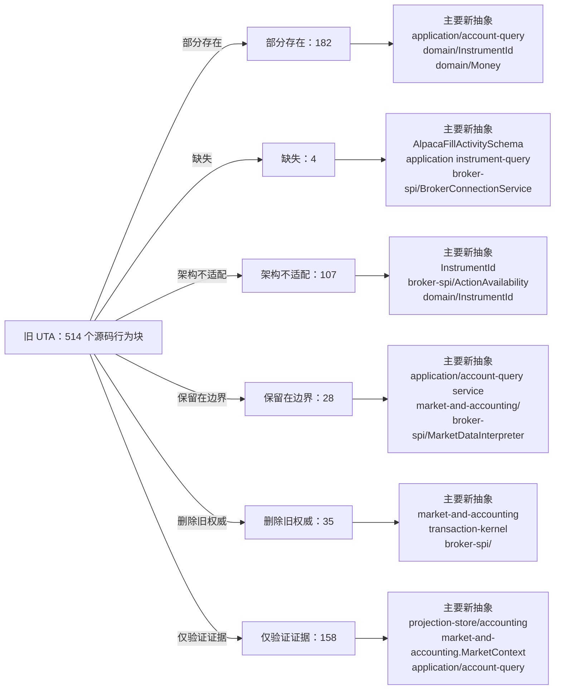

<!-- Auto-generated by scripts/uta-effect-runtime-map.mjs from mapping.json. Do not edit by hand. -->
<!-- Regenerate with `node scripts/uta-effect-runtime-map.mjs`. -->

# UTA 功能替代关系：第 10 章 Accounting and market boundaries

目标架构原文：[`docs/uta-effect-runtime-architecture.md:1187-1218`](../uta-effect-runtime-architecture.md#L1187-L1218)。

## 结论

部分存在 182；缺失 4；架构不适配 107；保留在边界 28；删除旧权威 35；仅验证证据 158。状态只描述当前实现相对于目标架构的关系，不表示迁移已经落地。

## 替代关系图

## 章节级目标缺口

本章没有独立于源码行映射的目标级缺口。

## 源码映射

| 映射 ID | 当前源码 | 符号或行为块 | 当前功能 | 替代状态 | 新 UTA 抽象与做法 | 不适配位置与原因 | 必须补充或调整 | 重复索引 |
|---|---|---|---|---|---|---|---|---|
| `MAP-DE2769E2F7` | [`packages/uta-protocol/src/brokers/preset-catalog.ts:369-398`](../../packages/uta-protocol/src/brokers/preset-catalog.ts#L369-L398) | IBKR_PRESET | Declares host/port/clientId/accountId form fields, default ports, fingerprints, raw engine config, and paper detection based on port numbers. | 部分存在 | 3.7 brokers/<broker>/；3.9 transport/ and protocol/；7.1 Embedded database；9.1 Connection Layer；9.4 Capability derivation；10.2 Market and jurisdiction owns；14. Public protocol；15. Security and authority；17.5 Slice 5: heterogeneous brokers；19. Architectural prohibitions brokers/IBKR；BrokerConnectionService；ConnectionId；CapabilitySet；protocol/config schemas Validate an IBKR connection config, construct the scoped SDK Layer inside brokers/IBKR, and derive linked-account/market/jurisdiction capabilities through broker-spi. | Port-number paper detection and raw host/account strings do not encode connection identity, account jurisdiction, linked-account context, health stream, action capability, or typed failure. | Replace generic engine config with an IBKR connection ADT/secret/config codec and typed BrokerConnectionService/capability registration; keep port defaults presentation/config only. | **DUP-039** |
| `MAP-42A8E8BFCC` | [`packages/uta-protocol/src/brokers/preset-catalog.ts:400-433`](../../packages/uta-protocol/src/brokers/preset-catalog.ts#L400-L433) | LONGBRIDGE_PRESET | Declares live/paper mode and appKey/appSecret/accessToken fields, marks all credentials write-only, fingerprints mode/appKey, and passes a raw engine config. | 部分存在 | 3.7 brokers/<broker>/；3.9 transport/ and protocol/；7.1 Embedded database；9.1 Connection Layer；9.4 Capability derivation；10.2 Market and jurisdiction owns；14. Public protocol；15. Security and authority；17.5 Slice 5: heterogeneous brokers；19. Architectural prohibitions brokers/Longbridge；BrokerConnectionService；CapabilitySet；market-and-accounting/；protocol/config schemas Use Longbridge-specific validated secret/config input and derive region/jurisdiction/instrument capabilities in the typed adapter before transaction preparation. | The form config has raw credentials and mode but no typed jurisdiction/region/account context or broker action/interpreter contract; access-token lifecycle is only prose. | Define typed Longbridge connection/credential and market-jurisdiction metadata, then register its BrokerActionInterpreter and capability/unavailable results. | **DUP-040** |
| `MAP-41D1B056C8` | [`packages/uta-protocol/src/brokers/search-rules.ts:1-14`](../../packages/uta-protocol/src/brokers/search-rules.ts#L1-L14) | contract search heuristic boundary and AssetClassHint | Documents a deliberate heuristic bridge from data-vendor symbols to broker tickers and defines AssetClassHint as a five-member string union. | 保留在边界 | 2.1 Alice owns；3.1 domain/；3.9 transport/ and protocol/；9.4 Capability derivation；10.2 Market and jurisdiction owns；14. Public protocol；19. Architectural prohibitions application/account-query service；market-and-accounting/；broker-spi/；protocol/ search schema Keep vendor-to-broker search normalization at the application query boundary only; return normalized instrument identity and broker-observed metadata before any action can be prepared. | The heuristic is not a domain identity or capability proof and must not be imported by transaction-kernel/domain code; AssetClassHint is not a branded instrument/market observation. | Move/label the helper as an application search adapter, parse its input with a named query schema, and require broker/venue resolution before using a result in a TradeAction. | **DUP-053** |
| `MAP-819A30C052` | [`packages/uta-protocol/src/brokers/search-rules.ts:16-23`](../../packages/uta-protocol/src/brokers/search-rules.ts#L16-L23) | QUOTE_CURRENCIES and suffix regex | Defines an ordered list of quote currencies and a case-insensitive regex that strips a recognized suffix from an uppercase alphanumeric symbol. | 保留在边界 | 3.1 domain/；3.6 broker-spi/；9.4 Capability derivation；10.2 Market and jurisdiction owns；14. Public protocol；19. Architectural prohibitions application/account-query service；market-and-accounting/；broker-spi/；InstrumentId Use this deterministic normalization only to form a broker search query; broker adapter response and market/instrument metadata must establish the actual InstrumentId and quote currency. | A suffix regex cannot establish venue identity, instrument type, settlement currency, or jurisdiction and may not be used as the executable instrument identity or capability source. | Keep it outside domain/kernel, validate the query input, and require a typed broker search/market resolution step before returning or executing a contract. | **DUP-054** |
| `MAP-006AF2BF79` | [`packages/uta-protocol/src/brokers/search-rules.ts:25-55`](../../packages/uta-protocol/src/brokers/search-rules.ts#L25-L55) | normalizeBrokerSearchPattern | Trims a symbol; for crypto/currency strips a recognized quote suffix when a regex match exists; for equity/commodity/unknown returns the trimmed symbol, with a default switch branch returning it unchanged. | 保留在边界 | 3.1 domain/；3.6 broker-spi/；3.9 transport/ and protocol/；5.7 Complete type contract — nominal identities and financial values；9.4 Capability derivation；10.2 Market and jurisdiction owns；14. Public protocol；19. Architectural prohibitions application/account-query service；broker-spi/；market-and-accounting/；InstrumentId；protocol/ search schema Retain as a pure application search-query normalizer, then pass the result to a typed broker search port that returns normalized instrument/market metadata and explicit no-match/unsupported outcomes. | The function intentionally relies on symbol heuristics and a permissive fallback; it does not validate a market context or construct a nominal InstrumentId and therefore cannot be a domain action resolver. | Keep the function out of domain/transaction-kernel, add a decoded AssetClassHint/search request, remove fallback use for execution, and require broker-observed resolution before TradeAction construction. | **DUP-055** |
| `MAP-F59E470DFF` | [`packages/uta-protocol/src/types/broker.ts:83-106`](../../packages/uta-protocol/src/types/broker.ts#L83-L106) | PositionRisk | Models optional leverage, liquidation price, and cross/isolated margin mode as strings and an unbranded union, mainly for leveraged crypto derivatives. | 部分存在 | 3.1 domain/；5.7 Complete type contract — nominal identities and financial values；10.1 Accounting owns；14. Public protocol；19. Architectural prohibitions market-and-accounting/；domain/ExposureSnapshot；protocol/ position schema Move risk observations into the accounting/market projection with refined decimal values and explicit instrument/account identity, then expose a named read projection schema. | The concept is useful accounting/market data, but values are raw strings, optional fields are not schema-refined, and the type is not connected to branded account/instrument/currency identities or observation provenance. | Define a typed risk observation in market-and-accounting, attach account/instrument/observedAt context, validate decimal/currency values at the boundary, and expose it only through account-state projections. | **DUP-075** |
| `MAP-634E72490E` | [`packages/uta-protocol/src/types/broker.ts:108-155`](../../packages/uta-protocol/src/types/broker.ts#L108-L155) | Position | Defines a position around a broker-native Contract, a Decimal runtime quantity, raw currency text, long/short, string monetary fields, multiplier, optional cost-basis source, and optional risk metadata. | 架构不适配 | 3.1 domain/；5.7 Complete type contract — nominal identities and financial values；6. State tiers and snapshots；10.1 Accounting owns；14. Public protocol；19. Architectural prohibitions domain/；domain/Quantity；domain/Money；domain/InstrumentId；market-and-accounting/；projection-store/；protocol/ Translate broker observations into normalized position/exposure projections using InstrumentId, Quantity, CurrencyCode, DecimalString/Money, and explicit observation timestamps; keep native Contract conversion in adapters. | The public type embeds an IBKR Contract and runtime Decimal, uses interchangeable strings for identity/currency/money, and mixes broker observation with accounting projection state. | Replace Position with a named normalized projection/domain type, add boundary schemas and branded value constructors, and have adapters map SDK positions before journal/projection use. | **DUP-076** |
| `MAP-403375E19B` | [`packages/uta-protocol/src/types/broker.ts:204-211`](../../packages/uta-protocol/src/types/broker.ts#L204-L211) | OptionGridEntry | Carries exchange/tradingClass/multiplier strings, expiration strings, and numeric strike arrays for an option-chain parameter grid. | 架构不适配 | 3.6 broker-spi/；5.7 Complete type contract — nominal identities and financial values；9.4 Capability derivation；10.2 Market and jurisdiction owns；14. Public protocol；19. Architectural prohibitions broker-spi/；market-and-accounting/；domain/InstrumentId；protocol/ contract-search response schema Keep native option-chain discovery inside the broker adapter, decode its response, and emit normalized market/instrument metadata with decimal-safe strike values through a named query projection. | Native exchange/trading-class values and number strikes cross the shared protocol without account/jurisdiction/currency identity or runtime schema validation. | Add adapter-local native schemas and a normalized contract-expansion response ADT; use DecimalString and refined instrument metadata at the public boundary. | **DUP-080** |
| `MAP-0422181E7C` | [`packages/uta-protocol/src/types/broker.ts:248-262`](../../packages/uta-protocol/src/types/broker.ts#L248-L262) | AccountInfo | Models account equity and margin fields as raw strings, optional values, and an unqualified baseCurrency string, with dayTradesRemaining as a number. | 部分存在 | 5.7 Complete type contract — nominal identities and financial values；6. State tiers and snapshots；10.1 Accounting owns；14. Public protocol；19. Architectural prohibitions market-and-accounting/；domain/Money；domain/CurrencyCode；projection-store/；protocol/ account-state schema Expose an account-state projection built from currency-qualified Money and typed accounting observations, preserving unknown/unsupported buckets explicitly. | The account query concept maps to the target projection, but monetary strings are not currency-qualified DecimalString values and optional fields have no named schema or uncertainty semantics. | Define normalized accounting/account-state types with CurrencyCode, Money, valuation uncertainty, and runtime schemas; map broker-native account tags only inside adapters. | **DUP-083** |
| `MAP-C959380106` | [`packages/uta-protocol/src/types/broker.ts:264-294`](../../packages/uta-protocol/src/types/broker.ts#L264-L294) | SubAccountRef | Represents an in-broker wallet/compartment with string id/label and a spot/derivatives/unified kind, while documenting implicit default behavior for single-wallet brokers. | 部分存在 | 2.2 UTA owns；3.6 broker-spi/；9.1 Connection Layer；9.4 Capability derivation；10.2 Market and jurisdiction owns；14. Public protocol；15. Security and authority BrokerConnectionIdentity；ActionContext；CapabilitySet；application/account-query service；domain/AccountId Retain sub-account as an explicit account/connection context in broker-spi and capability derivation, with branded identity and per-write target requirements. | The current taxonomy captures separate wallets but uses interchangeable strings and documents implicit/ignored selectors rather than making write ambiguity impossible in the action type. | Define branded ConnectionId/AccountId/SubAccountId context, make target selection mandatory for multi-compartment writes, and derive availability from the full ActionContext. | **DUP-084** |
| `MAP-7E5E549A48` | [`packages/uta-protocol/src/types/broker.ts:298-313`](../../packages/uta-protocol/src/types/broker.ts#L298-L313) | Quote | Returns broker-native Contract plus string last/bid/ask/volume/high/low and a JavaScript Date timestamp. | 架构不适配 | 3.6 broker-spi/；3.8 projection-store/；6. State tiers and snapshots；9.3 Remote outcome；10.1 Accounting owns；14. Public protocol；19. Architectural prohibitions broker-spi/；domain/InstrumentId；domain/Instant；market-and-accounting/；protocol/ quote schema Decode quote observations in the adapter and expose normalized instrument/currency/DecimalString values with branded Instant and explicit observation provenance. | A native Contract and JavaScript Date cross the wire; numeric strings have no currency/decimal refinement, and the observation is not associated with a connection/instrument identity type. | Add a quote observation schema and adapter codec, replace Contract/Date/raw strings with normalized identities and branded values, and keep it in the read projection boundary. | **DUP-085** |
| `MAP-8C2153421E` | [`packages/uta-protocol/src/types/broker.ts:315-320`](../../packages/uta-protocol/src/types/broker.ts#L315-L320) | MarketClock | Represents market availability as an account-independent `isOpen` boolean with optional next-open/next-close/timestamp Dates. | 架构不适配 | 3.1 domain/；6. State tiers and snapshots；9.4 Capability derivation；10.2 Market and jurisdiction owns；14. Public protocol；19. Architectural prohibitions market-and-accounting/；MarketSession；ActionContext；protocol/ market-session schema Make market-session queries depend on venue, instrument, session type, jurisdiction, and branded Instant, returning a typed session observation rather than an account-wide boolean. | The architecture explicitly rejects an account-wide market-clock boolean; this shape cannot express venue/instrument/session/jurisdiction or distinguish observed session facts from capability. | Replace MarketClock with a market-and-accounting session query/observation ADT and use it as a typed precondition/capability input. | **DUP-086** |
| `MAP-FC2ABFBF22` | [`packages/uta-protocol/src/types/broker.ts:322-334`](../../packages/uta-protocol/src/types/broker.ts#L322-L334) | BarInterval and BarWhatToShow | Defines small string unions for normalized bar intervals and IBKR-oriented price streams, with comments that non-IBKR brokers ignore some values. | 部分存在 | 3.6 broker-spi/；9.4 Capability derivation；10.2 Market and jurisdiction owns；14. Public protocol；19. Architectural prohibitions broker-spi/；CapabilitySet；market-and-accounting/；protocol/ historical-bars schema Keep interval/price-stream variants as a query boundary only, and have broker-spi capabilities explicitly state supported subsets and quality semantics. | The enums are a useful normalized boundary but have no runtime schemas and the documented ignore behavior is permissive rather than an explicit unavailable/unsupported capability result. | Add named query schemas and typed capability derivation; reject unsupported values or return a precise CapabilityUnavailable reason instead of silently ignoring them. | **DUP-087** |
| `MAP-BFD66E07FA` | [`packages/uta-protocol/src/types/broker.ts:336-347`](../../packages/uta-protocol/src/types/broker.ts#L336-L347) | BarParams | Accepts a BarInterval, optional JavaScript Date start/end, optional numeric limit, and optional price-stream selector; comments define broker truncation and defaults. | 部分存在 | 3.6 broker-spi/；8.4 Fairness and backpressure；9.4 Capability derivation；10.2 Market and jurisdiction owns；14. Public protocol；19. Architectural prohibitions protocol/ historical-bars request schema；broker-spi/；market-and-accounting/ Validate a named historical-bars query with branded Instant, bounded explicit pagination, and capability-driven interval/stream support. | Optional Date/number fields and broker-derived windows/truncation make request semantics implicit and allow silent limits; no public runtime schema is present. | Replace Date/number inputs with decoded Instant/positive bounded values, expose explicit pagination/continuation, and map unsupported streams to typed capability failures. | **DUP-088** |
| `MAP-8C79F4D559` | [`packages/uta-protocol/src/types/broker.ts:349-364`](../../packages/uta-protocol/src/types/broker.ts#L349-L364) | Bar | Carries JavaScript Date timestamp and OHLCV strings, with no instrument or quote-currency identity in the value itself. | 架构不适配 | 5.7 Complete type contract — nominal identities and financial values；6. State tiers and snapshots；9.2 Typed action interpreter；10.1 Accounting owns；14. Public protocol；19. Architectural prohibitions market-and-accounting/；domain/Price；domain/Quantity；domain/Instant；protocol/ bar schema Emit normalized OHLCV observations carrying InstrumentId, CurrencyCode/Price, Quantity, and branded Instant, with adapter-native conversion hidden. | Raw strings and Date do not enforce decimal/currency/instrument identity, and the value is not tied to a broker observation context or named schema. | Introduce a decoded bar observation/projection type using target value objects and validate it at the broker/protocol boundary. | **DUP-089** |
| `MAP-609FF636E8` | [`packages/uta-protocol/src/types/broker.ts:428-443`](../../packages/uta-protocol/src/types/broker.ts#L428-L443) | HistoricalBarsCapability | Uses a supported boolean, optional quality union, and optional supportedBarSizes array to describe historical-bar entitlements. | 部分存在 | 3.6 broker-spi/；9.2 Typed action interpreter；9.4 Capability derivation；10.1 Accounting owns；14. Public protocol；19. Architectural prohibitions CapabilitySet；ActionAvailability；CapabilityFailure；protocol/ capability schema Represent historical-bar availability as an action/query capability derived from broker, account, jurisdiction, instrument, and session context, with explicit unavailable reasons and quality. | Quality is useful metadata, but optional arrays and a boolean do not identify the full context or express a precise unavailable reason; unsupported intervals can still be silently ignored by consumers. | Make capability results a discriminated Available/Unavailable ADT with a validated supported subset and context, then expose it through the capabilities protocol. | **DUP-092** |
| `MAP-781BB54D06` | [`packages/uta-protocol/src/types/broker.ts:500-522`](../../packages/uta-protocol/src/types/broker.ts#L500-L522) | IBroker contract search and catalog methods | Provides Promise-based searchContracts/getContractDetails, optional expandContract, and optional refreshCatalog, all using broker-native Contract/ContractDescription types and optional behavior. | 删除旧权威 | 3.6 broker-spi/；3.7 brokers/<broker>/；3.8 projection-store/；3.9 transport/ and protocol/；9.2 Typed action interpreter；9.4 Capability derivation；14. Public protocol；17.6 Slice 6: delete the legacy kernel；19. Architectural prohibitions application/account-query service；broker-spi/；brokers/<broker>/；projection-store/；protocol/ search schemas Move search/expansion into an application query service backed by broker adapter ports; adapters decode native responses and return normalized instrument/query projections. | Search, expansion, and catalog refresh are mixed into a generic broker facade, native SDK values cross the boundary, and optional methods make capability absence implicit. | Remove these methods from IBroker, define typed broker-spi query ports and explicit capability/unavailable results, and keep catalog projections separate from execution authority. | **DUP-097** |
| `MAP-3AB8DE4D1E` | [`packages/uta-protocol/src/types/broker.ts:531-551`](../../packages/uta-protocol/src/types/broker.ts#L531-L551) | IBroker sub-account methods | Provides optional listSubAccounts and optional subAccountForContract string selectors, with documented implicit-default/ignored-selector behavior for most brokers. | 删除旧权威 | 3.1 domain/；3.5 durable-scheduler/；3.6 broker-spi/；5.7 Complete type contract — order and trading action ADTs；8.2 Partitioning；9.4 Capability derivation；10.2 Market and jurisdiction owns；15. Security and authority；17.6 Slice 6: delete the legacy kernel；19. Architectural prohibitions ActionContext；ConflictKey；AccountId；ConnectionId；CapabilitySet；broker-spi/ Carry explicit branded account/sub-account/connection context through TradeAction, ActionContext, capability derivation, and conflict-key partitioning; reject ambiguous writes before preparation. | Optional discovery and ignored selectors allow invalid/ambiguous target selection to be represented and hide whether a broker truly supports compartments. | Replace these selectors with typed account context and capability results, migrate callers, and remove the methods from the generic facade after broker-spi ownership is established. | **DUP-099** |
| `MAP-BAFF102815` | [`packages/uta-protocol/src/types/broker.ts:553-584`](../../packages/uta-protocol/src/types/broker.ts#L553-L584) | IBroker account/order query methods | Defines Promise-based getAccount/getPositions/getOrders/getOrder and optional getOpenOrders, returning AccountInfo, Position, and OpenOrder values, with symbol hints and empty-array fallback semantics. | 删除旧权威 | 3.6 broker-spi/；3.8 projection-store/；6. State tiers and snapshots；9.2 Typed action interpreter；9.3 Remote outcome；10.1 Accounting owns；12.2 Unknown-outcome protocol；14. Public protocol；17.6 Slice 6: delete the legacy kernel；19. Architectural prohibitions application/account-query service；projection-store/；OrderSnapshot；ExposureSnapshot；RemoteOutcome；broker-spi/ Have broker adapters provide typed observations to application query/projection services; use the journal and reconciliation protocol for order state rather than direct SDK-shaped reads in the public facade. | Queries return native objects and optional/empty fallback semantics with no typed QueryFailure, projection checkpoint, observation identity, or branded precondition values. | Define normalized account/order/position query ports and QueryFailure schemas, migrate all callers, and remove these methods from IBroker once projection-store/application services are authoritative. | **DUP-100** |
| `MAP-7056B295D1` | [`packages/uta-protocol/src/types/broker.ts:585-605`](../../packages/uta-protocol/src/types/broker.ts#L585-L605) | IBroker market-data and historical methods | Defines getQuote/getMarketClock, optional getHistorical, and optional venue-decided assetClassFor, all as direct Promise calls with native Contract inputs and string-union outputs. | 删除旧权威 | 3.6 broker-spi/；3.8 projection-store/；6. State tiers and snapshots；9.2 Typed action interpreter；9.4 Capability derivation；10.2 Market and jurisdiction owns；14. Public protocol；17.6 Slice 6: delete the legacy kernel；19. Architectural prohibitions market-and-accounting/；application/account-query service；broker-spi/；CapabilitySet；protocol/ market-data schemas Move market/session/accounting observations behind typed broker-spi and market-and-accounting query services, with capability-derived support and normalized protocol projections. | Native contracts, JavaScript Dates, raw strings, optional method absence, and direct promises do not express market/jurisdiction context, typed failures, or explicit unsupported capability. | Delete these methods from IBroker after migration, add typed query/capability ports and schemas, and make unsupported historical/session operations return explicit typed failures. | **DUP-101** |
| `MAP-40929B6DB6` | [`packages/uta-protocol/src/types/broker.ts:611-620`](../../packages/uta-protocol/src/types/broker.ts#L611-L620) | IBroker native identity methods | Uses string getNativeKey and resolveNativeKey around broker-native Contract values for Alice's `aliceId` convention. | 删除旧权威 | 2.3 Brokers own；3.1 domain/；3.7 brokers/<broker>/；3.9 transport/ and protocol/；5.7 Complete type contract — nominal identities and financial values；9.2 Typed action interpreter；10.2 Market and jurisdiction owns；14. Public protocol；17.6 Slice 6: delete the legacy kernel；19. Architectural prohibitions InstrumentId；BrokerOrderId；AccountId；broker-spi/；brokers/<broker>/；protocol/ Keep native-key resolution inside each broker adapter and expose only branded InstrumentId/BrokerOrderId/AccountId values in domain and protocol types. | Identity is an arbitrary string convention attached to an optional SDK augmentation; no nominal identity type or broker/account/venue context is enforced. | Introduce domain identity constructors/codecs, migrate aliceId consumers to InstrumentId and related branded IDs, and remove the generic methods from IBroker. | **DUP-103** |
| `MAP-A27D9FADF9` | [`packages/uta-protocol/src/types/contract-ext.ts:1-31`](../../packages/uta-protocol/src/types/contract-ext.ts#L1-L31) | IBKR Contract aliceId declaration augmentation | Imports @traderalice/ibkr and globally adds optional `aliceId?: string` to its Contract interface, documenting broker-specific native keys and `stampAliceId` construction. | 删除旧权威 | 2.3 Brokers own；3.1 domain/；3.7 brokers/<broker>/；3.9 transport/ and protocol/；5.7 Complete type contract — nominal identities and financial values；9.2 Typed action interpreter；10.2 Market and jurisdiction owns；14. Public protocol；17.6 Slice 6: delete the legacy kernel；19. Architectural prohibitions InstrumentId；BrokerOrderId；brokers/<broker>/；broker-spi/；domain/；protocol/ Keep each broker's native key and SDK augmentation inside its adapter, then construct branded InstrumentId and other domain identities at the adapter boundary. | A shared optional field mutates a broker SDK type and treats a string concatenation convention as system identity; consumers can observe a partial/native identity with no schema or domain brand. | Remove the public declaration merge and side-effect import, add explicit identity constructors/codecs in domain/broker-spi, and migrate all aliceId consumers before deleting the compatibility field. | **DUP-104** |
| `MAP-298D6BB247` | [`packages/uta-protocol/src/types/git.ts:18-54`](../../packages/uta-protocol/src/types/git.ts#L18-L54) | Operation discriminated union | Defines place/modify/close/cancel/sync, external-order observation, and balance-reconciliation operations; several variants carry IBKR Contract/Order/OrderCancel or Decimal, while modifyOrder uses Partial<Order>. | 删除旧权威 | 3.1 domain/；3.3 transaction-kernel/；3.8 projection-store/；5.1 Commands, events, effects, and state；5.7 Complete type contract — order and trading action ADTs；6. State tiers and snapshots；10.1 Accounting owns；11. Approval and Git audit projection；14. Public protocol；17.6 Slice 6: delete the legacy kernel；19. Architectural prohibitions TradeAction；TransactionCommand；TransactionEvent；transaction-kernel/；journal-store/；projection-store/；market-and-accounting/ Replace executable operation staging with TransactionCommand/CreateDraft/ReplaceDraft carrying the closed TradeAction and OrderSpec ADTs; represent broker observations and balance reconciliation as typed events/projection inputs rather than Git operations. | The union mixes commands, external facts, sync, and accounting events, exposes native broker values, permits Partial<Order> and optional-field soup, and has no transaction revision, precondition, compensation, or durable identity. | Delete Operation as execution authority, migrate all stage/commit/sync callers to transaction-kernel commands/events and broker observation protocols, and retain only normalized audit projection variants. | **DUP-108** |
| `MAP-FEF9B7F5AE` | [`packages/uta-protocol/src/types/git.ts:79-89`](../../packages/uta-protocol/src/types/git.ts#L79-L89) | GitState | Stores raw string account totals plus arrays of Position and OpenOrder values as the state snapshot after a Git commit. | 部分存在 | 6. State tiers and snapshots；7.4 Snapshot and compaction policy；10.1 Accounting owns；11. Approval and Git audit projection；14. Public protocol；17.6 Slice 6: delete the legacy kernel；19. Architectural prohibitions projection-store/；market-and-accounting/；domain/Money；GetTransactionResponse；journal-store/ Retain a read-only account/order projection if needed for compatibility, rebuilt from journal and broker reconciliation; use normalized accounting types and make it non-authoritative. | A commit embeds mutable-looking account state and native Position/OpenOrder arrays, with unqualified strings and no projection checkpoint/version or rebuild semantics. | Move state authority to journal-store/projection-store, replace fields with normalized account-state projections, and mark any Git state export as rebuildable compatibility output. | **DUP-111** |
| `MAP-8AD42F6839` | [`packages/uta-protocol/src/types/git.ts:203-211`](../../packages/uta-protocol/src/types/git.ts#L203-L211) | SimulationPositionCurrent | Reports simulator symbol, long/short side, decimal-string quantity/cost/price/PnL/value for the pre-change state. | 保留在边界 | 6. State tiers and snapshots；10.1 Accounting owns；14. Public protocol；17.1 Slice 1: durable kernel with MockBroker；18. Verification contract；20. First falsifier MockBroker observation；market-and-accounting/；projection-store/；protocol/ simulator projection Retain as a read-only simulator projection if needed by the dev panel, generated from normalized mock account/exposure observations and never used as journal authority. | The DTO has no InstrumentId/CurrencyCode/Instant or projection checkpoint and is tied to the current in-memory simulator presentation. | Use a named simulator projection schema backed by the durable MockBroker slice, or keep it explicitly dev-only and outside domain/transaction-kernel types. | **DUP-124** |
| `MAP-CAFDD48B6D` | [`packages/uta-protocol/src/types/git.ts:213-223`](../../packages/uta-protocol/src/types/git.ts#L213-L223) | SimulationPositionAfter | Reports simulator position values after a simulated price, including PnL change and percentage as decimal strings. | 保留在边界 | 6. State tiers and snapshots；10.1 Accounting owns；14. Public protocol；17.1 Slice 1: durable kernel with MockBroker；18. Verification contract；20. First falsifier MockBroker observation；market-and-accounting/；projection-store/；protocol/ simulator projection Keep as a derived UI/test projection from typed mock observations and accounting functions; do not let it substitute for transaction result/remote outcome records. | The result is a simulator-specific derived view with unbranded symbol and no declared currency/observation identity; it does not represent the target commit criterion or recovery state. | Generate it from normalized mock account projections and name its schema as a test/presentation boundary, while verifying recovery through journal/remote observation separately. | **DUP-125** |
| `MAP-0CEEC81F23` | [`packages/uta-protocol/src/types/git.ts:225-246`](../../packages/uta-protocol/src/types/git.ts#L225-L246) | SimulatePriceChangeResult | Combines success boolean/error string, current and simulated account/position states, and string summary deltas including worstCase. | 保留在边界 | 1. Thesis and non-negotiable properties；5.7 Complete type contract — error channels；6. State tiers and snapshots；10.1 Accounting owns；12.2 Unknown-outcome protocol；14. Public protocol；17.1 Slice 1: durable kernel with MockBroker；18. Verification contract；20. First falsifier MockBroker interpreter；TransactionFailure；QueryFailure；market-and-accounting/；projection-store/；protocol/ Keep only as a named simulator preview response; use typed QueryFailure/validation failures and derive preview data without claiming broker dispatch or transaction commitment. | Success/error text and nested ad hoc state are not target transaction or accounting ADTs; the response says nothing about durable mock observations, dispatch identity, or recovery. | Separate simulator preview from execution protocol, add runtime schema and typed query/validation failures, and exercise the durable MockBroker crash/reconciliation path independently. | **DUP-126** |
| `MAP-011C785E0E` | [`packages/uta-protocol/src/types/git.ts:296-306`](../../packages/uta-protocol/src/types/git.ts#L296-L306) | StageClosePositionParams | Defines a staging bag keyed by aliceId/symbol with optional quantity and optional subAccountId, where empty quantity closes the full position. | 删除旧权威 | 3.1 domain/；3.3 transaction-kernel/；3.6 broker-spi/；5.3 Two-phase transaction protocol；5.7 Complete type contract — order and trading action ADTs；8.2 Partitioning；9.4 Capability derivation；10.1 Accounting owns；14. Public protocol；17.6 Slice 6: delete the legacy kernel；19. Architectural prohibitions TradeAction ClosePosition；Quantity；ExposureSnapshot；ConflictKey；ActionContext；transaction-kernel/ Use ClosePosition with branded AccountId/InstrumentId and an explicit Quantity\|'All' variant, bind ExposureSnapshot/preconditions, and compile compensation before dispatch. | Optional identity/quantity fields and an optional wallet target permit ambiguous writes; no exposure before-image, conflict key, commit criterion, or compensation capability is represented. | Delete StageClosePositionParams and migrate to typed ClosePosition actions in transaction drafts, with mandatory multi-sub-account context and durable exposure preconditions. | **DUP-129** |
| `MAP-A774AC84F2` | [`packages/uta-protocol/src/types/git.ts:308-322`](../../packages/uta-protocol/src/types/git.ts#L308-L322) | getOperationSymbol | Switches over legacy Operation variants and returns contract.symbol/aliceId where available, otherwise the literal `unknown`; modify/cancel/sync have no symbol. | 删除旧权威 | 3.1 domain/；3.8 projection-store/；5.7 Complete type contract — nominal identities and financial values；9.4 Capability derivation；10.2 Market and jurisdiction owns；11. Approval and Git audit projection；14. Public protocol；17.6 Slice 6: delete the legacy kernel；19. Architectural prohibitions InstrumentId；TradeAction；projection-store/；market-and-accounting/；Git audit projection Derive display identity from typed TradeAction/instrument projection fields; do not infer identity from native symbol/aliceId fallbacks or return an untyped unknown sentinel. | The helper depends on legacy/native fields, loses identity for several action variants, and uses a permissive string fallback instead of a nominal InstrumentId or explicit absence variant. | Delete the helper with Operation, migrate consumers to typed action/projection mappers, and require explicit instrument identity where the target contract needs it. | **DUP-130** |
| `MAP-29B08BE41B` | [`packages/uta-protocol/src/types/history.ts:15-30`](../../packages/uta-protocol/src/types/history.ts#L15-L30) | HistoryContract | Defines an IBKR-superset compact contract with all identity/market fields optional, including optional string aliceId, symbol/localSymbol/secType/currency/exchange and derivative fields. | 部分存在 | 3.8 projection-store/；3.9 transport/ and protocol/；6. State tiers and snapshots；10.2 Market and jurisdiction owns；11. Approval and Git audit projection；14. Public protocol；19. Architectural prohibitions projection-store/；domain/InstrumentId；market-and-accounting/；Git audit projection；protocol/ history schema Keep history as a read projection with a normalized instrument identity and explicit derivative/instrument variants; map IBKR/venue-native fields only in adapters. | The projection intent is compatible with the target read/audit boundary, but an optional-field IBKR superset and optional aliceId cannot guarantee instrument identity, currency, venue, or derivative validity. | Define a normalized HistoryInstrument/InstrumentId projection schema, preserve broker-native details as redacted adapter metadata only, and validate required fields per instrument variant. | **DUP-131** |
| `MAP-56C6192DB1` | [`packages/uta-protocol/src/types/history.ts:61-76`](../../packages/uta-protocol/src/types/history.ts#L61-L76) | TradeHistorySource and TradeHistoryEntry | Represents fill/reconcile rows with optional order id, HistoryContract, side, decimal-string quantity/price/value, source order/external/reconcile, and Git commit hash. | 部分存在 | 5.7 Complete type contract — nominal identities and financial values；6. State tiers and snapshots；7.4 Snapshot and compaction policy；10.1 Accounting owns；11. Approval and Git audit projection；12.2 Unknown-outcome protocol；14. Public protocol；17.6 Slice 6: delete the legacy kernel；19. Architectural prohibitions market-and-accounting/；Fill；ExposureSnapshot；RemoteOutcome；projection-store/；Git audit projection；journal-store/ Generate trade history from typed broker acknowledgements/observations and accounting fill/reconciliation events, with currency-qualified Money/Quantity and journal correlation. | The read-only fill projection is directionally valid, but quantity/price/value lack branded instrument/currency context, optional order identity is not linked to dispatch, and Git hash remains the only audit pointer. | Move authority to journal/accounting projections, add typed Fill/Reconciliation records and observation timestamps, and retain CommitHash only as optional derived audit metadata. | **DUP-134** |
| `MAP-864224E5A6` | [`packages/uta-protocol/src/types/manager.ts:1-10`](../../packages/uta-protocol/src/types/manager.ts#L1-L10) | manager native imports | Imports AccountCapabilities/BrokerHealth/BrokerHealthInfo from broker.ts and ContractDescription from @traderalice/ibkr for manager-level summaries and search results. | 架构不适配 | 3.6 broker-spi/；3.8 projection-store/；3.9 transport/ and protocol/；9.4 Capability derivation；10.1 Accounting owns；14. Public protocol；19. Architectural prohibitions application/；projection-store/；broker-spi/；market-and-accounting/；protocol/ Make manager query services consume normalized account/capability projections and adapter-decoded instrument metadata, not shared IBKR types. | The manager wire module directly imports a broker-native ContractDescription and re-exports capability/health shapes that are not target ADTs. | Remove native imports from public manager types, define named account/capability/search projection schemas, and isolate SDK conversion inside broker adapters. | **DUP-136** |
| `MAP-02219D5749` | [`packages/uta-protocol/src/types/manager.ts:21-37`](../../packages/uta-protocol/src/types/manager.ts#L21-L37) | AggregatedEquity | Aggregates total equity/cash/PnL as strings, optional string FX warnings, and anonymous per-account rows with raw id/currency/health fields. | 部分存在 | 3.8 projection-store/；6. State tiers and snapshots；7.4 Snapshot and compaction policy；10.1 Accounting owns；13. Observability；14. Public protocol；19. Architectural prohibitions market-and-accounting/；Money；CurrencyCode；FX observation；projection-store/；protocol/ account-state schema Serve aggregated accounting as a projection over currency-qualified Money and explicit FX observations/uncertainty, with per-account identity and projection checkpoints. | Raw monetary strings and warning text do not encode currency, FX source/timestamp, valuation uncertainty, or typed accounting failure; anonymous nested objects are not named domain/protocol types. | Define accounting aggregation/projection types with Money, CurrencyCode, FX observation and typed warning/failure variants, then expose them through a named account-state schema. | **DUP-138** |
| `MAP-6EAA6A8F74` | [`packages/uta-protocol/src/types/manager.ts:39-42`](../../packages/uta-protocol/src/types/manager.ts#L39-L42) | ContractSearchResult | Groups broker-native ContractDescription[] under a raw string accountId. | 架构不适配 | 3.6 broker-spi/；3.8 projection-store/；3.9 transport/ and protocol/；9.4 Capability derivation；10.2 Market and jurisdiction owns；14. Public protocol；19. Architectural prohibitions application/account-query service；broker-spi/；domain/InstrumentId；market-and-accounting/；protocol/ search response schema Return a named normalized contract/instrument search response keyed by branded AccountId/ConnectionId, with adapter-native details decoded before crossing protocol. | ContractDescription is imported directly from the IBKR SDK and account identity is an interchangeable string; no runtime schema or venue/instrument/jurisdiction context is guaranteed. | Replace ContractDescription[] with normalized instrument/contract projection variants and decode/validate them at the application protocol boundary. | **DUP-139** |
| `MAP-6BAF8CB0BF` | [`packages/uta-protocol/src/types/manager.ts:44-58`](../../packages/uta-protocol/src/types/manager.ts#L44-L58) | ContractSearchHit | Flattens an aggregated search hit into a raw source string, broker-native contract, string derivative security types, and optional venue-decided asset class. | 架构不适配 | 3.6 broker-spi/；3.8 projection-store/；3.9 transport/ and protocol/；9.4 Capability derivation；10.2 Market and jurisdiction owns；14. Public protocol；19. Architectural prohibitions application/account-query service；broker-spi/；domain/InstrumentId；market-and-accounting/；protocol/ search response schema Use a normalized search hit containing branded account/instrument identity, explicit venue/jurisdiction/instrument metadata, and a validated asset-class variant derived by the broker/application boundary. | The hit exposes ContractDescription['contract'], raw derivative secType strings, optional assetClass fallback semantics, and no branded identity or schema; consumers can feed broker-native data directly to later routes. | Define a closed normalized search response ADT and adapter codecs; make asset-class/context resolution explicit and prevent generic routes from accepting native contract payloads. | **DUP-140** |
| `MAP-0B6606BE1C` | [`services/uta/src/__tests__/trading-tools.spec.ts:103-119`](../../services/uta/src/__tests__/trading-tools.spec.ts#L103-L119) | createTradingTools.searchContracts | Spies on two separate MockBroker instances and verifies that searchContracts aggregates one matching contract description from each registered UTA. | 仅验证证据 | §2 System boundary；§3.8 projection-store/；§3.9 transport/ and protocol/；§9.2 Typed action interpreter；§10 Accounting and market boundaries；§18 Verification contract application/account-query；broker-spi/BrokerActionInterpreter；brokers/Mock；market-and-accounting；protocol contract-query schema Map the aggregation to a typed account/instrument query that normalizes broker observations behind broker-spi and returns a named contract projection; retain multi-account aggregation as verification evidence without exposing broker SDK descriptions publicly. | — | — | **DUP-147** |
| `MAP-08E9053B72` | [`services/uta/src/__tests__/trading-tools.spec.ts:314-329`](../../services/uta/src/__tests__/trading-tools.spec.ts#L314-L329) | createTradingTools.getContractDetails.expansion | Calls getContractDetails with a source and Alice identifier, spies on the broker, and verifies that the broker receives an expanded native query retaining the original identifier. | 仅验证证据 | §2 System boundary；§3.7 brokers/<broker>/；§3.9 transport/ and protocol/；§9.2 Typed action interpreter；§10 Accounting and market boundaries；§14 Public protocol；§15 Security and authority application/account-query；market-and-accounting；broker-spi/BrokerActionInterpreter；protocol contract schema；brokers/Mock Map contract details through typed market/account services and broker-spi, expanding broker-native instrument fields only inside the adapter; return normalized contract data through the public schema. | — | — | **DUP-158** |
| `MAP-5A0732EC10` | [`services/uta/src/domain/trading/__test__/e2e/alpaca-paper.e2e.spec.ts:22-30`](../../services/uta/src/domain/trading/__test__/e2e/alpaca-paper.e2e.spec.ts#L22-L30) | beforeAll Alpaca broker setup | Selects an Alpaca paper account, stores its generic IBroker, queries the market clock, and records a boolean marketOpen guard. | 保留在边界 | 2.3 Brokers own；9.1 Connection Layer；10.2 Market and jurisdiction owns；18.3 Real broker acceptance brokers/alpaca scoped Layer；broker-spi connection/session service；market-and-accounting Keep account selection as paper-test boundary and move connection/session acquisition to the target Alpaca broker-spi Layer. | The fixture observes a coarse account-wide boolean and generic IBroker, not typed venue/instrument session or capability observations. | — | **DUP-162** |
| `MAP-60855A8312` | [`services/uta/src/domain/trading/__test__/e2e/alpaca-paper.e2e.spec.ts:34-68`](../../services/uta/src/domain/trading/__test__/e2e/alpaca-paper.e2e.spec.ts#L34-L68) | Alpaca connectivity | Queries account equity/cash, market clock, AAPL search, and positions; asserts positive values, AAPL identity, and Decimal/string field types. | 仅验证证据 | 9 Broker service-provider interface；10 Accounting and market boundaries；18.3 Real broker acceptance brokers/alpaca typed interpreter；broker-spi account/query service；market-and-accounting Retain as low-level Alpaca adapter evidence and add typed target account/market observation tests. | Read-only connectivity assertions do not prove durable transaction, scheduler, reconciliation, compensation, or crash behavior. | — | **DUP-163** |
| `MAP-415093F05F` | [`services/uta/src/domain/trading/__test__/e2e/alpaca-paper.e2e.spec.ts:113-130`](../../services/uta/src/domain/trading/__test__/e2e/alpaca-paper.e2e.spec.ts#L113-L130) | Alpaca quote observation | During market hours, creates an AAPL contract and asserts positive last/bid/ask/volume from getQuote. | 仅验证证据 | 9.1 Connection Layer；9.4 Capability derivation；10.2 Market and jurisdiction owns；18.3 Real broker acceptance broker-spi market-data observation；market-and-accounting session service Retain as read-only adapter evidence and represent market/session availability through typed broker-spi results. | Quote checks do not prove transaction durability, accounting projection, or recovery. | — | **DUP-165** |
| `MAP-DA8940C7D3` | [`services/uta/src/domain/trading/__test__/e2e/alpaca-paper.e2e.spec.ts:132-176`](../../services/uta/src/domain/trading/__test__/e2e/alpaca-paper.e2e.spec.ts#L132-L176) | Alpaca market buy and order query | Places a market AAPL buy during market hours, requires success and a UUID-like orderId, then places another buy, waits, queries it, and requires Filled. | 部分存在 | 9.2 Typed action interpreter；9.3 Remote outcome；10.1 Accounting owns；12.2 Unknown-outcome protocol；18.3 Real broker acceptance broker-spi DispatchIdentity/RemoteOutcome；brokers/alpaca typed interpreter；durable-scheduler；market-and-accounting Run these mutations through prepared target Alpaca actions and durable scheduler observation, asserting accepted/working/filled criteria and stable dispatch identity. | The suite calls generic placeOrder and uses a timer before getOrder; it has no journaled dispatch intent, unknown-outcome protocol, compensation, or restart/no-blind-retry proof. | Add target journal/scheduler/reconciliation assertions and clean up by target transaction rather than an untracked broker mutation. | **DUP-166** |
| `MAP-D684830A67` | [`services/uta/src/domain/trading/__test__/e2e/alpaca-paper.e2e.spec.ts:178-196`](../../services/uta/src/domain/trading/__test__/e2e/alpaca-paper.e2e.spec.ts#L178-L196) | Alpaca position and close | Reads AAPL positions after the prior buy, requires a positive quantity, and closes the AAPL position through generic closePosition. | 部分存在 | 9.2 Typed action interpreter；9.3 Remote outcome；10.1 Accounting owns；12.2 Unknown-outcome protocol；18.3 Real broker acceptance market-and-accounting position projection；broker-spi compensation/close action；durable-scheduler Use target accounting projection and typed close/compensation action with durable observation and baseline verification. | The scenario assumes state left by a preceding test, has no explicit baseline delta, journal authority, compensation capability, or unknown outcome handling. | Isolate a target transaction baseline and assert exact position/open-order restoration after durable close/reconciliation. | **DUP-167** |
| `MAP-B65B828516` | [`services/uta/src/domain/trading/__test__/e2e/ccxt-bybit.e2e.spec.ts:36-56`](../../services/uta/src/domain/trading/__test__/e2e/ccxt-bybit.e2e.spec.ts#L36-L56) | Bybit account/position/contract reads | Queries account equity, positions, and ETH contracts, requiring positive equity, an array, and a CRYPTO_PERP result. | 仅验证证据 | 9.4 Capability derivation；10.1 Accounting owns；10.2 Market and jurisdiction owns；18.3 Real broker acceptance broker-spi account/market observation；market-and-accounting；brokers/ccxt/Bybit interpreter Retain as direct adapter read evidence and add typed capability/accounting projection cases. | These reads do not prove target action schemas, durable execution, reconciliation, or recovery. | — | **DUP-170** |
| `MAP-585A2F9006` | [`services/uta/src/domain/trading/__test__/e2e/ccxt-bybit.e2e.spec.ts:93-109`](../../services/uta/src/domain/trading/__test__/e2e/ccxt-bybit.e2e.spec.ts#L93-L109) | Bybit position and reduceOnly close | Reads positions after the preceding buy, requires an ETH position, then closes 0.01 ETH through generic closePosition and asserts success. | 部分存在 | 9.2 Typed action interpreter；9.3 Remote outcome；10.1 Accounting owns；12.2 Unknown-outcome protocol；18.3 Real broker acceptance broker-spi close/compensation action；market-and-accounting position projection；durable-scheduler Make position observation and reduceOnly close target typed actions/projections with durable compensation/reconciliation and baseline isolation. | It depends on prior test state and direct generic broker methods; no baseline delta, durable close intent, unknown outcome, or recovery is tested. | Isolate the account baseline and assert target journal/projection plus exact cleanup after restart-capable close. | **DUP-172** |
| `MAP-444A62C6D5` | [`services/uta/src/domain/trading/__test__/e2e/ccxt-hyperliquid-markets.e2e.spec.ts:40-62`](../../services/uta/src/domain/trading/__test__/e2e/ccxt-hyperliquid-markets.e2e.spec.ts#L40-L62) | Hyperliquid market loading assertions | Requires sandbox initialization, at least 100 markets, and both spot and swap market types in the internal exchange map. | 仅验证证据 | 9.4 Capability derivation；10.2 Market and jurisdiction owns；18.3 Real broker acceptance brokers/ccxt/Hyperliquid interpreter；broker-spi capability derivation；market-and-accounting instrument catalog Retain as read-only adapter evidence and expose the resulting typed instrument/capability catalog through broker-spi. | Market counts/types do not prove transaction preparation, durable scheduling, accounting, reconciliation, or packaging behavior. | — | **DUP-177** |
| `MAP-301A0F7EF8` | [`services/uta/src/domain/trading/__test__/e2e/ccxt-hyperliquid-markets.e2e.spec.ts:64-79`](../../services/uta/src/domain/trading/__test__/e2e/ccxt-hyperliquid-markets.e2e.spec.ts#L64-L79) | Hyperliquid BTC perpetual search | Searches BTC through CcxtBroker and requires a result whose symbol/localSymbol identifies the BTC perpetual. | 仅验证证据 | 9.4 Capability derivation；10.2 Market and jurisdiction owns；18.3 Real broker acceptance broker-spi capability derivation；market-and-accounting instrument identity；brokers/ccxt/Hyperliquid interpreter Keep as instrument mapping evidence and add typed venue/account/instrument capability cases in the target adapter. | The search result alone provides no target protocol, transaction, journal, scheduler, or recovery evidence. | — | **DUP-178** |
| `MAP-8D31A540CC` | [`services/uta/src/domain/trading/__test__/e2e/ccxt-hyperliquid.e2e.spec.ts:54-74`](../../services/uta/src/domain/trading/__test__/e2e/ccxt-hyperliquid.e2e.spec.ts#L54-L74) | Hyperliquid account and position observations | Asserts USD base currency and nonnegative equity, then checks position currency, recovered positive market price, and marketValue approximately equals quantity times market price. | 部分存在 | 9.2 Typed action interpreter；9.4 Capability derivation；10.1 Accounting owns；10.2 Market and jurisdiction owns；18.3 Real broker acceptance broker-spi account/position observation；market-and-accounting position/exposure projection；domain Money/Exposure Map Hyperliquid account/position observations into typed accounting projections and expose market/currency normalization as broker-spi observations. | The direct assertions cover a normalized position result but not currency-qualified Money, FX evidence, cost basis, valuation uncertainty, immutable preconditions, or journal/projection rebuild. | Add typed accounting observations and persistence/projection round trips and test their consumption by transaction-kernel preparation. | **DUP-180** |
| `MAP-5460468AB4` | [`services/uta/src/domain/trading/__test__/e2e/ccxt-hyperliquid.e2e.spec.ts:78-93`](../../services/uta/src/domain/trading/__test__/e2e/ccxt-hyperliquid.e2e.spec.ts#L78-L93) | Hyperliquid BTC/ETH market search | Searches BTC and ETH and requires a CRYPTO_PERP result for each. | 仅验证证据 | 9.4 Capability derivation；10.2 Market and jurisdiction owns；18.3 Real broker acceptance broker-spi capability derivation；market-and-accounting instrument catalog；brokers/ccxt/Hyperliquid interpreter Retain as adapter market evidence and add typed availability/session/jurisdiction assertions in the target capability service. | Search coverage alone is not transaction, durability, concurrency, or recovery evidence. | — | **DUP-181** |
| `MAP-A60C86B58F` | [`services/uta/src/domain/trading/__test__/e2e/ccxt-hyperliquid.e2e.spec.ts:97-129`](../../services/uta/src/domain/trading/__test__/e2e/ccxt-hyperliquid.e2e.spec.ts#L97-L129) | Hyperliquid BTC buy and position | Places a 0.001 BTC perpetual market buy, requires success/orderId and positive execution when present, then queries positions and requires a USD-normalized BTC position. | 部分存在 | 9.2 Typed action interpreter；9.3 Remote outcome；9.4 Capability derivation；10.1 Accounting owns；12.2 Unknown-outcome protocol；18.3 Real broker acceptance brokers/ccxt/Hyperliquid typed interpreter；broker-spi DispatchIdentity/RemoteOutcome；durable-scheduler；market-and-accounting Use as Hyperliquid paper acceptance through a typed action interpreter, durable dispatch identity, remote outcome reconciliation, and accounting projection. | It directly calls generic IBroker and accepts optional execution details; no durable intent, unknown outcome, compensation, baseline open-order check, or restart path is exercised. | Add target journal/scheduler records and reconciliation/crash scenarios, then require exact baseline cleanup. | **DUP-182** |
| `MAP-CC43DAFDFD` | [`services/uta/src/domain/trading/__test__/e2e/ccxt-okx.e2e.spec.ts:62-82`](../../services/uta/src/domain/trading/__test__/e2e/ccxt-okx.e2e.spec.ts#L62-L82) | OKX connectivity and position observations | Asserts demo account base currency/equity, retrieves derivative and synthesized spot positions, and checks currency, positive market price, and marketValue approximately equals quantity times market price. | 部分存在 | 9.2 Typed action interpreter；9.4 Capability derivation；10.1 Accounting owns；10.2 Market and jurisdiction owns；18.3 Real broker acceptance broker-spi account/position observation；market-and-accounting position projection；domain Money/Exposure Feed these observations through typed broker-spi schemas into market-and-accounting projections, preserving distinct spot/perpetual identities and valuation uncertainty. | The direct generic IBroker assertions cover adapter output but not currency-qualified Money, FX/source timestamps, cost basis, uncertainty, or target projection/journal boundaries. | Add typed account/position observations and projection-store round trips, then consume them as immutable transaction preconditions. | **DUP-185** |
| `MAP-4B824156CE` | [`services/uta/src/domain/trading/__test__/e2e/ccxt-okx.e2e.spec.ts:86-102`](../../services/uta/src/domain/trading/__test__/e2e/ccxt-okx.e2e.spec.ts#L86-L102) | OKX market search | Searches BTC and ETH and requires the expected spot and perpetual local-symbol identities. | 仅验证证据 | 9.4 Capability derivation；10.2 Market and jurisdiction owns；18.3 Real broker acceptance broker-spi capability derivation；market-and-accounting instrument/session service；brokers/ccxt/OKX interpreter Retain as CCXT/OKX adapter market-identity evidence and add target capability ADT cases for venue/account/instrument context. | Search results alone do not prove typed action availability, jurisdiction/session constraints, durable identity, or transaction execution semantics. | — | **DUP-186** |
| `MAP-FBF3A41608` | [`services/uta/src/domain/trading/__test__/e2e/ccxt-okx.e2e.spec.ts:106-161`](../../services/uta/src/domain/trading/__test__/e2e/ccxt-okx.e2e.spec.ts#L106-L161) | OKX spot synthesis buy/sell | Buys approximately $50 of BTC/USDT spot using cashQty, waits for balance propagation, asserts CcxtBroker synthesizes a long Position with positive value and zero unrealized PnL, then sells the position and allows only a small dust remainder. | 部分存在 | 9.2 Typed action interpreter；9.3 Remote outcome；9.4 Capability derivation；10.1 Accounting owns；12.2 Unknown-outcome protocol；18.3 Real broker acceptance brokers/ccxt/OKX typed interpreter；broker-spi remote observation；market-and-accounting spot projection；durable-scheduler Retain the spot synthesis acceptance case behind a typed OKX action interpreter and journal-backed position projection; declare the cashQty/spot compensation policy and reconcile balance observations. | The test mutates through generic IBroker and infers positions from balance after a timer; it has no stable dispatch identity, durable intent, unknown-outcome handling, compensation, or target accounting projection. | Add typed spot action/observation schemas, durable scheduler dispatch and reconciliation, and exact baseline/open-order cleanup before considering the target real-broker requirement covered. | **DUP-187** |
| `MAP-0A7103653D` | [`services/uta/src/domain/trading/__test__/e2e/ccxt-okx.e2e.spec.ts:197-230`](../../services/uta/src/domain/trading/__test__/e2e/ccxt-okx.e2e.spec.ts#L197-L230) | OKX derivative buy/position/close | Attempts a 0.01 ETH perpetual buy, skips Cash-mode accounts, checks a separate ETH/USDT:USDT position identity, and closes it while treating mode/empty-position errors as skips. | 部分存在 | 9.2 Typed action interpreter；9.3 Remote outcome；9.4 Capability derivation；10.2 Market and jurisdiction owns；12.2 Unknown-outcome protocol；18.3 Real broker acceptance；19 Architectural prohibitions broker-spi ActionAvailability；brokers/ccxt/OKX interpreter；market-and-accounting instrument identity；durable-scheduler Express OKX Cash/Margin availability and separate spot/perp identities as typed capability and instrument ADTs; dispatch and close through target durable jobs with reconciliation. | The scenario provides useful account-mode and contract-identity evidence but uses string matching, generic IBroker calls, and skip branches rather than target availability/rejection/unknown-outcome types. | Replace skip/error-string handling with exhaustive typed capability/rejection outcomes and add journaled dispatch/observation plus baseline cleanup. | **DUP-189** |
| `MAP-8D95A00EF9` | [`services/uta/src/domain/trading/__test__/e2e/ccxt-raw-diagnostic.e2e.spec.ts:115-124`](../../services/uta/src/domain/trading/__test__/e2e/ccxt-raw-diagnostic.e2e.spec.ts#L115-L124) | market.id versus market.symbol diagnostic | Enumerates ETH/USDT markets and logs native id, symbol, type, and settle values. | 仅验证证据 | 9.4 Capability derivation；10.2 Market and jurisdiction owns brokers/ccxt market boundary；market-and-accounting instrument identity Convert stable mapping findings into typed CCXT instrument identity and market capability tests. | This is logging-only native metadata evidence and does not assert target instrument, jurisdiction, session, or capability ADTs. | — | **DUP-195** |
| `MAP-813BFD59A1` | [`services/uta/src/domain/trading/__test__/e2e/ibkr-paper.e2e.spec.ts:44-92`](../../services/uta/src/domain/trading/__test__/e2e/ibkr-paper.e2e.spec.ts#L44-L92) | IbkrBroker connectivity | Directly queries IBKR account equity/cash, market clock, AAPL contract search/details, and positions; asserts basic positive values, conId, symbol, and Decimal/string field types. | 仅验证证据 | 9 Broker service-provider interface；10 Accounting and market boundaries；13 Observability；18.3 Real broker acceptance brokers/ibkr typed interpreter；broker-spi connection/query service；market-and-accounting；projection-store Retain as low-level IBKR adapter smoke evidence, and add target application/protocol tests that consume typed broker-spi observations rather than SDK-shaped values. | Connectivity and read-field assertions do not prove transaction preparation, durable scheduling, dispatch identity, reconciliation, accounting projections, or crash recovery. | — | **DUP-199** |
| `MAP-EE69E2CB46` | [`services/uta/src/domain/trading/__test__/e2e/ibkr-paper.e2e.spec.ts:96-124`](../../services/uta/src/domain/trading/__test__/e2e/ibkr-paper.e2e.spec.ts#L96-L124) | IbkrBroker currency tracking | Asserts account.baseCurrency is a nonempty string and, when positions exist, each position has a currency matching contract.currency. | 部分存在 | 9.4 Capability derivation；10.1 Accounting owns；10.2 Market and jurisdiction owns；10.3 Transaction kernel consumes observations；18.3 Real broker acceptance market-and-accounting accounting projection；domain Currency/Money；broker-spi account observation Promote these observations into typed currency-qualified accounting inputs and test them through the target broker-spi/accounting projection boundary. | The test covers currency labels only; it does not verify currency-qualified Money, FX observations/source/timestamp, margin buckets, cost basis, valuation uncertainty, or immutable preconditions. | Add target accounting and market observations plus journal/projection round trips and make transaction-kernel preparation consume them without mutating accounting state. | **DUP-200** |
| `MAP-2B14BC2DD9` | [`services/uta/src/domain/trading/__test__/e2e/ibkr-paper.e2e.spec.ts:128-217`](../../services/uta/src/domain/trading/__test__/e2e/ibkr-paper.e2e.spec.ts#L128-L217) | IbkrBroker canonical conId routing | Fetches canonical USD.CHF contract details, records positions/open-order baselines, submits a deliberately polluted conId-based what-if order, records result evidence, cancels any accidental order, and asserts final positions/open-order IDs match baseline. | 部分存在 | 5.3 Two-phase transaction protocol；9.2 Typed action interpreter；9.4 Capability derivation；10.2 Market and jurisdiction owns；12.2 Unknown-outcome protocol；13 Observability；18.3 Real broker acceptance；19 Architectural prohibitions broker-spi IBKR action interpreter；market-and-accounting jurisdiction/instrument service；transaction-kernel preconditions；journal-store；projection-store；observability redaction Keep the canonical identity and baseline assertions as an adapter/acceptance case, but route the action through typed broker-spi identity normalization and target journal/scheduler evidence. | This directly calls generic IBroker with SDK Contract/Order values and a what-if flag; it proves routing and cleanup but not durable intent, dispatch identity, typed capability, unknown outcome, or target journal/projection semantics. | Define canonical IBKR action and observation schemas, persist target dispatch/evidence fields, and add restart/reconciliation variants while keeping the exact baseline invariant. | **DUP-201** |
| `MAP-FFA9030D49` | [`services/uta/src/domain/trading/__test__/e2e/ibkr-paper.e2e.spec.ts:272-299`](../../services/uta/src/domain/trading/__test__/e2e/ibkr-paper.e2e.spec.ts#L272-L299) | IbkrBroker AAPL quote | During market hours, requests an AAPL snapshot quote and asserts positive last/bid/ask; a known TWS snapshot timeout is logged and skipped. | 仅验证证据 | 9.1 Connection Layer；9.4 Capability derivation；10.2 Market and jurisdiction owns；18.3 Real broker acceptance broker-spi market-data observation；market-and-accounting session service；effect-runtime typed degraded capability Retain as an IBKR market-data adapter observation, but represent timeout/degraded reach as a typed capability/observation result instead of a test-only exception branch. | This is read-only market-data evidence and does not test trading transaction durability, reconciliation, or accounting projection. | — | **DUP-203** |
| `MAP-F9A4323AA5` | [`services/uta/src/domain/trading/__test__/e2e/ibkr-paper.e2e.spec.ts:301-367`](../../services/uta/src/domain/trading/__test__/e2e/ibkr-paper.e2e.spec.ts#L301-L367) | IbkrBroker fill and exact baseline cleanup | Records AAPL position and open-order baselines, places a market buy, polls until quantity increases by one, queries the order, cancels newly open orders, closes only the created delta, polls back to baseline, and asserts final open-order IDs and quantity exactly match baseline. | 部分存在 | 9.2 Typed action interpreter；9.3 Remote outcome；10.1 Accounting owns；12 Recovery model；13 Observability；18.3 Real broker acceptance broker-spi IBKR interpreter；durable-scheduler reconciliation；market-and-accounting position projection；journal-store；observability Retain the strong baseline-delta cleanup as target IBKR paper acceptance, but execute it through the transaction kernel and durable scheduler with typed dispatch/observation/reconciliation records. | The scenario gives useful real-broker fill and cleanup evidence, yet all mutation and polling is through generic IBroker in one process; it has no durable intent, crash boundary, unknown-outcome protocol, compensation state, or journal-backed projection. | Add dispatch identity and journal assertions, kill/restart reconciliation variants, and target accounting projection checks while preserving exact baseline restoration. | **DUP-204** |
| `MAP-FA821E371F` | [`services/uta/src/domain/trading/__test__/e2e/live-paper-evidence.ts:54-65`](../../services/uta/src/domain/trading/__test__/e2e/live-paper-evidence.ts#L54-L65) | contractEvidence | Projects native IBKR Contract fields into the compact ContractEvidence record. | 保留在边界 | 9.2 Typed action interpreter；10.2 Market and jurisdiction owns；13 Observability；18.3 Real broker acceptance broker-spi observation schema；market-and-accounting instrument identity；observability redaction schema Keep this adapter-test projection at the boundary, or replace the native Contract parameter with a target broker-spi observation type when the adapter migrates. | It copies SDK-native fields for evidence and is not a target domain/protocol type or authoritative projection. | — | **DUP-207** |
| `MAP-FACA90D0FC` | [`services/uta/src/domain/trading/__test__/e2e/uta-alpaca.e2e.spec.ts:23-33`](../../services/uta/src/domain/trading/__test__/e2e/uta-alpaca.e2e.spec.ts#L23-L33) | beforeAll Alpaca UTA setup | Loads the first configured Alpaca paper account, constructs UnifiedTradingAccount around its broker, waits for connection, and snapshots broker.getMarketClock().isOpen for later skips. | 删除旧权威 | 2.2 UTA owns；5.3 Two-phase transaction protocol；9.1 Connection Layer；10.2 Market and jurisdiction owns；17.4 Slice 4: first real broker；18.3 Real broker acceptance effect-runtime；brokers/alpaca connection Layer；broker-spi；application/account-query service；market-and-accounting Replace the global UnifiedTradingAccount setup with the target composition root and scoped Alpaca broker Layer. Expose typed connection health, capabilities, and market/session observations through broker-spi and pass immutable observations into transaction-kernel preparation. | The setup proves only that the legacy broker object connects and that one account-wide boolean clock is readable; it does not create a scoped Layer, typed capability result, durable account identity, or venue/instrument session observation. | Delete UnifiedTradingAccount execution ownership after the Alpaca target path is authoritative; add broker-spi connection/capability services and market-and-accounting session queries consumed by the transaction/application layers. | **DUP-216** |
| `MAP-628E0887B1` | [`services/uta/src/domain/trading/__test__/e2e/uta-alpaca.e2e.spec.ts:176-246`](../../services/uta/src/domain/trading/__test__/e2e/uta-alpaca.e2e.spec.ts#L176-L246) | describe UTA — Alpaca fill flow (AAPL) | During market hours, records initial AAPL quantity, performs stage -> commit -> push for a market buy, optionally syncs, verifies position quantity increased by one, stages/pushes a close, optionally syncs, and verifies quantity returned to the initial value plus two log entries. | 删除旧权威 | 5.3 Two-phase transaction protocol；7.4 Snapshot and compaction policy；8.5 Isolation；9.3 Remote outcome；10.1 Accounting owns；12 Recovery model；17.4 Slice 4: first real broker；18.3 Real broker acceptance transaction-kernel；journal-store；durable-scheduler；brokers/alpaca typed interpreter；projection-store；market-and-accounting Retain the paper lifecycle as a target Alpaca acceptance scenario, but drive it through prepared transactions, durable jobs, typed observation/reconciliation, accounting projections, and a baseline assertion over positions and open orders. | The current scenario checks a broker position delta and legacy log only. It does not persist before-images or dispatch boundaries, distinguish accepted/working/filled criteria in a transaction state, reconcile unknown outcomes, or prove restart/recovery. | Delete the UnifiedTradingAccount version after migration and add target journal/scheduler assertions plus crash/restart variants; require account baseline restoration, including no unexpected open orders, after both buy and close. | **DUP-220** |
| `MAP-42049295D7` | [`services/uta/src/domain/trading/__test__/e2e/uta-bybit.e2e.spec.ts:24-47`](../../services/uta/src/domain/trading/__test__/e2e/uta-bybit.e2e.spec.ts#L24-L47) | beforeAll Bybit UTA setup | Loads a CCXT Bybit account, searches ETH for a CRYPTO_PERP, forms a legacy account-qualified aliceId, constructs UnifiedTradingAccount, waits for connection, and skips if setup is unavailable. | 删除旧权威 | 2.2 UTA owns；5.3 Two-phase transaction protocol；9.1 Connection Layer；9.4 Capability derivation；10.2 Market and jurisdiction owns；17.5 Slice 5: heterogeneous brokers；18.3 Real broker acceptance effect-runtime；brokers/ccxt typed interpreter；broker-spi；application capability service；market-and-accounting Replace the legacy wrapper with a scoped CCXT/Bybit connection Layer and typed capability derivation for the account, wallet/sub-account, venue, and ETH perpetual instrument. | The setup resolves a native key and constructs UnifiedTradingAccount but does not expose a target capability ADT, durable account identity, scoped connection health, or market/jurisdiction observation. | Delete UnifiedTradingAccount setup after migration and route the Bybit adapter through broker-spi and target application/transaction services. | **DUP-221** |
| `MAP-E9EB273A72` | [`services/uta/src/domain/trading/__test__/e2e/uta-bybit.e2e.spec.ts:49-122`](../../services/uta/src/domain/trading/__test__/e2e/uta-bybit.e2e.spec.ts#L49-L122) | buy/sync/verify/close lifecycle | Records initial perp quantity, performs stage -> commit -> push for a market buy, conditionally syncs submitted orders, asserts an ETH position and no pending orders, closes 0.01 ETH, conditionally syncs, and asserts net quantity returns near baseline plus legacy history entries. | 删除旧权威 | 5.2 Transaction state；5.3 Two-phase transaction protocol；7 Durability architecture；8 Isolation and partitioning；9.3 Remote outcome；10.1 Accounting owns；12 Recovery model；17.5 Slice 5: heterogeneous brokers；18.3 Real broker acceptance transaction-kernel；journal-store；durable-scheduler；brokers/ccxt/Bybit interpreter；projection-store；market-and-accounting Retain the Bybit demo lifecycle as broker acceptance after migrating it to prepared transaction plans, durable jobs, stable dispatch identities, typed observation/reconciliation, and position/order projections with baseline cleanup. | The path uses legacy stage/commit/push/sync and tests only broker position/history outcomes. It has no durable intent before mutation, lease/partition behavior, unknown-outcome reconciliation, compensation declaration, or restart proof. | Replace the UnifiedTradingAccount scenario with a target transaction/scheduler scenario and require no unexpected open orders plus explicit accepted/working/filled/unknown criterion handling. | **DUP-222** |
| `MAP-96BCC45A7C` | [`services/uta/src/domain/trading/__test__/e2e/uta-ccxt-bybit.e2e.spec.ts:45-98`](../../services/uta/src/domain/trading/__test__/e2e/uta-ccxt-bybit.e2e.spec.ts#L45-L98) | full lifecycle buy/sync/close | Stages and commits a 0.01 ETH market buy, pushes it, conditionally syncs to filled, closes the same quantity, conditionally syncs, compares final exchange quantity to the initial value, and checks at least two legacy commits. | 删除旧权威 | 5.2 Transaction state；5.3 Two-phase transaction protocol；7 Durability architecture；8 Isolation and partitioning；9.3 Remote outcome；10.1 Accounting owns；12 Recovery model；17.5 Slice 5: heterogeneous brokers；18.3 Real broker acceptance transaction-kernel；journal-store；durable-scheduler；brokers/ccxt/Bybit interpreter；projection-store Rewrite as two target transactions with durable prepare/outbox, conflict keys, leased dispatch, broker observations, and projections; assert the required account baseline after close. | Legacy stage/commit/push/sync and log are the authority. There is no durable pre-dispatch intent, stable dispatch identity, unknown-outcome reconciliation, compensation contract, or restart evidence. | Remove legacy execution ownership and add target scheduler/journal assertions plus crash and reconciliation variants for the Bybit paper lifecycle. | **DUP-226** |
| `MAP-61B4CADFAF` | [`services/uta/src/domain/trading/__test__/e2e/uta-ibkr.e2e.spec.ts:22-32`](../../services/uta/src/domain/trading/__test__/e2e/uta-ibkr.e2e.spec.ts#L22-L32) | beforeAll IBKR UTA setup | Loads an IBKR account, constructs UnifiedTradingAccount, waits for connection, and snapshots broker.getMarketClock().isOpen. | 删除旧权威 | 2.2 UTA owns；5.3 Two-phase transaction protocol；9.1 Connection Layer；10.2 Market and jurisdiction owns；17.5 Slice 5: heterogeneous brokers；18.3 Real broker acceptance effect-runtime；brokers/ibkr connection Layer；broker-spi；market-and-accounting；transaction-kernel Replace the legacy setup with a scoped IBKR connection Layer, typed callback/health capability service, and market-session observation consumed by target application and transaction services. | The setup only validates legacy connection and a coarse account-wide clock; it does not expose typed linked-account identity, callback streams, capability derivation, or durable transaction context. | Delete UnifiedTradingAccount ownership after target IBKR migration and initialize the target composition root with broker-spi IBKR services. | **DUP-230** |
| `MAP-5C9F33F93C` | [`services/uta/src/domain/trading/__test__/e2e/uta-ibkr.e2e.spec.ts:36-89`](../../services/uta/src/domain/trading/__test__/e2e/uta-ibkr.e2e.spec.ts#L36-L89) | FX identity staging | Searches for a USD.CHF CASH contract, forms an IBKR native-key aliceId, stages a limit order with display-only USDCHF, asserts conId identity and empty routing fields, commits without pushing, records evidence, then rejects/cleans staging. | 部分存在 | 5.3 Two-phase transaction protocol；5.7 Complete type contract；6 State tiers and snapshots；9.2 Typed action interpreter；10.2 Market and jurisdiction owns；10.3 Transaction kernel consumes observations；11 Approval and Git audit projection；17.5 Slice 5: heterogeneous brokers；18.3 Real broker acceptance domain identifiers and action ADTs；transaction-kernel preconditions；broker-spi IBKR interpreter；market-and-accounting jurisdiction/instrument service；journal-store；projection-store Retain the conId/display-symbol invariant in a target prepare test: resolve account, jurisdiction, instrument, and canonical IBKR identity into a typed prepared plan, persist the prepared event, and reject through the approval state machine. | The current legacy staging test observes correct conId/display fields but has no typed transaction revision, durable prepared event, market/jurisdiction observation, conflict key, or broker-spi action schema. | Move identity resolution into domain/broker-spi preparation and journal-store projections; make approval/rejection target state durable before removing legacy UTA staging. | **DUP-231** |
| `MAP-147173C2A5` | [`services/uta/src/domain/trading/__test__/e2e/uta-ibkr.e2e.spec.ts:173-247`](../../services/uta/src/domain/trading/__test__/e2e/uta-ibkr.e2e.spec.ts#L173-L247) | IBKR legacy fill flow | During market hours, records initial AAPL quantity, performs stage -> commit -> push for a market buy, optionally syncs, verifies quantity increased, closes one share, optionally syncs, verifies the initial quantity and at least two legacy log commits. | 删除旧权威 | 5.3 Two-phase transaction protocol；7 Durability architecture；8 Isolation and ordering；9.3 Remote outcome；10.1 Accounting owns；12 Recovery model；17.5 Slice 5: heterogeneous brokers；18.3 Real broker acceptance transaction-kernel；journal-store；durable-scheduler；brokers/ibkr typed interpreter；projection-store；market-and-accounting Retain as IBKR paper acceptance after migration to target prepared plans, callback/observation reconciliation, durable jobs, accounting projections, and exact position/open-order baseline cleanup. | The current path delegates all authority to UnifiedTradingAccount and generic IBroker; it does not prove durable dispatch, callback stream integration, unknown outcome handling, compensation, or crash/restart recovery. | Delete legacy execution ownership after migration and add target IBKR callback/reconciliation and crash scenarios with no unexpected open orders. | **DUP-234** |
| `MAP-14999AF99F` | [`services/uta/src/domain/trading/__test__/e2e/uta-lifecycle.e2e.spec.ts:208-282`](../../services/uta/src/domain/trading/__test__/e2e/uta-lifecycle.e2e.spec.ts#L208-L282) | describe UTA — precision end-to-end | Checks fractional quantities, exact partial-close arithmetic, string limit-price and quantity preservation in JSON output, and Decimal equality through stage -> push -> broker order/position. The cited range does not assert status-field encoding. | 部分存在 | 1 Thesis and non-negotiable properties；5.7 Complete type contract；6 State tiers and snapshots；7.3 Authoritative tables；10.1 Accounting owns；18.3 Real broker acceptance domain decimal value objects and Money；journal-store schema codecs；projection-store；transaction-kernel；market-and-accounting Port the precision cases to nominal domain Quantity/Price/Money types and verify schema codecs, journal persistence, projection rebuild, and protocol encoding preserve exact decimal values. | The assertions prove Decimal/string behavior only on the legacy in-memory path; they do not prove currency-qualified money, FX source/timestamp, persisted schema precision, projection rebuild, or crash-safe recovery of financial values. | Introduce target domain value objects and SQLite codecs, then add accounting/currency/FX and restart round-trip cases instead of relying on legacy wire JSON and Decimal implementation details. | **DUP-243** |
| `MAP-39DD2BB1A1` | [`services/uta/src/domain/trading/__test__/uta-health.spec.ts:177-188`](../../services/uta/src/domain/trading/__test__/uta-health.spec.ts#L177-L188) | UTA health crossMethodFailures | Causes getAccount and getPositions to fail under one broker failure budget, verifies the shared consecutive failure count, then confirms getMarketClock success restores healthy state. | 仅验证证据 | §4 Effect model；§9.1 Connection Layer；§10 Accounting and market boundaries；§13 Observability；§18 Verification contract broker-spi/BrokerConnectionService；application/account-query；market-and-accounting；effect-runtime；observability Aggregate reachability across account, position, and market-clock calls in the connection service, while keeping accounting/market observations as separate typed domain inputs; retain this as cross-method health evidence. | — | — | **DUP-254** |
| `MAP-168095825B` | [`services/uta/src/domain/trading/brokers/alpaca/alpaca-contracts.ts:1-11`](../../services/uta/src/domain/trading/brokers/alpaca/alpaca-contracts.ts#L1-L11) | legacy contract helper imports | Documents pure contract helpers but imports IBKR Contract/OrderState, a contract extension side effect, and the legacy contract builder. | 架构不适配 | §3.1 domain/；§3.7 brokers/<broker>；§5.7 Nominal identities and financial values；§9.2 Typed action interpreter；§10.2 Market and jurisdiction owns；§16 Target source layout；§17 Slice 4: first real broker InstrumentId；AlpacaInstrumentResolver；AlpacaActionInterpreter；OrderSnapshot Replace compatibility Contract/OrderState construction with domain InstrumentId and broker-spi native identity/request/observation schemas. Keep any legacy mapper outside the interpreter as an explicit projection. | The supposedly pure helper module depends on mutable compatibility classes and a side-effect extension, so its outputs are not target domain ADTs. | Split pure domain identity/timeframe functions from Alpaca native codecs; remove contract-ext and IBKR objects from the target execution path. | **DUP-259** |
| `MAP-B4DB89297E` | [`services/uta/src/domain/trading/brokers/alpaca/alpaca-contracts.ts:13-17`](../../services/uta/src/domain/trading/brokers/alpaca/alpaca-contracts.ts#L13-L17) | ALPACA_TIMEFRAME | Maps the closed BarInterval keys to Alpaca v2 timeframe strings such as 1Min, 1Hour, and 1Day. | 部分存在 | §3.7 brokers/<broker>；§9.2 Typed action interpreter；§10.2 Market and jurisdiction owns HistoricalBarsRequest；AlpacaTimeframe；MarketDataObservation Retain the deterministic mapping at the Alpaca market-data boundary, but make the output a validated AlpacaTimeframe and reject unsupported intervals through a typed capability/validation result. | The map returns unconstrained strings and has no runtime schema or explicit feed/session/data-quality context. | Define a closed timeframe codec and include interval/feed/venue context in the typed historical-bars request. | **DUP-260** |
| `MAP-FA45E0F2BB` | [`services/uta/src/domain/trading/brokers/alpaca/alpaca-contracts.ts:19-27`](../../services/uta/src/domain/trading/brokers/alpaca/alpaca-contracts.ts#L19-L27) | makeContract | Creates a legacy STK/SMART/USD Contract from a ticker using the shared builder. | 架构不适配 | §3.1 domain/；§3.7 brokers/<broker>；§5.7 Nominal identities and financial values；§9.2 Typed action interpreter；§10.2 Market and jurisdiction owns InstrumentId；InstrumentMetadata；AlpacaNativeRequest；VenueIdentity Construct a branded InstrumentId/native Alpaca symbol request and obtain exchange, currency, listing jurisdiction, and venue metadata from validated instrument context. Produce a legacy Contract only in a read projection. | The helper hardcodes security type, exchange, and currency and cannot represent account/venue/jurisdiction context or non-STK capability decisions. | Replace makeContract in execution code with typed InstrumentId and Alpaca request compilers; derive metadata from the instrument catalog/market boundary. | **DUP-261** |
| `MAP-6BB04953AD` | [`services/uta/src/domain/trading/brokers/alpaca/alpaca-contracts.ts:29-40`](../../services/uta/src/domain/trading/brokers/alpaca/alpaca-contracts.ts#L29-L40) | resolveSymbol | Accepts any nonempty Contract.symbol, rejects only explicit non-STK secType, uppercases the symbol, and returns null when symbol is absent. | 架构不适配 | §5.3 Two-phase transaction protocol；§5.7 Before-images, observations, and preconditions；§9.4 Capability derivation；§10.2 Market and jurisdiction owns；§19 Architectural prohibitions InstrumentResolver；InstrumentId；CapabilityUnavailable；ValidationFailed；PreconditionFailed Resolve a validated InstrumentId through catalog and account/market context; return a typed resolution/capability failure for unknown, stale, unauthorized, or unsupported instruments instead of accepting a symbol string. | Symbol presence plus an optional STK check is not broker observation or instrument validation and permits guessed/unlisted symbols into preparation and dispatch. | Add runtime instrument resolution against the catalog, enforce venue/jurisdiction/account permissions, and remove null/string resolution from action preparation. | **DUP-262** |
| `MAP-E1BE5EBCAD` | [`services/uta/src/domain/trading/brokers/alpaca/alpaca-types.ts:9-18`](../../services/uta/src/domain/trading/brokers/alpaca/alpaca-types.ts#L9-L18) | AlpacaBrokerRaw | Describes account response strings and numeric day-trade count for cash, equity, portfolio value, buying power, and day-trade buckets without runtime validation or currency/timestamp fields. | 架构不适配 | §6 State tiers and snapshots；§9.2 Typed action interpreter；§10.1 Accounting owns；§12.3 Defects and expected failures AlpacaAccountSchema；AccountObservation；Money；BrokerCashBuckets；ObservationFailure Decode account responses with a runtime schema and map to AccountObservation containing branded currency-qualified Money, broker-native cash/margin buckets, observedAt, and explicit unavailable/protocol failures. | A TypeScript interface is erased at runtime and the shape has no currency, observation time, account identity, or validation failure channel. | Introduce AlpacaAccountSchema plus typed accounting observation mapping; reject malformed values instead of allowing them into Decimal constructors. | **DUP-266** |
| `MAP-FE06BD8DFB` | [`services/uta/src/domain/trading/brokers/alpaca/alpaca-types.ts:20-30`](../../services/uta/src/domain/trading/brokers/alpaca/alpaca-types.ts#L20-L30) | AlpacaPositionRaw | Describes raw position strings for symbol, side, quantity, prices, market value, PnL, and cost basis; side and numeric validity are unconstrained. | 架构不适配 | §6 State tiers and snapshots；§9.2 Typed action interpreter；§10.1 Accounting owns；§12.3 Defects and expected failures AlpacaPositionSchema；PositionObservation；ExposureSnapshot；AccountingProjection Decode side, decimal strings, symbol identity, and timestamps with AlpacaPositionSchema, then construct PositionObservation/ExposureSnapshot with account/instrument/currency and valuation source. | The interface cannot reject unknown sides or malformed decimals and omits account identity, currency, observedAt, and version needed for accounting and preconditions. | Add runtime schema validation and map positions to typed accounting observations; represent unknown side/protocol values as explicit failures. | **DUP-267** |
| `MAP-9E30EAD352` | [`services/uta/src/domain/trading/brokers/alpaca/alpaca-types.ts:53-57`](../../services/uta/src/domain/trading/brokers/alpaca/alpaca-types.ts#L53-L57) | AlpacaSnapshotRaw | Describes latest trade, latest quote, and daily bar numeric fields with string timestamps, but does not validate presence, numeric ranges, source, or venue identity. | 部分存在 | §6 State tiers and snapshots；§9.2 Typed action interpreter；§10.2 Market and jurisdiction owns；§12.3 Defects and expected failures AlpacaSnapshotSchema；MarketDataObservation；VenueIdentity；ObservationFailure Decode snapshot data into a typed MarketDataObservation with venue/instrument identity, source/quality, bid/ask/trade timestamps, and explicit malformed/unavailable failures. | The interface omits source/quality/venue/session context and provides no runtime boundary validation. | Add AlpacaSnapshotSchema and map it to market-and-accounting observation types. | **DUP-269** |
| `MAP-13D1329A19` | [`services/uta/src/domain/trading/brokers/alpaca/alpaca-types.ts:59-66`](../../services/uta/src/domain/trading/brokers/alpaca/alpaca-types.ts#L59-L66) | AlpacaBarRaw | Describes OHLCV bar numeric fields and a timestamp as a compile-time-only shape. | 部分存在 | §6 State tiers and snapshots；§9.2 Typed action interpreter；§10.2 Market and jurisdiction owns；§12.3 Defects and expected failures AlpacaBarSchema；HistoricalBarsObservation；MarketDataQuality；ObservationFailure Use a runtime AlpacaBarSchema and emit typed historical observations with feed/source/data quality, interval, venue, and bounds metadata. | The type carries no runtime validation or data-source/quality metadata, so malformed bars and feed changes cannot be represented explicitly. | Define the bar schema and typed historical observation codec, including explicit feed-denial and unavailable-data failures. | **DUP-270** |
| `MAP-0E85D36517` | [`services/uta/src/domain/trading/brokers/alpaca/alpaca-types.ts:68-79`](../../services/uta/src/domain/trading/brokers/alpaca/alpaca-types.ts#L68-L79) | AlpacaFillActivityRaw | Defines a FILL activity shape with symbol, side, quantities, price, cumulative/leaves quantity, transaction time, order ID, and fill type, but no code in this five-file adapter consumes it. | 缺失 | §6 State tiers and snapshots；§9.2 Typed action interpreter；§9.3 Remote outcome；§10.1 Accounting owns；§12.2 Unknown-outcome protocol；§18.3 Real broker acceptance AlpacaFillActivitySchema；FillObservation；ExecutionProjection；RemoteOutcome<OrderSnapshot> Turn fill activities into a validated FillObservation stream/reconciliation input tied to BrokerOrderId and DispatchIdentity, then evolve executions, cost basis, realized PnL, and order progress from those observations. | The provider shape exists only as an unused interface; no fill observation, ingestion, deduplication, accounting event, or recovery path is implemented. | Add schema decoding and a durable observation/projection path for fills, including cumulative/leaves reconciliation and duplicate/out-of-order handling. | **DUP-271** |
| `MAP-D0F05BBCB5` | [`services/uta/src/domain/trading/brokers/alpaca/alpaca-types.ts:81-86`](../../services/uta/src/domain/trading/brokers/alpaca/alpaca-types.ts#L81-L86) | AlpacaClockRaw | Describes account-wide is_open and next-open/close/timestamp strings without venue/session type or runtime validation. | 架构不适配 | §6 State tiers and snapshots；§9.2 Typed action interpreter；§10.2 Market and jurisdiction owns；§12.3 Defects and expected failures AlpacaClockSchema；MarketSessionQuery；VenueSessionObservation；ObservationFailure Decode the venue clock into a typed session observation and let market-and-accounting answer instrument/venue/session queries; retain account clock only as compatibility evidence. | The raw shape cannot represent venue timezone, instrument/session context, jurisdiction, or malformed/unavailable clock failures. | Add AlpacaClockSchema and map it into MarketSessionQuery/Observation types with explicit venue and session metadata. | **DUP-272** |
| `MAP-451B66A518` | [`services/uta/src/domain/trading/brokers/alpaca/AlpacaBroker.spec.ts:81-94`](../../services/uta/src/domain/trading/brokers/alpaca/AlpacaBroker.spec.ts#L81-L94) | searchContracts tests | Verifies empty input returns no results and unloaded catalog input is uppercased and echoed as one STK contract. | 仅验证证据 | §5.3 Two-phase transaction protocol；§9.4 Capability derivation；§10.2 Market and jurisdiction owns；§18.3 Real broker acceptance；§19 Architectural prohibitions InstrumentResolver；InstrumentCatalogProjection；CapabilityUnavailable；InstrumentId Preserve the empty-query case if the public query contract requires it, but replace the echo assertion with validated catalog resolution and an explicit unavailable/unknown result when the catalog cannot be trusted. | — | — | **DUP-275** |
| `MAP-D34D87EEB6` | [`services/uta/src/domain/trading/brokers/alpaca/AlpacaBroker.spec.ts:255-299`](../../services/uta/src/domain/trading/brokers/alpaca/AlpacaBroker.spec.ts#L255-L299) | precision tests | Asserts that quantity and price Decimal values are serialized as exact decimal strings without IEEE-754 corruption. | 仅验证证据 | §5.7 Nominal identities and financial values；§9.2 Typed action interpreter；§10.1 Accounting owns；§18.3 Real broker acceptance DecimalString；Quantity；Price；AlpacaPlaceOrderRequestSchema Retain as boundary precision evidence and extend the typed interpreter tests to cover Money/Quantity/Price schema decoding and attached-leg prices without parseFloat conversion. | — | — | **DUP-277** |
| `MAP-5A3A747EBA` | [`services/uta/src/domain/trading/brokers/alpaca/AlpacaBroker.spec.ts:301-327`](../../services/uta/src/domain/trading/brokers/alpaca/AlpacaBroker.spec.ts#L301-L327) | getPositions tests | Verifies raw Alpaca position fields map to legacy Position contract, Decimal quantity/cost/price/value/PnL, and long side. | 仅验证证据 | §6 State tiers and snapshots；§9.2 Typed action interpreter；§10.1 Accounting owns；§18.3 Real broker acceptance PositionObservation；ExposureSnapshot；AccountingProjection；AlpacaPositionSchema Keep the mapping scenario as evidence, then assert the typed PositionObservation/ExposureSnapshot including account/instrument identity, currency, observedAt, and explicit side/valuation semantics. | — | — | **DUP-278** |
| `MAP-186E3AA482` | [`services/uta/src/domain/trading/brokers/alpaca/AlpacaBroker.spec.ts:329-357`](../../services/uta/src/domain/trading/brokers/alpaca/AlpacaBroker.spec.ts#L329-L357) | getContractDetails tests | Verifies valid symbol details return hardcoded exchange/order-type/stock fields and unresolved symbols return null. | 仅验证证据 | §9.4 Capability derivation；§10.2 Market and jurisdiction owns；§14 Public protocol；§18.3 Real broker acceptance CapabilitySet；ActionAvailability；InstrumentMetadata；CapabilitiesResponse Retain compatibility projection coverage only if needed; add capability-service assertions for contextual Available/Unavailable ADTs and typed instrument-resolution failures. | — | — | **DUP-279** |
| `MAP-053E34F691` | [`services/uta/src/domain/trading/brokers/alpaca/AlpacaBroker.spec.ts:486-556`](../../services/uta/src/domain/trading/brokers/alpaca/AlpacaBroker.spec.ts#L486-L556) | closePosition tests | Covers native full close, partial close as a reverse market order after reading a long position, and unresolved-contract failure. | 仅验证证据 | §5.3 Two-phase transaction protocol；§5.5 Compensation capability；§8.2 Partitioning；§8.5 Isolation；§9.2 Typed action interpreter；§10.1 Accounting owns；§12.2 Unknown-outcome protocol；§17 Slice 4: first real broker；§18.2 Concurrency scenarios PreparedClosePosition；ExposureSnapshot；ExposureEquals；ConflictKey Exposure；RestoreExposure；RemoteOutcome<ExposureSnapshot> Retain native/partial intent scenarios, then add race/precondition, exposure conflict-key, target-exposure commit, compensation, and restart/unknown-outcome assertions. | — | — | **DUP-283** |
| `MAP-3DA66A43BA` | [`services/uta/src/domain/trading/brokers/alpaca/AlpacaBroker.spec.ts:558-609`](../../services/uta/src/domain/trading/brokers/alpaca/AlpacaBroker.spec.ts#L558-L609) | getAccount tests | Verifies account equity/cash/buying power/day-trade mapping, aggregate unrealized PnL, omitted realized PnL, and Decimal aggregation precision. | 仅验证证据 | §6 State tiers and snapshots；§9.2 Typed action interpreter；§10.1 Accounting owns；§10.3 Transaction kernel consumes, but does not own；§18.3 Real broker acceptance AccountObservation；Money；BrokerCashBuckets；PositionProjection；AccountingProjection Retain Decimal aggregation evidence while migrating assertions to currency-qualified Money, source/timestamp observations, broker cash/margin buckets, and fill-derived realized/cost-basis projections. | — | — | **DUP-284** |
| `MAP-3C5D748AD0` | [`services/uta/src/domain/trading/brokers/alpaca/AlpacaBroker.spec.ts:769-805`](../../services/uta/src/domain/trading/brokers/alpaca/AlpacaBroker.spec.ts#L769-L805) | getQuote tests | Verifies snapshot trade/quote/volume conversion to legacy Quote and throws for unresolved contracts. | 仅验证证据 | §6 State tiers and snapshots；§9.2 Typed action interpreter；§10.2 Market and jurisdiction owns；§18.3 Real broker acceptance MarketDataObservation；QuoteSchema；VenueSessionObservation；QueryFailure Migrate assertions to decoded MarketDataObservation with instrument/venue/source/quality/timestamps and typed resolution/query failures; keep a compatibility Quote projection test only at the public read boundary. | — | — | **DUP-287** |
| `MAP-CDB6B2021B` | [`services/uta/src/domain/trading/brokers/alpaca/AlpacaBroker.spec.ts:807-869`](../../services/uta/src/domain/trading/brokers/alpaca/AlpacaBroker.spec.ts#L807-L869) | getHistorical tests | Verifies async bar draining, adjusted timeframe/limit options, bounded-window tail slicing, unresolved-contract errors, and the legacy iex capability quality. | 仅验证证据 | §6 State tiers and snapshots；§9.2 Typed action interpreter；§10.2 Market and jurisdiction owns；§18.3 Real broker acceptance；§19 Architectural prohibitions HistoricalBarsObservation；AlpacaBarSchema；MarketDataQuality；ObservationFailure Retain window and precision scenarios, then assert schema-decoded bars and explicit actual feed/data quality; replace legacy static iex and generic Error expectations with typed availability/failure variants. | — | — | **DUP-288** |
| `MAP-B0EB90D81C` | [`services/uta/src/domain/trading/brokers/alpaca/AlpacaBroker.spec.ts:871-893`](../../services/uta/src/domain/trading/brokers/alpaca/AlpacaBroker.spec.ts#L871-L893) | getMarketClock tests | Verifies account-wide clock fields are mapped to Date values. | 仅验证证据 | §6 State tiers and snapshots；§9.2 Typed action interpreter；§10.2 Market and jurisdiction owns；§18.3 Real broker acceptance MarketSessionQuery；VenueSessionObservation；MarketDataQueryFailure Replace account-wide clock assertions with venue/instrument/session query assertions, including timezone/session status and typed unavailable-market behavior. | — | — | **DUP-289** |
| `MAP-A1FCB75450` | [`services/uta/src/domain/trading/brokers/alpaca/AlpacaBroker.spec.ts:895-904`](../../services/uta/src/domain/trading/brokers/alpaca/AlpacaBroker.spec.ts#L895-L904) | getCapabilities tests | Asserts static supported security type and order type arrays. | 仅验证证据 | §9.4 Capability derivation；§10.2 Market and jurisdiction owns；§14 Public protocol；§18.3 Real broker acceptance；§19 Architectural prohibitions CapabilitySet；ActionAvailability；CapabilityUnavailableReason；CapabilitiesResponse Replace flat-array assertions with contextual Available/Unavailable ADTs, idempotency and compensation classes, data-feed quality, and degraded connection capabilities. | — | — | **DUP-290** |
| `MAP-63A967FD50` | [`services/uta/src/domain/trading/brokers/alpaca/AlpacaBroker.spec.ts:906-946`](../../services/uta/src/domain/trading/brokers/alpaca/AlpacaBroker.spec.ts#L906-L946) | historical feed handling tests | Verifies SIP is requested first, a specific recent-SIP 403 triggers IEX fallback, and a non-SIP 500 propagates without fallback. | 仅验证证据 | §9.2 Typed action interpreter；§9.3 Remote outcome；§10.2 Market and jurisdiction owns；§12.3 Defects and expected failures；§13 Observability；§18.3 Real broker acceptance；§19 Architectural prohibitions TypedFeedAvailability；HistoricalBarsObservation；ObservationFailure；MarketDataQuality Retain provider-specific fallback coverage but drive it from decoded feed-denial variants and assert the returned data-quality/source metadata and structured evidence, not message text. | — | — | **DUP-291** |
| `MAP-BB249EB32E` | [`services/uta/src/domain/trading/brokers/alpaca/AlpacaBroker.ts:30-42`](../../services/uta/src/domain/trading/brokers/alpaca/AlpacaBroker.ts#L30-L42) | Legacy contract extension and helper imports | The file side-effect imports contract-ext.js and obtains makeContract, buildPosition, and fuzzyRankContracts from the legacy broker/contract layer. | 架构不适配 | §3.1 domain/；§3.7 brokers/<broker>；§5.7 Nominal identities and financial values；§9.2 Typed action interpreter；§10.1 Accounting owns；§16 Target source layout；§17 Slice 4: first real broker InstrumentId；AlpacaInstrumentResolver；PositionObservation；AlpacaActionInterpreter Move symbol/instrument identity into typed domain constructors and make Alpaca-specific request/response conversion local to the adapter. Emit accounting observations through the target projection boundary instead of constructing compatibility Contract and Position objects in the execution path. | A side-effectful IBKR extension and legacy contract builder couple the adapter to compatibility objects; no branded InstrumentId or typed accounting observation crosses the boundary. | Replace contract-ext/buildPosition dependencies with validated InstrumentId/PositionObservation schemas and an Alpaca native request compiler; retain a separate compatibility mapper only if required by the public projection. | **DUP-294** |
| `MAP-1F8F896823` | [`services/uta/src/domain/trading/brokers/alpaca/AlpacaBroker.ts:44-52`](../../services/uta/src/domain/trading/brokers/alpaca/AlpacaBroker.ts#L44-L52) | AlpacaAssetRaw | Defines an unvalidated local interface for the subset of /v2/assets used by the in-memory catalog: symbol, optional name/class/exchange/tradable/status. | 部分存在 | §3.7 brokers/<broker>；§7.4 Snapshot and compaction policy；§9.2 Typed action interpreter；§10.2 Market and jurisdiction owns AlpacaAssetSchema；InstrumentCatalogProjection；InstrumentMetadata Retain this provider-specific shape only as the source for a named runtime schema; decode asset rows at the SDK boundary and publish validated instrument metadata to the rebuildable catalog/projection used by action availability. | The interface is compile-time-only and accepts malformed or incomplete provider data; catalog metadata is not represented as a typed instrument/venue observation. | Add an AlpacaAssetSchema with explicit decode failures and map it to InstrumentMetadata including venue, listing jurisdiction, tradability, and instrument identity. | **DUP-295** |
| `MAP-49BC37B6CE` | [`services/uta/src/domain/trading/brokers/alpaca/AlpacaBroker.ts:145-149`](../../services/uta/src/domain/trading/brokers/alpaca/AlpacaBroker.ts#L145-L149) | AlpacaBroker constructor identity | Derives unbranded string id and label from paper/live mode, allowing caller-supplied id to override the default. | 部分存在 | §5.7 Nominal identities and financial values；§9.1 Connection Layer；§9.4 Capability derivation；§10.2 Market and jurisdiction owns；§15 Security and authority BrokerConnectionIdentity；AccountId；ConnectionId；AccountJurisdiction Construct branded connection/account identity with account type, broker entity, jurisdiction, and mode as separate fields; retain label only as presentation metadata. | A single string id does not identify the account, connection, jurisdiction, or sub-account context required for capability and conflict-key derivation. | Introduce BrokerConnectionIdentity/AccountId constructors and pass jurisdiction, account type, and sub-account context into capability and action availability decisions. | **DUP-301** |
| `MAP-DEA87BE3CD` | [`services/uta/src/domain/trading/brokers/alpaca/AlpacaBroker.ts:211-233`](../../services/uta/src/domain/trading/brokers/alpaca/AlpacaBroker.ts#L211-L233) | refreshCatalog | Calls getAssets through an unknown cast, filters rows whose tradable flag is false, atomically replaces the in-memory catalog and map, logs success, and rethrows failures while preserving the old cache. | 部分存在 | §3.7 brokers/<broker>；§6 State tiers and snapshots；§7.4 Snapshot and compaction policy；§9.2 Typed action interpreter；§10.2 Market and jurisdiction owns AlpacaAssetSchema；InstrumentCatalogProjection；ObservationFailure；MarketMetadata Decode getAssets responses with AlpacaAssetSchema, map them to validated instrument/venue metadata, and update a rebuildable projection with freshness and failure evidence. Preserve stale data only as an explicit projection state. | The SDK response is cast rather than decoded and the in-memory replacement has no durable/read-projection schema, freshness, jurisdiction, or typed failure state. | Introduce a typed catalog observation service and projection update path, and expose catalog unavailability/staleness to capability derivation instead of only logging/rethrowing. | **DUP-304** |
| `MAP-F52A496199` | [`services/uta/src/domain/trading/brokers/alpaca/AlpacaBroker.ts:235-257`](../../services/uta/src/domain/trading/brokers/alpaca/AlpacaBroker.ts#L235-L257) | searchContracts | Returns no results for an empty pattern, otherwise uses a fuzzy-ranked catalog when loaded; if catalog loading has not happened or failed, it echoes the uppercased input as a guessed STK contract. | 架构不适配 | §5.3 Two-phase transaction protocol；§5.7 Before-images, observations, and preconditions；§9.4 Capability derivation；§10.2 Market and jurisdiction owns；§19 Architectural prohibitions InstrumentResolver；InstrumentId；CapabilityUnavailable；PreconditionFailed；InstrumentCatalogProjection Resolve an input against validated instrument metadata and return a typed instrument-resolution result. If the catalog is unavailable or the symbol is unknown, surface CapabilityUnavailable/ValidationFailed rather than fabricating a contract. | The pre-catalog echo can produce an unverified instrument and bypasses broker observation, catalog freshness, and capability checks; it is a permissive fallback state. | Remove the echo fallback, require a validated InstrumentId/catalog match during prepare, and carry market/jurisdiction/instrument permissions into the action availability decision. | **DUP-305** |
| `MAP-B25118D3A4` | [`services/uta/src/domain/trading/brokers/alpaca/AlpacaBroker.ts:259-268`](../../services/uta/src/domain/trading/brokers/alpaca/AlpacaBroker.ts#L259-L268) | getContractDetails | Resolves a symbol and returns a legacy ContractDetails object with hardcoded exchanges, order types, and COMMON stock type; unresolved symbols return null. | 部分存在 | §5.3 Two-phase transaction protocol；§9.4 Capability derivation；§10.2 Market and jurisdiction owns；§14 Public protocol ActionAvailability；CapabilitySet；InstrumentMetadata；GetCapabilitiesResponse Expose typed instrument metadata and contextual ActionAvailability through the broker SPI/application capability service. Keep a compatibility ContractDetails projection only at a legacy read boundary. | Static strings do not derive availability from account type, jurisdiction, venue session, instrument, or current connection health, and null is not a typed query failure. | Implement contextual capability derivation and named protocol schemas; map legacy details from that source rather than hardcoding exchange/order lists. | **DUP-306** |
| `MAP-7C95D7E4A8` | [`services/uta/src/domain/trading/brokers/alpaca/AlpacaBroker.ts:381-413`](../../services/uta/src/domain/trading/brokers/alpaca/AlpacaBroker.ts#L381-L413) | closePosition | For a partial close, reads current positions and submits a reverse market order; for a full close, calls Alpaca closePosition directly. Both paths return legacy PlaceOrderResult and have no precondition or compensation state. | 架构不适配 | §5.3 Two-phase transaction protocol；§5.5 Compensation capability；§5.7 Before-images, observations, and preconditions；§8.2 Partitioning；§8.5 Isolation；§9.2 Typed action interpreter；§9.3 Remote outcome；§10.1 Accounting owns；§12.2 Unknown-outcome protocol；§17 Slice 4: first real broker；§18.2 Concurrency scenarios PreparedClosePosition；ExposureSnapshot；RestoreExposure；ExposureEquals；ConflictKey Exposure；ClosePositionAcknowledgement Prepare ClosePosition against an ExposureSnapshot, acquire the exposure conflict key, and compile either a typed native close action or a quantity-specific order. Persist the dispatch and reconcile the resulting exposure to the declared target before commit; compile economic/state-restoring compensation when required. | The read-then-write partial close races external activity, full close has no before-image, and neither path has an exposure precondition, durable lock, dispatch identity, commit criterion, compensation, or unknown-outcome path. | Implement ClosePosition action/observation schemas, ExposureEquals preconditions, exposure partitioning, target-exposure commit criteria, and RestoreExposure compensation/recovery. | **DUP-310** |
| `MAP-A57DA48B5D` | [`services/uta/src/domain/trading/brokers/alpaca/AlpacaBroker.ts:417-441`](../../services/uta/src/domain/trading/brokers/alpaca/AlpacaBroker.ts#L417-L441) | getAccount | Reads account and positions concurrently, sums position unrealized_pl with Decimal, and maps equity/cash/buying power/daytrade count to a legacy AccountInfo; failures are converted through BrokerError.from. | 部分存在 | §6 State tiers and snapshots；§9.2 Typed action interpreter；§9.3 Remote outcome；§10.1 Accounting owns；§10.3 Transaction kernel consumes, but does not own；§12.3 Defects and expected failures；§13 Observability；2.2 UTA owns；2.3 Broker adapters own AccountObservation；Money；BrokerCashBuckets；PositionProjection；AccountingProjection；QueryFailure Decode account and position observations into currency-qualified Money, broker cash/margin buckets, valuation timestamp/source, and accounting projection events. The transaction kernel should consume these immutable observations as preconditions rather than receive a legacy mutable AccountInfo. | Decimal arithmetic is preserved, but values are unbranded strings with a hardcoded USD base, unrealized PnL is recomputed from unvalidated positions, and no source/timestamp/version or typed query failure is returned. | Add Alpaca account/position schemas and accounting mappers with CurrencyCode/Money, observation timestamps, broker-native buckets, and explicit unavailable/protocol failures. | **DUP-311** |
| `MAP-894C4D8526` | [`services/uta/src/domain/trading/brokers/alpaca/AlpacaBroker.ts:443-455`](../../services/uta/src/domain/trading/brokers/alpaca/AlpacaBroker.ts#L443-L455) | contractFor | Builds a legacy STK Contract and enriches it from the in-memory symbol catalog with description and primary exchange, falling back to a bare contract when catalog metadata is absent. | 部分存在 | §3.7 brokers/<broker>；§6 State tiers and snapshots；§9.2 Typed action interpreter；§10.2 Market and jurisdiction owns InstrumentId；InstrumentMetadata；InstrumentCatalogProjection；VenueIdentity Resolve a validated InstrumentId and return typed InstrumentMetadata/VenueIdentity from the catalog projection. Generate a legacy Contract only in a compatibility read mapper. | Catalog enrichment is optional mutable state on a legacy Contract and omits explicit instrument identity, listing jurisdiction, venue timezone, and freshness. | Create a typed instrument metadata resolver backed by a projection and make missing/stale metadata explicit to prepare/capability checks. | **DUP-312** |
| `MAP-FBF8E94277` | [`services/uta/src/domain/trading/brokers/alpaca/AlpacaBroker.ts:457-480`](../../services/uta/src/domain/trading/brokers/alpaca/AlpacaBroker.ts#L457-L480) | getPositions | Maps raw Alpaca positions to legacy Position objects, uses long versus any-other-value as short, passes through Decimal prices/values, sets realizedPnL to '0' and multiplier to '1', and throws BrokerError.from on failure. | 部分存在 | §6 State tiers and snapshots；§9.2 Typed action interpreter；§9.3 Remote outcome；§10.1 Accounting owns；§10.3 Transaction kernel consumes, but does not own；§12.3 Defects and expected failures；§13 Observability；2.2 UTA owns；2.3 Broker adapters own PositionObservation；ExposureSnapshot；AccountingProjection；CurrencyCode；DecimalString；ObservationFailure Decode each raw position into a typed PositionObservation/ExposureSnapshot with instrument/account identity, currency, observedAt, side ADT, quantity, cost basis, market value, and valuation source; evolve accounting projections from that observation. | The raw response is cast without schema validation, unknown side values become short, realized PnL is fabricated as zero, and no observation timestamp/version or branded account/instrument identity is preserved. | Add an exhaustive Alpaca position decoder, explicit unknown-side/protocol failure, accounting observation timestamps and currency, and a separate projection path for realized PnL/fill-derived cost basis. | **DUP-313** |
| `MAP-AECC0CF17C` | [`services/uta/src/domain/trading/brokers/alpaca/AlpacaBroker.ts:500-509`](../../services/uta/src/domain/trading/brokers/alpaca/AlpacaBroker.ts#L500-L509) | getOpenOrders | Queries Alpaca with status=open, casts the SDK response to AlpacaOrderRaw[], maps each row to legacy OpenOrder, and converts all request failures to BrokerError.from. | 部分存在 | §6 State tiers and snapshots；§7.3 Authoritative tables；§9.2 Typed action interpreter；§9.3 Remote outcome；§10.1 Accounting owns；§12.2 Unknown-outcome protocol OpenOrderObservation；RemoteObservation；OrdersProjection；AlpacaOrderSchema；ObservationFailure Expose open-order listing as a typed broker observation, decode every row, retain native IDs/status/version evidence, and update the rebuildable order projection/checkpoint used by reconciliation. | The list response is cast and immediately projected to a legacy type; there is no typed pagination/observation identity, response version, reconciliation checkpoint, or distinction between unavailable data and an empty open-order set. | Add Alpaca order-list schemas and an observation projection API with explicit empty-versus-unavailable semantics and reconciliation evidence. | **DUP-316** |
| `MAP-1D39C444E7` | [`services/uta/src/domain/trading/brokers/alpaca/AlpacaBroker.ts:511-529`](../../services/uta/src/domain/trading/brokers/alpaca/AlpacaBroker.ts#L511-L529) | getQuote | Resolves a ticker, calls getSnapshot, casts the response, converts numeric trade/quote/volume fields to strings, and returns a legacy Quote with a trade timestamp. | 部分存在 | §3.7 brokers/<broker>；§6 State tiers and snapshots；§9.2 Typed action interpreter；§10.2 Market and jurisdiction owns；§13 Observability MarketDataObservation；QuoteSchema；VenueIdentity；InstrumentId；QueryFailure Decode Alpaca snapshot data into a typed market observation carrying instrument/venue identity, bid/ask/trade timestamps, data source and quality, then expose a compatibility Quote projection only at the read boundary. | The snapshot is unvalidated, returns a legacy contract, loses venue/source/quality metadata, and has no typed market-data failure or session context. | Add snapshot runtime schema and MarketDataObservation mapping with branded instrument/venue IDs, source timestamps, quality, and typed failures. | **DUP-317** |
| `MAP-21C40C002D` | [`services/uta/src/domain/trading/brokers/alpaca/AlpacaBroker.ts:531-591`](../../services/uta/src/domain/trading/brokers/alpaca/AlpacaBroker.ts#L531-L591) | getHistorical | Maps a BarInterval to Alpaca timeframe, drains getBarsV2, requests SIP first, retries IEX only for a regex-classified recent-SIP 403, tail-slices bounded results to preserve most-recent-N semantics, and returns legacy Bar strings. | 部分存在 | §6 State tiers and snapshots；§9.2 Typed action interpreter；§9.3 Remote outcome；§10.2 Market and jurisdiction owns；§12.3 Defects and expected failures；§13 Observability；§19 Architectural prohibitions HistoricalBarsObservation；AlpacaBarSchema；MarketDataQuality；ObservationFailure；TypedFeedAvailability Retain the timeframe/window semantics behind a typed historical-bars interpreter. Decode every bar, carry feed/source/data quality and request bounds, and represent SIP denial/IEX fallback as explicit typed availability/data-quality metadata rather than a message-regex branch. | Bars and generator responses are cast without runtime schemas; SIP/IEX quality is not returned with the data, getCapabilities always reports iex even after SIP success, and the fallback is driven by regex text. | Define AlpacaBarSchema and feed-denial variants, return a typed MarketDataObservation with actual feed quality, and map malformed/transport/permission failures to explicit query failures. | **DUP-318** |
| `MAP-0A1AF127FE` | [`services/uta/src/domain/trading/brokers/alpaca/AlpacaBroker.ts:593-601`](../../services/uta/src/domain/trading/brokers/alpaca/AlpacaBroker.ts#L593-L601) | getCapabilities | Returns a flat AccountCapabilities object with STK, five order type strings, and historicalBars quality set to iex regardless of current feed/account/session context. | 架构不适配 | §5.7 Broker capability and interpreter association；§8.4 Fairness and backpressure；§9.4 Capability derivation；§10.2 Market and jurisdiction owns；§14 Public protocol；§19 Architectural prohibitions；2.2 UTA owns；2.3 Broker adapters own CapabilitySet；ActionAvailability；CapabilityUnavailableReason；BrokerConnectionService.capabilities Derive a closed CapabilitySet per action from broker/SDK version, connection/account mode, jurisdiction, venue session, instrument, and permissions. Each action must be Available with schema/idempotency/compensation or Unavailable with a precise reason. | Flat string arrays cannot express contextual availability, idempotency strategy, compensation class, connection degradation, or data-feed quality; the static iex claim can contradict the actual request. | Implement the broker-spi capability service and map capabilities from validated account/market context, including dispatch identity strategy and compensation availability for every action. | **DUP-319** |
| `MAP-9C9DF0B00B` | [`services/uta/src/domain/trading/brokers/alpaca/AlpacaBroker.ts:603-615`](../../services/uta/src/domain/trading/brokers/alpaca/AlpacaBroker.ts#L603-L615) | getMarketClock | Reads one account-wide Alpaca clock and maps is_open/next_open/next_close/timestamp to a legacy MarketClock object. | 架构不适配 | §6 State tiers and snapshots；§9.2 Typed action interpreter；§10.2 Market and jurisdiction owns；§14 Public protocol MarketSessionQuery；VenueSessionObservation；InstrumentJurisdiction；MarketDataQueryFailure Implement a market-session query parameterized by venue, instrument/listing jurisdiction, session type, and time, returning a typed session observation. Keep account-wide clock only as a compatibility projection. | A single boolean clock is not the target market boundary and cannot express venue timezone, holiday/session rules, instrument jurisdiction, or account permissions. | Move clock/session derivation to market-and-accounting and have Alpaca provide validated venue/session observations to it. | **DUP-320** |
| `MAP-D988AF12EE` | [`services/uta/src/domain/trading/brokers/alpaca/AlpacaBroker.ts:618-625`](../../services/uta/src/domain/trading/brokers/alpaca/AlpacaBroker.ts#L618-L625) | getNativeKey and resolveNativeKey | Uses the raw contract symbol as the native key and reconstructs a legacy STK/USD contract from an unbranded string. | 架构不适配 | §5.7 Nominal identities and financial values；§9.2 Typed action interpreter；§9.3 Remote outcome；§10.2 Market and jurisdiction owns；§12.2 Unknown-outcome protocol InstrumentId；BrokerOrderId；DispatchIdentity；AlpacaNativeIdentity Use branded InstrumentId/BrokerOrderId and DispatchIdentity values, with explicit conversion for Alpaca symbols and client order IDs. Native identity resolution must be sufficient for observation/reconciliation and must not reconstruct a guessed contract. | The raw symbol string is not an account/venue-scoped identity and cannot represent dispatch or broker-order identity; reconstruction hardcodes legacy contract fields. | Define Alpaca native identity schemas and identity compilers used by action dispatch and observe, with account/connection context and no unbranded string interchangeability. | **DUP-321** |
| `MAP-2C63E4B337` | [`services/uta/src/domain/trading/brokers/alpaca/AlpacaBroker.ts:630-656`](../../services/uta/src/domain/trading/brokers/alpaca/AlpacaBroker.ts#L630-L656) | mapOpenOrder | Maps an Alpaca order row to a legacy Contract/Order/OpenOrder, conflates qty and notional into totalQuantity, uppercases native strings, sets numeric orderId to 0 because Alpaca uses UUIDs, and preserves the UUID only in an optional outer field; it attaches filled quantity/average price and mapped status. | 架构不适配 | §5.7 Before-images, observations, and preconditions；§5.7 Dispatch and durable-job records；§6 State tiers and snapshots；§9.2 Typed action interpreter；§9.3 Remote outcome；§10.1 Accounting owns；§12.2 Unknown-outcome protocol；§13 Observability；§19 Architectural prohibitions OrderSnapshot；BrokerOrderId；OrderObservation；PlaceOrderAcknowledgement；RemoteOutcome<OrderSnapshot>；FillObservation Decode into an OrderSnapshot/OrderObservation with branded BrokerOrderId, broker order version/status, exact quantity versus notional semantics, fill details, timestamps, rejection reason, and native evidence. Produce an IBKR-compatible OpenOrder only as a rebuildable compatibility projection. | The numeric ID is intentionally discarded, notional is interpreted as units, raw status/type/TIF strings are not validated, created/filled timestamps and version are dropped, and the mapper cannot represent StillWorking/Unknown/reconciliation evidence. | Add AlpacaOrderSchema and exhaustive native-status/order-spec mapping, preserve UUID identity and order version, model quantity/notional as distinct variants, and emit typed order/fill observations for reconciliation and accounting. | **DUP-322** |
| `MAP-00DA721165` | [`services/uta/src/domain/trading/brokers/ccxt/ccxt-contracts.spec.ts:26-77`](../../services/uta/src/domain/trading/brokers/ccxt/ccxt-contracts.spec.ts#L26-L77) | marketToContract translator tests | Asserts spot, perp, USDC-margined perp, and dated future wire symbols map to expected localSymbol, secType, exchange, currency, expiry, multiplier, and valid universal fields. | 仅验证证据 | 5.7 Complete type contract；6 State tiers and snapshots；9.2 Typed action interpreter；10.2 Market and jurisdiction owns；18 Verification contract domain/Instrument；domain/InstrumentId；market-and-accounting/InstrumentMetadata；brokers/ccxt/NativeMarketSchema Preserve these identity/expiry/settlement invariants as target native-schema and instrument-mapping tests, then assert branded target values rather than IBKR Contract fields. | — | — | **DUP-326** |
| `MAP-C2F10E778E` | [`services/uta/src/domain/trading/brokers/ccxt/ccxt-contracts.ts:1-22`](../../services/uta/src/domain/trading/brokers/ccxt/ccxt-contracts.ts#L1-L22) | CCXT_TIMEFRAME | Maps the normalized BarInterval union to CCXT timeframe strings using an explicit static table. | 保留在边界 | 9.2 Typed action interpreter；10.2 Market and jurisdiction owns；14 Public protocol；3.7 brokers/<broker>/ market-and-accounting/BarService；broker-spi/MarketDataInterpreter；protocol/MarketDataCodec Retain the explicit timeframe codec at the market-data adapter boundary and validate support through a typed venue capability response. | — | — | **DUP-329** |
| `MAP-63CF278660` | [`services/uta/src/domain/trading/brokers/ccxt/ccxt-contracts.ts:55-111`](../../services/uta/src/domain/trading/brokers/ccxt/ccxt-contracts.ts#L55-L111) | marketToContract | Builds an IBKR Contract from CcxtMarket, preserving CCXT wire symbol as localSymbol, maps market type, quote, expiry, contractSize, strike, and option right, and relies on buildContract validation. | 部分存在 | 5.7 Complete type contract；6 State tiers and snapshots；9.2 Typed action interpreter；10.2 Market and jurisdiction owns；19 Architectural prohibitions；3.7 brokers/<broker>/ domain/Instrument；domain/InstrumentId；market-and-accounting/InstrumentMetadata；brokers/ccxt/NativeMarketSchema Decode native CCXT markets into target Instrument/InstrumentMetadata with branded identity, venue, settlement, expiry, multiplier, and jurisdiction facts while retaining the wire symbol only inside the adapter. | The output is a mutable external IBKR Contract, casts raw market metadata, and leaves missing expiry/contract information to legacy validation; target domain types must not depend on broker SDK objects. | Introduce a CCXT market response schema and pure mapper to target instrument ADTs/nominal identifiers, with explicit invalid-market errors and settlement/currency semantics. | **DUP-331** |
| `MAP-249466CED5` | [`services/uta/src/domain/trading/brokers/ccxt/ccxt-contracts.ts:146-180`](../../services/uta/src/domain/trading/brokers/ccxt/ccxt-contracts.ts#L146-L180) | resolveContractSync | Scans active markets linearly, matches base, optional mapped security type, optional quote currency, and defaults no-currency searches to USDT/USD/USDC, returning symbol strings. | 部分存在 | 9.4 Capability derivation；10.2 Market and jurisdiction owns；14 Public protocol；3.7 brokers/<broker>/ market-and-accounting/InstrumentCatalog；application/CapabilityService；domain/InstrumentQuery Move catalog lookup and ambiguity handling into market-and-accounting with indexed, typed instrument metadata and capability context. | The matcher hard-codes quote policy, has no venue/jurisdiction/session context, and returns unbranded strings; a linear scan cannot express typed availability or invalid metadata. | Build a typed catalog index keyed by venue/native identity and return explicit query outcomes with quote/settlement/instrument constraints. | **DUP-333** |
| `MAP-A023467285` | [`services/uta/src/domain/trading/brokers/ccxt/ccxt-tools.spec.ts:129-150`](../../services/uta/src/domain/trading/brokers/ccxt/ccxt-tools.spec.ts#L129-L150) | getFundingRate tool tests | Checks aliceId resolution, forwarding of a Contract with localSymbol, source propagation, and fundingRate result for the funding tool. | 仅验证证据 | 2.1 Alice owns；9.2 Typed action interpreter；10.1 Accounting owns；14 Public protocol；18 Verification contract protocol/FundingRateRequest；protocol/FundingRateResponse；application/MarketDataService Carry funding request/response and account-selection assertions into schema-backed application tests with observation time/source and typed failure cases. | — | — | **DUP-337** |
| `MAP-F12C6450E2` | [`services/uta/src/domain/trading/brokers/ccxt/ccxt-tools.ts:41-66`](../../services/uta/src/domain/trading/brokers/ccxt/ccxt-tools.ts#L41-L66) | getFundingRate AI tool | Defines a Zod input with aliceId/source, resolves the UTA, converts aliceId via contractFromAliceId, calls getFundingRate, and spreads the broker result into an object with source. | 部分存在 | 2.1 Alice owns；9.2 Typed action interpreter；10.1 Accounting owns；14 Public protocol；15 Security and authority protocol/FundingRateRequest；protocol/FundingRateResponse；application/MarketDataService；domain/QueryFailure Decode a typed FundingRateRequest at the tool/protocol boundary, authorize account access, call application MarketDataService, and encode a named FundingRateResponse. | Only input shape is validated; the output and broker errors are untyped, and the tool directly forwards a legacy Contract/record result without freshness or availability semantics. | Add shared request/response schemas, typed failure mapping, account authorization, and observation timestamp/source fields. | **DUP-340** |
| `MAP-CC557A8B9C` | [`services/uta/src/domain/trading/brokers/ccxt/ccxt-tools.ts:68-95`](../../services/uta/src/domain/trading/brokers/ccxt/ccxt-tools.ts#L68-L95) | getOrderBook AI tool | Defines aliceId, bounded optional limit, and source input, resolves the account and Contract, calls getOrderBook with default limit 20, and returns source plus broker fields. | 部分存在 | 2.1 Alice owns；8.4 Fairness and backpressure；9.2 Typed action interpreter；10.2 Market and jurisdiction owns；14 Public protocol；15 Security and authority protocol/OrderBookRequest；protocol/OrderBookResponse；application/MarketDataService；domain/QueryFailure Use a named OrderBookRequest/Response schema with typed limit policy, source/observation metadata, authorization, and market-data backpressure semantics. | The tool validates only limit syntax and spreads an untyped result; it does not expose stale/unavailable states or route through the target protocol/application boundary. | Encode order-book levels and failures with protocol schemas, enforce typed market-data policy, and move account/contract resolution into application services. | **DUP-341** |
| `MAP-0F3B0FE1A7` | [`services/uta/src/domain/trading/brokers/ccxt/ccxt-types.ts:31-40`](../../services/uta/src/domain/trading/brokers/ccxt/ccxt-types.ts#L31-L40) | CcxtMarket | Models a subset of native market metadata as unbranded strings, optional settle/active values, and optional numeric price/amount precision. | 架构不适配 | 5.7 Complete type contract；9.2 Typed action interpreter；10.2 Market and jurisdiction owns；19 Architectural prohibitions；3.7 brokers/<broker>/ brokers/ccxt/NativeMarketSchema；domain/Instrument；domain/InstrumentId；market-and-accounting/InstrumentMetadata Keep CcxtMarket as an adapter-local decoded native type and map it to branded domain instrument/precision/settlement types before crossing the broker boundary. | `id`, `symbol`, `base`, `quote`, and `type` are interchangeable strings; metadata omits jurisdiction/session/capability and uses floating-point precision. | Define a complete native response schema plus target DecimalString/nominal identity mapping and explicit unsupported/incomplete market variants. | **DUP-343** |
| `MAP-611040E552` | [`services/uta/src/domain/trading/brokers/ccxt/ccxt-types.ts:55-75`](../../services/uta/src/domain/trading/brokers/ccxt/ccxt-types.ts#L55-L75) | FundingRate, OrderBookLevel, and OrderBook | Defines CCXT-specific funding and order-book result objects using an IBKR Contract, JavaScript numbers, optional Dates, and tuple levels. | 部分存在 | 5.7 Complete type contract；9.2 Typed action interpreter；10.1 Accounting owns；14 Public protocol；3.7 brokers/<broker>/ market-and-accounting/FundingObservation；market-and-accounting/OrderBookObservation；protocol/MarketDataCodec；domain/DecimalString；domain/InstrumentId Keep adapter-native response shapes internal, then encode market/accounting observations with branded instrument identity, DecimalString values, source, and observation time. | The types expose legacy Contract and raw number values across the adapter/tool boundary and do not represent unavailable, stale, or malformed market observations. | Define schema-backed public market-data envelopes and target accounting observations; map numeric wire values to DecimalString at the boundary. | **DUP-345** |
| `MAP-412EC97A15` | [`services/uta/src/domain/trading/brokers/ccxt/CcxtBroker.e2e.spec.ts:13-51`](../../services/uta/src/domain/trading/brokers/ccxt/CcxtBroker.e2e.spec.ts#L13-L51) | keyless Binance/OKX/Bybit historical data e2e | For each listed exchange, constructs keyless broker, initializes without credentials, checks realtime historical capability, fetches recent bars across five intervals, and asserts 50 ordered fresh positive-close bars. | 仅验证证据 | 9.1 Connection Layer；9.4 Capability derivation；10.2 Market and jurisdiction owns；12.2 Unknown-outcome protocol；18.3 Real broker acceptance brokers/ccxt/ConnectionLayer；broker-spi/CapabilitySet；market-and-accounting/BarService；protocol/MarketDataCodec Preserve cross-venue freshness and timeframe acceptance as market-data acceptance tests; supplement with typed capability/unavailable responses and the target mutation recovery matrix. | — | — | **DUP-347** |
| `MAP-77E91CC2BE` | [`services/uta/src/domain/trading/brokers/ccxt/CcxtBroker.spec.ts:175-220`](../../services/uta/src/domain/trading/brokers/ccxt/CcxtBroker.spec.ts#L175-L220) | searchContracts tests | Tests empty patterns, case-insensitive base filtering, stable quote filtering, inactive-market exclusion, and derivative-before-spot ordering. | 仅验证证据 | 9.4 Capability derivation；10.2 Market and jurisdiction owns；14 Public protocol；18 Verification contract market-and-accounting/InstrumentCatalog；domain/InstrumentQuery；protocol/ContractQueryCodec Preserve catalog filtering/order invariants in typed instrument query tests and add jurisdiction/session/capability cases. | — | — | **DUP-353** |
| `MAP-FF6EBB6D62` | [`services/uta/src/domain/trading/brokers/ccxt/CcxtBroker.spec.ts:255-310`](../../services/uta/src/domain/trading/brokers/ccxt/CcxtBroker.spec.ts#L255-L310) | notional sizing tests | Tests cashQty conversion through ticker price and rejects an order with neither totalQuantity nor cashQty. | 仅验证证据 | 5.3 Two-phase transaction protocol；9.2 Typed action interpreter；10.1 Accounting owns；18 Verification contract domain/OrderSpec；transaction-kernel/TransactionCompiler；broker-spi/ActionAvailability；domain/ValidationIssue Preserve quantity/notional validation as prepare-phase tests using DecimalString/Money/Quantity and explicit price preconditions. | — | — | **DUP-355** |
| `MAP-DD0D9D955F` | [`services/uta/src/domain/trading/brokers/ccxt/CcxtBroker.spec.ts:525-554`](../../services/uta/src/domain/trading/brokers/ccxt/CcxtBroker.spec.ts#L525-L554) | getContractDetails tests | Tests resolved market metadata and minTick mapping plus null for an unresolvable local symbol. | 仅验证证据 | 9.4 Capability derivation；10.2 Market and jurisdiction owns；14 Public protocol；18 Verification contract market-and-accounting/InstrumentMetadata；protocol/ContractDetailsCodec；application/CapabilityService Retain metadata and unresolved-identity coverage with typed Found/NotFound/Ambiguous protocol results. | — | — | **DUP-359** |
| `MAP-269CE6D072` | [`services/uta/src/domain/trading/brokers/ccxt/CcxtBroker.spec.ts:764-813`](../../services/uta/src/domain/trading/brokers/ccxt/CcxtBroker.spec.ts#L764-L813) | closePosition tests | Tests reverse-side market closing with full position quantity and an error when no matching position exists. | 仅验证证据 | 5.3 Two-phase transaction protocol；5.5 Compensation capability；9.2 Typed action interpreter；10.1 Accounting owns；12.2 Unknown-outcome protocol；18 Verification contract domain/ClosePosition；domain/ExposureSnapshot；transaction-kernel/TransactionCompiler；broker-spi/BrokerActionInterpreter Carry exposure match, target quantity, reduce-only capability, compensation, and remote settlement into ClosePosition integration tests. | — | — | **DUP-363** |
| `MAP-C61E0A3515` | [`services/uta/src/domain/trading/brokers/ccxt/CcxtBroker.spec.ts:815-889`](../../services/uta/src/domain/trading/brokers/ccxt/CcxtBroker.spec.ts#L815-L889) | precision and reduceOnly tests | Tests Decimal quantity/contractSize preservation and that derivative close passes reduceOnly true to createOrder. | 仅验证证据 | 5.7 Complete type contract；9.2 Typed action interpreter；10.1 Accounting owns；18 Verification contract domain/DecimalString；domain/Quantity；brokers/ccxt/NativeRequestSchema；market-and-accounting/ExposureProjection Retain decimal and derivative reduce-only invariants in schema-backed interpreter tests with branded quantity values. | — | — | **DUP-364** |
| `MAP-96DFCD8720` | [`services/uta/src/domain/trading/brokers/ccxt/CcxtBroker.spec.ts:891-983`](../../services/uta/src/domain/trading/brokers/ccxt/CcxtBroker.spec.ts#L891-L983) | getAccount tests | Tests wallet-equity net liquidation, stablecoin aggregation, spot valuation, credential failure, Binance multi-wallet aggregation/tolerated delivery failure, and initial margin/PnL rollups. | 仅验证证据 | 6 State tiers and snapshots；9.2 Typed action interpreter；10.1 Accounting owns；12.2 Unknown-outcome protocol；18 Verification contract；19 Architectural prohibitions market-and-accounting/AccountingProjection；broker-spi/AccountObservation；domain/ValuationUncertainty；projection-store/AccountingProjection Preserve accounting invariants but assert journaled observations, incomplete-wallet evidence, valuation uncertainty, and typed query failures in target projections. | — | — | **DUP-365** |
| `MAP-D0D258423E` | [`services/uta/src/domain/trading/brokers/ccxt/CcxtBroker.spec.ts:985-1153`](../../services/uta/src/domain/trading/brokers/ccxt/CcxtBroker.spec.ts#L985-L1153) | sub-account tests | Tests unified/default and Binance/Bitget sub-account listings, Bitget routing/strict failures, spot-versus-derivative routing, scoped account/position reads, and unknown selector refusal. | 仅验证证据 | 9.4 Capability derivation；10.1 Accounting owns；12.3 Defects and expected failures；14 Public protocol；18 Verification contract broker-spi/AccountMetadata；broker-spi/CapabilitySet；application/AccountQueryService；domain/QueryFailure Carry sub-account identity, scope, strict completeness, and unknown-selector behavior into typed account/capability integration tests. | — | — | **DUP-366** |
| `MAP-13B4870B11` | [`services/uta/src/domain/trading/brokers/ccxt/CcxtBroker.spec.ts:1155-1245`](../../services/uta/src/domain/trading/brokers/ccxt/CcxtBroker.spec.ts#L1155-L1245) | CCXT derivative position mapping tests | Verifies derivative quantity, side, cost/mark/PnL, leverage, liquidation price, and margin mode mapping, including omission of absent or zero risk fields. | 仅验证证据 | 6 State tiers and snapshots；9.2 Typed action interpreter；9.3 Remote outcome；10.1 Accounting owns；12.2 Unknown-outcome protocol；18 Verification contract；19 Architectural prohibitions broker-spi/PositionObservation；market-and-accounting/ExposureProjection；projection-store/PositionsProjection；domain/ValuationUncertainty Port to typed derivative PositionObservation decoding with explicit missing/uncertain fields and provenance. | Tests current value mapping but not durable observation identity, timestamp/completeness, or uncertainty instead of zero/default omission. | Assert typed observation schemas and reconciliation/projection behavior. | **DUP-367** |
| `MAP-941D4989E1` | [`services/uta/src/domain/trading/brokers/ccxt/CcxtBroker.spec.ts:1247-1292`](../../services/uta/src/domain/trading/brokers/ccxt/CcxtBroker.spec.ts#L1247-L1292) | CCXT zero-size and unknown-market position tests | Verifies zero-size derivative rows and rows without loaded market metadata are silently omitted. | 仅验证证据 | 6 State tiers and snapshots；9.2 Typed action interpreter；9.3 Remote outcome；10.1 Accounting owns；12.2 Unknown-outcome protocol；18 Verification contract；19 Architectural prohibitions broker-spi/PositionObservation；market-and-accounting/ExposureProjection；projection-store/PositionsProjection；domain/ValuationUncertainty Define explicit omission/completeness policy and retain unknown-instrument evidence for reconciliation. | Silent dropping can make broker exposure appear complete and zero when source rows were unrecognized. | Return typed partial observations with raw/native identity and operational evidence. | **DUP-368** |
| `MAP-13B0841BEB` | [`services/uta/src/domain/trading/brokers/ccxt/CcxtBroker.spec.ts:1294-1446`](../../services/uta/src/domain/trading/brokers/ccxt/CcxtBroker.spec.ts#L1294-L1446) | CCXT spot synthesis and identity tests | Verifies spot positions synthesized from balances, free+used quantity, no-market/zero/stablecoin filtering, distinct spot/perp local symbols, and per-symbol ticker fallback. | 仅验证证据 | 6 State tiers and snapshots；9.2 Typed action interpreter；9.3 Remote outcome；10.1 Accounting owns；12.2 Unknown-outcome protocol；18 Verification contract；19 Architectural prohibitions broker-spi/PositionObservation；market-and-accounting/ExposureProjection；projection-store/PositionsProjection；domain/ValuationUncertainty Separate signed balance observations, instrument identity, quote observations, and valuation projections under market/accounting policy. | Adapter tests encode stablecoin valuation/filtering and ticker fallback as complete positions without durable observation provenance or uncertainty. | Test signed balance buckets, peg/FX observations, catalog completeness, timestamp quality, and projection rebuild. | **DUP-369** |
| `MAP-84ED65764F` | [`services/uta/src/domain/trading/brokers/ccxt/CcxtBroker.spec.ts:1517-1553`](../../services/uta/src/domain/trading/brokers/ccxt/CcxtBroker.spec.ts#L1517-L1553) | getQuote tests | Tests ticker field mapping to string quote values/timestamp and an error for an unresolved contract. | 仅验证证据 | 9.2 Typed action interpreter；10.2 Market and jurisdiction owns；14 Public protocol；18 Verification contract market-and-accounting/QuoteObservation；protocol/MarketDataCodec；application/MarketDataService Retain quote mapping and unresolved instrument coverage in schema-backed market-data tests with typed unavailable/freshness states. | — | — | **DUP-372** |
| `MAP-E1440798A9` | [`services/uta/src/domain/trading/brokers/ccxt/CcxtBroker.spec.ts:1555-1660`](../../services/uta/src/domain/trading/brokers/ccxt/CcxtBroker.spec.ts#L1555-L1660) | getHistorical tests | Tests OHLCV mapping, trailing-window anchoring across intervals, explicit end bound, unsupported timeframe refusal, and unresolved contract errors. | 仅验证证据 | 8.4 Fairness and backpressure；9.2 Typed action interpreter；10.2 Market and jurisdiction owns；14 Public protocol；18 Verification contract market-and-accounting/BarService；broker-spi/MarketDataInterpreter；protocol/MarketDataCodec Carry trailing-window, bound, and support-policy assertions into target market-data integration tests with typed rate/backpressure behavior. | — | — | **DUP-373** |
| `MAP-A6AEF5E71C` | [`services/uta/src/domain/trading/brokers/ccxt/CcxtBroker.spec.ts:1662-1677`](../../services/uta/src/domain/trading/brokers/ccxt/CcxtBroker.spec.ts#L1662-L1677) | getMarketClock test | Asserts crypto market clock always reports open with a timestamp between before/after Date.now calls. | 仅验证证据 | 9.4 Capability derivation；10.2 Market and jurisdiction owns；18 Verification contract；19 Architectural prohibitions market-and-accounting/MarketSessionService；broker-spi/CapabilitySet；protocol/MarketClockCodec Replace unconditional-open assertion with venue/instrument/session query tests covering 24/7 crypto and unavailable/stale session metadata. | — | — | **DUP-374** |
| `MAP-56273A243C` | [`services/uta/src/domain/trading/brokers/ccxt/CcxtBroker.ts:56-89`](../../services/uta/src/domain/trading/brokers/ccxt/CcxtBroker.ts#L56-L89) | UNIFIED_SUBACCOUNT and ccxtPositionRisk | Defines an implicit unified wallet and converts positive leverage/liquidation values plus cross or isolated margin mode from a raw CCXT position into optional PositionRisk strings. | 部分存在 | 9.2 Typed action interpreter；10.1 Accounting owns brokers/ccxt/PositionObservationMapper；domain/PositionRisk；projection-store/PositionsProjection Parse the native position response through a named schema and emit a typed derivative observation whose risk fields are part of the domain position projection. | The mapper consumes CcxtRawPosition directly, treats missing fields by ad hoc numeric tests, and returns the legacy optional PositionRisk bag rather than a validated observation ADT. | Add a CCXT native-response schema and explicit risk observation variant; map absent or non-computed risk values without exposing raw SDK shape to accounting projections. | **DUP-378** |
| `MAP-EE7F9C235F` | [`services/uta/src/domain/trading/brokers/ccxt/CcxtBroker.ts:91-119`](../../services/uta/src/domain/trading/brokers/ccxt/CcxtBroker.ts#L91-L119) | applyEnvProxy | Selects HTTPS_PROXY, HTTP_PROXY, or ALL_PROXY by precedence and writes one socksProxy or httpsProxy property on the CCXT exchange. | 保留在边界 | 3.7 brokers/<broker>；9.1 Connection Layer；15 Security and authority brokers/ccxt/ConnectionLayer；effect-runtime/ConfigLayer Keep adapter-local proxy application inside scoped CCXT connection acquisition using validated/redacted configuration. | Environment parsing is process-global and the raw string is assigned without a typed URL/config boundary. | Parse proxy configuration once in ConfigLayer, redact it structurally, and inject a validated proxy value into the connection Layer. | **DUP-379** |
| `MAP-5BCD637D54` | [`services/uta/src/domain/trading/brokers/ccxt/CcxtBroker.ts:121-145`](../../services/uta/src/domain/trading/brokers/ccxt/CcxtBroker.ts#L121-L145) | CCXT balance and quote policy constants | Defines a hard-coded stablecoin-as-USD set, reserved balance keys, spot quote preference, and a helper that normalizes those stablecoin quotes to USD. | 架构不适配 | 10.1 Accounting owns；10.2 Market and jurisdiction owns market-and-accounting/CurrencyCode；market-and-accounting/FxObservation；broker-spi/AccountObservation Decode reserved native fields in the adapter, but move stablecoin valuation and quote preference into typed market/accounting policy with observed peg quality. | Hard-coded strings treat listed stablecoins as exact USD and encode valuation/search policy inside the broker adapter without provenance or uncertainty. | Use validated CurrencyCode and timestamped FxObservation/peg policy; keep only native response-field decoding in CCXT. | **DUP-380** |
| `MAP-3ABAAAB00D` | [`services/uta/src/domain/trading/brokers/ccxt/CcxtBroker.ts:147-154`](../../services/uta/src/domain/trading/brokers/ccxt/CcxtBroker.ts#L147-L154) | ibkrOrderTypeToCcxt | Maps MKT/LMT to market/limit and lowercases every other arbitrary string. | 架构不适配 | 3.7 brokers/<broker>；9.2 Typed action interpreter domain/OrderSpec；broker-spi/NativeRequestSchema Compile the exhaustive domain OrderSpec variants accepted by CCXT into validated native request types. | Unknown strings are silently lowercased and forwarded rather than rejected as unsupported capability/action. | Use exhaustive tagged variants and return typed CapabilityUnavailable/CompileFailure for unsupported order types. | **DUP-381** |
| `MAP-D9AB7D19DE` | [`services/uta/src/domain/trading/brokers/ccxt/CcxtBroker.ts:400-402`](../../services/uta/src/domain/trading/brokers/ccxt/CcxtBroker.ts#L400-L402) | CCXT close | Returns without releasing resources or publishing lifecycle state; the comment assumes CCXT needs no explicit close. | 缺失 | 9.1 Connection Layer；12.1 Startup sequence effect-runtime/Scope；broker-spi/BrokerConnectionService Scope finalization must release/abort adapter-owned resources where supported and always emit terminal connection state. | No finalizer, shutdown signal, cancellation, or closed health transition is implemented. | Implement deterministic scoped shutdown for CCXT connection resources and supervised fibers, even when the SDK close action is a no-op. | **DUP-388** |
| `MAP-E0A8AE3647` | [`services/uta/src/domain/trading/brokers/ccxt/CcxtBroker.ts:404-415`](../../services/uta/src/domain/trading/brokers/ccxt/CcxtBroker.ts#L404-L415) | refreshCatalog | After ensureInit, forces CCXT loadMarkets(true), counts the mutable SDK market cache, and logs completion. | 部分存在 | 9.1 Connection Layer；10.2 Market and jurisdiction owns；12.1 Startup sequence market-and-accounting/InstrumentCatalog；broker-spi/MarketDataInterpreter；effect-runtime/supervision Refresh through a supervised catalog service, decode a versioned catalog observation, and update a typed projection with success/failure evidence. | Mutates an SDK cache and logs a count with no typed catalog version, projection checkpoint, schedule ownership, or failure state. | Move refresh scheduling to effect-runtime and catalog ownership to market-and-accounting; persist/observe refresh outcomes. | **DUP-389** |
| `MAP-03F1393E52` | [`services/uta/src/domain/trading/brokers/ccxt/CcxtBroker.ts:419-488`](../../services/uta/src/domain/trading/brokers/ccxt/CcxtBroker.ts#L419-L488) | searchContracts | Filters active markets to base/quote pairs in USDT, USD, or USDC, sorts derivative and quote preferences, fuzzy-ranks mapped Contracts, skips markets that fail conversion, and annotates FUT/OPT derivative types. | 部分存在 | 9.4 Capability derivation；10.2 Market and jurisdiction owns；14 Public protocol market-and-accounting/InstrumentCatalog；domain/InstrumentId；application/CapabilityService；protocol/ContractQueryCodec Move instrument catalog filtering, identity, jurisdiction, and searchable projections to market-and-accounting; let capability queries return typed availability rather than legacy ContractDescription arrays. | Search policy is hard-coded to three quote currencies and legacy fuzzy ContractDescription; malformed markets are merely skipped and no jurisdiction/session/instrument capability context is returned. | Decode native market metadata, assign branded InstrumentId and venue/jurisdiction facts, define explicit query policy, and surface unavailable or malformed catalog entries as typed evidence. | **DUP-390** |
| `MAP-8A3F42E196` | [`services/uta/src/domain/trading/brokers/ccxt/CcxtBroker.ts:491-505`](../../services/uta/src/domain/trading/brokers/ccxt/CcxtBroker.ts#L491-L505) | getContractDetails | Resolves a Contract to a CCXT market, converts it back to a Contract, and returns longName plus numeric price precision in ContractDetails; unresolved contracts return null. | 部分存在 | 9.4 Capability derivation；10.2 Market and jurisdiction owns；14 Public protocol market-and-accounting/InstrumentMetadata；broker-spi/CapabilitySet；protocol/ContractDetailsCodec Return validated instrument metadata and capability context from the market service using branded identifiers and DecimalString precision. | ContractDetails and numeric minTick are legacy mutable objects; null conflates absent, ambiguous, and malformed identity, and venue/account/jurisdiction capability is absent. | Define a typed metadata query result with explicit NotFound/Ambiguous/Invalid variants, instrument identity, quote/settlement, precision, and availability context. | **DUP-391** |
| `MAP-DD87586D0B` | [`services/uta/src/domain/trading/brokers/ccxt/CcxtBroker.ts:509-560`](../../services/uta/src/domain/trading/brokers/ccxt/CcxtBroker.ts#L509-L560) | placeOrder preflight, sizing, and attached TP/SL gate | Resolves the symbol, derives size from totalQuantity or cashQty divided by a limit/ticker price, rejects missing sizing, and refuses attached TP/SL unless a venue override is registered. | 部分存在 | 5.3 Two-phase transaction protocol；9.2 Typed action interpreter；10.1 Accounting owns；17 Migration sequence；19 Architectural prohibitions transaction-kernel/TransactionCompiler；domain/TradeAction；broker-spi/ActionAvailability；brokers/ccxt/TpSlCapability Compile PlaceOrder into a prepared typed action with explicit quantity/notional semantics, TP/SL capability, preconditions, compensation class, and commit criterion before any broker request. | Sizing and TP/SL decisions occur inside a legacy method; notional conversion performs a live ticker read, params are untyped, and capability refusal is an error string rather than ActionAvailability. | Move sizing/precondition and attached-protection validation into prepare, use DecimalString/Money/Quantity, and let the interpreter expose venue-verified TP/SL availability and compensation semantics. | **DUP-392** |
| `MAP-8BB5475313` | [`services/uta/src/domain/trading/brokers/ccxt/CcxtBroker.ts:691-726`](../../services/uta/src/domain/trading/brokers/ccxt/CcxtBroker.ts#L691-L726) | closePosition | Reads current positions, matches a position by CCXT symbol or symbol/secType fallback, creates a reverse market Order, and adds reduceOnly only for derivatives before delegating to placeOrder. | 删除旧权威 | 5.3 Two-phase transaction protocol；5.5 Compensation capability；9.2 Typed action interpreter；10.1 Accounting owns；12.2 Unknown-outcome protocol；17 Migration sequence；17.5 Slice 5: heterogeneous brokers；17.6 Slice 6: delete the legacy kernel domain/ClosePosition；domain/ExposureSnapshot；transaction-kernel/TransactionCompiler；broker-spi/BrokerActionInterpreter；domain/CompensationCapability Compile ClosePosition against an ExposureSnapshot with an explicit target quantity, venue reduce-only capability, precondition, commit criterion, and economic/state-restoring compensation policy. | Position close performs a remote read and mutation in one legacy call, uses fallback identity matching, and has no durable exposure lock, before-image, compensation class, or unknown-result recovery. | Delete closePosition execution ownership and implement ClosePosition in the transaction kernel with CCXT-specific reduce-only mapping and observation-driven settlement. | **DUP-396** |
| `MAP-D41146E23D` | [`services/uta/src/domain/trading/brokers/ccxt/CcxtBroker.ts:728-769`](../../services/uta/src/domain/trading/brokers/ccxt/CcxtBroker.ts#L728-L769) | sub-account resolution and wallet selectors | Uses exchange overrides or one implicit unified account, exposes listSubAccounts and contract routing, validates selectors, and maps sub-account definitions to CCXT balance types. | 部分存在 | 9.4 Capability derivation；10.1 Accounting owns；10.2 Market and jurisdiction owns；14 Public protocol broker-spi/AccountMetadata；broker-spi/CapabilitySet；domain/AccountId；application/AccountQueryService Expose typed account/sub-account metadata and derive availability from account, instrument, venue, and jurisdiction context; use branded identifiers in all selectors. | Sub-account identity is string-based and derived only from secType, while wallet types are unvalidated CCXT strings; no account identity, jurisdiction, permissions, or capability ADT is carried. | Define AccountId/SubAccountId metadata and capability derivation in broker-spi, validate venue wallet routes, and make scoped query/write context explicit. | **DUP-397** |
| `MAP-6E4BF40E6B` | [`services/uta/src/domain/trading/brokers/ccxt/CcxtBroker.ts:771-780`](../../services/uta/src/domain/trading/brokers/ccxt/CcxtBroker.ts#L771-L780) | fetchDerivativePositions | Selects a venue position override when present and otherwise calls default CCXT fetchPositions, returning raw native positions to account and position methods. | 部分存在 | 9.2 Typed action interpreter；9.3 Remote outcome；10.1 Accounting owns brokers/ccxt/PositionObservationMapper；broker-spi/Observation；projection-store/PositionsProjection Make derivative observation a typed broker interpreter operation that validates raw responses and records observation timestamps/evidence for projections and reconciliation. | The helper returns unparsed SDK positions and has no observation identity, timestamp contract, failure variant, or reconciliation checkpoint. | Add native response schemas, typed ObservationFailure mapping, and journal/projection integration for position observations. | **DUP-398** |
| `MAP-35AC3BA580` | [`services/uta/src/domain/trading/brokers/ccxt/CcxtBroker.ts:782-889`](../../services/uta/src/domain/trading/brokers/ccxt/CcxtBroker.ts#L782-L889) | fetchAssetHoldings | Aggregates non-stable positive wallet totals by coin, prices holdings from preferred spot markets using bulk tickers with per-symbol fallback, and builds long wallet positions with markPrice as a wallet-ledger placeholder cost. | 部分存在 | 6 State tiers and snapshots；9.2 Typed action interpreter；10.1 Accounting owns；12.2 Unknown-outcome protocol；19 Architectural prohibitions market-and-accounting/BalanceObservation；projection-store/PositionsProjection；domain/ExposureSnapshot；journal-store/JournalWriter Emit validated wallet balance and valuation observations into accounting projections; retain mark-price fallback only as explicit valuation uncertainty and reconcile quantities against the durable wallet ledger. | Raw balance records, ticker fallback, skipped assets, and avgCost placeholder are assembled in the broker facade; skipped data and valuation uncertainty are warnings rather than typed projection facts. | Define balance/valuation schemas and uncertainty ADTs, persist observation timestamps/evidence, and let accounting own cost basis, FX/quote treatment, and reconciliation. | **DUP-399** |
| `MAP-6455883050` | [`services/uta/src/domain/trading/brokers/ccxt/CcxtBroker.ts:891-930`](../../services/uta/src/domain/trading/brokers/ccxt/CcxtBroker.ts#L891-L930) | gatherWalletBalances | When walletTypes is empty, awaits one unscoped fetchBalance outside the per-wallet try and any failure propagates. With wallet types, fetches sequentially; permissive modes skip a failed wallet while strictPrivateReads rethrows. Accumulates raw balances and totalInitialMargin. | 部分存在 | 7.3 Authoritative tables；8.4 Fairness and backpressure；9.4 Capability derivation；10.1 Accounting owns；12.3 Defects and expected failures；19 Architectural prohibitions broker-spi/AccountObservation；market-and-accounting/MarginObservation；domain/QueryFailure；projection-store/AccountingProjection Fetch account namespaces through typed observation jobs with per-wallet evidence and an explicit strict/permissive policy derived from capabilities, then write accounting projections through journal-backed services. | The unscoped branch fails as a whole; the per-wallet branch may silently omit failed wallets. Raw Record<string, unknown> data and conditional omission can produce incomplete account truth without typed completeness evidence. | Decode each wallet response, classify unavailable versus partial versus complete observations, persist evidence, and make strictness a typed capability/policy rather than an optional override flag. | **DUP-400** |
| `MAP-7A96BC3C72` | [`services/uta/src/domain/trading/brokers/ccxt/CcxtBroker.ts:932-1031`](../../services/uta/src/domain/trading/brokers/ccxt/CcxtBroker.ts#L932-L1031) | getAccount | Returns zeroed USD data for keyless mode; otherwise drops every balance with total <= 0, treats a hard-coded stablecoin set as exact 1:1 USD cash, prices remaining positive assets, rolls derivative PnL/margin, and wraps failures as BrokerError. | 部分存在 | 6 State tiers and snapshots；9.2 Typed action interpreter；10.1 Accounting owns；12.3 Defects and expected failures；14 Public protocol；19 Architectural prohibitions market-and-accounting/AccountValuation；projection-store/AccountingProjection；broker-spi/AccountObservation；protocol/AccountStateCodec；domain/QueryFailure Move account valuation to market-and-accounting/accounting projections fed by typed broker observations; represent keyless as unavailable-account capability rather than synthetic zero cash. | Negative balances/liabilities are discarded, stablecoins are valued at 1:1 without an FX observation or peg-quality marker, unpriceable assets are omitted, and keyless mode looks like valid zero equity. | Preserve signed balance buckets; model stablecoin/USD conversion as timestamped FxObservation with peg quality/uncertainty; retain unpriceable liabilities/assets as typed unknown valuation, and prevent incomplete reads from masquerading as zero/complete equity. | **DUP-401** |
| `MAP-452BD82D18` | [`services/uta/src/domain/trading/brokers/ccxt/CcxtBroker.ts:1033-1097`](../../services/uta/src/domain/trading/brokers/ccxt/CcxtBroker.ts#L1033-L1097) | getPositions | Skips keyless reads, fetches derivative positions and wallet-synthesized spot holdings, converts size with Decimal, replaces missing markPrice, entryPrice, and unrealizedPnl with zero, maps risk, skips zero-size/unknown-market rows, and returns the combined list. | 部分存在 | 6 State tiers and snapshots；9.2 Typed action interpreter；9.3 Remote outcome；10.1 Accounting owns；12.2 Unknown-outcome protocol；19 Architectural prohibitions broker-spi/PositionObservation；market-and-accounting/ExposureProjection；projection-store/PositionsProjection；domain/ExposureSnapshot Validate and persist derivative and wallet position observations, then let accounting/projection services build immutable exposure snapshots with explicit unknown or omitted-data evidence. | Missing valuation/PnL becomes an apparently valid zero; unknown markets and zero quantities are dropped and keyless returns empty. Live observations have no durable reconciliation/provenance state. | Use typed unavailable/uncertain price, cost, and PnL observations instead of zero defaults; preserve unknown instruments as evidence and rebuild projections from journaled observations. | **DUP-402** |
| `MAP-03894C09ED` | [`services/uta/src/domain/trading/brokers/ccxt/CcxtBroker.ts:1132-1169`](../../services/uta/src/domain/trading/brokers/ccxt/CcxtBroker.ts#L1132-L1169) | convertCcxtOrder | Maps native symbol, side, amount, type, limit price, filled amount, parsed integer orderId, status, average fill, and optional take-profit/stop-loss prices into legacy OpenOrder and Order objects; unknown market returns null. | 架构不适配 | 5.7 Complete type contract；6 State tiers and snapshots；9.2 Typed action interpreter；9.3 Remote outcome；10.1 Accounting owns；19 Architectural prohibitions domain/OrderSnapshot；domain/BrokerOrderId；domain/ClientOrderId；broker-spi/OrderObservation；projection-store/OrdersProjection Decode native orders into a versioned OrderObservation/OrderSnapshot with nominal broker/client IDs, exhaustive status, fill, protection, and instrument variants. | Native IDs are parsed to a numeric legacy field and may become zero, status mapping defaults unknown states to Submitted, and the result is a mutable IBKR object rather than a typed observation. | Remove integer ID coercion and permissive status default; define branded IDs, exhaustive status/rejection mapping, fill/protection schemas, and explicit malformed-response failures. | **DUP-405** |
| `MAP-4193D2ACAC` | [`services/uta/src/domain/trading/brokers/ccxt/CcxtBroker.ts:1207-1232`](../../services/uta/src/domain/trading/brokers/ccxt/CcxtBroker.ts#L1207-L1232) | getQuote | Resolves a CCXT symbol, fetches a ticker, maps last/bid/ask/volume/high/low to string values, and uses ticker.timestamp when present or new Date() otherwise. | 保留在边界 | 9.2 Typed action interpreter；10.2 Market and jurisdiction owns；14 Public protocol market-and-accounting/QuoteObservation；broker-spi/MarketDataInterpreter；protocol/MarketDataCodec Retain this as a CCXT market-data boundary after replacing mutable Contract/Quote and raw ticker conversion with validated market-data schemas and explicit timestamp/availability states. | A missing venue timestamp is replaced with local now without provenance, so stale/untimestamped data can appear current. | Return a typed QuoteObservation with source timestamp, observed-at timestamp, and explicit timestamp provenance/quality; never substitute local now as if it were venue time. | **DUP-407** |
| `MAP-724573CD02` | [`services/uta/src/domain/trading/brokers/ccxt/CcxtBroker.ts:1234-1279`](../../services/uta/src/domain/trading/brokers/ccxt/CcxtBroker.ts#L1234-L1279) | getHistorical OHLCV | Validates timeframe support, anchors bounded requests to the recent trailing window, filters start/end bounds, selects the latest limit rows, maps OHLCV numbers to string bars, and wraps errors. | 保留在边界 | 8.4 Fairness and backpressure；9.2 Typed action interpreter；10.2 Market and jurisdiction owns；14 Public protocol；18.3 Real broker acceptance market-and-accounting/BarService；broker-spi/MarketDataInterpreter；protocol/MarketDataCodec；effect-runtime/Schedule Retain the trailing-window and interval validation policy in a market-data interpreter, with typed bar schemas, venue limits, and explicit rate/backpressure policy. | — | — | **DUP-408** |
| `MAP-30D23E468A` | [`services/uta/src/domain/trading/brokers/ccxt/CcxtBroker.ts:1281-1288`](../../services/uta/src/domain/trading/brokers/ccxt/CcxtBroker.ts#L1281-L1288) | assetClassFor | Returns crypto for every CCXT venue instrument and documents that venue-level asset class is distinct from spot/perp/future/option security type. | 保留在边界 | 9.4 Capability derivation；10.2 Market and jurisdiction owns；14 Public protocol；19 Architectural prohibitions domain/AssetClass；brokers/ccxt/native identity Retain venue-decided crypto asset-class classification in the CCXT adapter and preserve security type separately. | No architectural mismatch in the venue-level rule; migrate the primitive string into the canonical AssetClass codec. | Return the canonical typed AssetClass while keeping product/security type separate. | **DUP-409** |
| `MAP-1FEC8E666F` | [`services/uta/src/domain/trading/brokers/ccxt/CcxtBroker.ts:1290-1296`](../../services/uta/src/domain/trading/brokers/ccxt/CcxtBroker.ts#L1290-L1296) | getCapabilities | Returns static account-wide CRYPTO/CRYPTO_PERP and MKT/LMT arrays plus historicalBars { supported:true, quality:realtime }. | 架构不适配 | 9.4 Capability derivation；10.2 Market and jurisdiction owns；14 Public protocol；19 Architectural prohibitions broker-spi/CapabilitySet；application/CapabilityService Derive action-indexed capabilities from connection, venue, account permission, instrument, jurisdiction, and session context. | Static arrays cannot express per-action availability, native schema, idempotency, compensation, or contextual degradation. | Implement typed CapabilitySet derivation and explicit CapabilityUnavailable evidence. | **DUP-410** |
| `MAP-4107F398E7` | [`services/uta/src/domain/trading/brokers/ccxt/CcxtBroker.ts:1298-1303`](../../services/uta/src/domain/trading/brokers/ccxt/CcxtBroker.ts#L1298-L1303) | getMarketClock | Always returns isOpen:true with the local current time. | 架构不适配 | 9.4 Capability derivation；10.2 Market and jurisdiction owns；14 Public protocol；19 Architectural prohibitions market-and-accounting/MarketSessionService；broker-spi/MarketDataInterpreter Query or derive typed venue/session observations with source time and availability. | An unconditional open clock fabricates session truth and conflates local observation time with venue state. | Return typed session status/provenance or Unavailable; do not synthesize open=true. | **DUP-411** |
| `MAP-DD2E55D8B2` | [`services/uta/src/domain/trading/brokers/ccxt/CcxtBroker.ts:1328-1352`](../../services/uta/src/domain/trading/brokers/ccxt/CcxtBroker.ts#L1328-L1352) | getFundingRate | Resolves a symbol, calls fetchFundingRate, maps funding and optional next/previous values and timestamp to a FundingRate, defaulting missing numeric fields to zero/undefined. | 保留在边界 | 9.2 Typed action interpreter；10.1 Accounting owns；14 Public protocol market-and-accounting/FundingObservation；broker-spi/MarketDataInterpreter；protocol/FundingRateCodec Retain as a typed CCXT market/accounting observation boundary with validated funding response, explicit unavailable fields, currency/time semantics, and no silent zero for unknown funding. | — | — | **DUP-413** |
| `MAP-C20A19F881` | [`services/uta/src/domain/trading/brokers/ccxt/CcxtBroker.ts:1354-1375`](../../services/uta/src/domain/trading/brokers/ccxt/CcxtBroker.ts#L1354-L1375) | getOrderBook | Resolves a symbol, calls fetchOrderBook with an optional limit, maps bid and ask levels while replacing nulls with zero, and returns a timestamped OrderBook. | 保留在边界 | 8.4 Fairness and backpressure；9.2 Typed action interpreter；10.2 Market and jurisdiction owns；14 Public protocol market-and-accounting/OrderBookObservation；broker-spi/MarketDataInterpreter；protocol/OrderBookCodec Retain as a public market-data interpreter boundary after schema-validating levels and preserving missing/null levels as typed data rather than substituting zero. | — | — | **DUP-414** |
| `MAP-D084EF97BB` | [`services/uta/src/domain/trading/brokers/ccxt/exchanges/bitget.ccxt.spec.ts:1-25`](../../services/uta/src/domain/trading/brokers/ccxt/exchanges/bitget.ccxt.spec.ts#L1-L25) | Bitget CCXT balance routing contract tests | Uses real ccxt.bitget with mocked native private methods to assert unscoped balance routes to spot and explicit swap/productType USDT-FUTURES routes to contract assets. | 仅验证证据 | 9.2 Typed action interpreter；10.1 Accounting owns；18.3 Real broker acceptance brokers/ccxt/BitgetClassicInterpreter；broker-spi/AccountObservation；market-and-accounting/AccountingProjection Retain native routing assertions in Bitget schema/interpreter tests and add account-family and incomplete-wallet evidence. | — | — | **DUP-415** |
| `MAP-2305603E29` | [`services/uta/src/domain/trading/brokers/ccxt/exchanges/bitget.spec.ts:16-24`](../../services/uta/src/domain/trading/brokers/ccxt/exchanges/bitget.spec.ts#L16-L24) | Bitget strict account declaration test | Pins spot and USDT-M sub-account definitions and asserts strictPrivateReads and strictOpenOrderReads are true. | 仅验证证据 | 9.4 Capability derivation；10.1 Accounting owns；12.3 Defects and expected failures；18 Verification contract broker-spi/CapabilitySet；broker-spi/AccountMetadata；domain/QueryFailure Retain strict account namespace coverage as a typed capability/completeness test instead of testing optional override flags. | — | — | **DUP-418** |
| `MAP-0AD385A30A` | [`services/uta/src/domain/trading/brokers/ccxt/exchanges/bitget.spec.ts:26-55`](../../services/uta/src/domain/trading/brokers/ccxt/exchanges/bitget.spec.ts#L26-L55) | Bitget balance and position routing tests | Asserts swap balance receives USDT-FUTURES while spot remains unmodified, and positions query the same product namespace. | 仅验证证据 | 9.2 Typed action interpreter；10.1 Accounting owns；18 Verification contract brokers/ccxt/BitgetClassicInterpreter；broker-spi/AccountObservation；market-and-accounting/MarginObservation Carry product routing assertions into native request schema/interpreter tests and verify decoded observations, timestamps, and account scope. | — | — | **DUP-419** |
| `MAP-8BF5C81D82` | [`services/uta/src/domain/trading/brokers/ccxt/exchanges/bitget.ts:1-15`](../../services/uta/src/domain/trading/brokers/ccxt/exchanges/bitget.ts#L1-L15) | Bitget Classic adapter boundary | Documents and identifies a Classic-account-only adapter, warning that Bitget Unified Trading Account v3 must not be enabled through a transport option. | 部分存在 | 3.7 brokers/<broker>；9.4 Capability derivation；10.1 Accounting owns；15 Security and authority；17 Migration sequence brokers/ccxt/BitgetClassicInterpreter；broker-spi/AccountMetadata；broker-spi/CapabilitySet；protocol/CcxtConnectionConfig Retain explicit Bitget account-family separation as typed connection/account metadata and capability derivation in the target adapter. | The distinction exists only as adapter documentation and a registry choice; no typed account-family discriminator prevents a mismatched Bitget UTA configuration. | Add a Bitget account-family ADT and reject Classic/UTA mode mismatches during connection Layer acquisition. | **DUP-423** |
| `MAP-4714F941FF` | [`services/uta/src/domain/trading/brokers/ccxt/exchanges/bitget.ts:32-42`](../../services/uta/src/domain/trading/brokers/ccxt/exchanges/bitget.ts#L32-L42) | Bitget strict flags and subAccounts | Declares strict private and open-order reads and exposes spot and USDT-M Futures sub-accounts with spot/swap wallet selectors. | 部分存在 | 9.4 Capability derivation；10.1 Accounting owns；12.3 Defects and expected failures broker-spi/AccountMetadata；broker-spi/CapabilitySet；domain/QueryFailure；projection-store/AccountingProjection Represent Bitget account namespaces, read completeness, and permission requirements in typed capabilities and observation policies. | Strictness and wallet routing are optional properties on a generic override object; they do not encode account identity, permissions, or explicit partial-observation ADTs. | Replace flags with a Bitget account metadata/capability implementation that declares required namespace coverage and typed failure behavior. | **DUP-425** |
| `MAP-B224A5F3E2` | [`services/uta/src/domain/trading/brokers/ccxt/exchanges/bitget.ts:44-53`](../../services/uta/src/domain/trading/brokers/ccxt/exchanges/bitget.ts#L44-L53) | Bitget balance and position routing | Adds productType USDT-FUTURES to swap balance requests and fetches positions from the same product namespace; spot balances pass through unchanged. | 部分存在 | 9.2 Typed action interpreter；10.1 Accounting owns brokers/ccxt/BitgetClassicInterpreter；broker-spi/AccountObservation；market-and-accounting/MarginObservation Keep product routing inside the Bitget native interpreter and decode balances/positions into typed account observations. | Routing receives raw params and returns raw records/positions; no schema proves that the selected product namespace matches the account capability or observation completeness. | Validate productType and account family at the boundary, then return typed balance/position observations with source and timestamp. | **DUP-426** |
| `MAP-DD9535B452` | [`services/uta/src/domain/trading/brokers/ccxt/exchanges/hyperliquid.ts:1-19`](../../services/uta/src/domain/trading/brokers/ccxt/exchanges/hyperliquid.ts#L1-L19) | Hyperliquid adapter semantics | Documents that CCXT emulates market orders as slippage-bounded IOC limits requiring a reference ticker and that parsed positions omit markPrice while exposing positionValue/notional. | 部分存在 | 5.4 Commit criteria；9.2 Typed action interpreter；10.1 Accounting owns；12.2 Unknown-outcome protocol；3.7 brokers/<broker>/ brokers/ccxt/HyperliquidInterpreter；domain/CommitCriterion；domain/Price；broker-spi/PositionObservation Represent Hyperliquid market-order emulation and recovered mark price as explicit native protocol semantics and capability/valuation evidence in the interpreter. | The documented venue behavior is not represented in a typed action/capability contract; a market order is semantically an IOC limit with a fetched, mutable reference price. | Declare Hyperliquid order semantics, slippage/price preconditions, and observation mapping in broker-spi so preparation can choose an honest commit criterion. | **DUP-433** |
| `MAP-AE93DB138F` | [`services/uta/src/domain/trading/brokers/ccxt/exchanges/hyperliquid.ts:43-53`](../../services/uta/src/domain/trading/brokers/ccxt/exchanges/hyperliquid.ts#L43-L53) | hyperliquidOverrides.fetchPositions | Calls default fetchPositions and fills a missing markPrice by absolute notional divided by absolute contracts when both are present and contracts is nonzero. | 部分存在 | 6 State tiers and snapshots；9.2 Typed action interpreter；10.1 Accounting owns；12.2 Unknown-outcome protocol；3.7 brokers/<broker>/ brokers/ccxt/HyperliquidInterpreter；broker-spi/PositionObservation；market-and-accounting/ValuationObservation；projection-store/PositionsProjection Retain the venue-specific derived mark calculation in a typed position observation mapper and mark the value as derived with source/evidence metadata. | The mapper mutates raw SDK objects and does not indicate whether recovered markPrice is authoritative, stale, or derived for accounting/reconciliation. | Add a derived-price field/source ADT and observation timestamp, validate zero/negative notional cases, and persist the observation before projection use. | **DUP-435** |
| `MAP-ED742AC7B1` | [`services/uta/src/domain/trading/brokers/ccxt/overrides.ts:31-144`](../../services/uta/src/domain/trading/brokers/ccxt/overrides.ts#L31-L144) | CcxtExchangeOverrides and CcxtSubAccountDef interfaces | Defines optional strict-read flags and optional hooks for balance, order lookup/cancel, placement, positions, attached TP/SL, open-order enumeration, and sub-account wallet definitions; hooks receive raw Exchange and Record params. | 架构不适配 | 3.7 brokers/<broker>；5.7 Complete type contract；9.2 Typed action interpreter；9.4 Capability derivation；12.2 Unknown-outcome protocol；19 Architectural prohibitions broker-spi/BrokerActionInterpreter；broker-spi/ActionAvailability；broker-spi/RemoteOutcome；domain/AccountMetadata；domain/CompensationCapability Replace optional method hooks with a closed action type map associating each action with request, acknowledgement, observation, failure, availability, idempotency, and compensation. | An optional-method bag plus raw Record params erases the relation among actions and their results; strictness, wallet types, and TP/SL support are untyped booleans/strings. | Define exhaustive per-action interpreter contracts and typed capability/observation ADTs; make native parameters schema-bound and retain venue policy in adapter implementations. | **DUP-438** |
| `MAP-F032485592` | [`services/uta/src/domain/trading/brokers/ccxt/overrides.ts:185-196`](../../services/uta/src/domain/trading/brokers/ccxt/overrides.ts#L185-L196) | defaultPlaceOrder | Directly forwards symbol, string type, side, amount, optional price, and raw params to exchange.createOrder and returns the raw CCXT order. | 架构不适配 | 1 Thesis and non-negotiable properties；7 Durability architecture；9.2 Typed action interpreter；10.1 Accounting owns；12.2 Unknown-outcome protocol；19 Architectural prohibitions broker-spi/BrokerActionInterpreter；broker-spi/DispatchIdentity；journal-store/JournalWriter Keep createOrder only inside the CCXT action interpreter after durable dispatch intent and exact native request decoding. | A direct SDK mutation with arbitrary type/params and no durable dispatch identity, acknowledgement, observation, or unknown-outcome path. | Compile a typed PlaceOrder action, journal DispatchPlanned/EffectJob, then dispatch with stable identity and reconcile RemoteOutcome before projections. | **DUP-441** |
| `MAP-6AAB1AB711` | [`services/uta/src/domain/trading/brokers/ccxt/overrides.ts:198-201`](../../services/uta/src/domain/trading/brokers/ccxt/overrides.ts#L198-L201) | defaultFetchPositions | Directly forwards an unscoped fetchPositions call and returns raw CCXT position rows. | 部分存在 | 1 Thesis and non-negotiable properties；7 Durability architecture；9.2 Typed action interpreter；10.1 Accounting owns；12.2 Unknown-outcome protocol；19 Architectural prohibitions broker-spi/PositionObservation；market-and-accounting/ExposureProjection Decode raw positions into typed, provenance-bearing observations at the CCXT boundary. | The pass-through has no response schema, completeness evidence, account partition, or typed query failure. | Add a native response codec, account/sub-account scope, observation timestamp/completeness, and typed QueryFailure. | **DUP-442** |
| `MAP-A1AE3F307F` | [`services/uta/src/domain/trading/brokers/ccxt/overrides.ts:203-213`](../../services/uta/src/domain/trading/brokers/ccxt/overrides.ts#L203-L213) | defaultFetchAllOpenOrders | Uses one unscoped fetchOpenOrders call. Comments record live OKX evidence that it returned spot plus swap orders and explicitly warn that CCXT does not generalize this completeness to other venues. | 部分存在 | 1 Thesis and non-negotiable properties；7 Durability architecture；9.2 Typed action interpreter；10.1 Accounting owns；12.2 Unknown-outcome protocol；19 Architectural prohibitions broker-spi/OpenOrderObservation；projection-store/OrdersProjection；broker-spi/CapabilitySet Retain the OKX-specific evidence in an OKX adapter policy; every venue must declare and verify its own listing scope/completeness. | One venue-specific live observation cannot prove account-wide completeness for arbitrary exchanges; incomplete enumeration can corrupt reconciliation truth. | Require per-venue capability/evidence for complete listing or return typed Partial/Unavailable observation and reconcile by known order identity. | **DUP-443** |
| `MAP-AB05DEE8D4` | [`services/uta/src/domain/trading/brokers/ccxt/overrides.ts:215-234`](../../services/uta/src/domain/trading/brokers/ccxt/overrides.ts#L215-L234) | exchangeOverrides registry and Binance sub-account declaration | Registers Binance spot and derivatives wallet types, Bitget, Bybit, and Hyperliquid overrides in a string-keyed Record; Binance merges future and delivery reads conceptually through the shared broker. | 部分存在 | 9.4 Capability derivation；10.1 Accounting owns；12.1 Startup sequence；16 Target source layout brokers/ccxt/CapabilityDerivation；broker-spi/AccountMetadata；market-and-accounting/AccountingProjection；brokers/ccxt/ConnectionLayer Keep venue registration as an adapter composition concern, but register typed account metadata, action availability, native routing, and observation coverage for each venue/account family. | The registry has no versioned SDK/account/jurisdiction context, capability derivation, connection identity, or typed policy for tolerated wallet failures. | Replace the raw Record with a typed venue/account registry and explicit Binance/Bitget account-family interpreters; persist completeness and permission evidence. | **DUP-444** |
| `MAP-4D036C0223` | [`services/uta/src/domain/trading/brokers/contract-builder.ts:78-100`](../../services/uta/src/domain/trading/brokers/contract-builder.ts#L78-L100) | BuildPositionInput | Defines the position-builder input around a concrete Contract, Decimal quantity, string monetary values, long/short side, optional multiplier override, optional precomputed marketValue/unrealizedPnL, avgCostSource, and PositionRisk. | 部分存在 | 3.1 domain；5.7 Complete type contract；9.3 Remote outcome；9.4 Capability derivation；10.1 Accounting owns；19 Architectural prohibitions domain/Position and ExposureSnapshot；market-and-accounting/DecimalString and Money；broker-spi remote observation schema；brokers/<broker> response decoder Define a SDK-free PositionObservation/ExposureSnapshot with nominal account/instrument/currency identifiers and validated decimal values; adapters map native responses into it and the domain derives deterministic values from explicit observation variants. | The input combines a vendor Contract with raw strings and optional pass-through fields, so the type does not distinguish validated broker observations from locally derived values or make account/currency/instrument identity explicit. | Move native Contract decoding to adapters, parse monetary values into domain value objects, make upstream-reported versus derived valuation a tagged observation choice, and keep venue risk metadata in a typed broker/domain observation. | **DUP-451** |
| `MAP-C3B978232C` | [`services/uta/src/domain/trading/brokers/factory.ts:21-24`](../../services/uta/src/domain/trading/brokers/factory.ts#L21-L24) | BrokerServices | Declares an optional FxService duck-typed service bag; brokers may opt into one optional setter. | 架构不适配 | 3.2 effect-runtime；3.6 broker-spi；9.1 Connection Layer；10.1 Accounting owns market-and-accounting FX service；effect-runtime Layer requirements；broker-spi typed service requirements Inject market/accounting observations or FX requirements through typed Effect service requirements on the relevant interpreter/Layer, with capability derivation receiving explicit context. | An optional property plus duck-typed setter is not a typed service dependency and allows a broker to silently omit a required accounting boundary. | Replace BrokerServices and setter detection with named FX/accounting service tags and a Layer requirement; make missing requirements a typed construction or capability failure. | **DUP-454** |
| `MAP-E010E516DB` | [`services/uta/src/domain/trading/brokers/factory.ts:42-47`](../../services/uta/src/domain/trading/brokers/factory.ts#L42-L47) | optional setFxService duck typing | Checks for a runtime property named setFxService through an unknown cast and invokes a second unknown cast when present; brokers without the method silently skip FX injection. | 架构不适配 | 3.2 effect-runtime；4 Effect model；9.1 Connection Layer；9.4 Capability derivation；10.1 Accounting owns；19 Architectural prohibitions effect-runtime service Layer；market-and-accounting FX observation service；broker-spi ActionContext Make FX/currency requirements part of the typed adapter Layer or ActionContext and derive availability from whether those requirements are satisfied; do not mutate an opaque broker object after creation. | Runtime method probing and `unknown as` casts explicitly erase the dependency contract and can create a broker that appears constructed while lacking required currency behavior. | Remove the setter and unknown casts; require the named FX service in the adapter's Effect requirements or make the absence an explicit typed unavailable capability. | **DUP-456** |
| `MAP-D20AD6C750` | [`services/uta/src/domain/trading/brokers/ibkr/ibkr-contracts.ts:14-21`](../../services/uta/src/domain/trading/brokers/ibkr/ibkr-contracts.ts#L14-L21) | makeContract | Builds a standard IBKR Contract through buildContract, defaulting symbol requests to STK, SMART, and USD while accepting a SecType override. | 保留在边界 | 3.7 brokers/<broker>/；9.2 Typed action interpreter；10.2 Market and jurisdiction owns；16 Target source layout brokers/ibkr/native-contract.ts；brokers/ibkr/contract-resolver.ts；domain/instruments InstrumentId；market-and-accounting/jurisdiction.ts Retain this native convenience constructor only inside the IBKR mapper; target action compilation must use resolved nominal instrument metadata and may not silently assume STK/SMART/USD for a non-explicit instrument. | — | Relocate the helper and add a tagged convenience-query path; make all tradeable non-STK contracts require typed routing/jurisdiction resolution before native construction. | **DUP-466** |
| `MAP-0CE70CB540` | [`services/uta/src/domain/trading/brokers/ibkr/ibkr-types.ts:35-44`](../../services/uta/src/domain/trading/brokers/ibkr/ibkr-types.ts#L35-L44) | TickSnapshot | Represents quote snapshots as an object whose bid, ask, last, volume, high, low, and timestamp are all optional unvalidated numbers. | 架构不适配 | 4 Effect model；6 State tiers and snapshots；9.2 Typed action interpreter；10.1 Accounting owns；19 Architectural prohibitions brokers/ibkr/market-data-schema.ts；domain/accounting QuoteObservation；broker-spi/errors ObservationFailure；protocol/schemas Model quote observations as a named schema/ADT with contract identity, currency, observedAt, live/delayed quality, field availability, and explicit unavailable/partial states. | Optional-field soup and raw numbers cannot distinguish absent ticks from zero, delayed versus live quality, invalid payloads, or an observation failure/valuation uncertainty. | Replace TickSnapshot with Schema-decoded QuoteObservation and typed quality/failure variants; keep serialization DecimalString/Instant semantics across the SPI and accounting projection. | **DUP-473** |
| `MAP-BB811E09D4` | [`services/uta/src/domain/trading/brokers/ibkr/ibkr-types.ts:46-50`](../../services/uta/src/domain/trading/brokers/ibkr/ibkr-types.ts#L46-L50) | AccountDownloadResult | Stores account download values in Map<string,string> and positions in a mutable Position array. | 架构不适配 | 6 State tiers and snapshots；7.3 Authoritative tables；9.2 Typed action interpreter；10.1 Accounting owns；19 Architectural prohibitions projection-store/accounting.ts；market-and-accounting/fx.ts；domain/accounting AccountObservation；protocol/schemas Replace with versioned AccountObservation/AccountingSnapshot schemas containing typed cash/margin/FX buckets, account identity, source, observedAt, and projection checkpoint metadata. | Raw string maps and mutable arrays are an untyped read cache, not a rebuildable projection or accounting value model; they lose currency provenance, FX uncertainty, timestamps, and durable authority. | Decode account rows into named ADTs, persist/project them through journal/projection stores, and keep in-memory subscription buffers explicitly rebuildable and non-authoritative. | **DUP-474** |
| `MAP-2C43F936E4` | [`services/uta/src/domain/trading/brokers/ibkr/IbkrBroker.spec.ts:1-87`](../../services/uta/src/domain/trading/brokers/ibkr/IbkrBroker.spec.ts#L1-L87) | broker contract-I/O fixtures and doubles | Defines bare prototype construction, native Contract/Order fixtures, recorded canonical contracts, and a mocked bridge/client with request, snapshot, liveness, order, and contract-detail methods. | 仅验证证据 | 5.7 Complete type contract；9.2 Typed action interpreter；10.1 Accounting owns；18.3 Real broker acceptance brokers/ibkr/interpreter.spec.ts；broker-spi/action-interpreter；protocol/schemas；domain/identifiers Port fixtures to typed interpreter/mapper harnesses that construct domain actions and schema-decoded native responses; avoid private-field casts and bare prototype objects for runtime evidence. | — | — | **DUP-476** |
| `MAP-54D5DEDE7A` | [`services/uta/src/domain/trading/brokers/ibkr/IbkrBroker.spec.ts:120-158`](../../services/uta/src/domain/trading/brokers/ibkr/IbkrBroker.spec.ts#L120-L158) | polluted conId lookup test | Supplies a conId with display-only USDCHF/STK/SMART/USD fields, verifies a clean conId lookup strips pollution, and verifies the canonical USD.CHF CASH/IDEALPRO contract is sent. | 仅验证证据 | 5.7 Complete type contract；9.2 Typed action interpreter；10.2 Market and jurisdiction owns；18.3 Real broker acceptance brokers/ibkr/native-contract.spec.ts；brokers/ibkr/contract-resolver.ts；domain/instruments InstrumentId Port as an identity/routing boundary test proving caller display fields cannot narrow canonical conId resolution and jurisdiction-specific CASH routing is preserved. | — | — | **DUP-478** |
| `MAP-70788F3360` | [`services/uta/src/domain/trading/brokers/ibkr/IbkrBroker.spec.ts:178-191`](../../services/uta/src/domain/trading/brokers/ibkr/IbkrBroker.spec.ts#L178-L191) | non-stock routing refusal test | Supplies a CASH contract without exchange and verifies placeOrder returns a loud missing-routing error without contract lookup or client.placeOrder. | 仅验证证据 | 5.7 Complete type contract；9.2 Typed action interpreter；10.2 Market and jurisdiction owns；18.3 Real broker acceptance domain/errors ValidationFailed；brokers/ibkr/interpreter.spec.ts；market-and-accounting/jurisdiction.ts Port as a typed validation/capability test asserting non-STK actions require resolved routing metadata and cannot dispatch an guessed native request. | — | — | **DUP-480** |
| `MAP-34DBADFED6` | [`services/uta/src/domain/trading/brokers/ibkr/IbkrBroker.spec.ts:242-259`](../../services/uta/src/domain/trading/brokers/ibkr/IbkrBroker.spec.ts#L242-L259) | FX close-position routing test | Mocks a USD.CHF position and verifies closePosition delegates a cloned IDEALPRO contract without overwriting the position's venue contract. | 仅验证证据 | 5.7 Complete type contract；9.2 Typed action interpreter；10.1 Accounting owns；18.3 Real broker acceptance domain/action ClosePosition；domain/accounting ExposureSnapshot；brokers/ibkr/interpreter.spec.ts Port as ClosePosition before-image/routing evidence, asserting the typed action uses an ExposureSnapshot and native clone while preserving accounting projection ownership. | — | — | **DUP-484** |
| `MAP-486EF87033` | [`services/uta/src/domain/trading/brokers/ibkr/IbkrBroker.spec.ts:291-325`](../../services/uta/src/domain/trading/brokers/ibkr/IbkrBroker.spec.ts#L291-L325) | nativeKey hub/leaf identity tests | Verifies conId precedence, issuer: bond-directory keys, bare symbol convenience, explicit issuer-directory refusal, and conId/symbol round trips. | 仅验证证据 | 5.7 Complete type contract；9.2 Typed action interpreter；10.2 Market and jurisdiction owns；18.3 Real broker acceptance brokers/ibkr/identity.spec.ts；domain/identifiers InstrumentId and DirectoryId；brokers/ibkr/contract-resolver.ts Port as typed identity evidence preserving tradeable leaf versus non-tradeable issuer-directory distinction and requiring explicit expansion before actions. | — | — | **DUP-486** |
| `MAP-C4E977F76D` | [`services/uta/src/domain/trading/brokers/ibkr/IbkrBroker.spec.ts:327-387`](../../services/uta/src/domain/trading/brokers/ibkr/IbkrBroker.spec.ts#L327-L387) | mixed-currency account math tests | Verifies ExchangeRate conversion for per-position PnL, broker NetLiquidation precedence, fallback reconstruction only when broker value is absent/non-finite, and no garbage summation when FX is missing. | 仅验证证据 | 6 State tiers and snapshots；10.1 Accounting owns；18.3 Real broker acceptance market-and-accounting/fx.spec.ts；projection-store/accounting.spec.ts；domain/accounting Money and ValuationUncertainty Retain as accounting acceptance evidence after mapping to Money/FxObservation/ValuationUncertainty ADTs, including broker-fact precedence and explicit missing-FX behavior. | — | — | **DUP-487** |
| `MAP-B2954789E1` | [`services/uta/src/domain/trading/brokers/ibkr/IbkrBroker.spec.ts:389-473`](../../services/uta/src/domain/trading/brokers/ibkr/IbkrBroker.spec.ts#L389-L473) | option mark and valuation tests | Verifies multiplier-aware midpoint/value/PnL overlays, preservation of broker cache on unavailable snapshots, concurrent same-conId coalescing, and no snapshots for non-option positions. | 仅验证证据 | 6 State tiers and snapshots；8.4 Fairness and backpressure；9.2 Typed action interpreter；10.1 Accounting owns；18.2 Concurrency scenarios market-and-accounting/valuation.spec.ts；projection-store/accounting.ts；broker-spi/errors ObservationFailure；effect/Deferred Port as valuation projection evidence with explicit fresh/stale/unavailable quality, bounded observation concurrency, and typed account/instrument identity rather than null fallback assertions. | — | — | **DUP-488** |
| `MAP-9C13E5C386` | [`services/uta/src/domain/trading/brokers/ibkr/IbkrBroker.ts:231-267`](../../services/uta/src/domain/trading/brokers/ibkr/IbkrBroker.ts#L231-L267) | searchContracts | Sends reqMatchingSymbols, strips an optional .USD suffix, expands CASH family hubs inline, passes through other rows including BOND issuer hubs, and returns raw ContractDescription values. | 部分存在 | 6 State tiers and snapshots；9.2 Typed action interpreter；10.2 Market and jurisdiction owns；16 Target source layout brokers/ibkr/contract-resolver.ts；brokers/ibkr/native-contract-schema.ts；domain/instruments InstrumentId；market-and-accounting/jurisdiction.ts Retain broker-specific search/expansion behavior inside an IBKR instrument resolver, but decode native rows and return typed leaf/hub instrument metadata with explicit market and jurisdiction context. | The method directly calls EClient and exposes SDK objects, applies string parsing/defaults outside a schema, and does not produce nominal InstrumentId or an ADT distinguishing tradeable leaves from directories. | Add request/response schemas and a typed InstrumentResolution ADT, move CASH/BOND hub policy into the resolver, and keep native ContractDescription out of transaction/public protocol types. | **DUP-499** |
| `MAP-786C1F3DCE` | [`services/uta/src/domain/trading/brokers/ibkr/IbkrBroker.ts:269-287`](../../services/uta/src/domain/trading/brokers/ibkr/IbkrBroker.ts#L269-L287) | CASH hub expansion | Builds a CASH query, requests details, maps raw ContractDetails to ContractDescription, and catches every error by logging a warning and returning an empty result. | 架构不适配 | 9.2 Typed action interpreter；10.2 Market and jurisdiction owns；12.3 Defects and expected failures；19 Architectural prohibitions brokers/ibkr/contract-resolver.ts；protocol/schemas；domain/errors ObservationFailure；market-and-accounting/jurisdiction.ts Return a typed expansion result or a typed ContractResolutionFailure/CapabilityUnavailable outcome; preserve the failure evidence so callers can distinguish no matching pair from unavailable IBKR data. | Returning [] for any transport, protocol, or venue failure silently turns an unavailable contract family into an empty successful search and loses the reason needed for recovery. | Decode the response, classify expected failure variants, and remove the catch-to-empty fallback; only return an explicit empty result when the broker conclusively reports no matching contracts. | **DUP-500** |
| `MAP-5368C5F5A6` | [`services/uta/src/domain/trading/brokers/ibkr/IbkrBroker.ts:289-292`](../../services/uta/src/domain/trading/brokers/ibkr/IbkrBroker.ts#L289-L292) | single contract details query | Calls the multi-result contractDetailsQuery and returns the first ContractDetails row or null. | 部分存在 | 9.2 Typed action interpreter；10.2 Market and jurisdiction owns；12.3 Defects and expected failures brokers/ibkr/contract-resolver.ts；protocol/schemas；domain/errors QueryFailure Expose a typed resolver query returning an explicit NoMatch versus ObservationFailure variant, with validated ContractDetails mapped to domain instrument metadata. | An empty successful contractDetailsQuery becomes null; a rejected query propagates. The raw SDK ContractDetails object still crosses the legacy interface without a runtime schema. | Represent empty success explicitly (Option/NotFound) and preserve propagated query failures as typed QueryFailure; decode callback payloads before application/kernel use. | **DUP-501** |
| `MAP-913C2331F4` | [`services/uta/src/domain/trading/brokers/ibkr/IbkrBroker.ts:294-313`](../../services/uta/src/domain/trading/brokers/ibkr/IbkrBroker.ts#L294-L313) | contractDetailsQuery | Clones a request Contract, applies STK-only SMART/USD defaults, registers a generic collector, calls reqContractDetails, remembers canonical contracts, and returns raw details. | 部分存在 | 6 State tiers and snapshots；9.2 Typed action interpreter；10.2 Market and jurisdiction owns；19 Architectural prohibitions brokers/ibkr/native-contract.ts；brokers/ibkr/native-contract-schema.ts；domain/instruments InstrumentId；market-and-accounting/jurisdiction.ts Keep routing-default logic as a native adapter mapper, but make the query input/output schemas explicit and map canonical details to nominal InstrumentId plus market/jurisdiction observations. | The clean-clone behavior is useful, but a generic collector and mutable native Contract are trusted, and defaulting/identity semantics are not represented in a typed resolver protocol. | Introduce versioned native schemas and an exhaustive query result ADT; keep defaults only for an explicitly tagged convenience query and never let them narrow conId/issuer identity. | **DUP-502** |
| `MAP-5F63915F5B` | [`services/uta/src/domain/trading/brokers/ibkr/IbkrBroker.ts:350-381`](../../services/uta/src/domain/trading/brokers/ibkr/IbkrBroker.ts#L350-L381) | resolveRoutableContract | Resolves conId identity without caller routing pollution, preserves aliceId, applies STK convenience defaults, and explicitly refuses non-STK contracts missing required routing fields. | 部分存在 | 5.7 Complete type contract；9.2 Typed action interpreter；10.2 Market and jurisdiction owns；19 Architectural prohibitions brokers/ibkr/native-contract.ts；broker-spi/action-interpreter；domain/instruments InstrumentId；market-and-accounting/jurisdiction.ts Keep this as a strict native routing mapper behind the interpreter; accept only validated domain InstrumentId/contract context and return a typed unavailable/invalid-routing outcome. | The loud missing-field guard is good, but the API accepts mutable SDK Contract and string/aliceId hints, and STK defaults can still encode an implicit instrument assumption outside the target action schema. | Compile routable native requests from typed action variants and resolved instrument metadata, make routing defaults an explicit capability policy, and prevent native Contract mutation beyond the adapter. | **DUP-505** |
| `MAP-2024564D67` | [`services/uta/src/domain/trading/brokers/ibkr/IbkrBroker.ts:384-476`](../../services/uta/src/domain/trading/brokers/ibkr/IbkrBroker.ts#L384-L476) | expandContract | Expands issuer directories to bonds, conId underlyings to option/futures leaves or option parameter grids, applies filters and an explicit limit, sorts results, and returns raw Contract/parameter structures with hints. | 部分存在 | 5.7 Complete type contract；9.2 Typed action interpreter；10.2 Market and jurisdiction owns；14 Public protocol；19 Architectural prohibitions brokers/ibkr/contract-resolver.ts；domain/instruments ExpansionQuery；protocol/schemas；market-and-accounting/jurisdiction.ts Retain IBKR-specific hub/leaf expansion as an adapter capability, but expose a typed ExpansionQuery/ExpansionResult ADT with nominal identities, explicit pagination/limits, and venue/jurisdiction metadata. | The grammar and explicit hint avoid silent truncation, yet nativeKey parsing, optional filter bags, raw SDK contracts, and unvalidated option-grid objects do not satisfy the target closed domain/protocol types. | Replace string/optional-field parsing with a validated expansion command, schema-decode every result, make limits/pagination part of the protocol, and refuse directory keys in trade actions through typed capability failure. | **DUP-506** |
| `MAP-755E02823B` | [`services/uta/src/domain/trading/brokers/ibkr/IbkrBroker.ts:561-585`](../../services/uta/src/domain/trading/brokers/ibkr/IbkrBroker.ts#L561-L585) | legacy closePosition | Reads the current cached positions, finds by conId or display symbol, derives opposite side and quantity, clones the TWS contract, and delegates to placeOrder for a market close. | 删除旧权威 | 5.3 Two-phase transaction protocol；5.7 Complete type contract；8.2 Partitioning；9.2 Typed action interpreter；10.3 Transaction kernel consumes, but does not own；12.2 Unknown-outcome protocol；17 Slice 6: delete the legacy kernel；17.5 Slice 5: heterogeneous brokers；17.6 Slice 6: delete the legacy kernel domain/action ClosePosition；domain/accounting ExposureSnapshot；transaction-kernel/compiler.ts；broker-spi/action-interpreter ClosePosition；market-and-accounting/accounting.ts Replace with PreparedClosePosition bound to an ExposureSnapshot, conflict key, precondition, commit criterion, and declared economic/state-restoring compensation; dispatch through the typed interpreter. | The read-then-write sequence races external activity, matches ambiguous display symbols, lacks exposure preconditions/locks/compensation, and ultimately bypasses durable dispatch through the legacy placeOrder method. | Remove this generic write path under Slice 6; have the transaction kernel compile close actions and the scheduler invoke a typed ClosePosition interpreter after durable preparation. | **DUP-510** |
| `MAP-8094360130` | [`services/uta/src/domain/trading/brokers/ibkr/IbkrBroker.ts:598-604`](../../services/uta/src/domain/trading/brokers/ibkr/IbkrBroker.ts#L598-L604) | fxRate account helper | Reads ExchangeRate:<currency> from a string Map, returns null when absent or Decimal construction throws, but does not reject zero, negative, or non-finite Decimal values. | 部分存在 | 6 State tiers and snapshots；9.2 Typed action interpreter；10.1 Accounting owns market-and-accounting/fx.ts；domain/accounting FxObservation；projection-store/accounting.ts Map IBKR ExchangeRate observations into typed FX values with source, timestamp, base/quote currencies, and explicit unknown quality; accounting must never infer 1:1 for missing FX. | The helper lacks rate provenance/time and finite-positive validation; a syntactically accepted but unusable rate can enter accounting as a bare Decimal. | Decode ExchangeRate rows into FxObservation/UnknownFx ADTs and make accounting projections preserve valuation uncertainty rather than relying on a bare Decimal/null helper. | **DUP-511** |
| `MAP-3FBCE06D0D` | [`services/uta/src/domain/trading/brokers/ibkr/IbkrBroker.ts:606-660`](../../services/uta/src/domain/trading/brokers/ibkr/IbkrBroker.ts#L606-L660) | getAccount accounting projection | Reads the bridge cache, converts position PnL/market values with ExchangeRate tags, prefers broker NetLiquidation, reconstructs only as fallback, and returns legacy AccountInfo strings with zero defaults. | 部分存在 | 6 State tiers and snapshots；9.2 Typed action interpreter；10.1 Accounting owns；10.3 Transaction kernel consumes, but does not own；12.2 Unknown-outcome protocol；13 Observability；2.2 UTA owns；2.3 Broker adapters own projection-store/accounting.ts；market-and-accounting/fx.ts；domain/accounting Money and ValuationUncertainty；broker-spi/action-interpreter Retain the broker-fact preference and currency-aware arithmetic in a typed accounting mapper, but emit immutable AccountObservation/FX/valuation events and rebuildable projections rather than returning a mutable-cache-derived legacy object. | The mixed-currency correction is useful, but values are parsed from untyped strings, invalid/missing fields collapse to zero or fallback, no source/timestamp/uncertainty is retained, and the transaction kernel cannot consume a durable observation/precondition. | Introduce schemas for cash/margin/NetLiquidation/FX, use currency-qualified Money and explicit valuation uncertainty, persist observations/checkpoints, and expose typed account-query results separately from transaction execution. | **DUP-512** |
| `MAP-3B7869F8BB` | [`services/uta/src/domain/trading/brokers/ibkr/IbkrBroker.ts:662-699`](../../services/uta/src/domain/trading/brokers/ibkr/IbkrBroker.ts#L662-L699) | getPositions and option refresh orchestration | Returns bridge-cached positions, finds option/FOP rows, refreshes them concurrently with a cursor-limited worker pool, and leaves non-option rows untouched. | 部分存在 | 6 State tiers and snapshots；8.4 Fairness and backpressure；9.2 Typed action interpreter；10.1 Accounting owns；12.2 Unknown-outcome protocol；2.2 UTA owns；2.3 Broker adapters own projection-store/accounting.ts；market-and-accounting/valuation.ts；durable-scheduler/partitions.ts；broker-spi/remote-outcome Keep bounded option-mark fan-out as an adapter read policy, but schedule/coordinate it through typed observation work and project results with valuation quality and account/instrument identity. | The output is a mutable in-memory cache snapshot, the concurrency limit is a local constant rather than a declared connection policy, and failed/unknown marks are not represented in accounting or reconciliation state. | Move position reads to a rebuildable accounting projection, declare market-data concurrency/rate limits in capability policy, and record mark observations or explicit uncertainty instead of silently overlaying transient values. | **DUP-513** |
| `MAP-E721ADE1B2` | [`services/uta/src/domain/trading/brokers/ibkr/IbkrBroker.ts:701-722`](../../services/uta/src/domain/trading/brokers/ibkr/IbkrBroker.ts#L701-L722) | refreshOptionPosition | Uses conId-keyed success/failure TTL and an in-flight Promise map to deduplicate option mark refreshes, then overlays the result on a cached Position. | 部分存在 | 6 State tiers and snapshots；8.4 Fairness and backpressure；9.2 Typed action interpreter；10.1 Accounting owns；12.2 Unknown-outcome protocol market-and-accounting/valuation.ts；projection-store/accounting.ts；broker-spi/action-interpreter；effect/Deferred Retain bounded coalescing for read-only option observations, but key it by branded account/instrument identity and return a typed valuation state (fresh, stale, unavailable) to the accounting projection. | The TTL cache is local to the broker object and does not carry observation source/time/quality or durable checkpoint; conId alone is insufficient across linked accounts/connections. | Scope/invalidate the cache with connection/account identity, decode mark observations, and project explicit valuation uncertainty instead of treating a null overlay as an invisible fallback. | **DUP-514** |
| `MAP-2992D9D142` | [`services/uta/src/domain/trading/brokers/ibkr/IbkrBroker.ts:724-757`](../../services/uta/src/domain/trading/brokers/ibkr/IbkrBroker.ts#L724-L757) | fetchOptionMark | Requests a bid/ask snapshot, validates positive values, computes a midpoint and multiplier-aware value/PnL overlay, caches success, and catches every error to cache null and preserve the old broker values. | 架构不适配 | 6 State tiers and snapshots；9.2 Typed action interpreter；9.3 Remote outcome；10.1 Accounting owns；12.3 Defects and expected failures；19 Architectural prohibitions market-and-accounting/valuation.ts；broker-spi/errors ObservationFailure；domain/accounting ValuationUncertainty；projection-store/accounting.ts Map positive bid/ask to a typed valuation observation, but return explicit entitlement/closed-market/unavailable variants and preserve stale-mark evidence in accounting; do not erase all failures into null. | The catch-all fallback hides protocol, network, and programmer defects alike, turns unavailable data into a successful unchanged position, and has no typed evidence or uncertainty state for downstream consumers. | Replace catch-all null caching with exhaustive typed failure mapping and explicit stale/unavailable valuation projection; only suppress repeated polling through a typed capability/degradation policy. | **DUP-515** |
| `MAP-9747579870` | [`services/uta/src/domain/trading/brokers/ibkr/IbkrBroker.ts:800-839`](../../services/uta/src/domain/trading/brokers/ibkr/IbkrBroker.ts#L800-L839) | getQuote and requestSnapshot | Resolves a routable Contract, registers a snapshot request, calls reqMktData with snapshot and non-regulatory flags, and converts optional ticks into Quote strings using zero defaults for absent last/bid/ask/volume. | 架构不适配 | 6 State tiers and snapshots；9.2 Typed action interpreter；9.3 Remote outcome；10.1 Accounting owns；19 Architectural prohibitions brokers/ibkr/market-data.ts；protocol/schemas；domain/accounting QuoteObservation；broker-spi/errors ObservationFailure Expose a typed market observation interpreter with delayed/live quality, timestamp, currency, and explicit missing fields; retain regulatory-snapshot policy as a capability decision rather than embedding it in a legacy Quote conversion. | Raw SDK ticks are returned through legacy Quote, absent values become the numeric string 0, and request timeout/entitlement state is not represented; direct EClient dispatch is not supervised or schema-validated. | Define QuoteObservation/MarketDataAvailability schemas, map missing/entitlement/timeout outcomes explicitly, and route snapshots through the scoped broker service with declared rate/concurrency limits. | **DUP-518** |
| `MAP-6D904561E8` | [`services/uta/src/domain/trading/brokers/ibkr/IbkrBroker.ts:841-870`](../../services/uta/src/domain/trading/brokers/ibkr/IbkrBroker.ts#L841-L870) | getMarketClock | Uses TWS currentTime when available, falls back to local Date on any error, computes a fixed weekday 09:30-16:00 America/New_York window, and returns a boolean isOpen plus timestamp. | 架构不适配 | 9.2 Typed action interpreter；10.2 Market and jurisdiction owns；12.3 Defects and expected failures；19 Architectural prohibitions market-and-accounting/market-sessions.ts；domain/market SessionQuery；broker-spi/errors ObservationFailure Replace the account-wide NYSE baseline with a typed market-session query over venue, instrument, session type, jurisdiction, holidays, and observed clock; return explicit clock-unavailable/degraded outcomes. | A local-time fallback and fixed NYSE schedule can report open for a non-NYSE instrument or hide a clock failure, violating the target market/jurisdiction boundary and typed failure model. | Implement MarketSessionQuery in market-and-accounting, map IBKR ContractDetails.tradingHours/session data, and propagate unavailable clock/session evidence instead of silently substituting local time. | **DUP-519** |
| `MAP-C44B9CCD9F` | [`services/uta/src/domain/trading/brokers/ibkr/IbkrBroker.ts:872-879`](../../services/uta/src/domain/trading/brokers/ibkr/IbkrBroker.ts#L872-L879) | flat getCapabilities | Returns fixed arrays of supported security types and order type strings for every IBKR account/context. | 架构不适配 | 9.4 Capability derivation；10.2 Market and jurisdiction owns；15 Security and authority；19 Architectural prohibitions；2.2 UTA owns；2.3 Broker adapters own broker-spi/capabilities.ts；broker-spi/ActionAvailability；domain/account AccountIdentity；market-and-accounting/jurisdiction.ts Implement CapabilitySet/ActionAvailability derivation using IBKR SDK version, connection/account type, account permissions, jurisdiction, venue/session, instrument, and sub-account context; expose usable action schemas and idempotency/compensation class. | Static string arrays do not express per-action availability, account permission/read-only status, market/jurisdiction constraints, idempotency, or compensation capability. | Delete this flat method in favor of typed capabilities from the broker SPI and return precise CapabilityUnavailable reasons for each action/context. | **DUP-520** |
| `MAP-8C37B26E30` | [`services/uta/src/domain/trading/brokers/ibkr/IbkrBroker.ts:881-918`](../../services/uta/src/domain/trading/brokers/ibkr/IbkrBroker.ts#L881-L918) | nativeKey identity grammar | Uses conId as canonical leaf key, issuer:<issuerId> for BOND issuer directories, and bare symbols as STK convenience; refuses issuer directories in resolveNativeKey and fills SMART/USD defaults for bare symbols. | 部分存在 | 5.7 Complete type contract；9.2 Typed action interpreter；10.2 Market and jurisdiction owns；17 Slice 5: heterogeneous brokers domain/identifiers InstrumentId；brokers/ibkr/identity.ts；brokers/ibkr/contract-resolver.ts；market-and-accounting/jurisdiction.ts Preserve explicit IBKR hub-versus-leaf refusal in the native adapter, but replace unbranded strings with nominal InstrumentId/DirectoryId and typed resolution/expansion commands; only a validated leaf may enter a trade action. | The grammar improves identity safety, yet numeric/string keys and bare-symbol STK defaults remain ambiguous outside the domain ADT, issuer errors are generic Error messages, and account/market context is absent. | Define typed IBKR identity variants and schema codecs, map conId/issuer/symbol to nominal domain identities with jurisdiction metadata, and make directory resolution a distinct non-tradeable capability outcome. | **DUP-521** |
| `MAP-9FCA9EFBE0` | [`services/uta/src/domain/trading/brokers/ibkr/request-bridge.spec.ts:1-19`](../../services/uta/src/domain/trading/brokers/ibkr/request-bridge.spec.ts#L1-L19) | bridge test fixtures | Imports the native IBKR transport and defines stk plus pushUpdate helpers that construct SDK Contracts and invoke updatePortfolio with Decimal quantities and string values. | 仅验证证据 | 9.1 Connection Layer；10.1 Accounting owns；18.3 Real broker acceptance brokers/ibkr/connection-layer.spec.ts；brokers/ibkr/account-mapper.spec.ts；broker-spi/connection Retain these fixtures as adapter-boundary evidence, then port them to schema-decoder/account-observation tests using branded account/instrument identities and typed Effect failures. | — | — | **DUP-523** |
| `MAP-BEB6FE316A` | [`services/uta/src/domain/trading/brokers/ibkr/request-bridge.spec.ts:192-200`](../../services/uta/src/domain/trading/brokers/ibkr/request-bridge.spec.ts#L192-L200) | early bid/ask snapshot test | Registers a snapshot with resolveOnBidAsk, injects positive bid and ask ticks, and verifies the Promise resolves immediately with both values. | 仅验证证据 | 6 State tiers and snapshots；9.2 Typed action interpreter；10.1 Accounting owns；18.3 Real broker acceptance brokers/ibkr/market-data.spec.ts；domain/accounting QuoteObservation；protocol/schemas Retain as market-data adapter evidence, asserting typed QuoteObservation quality/timestamp and early completion only for the option-mark policy. | — | — | **DUP-532** |
| `MAP-63AEC10CAF` | [`services/uta/src/domain/trading/brokers/ibkr/request-bridge.spec.ts:220-237`](../../services/uta/src/domain/trading/brokers/ibkr/request-bridge.spec.ts#L220-L237) | account cache subscription fixture | Documents IBKR full-download versus delta semantics and defines readyBridge by seeding pending positions/account values and completing accountDownloadEnd. | 仅验证证据 | 6 State tiers and snapshots；9.1 Connection Layer；10.1 Accounting owns；18.3 Real broker acceptance brokers/ibkr/account-mapper.spec.ts；projection-store/accounting.ts；broker-spi/connection Retain the timing fixture as evidence for the typed account observation stream and projection checkpoint model, replacing private-field casts with an adapter test harness. | — | — | **DUP-534** |
| `MAP-0DF25AB1B4` | [`services/uta/src/domain/trading/brokers/ibkr/request-bridge.spec.ts:239-247`](../../services/uta/src/domain/trading/brokers/ibkr/request-bridge.spec.ts#L239-L247) | live position delta test | Applies a second updatePortfolio row without downloadEnd and verifies the live cache immediately reflects the new quantity while retaining other positions. | 仅验证证据 | 6 State tiers and snapshots；10.1 Accounting owns；18.3 Real broker acceptance projection-store/accounting.spec.ts；domain/accounting PositionObservation Port as projection evidence that delta observations update the current read projection before the next full-download checkpoint, with account/instrument identity and observedAt. | — | — | **DUP-535** |
| `MAP-CD565305A6` | [`services/uta/src/domain/trading/brokers/ibkr/request-bridge.spec.ts:249-255`](../../services/uta/src/domain/trading/brokers/ibkr/request-bridge.spec.ts#L249-L255) | zero-position removal test | Sends a zero-quantity update and verifies the corresponding conId is removed immediately from the cached positions. | 仅验证证据 | 6 State tiers and snapshots；10.1 Accounting owns；18.3 Real broker acceptance projection-store/accounting.spec.ts；domain/accounting ExposureSnapshot Retain as an accounting projection invariant: a conclusive zero exposure observation removes the current position without waiting for a full download. | — | — | **DUP-536** |
| `MAP-02C7AD6770` | [`services/uta/src/domain/trading/brokers/ibkr/request-bridge.spec.ts:257-261`](../../services/uta/src/domain/trading/brokers/ibkr/request-bridge.spec.ts#L257-L261) | live account-value delta test | Updates TotalCashValue without downloadEnd and verifies the live cache immediately carries the new value. | 仅验证证据 | 6 State tiers and snapshots；10.1 Accounting owns；18.3 Real broker acceptance projection-store/accounting.spec.ts；domain/accounting AccountValueObservation Port as a typed accounting projection test preserving immediate delta visibility and currency/source provenance. | — | — | **DUP-537** |
| `MAP-8446FB3C9C` | [`services/uta/src/domain/trading/brokers/ibkr/request-bridge.spec.ts:263-274`](../../services/uta/src/domain/trading/brokers/ibkr/request-bridge.spec.ts#L263-L274) | position deduplication test | Applies repeated updates for the same conId before the next download and verifies the final cache has two unique positions with the latest quantity. | 仅验证证据 | 6 State tiers and snapshots；8.2 Partitioning；10.1 Accounting owns；18.2 Concurrency scenarios projection-store/accounting.spec.ts；durable-scheduler/partitions.ts；domain/identifiers InstrumentId Retain as coalescing/projection evidence, expressed with typed instrument keys and deterministic evolution rather than mutable array implementation assertions. | — | — | **DUP-538** |
| `MAP-55F8FAEE10` | [`services/uta/src/domain/trading/brokers/ibkr/request-bridge.spec.ts:276-284`](../../services/uta/src/domain/trading/brokers/ibkr/request-bridge.spec.ts#L276-L284) | mid-window close non-resurrection test | Removes TSLA by delta, applies a subsequent full burst containing only AAPL, and verifies the swap does not resurrect TSLA. | 仅验证证据 | 6 State tiers and snapshots；10.1 Accounting owns；12.1 Startup sequence；18.3 Real broker acceptance projection-store/accounting.spec.ts；brokers/ibkr/account-reconciler.ts；effect-runtime/supervision.ts Port as a reconciliation invariant proving a full-download checkpoint merges post-baseline deltas without resurrecting a conclusively closed exposure. | — | — | **DUP-539** |
| `MAP-AF2240CA8D` | [`services/uta/src/domain/trading/brokers/ibkr/request-bridge.spec.ts:286-293`](../../services/uta/src/domain/trading/brokers/ibkr/request-bridge.spec.ts#L286-L293) | currency-aware account fixture | Defines a readyBridge helper that creates an empty completed account cache for account-value ordering tests. | 仅验证证据 | 6 State tiers and snapshots；10.1 Accounting owns；18.3 Real broker acceptance projection-store/accounting.spec.ts；market-and-accounting/fx.ts Port to a typed account-value observation fixture with explicit account/base-currency identity and no private-field cast. | — | — | **DUP-540** |
| `MAP-B4CCAF38F7` | [`services/uta/src/domain/trading/brokers/ibkr/request-bridge.spec.ts:294-302`](../../services/uta/src/domain/trading/brokers/ibkr/request-bridge.spec.ts#L294-L302) | BASE account value precedence test | Sends BASE then HKD CashBalance rows and verifies the plain key remains the BASE value while both composite keys are retained. | 仅验证证据 | 6 State tiers and snapshots；10.1 Accounting owns；18.3 Real broker acceptance market-and-accounting/fx.spec.ts；projection-store/accounting.ts；domain/accounting Money Retain as accounting mapping evidence that consolidated BASE values cannot be clobbered by later currency rows and all currency-qualified observations remain queryable. | — | — | **DUP-541** |
| `MAP-3A9EBFB7AC` | [`services/uta/src/domain/trading/brokers/ibkr/request-bridge.spec.ts:304-311`](../../services/uta/src/domain/trading/brokers/ibkr/request-bridge.spec.ts#L304-L311) | late BASE correction test | Sends HKD before BASE, verifies a provisional plain key, then verifies the late BASE row reclaims the plain key while preserving the HKD composite value. | 仅验证证据 | 6 State tiers and snapshots；10.1 Accounting owns；18.3 Real broker acceptance market-and-accounting/fx.spec.ts；projection-store/accounting.ts；domain/accounting FxObservation Port as an order-independent projection test for BASE precedence and explicit provisional currency data. | — | — | **DUP-542** |
| `MAP-FA3A258F67` | [`services/uta/src/domain/trading/brokers/ibkr/request-bridge.spec.ts:313-319`](../../services/uta/src/domain/trading/brokers/ibkr/request-bridge.spec.ts#L313-L319) | single-send account tag test | Sends a NetLiquidation value with one USD line and no BASE line, verifying the plain key is retained and no ExchangeRate:USD value is invented. | 仅验证证据 | 6 State tiers and snapshots；10.1 Accounting owns；18.3 Real broker acceptance；19 Architectural prohibitions market-and-accounting/fx.spec.ts；domain/accounting Money；protocol/schemas Retain as evidence that a single-send tag is not treated as an FX observation and that the mapper never invents a missing rate or implicit conversion. | — | — | **DUP-543** |
| `MAP-367B727301` | [`services/uta/src/domain/trading/brokers/ibkr/request-bridge.ts:1-37`](../../services/uta/src/domain/trading/brokers/ibkr/request-bridge.ts#L1-L37) | RequestBridge module boundary | Extends the IBKR SDK DefaultEWrapper and imports raw Contract/Order callback types, legacy BrokerError, buildPosition, and adapter-local Promise payload types; this class is the callback-to-Promise seam for the whole adapter. | 部分存在 | 3.1 domain/；3.7 brokers/<broker>/；9.2 Typed action interpreter；16 Target source layout brokers/ibkr/connection-layer.ts；broker-spi/connection；broker-spi/action-interpreter；protocol/schemas；domain/accounting Move the seam under brokers/ibkr as a private native SDK boundary. Decode each callback with named Effect Schema and expose only BrokerConnectionService plus action-specific interpreter operations; raw SDK classes must stop at the adapter boundary and buildPosition must move into an accounting mapper. | The current file lives in the legacy domain/trading/brokers path while mixing socket callbacks, account projection construction, error classification, and untyped request registries. No scoped Layer, typed Effect requirement, or runtime Schema separates these concerns. | Split connection acquisition/health, typed callback codecs, account/market mappers, and action dispatch into target broker modules; replace legacy BrokerError/Promise plumbing at the SPI boundary with typed failure ADTs. | **DUP-544** |
| `MAP-C907FECB22` | [`services/uta/src/domain/trading/brokers/ibkr/request-bridge.ts:61-90`](../../services/uta/src/domain/trading/brokers/ibkr/request-bridge.ts#L61-L90) | batch collectors and account/fill caches | Maintains single-slot openOrders/completedOrders collectors, mutable account cache buffers, and an in-memory fillData map keyed by native numeric orderId. | 架构不适配 | 6 State tiers and snapshots；7.3 Authoritative tables；8.3 Durable jobs and leases；8.4 Fairness and backpressure；9.3 Remote outcome；19 Architectural prohibitions projection-store/accounting.ts；projection-store/orders.ts；durable-scheduler/partitions.ts；journal-store/journal.ts；broker-spi/remote-outcome Move account/order data to rebuildable projections and make every collection request a typed, independently keyed observation job. Use durable scheduler partitions and explicit backpressure for order work; only use in-memory refs as rebuildable subscriptions. | Concurrent callers can overwrite the single-slot batch collectors, while account/fill caches are neither durable nor associated with transaction/dispatch identity. There is no durable queue, lease, or remote-observation record. | Replace singleton collectors with per-request typed handles and scheduler admission; persist dispatch/observation identities and project account/order updates from journal events and reconciled broker observations. | **DUP-548** |
| `MAP-3C364480A5` | [`services/uta/src/domain/trading/brokers/ibkr/request-bridge.ts:220-229`](../../services/uta/src/domain/trading/brokers/ibkr/request-bridge.ts#L220-L229) | market snapshot request registration | Allocates a snapshot accumulator with optional resolve-on-bid/ask behavior and reuses generic Promise timeout cleanup. | 部分存在 | 6 State tiers and snapshots；9.2 Typed action interpreter；9.3 Remote outcome；10.1 Accounting owns brokers/ibkr/market-data.ts；broker-spi/action-interpreter；domain/accounting QuoteObservation；protocol/schemas Retain snapshot-specific early completion as a broker market-data optimization, but decode ticks into a named QuoteObservation schema carrying quality, currency, timestamp, and missing-data state. | Tick accumulators are optional numeric bags and generic Promise results; they do not identify observation quality or represent an explicit unavailable/degraded market-data outcome. | Add a Schema-decoded snapshot observation type and typed ObservationFailure/CapabilityUnavailable mapping; keep snapshot reads separate from mutation reconciliation and avoid treating absent fields as zero. | **DUP-555** |
| `MAP-73BED6D9B7` | [`services/uta/src/domain/trading/brokers/ibkr/request-bridge.ts:311-347`](../../services/uta/src/domain/trading/brokers/ibkr/request-bridge.ts#L311-L347) | persistent account subscription lifecycle | Starts reqAccountUpdates once, waits for the first accountDownloadEnd, exposes a cache, and stops the subscription through the stored EClient reference. | 部分存在 | 6 State tiers and snapshots；9.1 Connection Layer；10.1 Accounting owns；12.1 Startup sequence brokers/ibkr/connection-layer.ts；projection-store/accounting.ts；market-and-accounting/fx.ts；broker-spi/connection-health Keep IBKR account updates as an adapter-owned subscription, but acquire/resubscribe/finalize it inside the scoped Layer and emit typed account observations into projection-store/accounting. | The subscription and readiness state are local mutable cache fields; no reconnect resubscription protocol, account identity context, typed currency/FX observations, or rebuildable projection checkpoint is present. | Decode updatePortfolio/updateAccountValue/accountDownloadEnd into versioned account observation events, associate them with selected AccountId/ConnectionId, and let recovery reacquire the stream before advertising alive. | **DUP-558** |
| `MAP-2CC312D952` | [`services/uta/src/domain/trading/brokers/ibkr/request-bridge.ts:521-538`](../../services/uta/src/domain/trading/brokers/ibkr/request-bridge.ts#L521-L538) | symbol and contract detail callbacks | Resolves symbolSamples directly and pushes contractDetails/bondContractDetails into a generic collector until contractDetailsEnd. | 部分存在 | 6 State tiers and snapshots；9.2 Typed action interpreter；10.2 Market and jurisdiction owns；19 Architectural prohibitions brokers/ibkr/native-contract-schema.ts；brokers/ibkr/contract-resolver.ts；domain/instruments InstrumentId；protocol/schemas Keep these SDK callbacks inside the IBKR adapter, but decode ContractDescription/ContractDetails with schemas and map them to typed instrument identity, market, jurisdiction, and expansion observations. | Raw SDK objects enter generic collector arrays with no runtime validation, versioning, or explicit distinction between tradeable leaves and issuer/family directories. | Add named native response schemas and an exhaustive resolver result ADT for leaf versus hub; only return domain InstrumentId/contract metadata beyond the adapter boundary. | **DUP-563** |
| `MAP-812E5F3DBE` | [`services/uta/src/domain/trading/brokers/ibkr/request-bridge.ts:542-563`](../../services/uta/src/domain/trading/brokers/ibkr/request-bridge.ts#L542-L563) | option-chain callback collection | Converts Set expirations/strikes to sorted arrays and pushes a structurally inferred option-chain object into the generic collector. | 部分存在 | 6 State tiers and snapshots；9.2 Typed action interpreter；10.2 Market and jurisdiction owns；19 Architectural prohibitions brokers/ibkr/option-chain-schema.ts；domain/instruments OptionChain；market-and-accounting/market-sessions.ts Decode option-chain parameters into a named schema that preserves venue/exchange, underlying InstrumentId, trading class, multiplier, expiry set, and strike set, then return a typed expansion result. | The collector payload is an anonymous object and callback values are trusted without Schema; no market/jurisdiction metadata or identity relation is enforced. | Define a versioned OptionChainObservation codec and mapper, reject malformed callback data as ProtocolViolation, and keep only typed expansion data in the interpreter output. | **DUP-564** |
| `MAP-47D85C4ABA` | [`services/uta/src/domain/trading/brokers/ibkr/request-bridge.ts:565-580`](../../services/uta/src/domain/trading/brokers/ibkr/request-bridge.ts#L565-L580) | accountSummary callback map | Stores accountSummary values by tag by casting the generic unknown[] collector slot to Map<string,string>, then resolves the same slot at accountSummaryEnd. | 架构不适配 | 4 Effect model；6 State tiers and snapshots；9.2 Typed action interpreter；10.1 Accounting owns；19 Architectural prohibitions brokers/ibkr/account-schema.ts；projection-store/accounting.ts；domain/accounting Money；protocol/schemas Decode account-summary rows into a typed AccountObservation collection with currency-qualified Money/FX fields and project it through the accounting store. | The cast makes a Map occupy an unknown[] registry slot, violating the no-untyped-registry rule and allowing malformed tags/values to cross the adapter without validation. | Give accountSummary its own typed request channel and Schema, preserve account/currency/tag provenance, and map missing or invalid values to explicit observation failures instead of an erased cast. | **DUP-565** |
| `MAP-A914DC7B3C` | [`services/uta/src/domain/trading/brokers/ibkr/request-bridge.ts:584-602`](../../services/uta/src/domain/trading/brokers/ibkr/request-bridge.ts#L584-L602) | position cache upsert helper | Upserts or removes a position by contract conId in a mutable array, preventing duplicate updates and deleting zero rows. | 部分存在 | 6 State tiers and snapshots；8.2 Partitioning；9.3 Remote outcome；10.1 Accounting owns projection-store/accounting.ts；domain/identifiers InstrumentId；domain/accounting ExposureSnapshot；durable-scheduler/partitions.ts Retain conId-based coalescing as an adapter subscription detail, but emit immutable typed position observations keyed by AccountId/InstrumentId into the rebuildable accounting projection. | The deduplication behavior is useful, but mutable arrays keyed only by native conId are not a durable projection and do not carry account, observation time, currency, or reconciliation sequence. | Map conId to branded InstrumentId, include account/connection and observedAt metadata, and apply updates through projection checkpoints rather than mutating connection-owned arrays. | **DUP-566** |
| `MAP-EA0EAB9AD4` | [`services/uta/src/domain/trading/brokers/ibkr/request-bridge.ts:604-642`](../../services/uta/src/domain/trading/brokers/ibkr/request-bridge.ts#L604-L642) | updatePortfolio callback | Builds a Position from raw IBKR callback values, normalizes derivative averageCost by multiplier, removes zero quantities, and applies the row to both pending and live caches. | 部分存在 | 6 State tiers and snapshots；9.2 Typed action interpreter；10.1 Accounting owns；12.2 Unknown-outcome protocol brokers/ibkr/account-mapper.ts；market-and-accounting/accounting.ts；projection-store/accounting.ts；domain/accounting PositionObservation Preserve the multiplier normalization and zero-position semantics in a typed IBKR accounting mapper, then emit broker-observed position events and evolve projections outside the connection object. | Raw Decimal/string callback values and SDK Contract are trusted directly, and the resulting Position is only an in-memory cache row with no timestamp, sequence, account identity, or provenance for reconciliation. | Schema-decode all callback fields, create currency-qualified position/exposure observations with observedAt and source, and persist/project them through the accounting boundary rather than storing mutable rows on RequestBridge. | **DUP-567** |
| `MAP-21AAFAB4E1` | [`services/uta/src/domain/trading/brokers/ibkr/request-bridge.ts:644-678`](../../services/uta/src/domain/trading/brokers/ibkr/request-bridge.ts#L644-L678) | account-value deltas and download swap | Stores currency-qualified composite keys, protects the consolidated BASE/plain key from per-currency overwrites, applies deltas to the live cache, atomically swaps the pending full download, and resolves initial readiness. | 部分存在 | 6 State tiers and snapshots；9.1 Connection Layer；10.1 Accounting owns；12.1 Startup sequence market-and-accounting/fx.ts；projection-store/accounting.ts；brokers/ibkr/account-mapper.ts；broker-spi/connection-health Keep BASE-versus-currency provenance and immediate delta visibility, but represent values as typed broker cash/margin/FX observations and update rebuildable projections with a journal/checkpoint. | The composite-key fix prevents one known clobbering bug, yet Map<string,string> remains unvalidated, has no source/timestamp/FX quality, and the pending/live swap is not durable or reconnect-safe. | Define AccountValueObservation and FxObservation schemas, preserve all account/currency lines in projection storage, reconcile deltas after reconnect, and publish readiness only after a typed baseline is committed. | **DUP-568** |
| `MAP-3AB2C8FA44` | [`services/uta/src/domain/trading/brokers/ibkr/request-bridge.ts:682-734`](../../services/uta/src/domain/trading/brokers/ibkr/request-bridge.ts#L682-L734) | market-data snapshot callbacks | Maps live and delayed tick codes into an optional TickSnapshot, optionally resolves once positive bid/ask arrive, records volume/timestamp, and resolves ordinary snapshots at tickSnapshotEnd. | 部分存在 | 6 State tiers and snapshots；9.2 Typed action interpreter；9.3 Remote outcome；10.1 Accounting owns；19 Architectural prohibitions brokers/ibkr/market-data-schema.ts；domain/accounting QuoteObservation；broker-spi/action-interpreter；broker-spi/errors ObservationFailure Retain live/delayed tick mapping and early bid/ask completion as adapter behavior, but Schema-decode each tick and return QuoteObservation with explicit quality, timestamp, currency, and unavailable/partial variants. | Optional numeric fields and magic tick type 45 are trusted, with no runtime codec or explicit delayed/entitlement/partial-data state; generic timeout cleanup can erase observation evidence. | Add exhaustive tick-code mapping and versioned snapshot schema, preserve delayed quality and missing values, and map timeout/entitlement to typed observation/capability failures. | **DUP-569** |
| `MAP-E0B62F1C14` | [`services/uta/src/domain/trading/brokers/longbridge/longbridge-contracts.ts:9-25`](../../services/uta/src/domain/trading/brokers/longbridge/longbridge-contracts.ts#L9-L25) | SuffixInfo and SUFFIX_TABLE | Defines plain suffix metadata: HK→SEHK/HKD, US→SMART/USD, SH→SSE/CNY, SZ→SZSE/CNY, and SG→SGX/SGD. | 部分存在 | 3.7 brokers/<broker>/；9.4 Capability derivation；10.2 Market and jurisdiction owns；19 Architectural prohibitions domain/InstrumentId；CurrencyCode；market-and-accounting/venue identity；market-and-accounting/Jurisdiction；brokers/longbridge/native contract schema Retain broker-specific venue metadata at the Longbridge boundary, but represent suffix, listing venue, currency, jurisdiction, and instrument type as validated domain metadata rather than a loose string Record. | The table has no jurisdiction, account permission, instrument type, timezone, or SDK-version context, and unknown suffixes are handled by callers through a US fallback. | Introduce a schema-backed Longbridge instrument/venue registry that validates suffixes and supplies target market-and-accounting metadata before contract or capability derivation. | **DUP-577** |
| `MAP-CB5B6AC097` | [`services/uta/src/domain/trading/brokers/longbridge/longbridge-contracts.ts:27-43`](../../services/uta/src/domain/trading/brokers/longbridge/longbridge-contracts.ts#L27-L43) | makeContract | Parses a native suffixed symbol, looks up suffix metadata with unknown/bare symbols defaulting to US, and builds an IBKR STK Contract while preserving the native string as localSymbol. | 部分存在 | 3.7 brokers/<broker>/；5.7 Nominal identities and financial values；9.2 Typed action interpreter；10.2 Market and jurisdiction owns；19 Architectural prohibitions InstrumentId；CurrencyCode；market-and-accounting/Instrument；brokers/longbridge/native contract mapper；broker-spi/dispatch identity Construct a validated Longbridge instrument identity and target contract carrying native venue, currency, listing jurisdiction, and instrument type; only emit an IBKR compatibility Contract after that identity is resolved. | Every result is forced to STK and unknown/bare suffixes become US, so derivative and ambiguous instruments can be represented as a trade-ready contract without sufficient evidence. | Require a validated native instrument record, map derivative fields and jurisdiction, and reject unsupported or ambiguous suffixes rather than defaulting to US/STK. | **DUP-578** |
| `MAP-C517435305` | [`services/uta/src/domain/trading/brokers/longbridge/longbridge-contracts.ts:45-57`](../../services/uta/src/domain/trading/brokers/longbridge/longbridge-contracts.ts#L45-L57) | parseLbSymbol | Splits on the last period, uppercases the suffix, preserves the suffixed ticker casing, and treats any bare ticker as a US symbol. | 架构不适配 | 5.7 Nominal identities and financial values；9.2 Typed action interpreter；10.2 Market and jurisdiction owns；19 Architectural prohibitions InstrumentId；market-and-accounting/venue identity；brokers/longbridge/native symbol schema Parse a closed validated Longbridge native-symbol type requiring an explicit supported venue suffix or an independently resolved catalog identity; normalize ticker and suffix according to venue rules. | Bare symbols and arbitrary suffixes are accepted without validation, and bare input is assigned to US even though the same ticker can exist on multiple Longbridge markets. | Replace the permissive parser with a schema/refined constructor that rejects ambiguous or unknown symbols and produces a branded InstrumentId with venue metadata. | **DUP-579** |
| `MAP-CF32BE43EE` | [`services/uta/src/domain/trading/brokers/longbridge/longbridge-contracts.ts:59-92`](../../services/uta/src/domain/trading/brokers/longbridge/longbridge-contracts.ts#L59-L92) | resolveSymbol and inferSuffixFromCurrency | Prefers localSymbol, then parses the native suffix after the first aliceId separator, then constructs a suffix from contract currency; CNY and CNH collapse to SH and all other unknown currencies default to US. | 架构不适配 | 3.7 brokers/<broker>/；5.7 Nominal identities and financial values；9.2 Typed action interpreter；10.2 Market and jurisdiction owns；19 Architectural prohibitions InstrumentId；CurrencyCode；market-and-accounting/venue and jurisdiction；broker-spi/dispatch identity Resolve a branded Longbridge InstrumentId from explicit native identity and validated venue metadata; currency may corroborate an identity but must not select a venue when multiple listings are possible. | Currency inference loses SH versus SZ and defaults unknown currencies to US; parsing a free-form aliceId string is not a typed identity boundary and can route the same ticker to the wrong venue. | Remove lossy currency suffix inference, validate aliceId/native-key components with a schema, and require explicit market identity for all contract, observation, and dispatch paths. | **DUP-580** |
| `MAP-C9E3109EB0` | [`services/uta/src/domain/trading/brokers/longbridge/longbridge-contracts.ts:94-107`](../../services/uta/src/domain/trading/brokers/longbridge/longbridge-contracts.ts#L94-L107) | marketToSuffix | Maps numeric SDK market values US/HK/CN/SG to suffixes, collapses CN to SH, and defaults unknown values—including Crypto—to US; the helper has no current caller in the Longbridge directory. | 删除旧权威 | 9.4 Capability derivation；10.2 Market and jurisdiction owns；17 Slice 5: heterogeneous brokers；19 Architectural prohibitions market-and-accounting/MarketIdentity；market-and-accounting/Jurisdiction；domain/InstrumentId；brokers/longbridge/native response schema The replacement authority is the typed Longbridge instrument/market decoder in brokers/longbridge plus market-and-accounting venue metadata; it must preserve CN board identity and reject unknown SDK values. | This unused legacy helper invents US for unknown markets and collapses CN, so retaining it would preserve an unsafe fallback despite no current caller. | Delete marketToSuffix with the old adapter, and have target observation/contract mappers exhaustively decode the native market enum into validated market identity. | **DUP-581** |
| `MAP-1B0A73A8CA` | [`services/uta/src/domain/trading/brokers/longbridge/longbridge-types.ts:34-42`](../../services/uta/src/domain/trading/brokers/longbridge/longbridge-types.ts#L34-L42) | LongbridgeAccountBalanceLike | Models only currency and five numeric-like SDK balance fields via toString: totalCash, netAssets, buyPower, initMargin, and maintenanceMargin. | 部分存在 | 6 State tiers and snapshots；9.2 Typed action interpreter；10.1 Accounting owns；19 Architectural prohibitions；3.7 brokers/<broker>/ Money；CurrencyCode；broker-spi/account observation schema；market-and-accounting/FX observations；projection-store/accounting Schema-decode each native balance bucket into currency-qualified Money and named cash/margin observations with broker timestamp/source and account context; let accounting preserve buckets and FX uncertainty. | The interface provides no runtime validation, timestamp, source, account/sub-account, or typed CurrencyCode/Money relationship, so callers can trust malformed values and lose provenance. | Add an Effect Schema/native parser and a target account-observation type that carries currency, bucket semantics, observation time, and validation failures. | **DUP-586** |
| `MAP-06A331A1E5` | [`services/uta/src/domain/trading/brokers/longbridge/longbridge-types.ts:44-57`](../../services/uta/src/domain/trading/brokers/longbridge/longbridge-types.ts#L44-L57) | LongbridgeStockPositionLike and response | Models symbol, name, quantity, costPrice, currency, numeric market, and channel-grouped positions; accountChannel is retained only in the outer response shape and is discarded by getPositions. | 部分存在 | 6 State tiers and snapshots；9.2 Typed action interpreter；10.1 Accounting owns；10.2 Market and jurisdiction owns；12.2 Unknown-outcome protocol；19 Architectural prohibitions；3.7 brokers/<broker>/ ExposureSnapshot；InstrumentId；CurrencyCode；market-and-accounting/venue and jurisdiction；broker-spi/remote observation schema Parse stock positions into typed exposure observations retaining channel/sub-account, native market, instrument type, currency, observedAt, and cost-basis provenance; emit explicit incomplete metadata when enrichment is unavailable. | These are structural interfaces only, with unbranded strings/numbers and no observation timestamp, account identity, derivative discriminator, or schema-level quantity/value validation. | Replace the interfaces at the native boundary with runtime schemas and a typed Longbridge ExposureObservation that feeds accounting/projection-store without discarding channel or market context. | **DUP-587** |
| `MAP-34C03E3ABF` | [`services/uta/src/domain/trading/brokers/longbridge/longbridge-types.ts:59-74`](../../services/uta/src/domain/trading/brokers/longbridge/longbridge-types.ts#L59-L74) | LongbridgeSecurityQuoteLike and LongbridgeSecurityDepthLike | Models quote last/open/high/low/volume/timestamp and depth asks/bids with nullable price and numeric volume; depth has no timestamp, market identity, or feed-quality fields. | 部分存在 | 6 State tiers and snapshots；9.2 Typed action interpreter；10.2 Market and jurisdiction owns；13 Observability；19 Architectural prohibitions；3.7 brokers/<broker>/ broker-spi/market observation schema；Quote；market-and-accounting/venue and session；typed data-quality/ObservationFailure Decode quote/depth responses with validated Decimal strings, venue/instrument/session context, source/freshness, and explicit unavailable/degraded quality; map into the market observation boundary rather than a false numeric default. | No runtime schema or provenance exists, and depth prices can be null without a typed distinction between absent liquidity and unavailable data. | Introduce native response schemas and market observation types carrying observation time, feed quality, venue/session identity, and typed decode/transport failures. | **DUP-588** |
| `MAP-6BEB2F95EE` | [`services/uta/src/domain/trading/brokers/longbridge/longbridge-types.ts:92-101`](../../services/uta/src/domain/trading/brokers/longbridge/longbridge-types.ts#L92-L101) | LongbridgeStaticInfoLike | Models symbol, numeric stockDerivatives, and numeric lotSize; comments define option/warrant numeric tags and empty as plain equity/fund. | 部分存在 | 9.2 Typed action interpreter；9.4 Capability derivation；10.2 Market and jurisdiction owns；19 Architectural prohibitions；3.7 brokers/<broker>/ domain/InstrumentId；market-and-accounting/instrument metadata；broker-spi/CapabilitySet；Effect Schema native response Decode static metadata into a closed instrument-type and venue/jurisdiction record with validated lot and derivative contract metadata; unknown derivative tags must be protocol violations or explicit unknown observations. | Numeric derivative tags and lot size have no runtime validation, currency/venue/jurisdiction, contract multiplier, or account entitlement context. | Add schema-backed exhaustive derivative decoding and carry complete instrument metadata into capability derivation and exposure accounting. | **DUP-590** |
| `MAP-F13669001D` | [`services/uta/src/domain/trading/brokers/longbridge/longbridge-types.ts:103-115`](../../services/uta/src/domain/trading/brokers/longbridge/longbridge-types.ts#L103-L115) | LongbridgeOptionQuoteLike and LongbridgeWarrantQuoteLike | Models option contractMultiplier and warrant conversionRatio as toString-capable values keyed by symbol, with comments describing their economic meaning. | 部分存在 | 6 State tiers and snapshots；9.2 Typed action interpreter；10.1 Accounting owns；19 Architectural prohibitions；3.7 brokers/<broker>/ ExposureSnapshot；market-and-accounting/valuation；broker-spi/native response schema；DecimalString Parse multiplier and conversion ratio as validated DecimalString values tied to a typed InstrumentId and observation timestamp; make absence or invalid values explicit rather than defaulting to one. | The interfaces do not enforce positive/finite decimal values, instrument type, source/freshness, or a required relationship to the position observation. | Introduce runtime schemas and typed multiplier observations, then make accounting and capability consumers handle unavailable derivative metadata as uncertainty. | **DUP-591** |
| `MAP-878E4140F3` | [`services/uta/src/domain/trading/brokers/longbridge/longbridge-types.ts:117-125`](../../services/uta/src/domain/trading/brokers/longbridge/longbridge-types.ts#L117-L125) | LongbridgeMarketSessionLike | Models numeric market and an array of begin/end hour-minute-second values plus numeric tradeSession, but no venue timezone, calendar date, holiday, session type ADT, or next-boundary data. | 架构不适配 | 9.1 Connection Layer；10.2 Market and jurisdiction owns；12.1 Startup sequence；19 Architectural prohibitions；3.7 brokers/<broker>/ market-and-accounting/MarketSession；market-and-accounting/venue timezone and holiday calendar；typed MarketClock；Effect Schema native response Decode native session data into a timezone- and calendar-aware MarketSession observation keyed to venue/instrument/session type, then compute open state and next boundaries in market-and-accounting. | The shape is insufficient to evaluate venue-local sessions correctly and is consumed by a machine-local account-wide boolean; unknown market/session values are not refined. | Add schema validation and explicit venue timezone/calendar/session semantics, and make market-clock queries require instrument or venue context. | **DUP-592** |
| `MAP-F2F4CA1A39` | [`services/uta/src/domain/trading/brokers/longbridge/LongbridgeBroker.spec.ts:84-168`](../../services/uta/src/domain/trading/brokers/longbridge/LongbridgeBroker.spec.ts#L84-L168) | symbol parsing and contract resolution specs | Proves HK/US/SH/SZ/SG suffix parsing, bare-ticker US fallback, suffix-to-exchange/currency Contract construction, localSymbol round-trip, aliceId native-key fallback, HKD currency inference, and null for an empty contract. | 仅验证证据 | 3.7 brokers/<broker>/；5.7 Nominal identities and financial values；9.2 Typed action interpreter；10.2 Market and jurisdiction owns；19 Architectural prohibitions InstrumentId；CurrencyCode；market-and-accounting/venue identity；brokers/longbridge/native contract schema Preserve tests for validated native-key round trips, but add rejection cases for ambiguous/bare/unknown suffixes, board-specific CNY identity, derivative types, and mismatched currency/venue metadata. | The suite documents and locks in permissive US and lossy currency fallbacks that the target architecture forbids; it does not test typed identity validation or jurisdiction preservation. | Replace fallback assertions with target InstrumentId/schema behavior once the Longbridge identity interpreter is migrated. | **DUP-595** |
| `MAP-4E3338B271` | [`services/uta/src/domain/trading/brokers/longbridge/LongbridgeBroker.spec.ts:277-336`](../../services/uta/src/domain/trading/brokers/longbridge/LongbridgeBroker.spec.ts#L277-L336) | getAccount specs | Tests no-FX HKD bucket selection, no-FX largest-netAssets selection, empty balances as zeros, and FX folding of HKD plus USD into HKD. | 仅验证证据 | 6 State tiers and snapshots；10.1 Accounting owns；10.3 Transaction kernel consumes, but does not own；12.3 Defects and expected failures；19 Architectural prohibitions Money；CurrencyCode；market-and-accounting/FX observations；valuation uncertainty；projection-store/accounting Test preservation of per-currency buckets, FX source/timestamp and stale/unknown states, explicit valuation uncertainty, account context, and projection rebuild behavior. | The suite locks in dropping non-HKD buckets and collapsing FX to AccountInfo; it does not test unknown FX, default-rate warnings, stale observations, margin buckets, or unrealized/realized accounting provenance. | Replace fallback assertions with target accounting observation/projection tests and a typed unknown-FX case. | **DUP-600** |
| `MAP-044F075AE6` | [`services/uta/src/domain/trading/brokers/longbridge/LongbridgeBroker.spec.ts:340-378`](../../services/uta/src/domain/trading/brokers/longbridge/LongbridgeBroker.spec.ts#L340-L378) | position flattening and zero-quantity specs | Asserts channel flattening across HK and US, contract/currency/quantity/marketValue mapping, and omission of zero-quantity positions. | 仅验证证据 | 6 State tiers and snapshots；9.2 Typed action interpreter；10.1 Accounting owns；10.2 Market and jurisdiction owns ExposureSnapshot；InstrumentId；market-and-accounting/venue；projection-store/accounting Retain behavior assertions while adding channel/sub-account, observedAt, native market, cost provenance, and schema-validation checks in the target observation mapper. | The tests verify only legacy Position output and do not prove preservation of channel/account identity or typed observation data. | Expand to target ExposureSnapshot/projection tests when the new Longbridge reader exists. | **DUP-601** |
| `MAP-A1AEAB7EEB` | [`services/uta/src/domain/trading/brokers/longbridge/LongbridgeBroker.spec.ts:380-391`](../../services/uta/src/domain/trading/brokers/longbridge/LongbridgeBroker.spec.ts#L380-L391) | negative quantity short-position spec | Asserts negative native quantity becomes short side with absolute quantity in the returned Position. | 仅验证证据 | 5.7 Nominal identities and financial values；6 State tiers and snapshots；10.1 Accounting owns ExposureSnapshot；Quantity；market-and-accounting/position projection Keep the sign-to-side invariant as a pure domain/evolution test and separately verify broker observation preserves the signed native quantity and currency before projection normalization. | The test observes only the normalized legacy Position and does not cover typed signed quantity, cost-basis provenance, or exposure reconciliation. | Move the invariant to target domain tests and add broker observation/projection coverage. | **DUP-602** |
| `MAP-CB076F4422` | [`services/uta/src/domain/trading/brokers/longbridge/LongbridgeBroker.spec.ts:393-427`](../../services/uta/src/domain/trading/brokers/longbridge/LongbridgeBroker.spec.ts#L393-L427) | live quote and quote-failure position specs | Asserts live lastDone replaces costPrice for valuation, Decimal-derived market value and unrealized PnL, and quote failure falls back to costPrice with zero PnL. | 仅验证证据 | 6 State tiers and snapshots；9.2 Typed action interpreter；10.1 Accounting owns；12.2 Unknown-outcome protocol；19 Architectural prohibitions market-and-accounting/market observation；ExposureSnapshot；valuation uncertainty；typed ObservationFailure Keep live-mark arithmetic coverage, but change failure coverage to assert an explicit unavailable/stale valuation state and no fabricated cost mark; include observation source/time and projection behavior. | The test codifies the target-prohibited fallback from unavailable market data to cost basis and does not test valuation uncertainty or reconciliation. | Replace the fallback expectation with typed data-quality behavior in the target accounting boundary. | **DUP-603** |
| `MAP-551B60712E` | [`services/uta/src/domain/trading/brokers/longbridge/LongbridgeBroker.spec.ts:429-475`](../../services/uta/src/domain/trading/brokers/longbridge/LongbridgeBroker.spec.ts#L429-L475) | option and warrant multiplier specs | Asserts US option contractMultiplier 100 and HK warrant conversionRatio 0.1 affect multiplier, marketValue, and unrealizedPnL. | 仅验证证据 | 6 State tiers and snapshots；9.2 Typed action interpreter；10.1 Accounting owns；10.2 Market and jurisdiction owns ExposureSnapshot；market-and-accounting/instrument metadata；DecimalString；projection-store/accounting Retain multiplier arithmetic as target observation/projection evidence, adding invalid, missing, stale, and mismatched-instrument metadata cases that produce typed uncertainty rather than one. | Only successful metadata paths are tested; there is no target evidence for the actual adapter schema, multiplier provenance, account context, or safe handling of unavailable ratios. | Add schema and uncertainty coverage around derivative metadata before using these tests as migration acceptance. | **DUP-604** |
| `MAP-58D7C0FC99` | [`services/uta/src/domain/trading/brokers/longbridge/LongbridgeBroker.spec.ts:477-505`](../../services/uta/src/domain/trading/brokers/longbridge/LongbridgeBroker.spec.ts#L477-L505) | mixed stock and option batch spec | Asserts one stock and one option in one stockPositions batch receive independent quote marks and multipliers with separate market values. | 仅验证证据 | 6 State tiers and snapshots；9.2 Typed action interpreter；10.1 Accounting owns；10.2 Market and jurisdiction owns ExposureSnapshot；InstrumentId；market-and-accounting/instrument metadata；projection-store/accounting Use this as a target mixed-instrument observation test, adding explicit instrument type, venue, currency, account-channel, and observation provenance assertions. | The test checks output math only and would pass without proving typed derivative identity or preservation of market/account metadata. | Move the assertion to the target mapper/projection boundary and include schema-decoded metadata. | **DUP-605** |
| `MAP-AED659F1F2` | [`services/uta/src/domain/trading/brokers/longbridge/LongbridgeBroker.spec.ts:507-522`](../../services/uta/src/domain/trading/brokers/longbridge/LongbridgeBroker.spec.ts#L507-L522) | staticInfo failure position spec | Asserts staticInfo failure does not throw, leaves live quote intact, defaults multiplier to one, and returns an undercounted option-like Position. | 仅验证证据 | 6 State tiers and snapshots；9.2 Typed action interpreter；10.1 Accounting owns；12.2 Unknown-outcome protocol；19 Architectural prohibitions ExposureSnapshot；typed ObservationFailure；market-and-accounting/valuation；projection-store/accounting Replace this with an assertion that metadata failure is explicit, retains the instrument as unresolved, and prevents a false equity valuation while scheduling observation/reconciliation. | This test deliberately locks in silent derivative-to-equity coercion and multiplier one, directly documenting a target-prohibited permissive fallback. | Delete the fallback expectation and add typed incomplete-observation/projection behavior. | **DUP-606** |
| `MAP-D79C2F71F2` | [`services/uta/src/domain/trading/brokers/longbridge/LongbridgeBroker.spec.ts:629-646`](../../services/uta/src/domain/trading/brokers/longbridge/LongbridgeBroker.spec.ts#L629-L646) | placeOrder limit-parameter spec | Asserts LMT maps to LO, SELL maps to Sell, and submittedPrice preserves Decimal text for an HK order. | 仅验证证据 | 5.7 Order and trading action ADTs；9.2 Typed action interpreter；10.1 Accounting owns domain/LimitOrder；Price；broker-spi/native request compiler；DecimalString Retain exact Decimal serialization and market-side mapping in native request compiler tests, adding typed Price/instrument currency checks and durable dispatch identity. | The spec observes only the legacy SDK call and does not verify typed price currency, lot constraints, request redaction, or durable dispatch semantics. | Move it to target compiler/interpreter coverage with schema-backed request assertions. | **DUP-611** |
| `MAP-7E38FF8EE5` | [`services/uta/src/domain/trading/brokers/longbridge/LongbridgeBroker.spec.ts:710-734`](../../services/uta/src/domain/trading/brokers/longbridge/LongbridgeBroker.spec.ts#L710-L734) | getQuote success spec | Mocks quote and depth for 700.HK and asserts last, best bid/ask, and volume mapping. | 仅验证证据 | 6 State tiers and snapshots；9.2 Typed action interpreter；10.2 Market and jurisdiction owns；13 Observability broker-spi/market observation schema；Quote；market-and-accounting/venue and session Retain successful quote/depth mapping as schema and market-observation evidence, adding timestamp, venue/session, feed source, and Decimal validation assertions. | The test does not exercise native response validation, market context, depth quality, stale data, or observability correlation. | Move coverage to the target market observation adapter and include typed quality/provenance. | **DUP-615** |
| `MAP-B3AFB5C72C` | [`services/uta/src/domain/trading/brokers/longbridge/LongbridgeBroker.spec.ts:736-755`](../../services/uta/src/domain/trading/brokers/longbridge/LongbridgeBroker.spec.ts#L736-L755) | getQuote depth-failure spec | Mocks a valid quote and rejected depth call, then asserts last remains available while bid and ask become numeric strings zero. | 仅验证证据 | 6 State tiers and snapshots；9.2 Typed action interpreter；10.2 Market and jurisdiction owns；12.3 Defects and expected failures；19 Architectural prohibitions broker-spi/market observation schema；typed ObservationFailure；market-and-accounting/valuation/data quality Change the assertion to preserve quote with an explicit depth-unavailable quality/error variant rather than zero bid/ask, and test how the market projection represents partial data. | The test codifies a false numeric fallback and does not distinguish absent order-book liquidity from a failed depth request. | Replace zero assertions with target typed data-quality and redacted failure evidence. | **DUP-616** |
| `MAP-1D6CD6D97F` | [`services/uta/src/domain/trading/brokers/longbridge/LongbridgeBroker.spec.ts:760-774`](../../services/uta/src/domain/trading/brokers/longbridge/LongbridgeBroker.spec.ts#L760-L774) | getMarketClock open-session spec | Mocks an all-day HK session and asserts the account-wide clock isOpen true with a Date timestamp. | 仅验证证据 | 9.1 Connection Layer；10.2 Market and jurisdiction owns；18.3 Real broker acceptance market-and-accounting/MarketSession；typed MarketClock；market-and-accounting/venue calendar Test a keyed venue/instrument/session query with timezone-aware boundaries, nextOpen/nextClose, and calendar evidence; use real/demo Longbridge session data for acceptance. | The test only proves the legacy any-market account boolean and does not test venue timezone, instrument context, holidays, or next boundaries. | Replace with target market-clock query scenarios. | **DUP-617** |
| `MAP-14E0507DE2` | [`services/uta/src/domain/trading/brokers/longbridge/LongbridgeBroker.spec.ts:776-798`](../../services/uta/src/domain/trading/brokers/longbridge/LongbridgeBroker.spec.ts#L776-L798) | getMarketClock closed-session spec | Overrides Date local hour/minute to noon, mocks a late-night HK session, and asserts isOpen false before restoring Date methods. | 仅验证证据 | 9.1 Connection Layer；10.2 Market and jurisdiction owns；18.3 Real broker acceptance；19 Architectural prohibitions market-and-accounting/MarketSession；market-and-accounting/venue timezone and holiday calendar；typed MarketClock Test deterministic instants in the venue timezone and explicit next session boundaries rather than mutating machine-local Date methods. | The test validates local-time arithmetic only and cannot detect venue timezone, calendar, cross-market, or session-type errors. | Move clock tests to market-and-accounting with injected Clock/venue calendar and keyed instrument context. | **DUP-618** |
| `MAP-965560EC86` | [`services/uta/src/domain/trading/brokers/longbridge/LongbridgeBroker.spec.ts:803-810`](../../services/uta/src/domain/trading/brokers/longbridge/LongbridgeBroker.spec.ts#L803-L810) | capabilities spec | Asserts static capabilities contain STK, MKT, and LMT. | 仅验证证据 | 9.4 Capability derivation；10.2 Market and jurisdiction owns；17 Slice 5: heterogeneous brokers；19 Architectural prohibitions broker-spi/CapabilitySet；broker-spi/ActionAvailability；ActionContext Test Available/Unavailable action ADTs across Longbridge account type, market, instrument, jurisdiction, session, and reach, including idempotency and compensation classes. | The test locks in only a global string list and cannot prove contextual capability or precise unavailability. | Replace static-array assertions with target CapabilitySet contract tests. | **DUP-619** |
| `MAP-6FEA0D0AA9` | [`services/uta/src/domain/trading/brokers/longbridge/LongbridgeBroker.spec.ts:812-816`](../../services/uta/src/domain/trading/brokers/longbridge/LongbridgeBroker.spec.ts#L812-L816) | getNativeKey spec | Asserts a Contract made from 700.HK yields native key 700.HK. | 仅验证证据 | 5.7 Nominal identities and financial values；9.2 Typed action interpreter；10.2 Market and jurisdiction owns InstrumentId；broker-spi/dispatch identity；market-and-accounting/venue identity Retain lossless native identity round-trip as a branded InstrumentId test and add rejection for ambiguous or mismatched venue/currency inputs. | The test covers only a valid legacy string and does not prove identity schema, branding, or collision resistance. | Move identity assertions to the target native-key constructor/interpreter boundary. | **DUP-620** |
| `MAP-149A0DE19D` | [`services/uta/src/domain/trading/brokers/longbridge/LongbridgeBroker.spec.ts:818-823`](../../services/uta/src/domain/trading/brokers/longbridge/LongbridgeBroker.spec.ts#L818-L823) | resolveNativeKey spec | Asserts resolving AAPL.US reconstructs symbol AAPL and exchange SMART. | 仅验证证据 | 5.7 Nominal identities and financial values；9.2 Typed action interpreter；10.2 Market and jurisdiction owns；19 Architectural prohibitions InstrumentId；market-and-accounting/venue identity；brokers/longbridge/native contract mapper Test schema-validated native identity reconstruction with venue, currency, instrument type, and unsupported-key rejection; retain compatibility Contract assertions only as projections. | The test confirms the US fallback path but not validation, derivative identity, account/jurisdiction context, or ambiguous symbol refusal. | Add target identity/schema cases and replace permissive fallback expectations. | **DUP-621** |
| `MAP-B35B59A740` | [`services/uta/src/domain/trading/brokers/longbridge/LongbridgeBroker.spec.ts:828-843`](../../services/uta/src/domain/trading/brokers/longbridge/LongbridgeBroker.spec.ts#L828-L843) | dec and mockBalance helpers | Provides a toString-only decimal mock and constructs unvalidated balance-like objects with default zero fields for account tests. | 仅验证证据 | 6 State tiers and snapshots；9.2 Typed action interpreter；10.1 Accounting owns；18.3 Real broker acceptance；19 Architectural prohibitions Effect Schema native response schemas；Money；CurrencyCode；broker-spi/account observation schema；market-and-accounting/FX observations Use schema-valid native fixtures with explicit currency, timestamps, source, and malformed-value cases; keep toString mocks only in isolated pure Decimal tests. | These helpers bypass runtime shape validation and cannot expose malformed SDK values, FX provenance, account context, or native response defects; the file also has no tests for closePosition, getOrders/getOrder, contract details/search, or unknown-outcome recovery. | Add missing target boundary and recovery scenarios and avoid using permissive helper objects as migration evidence. | **DUP-622** |
| `MAP-B7CFC53F8F` | [`services/uta/src/domain/trading/brokers/longbridge/LongbridgeBroker.ts:153-172`](../../services/uta/src/domain/trading/brokers/longbridge/LongbridgeBroker.ts#L153-L172) | LongbridgeBroker identity, state, and FX setter | Stores brokerEngine, id, label, config, uninitialized non-null TradeContext and QuoteContext fields, and an optional mutable FxService; the constructor derives default identity labels and setFxService mutates the FX dependency after construction. | 部分存在 | 4 Effect model；9.1 Connection Layer；10.1 Accounting owns；15 Security and authority broker-spi/BrokerConnectionService；ConnectionId；effect-runtime/Scope；market-and-accounting/FX observations Provide the SDK handles and FX/accounting service as scoped Effect requirements, with a nominal ConnectionId and immutable adapter identity; keep transaction state out of the connection object. | Connection readiness is represented by uninitialized mutable fields and FX is injected through a duck-typed setter. No scoped Layer, health event stream, connection identity type, or typed FX observation requirement exists. | Construct LongbridgeConnection and its broker interpreter in a Layer/Scope, expose typed connection health and capability effects, and inject the target FX observation service at composition rather than mutating the adapter. | **DUP-627** |
| `MAP-6E47D8CD20` | [`services/uta/src/domain/trading/brokers/longbridge/LongbridgeBroker.ts:246-267`](../../services/uta/src/domain/trading/brokers/longbridge/LongbridgeBroker.ts#L246-L267) | getContractDetails | Resolves an IBKR Contract to a Longbridge symbol, calls exact-symbol staticInfo through an unchecked cast, maps exchange, currency, and lotSize, hardcodes orderTypes and COMMON stockType, and returns null for no result or any error. | 部分存在 | 3.7 brokers/<broker>/；9.2 Typed action interpreter；9.4 Capability derivation；10.2 Market and jurisdiction owns brokers/longbridge/native response schemas；domain/InstrumentId；market-and-accounting/venue and jurisdiction；broker-spi/CapabilitySet Decode static instrument metadata into a typed Longbridge instrument record carrying venue, listing jurisdiction, currency, instrument type, lot constraints, and action availability; use it to compile contracts and capabilities. | The response is unchecked, derivative/instrument metadata is discarded, order types are hardcoded rather than derived from context, and all failures collapse to null without distinguishing unavailable, invalid, or transport outcomes. | Add a runtime schema and typed catalog failure mapping, preserve native derivative and jurisdiction metadata, and derive order availability from the resolved instrument/account/session context. | **DUP-631** |
| `MAP-06A7A665B6` | [`services/uta/src/domain/trading/brokers/longbridge/LongbridgeBroker.ts:346-362`](../../services/uta/src/domain/trading/brokers/longbridge/LongbridgeBroker.ts#L346-L362) | closePosition | Resolves a symbol, fetches the current positions, finds a matching position, chooses the requested or full quantity, constructs a reverse DAY market Order, and delegates to placeOrder; missing positions become a string failure. | 删除旧权威 | 5.3 Two-phase transaction protocol；5.5 Compensation capability；7.2 Single logical writer and group commit；8.2 Partitioning；9.2 Typed action interpreter；9.3 Remote outcome；10.3 Transaction kernel consumes, but does not own；12.2 Unknown-outcome protocol；17 Slice 5: heterogeneous brokers；17 Slice 6: delete the legacy kernel；19 Architectural prohibitions；17.5 Slice 5: heterogeneous brokers；17.6 Slice 6: delete the legacy kernel domain/ClosePosition；ExposureSnapshot；transaction-kernel/PreparedClosePosition；ConflictKey Exposure；broker-spi/BrokerActionInterpreter；CompensationProgram The new authority is a typed ClosePosition action prepared from an ExposureSnapshot, guarded by an exposure precondition and conflict lock, then dispatched and reconciled by the durable scheduler through the Longbridge interpreter with an explicit compensation class. | The read-then-reverse-order sequence races external activity, loses the before-image and target exposure criterion, and delegates to the same non-durable placeOrder path. A replacement market order is not exact rollback and its result is not reconciled. | Remove this generic closePosition method after cutover; compile ClosePosition in transaction-kernel, preserve exposure/currency/instrument identity, and let the target compensation/recovery protocol own partial or uncertain closes. | **DUP-635** |
| `MAP-AE0972BE69` | [`services/uta/src/domain/trading/brokers/longbridge/LongbridgeBroker.ts:364-380`](../../services/uta/src/domain/trading/brokers/longbridge/LongbridgeBroker.ts#L364-L380) | getAccount | Casts accountBalance output to LongbridgeAccountBalanceLike[], then returns foldBalancesToBase without await inside the try block; accountBalance failures are wrapped by BrokerError.from, but asynchronous FX/folding failures can bypass that catch. | 部分存在 | 6 State tiers and snapshots；9.2 Typed action interpreter；10.1 Accounting owns；10.3 Transaction kernel consumes, but does not own；12.3 Defects and expected failures；19 Architectural prohibitions；2.2 UTA owns；2.3 Broker adapters own broker-spi/account observation schema；market-and-accounting/FX observations；application/account-query；projection-store/accounting；typed QueryFailure Make accountBalance a schema-decoded broker account observation and let application/account-query consume it into currency-qualified accounting projections; preserve typed connection, storage, and FX failures across the Effect boundary. | The adapter produces the legacy AccountInfo directly from an unchecked native array, drops observation provenance and sub-account context, and has a missing await that lets fold/FX rejection escape BrokerError mapping. | Add a named account-observation schema and typed failure channel, include observation time and account context, and await/propagate folding or move valuation to market-and-accounting/projection-store. | **DUP-636** |
| `MAP-B6320BAFF1` | [`services/uta/src/domain/trading/brokers/longbridge/LongbridgeBroker.ts:381-409`](../../services/uta/src/domain/trading/brokers/longbridge/LongbridgeBroker.ts#L381-L409) | foldBalancesToBase without FX | For an empty response returns zero HKD values; without FxService it chooses the HKD bucket or the largest netAssets bucket, reports that bucket as the base currency, and discards all other currency buckets. | 架构不适配 | 6 State tiers and snapshots；10.1 Accounting owns；10.3 Transaction kernel consumes, but does not own；12.3 Defects and expected failures；19 Architectural prohibitions Money；CurrencyCode；market-and-accounting/FX observations；valuation uncertainty；projection-store/accounting Preserve each broker-native cash, buying-power, and margin bucket as currency-qualified accounting observations. If conversion is unavailable, expose valuation uncertainty or an explicit typed degraded result rather than selecting one bucket as if it were the account total. | The no-FX branch loses non-base cash and may relabel a USD/CNY account as its base without a valuation marker; this silently discards exposure and conflicts with the requirement that unknown FX never become an implicit valuation. | Remove largest-bucket fallback, retain all currency buckets with CurrencyCode/Money values and timestamps, and make missing FX a typed uncertainty/degraded capability handled by market-and-accounting. | **DUP-637** |
| `MAP-2EDFABE32A` | [`services/uta/src/domain/trading/brokers/longbridge/LongbridgeBroker.ts:411-435`](../../services/uta/src/domain/trading/brokers/longbridge/LongbridgeBroker.ts#L411-L435) | foldBalancesToBase with FX | Converts every balance bucket to HKD through fxRate, sums net liquidation, cash, buying power, and margins with Decimal, and always reports unrealizedPnL as zero. | 部分存在 | 6 State tiers and snapshots；10.1 Accounting owns；10.3 Transaction kernel consumes, but does not own；12.3 Defects and expected failures Money；CurrencyCode；market-and-accounting/FX observations；projection-store/accounting；ExposureSnapshot Use the broker adapter to emit raw currency-qualified balance observations and FX observations; let accounting projections derive base-currency valuation and uncertainty while retaining the original buckets and source timestamps. | Decimal summation is deterministic, but the adapter collapses currencies before persistence, discards FX source/freshness, and hardcodes unrealizedPnL to zero instead of preserving broker/accounting observations. | Return or persist per-currency balances and explicit FX provenance, then derive unrealized and realized values in market-and-accounting/projection-store rather than hardcoding the legacy AccountInfo field. | **DUP-638** |
| `MAP-E45F535798` | [`services/uta/src/domain/trading/brokers/longbridge/LongbridgeBroker.ts:437-447`](../../services/uta/src/domain/trading/brokers/longbridge/LongbridgeBroker.ts#L437-L447) | fxRate | Returns Decimal one for equal currencies; otherwise calls FxService.convertToUsd for one unit of each currency and divides the USD results to derive a cross-rate, reading only the usd field. | 架构不适配 | 6 State tiers and snapshots；10.1 Accounting owns；12.3 Defects and expected failures；19 Architectural prohibitions market-and-accounting/FX observations；CurrencyCode；Money；valuation uncertainty Consume a typed FX observation containing rate, source, timestamp, and stale/uncertain status; refuse or mark valuation when no valid rate exists, and keep the FX observation linked to the accounting projection. | The method discards FxService source and freshness warnings and inherits its unknown-currency 1:1 fallback, so a missing or unknown FX rate can silently produce a false cross-currency total. | Change the FX service contract to return typed rate observations/errors, propagate fxWarning or an uncertainty variant, and prohibit 1:1 conversion for unknown currencies in the Longbridge accounting path. | **DUP-639** |
| `MAP-F91287463C` | [`services/uta/src/domain/trading/brokers/longbridge/LongbridgeBroker.ts:449-509`](../../services/uta/src/domain/trading/brokers/longbridge/LongbridgeBroker.ts#L449-L509) | getPositions | Calls stockPositions through an unchecked cast, flattens all account channels, drops zero quantities, deduplicates symbols, fetches quotes and staticInfo in parallel, classifies derivatives by numeric tags, fetches option/warrant multipliers, and maps every raw position. | 部分存在 | 6 State tiers and snapshots；9.2 Typed action interpreter；9.3 Remote outcome；10.1 Accounting owns；10.2 Market and jurisdiction owns；12.2 Unknown-outcome protocol；13 Observability；19 Architectural prohibitions；2.2 UTA owns；2.3 Broker adapters own broker-spi/remote observation schemas；ExposureSnapshot；InstrumentId；market-and-accounting/venue and jurisdiction；projection-store/accounting；typed ObservationFailure Implement a schema-decoded Longbridge observation reader that preserves account channel, instrument/venue/jurisdiction, observation times, derivative metadata, and valuation quality, then emits observations for rebuildable projections. | The method trusts native shapes, discards channel/sub-account and market context, does not preserve observation provenance, and turns enrichment failures into defaults rather than typed unavailable/unknown observations. | Add boundary schemas and typed observation failures, carry account and market identity through the position pipeline, and make incomplete quote/static/multiplier data explicit to accounting and reconciliation instead of silently degrading. | **DUP-640** |
| `MAP-9763981047` | [`services/uta/src/domain/trading/brokers/longbridge/LongbridgeBroker.ts:511-541`](../../services/uta/src/domain/trading/brokers/longbridge/LongbridgeBroker.ts#L511-L541) | buildPosition | Builds an always-STK Contract from the native symbol, sets description, uses cost as a mark when no quote exists, defaults multiplier to one, derives market value and unrealized PnL with absolute quantity and Decimal, marks side from sign, and hardcodes realizedPnL to zero. | 部分存在 | 3.7 brokers/<broker>/；6 State tiers and snapshots；9.2 Typed action interpreter；10.1 Accounting owns；10.2 Market and jurisdiction owns；19 Architectural prohibitions ExposureSnapshot；InstrumentId；market-and-accounting/Instrument and valuation；projection-store/accounting；brokers/longbridge/observation mapper Emit a typed exposure observation with instrument type, currency, multiplier, cost-basis provenance, mark source/time, and valuation quality; let market-and-accounting and projection-store derive PnL and retain realized fills. | The mapper conflates every holding with STK, uses an unqualified fallback mark, loses mark provenance and market metadata, hardcodes realized PnL, and performs accounting projection inside the broker adapter. | Map native instrument metadata to a target InstrumentId/ExposureSnapshot, represent missing marks or multipliers as uncertainty, preserve cost/fill provenance, and move derived accounting to the accounting projection boundary. | **DUP-641** |
| `MAP-6B2FD586C2` | [`services/uta/src/domain/trading/brokers/longbridge/LongbridgeBroker.ts:543-557`](../../services/uta/src/domain/trading/brokers/longbridge/LongbridgeBroker.ts#L543-L557) | fetchQuoteMap | Batch-calls quote for symbols, stores lastDone as Decimal, and on any failure logs a warning and returns an empty map so buildPosition uses costPrice. | 架构不适配 | 6 State tiers and snapshots；9.2 Typed action interpreter；10.1 Accounting owns；13 Observability；19 Architectural prohibitions broker-spi/native response schema；market-and-accounting/market observation；valuation uncertainty；typed ObservationFailure Decode quote responses with a native schema and return a typed observation or explicit unavailable/stale valuation state; do not fabricate a current mark from cost basis. | A transport, schema, or rate-limit failure is swallowed and converted into a plausible-looking cost mark, hiding valuation uncertainty and violating the prohibition on permissive fallback states. | Replace the empty-map fallback with typed failure/quality data, record source and timestamp, and let accounting decide how an unavailable market observation affects projections. | **DUP-642** |
| `MAP-6D6AB93685` | [`services/uta/src/domain/trading/brokers/longbridge/LongbridgeBroker.ts:559-575`](../../services/uta/src/domain/trading/brokers/longbridge/LongbridgeBroker.ts#L559-L575) | fetchStaticInfoMap | Batch-calls staticInfo through an unchecked structural cast, records numeric stockDerivatives, and on failure logs a warning and returns an empty map, causing all symbols to be treated as plain equity. | 架构不适配 | 9.2 Typed action interpreter；9.4 Capability derivation；10.2 Market and jurisdiction owns；12.3 Defects and expected failures；13 Observability；19 Architectural prohibitions brokers/longbridge/native response schema；domain/InstrumentId；market-and-accounting/instrument metadata；typed ObservationFailure Schema-decode static instrument metadata and retain an explicit unknown instrument/derivative state when unavailable; capability and accounting consumers must not reinterpret unknown metadata as equity. | A failed metadata read changes an option or warrant into a plain equity silently, which can corrupt contract identity, multiplier, exposure, and available-action decisions. | Validate staticInfo responses, propagate typed metadata-unavailable evidence, and require a resolved instrument type before deriving derivative exposure or dispatch capability. | **DUP-643** |
| `MAP-7EC922FE58` | [`services/uta/src/domain/trading/brokers/longbridge/LongbridgeBroker.ts:577-593`](../../services/uta/src/domain/trading/brokers/longbridge/LongbridgeBroker.ts#L577-L593) | fetchOptionMultiplierMap | Batch-calls optionQuote through an unchecked cast, stores contractMultiplier as Decimal, and on failure logs a warning and returns an empty map so the multiplier defaults to one. | 架构不适配 | 6 State tiers and snapshots；9.2 Typed action interpreter；10.1 Accounting owns；12.2 Unknown-outcome protocol；13 Observability；19 Architectural prohibitions broker-spi/native response schema；ExposureSnapshot；market-and-accounting/valuation；typed ObservationFailure Decode and validate option multiplier observations as required instrument metadata; if unavailable, expose an explicit incomplete/uncertain exposure and schedule observation rather than valuing the contract as one share. | Missing multiplier data silently undercounts option exposure and PnL by using one, directly violating the target's prohibition on permissive fallback states. | Remove the empty-map-to-one behavior, add a typed multiplier-unavailable state/error, and prevent accounting projection or transaction preparation from treating an unresolved derivative multiplier as valid. | **DUP-644** |
| `MAP-F3E1B444EC` | [`services/uta/src/domain/trading/brokers/longbridge/LongbridgeBroker.ts:595-611`](../../services/uta/src/domain/trading/brokers/longbridge/LongbridgeBroker.ts#L595-L611) | fetchWarrantMultiplierMap | Batch-calls warrantQuote through an unchecked cast, stores conversionRatio as Decimal, and on failure logs a warning and returns an empty map so the multiplier defaults to one. | 架构不适配 | 6 State tiers and snapshots；9.2 Typed action interpreter；10.1 Accounting owns；12.2 Unknown-outcome protocol；13 Observability；19 Architectural prohibitions broker-spi/native response schema；ExposureSnapshot；market-and-accounting/valuation；typed ObservationFailure Decode and validate issuer-specific warrant conversion ratios and retain an explicit incomplete exposure when the ratio cannot be observed; reconciliation should retry the observation without inventing a one-to-one ratio. | A missing warrant conversion ratio silently values each warrant as one underlying unit, producing materially false market value and PnL. | Replace the one multiplier fallback with typed metadata-unavailable evidence and gate accounting/transaction decisions on a valid conversion-ratio observation. | **DUP-645** |
| `MAP-C6EFEC85F5` | [`services/uta/src/domain/trading/brokers/longbridge/LongbridgeBroker.ts:631-657`](../../services/uta/src/domain/trading/brokers/longbridge/LongbridgeBroker.ts#L631-L657) | getQuote | Resolves a symbol, runs quote and depth in parallel, uses the first quote and first bid/ask prices, converts fields to strings, returns a Quote, substitutes empty depth with bid/ask zero when depth fails, and wraps the outer failure with BrokerError.from. | 架构不适配 | 6 State tiers and snapshots；9.2 Typed action interpreter；9.3 Remote outcome；10.2 Market and jurisdiction owns；12.3 Defects and expected failures；13 Observability；19 Architectural prohibitions broker-spi/market observation schema；market-and-accounting/venue and market session；Quote；typed QueryFailure；valuation/data quality Schema-decode quote and depth observations with venue/instrument/session context and explicit freshness/availability; expose absent depth as a typed data-quality condition rather than numeric zero, while preserving the quote observation timestamp. | The native quote/depth values are unchecked and depth failure becomes a false zero bid/ask, so consumers cannot distinguish no liquidity from an unavailable depth feed. | Add native response schemas and typed market-data failures/quality, remove zero substitution, and route observations through the market boundary with source and session metadata. | **DUP-648** |
| `MAP-F3BCDE7625` | [`services/uta/src/domain/trading/brokers/longbridge/LongbridgeBroker.ts:659-672`](../../services/uta/src/domain/trading/brokers/longbridge/LongbridgeBroker.ts#L659-L672) | getMarketClock | Fetches all Longbridge trading sessions, compares the local Date against every session, and returns one account-wide isOpen boolean and current timestamp; it does not return next-open or next-close boundaries. | 架构不适配 | 9.1 Connection Layer；10.2 Market and jurisdiction owns；12.1 Startup sequence；19 Architectural prohibitions market-and-accounting/MarketSession；market-and-accounting/Jurisdiction；market-and-accounting/venue calendar；typed MarketClock query Expose a market-clock query keyed by venue, instrument, session type, jurisdiction, and instant, returning typed open/closed state plus next boundaries and calendar evidence. | Any session for any Longbridge market makes the whole account open; the method has no instrument or venue selector and treats a coarse local-time result as authoritative market state. | Replace the account-wide boolean with a market-and-accounting session query that resolves venue timezone/holiday calendar and computes nextOpen/nextClose for the requested instrument. | **DUP-649** |
| `MAP-8E4DBDDD86` | [`services/uta/src/domain/trading/brokers/longbridge/LongbridgeBroker.ts:674-681`](../../services/uta/src/domain/trading/brokers/longbridge/LongbridgeBroker.ts#L674-L681) | getCapabilities | Returns a static AccountCapabilities object claiming STK and five standard IBKR order-type strings for every Longbridge account, market, instrument, session, and paper/live mode. | 架构不适配 | 9.4 Capability derivation；10.2 Market and jurisdiction owns；12.1 Startup sequence；17 Slice 5: heterogeneous brokers；19 Architectural prohibitions；2.2 UTA owns；2.3 Broker adapters own broker-spi/CapabilitySet；broker-spi/ActionAvailability；ActionContext；market-and-accounting/Jurisdiction Derive a closed CapabilitySet per account/connection, instrument, market, jurisdiction, permissions, SDK version, and current reach; expose Available with an action schema/idempotency/compensation class or Unavailable with a precise reason. | A string-array capability snapshot cannot express HK versus US differences, derivative permissions, account reach, session state, idempotency, compensation, or unavailable reasons, and it advertises STK only despite derivative position handling. | Replace getCapabilities with broker-spi CapabilitySet derivation and typed degraded/unavailable capabilities based on resolved Longbridge context. | **DUP-650** |
| `MAP-224C7730A0` | [`services/uta/src/domain/trading/brokers/longbridge/LongbridgeBroker.ts:683-692`](../../services/uta/src/domain/trading/brokers/longbridge/LongbridgeBroker.ts#L683-L692) | getNativeKey and resolveNativeKey | Uses resolveSymbol to extract a suffixed string or falls back to contract.symbol, and reconstructs a Contract from any nativeKey through makeContract. | 部分存在 | 3.7 brokers/<broker>/；5.7 Nominal identities and financial values；9.2 Typed action interpreter；10.2 Market and jurisdiction owns；19 Architectural prohibitions InstrumentId；BrokerOrderId；CurrencyCode；broker-spi/dispatch identity；market-and-accounting/venue identity Define a Longbridge-native InstrumentId/identity constructor that validates the suffix, venue, instrument type, and currency, and use it consistently in dispatch identities, observations, and contract reconstruction. | Native identity remains an unbranded string and delegates ambiguity to lossy currency inference; resolveNativeKey can reconstruct an unverified or wrong-market contract from arbitrary input. | Validate and brand native instrument identities at the broker boundary, preserve venue/listing metadata, and refuse ambiguous or unsupported keys instead of defaulting them through makeContract. | **DUP-651** |
| `MAP-FBC40DB2EA` | [`services/uta/src/domain/trading/brokers/longbridge/LongbridgeBroker.ts:694-714`](../../services/uta/src/domain/trading/brokers/longbridge/LongbridgeBroker.ts#L694-L714) | mapOpenOrder | Maps a raw Longbridge order to an IBKR Contract and mutable Order, maps side/type/TIF, copies quantity and optional price, sets order.orderId to numeric zero, creates a coarse OrderState, and copies executedPrice as avgFillPrice while ignoring executedQuantity and the raw native orderId field in OpenOrder.orderId. | 架构不适配 | 5.7 Before-images, observations, and preconditions；6 State tiers and snapshots；9.2 Typed action interpreter；9.3 Remote outcome；10.1 Accounting owns；12.3 Defects and expected failures；19 Architectural prohibitions OrderSnapshot；BrokerOrderId；broker-spi/order observation schema；RemoteOutcome<OrderSnapshot>；projection-store/orders Decode native orders into an OrderSnapshot carrying branded BrokerOrderId, full order specification, filled quantity, version/status, currency and instrument metadata; retain an IBKR-shaped OpenOrder only as an explicit compatibility projection. | The broker-native id is lost from OpenOrder.orderId and replaced with zero, filled quantity and version are discarded, derivatives are reconstructed as STK, and coarse status/error mapping cannot support reconciliation or optimistic preconditions. | Preserve and validate native order identity, map executed quantity and broker version, emit typed observations/outcomes, and remove the numeric-zero compatibility path once the target order projection is authoritative. | **DUP-652** |
| `MAP-10B9DD48C9` | [`services/uta/src/domain/trading/brokers/longbridge/LongbridgeBroker.ts:745-761`](../../services/uta/src/domain/trading/brokers/longbridge/LongbridgeBroker.ts#L745-L761) | isWithinSession | Converts session begin/end to local minute values, compares against Date.getHours/getMinutes, treats endpoints inclusively, and handles a cross-midnight interval with a local-time OR check; seconds and venue timezone are ignored. | 架构不适配 | 9.1 Connection Layer；10.2 Market and jurisdiction owns；12.1 Startup sequence；19 Architectural prohibitions market-and-accounting/MarketSession；market-and-accounting/venue timezone and holiday calendar；typed MarketClock Move session evaluation into market-and-accounting with explicit venue timezone, calendar date, holidays, session type, and instant; return typed session state and next boundaries. | Machine-local time can disagree with the Longbridge venue, second precision is discarded, and no holiday/session-calendar or instrument context is considered. | Replace this local helper with a timezone-aware market-session service backed by venue calendars and use it from a keyed market-clock query. | **DUP-655** |
| `MAP-74610A30AF` | [`services/uta/src/domain/trading/brokers/mock/MockBroker.spec.ts:21-81`](../../services/uta/src/domain/trading/brokers/mock/MockBroker.spec.ts#L21-L81) | precision behavior tests | Checks Decimal quantity round-trips through market placement, exact quantity retention, full close removal, and Decimal partial-close subtraction. | 仅验证证据 | 1. Thesis and non-negotiable properties；5.7 Complete type contract；6. State tiers and snapshots；9.2 Typed action interpreter；10.1 Accounting owns；17. Migration sequence — Slice 1: durable kernel with MockBroker；18.2 Concurrency scenarios domain/DecimalString；domain/Quantity；domain/pure evolution；brokers/mock/MockInterpreter；projection-store/accounting Preserve these numeric invariants as pure domain/evolution tests and Mock interpreter tests, then assert the same values after journal recovery and projection rebuild. | The tests inspect in-memory Position output only; they do not prove typed persistence, transaction preconditions, dispatch durability, or post-crash reconciliation. | Port to typed Quantity/DecimalString fixtures and add durable integration assertions around the same fills/closures. | **DUP-658** |
| `MAP-377A30A5EC` | [`services/uta/src/domain/trading/brokers/mock/MockBroker.spec.ts:160-201`](../../services/uta/src/domain/trading/brokers/mock/MockBroker.spec.ts#L160-L201) | closePosition behavior tests | Verifies full and partial close of a long position and reports an error when no position exists. | 仅验证证据 | 5.3 Two-phase transaction protocol；5.7 Complete type contract；9.2 Typed action interpreter；10.3 Transaction kernel consumes, but does not own；12.2 Unknown-outcome protocol；17. Migration sequence domain/TradeAction.ClosePosition；domain/ExposureSnapshot；domain/PreparedClosePosition；broker-spi/ClosePositionFailure；projection-store/accounting Retain exposure and quantity invariants as typed ClosePosition preparation/interpreter tests, including ExposureEquals conflicts and target-exposure commit criteria; persist and rebuild the resulting projection. | The tests only assert mutable positions and a string error, with no before-image/version, typed failure, compensation capability, or recovery path. | Port to ClosePosition ADTs and add durable/precondition/reconciliation scenarios. | **DUP-660** |
| `MAP-BEE79BFA7C` | [`services/uta/src/domain/trading/brokers/mock/MockBroker.spec.ts:310-339`](../../services/uta/src/domain/trading/brokers/mock/MockBroker.spec.ts#L310-L339) | getAccount behavior tests | Checks configured cash defaults and verifies cash, unrealized PnL, and net liquidation after a marked buy. | 仅验证证据 | 5.7 Complete type contract；6. State tiers and snapshots；9.2 Typed action interpreter；10.1 Accounting owns；10.3 Transaction kernel consumes, but does not own；12. Recovery model；18.2 Concurrency scenarios market-and-accounting/AccountProjection；domain/Money；domain/ExposureSnapshot；projection-store/accounting；journal-store Keep the valuation equations as pure accounting tests and assert the same projection after typed broker observations, journal evolution, and rebuild/recovery. | The test reads live mutable state and legacy string fields; it does not test currency-qualified Money, source/timestamp uncertainty, journal authority, or external activity. | Port to market-and-accounting pure functions plus durable projection integration tests. | **DUP-665** |
| `MAP-0DD83C8637` | [`services/uta/src/domain/trading/brokers/mock/MockBroker.spec.ts:341-359`](../../services/uta/src/domain/trading/brokers/mock/MockBroker.spec.ts#L341-L359) | getHistorical behavior test | Checks deterministic synthetic bars are ascending, string-typed, mark-price anchored, gently increasing, and call-tracked. | 仅验证证据 | 6. State tiers and snapshots；9.2 Typed action interpreter；10.2 Market and jurisdiction owns；18.3 Real broker acceptance broker-spi/MarketObservation；market-and-accounting/PriceObservation；brokers/mock/test market fixture Retain deterministic fixture coverage for the Mock market adapter, but assert a typed observation schema with venue/instrument/currency/source/timestamp and explicit stale/unavailable behavior. | The test only checks synthetic legacy Bar strings and does not prove a target market/session boundary or broker observation contract. | Port to schema-backed market observations and keep this as adapter fixture coverage, separate from transaction authority. | **DUP-666** |
| `MAP-B4C7FEA646` | [`services/uta/src/domain/trading/brokers/mock/MockBroker.spec.ts:402-413`](../../services/uta/src/domain/trading/brokers/mock/MockBroker.spec.ts#L402-L413) | accountInfo constructor override test | Checks that constructor accountInfo overrides are returned by getAccount for selected string fields. | 仅验证证据 | 6. State tiers and snapshots；9.2 Typed action interpreter；10.1 Accounting owns；18. Verification contract；19. Architectural prohibitions domain/AccountSnapshot；broker-spi/AccountObservation；market-and-accounting/AccountProjection；brokers/mock/test fixtures Replace with a schema-validated account-observation fixture test and assert projection evolution/rebuild; do not preserve an unchecked override as runtime authority. | The test blesses a mutable bypass of computed/accounting state and has no source, timestamp, currency, or persistence semantics. | Port to AccountObservation fixture constructors and projection-store tests; delete the legacy override path from production execution. | **DUP-668** |
| `MAP-ADE49309E9` | [`services/uta/src/domain/trading/brokers/mock/MockBroker.spec.ts:449-540`](../../services/uta/src/domain/trading/brokers/mock/MockBroker.spec.ts#L449-L540) | position keying and external deposit convergence tests | Checks that UTA-stamped aliceId contracts and simulator native keys converge to one position across deposit, market buy, close, and pending limit fill. | 仅验证证据 | 2.3 Brokers own；5.7 Complete type contract；6. State tiers and snapshots；9.2 Typed action interpreter；10.1 Accounting owns；12.2 Unknown-outcome protocol；17. Migration sequence；18.2 Concurrency scenarios；20. First falsifier domain/InstrumentId；broker-spi/Observation；market-and-accounting/ExposureSnapshot；projection-store/accounting；brokers/mock/test harness；verification/first falsifier Preserve identity-convergence coverage at the Mock adapter boundary, then assert typed account/instrument identity and reconciliation events across an external deposit and Alice-originated action. Include restart/recovery and concurrent exposure-precondition cases. | The tests inspect a single mutable map and rely on alias-key behavior; they do not prove durable identity persistence, observation ordering, precondition invalidation, or unknown outcomes. | Port to nominal identities/observations and journal/projection integration, with explicit external-activity reconciliation. | **DUP-670** |
| `MAP-47DB032F5A` | [`services/uta/src/domain/trading/brokers/mock/MockBroker.spec.ts:542-648`](../../services/uta/src/domain/trading/brokers/mock/MockBroker.spec.ts#L542-L648) | multiplier discipline regression tests | Checks option multiplier cash debit, preservation of derivative Contract metadata after sell-down/re-resolution, and oversell rejection without phantom cash credit. | 仅验证证据 | 1. Thesis and non-negotiable properties；3.7 brokers/<broker>/；5.7 Complete type contract；6. State tiers and snapshots；9.2 Typed action interpreter；10.1 Accounting owns；12.2 Unknown-outcome protocol；17. Migration sequence — Slice 1: durable kernel with MockBroker；18.1 Kernel crash matrix；20. First falsifier domain/Quantity；domain/Price；domain/Instrument；market-and-accounting/valuation；brokers/mock/MockInterpreter；domain/ValidationIssue；verification/first falsifier Keep these as high-value adapter/domain invariants, porting them to typed instrument metadata and pure Decimal evolution. Add durability and reconciliation cases proving metadata survives restart and oversell rejection is journaled without cash mutation. | Current tests prove only direct in-memory arithmetic and registry behavior; they do not prove durable observations, typed errors, preconditions, dispatch identity, or crash recovery. | Port to target schemas and add Slice 1 integration/crash tests around the same multiplier and rejection invariants. | **DUP-671** |
| `MAP-0151919B70` | [`services/uta/src/domain/trading/brokers/mock/MockBroker.spec.ts:650-730`](../../services/uta/src/domain/trading/brokers/mock/MockBroker.spec.ts#L650-L730) | short-position netLiquidation aggregation regression tests | Checks short option and stock positions, plus mixed long/short positions, to ensure net liquidation and unrealized PnL use signed exposure and multipliers correctly. | 仅验证证据 | 1. Thesis and non-negotiable properties；5.7 Complete type contract；6. State tiers and snapshots；9.2 Typed action interpreter；10.1 Accounting owns；12.2 Unknown-outcome protocol；17. Migration sequence；18.2 Concurrency scenarios market-and-accounting/valuation；domain/ExposureSnapshot；domain/Money；projection-store/accounting；brokers/mock/MockInterpreter Retain the signed-exposure valuation cases as pure accounting/property tests and durable projection tests. Feed them through typed broker observations and verify rebuild/reconciliation preserves equity and PnL. | The tests do not exercise currency/FX, observed-at uncertainty, journal events, external activity, or post-crash projection rebuild; they only validate MockBroker's current map aggregation. | Move valuation assertions into market-and-accounting and add journal/projection integration coverage for signed exposure and multiplier behavior. | **DUP-672** |
| `MAP-D6BA46AF1A` | [`services/uta/src/domain/trading/brokers/mock/MockBroker.ts:40-52`](../../services/uta/src/domain/trading/brokers/mock/MockBroker.ts#L40-L52) | multiplierOf | Converts Contract.multiplier to Decimal, defaults absent or zero multipliers to one, and is used for cash and valuation arithmetic. | 部分存在 | 3.7 brokers/<broker>/；5.7 Complete type contract；9.2 Typed action interpreter；10.1 Accounting owns domain/Quantity；domain/Price；domain/DecimalString；market-and-accounting/valuation；brokers/mock/MockInterpreter Retain Decimal arithmetic in the adapter and pure domain valuation, but derive a validated multiplier from typed instrument metadata and serialize it as DecimalString. The Mock interpreter should reject malformed instrument metadata with a typed protocol or capability failure instead of silently normalizing zero. | The helper accepts a native SDK Contract and silently treats zero as one, so invalid contract metadata can produce a valid-looking valuation. The multiplier is not part of a typed instrument/currency value object. | Add a domain instrument/multiplier constructor and typed validation; use it from MockInterpreter and market-and-accounting valuation, with an explicit ValidationFailed or ProtocolViolation result for invalid multipliers. | **DUP-674** |
| `MAP-03B79FC368` | [`services/uta/src/domain/trading/brokers/mock/MockBroker.ts:259-273`](../../services/uta/src/domain/trading/brokers/mock/MockBroker.ts#L259-L273) | searchContracts and getContractDetails | Returns a single generic mock contract/details value regardless of the search pattern or query, while recording calls. | 缺失 | 3.7 brokers/<broker>/；9.4 Capability derivation；10.2 Market and jurisdiction owns；17. Migration sequence broker-spi/InstrumentMetadata；broker-spi/CapabilitySet；market-and-accounting/venue metadata；brokers/mock/MockInterpreter Provide typed instrument/venue metadata only where the Mock interpreter needs it for action schema and capability derivation. A test search surface may remain outside the kernel, but it must return schema-decoded metadata rather than a universal SDK stub. | There is no meaningful contract identity, market, venue, jurisdiction, account-permission, or instrument capability derivation; the current methods cannot support preparation preconditions. | Add a typed metadata/availability boundary in broker-spi and a Mock implementation or fixture registry; do not use these stubs as evidence that an action is available. | **DUP-682** |
| `MAP-09ABC1ADD4` | [`services/uta/src/domain/trading/brokers/mock/MockBroker.ts:369-383`](../../services/uta/src/domain/trading/brokers/mock/MockBroker.ts#L369-L383) | MockBroker.closePosition | Looks up a mutable position, constructs an opposite-side market Order, and delegates to placeOrder; missing positions return an error string. | 删除旧权威 | 3.7 brokers/<broker>/；5.3 Two-phase transaction protocol；5.4 Commit criteria；5.7 Complete type contract；9.2 Typed action interpreter；10.3 Transaction kernel consumes, but does not own；12.2 Unknown-outcome protocol；17. Migration sequence；19. Architectural prohibitions domain/TradeAction.ClosePosition；domain/PreparedClosePosition；domain/ExposureSnapshot；broker-spi/ClosePositionAcknowledgement；transaction-kernel/compiler Compile ClosePosition against an observed ExposureSnapshot with a typed quantity/'All' action, ExposureEquals and market-session preconditions, a declared compensation class, and an explicit target-exposure commit criterion. Dispatch and reconcile through the broker SPI rather than synthesizing a legacy order in the broker facade. | The method reads and mutates local broker state, has no exposure version/precondition, target exposure, compensation, durable intent, or typed missing-exposure failure, and hides close semantics as an opposite-side SDK order. | Add PreparedClosePosition and exposure observation/evolution types, route it through transaction-kernel and MockInterpreter, then remove the generic closePosition method. | **DUP-686** |
| `MAP-5842AA2B07` | [`services/uta/src/domain/trading/brokers/mock/MockBroker.ts:387-415`](../../services/uta/src/domain/trading/brokers/mock/MockBroker.ts#L387-L415) | MockBroker.getAccount | Computes cash, long/short market values, unrealized PnL, and net liquidation from mutable positions using Decimal, or returns an account override directly. | 部分存在 | 3.1 domain/；5.7 Complete type contract；6. State tiers and snapshots；9.2 Typed action interpreter；10.1 Accounting owns；10.3 Transaction kernel consumes, but does not own；12. Recovery model；13. Observability market-and-accounting/AccountProjection；domain/Money；domain/ExposureSnapshot；broker-spi/AccountObservation；projection-store/accounting；journal-store Retain the Decimal valuation invariant as a pure accounting function and expose broker observations through a typed account-observation interpreter. Persist/rebuild account and exposure projections from journal and reconciliation events; the transaction kernel consumes snapshots as preconditions and never mutates them directly. | The current method derives authoritative account state from volatile adapter maps or bypasses it with an override, uses bare strings, has no currency/FX/source/timestamp model, and is not journal-backed or rebuildable. | Split native account observation from market-and-accounting valuation/projection, add schema-validated Money/account snapshots, and make overrides test fixtures rather than an execution authority. | **DUP-687** |
| `MAP-0BBDEA8E36` | [`services/uta/src/domain/trading/brokers/mock/MockBroker.ts:417-435`](../../services/uta/src/domain/trading/brokers/mock/MockBroker.ts#L417-L435) | MockBroker.getPositions | Reads mutable InternalPosition records, derives current market prices, and returns native-shaped Position values built from Decimal quantity/cost and optional wallet source. | 部分存在 | 3.1 domain/；5.7 Complete type contract；6. State tiers and snapshots；9.2 Typed action interpreter；10.1 Accounting owns；12.2 Unknown-outcome protocol domain/ExposureSnapshot；domain/Position；broker-spi/Observation；market-and-accounting/position projection；projection-store/accounting Map broker observations into typed ExposureSnapshot/Position values with account and instrument identities, observedAt, currency, multiplier, and version. Let projection-store rebuild current positions from journal/reconciliation events while the adapter remains the remote observation boundary. | Returned Position values are legacy DTOs with no nominal account/instrument identity, observation version or timestamp; the source is mutable in-memory state and cannot distinguish local intent from broker truth. | Define schema-backed position/exposure observations and projection evolution, then replace direct getPositions consumption in preparation guards with immutable broker observations. | **DUP-688** |
| `MAP-04B4087714` | [`services/uta/src/domain/trading/brokers/mock/MockBroker.ts:479-511`](../../services/uta/src/domain/trading/brokers/mock/MockBroker.ts#L479-L511) | getQuote and getHistorical | Returns mark-price-derived quote strings and deterministic synthetic historical bars, with fallback price 100 and Date-based timestamps. | 部分存在 | 3.7 brokers/<broker>/；6. State tiers and snapshots；9.2 Typed action interpreter；10.2 Market and jurisdiction owns；12. Recovery model；18.3 Real broker acceptance broker-spi/MarketObservation；market-and-accounting/MarketSession；market-and-accounting/FXObservation；brokers/mock/test market fixture Keep synthetic data only as a Mock market-observation fixture. Production-facing preparation should consume schema-validated quote/bar observations with instrument, venue, currency, source, timestamp, and uncertainty; target tests should assert broker observation/reconciliation behavior rather than legacy DTO strings. | Fallback prices and synthetic bars are not identified by venue/session/source and do not model unavailable or stale observations; native Quote/Bar shapes are not target domain market observations. | Define typed market observations in broker-spi/market-and-accounting, make absence/staleness explicit, and isolate deterministic fixtures from transaction execution authority. | **DUP-690** |
| `MAP-BBC8C72572` | [`services/uta/src/domain/trading/brokers/mock/MockBroker.ts:514-517`](../../services/uta/src/domain/trading/brokers/mock/MockBroker.ts#L514-L517) | getMarketClock | Always returns `{ isOpen: true }` and records the call. | 架构不适配 | 3.7 brokers/<broker>/；5.3 Two-phase transaction protocol；9.2 Typed action interpreter；10.2 Market and jurisdiction owns；17. Migration sequence；19. Architectural prohibitions market-and-accounting/MarketSession；broker-spi/ActionAvailability；domain/Precondition；domain/CapabilityUnavailableReason Derive market-session availability from typed venue/instrument/session observations and include MarketSessionOpen or an explicit capability-unavailable reason in preparation. Mock should expose a configurable deterministic session fixture, not a perpetual boolean. | A hardcoded account-wide boolean cannot prove venue, instrument, timezone, holiday, or jurisdiction availability and would allow preparation when the target market precondition is false. | Move market-session logic to market-and-accounting, return typed availability/precondition failures, and have MockInterpreter derive capabilities from the session fixture. | **DUP-691** |
| `MAP-5D79D1084D` | [`services/uta/src/domain/trading/brokers/mock/MockBroker.ts:525-543`](../../services/uta/src/domain/trading/brokers/mock/MockBroker.ts#L525-L543) | getNativeKey and resolveNativeKey | Uses localSymbol or symbol as a map key, remembers full native Contracts, and otherwise fabricates an STK Contract for unknown keys. | 部分存在 | 3.7 brokers/<broker>/；5.7 Complete type contract；6. State tiers and snapshots；9.2 Typed action interpreter；10.1 Accounting owns；19. Architectural prohibitions domain/InstrumentId；domain/BrokerOrderId；broker-spi/InstrumentMetadata；journal-store/versioned identifiers；brokers/mock/native identity mapping Define nominal InstrumentId/connection/account identities and a schema-validated native identity mapping in the Mock adapter. Persist the identity and instrument metadata with observations/actions so re-resolution never fabricates a mismatched security type. | Bare strings can collide across account/venue/sub-account and an unknown key silently becomes STK, losing contract identity and producing an invalid-but-usable native value. | Introduce typed identity constructors and explicit UnknownInstrument/ProtocolViolation failures; persist identity metadata in journal/projection records and remove fallback fabrication. | **DUP-693** |
| `MAP-FED35111E9` | [`services/uta/src/domain/trading/brokers/mock/MockBroker.ts:546-578`](../../services/uta/src/domain/trading/brokers/mock/MockBroker.ts#L546-L578) | setMarkPrice, tickPrice, and getMarkPrice | Provides a simulator-only mutable mark-price map, supports Decimal/string/number input, ticks by percentage, and auto-matches pending orders through setMarkPrice. | 保留在边界 | 6. State tiers and snapshots；9.3 Remote outcome；10.2 Market and jurisdiction owns；12.2 Unknown-outcome protocol；18.1 Kernel crash matrix；20. First falsifier brokers/mock/market fixture；broker-spi/Observation；journal-store/REMOTE_OBSERVATIONS；verification/MockBroker crash harness Retain a mark-price control surface only as a Mock broker/test harness for producing deterministic broker observations and trigger events. It must not be used by transaction code as durable state; observation events and scheduler reconciliation remain the authority. | The current map is volatile and directly drives fills, with no observedAt/source/version or durable event. Calling it from the execution path would conflate simulator control with broker truth. | Narrow these methods to test/dev boundary APIs, emit typed observation fixtures, and use journal-store/scheduler state for all execution decisions and recovery. | **DUP-694** |
| `MAP-AB61645548` | [`services/uta/src/domain/trading/brokers/mock/MockBroker.ts:630-663`](../../services/uta/src/domain/trading/brokers/mock/MockBroker.ts#L630-L663) | _buildContract and _rememberContract | Builds native Contracts from partial caller fields, carries derivative metadata, and caches the first Contract per native key for later re-resolution. | 部分存在 | 3.7 brokers/<broker>/；5.7 Complete type contract；9.2 Typed action interpreter；10.1 Accounting owns；19. Architectural prohibitions domain/Instrument；domain/InstrumentId；broker-spi/InstrumentMetadata；brokers/mock/native schema；market-and-accounting Keep native Contract construction inside the adapter, but decode caller input into a typed Instrument/InstrumentMetadata schema first and persist the chosen identity/metadata with observations. Domain actions receive InstrumentId and typed Quantity/Price, never Partial<Contract>. | Partial native input and an in-memory first-write cache permit invalid or conflicting metadata and are not durable/rebuildable. The cast to SecType bypasses boundary validation. | Add an Effect Schema/native response decoder and explicit metadata conflict failure, then move registry persistence to journal/projection data or reconstruct it from broker observations. | **DUP-696** |
| `MAP-B8A614D67A` | [`services/uta/src/domain/trading/brokers/mock/MockBroker.ts:665-755`](../../services/uta/src/domain/trading/brokers/mock/MockBroker.ts#L665-L755) | externalDeposit, externalWithdraw, and externalTrade | Simulator-only god-view methods inject wallet deposits/withdrawals and off-Alice trades, mutate positions/cash, mark wallet-sourced positions, and allow a short to open through externalTrade. | 保留在边界 | 2.3 Brokers own；6. State tiers and snapshots；9.2 Typed action interpreter；10.1 Accounting owns；10.3 Transaction kernel consumes, but does not own；12.2 Unknown-outcome protocol；17. Migration sequence；18.2 Concurrency scenarios；20. First falsifier broker-spi/RemoteObservation；domain/ExposureSnapshot；domain/BalanceObservation；market-and-accounting/accounting events；projection-store/accounting；brokers/mock/test harness Retain external activity only as a Mock broker observation injector representing facts that Alice did not initiate. Emit typed balance/position/fill observations with source and timestamp; let reconciliation create explicit journal events and projections, never mutate transaction state directly. | The methods synchronously alter the same mutable maps used by Alice-originated orders, do not persist broker observations, and cannot express ordering, unknown outcome, or reconciliation evidence. | Move these controls behind a broker-observation fixture boundary, record reconciliation events through journal-store, and test external activity as precondition invalidation/reconciliation rather than as a direct account mutation. | **DUP-697** |
| `MAP-F0F4E26989` | [`services/uta/src/domain/trading/brokers/mock/MockBroker.ts:757-797`](../../services/uta/src/domain/trading/brokers/mock/MockBroker.ts#L757-L797) | getSimulatorState | Builds a UI-oriented snapshot of cash, mark prices, positions, native derivative metadata, wallet source, and submitted orders from mutable maps. | 保留在边界 | 6. State tiers and snapshots；10.1 Accounting owns；11. Approval and Git audit projection；13. Observability；16. Target source layout；19. Architectural prohibitions projection-store/accounting；projection-store/orders；application/account-query service；protocol/GetAccountStateResponse；brokers/mock/test harness Keep a simulator read view only as a rebuildable projection or test fixture. The public/application query path should expose named protocol schemas backed by projection-store; the view must not become an alternate trading authority or serialize native adapter objects. | It is assembled directly from volatile adapter state, has ad hoc arrays/optional strings, and is not journal-derived, schema-versioned, or separated from UI presentation. | Create a projection-store/application query model with named schemas and rebuild semantics; narrow getSimulatorState to test/dev use and remove it from transaction decisions. | **DUP-698** |
| `MAP-89456D4461` | [`services/uta/src/domain/trading/brokers/mock/MockBroker.ts:799-839`](../../services/uta/src/domain/trading/brokers/mock/MockBroker.ts#L799-L839) | _matchPendingOrders | Scans submitted orders by native key, applies limit/stop/stop-limit trigger rules, and calls fillOrder at current mark price; stop-limit behavior is intentionally collapsed for simulation. | 部分存在 | 3.7 brokers/<broker>/；5.3 Two-phase transaction protocol；9.2 Typed action interpreter；9.3 Remote outcome；10.2 Market and jurisdiction owns；12.2 Unknown-outcome protocol；18.1 Kernel crash matrix；19. Architectural prohibitions brokers/mock/MockInterpreter；domain/OrderSpec；domain/OrderSnapshot；broker-spi/RemoteObservation；market-and-accounting/MarketSession Move trigger matching into the Mock interpreter/market simulator as a deterministic native behavior that emits typed order observations. Preserve precise action variants and declared commit criteria; model unsupported stop-limit semantics as explicit capability unavailability rather than an undocumented collapse in production paths. | Matching is volatile and directly settles orders, has no durable event or observation identity, and silently approximates stop-limit semantics, which cannot prove a target action contract. | Define supported OrderSpec variants/capabilities, typed trigger/fill observations, and scheduler/journal settlement; reject unsupported variants explicitly in preparation. | **DUP-699** |
| `MAP-48652AA629` | [`services/uta/src/domain/trading/brokers/mock/MockBroker.ts:841-844`](../../services/uta/src/domain/trading/brokers/mock/MockBroker.ts#L841-L844) | _markPriceFor | Resolves a mark price from the mutable native-key map or returns null. | 部分存在 | 6. State tiers and snapshots；9.3 Remote outcome；10.2 Market and jurisdiction owns；12.2 Unknown-outcome protocol broker-spi/MarketObservation；market-and-accounting/PriceObservation；domain/Precondition Use a typed, timestamped market observation lookup inside MockInterpreter and pass the resulting immutable observation to preparation/reconciliation. Missing/stale data must be represented as a typed availability or precondition failure. | The lookup returns an unversioned Decimal or null from volatile state and has no source, timestamp, currency, venue, or stale-data semantics. | Define and decode PriceObservation, propagate explicit missing/stale outcomes, and keep lookup state outside durable transaction authority. | **DUP-700** |
| `MAP-38E8988911` | [`services/uta/src/domain/trading/brokers/mock/MockBroker.ts:904-913`](../../services/uta/src/domain/trading/brokers/mock/MockBroker.ts#L904-L913) | setAccountInfo | Mutates an account override object, merging partial string fields and bypassing computed position/cash values for subsequent getAccount calls. | 保留在边界 | 5.7 Complete type contract；6. State tiers and snapshots；9.2 Typed action interpreter；10.1 Accounting owns；12. Recovery model；19. Architectural prohibitions domain/AccountSnapshot；market-and-accounting/AccountProjection；broker-spi/AccountObservation；brokers/mock/test fixtures Keep account overrides only as validated Mock observation fixtures for tests. Runtime account state must come from broker observations and journal/projection evolution, with currency-qualified Money and explicit valuation uncertainty. | Partial account info can override authoritative computed state without a version, source, timestamp, or typed currency/valuation model. | Replace with schema-backed AccountObservation fixtures and projection inputs; remove override mutation from any production execution path. | **DUP-704** |
| `MAP-150B8F86DC` | [`services/uta/src/domain/trading/brokers/mock/MockBroker.ts:917-966`](../../services/uta/src/domain/trading/brokers/mock/MockBroker.ts#L917-L966) | _applyFill | Mutates or removes position-map entries, recalculates weighted average cost, increases an existing long/short side, and reduces or closes it. SELL with no position and oversell throw generic Error; this path never flips long to short or short to long. | 部分存在 | 1. Thesis and non-negotiable properties；3.1 domain/；5.1 Commands, events, effects, and state；5.7 Complete type contract；6. State tiers and snapshots；9.2 Typed action interpreter；10.1 Accounting owns；12.3 Defects and expected failures；18.2 Concurrency scenarios；20. First falsifier domain/pure evolution；domain/ExposureSnapshot；domain/Fill；domain/ValidationIssue；broker-spi/BrokerRejection；market-and-accounting/valuation Extract the deterministic position evolution and oversell checks into a pure domain function returning an Either/Result with typed validation or broker rejection. The Mock interpreter applies accepted transitions to broker simulation and emits observations; journal/projection evolves authoritative local state. | The arithmetic is deterministic and rejects important invalid fills, but it mutates adapter state and throws strings/Errors; it lacks account/instrument identity, preconditions, event output, compensation, and durable ordering. | Implement pure typed fill/evolution and error ADTs, add conflict/precondition checks in transaction-kernel, and make adapter mutation occur only after durable dispatch intent. | **DUP-705** |
| `MAP-63F62A28BF` | [`services/uta/src/domain/trading/brokers/others/leverup/decimals.ts:13-20`](../../services/uta/src/domain/trading/brokers/others/leverup/decimals.ts#L13-L20) | LeverUp decimal constants | Defines QTY_DECIMALS=10, PRICE_DECIMALS=18, and USDC_DECIMALS=6 as global numeric constants for protocol quantity, price, and collateral conversion. | 部分存在 | 3.1 domain；5.7 Complete type contract；6 State tiers and snapshots；10.1 Accounting owns；19 Architectural prohibitions domain/DecimalString；domain/Quantity；domain/Price；domain/Money；market-and-accounting/CurrencyMetadata Retain protocol scale metadata inside the LeverUp adapter, but construct branded DecimalString/Quantity/Price/Money values with instrument and currency context and obtain collateral decimals from validated token metadata. | Scales are unbranded global numbers: USDC is hardcoded for every collateral path, price/quantity scales are not tied to InstrumentId, and no runtime range/precision policy is represented. | Make scale metadata part of a validated LeverUp instrument/collateral descriptor and prevent raw numbers from crossing domain/accounting boundaries. | **DUP-707** |
| `MAP-93BB15270F` | [`services/uta/src/domain/trading/brokers/others/leverup/decimals.ts:22-28`](../../services/uta/src/domain/trading/brokers/others/leverup/decimals.ts#L22-L28) | decimalToWei | Accepts Decimal or string, multiplies by 10^decimals, truncates excess precision with ROUND_DOWN, and converts the result to bigint. | 部分存在 | 3.1 domain；5.7 Complete type contract；7.3 Authoritative tables；9.2 Typed action interpreter；10.1 Accounting owns；19 Architectural prohibitions domain/DecimalString；domain/Quantity；domain/Price；domain/Money；protocol/Schema Use a pure, schema-backed conversion over refined DecimalString values and return a typed precision/range failure when the native field cannot represent the domain amount. | Strings/Decimal values are accepted without finite/sign/range validation; silent truncation can change a requested order, and the generic decimals argument has no currency/instrument meaning or uint-width check. | Validate and brand input values, make rounding policy explicit in the prepared action, enforce native integer bounds, and surface truncation as a typed validation issue instead of silently changing intent. | **DUP-708** |
| `MAP-CA68AA9D2A` | [`services/uta/src/domain/trading/brokers/others/leverup/decimals.ts:30-32`](../../services/uta/src/domain/trading/brokers/others/leverup/decimals.ts#L30-L32) | weiToDecimal | Converts bigint or decimal string to an unbranded Decimal by dividing by 10^decimals. | 部分存在 | 3.1 domain；5.7 Complete type contract；6 State tiers and snapshots；10.1 Accounting owns；19 Architectural prohibitions domain/DecimalString；domain/Quantity；domain/Price；domain/Money；market-and-accounting/AccountingObservation Decode native integers into branded Quantity/Price/Money values using the validated instrument/currency scale and preserve source/as-of metadata when producing observations. | The reverse conversion loses what the integer represents and returns a mutable-library value without a nominal identity, currency, instrument, or scale provenance. | Replace generic reverse conversion at broker boundaries with typed constructors that require the expected native field and reject invalid/unknown scale metadata. | **DUP-709** |
| `MAP-B6898CEF97` | [`services/uta/src/domain/trading/brokers/others/leverup/decimals.ts:34-40`](../../services/uta/src/domain/trading/brokers/others/leverup/decimals.ts#L34-L40) | qtyToWei and weiToQty | Converts base-asset quantity using the fixed protocol 10-decimal scale in both directions. | 部分存在 | 3.1 domain；5.7 Complete type contract；6 State tiers and snapshots；9.2 Typed action interpreter；10.1 Accounting owns；19 Architectural prohibitions domain/Quantity；domain/InstrumentId；broker-spi/native request compiler；market-and-accounting/PositionProjection Keep this deterministic adapter helper behind a typed Quantity constructor requiring InstrumentId and validated LeverUp scale; use it only when compiling/decoding native fields. | A raw quantity has no instrument identity or sign/range policy, so the helper cannot prevent applying 10dp to a different native field or using an invalid value in a prepared plan. | Thread nominal Quantity through the conversion API and validate native width/precision before dispatch and before building position projections. | **DUP-710** |
| `MAP-EB598077BB` | [`services/uta/src/domain/trading/brokers/others/leverup/decimals.ts:42-48`](../../services/uta/src/domain/trading/brokers/others/leverup/decimals.ts#L42-L48) | priceToWei and weiToPrice | Converts prices with a fixed 18-decimal scale using Decimal arithmetic, without quote currency, instrument, oracle source, confidence, or freshness context. | 部分存在 | 3.1 domain；5.7 Complete type contract；6 State tiers and snapshots；9.2 Typed action interpreter；10.1 Accounting owns；10.2 Market and jurisdiction owns；12 Recovery model；19 Architectural prohibitions domain/Price；market-and-accounting/PriceObservation；broker-spi/native request compiler；domain/Precondition Represent Price as instrument/quote-qualified DecimalString and attach source/publish time/confidence when converting a Pyth observation to a native uint128 field. | The conversion itself cannot enforce quote currency or oracle freshness and is used with JavaScript-number Pyth values upstream, allowing precision and stale-price errors to become signed payloads. | Use Decimal end-to-end, validate native uint128 bounds and market observation freshness before conversion, and bind the resulting price observation as a prepare precondition. | **DUP-711** |
| `MAP-98D8B226B2` | [`services/uta/src/domain/trading/brokers/others/leverup/decimals.ts:50-56`](../../services/uta/src/domain/trading/brokers/others/leverup/decimals.ts#L50-L56) | amountInToWei and weiToAmountIn | Converts collateral amount using a caller-supplied tokenDecimals number, but current broker callers always pass the hardcoded USDC_DECIMALS constant. | 部分存在 | 3.1 domain；5.7 Complete type contract；6 State tiers and snapshots；9.2 Typed action interpreter；10.1 Accounting owns；15 Security and authority；19 Architectural prohibitions domain/Money；domain/CurrencyCode；market-and-accounting/CurrencyMetadata；broker-spi/native request compiler Require a currency-qualified Money/collateral descriptor with validated token address and decimals; keep conversion internal to the LeverUp interpreter and persist only redacted native request data. | A bare decimals argument permits wrong-token/wrong-scale conversions and has no currency/address binding, balance or buying-power precondition, or lossless DecimalString contract. | Replace tokenDecimals as an unconstrained number with validated CurrencyMetadata/CollateralAsset and typed Money conversion, then derive USDC/LVUSD choices from account capabilities. | **DUP-712** |
| `MAP-E00D066E13` | [`services/uta/src/domain/trading/brokers/others/leverup/LeverupBroker.spec.ts:50-59`](../../services/uta/src/domain/trading/brokers/others/leverup/LeverupBroker.spec.ts#L50-L59) | MockFetchOptions | Defines unvalidated test options for Pyth bytes/price, unknown position arrays, relayer open/close responses, and boolean status responses, including unknown[] positions. | 仅验证证据 | 4 Effect model；6 State tiers and snapshots；9 Broker service-provider interface；10 Accounting and market boundaries；12 Recovery model；18 Verification contract；19 Architectural prohibitions protocol/Schema fixtures；broker-spi/RemoteOutcome；market-and-accounting/PriceObservation；journal-store/RemoteObservation Replace boolean/unknown test fixtures with schema-valid action-specific acknowledgements, observations, typed failures, and explicit Confirmed/Rejected/StillWorking/Unknown cases. | — | — | **DUP-729** |
| `MAP-DD63DE7255` | [`services/uta/src/domain/trading/brokers/others/leverup/LeverupBroker.spec.ts:61-116`](../../services/uta/src/domain/trading/brokers/others/leverup/LeverupBroker.spec.ts#L61-L116) | installFetchMock | Routes global fetch by URL substring to mocked Hermes, reader, open/close relayer, status, and 404 responses; it parses submitted open JSON in one test but otherwise trusts arbitrary JSON. | 仅验证证据 | 4 Effect model；6 State tiers and snapshots；7.3 Authoritative tables；9.2 Typed action interpreter；9.3 Remote outcome；10 Accounting and market boundaries；12.2 Unknown-outcome protocol；13 Observability；15 Security and authority；18.1 Kernel crash matrix；19 Architectural prohibitions；20 First falsifier broker-spi/NativeRequestSchema；broker-spi/RemoteOutcome；journal-store/DispatchRecord；durable-scheduler/ObserveJob；redaction test utilities Retain mock transport for adapter boundary tests, then add durable integration fixtures that simulate POST accepted/response lost, status still working, rejection, malformed response, reader pagination, and process restart without redispatch. | — | — | **DUP-730** |
| `MAP-A8A98337B2` | [`services/uta/src/domain/trading/brokers/others/leverup/LeverupBroker.spec.ts:191-217`](../../services/uta/src/domain/trading/brokers/others/leverup/LeverupBroker.spec.ts#L191-L217) | contract catalog search tests | Tests BTC substring search, unknown/empty patterns, and legacy ContractDescription secType/exchange values; no incomplete/stale catalog, network-specific availability, jurisdiction, or typed instrument identity is exercised. | 仅验证证据 | 3.7 brokers/<broker>；9.4 Capability derivation；10.2 Market and jurisdiction owns；14 Public protocol；17 Migration sequence；18.3 Real broker acceptance market-and-accounting/InstrumentCatalog；domain/InstrumentId；broker-spi/CapabilitySet；protocol/query schema Add catalog contract tests for verified per-network entries, placeholder rejection, synthetic asset metadata, typed not-found/unavailable responses, and capability derivation by account/market/session. | — | — | **DUP-734** |
| `MAP-C78F741F42` | [`services/uta/src/domain/trading/brokers/others/leverup/LeverupBroker.spec.ts:219-239`](../../services/uta/src/domain/trading/brokers/others/leverup/LeverupBroker.spec.ts#L219-L239) | native key roundtrip and synthetic fallback tests | Tests known pair roundtrip and explicitly expects resolveNativeKey('FAKE/USD') to synthesize a CRYPTO_PERP Contract instead of returning a typed not-found result. | 删除旧权威 | 3.1 domain；5.7 Complete type contract；9.4 Capability derivation；10.2 Market and jurisdiction owns；14 Public protocol；17 Migration sequence；19 Architectural prohibitions domain/InstrumentId；market-and-accounting/InstrumentCatalog；typed InstrumentNotFound；broker-spi/ActionAvailability Delete the synthetic-fallback expectation and test branded catalog resolution plus explicit InstrumentNotFound/CapabilityUnavailable; keep known-key roundtrip only as a compatibility projection test. | This assertion pins the target-forbidden permissive fallback in which an unsupported instrument looks valid until write time. | Rewrite the test against the target catalog/query boundary and remove fallback behavior when the new interpreter becomes authoritative. | **DUP-735** |
| `MAP-2FF2A5B544` | [`services/uta/src/domain/trading/brokers/others/leverup/LeverupBroker.spec.ts:269-301`](../../services/uta/src/domain/trading/brokers/others/leverup/LeverupBroker.spec.ts#L269-L301) | placeOrder success and Pyth payload tests | Tests that a mocked Pyth price plus relayer inputHash yields immediate Submitted success and that binary Pyth update data is copied into the POST body; no durability barrier, dispatch identity, redaction, or restart is asserted. | 仅验证证据 | 5.3 Two-phase transaction protocol；7.3 Authoritative tables；8.3 Durable jobs and leases；9.2 Typed action interpreter；9.3 Remote outcome；10.1 Accounting owns；12.2 Unknown-outcome protocol；13 Observability；15 Security and authority；18.1 Kernel crash matrix；20 First falsifier journal-store/DispatchPlanned；durable-scheduler/EffectJob；broker-spi/RemoteOutcome；market-and-accounting/PriceObservation；redaction schema Replace immediate-success assertions with integration scenarios proving durable plan/dispatch ordering, native schema, redacted persistence, relayer identity, explicit unknown outcome, reconciliation, and no duplicate after restart. | — | — | **DUP-737** |
| `MAP-A2A0451C27` | [`services/uta/src/domain/trading/brokers/others/leverup/LeverupBroker.spec.ts:315-359`](../../services/uta/src/domain/trading/brokers/others/leverup/LeverupBroker.spec.ts#L315-L359) | closePosition tests | Tests unknown pair/no open position and successful close submission from one mocked REST position, asserting immediate inputHash success; it ignores quantity, durable close dispatch, status polling, and recovery. | 仅验证证据 | 5.3 Two-phase transaction protocol；5.7 Complete type contract；6 State tiers and snapshots；7.3 Authoritative tables；8.5 Isolation；9.2 Typed action interpreter；9.3 Remote outcome；10.1 Accounting owns；12.2 Unknown-outcome protocol；17 Migration sequence；18.1 Kernel crash matrix；20 First falsifier domain/TradeAction.ClosePosition；domain/ExposureSnapshot；journal-store/DispatchRecord；durable-scheduler/ObserveJob；broker-spi/RemoteOutcome Rewrite as prepare/execute/reconcile tests with exposure before-image, quantity semantics, conflict key, durable close dispatch, lost response, status observation, compensation/residual risk, and restart. | — | — | **DUP-739** |
| `MAP-AC1BAD4D60` | [`services/uta/src/domain/trading/brokers/others/leverup/LeverupBroker.spec.ts:377-391`](../../services/uta/src/domain/trading/brokers/others/leverup/LeverupBroker.spec.ts#L377-L391) | getQuote tests | Tests Pyth numeric parsing, bid=ask=last mid semantics, and unknown-pair throw; no confidence/freshness/precision/source/session or typed market failure is covered. | 仅验证证据 | 6 State tiers and snapshots；9.2 Typed action interpreter；9.3 Remote outcome；10.1 Accounting owns；10.2 Market and jurisdiction owns；12 Recovery model；13 Observability；18.3 Real broker acceptance；19 Architectural prohibitions market-and-accounting/PriceObservation；domain/Price；market-and-accounting/MarketSession；typed ObservationFailure Add market-observation tests for Decimal precision, feed binding, confidence/age rejection, session state, source timestamp, and typed unavailable/stale outcomes; do not assert fabricated liquidity. | — | — | **DUP-741** |
| `MAP-B9BAFEC82F` | [`services/uta/src/domain/trading/brokers/others/leverup/LeverupBroker.spec.ts:393-431`](../../services/uta/src/domain/trading/brokers/others/leverup/LeverupBroker.spec.ts#L393-L431) | getAccount and getPositions tests | Tests USDC cash conversion and one mocked position mapping, asserting USD account and long side but not units for fees/PnL, complete pagination, unknown records, as-of observations, or accounting projection rebuild. | 仅验证证据 | 6 State tiers and snapshots；9.2 Typed action interpreter；10.1 Accounting owns；10.2 Market and jurisdiction owns；11 Approval and Git audit projection；12 Recovery model；13 Observability；18.3 Real broker acceptance；19 Architectural prohibitions market-and-accounting/AccountingProjection；projection-store/PositionProjection；broker-spi/Observation；journal-store/RemoteObservation Test schema-decoded multi-page observations, currency/scale/cost-basis/PnL handling, unknown valuation, projection rebuild from journal, and reconciliation after remote mutation. | — | — | **DUP-742** |
| `MAP-CA4DC0FDF9` | [`services/uta/src/domain/trading/brokers/others/leverup/LeverupBroker.spec.ts:473-486`](../../services/uta/src/domain/trading/brokers/others/leverup/LeverupBroker.spec.ts#L473-L486) | capabilities and always-open clock tests | Asserts static CRYPTO_PERP/MKT string capabilities and that getMarketClock always reports true. | 仅验证证据 | 9.4 Capability derivation；10.2 Market and jurisdiction owns；14 Public protocol；17 Migration sequence；18.3 Real broker acceptance；19 Architectural prohibitions broker-spi/CapabilitySet；broker-spi/ActionAvailability；market-and-accounting/MarketSession；protocol/query schema Rewrite against context-derived CapabilitySet and venue/instrument/session queries, including unavailable/degraded testnet and stale-oracle states. | — | — | **DUP-744** |
| `MAP-B04EEC79F3` | [`services/uta/src/domain/trading/brokers/others/leverup/LeverupBroker.spec.ts:556-567`](../../services/uta/src/domain/trading/brokers/others/leverup/LeverupBroker.spec.ts#L556-L567) | decimal conversion tests | Asserts qty 10dp, price 18dp, and USDC amount 6dp expected bigint values. | 仅验证证据 | 3.1 domain；5.7 Complete type contract；6 State tiers and snapshots；10.1 Accounting owns；18.3 Real broker acceptance；19 Architectural prohibitions domain/Quantity；domain/Price；domain/Money；market-and-accounting/CurrencyMetadata Retain vectors but add boundary tests for invalid/negative/over-precision/overflow values, token metadata mismatch, and branded instrument/currency association. | — | — | **DUP-746** |
| `MAP-E8C004E0EC` | [`services/uta/src/domain/trading/brokers/others/leverup/LeverupBroker.ts:169-190`](../../services/uta/src/domain/trading/brokers/others/leverup/LeverupBroker.ts#L169-L190) | searchContracts and getContractDetails | Searches a static pair array by uppercase base/symbol substring and returns legacy ContractDescription/ContractDetails objects; unknown details return null. | 部分存在 | 3.7 brokers/<broker>；9.4 Capability derivation；10.2 Market and jurisdiction owns；14 Public protocol；16 Target source layout；17 Migration sequence application/capability service；domain/InstrumentId；market-and-accounting/MarketMetadata；broker-spi/CapabilitySet；protocol/query schemas Move catalog/search to an application capability/query service backed by validated LeverUp instrument metadata and return named protocol/domain schemas; let the adapter expose only instrument resolution needed by action compilation. | Search is a legacy SDK presentation API with substring matching and null/empty outcomes; it carries no venue, session, jurisdiction, account permission, instrument id, or capability context. | Introduce a versioned instrument catalog and typed query response/NotFound failure, including venue/jurisdiction/category and network availability, then remove generic ContractDescription/ContractDetails ownership from the broker interpreter. | **DUP-757** |
| `MAP-796C0C5B19` | [`services/uta/src/domain/trading/brokers/others/leverup/LeverupBroker.ts:192-203`](../../services/uta/src/domain/trading/brokers/others/leverup/LeverupBroker.ts#L192-L203) | pairToContract | Converts a LeverupPair into a legacy Contract, forces every crypto/forex/stock/commodity pair to CRYPTO_PERP, uses quote as currency, and embeds a display description/high-leverage marker. | 部分存在 | 3.1 domain；3.7 brokers/<broker>；5.7 Complete type contract；9 Broker service-provider interface；10.2 Market and jurisdiction owns；14 Public protocol；19 Architectural prohibitions domain/InstrumentId；domain/Price/Quantity；market-and-accounting/MarketMetadata；broker-spi/ActionContext Map each validated pair to a branded InstrumentId plus explicit venue, category, quote currency, synthetic-perp semantics, jurisdiction, and market metadata; create legacy Contract only in the compatibility projection. | The mapping loses the distinction between crypto, forex, stocks, and commodities by forcing CRYPTO_PERP and uses unbranded strings. The target requires instrument/market context for capability derivation and accounting, not a display Contract as the domain identity. | Add typed instrument metadata and preserve the synthetic/underlying category in market-and-accounting; prohibit pairToContract output from crossing kernel/SPI boundaries except through a named legacy projection. | **DUP-758** |
| `MAP-D8C97E1870` | [`services/uta/src/domain/trading/brokers/others/leverup/LeverupBroker.ts:205-209`](../../services/uta/src/domain/trading/brokers/others/leverup/LeverupBroker.ts#L205-L209) | resolvePair | Resolves a pair solely from contract.localSymbol or contract.symbol through exact symbol lookup; missing/empty keys become undefined. | 部分存在 | 3.1 domain；3.7 brokers/<broker>；5.7 Complete type contract；9.4 Capability derivation；10.2 Market and jurisdiction owns；14 Public protocol；19 Architectural prohibitions domain/InstrumentId；broker-spi/ActionAvailability；market-and-accounting/MarketMetadata；typed ValidationFailed Resolve a branded InstrumentId through a network/account/venue-aware catalog and return a typed instrument-resolution failure or unavailable capability when it is not supported. | Symbol text is not a nominal instrument identity and resolution ignores network, account permissions, jurisdiction, session, and pair-base version; undefined is later converted into generic error strings. | Decode and validate an InstrumentId/catalog key at the boundary and make resolution exhaustive with explicit NotFound/CapabilityUnavailable variants. | **DUP-759** |
| `MAP-5EDC8088C6` | [`services/uta/src/domain/trading/brokers/others/leverup/LeverupBroker.ts:229-256`](../../services/uta/src/domain/trading/brokers/others/leverup/LeverupBroker.ts#L229-L256) | placeOrder Pyth read and OpenDataInput construction | Fetches a single Pyth price, treats BUY as long, hardcodes USDC/LVUSD, assumes quote USD, computes 1x notional as amountIn, and converts quantity/price/TPSL to protocol integers with broker=0. | 架构不适配 | 3.7 brokers/<broker>；5.3 Two-phase transaction protocol；5.4 Commit criteria；5.7 Complete type contract；9.2 Typed action interpreter；10.1 Accounting owns；10.2 Market and jurisdiction owns；12 Recovery model；15 Security and authority；19 Architectural prohibitions transaction-kernel/PreparedPlan；domain/PreparedPlaceOrder；market-and-accounting/PriceObservation；market-and-accounting/Money；broker-spi/native request compiler Compile a prepared native open action from a validated domain PlaceOrder and immutable price/accounting/market observations. Bind the exact commit criterion, collateral, leverage/margin rules, preconditions, and compensation capability before dispatch. | Native mutation payload is built inside the legacy write method after the Pyth call, with a USD-only/1x assumption, hardcoded collateral, no stale/confidence/market-session checks, no account buying-power precondition, no quantity or uint-width bounds, and no prepared before-image/compensation. | Move payload compilation into BrokerActionInterpreter.compile/prepare, use typed Money/Quantity/Price and validated PriceObservation, resolve collateral and leverage from account context, bind preconditions/commit criterion, and persist only a redacted native request. | **DUP-761** |
| `MAP-B53E29D3CC` | [`services/uta/src/domain/trading/brokers/others/leverup/LeverupBroker.ts:327-374`](../../services/uta/src/domain/trading/brokers/others/leverup/LeverupBroker.ts#L327-L374) | closePosition | Resolves a pair, fetches the first matching open REST position, ignores the requested quantity, signs a close message, POSTs to the relayer, and returns Submitted/inputHash immediately without inserting any order-tracking record. | 架构不适配 | 5.3 Two-phase transaction protocol；5.5 Compensation capability；5.7 Complete type contract；6 State tiers and snapshots；7.3 Authoritative tables；8.5 Isolation；9.2 Typed action interpreter；9.3 Remote outcome；10.1 Accounting owns；12.2 Unknown-outcome protocol；15 Security and authority；17 Migration sequence；18.1 Kernel crash matrix；18.3 Real broker acceptance；19 Architectural prohibitions；20 First falsifier；17.5 Slice 5: heterogeneous brokers；17.6 Slice 6: delete the legacy kernel domain/TradeAction.ClosePosition；domain/ExposureSnapshot；transaction-kernel/PreparedClosePosition；journal-store/DispatchRecord；broker-spi/RemoteOutcome；durable-scheduler/compensation worker Prepare a ClosePosition action against a broker-observed ExposureSnapshot, honor quantity/all semantics, bind order/exposure preconditions and compensation capability, then use the same durable dispatch/observe/reconcile protocol as open. | The read-before-write is an unversioned REST snapshot and the requested quantity is discarded. Submission has no durable intent, conflict lock, dispatch identity association, tracking, receipt, unknown outcome, compensation, or restart recovery; a lost response can produce a duplicate close. | Implement typed close action preparation and native compilation, persist dispatch/identity before POST, reconcile by positionHash/client identity and chain/REST observations, and record confirmed/rejected/unknown plus residual risk. | **DUP-765** |
| `MAP-123F8DBC3D` | [`services/uta/src/domain/trading/brokers/others/leverup/LeverupBroker.ts:378-414`](../../services/uta/src/domain/trading/brokers/others/leverup/LeverupBroker.ts#L378-L414) | getAccount | Reads USDC balance and open positions concurrently, converts cash and margin using hardcoded 6 decimals, subtracts funding/holding fee strings, and returns an approximate USD AccountInfo with realizedPnL fixed to 0 and comments acknowledging unconfirmed units. | 部分存在 | 6 State tiers and snapshots；9.3 Remote outcome；10.1 Accounting owns；10.2 Market and jurisdiction owns；10.3 Transaction kernel consumes；12 Recovery model；13 Observability；17 Migration sequence；19 Architectural prohibitions market-and-accounting/Money；market-and-accounting/AccountingObservation；projection-store/AccountingProjection；domain/CurrencyCode；broker-spi/typed observations Expose typed broker-observed cash/margin/fee/fill observations and derive read-only accounting projections with currency-qualified Money, source timestamps, cost basis, valuation uncertainty, and explicit FX/unknown values. | Net liquidation is an approximation: fee units are treated as Decimal strings without a declared scale, only open positions are included, realized PnL is fabricated as 0, base currency is forced to USD, and no observation source/time or reconciliation checkpoint is retained. | Move aggregation to market-and-accounting/projection-store, validate all native scales and currencies, preserve unknown valuation/FX as typed uncertainty, and never let an approximate query mutate or stand in for the authoritative journal. | **DUP-766** |
| `MAP-0233341AE8` | [`services/uta/src/domain/trading/brokers/others/leverup/LeverupBroker.ts:416-448`](../../services/uta/src/domain/trading/brokers/others/leverup/LeverupBroker.ts#L416-L448) | getPositions | Fetches open REST records, silently skips unknown pairBase values, converts qty/entry/margin, uses entryPrice as marketPrice, reports margin as marketValue, and hardcodes both PnL fields to zero before building legacy Position objects. | 部分存在 | 6 State tiers and snapshots；9.3 Remote outcome；10.1 Accounting owns；10.2 Market and jurisdiction owns；12 Recovery model；13 Observability；17 Migration sequence；19 Architectural prohibitions broker-spi/Observation；market-and-accounting/PositionProjection；market-and-accounting/PriceObservation；projection-store/ProjectionCheckpoint；domain/InstrumentId Decode complete broker position observations into domain positions and accounting projections with native position identity, as-of timestamps, current market observations, fees/PnL/cost basis, and typed unknown-instrument evidence. | Unknown pair data is discarded, market value/PnL are knowingly placeholders, and no position version or observed-at identity is carried. This cannot serve as a before-image or prove that a relayer mutation changed remote exposure. | Replace silent skip and placeholder fields with schema validation and typed observation failures/retained evidence; reconcile positions by native positionHash and derive valuation/PnL through accounting projections. | **DUP-767** |
| `MAP-481A2438E0` | [`services/uta/src/domain/trading/brokers/others/leverup/LeverupBroker.ts:494-514`](../../services/uta/src/domain/trading/brokers/others/leverup/LeverupBroker.ts#L494-L514) | getQuote | Fetches Pyth's numeric price and returns it as last, bid, and ask with volume 0 and Pyth publishTime; it has no confidence interval, staleness guard, venue/session context, or bid/ask source. | 部分存在 | 6 State tiers and snapshots；9.3 Remote outcome；10.1 Accounting owns；10.2 Market and jurisdiction owns；12 Recovery model；13 Observability；19 Architectural prohibitions market-and-accounting/PriceObservation；market-and-accounting/MarketSession；domain/Price；broker-spi/ObservationFailure；projection-store/MarketProjection Return a typed Pyth market observation with feed identity, Decimal price/confidence, publish time, source, freshness policy, venue/instrument/session, and explicit unavailable/stale failure; do not fabricate bid/ask or volume. | Pyth is converted to JavaScript number upstream and this method presents a mid as both bid and ask and zero volume, so downstream accounting cannot tell an oracle mid from executable liquidity or stale/unavailable data. | Decode and validate price observations at the adapter boundary, preserve Decimal precision/confidence/source/time, and let the market service decide session/freshness and quote semantics. | **DUP-769** |
| `MAP-47A0790F1B` | [`services/uta/src/domain/trading/brokers/others/leverup/LeverupBroker.ts:516-518`](../../services/uta/src/domain/trading/brokers/others/leverup/LeverupBroker.ts#L516-L518) | getMarketClock | Always returns isOpen=true with the current local Date, regardless of venue, instrument, network, session, holidays, or oracle freshness. | 架构不适配 | 9.4 Capability derivation；10.2 Market and jurisdiction owns；14 Public protocol；19 Architectural prohibitions market-and-accounting/MarketSession；market-and-accounting/SessionCalendar；broker-spi/ActionAvailability Delegate market-open/session queries to market-and-accounting using venue, instrument, jurisdiction, session type, and query time; expose a typed capability/session result. | The account-wide boolean directly contradicts the target market boundary, and it can authorize trades while the relevant synthetic market/oracle is unavailable or stale. | Delete this implementation and require the market session service to derive open/closed/degraded state from explicit metadata and time. | **DUP-770** |
| `MAP-4AD307691B` | [`services/uta/src/domain/trading/brokers/others/leverup/LeverupBroker.ts:522-527`](../../services/uta/src/domain/trading/brokers/others/leverup/LeverupBroker.ts#L522-L527) | getCapabilities | Advertises only string arrays supportedSecTypes=['CRYPTO_PERP'] and supportedOrderTypes=['MKT'] for every network, account, pair category, jurisdiction, and session. | 架构不适配 | 5.7 Complete type contract；9.2 Typed action interpreter；9.4 Capability derivation；10.2 Market and jurisdiction owns；14 Public protocol；17 Migration sequence；19 Architectural prohibitions broker-spi/CapabilitySet；broker-spi/ActionAvailability；domain/CapabilityUnavailableReason；application/capability service Derive a closed CapabilitySet per account/connection/instrument/market context, including canonical action schema, idempotency mode, compensation class, and precise unavailable/degraded reason. | String arrays cannot express whether a particular pair, account, collateral, market session, or relayer schema is usable, and the advertised CRYPTO_PERP class hides the static registry's forex/stock/commodity instruments. | Implement the typed capability derivation contract and remove generic AccountCapabilities from the target path; make unsupported order/close/modify behavior a capability result, not an error string. | **DUP-771** |
| `MAP-17D90B12AC` | [`services/uta/src/domain/trading/brokers/others/leverup/LeverupBroker.ts:531-547`](../../services/uta/src/domain/trading/brokers/others/leverup/LeverupBroker.ts#L531-L547) | getNativeKey and resolveNativeKey | Uses localSymbol or symbol as a plain native key, reconstructs known pairs, and synthesizes an apparently valid CRYPTO_PERP Contract for unknown keys so aliceId remains constructible while trade-time resolution later fails. | 架构不适配 | 3.1 domain；3.7 brokers/<broker>；5.7 Complete type contract；9 Broker service-provider interface；10.2 Market and jurisdiction owns；14 Public protocol；19 Architectural prohibitions domain/InstrumentId；application/account-query service；market-and-accounting/MarketMetadata；typed QueryFailure/ValidationFailed Use branded InstrumentId/native catalog identities and return an explicit not-found or unavailable result; keep any legacy Contract reconstruction as a read-only compatibility projection only. | The synthetic fallback creates a target-forbidden permissive state: an unsupported instrument looks valid until a later write. Plain strings also cannot preserve network, pairBase version, venue, or jurisdiction identity. | Remove fallback synthesis from execution resolution, validate catalog membership at the boundary, and make unknown/stale catalog entries visible as typed failures with evidence. | **DUP-772** |
| `MAP-6528AEB1B4` | [`services/uta/src/domain/trading/brokers/others/leverup/pairs.ts:14-27`](../../services/uta/src/domain/trading/brokers/others/leverup/pairs.ts#L14-L27) | LeverupPair | Defines pair symbol/base/quote, raw pairBase and Pyth feed addresses, optional highLeverage marker, and a four-value category union; all identifiers are unbranded strings except address template literals. | 部分存在 | 3.1 domain；5.7 Complete type contract；9.2 Typed action interpreter；9.4 Capability derivation；10.2 Market and jurisdiction owns；14 Public protocol；19 Architectural prohibitions domain/InstrumentId；domain/CurrencyCode；market-and-accounting/MarketMetadata；broker-spi/ActionContext；broker-spi/CapabilitySet；protocol/Schema Model a validated LeverUp InstrumentDescriptor with branded InstrumentId/CurrencyCode/PairBase/PythFeedId, venue/jurisdiction/session metadata, collateral/leverage policy, and network/version identity. | The registry type omits account permissions, operating/listing jurisdiction, session type, decimals/collateral, contract version, and capability conditions; raw strings can be mixed across fields. | Decode/version the catalog at the adapter boundary and expose typed instrument/market metadata to capability derivation and accounting rather than passing LeverupPair through kernel/protocol. | **DUP-776** |
| `MAP-D33182231F` | [`services/uta/src/domain/trading/brokers/others/leverup/pairs.ts:29-60`](../../services/uta/src/domain/trading/brokers/others/leverup/pairs.ts#L29-L60) | MAINNET_PAIRS | Hardcodes a static mainnet list across crypto, high-leverage placeholders, forex, stocks, and commodities; the comment says only 20 of 23 documented pairs are captured and 500x pairBase values are placeholders. | 部分存在 | 3.7 brokers/<broker>；6 State tiers and snapshots；9.4 Capability derivation；10.2 Market and jurisdiction owns；12 Recovery model；14 Public protocol；17 Migration sequence；18.3 Real broker acceptance；19 Architectural prohibitions market-and-accounting/InstrumentCatalog；domain/InstrumentId；broker-spi/CapabilitySet；protocol/Schema；projection-store/catalog snapshot Replace the ad hoc array with a versioned, schema-validated instrument catalog whose entries carry deployed addresses/feed IDs, network availability, jurisdiction/session/collateral metadata, and capability status. | The catalog is incomplete by its own comment, includes placeholder addresses, and has no source/version/checksum or runtime validation. Capability and execution can therefore advertise instruments that cannot be safely dispatched. | Populate and verify every supported network-specific entry from authoritative deployed metadata, fail closed for absent/placeholder pairs, persist catalog version in prepared plans, and add real broker acceptance/reconciliation coverage. | **DUP-777** |
| `MAP-ACD640430F` | [`services/uta/src/domain/trading/brokers/others/leverup/pairs.ts:62-68`](../../services/uta/src/domain/trading/brokers/others/leverup/pairs.ts#L62-L68) | TESTNET_PAIRS | Aliases TESTNET_PAIRS to MAINNET_PAIRS while comments state testnet pair addresses are undocumented and relayer calls may fail later. | 架构不适配 | 3.7 brokers/<broker>；9.4 Capability derivation；10.2 Market and jurisdiction owns；12 Recovery model；14 Public protocol；17 Migration sequence；18.3 Real broker acceptance；19 Architectural prohibitions；9.1 Connection Layer；12.1 Startup sequence；15 Security and authority；17.5 Slice 5: heterogeneous brokers market-and-accounting/InstrumentCatalog；broker-spi/ActionAvailability；domain/CapabilityUnavailableReason；broker-spi/RemoteOutcome；brokers/leverup/network descriptor；broker-spi/CapabilitySet；typed ConnectionFailure Use an explicit testnet catalog; mark unsupported instruments Unavailable with a precise reason before prepare/dispatch instead of reusing mainnet addresses. | Mainnet native addresses are presented as available testnet catalog data. The configuration mismatch is deferred until remote mutation, where rejection, unsupported address, timeout, and unknown outcome can be conflated. | Remove the alias, supply independently verified/versioned testnet pair/feed descriptors, validate network coherence, and return CapabilityUnavailable before signing or dispatch when metadata is absent. | **DUP-778** |
| `MAP-902BBDA309` | [`services/uta/src/domain/trading/brokers/others/leverup/pairs.ts:70-76`](../../services/uta/src/domain/trading/brokers/others/leverup/pairs.ts#L70-L76) | getPairs and findPairBySymbol | Selects the network array and performs exact case-sensitive symbol lookup; missing symbols return undefined. | 部分存在 | 3.1 domain；5.7 Complete type contract；9.4 Capability derivation；10.2 Market and jurisdiction owns；14 Public protocol；19 Architectural prohibitions domain/InstrumentId；market-and-accounting/InstrumentCatalog；broker-spi/ActionAvailability；typed InstrumentNotFound Expose immutable validated catalog queries returning branded InstrumentId/descriptors or typed InstrumentNotFound/CapabilityUnavailable results. | The function returns mutable arrays and undefined, has no normalized identity/version/account/network/session context, and exact symbol matching is not a complete instrument-resolution contract. | Make catalog data immutable/schema-backed, normalize and brand symbols, require network/account context, and make resolution exhaustive at the application/SPI boundary. | **DUP-779** |
| `MAP-6690E83E34` | [`services/uta/src/domain/trading/brokers/others/leverup/pairs.ts:78-81`](../../services/uta/src/domain/trading/brokers/others/leverup/pairs.ts#L78-L81) | findPairByPairBase | Lowercases a raw pairBase string and searches the selected network array, returning undefined for unknown addresses. | 部分存在 | 3.1 domain；5.7 Complete type contract；9.2 Typed action interpreter；9.3 Remote outcome；10.2 Market and jurisdiction owns；12 Recovery model；19 Architectural prohibitions domain/PairBaseId；domain/InstrumentId；broker-spi/Observation；market-and-accounting/InstrumentCatalog Decode pairBase as a branded native instrument identity tied to catalog version/network and return typed resolution/observation failures with evidence. | A lowercased string lookup cannot establish that a pairBase is deployed/current, that its feed and token metadata match, or that an observed remote position belongs to the expected instrument. | Validate pairBase/address/feed consistency at catalog load and carry catalog version/native identity into position observations and prepared actions. | **DUP-780** |
| `MAP-970DB739F5` | [`services/uta/src/domain/trading/brokers/others/leverup/pyth.ts:14-23`](../../services/uta/src/domain/trading/brokers/others/leverup/pyth.ts#L14-L23) | HERMES_BASE and PythUpdateResponse | Defines a fixed public Hermes URL and an interface with binary update hex strings plus optional parsed prices/confidence/exponent/publish time; JSON is not decoded by a runtime schema. | 部分存在 | 3.7 brokers/<broker>；6 State tiers and snapshots；9.2 Typed action interpreter；9.3 Remote outcome；10.1 Accounting owns；10.2 Market and jurisdiction owns；12 Recovery model；13 Observability；19 Architectural prohibitions protocol/Schema；market-and-accounting/PriceObservation；broker-spi/ObservationFailure；journal-store/RedactedNativeRequest Keep Hermes as an adapter boundary, but decode its response with a named schema into a typed PriceObservation/update payload carrying feed identity, confidence, exponent, publish time, source, and freshness status. | The optional parsed shape and raw `string` fields are trusted through a cast; no schema version, response size/field validation, feed-to-instrument binding, timeout, or staleness policy is represented. | Add runtime boundary decoding, typed network/parse failures, freshness/confidence checks, redaction rules for persisted update data, and source/as-of metadata for accounting/market projections. | **DUP-781** |
| `MAP-C5F7182D33` | [`services/uta/src/domain/trading/brokers/others/leverup/pyth.ts:31-48`](../../services/uta/src/domain/trading/brokers/others/leverup/pyth.ts#L31-L48) | fetchPythUpdateData | Builds a multi-feed Hermes URL, performs fetch, limits error text, casts JSON to PythUpdateResponse, and checks only that binary.data is nonempty before returning the raw response. | 部分存在 | 4 Effect model；6 State tiers and snapshots；9.2 Typed action interpreter；9.3 Remote outcome；10.1 Accounting owns；10.2 Market and jurisdiction owns；12 Recovery model；13 Observability；15 Security and authority；19 Architectural prohibitions effect-runtime/typed network effect；protocol/Schema；broker-spi/Observation；market-and-accounting/PriceObservation；journal-store/RedactedNativeRequest Implement as an Effect adapter service with bounded request policy, schema-decoded response, typed NetworkUnavailable/ProtocolViolation failures, and feed-specific observation metadata; use binary data only inside native request compilation. | Fetch has no timeout/cancellation/backpressure/retry policy, no URL/feed validation, no response schema decode, and throws Error strings. It returns native update bytes without proving freshness or matching parsed price to each requested instrument. | Move network I/O behind the scoped broker/market Layer, validate all fields and feed IDs, keep expected failures typed, and persist/log only redacted identifiers and hashes where evidence is needed. | **DUP-782** |
| `MAP-6966FD8244` | [`services/uta/src/domain/trading/brokers/others/leverup/pyth.ts:54-73`](../../services/uta/src/domain/trading/brokers/others/leverup/pyth.ts#L54-L73) | fetchPythPrice | Fetches one feed, selects parsed[0], converts the integer price with Number and Math.pow(10, expo), returns a JavaScript number/Date/raw updateData, and does not check confidence or age. | 架构不适配 | 3.1 domain；5.7 Complete type contract；6 State tiers and snapshots；9.2 Typed action interpreter；9.3 Remote outcome；10.1 Accounting owns；10.2 Market and jurisdiction owns；12 Recovery model；13 Observability；19 Architectural prohibitions market-and-accounting/PriceObservation；domain/Price；domain/DecimalString；domain/Precondition；broker-spi/ObservationFailure Return a schema-validated PriceObservation with DecimalString price/confidence, feed/instrument/currency identity, publish Instant, source, freshness decision, and update bytes kept for the native interpreter. | Number conversion loses precision for signed large oracle integers; parsed[0] is not checked against feedId; confidence, future/old publish times, negative/zero validity, and session/jurisdiction are ignored before the price is signed into an order. | Use Decimal/string arithmetic, validate feed binding and exponent, apply an explicit freshness/confidence policy, and bind the observation as a prepare precondition rather than an implicit current price. | **DUP-783** |
| `MAP-4996C21AA2` | [`services/uta/src/domain/trading/brokers/others/leverup/reader-client.ts:31-57`](../../services/uta/src/domain/trading/brokers/others/leverup/reader-client.ts#L31-L57) | RestPositionRecord | Models raw REST position fields as strings/booleans/number timestamp, includes protocol-scale comments, and optionally carries closeInfo with close price/PnL/fee strings; no runtime decoder or observation/version identity exists. | 部分存在 | 3.7 brokers/<broker>；5.7 Complete type contract；6 State tiers and snapshots；9.2 Typed action interpreter；9.3 Remote outcome；10.1 Accounting owns；12 Recovery model；13 Observability；19 Architectural prohibitions protocol/Schema；broker-spi/Observation；domain/ExposureSnapshot；market-and-accounting/PositionProjection；journal-store/RemoteObservation Decode REST records into a typed broker observation with branded PositionId/InstrumentId, currency/scale metadata, status ADT, version/as-of/source, fee/PnL fields, and retained unknown evidence. | The interface is trusted via JSON cast, uses raw strings and number timestamp, does not model position versions or reconciliation by dispatch/position identity, and does not distinguish valuation/accounting uncertainty. | Add runtime schemas and native-to-domain decoders; preserve all fields/unknown statuses, source time, and positionHash in RemoteObservation/PositionProjection instead of exposing this raw shape. | **DUP-785** |
| `MAP-68B42E34DB` | [`services/uta/src/domain/trading/brokers/others/leverup/reader-client.ts:80-90`](../../services/uta/src/domain/trading/brokers/others/leverup/reader-client.ts#L80-L90) | fetchOpenPositions | Requests exactly page=0 with caller limit, casts JSON to PaginatedPositions, filters to status OPEN, and turns non-2xx responses into truncated Error strings. | 架构不适配 | 4 Effect model；6 State tiers and snapshots；8.4 Fairness and backpressure；9.2 Typed action interpreter；9.3 Remote outcome；10.1 Accounting owns；12.2 Unknown-outcome protocol；13 Observability；19 Architectural prohibitions broker-spi/Observation；market-and-accounting/PositionProjection；durable-scheduler/ObserveJob；typed ReaderFailure；protocol/Schema Expose a typed, complete position observation operation used by account queries, prepare before-images, and reconciliation; paginate durably and distinguish unavailable/partial/unknown remote state. | First-page-only/open-only filtering cannot prove a complete account or close outcome; after a relayer timeout a missing/open position observation is not classified, and string errors/casts lose protocol evidence. | Schema-decode and exhaust all pages, retain closed/unknown records needed for reconciliation, return typed failures/partial observations, and make observation jobs resumable through the durable scheduler. | **DUP-788** |
| `MAP-1F4643BAB5` | [`services/uta/src/domain/trading/brokers/others/leverup/reader-client.ts:94-101`](../../services/uta/src/domain/trading/brokers/others/leverup/reader-client.ts#L94-L101) | getUsdcBalance | Calls ERC20 balanceOf for a supplied address and casts the viem result to Promise<bigint>, with no account/currency/as-of wrapper or typed failure mapping. | 部分存在 | 3.1 domain；6 State tiers and snapshots；9.1 Connection Layer；9.3 Remote outcome；10.1 Accounting owns；12 Recovery model；13 Observability；19 Architectural prohibitions domain/Money；domain/AccountId；market-and-accounting/AccountingObservation；broker-spi/BrokerConnectionService；typed QueryFailure Return a currency-qualified cash observation with token/currency identity, account identity, block/as-of time, source, and typed RPC failure; let accounting projection consume it. | The raw bigint is not tied to the configured account/currency/token metadata or observation time and SDK errors escape untyped, so a balance read cannot be a durable accounting observation. | Validate result type/address/token/network, wrap in an AccountingObservation/Money decoder, and map RPC failure/degraded reach into typed query/capability states. | **DUP-789** |
| `MAP-2B8DD3E4BD` | [`services/uta/src/domain/trading/brokers/others/leverup/reader-client.ts:103-110`](../../services/uta/src/domain/trading/brokers/others/leverup/reader-client.ts#L103-L110) | getUsdcDecimals | Reads token decimals from chain but returns a raw number; current broker accounting and payload conversion use hardcoded USDC_DECIMALS instead of this method. | 部分存在 | 3.1 domain；5.7 Complete type contract；6 State tiers and snapshots；9.2 Typed action interpreter；10.1 Accounting owns；12 Recovery model；15 Security and authority；19 Architectural prohibitions market-and-accounting/CurrencyMetadata；domain/Money；broker-spi/NativeRequest；protocol/Schema Validate and cache token/currency metadata in the connection/catalog Layer and use that metadata consistently for Money conversion and prepared native requests. | The method is disconnected from the actual conversion path, returns an unbranded number, and does not verify the token address/network or a supported decimals range. | Make currency metadata a typed prerequisite of account/action preparation; reject disagreement between chain metadata and configured catalog instead of silently using 6dp. | **DUP-790** |
| `MAP-B24803E3AD` | [`services/uta/src/domain/trading/brokers/others/leverup/types.ts:24-36`](../../services/uta/src/domain/trading/brokers/others/leverup/types.ts#L24-L36) | NetworkConstants interface | Defines chainId, RPC and native contract addresses, relayerBase, and readerBase as raw numbers/strings without endpoint health, connection identity, deployed-version, jurisdiction, token metadata, or feed catalog. | 部分存在 | 3.1 domain；3.7 brokers/<broker>；6 State tiers and snapshots；9.1 Connection Layer；9.4 Capability derivation；10.2 Market and jurisdiction owns；12 Recovery model；15 Security and authority；19 Architectural prohibitions broker-spi/BrokerConnectionIdentity；broker-spi/BrokerConnectionService；market-and-accounting/MarketMetadata；protocol/Schema；domain/NetworkIdentity Model validated network/connection metadata with branded chain/contract/feed/token identities, endpoint capabilities, jurisdiction/session metadata, and adapter protocol version. | Raw endpoint/address strings can be mixed or stale and do not prove that RPC, relayer, reader, token decimals, pair catalog, and EIP-712 verifying contract refer to one deployed network. | Decode/version constants at startup, verify chain and contract/network consistency, expose health/degraded reach as typed connection state, and bind catalog/protocol version to the connection identity. | **DUP-797** |
| `MAP-7DDADCCAD1` | [`services/uta/src/domain/trading/brokers/others/leverup/types.ts:38-61`](../../services/uta/src/domain/trading/brokers/others/leverup/types.ts#L38-L61) | NETWORK_CONSTANTS | Hardcodes live/testnet RPC and contract addresses; both networks use the same production relayerBase and readerBase. This cited range does not define pair metadata. | 架构不适配 | 3.7 brokers/<broker>；9.1 Connection Layer；9.4 Capability derivation；10.2 Market and jurisdiction owns；12.1 Startup sequence；15 Security and authority；17 Migration sequence；18.3 Real broker acceptance；19 Architectural prohibitions broker-spi/BrokerConnectionService；market-and-accounting/InstrumentCatalog；broker-spi/CapabilitySet；protocol/Schema；typed ConnectionFailure Use verified per-network deployment descriptors and explicit relayer/reader environment configuration; mark a network degraded/unavailable when its required reach or catalog is not verified. | Production service endpoints are reused for testnet without an explicit environment contract or validation that chain, contracts, tokens, relayer, and reader are coherent. The separate pairs.ts alias must be mapped independently. | Replace the hardcoded record with validated/versioned descriptors, verify chainId/verifying contract/token/feed/relayer/reader coherence during connection acquisition, and fail closed before signing when any required network component is unsupported. | **DUP-798** |
| `MAP-D3ABE635D3` | [`services/uta/src/domain/trading/brokers/presets.spec.ts:90-174`](../../services/uta/src/domain/trading/brokers/presets.spec.ts#L90-L174) | preset mode-to-engine translation tests | Checks mode-specific translations for Binance, OKX, Bybit, Hyperliquid, Bitget, Alpaca, Longbridge, IBKR, and CCXT Custom, including sandbox/demo/paper flags and dropped optional fields. | 仅验证证据 | 3.7 brokers/<broker>；9.4 Capability derivation；10.2 Market and jurisdiction owns；14 Public protocol；18 Verification contract brokers/<broker> connection-intent compiler；broker-spi ActionContext/capability derivation；market-and-accounting jurisdiction context Retain each venue translation as adapter configuration evidence, then make the compiler produce typed per-adapter connection settings and derive capabilities from account/market/jurisdiction context rather than flags alone. | — | — | **DUP-803** |
| `MAP-99C18EAB60` | [`services/uta/src/domain/trading/contract-discipline.spec.ts:24-44`](../../services/uta/src/domain/trading/contract-discipline.spec.ts#L24-L44) | SecType taxonomy test cluster | Asserts the exact IBKR taxonomy plus CRYPTO_PERP and verifies case-sensitive runtime narrowing for valid, invalid, empty, and null values. | 仅验证证据 | 3.1 domain/；3.7 brokers/<broker>/；5.7 Complete type contract — nominal identities and financial values；9.4 Capability derivation；10.2 Market and jurisdiction owns；18 Verification contract；19 Architectural prohibitions domain.InstrumentKind；brokers/<broker>/ SecType codec；broker-spi.CapabilitySet；market-and-accounting.MarketContext Retain an adapter codec test for the native allowlist, and add domain tests for broker-neutral instrument variants, nominal InstrumentId, venue/listing jurisdiction, and context-dependent capability derivation. Do not use this list as the kernel's instrument model. | — | — | **DUP-828** |
| `MAP-36F0A228A0` | [`services/uta/src/domain/trading/contract-discipline.spec.ts:46-76`](../../services/uta/src/domain/trading/contract-discipline.spec.ts#L46-L76) | universal contract validation test cluster | Covers a valid STK, missing symbol, an unknown SecType injected through a forced cast, and empty exchange/currency rejection. The unknown-value case explicitly models old JSON loading into an SDK object. | 仅验证证据 | 3.1 domain/；3.7 brokers/<broker>/；4 Effect model；5.7 Complete type contract — nominal identities and financial values；5.7 Complete type contract — error channels；9.4 Capability derivation；10.2 Market and jurisdiction owns；14 Public protocol；18 Verification contract；19 Architectural prohibitions protocol runtime Schema；brokers/<broker>/ response decoder；domain.InstrumentDescriptor；domain.ValidationIssue；market-and-accounting.MarketContext Move malformed/legacy-record coverage to boundary Schema decode tests that yield typed ValidationFailed issues. Add identity, venue, listing/account jurisdiction, and market-session cases; remove forced casts once persistence and transport decoders construct refined values. | — | — | **DUP-829** |
| `MAP-3562FB9C00` | [`services/uta/src/domain/trading/contract-discipline.spec.ts:78-108`](../../services/uta/src/domain/trading/contract-discipline.spec.ts#L78-L108) | OPT/FOP validation test cluster | Verifies missing expiry/strike/right/multiplier rejection, a complete OPT acceptance, and invalid option-right rejection. | 仅验证证据 | 3.1 domain/；3.7 brokers/<broker>/；5.7 Complete type contract — nominal identities and financial values；9.4 Capability derivation；10.2 Market and jurisdiction owns；18 Verification contract；19 Architectural prohibitions domain derivative instrument variants；brokers/<broker>/ option codec；broker-spi.CapabilitySet；market-and-accounting.MarketContext Preserve these structural cases as native adapter decode tests, then test typed domain option values and broker availability under account, venue, jurisdiction, and session context. Assert structured failures rather than error-message regexes. | — | — | **DUP-830** |
| `MAP-2044134F6B` | [`services/uta/src/domain/trading/contract-discipline.spec.ts:110-120`](../../services/uta/src/domain/trading/contract-discipline.spec.ts#L110-L120) | FUT validation test cluster | Verifies FUT requires expiry and multiplier while not requiring strike/right, then accepts a complete futures contract. | 仅验证证据 | 3.1 domain/；3.7 brokers/<broker>/；5.7 Complete type contract — nominal identities and financial values；9.4 Capability derivation；10.2 Market and jurisdiction owns；18 Verification contract domain derivative instrument variants；brokers/<broker>/ futures codec；broker-spi.CapabilitySet；market-and-accounting.MarketContext Keep native FUT shape coverage at the adapter boundary and add target domain tests for InstrumentId, contract multiplier as a refined value, venue/jurisdiction, and capability availability. | — | — | **DUP-831** |
| `MAP-B82909F33A` | [`services/uta/src/domain/trading/contract-discipline.spec.ts:122-136`](../../services/uta/src/domain/trading/contract-discipline.spec.ts#L122-L136) | STK/CRYPTO/CRYPTO_PERP validation test cluster | Accepts STK, CRYPTO, and CRYPTO_PERP with only universal fields, including BYBIT and USDT examples; it treats crypto classification as a SecType/native-contract property. | 仅验证证据 | 3.1 domain/；3.7 brokers/<broker>/；5.7 Complete type contract — nominal identities and financial values；9.4 Capability derivation；10.2 Market and jurisdiction owns；15 Security and authority；18 Verification contract；19 Architectural prohibitions domain.InstrumentDescriptor；domain.InstrumentId；market-and-accounting.MarketContext；broker-spi.CapabilitySet Retain the structural adapter cases, but test that venue and listing/account jurisdiction determine the domain instrument context and that keyless/read-only accounts expose data capability without executable transaction authority. Do not infer asset class from SecType alone. | — | — | **DUP-832** |
| `MAP-4D916C23A7` | [`services/uta/src/domain/trading/contract-discipline.ts:1-19`](../../services/uta/src/domain/trading/contract-discipline.ts#L1-L19) | module contract-discipline documentation | Documents the intended canonical SecType taxonomy, per-SecType field requirements, and a future broker-output enforcement phase. The comments are design claims; this range performs no runtime validation. | 仅验证证据 | 3.1 domain/；3.6 broker-spi/；3.7 brokers/<broker>/；5.7 Complete type contract — nominal identities and financial values；17 Slice 6: delete the legacy kernel；19 Architectural prohibitions domain.InstrumentId；domain.InstrumentDescriptor；broker-spi typed ports；brokers/<broker>/ boundary schemas Use the target module map as the source of truth: describe native-contract validation as an adapter-boundary concern and describe the domain in terms of nominal instrument values, market context, and typed failures. Remove phase-status prose that can diverge from the executable ownership. | — | — | **DUP-834** |
| `MAP-0093FE974C` | [`services/uta/src/domain/trading/contract-discipline.ts:30-36`](../../services/uta/src/domain/trading/contract-discipline.ts#L30-L36) | SEC_TYPES | Defines the IBKR-native allowlist plus the OpenAlice CRYPTO_PERP extension as a readonly array typed by the SDK SecType union. | 保留在边界 | 3.1 domain/；3.6 broker-spi/；3.7 brokers/<broker>/；5.7 Complete type contract — nominal identities and financial values；9.4 Capability derivation；10.2 Market and jurisdiction owns；17 Slice 5: heterogeneous brokers；19 Architectural prohibitions brokers/ibkr native SecType decoder；domain.InstrumentDescriptor；market-and-accounting.MarketContext；broker-spi.CapabilitySet Retain the native allowlist only in the relevant broker boundary as a decoder/encoder guard. Map it to a broker-neutral instrument kind plus venue, listing jurisdiction, and account context before the kernel or public protocol sees it; it must not remain a domain authority. | — | — | **DUP-836** |
| `MAP-54ECEAEE5E` | [`services/uta/src/domain/trading/contract-discipline.ts:46-51`](../../services/uta/src/domain/trading/contract-discipline.ts#L46-L51) | ContractRequirements | Declares a universal list of SDK Contract keys and a partial per-SecType map of additional required SDK fields. The type permits missing entries for most SecTypes and has no instrument identity, venue, market, or jurisdiction fields. | 部分存在 | 3.1 domain/；3.6 broker-spi/；5.7 Complete type contract — nominal identities and financial values；9.4 Capability derivation；10.2 Market and jurisdiction owns；14 Public protocol domain.InstrumentDescriptor；domain.InstrumentId；market-and-accounting.MarketContext；broker-spi.ActionAvailability；protocol named instrument schema Replace the SDK-keyed requirement bag with discriminated, broker-neutral instrument schemas whose valid fields are determined by the instrument variant. Add explicit venue/listing/account jurisdiction and market-session context, and keep any native field requirements in adapter codecs. | Requirements validate only a few native field names and cannot express nominal identity, listing jurisdiction, account jurisdiction, session, or broker capability. | Define precise domain instrument variants and context records, map native contracts into them at the adapter boundary, and derive context-dependent availability through broker-spi rather than a partial Record<SecType, fields>. | **DUP-838** |
| `MAP-BE2FC8EECC` | [`services/uta/src/domain/trading/contract-discipline.ts:53-62`](../../services/uta/src/domain/trading/contract-discipline.ts#L53-L62) | SECTYPE_REQUIREMENTS | Requires symbol/secType/exchange/currency for every native contract; adds expiry, strike, right, and multiplier for OPT/FOP and expiry/multiplier for FUT. Other types are implicitly accepted with only the universal fields. | 部分存在 | 3.1 domain/；3.6 broker-spi/；3.7 brokers/<broker>/；5.7 Complete type contract — nominal identities and financial values；9.4 Capability derivation；10.2 Market and jurisdiction owns；17 Slice 5: heterogeneous brokers brokers/<broker>/ native contract schema；domain.InstrumentDescriptor；broker-spi.CapabilitySet；market-and-accounting.MarketContext Preserve the derivative-field rules as adapter-specific decode rules where they reflect a venue wire contract, then produce typed domain variants. Add capability derivation over account type, jurisdiction, venue, instrument, sub-account/wallet, and current session rather than treating all non-derivatives as universally valid. | The static map is keyed by native SecType and omits context-sensitive capability, venue/session, listing jurisdiction, account jurisdiction, sub-account, and stable InstrumentId requirements. | Move native field checks into broker boundary schemas and implement broker-spi availability/context derivation returning Available or Unavailable ADTs for the resolved domain instrument. | **DUP-839** |
| `MAP-933E16B57D` | [`services/uta/src/domain/trading/contract-discipline.ts:68-100`](../../services/uta/src/domain/trading/contract-discipline.ts#L68-L100) | validateContract | Mutates no state and checks truthiness of universal fields, runtime SecType membership, the static per-SecType field list, and OPT/FOP right values. It accepts a mutable IBKR Contract and returns plain error strings; it does not validate nominal identity, venue/jurisdiction, market session, or broker capability. | 架构不适配 | 3.1 domain/；3.7 brokers/<broker>/；4 Effect model；5.7 Complete type contract — nominal identities and financial values；5.7 Complete type contract — error channels；9.4 Capability derivation；10.2 Market and jurisdiction owns；14 Public protocol；19 Architectural prohibitions domain.InstrumentDescriptor parser；domain.InstrumentId；domain.ValidationIssue；brokers/<broker>/ response Schema；market-and-accounting.MarketContext；broker-spi.CapabilitySet Make boundary decoding construct a broker-neutral InstrumentDescriptor/InstrumentId or return a typed ValidationFailed result. Keep native sentinel and SecType checks in the adapter, then validate context-dependent availability through broker-spi with venue, jurisdiction, account, instrument, and session inputs. | The validator is coupled to a broker SDK object, uses a permissive field bag, returns unstructured strings, and treats static field presence as sufficient instrument validity. It cannot enforce the target identity and market/capability boundaries. | Replace this API with named domain constructors/Schema decoders and typed validation failures; migrate buildContract and broker response paths to decode at the adapter boundary and pass only constructed domain values onward. | **DUP-841** |
| `MAP-CF1FF8D3C3` | [`services/uta/src/domain/trading/contract-search-rules.spec.ts:4-39`](../../services/uta/src/domain/trading/contract-search-rules.spec.ts#L4-L39) | crypto/currency quote-suffix normalization tests | Checks trimming/case handling, longer USDT matching before USD, known USD/USDC suffix removal, preservation of unknown BTC quotes, and a two-character base floor for LUSD. | 仅验证证据 | 3.1 domain/；3.6 broker-spi/；9.4 Capability derivation；10.2 Market and jurisdiction owns；14 Public protocol；18 Verification contract；19 Architectural prohibitions domain.InstrumentSearchPattern；market-and-accounting.CurrencyCode；broker-spi instrument search port；protocol contract-search request Schema Move these deterministic cases with the normalizer into the target domain/market search module. Add structured query context and venue/jurisdiction cases, while preserving the rule that heuristic vendor symbols are search hints and never become a cross-venue InstrumentId. | — | — | **DUP-845** |
| `MAP-F61189D796` | [`services/uta/src/domain/trading/contract-search-rules.spec.ts:41-54`](../../services/uta/src/domain/trading/contract-search-rules.spec.ts#L41-L54) | equity/commodity identity normalization tests | Checks that equity tickers and commodity identifiers pass through unchanged, including an equity-looking EURUSD string. | 仅验证证据 | 3.1 domain/；9.4 Capability derivation；10.2 Market and jurisdiction owns；14 Public protocol；18 Verification contract domain.InstrumentSearchPattern；market-and-accounting.MarketContext；protocol contract-search request Schema Retain pass-through behavior as a pure query-pattern test, but require the resolved result to carry a domain InstrumentId and venue/listing jurisdiction from the broker adapter instead of treating the query string as identity. | — | — | **DUP-846** |
| `MAP-D9BFDA8A15` | [`services/uta/src/domain/trading/contract-search-rules.spec.ts:56-64`](../../services/uta/src/domain/trading/contract-search-rules.spec.ts#L56-L64) | unknown/default normalization tests | Checks that omitted or unknown asset-class hints pass BTCUSD through without speculative stripping. | 仅验证证据 | 3.1 domain/；9.4 Capability derivation；10.2 Market and jurisdiction owns；14 Public protocol；18 Verification contract；19 Architectural prohibitions domain.InstrumentSearchPattern；market-and-accounting.MarketContext；protocol request decoder Keep conservative pass-through for an unresolved query, but make the unresolved asset-class/market context explicit in the typed request and require the application/broker resolver to return typed no-match or capability information rather than infer identity. | — | — | **DUP-847** |
| `MAP-9890D2522D` | [`services/uta/src/domain/trading/contract-search-rules.ts:1-7`](../../services/uta/src/domain/trading/contract-search-rules.ts#L1-L7) | normalizeBrokerSearchPattern compatibility barrel | Re-exports every search-rule symbol from @traderalice/uta-protocol solely to preserve relative imports under domain/trading; no normalization implementation exists in this file. | 删除旧权威 | 3.1 domain/；3.6 broker-spi/；3.9 transport/ and protocol/；9.4 Capability derivation；10.2 Market and jurisdiction owns；14 Public protocol；16 Target source layout；17 Slice 6: delete the legacy kernel；19 Architectural prohibitions domain.InstrumentSearchPattern；application/account-query；market-and-accounting.MarketContext；protocol/contract-search request schema Delete the relative compatibility export after migration. Keep the deterministic normalization/parser in a target domain or market-search module, have application/account-query invoke it once for every caller, and leave protocol responsible for request/response codecs rather than business heuristics. | This is an internal relocation shim, not an authority for instrument identity or search semantics. | Migrate callers to the target domain search helper and remove the barrel; preserve one pure implementation and one named protocol schema at the process boundary. | **DUP-849** |
| `MAP-45D5DE1B9D` | [`services/uta/src/domain/trading/contract-search.spec.ts:17-30`](../../services/uta/src/domain/trading/contract-search.spec.ts#L17-L30) | default aggregate search vendor-participation test | Adds an enabled and an asVendor:false UTA, mocks both broker searches, and verifies default aggregation returns only the vendor-participating source without calling the excluded broker. | 仅验证证据 | 2. System boundary；3.1 domain/；3.8 projection-store/；6 State tiers and snapshots；9.4 Capability derivation；10.2 Market and jurisdiction owns；14 Public protocol；15 Security and authority；18 Verification contract application/account-query；broker-spi.CapabilitySet；domain.AccountId；market-and-accounting.MarketContext；protocol search request/response Schema Retain the default source-participation scenario as an application query test, but drive inclusion from typed account/capability/market availability and return structured degraded-source information. Add assertions for identity, ranking, deduplication, and explicit limits. | — | — | **DUP-851** |
| `MAP-6C47FFB1F4` | [`services/uta/src/domain/trading/contract-search.spec.ts:32-42`](../../services/uta/src/domain/trading/contract-search.spec.ts#L32-L42) | explicit source override test | Adds only an asVendor:false UTA, passes its raw id as source, and verifies explicit source search still invokes that broker and returns its hit. | 仅验证证据 | 2. System boundary；3.1 domain/；3.6 broker-spi/；3.9 transport/ and protocol/；9.4 Capability derivation；10.2 Market and jurisdiction owns；14 Public protocol；15 Security and authority；18 Verification contract；19 Architectural prohibitions application/account-query；domain.AccountId；broker-spi.CapabilitySet；market-and-accounting.MarketContext；protocol authenticated query schema Retain the ability to query a non-default data source only through a decoded nominal AccountId and application authorization. The test must verify that explicit read access does not bypass keyless/read-only capability restrictions or authorize executable plans, and should cover typed source failures. | — | — | **DUP-852** |
| `MAP-97CB3270A6` | [`services/uta/src/domain/trading/contract-search.ts:1-14`](../../services/uta/src/domain/trading/contract-search.ts#L1-L14) | contract-search module identity documentation | Claims this function is shared by AI and HTTP surfaces, returns one common shape, treats search as trading-side identity, and regards contract.aliceId as the downstream canonical identifier. These are comments, not enforcement; the AI tool currently has a separate fan-out implementation. | 仅验证证据 | 2. System boundary；3.1 domain/；3.9 transport/ and protocol/；9.4 Capability derivation；10.2 Market and jurisdiction owns；14 Public protocol；15 Security and authority；19 Architectural prohibitions application/account-query；domain.InstrumentId；market-and-accounting.MarketContext；protocol named search schema Replace the prose with one explicit application query contract used by every caller: vendor symbols are untrusted search hints, broker adapters resolve them to typed domain identities, and protocol output contains no SDK Contract or augmented aliceId. | — | — | **DUP-853** |
| `MAP-68DA0FDCA7` | [`services/uta/src/domain/trading/contract-search.ts:27-42`](../../services/uta/src/domain/trading/contract-search.ts#L27-L42) | searchTradeableContracts normalization and source selection | Accepts a raw pattern, optional raw source string, and AssetClassHint; normalizes the pattern, returns [] for empty input, resolves one source or all UTAs, and filters default searches by the legacy asVendor boolean. | 架构不适配 | 2. System boundary；3.1 domain/；3.6 broker-spi/；3.9 transport/ and protocol/；9.4 Capability derivation；10.2 Market and jurisdiction owns；14 Public protocol；15 Security and authority；19 Architectural prohibitions application/account-query；domain.InstrumentSearchPattern；domain.AccountId；market-and-accounting.MarketContext；broker-spi.CapabilitySet；protocol request Schema Decode a named protocol search request into an InstrumentSearchPattern plus nominal AccountId/source selector and route it through application/account-query. Resolve venue, account type, jurisdiction, sub-account/wallet, instrument context, and current capability through broker-spi; keep only the normalization function pure in domain. | This function performs asynchronous manager/account resolution from domain code, accepts unbranded strings, and uses asVendor participation instead of typed capability and authorization/context decisions. | Move source resolution and broker I/O out of domain, add authenticated application authorization and typed source/capability resolution, and pass constructed domain query values to adapters. | **DUP-855** |
| `MAP-A999864CD2` | [`services/uta/src/domain/trading/contract-search.ts:44-65`](../../services/uta/src/domain/trading/contract-search.ts#L44-L65) | searchTradeableContracts fan-out and hit projection | Runs broker searches concurrently with Promise.allSettled, silently drops rejected sources, flattens native descriptions, copies raw derivativeSecTypes, and optionally asks the broker for assetClassFor. It performs no cross-source score, deterministic rank, deduplication, result limit, or typed source-failure reporting. | 架构不适配 | 3.1 domain/；3.8 projection-store/；3.9 transport/ and protocol/；6 State tiers and snapshots；9.2 Typed action interpreter；9.4 Capability derivation；10.2 Market and jurisdiction owns；13 Observability；14 Public protocol；18 Verification contract；19 Architectural prohibitions application/account-query；projection-store query views；domain.InstrumentId；brokers/<broker>/ native response Schema；broker-spi typed search/capability port；market-and-accounting.MarketContext；protocol named search schema Have each adapter return decoded InstrumentDescriptor values with branded InstrumentId, venue/listing/account jurisdiction, and typed capability/availability. The application query may fan out concurrently, but must preserve typed degraded-source/query failures, define deterministic ranking/dedup/limit semantics, and encode a named broker-neutral protocol response rather than returning SDK objects. | Promise.allSettled prevents one failure from aborting the sweep but hides the failure entirely; the flattened response leaks native SDK values and an optional heuristic asset class, so consumers cannot distinguish no match, unavailable source, or protocol failure. | Replace native ContractSearchHit construction with an application/projection query model and protocol Schema; add adapter boundary decoding, typed failure/availability fields, explicit identity mapping, market context, and an observable ranking contract. | **DUP-856** |
| `MAP-CA5605FEB6` | [`services/uta/src/domain/trading/cost-basis.spec.ts:1-88`](../../services/uta/src/domain/trading/cost-basis.spec.ts#L1-L88) | cost-basis test fixtures and GitCommit constructors | Builds IBKR Contract and Order SDK objects, composite aliceId strings, raw Operation/OperationResult records, and synthetic GitCommit snapshots for placeOrder, closePosition, and reconcileBalance scenarios. | 仅验证证据 | §5.7 Complete type contract；§7.3 Authoritative tables；§10.1 Accounting owns；§11 Approval and Git audit projection；§16 Target source layout；§17 Slice 6: delete the legacy kernel domain/FillEvent；domain/ReconciliationEvent；journal-store/DomainJournal；projection-store/accounting；domain/Contract Replace legacy SDK/Git fixtures with schema-validated domain fill and reconciliation events, journal sequence/identity fixtures, and projection-store rebuild inputs. Preserve the arithmetic invariants while removing GitCommit and broker-SDK values from the accounting-domain test boundary. | These fixtures prove only the legacy Git and SDK-shaped input contract; they do not exercise journal durability, branded identities, typed provenance, or projection rebuildability. | Add target-domain constructors and durable journal/projection fixtures when the accounting slice migrates; keep these helpers as evidence of the old boundary, not as the new authority. | **DUP-857** |
| `MAP-977FF0C895` | [`services/uta/src/domain/trading/cost-basis.spec.ts:89-265`](../../services/uta/src/domain/trading/cost-basis.spec.ts#L89-L265) | recomputeCostBasisFromCommits test cluster | Tests null for empty or unrelated history; weighted-average buys; average-preserving partial sells; zero reset on full or oversell; fresh basis after a full sell; reconcileBalance mark-price bootstrap and negative drift; failed or missing-price results being ignored; aliceId filtering; closePosition sells; and Decimal quantity precision. | 仅验证证据 | §5.1 Commands, events, effects, and state；§5.7 Complete type contract；§6 State tiers and snapshots；§7.3 Authoritative tables；§10.1 Accounting owns；§11 Approval and Git audit projection；§17 Slice 5: heterogeneous brokers；§17 Slice 6: delete the legacy kernel；§19 Architectural prohibitions domain/CostBasisState；domain/FillEvent；domain/ReconciliationEvent；journal-store/DomainJournal；projection-store/accounting；domain/ValidationFailure Port the valid WAC arithmetic cases to pure CostBasisState evolution and add journal-backed projection rebuild tests. Replace null/skip expectations with explicit empty, unavailable, invalid, and provenance-bearing states; add typed currency/instrument identity and the selected short/lot/oversell policy. | The assertions intentionally lock in legacy behaviors that treat empty history or malformed fields as null/no-op and treat first observation at a mark as an acquisition cost; they also cannot prove durable recovery or event ordering. | Rewrite these cases around typed journal events and projection-store/accounting; retain only policy assertions that the target accounting design explicitly adopts. | **DUP-858** |
| `MAP-7BEE7FDB8C` | [`services/uta/src/domain/trading/cost-basis.spec.ts:266-301`](../../services/uta/src/domain/trading/cost-basis.spec.ts#L266-L301) | pendingBuy and syncCommit fixtures | Creates a submitted order with no execution data and a synthetic syncOrders commit with one result per orderId, optionally carrying filled quantity and execution price. | 仅验证证据 | §5.7 Complete type contract；§7.3 Authoritative tables；§9.2 Typed action interpreter；§10.1 Accounting owns；§11 Approval and Git audit projection；§17 Slice 5: heterogeneous brokers domain/FillEvent；domain/RemoteOutcome；journal-store/DomainJournal；projection-store/accounting；broker-spi/BrokerActionInterpreter Replace these fixtures with a durable dispatch/remote-observation sequence: a prepared order, a typed StillWorking or Confirmed observation, and an accounting FillEvent carrying execution price and source order identity. | The fixture models asynchronous fills as a Git sync side channel and does not model dispatch identity, remote outcome states, durability acknowledgement, or reconciliation leases. | Exercise the broker-spi observation contract and journal events directly, with durable event identity and explicit unknown/still-working outcomes. | **DUP-859** |
| `MAP-68C7EFD89F` | [`services/uta/src/domain/trading/cost-basis.spec.ts:302-374`](../../services/uta/src/domain/trading/cost-basis.spec.ts#L302-L374) | sync-fill attribution test cluster | Tests execution-price attribution for delayed fills, deduplication when the originating result already had execution data, filtering by aliceId and filled status, external-order observation attribution, and sell-side quantity reduction without moving WAC. | 仅验证证据 | §5.1 Commands, events, effects, and state；§6 State tiers and snapshots；§7.3 Authoritative tables；§9.2 Typed action interpreter；§10.1 Accounting owns；§11 Approval and Git audit projection；§12.2 Unknown-outcome protocol；§17 Slice 5: heterogeneous brokers；§19 Architectural prohibitions broker-spi/RemoteOutcome；domain/FillEvent；domain/CostBasisState；journal-store/DomainJournal；projection-store/accounting；domain/DispatchId Keep the execution-price, idempotent-fill, external-observation, and sell-policy invariants, but drive them from durable DispatchId/order identity and typed remote observations. Add unknown-outcome/reconciliation cases and prove a journal replay cannot double-apply a fill. | The tests show the desired execution-price behavior but encode it through Git sync commits; they do not prove crash recovery, durable deduplication, typed remote outcome handling, or protection against blind redispatch. | Move the scenarios to broker-spi and journal-store integration boundaries and make the accounting projection consume only confirmed, uniquely identified fill events. | **DUP-860** |
| `MAP-D807137749` | [`services/uta/src/domain/trading/cost-basis.ts:1-24`](../../services/uta/src/domain/trading/cost-basis.ts#L1-L24) | module documentation and declared cost-basis scope | Documents replaying GitCommit operations for CCXT spot holdings, WAC-only long-spot accounting, reconcileBalance mark-price bootstrap, and explicit exclusion of shorts, splits, token migrations, FIFO lots, and true pre-Alice acquisition cost. | 删除旧权威 | §3.1 domain；§10.1 Accounting owns；§11 Approval and Git audit projection；§16 Target source layout；§17 Slice 6: delete the legacy kernel；§19 Architectural prohibitions market-and-accounting/CostBasisProjection；journal-store/DomainJournal；projection-store/accounting；domain/FillEvent；domain/ReconciliationEvent Delete GitCommit replay and mark-price bootstrap as the accounting authority. Implement a journal-derived CostBasisProjection/evolution over typed fill and reconciliation events with explicit acquisition provenance and an explicit long/short/lot policy; retain Git only as a rebuildable human-readable audit projection. | The documented source of truth is the legacy Git log, and a missing history is expected to become a current-mark acquisition. The stated spot-only WAC limitations leave short exposure, acquisition provenance, and other accounting policies unrepresented. | Make journal events and the accounting projection authoritative, represent unavailable or unattributed basis as a typed state requiring an explicit reconciliation event, and remove the Git/file-backed execution path when the new projection becomes authoritative. | **DUP-861** |
| `MAP-FE12115ED5` | [`services/uta/src/domain/trading/cost-basis.ts:26-36`](../../services/uta/src/domain/trading/cost-basis.ts#L26-L36) | CostBasisResult and legacy Git imports | Imports GitCommit, Operation, and OperationResult and returns avgCost and qty as unqualified Decimal values plus a diagnostic fillCount; no currency, instrument, account identity, observation timestamp, or acquisition source is carried. | 部分存在 | §3.1 domain；§5.7 Complete type contract — Nominal identities and financial values；§10.1 Accounting owns；§16 Target source layout；§17 Slice 6: delete the legacy kernel domain/CostBasis；domain/Quantity；domain/Money；domain/CurrencyCode；domain/InstrumentId；projection-store/accounting Replace the result with a typed accounting projection containing branded AccountId/InstrumentId/CurrencyCode, DecimalString or Decimal values at the computation boundary, quantity and per-unit price relationships, fill/reconciliation provenance, and an explicit valuation or basis status. | Raw Decimal fields cannot distinguish instruments or currencies, and the result is coupled to legacy Git operation/result shapes instead of typed domain events and rebuildable projections. | Introduce named domain value objects and an accounting projection schema; decode persisted events at the journal boundary and expose a typed cost-basis state rather than an unqualified result bag. | **DUP-862** |
| `MAP-EBE3DF37DD` | [`services/uta/src/domain/trading/cost-basis.ts:38-134`](../../services/uta/src/domain/trading/cost-basis.ts#L38-L134) | recomputeCostBasisFromCommits | Runs a two-pass in-memory replay over the caller-provided commit array. It builds an orderId-to-origin map, handles syncOrders separately, applies successful filled quantities/prices using WAC buys and average-preserving sells, clamps zero or oversold positions to zero, increments fillCount, and returns null when no fill was applied. | 删除旧权威 | §3.1 domain；§5.1 Commands, events, effects, and state；§5.7 Complete type contract；§6 State tiers and snapshots；§7.3 Authoritative tables；§10.1 Accounting owns；§11 Approval and Git audit projection；§17 Slice 5: heterogeneous brokers；§17 Slice 6: delete the legacy kernel；§19 Architectural prohibitions journal-store/DomainJournal；projection-store/accounting；domain/CostBasisState；domain/FillEvent；domain/ReconciliationEvent；domain/Quantity；domain/Price Replace this function with a pure, exhaustive cost-basis evolution over typed journal events and a durable projection-store/accounting writer. The projection must use journal sequence and event identity for ordering/idempotency, preserve execution and reconciliation provenance, return typed unavailable/corrupt states instead of null or silent skips, and evolve through an explicit policy for sells, shorts, and oversells. | GitCommit[] is the only input authority and its array order is trusted as chronology; mutable Map/Set/local state performs ad hoc sync attribution; unsuccessful, malformed, or missing-price records are silently ignored; a mixed commit containing syncOrders skips paired non-sync operations; no durable event sequence, source timestamp, currency, or remote observation is represented; null delegates to a mark-price bootstrap; oversells erase possible short exposure. | Move accounting evolution behind journal-store events and projection-store/accounting, decode and validate each fill/reconciliation at the boundary, use typed event identity and durable sequence for deduplication, preserve explicit source/price provenance, and emit typed failure or unavailable variants for incomplete/corrupt history rather than treating it as empty history or inventing a mark-price basis. | **DUP-863** |
| `MAP-FE7C71CD03` | [`services/uta/src/domain/trading/cost-basis.ts:136-148`](../../services/uta/src/domain/trading/cost-basis.ts#L136-L148) | matchesAliceId | Selects legacy operations by comparing an unbranded composite aliceId string against contract.aliceId for order-like operations or op.aliceId for reconcileBalance; every other operation returns false. | 删除旧权威 | §3.1 domain；§5.7 Complete type contract — Nominal identities；§10.1 Accounting owns；§11 Approval and Git audit projection；§16 Target source layout；§17 Slice 6: delete the legacy kernel；§19 Architectural prohibitions domain/AccountId；domain/InstrumentId；domain/FillEvent；domain/ReconciliationEvent；journal-store/DomainJournal Remove the string matcher with Git replay. Typed journal events should carry branded account and instrument identities, and the accounting projection should select only event variants whose schema already proves the relevant ownership. | Composite strings and optional broker Contract fields are used as identity, while unknown operation variants are silently treated as unrelated. This cannot enforce the target nominal identity relationships or distinguish malformed persisted events from an unrelated account. | Decode branded AccountId/InstrumentId and explicit event variants in the journal schema; make unsupported or malformed variants typed failures and retain Git only as an export projection. | **DUP-864** |
| `MAP-EB2F40AA83` | [`services/uta/src/domain/trading/cost-basis.ts:150-167`](../../services/uta/src/domain/trading/cost-basis.ts#L150-L167) | fillDirection | Treats an order as a sell only when its action uppercases exactly to SELL; every other placeOrder/observeExternalOrder action becomes a buy, closePosition always sells, and reconcileBalance uses the sign of quantityDelta. | 架构不适配 | §3.1 domain；§5.7 Complete type contract — Order and trading action ADTs；§10.1 Accounting owns；§12.3 Defects and expected failures；§19 Architectural prohibitions domain/Side；domain/FillEvent；domain/ReconciliationEvent；domain/ValidationFailure；domain/CostBasisState Use a validated Side ADT on a typed FillEvent and an explicit reconciliation direction variant. The parser must accept only declared Buy/Sell semantics and return ValidationFailed or a domain-specific accounting failure for missing, unknown, or contradictory order actions; close operations must be interpreted from typed exposure state rather than an unconditional sell rule. | Unknown, missing, or malformed order actions silently become buys. The function also cannot represent a short open/close transition and assumes every closePosition is a long-spot sell, which is incompatible with exhaustive typed state evolution and the requirement that corruption fail loudly. | Remove the buy default and `default` branch, validate side/direction at the boundary, model short exposure and close semantics explicitly in the cost-basis state, and preserve a typed error for unsupported actions. | **DUP-865** |
| `MAP-556EBB388B` | [`services/uta/src/domain/trading/cost-basis.ts:169-173`](../../services/uta/src/domain/trading/cost-basis.ts#L169-L173) | isCostBasisRelevant | Returns false for unsuccessful or missing filledQty/filledPrice results and recognizes only placeOrder, closePosition, and reconcileBalance; it omits observeExternalOrder even though the replay function handles that operation and sync attribution. | 架构不适配 | §3.1 domain；§5.1 Commands, events, effects, and state；§6 State tiers and snapshots；§7.3 Authoritative tables；§10.1 Accounting owns；§11 Approval and Git audit projection；§12.3 Defects and expected failures；§19 Architectural prohibitions domain/FillEvent；domain/ReconciliationEvent；journal-store/DomainJournal；projection-store/accounting；domain/ValidationFailure Replace the boolean helper with one exhaustive journal-event decoder used by both normal-fill and asynchronous-observation paths. It should include observed external fills when their schema proves side, quantity, price, and provenance; reject malformed or incomplete records as typed failures; and use durable event identity for deduplication. | The relevance predicate and replay implementation disagree about observeExternalOrder, so valid observed fills can be excluded from one pipeline and later reintroduced through a mark-price drift reconciliation. Missing fields are silently classified as irrelevant instead of exposing corrupt or incomplete persisted state. | Delete the split predicate/replay authority, centralize event decoding and validation in the accounting domain, include external-order observations, and persist explicit reconciliation or failure events rather than silently dropping records. | **DUP-866** |
| `MAP-082EF635D6` | [`services/uta/src/domain/trading/fx-service.spec.ts:1-11`](../../services/uta/src/domain/trading/fx-service.spec.ts#L1-L11) | makeMockClient | Creates a CurrencyClientLike mock whose snapshot response is a raw array of base/counter/last_rate records and whose other methods resolve empty arrays. | 仅验证证据 | §3.1 domain；§9.2 Typed action interpreter；§10.1 Accounting owns；§16 Target source layout broker-spi/MarketDataPort；protocol/FxRateSchema；market-and-accounting/FxObservation Use a schema-backed market-data port fixture returning typed FX observations, provider timestamps, and explicit failure/unknown variants instead of raw snapshot records. | The mock exercises the legacy vendor-client shape only and has no malformed, stale, provenance, or typed-unavailable cases. | Move fixtures to the market-and-accounting/broker-spi boundary and include typed observation and failure variants. | **DUP-867** |
| `MAP-592DD5394C` | [`services/uta/src/domain/trading/fx-service.spec.ts:13-28`](../../services/uta/src/domain/trading/fx-service.spec.ts#L13-L28) | USD passthrough test | Asserts USD returns rate 1 with source live and a newly generated timestamp without calling the currency client. | 仅验证证据 | §3.1 domain；§5.7 Complete type contract — Money；§10.1 Accounting owns；§16 Target source layout；§19 Architectural prohibitions market-and-accounting/FxObservation；domain/Money；domain/CurrencyCode Retain the identity-conversion invariant as a typed CurrencyCode/Money case, but do not claim a synthetic current timestamp is a live market observation; assert an explicit identity/no-FX provenance variant. | The test locks in a fabricated live source/timestamp for USD rather than a distinguished identity conversion. | Rewrite the assertion against the target valuation ADT and its explicit USD identity semantics. | **DUP-868** |
| `MAP-612CCE1A5D` | [`services/uta/src/domain/trading/fx-service.spec.ts:30-43`](../../services/uta/src/domain/trading/fx-service.spec.ts#L30-L43) | live-rate fetch test | Asserts vendor snapshots are queried with HKD/USD and yfinance and the returned rate is labeled live without stale metadata. | 仅验证证据 | §9.2 Typed action interpreter；§10.1 Accounting owns；§16 Target source layout broker-spi/MarketDataPort；market-and-accounting/FxRateObservation；protocol/FxRateSchema Keep provider-selection and positive-rate behavior, but assert schema-decoded observation identity, provider timestamp, Decimal representation, and currency-qualified output. | The test does not prove timestamp/provenance or finite-rate validation beyond the implementation's numeric comparison. | Port to the typed market-data adapter contract and add malformed/non-finite and observation metadata cases. | **DUP-869** |
| `MAP-A6935CF652` | [`services/uta/src/domain/trading/fx-service.spec.ts:45-62`](../../services/uta/src/domain/trading/fx-service.spec.ts#L45-L62) | fresh cache and TTL tests | Asserts the second request uses an in-memory cache and that a 100 ms TTL triggers a new vendor request after a timer delay. | 仅验证证据 | §6 State tiers and snapshots；§7 Durability architecture；§8 Scheduling, ordering, and concurrency；§10.1 Accounting owns；§16 Target source layout；§19 Architectural prohibitions market-and-accounting/FxObservationCache；effect-runtime/Clock；market-and-accounting/FxRateObservation Retain cache efficiency only as a boundary optimization tested with an injected Clock; separately assert that cache entries cannot become durable accounting authority and retain their observation age/source. | Wall-clock sleeps test mutable process-local behavior and do not prove explicit freshness semantics or the durable projection boundary. | Use deterministic clock injection and target cache/observation types, plus an integration assertion that accounting records the observation rather than the cache entry itself. | **DUP-870** |
| `MAP-F57EB058EB` | [`services/uta/src/domain/trading/fx-service.spec.ts:64-80`](../../services/uta/src/domain/trading/fx-service.spec.ts#L64-L80) | stale cache fallback test | After TTL expiry and a vendor failure, asserts the old rate is returned as source cached with stale true. | 仅验证证据 | §6 State tiers and snapshots；§10.1 Accounting owns；§12.2 Unknown-outcome protocol；§19 Architectural prohibitions market-and-accounting/FxRateObservation；market-and-accounting/ValuationUncertainty；domain/UnknownFx Retain stale-observation coverage only if the target policy explicitly allows it, and require an age/uncertainty ADT plus an explicit caller decision before valuation. | The current assertion treats stale data as an acceptable ordinary rate and the conversion test later suppresses a warning for it; it does not prove valuation uncertainty is recorded. | Expect an explicit stale/uncertain result or typed unavailable outcome and test that account valuation cannot silently treat it as confirmed. | **DUP-871** |
| `MAP-1B24CAB86B` | [`services/uta/src/domain/trading/fx-service.spec.ts:82-102`](../../services/uta/src/domain/trading/fx-service.spec.ts#L82-L102) | default-table fallback tests | Asserts vendor failure or a missing snapshot falls back to hardcoded dated rates with source default. | 仅验证证据 | §10.1 Accounting owns；§16 Target source layout；§19 Architectural prohibitions market-and-accounting/DefaultFxObservation；market-and-accounting/ValuationUncertainty；domain/Money Test default rates only as explicit estimates with source/version/freshness metadata, and test the policy that authoritative accounting rejects or records their uncertainty. | The current tests treat a release-maintained estimate as a normal successful rate and omit any accounting-consumer decision. | Replace expected ordinary FxRate values with typed estimate/uncertain outcomes and target policy assertions. | **DUP-872** |
| `MAP-5159E38E38` | [`services/uta/src/domain/trading/fx-service.spec.ts:104-120`](../../services/uta/src/domain/trading/fx-service.spec.ts#L104-L120) | offline and unknown-currency tests | Asserts no client can use the default table and an unknown currency returns source default, rate 1, and a 1970 timestamp. | 仅验证证据 | §10.1 Accounting owns；§12.3 Defects and expected failures；§19 Architectural prohibitions market-and-accounting/UnknownFx；market-and-accounting/ValuationUncertainty；domain/ValidationFailure Replace offline-known-currency assertions with explicit default-estimate policy and replace unknown-currency 1:1 with a typed UnknownFx/unavailable result. | The unknown-currency test directly codifies the prohibited implicit 1:1 fallback and fake epoch provenance. | Rewrite the case to require exhaustive handling of unknown FX before any valuation is produced. | **DUP-873** |
| `MAP-1CA6BEB099` | [`services/uta/src/domain/trading/fx-service.spec.ts:122-133`](../../services/uta/src/domain/trading/fx-service.spec.ts#L122-L133) | default warning deduplication test | Spies on console.warn and asserts repeated default-rate requests warn only once per currency using mutable per-service Set state. | 仅验证证据 | §3.1 domain；§10.1 Accounting owns；§13 Observability；§19 Architectural prohibitions market-and-accounting/ValuationUncertainty；observability/TradingContext；domain/ExpectedFailure Replace console warning deduplication with structured valuation uncertainty/events carrying account, currency, observation, and transaction context; if notification deduplication remains, test it in observability rather than accounting. | A mutable warning Set and plain console output are not durable evidence and cannot inform the accounting or transaction context required by the target. | Move warning/uncertainty handling to typed result and structured observability paths. | **DUP-874** |
| `MAP-1955CFFDB9` | [`services/uta/src/domain/trading/fx-service.spec.ts:135-166`](../../services/uta/src/domain/trading/fx-service.spec.ts#L135-L166) | convertToUsd warning and zero tests | Asserts live conversion has no warning, default conversion emits an fxWarning string, stale cache conversion emits no warning, and zero amount returns immediately without warning. | 仅验证证据 | §5.7 Complete type contract — Money；§6 State tiers and snapshots；§10.1 Accounting owns；§13 Observability；§14 Public protocol；§19 Architectural prohibitions market-and-accounting/ValuationService；market-and-accounting/ValuationUncertainty；protocol/ValuationResult；domain/Money Test a typed ValuationResult that preserves FX source, timestamp, age, and uncertainty for live/stale/default/identity cases and requires explicit handling of unknown FX; do not use warning presence as the contract. | The tests lock in silent stale use and zero/prose-warning behavior while the caller aggregates the returned USD strings into account totals. | Rewrite around currency-qualified Money and exhaustive uncertainty outcomes, including the policy for zero amounts and default/stale observations. | **DUP-875** |
| `MAP-0A93815E49` | [`services/uta/src/domain/trading/fx-service.spec.ts:168-175`](../../services/uta/src/domain/trading/fx-service.spec.ts#L168-L175) | currency normalization test | Asserts lower-case hkd is uppercased before vendor lookup and returns the vendor rate. | 仅验证证据 | §3.1 domain；§5.7 Complete type contract — CurrencyCode；§10.1 Accounting owns；§16 Target source layout domain/CurrencyCode；protocol/FxRateSchema；market-and-accounting/FxObservation Keep canonical currency-code normalization in the boundary schema and assert that the resulting branded CurrencyCode remains attached to the observation/result. | The test checks string normalization only and does not prove code validity, currency pair identity, or provenance. | Port to the CurrencyCode constructor/schema and typed observation contract. | **DUP-876** |
| `MAP-946AA65B76` | [`services/uta/src/domain/trading/fx-service.spec.ts:177-228`](../../services/uta/src/domain/trading/fx-service.spec.ts#L177-L228) | hub FX table test cluster | Stubs global fetch and tests hub precedence over the vendor, whole-table caching, vendor fallback after HTTP failure, and rejection of zero/negative hub rates. | 仅验证证据 | §3.1 domain；§9.2 Typed action interpreter；§10.1 Accounting owns；§12.3 Defects and expected failures；§16 Target source layout；§19 Architectural prohibitions market-and-accounting/FxObservationService；broker-spi/MarketDataPort；protocol/FxRateSchema；market-and-accounting/ValuationUncertainty Keep provider precedence and boundary sanity cases at a market-data adapter seam, add schema failures/missing timestamps/stale outage evidence, and assert that fallback produces typed uncertainty rather than a live-looking rate. | Global fetch and ad hoc Response fixtures exercise implementation details but not named runtime schemas, provider identity, typed outage states, or the stale-table promotion bug. | Move these tests to the adapter/protocol boundary with injected clock/fetch and test the target FX observation ADT through accounting consumers. | **DUP-877** |
| `MAP-C3F063DA6A` | [`services/uta/src/domain/trading/fx-service.ts:1-10`](../../services/uta/src/domain/trading/fx-service.ts#L1-L10) | FX module policy documentation | Defines a lookup chain of fresh live data, stale cache, developer-maintained defaults, and a final 1:1 fallback, promising operation without network connectivity. | 架构不适配 | §3.1 domain；§10.1 Accounting owns；§16 Target source layout；§19 Architectural prohibitions market-and-accounting/FxObservation；market-and-accounting/ValuationUncertainty；domain/Money；domain/CurrencyCode Move the policy to a market-and-accounting boundary service. Known fallback observations may be used only when their source, timestamp, and valuation uncertainty are explicit; unknown currency must produce a typed UnknownFx/ValuationUncertain result, never an implicit 1:1 conversion. | The documented final fallback is precisely the implicit unknown-FX conversion forbidden by §10.1 and §19, and the service is located under domain/trading despite owning network/cache behavior. | Remove the 1:1 policy from accounting conversion, expose an explicit FX observation/uncertainty ADT, and place network/cache orchestration in market-and-accounting or a broker/market-data adapter. | **DUP-878** |
| `MAP-3FBA652916` | [`services/uta/src/domain/trading/fx-service.ts:12-40`](../../services/uta/src/domain/trading/fx-service.ts#L12-L40) | FX rate and conversion result types | Imports CurrencyClientLike directly and defines FxRateTable/FxRate using string keys, number rates, plain timestamp strings, a three-way source union, optional stale, and ConvertResult containing only a USD string plus optional warning text. | 部分存在 | §3.1 domain；§5.7 Complete type contract — Nominal identities and financial values；§9.2 Typed action interpreter；§10.1 Accounting owns；§16 Target source layout；§19 Architectural prohibitions market-and-accounting/FxRateObservation；domain/CurrencyCode；domain/Money；domain/DecimalString；market-and-accounting/ValuationResult；market-and-accounting/ValuationUncertainty Define branded CurrencyCode/Instant/DecimalString values and an FX observation/result ADT carrying from/to currencies, Decimal rate, provider or observation identity, observedAt, freshness, and explicit uncertainty. Return currency-qualified Money or a typed unavailable/uncertain variant rather than a bare USD string and warning. | Raw Record<string,...>, number, and string fields erase currency identity and provenance; `cached` and `default` are not modeled as distinct observation evidence, and ConvertResult cannot carry source, timestamp, or uncertainty to accounting callers. | Move these schemas to market-and-accounting, decode external responses at the boundary, use Decimal for rate arithmetic and branded serialized values, and make conversion results exhaustive over confirmed, stale/estimated, and unknown states. | **DUP-879** |
| `MAP-A46E156A09` | [`services/uta/src/domain/trading/fx-service.ts:42-71`](../../services/uta/src/domain/trading/fx-service.ts#L42-L71) | DEFAULT_RATES | Stores developer-maintained numeric fiat-to-USD rates with a common release date and supplies the default source table when live data is unavailable. | 部分存在 | §3.1 domain；§10.1 Accounting owns；§16 Target source layout；§19 Architectural prohibitions market-and-accounting/DefaultFxObservation；market-and-accounting/ValuationUncertainty；domain/CurrencyCode；domain/DecimalString Retain a versioned default-rate dataset only as an explicit market-data boundary observation for display or policy-approved estimates, with Decimal values, release/provider provenance, and freshness/uncertainty propagated into every valuation. It must not become authoritative account equity without an explicit policy. | The table is numeric, developer-maintained, and not a journal observation; current callers use it for account aggregation, so a dated estimate can silently become total equity/cash/PnL rather than a typed uncertain valuation. | Version and schema-validate default observations, carry their source and uncertainty through market-and-accounting, and reject or explicitly mark default-derived values at authoritative accounting boundaries. | **DUP-880** |
| `MAP-A66387BED8` | [`services/uta/src/domain/trading/fx-service.ts:73-79`](../../services/uta/src/domain/trading/fx-service.ts#L73-L79) | LiveCacheEntry | Keeps a rate, provider timestamp string, and Date.now-based fetchedAt in an in-memory cache entry used for TTL decisions. | 部分存在 | §3.1 domain；§6 State tiers and snapshots；§7 Durability architecture；§10.1 Accounting owns；§16 Target source layout；§19 Architectural prohibitions market-and-accounting/FxObservationCache；market-and-accounting/FxRateObservation；projection-store/accounting；journal-store Keep an ephemeral cache only as a non-authoritative market-data boundary optimization, outside the domain kernel and accounting projection. Every rate consumed by valuation must be a typed observation with its actual observedAt/fetchedAt, freshness classification, and explicit uncertainty; durable accounting state must be journal/projection-backed. | The mutable cache has no durable observation identity or uncertainty and can feed accounting directly; fetchedAt is process-local and is not an authoritative state tier. | Move the cache behind a market-and-accounting service boundary, prevent it from masquerading as durable accounting state, and persist/propagate typed observations when valuation is recorded. | **DUP-881** |
| `MAP-20D6995F44` | [`services/uta/src/domain/trading/fx-service.ts:81-103`](../../services/uta/src/domain/trading/fx-service.ts#L81-L103) | FxService state and constructor | Owns mutable liveRates/defaultWarned maps/sets, a cached hub table, hub outage backoff, an optional CurrencyClientLike, optional hub configuration, and a caller-supplied TTL; it can run with no client. | 部分存在 | §3.1 domain；§6 State tiers and snapshots；§7 Durability architecture；§9.1 Connection Layer；§10.1 Accounting owns；§16 Target source layout；§19 Architectural prohibitions market-and-accounting/FxObservationService；effect-runtime/Layer；broker-spi/MarketDataPort；projection-store/accounting；journal-store Make FX acquisition a market-and-accounting service supplied by a typed Layer/port. Keep process-local caches and warn deduplication private to that boundary if useful, but never make optional absence or mutable cache state the accounting authority; inject a typed provider and explicit unavailable policy. | Mutable cache, warning, hub-backoff, and client ownership live in a domain/trading class, while target domain code is pure and accounting state is durable/rebuildable. Optional client absence changes semantics to fallback estimates rather than a typed capability/unavailable state. | Move the class and its side effects to market-and-accounting/Effect composition, use a typed market-data/broker port and typed capability failure, and ensure accounting projections record the observation or explicit unavailable result. | **DUP-882** |
| `MAP-7B53178995` | [`services/uta/src/domain/trading/fx-service.ts:105-138`](../../services/uta/src/domain/trading/fx-service.ts#L105-L138) | hubRate | Fetches a whole FX table with global fetch and a five-second timeout, casts JSON to an ad hoc shape, checks counter/rates and finite positive rows, substitutes the current time for missing updatedAt, caches the table for 30 minutes, and on errors returns an older table during a one-minute outage backoff. | 架构不适配 | §3.1 domain；§9.2 Typed action interpreter；§10.1 Accounting owns；§12.3 Defects and expected failures；§19 Architectural prohibitions market-and-accounting/FxObservationService；broker-spi/MarketDataPort；protocol/FxRateSchema；market-and-accounting/ValuationUncertainty；domain/ValidationFailure Move HTTP acquisition to a market-data adapter/port and decode the response with a named runtime schema. Preserve provider timestamp and source identity, classify outage/stale data explicitly, and return typed failure or uncertain observation; do not synthesize missing timestamps or silently reuse an old table as fresh evidence. | Network IO and untyped `as` JSON casting sit in the trading domain; missing provider timestamps become `new Date()`, and an outage returns an old hub table without an uncertainty marker. No typed failure distinguishes malformed data, provider outage, or stale-but-usable evidence. | Introduce protocol/schema decoding and a typed market-data port, retain actual observation metadata, represent stale/outage results as explicit ADTs, and keep the hub client outside the pure domain and authoritative accounting projection. | **DUP-883** |
| `MAP-B7DBA0C5CB` | [`services/uta/src/domain/trading/fx-service.ts:140-205`](../../services/uta/src/domain/trading/fx-service.ts#L140-L205) | getRate | Normalizes the code, bypasses the client for USD with a current timestamp and source live, then tries fresh in-memory cache, hub table, vendor snapshots, stale vendor cache, a hardcoded default, and finally an unknown-currency 1:1 result. Vendor errors are silently swallowed; hub-derived stale data can be returned as live after getRate refreshes fetchedAt. | 架构不适配 | §3.1 domain；§6 State tiers and snapshots；§7 Durability architecture；§9.2 Typed action interpreter；§10.1 Accounting owns；§12.3 Defects and expected failures；§16 Target source layout；§19 Architectural prohibitions；2.2 UTA owns market-and-accounting/FxObservationService；market-and-accounting/FxRateObservation；market-and-accounting/ValuationUncertainty；domain/CurrencyCode；domain/UnknownFx；effect-runtime/Schedule Replace priority/fallback return with an exhaustive typed lookup result: a confirmed provider observation, an explicitly stale/default estimate carrying uncertainty and age, or UnknownFx/unavailable. Reconciliation or valuation callers must decide whether an uncertain result is admissible; the function must not label reused data live or invent 1:1. | Unknown currencies become rate 1 with source default and a 1970 timestamp; stale data can be promoted to live; provider/hub errors disappear; source identity and age are not durable; and the API has no typed distinction between unavailable, malformed, stale, default, and confirmed rates. | Remove implicit 1:1 and silent catch/freshness promotion, validate all provider rates as finite positive Decimal values, preserve observation metadata, and make uncertainty/unavailability explicit at the market-and-accounting boundary before any account valuation. | **DUP-884** |
| `MAP-2683B949E2` | [`services/uta/src/domain/trading/fx-service.ts:207-220`](../../services/uta/src/domain/trading/fx-service.ts#L207-L220) | convertToUsd | Parses a raw amount with Decimal, returns zero before looking up FX, multiplies by the selected numeric rate, and emits only a warning string for default-source rates. It exposes no source/timestamp/uncertainty in the result. | 架构不适配 | §3.1 domain；§5.7 Complete type contract — Money and DecimalString；§6 State tiers and snapshots；§10.1 Accounting owns；§14 Public protocol；§16 Target source layout；§19 Architectural prohibitions market-and-accounting/ValuationService；domain/Money；market-and-accounting/FxRateObservation；market-and-accounting/ValuationUncertainty；protocol/ValuationResult Expose a typed currency-qualified valuation operation that returns Money plus its FX observation or an explicit uncertain/unavailable variant. Preserve provenance for zero amounts as a policy decision, reject malformed amounts, and require callers aggregating account equity/PnL to handle default/stale/unknown outcomes exhaustively rather than reading a warning string. | The zero early return bypasses FX provenance, and non-zero conversions can use unknown 1:1 or default rates while returning only a bare USD string. The actual UtaManager aggregation adds these values to total equity/cash/PnL, so the display warning is not an accounting safeguard. | Replace ConvertResult with a schema-backed ValuationResult/Money ADT, remove the hidden zero/unknown shortcuts, and make account projection/aggregation consume only an explicitly accepted FX observation with uncertainty recorded. | **DUP-885** |
| `MAP-C2C9449357` | [`services/uta/src/domain/trading/git/interfaces.ts:28-34`](../../services/uta/src/domain/trading/git/interfaces.ts#L28-L34) | ITradingGit proposal and execution methods | Combines add, commit, push, and reject in one Git-styled contract. | 架构不适配 | 3.3 transaction-kernel/；3.4 journal-store/；3.5 durable-scheduler/；3.8 projection-store/；5 Transaction algebra；6 State tiers and snapshots；11 Approval and Git audit projection；17 Slice 6: delete the legacy kernel；19 Architectural prohibitions transaction-kernel/commands；application/transaction service；journal-store Use Draft/ReplaceDraft/Prepare/Approve/Reject transaction commands with durable events; remove push as broker-mutation authority. | Proposal editing, approval identity, rejection, and broker execution share one interface and Git hash semantics. | Migrate callers to typed transaction commands and journal-backed state transitions; retain Git only as an audit projection. | **DUP-893** |
| `MAP-E712DEE4C8` | [`services/uta/src/domain/trading/git/interfaces.ts:36-44`](../../services/uta/src/domain/trading/git/interfaces.ts#L36-L44) | ITradingGit synthetic balance reconciliation | Accepts an aliceId, Decimal quantity delta and mark price, complete stateAfter, and optional message to synthesize a commit. | 架构不适配 | 3.3 transaction-kernel/；3.4 journal-store/；3.5 durable-scheduler/；3.8 projection-store/；5 Transaction algebra；6 State tiers and snapshots；11 Approval and Git audit projection；17 Slice 6: delete the legacy kernel；19 Architectural prohibitions market-and-accounting/observation；transaction-kernel/reconciliation；projection-store Persist broker/account observations and explicit reconciliation events, then derive audit/history projections. | A synthetic Git commit takes computed state as authority without observation provenance, typed discrepancy, or durable reconciliation job. | Model reconciliation input/outcome as typed events and jobs; never accept stateAfter as execution authority. | **DUP-894** |
| `MAP-78D27998B6` | [`services/uta/src/domain/trading/git/interfaces.ts:46-50`](../../services/uta/src/domain/trading/git/interfaces.ts#L46-L50) | ITradingGit audit query methods | Exposes log, show, and status as synchronous Git-shaped reads. | 保留在边界 | 3.3 transaction-kernel/；3.4 journal-store/；3.5 durable-scheduler/；3.8 projection-store/；5 Transaction algebra；6 State tiers and snapshots；11 Approval and Git audit projection；17 Slice 6: delete the legacy kernel；19 Architectural prohibitions projection-store/GitAuditProjection；application/query services；protocol/read schemas Retain compatible read-only Git-shaped views as typed projections of journal events. | The current reads are backed by in-memory execution authority rather than rebuildable checkpointed projections. | Serve these views from projection-store with typed query failures and documented compatibility semantics. | **DUP-895** |
| `MAP-E5FDCD5D01` | [`services/uta/src/domain/trading/git/interfaces.ts:52-65`](../../services/uta/src/domain/trading/git/interfaces.ts#L52-L65) | ITradingGit order synchronization and observation | Accepts externally supplied order-status updates/current state, exposes pending and known ids, and synthesizes commits for observed open orders. | 架构不适配 | 3.3 transaction-kernel/；3.4 journal-store/；3.5 durable-scheduler/；3.8 projection-store/；5 Transaction algebra；6 State tiers and snapshots；11 Approval and Git audit projection；17 Slice 6: delete the legacy kernel；19 Architectural prohibitions durable-scheduler/reconciliation workers；broker-spi/observe；journal-store/remote observations；projection-store/orders Schedule durable observe/reconcile jobs by dispatch/order identity, persist RemoteObservation and typed outcomes, and rebuild order projections. | Polling, identity memory, externally supplied state, and synthetic audit commits are combined without durable lease, attempt, completeness, or unknown-outcome protocol. | Move observation to scheduler workers; persist attempts/results and make listing completeness explicit before updating projections. | **DUP-896** |
| `MAP-470C74976B` | [`services/uta/src/domain/trading/git/interfaces.ts:67-70`](../../services/uta/src/domain/trading/git/interfaces.ts#L67-L70) | ITradingGit serialization and round tagging | Exports legacy Git state and mutates a process-local current-round integer. | 架构不适配 | 3.3 transaction-kernel/；3.4 journal-store/；3.5 durable-scheduler/；3.8 projection-store/；5 Transaction algebra；6 State tiers and snapshots；11 Approval and Git audit projection；17 Slice 6: delete the legacy kernel；19 Architectural prohibitions journal-store/schema migrations；projection-store/checkpoints；observability/ExecutionContext Persist canonical events with schema versions; derive export/audit projections and carry round as structured context where required. | A serialized in-memory aggregate and mutable tag are treated as recoverable state without journal verification or checkpoint provenance. | Replace exportState restoration with journal recovery/projection rebuild and typed migration; do not make round metadata execution authority. | **DUP-897** |
| `MAP-D40EA86F40` | [`services/uta/src/domain/trading/git/interfaces.ts:72-74`](../../services/uta/src/domain/trading/git/interfaces.ts#L72-L74) | ITradingGit price simulation | Runs price-change simulation through the same Git authority interface. | 架构不适配 | 3.3 transaction-kernel/；3.4 journal-store/；3.5 durable-scheduler/；3.8 projection-store/；5 Transaction algebra；6 State tiers and snapshots；11 Approval and Git audit projection；17 Slice 6: delete the legacy kernel；19 Architectural prohibitions market-and-accounting/simulation query service；application/query service Expose deterministic simulation as a separate read/query service over explicit snapshots. | Simulation is coupled to mutable trading authority and has no explicit input snapshot/version or typed uncertainty. | Move it to market-and-accounting/application and bind results to input projection version and valuation assumptions. | **DUP-898** |
| `MAP-3A7B50FFCA` | [`services/uta/src/domain/trading/git/TradingGit.spec.ts:969-1020`](../../services/uta/src/domain/trading/git/TradingGit.spec.ts#L969-L1020) | derivative simulation tests | Verifies symbol-level changes exclude option rows with explicit warning, while an all-positions change uses each derivative's own mark and multiplier-aware long/short PnL. | 仅验证证据 | 10.1 Accounting owns；10.2 Market and jurisdiction owns；13 Observability；14 Public protocol；18 Verification contract market-and-accounting valuation；domain instrument metadata；projection-store/positions Move these tests with the pure market/accounting simulation query and retain derivative instrument/multiplier invariants independent of Git or broker mutation. | — | — | **DUP-921** |
| `MAP-DB23AFEBB2` | [`services/uta/src/domain/trading/git/TradingGit.spec.ts:1022-1132`](../../services/uta/src/domain/trading/git/TradingGit.spec.ts#L1022-L1132) | general simulation tests | Verifies empty-position no-op, relative and absolute price changes, all-position scaling, multiplier-aware output, and invalid-format errors. | 仅验证证据 | 10 Accounting and market boundaries；13 Observability；14 Public protocol；18 Verification contract market-and-accounting valuation query；PriceChange schema；protocol simulation response Retain as pure query behavior tests after migration to market-and-accounting/application and runtime-schema inputs; add projection/read-failure cases at the application boundary. | — | — | **DUP-922** |
| `MAP-0043603515` | [`services/uta/src/domain/trading/git/TradingGit.ts:1-36`](../../services/uta/src/domain/trading/git/TradingGit.ts#L1-L36) | TradingGit imports and DERIVATIVE_SECTYPES | Imports Node crypto, Decimal, IBKR Contract/Order/sentinel values, OrderHelper, and legacy Git types; defines a hard-coded derivative secType set used by price simulation. | 架构不适配 | 3.1 domain/；9.2 Typed action interpreter；10.2 Market and jurisdiction owns；19 Architectural prohibitions brokers/<broker> SDK boundary；broker-spi；market-and-accounting price simulation Move broker SDK conversion and sentinel handling into adapter boundary schemas; move derivative-aware valuation rules into market-and-accounting/application query code. | The legacy class is coupled directly to an IBKR SDK and embeds market-instrument behavior in a Git execution/persistence authority. | Remove SDK imports from transaction/Git domain code, define instrument and price behavior as typed domain values, and provide broker-specific decoding plus a market/accounting valuation service. | **DUP-923** |
| `MAP-9540E06E03` | [`services/uta/src/domain/trading/git/TradingGit.ts:260-328`](../../services/uta/src/domain/trading/git/TradingGit.ts#L260-L328) | recordReconcile | Synthesizes a successful reconcileBalance operation/result from a quantity delta and mark price, appends it directly to the Git commit array, advances head, and calls onCommit without staging or broker dispatch. | 删除旧权威 | 5.1 Commands, events, effects, and state；7.3 Authoritative tables；9.3 Remote outcome；10 Accounting and market boundaries；11 Approval and Git audit projection；12 Recovery model；17 Slice 6: delete the legacy kernel；19 Architectural prohibitions journal-store/remote observations；market-and-accounting position projection；projection-store/git-audit；TransactionEvent Delete synthetic Git reconciliation commits; ingest broker/account observations as typed journal events and evolve accounting/position projections, with a Git audit row generated from those events if required. | An observed balance delta is asserted as a successful filled trading operation and Git becomes the durable-looking source of cost-basis history, although the target requires broker truth reconciliation and separate accounting projections. | Replace with a broker-observation/reconciliation command and typed observation event carrying evidence and timestamp; derive accounting and Git audit projections without inventing a TradeAction result. | **DUP-932** |
| `MAP-6A0302D45C` | [`services/uta/src/domain/trading/git/TradingGit.ts:455-524`](../../services/uta/src/domain/trading/git/TradingGit.ts#L455-L524) | formatOperationChange | Formats place, close, modify, cancel, sync, externally observed, and reconcile operations into human-readable strings, including order status, quantity, prices, and fill details. | 部分存在 | 3.1 domain/；3.8 projection-store/；5.7 Complete type contract；10 Accounting and market boundaries；11 Approval and Git audit projection；13 Observability；14 Public protocol；19 Architectural prohibitions projection-store/git-audit；domain/TradeAction；protocol audit schemas；market-and-accounting Keep human-readable formatting as a pure audit-view projection, but feed it typed TradeAction/TransactionEvent and accounting observations; redact native payloads and expose a schema-validated result. | Presentation is useful, but it is coupled to legacy action tags, broker SDK Order fields, and synthetic reconcile/sync records that are not target transaction events. | Define exhaustive view formatting for target transaction events and accounting/broker observations, with no SDK-native values crossing the projection/public boundary. | **DUP-937** |
| `MAP-63DDC83FC9` | [`services/uta/src/domain/trading/git/TradingGit.ts:526-529`](../../services/uta/src/domain/trading/git/TradingGit.ts#L526-L529) | formatOptionalDecimal | Omits absent or IBKR UNSET_DECIMAL values and renders present Decimal values with an optional prefix. | 部分存在 | 3.1 domain/；10.1 Accounting owns；11 Approval and Git audit projection；14 Public protocol；19 Architectural prohibitions Decimal value object；protocol runtime schema；projection-store audit formatter Use the domain DecimalString/Money/Price value objects and schema-level optional fields in the projection formatter; keep broker sentinel conversion at the adapter boundary. | The helper protects a legacy SDK sentinel but does not enforce currency/instrument-qualified financial values or runtime schema validation. | Normalize financial values at broker/domain boundaries and format only validated value objects in read projections. | **DUP-938** |
| `MAP-49CD3DC4C6` | [`services/uta/src/domain/trading/git/TradingGit.ts:632-645`](../../services/uta/src/domain/trading/git/TradingGit.ts#L632-L645) | rehydrateGitState | Rehydrates persisted position quantities as Decimal and fills a missing multiplier with one before returning the legacy GitState. | 删除旧权威 | 6 State tiers and snapshots；7.3 Authoritative tables；10.1 Accounting owns；12 Recovery model；17 Slice 6: delete the legacy kernel market-and-accounting position projection；journal-store schemas；projection-store/accounting Rebuild positions/exposure/accounting projections from journal events and broker observations using currency/instrument-qualified domain values; remove compatibility repair from Git restore. | The method silently patches historical shape differences inside Git state, while the target makes accounting/position projections separate and requires schema/migration evidence for persisted data. | Create explicit migrations and typed accounting/position projection schemas, then delete rehydrateGitState with legacy file-backed state. | **DUP-946** |
| `MAP-31E8F89464` | [`services/uta/src/domain/trading/git/TradingGit.ts:654-690`](../../services/uta/src/domain/trading/git/TradingGit.ts#L654-L690) | sync | Creates a synthetic syncOrders Git commit from order status updates and current GitState, advances the head, invokes onCommit, and returns update count/hash; empty updates return the current head without a commit. | 架构不适配 | 5.1 Commands, events, effects, and state；7.3 Authoritative tables；8.3 Durable jobs and leases；9.3 Remote outcome；10.3 Transaction kernel consumes, but does not own；11 Approval and Git audit projection；12.2 Unknown-outcome protocol；17 Slice 6: delete the legacy kernel；19 Architectural prohibitions broker-spi/observe；journal-store/REMOTE_OBSERVATIONS；durable-scheduler/reconciliation jobs；projection-store/orders and Git audit Persist typed broker observations and dispatch outcomes as journal events, evolve order/transaction projections, and schedule further reconciliation durably until a RemoteOutcome is confirmed/rejected/unknown. | Sync promotes polled broker statuses into a successful Git commit and local head, with no dispatch identity, evidence, unknown outcome, lease, observation record, or accounting projection. | Delete syncOrders as a Git persistence path; implement broker observe/reconcile commands, durable observation checkpoints/jobs, and projection updates from journal events. | **DUP-948** |
| `MAP-A899CFD901` | [`services/uta/src/domain/trading/git/TradingGit.ts:753-897`](../../services/uta/src/domain/trading/git/TradingGit.ts#L753-L897) | simulatePriceChange | Reads GitState through getGitState, computes current equity/PnL, applies absolute or relative price changes by symbol or all positions, excludes derivative rows from underlying-symbol changes, applies multipliers, and returns current/simulated states plus worst-case text. | 保留在边界 | 3.1 domain/；6 State tiers and snapshots；10 Accounting and market boundaries；13 Observability；14 Public protocol；16 Target source layout market-and-accounting valuation query；projection-store/positions；application/account-query；domain Decimal/Money/Exposure Retain the user-facing simulation capability as a read-only application/market-and-accounting query over validated position and valuation projections, not as part of transaction execution or Git persistence. | The calculation is read-only and useful, but its source is a legacy GitState callback and SDK Contract fields; it is located in the execution/history authority rather than accounting/market boundaries. | Move the pure valuation calculation and derivative rules to market-and-accounting/application, consume projection-store position snapshots, and expose a named protocol result with typed financial values. | **DUP-950** |
| `MAP-9EF5070764` | [`services/uta/src/domain/trading/git/TradingGit.ts:899-925`](../../services/uta/src/domain/trading/git/TradingGit.ts#L899-L925) | parsePriceChange and applyPriceChange | Parses @absolute and percent-relative strings with parseFloat and applies either an absolute Decimal value or a percentage multiplier. | 保留在边界 | 3.1 domain/；10.1 Accounting owns；14 Public protocol；19 Architectural prohibitions market-and-accounting/PriceChange schema；Decimal value object；protocol runtime schema Retain as a pure market/accounting parser only after replacing string parsing with a schema/refined input type and Decimal-based validation. | The helper is deterministic but accepts unrefined strings/numbers and lives beside legacy broker/Git authority, with parseFloat precision/format behavior outside a named protocol schema. | Define a PriceChange ADT/runtime schema and Decimal parser in market-and-accounting; remove it from TradingGit when simulation moves. | **DUP-951** |
| `MAP-B4E6F4C1A3` | [`services/uta/src/domain/trading/guards/cooldown.ts:1-4`](../../services/uta/src/domain/trading/guards/cooldown.ts#L1-L4) | cooldown default and imports | Imports legacy OperationGuard/GuardContext and getOperationSymbol, and declares a raw 60-second numeric default. | 部分存在 | 3.1 domain/；5.3 Two-phase transaction protocol；8.5 Isolation；10.2 Market and jurisdiction owns transaction-kernel/compiler；effect-runtime/Clock；domain/Precondition；market-and-accounting/MarketSession Represent cooldown as a typed preparation policy/precondition with a supplied Instant/last-dispatch observation and decode its configuration through a schema. | The default is an unbranded number tied to legacy operation symbols and has no clock/observation contract. | Define a domain CooldownPolicy/Precondition and pass deterministic time/last-action observations from transaction-kernel rather than reading wall-clock time in a guard. | **DUP-954** |
| `MAP-F123F6082F` | [`services/uta/src/domain/trading/guards/cooldown.ts:6-32`](../../services/uta/src/domain/trading/guards/cooldown.ts#L6-L32) | CooldownGuard.check | Maintains a mutable per-symbol lastTradeTime map, reads Date.now, skips non-placeOrder operations, rejects elapsed intervals with a string, and records the current time before dispatch when allowed. | 架构不适配 | 1. Thesis and non-negotiable properties；3.1 domain/；4. Effect model；5.3 Two-phase transaction protocol；8.5 Isolation；10.2 Market and jurisdiction owns；12.3 Defects and expected failures；19. Architectural prohibitions domain/ValidationIssue；domain/Precondition；transaction-kernel/compiler；effect-runtime/Clock；journal-store/last accepted event；market-and-accounting/MarketSession Make cooldown validation a pure function over typed action, current Instant, and journal/broker-observed prior activity. Return Either/Result<ValidationIssue> without mutating state; record the accepted action timestamp only as a durable transaction event after prepare/admission. | The guard is stateful, uses an ambient wall clock, mutates before dispatch succeeds, keys by an unbranded symbol instead of account/instrument conflict identity, and collapses rejection into a string. | Remove the mutable guard class from preparation, inject Effect Clock only at the application boundary, derive a durable conflict/precondition from journal events, and map failure to TransactionFailure.ValidationFailed. | **DUP-955** |
| `MAP-23766FB528` | [`services/uta/src/domain/trading/guards/guards.spec.ts:17-52`](../../services/uta/src/domain/trading/guards/guards.spec.ts#L17-L52) | makePlaceOrderOp and makeContext test helpers | Constructs legacy placeOrder operations with native Contract/Order fields and assembles a GuardContext from mutable Position[] and AccountInfo string fields. | 仅验证证据 | 5.3 Two-phase transaction protocol；5.7 Complete type contract；6. State tiers and snapshots；9.2 Typed action interpreter；10.1 Accounting owns；17. Migration sequence；18. Verification contract domain/TradeAction.PlaceOrder；domain/OrderSpec；domain/ExposureSnapshot；domain/AccountSnapshot；transaction-kernel/compiler Replace helpers with schema-backed TradeAction/OrderSpec, BeforeImage, ExposureSnapshot, and typed account/market observations. Use them to exercise pure preparation and then durable Slice 1 integration. | The helpers permit partial/native order combinations and legacy mutable DTOs, with no transaction identity, revision, precondition, capability, or compensation data. | Create typed fixture constructors and migrate every guard test before removing legacy Operation and GuardContext. | **DUP-958** |
| `MAP-3921C05A55` | [`services/uta/src/domain/trading/guards/guards.spec.ts:54-119`](../../services/uta/src/domain/trading/guards/guards.spec.ts#L54-L119) | MaxPositionSizeGuard tests | Checks allowed/exceeding cash quantities, existing position value aggregation, default 25% behavior, non-placeOrder bypass, and permissive allowance when quantity-based size cannot be estimated for a new symbol. | 仅验证证据 | 1. Thesis and non-negotiable properties；5.3 Two-phase transaction protocol；5.7 Complete type contract；6. State tiers and snapshots；9.2 Typed action interpreter；10.1 Accounting owns；17. Migration sequence；18.2 Concurrency scenarios；19. Architectural prohibitions domain/ValidationIssue；domain/Precondition；domain/ExposureSnapshot；market-and-accounting/AccountProjection；transaction-kernel/compiler；broker-spi/ActionAvailability Keep the arithmetic cases as pure preparation-validation tests using typed Money/Quantity and observed exposure/account snapshots. Replace the permissive unknown-estimate case with an explicit capability/observation requirement or typed validation outcome, according to the prepared action contract. | The tests pin string rejection and a silent allow-on-unknown policy; they do not assert typed ValidationFailed, buying-power/exposure preconditions, capability derivation, or durable prepare semantics. | Port to transaction-kernel/compiler and add boundary cases for unavailable price/instrument valuation, currency, stale observations, and version conflicts. | **DUP-959** |
| `MAP-4933588230` | [`services/uta/src/domain/trading/guards/guards.spec.ts:121-162`](../../services/uta/src/domain/trading/guards/guards.spec.ts#L121-L162) | CooldownGuard tests | Checks first trade allowance, same-symbol rapid rejection, different-symbol allowance, and non-placeOrder bypass using the guard's mutable Date.now state. | 仅验证证据 | 4. Effect model；5.3 Two-phase transaction protocol；8.5 Isolation；10.2 Market and jurisdiction owns；17. Migration sequence；18.2 Concurrency scenarios；19. Architectural prohibitions effect-runtime/Clock；domain/Precondition；domain/ValidationIssue；transaction-kernel/compiler；journal-store/conflict keys Port to deterministic pure tests that pass explicit Instants and prior durable accepted-action observations; add concurrent transaction/conflict-key and restart cases. | The tests validate a mutable in-process map and ambient clock, not durable account/instrument conflict identity or typed precondition failure. | Replace with pure validation and journal-backed cooldown/precondition tests, then add scheduler/concurrency coverage. | **DUP-960** |
| `MAP-90A054EDC1` | [`services/uta/src/domain/trading/guards/max-position-size.ts:1-5`](../../services/uta/src/domain/trading/guards/max-position-size.ts#L1-L5) | max-position-size default and imports | Imports Decimal, IBKR's UNSET_DECIMAL, and legacy guard context/types; declares a raw 25 percent default. | 部分存在 | 3.1 domain/；5.7 Complete type contract；9.2 Typed action interpreter；10.1 Accounting owns domain/Money；domain/Quantity；domain/ValidationIssue；market-and-accounting/AccountProjection Decode a typed maximum-exposure policy and use domain Money/Quantity/DecimalString values; keep IBKR sentinel handling inside native adapter decoding. | The rule's configuration and input types are raw numbers/legacy SDK sentinels rather than schema-validated target values. | Introduce typed policy/config schemas and convert native orders to OrderSpec before validation. | **DUP-966** |
| `MAP-865F7C9623` | [`services/uta/src/domain/trading/guards/max-position-size.ts:7-49`](../../services/uta/src/domain/trading/guards/max-position-size.ts#L7-L49) | MaxPositionSizeGuard.check | For placeOrder operations, finds an existing same-symbol position, estimates added value from cashQty or quantity×marketPrice, computes projected equity percentage with Decimal, rejects above max with a string, and allows when estimation is impossible or operation is not placeOrder. | 架构不适配 | 1. Thesis and non-negotiable properties；3.1 domain/；5.3 Two-phase transaction protocol；5.7 Complete type contract；6. State tiers and snapshots；9.2 Typed action interpreter；10.1 Accounting owns；17. Migration sequence；18.2 Concurrency scenarios；19. Architectural prohibitions domain/ValidationIssue；domain/Precondition.BuyingPowerAtLeast；domain/ExposureSnapshot；market-and-accounting/AccountProjection；transaction-kernel/compiler；broker-spi/ActionAvailability Implement a pure typed exposure/preparation rule over OrderSpec, immutable ExposureSnapshot, currency-qualified account projection, multiplier/price observations, and policy. Return ValidationFailed/CapabilityUnavailable/PreconditionFailed ADTs and require explicit observation availability instead of silently allowing an unestimable new symbol. | It relies on legacy Operation/IBKR Order, compares bare symbols, ignores side/multiplier/currency/short exposure and unknown valuation policy, and turns rejection into a string while allowing missing data to bypass the limit. | Move sizing into transaction-kernel/compiler plus market-and-accounting valuation, model exposure and buying-power preconditions, and map all unavailable/invalid cases to typed failures before any dispatch. | **DUP-967** |
| `MAP-E8C4D090C3` | [`services/uta/src/domain/trading/guards/types.ts:1-3`](../../services/uta/src/domain/trading/guards/types.ts#L1-L3) | guard type imports | Imports legacy Operation plus broker-specific Position and AccountInfo as the inputs to all guards. | 架构不适配 | 3.1 domain/；5.7 Complete type contract；6. State tiers and snapshots；9.2 Typed action interpreter；10.1 Accounting owns；19. Architectural prohibitions domain/TradeAction；domain/ExposureSnapshot；domain/AccountSnapshot；domain/ValidationIssue；broker-spi/Observation Make validation depend on domain TradeAction and immutable domain/accounting observations; keep broker DTO decoding at broker-spi boundaries. | The target domain cannot import broker-specific DTOs/legacy Git operations, and these types have no nominal identities, versions, timestamps, or schema boundary. | Replace imports with domain action/snapshot/error modules and adapt broker observations before preparation. | **DUP-973** |
| `MAP-FB69BBC6D0` | [`services/uta/src/domain/trading/guards/types.ts:4-9`](../../services/uta/src/domain/trading/guards/types.ts#L4-L9) | GuardContext | Defines a read-only interface containing legacy Operation, Position array, and AccountInfo object for guard checks. | 架构不适配 | 3.1 domain/；5.3 Two-phase transaction protocol；5.7 Complete type contract；6. State tiers and snapshots；10.3 Transaction kernel consumes, but does not own domain/TradeAction；domain/BeforeImage；domain/ExposureSnapshot；domain/AccountSnapshot；domain/Precondition Replace GuardContext with a typed preparation input containing transaction revision/proposal, typed action, broker-observed before-images, account/market observations, capability availability, and policy configuration. | The context is read-only only at the TypeScript surface but is not a target snapshot/precondition model; it omits transaction identity/revision, instrument/account identity, versions, market session, and compensation/capability evidence. | Define a domain/transaction PreparationContext or compiler input and ensure all fields are schema-constructed immutable values. | **DUP-974** |
| `MAP-32B6CEE9FA` | [`services/uta/src/domain/trading/index.ts:25-30`](../../services/uta/src/domain/trading/index.ts#L25-L30) | broker account/read/capability type exports | Exports AccountInfo, Quote, MarketClock, AccountCapabilities, and TpSlParams from the generic broker types barrel for broad consumption. | 部分存在 | 3.1 `domain/`；3.6 `broker-spi/`；3.7 `brokers/<broker>/`；3.8 `projection-store/`；9.1 Connection Layer；9.4 Capability derivation；10.1 Accounting owns；10.2 Market and jurisdiction owns；14. Public protocol；16. Target source layout domain Money/Position/Instrument types；broker-spi CapabilitySet and BrokerConnectionService；market-and-accounting MarketClock/FX；projection-store accounting views；protocol named query schemas Retain concepts only after splitting ownership: broker-spi owns typed connection/capability/observation ports, domain owns SDK-free positions and money, market-and-accounting owns clock/jurisdiction/FX, and protocol owns response schemas. | The barrel presents heterogeneous broker models as one generic surface; capabilities are not contextual ADTs, and several values are consumed directly by legacy UTA/SDK paths rather than typed domain/protocol boundaries. | Refactor each type into its target owner, remove SDK-native fields from domain/protocol, and expose contextual availability/market/accounting schemas through application services instead of this generic barrel. | **DUP-982** |
| `MAP-DEE616DB32` | [`services/uta/src/domain/trading/keyless-data-sources.ts:3-7`](../../services/uta/src/domain/trading/keyless-data-sources.ts#L3-L7) | LABELS | Maps the closed config enum binance/okx/bybit to display labels. | 保留在边界 | 3.1 domain/；9.1 Connection Layer；9.4 Capability derivation；10.2 Market and jurisdiction owns；15 Security and authority；16 Target source layout application account/data-source config projection；market-and-accounting.VenueIdentity；broker-spi.ConnectionService；protocol account-summary schema Keep presentation labels at the application/config boundary, not in the transaction kernel or domain identity authority. Pair each source with typed venue/jurisdiction metadata and broker-spi capability data when it is materialized. | — | — | **DUP-987** |
| `MAP-6AE1898715` | [`services/uta/src/domain/trading/keyless-data-sources.ts:24-36`](../../services/uta/src/domain/trading/keyless-data-sources.ts#L24-L36) | buildKeylessDataUTAs UTAConfig projection | Creates one UTAConfig per selected exchange with generated id/label, ccxt-custom presetConfig, enabled=true, empty guards, keyless=true, readOnly=true, asVendor=true, and editable=false. It carries no venue/jurisdiction/session metadata or typed capability set. | 部分存在 | 2.2 UTA owns；3.1 domain/；3.7 brokers/<broker>/；6 State tiers and snapshots；9.1 Connection Layer；9.4 Capability derivation；10.2 Market and jurisdiction owns；14 Public protocol；15 Security and authority；16 Target source layout；17 Slice 5: heterogeneous brokers；19 Architectural prohibitions application account-query/config service；domain read-only data account；broker-spi.ConnectionService；broker-spi.CapabilitySet；market-and-accounting.MarketContext；protocol account/capabilities schema Replace the config-object projection with a typed account/data-source registration that acquires a scoped broker connection Layer without credentials, declares historical-data availability, includes venue/timezone/listing and operating/account jurisdiction, and returns Unavailable for all executable transaction actions. Expose the capability and read-only state through named protocol schemas. | Boolean keyless/readOnly/asVendor/editable flags and an untyped presetConfig do not prove the target security boundary; no domain account ADT, capability ADT, venue/jurisdiction metadata, or protocol-visible unavailable actions is produced here. | Build a target account registration/capability record at the application boundary, derive broker-spi availability from full context, and enforce in application/transaction-kernel that data-only accounts cannot create executable plans rather than depending on downstream legacy guards. | **DUP-990** |
| `MAP-8B95CE02C1` | [`services/uta/src/domain/trading/keyless-data-uta.spec.ts:24-27`](../../services/uta/src/domain/trading/keyless-data-uta.spec.ts#L24-L27) | selected keyless exchanges test | Verifies selected binance and okx sources produce ordered generated ids binance-readonly and okx-readonly. | 仅验证证据 | 2.2 UTA owns；3.1 domain/；9.1 Connection Layer；9.4 Capability derivation；10.2 Market and jurisdiction owns；15 Security and authority；17 Slice 5: heterogeneous brokers；18 Verification contract domain.AccountId；application account registration；broker-spi.ConnectionService；market-and-accounting.VenueIdentity Retain deterministic selection/order coverage, but assert nominal account identity, venue/jurisdiction metadata, scoped connection acquisition, and explicit data-only capabilities rather than only generated strings. | — | — | **DUP-994** |
| `MAP-38975A9375` | [`services/uta/src/domain/trading/keyless-data-uta.spec.ts:34-44`](../../services/uta/src/domain/trading/keyless-data-uta.spec.ts#L34-L44) | per-exchange keyless broker construction tests | For each of binance, okx, and bybit, creates a broker from keyless config, checks the id, inspects the propagated keyless flag, and checks historical-bars capability is supported without network access. | 仅验证证据 | 3.7 brokers/<broker>/；9.1 Connection Layer；9.4 Capability derivation；10.2 Market and jurisdiction owns；15 Security and authority；17 Slice 5: heterogeneous brokers；18 Verification contract；19 Architectural prohibitions brokers/ccxt scoped connection Layer；broker-spi.CapabilitySet；market-and-accounting.VenueIdentity；protocol capability schema Keep adapter construction coverage, then exercise the real scoped connection/runtime path and assert a capability ADT: historical bars available, credentials absent, account reads explicitly unavailable or data-only, and every executable action unavailable. Include venue/jurisdiction derivation. | — | — | **DUP-996** |
| `MAP-DCAD63E801` | [`services/uta/src/domain/trading/keyless-data-uta.spec.ts:46-51`](../../services/uta/src/domain/trading/keyless-data-uta.spec.ts#L46-L51) | keyless venue asset-class test | For an OKX keyless broker, expects assetClassFor to return crypto even when the supplied native-looking contract says FUT or STK, using venue as the authority. | 仅验证证据 | 3.1 domain/；3.7 brokers/<broker>/；5.7 Complete type contract — nominal identities and financial values；9.4 Capability derivation；10.2 Market and jurisdiction owns；18 Verification contract；19 Architectural prohibitions market-and-accounting.MarketContext；domain.InstrumentDescriptor；broker-spi.CapabilitySet；brokers/<broker>/ native decoder Replace the SDK-contract heuristic assertion with a market/jurisdiction context test: the adapter decodes the venue's instrument/listing facts into a domain descriptor and derives capability from venue, account, jurisdiction, instrument, and session. Do not let a contradictory native SecType be silently reclassified without a typed decode rule. | — | — | **DUP-997** |
| `MAP-29525F619A` | [`services/uta/src/domain/trading/keyless-data-uta.spec.ts:53-64`](../../services/uta/src/domain/trading/keyless-data-uta.spec.ts#L53-L64) | keyless account-read fallback tests | Expects keyless Binance getAccount to return zero-valued cash/equity and getPositions/getOrders to return empty arrays without authentication or initialization. | 仅验证证据 | 3.1 domain/；6 State tiers and snapshots；9.1 Connection Layer；9.4 Capability derivation；10.1 Accounting owns；15 Security and authority；18 Verification contract；19 Architectural prohibitions domain.AccountState ADT；market-and-accounting accounting projections；broker-spi.CapabilitySet；protocol account-state schema；application account-query Replace zero/empty success fallbacks with an explicit typed data-only/unavailable account-state result. The target must distinguish no account capability from a real zero balance, keep accounting projections honest, and expose the capability through protocol/application queries while forbidding executable plans. | — | — | **DUP-998** |
| `MAP-CD50878370` | [`services/uta/src/domain/trading/order-history.spec.ts:122-168`](../../services/uta/src/domain/trading/order-history.spec.ts#L122-L168) | projectTradeHistory behavior tests | Tests one sync fill with origin side/contract join, reconcile foldings labeled as reconcile, and no double count when origin and sync both report the same fill. | 仅验证证据 | 6. State tiers and snapshots；7.3 Authoritative tables；9.2 Typed action interpreter；10.1 Accounting owns；11. Approval and Git audit projection；12.2 Unknown-outcome protocol；18.1 Kernel crash matrix；20. First falsifier market-and-accounting/fills；projection-store/accounting；journal-store/remote observations；broker-spi/RemoteOutcome Retain fill deduplication and reconcile provenance as accounting projection tests keyed by durable dispatch/fill identity, including crash recovery and currency-qualified value assertions. | — | — | **DUP-1007** |
| `MAP-0C54B9142F` | [`services/uta/src/domain/trading/order-history.ts:134-251`](../../services/uta/src/domain/trading/order-history.ts#L134-L251) | projectTradeHistory | Indexes origin operations by orderId, emits sync or immediate fills and reconcileBalance foldings, computes Decimal value with multiplier, marks external source, deduplicates origin versus sync fills, sorts newest first, and limits output. | 部分存在 | 6. State tiers and snapshots；7.3 Authoritative tables；9.2 Typed action interpreter；10.1 Accounting owns；11. Approval and Git audit projection；12.2 Unknown-outcome protocol；14. Public protocol；19. Architectural prohibitions；20. First falsifier market-and-accounting/fills and cost basis；projection-store/accounting；projection-store/orders；journal-store/remote observations；broker-spi/RemoteOutcome Move fill and reconciliation projection to market-and-accounting/projection-store, joining typed journal events and broker observations by DispatchId/BrokerOrderId. Preserve deduplication and source labels, but qualify quantity, price, currency, multiplier, and valuation provenance. | The current fold trusts Git operation/result alignment, uses unbranded ids and raw decimal multiplication, and cannot represent unknown remote outcomes or currency-qualified valuation. | Define accounting projection reducers over journal events with typed fill identities, currency-aware Money, explicit reconcile source, and checkpoint/rebuild semantics. | **DUP-1012** |
| `MAP-B9E75F067C` | [`services/uta/src/domain/trading/position-math.spec.ts:1-4`](../../services/uta/src/domain/trading/position-math.spec.ts#L1-L4) | position-math test imports | Imports Decimal and the four raw position/account aggregation helpers directly from the legacy trading module. | 仅验证证据 | §3.1 domain；§5.7 Complete type contract；§10.1 Accounting owns；§16 Target source layout domain/Position；domain/Valuation；market-and-accounting/AccountValuation；domain/Money Point tests at the target typed domain valuation and market-and-accounting projection functions rather than raw trading-module helpers. | The imports expose the old unqualified helper API and do not establish currency, instrument, observation, or durable projection boundaries. | Migrate imports and fixtures with the accounting vertical slice. | **DUP-1031** |
| `MAP-022335DA27` | [`services/uta/src/domain/trading/position-math.spec.ts:5-60`](../../services/uta/src/domain/trading/position-math.spec.ts#L5-L60) | derivePositionMath test cluster | Asserts stock, option, and futures multiplier arithmetic; long/short PnL sign; Decimal/string/number input equivalence; and the defensive zero-multiplier-to-one behavior. | 仅验证证据 | §3.1 domain；§5.7 Complete type contract — Financial values；§9.4 Capability derivation；§10.1 Accounting owns；§12.3 Defects and expected failures；§16 Target source layout；§19 Architectural prohibitions domain/Position；domain/Quantity；domain/Price；domain/ContractMultiplier；market-and-accounting/Valuation；domain/ValidationFailure Retain valid multiplier and side arithmetic as typed domain tests, add currency/instrument/mark provenance, and change missing/zero/invalid multiplier cases to typed validation or capability failures. | The tests codify raw heterogeneous input acceptance and an implicit multiplier fallback that can hide broker metadata defects. | Rewrite against constructed Quantity/Price/Position/ContractMultiplier values and assert exhaustive invalid-input handling. | **DUP-1032** |
| `MAP-45921BE3BA` | [`services/uta/src/domain/trading/position-math.spec.ts:62-75`](../../services/uta/src/domain/trading/position-math.spec.ts#L62-L75) | pnlOf test cluster | Asserts pnlOf matches derivePositionMath and returns zero when mark equals average cost. | 仅验证证据 | §3.1 domain；§5.7 Complete type contract — Financial values；§10.1 Accounting owns；§16 Target source layout domain/Valuation；market-and-accounting/ValuationResult；domain/DecimalString Keep the zero-at-cost and consistency invariants in one typed valuation test suite, asserting currency-qualified output and shared calculation authority. | The test only compares two legacy helper implementations and cannot catch provenance, currency, stale-mark, or typed-input errors. | Replace the duplicate-helper comparison with a target valuation result and observation-aware assertions. | **DUP-1033** |
| `MAP-1DD062830E` | [`services/uta/src/domain/trading/position-math.spec.ts:77-89`](../../services/uta/src/domain/trading/position-math.spec.ts#L77-L89) | multiplierToDecimal test cluster | Asserts missing/empty multipliers and zero all become one, while numeric strings including fractional values parse. | 仅验证证据 | §3.1 domain；§5.7 Complete type contract — Financial values；§9.4 Capability derivation；§10.1 Accounting owns；§12.3 Defects and expected failures；§19 Architectural prohibitions domain/ContractMultiplier；domain/InstrumentSpec；broker-spi/CapabilitySet；domain/ValidationFailure Replace fallback expectations with positive-multiplier construction tests and explicit failures for missing, zero, negative, malformed, or non-finite metadata. | This cluster intentionally locks in the prohibited zero/empty-to-one fallback. | Adopt the target instrument metadata and capability/validation error contract. | **DUP-1034** |
| `MAP-70D15B704F` | [`services/uta/src/domain/trading/position-math.spec.ts:91-138`](../../services/uta/src/domain/trading/position-math.spec.ts#L91-L138) | aggregateAccountFromPositions test cluster | Asserts cash-only, long-only, short-only, mixed long/short, and Decimal/string input equivalence under the positive-notional/side-sign convention. | 仅验证证据 | §3.1 domain；§5.7 Complete type contract — Money；§10.1 Accounting owns；§12.3 Defects and expected failures；§16 Target source layout；§19 Architectural prohibitions market-and-accounting/AccountValuation；market-and-accounting/CashBuckets；domain/Money；domain/PositionExposure；domain/ValidationFailure Retain economic short-notional invariants only after adding currency-qualified cash/margin and position exposure fixtures; add incompatible-currency, missing-FX, margin, fee, and invalid-side cases with typed outcomes. | The tests assume all raw amounts share a currency and that cash includes short proceeds; they do not test broker-native cash/margin buckets, FX provenance, valuation uncertainty, or invalid runtime variants. | Move the scenarios to the market-and-accounting projection boundary and make aggregation consume typed observations rather than raw strings/numbers. | **DUP-1035** |
| `MAP-D53569BA15` | [`services/uta/src/domain/trading/position-math.ts:1-18`](../../services/uta/src/domain/trading/position-math.ts#L1-L18) | position-math module contract documentation | Declares a broker-facing single source for multiplier-applied marketValue and unrealizedPnL and states that brokers, UTA reconcile, and UI consumers funnel through it; quantity, average cost, and mark are per-unit values with side sign applied only to PnL. | 部分存在 | §3.1 domain；§5.7 Complete type contract — Financial values；§10.1 Accounting owns；§16 Target source layout；§19 Architectural prohibitions domain/Position；domain/Quantity；domain/Price；market-and-accounting/Valuation；domain/DecimalString Retain the deterministic multiplier arithmetic as a domain/accounting function, but rewrite its contract around broker-neutral typed Position/Quantity/Price values and currency-qualified valuation. Broker adapters should map observations into the domain rather than the domain documenting an IBroker.Position contract. | The stated authority is an IBroker contract and the module is used as a cross-layer broker/UI helper; target domain functions must be broker-neutral, currency-qualified, and independent of adapter-native contracts. | Move the semantic contract to domain/accounting and market-and-accounting, keep broker mapping at adapters, and expose typed valuation/provenance rather than raw broker-shaped strings. | **DUP-1036** |
| `MAP-A901893CDA` | [`services/uta/src/domain/trading/position-math.ts:20-33`](../../services/uta/src/domain/trading/position-math.ts#L20-L33) | PositionMathInput and PositionMathOutput | Accepts quantity, marketPrice, and avgCost as Decimal\|string\|number, multiplier as raw string, side as a two-value string union, and returns marketValue/unrealizedPnL as unqualified strings. | 部分存在 | §3.1 domain；§5.7 Complete type contract — Nominal identities and financial values；§10.1 Accounting owns；§16 Target source layout；§19 Architectural prohibitions domain/Quantity；domain/Price；domain/Money；domain/InstrumentId；domain/CurrencyCode；domain/DecimalString；market-and-accounting/ValuationResult Model Quantity with InstrumentId, Price with InstrumentId and quote CurrencyCode, Money/DecimalString for outputs, and a validated instrument multiplier/Side ADT. Return a valuation result that preserves currency and mark/observation provenance. | The union accepts unparsed external values and the output loses instrument, currency, side/exposure identity, source, and uncertainty; a raw multiplier string can be absent or invalid at runtime. | Introduce boundary schemas/constructors for these values and change callers to pass constructed domain values; keep Decimal arithmetic internal and serialize only branded DecimalString at persistence/protocol boundaries. | **DUP-1037** |
| `MAP-147386F739` | [`services/uta/src/domain/trading/position-math.ts:41-46`](../../services/uta/src/domain/trading/position-math.ts#L41-L46) | multiplierToDecimal | Parses a multiplier string but maps empty or missing values and exactly zero to Decimal(1); negative or otherwise invalid values are not constrained by a positive instrument contract. | 架构不适配 | §3.1 domain；§5.7 Complete type contract — Financial values；§9.4 Capability derivation；§10.1 Accounting owns；§12.3 Defects and expected failures；§19 Architectural prohibitions domain/InstrumentSpec；domain/ContractMultiplier；domain/ValidationFailure；broker-spi/CapabilitySet；market-and-accounting/Valuation Resolve a required positive ContractMultiplier from validated instrument metadata and carry it in the typed Position/InstrumentSpec. Missing, zero, negative, NaN, or malformed multipliers must be unavailable/invalid capability or validation failures, never an inferred one. | The function intentionally interprets broker omission or zero as one, so a missing contract multiplier silently changes market value and PnL; this is an implicit fallback state prohibited by the target. | Delete the 1 fallback, validate multiplier positivity and instrument applicability at the broker/domain boundary, and propagate CapabilityUnavailable or ValidationFailed when metadata is absent. | **DUP-1039** |
| `MAP-6033F222D1` | [`services/uta/src/domain/trading/position-math.ts:48-65`](../../services/uta/src/domain/trading/position-math.ts#L48-L65) | derivePositionMath | Computes marketValue as quantity × mark × multiplier and unrealizedPnL as quantity × (mark − avg) × multiplier × (+1 long/−1 short), returning decimal strings; any runtime side other than long is treated as short. | 部分存在 | §3.1 domain；§5.7 Complete type contract — Financial values；§10.1 Accounting owns；§12.3 Defects and expected failures；§16 Target source layout；§19 Architectural prohibitions domain/Position；domain/Quantity；domain/Price；domain/Money；domain/Side；market-and-accounting/ValuationResult Keep the pure Decimal formula as the core of a typed valuation function, but consume validated Position/Quantity/Price/ContractMultiplier/Side values and return currency-qualified Money/DecimalString plus mark observation and uncertainty. Exhaustively validate Side instead of using a ternary fallback. | The arithmetic is deterministic and generally matches the documented convention, but inputs are raw/unqualified, no valuation source or currency is returned, and unknown runtime side values silently become short. The output cannot distinguish observed valuation from stale/default/unknown marks. | Move the function into domain/accounting, use typed constructors and exhaustive side handling, and attach market observation/provenance/uncertainty at market-and-accounting before exposing the valuation. | **DUP-1040** |
| `MAP-C33457A353` | [`services/uta/src/domain/trading/position-math.ts:67-79`](../../services/uta/src/domain/trading/position-math.ts#L67-L79) | pnlOf | Repeats the PnL calculation independently from derivePositionMath for consumers that already have marketValue, using the same raw inputs and the same multiplier-to-one and non-long-side behavior. | 部分存在 | §3.1 domain；§5.7 Complete type contract — Financial values；§10.1 Accounting owns；§16 Target source layout；§19 Architectural prohibitions domain/Position；domain/Valuation；market-and-accounting/ValuationResult；domain/DecimalString Expose one typed pure valuation calculation and derive both market value and PnL from it, or make this a narrow projection of that function. Preserve Decimal precision and typed provenance while eliminating a second raw-input formula that can drift. | The repeated implementation duplicates the formula and its implicit multiplier/side fallbacks, and returns only an unqualified string, so reconcile and UI paths can diverge from the target accounting valuation contract. | Consolidate the calculation behind the typed domain valuation function and migrate callers to the same validated Position/Price/mark observation inputs. | **DUP-1041** |
| `MAP-B5B21108F4` | [`services/uta/src/domain/trading/position-math.ts:81-93`](../../services/uta/src/domain/trading/position-math.ts#L81-L93) | AggregateInput and AggregateOutput | Defines aggregation inputs as side plus a raw Decimal\|string\|number marketValue and outputs Decimal netLiquidation and signed totalMarketValue, with no currency, account, cash bucket, margin bucket, or valuation source. | 部分存在 | §3.1 domain；§5.7 Complete type contract — Money and Quantity；§10.1 Accounting owns；§16 Target source layout；§19 Architectural prohibitions domain/Money；domain/AccountId；domain/PositionExposure；market-and-accounting/CashBuckets；market-and-accounting/ValuationResult Model cash, margin, and position values as currency-qualified Money buckets keyed by AccountId and instrument exposure, then aggregate only compatible currencies or convert through a typed FX observation. | The types assume every amount is directly summable and carry no currency or account identity; they cannot represent broker-native cash/margin buckets or valuation uncertainty required by accounting. | Replace raw aggregate records with domain Money/PositionExposure and account-bucket types, and make FX conversion/uncertainty explicit before producing net liquidation. | **DUP-1042** |
| `MAP-A318FB662B` | [`services/uta/src/domain/trading/position-math.ts:95-106`](../../services/uta/src/domain/trading/position-math.ts#L95-L106) | aggregateAccountFromPositions contract documentation | Explains that marketValue is always-positive notional and that short positions must be subtracted because short-sale premium is already in cash, avoiding a 2× short-notional equity inflation. | 部分存在 | §3.1 domain；§5.7 Complete type contract — Financial values；§10.1 Accounting owns；§16 Target source layout；§19 Architectural prohibitions domain/PositionExposure；market-and-accounting/CashBuckets；market-and-accounting/Valuation；domain/Money Preserve the economic invariant in an explicit PositionExposure/CashBuckets projection with a documented signed-exposure convention and broker-specific margin treatment; do not infer account equity solely from unqualified notional values. | The contract assumes one positive-notional convention and that cash already contains short-sale proceeds, but it has no currency, margin, collateral, fees, or broker-observed account-balance boundary. | Move account equity semantics into market-and-accounting projections that consume broker-native cash/margin observations and typed position exposure, then apply the policy through currency-aware valuation. | **DUP-1043** |
| `MAP-A50E762BBD` | [`services/uta/src/domain/trading/position-math.ts:107-118`](../../services/uta/src/domain/trading/position-math.ts#L107-L118) | aggregateAccountFromPositions | Folds an iterable of raw position market values into a local Decimal total, negating only entries whose side equals short, and returns cash plus that total; every other runtime side is treated as long. | 架构不适配 | §3.1 domain；§5.7 Complete type contract — Money；§10.1 Accounting owns；§12.3 Defects and expected failures；§16 Target source layout；§19 Architectural prohibitions market-and-accounting/AccountValuation；market-and-accounting/CashBuckets；domain/Money；domain/PositionExposure；domain/ValidationFailure Implement a pure reducer over validated currency-qualified cash/margin and exposure observations, with explicit side/exposure variants and FX conversion decisions. Reject incompatible currencies, invalid sides, or missing valuation evidence rather than assuming long USD notional. | The reducer silently treats an unknown side as long, directly adds unqualified cash and notionals, ignores FX, fees, margin, and valuation uncertainty, and returns an in-memory total rather than evolving the durable accounting projection. | Replace raw AggregateInput with typed account and exposure observations, validate side and currency exhaustively, consume explicit FX/mark observations, and persist resulting accounting projections through journal-store/projection-store. | **DUP-1044** |
| `MAP-2A00814D1F` | [`services/uta/src/domain/trading/snapshot/builder.ts:33-80`](../../services/uta/src/domain/trading/snapshot/builder.ts#L33-L80) | buildSnapshot projection assembly | Reads Git status and assembles account financial strings, positions with broker-derived identifiers and optional contract metadata, submitted/pre-submitted open orders, health, headCommit, and pendingCommits into a UTASnapshot. | 架构不适配 | 6 State tiers and snapshots；7.4 Snapshot and compaction policy；9.3 Remote outcome；10 Accounting and market boundaries；11 Approval and Git audit projection；13 Observability；14 Public protocol；15 Security and authority；19 Architectural prohibitions projection-store/accounting；projection-store/orders；projection-store/git-audit；market-and-accounting；protocol SnapshotView Build a read-only snapshot view from SQLite projection-store tables/checkpoints for account, positions, orders, health, and Git audit; keep broker-native identifiers and payloads behind typed/redacted schemas. | Current UTASnapshot mixes live broker facts, mutable Git staging/head hashes, and account state in a file-oriented model; Git intent is presented alongside broker truth and is not rebuildable from journal events. | Define separate projection rows/read models, derive Git audit fields from journal events, and expose snapshot queries through application/protocol schemas without UnifiedTradingAccount or raw SDK values. | **DUP-1048** |
| `MAP-83DAA2E639` | [`services/uta/src/domain/trading/snapshot/snapshot.spec.ts:58-137`](../../services/uta/src/domain/trading/snapshot/snapshot.spec.ts#L58-L137) | snapshot builder data and metadata tests | Verifies healthy snapshots contain account data and positions, all financial values are strings, positions use aliceId, derivative contract metadata is retained, and default stock multiplier metadata is omitted. | 仅验证证据 | 6 State tiers and snapshots；9.3 Remote outcome；10 Accounting and market boundaries；11 Approval and Git audit projection；13 Observability；14 Public protocol；18 Verification contract projection-store/accounting；projection-store/positions；broker-spi observations；protocol SnapshotView schema Retain as read-projection/schema evidence, sourcing account/position observations from journal-derived projections and broker adapters rather than UnifiedTradingAccount direct calls. | — | — | **DUP-1062** |
| `MAP-587333CEE9` | [`services/uta/src/domain/trading/snapshot/types.ts:14-66`](../../services/uta/src/domain/trading/snapshot/types.ts#L14-L66) | UTASnapshot | Defines a plain interface containing account financial strings, position/order arrays with string IDs and optional broker contract metadata, health, Git headCommit, and pendingCommits. | 架构不适配 | 3.1 domain/；3.8 projection-store/；6 State tiers and snapshots；7.3 Authoritative tables；9 Broker service-provider interface；10 Accounting and market boundaries；11 Approval and Git audit projection；13 Observability；14 Public protocol；15 Security and authority；19 Architectural prohibitions projection-store/accounting；projection-store/orders/positions；domain branded identifiers/Money/Quantity；protocol SnapshotView schema；Git audit projection Replace with versioned runtime schemas for separate accounting/order/position/health/Git-audit read models, using branded IDs, Money/Quantity/Instant, redacted native metadata, and projection checkpoint identity. | The interface uses interchangeable strings/numbers and optional-field soup, embeds Git pending/head state beside broker observations, has no schema/version/checkpoint, and leaves numeric strike unqualified. | Model snapshot views as named projection schemas and domain value objects; derive Git fields from journal events and keep broker-native data behind redaction/adapter schemas. | **DUP-1087** |
| `MAP-F5D4E6C3D4` | [`services/uta/src/domain/trading/UnifiedTradingAccount.spec.ts:247-298`](../../services/uta/src/domain/trading/UnifiedTradingAccount.spec.ts#L247-L298) | operation-dispatch closePosition tests | Tests close dispatch with Decimal quantity, live position lookup, oversized and stale-position rejection before broker call, and undefined quantity for full close. | 仅验证证据 | 5.3 Two-phase transaction protocol；5.7 Complete type contract；8.5 Isolation；9.2 Typed action interpreter；10.3 Transaction kernel consumes, but does not own；12.3 Defects and expected failures；18.2 Concurrency scenarios domain/ClosePosition；transaction-kernel ExposureSnapshot and precondition；broker-spi/observe and interpreter；journal-store；brokers/Mock interpreter Test typed Quantity or All, durable ExposureSnapshot/precondition invalidation, conflict serialization, and typed PreconditionFailed without relying on UTA Git dispatch spies. | — | — | **DUP-1093** |
| `MAP-81E9BDAC4E` | [`services/uta/src/domain/trading/UnifiedTradingAccount.spec.ts:333-390`](../../services/uta/src/domain/trading/UnifiedTradingAccount.spec.ts#L333-L390) | getState bridge tests | Tests account, position, and pending-order aggregation from three broker reads, default realized PnL, aliceId stamping, and filtering pending statuses to Submitted or PreSubmitted. | 仅验证证据 | 6. State tiers and snapshots；9.3 Remote outcome；10.1 Accounting owns；14. Public protocol；18.3 Real broker acceptance application/account-query；broker-spi/observe；projection-store/accounting, positions, orders；protocol account-state schema Retain account-state observable assertions but source them from typed broker observations and projection-store, including freshness/checkpoint semantics and currency-qualified values. | — | — | **DUP-1096** |
| `MAP-FE83587457` | [`services/uta/src/domain/trading/UnifiedTradingAccount.spec.ts:392-431`](../../services/uta/src/domain/trading/UnifiedTradingAccount.spec.ts#L392-L431) | getAccount PnL invariant tests | Tests same-currency position PnL overriding a broker placeholder and mixed-currency positions preserving the broker-reported value. | 仅验证证据 | 6. State tiers and snapshots；10.1 Accounting owns；10.3 Transaction kernel consumes, but does not own；18.3 Real broker acceptance；19. Architectural prohibitions market-and-accounting/FX and valuation；projection-store/accounting；application/account-query；protocol Money schema Keep these as accounting projection tests, extending them to explicit currency-qualified Money and FX observations rather than a same-currency boolean guard. | — | — | **DUP-1097** |
| `MAP-1F652F4091` | [`services/uta/src/domain/trading/UnifiedTradingAccount.spec.ts:738-772`](../../services/uta/src/domain/trading/UnifiedTradingAccount.spec.ts#L738-L772) | stageClosePosition tests | Tests Decimal partial-close staging, undefined full-close quantity, and rejection of zero, negative, infinite, and nonnumeric quantities before staging. | 仅验证证据 | 3.1 domain/；5.3 Two-phase transaction protocol；8.5 Isolation；10.3 Transaction kernel consumes, but does not own；18.2 Concurrency scenarios；19. Architectural prohibitions domain/ClosePosition Quantity or All；transaction-kernel ExposureSnapshot；protocol/quantity schema；broker-spi/close interpreter Keep quantity boundary tests as typed Quantity or All decoding, then test durable exposure precondition and conflict behavior separately. | — | — | **DUP-1105** |
| `MAP-D4F5440582` | [`services/uta/src/domain/trading/UnifiedTradingAccount.spec.ts:854-903`](../../services/uta/src/domain/trading/UnifiedTradingAccount.spec.ts#L854-L903) | sync basic fill and fill-aggregation tests | Tests empty pending result, pending order becoming filled, and cumulative partial fills with weighted average execution price and decimal quantity. | 仅验证证据 | 6. State tiers and snapshots；7.3 Authoritative tables；9.3 Remote outcome；10.1 Accounting owns；12.2 Unknown-outcome protocol；18.1 Kernel crash matrix；18.3 Real broker acceptance；20. First falsifier durable-scheduler/observation worker；broker-spi/RemoteOutcome；journal-store/dispatch outcomes；projection-store/orders；market-and-accounting/fills Retain as MockBroker vertical-slice scenarios asserting durable observation/outcome events, fill accounting projection, and no duplicate execution after restart. | — | — | **DUP-1109** |
| `MAP-D4AEAAD74E` | [`services/uta/src/domain/trading/UnifiedTradingAccount.spec.ts:1013-1049`](../../services/uta/src/domain/trading/UnifiedTradingAccount.spec.ts#L1013-L1049) | wallet reconciliation race-guard test | Tests that quantity drift is not recorded at mark price while a matching order is pending, then residual drift is reconciled after fill and sync settle. | 仅验证证据 | 7.4 Snapshot and compaction policy；8.5 Isolation；10.1 Accounting owns；12.2 Unknown-outcome protocol；18.1 Kernel crash matrix；20. First falsifier market-and-accounting/cost basis；journal-store/reconciliation events；durable-scheduler/observation；transaction-kernel preconditions；projection-store/positions Retain as a crash/concurrency scenario using durable dispatch identity and accounting events, proving fills cannot be double-counted as mark-price reconciliation. | — | — | **DUP-1113** |
| `MAP-4189A98E6F` | [`services/uta/src/domain/trading/UnifiedTradingAccount.spec.ts:1352-1372`](../../services/uta/src/domain/trading/UnifiedTradingAccount.spec.ts#L1352-L1372) | wallet position pass-through tests | Tests broker-sourced and unspecified avgCostSource positions pass through unchanged through getPositions. | 仅验证证据 | 6. State tiers and snapshots；9.3 Remote outcome；10.1 Accounting owns；18.3 Real broker acceptance broker-spi/observe；market-and-accounting/positions；projection-store/positions；application/account-query Retain pass-through behavior as observation/projection tests, with explicit source and valuation metadata in the accounting domain. | — | — | **DUP-1122** |
| `MAP-5B98644210` | [`services/uta/src/domain/trading/UnifiedTradingAccount.spec.ts:1373-1427`](../../services/uta/src/domain/trading/UnifiedTradingAccount.spec.ts#L1373-L1427) | wallet cost-basis bootstrap tests | Tests wallet positions bootstrapping from broker avgCost when available, falling back to markPrice, creating reconcileBalance commits, and producing initial PnL. | 仅验证证据 | 7.3 Authoritative tables；10.1 Accounting owns；11. Approval and Git audit projection；12.2 Unknown-outcome protocol；18.3 Real broker acceptance；19. Architectural prohibitions market-and-accounting/cost-basis；journal-store/reconciliation event；projection-store/accounting and positions；durable-scheduler/reconciliation Retain accounting outcomes but assert journaled reconciliation events and rebuildable cost-basis projection, including source price provenance and no Git authority. | — | — | **DUP-1123** |
| `MAP-E991350693` | [`services/uta/src/domain/trading/UnifiedTradingAccount.spec.ts:1428-1482`](../../services/uta/src/domain/trading/UnifiedTradingAccount.spec.ts#L1428-L1482) | wallet mark-price drift and residual reconciliation tests | Tests stable bootstrap cost basis after mark movement, upward quantity drift weighted-average cost, and PnL recomputation. | 仅验证证据 | 6. State tiers and snapshots；7.4 Snapshot and compaction policy；10.1 Accounting owns；12.2 Unknown-outcome protocol；18.2 Concurrency scenarios；20. First falsifier market-and-accounting/cost-basis；journal-store/domain events；projection-store/positions；broker-spi/remote observations；durable-scheduler/reconciliation Keep weighted-average and race behavior as accounting/reconciliation integration tests driven by durable observed events and broker identity, including crash recovery. | — | — | **DUP-1124** |
| `MAP-EE6C7F95C5` | [`services/uta/src/domain/trading/UnifiedTradingAccount.spec.ts:1483-1524`](../../services/uta/src/domain/trading/UnifiedTradingAccount.spec.ts#L1483-L1524) | wallet dust and missing-identity tests | Tests no reconcile commit for sub-dust quantity changes and successful defensive handling when broker contracts initially lack aliceId. | 仅验证证据 | 3.1 domain/；7.4 Snapshot and compaction policy；10.1 Accounting owns；18.2 Concurrency scenarios；19. Architectural prohibitions domain/Quantity and InstrumentId；journal-store/reconciliation event；market-and-accounting/cost-basis；broker-spi/native identity Retain tolerance and identity-boundary tests with branded identifiers and explicit accounting residual policy; do not silently synthesize missing identity in a domain SDK object. | — | — | **DUP-1125** |
| `MAP-D615CBA78E` | [`services/uta/src/domain/trading/UnifiedTradingAccount.ts:565-595`](../../services/uta/src/domain/trading/UnifiedTradingAccount.ts#L565-L595) | _assertCloseQuantityWithinPosition | Immediately before close dispatch, reads live positions, finds the same broker native key, rejects nonpositive or oversized quantities, and allows full close with undefined quantity. | 部分存在 | 5.3 Two-phase transaction protocol；5.7 Complete type contract；8.5 Isolation；9.2 Typed action interpreter；10.3 Transaction kernel consumes, but does not own；12.2 Unknown-outcome protocol transaction-kernel/preconditions and logical locks；domain/ExposureSnapshot；broker-spi/observe；market-and-accounting/positions Keep the reduce-only invariant, but capture an ExposureSnapshot before prepare, bind an ExposureEquals or quantity precondition and conflict key, then re-observe before dispatch and return PreconditionFailed if invalidated. | The check is an in-memory read during dispatch; it has no durable before-image, optimistic version, logical lock, typed precondition, or recovery behavior if the remote result is unknown. | Compile close actions with an Exposure before-image, ExposureEquals/quantity precondition, compensation capability, and account/instrument conflict key. If external activity invalidates the precondition, persist a typed conflict and require explicit re-prepare rather than silently adjusting or dispatching. | **DUP-1148** |
| `MAP-603C98B3C5` | [`services/uta/src/domain/trading/UnifiedTradingAccount.ts:742-767`](../../services/uta/src/domain/trading/UnifiedTradingAccount.ts#L742-L767) | stageClosePosition | Resolves aliceId to a native Contract, parses optional quantity as Decimal, rejects nonpositive/nonfinite values, validates sub-account selection, and stages closePosition with undefined meaning full close. | 架构不适配 | 3.1 domain/；5.2 Transaction state；5.3 Two-phase transaction protocol；8.2 Partitioning；9.2 Typed action interpreter；10.3 Transaction kernel consumes, but does not own；14. Public protocol；19. Architectural prohibitions domain/ClosePosition action；domain/Quantity and ExposureSnapshot；transaction-kernel/preconditions；broker-spi/observe and interpreter；durable-scheduler/conflict partitions；protocol schemas Decode ClosePosition with Quantity or All, resolve the typed instrument and sub-account during prepare, load an ExposureSnapshot, and compile a broker-neutral prepared close step with preconditions and compensation. | The staged operation keeps a native Contract and mutable Decimal optional value in Git, while the current quantity check is deferred to dispatch and no exposure before-image or durable lock is created. | Replace this staging operation with a typed ClosePosition action and transaction-kernel prepare path; use broker observation only for immutable preconditions and adapters for native payloads. | **DUP-1154** |
| `MAP-80F3D97161` | [`services/uta/src/domain/trading/UnifiedTradingAccount.ts:921-929`](../../services/uta/src/domain/trading/UnifiedTradingAccount.ts#L921-L929) | orderHistory and tradeHistory | Projects exported Git commits into exchange-style one-row order and fill history with a default limit. | 保留在边界 | 3.8 projection-store/；6. State tiers and snapshots；10. Accounting and market boundaries；11. Approval and Git audit projection；14. Public protocol；16. Target source layout；17. Migration sequence projection-store/orders；projection-store/accounting；projection-store/git-audit；application/account-query service；protocol History schemas Retain these public read shapes only as compatibility projection facades. Rebuild order and trade rows from journal events, broker observations, and accounting projections; never use Git export as execution or recovery authority. | The public shape is useful, but the current implementation reads Git persistence directly and can only reflect what Git commits contain. | Reimplement the facade over projection-store tables/checkpoints and document Git history as derived audit data, not transaction identity. | **DUP-1163** |
| `MAP-1EF01B52AD` | [`services/uta/src/domain/trading/UnifiedTradingAccount.ts:983-989`](../../services/uta/src/domain/trading/UnifiedTradingAccount.ts#L983-L989) | simulatePriceChange and setCurrentRound | Delegates price simulation and simulation-round mutation directly to TradingGit, exposing test or mock controls through the production account facade. | 删除旧权威 | 3.1 domain/；6. State tiers and snapshots；10. Accounting and market boundaries；17. Migration sequence；18. Verification contract；19. Architectural prohibitions brokers/Mock interpreter；market-and-accounting/test observations；projection-store/checkpoints Keep simulation controls in the MockBroker vertical slice and test-specific market observation service, not in UTA execution or Git persistence. Production accounting consumes observed events only. | The methods mutate an in-process Git engine and current round without transaction journal semantics or a broker observation identity. | Delete these UTA methods from the production authority and expose explicit MockBroker/test-layer commands for deterministic verification. | **DUP-1166** |
| `MAP-E8B780DC9D` | [`services/uta/src/domain/trading/UnifiedTradingAccount.ts:1005-1024`](../../services/uta/src/domain/trading/UnifiedTradingAccount.ts#L1005-L1024) | getAccount | Reads broker account info, reads positions again, sums position unrealized PnL with Decimal when every position currency matches base currency, and otherwise preserves the broker-reported value. | 部分存在 | 6. State tiers and snapshots；10.1 Accounting owns；10.3 Transaction kernel consumes, but does not own；12.3 Defects and expected failures；14. Public protocol；19. Architectural prohibitions market-and-accounting/account projection；market-and-accounting/FX observations；projection-store/balances and positions；application/account-query；protocol Money schema Build account read projections from currency-qualified broker observations and accounting events. Use explicit FX observations and valuation uncertainty; expose broker-reported or derived values as typed valuation variants. | The UTA mutates an adapter AccountInfo object and sums decimal PnL only for same-currency positions; it has no currency-qualified Money, FX source/timestamp, valuation uncertainty, or projection checkpoint. | Move PnL aggregation into market-and-accounting and projection-store, reject unknown FX rather than implicit same-unit assumptions, and make account query failures typed. | **DUP-1167** |
| `MAP-D19FB60347` | [`services/uta/src/domain/trading/UnifiedTradingAccount.ts:1026-1031`](../../services/uta/src/domain/trading/UnifiedTradingAccount.ts#L1026-L1031) | getPositions | Reads positions directly from the broker, stamps aliceId on native contracts, runs wallet cost-basis reconciliation that may append Git commits, and returns mutable broker Position objects. | 部分存在 | 6. State tiers and snapshots；7.4 Snapshot and compaction policy；9.3 Remote outcome；10.1 Accounting owns；10.3 Transaction kernel consumes, but does not own；12.2 Unknown-outcome protocol；14. Public protocol broker-spi/observe；market-and-accounting/positions and cost basis；projection-store/positions；journal-store/reconciliation events；application/account-query Treat broker positions as remote observations and evolve accounting/position projections from journal events. Query services return rebuildable typed position views; reconciliation writes domain events through journal-store. | A read query mutates returned SDK objects and can write a synthetic Git commit, coupling broker observation, accounting mutation, and query response to TradingGit. | Split observation, accounting evolution, and query projection; make reconciliation a journaled typed event handled by accounting/projection services. | **DUP-1168** |
| `MAP-044AE7B4DD` | [`services/uta/src/domain/trading/UnifiedTradingAccount.ts:1040-1106`](../../services/uta/src/domain/trading/UnifiedTradingAccount.ts#L1040-L1106) | _reconcileWalletPositions | For wallet-sourced positions, compares broker quantity with cost basis reconstructed from Git, suppresses drift recording while matching orders are pending, records reconcileBalance at broker avgCost or markPrice beyond 1e-8, then mutates avgCost and unrealizedPnL using pnlOf. | 部分存在 | 6. State tiers and snapshots；7.4 Snapshot and compaction policy；10.1 Accounting owns；10.3 Transaction kernel consumes, but does not own；11. Approval and Git audit projection；12.2 Unknown-outcome protocol；18. Verification contract；19. Architectural prohibitions；20. First falsifier market-and-accounting/cost-basis；journal-store/domain events；projection-store/accounting and positions；broker-spi/remote observation；durable-scheduler/reconciliation worker；transaction-kernel/preconditions Retain cost-basis and residual-exposure semantics in market-and-accounting, but consume fills/reconciliations from journal and broker observations. A durable reconciliation worker records quantity drift with typed evidence and projection checkpoints; in-flight dispatch identity prevents double counting. | Cost basis is reconstructed from Git commits and reconciliation writes Git directly during a read. Mark-price bootstrap, 1e-8 tolerance, and in-flight detection are not durable typed accounting events or broker-observation records. | Introduce journaled ReconcileBalance or residual-exposure events with currency/instrument metadata, durable scheduler reconciliation, and accounting projection evolution independent of UTA reads. | **DUP-1169** |
| `MAP-229EF12AA4` | [`services/uta/src/domain/trading/UnifiedTradingAccount.ts:1132-1155`](../../services/uta/src/domain/trading/UnifiedTradingAccount.ts#L1132-L1155) | getQuote, getHistorical, getMarketClock | Resolves optional aliceId-only Contracts, delegates quote, historical bars, and market clock reads through _callBroker, stamps returned Contracts where present, and throws CONFIG for unsupported historical bars. | 部分存在 | 9.1 Connection Layer；9.2 Typed action interpreter；9.4 Capability derivation；10.2 Market and jurisdiction owns；14. Public protocol；19. Architectural prohibitions application/market-query；broker-spi/market observation ports；market-and-accounting/session calendar；protocol market schemas Keep these read capabilities behind application market-query services and broker-spi typed ports. Derive historical support and market-session availability as CapabilitySet ADTs and return named quote/bar/MarketSession schemas. | The UTA directly exposes concrete SDK contracts and optional-method capability checks; market clock is a broker/account method rather than a venue/instrument/session query. | Move market reads to application/market-query and market-and-accounting, with broker adapters decoding native responses and typed unavailable reasons. | **DUP-1172** |
| `MAP-A4B5DBBF39` | [`services/uta/src/domain/trading/UnifiedTradingAccount.ts:1243-1245`](../../services/uta/src/domain/trading/UnifiedTradingAccount.ts#L1243-L1245) | getState | Returns the private _getState result, combining direct broker account, position, and pending-order reads into a GitState. | 部分存在 | 6. State tiers and snapshots；9.3 Remote outcome；10. Accounting and market boundaries；14. Public protocol；16. Target source layout application/account-query；projection-store/accounting and positions；broker-spi/observe；protocol/account state schema Serve account state from application/account-query over broker-observed and journal-backed projections, with explicit freshness and query failure types; use GitState only as compatibility output. | The result is a legacy GitState assembled by a UTA closure and bypasses the accounting/projection-store split; it also differs from getAccount's PnL invariant. | Move state assembly to application/account-query and projection-store, then map to a compatibility protocol schema if required. | **DUP-1179** |
| `MAP-5C85CDA9F5` | [`services/uta/src/domain/trading/uta-manager.spec.ts:111-140`](../../services/uta/src/domain/trading/uta-manager.spec.ts#L111-L140) | getAggregatedEquity test cluster | Verifies Decimal aggregation of equity/cash/realized PnL and UTA-derived unrealized PnL across two accounts, plus zero totals for an empty manager. It does not cover keyless exclusion, unhealthy/error states, currency qualification, FX provenance, unknown FX, or durable accounting projections. | 仅验证证据 | 6. State tiers and snapshots；7.1 Embedded database；9.3 Remote outcome；10.1 Accounting owns；10.3 Transaction kernel consumes, but does not own；12.3 Defects and expected failures；14. Public protocol；18. Verification contract；20. First falsifier market-and-accounting AccountingProjection；domain Money/CurrencyCode；projection-store balances/positions；journal-store observation events；protocol AggregatedEquity Retain Decimal precision as an invariant test, but move the fixture to durable accounting projections and add multi-currency/FX-source, valuation-uncertainty, unavailable-account, and restart/rebuild cases. | — | — | **DUP-1187** |
| `MAP-167CD10E5C` | [`services/uta/src/domain/trading/uta-manager.spec.ts:142-180`](../../services/uta/src/domain/trading/uta-manager.spec.ts#L142-L180) | searchContracts default/vendor test cluster | Verifies default search across two accounts and exclusion of an asVendor:false account, including that the excluded broker method is not called. No typed unavailable/no-match result or broker-spi capability schema is asserted. | 仅验证证据 | 3.6 `broker-spi/`；3.7 `brokers/<broker>/`；3.8 `projection-store/`；9.2 Typed action interpreter；9.4 Capability derivation；10.2 Market and jurisdiction owns；14. Public protocol application/account-query service；broker-spi instrument catalog；projection-store catalog view；protocol ContractSearchHit Retain vendor-participation policy as an application query test, with typed capability gating and explicit distinction among no matches, unavailable connection, and projection failure. | — | — | **DUP-1188** |
| `MAP-C6D49BEAB0` | [`services/uta/src/domain/trading/uta-manager.spec.ts:231-249`](../../services/uta/src/domain/trading/uta-manager.spec.ts#L231-L249) | getContractDetails test cluster | Checks a direct MockBroker contract-details result for a known account and null for an unknown account; it asserts native contract fields and does not exercise a protocol codec or typed query failure. | 仅验证证据 | 3.6 `broker-spi/`；3.7 `brokers/<broker>/`；3.8 `projection-store/`；9.2 Typed action interpreter；10.2 Market and jurisdiction owns；14. Public protocol application/account-query service；broker-spi contract-details port；protocol ContractDetails schema；domain InstrumentId/market metadata Keep the read-path contract outside transaction-kernel, but assert named protocol output, adapter-native redaction/isolation, and typed NotFound/Unavailable responses. | — | — | **DUP-1190** |
| `MAP-6474FE1FB1` | [`services/uta/src/domain/trading/uta-manager.ts:36-49`](../../services/uta/src/domain/trading/uta-manager.ts#L36-L49) | UTAManager fields and constructor | Stores UnifiedTradingAccount instances in an in-memory Map, tracks reconnecting ids in a Set, and accepts optional EventLog, ToolCenter, and FxService references as mutable manager dependencies. | 架构不适配 | 2.2 UTA owns；3.2 `effect-runtime/`；3.6 `broker-spi/`；4. Effect model；9.1 Connection Layer；10.1 Accounting owns；12. Recovery model；13. Observability；15. Security and authority；16. Target source layout effect-runtime service tags/Layers；effect-runtime root Scope；broker-spi BrokerConnectionService；application/account service；market-and-accounting FX service；observability service Make broker connections scoped services supplied by effect-runtime Layers, with account identity and health represented by broker-spi and durable account/job state. Inject accounting and observability services through typed Layers; do not use an in-memory object map as execution authority. | The in-memory map and optional object references are the effective lifecycle and dependency-injection mechanism. They have no durable account identity, connection scope, capability degradation model, or supervised-fiber ownership. | Introduce service tags and Layers for account lifecycle, BrokerConnectionService, accounting/FX observations, and observability. Keep only ephemeral handles in a runtime registry, while journal-store and projection-store own durable account and transaction state. | **DUP-1195** |
| `MAP-09E0F7957B` | [`services/uta/src/domain/trading/uta-manager.ts:51-57`](../../services/uta/src/domain/trading/uta-manager.ts#L51-L57) | setSnapshotHooks and setFxService | Allows snapshot and FX dependencies to be replaced after manager construction through mutable setters; later UTA construction reads the current fields. | 架构不适配 | 3.2 `effect-runtime/`；4. Effect model；6. State tiers and snapshots；10.1 Accounting owns；13. Observability；16. Target source layout effect-runtime Layers；market-and-accounting FxObservation；projection-store snapshot worker Resolve these services once through the composition Layer and pass typed accounting/projection services to application queries. Snapshot scheduling should be a supervised durable worker, not a mutable callback installed on a manager. | Mutable post-construction setters permit different accounts to observe different dependency state and provide no scope, lifecycle, or typed failure semantics. | Remove the setters from the runtime authority; construct the application services from effect-runtime Layers and expose explicit configuration/reload commands that preserve durable state and typed service identity. | **DUP-1196** |
| `MAP-E7384ED36A` | [`services/uta/src/domain/trading/uta-manager.ts:205-221`](../../services/uta/src/domain/trading/uta-manager.ts#L205-L221) | getAggregatedEquity account reads | Runs getAccount directly against every non-keyless healthy UTA in parallel, nudges recovery for unhealthy accounts, and converts any broker/query exception into info: null rather than an error state. | 架构不适配 | 2.2 UTA owns；3.6 `broker-spi/`；3.8 `projection-store/`；6. State tiers and snapshots；9.3 Remote outcome；10.1 Accounting owns；10.3 Transaction kernel consumes, but does not own；12.3 Defects and expected failures；13. Observability；14. Public protocol application/account-query service；projection-store accounting projection；market-and-accounting accounting service；broker-spi remote observation；typed QueryFailure/ProjectionUnavailable Read account, position, and valuation projections from projection-store, with broker observation workers updating them through typed events. Return explicit health/valuation uncertainty or typed ProjectionUnavailable rather than converting unavailable data to a successful null result. | The query performs live broker IO in a manager, mutates recovery scheduling as a read side effect, and collapses unavailable/failed observations into null. No durable observation, journal sequence, projection checkpoint, or typed query failure is involved. | Move reads to application/account-query over projection-store and make broker observation a broker-spi/durable-scheduler responsibility. Preserve unknown/degraded state and journal the observation/recovery transition; do not fabricate a zero account from a missing broker response. | **DUP-1206** |
| `MAP-B5DBB6EB27` | [`services/uta/src/domain/trading/uta-manager.ts:223-268`](../../services/uta/src/domain/trading/uta-manager.ts#L223-L268) | getAggregatedEquity accounting reduction and response | Aggregates Decimal strings, defaults missing baseCurrency to USD, optionally converts four values through FxService, collects only the equity conversion warning, passes through values without FxService, emits zero-valued account rows when info is null, and returns string totals/accounts. | 架构不适配 | 1. Thesis and non-negotiable properties；3.8 `projection-store/`；6. State tiers and snapshots；7.1 Embedded database；9.3 Remote outcome；10.1 Accounting owns；10.3 Transaction kernel consumes, but does not own；12.3 Defects and expected failures；14. Public protocol；19. Architectural prohibitions domain Money and CurrencyCode；market-and-accounting FxObservation；projection-store balances/positions；application/account-query service；protocol AggregatedEquity schema；typed valuation uncertainty Have market-and-accounting produce currency-qualified Money and timestamped FX observations, then project account totals with explicit valuation certainty. Aggregate only validated values; preserve missing/unknown currency and unavailable account state instead of defaulting to USD or zero. | Raw numeric strings lose currency/value provenance, missing info is represented as a successful USD zero, and the manager does not return FX source/timestamp or valuation uncertainty. The conversion service's fallback/warning is reduced to one optional string and cannot satisfy the target no-implicit-1:1 rule. | Define Money/CurrencyCode and valuation ADTs in domain, persist accounting and FX observations in projection-store/journal-store, and expose a schema-validated aggregation query. Unknown FX must remain explicit; aggregation must not silently pass through or zero failed accounts. | **DUP-1207** |
| `MAP-DC4CB2CF21` | [`services/uta/src/domain/trading/uta-manager.ts:272-296`](../../services/uta/src/domain/trading/uta-manager.ts#L272-L296) | searchContracts | Searches either one explicitly named account (including an asVendor-disabled account) or all asVendor accounts in parallel, nudges unhealthy accounts, calls live UTA search, converts all errors and offline states to empty results, and filters out accounts with no hits. | 保留在边界 | 2.2 UTA owns；3.6 `broker-spi/`；3.7 `brokers/<broker>/`；3.8 `projection-store/`；9.2 Typed action interpreter；9.3 Remote outcome；9.4 Capability derivation；10.2 Market and jurisdiction owns；14. Public protocol；16. Target source layout application/account-query service；broker-spi typed instrument catalog/query；projection-store catalog projection；protocol ContractSearchHit/QueryFailure；domain AccountId Retain contract discovery as a read-only application/account-query boundary outside transaction-kernel, but route it through a broker-spi instrument/catalog port and named protocol schema. Preserve explicit no-match versus unavailable/degraded outcomes and apply vendor/capability policy in application. | The read boundary is legitimate outside the transaction kernel, but the implementation directly exposes IBKR descriptions, uses live UTA objects, casts an optional account lookup, and collapses offline/errors into no matches. | Move the operation to application/account-query with broker-spi schemas and typed QueryFailure/CapabilityUnavailable results; optionally rebuild a catalog projection for cheap discovery. Keep adapter-native ContractDescription values inside adapters and decode protocol-facing hits at the boundary. | **DUP-1208** |
| `MAP-BACDB7078D` | [`services/uta/src/domain/trading/uta-manager.ts:298-305`](../../services/uta/src/domain/trading/uta-manager.ts#L298-L305) | getContractDetails | Looks up a live UTA by raw accountId, returns null for an unknown account, and forwards an IBKR Contract query and ContractDetails response directly to the broker-facing UTA. | 保留在边界 | 3.6 `broker-spi/`；3.7 `brokers/<broker>/`；3.8 `projection-store/`；3.9 `transport/` and `protocol/`；9.2 Typed action interpreter；9.3 Remote outcome；10.2 Market and jurisdiction owns；14. Public protocol；16. Target source layout application/account-query service；broker-spi contract-details port；protocol ContractDetails schema；domain InstrumentId/market metadata Keep details lookup as a read-only account-query boundary outside transaction-kernel, with adapter-native contract conversion isolated in brokers/<broker> and a named protocol response. | The query boundary is valid, but raw account/SDK types cross it and an unknown account is silently encoded as null rather than a typed QueryFailure. | Introduce a typed account-query service and broker-spi details request/response, return NotFound/Unavailable ADTs, and encode only protocol-safe contract/instrument metadata at transport. | **DUP-1209** |
| `MAP-1C7C835F5A` | [`services/uta/src/http/routes-simulator.ts:181-193`](../../services/uta/src/http/routes-simulator.ts#L181-L193) | POST /uta/:id/external-deposit | Directly injects a wallet-source position into MockBroker through externalDeposit, bypassing the order pipeline, then returns {ok:true}; failures become string 400 responses. | 架构不适配 | 2.3 Brokers own；3.7 brokers/<broker>/；6 State tiers and snapshots；9.3 Remote outcome；10.1 Accounting owns；12.2 Unknown-outcome protocol；14 Public protocol；17 Migration sequence；20 First falsifier；15 Security and authority brokers/mock external-observation fixture；market-and-accounting；projection-store；RemoteOutcome；protocol simulator-control response Retain only as a simulator injection of an external broker/account event for reconciliation tests. It remains outside the transaction kernel because it models a remote fact arriving independently of UTA intent; production accounting projections must evolve from typed observations. | The route mutates broker-observed position state locally and returns success without a durable observation/journal event or accounting projection update. The route has no authenticated transport principal or separate operation-authorization check; direct MockBroker mutation is mounted as an HTTP surface. | Keep it behind simulator/admin scope, emit a typed external-observation fixture, and ensure production external activity enters through broker observation/reconciliation and journal events. Make the simulator/admin surface unavailable in deployed runtime or require authenticated transport plus distinct typed operation authorization; never expose it as production execution authority. | **DUP-1221** |
| `MAP-2444CEB754` | [`services/uta/src/http/routes-simulator.ts:195-207`](../../services/uta/src/http/routes-simulator.ts#L195-L207) | POST /uta/:id/external-withdraw | Directly injects a simulator withdrawal by calling MockBroker.externalWithdraw(nativeKey, quantity), bypassing transaction and accounting services, with string 400 errors. | 架构不适配 | 2.3 Brokers own；3.7 brokers/<broker>/；6 State tiers and snapshots；9.3 Remote outcome；10.1 Accounting owns；12.2 Unknown-outcome protocol；14 Public protocol；17 Migration sequence；20 First falsifier；15 Security and authority brokers/mock external-observation fixture；market-and-accounting；projection-store；RemoteOutcome；protocol simulator-control response Retain only as a MockBroker external-event fixture for reconciliation tests; a production withdrawal is an observed broker/accounting fact and must be journaled/projected through the target observation path. | Direct state mutation has no durable observation, sequence, reconciliation checkpoint, or typed accounting event. The route has no authenticated transport principal or separate operation-authorization check; direct MockBroker mutation is mounted as an HTTP surface. | Isolate the fixture boundary and add typed observation evidence; do not reuse this endpoint as a production wallet mutation. Make the simulator/admin surface unavailable in deployed runtime or require authenticated transport plus distinct typed operation authorization; never expose it as production execution authority. | **DUP-1222** |
| `MAP-6CE9D89D9B` | [`services/uta/src/http/routes-simulator.ts:209-221`](../../services/uta/src/http/routes-simulator.ts#L209-L221) | POST /uta/:id/external-trade | Directly injects a user-executed exchange trade into MockBroker.externalTrade with native contract metadata and returns {ok:true}; errors are unstructured 400 strings. | 架构不适配 | 2.3 Brokers own；3.7 brokers/<broker>/；6 State tiers and snapshots；9.2 Typed action interpreter；9.3 Remote outcome；10.1 Accounting owns；12.2 Unknown-outcome protocol；14 Public protocol；17 Migration sequence；20 First falsifier；15 Security and authority brokers/mock external-observation fixture；market-and-accounting；projection-store；RemoteOutcome；protocol simulator-control response Retain only as a simulator fixture for externally-originated fills/trades and reconciliation scenarios; production execution remains a typed transaction dispatch and production external activity is broker-observed and journaled. | The route directly changes position/cash state with no durable transaction/observation identity, accounting event, compensation, or unknown-outcome handling. The route has no authenticated transport principal or separate operation-authorization check; direct MockBroker mutation is mounted as an HTTP surface. | Constrain to simulator/admin scope, use a typed external-observation command, and verify production projections evolve from journaled broker observations rather than this route. Make the simulator/admin surface unavailable in deployed runtime or require authenticated transport plus distinct typed operation authorization; never expose it as production execution authority. | **DUP-1223** |
| `MAP-D58BA63EC0` | [`services/uta/src/http/routes-trading.ts:80-82`](../../services/uta/src/http/routes-trading.ts#L80-L82) | ALLOWED_ASSET_CLASSES | Defines a local allow-list for the contract-search query and uses a protocol AssetClassHint type, but it is not itself a decoded request schema or capability ADT. | 部分存在 | 3.9 transport/ and protocol/；9.4 Capability derivation；10.2 Market and jurisdiction owns；14 Public protocol protocol AssetClassHint；market-and-accounting；broker-spi CapabilitySet；application/account-query Decode asset-class hints with a shared query schema and let market/broker capability services derive availability from account, jurisdiction, venue, instrument, and session context. | A local string Set and cast only filters one query hint; it does not represent target capability derivation or validate the full contract-search request. | Add a named contract-search request/response codec and delegate normalization/capability decisions to application/account-query and market-and-accounting services. | **DUP-1231** |
| `MAP-A7201E902B` | [`services/uta/src/http/routes-trading.ts:137-142`](../../services/uta/src/http/routes-trading.ts#L137-L142) | GET /equity | Calls utaManager.getAggregatedEquity() and serializes its result without a request/response schema or accounting/valuation error model. | 部分存在 | 3.8 projection-store/；3.9 transport/ and protocol/；6 State tiers and snapshots；10.1 Accounting owns；14 Public protocol market-and-accounting；projection-store accounting view；application/account-query；Money/valuation schemas Expose an application accounting query backed by projection-store and market-and-accounting valuation observations, encoded as typed currency-qualified money and explicit valuation uncertainty. | The route directly invokes a manager aggregate and returns an untyped aggregate shape; target accounting owns currency/FX/uncertainty and read projections are rebuildable. | Move aggregation into market-and-accounting/projection-store, define a shared equity response schema, and map storage/FX/projection failures explicitly. | **DUP-1236** |
| `MAP-3CDB550874` | [`services/uta/src/http/routes-trading.ts:144-165`](../../services/uta/src/http/routes-trading.ts#L144-L165) | GET /contracts/search | Reads pattern/query, assetClass, and source/accountId query strings, invokes searchTradeableContracts across configured accounts, and returns raw hits/count plus a configured-account count. | 部分存在 | 3.8 projection-store/；3.9 transport/ and protocol/；9.4 Capability derivation；10.2 Market and jurisdiction owns；14 Public protocol application/account-query；market-and-accounting；broker-spi CapabilitySet；protocol contract-search schemas Use a typed contract-search application query that resolves instrument/venue/jurisdiction context and broker capabilities, then encode ContractSearchResult through the shared protocol. | The route performs permissive query parsing and delegates a broker-side heuristic over UTA instances; response and errors are not named protocol values and capability context is incomplete. | Define request/response schemas, move search orchestration to application/account-query plus market-and-accounting, and derive availability via broker-spi capabilities rather than local string hints. | **DUP-1237** |
| `MAP-95C382B4F8` | [`services/uta/src/http/routes-trading.ts:167-190`](../../services/uta/src/http/routes-trading.ts#L167-L190) | GET /fx-rates | Walks each UTA; skips offline accounts and catches errors only around positions/account reads. It collects non-USD currencies, then calls ctx.fxService.getRate outside that catch, so FX failures escape. Returns primitive rate/source/timestamp records. | 部分存在 | 3.8 projection-store/；3.9 transport/ and protocol/；6 State tiers and snapshots；10.1 Accounting owns；12.3 Defects and expected failures；14 Public protocol；19 Architectural prohibitions market-and-accounting FX service；projection-store accounting view；CurrencyCode；Money；QueryFailure Query an accounting/FX application service backed by typed FX observations and projections; unknown/unavailable FX must remain explicit in the response rather than becoming omission or an implicit conversion. | Transport performs live aggregation, omits offline or failed account reads, lets FX failures escape as generic route failure, and returns primitive strings/numbers without currency-qualified values or typed uncertainty. | Move currency discovery and FX observation to market-and-accounting/projection-store, define a shared FX response/error schema, and preserve unknown or unavailable rates explicitly. | **DUP-1238** |
| `MAP-44AA5A48AB` | [`services/uta/src/http/routes-trading.ts:241-259`](../../services/uta/src/http/routes-trading.ts#L241-L259) | POST /uta/:id/simulate-price | Accepts any array-valued changes field, calls uta.simulatePriceChange directly for all account types, and classifies thrown errors by regex matching 'simulate' or 'mock' to choose 400 versus 500. | 部分存在 | 3.9 transport/ and protocol/；4 Effect model；9.2 Typed action interpreter；10.1 Accounting owns；12.3 Defects and expected failures；14 Public protocol；19 Architectural prohibitions application/account-query；market-and-accounting valuation service；protocol price-simulation schema；QueryFailure；CapabilityUnavailable Model hypothetical pricing as a typed accounting/valuation query service with a shared request/response schema and explicit capability/unavailable failures; do not classify domain failures by message regex. | Input is only checked as Array, the route reaches a legacy UTA method, and error category is inferred from text, contrary to typed protocol/error channels. | Define typed price-change/valuation codecs, move simulation to application/account-query and market-and-accounting, and exhaustively map structured failures. | **DUP-1242** |
| `MAP-4EFAFBF364` | [`services/uta/src/http/routes-trading.ts:261-267`](../../services/uta/src/http/routes-trading.ts#L261-L267) | GET /uta/:id/subaccounts | Resolves an account then calls account.listSubAccounts through queryAccount, returning raw sub-account values and health-derived ad hoc errors. | 部分存在 | 3.8 projection-store/；3.9 transport/ and protocol/；9.4 Capability derivation；10.2 Market and jurisdiction owns；14 Public protocol application/account-query；projection-store；SubAccountRef；CapabilitySet；protocol account query schemas Query typed SubAccountRef/account projections through application/account-query and derive wallet availability through broker-spi capabilities and jurisdiction context. | The route calls the legacy account object directly and does not provide named sub-account/query schemas or capability context. | Move sub-account listing to application/projection services, decode AccountId, and map typed query/capability failures. | **DUP-1243** |
| `MAP-87FA16A102` | [`services/uta/src/http/routes-trading.ts:269-274`](../../services/uta/src/http/routes-trading.ts#L269-L274) | GET /uta/:id/account | Resolves a UTA and directly calls getAccount, optionally passing an unvalidated subAccountId query string; queryAccount serializes the native account result. | 部分存在 | 3.8 projection-store/；3.9 transport/ and protocol/；6 State tiers and snapshots；10.1 Accounting owns；14 Public protocol application/account-query；projection-store accounting view；Money；CurrencyCode；protocol account-state schema Decode account and sub-account identifiers, query the application accounting/account-state service, and return a named projection schema with currency-qualified values and explicit uncertainty. | The handler exposes a legacy broker/account return object and primitive query id directly; it is not a typed projection query at the transport boundary. | Introduce protocol AccountState/SubAccountRef codecs and application query service backed by projection-store/market-and-accounting. | **DUP-1244** |
| `MAP-D250B2BDC3` | [`services/uta/src/http/routes-trading.ts:276-281`](../../services/uta/src/http/routes-trading.ts#L276-L281) | GET /uta/:id/positions | Calls account.getPositions with an optional raw subAccountId and returns {positions: ...} through queryAccount, exposing broker/account-native position values. | 部分存在 | 3.8 projection-store/；3.9 transport/ and protocol/；6 State tiers and snapshots；9.3 Remote outcome；10.1 Accounting owns；14 Public protocol application/account-query；projection-store position/exposure view；ExposureSnapshot；Quantity；protocol positions response Read rebuildable position/exposure projections through application/account-query, with typed InstrumentId/Quantity/CurrencyCode and broker-observation freshness/uncertainty. | The route directly queries the legacy account/broker object and serializes the result without target projection, observation, or domain-value schemas. | Move position queries to projection-store/market-and-accounting and encode a named positions response with explicit stale/unknown state. | **DUP-1245** |
| `MAP-D3212B77F2` | [`services/uta/src/http/routes-trading.ts:295-300`](../../services/uta/src/http/routes-trading.ts#L295-L300) | GET /uta/:id/market-clock | Calls account.getMarketClock directly and serializes its account-scoped result through queryAccount. | 架构不适配 | 3.8 projection-store/；3.9 transport/ and protocol/；9.4 Capability derivation；10.2 Market and jurisdiction owns；14 Public protocol market-and-accounting market-session service；MarketSessionOpen；application/account-query；protocol market-clock schema Replace the account-wide broker method with a market-and-accounting query over venue, instrument, session type, jurisdiction, and time; expose a typed market-session response. | The target explicitly says market clock is not an account-wide boolean, while this route delegates to an account-wide getMarketClock with no venue/instrument/session dimensions. | Add typed market-session query parameters and a market-and-accounting service; derive session state from venue/jurisdiction calendars and broker capabilities. | **DUP-1247** |
| `MAP-5FBCD3EE4E` | [`services/uta/src/http/routes-trading.ts:302-315`](../../services/uta/src/http/routes-trading.ts#L302-L315) | GET /uta/:id/quote/:symbol | Preserves a legacy symbol path, constructs an @traderalice/ibkr Contract in the HTTP handler, sets symbol, and calls account.getQuote directly through queryAccount. | 架构不适配 | 3.7 brokers/<broker>/；3.9 transport/ and protocol/；9.2 Typed action interpreter；10.2 Market and jurisdiction owns；14 Public protocol；19 Architectural prohibitions protocol InstrumentQuery；application/market query；broker-spi；brokers/<broker> quote interpreter；Quote schema Decode a typed InstrumentQuery/InstrumentId and call an application market-query service; broker adapters construct SDK Contracts internally and return a named quote schema. | The transport constructs and passes a concrete broker SDK object and exposes a legacy symbol-only query, violating the prohibition on broker SDK values in public protocol/transport. | Remove @traderalice/ibkr construction from HTTP, add shared quote request/response schemas, and move native contract compilation into broker-spi/broker interpreters. | **DUP-1248** |
| `MAP-8456875518` | [`services/uta/src/http/routes-trading.ts:317-328`](../../services/uta/src/http/routes-trading.ts#L317-L328) | POST /uta/:id/quote | Accepts arbitrary JSON, Object.assigns it into a native IBKR Contract, calls account.getQuote, and returns the native result or a string 500 error. | 架构不适配 | 3.7 brokers/<broker>/；3.9 transport/ and protocol/；9.2 Typed action interpreter；10.2 Market and jurisdiction owns；14 Public protocol；19 Architectural prohibitions protocol InstrumentQuery；application/market query；broker-spi/BrokerActionInterpreter；brokers/<broker>；Quote schema Accept only a shared typed quote/instrument request, compile native requests inside the selected broker adapter, validate the native response at that adapter boundary, and return a named protocol Quote. | Arbitrary caller fields become broker SDK state through Object.assign and the raw broker result crosses HTTP; no request/response runtime schema or typed capability/error mapping exists. | Define/consume protocol quote codecs, move Contract construction and native response decoding into broker adapters, and map QueryFailure/CapabilityUnavailable explicitly. | **DUP-1249** |
| `MAP-861915C783` | [`services/uta/src/http/routes-trading.ts:330-341`](../../services/uta/src/http/routes-trading.ts#L330-L341) | POST /uta/:id/contract/expand | Accepts arbitrary body fields, stringifies aliceId, passes unknown filters to account.expandContract, and returns the raw expansion or a string 500 error. | 部分存在 | 3.7 brokers/<broker>/；3.9 transport/ and protocol/；9.2 Typed action interpreter；9.4 Capability derivation；10.2 Market and jurisdiction owns；14 Public protocol；19 Architectural prohibitions protocol contract-expansion schemas；application/market query；broker-spi；brokers/<broker>；InstrumentId Decode a typed instrument-expansion request and call market/application services; native contract expansion remains an adapter concern and the response is a named, versioned protocol value. | The route accepts unknown filters and legacy aliceId text, then returns a native/domain expansion object without schema or jurisdiction/capability validation. | Add expansion request/response codecs, construct domain InstrumentId/filter values, and delegate broker-native expansion through broker-spi/application. | **DUP-1250** |
| `MAP-3C6243143F` | [`services/uta/src/http/routes-trading.ts:343-361`](../../services/uta/src/http/routes-trading.ts#L343-L361) | POST /uta/:id/historical | Accepts arbitrary contract/params JSON, constructs an IBKR Contract, revives start/end dates imperatively, calls account.getHistorical, and returns raw bars or a string 500 error. | 架构不适配 | 3.7 brokers/<broker>/；3.9 transport/ and protocol/；9.2 Typed action interpreter；10.2 Market and jurisdiction owns；14 Public protocol；19 Architectural prohibitions protocol HistoricalBarsRequest；application/market query；broker-spi；brokers/<broker>；Bar schema Decode a typed historical-bars request with InstrumentId, interval/limits, and validated Instant values; application/market query delegates to broker interpreters and returns a named Bar response. | Broker-native Contract construction and permissive params cross the transport boundary, and date revival is not a shared runtime schema; raw adapter values are exposed. | Define protocol historical-bars codecs, move native Contract/date handling to application/broker adapters, validate native responses, and map typed query failures. | **DUP-1251** |
| `MAP-2F790BE2E6` | [`services/uta/src/http/routes-trading.ts:363-378`](../../services/uta/src/http/routes-trading.ts#L363-L378) | POST /uta/:id/contracts/details | Builds an IBKR Contract from arbitrary body JSON, calls account.getContractDetails, returns a raw detail object/null, and maps all errors to a string 500. | 架构不适配 | 3.7 brokers/<broker>/；3.9 transport/ and protocol/；9.2 Typed action interpreter；10.2 Market and jurisdiction owns；14 Public protocol；19 Architectural prohibitions protocol contract-details schemas；application/market query；broker-spi；brokers/<broker>；InstrumentId Use typed instrument/contract-detail query codecs and an application market service; broker-specific Contract construction and response schemas stay in the adapter, with named detail/protocol errors. | The handler turns arbitrary JSON into a native SDK object and exposes raw broker details, which the target transport/protocol boundary forbids. | Replace body-to-SDK assignment with protocol decoding, move compilation/decoding into broker adapters, and exhaustively encode capability/query failures. | **DUP-1252** |
| `MAP-F589132F03` | [`services/uta/src/http/routes-trading.ts:401-406`](../../services/uta/src/http/routes-trading.ts#L401-L406) | GET /uta/:id/trade-history | Projects fill-only trade rows from exported Git commits and returns them as a raw trade list. | 部分存在 | 3.4 journal-store/；3.8 projection-store/；3.9 transport/ and protocol/；6 State tiers and snapshots；10.1 Accounting owns；11 Approval and Git audit projection；14 Public protocol；17 Migration sequence projection-store executions/trades；journal-store；market-and-accounting cost-basis projection；application/account-query；protocol trade-history schema Serve a typed execution/trade projection built from journaled dispatch outcomes and broker observations; accounting/cost basis belongs to market-and-accounting, while Git remains only an optional audit projection. | The route uses Git commit export as history authority and returns untyped records, with no broker-observed execution/reconciliation or accounting projection boundary. | Implement projection-store executions/trades from TransactionEvent and RemoteOutcome, add typed query/response schemas, and remove direct Git export reads. | **DUP-1255** |
| `MAP-98CE02C334` | [`services/uta/src/http/routes-trading.ts:530-540`](../../services/uta/src/http/routes-trading.ts#L530-L540) | POST /uta/:id/wallet/stage-close-position | Stage-only route accepts arbitrary JSON and directly calls uta.stageClosePosition, returning a legacy Git add result or a string 400 error. | 删除旧权威 | 5.1 Commands, events, effects, and state；5.7 Complete type contract；8.1 Admission；10.1 Accounting owns；11 Approval and Git audit projection；14 Public protocol；17 Migration sequence；19 Architectural prohibitions TransactionCommand.ReplaceDraft；TradeAction.ClosePosition；PreparedStep.PreparedClosePosition；transaction-kernel；market-and-accounting；protocol transaction schemas Replace with a typed TradeAction.ClosePosition draft command whose quantity is Quantity or All; kernel preparation consumes exposure/accounting observations and proves compensation before approval. | — | — | **DUP-1263** |
| `MAP-32AD0C3DCD` | [`services/uta/src/http/routes-trading.ts:578-592`](../../services/uta/src/http/routes-trading.ts#L578-L592) | POST /uta/:id/wallet/close-position | One-shot close handler validates the legacy close body, strips message, preserves qty as a string, then stages/commits/pushes through runOneShot. | 删除旧权威 | 1 Thesis and non-negotiable properties；5.3 Two-phase transaction protocol；5.7 Complete type contract；8.1 Admission；10.1 Accounting owns；11 Approval and Git audit projection；14 Public protocol；17 Migration sequence；19 Architectural prohibitions TradeAction.ClosePosition；Quantity；TransactionCommand；transaction-kernel；market-and-accounting；durable-scheduler；protocol transaction schemas Replace with a typed ClosePosition transaction draft/prepare/approve flow. Quantity/All is decoded as a domain value, before-image and compensation are prepared, and scheduler execution follows durable approval. | — | — | **DUP-1266** |
| `MAP-4D35581185` | [`services/uta/src/http/routes-trading.ts:608-630`](../../services/uta/src/http/routes-trading.ts#L608-L630) | per-account snapshot routes | GET snapshots reads an optional file-backed SnapshotService and silently returns an empty list on missing service/errors; DELETE decodes a timestamp and directly deletes a snapshot, returning simple success/not-found responses. | 部分存在 | 3.4 journal-store/；3.8 projection-store/；3.9 transport/ and protocol/；6 State tiers and snapshots；7.4 Snapshot and compaction policy；10.1 Accounting owns；14 Public protocol；19 Architectural prohibitions projection-store；journal-store；market-and-accounting；application/account-query；protocol snapshot schemas Migrate snapshot/read views to typed SQLite projection-store queries and explicit retention/compaction policy. Keep deletion as an authorized projection-retention command only if the public contract needs it; never make JSONL snapshots a transaction authority. | The route delegates to the current file-backed snapshot service, hides all read/delete failures as empty/simple responses, and has no shared schemas or projection checkpoint semantics. | Replace SnapshotService access with application/projection-store services backed by SQLite, define typed query/retention commands, and preserve explicit storage/projection failures. | **DUP-1268** |
| `MAP-8F1E449867` | [`services/uta/src/http/routes-trading.ts:632-694`](../../services/uta/src/http/routes-trading.ts#L632-L694) | GET /snapshots/equity-curve | Loads per-account snapshots, groups timestamps by minute, sums Number-converted net liquidation values, carries forward missing accounts, and silently returns {points:[]} on any failure. | 部分存在 | 3.8 projection-store/；3.9 transport/ and protocol/；6 State tiers and snapshots；7.4 Snapshot and compaction policy；10.1 Accounting owns；12.3 Defects and expected failures；14 Public protocol；19 Architectural prohibitions projection-store accounting/equity projection；journal-store；market-and-accounting；application/account-query；Money；QueryFailure；protocol equity-curve schema Query a durable accounting/equity projection with currency-qualified values and explicit valuation freshness/uncertainty; any carry-forward policy must belong to the projection service and be named, not recomputed with Number in transport. | Transport performs aggregation over file-backed snapshots, coerces financial values to JavaScript numbers, mutates intermediate records for carry-forward, and hides projection/storage failures as empty data. | Move equity-curve construction to market-and-accounting/projection-store, use Decimal/Money schemas, define explicit timestamp/account aggregation policy, and encode QueryFailure instead of silently returning no points. | **DUP-1269** |
| `MAP-1BDBE358B1` | [`services/uta/src/http/simulator.spec.ts:130-150`](../../services/uta/src/http/simulator.spec.ts#L130-L150) | external-deposit route test | Calls the simulator endpoint with a wallet-source deposit, then checks MockBroker position quantity, wallet avg-cost source, and mark-price placeholder cost. | 仅验证证据 | 2.3 Brokers own；3.7 brokers/<broker>/；6 State tiers and snapshots；9.3 Remote outcome；10.1 Accounting owns；12.2 Unknown-outcome protocol；17 Migration sequence；18 Verification contract；20 First falsifier brokers/mock external-observation fixture；market-and-accounting；projection-store；RemoteOutcome Retain as evidence that external simulator injections affect MockBroker state, then add target observation/journal/projection assertions showing external activity is reconciled and accounting values remain typed. | — | — | **DUP-1276** |
| `MAP-8878826403` | [`services/uta/src/http/simulator.spec.ts:152-174`](../../services/uta/src/http/simulator.spec.ts#L152-L174) | external-trade route test | Injects a BUY trade through the simulator endpoint and verifies position avg cost, wallet-source tagging, and cash decrease on the real MockBroker. | 仅验证证据 | 2.3 Brokers own；3.7 brokers/<broker>/；6 State tiers and snapshots；9.3 Remote outcome；10.1 Accounting owns；12.2 Unknown-outcome protocol；17 Migration sequence；18 Verification contract；20 First falsifier brokers/mock external-observation fixture；market-and-accounting；projection-store；RemoteOutcome Retain the deterministic simulator assertion, but cover the target broker-observation path, journal event, projection update, and unknown/reconcile behavior in the durable vertical slice. | — | — | **DUP-1277** |
| `MAP-891F1FEA91` | [`services/uta/src/http/trading-order-entry.spec.ts:205-220`](../../services/uta/src/http/trading-order-entry.spec.ts#L205-L220) | place-order numeric precision test | Posts a high-precision totalQuantity and inspects captured stage arguments to ensure the exact string reaches legacy staging without float conversion. | 仅验证证据 | 5.7 Complete type contract；10.1 Accounting owns；14 Public protocol；18 Verification contract；19 Architectural prohibitions DecimalString；Quantity；TradeAction.PlaceOrder；protocol action schema；transaction-kernel Preserve this observable precision requirement in a target protocol/integration test, asserting decoded Quantity/DecimalString survives draft, prepared plan, journal serialization, and broker compilation without IEEE-754 conversion. | — | — | **DUP-1287** |
| `MAP-EC8F4C5533` | [`services/uta/src/http/trading-order-entry.spec.ts:236-267`](../../services/uta/src/http/trading-order-entry.spec.ts#L236-L267) | close-position one-shot tests | Covers explicit close quantity and close-all behavior, asserting HTTP 200 and that legacy stageClosePosition receives a string qty or no qty, preserving Decimal precision and All semantics through stage/commit/push. | 仅验证证据 | 5.3 Two-phase transaction protocol；5.7 Complete type contract；10.1 Accounting owns；11 Approval and Git audit projection；14 Public protocol；17 Migration sequence；18 Verification contract TradeAction.ClosePosition；Quantity \| All；ExposureSnapshot；market-and-accounting；transaction-kernel；protocol transaction schemas Retain both explicit-quantity and All behavior in target transaction tests, asserting typed ClosePosition action, exposure before-image/preconditions, prepared compensation capability, and durable approval/job state. | — | — | **DUP-1289** |
| `MAP-071F6FB24A` | [`services/uta/src/main.ts:19-33`](../../services/uta/src/main.ts#L19-L33) | entry imports: concrete trading, market, polling, and keyless implementations | The root imports UTAManager and snapshot factories through the legacy trading barrel, FxService, TypeBB SDK currency construction and credential mapping, the order-sync poller, and keyless data-source builders. | 架构不适配 | 3 Module graph and allowed dependencies；3.3 transaction-kernel/；3.5 durable-scheduler/；3.6 broker-spi/；3.7 brokers/<broker>/；10 Accounting and market boundaries；8 Scheduling, ordering, and concurrency；9 Broker service-provider interface；10 Accounting and market boundaries；16 Target source layout；17 Migration sequence transaction-kernel/Coordinator；durable-scheduler/Worker；broker-spi/BrokerActionInterpreter；brokers/<broker>/Layer；market-and-accounting/FxObservationService；application/AccountQueryService The root should depend on abstract target Layers and service constructors only. Concrete broker SDK clients, legacy account managers, FX adapters, and polling loops must be assembled inside brokers, market-and-accounting, application, or durable-scheduler according to the target graph. | These imports make main.ts depend on concrete legacy domain objects and an SDK-backed market client; the target graph requires the kernel and scheduler to consume broker-spi ports and the root not to own broker mappings or execution loops. | Introduce target module imports for transaction-kernel, journal/projection stores, durable-scheduler, broker-spi adapter Layers, and market-and-accounting; migrate each caller away from UTAManager, direct SDKCurrencyClient, startOrderSyncPoller, and keyless legacy constructors before deleting the old barrel path. | **DUP-1295** |
| `MAP-CDD00B4C1B` | [`services/uta/src/main.ts:69-75`](../../services/uta/src/main.ts#L69-L75) | survivor purge and keyless account construction | Startup reads account config, purges ephemeral accounts, derives surviving IDs, constructs keyless data UTAs, and logs enabled keyless sources before any durable transaction recovery step. | 部分存在 | 2.2 UTA owns；6 State tiers and snapshots；7.1 Embedded database；9.4 Capability derivation；10 Accounting and market boundaries；12.1 Startup sequence；15 Security and authority journal-store/AccountState；projection-store/AccountProjection；broker-spi/ActionAvailability；market-and-accounting/MarketObservation；StartupRecoveryCoordinator Keep sealed account configuration and keyless read-only capability derivation at the boundary, but represent account lifecycle and ephemeral cleanup in the SQLite schema/projections. Startup recovery must open/verify/rebuild the database and classify unfinished work before constructing executable capabilities. | The current path mutates/removes file-backed account/trading directories and creates legacy UTA objects before journal verification, recovery scanning, or typed capability derivation. | Replace purgeEphemeralUTAs with a journal/projection lifecycle operation, derive keyless accounts as explicit read-only broker-spi capabilities, and make account construction occur after startup recovery has established authoritative state. | **DUP-1303** |
| `MAP-B0317A6228` | [`services/uta/src/main.ts:90-100`](../../services/uta/src/main.ts#L90-L100) | FX service construction and manager injection | The root builds a TypeBB SDK currency client from market-data provider configuration and credentials, constructs FxService, and mutates UTAManager with setFxService. | 架构不适配 | 3.6 broker-spi/；3.7 brokers/<broker>/；10 Accounting and market boundaries；9 Broker service-provider interface；10.1 Accounting owns；10.3 Transaction kernel consumes, but does not own；15 Security and authority；16 Target source layout；17 Migration sequence market-and-accounting/FxObservationService；CurrencyCode；Money；BrokerConnectionService；transaction-kernel/Precondition Move FX into market-and-accounting as a typed observation service with source and timestamp, keep broker credentials in the sealed credential provider, and let the transaction kernel consume immutable FX observations/preconditions rather than injecting mutable FxService into a legacy manager. | The current root couples a concrete SDK client and credential map directly to the legacy manager; the target separates accounting observations from transaction execution and forbids concrete SDK values crossing kernel/domain boundaries. | Define a typed FxObservationService/MarketAccounting Layer, migrate equity/accounting queries and broker adapters to it, remove UTAManager.setFxService, and persist only versioned observation/projection data required by the journal contract. | **DUP-1306** |
| `MAP-6C6CAA25D4` | [`services/uta/src/types.ts:16-18`](../../services/uta/src/types.ts#L16-L18) | context imports | The type module imports concrete UTAManager, FxService, and SnapshotService types from the legacy trading domain and snapshot barrel. | 架构不适配 | 3 Module graph and allowed dependencies；3.3 transaction-kernel/；3.8 projection-store/；10 Accounting and market boundaries；9 Broker service-provider interface；10 Accounting and market boundaries；14 Public protocol；16 Target source layout；17 Migration sequence application/TransactionService；application/AccountQueryService；application/CapabilityService；projection-store/ProjectionReader；market-and-accounting/FxObservationService；broker-spi/BrokerConnectionService Import only target service contracts from application, projection-store, and market-and-accounting. Concrete UTAManager, FxService, and snapshot implementation types must disappear from the transport context as legacy modules are migrated. | The imports cross the target boundaries into a concrete legacy manager, mutable FX service, and snapshot implementation; the target transport/application graph uses protocol/application abstractions and rebuildable projections. | Introduce named target interfaces/services, migrate route constructors and tests to them, and remove these imports once all callers use transaction/application/projection contracts. | **DUP-1318** |
| `MAP-0FC5D42419` | [`services/uta/src/types.ts:20-30`](../../services/uta/src/types.ts#L20-L30) | UTAEngineContext interface | UTAEngineContext exposes utaManager and fxService as required concrete services and snapshotService as an optional service, with the optionality justified by tests and route-level graceful guards. | 架构不适配 | 3.3 transaction-kernel/；3.8 projection-store/；3.9 transport/ and protocol/；10 Accounting and market boundaries；6 State tiers and snapshots；9 Broker service-provider interface；10 Accounting and market boundaries；12.1 Startup sequence；14 Public protocol；15 Security and authority；16 Target source layout application/TransactionService；application/AccountQueryService；application/CapabilityService；projection-store/ProjectionReader；market-and-accounting/FxObservationService；RuntimeHealth Replace the interface with a transport dependency record of typed application services and read-only projection/query services. Snapshot queries should be a projection capability with a defined availability result, not an optional concrete field; mutation and broker lifecycle stay behind application/kernel ports. | The context directly exposes the legacy execution manager and mutable FX service, while optional snapshot wiring makes a service absence a route-level fallback rather than a typed projection/query failure; it also carries no auth, capability, health, or transaction protocol contracts. | Define protocol-facing service contracts for transaction commands, account/capability queries, projection reads, and typed health; migrate every route and test double, then delete UTAEngineContext's legacy fields and optional snapshot escape hatch. | **DUP-1319** |
| `MAP-0650F50CD7` | [`src/services/uta-client/index.ts:15-16`](../../src/services/uta-client/index.ts#L15-L16) | SDK barrel exports | Exports UTAManagerSDK and UTAAccountSDK classes, including all of their legacy compatibility methods and the manager's ContractDescription type re-export. | 部分存在 | 3.6 broker-spi/；3.7 brokers/<broker>/；3.9 transport/ and protocol/；9 Broker service-provider interface；10 Accounting and market boundaries；14 Public protocol；16 Target source layout；17 Migration sequence；19 Architectural prohibitions Alice typed UTA client/proxy；transport/http；protocol/；domain instrument schemas；application account-query；projection-store Git audit Keep the barrel only for the Alice proxy and explicitly retained query/audit projections, export neutral protocol/domain types, and remove exports that expose legacy wallet execution or IBKR-native ContractDescription. | The barrel is the public entry point for an API whose method shape remains legacy and whose manager export leaks a broker SDK type; it does not narrow the surface to target named protocol operations. | Migrate consumers, replace native type exports with neutral schemas, remove delete-legacy methods and error classes, and then adjust this barrel to the reduced target-compatible surface. | **DUP-1331** |
| `MAP-F1A6447C79` | [`src/services/uta-client/UTAAccountSDK.ts:13-45`](../../src/services/uta-client/UTAAccountSDK.ts#L13-L45) | UTA protocol type imports | Imports UTAClient plus account, market-data, health, capability, accounting, Git, staging, and contract-expansion wire types for compile-time generic HTTP calls. | 部分存在 | 3.9 transport/ and protocol/；4 Effect model；5.7 Complete type contract；6 State tiers and snapshots；9 Broker service-provider interface；10 Accounting and market boundaries；14 Public protocol；19 Architectural prohibitions protocol runtime schemas；transport/http；QueryFailure；TransactionFailure；CapabilitySet；domain value objects Replace compile-time-only generic payload assertions with named runtime schemas at the transport boundary, and map responses into neutral domain/projection ADTs before Alice receives them. | The imports support generic client type parameters but do not establish runtime decoding, branded identifiers, exhaustive expected failures, or a durable transaction protocol at this boundary. | Add endpoint-specific protocol codecs and typed error envelopes, then migrate each method to consume decoded AccountId, InstrumentId, Money, capability, projection, and transaction values rather than unchecked generic responses. | **DUP-1333** |
| `MAP-6D42D9249B` | [`src/services/uta-client/UTAAccountSDK.ts:46-46`](../../src/services/uta-client/UTAAccountSDK.ts#L46-L46) | IBKR contract type imports | Imports Contract, ContractDescription, and ContractDetails from the IBKR package and uses those types in Alice-facing method signatures. | 架构不适配 | 3.6 broker-spi/；3.7 brokers/<broker>/；3.9 transport/ and protocol/；9 Broker service-provider interface；10 Accounting and market boundaries；19 Architectural prohibitions domain InstrumentId and instrument descriptions；broker-spi；brokers/IBKR interpreter；protocol instrument schemas Decode IBKR-native values inside the IBKR broker interpreter and expose neutral instrument identifiers and named protocol schemas to Alice; remove IBKR SDK types from the proxy and shared public barrel. | Broker SDK values cross the Alice/protocol boundary, contrary to the rule that public protocol, domain, and kernel types must not expose adapter-native values. | Introduce neutral instrument/contract response schemas and explicit broker-adapter mapping, then change getQuote, getContractDetails, search, expansion, and re-export signatures to those schemas. | **DUP-1334** |
| `MAP-EC915A8014` | [`src/services/uta-client/UTAAccountSDK.ts:136-139`](../../src/services/uta-client/UTAAccountSDK.ts#L136-L139) | getAccount | GETs account information for one account, optionally passing subAccountId as a query parameter, and returns the generic AccountInfo response. | 部分存在 | 2.2 UTA owns；3.8 projection-store/；10.1 Accounting owns；14 Public protocol application/account-query；projection-store accounting；Money and currency-qualified values；QueryFailure Expose decoded account-state/accounting projections through application/account-query and the target account protocol, preserving sub-account scope as a typed query field. | The legacy per-UTA route is not the target named account-state protocol, and generic payload typing does not guarantee currency-qualified values, projection freshness, or typed query failure. | Add runtime account-state schemas, map monetary values to the accounting boundary, and return typed unavailable/projection/storage failures instead of unchecked AccountInfo. | **DUP-1343** |
| `MAP-0D8AA62971` | [`src/services/uta-client/UTAAccountSDK.ts:141-146`](../../src/services/uta-client/UTAAccountSDK.ts#L141-L146) | getPositions | GETs positions for an optional sub-account and unwraps the positions array from a generic response envelope. | 部分存在 | 2.2 UTA owns；3.8 projection-store/；10.1 Accounting owns；10.3 Transaction kernel consumes, but does not own；14 Public protocol projection-store positions/exposure；application/account-query；domain ExposureSnapshot；protocol position schema Serve positions and exposure from UTA's rebuildable typed projection, with broker observations feeding events and sub-account scope represented explicitly in the protocol. | The method exposes a legacy array route with no runtime schema or observation/projection version and does not express the target separation between broker facts, accounting projections, and kernel preconditions. | Define versioned position/exposure query schemas and application services, then map decoded broker observations into projection views without making Alice authoritative. | **DUP-1344** |
| `MAP-0B349AB7E3` | [`src/services/uta-client/UTAAccountSDK.ts:155-163`](../../src/services/uta-client/UTAAccountSDK.ts#L155-L163) | getQuote | POSTs either a full IBKR Contract or a partial object with optional aliceId to a per-account quote route and returns Quote. | 部分存在 | 3.6 broker-spi/；3.7 brokers/<broker>/；3.9 transport/ and protocol/；9.2 Typed action interpreter；10.2 Market and jurisdiction owns；14 Public protocol；19 Architectural prohibitions broker-spi market observation；brokers/<broker> interpreter；domain InstrumentId；protocol quote schema Accept a neutral, schema-decoded instrument identity/query at the Alice boundary and obtain quote observations through a broker/market application service; keep native-key decoding inside the broker adapter. | The public signature accepts broker-native Contract values and a permissive partial/aliceId union, while the target forbids adapter-native public values and requires typed instrument/market context. | Define a quote query ADT with branded InstrumentId or an explicit resolution hint, add runtime codecs and typed observation failures, and remove Contract from the public method signature. | **DUP-1346** |
| `MAP-E20AF38FFA` | [`src/services/uta-client/UTAAccountSDK.ts:165-167`](../../src/services/uta-client/UTAAccountSDK.ts#L165-L167) | getMarketClock | GETs a per-account market-clock route and returns MarketClock with no venue, instrument, session-type, or jurisdiction arguments. | 部分存在 | 3.7 brokers/<broker>/；3.9 transport/ and protocol/；9 Broker service-provider interface；10.2 Market and jurisdiction owns；14 Public protocol market-and-accounting market-session service；broker-spi market observation；protocol market-session query Replace the account-wide clock call with a typed market-session query over venue, instrument, session type, jurisdiction, and time, implemented by market-and-accounting and broker adapters. | The current account-level route cannot express the target market-clock semantics, which are a query over venue/instrument/session context rather than an account-wide boolean/readout. | Add the contextual market-session request/response schema and route, and keep venue/session facts in the market boundary rather than the account proxy. | **DUP-1347** |
| `MAP-880396C5C9` | [`src/services/uta-client/UTAAccountSDK.ts:169-175`](../../src/services/uta-client/UTAAccountSDK.ts#L169-L175) | expandContract | POSTs aliceId and optional ExpandContractFilters to a per-account contract-expansion route and returns ContractExpansion for hub-to-leaf expansion. | 部分存在 | 3.6 broker-spi/；3.7 brokers/<broker>/；3.9 transport/ and protocol/；9.2 Typed action interpreter；10.2 Market and jurisdiction owns；14 Public protocol；19 Architectural prohibitions brokers/<broker> interpreter；domain instrument expansion；market-and-accounting；protocol instrument-expansion schema Keep expansion as a read-only broker/market query behind Alice if it remains a current public contract, but decode a neutral expansion request and response with native-key translation confined to the broker interpreter. | The legacy route and filters are only generic TypeScript shapes, and the operation's public types are coupled to broker contract concepts rather than the target neutral instrument/market boundary. | Define a versioned expansion schema, explicit instrument identity/refinement, and typed capability/market failures; move native-key decoding and venue-specific expansion behavior into brokers/<broker>. | **DUP-1348** |
| `MAP-9D1997ABF8` | [`src/services/uta-client/UTAAccountSDK.ts:177-195`](../../src/services/uta-client/UTAAccountSDK.ts#L177-L195) | getHistorical | POSTs a contract-or-aliceId hint and BarParams to the existing /uta/:id/historical route and unwraps bars. The server revives date fields and delegates to per-broker getHistorical; unsupported/failed broker queries surface as a 500 error payload. | 部分存在 | 3.7 brokers/<broker>/；3.9 transport/ and protocol/；9.2 Typed action interpreter；10.2 Market and jurisdiction owns；14 Public protocol；18 Verification contract market-and-accounting historical-data service；broker-spi observation/query；brokers/<broker> interpreters；protocol bar schema Implement a named historical-data query through market-and-accounting and broker interpreters, with schema-decoded contract identity, bar intervals, timestamps, quality, and typed unavailable/observation failures; retain this proxy only after the route exists. | The route exists, but this client casts the response without named runtime codecs and the server collapses unsupported capability and query failure into string 500 responses; broker coverage/quality remains venue-dependent. | Define request/response and typed QueryFailure/CapabilityUnavailable codecs, expose bar quality/provenance, and verify per-broker live/paper behavior before declaring capability availability. | **DUP-1349** |
| `MAP-849F3BB7E7` | [`src/services/uta-client/UTAAccountSDK.ts:197-210`](../../src/services/uta-client/UTAAccountSDK.ts#L197-L210) | searchContracts | GETs the aggregated contract-search route with pattern and source, then filters flat hits by this.id and strips source with an unchecked cast to ContractDescription. | 部分存在 | 3.7 brokers/<broker>/；3.8 projection-store/；3.9 transport/ and protocol/；9.4 Capability derivation；10.2 Market and jurisdiction owns；14 Public protocol；19 Architectural prohibitions application/account-query；broker-spi contract search；domain instrument descriptions；protocol ContractSearchHit schema Use a named, runtime-decoded contract-search query/projection whose neutral hit retains source/account identity and capability context; let broker interpreters own native search and remove the unchecked ContractDescription cast. | The source filter and flat-row assumption are legacy compatibility logic, `_assetClass`/other context is absent, and the cast relies on the aggregate response being correct without boundary validation. | Define and decode a versioned search envelope, preserve branded source/instrument identity, derive availability through the capability service, and map malformed or unavailable responses to typed failures. | **DUP-1350** |
| `MAP-896164C117` | [`src/services/uta-client/UTAAccountSDK.ts:214-224`](../../src/services/uta-client/UTAAccountSDK.ts#L214-L224) | getContractDetails | POSTs a Contract or permissive partial/aliceId hint to a per-account contract-details route and returns ContractDetails or null. | 部分存在 | 3.6 broker-spi/；3.7 brokers/<broker>/；3.9 transport/ and protocol/；9 Broker service-provider interface；10.2 Market and jurisdiction owns；14 Public protocol；19 Architectural prohibitions application/account-query；brokers/<broker> interpreter；domain instrument details；protocol instrument-details schema Expose neutral instrument details through a schema-backed application query and perform broker-native key decoding only inside the selected broker interpreter. | The operation uses a broker-native Contract input and legacy per-account route rather than the target named protocol/application query, with no runtime validation shown. | Replace Contract/partial input with an explicit instrument query ADT, add response/error codecs, and map null/not-found to a typed query result rather than relying on native SDK shapes. | **DUP-1351** |
| `MAP-4BD1D6E885` | [`src/services/uta-client/UTAAccountSDK.ts:254-260`](../../src/services/uta-client/UTAAccountSDK.ts#L254-L260) | tradeHistory | GETs a per-account trade-history route with an interpolated limit and returns fills/trades from a generic envelope. | 部分存在 | 6 State tiers and snapshots；8 Scheduling, ordering, and concurrency；9.3 Remote outcome；10.1 Accounting owns；14 Public protocol；18 Verification contract；19 Architectural prohibitions projection-store executions；market-and-accounting cost-basis projection；broker-spi remote observations；protocol trade-history schema Serve fills and reconciled executions from a typed projection fed by broker observations, carrying dispatch/order identity and accounting fields without making the read view an execution authority. | The generic legacy route has no runtime schema or explicit remote-outcome/reconciliation identity, and its history cannot by itself prove broker truth or accounting projection provenance. | Add a named trade-history schema with bounded query parameters, reconciliation metadata, and typed projection failures; derive it from journal and broker observations. | **DUP-1356** |
| `MAP-B8EEA0928E` | [`src/services/uta-client/UTAAccountSDK.ts:313-318`](../../src/services/uta-client/UTAAccountSDK.ts#L313-L318) | stageClosePosition | POSTs StageClosePositionParams to wallet/stage-close-position and returns AddResult for the old staged position-close ceremony. | 删除旧权威 | 5.2 Transaction state；5.3 Two-phase transaction protocol；5.7 Complete type contract；9.4 Capability derivation；10.1 Accounting owns；11 Approval and Git audit projection；14 Public protocol；17 Migration sequence；19 Architectural prohibitions TransactionCommand ReplaceDraft；TradeAction ClosePosition；PreparedClosePosition；ExposureSnapshot；CompensationCapability；transaction-kernel Represent the close as a typed ClosePosition action with an Exposure before-image, market/accounting observations, conflict keys, commit criterion, and declared compensation, then submit it as a transaction draft. | The wallet stage call has no durable proposal/revision, exposure snapshot, jurisdiction/capability validation, compensation class, or target transaction state. | Migrate to the ClosePosition domain/protocol action and prepare service, then remove the legacy wallet staging route and AddResult ceremony. | **DUP-1363** |
| `MAP-2F5EC699F7` | [`src/services/uta-client/UTAAccountSDK.ts:351-355`](../../src/services/uta-client/UTAAccountSDK.ts#L351-L355) | refreshCatalog | Resolves immediately and states that catalog refresh is internal to UTA's six-hour loop, intentionally avoiding a round trip. | 删除旧权威 | 2.2 UTA owns；3.7 brokers/<broker>/；8 Scheduling, ordering, and concurrency；9 Broker service-provider interface；10.2 Market and jurisdiction owns；17 Migration sequence；19 Architectural prohibitions durable-scheduler；brokers/<broker> catalog service；market-and-accounting；effect-runtime Schedule Delete the Alice compatibility hook once callers migrate; UTA's broker adapters and durable scheduler own catalog refresh policy, observation, and persistence. | The method exposes a legacy lifecycle hook that silently does nothing, rather than a typed scheduler/application command or a documented read projection. | Remove refreshCatalog from the Alice-facing execution shape and implement any required refresh as a UTA-owned scheduled job with durable state and typed failures. | **DUP-1368** |
| `MAP-721FF3395E` | [`src/services/uta-client/UTAAccountSDK.ts:359-364`](../../src/services/uta-client/UTAAccountSDK.ts#L359-L364) | contractFromAliceId | Always throws NotImplementedInSDK because constructing a Contract requires broker-specific lookup and a dedicated route; callers are told to re-derive from search. | 删除旧权威 | 3.1 domain/；3.7 brokers/<broker>/；3.9 transport/ and protocol/；9 Broker service-provider interface；10.2 Market and jurisdiction owns；14 Public protocol；17 Migration sequence；19 Architectural prohibitions domain InstrumentId；brokers/<broker> native-key decoder；application instrument-query；protocol instrument schema Remove the broker-native Contract-returning helper; resolve a branded InstrumentId or neutral instrument description through the application/broker query boundary, with native-key decoding confined to the broker adapter. | The method is unimplemented and its advertised return type is an IBKR SDK object that the target domain and public protocol must not carry. | Migrate callers to an explicit instrument-resolution query and neutral schema, then delete contractFromAliceId and NotImplementedInSDK usage. | **DUP-1369** |
| `MAP-D176AC7146` | [`src/services/uta-client/UTAManagerSDK.spec.ts:68-93`](../../src/services/uta-client/UTAManagerSDK.spec.ts#L68-L93) | data-source participation test | Asserts getBarCapabilities includes enabled vendor sources, excludes asVendor false, skips unsupported bars, and defaults a missing quality to realtime. | 仅验证证据 | 2.1 Alice owns；3.8 projection-store/；9.4 Capability derivation；10.2 Market and jurisdiction owns；14 Public protocol；18 Verification contract；19 Architectural prohibitions application/capability service；CapabilitySet；market-and-accounting historical-data capability；projection-store Retain as evidence for current Alice bar-source presentation behavior; add target tests for contextual ActionAvailability, explicit quality uncertainty, typed degraded reach, and broker-observed capability derivation. | — | — | **DUP-1384** |
| `MAP-1103449DFC` | [`src/services/uta-client/UTAManagerSDK.ts:21-26`](../../src/services/uta-client/UTAManagerSDK.ts#L21-L26) | UTA manager protocol imports | Imports generic UTAClient, UTASummary, AggregatedEquity, and ContractSearchHit wire types from the shared package. | 部分存在 | 3.9 transport/ and protocol/；4 Effect model；6 State tiers and snapshots；9 Broker service-provider interface；10 Accounting and market boundaries；14 Public protocol；19 Architectural prohibitions protocol runtime schemas；transport/http；application/account-query；CapabilitySet；QueryFailure Use named runtime codecs and neutral domain/projection ADTs for manager queries, with exhaustive typed failures instead of generic client type assertions. | These are compile-time shapes consumed through UTAClient's generic methods; the manager does not prove runtime decoding, branded identity, projection authority, or typed query failure. | Define and use endpoint schemas for summaries, account state, equity, capabilities, and search, and map transport/application failures exhaustively. | **DUP-1388** |
| `MAP-F6D21D0013` | [`src/services/uta-client/UTAManagerSDK.ts:57-58`](../../src/services/uta-client/UTAManagerSDK.ts#L57-L58) | setFxService | Accepts an unknown FX service and silently no-ops because UTA owns FxService. | 删除旧权威 | 2.2 UTA owns；10 Accounting and market boundaries；10.1 Accounting owns；10.3 Transaction kernel consumes, but does not own；17 Migration sequence；19 Architectural prohibitions；17.6 Slice 6: delete the legacy kernel market-and-accounting FX service；projection-store accounting；typed FX observation Delete this Alice-side no-op compatibility method after confirming no current public caller requires it; UTA process composition owns the corresponding lifecycle directly. | The method does nothing and no current Alice caller uses it, so it is not a read-only compatibility projection serving a public contract. Retaining it obscures the Slice 6 ownership cut. | Remove the no-op method and migrate any future lifecycle need to the UTA process composition or an explicit typed public query/command contract. | **DUP-1393** |
| `MAP-9D5D973F76` | [`src/services/uta-client/UTAManagerSDK.ts:132-146`](../../src/services/uta-client/UTAManagerSDK.ts#L132-L146) | getBarCapabilities | Returns an id-to-quality record from UTA summaries, skips asVendor false and unsupported historical bars, and defaults missing quality to realtime; unavailable mode returns {}. | 部分存在 | 2.1 Alice owns；3.8 projection-store/；10 Accounting and market boundaries；9.4 Capability derivation；10.2 Market and jurisdiction owns；12 Recovery model；14 Public protocol；19 Architectural prohibitions application/capability service；CapabilitySet；ActionAvailability；market-and-accounting historical-data capability；projection-store Preserve source participation as a read projection if needed, but obtain a runtime-decoded capability set derived by UTA from broker/version/account/jurisdiction/market/instrument context; represent unavailable quality explicitly rather than defaulting silently. | A flat string-to-quality record, asVendor flag, realtime fallback, and empty unavailable result do not implement the target ADT capability model or typed degraded behavior. | Add a capability query schema/service and map historical-bar entitlement to an explicit availability ADT, retaining the current vendor filtering only as presentation policy. | **DUP-1403** |
| `MAP-B7BA614FC2` | [`src/services/uta-client/UTAManagerSDK.ts:155-158`](../../src/services/uta-client/UTAManagerSDK.ts#L155-L158) | getAggregatedEquity | Throws a plain Error when unavailable, otherwise GETs /api/trading/equity and returns AggregatedEquity. | 部分存在 | 2.2 UTA owns；4 Effect model；6 State tiers and snapshots；7.3 Authoritative tables；10.1 Accounting owns；12.3 Defects and expected failures；14 Public protocol；19 Architectural prohibitions market-and-accounting accounting service；projection-store accounting；Money；QueryFailure；protocol equity projection Expose aggregate equity through a typed accounting/projection query with currency-qualified values, FX provenance/warnings, freshness, and typed unavailable/storage failures; keep aggregation outside Alice's authority. | The method relies on a legacy route and generic response and turns unavailability into a generic Error, without proving the target accounting projection, valuation uncertainty, or typed query failure. | Define the aggregate accounting schema and application query, decode it at transport, and map unavailable/FX/projection/storage variants exhaustively. | **DUP-1405** |
| `MAP-C7EDABAD8A` | [`src/services/uta-client/UTAManagerSDK.ts:160-167`](../../src/services/uta-client/UTAManagerSDK.ts#L160-L167) | getFxRates | Returns [] in unavailable mode; otherwise GETs flat rates from /api/trading/fx-rates and returns currency/rate/source/updatedAt records. | 部分存在 | 2.2 UTA owns；6 State tiers and snapshots；7 Durability architecture；10.1 Accounting owns；12.3 Defects and expected failures；14 Public protocol；19 Architectural prohibitions market-and-accounting FX service；FX observation；projection-store accounting；protocol FX schema；QueryFailure Query versioned, runtime-decoded FX observations/projections with source and timestamp, preserving unknown/unavailable FX explicitly; do not equate unavailable mode with an empty rate set. | The flat generic response and empty fallback do not establish typed FX observations, durable provenance, or the target prohibition against implicit/unknown conversion and permissive fallback. | Add an FX observation/query schema and typed availability/failure mapping, with accounting projection ownership in UTA and no Alice-side 1:1 fallback semantics. | **DUP-1406** |
| `MAP-16E271C335` | [`src/services/uta-client/UTAManagerSDK.ts:198-212`](../../src/services/uta-client/UTAManagerSDK.ts#L198-L212) | searchContracts | GETs aggregated flat ContractSearchHit results with pattern, returns [] in unavailable mode, ignores the optional assetClass argument, and returns all results unchanged. | 部分存在 | 2.1 Alice owns；3.7 brokers/<broker>/；3.9 transport/ and protocol/；9.4 Capability derivation；10.2 Market and jurisdiction owns；12 Recovery model；14 Public protocol；19 Architectural prohibitions application/account-query；broker-spi contract search；market-and-accounting；CapabilitySet；protocol search schema；QueryFailure Keep contract search as a read-only Alice proxy if required, but decode a named neutral search schema, honor typed market/asset context, derive participation from UTA capability services, and represent unavailable/failure states explicitly. | The assetClass parameter is discarded, unavailable UTA becomes an empty result, and generic flat hits expose no runtime validation or full market/jurisdiction/capability context. | Add a versioned search request/response codec and application service, map broker-native search inside adapters, and replace empty fallback with typed query/degraded semantics. | **DUP-1409** |
| `MAP-852ABCC448` | [`src/services/uta-client/UTAManagerSDK.ts:214-223`](../../src/services/uta-client/UTAManagerSDK.ts#L214-L223) | getContractDetails | Checks unavailable mode, then always throws NotImplementedInSDK for the requested account/aliceId/query combination; no HTTP route is called. | 缺失 | 3.7 brokers/<broker>/；3.9 transport/ and protocol/；9 Broker service-provider interface；10.2 Market and jurisdiction owns；12.3 Defects and expected failures；14 Public protocol；17 Migration sequence；19 Architectural prohibitions application instrument-query；brokers/<broker> interpreter；protocol instrument-details schema；QueryFailure Implement a typed account/instrument details query through application and broker interpreters, or remove this manager method if no current compatibility contract requires it; unavailable and not-found must be named query outcomes. | The method has no route or implementation and always fails after only an availability check, so manager-level callers cannot obtain contract details through the SDK. | Add runtime request/response/failure schemas and the UTA route/interpreter path, then replace the stub before retaining the public method. | **DUP-1410** |
| `MAP-9E4130600B` | [`src/services/uta-client/UTAManagerSDK.ts:246-246`](../../src/services/uta-client/UTAManagerSDK.ts#L246-L246) | ContractDescription re-export | Re-exports ContractDescription from the manager module, making the IBKR-native contract description part of the Alice-facing SDK barrel surface. | 架构不适配 | 3.6 broker-spi/；3.7 brokers/<broker>/；3.9 transport/ and protocol/；9 Broker service-provider interface；10 Accounting and market boundaries；14 Public protocol；19 Architectural prohibitions domain instrument description；protocol instrument schemas；brokers/IBKR interpreter Stop re-exporting the IBKR type; export a neutral protocol/domain instrument description codec or keep the type private to the broker adapter. | The manager public surface leaks a broker SDK type, which the target explicitly forbids in public protocol, domain, and kernel boundaries. | Introduce a neutral instrument description type, migrate all Alice imports, and remove this re-export. | **DUP-1414** |

## 重复索引说明

`DUP-*` 表示同一源码行范围也被其他章节引用。重复是跨架构关注点，不计入覆盖率两次；完整交叉表见 [覆盖率与重复索引报告](coverage.md)。
