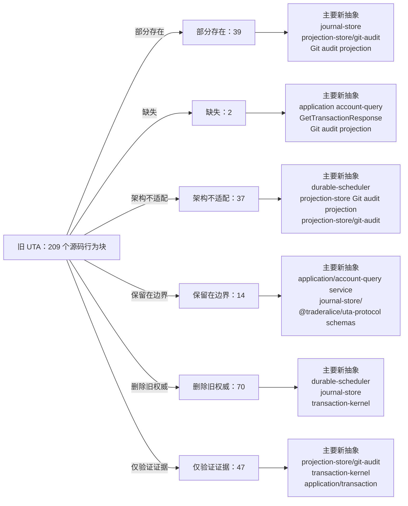

<!-- Auto-generated by scripts/uta-effect-runtime-map.mjs from mapping.json. Do not edit by hand. -->
<!-- Regenerate with `node scripts/uta-effect-runtime-map.mjs`. -->

# UTA 功能替代关系：第 11 章 Approval and Git audit projection

目标架构原文：[`docs/uta-effect-runtime-architecture.md:1219-1236`](../uta-effect-runtime-architecture.md#L1219-L1236)。

## 结论

部分存在 39；缺失 2；架构不适配 37；保留在边界 14；删除旧权威 70；仅验证证据 47。状态只描述当前实现相对于目标架构的关系，不表示迁移已经落地。

## 替代关系图

## 章节级目标缺口

本章没有独立于源码行映射的目标级缺口。

## 源码映射

| 映射 ID | 当前源码 | 符号或行为块 | 当前功能 | 替代状态 | 新 UTA 抽象与做法 | 不适配位置与原因 | 必须补充或调整 | 重复索引 |
|---|---|---|---|---|---|---|---|---|
| `MAP-4E1058C577` | [`packages/uta-protocol/src/brokers/preset-catalog.ts:557-580`](../../packages/uta-protocol/src/brokers/preset-catalog.ts#L557-L580) | deriveUtaId | Filters arbitrary presetConfig fields named by fingerprintFields, fills missing values with null, canonicalizes them, hashes preset id plus JSON to eight hex characters, and returns `${preset.id}-${hash}`. | 部分存在 | 2.2 UTA owns；3.1 domain/；3.4 journal-store/；3.7 brokers/<broker>/；5.7 Complete type contract — nominal identities and financial values；7.1 Embedded database；9.1 Connection Layer；11. Approval and Git audit projection；14. Public protocol；15. Security and authority；17.6 Slice 6: delete the legacy kernel；19. Architectural prohibitions AccountId；ConnectionId；InstrumentId；journal-store/；BrokerConnectionIdentity；protocol/config schemas Introduce typed, durable AccountId/ConnectionId construction from validated broker identity context; retain old ids only as explicit migration compatibility projections. | The current identity is an unbranded 32-bit string hash over generic fields (including secret-derived values for some presets), has no collision/identity evidence in the domain type, and couples account identity to UI preset ids. | Define nominal identity constructors and migration mapping, separate credential storage from identity metadata, persist identity/context in journal/config schemas, and stop using derived strings as transaction identity. | **DUP-047** |
| `MAP-D32AED6801` | [`packages/uta-protocol/src/types/git.ts:1-11`](../../packages/uta-protocol/src/types/git.ts#L1-L11) | Trading-as-Git native imports | Imports IBKR Contract/Order/OrderCancel/Execution/OrderState and Decimal, then imports the global Contract augmentation; these values are used in the public Git wire types. | 架构不适配 | 3.8 projection-store/；3.9 transport/ and protocol/；11. Approval and Git audit projection；14. Public protocol；17.6 Slice 6: delete the legacy kernel；19. Architectural prohibitions projection-store/；protocol/；journal-store/；domain/TradeAction Keep Git export/summary projection types normalized and make SQLite journal events the authority; translate any native broker values before projection. | The shared Git types directly embed broker SDK objects and Decimal, so a human-readable audit projection is also a native execution payload boundary. | Remove native imports from protocol types, define normalized transaction/audit projection values, and isolate adapter-native codecs under brokers/<broker>/. | **DUP-106** |
| `MAP-89E53C0637` | [`packages/uta-protocol/src/types/git.ts:13-16`](../../packages/uta-protocol/src/types/git.ts#L13-L16) | CommitHash | Defines CommitHash as an unconstrained string while documenting an 8-character short SHA-256 hash. | 保留在边界 | 5.7 Complete type contract — nominal identities and financial values；11. Approval and Git audit projection；14. Public protocol；17.6 Slice 6: delete the legacy kernel；19. Architectural prohibitions Git audit projection；journal-store/；Branded<TransactionId>；protocol/ Retain a validated Git hash only as an optional human-readable audit/export pointer; use branded TransactionId/TransactionRevision for execution identity. | Git hashes are not transaction identity, and the current alias has no runtime validation, but the architecture explicitly permits Git audit projections. | Keep CommitHash out of kernel identity and persistence authority, add a hash schema for projection/export only, and source the projection from journal events. | **DUP-107** |
| `MAP-298D6BB247` | [`packages/uta-protocol/src/types/git.ts:18-54`](../../packages/uta-protocol/src/types/git.ts#L18-L54) | Operation discriminated union | Defines place/modify/close/cancel/sync, external-order observation, and balance-reconciliation operations; several variants carry IBKR Contract/Order/OrderCancel or Decimal, while modifyOrder uses Partial<Order>. | 删除旧权威 | 3.1 domain/；3.3 transaction-kernel/；3.8 projection-store/；5.1 Commands, events, effects, and state；5.7 Complete type contract — order and trading action ADTs；6. State tiers and snapshots；10.1 Accounting owns；11. Approval and Git audit projection；14. Public protocol；17.6 Slice 6: delete the legacy kernel；19. Architectural prohibitions TradeAction；TransactionCommand；TransactionEvent；transaction-kernel/；journal-store/；projection-store/；market-and-accounting/ Replace executable operation staging with TransactionCommand/CreateDraft/ReplaceDraft carrying the closed TradeAction and OrderSpec ADTs; represent broker observations and balance reconciliation as typed events/projection inputs rather than Git operations. | The union mixes commands, external facts, sync, and accounting events, exposes native broker values, permits Partial<Order> and optional-field soup, and has no transaction revision, precondition, compensation, or durable identity. | Delete Operation as execution authority, migrate all stage/commit/sync callers to transaction-kernel commands/events and broker observation protocols, and retain only normalized audit projection variants. | **DUP-108** |
| `MAP-4B40267FF6` | [`packages/uta-protocol/src/types/git.ts:56-58`](../../packages/uta-protocol/src/types/git.ts#L56-L58) | OperationStatus | Defines submitted/filled/rejected/cancelled/user-rejected as a flat string status union for Git operation results. | 删除旧权威 | 5.2 Transaction state；5.7 Complete type contract — dispatch and durable-job records；6. State tiers and snapshots；9.3 Remote outcome；11. Approval and Git audit projection；12.2 Unknown-outcome protocol；14. Public protocol；17.6 Slice 6: delete the legacy kernel；19. Architectural prohibitions TransactionState；DispatchState；RemoteOutcome；TransactionResult；projection-store/ Replace the flat label with the complete TransactionState ADT: Draft, Preparing, AwaitingApproval, Queued, Executing, Reconciling, Aborting, Compensating, Committed, Compensated, and RecoveryRequired, each with its canonical payload; model DispatchState and RemoteOutcome separately. | The status list cannot represent the complete transaction lifecycle and payloads, durable dispatch/reconciliation/abort/compensation progress, recovery-required ownership, or the distinction between venue acceptance and final commit criterion. | Remove OperationStatus from kernel/API contracts. Evolve the complete TransactionState exhaustively from journal events and derive legacy history labels only in a typed read projection. | **DUP-109** |
| `MAP-DE16B51F52` | [`packages/uta-protocol/src/types/git.ts:60-77`](../../packages/uta-protocol/src/types/git.ts#L60-L77) | OperationResult | Combines action, success boolean, flat status, optional native Execution/OrderState, optional string error, child legs, symbol attribution, and raw unknown payload. | 删除旧权威 | 1. Thesis and non-negotiable properties；4. Effect model；5.7 Complete type contract — broker capability and interpreter association；6. State tiers and snapshots；9.2 Typed action interpreter；9.3 Remote outcome；11. Approval and Git audit projection；12.2 Unknown-outcome protocol；14. Public protocol；17.6 Slice 6: delete the legacy kernel；19. Architectural prohibitions BrokerActionTypeMap；RemoteOutcome；DispatchFailure；TransactionResult；ProjectionName；projection-store/ Persist action-specific acknowledgement/rejection/observation/unknown variants keyed by DispatchIdentity, and expose a transaction result/projection with typed failures. | `success`, optional error text, and `raw?: unknown` erase the relation among action, acknowledgement, observation, error, compensation, and remote outcome; native SDK values leak into the contract. | Delete OperationResult, migrate result handling to BrokerActionTypeMap/RemoteOutcome/TransactionFailure, and generate Git history summaries from journal/projection events. | **DUP-110** |
| `MAP-FEF9B7F5AE` | [`packages/uta-protocol/src/types/git.ts:79-89`](../../packages/uta-protocol/src/types/git.ts#L79-L89) | GitState | Stores raw string account totals plus arrays of Position and OpenOrder values as the state snapshot after a Git commit. | 部分存在 | 6. State tiers and snapshots；7.4 Snapshot and compaction policy；10.1 Accounting owns；11. Approval and Git audit projection；14. Public protocol；17.6 Slice 6: delete the legacy kernel；19. Architectural prohibitions projection-store/；market-and-accounting/；domain/Money；GetTransactionResponse；journal-store/ Retain a read-only account/order projection if needed for compatibility, rebuilt from journal and broker reconciliation; use normalized accounting types and make it non-authoritative. | A commit embeds mutable-looking account state and native Position/OpenOrder arrays, with unqualified strings and no projection checkpoint/version or rebuild semantics. | Move state authority to journal-store/projection-store, replace fields with normalized account-state projections, and mark any Git state export as rebuildable compatibility output. | **DUP-111** |
| `MAP-BDE3556BBA` | [`packages/uta-protocol/src/types/git.ts:91-102`](../../packages/uta-protocol/src/types/git.ts#L91-L102) | GitCommit | Models a Git hash/parent/message with Operation[]/OperationResult[] and a raw stateAfter snapshot, timestamp, and optional round. | 部分存在 | 3.4 journal-store/；3.8 projection-store/；5.1 Commands, events, effects, and state；7.3 Authoritative tables；11. Approval and Git audit projection；14. Public protocol；17.6 Slice 6: delete the legacy kernel；19. Architectural prohibitions TransactionEvent；journal-store/；projection-store/；Git audit projection；TransactionId Generate a Git audit commit projection from append-only journal events and transaction summaries; store execution facts, dispatches, jobs, and projections in SQLite instead. | The shape makes Git commit contents look like execution authority and includes native operations/results and embedded mutable state; it lacks transaction id/revision, journal sequence, dispatch identity, and durability boundaries. | Stop persisting/reading GitCommit as the execution source, define a normalized audit projection with optional CommitHash, and rebuild it from journal/projection checkpoints. | **DUP-112** |
| `MAP-DC3A63D407` | [`packages/uta-protocol/src/types/git.ts:104-110`](../../packages/uta-protocol/src/types/git.ts#L104-L110) | AddResult | Returns a staged operation with an index and `staged: true`. | 删除旧权威 | 5.1 Commands, events, effects, and state；7.2 Single logical writer and group commit；8.1 Admission；11. Approval and Git audit projection；14. Public protocol；17.2 Slice 2: transaction and approval protocol；19. Architectural prohibitions TransactionCommand；ReplaceDraft；journal-store/；transaction-kernel/；protocol/ Replace staging responses with durable draft transaction identity/version and a typed ReplaceDraft/transaction projection response. | An array index and boolean staged flag are not a durable transaction identity or version and do not prove journal admission. | Delete AddResult and return TransactionId/TransactionVersion after durable draft creation or replacement. | **DUP-113** |
| `MAP-B611B25F33` | [`packages/uta-protocol/src/types/git.ts:112-117`](../../packages/uta-protocol/src/types/git.ts#L112-L117) | CommitPrepareResult | Returns `prepared: true`, a Git CommitHash/message, and operationCount for pre-commit preparation. | 删除旧权威 | 5.3 Two-phase transaction protocol；7.3 Authoritative tables；11. Approval and Git audit projection；14. Public protocol；17.2 Slice 2: transaction and approval protocol；19. Architectural prohibitions PrepareTransactionResponse；PreparedPlan；TransactionRevision；journal-store/；transaction-kernel/ Return PrepareTransactionResponse with PreparedPlan or a typed rejected/conflict variant, including transaction revision, digest, preconditions, compensation, and commit criterion. | Git hash/message/count do not expose a prepared plan, before-images, preconditions, compensation capability, expiry, or durable transaction revision. | Delete CommitPrepareResult and migrate prepare callers to the target `/transactions/:id/prepare` response schema. | **DUP-114** |
| `MAP-C39C98EBC8` | [`packages/uta-protocol/src/types/git.ts:119-125`](../../packages/uta-protocol/src/types/git.ts#L119-L125) | PushResult | Returns a Git hash/message/count plus submitted and rejected OperationResult arrays from a push. | 删除旧权威 | 1. Thesis and non-negotiable properties；5.2 Transaction state；5.3 Two-phase transaction protocol；7.3 Authoritative tables；8.1 Admission；9.3 Remote outcome；11. Approval and Git audit projection；12.2 Unknown-outcome protocol；14. Public protocol；17.6 Slice 6: delete the legacy kernel；19. Architectural prohibitions TransactionState；EffectJob；DispatchRecord；RemoteOutcome；TransactionResult；durable-scheduler/；journal-store/ Replace push with approve/admission followed by durable job identity and queryable transaction state; report typed confirmed/rejected/unknown outcomes asynchronously. | Push synchronously bundles Git persistence and broker mutations, has no durability acknowledgement/job lease/dispatch identity, and collapses partial/unknown work into submitted/rejected arrays. | Delete PushResult and migrate to `/transactions/:id/approve`, durable scheduler jobs, and GetTransactionResponse/event queries. | **DUP-115** |
| `MAP-FC6B6B08DC` | [`packages/uta-protocol/src/types/git.ts:127-131`](../../packages/uta-protocol/src/types/git.ts#L127-L131) | RejectResult | Returns a Git hash/message/count for rejecting a pending commit. | 删除旧权威 | 5.2 Transaction state；7.3 Authoritative tables；11. Approval and Git audit projection；14. Public protocol；17.2 Slice 2: transaction and approval protocol；19. Architectural prohibitions TransactionCommand Reject；TransactionEvent TransactionRejected；journal-store/；protocol/ Use the canonical Reject { transactionId, reason } command and durable TransactionRejected event; transaction state determines that rejection is valid only before dispatch. | Git hash and operation count do not identify the transaction or enforce rejection-before-dispatch semantics. The canonical Reject command itself does not carry revision or actor. | Delete RejectResult and migrate to POST /transactions/:id/reject with a typed command acknowledgement. If transport uses an optimistic version header/precondition, validate it before constructing the canonical Reject command rather than adding fields to the ADT. | **DUP-116** |
| `MAP-DC943FF022` | [`packages/uta-protocol/src/types/git.ts:133-139`](../../packages/uta-protocol/src/types/git.ts#L133-L139) | GitStatus | Reports staged Operation[], pending message/hash, Git head hash, and commit count. | 保留在边界 | 5.2 Transaction state；6. State tiers and snapshots；7.3 Authoritative tables；11. Approval and Git audit projection；14. Public protocol；17.6 Slice 6: delete the legacy kernel；19. Architectural prohibitions GetTransactionResponse；projection-store/；journal-store/；TransactionState；TransactionVersion Retain a GitStatus-shaped read-only compatibility schema only while the current public SDK consumes it; derive it from transaction and Git-audit projections, never execution state. | Git staging/head fields cannot control execution. Deleting the type immediately would contradict the retained public status boundary, so it must be an explicitly temporary projection contract. | Make the SDK and route consume a typed projection backed by durable events; remove only when the public compatibility contract is deliberately retired. | **DUP-117** |
| `MAP-2DA6BBE2CF` | [`packages/uta-protocol/src/types/git.ts:141-158`](../../packages/uta-protocol/src/types/git.ts#L141-L158) | OperationSummary | Summarizes a symbol, OperationAction, textual change, flat status, and optional string order terms for review surfaces. | 部分存在 | 5.7 Complete type contract — order and trading action ADTs；6. State tiers and snapshots；11. Approval and Git audit projection；14. Public protocol；17.6 Slice 6: delete the legacy kernel；19. Architectural prohibitions projection-store/；TradeAction；TransactionState；Git audit projection；protocol/ Keep a normalized review projection derived from TransactionCommand/PreparedPlan and journal events, with exact action/order variants and transaction revision/digest. | The review concept is compatible with an audit/read projection, but symbol/change strings and optional untyped order terms lose the closed action/order relationship and transaction identity. | Replace OperationAction/string terms with a typed transaction summary projection; retain textual change only as presentation generated from typed data. | **DUP-118** |
| `MAP-18E2D21F66` | [`packages/uta-protocol/src/types/git.ts:160-167`](../../packages/uta-protocol/src/types/git.ts#L160-L167) | CommitLogEntry | Represents a Git log row with hash/parent/message/timestamp/round and OperationSummary[] only. | 部分存在 | 6. State tiers and snapshots；7.4 Snapshot and compaction policy；11. Approval and Git audit projection；13. Observability；14. Public protocol；17.6 Slice 6: delete the legacy kernel；19. Architectural prohibitions Git audit projection；projection-store/；journal-store/；TransactionId；JournalSequence Expose Git log as a rebuildable audit projection annotated or correlated with transaction ids/revisions and journal sequences, never as recovery authority. | The row has no transaction/revision/state/sequence and assumes Git's narrative is sufficient for execution history, while target recovery reads SQLite journal and broker observations. | Build CommitLogEntry-compatible output only from projection-store checkpoints and journal events, with a typed compatibility schema and no execution writes. | **DUP-119** |
| `MAP-601583B467` | [`packages/uta-protocol/src/types/git.ts:169-174`](../../packages/uta-protocol/src/types/git.ts#L169-L174) | GitExportState | Exports all GitCommit values and a Git head hash. | 保留在边界 | 7.3 Authoritative tables；7.4 Snapshot and compaction policy；11. Approval and Git audit projection；14. Public protocol；17.6 Slice 6: delete the legacy kernel；19. Architectural prohibitions Git audit projection；projection-store/；journal-store/；protocol/ export schema Retain an explicit Git export for human-readable audit compatibility, generated from SQLite journal/projection state and excluded from recovery or authorization. | The export is a valid compatibility boundary only if Git remains a projection; current type does not state or enforce its rebuildable/non-authoritative source. | Keep the export endpoint as a typed projection, source it from journal events, and ensure Git hashes cannot be used as transaction identity or dispatch/retry authority. | **DUP-120** |
| `MAP-ED7DB561BF` | [`packages/uta-protocol/src/types/git.ts:176-186`](../../packages/uta-protocol/src/types/git.ts#L176-L186) | OrderStatusUpdate | Carries order id/symbol, previous/current flat OperationStatus, and optional decimal-string fill fields for sync updates. | 删除旧权威 | 5.2 Transaction state；6. State tiers and snapshots；9.3 Remote outcome；11. Approval and Git audit projection；12.2 Unknown-outcome protocol；14. Public protocol；17.6 Slice 6: delete the legacy kernel；19. Architectural prohibitions RemoteOutcome；OrderSnapshot；DispatchIdentity；TransactionEvent；projection-store/ Represent broker observation/reconciliation as typed RemoteOutcome and TransactionEvent records keyed by DispatchIdentity and native observation evidence; derive history updates as projections. | Sync status deltas have no dispatch identity, observation timestamp/version/evidence, unknown state, or durable reconciliation checkpoint and reuse a flat Git status. | Delete OrderStatusUpdate from the execution/sync contract and migrate sync polling to durable scheduler observation jobs and journal events. | **DUP-121** |
| `MAP-A9AE528869` | [`packages/uta-protocol/src/types/git.ts:188-192`](../../packages/uta-protocol/src/types/git.ts#L188-L192) | SyncResult | Returns a Git hash, updatedCount, and an array of OrderStatusUpdate values after synchronizing orders. | 删除旧权威 | 7.3 Authoritative tables；8.3 Durable jobs and leases；9.3 Remote outcome；11. Approval and Git audit projection；12.1 Startup sequence；12.2 Unknown-outcome protocol；14. Public protocol；17.6 Slice 6: delete the legacy kernel；19. Architectural prohibitions durable-scheduler/；EffectJob；RemoteOutcome；journal-store/；projection-store/ Schedule typed observation/reconciliation jobs, persist checkpoints and outcomes, and query updated transaction/account projections separately from audit export. | A synchronous hash/count response treats sync as Git persistence and has no durable job/lease/checkpoint or explicit unknown-outcome protocol. | Delete SyncResult as the scheduler contract and expose durable reconciliation job/event identities and typed query responses. | **DUP-122** |
| `MAP-A774AC84F2` | [`packages/uta-protocol/src/types/git.ts:308-322`](../../packages/uta-protocol/src/types/git.ts#L308-L322) | getOperationSymbol | Switches over legacy Operation variants and returns contract.symbol/aliceId where available, otherwise the literal `unknown`; modify/cancel/sync have no symbol. | 删除旧权威 | 3.1 domain/；3.8 projection-store/；5.7 Complete type contract — nominal identities and financial values；9.4 Capability derivation；10.2 Market and jurisdiction owns；11. Approval and Git audit projection；14. Public protocol；17.6 Slice 6: delete the legacy kernel；19. Architectural prohibitions InstrumentId；TradeAction；projection-store/；market-and-accounting/；Git audit projection Derive display identity from typed TradeAction/instrument projection fields; do not infer identity from native symbol/aliceId fallbacks or return an untyped unknown sentinel. | The helper depends on legacy/native fields, loses identity for several action variants, and uses a permissive string fallback instead of a nominal InstrumentId or explicit absence variant. | Delete the helper with Operation, migrate consumers to typed action/projection mappers, and require explicit instrument identity where the target contract needs it. | **DUP-130** |
| `MAP-29B08BE41B` | [`packages/uta-protocol/src/types/history.ts:15-30`](../../packages/uta-protocol/src/types/history.ts#L15-L30) | HistoryContract | Defines an IBKR-superset compact contract with all identity/market fields optional, including optional string aliceId, symbol/localSymbol/secType/currency/exchange and derivative fields. | 部分存在 | 3.8 projection-store/；3.9 transport/ and protocol/；6. State tiers and snapshots；10.2 Market and jurisdiction owns；11. Approval and Git audit projection；14. Public protocol；19. Architectural prohibitions projection-store/；domain/InstrumentId；market-and-accounting/；Git audit projection；protocol/ history schema Keep history as a read projection with a normalized instrument identity and explicit derivative/instrument variants; map IBKR/venue-native fields only in adapters. | The projection intent is compatible with the target read/audit boundary, but an optional-field IBKR superset and optional aliceId cannot guarantee instrument identity, currency, venue, or derivative validity. | Define a normalized HistoryInstrument/InstrumentId projection schema, preserve broker-native details as redacted adapter metadata only, and validate required fields per instrument variant. | **DUP-131** |
| `MAP-8CE1592385` | [`packages/uta-protocol/src/types/history.ts:32-34`](../../packages/uta-protocol/src/types/history.ts#L32-L34) | OrderHistoryStatus and OrderHistorySource | Uses flat string unions for submitted/filled/cancelled/rejected/user-rejected and alice/external source labels. | 部分存在 | 5.2 Transaction state；6. State tiers and snapshots；9.3 Remote outcome；11. Approval and Git audit projection；12.2 Unknown-outcome protocol；14. Public protocol；19. Architectural prohibitions TransactionState；RemoteOutcome；OrderSnapshot；Git audit projection；protocol/ history schema Derive history labels from typed TransactionState, DispatchState, and RemoteOutcome, retaining source as a projection dimension rather than execution truth. | The labels omit prepared/queued/executing/reconciling/unknown/compensating/recovery states and cannot encode observation evidence or transaction identity. | Replace execution use of these unions with typed state/outcome mappers; keep compatibility labels only in a validated history projection. | **DUP-132** |
| `MAP-732B845474` | [`packages/uta-protocol/src/types/history.ts:36-59`](../../packages/uta-protocol/src/types/history.ts#L36-L59) | OrderHistoryEntry | Collapses an order lifecycle into one row with optional broker order id/order terms/fills, flat status/source, Git commit hash/message, and optional string error. | 部分存在 | 5.7 Complete type contract — before-images, observations, and preconditions；6. State tiers and snapshots；7.4 Snapshot and compaction policy；9.3 Remote outcome；11. Approval and Git audit projection；12.2 Unknown-outcome protocol；13. Observability；14. Public protocol；17.6 Slice 6: delete the legacy kernel；19. Architectural prohibitions OrderSnapshot；TransactionId；DispatchIdentity；projection-store/；Git audit projection；journal-store/；protocol/ history schema Build order history from journal events, normalized order/remote observations, and projection checkpoints; expose transaction/revision/dispatch correlation and retain CommitHash only as audit pointer. | The row is a useful read projection, but optional order terms, flat status, commit hash/message authority, and free-form error omit order version, observation timestamp/evidence, transaction identity, and unknown/reconciliation state. | Redesign the history projection schema around typed OrderSnapshot/RemoteOutcome and journal correlation, then keep only presentation-compatible fields as derived output. | **DUP-133** |
| `MAP-56C6192DB1` | [`packages/uta-protocol/src/types/history.ts:61-76`](../../packages/uta-protocol/src/types/history.ts#L61-L76) | TradeHistorySource and TradeHistoryEntry | Represents fill/reconcile rows with optional order id, HistoryContract, side, decimal-string quantity/price/value, source order/external/reconcile, and Git commit hash. | 部分存在 | 5.7 Complete type contract — nominal identities and financial values；6. State tiers and snapshots；7.4 Snapshot and compaction policy；10.1 Accounting owns；11. Approval and Git audit projection；12.2 Unknown-outcome protocol；14. Public protocol；17.6 Slice 6: delete the legacy kernel；19. Architectural prohibitions market-and-accounting/；Fill；ExposureSnapshot；RemoteOutcome；projection-store/；Git audit projection；journal-store/ Generate trade history from typed broker acknowledgements/observations and accounting fill/reconciliation events, with currency-qualified Money/Quantity and journal correlation. | The read-only fill projection is directionally valid, but quantity/price/value lack branded instrument/currency context, optional order identity is not linked to dispatch, and Git hash remains the only audit pointer. | Move authority to journal/accounting projections, add typed Fill/Reconciliation records and observation timestamps, and retain CommitHash only as optional derived audit metadata. | **DUP-134** |
| `MAP-8800585703` | [`services/uta/src/domain/trading/__test__/e2e/live-paper-evidence.ts:40-52`](../../services/uta/src/domain/trading/__test__/e2e/live-paper-evidence.ts#L40-L52) | runStamp/runId/currentCommit/gitCommit | Creates a per-run timestamp/process identifier, allows an environment-provided run id, and records the current Git commit or 'unknown' for evidence metadata. | 保留在边界 | 11 Approval and Git audit projection；13 Observability；19 Architectural prohibitions projection-store Git audit projection；observability metadata Keep Git commit/run metadata only as an external test artifact; target transaction identity must come from journal transaction/revision/dispatch IDs. | The helper uses Git metadata for evidence, but target architecture forbids Git hashes as transaction identity; no production authority is claimed by this file. | — | **DUP-206** |
| `MAP-C2F022975E` | [`services/uta/src/domain/trading/__test__/e2e/live-paper-evidence.ts:68-87`](../../services/uta/src/domain/trading/__test__/e2e/live-paper-evidence.ts#L68-L87) | recordLivePaperEvidence | Creates an ignored data/uta-live-paper-runs directory by default and appends one JSONL record containing schemaVersion, timestamp, Git commit, paper flag, broker name, and scenario evidence. | 保留在边界 | 7 Durability architecture；11 Approval and Git audit projection；13 Observability；18.3 Real broker acceptance；18.4 Packaging and storage acceptance；19 Architectural prohibitions test evidence sink；observability；projection-store acceptance artifact Retain only as a clearly non-authoritative paper-test artifact; target journal-store remains the sole trading authority, and acceptance records should reference journal/dispatch identities without persisting secrets or native payloads. | No assigned e2e file exercises source/Docker/Electron package migration, abrupt termination, backup/restore, relocation, or corrupt journal/schema handling required by 18.4. This JSONL helper is not evidence of SQLite durability and must never replace it. | — | **DUP-208** |
| `MAP-58F0FF7798` | [`services/uta/src/domain/trading/__test__/e2e/uta-alpaca.e2e.spec.ts:37-78`](../../services/uta/src/domain/trading/__test__/e2e/uta-alpaca.e2e.spec.ts#L37-L78) | describe UTA — Alpaca order lifecycle | Stages a $1 AAPL limit buy, commits it, pushes it through UnifiedTradingAccount, then stages and pushes a cancel; it asserts prepared/submitted results and at least two legacy log commits. | 删除旧权威 | 5.2 Transaction state；5.3 Two-phase transaction protocol；7 Durability architecture；8 Scheduling, ordering, and concurrency；11 Approval and Git audit projection；12 Recovery model；17.4 Slice 4: first real broker；18.1 Kernel crash matrix；18.3 Real broker acceptance；20 First falsifier transaction-kernel/coordinator；journal-store；durable-scheduler；brokers/alpaca typed interpreter；projection-store；broker-spi Replace stage/commit/push/cancel with a prepared transaction, durable approval, DispatchPlanned outbox job, leased scheduler execution, typed Alpaca acknowledgement, and journaled cancel/compensation projection. Add the MockBroker crash experiment separately before using this as Slice 4 evidence. | The legacy push mutates through UnifiedTradingAccount/IBroker without a durable intent acknowledgement, dispatch identity, lease, journal event, compensation declaration, or remote unknown-outcome path. It runs in one process and supplies no 18.1 crash-matrix or 20 first-falsifier evidence. | Remove this legacy execution test when the target path lands; assert durable state before dispatch, typed accepted/rejected/unknown outcomes, restart classification, and no blind duplicate, then assert the real Alpaca baseline is restored. | **DUP-217** |
| `MAP-CAA43D746F` | [`services/uta/src/domain/trading/__test__/e2e/uta-ccxt-bybit.e2e.spec.ts:136-180`](../../services/uta/src/domain/trading/__test__/e2e/uta-ccxt-bybit.e2e.spec.ts#L136-L180) | reject approval behavior | Stages and commits a buy without pushing, rejects it with and without a reason, then asserts staging is cleared and legacy log/show entries contain user-rejected status and error text. | 部分存在 | 5.2 Transaction state；7 Durability architecture；11 Approval and Git audit projection；12.3 Defects and expected failures；17.2 Slice 2: transaction and approval protocol；18.3 Real broker acceptance transaction-kernel approval state；journal-store；projection-store Git audit；protocol transaction schemas Keep the user-facing review/reject behavior but drive it through Draft/Prepared/AwaitingApproval/Compensated states. Approval binds revision/plan digest/expiry/actor; rejection uses canonical Reject { transactionId, reason }. Both append durable events and feed a rebuildable Git audit projection. | The test proves legacy hash/staging/log rejection behavior, but not a durable canonical rejection transition, state guard, event ordering, or Compensated state with no compensation work before dispatch. | Add transaction-oriented approval and rejection schemas and journal assertions. Keep approval bindings on Approve; do not add them to Reject. Remove TradingGit rejection authority after the target protocol is authoritative. | **DUP-228** |
| `MAP-47B29B6218` | [`services/uta/src/domain/trading/__test__/e2e/uta-ccxt-bybit.e2e.spec.ts:182-216`](../../services/uta/src/domain/trading/__test__/e2e/uta-ccxt-bybit.e2e.spec.ts#L182-L216) | sentinel status/show/export boundary | Stages a market order, asserts a large Decimal sentinel is absent from status, pushes it, asserts the sentinel is absent from show/exportGitState/log, and closes the resulting position. | 部分存在 | 3.8 projection-store/；6 State tiers and snapshots；11 Approval and Git audit projection；13 Observability；14 Public protocol；17.2 Slice 2: transaction and approval protocol；19 Architectural prohibitions projection-store；protocol codecs and schemas；journal-store；observability redaction schemas Retain the boundary invariant as a projection/protocol test: decode and encode named schemas from journal-derived projections and verify financial sentinel/default values cannot cross public or audit boundaries. | The current assertions cover legacy status/show/export/log JSON only; they do not exercise named protocol schemas, journal-derived rebuilds, redaction, transaction/dispatch identifiers, or target projection authority. | Move the sentinel check to projection-store and protocol integration tests and remove legacy exportGitState persistence once the journal is authoritative. | **DUP-229** |
| `MAP-5C9F33F93C` | [`services/uta/src/domain/trading/__test__/e2e/uta-ibkr.e2e.spec.ts:36-89`](../../services/uta/src/domain/trading/__test__/e2e/uta-ibkr.e2e.spec.ts#L36-L89) | FX identity staging | Searches for a USD.CHF CASH contract, forms an IBKR native-key aliceId, stages a limit order with display-only USDCHF, asserts conId identity and empty routing fields, commits without pushing, records evidence, then rejects/cleans staging. | 部分存在 | 5.3 Two-phase transaction protocol；5.7 Complete type contract；6 State tiers and snapshots；9.2 Typed action interpreter；10.2 Market and jurisdiction owns；10.3 Transaction kernel consumes observations；11 Approval and Git audit projection；17.5 Slice 5: heterogeneous brokers；18.3 Real broker acceptance domain identifiers and action ADTs；transaction-kernel preconditions；broker-spi IBKR interpreter；market-and-accounting jurisdiction/instrument service；journal-store；projection-store Retain the conId/display-symbol invariant in a target prepare test: resolve account, jurisdiction, instrument, and canonical IBKR identity into a typed prepared plan, persist the prepared event, and reject through the approval state machine. | The current legacy staging test observes correct conId/display fields but has no typed transaction revision, durable prepared event, market/jurisdiction observation, conflict key, or broker-spi action schema. | Move identity resolution into domain/broker-spi preparation and journal-store projections; make approval/rejection target state durable before removing legacy UTA staging. | **DUP-231** |
| `MAP-DC819A17DE` | [`services/uta/src/domain/trading/__test__/e2e/uta-ibkr.e2e.spec.ts:93-138`](../../services/uta/src/domain/trading/__test__/e2e/uta-ibkr.e2e.spec.ts#L93-L138) | IBKR legacy limit order lifecycle | Discovers AAPL, stages a $1 GTC limit buy, commits and pushes it, stages/pushes a cancel, and checks two legacy log commits. | 删除旧权威 | 5.3 Two-phase transaction protocol；7 Durability architecture；8 Scheduling, ordering, and concurrency；9.2 Typed action interpreter；11 Approval and Git audit projection；12 Recovery model；17.5 Slice 5: heterogeneous brokers；18.3 Real broker acceptance transaction-kernel；journal-store；durable-scheduler；brokers/ibkr typed interpreter；projection-store Replace stage/commit/push/cancel with target prepared transaction, durable job/lease, typed IBKR dispatch identity and acknowledgement, and a journaled cancel/compensation transition. | No durable pre-dispatch intent, lease, conflict key, typed remote outcome, compensation capability, restart classification, or authoritative journal is asserted. | Delete the legacy test when target IBKR execution becomes authoritative and add scheduler/recovery plus baseline open-order assertions. | **DUP-232** |
| `MAP-81E8AC49C4` | [`services/uta/src/domain/trading/__test__/e2e/uta-lifecycle.e2e.spec.ts:30-64`](../../services/uta/src/domain/trading/__test__/e2e/uta-lifecycle.e2e.spec.ts#L30-L64) | market-buy dispatch and immediate-fill lifecycle tests | Stages/commits/pushes market buys, asserts submitted/filled results, immediate Mock position/cash mutation, and that sync has no later update. | 删除旧权威 | 5 Transaction algebra；5.2 Transaction state；5.3 Two-phase transaction protocol；7 Durability architecture；8 Scheduling, ordering, and concurrency；11 Approval and Git audit projection；12 Recovery model；17.1 Slice 1: durable kernel with MockBroker；18.1 Kernel crash matrix；18.2 Concurrency scenarios；20 First falsifier transaction-kernel/coordinator；journal-store；durable-scheduler；brokers/mock；projection-store；effect-runtime Test PlaceOrder prepare/approval/durable dispatch, explicit Ack versus commit criterion, observation, and projection update. | One-process immediate fill conflates venue acceptance, fill observation, and committed transaction; no durable intent or restart cut is exercised. | For every mutation terminate exactly after: transaction prepared and before approval; approval committed and before job claim; job claim committed and before dispatch; broker accepted and before acknowledgement persistence; acknowledgement persisted and before projection update; abort persisted and before compensation; compensation dispatched and before its acknowledgement. After restart, permit exactly one justified next action and no blind duplicate. | **DUP-236** |
| `MAP-6119E3BEEE` | [`services/uta/src/domain/trading/__test__/e2e/uta-lifecycle.e2e.spec.ts:66-108`](../../services/uta/src/domain/trading/__test__/e2e/uta-lifecycle.e2e.spec.ts#L66-L108) | account state and limit-order reconciliation tests | Pushes a market buy and a submitted limit order, reads live GitState, externally fills the order, then calls sync and asserts filled projection state. | 删除旧权威 | 5 Transaction algebra；5.2 Transaction state；5.3 Two-phase transaction protocol；7 Durability architecture；8 Scheduling, ordering, and concurrency；11 Approval and Git audit projection；12 Recovery model；17.1 Slice 1: durable kernel with MockBroker；18.1 Kernel crash matrix；18.2 Concurrency scenarios；20 First falsifier transaction-kernel/coordinator；journal-store；durable-scheduler；brokers/mock；projection-store；effect-runtime Persist dispatch identity and StillWorking outcome, schedule durable observation, journal the fill, and rebuild account/order projections. | Pending identity and reconciliation live in memory; external fill and sync have no durable job, lease, observation evidence, or restart behavior. | For every mutation terminate exactly after: transaction prepared and before approval; approval committed and before job claim; job claim committed and before dispatch; broker accepted and before acknowledgement persistence; acknowledgement persisted and before projection update; abort persisted and before compensation; compensation dispatched and before its acknowledgement. After restart, permit exactly one justified next action and no blind duplicate. | **DUP-237** |
| `MAP-7076DD2230` | [`services/uta/src/domain/trading/__test__/e2e/uta-lifecycle.e2e.spec.ts:110-123`](../../services/uta/src/domain/trading/__test__/e2e/uta-lifecycle.e2e.spec.ts#L110-L123) | partial-close lifecycle test | Buys ten units, stages a close of three, pushes it, and asserts a seven-unit Mock position. | 删除旧权威 | 5 Transaction algebra；5.2 Transaction state；5.3 Two-phase transaction protocol；7 Durability architecture；8 Scheduling, ordering, and concurrency；11 Approval and Git audit projection；12 Recovery model；17.1 Slice 1: durable kernel with MockBroker；18.1 Kernel crash matrix；18.2 Concurrency scenarios；20 First falsifier transaction-kernel/coordinator；journal-store；durable-scheduler；brokers/mock；projection-store；effect-runtime Prepare a reduce-only ClosePosition with before-image, ExposureEquals precondition, conflict key, compensation capability, and TargetExposureReached criterion. | The test proves arithmetic only; it does not cover external exposure change, same-exposure serialization, partial fill, unknown outcome, or restart. | For every mutation terminate exactly after: transaction prepared and before approval; approval committed and before job claim; job claim committed and before dispatch; broker accepted and before acknowledgement persistence; acknowledgement persisted and before projection update; abort persisted and before compensation; compensation dispatched and before its acknowledgement. After restart, permit exactly one justified next action and no blind duplicate. | **DUP-238** |
| `MAP-5F648FC9E1` | [`services/uta/src/domain/trading/__test__/e2e/uta-lifecycle.e2e.spec.ts:125-137`](../../services/uta/src/domain/trading/__test__/e2e/uta-lifecycle.e2e.spec.ts#L125-L137) | full-close lifecycle test | Buys and fully closes a Mock position, then asserts no position and restored cash. | 删除旧权威 | 5 Transaction algebra；5.2 Transaction state；5.3 Two-phase transaction protocol；7 Durability architecture；8 Scheduling, ordering, and concurrency；11 Approval and Git audit projection；12 Recovery model；17.1 Slice 1: durable kernel with MockBroker；18.1 Kernel crash matrix；18.2 Concurrency scenarios；20 First falsifier transaction-kernel/coordinator；journal-store；durable-scheduler；brokers/mock；projection-store；effect-runtime Test full-close prepared state, durable dispatch/observation, signed accounting effects, and terminal criterion across restart. | A synchronous in-memory close cannot prove durable compensation, residual exposure handling, cash provenance, or recovery. | For every mutation terminate exactly after: transaction prepared and before approval; approval committed and before job claim; job claim committed and before dispatch; broker accepted and before acknowledgement persistence; acknowledgement persisted and before projection update; abort persisted and before compensation; compensation dispatched and before its acknowledgement. After restart, permit exactly one justified next action and no blind duplicate. | **DUP-239** |
| `MAP-C63562DE19` | [`services/uta/src/domain/trading/__test__/e2e/uta-lifecycle.e2e.spec.ts:139-151`](../../services/uta/src/domain/trading/__test__/e2e/uta-lifecycle.e2e.spec.ts#L139-L151) | cancel-order lifecycle test | Creates a pending limit order, stages/pushes cancel, and asserts the Mock order is Cancelled. | 删除旧权威 | 5 Transaction algebra；5.2 Transaction state；5.3 Two-phase transaction protocol；7 Durability architecture；8 Scheduling, ordering, and concurrency；11 Approval and Git audit projection；12 Recovery model；17.1 Slice 1: durable kernel with MockBroker；18.1 Kernel crash matrix；18.2 Concurrency scenarios；20 First falsifier transaction-kernel/coordinator；journal-store；durable-scheduler；brokers/mock；projection-store；effect-runtime Compile CancelOrder with native identity/precondition, durably dispatch, observe remote cancellation, and commit only when the criterion is met. | No cancel-before-image, identity recovery, unknown outcome, already-terminal handling, lease, or restart is exercised. | For every mutation terminate exactly after: transaction prepared and before approval; approval committed and before job claim; job claim committed and before dispatch; broker accepted and before acknowledgement persistence; acknowledgement persisted and before projection update; abort persisted and before compensation; compensation dispatched and before its acknowledgement. After restart, permit exactly one justified next action and no blind duplicate. | **DUP-240** |
| `MAP-3EEA8F2FEB` | [`services/uta/src/domain/trading/__test__/e2e/uta-lifecycle.e2e.spec.ts:153-167`](../../services/uta/src/domain/trading/__test__/e2e/uta-lifecycle.e2e.spec.ts#L153-L167) | legacy commit-history lifecycle test | Pushes buy and close operations and asserts reverse-chronological in-memory Git log messages. | 删除旧权威 | 5 Transaction algebra；5.2 Transaction state；5.3 Two-phase transaction protocol；7 Durability architecture；8 Scheduling, ordering, and concurrency；11 Approval and Git audit projection；12 Recovery model；17.1 Slice 1: durable kernel with MockBroker；18.1 Kernel crash matrix；18.2 Concurrency scenarios；20 First falsifier transaction-kernel/coordinator；journal-store；durable-scheduler；brokers/mock；projection-store；effect-runtime Verify Git history is a rebuildable audit projection of durable transaction events and survives projection failure/rebuild. | Only in-memory commit ordering is tested; no authoritative journal, checkpoint, schema, actor, plan digest, or projection recovery exists. | For every mutation terminate exactly after: transaction prepared and before approval; approval committed and before job claim; job claim committed and before dispatch; broker accepted and before acknowledgement persistence; acknowledgement persisted and before projection update; abort persisted and before compensation; compensation dispatched and before its acknowledgement. After restart, permit exactly one justified next action and no blind duplicate. | **DUP-241** |
| `MAP-F0F4E26989` | [`services/uta/src/domain/trading/brokers/mock/MockBroker.ts:757-797`](../../services/uta/src/domain/trading/brokers/mock/MockBroker.ts#L757-L797) | getSimulatorState | Builds a UI-oriented snapshot of cash, mark prices, positions, native derivative metadata, wallet source, and submitted orders from mutable maps. | 保留在边界 | 6. State tiers and snapshots；10.1 Accounting owns；11. Approval and Git audit projection；13. Observability；16. Target source layout；19. Architectural prohibitions projection-store/accounting；projection-store/orders；application/account-query service；protocol/GetAccountStateResponse；brokers/mock/test harness Keep a simulator read view only as a rebuildable projection or test fixture. The public/application query path should expose named protocol schemas backed by projection-store; the view must not become an alternate trading authority or serialize native adapter objects. | It is assembled directly from volatile adapter state, has ad hoc arrays/optional strings, and is not journal-derived, schema-versioned, or separated from UI presentation. | Create a projection-store/application query model with named schemas and rebuild semantics; narrow getSimulatorState to test/dev use and remove it from transaction decisions. | **DUP-698** |
| `MAP-B9BAFEC82F` | [`services/uta/src/domain/trading/brokers/others/leverup/LeverupBroker.spec.ts:393-431`](../../services/uta/src/domain/trading/brokers/others/leverup/LeverupBroker.spec.ts#L393-L431) | getAccount and getPositions tests | Tests USDC cash conversion and one mocked position mapping, asserting USD account and long side but not units for fees/PnL, complete pagination, unknown records, as-of observations, or accounting projection rebuild. | 仅验证证据 | 6 State tiers and snapshots；9.2 Typed action interpreter；10.1 Accounting owns；10.2 Market and jurisdiction owns；11 Approval and Git audit projection；12 Recovery model；13 Observability；18.3 Real broker acceptance；19 Architectural prohibitions market-and-accounting/AccountingProjection；projection-store/PositionProjection；broker-spi/Observation；journal-store/RemoteObservation Test schema-decoded multi-page observations, currency/scale/cost-basis/PnL handling, unknown valuation, projection rebuild from journal, and reconciliation after remote mutation. | — | — | **DUP-742** |
| `MAP-CA5605FEB6` | [`services/uta/src/domain/trading/cost-basis.spec.ts:1-88`](../../services/uta/src/domain/trading/cost-basis.spec.ts#L1-L88) | cost-basis test fixtures and GitCommit constructors | Builds IBKR Contract and Order SDK objects, composite aliceId strings, raw Operation/OperationResult records, and synthetic GitCommit snapshots for placeOrder, closePosition, and reconcileBalance scenarios. | 仅验证证据 | §5.7 Complete type contract；§7.3 Authoritative tables；§10.1 Accounting owns；§11 Approval and Git audit projection；§16 Target source layout；§17 Slice 6: delete the legacy kernel domain/FillEvent；domain/ReconciliationEvent；journal-store/DomainJournal；projection-store/accounting；domain/Contract Replace legacy SDK/Git fixtures with schema-validated domain fill and reconciliation events, journal sequence/identity fixtures, and projection-store rebuild inputs. Preserve the arithmetic invariants while removing GitCommit and broker-SDK values from the accounting-domain test boundary. | These fixtures prove only the legacy Git and SDK-shaped input contract; they do not exercise journal durability, branded identities, typed provenance, or projection rebuildability. | Add target-domain constructors and durable journal/projection fixtures when the accounting slice migrates; keep these helpers as evidence of the old boundary, not as the new authority. | **DUP-857** |
| `MAP-977FF0C895` | [`services/uta/src/domain/trading/cost-basis.spec.ts:89-265`](../../services/uta/src/domain/trading/cost-basis.spec.ts#L89-L265) | recomputeCostBasisFromCommits test cluster | Tests null for empty or unrelated history; weighted-average buys; average-preserving partial sells; zero reset on full or oversell; fresh basis after a full sell; reconcileBalance mark-price bootstrap and negative drift; failed or missing-price results being ignored; aliceId filtering; closePosition sells; and Decimal quantity precision. | 仅验证证据 | §5.1 Commands, events, effects, and state；§5.7 Complete type contract；§6 State tiers and snapshots；§7.3 Authoritative tables；§10.1 Accounting owns；§11 Approval and Git audit projection；§17 Slice 5: heterogeneous brokers；§17 Slice 6: delete the legacy kernel；§19 Architectural prohibitions domain/CostBasisState；domain/FillEvent；domain/ReconciliationEvent；journal-store/DomainJournal；projection-store/accounting；domain/ValidationFailure Port the valid WAC arithmetic cases to pure CostBasisState evolution and add journal-backed projection rebuild tests. Replace null/skip expectations with explicit empty, unavailable, invalid, and provenance-bearing states; add typed currency/instrument identity and the selected short/lot/oversell policy. | The assertions intentionally lock in legacy behaviors that treat empty history or malformed fields as null/no-op and treat first observation at a mark as an acquisition cost; they also cannot prove durable recovery or event ordering. | Rewrite these cases around typed journal events and projection-store/accounting; retain only policy assertions that the target accounting design explicitly adopts. | **DUP-858** |
| `MAP-7BEE7FDB8C` | [`services/uta/src/domain/trading/cost-basis.spec.ts:266-301`](../../services/uta/src/domain/trading/cost-basis.spec.ts#L266-L301) | pendingBuy and syncCommit fixtures | Creates a submitted order with no execution data and a synthetic syncOrders commit with one result per orderId, optionally carrying filled quantity and execution price. | 仅验证证据 | §5.7 Complete type contract；§7.3 Authoritative tables；§9.2 Typed action interpreter；§10.1 Accounting owns；§11 Approval and Git audit projection；§17 Slice 5: heterogeneous brokers domain/FillEvent；domain/RemoteOutcome；journal-store/DomainJournal；projection-store/accounting；broker-spi/BrokerActionInterpreter Replace these fixtures with a durable dispatch/remote-observation sequence: a prepared order, a typed StillWorking or Confirmed observation, and an accounting FillEvent carrying execution price and source order identity. | The fixture models asynchronous fills as a Git sync side channel and does not model dispatch identity, remote outcome states, durability acknowledgement, or reconciliation leases. | Exercise the broker-spi observation contract and journal events directly, with durable event identity and explicit unknown/still-working outcomes. | **DUP-859** |
| `MAP-68C7EFD89F` | [`services/uta/src/domain/trading/cost-basis.spec.ts:302-374`](../../services/uta/src/domain/trading/cost-basis.spec.ts#L302-L374) | sync-fill attribution test cluster | Tests execution-price attribution for delayed fills, deduplication when the originating result already had execution data, filtering by aliceId and filled status, external-order observation attribution, and sell-side quantity reduction without moving WAC. | 仅验证证据 | §5.1 Commands, events, effects, and state；§6 State tiers and snapshots；§7.3 Authoritative tables；§9.2 Typed action interpreter；§10.1 Accounting owns；§11 Approval and Git audit projection；§12.2 Unknown-outcome protocol；§17 Slice 5: heterogeneous brokers；§19 Architectural prohibitions broker-spi/RemoteOutcome；domain/FillEvent；domain/CostBasisState；journal-store/DomainJournal；projection-store/accounting；domain/DispatchId Keep the execution-price, idempotent-fill, external-observation, and sell-policy invariants, but drive them from durable DispatchId/order identity and typed remote observations. Add unknown-outcome/reconciliation cases and prove a journal replay cannot double-apply a fill. | The tests show the desired execution-price behavior but encode it through Git sync commits; they do not prove crash recovery, durable deduplication, typed remote outcome handling, or protection against blind redispatch. | Move the scenarios to broker-spi and journal-store integration boundaries and make the accounting projection consume only confirmed, uniquely identified fill events. | **DUP-860** |
| `MAP-D807137749` | [`services/uta/src/domain/trading/cost-basis.ts:1-24`](../../services/uta/src/domain/trading/cost-basis.ts#L1-L24) | module documentation and declared cost-basis scope | Documents replaying GitCommit operations for CCXT spot holdings, WAC-only long-spot accounting, reconcileBalance mark-price bootstrap, and explicit exclusion of shorts, splits, token migrations, FIFO lots, and true pre-Alice acquisition cost. | 删除旧权威 | §3.1 domain；§10.1 Accounting owns；§11 Approval and Git audit projection；§16 Target source layout；§17 Slice 6: delete the legacy kernel；§19 Architectural prohibitions market-and-accounting/CostBasisProjection；journal-store/DomainJournal；projection-store/accounting；domain/FillEvent；domain/ReconciliationEvent Delete GitCommit replay and mark-price bootstrap as the accounting authority. Implement a journal-derived CostBasisProjection/evolution over typed fill and reconciliation events with explicit acquisition provenance and an explicit long/short/lot policy; retain Git only as a rebuildable human-readable audit projection. | The documented source of truth is the legacy Git log, and a missing history is expected to become a current-mark acquisition. The stated spot-only WAC limitations leave short exposure, acquisition provenance, and other accounting policies unrepresented. | Make journal events and the accounting projection authoritative, represent unavailable or unattributed basis as a typed state requiring an explicit reconciliation event, and remove the Git/file-backed execution path when the new projection becomes authoritative. | **DUP-861** |
| `MAP-EBE3DF37DD` | [`services/uta/src/domain/trading/cost-basis.ts:38-134`](../../services/uta/src/domain/trading/cost-basis.ts#L38-L134) | recomputeCostBasisFromCommits | Runs a two-pass in-memory replay over the caller-provided commit array. It builds an orderId-to-origin map, handles syncOrders separately, applies successful filled quantities/prices using WAC buys and average-preserving sells, clamps zero or oversold positions to zero, increments fillCount, and returns null when no fill was applied. | 删除旧权威 | §3.1 domain；§5.1 Commands, events, effects, and state；§5.7 Complete type contract；§6 State tiers and snapshots；§7.3 Authoritative tables；§10.1 Accounting owns；§11 Approval and Git audit projection；§17 Slice 5: heterogeneous brokers；§17 Slice 6: delete the legacy kernel；§19 Architectural prohibitions journal-store/DomainJournal；projection-store/accounting；domain/CostBasisState；domain/FillEvent；domain/ReconciliationEvent；domain/Quantity；domain/Price Replace this function with a pure, exhaustive cost-basis evolution over typed journal events and a durable projection-store/accounting writer. The projection must use journal sequence and event identity for ordering/idempotency, preserve execution and reconciliation provenance, return typed unavailable/corrupt states instead of null or silent skips, and evolve through an explicit policy for sells, shorts, and oversells. | GitCommit[] is the only input authority and its array order is trusted as chronology; mutable Map/Set/local state performs ad hoc sync attribution; unsuccessful, malformed, or missing-price records are silently ignored; a mixed commit containing syncOrders skips paired non-sync operations; no durable event sequence, source timestamp, currency, or remote observation is represented; null delegates to a mark-price bootstrap; oversells erase possible short exposure. | Move accounting evolution behind journal-store events and projection-store/accounting, decode and validate each fill/reconciliation at the boundary, use typed event identity and durable sequence for deduplication, preserve explicit source/price provenance, and emit typed failure or unavailable variants for incomplete/corrupt history rather than treating it as empty history or inventing a mark-price basis. | **DUP-863** |
| `MAP-FE7C71CD03` | [`services/uta/src/domain/trading/cost-basis.ts:136-148`](../../services/uta/src/domain/trading/cost-basis.ts#L136-L148) | matchesAliceId | Selects legacy operations by comparing an unbranded composite aliceId string against contract.aliceId for order-like operations or op.aliceId for reconcileBalance; every other operation returns false. | 删除旧权威 | §3.1 domain；§5.7 Complete type contract — Nominal identities；§10.1 Accounting owns；§11 Approval and Git audit projection；§16 Target source layout；§17 Slice 6: delete the legacy kernel；§19 Architectural prohibitions domain/AccountId；domain/InstrumentId；domain/FillEvent；domain/ReconciliationEvent；journal-store/DomainJournal Remove the string matcher with Git replay. Typed journal events should carry branded account and instrument identities, and the accounting projection should select only event variants whose schema already proves the relevant ownership. | Composite strings and optional broker Contract fields are used as identity, while unknown operation variants are silently treated as unrelated. This cannot enforce the target nominal identity relationships or distinguish malformed persisted events from an unrelated account. | Decode branded AccountId/InstrumentId and explicit event variants in the journal schema; make unsupported or malformed variants typed failures and retain Git only as an export projection. | **DUP-864** |
| `MAP-556EBB388B` | [`services/uta/src/domain/trading/cost-basis.ts:169-173`](../../services/uta/src/domain/trading/cost-basis.ts#L169-L173) | isCostBasisRelevant | Returns false for unsuccessful or missing filledQty/filledPrice results and recognizes only placeOrder, closePosition, and reconcileBalance; it omits observeExternalOrder even though the replay function handles that operation and sync attribution. | 架构不适配 | §3.1 domain；§5.1 Commands, events, effects, and state；§6 State tiers and snapshots；§7.3 Authoritative tables；§10.1 Accounting owns；§11 Approval and Git audit projection；§12.3 Defects and expected failures；§19 Architectural prohibitions domain/FillEvent；domain/ReconciliationEvent；journal-store/DomainJournal；projection-store/accounting；domain/ValidationFailure Replace the boolean helper with one exhaustive journal-event decoder used by both normal-fill and asynchronous-observation paths. It should include observed external fills when their schema proves side, quantity, price, and provenance; reject malformed or incomplete records as typed failures; and use durable event identity for deduplication. | The relevance predicate and replay implementation disagree about observeExternalOrder, so valid observed fills can be excluded from one pipeline and later reintroduced through a mark-price drift reconciliation. Missing fields are silently classified as irrelevant instead of exposing corrupt or incomplete persisted state. | Delete the split predicate/replay authority, centralize event decoding and validation in the accounting domain, include external-order observations, and persist explicit reconciliation or failure events rather than silently dropping records. | **DUP-866** |
| `MAP-26E3CBF3C8` | [`services/uta/src/domain/trading/git-persistence.ts:1-10`](../../services/uta/src/domain/trading/git-persistence.ts#L1-L10) | Git persistence module boundary | Defines Git state persistence as pure helpers plus direct Node filesystem IO and imports GitExportState as a castable shape plus dataPath. | 架构不适配 | 3.1 `domain/`；3.4 `journal-store/`；3.8 `projection-store/`；6. State tiers and snapshots；7.1 Embedded database；11. Approval and Git audit projection；16. Target source layout；17. Migration sequence；19. Architectural prohibitions journal-store SQLite schema/migrations；projection-store Git audit projection；Effect Schema persistence codecs；application audit export Remove filesystem persistence from domain/trading. Journal-store should own typed SQLite records; a projection-store Git exporter may materialize human-readable commits from journal events without becoming execution or recovery authority. | The module is a direct file-backed authority in the trading domain and uses unvalidated JSON casts, contrary to the target single SQLite store and schema-decoded journal/projection boundaries. | Delete this persistence module after migration to journal-store/projection-store. Introduce versioned Effect Schema codecs and durable SQLite transactions, and keep Git export strictly rebuildable/read-only. | **DUP-886** |
| `MAP-BE3B808F2D` | [`services/uta/src/domain/trading/git-persistence.ts:14-16`](../../services/uta/src/domain/trading/git-persistence.ts#L14-L16) | gitFilePath | Maps each account to data/trading/<accountId>/commit.json as the primary completed-commit state file. | 删除旧权威 | 6. State tiers and snapshots；7.1 Embedded database；7.4 Snapshot and compaction policy；11. Approval and Git audit projection；16. Target source layout；17. Migration sequence；19. Architectural prohibitions journal-store uta.sqlite；projection-store Git audit projection；domain AccountId Use the single <OPENALICE_HOME>/data/trading/uta.sqlite journal/projection database as local authority; if Git output remains, write it as an explicit projection from journal events. | Per-account commit.json files are treated as persisted trading state and cannot atomically coordinate transactions, jobs, locks, outcomes, and projections across accounts. | Remove gitFilePath and migrate callers to journal-store transaction/event APIs. Keep any Git export path in projection-store as a non-authoritative, rebuildable output with explicit checkpoint/retention policy. | **DUP-887** |
| `MAP-0D11241FE8` | [`services/uta/src/domain/trading/git-persistence.ts:18-23`](../../services/uta/src/domain/trading/git-persistence.ts#L18-L23) | LEGACY_GIT_PATHS | Maintains hard-coded fallback paths for bybit-main and Alpaca ids under crypto-trading/securities-trading, explicitly labeled backward compatibility with a TODO to remove before v1.0. | 删除旧权威 | 6. State tiers and snapshots；7.1 Embedded database；7.4 Snapshot and compaction policy；11. Approval and Git audit projection；16. Target source layout；17. Migration sequence；19. Architectural prohibitions journal-store migrations；projection-store Git audit exporter；domain AccountId migration Replace legacy fallback reads with a journal-store migration/import performed at the migration boundary, then expose only the current Git audit projection if a public compatibility contract still requires it. | The fallback preserves multiple JSON authorities and makes path selection part of runtime recovery, whereas the target has one SQLite authority and explicit migrations. | Remove LEGACY_GIT_PATHS and the fallback branch after persisted-shape migration is established; import any shipped records into the journal once, validate them with named schemas, and record migration evidence. | **DUP-888** |
| `MAP-9E51B81D73` | [`services/uta/src/domain/trading/git-persistence.ts:27-40`](../../services/uta/src/domain/trading/git-persistence.ts#L27-L40) | loadGitState | Reads primary JSON, casts JSON.parse output directly to GitExportState, catches every error, falls back to a legacy path for selected ids, and returns undefined when parsing or IO fails. | 架构不适配 | 1. Thesis and non-negotiable properties；3.4 `journal-store/`；3.8 `projection-store/`；6. State tiers and snapshots；7.1 Embedded database；11. Approval and Git audit projection；12.1 Startup sequence；12.3 Defects and expected failures；19. Architectural prohibitions；20. First falsifier journal-store startup replay；Effect Schema Git/audit decoder；projection-store rebuild；typed StorageFailure/CorruptJournal Startup should migrate/open SQLite, decode versioned journal records with Effect Schema, verify invariants, and rebuild projections. Git audit state can be regenerated from valid journal events and must never determine whether execution resumes. | Malformed JSON, permission errors, and corruption are indistinguishable from no saved state; the direct cast bypasses runtime schema validation, and fallback can silently select a different authority. This violates the explicit corruption and permissive-fallback prohibitions. | Remove loadGitState from execution initialization. Implement typed journal-store replay/migration with CorruptJournal/StorageFailure outcomes, fail loudly while preserving evidence, and derive Git/audit projections only after authoritative state is valid. | **DUP-889** |
| `MAP-D1C7BFF02C` | [`services/uta/src/domain/trading/git-persistence.ts:42-49`](../../services/uta/src/domain/trading/git-persistence.ts#L42-L49) | createGitPersister | Returns an async callback that creates the account directory and writes pretty-printed JSON to commit.json whenever a legacy Git commit callback runs. | 删除旧权威 | 1. Thesis and non-negotiable properties；3.4 `journal-store/`；3.8 `projection-store/`；6. State tiers and snapshots；7.1 Embedded database；11. Approval and Git audit projection；16. Target source layout；17. Migration sequence；19. Architectural prohibitions journal-store append-only journal；projection-store Git audit writer；durable-scheduler acknowledgement barrier；Effect Schema export codec Persist accepted transaction events, dispatch records, and projections transactionally in journal-store before remote mutation; generate Git commits asynchronously from a durable projection checkpoint and never use them for recovery or authorization. | The callback writes a second file-backed representation after the legacy Git operation and provides no SQLite transaction, journal sequence, projection checkpoint, schema version, or failure policy. | Delete createGitPersister as execution wiring. Add a journal writer with post-commit projection export, typed export failures/lag, and rebuild support; ensure a Git write cannot authorize, repeat, or compensate broker work. | **DUP-890** |
| `MAP-02A55B62AE` | [`services/uta/src/domain/trading/git/index.ts:1-25`](../../services/uta/src/domain/trading/git/index.ts#L1-L25) | Git barrel exports | Exports TradingGit, ITradingGit/TradingGitConfig, and the full legacy Git operation/commit/state/sync/simulation type surface. | 删除旧权威 | 3 Module graph and allowed dependencies；11 Approval and Git audit projection；16 Target source layout；17 Slice 6: delete the legacy kernel；19 Architectural prohibitions application/transaction；journal-store；projection-store/git-audit；durable-scheduler Replace the barrel with explicit transaction application, journal/projection query, and Git-audit projection exports; keep no barrel path that makes TradingGit the execution authority. | The barrel makes the legacy Git kernel and its broker-facing types the default import surface, preserving the exact authority the migration says to remove. | Migrate callers to target module barrels, retain only an explicit compatibility Git-audit projection if a current public contract needs it, then delete TradingGit exports. | **DUP-891** |
| `MAP-C2C9449357` | [`services/uta/src/domain/trading/git/interfaces.ts:28-34`](../../services/uta/src/domain/trading/git/interfaces.ts#L28-L34) | ITradingGit proposal and execution methods | Combines add, commit, push, and reject in one Git-styled contract. | 架构不适配 | 3.3 transaction-kernel/；3.4 journal-store/；3.5 durable-scheduler/；3.8 projection-store/；5 Transaction algebra；6 State tiers and snapshots；11 Approval and Git audit projection；17 Slice 6: delete the legacy kernel；19 Architectural prohibitions transaction-kernel/commands；application/transaction service；journal-store Use Draft/ReplaceDraft/Prepare/Approve/Reject transaction commands with durable events; remove push as broker-mutation authority. | Proposal editing, approval identity, rejection, and broker execution share one interface and Git hash semantics. | Migrate callers to typed transaction commands and journal-backed state transitions; retain Git only as an audit projection. | **DUP-893** |
| `MAP-E712DEE4C8` | [`services/uta/src/domain/trading/git/interfaces.ts:36-44`](../../services/uta/src/domain/trading/git/interfaces.ts#L36-L44) | ITradingGit synthetic balance reconciliation | Accepts an aliceId, Decimal quantity delta and mark price, complete stateAfter, and optional message to synthesize a commit. | 架构不适配 | 3.3 transaction-kernel/；3.4 journal-store/；3.5 durable-scheduler/；3.8 projection-store/；5 Transaction algebra；6 State tiers and snapshots；11 Approval and Git audit projection；17 Slice 6: delete the legacy kernel；19 Architectural prohibitions market-and-accounting/observation；transaction-kernel/reconciliation；projection-store Persist broker/account observations and explicit reconciliation events, then derive audit/history projections. | A synthetic Git commit takes computed state as authority without observation provenance, typed discrepancy, or durable reconciliation job. | Model reconciliation input/outcome as typed events and jobs; never accept stateAfter as execution authority. | **DUP-894** |
| `MAP-78D27998B6` | [`services/uta/src/domain/trading/git/interfaces.ts:46-50`](../../services/uta/src/domain/trading/git/interfaces.ts#L46-L50) | ITradingGit audit query methods | Exposes log, show, and status as synchronous Git-shaped reads. | 保留在边界 | 3.3 transaction-kernel/；3.4 journal-store/；3.5 durable-scheduler/；3.8 projection-store/；5 Transaction algebra；6 State tiers and snapshots；11 Approval and Git audit projection；17 Slice 6: delete the legacy kernel；19 Architectural prohibitions projection-store/GitAuditProjection；application/query services；protocol/read schemas Retain compatible read-only Git-shaped views as typed projections of journal events. | The current reads are backed by in-memory execution authority rather than rebuildable checkpointed projections. | Serve these views from projection-store with typed query failures and documented compatibility semantics. | **DUP-895** |
| `MAP-E5FDCD5D01` | [`services/uta/src/domain/trading/git/interfaces.ts:52-65`](../../services/uta/src/domain/trading/git/interfaces.ts#L52-L65) | ITradingGit order synchronization and observation | Accepts externally supplied order-status updates/current state, exposes pending and known ids, and synthesizes commits for observed open orders. | 架构不适配 | 3.3 transaction-kernel/；3.4 journal-store/；3.5 durable-scheduler/；3.8 projection-store/；5 Transaction algebra；6 State tiers and snapshots；11 Approval and Git audit projection；17 Slice 6: delete the legacy kernel；19 Architectural prohibitions durable-scheduler/reconciliation workers；broker-spi/observe；journal-store/remote observations；projection-store/orders Schedule durable observe/reconcile jobs by dispatch/order identity, persist RemoteObservation and typed outcomes, and rebuild order projections. | Polling, identity memory, externally supplied state, and synthetic audit commits are combined without durable lease, attempt, completeness, or unknown-outcome protocol. | Move observation to scheduler workers; persist attempts/results and make listing completeness explicit before updating projections. | **DUP-896** |
| `MAP-470C74976B` | [`services/uta/src/domain/trading/git/interfaces.ts:67-70`](../../services/uta/src/domain/trading/git/interfaces.ts#L67-L70) | ITradingGit serialization and round tagging | Exports legacy Git state and mutates a process-local current-round integer. | 架构不适配 | 3.3 transaction-kernel/；3.4 journal-store/；3.5 durable-scheduler/；3.8 projection-store/；5 Transaction algebra；6 State tiers and snapshots；11 Approval and Git audit projection；17 Slice 6: delete the legacy kernel；19 Architectural prohibitions journal-store/schema migrations；projection-store/checkpoints；observability/ExecutionContext Persist canonical events with schema versions; derive export/audit projections and carry round as structured context where required. | A serialized in-memory aggregate and mutable tag are treated as recoverable state without journal verification or checkpoint provenance. | Replace exportState restoration with journal recovery/projection rebuild and typed migration; do not make round metadata execution authority. | **DUP-897** |
| `MAP-D40EA86F40` | [`services/uta/src/domain/trading/git/interfaces.ts:72-74`](../../services/uta/src/domain/trading/git/interfaces.ts#L72-L74) | ITradingGit price simulation | Runs price-change simulation through the same Git authority interface. | 架构不适配 | 3.3 transaction-kernel/；3.4 journal-store/；3.5 durable-scheduler/；3.8 projection-store/；5 Transaction algebra；6 State tiers and snapshots；11 Approval and Git audit projection；17 Slice 6: delete the legacy kernel；19 Architectural prohibitions market-and-accounting/simulation query service；application/query service Expose deterministic simulation as a separate read/query service over explicit snapshots. | Simulation is coupled to mutable trading authority and has no explicit input snapshot/version or typed uncertainty. | Move it to market-and-accounting/application and bind results to input projection version and valuation assumptions. | **DUP-898** |
| `MAP-F70A1BBFEE` | [`services/uta/src/domain/trading/git/interfaces.ts:77-81`](../../services/uta/src/domain/trading/git/interfaces.ts#L77-L81) | TradingGitConfig | Injects an untyped executeOperation callback, an asynchronous getGitState callback, and an optional onCommit callback receiving exported Git state. | 架构不适配 | 4 Effect model；5.7 Complete type contract；7.2 Single logical writer and group commit；9.2 Typed action interpreter；11 Approval and Git audit projection；12 Recovery model；19 Architectural prohibitions effect-runtime Layers；broker-spi/BrokerActionInterpreter；journal-store writer；projection-store/git-audit Replace callbacks with Effect services carrying typed failures and requirements: broker interpreter dispatch/observe ports, journal append with post-commit acknowledgement, and projection update/export services. | executeOperation returns unknown and can mutate a broker directly; onCommit makes an external callback the persistence path; neither callback carries durable dispatch identity, typed failure, lease, or acknowledgement semantics. | Introduce typed Effect service dependencies, persist intent and jobs through journal-store before dispatch, and emit Git projection updates from committed journal events rather than a caller-supplied JSON callback. | **DUP-899** |
| `MAP-83170A39D2` | [`services/uta/src/domain/trading/git/TradingGit.spec.ts:72-107`](../../services/uta/src/domain/trading/git/TradingGit.spec.ts#L72-L107) | add behavior tests | Verifies staging indexes/status, rejects additional staging after legacy git.commit while a proposal awaits push, and allows push of the matching pending hash to execute once. It does not exercise an already-approved target transaction. | 仅验证证据 | 5.2 Transaction state；5.3 Two-phase transaction protocol；6 State tiers and snapshots；8.5 Isolation；11 Approval and Git audit projection；18.2 Concurrency scenarios Draft proposal；TransactionVersion/plan digest；transaction-kernel approval guard Recast as Draft replacement and approval immutability tests: changing actions increments version/invalidates approval, and only a durable matching revision/digest can queue work. | — | — | **DUP-902** |
| `MAP-F746052C23` | [`services/uta/src/domain/trading/git/TradingGit.spec.ts:111-131`](../../services/uta/src/domain/trading/git/TradingGit.spec.ts#L111-L131) | commit preparation tests | Verifies commit creates an eight-character hash/message/count, rejects an empty staging area, and exposes the pending message in status. | 仅验证证据 | 5.2 Transaction state；5.3 Two-phase transaction protocol；11 Approval and Git audit projection；18 Verification contract TransactionCommand.Prepare；PreparedPlan.digest；projection-store/transactions Replace with prepare tests proving before-images, compensation, preconditions, commit criterion, revision, and durable TransactionPrepared acknowledgement; test plan digest only as a binding value. | — | — | **DUP-903** |
| `MAP-F5950919AF` | [`services/uta/src/domain/trading/git/TradingGit.spec.ts:410-488`](../../services/uta/src/domain/trading/git/TradingGit.spec.ts#L410-L488) | Git log behavior tests | Verifies empty/reverse chronological log, symbol filtering, row limits, operation summaries, and structured/text limit-order terms. | 仅验证证据 | 3.8 projection-store/；11 Approval and Git audit projection；13 Observability；14 Public protocol；18 Verification contract projection-store/git-audit；protocol audit query schema；transaction event projection Retain as projection query evidence, but source rows from journal-derived Git audit projections with transaction/revision/sequence metadata and schema-validated pagination/filtering. | — | — | **DUP-911** |
| `MAP-F1A04A6551` | [`services/uta/src/domain/trading/git/TradingGit.spec.ts:490-516`](../../services/uta/src/domain/trading/git/TradingGit.spec.ts#L490-L516) | reject expected-hash tests | Verifies stale or missing expected hashes do not append rejection commits and matching hashes create a user-rejected commit while clearing pending state. | 仅验证证据 | 5.2 Transaction state；7.3 Authoritative tables；11 Approval and Git audit projection；18 Verification contract TransactionCommand.Reject；TransactionEvent.TransactionRejected；journal-store optimistic versioning Test durable rejection by transaction id/revision/approval digest, assert no compensation job before dispatch, and verify the Git audit projection is emitted from TransactionRejected. | — | Test durable rejection by canonical transaction id and optional reason, assert the state guard permits it only before dispatch, assert no compensation job is created, and verify Git audit projection is emitted from TransactionRejected. Any optimistic version check belongs to request-envelope metadata, not the Reject ADT. | **DUP-912** |
| `MAP-2E86D75B27` | [`services/uta/src/domain/trading/git/TradingGit.spec.ts:520-537`](../../services/uta/src/domain/trading/git/TradingGit.spec.ts#L520-L537) | show query tests | Verifies unknown hash returns null and a pushed hash returns a full projected commit with operations/results. | 仅验证证据 | 3.8 projection-store/；6 State tiers and snapshots；11 Approval and Git audit projection；14 Public protocol；18 Verification contract projection-store/git-audit；journal-store event query；QueryFailure.TransactionNotFound Replace with read-only journal/projection query tests keyed by TransactionId/audit identity, including typed not-found and projection-unavailable failures after rebuild. | — | — | **DUP-913** |
| `MAP-C2D03D14BB` | [`services/uta/src/domain/trading/git/TradingGit.spec.ts:541-559`](../../services/uta/src/domain/trading/git/TradingGit.spec.ts#L541-L559) | status query tests | Verifies initial clean Git status and head/commitCount after a push. | 仅验证证据 | 5.2 Transaction state；6 State tiers and snapshots；7.3 Authoritative tables；11 Approval and Git audit projection；14 Public protocol；18 Verification contract GetTransactionResponse；ProposalSnapshot；projection-store/transactions Replace with tests for Draft/Prepared/Queued/Executing/Reconciling/terminal transaction states, durable version and journal sequence, and independent projection rebuild. | — | — | **DUP-914** |
| `MAP-FA38762FE7` | [`services/uta/src/domain/trading/git/TradingGit.spec.ts:563-647`](../../services/uta/src/domain/trading/git/TradingGit.spec.ts#L563-L647) | sentinel projection tests | Verifies status/show/export projections strip IBKR UNSET_DECIMAL fields, preserve real Decimal values, avoid projection mutation leakage, and omit sentinel literals from JSON. | 仅验证证据 | 3.8 projection-store/；9.2 Typed action interpreter；11 Approval and Git audit projection；13 Observability；14 Public protocol；15 Security and authority；19 Architectural prohibitions broker redaction schemas；projection-store Git audit/order views；protocol runtime schemas Retain boundary assertions as schema/redaction tests: SDK sentinels and complete native payloads must never enter public projections/logs, while typed DecimalString values round-trip. | — | — | **DUP-915** |
| `MAP-E7902EB737` | [`services/uta/src/domain/trading/git/TradingGit.spec.ts:758-768`](../../services/uta/src/domain/trading/git/TradingGit.spec.ts#L758-L768) | current-round tests | Verifies setCurrentRound attaches a numeric round to a pushed Git commit. | 仅验证证据 | 11 Approval and Git audit projection；13 Observability；17 Slice 6: delete the legacy kernel；18 Verification contract TransactionRevision；journal sequence；Session correlation metadata Replace with assertions for transaction revision, journal sequence, step/dispatch identifiers, and originating session/correlation metadata in audit projections. | — | — | **DUP-917** |
| `MAP-D4E27E6A2A` | [`services/uta/src/domain/trading/git/TradingGit.spec.ts:772-798`](../../services/uta/src/domain/trading/git/TradingGit.spec.ts#L772-L798) | sync tests | Verifies nonempty order updates produce a sync commit/hash/count and empty updates return no-op metadata. | 仅验证证据 | 7.3 Authoritative tables；8.3 Durable jobs and leases；9.3 Remote outcome；11 Approval and Git audit projection；12.2 Unknown-outcome protocol；18.2 Concurrency scenarios broker-spi observe；journal-store remote observations；durable-scheduler reconciliation；projection-store/orders Replace with observation/reconciliation tests that persist native identity and outcome evidence, schedule follow-up observation durably, and distinguish confirmed, rejected, working, and unknown states. | — | — | **DUP-918** |
| `MAP-3D5359223F` | [`services/uta/src/domain/trading/git/TradingGit.spec.ts:943-965`](../../services/uta/src/domain/trading/git/TradingGit.spec.ts#L943-L965) | sync log attribution tests | Verifies a multi-update sync commit renders one log row per update and attributes each row by its own symbol. | 仅验证证据 | 3.8 projection-store/；11 Approval and Git audit projection；13 Observability；14 Public protocol；18 Verification contract projection-store/git-audit；journal event-to-view projector；protocol audit query Retain as a projection invariant over individual observation/event rows rather than a one-operation/N-result Git array special case. | — | — | **DUP-920** |
| `MAP-515C919214` | [`services/uta/src/domain/trading/git/TradingGit.ts:38-43`](../../services/uta/src/domain/trading/git/TradingGit.ts#L38-L43) | generateCommitHash | Serializes an arbitrary object, hashes it with SHA-256, and truncates the digest to eight hexadecimal characters for a commit hash. | 部分存在 | 5.7 Complete type contract；7.3 Authoritative tables；11 Approval and Git audit projection；19 Architectural prohibitions domain/PlanDigest；domain/TransactionId；journal-store sequence allocation；projection-store/git-audit Use a full, named PlanDigest over a canonical prepared plan for approval binding, while allocating TransactionId, revision, and journal sequence independently; expose any Git hash only in the audit projection. | The function resembles a digest but currently generates a short Git identity from mutable SDK-shaped operations and timestamps; it is neither a branded plan digest nor a durable transaction identity. | Canonicalize and schema-encode PreparedPlan for a branded digest, persist transaction revision/plan digest in journal-store, and stop using the Git hash as execution or recovery identity. | **DUP-924** |
| `MAP-56BCFFC93E` | [`services/uta/src/domain/trading/git/TradingGit.ts:61-73`](../../services/uta/src/domain/trading/git/TradingGit.ts#L61-L73) | TradingGit state fields and constructor | Stores staging operations, pending message/hash, an in-flight write flag, an in-memory commit array/head, current round, and the full TradingGitConfig including executeOperation, getGitState, and onCommit. | 架构不适配 | 5.2 Transaction state；6 State tiers and snapshots；7 Durability architecture；8 Scheduling, ordering, and concurrency；11 Approval and Git audit projection；12 Recovery model；17 Slice 6: delete the legacy kernel ProposalSnapshot in STM/TRef；journal-store/transaction store；transaction-kernel/coordinator；durable-scheduler Keep only an in-memory proposal view in Effect STM/TRef; persist prepared/approved/dispatch state in SQLite journal-store and rebuild projections/jobs on startup. | Editable proposal state may be lost before prepare under the target model. This object also keeps pending approval identity, commit history, and write serialization only in process memory; any prepared/approved/queued/recovery authority therefore disappears on crash, and no durable transaction/job/lock state exists. | Keep only explicitly pre-prepare ProposalSnapshot state in STM/TRef. Model TransactionState/TransactionVersion in the domain, persist every post-prepare event and effect job atomically, and remove in-memory commits/pendingHash as authority. | **DUP-927** |
| `MAP-B9BBBF4697` | [`services/uta/src/domain/trading/git/TradingGit.ts:77-117`](../../services/uta/src/domain/trading/git/TradingGit.ts#L77-L117) | add and commit | add appends an Operation to an in-memory staging array after conflict checks; commit computes a timestamped eight-character hash, stores a message/hash, and returns a preparation result without validating a plan, before-image, compensation, locks, or expiry. | 部分存在 | 5.2 Transaction state；5.3 Two-phase transaction protocol；5.5 Compensation capability；6 State tiers and snapshots；8.5 Isolation；11 Approval and Git audit projection；17 Slice 2: transaction and approval protocol；19 Architectural prohibitions ProposalSnapshot；transaction-kernel/compiler；TransactionCommand.Prepare；PreparedPlan；journal-store Map add to editing a Draft proposal and commit to a typed Prepare command that loads before-images, validates actions, determines conflict keys, compiles compensation, and durably records TransactionPrepared. | The current methods provide a useful editable/staged UX but treat a Git message/hash as preparation; they do not create TransactionId/revision, typed PreparedStep, preconditions, compensation capability, locks, commit criterion, or durable acknowledgement. | Introduce draft replacement and prepare commands with optimistic version checks and durable journal/projection writes; retain message only as audit metadata, not as approval authority. | **DUP-928** |
| `MAP-2DD4753D43` | [`services/uta/src/domain/trading/git/TradingGit.ts:119-185`](../../services/uta/src/domain/trading/git/TradingGit.ts#L119-L185) | push and executePush | push checks the expected pending hash, then executes each staged operation through executeOperation, catches exceptions into rejected results, reads getGitState, appends an in-memory GitCommit, invokes onCommit, clears staging, and returns submitted/rejected arrays. | 架构不适配 | 4 Effect model；5.3 Two-phase transaction protocol；5.5 Compensation capability；7.2 Single logical writer and group commit；7.3 Authoritative tables；8.1 Admission；8.3 Durable jobs and leases；9.2 Typed action interpreter；9.3 Remote outcome；11 Approval and Git audit projection；12.2 Unknown-outcome protocol；17 Slice 6: delete the legacy kernel；19 Architectural prohibitions；20 First falsifier；1 Thesis and non-negotiable properties transaction-kernel/coordinator；journal-store/effect outbox；durable-scheduler/worker；broker-spi/BrokerActionInterpreter；RemoteOutcome Replace push with approve/queue commands: atomically append approval, DispatchPlanned, and EffectJob; wait for journal durability, let durable-scheduler dispatch typed broker actions, then persist confirmed/rejected/unknown outcomes and evolve terminal or compensation state. | push executes broker mutations before any durable intent/job acknowledgement. It then appends an in-memory commit and awaits onCommit before clearing staging; if onCommit fails, pending staging remains and retry can dispatch the same operations again. Exceptions become rejected, with no unknown/reconciliation, and partial groups have no compensation. | Journal prepared/approved state, dispatch identity, and EffectJob before any broker call. Persist Ack/RemoteOutcome before projections; a Git projection failure must neither authorize nor repeat broker work. Add leases, reconciliation, compensation, and idempotent restart handling. | **DUP-929** |
| `MAP-951F07F5BA` | [`services/uta/src/domain/trading/git/TradingGit.ts:187-239`](../../services/uta/src/domain/trading/git/TradingGit.ts#L187-L239) | reject and executeReject | reject verifies the pending hash, creates and appends a synthetic user-rejected GitCommit, then awaits onCommit. Only after callback success does it clear staging and return; callback failure leaves the pending proposal in memory, so retry may append another rejection. | 部分存在 | 5.2 Transaction state；5.3 Two-phase transaction protocol；7.3 Authoritative tables；11 Approval and Git audit projection；12 Recovery model；17 Slice 2: transaction and approval protocol TransactionCommand.Reject；TransactionEvent.TransactionRejected；journal-store；projection-store/git-audit Map rejection to a durable TransactionRejected event from AwaitingApproval/Prepared, update the transaction projection, and emit a Git audit row from that event; do not create an execution-authority commit. | No broker call occurs, but rejection durability depends on an in-memory commit plus callback. Callback failure leaves staging/pending identity intact; there is no durable TransactionRejected event. | Persist TransactionCommand.Reject { transactionId, reason } and TransactionRejected atomically, then update projections idempotently. Do not invent revision/actor/sequence fields on the canonical Reject ADT, and keep pre-dispatch rejection free of compensation jobs. | **DUP-930** |
| `MAP-C3E41E2B51` | [`services/uta/src/domain/trading/git/TradingGit.ts:241-258`](../../services/uta/src/domain/trading/git/TradingGit.ts#L241-L258) | beginWrite and assertPrepared | Guards push/reject against an in-flight write, requires a caller-supplied pending hash equal to the in-memory hash, and checks that staged operations and pending message/hash exist. | 部分存在 | 5.7 Complete type contract；8.5 Isolation；11 Approval and Git audit projection；12.3 Defects and expected failures；19 Architectural prohibitions TransactionVersion；Approval binding；typed VersionConflict；journal-store optimistic version check Replace hash equality and booleans with transaction revision/plan-digest/approval-expiry validation performed atomically by journal-store and transaction-kernel. | The guard provides a local stale-review check but cannot prevent cross-process races, cannot bind actor/revision/expiry, and reports expected conflict as an exception. | Persist and compare transaction version and plan digest in a single SQLite transition; return typed conflict failures and require durable approval when policy demands it. | **DUP-931** |
| `MAP-9540E06E03` | [`services/uta/src/domain/trading/git/TradingGit.ts:260-328`](../../services/uta/src/domain/trading/git/TradingGit.ts#L260-L328) | recordReconcile | Synthesizes a successful reconcileBalance operation/result from a quantity delta and mark price, appends it directly to the Git commit array, advances head, and calls onCommit without staging or broker dispatch. | 删除旧权威 | 5.1 Commands, events, effects, and state；7.3 Authoritative tables；9.3 Remote outcome；10 Accounting and market boundaries；11 Approval and Git audit projection；12 Recovery model；17 Slice 6: delete the legacy kernel；19 Architectural prohibitions journal-store/remote observations；market-and-accounting position projection；projection-store/git-audit；TransactionEvent Delete synthetic Git reconciliation commits; ingest broker/account observations as typed journal events and evolve accounting/position projections, with a Git audit row generated from those events if required. | An observed balance delta is asserted as a successful filled trading operation and Git becomes the durable-looking source of cost-basis history, although the target requires broker truth reconciliation and separate accounting projections. | Replace with a broker-observation/reconciliation command and typed observation event carrying evidence and timestamp; derive accounting and Git audit projections without inventing a TradeAction result. | **DUP-932** |
| `MAP-595E9F79F1` | [`services/uta/src/domain/trading/git/TradingGit.ts:330-378`](../../services/uta/src/domain/trading/git/TradingGit.ts#L330-L378) | recordObservedOrders | Turns externally observed open orders into one synthetic observeExternalOrder commit with submitted results, advances the Git head, and invokes onCommit; later pending scanning treats those order IDs like Alice-placed orders. | 删除旧权威 | 5.1 Commands, events, effects, and state；7.3 Authoritative tables；9.2 Typed action interpreter；9.3 Remote outcome；11 Approval and Git audit projection；12 Recovery model；17 Slice 6: delete the legacy kernel；19 Architectural prohibitions broker-spi/observe；journal-store/REMOTE_OBSERVATIONS；projection-store/orders；durable-scheduler/reconciliation Record broker-observed orders and their native identities as observation events/projection rows; schedule reconciliation through durable-scheduler, and export a Git audit view without treating observation as a local commit. | The method folds broker truth into a synthetic Git commit and thereby uses the Git log to drive future polling; it has no observation evidence schema, dispatch identity, reconciliation state, or durable job. | Move external-order discovery to broker-spi observation and journal-store observations, then derive pending/reconciliation jobs from authoritative durable state. | **DUP-933** |
| `MAP-2F871AAB45` | [`services/uta/src/domain/trading/git/TradingGit.ts:379-389`](../../services/uta/src/domain/trading/git/TradingGit.ts#L379-L389) | getKnownOrderIds | Scans every in-memory commit result and bracket leg to return a set of broker order IDs previously seen by the Git log. | 删除旧权威 | 7.3 Authoritative tables；8.3 Durable jobs and leases；9.3 Remote outcome；11 Approval and Git audit projection；12 Recovery model；17 Slice 6: delete the legacy kernel journal-store/DISPATCH_ATTEMPTS；journal-store/REMOTE_OBSERVATIONS；projection-store/orders；durable-scheduler/reconciliation Query known native identities from journal-store dispatch/observation records or the rebuildable order projection; use durable reconciliation jobs rather than a Git-log scan. | Order identity knowledge exists only in the Git commit array, so restart/recovery depends on legacy persistence and cannot distinguish dispatch attempts from external observations. | Persist native IDs and dispatch identities in typed journal tables and expose a projection query for observation diffing. | **DUP-934** |
| `MAP-BD4401DF5F` | [`services/uta/src/domain/trading/git/TradingGit.ts:393-414`](../../services/uta/src/domain/trading/git/TradingGit.ts#L393-L414) | log | Reverses the in-memory commit array, optionally filters by operation symbol, limits rows, and projects each commit to a CommitLogEntry with operation summaries. | 部分存在 | 3.8 projection-store/；6 State tiers and snapshots；11 Approval and Git audit projection；13 Observability；14 Public protocol；16 Target source layout projection-store/git-audit；projection-store/transactions；protocol transaction event/query schema Retain the user-facing query shape as a read-only Git/audit projection query over SQLite journal-derived rows, with pagination and named runtime schemas. | The read behavior is suitable for an audit view, but it reads process-local commit history and operation symbols rather than a rebuildable projection keyed by transaction/journal sequence. | Build CommitLogEntry-compatible output from projection-store checkpoints and transaction events; remove direct dependency on TradingGit state. | **DUP-935** |
| `MAP-E516D05AD7` | [`services/uta/src/domain/trading/git/TradingGit.ts:416-453`](../../services/uta/src/domain/trading/git/TradingGit.ts#L416-L453) | buildOperationSummaries | Creates one summary per max(operation/result) row, attributes sync results by result symbol, formats operation changes, and includes structured order terms for placeOrder operations. | 部分存在 | 3.8 projection-store/；11 Approval and Git audit projection；13 Observability；14 Public protocol；19 Architectural prohibitions projection-store/git-audit；protocol/GitAuditEntry schema；domain/TradeAction projection Move this deterministic presentation mapping into the Git-audit projection/query layer, consuming typed transaction events and redacted action summaries rather than raw SDK Operation values. | The summary logic handles legacy Git operation/result arrays, including a synthetic one-operation/N-result sync shape, and is not backed by named persisted projection schemas. | Define versioned audit projection rows and exhaustive domain-to-view mapping; preserve sync attribution as projection logic over journal events, not as a special Git array convention. | **DUP-936** |
| `MAP-6A0302D45C` | [`services/uta/src/domain/trading/git/TradingGit.ts:455-524`](../../services/uta/src/domain/trading/git/TradingGit.ts#L455-L524) | formatOperationChange | Formats place, close, modify, cancel, sync, externally observed, and reconcile operations into human-readable strings, including order status, quantity, prices, and fill details. | 部分存在 | 3.1 domain/；3.8 projection-store/；5.7 Complete type contract；10 Accounting and market boundaries；11 Approval and Git audit projection；13 Observability；14 Public protocol；19 Architectural prohibitions projection-store/git-audit；domain/TradeAction；protocol audit schemas；market-and-accounting Keep human-readable formatting as a pure audit-view projection, but feed it typed TradeAction/TransactionEvent and accounting observations; redact native payloads and expose a schema-validated result. | Presentation is useful, but it is coupled to legacy action tags, broker SDK Order fields, and synthetic reconcile/sync records that are not target transaction events. | Define exhaustive view formatting for target transaction events and accounting/broker observations, with no SDK-native values crossing the projection/public boundary. | **DUP-937** |
| `MAP-63DDC83FC9` | [`services/uta/src/domain/trading/git/TradingGit.ts:526-529`](../../services/uta/src/domain/trading/git/TradingGit.ts#L526-L529) | formatOptionalDecimal | Omits absent or IBKR UNSET_DECIMAL values and renders present Decimal values with an optional prefix. | 部分存在 | 3.1 domain/；10.1 Accounting owns；11 Approval and Git audit projection；14 Public protocol；19 Architectural prohibitions Decimal value object；protocol runtime schema；projection-store audit formatter Use the domain DecimalString/Money/Price value objects and schema-level optional fields in the projection formatter; keep broker sentinel conversion at the adapter boundary. | The helper protects a legacy SDK sentinel but does not enforce currency/instrument-qualified financial values or runtime schema validation. | Normalize financial values at broker/domain boundaries and format only validated value objects in read projections. | **DUP-938** |
| `MAP-3CAB2FACBC` | [`services/uta/src/domain/trading/git/TradingGit.ts:531-534`](../../services/uta/src/domain/trading/git/TradingGit.ts#L531-L534) | show | Finds a commit by hash in the in-memory commits array and returns a projected commit or null. | 部分存在 | 3.8 projection-store/；6 State tiers and snapshots；11 Approval and Git audit projection；14 Public protocol；16 Target source layout projection-store/git-audit；journal-store transaction-event query；protocol GetTransactionResponse Implement show as a read-only projection/journal query by transaction or audit projection identity, with explicit TransactionNotFound/ProjectionUnavailable failures. | The query is read-only, but its source is an in-memory Git array and its hash is not a target transaction identifier; it cannot serve after restart or projection rebuild. | Persist journal events and derive a Git audit projection; expose transaction/event queries with named schemas and typed not-found failures. | **DUP-939** |
| `MAP-D89349A0F1` | [`services/uta/src/domain/trading/git/TradingGit.ts:536-544`](../../services/uta/src/domain/trading/git/TradingGit.ts#L536-L544) | status | Returns staged operations, pending message/hash, head hash, and in-memory commit count as the current Git status. | 架构不适配 | 5.2 Transaction state；6 State tiers and snapshots；7.3 Authoritative tables；11 Approval and Git audit projection；14 Public protocol；17 Slice 6: delete the legacy kernel；19 Architectural prohibitions ProposalSnapshot；GetTransactionResponse；projection-store/transactions；journal-store Split status into a proposal query backed by STM and durable transaction/projection queries backed by SQLite; expose transaction state/version/sequence instead of a Git head as execution status. | The method exposes process-local staging and commit history as the account's current state, omitting target transaction states, revisions, journal sequence, jobs, leases, unknown outcomes, and recovery risk. | Migrate status consumers to transaction/projection APIs and remove Git status as an execution authority; retain only a clearly named audit projection view. | **DUP-940** |
| `MAP-F6932D3C99` | [`services/uta/src/domain/trading/git/TradingGit.ts:546-561`](../../services/uta/src/domain/trading/git/TradingGit.ts#L546-L561) | projectOperation and projectCommit | Copies outward-facing operations and applies OrderHelper.toWire to place/observed/modify operations so IBKR sentinel defaults are stripped before UI/MCP/on-disk exposure. | 部分存在 | 3.8 projection-store/；9.2 Typed action interpreter；11 Approval and Git audit projection；13 Observability；14 Public protocol；15 Security and authority；19 Architectural prohibitions broker adapter redaction schemas；projection-store/git-audit；protocol runtime schemas Retain boundary projection/redaction as a schema-driven Git audit concern, but perform it on typed domain/projection rows and broker-specific redaction schemas rather than casting wire objects back to SDK Order. | Sentinel stripping is a useful outward boundary, yet the result is cast back to Partial<Order>/Order and still exposes a legacy SDK-shaped contract rather than a named protocol schema. | Define redacted native request/response schemas and public audit/order schemas; remove SDK casts from projection output. | **DUP-941** |
| `MAP-D8B8506C6C` | [`services/uta/src/domain/trading/git/TradingGit.ts:563-577`](../../services/uta/src/domain/trading/git/TradingGit.ts#L563-L577) | exportState and restore | Exports projected commits and head as GitExportState and restores a new TradingGit by assigning restored commits/head, leaving staging/pending state empty. | 删除旧权威 | 6 State tiers and snapshots；7 Durability architecture；11 Approval and Git audit projection；12 Recovery model；17 Slice 6: delete the legacy kernel；19 Architectural prohibitions journal-store/migrations；transaction-kernel/recovery；projection-store/git-audit；SQLite UTA database Delete GitExportState persistence as an authority; recover transactions, jobs, observations, and projections from SQLite journal/migrations, rebuilding Git audit output from events. | JSON export/restore is the only completed-history persistence exposed here and cannot recover in-flight prepared/approved/dispatch/reconciliation state or prove durable boundaries. | Implement versioned journal schemas, atomic projections/effect jobs, startup invariant checks, and recovery classification; remove file-backed completed-commit restore from execution paths. | **DUP-942** |
| `MAP-AA480A4C40` | [`services/uta/src/domain/trading/git/TradingGit.ts:648-650`](../../services/uta/src/domain/trading/git/TradingGit.ts#L648-L650) | setCurrentRound | Stores an optional numeric round on subsequently created Git commits. | 删除旧权威 | 5.7 Complete type contract；11 Approval and Git audit projection；13 Observability；17 Slice 6: delete the legacy kernel TransactionRevision；session/correlation metadata；projection-store/git-audit Replace round tagging with TransactionRevision, journal sequence, Session correlation, step/dispatch identifiers, and explicit audit metadata. | A free numeric round is not a transaction revision, journal sequence, or approval binding and has no durable semantics. | Remove currentRound from execution state and map any surviving UI grouping to explicit projection metadata. | **DUP-947** |
| `MAP-31E8F89464` | [`services/uta/src/domain/trading/git/TradingGit.ts:654-690`](../../services/uta/src/domain/trading/git/TradingGit.ts#L654-L690) | sync | Creates a synthetic syncOrders Git commit from order status updates and current GitState, advances the head, invokes onCommit, and returns update count/hash; empty updates return the current head without a commit. | 架构不适配 | 5.1 Commands, events, effects, and state；7.3 Authoritative tables；8.3 Durable jobs and leases；9.3 Remote outcome；10.3 Transaction kernel consumes, but does not own；11 Approval and Git audit projection；12.2 Unknown-outcome protocol；17 Slice 6: delete the legacy kernel；19 Architectural prohibitions broker-spi/observe；journal-store/REMOTE_OBSERVATIONS；durable-scheduler/reconciliation jobs；projection-store/orders and Git audit Persist typed broker observations and dispatch outcomes as journal events, evolve order/transaction projections, and schedule further reconciliation durably until a RemoteOutcome is confirmed/rejected/unknown. | Sync promotes polled broker statuses into a successful Git commit and local head, with no dispatch identity, evidence, unknown outcome, lease, observation record, or accounting projection. | Delete syncOrders as a Git persistence path; implement broker observe/reconcile commands, durable observation checkpoints/jobs, and projection updates from journal events. | **DUP-948** |
| `MAP-87101B3109` | [`services/uta/src/domain/trading/git/TradingGit.ts:692-749`](../../services/uta/src/domain/trading/git/TradingGit.ts#L692-L749) | getPendingOrderIds | Scans commits newest-first to infer latest status per order and bracket leg, then scans operations/results to return submitted order IDs with symbol/localSymbol/aliceId lookup hints. | 删除旧权威 | 7.3 Authoritative tables；8.2 Partitioning；8.3 Durable jobs and leases；9.3 Remote outcome；11 Approval and Git audit projection；12 Recovery model；17 Slice 6: delete the legacy kernel；19 Architectural prohibitions journal-store/DISPATCH_ATTEMPTS；journal-store/EFFECT_JOBS；durable-scheduler/partitions and leases；broker-spi/observe；projection-store/orders Derive pending dispatch/reconciliation work from durable step, dispatch, observation, and EffectJob rows; partition by typed ConflictKey and claim with leases. | Pending work is inferred from a Git array and status strings; it cannot represent planned/claimed/unknown jobs, leases, conflict keys, or expired-work recovery and remains coupled to synthetic commits. | Persist order/leg identities, dispatch state, partition keys, and reconciliation jobs in journal-store; remove Git-log scanning as scheduler admission. | **DUP-949** |
| `MAP-110B9E5ED3` | [`services/uta/src/domain/trading/git/types.ts:1-6`](../../services/uta/src/domain/trading/git/types.ts#L1-L6) | Git protocol compatibility shim | Re-exports every Git/operation type from @traderalice/uta-protocol so relative imports under domain/trading continue to compile until a physical move. | 删除旧权威 | 3.1 domain/；5.7 Complete type contract；11 Approval and Git audit projection；14 Public protocol；16 Target source layout；17 Slice 6: delete the legacy kernel；19 Architectural prohibitions domain transaction types；protocol runtime schemas；projection-store/git-audit Move each consumer to its owning domain, broker-spi, journal, projection, or public protocol schema module; retain only named Git-audit view types where required by a current contract. | The wildcard re-export hides ownership and preserves a legacy operation/result union across domain, persistence, and protocol boundaries instead of enforcing target module dependencies. | Perform a type-by-type migration, delete the wildcard shim and stale aliases, and add versioned schemas for persisted/public target types. | **DUP-953** |
| `MAP-7DD89036D6` | [`services/uta/src/domain/trading/index.ts:4-6`](../../services/uta/src/domain/trading/index.ts#L4-L6) | UnifiedTradingAccount exports | Reexports the execution-bearing UnifiedTradingAccount class and legacy stage parameter types from domain/trading. | 删除旧权威 | 3.1 `domain/`；3.3 `transaction-kernel/`；3.4 `journal-store/`；3.5 `durable-scheduler/`；5. Transaction algebra；6. State tiers and snapshots；7. Durability architecture；8. Scheduling, ordering, and concurrency；9. Broker service-provider interface；11. Approval and Git audit projection；14. Public protocol；16. Target source layout；17. Migration sequence；19. Architectural prohibitions domain TradeAction/OrderSpec；application transaction service；transaction-kernel compiler/coordinator；journal-store；durable-scheduler；broker-spi BrokerActionInterpreter Replace the public class/staging API with transaction-oriented application/protocol commands and pure domain TradeAction/OrderSpec values; broker effects go through transaction-kernel and durable-scheduler. | The barrel makes UnifiedTradingAccount and its staging API the public execution authority, exactly the legacy ownership the migration's Slice 6 requires removing. | Delete these runtime exports when the new transaction protocol is authoritative, migrate callers to application/protocol services, and retain only an explicit compatibility projection if a current read contract requires it. | **DUP-978** |
| `MAP-DD2FE66A82` | [`services/uta/src/domain/trading/index.ts:8-9`](../../services/uta/src/domain/trading/index.ts#L8-L9) | UTAManager runtime export | Reexports the in-memory, broker/Git-coupled UTAManager class as the trading domain's manager entry point. | 删除旧权威 | 2.2 UTA owns；3.2 `effect-runtime/`；3.3 `transaction-kernel/`；3.4 `journal-store/`；3.5 `durable-scheduler/`；3.6 `broker-spi/`；11. Approval and Git audit projection；12. Recovery model；14. Public protocol；16. Target source layout；17. Migration sequence；19. Architectural prohibitions application/account service；application/account-query service；transaction-kernel coordinator；effect-runtime composition root；journal-store；durable-scheduler Publish application account/query and transaction services from the composition/protocol boundary; keep runtime connection handles private to effect-runtime and do not expose a manager that owns Git execution. | The exported class aggregates lifecycle, broker factory, file persistence, query, tool registration, and legacy execution, so importing the barrel exposes incompatible authority. | Remove the UTAManager runtime export after callers migrate to application services and typed protocol clients; if a compatibility facade is unavoidable, make it read/query-only and non-authoritative. | **DUP-979** |
| `MAP-EFD22B7831` | [`services/uta/src/domain/trading/index.ts:10-15`](../../services/uta/src/domain/trading/index.ts#L10-L15) | manager DTO type exports | Reexports UTASummary, AggregatedEquity, ContractSearchResult, and SnapshotHooks through the old manager path. | 保留在边界 | 3.8 `projection-store/`；3.9 `transport/` and `protocol/`；6. State tiers and snapshots；8. Scheduling, ordering, and concurrency；11. Approval and Git audit projection；13. Observability；14. Public protocol；16. Target source layout；17. Migration sequence @traderalice/uta-protocol schemas；application/account-query service；projection-store account/Git views；durable-scheduler status view Keep only type-only compatibility aliases while canonical response schemas and snapshot/status views move to protocol/application/projection-store. They must not expose legacy execution classes or make the barrel an authority. | — | — | **DUP-980** |
| `MAP-41FE208558` | [`services/uta/src/domain/trading/index.ts:17-24`](../../services/uta/src/domain/trading/index.ts#L17-L24) | generic broker execution type exports | Exports IBroker, Position, PlaceOrderResult, and OpenOrder types from the generic brokers barrel, alongside a comment warning against eager concrete SDK imports. | 删除旧权威 | 3.3 `transaction-kernel/`；3.4 `journal-store/`；3.5 `durable-scheduler/`；3.6 `broker-spi/`；3.7 `brokers/<broker>/`；5.7 Complete type contract；7.3 Authoritative tables；8.3 Durable jobs and leases；9.2 Typed action interpreter；11. Approval and Git audit projection；16. Target source layout；17. Migration sequence；19. Architectural prohibitions broker-spi BrokerActionInterpreter；broker-spi DispatchIdentity；domain TradeAction；transaction-kernel compiler；durable-scheduler worker；journal-store DispatchRecord Replace generic IBroker write methods and PlaceOrderResult with the closed broker-spi action/type map, typed acknowledgements, observations, failures, dispatch identity, and compensation compiler. Keep adapter implementations behind broker-spi. | The target explicitly requires removal of generic IBroker write methods and PlaceOrderResult; exporting them preserves an untyped relationship among action, result, error, observation, and compensation. | Delete these generic execution exports during Slice 6, migrate adapters and callers to BrokerActionInterpreter/ActionContract/RemoteOutcome, and expose only SDK-free domain/protocol types from the composition boundary. | **DUP-981** |
| `MAP-C2848F848F` | [`services/uta/src/domain/trading/index.ts:35-58`](../../services/uta/src/domain/trading/index.ts#L35-L58) | TradingGit execution/persistence exports | Reexports TradingGit and its full staging, commit, push, status, operation, result, sync, simulation, and GitExportState type surface. | 删除旧权威 | 3.3 `transaction-kernel/`；3.4 `journal-store/`；3.5 `durable-scheduler/`；3.8 `projection-store/`；5. Transaction algebra；6. State tiers and snapshots；7. Durability architecture；8. Scheduling, ordering, and concurrency；11. Approval and Git audit projection；12. Recovery model；14. Public protocol；16. Target source layout；17. Migration sequence；19. Architectural prohibitions；20. First falsifier transaction-kernel transaction commands/events；journal-store authoritative journal；durable-scheduler EffectJob/DispatchRecord；projection-store Git audit projection；protocol approval/recovery schemas Move staging/prepare/approve/reject/execute/recover to transaction-kernel/application/protocol; retain only a projection-store Git audit exporter and read view generated from journal events. | TradingGit is exported as the execution, approval, sync, and persistence surface, while the target explicitly says Git hashes are not transaction ids and Git persistence is not recovery authority. | Delete the TradingGit runtime/export authority after protocol migration, remove file-backed completed-commit persistence, and generate any required human-readable Git projection from SQLite journal events. | **DUP-984** |
| `MAP-8BBBB36AD2` | [`services/uta/src/domain/trading/order-entry.spec.ts:25-38`](../../services/uta/src/domain/trading/order-entry.spec.ts#L25-L38) | one-shot happy-path test | Asserts the stage callback, commit message, pending hash handoff to push, successful PushResult, and no reject call on the happy path. | 仅验证证据 | 5.2 Transaction state；5.3 Two-phase transaction protocol；7.2 Single logical writer and group commit；8.1 Admission；11. Approval and Git audit projection；14. Public protocol；18.1 Kernel crash matrix application/transaction service；transaction-kernel coordinator；journal-store durability acknowledgement；durable-scheduler dispatch；projection-store/git-audit Replace with an end-to-end Draft to Prepared to Approved to Queued scenario asserting durable transaction/job identity before broker dispatch and resulting projection. | — | — | **DUP-1000** |
| `MAP-82BEA44FEB` | [`services/uta/src/domain/trading/order-entry.ts:1-33`](../../services/uta/src/domain/trading/order-entry.ts#L1-L33) | OrderEntryPhase and OrderEntryResult | Defines a one-shot result union with a successful PushResult or a failed stage, commit, or push phase carrying a string error. | 架构不适配 | 4. Effect model；5.2 Transaction state；5.3 Two-phase transaction protocol；11. Approval and Git audit projection；14. Public protocol；17. Migration sequence；19. Architectural prohibitions；3.3 transaction-kernel/；3.9 transport/ and protocol/ application/transaction service；transaction-kernel TransactionState and failure ADTs；protocol transaction envelopes；projection-store/git-audit Expose transaction-oriented responses for draft, prepare, approve, reject, and recovery with typed TransactionFailure/QueryFailure variants; do not expose PushResult or string phase errors as the public contract. | The union encodes legacy Git phases and flattens all expected failures to Error.message, while target state and errors are transaction ADTs with durable identities and approval semantics. | Delete OrderEntryResult as the public mutation contract and replace it with shared protocol transaction response schemas. | **DUP-1002** |
| `MAP-684E054D47` | [`services/uta/src/domain/trading/order-entry.ts:35-73`](../../services/uta/src/domain/trading/order-entry.ts#L35-L73) | executeOneShotOrder | Invokes a caller stage callback, synchronously commits to TradingGit, then pushes the pending hash; catches stage, commit, and push exceptions separately and returns a phase-tagged string error. The comments state that a form submission bypasses manual approval. | 删除旧权威 | 4. Effect model；5.2 Transaction state；5.3 Two-phase transaction protocol；7.2 Single logical writer and group commit；8.1 Admission；11. Approval and Git audit projection；14. Public protocol；17. Migration sequence；19. Architectural prohibitions；3.3 transaction-kernel/；3.9 transport/ and protocol/ application/transaction service；transaction-kernel prepare/approve/coordinator；journal-store/writer；durable-scheduler/admission and workers；protocol transaction endpoints Replace with application CreateDraft/ReplaceDraft followed by Prepare and explicit Approve. The kernel durably records the plan and effect jobs before scheduler dispatch; user-supplied form intent may satisfy a policy decision only through a typed authorization event, never by bypassing approval state. | This helper couples staging, Git commit, and broker mutation in one call, bypasses the target approval transition, has no durability acknowledgement or dispatch identity, and cannot distinguish unknown remote outcome from rejection. | Delete executeOneShotOrder after transaction endpoints and policy-aware approval are available; migrate callers to typed application transaction commands and durable scheduler execution. | **DUP-1003** |
| `MAP-7DA6DF620B` | [`services/uta/src/domain/trading/order-history.spec.ts:8-41`](../../services/uta/src/domain/trading/order-history.spec.ts#L8-L41) | commit, contract, and limitBuy fixtures | Builds GitCommit fixtures with zeroed GitState snapshots and concrete IBKR Contract/Order values for projection tests. | 仅验证证据 | 3.1 domain/；6. State tiers and snapshots；7.3 Authoritative tables；11. Approval and Git audit projection；18. Verification contract；19. Architectural prohibitions journal-store event fixtures；projection-store reducers；domain/Instrument and OrderSpec；brokers/Mock interpreter Replace GitCommit/SDK fixtures with versioned journal event and typed domain-action fixtures; retain only projection compatibility assertions. | — | — | **DUP-1005** |
| `MAP-51B32EF77E` | [`services/uta/src/domain/trading/order-history.spec.ts:43-120`](../../services/uta/src/domain/trading/order-history.spec.ts#L43-L120) | projectOrderHistory behavior tests | Tests place-to-sync collapse into one filled row, external-order provenance plus cancel resolution, preservation of option contract fields, and rejected-before-submit anonymous rows. | 仅验证证据 | 6. State tiers and snapshots；7.3 Authoritative tables；9.2 Typed action interpreter；11. Approval and Git audit projection；12.2 Unknown-outcome protocol；14. Public protocol；18.3 Real broker acceptance；19. Architectural prohibitions projection-store/orders；projection-store/git-audit；journal-store/remote observations；broker-spi observation；protocol History schemas Retain these observable history cases as projection-store rebuild tests over journal events, adding unknown/still-working and restart checkpoint cases; preserve option instrument fields through typed domain projections. | — | — | **DUP-1006** |
| `MAP-CD50878370` | [`services/uta/src/domain/trading/order-history.spec.ts:122-168`](../../services/uta/src/domain/trading/order-history.spec.ts#L122-L168) | projectTradeHistory behavior tests | Tests one sync fill with origin side/contract join, reconcile foldings labeled as reconcile, and no double count when origin and sync both report the same fill. | 仅验证证据 | 6. State tiers and snapshots；7.3 Authoritative tables；9.2 Typed action interpreter；10.1 Accounting owns；11. Approval and Git audit projection；12.2 Unknown-outcome protocol；18.1 Kernel crash matrix；20. First falsifier market-and-accounting/fills；projection-store/accounting；journal-store/remote observations；broker-spi/RemoteOutcome Retain fill deduplication and reconcile provenance as accounting projection tests keyed by durable dispatch/fill identity, including crash recovery and currency-qualified value assertions. | — | — | **DUP-1007** |
| `MAP-2A6F3FE722` | [`services/uta/src/domain/trading/order-history.ts:24-44`](../../services/uta/src/domain/trading/order-history.ts#L24-L44) | toHistoryContract | Projects a concrete broker Contract to HistoryContract, preserving aliceId, symbols, security type, currency, exchange, expiry, strike, right, and multiplier while filtering unset option values. | 部分存在 | 3.1 domain/；3.8 projection-store/；9.2 Typed action interpreter；11. Approval and Git audit projection；14. Public protocol；19. Architectural prohibitions projection-store/orders；projection-store/git-audit；domain/Instrument；broker-spi/native response codec；protocol HistoryContract schema Keep the public HistoryContract projection shape if required, but build it from domain instrument/order events and typed broker observations; native Contract decoding remains in brokers/<broker>. | The projection helper accepts an adapter-native Contract in a domain module and relies on sentinel/unset semantics rather than a constructed domain Instrument value. | Move native Contract mapping to broker adapters and make projection-store consume typed instrument fields from journal/projection events. | **DUP-1008** |
| `MAP-0BC39A0EFF` | [`services/uta/src/domain/trading/order-history.ts:53-68`](../../services/uta/src/domain/trading/order-history.ts#L53-L68) | orderFields | Maps an optional concrete Order to BUY/SELL side, order type, quantity, limit price, and stop price, defaulting missing or non-SELL action to BUY and suppressing sentinels. | 架构不适配 | 3.1 domain/；5.7 Complete type contract；9.2 Typed action interpreter；11. Approval and Git audit projection；14. Public protocol；19. Architectural prohibitions domain/OrderSpec；domain/Side；broker-spi/order observation codec；projection-store/orders；protocol History schemas Pattern-match exhaustive domain OrderSpec/OrderSnapshot variants and project side, quantity, and prices from already decoded values. Invalid or absent action data becomes a typed observation/projection issue, not an implicit BUY. | Optional Order and default-BUY behavior erase action invariants; Partial/SDK fields and unqualified decimal strings conflict with target closed ADTs. | Replace orderFields with exhaustive domain-to-history mapping after broker boundary decoding. | **DUP-1010** |
| `MAP-B34D1F5166` | [`services/uta/src/domain/trading/order-history.ts:71-131`](../../services/uta/src/domain/trading/order-history.ts#L71-L131) | projectOrderHistory | Folds Git commits newest/oldest iteration into one row per order, introduces place, externally observed, and close operations, resolves cancel and sync results, preserves rejected anonymous rows, sorts newest first, and applies an optional limit. | 部分存在 | 6. State tiers and snapshots；7.3 Authoritative tables；8.3 Durable jobs and leases；11. Approval and Git audit projection；12.2 Unknown-outcome protocol；14. Public protocol；17. Migration sequence；19. Architectural prohibitions projection-store/orders；projection-store/git-audit；journal-store event reader；durable-scheduler observation outcomes；application/order-query Retain one-row lifecycle projection semantics, but consume journal Transaction/Dispatch/RemoteObservation events and current order projection tables. Rebuild projection by checkpoint and expose typed order history protocol responses. | The fold uses Git commits/results as both history and execution state, keys lifecycle by unbranded orderId, and treats only successful cancel/sync results as terminal without the target unknown/reconciliation states. | Implement order-history projection-store reducer over journal events, including Prepared, Working, StillWorking, Unknown, Rejected, Filled, Cancelled, and external-observation provenance. | **DUP-1011** |
| `MAP-0C54B9142F` | [`services/uta/src/domain/trading/order-history.ts:134-251`](../../services/uta/src/domain/trading/order-history.ts#L134-L251) | projectTradeHistory | Indexes origin operations by orderId, emits sync or immediate fills and reconcileBalance foldings, computes Decimal value with multiplier, marks external source, deduplicates origin versus sync fills, sorts newest first, and limits output. | 部分存在 | 6. State tiers and snapshots；7.3 Authoritative tables；9.2 Typed action interpreter；10.1 Accounting owns；11. Approval and Git audit projection；12.2 Unknown-outcome protocol；14. Public protocol；19. Architectural prohibitions；20. First falsifier market-and-accounting/fills and cost basis；projection-store/accounting；projection-store/orders；journal-store/remote observations；broker-spi/RemoteOutcome Move fill and reconciliation projection to market-and-accounting/projection-store, joining typed journal events and broker observations by DispatchId/BrokerOrderId. Preserve deduplication and source labels, but qualify quantity, price, currency, multiplier, and valuation provenance. | The current fold trusts Git operation/result alignment, uses unbranded ids and raw decimal multiplication, and cannot represent unknown remote outcomes or currency-qualified valuation. | Define accounting projection reducers over journal events with typed fill identities, currency-aware Money, explicit reconcile source, and checkpoint/rebuild semantics. | **DUP-1012** |
| `MAP-9B65095C78` | [`services/uta/src/domain/trading/order-history.ts:254-263`](../../services/uta/src/domain/trading/order-history.ts#L254-L263) | commitSourceIsExternal | Scans Git commit operation/result pairs to decide whether an order id originated from observeExternalOrder. | 部分存在 | 7.3 Authoritative tables；9.3 Remote outcome；11. Approval and Git audit projection；12.2 Unknown-outcome protocol；19. Architectural prohibitions journal-store/remote observations；projection-store/orders provenance；broker-spi/observation identity Carry external provenance as a typed event/projection field from journaled broker observation; do not rescan Git commits at query time. | External provenance is inferred by a linear Git scan and can fail when the operation/result sequence is incomplete or a remote outcome is unknown. | Persist observation source and DispatchId/BrokerOrderId in journal events and project provenance directly. | **DUP-1013** |
| `MAP-9A7B5853BF` | [`services/uta/src/domain/trading/order-sync-poller.spec.ts:15-25`](../../services/uta/src/domain/trading/order-sync-poller.spec.ts#L15-L25) | placePendingLimitBuy test helper | Stages a legacy Git placeOrder operation, commits a message, pushes by pending Git hash, and extracts the broker order id from PushResult. | 仅验证证据 | 5.3 Two-phase transaction protocol；7.2 Single logical writer and group commit；8.1 Admission；8.3 Durable jobs and leases；9.2 Typed action interpreter；11. Approval and Git audit projection；18.1 Kernel crash matrix；20. First falsifier transaction-kernel PlaceOrder compiler；journal-store DispatchPlanned；durable-scheduler Dispatch worker；broker-spi PlaceOrder acknowledgement；projection-store Git audit Replace this helper with a typed CreateDraft/Prepare/Approve flow that obtains a durable transaction/job identity before broker dispatch; use the order id only as broker observation data, never as transaction identity. | — | — | **DUP-1015** |
| `MAP-F6CFDCE6F2` | [`services/uta/src/domain/trading/order-sync-poller.spec.ts:27-54`](../../services/uta/src/domain/trading/order-sync-poller.spec.ts#L27-L54) | full lifecycle poller test | Places a pending limit order, verifies a tick leaves it working, changes MockBroker price to cross the limit, ticks again, and asserts a [sync] Git commit with filled status, quantity, and price. | 仅验证证据 | 5.2 Transaction state；5.3 Two-phase transaction protocol；5.4 Commit criteria；6. State tiers and snapshots；7.3 Authoritative tables；8.3 Durable jobs and leases；9.2 Typed action interpreter；9.3 Remote outcome；11. Approval and Git audit projection；12.2 Unknown-outcome protocol；18.1 Kernel crash matrix；18.3 Real broker acceptance；20. First falsifier transaction-kernel TransactionState；journal-store DispatchRecord/EffectJob；durable-scheduler order worker；broker-spi RemoteOutcome；projection-store orders/executions；MockBroker interpreter Retain the fill/price assertion as a domain-observation invariant, but add durable DispatchPlanned/ack/projection assertions and the crash-before-ack restart scenario required by the first falsifier; verify no blind duplicate dispatch. | — | — | **DUP-1016** |
| `MAP-855D4FE105` | [`services/uta/src/domain/trading/order-sync-poller.spec.ts:70-101`](../../services/uta/src/domain/trading/order-sync-poller.spec.ts#L70-L101) | external order observation test | Places an order directly through MockBroker, proves legacy Git has no pending id, uses tick 1 to create an [observed] Git commit, then crosses price and uses tick 2 to create a [sync] filled commit. | 仅验证证据 | 5.1 Commands, events, effects, and state；5.2 Transaction state；6. State tiers and snapshots；7.3 Authoritative tables；8.3 Durable jobs and leases；9.2 Typed action interpreter；9.3 Remote outcome；11. Approval and Git audit projection；12.2 Unknown-outcome protocol；18.1 Kernel crash matrix；20. First falsifier durable-scheduler Observe job；broker-spi RemoteOutcome；journal-store REMOTE_OBSERVATIONS；projection-store orders；projection-store Git audit Translate external observation into a durable Observe job and journaled broker observation, then assert projection rebuild and fast-lane scheduling from durable state; include timeout/restart and idempotency evidence. | — | — | **DUP-1018** |
| `MAP-8D05311B0B` | [`services/uta/src/domain/trading/order-sync-poller.ts:1-18`](../../services/uta/src/domain/trading/order-sync-poller.ts#L1-L18) | order-sync module contract | Documents a Git-based place/approve/poll/sync lifecycle, says pending order ids come from an in-memory Git log, and gates broker round trips on healthy accounts with pending orders. | 架构不适配 | 1. Thesis and non-negotiable properties；3.4 `journal-store/`；3.5 `durable-scheduler/`；3.8 `projection-store/`；5. Transaction algebra；6. State tiers and snapshots；7. Durability architecture；8. Scheduling, ordering, and concurrency；9. Broker service-provider interface；11. Approval and Git audit projection；12. Recovery model；17. Migration sequence；19. Architectural prohibitions；20. First falsifier；2.2 UTA owns durable-scheduler admission/leases/workers；transaction-kernel effect outbox；journal-store transaction and order projections；broker-spi RemoteOutcome；projection-store Git audit projection Replace the Git poll loop with durable-scheduler Observe/Dispatch jobs emitted by transaction-kernel and journal-store. Pending/unknown work must be discovered from durable job and dispatch state, while Git remains a rebuildable audit projection. | The stated source of pending work is an in-memory legacy Git log, and sync is a side effect that updates Git rather than a durable scheduler outcome. There is no dispatch identity, lease, journal event, or crash-recovery protocol. | Delete this legacy polling authority after the durable scheduler vertical slice is authoritative. Implement typed durable jobs, broker-spi observation, journaled remote outcomes, and projection updates with the no-blind-retry rule. | **DUP-1020** |
| `MAP-0F70BAA7CC` | [`services/uta/src/domain/trading/order-sync-poller.ts:62-75`](../../services/uta/src/domain/trading/order-sync-poller.ts#L62-L75) | external-order observation loop | Iterates live accounts, skips keyless/unhealthy accounts, calls observeExternalOrders only on the slow pass, logs positive counts, and catches observation failures as strings while continuing. | 架构不适配 | 3.5 `durable-scheduler/`；3.6 `broker-spi/`；3.8 `projection-store/`；5. Transaction algebra；7.3 Authoritative tables；8.3 Durable jobs and leases；9.2 Typed action interpreter；9.3 Remote outcome；11. Approval and Git audit projection；12.2 Unknown-outcome protocol；12.3 Defects and expected failures；13. Observability；19. Architectural prohibitions；20. First falsifier durable-scheduler Observe job；broker-spi BrokerActionInterpreter.observe；journal-store REMOTE_OBSERVATIONS；projection-store orders；typed ObservationFailure/RemoteOutcome Schedule durable Observe jobs partitioned by account/connection, dispatch through broker-spi observe, persist Confirmed/Rejected/StillWorking/Unknown outcomes and reconciliation checkpoints, then rebuild order projections. Keyless/unavailable capability decisions should be typed rather than silently skipped. | Observation is coupled to a timer and in-memory UTA, its result is delegated to Git-backed UTA behavior, and failures are only console strings; no remote observation record or durable next schedule exists. | Implement Observe jobs and leases in durable-scheduler/journal-store, use broker-spi RemoteOutcome and typed ObservationFailure, and let projection-store consume journal events. Preserve unknown outcomes and account degradation as state instead of dropping the pass. | **DUP-1025** |
| `MAP-5D07510B31` | [`services/uta/src/domain/trading/order-sync-poller.ts:77-91`](../../services/uta/src/domain/trading/order-sync-poller.ts#L77-L91) | pending-order sync loop | Checks pending ids from each UTA's in-memory Git state, calls UnifiedTradingAccount.sync directly, logs only positive updates, and catches a broker/account failure so later accounts still run. | 架构不适配 | 1. Thesis and non-negotiable properties；3.3 `transaction-kernel/`；3.4 `journal-store/`；3.5 `durable-scheduler/`；3.8 `projection-store/`；5. Transaction algebra；6. State tiers and snapshots；7.2 Single logical writer and group commit；8.2 Partitioning；8.3 Durable jobs and leases；8.4 Fairness and backpressure；9.2 Typed action interpreter；9.3 Remote outcome；11. Approval and Git audit projection；12.2 Unknown-outcome protocol；13. Observability；18.2 Concurrency scenarios；20. First falsifier transaction-kernel coordinator；journal-store DispatchRecord/EffectJob；durable-scheduler lease worker；broker-spi dispatch/observe；projection-store orders/executions；typed DispatchFailure Claim durable jobs by explicit Account/Order conflict keys, dispatch through BrokerActionInterpreter with a durable DispatchPlanned barrier, record acknowledgement/rejection/unknown outcome, and update order/execution projections without using Git as pending authority. | Direct sync bypasses transaction-kernel, journal-store, durable job leases, dispatch identity, and projection checkpoints. Continuing after one account's failure is useful fairness behavior, but the failure is untyped and the work is not durably represented. | Replace getPendingOrderIds/sync polling with durable-scheduler workers over journal-store EFFECT_JOBS and DISPATCH_ATTEMPTS, typed broker-spi outcomes, and projection-store order updates. Add reconciliation rather than redispatch after timeout/crash. | **DUP-1026** |
| `MAP-92BA447044` | [`services/uta/src/domain/trading/snapshot/builder.ts:1-12`](../../services/uta/src/domain/trading/snapshot/builder.ts#L1-L12) | snapshot builder boundary imports | Documents a null-on-unavailable snapshot policy and imports IBKR sentinel handling, UnifiedTradingAccount, and snapshot types. | 架构不适配 | 3.8 projection-store/；6 State tiers and snapshots；9 Broker service-provider interface；11 Approval and Git audit projection；14 Public protocol；19 Architectural prohibitions projection-store snapshot projector；BrokerConnectionService；protocol SnapshotView schema Move snapshot projection construction behind application/projection-store services consuming typed account/order/position observations and schemas, not a UnifiedTradingAccount/SDK object. | The boundary is explicitly tied to a legacy account object and SDK sentinel policy; it has no projection checkpoint, typed query failure, or schema decoder. | Define a versioned SnapshotView/read-model schema and make the builder consume projection rows or typed broker observations through services. | **DUP-1045** |
| `MAP-2A00814D1F` | [`services/uta/src/domain/trading/snapshot/builder.ts:33-80`](../../services/uta/src/domain/trading/snapshot/builder.ts#L33-L80) | buildSnapshot projection assembly | Reads Git status and assembles account financial strings, positions with broker-derived identifiers and optional contract metadata, submitted/pre-submitted open orders, health, headCommit, and pendingCommits into a UTASnapshot. | 架构不适配 | 6 State tiers and snapshots；7.4 Snapshot and compaction policy；9.3 Remote outcome；10 Accounting and market boundaries；11 Approval and Git audit projection；13 Observability；14 Public protocol；15 Security and authority；19 Architectural prohibitions projection-store/accounting；projection-store/orders；projection-store/git-audit；market-and-accounting；protocol SnapshotView Build a read-only snapshot view from SQLite projection-store tables/checkpoints for account, positions, orders, health, and Git audit; keep broker-native identifiers and payloads behind typed/redacted schemas. | Current UTASnapshot mixes live broker facts, mutable Git staging/head hashes, and account state in a file-oriented model; Git intent is presented alongside broker truth and is not rebuildable from journal events. | Define separate projection rows/read models, derive Git audit fields from journal events, and expose snapshot queries through application/protocol schemas without UnifiedTradingAccount or raw SDK values. | **DUP-1048** |
| `MAP-27667D4B9F` | [`services/uta/src/domain/trading/snapshot/index.ts:1-8`](../../services/uta/src/domain/trading/snapshot/index.ts#L1-L8) | snapshot barrel exports | Exports snapshot service, scheduler/config, JSONL store, builder, and plain snapshot/index types from one domain/trading barrel. | 部分存在 | 3.4 journal-store/；3.5 durable-scheduler/；3.8 projection-store/；6 State tiers and snapshots；16 Target source layout；17 Slice 6: delete the legacy kernel；19 Architectural prohibitions projection-store；journal-store；durable-scheduler；application/account-query Repoint exports to projection-store snapshot query/read models, journal-store migration/writer services, and durable-scheduler snapshot jobs; expose no direct JSONL writer as authority. | The barrel exposes a file-backed store and Pump scheduler as if they were the domain's snapshot authority, while the target separates rebuildable projections from journal and durable scheduling. | Migrate callers to target-owned modules, retain only compatible query contracts, and remove legacy store/scheduler exports once the SQLite projection path is authoritative. | **DUP-1050** |
| `MAP-F64B549F14` | [`services/uta/src/domain/trading/snapshot/scheduler.ts:1-18`](../../services/uta/src/domain/trading/snapshot/scheduler.ts#L1-L18) | snapshot scheduler legacy event boundary | Documents the migration from an internal cron.fire event consumer to a private interval Pump and states that UTA post-push/post-reject hooks call the service directly. | 架构不适配 | 3.5 durable-scheduler/；8 Scheduling, ordering, and concurrency；11 Approval and Git audit projection；12 Recovery model；17 Migration sequence；19 Architectural prohibitions durable-scheduler；transaction event subscription；projection-store Git audit Replace both legacy cron/event and private Pump paths with one durable scheduler/event-driven job model; trigger post-transaction snapshots from committed journal events. | The comments record a local timer/event workaround rather than a durable scheduler contract, and direct hooks remain coupled to legacy Git operation completion. | Implement durable jobs and event subscriptions from journal transitions, then remove the legacy timer/hook authority. | **DUP-1051** |
| `MAP-FC05F3240D` | [`services/uta/src/domain/trading/snapshot/service.ts:20-25`](../../services/uta/src/domain/trading/snapshot/service.ts#L20-L25) | SnapshotService interface | Defines snapshot collection, all-account fan-out, recent-read, and timestamp-delete methods as Promise APIs. | 架构不适配 | 6 State tiers and snapshots；7.3 Authoritative tables；7.4 Snapshot and compaction policy；8 Scheduling, ordering, and concurrency；11 Approval and Git audit projection；14 Public protocol；16 Target source layout；19 Architectural prohibitions application/account-query；projection-store snapshot query；durable-scheduler；typed QueryFailure Split into read-only projection query, durable snapshot-job admission/worker, and explicit retention/compaction interfaces with typed Effect failures. | The interface combines collection, persistence, scheduling, query, and destructive deletion, returning null/boolean instead of typed unavailable/storage/authorization outcomes. | Define transaction/projection query schemas and scheduler commands separately; remove direct append/delete authority from the public service. | **DUP-1056** |
| `MAP-622FCFCD63` | [`services/uta/src/domain/trading/snapshot/service.ts:27-43`](../../services/uta/src/domain/trading/snapshot/service.ts#L27-L43) | createSnapshotService and account store cache | Captures UTAManager/EventLog/baseDir dependencies and caches one SnapshotStore per account in a process-local Map, constructing it lazily with an optional filesystem base directory. | 架构不适配 | 3.4 journal-store/；3.8 projection-store/；6 State tiers and snapshots；7.1 Embedded database；8.1 Admission；11 Approval and Git audit projection；16 Target source layout；19 Architectural prohibitions journal-store SQLite service；projection-store；application/account-query；durable-scheduler Inject shared journal/projection/database services through Effect Layers; account identity is a typed domain key, not a cache selecting independent JSONL stores. | Per-account store instances and baseDir make filesystem files the persistence authority, while target requires one SQLite database coordinating accounts, events, jobs, locks, and projections. | Remove the Map/filesystem store dependency, inject shared SQLite journal/projection services, and make event logging observability-only. | **DUP-1057** |
| `MAP-5BD7779096` | [`services/uta/src/domain/trading/snapshot/service.ts:45-76`](../../services/uta/src/domain/trading/snapshot/service.ts#L45-L76) | takeSnapshot | Looks up a UTA, builds a live snapshot, skips/stores no data with a snapshot.skipped event, appends successful snapshots to the cached store, logs snapshot.taken, and catches all errors into warning plus snapshot.error/null. | 架构不适配 | 4 Effect model；6 State tiers and snapshots；7.3 Authoritative tables；9 Broker service-provider interface；11 Approval and Git audit projection；12 Recovery model；13 Observability；14 Public protocol；19 Architectural prohibitions application/account-query；projection-store snapshot read model；journal-store writer；BrokerConnectionService；typed QueryFailure Query validated projections or admit a durable snapshot job; persist authoritative events/projection checkpoints through journal-store and emit structured observability separately, with typed errors for unavailable/corrupt/storage states. | The service directly writes JSONL through SnapshotStore, uses a UTA object as live authority, and swallows event-log/store/build errors into null; no SQLite durability acknowledgement or rebuildable projection is involved. | Replace with typed Effect service calls, shared SQLite writer/projection updates, and explicit failure mapping; ensure projection failure cannot alter already committed journal/broker facts. | **DUP-1058** |
| `MAP-226B693FB4` | [`services/uta/src/domain/trading/snapshot/service.ts:104-112`](../../services/uta/src/domain/trading/snapshot/service.ts#L104-L112) | getRecent and deleteSnapshot | Delegates account recent reads to SnapshotStore.readRange({limit}) and delegates timestamp deletion to SnapshotStore.deleteByTimestamp. | 架构不适配 | 6 State tiers and snapshots；7.4 Snapshot and compaction policy；11 Approval and Git audit projection；14 Public protocol；17 Slice 6: delete the legacy kernel；19 Architectural prohibitions projection-store snapshot query；journal-store checkpoint/retention policy；protocol read schema Keep getRecent as a read-only projection query; replace timestamp deletion with explicit operational retention/compaction over rebuildable projections that never removes journal evidence required for active recovery. | Both operations act on the file-backed snapshot index; deletion can remove the only local copy without journal-derived rebuild semantics or explicit retention policy. | Read from SQLite projection tables/checkpoints and route deletion/compaction through an authorized policy service separate from normal query APIs. | **DUP-1060** |
| `MAP-83DAA2E639` | [`services/uta/src/domain/trading/snapshot/snapshot.spec.ts:58-137`](../../services/uta/src/domain/trading/snapshot/snapshot.spec.ts#L58-L137) | snapshot builder data and metadata tests | Verifies healthy snapshots contain account data and positions, all financial values are strings, positions use aliceId, derivative contract metadata is retained, and default stock multiplier metadata is omitted. | 仅验证证据 | 6 State tiers and snapshots；9.3 Remote outcome；10 Accounting and market boundaries；11 Approval and Git audit projection；13 Observability；14 Public protocol；18 Verification contract projection-store/accounting；projection-store/positions；broker-spi observations；protocol SnapshotView schema Retain as read-projection/schema evidence, sourcing account/position observations from journal-derived projections and broker adapters rather than UnifiedTradingAccount direct calls. | — | — | **DUP-1062** |
| `MAP-FAA33A98FD` | [`services/uta/src/domain/trading/snapshot/snapshot.spec.ts:139-225`](../../services/uta/src/domain/trading/snapshot/snapshot.spec.ts#L139-L225) | snapshot builder filtering and failure tests | Verifies only submitted/pre-submitted orders are included, disabled/offline/query-failing accounts return null, Git head/pending hashes and trigger are copied, and unavailable optional account fields remain undefined. | 仅验证证据 | 6 State tiers and snapshots；9.1 Connection Layer；9.3 Remote outcome；11 Approval and Git audit projection；12 Recovery model；13 Observability；14 Public protocol；18 Verification contract；19 Architectural prohibitions projection-store/orders；broker-spi BrokerConnectionService；QueryFailure/CapabilityUnavailable；protocol SnapshotView Replace null/error assertions with typed degraded capability/query failures and projection queries; assert Git audit is rebuildable and unavailable broker state never fabricates a snapshot. | — | — | **DUP-1063** |
| `MAP-95A7E16E24` | [`services/uta/src/domain/trading/snapshot/snapshot.spec.ts:263-301`](../../services/uta/src/domain/trading/snapshot/snapshot.spec.ts#L263-L301) | snapshot append/chunk/index tests | Verifies first append creates readable storage, 51 snapshots roll into a second chunk, index metadata tracks chunk boundaries, and reads return newest timestamps first. | 仅验证证据 | 6 State tiers and snapshots；7.3 Authoritative tables；7.4 Snapshot and compaction policy；11 Approval and Git audit projection；18.4 Packaging and storage acceptance journal-store writer；projection-store/checkpoint；SQLite snapshot projection Replace chunk/index assertions with atomic journal-plus-projection/checkpoint assertions and explicit rebuild/compaction policies; historical projection updates may be asynchronous only behind durable checkpoints. | — | — | **DUP-1065** |
| `MAP-A605F93FC5` | [`services/uta/src/domain/trading/snapshot/snapshot.spec.ts:303-351`](../../services/uta/src/domain/trading/snapshot/snapshot.spec.ts#L303-L351) | snapshot range query tests | Verifies reverse chronological order, result limits, time-range filtering, and reading across multiple chunks. | 仅验证证据 | 6 State tiers and snapshots；7.3 Authoritative tables；7.4 Snapshot and compaction policy；11 Approval and Git audit projection；14 Public protocol；18 Verification contract projection-store snapshot query；journal/projection checkpoint；protocol query schema Retain query behavior as read-only projection tests over SQLite indexes/checkpoints, including typed projection-unavailable failure and rebuild equivalence. | — | — | **DUP-1066** |
| `MAP-E65165A605` | [`services/uta/src/domain/trading/snapshot/snapshot.spec.ts:371-395`](../../services/uta/src/domain/trading/snapshot/snapshot.spec.ts#L371-L395) | snapshot service fixture setup | Creates UTAManager, EventLog JSONL, temporary service directory, one MockBroker account, and SnapshotService before each service test, then resets/removes them afterward. | 仅验证证据 | 3.8 projection-store/；6 State tiers and snapshots；7.1 Embedded database；8 Scheduling, ordering, and concurrency；11 Approval and Git audit projection；18.4 Packaging and storage acceptance application/account-query；projection-store；journal-store SQLite；durable-scheduler test Layer Use application/projection services over the shared SQLite database and durable scheduler test Layer; event-log setup should be observability-only, not snapshot authority. | — | — | **DUP-1068** |
| `MAP-30284C5902` | [`services/uta/src/domain/trading/snapshot/snapshot.spec.ts:397-432`](../../services/uta/src/domain/trading/snapshot/snapshot.spec.ts#L397-L432) | single snapshot service tests | Verifies a manual snapshot is stored and event-logged, unknown account returns null, and builder failure returns null with snapshot.skipped and no stored snapshot. | 仅验证证据 | 6 State tiers and snapshots；7.3 Authoritative tables；9.1 Connection Layer；11 Approval and Git audit projection；12 Recovery model；13 Observability；14 Public protocol；18 Verification contract application/account-query；projection-store snapshot view；QueryFailure/CapabilityUnavailable；observability Retain observable query behavior but use typed ProjectionUnavailable/degraded account results, journal-derived projections, and non-authoritative structured observability events. | — | — | **DUP-1069** |
| `MAP-BC1C2B98A1` | [`services/uta/src/domain/trading/snapshot/snapshot.spec.ts:468-477`](../../services/uta/src/domain/trading/snapshot/snapshot.spec.ts#L468-L477) | getRecent service test | Takes two snapshots and verifies getRecent returns the requested limit from the store. | 仅验证证据 | 6 State tiers and snapshots；11 Approval and Git audit projection；14 Public protocol；18 Verification contract projection-store snapshot query；protocol read model Retain as read-query behavior against a rebuildable projection store, with explicit query schema and checkpoint consistency. | — | — | **DUP-1071** |
| `MAP-E9161D7938` | [`services/uta/src/domain/trading/snapshot/snapshot.spec.ts:568-624`](../../services/uta/src/domain/trading/snapshot/snapshot.spec.ts#L568-L624) | UTA post-push/reject hook tests | Verifies post-push and post-reject callbacks fire after successful Git operations, disabled push does not invoke the post-push hook, and hook errors do not alter push return values. | 仅验证证据 | 5.3 Two-phase transaction protocol；7.2 Single logical writer and group commit；11 Approval and Git audit projection；12 Recovery model；13 Observability；17 Slice 2: transaction and approval protocol；18 Verification contract transaction event subscribers；projection-store Git audit exporter；Effect supervision Replace operation hooks with subscriptions to durable TransactionApproved/Committed/Rejected and projection checkpoint events; verify projection failure cannot roll back acknowledged journal/broker work. | — | — | **DUP-1075** |
| `MAP-78D69C071D` | [`services/uta/src/domain/trading/snapshot/store.ts:1-24`](../../services/uta/src/domain/trading/snapshot/store.ts#L1-L24) | chunked JSONL storage layout | Declares per-account snapshot directories, index.json plus chunk-NNNN.jsonl files, a 50-record chunk size, and Node filesystem/dataPath dependencies; comments describe a Promise write chain for corruption avoidance. | 架构不适配 | 6 State tiers and snapshots；7.1 Embedded database；7.3 Authoritative tables；7.4 Snapshot and compaction policy；16 Target source layout；17 Migration sequence；19 Architectural prohibitions；3.8 projection-store/ journal-store SQLite schema/migrations；projection-store snapshot tables/checkpoints Treat snapshots as a rebuildable historical read projection in the single UTA SQLite database, with typed projection tables and checkpoints; SQLite WAL/ACID provides storage atomicity. | This historical projection is not execution authority, but it is a separate file store with no shared SQLite transaction/checkpoint boundary and is not demonstrably rebuildable from the authoritative journal and observations. | Migrate historical snapshots into rebuildable projection tables with checkpoints; preserve legacy files only as explicit migration inputs, then delete JSONL/index storage after cutover. | **DUP-1076** |
| `MAP-D9EDA3CFCA` | [`services/uta/src/domain/trading/snapshot/store.ts:26-34`](../../services/uta/src/domain/trading/snapshot/store.ts#L26-L34) | SnapshotStoreOptions and SnapshotStore | Exposes append, time-range/limit readRange, and timestamp deletion for a snapshot store, with an optional filesystem base directory. | 架构不适配 | 6 State tiers and snapshots；7.3 Authoritative tables；7.4 Snapshot and compaction policy；11 Approval and Git audit projection；14 Public protocol；17 Slice 6: delete the legacy kernel；19 Architectural prohibitions；3.8 projection-store/ journal-store writer；projection-store read model；retention/compaction policy；typed query protocol Split write/event projection, read-only query, and retention policy interfaces; inject shared SQLite services and return typed storage/query failures. | One interface grants ordinary callers direct append and delete authority over a file projection and uses unrefined strings for account/time identity. | Define domain/protocol schemas for snapshot queries and retention commands, with journal-store as sole write authority and projection-store as rebuildable read access. | **DUP-1077** |
| `MAP-C7360CA0A4` | [`services/uta/src/domain/trading/snapshot/store.ts:63-86`](../../services/uta/src/domain/trading/snapshot/store.ts#L63-L86) | doAppend | Reads the index, creates or updates a chunk metadata record, appends one JSON line, then saves the index via temporary-file rename. | 删除旧权威 | 6 State tiers and snapshots；7.2 Single logical writer and group commit；7.3 Authoritative tables；7.4 Snapshot and compaction policy；11 Approval and Git audit projection；12 Recovery model；17 Migration sequence；19 Architectural prohibitions；3.8 projection-store/ journal-store writer/group commit；projection-store checkpoint；SQLite transaction Delete direct append authority; append a typed journal/projection command through the single logical writer and atomically update any execution-relevant projection/checkpoint in SQLite. | Appending snapshot JSON and then separately replacing index metadata is not one durable UTA transaction and can leave files/index inconsistent across crash boundaries. | Persist versioned rows and projection checkpoints in SQLite, acknowledge only after commit, and rebuild read projections from journal events where necessary. | **DUP-1082** |
| `MAP-CECC039853` | [`services/uta/src/domain/trading/snapshot/store.ts:88-125`](../../services/uta/src/domain/trading/snapshot/store.ts#L88-L125) | doDelete | Searches indexed chunks by time, rewrites/removes matching JSONL lines/files, updates chunk metadata, saves the index, and returns whether a timestamp was found. | 删除旧权威 | 6 State tiers and snapshots；7.3 Authoritative tables；7.4 Snapshot and compaction policy；11 Approval and Git audit projection；12 Recovery model；17 Slice 6: delete the legacy kernel；19 Architectural prohibitions；3.8 projection-store/ projection-store retention/compaction；journal-store append-only journal；SQLite checkpoint Delete this as a normal snapshot operation; implement explicit retention/compaction over rebuildable projections while retaining journal events required by unfinished/reconciling/compensating transactions. | Physical deletion/rewriting is performed directly against the only stored copy and can erase evidence; it has no journal sequence, retention policy, or active-transaction safety check. | Move compaction to an authorized operational service with SQLite/checkpoint semantics and enforce the target retention rule that unfinished recovery evidence is never deleted. | **DUP-1083** |
| `MAP-7CCB6F93A0` | [`services/uta/src/domain/trading/snapshot/store.ts:141-168`](../../services/uta/src/domain/trading/snapshot/store.ts#L141-L168) | readRange | Reads index chunks newest-first, skips chunks outside optional ISO-string bounds, parses JSONL lines newest-first, applies bounds/limit, and returns snapshots without schema validation. | 部分存在 | 6 State tiers and snapshots；7.3 Authoritative tables；7.4 Snapshot and compaction policy；11 Approval and Git audit projection；12 Recovery model；14 Public protocol；18 Verification contract；19 Architectural prohibitions；3.8 projection-store/ projection-store snapshot query；Effect Schema decoder；projection checkpoint；QueryFailure.ProjectionUnavailable Retain reverse-time/range/limit query behavior as a read-only SQLite projection query with runtime schema decoding and checkpoint/availability metadata. | The query shape is useful, but it trusts raw JSON casts and file index metadata; malformed lines can throw without typed query failure and the source is not rebuildable from the journal. | Read validated projection rows, map storage/projection errors to QueryFailure, and expose checkpoint/rebuild status; remove direct JSONL dependence after migration. | **DUP-1085** |
| `MAP-BF84B32A4C` | [`services/uta/src/domain/trading/snapshot/types.ts:10-12`](../../services/uta/src/domain/trading/snapshot/types.ts#L10-L12) | SnapshotTrigger | Defines four string triggers: scheduled, post-push, post-reject, and manual. | 部分存在 | 5.1 Commands, events, effects, and state；6 State tiers and snapshots；8 Scheduling, ordering, and concurrency；11 Approval and Git audit projection；14 Public protocol TransactionEvent；durable-scheduler snapshot job kind；protocol trigger schema Keep trigger semantics as named domain/protocol variants, mapping post-push/reject to durable transaction events and scheduled/manual to typed snapshot-job admission. | String triggers capture presentation causes but are not tied to journal sequence, transaction identity, job identity, or typed scheduler policy. | Define a closed trigger/event ADT and persist correlation to transaction/journal/job records where applicable. | **DUP-1086** |
| `MAP-587333CEE9` | [`services/uta/src/domain/trading/snapshot/types.ts:14-66`](../../services/uta/src/domain/trading/snapshot/types.ts#L14-L66) | UTASnapshot | Defines a plain interface containing account financial strings, position/order arrays with string IDs and optional broker contract metadata, health, Git headCommit, and pendingCommits. | 架构不适配 | 3.1 domain/；3.8 projection-store/；6 State tiers and snapshots；7.3 Authoritative tables；9 Broker service-provider interface；10 Accounting and market boundaries；11 Approval and Git audit projection；13 Observability；14 Public protocol；15 Security and authority；19 Architectural prohibitions projection-store/accounting；projection-store/orders/positions；domain branded identifiers/Money/Quantity；protocol SnapshotView schema；Git audit projection Replace with versioned runtime schemas for separate accounting/order/position/health/Git-audit read models, using branded IDs, Money/Quantity/Instant, redacted native metadata, and projection checkpoint identity. | The interface uses interchangeable strings/numbers and optional-field soup, embeds Git pending/head state beside broker observations, has no schema/version/checkpoint, and leaves numeric strike unqualified. | Model snapshot views as named projection schemas and domain value objects; derive Git fields from journal events and keep broker-native data behind redaction/adapter schemas. | **DUP-1087** |
| `MAP-26E7DEFDF7` | [`services/uta/src/domain/trading/snapshot/types.ts:68-80`](../../services/uta/src/domain/trading/snapshot/types.ts#L68-L80) | SnapshotChunkEntry and SnapshotIndex | Defines version-1 chunk file/count/start/end metadata for the JSONL index. | 删除旧权威 | 6 State tiers and snapshots；7.3 Authoritative tables；7.4 Snapshot and compaction policy；11 Approval and Git audit projection；12 Recovery model；17 Migration sequence；19 Architectural prohibitions projection-store/checkpoint；journal-store schema/migrations；SQLite indexes Replace file chunk metadata with SQLite projection tables/indexes and named projection checkpoints; retain explicit retention/compaction metadata only in the operational projection layer. | The type encodes a home-grown JSONL storage engine and is not connected to journal sequence, schema migration, projection checkpoint, or active transaction retention safety. | Delete chunk/index types after migration, add versioned SQLite schemas/checkpoints, and make compaction/rebuild state explicit and durable. | **DUP-1088** |
| `MAP-177DF827E5` | [`services/uta/src/domain/trading/UnifiedTradingAccount.spec.ts:1-23`](../../services/uta/src/domain/trading/UnifiedTradingAccount.spec.ts#L1-L23) | createUTA and getStagedPlaceOrder fixtures | Creates a real UnifiedTradingAccount around MockBroker and extracts the first staged placeOrder operation through status, asserting the current test seam is UTA plus TradingGit staging. | 仅验证证据 | 5.2 Transaction state；9.2 Typed action interpreter；11. Approval and Git audit projection；18. Verification contract transaction-kernel test harness；brokers/Mock interpreter；journal-store test fixture；projection-store/order view Retain the observable fixture intent as vertical-slice tests using MockBroker, application transaction commands, journal events, scheduler workers, and projection queries; do not preserve Git staging as the test authority. | — | — | **DUP-1089** |
| `MAP-7A53419830` | [`services/uta/src/domain/trading/UnifiedTradingAccount.spec.ts:299-316`](../../services/uta/src/domain/trading/UnifiedTradingAccount.spec.ts#L299-L316) | operation-dispatch cancelOrder tests | Tests broker.cancelOrder invocation and a cancelled submitted result from a raw Git cancel operation. | 仅验证证据 | 5.3 Two-phase transaction protocol；9.2 Typed action interpreter；9.3 Remote outcome；11. Approval and Git audit projection；12.2 Unknown-outcome protocol；18.3 Real broker acceptance domain/CancelOrder；transaction-kernel ExistingOrder snapshot；broker-spi/cancel interpreter；durable-scheduler/observation；projection-store/orders Test cancel as a prepared typed action with order version precondition, durable dispatch identity, remote observation, and order projection transition. | — | — | **DUP-1094** |
| `MAP-4303E3E80A` | [`services/uta/src/domain/trading/UnifiedTradingAccount.spec.ts:802-814`](../../services/uta/src/domain/trading/UnifiedTradingAccount.spec.ts#L802-L814) | stageCancelOrder tests | Tests that a cancelOrder operation with orderId is added to Git staging and exposed through status. | 仅验证证据 | 5.2 Transaction state；5.3 Two-phase transaction protocol；11. Approval and Git audit projection；14. Public protocol；18.2 Concurrency scenarios domain/CancelOrder；application/transaction draft；transaction-kernel/preparation；projection-store/git-audit Replace with draft/prepare/approve protocol tests and assert cancel action is represented in typed transaction state and audit projection. | — | — | **DUP-1107** |
| `MAP-6089771399` | [`services/uta/src/domain/trading/UnifiedTradingAccount.spec.ts:816-852`](../../services/uta/src/domain/trading/UnifiedTradingAccount.spec.ts#L816-L852) | Git flow edge-case tests | Tests empty-commit refusal, push-before-commit refusal, multiple operations in one Git push, and clearing Git staging after successful push. | 仅验证证据 | 5.2 Transaction state；5.3 Two-phase transaction protocol；7.2 Single logical writer and group commit；8.1 Admission；11. Approval and Git audit projection；17. Migration sequence；18.1 Kernel crash matrix；19. Architectural prohibitions application/transaction；transaction-kernel/coordinator；journal-store/writer；durable-scheduler/admission；projection-store/git-audit Replace Git lifecycle assertions with durable Draft to Prepared to Approved to Queued transitions, bounded admission, independent-batch policy, and crash/restart evidence. | — | — | **DUP-1108** |
| `MAP-92B40EBFD5` | [`services/uta/src/domain/trading/UnifiedTradingAccount.spec.ts:1083-1101`](../../services/uta/src/domain/trading/UnifiedTradingAccount.spec.ts#L1083-L1101) | savedState constructor restoration test | Pushes a Git commit, exports GitExportState, constructs a new UTA with savedState, and expects Git log restoration. | 仅验证证据 | 6. State tiers and snapshots；7.4 Snapshot and compaction policy；11. Approval and Git audit projection；12. Recovery model；17. Migration sequence；18.4 Packaging and storage acceptance；19. Architectural prohibitions journal-store/migrations and recovery；projection-store/rebuild；transaction-kernel/recovery；projection-store/git-audit Replace saved Git restoration with SQLite journal restart/rebuild tests that recover unfinished transactions, leases, projections, and audit export from authoritative events. | — | — | **DUP-1115** |
| `MAP-5B98644210` | [`services/uta/src/domain/trading/UnifiedTradingAccount.spec.ts:1373-1427`](../../services/uta/src/domain/trading/UnifiedTradingAccount.spec.ts#L1373-L1427) | wallet cost-basis bootstrap tests | Tests wallet positions bootstrapping from broker avgCost when available, falling back to markPrice, creating reconcileBalance commits, and producing initial PnL. | 仅验证证据 | 7.3 Authoritative tables；10.1 Accounting owns；11. Approval and Git audit projection；12.2 Unknown-outcome protocol；18.3 Real broker acceptance；19. Architectural prohibitions market-and-accounting/cost-basis；journal-store/reconciliation event；projection-store/accounting and positions；durable-scheduler/reconciliation Retain accounting outcomes but assert journaled reconciliation events and rebuildable cost-basis projection, including source price provenance and no Git authority. | — | — | **DUP-1123** |
| `MAP-DC4D7B4995` | [`services/uta/src/domain/trading/UnifiedTradingAccount.ts:1-37`](../../services/uta/src/domain/trading/UnifiedTradingAccount.ts#L1-L37) | UTA module dependencies | The domain module imports Decimal plus concrete IBKR Contract and Order classes, BrokerError and IBroker, TradingGit, cost-basis and Git-history projections, and guard-pipeline construction. These imports make the class a broker and persistence boundary rather than a pure domain module. | 架构不适配 | 3.1 domain/；3.6 broker-spi/；3.8 projection-store/；4. Effect model；17. Migration sequence；19. Architectural prohibitions domain/identifiers and domain/action types；broker-spi/action-interpreter；journal-store/writer；projection-store/git-audit；effect-runtime/layers Split pure action, identifier, error, and evolution types into domain/. Move native Contract and Order conversion into brokers/<broker>/ boundary schemas, move Git projections into projection-store/, and have application/transaction call transaction-kernel and durable-scheduler services. | Domain imports concrete broker SDK values, mutable Git persistence, and runtime guard construction, while the target domain may not import SDKs, Effect services, SQLite, filesystem APIs, timers, or broker adapters. | Remove these runtime dependencies from domain/trading; expose typed domain actions and broker-spi ports, with journal-store and projection-store supplied by the composition root. | **DUP-1127** |
| `MAP-7ACD53B4BE` | [`services/uta/src/domain/trading/UnifiedTradingAccount.ts:141-156`](../../services/uta/src/domain/trading/UnifiedTradingAccount.ts#L141-L156) | constructor account flags and connection listener | Copies broker identity and account flags, installs health/post-push/post-reject callbacks, optimistically sets reach, and registers the broker connection-state listener. | 删除旧权威 | 3.3 transaction-kernel/；3.4 journal-store/；3.5 durable-scheduler/；3.6 broker-spi/；5.3 Two-phase transaction protocol；7.2 Single logical writer and group commit；11. Approval and Git audit projection；12.1 Startup sequence；17. Migration sequence；19. Architectural prohibitions application/account service；broker-spi/BrokerConnectionService；effect-runtime/Layer and Scope Acquire a typed broker connection Layer, derive account reach/capabilities from its state stream, and inject application callbacks through services rather than constructor fields. | Mutable reach and callback ownership are installed directly on the legacy account object before scoped acquisition or typed connection identity. | Move connection acquisition/listener lifetime to Scope and publish typed connection/account events to application and observability services. | **DUP-1131** |
| `MAP-8B7A06270E` | [`services/uta/src/domain/trading/UnifiedTradingAccount.ts:157-178`](../../services/uta/src/domain/trading/UnifiedTradingAccount.ts#L157-L178) | constructor live GitState reader | Builds a closure that reads pending ids from legacy Git, concurrently fetches broker account/positions/orders through _callBroker, stamps aliceId, filters pending statuses, and returns GitState. | 删除旧权威 | 3.3 transaction-kernel/；3.4 journal-store/；3.5 durable-scheduler/；3.6 broker-spi/；5.3 Two-phase transaction protocol；7.2 Single logical writer and group commit；11. Approval and Git audit projection；12.1 Startup sequence；17. Migration sequence；19. Architectural prohibitions broker-spi/query services；market-and-accounting；projection-store/account state Decode typed broker observations, journal reconciliation evidence, and serve account state from rebuildable projections. | A Git callback assembles authoritative-looking state from live mutable SDK reads with no persisted observation, completeness, provenance, or projection checkpoint. | Separate broker queries from projection reads; persist relevant observations and rebuild account/order/exposure views from journal plus observations. | **DUP-1132** |
| `MAP-124109541E` | [`services/uta/src/domain/trading/UnifiedTradingAccount.ts:180-200`](../../services/uta/src/domain/trading/UnifiedTradingAccount.ts#L180-L200) | constructor mutation dispatcher and guards | Switches legacy Operation actions into direct broker place/modify/close/cancel calls, performs a close-quantity live read, and wraps the dispatcher in an in-process guard pipeline. | 删除旧权威 | 3.3 transaction-kernel/；3.4 journal-store/；3.5 durable-scheduler/；3.6 broker-spi/；5.3 Two-phase transaction protocol；7.2 Single logical writer and group commit；11. Approval and Git audit projection；12.1 Startup sequence；17. Migration sequence；19. Architectural prohibitions transaction-kernel/compiler；durable-scheduler；broker-spi/BrokerActionInterpreter Compile typed actions/preconditions/compensation, durably plan jobs, then dispatch through exhaustive broker interpreters. | Direct broker mutation occurs behind a runtime switch and guards with no durable prepare/dispatch identity, lease, acknowledgement, compensation, or unknown-outcome reconciliation. | Delete this dispatcher after all actions use the journal/outbox/scheduler/interpreter path; persist preconditions and conflict keys before dispatch. | **DUP-1133** |
| `MAP-ABF83BBE4D` | [`services/uta/src/domain/trading/UnifiedTradingAccount.ts:201-209`](../../services/uta/src/domain/trading/UnifiedTradingAccount.ts#L201-L209) | constructor TradingGit configuration and restore | Constructs TradingGitConfig from the direct dispatcher, live state reader, and onCommit callback, then restores or creates TradingGit from optional saved state. | 删除旧权威 | 3.3 transaction-kernel/；3.4 journal-store/；3.5 durable-scheduler/；3.6 broker-spi/；5.3 Two-phase transaction protocol；7.2 Single logical writer and group commit；11. Approval and Git audit projection；12.1 Startup sequence；17. Migration sequence；19. Architectural prohibitions transaction-kernel/coordinator；journal-store；projection-store/GitAuditProjection Restore authority from verified SQLite journal events; generate Git audit state only as a rebuildable projection. | Serialized TradingGit state, callback persistence, and direct dispatcher are composed as execution authority without schema migration, journal verification, or recovery classification. | Open/migrate/verify the embedded database, recover non-terminal transactions, and replace savedState restoration with projection rebuild. | **DUP-1134** |
| `MAP-B4A46EAD8C` | [`services/uta/src/domain/trading/UnifiedTradingAccount.ts:211-224`](../../services/uta/src/domain/trading/UnifiedTradingAccount.ts#L211-L224) | constructor fire-and-forget broker connection | Starts _connect immediately, catches its promise only to suppress unhandled rejection, stores the raw promise for waitForConnect, and leaves UTA usable during the connection window. | 删除旧权威 | 3.3 transaction-kernel/；3.4 journal-store/；3.5 durable-scheduler/；3.6 broker-spi/；5.3 Two-phase transaction protocol；7.2 Single logical writer and group commit；11. Approval and Git audit projection；12.1 Startup sequence；17. Migration sequence；19. Architectural prohibitions effect-runtime/startup coordinator；effect-runtime/Scope and supervision；broker-spi/BrokerConnectionService Acquire connections in supervised scopes during ordered startup after journal verification/recovery classification, then open admission according to typed reach/capability state. | Fire-and-forget startup runs before durable recovery/admission ordering and represents failures only through a raw Promise and mutable health state. | Supervise acquisition/retry/cancellation as Effect fibers, expose typed readiness, and prevent mutation admission until recovery and required broker reach are established. | **DUP-1135** |
| `MAP-7864431508` | [`services/uta/src/domain/trading/UnifiedTradingAccount.ts:693-725`](../../services/uta/src/domain/trading/UnifiedTradingAccount.ts#L693-L725) | stagePlaceOrder | Rejects keyless proposals, validates a loose parameter bag, resolves an aliceId to a native Contract, constructs an IBKR Order with Decimal fields/default DAY and optional parent/OCA/TP-SL fields, then adds a placeOrder operation to TradingGit staging. | 架构不适配 | 3.1 domain/；5.2 Transaction state；5.3 Two-phase transaction protocol；5.7 Complete type contract；9.2 Typed action interpreter；11. Approval and Git audit projection；14. Public protocol；17. Migration sequence；19. Architectural prohibitions application/transaction draft service；domain/TradeAction PlaceOrder；domain/OrderSpec；transaction-kernel/compiler；broker-spi/action interpreter；journal-store Replace staging with application ReplaceDraft/CreateDraft commands containing typed PlaceOrder actions. Prepare resolves account/instrument and compiles a PreparedPlaceOrder with before-image, preconditions, compensation, and conflict keys before any broker mutation. | This function writes mutable Git staging and constructs a concrete IBKR Order with optional-field combinations; it has no durable draft revision, prepared plan, before-image, compensation capability, or write-ahead barrier. | Delete UTA staging and native Order construction; decode protocol input into domain OrderSpec and let transaction-kernel compile broker-neutral prepared steps. | **DUP-1152** |
| `MAP-DBBD7BE69C` | [`services/uta/src/domain/trading/UnifiedTradingAccount.ts:776-781`](../../services/uta/src/domain/trading/UnifiedTradingAccount.ts#L776-L781) | commit | Calls TradingGit.commit with a message, returns its prepared hash and operation count, and clears transient sub-account tracking after success. | 删除旧权威 | 5.2 Transaction state；5.3 Two-phase transaction protocol；7. Durability architecture；11. Approval and Git audit projection；14. Public protocol；17. Migration sequence；19. Architectural prohibitions application/transaction prepare service；transaction-kernel/compiler and coordinator；journal-store transaction events；protocol PrepareTransactionResponse；projection-store/git-audit Replace commit with a typed Prepare command that durably records a revision, plan digest, before-images, preconditions, compensation capabilities, and commit criterion. Git commit summaries are emitted only after journal events exist. | A Git commit hash is the only prepared token and persistence barrier; it is not a transaction identity, does not prove durability before dispatch, and does not include approval or undo proof. | Delete UTA commit ownership and have transaction-kernel/journal-store return branded TransactionId, revision, and plan digest. | **DUP-1156** |
| `MAP-7C856D1CDF` | [`services/uta/src/domain/trading/UnifiedTradingAccount.ts:784-791`](../../services/uta/src/domain/trading/UnifiedTradingAccount.ts#L784-L791) | _stampSubAccount | Deduplicates staged sub-account ids and appends them to the human commit message as a sub tag; the Operation and GitCommit schemas remain unchanged. | 删除旧权威 | 5.3 Two-phase transaction protocol；9.4 Capability derivation；11. Approval and Git audit projection；14. Public protocol；17. Migration sequence；19. Architectural prohibitions domain/TradeAction target account；transaction-kernel PreparedStep；journal-store transaction payload；projection-store/git-audit Persist the selected account and sub-account as typed action and prepared-step fields, derive scheduler partition/conflict keys from them, and include them in the Git audit projection from journal events. | A semantically required execution target is hidden in free-form text and is absent from operation and transaction schemas; audit text cannot drive dispatch, authorization, or partitioning. | Remove message stamping and extend typed action, prepared plan, journal, and projection schemas with the target sub-account. | **DUP-1157** |
| `MAP-152865F791` | [`services/uta/src/domain/trading/UnifiedTradingAccount.ts:806-811`](../../services/uta/src/domain/trading/UnifiedTradingAccount.ts#L806-L811) | reject | Calls TradingGit.reject with a reason and pending Git hash, clears sub-account tracking, and launches an unawaited post-reject callback. | 删除旧权威 | 5.2 Transaction state；5.3 Two-phase transaction protocol；7. Durability architecture；11. Approval and Git audit projection；12.3 Defects and expected failures；14. Public protocol；17. Migration sequence application/transaction reject command；transaction-kernel state evolution；journal-store TransactionRejected event；projection-store/git-audit Implement the canonical Reject { transactionId, reason } command and durably append TransactionRejected from the valid pre-dispatch state; rejection creates no compensation job and the audit projection follows the journal. | Rejection authorizes a Git hash rather than a transaction id, and its callback is detached from durable state. This layer does not implement the canonical transaction-state guard or durable event. | Replace reject with transaction-kernel rejection and journal-store acknowledgement. Keep actor/audit context in the command envelope or observability context if needed, not as invented fields on the canonical Reject ADT. | **DUP-1159** |
| `MAP-502614A0DB` | [`services/uta/src/domain/trading/UnifiedTradingAccount.ts:815-825`](../../services/uta/src/domain/trading/UnifiedTradingAccount.ts#L815-L825) | log, show, status | Exposes TradingGit commit log, hash lookup, and staging/pending status directly through UTA. | 部分存在 | 6. State tiers and snapshots；11. Approval and Git audit projection；14. Public protocol；16. Target source layout；17. Migration sequence；19. Architectural prohibitions projection-store/git-audit；projection-store/transactions and orders；application/transaction query service；protocol/GetTransactionResponse Keep public audit/query compatibility only as read-only projection-store services generated from journal events. Use TransactionId, revision, state, and projection checkpoints as authority; retain Git hash only as an audit field. | These methods treat TradingGit as the live transaction and staging authority, expose Git hash lookup as a primary query, and return legacy status rather than transaction state ADTs. | Redirect queries to projection-store/application query services and remove their dependence on TradingGit persistence once the public compatibility projection is migrated. | **DUP-1160** |
| `MAP-6E4258767C` | [`services/uta/src/domain/trading/UnifiedTradingAccount.ts:917-919`](../../services/uta/src/domain/trading/UnifiedTradingAccount.ts#L917-L919) | getPendingOrderIds | Returns pending order identifiers, symbols, and local symbols directly from TradingGit. | 部分存在 | 6. State tiers and snapshots；8. Scheduling, ordering, and concurrency；11. Approval and Git audit projection；14. Public protocol projection-store/orders；durable-scheduler/job admission；application/order query service；protocol order view schema Query rebuildable order projection-store rows and durable scheduler eligibility through application services; scheduler owns pending work while clients receive typed order summaries. | Pending work and read projection are both inferred from Git state, which is not a durable job store or authoritative recovery source. | Split order query from scheduler admission and source both from journal-backed projections and effect-job records. | **DUP-1162** |
| `MAP-80F3D97161` | [`services/uta/src/domain/trading/UnifiedTradingAccount.ts:921-929`](../../services/uta/src/domain/trading/UnifiedTradingAccount.ts#L921-L929) | orderHistory and tradeHistory | Projects exported Git commits into exchange-style one-row order and fill history with a default limit. | 保留在边界 | 3.8 projection-store/；6. State tiers and snapshots；10. Accounting and market boundaries；11. Approval and Git audit projection；14. Public protocol；16. Target source layout；17. Migration sequence projection-store/orders；projection-store/accounting；projection-store/git-audit；application/account-query service；protocol History schemas Retain these public read shapes only as compatibility projection facades. Rebuild order and trade rows from journal events, broker observations, and accounting projections; never use Git export as execution or recovery authority. | The public shape is useful, but the current implementation reads Git persistence directly and can only reflect what Git commits contain. | Reimplement the facade over projection-store tables/checkpoints and document Git history as derived audit data, not transaction identity. | **DUP-1163** |
| `MAP-5C48EEF269` | [`services/uta/src/domain/trading/UnifiedTradingAccount.ts:953-981`](../../services/uta/src/domain/trading/UnifiedTradingAccount.ts#L953-L981) | observeExternalOrders | Lists broker open orders, filters ids unknown to Git, stamps aliceId, records all unknown orders in one observed Git commit with a broker state snapshot, and returns the count. | 部分存在 | 7. Durability architecture；8.3 Durable jobs and leases；9.2 Typed action interpreter；9.3 Remote outcome；11. Approval and Git audit projection；12.2 Unknown-outcome protocol；14. Public protocol；18. Verification contract broker-spi/observe；durable-scheduler/observation worker；journal-store/REMOTE_OBSERVATIONS；projection-store/orders and git-audit；application/order query Retain external-order observation, but run it as a durable broker observation job. Persist broker observations and append typed external-order events to the journal; derive order and Git audit projections afterward. | Only currently open orders are observed, identity is compared against Git, and the observation is persisted as a Git commit; closed/external history and crash-safe observation identity are not modeled. | Add broker-spi observation by native/client identity, journal-backed external-order events, scheduler lease/reconciliation, and rebuildable projections. | **DUP-1165** |
| `MAP-044AE7B4DD` | [`services/uta/src/domain/trading/UnifiedTradingAccount.ts:1040-1106`](../../services/uta/src/domain/trading/UnifiedTradingAccount.ts#L1040-L1106) | _reconcileWalletPositions | For wallet-sourced positions, compares broker quantity with cost basis reconstructed from Git, suppresses drift recording while matching orders are pending, records reconcileBalance at broker avgCost or markPrice beyond 1e-8, then mutates avgCost and unrealizedPnL using pnlOf. | 部分存在 | 6. State tiers and snapshots；7.4 Snapshot and compaction policy；10.1 Accounting owns；10.3 Transaction kernel consumes, but does not own；11. Approval and Git audit projection；12.2 Unknown-outcome protocol；18. Verification contract；19. Architectural prohibitions；20. First falsifier market-and-accounting/cost-basis；journal-store/domain events；projection-store/accounting and positions；broker-spi/remote observation；durable-scheduler/reconciliation worker；transaction-kernel/preconditions Retain cost-basis and residual-exposure semantics in market-and-accounting, but consume fills/reconciliations from journal and broker observations. A durable reconciliation worker records quantity drift with typed evidence and projection checkpoints; in-flight dispatch identity prevents double counting. | Cost basis is reconstructed from Git commits and reconciliation writes Git directly during a read. Mark-price bootstrap, 1e-8 tolerance, and in-flight detection are not durable typed accounting events or broker-observation records. | Introduce journaled ReconcileBalance or residual-exposure events with currency/instrument metadata, durable scheduler reconciliation, and accounting projection evolution independent of UTA reads. | **DUP-1169** |
| `MAP-0AF3B67931` | [`services/uta/src/domain/trading/UnifiedTradingAccount.ts:1115-1124`](../../services/uta/src/domain/trading/UnifiedTradingAccount.ts#L1115-L1124) | _buildReconcileStateAfter | Builds a synthetic GitState with zero account values, the current positions array, and no pending orders solely to satisfy GitCommit stateAfter for a reconcile commit. | 删除旧权威 | 6. State tiers and snapshots；7.3 Authoritative tables；11. Approval and Git audit projection；17. Migration sequence journal-store/domain event payloads；projection-store/accounting and positions；projection-store/git-audit Remove synthetic GitState from accounting reconciliation. Journaled domain events carry explicit observed positions and accounting evidence; projections rebuild state from those events and broker observations. | Zero-valued stateAfter is a fabricated snapshot that can look authoritative while omitting account balances and pending orders. | Delete this helper with Git persistence; define a versioned reconciliation event schema and projection checkpoint instead. | **DUP-1170** |
| `MAP-6B72864B5E` | [`services/uta/src/domain/trading/UnifiedTradingAccount.ts:1247-1249`](../../services/uta/src/domain/trading/UnifiedTradingAccount.ts#L1247-L1249) | exportGitState | Exports TradingGit's complete GitExportState directly from UTA. | 保留在边界 | 6. State tiers and snapshots；7.4 Snapshot and compaction policy；11. Approval and Git audit projection；14. Public protocol；16. Target source layout；17. Migration sequence projection-store/git-audit；journal-store journal reader；application/audit query；protocol Git export schema Retain only as an explicit compatibility export if a current public consumer requires it; generate it from journal events and projection-store checkpoints, never use it for recovery or authorization. | The current export is sourced from Git persistence, which the target declares non-authoritative and non-recoverable. | Redirect export to a projection-store Git audit renderer and remove TradingGit as the source once consumers migrate. | **DUP-1180** |
| `MAP-E6F356C3B1` | [`services/uta/src/domain/trading/uta-manager.ts:1-21`](../../services/uta/src/domain/trading/uta-manager.ts#L1-L21) | module dependency boundary and ownership declaration | The file presents UTAManager as the owner of UTA lifecycle and cross-account operations, while importing Decimal, IBKR Contract types, concrete broker construction and preset lookup, CCXT tool construction, UnifiedTradingAccount, file-backed Git persistence, configuration, Alice EventLog/ToolCenter, FxService, and a side-effectful contract extension. | 架构不适配 | 1. Thesis and non-negotiable properties；2.2 UTA owns；3.1 `domain/`；3.2 `effect-runtime/`；3.6 `broker-spi/`；3.7 `brokers/<broker>/`；3.4 `journal-store/`；11. Approval and Git audit projection；16. Target source layout；19. Architectural prohibitions application/account service；application/account-query service；effect-runtime Layers and Scope；broker-spi BrokerConnectionService；journal-store SQLite journal；projection-store Git audit Move lifecycle and query orchestration into application services, compose broker adapters and runtime Layers from the main/effect-runtime boundary, and route durable state through journal-store and projection-store. Keep domain imports limited to pure branded identifiers, value objects, and deterministic decisions; adapt native contracts only inside broker adapters and protocol codecs. | A module under the current domain/trading boundary combines concrete SDK/adapter construction, configuration and Alice service dependencies, filesystem persistence, broker-facing objects, and cross-account decisions. This violates the target dependency graph and gives the manager responsibilities that belong to application, runtime, broker-spi, journal, and projection modules. | Replace this manager implementation with application/account and application/account-query services backed by broker-spi ports and typed protocol schemas. Remove concrete broker, IBKR SDK, EventLog/ToolCenter, and Git-file imports from domain; make journal-store the execution authority and projection-store the read/audit authority. | **DUP-1192** |
| `MAP-B82F61A75F` | [`services/uta/src/domain/trading/uta-manager.ts:23-27`](../../services/uta/src/domain/trading/uta-manager.ts#L23-L27) | UTASummary/AggregatedEquity/ContractSearchResult type reexports | The manager imports these DTO types from @traderalice/uta-protocol and reexports them solely for callers that still import through @/domain/trading. | 保留在边界 | 3.8 `projection-store/`；3.9 `transport/` and `protocol/`；11. Approval and Git audit projection；14. Public protocol；16. Target source layout；17. Migration sequence @traderalice/uta-protocol schemas；application/account-query service；projection-store Git audit projection Keep the canonical DTO definitions in protocol and retain only this explicit type-only compatibility reexport while callers migrate to application/account-query and protocol imports; it must not imply that UTAManager owns the schemas or state. | — | — | **DUP-1193** |
| `MAP-64E32766E4` | [`services/uta/src/domain/trading/uta-manager.ts:31-34`](../../services/uta/src/domain/trading/uta-manager.ts#L31-L34) | SnapshotHooks | Defines optional raw-string account callbacks for post-push and post-reject side effects, with no transaction id, revision, journal sequence, checkpoint, typed failure, or durability contract. | 架构不适配 | 3.2 `effect-runtime/`；3.8 `projection-store/`；6. State tiers and snapshots；11. Approval and Git audit projection；13. Observability；16. Target source layout projection-store Git audit projection；journal-store projection checkpoints；effect-runtime supervised fiber；typed projection event Replace callback hooks with a typed journal/projection event path. A supervised projection or snapshot worker should consume durable transaction events and checkpoint them; projection failure must not authorize, repeat, or roll back broker work. | The hook shape is an untyped, detached callback around the legacy Git flow and cannot identify a transaction revision or prove a durable projection boundary. | Define typed projection commands/events keyed by branded account and transaction identities, persist the authoritative event first, and let effect-runtime supervise projection/snapshot work from journal checkpoints instead of invoking arbitrary callbacks from the account manager. | **DUP-1194** |
| `MAP-81F5FC7879` | [`services/uta/src/domain/trading/uta-manager.ts:61-80`](../../services/uta/src/domain/trading/uta-manager.ts#L61-L80) | initUTA | Creates a broker from config, loads GitExportState from disk, constructs UnifiedTradingAccount with guards/keyless/read-only/vendor flags and callbacks, registers it in the map, and returns without awaiting waitForConnect. | 架构不适配 | 2.2 UTA owns；3.2 `effect-runtime/`；3.3 `transaction-kernel/`；3.4 `journal-store/`；3.6 `broker-spi/`；3.7 `brokers/<broker>/`；6. State tiers and snapshots；7.1 Embedded database；9.1 Connection Layer；11. Approval and Git audit projection；12.1 Startup sequence；15. Security and authority；17. Migration sequence；19. Architectural prohibitions application/account service；effect-runtime Layers and Scope；broker-spi BrokerConnectionService；journal-store SQLite migrations and replay；transaction-kernel coordinator；projection-store Git audit projection At startup, open and verify uta.sqlite, rebuild stale projections, acquire the scoped broker connection Layer, then scan and classify unfinished durable work before admitting commands. Create account/query services over branded domain state; treat Git export as a rebuildable projection only. | Broker construction and UnifiedTradingAccount own the connection/execution object, while loadGitState and createGitPersister make a per-account JSON export part of initialization and execution. No journal migration, durable transaction replay, dispatch identity, job state, or startup recovery classification occurs here, and the method returns before connection verification. | Replace initUTA with an application/runtime account bootstrap that uses broker-spi connection services and effect-runtime Scope, persists transaction/account state in the single journal-store SQLite database, and derives Git/audit output asynchronously from projection-store. Remove UTA execution ownership and the file callback before enabling the new path. | **DUP-1197** |
| `MAP-DFB69CBAAD` | [`services/uta/src/http/routes-simulator.ts:167-179`](../../services/uta/src/http/routes-simulator.ts#L167-L179) | POST /uta/:id/orders/:orderId/cancel | Directly invokes MockBroker.cancelPendingOrder for a forced simulator cancellation and emits an unstructured 400 on failure. | 架构不适配 | 3.7 brokers/<broker>/；3.9 transport/ and protocol/；5.3 Two-phase transaction protocol；9.2 Typed action interpreter；11 Approval and Git audit projection；14 Public protocol；17 Migration sequence；19 Architectural prohibitions；15 Security and authority brokers/mock；TradeAction.CancelOrder；transaction-kernel；durable-scheduler；protocol simulator-control response Keep only as simulator/admin control for deterministic fixture cleanup; a real cancel is a typed TradeAction.CancelOrder prepared and dispatched by the transaction kernel/scheduler. | The forced cancellation has no transaction identity, before-image, precondition, dispatch record, approval state, or reconciliation outcome. The route has no authenticated transport principal or separate operation-authorization check; direct MockBroker mutation is mounted as an HTTP surface. | Do not route production cancellation through this handler; add a typed simulator-control command and use the target cancel transaction path for executable trading. Make the simulator/admin surface unavailable in deployed runtime or require authenticated transport plus distinct typed operation authorization; never expose it as production execution authority. | **DUP-1220** |
| `MAP-D034C92CBD` | [`services/uta/src/http/routes-trading-wallet.spec.ts:1-14`](../../services/uta/src/http/routes-trading-wallet.spec.ts#L1-L14) | wallet route test harness | Builds a minimal UTAEngineContext whose manager returns one arbitrary mock UTA and imports the legacy TradingGit PendingHashConflictError; tests exercise createTradingRoutes directly without authentication or real transaction services. | 仅验证证据 | 3.9 transport/ and protocol/；11 Approval and Git audit projection；14 Public protocol；17 Migration sequence；18 Verification contract transport/http；application/transaction；transaction-kernel；protocol approval schemas；projection-store approval inbox Use this harness as evidence of the current Git approval contract; replace it with integration fixtures for typed TransactionCommand.Approve/Reject, transaction revisions/plan digests, journal events, and projection state. | — | — | **DUP-1224** |
| `MAP-B198583232` | [`services/uta/src/http/routes-trading-wallet.spec.ts:16-39`](../../services/uta/src/http/routes-trading-wallet.spec.ts#L16-L39) | wallet push/reject missing expectedPendingHash tests | Asserts push and reject return 409 PENDING_HASH_REQUIRED and do not call mutation methods when the legacy pending hash is absent. | 仅验证证据 | 5.2 Transaction state；8.5 Isolation；11 Approval and Git audit projection；14 Public protocol；18 Verification contract；19 Architectural prohibitions TransactionRevision；PlanDigest；TransactionCommand.Approve；TransactionCommand.Reject；TransactionFailure.VersionConflict；application/transaction Migrate the behavioral assertion to stale/missing transaction revision or plan-digest approval commands, verifying typed Conflict/ValidationFailed responses and no journal mutation on rejected authorization. | — | For approve/push, test missing or stale transaction revision, planDigest, expiry, and actor/policy bindings. For reject, test the canonical { transactionId, reason } command and valid pre-dispatch state. In both cases assert typed conflicts and no journal mutation on failed boundary validation. | **DUP-1225** |
| `MAP-6AF6021791` | [`services/uta/src/http/routes-trading-wallet.spec.ts:41-57`](../../services/uta/src/http/routes-trading-wallet.spec.ts#L41-L57) | wallet push hash-conflict test | Stubs push to throw PendingHashConflictError and verifies a stale expected hash yields 409 PENDING_HASH_CONFLICT while push receives the stale hash. | 仅验证证据 | 5.2 Transaction state；8.5 Isolation；11 Approval and Git audit projection；12.3 Defects and expected failures；14 Public protocol；18 Verification contract；19 Architectural prohibitions TransactionVersion；TransactionRevision；PlanDigest；TransactionCommand.Approve；TransactionFailure.VersionConflict；journal-store Replace Git hash conflict coverage with transaction version/plan-digest conflict coverage and assert a typed VersionConflict plus unchanged durable transaction state. | — | — | **DUP-1226** |
| `MAP-FE1C608463` | [`services/uta/src/http/routes-trading-wallet.spec.ts:59-78`](../../services/uta/src/http/routes-trading-wallet.spec.ts#L59-L78) | wallet push expected-hash success test | Stubs push to return a Git PushResult and verifies matching expectedPendingHash produces HTTP 200 and forwards the hash to push. | 仅验证证据 | 5.3 Two-phase transaction protocol；7.2 Single logical writer and group commit；8.1 Admission；11 Approval and Git audit projection；14 Public protocol；17 Migration sequence；18 Verification contract TransactionCommand.Approve；transaction-kernel；journal-store；durable-scheduler；GetTransactionResponse；DispatchIdentity Migrate this success case to approving a prepared transaction, asserting a durable approval/job identity and scheduler-visible state; broker execution and unknown-outcome handling should be covered by target integration/crash tests rather than a Git push stub. | — | — | **DUP-1227** |
| `MAP-F3C5E04898` | [`services/uta/src/http/routes-trading.ts:1-11`](../../services/uta/src/http/routes-trading.ts#L1-L11) | route module imports | The boundary imports Hono/Zod but also UnifiedTradingAccount, BrokerError, order-entry, TradingGit hash handling, order-history projections, and a domain contract-search helper; route composition therefore reaches legacy execution and Git persistence APIs directly. | 部分存在 | 3.3 transaction-kernel/；3.8 projection-store/；3.9 transport/ and protocol/；4 Effect model；11 Approval and Git audit projection；12.3 Defects and expected failures；14 Public protocol；19 Architectural prohibitions transport/http；protocol；application/transaction；transaction-kernel；projection-store；TransactionFailure；QueryFailure Make HTTP depend on protocol codecs and application services only. Application services should call transaction-kernel, projection-store, market-and-accounting, or broker-spi; legacy TradingGit/order-entry symbols should disappear when transaction authority migrates. | The HTTP module directly imports old UTA/Git execution and projection helpers rather than target application/protocol abstractions, and BrokerError is collapsed later into ad hoc HTTP fields. | Introduce transport-facing application service interfaces and shared protocol schemas, then migrate/remove direct UnifiedTradingAccount, TradingGit, and order-entry dependencies. | **DUP-1228** |
| `MAP-3CBE1C6172` | [`services/uta/src/http/routes-trading.ts:13-60`](../../services/uta/src/http/routes-trading.ts#L13-L60) | placeOrderSchema, closePositionSchema, cancelOrderSchema | Local Zod schemas validate the legacy wallet/order request shapes. Place-order uses optional quantity/cash/price/order fields with a free-form orderType and aliceId; close/cancel retain legacy ids and commit message requirements. | 架构不适配 | 3.9 transport/ and protocol/；5.7 Complete type contract；11 Approval and Git audit projection；14 Public protocol；19 Architectural prohibitions protocol TradeAction；TransactionCommand；TransactionFailure；DecimalString；application/transaction；transaction-kernel Decode shared transaction protocol schemas into closed TradeAction/TransactionCommand variants, with branded identifiers, DecimalString values, explicit order variants, revision/plan metadata, and no legacy Git commit message in the action payload. | Optional-field bags and free-form orderType violate the target closed action ADTs; aliceId/message are legacy surface concerns, and the route-local schema is not the shared runtime protocol schema. | Define and consume @traderalice/uta-protocol transaction schemas for draft/prepare/approve/reject and action variants; remove local one-shot wallet schemas and map validation failures to TransactionFailure/PrepareTransactionResponse. | **DUP-1229** |
| `MAP-75C6D069F1` | [`services/uta/src/http/routes-trading.ts:61-78`](../../services/uta/src/http/routes-trading.ts#L61-L78) | PHASE_STATUS and runOneShot | Maps executeOneShotOrder's stage/commit/push string error union to HTTP 400/500 and returns {error, phase}; successful requests return the push result directly. | 删除旧权威 | 4 Effect model；5.3 Two-phase transaction protocol；8.1 Admission；11 Approval and Git audit projection；12.3 Defects and expected failures；14 Public protocol；17 Migration sequence；19 Architectural prohibitions application/transaction；transaction-kernel；journal-store；durable-scheduler；TransactionFailure；PrepareTransactionResponse Replace this helper with application transaction commands: create/replace draft, prepare, approve/reject, and query transaction state. The new authority is transaction-kernel plus journal-store/durable-scheduler, which returns typed transaction envelopes rather than a stage/commit/push phase string. | — | — | **DUP-1230** |
| `MAP-0FC7B6DD68` | [`services/uta/src/http/routes-trading.ts:84-88`](../../services/uta/src/http/routes-trading.ts#L84-L88) | readExpectedPendingHash | Extracts and trims a legacy expectedPendingHash from an unknown request body, returning undefined for absent/non-string values. | 删除旧权威 | 5.7 Complete type contract；8.5 Isolation；11 Approval and Git audit projection；14 Public protocol；19 Architectural prohibitions TransactionRevision；PlanDigest；TransactionCommand.Approve；TransactionCommand.Reject；transaction-kernel The replacement authority is the transaction approval protocol, which binds transaction id, revision, plan digest, expiry, and actor; Git pending hashes are not transaction identity or approval authority. | — | — | **DUP-1232** |
| `MAP-FC80F364B6` | [`services/uta/src/http/routes-trading.ts:380-388`](../../services/uta/src/http/routes-trading.ts#L380-L388) | GET /uta/:id/wallet/log | Reads a legacy TradingGit log directly from UnifiedTradingAccount, with ad hoc numeric limit/symbol query parsing, and returns commit records. | 部分存在 | 3.4 journal-store/；3.8 projection-store/；3.9 transport/ and protocol/；6 State tiers and snapshots；11 Approval and Git audit projection；14 Public protocol；17 Migration sequence；19 Architectural prohibitions journal-store；projection-store Git audit；application/audit query；TransactionEvent；protocol audit/log schema Retain the public audit view only as a compatibility projection sourced from journal events. The new authority is journal-store plus projection-store Git/audit projection; TradingGit cannot remain the execution or persistence authority. | The route reads UTA-owned TradingGit state directly, while target Git is rebuildable human-readable projection and SQLite journal is authoritative. | Create an application audit query over projection-store/journal-store with typed limits/filters and remove direct TradingGit reads after migration. | **DUP-1253** |
| `MAP-F42728FD63` | [`services/uta/src/http/routes-trading.ts:390-399`](../../services/uta/src/http/routes-trading.ts#L390-L399) | GET /uta/:id/order-history | Projects lifecycle-collapsed order rows from uta.exportGitState().commits using domain order-history logic and returns them as an exchange-frontend view. | 部分存在 | 3.4 journal-store/；3.8 projection-store/；3.9 transport/ and protocol/；6 State tiers and snapshots；11 Approval and Git audit projection；14 Public protocol；17 Migration sequence；19 Architectural prohibitions projection-store orders projection；journal-store；application/account-query；OrderSnapshot；protocol order-history schema Keep the endpoint only as an explicit compatibility projection, rebuilt from transaction journal events and broker observations; query projection-store order views rather than exportGitState commits. | Current order history treats Git commits as its source, contrary to the target journal authority and rebuildable projection contract. | Build order-history projection from TransactionEvent/Dispatch outcomes, expose a shared response schema, and remove Git export dependency once the new projection is authoritative. | **DUP-1254** |
| `MAP-F589132F03` | [`services/uta/src/http/routes-trading.ts:401-406`](../../services/uta/src/http/routes-trading.ts#L401-L406) | GET /uta/:id/trade-history | Projects fill-only trade rows from exported Git commits and returns them as a raw trade list. | 部分存在 | 3.4 journal-store/；3.8 projection-store/；3.9 transport/ and protocol/；6 State tiers and snapshots；10.1 Accounting owns；11 Approval and Git audit projection；14 Public protocol；17 Migration sequence projection-store executions/trades；journal-store；market-and-accounting cost-basis projection；application/account-query；protocol trade-history schema Serve a typed execution/trade projection built from journaled dispatch outcomes and broker observations; accounting/cost basis belongs to market-and-accounting, while Git remains only an optional audit projection. | The route uses Git commit export as history authority and returns untyped records, with no broker-observed execution/reconciliation or accounting projection boundary. | Implement projection-store executions/trades from TransactionEvent and RemoteOutcome, add typed query/response schemas, and remove direct Git export reads. | **DUP-1255** |
| `MAP-B9C114CCA4` | [`services/uta/src/http/routes-trading.ts:408-414`](../../services/uta/src/http/routes-trading.ts#L408-L414) | GET /uta/:id/wallet/show/:hash | Looks up a Git commit by hash through uta.show and returns the commit or a 404 string error. | 部分存在 | 3.4 journal-store/；3.8 projection-store/；3.9 transport/ and protocol/；6 State tiers and snapshots；11 Approval and Git audit projection；14 Public protocol；17 Migration sequence；19 Architectural prohibitions projection-store Git audit；journal-store；application/audit query；TransactionEvent；protocol audit response If the current public audit contract requires it, retain a read-only audit projection lookup by projection key; transaction identity and recovery must come from journal-store, not Git commit hashes. | The route treats a Git hash as the lookup authority, while target Git hashes are not transaction identifiers and Git persistence is not recovery source. | Expose a typed audit-projection query keyed separately from TransactionId, and source it from journal events/projection checkpoints. | **DUP-1256** |
| `MAP-AC8C619E99` | [`services/uta/src/http/routes-trading.ts:416-420`](../../services/uta/src/http/routes-trading.ts#L416-L420) | GET /uta/:id/wallet/status | Returns uta.status(), exposing pending Git message/staging/head state as the wallet status response. | 保留在边界 | 5.2 Transaction state；6 State tiers and snapshots；11 Approval and Git audit projection；14 Public protocol；17 Migration sequence；19 Architectural prohibitions GetTransactionResponse；TransactionState；projection-store approval inbox；application/transaction query Temporarily serve the current wallet status contract as a read-only compatibility projection over durable transaction/Git-audit state. | The current route exposes live TradingGit authority. It cannot be deleted while UTAAccountSDK.status remains public, but it must not authorize execution. | Reimplement on projection-store with typed query failures; retire route and GitStatus together only after all public callers migrate. | **DUP-1257** |
| `MAP-F454EFC3B2` | [`services/uta/src/http/routes-trading.ts:422-441`](../../services/uta/src/http/routes-trading.ts#L422-L441) | POST /uta/:id/wallet/commit | Validates a nonempty message, calls uta.commit synchronously to finalize staged Git operations, and returns the prepared Git commit or a generic 500 string error. | 删除旧权威 | 5.2 Transaction state；5.3 Two-phase transaction protocol；7.2 Single logical writer and group commit；8.1 Admission；11 Approval and Git audit projection；14 Public protocol；17 Migration sequence；19 Architectural prohibitions TransactionCommand.Prepare；transaction-kernel；journal-store；application/transaction；PrepareTransactionResponse；protocol transaction schemas Replace Git commit with POST /transactions/:id/prepare: compile/validate a transaction, capture before-images/preconditions/compensation, append TransactionPrepared durably, and return PrepareTransactionResponse. Git may later receive an audit projection. | — | — | **DUP-1258** |
| `MAP-6BF94B5092` | [`services/uta/src/http/routes-trading.ts:443-469`](../../services/uta/src/http/routes-trading.ts#L443-L469) | POST /uta/:id/wallet/reject | Requires pending Git state and an expectedPendingHash, optionally accepts a reason, calls uta.reject, and maps hash conflicts to a 409 code while all other errors become 500 strings. | 删除旧权威 | 5.2 Transaction state；5.3 Two-phase transaction protocol；8.5 Isolation；11 Approval and Git audit projection；12.3 Defects and expected failures；14 Public protocol；17 Migration sequence；19 Architectural prohibitions TransactionCommand.Reject；TransactionState；TransactionRevision；application/transaction；transaction-kernel；TransactionFailure.VersionConflict Replace with POST /transactions/:id/reject carrying the canonical typed transaction id and optional reason. The kernel appends TransactionRejected only from a valid pre-dispatch state; no Git pending hash is required. | The route authorizes rejection with a process-local Git hash and returns string errors. It has no shared runtime schema or typed transaction-state conflict; revision/actor are not fields of the canonical Reject command. | Decode the canonical Reject { transactionId, reason } request and typed failure envelope. Any optimistic transport version precondition remains boundary metadata and must not be added to TransactionCommand.Reject or TransactionRejected. | **DUP-1259** |
| `MAP-7B9EA96B62` | [`services/uta/src/http/routes-trading.ts:471-496`](../../services/uta/src/http/routes-trading.ts#L471-L496) | POST /uta/:id/wallet/push | Requires pending Git state and expectedPendingHash, calls uta.push to execute staged operations, maps PendingHashConflictError to 409, and exposes push result or string 500. | 删除旧权威 | 1 Thesis and non-negotiable properties；5.3 Two-phase transaction protocol；7.2 Single logical writer and group commit；8.3 Durable jobs and leases；9.2 Typed action interpreter；11 Approval and Git audit projection；12.2 Unknown-outcome protocol；14 Public protocol；17 Migration sequence；19 Architectural prohibitions TransactionCommand.Approve；transaction-kernel；journal-store；durable-scheduler；BrokerActionInterpreter；DispatchIdentity；RemoteOutcome；GetTransactionResponse Replace with POST /transactions/:id/approve carrying transaction revision, planDigest, expiry, and actor/policy context. Validate all bindings, durably append TransactionApproved, then atomically plan dispatch/effect jobs; stale or mismatched approval returns a typed conflict. | — | Remove direct Git-hash push. Bind approval to transaction id, revision, immutable plan digest, expiry, and actor; persist TransactionApproved before DispatchPlanned/EffectJob and expose a typed transaction response. | **DUP-1260** |
| `MAP-58D4065C2F` | [`services/uta/src/http/routes-trading.ts:498-516`](../../services/uta/src/http/routes-trading.ts#L498-L516) | POST /uta/:id/wallet/stage-place-order | Stage-only route accepts arbitrary JSON and calls uta.stagePlaceOrder directly, returning TradingGit.add-like result or a string 400 error. | 删除旧权威 | 5.1 Commands, events, effects, and state；5.7 Complete type contract；8.1 Admission；11 Approval and Git audit projection；14 Public protocol；17 Migration sequence；19 Architectural prohibitions TransactionCommand.ReplaceDraft；TradeAction.PlaceOrder；transaction-kernel；application/transaction；protocol transaction schemas Replace with a typed draft replacement/create command carrying TradeAction.PlaceOrder. The new authority is application/transaction plus transaction-kernel/journal-store; staging is Draft state, not TradingGit staging. | — | — | **DUP-1261** |
| `MAP-9B42BF213C` | [`services/uta/src/http/routes-trading.ts:518-528`](../../services/uta/src/http/routes-trading.ts#L518-L528) | POST /uta/:id/wallet/stage-modify-order | Stage-only route accepts arbitrary JSON and directly calls uta.stageModifyOrder, returning a legacy Git add result or a string 400 error. | 删除旧权威 | 5.1 Commands, events, effects, and state；5.7 Complete type contract；8.1 Admission；11 Approval and Git audit projection；14 Public protocol；17 Migration sequence；19 Architectural prohibitions TransactionCommand.ReplaceDraft；TradeAction.ModifyOrder；PreparedStep.PreparedModifyOrder；transaction-kernel；protocol transaction schemas Replace with a typed draft/action command for TradeAction.ModifyOrder; application/transaction and transaction-kernel capture ExistingOrder before-image, preconditions, and compensation capability. | — | — | **DUP-1262** |
| `MAP-98CE02C334` | [`services/uta/src/http/routes-trading.ts:530-540`](../../services/uta/src/http/routes-trading.ts#L530-L540) | POST /uta/:id/wallet/stage-close-position | Stage-only route accepts arbitrary JSON and directly calls uta.stageClosePosition, returning a legacy Git add result or a string 400 error. | 删除旧权威 | 5.1 Commands, events, effects, and state；5.7 Complete type contract；8.1 Admission；10.1 Accounting owns；11 Approval and Git audit projection；14 Public protocol；17 Migration sequence；19 Architectural prohibitions TransactionCommand.ReplaceDraft；TradeAction.ClosePosition；PreparedStep.PreparedClosePosition；transaction-kernel；market-and-accounting；protocol transaction schemas Replace with a typed TradeAction.ClosePosition draft command whose quantity is Quantity or All; kernel preparation consumes exposure/accounting observations and proves compensation before approval. | — | — | **DUP-1263** |
| `MAP-D5B92C2A08` | [`services/uta/src/http/routes-trading.ts:542-555`](../../services/uta/src/http/routes-trading.ts#L542-L555) | POST /uta/:id/wallet/stage-cancel-order | Stage-only cancel route manually checks that orderId is a string, calls uta.stageCancelOrder, and returns a legacy Git add result or string 400 error. | 删除旧权威 | 5.1 Commands, events, effects, and state；5.7 Complete type contract；8.1 Admission；8.5 Isolation；11 Approval and Git audit projection；14 Public protocol；17 Migration sequence；19 Architectural prohibitions TransactionCommand.ReplaceDraft；TradeAction.CancelOrder；PreparedStep.PreparedCancelOrder；Precondition.OrderVersion；transaction-kernel；protocol transaction schemas Replace with a typed TradeAction.CancelOrder draft command and typed BrokerOrderId/version precondition; target preparation persists the action and required compensation/locks in transaction state. | — | — | **DUP-1264** |
| `MAP-52CB0F382D` | [`services/uta/src/http/routes-trading.ts:557-576`](../../services/uta/src/http/routes-trading.ts#L557-L576) | POST /uta/:id/wallet/place-order | One-shot handler validates the legacy place-order bag, strips message, calls uta.stagePlaceOrder, then runOneShot performs commit and push in one HTTP request. | 删除旧权威 | 1 Thesis and non-negotiable properties；5.3 Two-phase transaction protocol；8.1 Admission；11 Approval and Git audit projection；14 Public protocol；17 Migration sequence；19 Architectural prohibitions TradeAction.PlaceOrder；TransactionCommand.ReplaceDraft；TransactionCommand.Prepare；TransactionCommand.Approve；transaction-kernel；journal-store；durable-scheduler；protocol transaction schemas Delete the one-shot Git pipeline and expose transaction-oriented create/replace/prepare/approve routes. The target must durably prepare and approve before scheduling dispatch, with no HTTP convenience path bypassing approval or durable jobs. | — | — | **DUP-1265** |
| `MAP-32AD0C3DCD` | [`services/uta/src/http/routes-trading.ts:578-592`](../../services/uta/src/http/routes-trading.ts#L578-L592) | POST /uta/:id/wallet/close-position | One-shot close handler validates the legacy close body, strips message, preserves qty as a string, then stages/commits/pushes through runOneShot. | 删除旧权威 | 1 Thesis and non-negotiable properties；5.3 Two-phase transaction protocol；5.7 Complete type contract；8.1 Admission；10.1 Accounting owns；11 Approval and Git audit projection；14 Public protocol；17 Migration sequence；19 Architectural prohibitions TradeAction.ClosePosition；Quantity；TransactionCommand；transaction-kernel；market-and-accounting；durable-scheduler；protocol transaction schemas Replace with a typed ClosePosition transaction draft/prepare/approve flow. Quantity/All is decoded as a domain value, before-image and compensation are prepared, and scheduler execution follows durable approval. | — | — | **DUP-1266** |
| `MAP-AC5E619E59` | [`services/uta/src/http/routes-trading.ts:594-606`](../../services/uta/src/http/routes-trading.ts#L594-L606) | POST /uta/:id/wallet/cancel-order | One-shot cancel validates orderId/message, stages cancellation, and immediately commits/pushes through the Git pipeline. | 删除旧权威 | 1 Thesis and non-negotiable properties；5.3 Two-phase transaction protocol；5.7 Complete type contract；8.1 Admission；11 Approval and Git audit projection；14 Public protocol；17 Migration sequence；19 Architectural prohibitions TradeAction.CancelOrder；BrokerOrderId；TransactionCommand；transaction-kernel；durable-scheduler；protocol transaction schemas Replace with a typed CancelOrder transaction and explicit approval command; the kernel captures the order before-image/version and scheduler dispatches only after durable approval. | — | — | **DUP-1267** |
| `MAP-8D000718DA` | [`services/uta/src/http/trading-order-entry.spec.ts:1-18`](../../services/uta/src/http/trading-order-entry.spec.ts#L1-L18) | one-shot route test contract and imports | Defines the current one-shot contract as one HTTP roundtrip wrapping stage→commit→push, with phase-specific errors, message validation, and numeric-string precision expectations, then imports createTradingRoutes. | 仅验证证据 | 5.3 Two-phase transaction protocol；11 Approval and Git audit projection；14 Public protocol；17 Migration sequence；18 Verification contract；19 Architectural prohibitions TransactionCommand；TransactionState；application/transaction；transaction-kernel；protocol transaction schemas Use this as evidence of the legacy one-shot contract; replace it with protocol/application integration tests for draft/prepare/approve/reject and durable job admission, because the target has no stage→Git commit→push authority. | — | — | **DUP-1279** |
| `MAP-6837C09018` | [`services/uta/src/http/trading-order-entry.spec.ts:20-69`](../../services/uta/src/http/trading-order-entry.spec.ts#L20-L69) | makeMockUTA | Builds a vi-stubbed UTA capturing stagePlaceOrder/stageClosePosition/stageCancelOrder, synchronous commit, async push, reject, and status calls; configured failures model stage, commit, or push phases and return a legacy PushResult. | 仅验证证据 | 4 Effect model；5.3 Two-phase transaction protocol；7.2 Single logical writer and group commit；8.3 Durable jobs and leases；9.2 Typed action interpreter；11 Approval and Git audit projection；12.2 Unknown-outcome protocol；18 Verification contract；19 Architectural prohibitions transaction-kernel；journal-store；durable-scheduler；BrokerActionInterpreter；DispatchIdentity；RemoteOutcome；TransactionFailure Replace stubs with a real application/transaction fixture and MockBroker interpreter. Verify durable journal acknowledgements before dispatch, typed failures, durable jobs, and unknown-outcome/recovery transitions rather than call order alone. | — | — | **DUP-1280** |
| `MAP-6E09B3ED77` | [`services/uta/src/http/trading-order-entry.spec.ts:95-114`](../../services/uta/src/http/trading-order-entry.spec.ts#L95-L114) | place-order happy-path test | Posts a legacy place-order body and asserts HTTP 200, a PushResult hash, and exact stagePlaceOrder→commit→push call order. | 仅验证证据 | 5.3 Two-phase transaction protocol；8.1 Admission；11 Approval and Git audit projection；14 Public protocol；17 Migration sequence；18 Verification contract TradeAction.PlaceOrder；TransactionCommand；transaction-kernel；journal-store；durable-scheduler；PrepareTransactionResponse Migrate to an integration test that creates/replaces a PlaceOrder draft, prepares it, approves it, verifies durable job identity/admission, and observes target transaction state rather than asserting legacy method order. | — | — | **DUP-1282** |
| `MAP-EA13BA2333` | [`services/uta/src/http/trading-order-entry.spec.ts:144-176`](../../services/uta/src/http/trading-order-entry.spec.ts#L144-L176) | place-order stage and commit failure tests | Configures the UTA stub to throw during staging or commit, then verifies phase=stage/commit, HTTP 400, no later phase, and no reject when commit has no prepared hash. | 仅验证证据 | 4 Effect model；5.3 Two-phase transaction protocol；7.2 Single logical writer and group commit；8.1 Admission；11 Approval and Git audit projection；12.3 Defects and expected failures；14 Public protocol；18 Verification contract TransactionFailure；TransactionState；transaction-kernel；journal-store；application/transaction；protocol transaction envelopes Replace phase-string assertions with typed Validation/Precondition/Storage/Capability failures and durable-state assertions: prepare failure leaves no prepared plan, and approval/rejection follows transaction state rather than a Git hash. | — | — | **DUP-1284** |
| `MAP-165076A00B` | [`services/uta/src/http/trading-order-entry.spec.ts:222-233`](../../services/uta/src/http/trading-order-entry.spec.ts#L222-L233) | place-order commit-message propagation test | Posts a one-shot order and asserts the exact user message is passed to legacy uta.commit. | 仅验证证据 | 5.1 Commands, events, effects, and state；11 Approval and Git audit projection；14 Public protocol；17 Migration sequence；18 Verification contract TransactionCommand；TransactionEvent；ApprovalActor；projection-store Git audit；application/transaction Replace message forwarding with assertions that transaction draft/prepare carries typed intent and approval actor/reason metadata; any Git message is generated as an audit projection, not execution authority. | — | — | **DUP-1288** |
| `MAP-EC8F4C5533` | [`services/uta/src/http/trading-order-entry.spec.ts:236-267`](../../services/uta/src/http/trading-order-entry.spec.ts#L236-L267) | close-position one-shot tests | Covers explicit close quantity and close-all behavior, asserting HTTP 200 and that legacy stageClosePosition receives a string qty or no qty, preserving Decimal precision and All semantics through stage/commit/push. | 仅验证证据 | 5.3 Two-phase transaction protocol；5.7 Complete type contract；10.1 Accounting owns；11 Approval and Git audit projection；14 Public protocol；17 Migration sequence；18 Verification contract TradeAction.ClosePosition；Quantity \| All；ExposureSnapshot；market-and-accounting；transaction-kernel；protocol transaction schemas Retain both explicit-quantity and All behavior in target transaction tests, asserting typed ClosePosition action, exposure before-image/preconditions, prepared compensation capability, and durable approval/job state. | — | — | **DUP-1289** |
| `MAP-D236542360` | [`services/uta/src/http/trading-order-entry.spec.ts:280-296`](../../services/uta/src/http/trading-order-entry.spec.ts#L280-L296) | cancel-order happy-path test | Posts a legacy cancel-order body and asserts HTTP 200 plus a staged orderId forwarded to stageCancelOrder. | 仅验证证据 | 5.3 Two-phase transaction protocol；5.7 Complete type contract；8.5 Isolation；11 Approval and Git audit projection；14 Public protocol；17 Migration sequence；18 Verification contract TradeAction.CancelOrder；BrokerOrderId；Precondition.OrderVersion；transaction-kernel；durable-scheduler；protocol transaction schemas Replace with a target CancelOrder integration test that prepares a typed BrokerOrderId/version action, persists before-image/precondition/compensation, and verifies approval creates a durable job. | — | — | **DUP-1291** |
| `MAP-2C295F499B` | [`services/uta/src/main.ts:58-66`](../../services/uta/src/main.ts#L58-L66) | legacy dependency construction | The root documents and constructs a JSONL EventLog, a ToolCenter, and a UTAManager that becomes the in-process owner of account execution and lifecycle. | 删除旧权威 | 2.2 UTA owns；3.2 effect-runtime/；3.3 transaction-kernel/；3.4 journal-store/；3.5 durable-scheduler/；3.7 brokers/<broker>/；7 Durability architecture；11 Approval and Git audit projection；16 Target source layout；17 Migration sequence journal-store/JournalStore；transaction-kernel/TransactionCoordinator；durable-scheduler/DurableScheduler；brokers/<broker>/ConnectionLayer；projection-store/GitAuditProjection Delete EventLog as the trading execution authority, ToolCenter registration from UTA, and UTAManager as the mutation owner. Replace them with SQLite-backed JournalStore, TransactionCoordinator, DurableScheduler, broker-spi adapter Layers, and a rebuildable Git audit projection; agent tools stay in Alice. | The current construction creates the exact legacy authorities that migration Slice 6 requires removing: file-backed event history, an in-process account manager, and UTA-owned tool registration. | Migrate health/account queries and mutation callers to target application services, route all execution events/jobs through JournalStore and TransactionCoordinator, and remove this construction once no caller depends on the legacy manager or EventLog. | **DUP-1302** |
| `MAP-58B5F119B7` | [`services/uta/src/main.ts:102-108`](../../services/uta/src/main.ts#L102-L108) | snapshot service and post-push/post-reject hooks | The root creates SnapshotService over UTAManager/EventLog and installs onPostPush and onPostReject callbacks that trigger snapshots after legacy Git push/reject operations. | 部分存在 | 6 State tiers and snapshots；7.4 Snapshot and compaction policy；11 Approval and Git audit projection；16 Target source layout；17 Migration sequence projection-store/ReadProjection；projection-store/GitAuditProjection；journal-store/TransactionEvent；application/AccountQueryService Retain snapshots only as rebuildable read projections. Trigger them from journal transaction events or projection checkpoints, not from Git push/reject hooks, and ensure a projection failure cannot alter or roll back an acknowledged broker outcome. | The current hooks treat legacy Git-like state transitions as the trigger and pass a file-backed EventLog/manager into snapshot code; target approval is a durable transaction state transition and Git is only an audit projection. | Subscribe projection-store to authoritative journal events, make snapshot persistence rebuildable from SQLite and broker observations, and remove direct UTAManager snapshot hooks once transaction-kernel events provide the trigger. | **DUP-1307** |
| `MAP-0022C45125` | [`src/services/uta-client/UTAAccountSDK.ts:228-232`](../../src/services/uta-client/UTAAccountSDK.ts#L228-L232) | log | GETs wallet/log with optional limit and symbol filters and unwraps CommitLogEntry[] as the account's commit history. | 保留在边界 | 6 State tiers and snapshots；11 Approval and Git audit projection；14 Public protocol；17 Migration sequence；19 Architectural prohibitions projection-store Git audit；Git export projection；application audit query；protocol audit schema Retain only as a read-only compatibility projection because the target explicitly permits human-readable Git audit views; make projection-store/journal events authoritative and ensure the wallet route is not a TradingGit execution or recovery authority. | — | — | **DUP-1352** |
| `MAP-A0797DAD22` | [`src/services/uta-client/UTAAccountSDK.ts:234-240`](../../src/services/uta-client/UTAAccountSDK.ts#L234-L240) | show | GETs a wallet commit by hash and converts an Error whose message contains Commit not found into null while rethrowing other errors. | 架构不适配 | 4 Effect model；6 State tiers and snapshots；11 Approval and Git audit projection；12.3 Defects and expected failures；14 Public protocol；19 Architectural prohibitions projection-store Git audit；QueryFailure；typed not-found variant；protocol audit schema Keep the read-only audit projection only if needed, but decode a typed not-found/query-failure envelope; never classify errors by substring matching or expose Git as recovery state. | The method classifies Error.message with substring matching, which is not a typed domain error model, and its commit-hash lookup is not distinguished from typed storage/projection failure. | Add a typed CommitNotFound/ProjectionUnavailable/StorageFailure mapping at the protocol boundary and make the projection query exhaustive over those variants. | **DUP-1353** |
| `MAP-0CE77CE878` | [`src/services/uta-client/UTAAccountSDK.ts:242-244`](../../src/services/uta-client/UTAAccountSDK.ts#L242-L244) | status | GETs wallet/status and returns GitStatus directly as the account's current wallet status. | 保留在边界 | 6 State tiers and snapshots；11 Approval and Git audit projection；14 Public protocol；17 Migration sequence；19 Architectural prohibitions projection-store Git audit；application audit query；protocol audit/status schema Retain as an explicit compatibility/audit projection only; source it from rebuildable journal-derived projection state and do not let it authorize execution, determine recovery, or serve as the transaction state machine. | — | — | **DUP-1354** |
| `MAP-E46B6C1B23` | [`src/services/uta-client/UTAAccountSDK.ts:262-266`](../../src/services/uta-client/UTAAccountSDK.ts#L262-L266) | getState | Always throws NotImplementedInSDK because wallet status cannot yet be synthesized into the legacy GitState shape and the expected wallet-state route is absent. | 缺失 | 6 State tiers and snapshots；11 Approval and Git audit projection；14 Public protocol；17 Migration sequence；19 Architectural prohibitions projection-store transaction/account state；application account-query；GetTransactionResponse；Git audit projection Either remove this legacy GitState method or implement an explicit compatibility projection over journal-derived account/transaction state; the target authority must be transaction journal/projections, not wallet Git state. | The public method is guaranteed to fail and names a route that is not implemented; no target account/transaction state schema is returned. | Choose a current public compatibility contract, define its runtime schema and projection source, and replace the stub before retaining the export. | **DUP-1357** |
| `MAP-2D273CE5F0` | [`src/services/uta-client/UTAAccountSDK.ts:268-270`](../../src/services/uta-client/UTAAccountSDK.ts#L268-L270) | exportGitState | Always throws NotImplementedInSDK for a missing wallet/export route while exposing a synchronous GitExportState return shape. | 缺失 | 6 State tiers and snapshots；11 Approval and Git audit projection；14 Public protocol；17 Migration sequence；19 Architectural prohibitions projection-store Git audit；Git export projection；transport/protocol audit export Implement export only as a read-only, rebuildable Git audit projection generated from the SQLite journal, or remove this compatibility method if no current public contract requires it. | The target explicitly permits Git export as a projection, but this method has no route, always throws, and still presents a synchronous legacy state shape. | Add a named export query/schema backed by projection-store and journal events, with Git hashes excluded from transaction identity and recovery decisions. | **DUP-1358** |
| `MAP-5E17F0B590` | [`src/services/uta-client/UTAAccountSDK.ts:274-280`](../../src/services/uta-client/UTAAccountSDK.ts#L274-L280) | push | Checks the Alice readonly callback, then POSTs expectedPendingHash to wallet/push and returns PushResult. | 删除旧权威 | 1 Thesis and non-negotiable properties；2.2 UTA owns；5.2 Transaction state；5.3 Two-phase transaction protocol；7 Durability architecture；8 Scheduling, ordering, and concurrency；9.2 Typed action interpreter；11 Approval and Git audit projection；12.2 Unknown-outcome protocol；14 Public protocol；15 Security and authority；17 Migration sequence；19 Architectural prohibitions；20 First falsifier transaction-kernel；journal-store；durable-scheduler；broker-spi BrokerActionInterpreter；TransactionCommand Approve；DispatchIdentity；RemoteOutcome Replace the callback plus wallet push with POST /transactions/:id/approve. Persist approval bound to actor, policy, transaction revision, immutable planDigest, and expiry; reject stale/mismatched approval before DispatchPlanned or EffectJob. | The Alice callback and pending Git hash are not authorization authority. No durable approval binds actor/policy/revision/digest/expiry, and direct wallet mutation lacks write-ahead dispatch, compensation, conflict/precondition, lease, or unknown-outcome handling. | Migrate callers to typed prepare/approve APIs; enforce read-only/keyless policy in UTA; validate and durably record all approval bindings before scheduler admission, then make journal/job state the sole execution authority. | **DUP-1359** |
| `MAP-F58C379DB0` | [`src/services/uta-client/UTAAccountSDK.ts:282-290`](../../src/services/uta-client/UTAAccountSDK.ts#L282-L290) | reject | POSTs an optional reason and expectedPendingHash to wallet/reject without a readonly guard or canonical transaction identifier. | 删除旧权威 | 5.2 Transaction state；5.3 Two-phase transaction protocol；6 State tiers and snapshots；11 Approval and Git audit projection；12 Recovery model；14 Public protocol；17 Migration sequence；19 Architectural prohibitions TransactionCommand Reject；transaction-kernel；application transaction service；protocol POST /transactions/:id/reject；projection-store Git audit Replace the Git pending-hash operation with the typed Reject transaction command and POST /transactions/:id/reject; persist the rejection state in the journal and generate any audit projection from that event. | A process-local pending Git hash is used as identity/concurrency boundary, so rejection is not a durable TransactionCommand.Reject { transactionId, reason } transition and failures are not typed. | Migrate callers to POST /transactions/:id/reject with the named canonical command/response schemas and typed state conflicts. Any optimistic version precondition remains transport-envelope metadata; remove wallet/reject authority. | **DUP-1360** |
| `MAP-2078F71FB4` | [`src/services/uta-client/UTAAccountSDK.ts:299-304`](../../src/services/uta-client/UTAAccountSDK.ts#L299-L304) | stagePlaceOrder | POSTs StagePlaceOrderParams to wallet/stage-place-order and returns AddResult asynchronously for the old stage ceremony. | 删除旧权威 | 5.2 Transaction state；5.3 Two-phase transaction protocol；5.7 Complete type contract；6 State tiers and snapshots；11 Approval and Git audit projection；14 Public protocol；17 Migration sequence；19 Architectural prohibitions TransactionCommand ReplaceDraft；TradeAction PlaceOrder；ProposalSnapshot；transaction-kernel；journal-store Convert validated parameters into the domain PlaceOrder ADT and replace wallet staging with a typed draft replacement command, such as PUT /transactions/:id/draft; keep draft edits in proposal/durable transaction state, not Git wallet files. | The method mutates legacy wallet/Git staging state and accepts a compatibility parameter bag without target before-images, nominal IDs, preconditions, compensation capability, or transaction revision. | Migrate callers to draft transaction identity/version and PlaceOrder schema, then delete the wallet stage-place-order route as an execution authority. | **DUP-1361** |
| `MAP-9B517DECDC` | [`src/services/uta-client/UTAAccountSDK.ts:306-311`](../../src/services/uta-client/UTAAccountSDK.ts#L306-L311) | stageModifyOrder | POSTs StageModifyOrderParams to wallet/stage-modify-order and returns AddResult for the old staged modification ceremony. | 删除旧权威 | 5.2 Transaction state；5.3 Two-phase transaction protocol；5.7 Complete type contract；6 State tiers and snapshots；11 Approval and Git audit projection；14 Public protocol；17 Migration sequence；19 Architectural prohibitions TransactionCommand ReplaceDraft；TradeAction ModifyOrder；PreparedModifyOrder；BeforeImage；transaction-kernel Represent the modification as a typed ModifyOrder draft action, then prepare it through transaction-kernel with an ExistingOrder before-image, OrderVersion precondition, compensation capability, and durable revision. | Legacy wallet staging does not capture the target order before-image, broker order version, conflict key, compensation, or transaction state transition. | Introduce the typed ModifyOrder draft/prepare protocol and remove wallet/stage-modify-order once the application transaction service is authoritative. | **DUP-1362** |
| `MAP-B8EEA0928E` | [`src/services/uta-client/UTAAccountSDK.ts:313-318`](../../src/services/uta-client/UTAAccountSDK.ts#L313-L318) | stageClosePosition | POSTs StageClosePositionParams to wallet/stage-close-position and returns AddResult for the old staged position-close ceremony. | 删除旧权威 | 5.2 Transaction state；5.3 Two-phase transaction protocol；5.7 Complete type contract；9.4 Capability derivation；10.1 Accounting owns；11 Approval and Git audit projection；14 Public protocol；17 Migration sequence；19 Architectural prohibitions TransactionCommand ReplaceDraft；TradeAction ClosePosition；PreparedClosePosition；ExposureSnapshot；CompensationCapability；transaction-kernel Represent the close as a typed ClosePosition action with an Exposure before-image, market/accounting observations, conflict keys, commit criterion, and declared compensation, then submit it as a transaction draft. | The wallet stage call has no durable proposal/revision, exposure snapshot, jurisdiction/capability validation, compensation class, or target transaction state. | Migrate to the ClosePosition domain/protocol action and prepare service, then remove the legacy wallet staging route and AddResult ceremony. | **DUP-1363** |
| `MAP-C856390894` | [`src/services/uta-client/UTAAccountSDK.ts:320-325`](../../src/services/uta-client/UTAAccountSDK.ts#L320-L325) | stageCancelOrder | POSTs a raw orderId object to wallet/stage-cancel-order and returns AddResult for the old staged cancellation ceremony. | 删除旧权威 | 5.2 Transaction state；5.3 Two-phase transaction protocol；5.7 Complete type contract；8 Scheduling, ordering, and concurrency；9.2 Typed action interpreter；11 Approval and Git audit projection；14 Public protocol；17 Migration sequence；19 Architectural prohibitions TransactionCommand ReplaceDraft；TradeAction CancelOrder；PreparedCancelOrder；ConflictKey Order；transaction-kernel Use a typed CancelOrder draft action with branded BrokerOrderId, ExistingOrder before-image, order conflict key, preconditions, and a declared compensation capability; prepare it through the transaction application service. | The raw orderId wallet staging call cannot express transaction revision, order version, before-image, compensation, or durable scheduling semantics. | Migrate to the CancelOrder protocol and kernel path, then delete wallet/stage-cancel-order and its AddResult compatibility authority. | **DUP-1364** |
| `MAP-28B2A25500` | [`src/services/uta-client/UTAAccountSDK.ts:329-334`](../../src/services/uta-client/UTAAccountSDK.ts#L329-L334) | commit | POSTs a human message to wallet/commit and returns CommitPrepareResult, treating a Git commit-like operation as the stage-to-prepare transition. | 删除旧权威 | 5.2 Transaction state；5.3 Two-phase transaction protocol；7.3 Authoritative tables；11 Approval and Git audit projection；14 Public protocol；17 Migration sequence；19 Architectural prohibitions transaction-kernel prepare；TransactionPrepared event；PreparedPlan；journal-store；Git audit projection Replace this call with POST /transactions/:id/prepare returning PreparedPlan or typed rejection/conflict; write TransactionPrepared, before-images, locks, preconditions, compensation capability, and commit criterion to the authoritative journal, while optionally projecting the message into Git audit. | The Git commit/message route is not a target transaction prepare: it does not prove a plan, capture broker-observed before-images, acquire durable locks, or establish the target durable state. | Migrate commit callers to transaction id/revision and prepare schemas, make journal-store/transaction-kernel authoritative, and remove TradingGit commit execution authority. | **DUP-1365** |
| `MAP-ED4E7C549B` | [`src/services/uta-client/UTAAccountSDK.ts:371-375`](../../src/services/uta-client/UTAAccountSDK.ts#L371-L375) | getPendingOrderIds | Always returns an empty array and explains that pending-order snapshot construction now lives in UTA, so Alice should not need it. | 删除旧权威 | 6 State tiers and snapshots；8 Scheduling, ordering, and concurrency；11 Approval and Git audit projection；14 Public protocol；17 Migration sequence；19 Architectural prohibitions projection-store orders；application account-query；durable-scheduler；Alice read proxy Delete the internal snapshot helper from Alice; when a public query is required, read a typed order projection from UTA, whose journal/reconciliation state is authoritative. | Returning [] is a silent fallback that can misrepresent pending work and is not a target projection/query contract. | Remove callers or migrate them to the typed order projection, then delete this no-op compatibility method. | **DUP-1371** |

## 重复索引说明

`DUP-*` 表示同一源码行范围也被其他章节引用。重复是跨架构关注点，不计入覆盖率两次；完整交叉表见 [覆盖率与重复索引报告](coverage.md)。
