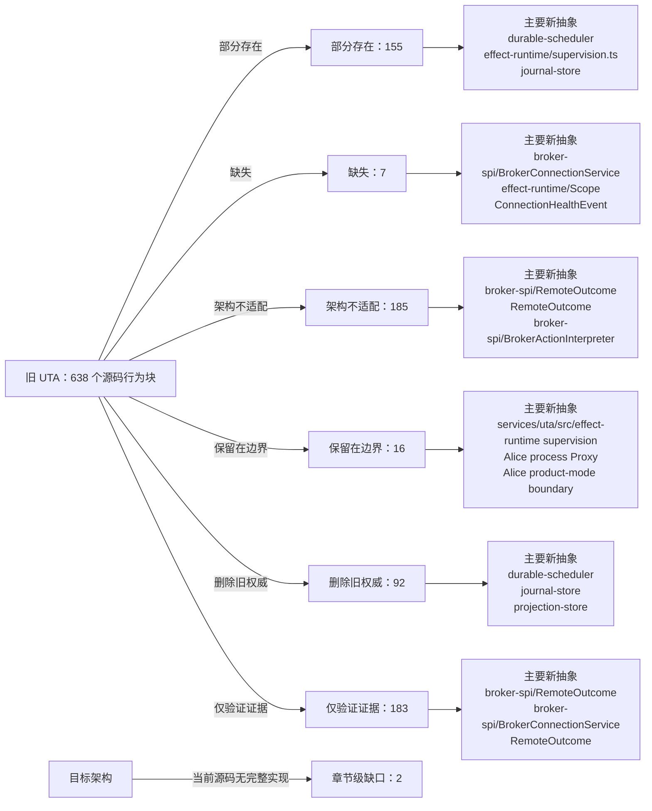

<!-- Auto-generated by scripts/uta-effect-runtime-map.mjs from mapping.json. Do not edit by hand. -->
<!-- Regenerate with `node scripts/uta-effect-runtime-map.mjs`. -->

# UTA 功能替代关系：第 12 章 Recovery model

目标架构原文：[`docs/uta-effect-runtime-architecture.md:1237-1301`](../uta-effect-runtime-architecture.md#L1237-L1301)。

## 结论

部分存在 155；缺失 7；架构不适配 185；保留在边界 16；删除旧权威 92；仅验证证据 183。状态只描述当前实现相对于目标架构的关系，不表示迁移已经落地。

## 替代关系图

## 章节级目标缺口

| 依据 | 目标义务 | 当前缺口 | 必须补充或调整 |
|---|---|---|---|
| docs/uta-effect-runtime-architecture.md:1239-1262 | Startup recovery classification | No current startup coordinator opens/migrates/verifies the journal, rebuilds stale authoritative projections, acquires broker Layers, scans non-terminal transactions/expired leases, and classifies no-dispatch, dispatch-without-result, abort-in-progress, and terminal states before admission. | Implement the ordered startup state machine and open command admission only after all unfinished work has one durable classified next action. |
| docs/uta-effect-runtime-architecture.md:1293-1300 | Expected failure versus defect policy | Legacy code often converts corrupt persisted data or impossible states to empty/default values or generic errors; no owning-worker shutdown policy preserves diagnostic evidence. | Keep domain/broker/connection/conflict/unknown outcomes in typed failure channels, but treat malformed persisted records, impossible transitions, and broken schema invariants as defects that stop the affected worker/process and retain evidence. |

## 源码映射

| 映射 ID | 当前源码 | 符号或行为块 | 当前功能 | 替代状态 | 新 UTA 抽象与做法 | 不适配位置与原因 | 必须补充或调整 | 重复索引 |
|---|---|---|---|---|---|---|---|---|
| `MAP-6496594BF0` | [`packages/uta-broker-alpaca/src/index.ts:7-9`](../../packages/uta-broker-alpaca/src/index.ts#L7-L9) | createBroker | Accepts an id, optional label, and Record<string, unknown> brokerConfig; calls AlpacaBroker.fromConfig and uses Object.assign to add brokerEngine. The result is a legacy IBroker object, not an Effect Layer or typed broker-spi interpreter. | 架构不适配 | 3.7 brokers/<broker>/；4 Effect model；9.1 Connection Layer；9.2 Typed action interpreter；9.3 Remote outcome；9.4 Capability derivation；12.2 Unknown-outcome protocol；16 Target source layout；17 Migration sequence / Slice 4: first real broker；19 Architectural prohibitions services/uta/src/brokers/alpaca/；services/uta/src/broker-spi/BrokerConnectionService；services/uta/src/broker-spi/BrokerActionInterpreter；services/uta/src/broker-spi/RemoteOutcome；services/uta/src/durable-scheduler/；services/uta/src/main.ts Replace this legacy factory export with the target versioned pack entrypoint: validate the typed Alpaca configuration, return the adapter's scoped BrokerConnectionService Layer and action-specific BrokerActionInterpreter, and let main.ts register it for durable-scheduler dispatch. Dispatch must carry a DispatchIdentity, persist outcomes through the scheduler/journal path, and expose compensation compilation; no wrapper-created object may become transaction-kernel state. | The current factory performs immediate legacy object construction, erases configuration as Record<string, unknown>, adds an ad-hoc brokerEngine property, and supplies none of the target availability, dispatch, observation, unknown-outcome, idempotency, or compensation contracts. It therefore cannot satisfy the Alpaca typed-interpreter migration or crash-recovery protocol. | Implement and export the Alpaca target interpreter/connection descriptor, including native request compilation, typed broker failures, paper/live capability derivation, remote order observation, idempotency proof or reconcile-before-retry, and compensation programs. Register it through the composition root and durable scheduler; delete the old Alpaca dispatcher path once this adapter owns the account mutation. | **DUP-005** |
| `MAP-9D3DC42AC9` | [`packages/uta-broker-ccxt/src/index.ts:7-9`](../../packages/uta-broker-ccxt/src/index.ts#L7-L9) | createBroker | Accepts an id, optional label, and Record<string, unknown> brokerConfig; calls CcxtBroker.fromConfig and uses Object.assign to add brokerEngine. The result is a legacy IBroker object, not an Effect Layer or typed broker-spi interpreter. | 架构不适配 | 3.7 brokers/<broker>/；4 Effect model；9.1 Connection Layer；9.2 Typed action interpreter；9.3 Remote outcome；9.4 Capability derivation；12.2 Unknown-outcome protocol；16 Target source layout；17 Migration sequence / Slice 5: heterogeneous brokers；19 Architectural prohibitions services/uta/src/brokers/ccxt/；services/uta/src/broker-spi/BrokerConnectionService；services/uta/src/broker-spi/BrokerActionInterpreter；services/uta/src/broker-spi/RemoteOutcome；services/uta/src/durable-scheduler/；services/uta/src/main.ts Replace this legacy factory export with the target versioned pack entrypoint: validate typed CCXT configuration, return the adapter's scoped BrokerConnectionService Layer and action-specific BrokerActionInterpreter, and let main.ts register it for durable-scheduler dispatch. Dispatch must carry a DispatchIdentity, persist outcomes through the scheduler/journal path, and expose compensation compilation; no wrapper-created object may become transaction-kernel state. | The current factory performs immediate legacy object construction, erases configuration as Record<string, unknown>, adds an ad-hoc brokerEngine property, and supplies none of the target availability, dispatch, observation, unknown-outcome, idempotency, or compensation contracts. It cannot prove CCXT sub-account or venue-specific capability derivation. | Implement and export the CCXT target interpreter/connection descriptor, including exchange-native request compilation, typed broker failures, sub-account or wallet capability derivation, remote order/position observation, idempotency proof or reconcile-before-retry, and compensation programs. Register it through the composition root and durable scheduler; delete the old CCXT dispatcher path once this adapter owns account mutations. | **DUP-010** |
| `MAP-3392948A39` | [`packages/uta-broker-ibkr/src/index.ts:7-9`](../../packages/uta-broker-ibkr/src/index.ts#L7-L9) | createBroker | Accepts an id, optional label, and Record<string, unknown> brokerConfig; calls IbkrBroker.fromConfig and uses Object.assign to add brokerEngine. The result is a legacy IBroker object, not an Effect Layer or typed broker-spi interpreter. | 架构不适配 | 3.7 brokers/<broker>/；4 Effect model；9.1 Connection Layer；9.2 Typed action interpreter；9.3 Remote outcome；9.4 Capability derivation；12.2 Unknown-outcome protocol；16 Target source layout；17 Migration sequence / Slice 5: heterogeneous brokers；19 Architectural prohibitions services/uta/src/brokers/ibkr/；services/uta/src/broker-spi/BrokerConnectionService；services/uta/src/broker-spi/BrokerActionInterpreter；services/uta/src/broker-spi/RemoteOutcome；services/uta/src/durable-scheduler/；services/uta/src/main.ts Replace this legacy factory export with the target versioned pack entrypoint: validate typed IBKR configuration, return the adapter's scoped BrokerConnectionService Layer and action-specific BrokerActionInterpreter, and let main.ts register it for durable-scheduler dispatch. Dispatch must carry a DispatchIdentity, persist outcomes through the scheduler/journal path, and expose compensation compilation; no wrapper-created object may become transaction-kernel state. | The current factory performs immediate legacy object construction, erases configuration as Record<string, unknown>, adds an ad-hoc brokerEngine property, and supplies none of the target availability, dispatch, observation, unknown-outcome, idempotency, or compensation contracts. It cannot represent IBKR callback-stream health or linked-account identity in the target SPI. | Implement and export the IBKR target interpreter/connection descriptor, including scoped callback streams, linked-account and native-order identity, typed broker failures, remote observation, idempotency proof or reconcile-before-retry, and compensation programs. Register it through the composition root and durable scheduler; delete the old IBKR dispatcher path once this adapter owns account mutations. | **DUP-015** |
| `MAP-50C8158380` | [`packages/uta-broker-leverup/src/index.ts:7-9`](../../packages/uta-broker-leverup/src/index.ts#L7-L9) | createBroker | Accepts an id, optional label, and Record<string, unknown> brokerConfig; calls LeverupBroker.fromConfig and uses Object.assign to add brokerEngine. The result is a legacy IBroker object, not an Effect Layer or typed broker-spi interpreter. | 架构不适配 | 3.7 brokers/<broker>/；4 Effect model；9.1 Connection Layer；9.2 Typed action interpreter；9.3 Remote outcome；9.4 Capability derivation；12.2 Unknown-outcome protocol；16 Target source layout；17 Migration sequence / Slice 5: heterogeneous brokers；19 Architectural prohibitions services/uta/src/brokers/leverup/；services/uta/src/broker-spi/BrokerConnectionService；services/uta/src/broker-spi/BrokerActionInterpreter；services/uta/src/broker-spi/RemoteOutcome；services/uta/src/durable-scheduler/；services/uta/src/main.ts Replace this legacy factory export with the target versioned pack entrypoint: validate typed LeverUp configuration, return the adapter's scoped BrokerConnectionService/relayer Layer and action-specific BrokerActionInterpreter, and let main.ts register it for durable-scheduler dispatch. Dispatch must carry a DispatchIdentity, persist outcomes through the scheduler/journal path, and expose compensation compilation; no wrapper-created object may become transaction-kernel state. | The current factory performs immediate legacy object construction, erases configuration as Record<string, unknown>, adds an ad-hoc brokerEngine property, and supplies none of the target availability, dispatch, observation, unknown-outcome, idempotency, or compensation contracts. It cannot reconcile a relayer-accepted mutation after a lost process or network boundary. | Implement and export the LeverUp target interpreter/connection descriptor, including relayer-native request compilation, typed relayer failures, dispatch identity, explicit observation/reconciliation after timeout, capability derivation, idempotency proof or reconcile-before-retry, and compensation programs. Register it through the composition root and durable scheduler; delete the old LeverUp dispatcher path once this adapter owns account mutations. | **DUP-020** |
| `MAP-E52D407CDC` | [`packages/uta-broker-longbridge/src/index.ts:7-9`](../../packages/uta-broker-longbridge/src/index.ts#L7-L9) | createBroker | Accepts an id, optional label, and Record<string, unknown> brokerConfig; calls LongbridgeBroker.fromConfig and uses Object.assign to add brokerEngine. The result is a legacy IBroker object, not an Effect Layer or typed broker-spi interpreter. | 架构不适配 | 3.7 brokers/<broker>/；4 Effect model；9.1 Connection Layer；9.2 Typed action interpreter；9.3 Remote outcome；9.4 Capability derivation；12.2 Unknown-outcome protocol；16 Target source layout；17 Migration sequence / Slice 5: heterogeneous brokers；19 Architectural prohibitions services/uta/src/brokers/longbridge/；services/uta/src/broker-spi/BrokerConnectionService；services/uta/src/broker-spi/BrokerActionInterpreter；services/uta/src/broker-spi/RemoteOutcome；services/uta/src/durable-scheduler/；services/uta/src/market-and-accounting/；services/uta/src/main.ts Replace this legacy factory export with the target versioned pack entrypoint: validate typed Longbridge configuration, return the adapter's scoped BrokerConnectionService Layer and action-specific BrokerActionInterpreter, and let main.ts register it for durable-scheduler dispatch. Dispatch must carry a DispatchIdentity, persist outcomes through the scheduler/journal path, and expose compensation compilation; no wrapper-created object may become transaction-kernel state. | The current factory performs immediate legacy object construction, erases configuration as Record<string, unknown>, adds an ad-hoc brokerEngine property, and supplies none of the target availability, dispatch, observation, unknown-outcome, idempotency, or compensation contracts. It cannot express Longbridge's jurisdiction and currency boundaries as typed broker/market observations. | Implement and export the Longbridge target interpreter/connection descriptor, including native request compilation, typed broker failures, account and jurisdiction metadata, currency-qualified observations, remote order/exposure reconciliation, idempotency proof or reconcile-before-retry, and compensation programs. Register it through the composition root and durable scheduler; delete the old Longbridge dispatcher path once this adapter owns account mutations. | **DUP-025** |
| `MAP-52A6B771BA` | [`packages/uta-protocol/src/brokers/preset-catalog.ts:470-495`](../../packages/uta-protocol/src/brokers/preset-catalog.ts#L470-L495) | SIMULATOR_PRESET | Declares a mock simulator with in-memory state, cash as a coerced number, no credentials, and a random _instanceId fingerprint used to derive a unique id; its hint states all state is wiped on restart. | 架构不适配 | 1. Thesis and non-negotiable properties；3.7 brokers/<broker>/；3.4 journal-store/；3.5 durable-scheduler/；5.3 Two-phase transaction protocol；7.1 Embedded database；12.1 Startup sequence；14. Public protocol；17.1 Slice 1: durable kernel with MockBroker；18. Verification contract；20. First falsifier MockBroker interpreter；transaction-kernel/；journal-store/；durable-scheduler/；DispatchIdentity；RemoteOutcome Retain MockBroker as the first executable adapter, but make transaction intent, jobs, outcomes, and mock broker observations durable in SQLite and recoverable across restart. | The current advertised simulator is explicitly process-memory-only and cash is a coerced number; it cannot satisfy the MockBroker crash/recovery falsifier or prove no duplicate dispatch. | Replace in-memory simulator authority with the durable MockBroker vertical slice, use DecimalString/Money and typed commands/outcomes, and keep any panel controls as a boundary over that slice. | **DUP-042** |
| `MAP-139EBB287C` | [`packages/uta-protocol/src/client/UTAClient.ts:1-11`](../../packages/uta-protocol/src/client/UTAClient.ts#L1-L11) | UTA client transport contract documentation | Describes a low-level HTTP helper with higher-level adapters layered elsewhere and explicitly says errors are normalized to JavaScript Errors; endpoint validation and WireBrokerError round-trip are future work. | 架构不适配 | 2.1 Alice owns；3.9 transport/ and protocol/；4. Effect model；9.2 Typed action interpreter；12.3 Defects and expected failures；14. Public protocol；15. Security and authority；19. Architectural prohibitions transport/http；protocol/；application/；TransactionFailure；QueryFailure Make the client SDK a typed proxy for the transaction-oriented public routes, decoding named success/failure schemas and preserving correlation/authorization context. | The module explicitly documents unvalidated endpoints and Error-based failures, contrary to the target requirement that every request/response use shared runtime schemas and typed expected failures. | Replace the generic low-level public contract with route-specific typed methods/codecs and typed failure mapping; keep any raw HTTP primitive private to transport/http. | **DUP-056** |
| `MAP-A4FE5AF865` | [`packages/uta-protocol/src/client/UTAClient.ts:13-20`](../../packages/uta-protocol/src/client/UTAClient.ts#L13-L20) | UTAClientOptions | Accepts a base URL, optional fetch override, and optional timeout in milliseconds with a default of 15 seconds. | 部分存在 | 2.1 Alice owns；3.2 effect-runtime/；3.9 transport/ and protocol/；4. Effect model；12.1 Startup sequence；14. Public protocol；15. Security and authority transport/http；effect-runtime/；protocol/；transport principal authentication；transaction authorizer actor/policy/capability Retain base URL/clock configuration at the transport boundary, but add the authenticated typed proxy and explicit cancellation/timeout failure mapping required by protocol routes. | The options contain no transport-principal authentication context or route schema configuration. Timeout is a local abort setting with no typed transport/QueryFailure mapping, and transaction actor/policy/capability authorization is not modeled as a separate application/kernel input. | Compose authenticated transport and route-specific codecs; map administrative-read timeout/abort to typed transport or QueryFailure variants. Separately pass actor, policy, and capability context to prepare/approve; reserve RemoteOutcome.Unknown for ambiguous durable broker dispatch. | **DUP-057** |
| `MAP-7E1806AFC4` | [`packages/uta-protocol/src/client/UTAClient.ts:37-46`](../../packages/uta-protocol/src/client/UTAClient.ts#L37-L46) | UTAHttpError | Throws an Error subclass carrying HTTP status, unknown body, and a message string; it does not decode a failure envelope. | 架构不适配 | 1. Thesis and non-negotiable properties；4. Effect model；5.7 Complete type contract — error channels；9.2 Typed action interpreter；12.3 Defects and expected failures；14. Public protocol；19. Architectural prohibitions TransactionFailure；QueryFailure；DispatchFailure；ProtocolViolation；protocol/ failure schemas Return/decode route-specific TransactionFailure or QueryFailure ADTs, preserving HTTP transport metadata separately and treating malformed bodies as ProtocolViolation. | Unknown body plus message-based Error handling collapses expected failures and malformed responses; consumers cannot exhaustively handle validation/conflict/capability/storage/unknown outcomes. | Replace UTAHttpError with typed client failure decoding and a distinct malformed-response defect/protocol-violation path; update all callers to handle the ADTs. | **DUP-060** |
| `MAP-8C22894ED4` | [`packages/uta-protocol/src/client/UTAClient.ts:63-88`](../../packages/uta-protocol/src/client/UTAClient.ts#L63-L88) | UTAClient.request | Builds a JSON request, creates an AbortController timeout, performs fetch, parses response text with safeJSON, extracts an `error` field by object cast on non-2xx, and casts successful body to T without validation. | 架构不适配 | 1. Thesis and non-negotiable properties；3.4 journal-store/；3.5 durable-scheduler/；3.9 transport/ and protocol/；4. Effect model；5.7 Complete type contract — public protocol envelopes；7.2 Single logical writer and group commit；8.1 Admission；9.2 Typed action interpreter；12.2 Unknown-outcome protocol；14. Public protocol；15. Security and authority；19. Architectural prohibitions transport/http；protocol/；TransactionCommand；PrepareTransactionResponse；GetTransactionResponse；TransactionFailure；QueryFailure Encode a named request, send it through authenticated transport, decode the exact success/failure schema, and preserve typed timeout/transport/protocol outcomes without generic casts. | Successful responses are body as T, errors are reduced to a string error field/message, and timeout/abort has no route-specific typed transport/auth/protocol representation. | Implement route-specific success and failure schema decoding plus typed transport/auth/protocol errors and correlation metadata. A public request timeout is not itself RemoteOutcome.Unknown; only a durable scheduler handling ambiguous broker dispatch may create that outcome. | **DUP-062** |
| `MAP-E56045946F` | [`packages/uta-protocol/src/client/UTAClient.ts:101-103`](../../packages/uta-protocol/src/client/UTAClient.ts#L101-L103) | safeJSON | Attempts JSON.parse and returns either the parsed unknown value or the original response text on parse failure. | 架构不适配 | 3.9 transport/ and protocol/；4. Effect model；9.2 Typed action interpreter；12.3 Defects and expected failures；14. Public protocol；19. Architectural prohibitions protocol/ codecs；ProtocolViolation；QueryFailure；TransactionFailure Decode through the expected named schema and turn malformed JSON/schema into an explicit ProtocolViolation/typed transport failure with evidence. | Returning arbitrary text as unknown silently accepts malformed responses and prevents exhaustive protocol failure handling. | Remove safeJSON as the response contract; parse syntax then decode the route schema, fail loudly on malformed data, and preserve redacted evidence for diagnostics. | **DUP-064** |
| `MAP-654966E128` | [`packages/uta-protocol/src/types/broker.spec.ts:1-3`](../../packages/uta-protocol/src/types/broker.spec.ts#L1-L3) | BrokerError test import | The spec imports the legacy BrokerError class directly from the broker wire-types module. | 仅验证证据 | 4. Effect model；9.2 Typed action interpreter；12.3 Defects and expected failures；18. Verification contract；19. Architectural prohibitions broker-spi/；BrokerRejection；DispatchFailure；protocol/ Use the spec as migration evidence only, then replace the import with the target broker failure and protocol-schema constructors. | This is evidence of a class-based legacy error contract, not proof of the target typed failure channel. | Retire the class-based fixture when BrokerRejection/DispatchFailure schemas and adapter mapping are available, and test exhaustive failure encoding instead. | **DUP-067** |
| `MAP-ACEFB58A14` | [`packages/uta-protocol/src/types/broker.spec.ts:5-19`](../../packages/uta-protocol/src/types/broker.spec.ts#L5-L19) | structured BrokerError preservation test | Builds an Error-like object with name BrokerError, code AUTH, and permanent true, then asserts BrokerError.from preserves the code, permanence, and original cause. | 仅验证证据 | 4. Effect model；9.2 Typed action interpreter；12.3 Defects and expected failures；18. Verification contract；19. Architectural prohibitions BrokerRejection；DispatchFailure；BrokerActionInterpreter；protocol/ failure schemas Replace this compatibility assertion with a boundary test that decodes a named broker rejection and exhaustively maps it to the corresponding DispatchFailure without relying on constructor identity or string metadata. | The test protects cross-package class-like string-code preservation, whereas the target requires typed failure variants and schema decoding. | Delete this legacy test once adapter failures are represented by the target ADTs; retain a test for lossless structured rejection fields and explicit unknown/protocol-violation handling. | **DUP-068** |
| `MAP-1A43E0FCC4` | [`packages/uta-protocol/src/types/broker.spec.ts:21-28`](../../packages/uta-protocol/src/types/broker.spec.ts#L21-L28) | unknown BrokerError code fallback test | Builds an Error-like object with an unrecognized string code and asserts BrokerError.from silently converts it to UNKNOWN. | 仅验证证据 | 4. Effect model；9.2 Typed action interpreter；12.3 Defects and expected failures；18. Verification contract；19. Architectural prohibitions ProtocolViolation；DispatchFailure；BrokerRejection；protocol/ failure schemas Replace silent code fallback with a schema/parser test proving that an unrecognized persisted or remote failure becomes an explicit ProtocolViolation/defect path, while expected broker failures remain exhaustive ADT variants. | The test enshrines permissive unknown-code coercion, which can hide malformed protocol data and violates the target distinction between expected failures and defects. | Remove the UNKNOWN fallback assertion and test loud preservation of malformed evidence plus typed recovery behavior. | **DUP-069** |
| `MAP-6C0ADD0EA4` | [`packages/uta-protocol/src/types/broker.ts:14-20`](../../packages/uta-protocol/src/types/broker.ts#L14-L20) | BrokerErrorCode and code registry | Defines a closed string union of CONFIG/AUTH/NETWORK/EXCHANGE/MARKET_CLOSED/CONNECTING/UNKNOWN and a ReadonlySet used to validate structured codes. | 架构不适配 | 4. Effect model；9.2 Typed action interpreter；12.3 Defects and expected failures；19. Architectural prohibitions BrokerRejection；CapabilityFailure；ConnectionFailure；DispatchFailure；TransactionFailure Replace string codes with the closed broker/action failure ADTs and map adapter-specific errors to named variants carrying typed evidence. | A flat code set does not encode action, observation, capability, connection, or dispatch relationships and includes an UNKNOWN fallback rather than an explicit malformed-protocol defect. | Define exhaustive failure variants in broker-spi/domain, add boundary schemas, and make each adapter map native failures to those variants without a shared string classifier. | **DUP-071** |
| `MAP-710D1204ED` | [`packages/uta-protocol/src/types/broker.ts:22-42`](../../packages/uta-protocol/src/types/broker.ts#L22-L42) | BrokerError constructor and permanence flag | The BrokerError class stores a code and message, derives `permanent` from CONFIG/AUTH, and extends Error for normal JavaScript exception handling. | 架构不适配 | 4. Effect model；9.2 Typed action interpreter；12.3 Defects and expected failures；14. Public protocol；19. Architectural prohibitions TransactionFailure；DispatchFailure；BrokerRejection；protocol/ failure schemas Represent expected rejection, unavailable connection, unknown outcome, and protocol violation as tagged values carried by Effect failures and named public envelopes; reserve exceptions for defects/unexpected failures. | A single Error subclass with a boolean permanence flag collapses distinct expected failure channels and exposes message-oriented behavior across the wire. | Delete BrokerError as the domain/protocol error model and introduce exhaustive failure constructors plus schema encoders for HTTP, journal, scheduler, and broker boundaries. | **DUP-072** |
| `MAP-6ED1656D7F` | [`packages/uta-protocol/src/types/broker.ts:44-61`](../../packages/uta-protocol/src/types/broker.ts#L44-L61) | BrokerError.from cross-package wrapper | Accepts unknown input, trusts only an object named BrokerError with a recognized string code, otherwise classifies message text or uses a fallback, and copies an Error as cause. | 架构不适配 | 4. Effect model；9.2 Typed action interpreter；12.3 Defects and expected failures；14. Public protocol；19. Architectural prohibitions BrokerActionInterpreter；BrokerRejection；DispatchFailure；ProtocolViolation Decode untrusted adapter/transport input with a named schema and preserve structured rejection evidence; map unknown shape to ProtocolViolation or a defect rather than guessing from message text. | Unknown data is narrowed with casts and class/name checks, and message classification can turn malformed or ambiguous failures into the wrong expected variant. | Remove `BrokerError.from`; add explicit parser functions for native adapter errors and wire failures, with exhaustive mapping and loud malformed-record handling. | **DUP-073** |
| `MAP-9F0ED3057E` | [`packages/uta-protocol/src/types/broker.ts:63-79`](../../packages/uta-protocol/src/types/broker.ts#L63-L79) | BrokerError.classifyMessage | Lowercases arbitrary error text and applies regexes for market closed, network, authentication, forbidden, insufficient funds, and margin before returning a code. | 架构不适配 | 4. Effect model；9.2 Typed action interpreter；12.3 Defects and expected failures；19. Architectural prohibitions BrokerActionInterpreter；BrokerRejection；DispatchFailure；ProtocolViolation Have each broker adapter return typed failure variants from its native response/error schema; preserve the original evidence and classify only through explicit adapter code, not regex text. | The target explicitly prohibits string-regex error classification as the domain error model; regexes cannot distinguish action-specific rejection, unavailable connection, unknown remote outcome, and protocol defects reliably. | Delete the regex classifier and implement per-adapter typed error mapping plus exhaustive DispatchFailure/TransactionFailure handling. | **DUP-074** |
| `MAP-77D0297A77` | [`packages/uta-protocol/src/types/broker.ts:159-168`](../../packages/uta-protocol/src/types/broker.ts#L159-L168) | PlaceOrderLeg | Represents a protective child order with an unbranded string orderId and a takeProfit/stopLoss kind union. | 部分存在 | 5.7 Complete type contract — dispatch and durable-job records；5.7 Complete type contract — compensation programs；9.2 Typed action interpreter；9.3 Remote outcome；12.2 Unknown-outcome protocol；14. Public protocol；19. Architectural prohibitions DispatchIdentity；PlaceOrderAcknowledgement；CompensationStep；BrokerActionInterpreter；projection-store/ Return child-order identities as branded BrokerOrderId values inside a typed place-order acknowledgement and persist their dispatch/observation relationship in the journal. | The child relationship is present, but the ID is an arbitrary string and the result has no transaction/step/dispatch identity, remote outcome, or durable observation context. | Introduce a typed acknowledgement/observation contract keyed by DispatchIdentity and map child legs into broker-spi and journal records before exposing a normalized projection. | **DUP-077** |
| `MAP-FE024081BB` | [`packages/uta-protocol/src/types/broker.ts:170-180`](../../packages/uta-protocol/src/types/broker.ts#L170-L180) | PlaceOrderResult | Uses a success boolean plus optional orderId/error/message, native Execution/OrderState objects, and optional bracket legs for place/modify/close results. | 架构不适配 | 1. Thesis and non-negotiable properties；4. Effect model；5.7 Complete type contract — broker capability and interpreter association；9.2 Typed action interpreter；9.3 Remote outcome；12.2 Unknown-outcome protocol；14. Public protocol；19. Architectural prohibitions BrokerActionInterpreter；RemoteOutcome；DispatchFailure；PlaceOrderAcknowledgement；TransactionResult Use action-specific acknowledgement, observation, rejection, and unknown-outcome ADTs tied to DispatchIdentity; let the kernel persist the durable transition before and after dispatch. | Boolean success and optional error/message fields cannot distinguish accepted, working, filled, rejected, or unknown outcomes, and native SDK values leak through the public type. | Delete PlaceOrderResult, define the closed BrokerActionTypeMap contracts and RemoteOutcome/DispatchFailure variants, and expose only named protocol envelopes. | **DUP-078** |
| `MAP-C6BE0A6EA7` | [`packages/uta-protocol/src/types/broker.ts:225-246`](../../packages/uta-protocol/src/types/broker.ts#L225-L246) | OpenOrder | Returns a broker-native Contract/Order/OrderState triplet with optional string orderId, average fill price, and TP/SL parameters. | 架构不适配 | 3.6 broker-spi/；3.8 projection-store/；5.7 Complete type contract — before-images, observations, and preconditions；6. State tiers and snapshots；9.3 Remote outcome；12.2 Unknown-outcome protocol；14. Public protocol；19. Architectural prohibitions OrderSnapshot；DispatchIdentity；projection-store/；broker-spi/；protocol/ Map broker order observations into OrderSnapshot and read projections keyed by branded BrokerOrderId/ClientOrderId, with explicit status, version, and observation provenance. | The type is an SDK-shaped object triplet, does not carry a typed order version or observation timestamp, and allows unbranded IDs and optional fields that cannot drive preconditions/reconciliation safely. | Delete the native triplet from the public contract, add adapter schemas and normalized OrderSnapshot/projection schemas, and persist remote observations through the journal. | **DUP-082** |
| `MAP-3EEBF25E8D` | [`packages/uta-protocol/src/types/broker.ts:366-413`](../../packages/uta-protocol/src/types/broker.ts#L366-L413) | BrokerHealth, UTAReach, UTATier, and BrokerHealthInfo | Models healthy/degraded/offline status, a down/connected/readable reach ladder, static data/account/trading tier, failure counters/timestamps, recovering/connecting, and disabled flags. | 部分存在 | 1. Thesis and non-negotiable properties；3.6 broker-spi/；6. State tiers and snapshots；9.1 Connection Layer；9.4 Capability derivation；12.1 Startup sequence；13. Observability；15. Security and authority BrokerConnectionService；ConnectionHealthEvent；CapabilitySet；CapabilityFailure；effect-runtime/；application/capability service Use scoped BrokerConnectionService health streams and typed capability degradation, with connection/account identity and durable operational projections. | The reach/tier concept is directionally useful, but status is a mutable summary with raw error text and booleans rather than typed health events, capability failures, and connection-layer requirements. | Define ConnectionHealthEvent/ConnectionFailure and CapabilityUnavailable ADTs, derive capabilities from ActionContext, and persist/query health as a projection without making health a broker mutation gate for unrelated accounts. | **DUP-090** |
| `MAP-98D887D066` | [`packages/uta-protocol/src/types/broker.ts:415-426`](../../packages/uta-protocol/src/types/broker.ts#L415-L426) | BrokerConnectionStateEvent | Defines alive/dead/restored string states and an optional error string for an adapter-to-UTA transport signal. | 部分存在 | 3.2 effect-runtime/；3.6 broker-spi/；4. Effect model；9.1 Connection Layer；12.1 Startup sequence；13. Observability BrokerConnectionService；ConnectionHealthEvent；ConnectionFailure；effect-runtime/ Make connection health a typed Stream from a scoped BrokerConnectionService Layer, with reconnect/readiness evidence and no transaction state in the connection object. | The event has an open-ended error string and no connection identity, readiness evidence, or typed failure channel; listeners are optional callbacks rather than Effect streams. | Replace the callback event with BrokerConnectionService.observeHealth and typed ConnectionFailure/health variants managed by adapter Scope/Layers. | **DUP-091** |
| `MAP-25118F5AFA` | [`packages/uta-protocol/src/types/broker.ts:475-498`](../../packages/uta-protocol/src/types/broker.ts#L475-L498) | IBroker lifecycle methods | The generic IBroker interface exposes id/label/brokerEngine/meta, Promise-based init/close, and an optional callback listener for connection state. | 删除旧权威 | 2.2 UTA owns；3.2 effect-runtime/；3.6 broker-spi/；4. Effect model；9.1 Connection Layer；12.1 Startup sequence；15. Security and authority；17.6 Slice 6: delete the legacy kernel；19. Architectural prohibitions BrokerConnectionService；effect-runtime/；Scope；Layer；ConnectionHealthEvent Replace lifecycle callbacks with a scoped BrokerConnectionService supplied by an Effect Layer; keep connection identity/health inside broker-spi and adapter scope, not transaction state. | Promise<void>, optional listeners, and a generic metadata bag cannot express Effect requirements/failures, Scope ownership, supervision, or typed health streams. | Delete this lifecycle portion of IBroker as adapters migrate, implement BrokerConnectionService/Layers, and expose typed connection/capability failures to the scheduler and application. | **DUP-096** |
| `MAP-255335BC1C` | [`packages/uta-protocol/src/types/broker.ts:524-529`](../../packages/uta-protocol/src/types/broker.ts#L524-L529) | IBroker trading mutation methods | Defines placeOrder, modifyOrder with Partial<Order>, cancelOrder, and closePosition as direct Promise mutations returning PlaceOrderResult. | 删除旧权威 | 1. Thesis and non-negotiable properties；3.3 transaction-kernel/；3.5 durable-scheduler/；3.6 broker-spi/；4. Effect model；5.3 Two-phase transaction protocol；5.7 Complete type contract — order and trading action ADTs；8. Scheduling, ordering, and concurrency；9.2 Typed action interpreter；12.2 Unknown-outcome protocol；17.6 Slice 6: delete the legacy kernel；19. Architectural prohibitions transaction-kernel/；durable-scheduler/；TradeAction；PreparedStep；BrokerActionInterpreter；DispatchIdentity；RemoteOutcome Make application commands enter transaction-kernel prepare/approve/execute; scheduler dispatches typed broker-spi actions only after DispatchPlanned durability and reconciles unknown outcomes. | Direct Promise mutation bypasses prepare, before-images, compensation proof, durable outbox/job admission, dispatch identity, typed remote outcomes, and backpressure. | Delete generic write methods and PlaceOrderResult when migration lands; implement action-specific BrokerActionInterpreter ports consumed by transaction-kernel and durable-scheduler. | **DUP-098** |
| `MAP-BAFF102815` | [`packages/uta-protocol/src/types/broker.ts:553-584`](../../packages/uta-protocol/src/types/broker.ts#L553-L584) | IBroker account/order query methods | Defines Promise-based getAccount/getPositions/getOrders/getOrder and optional getOpenOrders, returning AccountInfo, Position, and OpenOrder values, with symbol hints and empty-array fallback semantics. | 删除旧权威 | 3.6 broker-spi/；3.8 projection-store/；6. State tiers and snapshots；9.2 Typed action interpreter；9.3 Remote outcome；10.1 Accounting owns；12.2 Unknown-outcome protocol；14. Public protocol；17.6 Slice 6: delete the legacy kernel；19. Architectural prohibitions application/account-query service；projection-store/；OrderSnapshot；ExposureSnapshot；RemoteOutcome；broker-spi/ Have broker adapters provide typed observations to application query/projection services; use the journal and reconciliation protocol for order state rather than direct SDK-shaped reads in the public facade. | Queries return native objects and optional/empty fallback semantics with no typed QueryFailure, projection checkpoint, observation identity, or branded precondition values. | Define normalized account/order/position query ports and QueryFailure schemas, migrate all callers, and remove these methods from IBroker once projection-store/application services are authoritative. | **DUP-100** |
| `MAP-430A3CCB4D` | [`packages/uta-protocol/src/types/errors.ts:1-19`](../../packages/uta-protocol/src/types/errors.ts#L1-L19) | WireBrokerError | Defines the failure wire shape used by every endpoint as string code, human message, transient boolean, and optional hint; comments promise lossless reconstruction of the in-process BrokerError. | 架构不适配 | 1. Thesis and non-negotiable properties；4. Effect model；5.7 Complete type contract — error channels；9.2 Typed action interpreter；12.3 Defects and expected failures；14. Public protocol；15. Security and authority；19. Architectural prohibitions；3.1 domain/；3.9 transport/ and protocol/ TransactionFailure；QueryFailure；DispatchFailure；BrokerRejection；ProtocolViolation；protocol/ failure schemas Encode named TransactionFailure, QueryFailure, DispatchFailure, capability, connection, and broker-rejection variants with exhaustive schemas and redacted structured evidence. | `code: string`, `message: string`, and `transient: boolean` collapse expected failure variants, do not preserve action/dispatch/transaction identity, and make Error.message the effective protocol model. | Delete WireBrokerError as the universal error envelope; define route-specific failure ADTs/codecs, map them exhaustively in transport/CLI/UI, and redact native payloads/secrets. | **DUP-105** |
| `MAP-4B40267FF6` | [`packages/uta-protocol/src/types/git.ts:56-58`](../../packages/uta-protocol/src/types/git.ts#L56-L58) | OperationStatus | Defines submitted/filled/rejected/cancelled/user-rejected as a flat string status union for Git operation results. | 删除旧权威 | 5.2 Transaction state；5.7 Complete type contract — dispatch and durable-job records；6. State tiers and snapshots；9.3 Remote outcome；11. Approval and Git audit projection；12.2 Unknown-outcome protocol；14. Public protocol；17.6 Slice 6: delete the legacy kernel；19. Architectural prohibitions TransactionState；DispatchState；RemoteOutcome；TransactionResult；projection-store/ Replace the flat label with the complete TransactionState ADT: Draft, Preparing, AwaitingApproval, Queued, Executing, Reconciling, Aborting, Compensating, Committed, Compensated, and RecoveryRequired, each with its canonical payload; model DispatchState and RemoteOutcome separately. | The status list cannot represent the complete transaction lifecycle and payloads, durable dispatch/reconciliation/abort/compensation progress, recovery-required ownership, or the distinction between venue acceptance and final commit criterion. | Remove OperationStatus from kernel/API contracts. Evolve the complete TransactionState exhaustively from journal events and derive legacy history labels only in a typed read projection. | **DUP-109** |
| `MAP-DE16B51F52` | [`packages/uta-protocol/src/types/git.ts:60-77`](../../packages/uta-protocol/src/types/git.ts#L60-L77) | OperationResult | Combines action, success boolean, flat status, optional native Execution/OrderState, optional string error, child legs, symbol attribution, and raw unknown payload. | 删除旧权威 | 1. Thesis and non-negotiable properties；4. Effect model；5.7 Complete type contract — broker capability and interpreter association；6. State tiers and snapshots；9.2 Typed action interpreter；9.3 Remote outcome；11. Approval and Git audit projection；12.2 Unknown-outcome protocol；14. Public protocol；17.6 Slice 6: delete the legacy kernel；19. Architectural prohibitions BrokerActionTypeMap；RemoteOutcome；DispatchFailure；TransactionResult；ProjectionName；projection-store/ Persist action-specific acknowledgement/rejection/observation/unknown variants keyed by DispatchIdentity, and expose a transaction result/projection with typed failures. | `success`, optional error text, and `raw?: unknown` erase the relation among action, acknowledgement, observation, error, compensation, and remote outcome; native SDK values leak into the contract. | Delete OperationResult, migrate result handling to BrokerActionTypeMap/RemoteOutcome/TransactionFailure, and generate Git history summaries from journal/projection events. | **DUP-110** |
| `MAP-C39C98EBC8` | [`packages/uta-protocol/src/types/git.ts:119-125`](../../packages/uta-protocol/src/types/git.ts#L119-L125) | PushResult | Returns a Git hash/message/count plus submitted and rejected OperationResult arrays from a push. | 删除旧权威 | 1. Thesis and non-negotiable properties；5.2 Transaction state；5.3 Two-phase transaction protocol；7.3 Authoritative tables；8.1 Admission；9.3 Remote outcome；11. Approval and Git audit projection；12.2 Unknown-outcome protocol；14. Public protocol；17.6 Slice 6: delete the legacy kernel；19. Architectural prohibitions TransactionState；EffectJob；DispatchRecord；RemoteOutcome；TransactionResult；durable-scheduler/；journal-store/ Replace push with approve/admission followed by durable job identity and queryable transaction state; report typed confirmed/rejected/unknown outcomes asynchronously. | Push synchronously bundles Git persistence and broker mutations, has no durability acknowledgement/job lease/dispatch identity, and collapses partial/unknown work into submitted/rejected arrays. | Delete PushResult and migrate to `/transactions/:id/approve`, durable scheduler jobs, and GetTransactionResponse/event queries. | **DUP-115** |
| `MAP-ED7DB561BF` | [`packages/uta-protocol/src/types/git.ts:176-186`](../../packages/uta-protocol/src/types/git.ts#L176-L186) | OrderStatusUpdate | Carries order id/symbol, previous/current flat OperationStatus, and optional decimal-string fill fields for sync updates. | 删除旧权威 | 5.2 Transaction state；6. State tiers and snapshots；9.3 Remote outcome；11. Approval and Git audit projection；12.2 Unknown-outcome protocol；14. Public protocol；17.6 Slice 6: delete the legacy kernel；19. Architectural prohibitions RemoteOutcome；OrderSnapshot；DispatchIdentity；TransactionEvent；projection-store/ Represent broker observation/reconciliation as typed RemoteOutcome and TransactionEvent records keyed by DispatchIdentity and native observation evidence; derive history updates as projections. | Sync status deltas have no dispatch identity, observation timestamp/version/evidence, unknown state, or durable reconciliation checkpoint and reuse a flat Git status. | Delete OrderStatusUpdate from the execution/sync contract and migrate sync polling to durable scheduler observation jobs and journal events. | **DUP-121** |
| `MAP-A9AE528869` | [`packages/uta-protocol/src/types/git.ts:188-192`](../../packages/uta-protocol/src/types/git.ts#L188-L192) | SyncResult | Returns a Git hash, updatedCount, and an array of OrderStatusUpdate values after synchronizing orders. | 删除旧权威 | 7.3 Authoritative tables；8.3 Durable jobs and leases；9.3 Remote outcome；11. Approval and Git audit projection；12.1 Startup sequence；12.2 Unknown-outcome protocol；14. Public protocol；17.6 Slice 6: delete the legacy kernel；19. Architectural prohibitions durable-scheduler/；EffectJob；RemoteOutcome；journal-store/；projection-store/ Schedule typed observation/reconciliation jobs, persist checkpoints and outcomes, and query updated transaction/account projections separately from audit export. | A synchronous hash/count response treats sync as Git persistence and has no durable job/lease/checkpoint or explicit unknown-outcome protocol. | Delete SyncResult as the scheduler contract and expose durable reconciliation job/event identities and typed query responses. | **DUP-122** |
| `MAP-0CEEC81F23` | [`packages/uta-protocol/src/types/git.ts:225-246`](../../packages/uta-protocol/src/types/git.ts#L225-L246) | SimulatePriceChangeResult | Combines success boolean/error string, current and simulated account/position states, and string summary deltas including worstCase. | 保留在边界 | 1. Thesis and non-negotiable properties；5.7 Complete type contract — error channels；6. State tiers and snapshots；10.1 Accounting owns；12.2 Unknown-outcome protocol；14. Public protocol；17.1 Slice 1: durable kernel with MockBroker；18. Verification contract；20. First falsifier MockBroker interpreter；TransactionFailure；QueryFailure；market-and-accounting/；projection-store/；protocol/ Keep only as a named simulator preview response; use typed QueryFailure/validation failures and derive preview data without claiming broker dispatch or transaction commitment. | Success/error text and nested ad hoc state are not target transaction or accounting ADTs; the response says nothing about durable mock observations, dispatch identity, or recovery. | Separate simulator preview from execution protocol, add runtime schema and typed query/validation failures, and exercise the durable MockBroker crash/reconciliation path independently. | **DUP-126** |
| `MAP-8CE1592385` | [`packages/uta-protocol/src/types/history.ts:32-34`](../../packages/uta-protocol/src/types/history.ts#L32-L34) | OrderHistoryStatus and OrderHistorySource | Uses flat string unions for submitted/filled/cancelled/rejected/user-rejected and alice/external source labels. | 部分存在 | 5.2 Transaction state；6. State tiers and snapshots；9.3 Remote outcome；11. Approval and Git audit projection；12.2 Unknown-outcome protocol；14. Public protocol；19. Architectural prohibitions TransactionState；RemoteOutcome；OrderSnapshot；Git audit projection；protocol/ history schema Derive history labels from typed TransactionState, DispatchState, and RemoteOutcome, retaining source as a projection dimension rather than execution truth. | The labels omit prepared/queued/executing/reconciling/unknown/compensating/recovery states and cannot encode observation evidence or transaction identity. | Replace execution use of these unions with typed state/outcome mappers; keep compatibility labels only in a validated history projection. | **DUP-132** |
| `MAP-732B845474` | [`packages/uta-protocol/src/types/history.ts:36-59`](../../packages/uta-protocol/src/types/history.ts#L36-L59) | OrderHistoryEntry | Collapses an order lifecycle into one row with optional broker order id/order terms/fills, flat status/source, Git commit hash/message, and optional string error. | 部分存在 | 5.7 Complete type contract — before-images, observations, and preconditions；6. State tiers and snapshots；7.4 Snapshot and compaction policy；9.3 Remote outcome；11. Approval and Git audit projection；12.2 Unknown-outcome protocol；13. Observability；14. Public protocol；17.6 Slice 6: delete the legacy kernel；19. Architectural prohibitions OrderSnapshot；TransactionId；DispatchIdentity；projection-store/；Git audit projection；journal-store/；protocol/ history schema Build order history from journal events, normalized order/remote observations, and projection checkpoints; expose transaction/revision/dispatch correlation and retain CommitHash only as audit pointer. | The row is a useful read projection, but optional order terms, flat status, commit hash/message authority, and free-form error omit order version, observation timestamp/evidence, transaction identity, and unknown/reconciliation state. | Redesign the history projection schema around typed OrderSnapshot/RemoteOutcome and journal correlation, then keep only presentation-compatible fields as derived output. | **DUP-133** |
| `MAP-56C6192DB1` | [`packages/uta-protocol/src/types/history.ts:61-76`](../../packages/uta-protocol/src/types/history.ts#L61-L76) | TradeHistorySource and TradeHistoryEntry | Represents fill/reconcile rows with optional order id, HistoryContract, side, decimal-string quantity/price/value, source order/external/reconcile, and Git commit hash. | 部分存在 | 5.7 Complete type contract — nominal identities and financial values；6. State tiers and snapshots；7.4 Snapshot and compaction policy；10.1 Accounting owns；11. Approval and Git audit projection；12.2 Unknown-outcome protocol；14. Public protocol；17.6 Slice 6: delete the legacy kernel；19. Architectural prohibitions market-and-accounting/；Fill；ExposureSnapshot；RemoteOutcome；projection-store/；Git audit projection；journal-store/ Generate trade history from typed broker acknowledgements/observations and accounting fill/reconciliation events, with currency-qualified Money/Quantity and journal correlation. | The read-only fill projection is directionally valid, but quantity/price/value lack branded instrument/currency context, optional order identity is not linked to dispatch, and Git hash remains the only audit pointer. | Move authority to journal/accounting projections, add typed Fill/Reconciliation records and observation timestamps, and retain CommitHash only as optional derived audit metadata. | **DUP-134** |
| `MAP-7E7AB00B65` | [`services/uta/src/domain/trading/__test__/e2e/alpaca-paper.e2e.spec.ts:72-109`](../../services/uta/src/domain/trading/__test__/e2e/alpaca-paper.e2e.spec.ts#L72-L109) | Alpaca direct limit order lifecycle | Creates a native Contract/Order, places a $1 GTC limit buy, queries it singly and in batch, cancels it, and asserts success/order identity. | 部分存在 | 9.2 Typed action interpreter；9.3 Remote outcome；12.2 Unknown-outcome protocol；18.3 Real broker acceptance broker-spi DispatchIdentity；brokers/alpaca typed interpreter；durable-scheduler；journal-store Retain as adapter acceptance through a target typed action interpreter and durable place/query/cancel transaction with dispatch identity and reconciliation. | The direct generic IBroker call uses native Contract/Order and timer-based query; no durable intent, lease, unknown outcome, compensation, or restart is tested. | Add target journal/scheduler assertions and baseline cleanup, then make the typed broker-spi action the only mutation path. | **DUP-164** |
| `MAP-DA8940C7D3` | [`services/uta/src/domain/trading/__test__/e2e/alpaca-paper.e2e.spec.ts:132-176`](../../services/uta/src/domain/trading/__test__/e2e/alpaca-paper.e2e.spec.ts#L132-L176) | Alpaca market buy and order query | Places a market AAPL buy during market hours, requires success and a UUID-like orderId, then places another buy, waits, queries it, and requires Filled. | 部分存在 | 9.2 Typed action interpreter；9.3 Remote outcome；10.1 Accounting owns；12.2 Unknown-outcome protocol；18.3 Real broker acceptance broker-spi DispatchIdentity/RemoteOutcome；brokers/alpaca typed interpreter；durable-scheduler；market-and-accounting Run these mutations through prepared target Alpaca actions and durable scheduler observation, asserting accepted/working/filled criteria and stable dispatch identity. | The suite calls generic placeOrder and uses a timer before getOrder; it has no journaled dispatch intent, unknown-outcome protocol, compensation, or restart/no-blind-retry proof. | Add target journal/scheduler/reconciliation assertions and clean up by target transaction rather than an untracked broker mutation. | **DUP-166** |
| `MAP-D684830A67` | [`services/uta/src/domain/trading/__test__/e2e/alpaca-paper.e2e.spec.ts:178-196`](../../services/uta/src/domain/trading/__test__/e2e/alpaca-paper.e2e.spec.ts#L178-L196) | Alpaca position and close | Reads AAPL positions after the prior buy, requires a positive quantity, and closes the AAPL position through generic closePosition. | 部分存在 | 9.2 Typed action interpreter；9.3 Remote outcome；10.1 Accounting owns；12.2 Unknown-outcome protocol；18.3 Real broker acceptance market-and-accounting position projection；broker-spi compensation/close action；durable-scheduler Use target accounting projection and typed close/compensation action with durable observation and baseline verification. | The scenario assumes state left by a preceding test, has no explicit baseline delta, journal authority, compensation capability, or unknown outcome handling. | Isolate a target transaction baseline and assert exact position/open-order restoration after durable close/reconciliation. | **DUP-167** |
| `MAP-0FB902DDBC` | [`services/uta/src/domain/trading/__test__/e2e/alpaca-paper.e2e.spec.ts:198-221`](../../services/uta/src/domain/trading/__test__/e2e/alpaca-paper.e2e.spec.ts#L198-L221) | Alpaca getOrders by known ID | Places another market buy, waits, queries getOrders with its ID, requires one result, and closes the position. | 部分存在 | 9.2 Typed action interpreter；9.3 Remote outcome；12.2 Unknown-outcome protocol；18.3 Real broker acceptance broker-spi DispatchIdentity；journal-store；durable-scheduler；brokers/alpaca typed interpreter Make batch lookup a target projection/reconciliation query keyed by durable dispatch identity and perform cleanup through a target transaction. | Known-ID lookup is direct generic IBroker evidence only; no journal/projection consistency, lease/restart, unknown outcome, or baseline proof exists. | Add durable dispatch/projection assertions and exact cleanup baseline. | **DUP-168** |
| `MAP-68FD1B154A` | [`services/uta/src/domain/trading/__test__/e2e/ccxt-bybit.e2e.spec.ts:58-91`](../../services/uta/src/domain/trading/__test__/e2e/ccxt-bybit.e2e.spec.ts#L58-L91) | Bybit raw diagnostic plus generic placeOrder | Searches ETH, calls the internal raw CCXT createOrder for diagnostics, closes through the broker closePosition method, then places a market order via generic IBroker and asserts success/orderId and optional execution values. | 部分存在 | 9.2 Typed action interpreter；9.3 Remote outcome；12.2 Unknown-outcome protocol；13 Observability；18.3 Real broker acceptance；19 Architectural prohibitions brokers/ccxt/Bybit adapter；broker-spi DispatchIdentity/RemoteOutcome；durable-scheduler；observability redaction Move raw response inspection into adapter-only diagnostics and route the acceptance mutation through a typed Bybit interpreter with durable dispatch identity and reconciliation. | The scenario bypasses the abstraction with an any-cast Exchange call, then uses generic IBroker; it has no durable intent, typed unknown outcome, compensation, or target redaction proof. | Remove raw SDK calls from the target mutation scenario, define boundary schemas/error mapping, and add journal/scheduler/restart assertions. | **DUP-171** |
| `MAP-585A2F9006` | [`services/uta/src/domain/trading/__test__/e2e/ccxt-bybit.e2e.spec.ts:93-109`](../../services/uta/src/domain/trading/__test__/e2e/ccxt-bybit.e2e.spec.ts#L93-L109) | Bybit position and reduceOnly close | Reads positions after the preceding buy, requires an ETH position, then closes 0.01 ETH through generic closePosition and asserts success. | 部分存在 | 9.2 Typed action interpreter；9.3 Remote outcome；10.1 Accounting owns；12.2 Unknown-outcome protocol；18.3 Real broker acceptance broker-spi close/compensation action；market-and-accounting position projection；durable-scheduler Make position observation and reduceOnly close target typed actions/projections with durable compensation/reconciliation and baseline isolation. | It depends on prior test state and direct generic broker methods; no baseline delta, durable close intent, unknown outcome, or recovery is tested. | Isolate the account baseline and assert target journal/projection plus exact cleanup after restart-capable close. | **DUP-172** |
| `MAP-32BC46FDBD` | [`services/uta/src/domain/trading/__test__/e2e/ccxt-bybit.e2e.spec.ts:111-138`](../../services/uta/src/domain/trading/__test__/e2e/ccxt-bybit.e2e.spec.ts#L111-L138) | Bybit order query by ID | Places a market order, waits for settlement, queries it by returned ID, requires Filled, then closes the position. | 部分存在 | 9.2 Typed action interpreter；9.3 Remote outcome；12.2 Unknown-outcome protocol；18.3 Real broker acceptance broker-spi DispatchIdentity；durable-scheduler；journal-store；brokers/ccxt/Bybit interpreter Use durable DispatchIdentity and target remote-outcome observation/reconciliation instead of timer-based generic getOrder. | A sleep and direct query do not prove durable dispatch, lease recovery, unknown outcome, idempotency, or no blind retry. | Add journaled dispatch/observation, restart/reconciliation, and exact baseline cleanup assertions. | **DUP-173** |
| `MAP-4D4A864108` | [`services/uta/src/domain/trading/__test__/e2e/ccxt-bybit.e2e.spec.ts:140-184`](../../services/uta/src/domain/trading/__test__/e2e/ccxt-bybit.e2e.spec.ts#L140-L184) | Bybit TPSL and fetched order | Computes TP/SL from a quote, places a market order with TPSL through generic IBroker, optionally asserts returned TPSL prices, and closes the position. | 部分存在 | 5.5 Compensation capability；9.2 Typed action interpreter；9.3 Remote outcome；12.2 Unknown-outcome protocol；18.3 Real broker acceptance transaction-kernel compensation compiler；broker-spi BrokerActionInterpreter；brokers/ccxt/Bybit interpreter；durable-scheduler Compile TPSL into target typed action/compensation plans, journal parent and conditional dispatch identities, and reconcile fetched observations before cleanup. | Missing TPSL is treated as a note; direct generic placeOrder/getOrder has no typed unsupported outcome, durable identity, compensation, or recovery semantics. | Define target Bybit TPSL capability and observation schemas and add durable scheduler/reconciliation evidence. | **DUP-174** |
| `MAP-E5356E684D` | [`services/uta/src/domain/trading/__test__/e2e/ccxt-bybit.e2e.spec.ts:186-234`](../../services/uta/src/domain/trading/__test__/e2e/ccxt-bybit.e2e.spec.ts#L186-L234) | Bybit conditional/trigger order diagnostic | Opens a position, creates a trigger order through raw CCXT, mutates the broker's internal orderSymbolCache via any, queries the raw order ID through generic getOrder, cancels it, and closes the position. | 架构不适配 | 9.2 Typed action interpreter；9.3 Remote outcome；12.2 Unknown-outcome protocol；13 Observability；19 Architectural prohibitions broker-spi DispatchIdentity/RemoteOutcome；brokers/ccxt/Bybit adapter；durable-scheduler；observability Expose conditional order compilation, stable dispatch identity, observation, and cancellation through the typed Bybit broker-spi interpreter; keep internal symbol caches private and non-authoritative. | The test directly calls raw SDK createOrder and writes an internal cache through any, bypassing the adapter boundary and relying on in-memory state. It cannot prove durable observation/reconciliation or safe recovery. | Remove raw/cache mutation from the target path; implement typed trigger action schemas, native error/observation decoding, journaled dispatch identity, and reconciliation/cancellation jobs. | **DUP-175** |
| `MAP-A60C86B58F` | [`services/uta/src/domain/trading/__test__/e2e/ccxt-hyperliquid.e2e.spec.ts:97-129`](../../services/uta/src/domain/trading/__test__/e2e/ccxt-hyperliquid.e2e.spec.ts#L97-L129) | Hyperliquid BTC buy and position | Places a 0.001 BTC perpetual market buy, requires success/orderId and positive execution when present, then queries positions and requires a USD-normalized BTC position. | 部分存在 | 9.2 Typed action interpreter；9.3 Remote outcome；9.4 Capability derivation；10.1 Accounting owns；12.2 Unknown-outcome protocol；18.3 Real broker acceptance brokers/ccxt/Hyperliquid typed interpreter；broker-spi DispatchIdentity/RemoteOutcome；durable-scheduler；market-and-accounting Use as Hyperliquid paper acceptance through a typed action interpreter, durable dispatch identity, remote outcome reconciliation, and accounting projection. | It directly calls generic IBroker and accepts optional execution details; no durable intent, unknown outcome, compensation, baseline open-order check, or restart path is exercised. | Add target journal/scheduler records and reconciliation/crash scenarios, then require exact baseline cleanup. | **DUP-182** |
| `MAP-914C5731FE` | [`services/uta/src/domain/trading/__test__/e2e/ccxt-hyperliquid.e2e.spec.ts:131-166`](../../services/uta/src/domain/trading/__test__/e2e/ccxt-hyperliquid.e2e.spec.ts#L131-L166) | Hyperliquid close and order query | Closes 0.001 BTC with reduceOnly, then independently places another buy, waits, queries by orderId requiring Filled, and closes it. | 部分存在 | 9.2 Typed action interpreter；9.3 Remote outcome；12.2 Unknown-outcome protocol；18.3 Real broker acceptance broker-spi DispatchIdentity；durable-scheduler；journal-store；brokers/ccxt/Hyperliquid interpreter Drive close and observation through durable target jobs keyed by dispatch identity and distinguish confirmed/working/rejected/unknown outcomes before cleanup. | Timer-based getOrder/final close is not durable reconciliation and has no lease expiry, restart classification, compensation state, or no-blind-retry assertion. | Add journal-backed scheduler/reconciliation and account baseline/open-order assertions. | **DUP-183** |
| `MAP-FBF3A41608` | [`services/uta/src/domain/trading/__test__/e2e/ccxt-okx.e2e.spec.ts:106-161`](../../services/uta/src/domain/trading/__test__/e2e/ccxt-okx.e2e.spec.ts#L106-L161) | OKX spot synthesis buy/sell | Buys approximately $50 of BTC/USDT spot using cashQty, waits for balance propagation, asserts CcxtBroker synthesizes a long Position with positive value and zero unrealized PnL, then sells the position and allows only a small dust remainder. | 部分存在 | 9.2 Typed action interpreter；9.3 Remote outcome；9.4 Capability derivation；10.1 Accounting owns；12.2 Unknown-outcome protocol；18.3 Real broker acceptance brokers/ccxt/OKX typed interpreter；broker-spi remote observation；market-and-accounting spot projection；durable-scheduler Retain the spot synthesis acceptance case behind a typed OKX action interpreter and journal-backed position projection; declare the cashQty/spot compensation policy and reconcile balance observations. | The test mutates through generic IBroker and infers positions from balance after a timer; it has no stable dispatch identity, durable intent, unknown-outcome handling, compensation, or target accounting projection. | Add typed spot action/observation schemas, durable scheduler dispatch and reconciliation, and exact baseline/open-order cleanup before considering the target real-broker requirement covered. | **DUP-187** |
| `MAP-7DAC2704FB` | [`services/uta/src/domain/trading/__test__/e2e/ccxt-okx.e2e.spec.ts:173-195`](../../services/uta/src/domain/trading/__test__/e2e/ccxt-okx.e2e.spec.ts#L173-L195) | isCashModeError and tryPerpBuy | Classifies OKX failures by searching raw error strings for code 51010/account-mode text and wraps a generic placeOrder result into an orderId/cashMode boolean. | 架构不适配 | 9.2 Typed action interpreter；9.4 Capability derivation；12.3 Defects and expected failures；19 Architectural prohibitions broker-spi ActionAvailability；typed CapabilityFailure/BrokerRejection；brokers/ccxt/OKX error decoder Have the OKX adapter decode native failures into typed capability/rejection variants and return ActionAvailability; keep account-mode restrictions as structured data rather than regex classification or a boolean flag. | The architecture prohibits string-message classification as the domain error model; this helper uses substring matching on raw error text, returns a cashMode boolean, and hides the typed reason from callers. | Implement a CCXT/OKX boundary schema/error decoder and exhaustive broker-spi availability/rejection ADTs, then remove substring-based isCashModeError and the flag soup. | **DUP-188** |
| `MAP-0A7103653D` | [`services/uta/src/domain/trading/__test__/e2e/ccxt-okx.e2e.spec.ts:197-230`](../../services/uta/src/domain/trading/__test__/e2e/ccxt-okx.e2e.spec.ts#L197-L230) | OKX derivative buy/position/close | Attempts a 0.01 ETH perpetual buy, skips Cash-mode accounts, checks a separate ETH/USDT:USDT position identity, and closes it while treating mode/empty-position errors as skips. | 部分存在 | 9.2 Typed action interpreter；9.3 Remote outcome；9.4 Capability derivation；10.2 Market and jurisdiction owns；12.2 Unknown-outcome protocol；18.3 Real broker acceptance；19 Architectural prohibitions broker-spi ActionAvailability；brokers/ccxt/OKX interpreter；market-and-accounting instrument identity；durable-scheduler Express OKX Cash/Margin availability and separate spot/perp identities as typed capability and instrument ADTs; dispatch and close through target durable jobs with reconciliation. | The scenario provides useful account-mode and contract-identity evidence but uses string matching, generic IBroker calls, and skip branches rather than target availability/rejection/unknown-outcome types. | Replace skip/error-string handling with exhaustive typed capability/rejection outcomes and add journaled dispatch/observation plus baseline cleanup. | **DUP-189** |
| `MAP-C7223C2B36` | [`services/uta/src/domain/trading/__test__/e2e/ccxt-okx.e2e.spec.ts:234-254`](../../services/uta/src/domain/trading/__test__/e2e/ccxt-okx.e2e.spec.ts#L234-L254) | OKX order query after place | Places a derivative buy via the helper, waits for settlement, queries by returned orderId, requires Filled, then finds and closes the ETH perpetual. | 部分存在 | 9.2 Typed action interpreter；9.3 Remote outcome；12.2 Unknown-outcome protocol；18.3 Real broker acceptance broker-spi DispatchIdentity；durable-scheduler；journal-store；brokers/ccxt/OKX interpreter Make order query a target observation/reconciliation step keyed by durable DispatchIdentity, distinguishing confirmed fill, working, rejection, and unknown outcomes. | A timer plus generic getOrder is used; no durable dispatch record, lease/restart recovery, typed remote outcome, or compensation is tested. | Add target scheduler/journal recovery and no-blind-redispatch assertions around the OKX order identity. | **DUP-190** |
| `MAP-58AE86AEDD` | [`services/uta/src/domain/trading/__test__/e2e/ccxt-raw-diagnostic.e2e.spec.ts:29-54`](../../services/uta/src/domain/trading/__test__/e2e/ccxt-raw-diagnostic.e2e.spec.ts#L29-L54) | raw createOrder response diagnostic | Calls CCXT createOrder directly for an ETH perpetual, prints selected normalized/raw response fields, and best-effort closes with a reduce-only raw order. | 仅验证证据 | 9.2 Typed action interpreter；9.3 Remote outcome；12.2 Unknown-outcome protocol；13 Observability；19 Architectural prohibitions brokers/ccxt/Bybit adapter；broker-spi DispatchIdentity/RemoteOutcome；observability redaction Use only as temporary adapter investigation; once the native mapping is known, encode it in typed broker-spi boundary schemas and observe through the target interpreter. | It bypasses UTA/journal/scheduler, logs raw native payloads including info, and does not assert durable identity, redaction, unknown outcomes, or compensation. | Remove raw native response logging or pass it through a broker-specific redaction schema; replace the diagnostic mutation path with a typed interpreter scenario that persists dispatch identity, outcome, and cleanup evidence without logging complete native payloads. | **DUP-192** |
| `MAP-47ED37A445` | [`services/uta/src/domain/trading/__test__/e2e/ccxt-raw-diagnostic.e2e.spec.ts:56-90`](../../services/uta/src/domain/trading/__test__/e2e/ccxt-raw-diagnostic.e2e.spec.ts#L56-L90) | raw closed/open order diagnostics | Directly fetches closed and open orders from CCXT and prints selected IDs/status/symbol/amount fields without assertions beyond successful calls. | 仅验证证据 | 9.2 Typed action interpreter；9.3 Remote outcome；12.2 Unknown-outcome protocol；13 Observability；19 Architectural prohibitions broker-spi observation schema；brokers/ccxt/Bybit adapter；observability redaction Retain as diagnostic evidence only; convert stable findings into typed adapter tests for broker-spi observation and reconciliation. | Printed raw SDK observations are not a target contract and provide no durable/recovery or redaction proof. | — | **DUP-193** |
| `MAP-B5990574ED` | [`services/uta/src/domain/trading/__test__/e2e/ccxt-raw-diagnostic.e2e.spec.ts:92-113`](../../services/uta/src/domain/trading/__test__/e2e/ccxt-raw-diagnostic.e2e.spec.ts#L92-L113) | spot versus perpetual orderId diagnostic | Checks whether spot/perpetual markets exist, places and closes raw perp orders, and optionally places a spot order while printing orderId formats and failures. | 仅验证证据 | 9.2 Typed action interpreter；9.3 Remote outcome；9.4 Capability derivation；18.3 Real broker acceptance broker-spi DispatchIdentity；brokers/ccxt/Bybit capability derivation；durable-scheduler Use the observed ID differences to define typed dispatch identity and instrument capability fixtures, then test them through the adapter rather than raw Exchange calls. | No assertion establishes a target dispatch identity/idempotency contract, durable outbox, or reconciliation policy for spot versus perp. | — | **DUP-194** |
| `MAP-E4B0D38A44` | [`services/uta/src/domain/trading/__test__/e2e/ccxt-raw-diagnostic.e2e.spec.ts:126-158`](../../services/uta/src/domain/trading/__test__/e2e/ccxt-raw-diagnostic.e2e.spec.ts#L126-L158) | closed orders since-filter diagnostic | Compares unbounded and since-filtered closed-order fetches, places a new order, checks whether it appears in a recent query, and best-effort closes it. | 仅验证证据 | 9.2 Typed action interpreter；9.3 Remote outcome；12.2 Unknown-outcome protocol；18.3 Real broker acceptance；19 Architectural prohibitions broker-spi remote observation；durable-scheduler reconciliation；brokers/ccxt/Bybit adapter Use this investigation to implement typed native observation/reconciliation semantics keyed by DispatchIdentity, with target scheduler checkpoints and no blind redispatch. | Time-window list inspection is not durable reconciliation and does not establish absent/working/confirmed outcome semantics or idempotency. | — | **DUP-196** |
| `MAP-9762F1BB09` | [`services/uta/src/domain/trading/__test__/e2e/ibkr-paper.e2e.spec.ts:25-30`](../../services/uta/src/domain/trading/__test__/e2e/ibkr-paper.e2e.spec.ts#L25-L30) | requiredOrderId | Throws if an open IBKR order lacks an orderId, preventing cleanup from continuing with an unverifiable identity. | 保留在边界 | 9.2 Typed action interpreter；12.2 Unknown-outcome protocol；13 Observability；18.3 Real broker acceptance broker-spi DispatchIdentity；durable-scheduler reconciliation；observability Retain this test-only cleanup guard, but replace its untyped order shape with the target broker-spi order/dispatch identity type and preserve the failure as evidence. | It is a local safety helper, not a durable identity or reconciliation implementation; it cannot prove unknown-outcome handling. | — | **DUP-197** |
| `MAP-2B14BC2DD9` | [`services/uta/src/domain/trading/__test__/e2e/ibkr-paper.e2e.spec.ts:128-217`](../../services/uta/src/domain/trading/__test__/e2e/ibkr-paper.e2e.spec.ts#L128-L217) | IbkrBroker canonical conId routing | Fetches canonical USD.CHF contract details, records positions/open-order baselines, submits a deliberately polluted conId-based what-if order, records result evidence, cancels any accidental order, and asserts final positions/open-order IDs match baseline. | 部分存在 | 5.3 Two-phase transaction protocol；9.2 Typed action interpreter；9.4 Capability derivation；10.2 Market and jurisdiction owns；12.2 Unknown-outcome protocol；13 Observability；18.3 Real broker acceptance；19 Architectural prohibitions broker-spi IBKR action interpreter；market-and-accounting jurisdiction/instrument service；transaction-kernel preconditions；journal-store；projection-store；observability redaction Keep the canonical identity and baseline assertions as an adapter/acceptance case, but route the action through typed broker-spi identity normalization and target journal/scheduler evidence. | This directly calls generic IBroker with SDK Contract/Order values and a what-if flag; it proves routing and cleanup but not durable intent, dispatch identity, typed capability, unknown outcome, or target journal/projection semantics. | Define canonical IBKR action and observation schemas, persist target dispatch/evidence fields, and add restart/reconciliation variants while keeping the exact baseline invariant. | **DUP-201** |
| `MAP-B41A0A0990` | [`services/uta/src/domain/trading/__test__/e2e/ibkr-paper.e2e.spec.ts:221-268`](../../services/uta/src/domain/trading/__test__/e2e/ibkr-paper.e2e.spec.ts#L221-L268) | IbkrBroker order lifecycle | Discovers AAPL, places a safe $1 GTC limit order, queries it singly and in a batch, cancels it, and finally cancels it again if still open. | 部分存在 | 5.3 Two-phase transaction protocol；9.2 Typed action interpreter；12 Recovery model；18.3 Real broker acceptance broker-spi IBKR interpreter；durable-scheduler；journal-store；transaction-kernel Use this as a target broker acceptance case with a durable place/cancel transaction, dispatch identity lookup, lease/reconciliation, and authoritative open-order projection. | The generic direct place/get/cancel calls have no durable job, pre-dispatch acknowledgement, typed remote outcome, compensation, or restart proof; cleanup is process-local. | Wrap the scenario in transaction-kernel/journal-store/scheduler services and assert target journal/projection state plus baseline after restart and cancellation. | **DUP-202** |
| `MAP-F9A4323AA5` | [`services/uta/src/domain/trading/__test__/e2e/ibkr-paper.e2e.spec.ts:301-367`](../../services/uta/src/domain/trading/__test__/e2e/ibkr-paper.e2e.spec.ts#L301-L367) | IbkrBroker fill and exact baseline cleanup | Records AAPL position and open-order baselines, places a market buy, polls until quantity increases by one, queries the order, cancels newly open orders, closes only the created delta, polls back to baseline, and asserts final open-order IDs and quantity exactly match baseline. | 部分存在 | 9.2 Typed action interpreter；9.3 Remote outcome；10.1 Accounting owns；12 Recovery model；13 Observability；18.3 Real broker acceptance broker-spi IBKR interpreter；durable-scheduler reconciliation；market-and-accounting position projection；journal-store；observability Retain the strong baseline-delta cleanup as target IBKR paper acceptance, but execute it through the transaction kernel and durable scheduler with typed dispatch/observation/reconciliation records. | The scenario gives useful real-broker fill and cleanup evidence, yet all mutation and polling is through generic IBroker in one process; it has no durable intent, crash boundary, unknown-outcome protocol, compensation state, or journal-backed projection. | Add dispatch identity and journal assertions, kill/restart reconciliation variants, and target accounting projection checks while preserving exact baseline restoration. | **DUP-204** |
| `MAP-73F753A129` | [`services/uta/src/domain/trading/__test__/e2e/setup.ts:62-84`](../../services/uta/src/domain/trading/__test__/e2e/setup.ts#L62-L84) | BROKER_INIT_TIMEOUT_MS and initWithTimeout | Imposes a 30-second Promise timeout around broker.init and settles once either initialization or timeout/error wins. | 保留在边界 | 4 Effect model；9.1 Connection Layer；12.1 Startup sequence；18.3 Real broker acceptance effect-runtime Scope/Supervision；brokers scoped Layer；broker-spi ConnectionFailure Keep this bounded test setup guard, while target runtime uses Effect scopes, typed connection failures, and supervised reconnect/shutdown policies. | Promise timeout and direct broker.init do not establish target startup ordering, scoped Layers, heartbeats, or typed degraded account capability. | — | **DUP-212** |
| `MAP-3D797361F3` | [`services/uta/src/domain/trading/__test__/e2e/setup.ts:86-95`](../../services/uta/src/domain/trading/__test__/e2e/setup.ts#L86-L95) | cached/getTestAccounts | Caches one Promise of initialized paper TestAccount records at module scope so subsequent suites reuse the same broker instances. | 保留在边界 | 3.2 effect-runtime/；3.6 broker-spi/；4 Effect model；7 Durability architecture；8 Scheduling, ordering, and concurrency；12.1 Startup sequence；17 Migration sequence；18.2 Concurrency scenarios effect-runtime root Scope；broker-spi scoped Layers；durable-scheduler Retain singleton reuse only as a test harness optimization; target process composition should own scoped Layers and durable services, while tests isolate account/journal namespaces explicitly. | The module-global Promise is in-memory and requires serial Vitest execution; it is not a durable runtime scope, startup recovery coordinator, queue, or concurrency proof. | — | **DUP-213** |
| `MAP-B4CCE8940E` | [`services/uta/src/domain/trading/__test__/e2e/setup.ts:97-139`](../../services/uta/src/domain/trading/__test__/e2e/setup.ts#L97-L139) | initAll | Reads UTA config, skips non-paper/credentialless/disabled accounts, probes IBKR reachability, creates each broker through the legacy factory, initializes it with a timeout, and returns the surviving broker records. | 保留在边界 | 2 System boundary；3.2 effect-runtime/；3.6 broker-spi/；4 Effect model；9.1 Connection Layer；12.1 Startup sequence；15 Security and authority；17 Migration sequence；18.3 Real broker acceptance main composition root；effect-runtime Layers/Scope；broker-spi connection and capability services；application account service；transaction-kernel startup recovery Use this only to select safe external paper accounts; target main composition must acquire scoped broker Layers, open/verify/recover SQLite before admission, and expose typed degraded capabilities without blocking unrelated accounts. | The helper calls readUTAsConfig/createBroker/IBroker directly and only skips initialization failures; it does not run target journal migrations/invariant checks, recover unfinished work, or establish broker-spi capabilities. | — | **DUP-214** |
| `MAP-58F0FF7798` | [`services/uta/src/domain/trading/__test__/e2e/uta-alpaca.e2e.spec.ts:37-78`](../../services/uta/src/domain/trading/__test__/e2e/uta-alpaca.e2e.spec.ts#L37-L78) | describe UTA — Alpaca order lifecycle | Stages a $1 AAPL limit buy, commits it, pushes it through UnifiedTradingAccount, then stages and pushes a cancel; it asserts prepared/submitted results and at least two legacy log commits. | 删除旧权威 | 5.2 Transaction state；5.3 Two-phase transaction protocol；7 Durability architecture；8 Scheduling, ordering, and concurrency；11 Approval and Git audit projection；12 Recovery model；17.4 Slice 4: first real broker；18.1 Kernel crash matrix；18.3 Real broker acceptance；20 First falsifier transaction-kernel/coordinator；journal-store；durable-scheduler；brokers/alpaca typed interpreter；projection-store；broker-spi Replace stage/commit/push/cancel with a prepared transaction, durable approval, DispatchPlanned outbox job, leased scheduler execution, typed Alpaca acknowledgement, and journaled cancel/compensation projection. Add the MockBroker crash experiment separately before using this as Slice 4 evidence. | The legacy push mutates through UnifiedTradingAccount/IBroker without a durable intent acknowledgement, dispatch identity, lease, journal event, compensation declaration, or remote unknown-outcome path. It runs in one process and supplies no 18.1 crash-matrix or 20 first-falsifier evidence. | Remove this legacy execution test when the target path lands; assert durable state before dispatch, typed accepted/rejected/unknown outcomes, restart classification, and no blind duplicate, then assert the real Alpaca baseline is restored. | **DUP-217** |
| `MAP-8CB6B26E83` | [`services/uta/src/domain/trading/__test__/e2e/uta-alpaca.e2e.spec.ts:133-172`](../../services/uta/src/domain/trading/__test__/e2e/uta-alpaca.e2e.spec.ts#L133-L172) | describe UTA — Alpaca TPSL bracket | Stages a market AAPL buy with take-profit and stop-loss fields, pushes it, fetches the order, conditionally checks returned bracket prices, then closes the position for cleanup. | 删除旧权威 | 5.5 Compensation capability；5.7 Complete type contract；9.2 Typed action interpreter；9.3 Remote outcome；12.2 Unknown-outcome protocol；17.4 Slice 4: first real broker；18.3 Real broker acceptance transaction-kernel compensation compiler；broker-spi BrokerActionInterpreter；brokers/alpaca typed interpreter；durable-scheduler；journal-store Compile TPSL as a typed prepared action with an explicit compensation capability and declared commit criterion, dispatch it through the Alpaca interpreter with a stable identity, journal the parent/conditional observations, and reconcile until the target criterion is reached. | The current test passes optional TPSL data through legacy placeOrder and treats missing fetched TPSL as a log-only note; it has no typed availability/compensation contract, durable dispatch record, unknown outcome handling, or proof that conditional legs are reconciled. | Replace the legacy path with target transaction-kernel and broker-spi TPSL action types, explicit capability/unsupported outcomes, journaled acknowledgements, and cleanup that proves the required baseline. | **DUP-219** |
| `MAP-628E0887B1` | [`services/uta/src/domain/trading/__test__/e2e/uta-alpaca.e2e.spec.ts:176-246`](../../services/uta/src/domain/trading/__test__/e2e/uta-alpaca.e2e.spec.ts#L176-L246) | describe UTA — Alpaca fill flow (AAPL) | During market hours, records initial AAPL quantity, performs stage -> commit -> push for a market buy, optionally syncs, verifies position quantity increased by one, stages/pushes a close, optionally syncs, and verifies quantity returned to the initial value plus two log entries. | 删除旧权威 | 5.3 Two-phase transaction protocol；7.4 Snapshot and compaction policy；8.5 Isolation；9.3 Remote outcome；10.1 Accounting owns；12 Recovery model；17.4 Slice 4: first real broker；18.3 Real broker acceptance transaction-kernel；journal-store；durable-scheduler；brokers/alpaca typed interpreter；projection-store；market-and-accounting Retain the paper lifecycle as a target Alpaca acceptance scenario, but drive it through prepared transactions, durable jobs, typed observation/reconciliation, accounting projections, and a baseline assertion over positions and open orders. | The current scenario checks a broker position delta and legacy log only. It does not persist before-images or dispatch boundaries, distinguish accepted/working/filled criteria in a transaction state, reconcile unknown outcomes, or prove restart/recovery. | Delete the UnifiedTradingAccount version after migration and add target journal/scheduler assertions plus crash/restart variants; require account baseline restoration, including no unexpected open orders, after both buy and close. | **DUP-220** |
| `MAP-E9EB273A72` | [`services/uta/src/domain/trading/__test__/e2e/uta-bybit.e2e.spec.ts:49-122`](../../services/uta/src/domain/trading/__test__/e2e/uta-bybit.e2e.spec.ts#L49-L122) | buy/sync/verify/close lifecycle | Records initial perp quantity, performs stage -> commit -> push for a market buy, conditionally syncs submitted orders, asserts an ETH position and no pending orders, closes 0.01 ETH, conditionally syncs, and asserts net quantity returns near baseline plus legacy history entries. | 删除旧权威 | 5.2 Transaction state；5.3 Two-phase transaction protocol；7 Durability architecture；8 Isolation and partitioning；9.3 Remote outcome；10.1 Accounting owns；12 Recovery model；17.5 Slice 5: heterogeneous brokers；18.3 Real broker acceptance transaction-kernel；journal-store；durable-scheduler；brokers/ccxt/Bybit interpreter；projection-store；market-and-accounting Retain the Bybit demo lifecycle as broker acceptance after migrating it to prepared transaction plans, durable jobs, stable dispatch identities, typed observation/reconciliation, and position/order projections with baseline cleanup. | The path uses legacy stage/commit/push/sync and tests only broker position/history outcomes. It has no durable intent before mutation, lease/partition behavior, unknown-outcome reconciliation, compensation declaration, or restart proof. | Replace the UnifiedTradingAccount scenario with a target transaction/scheduler scenario and require no unexpected open orders plus explicit accepted/working/filled/unknown criterion handling. | **DUP-222** |
| `MAP-4A1400D914` | [`services/uta/src/domain/trading/__test__/e2e/uta-bybit.e2e.spec.ts:203-236`](../../services/uta/src/domain/trading/__test__/e2e/uta-bybit.e2e.spec.ts#L203-L236) | buy with TPSL and fetched order | Stages and pushes a Bybit market buy with take-profit/stop-loss prices, fetches the resulting order, conditionally asserts returned TPSL prices, and closes the position. | 删除旧权威 | 5.5 Compensation capability；9.2 Typed action interpreter；9.3 Remote outcome；12.2 Unknown-outcome protocol；17.5 Slice 5: heterogeneous brokers；18.3 Real broker acceptance transaction-kernel compensation compiler；broker-spi BrokerActionInterpreter；brokers/ccxt/Bybit interpreter；durable-scheduler；journal-store Compile Bybit TPSL as a typed prepared action with explicit capability and compensation semantics, persist dispatch/observation records, and reconcile parent plus conditional orders through the scheduler. | Missing TPSL is accepted as a note, while the legacy path has no typed unsupported outcome, durable dispatch identity, compensation program, or unknown remote result handling. | Replace the legacy push/fetch flow with target action interpreter and reconciliation assertions, including a declared policy for separate conditional orders and cleanup. | **DUP-224** |
| `MAP-96BCC45A7C` | [`services/uta/src/domain/trading/__test__/e2e/uta-ccxt-bybit.e2e.spec.ts:45-98`](../../services/uta/src/domain/trading/__test__/e2e/uta-ccxt-bybit.e2e.spec.ts#L45-L98) | full lifecycle buy/sync/close | Stages and commits a 0.01 ETH market buy, pushes it, conditionally syncs to filled, closes the same quantity, conditionally syncs, compares final exchange quantity to the initial value, and checks at least two legacy commits. | 删除旧权威 | 5.2 Transaction state；5.3 Two-phase transaction protocol；7 Durability architecture；8 Isolation and partitioning；9.3 Remote outcome；10.1 Accounting owns；12 Recovery model；17.5 Slice 5: heterogeneous brokers；18.3 Real broker acceptance transaction-kernel；journal-store；durable-scheduler；brokers/ccxt/Bybit interpreter；projection-store Rewrite as two target transactions with durable prepare/outbox, conflict keys, leased dispatch, broker observations, and projections; assert the required account baseline after close. | Legacy stage/commit/push/sync and log are the authority. There is no durable pre-dispatch intent, stable dispatch identity, unknown-outcome reconciliation, compensation contract, or restart evidence. | Remove legacy execution ownership and add target scheduler/journal assertions plus crash and reconciliation variants for the Bybit paper lifecycle. | **DUP-226** |
| `MAP-3FD0A99D87` | [`services/uta/src/domain/trading/__test__/e2e/uta-ccxt-bybit.e2e.spec.ts:100-134`](../../services/uta/src/domain/trading/__test__/e2e/uta-ccxt-bybit.e2e.spec.ts#L100-L134) | TPSL round-trip | Stages and pushes a Bybit market order with computed TPSL prices, fetches the order after a delay, conditionally checks returned prices, and closes the position. | 删除旧权威 | 5.5 Compensation capability；9.2 Typed action interpreter；9.3 Remote outcome；12.2 Unknown-outcome protocol；17.5 Slice 5: heterogeneous brokers；18.3 Real broker acceptance transaction-kernel compensation compiler；broker-spi BrokerActionInterpreter；brokers/ccxt/Bybit interpreter；durable-scheduler Represent TPSL as a typed Bybit action and test its capability, durable dispatch identity, observed parent/conditional state, and compensation through the target kernel. | The legacy test treats absent returned TPSL as acceptable and has no typed capability result, compensation plan, durable record, or unknown outcome path. | Replace the legacy path with target action/interpreter and reconciliation evidence; make unsupported/separate-leg behavior an explicit typed result rather than a note. | **DUP-227** |
| `MAP-CAA43D746F` | [`services/uta/src/domain/trading/__test__/e2e/uta-ccxt-bybit.e2e.spec.ts:136-180`](../../services/uta/src/domain/trading/__test__/e2e/uta-ccxt-bybit.e2e.spec.ts#L136-L180) | reject approval behavior | Stages and commits a buy without pushing, rejects it with and without a reason, then asserts staging is cleared and legacy log/show entries contain user-rejected status and error text. | 部分存在 | 5.2 Transaction state；7 Durability architecture；11 Approval and Git audit projection；12.3 Defects and expected failures；17.2 Slice 2: transaction and approval protocol；18.3 Real broker acceptance transaction-kernel approval state；journal-store；projection-store Git audit；protocol transaction schemas Keep the user-facing review/reject behavior but drive it through Draft/Prepared/AwaitingApproval/Compensated states. Approval binds revision/plan digest/expiry/actor; rejection uses canonical Reject { transactionId, reason }. Both append durable events and feed a rebuildable Git audit projection. | The test proves legacy hash/staging/log rejection behavior, but not a durable canonical rejection transition, state guard, event ordering, or Compensated state with no compensation work before dispatch. | Add transaction-oriented approval and rejection schemas and journal assertions. Keep approval bindings on Approve; do not add them to Reject. Remove TradingGit rejection authority after the target protocol is authoritative. | **DUP-228** |
| `MAP-DC819A17DE` | [`services/uta/src/domain/trading/__test__/e2e/uta-ibkr.e2e.spec.ts:93-138`](../../services/uta/src/domain/trading/__test__/e2e/uta-ibkr.e2e.spec.ts#L93-L138) | IBKR legacy limit order lifecycle | Discovers AAPL, stages a $1 GTC limit buy, commits and pushes it, stages/pushes a cancel, and checks two legacy log commits. | 删除旧权威 | 5.3 Two-phase transaction protocol；7 Durability architecture；8 Scheduling, ordering, and concurrency；9.2 Typed action interpreter；11 Approval and Git audit projection；12 Recovery model；17.5 Slice 5: heterogeneous brokers；18.3 Real broker acceptance transaction-kernel；journal-store；durable-scheduler；brokers/ibkr typed interpreter；projection-store Replace stage/commit/push/cancel with target prepared transaction, durable job/lease, typed IBKR dispatch identity and acknowledgement, and a journaled cancel/compensation transition. | No durable pre-dispatch intent, lease, conflict key, typed remote outcome, compensation capability, restart classification, or authoritative journal is asserted. | Delete the legacy test when target IBKR execution becomes authoritative and add scheduler/recovery plus baseline open-order assertions. | **DUP-232** |
| `MAP-34BF36C838` | [`services/uta/src/domain/trading/__test__/e2e/uta-ibkr.e2e.spec.ts:142-169`](../../services/uta/src/domain/trading/__test__/e2e/uta-ibkr.e2e.spec.ts#L142-L169) | IBKR TPSL pass-through | Stages an IBKR limit order with TPSL, pushes it, asserts submission succeeds, then stages and pushes a cancel; the comments state IBKR ignores TPSL. | 删除旧权威 | 5.5 Compensation capability；9.2 Typed action interpreter；9.4 Capability derivation；12.3 Defects and expected failures；17.5 Slice 5: heterogeneous brokers；18.3 Real broker acceptance broker-spi action availability；transaction-kernel compensation compiler；brokers/ibkr typed interpreter；durable-scheduler Derive IBKR TPSL availability as a typed capability result; reject or compile supported legs explicitly, then journal dispatch and cancellation through target transaction semantics. | The legacy test treats ignored TPSL as successful pass-through and never asserts a typed unsupported capability, compensation policy, or durable outcome. | Replace pass-through behavior with an explicit IBKR action schema/availability contract and target journal/scheduler test. | **DUP-233** |
| `MAP-147173C2A5` | [`services/uta/src/domain/trading/__test__/e2e/uta-ibkr.e2e.spec.ts:173-247`](../../services/uta/src/domain/trading/__test__/e2e/uta-ibkr.e2e.spec.ts#L173-L247) | IBKR legacy fill flow | During market hours, records initial AAPL quantity, performs stage -> commit -> push for a market buy, optionally syncs, verifies quantity increased, closes one share, optionally syncs, verifies the initial quantity and at least two legacy log commits. | 删除旧权威 | 5.3 Two-phase transaction protocol；7 Durability architecture；8 Isolation and ordering；9.3 Remote outcome；10.1 Accounting owns；12 Recovery model；17.5 Slice 5: heterogeneous brokers；18.3 Real broker acceptance transaction-kernel；journal-store；durable-scheduler；brokers/ibkr typed interpreter；projection-store；market-and-accounting Retain as IBKR paper acceptance after migration to target prepared plans, callback/observation reconciliation, durable jobs, accounting projections, and exact position/open-order baseline cleanup. | The current path delegates all authority to UnifiedTradingAccount and generic IBroker; it does not prove durable dispatch, callback stream integration, unknown outcome handling, compensation, or crash/restart recovery. | Delete legacy execution ownership after migration and add target IBKR callback/reconciliation and crash scenarios with no unexpected open orders. | **DUP-234** |
| `MAP-55F8053385` | [`services/uta/src/domain/trading/__test__/e2e/uta-lifecycle.e2e.spec.ts:21-26`](../../services/uta/src/domain/trading/__test__/e2e/uta-lifecycle.e2e.spec.ts#L21-L26) | beforeEach MockBroker setup | Creates a fresh in-memory MockBroker with cash and quotes and wraps it in UnifiedTradingAccount before each scenario. | 删除旧权威 | 3.3 transaction-kernel/；3.4 journal-store/；3.6 broker-spi/；5.3 Two-phase transaction protocol；7 Durability architecture；12 Recovery model；17.1 Slice 1: durable kernel with MockBroker；18.1 Kernel crash matrix；20 First falsifier brokers/mock typed interpreter；transaction-kernel；journal-store；durable-scheduler；effect-runtime Make MockBroker a broker-spi interpreter behind the target transaction-kernel and initialize an embedded SQLite journal, projection store, and durable scheduler for each isolated vertical-slice run. | The current fixture explicitly uses an in-memory exchange and UnifiedTradingAccount; no SQLite journal, durable outbox/job, transaction revision, recovery coordinator, or scoped Effect runtime exists in this setup. | Replace the legacy fixture with the Slice 1 composition and use it to exercise the first-falsifier crash sequence before retaining any real-broker lifecycle evidence. | **DUP-235** |
| `MAP-81E8AC49C4` | [`services/uta/src/domain/trading/__test__/e2e/uta-lifecycle.e2e.spec.ts:30-64`](../../services/uta/src/domain/trading/__test__/e2e/uta-lifecycle.e2e.spec.ts#L30-L64) | market-buy dispatch and immediate-fill lifecycle tests | Stages/commits/pushes market buys, asserts submitted/filled results, immediate Mock position/cash mutation, and that sync has no later update. | 删除旧权威 | 5 Transaction algebra；5.2 Transaction state；5.3 Two-phase transaction protocol；7 Durability architecture；8 Scheduling, ordering, and concurrency；11 Approval and Git audit projection；12 Recovery model；17.1 Slice 1: durable kernel with MockBroker；18.1 Kernel crash matrix；18.2 Concurrency scenarios；20 First falsifier transaction-kernel/coordinator；journal-store；durable-scheduler；brokers/mock；projection-store；effect-runtime Test PlaceOrder prepare/approval/durable dispatch, explicit Ack versus commit criterion, observation, and projection update. | One-process immediate fill conflates venue acceptance, fill observation, and committed transaction; no durable intent or restart cut is exercised. | For every mutation terminate exactly after: transaction prepared and before approval; approval committed and before job claim; job claim committed and before dispatch; broker accepted and before acknowledgement persistence; acknowledgement persisted and before projection update; abort persisted and before compensation; compensation dispatched and before its acknowledgement. After restart, permit exactly one justified next action and no blind duplicate. | **DUP-236** |
| `MAP-6119E3BEEE` | [`services/uta/src/domain/trading/__test__/e2e/uta-lifecycle.e2e.spec.ts:66-108`](../../services/uta/src/domain/trading/__test__/e2e/uta-lifecycle.e2e.spec.ts#L66-L108) | account state and limit-order reconciliation tests | Pushes a market buy and a submitted limit order, reads live GitState, externally fills the order, then calls sync and asserts filled projection state. | 删除旧权威 | 5 Transaction algebra；5.2 Transaction state；5.3 Two-phase transaction protocol；7 Durability architecture；8 Scheduling, ordering, and concurrency；11 Approval and Git audit projection；12 Recovery model；17.1 Slice 1: durable kernel with MockBroker；18.1 Kernel crash matrix；18.2 Concurrency scenarios；20 First falsifier transaction-kernel/coordinator；journal-store；durable-scheduler；brokers/mock；projection-store；effect-runtime Persist dispatch identity and StillWorking outcome, schedule durable observation, journal the fill, and rebuild account/order projections. | Pending identity and reconciliation live in memory; external fill and sync have no durable job, lease, observation evidence, or restart behavior. | For every mutation terminate exactly after: transaction prepared and before approval; approval committed and before job claim; job claim committed and before dispatch; broker accepted and before acknowledgement persistence; acknowledgement persisted and before projection update; abort persisted and before compensation; compensation dispatched and before its acknowledgement. After restart, permit exactly one justified next action and no blind duplicate. | **DUP-237** |
| `MAP-7076DD2230` | [`services/uta/src/domain/trading/__test__/e2e/uta-lifecycle.e2e.spec.ts:110-123`](../../services/uta/src/domain/trading/__test__/e2e/uta-lifecycle.e2e.spec.ts#L110-L123) | partial-close lifecycle test | Buys ten units, stages a close of three, pushes it, and asserts a seven-unit Mock position. | 删除旧权威 | 5 Transaction algebra；5.2 Transaction state；5.3 Two-phase transaction protocol；7 Durability architecture；8 Scheduling, ordering, and concurrency；11 Approval and Git audit projection；12 Recovery model；17.1 Slice 1: durable kernel with MockBroker；18.1 Kernel crash matrix；18.2 Concurrency scenarios；20 First falsifier transaction-kernel/coordinator；journal-store；durable-scheduler；brokers/mock；projection-store；effect-runtime Prepare a reduce-only ClosePosition with before-image, ExposureEquals precondition, conflict key, compensation capability, and TargetExposureReached criterion. | The test proves arithmetic only; it does not cover external exposure change, same-exposure serialization, partial fill, unknown outcome, or restart. | For every mutation terminate exactly after: transaction prepared and before approval; approval committed and before job claim; job claim committed and before dispatch; broker accepted and before acknowledgement persistence; acknowledgement persisted and before projection update; abort persisted and before compensation; compensation dispatched and before its acknowledgement. After restart, permit exactly one justified next action and no blind duplicate. | **DUP-238** |
| `MAP-5F648FC9E1` | [`services/uta/src/domain/trading/__test__/e2e/uta-lifecycle.e2e.spec.ts:125-137`](../../services/uta/src/domain/trading/__test__/e2e/uta-lifecycle.e2e.spec.ts#L125-L137) | full-close lifecycle test | Buys and fully closes a Mock position, then asserts no position and restored cash. | 删除旧权威 | 5 Transaction algebra；5.2 Transaction state；5.3 Two-phase transaction protocol；7 Durability architecture；8 Scheduling, ordering, and concurrency；11 Approval and Git audit projection；12 Recovery model；17.1 Slice 1: durable kernel with MockBroker；18.1 Kernel crash matrix；18.2 Concurrency scenarios；20 First falsifier transaction-kernel/coordinator；journal-store；durable-scheduler；brokers/mock；projection-store；effect-runtime Test full-close prepared state, durable dispatch/observation, signed accounting effects, and terminal criterion across restart. | A synchronous in-memory close cannot prove durable compensation, residual exposure handling, cash provenance, or recovery. | For every mutation terminate exactly after: transaction prepared and before approval; approval committed and before job claim; job claim committed and before dispatch; broker accepted and before acknowledgement persistence; acknowledgement persisted and before projection update; abort persisted and before compensation; compensation dispatched and before its acknowledgement. After restart, permit exactly one justified next action and no blind duplicate. | **DUP-239** |
| `MAP-C63562DE19` | [`services/uta/src/domain/trading/__test__/e2e/uta-lifecycle.e2e.spec.ts:139-151`](../../services/uta/src/domain/trading/__test__/e2e/uta-lifecycle.e2e.spec.ts#L139-L151) | cancel-order lifecycle test | Creates a pending limit order, stages/pushes cancel, and asserts the Mock order is Cancelled. | 删除旧权威 | 5 Transaction algebra；5.2 Transaction state；5.3 Two-phase transaction protocol；7 Durability architecture；8 Scheduling, ordering, and concurrency；11 Approval and Git audit projection；12 Recovery model；17.1 Slice 1: durable kernel with MockBroker；18.1 Kernel crash matrix；18.2 Concurrency scenarios；20 First falsifier transaction-kernel/coordinator；journal-store；durable-scheduler；brokers/mock；projection-store；effect-runtime Compile CancelOrder with native identity/precondition, durably dispatch, observe remote cancellation, and commit only when the criterion is met. | No cancel-before-image, identity recovery, unknown outcome, already-terminal handling, lease, or restart is exercised. | For every mutation terminate exactly after: transaction prepared and before approval; approval committed and before job claim; job claim committed and before dispatch; broker accepted and before acknowledgement persistence; acknowledgement persisted and before projection update; abort persisted and before compensation; compensation dispatched and before its acknowledgement. After restart, permit exactly one justified next action and no blind duplicate. | **DUP-240** |
| `MAP-3EEA8F2FEB` | [`services/uta/src/domain/trading/__test__/e2e/uta-lifecycle.e2e.spec.ts:153-167`](../../services/uta/src/domain/trading/__test__/e2e/uta-lifecycle.e2e.spec.ts#L153-L167) | legacy commit-history lifecycle test | Pushes buy and close operations and asserts reverse-chronological in-memory Git log messages. | 删除旧权威 | 5 Transaction algebra；5.2 Transaction state；5.3 Two-phase transaction protocol；7 Durability architecture；8 Scheduling, ordering, and concurrency；11 Approval and Git audit projection；12 Recovery model；17.1 Slice 1: durable kernel with MockBroker；18.1 Kernel crash matrix；18.2 Concurrency scenarios；20 First falsifier transaction-kernel/coordinator；journal-store；durable-scheduler；brokers/mock；projection-store；effect-runtime Verify Git history is a rebuildable audit projection of durable transaction events and survives projection failure/rebuild. | Only in-memory commit ordering is tested; no authoritative journal, checkpoint, schema, actor, plan digest, or projection recovery exists. | For every mutation terminate exactly after: transaction prepared and before approval; approval committed and before job claim; job claim committed and before dispatch; broker accepted and before acknowledgement persistence; acknowledgement persisted and before projection update; abort persisted and before compensation; compensation dispatched and before its acknowledgement. After restart, permit exactly one justified next action and no blind duplicate. | **DUP-241** |
| `MAP-04EB2CF21F` | [`services/uta/src/domain/trading/__test__/e2e/uta-lifecycle.e2e.spec.ts:171-204`](../../services/uta/src/domain/trading/__test__/e2e/uta-lifecycle.e2e.spec.ts#L171-L204) | describe UTA — TPSL end-to-end | Spies on legacy broker.placeOrder to assert TPSL values are forwarded for a market buy and undefined is forwarded when no TPSL is supplied. | 删除旧权威 | 5.5 Compensation capability；5.7 Complete type contract；9.2 Typed action interpreter；12.2 Unknown-outcome protocol；17.1 Slice 1: durable kernel with MockBroker；18.3 Real broker acceptance domain action ADTs；transaction-kernel compensation compiler；broker-spi BrokerActionInterpreter；brokers/mock Model TPSL as a typed action variant and assert MockBroker interpreter input, declared compensation capability, durable dispatch, and observed outcome through the target kernel rather than spying on a generic legacy method. | Argument forwarding is the only observable contract; no action schema, availability result, compensation class, durable dispatch identity, journal event, or outcome reconciliation is exercised. | Remove the spy-based legacy test and assert the target typed action/compensation/outbox contract plus broker observation. | **DUP-242** |
| `MAP-AF81F62711` | [`services/uta/src/domain/trading/__test__/uta-health.spec.ts:1-22`](../../services/uta/src/domain/trading/__test__/uta-health.spec.ts#L1-L22) | health test fixtures flush / createUTA | Imports UnifiedTradingAccount and MockBroker, extends the contract, advances fake timers by zero to settle constructor-triggered _connect, and constructs a UTA with an optional MockBroker. | 仅验证证据 | §3.2 effect-runtime/；§3.7 brokers/<broker>/；§4 Effect model；§9.1 Connection Layer；§12.1 Startup sequence；§18 Verification contract；§19 Architectural prohibitions effect-runtime Layer/Scope/Fiber；broker-spi/BrokerConnectionService；brokers/Mock；main composition root；verification harness Retain MockBroker as a scoped connection fixture, but construct it through effect-runtime Layers and supervised Fibers and observe typed health events; do not use constructor fire-and-forget as the target lifecycle or treat timer flushing as durable recovery evidence. | — | — | **DUP-244** |
| `MAP-D71042F42A` | [`services/uta/src/domain/trading/__test__/uta-health.spec.ts:24-35`](../../services/uta/src/domain/trading/__test__/uta-health.spec.ts#L24-L35) | UTA health initial connect healthy | With fake timers, constructs a UTA, flushes the initial asynchronous connect, and asserts healthy state, a Date-valued lastSuccessAt, and recovering=false. | 仅验证证据 | §4 Effect model；§9.1 Connection Layer；§12.1 Startup sequence；§13 Observability；§18 Verification contract effect-runtime/Scope and Fiber；broker-spi/BrokerConnectionService；brokers/Mock；application/capability Record startup reachability evidence as a connection-service health event and capability projection. The target startup sequence must establish journal validity and classify unfinished work before admission; this test covers only broker connection state. | — | — | **DUP-245** |
| `MAP-EF93AB390A` | [`services/uta/src/domain/trading/__test__/uta-health.spec.ts:37-48`](../../services/uta/src/domain/trading/__test__/uta-health.spec.ts#L37-L48) | UTA health initial connect failure | Configures MockBroker.init to fail at startup, flushes the asynchronous connect, and asserts offline health, recovering=true, and the captured simulated init error before closing the UTA. | 仅验证证据 | §4 Effect model；§9.1 Connection Layer；§12.1 Startup sequence；§12.3 Defects and expected failures；§13 Observability；§18 Verification contract broker-spi/BrokerConnectionService；effect-runtime/Schedule and Fiber；application/capability；brokers/Mock；observability Map connection acquisition failure to a typed unavailable/degraded capability and supervised recovery signal. Keep broker-error evidence, but do not infer the full startup contract because SQLite open, migrations, journal verification, and unfinished-work classification are outside this test. | — | — | **DUP-246** |
| `MAP-1F940280FC` | [`services/uta/src/domain/trading/__test__/uta-health.spec.ts:50-67`](../../services/uta/src/domain/trading/__test__/uta-health.spec.ts#L50-L67) | UTA health initial recovery success | Fails the first init attempt, asserts offline, advances five seconds, and verifies that recovery succeeds and recovering becomes false. | 仅验证证据 | §4 Effect model；§9.1 Connection Layer；§12.1 Startup sequence；§13 Observability；§18 Verification contract effect-runtime/Schedule；effect-runtime/Fiber；broker-spi/BrokerConnectionService；durable-scheduler；brokers/Mock Map the first reconnect attempt to an explicit supervised connection schedule and health event. Durable trading jobs must remain in durable-scheduler/journal-store rather than being represented by this in-memory timer. | — | — | **DUP-247** |
| `MAP-7D71DB21A0` | [`services/uta/src/domain/trading/__test__/uta-health.spec.ts:69-91`](../../services/uta/src/domain/trading/__test__/uta-health.spec.ts#L69-L91) | UTA health exponentialBackoff | Keeps MockBroker down across recovery attempts at five, ten, and twenty seconds, asserting offline throughout, recovering=true, and explicit close cleanup. | 仅验证证据 | §4 Effect model；§8 Scheduling, ordering, and concurrency；§9.1 Connection Layer；§12.1 Startup sequence；§12.3 Defects and expected failures；§13 Observability；§19 Architectural prohibitions effect-runtime/Schedule；effect-runtime/Fiber；broker-spi/BrokerConnectionService；durable-scheduler；observability Preserve exponential reconnect policy as an explicit typed Schedule with observable attempt state, while separating connection retries from broker-mutation retries; the target must never use this policy to blindly redispatch an unknown mutation. | — | — | **DUP-248** |
| `MAP-589FE4B148` | [`services/uta/src/domain/trading/__test__/uta-health.spec.ts:93-110`](../../services/uta/src/domain/trading/__test__/uta-health.spec.ts#L93-L110) | UTA health later recovery | Fails initial connect and the first recovery, advances to the second recovery window, and verifies that the UTA becomes healthy after the broker's failure budget is exhausted. | 仅验证证据 | §4 Effect model；§9.1 Connection Layer；§12.1 Startup sequence；§13 Observability；§18 Verification contract effect-runtime/Schedule and Fiber；broker-spi/BrokerConnectionService；application/capability；brokers/Mock；observability Use as evidence that a supervised connection worker can recover after multiple failures and clear its degraded capability; target verification should also assert that durable transactions and reconciliation jobs remain correctly classified during the outage. | — | — | **DUP-249** |
| `MAP-9C2B1A32E6` | [`services/uta/src/domain/trading/__test__/uta-health.spec.ts:112-127`](../../services/uta/src/domain/trading/__test__/uta-health.spec.ts#L112-L127) | UTA health runtime degradedThreshold | After a healthy connect, injects three consecutive getAccount failures and asserts the health state transitions from healthy to degraded. | 仅验证证据 | §4 Effect model；§9.1 Connection Layer；§12.3 Defects and expected failures；§13 Observability；§18 Verification contract broker-spi/BrokerConnectionService；effect-runtime；application/capability；observability；brokers/Mock Map consecutive operation failures to typed connection-health events and a capability degradation projection rather than only a mutable health string; retain the threshold as policy evidence if the target product policy keeps it. | — | — | **DUP-250** |
| `MAP-A227BE1784` | [`services/uta/src/domain/trading/__test__/uta-health.spec.ts:129-141`](../../services/uta/src/domain/trading/__test__/uta-health.spec.ts#L129-L141) | UTA health runtime offlineThreshold | After six consecutive getAccount failures, asserts offline health and recovering=true, then closes the UTA. | 仅验证证据 | §4 Effect model；§8 Scheduling, ordering, and concurrency；§9.1 Connection Layer；§12.1 Startup sequence；§13 Observability；§18 Verification contract broker-spi/BrokerConnectionService；effect-runtime/Schedule and Fiber；application/capability；durable-scheduler；observability Map the offline transition to an unavailable connection capability and a supervised reconnect worker; durable-scheduler must independently preserve/reconcile pending work, which this threshold test does not exercise. | — | — | **DUP-251** |
| `MAP-21CC430684` | [`services/uta/src/domain/trading/__test__/uta-health.spec.ts:143-159`](../../services/uta/src/domain/trading/__test__/uta-health.spec.ts#L143-L159) | UTA health runtime recovery | Drives six failures to offline, advances the five-second recovery interval, and verifies that the broker's return restores healthy state and clears recovering. | 仅验证证据 | §4 Effect model；§9.1 Connection Layer；§12.1 Startup sequence；§13 Observability；§18 Verification contract effect-runtime/Schedule and Fiber；broker-spi/BrokerConnectionService；application/capability；durable-scheduler；brokers/Mock Use as runtime-disconnect recovery evidence for a scoped connection service. The target recovery path must reclassify outstanding durable work and expose typed degraded capabilities while unrelated accounts remain available. | — | — | **DUP-252** |
| `MAP-687A495AFD` | [`services/uta/src/domain/trading/__test__/uta-health.spec.ts:191-207`](../../services/uta/src/domain/trading/__test__/uta-health.spec.ts#L191-L207) | UTA health offlineFailFast | After six failed account calls, invokes getAccount again and asserts an offline-and-reconnecting error, demonstrating a fail-fast path that avoids another broker call while recovery is active. | 仅验证证据 | §4 Effect model；§8 Scheduling, ordering, and concurrency；§9.1 Connection Layer；§12.3 Defects and expected failures；§13 Observability；§18 Verification contract broker-spi/BrokerConnectionService；application/account-query；effect-runtime；application/capability；observability Map fail-fast behavior to a typed ConnectionUnavailable/degraded capability at the application boundary, and verify that reconnect fibers do not dispatch ordinary queries until reachability returns. | — | — | **DUP-255** |
| `MAP-DBB2C39ABF` | [`services/uta/src/domain/trading/__test__/uta-health.spec.ts:209-222`](../../services/uta/src/domain/trading/__test__/uta-health.spec.ts#L209-L222) | UTA health offlinePush | After taking the account offline, stages and commits an order, then asserts push rejects with an offline error and closes the UTA. | 仅验证证据 | §5 Transaction algebra；§8 Scheduling, ordering, and concurrency；§9 Broker service-provider interface；§12 Recovery model；§14 Public protocol；§15 Security and authority；§18 Verification contract application/transaction；transaction-kernel；durable-scheduler；broker-spi/BrokerConnectionService；protocol transaction commands；effect-runtime Map offline execution rejection to a typed connection failure while requiring prepare/approve to create durable transaction and job identities before scheduler dispatch; replace direct push semantics with the transaction-oriented protocol and recovery command. | — | — | **DUP-256** |
| `MAP-02559D426B` | [`services/uta/src/domain/trading/__test__/uta-health.spec.ts:224-241`](../../services/uta/src/domain/trading/__test__/uta-health.spec.ts#L224-L241) | UTA health offlineStageCommit | After broker failure, verifies that stagePlaceOrder and commit still succeed as local in-memory operations and that commit reports prepared=true without contacting the broker. | 仅验证证据 | §5 Transaction algebra；§6 State tiers and snapshots；§7 Durability architecture；§8.1 Admission；§12.1 Startup sequence；§14 Public protocol；§18 Verification contract；§19 Architectural prohibitions domain transaction proposal；transaction-kernel；journal-store；durable-scheduler；application/transaction；protocol transaction schemas Interpret staging as an editable proposal snapshot and commit/prepare as a durable journal transaction in the target. The current in-memory success while offline is migration evidence only; it does not establish SQLite durability, admission acknowledgement, or crash recovery. | — | — | **DUP-257** |
| `MAP-A1F54D2BA5` | [`services/uta/src/domain/trading/__test__/uta-health.spec.ts:244-258`](../../services/uta/src/domain/trading/__test__/uta-health.spec.ts#L244-L258) | UTA health closeCleanup | Starts recovery with a permanently failing broker, asserts recovering=true, closes the UTA, and verifies that the recovery timer is cancelled and recovering becomes false. | 仅验证证据 | §4 Effect model；§9.1 Connection Layer；§12.1 Startup sequence；§18 Verification contract；§19 Architectural prohibitions effect-runtime/Scope；broker-spi/BrokerConnectionService；durable-scheduler；main composition root；supervised recovery Fiber Map close to scoped shutdown of connection resources and recovery/health fibers, proving no timer or worker remains after shutdown; keep finalizers as resource cleanup and not as durable business compensation. | — | — | **DUP-258** |
| `MAP-EAC4E9DC46` | [`services/uta/src/domain/trading/brokers/alpaca/alpaca-contracts.ts:42-65`](../../services/uta/src/domain/trading/brokers/alpaca/alpaca-contracts.ts#L42-L65) | mapAlpacaOrderStatus | Collapses Alpaca status strings into IBKR Filled, Submitted, Cancelled, or Inactive; partially filled remains Submitted and unknown statuses default to Submitted. | 架构不适配 | §5.7 Before-images, observations, and preconditions；§6 State tiers and snapshots；§9.2 Typed action interpreter；§9.3 Remote outcome；§12.2 Unknown-outcome protocol；§19 Architectural prohibitions AlpacaOrderStatusSchema；OrderSnapshot；RemoteOutcome<OrderSnapshot>；BrokerRejection；ProtocolViolation Decode native statuses exhaustively into typed order observations and RemoteOutcome variants. Preserve PartiallyFilled/Working, Rejected, Cancelled, Expired, and unknown protocol evidence rather than mapping them to a single legacy string. | The default-to-Submitted branch can treat a new or malformed native status as working, and status collapse loses rejection/expiry/partial-fill semantics needed for commit and reconciliation. | Add a runtime status schema and exhaustive mapping to OrderSnapshot/RemoteOutcome; unknown native values must be ProtocolViolation or explicit observation failure. | **DUP-263** |
| `MAP-FDBC88A893` | [`services/uta/src/domain/trading/brokers/alpaca/alpaca-contracts.ts:67-73`](../../services/uta/src/domain/trading/brokers/alpaca/alpaca-contracts.ts#L67-L73) | makeOrderState | Constructs a mutable legacy OrderState, assigns the collapsed status, and optionally copies a rejection reason string. | 架构不适配 | §5.7 Before-images, observations, and preconditions；§6 State tiers and snapshots；§9.2 Typed action interpreter；§9.3 Remote outcome；§12.3 Defects and expected failures；§13 Observability OrderSnapshot；BrokerRejection；PlaceOrderAcknowledgement；ObservationFailure Return an immutable typed order observation/acknowledgement with branded IDs, status, filled quantity, version, timestamps, and structured rejection. Emit legacy OrderState only through a compatibility projection. | A mutable compatibility state cannot carry broker order version, observation time, dispatch identity, or a distinction between confirmed, still-working, rejected, and unknown outcomes. | Remove makeOrderState from the target interpreter path and implement named Alpaca order observation/ack schemas with exhaustive failure mapping. | **DUP-264** |
| `MAP-E1BE5EBCAD` | [`services/uta/src/domain/trading/brokers/alpaca/alpaca-types.ts:9-18`](../../services/uta/src/domain/trading/brokers/alpaca/alpaca-types.ts#L9-L18) | AlpacaBrokerRaw | Describes account response strings and numeric day-trade count for cash, equity, portfolio value, buying power, and day-trade buckets without runtime validation or currency/timestamp fields. | 架构不适配 | §6 State tiers and snapshots；§9.2 Typed action interpreter；§10.1 Accounting owns；§12.3 Defects and expected failures AlpacaAccountSchema；AccountObservation；Money；BrokerCashBuckets；ObservationFailure Decode account responses with a runtime schema and map to AccountObservation containing branded currency-qualified Money, broker-native cash/margin buckets, observedAt, and explicit unavailable/protocol failures. | A TypeScript interface is erased at runtime and the shape has no currency, observation time, account identity, or validation failure channel. | Introduce AlpacaAccountSchema plus typed accounting observation mapping; reject malformed values instead of allowing them into Decimal constructors. | **DUP-266** |
| `MAP-FE06BD8DFB` | [`services/uta/src/domain/trading/brokers/alpaca/alpaca-types.ts:20-30`](../../services/uta/src/domain/trading/brokers/alpaca/alpaca-types.ts#L20-L30) | AlpacaPositionRaw | Describes raw position strings for symbol, side, quantity, prices, market value, PnL, and cost basis; side and numeric validity are unconstrained. | 架构不适配 | §6 State tiers and snapshots；§9.2 Typed action interpreter；§10.1 Accounting owns；§12.3 Defects and expected failures AlpacaPositionSchema；PositionObservation；ExposureSnapshot；AccountingProjection Decode side, decimal strings, symbol identity, and timestamps with AlpacaPositionSchema, then construct PositionObservation/ExposureSnapshot with account/instrument/currency and valuation source. | The interface cannot reject unknown sides or malformed decimals and omits account identity, currency, observedAt, and version needed for accounting and preconditions. | Add runtime schema validation and map positions to typed accounting observations; represent unknown side/protocol values as explicit failures. | **DUP-267** |
| `MAP-D50CF7C166` | [`services/uta/src/domain/trading/brokers/alpaca/alpaca-types.ts:32-51`](../../services/uta/src/domain/trading/brokers/alpaca/alpaca-types.ts#L32-L51) | AlpacaOrderRaw | Describes order rows with optional quantity/notional/prices/fill fields, native status, timestamps, reject reason, optional order class, and recursive legs; all provider strings are unconstrained. | 架构不适配 | §5.7 Before-images, observations, and preconditions；§5.7 Dispatch and durable-job records；§6 State tiers and snapshots；§9.2 Typed action interpreter；§9.3 Remote outcome；§12.2 Unknown-outcome protocol；§13 Observability；§19 Architectural prohibitions AlpacaOrderSchema；OrderSnapshot；OrderObservation；DispatchIdentity；OrderLegObservation；BrokerRejection Replace the interface with a versioned native response schema and map quantity/notional as distinct variants, native UUID/version/status/timestamps/fills/legs into OrderSnapshot and RemoteOutcome evidence. | No runtime decoder or branded identity exists; nullable quantity/notional is semantically conflated by the mapper, statuses are open strings, and no broker-order version or observation identity is defined. | Implement AlpacaOrderSchema/leg schema, exhaustive status and order-type codecs, native ID/version preservation, and typed leg/fill observations used by dispatch reconciliation. | **DUP-268** |
| `MAP-9E30EAD352` | [`services/uta/src/domain/trading/brokers/alpaca/alpaca-types.ts:53-57`](../../services/uta/src/domain/trading/brokers/alpaca/alpaca-types.ts#L53-L57) | AlpacaSnapshotRaw | Describes latest trade, latest quote, and daily bar numeric fields with string timestamps, but does not validate presence, numeric ranges, source, or venue identity. | 部分存在 | §6 State tiers and snapshots；§9.2 Typed action interpreter；§10.2 Market and jurisdiction owns；§12.3 Defects and expected failures AlpacaSnapshotSchema；MarketDataObservation；VenueIdentity；ObservationFailure Decode snapshot data into a typed MarketDataObservation with venue/instrument identity, source/quality, bid/ask/trade timestamps, and explicit malformed/unavailable failures. | The interface omits source/quality/venue/session context and provides no runtime boundary validation. | Add AlpacaSnapshotSchema and map it to market-and-accounting observation types. | **DUP-269** |
| `MAP-13D1329A19` | [`services/uta/src/domain/trading/brokers/alpaca/alpaca-types.ts:59-66`](../../services/uta/src/domain/trading/brokers/alpaca/alpaca-types.ts#L59-L66) | AlpacaBarRaw | Describes OHLCV bar numeric fields and a timestamp as a compile-time-only shape. | 部分存在 | §6 State tiers and snapshots；§9.2 Typed action interpreter；§10.2 Market and jurisdiction owns；§12.3 Defects and expected failures AlpacaBarSchema；HistoricalBarsObservation；MarketDataQuality；ObservationFailure Use a runtime AlpacaBarSchema and emit typed historical observations with feed/source/data quality, interval, venue, and bounds metadata. | The type carries no runtime validation or data-source/quality metadata, so malformed bars and feed changes cannot be represented explicitly. | Define the bar schema and typed historical observation codec, including explicit feed-denial and unavailable-data failures. | **DUP-270** |
| `MAP-0E85D36517` | [`services/uta/src/domain/trading/brokers/alpaca/alpaca-types.ts:68-79`](../../services/uta/src/domain/trading/brokers/alpaca/alpaca-types.ts#L68-L79) | AlpacaFillActivityRaw | Defines a FILL activity shape with symbol, side, quantities, price, cumulative/leaves quantity, transaction time, order ID, and fill type, but no code in this five-file adapter consumes it. | 缺失 | §6 State tiers and snapshots；§9.2 Typed action interpreter；§9.3 Remote outcome；§10.1 Accounting owns；§12.2 Unknown-outcome protocol；§18.3 Real broker acceptance AlpacaFillActivitySchema；FillObservation；ExecutionProjection；RemoteOutcome<OrderSnapshot> Turn fill activities into a validated FillObservation stream/reconciliation input tied to BrokerOrderId and DispatchIdentity, then evolve executions, cost basis, realized PnL, and order progress from those observations. | The provider shape exists only as an unused interface; no fill observation, ingestion, deduplication, accounting event, or recovery path is implemented. | Add schema decoding and a durable observation/projection path for fills, including cumulative/leaves reconciliation and duplicate/out-of-order handling. | **DUP-271** |
| `MAP-D0F05BBCB5` | [`services/uta/src/domain/trading/brokers/alpaca/alpaca-types.ts:81-86`](../../services/uta/src/domain/trading/brokers/alpaca/alpaca-types.ts#L81-L86) | AlpacaClockRaw | Describes account-wide is_open and next-open/close/timestamp strings without venue/session type or runtime validation. | 架构不适配 | §6 State tiers and snapshots；§9.2 Typed action interpreter；§10.2 Market and jurisdiction owns；§12.3 Defects and expected failures AlpacaClockSchema；MarketSessionQuery；VenueSessionObservation；ObservationFailure Decode the venue clock into a typed session observation and let market-and-accounting answer instrument/venue/session queries; retain account clock only as compatibility evidence. | The raw shape cannot represent venue timezone, instrument/session context, jurisdiction, or malformed/unavailable clock failures. | Add AlpacaClockSchema and map it into MarketSessionQuery/Observation types with explicit venue and session metadata. | **DUP-272** |
| `MAP-BDB66E4D30` | [`services/uta/src/domain/trading/brokers/alpaca/AlpacaBroker.spec.ts:28-79`](../../services/uta/src/domain/trading/brokers/alpaca/AlpacaBroker.spec.ts#L28-L79) | init test cluster | Covers missing credentials, successful account connectivity, and authentication retry exhaustion using mocked SDK calls and synchronous timer substitution. | 仅验证证据 | §9.1 Connection Layer；§12.1 Startup sequence；§12.3 Defects and expected failures；§15 Security and authority；§18.3 Real broker acceptance BrokerConnectionService；ConnectionHealthEvent；ConnectionFailure；SecretReference；StartupRecovery Use these as lifecycle evidence while rewriting them around scoped Layer acquisition, typed auth/connection failures, supervised shutdown, and startup recovery classification; verify no broker mutation can occur before durable dispatch. | — | — | **DUP-274** |
| `MAP-3372FF782B` | [`services/uta/src/domain/trading/brokers/alpaca/AlpacaBroker.spec.ts:96-253`](../../services/uta/src/domain/trading/brokers/alpaca/AlpacaBroker.spec.ts#L96-L253) | placeOrder tests | Covers successful placement, bracket leg ID extraction, OTO for one exit leg, bracket for two legs, simple orders without legs, and unresolved-contract failure using mocked createOrder calls. | 仅验证证据 | §5.3 Two-phase transaction protocol；§5.5 Compensation capability；§9.2 Typed action interpreter；§9.3 Remote outcome；§12.2 Unknown-outcome protocol；§17 Slice 4: first real broker；§18.3 Real broker acceptance；§20 First falsifier PreparedPlaceOrder；DispatchIdentity；PlaceOrderAcknowledgement；NativeAtomicGroup；RemoteOutcome<OrderSnapshot>；CompensationProgram Use these as current native mapping evidence, then rewrite tests for durable DispatchPlanned-before-dispatch, typed acknowledgement/rejection/Unknown reconciliation, client identity, native group commit criteria, and compensation. | — | — | **DUP-276** |
| `MAP-D25F93A942` | [`services/uta/src/domain/trading/brokers/alpaca/AlpacaBroker.spec.ts:359-402`](../../services/uta/src/domain/trading/brokers/alpaca/AlpacaBroker.spec.ts#L359-L402) | modifyOrder tests | Verifies replaceOrder receives mapped qty/limit/TIF fields and API failure becomes a false PlaceOrderResult with an error string. | 仅验证证据 | §5.3 Two-phase transaction protocol；§5.7 Before-images, observations, and preconditions；§9.2 Typed action interpreter；§9.3 Remote outcome；§12.2 Unknown-outcome protocol；§18.3 Real broker acceptance；§19 Architectural prohibitions PreparedModifyOrder；OrderVersion；ModifyOrderAcknowledgement；RemoteOutcome<OrderSnapshot>；ModifyOrderFailure Rewrite around a complete typed replacement action, before-image/version precondition, persisted dispatch identity, typed rejection/Unknown outcome, and state-restoring compensation. | — | — | **DUP-280** |
| `MAP-3C0F790B85` | [`services/uta/src/domain/trading/brokers/alpaca/AlpacaBroker.spec.ts:404-455`](../../services/uta/src/domain/trading/brokers/alpaca/AlpacaBroker.spec.ts#L404-L455) | modifyOrder null-check tests | Verifies Partial<Order> with only selected fields does not send undefined patch properties and maps explicit limit/stop changes. | 仅验证证据 | §5.3 Two-phase transaction protocol；§5.7 Order and trading action ADTs；§5.5 Compensation capability；§12.2 Unknown-outcome protocol；§19 Architectural prohibitions ModifyOrderAction；OrderSpec；PreparedModifyOrder；RestoreOrder Replace optional-field patch assertions with exhaustive OrderSpec variant/request-schema assertions; retain absence-of-undefined coverage at the native encoder boundary rather than preserving Partial<Order>. | — | — | **DUP-281** |
| `MAP-A99C29C26A` | [`services/uta/src/domain/trading/brokers/alpaca/AlpacaBroker.spec.ts:457-484`](../../services/uta/src/domain/trading/brokers/alpaca/AlpacaBroker.spec.ts#L457-L484) | cancelOrder tests | Verifies a successful void cancel call yields locally constructed Cancelled status and an API error yields false result/error string. | 仅验证证据 | §5.3 Two-phase transaction protocol；§9.2 Typed action interpreter；§9.3 Remote outcome；§12.2 Unknown-outcome protocol；§18.3 Real broker acceptance；§19 Architectural prohibitions PreparedCancelOrder；CancelOrderAcknowledgement；RemoteOutcome<OrderSnapshot>；DispatchFailure Rewrite to verify durable intent, typed acknowledgement, observation-confirmed cancellation, explicit rejection, and Unknown reconciliation after timeout or restart; do not assert local success from a void SDK response. | — | — | **DUP-282** |
| `MAP-053E34F691` | [`services/uta/src/domain/trading/brokers/alpaca/AlpacaBroker.spec.ts:486-556`](../../services/uta/src/domain/trading/brokers/alpaca/AlpacaBroker.spec.ts#L486-L556) | closePosition tests | Covers native full close, partial close as a reverse market order after reading a long position, and unresolved-contract failure. | 仅验证证据 | §5.3 Two-phase transaction protocol；§5.5 Compensation capability；§8.2 Partitioning；§8.5 Isolation；§9.2 Typed action interpreter；§10.1 Accounting owns；§12.2 Unknown-outcome protocol；§17 Slice 4: first real broker；§18.2 Concurrency scenarios PreparedClosePosition；ExposureSnapshot；ExposureEquals；ConflictKey Exposure；RestoreExposure；RemoteOutcome<ExposureSnapshot> Retain native/partial intent scenarios, then add race/precondition, exposure conflict-key, target-exposure commit, compensation, and restart/unknown-outcome assertions. | — | — | **DUP-283** |
| `MAP-20EEB58E82` | [`services/uta/src/domain/trading/brokers/alpaca/AlpacaBroker.spec.ts:611-639`](../../services/uta/src/domain/trading/brokers/alpaca/AlpacaBroker.spec.ts#L611-L639) | getOrders tests | Verifies getOrders sequentially calls getOrder for each ID and returns mapped legacy order symbols/statuses. | 仅验证证据 | §6 State tiers and snapshots；§8.3 Durable jobs and leases；§9.2 Typed action interpreter；§9.3 Remote outcome；§12.2 Unknown-outcome protocol；§18.3 Real broker acceptance ObserveOrderJob；OrderObservation；RemoteOutcome<OrderSnapshot>；OrdersProjection Rewrite to assert one typed observation result per requested ID, preservation of not-found versus unavailable/Unknown, durable reconciliation checkpoints, and projection updates. | — | — | **DUP-285** |
| `MAP-4AF53E630B` | [`services/uta/src/domain/trading/brokers/alpaca/AlpacaBroker.spec.ts:641-767`](../../services/uta/src/domain/trading/brokers/alpaca/AlpacaBroker.spec.ts#L641-L767) | getOrder tests | Covers direct string UUID argument, filled order mapping, null on any not-found error, numeric orderId=0 compatibility, bracket/stop-limit TP/SL extraction, and no TP/SL on simple orders. | 仅验证证据 | §5.7 Before-images, observations, and preconditions；§6 State tiers and snapshots；§9.2 Typed action interpreter；§9.3 Remote outcome；§12.2 Unknown-outcome protocol；§17 Slice 4: first real broker；§18.3 Real broker acceptance；§19 Architectural prohibitions OrderSnapshot；BrokerOrderId；OrderLegObservation；RemoteOutcome<OrderSnapshot>；NativeAtomicGroup Keep UUID/native-leg evidence but remove the numeric-zero assertion from the execution contract; test branded BrokerOrderId preservation, typed not-found versus observation failure, and bracket/OTO group reconciliation. | — | — | **DUP-286** |
| `MAP-63A967FD50` | [`services/uta/src/domain/trading/brokers/alpaca/AlpacaBroker.spec.ts:906-946`](../../services/uta/src/domain/trading/brokers/alpaca/AlpacaBroker.spec.ts#L906-L946) | historical feed handling tests | Verifies SIP is requested first, a specific recent-SIP 403 triggers IEX fallback, and a non-SIP 500 propagates without fallback. | 仅验证证据 | §9.2 Typed action interpreter；§9.3 Remote outcome；§10.2 Market and jurisdiction owns；§12.3 Defects and expected failures；§13 Observability；§18.3 Real broker acceptance；§19 Architectural prohibitions TypedFeedAvailability；HistoricalBarsObservation；ObservationFailure；MarketDataQuality Retain provider-specific fallback coverage but drive it from decoded feed-denial variants and assert the returned data-quality/source metadata and structured evidence, not message text. | — | — | **DUP-291** |
| `MAP-ECD2F82DA3` | [`services/uta/src/domain/trading/brokers/alpaca/AlpacaBroker.ts:54-64`](../../services/uta/src/domain/trading/brokers/alpaca/AlpacaBroker.ts#L54-L64) | ibkrOrderTypeToAlpaca | Maps string IBKR order type codes to Alpaca request strings and lowercases unknown codes by default. | 架构不适配 | §5.7 Order and trading action ADTs；§9.2 Typed action interpreter；§12.2 Unknown-outcome protocol；§19 Architectural prohibitions OrderSpec；AlpacaPlaceOrderRequestSchema；ActionAvailability；BrokerRejection Compile each exhaustive OrderSpec variant to a validated Alpaca request schema. Unsupported variants must produce a typed CapabilityUnavailable or ValidationFailed result rather than a lowercased permissive fallback. | A raw string switch with a default silently manufactures a native request for an unrecognized order type, so the action schema and capability relationship is erased. | Replace the string mapper with exhaustive OrderSpec pattern matching and typed native request construction, including explicit availability for each supported Alpaca order variant. | **DUP-296** |
| `MAP-B9801A7C06` | [`services/uta/src/domain/trading/brokers/alpaca/AlpacaBroker.ts:78-99`](../../services/uta/src/domain/trading/brokers/alpaca/AlpacaBroker.ts#L78-L99) | alpacaErrorMessage and isRecentSipDenied | Converts unknown SDK failures to strings by inspecting axios-like response data, and classifies the SIP fallback using HTTP status plus a case-insensitive error-message regex. | 架构不适配 | §4 Effect model；§9.2 Typed action interpreter；§9.3 Remote outcome；§12.3 Defects and expected failures；§13 Observability；§19 Architectural prohibitions AlpacaFailureSchema；DispatchFailure；ObservationFailure；RemoteOutcome；RedactedNativeResponse Decode Alpaca error bodies into tagged adapter failures and map them to broker rejection, connection failure, protocol violation, or observation failure. Represent data-feed denial as a typed provider condition with explicit data-quality metadata, not as domain error classification by regex. | Expected failures are reduced to Error.message strings, and a regex over a rendered message controls behavior; this loses error variants and conflates provider protocol with domain failure. | Add runtime schemas for Alpaca error responses and feed-denial responses, exhaustive mapping to broker-spi failure ADTs, and redacted structured logging with dispatch/account context. | **DUP-298** |
| `MAP-3FA23D96E2` | [`services/uta/src/domain/trading/brokers/alpaca/AlpacaBroker.ts:127-143`](../../services/uta/src/domain/trading/brokers/alpaca/AlpacaBroker.ts#L127-L143) | AlpacaBroker instance state | Stores a non-null asserted SDK client plus mutable in-memory catalog and symbol map; catalog null means not attempted and an empty array means a successful empty result. | 部分存在 | §3.7 brokers/<broker>；§6 State tiers and snapshots；§7.4 Snapshot and compaction policy；§9.1 Connection Layer；§12.1 Startup sequence ScopedAlpacaConnection；InstrumentCatalogProjection；BrokerConnectionService；RemoteObservation Keep connection resources in a scoped Layer and keep catalog data in a rebuildable read projection with an explicit freshness/status value. Transaction state and dispatch identity must not live on the connection object. | The SDK resource and readiness state are mutable class fields, and catalog freshness/error state is implicit in null versus empty rather than a decoded projection state. | Move client acquisition/health to BrokerConnectionService and model catalog availability/freshness with a typed projection; ensure startup/recovery can distinguish unavailable connection from empty catalog. | **DUP-300** |
| `MAP-0ABCB3F3AD` | [`services/uta/src/domain/trading/brokers/alpaca/AlpacaBroker.ts:151-203`](../../services/uta/src/domain/trading/brokers/alpaca/AlpacaBroker.ts#L151-L203) | init | Validates credential presence, constructs the SDK client, retries getAccount up to five times with exponential setTimeout delays, throws a special auth error after two auth-like message matches, and starts refreshCatalog as an unawaited promise before returning. | 架构不适配 | §4 Effect model；§8.4 Fairness and backpressure；§9.1 Connection Layer；§12.1 Startup sequence；§12.3 Defects and expected failures；§13 Observability；§15 Security and authority；2.2 UTA owns；2.3 Broker adapters own AlpacaConnectionLayer；ConnectionHealthEvent；ConnectionFailure；CapabilityFailure；Scoped Layer Acquire Alpaca through a scoped Effect Layer, report typed health/failure events, and let startup classify unfinished durable work before admission. Reconnect policy may schedule connection acquisition, but it must not be a blind mutation retry; catalog refresh should be a supervised typed job. | The lifecycle is promise-based and class-local, classifies auth by error-message regex, has no health stream/reconnect/shutdown protocol, and detaches catalog work with no durability or supervision. | Implement BrokerConnectionService acquisition, health, reconnect, and shutdown in a scoped Layer; map auth/network/protocol failures to tagged variants and supervise catalog observation separately from transaction dispatch. | **DUP-302** |
| `MAP-64290341EC` | [`services/uta/src/domain/trading/brokers/alpaca/AlpacaBroker.ts:205-207`](../../services/uta/src/domain/trading/brokers/alpaca/AlpacaBroker.ts#L205-L207) | close | close() is an empty method because the Alpaca SDK has no explicit close operation. | 缺失 | §4 Effect model；§9.1 Connection Layer；§12.1 Startup sequence ScopedAlpacaConnection；Layer finalizer；ConnectionHealthEvent Provide a scoped Layer finalizer that stops supervised workers, marks the connection unavailable, and releases any SDK/subscription resources even when the SDK has no explicit close call. | No lifecycle finalizer or shutdown state is represented, so the target connection scope and orderly recovery boundary are absent. | Add scoped acquire/release semantics around the SDK client and supervised health/catalog fibers; make shutdown observable to the scheduler. | **DUP-303** |
| `MAP-CFEE6FFFEA` | [`services/uta/src/domain/trading/brokers/alpaca/AlpacaBroker.ts:273-347`](../../services/uta/src/domain/trading/brokers/alpaca/AlpacaBroker.ts#L273-L347) | placeOrder | Resolves a legacy Contract to a ticker, builds an untyped Alpaca request from mutable Order fields, supports qty or notional, prices, trailing fields, extended hours, and bracket/OTO legs, calls createOrder directly, then returns PlaceOrderResult with the parent/leg IDs or a string error. | 架构不适配 | §1 Thesis and non-negotiable properties；§3.3 transaction-kernel/；§5.3 Two-phase transaction protocol；§5.5 Compensation capability；§5.7 Order and trading action ADTs；§5.7 Dispatch and durable-job records；§9.2 Typed action interpreter；§9.3 Remote outcome；§12.2 Unknown-outcome protocol；§13 Observability；§17 Slice 4: first real broker；§18.3 Real broker acceptance；§19 Architectural prohibitions；§20 First falsifier；2.2 UTA owns；2.3 Broker adapters own PreparedPlaceOrder；AlpacaPlaceOrderRequestSchema；DispatchIdentity；PlaceOrderAcknowledgement；RemoteOutcome<OrderSnapshot>；CompensationCapability；NativeAtomicGroupConfirmed Compile a typed PlaceOrder action and compensation capability during prepare, persist DispatchPlanned with a client/dispatch identity before calling Alpaca, dispatch through the interpreter, and persist Confirmed/Rejected/Unknown outcomes. Map bracket/OTO to a declared native atomic-group capability only when the venue observation proves the group criterion; otherwise track parent and child observations separately. | The method mutates the broker directly without a durable intent barrier, dispatch identity/idempotency key, before-image/precondition, commit criterion, compensation proof, or unknown-outcome observation. It also builds Record<string, unknown> payloads and converts attached prices through parseFloat. | Add Alpaca place-request/ack/observation schemas, clientOrderId/DispatchIdentity compilation, `dispatch` and `observe` SPI methods, typed rejection mapping, and compensation compilation for working orders/native groups. Remove PlaceOrderResult as the execution authority. | **DUP-307** |
| `MAP-E8E6E71EFB` | [`services/uta/src/domain/trading/brokers/alpaca/AlpacaBroker.ts:349-368`](../../services/uta/src/domain/trading/brokers/alpaca/AlpacaBroker.ts#L349-L368) | modifyOrder | Accepts Partial<Order>, copies whichever optional quantity/price/trailing/TIF fields are present into an untyped patch, calls replaceOrder, and returns success or stringified error. | 架构不适配 | §5.3 Two-phase transaction protocol；§5.5 Compensation capability；§5.7 Order and trading action ADTs；§5.7 Before-images, observations, and preconditions；§8.5 Isolation；§9.2 Typed action interpreter；§12.2 Unknown-outcome protocol；§19 Architectural prohibitions PreparedModifyOrder；OrderVersion；RestoreOrder；ModifyOrderAcknowledgement；RemoteOutcome<OrderSnapshot> Use a closed ModifyOrder action containing a complete replacement OrderSpec, load an ExistingOrder before-image and OrderVersion precondition, compile a RestoreOrder capability with semantic-loss metadata, then dispatch and observe through the SPI. | Partial<Order> is the optional-field soup prohibited by the target, and direct replacement has no version guard, logical order lock, durable dispatch identity, compensation, or unknown-outcome reconciliation. | Add typed replacement schemas and Alpaca replace request/ack/observation mappings; persist plan and dispatch records before replaceOrder and reconcile by broker/client identity after timeout or restart. | **DUP-308** |
| `MAP-D276945617` | [`services/uta/src/domain/trading/brokers/alpaca/AlpacaBroker.ts:370-379`](../../services/uta/src/domain/trading/brokers/alpaca/AlpacaBroker.ts#L370-L379) | cancelOrder | Calls cancelOrder and returns a locally constructed Cancelled OrderState with the requested string ID; any SDK failure becomes a string error. | 架构不适配 | §5.3 Two-phase transaction protocol；§5.7 Dispatch and durable-job records；§9.2 Typed action interpreter；§9.3 Remote outcome；§12.2 Unknown-outcome protocol；§13 Observability；§19 Architectural prohibitions PreparedCancelOrder；CancelOrderAcknowledgement；RemoteOutcome<OrderSnapshot>；OrderVersion；DispatchFailure Prepare cancellation against an observed order/version, persist dispatch intent, dispatch a typed cancel action, and observe the order until cancellation is confirmed or a typed Unknown/Rejected outcome is durable. | A successful SDK call is treated as a terminal cancellation without an acknowledgement or remote observation; a timeout can leave the remote state unknown and the method cannot reconcile it. | Implement CancelOrder interpreter/observation schemas, cancellation commit criteria, dispatch identity lookup, typed broker rejection, and reconciliation jobs; remove local success construction as authoritative state. | **DUP-309** |
| `MAP-7C95D7E4A8` | [`services/uta/src/domain/trading/brokers/alpaca/AlpacaBroker.ts:381-413`](../../services/uta/src/domain/trading/brokers/alpaca/AlpacaBroker.ts#L381-L413) | closePosition | For a partial close, reads current positions and submits a reverse market order; for a full close, calls Alpaca closePosition directly. Both paths return legacy PlaceOrderResult and have no precondition or compensation state. | 架构不适配 | §5.3 Two-phase transaction protocol；§5.5 Compensation capability；§5.7 Before-images, observations, and preconditions；§8.2 Partitioning；§8.5 Isolation；§9.2 Typed action interpreter；§9.3 Remote outcome；§10.1 Accounting owns；§12.2 Unknown-outcome protocol；§17 Slice 4: first real broker；§18.2 Concurrency scenarios PreparedClosePosition；ExposureSnapshot；RestoreExposure；ExposureEquals；ConflictKey Exposure；ClosePositionAcknowledgement Prepare ClosePosition against an ExposureSnapshot, acquire the exposure conflict key, and compile either a typed native close action or a quantity-specific order. Persist the dispatch and reconcile the resulting exposure to the declared target before commit; compile economic/state-restoring compensation when required. | The read-then-write partial close races external activity, full close has no before-image, and neither path has an exposure precondition, durable lock, dispatch identity, commit criterion, compensation, or unknown-outcome path. | Implement ClosePosition action/observation schemas, ExposureEquals preconditions, exposure partitioning, target-exposure commit criteria, and RestoreExposure compensation/recovery. | **DUP-310** |
| `MAP-A57DA48B5D` | [`services/uta/src/domain/trading/brokers/alpaca/AlpacaBroker.ts:417-441`](../../services/uta/src/domain/trading/brokers/alpaca/AlpacaBroker.ts#L417-L441) | getAccount | Reads account and positions concurrently, sums position unrealized_pl with Decimal, and maps equity/cash/buying power/daytrade count to a legacy AccountInfo; failures are converted through BrokerError.from. | 部分存在 | §6 State tiers and snapshots；§9.2 Typed action interpreter；§9.3 Remote outcome；§10.1 Accounting owns；§10.3 Transaction kernel consumes, but does not own；§12.3 Defects and expected failures；§13 Observability；2.2 UTA owns；2.3 Broker adapters own AccountObservation；Money；BrokerCashBuckets；PositionProjection；AccountingProjection；QueryFailure Decode account and position observations into currency-qualified Money, broker cash/margin buckets, valuation timestamp/source, and accounting projection events. The transaction kernel should consume these immutable observations as preconditions rather than receive a legacy mutable AccountInfo. | Decimal arithmetic is preserved, but values are unbranded strings with a hardcoded USD base, unrealized PnL is recomputed from unvalidated positions, and no source/timestamp/version or typed query failure is returned. | Add Alpaca account/position schemas and accounting mappers with CurrencyCode/Money, observation timestamps, broker-native buckets, and explicit unavailable/protocol failures. | **DUP-311** |
| `MAP-FBF8E94277` | [`services/uta/src/domain/trading/brokers/alpaca/AlpacaBroker.ts:457-480`](../../services/uta/src/domain/trading/brokers/alpaca/AlpacaBroker.ts#L457-L480) | getPositions | Maps raw Alpaca positions to legacy Position objects, uses long versus any-other-value as short, passes through Decimal prices/values, sets realizedPnL to '0' and multiplier to '1', and throws BrokerError.from on failure. | 部分存在 | §6 State tiers and snapshots；§9.2 Typed action interpreter；§9.3 Remote outcome；§10.1 Accounting owns；§10.3 Transaction kernel consumes, but does not own；§12.3 Defects and expected failures；§13 Observability；2.2 UTA owns；2.3 Broker adapters own PositionObservation；ExposureSnapshot；AccountingProjection；CurrencyCode；DecimalString；ObservationFailure Decode each raw position into a typed PositionObservation/ExposureSnapshot with instrument/account identity, currency, observedAt, side ADT, quantity, cost basis, market value, and valuation source; evolve accounting projections from that observation. | The raw response is cast without schema validation, unknown side values become short, realized PnL is fabricated as zero, and no observation timestamp/version or branded account/instrument identity is preserved. | Add an exhaustive Alpaca position decoder, explicit unknown-side/protocol failure, accounting observation timestamps and currency, and a separate projection path for realized PnL/fill-derived cost basis. | **DUP-313** |
| `MAP-BEC8B440B3` | [`services/uta/src/domain/trading/brokers/alpaca/AlpacaBroker.ts:482-489`](../../services/uta/src/domain/trading/brokers/alpaca/AlpacaBroker.ts#L482-L489) | getOrders | Fetches each requested ID sequentially through getOrder and silently omits any ID for which getOrder returns null. | 架构不适配 | §6 State tiers and snapshots；§8.3 Durable jobs and leases；§9.3 Remote outcome；§12.2 Unknown-outcome protocol；§19 Architectural prohibitions ObserveOrderJob；RemoteOutcome<OrderSnapshot>；QueryFailure；BrokerOrderId Use typed observation jobs keyed by BrokerOrderId/DispatchIdentity and preserve a distinct NotFound, unavailable, protocol, or Unknown result for each requested order; update projections from observed facts. | Missing orders, connection failures, and unknown outcomes collapse into omission, so reconciliation cannot distinguish conclusive absence from an observation failure. | Replace nullable sequential reads with a typed batch observation service and durable reconciliation/checkpoint handling; never silently drop requested IDs. | **DUP-314** |
| `MAP-C2CA1F9078` | [`services/uta/src/domain/trading/brokers/alpaca/AlpacaBroker.ts:491-498`](../../services/uta/src/domain/trading/brokers/alpaca/AlpacaBroker.ts#L491-L498) | getOrder | Calls getOrder and maps the response, but catches every exception and returns null, including authentication, transport, malformed-response, and unknown-outcome failures. | 架构不适配 | §4 Effect model；§6 State tiers and snapshots；§9.3 Remote outcome；§12.2 Unknown-outcome protocol；§12.3 Defects and expected failures；§19 Architectural prohibitions observe；RemoteOutcome<OrderSnapshot>；ObservationFailure；BrokerOrderNotFound；ConnectionFailure Implement an observe(identity) SPI operation that decodes the order and returns Confirmed, StillWorking, Rejected, or Unknown; return a typed not-found only when Alpaca provides conclusive absence. | The catch-all null is the permissive fallback prohibited by the architecture and can turn an unavailable or malformed broker into a false not-found result. | Classify Alpaca responses into typed observation outcomes/failures, preserve evidence, and schedule reconciliation for indeterminate reads instead of returning null. | **DUP-315** |
| `MAP-AECC0CF17C` | [`services/uta/src/domain/trading/brokers/alpaca/AlpacaBroker.ts:500-509`](../../services/uta/src/domain/trading/brokers/alpaca/AlpacaBroker.ts#L500-L509) | getOpenOrders | Queries Alpaca with status=open, casts the SDK response to AlpacaOrderRaw[], maps each row to legacy OpenOrder, and converts all request failures to BrokerError.from. | 部分存在 | §6 State tiers and snapshots；§7.3 Authoritative tables；§9.2 Typed action interpreter；§9.3 Remote outcome；§10.1 Accounting owns；§12.2 Unknown-outcome protocol OpenOrderObservation；RemoteObservation；OrdersProjection；AlpacaOrderSchema；ObservationFailure Expose open-order listing as a typed broker observation, decode every row, retain native IDs/status/version evidence, and update the rebuildable order projection/checkpoint used by reconciliation. | The list response is cast and immediately projected to a legacy type; there is no typed pagination/observation identity, response version, reconciliation checkpoint, or distinction between unavailable data and an empty open-order set. | Add Alpaca order-list schemas and an observation projection API with explicit empty-versus-unavailable semantics and reconciliation evidence. | **DUP-316** |
| `MAP-21C40C002D` | [`services/uta/src/domain/trading/brokers/alpaca/AlpacaBroker.ts:531-591`](../../services/uta/src/domain/trading/brokers/alpaca/AlpacaBroker.ts#L531-L591) | getHistorical | Maps a BarInterval to Alpaca timeframe, drains getBarsV2, requests SIP first, retries IEX only for a regex-classified recent-SIP 403, tail-slices bounded results to preserve most-recent-N semantics, and returns legacy Bar strings. | 部分存在 | §6 State tiers and snapshots；§9.2 Typed action interpreter；§9.3 Remote outcome；§10.2 Market and jurisdiction owns；§12.3 Defects and expected failures；§13 Observability；§19 Architectural prohibitions HistoricalBarsObservation；AlpacaBarSchema；MarketDataQuality；ObservationFailure；TypedFeedAvailability Retain the timeframe/window semantics behind a typed historical-bars interpreter. Decode every bar, carry feed/source/data quality and request bounds, and represent SIP denial/IEX fallback as explicit typed availability/data-quality metadata rather than a message-regex branch. | Bars and generator responses are cast without runtime schemas; SIP/IEX quality is not returned with the data, getCapabilities always reports iex even after SIP success, and the fallback is driven by regex text. | Define AlpacaBarSchema and feed-denial variants, return a typed MarketDataObservation with actual feed quality, and map malformed/transport/permission failures to explicit query failures. | **DUP-318** |
| `MAP-D988AF12EE` | [`services/uta/src/domain/trading/brokers/alpaca/AlpacaBroker.ts:618-625`](../../services/uta/src/domain/trading/brokers/alpaca/AlpacaBroker.ts#L618-L625) | getNativeKey and resolveNativeKey | Uses the raw contract symbol as the native key and reconstructs a legacy STK/USD contract from an unbranded string. | 架构不适配 | §5.7 Nominal identities and financial values；§9.2 Typed action interpreter；§9.3 Remote outcome；§10.2 Market and jurisdiction owns；§12.2 Unknown-outcome protocol InstrumentId；BrokerOrderId；DispatchIdentity；AlpacaNativeIdentity Use branded InstrumentId/BrokerOrderId and DispatchIdentity values, with explicit conversion for Alpaca symbols and client order IDs. Native identity resolution must be sufficient for observation/reconciliation and must not reconstruct a guessed contract. | The raw symbol string is not an account/venue-scoped identity and cannot represent dispatch or broker-order identity; reconstruction hardcodes legacy contract fields. | Define Alpaca native identity schemas and identity compilers used by action dispatch and observe, with account/connection context and no unbranded string interchangeability. | **DUP-321** |
| `MAP-2C63E4B337` | [`services/uta/src/domain/trading/brokers/alpaca/AlpacaBroker.ts:630-656`](../../services/uta/src/domain/trading/brokers/alpaca/AlpacaBroker.ts#L630-L656) | mapOpenOrder | Maps an Alpaca order row to a legacy Contract/Order/OpenOrder, conflates qty and notional into totalQuantity, uppercases native strings, sets numeric orderId to 0 because Alpaca uses UUIDs, and preserves the UUID only in an optional outer field; it attaches filled quantity/average price and mapped status. | 架构不适配 | §5.7 Before-images, observations, and preconditions；§5.7 Dispatch and durable-job records；§6 State tiers and snapshots；§9.2 Typed action interpreter；§9.3 Remote outcome；§10.1 Accounting owns；§12.2 Unknown-outcome protocol；§13 Observability；§19 Architectural prohibitions OrderSnapshot；BrokerOrderId；OrderObservation；PlaceOrderAcknowledgement；RemoteOutcome<OrderSnapshot>；FillObservation Decode into an OrderSnapshot/OrderObservation with branded BrokerOrderId, broker order version/status, exact quantity versus notional semantics, fill details, timestamps, rejection reason, and native evidence. Produce an IBKR-compatible OpenOrder only as a rebuildable compatibility projection. | The numeric ID is intentionally discarded, notional is interpreted as units, raw status/type/TIF strings are not validated, created/filled timestamps and version are dropped, and the mapper cannot represent StillWorking/Unknown/reconciliation evidence. | Add AlpacaOrderSchema and exhaustive native-status/order-spec mapping, preserve UUID identity and order version, model quantity/notional as distinct variants, and emit typed order/fill observations for reconciliation and accounting. | **DUP-322** |
| `MAP-3059D38FCE` | [`services/uta/src/domain/trading/brokers/alpaca/AlpacaBroker.ts:658-674`](../../services/uta/src/domain/trading/brokers/alpaca/AlpacaBroker.ts#L658-L674) | extractTpSl | Extracts take-profit and stop-loss prices only when order_class is bracket, classifies legs by limit/stop fields, and returns legacy TpSlParams without leg state, group identity, or OTO support. | 部分存在 | §5.5 Compensation capability；§5.7 Prepared plans and steps；§9.2 Typed action interpreter；§9.3 Remote outcome；§12.2 Unknown-outcome protocol；§17 Slice 4: first real broker；§18.3 Real broker acceptance NativeAtomicGroup；OrderLegObservation；PreparedPlaceOrder；CompensationProgram；RemoteOutcome<OrderSnapshot> Model Alpaca bracket/OTO as a typed native group with parent/leg identities and per-leg observations. Associate the group with the prepared step and declare whether native atomic confirmation or explicit leg reconciliation is the commit criterion. | The reader ignores OTO groups even though placeOrder emits them and loses leg status/identity semantics needed to reconcile held or triggered legs and compile compensation. | Add native-group schemas and observation/reconciliation for bracket and OTO legs, plus a declared NativeAtomicGroupConfirmed or per-leg commit/compensation policy. | **DUP-323** |
| `MAP-F0A14EF839` | [`services/uta/src/domain/trading/brokers/ccxt/ccxt-contracts.ts:24-53`](../../services/uta/src/domain/trading/brokers/ccxt/ccxt-contracts.ts#L24-L53) | ccxtTypeToSecType, mapOrderStatus, and makeOrderState | Maps spot/swap/future/option to legacy security strings, maps a small CCXT status set to Filled/Submitted/Cancelled/Inactive, and defaults all unknown statuses to Submitted in OrderState. | 架构不适配 | 5.7 Complete type contract；6 State tiers and snapshots；9.2 Typed action interpreter；9.3 Remote outcome；12.2 Unknown-outcome protocol；19 Architectural prohibitions；3.7 brokers/<broker>/ domain/OrderSnapshot；broker-spi/RemoteOutcome；domain/OrderStatus；domain/ObservationFailure Replace string mappings with exhaustive schemas for instrument and order status, preserving PendingSubmit/Working/PartiallyFilled/Filled/Cancelled and explicit unknown/rejected evidence. | Unknown or newly introduced CCXT statuses silently become Submitted, and security/status types are legacy strings with no exhaustive failure or remote-outcome representation. | Define total native-to-domain decoders with a ProtocolViolation/UnknownStatus variant and map status plus fills to OrderSnapshot/RemoteOutcome without permissive defaults. | **DUP-330** |
| `MAP-0694EDABFF` | [`services/uta/src/domain/trading/brokers/ccxt/ccxt-types.ts:42-53`](../../services/uta/src/domain/trading/brokers/ccxt/ccxt-types.ts#L42-L53) | envInt and initialization retry constants | Reads positive integer retry settings from process.env and exports fixed retry count/base delay defaults for market initialization. | 架构不适配 | 4 Effect model；8.4 Fairness and backpressure；9.1 Connection Layer；12.1 Startup sequence；19 Architectural prohibitions；3.7 brokers/<broker>/ effect-runtime/Schedule；brokers/ccxt/ConnectionLayer；durable-scheduler/ConnectionWorker；domain/CapabilityFailure Move retry/backoff policy into an injected typed Effect Schedule/connection policy with observable limits and no hidden mutation retry semantics. | Process environment and constants own retry timing outside runtime policy; the same pattern is adjacent to broker mutation paths and cannot express unknown-outcome safety or reach degradation. | Inject a named reconnect/catalog schedule and persist/emit typed retry/reach state; prohibit this policy from deciding mutation redispatch. | **DUP-344** |
| `MAP-412EC97A15` | [`services/uta/src/domain/trading/brokers/ccxt/CcxtBroker.e2e.spec.ts:13-51`](../../services/uta/src/domain/trading/brokers/ccxt/CcxtBroker.e2e.spec.ts#L13-L51) | keyless Binance/OKX/Bybit historical data e2e | For each listed exchange, constructs keyless broker, initializes without credentials, checks realtime historical capability, fetches recent bars across five intervals, and asserts 50 ordered fresh positive-close bars. | 仅验证证据 | 9.1 Connection Layer；9.4 Capability derivation；10.2 Market and jurisdiction owns；12.2 Unknown-outcome protocol；18.3 Real broker acceptance brokers/ccxt/ConnectionLayer；broker-spi/CapabilitySet；market-and-accounting/BarService；protocol/MarketDataCodec Preserve cross-venue freshness and timeframe acceptance as market-data acceptance tests; supplement with typed capability/unavailable responses and the target mutation recovery matrix. | — | — | **DUP-347** |
| `MAP-FC06C6C847` | [`services/uta/src/domain/trading/brokers/ccxt/CcxtBroker.guard.spec.ts:16-46`](../../services/uta/src/domain/trading/brokers/ccxt/CcxtBroker.guard.spec.ts#L16-L46) | sandbox and demo endpoint guard tests | Asserts clear CONFIG failures for OKX without demo endpoint, combined Binance demo+sandbox, and KuCoin without testnet URL, while allowing Binance demo construction. | 仅验证证据 | 9.1 Connection Layer；12.1 Startup sequence；15 Security and authority；18.3 Real broker acceptance brokers/ccxt/ConnectionLayer；domain/CapabilityFailure；effect-runtime/Scope Preserve endpoint compatibility and contradictory-mode tests for scoped Layer acquisition, mapping failures to typed CapabilityFailure rather than message matching. | — | — | **DUP-349** |
| `MAP-42D6C92810` | [`services/uta/src/domain/trading/brokers/ccxt/CcxtBroker.spec.ts:222-253`](../../services/uta/src/domain/trading/brokers/ccxt/CcxtBroker.spec.ts#L222-L253) | cancelOrder cache tests | Tests cancellation with uncached undefined symbol, error conversion on failed cancel, and cached symbol forwarding with synthetic Cancelled state. | 仅验证证据 | 5.3 Two-phase transaction protocol；9.2 Typed action interpreter；12.2 Unknown-outcome protocol；18 Verification contract；19 Architectural prohibitions domain/CancelOrder；broker-spi/RemoteOutcome；durable-scheduler/EffectJobWorker Replace direct-call assertions with durable CancelOrder dispatch, observation, and unknown-outcome tests; retain symbol identity coverage. | — | — | **DUP-354** |
| `MAP-C05B75E8A4` | [`services/uta/src/domain/trading/brokers/ccxt/CcxtBroker.spec.ts:312-337`](../../services/uta/src/domain/trading/brokers/ccxt/CcxtBroker.spec.ts#L312-L337) | async placeOrder behavior test | Asserts successful order placement returns an id but no execution even when the mocked exchange reports closed and filled data, because fills arrive via sync. | 仅验证证据 | 5.3 Two-phase transaction protocol；6 State tiers and snapshots；9.3 Remote outcome；12.2 Unknown-outcome protocol；18 Verification contract domain/DispatchConfirmed；broker-spi/RemoteOutcome；projection-store/OrdersProjection；durable-scheduler/ReconciliationWorker Carry the asynchronous acknowledgement/observation distinction into durable dispatch tests, including accepted/working/filled commit criteria. | — | — | **DUP-356** |
| `MAP-DA97124E26` | [`services/uta/src/domain/trading/brokers/ccxt/CcxtBroker.spec.ts:339-470`](../../services/uta/src/domain/trading/brokers/ccxt/CcxtBroker.spec.ts#L339-L470) | Bybit getOrder tests | Tests Bybit open/closed/conditional endpoint fallback, missing-cache and not-found nulls, and extraction of complete, partial, or absent TP/SL fields. | 仅验证证据 | 6 State tiers and snapshots；9.2 Typed action interpreter；9.3 Remote outcome；12.2 Unknown-outcome protocol；18 Verification contract；19 Architectural prohibitions brokers/ccxt/BybitInterpreter；broker-spi/OrderObservation；broker-spi/RemoteOutcome；projection-store/OrdersProjection Preserve endpoint coverage and TP/SL mapping while changing null/error assertions to typed observation outcomes and reconciliation evidence. | — | — | **DUP-357** |
| `MAP-C28BF69053` | [`services/uta/src/domain/trading/brokers/ccxt/CcxtBroker.spec.ts:472-523`](../../services/uta/src/domain/trading/brokers/ccxt/CcxtBroker.spec.ts#L472-L523) | default getOrder tests | Tests Binance/default fetchOrder and stop:true fallback for regular and conditional orders, plus null when both lookups fail. | 仅验证证据 | 9.2 Typed action interpreter；9.3 Remote outcome；12.2 Unknown-outcome protocol；18 Verification contract brokers/ccxt/DefaultInterpreter；broker-spi/RemoteOutcome；durable-scheduler/ReconciliationWorker Carry fallback endpoint behavior into typed default interpreter tests and distinguish absent, rejected, and unknown outcomes. | — | — | **DUP-358** |
| `MAP-030151E268` | [`services/uta/src/domain/trading/brokers/ccxt/CcxtBroker.spec.ts:556-636`](../../services/uta/src/domain/trading/brokers/ccxt/CcxtBroker.spec.ts#L556-L636) | quantity-based placeOrder tests | Tests MKT and LMT symbol/type/side/amount/price forwarding and failed contract resolution through legacy PlaceOrderResult. | 仅验证证据 | 5.3 Two-phase transaction protocol；9.2 Typed action interpreter；12.2 Unknown-outcome protocol；18 Verification contract；19 Architectural prohibitions domain/PlaceOrder；broker-spi/BrokerActionInterpreter；domain/DispatchIdentity；durable-scheduler/EffectJobWorker Replace direct createOrder forwarding assertions with prepared-plan, durable dispatch, native request, and typed outcome tests. | — | — | **DUP-360** |
| `MAP-7EAA877DA1` | [`services/uta/src/domain/trading/brokers/ccxt/CcxtBroker.spec.ts:638-682`](../../services/uta/src/domain/trading/brokers/ccxt/CcxtBroker.spec.ts#L638-L682) | modifyOrder tests | Tests original-order lookup, editOrder field mapping, returned edited id/status, and an unknown cache error. | 仅验证证据 | 5.2 Transaction state；5.3 Two-phase transaction protocol；9.2 Typed action interpreter；12.2 Unknown-outcome protocol；18 Verification contract；19 Architectural prohibitions domain/ModifyOrder；domain/OrderSnapshot；transaction-kernel/TransactionCompiler；broker-spi/BrokerActionInterpreter Preserve before-image and field mapping assertions in typed ModifyOrder preparation/dispatch tests, adding version conflicts and recovery. | — | — | **DUP-361** |
| `MAP-9A09519EAE` | [`services/uta/src/domain/trading/brokers/ccxt/CcxtBroker.spec.ts:684-762`](../../services/uta/src/domain/trading/brokers/ccxt/CcxtBroker.spec.ts#L684-L762) | modifyOrder Partial<Order> forwarding tests | Tests fallback to original price and forwarding of auxPrice, trailing fields, tif, and omission of undefined params through Partial<Order>. | 仅验证证据 | 5.2 Transaction state；5.7 Complete type contract；9.2 Typed action interpreter；12.2 Unknown-outcome protocol；19 Architectural prohibitions domain/OrderSpec；domain/ModifyOrder；domain/OrderSnapshot；broker-spi/NativeRequestSchema Replace optional-field forwarding tests with exhaustive replacement OrderSpec variants and native schema tests; add invalid-combination rejection. | — | — | **DUP-362** |
| `MAP-269CE6D072` | [`services/uta/src/domain/trading/brokers/ccxt/CcxtBroker.spec.ts:764-813`](../../services/uta/src/domain/trading/brokers/ccxt/CcxtBroker.spec.ts#L764-L813) | closePosition tests | Tests reverse-side market closing with full position quantity and an error when no matching position exists. | 仅验证证据 | 5.3 Two-phase transaction protocol；5.5 Compensation capability；9.2 Typed action interpreter；10.1 Accounting owns；12.2 Unknown-outcome protocol；18 Verification contract domain/ClosePosition；domain/ExposureSnapshot；transaction-kernel/TransactionCompiler；broker-spi/BrokerActionInterpreter Carry exposure match, target quantity, reduce-only capability, compensation, and remote settlement into ClosePosition integration tests. | — | — | **DUP-363** |
| `MAP-96DFCD8720` | [`services/uta/src/domain/trading/brokers/ccxt/CcxtBroker.spec.ts:891-983`](../../services/uta/src/domain/trading/brokers/ccxt/CcxtBroker.spec.ts#L891-L983) | getAccount tests | Tests wallet-equity net liquidation, stablecoin aggregation, spot valuation, credential failure, Binance multi-wallet aggregation/tolerated delivery failure, and initial margin/PnL rollups. | 仅验证证据 | 6 State tiers and snapshots；9.2 Typed action interpreter；10.1 Accounting owns；12.2 Unknown-outcome protocol；18 Verification contract；19 Architectural prohibitions market-and-accounting/AccountingProjection；broker-spi/AccountObservation；domain/ValuationUncertainty；projection-store/AccountingProjection Preserve accounting invariants but assert journaled observations, incomplete-wallet evidence, valuation uncertainty, and typed query failures in target projections. | — | — | **DUP-365** |
| `MAP-D0D258423E` | [`services/uta/src/domain/trading/brokers/ccxt/CcxtBroker.spec.ts:985-1153`](../../services/uta/src/domain/trading/brokers/ccxt/CcxtBroker.spec.ts#L985-L1153) | sub-account tests | Tests unified/default and Binance/Bitget sub-account listings, Bitget routing/strict failures, spot-versus-derivative routing, scoped account/position reads, and unknown selector refusal. | 仅验证证据 | 9.4 Capability derivation；10.1 Accounting owns；12.3 Defects and expected failures；14 Public protocol；18 Verification contract broker-spi/AccountMetadata；broker-spi/CapabilitySet；application/AccountQueryService；domain/QueryFailure Carry sub-account identity, scope, strict completeness, and unknown-selector behavior into typed account/capability integration tests. | — | — | **DUP-366** |
| `MAP-13B4870B11` | [`services/uta/src/domain/trading/brokers/ccxt/CcxtBroker.spec.ts:1155-1245`](../../services/uta/src/domain/trading/brokers/ccxt/CcxtBroker.spec.ts#L1155-L1245) | CCXT derivative position mapping tests | Verifies derivative quantity, side, cost/mark/PnL, leverage, liquidation price, and margin mode mapping, including omission of absent or zero risk fields. | 仅验证证据 | 6 State tiers and snapshots；9.2 Typed action interpreter；9.3 Remote outcome；10.1 Accounting owns；12.2 Unknown-outcome protocol；18 Verification contract；19 Architectural prohibitions broker-spi/PositionObservation；market-and-accounting/ExposureProjection；projection-store/PositionsProjection；domain/ValuationUncertainty Port to typed derivative PositionObservation decoding with explicit missing/uncertain fields and provenance. | Tests current value mapping but not durable observation identity, timestamp/completeness, or uncertainty instead of zero/default omission. | Assert typed observation schemas and reconciliation/projection behavior. | **DUP-367** |
| `MAP-941D4989E1` | [`services/uta/src/domain/trading/brokers/ccxt/CcxtBroker.spec.ts:1247-1292`](../../services/uta/src/domain/trading/brokers/ccxt/CcxtBroker.spec.ts#L1247-L1292) | CCXT zero-size and unknown-market position tests | Verifies zero-size derivative rows and rows without loaded market metadata are silently omitted. | 仅验证证据 | 6 State tiers and snapshots；9.2 Typed action interpreter；9.3 Remote outcome；10.1 Accounting owns；12.2 Unknown-outcome protocol；18 Verification contract；19 Architectural prohibitions broker-spi/PositionObservation；market-and-accounting/ExposureProjection；projection-store/PositionsProjection；domain/ValuationUncertainty Define explicit omission/completeness policy and retain unknown-instrument evidence for reconciliation. | Silent dropping can make broker exposure appear complete and zero when source rows were unrecognized. | Return typed partial observations with raw/native identity and operational evidence. | **DUP-368** |
| `MAP-13B0841BEB` | [`services/uta/src/domain/trading/brokers/ccxt/CcxtBroker.spec.ts:1294-1446`](../../services/uta/src/domain/trading/brokers/ccxt/CcxtBroker.spec.ts#L1294-L1446) | CCXT spot synthesis and identity tests | Verifies spot positions synthesized from balances, free+used quantity, no-market/zero/stablecoin filtering, distinct spot/perp local symbols, and per-symbol ticker fallback. | 仅验证证据 | 6 State tiers and snapshots；9.2 Typed action interpreter；9.3 Remote outcome；10.1 Accounting owns；12.2 Unknown-outcome protocol；18 Verification contract；19 Architectural prohibitions broker-spi/PositionObservation；market-and-accounting/ExposureProjection；projection-store/PositionsProjection；domain/ValuationUncertainty Separate signed balance observations, instrument identity, quote observations, and valuation projections under market/accounting policy. | Adapter tests encode stablecoin valuation/filtering and ticker fallback as complete positions without durable observation provenance or uncertainty. | Test signed balance buckets, peg/FX observations, catalog completeness, timestamp quality, and projection rebuild. | **DUP-369** |
| `MAP-EFA3DC1861` | [`services/uta/src/domain/trading/brokers/ccxt/CcxtBroker.spec.ts:1448-1471`](../../services/uta/src/domain/trading/brokers/ccxt/CcxtBroker.spec.ts#L1448-L1471) | getOpenOrders strict/permissive tests | Tests Bitget namespace failure propagation and Binance permissive empty-list fallback when open-order enumeration fails. | 仅验证证据 | 9.2 Typed action interpreter；9.3 Remote outcome；12.2 Unknown-outcome protocol；13 Observability；18 Verification contract；19 Architectural prohibitions broker-spi/OrderObservation；broker-spi/RemoteOutcome；durable-scheduler/ReconciliationWorker；projection-store/OrdersProjection Retain strict no-false-empty coverage, but replace permissive empty-list assertion with typed unavailable evidence and explicit reconciliation scheduling. | — | — | **DUP-370** |
| `MAP-BD94311C25` | [`services/uta/src/domain/trading/brokers/ccxt/CcxtBroker.spec.ts:1473-1515`](../../services/uta/src/domain/trading/brokers/ccxt/CcxtBroker.spec.ts#L1473-L1515) | getOrders tests | Tests sequential Bybit order lookup and status mapping, skipping uncached/unfound orders, and empty input behavior. | 仅验证证据 | 6 State tiers and snapshots；9.2 Typed action interpreter；12.2 Unknown-outcome protocol；18 Verification contract broker-spi/OrderObservation；projection-store/OrdersProjection；durable-scheduler/ReconciliationWorker Carry lookup/status and empty-input behavior into typed order query/reconciliation tests without conflating unknown orders with absence. | — | — | **DUP-371** |
| `MAP-C1097A9D6C` | [`services/uta/src/domain/trading/brokers/ccxt/CcxtBroker.spec.ts:1690-1697`](../../services/uta/src/domain/trading/brokers/ccxt/CcxtBroker.spec.ts#L1690-L1697) | close lifecycle test | Asserts CcxtBroker.close resolves undefined because the current implementation is a no-op. | 仅验证证据 | 9.1 Connection Layer；12.1 Startup sequence；18 Verification contract；19 Architectural prohibitions effect-runtime/Scope；broker-spi/BrokerConnectionService；effect-runtime/Supervision Replace the no-op assertion with scoped connection shutdown, worker cancellation, and durable recovery lifecycle tests. | — | — | **DUP-376** |
| `MAP-3C9073B2F0` | [`services/uta/src/domain/trading/brokers/ccxt/CcxtBroker.ts:220-295`](../../services/uta/src/domain/trading/brokers/ccxt/CcxtBroker.ts#L220-L295) | CcxtBroker instance state, constructor, and sandbox/demo guards | Declares adapter identity/state, dynamically constructs a CCXT exchange with selected credentials, applies proxy settings, enables sandbox or demo mode, and rejects unknown exchanges, incompatible modes, or missing demo endpoints as BrokerError(CONFIG). | 部分存在 | 2.3 Brokers own；9.1 Connection Layer；12.1 Startup sequence；15 Security and authority brokers/ccxt/ConnectionLayer；broker-spi/BrokerConnectionService；effect-runtime/Scope；domain/CapabilityFailure Acquire the exchange inside a scoped CCXT connection Layer with typed config/connection failures, identity, health, reconnect, and secret isolation; retain venue mode guards inside acquisition. | The constructor directly owns mutable SDK state and connection-mode setup outside Effect Scope; credentials cross unknown records, and no typed connection identity/health/supervision exists. | Move construction/config validation into the CCXT Layer, schema-decode credentials/options, structurally redact secrets, and expose only typed connection services. | **DUP-383** |
| `MAP-3B7FF54C95` | [`services/uta/src/domain/trading/brokers/ccxt/CcxtBroker.ts:297-301`](../../services/uta/src/domain/trading/brokers/ccxt/CcxtBroker.ts#L297-L301) | CcxtBroker markets getter | Casts the mutable exchange.markets SDK cache to Record<string, CcxtMarket>. | 架构不适配 | 2.3 Brokers own；9.1 Connection Layer；12.1 Startup sequence；15 Security and authority brokers/ccxt/native market codec；market-and-accounting/InstrumentCatalog Decode the native market cache into a versioned typed catalog observation owned by market-and-accounting. | An unchecked cast exposes mutable SDK values and no catalog version, completeness, timestamp, or failure evidence. | Replace the cast with a named native schema and typed immutable catalog projection. | **DUP-384** |
| `MAP-022EF0154D` | [`services/uta/src/domain/trading/brokers/ccxt/CcxtBroker.ts:303-307`](../../services/uta/src/domain/trading/brokers/ccxt/CcxtBroker.ts#L303-L307) | CcxtBroker ensureInit | Throws BrokerError(CONFIG) when mutable initialized is false. | 架构不适配 | 2.3 Brokers own；9.1 Connection Layer；12.1 Startup sequence；15 Security and authority effect-runtime/Layer requirement；broker-spi/BrokerConnectionService Require an acquired scoped connection service so uninitialized operations are not constructible. | A mutable boolean and runtime throw substitute for typed Layer requirements and scoped resource ownership. | Remove the guard from target operations and provide the acquired connection through the Effect environment. | **DUP-385** |
| `MAP-AF39887E35` | [`services/uta/src/domain/trading/brokers/ccxt/CcxtBroker.ts:311-327`](../../services/uta/src/domain/trading/brokers/ccxt/CcxtBroker.ts#L311-L327) | init credential validation | Skips required-credential checks only for keyless accounts; otherwise queries the CCXT exchange requiredCredentials map and throws a formatted CONFIG BrokerError listing missing fields. | 部分存在 | 9.1 Connection Layer；12.1 Startup sequence；15 Security and authority broker-spi/BrokerConnectionService；domain/CapabilityFailure；effect-runtime/Supervision Have the scoped connection Layer decode credential availability and expose typed available/degraded capability state before command admission. | Credential validation is an imperative startup check with formatted text and no typed availability or health stream; keyless is a local boolean rather than a capability mode. | Return a typed ConnectionFailure or CapabilitySet from Layer acquisition, distinguish public-only from executable accounts, and make startup classification durable/supervised. | **DUP-386** |
| `MAP-DEA8D0FAE0` | [`services/uta/src/domain/trading/brokers/ccxt/CcxtBroker.ts:329-398`](../../services/uta/src/domain/trading/brokers/ccxt/CcxtBroker.ts#L329-L398) | init fetchMarkets wrapper and retry policy | Overrides fetchMarkets to iterate CCXT-declared market types while excluding options, retries each type with exponential setTimeout delays, fails initialization if any type cannot load, then calls loadMarkets and marks the broker initialized. | 架构不适配 | 8.4 Fairness and backpressure；9.1 Connection Layer；12.1 Startup sequence；19 Architectural prohibitions brokers/ccxt/ConnectionLayer；market-and-accounting/InstrumentCatalog；effect-runtime/Schedule；durable-scheduler/ConnectionWorker Load and refresh venue catalog through the scoped connection/interpreter using typed schedules and catalog observations; expose degraded reach instead of embedding ad hoc retry in the broker facade. | Retries use process timers, console warnings, mutable CCXT options, and an untyped thrown Error; market loading is not an Effect service, durable job, health event, or typed capability transition. | Remove local retry ownership, implement an explicit Effect Schedule/connection worker policy, parse market responses, persist catalog/reach evidence, and classify partial venue availability as a typed capability state. | **DUP-387** |
| `MAP-D9AB7D19DE` | [`services/uta/src/domain/trading/brokers/ccxt/CcxtBroker.ts:400-402`](../../services/uta/src/domain/trading/brokers/ccxt/CcxtBroker.ts#L400-L402) | CCXT close | Returns without releasing resources or publishing lifecycle state; the comment assumes CCXT needs no explicit close. | 缺失 | 9.1 Connection Layer；12.1 Startup sequence effect-runtime/Scope；broker-spi/BrokerConnectionService Scope finalization must release/abort adapter-owned resources where supported and always emit terminal connection state. | No finalizer, shutdown signal, cancellation, or closed health transition is implemented. | Implement deterministic scoped shutdown for CCXT connection resources and supervised fibers, even when the SDK close action is a no-op. | **DUP-388** |
| `MAP-E0A8AE3647` | [`services/uta/src/domain/trading/brokers/ccxt/CcxtBroker.ts:404-415`](../../services/uta/src/domain/trading/brokers/ccxt/CcxtBroker.ts#L404-L415) | refreshCatalog | After ensureInit, forces CCXT loadMarkets(true), counts the mutable SDK market cache, and logs completion. | 部分存在 | 9.1 Connection Layer；10.2 Market and jurisdiction owns；12.1 Startup sequence market-and-accounting/InstrumentCatalog；broker-spi/MarketDataInterpreter；effect-runtime/supervision Refresh through a supervised catalog service, decode a versioned catalog observation, and update a typed projection with success/failure evidence. | Mutates an SDK cache and logs a count with no typed catalog version, projection checkpoint, schedule ownership, or failure state. | Move refresh scheduling to effect-runtime and catalog ownership to market-and-accounting; persist/observe refresh outcomes. | **DUP-389** |
| `MAP-D8B89D3086` | [`services/uta/src/domain/trading/brokers/ccxt/CcxtBroker.ts:563-626`](../../services/uta/src/domain/trading/brokers/ccxt/CcxtBroker.ts#L563-L626) | placeOrder direct CCXT dispatch | Builds raw params for TP/SL and triggerPrice, maps MKT/LMT/STP/STP LMT, refuses trailing types, calls an override or createOrder directly, caches orderId to symbol, and returns PlaceOrderResult or an error string. | 删除旧权威 | 5.3 Two-phase transaction protocol；7.2 Single logical writer and group commit；8.3 Durable jobs and leases；9.2 Typed action interpreter；12.2 Unknown-outcome protocol；19 Architectural prohibitions；17.5 Slice 5: heterogeneous brokers；17.6 Slice 6: delete the legacy kernel broker-spi/BrokerActionInterpreter；domain/DispatchIdentity；journal-store/JournalWriter；durable-scheduler/EffectJobWorker；domain/RemoteOutcome The scheduler must persist DispatchPlanned and a durable job, wait for the journal acknowledgement, dispatch through CcxtInterpreter with a DispatchIdentity, and persist Confirmed, Rejected, or Unknown outcomes. | A broker mutation starts directly from placeOrder with no write-ahead intent, durable dispatch identity, lease, acknowledgment boundary, compensation proof, or unknown-outcome path. | Delete this mutating method as an authority; implement typed dispatch/observation/compensation in broker-spi plus transaction-kernel and durable-scheduler, with raw params sealed/redacted at the adapter boundary. | **DUP-393** |
| `MAP-B3682B35F1` | [`services/uta/src/domain/trading/brokers/ccxt/CcxtBroker.ts:628-645`](../../services/uta/src/domain/trading/brokers/ccxt/CcxtBroker.ts#L628-L645) | cancelOrder | Looks up an in-memory order symbol, invokes an override or default cancel fallback, and returns a synthetic Cancelled OrderState or an error string. | 删除旧权威 | 5.5 Compensation capability；8.3 Durable jobs and leases；9.2 Typed action interpreter；12.2 Unknown-outcome protocol；17 Migration sequence；19 Architectural prohibitions；17.5 Slice 5: heterogeneous brokers；17.6 Slice 6: delete the legacy kernel domain/TradeAction；broker-spi/BrokerActionInterpreter；domain/CompensationProgram；domain/RemoteOutcome；durable-scheduler/EffectJobWorker Represent cancellation as a typed CancelOrder or compensation action with a persisted dispatch identity and observe the remote order until a confirmed terminal state. | Cancellation is a direct side effect and reports success solely from the call returning; cache miss passes undefined symbol and timeout/error cannot be distinguished from remote rejection or unknown outcome. | Remove legacy cancelOrder execution ownership and route CancelOrder/compensation through durable dispatch, typed failure mapping, and observation/reconciliation. | **DUP-394** |
| `MAP-5444AEA948` | [`services/uta/src/domain/trading/brokers/ccxt/CcxtBroker.ts:647-689`](../../services/uta/src/domain/trading/brokers/ccxt/CcxtBroker.ts#L647-L689) | modifyOrder | Requires an in-memory symbol, fetches the original order, combines Partial<Order> changes with original amount/price/type/side, forwards stop/trailing/time-in-force params, and calls editOrder directly. | 删除旧权威 | 5.2 Transaction state；5.3 Two-phase transaction protocol；9.2 Typed action interpreter；12.2 Unknown-outcome protocol；17 Migration sequence；19 Architectural prohibitions；17.5 Slice 5: heterogeneous brokers；17.6 Slice 6: delete the legacy kernel domain/ModifyOrder；domain/OrderSnapshot；transaction-kernel/TransactionCompiler；broker-spi/BrokerActionInterpreter；domain/Precondition Prepare ModifyOrder from a typed replacement OrderSpec and broker-observed before-image, bind OrderVersion/preconditions and compensation, then dispatch and reconcile through the SPI. | Partial<Order> permits invalid field combinations, the before-image is fetched inside execution, and editOrder is invoked without durable planning, lock, version check, or remote-outcome classification. | Delete this legacy mutator; introduce typed ModifyOrder preparation with an OrderSnapshot, explicit field-complete replacement, conflict key, compensation capability, and durable outcome handling. | **DUP-395** |
| `MAP-8BB5475313` | [`services/uta/src/domain/trading/brokers/ccxt/CcxtBroker.ts:691-726`](../../services/uta/src/domain/trading/brokers/ccxt/CcxtBroker.ts#L691-L726) | closePosition | Reads current positions, matches a position by CCXT symbol or symbol/secType fallback, creates a reverse market Order, and adds reduceOnly only for derivatives before delegating to placeOrder. | 删除旧权威 | 5.3 Two-phase transaction protocol；5.5 Compensation capability；9.2 Typed action interpreter；10.1 Accounting owns；12.2 Unknown-outcome protocol；17 Migration sequence；17.5 Slice 5: heterogeneous brokers；17.6 Slice 6: delete the legacy kernel domain/ClosePosition；domain/ExposureSnapshot；transaction-kernel/TransactionCompiler；broker-spi/BrokerActionInterpreter；domain/CompensationCapability Compile ClosePosition against an ExposureSnapshot with an explicit target quantity, venue reduce-only capability, precondition, commit criterion, and economic/state-restoring compensation policy. | Position close performs a remote read and mutation in one legacy call, uses fallback identity matching, and has no durable exposure lock, before-image, compensation class, or unknown-result recovery. | Delete closePosition execution ownership and implement ClosePosition in the transaction kernel with CCXT-specific reduce-only mapping and observation-driven settlement. | **DUP-396** |
| `MAP-6E4BF40E6B` | [`services/uta/src/domain/trading/brokers/ccxt/CcxtBroker.ts:771-780`](../../services/uta/src/domain/trading/brokers/ccxt/CcxtBroker.ts#L771-L780) | fetchDerivativePositions | Selects a venue position override when present and otherwise calls default CCXT fetchPositions, returning raw native positions to account and position methods. | 部分存在 | 9.2 Typed action interpreter；9.3 Remote outcome；10.1 Accounting owns brokers/ccxt/PositionObservationMapper；broker-spi/Observation；projection-store/PositionsProjection Make derivative observation a typed broker interpreter operation that validates raw responses and records observation timestamps/evidence for projections and reconciliation. | The helper returns unparsed SDK positions and has no observation identity, timestamp contract, failure variant, or reconciliation checkpoint. | Add native response schemas, typed ObservationFailure mapping, and journal/projection integration for position observations. | **DUP-398** |
| `MAP-35AC3BA580` | [`services/uta/src/domain/trading/brokers/ccxt/CcxtBroker.ts:782-889`](../../services/uta/src/domain/trading/brokers/ccxt/CcxtBroker.ts#L782-L889) | fetchAssetHoldings | Aggregates non-stable positive wallet totals by coin, prices holdings from preferred spot markets using bulk tickers with per-symbol fallback, and builds long wallet positions with markPrice as a wallet-ledger placeholder cost. | 部分存在 | 6 State tiers and snapshots；9.2 Typed action interpreter；10.1 Accounting owns；12.2 Unknown-outcome protocol；19 Architectural prohibitions market-and-accounting/BalanceObservation；projection-store/PositionsProjection；domain/ExposureSnapshot；journal-store/JournalWriter Emit validated wallet balance and valuation observations into accounting projections; retain mark-price fallback only as explicit valuation uncertainty and reconcile quantities against the durable wallet ledger. | Raw balance records, ticker fallback, skipped assets, and avgCost placeholder are assembled in the broker facade; skipped data and valuation uncertainty are warnings rather than typed projection facts. | Define balance/valuation schemas and uncertainty ADTs, persist observation timestamps/evidence, and let accounting own cost basis, FX/quote treatment, and reconciliation. | **DUP-399** |
| `MAP-6455883050` | [`services/uta/src/domain/trading/brokers/ccxt/CcxtBroker.ts:891-930`](../../services/uta/src/domain/trading/brokers/ccxt/CcxtBroker.ts#L891-L930) | gatherWalletBalances | When walletTypes is empty, awaits one unscoped fetchBalance outside the per-wallet try and any failure propagates. With wallet types, fetches sequentially; permissive modes skip a failed wallet while strictPrivateReads rethrows. Accumulates raw balances and totalInitialMargin. | 部分存在 | 7.3 Authoritative tables；8.4 Fairness and backpressure；9.4 Capability derivation；10.1 Accounting owns；12.3 Defects and expected failures；19 Architectural prohibitions broker-spi/AccountObservation；market-and-accounting/MarginObservation；domain/QueryFailure；projection-store/AccountingProjection Fetch account namespaces through typed observation jobs with per-wallet evidence and an explicit strict/permissive policy derived from capabilities, then write accounting projections through journal-backed services. | The unscoped branch fails as a whole; the per-wallet branch may silently omit failed wallets. Raw Record<string, unknown> data and conditional omission can produce incomplete account truth without typed completeness evidence. | Decode each wallet response, classify unavailable versus partial versus complete observations, persist evidence, and make strictness a typed capability/policy rather than an optional override flag. | **DUP-400** |
| `MAP-7A96BC3C72` | [`services/uta/src/domain/trading/brokers/ccxt/CcxtBroker.ts:932-1031`](../../services/uta/src/domain/trading/brokers/ccxt/CcxtBroker.ts#L932-L1031) | getAccount | Returns zeroed USD data for keyless mode; otherwise drops every balance with total <= 0, treats a hard-coded stablecoin set as exact 1:1 USD cash, prices remaining positive assets, rolls derivative PnL/margin, and wraps failures as BrokerError. | 部分存在 | 6 State tiers and snapshots；9.2 Typed action interpreter；10.1 Accounting owns；12.3 Defects and expected failures；14 Public protocol；19 Architectural prohibitions market-and-accounting/AccountValuation；projection-store/AccountingProjection；broker-spi/AccountObservation；protocol/AccountStateCodec；domain/QueryFailure Move account valuation to market-and-accounting/accounting projections fed by typed broker observations; represent keyless as unavailable-account capability rather than synthetic zero cash. | Negative balances/liabilities are discarded, stablecoins are valued at 1:1 without an FX observation or peg-quality marker, unpriceable assets are omitted, and keyless mode looks like valid zero equity. | Preserve signed balance buckets; model stablecoin/USD conversion as timestamped FxObservation with peg quality/uncertainty; retain unpriceable liabilities/assets as typed unknown valuation, and prevent incomplete reads from masquerading as zero/complete equity. | **DUP-401** |
| `MAP-452BD82D18` | [`services/uta/src/domain/trading/brokers/ccxt/CcxtBroker.ts:1033-1097`](../../services/uta/src/domain/trading/brokers/ccxt/CcxtBroker.ts#L1033-L1097) | getPositions | Skips keyless reads, fetches derivative positions and wallet-synthesized spot holdings, converts size with Decimal, replaces missing markPrice, entryPrice, and unrealizedPnl with zero, maps risk, skips zero-size/unknown-market rows, and returns the combined list. | 部分存在 | 6 State tiers and snapshots；9.2 Typed action interpreter；9.3 Remote outcome；10.1 Accounting owns；12.2 Unknown-outcome protocol；19 Architectural prohibitions broker-spi/PositionObservation；market-and-accounting/ExposureProjection；projection-store/PositionsProjection；domain/ExposureSnapshot Validate and persist derivative and wallet position observations, then let accounting/projection services build immutable exposure snapshots with explicit unknown or omitted-data evidence. | Missing valuation/PnL becomes an apparently valid zero; unknown markets and zero quantities are dropped and keyless returns empty. Live observations have no durable reconciliation/provenance state. | Use typed unavailable/uncertain price, cost, and PnL observations instead of zero defaults; preserve unknown instruments as evidence and rebuild projections from journaled observations. | **DUP-402** |
| `MAP-68984949FD` | [`services/uta/src/domain/trading/brokers/ccxt/CcxtBroker.ts:1099-1110`](../../services/uta/src/domain/trading/brokers/ccxt/CcxtBroker.ts#L1099-L1110) | getOrders | For non-keyless accounts, sequentially calls getOrder for each requested identifier and omits null results; keyless returns an empty list. | 部分存在 | 6 State tiers and snapshots；9.2 Typed action interpreter；12.2 Unknown-outcome protocol broker-spi/OrderObservation；projection-store/OrdersProjection；durable-scheduler/ReconciliationWorker Query the rebuildable order projection and schedule typed observations for stale or unknown orders; distinguish no order from unavailable observation. | Missing orders are silently omitted, keyless is represented as an empty result, and each lookup is a direct sequential remote call with no projection/checkpoint or observation status. | Return typed query results with unavailable/unknown evidence and reconcile requested dispatch identities through the durable scheduler. | **DUP-403** |
| `MAP-43A1221FB0` | [`services/uta/src/domain/trading/brokers/ccxt/CcxtBroker.ts:1112-1130`](../../services/uta/src/domain/trading/brokers/ccxt/CcxtBroker.ts#L1112-L1130) | getOrder remote lookup | Uses an in-memory orderId-to-symbol cache or caller hint, calls a venue override/default fetcher, converts the result, and catches every lookup failure as null. | 架构不适配 | 6 State tiers and snapshots；9.2 Typed action interpreter；9.3 Remote outcome；12.2 Unknown-outcome protocol；19 Architectural prohibitions broker-spi/RemoteOutcome；broker-spi/OrderObservation；durable-scheduler/ReconciliationWorker；domain/DispatchIdentity Implement observe(dispatchIdentity) returning Confirmed, Rejected, StillWorking, or Unknown with typed evidence; never translate timeout, transport loss, or missing symbol into null. | All exceptions, including transport interruption and an indeterminate remote mutation, are collapsed to null; the cache is process-local and cannot establish durable identity after restart. | Persist native/client dispatch identity and symbol context, map endpoint responses to RemoteOutcome, and schedule reconciliation instead of returning an untyped empty result. | **DUP-404** |
| `MAP-03894C09ED` | [`services/uta/src/domain/trading/brokers/ccxt/CcxtBroker.ts:1132-1169`](../../services/uta/src/domain/trading/brokers/ccxt/CcxtBroker.ts#L1132-L1169) | convertCcxtOrder | Maps native symbol, side, amount, type, limit price, filled amount, parsed integer orderId, status, average fill, and optional take-profit/stop-loss prices into legacy OpenOrder and Order objects; unknown market returns null. | 架构不适配 | 5.7 Complete type contract；6 State tiers and snapshots；9.2 Typed action interpreter；9.3 Remote outcome；10.1 Accounting owns；19 Architectural prohibitions domain/OrderSnapshot；domain/BrokerOrderId；domain/ClientOrderId；broker-spi/OrderObservation；projection-store/OrdersProjection Decode native orders into a versioned OrderObservation/OrderSnapshot with nominal broker/client IDs, exhaustive status, fill, protection, and instrument variants. | Native IDs are parsed to a numeric legacy field and may become zero, status mapping defaults unknown states to Submitted, and the result is a mutable IBKR object rather than a typed observation. | Remove integer ID coercion and permissive status default; define branded IDs, exhaustive status/rejection mapping, fill/protection schemas, and explicit malformed-response failures. | **DUP-405** |
| `MAP-B1984D4EF6` | [`services/uta/src/domain/trading/brokers/ccxt/CcxtBroker.ts:1171-1205`](../../services/uta/src/domain/trading/brokers/ccxt/CcxtBroker.ts#L1171-L1205) | getOpenOrders external listing | Lists all orders through an override/default fetcher and converts each; strict adapters propagate failures, while permissive venues warn once and return an empty list when listing is unavailable. | 架构不适配 | 6 State tiers and snapshots；9.2 Typed action interpreter；9.3 Remote outcome；12.2 Unknown-outcome protocol；13 Observability；19 Architectural prohibitions broker-spi/OrderObservation；domain/RemoteOutcome；durable-scheduler/ReconciliationWorker；projection-store/OrdersProjection Expose complete/partial/unavailable order-list observations as typed results with evidence and reconciliation checkpoints; do not convert inability to enumerate into an authoritative empty set. | The permissive fallback erases external-order uncertainty and can hide real orders; strictness is an optional override rather than a capability/observation contract. | Delete empty-list degradation for trading truth, require venue-specific enumeration coverage or explicit Unavailable evidence, and persist reconciliation state and diagnostics. | **DUP-406** |
| `MAP-A5CD6EF457` | [`services/uta/src/domain/trading/brokers/ccxt/exchanges/bitget.ccxt.spec.ts:27-44`](../../services/uta/src/domain/trading/brokers/ccxt/exchanges/bitget.ccxt.spec.ts#L27-L44) | Bitget CCXT TP/SL namespace routing test | Asserts a swap trigger/profit_loss open-order request routes to the Bitget plan endpoint with productType and planType parameters. | 仅验证证据 | 5.5 Compensation capability；9.2 Typed action interpreter；12.2 Unknown-outcome protocol；18.3 Real broker acceptance brokers/ccxt/BitgetClassicInterpreter；domain/CompensationCapability；broker-spi/OrderObservation Carry the native conditional-order namespace assertion into a typed Bitget order interpreter test and add dispatch/reconciliation evidence for attached protection. | — | — | **DUP-416** |
| `MAP-2305603E29` | [`services/uta/src/domain/trading/brokers/ccxt/exchanges/bitget.spec.ts:16-24`](../../services/uta/src/domain/trading/brokers/ccxt/exchanges/bitget.spec.ts#L16-L24) | Bitget strict account declaration test | Pins spot and USDT-M sub-account definitions and asserts strictPrivateReads and strictOpenOrderReads are true. | 仅验证证据 | 9.4 Capability derivation；10.1 Accounting owns；12.3 Defects and expected failures；18 Verification contract broker-spi/CapabilitySet；broker-spi/AccountMetadata；domain/QueryFailure Retain strict account namespace coverage as a typed capability/completeness test instead of testing optional override flags. | — | — | **DUP-418** |
| `MAP-D119678B33` | [`services/uta/src/domain/trading/brokers/ccxt/exchanges/bitget.spec.ts:57-75`](../../services/uta/src/domain/trading/brokers/ccxt/exchanges/bitget.spec.ts#L57-L75) | Bitget six-namespace open-order sweep test | Asserts sequential requests cover spot regular/trigger and four USDT-M regular/trigger/plan/trailing parameter sets and return one order per namespace. | 仅验证证据 | 8.4 Fairness and backpressure；9.2 Typed action interpreter；12.2 Unknown-outcome protocol；18 Verification contract brokers/ccxt/BitgetClassicInterpreter；durable-scheduler/ReconciliationWorker；broker-spi/OrderObservation Preserve complete namespace and sequential-rate-policy assertions, adding durable observation/checkpoint and typed partial-list tests. | — | — | **DUP-420** |
| `MAP-D0F4B7EAFE` | [`services/uta/src/domain/trading/brokers/ccxt/exchanges/bitget.spec.ts:77-99`](../../services/uta/src/domain/trading/brokers/ccxt/exchanges/bitget.spec.ts#L77-L99) | Bitget order deduplication tests | Asserts duplicate native ids in one symbol are merged and equal ids across different symbols remain distinct using symbol:id keys. | 仅验证证据 | 6 State tiers and snapshots；9.2 Typed action interpreter；12.2 Unknown-outcome protocol；18 Verification contract domain/BrokerOrderId；domain/InstrumentId；projection-store/OrdersProjection Retain symbol-plus-native-id identity invariants with branded target identifiers and projection reconciliation tests. | — | — | **DUP-421** |
| `MAP-5AA0964109` | [`services/uta/src/domain/trading/brokers/ccxt/exchanges/bitget.spec.ts:101-112`](../../services/uta/src/domain/trading/brokers/ccxt/exchanges/bitget.spec.ts#L101-L112) | Bitget namespace failure test | Asserts an error from the profit_loss namespace rejects the entire sweep instead of returning a partial list. | 仅验证证据 | 9.3 Remote outcome；12.2 Unknown-outcome protocol；18 Verification contract broker-spi/RemoteOutcome；broker-spi/OrderObservation；durable-scheduler/ReconciliationWorker Retain the no-false-empty invariant and assert a typed incomplete observation plus reconciliation checkpoint rather than only a thrown message. | — | — | **DUP-422** |
| `MAP-B432FAA965` | [`services/uta/src/domain/trading/brokers/ccxt/exchanges/bitget.ts:17-30`](../../services/uta/src/domain/trading/brokers/ccxt/exchanges/bitget.ts#L17-L30) | fetchAndMergeOpenOrders | Sequentially fetches each configured open-order namespace and deduplicates non-empty orders by symbol plus native order id. | 部分存在 | 6 State tiers and snapshots；8.4 Fairness and backpressure；9.2 Typed action interpreter；12.2 Unknown-outcome protocol brokers/ccxt/BitgetClassicInterpreter；broker-spi/OrderObservation；projection-store/OrdersProjection；durable-scheduler/ReconciliationWorker Keep sequential namespace coverage and symbol/id deduplication in Bitget observation mapping, but emit typed completeness/evidence and persist the result for reconciliation. | The function returns raw SDK orders and has no request identity, timestamp, completeness marker, rate-limit policy, or typed failure/outcome semantics. | Decode each namespace, record complete versus partial observation evidence, and integrate the sweep with durable observation jobs and order projection checkpoints. | **DUP-424** |
| `MAP-4714F941FF` | [`services/uta/src/domain/trading/brokers/ccxt/exchanges/bitget.ts:32-42`](../../services/uta/src/domain/trading/brokers/ccxt/exchanges/bitget.ts#L32-L42) | Bitget strict flags and subAccounts | Declares strict private and open-order reads and exposes spot and USDT-M Futures sub-accounts with spot/swap wallet selectors. | 部分存在 | 9.4 Capability derivation；10.1 Accounting owns；12.3 Defects and expected failures broker-spi/AccountMetadata；broker-spi/CapabilitySet；domain/QueryFailure；projection-store/AccountingProjection Represent Bitget account namespaces, read completeness, and permission requirements in typed capabilities and observation policies. | Strictness and wallet routing are optional properties on a generic override object; they do not encode account identity, permissions, or explicit partial-observation ADTs. | Replace flags with a Bitget account metadata/capability implementation that declares required namespace coverage and typed failure behavior. | **DUP-425** |
| `MAP-56798F3CBB` | [`services/uta/src/domain/trading/brokers/ccxt/exchanges/bitget.ts:55-67`](../../services/uta/src/domain/trading/brokers/ccxt/exchanges/bitget.ts#L55-L67) | Bitget all-open-orders namespace sweep | Sequentially queries spot regular/trigger and USDT-M regular, normal-plan, profit-loss, and trailing namespaces, merging results through fetchAndMergeOpenOrders. | 部分存在 | 8.4 Fairness and backpressure；9.2 Typed action interpreter；12.2 Unknown-outcome protocol；13 Observability brokers/ccxt/BitgetClassicInterpreter；durable-scheduler/ReconciliationWorker；broker-spi/OrderObservation；projection-store/OrdersProjection Preserve the full namespace coverage and sequential rate-sensitive policy, but report namespace-level observation evidence and persist a complete order projection. | The sweep is not durable or observable beyond console behavior, and all six raw requests share no typed lease, retry, failure, or completeness record. | Add explicit namespace capabilities, rate-limit/backpressure policy, typed error mapping, and journaled reconciliation checkpoints for each sweep. | **DUP-427** |
| `MAP-8F4D954D91` | [`services/uta/src/domain/trading/brokers/ccxt/exchanges/bybit.spec.ts:9-28`](../../services/uta/src/domain/trading/brokers/ccxt/exchanges/bybit.spec.ts#L9-L28) | Bybit spot/swap open-order sweep test | Asserts category-scoped spot and swap requests are both made, overlapping id is deduplicated, and merged ids are returned. | 仅验证证据 | 6 State tiers and snapshots；8.4 Fairness and backpressure；9.2 Typed action interpreter；12.2 Unknown-outcome protocol；18 Verification contract brokers/ccxt/BybitInterpreter；broker-spi/OrderObservation；projection-store/OrdersProjection Preserve category completeness/deduplication in typed observation and projection tests with category evidence and scheduling policy. | — | — | **DUP-429** |
| `MAP-4651A86203` | [`services/uta/src/domain/trading/brokers/ccxt/exchanges/bybit.spec.ts:30-40`](../../services/uta/src/domain/trading/brokers/ccxt/exchanges/bybit.spec.ts#L30-L40) | Bybit partial-category failure test | Asserts a swap category error rejects the sweep even when spot returned an order, preventing a partial listing from being treated as complete. | 仅验证证据 | 9.3 Remote outcome；12.2 Unknown-outcome protocol；18 Verification contract broker-spi/RemoteOutcome；broker-spi/OrderObservation；durable-scheduler/ReconciliationWorker Retain the no-false-empty invariant and assert typed incomplete evidence and scheduled reconciliation. | — | — | **DUP-430** |
| `MAP-A80A70DAA5` | [`services/uta/src/domain/trading/brokers/ccxt/exchanges/bybit.ts:1-31`](../../services/uta/src/domain/trading/brokers/ccxt/exchanges/bybit.ts#L1-L31) | Bybit fetchOrderById override | Looks up an order through open regular, open conditional, closed regular, and closed conditional endpoints in sequence, using stop:true for conditional paths, and throws a generic not-found Error after all fail. | 部分存在 | 9.2 Typed action interpreter；9.3 Remote outcome；12.2 Unknown-outcome protocol；19 Architectural prohibitions；3.7 brokers/<broker>/ brokers/ccxt/BybitInterpreter；broker-spi/OrderObservation；broker-spi/RemoteOutcome；domain/ObservationFailure Keep Bybit endpoint ordering as native observation logic, but decode each response and classify absence, rejection, transport failure, and indeterminate outcome explicitly. | The override uses untyped casts, catches every failure, and ends in a generic Error; endpoint fallback is not connected to durable dispatch identity or reconciliation. | Implement a typed Bybit order observer with endpoint-specific error classification, evidence, and scheduler-driven reconciliation for unknown results. | **DUP-431** |
| `MAP-9D14A7D985` | [`services/uta/src/domain/trading/brokers/ccxt/exchanges/bybit.ts:33-52`](../../services/uta/src/domain/trading/brokers/ccxt/exchanges/bybit.ts#L33-L52) | Bybit fetchAllOpenOrders category sweep | Queries spot and swap categories explicitly, merges orders by non-empty id, and throws when either category request fails so a partial listing cannot look empty. | 部分存在 | 6 State tiers and snapshots；8.4 Fairness and backpressure；9.2 Typed action interpreter；12.2 Unknown-outcome protocol；13 Observability；3.7 brokers/<broker>/ brokers/ccxt/BybitInterpreter；broker-spi/OrderObservation；projection-store/OrdersProjection；durable-scheduler/ReconciliationWorker Retain category completeness and deduplication as a typed Bybit order observation, with persisted category evidence and rate-limit/backpressure policy. | The result is raw SDK data and a thrown error without completeness metadata, observation timestamp, durable checkpoint, or explicit unavailable outcome. | Persist category-level observation evidence, decode native orders, and integrate the sweep into reconciliation workers instead of a direct legacy read. | **DUP-432** |
| `MAP-DD9535B452` | [`services/uta/src/domain/trading/brokers/ccxt/exchanges/hyperliquid.ts:1-19`](../../services/uta/src/domain/trading/brokers/ccxt/exchanges/hyperliquid.ts#L1-L19) | Hyperliquid adapter semantics | Documents that CCXT emulates market orders as slippage-bounded IOC limits requiring a reference ticker and that parsed positions omit markPrice while exposing positionValue/notional. | 部分存在 | 5.4 Commit criteria；9.2 Typed action interpreter；10.1 Accounting owns；12.2 Unknown-outcome protocol；3.7 brokers/<broker>/ brokers/ccxt/HyperliquidInterpreter；domain/CommitCriterion；domain/Price；broker-spi/PositionObservation Represent Hyperliquid market-order emulation and recovered mark price as explicit native protocol semantics and capability/valuation evidence in the interpreter. | The documented venue behavior is not represented in a typed action/capability contract; a market order is semantically an IOC limit with a fetched, mutable reference price. | Declare Hyperliquid order semantics, slippage/price preconditions, and observation mapping in broker-spi so preparation can choose an honest commit criterion. | **DUP-433** |
| `MAP-DD56DE539D` | [`services/uta/src/domain/trading/brokers/ccxt/exchanges/hyperliquid.ts:20-41`](../../services/uta/src/domain/trading/brokers/ccxt/exchanges/hyperliquid.ts#L20-L41) | hyperliquidOverrides.placeOrder | For a market order without a supplied price, fetches ticker.last or ticker.close, rejects when neither exists, and passes the reference price to default createOrder. | 架构不适配 | 5.3 Two-phase transaction protocol；7.2 Single logical writer and group commit；9.2 Typed action interpreter；12.2 Unknown-outcome protocol；19 Architectural prohibitions；3.7 brokers/<broker>/ brokers/ccxt/HyperliquidInterpreter；domain/PreparedAction；broker-spi/DispatchIdentity；domain/RemoteOutcome Prepare a Hyperliquid native request with an explicit reference-price/slippage precondition, persist dispatch intent, then dispatch and reconcile the IOC-limit result through the SPI. | The ticker read and direct order call happen inside the legacy mutation path; the reference price can change between preparation and dispatch and no durable identity or unknown-outcome handling exists. | Move price acquisition/validation to prepare, bind it to the prepared plan, and make the scheduler/interpreter own dispatch, acknowledgment, and reconciliation. | **DUP-434** |
| `MAP-AE93DB138F` | [`services/uta/src/domain/trading/brokers/ccxt/exchanges/hyperliquid.ts:43-53`](../../services/uta/src/domain/trading/brokers/ccxt/exchanges/hyperliquid.ts#L43-L53) | hyperliquidOverrides.fetchPositions | Calls default fetchPositions and fills a missing markPrice by absolute notional divided by absolute contracts when both are present and contracts is nonzero. | 部分存在 | 6 State tiers and snapshots；9.2 Typed action interpreter；10.1 Accounting owns；12.2 Unknown-outcome protocol；3.7 brokers/<broker>/ brokers/ccxt/HyperliquidInterpreter；broker-spi/PositionObservation；market-and-accounting/ValuationObservation；projection-store/PositionsProjection Retain the venue-specific derived mark calculation in a typed position observation mapper and mark the value as derived with source/evidence metadata. | The mapper mutates raw SDK objects and does not indicate whether recovered markPrice is authoritative, stale, or derived for accounting/reconciliation. | Add a derived-price field/source ADT and observation timestamp, validate zero/negative notional cases, and persist the observation before projection use. | **DUP-435** |
| `MAP-ED742AC7B1` | [`services/uta/src/domain/trading/brokers/ccxt/overrides.ts:31-144`](../../services/uta/src/domain/trading/brokers/ccxt/overrides.ts#L31-L144) | CcxtExchangeOverrides and CcxtSubAccountDef interfaces | Defines optional strict-read flags and optional hooks for balance, order lookup/cancel, placement, positions, attached TP/SL, open-order enumeration, and sub-account wallet definitions; hooks receive raw Exchange and Record params. | 架构不适配 | 3.7 brokers/<broker>；5.7 Complete type contract；9.2 Typed action interpreter；9.4 Capability derivation；12.2 Unknown-outcome protocol；19 Architectural prohibitions broker-spi/BrokerActionInterpreter；broker-spi/ActionAvailability；broker-spi/RemoteOutcome；domain/AccountMetadata；domain/CompensationCapability Replace optional method hooks with a closed action type map associating each action with request, acknowledgement, observation, failure, availability, idempotency, and compensation. | An optional-method bag plus raw Record params erases the relation among actions and their results; strictness, wallet types, and TP/SL support are untyped booleans/strings. | Define exhaustive per-action interpreter contracts and typed capability/observation ADTs; make native parameters schema-bound and retain venue policy in adapter implementations. | **DUP-438** |
| `MAP-663AADE476` | [`services/uta/src/domain/trading/brokers/ccxt/overrides.ts:146-167`](../../services/uta/src/domain/trading/brokers/ccxt/overrides.ts#L146-L167) | defaultFetchBalance and defaultFetchOrderById | Preserves unscoped fetchBalance calls and tries fetchOrder first, then fetchOrder with stop:true, throwing a generic not-found Error if both fail. | 架构不适配 | 9.2 Typed action interpreter；9.3 Remote outcome；12.2 Unknown-outcome protocol；19 Architectural prohibitions broker-spi/OrderObservation；broker-spi/RemoteOutcome；domain/ObservationFailure；brokers/ccxt/NativeResponseSchema Decode balance/order responses through native schemas and return typed observation/failure variants; select regular versus conditional endpoints from the prepared action and capability contract. | Endpoint fallback catches all failures and emits a generic Error, so transport loss or an accepted-but-unacknowledged operation is not distinguishable from absence. | Map classified SDK/network failures to RemoteOutcome and ObservationFailure, preserving evidence and scheduling reconciliation instead of generic throw/not-found behavior. | **DUP-439** |
| `MAP-5B4370AB4D` | [`services/uta/src/domain/trading/brokers/ccxt/overrides.ts:169-183`](../../services/uta/src/domain/trading/brokers/ccxt/overrides.ts#L169-L183) | defaultCancelOrderById | Calls cancelOrder with the symbol and, after any failure when a symbol exists, retries with stop:true; rethrows only the first error if the fallback fails. | 架构不适配 | 5.5 Compensation capability；9.2 Typed action interpreter；12.2 Unknown-outcome protocol；19 Architectural prohibitions broker-spi/BrokerActionInterpreter；broker-spi/RemoteOutcome；domain/CompensationProgram；durable-scheduler/ReconciliationWorker Compile cancel/compensation actions with explicit idempotency and observe the remote order after ambiguous cancellation; only use a fallback endpoint when the adapter proves safe semantics. | A failed cancel call is immediately followed by another remote mutation path without durable outcome classification; the original error is rethrown without evidence of remote state. | Move fallback selection into a typed interpreter with dispatch identity, classify timeout/lost socket as Unknown, and reconcile before any redispatch. | **DUP-440** |
| `MAP-F032485592` | [`services/uta/src/domain/trading/brokers/ccxt/overrides.ts:185-196`](../../services/uta/src/domain/trading/brokers/ccxt/overrides.ts#L185-L196) | defaultPlaceOrder | Directly forwards symbol, string type, side, amount, optional price, and raw params to exchange.createOrder and returns the raw CCXT order. | 架构不适配 | 1 Thesis and non-negotiable properties；7 Durability architecture；9.2 Typed action interpreter；10.1 Accounting owns；12.2 Unknown-outcome protocol；19 Architectural prohibitions broker-spi/BrokerActionInterpreter；broker-spi/DispatchIdentity；journal-store/JournalWriter Keep createOrder only inside the CCXT action interpreter after durable dispatch intent and exact native request decoding. | A direct SDK mutation with arbitrary type/params and no durable dispatch identity, acknowledgement, observation, or unknown-outcome path. | Compile a typed PlaceOrder action, journal DispatchPlanned/EffectJob, then dispatch with stable identity and reconcile RemoteOutcome before projections. | **DUP-441** |
| `MAP-6AAB1AB711` | [`services/uta/src/domain/trading/brokers/ccxt/overrides.ts:198-201`](../../services/uta/src/domain/trading/brokers/ccxt/overrides.ts#L198-L201) | defaultFetchPositions | Directly forwards an unscoped fetchPositions call and returns raw CCXT position rows. | 部分存在 | 1 Thesis and non-negotiable properties；7 Durability architecture；9.2 Typed action interpreter；10.1 Accounting owns；12.2 Unknown-outcome protocol；19 Architectural prohibitions broker-spi/PositionObservation；market-and-accounting/ExposureProjection Decode raw positions into typed, provenance-bearing observations at the CCXT boundary. | The pass-through has no response schema, completeness evidence, account partition, or typed query failure. | Add a native response codec, account/sub-account scope, observation timestamp/completeness, and typed QueryFailure. | **DUP-442** |
| `MAP-A1AE3F307F` | [`services/uta/src/domain/trading/brokers/ccxt/overrides.ts:203-213`](../../services/uta/src/domain/trading/brokers/ccxt/overrides.ts#L203-L213) | defaultFetchAllOpenOrders | Uses one unscoped fetchOpenOrders call. Comments record live OKX evidence that it returned spot plus swap orders and explicitly warn that CCXT does not generalize this completeness to other venues. | 部分存在 | 1 Thesis and non-negotiable properties；7 Durability architecture；9.2 Typed action interpreter；10.1 Accounting owns；12.2 Unknown-outcome protocol；19 Architectural prohibitions broker-spi/OpenOrderObservation；projection-store/OrdersProjection；broker-spi/CapabilitySet Retain the OKX-specific evidence in an OKX adapter policy; every venue must declare and verify its own listing scope/completeness. | One venue-specific live observation cannot prove account-wide completeness for arbitrary exchanges; incomplete enumeration can corrupt reconciliation truth. | Require per-venue capability/evidence for complete listing or return typed Partial/Unavailable observation and reconcile by known order identity. | **DUP-443** |
| `MAP-AB05DEE8D4` | [`services/uta/src/domain/trading/brokers/ccxt/overrides.ts:215-234`](../../services/uta/src/domain/trading/brokers/ccxt/overrides.ts#L215-L234) | exchangeOverrides registry and Binance sub-account declaration | Registers Binance spot and derivatives wallet types, Bitget, Bybit, and Hyperliquid overrides in a string-keyed Record; Binance merges future and delivery reads conceptually through the shared broker. | 部分存在 | 9.4 Capability derivation；10.1 Accounting owns；12.1 Startup sequence；16 Target source layout brokers/ccxt/CapabilityDerivation；broker-spi/AccountMetadata；market-and-accounting/AccountingProjection；brokers/ccxt/ConnectionLayer Keep venue registration as an adapter composition concern, but register typed account metadata, action availability, native routing, and observation coverage for each venue/account family. | The registry has no versioned SDK/account/jurisdiction context, capability derivation, connection identity, or typed policy for tolerated wallet failures. | Replace the raw Record with a typed venue/account registry and explicit Binance/Bitget account-family interpreters; persist completeness and permission evidence. | **DUP-444** |
| `MAP-C3F4ACD09F` | [`services/uta/src/domain/trading/brokers/contract-builder.spec.ts:60-205`](../../services/uta/src/domain/trading/brokers/contract-builder.spec.ts#L60-L205) | buildPosition pass-through, derivation, multiplier, and risk behavior tests | Covers derived marketValue/PnL, pass-through upstream values, multiplier inheritance and override, avgCostSource preservation, OPT/FOP multiplier-loss guards, and the allowed STK multiplier default. | 仅验证证据 | 3.1 domain；5.3 Two-phase transaction protocol；9.3 Remote outcome；12.3 Defects and expected failures；18 Verification contract domain position-math；broker-spi observation decoder；domain ProtocolViolation Retain the arithmetic and derivative-multiplier cases as pure-domain and adapter-observation tests; replace plain Error assertions with the typed failure/observation contract and remove SDK Contract construction from shared tests. | — | — | **DUP-447** |
| `MAP-BD0C97191F` | [`services/uta/src/domain/trading/brokers/contract-builder.ts:49-74`](../../services/uta/src/domain/trading/brokers/contract-builder.ts#L49-L74) | buildContract | Constructs a new IBKR Contract, copies supplied fields, defaults localSymbol to symbol, and calls assertContract; invalid SecType/derivative fields throw synchronously before returning the SDK object. | 架构不适配 | 3.7 brokers/<broker>；5.7 Complete type contract；9.2 Typed action interpreter；12.3 Defects and expected failures；19 Architectural prohibitions brokers/ibkr native contract codec；domain validation Result/ValidationIssue；broker-spi actionSchema Implement an IBKR-only boundary codec that parses an adapter response/request schema and returns a typed Instrument or NativeRequest; use a named validation/protocol failure at the application boundary instead of exporting a vendor Contract from shared domain code. | The function both constructs a concrete SDK object and throws Error through assertContract. It cannot serve the SDK-free broker SPI, and malformed broker data is not represented as a typed validation/protocol failure. | Move this function under the IBKR adapter, replace the generic input with a broker boundary schema, and map invalid output to a typed ProtocolViolation/ValidationFailed path while preserving the useful SecType checks. | **DUP-450** |
| `MAP-5BDBD294C0` | [`services/uta/src/domain/trading/brokers/contract-builder.ts:102-161`](../../services/uta/src/domain/trading/brokers/contract-builder.ts#L102-L161) | buildPosition | Chooses an explicit or Contract-derived multiplier, rejects OPT/FOP multiplier 1 or empty with a plain Error, trusts both supplied marketValue and unrealizedPnL when present, otherwise derives missing values with derivePositionMath, and returns a Position containing the concrete Contract and optional risk/provenance. | 部分存在 | 3.1 domain；5.3 Two-phase transaction protocol；9.3 Remote outcome；12.3 Defects and expected failures；19 Architectural prohibitions domain pure position evolution/math；broker-spi Observation and ObservationFailure；domain ProtocolViolation；transaction-kernel typed failure mapping Retain the deterministic multiplier-aware calculation as a domain function over typed observations, but have adapters validate broker-reported valuation and emit a typed observation/protocol failure. The transaction kernel consumes the result without any SDK Contract. | The pure calculation is reusable, but this implementation trusts an untagged pair of optional upstream values, embeds an SDK object in the returned domain Position, and reports a malformed derivative multiplier through untyped Error rather than a typed protocol/observation failure. | Split `derivePositionMath`-style pure logic from adapter decoding, model upstream valuation versus derivation explicitly, and map multiplier loss to the broker SPI's typed observation/ProtocolViolation channel before persistence or dispatch. | **DUP-452** |
| `MAP-1E12763B4D` | [`services/uta/src/domain/trading/brokers/ibkr/ibkr-contracts.ts:32-45`](../../services/uta/src/domain/trading/brokers/ibkr/ibkr-contracts.ts#L32-L45) | classifyIbkrError | Converts a numeric TWS error code/message into a legacy BrokerError code and constructs an Error whose message embeds the raw code and text. | 架构不适配 | 4 Effect model；9.2 Typed action interpreter；9.3 Remote outcome；12.3 Defects and expected failures；13 Observability；19 Architectural prohibitions brokers/ibkr/errors.ts；broker-spi/errors；domain/errors DispatchFailure；protocol/schemas Decode native IBKR errors into a versioned IbkrError value and exhaustively map them to typed ConnectionFailure, BrokerRejection, ObservationFailure, CapabilityUnavailable, or health-hint variants while preserving structured evidence. | The result is a legacy Error/BrokerError with message-based semantics, cannot distinguish request/read/write/connection context, and cannot preserve a mutation's unknown remote outcome. | Replace BrokerError construction with schema-backed broker error ADTs, include reqId/dispatch context and redacted evidence, and persist typed rejection/unknown transitions through the scheduler/journal. | **DUP-468** |
| `MAP-E39D85CC2A` | [`services/uta/src/domain/trading/brokers/ibkr/ibkr-contracts.ts:47-77`](../../services/uta/src/domain/trading/brokers/ibkr/ibkr-contracts.ts#L47-L77) | classifyCode | Classifies connectivity/auth/exchange/market failures with numeric branches and regular-expression matching against free-form messages, collapsing all unrecognized codes to UNKNOWN. | 架构不适配 | 4 Effect model；9.2 Typed action interpreter；9.3 Remote outcome；12.3 Defects and expected failures；13 Observability；19 Architectural prohibitions brokers/ibkr/errors.ts；broker-spi/errors；domain/errors BrokerRejection and ConnectionFailure；protocol/schemas Use explicit native-code tables plus structured IBKR error fields and context-specific mapping; message text may be retained as redacted evidence but must not be the domain classification mechanism. | Regex classification and a broad UNKNOWN bucket violate the prohibition on string-regex error models and erase whether an error is expected rejection, unavailable connection, capability/entitlement, protocol violation, or defect. | Define exhaustive/checked code mappings and typed fallback ProtocolViolation/UnknownNativeError, route 1100/1101/1102 through ConnectionHealthEvent, and preserve actionable rejection/observation evidence without string inference. | **DUP-469** |
| `MAP-DD39DF4F2F` | [`services/uta/src/domain/trading/brokers/ibkr/ibkr-types.ts:52-59`](../../services/uta/src/domain/trading/brokers/ibkr/ibkr-types.ts#L52-L59) | CollectedOpenOrder | Carries raw SDK Contract, Order, and OrderState objects with optional avgFillPrice captured from orderStatus. | 架构不适配 | 5.7 Complete type contract；6 State tiers and snapshots；9.2 Typed action interpreter；9.3 Remote outcome；12.2 Unknown-outcome protocol；19 Architectural prohibitions domain/orders OrderSnapshot；broker-spi/action-interpreter；broker-spi/remote-outcome；projection-store/orders.ts；protocol/schemas Decode native order callbacks into OrderSnapshot, BrokerReceipt, FillObservation, and RemoteOutcome ADTs with branded BrokerOrderId/ClientOrderId, version, status, and observedAt. | Raw SDK values and optional fill price cross the internal boundary without schema or identity/provenance, and the type cannot express still-working, rejected, unknown, or compensation-relevant outcomes. | Replace CollectedOpenOrder with separate validated native callback and domain observation types; persist order/fill observations and correlate them to DispatchIdentity for reconciliation. | **DUP-475** |
| `MAP-C0E918CDCE` | [`services/uta/src/domain/trading/brokers/ibkr/IbkrBroker.spec.ts:206-216`](../../services/uta/src/domain/trading/brokers/ibkr/IbkrBroker.spec.ts#L206-L216) | failed canonical lookup retry test | Forces the first contract collector request to reject, verifies getQuote rejects, then verifies the next call retries and succeeds with the canonical exchange; two wire lookups are observed. | 仅验证证据 | 9.2 Typed action interpreter；12.1 Startup sequence；18.2 Concurrency scenarios brokers/ibkr/contract-resolver.spec.ts；domain/errors ObservationFailure；effect-runtime/supervision.ts Port as resolver failure/retry evidence with typed ObservationFailure and scoped cache invalidation, ensuring transient lookup failure does not poison canonical identity. | — | — | **DUP-482** |
| `MAP-6F9134EF6E` | [`services/uta/src/domain/trading/brokers/ibkr/IbkrBroker.spec.ts:475-535`](../../services/uta/src/domain/trading/brokers/ibkr/IbkrBroker.spec.ts#L475-L535) | dead-connection and write-probe tests | Verifies cache-backed reads and writes refuse a known-dead connection, placeOrder probes immediately before client.placeOrder, failed probes mark dead without sending an order, and modify/cancel share the probe. | 仅验证证据 | 9.1 Connection Layer；12.1 Startup sequence；13 Observability；18.2 Concurrency scenarios；18.3 Real broker acceptance brokers/ibkr/connection-layer.spec.ts；broker-spi/connection-health；effect-runtime/supervision.ts；broker-spi/action-interpreter Port as connection/interpreter integration evidence, asserting typed degraded reach, pre-dispatch liveness, no mutation after probe failure, and reconciliation scheduling for any already-planned dispatch. | — | — | **DUP-489** |
| `MAP-B620DB7F24` | [`services/uta/src/domain/trading/brokers/ibkr/IbkrBroker.ts:104-131`](../../services/uta/src/domain/trading/brokers/ibkr/IbkrBroker.ts#L104-L131) | IbkrBroker instance state and constructor | Stores mutable bridge/client/config/account fields, promise caches for canonical contracts and option marks, then directly constructs RequestBridge and EClient in the constructor. | 架构不适配 | 3.7 brokers/<broker>/；4 Effect model；9.1 Connection Layer；12.1 Startup sequence effect-runtime/layers.ts；broker-spi/connection BrokerConnectionService；brokers/ibkr/connection-layer.ts；effect-runtime/supervision.ts Construct the SDK client, callback bridge, subscriptions, and caches inside a scoped IBKR Layer; keep transaction state and dispatch records in the kernel/journal, not on the connection service. | Direct constructor allocation bypasses Effect Layer/Scope and creates a long-lived mutable broker object whose connection/account/read caches are ambient state. | Move resource construction to acquireRelease, expose services through typed requirements, and make contract/mark caches scoped or projection-backed with explicit invalidation and account/connection identity. | **DUP-494** |
| `MAP-E99E61B1B5` | [`services/uta/src/domain/trading/brokers/ibkr/IbkrBroker.ts:133-167`](../../services/uta/src/domain/trading/brokers/ibkr/IbkrBroker.ts#L133-L167) | dead-connection and write-liveness gates | Refuses known-dead reads/writes, probes currentTime immediately before writes, marks the bridge dead on probe failure, and forwards a legacy callback listener. | 部分存在 | 4 Effect model；9.1 Connection Layer；12.1 Startup sequence；13 Observability broker-spi/connection BrokerConnectionService；broker-spi/connection-health ConnectionHealthEvent；effect-runtime/supervision.ts；domain/errors ConnectionUnavailable Retain stale-read containment and pre-write liveness probing as typed connection policy in the IBKR interpreter, returning ConnectionUnavailable/CapabilityUnavailable rather than throwing ad hoc BrokerError messages. | The gate's intent matches target connection reach semantics, but it depends on a mutable boolean/callback, catches all probe failures into a string error, and does not expose structured degraded capabilities or supervised recovery state. | Implement health and probe policies through BrokerConnectionService.observeHealth and supervised Effect fibers, carry ConnectionId/AccountId evidence, and have the scheduler classify writes before dispatch. | **DUP-495** |
| `MAP-18B5B86E3E` | [`services/uta/src/domain/trading/brokers/ibkr/IbkrBroker.ts:169-180`](../../services/uta/src/domain/trading/brokers/ibkr/IbkrBroker.ts#L169-L180) | interval heartbeat | Starts a 45-second setInterval currentTime probe, logs a warning and marks the connection dead on failure, and calls unref so the timer does not keep the process alive. | 架构不适配 | 4 Effect model；8 Scheduling, ordering, and concurrency；9.1 Connection Layer；12.1 Startup sequence；13 Observability；19 Architectural prohibitions effect-runtime/supervision.ts；effect-runtime/runtime.ts；broker-spi/connection-health；effect/Schedule Implement heartbeat as a supervised scoped fiber using the runtime Clock/Schedule, with typed health events and reconnect policy; finalization must cancel it deterministically. | A detached raw timer is not a supervised fiber or explicit Schedule, has no connection/account correlation fields, and only marks dead without scheduling/reconciling unfinished work. | Remove setInterval/unref from the adapter lifecycle, add a scoped heartbeat/reconnect supervisor, and persist or trigger recovery classification for dispatches affected by liveness loss. | **DUP-496** |
| `MAP-7BA90560A5` | [`services/uta/src/domain/trading/brokers/ibkr/IbkrBroker.ts:182-223`](../../services/uta/src/domain/trading/brokers/ibkr/IbkrBroker.ts#L182-L223) | init connection and account readiness | Forces teardown of a half-open dead client, skips an already-connected client, waits for the handshake, requests delayed market data, picks configured or first managed account, starts account updates, waits for initial download, marks alive, and logs connection details. | 架构不适配 | 4 Effect model；9.1 Connection Layer；9.4 Capability derivation；12.1 Startup sequence；13 Observability；15 Security and authority；2.2 UTA owns；2.3 Broker adapters own brokers/ibkr/connection-layer.ts；effect-runtime/layers.ts；broker-spi/connection-health；broker-spi/capabilities；domain/account AccountIdentity Make initialization the scoped connection Layer acquisition sequence: connect, decode managed-account identity, establish subscriptions, derive delayed/live capabilities, and publish alive only after required reach is proven; supervision owns retries. | Initialization is an imperative method over a reusable mutable object, selects only one account, configures market-data behavior without typed capability output, and exposes a console log rather than structured health evidence. | Move all acquisition/subscription/reach checks into acquireRelease and typed health/capability services, preserve all linked accounts, redact operational logs, and classify incomplete private-read readiness as degraded rather than alive. | **DUP-497** |
| `MAP-0D20097BFE` | [`services/uta/src/domain/trading/brokers/ibkr/IbkrBroker.ts:225-229`](../../services/uta/src/domain/trading/brokers/ibkr/IbkrBroker.ts#L225-L229) | close lifecycle | Stops the heartbeat and account subscription and disconnects EClient directly. | 部分存在 | 4 Effect model；9.1 Connection Layer；12.1 Startup sequence effect-runtime/layers.ts；brokers/ibkr/connection-layer.ts；effect-runtime/supervision.ts Use the scoped Layer finalizer to stop subscriptions, cancel health fibers, reject/complete local Deferreds, and close EClient exactly once. | The local cleanup is present but is manually callable, not tied to Scope/interruption, and does not coordinate durable scheduler/journal recovery for work interrupted by shutdown. | Make close a resource finalizer and let startup/recovery classify persisted dispatches separately from local socket cleanup. | **DUP-498** |
| `MAP-786C1F3DCE` | [`services/uta/src/domain/trading/brokers/ibkr/IbkrBroker.ts:269-287`](../../services/uta/src/domain/trading/brokers/ibkr/IbkrBroker.ts#L269-L287) | CASH hub expansion | Builds a CASH query, requests details, maps raw ContractDetails to ContractDescription, and catches every error by logging a warning and returning an empty result. | 架构不适配 | 9.2 Typed action interpreter；10.2 Market and jurisdiction owns；12.3 Defects and expected failures；19 Architectural prohibitions brokers/ibkr/contract-resolver.ts；protocol/schemas；domain/errors ObservationFailure；market-and-accounting/jurisdiction.ts Return a typed expansion result or a typed ContractResolutionFailure/CapabilityUnavailable outcome; preserve the failure evidence so callers can distinguish no matching pair from unavailable IBKR data. | Returning [] for any transport, protocol, or venue failure silently turns an unavailable contract family into an empty successful search and loses the reason needed for recovery. | Decode the response, classify expected failure variants, and remove the catch-to-empty fallback; only return an explicit empty result when the broker conclusively reports no matching contracts. | **DUP-500** |
| `MAP-5368C5F5A6` | [`services/uta/src/domain/trading/brokers/ibkr/IbkrBroker.ts:289-292`](../../services/uta/src/domain/trading/brokers/ibkr/IbkrBroker.ts#L289-L292) | single contract details query | Calls the multi-result contractDetailsQuery and returns the first ContractDetails row or null. | 部分存在 | 9.2 Typed action interpreter；10.2 Market and jurisdiction owns；12.3 Defects and expected failures brokers/ibkr/contract-resolver.ts；protocol/schemas；domain/errors QueryFailure Expose a typed resolver query returning an explicit NoMatch versus ObservationFailure variant, with validated ContractDetails mapped to domain instrument metadata. | An empty successful contractDetailsQuery becomes null; a rejected query propagates. The raw SDK ContractDetails object still crosses the legacy interface without a runtime schema. | Represent empty success explicitly (Option/NotFound) and preserve propagated query failures as typed QueryFailure; decode callback payloads before application/kernel use. | **DUP-501** |
| `MAP-F35B2FF883` | [`services/uta/src/domain/trading/brokers/ibkr/IbkrBroker.ts:315-320`](../../services/uta/src/domain/trading/brokers/ibkr/IbkrBroker.ts#L315-L320) | canonical contract cache seeding | Caches the first canonical ContractDetails result per conId as a resolved Promise and does not replace an existing/in-flight lookup. | 部分存在 | 6 State tiers and snapshots；8.2 Partitioning；9.2 Typed action interpreter；12.1 Startup sequence brokers/ibkr/contract-cache.ts；domain/identifiers InstrumentId；projection-store/orders.ts；effect/Deferred Retain request coalescing as a bounded adapter cache, keyed by branded InstrumentId/connection context and invalidated on reconnect or canonical-version change. | The cache is an unbounded in-memory map of mutable SDK values with no account/connection scope, eviction, persistence, or schema version; it can survive as a stale authority inside the broker object. | Constrain and scope the cache, clone at every ownership boundary, validate canonical data, and make durable instrument projections—not this Promise map—the authority for prepared plans. | **DUP-503** |
| `MAP-B6CBC19102` | [`services/uta/src/domain/trading/brokers/ibkr/IbkrBroker.ts:322-348`](../../services/uta/src/domain/trading/brokers/ibkr/IbkrBroker.ts#L322-L348) | resolveConIdContract | Coalesces conId lookups, performs a deliberately clean canonical query, errors when no matching conId is returned, clones results, and removes rejected promises so transient failures can retry. | 部分存在 | 5.7 Complete type contract；6 State tiers and snapshots；9.2 Typed action interpreter；12.1 Startup sequence brokers/ibkr/contract-resolver.ts；domain/identifiers InstrumentId；broker-spi/action-interpreter；domain/errors ObservationFailure Preserve clean canonical lookup and retry-on-failure in a typed instrument resolver, returning branded InstrumentId/canonical metadata and structured observation failures. | Identity resolution is still a raw numeric conId Promise cache with generic exceptions and no durable/versioned observation or account/connection context. | Schema-decode canonical details, map failures to typed resolver errors, and let prepared actions bind the resulting nominal instrument/precondition instead of retaining mutable SDK contracts. | **DUP-504** |
| `MAP-86EFC621F8` | [`services/uta/src/domain/trading/brokers/ibkr/IbkrBroker.ts:478-507`](../../services/uta/src/domain/trading/brokers/ibkr/IbkrBroker.ts#L478-L507) | legacy placeOrder | Refuses attached TP/SL, resolves a routable native Contract, probes liveness, allocates a TWS order id, calls client.placeOrder directly, waits for an openOrder callback, and returns PlaceOrderResult or a string error. | 删除旧权威 | 5.3 Two-phase transaction protocol；7.3 Authoritative tables；8.3 Durable jobs and leases；9.2 Typed action interpreter；9.3 Remote outcome；12.2 Unknown-outcome protocol；17 Slice 6: delete the legacy kernel；19 Architectural prohibitions；20 First falsifier；2.2 UTA owns；2.3 Broker adapters own；17.5 Slice 5: heterogeneous brokers；17.6 Slice 6: delete the legacy kernel transaction-kernel/compiler.ts；journal-store/dispatch-attempts.ts；durable-scheduler/workers.ts；broker-spi/action-interpreter PlaceOrder；broker-spi/remote-outcome RemoteOutcome Make the new authority a typed PlaceOrder interpreter invoked only by a prepared/approved transaction job: persist DispatchPlanned and identity, dispatch after durable acknowledgement, map receipt/observation, and reconcile unknown outcomes. Keep the TP/SL capability refusal as a typed unavailable result until bracket compensation is implemented. | The method mutates IBKR before any durable intent, treats openOrder as confirmation, catches failures into PlaceOrderResult.error, has no client idempotency identity, and cannot recover if the process dies after venue acceptance. | Delete the generic write method when Slice 6 lands; route PlaceOrder through PreparedPlaceOrder, DispatchRecord, durable scheduler leases, BrokerRejection/OutcomeUnknown, and observation by native/client identity. | **DUP-507** |
| `MAP-39D2A7D5F0` | [`services/uta/src/domain/trading/brokers/ibkr/IbkrBroker.ts:509-543`](../../services/uta/src/domain/trading/brokers/ibkr/IbkrBroker.ts#L509-L543) | legacy modifyOrder | Fetches an open/completed order, mutates the original native Order in place from Partial<Order> changes, resolves its contract, probes liveness, reuses numeric orderId in client.placeOrder, and returns a string-based PlaceOrderResult. | 删除旧权威 | 5.3 Two-phase transaction protocol；5.7 Complete type contract；7.3 Authoritative tables；8.2 Partitioning；9.2 Typed action interpreter；12.2 Unknown-outcome protocol；17 Slice 6: delete the legacy kernel；19 Architectural prohibitions；17.5 Slice 5: heterogeneous brokers；17.6 Slice 6: delete the legacy kernel domain/action ModifyOrder；transaction-kernel/compiler.ts；domain/orders OrderSnapshot；domain/identifiers BrokerOrderId；broker-spi/action-interpreter ModifyOrder Replace with a typed ModifyOrder action containing a BrokerOrderId and complete OrderSpec, capture an ExistingOrder before-image/version, compile compensation, and dispatch/reconcile through the durable interpreter. | Partial<Order> is an optional-field soup, the cached order is mutated in place, no order-version precondition or before-image is bound, and remote acceptance/unknown outcome is not durable. | Remove this IBroker method under Slice 6; use PreparedModifyOrder plus OrderVersion precondition, DispatchIdentity, typed acknowledgement/observation, and compensation compilation. | **DUP-508** |
| `MAP-661D1A0287` | [`services/uta/src/domain/trading/brokers/ibkr/IbkrBroker.ts:545-559`](../../services/uta/src/domain/trading/brokers/ibkr/IbkrBroker.ts#L545-L559) | legacy cancelOrder | Calls client.cancelOrder directly after a write liveness probe, waits on the order pending map, synthesizes a Cancelled OrderState, and returns PlaceOrderResult or a string error. | 删除旧权威 | 5.3 Two-phase transaction protocol；5.7 Complete type contract；7.3 Authoritative tables；8.3 Durable jobs and leases；9.2 Typed action interpreter；12.2 Unknown-outcome protocol；17 Slice 6: delete the legacy kernel；19 Architectural prohibitions；17.5 Slice 5: heterogeneous brokers；17.6 Slice 6: delete the legacy kernel domain/action CancelOrder；transaction-kernel/compiler.ts；broker-spi/action-interpreter CancelOrder；broker-spi/remote-outcome；journal-store/dispatch-attempts.ts Use PreparedCancelOrder with an ExistingOrder before-image/version and a typed cancellation interpreter; persist dispatch intent before cancelOrder and observe the native order until the declared criterion is reached. | Cancellation is a direct mutation with no durable dispatch/barrier, synthetic local state can be returned before venue confirmation, and connection loss is collapsed into a generic error. | Delete the generic method when the new interpreter is authoritative; schedule cancel dispatch/observation jobs, map confirmed/rejected/unknown outcomes, and compile state-restoring compensation where policy permits. | **DUP-509** |
| `MAP-755E02823B` | [`services/uta/src/domain/trading/brokers/ibkr/IbkrBroker.ts:561-585`](../../services/uta/src/domain/trading/brokers/ibkr/IbkrBroker.ts#L561-L585) | legacy closePosition | Reads the current cached positions, finds by conId or display symbol, derives opposite side and quantity, clones the TWS contract, and delegates to placeOrder for a market close. | 删除旧权威 | 5.3 Two-phase transaction protocol；5.7 Complete type contract；8.2 Partitioning；9.2 Typed action interpreter；10.3 Transaction kernel consumes, but does not own；12.2 Unknown-outcome protocol；17 Slice 6: delete the legacy kernel；17.5 Slice 5: heterogeneous brokers；17.6 Slice 6: delete the legacy kernel domain/action ClosePosition；domain/accounting ExposureSnapshot；transaction-kernel/compiler.ts；broker-spi/action-interpreter ClosePosition；market-and-accounting/accounting.ts Replace with PreparedClosePosition bound to an ExposureSnapshot, conflict key, precondition, commit criterion, and declared economic/state-restoring compensation; dispatch through the typed interpreter. | The read-then-write sequence races external activity, matches ambiguous display symbols, lacks exposure preconditions/locks/compensation, and ultimately bypasses durable dispatch through the legacy placeOrder method. | Remove this generic write path under Slice 6; have the transaction kernel compile close actions and the scheduler invoke a typed ClosePosition interpreter after durable preparation. | **DUP-510** |
| `MAP-3FBCE06D0D` | [`services/uta/src/domain/trading/brokers/ibkr/IbkrBroker.ts:606-660`](../../services/uta/src/domain/trading/brokers/ibkr/IbkrBroker.ts#L606-L660) | getAccount accounting projection | Reads the bridge cache, converts position PnL/market values with ExchangeRate tags, prefers broker NetLiquidation, reconstructs only as fallback, and returns legacy AccountInfo strings with zero defaults. | 部分存在 | 6 State tiers and snapshots；9.2 Typed action interpreter；10.1 Accounting owns；10.3 Transaction kernel consumes, but does not own；12.2 Unknown-outcome protocol；13 Observability；2.2 UTA owns；2.3 Broker adapters own projection-store/accounting.ts；market-and-accounting/fx.ts；domain/accounting Money and ValuationUncertainty；broker-spi/action-interpreter Retain the broker-fact preference and currency-aware arithmetic in a typed accounting mapper, but emit immutable AccountObservation/FX/valuation events and rebuildable projections rather than returning a mutable-cache-derived legacy object. | The mixed-currency correction is useful, but values are parsed from untyped strings, invalid/missing fields collapse to zero or fallback, no source/timestamp/uncertainty is retained, and the transaction kernel cannot consume a durable observation/precondition. | Introduce schemas for cash/margin/NetLiquidation/FX, use currency-qualified Money and explicit valuation uncertainty, persist observations/checkpoints, and expose typed account-query results separately from transaction execution. | **DUP-512** |
| `MAP-3B7869F8BB` | [`services/uta/src/domain/trading/brokers/ibkr/IbkrBroker.ts:662-699`](../../services/uta/src/domain/trading/brokers/ibkr/IbkrBroker.ts#L662-L699) | getPositions and option refresh orchestration | Returns bridge-cached positions, finds option/FOP rows, refreshes them concurrently with a cursor-limited worker pool, and leaves non-option rows untouched. | 部分存在 | 6 State tiers and snapshots；8.4 Fairness and backpressure；9.2 Typed action interpreter；10.1 Accounting owns；12.2 Unknown-outcome protocol；2.2 UTA owns；2.3 Broker adapters own projection-store/accounting.ts；market-and-accounting/valuation.ts；durable-scheduler/partitions.ts；broker-spi/remote-outcome Keep bounded option-mark fan-out as an adapter read policy, but schedule/coordinate it through typed observation work and project results with valuation quality and account/instrument identity. | The output is a mutable in-memory cache snapshot, the concurrency limit is a local constant rather than a declared connection policy, and failed/unknown marks are not represented in accounting or reconciliation state. | Move position reads to a rebuildable accounting projection, declare market-data concurrency/rate limits in capability policy, and record mark observations or explicit uncertainty instead of silently overlaying transient values. | **DUP-513** |
| `MAP-E721ADE1B2` | [`services/uta/src/domain/trading/brokers/ibkr/IbkrBroker.ts:701-722`](../../services/uta/src/domain/trading/brokers/ibkr/IbkrBroker.ts#L701-L722) | refreshOptionPosition | Uses conId-keyed success/failure TTL and an in-flight Promise map to deduplicate option mark refreshes, then overlays the result on a cached Position. | 部分存在 | 6 State tiers and snapshots；8.4 Fairness and backpressure；9.2 Typed action interpreter；10.1 Accounting owns；12.2 Unknown-outcome protocol market-and-accounting/valuation.ts；projection-store/accounting.ts；broker-spi/action-interpreter；effect/Deferred Retain bounded coalescing for read-only option observations, but key it by branded account/instrument identity and return a typed valuation state (fresh, stale, unavailable) to the accounting projection. | The TTL cache is local to the broker object and does not carry observation source/time/quality or durable checkpoint; conId alone is insufficient across linked accounts/connections. | Scope/invalidate the cache with connection/account identity, decode mark observations, and project explicit valuation uncertainty instead of treating a null overlay as an invisible fallback. | **DUP-514** |
| `MAP-2992D9D142` | [`services/uta/src/domain/trading/brokers/ibkr/IbkrBroker.ts:724-757`](../../services/uta/src/domain/trading/brokers/ibkr/IbkrBroker.ts#L724-L757) | fetchOptionMark | Requests a bid/ask snapshot, validates positive values, computes a midpoint and multiplier-aware value/PnL overlay, caches success, and catches every error to cache null and preserve the old broker values. | 架构不适配 | 6 State tiers and snapshots；9.2 Typed action interpreter；9.3 Remote outcome；10.1 Accounting owns；12.3 Defects and expected failures；19 Architectural prohibitions market-and-accounting/valuation.ts；broker-spi/errors ObservationFailure；domain/accounting ValuationUncertainty；projection-store/accounting.ts Map positive bid/ask to a typed valuation observation, but return explicit entitlement/closed-market/unavailable variants and preserve stale-mark evidence in accounting; do not erase all failures into null. | The catch-all fallback hides protocol, network, and programmer defects alike, turns unavailable data into a successful unchanged position, and has no typed evidence or uncertainty state for downstream consumers. | Replace catch-all null caching with exhaustive typed failure mapping and explicit stale/unavailable valuation projection; only suppress repeated polling through a typed capability/degradation policy. | **DUP-515** |
| `MAP-444B5B305F` | [`services/uta/src/domain/trading/brokers/ibkr/IbkrBroker.ts:759-775`](../../services/uta/src/domain/trading/brokers/ibkr/IbkrBroker.ts#L759-L775) | getOrders and getOpenOrders | Lists this clientId's open orders through reqOpenOrders and enriches each with cached average fill data; comments acknowledge manual TWS orders are not observed. | 部分存在 | 6 State tiers and snapshots；9.2 Typed action interpreter；9.3 Remote outcome；12.2 Unknown-outcome protocol；18.3 Real broker acceptance projection-store/orders.ts；broker-spi/remote-outcome；domain/orders OrderSnapshot；brokers/ibkr/order-observer.ts Implement a broker observation service that reconciles open, completed, external/manual, and client-created orders by native orderId, permId, and client identity, then projects typed OrderSnapshot values. | reqOpenOrders intentionally excludes manual/external orders, while results are raw SDK rows and fill cache data; the adapter cannot prove absence or reconcile an unknown dispatch against all relevant IBKR order identities. | Add reqAllOpenOrders/permId observation where supported, decode all order callbacks, persist observation evidence, and wire the observer into unknown-outcome reconciliation and order projections. | **DUP-516** |
| `MAP-8EE3F8826D` | [`services/uta/src/domain/trading/brokers/ibkr/IbkrBroker.ts:777-798`](../../services/uta/src/domain/trading/brokers/ibkr/IbkrBroker.ts#L777-L798) | getOrder and fill enrichment | Searches open orders first, falls back to completed orders, and adds avgFillPrice from orderStatus cache or callback data to a legacy OpenOrder object. | 部分存在 | 5.7 Complete type contract；6 State tiers and snapshots；9.2 Typed action interpreter；12.2 Unknown-outcome protocol domain/orders OrderSnapshot；broker-spi/remote-outcome；projection-store/orders.ts；domain/identifiers BrokerOrderId and ClientOrderId Return a schema-validated OrderSnapshot/RemoteOutcome observation with broker order, client order, permId, version, fills, and status; use it for both queries and reconciliation. | A string orderId and ephemeral avg-fill cache do not preserve client/perm identity, broker version, observation time, or conclusive absence; completed/open listing behavior cannot prove an unknown dispatch result. | Introduce typed order identity and observation codecs, persist fills/order versions in the order projection, and have reconciliation query the authoritative broker observation path instead of this two-list fallback alone. | **DUP-517** |
| `MAP-9747579870` | [`services/uta/src/domain/trading/brokers/ibkr/IbkrBroker.ts:800-839`](../../services/uta/src/domain/trading/brokers/ibkr/IbkrBroker.ts#L800-L839) | getQuote and requestSnapshot | Resolves a routable Contract, registers a snapshot request, calls reqMktData with snapshot and non-regulatory flags, and converts optional ticks into Quote strings using zero defaults for absent last/bid/ask/volume. | 架构不适配 | 6 State tiers and snapshots；9.2 Typed action interpreter；9.3 Remote outcome；10.1 Accounting owns；19 Architectural prohibitions brokers/ibkr/market-data.ts；protocol/schemas；domain/accounting QuoteObservation；broker-spi/errors ObservationFailure Expose a typed market observation interpreter with delayed/live quality, timestamp, currency, and explicit missing fields; retain regulatory-snapshot policy as a capability decision rather than embedding it in a legacy Quote conversion. | Raw SDK ticks are returned through legacy Quote, absent values become the numeric string 0, and request timeout/entitlement state is not represented; direct EClient dispatch is not supervised or schema-validated. | Define QuoteObservation/MarketDataAvailability schemas, map missing/entitlement/timeout outcomes explicitly, and route snapshots through the scoped broker service with declared rate/concurrency limits. | **DUP-518** |
| `MAP-6D904561E8` | [`services/uta/src/domain/trading/brokers/ibkr/IbkrBroker.ts:841-870`](../../services/uta/src/domain/trading/brokers/ibkr/IbkrBroker.ts#L841-L870) | getMarketClock | Uses TWS currentTime when available, falls back to local Date on any error, computes a fixed weekday 09:30-16:00 America/New_York window, and returns a boolean isOpen plus timestamp. | 架构不适配 | 9.2 Typed action interpreter；10.2 Market and jurisdiction owns；12.3 Defects and expected failures；19 Architectural prohibitions market-and-accounting/market-sessions.ts；domain/market SessionQuery；broker-spi/errors ObservationFailure Replace the account-wide NYSE baseline with a typed market-session query over venue, instrument, session type, jurisdiction, holidays, and observed clock; return explicit clock-unavailable/degraded outcomes. | A local-time fallback and fixed NYSE schedule can report open for a non-NYSE instrument or hide a clock failure, violating the target market/jurisdiction boundary and typed failure model. | Implement MarketSessionQuery in market-and-accounting, map IBKR ContractDetails.tradingHours/session data, and propagate unavailable clock/session evidence instead of silently substituting local time. | **DUP-519** |
| `MAP-96192FAD43` | [`services/uta/src/domain/trading/brokers/ibkr/request-bridge.spec.ts:21-58`](../../services/uta/src/domain/trading/brokers/ibkr/request-bridge.spec.ts#L21-L58) | normal handshake test | Runs a local TCP server that performs the IBKR greeting/start-api exchange, verifies waitForConnect resolves, client is connected, and nextValidId seeds the order counter, then disconnects cleanly. | 仅验证证据 | 9.1 Connection Layer；12.1 Startup sequence；18.3 Real broker acceptance brokers/ibkr/connection-layer.spec.ts；effect-runtime/layers.ts；broker-spi/connection-health Port as a scoped Layer integration scenario proving handshake readiness, native id capture, finalizer disconnect, and typed alive health after account reach requirements. | — | — | **DUP-524** |
| `MAP-E1E35E6D53` | [`services/uta/src/domain/trading/brokers/ibkr/request-bridge.spec.ts:60-91`](../../services/uta/src/domain/trading/brokers/ibkr/request-bridge.spec.ts#L60-L91) | handshake close rejection test | Destroys the server socket during protocol startup and verifies the bridge rejects promptly with a handshake-specific network error after listeners are installed, without waiting for the full timeout. | 仅验证证据 | 9.1 Connection Layer；12.1 Startup sequence；18.1 Kernel crash matrix brokers/ibkr/connection-layer.spec.ts；effect-runtime/supervision.ts；domain/errors ConnectionFailure Retain as scoped connection failure evidence, asserting typed ConnectionFailure, prompt resource teardown, and no leaked/unhandled fiber rather than matching an Error message. | — | — | **DUP-525** |
| `MAP-2905EACC44` | [`services/uta/src/domain/trading/brokers/ibkr/request-bridge.spec.ts:93-121`](../../services/uta/src/domain/trading/brokers/ibkr/request-bridge.spec.ts#L93-L121) | silent handshake timeout test | Uses a silent TCP server and verifies a short bridge timeout rejects promptly, disconnects the client, and leaves isConnected false. | 仅验证证据 | 9.1 Connection Layer；12.1 Startup sequence；18.1 Kernel crash matrix brokers/ibkr/connection-layer.ts；effect-runtime/supervision.ts；broker-spi/connection-health Port to an acquire timeout/finalizer integration test that observes typed timeout evidence and confirms the scoped Layer does not advertise readiness or leak a socket. | — | — | **DUP-526** |
| `MAP-D932C26FEF` | [`services/uta/src/domain/trading/brokers/ibkr/request-bridge.spec.ts:124-133`](../../services/uta/src/domain/trading/brokers/ibkr/request-bridge.spec.ts#L124-L133) | 10xxx request-error routing test | Registers a snapshot request, injects IBKR error 10089, and verifies the pending request rejects with the actionable subscription message instead of silently timing out. | 仅验证证据 | 9.2 Typed action interpreter；9.3 Remote outcome；12.3 Defects and expected failures；18.3 Real broker acceptance；19 Architectural prohibitions brokers/ibkr/errors.spec.ts；broker-spi/errors ObservationFailure；protocol/schemas Port as a native-error codec test asserting structured entitlement/CapabilityUnavailable mapping and preserved code/request evidence, not message-text matching. | — | — | **DUP-527** |
| `MAP-0DDC87F65C` | [`services/uta/src/domain/trading/brokers/ibkr/request-bridge.spec.ts:135-139`](../../services/uta/src/domain/trading/brokers/ibkr/request-bridge.spec.ts#L135-L139) | farm-status noise test | Injects a 2104 system status message with no pending request and verifies it is ignored without throwing. | 仅验证证据 | 9.1 Connection Layer；12.3 Defects and expected failures；18.3 Real broker acceptance brokers/ibkr/errors.spec.ts；broker-spi/connection-health Retain as an exhaustive native-error classification case proving informational farm events do not become request failures while health state remains unchanged. | — | — | **DUP-528** |
| `MAP-90AB7C4BFE` | [`services/uta/src/domain/trading/brokers/ibkr/request-bridge.spec.ts:141-157`](../../services/uta/src/domain/trading/brokers/ibkr/request-bridge.spec.ts#L141-L157) | dead/restored/alive state test | Injects 1100 and verifies dead state, injects 1102 and verifies restored is only a retry nudge, then calls markAlive and verifies alive clears the dead flag. | 仅验证证据 | 9.1 Connection Layer；12.1 Startup sequence；18.3 Real broker acceptance broker-spi/connection-health ConnectionHealthEvent；brokers/ibkr/connection-layer.spec.ts；effect-runtime/supervision.ts Port to a health-stream/reconnect scenario preserving dead versus restored-hint versus readiness-confirmed alive semantics, with structured evidence and account reach checks. | — | — | **DUP-529** |
| `MAP-EA146DB928` | [`services/uta/src/domain/trading/brokers/ibkr/request-bridge.spec.ts:177-190`](../../services/uta/src/domain/trading/brokers/ibkr/request-bridge.spec.ts#L177-L190) | failed probe retry test | Makes the first reqCurrentTime send throw synchronously, verifies the Promise rejects, then retries and verifies a second wire call resolves successfully. | 仅验证证据 | 9.1 Connection Layer；12.1 Startup sequence；18.2 Concurrency scenarios brokers/ibkr/connection-layer.spec.ts；broker-spi/connection-health；domain/errors ConnectionFailure Port as a scoped probe failure/retry test proving failed Deferred state is cleared, health degradation is emitted, and a subsequent supervised probe can recover. | — | — | **DUP-531** |
| `MAP-55F8FAEE10` | [`services/uta/src/domain/trading/brokers/ibkr/request-bridge.spec.ts:276-284`](../../services/uta/src/domain/trading/brokers/ibkr/request-bridge.spec.ts#L276-L284) | mid-window close non-resurrection test | Removes TSLA by delta, applies a subsequent full burst containing only AAPL, and verifies the swap does not resurrect TSLA. | 仅验证证据 | 6 State tiers and snapshots；10.1 Accounting owns；12.1 Startup sequence；18.3 Real broker acceptance projection-store/accounting.spec.ts；brokers/ibkr/account-reconciler.ts；effect-runtime/supervision.ts Port as a reconciliation invariant proving a full-download checkpoint merges post-baseline deltas without resurrecting a conclusively closed exposure. | — | — | **DUP-539** |
| `MAP-425C7453CF` | [`services/uta/src/domain/trading/brokers/ibkr/request-bridge.ts:39-41`](../../services/uta/src/domain/trading/brokers/ibkr/request-bridge.ts#L39-L41) | bridge timeout constants | Uses three fixed millisecond constants for generic requests, market snapshots, and initial account download. | 部分存在 | 4 Effect model；8 Scheduling, ordering, and concurrency；9.3 Remote outcome；12.2 Unknown-outcome protocol effect-runtime/supervision.ts；durable-scheduler/policies.ts；broker-spi/remote-outcome Retain operation-specific deadlines as adapter policy, but express them through Effect Schedule/timeout services and distinguish read timeout from a dispatched mutation's unknown outcome. | Timeouts are raw setTimeout durations attached to local Promises; there is no declared retry/reconciliation policy, lease identity, or distinction between an observation timeout and an already-dispatched mutation. | Define typed timeout policies in the connection/interpreter Layer and route mutation deadline expiry to DispatchOutcomeUnknown plus a durable Observe job rather than BrokerError NETWORK. | **DUP-545** |
| `MAP-CAF9BBFC26` | [`services/uta/src/domain/trading/brokers/ibkr/request-bridge.ts:43-49`](../../services/uta/src/domain/trading/brokers/ibkr/request-bridge.ts#L43-L49) | connection and identity state fields | Stores unbranded numeric request/order counters, one auto-detected account string, and a mutable EClient reference on the bridge instance. | 架构不适配 | 5.7 Complete type contract；9.1 Connection Layer；12.1 Startup sequence domain/identifiers ConnectionId and AccountId；broker-spi/connection；brokers/ibkr/connection-layer.ts Keep native reqId/orderId values private to the IBKR adapter, but associate them with branded ConnectionId, AccountId, StepId, and DispatchId records in the target Layer/interpreter. | Numeric counters and a single accountId_ cannot represent the target nominal identities or multiple linked IBKR managed accounts, and the client lifetime is not owned by Scope. | Introduce a scoped ConnectionResource carrying explicit connection/account identity and account-selection state; generate dispatch identities outside this native counter state and expose typed account metadata. | **DUP-546** |
| `MAP-F1F5CC8E26` | [`services/uta/src/domain/trading/brokers/ibkr/request-bridge.ts:91-100`](../../services/uta/src/domain/trading/brokers/ibkr/request-bridge.ts#L91-L100) | handshake, probe, and listener state | Stores Promise resolve/reject/timer fields for connection handshake and current-time probes plus a callback listener for connection state. | 部分存在 | 4 Effect model；9.1 Connection Layer；12.1 Startup sequence；13 Observability effect-runtime/layers.ts；effect-runtime/supervision.ts；broker-spi/connection BrokerConnectionService；broker-spi/connection-health Represent handshake and health as scoped Effects and a typed observeHealth Stream; retain a listener only as an adapter-to-service implementation detail if it is converted into ConnectionHealthEvent values. | The fields encode resource lifecycle in ad hoc mutable Promises and expose only a callback, with no Scope ownership, supervision policy, connection id, account reach, or structured health evidence. | Have the scoped connection Layer own handshake/probe fibers and publish typed health events carrying connection/account identity and evidence; ensure logs/metrics can attach target correlation fields without secrets. | **DUP-549** |
| `MAP-5BAF58A52C` | [`services/uta/src/domain/trading/brokers/ibkr/request-bridge.ts:104-111`](../../services/uta/src/domain/trading/brokers/ibkr/request-bridge.ts#L104-L111) | client and connection listener setters | Accepts a mutable EClient reference and an optional untyped callback listener for connection state. | 部分存在 | 4 Effect model；9.1 Connection Layer；12.1 Startup sequence broker-spi/connection BrokerConnectionService；effect-runtime/layers.ts；effect-runtime/supervision.ts Construct the EClient inside the scoped IBKR Layer and expose health through BrokerConnectionService.observeHealth rather than setter-based ambient mutation. | The public bridge API permits client replacement outside resource construction and models health as an untyped callback, so shutdown/reconnect ownership is not enforced by Scope. | Remove setter-based lifecycle injection from the SPI; have the Layer instantiate, acquire, subscribe, and finalize the client while converting health events to the typed connection stream. | **DUP-550** |
| `MAP-3C19D7269C` | [`services/uta/src/domain/trading/brokers/ibkr/request-bridge.ts:113-125`](../../services/uta/src/domain/trading/brokers/ibkr/request-bridge.ts#L113-L125) | native id allocation and account discovery | Allocates request ids from 10000, increments next valid native order ids, and returns only the first account from managedAccounts. | 架构不适配 | 5.7 Complete type contract；9.1 Connection Layer；12.1 Startup sequence domain/identifiers DispatchId, AccountId, ConnectionId；domain/account AccountIdentity；brokers/ibkr/account-selection.ts Keep reqId/orderId allocation private, but bind native values to branded dispatch/step identities and retain the complete linked-account set with an explicit configured account selector. | The first-account policy loses linked-account identity and cannot distinguish client order id, broker order id, connection id, and dispatch id; auto-discovery is not a typed account resource. | Decode managedAccounts into AccountIdentity records, reject ambiguous configuration, and let the connection Layer expose selected account plus all linked-account metadata to capability derivation and reconciliation. | **DUP-551** |
| `MAP-B062D3EBE2` | [`services/uta/src/domain/trading/brokers/ibkr/request-bridge.ts:130-183`](../../services/uta/src/domain/trading/brokers/ibkr/request-bridge.ts#L130-L183) | waitForConnect | Connects EClient and waits for nextValidId, observes transport and handshake Promise failures together, tears down failed sockets, and rejects superseded or timed-out attempts. | 部分存在 | 4 Effect model；9.1 Connection Layer；12.1 Startup sequence brokers/ibkr/connection-layer.ts；effect-runtime/layers.ts；effect-runtime/supervision.ts Preserve the careful handshake/teardown sequencing inside a scoped acquireRelease Layer and return typed ConnectionFailure variants; the supervising runtime should own reconnect attempts. | The behavior is robust against early socket close and unhandled Promise rejection, but direct EClient.connect plus Promise.allSettled is outside Effect Scope and does not establish a supervised reconnect/readiness service. | Implement connect/handshake as a scoped Effect resource, classify transport and handshake failures structurally, and publish readiness only after account reach requirements are met; let recovery schedule retries independently. | **DUP-552** |
| `MAP-E3F1D354E8` | [`services/uta/src/domain/trading/brokers/ibkr/request-bridge.ts:185-196`](../../services/uta/src/domain/trading/brokers/ibkr/request-bridge.ts#L185-L196) | connection waiter cleanup | Clears handshake timers and Promise callbacks and rejects the active connect attempt when a socket attempt is superseded or fails. | 部分存在 | 4 Effect model；9.1 Connection Layer；12.1 Startup sequence effect-runtime/supervision.ts；brokers/ibkr/connection-layer.ts；broker-spi/connection-health Translate this cleanup into Scope finalizers and interruption-safe Deferred completion in the connection Layer. | Cleanup only governs local Promise fields and has no typed lifecycle state or durable recovery checkpoint; an interrupted attempt is not represented in the target connection health model. | Make acquire/release and interruption handlers close the SDK socket, complete typed connection failures exactly once, and emit a health transition consumed by the recovery supervisor. | **DUP-553** |
| `MAP-39C8BA9947` | [`services/uta/src/domain/trading/brokers/ibkr/request-bridge.ts:200-218`](../../services/uta/src/domain/trading/brokers/ibkr/request-bridge.ts#L200-L218) | generic request and collector registration | Registers a single-value request or an array collector in local maps; timeout removes related maps and rejects with BrokerError NETWORK. | 架构不适配 | 4 Effect model；8.3 Durable jobs and leases；9.2 Typed action interpreter；12.2 Unknown-outcome protocol；19 Architectural prohibitions brokers/ibkr/request-codecs.ts；broker-spi/action-interpreter；broker-spi/remote-outcome；effect-runtime/supervision.ts Use action-specific Effect requests for read observations and typed dispatch handles for mutations. A timeout after a durable dispatch must create an unknown-outcome checkpoint and schedule observation rather than reject as a generic network error. | The registry is untyped and local, and every timeout becomes the same BrokerError regardless of whether a mutation crossed the broker boundary; no durable identity or reconciliation job is created. | Separate read-request failure from DispatchFailure, attach request schemas and correlation identities, and persist/requeue observation work through the durable scheduler for any ambiguous mutation result. | **DUP-554** |
| `MAP-3C364480A5` | [`services/uta/src/domain/trading/brokers/ibkr/request-bridge.ts:220-229`](../../services/uta/src/domain/trading/brokers/ibkr/request-bridge.ts#L220-L229) | market snapshot request registration | Allocates a snapshot accumulator with optional resolve-on-bid/ask behavior and reuses generic Promise timeout cleanup. | 部分存在 | 6 State tiers and snapshots；9.2 Typed action interpreter；9.3 Remote outcome；10.1 Accounting owns brokers/ibkr/market-data.ts；broker-spi/action-interpreter；domain/accounting QuoteObservation；protocol/schemas Retain snapshot-specific early completion as a broker market-data optimization, but decode ticks into a named QuoteObservation schema carrying quality, currency, timestamp, and missing-data state. | Tick accumulators are optional numeric bags and generic Promise results; they do not identify observation quality or represent an explicit unavailable/degraded market-data outcome. | Add a Schema-decoded snapshot observation type and typed ObservationFailure/CapabilityUnavailable mapping; keep snapshot reads separate from mutation reconciliation and avoid treating absent fields as zero. | **DUP-555** |
| `MAP-96642209F5` | [`services/uta/src/domain/trading/brokers/ibkr/request-bridge.ts:233-275`](../../services/uta/src/domain/trading/brokers/ibkr/request-bridge.ts#L233-L275) | order and batch request APIs | Waits for openOrder callbacks for place/modify/cancel, starts single-slot reqOpenOrders/reqCompletedOrders collectors directly on EClient, and exposes cached fill data. | 架构不适配 | 5.3 Two-phase transaction protocol；7.3 Authoritative tables；8.3 Durable jobs and leases；9.2 Typed action interpreter；12.2 Unknown-outcome protocol；17 Slice 6: delete the legacy kernel；19 Architectural prohibitions transaction-kernel/compiler.ts；durable-scheduler/workers.ts；broker-spi/action-interpreter；broker-spi/remote-outcome；projection-store/orders.ts Remove these write-facing Promise APIs from the generic bridge. The new IBKR interpreter should compile typed actions, dispatch with DispatchIdentity, map an acknowledgement, and expose observe by native id/client identity; listing queries belong to rebuildable order projections. | An openOrder callback is treated as a write acknowledgement, batch requests can collide, and fill data is an ephemeral native-id cache. No DispatchPlanned durability barrier, broker receipt schema, unknown outcome, or reconciliation path exists. | Implement typed Place/Modify/Cancel interpreters behind the scheduler, persist attempts/observations, support native order id plus client/perm identity, and replace singleton listing collectors with independently scheduled observations. | **DUP-556** |
| `MAP-D9471DCF4C` | [`services/uta/src/domain/trading/brokers/ibkr/request-bridge.ts:277-307`](../../services/uta/src/domain/trading/brokers/ibkr/request-bridge.ts#L277-L307) | current-time probe | Coalesces concurrent reqCurrentTime calls into one in-flight request, clears the cache on timeout or synchronous send failure, and resolves from the currentTime callback. | 部分存在 | 4 Effect model；8.4 Fairness and backpressure；9.1 Connection Layer；12.1 Startup sequence broker-spi/connection BrokerConnectionService；effect-runtime/supervision.ts；effect-runtime/runtime.ts Keep coalescing as a connection-health optimization, implemented with a scoped Effect/Deferred and explicit probe Schedule; expose structured failure evidence to the health stream. | The probe correctly avoids duplicate wire requests but uses mutable Promise/timer fields, a single generic BrokerError, and no supervised state transition or account reach semantics. | Move probe ownership into the Connection Layer, add cancellation/finalization and typed ConnectionFailure, and make successful readiness distinct from a transient restored hint. | **DUP-557** |
| `MAP-73BED6D9B7` | [`services/uta/src/domain/trading/brokers/ibkr/request-bridge.ts:311-347`](../../services/uta/src/domain/trading/brokers/ibkr/request-bridge.ts#L311-L347) | persistent account subscription lifecycle | Starts reqAccountUpdates once, waits for the first accountDownloadEnd, exposes a cache, and stops the subscription through the stored EClient reference. | 部分存在 | 6 State tiers and snapshots；9.1 Connection Layer；10.1 Accounting owns；12.1 Startup sequence brokers/ibkr/connection-layer.ts；projection-store/accounting.ts；market-and-accounting/fx.ts；broker-spi/connection-health Keep IBKR account updates as an adapter-owned subscription, but acquire/resubscribe/finalize it inside the scoped Layer and emit typed account observations into projection-store/accounting. | The subscription and readiness state are local mutable cache fields; no reconnect resubscription protocol, account identity context, typed currency/FX observations, or rebuildable projection checkpoint is present. | Decode updatePortfolio/updateAccountValue/accountDownloadEnd into versioned account observation events, associate them with selected AccountId/ConnectionId, and let recovery reacquire the stream before advertising alive. | **DUP-558** |
| `MAP-78A465AAC0` | [`services/uta/src/domain/trading/brokers/ibkr/request-bridge.ts:351-395`](../../services/uta/src/domain/trading/brokers/ibkr/request-bridge.ts#L351-L395) | request resolution helpers | Resolves or rejects generic reqId and orderId waiters, pushes unknown callback items into collectors, and clears maps/timers when a response arrives. | 架构不适配 | 4 Effect model；5.7 Complete type contract；9.2 Typed action interpreter；12.2 Unknown-outcome protocol；19 Architectural prohibitions brokers/ibkr/request-codecs.ts；broker-spi/action-interpreter；broker-spi/remote-outcome；domain/errors Replace these helpers with exhaustive request-family handlers that decode a callback before completing an Effect Deferred and preserve dispatch state when completion is ambiguous. | resolveRequest accepts unknown values and collector resolution is inferred from callback order; no type-level association among action, ack, observation, error, or compensation survives the bridge. | Introduce a closed callback/request ADT and per-family codecs, return ProtocolViolation for malformed responses, and route mutation resolution through persisted DispatchConfirmed/Rejected/Unknown events. | **DUP-559** |
| `MAP-5E70703666` | [`services/uta/src/domain/trading/brokers/ibkr/request-bridge.ts:397-440`](../../services/uta/src/domain/trading/brokers/ibkr/request-bridge.ts#L397-L440) | rejectAll connection teardown | Rejects all pending request/order/batch/current-time Promises, clears account caches and subscription state, and discards local in-flight observations when the socket fails. | 架构不适配 | 6 State tiers and snapshots；7.3 Authoritative tables；9.3 Remote outcome；12.1 Startup sequence；19 Architectural prohibitions durable-scheduler/recovery-worker.ts；broker-spi/remote-outcome；journal-store/journal.ts；projection-store/accounting.ts On connection loss, fail read observations as typed unavailable errors but persist each dispatched mutation as OutcomeUnknown with evidence and schedule native-id/client-identity reconciliation after reconnect. | Rejecting and clearing all state treats socket loss as a local network failure even when IBKR may have accepted an order; it destroys the evidence needed to distinguish no dispatch, accepted, rejected, or still-working remote outcomes. | Stop clearing mutation identity on teardown, persist/retain dispatch attempts outside the connection object, and have startup/recovery classify them into Observe, Requeue, or Compensation work. | **DUP-560** |
| `MAP-5560ED4CEB` | [`services/uta/src/domain/trading/brokers/ibkr/request-bridge.ts:446-484`](../../services/uta/src/domain/trading/brokers/ibkr/request-bridge.ts#L446-L484) | connection callbacks and health flags | Sets nextOrderId from nextValidId, retains the first managed account, marks the socket dead on connectionClosed and rejects pending requests, and emits alive only through markAlive after readiness. Error-code restoration is implemented separately at lines 488-505. | 部分存在 | 9.1 Connection Layer；12.1 Startup sequence；12.3 Defects and expected failures；13 Observability；15 Security and authority broker-spi/connection BrokerConnectionService；broker-spi/connection-health ConnectionHealthEvent；effect-runtime/supervision.ts；domain/account AccountIdentity Preserve the distinction between dead, restored hint, and readiness-confirmed alive, but expose it as a typed health Stream from a scoped Layer and retain complete linked-account identity. | The callbacks use booleans/string notifications without connection/account evidence, attempt identity, or degraded-capability reach; connectionClosed still invokes destructive rejectAll. This range does not classify 1101/1102. | Publish structured health events with ConnectionId/AccountId and evidence, let supervision reconnect and re-subscribe, and keep credentials/account authority inside UTA while exposing only typed degraded capabilities. | **DUP-561** |
| `MAP-C4E36D3BF5` | [`services/uta/src/domain/trading/brokers/ibkr/request-bridge.ts:488-517`](../../services/uta/src/domain/trading/brokers/ibkr/request-bridge.ts#L488-L517) | IBKR error callback routing | Ignores 2100-2199 farm-status messages, classifies system connectivity loss codes as dead, emits restored for 1101/1102 without claiming full readiness, classifies request errors into BrokerError, and rejects reqId or orderId pending maps. | 架构不适配 | 4 Effect model；9.2 Typed action interpreter；9.3 Remote outcome；12.3 Defects and expected failures；13 Observability；19 Architectural prohibitions；9.1 Connection Layer；12.1 Startup sequence；15 Security and authority；17.5 Slice 5: heterogeneous brokers brokers/ibkr/errors.ts；broker-spi/errors；domain/errors DispatchFailure；broker-spi/connection-health；brokers/ibkr/ConnectionLayer；broker-spi/ConnectionHealthEvent；effect-runtime/supervision Decode each native error callback into a structured IbkrError with code, reqId, timestamp, severity, and message, then exhaustively map it to ConnectionFailure, BrokerRejection, ObservationFailure, CapabilityUnavailable, or a restored health hint. | Native-code decoding is adapter-local, but hard-coded ranges and string-oriented BrokerError produce coarse health/failure state. Rejecting a local waiter cannot preserve ambiguous mutation evidence, and events lack connection/account/attempt/capability context. | Create versioned exhaustive IBKR error mappings and structured ConnectionHealthEvent with identity/evidence; persist broker rejection or unknown mutation evidence separately, and let Scope/supervision own reconnect and subscription restoration. | **DUP-562** |
| `MAP-EA0EAB9AD4` | [`services/uta/src/domain/trading/brokers/ibkr/request-bridge.ts:604-642`](../../services/uta/src/domain/trading/brokers/ibkr/request-bridge.ts#L604-L642) | updatePortfolio callback | Builds a Position from raw IBKR callback values, normalizes derivative averageCost by multiplier, removes zero quantities, and applies the row to both pending and live caches. | 部分存在 | 6 State tiers and snapshots；9.2 Typed action interpreter；10.1 Accounting owns；12.2 Unknown-outcome protocol brokers/ibkr/account-mapper.ts；market-and-accounting/accounting.ts；projection-store/accounting.ts；domain/accounting PositionObservation Preserve the multiplier normalization and zero-position semantics in a typed IBKR accounting mapper, then emit broker-observed position events and evolve projections outside the connection object. | Raw Decimal/string callback values and SDK Contract are trusted directly, and the resulting Position is only an in-memory cache row with no timestamp, sequence, account identity, or provenance for reconciliation. | Schema-decode all callback fields, create currency-qualified position/exposure observations with observedAt and source, and persist/project them through the accounting boundary rather than storing mutable rows on RequestBridge. | **DUP-567** |
| `MAP-21AAFAB4E1` | [`services/uta/src/domain/trading/brokers/ibkr/request-bridge.ts:644-678`](../../services/uta/src/domain/trading/brokers/ibkr/request-bridge.ts#L644-L678) | account-value deltas and download swap | Stores currency-qualified composite keys, protects the consolidated BASE/plain key from per-currency overwrites, applies deltas to the live cache, atomically swaps the pending full download, and resolves initial readiness. | 部分存在 | 6 State tiers and snapshots；9.1 Connection Layer；10.1 Accounting owns；12.1 Startup sequence market-and-accounting/fx.ts；projection-store/accounting.ts；brokers/ibkr/account-mapper.ts；broker-spi/connection-health Keep BASE-versus-currency provenance and immediate delta visibility, but represent values as typed broker cash/margin/FX observations and update rebuildable projections with a journal/checkpoint. | The composite-key fix prevents one known clobbering bug, yet Map<string,string> remains unvalidated, has no source/timestamp/FX quality, and the pending/live swap is not durable or reconnect-safe. | Define AccountValueObservation and FxObservation schemas, preserve all account/currency lines in projection storage, reconcile deltas after reconnect, and publish readiness only after a typed baseline is committed. | **DUP-568** |
| `MAP-3AB2C8FA44` | [`services/uta/src/domain/trading/brokers/ibkr/request-bridge.ts:682-734`](../../services/uta/src/domain/trading/brokers/ibkr/request-bridge.ts#L682-L734) | market-data snapshot callbacks | Maps live and delayed tick codes into an optional TickSnapshot, optionally resolves once positive bid/ask arrive, records volume/timestamp, and resolves ordinary snapshots at tickSnapshotEnd. | 部分存在 | 6 State tiers and snapshots；9.2 Typed action interpreter；9.3 Remote outcome；10.1 Accounting owns；19 Architectural prohibitions brokers/ibkr/market-data-schema.ts；domain/accounting QuoteObservation；broker-spi/action-interpreter；broker-spi/errors ObservationFailure Retain live/delayed tick mapping and early bid/ask completion as adapter behavior, but Schema-decode each tick and return QuoteObservation with explicit quality, timestamp, currency, and unavailable/partial variants. | Optional numeric fields and magic tick type 45 are trusted, with no runtime codec or explicit delayed/entitlement/partial-data state; generic timeout cleanup can erase observation evidence. | Add exhaustive tick-code mapping and versioned snapshot schema, preserve delayed quality and missing values, and map timeout/entitlement to typed observation/capability failures. | **DUP-569** |
| `MAP-EDE0047578` | [`services/uta/src/domain/trading/brokers/ibkr/request-bridge.ts:738-798`](../../services/uta/src/domain/trading/brokers/ibkr/request-bridge.ts#L738-L798) | order observation callbacks | Pushes openOrder rows into pending write waiters and batch collectors, caches positive fills from orderStatus, resolves cancel waiters on Cancelled, and closes open/completed order batches at their end callbacks. | 架构不适配 | 5.3 Two-phase transaction protocol；6 State tiers and snapshots；8.3 Durable jobs and leases；9.2 Typed action interpreter；9.3 Remote outcome；12.2 Unknown-outcome protocol；17 Slice 6: delete the legacy kernel；19 Architectural prohibitions broker-spi/action-interpreter；broker-spi/remote-outcome RemoteOutcome；domain/orders OrderSnapshot；durable-scheduler/workers.ts；journal-store/dispatch-attempts.ts Separate streaming order observations from dispatch acknowledgements. The typed interpreter must map native order/perm/client identities to OrderSnapshot and resolve a durable dispatch as Confirmed, Rejected, StillWorking, or Unknown; batch listings belong to a partitioned observation worker. | openOrder is accepted as the result of a place/modify request, cancellation synthesizes a local empty OrderState, and fill data is an ephemeral cache. A lost callback/socket cannot distinguish remote acceptance from rejection or still-working state. | Persist DispatchPlanned before mutation, decode receipts/observations, observe by native order id plus client/perm identity after timeout, and remove write completion from callback-side Promise maps when the new interpreter is authoritative. | **DUP-570** |
| `MAP-BFAD7F58E4` | [`services/uta/src/domain/trading/brokers/ibkr/request-bridge.ts:802-806`](../../services/uta/src/domain/trading/brokers/ibkr/request-bridge.ts#L802-L806) | currentTime callback | Resolves the one in-flight current-time probe from the native callback and ignores callbacks after local cleanup. | 部分存在 | 4 Effect model；9.1 Connection Layer；12.1 Startup sequence broker-spi/connection BrokerConnectionService；effect-runtime/supervision.ts Keep this callback as a native adapter edge, but complete a scoped typed Deferred carrying probe evidence and health transition data. | The callback only completes a mutable Promise and has no typed timestamp schema, connection identity, or supervised health transition. | Decode/validate the timestamp, associate it with ConnectionId, and route completion through the Connection Layer health stream with interruption-safe finalization. | **DUP-571** |
| `MAP-312213403A` | [`services/uta/src/domain/trading/brokers/longbridge/index.ts:1-2`](../../services/uta/src/domain/trading/brokers/longbridge/index.ts#L1-L2) | Longbridge broker barrel | Exports the legacy LongbridgeBroker class and LongbridgeBrokerConfig type only; it exports no scoped connection Layer, broker-spi action interpreter, native schemas, capability derivation, or recovery hooks. | 删除旧权威 | 3.7 brokers/<broker>/；9.1 Connection Layer；9.2 Typed action interpreter；12.1 Startup sequence；17 Slice 5: heterogeneous brokers；17 Slice 6: delete the legacy kernel brokers/longbridge/LongbridgeInterpreter；broker-spi/BrokerConnectionService；broker-spi/BrokerActionInterpreter；effect-runtime/Layer；durable-scheduler/recovery worker The replacement authority is a Longbridge adapter barrel exporting the scoped connection Layer, typed action interpreters, capability derivation, and native boundary schemas; compatibility exports may remain only until the new path owns the account. | The barrel is the entry point to the generic IBroker/PlaceOrderResult implementation, so pack loading reaches direct legacy mutations rather than the target SPI and durable scheduler. | Switch the Longbridge pack entry to target adapter exports, then remove the LongbridgeBroker/config legacy re-export after Slice 5 migration and Slice 6 kernel cutover. | **DUP-576** |
| `MAP-D77E448B20` | [`services/uta/src/domain/trading/brokers/longbridge/longbridge-contracts.ts:109-136`](../../services/uta/src/domain/trading/brokers/longbridge/longbridge-contracts.ts#L109-L136) | mapLbOrderStatus | Maps Longbridge numeric status values to four coarse IBKR strings, treats partial-filled and pending states as Submitted, and defaults every unknown status to Submitted. | 架构不适配 | 5.7 Before-images, observations, and preconditions；6 State tiers and snapshots；9.2 Typed action interpreter；9.3 Remote outcome；12.2 Unknown-outcome protocol；19 Architectural prohibitions OrderSnapshot；RemoteOutcome<OrderSnapshot>；broker-spi/BrokerRejection；typed ProtocolViolation Decode native order status exhaustively into a typed OrderSnapshot status and RemoteOutcome; preserve still-working, rejected, cancelled, filled, expired, and unknown evidence for reconciliation. | The four-string projection cannot represent target remote outcomes or broker-specific rejection semantics, and the default Submitted branch hides unknown SDK values or protocol drift. | Remove the default, schema-validate the native status enum, and map status plus broker evidence into typed observation/rejection/unknown variants before compatibility projection. | **DUP-582** |
| `MAP-C75A8AB5E2` | [`services/uta/src/domain/trading/brokers/longbridge/longbridge-contracts.ts:138-144`](../../services/uta/src/domain/trading/brokers/longbridge/longbridge-contracts.ts#L138-L144) | makeOrderState | Creates an IBKR OrderState from the coarse status and only copies msg as rejectReason for numeric status 14 Rejected. | 架构不适配 | 5.7 Error channels；6 State tiers and snapshots；9.2 Typed action interpreter；9.3 Remote outcome；12.3 Defects and expected failures；19 Architectural prohibitions broker-spi/BrokerRejection；RemoteOutcome；OrderSnapshot；typed DispatchFailure Keep OrderState only as a compatibility projection from a typed Longbridge order observation; represent rejection, protocol violation, unavailable connection, and unknown outcome as closed error/outcome variants with redacted evidence. | A free-form message and coarse status cannot distinguish expected rejection from transport uncertainty or malformed data, and only one numeric status gets a reason. | Add schema-backed native error/rejection decoding and typed RemoteOutcome/DispatchFailure mapping, then remove this direct string-based state constructor from the authoritative path. | **DUP-583** |
| `MAP-06A331A1E5` | [`services/uta/src/domain/trading/brokers/longbridge/longbridge-types.ts:44-57`](../../services/uta/src/domain/trading/brokers/longbridge/longbridge-types.ts#L44-L57) | LongbridgeStockPositionLike and response | Models symbol, name, quantity, costPrice, currency, numeric market, and channel-grouped positions; accountChannel is retained only in the outer response shape and is discarded by getPositions. | 部分存在 | 6 State tiers and snapshots；9.2 Typed action interpreter；10.1 Accounting owns；10.2 Market and jurisdiction owns；12.2 Unknown-outcome protocol；19 Architectural prohibitions；3.7 brokers/<broker>/ ExposureSnapshot；InstrumentId；CurrencyCode；market-and-accounting/venue and jurisdiction；broker-spi/remote observation schema Parse stock positions into typed exposure observations retaining channel/sub-account, native market, instrument type, currency, observedAt, and cost-basis provenance; emit explicit incomplete metadata when enrichment is unavailable. | These are structural interfaces only, with unbranded strings/numbers and no observation timestamp, account identity, derivative discriminator, or schema-level quantity/value validation. | Replace the interfaces at the native boundary with runtime schemas and a typed Longbridge ExposureObservation that feeds accounting/projection-store without discarding channel or market context. | **DUP-587** |
| `MAP-DE6DDE18C3` | [`services/uta/src/domain/trading/brokers/longbridge/longbridge-types.ts:76-90`](../../services/uta/src/domain/trading/brokers/longbridge/longbridge-types.ts#L76-L90) | LongbridgeOrderLike | Models native string orderId, numeric status/side/orderType/timeInForce, quantity and executedQuantity, optional prices, currency, and free-form msg. | 部分存在 | 5.7 Before-images, observations, and preconditions；6 State tiers and snapshots；9.2 Typed action interpreter；9.3 Remote outcome；12.2 Unknown-outcome protocol；19 Architectural prohibitions；3.7 brokers/<broker>/ BrokerOrderId；OrderSnapshot；broker-spi/native order schema；RemoteOutcome；broker-spi/BrokerRejection Schema-decode native orders into typed BrokerOrderId, order specification, filled quantity, broker version/status, currency/instrument metadata, and structured rejection evidence before producing compatibility OpenOrder values. | The interface does not refine numeric enums, does not model a broker order version or remote outcome, and leaves msg as untyped text; its executedQuantity relationship is not enforced by the type. | Add a runtime native order schema with exhaustive enum decoders and typed rejection/outcome evidence, then map to OrderSnapshot and projection-store orders. | **DUP-589** |
| `MAP-878E4140F3` | [`services/uta/src/domain/trading/brokers/longbridge/longbridge-types.ts:117-125`](../../services/uta/src/domain/trading/brokers/longbridge/longbridge-types.ts#L117-L125) | LongbridgeMarketSessionLike | Models numeric market and an array of begin/end hour-minute-second values plus numeric tradeSession, but no venue timezone, calendar date, holiday, session type ADT, or next-boundary data. | 架构不适配 | 9.1 Connection Layer；10.2 Market and jurisdiction owns；12.1 Startup sequence；19 Architectural prohibitions；3.7 brokers/<broker>/ market-and-accounting/MarketSession；market-and-accounting/venue timezone and holiday calendar；typed MarketClock；Effect Schema native response Decode native session data into a timezone- and calendar-aware MarketSession observation keyed to venue/instrument/session type, then compute open state and next boundaries in market-and-accounting. | The shape is insufficient to evaluate venue-local sessions correctly and is consumed by a machine-local account-wide boolean; unknown market/session values are not refined. | Add schema validation and explicit venue timezone/calendar/session semantics, and make market-clock queries require instrument or venue context. | **DUP-592** |
| `MAP-7805D80DA1` | [`services/uta/src/domain/trading/brokers/longbridge/LongbridgeBroker.spec.ts:1-45`](../../services/uta/src/domain/trading/brokers/longbridge/LongbridgeBroker.spec.ts#L1-L45) | Longbridge SDK mock | Mocks numeric Longbridge enums, Config.fromApikey, TradeContext.new, QuoteContext.new, and the subset of trade/quote methods used by the adapter; it does not model native schemas, scopes, connection events, or durable dispatch. | 仅验证证据 | 9.1 Connection Layer；9.2 Typed action interpreter；12.2 Unknown-outcome protocol；18.1 Kernel crash matrix；18.3 Real broker acceptance；20 First falsifier broker-spi/BrokerConnectionService；brokers/longbridge/LongbridgeInterpreter；broker-spi/RemoteOutcome；journal-store/DispatchRecord；durable-scheduler/EffectJob Retain this fixture for pure mapping tests, and add adapter integration fixtures that decode native responses and exercise durable DispatchPlanned, accepted-before-ack failure, observation, and no-blind-redispatch recovery. | A Vitest module mock cannot prove scoped SDK lifecycle, native boundary validation, durable scheduling, remote unknown outcomes, or the first-falsifier crash case. | Add target interpreter and crash/reconciliation evidence without treating this unit mock as runtime proof. | **DUP-593** |
| `MAP-F105D05B4C` | [`services/uta/src/domain/trading/brokers/longbridge/LongbridgeBroker.spec.ts:47-82`](../../services/uta/src/domain/trading/brokers/longbridge/LongbridgeBroker.spec.ts#L47-L82) | attachMockContexts and makeBroker | Bypasses init by mutating private tradeCtx and quoteCtx through as-unknown casts, and constructs a broker with literal test credentials and only paper/id overrides. | 仅验证证据 | 4 Effect model；9.1 Connection Layer；12.1 Startup sequence；15 Security and authority；18.3 Real broker acceptance effect-runtime/Scope and Layer；broker-spi/BrokerConnectionService；sealed broker configuration；LongbridgeInterpreter test harness Use a scoped test Layer or explicit native-boundary fixture for adapter tests, with separate tests for config parsing, connection readiness, shutdown, and credential redaction; keep private-field injection only for pure mapper isolation. | The helpers intentionally bypass connection lifecycle and type-checking, so passing tests here do not establish target lifecycle ownership or configuration/security behavior. | Add lifecycle/schema harness coverage and keep this bypass isolated to deterministic unit tests. | **DUP-594** |
| `MAP-1FA8030A9B` | [`services/uta/src/domain/trading/brokers/longbridge/LongbridgeBroker.spec.ts:225-233`](../../services/uta/src/domain/trading/brokers/longbridge/LongbridgeBroker.spec.ts#L225-L233) | mapLbOrderStatus specs | Asserts Filled, Rejected→Inactive, Canceled→Cancelled, PartialFilled→Submitted, and New→Submitted mappings. | 仅验证证据 | 5.7 Before-images, observations, and preconditions；6 State tiers and snapshots；9.2 Typed action interpreter；9.3 Remote outcome；12.2 Unknown-outcome protocol；19 Architectural prohibitions OrderSnapshot；RemoteOutcome；broker-spi/BrokerRejection；typed ProtocolViolation Test exhaustive native status decoding into target order observations and RemoteOutcome, including unknown numeric values and evidence-preserving protocol violations. | The tests encode coarse IBKR status strings and do not cover still-working versus unknown, rejection evidence, broker version, or malformed status behavior. | Replace these assertions with typed observation/outcome contract tests during migration. | **DUP-598** |
| `MAP-ABF45B8D66` | [`services/uta/src/domain/trading/brokers/longbridge/LongbridgeBroker.spec.ts:235-275`](../../services/uta/src/domain/trading/brokers/longbridge/LongbridgeBroker.spec.ts#L235-L275) | init specs | Tests missing appKey/appSecret/accessToken rejection, successful accountBalance probe, and AUTH failure after repeated 401-like errors with a mocked timer. | 仅验证证据 | 4 Effect model；9.1 Connection Layer；12.1 Startup sequence；12.3 Defects and expected failures；13 Observability；18.3 Real broker acceptance broker-spi/BrokerConnectionService；BrokerConnectionStateEvent；effect-runtime/Schedule；effect-runtime/Scope；typed ConnectionFailure Add scoped Layer tests for readiness, heartbeat/reconnect, shutdown, typed connection health events, and startup recovery classification; keep credential validation as a boundary test. | The current specs only exercise a mocked probe and regex-auth retry. They do not prove resource finalization, connection health, reconnect schedules, redaction, or recovery before command admission. | Add target lifecycle and recovery tests and stop treating a successful accountBalance probe as proof of a ready target connection. | **DUP-599** |
| `MAP-4E3338B271` | [`services/uta/src/domain/trading/brokers/longbridge/LongbridgeBroker.spec.ts:277-336`](../../services/uta/src/domain/trading/brokers/longbridge/LongbridgeBroker.spec.ts#L277-L336) | getAccount specs | Tests no-FX HKD bucket selection, no-FX largest-netAssets selection, empty balances as zeros, and FX folding of HKD plus USD into HKD. | 仅验证证据 | 6 State tiers and snapshots；10.1 Accounting owns；10.3 Transaction kernel consumes, but does not own；12.3 Defects and expected failures；19 Architectural prohibitions Money；CurrencyCode；market-and-accounting/FX observations；valuation uncertainty；projection-store/accounting Test preservation of per-currency buckets, FX source/timestamp and stale/unknown states, explicit valuation uncertainty, account context, and projection rebuild behavior. | The suite locks in dropping non-HKD buckets and collapsing FX to AccountInfo; it does not test unknown FX, default-rate warnings, stale observations, margin buckets, or unrealized/realized accounting provenance. | Replace fallback assertions with target accounting observation/projection tests and a typed unknown-FX case. | **DUP-600** |
| `MAP-CB076F4422` | [`services/uta/src/domain/trading/brokers/longbridge/LongbridgeBroker.spec.ts:393-427`](../../services/uta/src/domain/trading/brokers/longbridge/LongbridgeBroker.spec.ts#L393-L427) | live quote and quote-failure position specs | Asserts live lastDone replaces costPrice for valuation, Decimal-derived market value and unrealized PnL, and quote failure falls back to costPrice with zero PnL. | 仅验证证据 | 6 State tiers and snapshots；9.2 Typed action interpreter；10.1 Accounting owns；12.2 Unknown-outcome protocol；19 Architectural prohibitions market-and-accounting/market observation；ExposureSnapshot；valuation uncertainty；typed ObservationFailure Keep live-mark arithmetic coverage, but change failure coverage to assert an explicit unavailable/stale valuation state and no fabricated cost mark; include observation source/time and projection behavior. | The test codifies the target-prohibited fallback from unavailable market data to cost basis and does not test valuation uncertainty or reconciliation. | Replace the fallback expectation with typed data-quality behavior in the target accounting boundary. | **DUP-603** |
| `MAP-AED659F1F2` | [`services/uta/src/domain/trading/brokers/longbridge/LongbridgeBroker.spec.ts:507-522`](../../services/uta/src/domain/trading/brokers/longbridge/LongbridgeBroker.spec.ts#L507-L522) | staticInfo failure position spec | Asserts staticInfo failure does not throw, leaves live quote intact, defaults multiplier to one, and returns an undercounted option-like Position. | 仅验证证据 | 6 State tiers and snapshots；9.2 Typed action interpreter；10.1 Accounting owns；12.2 Unknown-outcome protocol；19 Architectural prohibitions ExposureSnapshot；typed ObservationFailure；market-and-accounting/valuation；projection-store/accounting Replace this with an assertion that metadata failure is explicit, retains the instrument as unresolved, and prevents a false equity valuation while scheduling observation/reconciliation. | This test deliberately locks in silent derivative-to-equity coercion and multiplier one, directly documenting a target-prohibited permissive fallback. | Delete the fallback expectation and add typed incomplete-observation/projection behavior. | **DUP-606** |
| `MAP-EF0A0DA76D` | [`services/uta/src/domain/trading/brokers/longbridge/LongbridgeBroker.spec.ts:524-529`](../../services/uta/src/domain/trading/brokers/longbridge/LongbridgeBroker.spec.ts#L524-L529) | stockPositions failure spec | Asserts a failure in the primary stockPositions call rejects with an error containing the SDK message. | 仅验证证据 | 9.2 Typed action interpreter；12.3 Defects and expected failures；13 Observability broker-spi/native response schema；typed ObservationFailure；QueryFailure Assert a schema/transport failure maps to a typed observation or query failure with redacted evidence and preserved account/connection context. | The test checks only message text and does not distinguish expected connection failure, malformed response defect, or stale projection/reconciliation behavior. | Replace message matching with typed failure contract and evidence assertions. | **DUP-607** |
| `MAP-CAE41001D0` | [`services/uta/src/domain/trading/brokers/longbridge/LongbridgeBroker.spec.ts:534-570`](../../services/uta/src/domain/trading/brokers/longbridge/LongbridgeBroker.spec.ts#L534-L570) | placeOrder translation specs | Asserts successful HK MKT→ELO and US MKT→MO submissions, returned order ids, and raw SDK symbol/side/type values. | 仅验证证据 | 5.3 Two-phase transaction protocol；7.2 Single logical writer and group commit；8.3 Durable jobs and leases；9.2 Typed action interpreter；9.3 Remote outcome；12.2 Unknown-outcome protocol；17 Slice 5: heterogeneous brokers；20 First falsifier domain/PlaceOrder；broker-spi/BrokerActionInterpreter；journal-store/DispatchRecord；durable-scheduler/EffectJob；broker-spi/RemoteOutcome Retain market-aware request translation in an interpreter test, but require a supplied DispatchIdentity and test that dispatch occurs only after durable planning plus acknowledgement persistence. | The specs call the legacy mutation directly and do not exercise transaction preparation, outbox durability, native identity, observation, compensation, or crash recovery. | Replace direct PlaceOrderResult assertions with action-specific acknowledgement/remote-outcome tests in the target durable path. | **DUP-608** |
| `MAP-BEFFDF63C5` | [`services/uta/src/domain/trading/brokers/longbridge/LongbridgeBroker.spec.ts:572-598`](../../services/uta/src/domain/trading/brokers/longbridge/LongbridgeBroker.spec.ts#L572-L598) | placeOrder validation specs | Asserts unresolvable contract, unknown order type, and corresponding string errors are returned without submitting an order. | 仅验证证据 | 5.7 Error channels；9.2 Typed action interpreter；9.4 Capability derivation；12.3 Defects and expected failures；19 Architectural prohibitions ValidationFailed；CapabilityUnavailable；broker-spi/ActionAvailability；domain/TradeAction Retain refusal coverage but assert closed typed ValidationFailed or CapabilityUnavailable variants carrying field/reason evidence, with no durable dispatch job created for rejected preparation. | The current tests only match error strings and do not distinguish invalid identity from unsupported capability or prove the transaction remains non-dispatched. | Add target preparation/error-envelope tests and remove string-only acceptance criteria. | **DUP-609** |
| `MAP-878575E9EE` | [`services/uta/src/domain/trading/brokers/longbridge/LongbridgeBroker.spec.ts:600-627`](../../services/uta/src/domain/trading/brokers/longbridge/LongbridgeBroker.spec.ts#L600-L627) | placeOrder TIF and quantity validation specs | Asserts IOC rejection and zero quantity rejection through failed PlaceOrderResult strings. | 仅验证证据 | 5.7 Order and trading action ADTs；5.7 Error channels；9.2 Typed action interpreter；12.3 Defects and expected failures；19 Architectural prohibitions domain/OrderSpec；ValidationFailed；CapabilityUnavailable；broker-spi/ActionAvailability Test schema-level OrderSpec validation and per-market TIF availability as typed preparation failures, and assert no dispatch identity/job is persisted for rejection. | String matching does not prove the requested action variant, venue capability, or durable rejection event; unknown TIF fallback is not covered. | Add target action-schema and prepare-response cases for invalid quantity and unsupported TIF. | **DUP-610** |
| `MAP-5350D6AC75` | [`services/uta/src/domain/trading/brokers/longbridge/LongbridgeBroker.spec.ts:648-662`](../../services/uta/src/domain/trading/brokers/longbridge/LongbridgeBroker.spec.ts#L648-L662) | placeOrder SDK-error spec | Mocks submitOrder rejection and asserts failed PlaceOrderResult exposes the SDK error message containing insufficient buying power. | 仅验证证据 | 5.7 Error channels；9.2 Typed action interpreter；9.3 Remote outcome；12.2 Unknown-outcome protocol；13 Observability；19 Architectural prohibitions PlaceOrderFailure；BrokerRejection；DispatchFailure；RemoteOutcome；redacted observability Test structured buying-power rejection separately from timeout/connection unknown outcome, and assert redacted typed evidence plus the correct journal transition. | The test treats all SDK exceptions as a string failure and cannot prove rejection versus accepted-but-unacknowledged unknown outcome. | Add typed error/outcome fixtures and durable journal assertions for dispatch failure classification. | **DUP-612** |
| `MAP-CCB1983C80` | [`services/uta/src/domain/trading/brokers/longbridge/LongbridgeBroker.spec.ts:667-685`](../../services/uta/src/domain/trading/brokers/longbridge/LongbridgeBroker.spec.ts#L667-L685) | cancelOrder specs | Asserts direct cancelOrder success returns success and direct SDK rejection returns a string failure containing order not found. | 仅验证证据 | 5.3 Two-phase transaction protocol；7.2 Single logical writer and group commit；9.2 Typed action interpreter；9.3 Remote outcome；12.2 Unknown-outcome protocol；17 Slice 6: delete the legacy kernel；19 Architectural prohibitions domain/CancelOrder；transaction-kernel/PreparedCancelOrder；broker-spi/RemoteOutcome；BrokerRejection；journal-store/DispatchRecord Replace direct-call assertions with prepared cancellation, durable dispatch, typed rejection/unknown outcome, and observation of the native order state. | No test covers before-image/version precondition, durable intent, cancellation accepted without acknowledgement, reconciliation, or compensation. | Add target CancelOrder interpreter/recovery scenarios and remove string-only expectations. | **DUP-613** |
| `MAP-724EE5B17D` | [`services/uta/src/domain/trading/brokers/longbridge/LongbridgeBroker.spec.ts:687-706`](../../services/uta/src/domain/trading/brokers/longbridge/LongbridgeBroker.spec.ts#L687-L706) | modifyOrder specs | Asserts missing totalQuantity is rejected and a quantity-only replacement calls replaceOrder with the expected order id and quantity. | 仅验证证据 | 5.3 Two-phase transaction protocol；5.7 Before-images, observations, and preconditions；7.2 Single logical writer and group commit；9.2 Typed action interpreter；12.2 Unknown-outcome protocol；17 Slice 6: delete the legacy kernel domain/ModifyOrder；OrderSnapshot；transaction-kernel/PreparedModifyOrder；broker-spi/RemoteOutcome；CompensationProgram Test typed replacement action, ExistingOrder before-image, OrderVersion precondition, durable dispatch identity, native acknowledgement, and unknown-outcome reconciliation. | The current specs do not test order versioning, compensation, partial replacement failure, remote observation, or durable scheduling. | Add target prepared-plan/interpreter tests and drop direct replaceOrder call assertions at migration cutover. | **DUP-614** |
| `MAP-B3AFB5C72C` | [`services/uta/src/domain/trading/brokers/longbridge/LongbridgeBroker.spec.ts:736-755`](../../services/uta/src/domain/trading/brokers/longbridge/LongbridgeBroker.spec.ts#L736-L755) | getQuote depth-failure spec | Mocks a valid quote and rejected depth call, then asserts last remains available while bid and ask become numeric strings zero. | 仅验证证据 | 6 State tiers and snapshots；9.2 Typed action interpreter；10.2 Market and jurisdiction owns；12.3 Defects and expected failures；19 Architectural prohibitions broker-spi/market observation schema；typed ObservationFailure；market-and-accounting/valuation/data quality Change the assertion to preserve quote with an explicit depth-unavailable quality/error variant rather than zero bid/ask, and test how the market projection represents partial data. | The test codifies a false numeric fallback and does not distinguish absent order-book liquidity from a failed depth request. | Replace zero assertions with target typed data-quality and redacted failure evidence. | **DUP-616** |
| `MAP-4DE673DCFE` | [`services/uta/src/domain/trading/brokers/longbridge/LongbridgeBroker.ts:174-228`](../../services/uta/src/domain/trading/brokers/longbridge/LongbridgeBroker.ts#L174-L228) | init | Checks credential strings, builds Longbridge Config, creates trade and quote contexts, probes accountBalance, retries up to five times with timer sleeps, classifies authentication by message regex after two attempts, logs connection status, and rethrows the final raw error. | 架构不适配 | 4 Effect model；9.1 Connection Layer；12.1 Startup sequence；12.3 Defects and expected failures；13 Observability；19 Architectural prohibitions；2.2 UTA owns；2.3 Broker adapters own broker-spi/BrokerConnectionService；BrokerConnectionStateEvent；effect-runtime/Scope and Layer；effect-runtime/Schedule；typed ConnectionFailure Wrap SDK acquisition, readiness, heartbeat, reconnect, and shutdown in a scoped BrokerConnectionService Layer. Use an explicit connection Schedule and typed ConnectionFailure variants, emit alive/dead/restored events with connection context, and let startup recovery classify unfinished work before admission. | The adapter owns mutable SDK handles and a one-shot private account read, uses sleep-based retries and message-regex auth classification, has no health stream or reconnect protocol, and may reject with an unclassified raw lastErr. | Replace init with scoped connection acquisition and typed readiness/recovery effects; remove regex-based domain classification and raw rethrow, and emit redacted correlated observability records instead of only broker-id console logs. | **DUP-628** |
| `MAP-39CF059275` | [`services/uta/src/domain/trading/brokers/longbridge/LongbridgeBroker.ts:230-233`](../../services/uta/src/domain/trading/brokers/longbridge/LongbridgeBroker.ts#L230-L233) | close | close is a no-op because the Longbridge SDK exposes no explicit close and relies on Rust-handle garbage collection for websocket pools. | 缺失 | 4 Effect model；9.1 Connection Layer；12.1 Startup sequence effect-runtime/Scope finalizers；broker-spi/BrokerConnectionService；BrokerConnectionStateEvent Keep SDK-specific release mechanics at the adapter boundary, but acquire the contexts inside a Scope whose finalizer terminates subscriptions/pools as supported and marks the connection closed for the owning runtime. | There is no explicit scoped resource ownership, shutdown signal, or health transition, so lifecycle completion is delegated to garbage collection rather than the target connection service. | Implement a scoped Longbridge connection Layer with deterministic finalization and shutdown ordering, even if the finalizer can only release the SDK handle and emit the terminal connection state. | **DUP-629** |
| `MAP-4472AC0A90` | [`services/uta/src/domain/trading/brokers/longbridge/LongbridgeBroker.ts:269-313`](../../services/uta/src/domain/trading/brokers/longbridge/LongbridgeBroker.ts#L269-L313) | placeOrder | Resolves a legacy Contract, maps its mutable IBKR Order type/TIF, validates quantity, casts Decimal values to never for SubmitOrderOptions, directly calls tradeCtx.submitOrder, immediately returns a New PlaceOrderResult, and converts any thrown error to a string. | 删除旧权威 | 5.3 Two-phase transaction protocol；5.4 Commit criteria；5.5 Compensation capability；7.2 Single logical writer and group commit；8.3 Durable jobs and leases；9.2 Typed action interpreter；9.3 Remote outcome；12.2 Unknown-outcome protocol；17 Slice 5: heterogeneous brokers；17 Slice 6: delete the legacy kernel；19 Architectural prohibitions；20 First falsifier；2.2 UTA owns；2.3 Broker adapters own；17.5 Slice 5: heterogeneous brokers；17.6 Slice 6: delete the legacy kernel transaction-kernel/PreparedPlaceOrder；domain/TradeAction and PreparedPlan；journal-store/DispatchRecord；durable-scheduler/EffectJob；broker-spi/BrokerActionInterpreter；broker-spi/RemoteOutcome；CompensationCapability The new authority is transaction-kernel preparation plus durable-scheduler dispatch through LongbridgeInterpreter.dispatch. It must persist DispatchPlanned and an EffectJob before the SDK call, carry DispatchIdentity, record Confirmed/Rejected/Unknown, observe after uncertain transport, and compile compensation before execution. | This generic write begins a broker mutation directly: no durable intent, before-image, preconditions, logical lock, idempotency identity, commit criterion, compensation proof, acknowledgement persistence, or unknown-outcome reconciliation exists. A timeout/error is returned as a string failure even when Longbridge may have accepted the order. | Remove this IBroker write method after the Longbridge target path is authoritative; route PlaceOrder actions through the prepared-plan/outbox protocol and replace PlaceOrderResult with action-specific acknowledgement and typed failure projections. | **DUP-632** |
| `MAP-8B830F55F5` | [`services/uta/src/domain/trading/brokers/longbridge/LongbridgeBroker.ts:315-335`](../../services/uta/src/domain/trading/brokers/longbridge/LongbridgeBroker.ts#L315-L335) | modifyOrder | Accepts Partial<Order>, requires totalQuantity, builds a ReplaceOrderOptions object with unchecked Decimal casts, directly calls replaceOrder, returns Replaced on any SDK acknowledgement, and stringifies all exceptions. | 删除旧权威 | 5.3 Two-phase transaction protocol；5.5 Compensation capability；7.2 Single logical writer and group commit；8.3 Durable jobs and leases；9.2 Typed action interpreter；9.3 Remote outcome；12.2 Unknown-outcome protocol；17 Slice 6: delete the legacy kernel；19 Architectural prohibitions；17.5 Slice 5: heterogeneous brokers；17.6 Slice 6: delete the legacy kernel domain/ModifyOrder；domain/OrderSnapshot；transaction-kernel/PreparedModifyOrder；broker-spi/BrokerActionInterpreter；broker-spi/RemoteOutcome；CompensationProgram The new authority is a PreparedModifyOrder step with an ExistingOrder before-image, OrderVersion precondition, declared compensation capability, durable dispatch identity, and Longbridge observe/remote-outcome mapping. | Partial mutable order fields erase the action invariant; there is no before-image or order version, durable dispatch barrier, idempotency/reconciliation path, compensation compiler, or typed modification failure. | Delete the generic modifyOrder implementation at cutover and expose only the target typed interpreter path; map replacement acknowledgement, observation, rejection, and unknown outcome into the transaction journal. | **DUP-633** |
| `MAP-8387D189AE` | [`services/uta/src/domain/trading/brokers/longbridge/LongbridgeBroker.ts:337-344`](../../services/uta/src/domain/trading/brokers/longbridge/LongbridgeBroker.ts#L337-L344) | cancelOrder | Directly calls Longbridge cancelOrder with a string order id, returns a synthetic Cancelled OrderState on acknowledgement, and returns a string error on any exception. | 删除旧权威 | 5.3 Two-phase transaction protocol；5.5 Compensation capability；7.2 Single logical writer and group commit；8.3 Durable jobs and leases；9.2 Typed action interpreter；9.3 Remote outcome；12.2 Unknown-outcome protocol；17 Slice 6: delete the legacy kernel；19 Architectural prohibitions；17.5 Slice 5: heterogeneous brokers；17.6 Slice 6: delete the legacy kernel domain/CancelOrder；domain/OrderSnapshot；transaction-kernel/PreparedCancelOrder；broker-spi/BrokerActionInterpreter；broker-spi/RemoteOutcome；CompensationProgram The new authority is PreparedCancelOrder executed by the durable scheduler through LongbridgeInterpreter, with an OrderVersion precondition, typed acknowledgement/observation/rejection, and reconciliation before any terminal state. | An SDK acknowledgement is treated as a terminal cancellation without observing the remote order, and a transport failure is treated as a plain error; no durable intent, identity, unknown state, or compensation contract is present. | Remove the generic write method after migration and route cancellation through the journal/outbox and typed action interpreter; preserve the broker-native order id as a branded identity. | **DUP-634** |
| `MAP-06A7A665B6` | [`services/uta/src/domain/trading/brokers/longbridge/LongbridgeBroker.ts:346-362`](../../services/uta/src/domain/trading/brokers/longbridge/LongbridgeBroker.ts#L346-L362) | closePosition | Resolves a symbol, fetches the current positions, finds a matching position, chooses the requested or full quantity, constructs a reverse DAY market Order, and delegates to placeOrder; missing positions become a string failure. | 删除旧权威 | 5.3 Two-phase transaction protocol；5.5 Compensation capability；7.2 Single logical writer and group commit；8.2 Partitioning；9.2 Typed action interpreter；9.3 Remote outcome；10.3 Transaction kernel consumes, but does not own；12.2 Unknown-outcome protocol；17 Slice 5: heterogeneous brokers；17 Slice 6: delete the legacy kernel；19 Architectural prohibitions；17.5 Slice 5: heterogeneous brokers；17.6 Slice 6: delete the legacy kernel domain/ClosePosition；ExposureSnapshot；transaction-kernel/PreparedClosePosition；ConflictKey Exposure；broker-spi/BrokerActionInterpreter；CompensationProgram The new authority is a typed ClosePosition action prepared from an ExposureSnapshot, guarded by an exposure precondition and conflict lock, then dispatched and reconciled by the durable scheduler through the Longbridge interpreter with an explicit compensation class. | The read-then-reverse-order sequence races external activity, loses the before-image and target exposure criterion, and delegates to the same non-durable placeOrder path. A replacement market order is not exact rollback and its result is not reconciled. | Remove this generic closePosition method after cutover; compile ClosePosition in transaction-kernel, preserve exposure/currency/instrument identity, and let the target compensation/recovery protocol own partial or uncertain closes. | **DUP-635** |
| `MAP-AE0972BE69` | [`services/uta/src/domain/trading/brokers/longbridge/LongbridgeBroker.ts:364-380`](../../services/uta/src/domain/trading/brokers/longbridge/LongbridgeBroker.ts#L364-L380) | getAccount | Casts accountBalance output to LongbridgeAccountBalanceLike[], then returns foldBalancesToBase without await inside the try block; accountBalance failures are wrapped by BrokerError.from, but asynchronous FX/folding failures can bypass that catch. | 部分存在 | 6 State tiers and snapshots；9.2 Typed action interpreter；10.1 Accounting owns；10.3 Transaction kernel consumes, but does not own；12.3 Defects and expected failures；19 Architectural prohibitions；2.2 UTA owns；2.3 Broker adapters own broker-spi/account observation schema；market-and-accounting/FX observations；application/account-query；projection-store/accounting；typed QueryFailure Make accountBalance a schema-decoded broker account observation and let application/account-query consume it into currency-qualified accounting projections; preserve typed connection, storage, and FX failures across the Effect boundary. | The adapter produces the legacy AccountInfo directly from an unchecked native array, drops observation provenance and sub-account context, and has a missing await that lets fold/FX rejection escape BrokerError mapping. | Add a named account-observation schema and typed failure channel, include observation time and account context, and await/propagate folding or move valuation to market-and-accounting/projection-store. | **DUP-636** |
| `MAP-B6320BAFF1` | [`services/uta/src/domain/trading/brokers/longbridge/LongbridgeBroker.ts:381-409`](../../services/uta/src/domain/trading/brokers/longbridge/LongbridgeBroker.ts#L381-L409) | foldBalancesToBase without FX | For an empty response returns zero HKD values; without FxService it chooses the HKD bucket or the largest netAssets bucket, reports that bucket as the base currency, and discards all other currency buckets. | 架构不适配 | 6 State tiers and snapshots；10.1 Accounting owns；10.3 Transaction kernel consumes, but does not own；12.3 Defects and expected failures；19 Architectural prohibitions Money；CurrencyCode；market-and-accounting/FX observations；valuation uncertainty；projection-store/accounting Preserve each broker-native cash, buying-power, and margin bucket as currency-qualified accounting observations. If conversion is unavailable, expose valuation uncertainty or an explicit typed degraded result rather than selecting one bucket as if it were the account total. | The no-FX branch loses non-base cash and may relabel a USD/CNY account as its base without a valuation marker; this silently discards exposure and conflicts with the requirement that unknown FX never become an implicit valuation. | Remove largest-bucket fallback, retain all currency buckets with CurrencyCode/Money values and timestamps, and make missing FX a typed uncertainty/degraded capability handled by market-and-accounting. | **DUP-637** |
| `MAP-2EDFABE32A` | [`services/uta/src/domain/trading/brokers/longbridge/LongbridgeBroker.ts:411-435`](../../services/uta/src/domain/trading/brokers/longbridge/LongbridgeBroker.ts#L411-L435) | foldBalancesToBase with FX | Converts every balance bucket to HKD through fxRate, sums net liquidation, cash, buying power, and margins with Decimal, and always reports unrealizedPnL as zero. | 部分存在 | 6 State tiers and snapshots；10.1 Accounting owns；10.3 Transaction kernel consumes, but does not own；12.3 Defects and expected failures Money；CurrencyCode；market-and-accounting/FX observations；projection-store/accounting；ExposureSnapshot Use the broker adapter to emit raw currency-qualified balance observations and FX observations; let accounting projections derive base-currency valuation and uncertainty while retaining the original buckets and source timestamps. | Decimal summation is deterministic, but the adapter collapses currencies before persistence, discards FX source/freshness, and hardcodes unrealizedPnL to zero instead of preserving broker/accounting observations. | Return or persist per-currency balances and explicit FX provenance, then derive unrealized and realized values in market-and-accounting/projection-store rather than hardcoding the legacy AccountInfo field. | **DUP-638** |
| `MAP-E45F535798` | [`services/uta/src/domain/trading/brokers/longbridge/LongbridgeBroker.ts:437-447`](../../services/uta/src/domain/trading/brokers/longbridge/LongbridgeBroker.ts#L437-L447) | fxRate | Returns Decimal one for equal currencies; otherwise calls FxService.convertToUsd for one unit of each currency and divides the USD results to derive a cross-rate, reading only the usd field. | 架构不适配 | 6 State tiers and snapshots；10.1 Accounting owns；12.3 Defects and expected failures；19 Architectural prohibitions market-and-accounting/FX observations；CurrencyCode；Money；valuation uncertainty Consume a typed FX observation containing rate, source, timestamp, and stale/uncertain status; refuse or mark valuation when no valid rate exists, and keep the FX observation linked to the accounting projection. | The method discards FxService source and freshness warnings and inherits its unknown-currency 1:1 fallback, so a missing or unknown FX rate can silently produce a false cross-currency total. | Change the FX service contract to return typed rate observations/errors, propagate fxWarning or an uncertainty variant, and prohibit 1:1 conversion for unknown currencies in the Longbridge accounting path. | **DUP-639** |
| `MAP-F91287463C` | [`services/uta/src/domain/trading/brokers/longbridge/LongbridgeBroker.ts:449-509`](../../services/uta/src/domain/trading/brokers/longbridge/LongbridgeBroker.ts#L449-L509) | getPositions | Calls stockPositions through an unchecked cast, flattens all account channels, drops zero quantities, deduplicates symbols, fetches quotes and staticInfo in parallel, classifies derivatives by numeric tags, fetches option/warrant multipliers, and maps every raw position. | 部分存在 | 6 State tiers and snapshots；9.2 Typed action interpreter；9.3 Remote outcome；10.1 Accounting owns；10.2 Market and jurisdiction owns；12.2 Unknown-outcome protocol；13 Observability；19 Architectural prohibitions；2.2 UTA owns；2.3 Broker adapters own broker-spi/remote observation schemas；ExposureSnapshot；InstrumentId；market-and-accounting/venue and jurisdiction；projection-store/accounting；typed ObservationFailure Implement a schema-decoded Longbridge observation reader that preserves account channel, instrument/venue/jurisdiction, observation times, derivative metadata, and valuation quality, then emits observations for rebuildable projections. | The method trusts native shapes, discards channel/sub-account and market context, does not preserve observation provenance, and turns enrichment failures into defaults rather than typed unavailable/unknown observations. | Add boundary schemas and typed observation failures, carry account and market identity through the position pipeline, and make incomplete quote/static/multiplier data explicit to accounting and reconciliation instead of silently degrading. | **DUP-640** |
| `MAP-6D6AB93685` | [`services/uta/src/domain/trading/brokers/longbridge/LongbridgeBroker.ts:559-575`](../../services/uta/src/domain/trading/brokers/longbridge/LongbridgeBroker.ts#L559-L575) | fetchStaticInfoMap | Batch-calls staticInfo through an unchecked structural cast, records numeric stockDerivatives, and on failure logs a warning and returns an empty map, causing all symbols to be treated as plain equity. | 架构不适配 | 9.2 Typed action interpreter；9.4 Capability derivation；10.2 Market and jurisdiction owns；12.3 Defects and expected failures；13 Observability；19 Architectural prohibitions brokers/longbridge/native response schema；domain/InstrumentId；market-and-accounting/instrument metadata；typed ObservationFailure Schema-decode static instrument metadata and retain an explicit unknown instrument/derivative state when unavailable; capability and accounting consumers must not reinterpret unknown metadata as equity. | A failed metadata read changes an option or warrant into a plain equity silently, which can corrupt contract identity, multiplier, exposure, and available-action decisions. | Validate staticInfo responses, propagate typed metadata-unavailable evidence, and require a resolved instrument type before deriving derivative exposure or dispatch capability. | **DUP-643** |
| `MAP-7EC922FE58` | [`services/uta/src/domain/trading/brokers/longbridge/LongbridgeBroker.ts:577-593`](../../services/uta/src/domain/trading/brokers/longbridge/LongbridgeBroker.ts#L577-L593) | fetchOptionMultiplierMap | Batch-calls optionQuote through an unchecked cast, stores contractMultiplier as Decimal, and on failure logs a warning and returns an empty map so the multiplier defaults to one. | 架构不适配 | 6 State tiers and snapshots；9.2 Typed action interpreter；10.1 Accounting owns；12.2 Unknown-outcome protocol；13 Observability；19 Architectural prohibitions broker-spi/native response schema；ExposureSnapshot；market-and-accounting/valuation；typed ObservationFailure Decode and validate option multiplier observations as required instrument metadata; if unavailable, expose an explicit incomplete/uncertain exposure and schedule observation rather than valuing the contract as one share. | Missing multiplier data silently undercounts option exposure and PnL by using one, directly violating the target's prohibition on permissive fallback states. | Remove the empty-map-to-one behavior, add a typed multiplier-unavailable state/error, and prevent accounting projection or transaction preparation from treating an unresolved derivative multiplier as valid. | **DUP-644** |
| `MAP-F3E1B444EC` | [`services/uta/src/domain/trading/brokers/longbridge/LongbridgeBroker.ts:595-611`](../../services/uta/src/domain/trading/brokers/longbridge/LongbridgeBroker.ts#L595-L611) | fetchWarrantMultiplierMap | Batch-calls warrantQuote through an unchecked cast, stores conversionRatio as Decimal, and on failure logs a warning and returns an empty map so the multiplier defaults to one. | 架构不适配 | 6 State tiers and snapshots；9.2 Typed action interpreter；10.1 Accounting owns；12.2 Unknown-outcome protocol；13 Observability；19 Architectural prohibitions broker-spi/native response schema；ExposureSnapshot；market-and-accounting/valuation；typed ObservationFailure Decode and validate issuer-specific warrant conversion ratios and retain an explicit incomplete exposure when the ratio cannot be observed; reconciliation should retry the observation without inventing a one-to-one ratio. | A missing warrant conversion ratio silently values each warrant as one underlying unit, producing materially false market value and PnL. | Replace the one multiplier fallback with typed metadata-unavailable evidence and gate accounting/transaction decisions on a valid conversion-ratio observation. | **DUP-645** |
| `MAP-B6BFE850B2` | [`services/uta/src/domain/trading/brokers/longbridge/LongbridgeBroker.ts:613-620`](../../services/uta/src/domain/trading/brokers/longbridge/LongbridgeBroker.ts#L613-L620) | getOrders | Iterates requested string ids sequentially, calls getOrder for each, and drops every null result from the returned list. | 部分存在 | 6 State tiers and snapshots；9.2 Typed action interpreter；9.3 Remote outcome；12.2 Unknown-outcome protocol；13 Observability broker-spi/order observation schema；projection-store/orders；application/account-query；typed QueryFailure Keep a Longbridge order observation query at the adapter boundary, but decode each result and preserve typed missing, unavailable, and unknown outcomes for the application/projection layer; use the optional getOpenOrders capability only if Longbridge can enumerate it. | Sequential direct reads are not tied to the durable order projection or reconciliation identity, and nulls from getOrder are silently omitted so not-found, transport failure, and malformed data cannot be distinguished. | Introduce schema-decoded order observations and typed query failures, preserve broker-native ids, and make list aggregation explicit about omitted/not-found versus unavailable results. | **DUP-646** |
| `MAP-C2165A9F8E` | [`services/uta/src/domain/trading/brokers/longbridge/LongbridgeBroker.ts:622-629`](../../services/uta/src/domain/trading/brokers/longbridge/LongbridgeBroker.ts#L622-L629) | getOrder | Calls orderDetail through an unchecked cast, maps the result, and catches every error—including network, permission, malformed response, and not-found cases—to return null. | 架构不适配 | 6 State tiers and snapshots；9.2 Typed action interpreter；9.3 Remote outcome；12.2 Unknown-outcome protocol；13 Observability；19 Architectural prohibitions broker-spi/order observation schema；OrderSnapshot；RemoteOutcome；typed QueryFailure；projection-store/orders Decode orderDetail into a typed OrderSnapshot/RemoteOutcome observation and distinguish conclusive absence from unavailable or malformed responses; schedule reconciliation for an order whose remote outcome is indeterminate. | Catch-all null erases evidence and can make an unknown remote order look absent, while the native response itself is unchecked and no symbolHint or durable observation identity is used. | Replace catch-all null with typed failure mapping and redacted evidence, validate the native order response, and integrate order observation with the scheduler/projection rather than silently dropping it. | **DUP-647** |
| `MAP-C6EFEC85F5` | [`services/uta/src/domain/trading/brokers/longbridge/LongbridgeBroker.ts:631-657`](../../services/uta/src/domain/trading/brokers/longbridge/LongbridgeBroker.ts#L631-L657) | getQuote | Resolves a symbol, runs quote and depth in parallel, uses the first quote and first bid/ask prices, converts fields to strings, returns a Quote, substitutes empty depth with bid/ask zero when depth fails, and wraps the outer failure with BrokerError.from. | 架构不适配 | 6 State tiers and snapshots；9.2 Typed action interpreter；9.3 Remote outcome；10.2 Market and jurisdiction owns；12.3 Defects and expected failures；13 Observability；19 Architectural prohibitions broker-spi/market observation schema；market-and-accounting/venue and market session；Quote；typed QueryFailure；valuation/data quality Schema-decode quote and depth observations with venue/instrument/session context and explicit freshness/availability; expose absent depth as a typed data-quality condition rather than numeric zero, while preserving the quote observation timestamp. | The native quote/depth values are unchecked and depth failure becomes a false zero bid/ask, so consumers cannot distinguish no liquidity from an unavailable depth feed. | Add native response schemas and typed market-data failures/quality, remove zero substitution, and route observations through the market boundary with source and session metadata. | **DUP-648** |
| `MAP-F3BCDE7625` | [`services/uta/src/domain/trading/brokers/longbridge/LongbridgeBroker.ts:659-672`](../../services/uta/src/domain/trading/brokers/longbridge/LongbridgeBroker.ts#L659-L672) | getMarketClock | Fetches all Longbridge trading sessions, compares the local Date against every session, and returns one account-wide isOpen boolean and current timestamp; it does not return next-open or next-close boundaries. | 架构不适配 | 9.1 Connection Layer；10.2 Market and jurisdiction owns；12.1 Startup sequence；19 Architectural prohibitions market-and-accounting/MarketSession；market-and-accounting/Jurisdiction；market-and-accounting/venue calendar；typed MarketClock query Expose a market-clock query keyed by venue, instrument, session type, jurisdiction, and instant, returning typed open/closed state plus next boundaries and calendar evidence. | Any session for any Longbridge market makes the whole account open; the method has no instrument or venue selector and treats a coarse local-time result as authoritative market state. | Replace the account-wide boolean with a market-and-accounting session query that resolves venue timezone/holiday calendar and computes nextOpen/nextClose for the requested instrument. | **DUP-649** |
| `MAP-8E4DBDDD86` | [`services/uta/src/domain/trading/brokers/longbridge/LongbridgeBroker.ts:674-681`](../../services/uta/src/domain/trading/brokers/longbridge/LongbridgeBroker.ts#L674-L681) | getCapabilities | Returns a static AccountCapabilities object claiming STK and five standard IBKR order-type strings for every Longbridge account, market, instrument, session, and paper/live mode. | 架构不适配 | 9.4 Capability derivation；10.2 Market and jurisdiction owns；12.1 Startup sequence；17 Slice 5: heterogeneous brokers；19 Architectural prohibitions；2.2 UTA owns；2.3 Broker adapters own broker-spi/CapabilitySet；broker-spi/ActionAvailability；ActionContext；market-and-accounting/Jurisdiction Derive a closed CapabilitySet per account/connection, instrument, market, jurisdiction, permissions, SDK version, and current reach; expose Available with an action schema/idempotency/compensation class or Unavailable with a precise reason. | A string-array capability snapshot cannot express HK versus US differences, derivative permissions, account reach, session state, idempotency, compensation, or unavailable reasons, and it advertises STK only despite derivative position handling. | Replace getCapabilities with broker-spi CapabilitySet derivation and typed degraded/unavailable capabilities based on resolved Longbridge context. | **DUP-650** |
| `MAP-FBC40DB2EA` | [`services/uta/src/domain/trading/brokers/longbridge/LongbridgeBroker.ts:694-714`](../../services/uta/src/domain/trading/brokers/longbridge/LongbridgeBroker.ts#L694-L714) | mapOpenOrder | Maps a raw Longbridge order to an IBKR Contract and mutable Order, maps side/type/TIF, copies quantity and optional price, sets order.orderId to numeric zero, creates a coarse OrderState, and copies executedPrice as avgFillPrice while ignoring executedQuantity and the raw native orderId field in OpenOrder.orderId. | 架构不适配 | 5.7 Before-images, observations, and preconditions；6 State tiers and snapshots；9.2 Typed action interpreter；9.3 Remote outcome；10.1 Accounting owns；12.3 Defects and expected failures；19 Architectural prohibitions OrderSnapshot；BrokerOrderId；broker-spi/order observation schema；RemoteOutcome<OrderSnapshot>；projection-store/orders Decode native orders into an OrderSnapshot carrying branded BrokerOrderId, full order specification, filled quantity, version/status, currency and instrument metadata; retain an IBKR-shaped OpenOrder only as an explicit compatibility projection. | The broker-native id is lost from OpenOrder.orderId and replaced with zero, filled quantity and version are discarded, derivatives are reconstructed as STK, and coarse status/error mapping cannot support reconciliation or optimistic preconditions. | Preserve and validate native order identity, map executed quantity and broker version, emit typed observations/outcomes, and remove the numeric-zero compatibility path once the target order projection is authoritative. | **DUP-652** |
| `MAP-10B9DD48C9` | [`services/uta/src/domain/trading/brokers/longbridge/LongbridgeBroker.ts:745-761`](../../services/uta/src/domain/trading/brokers/longbridge/LongbridgeBroker.ts#L745-L761) | isWithinSession | Converts session begin/end to local minute values, compares against Date.getHours/getMinutes, treats endpoints inclusively, and handles a cross-midnight interval with a local-time OR check; seconds and venue timezone are ignored. | 架构不适配 | 9.1 Connection Layer；10.2 Market and jurisdiction owns；12.1 Startup sequence；19 Architectural prohibitions market-and-accounting/MarketSession；market-and-accounting/venue timezone and holiday calendar；typed MarketClock Move session evaluation into market-and-accounting with explicit venue timezone, calendar date, holidays, session type, and instant; return typed session state and next boundaries. | Machine-local time can disagree with the Longbridge venue, second precision is discarded, and no holiday/session-calendar or instrument context is considered. | Replace this local helper with a timezone-aware market-session service backed by venue calendars and use it from a keyed market-clock query. | **DUP-655** |
| `MAP-50275FA75F` | [`services/uta/src/domain/trading/brokers/mock/MockBroker.spec.ts:83-158`](../../services/uta/src/domain/trading/brokers/mock/MockBroker.spec.ts#L83-L158) | placeOrder behavior tests | Verifies market orders fill synchronously in the mock, limit orders remain Submitted, buy creates a long position, and repeated buys recalculate average cost. | 仅验证证据 | 5.3 Two-phase transaction protocol；5.4 Commit criteria；6. State tiers and snapshots；9.2 Typed action interpreter；9.3 Remote outcome；12.2 Unknown-outcome protocol；17. Migration sequence — Slice 1: durable kernel with MockBroker；18.1 Kernel crash matrix；20. First falsifier domain/TradeAction.PlaceOrder；domain/OrderSnapshot；broker-spi/PlaceOrderAcknowledgement；broker-spi/RemoteOutcome；journal-store/DispatchPlanned；verification/first falsifier Keep these as broker semantics, but rewrite around typed PlaceOrder actions and declared commit criteria. Add cases for durable DispatchPlanned before dispatch, accepted-before-ack crash, observation reconciliation, and no blind redispatch. | Assertions rely on legacy PlaceOrderResult/OrderState and immediate in-memory settlement; they do not distinguish acceptance from fill or test a durable unknown outcome. | Port to MockInterpreter/broker-spi schemas and pair with the architecture's seven crash boundaries and first-falsifier experiment. | **DUP-659** |
| `MAP-377A30A5EC` | [`services/uta/src/domain/trading/brokers/mock/MockBroker.spec.ts:160-201`](../../services/uta/src/domain/trading/brokers/mock/MockBroker.spec.ts#L160-L201) | closePosition behavior tests | Verifies full and partial close of a long position and reports an error when no position exists. | 仅验证证据 | 5.3 Two-phase transaction protocol；5.7 Complete type contract；9.2 Typed action interpreter；10.3 Transaction kernel consumes, but does not own；12.2 Unknown-outcome protocol；17. Migration sequence domain/TradeAction.ClosePosition；domain/ExposureSnapshot；domain/PreparedClosePosition；broker-spi/ClosePositionFailure；projection-store/accounting Retain exposure and quantity invariants as typed ClosePosition preparation/interpreter tests, including ExposureEquals conflicts and target-exposure commit criteria; persist and rebuild the resulting projection. | The tests only assert mutable positions and a string error, with no before-image/version, typed failure, compensation capability, or recovery path. | Port to ClosePosition ADTs and add durable/precondition/reconciliation scenarios. | **DUP-660** |
| `MAP-5484E0ABE8` | [`services/uta/src/domain/trading/brokers/mock/MockBroker.spec.ts:203-229`](../../services/uta/src/domain/trading/brokers/mock/MockBroker.spec.ts#L203-L229) | cancelOrder behavior tests | Verifies cancellation of a pending order and failure for an unknown order ID through legacy PlaceOrderResult and OrderState. | 仅验证证据 | 5.3 Two-phase transaction protocol；5.5 Compensation capability；5.7 Complete type contract；9.2 Typed action interpreter；12.2 Unknown-outcome protocol；17. Migration sequence；19. Architectural prohibitions domain/TradeAction.CancelOrder；domain/OrderSnapshot；broker-spi/CancelOrderAcknowledgement；broker-spi/RemoteOutcome；transaction-kernel Rewrite as typed CancelOrder observation/acknowledgement tests with order-version preconditions and unknown outcome reconciliation, then include crash/lease recovery coverage. | No durable dispatch, typed missing-order/version failure, identity/idempotency, or compensation semantics are asserted. | Migrate to broker-spi CancelOrder contracts and transaction-kernel/scheduler integration tests. | **DUP-661** |
| `MAP-B20F6E5551` | [`services/uta/src/domain/trading/brokers/mock/MockBroker.spec.ts:231-261`](../../services/uta/src/domain/trading/brokers/mock/MockBroker.spec.ts#L231-L261) | modifyOrder behavior tests | Verifies quantity/limit-price changes on a pending order and returns a generic failure for an unknown order. | 仅验证证据 | 5.3 Two-phase transaction protocol；5.7 Complete type contract；9.2 Typed action interpreter；12.2 Unknown-outcome protocol；17. Migration sequence；19. Architectural prohibitions domain/TradeAction.ModifyOrder；domain/PreparedModifyOrder；domain/OrderSnapshot；broker-spi/ModifyOrderFailure Port to a typed replacement OrderSpec with ExistingOrder/OrderVersion before-image, capability/compensation declaration, durable dispatch, and observation reconciliation. | Tests pin mutable Partial<Order> and error strings rather than the target closed order ADTs and versioned preconditions. | Replace legacy fixtures and add typed conflict/unknown-outcome cases in the Mock interpreter integration suite. | **DUP-662** |
| `MAP-BDF7756398` | [`services/uta/src/domain/trading/brokers/mock/MockBroker.spec.ts:263-284`](../../services/uta/src/domain/trading/brokers/mock/MockBroker.spec.ts#L263-L284) | getOrder behavior tests | Verifies an existing order can be read by ID and an unknown ID returns null. | 仅验证证据 | 6. State tiers and snapshots；9.2 Typed action interpreter；9.3 Remote outcome；12.2 Unknown-outcome protocol；13. Observability；19. Architectural prohibitions domain/OrderSnapshot；broker-spi/OrderObservation；broker-spi/RemoteOutcome；projection-store/orders Retain lookup coverage but assert typed OrderSnapshot/OrderObservation with account/broker identity, version, timestamp, explicit absence, and Unknown/StillWorking outcome variants. | Null/native DTO assertions do not prove the target observation model, persistence, versioning, or unknown-outcome handling. | Port to broker-spi observation schemas and projection-store query tests. | **DUP-663** |
| `MAP-399D99B7AB` | [`services/uta/src/domain/trading/brokers/mock/MockBroker.spec.ts:286-308`](../../services/uta/src/domain/trading/brokers/mock/MockBroker.spec.ts#L286-L308) | fillPendingOrder behavior test | Places a pending limit order, manually fills it at a specified price, then observes Filled status and a created position. | 仅验证证据 | 5.3 Two-phase transaction protocol；6. State tiers and snapshots；9.2 Typed action interpreter；12.2 Unknown-outcome protocol；17. Migration sequence — Slice 1: durable kernel with MockBroker；18.1 Kernel crash matrix；20. First falsifier brokers/mock/MockInterpreter；broker-spi/RemoteObservation；domain/OrderSnapshot；domain/ExposureSnapshot；verification/first falsifier Retain as a deterministic Mock observation fixture test, then add durable dispatch/observation persistence and restart assertions so manual fill is a broker observation rather than a direct settlement shortcut. | The test never records DispatchPlanned, acknowledgement, observation evidence, or a recovery decision. | Port to the typed broker observation and journal integration harness and include accepted-before-ack crash coverage. | **DUP-664** |
| `MAP-BEE79BFA7C` | [`services/uta/src/domain/trading/brokers/mock/MockBroker.spec.ts:310-339`](../../services/uta/src/domain/trading/brokers/mock/MockBroker.spec.ts#L310-L339) | getAccount behavior tests | Checks configured cash defaults and verifies cash, unrealized PnL, and net liquidation after a marked buy. | 仅验证证据 | 5.7 Complete type contract；6. State tiers and snapshots；9.2 Typed action interpreter；10.1 Accounting owns；10.3 Transaction kernel consumes, but does not own；12. Recovery model；18.2 Concurrency scenarios market-and-accounting/AccountProjection；domain/Money；domain/ExposureSnapshot；projection-store/accounting；journal-store Keep the valuation equations as pure accounting tests and assert the same projection after typed broker observations, journal evolution, and rebuild/recovery. | The test reads live mutable state and legacy string fields; it does not test currency-qualified Money, source/timestamp uncertainty, journal authority, or external activity. | Port to market-and-accounting pure functions plus durable projection integration tests. | **DUP-665** |
| `MAP-ADE49309E9` | [`services/uta/src/domain/trading/brokers/mock/MockBroker.spec.ts:449-540`](../../services/uta/src/domain/trading/brokers/mock/MockBroker.spec.ts#L449-L540) | position keying and external deposit convergence tests | Checks that UTA-stamped aliceId contracts and simulator native keys converge to one position across deposit, market buy, close, and pending limit fill. | 仅验证证据 | 2.3 Brokers own；5.7 Complete type contract；6. State tiers and snapshots；9.2 Typed action interpreter；10.1 Accounting owns；12.2 Unknown-outcome protocol；17. Migration sequence；18.2 Concurrency scenarios；20. First falsifier domain/InstrumentId；broker-spi/Observation；market-and-accounting/ExposureSnapshot；projection-store/accounting；brokers/mock/test harness；verification/first falsifier Preserve identity-convergence coverage at the Mock adapter boundary, then assert typed account/instrument identity and reconciliation events across an external deposit and Alice-originated action. Include restart/recovery and concurrent exposure-precondition cases. | The tests inspect a single mutable map and rely on alias-key behavior; they do not prove durable identity persistence, observation ordering, precondition invalidation, or unknown outcomes. | Port to nominal identities/observations and journal/projection integration, with explicit external-activity reconciliation. | **DUP-670** |
| `MAP-47DB032F5A` | [`services/uta/src/domain/trading/brokers/mock/MockBroker.spec.ts:542-648`](../../services/uta/src/domain/trading/brokers/mock/MockBroker.spec.ts#L542-L648) | multiplier discipline regression tests | Checks option multiplier cash debit, preservation of derivative Contract metadata after sell-down/re-resolution, and oversell rejection without phantom cash credit. | 仅验证证据 | 1. Thesis and non-negotiable properties；3.7 brokers/<broker>/；5.7 Complete type contract；6. State tiers and snapshots；9.2 Typed action interpreter；10.1 Accounting owns；12.2 Unknown-outcome protocol；17. Migration sequence — Slice 1: durable kernel with MockBroker；18.1 Kernel crash matrix；20. First falsifier domain/Quantity；domain/Price；domain/Instrument；market-and-accounting/valuation；brokers/mock/MockInterpreter；domain/ValidationIssue；verification/first falsifier Keep these as high-value adapter/domain invariants, porting them to typed instrument metadata and pure Decimal evolution. Add durability and reconciliation cases proving metadata survives restart and oversell rejection is journaled without cash mutation. | Current tests prove only direct in-memory arithmetic and registry behavior; they do not prove durable observations, typed errors, preconditions, dispatch identity, or crash recovery. | Port to target schemas and add Slice 1 integration/crash tests around the same multiplier and rejection invariants. | **DUP-671** |
| `MAP-0151919B70` | [`services/uta/src/domain/trading/brokers/mock/MockBroker.spec.ts:650-730`](../../services/uta/src/domain/trading/brokers/mock/MockBroker.spec.ts#L650-L730) | short-position netLiquidation aggregation regression tests | Checks short option and stock positions, plus mixed long/short positions, to ensure net liquidation and unrealized PnL use signed exposure and multipliers correctly. | 仅验证证据 | 1. Thesis and non-negotiable properties；5.7 Complete type contract；6. State tiers and snapshots；9.2 Typed action interpreter；10.1 Accounting owns；12.2 Unknown-outcome protocol；17. Migration sequence；18.2 Concurrency scenarios market-and-accounting/valuation；domain/ExposureSnapshot；domain/Money；projection-store/accounting；brokers/mock/MockInterpreter Retain the signed-exposure valuation cases as pure accounting/property tests and durable projection tests. Feed them through typed broker observations and verify rebuild/reconciliation preserves equity and PnL. | The tests do not exercise currency/FX, observed-at uncertainty, journal events, external activity, or post-crash projection rebuild; they only validate MockBroker's current map aggregation. | Move valuation assertions into market-and-accounting and add journal/projection integration coverage for signed exposure and multiplier behavior. | **DUP-672** |
| `MAP-B4CEC1AF32` | [`services/uta/src/domain/trading/brokers/mock/MockBroker.ts:164-215`](../../services/uta/src/domain/trading/brokers/mock/MockBroker.ts#L164-L215) | MockBroker constructor, config schema, and mutable state | Self-registers through static Zod configSchema/configFields/fromConfig, initializes id/label/cash, and owns in-memory position, order, mark-price, contract-registry, PnL, order-id, override, logging, and failure state. | 架构不适配 | 1. Thesis and non-negotiable properties；2. System boundary；3.7 brokers/<broker>/；4. Effect model；6. State tiers and snapshots；7. Durability architecture；9.1 Connection Layer；9.4 Capability derivation；12. Recovery model；17. Migration sequence — Slice 1: durable kernel with MockBroker；19. Architectural prohibitions；20. First falsifier effect-runtime/Layer；broker-spi/BrokerConnectionService；brokers/mock/MockInterpreter；transaction-kernel；journal-store；durable-scheduler；projection-store Use MockBroker only as a scoped broker interpreter/resource layer. Put transaction state, dispatch records, effect jobs, locks, and projections in SQLite through journal-store, and let transaction-kernel/scheduler own all durable mutation and recovery state. The adapter retains only broker/native simulation state and exposes typed observation and dispatch operations. | All execution authority is volatile in process memory; there is no journal, outbox, durable job, lease, logical lock, schema migration, Effect Layer/Scope, recovery state, or first-falsifier path. Static self-registration also does not derive capabilities from full context. | Implement the Slice 1 journal writer, prepared placeOrder transaction, durable job, Mock broker interpreter, and restart/reconciliation protocol. Rewire config construction through the composition root and scoped broker Layer, then remove this class as the account mutation authority. | **DUP-678** |
| `MAP-1F7945D7FF` | [`services/uta/src/domain/trading/brokers/mock/MockBroker.ts:217-252`](../../services/uta/src/domain/trading/brokers/mock/MockBroker.ts#L217-L252) | call tracking and failure check helpers | Records method names, arguments, and Date.now timestamps; exposes calls/callCount/lastCall/resetCalls; throws generic Error for configured method or count failures. | 仅验证证据 | 4. Effect model；9.1 Connection Layer；12.3 Defects and expected failures；13. Observability；18. Verification contract；20. First falsifier effect-runtime/Clock；effect-runtime/typed failures；observability/ExecutionContext；broker-spi/ConnectionFailure；verification/crash harness Use structured test instrumentation around the Mock interpreter and scheduler. Runtime failures should be tagged ConnectionFailure, BrokerRejection, ProtocolViolation, or OutcomeUnknown and carry transaction/step/dispatch context; crash verification should control process boundaries rather than configure ad hoc throws. | The call log has no execution identity or redaction policy, while simulated failures collapse to Error.message and do not model durable unknown outcomes. | Keep equivalent instrumentation only in test support, and add typed failure injection plus crash-boundary hooks to the durable kernel verification harness. | **DUP-679** |
| `MAP-8C05962CF7` | [`services/uta/src/domain/trading/brokers/mock/MockBroker.ts:254-256`](../../services/uta/src/domain/trading/brokers/mock/MockBroker.ts#L254-L256) | MockBroker init | Records init and runs the generic failure injector for init. | 部分存在 | 3.2 effect-runtime/；3.7 brokers/<broker>/；4. Effect model；9.1 Connection Layer；12.1 Startup sequence；17. Migration sequence — Slice 1: durable kernel with MockBroker effect-runtime/Scope；effect-runtime/Layer；broker-spi/BrokerConnectionService；recovery/startup coordinator Acquire MockBroker through a test Layer that can emit typed connection outcomes and participates in ordered recovery startup. | A Promise stub has no typed connection identity, health stream, journal recovery ordering, or scope ownership. | Provide a scoped Mock connection service and typed failure plan for Slice 1. | **DUP-680** |
| `MAP-A20A4E0C8F` | [`services/uta/src/domain/trading/brokers/mock/MockBroker.ts:257-257`](../../services/uta/src/domain/trading/brokers/mock/MockBroker.ts#L257-L257) | MockBroker close | Only records a close call; it releases no resource, cancels no fiber, and publishes no lifecycle state. | 缺失 | 3.2 effect-runtime/；3.7 brokers/<broker>/；4. Effect model；9.1 Connection Layer；12.1 Startup sequence；17. Migration sequence — Slice 1: durable kernel with MockBroker effect-runtime/Scope；effect-runtime/Layer；broker-spi/BrokerConnectionService；recovery/startup coordinator Finalize the Mock Layer deterministically and expose shutdown state to the runtime test harness. | No scoped shutdown behavior exists beyond call logging. | Make close a Scope finalizer and verify startup/shutdown ordering in the target runtime. | **DUP-681** |
| `MAP-46ED6C273F` | [`services/uta/src/domain/trading/brokers/mock/MockBroker.ts:278-325`](../../services/uta/src/domain/trading/brokers/mock/MockBroker.ts#L278-L325) | MockBroker.placeOrder | Allocates mock-ord IDs; immediately applies market orders at mark/default price and mutates positions/cash; stores filled orders; stores limit/stop orders as Submitted and returns legacy PlaceOrderResult/OrderState values. | 架构不适配 | 1. Thesis and non-negotiable properties；3.7 brokers/<broker>/；4. Effect model；5.3 Two-phase transaction protocol；5.4 Commit criteria；5.5 Compensation capability；6. State tiers and snapshots；7.2 Single logical writer and group commit；8.3 Durable jobs and leases；9.2 Typed action interpreter；9.3 Remote outcome；12.2 Unknown-outcome protocol；17. Migration sequence — Slice 1: durable kernel with MockBroker；18.1 Kernel crash matrix；19. Architectural prohibitions；20. First falsifier domain/TradeAction.PlaceOrder；transaction-kernel/compiler；transaction-kernel/coordinator；broker-spi/BrokerActionInterpreter；broker-spi/DispatchIdentity；broker-spi/RemoteOutcome；journal-store/DispatchPlanned；durable-scheduler/EffectJob；domain/PlaceOrderAcknowledgement Compile a typed PlaceOrder action during prepare, capture before-image/preconditions and compensation capability, append TransactionPrepared/DispatchPlanned plus an EffectJob atomically, wait for the durability acknowledgement, then call MockInterpreter.dispatch with DispatchIdentity. Persist Confirmed, Rejected, or Unknown and reconcile by observation; map filled/working semantics to the declared CommitCriterion. | The broker mutation begins directly in a promise method before any durable intent, uses SDK objects and PlaceOrderResult, has no client/dispatch identity or idempotency contract, and cannot distinguish timeout/crash from rejection or recover after process death. | Move position/cash/order mutation behind broker-spi dispatch and journal-store events, implement durable scheduler recovery and Mock observation, and delete direct IBroker write ownership once Slice 1 is authoritative. | **DUP-683** |
| `MAP-5FA8553583` | [`services/uta/src/domain/trading/brokers/mock/MockBroker.ts:327-355`](../../services/uta/src/domain/trading/brokers/mock/MockBroker.ts#L327-L355) | MockBroker.modifyOrder | Directly mutates selected fields of a submitted native Order and returns a generic success/failure PlaceOrderResult; rejects missing or non-pending IDs with an error string. | 删除旧权威 | 3.7 brokers/<broker>/；5.3 Two-phase transaction protocol；5.7 Complete type contract；9.2 Typed action interpreter；12.2 Unknown-outcome protocol；17. Migration sequence；19. Architectural prohibitions domain/TradeAction.ModifyOrder；domain/PreparedModifyOrder；domain/OrderSnapshot；broker-spi/ModifyOrderAcknowledgement；transaction-kernel/compiler Replace this generic write method with a typed ModifyOrder action/interpreter path that requires an ExistingOrder before-image, OrderVersion precondition, declared compensation capability, dispatch identity, and typed acknowledgement/observation. Keep native field mapping only inside MockInterpreter. | Partial<Order> and mutable SDK fields erase the relationship among replacement, before-image, version, error, observation, and compensation; failure is an untyped message and there is no unknown-outcome path. | Add PreparedModifyOrder and ModifyOrderFailure/acknowledgement schemas to broker-spi/domain, route through transaction-kernel and scheduler, then remove the legacy method per Slice 6. | **DUP-684** |
| `MAP-F133CDF76E` | [`services/uta/src/domain/trading/brokers/mock/MockBroker.ts:357-367`](../../services/uta/src/domain/trading/brokers/mock/MockBroker.ts#L357-L367) | MockBroker.cancelOrder | Directly changes a submitted native order to Cancelled and returns generic PlaceOrderResult/OrderState, or returns an error string for an unknown/non-pending order. | 删除旧权威 | 3.7 brokers/<broker>/；5.3 Two-phase transaction protocol；5.5 Compensation capability；5.7 Complete type contract；9.2 Typed action interpreter；12.2 Unknown-outcome protocol；17. Migration sequence；19. Architectural prohibitions domain/TradeAction.CancelOrder；domain/PreparedCancelOrder；broker-spi/CancelOrderAcknowledgement；broker-spi/RemoteOutcome；transaction-kernel/coordinator Use a typed CancelOrder transaction step with ExistingOrder/OrderVersion before-image, cancellation compensation semantics, durable dispatch planning, and broker observation. The new action interpreter returns a CancelOrderAcknowledgement or typed failure, never a string result. | No durable dispatch intent, remote outcome, broker-native cancellation identity, or compensation declaration exists; the generic method is exactly the legacy write surface targeted for removal. | Implement PreparedCancelOrder and its interpreter/scheduler path, migrate callers, and delete MockBroker.cancelOrder and PlaceOrderResult handling after the new authority is active. | **DUP-685** |
| `MAP-09ABC1ADD4` | [`services/uta/src/domain/trading/brokers/mock/MockBroker.ts:369-383`](../../services/uta/src/domain/trading/brokers/mock/MockBroker.ts#L369-L383) | MockBroker.closePosition | Looks up a mutable position, constructs an opposite-side market Order, and delegates to placeOrder; missing positions return an error string. | 删除旧权威 | 3.7 brokers/<broker>/；5.3 Two-phase transaction protocol；5.4 Commit criteria；5.7 Complete type contract；9.2 Typed action interpreter；10.3 Transaction kernel consumes, but does not own；12.2 Unknown-outcome protocol；17. Migration sequence；19. Architectural prohibitions domain/TradeAction.ClosePosition；domain/PreparedClosePosition；domain/ExposureSnapshot；broker-spi/ClosePositionAcknowledgement；transaction-kernel/compiler Compile ClosePosition against an observed ExposureSnapshot with a typed quantity/'All' action, ExposureEquals and market-session preconditions, a declared compensation class, and an explicit target-exposure commit criterion. Dispatch and reconcile through the broker SPI rather than synthesizing a legacy order in the broker facade. | The method reads and mutates local broker state, has no exposure version/precondition, target exposure, compensation, durable intent, or typed missing-exposure failure, and hides close semantics as an opposite-side SDK order. | Add PreparedClosePosition and exposure observation/evolution types, route it through transaction-kernel and MockInterpreter, then remove the generic closePosition method. | **DUP-686** |
| `MAP-5842AA2B07` | [`services/uta/src/domain/trading/brokers/mock/MockBroker.ts:387-415`](../../services/uta/src/domain/trading/brokers/mock/MockBroker.ts#L387-L415) | MockBroker.getAccount | Computes cash, long/short market values, unrealized PnL, and net liquidation from mutable positions using Decimal, or returns an account override directly. | 部分存在 | 3.1 domain/；5.7 Complete type contract；6. State tiers and snapshots；9.2 Typed action interpreter；10.1 Accounting owns；10.3 Transaction kernel consumes, but does not own；12. Recovery model；13. Observability market-and-accounting/AccountProjection；domain/Money；domain/ExposureSnapshot；broker-spi/AccountObservation；projection-store/accounting；journal-store Retain the Decimal valuation invariant as a pure accounting function and expose broker observations through a typed account-observation interpreter. Persist/rebuild account and exposure projections from journal and reconciliation events; the transaction kernel consumes snapshots as preconditions and never mutates them directly. | The current method derives authoritative account state from volatile adapter maps or bypasses it with an override, uses bare strings, has no currency/FX/source/timestamp model, and is not journal-backed or rebuildable. | Split native account observation from market-and-accounting valuation/projection, add schema-validated Money/account snapshots, and make overrides test fixtures rather than an execution authority. | **DUP-687** |
| `MAP-0BBDEA8E36` | [`services/uta/src/domain/trading/brokers/mock/MockBroker.ts:417-435`](../../services/uta/src/domain/trading/brokers/mock/MockBroker.ts#L417-L435) | MockBroker.getPositions | Reads mutable InternalPosition records, derives current market prices, and returns native-shaped Position values built from Decimal quantity/cost and optional wallet source. | 部分存在 | 3.1 domain/；5.7 Complete type contract；6. State tiers and snapshots；9.2 Typed action interpreter；10.1 Accounting owns；12.2 Unknown-outcome protocol domain/ExposureSnapshot；domain/Position；broker-spi/Observation；market-and-accounting/position projection；projection-store/accounting Map broker observations into typed ExposureSnapshot/Position values with account and instrument identities, observedAt, currency, multiplier, and version. Let projection-store rebuild current positions from journal/reconciliation events while the adapter remains the remote observation boundary. | Returned Position values are legacy DTOs with no nominal account/instrument identity, observation version or timestamp; the source is mutable in-memory state and cannot distinguish local intent from broker truth. | Define schema-backed position/exposure observations and projection evolution, then replace direct getPositions consumption in preparation guards with immutable broker observations. | **DUP-688** |
| `MAP-C0D557E0BD` | [`services/uta/src/domain/trading/brokers/mock/MockBroker.ts:437-476`](../../services/uta/src/domain/trading/brokers/mock/MockBroker.ts#L437-L476) | getOrders, getOrder, getOpenOrders, and _toOpenOrder | Reads mutable native order records, returns null or arrays for missing IDs, reports Submitted/Filled/Cancelled status, and mutates the native order to attach cumulative filled quantity before returning it. | 部分存在 | 3.7 brokers/<broker>/；5.7 Complete type contract；6. State tiers and snapshots；9.2 Typed action interpreter；9.3 Remote outcome；12.2 Unknown-outcome protocol；13. Observability；19. Architectural prohibitions domain/OrderSnapshot；broker-spi/OrderObservation；broker-spi/RemoteOutcome；projection-store/orders；journal-store/REMOTE_OBSERVATIONS Expose typed order observations keyed by BrokerOrderId/ClientOrderId and version, returning explicit absence or RemoteOutcome rather than null/native DTOs. Persist observations and evolve projections without mutating SDK records while reading them. | There is no broker order version, account identity, dispatch/client identity, observed timestamp, StillWorking/Unknown outcome, or typed query failure; read code mutates native objects and uses null for absence. | Add OrderSnapshot/OrderObservation schemas and broker-spi observe methods, persist observations through journal-store, and map missing/working/unknown states exhaustively in projection-store. | **DUP-689** |
| `MAP-04B4087714` | [`services/uta/src/domain/trading/brokers/mock/MockBroker.ts:479-511`](../../services/uta/src/domain/trading/brokers/mock/MockBroker.ts#L479-L511) | getQuote and getHistorical | Returns mark-price-derived quote strings and deterministic synthetic historical bars, with fallback price 100 and Date-based timestamps. | 部分存在 | 3.7 brokers/<broker>/；6. State tiers and snapshots；9.2 Typed action interpreter；10.2 Market and jurisdiction owns；12. Recovery model；18.3 Real broker acceptance broker-spi/MarketObservation；market-and-accounting/MarketSession；market-and-accounting/FXObservation；brokers/mock/test market fixture Keep synthetic data only as a Mock market-observation fixture. Production-facing preparation should consume schema-validated quote/bar observations with instrument, venue, currency, source, timestamp, and uncertainty; target tests should assert broker observation/reconciliation behavior rather than legacy DTO strings. | Fallback prices and synthetic bars are not identified by venue/session/source and do not model unavailable or stale observations; native Quote/Bar shapes are not target domain market observations. | Define typed market observations in broker-spi/market-and-accounting, make absence/staleness explicit, and isolate deterministic fixtures from transaction execution authority. | **DUP-690** |
| `MAP-FED35111E9` | [`services/uta/src/domain/trading/brokers/mock/MockBroker.ts:546-578`](../../services/uta/src/domain/trading/brokers/mock/MockBroker.ts#L546-L578) | setMarkPrice, tickPrice, and getMarkPrice | Provides a simulator-only mutable mark-price map, supports Decimal/string/number input, ticks by percentage, and auto-matches pending orders through setMarkPrice. | 保留在边界 | 6. State tiers and snapshots；9.3 Remote outcome；10.2 Market and jurisdiction owns；12.2 Unknown-outcome protocol；18.1 Kernel crash matrix；20. First falsifier brokers/mock/market fixture；broker-spi/Observation；journal-store/REMOTE_OBSERVATIONS；verification/MockBroker crash harness Retain a mark-price control surface only as a Mock broker/test harness for producing deterministic broker observations and trigger events. It must not be used by transaction code as durable state; observation events and scheduler reconciliation remain the authority. | The current map is volatile and directly drives fills, with no observedAt/source/version or durable event. Calling it from the execution path would conflate simulator control with broker truth. | Narrow these methods to test/dev boundary APIs, emit typed observation fixtures, and use journal-store/scheduler state for all execution decisions and recovery. | **DUP-694** |
| `MAP-A3F1814B97` | [`services/uta/src/domain/trading/brokers/mock/MockBroker.ts:580-628`](../../services/uta/src/domain/trading/brokers/mock/MockBroker.ts#L580-L628) | fillOrder and cancelPendingOrder | Simulator control methods manually fill submitted orders, validate positive/remaining quantity, apply position/cash mutation, track cumulative/average fill, or force-cancel without IBroker idempotency. | 保留在边界 | 5.3 Two-phase transaction protocol；5.5 Compensation capability；6. State tiers and snapshots；9.2 Typed action interpreter；12.2 Unknown-outcome protocol；17. Migration sequence — Slice 1: durable kernel with MockBroker；18.1 Kernel crash matrix；20. First falsifier brokers/mock/MockInterpreter；broker-spi/OrderObservation；broker-spi/RemoteOutcome；domain/Fill；journal-store/DispatchConfirmed；verification/first falsifier Keep manual fill/cancel controls only for a Mock venue simulator that emits broker-observed fill/cancel events. The kernel must reach those outcomes through a durable dispatch identity and observation/reconciliation path, and partial fills must evolve typed OrderSnapshot/ExposureSnapshot. | These methods mutate the adapter synchronously and bypass DispatchPlanned, idempotency, durable acknowledgement, compensation, and unknown-outcome recovery. | Separate simulator event injection from transaction execution, add typed observation/event emission, and exercise them through the Slice 1 crash matrix rather than treating a direct method call as durable settlement. | **DUP-695** |
| `MAP-B8A614D67A` | [`services/uta/src/domain/trading/brokers/mock/MockBroker.ts:665-755`](../../services/uta/src/domain/trading/brokers/mock/MockBroker.ts#L665-L755) | externalDeposit, externalWithdraw, and externalTrade | Simulator-only god-view methods inject wallet deposits/withdrawals and off-Alice trades, mutate positions/cash, mark wallet-sourced positions, and allow a short to open through externalTrade. | 保留在边界 | 2.3 Brokers own；6. State tiers and snapshots；9.2 Typed action interpreter；10.1 Accounting owns；10.3 Transaction kernel consumes, but does not own；12.2 Unknown-outcome protocol；17. Migration sequence；18.2 Concurrency scenarios；20. First falsifier broker-spi/RemoteObservation；domain/ExposureSnapshot；domain/BalanceObservation；market-and-accounting/accounting events；projection-store/accounting；brokers/mock/test harness Retain external activity only as a Mock broker observation injector representing facts that Alice did not initiate. Emit typed balance/position/fill observations with source and timestamp; let reconciliation create explicit journal events and projections, never mutate transaction state directly. | The methods synchronously alter the same mutable maps used by Alice-originated orders, do not persist broker observations, and cannot express ordering, unknown outcome, or reconciliation evidence. | Move these controls behind a broker-observation fixture boundary, record reconciliation events through journal-store, and test external activity as precondition invalidation/reconciliation rather than as a direct account mutation. | **DUP-697** |
| `MAP-89456D4461` | [`services/uta/src/domain/trading/brokers/mock/MockBroker.ts:799-839`](../../services/uta/src/domain/trading/brokers/mock/MockBroker.ts#L799-L839) | _matchPendingOrders | Scans submitted orders by native key, applies limit/stop/stop-limit trigger rules, and calls fillOrder at current mark price; stop-limit behavior is intentionally collapsed for simulation. | 部分存在 | 3.7 brokers/<broker>/；5.3 Two-phase transaction protocol；9.2 Typed action interpreter；9.3 Remote outcome；10.2 Market and jurisdiction owns；12.2 Unknown-outcome protocol；18.1 Kernel crash matrix；19. Architectural prohibitions brokers/mock/MockInterpreter；domain/OrderSpec；domain/OrderSnapshot；broker-spi/RemoteObservation；market-and-accounting/MarketSession Move trigger matching into the Mock interpreter/market simulator as a deterministic native behavior that emits typed order observations. Preserve precise action variants and declared commit criteria; model unsupported stop-limit semantics as explicit capability unavailability rather than an undocumented collapse in production paths. | Matching is volatile and directly settles orders, has no durable event or observation identity, and silently approximates stop-limit semantics, which cannot prove a target action contract. | Define supported OrderSpec variants/capabilities, typed trigger/fill observations, and scheduler/journal settlement; reject unsupported variants explicitly in preparation. | **DUP-699** |
| `MAP-48652AA629` | [`services/uta/src/domain/trading/brokers/mock/MockBroker.ts:841-844`](../../services/uta/src/domain/trading/brokers/mock/MockBroker.ts#L841-L844) | _markPriceFor | Resolves a mark price from the mutable native-key map or returns null. | 部分存在 | 6. State tiers and snapshots；9.3 Remote outcome；10.2 Market and jurisdiction owns；12.2 Unknown-outcome protocol broker-spi/MarketObservation；market-and-accounting/PriceObservation；domain/Precondition Use a typed, timestamped market observation lookup inside MockInterpreter and pass the resulting immutable observation to preparation/reconciliation. Missing/stale data must be represented as a typed availability or precondition failure. | The lookup returns an unversioned Decimal or null from volatile state and has no source, timestamp, currency, venue, or stale-data semantics. | Define and decode PriceObservation, propagate explicit missing/stale outcomes, and keep lookup state outside durable transaction authority. | **DUP-700** |
| `MAP-67B9817A3D` | [`services/uta/src/domain/trading/brokers/mock/MockBroker.ts:858-888`](../../services/uta/src/domain/trading/brokers/mock/MockBroker.ts#L858-L888) | setPositions and setOrders compatibility injectors | Clears and directly repopulates mutable position/order maps from legacy Position/OpenOrder arrays, including an unchecked cast from native status to InternalOrder status. | 删除旧权威 | 5.7 Complete type contract；6. State tiers and snapshots；9.2 Typed action interpreter；12. Recovery model；17. Migration sequence — Slice 6: delete the legacy kernel；19. Architectural prohibitions brokers/mock/test fixtures；domain/OrderSnapshot；domain/ExposureSnapshot；broker-spi/Observation Replace direct map injection with schema-validated Mock observation fixtures or explicit initial broker state in a test-only scoped adapter. The target state is reconstructed from typed observations/journal events, not arbitrary legacy DTOs. | These methods bypass action validation, durable state, broker observation identity, and status exhaustiveness; the cast can create impossible internal state. | Migrate specs to typed fixture constructors, remove direct mutable-state injectors from the runtime adapter, and keep any fixture API outside the production SPI. | **DUP-702** |
| `MAP-91432AF5F2` | [`services/uta/src/domain/trading/brokers/mock/MockBroker.ts:890-902`](../../services/uta/src/domain/trading/brokers/mock/MockBroker.ts#L890-L902) | setFailMode, setFailMethod, and clearFailMethod | Configures count-based failures consumed by init, getAccount, and getPositions, plus method-name failures checked by those same paths; placeOrder, fill/cancel controls, mark-price, and tick methods do not consume this injector. | 仅验证证据 | 4. Effect model；9.1 Connection Layer；12.3 Defects and expected failures；13. Observability；18.1 Kernel crash matrix；20. First falsifier effect-runtime/typed failures；broker-spi/ConnectionFailure；broker-spi/RemoteOutcome；verification/crash harness Retain failure injection only in the verification harness, with typed failure variants and explicit crash/timeout controls. Use it to test unknown outcomes and reconciliation, not as a runtime health model. | Generic Error injection cannot distinguish expected broker rejection, unavailable connection, protocol violation, process death, and unknown remote outcome. | Add typed MockInterpreter failure plans and process-boundary crash scenarios to the Slice 1 verification harness; do not export these controls as production broker behavior. | **DUP-703** |
| `MAP-38E8988911` | [`services/uta/src/domain/trading/brokers/mock/MockBroker.ts:904-913`](../../services/uta/src/domain/trading/brokers/mock/MockBroker.ts#L904-L913) | setAccountInfo | Mutates an account override object, merging partial string fields and bypassing computed position/cash values for subsequent getAccount calls. | 保留在边界 | 5.7 Complete type contract；6. State tiers and snapshots；9.2 Typed action interpreter；10.1 Accounting owns；12. Recovery model；19. Architectural prohibitions domain/AccountSnapshot；market-and-accounting/AccountProjection；broker-spi/AccountObservation；brokers/mock/test fixtures Keep account overrides only as validated Mock observation fixtures for tests. Runtime account state must come from broker observations and journal/projection evolution, with currency-qualified Money and explicit valuation uncertainty. | Partial account info can override authoritative computed state without a version, source, timestamp, or typed currency/valuation model. | Replace with schema-backed AccountObservation fixtures and projection inputs; remove override mutation from any production execution path. | **DUP-704** |
| `MAP-150B8F86DC` | [`services/uta/src/domain/trading/brokers/mock/MockBroker.ts:917-966`](../../services/uta/src/domain/trading/brokers/mock/MockBroker.ts#L917-L966) | _applyFill | Mutates or removes position-map entries, recalculates weighted average cost, increases an existing long/short side, and reduces or closes it. SELL with no position and oversell throw generic Error; this path never flips long to short or short to long. | 部分存在 | 1. Thesis and non-negotiable properties；3.1 domain/；5.1 Commands, events, effects, and state；5.7 Complete type contract；6. State tiers and snapshots；9.2 Typed action interpreter；10.1 Accounting owns；12.3 Defects and expected failures；18.2 Concurrency scenarios；20. First falsifier domain/pure evolution；domain/ExposureSnapshot；domain/Fill；domain/ValidationIssue；broker-spi/BrokerRejection；market-and-accounting/valuation Extract the deterministic position evolution and oversell checks into a pure domain function returning an Either/Result with typed validation or broker rejection. The Mock interpreter applies accepted transitions to broker simulation and emits observations; journal/projection evolves authoritative local state. | The arithmetic is deterministic and rejects important invalid fills, but it mutates adapter state and throws strings/Errors; it lacks account/instrument identity, preconditions, event output, compensation, and durable ordering. | Implement pure typed fill/evolution and error ADTs, add conflict/precondition checks in transaction-kernel, and make adapter mutation occur only after durable dispatch intent. | **DUP-705** |
| `MAP-EB598077BB` | [`services/uta/src/domain/trading/brokers/others/leverup/decimals.ts:42-48`](../../services/uta/src/domain/trading/brokers/others/leverup/decimals.ts#L42-L48) | priceToWei and weiToPrice | Converts prices with a fixed 18-decimal scale using Decimal arithmetic, without quote currency, instrument, oracle source, confidence, or freshness context. | 部分存在 | 3.1 domain；5.7 Complete type contract；6 State tiers and snapshots；9.2 Typed action interpreter；10.1 Accounting owns；10.2 Market and jurisdiction owns；12 Recovery model；19 Architectural prohibitions domain/Price；market-and-accounting/PriceObservation；broker-spi/native request compiler；domain/Precondition Represent Price as instrument/quote-qualified DecimalString and attach source/publish time/confidence when converting a Pyth observation to a native uint128 field. | The conversion itself cannot enforce quote currency or oracle freshness and is used with JavaScript-number Pyth values upstream, allowing precision and stale-price errors to become signed payloads. | Use Decimal end-to-end, validate native uint128 bounds and market observation freshness before conversion, and bind the resulting price observation as a prepare precondition. | **DUP-711** |
| `MAP-A8F11986D4` | [`services/uta/src/domain/trading/brokers/others/leverup/eip712.ts:1-11`](../../services/uta/src/domain/trading/brokers/others/leverup/eip712.ts#L1-L11) | EIP-712 schema ambiguity module comment | States that LeverUp documentation conflicts between flat and nested EIP-712 schemas, exports both, defaults to nested, and promises a future testnet confirmation before deleting the loser. | 架构不适配 | 3.7 brokers/<broker>；5.7 Complete type contract；9.2 Typed action interpreter；12.2 Unknown-outcome protocol；15 Security and authority；17 Migration sequence；19 Architectural prohibitions broker-spi/NativeRequest；protocol/Schema；domain/DispatchIdentity；journal-store/DispatchRecord Verify one canonical schema against the live/testnet contract, version it explicitly if necessary, and compile/sign only that schema inside the LeverUp interpreter. | The active schema is unresolved and the code has no implemented relayer-rejection fallback despite the comment. Signing a different primary type changes the dispatch payload and invalidates outcome/idempotency evidence. | Complete a controlled protocol verification, delete the losing definitions and mutable variant path, and persist protocol/schema version with any native dispatch record. | **DUP-713** |
| `MAP-518E08C180` | [`services/uta/src/domain/trading/brokers/others/leverup/eip712.ts:54-75`](../../services/uta/src/domain/trading/brokers/others/leverup/eip712.ts#L54-L75) | OPEN_TYPES_NESTED | Defines the nested OneClickOpenDataInput/OpenDataInput primary type and native uint/address/bool field layout used by the default signer. | 架构不适配 | 3.7 brokers/<broker>；5.7 Complete type contract；7.3 Authoritative tables；9.2 Typed action interpreter；12.2 Unknown-outcome protocol；15 Security and authority；19 Architectural prohibitions broker-spi/NativeRequestSchema；domain/PreparedPlaceOrder；journal-store/RedactedNativeRequest；domain/DispatchIdentity After protocol verification, retain exactly one canonical native schema in the adapter and compile it from PreparedPlaceOrder; persist a redacted/versioned representation tied to DispatchId. | Nested is only a guess based on an example, while the target requires a closed action/result/error/observation association and reproducible native request identity. | Validate the nested layout against the deployed contract, remove schema ambiguity, enforce field widths/deadline/addresses, and record schema version with dispatch evidence. | **DUP-716** |
| `MAP-6E2E6F9904` | [`services/uta/src/domain/trading/brokers/others/leverup/eip712.ts:79-97`](../../services/uta/src/domain/trading/brokers/others/leverup/eip712.ts#L79-L97) | OPEN_TYPES_FLAT | Defines a second flat OneClickOpenPosition primary type with the same native fields hoisted into one struct. | 架构不适配 | 3.7 brokers/<broker>；5.7 Complete type contract；7.3 Authoritative tables；9.2 Typed action interpreter；12.2 Unknown-outcome protocol；15 Security and authority；17 Migration sequence；19 Architectural prohibitions broker-spi/NativeRequestSchema；domain/PreparedPlaceOrder；journal-store/DispatchRecord Delete this alternate schema once the deployed contract is verified; if upstream has a protocol version transition, model versions explicitly in the broker adapter and capability metadata rather than selecting at runtime. | Keeping both schemas lets the same logical action produce incompatible signatures and makes retries/reconciliation unable to identify the exact native operation. | Remove the loser and add a one-time fixture/live verification that the surviving schema's signature is accepted and observable by the relayer. | **DUP-717** |
| `MAP-A9DB1F677B` | [`services/uta/src/domain/trading/brokers/others/leverup/eip712.ts:101-117`](../../services/uta/src/domain/trading/brokers/others/leverup/eip712.ts#L101-L117) | CLOSE_TYPES_NESTED and CLOSE_TYPES_FLAT | Defines two close primary type names for the same positionHash/deadline fields and selects between them through SchemaVariant. | 架构不适配 | 5.7 Complete type contract；7.3 Authoritative tables；9.2 Typed action interpreter；12.2 Unknown-outcome protocol；15 Security and authority；17 Migration sequence；19 Architectural prohibitions domain/TradeAction.ClosePosition；broker-spi/NativeRequestSchema；journal-store/DispatchRecord；broker-spi/RemoteOutcome Use one canonical close schema and compile it from a prepared ClosePosition action whose positionHash is a validated broker observation and whose dispatch identity is durable. | The alternate primary type is unresolved and close requests are not linked to a transaction/step/dispatch record; a timeout cannot be reconciled from this module's type information. | Verify and collapse to one schema, validate positionHash/deadline, and associate native close payload/version with DispatchIdentity and observation/reconciliation jobs. | **DUP-718** |
| `MAP-12314DC5A5` | [`services/uta/src/domain/trading/brokers/others/leverup/eip712.ts:121-124`](../../services/uta/src/domain/trading/brokers/others/leverup/eip712.ts#L121-L124) | generateOpenSalt | Hashes a string containing Date.now and Math.random to make a 32-byte open salt. | 架构不适配 | 5.3 Two-phase transaction protocol；5.7 Complete type contract；7.3 Authoritative tables；8.3 Durable jobs and leases；9.2 Typed action interpreter；12.2 Unknown-outcome protocol；13 Observability；15 Security and authority；19 Architectural prohibitions domain/DispatchIdentity；domain/ClientOrderId；journal-store/DispatchRecord；durable-scheduler/EffectJob；broker-spi/IdempotencyContract Generate or derive a stable native idempotency value from a durable DispatchId/attempt, using a CSPRNG only for an opaque nonce created after durable intent and persisting the mapping before POST. | Math.random is not a secure identity source and the salt is never persisted before dispatch. A process restart or lost response cannot prove that a retry is the same operation or that a new salt is safe. | Move identity allocation to journal-store/transaction-kernel, use branded DispatchId/ClientOrderId, and allow redispatch only under a declared native idempotency contract or after observe-before-retry. | **DUP-719** |
| `MAP-2D927BE0BD` | [`services/uta/src/domain/trading/brokers/others/leverup/eip712.ts:128-136`](../../services/uta/src/domain/trading/brokers/others/leverup/eip712.ts#L128-L136) | SchemaVariant and SignOpenInput | Allows a caller to select nested or flat signing and passes a credential-bearing PrivateKeyAccount plus raw chain/agent/message values into the signer. | 架构不适配 | 3.7 brokers/<broker>；5.7 Complete type contract；9.2 Typed action interpreter；12.2 Unknown-outcome protocol；15 Security and authority；19 Architectural prohibitions broker-spi/BrokerActionInterpreter；effect-runtime/Layer；domain/PreparedStep；sealed credential service Make schema/version and signer requirements private implementation details of the scoped broker interpreter; accept PreparedAction plus DispatchIdentity and return typed native acknowledgement/failure. | Public signing input exposes mutable protocol choice and a native account object, while no relation to transaction/step/dispatch identity or credential service is encoded. | Remove SchemaVariant from runtime callers, inject a signer inside the Connection Layer, and make all native signing failures typed and associated with the durable dispatch record. | **DUP-720** |
| `MAP-6D6A28953D` | [`services/uta/src/domain/trading/brokers/others/leverup/eip712.ts:138-163`](../../services/uta/src/domain/trading/brokers/others/leverup/eip712.ts#L138-L163) | signOpenPosition | Builds the domain, signs either nested or flattened typed data, and lets viem exceptions escape as generic promise rejection; the flat path spreads openData into another unvalidated object. | 架构不适配 | 4 Effect model；5.3 Two-phase transaction protocol；5.7 Complete type contract；7.3 Authoritative tables；9.2 Typed action interpreter；12.2 Unknown-outcome protocol；13 Observability；15 Security and authority；19 Architectural prohibitions broker-spi/BrokerActionInterpreter；broker-spi/NativeRequest；domain/DispatchIdentity；journal-store/RedactedNativeRequest；typed SigningFailure Have the interpreter compile and validate one native request, sign it within the scoped credential boundary, and return a typed Sign/Protocol failure plus redacted request metadata tied to DispatchId. | Signing is a free function over a native credential object with unresolved schema variant and no typed failure, payload redaction, dispatch identity, deadline policy, or durability barrier. | Move signing behind BrokerActionInterpreter.dispatch requirements, canonicalize the type map, validate every field, redact stored/logged data, and persist intent before invoking it. | **DUP-721** |
| `MAP-CAE8A402AD` | [`services/uta/src/domain/trading/brokers/others/leverup/eip712.ts:165-190`](../../services/uta/src/domain/trading/brokers/others/leverup/eip712.ts#L165-L190) | signClosePosition | Signs close data through the nested or flat primary type and returns the raw signature, with no native schema validation, typed failure, dispatch identity, or credential boundary. | 架构不适配 | 4 Effect model；5.3 Two-phase transaction protocol；5.7 Complete type contract；7.3 Authoritative tables；9.2 Typed action interpreter；12.2 Unknown-outcome protocol；13 Observability；15 Security and authority；19 Architectural prohibitions domain/TradeAction.ClosePosition；broker-spi/BrokerActionInterpreter；domain/DispatchIdentity；journal-store/RedactedNativeRequest；typed SigningFailure Compile/sign close only as a broker interpreter operation after a durable prepared step and before dispatch, with canonical schema/version and typed result/error mapping. | A close signature is indistinguishable from an ad hoc request and cannot be reconciled or proven safe after an interrupted relayer call; a schema toggle can invalidate the signature. | Delete the free-function public signing boundary, inject a constrained signer into the adapter Layer, and bind close signatures to durable dispatch/position observation evidence. | **DUP-722** |
| `MAP-6F4E5CBAB5` | [`services/uta/src/domain/trading/brokers/others/leverup/LeverupBroker.spec.ts:1-8`](../../services/uta/src/domain/trading/brokers/others/leverup/LeverupBroker.spec.ts#L1-L8) | spec strategy comment | Describes deterministic fetch/viem mocks and real EIP-712 signatures using a fixed non-production private key; it is a unit-test strategy, not a durable runtime or live-broker recovery proof. | 仅验证证据 | 9 Broker service-provider interface；12 Recovery model；13 Observability；15 Security and authority；18 Verification contract；20 First falsifier broker-spi/BrokerActionInterpreter；durable-scheduler；journal-store；real broker acceptance harness Retain deterministic unit coverage for pure native compilation, but add target integration/live scenarios that exercise durable dispatch, restart, unknown outcome, compensation, redaction, and baseline restoration. | — | — | **DUP-725** |
| `MAP-C6C1199DD4` | [`services/uta/src/domain/trading/brokers/others/leverup/LeverupBroker.spec.ts:20-34`](../../services/uta/src/domain/trading/brokers/others/leverup/LeverupBroker.spec.ts#L20-L34) | viem chain and balance mock | Mocks createPublicClient/getChainId/readContract to return testnet chainId, USDC balance, and decimals; it proves init can pass without a real scoped connection. | 仅验证证据 | 4 Effect model；9.1 Connection Layer；12.1 Startup sequence；15 Security and authority；18.4 Packaging and storage acceptance broker-spi/BrokerConnectionService；ConnectionHealthEvent；typed ConnectionFailure Add connection-Layer tests for chain/address coherence, reader/relayer reach, degraded capability, shutdown/reconnect, and startup recovery ordering; keep this mock only for pure broker unit tests. | — | — | **DUP-727** |
| `MAP-A9E4B4C39D` | [`services/uta/src/domain/trading/brokers/others/leverup/LeverupBroker.spec.ts:36-48`](../../services/uta/src/domain/trading/brokers/others/leverup/LeverupBroker.spec.ts#L36-L48) | fetch restoration and module imports | Captures/restores global fetch around each test and imports the legacy broker, pair/decimal/signing helpers, and network constants directly. | 仅验证证据 | 3.7 brokers/<broker>；4 Effect model；9.2 Typed action interpreter；12 Recovery model；17 Migration sequence adapter test Layer；broker-spi interpreter exports；durable scheduler test harness Update fixtures to instantiate the target scoped adapter services and scheduler/journal test harness; avoid direct tests of a legacy class once migration Slice 5 makes the interpreter authoritative. | — | — | **DUP-728** |
| `MAP-E00D066E13` | [`services/uta/src/domain/trading/brokers/others/leverup/LeverupBroker.spec.ts:50-59`](../../services/uta/src/domain/trading/brokers/others/leverup/LeverupBroker.spec.ts#L50-L59) | MockFetchOptions | Defines unvalidated test options for Pyth bytes/price, unknown position arrays, relayer open/close responses, and boolean status responses, including unknown[] positions. | 仅验证证据 | 4 Effect model；6 State tiers and snapshots；9 Broker service-provider interface；10 Accounting and market boundaries；12 Recovery model；18 Verification contract；19 Architectural prohibitions protocol/Schema fixtures；broker-spi/RemoteOutcome；market-and-accounting/PriceObservation；journal-store/RemoteObservation Replace boolean/unknown test fixtures with schema-valid action-specific acknowledgements, observations, typed failures, and explicit Confirmed/Rejected/StillWorking/Unknown cases. | — | — | **DUP-729** |
| `MAP-DD63DE7255` | [`services/uta/src/domain/trading/brokers/others/leverup/LeverupBroker.spec.ts:61-116`](../../services/uta/src/domain/trading/brokers/others/leverup/LeverupBroker.spec.ts#L61-L116) | installFetchMock | Routes global fetch by URL substring to mocked Hermes, reader, open/close relayer, status, and 404 responses; it parses submitted open JSON in one test but otherwise trusts arbitrary JSON. | 仅验证证据 | 4 Effect model；6 State tiers and snapshots；7.3 Authoritative tables；9.2 Typed action interpreter；9.3 Remote outcome；10 Accounting and market boundaries；12.2 Unknown-outcome protocol；13 Observability；15 Security and authority；18.1 Kernel crash matrix；19 Architectural prohibitions；20 First falsifier broker-spi/NativeRequestSchema；broker-spi/RemoteOutcome；journal-store/DispatchRecord；durable-scheduler/ObserveJob；redaction test utilities Retain mock transport for adapter boundary tests, then add durable integration fixtures that simulate POST accepted/response lost, status still working, rejection, malformed response, reader pagination, and process restart without redispatch. | — | — | **DUP-730** |
| `MAP-AC474EA806` | [`services/uta/src/domain/trading/brokers/others/leverup/LeverupBroker.spec.ts:118-125`](../../services/uta/src/domain/trading/brokers/others/leverup/LeverupBroker.spec.ts#L118-L125) | test lifecycle hooks | Installs a default fetch mock before each test, restores global fetch after each test, and clears Vitest mocks; no journal/database/scheduler cleanup or restart fixture exists. | 仅验证证据 | 6 State tiers and snapshots；7 Durability architecture；8 Scheduling, ordering, and concurrency；12 Recovery model；18 Verification contract；20 First falsifier journal-store/SQLite test database；durable-scheduler/test worker；crash/restart harness Add isolated-but-real SQLite journal/scheduler fixtures and explicit crash/restart phases for each dispatch boundary; assert durable state and exactly one justified next action after restart. | — | — | **DUP-731** |
| `MAP-7F36FE8E07` | [`services/uta/src/domain/trading/brokers/others/leverup/LeverupBroker.spec.ts:162-189`](../../services/uta/src/domain/trading/brokers/others/leverup/LeverupBroker.spec.ts#L162-L189) | config and lifecycle tests | Tests valid fromConfig/id/label, malformed private-key rejection, and init RPC chainId probing; it does not test secret-store boundaries, relayer/reader reach, health, scoped shutdown, or startup recovery. | 仅验证证据 | 3.7 brokers/<broker>；9.1 Connection Layer；12.1 Startup sequence；15 Security and authority；18 Verification contract broker-spi/BrokerConnectionService；effect-runtime/Scope；typed ConnectionFailure；startup recovery scan Retain config parsing assertions but add connection Layer tests for all external reaches, verified chain/deployment identity, degraded capabilities, credential confinement, and admission only after journal recovery classification. | — | — | **DUP-733** |
| `MAP-2FF2A5B544` | [`services/uta/src/domain/trading/brokers/others/leverup/LeverupBroker.spec.ts:269-301`](../../services/uta/src/domain/trading/brokers/others/leverup/LeverupBroker.spec.ts#L269-L301) | placeOrder success and Pyth payload tests | Tests that a mocked Pyth price plus relayer inputHash yields immediate Submitted success and that binary Pyth update data is copied into the POST body; no durability barrier, dispatch identity, redaction, or restart is asserted. | 仅验证证据 | 5.3 Two-phase transaction protocol；7.3 Authoritative tables；8.3 Durable jobs and leases；9.2 Typed action interpreter；9.3 Remote outcome；10.1 Accounting owns；12.2 Unknown-outcome protocol；13 Observability；15 Security and authority；18.1 Kernel crash matrix；20 First falsifier journal-store/DispatchPlanned；durable-scheduler/EffectJob；broker-spi/RemoteOutcome；market-and-accounting/PriceObservation；redaction schema Replace immediate-success assertions with integration scenarios proving durable plan/dispatch ordering, native schema, redacted persistence, relayer identity, explicit unknown outcome, reconciliation, and no duplicate after restart. | — | — | **DUP-737** |
| `MAP-D61B8CB8B4` | [`services/uta/src/domain/trading/brokers/others/leverup/LeverupBroker.spec.ts:303-313`](../../services/uta/src/domain/trading/brokers/others/leverup/LeverupBroker.spec.ts#L303-L313) | relayer submission error test | Mocks a 503 and expects placeOrder to return success=false with an error string containing status/body text. | 仅验证证据 | 4 Effect model；5.3 Two-phase transaction protocol；9.2 Typed action interpreter；9.3 Remote outcome；12.2 Unknown-outcome protocol；13 Observability；19 Architectural prohibitions broker-spi/DispatchFailure；broker-spi/RemoteOutcome；typed ConnectionFailure；journal-store/RemoteObservation Split pre-dispatch unavailable failure from post-dispatch unknown outcome in tests and assert typed failure persistence/reconciliation rather than string matching. | — | — | **DUP-738** |
| `MAP-A2A0451C27` | [`services/uta/src/domain/trading/brokers/others/leverup/LeverupBroker.spec.ts:315-359`](../../services/uta/src/domain/trading/brokers/others/leverup/LeverupBroker.spec.ts#L315-L359) | closePosition tests | Tests unknown pair/no open position and successful close submission from one mocked REST position, asserting immediate inputHash success; it ignores quantity, durable close dispatch, status polling, and recovery. | 仅验证证据 | 5.3 Two-phase transaction protocol；5.7 Complete type contract；6 State tiers and snapshots；7.3 Authoritative tables；8.5 Isolation；9.2 Typed action interpreter；9.3 Remote outcome；10.1 Accounting owns；12.2 Unknown-outcome protocol；17 Migration sequence；18.1 Kernel crash matrix；20 First falsifier domain/TradeAction.ClosePosition；domain/ExposureSnapshot；journal-store/DispatchRecord；durable-scheduler/ObserveJob；broker-spi/RemoteOutcome Rewrite as prepare/execute/reconcile tests with exposure before-image, quantity semantics, conflict key, durable close dispatch, lost response, status observation, compensation/residual risk, and restart. | — | — | **DUP-739** |
| `MAP-50F8D30457` | [`services/uta/src/domain/trading/brokers/others/leverup/LeverupBroker.spec.ts:361-375`](../../services/uta/src/domain/trading/brokers/others/leverup/LeverupBroker.spec.ts#L361-L375) | modify and cancel rejection tests | Pins generic modifyOrder/cancelOrder methods returning false/error text for unsupported operations. | 删除旧权威 | 5.5 Compensation capability；5.7 Complete type contract；9.2 Typed action interpreter；9.4 Capability derivation；12 Recovery model；17 Migration sequence；19 Architectural prohibitions broker-spi/ActionAvailability；domain/CompensationCapability；transaction-kernel/CompensationProgram Remove these generic method tests and test typed unavailable capabilities plus whatever close/cancel compensation classes the LeverUp interpreter actually declares. | The tests preserve the old IBroker write surface and cannot prove compensation or capability semantics. | Delete after migrating to the target action map and add exhaustive capability/NonCompensatable tests. | **DUP-740** |
| `MAP-AC1BAD4D60` | [`services/uta/src/domain/trading/brokers/others/leverup/LeverupBroker.spec.ts:377-391`](../../services/uta/src/domain/trading/brokers/others/leverup/LeverupBroker.spec.ts#L377-L391) | getQuote tests | Tests Pyth numeric parsing, bid=ask=last mid semantics, and unknown-pair throw; no confidence/freshness/precision/source/session or typed market failure is covered. | 仅验证证据 | 6 State tiers and snapshots；9.2 Typed action interpreter；9.3 Remote outcome；10.1 Accounting owns；10.2 Market and jurisdiction owns；12 Recovery model；13 Observability；18.3 Real broker acceptance；19 Architectural prohibitions market-and-accounting/PriceObservation；domain/Price；market-and-accounting/MarketSession；typed ObservationFailure Add market-observation tests for Decimal precision, feed binding, confidence/age rejection, session state, source timestamp, and typed unavailable/stale outcomes; do not assert fabricated liquidity. | — | — | **DUP-741** |
| `MAP-B9BAFEC82F` | [`services/uta/src/domain/trading/brokers/others/leverup/LeverupBroker.spec.ts:393-431`](../../services/uta/src/domain/trading/brokers/others/leverup/LeverupBroker.spec.ts#L393-L431) | getAccount and getPositions tests | Tests USDC cash conversion and one mocked position mapping, asserting USD account and long side but not units for fees/PnL, complete pagination, unknown records, as-of observations, or accounting projection rebuild. | 仅验证证据 | 6 State tiers and snapshots；9.2 Typed action interpreter；10.1 Accounting owns；10.2 Market and jurisdiction owns；11 Approval and Git audit projection；12 Recovery model；13 Observability；18.3 Real broker acceptance；19 Architectural prohibitions market-and-accounting/AccountingProjection；projection-store/PositionProjection；broker-spi/Observation；journal-store/RemoteObservation Test schema-decoded multi-page observations, currency/scale/cost-basis/PnL handling, unknown valuation, projection rebuild from journal, and reconciliation after remote mutation. | — | — | **DUP-742** |
| `MAP-A3B8CD6164` | [`services/uta/src/domain/trading/brokers/others/leverup/LeverupBroker.spec.ts:433-471`](../../services/uta/src/domain/trading/brokers/others/leverup/LeverupBroker.spec.ts#L433-L471) | getOrder in-memory status transition tests | Places through the legacy adapter, then expects Submitted followed by Filled after a mutable mock status transition and null for an unknown Map key; no restart or durable observation job is exercised. | 删除旧权威 | 6 State tiers and snapshots；7.3 Authoritative tables；8.3 Durable jobs and leases；9.2 Typed action interpreter；9.3 Remote outcome；12.2 Unknown-outcome protocol；17 Migration sequence；18.1 Kernel crash matrix；20 First falsifier projection-store/OrderProjection；journal-store/RemoteObservation；durable-scheduler/ObserveJob；domain/TransactionState.Reconciling Replace with a durable integration test that reloads journal/projection state in a fresh process, models still-working/unknown/rejected/confirmed observations, and proves no blind redispatch. | The assertions make an in-memory Map and two-state status transition the order authority, exactly the behavior the target recovery model removes. | Delete after Slice 5 migration and add scheduler/reconciliation/restart coverage keyed by DispatchId/inputHash. | **DUP-743** |
| `MAP-B100B9C54C` | [`services/uta/src/domain/trading/brokers/others/leverup/LeverupBroker.spec.ts:488-552`](../../services/uta/src/domain/trading/brokers/others/leverup/LeverupBroker.spec.ts#L488-L552) | EIP-712 signature determinism tests | Uses the fixed key to assert nested and flat signatures differ and close nested signatures are deterministic for identical input; it proves signing mechanics but preserves unresolved schema duality and no dispatch identity. | 仅验证证据 | 5.7 Complete type contract；7.3 Authoritative tables；9.2 Typed action interpreter；12.2 Unknown-outcome protocol；13 Observability；15 Security and authority；17 Migration sequence；18.3 Real broker acceptance；19 Architectural prohibitions broker-spi/NativeRequestSchema；domain/DispatchIdentity；journal-store/RedactedNativeRequest；broker-spi/IdempotencyContract Keep deterministic vectors for the verified canonical schema, then add tests for native request redaction, durable identity/schema version, relayer acceptance, and observe-before-retry semantics. | — | — | **DUP-745** |
| `MAP-50F0F7A825` | [`services/uta/src/domain/trading/brokers/others/leverup/LeverupBroker.spec.ts:569-575`](../../services/uta/src/domain/trading/brokers/others/leverup/LeverupBroker.spec.ts#L569-L575) | generateOpenSalt test | Asserts two immediate generateOpenSalt calls produce distinct lowercase 32-byte hex strings. | 仅验证证据 | 5.3 Two-phase transaction protocol；7.3 Authoritative tables；8.3 Durable jobs and leases；9.2 Typed action interpreter；12.2 Unknown-outcome protocol；15 Security and authority；18.1 Kernel crash matrix；19 Architectural prohibitions domain/DispatchIdentity；journal-store/DispatchRecord；durable-scheduler/EffectJob；broker-spi/IdempotencyContract Replace uniqueness-only coverage with durable identity/restart tests proving a retried dispatch reuses the same allowed native idempotency identity or reconciles before any new mutation. | — | — | **DUP-747** |
| `MAP-D1A1D77A33` | [`services/uta/src/domain/trading/brokers/others/leverup/LeverupBroker.ts:1-9`](../../services/uta/src/domain/trading/brokers/others/leverup/LeverupBroker.ts#L1-L9) | LeverupBroker module contract comment | The module comment documents a direct sign-EIP712, POST-to-relayer, then status-poll flow under the legacy others broker tree. This cited comment does not prove when placeOrder returns or where polling occurs; those implementation ranges are mapped separately. | 架构不适配 | 3.7 brokers/<broker>；5.3 Two-phase transaction protocol；9.2 Typed action interpreter；12.2 Unknown-outcome protocol；17 Migration sequence；19 Architectural prohibitions；17.5 Slice 5: heterogeneous brokers；17.6 Slice 6: delete the legacy kernel brokers/leverup/LeverupInterpreter；transaction-kernel/PreparedPlan；durable-scheduler/EffectJob；broker-spi/RemoteOutcome Replace the legacy flow with a LeverUp broker interpreter invoked by durable scheduler jobs: prepare native open/close actions without mutation, persist dispatch identity, dispatch once, and schedule observation/reconciliation until a typed remote outcome is durable. | The documented direct-adapter ownership omits a durable prepare/dispatch boundary, compensation proof, and restart-safe outcome protocol. | Make the Slice 5 typed interpreter and scheduler authoritative, with durable DispatchPlanned/EffectJob before POST and observed Confirmed/Rejected/StillWorking/Unknown outcomes; then delete the legacy path in Slice 6. | **DUP-748** |
| `MAP-BC274E8422` | [`services/uta/src/domain/trading/brokers/others/leverup/LeverupBroker.ts:69-78`](../../services/uta/src/domain/trading/brokers/others/leverup/LeverupBroker.ts#L69-L78) | OrderTrackingRecord | Defines an in-memory record keyed by relayer inputHash containing pair, BUY/SELL, Decimal quantity, mutable status, optional transaction hash, and free-form reason. | 架构不适配 | 5.7 Complete type contract；6 State tiers and snapshots；7.3 Authoritative tables；8.3 Durable jobs and leases；9.3 Remote outcome；12 Recovery model；13 Observability journal-store/DispatchRecord；journal-store/RemoteObservation；durable-scheduler/EffectJob；domain/DispatchState；broker-spi/RemoteOutcome Replace this process-local record with journal-backed DispatchRecord, DispatchAttempt, RemoteObservation, and Order/Execution projections keyed by branded DispatchId/StepId/JobId; rehydrate all non-terminal work on startup. | The record is lost on restart, has no transaction/revision/step/attempt or idempotency identity, and only has Submitted/Filled/Cancelled/Inactive instead of Confirmed/Rejected/StillWorking/Unknown. It cannot justify recovery or distinguish a failed observation from a rejected remote mutation. | Persist a redacted native request and dispatch identity before relayer submission, append each status observation and reconciliation checkpoint, and model unknown outcomes explicitly rather than mutating a Map entry. | **DUP-750** |
| `MAP-BA518AF53A` | [`services/uta/src/domain/trading/brokers/others/leverup/LeverupBroker.ts:100-128`](../../services/uta/src/domain/trading/brokers/others/leverup/LeverupBroker.ts#L100-L128) | LeverupBroker instance state and constructor | Stores legacy id/label/meta, network configuration, private-key account, relayer and reader clients, a mutable initialized flag, a mutable EIP-712 schema variant, and a Map of tracked orders; constructor only assigns id/label/config. | 架构不适配 | 2.2 UTA owns；3.7 brokers/<broker>；5.2 Transaction state；6 State tiers and snapshots；7 Durability architecture；8 Scheduling, ordering, and concurrency；9.1 Connection Layer；12 Recovery model；15 Security and authority；17 Migration sequence effect-runtime/Scope；broker-spi/BrokerConnectionService；journal-store；projection-store；durable-scheduler；transaction-kernel/TransactionState Make connection/resource state a scoped Layer and put transaction/order/dispatch state in journal/projection stores. The interpreter should receive immutable prepared actions and dispatch identities rather than own mutable execution state. | The class owns credentials, remote clients, initialization state, schema selection, and order state in one mutable object. None of those states is durable, supervised, lease-aware, or associated with transaction revisions and conflict keys. | Delete the mutable execution authority from LeverupBroker; compose the connection Layer, journal store, projection store, and scheduler at the UTA composition root and expose only typed broker services. | **DUP-752** |
| `MAP-5E91CFA930` | [`services/uta/src/domain/trading/brokers/others/leverup/LeverupBroker.ts:132-150`](../../services/uta/src/domain/trading/brokers/others/leverup/LeverupBroker.ts#L132-L150) | LeverUp init | Derives an account from private key, constructs relayer/reader clients, probes only RPC chainId, marks initialized, and logs the wallet address. | 部分存在 | 2.2 UTA owns；3.7 brokers/<broker>；4 Effect model；9.1 Connection Layer；12.1 Startup sequence；12.3 Defects and expected failures；13 Observability；15 Security and authority；18 Verification contract broker-spi/BrokerConnectionService；effect-runtime/Scope；ConnectionHealthEvent；typed ConnectionFailure；durable startup recovery scan Acquire a scoped LeverUp connection with typed secret handling, RPC/relayer/reader reach, chain/contract identity, capability, and health evidence. | Only RPC is probed; relayer/reader reach, environment coherence, reconnect, and typed failures are absent, and wallet identity is logged through console. | Use a scoped connection Layer with complete typed probes and redacted structured logs; run it after journal recovery classification. | **DUP-753** |
| `MAP-61E3A9F0E4` | [`services/uta/src/domain/trading/brokers/others/leverup/LeverupBroker.ts:152-155`](../../services/uta/src/domain/trading/brokers/others/leverup/LeverupBroker.ts#L152-L155) | LeverUp traderAddress | Returns the account address derived during init as a private getter. | 部分存在 | 2.2 UTA owns；9.1 Connection Layer；15 Security and authority domain/AccountIdentity；broker-spi/BrokerConnectionService Expose typed public account identity from the scoped connection service while keeping signing credentials private to UTA. | The address is available only through mutable initialized adapter state and is not bound to typed connection/network identity. | Publish a typed account/connection identity after validated acquisition; never expose the private key. | **DUP-754** |
| `MAP-796DFD3470` | [`services/uta/src/domain/trading/brokers/others/leverup/LeverupBroker.ts:157-159`](../../services/uta/src/domain/trading/brokers/others/leverup/LeverupBroker.ts#L157-L159) | LeverUp close | Returns without releasing clients or publishing a shutdown state because viem clients expose no explicit close. | 缺失 | 2.2 UTA owns；3.7 brokers/<broker>；4 Effect model；9.1 Connection Layer；12.1 Startup sequence；12.3 Defects and expected failures；13 Observability；15 Security and authority；18 Verification contract broker-spi/BrokerConnectionService；effect-runtime/Scope；ConnectionHealthEvent；typed ConnectionFailure；durable startup recovery scan Scope finalization must cancel owned work and publish terminal connection state even if native clients need no close call. | No finalizer, cancellation, shutdown signal, or health transition is implemented. | Add deterministic scoped shutdown around relayer/reader fibers and connection state. | **DUP-755** |
| `MAP-6A6E5DA953` | [`services/uta/src/domain/trading/brokers/others/leverup/LeverupBroker.ts:161-165`](../../services/uta/src/domain/trading/brokers/others/leverup/LeverupBroker.ts#L161-L165) | LeverUp ensureInit | Throws legacy BrokerError(CONFIG) when a call occurs before mutable initialized is true. | 架构不适配 | 2.2 UTA owns；3.7 brokers/<broker>；4 Effect model；9.1 Connection Layer；12.1 Startup sequence；12.3 Defects and expected failures；13 Observability；15 Security and authority；18 Verification contract broker-spi/BrokerConnectionService；effect-runtime/Scope；ConnectionHealthEvent；typed ConnectionFailure；durable startup recovery scan Make an acquired BrokerConnectionService a typed Effect requirement so uninitialized calls are unrepresentable. | A mutable boolean plus runtime throw replaces Layer acquisition and typed requirements. | Remove the gate from target operations and require the scoped connection service in the Effect environment. | **DUP-756** |
| `MAP-5EDC8088C6` | [`services/uta/src/domain/trading/brokers/others/leverup/LeverupBroker.ts:229-256`](../../services/uta/src/domain/trading/brokers/others/leverup/LeverupBroker.ts#L229-L256) | placeOrder Pyth read and OpenDataInput construction | Fetches a single Pyth price, treats BUY as long, hardcodes USDC/LVUSD, assumes quote USD, computes 1x notional as amountIn, and converts quantity/price/TPSL to protocol integers with broker=0. | 架构不适配 | 3.7 brokers/<broker>；5.3 Two-phase transaction protocol；5.4 Commit criteria；5.7 Complete type contract；9.2 Typed action interpreter；10.1 Accounting owns；10.2 Market and jurisdiction owns；12 Recovery model；15 Security and authority；19 Architectural prohibitions transaction-kernel/PreparedPlan；domain/PreparedPlaceOrder；market-and-accounting/PriceObservation；market-and-accounting/Money；broker-spi/native request compiler Compile a prepared native open action from a validated domain PlaceOrder and immutable price/accounting/market observations. Bind the exact commit criterion, collateral, leverage/margin rules, preconditions, and compensation capability before dispatch. | Native mutation payload is built inside the legacy write method after the Pyth call, with a USD-only/1x assumption, hardcoded collateral, no stale/confidence/market-session checks, no account buying-power precondition, no quantity or uint-width bounds, and no prepared before-image/compensation. | Move payload compilation into BrokerActionInterpreter.compile/prepare, use typed Money/Quantity/Price and validated PriceObservation, resolve collateral and leverage from account context, bind preconditions/commit criterion, and persist only a redacted native request. | **DUP-761** |
| `MAP-6786905A37` | [`services/uta/src/domain/trading/brokers/others/leverup/LeverupBroker.ts:258-274`](../../services/uta/src/domain/trading/brokers/others/leverup/LeverupBroker.ts#L258-L274) | placeOrder signing input | Generates a Date.now/Math.random salt, uses a five-minute deadline, builds a native message with trader address and BigInt fields, and selects a mutable nested/flat schema variant for EIP-712 signing. | 架构不适配 | 5.3 Two-phase transaction protocol；5.7 Complete type contract；7.3 Authoritative tables；8.3 Durable jobs and leases；9.2 Typed action interpreter；12.2 Unknown-outcome protocol；13 Observability；15 Security and authority；19 Architectural prohibitions domain/DispatchIdentity；journal-store/DispatchRecord；durable-scheduler/EffectJob；broker-spi/NativeRequest；broker-spi/IdempotencyContract Derive a stable native request from a durable DispatchIdentity/attempt and one canonical EIP-712 schema; generate any native salt with a CSPRNG and persist its relationship to the dispatch before crossing the relayer boundary. | The identity is generated in memory at mutation time, is not tied to a transaction/step/job, uses Math.random, and has an unresolved schema variant. A retry cannot prove whether the same native operation was already accepted. | Choose and validate one protocol schema, derive/persist dispatch identity and idempotency data before signing/sending, enforce deadline/chain/agent checks, and never expose account/secret material outside the adapter signing boundary. | **DUP-762** |
| `MAP-AFEC8DA518` | [`services/uta/src/domain/trading/brokers/others/leverup/LeverupBroker.ts:276-317`](../../services/uta/src/domain/trading/brokers/others/leverup/LeverupBroker.ts#L276-L317) | placeOrder relayer submission and tracking | Serializes the signed native payload and Pyth binary data to POST, receives inputHash, immediately stores Submitted in an in-memory Map, returns a legacy success with that hash, and collapses all thrown failures to a string error. | 架构不适配 | 4 Effect model；5.3 Two-phase transaction protocol；5.7 Complete type contract；6 State tiers and snapshots；7.3 Authoritative tables；8.3 Durable jobs and leases；9.2 Typed action interpreter；9.3 Remote outcome；12.2 Unknown-outcome protocol；13 Observability；15 Security and authority；18.1 Kernel crash matrix；18.3 Real broker acceptance；19 Architectural prohibitions；20 First falsifier；17.5 Slice 5: heterogeneous brokers；17.6 Slice 6: delete the legacy kernel journal-store/DispatchPlanned；journal-store/DispatchOutcomeUnknown；durable-scheduler/EffectJob；broker-spi/RemoteOutcome；transaction-kernel/TransactionState Persist TransactionPrepared/StepQueued/DispatchPlanned and a redacted native request atomically, await durability, dispatch via the scheduler, append Confirmed/Rejected/OutcomeUnknown, and keep reconciliation/compensation jobs durable across restart. | The relayer mutation starts before any durable intent is acknowledged; only inputHash and a lossy Submitted record survive in process memory. If POST succeeds but the response is lost, callers receive a failure and may retry blindly. There is no observation job, unknown state, receipt evidence, compensation, or crash-matrix path. | Delete direct POST and Map tracking from the generic method, implement typed dispatch/observe/compensation interpreter operations, persist redacted request/receipt, and map HTTP/network failures after the dispatch boundary to OutcomeUnknown rather than PlaceOrderResult.error. | **DUP-763** |
| `MAP-04032EFDC4` | [`services/uta/src/domain/trading/brokers/others/leverup/LeverupBroker.ts:319-325`](../../services/uta/src/domain/trading/brokers/others/leverup/LeverupBroker.ts#L319-L325) | modifyOrder and cancelOrder | Always returns unsuccessful PlaceOrderResult strings; modification is unsupported and cancellation is described as unavailable for market orders, with no native action or capability object. | 删除旧权威 | 5.5 Compensation capability；5.7 Complete type contract；9.2 Typed action interpreter；9.4 Capability derivation；12 Recovery model；17 Migration sequence；19 Architectural prohibitions；17.5 Slice 5: heterogeneous brokers；17.6 Slice 6: delete the legacy kernel broker-spi/ActionAvailability；domain/CompensationCapability；domain/CancelOrder；transaction-kernel/CompensationProgram Remove generic IBroker modify/cancel methods; advertise typed ModifyOrder/CancelOrder availability as unavailable where appropriate and compile close/cancel compensation for an accepted open action through the transaction kernel. | Unsupported operations are represented as ad hoc legacy write calls and error strings, not as capability derivation or a declared compensation class. Telling callers to cancel-and-replace is not exact rollback. | Delete these methods with the legacy IBroker path and add LeverUp ActionAvailability/NonCompensatable reasons plus explicit compensation rules for a prepared or accepted action. | **DUP-764** |
| `MAP-B53E29D3CC` | [`services/uta/src/domain/trading/brokers/others/leverup/LeverupBroker.ts:327-374`](../../services/uta/src/domain/trading/brokers/others/leverup/LeverupBroker.ts#L327-L374) | closePosition | Resolves a pair, fetches the first matching open REST position, ignores the requested quantity, signs a close message, POSTs to the relayer, and returns Submitted/inputHash immediately without inserting any order-tracking record. | 架构不适配 | 5.3 Two-phase transaction protocol；5.5 Compensation capability；5.7 Complete type contract；6 State tiers and snapshots；7.3 Authoritative tables；8.5 Isolation；9.2 Typed action interpreter；9.3 Remote outcome；10.1 Accounting owns；12.2 Unknown-outcome protocol；15 Security and authority；17 Migration sequence；18.1 Kernel crash matrix；18.3 Real broker acceptance；19 Architectural prohibitions；20 First falsifier；17.5 Slice 5: heterogeneous brokers；17.6 Slice 6: delete the legacy kernel domain/TradeAction.ClosePosition；domain/ExposureSnapshot；transaction-kernel/PreparedClosePosition；journal-store/DispatchRecord；broker-spi/RemoteOutcome；durable-scheduler/compensation worker Prepare a ClosePosition action against a broker-observed ExposureSnapshot, honor quantity/all semantics, bind order/exposure preconditions and compensation capability, then use the same durable dispatch/observe/reconcile protocol as open. | The read-before-write is an unversioned REST snapshot and the requested quantity is discarded. Submission has no durable intent, conflict lock, dispatch identity association, tracking, receipt, unknown outcome, compensation, or restart recovery; a lost response can produce a duplicate close. | Implement typed close action preparation and native compilation, persist dispatch/identity before POST, reconcile by positionHash/client identity and chain/REST observations, and record confirmed/rejected/unknown plus residual risk. | **DUP-765** |
| `MAP-123F8DBC3D` | [`services/uta/src/domain/trading/brokers/others/leverup/LeverupBroker.ts:378-414`](../../services/uta/src/domain/trading/brokers/others/leverup/LeverupBroker.ts#L378-L414) | getAccount | Reads USDC balance and open positions concurrently, converts cash and margin using hardcoded 6 decimals, subtracts funding/holding fee strings, and returns an approximate USD AccountInfo with realizedPnL fixed to 0 and comments acknowledging unconfirmed units. | 部分存在 | 6 State tiers and snapshots；9.3 Remote outcome；10.1 Accounting owns；10.2 Market and jurisdiction owns；10.3 Transaction kernel consumes；12 Recovery model；13 Observability；17 Migration sequence；19 Architectural prohibitions market-and-accounting/Money；market-and-accounting/AccountingObservation；projection-store/AccountingProjection；domain/CurrencyCode；broker-spi/typed observations Expose typed broker-observed cash/margin/fee/fill observations and derive read-only accounting projections with currency-qualified Money, source timestamps, cost basis, valuation uncertainty, and explicit FX/unknown values. | Net liquidation is an approximation: fee units are treated as Decimal strings without a declared scale, only open positions are included, realized PnL is fabricated as 0, base currency is forced to USD, and no observation source/time or reconciliation checkpoint is retained. | Move aggregation to market-and-accounting/projection-store, validate all native scales and currencies, preserve unknown valuation/FX as typed uncertainty, and never let an approximate query mutate or stand in for the authoritative journal. | **DUP-766** |
| `MAP-0233341AE8` | [`services/uta/src/domain/trading/brokers/others/leverup/LeverupBroker.ts:416-448`](../../services/uta/src/domain/trading/brokers/others/leverup/LeverupBroker.ts#L416-L448) | getPositions | Fetches open REST records, silently skips unknown pairBase values, converts qty/entry/margin, uses entryPrice as marketPrice, reports margin as marketValue, and hardcodes both PnL fields to zero before building legacy Position objects. | 部分存在 | 6 State tiers and snapshots；9.3 Remote outcome；10.1 Accounting owns；10.2 Market and jurisdiction owns；12 Recovery model；13 Observability；17 Migration sequence；19 Architectural prohibitions broker-spi/Observation；market-and-accounting/PositionProjection；market-and-accounting/PriceObservation；projection-store/ProjectionCheckpoint；domain/InstrumentId Decode complete broker position observations into domain positions and accounting projections with native position identity, as-of timestamps, current market observations, fees/PnL/cost basis, and typed unknown-instrument evidence. | Unknown pair data is discarded, market value/PnL are knowingly placeholders, and no position version or observed-at identity is carried. This cannot serve as a before-image or prove that a relayer mutation changed remote exposure. | Replace silent skip and placeholder fields with schema validation and typed observation failures/retained evidence; reconcile positions by native positionHash and derive valuation/PnL through accounting projections. | **DUP-767** |
| `MAP-5D7C69A184` | [`services/uta/src/domain/trading/brokers/others/leverup/LeverupBroker.ts:450-492`](../../services/uta/src/domain/trading/brokers/others/leverup/LeverupBroker.ts#L450-L492) | getOrders and getOrder | Looks up only the in-memory orderTracking Map, polls relayer status on demand while status is Submitted, maps executed success to Filled and executed failure to Inactive, suppresses status network errors by retaining the prior state, and returns a legacy OpenOrder. | 架构不适配 | 6 State tiers and snapshots；7.3 Authoritative tables；8.3 Durable jobs and leases；9.2 Typed action interpreter；9.3 Remote outcome；12.2 Unknown-outcome protocol；13 Observability；17 Migration sequence；18.1 Kernel crash matrix；19 Architectural prohibitions；20 First falsifier projection-store/OrderProjection；journal-store/RemoteObservation；broker-spi/RemoteOutcome；durable-scheduler/ObserveJob；domain/OrderSnapshot Query rebuildable order projections and schedule durable Observe jobs keyed by DispatchIdentity/native inputHash; preserve StillWorking/Unknown and evidence rather than overwriting with Filled/Inactive or swallowing failures. | Orders disappear after restart or process replacement, close submissions are not tracked, and a failed GET leaves a stale Submitted state without a reconciliation checkpoint. The two booleans executed/success cannot distinguish working, rejected, absent, and unknown outcomes. | Remove the Map lookup as authority, add durable order/observation projections and reconciliation leases, map status exhaustively, and expose typed QueryFailure/ProjectionUnavailable rather than stale success-shaped objects. | **DUP-768** |
| `MAP-481A2438E0` | [`services/uta/src/domain/trading/brokers/others/leverup/LeverupBroker.ts:494-514`](../../services/uta/src/domain/trading/brokers/others/leverup/LeverupBroker.ts#L494-L514) | getQuote | Fetches Pyth's numeric price and returns it as last, bid, and ask with volume 0 and Pyth publishTime; it has no confidence interval, staleness guard, venue/session context, or bid/ask source. | 部分存在 | 6 State tiers and snapshots；9.3 Remote outcome；10.1 Accounting owns；10.2 Market and jurisdiction owns；12 Recovery model；13 Observability；19 Architectural prohibitions market-and-accounting/PriceObservation；market-and-accounting/MarketSession；domain/Price；broker-spi/ObservationFailure；projection-store/MarketProjection Return a typed Pyth market observation with feed identity, Decimal price/confidence, publish time, source, freshness policy, venue/instrument/session, and explicit unavailable/stale failure; do not fabricate bid/ask or volume. | Pyth is converted to JavaScript number upstream and this method presents a mid as both bid and ask and zero volume, so downstream accounting cannot tell an oracle mid from executable liquidity or stale/unavailable data. | Decode and validate price observations at the adapter boundary, preserve Decimal precision/confidence/source/time, and let the market service decide session/freshness and quote semantics. | **DUP-769** |
| `MAP-96C363D9C7` | [`services/uta/src/domain/trading/brokers/others/leverup/LeverupBroker.ts:557-560`](../../services/uta/src/domain/trading/brokers/others/leverup/LeverupBroker.ts#L557-L560) | _setSchemaVariant | Provides a mutable internal hook that changes the active EIP-712 nested/flat schema at runtime. | 架构不适配 | 5.7 Complete type contract；9.2 Typed action interpreter；12.2 Unknown-outcome protocol；15 Security and authority；17 Migration sequence；19 Architectural prohibitions broker-spi/NativeRequest；domain/DispatchIdentity；journal-store/DispatchRecord；protocol/Schema Select one validated native schema in the adapter implementation and version it explicitly if the upstream protocol changes; schema selection must be part of capability/version metadata, not mutable test state. | A runtime toggle can make the signed payload and relayer interpretation diverge and invalidates idempotent reconciliation evidence; the comment's promised automatic flip on rejection is not implemented. | Remove the mutation hook after a canonical schema is verified, add boundary schema/version tests, and persist the selected protocol version with the dispatch identity when versioning is unavoidable. | **DUP-774** |
| `MAP-BC7663242A` | [`services/uta/src/domain/trading/brokers/others/leverup/LeverupBroker.ts:562-566`](../../services/uta/src/domain/trading/brokers/others/leverup/LeverupBroker.ts#L562-L566) | _fetchOpenPositionsRaw | Exposes the reader's raw RestPositionRecord array as an internal async method for tests and future debug tools. | 部分存在 | 3.7 brokers/<broker>；6 State tiers and snapshots；9.2 Typed action interpreter；9.3 Remote outcome；12 Recovery model；13 Observability；15 Security and authority；19 Architectural prohibitions broker-spi/Observation；protocol/Schema；projection-store/PositionProjection；journal-store/RemoteObservation Keep raw REST decoding private to the adapter and expose only validated, redacted broker observations through the SPI/projection query service. | The method crosses an unvalidated native REST shape and makes it available to test/debug callers; raw records lack schema version, source/as-of identity, and reconciliation linkage. | Delete the raw accessor, decode with a named runtime schema, retain rejected payload evidence under redaction, and expose typed position observations keyed by native position identity. | **DUP-775** |
| `MAP-D33182231F` | [`services/uta/src/domain/trading/brokers/others/leverup/pairs.ts:29-60`](../../services/uta/src/domain/trading/brokers/others/leverup/pairs.ts#L29-L60) | MAINNET_PAIRS | Hardcodes a static mainnet list across crypto, high-leverage placeholders, forex, stocks, and commodities; the comment says only 20 of 23 documented pairs are captured and 500x pairBase values are placeholders. | 部分存在 | 3.7 brokers/<broker>；6 State tiers and snapshots；9.4 Capability derivation；10.2 Market and jurisdiction owns；12 Recovery model；14 Public protocol；17 Migration sequence；18.3 Real broker acceptance；19 Architectural prohibitions market-and-accounting/InstrumentCatalog；domain/InstrumentId；broker-spi/CapabilitySet；protocol/Schema；projection-store/catalog snapshot Replace the ad hoc array with a versioned, schema-validated instrument catalog whose entries carry deployed addresses/feed IDs, network availability, jurisdiction/session/collateral metadata, and capability status. | The catalog is incomplete by its own comment, includes placeholder addresses, and has no source/version/checksum or runtime validation. Capability and execution can therefore advertise instruments that cannot be safely dispatched. | Populate and verify every supported network-specific entry from authoritative deployed metadata, fail closed for absent/placeholder pairs, persist catalog version in prepared plans, and add real broker acceptance/reconciliation coverage. | **DUP-777** |
| `MAP-ACD640430F` | [`services/uta/src/domain/trading/brokers/others/leverup/pairs.ts:62-68`](../../services/uta/src/domain/trading/brokers/others/leverup/pairs.ts#L62-L68) | TESTNET_PAIRS | Aliases TESTNET_PAIRS to MAINNET_PAIRS while comments state testnet pair addresses are undocumented and relayer calls may fail later. | 架构不适配 | 3.7 brokers/<broker>；9.4 Capability derivation；10.2 Market and jurisdiction owns；12 Recovery model；14 Public protocol；17 Migration sequence；18.3 Real broker acceptance；19 Architectural prohibitions；9.1 Connection Layer；12.1 Startup sequence；15 Security and authority；17.5 Slice 5: heterogeneous brokers market-and-accounting/InstrumentCatalog；broker-spi/ActionAvailability；domain/CapabilityUnavailableReason；broker-spi/RemoteOutcome；brokers/leverup/network descriptor；broker-spi/CapabilitySet；typed ConnectionFailure Use an explicit testnet catalog; mark unsupported instruments Unavailable with a precise reason before prepare/dispatch instead of reusing mainnet addresses. | Mainnet native addresses are presented as available testnet catalog data. The configuration mismatch is deferred until remote mutation, where rejection, unsupported address, timeout, and unknown outcome can be conflated. | Remove the alias, supply independently verified/versioned testnet pair/feed descriptors, validate network coherence, and return CapabilityUnavailable before signing or dispatch when metadata is absent. | **DUP-778** |
| `MAP-6690E83E34` | [`services/uta/src/domain/trading/brokers/others/leverup/pairs.ts:78-81`](../../services/uta/src/domain/trading/brokers/others/leverup/pairs.ts#L78-L81) | findPairByPairBase | Lowercases a raw pairBase string and searches the selected network array, returning undefined for unknown addresses. | 部分存在 | 3.1 domain；5.7 Complete type contract；9.2 Typed action interpreter；9.3 Remote outcome；10.2 Market and jurisdiction owns；12 Recovery model；19 Architectural prohibitions domain/PairBaseId；domain/InstrumentId；broker-spi/Observation；market-and-accounting/InstrumentCatalog Decode pairBase as a branded native instrument identity tied to catalog version/network and return typed resolution/observation failures with evidence. | A lowercased string lookup cannot establish that a pairBase is deployed/current, that its feed and token metadata match, or that an observed remote position belongs to the expected instrument. | Validate pairBase/address/feed consistency at catalog load and carry catalog version/native identity into position observations and prepared actions. | **DUP-780** |
| `MAP-970DB739F5` | [`services/uta/src/domain/trading/brokers/others/leverup/pyth.ts:14-23`](../../services/uta/src/domain/trading/brokers/others/leverup/pyth.ts#L14-L23) | HERMES_BASE and PythUpdateResponse | Defines a fixed public Hermes URL and an interface with binary update hex strings plus optional parsed prices/confidence/exponent/publish time; JSON is not decoded by a runtime schema. | 部分存在 | 3.7 brokers/<broker>；6 State tiers and snapshots；9.2 Typed action interpreter；9.3 Remote outcome；10.1 Accounting owns；10.2 Market and jurisdiction owns；12 Recovery model；13 Observability；19 Architectural prohibitions protocol/Schema；market-and-accounting/PriceObservation；broker-spi/ObservationFailure；journal-store/RedactedNativeRequest Keep Hermes as an adapter boundary, but decode its response with a named schema into a typed PriceObservation/update payload carrying feed identity, confidence, exponent, publish time, source, and freshness status. | The optional parsed shape and raw `string` fields are trusted through a cast; no schema version, response size/field validation, feed-to-instrument binding, timeout, or staleness policy is represented. | Add runtime boundary decoding, typed network/parse failures, freshness/confidence checks, redaction rules for persisted update data, and source/as-of metadata for accounting/market projections. | **DUP-781** |
| `MAP-C5F7182D33` | [`services/uta/src/domain/trading/brokers/others/leverup/pyth.ts:31-48`](../../services/uta/src/domain/trading/brokers/others/leverup/pyth.ts#L31-L48) | fetchPythUpdateData | Builds a multi-feed Hermes URL, performs fetch, limits error text, casts JSON to PythUpdateResponse, and checks only that binary.data is nonempty before returning the raw response. | 部分存在 | 4 Effect model；6 State tiers and snapshots；9.2 Typed action interpreter；9.3 Remote outcome；10.1 Accounting owns；10.2 Market and jurisdiction owns；12 Recovery model；13 Observability；15 Security and authority；19 Architectural prohibitions effect-runtime/typed network effect；protocol/Schema；broker-spi/Observation；market-and-accounting/PriceObservation；journal-store/RedactedNativeRequest Implement as an Effect adapter service with bounded request policy, schema-decoded response, typed NetworkUnavailable/ProtocolViolation failures, and feed-specific observation metadata; use binary data only inside native request compilation. | Fetch has no timeout/cancellation/backpressure/retry policy, no URL/feed validation, no response schema decode, and throws Error strings. It returns native update bytes without proving freshness or matching parsed price to each requested instrument. | Move network I/O behind the scoped broker/market Layer, validate all fields and feed IDs, keep expected failures typed, and persist/log only redacted identifiers and hashes where evidence is needed. | **DUP-782** |
| `MAP-6966FD8244` | [`services/uta/src/domain/trading/brokers/others/leverup/pyth.ts:54-73`](../../services/uta/src/domain/trading/brokers/others/leverup/pyth.ts#L54-L73) | fetchPythPrice | Fetches one feed, selects parsed[0], converts the integer price with Number and Math.pow(10, expo), returns a JavaScript number/Date/raw updateData, and does not check confidence or age. | 架构不适配 | 3.1 domain；5.7 Complete type contract；6 State tiers and snapshots；9.2 Typed action interpreter；9.3 Remote outcome；10.1 Accounting owns；10.2 Market and jurisdiction owns；12 Recovery model；13 Observability；19 Architectural prohibitions market-and-accounting/PriceObservation；domain/Price；domain/DecimalString；domain/Precondition；broker-spi/ObservationFailure Return a schema-validated PriceObservation with DecimalString price/confidence, feed/instrument/currency identity, publish Instant, source, freshness decision, and update bytes kept for the native interpreter. | Number conversion loses precision for signed large oracle integers; parsed[0] is not checked against feedId; confidence, future/old publish times, negative/zero validity, and session/jurisdiction are ignored before the price is signed into an order. | Use Decimal/string arithmetic, validate feed binding and exponent, apply an explicit freshness/confidence policy, and bind the observation as a prepare precondition rather than an implicit current price. | **DUP-783** |
| `MAP-A94BD9AD27` | [`services/uta/src/domain/trading/brokers/others/leverup/reader-client.ts:15-22`](../../services/uta/src/domain/trading/brokers/others/leverup/reader-client.ts#L15-L22) | ReaderClient viem imports and ERC20_ABI | Creates a viem PublicClient/HTTP transport and parses a minimal ERC-20 ABI for USDC balance and decimals reads. | 保留在边界 | 3.7 brokers/<broker>；4 Effect model；9.1 Connection Layer；12.1 Startup sequence；15 Security and authority；19 Architectural prohibitions broker-spi/BrokerConnectionService；effect-runtime/Layer；protocol/Schema；typed ConnectionFailure Keep viem and the ABI private to the LeverUp adapter boundary, but acquire the transport through a scoped connection Layer and map SDK/network failures to typed SPI failures. | The native SDK use is appropriate only at the adapter edge; this module currently constructs an unscoped client and exposes a PublicClient field to the broker class. | Hide the PublicClient behind BrokerConnectionService operations, add lifecycle/health/cancellation policy, and prevent SDK values from crossing the SPI/domain boundary. | **DUP-784** |
| `MAP-4996C21AA2` | [`services/uta/src/domain/trading/brokers/others/leverup/reader-client.ts:31-57`](../../services/uta/src/domain/trading/brokers/others/leverup/reader-client.ts#L31-L57) | RestPositionRecord | Models raw REST position fields as strings/booleans/number timestamp, includes protocol-scale comments, and optionally carries closeInfo with close price/PnL/fee strings; no runtime decoder or observation/version identity exists. | 部分存在 | 3.7 brokers/<broker>；5.7 Complete type contract；6 State tiers and snapshots；9.2 Typed action interpreter；9.3 Remote outcome；10.1 Accounting owns；12 Recovery model；13 Observability；19 Architectural prohibitions protocol/Schema；broker-spi/Observation；domain/ExposureSnapshot；market-and-accounting/PositionProjection；journal-store/RemoteObservation Decode REST records into a typed broker observation with branded PositionId/InstrumentId, currency/scale metadata, status ADT, version/as-of/source, fee/PnL fields, and retained unknown evidence. | The interface is trusted via JSON cast, uses raw strings and number timestamp, does not model position versions or reconciliation by dispatch/position identity, and does not distinguish valuation/accounting uncertainty. | Add runtime schemas and native-to-domain decoders; preserve all fields/unknown statuses, source time, and positionHash in RemoteObservation/PositionProjection instead of exposing this raw shape. | **DUP-785** |
| `MAP-6CE514231C` | [`services/uta/src/domain/trading/brokers/others/leverup/reader-client.ts:59-65`](../../services/uta/src/domain/trading/brokers/others/leverup/reader-client.ts#L59-L65) | PaginatedPositions | Defines a pagination envelope with content and page counters but has no runtime validation or cursor/next-page semantics. | 部分存在 | 6 State tiers and snapshots；9.2 Typed action interpreter；9.3 Remote outcome；12 Recovery model；13 Observability；19 Architectural prohibitions protocol/Schema；broker-spi/Observation；projection-store/ProjectionCheckpoint；durable-scheduler/ObserveJob Decode and exhaust pagination/cursor responses in the adapter and attach an observation checkpoint/as-of marker to the resulting position snapshot. | Although totalPages exists, the client only requests page 0; positions beyond the first page silently disappear, making account/exposure observations incomplete and unsafe for close/recovery decisions. | Implement bounded pagination with typed checkpoint/partial-result handling, or explicitly fail when the complete remote snapshot cannot be acquired; never treat page 0 as authoritative. | **DUP-786** |
| `MAP-D8D93BC61D` | [`services/uta/src/domain/trading/brokers/others/leverup/reader-client.ts:67-76`](../../services/uta/src/domain/trading/brokers/others/leverup/reader-client.ts#L67-L76) | ReaderClient constructor | Stores NetworkConstants and constructs an unscoped viem PublicClient over HTTP; there is no reader REST client object, health stream, reconnect policy, or typed requirement. | 部分存在 | 3.2 effect-runtime；3.7 brokers/<broker>；4 Effect model；8.4 Fairness and backpressure；9.1 Connection Layer；12.1 Startup sequence；15 Security and authority effect-runtime/Scope；broker-spi/BrokerConnectionService；ConnectionHealthEvent；effect-runtime/Schedule Construct RPC/reader resources through a scoped LeverUp Connection Layer that owns transport lifetime, health, rate limits, cancellation, and degraded capability state. | The class directly owns a long-lived SDK object and leaves REST fetches as global fetch calls; neither connection is supervised or represented as a typed broker reach/capability. | Move transport construction and health/reconnect/rate-limit policy into Effect Layer services; expose only typed read operations to the interpreter and query projections. | **DUP-787** |
| `MAP-68B42E34DB` | [`services/uta/src/domain/trading/brokers/others/leverup/reader-client.ts:80-90`](../../services/uta/src/domain/trading/brokers/others/leverup/reader-client.ts#L80-L90) | fetchOpenPositions | Requests exactly page=0 with caller limit, casts JSON to PaginatedPositions, filters to status OPEN, and turns non-2xx responses into truncated Error strings. | 架构不适配 | 4 Effect model；6 State tiers and snapshots；8.4 Fairness and backpressure；9.2 Typed action interpreter；9.3 Remote outcome；10.1 Accounting owns；12.2 Unknown-outcome protocol；13 Observability；19 Architectural prohibitions broker-spi/Observation；market-and-accounting/PositionProjection；durable-scheduler/ObserveJob；typed ReaderFailure；protocol/Schema Expose a typed, complete position observation operation used by account queries, prepare before-images, and reconciliation; paginate durably and distinguish unavailable/partial/unknown remote state. | First-page-only/open-only filtering cannot prove a complete account or close outcome; after a relayer timeout a missing/open position observation is not classified, and string errors/casts lose protocol evidence. | Schema-decode and exhaust all pages, retain closed/unknown records needed for reconciliation, return typed failures/partial observations, and make observation jobs resumable through the durable scheduler. | **DUP-788** |
| `MAP-1F4643BAB5` | [`services/uta/src/domain/trading/brokers/others/leverup/reader-client.ts:94-101`](../../services/uta/src/domain/trading/brokers/others/leverup/reader-client.ts#L94-L101) | getUsdcBalance | Calls ERC20 balanceOf for a supplied address and casts the viem result to Promise<bigint>, with no account/currency/as-of wrapper or typed failure mapping. | 部分存在 | 3.1 domain；6 State tiers and snapshots；9.1 Connection Layer；9.3 Remote outcome；10.1 Accounting owns；12 Recovery model；13 Observability；19 Architectural prohibitions domain/Money；domain/AccountId；market-and-accounting/AccountingObservation；broker-spi/BrokerConnectionService；typed QueryFailure Return a currency-qualified cash observation with token/currency identity, account identity, block/as-of time, source, and typed RPC failure; let accounting projection consume it. | The raw bigint is not tied to the configured account/currency/token metadata or observation time and SDK errors escape untyped, so a balance read cannot be a durable accounting observation. | Validate result type/address/token/network, wrap in an AccountingObservation/Money decoder, and map RPC failure/degraded reach into typed query/capability states. | **DUP-789** |
| `MAP-2B8DD3E4BD` | [`services/uta/src/domain/trading/brokers/others/leverup/reader-client.ts:103-110`](../../services/uta/src/domain/trading/brokers/others/leverup/reader-client.ts#L103-L110) | getUsdcDecimals | Reads token decimals from chain but returns a raw number; current broker accounting and payload conversion use hardcoded USDC_DECIMALS instead of this method. | 部分存在 | 3.1 domain；5.7 Complete type contract；6 State tiers and snapshots；9.2 Typed action interpreter；10.1 Accounting owns；12 Recovery model；15 Security and authority；19 Architectural prohibitions market-and-accounting/CurrencyMetadata；domain/Money；broker-spi/NativeRequest；protocol/Schema Validate and cache token/currency metadata in the connection/catalog Layer and use that metadata consistently for Money conversion and prepared native requests. | The method is disconnected from the actual conversion path, returns an unbranded number, and does not verify the token address/network or a supported decimals range. | Make currency metadata a typed prerequisite of account/action preparation; reject disagreement between chain metadata and configured catalog instead of silently using 6dp. | **DUP-790** |
| `MAP-D8B1941723` | [`services/uta/src/domain/trading/brokers/others/leverup/relayer-client.ts:13-52`](../../services/uta/src/domain/trading/brokers/others/leverup/relayer-client.ts#L13-L52) | Relayer request and status interfaces | Defines native open/close request fields as raw strings, signatures and hashes as template strings, and status as executed/success booleans with optional txnHash/reason. | 架构不适配 | 3.7 brokers/<broker>；5.7 Complete type contract；7.3 Authoritative tables；9.2 Typed action interpreter；9.3 Remote outcome；12.2 Unknown-outcome protocol；13 Observability；15 Security and authority；19 Architectural prohibitions；20 First falsifier；17.5 Slice 5: heterogeneous brokers broker-spi/DispatchIdentity；broker-spi/RemoteOutcome；journal-store/DispatchRecord；journal-store/RemoteObservation；protocol/Schema；broker-spi/RedactedNativeRequest Replace these unvalidated response/request interfaces at the SPI boundary with named runtime schemas and an action-specific map: NativeRequest, Ack, Observation, Failure, and RemoteOutcome with Confirmed/Rejected/StillWorking/Unknown. | The booleans cannot distinguish pending/working/rejected/unknown, requests have no dispatch/attempt/idempotency identity, and native payload/receipt redaction/versioning is absent. | Decode every request/response, preserve inputHash/txnHash/evidence in journal records, model unknown explicitly, and associate open/close status with the typed action contract and compensation capability. | **DUP-791** |
| `MAP-339E61F930` | [`services/uta/src/domain/trading/brokers/others/leverup/relayer-client.ts:54-63`](../../services/uta/src/domain/trading/brokers/others/leverup/relayer-client.ts#L54-L63) | RelayerClient constructor and submit methods | Stores a base URL, POSTs open/close payloads to fixed MONAD query endpoints, and returns only the opaque inputHash; no durable dispatch identity, timeout/cancellation, or typed failure is involved. | 架构不适配 | 4 Effect model；5.3 Two-phase transaction protocol；7.3 Authoritative tables；8.3 Durable jobs and leases；9.2 Typed action interpreter；12.2 Unknown-outcome protocol；15 Security and authority；19 Architectural prohibitions；20 First falsifier；17.5 Slice 5: heterogeneous brokers；17.6 Slice 6: delete the legacy kernel broker-spi/BrokerActionInterpreter；domain/DispatchIdentity；journal-store/DispatchPlanned；durable-scheduler/EffectJob；broker-spi/RemoteOutcome Make submit an adapter operation invoked only after durable DispatchPlanned acknowledgement; pass a typed DispatchIdentity and return an action-specific acknowledgement/evidence value to the scheduler. | A successful POST is not linked to transaction/step/job state, and a timeout or lost response after relayer acceptance is treated as an ordinary thrown error by the caller. The client cannot guarantee no duplicate submission. | Wrap HTTP in typed Effect requirements with deadline/cancellation and map post-boundary failures to OutcomeUnknown; persist inputHash and native request before any retry or caller success. | **DUP-792** |
| `MAP-25EDC2AA39` | [`services/uta/src/domain/trading/brokers/others/leverup/relayer-client.ts:65-72`](../../services/uta/src/domain/trading/brokers/others/leverup/relayer-client.ts#L65-L72) | getStatus | GETs a status URL by inputHash, truncates non-2xx body text into an Error, and casts arbitrary JSON to RelayerStatusResponse. | 架构不适配 | 4 Effect model；6 State tiers and snapshots；7.3 Authoritative tables；9.2 Typed action interpreter；9.3 Remote outcome；12.2 Unknown-outcome protocol；13 Observability；19 Architectural prohibitions；20 First falsifier；17.5 Slice 5: heterogeneous brokers；17.6 Slice 6: delete the legacy kernel broker-spi/RemoteOutcome；journal-store/RemoteObservation；durable-scheduler/ObserveJob；protocol/Schema；typed ObservationFailure Schema-decode status into an exhaustive RemoteOutcome/Observation and append it as a durable remote observation keyed by DispatchId/inputHash; retain protocol evidence on malformed/unknown response. | A cast trusts untrusted JSON and exposes no observation timestamp/version/evidence. HTTP failure is not distinguishable from remote rejection or unknown reach, so reconciliation cannot make a justified transition. | Add response Schema and typed status mapping, preserve raw data only under redaction, and have the scheduler retry observations under explicit policy without redispatching the mutation. | **DUP-793** |
| `MAP-96515A5FA2` | [`services/uta/src/domain/trading/brokers/others/leverup/relayer-client.ts:74-93`](../../services/uta/src/domain/trading/brokers/others/leverup/relayer-client.ts#L74-L93) | pollUntilExecuted | Uses an in-memory timer loop with default 1.5-second interval/30-second timeout, returns the first executed status, and represents timeout as executed=false/success=false/reason='poll timeout'. | 架构不适配 | 4 Effect model；5.3 Two-phase transaction protocol；5.7 Complete type contract；6 State tiers and snapshots；7.3 Authoritative tables；8.3 Durable jobs and leases；9.2 Typed action interpreter；9.3 Remote outcome；12.2 Unknown-outcome protocol；13 Observability；18.1 Kernel crash matrix；19 Architectural prohibitions；20 First falsifier；17.5 Slice 5: heterogeneous brokers；17.6 Slice 6: delete the legacy kernel durable-scheduler/ObserveJob；journal-store/RemoteObservation；broker-spi/RemoteOutcome；domain/TransactionState.Reconciling；effect-runtime/Schedule Delete polling as the recovery authority; schedule durable Observe jobs with leases/backoff/checkpoints, classify each result as Confirmed/Rejected/StillWorking/Unknown, and resume expired work after restart. | The timer is lost on process death, timeout is indistinguishable from rejection to existing callers, there is no reconciliation checkpoint/evidence, and no observation path continues beyond 30 seconds. A relayer-accepted mutation can remain an untracked blind retry hazard. | Implement scheduler-owned observation and reconciliation with bounded backoff, lease expiry handling, native inputHash/positionHash lookup, terminal commit/abort/compensation transitions, and explicit RecoveryRequired when evidence remains insufficient. | **DUP-794** |
| `MAP-B24803E3AD` | [`services/uta/src/domain/trading/brokers/others/leverup/types.ts:24-36`](../../services/uta/src/domain/trading/brokers/others/leverup/types.ts#L24-L36) | NetworkConstants interface | Defines chainId, RPC and native contract addresses, relayerBase, and readerBase as raw numbers/strings without endpoint health, connection identity, deployed-version, jurisdiction, token metadata, or feed catalog. | 部分存在 | 3.1 domain；3.7 brokers/<broker>；6 State tiers and snapshots；9.1 Connection Layer；9.4 Capability derivation；10.2 Market and jurisdiction owns；12 Recovery model；15 Security and authority；19 Architectural prohibitions broker-spi/BrokerConnectionIdentity；broker-spi/BrokerConnectionService；market-and-accounting/MarketMetadata；protocol/Schema；domain/NetworkIdentity Model validated network/connection metadata with branded chain/contract/feed/token identities, endpoint capabilities, jurisdiction/session metadata, and adapter protocol version. | Raw endpoint/address strings can be mixed or stale and do not prove that RPC, relayer, reader, token decimals, pair catalog, and EIP-712 verifying contract refer to one deployed network. | Decode/version constants at startup, verify chain and contract/network consistency, expose health/degraded reach as typed connection state, and bind catalog/protocol version to the connection identity. | **DUP-797** |
| `MAP-7DDADCCAD1` | [`services/uta/src/domain/trading/brokers/others/leverup/types.ts:38-61`](../../services/uta/src/domain/trading/brokers/others/leverup/types.ts#L38-L61) | NETWORK_CONSTANTS | Hardcodes live/testnet RPC and contract addresses; both networks use the same production relayerBase and readerBase. This cited range does not define pair metadata. | 架构不适配 | 3.7 brokers/<broker>；9.1 Connection Layer；9.4 Capability derivation；10.2 Market and jurisdiction owns；12.1 Startup sequence；15 Security and authority；17 Migration sequence；18.3 Real broker acceptance；19 Architectural prohibitions broker-spi/BrokerConnectionService；market-and-accounting/InstrumentCatalog；broker-spi/CapabilitySet；protocol/Schema；typed ConnectionFailure Use verified per-network deployment descriptors and explicit relayer/reader environment configuration; mark a network degraded/unavailable when its required reach or catalog is not verified. | Production service endpoints are reused for testnet without an explicit environment contract or validation that chain, contracts, tokens, relayer, and reader are coherent. The separate pairs.ts alias must be mapped independently. | Replace the hardcoded record with validated/versioned descriptors, verify chainId/verifying contract/token/feed/relayer/reader coherence during connection acquisition, and fail closed before signing when any required network component is unsupported. | **DUP-798** |
| `MAP-AB74D13B81` | [`services/uta/src/domain/trading/brokers/registry.spec.ts:67-80`](../../services/uta/src/domain/trading/brokers/registry.spec.ts#L67-L80) | built-in Mock and absent live engine test | Asserts an absent live CCXT pack rejects with BrokerPackUnavailableError metadata while Mock remains loadable without evaluating a live SDK and returns an object tagged brokerEngine=mock. | 仅验证证据 | 2.2 UTA owns；3.2 effect-runtime；3.6 broker-spi；9.1 Connection Layer；12.1 Startup sequence；17 Slice 1: durable kernel with MockBroker；18 Verification contract MockBroker broker-spi interpreter；effect-runtime optional pack loader；application typed pack availability Retain the lazy-loading/Mock vertical-slice evidence, but assert a typed Mock adapter Layer and structured unavailable-pack failure; pair it with durable dispatch/recovery tests because the architecture says registry success alone is not proof. | — | — | **DUP-810** |
| `MAP-E2F6BC0E7E` | [`services/uta/src/domain/trading/brokers/registry.spec.ts:93-107`](../../services/uta/src/domain/trading/brokers/registry.spec.ts#L93-L107) | invalid module rejection tests | Checks API-version mismatch, engine-identity mismatch, and missing configSchema/createBroker exports are wrapped as BrokerPackUnavailableError with actionable message text. | 仅验证证据 | 3.6 broker-spi；4 Effect model；9.2 Typed action interpreter；12.3 Defects and expected failures；18 Verification contract；19 Architectural prohibitions typed pack validation failure；broker-spi BrokerAdapterModule decoder；protocol/application failure mapping Retain invalid-pack coverage but assert exhaustive structured failure variants and missing typed SPI surfaces, not Error.message regexes. | — | — | **DUP-812** |
| `MAP-2E5F0661A6` | [`services/uta/src/domain/trading/brokers/registry.spec.ts:109-120`](../../services/uta/src/domain/trading/brokers/registry.spec.ts#L109-L120) | failed-load cache eviction test | Loads a broken release, verifies failure, activates a repaired release, and verifies the same process can load the repair without restart. | 仅验证证据 | 3.2 effect-runtime；3.6 broker-spi；9.1 Connection Layer；12.1 Startup sequence；18 Verification contract effect-runtime adapter-definition memoization；broker-spi Layer reload policy；application pack recovery Keep reload/recovery evidence at the composition boundary, and separately ensure no connection or durable transaction state is hidden in the definition cache. | — | — | **DUP-813** |
| `MAP-3BB0EF71F5` | [`services/uta/src/domain/trading/brokers/registry.ts:35-42`](../../services/uta/src/domain/trading/brokers/registry.ts#L35-L42) | BrokerPackUnavailableError | Wraps unavailable/invalid pack details in a class extending Error with a code string and installable engine field; callers must inspect name/code/message. | 部分存在 | 3.2 effect-runtime；3.6 broker-spi；4 Effect model；9.3 Remote outcome；12.3 Defects and expected failures；19 Architectural prohibitions effect-runtime PackLoadFailure；broker-spi CapabilityFailure/ConnectionFailure；application typed account availability Keep a packaging-layer unavailable-pack variant, then translate it at the application/broker boundary into a named capability or connection failure; preserve structured causes without making Error.message the domain error model. | The loader's failure is expected operational state but is represented as a generic Error with free-form detail. It cannot distinguish invalid pack, unavailable connection, unavailable action, or protocol violation for typed consumers. | Define an exhaustive pack/connection failure ADT, retain engine/release/cause fields structurally, and map it to broker-spi/application error channels before transaction scheduling. | **DUP-819** |
| `MAP-AD49E3FECC` | [`services/uta/src/domain/trading/brokers/registry.ts:52-55`](../../services/uta/src/domain/trading/brokers/registry.ts#L52-L55) | broker-engine definition cache | Caches in-flight/resolved BrokerEngineEntry promises by engine and exposes clearBrokerEngineCache to reset the process-local cache. | 保留在边界 | 3.2 effect-runtime；3.6 broker-spi；9.1 Connection Layer；12.1 Startup sequence；19 Architectural prohibitions effect-runtime Layer memoization；broker-spi adapter definition cache；durable-scheduler connection lifecycle A process-local cache of immutable adapter definitions may remain at composition time, provided it never owns connection state or durable jobs; actual connections must be Scope-managed Layers and cache invalidation must not affect transaction durability. | — | — | **DUP-821** |
| `MAP-D0D9F4AA44` | [`services/uta/src/domain/trading/brokers/registry.ts:58-67`](../../services/uta/src/domain/trading/brokers/registry.ts#L58-L67) | loadBrokerEngine cached public loader | Returns a Promise<BrokerEngineEntry>, memoizes by BrokerEngine, and deletes the cache entry when loading rejects so a subsequent repair can retry. | 架构不适配 | 3.2 effect-runtime；3.6 broker-spi；4 Effect model；9.1 Connection Layer；12.1 Startup sequence；19 Architectural prohibitions effect-runtime Layer acquisition；broker-spi BrokerAdapterModule；application PackLoadFailure Expose typed Effect Layer/module acquisition with structured pack failures and explicit lifecycle; memoize definitions using Effect Layer semantics, not a Promise that resolves to generic IBroker construction. | The public loader erases requirements/failures into Promise rejection and returns a registry entry with no action interpreter, capability, outcome, or compensation typing. | Return an Effect service/typed adapter definition, model retry/reload as a composition policy, and keep connection acquisition/reconnect/shutdown in the scoped adapter Layer. | **DUP-822** |
| `MAP-5C8AA54A45` | [`services/uta/src/domain/trading/brokers/registry.ts:69-111`](../../services/uta/src/domain/trading/brokers/registry.ts#L69-L111) | loadBrokerEngineUncached | Special-cases MockBroker, resolves an active installed pack, dynamically imports it, optionally falls back to workspace source paths, wraps failures in BrokerPackUnavailableError, and otherwise reports the pack absent. | 部分存在 | 2.2 UTA owns；3.2 effect-runtime；3.6 broker-spi；9.1 Connection Layer；12.1 Startup sequence；16 Target source layout；17 Migration sequence；19 Architectural prohibitions main composition root；effect-runtime scoped adapter Layers；broker-spi BrokerConnectionService and BrokerActionInterpreter；durable-scheduler worker requirements Retain lazy pack selection and Mock as a composition-root vertical slice, but have each branch yield a typed adapter Layer/module. The scheduler/kernel should receive only broker-spi services and never import this loader or a concrete adapter. | The loading policy is a useful boundary, but both the Mock branch and dynamic branch resolve the legacy generic IBroker entry; no typed connection resource, action availability, observation/reconciliation, or compensation is provided. | Implement a typed MockBroker SPI interpreter first, make installed/workspace modules satisfy the same versioned BrokerAdapterModule, and move this orchestration outside domain/trading. | **DUP-823** |
| `MAP-68C7EFD89F` | [`services/uta/src/domain/trading/cost-basis.spec.ts:302-374`](../../services/uta/src/domain/trading/cost-basis.spec.ts#L302-L374) | sync-fill attribution test cluster | Tests execution-price attribution for delayed fills, deduplication when the originating result already had execution data, filtering by aliceId and filled status, external-order observation attribution, and sell-side quantity reduction without moving WAC. | 仅验证证据 | §5.1 Commands, events, effects, and state；§6 State tiers and snapshots；§7.3 Authoritative tables；§9.2 Typed action interpreter；§10.1 Accounting owns；§11 Approval and Git audit projection；§12.2 Unknown-outcome protocol；§17 Slice 5: heterogeneous brokers；§19 Architectural prohibitions broker-spi/RemoteOutcome；domain/FillEvent；domain/CostBasisState；journal-store/DomainJournal；projection-store/accounting；domain/DispatchId Keep the execution-price, idempotent-fill, external-observation, and sell-policy invariants, but drive them from durable DispatchId/order identity and typed remote observations. Add unknown-outcome/reconciliation cases and prove a journal replay cannot double-apply a fill. | The tests show the desired execution-price behavior but encode it through Git sync commits; they do not prove crash recovery, durable deduplication, typed remote outcome handling, or protection against blind redispatch. | Move the scenarios to broker-spi and journal-store integration boundaries and make the accounting projection consume only confirmed, uniquely identified fill events. | **DUP-860** |
| `MAP-EB2F40AA83` | [`services/uta/src/domain/trading/cost-basis.ts:150-167`](../../services/uta/src/domain/trading/cost-basis.ts#L150-L167) | fillDirection | Treats an order as a sell only when its action uppercases exactly to SELL; every other placeOrder/observeExternalOrder action becomes a buy, closePosition always sells, and reconcileBalance uses the sign of quantityDelta. | 架构不适配 | §3.1 domain；§5.7 Complete type contract — Order and trading action ADTs；§10.1 Accounting owns；§12.3 Defects and expected failures；§19 Architectural prohibitions domain/Side；domain/FillEvent；domain/ReconciliationEvent；domain/ValidationFailure；domain/CostBasisState Use a validated Side ADT on a typed FillEvent and an explicit reconciliation direction variant. The parser must accept only declared Buy/Sell semantics and return ValidationFailed or a domain-specific accounting failure for missing, unknown, or contradictory order actions; close operations must be interpreted from typed exposure state rather than an unconditional sell rule. | Unknown, missing, or malformed order actions silently become buys. The function also cannot represent a short open/close transition and assumes every closePosition is a long-spot sell, which is incompatible with exhaustive typed state evolution and the requirement that corruption fail loudly. | Remove the buy default and `default` branch, validate side/direction at the boundary, model short exposure and close semantics explicitly in the cost-basis state, and preserve a typed error for unsupported actions. | **DUP-865** |
| `MAP-556EBB388B` | [`services/uta/src/domain/trading/cost-basis.ts:169-173`](../../services/uta/src/domain/trading/cost-basis.ts#L169-L173) | isCostBasisRelevant | Returns false for unsuccessful or missing filledQty/filledPrice results and recognizes only placeOrder, closePosition, and reconcileBalance; it omits observeExternalOrder even though the replay function handles that operation and sync attribution. | 架构不适配 | §3.1 domain；§5.1 Commands, events, effects, and state；§6 State tiers and snapshots；§7.3 Authoritative tables；§10.1 Accounting owns；§11 Approval and Git audit projection；§12.3 Defects and expected failures；§19 Architectural prohibitions domain/FillEvent；domain/ReconciliationEvent；journal-store/DomainJournal；projection-store/accounting；domain/ValidationFailure Replace the boolean helper with one exhaustive journal-event decoder used by both normal-fill and asynchronous-observation paths. It should include observed external fills when their schema proves side, quantity, price, and provenance; reject malformed or incomplete records as typed failures; and use durable event identity for deduplication. | The relevance predicate and replay implementation disagree about observeExternalOrder, so valid observed fills can be excluded from one pipeline and later reintroduced through a mark-price drift reconciliation. Missing fields are silently classified as irrelevant instead of exposing corrupt or incomplete persisted state. | Delete the split predicate/replay authority, centralize event decoding and validation in the accounting domain, include external-order observations, and persist explicit reconciliation or failure events rather than silently dropping records. | **DUP-866** |
| `MAP-F57EB058EB` | [`services/uta/src/domain/trading/fx-service.spec.ts:64-80`](../../services/uta/src/domain/trading/fx-service.spec.ts#L64-L80) | stale cache fallback test | After TTL expiry and a vendor failure, asserts the old rate is returned as source cached with stale true. | 仅验证证据 | §6 State tiers and snapshots；§10.1 Accounting owns；§12.2 Unknown-outcome protocol；§19 Architectural prohibitions market-and-accounting/FxRateObservation；market-and-accounting/ValuationUncertainty；domain/UnknownFx Retain stale-observation coverage only if the target policy explicitly allows it, and require an age/uncertainty ADT plus an explicit caller decision before valuation. | The current assertion treats stale data as an acceptable ordinary rate and the conversion test later suppresses a warning for it; it does not prove valuation uncertainty is recorded. | Expect an explicit stale/uncertain result or typed unavailable outcome and test that account valuation cannot silently treat it as confirmed. | **DUP-871** |
| `MAP-5159E38E38` | [`services/uta/src/domain/trading/fx-service.spec.ts:104-120`](../../services/uta/src/domain/trading/fx-service.spec.ts#L104-L120) | offline and unknown-currency tests | Asserts no client can use the default table and an unknown currency returns source default, rate 1, and a 1970 timestamp. | 仅验证证据 | §10.1 Accounting owns；§12.3 Defects and expected failures；§19 Architectural prohibitions market-and-accounting/UnknownFx；market-and-accounting/ValuationUncertainty；domain/ValidationFailure Replace offline-known-currency assertions with explicit default-estimate policy and replace unknown-currency 1:1 with a typed UnknownFx/unavailable result. | The unknown-currency test directly codifies the prohibited implicit 1:1 fallback and fake epoch provenance. | Rewrite the case to require exhaustive handling of unknown FX before any valuation is produced. | **DUP-873** |
| `MAP-946AA65B76` | [`services/uta/src/domain/trading/fx-service.spec.ts:177-228`](../../services/uta/src/domain/trading/fx-service.spec.ts#L177-L228) | hub FX table test cluster | Stubs global fetch and tests hub precedence over the vendor, whole-table caching, vendor fallback after HTTP failure, and rejection of zero/negative hub rates. | 仅验证证据 | §3.1 domain；§9.2 Typed action interpreter；§10.1 Accounting owns；§12.3 Defects and expected failures；§16 Target source layout；§19 Architectural prohibitions market-and-accounting/FxObservationService；broker-spi/MarketDataPort；protocol/FxRateSchema；market-and-accounting/ValuationUncertainty Keep provider precedence and boundary sanity cases at a market-data adapter seam, add schema failures/missing timestamps/stale outage evidence, and assert that fallback produces typed uncertainty rather than a live-looking rate. | Global fetch and ad hoc Response fixtures exercise implementation details but not named runtime schemas, provider identity, typed outage states, or the stale-table promotion bug. | Move these tests to the adapter/protocol boundary with injected clock/fetch and test the target FX observation ADT through accounting consumers. | **DUP-877** |
| `MAP-7B53178995` | [`services/uta/src/domain/trading/fx-service.ts:105-138`](../../services/uta/src/domain/trading/fx-service.ts#L105-L138) | hubRate | Fetches a whole FX table with global fetch and a five-second timeout, casts JSON to an ad hoc shape, checks counter/rates and finite positive rows, substitutes the current time for missing updatedAt, caches the table for 30 minutes, and on errors returns an older table during a one-minute outage backoff. | 架构不适配 | §3.1 domain；§9.2 Typed action interpreter；§10.1 Accounting owns；§12.3 Defects and expected failures；§19 Architectural prohibitions market-and-accounting/FxObservationService；broker-spi/MarketDataPort；protocol/FxRateSchema；market-and-accounting/ValuationUncertainty；domain/ValidationFailure Move HTTP acquisition to a market-data adapter/port and decode the response with a named runtime schema. Preserve provider timestamp and source identity, classify outage/stale data explicitly, and return typed failure or uncertain observation; do not synthesize missing timestamps or silently reuse an old table as fresh evidence. | Network IO and untyped `as` JSON casting sit in the trading domain; missing provider timestamps become `new Date()`, and an outage returns an old hub table without an uncertainty marker. No typed failure distinguishes malformed data, provider outage, or stale-but-usable evidence. | Introduce protocol/schema decoding and a typed market-data port, retain actual observation metadata, represent stale/outage results as explicit ADTs, and keep the hub client outside the pure domain and authoritative accounting projection. | **DUP-883** |
| `MAP-B7DBA0C5CB` | [`services/uta/src/domain/trading/fx-service.ts:140-205`](../../services/uta/src/domain/trading/fx-service.ts#L140-L205) | getRate | Normalizes the code, bypasses the client for USD with a current timestamp and source live, then tries fresh in-memory cache, hub table, vendor snapshots, stale vendor cache, a hardcoded default, and finally an unknown-currency 1:1 result. Vendor errors are silently swallowed; hub-derived stale data can be returned as live after getRate refreshes fetchedAt. | 架构不适配 | §3.1 domain；§6 State tiers and snapshots；§7 Durability architecture；§9.2 Typed action interpreter；§10.1 Accounting owns；§12.3 Defects and expected failures；§16 Target source layout；§19 Architectural prohibitions；2.2 UTA owns market-and-accounting/FxObservationService；market-and-accounting/FxRateObservation；market-and-accounting/ValuationUncertainty；domain/CurrencyCode；domain/UnknownFx；effect-runtime/Schedule Replace priority/fallback return with an exhaustive typed lookup result: a confirmed provider observation, an explicitly stale/default estimate carrying uncertainty and age, or UnknownFx/unavailable. Reconciliation or valuation callers must decide whether an uncertain result is admissible; the function must not label reused data live or invent 1:1. | Unknown currencies become rate 1 with source default and a 1970 timestamp; stale data can be promoted to live; provider/hub errors disappear; source identity and age are not durable; and the API has no typed distinction between unavailable, malformed, stale, default, and confirmed rates. | Remove implicit 1:1 and silent catch/freshness promotion, validate all provider rates as finite positive Decimal values, preserve observation metadata, and make uncertainty/unavailability explicit at the market-and-accounting boundary before any account valuation. | **DUP-884** |
| `MAP-9E51B81D73` | [`services/uta/src/domain/trading/git-persistence.ts:27-40`](../../services/uta/src/domain/trading/git-persistence.ts#L27-L40) | loadGitState | Reads primary JSON, casts JSON.parse output directly to GitExportState, catches every error, falls back to a legacy path for selected ids, and returns undefined when parsing or IO fails. | 架构不适配 | 1. Thesis and non-negotiable properties；3.4 `journal-store/`；3.8 `projection-store/`；6. State tiers and snapshots；7.1 Embedded database；11. Approval and Git audit projection；12.1 Startup sequence；12.3 Defects and expected failures；19. Architectural prohibitions；20. First falsifier journal-store startup replay；Effect Schema Git/audit decoder；projection-store rebuild；typed StorageFailure/CorruptJournal Startup should migrate/open SQLite, decode versioned journal records with Effect Schema, verify invariants, and rebuild projections. Git audit state can be regenerated from valid journal events and must never determine whether execution resumes. | Malformed JSON, permission errors, and corruption are indistinguishable from no saved state; the direct cast bypasses runtime schema validation, and fallback can silently select a different authority. This violates the explicit corruption and permissive-fallback prohibitions. | Remove loadGitState from execution initialization. Implement typed journal-store replay/migration with CorruptJournal/StorageFailure outcomes, fail loudly while preserving evidence, and derive Git/audit projections only after authoritative state is valid. | **DUP-889** |
| `MAP-C2C9449357` | [`services/uta/src/domain/trading/git/interfaces.ts:28-34`](../../services/uta/src/domain/trading/git/interfaces.ts#L28-L34) | ITradingGit proposal and execution methods | Combines add, commit, push, and reject in one Git-styled contract. | 架构不适配 | 3.3 transaction-kernel/；3.4 journal-store/；3.5 durable-scheduler/；3.8 projection-store/；5 Transaction algebra；6 State tiers and snapshots；11 Approval and Git audit projection；17 Slice 6: delete the legacy kernel；19 Architectural prohibitions transaction-kernel/commands；application/transaction service；journal-store Use Draft/ReplaceDraft/Prepare/Approve/Reject transaction commands with durable events; remove push as broker-mutation authority. | Proposal editing, approval identity, rejection, and broker execution share one interface and Git hash semantics. | Migrate callers to typed transaction commands and journal-backed state transitions; retain Git only as an audit projection. | **DUP-893** |
| `MAP-E712DEE4C8` | [`services/uta/src/domain/trading/git/interfaces.ts:36-44`](../../services/uta/src/domain/trading/git/interfaces.ts#L36-L44) | ITradingGit synthetic balance reconciliation | Accepts an aliceId, Decimal quantity delta and mark price, complete stateAfter, and optional message to synthesize a commit. | 架构不适配 | 3.3 transaction-kernel/；3.4 journal-store/；3.5 durable-scheduler/；3.8 projection-store/；5 Transaction algebra；6 State tiers and snapshots；11 Approval and Git audit projection；17 Slice 6: delete the legacy kernel；19 Architectural prohibitions market-and-accounting/observation；transaction-kernel/reconciliation；projection-store Persist broker/account observations and explicit reconciliation events, then derive audit/history projections. | A synthetic Git commit takes computed state as authority without observation provenance, typed discrepancy, or durable reconciliation job. | Model reconciliation input/outcome as typed events and jobs; never accept stateAfter as execution authority. | **DUP-894** |
| `MAP-78D27998B6` | [`services/uta/src/domain/trading/git/interfaces.ts:46-50`](../../services/uta/src/domain/trading/git/interfaces.ts#L46-L50) | ITradingGit audit query methods | Exposes log, show, and status as synchronous Git-shaped reads. | 保留在边界 | 3.3 transaction-kernel/；3.4 journal-store/；3.5 durable-scheduler/；3.8 projection-store/；5 Transaction algebra；6 State tiers and snapshots；11 Approval and Git audit projection；17 Slice 6: delete the legacy kernel；19 Architectural prohibitions projection-store/GitAuditProjection；application/query services；protocol/read schemas Retain compatible read-only Git-shaped views as typed projections of journal events. | The current reads are backed by in-memory execution authority rather than rebuildable checkpointed projections. | Serve these views from projection-store with typed query failures and documented compatibility semantics. | **DUP-895** |
| `MAP-E5FDCD5D01` | [`services/uta/src/domain/trading/git/interfaces.ts:52-65`](../../services/uta/src/domain/trading/git/interfaces.ts#L52-L65) | ITradingGit order synchronization and observation | Accepts externally supplied order-status updates/current state, exposes pending and known ids, and synthesizes commits for observed open orders. | 架构不适配 | 3.3 transaction-kernel/；3.4 journal-store/；3.5 durable-scheduler/；3.8 projection-store/；5 Transaction algebra；6 State tiers and snapshots；11 Approval and Git audit projection；17 Slice 6: delete the legacy kernel；19 Architectural prohibitions durable-scheduler/reconciliation workers；broker-spi/observe；journal-store/remote observations；projection-store/orders Schedule durable observe/reconcile jobs by dispatch/order identity, persist RemoteObservation and typed outcomes, and rebuild order projections. | Polling, identity memory, externally supplied state, and synthetic audit commits are combined without durable lease, attempt, completeness, or unknown-outcome protocol. | Move observation to scheduler workers; persist attempts/results and make listing completeness explicit before updating projections. | **DUP-896** |
| `MAP-470C74976B` | [`services/uta/src/domain/trading/git/interfaces.ts:67-70`](../../services/uta/src/domain/trading/git/interfaces.ts#L67-L70) | ITradingGit serialization and round tagging | Exports legacy Git state and mutates a process-local current-round integer. | 架构不适配 | 3.3 transaction-kernel/；3.4 journal-store/；3.5 durable-scheduler/；3.8 projection-store/；5 Transaction algebra；6 State tiers and snapshots；11 Approval and Git audit projection；17 Slice 6: delete the legacy kernel；19 Architectural prohibitions journal-store/schema migrations；projection-store/checkpoints；observability/ExecutionContext Persist canonical events with schema versions; derive export/audit projections and carry round as structured context where required. | A serialized in-memory aggregate and mutable tag are treated as recoverable state without journal verification or checkpoint provenance. | Replace exportState restoration with journal recovery/projection rebuild and typed migration; do not make round metadata execution authority. | **DUP-897** |
| `MAP-D40EA86F40` | [`services/uta/src/domain/trading/git/interfaces.ts:72-74`](../../services/uta/src/domain/trading/git/interfaces.ts#L72-L74) | ITradingGit price simulation | Runs price-change simulation through the same Git authority interface. | 架构不适配 | 3.3 transaction-kernel/；3.4 journal-store/；3.5 durable-scheduler/；3.8 projection-store/；5 Transaction algebra；6 State tiers and snapshots；11 Approval and Git audit projection；17 Slice 6: delete the legacy kernel；19 Architectural prohibitions market-and-accounting/simulation query service；application/query service Expose deterministic simulation as a separate read/query service over explicit snapshots. | Simulation is coupled to mutable trading authority and has no explicit input snapshot/version or typed uncertainty. | Move it to market-and-accounting/application and bind results to input projection version and valuation assumptions. | **DUP-898** |
| `MAP-F70A1BBFEE` | [`services/uta/src/domain/trading/git/interfaces.ts:77-81`](../../services/uta/src/domain/trading/git/interfaces.ts#L77-L81) | TradingGitConfig | Injects an untyped executeOperation callback, an asynchronous getGitState callback, and an optional onCommit callback receiving exported Git state. | 架构不适配 | 4 Effect model；5.7 Complete type contract；7.2 Single logical writer and group commit；9.2 Typed action interpreter；11 Approval and Git audit projection；12 Recovery model；19 Architectural prohibitions effect-runtime Layers；broker-spi/BrokerActionInterpreter；journal-store writer；projection-store/git-audit Replace callbacks with Effect services carrying typed failures and requirements: broker interpreter dispatch/observe ports, journal append with post-commit acknowledgement, and projection update/export services. | executeOperation returns unknown and can mutate a broker directly; onCommit makes an external callback the persistence path; neither callback carries durable dispatch identity, typed failure, lease, or acknowledgement semantics. | Introduce typed Effect service dependencies, persist intent and jobs through journal-store before dispatch, and emit Git projection updates from committed journal events rather than a caller-supplied JSON callback. | **DUP-899** |
| `MAP-2CCB3134A8` | [`services/uta/src/domain/trading/git/TradingGit.spec.ts:135-173`](../../services/uta/src/domain/trading/git/TradingGit.spec.ts#L135-L173) | TradingGit push execution and clearing tests | Asserts push executes staged operations, reads state, returns submitted results, and clears staging on success. | 仅验证证据 | 4 Effect model；5.3 Two-phase transaction protocol；5.5 Compensation capability；7.2 Single logical writer and group commit；8.3 Durable jobs and leases；9.2 Typed action interpreter；9.3 Remote outcome；12.2 Unknown-outcome protocol；17 Slice 1: durable kernel with MockBroker；18.1 Kernel crash matrix；20 First falsifier journal-store writer；durable-scheduler worker；broker-spi MockBroker；RemoteOutcome；transaction-kernel recovery Replace with durable prepare/approve/job/dispatch/acknowledgement tests and post-commit projection assertions. | Only successful one-process callback sequencing is observed; no write-ahead or crash boundary exists. | Add journal-before-dispatch and acknowledgement-before-projection runtime cases. | **DUP-904** |
| `MAP-25866E7F22` | [`services/uta/src/domain/trading/git/TradingGit.spec.ts:175-208`](../../services/uta/src/domain/trading/git/TradingGit.spec.ts#L175-L208) | TradingGit push empty and expected-hash guards | Asserts empty/uncommitted pushes fail and mismatched/missing pending hashes prevent callback execution while a matching hash proceeds. | 仅验证证据 | 4 Effect model；5.3 Two-phase transaction protocol；5.5 Compensation capability；7.2 Single logical writer and group commit；8.3 Durable jobs and leases；9.2 Typed action interpreter；9.3 Remote outcome；12.2 Unknown-outcome protocol；17 Slice 1: durable kernel with MockBroker；18.1 Kernel crash matrix；20 First falsifier journal-store writer；durable-scheduler worker；broker-spi MockBroker；RemoteOutcome；transaction-kernel recovery Validate transaction id, revision, planDigest, actor/policy, and expiry before durable approval. | A process-local pending hash is weaker than a durable prepared-plan identity and cannot survive restart. | Port guard behavior to typed approval conflicts and stale/mismatched approval tests. | **DUP-905** |
| `MAP-5923C9DD53` | [`services/uta/src/domain/trading/git/TradingGit.spec.ts:210-247`](../../services/uta/src/domain/trading/git/TradingGit.spec.ts#L210-L247) | TradingGit concurrent-write guards | Uses an in-flight Promise to reject a second push and reject staging/recommit while the first write runs. | 仅验证证据 | 4 Effect model；5.3 Two-phase transaction protocol；5.5 Compensation capability；7.2 Single logical writer and group commit；8.3 Durable jobs and leases；9.2 Typed action interpreter；9.3 Remote outcome；12.2 Unknown-outcome protocol；17 Slice 1: durable kernel with MockBroker；18.1 Kernel crash matrix；20 First falsifier journal-store writer；durable-scheduler worker；broker-spi MockBroker；RemoteOutcome；transaction-kernel recovery Verify durable ConflictKey leases serialize same-key jobs while independent partitions may progress. | One object-wide boolean rejects all concurrent writes and has no durable lease, partition, fairness, or restart semantics. | Test same-key exclusion, independent-key concurrency, lease expiry, and no blind redispatch. | **DUP-906** |
| `MAP-1E81D2713F` | [`services/uta/src/domain/trading/git/TradingGit.spec.ts:249-261`](../../services/uta/src/domain/trading/git/TradingGit.spec.ts#L249-L261) | TradingGit onCommit callback test | Asserts onCommit receives exported in-memory Git state once after push. | 仅验证证据 | 4 Effect model；5.3 Two-phase transaction protocol；5.5 Compensation capability；7.2 Single logical writer and group commit；8.3 Durable jobs and leases；9.2 Typed action interpreter；9.3 Remote outcome；12.2 Unknown-outcome protocol；17 Slice 1: durable kernel with MockBroker；18.1 Kernel crash matrix；20 First falsifier journal-store writer；durable-scheduler worker；broker-spi MockBroker；RemoteOutcome；transaction-kernel recovery Verify journal commit acknowledgement precedes asynchronous rebuildable projection update. | A callback over aggregate state is treated as persistence evidence and has no idempotent checkpoint/failure recovery. | Test projection failure cannot authorize or repeat broker dispatch and projection rebuild catches up from journal events. | **DUP-907** |
| `MAP-D6856F9117` | [`services/uta/src/domain/trading/git/TradingGit.spec.ts:263-289`](../../services/uta/src/domain/trading/git/TradingGit.spec.ts#L263-L289) | TradingGit rejection and exception conversion tests | Asserts resolved failure values and thrown network Error both become legacy rejected result entries. | 仅验证证据 | 4 Effect model；5.3 Two-phase transaction protocol；5.5 Compensation capability；7.2 Single logical writer and group commit；8.3 Durable jobs and leases；9.2 Typed action interpreter；9.3 Remote outcome；12.2 Unknown-outcome protocol；17 Slice 1: durable kernel with MockBroker；18.1 Kernel crash matrix；20 First falsifier journal-store writer；durable-scheduler worker；broker-spi MockBroker；RemoteOutcome；transaction-kernel recovery Keep broker rejection, dispatch failure, observation failure, and RemoteOutcome.Unknown as distinct typed outcomes. | Thrown network errors after a possible remote mutation are falsely finalized as rejected; no ambiguity/reconciliation state exists. | Add typed failure classification and Unknown -> durable reconciliation scenarios. | **DUP-908** |
| `MAP-1A49DD8DEE` | [`services/uta/src/domain/trading/git/TradingGit.spec.ts:291-387`](../../services/uta/src/domain/trading/git/TradingGit.spec.ts#L291-L387) | TradingGit order-state projection tests | Maps callback success and optional OrderState into submitted, filled, cancelled, or rejected labels, with success=true Inactive still placed in submitted array. | 仅验证证据 | 4 Effect model；5.3 Two-phase transaction protocol；5.5 Compensation capability；7.2 Single logical writer and group commit；8.3 Durable jobs and leases；9.2 Typed action interpreter；9.3 Remote outcome；12.2 Unknown-outcome protocol；17 Slice 1: durable kernel with MockBroker；18.1 Kernel crash matrix；20 First falsifier journal-store writer；durable-scheduler worker；broker-spi MockBroker；RemoteOutcome；transaction-kernel recovery Derive read labels from DispatchState, RemoteOutcome, observations, and commit criterion after durable persistence. | Legacy labels conflate callback success, venue state, and transaction completion; contradictory success/rejected combinations are representable. | Test exhaustive typed projection mapping and prohibit venue acceptance from satisfying a fill criterion. | **DUP-909** |
| `MAP-FE5C1D68F9` | [`services/uta/src/domain/trading/git/TradingGit.spec.ts:389-406`](../../services/uta/src/domain/trading/git/TradingGit.spec.ts#L389-L406) | TradingGit failed-cancel result test | Asserts a callback failure for cancelOrder appears in rejected with an error string. | 仅验证证据 | 4 Effect model；5.3 Two-phase transaction protocol；5.5 Compensation capability；7.2 Single logical writer and group commit；8.3 Durable jobs and leases；9.2 Typed action interpreter；9.3 Remote outcome；12.2 Unknown-outcome protocol；17 Slice 1: durable kernel with MockBroker；18.1 Kernel crash matrix；20 First falsifier journal-store writer；durable-scheduler worker；broker-spi MockBroker；RemoteOutcome；transaction-kernel recovery Represent cancel compile/dispatch/rejection/unknown/already-terminal outcomes distinctly and persist observation evidence. | A string failure cannot distinguish definite rejection from ambiguous remote cancellation. | Add cancel-specific typed and restart/reconciliation cases. | **DUP-910** |
| `MAP-6897B55067` | [`services/uta/src/domain/trading/git/TradingGit.spec.ts:651-754`](../../services/uta/src/domain/trading/git/TradingGit.spec.ts#L651-L754) | export/restore tests | Verifies GitExportState round-trip, Decimal rehydration for current and legacy numeric fields, reconcileBalance persistence, and log stability after JSON serialization. | 仅验证证据 | 6 State tiers and snapshots；7.3 Authoritative tables；12 Recovery model；17 Slice 6: delete the legacy kernel；18.4 Packaging and storage acceptance；19 Architectural prohibitions journal-store migrations；Effect Schema persistence decoding；transaction-kernel recovery；projection-store rebuild Replace file export/restore tests with SQLite migration, corruption, backup/restore, startup recovery, and projection rebuild tests; retain legacy fixtures only as explicit migration inputs. | — | — | **DUP-916** |
| `MAP-D4E27E6A2A` | [`services/uta/src/domain/trading/git/TradingGit.spec.ts:772-798`](../../services/uta/src/domain/trading/git/TradingGit.spec.ts#L772-L798) | sync tests | Verifies nonempty order updates produce a sync commit/hash/count and empty updates return no-op metadata. | 仅验证证据 | 7.3 Authoritative tables；8.3 Durable jobs and leases；9.3 Remote outcome；11 Approval and Git audit projection；12.2 Unknown-outcome protocol；18.2 Concurrency scenarios broker-spi observe；journal-store remote observations；durable-scheduler reconciliation；projection-store/orders Replace with observation/reconciliation tests that persist native identity and outcome evidence, schedule follow-up observation durably, and distinguish confirmed, rejected, working, and unknown states. | — | — | **DUP-918** |
| `MAP-9CD95A7E38` | [`services/uta/src/domain/trading/git/TradingGit.spec.ts:802-941`](../../services/uta/src/domain/trading/git/TradingGit.spec.ts#L802-L941) | pending-order scan tests | Verifies pending order discovery, removal after filled sync, bracket leg tracking, multi-result sync safety, and exclusion of orders filled at push time. | 仅验证证据 | 7.3 Authoritative tables；8.2 Partitioning；8.3 Durable jobs and leases；9.3 Remote outcome；12 Recovery model；17 Slice 6: delete the legacy kernel；18.1 Kernel crash matrix journal-store dispatch/effect-job tables；durable-scheduler leases/partitions；broker-spi observation；projection-store/orders Replace Git scanning tests with durable job/dispatch projection tests covering bracket identities, conflict partitions, lease expiry, restart classification, and no blind redispatch. | — | — | **DUP-919** |
| `MAP-CA6C7E648F` | [`services/uta/src/domain/trading/git/TradingGit.ts:45-52`](../../services/uta/src/domain/trading/git/TradingGit.ts#L45-L52) | PendingHashConflictError | Defines an Error subclass with a string code and name for stale or concurrent pending-commit writes. | 架构不适配 | 4 Effect model；5.7 Error channels；8.5 Isolation；12.3 Defects and expected failures；19 Architectural prohibitions TransactionFailure.VersionConflict；typed admission failure；effect-runtime typed errors Replace this exception with a typed VersionConflict or admission failure returned by the transaction decision/kernel boundary; reserve defects for impossible invariants. | Expected optimistic-concurrency failure is represented as a JavaScript Error with string matching rather than a precise failure ADT carrying expected and actual versions. | Add versioned transaction commands and typed VersionConflict failures, then exhaustively map them in protocol, CLI/UI, and metrics consumers. | **DUP-925** |
| `MAP-0CBE2FB0D9` | [`services/uta/src/domain/trading/git/TradingGit.ts:54-59`](../../services/uta/src/domain/trading/git/TradingGit.ts#L54-L59) | isPendingHashConflict | Recognizes the custom error by instanceof or by checking arbitrary unknown object's code/name strings. | 架构不适配 | 4 Effect model；5.7 Error channels；8.5 Isolation；12.3 Defects and expected failures；19 Architectural prohibitions TransactionFailure ADT；protocol error schemas Pattern-match the typed transaction failure variant at the Effect boundary and encode/decode it with a named schema; remove string-regex/error-name classification. | The predicate erases error provenance and accepts ad hoc objects, directly conflicting with the target's exhaustive tagged error channels and prohibition on string-based classification. | Delete the classifier after callers consume typed VersionConflict/Storage/Dispatch failures from transaction-kernel and journal-store services. | **DUP-926** |
| `MAP-56BCFFC93E` | [`services/uta/src/domain/trading/git/TradingGit.ts:61-73`](../../services/uta/src/domain/trading/git/TradingGit.ts#L61-L73) | TradingGit state fields and constructor | Stores staging operations, pending message/hash, an in-flight write flag, an in-memory commit array/head, current round, and the full TradingGitConfig including executeOperation, getGitState, and onCommit. | 架构不适配 | 5.2 Transaction state；6 State tiers and snapshots；7 Durability architecture；8 Scheduling, ordering, and concurrency；11 Approval and Git audit projection；12 Recovery model；17 Slice 6: delete the legacy kernel ProposalSnapshot in STM/TRef；journal-store/transaction store；transaction-kernel/coordinator；durable-scheduler Keep only an in-memory proposal view in Effect STM/TRef; persist prepared/approved/dispatch state in SQLite journal-store and rebuild projections/jobs on startup. | Editable proposal state may be lost before prepare under the target model. This object also keeps pending approval identity, commit history, and write serialization only in process memory; any prepared/approved/queued/recovery authority therefore disappears on crash, and no durable transaction/job/lock state exists. | Keep only explicitly pre-prepare ProposalSnapshot state in STM/TRef. Model TransactionState/TransactionVersion in the domain, persist every post-prepare event and effect job atomically, and remove in-memory commits/pendingHash as authority. | **DUP-927** |
| `MAP-2DD4753D43` | [`services/uta/src/domain/trading/git/TradingGit.ts:119-185`](../../services/uta/src/domain/trading/git/TradingGit.ts#L119-L185) | push and executePush | push checks the expected pending hash, then executes each staged operation through executeOperation, catches exceptions into rejected results, reads getGitState, appends an in-memory GitCommit, invokes onCommit, clears staging, and returns submitted/rejected arrays. | 架构不适配 | 4 Effect model；5.3 Two-phase transaction protocol；5.5 Compensation capability；7.2 Single logical writer and group commit；7.3 Authoritative tables；8.1 Admission；8.3 Durable jobs and leases；9.2 Typed action interpreter；9.3 Remote outcome；11 Approval and Git audit projection；12.2 Unknown-outcome protocol；17 Slice 6: delete the legacy kernel；19 Architectural prohibitions；20 First falsifier；1 Thesis and non-negotiable properties transaction-kernel/coordinator；journal-store/effect outbox；durable-scheduler/worker；broker-spi/BrokerActionInterpreter；RemoteOutcome Replace push with approve/queue commands: atomically append approval, DispatchPlanned, and EffectJob; wait for journal durability, let durable-scheduler dispatch typed broker actions, then persist confirmed/rejected/unknown outcomes and evolve terminal or compensation state. | push executes broker mutations before any durable intent/job acknowledgement. It then appends an in-memory commit and awaits onCommit before clearing staging; if onCommit fails, pending staging remains and retry can dispatch the same operations again. Exceptions become rejected, with no unknown/reconciliation, and partial groups have no compensation. | Journal prepared/approved state, dispatch identity, and EffectJob before any broker call. Persist Ack/RemoteOutcome before projections; a Git projection failure must neither authorize nor repeat broker work. Add leases, reconciliation, compensation, and idempotent restart handling. | **DUP-929** |
| `MAP-951F07F5BA` | [`services/uta/src/domain/trading/git/TradingGit.ts:187-239`](../../services/uta/src/domain/trading/git/TradingGit.ts#L187-L239) | reject and executeReject | reject verifies the pending hash, creates and appends a synthetic user-rejected GitCommit, then awaits onCommit. Only after callback success does it clear staging and return; callback failure leaves the pending proposal in memory, so retry may append another rejection. | 部分存在 | 5.2 Transaction state；5.3 Two-phase transaction protocol；7.3 Authoritative tables；11 Approval and Git audit projection；12 Recovery model；17 Slice 2: transaction and approval protocol TransactionCommand.Reject；TransactionEvent.TransactionRejected；journal-store；projection-store/git-audit Map rejection to a durable TransactionRejected event from AwaitingApproval/Prepared, update the transaction projection, and emit a Git audit row from that event; do not create an execution-authority commit. | No broker call occurs, but rejection durability depends on an in-memory commit plus callback. Callback failure leaves staging/pending identity intact; there is no durable TransactionRejected event. | Persist TransactionCommand.Reject { transactionId, reason } and TransactionRejected atomically, then update projections idempotently. Do not invent revision/actor/sequence fields on the canonical Reject ADT, and keep pre-dispatch rejection free of compensation jobs. | **DUP-930** |
| `MAP-C3E41E2B51` | [`services/uta/src/domain/trading/git/TradingGit.ts:241-258`](../../services/uta/src/domain/trading/git/TradingGit.ts#L241-L258) | beginWrite and assertPrepared | Guards push/reject against an in-flight write, requires a caller-supplied pending hash equal to the in-memory hash, and checks that staged operations and pending message/hash exist. | 部分存在 | 5.7 Complete type contract；8.5 Isolation；11 Approval and Git audit projection；12.3 Defects and expected failures；19 Architectural prohibitions TransactionVersion；Approval binding；typed VersionConflict；journal-store optimistic version check Replace hash equality and booleans with transaction revision/plan-digest/approval-expiry validation performed atomically by journal-store and transaction-kernel. | The guard provides a local stale-review check but cannot prevent cross-process races, cannot bind actor/revision/expiry, and reports expected conflict as an exception. | Persist and compare transaction version and plan digest in a single SQLite transition; return typed conflict failures and require durable approval when policy demands it. | **DUP-931** |
| `MAP-9540E06E03` | [`services/uta/src/domain/trading/git/TradingGit.ts:260-328`](../../services/uta/src/domain/trading/git/TradingGit.ts#L260-L328) | recordReconcile | Synthesizes a successful reconcileBalance operation/result from a quantity delta and mark price, appends it directly to the Git commit array, advances head, and calls onCommit without staging or broker dispatch. | 删除旧权威 | 5.1 Commands, events, effects, and state；7.3 Authoritative tables；9.3 Remote outcome；10 Accounting and market boundaries；11 Approval and Git audit projection；12 Recovery model；17 Slice 6: delete the legacy kernel；19 Architectural prohibitions journal-store/remote observations；market-and-accounting position projection；projection-store/git-audit；TransactionEvent Delete synthetic Git reconciliation commits; ingest broker/account observations as typed journal events and evolve accounting/position projections, with a Git audit row generated from those events if required. | An observed balance delta is asserted as a successful filled trading operation and Git becomes the durable-looking source of cost-basis history, although the target requires broker truth reconciliation and separate accounting projections. | Replace with a broker-observation/reconciliation command and typed observation event carrying evidence and timestamp; derive accounting and Git audit projections without inventing a TradeAction result. | **DUP-932** |
| `MAP-595E9F79F1` | [`services/uta/src/domain/trading/git/TradingGit.ts:330-378`](../../services/uta/src/domain/trading/git/TradingGit.ts#L330-L378) | recordObservedOrders | Turns externally observed open orders into one synthetic observeExternalOrder commit with submitted results, advances the Git head, and invokes onCommit; later pending scanning treats those order IDs like Alice-placed orders. | 删除旧权威 | 5.1 Commands, events, effects, and state；7.3 Authoritative tables；9.2 Typed action interpreter；9.3 Remote outcome；11 Approval and Git audit projection；12 Recovery model；17 Slice 6: delete the legacy kernel；19 Architectural prohibitions broker-spi/observe；journal-store/REMOTE_OBSERVATIONS；projection-store/orders；durable-scheduler/reconciliation Record broker-observed orders and their native identities as observation events/projection rows; schedule reconciliation through durable-scheduler, and export a Git audit view without treating observation as a local commit. | The method folds broker truth into a synthetic Git commit and thereby uses the Git log to drive future polling; it has no observation evidence schema, dispatch identity, reconciliation state, or durable job. | Move external-order discovery to broker-spi observation and journal-store observations, then derive pending/reconciliation jobs from authoritative durable state. | **DUP-933** |
| `MAP-2F871AAB45` | [`services/uta/src/domain/trading/git/TradingGit.ts:379-389`](../../services/uta/src/domain/trading/git/TradingGit.ts#L379-L389) | getKnownOrderIds | Scans every in-memory commit result and bracket leg to return a set of broker order IDs previously seen by the Git log. | 删除旧权威 | 7.3 Authoritative tables；8.3 Durable jobs and leases；9.3 Remote outcome；11 Approval and Git audit projection；12 Recovery model；17 Slice 6: delete the legacy kernel journal-store/DISPATCH_ATTEMPTS；journal-store/REMOTE_OBSERVATIONS；projection-store/orders；durable-scheduler/reconciliation Query known native identities from journal-store dispatch/observation records or the rebuildable order projection; use durable reconciliation jobs rather than a Git-log scan. | Order identity knowledge exists only in the Git commit array, so restart/recovery depends on legacy persistence and cannot distinguish dispatch attempts from external observations. | Persist native IDs and dispatch identities in typed journal tables and expose a projection query for observation diffing. | **DUP-934** |
| `MAP-D8B8506C6C` | [`services/uta/src/domain/trading/git/TradingGit.ts:563-577`](../../services/uta/src/domain/trading/git/TradingGit.ts#L563-L577) | exportState and restore | Exports projected commits and head as GitExportState and restores a new TradingGit by assigning restored commits/head, leaving staging/pending state empty. | 删除旧权威 | 6 State tiers and snapshots；7 Durability architecture；11 Approval and Git audit projection；12 Recovery model；17 Slice 6: delete the legacy kernel；19 Architectural prohibitions journal-store/migrations；transaction-kernel/recovery；projection-store/git-audit；SQLite UTA database Delete GitExportState persistence as an authority; recover transactions, jobs, observations, and projections from SQLite journal/migrations, rebuilding Git audit output from events. | JSON export/restore is the only completed-history persistence exposed here and cannot recover in-flight prepared/approved/dispatch/reconciliation state or prove durable boundaries. | Implement versioned journal schemas, atomic projections/effect jobs, startup invariant checks, and recovery classification; remove file-backed completed-commit restore from execution paths. | **DUP-942** |
| `MAP-5478B3A377` | [`services/uta/src/domain/trading/git/TradingGit.ts:579-585`](../../services/uta/src/domain/trading/git/TradingGit.ts#L579-L585) | rehydrateCommit | Rehydrates each persisted commit's operations and GitState after JSON round-trip before assigning it to the restored Git instance. | 删除旧权威 | 6 State tiers and snapshots；7.3 Authoritative tables；12 Recovery model；17 Slice 6: delete the legacy kernel；19 Architectural prohibitions journal-store versioned payload schemas；transaction-kernel recovery；projection-store rebuild Replace ad hoc rehydration with versioned Effect Schema decoding of journal payloads and deterministic projection rebuild from validated events. | The code trusts a legacy JSON object and repairs selected fields after parsing; it does not validate schema versions, sequence invariants, or impossible transaction states. | Add named persistence schemas/migrations and fail loudly on malformed records; remove Git commit rehydration once journal recovery is authoritative. | **DUP-943** |
| `MAP-24879D4410` | [`services/uta/src/domain/trading/git/TradingGit.ts:588-604`](../../services/uta/src/domain/trading/git/TradingGit.ts#L588-L604) | rehydrateOperation | Switches over legacy operation tags and reconstructs Decimal quantity for closePosition or Order instances for place/observed operations; unknown tags pass through unchanged. | 架构不适配 | 3.1 domain/；5.7 Complete type contract；7.3 Authoritative tables；9.2 Typed action interpreter；12.3 Defects and expected failures；19 Architectural prohibitions domain/TradeAction；Effect Schema decoders；journal-store payload schemas；broker adapters Decode closed domain transaction/event unions exhaustively at persistence boundaries; map broker-native payloads through adapter schemas and reject unknown/malformed variants as defects. | The default branch silently accepts unknown operation variants and only repairs a few Decimal fields, violating closed ADTs and corruption-fails-loudly recovery. | Replace legacy operation rehydration with exhaustive versioned decoders and migration steps, preserving action/result/observation/compensation relationships. | **DUP-944** |
| `MAP-9D6D33CC94` | [`services/uta/src/domain/trading/git/TradingGit.ts:606-630`](../../services/uta/src/domain/trading/git/TradingGit.ts#L606-L630) | rehydrateOrder | Copies a parsed Order onto a new SDK Order instance and wraps several JSON string/number fields in Decimal, including legacy numeric values. | 架构不适配 | 3.1 domain/；7.3 Authoritative tables；9.2 Typed action interpreter；12 Recovery model；19 Architectural prohibitions broker adapter boundary schema；domain OrderSpec；journal-store redacted payload schema Decode a domain OrderSpec or broker-specific persisted request with a named schema; keep SDK Order construction inside the concrete broker interpreter. | Persistence restoration depends on mutable SDK class defaults and permissive field copying/casts rather than a closed OrderSpec ADT and versioned schema. | Persist validated serializable domain/order payloads, migrate legacy records explicitly, and reject malformed payloads rather than constructing SDK objects in the Git authority. | **DUP-945** |
| `MAP-49CD3DC4C6` | [`services/uta/src/domain/trading/git/TradingGit.ts:632-645`](../../services/uta/src/domain/trading/git/TradingGit.ts#L632-L645) | rehydrateGitState | Rehydrates persisted position quantities as Decimal and fills a missing multiplier with one before returning the legacy GitState. | 删除旧权威 | 6 State tiers and snapshots；7.3 Authoritative tables；10.1 Accounting owns；12 Recovery model；17 Slice 6: delete the legacy kernel market-and-accounting position projection；journal-store schemas；projection-store/accounting Rebuild positions/exposure/accounting projections from journal events and broker observations using currency/instrument-qualified domain values; remove compatibility repair from Git restore. | The method silently patches historical shape differences inside Git state, while the target makes accounting/position projections separate and requires schema/migration evidence for persisted data. | Create explicit migrations and typed accounting/position projection schemas, then delete rehydrateGitState with legacy file-backed state. | **DUP-946** |
| `MAP-31E8F89464` | [`services/uta/src/domain/trading/git/TradingGit.ts:654-690`](../../services/uta/src/domain/trading/git/TradingGit.ts#L654-L690) | sync | Creates a synthetic syncOrders Git commit from order status updates and current GitState, advances the head, invokes onCommit, and returns update count/hash; empty updates return the current head without a commit. | 架构不适配 | 5.1 Commands, events, effects, and state；7.3 Authoritative tables；8.3 Durable jobs and leases；9.3 Remote outcome；10.3 Transaction kernel consumes, but does not own；11 Approval and Git audit projection；12.2 Unknown-outcome protocol；17 Slice 6: delete the legacy kernel；19 Architectural prohibitions broker-spi/observe；journal-store/REMOTE_OBSERVATIONS；durable-scheduler/reconciliation jobs；projection-store/orders and Git audit Persist typed broker observations and dispatch outcomes as journal events, evolve order/transaction projections, and schedule further reconciliation durably until a RemoteOutcome is confirmed/rejected/unknown. | Sync promotes polled broker statuses into a successful Git commit and local head, with no dispatch identity, evidence, unknown outcome, lease, observation record, or accounting projection. | Delete syncOrders as a Git persistence path; implement broker observe/reconcile commands, durable observation checkpoints/jobs, and projection updates from journal events. | **DUP-948** |
| `MAP-87101B3109` | [`services/uta/src/domain/trading/git/TradingGit.ts:692-749`](../../services/uta/src/domain/trading/git/TradingGit.ts#L692-L749) | getPendingOrderIds | Scans commits newest-first to infer latest status per order and bracket leg, then scans operations/results to return submitted order IDs with symbol/localSymbol/aliceId lookup hints. | 删除旧权威 | 7.3 Authoritative tables；8.2 Partitioning；8.3 Durable jobs and leases；9.3 Remote outcome；11 Approval and Git audit projection；12 Recovery model；17 Slice 6: delete the legacy kernel；19 Architectural prohibitions journal-store/DISPATCH_ATTEMPTS；journal-store/EFFECT_JOBS；durable-scheduler/partitions and leases；broker-spi/observe；projection-store/orders Derive pending dispatch/reconciliation work from durable step, dispatch, observation, and EffectJob rows; partition by typed ConflictKey and claim with leases. | Pending work is inferred from a Git array and status strings; it cannot represent planned/claimed/unknown jobs, leases, conflict keys, or expired-work recovery and remains coupled to synthetic commits. | Persist order/leg identities, dispatch state, partition keys, and reconciliation jobs in journal-store; remove Git-log scanning as scheduler admission. | **DUP-949** |
| `MAP-973EB4700E` | [`services/uta/src/domain/trading/git/TradingGit.ts:929-977`](../../services/uta/src/domain/trading/git/TradingGit.ts#L929-L977) | parseOperationResult and mapOrderStatus | Casts unknown callback output to a record, maps success/error/orderId/orderState/legs into OperationResult, and maps IBKR status strings Filled/Cancelled/Inactive/default to legacy operation statuses. | 架构不适配 | 3.1 domain/；4 Effect model；5.7 Complete type contract；9.2 Typed action interpreter；9.3 Remote outcome；12.3 Defects and expected failures；14 Public protocol；19 Architectural prohibitions broker-spi/BrokerActionInterpreter；RemoteOutcome；Effect typed failures；broker adapter response schemas Decode each broker response with an adapter-specific schema and map it to typed acknowledgement, observation, rejection, or unknown outcome; let the scheduler persist the mapping and transaction kernel evolve state. | Unknown broker output is handled by unchecked casts; status strings are collapsed into submitted/filled/cancelled/rejected and transport/SDK errors become generic result strings, with no typed rejection versus unknown distinction. | Implement exhaustive broker-specific response/error schemas and RemoteOutcome mapping, preserving dispatch identity and evidence; remove raw OperationResult parsing from TradingGit. | **DUP-952** |
| `MAP-F123F6082F` | [`services/uta/src/domain/trading/guards/cooldown.ts:6-32`](../../services/uta/src/domain/trading/guards/cooldown.ts#L6-L32) | CooldownGuard.check | Maintains a mutable per-symbol lastTradeTime map, reads Date.now, skips non-placeOrder operations, rejects elapsed intervals with a string, and records the current time before dispatch when allowed. | 架构不适配 | 1. Thesis and non-negotiable properties；3.1 domain/；4. Effect model；5.3 Two-phase transaction protocol；8.5 Isolation；10.2 Market and jurisdiction owns；12.3 Defects and expected failures；19. Architectural prohibitions domain/ValidationIssue；domain/Precondition；transaction-kernel/compiler；effect-runtime/Clock；journal-store/last accepted event；market-and-accounting/MarketSession Make cooldown validation a pure function over typed action, current Instant, and journal/broker-observed prior activity. Return Either/Result<ValidationIssue> without mutating state; record the accepted action timestamp only as a durable transaction event after prepare/admission. | The guard is stateful, uses an ambient wall clock, mutates before dispatch succeeds, keys by an unbranded symbol instead of account/instrument conflict identity, and collapses rejection into a string. | Remove the mutable guard class from preparation, inject Effect Clock only at the application boundary, derive a durable conflict/precondition from journal events, and map failure to TransactionFailure.ValidationFailed. | **DUP-955** |
| `MAP-EC7E347D9E` | [`services/uta/src/domain/trading/guards/guard-pipeline.ts:1-37`](../../services/uta/src/domain/trading/guards/guard-pipeline.ts#L1-L37) | createGuardPipeline | Builds a wrapper around a direct dispatcher; fetches positions and account concurrently from IBroker, runs mutable guard instances in order, returns `{ success:false, error:string }` on first rejection, and calls dispatcher after all guards allow. | 架构不适配 | 1. Thesis and non-negotiable properties；3.1 domain/；3.3 transaction-kernel/；4. Effect model；5.3 Two-phase transaction protocol；6. State tiers and snapshots；7.2 Single logical writer and group commit；8.1 Admission；9.2 Typed action interpreter；12.3 Defects and expected failures；17. Migration sequence — Slice 1: durable kernel with MockBroker；19. Architectural prohibitions transaction-kernel/compiler；domain/BeforeImage；domain/Precondition；domain/ValidationIssue；broker-spi/BrokerActionInterpreter；journal-store；durable-scheduler Replace the wrapper with pure preparation validation in transaction-kernel/compiler. The compiler receives a typed proposal and immutable broker/account/market observations, returns a PreparedPlan or typed TransactionFailure, and emits no broker mutation. Execution begins only after journal-store durably records the plan/outbox job and durable-scheduler dispatches it. | The pipeline directly reads a legacy broker and then directly dispatches; it has no transaction revision, before-images, preconditions, capability/compensation proof, durable admission, typed failures, or Effect requirements. | Migrate every guard to a typed ValidationRule/decision function, make preparation return Either<PreparedPlan, TransactionFailure>, and move dispatch to broker-spi plus durable-scheduler after the durability barrier. Delete the direct dispatcher wrapper. | **DUP-956** |
| `MAP-CD34F7EFDA` | [`services/uta/src/domain/trading/guards/registry.ts:21-35`](../../services/uta/src/domain/trading/guards/registry.ts#L21-L35) | resolveGuards | Resolves `{type:string, options?:Record}` configs, warns and silently skips unknown types, creates mutable guard instances, and returns an array. | 架构不适配 | 3.3 transaction-kernel/；4. Effect model；5.3 Two-phase transaction protocol；8.1 Admission；9.4 Capability derivation；12.3 Defects and expected failures；16. Target source layout；19. Architectural prohibitions domain/ValidationRuleConfig；transaction-kernel/compiler；Effect Schema；TransactionFailure.ValidationFailed；CapabilityUnavailableReason Decode a named, versioned validation policy with Effect Schema at application admission; return typed configuration/validation failures for unknown or malformed rules. Compile rules into pure preparation decisions before creating PreparedPlan. | Unknown rule types are silently dropped, malformed options are deferred to constructors, and the result is an untyped mutable list; silent fallback is prohibited for trading preparation. | Make resolution return an explicit Result/Effect failure, decode each rule's schema, version policy, and wire the resulting typed rule set into transaction-kernel/compiler. | **DUP-970** |
| `MAP-38E91ECD6A` | [`services/uta/src/domain/trading/guards/types.ts:11-15`](../../services/uta/src/domain/trading/guards/types.ts#L11-L15) | OperationGuard | Defines a guard with a name and check method returning a nullable string or Promise of nullable string. | 架构不适配 | 1. Thesis and non-negotiable properties；3.1 domain/；4. Effect model；5.3 Two-phase transaction protocol；5.7 Complete type contract；9.2 Typed action interpreter；12.3 Defects and expected failures；19. Architectural prohibitions domain/ValidationRule；domain/ValidationIssue；TransactionFailure.ValidationFailed；Effect.Effect；transaction-kernel/compiler Define pure typed ValidationRule/Decision functions returning Either or Result of accepted preparation facts versus NonEmpty ValidationIssue; wrap effects only at the compiler/application boundary and map to TransactionFailure. | Expected rejection is collapsed into a string/null convention, rule requirements are untyped, async checks can perform uncontrolled effects, and no exhaustive failure mapping exists. | Replace OperationGuard with typed rules whose action applicability and required observations are explicit; make compiler failure exhaustive and prevent direct dispatch from the validation interface. | **DUP-975** |
| `MAP-DD2FE66A82` | [`services/uta/src/domain/trading/index.ts:8-9`](../../services/uta/src/domain/trading/index.ts#L8-L9) | UTAManager runtime export | Reexports the in-memory, broker/Git-coupled UTAManager class as the trading domain's manager entry point. | 删除旧权威 | 2.2 UTA owns；3.2 `effect-runtime/`；3.3 `transaction-kernel/`；3.4 `journal-store/`；3.5 `durable-scheduler/`；3.6 `broker-spi/`；11. Approval and Git audit projection；12. Recovery model；14. Public protocol；16. Target source layout；17. Migration sequence；19. Architectural prohibitions application/account service；application/account-query service；transaction-kernel coordinator；effect-runtime composition root；journal-store；durable-scheduler Publish application account/query and transaction services from the composition/protocol boundary; keep runtime connection handles private to effect-runtime and do not expose a manager that owns Git execution. | The exported class aggregates lifecycle, broker factory, file persistence, query, tool registration, and legacy execution, so importing the barrel exposes incompatible authority. | Remove the UTAManager runtime export after callers migrate to application services and typed protocol clients; if a compatibility facade is unavoidable, make it read/query-only and non-authoritative. | **DUP-979** |
| `MAP-C466C2AC10` | [`services/uta/src/domain/trading/index.ts:31-33`](../../services/uta/src/domain/trading/index.ts#L31-L33) | createBroker export | Reexports the asynchronous concrete broker factory from the domain/trading barrel. | 删除旧权威 | 2.2 UTA owns；3.2 `effect-runtime/`；3.6 `broker-spi/`；3.7 `brokers/<broker>/`；4. Effect model；9.1 Connection Layer；12.1 Startup sequence；16. Target source layout；17. Migration sequence；19. Architectural prohibitions main composition root；effect-runtime adapter Layers；broker-spi BrokerConnectionService；brokers/<broker> interpreters Compose concrete broker adapters in main/effect-runtime and provide typed broker-spi Layers to application, kernel, and scheduler; do not export a generic factory from the domain barrel. | A domain-facing runtime factory couples callers to concrete adapter selection and bypasses the target Layer/Scope construction boundary. | Remove this barrel export, migrate composition callers to adapter Layers/service tags, and keep broker selection/config decoding at the composition root. | **DUP-983** |
| `MAP-C2848F848F` | [`services/uta/src/domain/trading/index.ts:35-58`](../../services/uta/src/domain/trading/index.ts#L35-L58) | TradingGit execution/persistence exports | Reexports TradingGit and its full staging, commit, push, status, operation, result, sync, simulation, and GitExportState type surface. | 删除旧权威 | 3.3 `transaction-kernel/`；3.4 `journal-store/`；3.5 `durable-scheduler/`；3.8 `projection-store/`；5. Transaction algebra；6. State tiers and snapshots；7. Durability architecture；8. Scheduling, ordering, and concurrency；11. Approval and Git audit projection；12. Recovery model；14. Public protocol；16. Target source layout；17. Migration sequence；19. Architectural prohibitions；20. First falsifier transaction-kernel transaction commands/events；journal-store authoritative journal；durable-scheduler EffectJob/DispatchRecord；projection-store Git audit projection；protocol approval/recovery schemas Move staging/prepare/approve/reject/execute/recover to transaction-kernel/application/protocol; retain only a projection-store Git audit exporter and read view generated from journal events. | TradingGit is exported as the execution, approval, sync, and persistence surface, while the target explicitly says Git hashes are not transaction ids and Git persistence is not recovery authority. | Delete the TradingGit runtime/export authority after protocol migration, remove file-backed completed-commit persistence, and generate any required human-readable Git projection from SQLite journal events. | **DUP-984** |
| `MAP-38D1A9619B` | [`services/uta/src/domain/trading/index.ts:60-74`](../../services/uta/src/domain/trading/index.ts#L60-L74) | snapshot service/scheduler/store exports | Reexports snapshot creation, scheduling, chunked store, builder, and snapshot types from domain/trading. | 部分存在 | 3.2 `effect-runtime/`；3.5 `durable-scheduler/`；3.8 `projection-store/`；6. State tiers and snapshots；7.4 Snapshot and compaction policy；8.3 Durable jobs and leases；12.1 Startup sequence；16. Target source layout；17. Migration sequence；19. Architectural prohibitions projection-store rebuildable snapshots；journal-store projection checkpoints；durable-scheduler snapshot worker；effect-runtime Scope Retain snapshot functionality only as a rebuildable projection/compaction concern: move store and query ownership to projection-store, scheduling to durable-scheduler, and supervision to effect-runtime, with journal checkpoint guards for unfinished/reconciling work. | The exported implementation lives under domain/trading and currently exposes a file-backed snapshot store/scheduler, while the target domain must be pure and the SQLite journal/projection boundary must remain authoritative. | Refactor exports to target owners, validate snapshot payloads, persist checkpoint/retention metadata durably, and ensure compaction never deletes data needed by unfinished or recovery-required transactions. | **DUP-985** |
| `MAP-9D7DDC4081` | [`services/uta/src/domain/trading/order-entry.spec.ts:40-95`](../../services/uta/src/domain/trading/order-entry.spec.ts#L40-L95) | one-shot phase-error tests | Asserts stage failure skips commit/push, commit failure returns without reject, an unused reject failure cannot replace the commit error, push failure is reported, and non-Error stage throws are stringified. | 仅验证证据 | 4. Effect model；5.2 Transaction state；5.3 Two-phase transaction protocol；12.2 Unknown-outcome protocol；12.3 Defects and expected failures；14. Public protocol；18.1 Kernel crash matrix；19. Architectural prohibitions transaction-kernel failure ADTs；application transaction commands；durable-scheduler remote outcome；protocol failure envelopes；effect-runtime defect handling Replace phase-string assertions with typed ValidationFailed, CapabilityUnavailable, StorageFailure, DispatchFailure, and OutcomeUnknown cases, including durable rejection/unknown recovery and no detached rollback. | — | — | **DUP-1001** |
| `MAP-D69EDB1AEE` | [`services/uta/src/domain/trading/order-entry.ts:75-77`](../../services/uta/src/domain/trading/order-entry.ts#L75-L77) | errorMessage | Converts Error instances to message strings and all other thrown values with String(err). | 架构不适配 | 4. Effect model；12.3 Defects and expected failures；13. Observability；14. Public protocol；19. Architectural prohibitions；3.3 transaction-kernel/；3.9 transport/ and protocol/ domain/TransactionFailure ADT；protocol failure schemas；effect-runtime defect policy；observability mapping Map typed expected failures exhaustively at the application/protocol boundary; preserve structured fields and reserve defects for supervised runtime handling. | String coercion destroys failure tags, dispatch identity, precondition data, and distinction between programmer defects and expected domain/broker failures. | Remove errorMessage and require typed failure channels from stage/prepare/approve/dispatch services. | **DUP-1004** |
| `MAP-51B32EF77E` | [`services/uta/src/domain/trading/order-history.spec.ts:43-120`](../../services/uta/src/domain/trading/order-history.spec.ts#L43-L120) | projectOrderHistory behavior tests | Tests place-to-sync collapse into one filled row, external-order provenance plus cancel resolution, preservation of option contract fields, and rejected-before-submit anonymous rows. | 仅验证证据 | 6. State tiers and snapshots；7.3 Authoritative tables；9.2 Typed action interpreter；11. Approval and Git audit projection；12.2 Unknown-outcome protocol；14. Public protocol；18.3 Real broker acceptance；19. Architectural prohibitions projection-store/orders；projection-store/git-audit；journal-store/remote observations；broker-spi observation；protocol History schemas Retain these observable history cases as projection-store rebuild tests over journal events, adding unknown/still-working and restart checkpoint cases; preserve option instrument fields through typed domain projections. | — | — | **DUP-1006** |
| `MAP-CD50878370` | [`services/uta/src/domain/trading/order-history.spec.ts:122-168`](../../services/uta/src/domain/trading/order-history.spec.ts#L122-L168) | projectTradeHistory behavior tests | Tests one sync fill with origin side/contract join, reconcile foldings labeled as reconcile, and no double count when origin and sync both report the same fill. | 仅验证证据 | 6. State tiers and snapshots；7.3 Authoritative tables；9.2 Typed action interpreter；10.1 Accounting owns；11. Approval and Git audit projection；12.2 Unknown-outcome protocol；18.1 Kernel crash matrix；20. First falsifier market-and-accounting/fills；projection-store/accounting；journal-store/remote observations；broker-spi/RemoteOutcome Retain fill deduplication and reconcile provenance as accounting projection tests keyed by durable dispatch/fill identity, including crash recovery and currency-qualified value assertions. | — | — | **DUP-1007** |
| `MAP-B34D1F5166` | [`services/uta/src/domain/trading/order-history.ts:71-131`](../../services/uta/src/domain/trading/order-history.ts#L71-L131) | projectOrderHistory | Folds Git commits newest/oldest iteration into one row per order, introduces place, externally observed, and close operations, resolves cancel and sync results, preserves rejected anonymous rows, sorts newest first, and applies an optional limit. | 部分存在 | 6. State tiers and snapshots；7.3 Authoritative tables；8.3 Durable jobs and leases；11. Approval and Git audit projection；12.2 Unknown-outcome protocol；14. Public protocol；17. Migration sequence；19. Architectural prohibitions projection-store/orders；projection-store/git-audit；journal-store event reader；durable-scheduler observation outcomes；application/order-query Retain one-row lifecycle projection semantics, but consume journal Transaction/Dispatch/RemoteObservation events and current order projection tables. Rebuild projection by checkpoint and expose typed order history protocol responses. | The fold uses Git commits/results as both history and execution state, keys lifecycle by unbranded orderId, and treats only successful cancel/sync results as terminal without the target unknown/reconciliation states. | Implement order-history projection-store reducer over journal events, including Prepared, Working, StillWorking, Unknown, Rejected, Filled, Cancelled, and external-observation provenance. | **DUP-1011** |
| `MAP-0C54B9142F` | [`services/uta/src/domain/trading/order-history.ts:134-251`](../../services/uta/src/domain/trading/order-history.ts#L134-L251) | projectTradeHistory | Indexes origin operations by orderId, emits sync or immediate fills and reconcileBalance foldings, computes Decimal value with multiplier, marks external source, deduplicates origin versus sync fills, sorts newest first, and limits output. | 部分存在 | 6. State tiers and snapshots；7.3 Authoritative tables；9.2 Typed action interpreter；10.1 Accounting owns；11. Approval and Git audit projection；12.2 Unknown-outcome protocol；14. Public protocol；19. Architectural prohibitions；20. First falsifier market-and-accounting/fills and cost basis；projection-store/accounting；projection-store/orders；journal-store/remote observations；broker-spi/RemoteOutcome Move fill and reconciliation projection to market-and-accounting/projection-store, joining typed journal events and broker observations by DispatchId/BrokerOrderId. Preserve deduplication and source labels, but qualify quantity, price, currency, multiplier, and valuation provenance. | The current fold trusts Git operation/result alignment, uses unbranded ids and raw decimal multiplication, and cannot represent unknown remote outcomes or currency-qualified valuation. | Define accounting projection reducers over journal events with typed fill identities, currency-aware Money, explicit reconcile source, and checkpoint/rebuild semantics. | **DUP-1012** |
| `MAP-9B65095C78` | [`services/uta/src/domain/trading/order-history.ts:254-263`](../../services/uta/src/domain/trading/order-history.ts#L254-L263) | commitSourceIsExternal | Scans Git commit operation/result pairs to decide whether an order id originated from observeExternalOrder. | 部分存在 | 7.3 Authoritative tables；9.3 Remote outcome；11. Approval and Git audit projection；12.2 Unknown-outcome protocol；19. Architectural prohibitions journal-store/remote observations；projection-store/orders provenance；broker-spi/observation identity Carry external provenance as a typed event/projection field from journaled broker observation; do not rescan Git commits at query time. | External provenance is inferred by a linear Git scan and can fail when the operation/result sequence is incomplete or a remote outcome is unknown. | Persist observation source and DispatchId/BrokerOrderId in journal events and project provenance directly. | **DUP-1013** |
| `MAP-F6CFDCE6F2` | [`services/uta/src/domain/trading/order-sync-poller.spec.ts:27-54`](../../services/uta/src/domain/trading/order-sync-poller.spec.ts#L27-L54) | full lifecycle poller test | Places a pending limit order, verifies a tick leaves it working, changes MockBroker price to cross the limit, ticks again, and asserts a [sync] Git commit with filled status, quantity, and price. | 仅验证证据 | 5.2 Transaction state；5.3 Two-phase transaction protocol；5.4 Commit criteria；6. State tiers and snapshots；7.3 Authoritative tables；8.3 Durable jobs and leases；9.2 Typed action interpreter；9.3 Remote outcome；11. Approval and Git audit projection；12.2 Unknown-outcome protocol；18.1 Kernel crash matrix；18.3 Real broker acceptance；20. First falsifier transaction-kernel TransactionState；journal-store DispatchRecord/EffectJob；durable-scheduler order worker；broker-spi RemoteOutcome；projection-store orders/executions；MockBroker interpreter Retain the fill/price assertion as a domain-observation invariant, but add durable DispatchPlanned/ack/projection assertions and the crash-before-ack restart scenario required by the first falsifier; verify no blind duplicate dispatch. | — | — | **DUP-1016** |
| `MAP-B4499C0EF7` | [`services/uta/src/domain/trading/order-sync-poller.spec.ts:56-68`](../../services/uta/src/domain/trading/order-sync-poller.spec.ts#L56-L68) | skip/no-pending poller test | The test title claims keyless and unhealthy skipping, but the fixture creates one default healthy, non-keyless UTA. It only proves no-pending avoids sync and a pending order causes one sync call. | 仅验证证据 | 3.5 `durable-scheduler/`；3.6 `broker-spi/`；8.1 Admission；8.4 Fairness and backpressure；9.4 Capability derivation；12.3 Defects and expected failures；18.2 Concurrency scenarios durable-scheduler admission policy；broker-spi CapabilitySet；typed CapabilityUnavailable；journal-store queued job state Keep the no-work optimization as a scheduler test, and add actual keyless/degraded fixtures asserting typed capability exclusion, durable pending work, lease behavior, and recovery rather than relying on the test title. | — | — | **DUP-1017** |
| `MAP-855D4FE105` | [`services/uta/src/domain/trading/order-sync-poller.spec.ts:70-101`](../../services/uta/src/domain/trading/order-sync-poller.spec.ts#L70-L101) | external order observation test | Places an order directly through MockBroker, proves legacy Git has no pending id, uses tick 1 to create an [observed] Git commit, then crosses price and uses tick 2 to create a [sync] filled commit. | 仅验证证据 | 5.1 Commands, events, effects, and state；5.2 Transaction state；6. State tiers and snapshots；7.3 Authoritative tables；8.3 Durable jobs and leases；9.2 Typed action interpreter；9.3 Remote outcome；11. Approval and Git audit projection；12.2 Unknown-outcome protocol；18.1 Kernel crash matrix；20. First falsifier durable-scheduler Observe job；broker-spi RemoteOutcome；journal-store REMOTE_OBSERVATIONS；projection-store orders；projection-store Git audit Translate external observation into a durable Observe job and journaled broker observation, then assert projection rebuild and fast-lane scheduling from durable state; include timeout/restart and idempotency evidence. | — | — | **DUP-1018** |
| `MAP-2D60F8CF3A` | [`services/uta/src/domain/trading/order-sync-poller.spec.ts:103-118`](../../services/uta/src/domain/trading/order-sync-poller.spec.ts#L103-L118) | per-account failure isolation test | Creates two pending legacy orders, forces account A sync to reject, and asserts account B still syncs while a string log contains the error. It does not inspect durable leases, typed failures, retries, or unknown outcomes. | 仅验证证据 | 4. Effect model；7.2 Single logical writer and group commit；8.2 Partitioning；8.3 Durable jobs and leases；8.4 Fairness and backpressure；9.3 Remote outcome；12.3 Defects and expected failures；13. Observability；18.2 Concurrency scenarios durable-scheduler partition worker；journal-store EffectJob/lease；typed DispatchFailure；effect-runtime supervision；structured observability Retain independent-partition progress as a concurrency invariant, but assert typed failure persistence, lease isolation, backpressure, structured correlation fields, and recovery/reconciliation for the failed account. | — | — | **DUP-1019** |
| `MAP-8D05311B0B` | [`services/uta/src/domain/trading/order-sync-poller.ts:1-18`](../../services/uta/src/domain/trading/order-sync-poller.ts#L1-L18) | order-sync module contract | Documents a Git-based place/approve/poll/sync lifecycle, says pending order ids come from an in-memory Git log, and gates broker round trips on healthy accounts with pending orders. | 架构不适配 | 1. Thesis and non-negotiable properties；3.4 `journal-store/`；3.5 `durable-scheduler/`；3.8 `projection-store/`；5. Transaction algebra；6. State tiers and snapshots；7. Durability architecture；8. Scheduling, ordering, and concurrency；9. Broker service-provider interface；11. Approval and Git audit projection；12. Recovery model；17. Migration sequence；19. Architectural prohibitions；20. First falsifier；2.2 UTA owns durable-scheduler admission/leases/workers；transaction-kernel effect outbox；journal-store transaction and order projections；broker-spi RemoteOutcome；projection-store Git audit projection Replace the Git poll loop with durable-scheduler Observe/Dispatch jobs emitted by transaction-kernel and journal-store. Pending/unknown work must be discovered from durable job and dispatch state, while Git remains a rebuildable audit projection. | The stated source of pending work is an in-memory legacy Git log, and sync is a side effect that updates Git rather than a durable scheduler outcome. There is no dispatch identity, lease, journal event, or crash-recovery protocol. | Delete this legacy polling authority after the durable scheduler vertical slice is authoritative. Implement typed durable jobs, broker-spi observation, journaled remote outcomes, and projection updates with the no-blind-retry rule. | **DUP-1020** |
| `MAP-EC918D5C43` | [`services/uta/src/domain/trading/order-sync-poller.ts:33-37`](../../services/uta/src/domain/trading/order-sync-poller.ts#L33-L37) | OrderSyncPoller interface | Exposes only an immediate tick and a timer stop operation; it exposes no durable admission result, job identity, lease, typed failure, reconciliation checkpoint, or supervised lifecycle. | 架构不适配 | 3.2 `effect-runtime/`；3.5 `durable-scheduler/`；4. Effect model；5. Transaction algebra；8.3 Durable jobs and leases；12. Recovery model；16. Target source layout durable-scheduler SchedulerService；durable-scheduler Worker；effect-runtime Scope；journal-store EffectJob/DispatchRecord Expose scheduler worker/admission services whose operations return typed job/lease state and whose lifecycle is owned by a supervised Scope. A manual wake-up may remain as an optimization, never as the source of pending work. | The interface models an ephemeral polling loop, not the target durable scheduler contract. | Replace it with typed durable-scheduler admission/worker interfaces for claim, dispatch, observe, reconcile, compensation, and shutdown; keep any tick-like wake-up internal and non-authoritative. | **DUP-1022** |
| `MAP-E32A9F0696` | [`services/uta/src/domain/trading/order-sync-poller.ts:39-51`](../../services/uta/src/domain/trading/order-sync-poller.ts#L39-L51) | startOrderSyncPoller setup | Accepts an iterable supplier of live UnifiedTradingAccount objects, derives slow-lane cadence by Math.round(interval ratio), and initializes process-local running/tickCount closure state used by the later timer callback. | 架构不适配 | 1. Thesis and non-negotiable properties；3.2 `effect-runtime/`；3.4 `journal-store/`；3.5 `durable-scheduler/`；4. Effect model；7.2 Single logical writer and group commit；8.1 Admission；8.3 Durable jobs and leases；9.1 Connection Layer；12.1 Startup sequence；13. Observability；16. Target source layout；19. Architectural prohibitions effect-runtime root Scope and Clock；durable-scheduler admission/lease store；journal-store SQLite writer；broker-spi BrokerConnectionService；durable-scheduler ObserveWorker Construct the durable scheduler from Layers, open its SQLite-backed job store, recover expired leases, and start supervised workers after startup classification. Use explicit partition/concurrency policies rather than a closure over live account objects. | Cadence and tick state are process-local and disappear on restart; the setup has no durable queue, lease, admission acknowledgement, or broker connection service boundary. | Move construction to durable-scheduler/effect-runtime composition and persist job state in journal-store. Start only after migrations/projection rebuild/recovery scan, then acquire broker Layers and supervise workers under root Scope. | **DUP-1023** |
| `MAP-BAF46FCF2F` | [`services/uta/src/domain/trading/order-sync-poller.ts:53-61`](../../services/uta/src/domain/trading/order-sync-poller.ts#L53-L61) | tick reentrancy and slow-lane schedule | Drops an invocation silently when running is true, increments an in-memory tick counter, and computes first/every-N external observation passes from modulo arithmetic. | 架构不适配 | 1. Thesis and non-negotiable properties；4. Effect model；8.1 Admission；8.3 Durable jobs and leases；8.4 Fairness and backpressure；12. Recovery model；19. Architectural prohibitions durable-scheduler admission/backpressure；effect-runtime Fiber supervision；effect-runtime Schedule；journal-store durable next-run state Use durable job admission with explicit capacity/backpressure and scheduler leases. Coalescing or wake-up suppression may be a documented typed policy, but accepted work must remain durably represented and restartable. | The running guard silently drops concurrent tick calls, and the modulo counter is lost on process restart; neither operation is represented as durable work or a reconciliation checkpoint. | Remove the boolean drop path and in-memory cadence counter from the authority. Persist Observe/Dispatch jobs and next-run times, apply typed coalescing only where allowed, and have worker claims/retries follow lease and unknown-outcome rules. | **DUP-1024** |
| `MAP-0F70BAA7CC` | [`services/uta/src/domain/trading/order-sync-poller.ts:62-75`](../../services/uta/src/domain/trading/order-sync-poller.ts#L62-L75) | external-order observation loop | Iterates live accounts, skips keyless/unhealthy accounts, calls observeExternalOrders only on the slow pass, logs positive counts, and catches observation failures as strings while continuing. | 架构不适配 | 3.5 `durable-scheduler/`；3.6 `broker-spi/`；3.8 `projection-store/`；5. Transaction algebra；7.3 Authoritative tables；8.3 Durable jobs and leases；9.2 Typed action interpreter；9.3 Remote outcome；11. Approval and Git audit projection；12.2 Unknown-outcome protocol；12.3 Defects and expected failures；13. Observability；19. Architectural prohibitions；20. First falsifier durable-scheduler Observe job；broker-spi BrokerActionInterpreter.observe；journal-store REMOTE_OBSERVATIONS；projection-store orders；typed ObservationFailure/RemoteOutcome Schedule durable Observe jobs partitioned by account/connection, dispatch through broker-spi observe, persist Confirmed/Rejected/StillWorking/Unknown outcomes and reconciliation checkpoints, then rebuild order projections. Keyless/unavailable capability decisions should be typed rather than silently skipped. | Observation is coupled to a timer and in-memory UTA, its result is delegated to Git-backed UTA behavior, and failures are only console strings; no remote observation record or durable next schedule exists. | Implement Observe jobs and leases in durable-scheduler/journal-store, use broker-spi RemoteOutcome and typed ObservationFailure, and let projection-store consume journal events. Preserve unknown outcomes and account degradation as state instead of dropping the pass. | **DUP-1025** |
| `MAP-5D07510B31` | [`services/uta/src/domain/trading/order-sync-poller.ts:77-91`](../../services/uta/src/domain/trading/order-sync-poller.ts#L77-L91) | pending-order sync loop | Checks pending ids from each UTA's in-memory Git state, calls UnifiedTradingAccount.sync directly, logs only positive updates, and catches a broker/account failure so later accounts still run. | 架构不适配 | 1. Thesis and non-negotiable properties；3.3 `transaction-kernel/`；3.4 `journal-store/`；3.5 `durable-scheduler/`；3.8 `projection-store/`；5. Transaction algebra；6. State tiers and snapshots；7.2 Single logical writer and group commit；8.2 Partitioning；8.3 Durable jobs and leases；8.4 Fairness and backpressure；9.2 Typed action interpreter；9.3 Remote outcome；11. Approval and Git audit projection；12.2 Unknown-outcome protocol；13. Observability；18.2 Concurrency scenarios；20. First falsifier transaction-kernel coordinator；journal-store DispatchRecord/EffectJob；durable-scheduler lease worker；broker-spi dispatch/observe；projection-store orders/executions；typed DispatchFailure Claim durable jobs by explicit Account/Order conflict keys, dispatch through BrokerActionInterpreter with a durable DispatchPlanned barrier, record acknowledgement/rejection/unknown outcome, and update order/execution projections without using Git as pending authority. | Direct sync bypasses transaction-kernel, journal-store, durable job leases, dispatch identity, and projection checkpoints. Continuing after one account's failure is useful fairness behavior, but the failure is untyped and the work is not durably represented. | Replace getPendingOrderIds/sync polling with durable-scheduler workers over journal-store EFFECT_JOBS and DISPATCH_ATTEMPTS, typed broker-spi outcomes, and projection-store order updates. Add reconciliation rather than redispatch after timeout/crash. | **DUP-1026** |
| `MAP-870F4383FA` | [`services/uta/src/domain/trading/order-sync-poller.ts:93-104`](../../services/uta/src/domain/trading/order-sync-poller.ts#L93-L104) | poller finalization and stop | Resets the in-memory running flag in finally; timer callbacks fire-and-forget void tick; stop only clears the interval and does not await an in-flight pass or coordinate worker/connection shutdown. | 部分存在 | 3.2 `effect-runtime/`；3.4 `journal-store/`；3.5 `durable-scheduler/`；4. Effect model；8.3 Durable jobs and leases；12.1 Startup sequence；12.3 Defects and expected failures；13. Observability；16. Target source layout effect-runtime Fiber and Scope；durable-scheduler Worker shutdown；journal-store lease state；broker-spi connection Layer Make worker lifetime a supervised Scope resource: stop admission, await/cancel worker fibers according to policy, release leases/connections, and persist any interrupted dispatch as Unknown/reconciliation work before shutdown completes. | The stop boundary has no completion result and can leave a broker call running after the timer is cleared; detached void tick is not a durable mutation boundary. | Replace timer cleanup with structured concurrency and shutdown ordering in effect-runtime/durable-scheduler, with durable lease release/recovery and typed shutdown failures. | **DUP-1027** |
| `MAP-022335DA27` | [`services/uta/src/domain/trading/position-math.spec.ts:5-60`](../../services/uta/src/domain/trading/position-math.spec.ts#L5-L60) | derivePositionMath test cluster | Asserts stock, option, and futures multiplier arithmetic; long/short PnL sign; Decimal/string/number input equivalence; and the defensive zero-multiplier-to-one behavior. | 仅验证证据 | §3.1 domain；§5.7 Complete type contract — Financial values；§9.4 Capability derivation；§10.1 Accounting owns；§12.3 Defects and expected failures；§16 Target source layout；§19 Architectural prohibitions domain/Position；domain/Quantity；domain/Price；domain/ContractMultiplier；market-and-accounting/Valuation；domain/ValidationFailure Retain valid multiplier and side arithmetic as typed domain tests, add currency/instrument/mark provenance, and change missing/zero/invalid multiplier cases to typed validation or capability failures. | The tests codify raw heterogeneous input acceptance and an implicit multiplier fallback that can hide broker metadata defects. | Rewrite against constructed Quantity/Price/Position/ContractMultiplier values and assert exhaustive invalid-input handling. | **DUP-1032** |
| `MAP-1DD062830E` | [`services/uta/src/domain/trading/position-math.spec.ts:77-89`](../../services/uta/src/domain/trading/position-math.spec.ts#L77-L89) | multiplierToDecimal test cluster | Asserts missing/empty multipliers and zero all become one, while numeric strings including fractional values parse. | 仅验证证据 | §3.1 domain；§5.7 Complete type contract — Financial values；§9.4 Capability derivation；§10.1 Accounting owns；§12.3 Defects and expected failures；§19 Architectural prohibitions domain/ContractMultiplier；domain/InstrumentSpec；broker-spi/CapabilitySet；domain/ValidationFailure Replace fallback expectations with positive-multiplier construction tests and explicit failures for missing, zero, negative, malformed, or non-finite metadata. | This cluster intentionally locks in the prohibited zero/empty-to-one fallback. | Adopt the target instrument metadata and capability/validation error contract. | **DUP-1034** |
| `MAP-70D15B704F` | [`services/uta/src/domain/trading/position-math.spec.ts:91-138`](../../services/uta/src/domain/trading/position-math.spec.ts#L91-L138) | aggregateAccountFromPositions test cluster | Asserts cash-only, long-only, short-only, mixed long/short, and Decimal/string input equivalence under the positive-notional/side-sign convention. | 仅验证证据 | §3.1 domain；§5.7 Complete type contract — Money；§10.1 Accounting owns；§12.3 Defects and expected failures；§16 Target source layout；§19 Architectural prohibitions market-and-accounting/AccountValuation；market-and-accounting/CashBuckets；domain/Money；domain/PositionExposure；domain/ValidationFailure Retain economic short-notional invariants only after adding currency-qualified cash/margin and position exposure fixtures; add incompatible-currency, missing-FX, margin, fee, and invalid-side cases with typed outcomes. | The tests assume all raw amounts share a currency and that cash includes short proceeds; they do not test broker-native cash/margin buckets, FX provenance, valuation uncertainty, or invalid runtime variants. | Move the scenarios to the market-and-accounting projection boundary and make aggregation consume typed observations rather than raw strings/numbers. | **DUP-1035** |
| `MAP-948A6A2A73` | [`services/uta/src/domain/trading/position-math.ts:35-39`](../../services/uta/src/domain/trading/position-math.ts#L35-L39) | toDecimal | Coerces null, undefined, or empty string to Decimal(0); otherwise constructs Decimal or returns an already supplied Decimal, without finite/non-NaN validation. | 架构不适配 | §3.1 domain；§5.7 Complete type contract — Financial values；§12.3 Defects and expected failures；§19 Architectural prohibitions domain/DecimalString；domain/ValidationFailure；protocol/ValueSchema Decode and refine numeric values at the protocol/broker boundary, then let pure math receive a valid Decimal/DecimalString. Missing, empty, malformed, non-finite, or otherwise invalid financial values must produce a typed ValidationFailed/ProtocolViolation instead of becoming zero or propagating NaN. | An absent financial field is silently treated as zero, and the function does not prove finite values; this can turn incomplete broker observations into plausible valuations and violates the requirement that corrupt state fail loudly. | Remove the zero default, add a named numeric parser/schema with finite and domain-range checks, and make callers handle the typed failure before entering accounting math. | **DUP-1038** |
| `MAP-147386F739` | [`services/uta/src/domain/trading/position-math.ts:41-46`](../../services/uta/src/domain/trading/position-math.ts#L41-L46) | multiplierToDecimal | Parses a multiplier string but maps empty or missing values and exactly zero to Decimal(1); negative or otherwise invalid values are not constrained by a positive instrument contract. | 架构不适配 | §3.1 domain；§5.7 Complete type contract — Financial values；§9.4 Capability derivation；§10.1 Accounting owns；§12.3 Defects and expected failures；§19 Architectural prohibitions domain/InstrumentSpec；domain/ContractMultiplier；domain/ValidationFailure；broker-spi/CapabilitySet；market-and-accounting/Valuation Resolve a required positive ContractMultiplier from validated instrument metadata and carry it in the typed Position/InstrumentSpec. Missing, zero, negative, NaN, or malformed multipliers must be unavailable/invalid capability or validation failures, never an inferred one. | The function intentionally interprets broker omission or zero as one, so a missing contract multiplier silently changes market value and PnL; this is an implicit fallback state prohibited by the target. | Delete the 1 fallback, validate multiplier positivity and instrument applicability at the broker/domain boundary, and propagate CapabilityUnavailable or ValidationFailed when metadata is absent. | **DUP-1039** |
| `MAP-6033F222D1` | [`services/uta/src/domain/trading/position-math.ts:48-65`](../../services/uta/src/domain/trading/position-math.ts#L48-L65) | derivePositionMath | Computes marketValue as quantity × mark × multiplier and unrealizedPnL as quantity × (mark − avg) × multiplier × (+1 long/−1 short), returning decimal strings; any runtime side other than long is treated as short. | 部分存在 | §3.1 domain；§5.7 Complete type contract — Financial values；§10.1 Accounting owns；§12.3 Defects and expected failures；§16 Target source layout；§19 Architectural prohibitions domain/Position；domain/Quantity；domain/Price；domain/Money；domain/Side；market-and-accounting/ValuationResult Keep the pure Decimal formula as the core of a typed valuation function, but consume validated Position/Quantity/Price/ContractMultiplier/Side values and return currency-qualified Money/DecimalString plus mark observation and uncertainty. Exhaustively validate Side instead of using a ternary fallback. | The arithmetic is deterministic and generally matches the documented convention, but inputs are raw/unqualified, no valuation source or currency is returned, and unknown runtime side values silently become short. The output cannot distinguish observed valuation from stale/default/unknown marks. | Move the function into domain/accounting, use typed constructors and exhaustive side handling, and attach market observation/provenance/uncertainty at market-and-accounting before exposing the valuation. | **DUP-1040** |
| `MAP-A50E762BBD` | [`services/uta/src/domain/trading/position-math.ts:107-118`](../../services/uta/src/domain/trading/position-math.ts#L107-L118) | aggregateAccountFromPositions | Folds an iterable of raw position market values into a local Decimal total, negating only entries whose side equals short, and returns cash plus that total; every other runtime side is treated as long. | 架构不适配 | §3.1 domain；§5.7 Complete type contract — Money；§10.1 Accounting owns；§12.3 Defects and expected failures；§16 Target source layout；§19 Architectural prohibitions market-and-accounting/AccountValuation；market-and-accounting/CashBuckets；domain/Money；domain/PositionExposure；domain/ValidationFailure Implement a pure reducer over validated currency-qualified cash/margin and exposure observations, with explicit side/exposure variants and FX conversion decisions. Reject incompatible currencies, invalid sides, or missing valuation evidence rather than assuming long USD notional. | The reducer silently treats an unknown side as long, directly adds unqualified cash and notionals, ignores FX, fees, margin, and valuation uncertainty, and returns an in-memory total rather than evolving the durable accounting projection. | Replace raw AggregateInput with typed account and exposure observations, validate side and currency exhaustively, consume explicit FX/mark observations, and persist resulting accounting projections through journal-store/projection-store. | **DUP-1044** |
| `MAP-3EA45A1B4F` | [`services/uta/src/domain/trading/snapshot/builder.ts:13-18`](../../services/uta/src/domain/trading/snapshot/builder.ts#L13-L18) | buildSnapshot availability guard | Returns null immediately when the UTA is disabled or its health is offline. | 部分存在 | 6 State tiers and snapshots；9.1 Connection Layer；12.1 Startup sequence；14 Public protocol BrokerConnectionService；CapabilityUnavailable；QueryFailure.ProjectionUnavailable Preserve the no-fabrication policy as a typed degraded-capability/query result in application and projection layers; do not create a snapshot from unavailable broker truth. | The guard has the right no-data intent but collapses disabled/offline distinctions into null and bypasses the target typed capability/error channels. | Return a named unavailable/degraded variant or typed query failure and expose account health through BrokerConnectionService/projection schemas. | **DUP-1046** |
| `MAP-473BE32758` | [`services/uta/src/domain/trading/snapshot/builder.ts:20-31`](../../services/uta/src/domain/trading/snapshot/builder.ts#L20-L31) | buildSnapshot synchronization and account queries | Best-effort calls uta.sync(), reads pending order IDs from uta.git, then concurrently fetches account info, positions, and orders from the UnifiedTradingAccount. | 架构不适配 | 6 State tiers and snapshots；8.3 Durable jobs and leases；9.1 Connection Layer；9.3 Remote outcome；12.2 Unknown-outcome protocol；19 Architectural prohibitions broker-spi observation；durable-scheduler reconciliation；projection-store/orders/accounting Use broker observation/reconciliation workers and read-only projection queries; snapshot reads must not invoke Git sync or infer order state from local intent. | Snapshot creation triggers a legacy Git poll and explicitly swallows sync errors, then queries live UTA state; no dispatch identity, observation evidence, durable checkpoint, or typed failure is involved. | Remove uta.sync/getPendingOrderIds from the builder, schedule observation separately through durable-scheduler, and read validated journal-derived order/account/position projections. | **DUP-1047** |
| `MAP-69E23AB274` | [`services/uta/src/domain/trading/snapshot/builder.ts:81-85`](../../services/uta/src/domain/trading/snapshot/builder.ts#L81-L85) | buildSnapshot catch boundary | Logs a warning containing the account and error message, then returns null for any build failure. | 架构不适配 | 4 Effect model；6 State tiers and snapshots；9.3 Remote outcome；12.3 Defects and expected failures；13 Observability；14 Public protocol；19 Architectural prohibitions typed QueryFailure；ProjectionUnavailable；effect-runtime supervision；observability redaction Return typed expected query/capability/storage failures and let supervision handle defects; log structured redacted context without collapsing corruption or projection failure into empty/no-data. | All errors, including malformed data or storage defects, are converted to null after a string warning; callers cannot distinguish unavailable, projection failure, corruption, or expected no-data. | Introduce exhaustive failure variants and named protocol mapping, preserve evidence for defects, and prohibit catch-all null fallback for projection/storage corruption. | **DUP-1049** |
| `MAP-F64B549F14` | [`services/uta/src/domain/trading/snapshot/scheduler.ts:1-18`](../../services/uta/src/domain/trading/snapshot/scheduler.ts#L1-L18) | snapshot scheduler legacy event boundary | Documents the migration from an internal cron.fire event consumer to a private interval Pump and states that UTA post-push/post-reject hooks call the service directly. | 架构不适配 | 3.5 durable-scheduler/；8 Scheduling, ordering, and concurrency；11 Approval and Git audit projection；12 Recovery model；17 Migration sequence；19 Architectural prohibitions durable-scheduler；transaction event subscription；projection-store Git audit Replace both legacy cron/event and private Pump paths with one durable scheduler/event-driven job model; trigger post-transaction snapshots from committed journal events. | The comments record a local timer/event workaround rather than a durable scheduler contract, and direct hooks remain coupled to legacy Git operation completion. | Implement durable jobs and event subscriptions from journal transitions, then remove the legacy timer/hook authority. | **DUP-1051** |
| `MAP-5F2BAD0154` | [`services/uta/src/domain/trading/snapshot/scheduler.ts:19-29`](../../services/uta/src/domain/trading/snapshot/scheduler.ts#L19-L29) | SnapshotConfig and SnapshotScheduler | Defines an enabled/every string configuration and lifecycle API with start, stop, and manual runNow methods. | 架构不适配 | 6 State tiers and snapshots；8 Scheduling, ordering, and concurrency；12.1 Startup sequence；14 Public protocol；16 Target source layout durable-scheduler schedule policy；Effect Schedule；snapshot EffectJob Define a typed durable snapshot-job policy with persisted admission, lease, retry/reconciliation, and manual-trigger commands; keep lifecycle methods at the supervised runtime boundary only. | A boolean plus free-form interval and runNow API describes an in-process timer, not durable work identity, admission acknowledgement, partitioning, lease, or restart semantics. | Replace string config with a typed schedule/policy and journal-backed EffectJob admission; expose typed trigger/query APIs. | **DUP-1052** |
| `MAP-F7BC708300` | [`services/uta/src/domain/trading/snapshot/scheduler.ts:31-44`](../../services/uta/src/domain/trading/snapshot/scheduler.ts#L31-L44) | createSnapshotScheduler Pump construction | Creates a core Pump named snapshot, configured with the interval/enabled values, whose tick directly awaits snapshotService.takeAllSnapshots('scheduled'). | 架构不适配 | 4 Effect model；6 State tiers and snapshots；7.2 Single logical writer and group commit；7.4 Snapshot and compaction policy；8.1 Admission；8.3 Durable jobs and leases；12.1 Startup sequence；17 Migration sequence；19 Architectural prohibitions；2.2 UTA owns durable-scheduler/admission；durable-scheduler/worker；journal-store/EFFECT_JOBS；Effect Schedule Have a durable scheduler admit per-account snapshot jobs through journal-store, claim them with leases, execute projection reads under supervision, and resume expired work after restart. | Pump is an in-memory interval callback; a process stop drops scheduling state, there is no durable job identity/backpressure/lease, and the tick directly invokes account-wide work. | Delete Pump as snapshot authority and implement persistent jobs, partition/fairness policy, durable acknowledgements, and startup recovery classification. | **DUP-1053** |
| `MAP-330646FEBC` | [`services/uta/src/domain/trading/snapshot/scheduler.ts:46-57`](../../services/uta/src/domain/trading/snapshot/scheduler.ts#L46-L57) | SnapshotScheduler lifecycle methods | start calls pump.start, stop calls pump.stop, and runNow delegates to pump.runNow; no scheduler state or durable result is returned. | 架构不适配 | 4 Effect model；8 Scheduling, ordering, and concurrency；12 Recovery model；13 Observability；14 Public protocol supervised durable-scheduler fibers；Effect typed failures；snapshot job/query protocol Map lifecycle to supervised scheduler fibers and map runNow to typed durable admission or an explicit query command returning job identity/status. | Manual and periodic execution share a local Pump and expose no accepted/rejected durable identity, typed failure, lease, or recovery evidence. | Persist manual/periodic snapshot jobs before execution, supervise worker failures, and report job state through projection/protocol APIs. | **DUP-1054** |
| `MAP-B273D4875A` | [`services/uta/src/domain/trading/snapshot/service.ts:1-18`](../../services/uta/src/domain/trading/snapshot/service.ts#L1-L18) | snapshot service policy constants | Documents null-on-no-data behavior, one retry for failed accounts, and per-account store caching; defines a fixed three-second retry delay. | 架构不适配 | 6 State tiers and snapshots；7 Durability architecture；8 Scheduling, ordering, and concurrency；12 Recovery model；13 Observability；19 Architectural prohibitions durable-scheduler retry policy；projection-store query service；typed CapabilityUnavailable/QueryFailure Express no-fabrication, retry, and degraded-account policy as typed application/scheduler policies backed by durable jobs and explicit schedules, not comments plus setTimeout. | Policy is implemented through nulls, local timers, and cached file stores; it has no persisted admission or typed distinction among no-data, failure, and corruption. | Move policy into durable-scheduler/application services with typed outcomes and explicit observability. | **DUP-1055** |
| `MAP-5BD7779096` | [`services/uta/src/domain/trading/snapshot/service.ts:45-76`](../../services/uta/src/domain/trading/snapshot/service.ts#L45-L76) | takeSnapshot | Looks up a UTA, builds a live snapshot, skips/stores no data with a snapshot.skipped event, appends successful snapshots to the cached store, logs snapshot.taken, and catches all errors into warning plus snapshot.error/null. | 架构不适配 | 4 Effect model；6 State tiers and snapshots；7.3 Authoritative tables；9 Broker service-provider interface；11 Approval and Git audit projection；12 Recovery model；13 Observability；14 Public protocol；19 Architectural prohibitions application/account-query；projection-store snapshot read model；journal-store writer；BrokerConnectionService；typed QueryFailure Query validated projections or admit a durable snapshot job; persist authoritative events/projection checkpoints through journal-store and emit structured observability separately, with typed errors for unavailable/corrupt/storage states. | The service directly writes JSONL through SnapshotStore, uses a UTA object as live authority, and swallows event-log/store/build errors into null; no SQLite durability acknowledgement or rebuildable projection is involved. | Replace with typed Effect service calls, shared SQLite writer/projection updates, and explicit failure mapping; ensure projection failure cannot alter already committed journal/broker facts. | **DUP-1058** |
| `MAP-19A41F635E` | [`services/uta/src/domain/trading/snapshot/service.ts:78-102`](../../services/uta/src/domain/trading/snapshot/service.ts#L78-L102) | takeAllSnapshots | Resolves all manager accounts, runs takeSnapshot for each with Promise.allSettled, collects fulfilled nulls, waits three seconds, and retries failed IDs once. | 架构不适配 | 6 State tiers and snapshots；8.1 Admission；8.4 Fairness and backpressure；9.1 Connection Layer；12 Recovery model；13 Observability；18.2 Concurrency scenarios；19 Architectural prohibitions durable-scheduler admission/partitions；Effect Schedule；BrokerConnectionService health；projection-store snapshot worker Admit one durable snapshot job per account or typed partition, apply configured backpressure/concurrency, and let supervised workers retry only according to explicit read/projection policy with restart recovery. | Promise fan-out and setTimeout retry are process-local and have no accepted durable job identity, capacity/backpressure, lease, partition policy, or restart classification. | Move fan-out/retry to durable-scheduler jobs backed by journal-store and typed schedules; expose per-account degraded capability instead of silently losing work. | **DUP-1059** |
| `MAP-FAA33A98FD` | [`services/uta/src/domain/trading/snapshot/snapshot.spec.ts:139-225`](../../services/uta/src/domain/trading/snapshot/snapshot.spec.ts#L139-L225) | snapshot builder filtering and failure tests | Verifies only submitted/pre-submitted orders are included, disabled/offline/query-failing accounts return null, Git head/pending hashes and trigger are copied, and unavailable optional account fields remain undefined. | 仅验证证据 | 6 State tiers and snapshots；9.1 Connection Layer；9.3 Remote outcome；11 Approval and Git audit projection；12 Recovery model；13 Observability；14 Public protocol；18 Verification contract；19 Architectural prohibitions projection-store/orders；broker-spi BrokerConnectionService；QueryFailure/CapabilityUnavailable；protocol SnapshotView Replace null/error assertions with typed degraded capability/query failures and projection queries; assert Git audit is rebuildable and unavailable broker state never fabricates a snapshot. | — | — | **DUP-1063** |
| `MAP-30284C5902` | [`services/uta/src/domain/trading/snapshot/snapshot.spec.ts:397-432`](../../services/uta/src/domain/trading/snapshot/snapshot.spec.ts#L397-L432) | single snapshot service tests | Verifies a manual snapshot is stored and event-logged, unknown account returns null, and builder failure returns null with snapshot.skipped and no stored snapshot. | 仅验证证据 | 6 State tiers and snapshots；7.3 Authoritative tables；9.1 Connection Layer；11 Approval and Git audit projection；12 Recovery model；13 Observability；14 Public protocol；18 Verification contract application/account-query；projection-store snapshot view；QueryFailure/CapabilityUnavailable；observability Retain observable query behavior but use typed ProjectionUnavailable/degraded account results, journal-derived projections, and non-authoritative structured observability events. | — | — | **DUP-1069** |
| `MAP-F2E552347E` | [`services/uta/src/domain/trading/snapshot/snapshot.spec.ts:434-466`](../../services/uta/src/domain/trading/snapshot/snapshot.spec.ts#L434-L466) | takeAllSnapshots tests | Verifies all manager accounts are attempted and a disabled/failing account does not prevent another account from being stored, with taken/skipped events recorded. | 仅验证证据 | 6 State tiers and snapshots；8.1 Admission；8.4 Fairness and backpressure；9.1 Connection Layer；12 Recovery model；13 Observability；18.2 Concurrency scenarios durable-scheduler admission/partitions；projection-store snapshot worker；BrokerConnectionService health Replace manager-wide Promise.all behavior with durable per-account jobs/partitions, explicit backpressure and typed degraded capability; verify restart resumes accepted snapshot work. | — | — | **DUP-1070** |
| `MAP-051EE15C40` | [`services/uta/src/domain/trading/snapshot/snapshot.spec.ts:503-528`](../../services/uta/src/domain/trading/snapshot/snapshot.spec.ts#L503-L528) | scheduler run/config tests | Verifies runNow invokes scheduled snapshotting, start is idempotent, disabled config suppresses automatic firing while runNow still works. | 仅验证证据 | 6 State tiers and snapshots；8.1 Admission；8.3 Durable jobs and leases；12.1 Startup sequence；14 Public protocol；18 Verification contract durable-scheduler/admission；Effect Schedule；snapshot EffectJob Replace Pump calls with durable job admission/manual trigger commands, asserting job identity, persisted state, lease/restart behavior, and explicit disabled capability policy. | — | — | **DUP-1073** |
| `MAP-D073ACA66E` | [`services/uta/src/domain/trading/snapshot/snapshot.spec.ts:530-566`](../../services/uta/src/domain/trading/snapshot/snapshot.spec.ts#L530-L566) | scheduler serialization/stop/error tests | Verifies concurrent runNow calls coalesce, stop suppresses future execution, and one service error does not kill later scheduler runs. | 仅验证证据 | 4 Effect model；8.3 Durable jobs and leases；8.4 Fairness and backpressure；12 Recovery model；18.2 Concurrency scenarios；19 Architectural prohibitions supervised durable-scheduler worker；Effect failure channel；job lease/retry policy Replace in-memory coalescing/swallowed pump errors with durable idempotent job admission, typed failures, supervision, lease expiry, and explicit retry/reconciliation policy. | — | — | **DUP-1074** |
| `MAP-E9161D7938` | [`services/uta/src/domain/trading/snapshot/snapshot.spec.ts:568-624`](../../services/uta/src/domain/trading/snapshot/snapshot.spec.ts#L568-L624) | UTA post-push/reject hook tests | Verifies post-push and post-reject callbacks fire after successful Git operations, disabled push does not invoke the post-push hook, and hook errors do not alter push return values. | 仅验证证据 | 5.3 Two-phase transaction protocol；7.2 Single logical writer and group commit；11 Approval and Git audit projection；12 Recovery model；13 Observability；17 Slice 2: transaction and approval protocol；18 Verification contract transaction event subscribers；projection-store Git audit exporter；Effect supervision Replace operation hooks with subscriptions to durable TransactionApproved/Committed/Rejected and projection checkpoint events; verify projection failure cannot roll back acknowledged journal/broker work. | — | — | **DUP-1075** |
| `MAP-D8989CCCCB` | [`services/uta/src/domain/trading/snapshot/store.ts:36-41`](../../services/uta/src/domain/trading/snapshot/store.ts#L36-L41) | createSnapshotStore paths and process write chain | Builds per-account snapshot/index paths and initializes an unbounded process-local Promise write chain. | 架构不适配 | 6 State tiers and snapshots；7.1 Embedded database；7.3 Authoritative tables；12.3 Defects and expected failures；18.4 Packaging and storage acceptance；19 Architectural prohibitions；3.8 projection-store/ journal-store SQLite service；Effect Schema/migrator；projection checkpoint；typed StorageFailure Use the single configured SQLite database plus supervised bounded writer admission; historical projections use tables/checkpoints. | Per-account files and a process-local chain are neither a shared database boundary nor crash-safe durable admission. | Move storage paths to the one embedded database and writer queue; remove per-account JSON authority. | **DUP-1078** |
| `MAP-CF8F8B0486` | [`services/uta/src/domain/trading/snapshot/store.ts:43-50`](../../services/uta/src/domain/trading/snapshot/store.ts#L43-L50) | readIndex | Reads/parses index.json and returns an empty version-1 index on every read or JSON error. | 架构不适配 | 6 State tiers and snapshots；7.1 Embedded database；7.3 Authoritative tables；12.3 Defects and expected failures；18.4 Packaging and storage acceptance；19 Architectural prohibitions；3.8 projection-store/ journal-store SQLite service；Effect Schema/migrator；projection checkpoint；typed StorageFailure Read typed projection/checkpoint rows and surface schema/corruption failures. | Missing, permission, I/O, and corrupt JSON are all silently treated as an empty history, destroying diagnostic evidence. | Differentiate not-found from typed storage/corruption defects; stop the affected worker on malformed persisted records. | **DUP-1079** |
| `MAP-22671716C7` | [`services/uta/src/domain/trading/snapshot/store.ts:52-57`](../../services/uta/src/domain/trading/snapshot/store.ts#L52-L57) | saveIndex | Writes formatted JSON to a process-id temp file and renames it over index.json. | 架构不适配 | 6 State tiers and snapshots；7.1 Embedded database；7.3 Authoritative tables；12.3 Defects and expected failures；18.4 Packaging and storage acceptance；19 Architectural prohibitions；3.8 projection-store/ journal-store SQLite service；Effect Schema/migrator；projection checkpoint；typed StorageFailure Commit projection rows and checkpoint atomically in SQLite through the logical writer. | Atomic rename covers one index file but not the preceding chunk append, so index/chunk updates are not one transaction. | Replace split file writes with one database transaction and post-commit acknowledgement. | **DUP-1080** |
| `MAP-88C7B6755F` | [`services/uta/src/domain/trading/snapshot/store.ts:59-61`](../../services/uta/src/domain/trading/snapshot/store.ts#L59-L61) | chunkName | Formats monotonically numbered chunk filenames with four-digit padding. | 删除旧权威 | 6 State tiers and snapshots；7.1 Embedded database；7.3 Authoritative tables；12.3 Defects and expected failures；18.4 Packaging and storage acceptance；19 Architectural prohibitions；3.8 projection-store/ projection-store/checkpoints Use database primary keys/checkpoints rather than filesystem chunk identities. | Filename sequencing is a file-store concern with no durable projection checkpoint semantics. | Delete after snapshot projection migration. | **DUP-1081** |
| `MAP-C7360CA0A4` | [`services/uta/src/domain/trading/snapshot/store.ts:63-86`](../../services/uta/src/domain/trading/snapshot/store.ts#L63-L86) | doAppend | Reads the index, creates or updates a chunk metadata record, appends one JSON line, then saves the index via temporary-file rename. | 删除旧权威 | 6 State tiers and snapshots；7.2 Single logical writer and group commit；7.3 Authoritative tables；7.4 Snapshot and compaction policy；11 Approval and Git audit projection；12 Recovery model；17 Migration sequence；19 Architectural prohibitions；3.8 projection-store/ journal-store writer/group commit；projection-store checkpoint；SQLite transaction Delete direct append authority; append a typed journal/projection command through the single logical writer and atomically update any execution-relevant projection/checkpoint in SQLite. | Appending snapshot JSON and then separately replacing index metadata is not one durable UTA transaction and can leave files/index inconsistent across crash boundaries. | Persist versioned rows and projection checkpoints in SQLite, acknowledge only after commit, and rebuild read projections from journal events where necessary. | **DUP-1082** |
| `MAP-CECC039853` | [`services/uta/src/domain/trading/snapshot/store.ts:88-125`](../../services/uta/src/domain/trading/snapshot/store.ts#L88-L125) | doDelete | Searches indexed chunks by time, rewrites/removes matching JSONL lines/files, updates chunk metadata, saves the index, and returns whether a timestamp was found. | 删除旧权威 | 6 State tiers and snapshots；7.3 Authoritative tables；7.4 Snapshot and compaction policy；11 Approval and Git audit projection；12 Recovery model；17 Slice 6: delete the legacy kernel；19 Architectural prohibitions；3.8 projection-store/ projection-store retention/compaction；journal-store append-only journal；SQLite checkpoint Delete this as a normal snapshot operation; implement explicit retention/compaction over rebuildable projections while retaining journal events required by unfinished/reconciling/compensating transactions. | Physical deletion/rewriting is performed directly against the only stored copy and can erase evidence; it has no journal sequence, retention policy, or active-transaction safety check. | Move compaction to an authorized operational service with SQLite/checkpoint semantics and enforce the target retention rule that unfinished recovery evidence is never deleted. | **DUP-1083** |
| `MAP-25F7996D49` | [`services/uta/src/domain/trading/snapshot/store.ts:127-139`](../../services/uta/src/domain/trading/snapshot/store.ts#L127-L139) | public append/delete serialization | Chains append and delete promises behind writeChain, advances the chain even after errors, and returns the underlying promise to each caller. | 架构不适配 | 7.2 Single logical writer and group commit；8.1 Admission；8.4 Fairness and backpressure；12 Recovery model；19 Architectural prohibitions；3.8 projection-store/ bounded journal Queue；journal writer Deferred acknowledgement；durable-scheduler admission Use a configured-capacity bounded Effect Queue and supervised single logical writer. Producers block at capacity; the writer drains all currently available work without a silent fixed batch cap and completes each Deferred only after SQLite commit. | The unbounded Promise chain serializes one process file calls but has no capacity, blocking backpressure, durable admission identity, group drain, or commit acknowledgement. It advances after errors and provides no no-drop/no-truncate guarantee. | Replace it with bounded blocking admission, all-available group drain, typed storage failure, and per-command Deferred acknowledgement after commit. Never drop, truncate, silently reject, or detach persistence after a broker call. | **DUP-1084** |
| `MAP-7CCB6F93A0` | [`services/uta/src/domain/trading/snapshot/store.ts:141-168`](../../services/uta/src/domain/trading/snapshot/store.ts#L141-L168) | readRange | Reads index chunks newest-first, skips chunks outside optional ISO-string bounds, parses JSONL lines newest-first, applies bounds/limit, and returns snapshots without schema validation. | 部分存在 | 6 State tiers and snapshots；7.3 Authoritative tables；7.4 Snapshot and compaction policy；11 Approval and Git audit projection；12 Recovery model；14 Public protocol；18 Verification contract；19 Architectural prohibitions；3.8 projection-store/ projection-store snapshot query；Effect Schema decoder；projection checkpoint；QueryFailure.ProjectionUnavailable Retain reverse-time/range/limit query behavior as a read-only SQLite projection query with runtime schema decoding and checkpoint/availability metadata. | The query shape is useful, but it trusts raw JSON casts and file index metadata; malformed lines can throw without typed query failure and the source is not rebuildable from the journal. | Read validated projection rows, map storage/projection errors to QueryFailure, and expose checkpoint/rebuild status; remove direct JSONL dependence after migration. | **DUP-1085** |
| `MAP-26E7DEFDF7` | [`services/uta/src/domain/trading/snapshot/types.ts:68-80`](../../services/uta/src/domain/trading/snapshot/types.ts#L68-L80) | SnapshotChunkEntry and SnapshotIndex | Defines version-1 chunk file/count/start/end metadata for the JSONL index. | 删除旧权威 | 6 State tiers and snapshots；7.3 Authoritative tables；7.4 Snapshot and compaction policy；11 Approval and Git audit projection；12 Recovery model；17 Migration sequence；19 Architectural prohibitions projection-store/checkpoint；journal-store schema/migrations；SQLite indexes Replace file chunk metadata with SQLite projection tables/indexes and named projection checkpoints; retain explicit retention/compaction metadata only in the operational projection layer. | The type encodes a home-grown JSONL storage engine and is not connected to journal sequence, schema migration, projection checkpoint, or active transaction retention safety. | Delete chunk/index types after migration, add versioned SQLite schemas/checkpoints, and make compaction/rebuild state explicit and durable. | **DUP-1088** |
| `MAP-189E766E12` | [`services/uta/src/domain/trading/UnifiedTradingAccount.spec.ts:155-246`](../../services/uta/src/domain/trading/UnifiedTradingAccount.spec.ts#L155-L246) | operation-dispatch placeOrder tests | Tests direct Git operation dispatch to broker.placeOrder, preserving contract fields and order fields, returning submitted results, and recording broker rejection. | 仅验证证据 | 5.3 Two-phase transaction protocol；9.2 Typed action interpreter；9.3 Remote outcome；12.3 Defects and expected failures；17. Migration sequence；18.3 Real broker acceptance transaction-kernel/prepared PlaceOrder；broker-spi/action interpreter；durable-scheduler/dispatch worker；journal-store/outcome events；brokers/Mock interpreter Replace direct spy assertions with a MockBroker vertical slice asserting durable DispatchPlanned before dispatch, typed acknowledgement/rejection, and projection update after journal persistence. | — | — | **DUP-1092** |
| `MAP-F5D4E6C3D4` | [`services/uta/src/domain/trading/UnifiedTradingAccount.spec.ts:247-298`](../../services/uta/src/domain/trading/UnifiedTradingAccount.spec.ts#L247-L298) | operation-dispatch closePosition tests | Tests close dispatch with Decimal quantity, live position lookup, oversized and stale-position rejection before broker call, and undefined quantity for full close. | 仅验证证据 | 5.3 Two-phase transaction protocol；5.7 Complete type contract；8.5 Isolation；9.2 Typed action interpreter；10.3 Transaction kernel consumes, but does not own；12.3 Defects and expected failures；18.2 Concurrency scenarios domain/ClosePosition；transaction-kernel ExposureSnapshot and precondition；broker-spi/observe and interpreter；journal-store；brokers/Mock interpreter Test typed Quantity or All, durable ExposureSnapshot/precondition invalidation, conflict serialization, and typed PreconditionFailed without relying on UTA Git dispatch spies. | — | — | **DUP-1093** |
| `MAP-7A53419830` | [`services/uta/src/domain/trading/UnifiedTradingAccount.spec.ts:299-316`](../../services/uta/src/domain/trading/UnifiedTradingAccount.spec.ts#L299-L316) | operation-dispatch cancelOrder tests | Tests broker.cancelOrder invocation and a cancelled submitted result from a raw Git cancel operation. | 仅验证证据 | 5.3 Two-phase transaction protocol；9.2 Typed action interpreter；9.3 Remote outcome；11. Approval and Git audit projection；12.2 Unknown-outcome protocol；18.3 Real broker acceptance domain/CancelOrder；transaction-kernel ExistingOrder snapshot；broker-spi/cancel interpreter；durable-scheduler/observation；projection-store/orders Test cancel as a prepared typed action with order version precondition, durable dispatch identity, remote observation, and order projection transition. | — | — | **DUP-1094** |
| `MAP-1FA95F90E8` | [`services/uta/src/domain/trading/UnifiedTradingAccount.spec.ts:317-331`](../../services/uta/src/domain/trading/UnifiedTradingAccount.spec.ts#L317-L331) | operation-dispatch modifyOrder tests | Tests forwarding a Partial<Order> quantity and limit price change to broker.modifyOrder by raw order id. | 仅验证证据 | 5.3 Two-phase transaction protocol；5.7 Complete type contract；9.2 Typed action interpreter；12.2 Unknown-outcome protocol；18.2 Concurrency scenarios domain/ModifyOrder and OrderSpec；transaction-kernel OrderVersion before-image；broker-spi/modify interpreter；journal-store/outcome events Replace Partial<Order> forwarding with a test that prepares a complete replacement OrderSpec from an ExistingOrder snapshot and handles conflict or unknown outcome through durable recovery. | — | — | **DUP-1095** |
| `MAP-D4F5440582` | [`services/uta/src/domain/trading/UnifiedTradingAccount.spec.ts:854-903`](../../services/uta/src/domain/trading/UnifiedTradingAccount.spec.ts#L854-L903) | sync basic fill and fill-aggregation tests | Tests empty pending result, pending order becoming filled, and cumulative partial fills with weighted average execution price and decimal quantity. | 仅验证证据 | 6. State tiers and snapshots；7.3 Authoritative tables；9.3 Remote outcome；10.1 Accounting owns；12.2 Unknown-outcome protocol；18.1 Kernel crash matrix；18.3 Real broker acceptance；20. First falsifier durable-scheduler/observation worker；broker-spi/RemoteOutcome；journal-store/dispatch outcomes；projection-store/orders；market-and-accounting/fills Retain as MockBroker vertical-slice scenarios asserting durable observation/outcome events, fill accounting projection, and no duplicate execution after restart. | — | — | **DUP-1109** |
| `MAP-58E656CE5A` | [`services/uta/src/domain/trading/UnifiedTradingAccount.spec.ts:904-933`](../../services/uta/src/domain/trading/UnifiedTradingAccount.spec.ts#L904-L933) | sync listing-mode tests | Tests open-order listing optimization, confirming only orders absent from the listing and avoiding repeated getOrder calls for still-working orders. | 仅验证证据 | 8.3 Durable jobs and leases；8.4 Fairness and backpressure；9.3 Remote outcome；12.2 Unknown-outcome protocol；18.1 Kernel crash matrix；19. Architectural prohibitions durable-scheduler/observation jobs；broker-spi/observe；journal-store/REMOTE_OBSERVATIONS；projection-store/orders Preserve the call-efficiency intent as scheduler and adapter tests, while requiring StillWorking/Unknown outcomes and durable next-observation schedules rather than local Git pending scans. | — | — | **DUP-1110** |
| `MAP-B3655A0EA7` | [`services/uta/src/domain/trading/UnifiedTradingAccount.spec.ts:934-978`](../../services/uta/src/domain/trading/UnifiedTradingAccount.spec.ts#L934-L978) | sync per-order fallback and backoff tests | Tests per-order polling when no listing API exists and fake-timer age-based backoff after two hours and five minutes. | 仅验证证据 | 4. Effect model；8.3 Durable jobs and leases；8.4 Fairness and backpressure；9.3 Remote outcome；12.2 Unknown-outcome protocol；18.1 Kernel crash matrix；19. Architectural prohibitions durable-scheduler/Schedule and leases；broker-spi/observe；journal-store/EFFECT_JOBS；effect-runtime/supervision Migrate timing assertions to durable scheduler schedule identities, persisted notBefore/lease fields, restart recovery, and no blind redispatch after unknown outcomes. | — | — | **DUP-1111** |
| `MAP-C735359708` | [`services/uta/src/domain/trading/UnifiedTradingAccount.spec.ts:979-1011`](../../services/uta/src/domain/trading/UnifiedTradingAccount.spec.ts#L979-L1011) | sync localSymbol hint and absent-order tests | Tests forwarding localSymbol as broker lookup hint and leaving a pending order unchanged when broker lookup returns no order. | 仅验证证据 | 6. State tiers and snapshots；9.2 Typed action interpreter；9.3 Remote outcome；12.2 Unknown-outcome protocol；14. Public protocol；18.3 Real broker acceptance；19. Architectural prohibitions broker-spi/native observation identity；durable-scheduler/reconciliation；journal-store/REMOTE_OBSERVATIONS；projection-store/orders Retain symbol-hint behavior inside adapter observation tests and assert absent evidence becomes StillWorking or Unknown, never an implicit terminal state. | — | — | **DUP-1112** |
| `MAP-D4AEAAD74E` | [`services/uta/src/domain/trading/UnifiedTradingAccount.spec.ts:1013-1049`](../../services/uta/src/domain/trading/UnifiedTradingAccount.spec.ts#L1013-L1049) | wallet reconciliation race-guard test | Tests that quantity drift is not recorded at mark price while a matching order is pending, then residual drift is reconciled after fill and sync settle. | 仅验证证据 | 7.4 Snapshot and compaction policy；8.5 Isolation；10.1 Accounting owns；12.2 Unknown-outcome protocol；18.1 Kernel crash matrix；20. First falsifier market-and-accounting/cost basis；journal-store/reconciliation events；durable-scheduler/observation；transaction-kernel preconditions；projection-store/positions Retain as a crash/concurrency scenario using durable dispatch identity and accounting events, proving fills cannot be double-counted as mark-price reconciliation. | — | — | **DUP-1113** |
| `MAP-FFFCA4765D` | [`services/uta/src/domain/trading/UnifiedTradingAccount.spec.ts:1051-1081`](../../services/uta/src/domain/trading/UnifiedTradingAccount.spec.ts#L1051-L1081) | guard pipeline tests | Tests symbol-whitelist guard rejection prevents broker.placeOrder and guard success permits it. | 仅验证证据 | 4. Effect model；5.3 Two-phase transaction protocol；9.2 Typed action interpreter；12.3 Defects and expected failures；18.2 Concurrency scenarios transaction-kernel/business guards；domain/ValidationIssue and CapabilityUnavailable；broker-spi/action interpreter；application/authorization Move guard evaluation to prepare, return typed validation/capability failures, and test that no durable dispatch job or broker call exists after rejection. | — | — | **DUP-1114** |
| `MAP-92B40EBFD5` | [`services/uta/src/domain/trading/UnifiedTradingAccount.spec.ts:1083-1101`](../../services/uta/src/domain/trading/UnifiedTradingAccount.spec.ts#L1083-L1101) | savedState constructor restoration test | Pushes a Git commit, exports GitExportState, constructs a new UTA with savedState, and expects Git log restoration. | 仅验证证据 | 6. State tiers and snapshots；7.4 Snapshot and compaction policy；11. Approval and Git audit projection；12. Recovery model；17. Migration sequence；18.4 Packaging and storage acceptance；19. Architectural prohibitions journal-store/migrations and recovery；projection-store/rebuild；transaction-kernel/recovery；projection-store/git-audit Replace saved Git restoration with SQLite journal restart/rebuild tests that recover unfinished transactions, leases, projections, and audit export from authoritative events. | — | — | **DUP-1115** |
| `MAP-B047ACC95D` | [`services/uta/src/domain/trading/UnifiedTradingAccount.spec.ts:1103-1147`](../../services/uta/src/domain/trading/UnifiedTradingAccount.spec.ts#L1103-L1147) | health initial-connect and recovery tests | Tests automatic healthy startup, offline initial connect, timer recovery after fail mode, and recovery after broker availability returns. | 仅验证证据 | 3.2 effect-runtime/；8.3 Durable jobs and leases；9.1 Connection Layer；12.1 Startup sequence；13. Observability；18.3 Real broker acceptance effect-runtime/supervision；broker-spi/connection health；application/capability service；durable-scheduler startup recovery Retain health/recovery tests around scoped broker Layers and typed capability streams; distinguish connection recovery from durable transaction recovery. | — | — | **DUP-1116** |
| `MAP-C7ACDD9C7A` | [`services/uta/src/domain/trading/UnifiedTradingAccount.spec.ts:1148-1204`](../../services/uta/src/domain/trading/UnifiedTradingAccount.spec.ts#L1148-L1204) | health transport-event and threshold tests | Tests dead/restored connection events, immediate offline status, recovery nudge, degraded after three failures, offline after six failures, and successful recovery after initial failure. | 仅验证证据 | 4. Effect model；8.3 Durable jobs and leases；9.1 Connection Layer；12.1 Startup sequence；12.3 Defects and expected failures；13. Observability；18.3 Real broker acceptance broker-spi/observeHealth；effect-runtime/Schedule；application/capability projection；observability health metrics Map threshold/event assertions to typed broker connection health stream and supervised schedules; test typed degraded capabilities rather than mutable UTA counters. | — | — | **DUP-1117** |
| `MAP-D3C71D3098` | [`services/uta/src/domain/trading/UnifiedTradingAccount.spec.ts:1205-1253`](../../services/uta/src/domain/trading/UnifiedTradingAccount.spec.ts#L1205-L1253) | UTA health success reset and offline mutation tests | Verifies a successful broker read resets failure counters, offline mode fails fast, and push is rejected while offline. | 仅验证证据 | 4. Effect model；8.3 Durable jobs and leases；9.1 Connection Layer；12.1 Startup sequence；12.3 Defects and expected failures；13. Observability；18.3 Real broker acceptance；19. Architectural prohibitions effect-runtime/Scope and supervision；broker-spi/connection；application/capability service；protocol health schema Model typed connection health/capability state and keep mutation admission behind durable recovery plus availability checks. | Mutable counters and generic throws do not distinguish expected query failure, connection loss, or transaction recovery state. | Test typed degraded/offline events and admission policy independently from durable job outcomes. | **DUP-1118** |
| `MAP-A0FAA65E2D` | [`services/uta/src/domain/trading/UnifiedTradingAccount.spec.ts:1255-1285`](../../services/uta/src/domain/trading/UnifiedTradingAccount.spec.ts#L1255-L1285) | UTA runtime reconnect and close-timer tests | Advances fake timers to verify auto-recovery after broker failures and that close cancels the recovery timer. | 仅验证证据 | 4. Effect model；8.3 Durable jobs and leases；9.1 Connection Layer；12.1 Startup sequence；12.3 Defects and expected failures；13. Observability；18.3 Real broker acceptance；19. Architectural prohibitions effect-runtime/Scope and supervision；broker-spi/connection；application/capability service；protocol health schema Supervise reconnect schedules in Scope and restore capabilities only after typed probes and durable recovery classification. | Timer-local recovery has no persisted attempt identity, startup scan, broker subscription restoration, or job reconciliation. | Test scoped cancellation, reconnect evidence, subscription restore, and restart classification. | **DUP-1119** |
| `MAP-AB9C95B763` | [`services/uta/src/domain/trading/UnifiedTradingAccount.spec.ts:1287-1312`](../../services/uta/src/domain/trading/UnifiedTradingAccount.spec.ts#L1287-L1312) | UTA health snapshot and cross-method counter tests | Verifies getHealthInfo fields and that failures across account/position reads share one counter which any successful market-clock call resets. | 仅验证证据 | 4. Effect model；8.3 Durable jobs and leases；9.1 Connection Layer；12.1 Startup sequence；12.3 Defects and expected failures；13. Observability；18.3 Real broker acceptance；19. Architectural prohibitions effect-runtime/Scope and supervision；broker-spi/connection；application/capability service；protocol health schema Expose structured connection/operation health projections with per-capability evidence and execution context. | One aggregate counter lets an unrelated successful method erase evidence for a failing capability and is not a durable operational view. | Track typed capability health and structured observations without cross-method false recovery. | **DUP-1120** |
| `MAP-DB785C57D5` | [`services/uta/src/domain/trading/UnifiedTradingAccount.spec.ts:1316-1350`](../../services/uta/src/domain/trading/UnifiedTradingAccount.spec.ts#L1316-L1350) | health capability-ladder tests | Tests keyless accounts stopping at connected without getAccount, funded account private-read degradation and recovery, and data/account/trading tier reporting. | 仅验证证据 | 9.1 Connection Layer；9.4 Capability derivation；12.1 Startup sequence；13. Observability；15. Security and authority；18.3 Real broker acceptance broker-spi/CapabilitySet；broker-spi/connection Layer；application/capability service；protocol authorization schema Retain as capability derivation tests with context-sensitive public/account/trading action availability and typed security outcomes, not tier booleans on UTA. | — | — | **DUP-1121** |
| `MAP-5B98644210` | [`services/uta/src/domain/trading/UnifiedTradingAccount.spec.ts:1373-1427`](../../services/uta/src/domain/trading/UnifiedTradingAccount.spec.ts#L1373-L1427) | wallet cost-basis bootstrap tests | Tests wallet positions bootstrapping from broker avgCost when available, falling back to markPrice, creating reconcileBalance commits, and producing initial PnL. | 仅验证证据 | 7.3 Authoritative tables；10.1 Accounting owns；11. Approval and Git audit projection；12.2 Unknown-outcome protocol；18.3 Real broker acceptance；19. Architectural prohibitions market-and-accounting/cost-basis；journal-store/reconciliation event；projection-store/accounting and positions；durable-scheduler/reconciliation Retain accounting outcomes but assert journaled reconciliation events and rebuildable cost-basis projection, including source price provenance and no Git authority. | — | — | **DUP-1123** |
| `MAP-E991350693` | [`services/uta/src/domain/trading/UnifiedTradingAccount.spec.ts:1428-1482`](../../services/uta/src/domain/trading/UnifiedTradingAccount.spec.ts#L1428-L1482) | wallet mark-price drift and residual reconciliation tests | Tests stable bootstrap cost basis after mark movement, upward quantity drift weighted-average cost, and PnL recomputation. | 仅验证证据 | 6. State tiers and snapshots；7.4 Snapshot and compaction policy；10.1 Accounting owns；12.2 Unknown-outcome protocol；18.2 Concurrency scenarios；20. First falsifier market-and-accounting/cost-basis；journal-store/domain events；projection-store/positions；broker-spi/remote observations；durable-scheduler/reconciliation Keep weighted-average and race behavior as accounting/reconciliation integration tests driven by durable observed events and broker identity, including crash recovery. | — | — | **DUP-1124** |
| `MAP-58BE22469E` | [`services/uta/src/domain/trading/UnifiedTradingAccount.spec.ts:1526-1577`](../../services/uta/src/domain/trading/UnifiedTradingAccount.spec.ts#L1526-L1577) | cold-start connecting gate tests | Tests connecting=true until initial connect settles, fast CONNECTING failure after a slow 1.5 second grace without poisoning health, and normal reads after instant connection. | 仅验证证据 | 4. Effect model；8.3 Durable jobs and leases；9.1 Connection Layer；12.1 Startup sequence；13. Observability；18.3 Real broker acceptance；19. Architectural prohibitions effect-runtime/Scope and supervision；broker-spi/connection health；application/query admission；protocol CapabilityUnavailable Retain latency and non-poisoning intent in scoped connection/capability tests; replace Promise/timer assumptions with typed effect schedules and startup admission behavior. | — | — | **DUP-1126** |
| `MAP-076B11499E` | [`services/uta/src/domain/trading/UnifiedTradingAccount.ts:82-139`](../../services/uta/src/domain/trading/UnifiedTradingAccount.ts#L82-L139) | UnifiedTradingAccount state fields | The class stores broker and TradingGit references, account flags, mutable health counters, recovery timers, an initial-connect promise, a cached sub-account list, and transient staged sub-account IDs. | 删除旧权威 | 2.2 UTA owns；3.2 effect-runtime/；3.5 durable-scheduler/；3.6 broker-spi/；12. Recovery model；16. Target source layout；17. Migration sequence；19. Architectural prohibitions effect-runtime Scope and supervised fibers；broker-spi/connection；durable-scheduler/leases and partitions；transaction-kernel/coordinator；journal-store/transaction store Delete UTA execution state. Connection state belongs to scoped broker-spi layers and effect-runtime supervision; transaction state, staged proposals, locks, and dispatch identities belong to transaction-kernel and journal-store; sub-account capability is supplied by broker-spi. | One object currently owns broker lifecycle, transaction history, health scheduling, and staging metadata. Mutable in-memory fields cannot be the durable authority or the target separation of concerns. | Remove these fields with UnifiedTradingAccount execution ownership and inject typed services from the composition root; retain only an explicit compatibility query facade if a current public contract still requires one. | **DUP-1130** |
| `MAP-7ACD53B4BE` | [`services/uta/src/domain/trading/UnifiedTradingAccount.ts:141-156`](../../services/uta/src/domain/trading/UnifiedTradingAccount.ts#L141-L156) | constructor account flags and connection listener | Copies broker identity and account flags, installs health/post-push/post-reject callbacks, optimistically sets reach, and registers the broker connection-state listener. | 删除旧权威 | 3.3 transaction-kernel/；3.4 journal-store/；3.5 durable-scheduler/；3.6 broker-spi/；5.3 Two-phase transaction protocol；7.2 Single logical writer and group commit；11. Approval and Git audit projection；12.1 Startup sequence；17. Migration sequence；19. Architectural prohibitions application/account service；broker-spi/BrokerConnectionService；effect-runtime/Layer and Scope Acquire a typed broker connection Layer, derive account reach/capabilities from its state stream, and inject application callbacks through services rather than constructor fields. | Mutable reach and callback ownership are installed directly on the legacy account object before scoped acquisition or typed connection identity. | Move connection acquisition/listener lifetime to Scope and publish typed connection/account events to application and observability services. | **DUP-1131** |
| `MAP-8B7A06270E` | [`services/uta/src/domain/trading/UnifiedTradingAccount.ts:157-178`](../../services/uta/src/domain/trading/UnifiedTradingAccount.ts#L157-L178) | constructor live GitState reader | Builds a closure that reads pending ids from legacy Git, concurrently fetches broker account/positions/orders through _callBroker, stamps aliceId, filters pending statuses, and returns GitState. | 删除旧权威 | 3.3 transaction-kernel/；3.4 journal-store/；3.5 durable-scheduler/；3.6 broker-spi/；5.3 Two-phase transaction protocol；7.2 Single logical writer and group commit；11. Approval and Git audit projection；12.1 Startup sequence；17. Migration sequence；19. Architectural prohibitions broker-spi/query services；market-and-accounting；projection-store/account state Decode typed broker observations, journal reconciliation evidence, and serve account state from rebuildable projections. | A Git callback assembles authoritative-looking state from live mutable SDK reads with no persisted observation, completeness, provenance, or projection checkpoint. | Separate broker queries from projection reads; persist relevant observations and rebuild account/order/exposure views from journal plus observations. | **DUP-1132** |
| `MAP-124109541E` | [`services/uta/src/domain/trading/UnifiedTradingAccount.ts:180-200`](../../services/uta/src/domain/trading/UnifiedTradingAccount.ts#L180-L200) | constructor mutation dispatcher and guards | Switches legacy Operation actions into direct broker place/modify/close/cancel calls, performs a close-quantity live read, and wraps the dispatcher in an in-process guard pipeline. | 删除旧权威 | 3.3 transaction-kernel/；3.4 journal-store/；3.5 durable-scheduler/；3.6 broker-spi/；5.3 Two-phase transaction protocol；7.2 Single logical writer and group commit；11. Approval and Git audit projection；12.1 Startup sequence；17. Migration sequence；19. Architectural prohibitions transaction-kernel/compiler；durable-scheduler；broker-spi/BrokerActionInterpreter Compile typed actions/preconditions/compensation, durably plan jobs, then dispatch through exhaustive broker interpreters. | Direct broker mutation occurs behind a runtime switch and guards with no durable prepare/dispatch identity, lease, acknowledgement, compensation, or unknown-outcome reconciliation. | Delete this dispatcher after all actions use the journal/outbox/scheduler/interpreter path; persist preconditions and conflict keys before dispatch. | **DUP-1133** |
| `MAP-ABF83BBE4D` | [`services/uta/src/domain/trading/UnifiedTradingAccount.ts:201-209`](../../services/uta/src/domain/trading/UnifiedTradingAccount.ts#L201-L209) | constructor TradingGit configuration and restore | Constructs TradingGitConfig from the direct dispatcher, live state reader, and onCommit callback, then restores or creates TradingGit from optional saved state. | 删除旧权威 | 3.3 transaction-kernel/；3.4 journal-store/；3.5 durable-scheduler/；3.6 broker-spi/；5.3 Two-phase transaction protocol；7.2 Single logical writer and group commit；11. Approval and Git audit projection；12.1 Startup sequence；17. Migration sequence；19. Architectural prohibitions transaction-kernel/coordinator；journal-store；projection-store/GitAuditProjection Restore authority from verified SQLite journal events; generate Git audit state only as a rebuildable projection. | Serialized TradingGit state, callback persistence, and direct dispatcher are composed as execution authority without schema migration, journal verification, or recovery classification. | Open/migrate/verify the embedded database, recover non-terminal transactions, and replace savedState restoration with projection rebuild. | **DUP-1134** |
| `MAP-B4A46EAD8C` | [`services/uta/src/domain/trading/UnifiedTradingAccount.ts:211-224`](../../services/uta/src/domain/trading/UnifiedTradingAccount.ts#L211-L224) | constructor fire-and-forget broker connection | Starts _connect immediately, catches its promise only to suppress unhandled rejection, stores the raw promise for waitForConnect, and leaves UTA usable during the connection window. | 删除旧权威 | 3.3 transaction-kernel/；3.4 journal-store/；3.5 durable-scheduler/；3.6 broker-spi/；5.3 Two-phase transaction protocol；7.2 Single logical writer and group commit；11. Approval and Git audit projection；12.1 Startup sequence；17. Migration sequence；19. Architectural prohibitions effect-runtime/startup coordinator；effect-runtime/Scope and supervision；broker-spi/BrokerConnectionService Acquire connections in supervised scopes during ordered startup after journal verification/recovery classification, then open admission according to typed reach/capability state. | Fire-and-forget startup runs before durable recovery/admission ordering and represents failures only through a raw Promise and mutable health state. | Supervise acquisition/retry/cancellation as Effect fibers, expose typed readiness, and prevent mutation admission until recovery and required broker reach are established. | **DUP-1135** |
| `MAP-03A2A17A58` | [`services/uta/src/domain/trading/UnifiedTradingAccount.ts:226-228`](../../services/uta/src/domain/trading/UnifiedTradingAccount.ts#L226-L228) | waitForConnect | Returns the promise created by the constructor's asynchronous broker connection so callers can await initial connection success or failure. | 删除旧权威 | 3.2 effect-runtime/；9.1 Connection Layer；12.1 Startup sequence；14. Public protocol effect-runtime Scope and supervised connection fiber；broker-spi/connection；application/capability service Expose broker reach and capability through a typed connection Layer and application capability query; startup should classify durable unfinished work before command admission rather than exposing a UTA connection promise. | A raw promise is an unstructured lifecycle handle and does not model typed reach, capability failure, or startup recovery classification. | Remove waitForConnect from execution ownership and provide Effect-scoped connection acquisition plus typed degraded capability results. | **DUP-1136** |
| `MAP-EC8C814F12` | [`services/uta/src/domain/trading/UnifiedTradingAccount.ts:233-283`](../../services/uta/src/domain/trading/UnifiedTradingAccount.ts#L233-L283) | tier, targetReach, reach, health, disabled, getHealthInfo | Computes data, account, or trading tier from booleans; tracks down, connected, or readable reach; derives healthy, degraded, or offline status from failure counters and target reach; and exposes a mutable health snapshot. | 部分存在 | 3.2 effect-runtime/；3.6 broker-spi/；9.1 Connection Layer；9.4 Capability derivation；12.1 Startup sequence；13. Observability；14. Public protocol；15. Security and authority broker-spi/connection health stream；broker-spi/CapabilitySet；effect-runtime supervision；application/capability service；protocol health schema Retain health as a query concern, but derive it from broker-spi connection events and typed CapabilitySet availability, supervised by effect-runtime and exposed by application/capability service. | Health is mutable UTA-local policy derived from counters and booleans; it is not a broker connection stream or a capability ADT containing action-specific availability and precise failure reasons. | Move reach, capability, and recovery status to broker-spi/effect-runtime services, persist only required operational checkpoints, and expose named protocol schemas instead of UTA-owned flags. | **DUP-1137** |
| `MAP-12EBFAE5E6` | [`services/uta/src/domain/trading/UnifiedTradingAccount.ts:285-311`](../../services/uta/src/domain/trading/UnifiedTradingAccount.ts#L285-L311) | _attemptReach | Probes broker.init, then optionally broker.getAccount, stopping at connected for keyless accounts and returning connected when a funded account's private read fails. Permanent BrokerError values disable the UTA. | 删除旧权威 | 3.2 effect-runtime/；3.6 broker-spi/；9.1 Connection Layer；9.4 Capability derivation；12.1 Startup sequence；15. Security and authority；19. Architectural prohibitions broker-spi/connection Layer；broker-spi/capabilities；effect-runtime/Schedule；application/account-query Let the broker adapter acquire its scoped connection and derive capabilities for public data, account reads, and writes. Application queries consume the typed availability rather than running UTA probes. | UTA directly orchestrates adapter initialization and account probing, conflating connection reach with action availability and making retry policy part of the domain entity. | Delete UTA probing and return typed ConnectionFailure or CapabilityUnavailable values from broker-spi/effect-runtime services. | **DUP-1138** |
| `MAP-00D45A7149` | [`services/uta/src/domain/trading/UnifiedTradingAccount.ts:313-328`](../../services/uta/src/domain/trading/UnifiedTradingAccount.ts#L313-L328) | _notePermanent and _noteFailure | Classifies permanent failures using BrokerError identity or a structural name/permanent check, and stores the exception's string message and failure timestamp. | 架构不适配 | 4. Effect model；9.1 Connection Layer；12.3 Defects and expected failures；13. Observability；19. Architectural prohibitions domain/typed failure ADTs；broker-spi/CapabilityFailure and ConnectionFailure；effect-runtime supervision；observability event schema Decode native adapter failures once into typed BrokerRejection, ConnectionUnavailable, CapabilityUnavailable, ProtocolViolation, or OutcomeUnknown variants; preserve structured fields through protocol and observability mappings. | Expected failure identity is inferred from class identity or object fields and then reduced to a string; target failures must remain tagged ADTs and defects must be distinguished from expected failures. | Remove string-based permanent/failure classification and make broker-spi boundary schemas construct exhaustive failure variants. | **DUP-1139** |
| `MAP-70C8DB0025` | [`services/uta/src/domain/trading/UnifiedTradingAccount.ts:330-352`](../../services/uta/src/domain/trading/UnifiedTradingAccount.ts#L330-L352) | _onBrokerConnectionState | Treats a dead broker event as immediate down/offline, starts UTA recovery, and treats restored as a timer nudge while ignoring alive events. | 删除旧权威 | 3.2 effect-runtime/；3.6 broker-spi/；9.1 Connection Layer；12.1 Startup sequence；13. Observability broker-spi.observeHealth Stream；effect-runtime supervised reconnect fiber；application/capability service Keep transport heartbeat and reconnect handling inside each broker adapter's scoped Connection Layer; publish typed health events to effect-runtime supervision and application capability projections. | The account entity owns transport event interpretation and recovery scheduling, contrary to the target rule that connection acquisition, heartbeats, subscriptions, reconnects, and shutdown remain in the adapter layer. | Remove the listener callback from UTA and subscribe a supervised broker-spi health stream at the composition root. | **DUP-1140** |
| `MAP-3714A83594` | [`services/uta/src/domain/trading/UnifiedTradingAccount.ts:354-393`](../../services/uta/src/domain/trading/UnifiedTradingAccount.ts#L354-L393) | _connect | Runs initial broker reach probing asynchronously, clears the connecting gate, warms sub-account cache, emits health changes, starts recovery when below target, and throws BrokerError for disabled or unreachable accounts. | 删除旧权威 | 3.2 effect-runtime/；3.4 journal-store/；3.5 durable-scheduler/；3.6 broker-spi/；9.1 Connection Layer；12.1 Startup sequence；13. Observability；17. Migration sequence；19. Architectural prohibitions effect-runtime/runtime and supervision；broker-spi/connection Layer；journal-store startup/recovery scan；durable-scheduler worker startup；application admission Implement the architecture startup sequence in the composition root: open/migrate and verify journal, rebuild projections, acquire broker Layers, scan unfinished transactions and leases, then open typed command admission. Connection recovery can continue in supervised fibers. | Initial connection is fire-and-forget from an account object and can expose the entity before durable journal validation or unfinished-work classification; its sub-account warming and recovery are not durable jobs. | Delete _connect and move startup, connection acquisition, and recovery scheduling into effect-runtime, journal-store, durable-scheduler, and application admission. | **DUP-1141** |
| `MAP-0A714E7908` | [`services/uta/src/domain/trading/UnifiedTradingAccount.ts:395-407`](../../services/uta/src/domain/trading/UnifiedTradingAccount.ts#L395-L407) | _awaitConnectOrGrace | Races the initial connect promise against a 1.5 second timer and clears the timer in a finalizer, allowing reads to fail fast with CONNECTING while initialization continues. | 删除旧权威 | 4. Effect model；8. Scheduling, ordering, and concurrency；9.1 Connection Layer；12.1 Startup sequence；19. Architectural prohibitions effect-runtime/Scope and Schedule；broker-spi/connection；application/query admission Use Effect-scoped connection acquisition and typed capability availability; unrelated account queries may proceed while a supervised connection fiber reports degraded reach, but trading admission must have durable transaction/job identity. | A raw timer and Promise.race provide local latency behavior but no typed schedule identity, scope supervision, or distinction between query availability and mutation admission. | Move cold-start grace and retry policy into effect-runtime/broker-spi schedules and expose typed Connecting or CapabilityUnavailable query results. | **DUP-1142** |
| `MAP-A0A0E5EBC7` | [`services/uta/src/domain/trading/UnifiedTradingAccount.ts:409-438`](../../services/uta/src/domain/trading/UnifiedTradingAccount.ts#L409-L438) | _callBroker | Rejects disabled or reconnecting accounts, waits for initial grace, invokes an arbitrary broker function, resets health on success, maps thrown values with BrokerError.from, and increments failure health on error. | 删除旧权威 | 4. Effect model；8. Scheduling, ordering, and concurrency；9.1 Connection Layer；9.2 Typed action interpreter；9.3 Remote outcome；12.3 Defects and expected failures；13. Observability；19. Architectural prohibitions broker-spi/query and action interfaces；Effect typed failure channels；durable-scheduler reconciliation workers；observability context Replace the arbitrary callback wrapper with separate typed query and action ports. Query effects return typed QueryFailure. BrokerActionInterpreter.dispatch returns Effect<Ack, DispatchFailure, Requirements>; observe returns Effect<RemoteOutcome<Observation>, ObservationFailure, Requirements>. | One helper wraps reads and mutations alike, catches every exception into BrokerError, and has no dispatch identity, durability barrier, unknown-outcome state, or typed requirements. | Delete _callBroker as the mutation boundary. Persist dispatch identity before calling dispatch, then schedule observe/reconciliation after ambiguous dispatch; reserve Confirmed/Rejected/StillWorking/Unknown for observe, not dispatch. | **DUP-1143** |
| `MAP-463948E2EB` | [`services/uta/src/domain/trading/UnifiedTradingAccount.ts:440-505`](../../services/uta/src/domain/trading/UnifiedTradingAccount.ts#L440-L505) | _emitHealthChange, _onSuccess, _onFailure, nudgeRecovery, _startRecovery, _scheduleRecoveryAttempt | Emits UTA health callbacks, resets or increments counters, starts exponential timer recovery, and retries broker reach until target or permanent disablement. | 删除旧权威 | 4. Effect model；8.3 Durable jobs and leases；8.4 Fairness and backpressure；9.1 Connection Layer；12.1 Startup sequence；13. Observability；19. Architectural prohibitions effect-runtime/Schedule and supervision；broker-spi/connection health；durable-scheduler/leases；application/capability projection Implement reconnect and health supervision as scoped Effect fibers using named schedules and typed events. Durable trading reconciliation and compensation schedules belong to durable-scheduler, not a UTA timer. | Recovery is a process-local setTimeout loop with no durable lease, schedule identity, backpressure, shutdown scope, or journal evidence; callbacks carry only account id and mutable snapshot. | Delete these UTA timers and counters; move connection supervision to effect-runtime and broker-spi, and move trading retry/reconcile work to durable-scheduler jobs. | **DUP-1144** |
| `MAP-D615CBA78E` | [`services/uta/src/domain/trading/UnifiedTradingAccount.ts:565-595`](../../services/uta/src/domain/trading/UnifiedTradingAccount.ts#L565-L595) | _assertCloseQuantityWithinPosition | Immediately before close dispatch, reads live positions, finds the same broker native key, rejects nonpositive or oversized quantities, and allows full close with undefined quantity. | 部分存在 | 5.3 Two-phase transaction protocol；5.7 Complete type contract；8.5 Isolation；9.2 Typed action interpreter；10.3 Transaction kernel consumes, but does not own；12.2 Unknown-outcome protocol transaction-kernel/preconditions and logical locks；domain/ExposureSnapshot；broker-spi/observe；market-and-accounting/positions Keep the reduce-only invariant, but capture an ExposureSnapshot before prepare, bind an ExposureEquals or quantity precondition and conflict key, then re-observe before dispatch and return PreconditionFailed if invalidated. | The check is an in-memory read during dispatch; it has no durable before-image, optimistic version, logical lock, typed precondition, or recovery behavior if the remote result is unknown. | Compile close actions with an Exposure before-image, ExposureEquals/quantity precondition, compensation capability, and account/instrument conflict key. If external activity invalidates the precondition, persist a typed conflict and require explicit re-prepare rather than silently adjusting or dispatching. | **DUP-1148** |
| `MAP-E59A917F82` | [`services/uta/src/domain/trading/UnifiedTradingAccount.ts:793-804`](../../services/uta/src/domain/trading/UnifiedTradingAccount.ts#L793-L804) | push | Checks read-only, disabled, and offline status, then invokes TradingGit.push with a pending Git hash; post-push callbacks are launched without awaiting them. | 删除旧权威 | 4. Effect model；5.3 Two-phase transaction protocol；7.2 Single logical writer and group commit；8.3 Durable jobs and leases；9.2 Typed action interpreter；12.2 Unknown-outcome protocol；17. Migration sequence；19. Architectural prohibitions；20. First falsifier；1 Thesis and non-negotiable properties transaction-kernel/coordinator；journal-store/effect outbox；durable-scheduler/worker；broker-spi/action interpreter and remote outcome；effect-runtime/supervision After durable approval, journal-store creates a durable dispatch job. durable-scheduler claims it with a lease, dispatches through broker-spi using DispatchIdentity, and records Confirmed, Rejected, or Unknown before projection updates. | Broker mutation is reached through Git push without a durable DispatchPlanned event or acknowledgement barrier; a process crash or timeout can leave remote outcome unknown and no recovery identity. | Delete push as the mutation owner and implement the kernel-to-scheduler write-ahead protocol, including idempotency identity, observation, compensation, and typed dispatch failures. | **DUP-1158** |
| `MAP-152865F791` | [`services/uta/src/domain/trading/UnifiedTradingAccount.ts:806-811`](../../services/uta/src/domain/trading/UnifiedTradingAccount.ts#L806-L811) | reject | Calls TradingGit.reject with a reason and pending Git hash, clears sub-account tracking, and launches an unawaited post-reject callback. | 删除旧权威 | 5.2 Transaction state；5.3 Two-phase transaction protocol；7. Durability architecture；11. Approval and Git audit projection；12.3 Defects and expected failures；14. Public protocol；17. Migration sequence application/transaction reject command；transaction-kernel state evolution；journal-store TransactionRejected event；projection-store/git-audit Implement the canonical Reject { transactionId, reason } command and durably append TransactionRejected from the valid pre-dispatch state; rejection creates no compensation job and the audit projection follows the journal. | Rejection authorizes a Git hash rather than a transaction id, and its callback is detached from durable state. This layer does not implement the canonical transaction-state guard or durable event. | Replace reject with transaction-kernel rejection and journal-store acknowledgement. Keep actor/audit context in the command envelope or observability context if needed, not as invented fields on the canonical Reject ADT. | **DUP-1159** |
| `MAP-C11719131D` | [`services/uta/src/domain/trading/UnifiedTradingAccount.ts:827-915`](../../services/uta/src/domain/trading/UnifiedTradingAccount.ts#L827-L915) | sync | Scans Git pending order ids, optionally delays, uses open-order listing or an in-memory per-order backoff, confirms absent orders with getOrder, maps statuses and fill data, fetches state, and writes a Git sync commit. | 删除旧权威 | 7. Durability architecture；8. Scheduling, ordering, and concurrency；8.3 Durable jobs and leases；8.4 Fairness and backpressure；9.2 Typed action interpreter；9.3 Remote outcome；12.2 Unknown-outcome protocol；17. Migration sequence；18. Verification contract；19. Architectural prohibitions；20. First falsifier durable-scheduler/observation jobs and leases；broker-spi/observe；broker-spi/RemoteOutcome；journal-store dispatch/outcome events；projection-store/orders Represent observation and reconciliation as durable Observe jobs linked to DispatchIdentity. Scheduler workers query broker-spi, persist Confirmed/Rejected/StillWorking/Unknown outcomes, and evolve order projections from journal events. | Polling is UTA-owned, backoff is in memory and resets after restart, status mapping is not exhaustive, and no dispatch identity or unknown-outcome event protects against blind redispatch. | Delete sync and _pollBackoffDue as execution authority; add durable scheduler leases, partition keys, typed remote outcomes, and crash/restart reconciliation. | **DUP-1161** |
| `MAP-CBFF2224B1` | [`services/uta/src/domain/trading/UnifiedTradingAccount.ts:931-951`](../../services/uta/src/domain/trading/UnifiedTradingAccount.ts#L931-L951) | _pollState and _pollBackoffDue | Stores first-seen and last-polled timestamps in an in-memory Map and applies immediate, one-minute, or five-minute polling intervals by order age. | 删除旧权威 | 4. Effect model；8.3 Durable jobs and leases；8.4 Fairness and backpressure；12.2 Unknown-outcome protocol；17. Migration sequence；19. Architectural prohibitions durable-scheduler/Schedule；durable-scheduler/leases；journal-store EFFECT_JOBS；broker-spi/remote observation Persist next-observation time, schedule identity, lease, attempt, and outcome state in EFFECT_JOBS; use durable scheduler policies with explicit backpressure and restart recovery. | The Map is lost on restart, cannot coordinate workers, and is presented as execution scheduling despite being non-durable. | Remove the in-memory poll state and schedule durable Observe jobs keyed by dispatch/order conflict identity. | **DUP-1164** |
| `MAP-5C48EEF269` | [`services/uta/src/domain/trading/UnifiedTradingAccount.ts:953-981`](../../services/uta/src/domain/trading/UnifiedTradingAccount.ts#L953-L981) | observeExternalOrders | Lists broker open orders, filters ids unknown to Git, stamps aliceId, records all unknown orders in one observed Git commit with a broker state snapshot, and returns the count. | 部分存在 | 7. Durability architecture；8.3 Durable jobs and leases；9.2 Typed action interpreter；9.3 Remote outcome；11. Approval and Git audit projection；12.2 Unknown-outcome protocol；14. Public protocol；18. Verification contract broker-spi/observe；durable-scheduler/observation worker；journal-store/REMOTE_OBSERVATIONS；projection-store/orders and git-audit；application/order query Retain external-order observation, but run it as a durable broker observation job. Persist broker observations and append typed external-order events to the journal; derive order and Git audit projections afterward. | Only currently open orders are observed, identity is compared against Git, and the observation is persisted as a Git commit; closed/external history and crash-safe observation identity are not modeled. | Add broker-spi observation by native/client identity, journal-backed external-order events, scheduler lease/reconciliation, and rebuildable projections. | **DUP-1165** |
| `MAP-E8B780DC9D` | [`services/uta/src/domain/trading/UnifiedTradingAccount.ts:1005-1024`](../../services/uta/src/domain/trading/UnifiedTradingAccount.ts#L1005-L1024) | getAccount | Reads broker account info, reads positions again, sums position unrealized PnL with Decimal when every position currency matches base currency, and otherwise preserves the broker-reported value. | 部分存在 | 6. State tiers and snapshots；10.1 Accounting owns；10.3 Transaction kernel consumes, but does not own；12.3 Defects and expected failures；14. Public protocol；19. Architectural prohibitions market-and-accounting/account projection；market-and-accounting/FX observations；projection-store/balances and positions；application/account-query；protocol Money schema Build account read projections from currency-qualified broker observations and accounting events. Use explicit FX observations and valuation uncertainty; expose broker-reported or derived values as typed valuation variants. | The UTA mutates an adapter AccountInfo object and sums decimal PnL only for same-currency positions; it has no currency-qualified Money, FX source/timestamp, valuation uncertainty, or projection checkpoint. | Move PnL aggregation into market-and-accounting and projection-store, reject unknown FX rather than implicit same-unit assumptions, and make account query failures typed. | **DUP-1167** |
| `MAP-D19FB60347` | [`services/uta/src/domain/trading/UnifiedTradingAccount.ts:1026-1031`](../../services/uta/src/domain/trading/UnifiedTradingAccount.ts#L1026-L1031) | getPositions | Reads positions directly from the broker, stamps aliceId on native contracts, runs wallet cost-basis reconciliation that may append Git commits, and returns mutable broker Position objects. | 部分存在 | 6. State tiers and snapshots；7.4 Snapshot and compaction policy；9.3 Remote outcome；10.1 Accounting owns；10.3 Transaction kernel consumes, but does not own；12.2 Unknown-outcome protocol；14. Public protocol broker-spi/observe；market-and-accounting/positions and cost basis；projection-store/positions；journal-store/reconciliation events；application/account-query Treat broker positions as remote observations and evolve accounting/position projections from journal events. Query services return rebuildable typed position views; reconciliation writes domain events through journal-store. | A read query mutates returned SDK objects and can write a synthetic Git commit, coupling broker observation, accounting mutation, and query response to TradingGit. | Split observation, accounting evolution, and query projection; make reconciliation a journaled typed event handled by accounting/projection services. | **DUP-1168** |
| `MAP-044AE7B4DD` | [`services/uta/src/domain/trading/UnifiedTradingAccount.ts:1040-1106`](../../services/uta/src/domain/trading/UnifiedTradingAccount.ts#L1040-L1106) | _reconcileWalletPositions | For wallet-sourced positions, compares broker quantity with cost basis reconstructed from Git, suppresses drift recording while matching orders are pending, records reconcileBalance at broker avgCost or markPrice beyond 1e-8, then mutates avgCost and unrealizedPnL using pnlOf. | 部分存在 | 6. State tiers and snapshots；7.4 Snapshot and compaction policy；10.1 Accounting owns；10.3 Transaction kernel consumes, but does not own；11. Approval and Git audit projection；12.2 Unknown-outcome protocol；18. Verification contract；19. Architectural prohibitions；20. First falsifier market-and-accounting/cost-basis；journal-store/domain events；projection-store/accounting and positions；broker-spi/remote observation；durable-scheduler/reconciliation worker；transaction-kernel/preconditions Retain cost-basis and residual-exposure semantics in market-and-accounting, but consume fills/reconciliations from journal and broker observations. A durable reconciliation worker records quantity drift with typed evidence and projection checkpoints; in-flight dispatch identity prevents double counting. | Cost basis is reconstructed from Git commits and reconciliation writes Git directly during a read. Mark-price bootstrap, 1e-8 tolerance, and in-flight detection are not durable typed accounting events or broker-observation records. | Introduce journaled ReconcileBalance or residual-exposure events with currency/instrument metadata, durable scheduler reconciliation, and accounting projection evolution independent of UTA reads. | **DUP-1169** |
| `MAP-7DA2BE5D55` | [`services/uta/src/domain/trading/UnifiedTradingAccount.ts:1253-1261`](../../services/uta/src/domain/trading/UnifiedTradingAccount.ts#L1253-L1261) | close | Unregisters broker connection listener, cancels the local recovery timer, clears recovering state, and closes the broker. | 删除旧权威 | 3.2 effect-runtime/；3.6 broker-spi/；9.1 Connection Layer；12.1 Startup sequence；16. Target source layout；17. Migration sequence；19. Architectural prohibitions effect-runtime/Scope；broker-spi/connection Layer；composition-root shutdown ordering Close broker connections through scoped Effect Layers and composition-root shutdown ordering; supervised fibers and scheduler workers should be interrupted and joined by runtime policy. | UTA manually manages listener and timer cleanup, and broker lifecycle is coupled to a domain entity rather than a scoped connection service. | Remove UTA lifecycle ownership and let effect-runtime Scope release broker adapters, workers, subscriptions, and scheduler resources. | **DUP-1181** |
| `MAP-CF1AB5610D` | [`services/uta/src/domain/trading/uta-manager.spec.ts:17-22`](../../services/uta/src/domain/trading/uta-manager.spec.ts#L17-L22) | UTAManager suite setup | beforeEach creates a fresh in-memory UTAManager with no EventLog, ToolCenter, FxService, durable storage, connection scope, or recovery worker. | 仅验证证据 | 2.2 UTA owns；3.2 `effect-runtime/`；3.4 `journal-store/`；3.5 `durable-scheduler/`；12.1 Startup sequence；18. Verification contract effect-runtime root Scope；journal-store SQLite fixture；durable-scheduler supervisor；application/account-query service Retain the fresh-suite isolation idea, but initialize an isolated SQLite database and supervised runtime Scope so lifecycle/recovery tests observe durable state rather than a new map. | — | — | **DUP-1183** |
| `MAP-2F3E94599C` | [`services/uta/src/domain/trading/uta-manager.spec.ts:24-53`](../../services/uta/src/domain/trading/uta-manager.spec.ts#L24-L53) | registration add/remove test cluster | Covers add/get/has/size, duplicate-id rejection by matching an Error message, synchronous removal without close, and unknown get returning undefined. | 仅验证证据 | 2.2 UTA owns；3.3 `transaction-kernel/`；3.4 `journal-store/`；3.5 `durable-scheduler/`；5.7 Complete type contract；12.3 Defects and expected failures；14. Public protocol；18.2 Concurrency scenarios domain AccountId；application/account service；journal-store account lifecycle；effect-runtime Scope；typed AccountNotFound/AccountConflict Replace with behavior tests for typed account lifecycle commands, durable account state, scoped connection release, duplicate AccountId conflict, and restart visibility; do not assert legacy Error.message or map size as authority. | — | — | **DUP-1184** |
| `MAP-5C85CDA9F5` | [`services/uta/src/domain/trading/uta-manager.spec.ts:111-140`](../../services/uta/src/domain/trading/uta-manager.spec.ts#L111-L140) | getAggregatedEquity test cluster | Verifies Decimal aggregation of equity/cash/realized PnL and UTA-derived unrealized PnL across two accounts, plus zero totals for an empty manager. It does not cover keyless exclusion, unhealthy/error states, currency qualification, FX provenance, unknown FX, or durable accounting projections. | 仅验证证据 | 6. State tiers and snapshots；7.1 Embedded database；9.3 Remote outcome；10.1 Accounting owns；10.3 Transaction kernel consumes, but does not own；12.3 Defects and expected failures；14. Public protocol；18. Verification contract；20. First falsifier market-and-accounting AccountingProjection；domain Money/CurrencyCode；projection-store balances/positions；journal-store observation events；protocol AggregatedEquity Retain Decimal precision as an invariant test, but move the fixture to durable accounting projections and add multi-currency/FX-source, valuation-uncertainty, unavailable-account, and restart/rebuild cases. | — | — | **DUP-1187** |
| `MAP-9717307646` | [`services/uta/src/domain/trading/uta-manager.spec.ts:181-229`](../../services/uta/src/domain/trading/uta-manager.spec.ts#L181-L229) | searchContracts scoped/no-match test cluster | Verifies accountId scoping, explicit search through an asVendor-disabled account, and filtering an account with an empty result. It does not test unknown account as a typed failure, unhealthy accounts, thrown broker errors, or native-contract redaction. | 仅验证证据 | 3.6 `broker-spi/`；3.7 `brokers/<broker>/`；3.8 `projection-store/`；9.2 Typed action interpreter；9.3 Remote outcome；12.3 Defects and expected failures；14. Public protocol；15. Security and authority application/account-query service；domain AccountId；broker-spi typed observation；protocol QueryFailure/ContractSearchHit Retain explicit account scoping, but assert branded identity, authorization, adapter boundary schemas, and typed no-match/unavailable outcomes in the application query service. | — | — | **DUP-1189** |
| `MAP-997D4009EE` | [`services/uta/src/domain/trading/uta-manager.spec.ts:251-275`](../../services/uta/src/domain/trading/uta-manager.spec.ts#L251-L275) | closeAll test cluster | Verifies both brokers receive close and the map clears, and explicitly codifies that a rejected close is swallowed while manager size becomes zero. It does not stop a scheduler, classify leases, or preserve cleanup/recovery evidence. | 仅验证证据 | 2.2 UTA owns；3.2 `effect-runtime/`；3.4 `journal-store/`；3.5 `durable-scheduler/`；8.3 Durable jobs and leases；12.1 Startup sequence；12.3 Defects and expected failures；13. Observability；18.1 Kernel crash matrix effect-runtime shutdown Scope；durable-scheduler supervisor；journal-store recovery state；typed ConnectionFailure Replace with shutdown-order tests that stop admission/workers, release scoped broker layers, classify unfinished jobs, and retain typed cleanup defects or RecoveryRequired state. | — | — | **DUP-1191** |
| `MAP-6474FE1FB1` | [`services/uta/src/domain/trading/uta-manager.ts:36-49`](../../services/uta/src/domain/trading/uta-manager.ts#L36-L49) | UTAManager fields and constructor | Stores UnifiedTradingAccount instances in an in-memory Map, tracks reconnecting ids in a Set, and accepts optional EventLog, ToolCenter, and FxService references as mutable manager dependencies. | 架构不适配 | 2.2 UTA owns；3.2 `effect-runtime/`；3.6 `broker-spi/`；4. Effect model；9.1 Connection Layer；10.1 Accounting owns；12. Recovery model；13. Observability；15. Security and authority；16. Target source layout effect-runtime service tags/Layers；effect-runtime root Scope；broker-spi BrokerConnectionService；application/account service；market-and-accounting FX service；observability service Make broker connections scoped services supplied by effect-runtime Layers, with account identity and health represented by broker-spi and durable account/job state. Inject accounting and observability services through typed Layers; do not use an in-memory object map as execution authority. | The in-memory map and optional object references are the effective lifecycle and dependency-injection mechanism. They have no durable account identity, connection scope, capability degradation model, or supervised-fiber ownership. | Introduce service tags and Layers for account lifecycle, BrokerConnectionService, accounting/FX observations, and observability. Keep only ephemeral handles in a runtime registry, while journal-store and projection-store own durable account and transaction state. | **DUP-1195** |
| `MAP-81F5FC7879` | [`services/uta/src/domain/trading/uta-manager.ts:61-80`](../../services/uta/src/domain/trading/uta-manager.ts#L61-L80) | initUTA | Creates a broker from config, loads GitExportState from disk, constructs UnifiedTradingAccount with guards/keyless/read-only/vendor flags and callbacks, registers it in the map, and returns without awaiting waitForConnect. | 架构不适配 | 2.2 UTA owns；3.2 `effect-runtime/`；3.3 `transaction-kernel/`；3.4 `journal-store/`；3.6 `broker-spi/`；3.7 `brokers/<broker>/`；6. State tiers and snapshots；7.1 Embedded database；9.1 Connection Layer；11. Approval and Git audit projection；12.1 Startup sequence；15. Security and authority；17. Migration sequence；19. Architectural prohibitions application/account service；effect-runtime Layers and Scope；broker-spi BrokerConnectionService；journal-store SQLite migrations and replay；transaction-kernel coordinator；projection-store Git audit projection At startup, open and verify uta.sqlite, rebuild stale projections, acquire the scoped broker connection Layer, then scan and classify unfinished durable work before admitting commands. Create account/query services over branded domain state; treat Git export as a rebuildable projection only. | Broker construction and UnifiedTradingAccount own the connection/execution object, while loadGitState and createGitPersister make a per-account JSON export part of initialization and execution. No journal migration, durable transaction replay, dispatch identity, job state, or startup recovery classification occurs here, and the method returns before connection verification. | Replace initUTA with an application/runtime account bootstrap that uses broker-spi connection services and effect-runtime Scope, persists transaction/account state in the single journal-store SQLite database, and derives Git/audit output asynchronously from projection-store. Remove UTA execution ownership and the file callback before enabling the new path. | **DUP-1197** |
| `MAP-C764A73F05` | [`services/uta/src/domain/trading/uta-manager.ts:82-123`](../../services/uta/src/domain/trading/uta-manager.ts#L82-L123) | reconnectUTA | Uses a raw-string Set to reject concurrent reconnects, rereads config, removes and closes the old UTA, creates a replacement, awaits its connection check, conditionally registers CCXT tools by inspecting the broker preset, and converts all failures to a string-based ReconnectResult after console logging. | 架构不适配 | 2.2 UTA owns；3.2 `effect-runtime/`；3.5 `durable-scheduler/`；3.6 `broker-spi/`；4. Effect model；7. Durability architecture；8.3 Durable jobs and leases；9.1 Connection Layer；12.1 Startup sequence；12.2 Unknown-outcome protocol；12.3 Defects and expected failures；13. Observability；15. Security and authority；17. Migration sequence；19. Architectural prohibitions；20. First falsifier effect-runtime supervision and reconnect Schedule；broker-spi BrokerConnectionService；durable-scheduler recovery worker；journal-store transaction/job state；typed ConnectionFailure and CapabilityFailure；application capability service Make reconnect a supervised scoped connection transition. Preserve account identity and durable jobs, classify leases and dispatches before replacing a connection, expose typed degraded capabilities, and schedule reconciliation for any dispatch that crossed the remote boundary. Surface typed failures instead of stringifying them or registering concrete vendor tools here. | The old connection is removed before unfinished work is inspected, so a failed replacement can leave the account absent from the registry. Reconnect has no durable lease/dispatch classification, no unknown-outcome handling, no typed failure channel, and couples lifecycle to the CCXT preset and ToolCenter. | Implement reconnect in effect-runtime/broker-spi with a scoped Layer and supervised Schedule, persist connection and recovery transitions through journal-store, and let durable-scheduler resume/reconcile work. Move capability publication to application/protocol and make shutdown/reconnect errors explicit ADTs. | **DUP-1198** |
| `MAP-DBCEAE4A84` | [`services/uta/src/domain/trading/uta-manager.ts:125-131`](../../services/uta/src/domain/trading/uta-manager.ts#L125-L131) | removeUTA | If present, deletes the UTA from the in-memory map before awaiting close; close errors are caught and discarded. Missing ids are silently a no-op. | 架构不适配 | 2.2 UTA owns；3.2 `effect-runtime/`；3.5 `durable-scheduler/`；8.3 Durable jobs and leases；12.1 Startup sequence；12.3 Defects and expected failures；13. Observability；15. Security and authority effect-runtime root Scope；application/account service；journal-store account lifecycle state；durable-scheduler lease/recovery service；typed ConnectionFailure Route account removal through a typed account lifecycle command that records disabled/removed state, stops or reassigns durable jobs, and releases the scoped connection under supervised shutdown. Preserve failures as evidence and return a typed result. | Removal is only an in-memory deregistration; it neither coordinates durable jobs/locks nor guarantees resource release, and it hides a connection defect as success. | Replace map deletion with journal-backed account lifecycle state plus effect-runtime Scope release and durable-scheduler lease handling. Do not swallow close defects; map expected failures to a typed lifecycle result and keep defects observable. | **DUP-1199** |
| `MAP-246FD3AA47` | [`services/uta/src/domain/trading/uta-manager.ts:144-153`](../../services/uta/src/domain/trading/uta-manager.ts#L144-L153) | add and remove registry methods | Registers UnifiedTradingAccount objects under raw string ids, throws a generic Error on duplicate ids, and removes entries without closing or otherwise coordinating their broker resources. | 部分存在 | 2.2 UTA owns；3.2 `effect-runtime/`；3.3 `transaction-kernel/`；3.4 `journal-store/`；3.5 `durable-scheduler/`；5.7 Complete type contract；8.2 Partitioning；9.1 Connection Layer；12.1 Startup sequence；16. Target source layout domain AccountId；application/account service；effect-runtime Scope；journal-store account registry；durable-scheduler partition registry Retain an ephemeral runtime lookup only as a handle to a typed AccountId/connection service, while account existence and lifecycle are journal-backed. Duplicate, missing, and close failures should be typed domain/application outcomes. | The map is not a durable account registry, ids are interchangeable strings, duplicate failure is Error.message-based, and remove bypasses the close/recovery lifecycle. | Add branded AccountId and application account lifecycle commands backed by journal-store; use effect-runtime Scope for connection ownership and durable-scheduler for partition/job cleanup. Replace generic exceptions with typed account lifecycle failures. | **DUP-1201** |
| `MAP-CC4FEDA7EF` | [`services/uta/src/domain/trading/uta-manager.ts:171-177`](../../services/uta/src/domain/trading/uta-manager.ts#L171-L177) | has and size | Reports only in-memory map membership and count; neither reflects durable account state nor connection/job recovery state. | 部分存在 | 2.2 UTA owns；3.4 `journal-store/`；3.5 `durable-scheduler/`；8.3 Durable jobs and leases；12.1 Startup sequence；14. Public protocol application/account-query service；journal-store account projection；effect-runtime connection registry Keep an internal runtime-handle lookup if needed for scoped connections, but expose account availability through a typed application query that distinguishes configured, connected, degraded, and recovery-required states. | Map membership cannot tell whether an account is durably configured, disabled, disconnected, leased, or awaiting recovery. | Back public existence/availability queries with journal/projection state and reserve in-memory membership for non-authoritative runtime handles keyed by branded AccountId. | **DUP-1204** |
| `MAP-E7384ED36A` | [`services/uta/src/domain/trading/uta-manager.ts:205-221`](../../services/uta/src/domain/trading/uta-manager.ts#L205-L221) | getAggregatedEquity account reads | Runs getAccount directly against every non-keyless healthy UTA in parallel, nudges recovery for unhealthy accounts, and converts any broker/query exception into info: null rather than an error state. | 架构不适配 | 2.2 UTA owns；3.6 `broker-spi/`；3.8 `projection-store/`；6. State tiers and snapshots；9.3 Remote outcome；10.1 Accounting owns；10.3 Transaction kernel consumes, but does not own；12.3 Defects and expected failures；13. Observability；14. Public protocol application/account-query service；projection-store accounting projection；market-and-accounting accounting service；broker-spi remote observation；typed QueryFailure/ProjectionUnavailable Read account, position, and valuation projections from projection-store, with broker observation workers updating them through typed events. Return explicit health/valuation uncertainty or typed ProjectionUnavailable rather than converting unavailable data to a successful null result. | The query performs live broker IO in a manager, mutates recovery scheduling as a read side effect, and collapses unavailable/failed observations into null. No durable observation, journal sequence, projection checkpoint, or typed query failure is involved. | Move reads to application/account-query over projection-store and make broker observation a broker-spi/durable-scheduler responsibility. Preserve unknown/degraded state and journal the observation/recovery transition; do not fabricate a zero account from a missing broker response. | **DUP-1206** |
| `MAP-B5DBB6EB27` | [`services/uta/src/domain/trading/uta-manager.ts:223-268`](../../services/uta/src/domain/trading/uta-manager.ts#L223-L268) | getAggregatedEquity accounting reduction and response | Aggregates Decimal strings, defaults missing baseCurrency to USD, optionally converts four values through FxService, collects only the equity conversion warning, passes through values without FxService, emits zero-valued account rows when info is null, and returns string totals/accounts. | 架构不适配 | 1. Thesis and non-negotiable properties；3.8 `projection-store/`；6. State tiers and snapshots；7.1 Embedded database；9.3 Remote outcome；10.1 Accounting owns；10.3 Transaction kernel consumes, but does not own；12.3 Defects and expected failures；14. Public protocol；19. Architectural prohibitions domain Money and CurrencyCode；market-and-accounting FxObservation；projection-store balances/positions；application/account-query service；protocol AggregatedEquity schema；typed valuation uncertainty Have market-and-accounting produce currency-qualified Money and timestamped FX observations, then project account totals with explicit valuation certainty. Aggregate only validated values; preserve missing/unknown currency and unavailable account state instead of defaulting to USD or zero. | Raw numeric strings lose currency/value provenance, missing info is represented as a successful USD zero, and the manager does not return FX source/timestamp or valuation uncertainty. The conversion service's fallback/warning is reduced to one optional string and cannot satisfy the target no-implicit-1:1 rule. | Define Money/CurrencyCode and valuation ADTs in domain, persist accounting and FX observations in projection-store/journal-store, and expose a schema-validated aggregation query. Unknown FX must remain explicit; aggregation must not silently pass through or zero failed accounts. | **DUP-1207** |
| `MAP-A52D6896E9` | [`services/uta/src/domain/trading/uta-manager.ts:309-314`](../../services/uta/src/domain/trading/uta-manager.ts#L309-L314) | closeAll | Calls close on every live UTA concurrently with Promise.allSettled, ignores individual close failures, and clears the map regardless of whether resources actually closed. | 部分存在 | 2.2 UTA owns；3.2 `effect-runtime/`；3.4 `journal-store/`；3.5 `durable-scheduler/`；8.3 Durable jobs and leases；12.1 Startup sequence；12.3 Defects and expected failures；13. Observability；16. Target source layout；18. Verification contract effect-runtime root Scope and shutdown ordering；durable-scheduler worker supervisor；journal-store recovery state；broker-spi connection Layer Retain shutdown as a runtime boundary, but close the root Scope in the prescribed order: stop admission, classify/lease recovery work, stop scheduler workers, release broker Layers, and preserve typed failures/defect evidence. | This only closes in-memory accounts; it neither stops the durable scheduler nor coordinates unfinished jobs, and Promise.allSettled turns resource defects into apparent successful shutdown. | Move closeAll semantics to effect-runtime supervision and durable-scheduler shutdown, await scoped connection release, and keep journal evidence for failed cleanup or recovery-required work instead of clearing authority unconditionally. | **DUP-1210** |
| `MAP-3A43AEAF75` | [`services/uta/src/http/routes-simulator.ts:81-101`](../../services/uta/src/http/routes-simulator.ts#L81-L101) | resolveMock and parseBody | resolveMock looks up a UTA by path id, performs an instanceof MockBroker check, and emits ad hoc string errors; parseBody catches invalid JSON and returns Zod issue arrays in a local {error, issues} envelope. | 部分存在 | 3.9 transport/ and protocol/；4 Effect model；9.2 Typed action interpreter；12.3 Defects and expected failures；14 Public protocol；15 Security and authority；19 Architectural prohibitions transport/http；protocol runtime schemas；application/simulator service；TransactionFailure；QueryFailure Authenticate/authorize at transport, decode a named simulator protocol, resolve a typed application capability, and exhaustively encode protocol failure variants instead of returning Error.message/Zod-specific envelopes. | Resolution and validation are local imperative checks with concrete-class detection and unstructured errors; there is no typed authorization, capability, or protocol failure mapping. | Add the target transport authentication/authorization and shared codec layer, expose a typed MockBroker simulator capability through application/broker-spi, and map expected failures to named response variants. | **DUP-1214** |
| `MAP-21CA670156` | [`services/uta/src/http/routes-simulator.ts:123-135`](../../services/uta/src/http/routes-simulator.ts#L123-L135) | POST /uta/:id/mark-price | Validates a simulator mark price, calls MockBroker.setMarkPrice directly, allows the broker to auto-match pending orders, and returns the filled order ids; broker exceptions become a 400 string error. | 架构不适配 | 3.7 brokers/<broker>/；3.9 transport/ and protocol/；9.2 Typed action interpreter；9.3 Remote outcome；12.2 Unknown-outcome protocol；14 Public protocol；17 Migration sequence；20 First falsifier；15 Security and authority brokers/mock；broker-spi/BrokerActionInterpreter；application simulator-control service；RemoteOutcome；protocol simulator-control response Retain only as simulator market-input injection for MockBroker vertical-slice and crash/recovery experiments; it is outside normal transaction dispatch and must not be presented as a production broker mutation route. Route through a typed simulator-control service and preserve observations for test evidence. | Direct mark-price mutation and auto-fill are god-view test controls, not a durable TransactionCommand or broker dispatch with DispatchIdentity. The route has no authenticated transport principal or separate operation-authorization check; direct MockBroker mutation is mounted as an HTTP surface. | Keep the route explicitly simulator-only, use a named control command/response and typed errors, and ensure production order execution remains owned by transaction-kernel and durable-scheduler. Make the simulator/admin surface unavailable in deployed runtime or require authenticated transport plus distinct typed operation authorization; never expose it as production execution authority. | **DUP-1217** |
| `MAP-AB73E0949C` | [`services/uta/src/http/routes-simulator.ts:137-149`](../../services/uta/src/http/routes-simulator.ts#L137-L149) | POST /uta/:id/tick-price | Validates nativeKey and deltaPercent, calls MockBroker.tickPrice directly, and returns auto-filled order ids; missing mark price or other broker errors are converted to a 400 string error. | 架构不适配 | 3.7 brokers/<broker>/；3.9 transport/ and protocol/；9.2 Typed action interpreter；9.3 Remote outcome；12.3 Defects and expected failures；14 Public protocol；17 Migration sequence；20 First falsifier；15 Security and authority brokers/mock；application simulator-control service；RemoteOutcome；protocol simulator-control response Retain only as an explicit simulator clock/price control used by MockBroker tests; typed simulator commands should pass through the application boundary, while production scheduling and reconciliation stay in durable-scheduler. | This is a deterministic test control and not a broker-observed market event or durable trading transaction. The route has no authenticated transport principal or separate operation-authorization check; direct MockBroker mutation is mounted as an HTTP surface. | Add named schema/error mapping and isolate the route to simulator/admin scope; never reuse it as a generic trading or market-data mutation endpoint. Make the simulator/admin surface unavailable in deployed runtime or require authenticated transport plus distinct typed operation authorization; never expose it as production execution authority. | **DUP-1218** |
| `MAP-24F7AD27D6` | [`services/uta/src/http/routes-simulator.ts:151-165`](../../services/uta/src/http/routes-simulator.ts#L151-L165) | POST /uta/:id/orders/:orderId/fill | Resolves a MockBroker, accepts optional price/qty, directly forces a pending order fill, and returns {ok:true}; broker exceptions become a 400 string error. | 架构不适配 | 3.7 brokers/<broker>/；3.9 transport/ and protocol/；5.3 Two-phase transaction protocol；9.2 Typed action interpreter；12.2 Unknown-outcome protocol；14 Public protocol；17 Migration sequence；20 First falsifier；15 Security and authority brokers/mock；application simulator-control service；PreparedStep；DispatchIdentity；RemoteOutcome Retain only as a MockBroker harness operation for deterministic fill/recovery scenarios; production fills must be broker observations attached to a durable dispatch, not a route-forced mutation. | Manual fill bypasses prepare, write-ahead dispatch, compensation, and remote-outcome reconciliation by mutating the simulator directly. The route has no authenticated transport principal or separate operation-authorization check; direct MockBroker mutation is mounted as an HTTP surface. | Isolate and type this simulator command for test/admin use, and cover the production path with transaction-kernel/durable-scheduler dispatch and observation protocols. Make the simulator/admin surface unavailable in deployed runtime or require authenticated transport plus distinct typed operation authorization; never expose it as production execution authority. | **DUP-1219** |
| `MAP-1C7C835F5A` | [`services/uta/src/http/routes-simulator.ts:181-193`](../../services/uta/src/http/routes-simulator.ts#L181-L193) | POST /uta/:id/external-deposit | Directly injects a wallet-source position into MockBroker through externalDeposit, bypassing the order pipeline, then returns {ok:true}; failures become string 400 responses. | 架构不适配 | 2.3 Brokers own；3.7 brokers/<broker>/；6 State tiers and snapshots；9.3 Remote outcome；10.1 Accounting owns；12.2 Unknown-outcome protocol；14 Public protocol；17 Migration sequence；20 First falsifier；15 Security and authority brokers/mock external-observation fixture；market-and-accounting；projection-store；RemoteOutcome；protocol simulator-control response Retain only as a simulator injection of an external broker/account event for reconciliation tests. It remains outside the transaction kernel because it models a remote fact arriving independently of UTA intent; production accounting projections must evolve from typed observations. | The route mutates broker-observed position state locally and returns success without a durable observation/journal event or accounting projection update. The route has no authenticated transport principal or separate operation-authorization check; direct MockBroker mutation is mounted as an HTTP surface. | Keep it behind simulator/admin scope, emit a typed external-observation fixture, and ensure production external activity enters through broker observation/reconciliation and journal events. Make the simulator/admin surface unavailable in deployed runtime or require authenticated transport plus distinct typed operation authorization; never expose it as production execution authority. | **DUP-1221** |
| `MAP-2444CEB754` | [`services/uta/src/http/routes-simulator.ts:195-207`](../../services/uta/src/http/routes-simulator.ts#L195-L207) | POST /uta/:id/external-withdraw | Directly injects a simulator withdrawal by calling MockBroker.externalWithdraw(nativeKey, quantity), bypassing transaction and accounting services, with string 400 errors. | 架构不适配 | 2.3 Brokers own；3.7 brokers/<broker>/；6 State tiers and snapshots；9.3 Remote outcome；10.1 Accounting owns；12.2 Unknown-outcome protocol；14 Public protocol；17 Migration sequence；20 First falsifier；15 Security and authority brokers/mock external-observation fixture；market-and-accounting；projection-store；RemoteOutcome；protocol simulator-control response Retain only as a MockBroker external-event fixture for reconciliation tests; a production withdrawal is an observed broker/accounting fact and must be journaled/projected through the target observation path. | Direct state mutation has no durable observation, sequence, reconciliation checkpoint, or typed accounting event. The route has no authenticated transport principal or separate operation-authorization check; direct MockBroker mutation is mounted as an HTTP surface. | Isolate the fixture boundary and add typed observation evidence; do not reuse this endpoint as a production wallet mutation. Make the simulator/admin surface unavailable in deployed runtime or require authenticated transport plus distinct typed operation authorization; never expose it as production execution authority. | **DUP-1222** |
| `MAP-6CE9D89D9B` | [`services/uta/src/http/routes-simulator.ts:209-221`](../../services/uta/src/http/routes-simulator.ts#L209-L221) | POST /uta/:id/external-trade | Directly injects a user-executed exchange trade into MockBroker.externalTrade with native contract metadata and returns {ok:true}; errors are unstructured 400 strings. | 架构不适配 | 2.3 Brokers own；3.7 brokers/<broker>/；6 State tiers and snapshots；9.2 Typed action interpreter；9.3 Remote outcome；10.1 Accounting owns；12.2 Unknown-outcome protocol；14 Public protocol；17 Migration sequence；20 First falsifier；15 Security and authority brokers/mock external-observation fixture；market-and-accounting；projection-store；RemoteOutcome；protocol simulator-control response Retain only as a simulator fixture for externally-originated fills/trades and reconciliation scenarios; production execution remains a typed transaction dispatch and production external activity is broker-observed and journaled. | The route directly changes position/cash state with no durable transaction/observation identity, accounting event, compensation, or unknown-outcome handling. The route has no authenticated transport principal or separate operation-authorization check; direct MockBroker mutation is mounted as an HTTP surface. | Constrain to simulator/admin scope, use a typed external-observation command, and verify production projections evolve from journaled broker observations rather than this route. Make the simulator/admin surface unavailable in deployed runtime or require authenticated transport plus distinct typed operation authorization; never expose it as production execution authority. | **DUP-1223** |
| `MAP-6AF6021791` | [`services/uta/src/http/routes-trading-wallet.spec.ts:41-57`](../../services/uta/src/http/routes-trading-wallet.spec.ts#L41-L57) | wallet push hash-conflict test | Stubs push to throw PendingHashConflictError and verifies a stale expected hash yields 409 PENDING_HASH_CONFLICT while push receives the stale hash. | 仅验证证据 | 5.2 Transaction state；8.5 Isolation；11 Approval and Git audit projection；12.3 Defects and expected failures；14 Public protocol；18 Verification contract；19 Architectural prohibitions TransactionVersion；TransactionRevision；PlanDigest；TransactionCommand.Approve；TransactionFailure.VersionConflict；journal-store Replace Git hash conflict coverage with transaction version/plan-digest conflict coverage and assert a typed VersionConflict plus unchanged durable transaction state. | — | — | **DUP-1226** |
| `MAP-F3C5E04898` | [`services/uta/src/http/routes-trading.ts:1-11`](../../services/uta/src/http/routes-trading.ts#L1-L11) | route module imports | The boundary imports Hono/Zod but also UnifiedTradingAccount, BrokerError, order-entry, TradingGit hash handling, order-history projections, and a domain contract-search helper; route composition therefore reaches legacy execution and Git persistence APIs directly. | 部分存在 | 3.3 transaction-kernel/；3.8 projection-store/；3.9 transport/ and protocol/；4 Effect model；11 Approval and Git audit projection；12.3 Defects and expected failures；14 Public protocol；19 Architectural prohibitions transport/http；protocol；application/transaction；transaction-kernel；projection-store；TransactionFailure；QueryFailure Make HTTP depend on protocol codecs and application services only. Application services should call transaction-kernel, projection-store, market-and-accounting, or broker-spi; legacy TradingGit/order-entry symbols should disappear when transaction authority migrates. | The HTTP module directly imports old UTA/Git execution and projection helpers rather than target application/protocol abstractions, and BrokerError is collapsed later into ad hoc HTTP fields. | Introduce transport-facing application service interfaces and shared protocol schemas, then migrate/remove direct UnifiedTradingAccount, TradingGit, and order-entry dependencies. | **DUP-1228** |
| `MAP-75C6D069F1` | [`services/uta/src/http/routes-trading.ts:61-78`](../../services/uta/src/http/routes-trading.ts#L61-L78) | PHASE_STATUS and runOneShot | Maps executeOneShotOrder's stage/commit/push string error union to HTTP 400/500 and returns {error, phase}; successful requests return the push result directly. | 删除旧权威 | 4 Effect model；5.3 Two-phase transaction protocol；8.1 Admission；11 Approval and Git audit projection；12.3 Defects and expected failures；14 Public protocol；17 Migration sequence；19 Architectural prohibitions application/transaction；transaction-kernel；journal-store；durable-scheduler；TransactionFailure；PrepareTransactionResponse Replace this helper with application transaction commands: create/replace draft, prepare, approve/reject, and query transaction state. The new authority is transaction-kernel plus journal-store/durable-scheduler, which returns typed transaction envelopes rather than a stage/commit/push phase string. | — | — | **DUP-1230** |
| `MAP-5C97C6CC79` | [`services/uta/src/http/routes-trading.ts:97-125`](../../services/uta/src/http/routes-trading.ts#L97-L125) | queryAccount | Implements shared route query handling: offline accounts are nudged and return 503 with health info; broker errors are converted to {error, code, transient} and 500/503 based on a permanent boolean; successful values are serialized directly. | 部分存在 | 4 Effect model；6 State tiers and snapshots；9.1 Connection Layer；9.3 Remote outcome；12.3 Defects and expected failures；13 Observability；14 Public protocol；19 Architectural prohibitions BrokerConnectionService；CapabilitySet；QueryFailure；TransactionFailure；application/account-query；effect-runtime Have application query services return typed QueryFailure/connection capability variants and let the protocol encoder exhaustively map them. Recovery/reconnect should be supervised connection/application work, not an untyped nudge inside a query handler. | Health and broker failures are represented by local strings/booleans and direct side effects; expected failures are not the target ADTs and successful/native values have no named response schema. | Model offline/degraded/recovery states with broker-spi/effect-runtime services, remove string-based error mapping, and encode account queries through shared protocol schemas. | **DUP-1234** |
| `MAP-95C382B4F8` | [`services/uta/src/http/routes-trading.ts:167-190`](../../services/uta/src/http/routes-trading.ts#L167-L190) | GET /fx-rates | Walks each UTA; skips offline accounts and catches errors only around positions/account reads. It collects non-USD currencies, then calls ctx.fxService.getRate outside that catch, so FX failures escape. Returns primitive rate/source/timestamp records. | 部分存在 | 3.8 projection-store/；3.9 transport/ and protocol/；6 State tiers and snapshots；10.1 Accounting owns；12.3 Defects and expected failures；14 Public protocol；19 Architectural prohibitions market-and-accounting FX service；projection-store accounting view；CurrencyCode；Money；QueryFailure Query an accounting/FX application service backed by typed FX observations and projections; unknown/unavailable FX must remain explicit in the response rather than becoming omission or an implicit conversion. | Transport performs live aggregation, omits offline or failed account reads, lets FX failures escape as generic route failure, and returns primitive strings/numbers without currency-qualified values or typed uncertainty. | Move currency discovery and FX observation to market-and-accounting/projection-store, define a shared FX response/error schema, and preserve unknown or unavailable rates explicitly. | **DUP-1238** |
| `MAP-3D3861C921` | [`services/uta/src/http/routes-trading.ts:192-215`](../../services/uta/src/http/routes-trading.ts#L192-L215) | POST /test-connection | Parses an arbitrary request into utaConfigSchema, dynamically creates a broker, calls init/getAccount/getPositions directly, returns raw account/positions, and best-effort closes the broker in finally. | 架构不适配 | 3.7 brokers/<broker>/；3.9 transport/ and protocol/；9.1 Connection Layer；9.2 Typed action interpreter；12.3 Defects and expected failures；14 Public protocol；15 Security and authority；19 Architectural prohibitions BrokerConnectionService；CapabilitySet；effect-runtime Scope；application/connection service；protocol connection-test response Replace with an authenticated application connection/capability probe using the UTA-owned sealed configuration and a scoped BrokerConnectionService Layer. Return a named health/capability result, never native account/position objects or arbitrary caller-supplied broker configuration. | The HTTP handler directly constructs a concrete broker and invokes lifecycle/query methods, accepts arbitrary config at the process boundary, and exposes raw broker results; it bypasses application/broker-spi layering and shared protocol schemas. | Implement a typed connection-test application service over BrokerConnectionService/CapabilitySet, keep credentials in UTA configuration/secret storage, and encode success/failure through protocol ADTs. | **DUP-1239** |
| `MAP-E98645ED1A` | [`services/uta/src/http/routes-trading.ts:217-224`](../../services/uta/src/http/routes-trading.ts#L217-L224) | POST /uta/:id/reconnect | Calls utaManager.reconnectUTA(id) directly and chooses HTTP 200 or 500 from a success boolean, with no account existence, authorization, typed connection state, or protocol failure mapping. | 部分存在 | 3.2 effect-runtime/；3.9 transport/ and protocol/；9.1 Connection Layer；12.3 Defects and expected failures；14 Public protocol；15 Security and authority effect-runtime supervision；BrokerConnectionService；application/account service；ConnectionFailure；protocol capability response Expose reconnect as an authenticated application/connection command backed by scoped BrokerConnectionService and supervision; return typed connection health/capability state and expected ConnectionFailure variants. | Connection lifecycle is reached through the legacy manager and reduced to success/500 rather than target scoped Layer/supervision and typed degraded capability. | Move reconnect into the connection application service/effect-runtime, add id/authorization/protocol validation, and map typed connection outcomes without a generic boolean status. | **DUP-1240** |
| `MAP-3194C27217` | [`services/uta/src/http/routes-trading.ts:226-239`](../../services/uta/src/http/routes-trading.ts#L226-L239) | POST /uta/:id/sync | Accepts an unvalidated optional numeric delayMs and calls uta.sync directly to force broker state synchronization; all exceptions become a 500 string error. | 部分存在 | 3.3 transaction-kernel/；3.5 durable-scheduler/；3.9 transport/ and protocol/；5.3 Two-phase transaction protocol；8.3 Durable jobs and leases；9.3 Remote outcome；12.2 Unknown-outcome protocol；14 Public protocol；19 Architectural prohibitions transaction-kernel recovery coordinator；durable-scheduler Observe/Reconcile jobs；BrokerActionInterpreter.observe；RemoteOutcome；RequestRecovery；protocol recovery command Translate an authenticated sync/recovery request into a typed durable observation/reconciliation or RequestRecovery command. The scheduler should persist and execute observation jobs, not let HTTP invoke an imperative account sync with an arbitrary delay. | The route has no command schema, durable job identity, lease/reconciliation semantics, or unknown-outcome handling; it calls legacy in-memory UTA synchronization directly. | Add a protocol recovery/sync command and application service that schedules durable Observe/Reconcile work through durable-scheduler and records outcomes in journal-store. | **DUP-1241** |
| `MAP-44AA5A48AB` | [`services/uta/src/http/routes-trading.ts:241-259`](../../services/uta/src/http/routes-trading.ts#L241-L259) | POST /uta/:id/simulate-price | Accepts any array-valued changes field, calls uta.simulatePriceChange directly for all account types, and classifies thrown errors by regex matching 'simulate' or 'mock' to choose 400 versus 500. | 部分存在 | 3.9 transport/ and protocol/；4 Effect model；9.2 Typed action interpreter；10.1 Accounting owns；12.3 Defects and expected failures；14 Public protocol；19 Architectural prohibitions application/account-query；market-and-accounting valuation service；protocol price-simulation schema；QueryFailure；CapabilityUnavailable Model hypothetical pricing as a typed accounting/valuation query service with a shared request/response schema and explicit capability/unavailable failures; do not classify domain failures by message regex. | Input is only checked as Array, the route reaches a legacy UTA method, and error category is inferred from text, contrary to typed protocol/error channels. | Define typed price-change/valuation codecs, move simulation to application/account-query and market-and-accounting, and exhaustively map structured failures. | **DUP-1242** |
| `MAP-6BF94B5092` | [`services/uta/src/http/routes-trading.ts:443-469`](../../services/uta/src/http/routes-trading.ts#L443-L469) | POST /uta/:id/wallet/reject | Requires pending Git state and an expectedPendingHash, optionally accepts a reason, calls uta.reject, and maps hash conflicts to a 409 code while all other errors become 500 strings. | 删除旧权威 | 5.2 Transaction state；5.3 Two-phase transaction protocol；8.5 Isolation；11 Approval and Git audit projection；12.3 Defects and expected failures；14 Public protocol；17 Migration sequence；19 Architectural prohibitions TransactionCommand.Reject；TransactionState；TransactionRevision；application/transaction；transaction-kernel；TransactionFailure.VersionConflict Replace with POST /transactions/:id/reject carrying the canonical typed transaction id and optional reason. The kernel appends TransactionRejected only from a valid pre-dispatch state; no Git pending hash is required. | The route authorizes rejection with a process-local Git hash and returns string errors. It has no shared runtime schema or typed transaction-state conflict; revision/actor are not fields of the canonical Reject command. | Decode the canonical Reject { transactionId, reason } request and typed failure envelope. Any optimistic transport version precondition remains boundary metadata and must not be added to TransactionCommand.Reject or TransactionRejected. | **DUP-1259** |
| `MAP-7B9EA96B62` | [`services/uta/src/http/routes-trading.ts:471-496`](../../services/uta/src/http/routes-trading.ts#L471-L496) | POST /uta/:id/wallet/push | Requires pending Git state and expectedPendingHash, calls uta.push to execute staged operations, maps PendingHashConflictError to 409, and exposes push result or string 500. | 删除旧权威 | 1 Thesis and non-negotiable properties；5.3 Two-phase transaction protocol；7.2 Single logical writer and group commit；8.3 Durable jobs and leases；9.2 Typed action interpreter；11 Approval and Git audit projection；12.2 Unknown-outcome protocol；14 Public protocol；17 Migration sequence；19 Architectural prohibitions TransactionCommand.Approve；transaction-kernel；journal-store；durable-scheduler；BrokerActionInterpreter；DispatchIdentity；RemoteOutcome；GetTransactionResponse Replace with POST /transactions/:id/approve carrying transaction revision, planDigest, expiry, and actor/policy context. Validate all bindings, durably append TransactionApproved, then atomically plan dispatch/effect jobs; stale or mismatched approval returns a typed conflict. | — | Remove direct Git-hash push. Bind approval to transaction id, revision, immutable plan digest, expiry, and actor; persist TransactionApproved before DispatchPlanned/EffectJob and expose a typed transaction response. | **DUP-1260** |
| `MAP-8F1E449867` | [`services/uta/src/http/routes-trading.ts:632-694`](../../services/uta/src/http/routes-trading.ts#L632-L694) | GET /snapshots/equity-curve | Loads per-account snapshots, groups timestamps by minute, sums Number-converted net liquidation values, carries forward missing accounts, and silently returns {points:[]} on any failure. | 部分存在 | 3.8 projection-store/；3.9 transport/ and protocol/；6 State tiers and snapshots；7.4 Snapshot and compaction policy；10.1 Accounting owns；12.3 Defects and expected failures；14 Public protocol；19 Architectural prohibitions projection-store accounting/equity projection；journal-store；market-and-accounting；application/account-query；Money；QueryFailure；protocol equity-curve schema Query a durable accounting/equity projection with currency-qualified values and explicit valuation freshness/uncertainty; any carry-forward policy must belong to the projection service and be named, not recomputed with Number in transport. | Transport performs aggregation over file-backed snapshots, coerces financial values to JavaScript numbers, mutates intermediate records for carry-forward, and hides projection/storage failures as empty data. | Move equity-curve construction to market-and-accounting/projection-store, use Decimal/Money schemas, define explicit timestamp/account aggregation policy, and encode QueryFailure instead of silently returning no points. | **DUP-1269** |
| `MAP-9DB36046FA` | [`services/uta/src/http/simulator.spec.ts:88-128`](../../services/uta/src/http/simulator.spec.ts#L88-L128) | mark-price route tests | Uses a real MockBroker to place a limit order, verifies mark-price updates leave it pending then auto-fill it at the trigger price and update positions, and verifies malformed body returns 400. | 仅验证证据 | 3.7 brokers/<broker>/；3.9 transport/ and protocol/；5.3 Two-phase transaction protocol；9.2 Typed action interpreter；9.3 Remote outcome；12.2 Unknown-outcome protocol；14 Public protocol；17 Migration sequence；18 Verification contract；20 First falsifier brokers/mock；BrokerActionInterpreter；RemoteOutcome；transaction-kernel；durable-scheduler；protocol simulator-control schemas Use as MockBroker matching evidence, and add crash/restart tests proving DispatchPlanned/unknown outcome recovery; malformed requests should assert shared simulator protocol validation rather than only 400. | — | — | **DUP-1275** |
| `MAP-1BDBE358B1` | [`services/uta/src/http/simulator.spec.ts:130-150`](../../services/uta/src/http/simulator.spec.ts#L130-L150) | external-deposit route test | Calls the simulator endpoint with a wallet-source deposit, then checks MockBroker position quantity, wallet avg-cost source, and mark-price placeholder cost. | 仅验证证据 | 2.3 Brokers own；3.7 brokers/<broker>/；6 State tiers and snapshots；9.3 Remote outcome；10.1 Accounting owns；12.2 Unknown-outcome protocol；17 Migration sequence；18 Verification contract；20 First falsifier brokers/mock external-observation fixture；market-and-accounting；projection-store；RemoteOutcome Retain as evidence that external simulator injections affect MockBroker state, then add target observation/journal/projection assertions showing external activity is reconciled and accounting values remain typed. | — | — | **DUP-1276** |
| `MAP-8878826403` | [`services/uta/src/http/simulator.spec.ts:152-174`](../../services/uta/src/http/simulator.spec.ts#L152-L174) | external-trade route test | Injects a BUY trade through the simulator endpoint and verifies position avg cost, wallet-source tagging, and cash decrease on the real MockBroker. | 仅验证证据 | 2.3 Brokers own；3.7 brokers/<broker>/；6 State tiers and snapshots；9.3 Remote outcome；10.1 Accounting owns；12.2 Unknown-outcome protocol；17 Migration sequence；18 Verification contract；20 First falsifier brokers/mock external-observation fixture；market-and-accounting；projection-store；RemoteOutcome Retain the deterministic simulator assertion, but cover the target broker-observation path, journal event, projection update, and unknown/reconcile behavior in the durable vertical slice. | — | — | **DUP-1277** |
| `MAP-25883E620A` | [`services/uta/src/http/simulator.spec.ts:176-208`](../../services/uta/src/http/simulator.spec.ts#L176-L208) | manual fill route tests | Places a pending limit order on a real MockBroker, manually fills it through the simulator endpoint, verifies pending state clears, and verifies an unknown order id returns 400. | 仅验证证据 | 3.7 brokers/<broker>/；3.9 transport/ and protocol/；5.3 Two-phase transaction protocol；9.2 Typed action interpreter；9.3 Remote outcome；12.2 Unknown-outcome protocol；14 Public protocol；17 Migration sequence；18 Verification contract；20 First falsifier brokers/mock；transaction-kernel；durable-scheduler；DispatchIdentity；RemoteOutcome；protocol simulator-control response Use as simulator control evidence, but add target integration assertions that broker fills arrive as typed observations tied to dispatch identity and do not rely on forced HTTP mutation for production state. | — | — | **DUP-1278** |
| `MAP-6837C09018` | [`services/uta/src/http/trading-order-entry.spec.ts:20-69`](../../services/uta/src/http/trading-order-entry.spec.ts#L20-L69) | makeMockUTA | Builds a vi-stubbed UTA capturing stagePlaceOrder/stageClosePosition/stageCancelOrder, synchronous commit, async push, reject, and status calls; configured failures model stage, commit, or push phases and return a legacy PushResult. | 仅验证证据 | 4 Effect model；5.3 Two-phase transaction protocol；7.2 Single logical writer and group commit；8.3 Durable jobs and leases；9.2 Typed action interpreter；11 Approval and Git audit projection；12.2 Unknown-outcome protocol；18 Verification contract；19 Architectural prohibitions transaction-kernel；journal-store；durable-scheduler；BrokerActionInterpreter；DispatchIdentity；RemoteOutcome；TransactionFailure Replace stubs with a real application/transaction fixture and MockBroker interpreter. Verify durable journal acknowledgements before dispatch, typed failures, durable jobs, and unknown-outcome/recovery transitions rather than call order alone. | — | — | **DUP-1280** |
| `MAP-EA13BA2333` | [`services/uta/src/http/trading-order-entry.spec.ts:144-176`](../../services/uta/src/http/trading-order-entry.spec.ts#L144-L176) | place-order stage and commit failure tests | Configures the UTA stub to throw during staging or commit, then verifies phase=stage/commit, HTTP 400, no later phase, and no reject when commit has no prepared hash. | 仅验证证据 | 4 Effect model；5.3 Two-phase transaction protocol；7.2 Single logical writer and group commit；8.1 Admission；11 Approval and Git audit projection；12.3 Defects and expected failures；14 Public protocol；18 Verification contract TransactionFailure；TransactionState；transaction-kernel；journal-store；application/transaction；protocol transaction envelopes Replace phase-string assertions with typed Validation/Precondition/Storage/Capability failures and durable-state assertions: prepare failure leaves no prepared plan, and approval/rejection follows transaction state rather than a Git hash. | — | — | **DUP-1284** |
| `MAP-2FADFA4CDF` | [`services/uta/src/http/trading-order-entry.spec.ts:178-191`](../../services/uta/src/http/trading-order-entry.spec.ts#L178-L191) | place-order push failure test | Configures push to throw and asserts HTTP 500 with phase=push, exercising the final legacy broker execution phase without checking durable intent or remote outcome. | 仅验证证据 | 1 Thesis and non-negotiable properties；5.3 Two-phase transaction protocol；8.3 Durable jobs and leases；9.3 Remote outcome；12.2 Unknown-outcome protocol；14 Public protocol；18 Verification contract；20 First falsifier durable-scheduler；BrokerActionInterpreter；DispatchIdentity；RemoteOutcome；TransactionFailure.DispatchFailure；journal-store Migrate to a real broker/interpreter failure test that proves DispatchPlanned was durable before dispatch and records rejected or unknown outcome with reconciliation; do not equate a push exception with a simple 500. | — | — | **DUP-1285** |
| `MAP-80C471F58F` | [`services/uta/src/main.ts:1-11`](../../services/uta/src/main.ts#L1-L11) | module ownership and reload contract | The module comment defines a co-located v1 that owns broker connections, Git-like approval state, snapshots, and FX, binds only to loopback, and relies on Guardian SIGTERM plus respawn for reload rather than an in-process hot-reload path. | 部分存在 | 2.2 UTA owns；3 Module graph and allowed dependencies；3.2 effect-runtime/；12.1 Startup sequence；16 Target source layout；17 Migration sequence effect-runtime/runtime.ts；effect-runtime/supervision.ts；StartupRecoveryCoordinator；main.ts composition root Keep the loopback process boundary and external restart trigger as deployment concerns, but make main.ts only assemble target Layers. Move runtime ownership, supervision, shutdown ordering, and startup recovery classification into effect-runtime and transaction-kernel/recovery; remove the legacy claim that this module itself owns the trading kernel. | The stated ownership and reload contract still mixes composition with the legacy execution, Git persistence, snapshot, and FX implementations, and says nothing about validating the SQLite journal and unfinished work before admission. | Replace the co-located-v1 contract with a composition-root contract that acquires the root Scope, JournalStore, ProjectionStore, DurableScheduler, broker Layers, and recovery coordinator before opening transport admission; preserve Guardian restart only as an outer process lifecycle. | **DUP-1293** |
| `MAP-4030819860` | [`services/uta/src/main.ts:41-44`](../../services/uta/src/main.ts#L41-L44) | startUTAService bootstrap | startUTAService records an ISO start timestamp, prints a bootstrap message, and then performs all remaining construction imperatively. | 部分存在 | 3.2 effect-runtime/；4 Effect model；12 Recovery model；12.1 Startup sequence；13 Observability；16 Target source layout effect-runtime/runtime.ts；effect-runtime/supervision.ts；StartupRecoveryCoordinator；ObservabilityContext Retain a single composition entry, but run it through the Effect runtime with a root Scope and structured startup lifecycle. Startup success should mean journal/schema verification and recovery classification have completed, not merely that imperative construction began. | The async function is not an Effect root, does not expose typed requirements/failures, and logs no startup/recovery state before constructing account and transport services. | Implement runMain/runUTA as the target runtime entry that acquires Layers, opens and verifies the database, rebuilds projections, starts supervised fibers, and only then opens command admission. | **DUP-1299** |
| `MAP-CDD00B4C1B` | [`services/uta/src/main.ts:69-75`](../../services/uta/src/main.ts#L69-L75) | survivor purge and keyless account construction | Startup reads account config, purges ephemeral accounts, derives surviving IDs, constructs keyless data UTAs, and logs enabled keyless sources before any durable transaction recovery step. | 部分存在 | 2.2 UTA owns；6 State tiers and snapshots；7.1 Embedded database；9.4 Capability derivation；10 Accounting and market boundaries；12.1 Startup sequence；15 Security and authority journal-store/AccountState；projection-store/AccountProjection；broker-spi/ActionAvailability；market-and-accounting/MarketObservation；StartupRecoveryCoordinator Keep sealed account configuration and keyless read-only capability derivation at the boundary, but represent account lifecycle and ephemeral cleanup in the SQLite schema/projections. Startup recovery must open/verify/rebuild the database and classify unfinished work before constructing executable capabilities. | The current path mutates/removes file-backed account/trading directories and creates legacy UTA objects before journal verification, recovery scanning, or typed capability derivation. | Replace purgeEphemeralUTAs with a journal/projection lifecycle operation, derive keyless accounts as explicit read-only broker-spi capabilities, and make account construction occur after startup recovery has established authoritative state. | **DUP-1303** |
| `MAP-C8D7A0F889` | [`services/uta/src/main.ts:76-87`](../../services/uta/src/main.ts#L76-L87) | per-account initialization isolation | Enabled keyless and configured accounts are initialized one at a time; each init error is caught and logged so one broken account does not abort bootstrap. | 部分存在 | 9.1 Connection Layer；9.4 Capability derivation；12.1 Startup sequence；12.3 Defects and expected failures；13 Observability；17 Migration sequence brokers/<broker>/ScopedLayer；BrokerConnectionService；CapabilitySet；StartupRecoveryCoordinator；SupervisedFiber Preserve isolation between account connection fibers, but acquire each broker through a scoped Layer, classify typed connection/capability failures, and expose degraded capabilities while unrelated accounts continue. Persist startup evidence and recovery state rather than flattening failures to a warning string. | Isolation is implemented by a sequential try/catch around legacy initUTA, not by supervised scoped fibers or typed degraded capabilities; startup can proceed without target journal/recovery gates. | Have StartupRecoveryCoordinator acquire per-account BrokerConnectionService Layers under supervision, map unavailable reach to CapabilityUnavailable/ConnectionFailure, retain account identity, and open admission only after classification completes. | **DUP-1304** |
| `MAP-E09A9CD997` | [`services/uta/src/main.ts:110-114`](../../services/uta/src/main.ts#L110-L114) | snapshot scheduler startup | The root creates a Pump-backed snapshot scheduler, starts it before HTTP binding, and logs its configured interval when enabled. | 部分存在 | 3.2 effect-runtime/；3.5 durable-scheduler/；6 State tiers and snapshots；7.4 Snapshot and compaction policy；8 Scheduling, ordering, and concurrency；12.1 Startup sequence effect-runtime/SupervisedFiber；projection-store/CheckpointScheduler；durable-scheduler/Worker Keep periodic read-projection/compaction work separate from trading jobs, but run it as a supervised scoped fiber with explicit checkpoint state and stop ordering. It must not be treated as the durable execution scheduler. | The Pump starts independently of journal validation/recovery and has no durable checkpoint, lease, supervision identity, or root-scope ownership. | Move snapshot scheduling into projection-store/effect-runtime, persist checkpoint progress in SQLite where needed, start it after recovery classification, and stop/await it through the root Scope. | **DUP-1308** |
| `MAP-DFDC1D0116` | [`services/uta/src/main.ts:116-128`](../../services/uta/src/main.ts#L116-L128) | legacy order-sync poller | The root starts a raw interval poller with a fast pending-order lane and a slower external-order observation lane; it reads pending state from the legacy manager/Git model and invokes direct broker sync, with a duration fallback for malformed config. | 删除旧权威 | 3.5 durable-scheduler/；3.7 brokers/<broker>/；5.3 Two-phase transaction protocol；8 Scheduling, ordering, and concurrency；9.2 Typed action interpreter；9.3 Remote outcome；12.2 Unknown-outcome protocol；19 Architectural prohibitions；20 First falsifier durable-scheduler/EffectJob；durable-scheduler/LeaseWorker；broker-spi/RemoteOutcome；transaction-kernel/RecordDispatchOutcome；journal-store/TransactionEvent Delete the raw order-sync path as execution authority. DurableScheduler workers must claim durable Observe/Reconcile jobs, call broker-spi observe by dispatch/client identity, persist confirmed/rejected/unknown outcomes, and reschedule without blind redispatch. | The poller has no durable job identity, lease, dispatch identity, journal acknowledgement, or unknown-outcome state; it scans legacy in-memory/Git pending IDs, and the returned stop handle is not retained at this construction boundary. | Migrate pending and external-order observation into durable-scheduler and journal-store, implement typed RemoteOutcome reconciliation, and remove startOrderSyncPoller plus its legacy sync callers after the scheduler owns the path. | **DUP-1309** |
| `MAP-F840826CE5` | [`services/uta/src/main.ts:143-152`](../../services/uta/src/main.ts#L143-L152) | Hono app and readiness health endpoint | The root creates a Hono app and exposes /__uta/health with startedAt, a constant ok:true, and the current number of registered legacy UTAs. | 架构不适配 | 3.9 transport/ and protocol/；9.1 Connection Layer；12.1 Startup sequence；12.3 Defects and expected failures；13 Observability；14 Public protocol；15 Security and authority transport/http/HealthRoute；RuntimeHealth；BrokerConnectionService.observeHealth；StartupRecoveryCoordinator Retain a minimally scoped health/readiness route only as a transport boundary, but derive readiness from verified journal/schema state and completed recovery classification. Expose per-account typed degraded capabilities and connection health separately; do not report ok:true merely because the HTTP server is alive. | The endpoint is always healthy and counts registered accounts, even when an account is offline/recovering; it does not represent database validity, recovery completion, scheduler state, or typed capability degradation. | Implement RuntimeHealth/AccountHealth schemas backed by effect-runtime and broker-spi health streams, gate readiness on StartupRecoveryCoordinator, and make route responses named protocol values rather than ad hoc JSON. | **DUP-1311** |
| `MAP-F0D5CAEC8A` | [`services/uta/src/main.ts:179-193`](../../services/uta/src/main.ts#L179-L193) | manual shutdown orchestration | SIGINT/SIGTERM invokes an idempotent shutdown that clears the catalog timer, stops snapshots, closes the HTTP server, closes all legacy UTAs and EventLog while swallowing close errors, then calls process.exit(0). | 架构不适配 | 3.2 effect-runtime/；3.5 durable-scheduler/；3.7 brokers/<broker>/；4 Effect model；7 Durability architecture；8 Scheduling, ordering, and concurrency；9.1 Connection Layer；12.1 Startup sequence；12.3 Defects and expected failures；13 Observability；17 Migration sequence；19 Architectural prohibitions effect-runtime/RootScope；effect-runtime/ShutdownCoordinator；durable-scheduler/DurableScheduler；journal-store/JournalWriter；brokers/<broker>/ScopedLayer；SupervisedFiber Replace manual handles and process.exit with root Scope/fiber supervision and explicit shutdown ordering: stop admission, quiesce/await durable workers, stop observation/reconciliation and adapter fibers, flush/commit journal state, release broker resources, then close transport. Preserve typed failures/evidence rather than swallowing all shutdown errors. | The root has no Effect Scope or durable scheduler, closes a legacy EventLog rather than JournalStore, swallows lifecycle failures, and cannot prove durable acknowledgements or worker quiescence. | Create ShutdownCoordinator over RootScope, DurableScheduler, BrokerConnectionService Layers, ProjectionStore, and JournalStore; retain every fiber/resource handle, await cancellation and durability barriers, and map defects according to runtime policy instead of force-exiting from the composition function. | **DUP-1315** |
| `MAP-62BFB82A86` | [`services/uta/src/main.ts:195-200`](../../services/uta/src/main.ts#L195-L200) | standalone dispatch guard and fatal catch | The module skips auto-start when an internal role dispatcher marker is set; otherwise it starts the service and logs any rejected startup promise as fatal before exiting with status 1. | 部分存在 | 3.2 effect-runtime/；4 Effect model；12.3 Defects and expected failures；13 Observability；16 Target source layout；17 Migration sequence effect-runtime/runMain；FatalDefectPolicy；StartupFailureSchema；SupervisedFiber Keep a single guarded process entry if the host requires it, but delegate startup to effect-runtime/runMain with typed expected failures and an explicit defect policy. The process boundary may terminate on an unhandled defect only after preserving journal/log evidence. | The catch flattens every startup failure into console text and process.exit, with no distinction between expected typed failures and defects and no runtime supervision policy. | Have runMain return/handle Transaction/Storage/Connection failure ADTs separately from defects, record structured startup failure context, and let the runtime own termination/restart behavior while preserving the internal dispatch guard. | **DUP-1316** |
| `MAP-0FC5D42419` | [`services/uta/src/types.ts:20-30`](../../services/uta/src/types.ts#L20-L30) | UTAEngineContext interface | UTAEngineContext exposes utaManager and fxService as required concrete services and snapshotService as an optional service, with the optionality justified by tests and route-level graceful guards. | 架构不适配 | 3.3 transaction-kernel/；3.8 projection-store/；3.9 transport/ and protocol/；10 Accounting and market boundaries；6 State tiers and snapshots；9 Broker service-provider interface；10 Accounting and market boundaries；12.1 Startup sequence；14 Public protocol；15 Security and authority；16 Target source layout application/TransactionService；application/AccountQueryService；application/CapabilityService；projection-store/ProjectionReader；market-and-accounting/FxObservationService；RuntimeHealth Replace the interface with a transport dependency record of typed application services and read-only projection/query services. Snapshot queries should be a projection capability with a defined availability result, not an optional concrete field; mutation and broker lifecycle stay behind application/kernel ports. | The context directly exposes the legacy execution manager and mutable FX service, while optional snapshot wiring makes a service absence a route-level fallback rather than a typed projection/query failure; it also carries no auth, capability, health, or transaction protocol contracts. | Define protocol-facing service contracts for transaction commands, account/capability queries, projection reads, and typed health; migrate every route and test double, then delete UTAEngineContext's legacy fields and optional snapshot escape hatch. | **DUP-1319** |
| `MAP-29B9B4702C` | [`services/uta/src/uta-startup-resilience.spec.ts:9-14`](../../services/uta/src/uta-startup-resilience.spec.ts#L9-L14) | readiness and test timeout constants | The test documents concurrent-suite startup variance and allows 30 seconds for account readiness plus a 10-second cleanup margin. | 仅验证证据 | 12.1 Startup sequence；18 Verification contract；18.4 Packaging and storage acceptance StartupRecoveryCoordinator；RuntimeHealth；test timeout policy Keep a bounded readiness deadline, but target it at the runtime's explicit journal/recovery readiness state rather than only eventual HTTP availability. | The timeout does not distinguish server binding from completed durable recovery or classify an expired lease/unfinished transaction. | Have the test wait on named readiness/recovery fields and retain bounded failure diagnostics for schema, journal, and broker-layer startup stages. | **DUP-1320** |
| `MAP-69F213D397` | [`services/uta/src/uta-startup-resilience.spec.ts:34-36`](../../services/uta/src/uta-startup-resilience.spec.ts#L34-L36) | delay | delay returns a Promise resolved by a timer and is used to poll startup without busy looping. | 仅验证证据 | 8 Scheduling, ordering, and concurrency；12.1 Startup sequence；18 Verification contract test polling helper；RuntimeHealth Keep as a test polling helper; production scheduling must use Effect Schedule/SupervisedFiber rather than this helper. | — | — | **DUP-1322** |
| `MAP-14BB289E6A` | [`services/uta/src/uta-startup-resilience.spec.ts:38-47`](../../services/uta/src/uta-startup-resilience.spec.ts#L38-L47) | stopChild | stopChild sends SIGTERM, waits up to three seconds, escalates to SIGKILL if needed, and waits for exit, ensuring the child process and its resources are cleaned up. | 仅验证证据 | 4 Effect model；12 Recovery model；18 Verification contract effect-runtime/ShutdownCoordinator；RootScope；kernel crash/restart harness Keep this as bounded test cleanup. For target recovery evidence, add a deliberate kill/restart phase that records the durable boundary before termination rather than only shutting down cleanly. | The helper tests termination cleanup, not whether durable state survives abrupt process death or whether workers reconcile after restart. | Use a separate crash harness for the kernel crash matrix and first falsifier; retain stopChild for finally-block cleanup. | **DUP-1323** |
| `MAP-42AE8CC4D2` | [`services/uta/src/uta-startup-resilience.spec.ts:49-57`](../../services/uta/src/uta-startup-resilience.spec.ts#L49-L57) | handshake failure scenario fixture | The spec defines a real-process scenario in which a fake IBKR TWS accepts the TCP connection, consumes the greeting, then closes before serverVersion/nextValidId; the test uses an isolated temporary home. | 仅验证证据 | 9.1 Connection Layer；9.3 Remote outcome；12.1 Startup sequence；12.3 Defects and expected failures；18.3 Real broker acceptance；20 First falsifier brokers/ibkr/ConnectionLayer；BrokerConnectionService.observeHealth；CapabilitySet；StartupRecoveryCoordinator；MockBroker vertical slice Retain this as evidence that one broker connection failure is isolated from process startup. Extend the target adapter contract to classify handshake closure as typed unavailable/degraded capability rather than a generic legacy health mutation. | The scenario covers connection startup isolation only; it does not prove scoped Layer acquisition, durable recovery, remote outcome reconciliation, or no blind duplicate dispatch. | Add typed broker health/capability assertions and a separate durable dispatch crash test using MockBroker for the target first falsifier. | **DUP-1324** |
| `MAP-609A59F711` | [`services/uta/src/uta-startup-resilience.spec.ts:58-87`](../../services/uta/src/uta-startup-resilience.spec.ts#L58-L87) | isolated two-account configuration fixture | The test reserves an ephemeral UTA port, creates a fake TWS port, writes one failing read-only IBKR account plus one healthy read-only simulator account, disables snapshots, and disables external-order observation. | 仅验证证据 | 2.2 UTA owns；7.1 Embedded database；9.1 Connection Layer；9.4 Capability derivation；12.1 Startup sequence；15 Security and authority；18.3 Real broker acceptance；18.4 Packaging and storage acceptance broker-spi/CapabilitySet；brokers/ibkr/ConnectionLayer；brokers/mock/MockBrokerInterpreter；journal-store/SQLiteDatabase Retain the two-account isolation fixture, but target it at sealed configuration plus a temporary SQLite database and explicit degraded capability schemas; keep the healthy account independent of the failed broker Layer. | The fixture writes legacy account/config JSON and has no SQLite schema, journal, projection, lease, or credential-sealing assertion; both accounts are read-only so no transaction path is exercised. | Add target config/database setup, verify schema and recovery gates, and include a prepared/queued MockBroker mutation for durable startup evidence while retaining the handshake account as the degraded connection case. | **DUP-1325** |
| `MAP-FADF0D8D68` | [`services/uta/src/uta-startup-resilience.spec.ts:89-103`](../../services/uta/src/uta-startup-resilience.spec.ts#L89-L103) | UTA child process launch and output capture | The test launches services/uta/src/main.ts through tsx with isolated OPENALICE_HOME and port environment, captures stdout/stderr, and uses openalice-source module conditions. | 仅验证证据 | 3.2 effect-runtime/；3.9 transport/ and protocol/；12.1 Startup sequence；13 Observability；15 Security and authority；18 Verification contract effect-runtime/runMain；transport/http/AuthenticatedServer；StartupRecoveryCoordinator；ObservabilityContext Retain the real child-process launch and combined output capture; target runtime should emit structured startup/recovery diagnostics and bind only after the readiness gate. | Captured text is not a typed observability stream and the test does not inspect journal, scheduler, or recovery evidence. | Assert named health/protocol envelopes and durable evidence files/database rows in addition to stderr/stdout, without making raw log text the contract. | **DUP-1326** |
| `MAP-7AFA062D0F` | [`services/uta/src/uta-startup-resilience.spec.ts:104-145`](../../services/uta/src/uta-startup-resilience.spec.ts#L104-L145) | readiness polling and per-account health observation | The test polls /__uta/health and /api/trading/uta until the service reports two accounts, the failed IBKR account is offline/down/not connecting/recovering, and the simulator is healthy/readable; transient bind/handshake errors are retried every 50 ms. | 仅验证证据 | 2.2 UTA owns；9.1 Connection Layer；9.4 Capability derivation；12.1 Startup sequence；12.3 Defects and expected failures；13 Observability；14 Public protocol；18.3 Real broker acceptance RuntimeHealth；BrokerConnectionService.observeHealth；CapabilitySet；transport/http/HealthRoute；StartupRecoveryCoordinator Retain the assertion that a degraded account does not block an unrelated healthy account, but express it through named RuntimeHealth/CapabilitySet protocol values and a readiness state that is gated by journal/recovery completion. | The test encodes legacy ad hoc health fields and retries until HTTP responds; it does not verify typed protocol schemas, journal validity, or recovery classification before admission. | Add assertions for target startup phase, typed unavailable capability, durable scheduler readiness, and schema/protocol decoding while preserving independent-account liveness. | **DUP-1327** |
| `MAP-4682CE1389` | [`services/uta/src/uta-startup-resilience.spec.ts:147-158`](../../services/uta/src/uta-startup-resilience.spec.ts#L147-L158) | resilience assertions | The test requires the failed account's error to mention handshake closure, the unaffected account to remain healthy/readable, the child to remain alive after readiness and after an additional delay, and output to contain no fatal startup marker. | 仅验证证据 | 9.1 Connection Layer；12.1 Startup sequence；12.3 Defects and expected failures；13 Observability；18.3 Real broker acceptance；20 First falsifier CapabilityUnavailable；RuntimeHealth；StartupRecoveryCoordinator；MockBroker recovery experiment Keep these liveness and isolation assertions as a regression guard, but add target recovery assertions for durable dispatch boundaries, unknown outcomes, and exactly one justified next action after restart. | No assertion covers durable transaction state, broker observation, compensation, or prevention of blind duplicate mutation; a non-fatal process alone does not prove the target runtime. | Extend verification with the MockBroker first-falsifier/crash matrix and assert persisted TransactionEvent/RemoteOutcome transitions rather than only an error substring. | **DUP-1328** |
| `MAP-32D2FDFBF9` | [`services/uta/src/uta-startup-resilience.spec.ts:159-165`](../../services/uta/src/uta-startup-resilience.spec.ts#L159-L165) | finally cleanup and test timeout | The finally block terminates the child, closes the fake TWS, recursively removes the temporary home, and applies the combined startup/cleanup timeout to the test. | 仅验证证据 | 7 Durability architecture；12 Recovery model；18 Verification contract；18.4 Packaging and storage acceptance test TemporaryHome；effect-runtime/ShutdownCoordinator；SQLite backup/recovery fixture Retain deterministic cleanup, but target durable-storage tests should inspect/retain the temporary SQLite evidence before cleanup when a recovery assertion fails. | Cleanup removes all durable evidence after the scenario and the test does not verify database validity, migration, or crash residue. | Capture diagnostic journal/database artifacts on failure and add explicit SQLite open/migrate/abrupt-termination assertions in the packaging/storage acceptance suite. | **DUP-1329** |
| `MAP-1072AF5B51` | [`src/services/uta-client/UTAAccountSDK.ts:48-53`](../../src/services/uta-client/UTAAccountSDK.ts#L48-L53) | NotImplementedInSDK | Constructs a JavaScript Error whose message embeds the method name, missing route, and a Step 6 follow-up claim. | 架构不适配 | 4 Effect model；5.7 Complete type contract；12.3 Defects and expected failures；14 Public protocol；19 Architectural prohibitions QueryFailure；TransactionFailure；CapabilityUnavailableReason；RemoteOutcome Delete this error class and make the protocol boundary decode named expected failure variants; reserve defects for impossible state or schema invariants rather than route availability. | Expected unavailability and unimplemented operations collapse into Error.message text instead of typed query, capability, transaction, or remote-outcome failures. | Define endpoint-specific failure ADTs and exhaustive transport/application mappings, including a precise unsupported-operation or capability-unavailable case where a compatibility projection is intentionally retained. | **DUP-1335** |
| `MAP-43F6B8ADAA` | [`src/services/uta-client/UTAAccountSDK.ts:87-97`](../../src/services/uta-client/UTAAccountSDK.ts#L87-L97) | health and disabled readouts | Returns a hard-coded healthy health value and false disabled flag without consulting UTA or broker-observed state. | 架构不适配 | 2.2 UTA owns；6 State tiers and snapshots；9.1 Connection Layer；12 Recovery model；15 Security and authority BrokerConnectionService；ConnectionHealthEvent；application account-query；CapabilitySet Expose UTA-observed connection health and degraded capability data through a named query projection; do not infer health or enabled status from the existence of an Alice proxy. | The optimistic constants hide offline, degraded, recovering, disabled, and keyless states, contradicting UTA ownership of connection lifecycle and the requirement to expose typed degraded capabilities. | Remove hard-coded getters or back them with decoded UTA health projections, and make action availability/authorization derive from UTA's connection, account, jurisdiction, market, and instrument context. | **DUP-1338** |
| `MAP-F199C6F4E7` | [`src/services/uta-client/UTAAccountSDK.ts:99-112`](../../src/services/uta-client/UTAAccountSDK.ts#L99-L112) | getHealthInfo | Returns a fabricated healthy/readable/trading BrokerHealthInfo with zero failures and all lifecycle flags false; comments call it an optimistic minimal shape. | 部分存在 | 2.2 UTA owns；6 State tiers and snapshots；9.1 Connection Layer；12.1 Startup sequence；14 Public protocol ConnectionHealthEvent；application account-query；CapabilitySet；projection-store Query the UTA health projection with a runtime schema and preserve observed reach, recovery, and failure evidence; derive any compatibility BrokerHealthInfo only from that projection. | No broker observation or UTA summary is read, so the method cannot represent the target's degraded-capability and recovery states and can report healthy while the service is unavailable. | Add a typed health/capability query route, decode it at the protocol boundary, and map unavailable/recovering/disabled states without optimistic defaults. | **DUP-1339** |
| `MAP-5C925EFE57` | [`src/services/uta-client/UTAAccountSDK.ts:114-117`](../../src/services/uta-client/UTAAccountSDK.ts#L114-L117) | waitForConnect | Resolves immediately because the Alice SDK has no local connection state and delegates connection handling to UTA. | 保留在边界 | 2.1 Alice owns；2.2 UTA owns；9.1 Connection Layer；12 Recovery model；17 Migration sequence BrokerConnectionService；effect-runtime supervised fibers；Alice typed UTA proxy Keep only as a compatibility boundary while callers migrate: Alice must not create or await a local broker connection; if a caller genuinely needs readiness, replace this no-op with a typed UTA health/readiness query. | — | — | **DUP-1340** |
| `MAP-A0797DAD22` | [`src/services/uta-client/UTAAccountSDK.ts:234-240`](../../src/services/uta-client/UTAAccountSDK.ts#L234-L240) | show | GETs a wallet commit by hash and converts an Error whose message contains Commit not found into null while rethrowing other errors. | 架构不适配 | 4 Effect model；6 State tiers and snapshots；11 Approval and Git audit projection；12.3 Defects and expected failures；14 Public protocol；19 Architectural prohibitions projection-store Git audit；QueryFailure；typed not-found variant；protocol audit schema Keep the read-only audit projection only if needed, but decode a typed not-found/query-failure envelope; never classify errors by substring matching or expose Git as recovery state. | The method classifies Error.message with substring matching, which is not a typed domain error model, and its commit-hash lookup is not distinguished from typed storage/projection failure. | Add a typed CommitNotFound/ProjectionUnavailable/StorageFailure mapping at the protocol boundary and make the projection query exhaustive over those variants. | **DUP-1353** |
| `MAP-5E17F0B590` | [`src/services/uta-client/UTAAccountSDK.ts:274-280`](../../src/services/uta-client/UTAAccountSDK.ts#L274-L280) | push | Checks the Alice readonly callback, then POSTs expectedPendingHash to wallet/push and returns PushResult. | 删除旧权威 | 1 Thesis and non-negotiable properties；2.2 UTA owns；5.2 Transaction state；5.3 Two-phase transaction protocol；7 Durability architecture；8 Scheduling, ordering, and concurrency；9.2 Typed action interpreter；11 Approval and Git audit projection；12.2 Unknown-outcome protocol；14 Public protocol；15 Security and authority；17 Migration sequence；19 Architectural prohibitions；20 First falsifier transaction-kernel；journal-store；durable-scheduler；broker-spi BrokerActionInterpreter；TransactionCommand Approve；DispatchIdentity；RemoteOutcome Replace the callback plus wallet push with POST /transactions/:id/approve. Persist approval bound to actor, policy, transaction revision, immutable planDigest, and expiry; reject stale/mismatched approval before DispatchPlanned or EffectJob. | The Alice callback and pending Git hash are not authorization authority. No durable approval binds actor/policy/revision/digest/expiry, and direct wallet mutation lacks write-ahead dispatch, compensation, conflict/precondition, lease, or unknown-outcome handling. | Migrate callers to typed prepare/approve APIs; enforce read-only/keyless policy in UTA; validate and durably record all approval bindings before scheduler admission, then make journal/job state the sole execution authority. | **DUP-1359** |
| `MAP-F58C379DB0` | [`src/services/uta-client/UTAAccountSDK.ts:282-290`](../../src/services/uta-client/UTAAccountSDK.ts#L282-L290) | reject | POSTs an optional reason and expectedPendingHash to wallet/reject without a readonly guard or canonical transaction identifier. | 删除旧权威 | 5.2 Transaction state；5.3 Two-phase transaction protocol；6 State tiers and snapshots；11 Approval and Git audit projection；12 Recovery model；14 Public protocol；17 Migration sequence；19 Architectural prohibitions TransactionCommand Reject；transaction-kernel；application transaction service；protocol POST /transactions/:id/reject；projection-store Git audit Replace the Git pending-hash operation with the typed Reject transaction command and POST /transactions/:id/reject; persist the rejection state in the journal and generate any audit projection from that event. | A process-local pending Git hash is used as identity/concurrency boundary, so rejection is not a durable TransactionCommand.Reject { transactionId, reason } transition and failures are not typed. | Migrate callers to POST /transactions/:id/reject with the named canonical command/response schemas and typed state conflicts. Any optimistic version precondition remains transport-envelope metadata; remove wallet/reject authority. | **DUP-1360** |
| `MAP-8D25A7D9F1` | [`src/services/uta-client/UTAAccountSDK.ts:336-341`](../../src/services/uta-client/UTAAccountSDK.ts#L336-L341) | sync | POSTs an optional delayMs object to a generic per-account sync route and returns SyncResult. | 删除旧权威 | 8 Scheduling, ordering, and concurrency；9.3 Remote outcome；12 Recovery model；14 Public protocol；17 Migration sequence；19 Architectural prohibitions durable-scheduler；BrokerConnectionService；RemoteOutcome；reconciliation jobs；application recovery service Replace opaque sync with explicit typed observation/reconciliation or recovery commands handled by durable-scheduler and broker-spi; persist leases, unknown outcomes, observations, and next schedules in journal-store. | A generic delayed sync call has no durable job identity, partition/lease semantics, remote-outcome classification, or distinction between normal observation and recovery. | Define typed reconciliation/recovery protocol operations and migrate callers, then remove the wallet/account sync authority and delay-based compatibility route. | **DUP-1366** |
| `MAP-2EB2A80626` | [`src/services/uta-client/UTAAccountSDK.ts:343-349`](../../src/services/uta-client/UTAAccountSDK.ts#L343-L349) | simulatePriceChange | Checks the Alice readonly callback and POSTs a list of PriceChangeInput values to simulate-price, returning SimulatePriceChangeResult. | 删除旧权威 | 3.7 brokers/<broker>/；5.3 Two-phase transaction protocol；7 Durability architecture；9.2 Typed action interpreter；12 Recovery model；18 Verification contract；19 Architectural prohibitions brokers/Mock interpreter；market observation fixtures；transaction-kernel；journal-store；durable-scheduler Remove this production proxy mutation; provide deterministic price/observation control only through the MockBroker vertical slice and typed test fixture boundary, never as an unprepared broker mutation. | The method crosses the UTA boundary with a direct simulated mutation and no durable intent, dispatch identity, broker interpreter contract, reconciliation, or typed remote outcome. | Move simulation into MockBroker/test composition, cover crash/recovery through the target verification contract, and delete the Alice account method and route. | **DUP-1367** |
| `MAP-A2AEF44B22` | [`src/services/uta-client/UTAAccountSDK.ts:366-369`](../../src/services/uta-client/UTAAccountSDK.ts#L366-L369) | nudgeRecovery | Silently does nothing because recovery is expected to happen autonomously in UTA reconnect logic. | 删除旧权威 | 5.7 Complete type contract；8 Scheduling, ordering, and concurrency；12 Recovery model；14 Public protocol；17 Migration sequence；19 Architectural prohibitions RequestRecovery transaction command；durable-scheduler reconciliation worker；application recovery service；protocol POST /transactions/:id/recover Remove this no-op and expose recovery only through a typed application/admin recovery command that records actor, transaction identity, evidence, and next durable action. | The method cannot request, observe, or prove recovery and silently hides whether an unknown or compensation-required transaction exists. | Migrate recovery callers to RequestRecovery and scheduler reconciliation endpoints, then delete the local nudge hook. | **DUP-1370** |
| `MAP-D147414CA0` | [`src/services/uta-client/UTAAccountSDK.ts:377-379`](../../src/services/uta-client/UTAAccountSDK.ts#L377-L379) | setCurrentRound | Silently does nothing for a simulation round number because the heartbeat-driven round is treated as UTA-internal. | 删除旧权威 | 4 Effect model；8 Scheduling, ordering, and concurrency；12 Recovery model；17 Migration sequence；19 Architectural prohibitions effect-runtime clock；durable-scheduler；broker observation/test clock；MockBroker Delete the Alice setter; use an explicit clock/simulation service in the UTA composition root or MockBroker test layer, with scheduler state represented by durable jobs where applicable. | The compatibility setter has no effect and silently discards simulation/control input, while target scheduling and clocks are owned by UTA runtime composition. | Move simulation time/round control into target runtime/test dependencies and remove setCurrentRound from the proxy. | **DUP-1372** |
| `MAP-F0015AC61F` | [`src/services/uta-client/UTAAccountSDK.ts:381-383`](../../src/services/uta-client/UTAAccountSDK.ts#L381-L383) | close | Resolves immediately because the proxy has no local state to close; UTA owns broker shutdown. | 删除旧权威 | 2.1 Alice owns；2.2 UTA owns；4 Effect model；9.1 Connection Layer；12.1 Startup sequence；17 Migration sequence；17.6 Slice 6: delete the legacy kernel Alice typed UTA proxy；effect-runtime Scope；BrokerConnectionService；UTA shutdown supervisor Delete this Alice-side no-op compatibility method after confirming no current public caller requires it; UTA process composition owns the corresponding lifecycle directly. | The method does nothing and no current Alice caller uses it, so it is not a read-only compatibility projection serving a public contract. Retaining it obscures the Slice 6 ownership cut. | Remove the no-op method and migrate any future lifecycle need to the UTA process composition or an explicit typed public query/command contract. | **DUP-1373** |
| `MAP-2817C64BCD` | [`src/services/uta-client/UTAManagerSDK.spec.ts:21-33`](../../src/services/uta-client/UTAManagerSDK.spec.ts#L21-L33) | fakeClient test transport | Stubs only GET /api/trading/uta and POST stage-place-order/push, throws for all other paths, and casts the object to never instead of validating the UTAClient boundary. | 仅验证证据 | 3.9 transport/ and protocol/；4 Effect model；5.3 Two-phase transaction protocol；7 Durability architecture；8 Scheduling, ordering, and concurrency；12 Recovery model；14 Public protocol；18 Verification contract；19 Architectural prohibitions typed transport/http test client；transaction-kernel；journal-store；durable-scheduler；RemoteOutcome Replace or supplement with a schema-valid transport fixture that exercises named account/capability/transaction responses, typed failures, durability acknowledgements, and unknown-outcome protocols; retain this stub only for the narrow compatibility tests. | — | — | **DUP-1378** |
| `MAP-78D1F29BC2` | [`src/services/uta-client/UTAManagerSDK.spec.ts:95-115`](../../src/services/uta-client/UTAManagerSDK.spec.ts#L95-L115) | unavailable carrier test | Asserts unavailable mode returns empty lists/maps for reads, returns a shaped reconnect failure, silently resolves remove, and throws plain errors for equity and contract details without touching the HTTP client. | 架构不适配 | 2.1 Alice owns；4 Effect model；6 State tiers and snapshots；9.4 Capability derivation；12 Recovery model；14 Public protocol；15 Security and authority；19 Architectural prohibitions typed QueryFailure；CapabilitySet degraded state；application availability service；transport/http error envelope Replace the expectations with explicit typed offline/Lite versus UTA-unavailable outcomes: no broker call is correct for intentionally disabled product mode, but callers must not interpret unavailable as an empty authoritative account/projection set; lifecycle operations must return typed results rather than silently succeed. | The test enshrines permissive empty fallbacks and plain Error rejection, contrary to typed expected failures, degraded capabilities, preserved evidence, and the prohibition on silent fallback states. | Define availability/query/reconnect/remove ADTs and update the manager and this spec to assert exhaustive variants, explicit offline semantics, and failure evidence. | **DUP-1385** |
| `MAP-A12828EECA` | [`src/services/uta-client/UTAManagerSDK.ts:27-30`](../../src/services/uta-client/UTAManagerSDK.ts#L27-L30) | IBKR and Guardian dependencies | Imports IBKR contract types, Alice ReconnectResult, Guardian restart trigger, and the account proxy/error class; manager behavior is directly coupled to Alice's supervisor and broker-native values. | 架构不适配 | 2.1 Alice owns；2.2 UTA owns；3.7 brokers/<broker>/；3.9 transport/ and protocol/；9.1 Connection Layer；12 Recovery model；14 Public protocol；15 Security and authority；17 Migration sequence；19 Architectural prohibitions transport/http admin boundary；BrokerConnectionService；application account-lifecycle service；protocol reconnect/recovery ADTs；domain instrument types Route account lifecycle and recovery through typed UTA application/admin protocol commands; keep IBKR-native mapping inside brokers/IBKR and remove direct Guardian restart authority from this proxy. | Alice directly triggers a whole-process Guardian restart and exposes IBKR contract types, rather than sending a typed command to UTA's connection/recovery owners through the protocol boundary. | Introduce protocol account/recovery operations with typed results and evidence, migrate reconnect/remove callers, and eliminate the direct restart-trigger dependency and native type exposure. | **DUP-1389** |
| `MAP-42C229AF4E` | [`src/services/uta-client/UTAManagerSDK.ts:32-39`](../../src/services/uta-client/UTAManagerSDK.ts#L32-L39) | UTAManagerSDKDeps | Accepts a generic UTAClient, static-or-dynamic unavailableReason for offline/lite mode, and a dynamic readonlyMutationReason callback. | 部分存在 | 2.1 Alice owns；3.2 effect-runtime/；3.9 transport/ and protocol/；4 Effect model；9.4 Capability derivation；12.1 Startup sequence；14 Public protocol；15 Security and authority Alice product-mode boundary；transport/http；application capability service；typed QueryFailure；CapabilitySet Keep product-mode selection in Alice, but represent UTA unavailability, degraded reach, and action authorization through typed protocol results; the readonly callback may be a UI precheck only. | A string-or-function reason and local callback are not a typed failure/capability model and allow the manager to turn unavailable UTA reads into empty arrays while relying on Alice for mutation policy. | Add schema-backed availability/capability envelopes and move authoritative write authorization to UTA application/transaction services. | **DUP-1390** |
| `MAP-51667E4DF0` | [`src/services/uta-client/UTAManagerSDK.ts:63-69`](../../src/services/uta-client/UTAManagerSDK.ts#L63-L69) | initUTA | Claims to be a no-op but actually always throws NotImplementedInSDK, directing callers to write accounts.json and trigger a Guardian restart outside the manager. | 删除旧权威 | 2.2 UTA owns；3.4 journal-store/；3.7 brokers/<broker>/；3.9 transport/ and protocol/；7 Durability architecture；9.1 Connection Layer；12.1 Startup sequence；14 Public protocol；15 Security and authority；17 Migration sequence；19 Architectural prohibitions application account-lifecycle service；BrokerConnectionService；journal-store；transport/http admin boundary；typed account mutation command Delete this file/restart bootstrap path and provide a typed UTA account-lifecycle command/application service that persists account configuration in UTA's declared authority, acquires broker Layers, and returns a schema-backed result. | The method is guaranteed to fail, depends on Alice writing accounts.json, and delegates lifecycle to process restart; target UTA owns connections and forbids alternate file-backed trading authority. | Define the account add/update lifecycle protocol and durable storage boundary, migrate configuration callers, and remove accounts.json-plus-Guardian as the manager's operational contract. | **DUP-1395** |
| `MAP-CA91A83359` | [`src/services/uta-client/UTAManagerSDK.ts:71-75`](../../src/services/uta-client/UTAManagerSDK.ts#L71-L75) | add and remove | Both manager mutators silently no-op because Alice has no in-process broker connections to add or remove. | 删除旧权威 | 2.1 Alice owns；2.2 UTA owns；3.7 brokers/<broker>/；9.1 Connection Layer；12 Recovery model；17 Migration sequence；19 Architectural prohibitions application account-lifecycle service；BrokerConnectionService；effect-runtime Layer/Scope；transport/http admin boundary Remove these in-process mutators; use typed UTA account-lifecycle commands and scoped broker connection Layers for add/remove/reload, with durable state and explicit failure/evidence. | No-op methods preserve a legacy manager shape without a target protocol, and callers cannot know whether account lifecycle work was accepted, rejected, or unavailable. | Migrate all lifecycle callers to UTA application/admin operations and delete add/remove from the Alice compatibility surface. | **DUP-1396** |
| `MAP-1981D2BF1C` | [`src/services/uta-client/UTAManagerSDK.ts:77-79`](../../src/services/uta-client/UTAManagerSDK.ts#L77-L79) | closeAll | Silently no-ops on shutdown because Alice has no broker connections and UTA closes its own brokers on SIGTERM. | 删除旧权威 | 2.1 Alice owns；2.2 UTA owns；4 Effect model；9.1 Connection Layer；12.1 Startup sequence；17 Migration sequence；17.6 Slice 6: delete the legacy kernel effect-runtime Scope；BrokerConnectionService；UTA shutdown supervisor；Alice transport lifecycle Delete this Alice-side no-op compatibility method after confirming no current public caller requires it; UTA process composition owns the corresponding lifecycle directly. | The method does nothing and no current Alice caller uses it, so it is not a read-only compatibility projection serving a public contract. Retaining it obscures the Slice 6 ownership cut. | Remove the no-op method and migrate any future lifecycle need to the UTA process composition or an explicit typed public query/command contract. | **DUP-1397** |
| `MAP-59F02D72BB` | [`src/services/uta-client/UTAManagerSDK.ts:83-87`](../../src/services/uta-client/UTAManagerSDK.ts#L83-L87) | listUTAs | Returns [] whenever unavailableReason is set; otherwise GETs /api/trading/uta and unwraps utas from a generic response. | 部分存在 | 2.1 Alice owns；2.2 UTA owns；3.8 projection-store/；3.9 transport/ and protocol/；6 State tiers and snapshots；9.4 Capability derivation；12.1 Startup sequence；14 Public protocol；19 Architectural prohibitions application/account-query；projection-store account summary；CapabilitySet；protocol account-list schema；QueryFailure Keep account listing as Alice presentation only if it is a current public projection, but decode a named account-summary schema and distinguish explicit Lite/offline mode from UTA query failure or typed degraded capability. | Unavailable UTA is silently represented as an empty account list, and the HTTP response is unchecked; target requires authoritative UTA projections and typed degraded/failure semantics rather than permissive empty fallback. | Add a schema-backed account-list/query service with explicit availability variants, then update consumers so an unavailable service cannot be mistaken for no configured accounts. | **DUP-1398** |
| `MAP-9D5D973F76` | [`src/services/uta-client/UTAManagerSDK.ts:132-146`](../../src/services/uta-client/UTAManagerSDK.ts#L132-L146) | getBarCapabilities | Returns an id-to-quality record from UTA summaries, skips asVendor false and unsupported historical bars, and defaults missing quality to realtime; unavailable mode returns {}. | 部分存在 | 2.1 Alice owns；3.8 projection-store/；10 Accounting and market boundaries；9.4 Capability derivation；10.2 Market and jurisdiction owns；12 Recovery model；14 Public protocol；19 Architectural prohibitions application/capability service；CapabilitySet；ActionAvailability；market-and-accounting historical-data capability；projection-store Preserve source participation as a read projection if needed, but obtain a runtime-decoded capability set derived by UTA from broker/version/account/jurisdiction/market/instrument context; represent unavailable quality explicitly rather than defaulting silently. | A flat string-to-quality record, asVendor flag, realtime fallback, and empty unavailable result do not implement the target ADT capability model or typed degraded behavior. | Add a capability query schema/service and map historical-bar entitlement to an explicit availability ADT, retaining the current vendor filtering only as presentation policy. | **DUP-1403** |
| `MAP-B7BA614FC2` | [`src/services/uta-client/UTAManagerSDK.ts:155-158`](../../src/services/uta-client/UTAManagerSDK.ts#L155-L158) | getAggregatedEquity | Throws a plain Error when unavailable, otherwise GETs /api/trading/equity and returns AggregatedEquity. | 部分存在 | 2.2 UTA owns；4 Effect model；6 State tiers and snapshots；7.3 Authoritative tables；10.1 Accounting owns；12.3 Defects and expected failures；14 Public protocol；19 Architectural prohibitions market-and-accounting accounting service；projection-store accounting；Money；QueryFailure；protocol equity projection Expose aggregate equity through a typed accounting/projection query with currency-qualified values, FX provenance/warnings, freshness, and typed unavailable/storage failures; keep aggregation outside Alice's authority. | The method relies on a legacy route and generic response and turns unavailability into a generic Error, without proving the target accounting projection, valuation uncertainty, or typed query failure. | Define the aggregate accounting schema and application query, decode it at transport, and map unavailable/FX/projection/storage variants exhaustively. | **DUP-1405** |
| `MAP-C7EDABAD8A` | [`src/services/uta-client/UTAManagerSDK.ts:160-167`](../../src/services/uta-client/UTAManagerSDK.ts#L160-L167) | getFxRates | Returns [] in unavailable mode; otherwise GETs flat rates from /api/trading/fx-rates and returns currency/rate/source/updatedAt records. | 部分存在 | 2.2 UTA owns；6 State tiers and snapshots；7 Durability architecture；10.1 Accounting owns；12.3 Defects and expected failures；14 Public protocol；19 Architectural prohibitions market-and-accounting FX service；FX observation；projection-store accounting；protocol FX schema；QueryFailure Query versioned, runtime-decoded FX observations/projections with source and timestamp, preserving unknown/unavailable FX explicitly; do not equate unavailable mode with an empty rate set. | The flat generic response and empty fallback do not establish typed FX observations, durable provenance, or the target prohibition against implicit/unknown conversion and permissive fallback. | Add an FX observation/query schema and typed availability/failure mapping, with accounting projection ownership in UTA and no Alice-side 1:1 fallback semantics. | **DUP-1406** |
| `MAP-54B73EF7D3` | [`src/services/uta-client/UTAManagerSDK.ts:169-185`](../../src/services/uta-client/UTAManagerSDK.ts#L169-L185) | reconnectUTA | Ignores the requested account id, invokes triggerUTARestart for the whole UTA process, waits for Guardian readiness, and returns a ReconnectResult success/error object. | 架构不适配 | 2.2 UTA owns；3.2 effect-runtime/；3.5 durable-scheduler/；9.1 Connection Layer；12 Recovery model；14 Public protocol；15 Security and authority；17 Migration sequence；19 Architectural prohibitions BrokerConnectionService；effect-runtime supervised Scope；application account-lifecycle/recovery service；transport/http admin boundary；typed connection failure Send a typed reconnect/account-lifecycle command through UTA's authenticated application/admin protocol; UTA's scoped broker Layer should reconnect the requested connection/account and report typed state/evidence without Guardian process orchestration in Alice. | Whole-process restart is coarse, ignores account identity, bypasses the UTA protocol and connection service, and cannot express typed connection/recovery state or per-account capability degradation. | Implement scoped UTA reconnect semantics and protocol response, migrate callers, and remove direct triggerUTARestart from Alice manager code. | **DUP-1407** |
| `MAP-BBC590EFEB` | [`src/services/uta-client/UTAManagerSDK.ts:187-196`](../../src/services/uta-client/UTAManagerSDK.ts#L187-L196) | removeUTA | Ignores the account id, skips in unavailable mode, otherwise triggers a whole-process restart and catches failures as a console warning after an external accounts.json deletion. | 架构不适配 | 2.2 UTA owns；3.4 journal-store/；3.5 durable-scheduler/；9.1 Connection Layer；12 Recovery model；13 Observability；14 Public protocol；15 Security and authority；17 Migration sequence；19 Architectural prohibitions application account-lifecycle service；journal-store；BrokerConnectionService；transport/http admin boundary；typed domain failure；observability Replace file deletion plus restart with an authenticated, typed UTA account-removal command that durably records lifecycle state, closes the scoped broker Layer, handles unfinished work/recovery, and returns an explicit result. | The method relies on Alice-side accounts.json authority, ignores the target id, restarts unrelated brokers, and swallows restart failure into best-effort logging; target persistence and lifecycle remain inside UTA and expected failures retain evidence. | Define durable account lifecycle/removal semantics and protocol, migrate configuration callers, preserve unfinished transaction/recovery evidence, and remove the restart-and-warning implementation. | **DUP-1408** |
| `MAP-16E271C335` | [`src/services/uta-client/UTAManagerSDK.ts:198-212`](../../src/services/uta-client/UTAManagerSDK.ts#L198-L212) | searchContracts | GETs aggregated flat ContractSearchHit results with pattern, returns [] in unavailable mode, ignores the optional assetClass argument, and returns all results unchanged. | 部分存在 | 2.1 Alice owns；3.7 brokers/<broker>/；3.9 transport/ and protocol/；9.4 Capability derivation；10.2 Market and jurisdiction owns；12 Recovery model；14 Public protocol；19 Architectural prohibitions application/account-query；broker-spi contract search；market-and-accounting；CapabilitySet；protocol search schema；QueryFailure Keep contract search as a read-only Alice proxy if required, but decode a named neutral search schema, honor typed market/asset context, derive participation from UTA capability services, and represent unavailable/failure states explicitly. | The assetClass parameter is discarded, unavailable UTA becomes an empty result, and generic flat hits expose no runtime validation or full market/jurisdiction/capability context. | Add a versioned search request/response codec and application service, map broker-native search inside adapters, and replace empty fallback with typed query/degraded semantics. | **DUP-1409** |
| `MAP-852ABCC448` | [`src/services/uta-client/UTAManagerSDK.ts:214-223`](../../src/services/uta-client/UTAManagerSDK.ts#L214-L223) | getContractDetails | Checks unavailable mode, then always throws NotImplementedInSDK for the requested account/aliceId/query combination; no HTTP route is called. | 缺失 | 3.7 brokers/<broker>/；3.9 transport/ and protocol/；9 Broker service-provider interface；10.2 Market and jurisdiction owns；12.3 Defects and expected failures；14 Public protocol；17 Migration sequence；19 Architectural prohibitions application instrument-query；brokers/<broker> interpreter；protocol instrument-details schema；QueryFailure Implement a typed account/instrument details query through application and broker interpreters, or remove this manager method if no current compatibility contract requires it; unavailable and not-found must be named query outcomes. | The method has no route or implementation and always fails after only an availability check, so manager-level callers cannot obtain contract details through the SDK. | Add runtime request/response/failure schemas and the UTA route/interpreter path, then replace the stub before retaining the public method. | **DUP-1410** |
| `MAP-CED1F6DB38` | [`src/services/uta-client/UTAManagerSDK.ts:225-228`](../../src/services/uta-client/UTAManagerSDK.ts#L225-L228) | assertAvailable | Throws a plain Error containing unavailableReason when the local product-mode guard is set. | 架构不适配 | 4 Effect model；5.7 Complete type contract；12.3 Defects and expected failures；14 Public protocol；15 Security and authority；19 Architectural prohibitions QueryFailure；CapabilityUnavailableReason；transport/http error envelope；application availability service Map unavailable/offline/lite state to a named protocol/application failure or an explicit product-mode variant, and let UI presentation choose wording after exhaustive decoding. | Expected unavailability is collapsed to Error.message, contrary to typed failure channels and the requirement to distinguish unavailable connection, capability degradation, projection failure, and defects. | Define and decode availability/query failure ADTs and remove plain Error as the manager's transport-facing failure model. | **DUP-1411** |
| `MAP-D030B466D9` | [`src/services/uta-client/UTAManagerSDK.ts:230-234`](../../src/services/uta-client/UTAManagerSDK.ts#L230-L234) | getUnavailableReason | Resolves unavailableReason dynamically when it is a function, otherwise returns its string value or undefined. | 保留在边界 | 2.1 Alice owns；4 Effect model；12 Recovery model；14 Public protocol；15 Security and authority Alice product-mode boundary；application availability service；typed QueryFailure Retain dynamic product-mode lookup as an Alice presentation concern, but use it only to select/interpret a typed UTA availability result; it must not replace UTA's observed health or failure protocol. | — | — | **DUP-1412** |
| `MAP-B9DC6715CE` | [`src/services/uta-supervisor/health.ts:3-7`](../../src/services/uta-supervisor/health.ts#L3-L7) | optional UTA health comment contract | Documents Alice and Guardian polling /__uta/health for observability and continuation in lite mode when the probe returns null; this boundary claims no trading mutation or authority. | 保留在边界 | 2.1 Alice owns；2.2 UTA owns；3.9 `transport/` and `protocol/`；9.1 Connection Layer；12.1 Startup sequence；13 Observability Alice process Proxy；Alice-side transport/http health boundary；services/uta/src/broker-spi BrokerConnectionService.observeHealth；services/uta/src/effect-runtime supervision Keep an Alice-side process-readiness and observability boundary. UTA startup/recovery and broker connection health remain UTA-owned; this probe must not become transaction, broker, or durable-job state. | — | — | **DUP-1415** |
| `MAP-CEB68E968D` | [`src/services/uta-supervisor/health.ts:15-22`](../../src/services/uta-supervisor/health.ts#L15-L22) | WaitOpts readiness options | Requires a raw baseUrl and permits raw timeoutMs and intervalMs. waitForUTAReady forwards these after defaults of 15_000ms and 200ms without endpoint, positivity, finiteness, or cancellation validation. | 部分存在 | 3.9 `transport/` and `protocol/`；4 Effect model；12.1 Startup sequence；13 Observability Alice process readiness boundary；services/uta/src/protocol endpoint configuration；services/uta/src/effect-runtime Clock and Schedule；refined Duration Keep these as Alice-side probe inputs, but construct them from a validated endpoint and positive-duration configuration, with an explicit cancellable clock/schedule at the supervision boundary. | Malformed endpoint and timing state can reach a process-boundary probe; the target boundary model requires named runtime-decoded values and explicit scheduling rather than unconstrained strings and numbers. | Add validated endpoint and duration schemas/types, reject invalid overrides, and make deadline/cancellation behavior explicit before invoking the probe. | **DUP-1417** |
| `MAP-ABEDDF53B2` | [`src/services/uta-supervisor/health.ts:32-43`](../../src/services/uta-supervisor/health.ts#L32-L43) | waitForUTAReady | Always calls waitForOptionalCarrier with enabled:true, /__uta/health, 15s/200ms defaults, and decodeUTAHealth. It returns a body only for healthy; not_configured, HTTP, invalid-response, timeout, and unreachable phases collapse to null. The generic helper supports disabled, but this wrapper cannot reach it. | 部分存在 | 2.1 Alice owns；2.2 UTA owns；3.9 `transport/` and `protocol/`；4 Effect model；9.1 Connection Layer；12.1 Startup sequence；13 Observability Alice process Proxy readiness probe；discriminated optional-carrier health result；services/uta/src/effect-runtime Clock and Schedule；services/uta/src/broker-spi BrokerConnectionService.observeHealth Retain an Alice-side optional readiness adapter, but return a discriminated readiness result (or an Option paired with preserved reason/evidence), make disabled policy explicit, and leave durable transaction startup/recovery to UTA effect-runtime. | The wrapper hard-codes enabled mode, erases every degraded/not-configured/error reason, and asserts body presence instead of representing phase/body coupling. Intentional disabled exists only in the generic optional-carrier contract. | Use an exhaustive health-result ADT with an explicit disabled branch, eliminate body!, and let callers map phase to lite-mode/UI policy without losing reachability or decode evidence. | **DUP-1419** |
| `MAP-A630EBD86C` | [`src/services/uta-supervisor/restart-trigger.ts:1-11`](../../src/services/uta-supervisor/restart-trigger.ts#L1-L11) | Guardian restart protocol documentation | Documents an Alice-to-Guardian protocol: write data/control/restart-uta.flag atomically, Guardian debounces and respawns UTA, then Alice polls /__uta/health for a startedAt newer than the pre-trigger value until timeout. The comments describe process control, not a trading transaction. | 仅验证证据 | 2. System boundary；2.1 Alice owns；2.2 UTA owns；7.1 Embedded database；9.1 Connection Layer；12.1 Startup sequence；13 Observability；18.4 Packaging and storage acceptance Alice–Guardian process-control boundary；services/uta/src/effect-runtime supervision；UTA startup health endpoint；services/uta/src/broker-spi BrokerConnectionService Retain this as a process-boundary contract and explicitly separate it from UTA journal/scheduler recovery. Normal account reconnects belong to scoped UTA broker connection services; process restart remains a host-supervision concern. | — | — | **DUP-1420** |
| `MAP-4510706FF1` | [`src/services/uta-supervisor/restart-trigger.ts:18-27`](../../src/services/uta-supervisor/restart-trigger.ts#L18-L27) | TriggerOpts | Exposes optional raw utaUrl, flagPath, timeoutMs, and intervalMs overrides, with documented defaults but no endpoint/path validation or positive finite duration constraints. | 部分存在 | 3.9 `transport/` and `protocol/`；4 Effect model；8.1 Admission；12.1 Startup sequence；16 Target source layout Alice process-control API；services/uta/src/protocol endpoint/config schema；services/uta/src/effect-runtime Clock and Schedule；typed RestartOutcome Keep testable process-control options at the Alice boundary, but construct them from validated endpoint/path/duration values and an explicit cancellable supervision schedule. | The options permit malformed paths, URLs, and timing values to reach filesystem and network side effects; they are not a named typed process-control contract. | Introduce boundary schemas/refined types for endpoint, control-file path, timeout, and interval, reject invalid overrides, and represent cancellation/deadline policy explicitly. | **DUP-1421** |
| `MAP-A565129D19` | [`src/services/uta-supervisor/restart-trigger.ts:29-37`](../../src/services/uta-supervisor/restart-trigger.ts#L29-L37) | TriggerResult | Returns boolean triggered/ready flags, optional raw oldStartedAt/newStartedAt strings, and an optional freeform error. The shape cannot distinguish local flag persistence, Guardian acceptance, disabled policy, write failure, unreachable UTA, invalid health, or timeout. | 部分存在 | 2.1 Alice owns；2.2 UTA owns；4 Effect model；5.7 Complete type contract / Error channels；12.1 Startup sequence；13 Observability；14 Public protocol typed RestartOutcome at the Alice–Guardian boundary；Instant；services/uta/src/protocol health/restart schemas；services/uta/src/effect-runtime supervision Define a discriminated RestartOutcome with explicit Disabled, FlagPersisted, Ready{before,after:Instant}, TimedOut{evidence}, InvalidHealth, Unreachable, and LocalWriteFailure branches. Keep it as process-control state rather than transaction state. | Boolean flags and optional fields form an untyped state combination, timestamps are not nominal values, and failure detail is reduced to Error.message-compatible text. | Replace TriggerResult with an exhaustive typed outcome and a shared runtime schema/codec for any result crossing the Alice process boundary; preserve evidence needed for observability. | **DUP-1422** |
| `MAP-9767014E35` | [`src/services/uta-supervisor/restart-trigger.ts:45-51`](../../src/services/uta-supervisor/restart-trigger.ts#L45-L51) | fetchHealth | Fetches a URL with no AbortSignal, requires only Response.ok, casts response.json() directly to the optional HealthBody, and collapses non-2xx, malformed JSON, and all thrown/network failures to null. | 架构不适配 | 3.9 `transport/` and `protocol/`；4 Effect model；12.1 Startup sequence；13 Observability；14 Public protocol services/uta/src/transport/http typed health probe；discriminated health-probe failure ADT；services/uta/src/effect-runtime Clock and Schedule；shared UTAHealthResponse schema Reuse the shared optional-carrier probe or a typed HTTP health service with per-request AbortSignal, runtime schema decoding, and distinct HTTP/invalid/timeout/unreachable results; feed that evidence into RestartOutcome. | A malformed startedAt-only payload can be treated as ready by the caller, a hanging fetch can overrun the nominal deadline, and all failure classes/evidence are lost as null. | Remove the raw JSON cast/null helper, enforce request timeout and cancellation, decode unknown through the shared schema, and return exhaustive healthy/degraded variants. | **DUP-1424** |
| `MAP-A6456BE807` | [`src/services/uta-supervisor/restart-trigger.ts:57-59`](../../src/services/uta-supervisor/restart-trigger.ts#L57-L59) | trigger endpoint and control-path setup | Selects opts.utaUrl or resolveUTAUrl(), defaults flagPath to dataPath('control','restart-uta.flag'), and builds the health URL by removing at most one trailing slash from the raw URL. | 部分存在 | 2. System boundary；3.9 `transport/` and `protocol/`；7.1 Embedded database；9.1 Connection Layer；12.1 Startup sequence Alice Proxy endpoint configuration；Alice–Guardian process-control boundary；services/uta/src/protocol endpoint schema；services/uta/src/effect-runtime supervision Retain URL/path ownership at the Alice-to-Guardian boundary and keep the control flag outside journal-store, but consume validated endpoint and path values and normalize them once through the shared endpoint type. | Raw URL/path overrides and one-slash normalization are not a named runtime-config contract; invalid values can reach the HTTP/filesystem boundary, while the control flag must not be mistaken for the UTA trading journal. | Validate endpoint and control-file path inputs, centralize trailing-slash/URL normalization, and document the flag as process control rather than durable transaction state. | **DUP-1426** |
| `MAP-A9866AE52B` | [`src/services/uta-supervisor/restart-trigger.ts:60-61`](../../src/services/uta-supervisor/restart-trigger.ts#L60-L61) | trigger polling budget defaults | Uses raw timeoutMs or 20_000ms and raw intervalMs or 200ms; no validation prevents zero, negative, NaN, or infinite values from changing loop/deadline behavior. | 部分存在 | 4 Effect model；8.1 Admission；8.4 Fairness and backpressure；12.1 Startup sequence；13 Observability services/uta/src/effect-runtime Clock and Schedule；refined positive Duration；typed RestartOutcome Keep a bounded readiness wait at the process boundary, but use validated positive durations and a cancellable schedule with observable timeout evidence; do not represent it as durable trading work. | The local polling policy is an unconstrained number pair rather than an explicit schedule/deadline type, so invalid values can busy-loop, skip polling, or create an unbounded wait. | Validate timeout/interval, enforce a hard deadline including in-flight fetches, and return typed timeout/cancellation evidence. | **DUP-1427** |
| `MAP-42056E5B7F` | [`src/services/uta-supervisor/restart-trigger.ts:63-64`](../../src/services/uta-supervisor/restart-trigger.ts#L63-L64) | pre-trigger health baseline | Performs one best-effort fetch and stores only pre?.startedAt as oldStartedAt; a failed or malformed baseline becomes undefined without a distinct reason. | 部分存在 | 3.9 `transport/` and `protocol/`；5.7 Complete type contract / Before-images, observations, and preconditions；12.1 Startup sequence；13 Observability shared UTAHealthResponse schema；Instant/process-generation observation；typed RestartOutcome evidence Keep a baseline observation at the Alice process boundary, but make it a validated process identity and represent absence explicitly. If the baseline is unavailable, require a Guardian-issued restart acknowledgment or generation token before claiming readiness. | Undefined baseline is indistinguishable from no prior process, and raw strings are later compared without validating timestamp/generation semantics; this permits a pre-existing process to satisfy the restart wait. | Decode the baseline through the shared schema, parse Instant or use an explicit generation token, and carry baseline failure evidence into the final result. | **DUP-1428** |
| `MAP-505C4A4F7D` | [`src/services/uta-supervisor/restart-trigger.ts:66-70`](../../src/services/uta-supervisor/restart-trigger.ts#L66-L70) | atomic Guardian flag write | Creates the control directory, writes a new ISO request timestamp to a fixed .tmp sibling in UTF-8, and renames it over restart-uta.flag. Rename completion is the only local trigger acknowledgment. | 保留在边界 | 2. System boundary；7.1 Embedded database；9.1 Connection Layer；12.1 Startup sequence；18.4 Packaging and storage acceptance Alice–Guardian process-control boundary；dataPath control flag；services/uta/src/effect-runtime supervision Keep the atomic control-file handoff outside journal-store and durable-scheduler: it signals supervised process lifecycle, not trading intent or broker durability. Surface local filesystem failures as typed boundary outcomes and keep ordinary broker reconnects inside UTA connection Layers. | — | — | **DUP-1429** |
| `MAP-E993F5FB47` | [`src/services/uta-supervisor/restart-trigger.ts:72-81`](../../src/services/uta-supervisor/restart-trigger.ts#L72-L81) | restart readiness polling and result | Sleeps interval, fetches health until Date.now() reaches the deadline, and accepts any truthy startedAt unequal to oldStartedAt as ready. Otherwise it returns ready:false with oldStartedAt and the generic UTA did not come back within timeout error; an in-flight fetch can exceed the nominal deadline. | 架构不适配 | 2. System boundary；4 Effect model；5.7 Complete type contract / Error channels；12.1 Startup sequence；13 Observability；18.4 Packaging and storage acceptance services/uta/src/effect-runtime cancellable Schedule；services/uta/src/protocol RestartOutcome；Instant/process-generation comparison；Alice health boundary Use a cancellable bounded probe schedule over decoded UTAHealthResponse, require a strictly newer validated generation/Instant or an explicit Guardian acknowledgment, and return typed Ready/Timeout/Unreachable/Invalid outcomes with preserved evidence. | The implementation contradicts its own documented newer-than-baseline rule by testing string inequality, can accept malformed values or a pre-existing service when oldStartedAt is undefined, and collapses every wait failure to one error string. | Add per-request timeout/cancellation, validate every response, compare typed process identity rather than raw inequality, and preserve failure class/evidence in RestartOutcome. | **DUP-1430** |

## 重复索引说明

`DUP-*` 表示同一源码行范围也被其他章节引用。重复是跨架构关注点，不计入覆盖率两次；完整交叉表见 [覆盖率与重复索引报告](coverage.md)。
