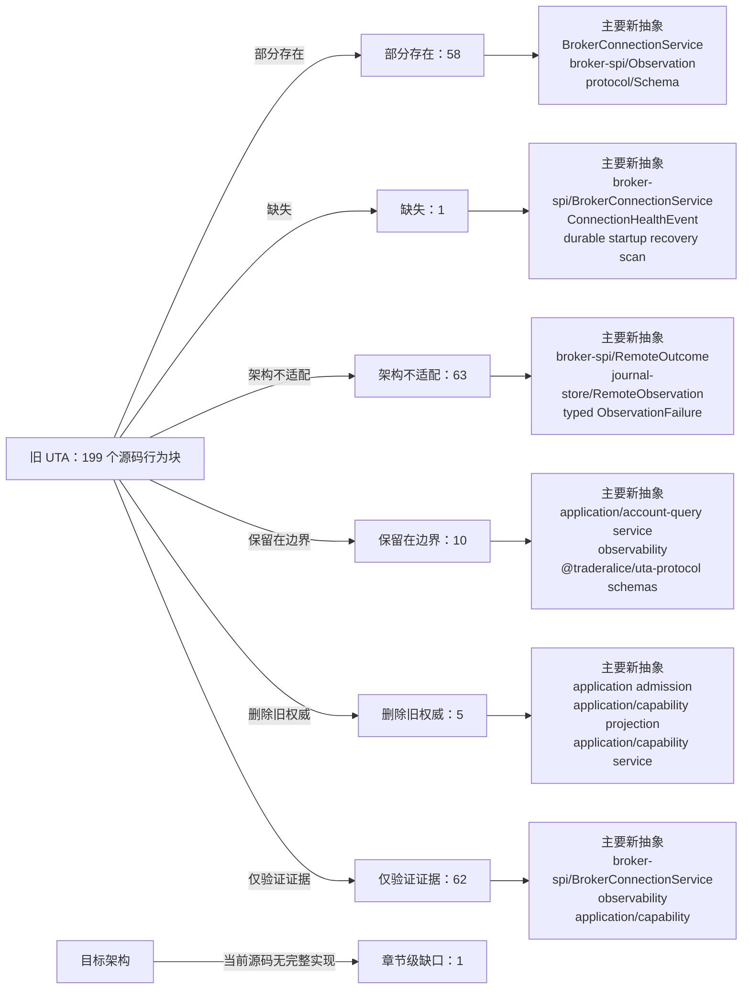

<!-- Auto-generated by scripts/uta-effect-runtime-map.mjs from mapping.json. Do not edit by hand. -->
<!-- Regenerate with `node scripts/uta-effect-runtime-map.mjs`. -->

# UTA 功能替代关系：第 13 章 Observability

目标架构原文：[`docs/uta-effect-runtime-architecture.md:1302-1326`](../uta-effect-runtime-architecture.md#L1302-L1326)。

## 结论

部分存在 58；缺失 1；架构不适配 63；保留在边界 10；删除旧权威 5；仅验证证据 62。状态只描述当前实现相对于目标架构的关系，不表示迁移已经落地。

## 替代关系图

## 章节级目标缺口

| 依据 | 目标义务 | 当前缺口 | 必须补充或调整 |
|---|---|---|---|
| docs/uta-effect-runtime-architecture.md:1317-1325 | Required operational projections and metrics | Current health/log rows do not provide transactions by state/age, unknown outcomes awaiting reconciliation, RecoveryRequired residual exposure, durable queue lag/lease age, journal writer latency/backpressure, and projection checkpoint lag as typed operational views. | Add projection/query services and structured metrics for every listed view, keyed by transaction/step/dispatch/account/conflict/journal context and redacted by schema. |

## 源码映射

| 映射 ID | 当前源码 | 符号或行为块 | 当前功能 | 替代状态 | 新 UTA 抽象与做法 | 不适配位置与原因 | 必须补充或调整 | 重复索引 |
|---|---|---|---|---|---|---|---|---|
| `MAP-3EEBF25E8D` | [`packages/uta-protocol/src/types/broker.ts:366-413`](../../packages/uta-protocol/src/types/broker.ts#L366-L413) | BrokerHealth, UTAReach, UTATier, and BrokerHealthInfo | Models healthy/degraded/offline status, a down/connected/readable reach ladder, static data/account/trading tier, failure counters/timestamps, recovering/connecting, and disabled flags. | 部分存在 | 1. Thesis and non-negotiable properties；3.6 broker-spi/；6. State tiers and snapshots；9.1 Connection Layer；9.4 Capability derivation；12.1 Startup sequence；13. Observability；15. Security and authority BrokerConnectionService；ConnectionHealthEvent；CapabilitySet；CapabilityFailure；effect-runtime/；application/capability service Use scoped BrokerConnectionService health streams and typed capability degradation, with connection/account identity and durable operational projections. | The reach/tier concept is directionally useful, but status is a mutable summary with raw error text and booleans rather than typed health events, capability failures, and connection-layer requirements. | Define ConnectionHealthEvent/ConnectionFailure and CapabilityUnavailable ADTs, derive capabilities from ActionContext, and persist/query health as a projection without making health a broker mutation gate for unrelated accounts. | **DUP-090** |
| `MAP-98D887D066` | [`packages/uta-protocol/src/types/broker.ts:415-426`](../../packages/uta-protocol/src/types/broker.ts#L415-L426) | BrokerConnectionStateEvent | Defines alive/dead/restored string states and an optional error string for an adapter-to-UTA transport signal. | 部分存在 | 3.2 effect-runtime/；3.6 broker-spi/；4. Effect model；9.1 Connection Layer；12.1 Startup sequence；13. Observability BrokerConnectionService；ConnectionHealthEvent；ConnectionFailure；effect-runtime/ Make connection health a typed Stream from a scoped BrokerConnectionService Layer, with reconnect/readiness evidence and no transaction state in the connection object. | The event has an open-ended error string and no connection identity, readiness evidence, or typed failure channel; listeners are optional callbacks rather than Effect streams. | Replace the callback event with BrokerConnectionService.observeHealth and typed ConnectionFailure/health variants managed by adapter Scope/Layers. | **DUP-091** |
| `MAP-18E2D21F66` | [`packages/uta-protocol/src/types/git.ts:160-167`](../../packages/uta-protocol/src/types/git.ts#L160-L167) | CommitLogEntry | Represents a Git log row with hash/parent/message/timestamp/round and OperationSummary[] only. | 部分存在 | 6. State tiers and snapshots；7.4 Snapshot and compaction policy；11. Approval and Git audit projection；13. Observability；14. Public protocol；17.6 Slice 6: delete the legacy kernel；19. Architectural prohibitions Git audit projection；projection-store/；journal-store/；TransactionId；JournalSequence Expose Git log as a rebuildable audit projection annotated or correlated with transaction ids/revisions and journal sequences, never as recovery authority. | The row has no transaction/revision/state/sequence and assumes Git's narrative is sufficient for execution history, while target recovery reads SQLite journal and broker observations. | Build CommitLogEntry-compatible output only from projection-store checkpoints and journal events, with a typed compatibility schema and no execution writes. | **DUP-119** |
| `MAP-732B845474` | [`packages/uta-protocol/src/types/history.ts:36-59`](../../packages/uta-protocol/src/types/history.ts#L36-L59) | OrderHistoryEntry | Collapses an order lifecycle into one row with optional broker order id/order terms/fills, flat status/source, Git commit hash/message, and optional string error. | 部分存在 | 5.7 Complete type contract — before-images, observations, and preconditions；6. State tiers and snapshots；7.4 Snapshot and compaction policy；9.3 Remote outcome；11. Approval and Git audit projection；12.2 Unknown-outcome protocol；13. Observability；14. Public protocol；17.6 Slice 6: delete the legacy kernel；19. Architectural prohibitions OrderSnapshot；TransactionId；DispatchIdentity；projection-store/；Git audit projection；journal-store/；protocol/ history schema Build order history from journal events, normalized order/remote observations, and projection checkpoints; expose transaction/revision/dispatch correlation and retain CommitHash only as audit pointer. | The row is a useful read projection, but optional order terms, flat status, commit hash/message authority, and free-form error omit order version, observation timestamp/evidence, transaction identity, and unknown/reconciliation state. | Redesign the history projection schema around typed OrderSnapshot/RemoteOutcome and journal correlation, then keep only presentation-compatible fields as derived output. | **DUP-133** |
| `MAP-75E0ED8B2B` | [`packages/uta-protocol/src/types/manager.ts:12-19`](../../packages/uta-protocol/src/types/manager.ts#L12-L19) | UTASummary | Summarizes a UTA id/label, an asVendor boolean, AccountCapabilities, and BrokerHealthInfo. | 部分存在 | 2.2 UTA owns；3.8 projection-store/；6. State tiers and snapshots；9.4 Capability derivation；13. Observability；14. Public protocol；15. Security and authority application/capability service；projection-store/；CapabilitySet；BrokerConnectionService；ConnectionHealthEvent；protocol/ account summary schema Expose a typed account/capability query projection with branded account/connection identity, capability ADTs, and health/reach evidence derived by UTA. | The summary concept is a query projection, but id/label are raw strings, capabilities are static string arrays, health is a mutable summary with raw error text, and asVendor does not express target authority/context. | Replace with an account query/capability response schema backed by projection-store and BrokerConnectionService, retaining presentation labels only at the UI boundary. | **DUP-137** |
| `MAP-02219D5749` | [`packages/uta-protocol/src/types/manager.ts:21-37`](../../packages/uta-protocol/src/types/manager.ts#L21-L37) | AggregatedEquity | Aggregates total equity/cash/PnL as strings, optional string FX warnings, and anonymous per-account rows with raw id/currency/health fields. | 部分存在 | 3.8 projection-store/；6. State tiers and snapshots；7.4 Snapshot and compaction policy；10.1 Accounting owns；13. Observability；14. Public protocol；19. Architectural prohibitions market-and-accounting/；Money；CurrencyCode；FX observation；projection-store/；protocol/ account-state schema Serve aggregated accounting as a projection over currency-qualified Money and explicit FX observations/uncertainty, with per-account identity and projection checkpoints. | Raw monetary strings and warning text do not encode currency, FX source/timestamp, valuation uncertainty, or typed accounting failure; anonymous nested objects are not named domain/protocol types. | Define accounting aggregation/projection types with Money, CurrencyCode, FX observation and typed warning/failure variants, then expose them through a named account-state schema. | **DUP-138** |
| `MAP-8588C24A12` | [`services/uta/src/__tests__/trading-tools.spec.ts:91-99`](../../services/uta/src/__tests__/trading-tools.spec.ts#L91-L99) | createTradingTools.listUTAs | Calls the tool layer with no arguments and verifies that it returns an array of summaries containing the registered account identifier. | 仅验证证据 | §2.1 Alice owns；§3.8 projection-store/；§3.9 transport/ and protocol/；§6 State tiers and snapshots；§13 Observability；§14 Public protocol；§15 Security and authority application/account-query；projection-store；protocol account-state schema；transport/http Treat this as read-only account projection evidence. The target query should return a named account/capability summary with reachability state and no credentials or native adapter object, verified through the public schema. | — | — | **DUP-146** |
| `MAP-EBC1DF5535` | [`services/uta/src/__tests__/trading-tools.spec.ts:137-167`](../../services/uta/src/__tests__/trading-tools.spec.ts#L137-L167) | getOrders.compactSummaries | Executes a staged and pushed market order, then checks that getOrders returns compact fields such as source, action, orderType, quantity, and status while excluding raw IBKR fields. | 仅验证证据 | §2 System boundary；§3.8 projection-store/；§3.9 transport/ and protocol/；§5 Transaction algebra；§6 State tiers and snapshots；§9.2 Typed action interpreter；§13 Observability；§14 Public protocol；§15 Security and authority application/account-query；projection-store/orders；protocol order schema；broker-spi/BrokerActionInterpreter；brokers/Mock Use this as read-projection boundary evidence: the target orders query should encode normalized named fields, omit broker-native SDK fields, and read from rebuildable projection state after journaled execution; the fixture itself does not prove durable dispatch. | — | — | **DUP-149** |
| `MAP-68FD1B154A` | [`services/uta/src/domain/trading/__test__/e2e/ccxt-bybit.e2e.spec.ts:58-91`](../../services/uta/src/domain/trading/__test__/e2e/ccxt-bybit.e2e.spec.ts#L58-L91) | Bybit raw diagnostic plus generic placeOrder | Searches ETH, calls the internal raw CCXT createOrder for diagnostics, closes through the broker closePosition method, then places a market order via generic IBroker and asserts success/orderId and optional execution values. | 部分存在 | 9.2 Typed action interpreter；9.3 Remote outcome；12.2 Unknown-outcome protocol；13 Observability；18.3 Real broker acceptance；19 Architectural prohibitions brokers/ccxt/Bybit adapter；broker-spi DispatchIdentity/RemoteOutcome；durable-scheduler；observability redaction Move raw response inspection into adapter-only diagnostics and route the acceptance mutation through a typed Bybit interpreter with durable dispatch identity and reconciliation. | The scenario bypasses the abstraction with an any-cast Exchange call, then uses generic IBroker; it has no durable intent, typed unknown outcome, compensation, or target redaction proof. | Remove raw SDK calls from the target mutation scenario, define boundary schemas/error mapping, and add journal/scheduler/restart assertions. | **DUP-171** |
| `MAP-E5356E684D` | [`services/uta/src/domain/trading/__test__/e2e/ccxt-bybit.e2e.spec.ts:186-234`](../../services/uta/src/domain/trading/__test__/e2e/ccxt-bybit.e2e.spec.ts#L186-L234) | Bybit conditional/trigger order diagnostic | Opens a position, creates a trigger order through raw CCXT, mutates the broker's internal orderSymbolCache via any, queries the raw order ID through generic getOrder, cancels it, and closes the position. | 架构不适配 | 9.2 Typed action interpreter；9.3 Remote outcome；12.2 Unknown-outcome protocol；13 Observability；19 Architectural prohibitions broker-spi DispatchIdentity/RemoteOutcome；brokers/ccxt/Bybit adapter；durable-scheduler；observability Expose conditional order compilation, stable dispatch identity, observation, and cancellation through the typed Bybit broker-spi interpreter; keep internal symbol caches private and non-authoritative. | The test directly calls raw SDK createOrder and writes an internal cache through any, bypassing the adapter boundary and relying on in-memory state. It cannot prove durable observation/reconciliation or safe recovery. | Remove raw/cache mutation from the target path; implement typed trigger action schemas, native error/observation decoding, journaled dispatch identity, and reconciliation/cancellation jobs. | **DUP-175** |
| `MAP-58AE86AEDD` | [`services/uta/src/domain/trading/__test__/e2e/ccxt-raw-diagnostic.e2e.spec.ts:29-54`](../../services/uta/src/domain/trading/__test__/e2e/ccxt-raw-diagnostic.e2e.spec.ts#L29-L54) | raw createOrder response diagnostic | Calls CCXT createOrder directly for an ETH perpetual, prints selected normalized/raw response fields, and best-effort closes with a reduce-only raw order. | 仅验证证据 | 9.2 Typed action interpreter；9.3 Remote outcome；12.2 Unknown-outcome protocol；13 Observability；19 Architectural prohibitions brokers/ccxt/Bybit adapter；broker-spi DispatchIdentity/RemoteOutcome；observability redaction Use only as temporary adapter investigation; once the native mapping is known, encode it in typed broker-spi boundary schemas and observe through the target interpreter. | It bypasses UTA/journal/scheduler, logs raw native payloads including info, and does not assert durable identity, redaction, unknown outcomes, or compensation. | Remove raw native response logging or pass it through a broker-specific redaction schema; replace the diagnostic mutation path with a typed interpreter scenario that persists dispatch identity, outcome, and cleanup evidence without logging complete native payloads. | **DUP-192** |
| `MAP-47ED37A445` | [`services/uta/src/domain/trading/__test__/e2e/ccxt-raw-diagnostic.e2e.spec.ts:56-90`](../../services/uta/src/domain/trading/__test__/e2e/ccxt-raw-diagnostic.e2e.spec.ts#L56-L90) | raw closed/open order diagnostics | Directly fetches closed and open orders from CCXT and prints selected IDs/status/symbol/amount fields without assertions beyond successful calls. | 仅验证证据 | 9.2 Typed action interpreter；9.3 Remote outcome；12.2 Unknown-outcome protocol；13 Observability；19 Architectural prohibitions broker-spi observation schema；brokers/ccxt/Bybit adapter；observability redaction Retain as diagnostic evidence only; convert stable findings into typed adapter tests for broker-spi observation and reconciliation. | Printed raw SDK observations are not a target contract and provide no durable/recovery or redaction proof. | — | **DUP-193** |
| `MAP-9762F1BB09` | [`services/uta/src/domain/trading/__test__/e2e/ibkr-paper.e2e.spec.ts:25-30`](../../services/uta/src/domain/trading/__test__/e2e/ibkr-paper.e2e.spec.ts#L25-L30) | requiredOrderId | Throws if an open IBKR order lacks an orderId, preventing cleanup from continuing with an unverifiable identity. | 保留在边界 | 9.2 Typed action interpreter；12.2 Unknown-outcome protocol；13 Observability；18.3 Real broker acceptance broker-spi DispatchIdentity；durable-scheduler reconciliation；observability Retain this test-only cleanup guard, but replace its untyped order shape with the target broker-spi order/dispatch identity type and preserve the failure as evidence. | It is a local safety helper, not a durable identity or reconciliation implementation; it cannot prove unknown-outcome handling. | — | **DUP-197** |
| `MAP-813BFD59A1` | [`services/uta/src/domain/trading/__test__/e2e/ibkr-paper.e2e.spec.ts:44-92`](../../services/uta/src/domain/trading/__test__/e2e/ibkr-paper.e2e.spec.ts#L44-L92) | IbkrBroker connectivity | Directly queries IBKR account equity/cash, market clock, AAPL contract search/details, and positions; asserts basic positive values, conId, symbol, and Decimal/string field types. | 仅验证证据 | 9 Broker service-provider interface；10 Accounting and market boundaries；13 Observability；18.3 Real broker acceptance brokers/ibkr typed interpreter；broker-spi connection/query service；market-and-accounting；projection-store Retain as low-level IBKR adapter smoke evidence, and add target application/protocol tests that consume typed broker-spi observations rather than SDK-shaped values. | Connectivity and read-field assertions do not prove transaction preparation, durable scheduling, dispatch identity, reconciliation, accounting projections, or crash recovery. | — | **DUP-199** |
| `MAP-2B14BC2DD9` | [`services/uta/src/domain/trading/__test__/e2e/ibkr-paper.e2e.spec.ts:128-217`](../../services/uta/src/domain/trading/__test__/e2e/ibkr-paper.e2e.spec.ts#L128-L217) | IbkrBroker canonical conId routing | Fetches canonical USD.CHF contract details, records positions/open-order baselines, submits a deliberately polluted conId-based what-if order, records result evidence, cancels any accidental order, and asserts final positions/open-order IDs match baseline. | 部分存在 | 5.3 Two-phase transaction protocol；9.2 Typed action interpreter；9.4 Capability derivation；10.2 Market and jurisdiction owns；12.2 Unknown-outcome protocol；13 Observability；18.3 Real broker acceptance；19 Architectural prohibitions broker-spi IBKR action interpreter；market-and-accounting jurisdiction/instrument service；transaction-kernel preconditions；journal-store；projection-store；observability redaction Keep the canonical identity and baseline assertions as an adapter/acceptance case, but route the action through typed broker-spi identity normalization and target journal/scheduler evidence. | This directly calls generic IBroker with SDK Contract/Order values and a what-if flag; it proves routing and cleanup but not durable intent, dispatch identity, typed capability, unknown outcome, or target journal/projection semantics. | Define canonical IBKR action and observation schemas, persist target dispatch/evidence fields, and add restart/reconciliation variants while keeping the exact baseline invariant. | **DUP-201** |
| `MAP-F9A4323AA5` | [`services/uta/src/domain/trading/__test__/e2e/ibkr-paper.e2e.spec.ts:301-367`](../../services/uta/src/domain/trading/__test__/e2e/ibkr-paper.e2e.spec.ts#L301-L367) | IbkrBroker fill and exact baseline cleanup | Records AAPL position and open-order baselines, places a market buy, polls until quantity increases by one, queries the order, cancels newly open orders, closes only the created delta, polls back to baseline, and asserts final open-order IDs and quantity exactly match baseline. | 部分存在 | 9.2 Typed action interpreter；9.3 Remote outcome；10.1 Accounting owns；12 Recovery model；13 Observability；18.3 Real broker acceptance broker-spi IBKR interpreter；durable-scheduler reconciliation；market-and-accounting position projection；journal-store；observability Retain the strong baseline-delta cleanup as target IBKR paper acceptance, but execute it through the transaction kernel and durable scheduler with typed dispatch/observation/reconciliation records. | The scenario gives useful real-broker fill and cleanup evidence, yet all mutation and polling is through generic IBroker in one process; it has no durable intent, crash boundary, unknown-outcome protocol, compensation state, or journal-backed projection. | Add dispatch identity and journal assertions, kill/restart reconciliation variants, and target accounting projection checks while preserving exact baseline restoration. | **DUP-204** |
| `MAP-424F0FB69C` | [`services/uta/src/domain/trading/__test__/e2e/live-paper-evidence.ts:6-38`](../../services/uta/src/domain/trading/__test__/e2e/live-paper-evidence.ts#L6-L38) | ContractEvidence and LivePaperEvidence schemas | Defines a compact evidence record containing contract identity, optional request/result, position/open-order counts, cleanup baseline match, and an optional note. | 保留在边界 | 7.3 Authoritative tables；13 Observability；18.3 Real broker acceptance observability evidence schema；projection-store acceptance views；broker-spi identity/observation types Retain as non-authoritative test evidence, extending only if target acceptance needs transaction/revision/step/dispatch/journal identifiers and redaction metadata. | The schema intentionally omits transaction id, revision, step id, dispatch id, conflict key, journal sequence, lease, and reconciliation schedule, so it cannot serve as target runtime state or observability. | — | **DUP-205** |
| `MAP-8800585703` | [`services/uta/src/domain/trading/__test__/e2e/live-paper-evidence.ts:40-52`](../../services/uta/src/domain/trading/__test__/e2e/live-paper-evidence.ts#L40-L52) | runStamp/runId/currentCommit/gitCommit | Creates a per-run timestamp/process identifier, allows an environment-provided run id, and records the current Git commit or 'unknown' for evidence metadata. | 保留在边界 | 11 Approval and Git audit projection；13 Observability；19 Architectural prohibitions projection-store Git audit projection；observability metadata Keep Git commit/run metadata only as an external test artifact; target transaction identity must come from journal transaction/revision/dispatch IDs. | The helper uses Git metadata for evidence, but target architecture forbids Git hashes as transaction identity; no production authority is claimed by this file. | — | **DUP-206** |
| `MAP-FA821E371F` | [`services/uta/src/domain/trading/__test__/e2e/live-paper-evidence.ts:54-65`](../../services/uta/src/domain/trading/__test__/e2e/live-paper-evidence.ts#L54-L65) | contractEvidence | Projects native IBKR Contract fields into the compact ContractEvidence record. | 保留在边界 | 9.2 Typed action interpreter；10.2 Market and jurisdiction owns；13 Observability；18.3 Real broker acceptance broker-spi observation schema；market-and-accounting instrument identity；observability redaction schema Keep this adapter-test projection at the boundary, or replace the native Contract parameter with a target broker-spi observation type when the adapter migrates. | It copies SDK-native fields for evidence and is not a target domain/protocol type or authoritative projection. | — | **DUP-207** |
| `MAP-C2F022975E` | [`services/uta/src/domain/trading/__test__/e2e/live-paper-evidence.ts:68-87`](../../services/uta/src/domain/trading/__test__/e2e/live-paper-evidence.ts#L68-L87) | recordLivePaperEvidence | Creates an ignored data/uta-live-paper-runs directory by default and appends one JSONL record containing schemaVersion, timestamp, Git commit, paper flag, broker name, and scenario evidence. | 保留在边界 | 7 Durability architecture；11 Approval and Git audit projection；13 Observability；18.3 Real broker acceptance；18.4 Packaging and storage acceptance；19 Architectural prohibitions test evidence sink；observability；projection-store acceptance artifact Retain only as a clearly non-authoritative paper-test artifact; target journal-store remains the sole trading authority, and acceptance records should reference journal/dispatch identities without persisting secrets or native payloads. | No assigned e2e file exercises source/Docker/Electron package migration, abrupt termination, backup/restore, relocation, or corrupt journal/schema handling required by 18.4. This JSONL helper is not evidence of SQLite durability and must never replace it. | — | **DUP-208** |
| `MAP-47B29B6218` | [`services/uta/src/domain/trading/__test__/e2e/uta-ccxt-bybit.e2e.spec.ts:182-216`](../../services/uta/src/domain/trading/__test__/e2e/uta-ccxt-bybit.e2e.spec.ts#L182-L216) | sentinel status/show/export boundary | Stages a market order, asserts a large Decimal sentinel is absent from status, pushes it, asserts the sentinel is absent from show/exportGitState/log, and closes the resulting position. | 部分存在 | 3.8 projection-store/；6 State tiers and snapshots；11 Approval and Git audit projection；13 Observability；14 Public protocol；17.2 Slice 2: transaction and approval protocol；19 Architectural prohibitions projection-store；protocol codecs and schemas；journal-store；observability redaction schemas Retain the boundary invariant as a projection/protocol test: decode and encode named schemas from journal-derived projections and verify financial sentinel/default values cannot cross public or audit boundaries. | The current assertions cover legacy status/show/export/log JSON only; they do not exercise named protocol schemas, journal-derived rebuilds, redaction, transaction/dispatch identifiers, or target projection authority. | Move the sentinel check to projection-store and protocol integration tests and remove legacy exportGitState persistence once the journal is authoritative. | **DUP-229** |
| `MAP-D71042F42A` | [`services/uta/src/domain/trading/__test__/uta-health.spec.ts:24-35`](../../services/uta/src/domain/trading/__test__/uta-health.spec.ts#L24-L35) | UTA health initial connect healthy | With fake timers, constructs a UTA, flushes the initial asynchronous connect, and asserts healthy state, a Date-valued lastSuccessAt, and recovering=false. | 仅验证证据 | §4 Effect model；§9.1 Connection Layer；§12.1 Startup sequence；§13 Observability；§18 Verification contract effect-runtime/Scope and Fiber；broker-spi/BrokerConnectionService；brokers/Mock；application/capability Record startup reachability evidence as a connection-service health event and capability projection. The target startup sequence must establish journal validity and classify unfinished work before admission; this test covers only broker connection state. | — | — | **DUP-245** |
| `MAP-EF93AB390A` | [`services/uta/src/domain/trading/__test__/uta-health.spec.ts:37-48`](../../services/uta/src/domain/trading/__test__/uta-health.spec.ts#L37-L48) | UTA health initial connect failure | Configures MockBroker.init to fail at startup, flushes the asynchronous connect, and asserts offline health, recovering=true, and the captured simulated init error before closing the UTA. | 仅验证证据 | §4 Effect model；§9.1 Connection Layer；§12.1 Startup sequence；§12.3 Defects and expected failures；§13 Observability；§18 Verification contract broker-spi/BrokerConnectionService；effect-runtime/Schedule and Fiber；application/capability；brokers/Mock；observability Map connection acquisition failure to a typed unavailable/degraded capability and supervised recovery signal. Keep broker-error evidence, but do not infer the full startup contract because SQLite open, migrations, journal verification, and unfinished-work classification are outside this test. | — | — | **DUP-246** |
| `MAP-1F940280FC` | [`services/uta/src/domain/trading/__test__/uta-health.spec.ts:50-67`](../../services/uta/src/domain/trading/__test__/uta-health.spec.ts#L50-L67) | UTA health initial recovery success | Fails the first init attempt, asserts offline, advances five seconds, and verifies that recovery succeeds and recovering becomes false. | 仅验证证据 | §4 Effect model；§9.1 Connection Layer；§12.1 Startup sequence；§13 Observability；§18 Verification contract effect-runtime/Schedule；effect-runtime/Fiber；broker-spi/BrokerConnectionService；durable-scheduler；brokers/Mock Map the first reconnect attempt to an explicit supervised connection schedule and health event. Durable trading jobs must remain in durable-scheduler/journal-store rather than being represented by this in-memory timer. | — | — | **DUP-247** |
| `MAP-7D71DB21A0` | [`services/uta/src/domain/trading/__test__/uta-health.spec.ts:69-91`](../../services/uta/src/domain/trading/__test__/uta-health.spec.ts#L69-L91) | UTA health exponentialBackoff | Keeps MockBroker down across recovery attempts at five, ten, and twenty seconds, asserting offline throughout, recovering=true, and explicit close cleanup. | 仅验证证据 | §4 Effect model；§8 Scheduling, ordering, and concurrency；§9.1 Connection Layer；§12.1 Startup sequence；§12.3 Defects and expected failures；§13 Observability；§19 Architectural prohibitions effect-runtime/Schedule；effect-runtime/Fiber；broker-spi/BrokerConnectionService；durable-scheduler；observability Preserve exponential reconnect policy as an explicit typed Schedule with observable attempt state, while separating connection retries from broker-mutation retries; the target must never use this policy to blindly redispatch an unknown mutation. | — | — | **DUP-248** |
| `MAP-589FE4B148` | [`services/uta/src/domain/trading/__test__/uta-health.spec.ts:93-110`](../../services/uta/src/domain/trading/__test__/uta-health.spec.ts#L93-L110) | UTA health later recovery | Fails initial connect and the first recovery, advances to the second recovery window, and verifies that the UTA becomes healthy after the broker's failure budget is exhausted. | 仅验证证据 | §4 Effect model；§9.1 Connection Layer；§12.1 Startup sequence；§13 Observability；§18 Verification contract effect-runtime/Schedule and Fiber；broker-spi/BrokerConnectionService；application/capability；brokers/Mock；observability Use as evidence that a supervised connection worker can recover after multiple failures and clear its degraded capability; target verification should also assert that durable transactions and reconciliation jobs remain correctly classified during the outage. | — | — | **DUP-249** |
| `MAP-9C2B1A32E6` | [`services/uta/src/domain/trading/__test__/uta-health.spec.ts:112-127`](../../services/uta/src/domain/trading/__test__/uta-health.spec.ts#L112-L127) | UTA health runtime degradedThreshold | After a healthy connect, injects three consecutive getAccount failures and asserts the health state transitions from healthy to degraded. | 仅验证证据 | §4 Effect model；§9.1 Connection Layer；§12.3 Defects and expected failures；§13 Observability；§18 Verification contract broker-spi/BrokerConnectionService；effect-runtime；application/capability；observability；brokers/Mock Map consecutive operation failures to typed connection-health events and a capability degradation projection rather than only a mutable health string; retain the threshold as policy evidence if the target product policy keeps it. | — | — | **DUP-250** |
| `MAP-A227BE1784` | [`services/uta/src/domain/trading/__test__/uta-health.spec.ts:129-141`](../../services/uta/src/domain/trading/__test__/uta-health.spec.ts#L129-L141) | UTA health runtime offlineThreshold | After six consecutive getAccount failures, asserts offline health and recovering=true, then closes the UTA. | 仅验证证据 | §4 Effect model；§8 Scheduling, ordering, and concurrency；§9.1 Connection Layer；§12.1 Startup sequence；§13 Observability；§18 Verification contract broker-spi/BrokerConnectionService；effect-runtime/Schedule and Fiber；application/capability；durable-scheduler；observability Map the offline transition to an unavailable connection capability and a supervised reconnect worker; durable-scheduler must independently preserve/reconcile pending work, which this threshold test does not exercise. | — | — | **DUP-251** |
| `MAP-21CC430684` | [`services/uta/src/domain/trading/__test__/uta-health.spec.ts:143-159`](../../services/uta/src/domain/trading/__test__/uta-health.spec.ts#L143-L159) | UTA health runtime recovery | Drives six failures to offline, advances the five-second recovery interval, and verifies that the broker's return restores healthy state and clears recovering. | 仅验证证据 | §4 Effect model；§9.1 Connection Layer；§12.1 Startup sequence；§13 Observability；§18 Verification contract effect-runtime/Schedule and Fiber；broker-spi/BrokerConnectionService；application/capability；durable-scheduler；brokers/Mock Use as runtime-disconnect recovery evidence for a scoped connection service. The target recovery path must reclassify outstanding durable work and expose typed degraded capabilities while unrelated accounts remain available. | — | — | **DUP-252** |
| `MAP-56FD13561B` | [`services/uta/src/domain/trading/__test__/uta-health.spec.ts:161-175`](../../services/uta/src/domain/trading/__test__/uta-health.spec.ts#L161-L175) | UTA health successfulCallReset | Injects four failures, observes degraded health, then allows the next getAccount call to succeed and verifies healthy state and consecutiveFailures=0. | 仅验证证据 | §4 Effect model；§9.1 Connection Layer；§13 Observability；§18 Verification contract broker-spi/BrokerConnectionService；effect-runtime；application/capability；observability Capture successful broker observation as a typed health update with reset counters/timestamps while keeping broker-observed state distinct from transaction state; this is evidence for reachability policy only. | — | — | **DUP-253** |
| `MAP-39DD2BB1A1` | [`services/uta/src/domain/trading/__test__/uta-health.spec.ts:177-188`](../../services/uta/src/domain/trading/__test__/uta-health.spec.ts#L177-L188) | UTA health crossMethodFailures | Causes getAccount and getPositions to fail under one broker failure budget, verifies the shared consecutive failure count, then confirms getMarketClock success restores healthy state. | 仅验证证据 | §4 Effect model；§9.1 Connection Layer；§10 Accounting and market boundaries；§13 Observability；§18 Verification contract broker-spi/BrokerConnectionService；application/account-query；market-and-accounting；effect-runtime；observability Aggregate reachability across account, position, and market-clock calls in the connection service, while keeping accounting/market observations as separate typed domain inputs; retain this as cross-method health evidence. | — | — | **DUP-254** |
| `MAP-687A495AFD` | [`services/uta/src/domain/trading/__test__/uta-health.spec.ts:191-207`](../../services/uta/src/domain/trading/__test__/uta-health.spec.ts#L191-L207) | UTA health offlineFailFast | After six failed account calls, invokes getAccount again and asserts an offline-and-reconnecting error, demonstrating a fail-fast path that avoids another broker call while recovery is active. | 仅验证证据 | §4 Effect model；§8 Scheduling, ordering, and concurrency；§9.1 Connection Layer；§12.3 Defects and expected failures；§13 Observability；§18 Verification contract broker-spi/BrokerConnectionService；application/account-query；effect-runtime；application/capability；observability Map fail-fast behavior to a typed ConnectionUnavailable/degraded capability at the application boundary, and verify that reconnect fibers do not dispatch ordinary queries until reachability returns. | — | — | **DUP-255** |
| `MAP-FDBC88A893` | [`services/uta/src/domain/trading/brokers/alpaca/alpaca-contracts.ts:67-73`](../../services/uta/src/domain/trading/brokers/alpaca/alpaca-contracts.ts#L67-L73) | makeOrderState | Constructs a mutable legacy OrderState, assigns the collapsed status, and optionally copies a rejection reason string. | 架构不适配 | §5.7 Before-images, observations, and preconditions；§6 State tiers and snapshots；§9.2 Typed action interpreter；§9.3 Remote outcome；§12.3 Defects and expected failures；§13 Observability OrderSnapshot；BrokerRejection；PlaceOrderAcknowledgement；ObservationFailure Return an immutable typed order observation/acknowledgement with branded IDs, status, filled quantity, version, timestamps, and structured rejection. Emit legacy OrderState only through a compatibility projection. | A mutable compatibility state cannot carry broker order version, observation time, dispatch identity, or a distinction between confirmed, still-working, rejected, and unknown outcomes. | Remove makeOrderState from the target interpreter path and implement named Alpaca order observation/ack schemas with exhaustive failure mapping. | **DUP-264** |
| `MAP-D50CF7C166` | [`services/uta/src/domain/trading/brokers/alpaca/alpaca-types.ts:32-51`](../../services/uta/src/domain/trading/brokers/alpaca/alpaca-types.ts#L32-L51) | AlpacaOrderRaw | Describes order rows with optional quantity/notional/prices/fill fields, native status, timestamps, reject reason, optional order class, and recursive legs; all provider strings are unconstrained. | 架构不适配 | §5.7 Before-images, observations, and preconditions；§5.7 Dispatch and durable-job records；§6 State tiers and snapshots；§9.2 Typed action interpreter；§9.3 Remote outcome；§12.2 Unknown-outcome protocol；§13 Observability；§19 Architectural prohibitions AlpacaOrderSchema；OrderSnapshot；OrderObservation；DispatchIdentity；OrderLegObservation；BrokerRejection Replace the interface with a versioned native response schema and map quantity/notional as distinct variants, native UUID/version/status/timestamps/fills/legs into OrderSnapshot and RemoteOutcome evidence. | No runtime decoder or branded identity exists; nullable quantity/notional is semantically conflated by the mapper, statuses are open strings, and no broker-order version or observation identity is defined. | Implement AlpacaOrderSchema/leg schema, exhaustive status and order-type codecs, native ID/version preservation, and typed leg/fill observations used by dispatch reconciliation. | **DUP-268** |
| `MAP-63A967FD50` | [`services/uta/src/domain/trading/brokers/alpaca/AlpacaBroker.spec.ts:906-946`](../../services/uta/src/domain/trading/brokers/alpaca/AlpacaBroker.spec.ts#L906-L946) | historical feed handling tests | Verifies SIP is requested first, a specific recent-SIP 403 triggers IEX fallback, and a non-SIP 500 propagates without fallback. | 仅验证证据 | §9.2 Typed action interpreter；§9.3 Remote outcome；§10.2 Market and jurisdiction owns；§12.3 Defects and expected failures；§13 Observability；§18.3 Real broker acceptance；§19 Architectural prohibitions TypedFeedAvailability；HistoricalBarsObservation；ObservationFailure；MarketDataQuality Retain provider-specific fallback coverage but drive it from decoded feed-denial variants and assert the returned data-quality/source metadata and structured evidence, not message text. | — | — | **DUP-291** |
| `MAP-B9801A7C06` | [`services/uta/src/domain/trading/brokers/alpaca/AlpacaBroker.ts:78-99`](../../services/uta/src/domain/trading/brokers/alpaca/AlpacaBroker.ts#L78-L99) | alpacaErrorMessage and isRecentSipDenied | Converts unknown SDK failures to strings by inspecting axios-like response data, and classifies the SIP fallback using HTTP status plus a case-insensitive error-message regex. | 架构不适配 | §4 Effect model；§9.2 Typed action interpreter；§9.3 Remote outcome；§12.3 Defects and expected failures；§13 Observability；§19 Architectural prohibitions AlpacaFailureSchema；DispatchFailure；ObservationFailure；RemoteOutcome；RedactedNativeResponse Decode Alpaca error bodies into tagged adapter failures and map them to broker rejection, connection failure, protocol violation, or observation failure. Represent data-feed denial as a typed provider condition with explicit data-quality metadata, not as domain error classification by regex. | Expected failures are reduced to Error.message strings, and a regex over a rendered message controls behavior; this loses error variants and conflates provider protocol with domain failure. | Add runtime schemas for Alpaca error responses and feed-denial responses, exhaustive mapping to broker-spi failure ADTs, and redacted structured logging with dispatch/account context. | **DUP-298** |
| `MAP-0ABCB3F3AD` | [`services/uta/src/domain/trading/brokers/alpaca/AlpacaBroker.ts:151-203`](../../services/uta/src/domain/trading/brokers/alpaca/AlpacaBroker.ts#L151-L203) | init | Validates credential presence, constructs the SDK client, retries getAccount up to five times with exponential setTimeout delays, throws a special auth error after two auth-like message matches, and starts refreshCatalog as an unawaited promise before returning. | 架构不适配 | §4 Effect model；§8.4 Fairness and backpressure；§9.1 Connection Layer；§12.1 Startup sequence；§12.3 Defects and expected failures；§13 Observability；§15 Security and authority；2.2 UTA owns；2.3 Broker adapters own AlpacaConnectionLayer；ConnectionHealthEvent；ConnectionFailure；CapabilityFailure；Scoped Layer Acquire Alpaca through a scoped Effect Layer, report typed health/failure events, and let startup classify unfinished durable work before admission. Reconnect policy may schedule connection acquisition, but it must not be a blind mutation retry; catalog refresh should be a supervised typed job. | The lifecycle is promise-based and class-local, classifies auth by error-message regex, has no health stream/reconnect/shutdown protocol, and detaches catalog work with no durability or supervision. | Implement BrokerConnectionService acquisition, health, reconnect, and shutdown in a scoped Layer; map auth/network/protocol failures to tagged variants and supervise catalog observation separately from transaction dispatch. | **DUP-302** |
| `MAP-CFEE6FFFEA` | [`services/uta/src/domain/trading/brokers/alpaca/AlpacaBroker.ts:273-347`](../../services/uta/src/domain/trading/brokers/alpaca/AlpacaBroker.ts#L273-L347) | placeOrder | Resolves a legacy Contract to a ticker, builds an untyped Alpaca request from mutable Order fields, supports qty or notional, prices, trailing fields, extended hours, and bracket/OTO legs, calls createOrder directly, then returns PlaceOrderResult with the parent/leg IDs or a string error. | 架构不适配 | §1 Thesis and non-negotiable properties；§3.3 transaction-kernel/；§5.3 Two-phase transaction protocol；§5.5 Compensation capability；§5.7 Order and trading action ADTs；§5.7 Dispatch and durable-job records；§9.2 Typed action interpreter；§9.3 Remote outcome；§12.2 Unknown-outcome protocol；§13 Observability；§17 Slice 4: first real broker；§18.3 Real broker acceptance；§19 Architectural prohibitions；§20 First falsifier；2.2 UTA owns；2.3 Broker adapters own PreparedPlaceOrder；AlpacaPlaceOrderRequestSchema；DispatchIdentity；PlaceOrderAcknowledgement；RemoteOutcome<OrderSnapshot>；CompensationCapability；NativeAtomicGroupConfirmed Compile a typed PlaceOrder action and compensation capability during prepare, persist DispatchPlanned with a client/dispatch identity before calling Alpaca, dispatch through the interpreter, and persist Confirmed/Rejected/Unknown outcomes. Map bracket/OTO to a declared native atomic-group capability only when the venue observation proves the group criterion; otherwise track parent and child observations separately. | The method mutates the broker directly without a durable intent barrier, dispatch identity/idempotency key, before-image/precondition, commit criterion, compensation proof, or unknown-outcome observation. It also builds Record<string, unknown> payloads and converts attached prices through parseFloat. | Add Alpaca place-request/ack/observation schemas, clientOrderId/DispatchIdentity compilation, `dispatch` and `observe` SPI methods, typed rejection mapping, and compensation compilation for working orders/native groups. Remove PlaceOrderResult as the execution authority. | **DUP-307** |
| `MAP-D276945617` | [`services/uta/src/domain/trading/brokers/alpaca/AlpacaBroker.ts:370-379`](../../services/uta/src/domain/trading/brokers/alpaca/AlpacaBroker.ts#L370-L379) | cancelOrder | Calls cancelOrder and returns a locally constructed Cancelled OrderState with the requested string ID; any SDK failure becomes a string error. | 架构不适配 | §5.3 Two-phase transaction protocol；§5.7 Dispatch and durable-job records；§9.2 Typed action interpreter；§9.3 Remote outcome；§12.2 Unknown-outcome protocol；§13 Observability；§19 Architectural prohibitions PreparedCancelOrder；CancelOrderAcknowledgement；RemoteOutcome<OrderSnapshot>；OrderVersion；DispatchFailure Prepare cancellation against an observed order/version, persist dispatch intent, dispatch a typed cancel action, and observe the order until cancellation is confirmed or a typed Unknown/Rejected outcome is durable. | A successful SDK call is treated as a terminal cancellation without an acknowledgement or remote observation; a timeout can leave the remote state unknown and the method cannot reconcile it. | Implement CancelOrder interpreter/observation schemas, cancellation commit criteria, dispatch identity lookup, typed broker rejection, and reconciliation jobs; remove local success construction as authoritative state. | **DUP-309** |
| `MAP-A57DA48B5D` | [`services/uta/src/domain/trading/brokers/alpaca/AlpacaBroker.ts:417-441`](../../services/uta/src/domain/trading/brokers/alpaca/AlpacaBroker.ts#L417-L441) | getAccount | Reads account and positions concurrently, sums position unrealized_pl with Decimal, and maps equity/cash/buying power/daytrade count to a legacy AccountInfo; failures are converted through BrokerError.from. | 部分存在 | §6 State tiers and snapshots；§9.2 Typed action interpreter；§9.3 Remote outcome；§10.1 Accounting owns；§10.3 Transaction kernel consumes, but does not own；§12.3 Defects and expected failures；§13 Observability；2.2 UTA owns；2.3 Broker adapters own AccountObservation；Money；BrokerCashBuckets；PositionProjection；AccountingProjection；QueryFailure Decode account and position observations into currency-qualified Money, broker cash/margin buckets, valuation timestamp/source, and accounting projection events. The transaction kernel should consume these immutable observations as preconditions rather than receive a legacy mutable AccountInfo. | Decimal arithmetic is preserved, but values are unbranded strings with a hardcoded USD base, unrealized PnL is recomputed from unvalidated positions, and no source/timestamp/version or typed query failure is returned. | Add Alpaca account/position schemas and accounting mappers with CurrencyCode/Money, observation timestamps, broker-native buckets, and explicit unavailable/protocol failures. | **DUP-311** |
| `MAP-FBF8E94277` | [`services/uta/src/domain/trading/brokers/alpaca/AlpacaBroker.ts:457-480`](../../services/uta/src/domain/trading/brokers/alpaca/AlpacaBroker.ts#L457-L480) | getPositions | Maps raw Alpaca positions to legacy Position objects, uses long versus any-other-value as short, passes through Decimal prices/values, sets realizedPnL to '0' and multiplier to '1', and throws BrokerError.from on failure. | 部分存在 | §6 State tiers and snapshots；§9.2 Typed action interpreter；§9.3 Remote outcome；§10.1 Accounting owns；§10.3 Transaction kernel consumes, but does not own；§12.3 Defects and expected failures；§13 Observability；2.2 UTA owns；2.3 Broker adapters own PositionObservation；ExposureSnapshot；AccountingProjection；CurrencyCode；DecimalString；ObservationFailure Decode each raw position into a typed PositionObservation/ExposureSnapshot with instrument/account identity, currency, observedAt, side ADT, quantity, cost basis, market value, and valuation source; evolve accounting projections from that observation. | The raw response is cast without schema validation, unknown side values become short, realized PnL is fabricated as zero, and no observation timestamp/version or branded account/instrument identity is preserved. | Add an exhaustive Alpaca position decoder, explicit unknown-side/protocol failure, accounting observation timestamps and currency, and a separate projection path for realized PnL/fill-derived cost basis. | **DUP-313** |
| `MAP-1D39C444E7` | [`services/uta/src/domain/trading/brokers/alpaca/AlpacaBroker.ts:511-529`](../../services/uta/src/domain/trading/brokers/alpaca/AlpacaBroker.ts#L511-L529) | getQuote | Resolves a ticker, calls getSnapshot, casts the response, converts numeric trade/quote/volume fields to strings, and returns a legacy Quote with a trade timestamp. | 部分存在 | §3.7 brokers/<broker>；§6 State tiers and snapshots；§9.2 Typed action interpreter；§10.2 Market and jurisdiction owns；§13 Observability MarketDataObservation；QuoteSchema；VenueIdentity；InstrumentId；QueryFailure Decode Alpaca snapshot data into a typed market observation carrying instrument/venue identity, bid/ask/trade timestamps, data source and quality, then expose a compatibility Quote projection only at the read boundary. | The snapshot is unvalidated, returns a legacy contract, loses venue/source/quality metadata, and has no typed market-data failure or session context. | Add snapshot runtime schema and MarketDataObservation mapping with branded instrument/venue IDs, source timestamps, quality, and typed failures. | **DUP-317** |
| `MAP-21C40C002D` | [`services/uta/src/domain/trading/brokers/alpaca/AlpacaBroker.ts:531-591`](../../services/uta/src/domain/trading/brokers/alpaca/AlpacaBroker.ts#L531-L591) | getHistorical | Maps a BarInterval to Alpaca timeframe, drains getBarsV2, requests SIP first, retries IEX only for a regex-classified recent-SIP 403, tail-slices bounded results to preserve most-recent-N semantics, and returns legacy Bar strings. | 部分存在 | §6 State tiers and snapshots；§9.2 Typed action interpreter；§9.3 Remote outcome；§10.2 Market and jurisdiction owns；§12.3 Defects and expected failures；§13 Observability；§19 Architectural prohibitions HistoricalBarsObservation；AlpacaBarSchema；MarketDataQuality；ObservationFailure；TypedFeedAvailability Retain the timeframe/window semantics behind a typed historical-bars interpreter. Decode every bar, carry feed/source/data quality and request bounds, and represent SIP denial/IEX fallback as explicit typed availability/data-quality metadata rather than a message-regex branch. | Bars and generator responses are cast without runtime schemas; SIP/IEX quality is not returned with the data, getCapabilities always reports iex even after SIP success, and the fallback is driven by regex text. | Define AlpacaBarSchema and feed-denial variants, return a typed MarketDataObservation with actual feed quality, and map malformed/transport/permission failures to explicit query failures. | **DUP-318** |
| `MAP-2C63E4B337` | [`services/uta/src/domain/trading/brokers/alpaca/AlpacaBroker.ts:630-656`](../../services/uta/src/domain/trading/brokers/alpaca/AlpacaBroker.ts#L630-L656) | mapOpenOrder | Maps an Alpaca order row to a legacy Contract/Order/OpenOrder, conflates qty and notional into totalQuantity, uppercases native strings, sets numeric orderId to 0 because Alpaca uses UUIDs, and preserves the UUID only in an optional outer field; it attaches filled quantity/average price and mapped status. | 架构不适配 | §5.7 Before-images, observations, and preconditions；§5.7 Dispatch and durable-job records；§6 State tiers and snapshots；§9.2 Typed action interpreter；§9.3 Remote outcome；§10.1 Accounting owns；§12.2 Unknown-outcome protocol；§13 Observability；§19 Architectural prohibitions OrderSnapshot；BrokerOrderId；OrderObservation；PlaceOrderAcknowledgement；RemoteOutcome<OrderSnapshot>；FillObservation Decode into an OrderSnapshot/OrderObservation with branded BrokerOrderId, broker order version/status, exact quantity versus notional semantics, fill details, timestamps, rejection reason, and native evidence. Produce an IBKR-compatible OpenOrder only as a rebuildable compatibility projection. | The numeric ID is intentionally discarded, notional is interpreted as units, raw status/type/TIF strings are not validated, created/filled timestamps and version are dropped, and the mapper cannot represent StillWorking/Unknown/reconciliation evidence. | Add AlpacaOrderSchema and exhaustive native-status/order-spec mapping, preserve UUID identity and order version, model quantity/notional as distinct variants, and emit typed order/fill observations for reconciliation and accounting. | **DUP-322** |
| `MAP-EFA3DC1861` | [`services/uta/src/domain/trading/brokers/ccxt/CcxtBroker.spec.ts:1448-1471`](../../services/uta/src/domain/trading/brokers/ccxt/CcxtBroker.spec.ts#L1448-L1471) | getOpenOrders strict/permissive tests | Tests Bitget namespace failure propagation and Binance permissive empty-list fallback when open-order enumeration fails. | 仅验证证据 | 9.2 Typed action interpreter；9.3 Remote outcome；12.2 Unknown-outcome protocol；13 Observability；18 Verification contract；19 Architectural prohibitions broker-spi/OrderObservation；broker-spi/RemoteOutcome；durable-scheduler/ReconciliationWorker；projection-store/OrdersProjection Retain strict no-false-empty coverage, but replace permissive empty-list assertion with typed unavailable evidence and explicit reconciliation scheduling. | — | — | **DUP-370** |
| `MAP-B1984D4EF6` | [`services/uta/src/domain/trading/brokers/ccxt/CcxtBroker.ts:1171-1205`](../../services/uta/src/domain/trading/brokers/ccxt/CcxtBroker.ts#L1171-L1205) | getOpenOrders external listing | Lists all orders through an override/default fetcher and converts each; strict adapters propagate failures, while permissive venues warn once and return an empty list when listing is unavailable. | 架构不适配 | 6 State tiers and snapshots；9.2 Typed action interpreter；9.3 Remote outcome；12.2 Unknown-outcome protocol；13 Observability；19 Architectural prohibitions broker-spi/OrderObservation；domain/RemoteOutcome；durable-scheduler/ReconciliationWorker；projection-store/OrdersProjection Expose complete/partial/unavailable order-list observations as typed results with evidence and reconciliation checkpoints; do not convert inability to enumerate into an authoritative empty set. | The permissive fallback erases external-order uncertainty and can hide real orders; strictness is an optional override rather than a capability/observation contract. | Delete empty-list degradation for trading truth, require venue-specific enumeration coverage or explicit Unavailable evidence, and persist reconciliation state and diagnostics. | **DUP-406** |
| `MAP-56798F3CBB` | [`services/uta/src/domain/trading/brokers/ccxt/exchanges/bitget.ts:55-67`](../../services/uta/src/domain/trading/brokers/ccxt/exchanges/bitget.ts#L55-L67) | Bitget all-open-orders namespace sweep | Sequentially queries spot regular/trigger and USDT-M regular, normal-plan, profit-loss, and trailing namespaces, merging results through fetchAndMergeOpenOrders. | 部分存在 | 8.4 Fairness and backpressure；9.2 Typed action interpreter；12.2 Unknown-outcome protocol；13 Observability brokers/ccxt/BitgetClassicInterpreter；durable-scheduler/ReconciliationWorker；broker-spi/OrderObservation；projection-store/OrdersProjection Preserve the full namespace coverage and sequential rate-sensitive policy, but report namespace-level observation evidence and persist a complete order projection. | The sweep is not durable or observable beyond console behavior, and all six raw requests share no typed lease, retry, failure, or completeness record. | Add explicit namespace capabilities, rate-limit/backpressure policy, typed error mapping, and journaled reconciliation checkpoints for each sweep. | **DUP-427** |
| `MAP-9D14A7D985` | [`services/uta/src/domain/trading/brokers/ccxt/exchanges/bybit.ts:33-52`](../../services/uta/src/domain/trading/brokers/ccxt/exchanges/bybit.ts#L33-L52) | Bybit fetchAllOpenOrders category sweep | Queries spot and swap categories explicitly, merges orders by non-empty id, and throws when either category request fails so a partial listing cannot look empty. | 部分存在 | 6 State tiers and snapshots；8.4 Fairness and backpressure；9.2 Typed action interpreter；12.2 Unknown-outcome protocol；13 Observability；3.7 brokers/<broker>/ brokers/ccxt/BybitInterpreter；broker-spi/OrderObservation；projection-store/OrdersProjection；durable-scheduler/ReconciliationWorker Retain category completeness and deduplication as a typed Bybit order observation, with persisted category evidence and rate-limit/backpressure policy. | The result is raw SDK data and a thrown error without completeness metadata, observation timestamp, durable checkpoint, or explicit unavailable outcome. | Persist category-level observation evidence, decode native orders, and integrate the sweep into reconciliation workers instead of a direct legacy read. | **DUP-432** |
| `MAP-1E12763B4D` | [`services/uta/src/domain/trading/brokers/ibkr/ibkr-contracts.ts:32-45`](../../services/uta/src/domain/trading/brokers/ibkr/ibkr-contracts.ts#L32-L45) | classifyIbkrError | Converts a numeric TWS error code/message into a legacy BrokerError code and constructs an Error whose message embeds the raw code and text. | 架构不适配 | 4 Effect model；9.2 Typed action interpreter；9.3 Remote outcome；12.3 Defects and expected failures；13 Observability；19 Architectural prohibitions brokers/ibkr/errors.ts；broker-spi/errors；domain/errors DispatchFailure；protocol/schemas Decode native IBKR errors into a versioned IbkrError value and exhaustively map them to typed ConnectionFailure, BrokerRejection, ObservationFailure, CapabilityUnavailable, or health-hint variants while preserving structured evidence. | The result is a legacy Error/BrokerError with message-based semantics, cannot distinguish request/read/write/connection context, and cannot preserve a mutation's unknown remote outcome. | Replace BrokerError construction with schema-backed broker error ADTs, include reqId/dispatch context and redacted evidence, and persist typed rejection/unknown transitions through the scheduler/journal. | **DUP-468** |
| `MAP-E39D85CC2A` | [`services/uta/src/domain/trading/brokers/ibkr/ibkr-contracts.ts:47-77`](../../services/uta/src/domain/trading/brokers/ibkr/ibkr-contracts.ts#L47-L77) | classifyCode | Classifies connectivity/auth/exchange/market failures with numeric branches and regular-expression matching against free-form messages, collapsing all unrecognized codes to UNKNOWN. | 架构不适配 | 4 Effect model；9.2 Typed action interpreter；9.3 Remote outcome；12.3 Defects and expected failures；13 Observability；19 Architectural prohibitions brokers/ibkr/errors.ts；broker-spi/errors；domain/errors BrokerRejection and ConnectionFailure；protocol/schemas Use explicit native-code tables plus structured IBKR error fields and context-specific mapping; message text may be retained as redacted evidence but must not be the domain classification mechanism. | Regex classification and a broad UNKNOWN bucket violate the prohibition on string-regex error models and erase whether an error is expected rejection, unavailable connection, capability/entitlement, protocol violation, or defect. | Define exhaustive/checked code mappings and typed fallback ProtocolViolation/UnknownNativeError, route 1100/1101/1102 through ConnectionHealthEvent, and preserve actionable rejection/observation evidence without string inference. | **DUP-469** |
| `MAP-6F9134EF6E` | [`services/uta/src/domain/trading/brokers/ibkr/IbkrBroker.spec.ts:475-535`](../../services/uta/src/domain/trading/brokers/ibkr/IbkrBroker.spec.ts#L475-L535) | dead-connection and write-probe tests | Verifies cache-backed reads and writes refuse a known-dead connection, placeOrder probes immediately before client.placeOrder, failed probes mark dead without sending an order, and modify/cancel share the probe. | 仅验证证据 | 9.1 Connection Layer；12.1 Startup sequence；13 Observability；18.2 Concurrency scenarios；18.3 Real broker acceptance brokers/ibkr/connection-layer.spec.ts；broker-spi/connection-health；effect-runtime/supervision.ts；broker-spi/action-interpreter Port as connection/interpreter integration evidence, asserting typed degraded reach, pre-dispatch liveness, no mutation after probe failure, and reconciliation scheduling for any already-planned dispatch. | — | — | **DUP-489** |
| `MAP-E99E61B1B5` | [`services/uta/src/domain/trading/brokers/ibkr/IbkrBroker.ts:133-167`](../../services/uta/src/domain/trading/brokers/ibkr/IbkrBroker.ts#L133-L167) | dead-connection and write-liveness gates | Refuses known-dead reads/writes, probes currentTime immediately before writes, marks the bridge dead on probe failure, and forwards a legacy callback listener. | 部分存在 | 4 Effect model；9.1 Connection Layer；12.1 Startup sequence；13 Observability broker-spi/connection BrokerConnectionService；broker-spi/connection-health ConnectionHealthEvent；effect-runtime/supervision.ts；domain/errors ConnectionUnavailable Retain stale-read containment and pre-write liveness probing as typed connection policy in the IBKR interpreter, returning ConnectionUnavailable/CapabilityUnavailable rather than throwing ad hoc BrokerError messages. | The gate's intent matches target connection reach semantics, but it depends on a mutable boolean/callback, catches all probe failures into a string error, and does not expose structured degraded capabilities or supervised recovery state. | Implement health and probe policies through BrokerConnectionService.observeHealth and supervised Effect fibers, carry ConnectionId/AccountId evidence, and have the scheduler classify writes before dispatch. | **DUP-495** |
| `MAP-18B5B86E3E` | [`services/uta/src/domain/trading/brokers/ibkr/IbkrBroker.ts:169-180`](../../services/uta/src/domain/trading/brokers/ibkr/IbkrBroker.ts#L169-L180) | interval heartbeat | Starts a 45-second setInterval currentTime probe, logs a warning and marks the connection dead on failure, and calls unref so the timer does not keep the process alive. | 架构不适配 | 4 Effect model；8 Scheduling, ordering, and concurrency；9.1 Connection Layer；12.1 Startup sequence；13 Observability；19 Architectural prohibitions effect-runtime/supervision.ts；effect-runtime/runtime.ts；broker-spi/connection-health；effect/Schedule Implement heartbeat as a supervised scoped fiber using the runtime Clock/Schedule, with typed health events and reconnect policy; finalization must cancel it deterministically. | A detached raw timer is not a supervised fiber or explicit Schedule, has no connection/account correlation fields, and only marks dead without scheduling/reconciling unfinished work. | Remove setInterval/unref from the adapter lifecycle, add a scoped heartbeat/reconnect supervisor, and persist or trigger recovery classification for dispatches affected by liveness loss. | **DUP-496** |
| `MAP-7BA90560A5` | [`services/uta/src/domain/trading/brokers/ibkr/IbkrBroker.ts:182-223`](../../services/uta/src/domain/trading/brokers/ibkr/IbkrBroker.ts#L182-L223) | init connection and account readiness | Forces teardown of a half-open dead client, skips an already-connected client, waits for the handshake, requests delayed market data, picks configured or first managed account, starts account updates, waits for initial download, marks alive, and logs connection details. | 架构不适配 | 4 Effect model；9.1 Connection Layer；9.4 Capability derivation；12.1 Startup sequence；13 Observability；15 Security and authority；2.2 UTA owns；2.3 Broker adapters own brokers/ibkr/connection-layer.ts；effect-runtime/layers.ts；broker-spi/connection-health；broker-spi/capabilities；domain/account AccountIdentity Make initialization the scoped connection Layer acquisition sequence: connect, decode managed-account identity, establish subscriptions, derive delayed/live capabilities, and publish alive only after required reach is proven; supervision owns retries. | Initialization is an imperative method over a reusable mutable object, selects only one account, configures market-data behavior without typed capability output, and exposes a console log rather than structured health evidence. | Move all acquisition/subscription/reach checks into acquireRelease and typed health/capability services, preserve all linked accounts, redact operational logs, and classify incomplete private-read readiness as degraded rather than alive. | **DUP-497** |
| `MAP-3FBCE06D0D` | [`services/uta/src/domain/trading/brokers/ibkr/IbkrBroker.ts:606-660`](../../services/uta/src/domain/trading/brokers/ibkr/IbkrBroker.ts#L606-L660) | getAccount accounting projection | Reads the bridge cache, converts position PnL/market values with ExchangeRate tags, prefers broker NetLiquidation, reconstructs only as fallback, and returns legacy AccountInfo strings with zero defaults. | 部分存在 | 6 State tiers and snapshots；9.2 Typed action interpreter；10.1 Accounting owns；10.3 Transaction kernel consumes, but does not own；12.2 Unknown-outcome protocol；13 Observability；2.2 UTA owns；2.3 Broker adapters own projection-store/accounting.ts；market-and-accounting/fx.ts；domain/accounting Money and ValuationUncertainty；broker-spi/action-interpreter Retain the broker-fact preference and currency-aware arithmetic in a typed accounting mapper, but emit immutable AccountObservation/FX/valuation events and rebuildable projections rather than returning a mutable-cache-derived legacy object. | The mixed-currency correction is useful, but values are parsed from untyped strings, invalid/missing fields collapse to zero or fallback, no source/timestamp/uncertainty is retained, and the transaction kernel cannot consume a durable observation/precondition. | Introduce schemas for cash/margin/NetLiquidation/FX, use currency-qualified Money and explicit valuation uncertainty, persist observations/checkpoints, and expose typed account-query results separately from transaction execution. | **DUP-512** |
| `MAP-F1F5CC8E26` | [`services/uta/src/domain/trading/brokers/ibkr/request-bridge.ts:91-100`](../../services/uta/src/domain/trading/brokers/ibkr/request-bridge.ts#L91-L100) | handshake, probe, and listener state | Stores Promise resolve/reject/timer fields for connection handshake and current-time probes plus a callback listener for connection state. | 部分存在 | 4 Effect model；9.1 Connection Layer；12.1 Startup sequence；13 Observability effect-runtime/layers.ts；effect-runtime/supervision.ts；broker-spi/connection BrokerConnectionService；broker-spi/connection-health Represent handshake and health as scoped Effects and a typed observeHealth Stream; retain a listener only as an adapter-to-service implementation detail if it is converted into ConnectionHealthEvent values. | The fields encode resource lifecycle in ad hoc mutable Promises and expose only a callback, with no Scope ownership, supervision policy, connection id, account reach, or structured health evidence. | Have the scoped connection Layer own handshake/probe fibers and publish typed health events carrying connection/account identity and evidence; ensure logs/metrics can attach target correlation fields without secrets. | **DUP-549** |
| `MAP-5560ED4CEB` | [`services/uta/src/domain/trading/brokers/ibkr/request-bridge.ts:446-484`](../../services/uta/src/domain/trading/brokers/ibkr/request-bridge.ts#L446-L484) | connection callbacks and health flags | Sets nextOrderId from nextValidId, retains the first managed account, marks the socket dead on connectionClosed and rejects pending requests, and emits alive only through markAlive after readiness. Error-code restoration is implemented separately at lines 488-505. | 部分存在 | 9.1 Connection Layer；12.1 Startup sequence；12.3 Defects and expected failures；13 Observability；15 Security and authority broker-spi/connection BrokerConnectionService；broker-spi/connection-health ConnectionHealthEvent；effect-runtime/supervision.ts；domain/account AccountIdentity Preserve the distinction between dead, restored hint, and readiness-confirmed alive, but expose it as a typed health Stream from a scoped Layer and retain complete linked-account identity. | The callbacks use booleans/string notifications without connection/account evidence, attempt identity, or degraded-capability reach; connectionClosed still invokes destructive rejectAll. This range does not classify 1101/1102. | Publish structured health events with ConnectionId/AccountId and evidence, let supervision reconnect and re-subscribe, and keep credentials/account authority inside UTA while exposing only typed degraded capabilities. | **DUP-561** |
| `MAP-C4E36D3BF5` | [`services/uta/src/domain/trading/brokers/ibkr/request-bridge.ts:488-517`](../../services/uta/src/domain/trading/brokers/ibkr/request-bridge.ts#L488-L517) | IBKR error callback routing | Ignores 2100-2199 farm-status messages, classifies system connectivity loss codes as dead, emits restored for 1101/1102 without claiming full readiness, classifies request errors into BrokerError, and rejects reqId or orderId pending maps. | 架构不适配 | 4 Effect model；9.2 Typed action interpreter；9.3 Remote outcome；12.3 Defects and expected failures；13 Observability；19 Architectural prohibitions；9.1 Connection Layer；12.1 Startup sequence；15 Security and authority；17.5 Slice 5: heterogeneous brokers brokers/ibkr/errors.ts；broker-spi/errors；domain/errors DispatchFailure；broker-spi/connection-health；brokers/ibkr/ConnectionLayer；broker-spi/ConnectionHealthEvent；effect-runtime/supervision Decode each native error callback into a structured IbkrError with code, reqId, timestamp, severity, and message, then exhaustively map it to ConnectionFailure, BrokerRejection, ObservationFailure, CapabilityUnavailable, or a restored health hint. | Native-code decoding is adapter-local, but hard-coded ranges and string-oriented BrokerError produce coarse health/failure state. Rejecting a local waiter cannot preserve ambiguous mutation evidence, and events lack connection/account/attempt/capability context. | Create versioned exhaustive IBKR error mappings and structured ConnectionHealthEvent with identity/evidence; persist broker rejection or unknown mutation evidence separately, and let Scope/supervision own reconnect and subscription restoration. | **DUP-562** |
| `MAP-34C03E3ABF` | [`services/uta/src/domain/trading/brokers/longbridge/longbridge-types.ts:59-74`](../../services/uta/src/domain/trading/brokers/longbridge/longbridge-types.ts#L59-L74) | LongbridgeSecurityQuoteLike and LongbridgeSecurityDepthLike | Models quote last/open/high/low/volume/timestamp and depth asks/bids with nullable price and numeric volume; depth has no timestamp, market identity, or feed-quality fields. | 部分存在 | 6 State tiers and snapshots；9.2 Typed action interpreter；10.2 Market and jurisdiction owns；13 Observability；19 Architectural prohibitions；3.7 brokers/<broker>/ broker-spi/market observation schema；Quote；market-and-accounting/venue and session；typed data-quality/ObservationFailure Decode quote/depth responses with validated Decimal strings, venue/instrument/session context, source/freshness, and explicit unavailable/degraded quality; map into the market observation boundary rather than a false numeric default. | No runtime schema or provenance exists, and depth prices can be null without a typed distinction between absent liquidity and unavailable data. | Introduce native response schemas and market observation types carrying observation time, feed quality, venue/session identity, and typed decode/transport failures. | **DUP-588** |
| `MAP-ABF45B8D66` | [`services/uta/src/domain/trading/brokers/longbridge/LongbridgeBroker.spec.ts:235-275`](../../services/uta/src/domain/trading/brokers/longbridge/LongbridgeBroker.spec.ts#L235-L275) | init specs | Tests missing appKey/appSecret/accessToken rejection, successful accountBalance probe, and AUTH failure after repeated 401-like errors with a mocked timer. | 仅验证证据 | 4 Effect model；9.1 Connection Layer；12.1 Startup sequence；12.3 Defects and expected failures；13 Observability；18.3 Real broker acceptance broker-spi/BrokerConnectionService；BrokerConnectionStateEvent；effect-runtime/Schedule；effect-runtime/Scope；typed ConnectionFailure Add scoped Layer tests for readiness, heartbeat/reconnect, shutdown, typed connection health events, and startup recovery classification; keep credential validation as a boundary test. | The current specs only exercise a mocked probe and regex-auth retry. They do not prove resource finalization, connection health, reconnect schedules, redaction, or recovery before command admission. | Add target lifecycle and recovery tests and stop treating a successful accountBalance probe as proof of a ready target connection. | **DUP-599** |
| `MAP-EF0A0DA76D` | [`services/uta/src/domain/trading/brokers/longbridge/LongbridgeBroker.spec.ts:524-529`](../../services/uta/src/domain/trading/brokers/longbridge/LongbridgeBroker.spec.ts#L524-L529) | stockPositions failure spec | Asserts a failure in the primary stockPositions call rejects with an error containing the SDK message. | 仅验证证据 | 9.2 Typed action interpreter；12.3 Defects and expected failures；13 Observability broker-spi/native response schema；typed ObservationFailure；QueryFailure Assert a schema/transport failure maps to a typed observation or query failure with redacted evidence and preserved account/connection context. | The test checks only message text and does not distinguish expected connection failure, malformed response defect, or stale projection/reconciliation behavior. | Replace message matching with typed failure contract and evidence assertions. | **DUP-607** |
| `MAP-5350D6AC75` | [`services/uta/src/domain/trading/brokers/longbridge/LongbridgeBroker.spec.ts:648-662`](../../services/uta/src/domain/trading/brokers/longbridge/LongbridgeBroker.spec.ts#L648-L662) | placeOrder SDK-error spec | Mocks submitOrder rejection and asserts failed PlaceOrderResult exposes the SDK error message containing insufficient buying power. | 仅验证证据 | 5.7 Error channels；9.2 Typed action interpreter；9.3 Remote outcome；12.2 Unknown-outcome protocol；13 Observability；19 Architectural prohibitions PlaceOrderFailure；BrokerRejection；DispatchFailure；RemoteOutcome；redacted observability Test structured buying-power rejection separately from timeout/connection unknown outcome, and assert redacted typed evidence plus the correct journal transition. | The test treats all SDK exceptions as a string failure and cannot prove rejection versus accepted-but-unacknowledged unknown outcome. | Add typed error/outcome fixtures and durable journal assertions for dispatch failure classification. | **DUP-612** |
| `MAP-7E38FF8EE5` | [`services/uta/src/domain/trading/brokers/longbridge/LongbridgeBroker.spec.ts:710-734`](../../services/uta/src/domain/trading/brokers/longbridge/LongbridgeBroker.spec.ts#L710-L734) | getQuote success spec | Mocks quote and depth for 700.HK and asserts last, best bid/ask, and volume mapping. | 仅验证证据 | 6 State tiers and snapshots；9.2 Typed action interpreter；10.2 Market and jurisdiction owns；13 Observability broker-spi/market observation schema；Quote；market-and-accounting/venue and session Retain successful quote/depth mapping as schema and market-observation evidence, adding timestamp, venue/session, feed source, and Decimal validation assertions. | The test does not exercise native response validation, market context, depth quality, stale data, or observability correlation. | Move coverage to the target market observation adapter and include typed quality/provenance. | **DUP-615** |
| `MAP-4DE673DCFE` | [`services/uta/src/domain/trading/brokers/longbridge/LongbridgeBroker.ts:174-228`](../../services/uta/src/domain/trading/brokers/longbridge/LongbridgeBroker.ts#L174-L228) | init | Checks credential strings, builds Longbridge Config, creates trade and quote contexts, probes accountBalance, retries up to five times with timer sleeps, classifies authentication by message regex after two attempts, logs connection status, and rethrows the final raw error. | 架构不适配 | 4 Effect model；9.1 Connection Layer；12.1 Startup sequence；12.3 Defects and expected failures；13 Observability；19 Architectural prohibitions；2.2 UTA owns；2.3 Broker adapters own broker-spi/BrokerConnectionService；BrokerConnectionStateEvent；effect-runtime/Scope and Layer；effect-runtime/Schedule；typed ConnectionFailure Wrap SDK acquisition, readiness, heartbeat, reconnect, and shutdown in a scoped BrokerConnectionService Layer. Use an explicit connection Schedule and typed ConnectionFailure variants, emit alive/dead/restored events with connection context, and let startup recovery classify unfinished work before admission. | The adapter owns mutable SDK handles and a one-shot private account read, uses sleep-based retries and message-regex auth classification, has no health stream or reconnect protocol, and may reject with an unclassified raw lastErr. | Replace init with scoped connection acquisition and typed readiness/recovery effects; remove regex-based domain classification and raw rethrow, and emit redacted correlated observability records instead of only broker-id console logs. | **DUP-628** |
| `MAP-F91287463C` | [`services/uta/src/domain/trading/brokers/longbridge/LongbridgeBroker.ts:449-509`](../../services/uta/src/domain/trading/brokers/longbridge/LongbridgeBroker.ts#L449-L509) | getPositions | Calls stockPositions through an unchecked cast, flattens all account channels, drops zero quantities, deduplicates symbols, fetches quotes and staticInfo in parallel, classifies derivatives by numeric tags, fetches option/warrant multipliers, and maps every raw position. | 部分存在 | 6 State tiers and snapshots；9.2 Typed action interpreter；9.3 Remote outcome；10.1 Accounting owns；10.2 Market and jurisdiction owns；12.2 Unknown-outcome protocol；13 Observability；19 Architectural prohibitions；2.2 UTA owns；2.3 Broker adapters own broker-spi/remote observation schemas；ExposureSnapshot；InstrumentId；market-and-accounting/venue and jurisdiction；projection-store/accounting；typed ObservationFailure Implement a schema-decoded Longbridge observation reader that preserves account channel, instrument/venue/jurisdiction, observation times, derivative metadata, and valuation quality, then emits observations for rebuildable projections. | The method trusts native shapes, discards channel/sub-account and market context, does not preserve observation provenance, and turns enrichment failures into defaults rather than typed unavailable/unknown observations. | Add boundary schemas and typed observation failures, carry account and market identity through the position pipeline, and make incomplete quote/static/multiplier data explicit to accounting and reconciliation instead of silently degrading. | **DUP-640** |
| `MAP-6B2FD586C2` | [`services/uta/src/domain/trading/brokers/longbridge/LongbridgeBroker.ts:543-557`](../../services/uta/src/domain/trading/brokers/longbridge/LongbridgeBroker.ts#L543-L557) | fetchQuoteMap | Batch-calls quote for symbols, stores lastDone as Decimal, and on any failure logs a warning and returns an empty map so buildPosition uses costPrice. | 架构不适配 | 6 State tiers and snapshots；9.2 Typed action interpreter；10.1 Accounting owns；13 Observability；19 Architectural prohibitions broker-spi/native response schema；market-and-accounting/market observation；valuation uncertainty；typed ObservationFailure Decode quote responses with a native schema and return a typed observation or explicit unavailable/stale valuation state; do not fabricate a current mark from cost basis. | A transport, schema, or rate-limit failure is swallowed and converted into a plausible-looking cost mark, hiding valuation uncertainty and violating the prohibition on permissive fallback states. | Replace the empty-map fallback with typed failure/quality data, record source and timestamp, and let accounting decide how an unavailable market observation affects projections. | **DUP-642** |
| `MAP-6D6AB93685` | [`services/uta/src/domain/trading/brokers/longbridge/LongbridgeBroker.ts:559-575`](../../services/uta/src/domain/trading/brokers/longbridge/LongbridgeBroker.ts#L559-L575) | fetchStaticInfoMap | Batch-calls staticInfo through an unchecked structural cast, records numeric stockDerivatives, and on failure logs a warning and returns an empty map, causing all symbols to be treated as plain equity. | 架构不适配 | 9.2 Typed action interpreter；9.4 Capability derivation；10.2 Market and jurisdiction owns；12.3 Defects and expected failures；13 Observability；19 Architectural prohibitions brokers/longbridge/native response schema；domain/InstrumentId；market-and-accounting/instrument metadata；typed ObservationFailure Schema-decode static instrument metadata and retain an explicit unknown instrument/derivative state when unavailable; capability and accounting consumers must not reinterpret unknown metadata as equity. | A failed metadata read changes an option or warrant into a plain equity silently, which can corrupt contract identity, multiplier, exposure, and available-action decisions. | Validate staticInfo responses, propagate typed metadata-unavailable evidence, and require a resolved instrument type before deriving derivative exposure or dispatch capability. | **DUP-643** |
| `MAP-7EC922FE58` | [`services/uta/src/domain/trading/brokers/longbridge/LongbridgeBroker.ts:577-593`](../../services/uta/src/domain/trading/brokers/longbridge/LongbridgeBroker.ts#L577-L593) | fetchOptionMultiplierMap | Batch-calls optionQuote through an unchecked cast, stores contractMultiplier as Decimal, and on failure logs a warning and returns an empty map so the multiplier defaults to one. | 架构不适配 | 6 State tiers and snapshots；9.2 Typed action interpreter；10.1 Accounting owns；12.2 Unknown-outcome protocol；13 Observability；19 Architectural prohibitions broker-spi/native response schema；ExposureSnapshot；market-and-accounting/valuation；typed ObservationFailure Decode and validate option multiplier observations as required instrument metadata; if unavailable, expose an explicit incomplete/uncertain exposure and schedule observation rather than valuing the contract as one share. | Missing multiplier data silently undercounts option exposure and PnL by using one, directly violating the target's prohibition on permissive fallback states. | Remove the empty-map-to-one behavior, add a typed multiplier-unavailable state/error, and prevent accounting projection or transaction preparation from treating an unresolved derivative multiplier as valid. | **DUP-644** |
| `MAP-F3E1B444EC` | [`services/uta/src/domain/trading/brokers/longbridge/LongbridgeBroker.ts:595-611`](../../services/uta/src/domain/trading/brokers/longbridge/LongbridgeBroker.ts#L595-L611) | fetchWarrantMultiplierMap | Batch-calls warrantQuote through an unchecked cast, stores conversionRatio as Decimal, and on failure logs a warning and returns an empty map so the multiplier defaults to one. | 架构不适配 | 6 State tiers and snapshots；9.2 Typed action interpreter；10.1 Accounting owns；12.2 Unknown-outcome protocol；13 Observability；19 Architectural prohibitions broker-spi/native response schema；ExposureSnapshot；market-and-accounting/valuation；typed ObservationFailure Decode and validate issuer-specific warrant conversion ratios and retain an explicit incomplete exposure when the ratio cannot be observed; reconciliation should retry the observation without inventing a one-to-one ratio. | A missing warrant conversion ratio silently values each warrant as one underlying unit, producing materially false market value and PnL. | Replace the one multiplier fallback with typed metadata-unavailable evidence and gate accounting/transaction decisions on a valid conversion-ratio observation. | **DUP-645** |
| `MAP-B6BFE850B2` | [`services/uta/src/domain/trading/brokers/longbridge/LongbridgeBroker.ts:613-620`](../../services/uta/src/domain/trading/brokers/longbridge/LongbridgeBroker.ts#L613-L620) | getOrders | Iterates requested string ids sequentially, calls getOrder for each, and drops every null result from the returned list. | 部分存在 | 6 State tiers and snapshots；9.2 Typed action interpreter；9.3 Remote outcome；12.2 Unknown-outcome protocol；13 Observability broker-spi/order observation schema；projection-store/orders；application/account-query；typed QueryFailure Keep a Longbridge order observation query at the adapter boundary, but decode each result and preserve typed missing, unavailable, and unknown outcomes for the application/projection layer; use the optional getOpenOrders capability only if Longbridge can enumerate it. | Sequential direct reads are not tied to the durable order projection or reconciliation identity, and nulls from getOrder are silently omitted so not-found, transport failure, and malformed data cannot be distinguished. | Introduce schema-decoded order observations and typed query failures, preserve broker-native ids, and make list aggregation explicit about omitted/not-found versus unavailable results. | **DUP-646** |
| `MAP-C2165A9F8E` | [`services/uta/src/domain/trading/brokers/longbridge/LongbridgeBroker.ts:622-629`](../../services/uta/src/domain/trading/brokers/longbridge/LongbridgeBroker.ts#L622-L629) | getOrder | Calls orderDetail through an unchecked cast, maps the result, and catches every error—including network, permission, malformed response, and not-found cases—to return null. | 架构不适配 | 6 State tiers and snapshots；9.2 Typed action interpreter；9.3 Remote outcome；12.2 Unknown-outcome protocol；13 Observability；19 Architectural prohibitions broker-spi/order observation schema；OrderSnapshot；RemoteOutcome；typed QueryFailure；projection-store/orders Decode orderDetail into a typed OrderSnapshot/RemoteOutcome observation and distinguish conclusive absence from unavailable or malformed responses; schedule reconciliation for an order whose remote outcome is indeterminate. | Catch-all null erases evidence and can make an unknown remote order look absent, while the native response itself is unchecked and no symbolHint or durable observation identity is used. | Replace catch-all null with typed failure mapping and redacted evidence, validate the native order response, and integrate order observation with the scheduler/projection rather than silently dropping it. | **DUP-647** |
| `MAP-C6EFEC85F5` | [`services/uta/src/domain/trading/brokers/longbridge/LongbridgeBroker.ts:631-657`](../../services/uta/src/domain/trading/brokers/longbridge/LongbridgeBroker.ts#L631-L657) | getQuote | Resolves a symbol, runs quote and depth in parallel, uses the first quote and first bid/ask prices, converts fields to strings, returns a Quote, substitutes empty depth with bid/ask zero when depth fails, and wraps the outer failure with BrokerError.from. | 架构不适配 | 6 State tiers and snapshots；9.2 Typed action interpreter；9.3 Remote outcome；10.2 Market and jurisdiction owns；12.3 Defects and expected failures；13 Observability；19 Architectural prohibitions broker-spi/market observation schema；market-and-accounting/venue and market session；Quote；typed QueryFailure；valuation/data quality Schema-decode quote and depth observations with venue/instrument/session context and explicit freshness/availability; expose absent depth as a typed data-quality condition rather than numeric zero, while preserving the quote observation timestamp. | The native quote/depth values are unchecked and depth failure becomes a false zero bid/ask, so consumers cannot distinguish no liquidity from an unavailable depth feed. | Add native response schemas and typed market-data failures/quality, remove zero substitution, and route observations through the market boundary with source and session metadata. | **DUP-648** |
| `MAP-BDF7756398` | [`services/uta/src/domain/trading/brokers/mock/MockBroker.spec.ts:263-284`](../../services/uta/src/domain/trading/brokers/mock/MockBroker.spec.ts#L263-L284) | getOrder behavior tests | Verifies an existing order can be read by ID and an unknown ID returns null. | 仅验证证据 | 6. State tiers and snapshots；9.2 Typed action interpreter；9.3 Remote outcome；12.2 Unknown-outcome protocol；13. Observability；19. Architectural prohibitions domain/OrderSnapshot；broker-spi/OrderObservation；broker-spi/RemoteOutcome；projection-store/orders Retain lookup coverage but assert typed OrderSnapshot/OrderObservation with account/broker identity, version, timestamp, explicit absence, and Unknown/StillWorking outcome variants. | Null/native DTO assertions do not prove the target observation model, persistence, versioning, or unknown-outcome handling. | Port to broker-spi observation schemas and projection-store query tests. | **DUP-663** |
| `MAP-E9E1A05333` | [`services/uta/src/domain/trading/brokers/mock/MockBroker.spec.ts:361-400`](../../services/uta/src/domain/trading/brokers/mock/MockBroker.spec.ts#L361-L400) | call tracking behavior tests | Checks method call recording, counts, last-call lookup, multi-call tracking, and reset behavior. | 仅验证证据 | 13. Observability；18. Verification contract observability/ExecutionContext；verification/MockInterpreter harness Retain only as test instrumentation; add assertions over structured transaction/step/dispatch/conflict context and durable journal/scheduler events where observability is part of the target behavior. | The tests validate a local array and do not cover required runtime context, redaction, journal sequence, retry/reconciliation schedule, or durable queue lag. | Move call-log tests to adapter test support and add structured observability verification for the new runtime. | **DUP-667** |
| `MAP-559086B869` | [`services/uta/src/domain/trading/brokers/mock/MockBroker.ts:78-108`](../../services/uta/src/domain/trading/brokers/mock/MockBroker.ts#L78-L108) | CallRecord, MockBrokerOptions, default account and capabilities | Defines call-log records, constructor options, fixed account defaults, and DEFAULT_CAPABILITIES with security/order-type string arrays plus historicalBars as { supported, quality }. | 部分存在 | 1. Thesis and non-negotiable properties；3.7 brokers/<broker>/；5.7 Complete type contract；9.4 Capability derivation；13. Observability；16. Target source layout broker-spi/CapabilitySet；broker-spi/CapabilityFailure；domain/AccountId；domain/Money；observability/ExecutionContext；brokers/mock/MockInterpreter Keep test-only call records outside the runtime contract. Replace account defaults with typed account/currency snapshots and replace string capability arrays with a context-derived CapabilitySet whose action entries carry availability, action schema, idempotency, and compensation class. | Capabilities are not action-indexed or derived from account, jurisdiction, venue, instrument, and session context. Account values are bare strings and the call record has no transaction/step/dispatch/conflict context required for runtime observability. | Add broker-spi CapabilitySet and CapabilityFailure schemas, typed Money/account projections, and structured execution context. Restrict CallRecord to test instrumentation rather than exporting it as broker state. | **DUP-676** |
| `MAP-1F7945D7FF` | [`services/uta/src/domain/trading/brokers/mock/MockBroker.ts:217-252`](../../services/uta/src/domain/trading/brokers/mock/MockBroker.ts#L217-L252) | call tracking and failure check helpers | Records method names, arguments, and Date.now timestamps; exposes calls/callCount/lastCall/resetCalls; throws generic Error for configured method or count failures. | 仅验证证据 | 4. Effect model；9.1 Connection Layer；12.3 Defects and expected failures；13. Observability；18. Verification contract；20. First falsifier effect-runtime/Clock；effect-runtime/typed failures；observability/ExecutionContext；broker-spi/ConnectionFailure；verification/crash harness Use structured test instrumentation around the Mock interpreter and scheduler. Runtime failures should be tagged ConnectionFailure, BrokerRejection, ProtocolViolation, or OutcomeUnknown and carry transaction/step/dispatch context; crash verification should control process boundaries rather than configure ad hoc throws. | The call log has no execution identity or redaction policy, while simulated failures collapse to Error.message and do not model durable unknown outcomes. | Keep equivalent instrumentation only in test support, and add typed failure injection plus crash-boundary hooks to the durable kernel verification harness. | **DUP-679** |
| `MAP-5842AA2B07` | [`services/uta/src/domain/trading/brokers/mock/MockBroker.ts:387-415`](../../services/uta/src/domain/trading/brokers/mock/MockBroker.ts#L387-L415) | MockBroker.getAccount | Computes cash, long/short market values, unrealized PnL, and net liquidation from mutable positions using Decimal, or returns an account override directly. | 部分存在 | 3.1 domain/；5.7 Complete type contract；6. State tiers and snapshots；9.2 Typed action interpreter；10.1 Accounting owns；10.3 Transaction kernel consumes, but does not own；12. Recovery model；13. Observability market-and-accounting/AccountProjection；domain/Money；domain/ExposureSnapshot；broker-spi/AccountObservation；projection-store/accounting；journal-store Retain the Decimal valuation invariant as a pure accounting function and expose broker observations through a typed account-observation interpreter. Persist/rebuild account and exposure projections from journal and reconciliation events; the transaction kernel consumes snapshots as preconditions and never mutates them directly. | The current method derives authoritative account state from volatile adapter maps or bypasses it with an override, uses bare strings, has no currency/FX/source/timestamp model, and is not journal-backed or rebuildable. | Split native account observation from market-and-accounting valuation/projection, add schema-validated Money/account snapshots, and make overrides test fixtures rather than an execution authority. | **DUP-687** |
| `MAP-C0D557E0BD` | [`services/uta/src/domain/trading/brokers/mock/MockBroker.ts:437-476`](../../services/uta/src/domain/trading/brokers/mock/MockBroker.ts#L437-L476) | getOrders, getOrder, getOpenOrders, and _toOpenOrder | Reads mutable native order records, returns null or arrays for missing IDs, reports Submitted/Filled/Cancelled status, and mutates the native order to attach cumulative filled quantity before returning it. | 部分存在 | 3.7 brokers/<broker>/；5.7 Complete type contract；6. State tiers and snapshots；9.2 Typed action interpreter；9.3 Remote outcome；12.2 Unknown-outcome protocol；13. Observability；19. Architectural prohibitions domain/OrderSnapshot；broker-spi/OrderObservation；broker-spi/RemoteOutcome；projection-store/orders；journal-store/REMOTE_OBSERVATIONS Expose typed order observations keyed by BrokerOrderId/ClientOrderId and version, returning explicit absence or RemoteOutcome rather than null/native DTOs. Persist observations and evolve projections without mutating SDK records while reading them. | There is no broker order version, account identity, dispatch/client identity, observed timestamp, StillWorking/Unknown outcome, or typed query failure; read code mutates native objects and uses null for absence. | Add OrderSnapshot/OrderObservation schemas and broker-spi observe methods, persist observations through journal-store, and map missing/working/unknown states exhaustively in projection-store. | **DUP-689** |
| `MAP-F0F4E26989` | [`services/uta/src/domain/trading/brokers/mock/MockBroker.ts:757-797`](../../services/uta/src/domain/trading/brokers/mock/MockBroker.ts#L757-L797) | getSimulatorState | Builds a UI-oriented snapshot of cash, mark prices, positions, native derivative metadata, wallet source, and submitted orders from mutable maps. | 保留在边界 | 6. State tiers and snapshots；10.1 Accounting owns；11. Approval and Git audit projection；13. Observability；16. Target source layout；19. Architectural prohibitions projection-store/accounting；projection-store/orders；application/account-query service；protocol/GetAccountStateResponse；brokers/mock/test harness Keep a simulator read view only as a rebuildable projection or test fixture. The public/application query path should expose named protocol schemas backed by projection-store; the view must not become an alternate trading authority or serialize native adapter objects. | It is assembled directly from volatile adapter state, has ad hoc arrays/optional strings, and is not journal-derived, schema-versioned, or separated from UI presentation. | Create a projection-store/application query model with named schemas and rebuild semantics; narrow getSimulatorState to test/dev use and remove it from transaction decisions. | **DUP-698** |
| `MAP-91432AF5F2` | [`services/uta/src/domain/trading/brokers/mock/MockBroker.ts:890-902`](../../services/uta/src/domain/trading/brokers/mock/MockBroker.ts#L890-L902) | setFailMode, setFailMethod, and clearFailMethod | Configures count-based failures consumed by init, getAccount, and getPositions, plus method-name failures checked by those same paths; placeOrder, fill/cancel controls, mark-price, and tick methods do not consume this injector. | 仅验证证据 | 4. Effect model；9.1 Connection Layer；12.3 Defects and expected failures；13. Observability；18.1 Kernel crash matrix；20. First falsifier effect-runtime/typed failures；broker-spi/ConnectionFailure；broker-spi/RemoteOutcome；verification/crash harness Retain failure injection only in the verification harness, with typed failure variants and explicit crash/timeout controls. Use it to test unknown outcomes and reconciliation, not as a runtime health model. | Generic Error injection cannot distinguish expected broker rejection, unavailable connection, protocol violation, process death, and unknown remote outcome. | Add typed MockInterpreter failure plans and process-boundary crash scenarios to the Slice 1 verification harness; do not export these controls as production broker behavior. | **DUP-703** |
| `MAP-12314DC5A5` | [`services/uta/src/domain/trading/brokers/others/leverup/eip712.ts:121-124`](../../services/uta/src/domain/trading/brokers/others/leverup/eip712.ts#L121-L124) | generateOpenSalt | Hashes a string containing Date.now and Math.random to make a 32-byte open salt. | 架构不适配 | 5.3 Two-phase transaction protocol；5.7 Complete type contract；7.3 Authoritative tables；8.3 Durable jobs and leases；9.2 Typed action interpreter；12.2 Unknown-outcome protocol；13 Observability；15 Security and authority；19 Architectural prohibitions domain/DispatchIdentity；domain/ClientOrderId；journal-store/DispatchRecord；durable-scheduler/EffectJob；broker-spi/IdempotencyContract Generate or derive a stable native idempotency value from a durable DispatchId/attempt, using a CSPRNG only for an opaque nonce created after durable intent and persisting the mapping before POST. | Math.random is not a secure identity source and the salt is never persisted before dispatch. A process restart or lost response cannot prove that a retry is the same operation or that a new salt is safe. | Move identity allocation to journal-store/transaction-kernel, use branded DispatchId/ClientOrderId, and allow redispatch only under a declared native idempotency contract or after observe-before-retry. | **DUP-719** |
| `MAP-6D6A28953D` | [`services/uta/src/domain/trading/brokers/others/leverup/eip712.ts:138-163`](../../services/uta/src/domain/trading/brokers/others/leverup/eip712.ts#L138-L163) | signOpenPosition | Builds the domain, signs either nested or flattened typed data, and lets viem exceptions escape as generic promise rejection; the flat path spreads openData into another unvalidated object. | 架构不适配 | 4 Effect model；5.3 Two-phase transaction protocol；5.7 Complete type contract；7.3 Authoritative tables；9.2 Typed action interpreter；12.2 Unknown-outcome protocol；13 Observability；15 Security and authority；19 Architectural prohibitions broker-spi/BrokerActionInterpreter；broker-spi/NativeRequest；domain/DispatchIdentity；journal-store/RedactedNativeRequest；typed SigningFailure Have the interpreter compile and validate one native request, sign it within the scoped credential boundary, and return a typed Sign/Protocol failure plus redacted request metadata tied to DispatchId. | Signing is a free function over a native credential object with unresolved schema variant and no typed failure, payload redaction, dispatch identity, deadline policy, or durability barrier. | Move signing behind BrokerActionInterpreter.dispatch requirements, canonicalize the type map, validate every field, redact stored/logged data, and persist intent before invoking it. | **DUP-721** |
| `MAP-CAE8A402AD` | [`services/uta/src/domain/trading/brokers/others/leverup/eip712.ts:165-190`](../../services/uta/src/domain/trading/brokers/others/leverup/eip712.ts#L165-L190) | signClosePosition | Signs close data through the nested or flat primary type and returns the raw signature, with no native schema validation, typed failure, dispatch identity, or credential boundary. | 架构不适配 | 4 Effect model；5.3 Two-phase transaction protocol；5.7 Complete type contract；7.3 Authoritative tables；9.2 Typed action interpreter；12.2 Unknown-outcome protocol；13 Observability；15 Security and authority；19 Architectural prohibitions domain/TradeAction.ClosePosition；broker-spi/BrokerActionInterpreter；domain/DispatchIdentity；journal-store/RedactedNativeRequest；typed SigningFailure Compile/sign close only as a broker interpreter operation after a durable prepared step and before dispatch, with canonical schema/version and typed result/error mapping. | A close signature is indistinguishable from an ad hoc request and cannot be reconciled or proven safe after an interrupted relayer call; a schema toggle can invalidate the signature. | Delete the free-function public signing boundary, inject a constrained signer into the adapter Layer, and bind close signatures to durable dispatch/position observation evidence. | **DUP-722** |
| `MAP-6F4E5CBAB5` | [`services/uta/src/domain/trading/brokers/others/leverup/LeverupBroker.spec.ts:1-8`](../../services/uta/src/domain/trading/brokers/others/leverup/LeverupBroker.spec.ts#L1-L8) | spec strategy comment | Describes deterministic fetch/viem mocks and real EIP-712 signatures using a fixed non-production private key; it is a unit-test strategy, not a durable runtime or live-broker recovery proof. | 仅验证证据 | 9 Broker service-provider interface；12 Recovery model；13 Observability；15 Security and authority；18 Verification contract；20 First falsifier broker-spi/BrokerActionInterpreter；durable-scheduler；journal-store；real broker acceptance harness Retain deterministic unit coverage for pure native compilation, but add target integration/live scenarios that exercise durable dispatch, restart, unknown outcome, compensation, redaction, and baseline restoration. | — | — | **DUP-725** |
| `MAP-5FA94B52E3` | [`services/uta/src/domain/trading/brokers/others/leverup/LeverupBroker.spec.ts:10-18`](../../services/uta/src/domain/trading/brokers/others/leverup/LeverupBroker.spec.ts#L10-L18) | test imports and fixed key fixture | Imports Vitest/legacy IBKR/LeverUp helpers and embeds a documented Anvil-style private key and derived trader address for signing assertions. | 仅验证证据 | 3.7 brokers/<broker>；9.2 Typed action interpreter；13 Observability；15 Security and authority；18.3 Real broker acceptance scoped signer fixture；broker-spi/NativeRequest；redaction assertions Keep only non-production deterministic signer fixtures at the adapter unit boundary and add assertions that key material, PrivateKeyAccount objects, signatures, and complete native payloads never enter logs/protocol/journal projections. | — | — | **DUP-726** |
| `MAP-DD63DE7255` | [`services/uta/src/domain/trading/brokers/others/leverup/LeverupBroker.spec.ts:61-116`](../../services/uta/src/domain/trading/brokers/others/leverup/LeverupBroker.spec.ts#L61-L116) | installFetchMock | Routes global fetch by URL substring to mocked Hermes, reader, open/close relayer, status, and 404 responses; it parses submitted open JSON in one test but otherwise trusts arbitrary JSON. | 仅验证证据 | 4 Effect model；6 State tiers and snapshots；7.3 Authoritative tables；9.2 Typed action interpreter；9.3 Remote outcome；10 Accounting and market boundaries；12.2 Unknown-outcome protocol；13 Observability；15 Security and authority；18.1 Kernel crash matrix；19 Architectural prohibitions；20 First falsifier broker-spi/NativeRequestSchema；broker-spi/RemoteOutcome；journal-store/DispatchRecord；durable-scheduler/ObserveJob；redaction test utilities Retain mock transport for adapter boundary tests, then add durable integration fixtures that simulate POST accepted/response lost, status still working, rejection, malformed response, reader pagination, and process restart without redispatch. | — | — | **DUP-730** |
| `MAP-2FF2A5B544` | [`services/uta/src/domain/trading/brokers/others/leverup/LeverupBroker.spec.ts:269-301`](../../services/uta/src/domain/trading/brokers/others/leverup/LeverupBroker.spec.ts#L269-L301) | placeOrder success and Pyth payload tests | Tests that a mocked Pyth price plus relayer inputHash yields immediate Submitted success and that binary Pyth update data is copied into the POST body; no durability barrier, dispatch identity, redaction, or restart is asserted. | 仅验证证据 | 5.3 Two-phase transaction protocol；7.3 Authoritative tables；8.3 Durable jobs and leases；9.2 Typed action interpreter；9.3 Remote outcome；10.1 Accounting owns；12.2 Unknown-outcome protocol；13 Observability；15 Security and authority；18.1 Kernel crash matrix；20 First falsifier journal-store/DispatchPlanned；durable-scheduler/EffectJob；broker-spi/RemoteOutcome；market-and-accounting/PriceObservation；redaction schema Replace immediate-success assertions with integration scenarios proving durable plan/dispatch ordering, native schema, redacted persistence, relayer identity, explicit unknown outcome, reconciliation, and no duplicate after restart. | — | — | **DUP-737** |
| `MAP-D61B8CB8B4` | [`services/uta/src/domain/trading/brokers/others/leverup/LeverupBroker.spec.ts:303-313`](../../services/uta/src/domain/trading/brokers/others/leverup/LeverupBroker.spec.ts#L303-L313) | relayer submission error test | Mocks a 503 and expects placeOrder to return success=false with an error string containing status/body text. | 仅验证证据 | 4 Effect model；5.3 Two-phase transaction protocol；9.2 Typed action interpreter；9.3 Remote outcome；12.2 Unknown-outcome protocol；13 Observability；19 Architectural prohibitions broker-spi/DispatchFailure；broker-spi/RemoteOutcome；typed ConnectionFailure；journal-store/RemoteObservation Split pre-dispatch unavailable failure from post-dispatch unknown outcome in tests and assert typed failure persistence/reconciliation rather than string matching. | — | — | **DUP-738** |
| `MAP-AC1BAD4D60` | [`services/uta/src/domain/trading/brokers/others/leverup/LeverupBroker.spec.ts:377-391`](../../services/uta/src/domain/trading/brokers/others/leverup/LeverupBroker.spec.ts#L377-L391) | getQuote tests | Tests Pyth numeric parsing, bid=ask=last mid semantics, and unknown-pair throw; no confidence/freshness/precision/source/session or typed market failure is covered. | 仅验证证据 | 6 State tiers and snapshots；9.2 Typed action interpreter；9.3 Remote outcome；10.1 Accounting owns；10.2 Market and jurisdiction owns；12 Recovery model；13 Observability；18.3 Real broker acceptance；19 Architectural prohibitions market-and-accounting/PriceObservation；domain/Price；market-and-accounting/MarketSession；typed ObservationFailure Add market-observation tests for Decimal precision, feed binding, confidence/age rejection, session state, source timestamp, and typed unavailable/stale outcomes; do not assert fabricated liquidity. | — | — | **DUP-741** |
| `MAP-B9BAFEC82F` | [`services/uta/src/domain/trading/brokers/others/leverup/LeverupBroker.spec.ts:393-431`](../../services/uta/src/domain/trading/brokers/others/leverup/LeverupBroker.spec.ts#L393-L431) | getAccount and getPositions tests | Tests USDC cash conversion and one mocked position mapping, asserting USD account and long side but not units for fees/PnL, complete pagination, unknown records, as-of observations, or accounting projection rebuild. | 仅验证证据 | 6 State tiers and snapshots；9.2 Typed action interpreter；10.1 Accounting owns；10.2 Market and jurisdiction owns；11 Approval and Git audit projection；12 Recovery model；13 Observability；18.3 Real broker acceptance；19 Architectural prohibitions market-and-accounting/AccountingProjection；projection-store/PositionProjection；broker-spi/Observation；journal-store/RemoteObservation Test schema-decoded multi-page observations, currency/scale/cost-basis/PnL handling, unknown valuation, projection rebuild from journal, and reconciliation after remote mutation. | — | — | **DUP-742** |
| `MAP-B100B9C54C` | [`services/uta/src/domain/trading/brokers/others/leverup/LeverupBroker.spec.ts:488-552`](../../services/uta/src/domain/trading/brokers/others/leverup/LeverupBroker.spec.ts#L488-L552) | EIP-712 signature determinism tests | Uses the fixed key to assert nested and flat signatures differ and close nested signatures are deterministic for identical input; it proves signing mechanics but preserves unresolved schema duality and no dispatch identity. | 仅验证证据 | 5.7 Complete type contract；7.3 Authoritative tables；9.2 Typed action interpreter；12.2 Unknown-outcome protocol；13 Observability；15 Security and authority；17 Migration sequence；18.3 Real broker acceptance；19 Architectural prohibitions broker-spi/NativeRequestSchema；domain/DispatchIdentity；journal-store/RedactedNativeRequest；broker-spi/IdempotencyContract Keep deterministic vectors for the verified canonical schema, then add tests for native request redaction, durable identity/schema version, relayer acceptance, and observe-before-retry semantics. | — | — | **DUP-745** |
| `MAP-BC274E8422` | [`services/uta/src/domain/trading/brokers/others/leverup/LeverupBroker.ts:69-78`](../../services/uta/src/domain/trading/brokers/others/leverup/LeverupBroker.ts#L69-L78) | OrderTrackingRecord | Defines an in-memory record keyed by relayer inputHash containing pair, BUY/SELL, Decimal quantity, mutable status, optional transaction hash, and free-form reason. | 架构不适配 | 5.7 Complete type contract；6 State tiers and snapshots；7.3 Authoritative tables；8.3 Durable jobs and leases；9.3 Remote outcome；12 Recovery model；13 Observability journal-store/DispatchRecord；journal-store/RemoteObservation；durable-scheduler/EffectJob；domain/DispatchState；broker-spi/RemoteOutcome Replace this process-local record with journal-backed DispatchRecord, DispatchAttempt, RemoteObservation, and Order/Execution projections keyed by branded DispatchId/StepId/JobId; rehydrate all non-terminal work on startup. | The record is lost on restart, has no transaction/revision/step/attempt or idempotency identity, and only has Submitted/Filled/Cancelled/Inactive instead of Confirmed/Rejected/StillWorking/Unknown. It cannot justify recovery or distinguish a failed observation from a rejected remote mutation. | Persist a redacted native request and dispatch identity before relayer submission, append each status observation and reconciliation checkpoint, and model unknown outcomes explicitly rather than mutating a Map entry. | **DUP-750** |
| `MAP-5E91CFA930` | [`services/uta/src/domain/trading/brokers/others/leverup/LeverupBroker.ts:132-150`](../../services/uta/src/domain/trading/brokers/others/leverup/LeverupBroker.ts#L132-L150) | LeverUp init | Derives an account from private key, constructs relayer/reader clients, probes only RPC chainId, marks initialized, and logs the wallet address. | 部分存在 | 2.2 UTA owns；3.7 brokers/<broker>；4 Effect model；9.1 Connection Layer；12.1 Startup sequence；12.3 Defects and expected failures；13 Observability；15 Security and authority；18 Verification contract broker-spi/BrokerConnectionService；effect-runtime/Scope；ConnectionHealthEvent；typed ConnectionFailure；durable startup recovery scan Acquire a scoped LeverUp connection with typed secret handling, RPC/relayer/reader reach, chain/contract identity, capability, and health evidence. | Only RPC is probed; relayer/reader reach, environment coherence, reconnect, and typed failures are absent, and wallet identity is logged through console. | Use a scoped connection Layer with complete typed probes and redacted structured logs; run it after journal recovery classification. | **DUP-753** |
| `MAP-61E3A9F0E4` | [`services/uta/src/domain/trading/brokers/others/leverup/LeverupBroker.ts:152-155`](../../services/uta/src/domain/trading/brokers/others/leverup/LeverupBroker.ts#L152-L155) | LeverUp traderAddress | Returns the account address derived during init as a private getter. | 部分存在 | 2.2 UTA owns；9.1 Connection Layer；15 Security and authority domain/AccountIdentity；broker-spi/BrokerConnectionService Expose typed public account identity from the scoped connection service while keeping signing credentials private to UTA. | The address is available only through mutable initialized adapter state and is not bound to typed connection/network identity. | Publish a typed account/connection identity after validated acquisition; never expose the private key. | **DUP-754** |
| `MAP-796DFD3470` | [`services/uta/src/domain/trading/brokers/others/leverup/LeverupBroker.ts:157-159`](../../services/uta/src/domain/trading/brokers/others/leverup/LeverupBroker.ts#L157-L159) | LeverUp close | Returns without releasing clients or publishing a shutdown state because viem clients expose no explicit close. | 缺失 | 2.2 UTA owns；3.7 brokers/<broker>；4 Effect model；9.1 Connection Layer；12.1 Startup sequence；12.3 Defects and expected failures；13 Observability；15 Security and authority；18 Verification contract broker-spi/BrokerConnectionService；effect-runtime/Scope；ConnectionHealthEvent；typed ConnectionFailure；durable startup recovery scan Scope finalization must cancel owned work and publish terminal connection state even if native clients need no close call. | No finalizer, cancellation, shutdown signal, or health transition is implemented. | Add deterministic scoped shutdown around relayer/reader fibers and connection state. | **DUP-755** |
| `MAP-6A6E5DA953` | [`services/uta/src/domain/trading/brokers/others/leverup/LeverupBroker.ts:161-165`](../../services/uta/src/domain/trading/brokers/others/leverup/LeverupBroker.ts#L161-L165) | LeverUp ensureInit | Throws legacy BrokerError(CONFIG) when a call occurs before mutable initialized is true. | 架构不适配 | 2.2 UTA owns；3.7 brokers/<broker>；4 Effect model；9.1 Connection Layer；12.1 Startup sequence；12.3 Defects and expected failures；13 Observability；15 Security and authority；18 Verification contract broker-spi/BrokerConnectionService；effect-runtime/Scope；ConnectionHealthEvent；typed ConnectionFailure；durable startup recovery scan Make an acquired BrokerConnectionService a typed Effect requirement so uninitialized calls are unrepresentable. | A mutable boolean plus runtime throw replaces Layer acquisition and typed requirements. | Remove the gate from target operations and require the scoped connection service in the Effect environment. | **DUP-756** |
| `MAP-6786905A37` | [`services/uta/src/domain/trading/brokers/others/leverup/LeverupBroker.ts:258-274`](../../services/uta/src/domain/trading/brokers/others/leverup/LeverupBroker.ts#L258-L274) | placeOrder signing input | Generates a Date.now/Math.random salt, uses a five-minute deadline, builds a native message with trader address and BigInt fields, and selects a mutable nested/flat schema variant for EIP-712 signing. | 架构不适配 | 5.3 Two-phase transaction protocol；5.7 Complete type contract；7.3 Authoritative tables；8.3 Durable jobs and leases；9.2 Typed action interpreter；12.2 Unknown-outcome protocol；13 Observability；15 Security and authority；19 Architectural prohibitions domain/DispatchIdentity；journal-store/DispatchRecord；durable-scheduler/EffectJob；broker-spi/NativeRequest；broker-spi/IdempotencyContract Derive a stable native request from a durable DispatchIdentity/attempt and one canonical EIP-712 schema; generate any native salt with a CSPRNG and persist its relationship to the dispatch before crossing the relayer boundary. | The identity is generated in memory at mutation time, is not tied to a transaction/step/job, uses Math.random, and has an unresolved schema variant. A retry cannot prove whether the same native operation was already accepted. | Choose and validate one protocol schema, derive/persist dispatch identity and idempotency data before signing/sending, enforce deadline/chain/agent checks, and never expose account/secret material outside the adapter signing boundary. | **DUP-762** |
| `MAP-AFEC8DA518` | [`services/uta/src/domain/trading/brokers/others/leverup/LeverupBroker.ts:276-317`](../../services/uta/src/domain/trading/brokers/others/leverup/LeverupBroker.ts#L276-L317) | placeOrder relayer submission and tracking | Serializes the signed native payload and Pyth binary data to POST, receives inputHash, immediately stores Submitted in an in-memory Map, returns a legacy success with that hash, and collapses all thrown failures to a string error. | 架构不适配 | 4 Effect model；5.3 Two-phase transaction protocol；5.7 Complete type contract；6 State tiers and snapshots；7.3 Authoritative tables；8.3 Durable jobs and leases；9.2 Typed action interpreter；9.3 Remote outcome；12.2 Unknown-outcome protocol；13 Observability；15 Security and authority；18.1 Kernel crash matrix；18.3 Real broker acceptance；19 Architectural prohibitions；20 First falsifier；17.5 Slice 5: heterogeneous brokers；17.6 Slice 6: delete the legacy kernel journal-store/DispatchPlanned；journal-store/DispatchOutcomeUnknown；durable-scheduler/EffectJob；broker-spi/RemoteOutcome；transaction-kernel/TransactionState Persist TransactionPrepared/StepQueued/DispatchPlanned and a redacted native request atomically, await durability, dispatch via the scheduler, append Confirmed/Rejected/OutcomeUnknown, and keep reconciliation/compensation jobs durable across restart. | The relayer mutation starts before any durable intent is acknowledged; only inputHash and a lossy Submitted record survive in process memory. If POST succeeds but the response is lost, callers receive a failure and may retry blindly. There is no observation job, unknown state, receipt evidence, compensation, or crash-matrix path. | Delete direct POST and Map tracking from the generic method, implement typed dispatch/observe/compensation interpreter operations, persist redacted request/receipt, and map HTTP/network failures after the dispatch boundary to OutcomeUnknown rather than PlaceOrderResult.error. | **DUP-763** |
| `MAP-123F8DBC3D` | [`services/uta/src/domain/trading/brokers/others/leverup/LeverupBroker.ts:378-414`](../../services/uta/src/domain/trading/brokers/others/leverup/LeverupBroker.ts#L378-L414) | getAccount | Reads USDC balance and open positions concurrently, converts cash and margin using hardcoded 6 decimals, subtracts funding/holding fee strings, and returns an approximate USD AccountInfo with realizedPnL fixed to 0 and comments acknowledging unconfirmed units. | 部分存在 | 6 State tiers and snapshots；9.3 Remote outcome；10.1 Accounting owns；10.2 Market and jurisdiction owns；10.3 Transaction kernel consumes；12 Recovery model；13 Observability；17 Migration sequence；19 Architectural prohibitions market-and-accounting/Money；market-and-accounting/AccountingObservation；projection-store/AccountingProjection；domain/CurrencyCode；broker-spi/typed observations Expose typed broker-observed cash/margin/fee/fill observations and derive read-only accounting projections with currency-qualified Money, source timestamps, cost basis, valuation uncertainty, and explicit FX/unknown values. | Net liquidation is an approximation: fee units are treated as Decimal strings without a declared scale, only open positions are included, realized PnL is fabricated as 0, base currency is forced to USD, and no observation source/time or reconciliation checkpoint is retained. | Move aggregation to market-and-accounting/projection-store, validate all native scales and currencies, preserve unknown valuation/FX as typed uncertainty, and never let an approximate query mutate or stand in for the authoritative journal. | **DUP-766** |
| `MAP-0233341AE8` | [`services/uta/src/domain/trading/brokers/others/leverup/LeverupBroker.ts:416-448`](../../services/uta/src/domain/trading/brokers/others/leverup/LeverupBroker.ts#L416-L448) | getPositions | Fetches open REST records, silently skips unknown pairBase values, converts qty/entry/margin, uses entryPrice as marketPrice, reports margin as marketValue, and hardcodes both PnL fields to zero before building legacy Position objects. | 部分存在 | 6 State tiers and snapshots；9.3 Remote outcome；10.1 Accounting owns；10.2 Market and jurisdiction owns；12 Recovery model；13 Observability；17 Migration sequence；19 Architectural prohibitions broker-spi/Observation；market-and-accounting/PositionProjection；market-and-accounting/PriceObservation；projection-store/ProjectionCheckpoint；domain/InstrumentId Decode complete broker position observations into domain positions and accounting projections with native position identity, as-of timestamps, current market observations, fees/PnL/cost basis, and typed unknown-instrument evidence. | Unknown pair data is discarded, market value/PnL are knowingly placeholders, and no position version or observed-at identity is carried. This cannot serve as a before-image or prove that a relayer mutation changed remote exposure. | Replace silent skip and placeholder fields with schema validation and typed observation failures/retained evidence; reconcile positions by native positionHash and derive valuation/PnL through accounting projections. | **DUP-767** |
| `MAP-5D7C69A184` | [`services/uta/src/domain/trading/brokers/others/leverup/LeverupBroker.ts:450-492`](../../services/uta/src/domain/trading/brokers/others/leverup/LeverupBroker.ts#L450-L492) | getOrders and getOrder | Looks up only the in-memory orderTracking Map, polls relayer status on demand while status is Submitted, maps executed success to Filled and executed failure to Inactive, suppresses status network errors by retaining the prior state, and returns a legacy OpenOrder. | 架构不适配 | 6 State tiers and snapshots；7.3 Authoritative tables；8.3 Durable jobs and leases；9.2 Typed action interpreter；9.3 Remote outcome；12.2 Unknown-outcome protocol；13 Observability；17 Migration sequence；18.1 Kernel crash matrix；19 Architectural prohibitions；20 First falsifier projection-store/OrderProjection；journal-store/RemoteObservation；broker-spi/RemoteOutcome；durable-scheduler/ObserveJob；domain/OrderSnapshot Query rebuildable order projections and schedule durable Observe jobs keyed by DispatchIdentity/native inputHash; preserve StillWorking/Unknown and evidence rather than overwriting with Filled/Inactive or swallowing failures. | Orders disappear after restart or process replacement, close submissions are not tracked, and a failed GET leaves a stale Submitted state without a reconciliation checkpoint. The two booleans executed/success cannot distinguish working, rejected, absent, and unknown outcomes. | Remove the Map lookup as authority, add durable order/observation projections and reconciliation leases, map status exhaustively, and expose typed QueryFailure/ProjectionUnavailable rather than stale success-shaped objects. | **DUP-768** |
| `MAP-481A2438E0` | [`services/uta/src/domain/trading/brokers/others/leverup/LeverupBroker.ts:494-514`](../../services/uta/src/domain/trading/brokers/others/leverup/LeverupBroker.ts#L494-L514) | getQuote | Fetches Pyth's numeric price and returns it as last, bid, and ask with volume 0 and Pyth publishTime; it has no confidence interval, staleness guard, venue/session context, or bid/ask source. | 部分存在 | 6 State tiers and snapshots；9.3 Remote outcome；10.1 Accounting owns；10.2 Market and jurisdiction owns；12 Recovery model；13 Observability；19 Architectural prohibitions market-and-accounting/PriceObservation；market-and-accounting/MarketSession；domain/Price；broker-spi/ObservationFailure；projection-store/MarketProjection Return a typed Pyth market observation with feed identity, Decimal price/confidence, publish time, source, freshness policy, venue/instrument/session, and explicit unavailable/stale failure; do not fabricate bid/ask or volume. | Pyth is converted to JavaScript number upstream and this method presents a mid as both bid and ask and zero volume, so downstream accounting cannot tell an oracle mid from executable liquidity or stale/unavailable data. | Decode and validate price observations at the adapter boundary, preserve Decimal precision/confidence/source/time, and let the market service decide session/freshness and quote semantics. | **DUP-769** |
| `MAP-406869F527` | [`services/uta/src/domain/trading/brokers/others/leverup/LeverupBroker.ts:551-555`](../../services/uta/src/domain/trading/brokers/others/leverup/LeverupBroker.ts#L551-L555) | _account test/e2e exposure | Exposes the initialized viem PrivateKeyAccount object through an internal-looking public method for tests and e2e harnesses. | 架构不适配 | 3.7 brokers/<broker>；9.1 Connection Layer；13 Observability；15 Security and authority；19 Architectural prohibitions effect-runtime/Layer；sealed credential service；broker-spi/BrokerConnectionService Remove the account accessor; test signing through a constrained interpreter fixture or injected signer capability that never exports a credential-bearing account object to callers. | Even without directly returning the raw key, this exposes a signing-capable native account object across the adapter API and bypasses the target rule that credentials remain inside UTA's broker connection boundary. | Delete _account from production exports and inject a test-only signer at the scoped adapter boundary, with assertions that credentials/native payloads never reach logs, protocol, journal, or projections. | **DUP-773** |
| `MAP-BC7663242A` | [`services/uta/src/domain/trading/brokers/others/leverup/LeverupBroker.ts:562-566`](../../services/uta/src/domain/trading/brokers/others/leverup/LeverupBroker.ts#L562-L566) | _fetchOpenPositionsRaw | Exposes the reader's raw RestPositionRecord array as an internal async method for tests and future debug tools. | 部分存在 | 3.7 brokers/<broker>；6 State tiers and snapshots；9.2 Typed action interpreter；9.3 Remote outcome；12 Recovery model；13 Observability；15 Security and authority；19 Architectural prohibitions broker-spi/Observation；protocol/Schema；projection-store/PositionProjection；journal-store/RemoteObservation Keep raw REST decoding private to the adapter and expose only validated, redacted broker observations through the SPI/projection query service. | The method crosses an unvalidated native REST shape and makes it available to test/debug callers; raw records lack schema version, source/as-of identity, and reconciliation linkage. | Delete the raw accessor, decode with a named runtime schema, retain rejected payload evidence under redaction, and expose typed position observations keyed by native position identity. | **DUP-775** |
| `MAP-970DB739F5` | [`services/uta/src/domain/trading/brokers/others/leverup/pyth.ts:14-23`](../../services/uta/src/domain/trading/brokers/others/leverup/pyth.ts#L14-L23) | HERMES_BASE and PythUpdateResponse | Defines a fixed public Hermes URL and an interface with binary update hex strings plus optional parsed prices/confidence/exponent/publish time; JSON is not decoded by a runtime schema. | 部分存在 | 3.7 brokers/<broker>；6 State tiers and snapshots；9.2 Typed action interpreter；9.3 Remote outcome；10.1 Accounting owns；10.2 Market and jurisdiction owns；12 Recovery model；13 Observability；19 Architectural prohibitions protocol/Schema；market-and-accounting/PriceObservation；broker-spi/ObservationFailure；journal-store/RedactedNativeRequest Keep Hermes as an adapter boundary, but decode its response with a named schema into a typed PriceObservation/update payload carrying feed identity, confidence, exponent, publish time, source, and freshness status. | The optional parsed shape and raw `string` fields are trusted through a cast; no schema version, response size/field validation, feed-to-instrument binding, timeout, or staleness policy is represented. | Add runtime boundary decoding, typed network/parse failures, freshness/confidence checks, redaction rules for persisted update data, and source/as-of metadata for accounting/market projections. | **DUP-781** |
| `MAP-C5F7182D33` | [`services/uta/src/domain/trading/brokers/others/leverup/pyth.ts:31-48`](../../services/uta/src/domain/trading/brokers/others/leverup/pyth.ts#L31-L48) | fetchPythUpdateData | Builds a multi-feed Hermes URL, performs fetch, limits error text, casts JSON to PythUpdateResponse, and checks only that binary.data is nonempty before returning the raw response. | 部分存在 | 4 Effect model；6 State tiers and snapshots；9.2 Typed action interpreter；9.3 Remote outcome；10.1 Accounting owns；10.2 Market and jurisdiction owns；12 Recovery model；13 Observability；15 Security and authority；19 Architectural prohibitions effect-runtime/typed network effect；protocol/Schema；broker-spi/Observation；market-and-accounting/PriceObservation；journal-store/RedactedNativeRequest Implement as an Effect adapter service with bounded request policy, schema-decoded response, typed NetworkUnavailable/ProtocolViolation failures, and feed-specific observation metadata; use binary data only inside native request compilation. | Fetch has no timeout/cancellation/backpressure/retry policy, no URL/feed validation, no response schema decode, and throws Error strings. It returns native update bytes without proving freshness or matching parsed price to each requested instrument. | Move network I/O behind the scoped broker/market Layer, validate all fields and feed IDs, keep expected failures typed, and persist/log only redacted identifiers and hashes where evidence is needed. | **DUP-782** |
| `MAP-6966FD8244` | [`services/uta/src/domain/trading/brokers/others/leverup/pyth.ts:54-73`](../../services/uta/src/domain/trading/brokers/others/leverup/pyth.ts#L54-L73) | fetchPythPrice | Fetches one feed, selects parsed[0], converts the integer price with Number and Math.pow(10, expo), returns a JavaScript number/Date/raw updateData, and does not check confidence or age. | 架构不适配 | 3.1 domain；5.7 Complete type contract；6 State tiers and snapshots；9.2 Typed action interpreter；9.3 Remote outcome；10.1 Accounting owns；10.2 Market and jurisdiction owns；12 Recovery model；13 Observability；19 Architectural prohibitions market-and-accounting/PriceObservation；domain/Price；domain/DecimalString；domain/Precondition；broker-spi/ObservationFailure Return a schema-validated PriceObservation with DecimalString price/confidence, feed/instrument/currency identity, publish Instant, source, freshness decision, and update bytes kept for the native interpreter. | Number conversion loses precision for signed large oracle integers; parsed[0] is not checked against feedId; confidence, future/old publish times, negative/zero validity, and session/jurisdiction are ignored before the price is signed into an order. | Use Decimal/string arithmetic, validate feed binding and exponent, apply an explicit freshness/confidence policy, and bind the observation as a prepare precondition rather than an implicit current price. | **DUP-783** |
| `MAP-4996C21AA2` | [`services/uta/src/domain/trading/brokers/others/leverup/reader-client.ts:31-57`](../../services/uta/src/domain/trading/brokers/others/leverup/reader-client.ts#L31-L57) | RestPositionRecord | Models raw REST position fields as strings/booleans/number timestamp, includes protocol-scale comments, and optionally carries closeInfo with close price/PnL/fee strings; no runtime decoder or observation/version identity exists. | 部分存在 | 3.7 brokers/<broker>；5.7 Complete type contract；6 State tiers and snapshots；9.2 Typed action interpreter；9.3 Remote outcome；10.1 Accounting owns；12 Recovery model；13 Observability；19 Architectural prohibitions protocol/Schema；broker-spi/Observation；domain/ExposureSnapshot；market-and-accounting/PositionProjection；journal-store/RemoteObservation Decode REST records into a typed broker observation with branded PositionId/InstrumentId, currency/scale metadata, status ADT, version/as-of/source, fee/PnL fields, and retained unknown evidence. | The interface is trusted via JSON cast, uses raw strings and number timestamp, does not model position versions or reconciliation by dispatch/position identity, and does not distinguish valuation/accounting uncertainty. | Add runtime schemas and native-to-domain decoders; preserve all fields/unknown statuses, source time, and positionHash in RemoteObservation/PositionProjection instead of exposing this raw shape. | **DUP-785** |
| `MAP-6CE514231C` | [`services/uta/src/domain/trading/brokers/others/leverup/reader-client.ts:59-65`](../../services/uta/src/domain/trading/brokers/others/leverup/reader-client.ts#L59-L65) | PaginatedPositions | Defines a pagination envelope with content and page counters but has no runtime validation or cursor/next-page semantics. | 部分存在 | 6 State tiers and snapshots；9.2 Typed action interpreter；9.3 Remote outcome；12 Recovery model；13 Observability；19 Architectural prohibitions protocol/Schema；broker-spi/Observation；projection-store/ProjectionCheckpoint；durable-scheduler/ObserveJob Decode and exhaust pagination/cursor responses in the adapter and attach an observation checkpoint/as-of marker to the resulting position snapshot. | Although totalPages exists, the client only requests page 0; positions beyond the first page silently disappear, making account/exposure observations incomplete and unsafe for close/recovery decisions. | Implement bounded pagination with typed checkpoint/partial-result handling, or explicitly fail when the complete remote snapshot cannot be acquired; never treat page 0 as authoritative. | **DUP-786** |
| `MAP-68B42E34DB` | [`services/uta/src/domain/trading/brokers/others/leverup/reader-client.ts:80-90`](../../services/uta/src/domain/trading/brokers/others/leverup/reader-client.ts#L80-L90) | fetchOpenPositions | Requests exactly page=0 with caller limit, casts JSON to PaginatedPositions, filters to status OPEN, and turns non-2xx responses into truncated Error strings. | 架构不适配 | 4 Effect model；6 State tiers and snapshots；8.4 Fairness and backpressure；9.2 Typed action interpreter；9.3 Remote outcome；10.1 Accounting owns；12.2 Unknown-outcome protocol；13 Observability；19 Architectural prohibitions broker-spi/Observation；market-and-accounting/PositionProjection；durable-scheduler/ObserveJob；typed ReaderFailure；protocol/Schema Expose a typed, complete position observation operation used by account queries, prepare before-images, and reconciliation; paginate durably and distinguish unavailable/partial/unknown remote state. | First-page-only/open-only filtering cannot prove a complete account or close outcome; after a relayer timeout a missing/open position observation is not classified, and string errors/casts lose protocol evidence. | Schema-decode and exhaust all pages, retain closed/unknown records needed for reconciliation, return typed failures/partial observations, and make observation jobs resumable through the durable scheduler. | **DUP-788** |
| `MAP-1F4643BAB5` | [`services/uta/src/domain/trading/brokers/others/leverup/reader-client.ts:94-101`](../../services/uta/src/domain/trading/brokers/others/leverup/reader-client.ts#L94-L101) | getUsdcBalance | Calls ERC20 balanceOf for a supplied address and casts the viem result to Promise<bigint>, with no account/currency/as-of wrapper or typed failure mapping. | 部分存在 | 3.1 domain；6 State tiers and snapshots；9.1 Connection Layer；9.3 Remote outcome；10.1 Accounting owns；12 Recovery model；13 Observability；19 Architectural prohibitions domain/Money；domain/AccountId；market-and-accounting/AccountingObservation；broker-spi/BrokerConnectionService；typed QueryFailure Return a currency-qualified cash observation with token/currency identity, account identity, block/as-of time, source, and typed RPC failure; let accounting projection consume it. | The raw bigint is not tied to the configured account/currency/token metadata or observation time and SDK errors escape untyped, so a balance read cannot be a durable accounting observation. | Validate result type/address/token/network, wrap in an AccountingObservation/Money decoder, and map RPC failure/degraded reach into typed query/capability states. | **DUP-789** |
| `MAP-D8B1941723` | [`services/uta/src/domain/trading/brokers/others/leverup/relayer-client.ts:13-52`](../../services/uta/src/domain/trading/brokers/others/leverup/relayer-client.ts#L13-L52) | Relayer request and status interfaces | Defines native open/close request fields as raw strings, signatures and hashes as template strings, and status as executed/success booleans with optional txnHash/reason. | 架构不适配 | 3.7 brokers/<broker>；5.7 Complete type contract；7.3 Authoritative tables；9.2 Typed action interpreter；9.3 Remote outcome；12.2 Unknown-outcome protocol；13 Observability；15 Security and authority；19 Architectural prohibitions；20 First falsifier；17.5 Slice 5: heterogeneous brokers broker-spi/DispatchIdentity；broker-spi/RemoteOutcome；journal-store/DispatchRecord；journal-store/RemoteObservation；protocol/Schema；broker-spi/RedactedNativeRequest Replace these unvalidated response/request interfaces at the SPI boundary with named runtime schemas and an action-specific map: NativeRequest, Ack, Observation, Failure, and RemoteOutcome with Confirmed/Rejected/StillWorking/Unknown. | The booleans cannot distinguish pending/working/rejected/unknown, requests have no dispatch/attempt/idempotency identity, and native payload/receipt redaction/versioning is absent. | Decode every request/response, preserve inputHash/txnHash/evidence in journal records, model unknown explicitly, and associate open/close status with the typed action contract and compensation capability. | **DUP-791** |
| `MAP-25EDC2AA39` | [`services/uta/src/domain/trading/brokers/others/leverup/relayer-client.ts:65-72`](../../services/uta/src/domain/trading/brokers/others/leverup/relayer-client.ts#L65-L72) | getStatus | GETs a status URL by inputHash, truncates non-2xx body text into an Error, and casts arbitrary JSON to RelayerStatusResponse. | 架构不适配 | 4 Effect model；6 State tiers and snapshots；7.3 Authoritative tables；9.2 Typed action interpreter；9.3 Remote outcome；12.2 Unknown-outcome protocol；13 Observability；19 Architectural prohibitions；20 First falsifier；17.5 Slice 5: heterogeneous brokers；17.6 Slice 6: delete the legacy kernel broker-spi/RemoteOutcome；journal-store/RemoteObservation；durable-scheduler/ObserveJob；protocol/Schema；typed ObservationFailure Schema-decode status into an exhaustive RemoteOutcome/Observation and append it as a durable remote observation keyed by DispatchId/inputHash; retain protocol evidence on malformed/unknown response. | A cast trusts untrusted JSON and exposes no observation timestamp/version/evidence. HTTP failure is not distinguishable from remote rejection or unknown reach, so reconciliation cannot make a justified transition. | Add response Schema and typed status mapping, preserve raw data only under redaction, and have the scheduler retry observations under explicit policy without redispatching the mutation. | **DUP-793** |
| `MAP-96515A5FA2` | [`services/uta/src/domain/trading/brokers/others/leverup/relayer-client.ts:74-93`](../../services/uta/src/domain/trading/brokers/others/leverup/relayer-client.ts#L74-L93) | pollUntilExecuted | Uses an in-memory timer loop with default 1.5-second interval/30-second timeout, returns the first executed status, and represents timeout as executed=false/success=false/reason='poll timeout'. | 架构不适配 | 4 Effect model；5.3 Two-phase transaction protocol；5.7 Complete type contract；6 State tiers and snapshots；7.3 Authoritative tables；8.3 Durable jobs and leases；9.2 Typed action interpreter；9.3 Remote outcome；12.2 Unknown-outcome protocol；13 Observability；18.1 Kernel crash matrix；19 Architectural prohibitions；20 First falsifier；17.5 Slice 5: heterogeneous brokers；17.6 Slice 6: delete the legacy kernel durable-scheduler/ObserveJob；journal-store/RemoteObservation；broker-spi/RemoteOutcome；domain/TransactionState.Reconciling；effect-runtime/Schedule Delete polling as the recovery authority; schedule durable Observe jobs with leases/backoff/checkpoints, classify each result as Confirmed/Rejected/StillWorking/Unknown, and resume expired work after restart. | The timer is lost on process death, timeout is indistinguishable from rejection to existing callers, there is no reconciliation checkpoint/evidence, and no observation path continues beyond 30 seconds. A relayer-accepted mutation can remain an untracked blind retry hazard. | Implement scheduler-owned observation and reconciliation with bounded backoff, lease expiry handling, native inputHash/positionHash lookup, terminal commit/abort/compensation transitions, and explicit RecoveryRequired when evidence remains insufficient. | **DUP-794** |
| `MAP-A283DD30CA` | [`services/uta/src/domain/trading/brokers/others/leverup/relayer-client.ts:95-106`](../../services/uta/src/domain/trading/brokers/others/leverup/relayer-client.ts#L95-L106) | post | Accepts an untyped body, serializes it directly with JSON.stringify, performs fetch POST, truncates error text, and casts any successful JSON to a caller-selected generic type. | 架构不适配 | 4 Effect model；6 State tiers and snapshots；7.3 Authoritative tables；9.2 Typed action interpreter；13 Observability；15 Security and authority；19 Architectural prohibitions protocol/Schema；broker-spi/NativeRequest；broker-spi/DispatchFailure；journal-store/RedactedNativeRequest Use action-specific runtime schemas, typed Effect network failures, bounded/cancellable transport, and redacted native request/receipt codecs at the adapter boundary. | `unknown` body and generic JSON cast erase the relation among action, request, acknowledgement, error, observation, and compensation; full signed payloads are sent without a redaction/persistence policy and failures collapse to Error text. | Replace the generic helper with schema-indexed POST operations, classify pre-dispatch versus post-dispatch failures, and ensure logs/journal store only redacted/sealed native payloads and correlation metadata. | **DUP-795** |
| `MAP-A999864CD2` | [`services/uta/src/domain/trading/contract-search.ts:44-65`](../../services/uta/src/domain/trading/contract-search.ts#L44-L65) | searchTradeableContracts fan-out and hit projection | Runs broker searches concurrently with Promise.allSettled, silently drops rejected sources, flattens native descriptions, copies raw derivativeSecTypes, and optionally asks the broker for assetClassFor. It performs no cross-source score, deterministic rank, deduplication, result limit, or typed source-failure reporting. | 架构不适配 | 3.1 domain/；3.8 projection-store/；3.9 transport/ and protocol/；6 State tiers and snapshots；9.2 Typed action interpreter；9.4 Capability derivation；10.2 Market and jurisdiction owns；13 Observability；14 Public protocol；18 Verification contract；19 Architectural prohibitions application/account-query；projection-store query views；domain.InstrumentId；brokers/<broker>/ native response Schema；broker-spi typed search/capability port；market-and-accounting.MarketContext；protocol named search schema Have each adapter return decoded InstrumentDescriptor values with branded InstrumentId, venue/listing/account jurisdiction, and typed capability/availability. The application query may fan out concurrently, but must preserve typed degraded-source/query failures, define deterministic ranking/dedup/limit semantics, and encode a named broker-neutral protocol response rather than returning SDK objects. | Promise.allSettled prevents one failure from aborting the sweep but hides the failure entirely; the flattened response leaks native SDK values and an optional heuristic asset class, so consumers cannot distinguish no match, unavailable source, or protocol failure. | Replace native ContractSearchHit construction with an application/projection query model and protocol Schema; add adapter boundary decoding, typed failure/availability fields, explicit identity mapping, market context, and an observable ranking contract. | **DUP-856** |
| `MAP-1CA6BEB099` | [`services/uta/src/domain/trading/fx-service.spec.ts:122-133`](../../services/uta/src/domain/trading/fx-service.spec.ts#L122-L133) | default warning deduplication test | Spies on console.warn and asserts repeated default-rate requests warn only once per currency using mutable per-service Set state. | 仅验证证据 | §3.1 domain；§10.1 Accounting owns；§13 Observability；§19 Architectural prohibitions market-and-accounting/ValuationUncertainty；observability/TradingContext；domain/ExpectedFailure Replace console warning deduplication with structured valuation uncertainty/events carrying account, currency, observation, and transaction context; if notification deduplication remains, test it in observability rather than accounting. | A mutable warning Set and plain console output are not durable evidence and cannot inform the accounting or transaction context required by the target. | Move warning/uncertainty handling to typed result and structured observability paths. | **DUP-874** |
| `MAP-1955CFFDB9` | [`services/uta/src/domain/trading/fx-service.spec.ts:135-166`](../../services/uta/src/domain/trading/fx-service.spec.ts#L135-L166) | convertToUsd warning and zero tests | Asserts live conversion has no warning, default conversion emits an fxWarning string, stale cache conversion emits no warning, and zero amount returns immediately without warning. | 仅验证证据 | §5.7 Complete type contract — Money；§6 State tiers and snapshots；§10.1 Accounting owns；§13 Observability；§14 Public protocol；§19 Architectural prohibitions market-and-accounting/ValuationService；market-and-accounting/ValuationUncertainty；protocol/ValuationResult；domain/Money Test a typed ValuationResult that preserves FX source, timestamp, age, and uncertainty for live/stale/default/identity cases and requires explicit handling of unknown FX; do not use warning presence as the contract. | The tests lock in silent stale use and zero/prose-warning behavior while the caller aggregates the returned USD strings into account totals. | Rewrite around currency-qualified Money and exhaustive uncertainty outcomes, including the policy for zero amounts and default/stale observations. | **DUP-875** |
| `MAP-F5950919AF` | [`services/uta/src/domain/trading/git/TradingGit.spec.ts:410-488`](../../services/uta/src/domain/trading/git/TradingGit.spec.ts#L410-L488) | Git log behavior tests | Verifies empty/reverse chronological log, symbol filtering, row limits, operation summaries, and structured/text limit-order terms. | 仅验证证据 | 3.8 projection-store/；11 Approval and Git audit projection；13 Observability；14 Public protocol；18 Verification contract projection-store/git-audit；protocol audit query schema；transaction event projection Retain as projection query evidence, but source rows from journal-derived Git audit projections with transaction/revision/sequence metadata and schema-validated pagination/filtering. | — | — | **DUP-911** |
| `MAP-FA38762FE7` | [`services/uta/src/domain/trading/git/TradingGit.spec.ts:563-647`](../../services/uta/src/domain/trading/git/TradingGit.spec.ts#L563-L647) | sentinel projection tests | Verifies status/show/export projections strip IBKR UNSET_DECIMAL fields, preserve real Decimal values, avoid projection mutation leakage, and omit sentinel literals from JSON. | 仅验证证据 | 3.8 projection-store/；9.2 Typed action interpreter；11 Approval and Git audit projection；13 Observability；14 Public protocol；15 Security and authority；19 Architectural prohibitions broker redaction schemas；projection-store Git audit/order views；protocol runtime schemas Retain boundary assertions as schema/redaction tests: SDK sentinels and complete native payloads must never enter public projections/logs, while typed DecimalString values round-trip. | — | — | **DUP-915** |
| `MAP-E7902EB737` | [`services/uta/src/domain/trading/git/TradingGit.spec.ts:758-768`](../../services/uta/src/domain/trading/git/TradingGit.spec.ts#L758-L768) | current-round tests | Verifies setCurrentRound attaches a numeric round to a pushed Git commit. | 仅验证证据 | 11 Approval and Git audit projection；13 Observability；17 Slice 6: delete the legacy kernel；18 Verification contract TransactionRevision；journal sequence；Session correlation metadata Replace with assertions for transaction revision, journal sequence, step/dispatch identifiers, and originating session/correlation metadata in audit projections. | — | — | **DUP-917** |
| `MAP-3D5359223F` | [`services/uta/src/domain/trading/git/TradingGit.spec.ts:943-965`](../../services/uta/src/domain/trading/git/TradingGit.spec.ts#L943-L965) | sync log attribution tests | Verifies a multi-update sync commit renders one log row per update and attributes each row by its own symbol. | 仅验证证据 | 3.8 projection-store/；11 Approval and Git audit projection；13 Observability；14 Public protocol；18 Verification contract projection-store/git-audit；journal event-to-view projector；protocol audit query Retain as a projection invariant over individual observation/event rows rather than a one-operation/N-result Git array special case. | — | — | **DUP-920** |
| `MAP-3A7B50FFCA` | [`services/uta/src/domain/trading/git/TradingGit.spec.ts:969-1020`](../../services/uta/src/domain/trading/git/TradingGit.spec.ts#L969-L1020) | derivative simulation tests | Verifies symbol-level changes exclude option rows with explicit warning, while an all-positions change uses each derivative's own mark and multiplier-aware long/short PnL. | 仅验证证据 | 10.1 Accounting owns；10.2 Market and jurisdiction owns；13 Observability；14 Public protocol；18 Verification contract market-and-accounting valuation；domain instrument metadata；projection-store/positions Move these tests with the pure market/accounting simulation query and retain derivative instrument/multiplier invariants independent of Git or broker mutation. | — | — | **DUP-921** |
| `MAP-DB23AFEBB2` | [`services/uta/src/domain/trading/git/TradingGit.spec.ts:1022-1132`](../../services/uta/src/domain/trading/git/TradingGit.spec.ts#L1022-L1132) | general simulation tests | Verifies empty-position no-op, relative and absolute price changes, all-position scaling, multiplier-aware output, and invalid-format errors. | 仅验证证据 | 10 Accounting and market boundaries；13 Observability；14 Public protocol；18 Verification contract market-and-accounting valuation query；PriceChange schema；protocol simulation response Retain as pure query behavior tests after migration to market-and-accounting/application and runtime-schema inputs; add projection/read-failure cases at the application boundary. | — | — | **DUP-922** |
| `MAP-BD4401DF5F` | [`services/uta/src/domain/trading/git/TradingGit.ts:393-414`](../../services/uta/src/domain/trading/git/TradingGit.ts#L393-L414) | log | Reverses the in-memory commit array, optionally filters by operation symbol, limits rows, and projects each commit to a CommitLogEntry with operation summaries. | 部分存在 | 3.8 projection-store/；6 State tiers and snapshots；11 Approval and Git audit projection；13 Observability；14 Public protocol；16 Target source layout projection-store/git-audit；projection-store/transactions；protocol transaction event/query schema Retain the user-facing query shape as a read-only Git/audit projection query over SQLite journal-derived rows, with pagination and named runtime schemas. | The read behavior is suitable for an audit view, but it reads process-local commit history and operation symbols rather than a rebuildable projection keyed by transaction/journal sequence. | Build CommitLogEntry-compatible output from projection-store checkpoints and transaction events; remove direct dependency on TradingGit state. | **DUP-935** |
| `MAP-E516D05AD7` | [`services/uta/src/domain/trading/git/TradingGit.ts:416-453`](../../services/uta/src/domain/trading/git/TradingGit.ts#L416-L453) | buildOperationSummaries | Creates one summary per max(operation/result) row, attributes sync results by result symbol, formats operation changes, and includes structured order terms for placeOrder operations. | 部分存在 | 3.8 projection-store/；11 Approval and Git audit projection；13 Observability；14 Public protocol；19 Architectural prohibitions projection-store/git-audit；protocol/GitAuditEntry schema；domain/TradeAction projection Move this deterministic presentation mapping into the Git-audit projection/query layer, consuming typed transaction events and redacted action summaries rather than raw SDK Operation values. | The summary logic handles legacy Git operation/result arrays, including a synthetic one-operation/N-result sync shape, and is not backed by named persisted projection schemas. | Define versioned audit projection rows and exhaustive domain-to-view mapping; preserve sync attribution as projection logic over journal events, not as a special Git array convention. | **DUP-936** |
| `MAP-6A0302D45C` | [`services/uta/src/domain/trading/git/TradingGit.ts:455-524`](../../services/uta/src/domain/trading/git/TradingGit.ts#L455-L524) | formatOperationChange | Formats place, close, modify, cancel, sync, externally observed, and reconcile operations into human-readable strings, including order status, quantity, prices, and fill details. | 部分存在 | 3.1 domain/；3.8 projection-store/；5.7 Complete type contract；10 Accounting and market boundaries；11 Approval and Git audit projection；13 Observability；14 Public protocol；19 Architectural prohibitions projection-store/git-audit；domain/TradeAction；protocol audit schemas；market-and-accounting Keep human-readable formatting as a pure audit-view projection, but feed it typed TradeAction/TransactionEvent and accounting observations; redact native payloads and expose a schema-validated result. | Presentation is useful, but it is coupled to legacy action tags, broker SDK Order fields, and synthetic reconcile/sync records that are not target transaction events. | Define exhaustive view formatting for target transaction events and accounting/broker observations, with no SDK-native values crossing the projection/public boundary. | **DUP-937** |
| `MAP-F6932D3C99` | [`services/uta/src/domain/trading/git/TradingGit.ts:546-561`](../../services/uta/src/domain/trading/git/TradingGit.ts#L546-L561) | projectOperation and projectCommit | Copies outward-facing operations and applies OrderHelper.toWire to place/observed/modify operations so IBKR sentinel defaults are stripped before UI/MCP/on-disk exposure. | 部分存在 | 3.8 projection-store/；9.2 Typed action interpreter；11 Approval and Git audit projection；13 Observability；14 Public protocol；15 Security and authority；19 Architectural prohibitions broker adapter redaction schemas；projection-store/git-audit；protocol runtime schemas Retain boundary projection/redaction as a schema-driven Git audit concern, but perform it on typed domain/projection rows and broker-specific redaction schemas rather than casting wire objects back to SDK Order. | Sentinel stripping is a useful outward boundary, yet the result is cast back to Partial<Order>/Order and still exposes a legacy SDK-shaped contract rather than a named protocol schema. | Define redacted native request/response schemas and public audit/order schemas; remove SDK casts from projection output. | **DUP-941** |
| `MAP-AA480A4C40` | [`services/uta/src/domain/trading/git/TradingGit.ts:648-650`](../../services/uta/src/domain/trading/git/TradingGit.ts#L648-L650) | setCurrentRound | Stores an optional numeric round on subsequently created Git commits. | 删除旧权威 | 5.7 Complete type contract；11 Approval and Git audit projection；13 Observability；17 Slice 6: delete the legacy kernel TransactionRevision；session/correlation metadata；projection-store/git-audit Replace round tagging with TransactionRevision, journal sequence, Session correlation, step/dispatch identifiers, and explicit audit metadata. | A free numeric round is not a transaction revision, journal sequence, or approval binding and has no durable semantics. | Remove currentRound from execution state and map any surviving UI grouping to explicit projection metadata. | **DUP-947** |
| `MAP-A899CFD901` | [`services/uta/src/domain/trading/git/TradingGit.ts:753-897`](../../services/uta/src/domain/trading/git/TradingGit.ts#L753-L897) | simulatePriceChange | Reads GitState through getGitState, computes current equity/PnL, applies absolute or relative price changes by symbol or all positions, excludes derivative rows from underlying-symbol changes, applies multipliers, and returns current/simulated states plus worst-case text. | 保留在边界 | 3.1 domain/；6 State tiers and snapshots；10 Accounting and market boundaries；13 Observability；14 Public protocol；16 Target source layout market-and-accounting valuation query；projection-store/positions；application/account-query；domain Decimal/Money/Exposure Retain the user-facing simulation capability as a read-only application/market-and-accounting query over validated position and valuation projections, not as part of transaction execution or Git persistence. | The calculation is read-only and useful, but its source is a legacy GitState callback and SDK Contract fields; it is located in the execution/history authority rather than accounting/market boundaries. | Move the pure valuation calculation and derivative rules to market-and-accounting/application, consume projection-store position snapshots, and expose a named protocol result with typed financial values. | **DUP-950** |
| `MAP-EFD22B7831` | [`services/uta/src/domain/trading/index.ts:10-15`](../../services/uta/src/domain/trading/index.ts#L10-L15) | manager DTO type exports | Reexports UTASummary, AggregatedEquity, ContractSearchResult, and SnapshotHooks through the old manager path. | 保留在边界 | 3.8 `projection-store/`；3.9 `transport/` and `protocol/`；6. State tiers and snapshots；8. Scheduling, ordering, and concurrency；11. Approval and Git audit projection；13. Observability；14. Public protocol；16. Target source layout；17. Migration sequence @traderalice/uta-protocol schemas；application/account-query service；projection-store account/Git views；durable-scheduler status view Keep only type-only compatibility aliases while canonical response schemas and snapshot/status views move to protocol/application/projection-store. They must not expose legacy execution classes or make the barrel an authority. | — | — | **DUP-980** |
| `MAP-D69EDB1AEE` | [`services/uta/src/domain/trading/order-entry.ts:75-77`](../../services/uta/src/domain/trading/order-entry.ts#L75-L77) | errorMessage | Converts Error instances to message strings and all other thrown values with String(err). | 架构不适配 | 4. Effect model；12.3 Defects and expected failures；13. Observability；14. Public protocol；19. Architectural prohibitions；3.3 transaction-kernel/；3.9 transport/ and protocol/ domain/TransactionFailure ADT；protocol failure schemas；effect-runtime defect policy；observability mapping Map typed expected failures exhaustively at the application/protocol boundary; preserve structured fields and reserve defects for supervised runtime handling. | String coercion destroys failure tags, dispatch identity, precondition data, and distinction between programmer defects and expected domain/broker failures. | Remove errorMessage and require typed failure channels from stage/prepare/approve/dispatch services. | **DUP-1004** |
| `MAP-2D60F8CF3A` | [`services/uta/src/domain/trading/order-sync-poller.spec.ts:103-118`](../../services/uta/src/domain/trading/order-sync-poller.spec.ts#L103-L118) | per-account failure isolation test | Creates two pending legacy orders, forces account A sync to reject, and asserts account B still syncs while a string log contains the error. It does not inspect durable leases, typed failures, retries, or unknown outcomes. | 仅验证证据 | 4. Effect model；7.2 Single logical writer and group commit；8.2 Partitioning；8.3 Durable jobs and leases；8.4 Fairness and backpressure；9.3 Remote outcome；12.3 Defects and expected failures；13. Observability；18.2 Concurrency scenarios durable-scheduler partition worker；journal-store EffectJob/lease；typed DispatchFailure；effect-runtime supervision；structured observability Retain independent-partition progress as a concurrency invariant, but assert typed failure persistence, lease isolation, backpressure, structured correlation fields, and recovery/reconciliation for the failed account. | — | — | **DUP-1019** |
| `MAP-E279FE276F` | [`services/uta/src/domain/trading/order-sync-poller.ts:20-31`](../../services/uta/src/domain/trading/order-sync-poller.ts#L20-L31) | OrderSyncPollerOptions | Defines unvalidated numeric fast and slow intervals with defaults, a raw string logger callback, and a slow-lane observation setting described as config-driven but not represented by a durable schedule identity. | 部分存在 | 4. Effect model；8.1 Admission；8.4 Fairness and backpressure；13. Observability；16. Target source layout effect-runtime Clock and Schedule；durable-scheduler typed schedule policy；observability structured event sink；journal-store job notBefore Translate cadence configuration into a typed scheduler policy with Clock/Schedule, durable notBefore timestamps and schedule identity, and structured observability context. Keep external observation as an explicit Observe job policy rather than an interval hidden in a timer. | Numbers can be zero, negative, fractional, or otherwise invalid without a typed rejection; callbacks have no transaction/account/partition metadata and the cadence is not persisted across restart. | Define validated schedule/policy ADTs and persist next observation times in EFFECT_JOBS or equivalent journal-store state. Route logs through structured observability and make capacity/backpressure behavior explicit. | **DUP-1021** |
| `MAP-E32A9F0696` | [`services/uta/src/domain/trading/order-sync-poller.ts:39-51`](../../services/uta/src/domain/trading/order-sync-poller.ts#L39-L51) | startOrderSyncPoller setup | Accepts an iterable supplier of live UnifiedTradingAccount objects, derives slow-lane cadence by Math.round(interval ratio), and initializes process-local running/tickCount closure state used by the later timer callback. | 架构不适配 | 1. Thesis and non-negotiable properties；3.2 `effect-runtime/`；3.4 `journal-store/`；3.5 `durable-scheduler/`；4. Effect model；7.2 Single logical writer and group commit；8.1 Admission；8.3 Durable jobs and leases；9.1 Connection Layer；12.1 Startup sequence；13. Observability；16. Target source layout；19. Architectural prohibitions effect-runtime root Scope and Clock；durable-scheduler admission/lease store；journal-store SQLite writer；broker-spi BrokerConnectionService；durable-scheduler ObserveWorker Construct the durable scheduler from Layers, open its SQLite-backed job store, recover expired leases, and start supervised workers after startup classification. Use explicit partition/concurrency policies rather than a closure over live account objects. | Cadence and tick state are process-local and disappear on restart; the setup has no durable queue, lease, admission acknowledgement, or broker connection service boundary. | Move construction to durable-scheduler/effect-runtime composition and persist job state in journal-store. Start only after migrations/projection rebuild/recovery scan, then acquire broker Layers and supervise workers under root Scope. | **DUP-1023** |
| `MAP-0F70BAA7CC` | [`services/uta/src/domain/trading/order-sync-poller.ts:62-75`](../../services/uta/src/domain/trading/order-sync-poller.ts#L62-L75) | external-order observation loop | Iterates live accounts, skips keyless/unhealthy accounts, calls observeExternalOrders only on the slow pass, logs positive counts, and catches observation failures as strings while continuing. | 架构不适配 | 3.5 `durable-scheduler/`；3.6 `broker-spi/`；3.8 `projection-store/`；5. Transaction algebra；7.3 Authoritative tables；8.3 Durable jobs and leases；9.2 Typed action interpreter；9.3 Remote outcome；11. Approval and Git audit projection；12.2 Unknown-outcome protocol；12.3 Defects and expected failures；13. Observability；19. Architectural prohibitions；20. First falsifier durable-scheduler Observe job；broker-spi BrokerActionInterpreter.observe；journal-store REMOTE_OBSERVATIONS；projection-store orders；typed ObservationFailure/RemoteOutcome Schedule durable Observe jobs partitioned by account/connection, dispatch through broker-spi observe, persist Confirmed/Rejected/StillWorking/Unknown outcomes and reconciliation checkpoints, then rebuild order projections. Keyless/unavailable capability decisions should be typed rather than silently skipped. | Observation is coupled to a timer and in-memory UTA, its result is delegated to Git-backed UTA behavior, and failures are only console strings; no remote observation record or durable next schedule exists. | Implement Observe jobs and leases in durable-scheduler/journal-store, use broker-spi RemoteOutcome and typed ObservationFailure, and let projection-store consume journal events. Preserve unknown outcomes and account degradation as state instead of dropping the pass. | **DUP-1025** |
| `MAP-5D07510B31` | [`services/uta/src/domain/trading/order-sync-poller.ts:77-91`](../../services/uta/src/domain/trading/order-sync-poller.ts#L77-L91) | pending-order sync loop | Checks pending ids from each UTA's in-memory Git state, calls UnifiedTradingAccount.sync directly, logs only positive updates, and catches a broker/account failure so later accounts still run. | 架构不适配 | 1. Thesis and non-negotiable properties；3.3 `transaction-kernel/`；3.4 `journal-store/`；3.5 `durable-scheduler/`；3.8 `projection-store/`；5. Transaction algebra；6. State tiers and snapshots；7.2 Single logical writer and group commit；8.2 Partitioning；8.3 Durable jobs and leases；8.4 Fairness and backpressure；9.2 Typed action interpreter；9.3 Remote outcome；11. Approval and Git audit projection；12.2 Unknown-outcome protocol；13. Observability；18.2 Concurrency scenarios；20. First falsifier transaction-kernel coordinator；journal-store DispatchRecord/EffectJob；durable-scheduler lease worker；broker-spi dispatch/observe；projection-store orders/executions；typed DispatchFailure Claim durable jobs by explicit Account/Order conflict keys, dispatch through BrokerActionInterpreter with a durable DispatchPlanned barrier, record acknowledgement/rejection/unknown outcome, and update order/execution projections without using Git as pending authority. | Direct sync bypasses transaction-kernel, journal-store, durable job leases, dispatch identity, and projection checkpoints. Continuing after one account's failure is useful fairness behavior, but the failure is untyped and the work is not durably represented. | Replace getPendingOrderIds/sync polling with durable-scheduler workers over journal-store EFFECT_JOBS and DISPATCH_ATTEMPTS, typed broker-spi outcomes, and projection-store order updates. Add reconciliation rather than redispatch after timeout/crash. | **DUP-1026** |
| `MAP-870F4383FA` | [`services/uta/src/domain/trading/order-sync-poller.ts:93-104`](../../services/uta/src/domain/trading/order-sync-poller.ts#L93-L104) | poller finalization and stop | Resets the in-memory running flag in finally; timer callbacks fire-and-forget void tick; stop only clears the interval and does not await an in-flight pass or coordinate worker/connection shutdown. | 部分存在 | 3.2 `effect-runtime/`；3.4 `journal-store/`；3.5 `durable-scheduler/`；4. Effect model；8.3 Durable jobs and leases；12.1 Startup sequence；12.3 Defects and expected failures；13. Observability；16. Target source layout effect-runtime Fiber and Scope；durable-scheduler Worker shutdown；journal-store lease state；broker-spi connection Layer Make worker lifetime a supervised Scope resource: stop admission, await/cancel worker fibers according to policy, release leases/connections, and persist any interrupted dispatch as Unknown/reconciliation work before shutdown completes. | The stop boundary has no completion result and can leave a broker call running after the timer is cleared; detached void tick is not a durable mutation boundary. | Replace timer cleanup with structured concurrency and shutdown ordering in effect-runtime/durable-scheduler, with durable lease release/recovery and typed shutdown failures. | **DUP-1027** |
| `MAP-2A00814D1F` | [`services/uta/src/domain/trading/snapshot/builder.ts:33-80`](../../services/uta/src/domain/trading/snapshot/builder.ts#L33-L80) | buildSnapshot projection assembly | Reads Git status and assembles account financial strings, positions with broker-derived identifiers and optional contract metadata, submitted/pre-submitted open orders, health, headCommit, and pendingCommits into a UTASnapshot. | 架构不适配 | 6 State tiers and snapshots；7.4 Snapshot and compaction policy；9.3 Remote outcome；10 Accounting and market boundaries；11 Approval and Git audit projection；13 Observability；14 Public protocol；15 Security and authority；19 Architectural prohibitions projection-store/accounting；projection-store/orders；projection-store/git-audit；market-and-accounting；protocol SnapshotView Build a read-only snapshot view from SQLite projection-store tables/checkpoints for account, positions, orders, health, and Git audit; keep broker-native identifiers and payloads behind typed/redacted schemas. | Current UTASnapshot mixes live broker facts, mutable Git staging/head hashes, and account state in a file-oriented model; Git intent is presented alongside broker truth and is not rebuildable from journal events. | Define separate projection rows/read models, derive Git audit fields from journal events, and expose snapshot queries through application/protocol schemas without UnifiedTradingAccount or raw SDK values. | **DUP-1048** |
| `MAP-69E23AB274` | [`services/uta/src/domain/trading/snapshot/builder.ts:81-85`](../../services/uta/src/domain/trading/snapshot/builder.ts#L81-L85) | buildSnapshot catch boundary | Logs a warning containing the account and error message, then returns null for any build failure. | 架构不适配 | 4 Effect model；6 State tiers and snapshots；9.3 Remote outcome；12.3 Defects and expected failures；13 Observability；14 Public protocol；19 Architectural prohibitions typed QueryFailure；ProjectionUnavailable；effect-runtime supervision；observability redaction Return typed expected query/capability/storage failures and let supervision handle defects; log structured redacted context without collapsing corruption or projection failure into empty/no-data. | All errors, including malformed data or storage defects, are converted to null after a string warning; callers cannot distinguish unavailable, projection failure, corruption, or expected no-data. | Introduce exhaustive failure variants and named protocol mapping, preserve evidence for defects, and prohibit catch-all null fallback for projection/storage corruption. | **DUP-1049** |
| `MAP-330646FEBC` | [`services/uta/src/domain/trading/snapshot/scheduler.ts:46-57`](../../services/uta/src/domain/trading/snapshot/scheduler.ts#L46-L57) | SnapshotScheduler lifecycle methods | start calls pump.start, stop calls pump.stop, and runNow delegates to pump.runNow; no scheduler state or durable result is returned. | 架构不适配 | 4 Effect model；8 Scheduling, ordering, and concurrency；12 Recovery model；13 Observability；14 Public protocol supervised durable-scheduler fibers；Effect typed failures；snapshot job/query protocol Map lifecycle to supervised scheduler fibers and map runNow to typed durable admission or an explicit query command returning job identity/status. | Manual and periodic execution share a local Pump and expose no accepted/rejected durable identity, typed failure, lease, or recovery evidence. | Persist manual/periodic snapshot jobs before execution, supervise worker failures, and report job state through projection/protocol APIs. | **DUP-1054** |
| `MAP-B273D4875A` | [`services/uta/src/domain/trading/snapshot/service.ts:1-18`](../../services/uta/src/domain/trading/snapshot/service.ts#L1-L18) | snapshot service policy constants | Documents null-on-no-data behavior, one retry for failed accounts, and per-account store caching; defines a fixed three-second retry delay. | 架构不适配 | 6 State tiers and snapshots；7 Durability architecture；8 Scheduling, ordering, and concurrency；12 Recovery model；13 Observability；19 Architectural prohibitions durable-scheduler retry policy；projection-store query service；typed CapabilityUnavailable/QueryFailure Express no-fabrication, retry, and degraded-account policy as typed application/scheduler policies backed by durable jobs and explicit schedules, not comments plus setTimeout. | Policy is implemented through nulls, local timers, and cached file stores; it has no persisted admission or typed distinction among no-data, failure, and corruption. | Move policy into durable-scheduler/application services with typed outcomes and explicit observability. | **DUP-1055** |
| `MAP-5BD7779096` | [`services/uta/src/domain/trading/snapshot/service.ts:45-76`](../../services/uta/src/domain/trading/snapshot/service.ts#L45-L76) | takeSnapshot | Looks up a UTA, builds a live snapshot, skips/stores no data with a snapshot.skipped event, appends successful snapshots to the cached store, logs snapshot.taken, and catches all errors into warning plus snapshot.error/null. | 架构不适配 | 4 Effect model；6 State tiers and snapshots；7.3 Authoritative tables；9 Broker service-provider interface；11 Approval and Git audit projection；12 Recovery model；13 Observability；14 Public protocol；19 Architectural prohibitions application/account-query；projection-store snapshot read model；journal-store writer；BrokerConnectionService；typed QueryFailure Query validated projections or admit a durable snapshot job; persist authoritative events/projection checkpoints through journal-store and emit structured observability separately, with typed errors for unavailable/corrupt/storage states. | The service directly writes JSONL through SnapshotStore, uses a UTA object as live authority, and swallows event-log/store/build errors into null; no SQLite durability acknowledgement or rebuildable projection is involved. | Replace with typed Effect service calls, shared SQLite writer/projection updates, and explicit failure mapping; ensure projection failure cannot alter already committed journal/broker facts. | **DUP-1058** |
| `MAP-19A41F635E` | [`services/uta/src/domain/trading/snapshot/service.ts:78-102`](../../services/uta/src/domain/trading/snapshot/service.ts#L78-L102) | takeAllSnapshots | Resolves all manager accounts, runs takeSnapshot for each with Promise.allSettled, collects fulfilled nulls, waits three seconds, and retries failed IDs once. | 架构不适配 | 6 State tiers and snapshots；8.1 Admission；8.4 Fairness and backpressure；9.1 Connection Layer；12 Recovery model；13 Observability；18.2 Concurrency scenarios；19 Architectural prohibitions durable-scheduler admission/partitions；Effect Schedule；BrokerConnectionService health；projection-store snapshot worker Admit one durable snapshot job per account or typed partition, apply configured backpressure/concurrency, and let supervised workers retry only according to explicit read/projection policy with restart recovery. | Promise fan-out and setTimeout retry are process-local and have no accepted durable job identity, capacity/backpressure, lease, partition policy, or restart classification. | Move fan-out/retry to durable-scheduler jobs backed by journal-store and typed schedules; expose per-account degraded capability instead of silently losing work. | **DUP-1059** |
| `MAP-83DAA2E639` | [`services/uta/src/domain/trading/snapshot/snapshot.spec.ts:58-137`](../../services/uta/src/domain/trading/snapshot/snapshot.spec.ts#L58-L137) | snapshot builder data and metadata tests | Verifies healthy snapshots contain account data and positions, all financial values are strings, positions use aliceId, derivative contract metadata is retained, and default stock multiplier metadata is omitted. | 仅验证证据 | 6 State tiers and snapshots；9.3 Remote outcome；10 Accounting and market boundaries；11 Approval and Git audit projection；13 Observability；14 Public protocol；18 Verification contract projection-store/accounting；projection-store/positions；broker-spi observations；protocol SnapshotView schema Retain as read-projection/schema evidence, sourcing account/position observations from journal-derived projections and broker adapters rather than UnifiedTradingAccount direct calls. | — | — | **DUP-1062** |
| `MAP-FAA33A98FD` | [`services/uta/src/domain/trading/snapshot/snapshot.spec.ts:139-225`](../../services/uta/src/domain/trading/snapshot/snapshot.spec.ts#L139-L225) | snapshot builder filtering and failure tests | Verifies only submitted/pre-submitted orders are included, disabled/offline/query-failing accounts return null, Git head/pending hashes and trigger are copied, and unavailable optional account fields remain undefined. | 仅验证证据 | 6 State tiers and snapshots；9.1 Connection Layer；9.3 Remote outcome；11 Approval and Git audit projection；12 Recovery model；13 Observability；14 Public protocol；18 Verification contract；19 Architectural prohibitions projection-store/orders；broker-spi BrokerConnectionService；QueryFailure/CapabilityUnavailable；protocol SnapshotView Replace null/error assertions with typed degraded capability/query failures and projection queries; assert Git audit is rebuildable and unavailable broker state never fabricates a snapshot. | — | — | **DUP-1063** |
| `MAP-30284C5902` | [`services/uta/src/domain/trading/snapshot/snapshot.spec.ts:397-432`](../../services/uta/src/domain/trading/snapshot/snapshot.spec.ts#L397-L432) | single snapshot service tests | Verifies a manual snapshot is stored and event-logged, unknown account returns null, and builder failure returns null with snapshot.skipped and no stored snapshot. | 仅验证证据 | 6 State tiers and snapshots；7.3 Authoritative tables；9.1 Connection Layer；11 Approval and Git audit projection；12 Recovery model；13 Observability；14 Public protocol；18 Verification contract application/account-query；projection-store snapshot view；QueryFailure/CapabilityUnavailable；observability Retain observable query behavior but use typed ProjectionUnavailable/degraded account results, journal-derived projections, and non-authoritative structured observability events. | — | — | **DUP-1069** |
| `MAP-F2E552347E` | [`services/uta/src/domain/trading/snapshot/snapshot.spec.ts:434-466`](../../services/uta/src/domain/trading/snapshot/snapshot.spec.ts#L434-L466) | takeAllSnapshots tests | Verifies all manager accounts are attempted and a disabled/failing account does not prevent another account from being stored, with taken/skipped events recorded. | 仅验证证据 | 6 State tiers and snapshots；8.1 Admission；8.4 Fairness and backpressure；9.1 Connection Layer；12 Recovery model；13 Observability；18.2 Concurrency scenarios durable-scheduler admission/partitions；projection-store snapshot worker；BrokerConnectionService health Replace manager-wide Promise.all behavior with durable per-account jobs/partitions, explicit backpressure and typed degraded capability; verify restart resumes accepted snapshot work. | — | — | **DUP-1070** |
| `MAP-E9161D7938` | [`services/uta/src/domain/trading/snapshot/snapshot.spec.ts:568-624`](../../services/uta/src/domain/trading/snapshot/snapshot.spec.ts#L568-L624) | UTA post-push/reject hook tests | Verifies post-push and post-reject callbacks fire after successful Git operations, disabled push does not invoke the post-push hook, and hook errors do not alter push return values. | 仅验证证据 | 5.3 Two-phase transaction protocol；7.2 Single logical writer and group commit；11 Approval and Git audit projection；12 Recovery model；13 Observability；17 Slice 2: transaction and approval protocol；18 Verification contract transaction event subscribers；projection-store Git audit exporter；Effect supervision Replace operation hooks with subscriptions to durable TransactionApproved/Committed/Rejected and projection checkpoint events; verify projection failure cannot roll back acknowledged journal/broker work. | — | — | **DUP-1075** |
| `MAP-587333CEE9` | [`services/uta/src/domain/trading/snapshot/types.ts:14-66`](../../services/uta/src/domain/trading/snapshot/types.ts#L14-L66) | UTASnapshot | Defines a plain interface containing account financial strings, position/order arrays with string IDs and optional broker contract metadata, health, Git headCommit, and pendingCommits. | 架构不适配 | 3.1 domain/；3.8 projection-store/；6 State tiers and snapshots；7.3 Authoritative tables；9 Broker service-provider interface；10 Accounting and market boundaries；11 Approval and Git audit projection；13 Observability；14 Public protocol；15 Security and authority；19 Architectural prohibitions projection-store/accounting；projection-store/orders/positions；domain branded identifiers/Money/Quantity；protocol SnapshotView schema；Git audit projection Replace with versioned runtime schemas for separate accounting/order/position/health/Git-audit read models, using branded IDs, Money/Quantity/Instant, redacted native metadata, and projection checkpoint identity. | The interface uses interchangeable strings/numbers and optional-field soup, embeds Git pending/head state beside broker observations, has no schema/version/checkpoint, and leaves numeric strike unqualified. | Model snapshot views as named projection schemas and domain value objects; derive Git fields from journal events and keep broker-native data behind redaction/adapter schemas. | **DUP-1087** |
| `MAP-B047ACC95D` | [`services/uta/src/domain/trading/UnifiedTradingAccount.spec.ts:1103-1147`](../../services/uta/src/domain/trading/UnifiedTradingAccount.spec.ts#L1103-L1147) | health initial-connect and recovery tests | Tests automatic healthy startup, offline initial connect, timer recovery after fail mode, and recovery after broker availability returns. | 仅验证证据 | 3.2 effect-runtime/；8.3 Durable jobs and leases；9.1 Connection Layer；12.1 Startup sequence；13. Observability；18.3 Real broker acceptance effect-runtime/supervision；broker-spi/connection health；application/capability service；durable-scheduler startup recovery Retain health/recovery tests around scoped broker Layers and typed capability streams; distinguish connection recovery from durable transaction recovery. | — | — | **DUP-1116** |
| `MAP-C7ACDD9C7A` | [`services/uta/src/domain/trading/UnifiedTradingAccount.spec.ts:1148-1204`](../../services/uta/src/domain/trading/UnifiedTradingAccount.spec.ts#L1148-L1204) | health transport-event and threshold tests | Tests dead/restored connection events, immediate offline status, recovery nudge, degraded after three failures, offline after six failures, and successful recovery after initial failure. | 仅验证证据 | 4. Effect model；8.3 Durable jobs and leases；9.1 Connection Layer；12.1 Startup sequence；12.3 Defects and expected failures；13. Observability；18.3 Real broker acceptance broker-spi/observeHealth；effect-runtime/Schedule；application/capability projection；observability health metrics Map threshold/event assertions to typed broker connection health stream and supervised schedules; test typed degraded capabilities rather than mutable UTA counters. | — | — | **DUP-1117** |
| `MAP-D3C71D3098` | [`services/uta/src/domain/trading/UnifiedTradingAccount.spec.ts:1205-1253`](../../services/uta/src/domain/trading/UnifiedTradingAccount.spec.ts#L1205-L1253) | UTA health success reset and offline mutation tests | Verifies a successful broker read resets failure counters, offline mode fails fast, and push is rejected while offline. | 仅验证证据 | 4. Effect model；8.3 Durable jobs and leases；9.1 Connection Layer；12.1 Startup sequence；12.3 Defects and expected failures；13. Observability；18.3 Real broker acceptance；19. Architectural prohibitions effect-runtime/Scope and supervision；broker-spi/connection；application/capability service；protocol health schema Model typed connection health/capability state and keep mutation admission behind durable recovery plus availability checks. | Mutable counters and generic throws do not distinguish expected query failure, connection loss, or transaction recovery state. | Test typed degraded/offline events and admission policy independently from durable job outcomes. | **DUP-1118** |
| `MAP-A0FAA65E2D` | [`services/uta/src/domain/trading/UnifiedTradingAccount.spec.ts:1255-1285`](../../services/uta/src/domain/trading/UnifiedTradingAccount.spec.ts#L1255-L1285) | UTA runtime reconnect and close-timer tests | Advances fake timers to verify auto-recovery after broker failures and that close cancels the recovery timer. | 仅验证证据 | 4. Effect model；8.3 Durable jobs and leases；9.1 Connection Layer；12.1 Startup sequence；12.3 Defects and expected failures；13. Observability；18.3 Real broker acceptance；19. Architectural prohibitions effect-runtime/Scope and supervision；broker-spi/connection；application/capability service；protocol health schema Supervise reconnect schedules in Scope and restore capabilities only after typed probes and durable recovery classification. | Timer-local recovery has no persisted attempt identity, startup scan, broker subscription restoration, or job reconciliation. | Test scoped cancellation, reconnect evidence, subscription restore, and restart classification. | **DUP-1119** |
| `MAP-AB9C95B763` | [`services/uta/src/domain/trading/UnifiedTradingAccount.spec.ts:1287-1312`](../../services/uta/src/domain/trading/UnifiedTradingAccount.spec.ts#L1287-L1312) | UTA health snapshot and cross-method counter tests | Verifies getHealthInfo fields and that failures across account/position reads share one counter which any successful market-clock call resets. | 仅验证证据 | 4. Effect model；8.3 Durable jobs and leases；9.1 Connection Layer；12.1 Startup sequence；12.3 Defects and expected failures；13. Observability；18.3 Real broker acceptance；19. Architectural prohibitions effect-runtime/Scope and supervision；broker-spi/connection；application/capability service；protocol health schema Expose structured connection/operation health projections with per-capability evidence and execution context. | One aggregate counter lets an unrelated successful method erase evidence for a failing capability and is not a durable operational view. | Track typed capability health and structured observations without cross-method false recovery. | **DUP-1120** |
| `MAP-DB785C57D5` | [`services/uta/src/domain/trading/UnifiedTradingAccount.spec.ts:1316-1350`](../../services/uta/src/domain/trading/UnifiedTradingAccount.spec.ts#L1316-L1350) | health capability-ladder tests | Tests keyless accounts stopping at connected without getAccount, funded account private-read degradation and recovery, and data/account/trading tier reporting. | 仅验证证据 | 9.1 Connection Layer；9.4 Capability derivation；12.1 Startup sequence；13. Observability；15. Security and authority；18.3 Real broker acceptance broker-spi/CapabilitySet；broker-spi/connection Layer；application/capability service；protocol authorization schema Retain as capability derivation tests with context-sensitive public/account/trading action availability and typed security outcomes, not tier booleans on UTA. | — | — | **DUP-1121** |
| `MAP-58BE22469E` | [`services/uta/src/domain/trading/UnifiedTradingAccount.spec.ts:1526-1577`](../../services/uta/src/domain/trading/UnifiedTradingAccount.spec.ts#L1526-L1577) | cold-start connecting gate tests | Tests connecting=true until initial connect settles, fast CONNECTING failure after a slow 1.5 second grace without poisoning health, and normal reads after instant connection. | 仅验证证据 | 4. Effect model；8.3 Durable jobs and leases；9.1 Connection Layer；12.1 Startup sequence；13. Observability；18.3 Real broker acceptance；19. Architectural prohibitions effect-runtime/Scope and supervision；broker-spi/connection health；application/query admission；protocol CapabilityUnavailable Retain latency and non-poisoning intent in scoped connection/capability tests; replace Promise/timer assumptions with typed effect schedules and startup admission behavior. | — | — | **DUP-1126** |
| `MAP-EC8C814F12` | [`services/uta/src/domain/trading/UnifiedTradingAccount.ts:233-283`](../../services/uta/src/domain/trading/UnifiedTradingAccount.ts#L233-L283) | tier, targetReach, reach, health, disabled, getHealthInfo | Computes data, account, or trading tier from booleans; tracks down, connected, or readable reach; derives healthy, degraded, or offline status from failure counters and target reach; and exposes a mutable health snapshot. | 部分存在 | 3.2 effect-runtime/；3.6 broker-spi/；9.1 Connection Layer；9.4 Capability derivation；12.1 Startup sequence；13. Observability；14. Public protocol；15. Security and authority broker-spi/connection health stream；broker-spi/CapabilitySet；effect-runtime supervision；application/capability service；protocol health schema Retain health as a query concern, but derive it from broker-spi connection events and typed CapabilitySet availability, supervised by effect-runtime and exposed by application/capability service. | Health is mutable UTA-local policy derived from counters and booleans; it is not a broker connection stream or a capability ADT containing action-specific availability and precise failure reasons. | Move reach, capability, and recovery status to broker-spi/effect-runtime services, persist only required operational checkpoints, and expose named protocol schemas instead of UTA-owned flags. | **DUP-1137** |
| `MAP-00D45A7149` | [`services/uta/src/domain/trading/UnifiedTradingAccount.ts:313-328`](../../services/uta/src/domain/trading/UnifiedTradingAccount.ts#L313-L328) | _notePermanent and _noteFailure | Classifies permanent failures using BrokerError identity or a structural name/permanent check, and stores the exception's string message and failure timestamp. | 架构不适配 | 4. Effect model；9.1 Connection Layer；12.3 Defects and expected failures；13. Observability；19. Architectural prohibitions domain/typed failure ADTs；broker-spi/CapabilityFailure and ConnectionFailure；effect-runtime supervision；observability event schema Decode native adapter failures once into typed BrokerRejection, ConnectionUnavailable, CapabilityUnavailable, ProtocolViolation, or OutcomeUnknown variants; preserve structured fields through protocol and observability mappings. | Expected failure identity is inferred from class identity or object fields and then reduced to a string; target failures must remain tagged ADTs and defects must be distinguished from expected failures. | Remove string-based permanent/failure classification and make broker-spi boundary schemas construct exhaustive failure variants. | **DUP-1139** |
| `MAP-70C8DB0025` | [`services/uta/src/domain/trading/UnifiedTradingAccount.ts:330-352`](../../services/uta/src/domain/trading/UnifiedTradingAccount.ts#L330-L352) | _onBrokerConnectionState | Treats a dead broker event as immediate down/offline, starts UTA recovery, and treats restored as a timer nudge while ignoring alive events. | 删除旧权威 | 3.2 effect-runtime/；3.6 broker-spi/；9.1 Connection Layer；12.1 Startup sequence；13. Observability broker-spi.observeHealth Stream；effect-runtime supervised reconnect fiber；application/capability service Keep transport heartbeat and reconnect handling inside each broker adapter's scoped Connection Layer; publish typed health events to effect-runtime supervision and application capability projections. | The account entity owns transport event interpretation and recovery scheduling, contrary to the target rule that connection acquisition, heartbeats, subscriptions, reconnects, and shutdown remain in the adapter layer. | Remove the listener callback from UTA and subscribe a supervised broker-spi health stream at the composition root. | **DUP-1140** |
| `MAP-3714A83594` | [`services/uta/src/domain/trading/UnifiedTradingAccount.ts:354-393`](../../services/uta/src/domain/trading/UnifiedTradingAccount.ts#L354-L393) | _connect | Runs initial broker reach probing asynchronously, clears the connecting gate, warms sub-account cache, emits health changes, starts recovery when below target, and throws BrokerError for disabled or unreachable accounts. | 删除旧权威 | 3.2 effect-runtime/；3.4 journal-store/；3.5 durable-scheduler/；3.6 broker-spi/；9.1 Connection Layer；12.1 Startup sequence；13. Observability；17. Migration sequence；19. Architectural prohibitions effect-runtime/runtime and supervision；broker-spi/connection Layer；journal-store startup/recovery scan；durable-scheduler worker startup；application admission Implement the architecture startup sequence in the composition root: open/migrate and verify journal, rebuild projections, acquire broker Layers, scan unfinished transactions and leases, then open typed command admission. Connection recovery can continue in supervised fibers. | Initial connection is fire-and-forget from an account object and can expose the entity before durable journal validation or unfinished-work classification; its sub-account warming and recovery are not durable jobs. | Delete _connect and move startup, connection acquisition, and recovery scheduling into effect-runtime, journal-store, durable-scheduler, and application admission. | **DUP-1141** |
| `MAP-A0A0E5EBC7` | [`services/uta/src/domain/trading/UnifiedTradingAccount.ts:409-438`](../../services/uta/src/domain/trading/UnifiedTradingAccount.ts#L409-L438) | _callBroker | Rejects disabled or reconnecting accounts, waits for initial grace, invokes an arbitrary broker function, resets health on success, maps thrown values with BrokerError.from, and increments failure health on error. | 删除旧权威 | 4. Effect model；8. Scheduling, ordering, and concurrency；9.1 Connection Layer；9.2 Typed action interpreter；9.3 Remote outcome；12.3 Defects and expected failures；13. Observability；19. Architectural prohibitions broker-spi/query and action interfaces；Effect typed failure channels；durable-scheduler reconciliation workers；observability context Replace the arbitrary callback wrapper with separate typed query and action ports. Query effects return typed QueryFailure. BrokerActionInterpreter.dispatch returns Effect<Ack, DispatchFailure, Requirements>; observe returns Effect<RemoteOutcome<Observation>, ObservationFailure, Requirements>. | One helper wraps reads and mutations alike, catches every exception into BrokerError, and has no dispatch identity, durability barrier, unknown-outcome state, or typed requirements. | Delete _callBroker as the mutation boundary. Persist dispatch identity before calling dispatch, then schedule observe/reconciliation after ambiguous dispatch; reserve Confirmed/Rejected/StillWorking/Unknown for observe, not dispatch. | **DUP-1143** |
| `MAP-463948E2EB` | [`services/uta/src/domain/trading/UnifiedTradingAccount.ts:440-505`](../../services/uta/src/domain/trading/UnifiedTradingAccount.ts#L440-L505) | _emitHealthChange, _onSuccess, _onFailure, nudgeRecovery, _startRecovery, _scheduleRecoveryAttempt | Emits UTA health callbacks, resets or increments counters, starts exponential timer recovery, and retries broker reach until target or permanent disablement. | 删除旧权威 | 4. Effect model；8.3 Durable jobs and leases；8.4 Fairness and backpressure；9.1 Connection Layer；12.1 Startup sequence；13. Observability；19. Architectural prohibitions effect-runtime/Schedule and supervision；broker-spi/connection health；durable-scheduler/leases；application/capability projection Implement reconnect and health supervision as scoped Effect fibers using named schedules and typed events. Durable trading reconciliation and compensation schedules belong to durable-scheduler, not a UTA timer. | Recovery is a process-local setTimeout loop with no durable lease, schedule identity, backpressure, shutdown scope, or journal evidence; callbacks carry only account id and mutable snapshot. | Delete these UTA timers and counters; move connection supervision to effect-runtime and broker-spi, and move trading retry/reconcile work to durable-scheduler jobs. | **DUP-1144** |
| `MAP-7DDACC8390` | [`services/uta/src/domain/trading/uta-manager.spec.ts:55-75`](../../services/uta/src/domain/trading/uta-manager.spec.ts#L55-L75) | listUTAs test cluster | Verifies two live MockBroker summaries, their ids/asVendor values, and that an asVendor:false option appears in the returned summary. It does not check contextual capability availability, degraded health, projection consistency, or protocol decoding. | 仅验证证据 | 2.2 UTA owns；3.6 `broker-spi/`；3.8 `projection-store/`；9.1 Connection Layer；9.4 Capability derivation；13. Observability；14. Public protocol application/account-query service；projection-store account projection；broker-spi CapabilitySet；protocol UTASummary Retain summary behavior as a query contract test, expanded to assert schema-decoded account projections, contextual Available/Unavailable capability ADTs, and durable degraded/recovery health. | — | — | **DUP-1185** |
| `MAP-997D4009EE` | [`services/uta/src/domain/trading/uta-manager.spec.ts:251-275`](../../services/uta/src/domain/trading/uta-manager.spec.ts#L251-L275) | closeAll test cluster | Verifies both brokers receive close and the map clears, and explicitly codifies that a rejected close is swallowed while manager size becomes zero. It does not stop a scheduler, classify leases, or preserve cleanup/recovery evidence. | 仅验证证据 | 2.2 UTA owns；3.2 `effect-runtime/`；3.4 `journal-store/`；3.5 `durable-scheduler/`；8.3 Durable jobs and leases；12.1 Startup sequence；12.3 Defects and expected failures；13. Observability；18.1 Kernel crash matrix effect-runtime shutdown Scope；durable-scheduler supervisor；journal-store recovery state；typed ConnectionFailure Replace with shutdown-order tests that stop admission/workers, release scoped broker layers, classify unfinished jobs, and retain typed cleanup defects or RecoveryRequired state. | — | — | **DUP-1191** |
| `MAP-64E32766E4` | [`services/uta/src/domain/trading/uta-manager.ts:31-34`](../../services/uta/src/domain/trading/uta-manager.ts#L31-L34) | SnapshotHooks | Defines optional raw-string account callbacks for post-push and post-reject side effects, with no transaction id, revision, journal sequence, checkpoint, typed failure, or durability contract. | 架构不适配 | 3.2 `effect-runtime/`；3.8 `projection-store/`；6. State tiers and snapshots；11. Approval and Git audit projection；13. Observability；16. Target source layout projection-store Git audit projection；journal-store projection checkpoints；effect-runtime supervised fiber；typed projection event Replace callback hooks with a typed journal/projection event path. A supervised projection or snapshot worker should consume durable transaction events and checkpoint them; projection failure must not authorize, repeat, or roll back broker work. | The hook shape is an untyped, detached callback around the legacy Git flow and cannot identify a transaction revision or prove a durable projection boundary. | Define typed projection commands/events keyed by branded account and transaction identities, persist the authoritative event first, and let effect-runtime supervise projection/snapshot work from journal checkpoints instead of invoking arbitrary callbacks from the account manager. | **DUP-1194** |
| `MAP-6474FE1FB1` | [`services/uta/src/domain/trading/uta-manager.ts:36-49`](../../services/uta/src/domain/trading/uta-manager.ts#L36-L49) | UTAManager fields and constructor | Stores UnifiedTradingAccount instances in an in-memory Map, tracks reconnecting ids in a Set, and accepts optional EventLog, ToolCenter, and FxService references as mutable manager dependencies. | 架构不适配 | 2.2 UTA owns；3.2 `effect-runtime/`；3.6 `broker-spi/`；4. Effect model；9.1 Connection Layer；10.1 Accounting owns；12. Recovery model；13. Observability；15. Security and authority；16. Target source layout effect-runtime service tags/Layers；effect-runtime root Scope；broker-spi BrokerConnectionService；application/account service；market-and-accounting FX service；observability service Make broker connections scoped services supplied by effect-runtime Layers, with account identity and health represented by broker-spi and durable account/job state. Inject accounting and observability services through typed Layers; do not use an in-memory object map as execution authority. | The in-memory map and optional object references are the effective lifecycle and dependency-injection mechanism. They have no durable account identity, connection scope, capability degradation model, or supervised-fiber ownership. | Introduce service tags and Layers for account lifecycle, BrokerConnectionService, accounting/FX observations, and observability. Keep only ephemeral handles in a runtime registry, while journal-store and projection-store own durable account and transaction state. | **DUP-1195** |
| `MAP-09E0F7957B` | [`services/uta/src/domain/trading/uta-manager.ts:51-57`](../../services/uta/src/domain/trading/uta-manager.ts#L51-L57) | setSnapshotHooks and setFxService | Allows snapshot and FX dependencies to be replaced after manager construction through mutable setters; later UTA construction reads the current fields. | 架构不适配 | 3.2 `effect-runtime/`；4. Effect model；6. State tiers and snapshots；10.1 Accounting owns；13. Observability；16. Target source layout effect-runtime Layers；market-and-accounting FxObservation；projection-store snapshot worker Resolve these services once through the composition Layer and pass typed accounting/projection services to application queries. Snapshot scheduling should be a supervised durable worker, not a mutable callback installed on a manager. | Mutable post-construction setters permit different accounts to observe different dependency state and provide no scope, lifecycle, or typed failure semantics. | Remove the setters from the runtime authority; construct the application services from effect-runtime Layers and expose explicit configuration/reload commands that preserve durable state and typed service identity. | **DUP-1196** |
| `MAP-C764A73F05` | [`services/uta/src/domain/trading/uta-manager.ts:82-123`](../../services/uta/src/domain/trading/uta-manager.ts#L82-L123) | reconnectUTA | Uses a raw-string Set to reject concurrent reconnects, rereads config, removes and closes the old UTA, creates a replacement, awaits its connection check, conditionally registers CCXT tools by inspecting the broker preset, and converts all failures to a string-based ReconnectResult after console logging. | 架构不适配 | 2.2 UTA owns；3.2 `effect-runtime/`；3.5 `durable-scheduler/`；3.6 `broker-spi/`；4. Effect model；7. Durability architecture；8.3 Durable jobs and leases；9.1 Connection Layer；12.1 Startup sequence；12.2 Unknown-outcome protocol；12.3 Defects and expected failures；13. Observability；15. Security and authority；17. Migration sequence；19. Architectural prohibitions；20. First falsifier effect-runtime supervision and reconnect Schedule；broker-spi BrokerConnectionService；durable-scheduler recovery worker；journal-store transaction/job state；typed ConnectionFailure and CapabilityFailure；application capability service Make reconnect a supervised scoped connection transition. Preserve account identity and durable jobs, classify leases and dispatches before replacing a connection, expose typed degraded capabilities, and schedule reconciliation for any dispatch that crossed the remote boundary. Surface typed failures instead of stringifying them or registering concrete vendor tools here. | The old connection is removed before unfinished work is inspected, so a failed replacement can leave the account absent from the registry. Reconnect has no durable lease/dispatch classification, no unknown-outcome handling, no typed failure channel, and couples lifecycle to the CCXT preset and ToolCenter. | Implement reconnect in effect-runtime/broker-spi with a scoped Layer and supervised Schedule, persist connection and recovery transitions through journal-store, and let durable-scheduler resume/reconcile work. Move capability publication to application/protocol and make shutdown/reconnect errors explicit ADTs. | **DUP-1198** |
| `MAP-DBCEAE4A84` | [`services/uta/src/domain/trading/uta-manager.ts:125-131`](../../services/uta/src/domain/trading/uta-manager.ts#L125-L131) | removeUTA | If present, deletes the UTA from the in-memory map before awaiting close; close errors are caught and discarded. Missing ids are silently a no-op. | 架构不适配 | 2.2 UTA owns；3.2 `effect-runtime/`；3.5 `durable-scheduler/`；8.3 Durable jobs and leases；12.1 Startup sequence；12.3 Defects and expected failures；13. Observability；15. Security and authority effect-runtime root Scope；application/account service；journal-store account lifecycle state；durable-scheduler lease/recovery service；typed ConnectionFailure Route account removal through a typed account lifecycle command that records disabled/removed state, stops or reassigns durable jobs, and releases the scoped connection under supervised shutdown. Preserve failures as evidence and return a typed result. | Removal is only an in-memory deregistration; it neither coordinates durable jobs/locks nor guarantees resource release, and it hides a connection defect as success. | Replace map deletion with journal-backed account lifecycle state plus effect-runtime Scope release and durable-scheduler lease handling. Do not swallow close defects; map expected failures to a typed lifecycle result and keep defects observable. | **DUP-1199** |
| `MAP-D142657C9D` | [`services/uta/src/domain/trading/uta-manager.ts:133-140`](../../services/uta/src/domain/trading/uta-manager.ts#L133-L140) | registerCcxtToolsIfNeeded | Scans live UTA broker objects for brokerEngine === 'ccxt' and registers concrete CCXT provider tools in ToolCenter, with console output. | 架构不适配 | 2.1 Alice owns；2.2 UTA owns；3.6 `broker-spi/`；3.7 `brokers/<broker>/`；9.4 Capability derivation；13. Observability；14. Public protocol；16. Target source layout application capability service；broker-spi CapabilitySet；protocol GET /capabilities；Alice typed UTA client/proxy Keep agent-tool registration at Alice/transport composition and expose broker availability through application capability services backed by broker-spi CapabilitySet. The UTA process should provide typed capability data, not inspect a concrete adapter to mutate an Alice ToolCenter. | Concrete broker-engine introspection and tool registration are mixed into account lifecycle code, while target capability derivation is contextual and protocol-facing and Alice owns agent tools. | Remove this manager hook; publish typed capability/availability ADTs from broker-spi through application/protocol and let the Alice client decide which agent tools to expose. Keep adapter-specific registration in the composition root if a current compatibility contract still requires it. | **DUP-1200** |
| `MAP-FDF1578687` | [`services/uta/src/domain/trading/uta-manager.ts:161-169`](../../services/uta/src/domain/trading/uta-manager.ts#L161-L169) | listUTAs | Builds UTASummary values by reading each live UTA's label, asVendor flag, AccountCapabilities, and BrokerHealthInfo directly from the in-memory account object. | 部分存在 | 2.2 UTA owns；3.6 `broker-spi/`；3.8 `projection-store/`；3.9 `transport/` and `protocol/`；9.1 Connection Layer；9.4 Capability derivation；13. Observability；14. Public protocol；16. Target source layout application/account-query service；projection-store account projection；broker-spi CapabilitySet；protocol UTASummary/GetCapabilitiesResponse Keep account listing as an application query outside the transaction kernel, but source identity/health from durable projections and capabilities from contextual broker-spi ADTs. Encode the result with a named protocol schema. | The summary concept is a valid query boundary, but the implementation reads ephemeral live objects and the current capability shape is broker/account-level data rather than a contextual CapabilitySet with typed unavailable reasons. | Create projection-store account/health views and an application account-query service that joins them with broker-spi capability availability. Return branded, schema-decoded protocol values and preserve degraded/offline state instead of exposing UTA objects. | **DUP-1203** |
| `MAP-E7384ED36A` | [`services/uta/src/domain/trading/uta-manager.ts:205-221`](../../services/uta/src/domain/trading/uta-manager.ts#L205-L221) | getAggregatedEquity account reads | Runs getAccount directly against every non-keyless healthy UTA in parallel, nudges recovery for unhealthy accounts, and converts any broker/query exception into info: null rather than an error state. | 架构不适配 | 2.2 UTA owns；3.6 `broker-spi/`；3.8 `projection-store/`；6. State tiers and snapshots；9.3 Remote outcome；10.1 Accounting owns；10.3 Transaction kernel consumes, but does not own；12.3 Defects and expected failures；13. Observability；14. Public protocol application/account-query service；projection-store accounting projection；market-and-accounting accounting service；broker-spi remote observation；typed QueryFailure/ProjectionUnavailable Read account, position, and valuation projections from projection-store, with broker observation workers updating them through typed events. Return explicit health/valuation uncertainty or typed ProjectionUnavailable rather than converting unavailable data to a successful null result. | The query performs live broker IO in a manager, mutates recovery scheduling as a read side effect, and collapses unavailable/failed observations into null. No durable observation, journal sequence, projection checkpoint, or typed query failure is involved. | Move reads to application/account-query over projection-store and make broker observation a broker-spi/durable-scheduler responsibility. Preserve unknown/degraded state and journal the observation/recovery transition; do not fabricate a zero account from a missing broker response. | **DUP-1206** |
| `MAP-A52D6896E9` | [`services/uta/src/domain/trading/uta-manager.ts:309-314`](../../services/uta/src/domain/trading/uta-manager.ts#L309-L314) | closeAll | Calls close on every live UTA concurrently with Promise.allSettled, ignores individual close failures, and clears the map regardless of whether resources actually closed. | 部分存在 | 2.2 UTA owns；3.2 `effect-runtime/`；3.4 `journal-store/`；3.5 `durable-scheduler/`；8.3 Durable jobs and leases；12.1 Startup sequence；12.3 Defects and expected failures；13. Observability；16. Target source layout；18. Verification contract effect-runtime root Scope and shutdown ordering；durable-scheduler worker supervisor；journal-store recovery state；broker-spi connection Layer Retain shutdown as a runtime boundary, but close the root Scope in the prescribed order: stop admission, classify/lease recovery work, stop scheduler workers, release broker Layers, and preserve typed failures/defect evidence. | This only closes in-memory accounts; it neither stops the durable scheduler nor coordinates unfinished jobs, and Promise.allSettled turns resource defects into apparent successful shutdown. | Move closeAll semantics to effect-runtime supervision and durable-scheduler shutdown, await scoped connection release, and keep journal evidence for failed cleanup or recovery-required work instead of clearing authority unconditionally. | **DUP-1210** |
| `MAP-5C97C6CC79` | [`services/uta/src/http/routes-trading.ts:97-125`](../../services/uta/src/http/routes-trading.ts#L97-L125) | queryAccount | Implements shared route query handling: offline accounts are nudged and return 503 with health info; broker errors are converted to {error, code, transient} and 500/503 based on a permanent boolean; successful values are serialized directly. | 部分存在 | 4 Effect model；6 State tiers and snapshots；9.1 Connection Layer；9.3 Remote outcome；12.3 Defects and expected failures；13 Observability；14 Public protocol；19 Architectural prohibitions BrokerConnectionService；CapabilitySet；QueryFailure；TransactionFailure；application/account-query；effect-runtime Have application query services return typed QueryFailure/connection capability variants and let the protocol encoder exhaustively map them. Recovery/reconnect should be supervised connection/application work, not an untyped nudge inside a query handler. | Health and broker failures are represented by local strings/booleans and direct side effects; expected failures are not the target ADTs and successful/native values have no named response schema. | Model offline/degraded/recovery states with broker-spi/effect-runtime services, remove string-based error mapping, and encode account queries through shared protocol schemas. | **DUP-1234** |
| `MAP-C9D53377C0` | [`services/uta/src/main.ts:39-39`](../../services/uta/src/main.ts#L39-L39) | CATALOG_REFRESH_MS | A process-global six-hour interval is configured for catalog refreshes. | 部分存在 | 3.2 effect-runtime/；3.5 durable-scheduler/；3.7 brokers/<broker>/；8 Scheduling, ordering, and concurrency；9.1 Connection Layer；13 Observability effect-runtime/Schedule；brokers/<broker>/CatalogService；durable-scheduler/Worker Move catalog refresh cadence into a scoped adapter or market-data service with an explicit Effect Schedule and typed failure/health reporting; it must be supervised and stopped with the root Scope. | The cadence is a raw global timer policy in the composition module and has no typed schedule, connection capability, lease, or recovery identity. | Define catalog refresh as a broker/market service schedule owned by a supervised Layer, report failures through typed observability, and include its fiber in shutdown/restart supervision. | **DUP-1298** |
| `MAP-4030819860` | [`services/uta/src/main.ts:41-44`](../../services/uta/src/main.ts#L41-L44) | startUTAService bootstrap | startUTAService records an ISO start timestamp, prints a bootstrap message, and then performs all remaining construction imperatively. | 部分存在 | 3.2 effect-runtime/；4 Effect model；12 Recovery model；12.1 Startup sequence；13 Observability；16 Target source layout effect-runtime/runtime.ts；effect-runtime/supervision.ts；StartupRecoveryCoordinator；ObservabilityContext Retain a single composition entry, but run it through the Effect runtime with a root Scope and structured startup lifecycle. Startup success should mean journal/schema verification and recovery classification have completed, not merely that imperative construction began. | The async function is not an Effect root, does not expose typed requirements/failures, and logs no startup/recovery state before constructing account and transport services. | Implement runMain/runUTA as the target runtime entry that acquires Layers, opens and verifies the database, rebuilds projections, starts supervised fibers, and only then opens command admission. | **DUP-1299** |
| `MAP-FC89E49A77` | [`services/uta/src/main.ts:45-54`](../../services/uta/src/main.ts#L45-L54) | outbound proxy discovery and redacted logging | Reads HTTPS_PROXY/HTTP_PROXY/ALL_PROXY variants and applies one ad-hoc regex to hide URL userinfo before logging; unsupported or malformed forms are not parsed or proven credential-free. | 保留在边界 | 3.7 brokers/<broker>/；3.2 effect-runtime/；9.1 Connection Layer；13 Observability；15 Security and authority brokers/ccxt/ConnectionLayer；effect-runtime/ConfigLayer；ObservabilityRedactor Keep proxy discovery and credential redaction at the broker adapter/config boundary, where CCXT's scoped connection Layer consumes it. Preserve the no-secret-in-logs rule and remove broker-specific adapter behavior from the generic root. | Regex replacement only covers an assumed URL-with-userinfo shape and can log a complete secret-bearing or malformed proxy value outside that form. | Parse proxy configuration with a typed URL/config codec, reject or omit invalid forms, and pass log fields through the shared ObservabilityRedactor. No credential or complete secret-bearing URL may reach logs. | **DUP-1300** |
| `MAP-C8D7A0F889` | [`services/uta/src/main.ts:76-87`](../../services/uta/src/main.ts#L76-L87) | per-account initialization isolation | Enabled keyless and configured accounts are initialized one at a time; each init error is caught and logged so one broken account does not abort bootstrap. | 部分存在 | 9.1 Connection Layer；9.4 Capability derivation；12.1 Startup sequence；12.3 Defects and expected failures；13 Observability；17 Migration sequence brokers/<broker>/ScopedLayer；BrokerConnectionService；CapabilitySet；StartupRecoveryCoordinator；SupervisedFiber Preserve isolation between account connection fibers, but acquire each broker through a scoped Layer, classify typed connection/capability failures, and expose degraded capabilities while unrelated accounts continue. Persist startup evidence and recovery state rather than flattening failures to a warning string. | Isolation is implemented by a sequential try/catch around legacy initUTA, not by supervised scoped fibers or typed degraded capabilities; startup can proceed without target journal/recovery gates. | Have StartupRecoveryCoordinator acquire per-account BrokerConnectionService Layers under supervision, map unavailable reach to CapabilityUnavailable/ConnectionFailure, retain account identity, and open admission only after classification completes. | **DUP-1304** |
| `MAP-C762FC3F5D` | [`services/uta/src/main.ts:130-141`](../../services/uta/src/main.ts#L130-L141) | catalog refresh timer | A global setInterval periodically iterates every legacy UTA and invokes refreshCatalog, logging per-account errors; the timer is merely unref'd and has no returned lifecycle handle. | 部分存在 | 3.2 effect-runtime/；3.5 durable-scheduler/；3.7 brokers/<broker>/；8 Scheduling, ordering, and concurrency；9.1 Connection Layer；13 Observability brokers/<broker>/CatalogService；BrokerConnectionService；effect-runtime/Schedule；SupervisedFiber Place catalog refresh in each broker adapter/market service's scoped Layer and use an explicit Effect Schedule with typed health events, backpressure, and cancellation tied to the root Scope. | The raw timer is detached from runtime supervision and has no durable or typed schedule identity; it also reaches concrete legacy accounts directly. | Return a managed fiber/resource from adapter construction, expose catalog reach as typed capability/health, and await its cancellation during shutdown rather than relying on unref. | **DUP-1310** |
| `MAP-F840826CE5` | [`services/uta/src/main.ts:143-152`](../../services/uta/src/main.ts#L143-L152) | Hono app and readiness health endpoint | The root creates a Hono app and exposes /__uta/health with startedAt, a constant ok:true, and the current number of registered legacy UTAs. | 架构不适配 | 3.9 transport/ and protocol/；9.1 Connection Layer；12.1 Startup sequence；12.3 Defects and expected failures；13 Observability；14 Public protocol；15 Security and authority transport/http/HealthRoute；RuntimeHealth；BrokerConnectionService.observeHealth；StartupRecoveryCoordinator Retain a minimally scoped health/readiness route only as a transport boundary, but derive readiness from verified journal/schema state and completed recovery classification. Expose per-account typed degraded capabilities and connection health separately; do not report ok:true merely because the HTTP server is alive. | The endpoint is always healthy and counts registered accounts, even when an account is offline/recovering; it does not represent database validity, recovery completion, scheduler state, or typed capability degradation. | Implement RuntimeHealth/AccountHealth schemas backed by effect-runtime and broker-spi health streams, gate readiness on StartupRecoveryCoordinator, and make route responses named protocol values rather than ad hoc JSON. | **DUP-1311** |
| `MAP-F0D5CAEC8A` | [`services/uta/src/main.ts:179-193`](../../services/uta/src/main.ts#L179-L193) | manual shutdown orchestration | SIGINT/SIGTERM invokes an idempotent shutdown that clears the catalog timer, stops snapshots, closes the HTTP server, closes all legacy UTAs and EventLog while swallowing close errors, then calls process.exit(0). | 架构不适配 | 3.2 effect-runtime/；3.5 durable-scheduler/；3.7 brokers/<broker>/；4 Effect model；7 Durability architecture；8 Scheduling, ordering, and concurrency；9.1 Connection Layer；12.1 Startup sequence；12.3 Defects and expected failures；13 Observability；17 Migration sequence；19 Architectural prohibitions effect-runtime/RootScope；effect-runtime/ShutdownCoordinator；durable-scheduler/DurableScheduler；journal-store/JournalWriter；brokers/<broker>/ScopedLayer；SupervisedFiber Replace manual handles and process.exit with root Scope/fiber supervision and explicit shutdown ordering: stop admission, quiesce/await durable workers, stop observation/reconciliation and adapter fibers, flush/commit journal state, release broker resources, then close transport. Preserve typed failures/evidence rather than swallowing all shutdown errors. | The root has no Effect Scope or durable scheduler, closes a legacy EventLog rather than JournalStore, swallows lifecycle failures, and cannot prove durable acknowledgements or worker quiescence. | Create ShutdownCoordinator over RootScope, DurableScheduler, BrokerConnectionService Layers, ProjectionStore, and JournalStore; retain every fiber/resource handle, await cancellation and durability barriers, and map defects according to runtime policy instead of force-exiting from the composition function. | **DUP-1315** |
| `MAP-62BFB82A86` | [`services/uta/src/main.ts:195-200`](../../services/uta/src/main.ts#L195-L200) | standalone dispatch guard and fatal catch | The module skips auto-start when an internal role dispatcher marker is set; otherwise it starts the service and logs any rejected startup promise as fatal before exiting with status 1. | 部分存在 | 3.2 effect-runtime/；4 Effect model；12.3 Defects and expected failures；13 Observability；16 Target source layout；17 Migration sequence effect-runtime/runMain；FatalDefectPolicy；StartupFailureSchema；SupervisedFiber Keep a single guarded process entry if the host requires it, but delegate startup to effect-runtime/runMain with typed expected failures and an explicit defect policy. The process boundary may terminate on an unhandled defect only after preserving journal/log evidence. | The catch flattens every startup failure into console text and process.exit, with no distinction between expected typed failures and defects and no runtime supervision policy. | Have runMain return/handle Transaction/Storage/Connection failure ADTs separately from defects, record structured startup failure context, and let the runtime own termination/restart behavior while preserving the internal dispatch guard. | **DUP-1316** |
| `MAP-FADF0D8D68` | [`services/uta/src/uta-startup-resilience.spec.ts:89-103`](../../services/uta/src/uta-startup-resilience.spec.ts#L89-L103) | UTA child process launch and output capture | The test launches services/uta/src/main.ts through tsx with isolated OPENALICE_HOME and port environment, captures stdout/stderr, and uses openalice-source module conditions. | 仅验证证据 | 3.2 effect-runtime/；3.9 transport/ and protocol/；12.1 Startup sequence；13 Observability；15 Security and authority；18 Verification contract effect-runtime/runMain；transport/http/AuthenticatedServer；StartupRecoveryCoordinator；ObservabilityContext Retain the real child-process launch and combined output capture; target runtime should emit structured startup/recovery diagnostics and bind only after the readiness gate. | Captured text is not a typed observability stream and the test does not inspect journal, scheduler, or recovery evidence. | Assert named health/protocol envelopes and durable evidence files/database rows in addition to stderr/stdout, without making raw log text the contract. | **DUP-1326** |
| `MAP-7AFA062D0F` | [`services/uta/src/uta-startup-resilience.spec.ts:104-145`](../../services/uta/src/uta-startup-resilience.spec.ts#L104-L145) | readiness polling and per-account health observation | The test polls /__uta/health and /api/trading/uta until the service reports two accounts, the failed IBKR account is offline/down/not connecting/recovering, and the simulator is healthy/readable; transient bind/handshake errors are retried every 50 ms. | 仅验证证据 | 2.2 UTA owns；9.1 Connection Layer；9.4 Capability derivation；12.1 Startup sequence；12.3 Defects and expected failures；13 Observability；14 Public protocol；18.3 Real broker acceptance RuntimeHealth；BrokerConnectionService.observeHealth；CapabilitySet；transport/http/HealthRoute；StartupRecoveryCoordinator Retain the assertion that a degraded account does not block an unrelated healthy account, but express it through named RuntimeHealth/CapabilitySet protocol values and a readiness state that is gated by journal/recovery completion. | The test encodes legacy ad hoc health fields and retries until HTTP responds; it does not verify typed protocol schemas, journal validity, or recovery classification before admission. | Add assertions for target startup phase, typed unavailable capability, durable scheduler readiness, and schema/protocol decoding while preserving independent-account liveness. | **DUP-1327** |
| `MAP-4682CE1389` | [`services/uta/src/uta-startup-resilience.spec.ts:147-158`](../../services/uta/src/uta-startup-resilience.spec.ts#L147-L158) | resilience assertions | The test requires the failed account's error to mention handshake closure, the unaffected account to remain healthy/readable, the child to remain alive after readiness and after an additional delay, and output to contain no fatal startup marker. | 仅验证证据 | 9.1 Connection Layer；12.1 Startup sequence；12.3 Defects and expected failures；13 Observability；18.3 Real broker acceptance；20 First falsifier CapabilityUnavailable；RuntimeHealth；StartupRecoveryCoordinator；MockBroker recovery experiment Keep these liveness and isolation assertions as a regression guard, but add target recovery assertions for durable dispatch boundaries, unknown outcomes, and exactly one justified next action after restart. | No assertion covers durable transaction state, broker observation, compensation, or prevention of blind duplicate mutation; a non-fatal process alone does not prove the target runtime. | Extend verification with the MockBroker first-falsifier/crash matrix and assert persisted TransactionEvent/RemoteOutcome transitions rather than only an error substring. | **DUP-1328** |
| `MAP-BBC590EFEB` | [`src/services/uta-client/UTAManagerSDK.ts:187-196`](../../src/services/uta-client/UTAManagerSDK.ts#L187-L196) | removeUTA | Ignores the account id, skips in unavailable mode, otherwise triggers a whole-process restart and catches failures as a console warning after an external accounts.json deletion. | 架构不适配 | 2.2 UTA owns；3.4 journal-store/；3.5 durable-scheduler/；9.1 Connection Layer；12 Recovery model；13 Observability；14 Public protocol；15 Security and authority；17 Migration sequence；19 Architectural prohibitions application account-lifecycle service；journal-store；BrokerConnectionService；transport/http admin boundary；typed domain failure；observability Replace file deletion plus restart with an authenticated, typed UTA account-removal command that durably records lifecycle state, closes the scoped broker Layer, handles unfinished work/recovery, and returns an explicit result. | The method relies on Alice-side accounts.json authority, ignores the target id, restarts unrelated brokers, and swallows restart failure into best-effort logging; target persistence and lifecycle remain inside UTA and expected failures retain evidence. | Define durable account lifecycle/removal semantics and protocol, migrate configuration callers, preserve unfinished transaction/recovery evidence, and remove the restart-and-warning implementation. | **DUP-1408** |
| `MAP-B9DC6715CE` | [`src/services/uta-supervisor/health.ts:3-7`](../../src/services/uta-supervisor/health.ts#L3-L7) | optional UTA health comment contract | Documents Alice and Guardian polling /__uta/health for observability and continuation in lite mode when the probe returns null; this boundary claims no trading mutation or authority. | 保留在边界 | 2.1 Alice owns；2.2 UTA owns；3.9 `transport/` and `protocol/`；9.1 Connection Layer；12.1 Startup sequence；13 Observability Alice process Proxy；Alice-side transport/http health boundary；services/uta/src/broker-spi BrokerConnectionService.observeHealth；services/uta/src/effect-runtime supervision Keep an Alice-side process-readiness and observability boundary. UTA startup/recovery and broker connection health remain UTA-owned; this probe must not become transaction, broker, or durable-job state. | — | — | **DUP-1415** |
| `MAP-43A7CB72EF` | [`src/services/uta-supervisor/health.ts:9-13`](../../src/services/uta-supervisor/health.ts#L9-L13) | HealthBody wire shape | Declares ok:boolean, startedAt:string, and utas:number as a TypeScript interface. The type permits ok=false, arbitrary timestamp strings, and any number (including non-finite or negative values), and has no runtime schema or branded Instant. | 部分存在 | 3.9 `transport/` and `protocol/`；5.7 Complete type contract / Before-images, observations, and preconditions；5.7 Complete type contract / Public protocol envelopes；9.1 Connection Layer；13 Observability；14 Public protocol services/uta/src/protocol UTAHealthResponse schema；services/uta/src/transport/http health codec；Instant；services/uta/src/broker-spi BrokerConnectionService.observeHealth Define one shared readonly UTAHealthResponse wire schema/type in protocol, with a validated Instant or process-generation value and a non-negative integer UTA count. Use it at both the UTA health endpoint and Alice probes, while keeping process readiness distinct from BrokerConnectionService health. | The current interface is only compile-time and is not a shared boundary contract; its permitted values are broader than decodeUTAHealth accepts and it does not preserve a typed process identity. | Add/export the named protocol runtime schema and inferred type, validate the timestamp/generation and count at both HTTP boundaries, and remove this standalone unconstrained shape. | **DUP-1416** |
| `MAP-CEB68E968D` | [`src/services/uta-supervisor/health.ts:15-22`](../../src/services/uta-supervisor/health.ts#L15-L22) | WaitOpts readiness options | Requires a raw baseUrl and permits raw timeoutMs and intervalMs. waitForUTAReady forwards these after defaults of 15_000ms and 200ms without endpoint, positivity, finiteness, or cancellation validation. | 部分存在 | 3.9 `transport/` and `protocol/`；4 Effect model；12.1 Startup sequence；13 Observability Alice process readiness boundary；services/uta/src/protocol endpoint configuration；services/uta/src/effect-runtime Clock and Schedule；refined Duration Keep these as Alice-side probe inputs, but construct them from a validated endpoint and positive-duration configuration, with an explicit cancellable clock/schedule at the supervision boundary. | Malformed endpoint and timing state can reach a process-boundary probe; the target boundary model requires named runtime-decoded values and explicit scheduling rather than unconstrained strings and numbers. | Add validated endpoint and duration schemas/types, reject invalid overrides, and make deadline/cancellation behavior explicit before invoking the probe. | **DUP-1417** |
| `MAP-6F1E8D6910` | [`src/services/uta-supervisor/health.ts:24-30`](../../src/services/uta-supervisor/health.ts#L24-L30) | decodeUTAHealth | Casts unknown JSON to Partial<HealthBody>, checks ok===true, startedAt is a string, and utas is a number, then casts back to HealthBody; invalid input raises the generic Error message Invalid UTA health response. | 架构不适配 | 3.9 `transport/` and `protocol/`；4 Effect model；5.7 Complete type contract / Error channels；5.7 Complete type contract / Public protocol envelopes；13 Observability；14 Public protocol services/uta/src/protocol UTAHealthResponse runtime schema；services/uta/src/transport/http response decoder；typed InvalidHealthResponse failure；Instant Replace the cast/manual decoder with the shared protocol runtime schema, returning a constructed UTAHealthResponse and mapping malformed payloads to an explicit InvalidHealthResponse branch at the optional-carrier/transport boundary. | Unknown JSON is first trusted as a typed partial and the only failure signal is a generic Error string; the decoder does not validate timestamp format or count domain and loses structured decode evidence. | Implement/export the named runtime schema, decode unknown at the HTTP boundary, and make invalid_response handling exhaustive and typed instead of relying on Error.message. | **DUP-1418** |
| `MAP-ABEDDF53B2` | [`src/services/uta-supervisor/health.ts:32-43`](../../src/services/uta-supervisor/health.ts#L32-L43) | waitForUTAReady | Always calls waitForOptionalCarrier with enabled:true, /__uta/health, 15s/200ms defaults, and decodeUTAHealth. It returns a body only for healthy; not_configured, HTTP, invalid-response, timeout, and unreachable phases collapse to null. The generic helper supports disabled, but this wrapper cannot reach it. | 部分存在 | 2.1 Alice owns；2.2 UTA owns；3.9 `transport/` and `protocol/`；4 Effect model；9.1 Connection Layer；12.1 Startup sequence；13 Observability Alice process Proxy readiness probe；discriminated optional-carrier health result；services/uta/src/effect-runtime Clock and Schedule；services/uta/src/broker-spi BrokerConnectionService.observeHealth Retain an Alice-side optional readiness adapter, but return a discriminated readiness result (or an Option paired with preserved reason/evidence), make disabled policy explicit, and leave durable transaction startup/recovery to UTA effect-runtime. | The wrapper hard-codes enabled mode, erases every degraded/not-configured/error reason, and asserts body presence instead of representing phase/body coupling. Intentional disabled exists only in the generic optional-carrier contract. | Use an exhaustive health-result ADT with an explicit disabled branch, eliminate body!, and let callers map phase to lite-mode/UI policy without losing reachability or decode evidence. | **DUP-1419** |
| `MAP-A630EBD86C` | [`src/services/uta-supervisor/restart-trigger.ts:1-11`](../../src/services/uta-supervisor/restart-trigger.ts#L1-L11) | Guardian restart protocol documentation | Documents an Alice-to-Guardian protocol: write data/control/restart-uta.flag atomically, Guardian debounces and respawns UTA, then Alice polls /__uta/health for a startedAt newer than the pre-trigger value until timeout. The comments describe process control, not a trading transaction. | 仅验证证据 | 2. System boundary；2.1 Alice owns；2.2 UTA owns；7.1 Embedded database；9.1 Connection Layer；12.1 Startup sequence；13 Observability；18.4 Packaging and storage acceptance Alice–Guardian process-control boundary；services/uta/src/effect-runtime supervision；UTA startup health endpoint；services/uta/src/broker-spi BrokerConnectionService Retain this as a process-boundary contract and explicitly separate it from UTA journal/scheduler recovery. Normal account reconnects belong to scoped UTA broker connection services; process restart remains a host-supervision concern. | — | — | **DUP-1420** |
| `MAP-A565129D19` | [`src/services/uta-supervisor/restart-trigger.ts:29-37`](../../src/services/uta-supervisor/restart-trigger.ts#L29-L37) | TriggerResult | Returns boolean triggered/ready flags, optional raw oldStartedAt/newStartedAt strings, and an optional freeform error. The shape cannot distinguish local flag persistence, Guardian acceptance, disabled policy, write failure, unreachable UTA, invalid health, or timeout. | 部分存在 | 2.1 Alice owns；2.2 UTA owns；4 Effect model；5.7 Complete type contract / Error channels；12.1 Startup sequence；13 Observability；14 Public protocol typed RestartOutcome at the Alice–Guardian boundary；Instant；services/uta/src/protocol health/restart schemas；services/uta/src/effect-runtime supervision Define a discriminated RestartOutcome with explicit Disabled, FlagPersisted, Ready{before,after:Instant}, TimedOut{evidence}, InvalidHealth, Unreachable, and LocalWriteFailure branches. Keep it as process-control state rather than transaction state. | Boolean flags and optional fields form an untyped state combination, timestamps are not nominal values, and failure detail is reduced to Error.message-compatible text. | Replace TriggerResult with an exhaustive typed outcome and a shared runtime schema/codec for any result crossing the Alice process boundary; preserve evidence needed for observability. | **DUP-1422** |
| `MAP-17FC029A85` | [`src/services/uta-supervisor/restart-trigger.ts:39-43`](../../src/services/uta-supervisor/restart-trigger.ts#L39-L43) | restart-local HealthBody | Defines a second private health shape in which ok, startedAt, and utas are all optional; fetchHealth later trusts arbitrary JSON as this type. It diverges from health.ts's required HealthBody. | 架构不适配 | 3.9 `transport/` and `protocol/`；5.7 Complete type contract / Public protocol envelopes；9.1 Connection Layer；13 Observability；14 Public protocol services/uta/src/protocol UTAHealthResponse shared schema；services/uta/src/transport/http health decoder；Instant；services/uta/src/broker-spi BrokerConnectionService.observeHealth Delete the duplicate type and consume the shared decoded UTAHealthResponse; represent process generation/time as Instant and keep connection-health observations separate from process readiness. | Two independent interfaces permit absent/invalid fields and prevent readiness and restart paths from sharing one runtime-checked health contract. | Centralize the health schema/type, route restart probes through it, and validate every field before comparing process identity. | **DUP-1423** |
| `MAP-9767014E35` | [`src/services/uta-supervisor/restart-trigger.ts:45-51`](../../src/services/uta-supervisor/restart-trigger.ts#L45-L51) | fetchHealth | Fetches a URL with no AbortSignal, requires only Response.ok, casts response.json() directly to the optional HealthBody, and collapses non-2xx, malformed JSON, and all thrown/network failures to null. | 架构不适配 | 3.9 `transport/` and `protocol/`；4 Effect model；12.1 Startup sequence；13 Observability；14 Public protocol services/uta/src/transport/http typed health probe；discriminated health-probe failure ADT；services/uta/src/effect-runtime Clock and Schedule；shared UTAHealthResponse schema Reuse the shared optional-carrier probe or a typed HTTP health service with per-request AbortSignal, runtime schema decoding, and distinct HTTP/invalid/timeout/unreachable results; feed that evidence into RestartOutcome. | A malformed startedAt-only payload can be treated as ready by the caller, a hanging fetch can overrun the nominal deadline, and all failure classes/evidence are lost as null. | Remove the raw JSON cast/null helper, enforce request timeout and cancellation, decode unknown through the shared schema, and return exhaustive healthy/degraded variants. | **DUP-1424** |
| `MAP-A9866AE52B` | [`src/services/uta-supervisor/restart-trigger.ts:60-61`](../../src/services/uta-supervisor/restart-trigger.ts#L60-L61) | trigger polling budget defaults | Uses raw timeoutMs or 20_000ms and raw intervalMs or 200ms; no validation prevents zero, negative, NaN, or infinite values from changing loop/deadline behavior. | 部分存在 | 4 Effect model；8.1 Admission；8.4 Fairness and backpressure；12.1 Startup sequence；13 Observability services/uta/src/effect-runtime Clock and Schedule；refined positive Duration；typed RestartOutcome Keep a bounded readiness wait at the process boundary, but use validated positive durations and a cancellable schedule with observable timeout evidence; do not represent it as durable trading work. | The local polling policy is an unconstrained number pair rather than an explicit schedule/deadline type, so invalid values can busy-loop, skip polling, or create an unbounded wait. | Validate timeout/interval, enforce a hard deadline including in-flight fetches, and return typed timeout/cancellation evidence. | **DUP-1427** |
| `MAP-42056E5B7F` | [`src/services/uta-supervisor/restart-trigger.ts:63-64`](../../src/services/uta-supervisor/restart-trigger.ts#L63-L64) | pre-trigger health baseline | Performs one best-effort fetch and stores only pre?.startedAt as oldStartedAt; a failed or malformed baseline becomes undefined without a distinct reason. | 部分存在 | 3.9 `transport/` and `protocol/`；5.7 Complete type contract / Before-images, observations, and preconditions；12.1 Startup sequence；13 Observability shared UTAHealthResponse schema；Instant/process-generation observation；typed RestartOutcome evidence Keep a baseline observation at the Alice process boundary, but make it a validated process identity and represent absence explicitly. If the baseline is unavailable, require a Guardian-issued restart acknowledgment or generation token before claiming readiness. | Undefined baseline is indistinguishable from no prior process, and raw strings are later compared without validating timestamp/generation semantics; this permits a pre-existing process to satisfy the restart wait. | Decode the baseline through the shared schema, parse Instant or use an explicit generation token, and carry baseline failure evidence into the final result. | **DUP-1428** |
| `MAP-E993F5FB47` | [`src/services/uta-supervisor/restart-trigger.ts:72-81`](../../src/services/uta-supervisor/restart-trigger.ts#L72-L81) | restart readiness polling and result | Sleeps interval, fetches health until Date.now() reaches the deadline, and accepts any truthy startedAt unequal to oldStartedAt as ready. Otherwise it returns ready:false with oldStartedAt and the generic UTA did not come back within timeout error; an in-flight fetch can exceed the nominal deadline. | 架构不适配 | 2. System boundary；4 Effect model；5.7 Complete type contract / Error channels；12.1 Startup sequence；13 Observability；18.4 Packaging and storage acceptance services/uta/src/effect-runtime cancellable Schedule；services/uta/src/protocol RestartOutcome；Instant/process-generation comparison；Alice health boundary Use a cancellable bounded probe schedule over decoded UTAHealthResponse, require a strictly newer validated generation/Instant or an explicit Guardian acknowledgment, and return typed Ready/Timeout/Unreachable/Invalid outcomes with preserved evidence. | The implementation contradicts its own documented newer-than-baseline rule by testing string inequality, can accept malformed values or a pre-existing service when oldStartedAt is undefined, and collapses every wait failure to one error string. | Add per-request timeout/cancellation, validate every response, compare typed process identity rather than raw inequality, and preserve failure class/evidence in RestartOutcome. | **DUP-1430** |

## 重复索引说明

`DUP-*` 表示同一源码行范围也被其他章节引用。重复是跨架构关注点，不计入覆盖率两次；完整交叉表见 [覆盖率与重复索引报告](coverage.md)。
