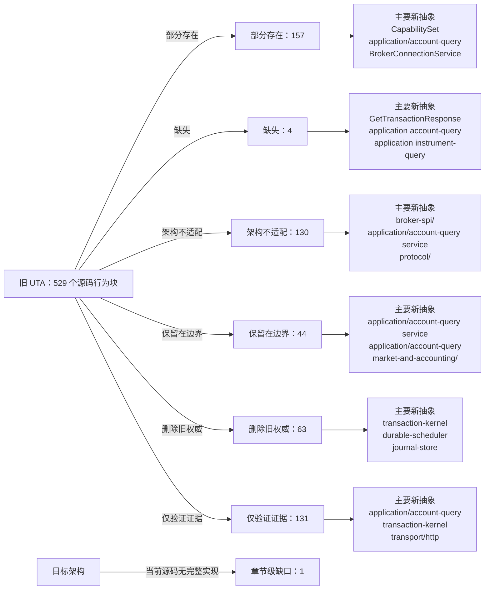

<!-- Auto-generated by scripts/uta-effect-runtime-map.mjs from mapping.json. Do not edit by hand. -->
<!-- Regenerate with `node scripts/uta-effect-runtime-map.mjs`. -->

# UTA 功能替代关系：第 14 章 Public protocol

目标架构原文：[`docs/uta-effect-runtime-architecture.md:1327-1348`](../uta-effect-runtime-architecture.md#L1327-L1348)。

## 结论

部分存在 157；缺失 4；架构不适配 130；保留在边界 44；删除旧权威 63；仅验证证据 131。状态只描述当前实现相对于目标架构的关系，不表示迁移已经落地。

## 替代关系图

## 章节级目标缺口

| 依据 | 目标义务 | 当前缺口 | 必须补充或调整 |
|---|---|---|---|
| docs/uta-effect-runtime-architecture.md:1331-1347 | Complete transaction-oriented public route set | No current target implementation provides POST /transactions, PUT /transactions/:id/draft, POST prepare/approve/reject/recover, GET transaction/events, GET /capabilities, or GET /accounts/:id/state with shared runtime schemas. Legacy wallet Git routes, no-op recovery, empty capability fallbacks, and manager/SDK state shapes are not target route implementations. | Add all ten application-owned transaction/capability/account routes listed in the architecture, with shared @traderalice/uta-protocol request/response/error schemas, durable admission semantics, and no database-row or broker-native payload exposure. |

## 源码映射

| 映射 ID | 当前源码 | 符号或行为块 | 当前功能 | 替代状态 | 新 UTA 抽象与做法 | 不适配位置与原因 | 必须补充或调整 | 重复索引 |
|---|---|---|---|---|---|---|---|---|
| `MAP-CC2177368A` | [`packages/uta-protocol/src/brokers/preset-catalog.ts:1-14`](../../packages/uta-protocol/src/brokers/preset-catalog.ts#L1-L14) | broker preset catalog setup | Declares the catalog as the single source for wizard account types, imports Zod for per-preset validation, and imports node crypto for deterministic/random UTA id helpers. | 部分存在 | 2. System boundary；3.7 brokers/<broker>/；3.9 transport/ and protocol/；7.1 Embedded database；9.1 Connection Layer；14. Public protocol；15. Security and authority；19. Architectural prohibitions protocol/config schemas；application/；broker-spi/；brokers/<broker>/；BrokerConnectionService Treat the catalog as configuration/presentation input only; validate each broker connection with named schemas and let UTA-owned adapter Layers consume sealed configuration. | A shared package owns wizard configuration and identity minting, but this setup does not separate Alice presentation from UTA credential authority or broker-spi capability/connection ownership. | Split config/presentation declarations from runtime broker adapters, define explicit config codecs and secret references, and ensure catalog identity helpers cannot become execution or persistence authority. | **DUP-026** |
| `MAP-00030A134A` | [`packages/uta-protocol/src/brokers/preset-catalog.ts:16-18`](../../packages/uta-protocol/src/brokers/preset-catalog.ts#L16-L18) | BrokerEngine | Defines a six-member string union for ccxt, alpaca, ibkr, leverup, longbridge, and mock engine names. | 部分存在 | 3.6 broker-spi/；3.7 brokers/<broker>/；9.1 Connection Layer；9.2 Typed action interpreter；14. Public protocol；17.4 Slice 4: first real broker；19. Architectural prohibitions；17.1 Slice 1: durable kernel with MockBroker；17.5 Slice 5: heterogeneous brokers BrokerActionTypeMap；BrokerConnectionService；brokers/<broker>/；CapabilitySet Keep adapter selection in composition/application configuration, but associate each engine with a typed BrokerConnectionService and action-interpreter set rather than using a bare engine string. | The union identifies implementation labels only; it does not close the action/result/error/observation/compensation contract or broker connection requirements. | Replace runtime reliance on BrokerEngine strings with typed adapter registration/composition and compile-time BrokerActionTypeMap coverage. | **DUP-027** |
| `MAP-9F3FB86CB7` | [`packages/uta-protocol/src/brokers/preset-catalog.ts:20-23`](../../packages/uta-protocol/src/brokers/preset-catalog.ts#L20-L23) | ModeOption | Defines a UI mode id/label pair as arbitrary strings. | 保留在边界 | 2.1 Alice owns；3.9 transport/ and protocol/；14. Public protocol；15. Security and authority protocol/config presentation schema；application/ Retain mode labels as Alice-owned presentation metadata, while UTA validates the corresponding broker environment as a typed config variant. | The UI option intentionally does not encode broker capability, account jurisdiction, or execution policy and must not be consumed as a kernel mode or security decision. | Keep it outside domain/transaction-kernel and ensure mode ids are validated by the broker-specific config schema before adapter construction. | **DUP-028** |
| `MAP-67CE26F92B` | [`packages/uta-protocol/src/brokers/preset-catalog.ts:25-35`](../../packages/uta-protocol/src/brokers/preset-catalog.ts#L25-L35) | SubtitleSegment | Defines optional label/falseLabel/prefix presentation directives keyed by an arbitrary presetConfig field path. | 保留在边界 | 2.1 Alice owns；3.9 transport/ and protocol/；14. Public protocol；15. Security and authority Alice UI presentation projection；protocol/config presentation schema Keep account-card subtitle layout as Alice/UI presentation data only; never use field paths or truthiness to derive capability, authorization, or broker identity. | This is UI metadata, not a trading/runtime abstraction; arbitrary field paths and truthiness would be unsafe if allowed to cross into domain or security decisions. | Keep SubtitleSegment in a presentation-only module and exclude it from transaction, broker-spi, and persistence schemas. | **DUP-029** |
| `MAP-601F6E2834` | [`packages/uta-protocol/src/brokers/preset-catalog.ts:37-98`](../../packages/uta-protocol/src/brokers/preset-catalog.ts#L37-L98) | BrokerPresetDef | Defines preset metadata, Zod config schema, optional modes/subtitle/write-only fields, string fingerprint fields, a `toEngineConfig` function returning Record<string, unknown>, and optional isPaper callback accepting Record<string, unknown>. | 部分存在 | 2.1 Alice owns；2.2 UTA owns；3.7 brokers/<broker>/；3.9 transport/ and protocol/；7.1 Embedded database；9.1 Connection Layer；9.4 Capability derivation；14. Public protocol；15. Security and authority；17. Migration sequence；19. Architectural prohibitions protocol/config schemas；BrokerConnectionService；BrokerActionTypeMap；CapabilitySet；brokers/<broker>/；application/ Use BrokerPresetDef only to describe presentation/config entry points, then parse into broker-specific typed connection config and secret references before constructing scoped adapter Layers. | The schema itself is generic ZodType, engine translation and paper detection use raw Record<string, unknown>, fingerprints are string field names, and no action capability/connection/jurisdiction contract is attached. | Introduce broker-specific config ADTs/codecs, remove raw Record-based runtime handoff, separate secret storage from public metadata, and derive capabilities through broker-spi ActionContext rather than preset metadata. | **DUP-030** |
| `MAP-E745F1370E` | [`packages/uta-protocol/src/brokers/preset-catalog.ts:100-106`](../../packages/uta-protocol/src/brokers/preset-catalog.ts#L100-L106) | defaultIsPaper | Converts an arbitrary config record's mode to a lowercase string and returns true for demo/testnet/paper, treating all other values as non-paper. | 部分存在 | 3.7 brokers/<broker>/；3.9 transport/ and protocol/；9.4 Capability derivation；14. Public protocol；15. Security and authority；19. Architectural prohibitions broker-specific connection config；ActionContext；CapabilitySet；protocol/config schemas Derive account environment from a validated broker-specific config variant and expose it as typed context/capability metadata. | A generic mode string and boolean conflates venue-specific demo/testnet/paper semantics and can classify unknown values silently. | Replace with exhaustive per-preset config parsing and an explicit environment variant; reject unknown mode values at the boundary. | **DUP-031** |
| `MAP-EBB7846E5F` | [`packages/uta-protocol/src/brokers/preset-catalog.ts:108-154`](../../packages/uta-protocol/src/brokers/preset-catalog.ts#L108-L154) | BINANCE_PRESET | Declares Binance live/demo modes, API key/secret Zod fields, write-only metadata, mode/API-key fingerprinting, and a raw engine config with demoTrading semantics. | 部分存在 | 3.7 brokers/<broker>/；3.9 transport/ and protocol/；7.1 Embedded database；9.1 Connection Layer；9.4 Capability derivation；14. Public protocol；15. Security and authority；17.5 Slice 5: heterogeneous brokers；19. Architectural prohibitions brokers/Alpaca-style adapter config；BrokerConnectionService；CapabilitySet；protocol/config schemas Parse Binance connection config into a UTA-owned secret/config value, construct a scoped adapter Layer, and derive per-wallet/action capabilities from account, venue, instrument, and mode context. | The UI schema and toEngineConfig expose a generic record carrying credentials and a boolean-like demo mode; no typed connection identity, sub-account context, action availability, idempotency, or compensation contract is present. | Replace raw engine handoff with a broker-specific config codec/secret reference and broker-spi capability derivation; keep preset data presentation-only. | **DUP-032** |
| `MAP-BB8EAF65B0` | [`packages/uta-protocol/src/brokers/preset-catalog.ts:156-189`](../../packages/uta-protocol/src/brokers/preset-catalog.ts#L156-L189) | OKX_PRESET | Declares OKX live/demo modes, API key/secret/passphrase fields, write-only metadata, mode/API-key fingerprinting, and raw sandbox engine config. | 部分存在 | 3.7 brokers/<broker>/；3.9 transport/ and protocol/；7.1 Embedded database；9.1 Connection Layer；9.4 Capability derivation；14. Public protocol；15. Security and authority；17.5 Slice 5: heterogeneous brokers；19. Architectural prohibitions brokers/<broker>/；BrokerConnectionService；CapabilitySet；protocol/config schemas Validate OKX connection credentials/config in UTA, construct its scoped adapter, and derive action/sub-account capabilities rather than treating demo as a generic sandbox boolean. | Credentials and venue mode are passed through generic preset data, while no typed connection/capability/interpreter association or jurisdiction/sub-account contract is represented. | Introduce an OKX-specific config ADT and secret boundary, then register typed BrokerActionInterpreter availability/dispatch/observe/compensation implementations. | **DUP-033** |
| `MAP-6E3C5642E6` | [`packages/uta-protocol/src/brokers/preset-catalog.ts:191-224`](../../packages/uta-protocol/src/brokers/preset-catalog.ts#L191-L224) | BYBIT_PRESET | Declares live/testnet/demo modes, API credentials, write-only fields, fingerprints, and raw engine config with separate sandbox/demoTrading booleans. | 部分存在 | 3.7 brokers/<broker>/；3.9 transport/ and protocol/；7.1 Embedded database；9.1 Connection Layer；9.4 Capability derivation；14. Public protocol；15. Security and authority；17.5 Slice 5: heterogeneous brokers；19. Architectural prohibitions brokers/<broker>/；BrokerConnectionService；CapabilitySet；ActionAvailability；protocol/config schemas Represent Bybit environment as a validated config variant and derive capabilities/idempotency/compensation for each account and venue mode through broker-spi. | Separate booleans can express invalid mode combinations and raw engine config is untyped; no target action contract or typed unavailable reason is attached. | Replace booleans/Record handoff with an exhaustive Bybit config ADT, adapter Layer, and CapabilitySet registration. | **DUP-034** |
| `MAP-2F4E92A2AE` | [`packages/uta-protocol/src/brokers/preset-catalog.ts:226-257`](../../packages/uta-protocol/src/brokers/preset-catalog.ts#L226-L257) | HYPERLIQUID_PRESET | Declares live/testnet mode, walletAddress/privateKey fields, write-only private key, wallet/mode fingerprinting, and raw sandbox engine config. | 部分存在 | 3.7 brokers/<broker>/；3.9 transport/ and protocol/；7.1 Embedded database；9.1 Connection Layer；9.4 Capability derivation；14. Public protocol；15. Security and authority；17.5 Slice 5: heterogeneous brokers；19. Architectural prohibitions brokers/<broker>/；BrokerConnectionService；CapabilitySet；protocol/config schemas；domain/AccountId Keep wallet credentials in UTA-owned sealed config, construct a scoped Hyperliquid adapter, and derive wallet/venue/instrument action capabilities via broker-spi. | A raw record carries a private key and mode with no typed secret reference, account/connection identity, jurisdiction, availability, idempotency, or compensation contract. | Add a Hyperliquid-specific config/secret codec and typed adapter registration; never expose private-key fields through generic protocol/catalog payloads. | **DUP-035** |
| `MAP-B9545FA731` | [`packages/uta-protocol/src/brokers/preset-catalog.ts:259-292`](../../packages/uta-protocol/src/brokers/preset-catalog.ts#L259-L292) | BITGET_PRESET | Declares live/demo mode, API key/secret/passphrase fields, write-only metadata, mode/API-key fingerprints, and raw engine config with demoTrading. | 部分存在 | 3.7 brokers/<broker>/；3.9 transport/ and protocol/；7.1 Embedded database；9.1 Connection Layer；9.4 Capability derivation；14. Public protocol；15. Security and authority；17.5 Slice 5: heterogeneous brokers；19. Architectural prohibitions brokers/<broker>/；BrokerConnectionService；CapabilitySet；protocol/config schemas Parse Bitget credentials/environment into a typed UTA-owned connection config, then derive separate-wallet/action capability and typed unavailable results in the adapter. | The preset does not express Bitget wallet/account scope or action contracts and passes secrets/mode through a generic engine record. | Introduce typed Bitget configuration and broker-spi registration, with secret isolation and capability derivation from account/sub-account/venue context. | **DUP-036** |
| `MAP-F62E863C78` | [`packages/uta-protocol/src/brokers/preset-catalog.ts:294-333`](../../packages/uta-protocol/src/brokers/preset-catalog.ts#L294-L333) | CCXT_CUSTOM_PRESET | Provides an escape-hatch Zod object with optional exchange/sandbox/demo/credential/wallet fields and loops over defined fields to pass them through a Record<string, unknown>. | 架构不适配 | 3.7 brokers/<broker>/；3.9 transport/ and protocol/；7.1 Embedded database；9.4 Capability derivation；14. Public protocol；15. Security and authority；17.5 Slice 5: heterogeneous brokers；19. Architectural prohibitions broker-spi/；BrokerActionTypeMap；CapabilitySet；protocol/config schemas；brokers/<broker>/ Replace the open-ended custom config with an explicitly parsed exchange-specific config/plugin boundary; no generic route or kernel may accept pass-through credential/action bags. | Nearly every field is optional, exchange semantics are delegated to an untyped Record, and the preset is an untyped registry escape hatch; this violates the prohibition on permissive fallback states and untyped registries. | Remove CCXT_CUSTOM as a kernel/runtime contract, require a concrete adapter/config schema per supported exchange, and return typed CapabilityUnavailable for unsupported actions instead of silently passing fields through. | **DUP-037** |
| `MAP-2862195456` | [`packages/uta-protocol/src/brokers/preset-catalog.ts:337-367`](../../packages/uta-protocol/src/brokers/preset-catalog.ts#L337-L367) | ALPACA_PRESET | Declares paper/live mode, API key/secret fields, write-only metadata, mode/API-key fingerprints, and raw engine config with paper boolean. | 部分存在 | 3.7 brokers/<broker>/；3.9 transport/ and protocol/；7.1 Embedded database；9.1 Connection Layer；9.4 Capability derivation；14. Public protocol；15. Security and authority；17.4 Slice 4: first real broker；19. Architectural prohibitions brokers/Alpaca；BrokerConnectionService；BrokerActionTypeMap；CapabilitySet；protocol/config schemas Use an Alpaca-specific validated config/secret boundary and typed action interpreter, then make the new path authoritative before deleting its legacy dispatcher path. | Preset mode/credentials are generic form data and do not carry typed connection identity, action capability, dispatch idempotency, observation, or compensation semantics. | Add Alpaca adapter Layer and BrokerActionInterpreter contracts, keep credentials UTA-owned, and migrate the preset to reference validated config rather than pass a raw record. | **DUP-038** |
| `MAP-DE2769E2F7` | [`packages/uta-protocol/src/brokers/preset-catalog.ts:369-398`](../../packages/uta-protocol/src/brokers/preset-catalog.ts#L369-L398) | IBKR_PRESET | Declares host/port/clientId/accountId form fields, default ports, fingerprints, raw engine config, and paper detection based on port numbers. | 部分存在 | 3.7 brokers/<broker>/；3.9 transport/ and protocol/；7.1 Embedded database；9.1 Connection Layer；9.4 Capability derivation；10.2 Market and jurisdiction owns；14. Public protocol；15. Security and authority；17.5 Slice 5: heterogeneous brokers；19. Architectural prohibitions brokers/IBKR；BrokerConnectionService；ConnectionId；CapabilitySet；protocol/config schemas Validate an IBKR connection config, construct the scoped SDK Layer inside brokers/IBKR, and derive linked-account/market/jurisdiction capabilities through broker-spi. | Port-number paper detection and raw host/account strings do not encode connection identity, account jurisdiction, linked-account context, health stream, action capability, or typed failure. | Replace generic engine config with an IBKR connection ADT/secret/config codec and typed BrokerConnectionService/capability registration; keep port defaults presentation/config only. | **DUP-039** |
| `MAP-42A8E8BFCC` | [`packages/uta-protocol/src/brokers/preset-catalog.ts:400-433`](../../packages/uta-protocol/src/brokers/preset-catalog.ts#L400-L433) | LONGBRIDGE_PRESET | Declares live/paper mode and appKey/appSecret/accessToken fields, marks all credentials write-only, fingerprints mode/appKey, and passes a raw engine config. | 部分存在 | 3.7 brokers/<broker>/；3.9 transport/ and protocol/；7.1 Embedded database；9.1 Connection Layer；9.4 Capability derivation；10.2 Market and jurisdiction owns；14. Public protocol；15. Security and authority；17.5 Slice 5: heterogeneous brokers；19. Architectural prohibitions brokers/Longbridge；BrokerConnectionService；CapabilitySet；market-and-accounting/；protocol/config schemas Use Longbridge-specific validated secret/config input and derive region/jurisdiction/instrument capabilities in the typed adapter before transaction preparation. | The form config has raw credentials and mode but no typed jurisdiction/region/account context or broker action/interpreter contract; access-token lifecycle is only prose. | Define typed Longbridge connection/credential and market-jurisdiction metadata, then register its BrokerActionInterpreter and capability/unavailable results. | **DUP-040** |
| `MAP-FA8441EFDE` | [`packages/uta-protocol/src/brokers/preset-catalog.ts:437-468`](../../packages/uta-protocol/src/brokers/preset-catalog.ts#L437-L468) | LEVERUP_PRESET | Declares live/testnet mode and a regex-validated private key, marks it write-only, fingerprints mode/privateKey, and passes network/privateKey through a raw engine record. | 部分存在 | 3.7 brokers/<broker>/；3.9 transport/ and protocol/；7.1 Embedded database；9.4 Capability derivation；14. Public protocol；15. Security and authority；17.5 Slice 5: heterogeneous brokers；19. Architectural prohibitions brokers/LeverUp；BrokerConnectionService；CapabilitySet；protocol/config schemas；domain/AccountId Keep the wallet secret in UTA-owned sealed configuration, validate a typed network/account context, and expose LeverUp through a typed interpreter with explicit relayer reconciliation/compensation capability. | Fingerprinting a private key and passing it through a generic record does not establish nominal account identity, idempotency, remote outcome, or compensation; network is only a string union in form data. | Replace raw config handoff with a typed wallet/relayer adapter boundary and broker-spi capability/reconciliation contract; do not expose secret-derived identity fields in public protocol data. | **DUP-041** |
| `MAP-52A6B771BA` | [`packages/uta-protocol/src/brokers/preset-catalog.ts:470-495`](../../packages/uta-protocol/src/brokers/preset-catalog.ts#L470-L495) | SIMULATOR_PRESET | Declares a mock simulator with in-memory state, cash as a coerced number, no credentials, and a random _instanceId fingerprint used to derive a unique id; its hint states all state is wiped on restart. | 架构不适配 | 1. Thesis and non-negotiable properties；3.7 brokers/<broker>/；3.4 journal-store/；3.5 durable-scheduler/；5.3 Two-phase transaction protocol；7.1 Embedded database；12.1 Startup sequence；14. Public protocol；17.1 Slice 1: durable kernel with MockBroker；18. Verification contract；20. First falsifier MockBroker interpreter；transaction-kernel/；journal-store/；durable-scheduler/；DispatchIdentity；RemoteOutcome Retain MockBroker as the first executable adapter, but make transaction intent, jobs, outcomes, and mock broker observations durable in SQLite and recoverable across restart. | The current advertised simulator is explicitly process-memory-only and cash is a coerced number; it cannot satisfy the MockBroker crash/recovery falsifier or prove no duplicate dispatch. | Replace in-memory simulator authority with the durable MockBroker vertical slice, use DecimalString/Money and typed commands/outcomes, and keep any panel controls as a boundary over that slice. | **DUP-042** |
| `MAP-9A17C2A8CC` | [`packages/uta-protocol/src/brokers/preset-catalog.ts:497-522`](../../packages/uta-protocol/src/brokers/preset-catalog.ts#L497-L522) | BROKER_PRESET_CATALOG | Exports an ordered array of all broker preset definitions for wizard rendering, grouped as recommended/crypto/testing and including the simulator and custom CCXT escape hatch. | 保留在边界 | 2.1 Alice owns；3.7 brokers/<broker>/；3.9 transport/ and protocol/；9.4 Capability derivation；14. Public protocol；15. Security and authority；17. Migration sequence；19. Architectural prohibitions；20. First falsifier Alice UI presentation projection；application/；broker-spi/；brokers/<broker>/；CapabilitySet Keep the ordered catalog for Alice's account-picker presentation, but runtime broker registration/capabilities must come from typed broker-spi adapters and the durable kernel, not this array. | The catalog is a UI registry and does not prove adapter capability, connection health, transaction durability, or recovery; custom/permissive/simulator entries must not become generic runtime fallback. | Mark the catalog presentation-only, separate it from adapter composition, and gate each selectable preset through a validated config and typed capability/connection service. | **DUP-043** |
| `MAP-E954ABE476` | [`packages/uta-protocol/src/brokers/preset-catalog.ts:524-531`](../../packages/uta-protocol/src/brokers/preset-catalog.ts#L524-L531) | getBrokerPreset | Finds a preset by raw string id and throws a generic Error listing known ids when absent. | 部分存在 | 4. Effect model；5.7 Complete type contract — error channels；9.4 Capability derivation；14. Public protocol；15. Security and authority；19. Architectural prohibitions protocol/config parser；CapabilityUnavailable；QueryFailure；application/ Parse preset identifiers at the configuration/application boundary into a closed preset/config ADT and return a typed unknown-preset failure. | Unknown external input throws a generic Error/string list rather than returning a named failure; the list itself can expose registry details and no capability context. | Replace getBrokerPreset's throw with a typed Result/Effect failure and schema-decoded preset id; keep registry lookup outside domain and never use it as capability proof. | **DUP-044** |
| `MAP-4FEAB1D03E` | [`packages/uta-protocol/src/brokers/preset-catalog.ts:533-537`](../../packages/uta-protocol/src/brokers/preset-catalog.ts#L533-L537) | isPaperPreset | Looks up a raw preset id and invokes an optional custom isPaper callback or generic mode heuristic over Record<string, unknown>. | 部分存在 | 4. Effect model；7.1 Embedded database；9.4 Capability derivation；14. Public protocol；15. Security and authority；19. Architectural prohibitions broker-specific config ADT；ActionContext；CapabilitySet；protocol/config schemas Derive environment/account mode from each validated broker config ADT and make it part of connection/capability context, not a generic callback result. | An optional callback plus raw config record can silently classify unknown or incompatible modes and is disconnected from actual broker connection/venue state. | Remove generic isPaper behavior from runtime decisions, use exhaustive config variants and adapter-observed environment metadata, and expose uncertainty as a typed capability result. | **DUP-045** |
| `MAP-ED0CF2A5B8` | [`packages/uta-protocol/src/brokers/preset-catalog.ts:539-555`](../../packages/uta-protocol/src/brokers/preset-catalog.ts#L539-L555) | canonicalize | Recursively traverses unknown values, treats arrays specially, casts objects to Record<string, unknown>, sorts keys, and returns a new unknown value for JSON stringification. | 架构不适配 | 3.1 domain/；3.4 journal-store/；3.9 transport/ and protocol/；5.7 Complete type contract — nominal identities and financial values；7.3 Authoritative tables；14. Public protocol；19. Architectural prohibitions domain/ branded identity constructors；journal-store/；protocol/ schemas；AccountId；ConnectionId Construct branded identities from validated typed fields and use named codecs for any persistence serialization; do not canonicalize arbitrary unknown records as domain identity. | The implementation is an untyped JSON cast/traversal and can hash arbitrary values, contrary to the target ban on untyped JSON casts and permissive persistence shapes. | Delete canonicalize from kernel-facing identity logic, parse config into concrete ADTs first, and serialize only named versioned values through protocol/journal schemas. | **DUP-046** |
| `MAP-4E1058C577` | [`packages/uta-protocol/src/brokers/preset-catalog.ts:557-580`](../../packages/uta-protocol/src/brokers/preset-catalog.ts#L557-L580) | deriveUtaId | Filters arbitrary presetConfig fields named by fingerprintFields, fills missing values with null, canonicalizes them, hashes preset id plus JSON to eight hex characters, and returns `${preset.id}-${hash}`. | 部分存在 | 2.2 UTA owns；3.1 domain/；3.4 journal-store/；3.7 brokers/<broker>/；5.7 Complete type contract — nominal identities and financial values；7.1 Embedded database；9.1 Connection Layer；11. Approval and Git audit projection；14. Public protocol；15. Security and authority；17.6 Slice 6: delete the legacy kernel；19. Architectural prohibitions AccountId；ConnectionId；InstrumentId；journal-store/；BrokerConnectionIdentity；protocol/config schemas Introduce typed, durable AccountId/ConnectionId construction from validated broker identity context; retain old ids only as explicit migration compatibility projections. | The current identity is an unbranded 32-bit string hash over generic fields (including secret-derived values for some presets), has no collision/identity evidence in the domain type, and couples account identity to UI preset ids. | Define nominal identity constructors and migration mapping, separate credential storage from identity metadata, persist identity/context in journal/config schemas, and stop using derived strings as transaction identity. | **DUP-047** |
| `MAP-21AAC99E0D` | [`packages/uta-protocol/src/brokers/presets.ts:1-16`](../../packages/uta-protocol/src/brokers/presets.ts#L1-L16) | broker preset serialization setup | Documents conversion of BrokerPresetDef Zod schemas to JSON Schema for the frontend and imports Zod plus catalog types. | 部分存在 | 2.1 Alice owns；3.9 transport/ and protocol/；7.1 Embedded database；14. Public protocol；15. Security and authority；19. Architectural prohibitions Alice UI presentation projection；protocol/config schemas；application/ Keep JSON Schema generation only for Alice's form presentation and pair it with UTA-owned named config codecs; do not treat generated form JSON as runtime domain/protocol schema. | The same shared package presents frontend JSON Schema as if it were the request/response contract, but the target separates presentation metadata from transport/persistence schemas and secret authority. | Separate presentation serialization from protocol codecs, ensure write-only/secret fields never become runtime payloads, and export named request/response/config schemas independently. | **DUP-049** |
| `MAP-F8525C7A99` | [`packages/uta-protocol/src/brokers/presets.ts:18-32`](../../packages/uta-protocol/src/brokers/presets.ts#L18-L32) | SerializedBrokerPreset | Defines the frontend serialized preset with metadata, engine/guard string unions, optional modes, subtitle fields, and `schema: Record<string, unknown>`. | 部分存在 | 2.1 Alice owns；3.7 brokers/<broker>/；3.9 transport/ and protocol/；7.1 Embedded database；9.4 Capability derivation；14. Public protocol；15. Security and authority；19. Architectural prohibitions Alice UI presentation projection；protocol/config schemas；BrokerConnectionService；CapabilitySet Retain as an explicitly presentation-only DTO, while runtime config/capability contracts use named schemas and typed adapter services. | The raw JSON Schema record and optional metadata are not a decoded connection config or capability ADT, and the public shape can be mistaken for broker runtime support. | Move SerializedBrokerPreset to a presentation module, replace raw runtime use with named config schemas, and prevent engine/guard metadata from authorizing actions. | **DUP-050** |
| `MAP-5C311A55C1` | [`packages/uta-protocol/src/brokers/presets.ts:34-54`](../../packages/uta-protocol/src/brokers/presets.ts#L34-L54) | buildJsonSchema | Calls z.toJSONSchema, casts the result and properties to Record types, rewrites mode enum to oneOf titles, and mutates writeOnly markers by field name. | 架构不适配 | 3.7 brokers/<broker>/；3.9 transport/ and protocol/；7.1 Embedded database；9.4 Capability derivation；14. Public protocol；15. Security and authority；19. Architectural prohibitions protocol/config schemas；Alice UI presentation projection；BrokerConnectionService；brokers/<broker>/ Generate presentation JSON Schema from a validated, broker-specific config definition without using it as the transport/persistence decoder; use named runtime codecs at every boundary. | The function relies on casts to untyped records and mutates arbitrary JSON Schema properties, violating the target prohibition on untyped JSON casts when the result is exported as a protocol-facing shape. | Constrain this helper to a presentation serializer, add explicit runtime schemas for each endpoint/config, and remove raw-record casts from kernel-facing code. | **DUP-051** |
| `MAP-1D576100CB` | [`packages/uta-protocol/src/brokers/presets.ts:56-72`](../../packages/uta-protocol/src/brokers/presets.ts#L56-L72) | BUILTIN_BROKER_PRESETS | Maps every catalog definition into a serialized frontend array, copying metadata and generated raw schema. | 保留在边界 | 2.1 Alice owns；3.7 brokers/<broker>/；3.9 transport/ and protocol/；9.4 Capability derivation；14. Public protocol；15. Security and authority；17. Migration sequence；19. Architectural prohibitions；20. First falsifier Alice UI presentation projection；application/；broker-spi/；CapabilitySet；MockBroker Keep this array for the account-picker UI only; runtime adapter registration, capability derivation, transaction execution, and MockBroker recovery must be independent typed services. | The serialized catalog is presentation metadata and therefore outside the new kernel, but its engine/schema fields cannot prove broker capability or durable execution and its raw schemas are not enough for transport validation. | Mark it non-authoritative, prevent callers from using it as a broker registry, and route selected presets through validated config plus BrokerConnectionService/CapabilitySet. | **DUP-052** |
| `MAP-41D1B056C8` | [`packages/uta-protocol/src/brokers/search-rules.ts:1-14`](../../packages/uta-protocol/src/brokers/search-rules.ts#L1-L14) | contract search heuristic boundary and AssetClassHint | Documents a deliberate heuristic bridge from data-vendor symbols to broker tickers and defines AssetClassHint as a five-member string union. | 保留在边界 | 2.1 Alice owns；3.1 domain/；3.9 transport/ and protocol/；9.4 Capability derivation；10.2 Market and jurisdiction owns；14. Public protocol；19. Architectural prohibitions application/account-query service；market-and-accounting/；broker-spi/；protocol/ search schema Keep vendor-to-broker search normalization at the application query boundary only; return normalized instrument identity and broker-observed metadata before any action can be prepared. | The heuristic is not a domain identity or capability proof and must not be imported by transaction-kernel/domain code; AssetClassHint is not a branded instrument/market observation. | Move/label the helper as an application search adapter, parse its input with a named query schema, and require broker/venue resolution before using a result in a TradeAction. | **DUP-053** |
| `MAP-819A30C052` | [`packages/uta-protocol/src/brokers/search-rules.ts:16-23`](../../packages/uta-protocol/src/brokers/search-rules.ts#L16-L23) | QUOTE_CURRENCIES and suffix regex | Defines an ordered list of quote currencies and a case-insensitive regex that strips a recognized suffix from an uppercase alphanumeric symbol. | 保留在边界 | 3.1 domain/；3.6 broker-spi/；9.4 Capability derivation；10.2 Market and jurisdiction owns；14. Public protocol；19. Architectural prohibitions application/account-query service；market-and-accounting/；broker-spi/；InstrumentId Use this deterministic normalization only to form a broker search query; broker adapter response and market/instrument metadata must establish the actual InstrumentId and quote currency. | A suffix regex cannot establish venue identity, instrument type, settlement currency, or jurisdiction and may not be used as the executable instrument identity or capability source. | Keep it outside domain/kernel, validate the query input, and require a typed broker search/market resolution step before returning or executing a contract. | **DUP-054** |
| `MAP-006AF2BF79` | [`packages/uta-protocol/src/brokers/search-rules.ts:25-55`](../../packages/uta-protocol/src/brokers/search-rules.ts#L25-L55) | normalizeBrokerSearchPattern | Trims a symbol; for crypto/currency strips a recognized quote suffix when a regex match exists; for equity/commodity/unknown returns the trimmed symbol, with a default switch branch returning it unchanged. | 保留在边界 | 3.1 domain/；3.6 broker-spi/；3.9 transport/ and protocol/；5.7 Complete type contract — nominal identities and financial values；9.4 Capability derivation；10.2 Market and jurisdiction owns；14. Public protocol；19. Architectural prohibitions application/account-query service；broker-spi/；market-and-accounting/；InstrumentId；protocol/ search schema Retain as a pure application search-query normalizer, then pass the result to a typed broker search port that returns normalized instrument/market metadata and explicit no-match/unsupported outcomes. | The function intentionally relies on symbol heuristics and a permissive fallback; it does not validate a market context or construct a nominal InstrumentId and therefore cannot be a domain action resolver. | Keep the function out of domain/transaction-kernel, add a decoded AssetClassHint/search request, remove fallback use for execution, and require broker-observed resolution before TradeAction construction. | **DUP-055** |
| `MAP-139EBB287C` | [`packages/uta-protocol/src/client/UTAClient.ts:1-11`](../../packages/uta-protocol/src/client/UTAClient.ts#L1-L11) | UTA client transport contract documentation | Describes a low-level HTTP helper with higher-level adapters layered elsewhere and explicitly says errors are normalized to JavaScript Errors; endpoint validation and WireBrokerError round-trip are future work. | 架构不适配 | 2.1 Alice owns；3.9 transport/ and protocol/；4. Effect model；9.2 Typed action interpreter；12.3 Defects and expected failures；14. Public protocol；15. Security and authority；19. Architectural prohibitions transport/http；protocol/；application/；TransactionFailure；QueryFailure Make the client SDK a typed proxy for the transaction-oriented public routes, decoding named success/failure schemas and preserving correlation/authorization context. | The module explicitly documents unvalidated endpoints and Error-based failures, contrary to the target requirement that every request/response use shared runtime schemas and typed expected failures. | Replace the generic low-level public contract with route-specific typed methods/codecs and typed failure mapping; keep any raw HTTP primitive private to transport/http. | **DUP-056** |
| `MAP-A4FE5AF865` | [`packages/uta-protocol/src/client/UTAClient.ts:13-20`](../../packages/uta-protocol/src/client/UTAClient.ts#L13-L20) | UTAClientOptions | Accepts a base URL, optional fetch override, and optional timeout in milliseconds with a default of 15 seconds. | 部分存在 | 2.1 Alice owns；3.2 effect-runtime/；3.9 transport/ and protocol/；4. Effect model；12.1 Startup sequence；14. Public protocol；15. Security and authority transport/http；effect-runtime/；protocol/；transport principal authentication；transaction authorizer actor/policy/capability Retain base URL/clock configuration at the transport boundary, but add the authenticated typed proxy and explicit cancellation/timeout failure mapping required by protocol routes. | The options contain no transport-principal authentication context or route schema configuration. Timeout is a local abort setting with no typed transport/QueryFailure mapping, and transaction actor/policy/capability authorization is not modeled as a separate application/kernel input. | Compose authenticated transport and route-specific codecs; map administrative-read timeout/abort to typed transport or QueryFailure variants. Separately pass actor, policy, and capability context to prepare/approve; reserve RemoteOutcome.Unknown for ambiguous durable broker dispatch. | **DUP-057** |
| `MAP-A458F81B6D` | [`packages/uta-protocol/src/client/UTAClient.ts:22-29`](../../packages/uta-protocol/src/client/UTAClient.ts#L22-L29) | UTAClient generic methods | Exposes arbitrary `request<T>` plus generic get/post/put/delete wrappers, all defaulting T to unknown and accepting raw method/path/body/query values. | 架构不适配 | 2.1 Alice owns；3.9 transport/ and protocol/；5.7 Complete type contract — public protocol envelopes；9.2 Typed action interpreter；14. Public protocol；15. Security and authority；19. Architectural prohibitions transport/http；protocol/；application/；PrepareTransactionResponse；GetTransactionResponse Expose typed methods for POST/PUT/GET transaction routes, capabilities, account state, events, and recovery, each paired with named request/response/failure schemas. | Any caller can send an arbitrary path/method and receive an unchecked unknown, so the client does not enforce the listed public routes or prevent broker-native payloads from entering generic endpoints. | Delete the generic public methods or make the raw primitive private; migrate every caller to route-specific typed proxy methods and exhaustive response decoding. | **DUP-058** |
| `MAP-06118417F5` | [`packages/uta-protocol/src/client/UTAClient.ts:31-35`](../../packages/uta-protocol/src/client/UTAClient.ts#L31-L35) | RequestOpts | Accepts an unknown body, string/number/undefined query record, and optional AbortSignal. | 架构不适配 | 3.9 transport/ and protocol/；4. Effect model；8.1 Admission；9.2 Typed action interpreter；14. Public protocol；19. Architectural prohibitions transport/http；protocol/ request schemas；TransactionCommand；QueryFailure Make each route's request type a decoded named schema and carry cancellation/timeout through the transport Effect boundary without weakening body/query types. | `body?: unknown` and a raw query map permit unvalidated commands, while no typed admission response or expected transport failure is represented. | Replace RequestOpts with route-specific request records/codecs; keep AbortSignal as an implementation boundary and map transport failures to typed protocol errors. | **DUP-059** |
| `MAP-7E1806AFC4` | [`packages/uta-protocol/src/client/UTAClient.ts:37-46`](../../packages/uta-protocol/src/client/UTAClient.ts#L37-L46) | UTAHttpError | Throws an Error subclass carrying HTTP status, unknown body, and a message string; it does not decode a failure envelope. | 架构不适配 | 1. Thesis and non-negotiable properties；4. Effect model；5.7 Complete type contract — error channels；9.2 Typed action interpreter；12.3 Defects and expected failures；14. Public protocol；19. Architectural prohibitions TransactionFailure；QueryFailure；DispatchFailure；ProtocolViolation；protocol/ failure schemas Return/decode route-specific TransactionFailure or QueryFailure ADTs, preserving HTTP transport metadata separately and treating malformed bodies as ProtocolViolation. | Unknown body plus message-based Error handling collapses expected failures and malformed responses; consumers cannot exhaustively handle validation/conflict/capability/storage/unknown outcomes. | Replace UTAHttpError with typed client failure decoding and a distinct malformed-response defect/protocol-violation path; update all callers to handle the ADTs. | **DUP-060** |
| `MAP-22C9C06082` | [`packages/uta-protocol/src/client/UTAClient.ts:48-61`](../../packages/uta-protocol/src/client/UTAClient.ts#L48-L61) | createUTAClient initialization and buildUrl | Normalizes a trailing slash, selects global/override fetch, defaults timeout, and constructs URLs from arbitrary paths and query entries by String conversion. | 部分存在 | 2.1 Alice owns；3.2 effect-runtime/；3.9 transport/ and protocol/；4. Effect model；8.1 Admission；14. Public protocol；15. Security and authority；19. Architectural prohibitions transport/http；effect-runtime/；protocol/；application/ Keep URL construction as a private transport helper, but bind it to the closed route table, authenticated transport layer, and typed query encoders. | Arbitrary path/query construction permits calls outside the public route contract and silently stringifies unvalidated values; auth and correlation handling are absent here. | Hide buildUrl behind route-specific client methods, validate/encode query parameters from named schemas, and compose transport authentication/correlation explicitly. | **DUP-061** |
| `MAP-8C22894ED4` | [`packages/uta-protocol/src/client/UTAClient.ts:63-88`](../../packages/uta-protocol/src/client/UTAClient.ts#L63-L88) | UTAClient.request | Builds a JSON request, creates an AbortController timeout, performs fetch, parses response text with safeJSON, extracts an `error` field by object cast on non-2xx, and casts successful body to T without validation. | 架构不适配 | 1. Thesis and non-negotiable properties；3.4 journal-store/；3.5 durable-scheduler/；3.9 transport/ and protocol/；4. Effect model；5.7 Complete type contract — public protocol envelopes；7.2 Single logical writer and group commit；8.1 Admission；9.2 Typed action interpreter；12.2 Unknown-outcome protocol；14. Public protocol；15. Security and authority；19. Architectural prohibitions transport/http；protocol/；TransactionCommand；PrepareTransactionResponse；GetTransactionResponse；TransactionFailure；QueryFailure Encode a named request, send it through authenticated transport, decode the exact success/failure schema, and preserve typed timeout/transport/protocol outcomes without generic casts. | Successful responses are body as T, errors are reduced to a string error field/message, and timeout/abort has no route-specific typed transport/auth/protocol representation. | Implement route-specific success and failure schema decoding plus typed transport/auth/protocol errors and correlation metadata. A public request timeout is not itself RemoteOutcome.Unknown; only a durable scheduler handling ambiguous broker dispatch may create that outcome. | **DUP-062** |
| `MAP-7A38B02DED` | [`packages/uta-protocol/src/client/UTAClient.ts:90-99`](../../packages/uta-protocol/src/client/UTAClient.ts#L90-L99) | UTAClient convenience methods | Returns generic get/post/put/delete closures that forward arbitrary paths and unknown bodies into request. | 删除旧权威 | 3.9 transport/ and protocol/；5.7 Complete type contract — public protocol envelopes；8.1 Admission；9.2 Typed action interpreter；14. Public protocol；19. Architectural prohibitions transport/http；protocol/；application/；TransactionCommand Replace generic closures with typed methods for each documented transaction/capability/account route; keep raw request private as an implementation detail if needed. | The public convenience surface erases route identity and schemas and lets callers send arbitrary native or malformed payloads. | Delete these generic exported methods, migrate callers to typed route methods, and make the client decode every response/failure before returning. | **DUP-063** |
| `MAP-E56045946F` | [`packages/uta-protocol/src/client/UTAClient.ts:101-103`](../../packages/uta-protocol/src/client/UTAClient.ts#L101-L103) | safeJSON | Attempts JSON.parse and returns either the parsed unknown value or the original response text on parse failure. | 架构不适配 | 3.9 transport/ and protocol/；4. Effect model；9.2 Typed action interpreter；12.3 Defects and expected failures；14. Public protocol；19. Architectural prohibitions protocol/ codecs；ProtocolViolation；QueryFailure；TransactionFailure Decode through the expected named schema and turn malformed JSON/schema into an explicit ProtocolViolation/typed transport failure with evidence. | Returning arbitrary text as unknown silently accepts malformed responses and prevents exhaustive protocol failure handling. | Remove safeJSON as the response contract; parse syntax then decode the route schema, fail loudly on malformed data, and preserve redacted evidence for diagnostics. | **DUP-064** |
| `MAP-AE04CD83E4` | [`packages/uta-protocol/src/index.ts:1-20`](../../packages/uta-protocol/src/index.ts#L1-L20) | UTA protocol package barrel | Re-exports the types barrel, empty schemas barrel, generic UTA client, broker preset catalog/serialization, and contract-search normalization from one public package. | 架构不适配 | 3.6 broker-spi/；3.9 transport/ and protocol/；14. Public protocol；19. Architectural prohibitions protocol/；transport/http；broker-spi/；application/ Make the barrel export only named request/response codecs and normalized public domain/protocol types; keep broker adapter implementations and presentation-only preset/search helpers behind explicit application or adapter boundaries. | The public surface leaks IBKR SDK values, legacy Git execution types, generic unknown payloads, and presentation registries, while the schemas export is empty. | Add the route schema/type exports for the transaction-oriented API, remove legacy broker/Git exports from the kernel-facing surface, and expose catalog/search data only as explicitly non-authoritative presentation projections. | **DUP-065** |
| `MAP-E43DFC70EF` | [`packages/uta-protocol/src/schemas/index.ts:1-10`](../../packages/uta-protocol/src/schemas/index.ts#L1-L10) | empty Zod schema barrel | Documents one Zod request/response pair per endpoint but exports nothing. | 缺失 | 3.9 transport/ and protocol/；5.7 Complete type contract；9.2 Typed action interpreter；14. Public protocol；18. Verification contract protocol/；transport/http；PrepareTransactionResponse；GetTransactionResponse；BrokerActionInterpreter Populate protocol/ with named schemas for every public request and response, including transaction draft/prepare/approve/reject/recover, transaction/event queries, capabilities, and account state. | No runtime decoder exists for requests, responses, branded identifiers, transaction states, failure variants, broker outcomes, or capability views. | Define and export each route's schema/type pair, decode at transport ingress and response egress, and add persistence schemas separately for journal payloads rather than accepting unknown JSON. | **DUP-066** |
| `MAP-D4DBF6173C` | [`packages/uta-protocol/src/types/broker.ts:1-12`](../../packages/uta-protocol/src/types/broker.ts#L1-L12) | broker module native imports | Imports Contract, Order, OrderState, Execution, OrderCancel, and contract-description types from @traderalice/ibkr, imports Decimal, and side-effect imports contract-ext. | 架构不适配 | 3.6 broker-spi/；3.7 brokers/<broker>/；3.9 transport/ and protocol/；9.2 Typed action interpreter；14. Public protocol；19. Architectural prohibitions domain/；broker-spi/；brokers/<broker>/；protocol/ Keep SDK imports inside each brokers/<broker>/ adapter and translate at that boundary into domain actions, observations, branded identifiers, DecimalString, and named protocol schemas. | The shared protocol module directly depends on broker SDK object types and a runtime Decimal class, so native values cross the public and kernel boundaries. | Remove native SDK/Decimal imports from shared protocol types; define adapter-local codecs and normalized domain/protocol values for every crossing. | **DUP-070** |
| `MAP-710D1204ED` | [`packages/uta-protocol/src/types/broker.ts:22-42`](../../packages/uta-protocol/src/types/broker.ts#L22-L42) | BrokerError constructor and permanence flag | The BrokerError class stores a code and message, derives `permanent` from CONFIG/AUTH, and extends Error for normal JavaScript exception handling. | 架构不适配 | 4. Effect model；9.2 Typed action interpreter；12.3 Defects and expected failures；14. Public protocol；19. Architectural prohibitions TransactionFailure；DispatchFailure；BrokerRejection；protocol/ failure schemas Represent expected rejection, unavailable connection, unknown outcome, and protocol violation as tagged values carried by Effect failures and named public envelopes; reserve exceptions for defects/unexpected failures. | A single Error subclass with a boolean permanence flag collapses distinct expected failure channels and exposes message-oriented behavior across the wire. | Delete BrokerError as the domain/protocol error model and introduce exhaustive failure constructors plus schema encoders for HTTP, journal, scheduler, and broker boundaries. | **DUP-072** |
| `MAP-6ED1656D7F` | [`packages/uta-protocol/src/types/broker.ts:44-61`](../../packages/uta-protocol/src/types/broker.ts#L44-L61) | BrokerError.from cross-package wrapper | Accepts unknown input, trusts only an object named BrokerError with a recognized string code, otherwise classifies message text or uses a fallback, and copies an Error as cause. | 架构不适配 | 4. Effect model；9.2 Typed action interpreter；12.3 Defects and expected failures；14. Public protocol；19. Architectural prohibitions BrokerActionInterpreter；BrokerRejection；DispatchFailure；ProtocolViolation Decode untrusted adapter/transport input with a named schema and preserve structured rejection evidence; map unknown shape to ProtocolViolation or a defect rather than guessing from message text. | Unknown data is narrowed with casts and class/name checks, and message classification can turn malformed or ambiguous failures into the wrong expected variant. | Remove `BrokerError.from`; add explicit parser functions for native adapter errors and wire failures, with exhaustive mapping and loud malformed-record handling. | **DUP-073** |
| `MAP-F59E470DFF` | [`packages/uta-protocol/src/types/broker.ts:83-106`](../../packages/uta-protocol/src/types/broker.ts#L83-L106) | PositionRisk | Models optional leverage, liquidation price, and cross/isolated margin mode as strings and an unbranded union, mainly for leveraged crypto derivatives. | 部分存在 | 3.1 domain/；5.7 Complete type contract — nominal identities and financial values；10.1 Accounting owns；14. Public protocol；19. Architectural prohibitions market-and-accounting/；domain/ExposureSnapshot；protocol/ position schema Move risk observations into the accounting/market projection with refined decimal values and explicit instrument/account identity, then expose a named read projection schema. | The concept is useful accounting/market data, but values are raw strings, optional fields are not schema-refined, and the type is not connected to branded account/instrument/currency identities or observation provenance. | Define a typed risk observation in market-and-accounting, attach account/instrument/observedAt context, validate decimal/currency values at the boundary, and expose it only through account-state projections. | **DUP-075** |
| `MAP-634E72490E` | [`packages/uta-protocol/src/types/broker.ts:108-155`](../../packages/uta-protocol/src/types/broker.ts#L108-L155) | Position | Defines a position around a broker-native Contract, a Decimal runtime quantity, raw currency text, long/short, string monetary fields, multiplier, optional cost-basis source, and optional risk metadata. | 架构不适配 | 3.1 domain/；5.7 Complete type contract — nominal identities and financial values；6. State tiers and snapshots；10.1 Accounting owns；14. Public protocol；19. Architectural prohibitions domain/；domain/Quantity；domain/Money；domain/InstrumentId；market-and-accounting/；projection-store/；protocol/ Translate broker observations into normalized position/exposure projections using InstrumentId, Quantity, CurrencyCode, DecimalString/Money, and explicit observation timestamps; keep native Contract conversion in adapters. | The public type embeds an IBKR Contract and runtime Decimal, uses interchangeable strings for identity/currency/money, and mixes broker observation with accounting projection state. | Replace Position with a named normalized projection/domain type, add boundary schemas and branded value constructors, and have adapters map SDK positions before journal/projection use. | **DUP-076** |
| `MAP-77D0297A77` | [`packages/uta-protocol/src/types/broker.ts:159-168`](../../packages/uta-protocol/src/types/broker.ts#L159-L168) | PlaceOrderLeg | Represents a protective child order with an unbranded string orderId and a takeProfit/stopLoss kind union. | 部分存在 | 5.7 Complete type contract — dispatch and durable-job records；5.7 Complete type contract — compensation programs；9.2 Typed action interpreter；9.3 Remote outcome；12.2 Unknown-outcome protocol；14. Public protocol；19. Architectural prohibitions DispatchIdentity；PlaceOrderAcknowledgement；CompensationStep；BrokerActionInterpreter；projection-store/ Return child-order identities as branded BrokerOrderId values inside a typed place-order acknowledgement and persist their dispatch/observation relationship in the journal. | The child relationship is present, but the ID is an arbitrary string and the result has no transaction/step/dispatch identity, remote outcome, or durable observation context. | Introduce a typed acknowledgement/observation contract keyed by DispatchIdentity and map child legs into broker-spi and journal records before exposing a normalized projection. | **DUP-077** |
| `MAP-FE024081BB` | [`packages/uta-protocol/src/types/broker.ts:170-180`](../../packages/uta-protocol/src/types/broker.ts#L170-L180) | PlaceOrderResult | Uses a success boolean plus optional orderId/error/message, native Execution/OrderState objects, and optional bracket legs for place/modify/close results. | 架构不适配 | 1. Thesis and non-negotiable properties；4. Effect model；5.7 Complete type contract — broker capability and interpreter association；9.2 Typed action interpreter；9.3 Remote outcome；12.2 Unknown-outcome protocol；14. Public protocol；19. Architectural prohibitions BrokerActionInterpreter；RemoteOutcome；DispatchFailure；PlaceOrderAcknowledgement；TransactionResult Use action-specific acknowledgement, observation, rejection, and unknown-outcome ADTs tied to DispatchIdentity; let the kernel persist the durable transition before and after dispatch. | Boolean success and optional error/message fields cannot distinguish accepted, working, filled, rejected, or unknown outcomes, and native SDK values leak through the public type. | Delete PlaceOrderResult, define the closed BrokerActionTypeMap contracts and RemoteOutcome/DispatchFailure variants, and expose only named protocol envelopes. | **DUP-078** |
| `MAP-BAD8B38E04` | [`packages/uta-protocol/src/types/broker.ts:184-202`](../../packages/uta-protocol/src/types/broker.ts#L184-L202) | ExpandContractFilters | Accepts optional expiry/right, numeric strike bounds, optional OPT/FUT secType, and an optional limit with a documented default/cap. | 架构不适配 | 5.7 Complete type contract — nominal identities and financial values；8.4 Fairness and backpressure；9.4 Capability derivation；14. Public protocol；19. Architectural prohibitions application/account-query service；broker-spi/；protocol/ contract-search request schema；domain/InstrumentId Define a named, validated contract-search/expansion query with branded instrument identity and decimal-safe strike/range values; let the broker adapter advertise expansion capability and explicit pagination semantics. | Optional-field combinations are not a discriminated query ADT, strike bounds use IEEE number values, and a broker-side silent default/cap is encoded in the public contract. | Replace this shape with a protocol schema and explicit expansion variants, validate decimal strings and limits, and return a truncation/page token or full-count contract without silent caps. | **DUP-079** |
| `MAP-403375E19B` | [`packages/uta-protocol/src/types/broker.ts:204-211`](../../packages/uta-protocol/src/types/broker.ts#L204-L211) | OptionGridEntry | Carries exchange/tradingClass/multiplier strings, expiration strings, and numeric strike arrays for an option-chain parameter grid. | 架构不适配 | 3.6 broker-spi/；5.7 Complete type contract — nominal identities and financial values；9.4 Capability derivation；10.2 Market and jurisdiction owns；14. Public protocol；19. Architectural prohibitions broker-spi/；market-and-accounting/；domain/InstrumentId；protocol/ contract-search response schema Keep native option-chain discovery inside the broker adapter, decode its response, and emit normalized market/instrument metadata with decimal-safe strike values through a named query projection. | Native exchange/trading-class values and number strikes cross the shared protocol without account/jurisdiction/currency identity or runtime schema validation. | Add adapter-local native schemas and a normalized contract-expansion response ADT; use DecimalString and refined instrument metadata at the public boundary. | **DUP-080** |
| `MAP-89DA5A834C` | [`packages/uta-protocol/src/types/broker.ts:213-223`](../../packages/uta-protocol/src/types/broker.ts#L213-L223) | ContractExpansion | Uses a `kind` string but leaves contracts, total, grid, and hint independently optional, with concrete results typed as broker-native Contract[]. | 架构不适配 | 3.1 domain/；3.6 broker-spi/；3.9 transport/ and protocol/；5.7 Complete type contract；9.2 Typed action interpreter；14. Public protocol；19. Architectural prohibitions domain/；broker-spi/；protocol/ contract-expansion ADT；application/account-query service Model contracts and option grids as separate tagged response variants with required fields, normalized identity, and explicit continuation/truncation information. | `kind` does not enforce which fields exist, and the concrete branch exposes IBKR Contracts directly; malformed partial states are representable. | Replace with a discriminated protocol ADT, decode every branch at transport, and map native contracts to normalized Instrument/Contract views before returning them. | **DUP-081** |
| `MAP-C6BE0A6EA7` | [`packages/uta-protocol/src/types/broker.ts:225-246`](../../packages/uta-protocol/src/types/broker.ts#L225-L246) | OpenOrder | Returns a broker-native Contract/Order/OrderState triplet with optional string orderId, average fill price, and TP/SL parameters. | 架构不适配 | 3.6 broker-spi/；3.8 projection-store/；5.7 Complete type contract — before-images, observations, and preconditions；6. State tiers and snapshots；9.3 Remote outcome；12.2 Unknown-outcome protocol；14. Public protocol；19. Architectural prohibitions OrderSnapshot；DispatchIdentity；projection-store/；broker-spi/；protocol/ Map broker order observations into OrderSnapshot and read projections keyed by branded BrokerOrderId/ClientOrderId, with explicit status, version, and observation provenance. | The type is an SDK-shaped object triplet, does not carry a typed order version or observation timestamp, and allows unbranded IDs and optional fields that cannot drive preconditions/reconciliation safely. | Delete the native triplet from the public contract, add adapter schemas and normalized OrderSnapshot/projection schemas, and persist remote observations through the journal. | **DUP-082** |
| `MAP-0422181E7C` | [`packages/uta-protocol/src/types/broker.ts:248-262`](../../packages/uta-protocol/src/types/broker.ts#L248-L262) | AccountInfo | Models account equity and margin fields as raw strings, optional values, and an unqualified baseCurrency string, with dayTradesRemaining as a number. | 部分存在 | 5.7 Complete type contract — nominal identities and financial values；6. State tiers and snapshots；10.1 Accounting owns；14. Public protocol；19. Architectural prohibitions market-and-accounting/；domain/Money；domain/CurrencyCode；projection-store/；protocol/ account-state schema Expose an account-state projection built from currency-qualified Money and typed accounting observations, preserving unknown/unsupported buckets explicitly. | The account query concept maps to the target projection, but monetary strings are not currency-qualified DecimalString values and optional fields have no named schema or uncertainty semantics. | Define normalized accounting/account-state types with CurrencyCode, Money, valuation uncertainty, and runtime schemas; map broker-native account tags only inside adapters. | **DUP-083** |
| `MAP-C959380106` | [`packages/uta-protocol/src/types/broker.ts:264-294`](../../packages/uta-protocol/src/types/broker.ts#L264-L294) | SubAccountRef | Represents an in-broker wallet/compartment with string id/label and a spot/derivatives/unified kind, while documenting implicit default behavior for single-wallet brokers. | 部分存在 | 2.2 UTA owns；3.6 broker-spi/；9.1 Connection Layer；9.4 Capability derivation；10.2 Market and jurisdiction owns；14. Public protocol；15. Security and authority BrokerConnectionIdentity；ActionContext；CapabilitySet；application/account-query service；domain/AccountId Retain sub-account as an explicit account/connection context in broker-spi and capability derivation, with branded identity and per-write target requirements. | The current taxonomy captures separate wallets but uses interchangeable strings and documents implicit/ignored selectors rather than making write ambiguity impossible in the action type. | Define branded ConnectionId/AccountId/SubAccountId context, make target selection mandatory for multi-compartment writes, and derive availability from the full ActionContext. | **DUP-084** |
| `MAP-7E5E549A48` | [`packages/uta-protocol/src/types/broker.ts:298-313`](../../packages/uta-protocol/src/types/broker.ts#L298-L313) | Quote | Returns broker-native Contract plus string last/bid/ask/volume/high/low and a JavaScript Date timestamp. | 架构不适配 | 3.6 broker-spi/；3.8 projection-store/；6. State tiers and snapshots；9.3 Remote outcome；10.1 Accounting owns；14. Public protocol；19. Architectural prohibitions broker-spi/；domain/InstrumentId；domain/Instant；market-and-accounting/；protocol/ quote schema Decode quote observations in the adapter and expose normalized instrument/currency/DecimalString values with branded Instant and explicit observation provenance. | A native Contract and JavaScript Date cross the wire; numeric strings have no currency/decimal refinement, and the observation is not associated with a connection/instrument identity type. | Add a quote observation schema and adapter codec, replace Contract/Date/raw strings with normalized identities and branded values, and keep it in the read projection boundary. | **DUP-085** |
| `MAP-8C2153421E` | [`packages/uta-protocol/src/types/broker.ts:315-320`](../../packages/uta-protocol/src/types/broker.ts#L315-L320) | MarketClock | Represents market availability as an account-independent `isOpen` boolean with optional next-open/next-close/timestamp Dates. | 架构不适配 | 3.1 domain/；6. State tiers and snapshots；9.4 Capability derivation；10.2 Market and jurisdiction owns；14. Public protocol；19. Architectural prohibitions market-and-accounting/；MarketSession；ActionContext；protocol/ market-session schema Make market-session queries depend on venue, instrument, session type, jurisdiction, and branded Instant, returning a typed session observation rather than an account-wide boolean. | The architecture explicitly rejects an account-wide market-clock boolean; this shape cannot express venue/instrument/session/jurisdiction or distinguish observed session facts from capability. | Replace MarketClock with a market-and-accounting session query/observation ADT and use it as a typed precondition/capability input. | **DUP-086** |
| `MAP-FC2ABFBF22` | [`packages/uta-protocol/src/types/broker.ts:322-334`](../../packages/uta-protocol/src/types/broker.ts#L322-L334) | BarInterval and BarWhatToShow | Defines small string unions for normalized bar intervals and IBKR-oriented price streams, with comments that non-IBKR brokers ignore some values. | 部分存在 | 3.6 broker-spi/；9.4 Capability derivation；10.2 Market and jurisdiction owns；14. Public protocol；19. Architectural prohibitions broker-spi/；CapabilitySet；market-and-accounting/；protocol/ historical-bars schema Keep interval/price-stream variants as a query boundary only, and have broker-spi capabilities explicitly state supported subsets and quality semantics. | The enums are a useful normalized boundary but have no runtime schemas and the documented ignore behavior is permissive rather than an explicit unavailable/unsupported capability result. | Add named query schemas and typed capability derivation; reject unsupported values or return a precise CapabilityUnavailable reason instead of silently ignoring them. | **DUP-087** |
| `MAP-BFD66E07FA` | [`packages/uta-protocol/src/types/broker.ts:336-347`](../../packages/uta-protocol/src/types/broker.ts#L336-L347) | BarParams | Accepts a BarInterval, optional JavaScript Date start/end, optional numeric limit, and optional price-stream selector; comments define broker truncation and defaults. | 部分存在 | 3.6 broker-spi/；8.4 Fairness and backpressure；9.4 Capability derivation；10.2 Market and jurisdiction owns；14. Public protocol；19. Architectural prohibitions protocol/ historical-bars request schema；broker-spi/；market-and-accounting/ Validate a named historical-bars query with branded Instant, bounded explicit pagination, and capability-driven interval/stream support. | Optional Date/number fields and broker-derived windows/truncation make request semantics implicit and allow silent limits; no public runtime schema is present. | Replace Date/number inputs with decoded Instant/positive bounded values, expose explicit pagination/continuation, and map unsupported streams to typed capability failures. | **DUP-088** |
| `MAP-8C79F4D559` | [`packages/uta-protocol/src/types/broker.ts:349-364`](../../packages/uta-protocol/src/types/broker.ts#L349-L364) | Bar | Carries JavaScript Date timestamp and OHLCV strings, with no instrument or quote-currency identity in the value itself. | 架构不适配 | 5.7 Complete type contract — nominal identities and financial values；6. State tiers and snapshots；9.2 Typed action interpreter；10.1 Accounting owns；14. Public protocol；19. Architectural prohibitions market-and-accounting/；domain/Price；domain/Quantity；domain/Instant；protocol/ bar schema Emit normalized OHLCV observations carrying InstrumentId, CurrencyCode/Price, Quantity, and branded Instant, with adapter-native conversion hidden. | Raw strings and Date do not enforce decimal/currency/instrument identity, and the value is not tied to a broker observation context or named schema. | Introduce a decoded bar observation/projection type using target value objects and validate it at the broker/protocol boundary. | **DUP-089** |
| `MAP-609FF636E8` | [`packages/uta-protocol/src/types/broker.ts:428-443`](../../packages/uta-protocol/src/types/broker.ts#L428-L443) | HistoricalBarsCapability | Uses a supported boolean, optional quality union, and optional supportedBarSizes array to describe historical-bar entitlements. | 部分存在 | 3.6 broker-spi/；9.2 Typed action interpreter；9.4 Capability derivation；10.1 Accounting owns；14. Public protocol；19. Architectural prohibitions CapabilitySet；ActionAvailability；CapabilityFailure；protocol/ capability schema Represent historical-bar availability as an action/query capability derived from broker, account, jurisdiction, instrument, and session context, with explicit unavailable reasons and quality. | Quality is useful metadata, but optional arrays and a boolean do not identify the full context or express a precise unavailable reason; unsupported intervals can still be silently ignored by consumers. | Make capability results a discriminated Available/Unavailable ADT with a validated supported subset and context, then expose it through the capabilities protocol. | **DUP-092** |
| `MAP-46669371C2` | [`packages/uta-protocol/src/types/broker.ts:445-450`](../../packages/uta-protocol/src/types/broker.ts#L445-L450) | AccountCapabilities | Exposes supportedSecTypes and supportedOrderTypes as string arrays and an optional historicalBars object. | 架构不适配 | 3.1 domain/；3.6 broker-spi/；5.7 Complete type contract — broker capability and interpreter association；9.2 Typed action interpreter；9.4 Capability derivation；14. Public protocol；19. Architectural prohibitions BrokerActionTypeMap；ActionAvailability；CapabilitySet；ActionContext；protocol/ capabilities schema Replace static string arrays with a closed action-to-contract CapabilitySet whose availability includes the action schema, idempotency mode, compensation class, and precise unavailable reason. | The architecture explicitly says `supportedOrderTypes` is insufficient; this shape erases action/result/error/observation/compensation relationships and ignores account, venue, instrument, jurisdiction, and session context. | Implement BrokerActionTypeMap and CapabilitySet in broker-spi, derive per-action availability from ActionContext, and encode the ADT at the public boundary. | **DUP-093** |
| `MAP-0647BF0194` | [`packages/uta-protocol/src/types/broker.ts:452-466`](../../packages/uta-protocol/src/types/broker.ts#L452-L466) | BrokerConfigField | Describes dynamic frontend form fields with primitive type strings, optional defaults/options/descriptions, an unknown default value, and a sensitive flag. | 部分存在 | 3.7 brokers/<broker>/；3.9 transport/ and protocol/；7.1 Embedded database；9.1 Connection Layer；14. Public protocol；15. Security and authority；19. Architectural prohibitions protocol/config schemas；BrokerConnectionService；brokers/<broker>/；application/ Keep form metadata as a presentation projection, but validate connection configuration with named broker-specific schemas and pass credentials through UTA-owned sealed configuration into scoped adapter Layers. | The descriptor is presentation-oriented and can be retained outside the kernel, but `default: unknown` and primitive string options are not a typed connection configuration or capability contract; sensitive is only a UI flag. | Separate UI field descriptors from broker connection config ADTs, prohibit secret defaults/echoes, and make adapter Layers consume validated UTA-owned secret/config inputs. | **DUP-094** |
| `MAP-AE61B1C6B0` | [`packages/uta-protocol/src/types/broker.ts:468-473`](../../packages/uta-protocol/src/types/broker.ts#L468-L473) | TpSlParams | Represents take-profit and stop-loss as independently optional nested objects, with optional stop-loss limitPrice. | 架构不适配 | 5.7 Complete type contract — order and trading action ADTs；5.7 Complete type contract — compensation capability；9.2 Typed action interpreter；14. Public protocol；19. Architectural prohibitions OrderSpec；TradeAction；BrokerActionTypeMap；protocol/ order schema Encode order variants and protective behavior in explicit OrderSpec/TradeAction ADTs with required fields for each variant and action-specific broker capability. | Independent optional TP/SL fields permit invalid combinations and are not linked to a tagged order/action variant or compensation policy. | Replace TpSlParams with explicit order/action variants and adapter-level bracket acknowledgement/compensation contracts; reject unsupported combinations through typed capability failures. | **DUP-095** |
| `MAP-781BB54D06` | [`packages/uta-protocol/src/types/broker.ts:500-522`](../../packages/uta-protocol/src/types/broker.ts#L500-L522) | IBroker contract search and catalog methods | Provides Promise-based searchContracts/getContractDetails, optional expandContract, and optional refreshCatalog, all using broker-native Contract/ContractDescription types and optional behavior. | 删除旧权威 | 3.6 broker-spi/；3.7 brokers/<broker>/；3.8 projection-store/；3.9 transport/ and protocol/；9.2 Typed action interpreter；9.4 Capability derivation；14. Public protocol；17.6 Slice 6: delete the legacy kernel；19. Architectural prohibitions application/account-query service；broker-spi/；brokers/<broker>/；projection-store/；protocol/ search schemas Move search/expansion into an application query service backed by broker adapter ports; adapters decode native responses and return normalized instrument/query projections. | Search, expansion, and catalog refresh are mixed into a generic broker facade, native SDK values cross the boundary, and optional methods make capability absence implicit. | Remove these methods from IBroker, define typed broker-spi query ports and explicit capability/unavailable results, and keep catalog projections separate from execution authority. | **DUP-097** |
| `MAP-BAFF102815` | [`packages/uta-protocol/src/types/broker.ts:553-584`](../../packages/uta-protocol/src/types/broker.ts#L553-L584) | IBroker account/order query methods | Defines Promise-based getAccount/getPositions/getOrders/getOrder and optional getOpenOrders, returning AccountInfo, Position, and OpenOrder values, with symbol hints and empty-array fallback semantics. | 删除旧权威 | 3.6 broker-spi/；3.8 projection-store/；6. State tiers and snapshots；9.2 Typed action interpreter；9.3 Remote outcome；10.1 Accounting owns；12.2 Unknown-outcome protocol；14. Public protocol；17.6 Slice 6: delete the legacy kernel；19. Architectural prohibitions application/account-query service；projection-store/；OrderSnapshot；ExposureSnapshot；RemoteOutcome；broker-spi/ Have broker adapters provide typed observations to application query/projection services; use the journal and reconciliation protocol for order state rather than direct SDK-shaped reads in the public facade. | Queries return native objects and optional/empty fallback semantics with no typed QueryFailure, projection checkpoint, observation identity, or branded precondition values. | Define normalized account/order/position query ports and QueryFailure schemas, migrate all callers, and remove these methods from IBroker once projection-store/application services are authoritative. | **DUP-100** |
| `MAP-7056B295D1` | [`packages/uta-protocol/src/types/broker.ts:585-605`](../../packages/uta-protocol/src/types/broker.ts#L585-L605) | IBroker market-data and historical methods | Defines getQuote/getMarketClock, optional getHistorical, and optional venue-decided assetClassFor, all as direct Promise calls with native Contract inputs and string-union outputs. | 删除旧权威 | 3.6 broker-spi/；3.8 projection-store/；6. State tiers and snapshots；9.2 Typed action interpreter；9.4 Capability derivation；10.2 Market and jurisdiction owns；14. Public protocol；17.6 Slice 6: delete the legacy kernel；19. Architectural prohibitions market-and-accounting/；application/account-query service；broker-spi/；CapabilitySet；protocol/ market-data schemas Move market/session/accounting observations behind typed broker-spi and market-and-accounting query services, with capability-derived support and normalized protocol projections. | Native contracts, JavaScript Dates, raw strings, optional method absence, and direct promises do not express market/jurisdiction context, typed failures, or explicit unsupported capability. | Delete these methods from IBroker after migration, add typed query/capability ports and schemas, and make unsupported historical/session operations return explicit typed failures. | **DUP-101** |
| `MAP-BC6607AA1D` | [`packages/uta-protocol/src/types/broker.ts:607-610`](../../packages/uta-protocol/src/types/broker.ts#L607-L610) | IBroker getCapabilities | Returns the static AccountCapabilities string-array shape synchronously, with no Effect failure, requirements, or action-specific availability. | 删除旧权威 | 3.2 effect-runtime/；3.6 broker-spi/；4. Effect model；9.2 Typed action interpreter；9.4 Capability derivation；14. Public protocol；17.6 Slice 6: delete the legacy kernel；19. Architectural prohibitions CapabilitySet；ActionAvailability；ActionContext；BrokerConnectionService；CapabilityFailure Expose Effectful, context-derived CapabilitySet/ActionAvailability from broker-spi and the public capabilities application service. | The static synchronous result cannot represent degraded/unavailable capabilities, requirements, context, idempotency, compensation class, or schema. | Replace getCapabilities with BrokerConnectionService and action-interpreter availability ports returning typed Effect failures/results, then remove the legacy method. | **DUP-102** |
| `MAP-40929B6DB6` | [`packages/uta-protocol/src/types/broker.ts:611-620`](../../packages/uta-protocol/src/types/broker.ts#L611-L620) | IBroker native identity methods | Uses string getNativeKey and resolveNativeKey around broker-native Contract values for Alice's `aliceId` convention. | 删除旧权威 | 2.3 Brokers own；3.1 domain/；3.7 brokers/<broker>/；3.9 transport/ and protocol/；5.7 Complete type contract — nominal identities and financial values；9.2 Typed action interpreter；10.2 Market and jurisdiction owns；14. Public protocol；17.6 Slice 6: delete the legacy kernel；19. Architectural prohibitions InstrumentId；BrokerOrderId；AccountId；broker-spi/；brokers/<broker>/；protocol/ Keep native-key resolution inside each broker adapter and expose only branded InstrumentId/BrokerOrderId/AccountId values in domain and protocol types. | Identity is an arbitrary string convention attached to an optional SDK augmentation; no nominal identity type or broker/account/venue context is enforced. | Introduce domain identity constructors/codecs, migrate aliceId consumers to InstrumentId and related branded IDs, and remove the generic methods from IBroker. | **DUP-103** |
| `MAP-A27D9FADF9` | [`packages/uta-protocol/src/types/contract-ext.ts:1-31`](../../packages/uta-protocol/src/types/contract-ext.ts#L1-L31) | IBKR Contract aliceId declaration augmentation | Imports @traderalice/ibkr and globally adds optional `aliceId?: string` to its Contract interface, documenting broker-specific native keys and `stampAliceId` construction. | 删除旧权威 | 2.3 Brokers own；3.1 domain/；3.7 brokers/<broker>/；3.9 transport/ and protocol/；5.7 Complete type contract — nominal identities and financial values；9.2 Typed action interpreter；10.2 Market and jurisdiction owns；14. Public protocol；17.6 Slice 6: delete the legacy kernel；19. Architectural prohibitions InstrumentId；BrokerOrderId；brokers/<broker>/；broker-spi/；domain/；protocol/ Keep each broker's native key and SDK augmentation inside its adapter, then construct branded InstrumentId and other domain identities at the adapter boundary. | A shared optional field mutates a broker SDK type and treats a string concatenation convention as system identity; consumers can observe a partial/native identity with no schema or domain brand. | Remove the public declaration merge and side-effect import, add explicit identity constructors/codecs in domain/broker-spi, and migrate all aliceId consumers before deleting the compatibility field. | **DUP-104** |
| `MAP-430A3CCB4D` | [`packages/uta-protocol/src/types/errors.ts:1-19`](../../packages/uta-protocol/src/types/errors.ts#L1-L19) | WireBrokerError | Defines the failure wire shape used by every endpoint as string code, human message, transient boolean, and optional hint; comments promise lossless reconstruction of the in-process BrokerError. | 架构不适配 | 1. Thesis and non-negotiable properties；4. Effect model；5.7 Complete type contract — error channels；9.2 Typed action interpreter；12.3 Defects and expected failures；14. Public protocol；15. Security and authority；19. Architectural prohibitions；3.1 domain/；3.9 transport/ and protocol/ TransactionFailure；QueryFailure；DispatchFailure；BrokerRejection；ProtocolViolation；protocol/ failure schemas Encode named TransactionFailure, QueryFailure, DispatchFailure, capability, connection, and broker-rejection variants with exhaustive schemas and redacted structured evidence. | `code: string`, `message: string`, and `transient: boolean` collapse expected failure variants, do not preserve action/dispatch/transaction identity, and make Error.message the effective protocol model. | Delete WireBrokerError as the universal error envelope; define route-specific failure ADTs/codecs, map them exhaustively in transport/CLI/UI, and redact native payloads/secrets. | **DUP-105** |
| `MAP-D32AED6801` | [`packages/uta-protocol/src/types/git.ts:1-11`](../../packages/uta-protocol/src/types/git.ts#L1-L11) | Trading-as-Git native imports | Imports IBKR Contract/Order/OrderCancel/Execution/OrderState and Decimal, then imports the global Contract augmentation; these values are used in the public Git wire types. | 架构不适配 | 3.8 projection-store/；3.9 transport/ and protocol/；11. Approval and Git audit projection；14. Public protocol；17.6 Slice 6: delete the legacy kernel；19. Architectural prohibitions projection-store/；protocol/；journal-store/；domain/TradeAction Keep Git export/summary projection types normalized and make SQLite journal events the authority; translate any native broker values before projection. | The shared Git types directly embed broker SDK objects and Decimal, so a human-readable audit projection is also a native execution payload boundary. | Remove native imports from protocol types, define normalized transaction/audit projection values, and isolate adapter-native codecs under brokers/<broker>/. | **DUP-106** |
| `MAP-89E53C0637` | [`packages/uta-protocol/src/types/git.ts:13-16`](../../packages/uta-protocol/src/types/git.ts#L13-L16) | CommitHash | Defines CommitHash as an unconstrained string while documenting an 8-character short SHA-256 hash. | 保留在边界 | 5.7 Complete type contract — nominal identities and financial values；11. Approval and Git audit projection；14. Public protocol；17.6 Slice 6: delete the legacy kernel；19. Architectural prohibitions Git audit projection；journal-store/；Branded<TransactionId>；protocol/ Retain a validated Git hash only as an optional human-readable audit/export pointer; use branded TransactionId/TransactionRevision for execution identity. | Git hashes are not transaction identity, and the current alias has no runtime validation, but the architecture explicitly permits Git audit projections. | Keep CommitHash out of kernel identity and persistence authority, add a hash schema for projection/export only, and source the projection from journal events. | **DUP-107** |
| `MAP-298D6BB247` | [`packages/uta-protocol/src/types/git.ts:18-54`](../../packages/uta-protocol/src/types/git.ts#L18-L54) | Operation discriminated union | Defines place/modify/close/cancel/sync, external-order observation, and balance-reconciliation operations; several variants carry IBKR Contract/Order/OrderCancel or Decimal, while modifyOrder uses Partial<Order>. | 删除旧权威 | 3.1 domain/；3.3 transaction-kernel/；3.8 projection-store/；5.1 Commands, events, effects, and state；5.7 Complete type contract — order and trading action ADTs；6. State tiers and snapshots；10.1 Accounting owns；11. Approval and Git audit projection；14. Public protocol；17.6 Slice 6: delete the legacy kernel；19. Architectural prohibitions TradeAction；TransactionCommand；TransactionEvent；transaction-kernel/；journal-store/；projection-store/；market-and-accounting/ Replace executable operation staging with TransactionCommand/CreateDraft/ReplaceDraft carrying the closed TradeAction and OrderSpec ADTs; represent broker observations and balance reconciliation as typed events/projection inputs rather than Git operations. | The union mixes commands, external facts, sync, and accounting events, exposes native broker values, permits Partial<Order> and optional-field soup, and has no transaction revision, precondition, compensation, or durable identity. | Delete Operation as execution authority, migrate all stage/commit/sync callers to transaction-kernel commands/events and broker observation protocols, and retain only normalized audit projection variants. | **DUP-108** |
| `MAP-4B40267FF6` | [`packages/uta-protocol/src/types/git.ts:56-58`](../../packages/uta-protocol/src/types/git.ts#L56-L58) | OperationStatus | Defines submitted/filled/rejected/cancelled/user-rejected as a flat string status union for Git operation results. | 删除旧权威 | 5.2 Transaction state；5.7 Complete type contract — dispatch and durable-job records；6. State tiers and snapshots；9.3 Remote outcome；11. Approval and Git audit projection；12.2 Unknown-outcome protocol；14. Public protocol；17.6 Slice 6: delete the legacy kernel；19. Architectural prohibitions TransactionState；DispatchState；RemoteOutcome；TransactionResult；projection-store/ Replace the flat label with the complete TransactionState ADT: Draft, Preparing, AwaitingApproval, Queued, Executing, Reconciling, Aborting, Compensating, Committed, Compensated, and RecoveryRequired, each with its canonical payload; model DispatchState and RemoteOutcome separately. | The status list cannot represent the complete transaction lifecycle and payloads, durable dispatch/reconciliation/abort/compensation progress, recovery-required ownership, or the distinction between venue acceptance and final commit criterion. | Remove OperationStatus from kernel/API contracts. Evolve the complete TransactionState exhaustively from journal events and derive legacy history labels only in a typed read projection. | **DUP-109** |
| `MAP-DE16B51F52` | [`packages/uta-protocol/src/types/git.ts:60-77`](../../packages/uta-protocol/src/types/git.ts#L60-L77) | OperationResult | Combines action, success boolean, flat status, optional native Execution/OrderState, optional string error, child legs, symbol attribution, and raw unknown payload. | 删除旧权威 | 1. Thesis and non-negotiable properties；4. Effect model；5.7 Complete type contract — broker capability and interpreter association；6. State tiers and snapshots；9.2 Typed action interpreter；9.3 Remote outcome；11. Approval and Git audit projection；12.2 Unknown-outcome protocol；14. Public protocol；17.6 Slice 6: delete the legacy kernel；19. Architectural prohibitions BrokerActionTypeMap；RemoteOutcome；DispatchFailure；TransactionResult；ProjectionName；projection-store/ Persist action-specific acknowledgement/rejection/observation/unknown variants keyed by DispatchIdentity, and expose a transaction result/projection with typed failures. | `success`, optional error text, and `raw?: unknown` erase the relation among action, acknowledgement, observation, error, compensation, and remote outcome; native SDK values leak into the contract. | Delete OperationResult, migrate result handling to BrokerActionTypeMap/RemoteOutcome/TransactionFailure, and generate Git history summaries from journal/projection events. | **DUP-110** |
| `MAP-FEF9B7F5AE` | [`packages/uta-protocol/src/types/git.ts:79-89`](../../packages/uta-protocol/src/types/git.ts#L79-L89) | GitState | Stores raw string account totals plus arrays of Position and OpenOrder values as the state snapshot after a Git commit. | 部分存在 | 6. State tiers and snapshots；7.4 Snapshot and compaction policy；10.1 Accounting owns；11. Approval and Git audit projection；14. Public protocol；17.6 Slice 6: delete the legacy kernel；19. Architectural prohibitions projection-store/；market-and-accounting/；domain/Money；GetTransactionResponse；journal-store/ Retain a read-only account/order projection if needed for compatibility, rebuilt from journal and broker reconciliation; use normalized accounting types and make it non-authoritative. | A commit embeds mutable-looking account state and native Position/OpenOrder arrays, with unqualified strings and no projection checkpoint/version or rebuild semantics. | Move state authority to journal-store/projection-store, replace fields with normalized account-state projections, and mark any Git state export as rebuildable compatibility output. | **DUP-111** |
| `MAP-BDE3556BBA` | [`packages/uta-protocol/src/types/git.ts:91-102`](../../packages/uta-protocol/src/types/git.ts#L91-L102) | GitCommit | Models a Git hash/parent/message with Operation[]/OperationResult[] and a raw stateAfter snapshot, timestamp, and optional round. | 部分存在 | 3.4 journal-store/；3.8 projection-store/；5.1 Commands, events, effects, and state；7.3 Authoritative tables；11. Approval and Git audit projection；14. Public protocol；17.6 Slice 6: delete the legacy kernel；19. Architectural prohibitions TransactionEvent；journal-store/；projection-store/；Git audit projection；TransactionId Generate a Git audit commit projection from append-only journal events and transaction summaries; store execution facts, dispatches, jobs, and projections in SQLite instead. | The shape makes Git commit contents look like execution authority and includes native operations/results and embedded mutable state; it lacks transaction id/revision, journal sequence, dispatch identity, and durability boundaries. | Stop persisting/reading GitCommit as the execution source, define a normalized audit projection with optional CommitHash, and rebuild it from journal/projection checkpoints. | **DUP-112** |
| `MAP-DC3A63D407` | [`packages/uta-protocol/src/types/git.ts:104-110`](../../packages/uta-protocol/src/types/git.ts#L104-L110) | AddResult | Returns a staged operation with an index and `staged: true`. | 删除旧权威 | 5.1 Commands, events, effects, and state；7.2 Single logical writer and group commit；8.1 Admission；11. Approval and Git audit projection；14. Public protocol；17.2 Slice 2: transaction and approval protocol；19. Architectural prohibitions TransactionCommand；ReplaceDraft；journal-store/；transaction-kernel/；protocol/ Replace staging responses with durable draft transaction identity/version and a typed ReplaceDraft/transaction projection response. | An array index and boolean staged flag are not a durable transaction identity or version and do not prove journal admission. | Delete AddResult and return TransactionId/TransactionVersion after durable draft creation or replacement. | **DUP-113** |
| `MAP-B611B25F33` | [`packages/uta-protocol/src/types/git.ts:112-117`](../../packages/uta-protocol/src/types/git.ts#L112-L117) | CommitPrepareResult | Returns `prepared: true`, a Git CommitHash/message, and operationCount for pre-commit preparation. | 删除旧权威 | 5.3 Two-phase transaction protocol；7.3 Authoritative tables；11. Approval and Git audit projection；14. Public protocol；17.2 Slice 2: transaction and approval protocol；19. Architectural prohibitions PrepareTransactionResponse；PreparedPlan；TransactionRevision；journal-store/；transaction-kernel/ Return PrepareTransactionResponse with PreparedPlan or a typed rejected/conflict variant, including transaction revision, digest, preconditions, compensation, and commit criterion. | Git hash/message/count do not expose a prepared plan, before-images, preconditions, compensation capability, expiry, or durable transaction revision. | Delete CommitPrepareResult and migrate prepare callers to the target `/transactions/:id/prepare` response schema. | **DUP-114** |
| `MAP-C39C98EBC8` | [`packages/uta-protocol/src/types/git.ts:119-125`](../../packages/uta-protocol/src/types/git.ts#L119-L125) | PushResult | Returns a Git hash/message/count plus submitted and rejected OperationResult arrays from a push. | 删除旧权威 | 1. Thesis and non-negotiable properties；5.2 Transaction state；5.3 Two-phase transaction protocol；7.3 Authoritative tables；8.1 Admission；9.3 Remote outcome；11. Approval and Git audit projection；12.2 Unknown-outcome protocol；14. Public protocol；17.6 Slice 6: delete the legacy kernel；19. Architectural prohibitions TransactionState；EffectJob；DispatchRecord；RemoteOutcome；TransactionResult；durable-scheduler/；journal-store/ Replace push with approve/admission followed by durable job identity and queryable transaction state; report typed confirmed/rejected/unknown outcomes asynchronously. | Push synchronously bundles Git persistence and broker mutations, has no durability acknowledgement/job lease/dispatch identity, and collapses partial/unknown work into submitted/rejected arrays. | Delete PushResult and migrate to `/transactions/:id/approve`, durable scheduler jobs, and GetTransactionResponse/event queries. | **DUP-115** |
| `MAP-FC6B6B08DC` | [`packages/uta-protocol/src/types/git.ts:127-131`](../../packages/uta-protocol/src/types/git.ts#L127-L131) | RejectResult | Returns a Git hash/message/count for rejecting a pending commit. | 删除旧权威 | 5.2 Transaction state；7.3 Authoritative tables；11. Approval and Git audit projection；14. Public protocol；17.2 Slice 2: transaction and approval protocol；19. Architectural prohibitions TransactionCommand Reject；TransactionEvent TransactionRejected；journal-store/；protocol/ Use the canonical Reject { transactionId, reason } command and durable TransactionRejected event; transaction state determines that rejection is valid only before dispatch. | Git hash and operation count do not identify the transaction or enforce rejection-before-dispatch semantics. The canonical Reject command itself does not carry revision or actor. | Delete RejectResult and migrate to POST /transactions/:id/reject with a typed command acknowledgement. If transport uses an optimistic version header/precondition, validate it before constructing the canonical Reject command rather than adding fields to the ADT. | **DUP-116** |
| `MAP-DC943FF022` | [`packages/uta-protocol/src/types/git.ts:133-139`](../../packages/uta-protocol/src/types/git.ts#L133-L139) | GitStatus | Reports staged Operation[], pending message/hash, Git head hash, and commit count. | 保留在边界 | 5.2 Transaction state；6. State tiers and snapshots；7.3 Authoritative tables；11. Approval and Git audit projection；14. Public protocol；17.6 Slice 6: delete the legacy kernel；19. Architectural prohibitions GetTransactionResponse；projection-store/；journal-store/；TransactionState；TransactionVersion Retain a GitStatus-shaped read-only compatibility schema only while the current public SDK consumes it; derive it from transaction and Git-audit projections, never execution state. | Git staging/head fields cannot control execution. Deleting the type immediately would contradict the retained public status boundary, so it must be an explicitly temporary projection contract. | Make the SDK and route consume a typed projection backed by durable events; remove only when the public compatibility contract is deliberately retired. | **DUP-117** |
| `MAP-2DA6BBE2CF` | [`packages/uta-protocol/src/types/git.ts:141-158`](../../packages/uta-protocol/src/types/git.ts#L141-L158) | OperationSummary | Summarizes a symbol, OperationAction, textual change, flat status, and optional string order terms for review surfaces. | 部分存在 | 5.7 Complete type contract — order and trading action ADTs；6. State tiers and snapshots；11. Approval and Git audit projection；14. Public protocol；17.6 Slice 6: delete the legacy kernel；19. Architectural prohibitions projection-store/；TradeAction；TransactionState；Git audit projection；protocol/ Keep a normalized review projection derived from TransactionCommand/PreparedPlan and journal events, with exact action/order variants and transaction revision/digest. | The review concept is compatible with an audit/read projection, but symbol/change strings and optional untyped order terms lose the closed action/order relationship and transaction identity. | Replace OperationAction/string terms with a typed transaction summary projection; retain textual change only as presentation generated from typed data. | **DUP-118** |
| `MAP-18E2D21F66` | [`packages/uta-protocol/src/types/git.ts:160-167`](../../packages/uta-protocol/src/types/git.ts#L160-L167) | CommitLogEntry | Represents a Git log row with hash/parent/message/timestamp/round and OperationSummary[] only. | 部分存在 | 6. State tiers and snapshots；7.4 Snapshot and compaction policy；11. Approval and Git audit projection；13. Observability；14. Public protocol；17.6 Slice 6: delete the legacy kernel；19. Architectural prohibitions Git audit projection；projection-store/；journal-store/；TransactionId；JournalSequence Expose Git log as a rebuildable audit projection annotated or correlated with transaction ids/revisions and journal sequences, never as recovery authority. | The row has no transaction/revision/state/sequence and assumes Git's narrative is sufficient for execution history, while target recovery reads SQLite journal and broker observations. | Build CommitLogEntry-compatible output only from projection-store checkpoints and journal events, with a typed compatibility schema and no execution writes. | **DUP-119** |
| `MAP-601583B467` | [`packages/uta-protocol/src/types/git.ts:169-174`](../../packages/uta-protocol/src/types/git.ts#L169-L174) | GitExportState | Exports all GitCommit values and a Git head hash. | 保留在边界 | 7.3 Authoritative tables；7.4 Snapshot and compaction policy；11. Approval and Git audit projection；14. Public protocol；17.6 Slice 6: delete the legacy kernel；19. Architectural prohibitions Git audit projection；projection-store/；journal-store/；protocol/ export schema Retain an explicit Git export for human-readable audit compatibility, generated from SQLite journal/projection state and excluded from recovery or authorization. | The export is a valid compatibility boundary only if Git remains a projection; current type does not state or enforce its rebuildable/non-authoritative source. | Keep the export endpoint as a typed projection, source it from journal events, and ensure Git hashes cannot be used as transaction identity or dispatch/retry authority. | **DUP-120** |
| `MAP-ED7DB561BF` | [`packages/uta-protocol/src/types/git.ts:176-186`](../../packages/uta-protocol/src/types/git.ts#L176-L186) | OrderStatusUpdate | Carries order id/symbol, previous/current flat OperationStatus, and optional decimal-string fill fields for sync updates. | 删除旧权威 | 5.2 Transaction state；6. State tiers and snapshots；9.3 Remote outcome；11. Approval and Git audit projection；12.2 Unknown-outcome protocol；14. Public protocol；17.6 Slice 6: delete the legacy kernel；19. Architectural prohibitions RemoteOutcome；OrderSnapshot；DispatchIdentity；TransactionEvent；projection-store/ Represent broker observation/reconciliation as typed RemoteOutcome and TransactionEvent records keyed by DispatchIdentity and native observation evidence; derive history updates as projections. | Sync status deltas have no dispatch identity, observation timestamp/version/evidence, unknown state, or durable reconciliation checkpoint and reuse a flat Git status. | Delete OrderStatusUpdate from the execution/sync contract and migrate sync polling to durable scheduler observation jobs and journal events. | **DUP-121** |
| `MAP-A9AE528869` | [`packages/uta-protocol/src/types/git.ts:188-192`](../../packages/uta-protocol/src/types/git.ts#L188-L192) | SyncResult | Returns a Git hash, updatedCount, and an array of OrderStatusUpdate values after synchronizing orders. | 删除旧权威 | 7.3 Authoritative tables；8.3 Durable jobs and leases；9.3 Remote outcome；11. Approval and Git audit projection；12.1 Startup sequence；12.2 Unknown-outcome protocol；14. Public protocol；17.6 Slice 6: delete the legacy kernel；19. Architectural prohibitions durable-scheduler/；EffectJob；RemoteOutcome；journal-store/；projection-store/ Schedule typed observation/reconciliation jobs, persist checkpoints and outcomes, and query updated transaction/account projections separately from audit export. | A synchronous hash/count response treats sync as Git persistence and has no durable job/lease/checkpoint or explicit unknown-outcome protocol. | Delete SyncResult as the scheduler contract and expose durable reconciliation job/event identities and typed query responses. | **DUP-122** |
| `MAP-19CA6A1780` | [`packages/uta-protocol/src/types/git.ts:194-201`](../../packages/uta-protocol/src/types/git.ts#L194-L201) | PriceChangeInput | Accepts a symbol or aliceId, including `all`, and a free-form absolute/relative change string for simulator price mutation. | 保留在边界 | 5.7 Complete type contract — nominal identities and financial values；8.1 Admission；9.2 Typed action interpreter；14. Public protocol；17.1 Slice 1: durable kernel with MockBroker；18. Verification contract；20. First falsifier MockBroker interpreter；TradeAction；InstrumentId；protocol/ admin test schema；durable-scheduler/ Keep price injection only as an explicit MockBroker/admin test harness command, decoded by a named schema and routed to simulated broker observation; never treat it as a trading transaction or durable execution authority. | The input is intentionally a dev/test control surface, but free-form symbol/change strings are not suitable as kernel actions and must not be used to prove live execution semantics. | Confine this command to MockBroker test tooling, validate absolute/relative variants as an ADT, and persist resulting mock observations through the same journal/reconciliation path used by the falsifier. | **DUP-123** |
| `MAP-8AD42F6839` | [`packages/uta-protocol/src/types/git.ts:203-211`](../../packages/uta-protocol/src/types/git.ts#L203-L211) | SimulationPositionCurrent | Reports simulator symbol, long/short side, decimal-string quantity/cost/price/PnL/value for the pre-change state. | 保留在边界 | 6. State tiers and snapshots；10.1 Accounting owns；14. Public protocol；17.1 Slice 1: durable kernel with MockBroker；18. Verification contract；20. First falsifier MockBroker observation；market-and-accounting/；projection-store/；protocol/ simulator projection Retain as a read-only simulator projection if needed by the dev panel, generated from normalized mock account/exposure observations and never used as journal authority. | The DTO has no InstrumentId/CurrencyCode/Instant or projection checkpoint and is tied to the current in-memory simulator presentation. | Use a named simulator projection schema backed by the durable MockBroker slice, or keep it explicitly dev-only and outside domain/transaction-kernel types. | **DUP-124** |
| `MAP-CAFDD48B6D` | [`packages/uta-protocol/src/types/git.ts:213-223`](../../packages/uta-protocol/src/types/git.ts#L213-L223) | SimulationPositionAfter | Reports simulator position values after a simulated price, including PnL change and percentage as decimal strings. | 保留在边界 | 6. State tiers and snapshots；10.1 Accounting owns；14. Public protocol；17.1 Slice 1: durable kernel with MockBroker；18. Verification contract；20. First falsifier MockBroker observation；market-and-accounting/；projection-store/；protocol/ simulator projection Keep as a derived UI/test projection from typed mock observations and accounting functions; do not let it substitute for transaction result/remote outcome records. | The result is a simulator-specific derived view with unbranded symbol and no declared currency/observation identity; it does not represent the target commit criterion or recovery state. | Generate it from normalized mock account projections and name its schema as a test/presentation boundary, while verifying recovery through journal/remote observation separately. | **DUP-125** |
| `MAP-0CEEC81F23` | [`packages/uta-protocol/src/types/git.ts:225-246`](../../packages/uta-protocol/src/types/git.ts#L225-L246) | SimulatePriceChangeResult | Combines success boolean/error string, current and simulated account/position states, and string summary deltas including worstCase. | 保留在边界 | 1. Thesis and non-negotiable properties；5.7 Complete type contract — error channels；6. State tiers and snapshots；10.1 Accounting owns；12.2 Unknown-outcome protocol；14. Public protocol；17.1 Slice 1: durable kernel with MockBroker；18. Verification contract；20. First falsifier MockBroker interpreter；TransactionFailure；QueryFailure；market-and-accounting/；projection-store/；protocol/ Keep only as a named simulator preview response; use typed QueryFailure/validation failures and derive preview data without claiming broker dispatch or transaction commitment. | Success/error text and nested ad hoc state are not target transaction or accounting ADTs; the response says nothing about durable mock observations, dispatch identity, or recovery. | Separate simulator preview from execution protocol, add runtime schema and typed query/validation failures, and exercise the durable MockBroker crash/reconciliation path independently. | **DUP-126** |
| `MAP-B2851598C6` | [`packages/uta-protocol/src/types/git.ts:248-282`](../../packages/uta-protocol/src/types/git.ts#L248-L282) | StagePlaceOrderParams | Defines AI/SDK staging input with aliceId/symbol, optional subAccountId, string order terms, optional TP/SL, and many IBKR-shaped fields; comments require callers to stringify numbers and say subAccountId is validated but not persisted. | 删除旧权威 | 3.1 domain/；3.3 transaction-kernel/；3.6 broker-spi/；5.3 Two-phase transaction protocol；5.7 Complete type contract — order and trading action ADTs；8.2 Partitioning；9.4 Capability derivation；14. Public protocol；15. Security and authority；17.2 Slice 2: transaction and approval protocol；19. Architectural prohibitions TradeAction；OrderSpec；TransactionCommand ReplaceDraft；ActionContext；CapabilitySet；protocol/ transaction draft schema Decode a tagged TradeAction/OrderSpec into ReplaceDraft with branded account/instrument/order identities, explicit sub-account context, preconditions, and typed capability checks. | The stage input is an optional-field IBKR-shaped bag, uses arbitrary strings for identity/order terms, and explicitly does not persist the target sub-account, so the prepared action cannot prove its write target. | Delete StagePlaceOrderParams, migrate AI/SDK callers to the transaction draft schema, and make decimal/order variants and multi-wallet target selection explicit and durable. | **DUP-127** |
| `MAP-36EE24CDBE` | [`packages/uta-protocol/src/types/git.ts:284-294`](../../packages/uta-protocol/src/types/git.ts#L284-L294) | StageModifyOrderParams | Defines a staging bag keyed by string orderId with optional quantity/prices/orderType/tif fields, mirroring Partial<Order> semantics. | 删除旧权威 | 3.1 domain/；3.3 transaction-kernel/；3.6 broker-spi/；5.7 Complete type contract — order and trading action ADTs；9.2 Typed action interpreter；14. Public protocol；17.6 Slice 6: delete the legacy kernel；19. Architectural prohibitions TradeAction ModifyOrder；OrderSpec；BrokerOrderId；TransactionCommand ReplaceDraft；protocol/ Use a ModifyOrder TradeAction with branded BrokerOrderId and a complete replacement OrderSpec variant validated against an order before-image. | Optional mutable fields permit invalid/incomplete replacements and the order id is not nominal; no before-image, order version, compensation, or capability contract is carried. | Delete the staging bag and translate callers to typed ModifyOrder actions with OrderVersion preconditions and broker-spi compensation/interpreter contracts. | **DUP-128** |
| `MAP-011C785E0E` | [`packages/uta-protocol/src/types/git.ts:296-306`](../../packages/uta-protocol/src/types/git.ts#L296-L306) | StageClosePositionParams | Defines a staging bag keyed by aliceId/symbol with optional quantity and optional subAccountId, where empty quantity closes the full position. | 删除旧权威 | 3.1 domain/；3.3 transaction-kernel/；3.6 broker-spi/；5.3 Two-phase transaction protocol；5.7 Complete type contract — order and trading action ADTs；8.2 Partitioning；9.4 Capability derivation；10.1 Accounting owns；14. Public protocol；17.6 Slice 6: delete the legacy kernel；19. Architectural prohibitions TradeAction ClosePosition；Quantity；ExposureSnapshot；ConflictKey；ActionContext；transaction-kernel/ Use ClosePosition with branded AccountId/InstrumentId and an explicit Quantity\|'All' variant, bind ExposureSnapshot/preconditions, and compile compensation before dispatch. | Optional identity/quantity fields and an optional wallet target permit ambiguous writes; no exposure before-image, conflict key, commit criterion, or compensation capability is represented. | Delete StageClosePositionParams and migrate to typed ClosePosition actions in transaction drafts, with mandatory multi-sub-account context and durable exposure preconditions. | **DUP-129** |
| `MAP-A774AC84F2` | [`packages/uta-protocol/src/types/git.ts:308-322`](../../packages/uta-protocol/src/types/git.ts#L308-L322) | getOperationSymbol | Switches over legacy Operation variants and returns contract.symbol/aliceId where available, otherwise the literal `unknown`; modify/cancel/sync have no symbol. | 删除旧权威 | 3.1 domain/；3.8 projection-store/；5.7 Complete type contract — nominal identities and financial values；9.4 Capability derivation；10.2 Market and jurisdiction owns；11. Approval and Git audit projection；14. Public protocol；17.6 Slice 6: delete the legacy kernel；19. Architectural prohibitions InstrumentId；TradeAction；projection-store/；market-and-accounting/；Git audit projection Derive display identity from typed TradeAction/instrument projection fields; do not infer identity from native symbol/aliceId fallbacks or return an untyped unknown sentinel. | The helper depends on legacy/native fields, loses identity for several action variants, and uses a permissive string fallback instead of a nominal InstrumentId or explicit absence variant. | Delete the helper with Operation, migrate consumers to typed action/projection mappers, and require explicit instrument identity where the target contract needs it. | **DUP-130** |
| `MAP-29B08BE41B` | [`packages/uta-protocol/src/types/history.ts:15-30`](../../packages/uta-protocol/src/types/history.ts#L15-L30) | HistoryContract | Defines an IBKR-superset compact contract with all identity/market fields optional, including optional string aliceId, symbol/localSymbol/secType/currency/exchange and derivative fields. | 部分存在 | 3.8 projection-store/；3.9 transport/ and protocol/；6. State tiers and snapshots；10.2 Market and jurisdiction owns；11. Approval and Git audit projection；14. Public protocol；19. Architectural prohibitions projection-store/；domain/InstrumentId；market-and-accounting/；Git audit projection；protocol/ history schema Keep history as a read projection with a normalized instrument identity and explicit derivative/instrument variants; map IBKR/venue-native fields only in adapters. | The projection intent is compatible with the target read/audit boundary, but an optional-field IBKR superset and optional aliceId cannot guarantee instrument identity, currency, venue, or derivative validity. | Define a normalized HistoryInstrument/InstrumentId projection schema, preserve broker-native details as redacted adapter metadata only, and validate required fields per instrument variant. | **DUP-131** |
| `MAP-8CE1592385` | [`packages/uta-protocol/src/types/history.ts:32-34`](../../packages/uta-protocol/src/types/history.ts#L32-L34) | OrderHistoryStatus and OrderHistorySource | Uses flat string unions for submitted/filled/cancelled/rejected/user-rejected and alice/external source labels. | 部分存在 | 5.2 Transaction state；6. State tiers and snapshots；9.3 Remote outcome；11. Approval and Git audit projection；12.2 Unknown-outcome protocol；14. Public protocol；19. Architectural prohibitions TransactionState；RemoteOutcome；OrderSnapshot；Git audit projection；protocol/ history schema Derive history labels from typed TransactionState, DispatchState, and RemoteOutcome, retaining source as a projection dimension rather than execution truth. | The labels omit prepared/queued/executing/reconciling/unknown/compensating/recovery states and cannot encode observation evidence or transaction identity. | Replace execution use of these unions with typed state/outcome mappers; keep compatibility labels only in a validated history projection. | **DUP-132** |
| `MAP-732B845474` | [`packages/uta-protocol/src/types/history.ts:36-59`](../../packages/uta-protocol/src/types/history.ts#L36-L59) | OrderHistoryEntry | Collapses an order lifecycle into one row with optional broker order id/order terms/fills, flat status/source, Git commit hash/message, and optional string error. | 部分存在 | 5.7 Complete type contract — before-images, observations, and preconditions；6. State tiers and snapshots；7.4 Snapshot and compaction policy；9.3 Remote outcome；11. Approval and Git audit projection；12.2 Unknown-outcome protocol；13. Observability；14. Public protocol；17.6 Slice 6: delete the legacy kernel；19. Architectural prohibitions OrderSnapshot；TransactionId；DispatchIdentity；projection-store/；Git audit projection；journal-store/；protocol/ history schema Build order history from journal events, normalized order/remote observations, and projection checkpoints; expose transaction/revision/dispatch correlation and retain CommitHash only as audit pointer. | The row is a useful read projection, but optional order terms, flat status, commit hash/message authority, and free-form error omit order version, observation timestamp/evidence, transaction identity, and unknown/reconciliation state. | Redesign the history projection schema around typed OrderSnapshot/RemoteOutcome and journal correlation, then keep only presentation-compatible fields as derived output. | **DUP-133** |
| `MAP-56C6192DB1` | [`packages/uta-protocol/src/types/history.ts:61-76`](../../packages/uta-protocol/src/types/history.ts#L61-L76) | TradeHistorySource and TradeHistoryEntry | Represents fill/reconcile rows with optional order id, HistoryContract, side, decimal-string quantity/price/value, source order/external/reconcile, and Git commit hash. | 部分存在 | 5.7 Complete type contract — nominal identities and financial values；6. State tiers and snapshots；7.4 Snapshot and compaction policy；10.1 Accounting owns；11. Approval and Git audit projection；12.2 Unknown-outcome protocol；14. Public protocol；17.6 Slice 6: delete the legacy kernel；19. Architectural prohibitions market-and-accounting/；Fill；ExposureSnapshot；RemoteOutcome；projection-store/；Git audit projection；journal-store/ Generate trade history from typed broker acknowledgements/observations and accounting fill/reconciliation events, with currency-qualified Money/Quantity and journal correlation. | The read-only fill projection is directionally valid, but quantity/price/value lack branded instrument/currency context, optional order identity is not linked to dispatch, and Git hash remains the only audit pointer. | Move authority to journal/accounting projections, add typed Fill/Reconciliation records and observation timestamps, and retain CommitHash only as optional derived audit metadata. | **DUP-134** |
| `MAP-33B2356199` | [`packages/uta-protocol/src/types/index.ts:1-22`](../../packages/uta-protocol/src/types/index.ts#L1-L22) | wire types barrel and contract augmentation side effect | Describes the exports as narrow wire types, then re-exports BrokerError/broker SDK-shaped types, Git types, manager types, and history types; importing the barrel also executes contract-ext declaration augmentation. | 架构不适配 | 3.1 domain/；3.6 broker-spi/；3.9 transport/ and protocol/；14. Public protocol；17. Migration sequence；19. Architectural prohibitions domain/；broker-spi/；protocol/；projection-store/ Split normalized protocol DTOs from adapter-native and compatibility projections. Export transaction commands, envelopes, failure ADTs, capability views, and query projections from protocol/, while moving native contract augmentation and legacy Git execution types out of the shared barrel. | The declared wire boundary is not narrow in practice: it exports native IBKR types, Decimal-bearing values, `Partial<Order>` shapes, and Git-as-execution types; it also registers a global native SDK augmentation on import. | Replace these exports with named target protocol schemas/types, remove the side-effect augmentation from the public barrel, and retain Git only as an explicit projection/export boundary backed by the journal. | **DUP-135** |
| `MAP-864224E5A6` | [`packages/uta-protocol/src/types/manager.ts:1-10`](../../packages/uta-protocol/src/types/manager.ts#L1-L10) | manager native imports | Imports AccountCapabilities/BrokerHealth/BrokerHealthInfo from broker.ts and ContractDescription from @traderalice/ibkr for manager-level summaries and search results. | 架构不适配 | 3.6 broker-spi/；3.8 projection-store/；3.9 transport/ and protocol/；9.4 Capability derivation；10.1 Accounting owns；14. Public protocol；19. Architectural prohibitions application/；projection-store/；broker-spi/；market-and-accounting/；protocol/ Make manager query services consume normalized account/capability projections and adapter-decoded instrument metadata, not shared IBKR types. | The manager wire module directly imports a broker-native ContractDescription and re-exports capability/health shapes that are not target ADTs. | Remove native imports from public manager types, define named account/capability/search projection schemas, and isolate SDK conversion inside broker adapters. | **DUP-136** |
| `MAP-75E0ED8B2B` | [`packages/uta-protocol/src/types/manager.ts:12-19`](../../packages/uta-protocol/src/types/manager.ts#L12-L19) | UTASummary | Summarizes a UTA id/label, an asVendor boolean, AccountCapabilities, and BrokerHealthInfo. | 部分存在 | 2.2 UTA owns；3.8 projection-store/；6. State tiers and snapshots；9.4 Capability derivation；13. Observability；14. Public protocol；15. Security and authority application/capability service；projection-store/；CapabilitySet；BrokerConnectionService；ConnectionHealthEvent；protocol/ account summary schema Expose a typed account/capability query projection with branded account/connection identity, capability ADTs, and health/reach evidence derived by UTA. | The summary concept is a query projection, but id/label are raw strings, capabilities are static string arrays, health is a mutable summary with raw error text, and asVendor does not express target authority/context. | Replace with an account query/capability response schema backed by projection-store and BrokerConnectionService, retaining presentation labels only at the UI boundary. | **DUP-137** |
| `MAP-02219D5749` | [`packages/uta-protocol/src/types/manager.ts:21-37`](../../packages/uta-protocol/src/types/manager.ts#L21-L37) | AggregatedEquity | Aggregates total equity/cash/PnL as strings, optional string FX warnings, and anonymous per-account rows with raw id/currency/health fields. | 部分存在 | 3.8 projection-store/；6. State tiers and snapshots；7.4 Snapshot and compaction policy；10.1 Accounting owns；13. Observability；14. Public protocol；19. Architectural prohibitions market-and-accounting/；Money；CurrencyCode；FX observation；projection-store/；protocol/ account-state schema Serve aggregated accounting as a projection over currency-qualified Money and explicit FX observations/uncertainty, with per-account identity and projection checkpoints. | Raw monetary strings and warning text do not encode currency, FX source/timestamp, valuation uncertainty, or typed accounting failure; anonymous nested objects are not named domain/protocol types. | Define accounting aggregation/projection types with Money, CurrencyCode, FX observation and typed warning/failure variants, then expose them through a named account-state schema. | **DUP-138** |
| `MAP-6EAA6A8F74` | [`packages/uta-protocol/src/types/manager.ts:39-42`](../../packages/uta-protocol/src/types/manager.ts#L39-L42) | ContractSearchResult | Groups broker-native ContractDescription[] under a raw string accountId. | 架构不适配 | 3.6 broker-spi/；3.8 projection-store/；3.9 transport/ and protocol/；9.4 Capability derivation；10.2 Market and jurisdiction owns；14. Public protocol；19. Architectural prohibitions application/account-query service；broker-spi/；domain/InstrumentId；market-and-accounting/；protocol/ search response schema Return a named normalized contract/instrument search response keyed by branded AccountId/ConnectionId, with adapter-native details decoded before crossing protocol. | ContractDescription is imported directly from the IBKR SDK and account identity is an interchangeable string; no runtime schema or venue/instrument/jurisdiction context is guaranteed. | Replace ContractDescription[] with normalized instrument/contract projection variants and decode/validate them at the application protocol boundary. | **DUP-139** |
| `MAP-6BAF8CB0BF` | [`packages/uta-protocol/src/types/manager.ts:44-58`](../../packages/uta-protocol/src/types/manager.ts#L44-L58) | ContractSearchHit | Flattens an aggregated search hit into a raw source string, broker-native contract, string derivative security types, and optional venue-decided asset class. | 架构不适配 | 3.6 broker-spi/；3.8 projection-store/；3.9 transport/ and protocol/；9.4 Capability derivation；10.2 Market and jurisdiction owns；14. Public protocol；19. Architectural prohibitions application/account-query service；broker-spi/；domain/InstrumentId；market-and-accounting/；protocol/ search response schema Use a normalized search hit containing branded account/instrument identity, explicit venue/jurisdiction/instrument metadata, and a validated asset-class variant derived by the broker/application boundary. | The hit exposes ContractDescription['contract'], raw derivative secType strings, optional assetClass fallback semantics, and no branded identity or schema; consumers can feed broker-native data directly to later routes. | Define a closed normalized search response ADT and adapter codecs; make asset-class/context resolution explicit and prevent generic routes from accepting native contract payloads. | **DUP-140** |
| `MAP-38469CADA4` | [`services/uta/src/__tests__/trading-tools.spec.ts:1-15`](../../services/uta/src/__tests__/trading-tools.spec.ts#L1-L15) | trading-tools test boundary imports | Imports createTradingTools, UTAManager, UnifiedTradingAccount, MockBroker, IBKR Order/OpenOrder values, and contract extensions; the comments explicitly place this spec at Alice's tool boundary over co-located UTA broker/domain stubs. | 仅验证证据 | §2 System boundary；§3 Module graph and allowed dependencies；§3.9 transport/ and protocol/；§9 Broker service-provider interface；§18 Verification contract transport/http；protocol (@traderalice/uta-protocol)；application/account-query；broker-spi；brokers/Mock；verification fixtures Retain the fixture as integration evidence, but migrate the exercised seam to a typed UTA client/protocol request and response through transport/http; keep MockBroker behind broker-spi and keep broker-native values confined to adapter-side test fixtures. | — | — | **DUP-141** |
| `MAP-4AFBEA2B00` | [`services/uta/src/__tests__/trading-tools.spec.ts:27-36`](../../services/uta/src/__tests__/trading-tools.spec.ts#L27-L36) | asSDK | Casts an in-process UTAManager to UTAManagerSDK because the tool accepts an HTTP-adapter-shaped interface; the comments document that getFxRates is absent and silently falls through to empty rates. | 仅验证证据 | §2 System boundary；§3.9 transport/ and protocol/；§4 Effect model；§14 Public protocol；§19 Architectural prohibitions typed UTA client/proxy；transport/http；protocol (@traderalice/uta-protocol)；application/account-query；application/capability Replace the structural cast and missing-method fallback fixture with a typed client/protocol adapter. Tests should decode named requests and responses and represent unavailable FX/capability data explicitly instead of relying on a method superset and empty fallback. | — | — | **DUP-143** |
| `MAP-468691D82C` | [`services/uta/src/__tests__/trading-tools.spec.ts:40-65`](../../services/uta/src/__tests__/trading-tools.spec.ts#L40-L65) | UTAManager.resolve | Checks account-source resolution semantics: no source returns every registered UTA, an exact source returns one matching account, and an unknown source returns an empty array. | 仅验证证据 | §2 System boundary；§3.8 projection-store/；§3.9 transport/ and protocol/；§14 Public protocol；§15 Security and authority；§18 Verification contract application/account-query；domain identifiers；projection-store；protocol account-state schema；transport/http Map source selection to a typed account-query operation over authorized AccountId values and named account-state responses; retain the all-versus-exact filtering evidence while checking that account visibility is enforced at the application/transport boundary. | — | — | **DUP-144** |
| `MAP-A88187B75A` | [`services/uta/src/__tests__/trading-tools.spec.ts:69-87`](../../services/uta/src/__tests__/trading-tools.spec.ts#L69-L87) | UTAManager.resolveOne | Returns the sole UTA for an exact source and throws a string-bearing error when no UTA matches the requested source. | 仅验证证据 | §2 System boundary；§3.9 transport/ and protocol/；§4 Effect model；§14 Public protocol；§15 Security and authority；§18 Verification contract application/account-query；domain identifiers；protocol error schema；transport/http Map failed account resolution to a named application/protocol error variant at the boundary, preserving exact identity routing without making a thrown message the public error contract. | — | — | **DUP-145** |
| `MAP-8588C24A12` | [`services/uta/src/__tests__/trading-tools.spec.ts:91-99`](../../services/uta/src/__tests__/trading-tools.spec.ts#L91-L99) | createTradingTools.listUTAs | Calls the tool layer with no arguments and verifies that it returns an array of summaries containing the registered account identifier. | 仅验证证据 | §2.1 Alice owns；§3.8 projection-store/；§3.9 transport/ and protocol/；§6 State tiers and snapshots；§13 Observability；§14 Public protocol；§15 Security and authority application/account-query；projection-store；protocol account-state schema；transport/http Treat this as read-only account projection evidence. The target query should return a named account/capability summary with reachability state and no credentials or native adapter object, verified through the public schema. | — | — | **DUP-146** |
| `MAP-0B6606BE1C` | [`services/uta/src/__tests__/trading-tools.spec.ts:103-119`](../../services/uta/src/__tests__/trading-tools.spec.ts#L103-L119) | createTradingTools.searchContracts | Spies on two separate MockBroker instances and verifies that searchContracts aggregates one matching contract description from each registered UTA. | 仅验证证据 | §2 System boundary；§3.8 projection-store/；§3.9 transport/ and protocol/；§9.2 Typed action interpreter；§10 Accounting and market boundaries；§18 Verification contract application/account-query；broker-spi/BrokerActionInterpreter；brokers/Mock；market-and-accounting；protocol contract-query schema Map the aggregation to a typed account/instrument query that normalizes broker observations behind broker-spi and returns a named contract projection; retain multi-account aggregation as verification evidence without exposing broker SDK descriptions publicly. | — | — | **DUP-147** |
| `MAP-1E2638E1F3` | [`services/uta/src/__tests__/trading-tools.spec.ts:123-135`](../../services/uta/src/__tests__/trading-tools.spec.ts#L123-L135) | getOrders.makeOpenOrder | Builds an OpenOrder fixture from native IBKR Order, OrderState, and contract values, including Decimal quantities/prices and an Alice identifier. | 仅验证证据 | §3.1 domain/；§3.7 brokers/<broker>/；§5.7 Complete type contract；§6 State tiers and snapshots；§9.2 Typed action interpreter；§14 Public protocol domain/order and identifiers；projection-store/orders；broker-spi；brokers/Mock；protocol order schema Replace native OpenOrder fixtures at the public-test seam with normalized order snapshots or projection records. Native IBKR objects may remain adapter-side evidence, while domain/order and protocol schemas carry only broker-neutral values. | — | — | **DUP-148** |
| `MAP-EBC1DF5535` | [`services/uta/src/__tests__/trading-tools.spec.ts:137-167`](../../services/uta/src/__tests__/trading-tools.spec.ts#L137-L167) | getOrders.compactSummaries | Executes a staged and pushed market order, then checks that getOrders returns compact fields such as source, action, orderType, quantity, and status while excluding raw IBKR fields. | 仅验证证据 | §2 System boundary；§3.8 projection-store/；§3.9 transport/ and protocol/；§5 Transaction algebra；§6 State tiers and snapshots；§9.2 Typed action interpreter；§13 Observability；§14 Public protocol；§15 Security and authority application/account-query；projection-store/orders；protocol order schema；broker-spi/BrokerActionInterpreter；brokers/Mock Use this as read-projection boundary evidence: the target orders query should encode normalized named fields, omit broker-native SDK fields, and read from rebuildable projection state after journaled execution; the fixture itself does not prove durable dispatch. | — | — | **DUP-149** |
| `MAP-0682C42EA8` | [`services/uta/src/__tests__/trading-tools.spec.ts:169-193`](../../services/uta/src/__tests__/trading-tools.spec.ts#L169-L193) | getOrders.UNSETFiltering | Mocks a raw OpenOrder with IBKR UNSET numeric values and zero parentId, then verifies that unset optional fields are omitted from the returned order summary. | 仅验证证据 | §3.7 brokers/<broker>/；§3.8 projection-store/；§3.9 transport/ and protocol/；§6 State tiers and snapshots；§9.2 Typed action interpreter；§14 Public protocol；§15 Security and authority brokers/Mock；broker-spi/BrokerActionInterpreter；projection-store/orders；protocol order schema Normalize adapter sentinel values at the broker/projection boundary and validate the resulting named response schema; preserve absence semantics without allowing raw SDK sentinels into public protocol or stored projections. | — | — | **DUP-150** |
| `MAP-0CD7FA4541` | [`services/uta/src/__tests__/trading-tools.spec.ts:195-211`](../../services/uta/src/__tests__/trading-tools.spec.ts#L195-L211) | getOrders.optionalFields | Mocks a limit order with a lmtPrice and nested take-profit/stop-loss values and verifies that explicitly present optional fields survive summarization. | 仅验证证据 | §3.1 domain/；§3.8 projection-store/；§3.9 transport/ and protocol/；§5.7 Complete type contract；§6 State tiers and snapshots；§9.2 Typed action interpreter；§14 Public protocol domain/order ADT；projection-store/orders；protocol order schema；brokers/Mock；broker-spi/BrokerActionInterpreter Carry optional order terms through a broker-neutral order ADT and rebuildable order projection, with schema-defined nested risk terms and decimal values; use the current test as evidence for preservation rather than raw-object compatibility. | — | — | **DUP-151** |
| `MAP-07DB18F4C8` | [`services/uta/src/__tests__/trading-tools.spec.ts:213-228`](../../services/uta/src/__tests__/trading-tools.spec.ts#L213-L228) | getOrders.decimalSerialization | Sets a small Decimal limit price and verifies that the tool emits the exact decimal string instead of a JavaScript number. | 仅验证证据 | §3.1 domain/；§3.8 projection-store/；§5.7 Complete type contract；§7.1 Embedded database；§9.2 Typed action interpreter；§14 Public protocol；§15 Security and authority domain decimal value objects；protocol schemas；projection-store/orders；journal-store serialization；broker-spi Preserve decimal precision through domain value objects, versioned journal/projection serialization, adapter normalization, and the public response schema; keep the exact-string assertion as a precision regression check. | — | — | **DUP-152** |
| `MAP-0C2AAEE0A8` | [`services/uta/src/__tests__/trading-tools.spec.ts:230-242`](../../services/uta/src/__tests__/trading-tools.spec.ts#L230-L242) | getOrders.orderIdentity | Provides a string orderId from getPendingOrderIds while the native Order carries a numeric sentinel, and verifies that the returned summary preserves the explicit string identity. | 仅验证证据 | §3.1 domain/；§3.8 projection-store/；§5.7 Complete type contract；§6 State tiers and snapshots；§14 Public protocol；§18 Verification contract domain identifiers；projection-store/orders；protocol order schema；application/account-query Use a branded BrokerOrderId/dispatch identity as the projection join key and public identifier, rather than reading a native SDK sentinel; retain the test as identity-preservation evidence. | — | — | **DUP-153** |
| `MAP-CA93BD9449` | [`services/uta/src/__tests__/trading-tools.spec.ts:244-270`](../../services/uta/src/__tests__/trading-tools.spec.ts#L244-L270) | getOrders.groupByContract | Mocks three pending orders across AAPL and ETH and verifies that groupBy contract returns an object keyed by each Alice contract identifier with the expected order clusters. | 仅验证证据 | §2 System boundary；§3.8 projection-store/；§6 State tiers and snapshots；§8.2 Partitioning；§14 Public protocol；§18.2 Concurrency scenarios projection-store/orders；application/account-query；domain InstrumentId and ConflictKey；protocol grouped-order schema Represent grouped results as a named read projection keyed by broker-neutral InstrumentId/contract identity. If grouping feeds scheduling, derive explicit ConflictKey values; do not make an untyped object the transaction or queue authority. | — | — | **DUP-154** |
| `MAP-DF17C576FF` | [`services/uta/src/__tests__/trading-tools.spec.ts:274-289`](../../services/uta/src/__tests__/trading-tools.spec.ts#L274-L289) | createTradingTools.getQuote.resolution | Resolves mock-paper\|AAPL through the UTA, spies on broker.getQuote, verifies that the broker receives a native contract with populated symbol/localSymbol and the original Alice identifier, and checks the quote source. | 仅验证证据 | §2 System boundary；§3.7 brokers/<broker>/；§3.9 transport/ and protocol/；§9.2 Typed action interpreter；§14 Public protocol；§15 Security and authority transport/http；protocol quote schema；application/account-query；broker-spi/BrokerActionInterpreter；brokers/Mock Resolve the typed account/instrument identity in application services, pass a broker-neutral action/query to broker-spi, and encode a named quote response; keep native contract expansion confined to the broker interpreter boundary. | — | — | **DUP-155** |
| `MAP-560B7EEA32` | [`services/uta/src/__tests__/trading-tools.spec.ts:291-296`](../../services/uta/src/__tests__/trading-tools.spec.ts#L291-L296) | createTradingTools.getQuote.malformedAliceId | Invokes getQuote with an identifier lacking the expected separator and verifies that the result contains an Invalid aliceId error. | 仅验证证据 | §2 System boundary；§3.9 transport/ and protocol/；§4 Effect model；§14 Public protocol；§15 Security and authority；§18 Verification contract protocol codecs；domain identifiers；application/account-query；transport/http；typed error schema Decode a structured account/instrument identifier with a named schema before any broker call and return a typed malformed-input/protocol error; retain this assertion as boundary-rejection evidence rather than a regex error contract. | — | — | **DUP-156** |
| `MAP-CEE9B91D31` | [`services/uta/src/__tests__/trading-tools.spec.ts:298-310`](../../services/uta/src/__tests__/trading-tools.spec.ts#L298-L310) | createTradingTools.getQuote.sourceRouting | Registers Alpaca and Bybit accounts, calls getQuote with bybit-main\|BTC and no explicit source, and verifies only the Bybit broker receives the request. | 仅验证证据 | §2 System boundary；§3.7 brokers/<broker>/；§3.9 transport/ and protocol/；§9.1 Connection Layer；§9.2 Typed action interpreter；§14 Public protocol；§15 Security and authority application/account-query；domain AccountId/InstrumentId；broker-spi/BrokerConnectionService；broker-spi/BrokerActionInterpreter；protocol quote schema Use authenticated, typed account identity to select exactly one broker connection and interpreter before dispatching a read action; preserve the no-cross-account-routing invariant at the application and protocol boundary. | — | — | **DUP-157** |
| `MAP-08E9053B72` | [`services/uta/src/__tests__/trading-tools.spec.ts:314-329`](../../services/uta/src/__tests__/trading-tools.spec.ts#L314-L329) | createTradingTools.getContractDetails.expansion | Calls getContractDetails with a source and Alice identifier, spies on the broker, and verifies that the broker receives an expanded native query retaining the original identifier. | 仅验证证据 | §2 System boundary；§3.7 brokers/<broker>/；§3.9 transport/ and protocol/；§9.2 Typed action interpreter；§10 Accounting and market boundaries；§14 Public protocol；§15 Security and authority application/account-query；market-and-accounting；broker-spi/BrokerActionInterpreter；protocol contract schema；brokers/Mock Map contract details through typed market/account services and broker-spi, expanding broker-native instrument fields only inside the adapter; return normalized contract data through the public schema. | — | — | **DUP-158** |
| `MAP-E66037B98B` | [`services/uta/src/__tests__/trading-tools.spec.ts:331-340`](../../services/uta/src/__tests__/trading-tools.spec.ts#L331-L340) | createTradingTools.getContractDetails.crossUTA | Passes an Alice identifier belonging to another account while selecting mock-paper and verifies that the tool reports the account mismatch without a broker call assertion. | 仅验证证据 | §2 System boundary；§3.9 transport/ and protocol/；§4 Effect model；§14 Public protocol；§15 Security and authority；§18 Verification contract application/account-query；domain account identity；protocol error schema；transport/http；broker-spi Enforce account/UTA ownership in the application boundary and return a structured identity/authorization error before invoking any foreign broker interpreter; keep the mismatch test as a security-boundary invariant. | — | — | **DUP-159** |
| `MAP-27AD48107A` | [`services/uta/src/__tests__/trading-tools.spec.ts:344-371`](../../services/uta/src/__tests__/trading-tools.spec.ts#L344-L371) | placeOrder.inputSchema.emptyOptionalNumerics | Uses the placeOrder input schema with empty strings for optional numeric fields and verifies parsing succeeds, empty fields become undefined, and totalQuantity remains the supplied decimal string. | 仅验证证据 | §2 System boundary；§3.9 transport/ and protocol/；§5.7 Complete type contract；§7.1 Embedded database；§14 Public protocol；§15 Security and authority；§18 Verification contract TypeBox agent tool schema；protocol action schema；application/transaction；domain order/action ADTs；transport/http；transaction-kernel Model optional numeric inputs as omitted-or-decimal values at the tool/protocol decode boundary, then compile a typed transaction command; retain empty-string normalization only as client ergonomics and keep authorization/approval in application/transaction-kernel services. | — | — | **DUP-160** |
| `MAP-4DE6045663` | [`services/uta/src/__tests__/trading-tools.spec.ts:373-387`](../../services/uta/src/__tests__/trading-tools.spec.ts#L373-L387) | placeOrder.inputSchema.invalidNumerics | Uses a non-positive totalQuantity and verifies that the placeOrder schema rejects the input before execution. | 仅验证证据 | §2 System boundary；§3.9 transport/ and protocol/；§4 Effect model；§5 Transaction algebra；§14 Public protocol；§15 Security and authority；§18 Verification contract protocol action schema；domain order/action ADTs；application/transaction；transaction-kernel；transport/http；typed validation errors Reject malformed or non-positive order quantities with a named schema/domain failure before prepare or broker dispatch; this test remains evidence for the input gate, not for authorization, durability, or execution semantics. | — | — | **DUP-161** |
| `MAP-B164304E0C` | [`services/uta/src/domain/trading/__test__/e2e/uta-alpaca.e2e.spec.ts:87-129`](../../services/uta/src/domain/trading/__test__/e2e/uta-alpaca.e2e.spec.ts#L87-L129) | describe UTA — Alpaca AI tool aliceId resolution | Calls searchContracts, obtains the returned aliceId, then invokes getQuote and getContractDetails through createTradingTools and asserts a quote/spec is returned without an error. | 架构不适配 | 2 System boundary；3.9 transport/ and protocol/；9 Broker service-provider interface；14 Public protocol；15 Security and authority；17.2 Slice 2: transaction and approval protocol transport/http；protocol codecs and schemas；application/account-query service；broker-spi capability/query service Move this scenario to a protocol/transport integration test that decodes named request schemas, authenticates/authorizes, calls application query services, and encodes named response schemas while the broker adapter remains behind broker-spi. | The test invokes tool implementation functions directly, casts the SDK to Function and records, and bypasses transport authentication, protocol decoding/encoding, and an application service boundary. | Define typed query request/response schemas and route search, quote, and contract details through transport/http -> protocol -> application; remove the direct Function/record casts and legacy manager dependency. | **DUP-218** |
| `MAP-E136AE0A4B` | [`services/uta/src/domain/trading/__test__/e2e/uta-bybit.e2e.spec.ts:133-199`](../../services/uta/src/domain/trading/__test__/e2e/uta-bybit.e2e.spec.ts#L133-L199) | AI tool aliceId resolution clusters | Invokes searchContracts, getQuote, getOrderBook, getFundingRate, and getContractDetails by calling tool execute functions directly; asserts no error, non-empty market data, and a returned contract for a real Bybit aliceId. | 架构不适配 | 2 System boundary；3.9 transport/ and protocol/；9 Broker service-provider interface；14 Public protocol；15 Security and authority；17.2 Slice 2: transaction and approval protocol transport/http；protocol codecs and schemas；application/account-query service；broker-spi market query service Exercise these reads through authenticated protocol/transport requests and named schemas backed by an application capability/query service; keep CCXT SDK details inside the adapter. | The test uses direct tool implementation calls, `Function` and `Record` casts, and a legacy manager; it bypasses transport authentication, request decoding, response encoding, and the target public protocol boundary. | Create typed protocol requests/responses for contract search, quote, order book, funding, and details, then remove direct execute/cast calls from the target evidence. | **DUP-223** |
| `MAP-47B29B6218` | [`services/uta/src/domain/trading/__test__/e2e/uta-ccxt-bybit.e2e.spec.ts:182-216`](../../services/uta/src/domain/trading/__test__/e2e/uta-ccxt-bybit.e2e.spec.ts#L182-L216) | sentinel status/show/export boundary | Stages a market order, asserts a large Decimal sentinel is absent from status, pushes it, asserts the sentinel is absent from show/exportGitState/log, and closes the resulting position. | 部分存在 | 3.8 projection-store/；6 State tiers and snapshots；11 Approval and Git audit projection；13 Observability；14 Public protocol；17.2 Slice 2: transaction and approval protocol；19 Architectural prohibitions projection-store；protocol codecs and schemas；journal-store；observability redaction schemas Retain the boundary invariant as a projection/protocol test: decode and encode named schemas from journal-derived projections and verify financial sentinel/default values cannot cross public or audit boundaries. | The current assertions cover legacy status/show/export/log JSON only; they do not exercise named protocol schemas, journal-derived rebuilds, redaction, transaction/dispatch identifiers, or target projection authority. | Move the sentinel check to projection-store and protocol integration tests and remove legacy exportGitState persistence once the journal is authoritative. | **DUP-229** |
| `MAP-DBB2C39ABF` | [`services/uta/src/domain/trading/__test__/uta-health.spec.ts:209-222`](../../services/uta/src/domain/trading/__test__/uta-health.spec.ts#L209-L222) | UTA health offlinePush | After taking the account offline, stages and commits an order, then asserts push rejects with an offline error and closes the UTA. | 仅验证证据 | §5 Transaction algebra；§8 Scheduling, ordering, and concurrency；§9 Broker service-provider interface；§12 Recovery model；§14 Public protocol；§15 Security and authority；§18 Verification contract application/transaction；transaction-kernel；durable-scheduler；broker-spi/BrokerConnectionService；protocol transaction commands；effect-runtime Map offline execution rejection to a typed connection failure while requiring prepare/approve to create durable transaction and job identities before scheduler dispatch; replace direct push semantics with the transaction-oriented protocol and recovery command. | — | — | **DUP-256** |
| `MAP-02559D426B` | [`services/uta/src/domain/trading/__test__/uta-health.spec.ts:224-241`](../../services/uta/src/domain/trading/__test__/uta-health.spec.ts#L224-L241) | UTA health offlineStageCommit | After broker failure, verifies that stagePlaceOrder and commit still succeed as local in-memory operations and that commit reports prepared=true without contacting the broker. | 仅验证证据 | §5 Transaction algebra；§6 State tiers and snapshots；§7 Durability architecture；§8.1 Admission；§12.1 Startup sequence；§14 Public protocol；§18 Verification contract；§19 Architectural prohibitions domain transaction proposal；transaction-kernel；journal-store；durable-scheduler；application/transaction；protocol transaction schemas Interpret staging as an editable proposal snapshot and commit/prepare as a durable journal transaction in the target. The current in-memory success while offline is migration evidence only; it does not establish SQLite durability, admission acknowledgement, or crash recovery. | — | — | **DUP-257** |
| `MAP-186E3AA482` | [`services/uta/src/domain/trading/brokers/alpaca/AlpacaBroker.spec.ts:329-357`](../../services/uta/src/domain/trading/brokers/alpaca/AlpacaBroker.spec.ts#L329-L357) | getContractDetails tests | Verifies valid symbol details return hardcoded exchange/order-type/stock fields and unresolved symbols return null. | 仅验证证据 | §9.4 Capability derivation；§10.2 Market and jurisdiction owns；§14 Public protocol；§18.3 Real broker acceptance CapabilitySet；ActionAvailability；InstrumentMetadata；CapabilitiesResponse Retain compatibility projection coverage only if needed; add capability-service assertions for contextual Available/Unavailable ADTs and typed instrument-resolution failures. | — | — | **DUP-279** |
| `MAP-A1FCB75450` | [`services/uta/src/domain/trading/brokers/alpaca/AlpacaBroker.spec.ts:895-904`](../../services/uta/src/domain/trading/brokers/alpaca/AlpacaBroker.spec.ts#L895-L904) | getCapabilities tests | Asserts static supported security type and order type arrays. | 仅验证证据 | §9.4 Capability derivation；§10.2 Market and jurisdiction owns；§14 Public protocol；§18.3 Real broker acceptance；§19 Architectural prohibitions CapabilitySet；ActionAvailability；CapabilityUnavailableReason；CapabilitiesResponse Replace flat-array assertions with contextual Available/Unavailable ADTs, idempotency and compensation classes, data-feed quality, and degraded connection capabilities. | — | — | **DUP-290** |
| `MAP-B25118D3A4` | [`services/uta/src/domain/trading/brokers/alpaca/AlpacaBroker.ts:259-268`](../../services/uta/src/domain/trading/brokers/alpaca/AlpacaBroker.ts#L259-L268) | getContractDetails | Resolves a symbol and returns a legacy ContractDetails object with hardcoded exchanges, order types, and COMMON stock type; unresolved symbols return null. | 部分存在 | §5.3 Two-phase transaction protocol；§9.4 Capability derivation；§10.2 Market and jurisdiction owns；§14 Public protocol ActionAvailability；CapabilitySet；InstrumentMetadata；GetCapabilitiesResponse Expose typed instrument metadata and contextual ActionAvailability through the broker SPI/application capability service. Keep a compatibility ContractDetails projection only at a legacy read boundary. | Static strings do not derive availability from account type, jurisdiction, venue session, instrument, or current connection health, and null is not a typed query failure. | Implement contextual capability derivation and named protocol schemas; map legacy details from that source rather than hardcoding exchange/order lists. | **DUP-306** |
| `MAP-0A1AF127FE` | [`services/uta/src/domain/trading/brokers/alpaca/AlpacaBroker.ts:593-601`](../../services/uta/src/domain/trading/brokers/alpaca/AlpacaBroker.ts#L593-L601) | getCapabilities | Returns a flat AccountCapabilities object with STK, five order type strings, and historicalBars quality set to iex regardless of current feed/account/session context. | 架构不适配 | §5.7 Broker capability and interpreter association；§8.4 Fairness and backpressure；§9.4 Capability derivation；§10.2 Market and jurisdiction owns；§14 Public protocol；§19 Architectural prohibitions；2.2 UTA owns；2.3 Broker adapters own CapabilitySet；ActionAvailability；CapabilityUnavailableReason；BrokerConnectionService.capabilities Derive a closed CapabilitySet per action from broker/SDK version, connection/account mode, jurisdiction, venue session, instrument, and permissions. Each action must be Available with schema/idempotency/compensation or Unavailable with a precise reason. | Flat string arrays cannot express contextual availability, idempotency strategy, compensation class, connection degradation, or data-feed quality; the static iex claim can contradict the actual request. | Implement the broker-spi capability service and map capabilities from validated account/market context, including dispatch identity strategy and compensation availability for every action. | **DUP-319** |
| `MAP-9C9DF0B00B` | [`services/uta/src/domain/trading/brokers/alpaca/AlpacaBroker.ts:603-615`](../../services/uta/src/domain/trading/brokers/alpaca/AlpacaBroker.ts#L603-L615) | getMarketClock | Reads one account-wide Alpaca clock and maps is_open/next_open/next_close/timestamp to a legacy MarketClock object. | 架构不适配 | §6 State tiers and snapshots；§9.2 Typed action interpreter；§10.2 Market and jurisdiction owns；§14 Public protocol MarketSessionQuery；VenueSessionObservation；InstrumentJurisdiction；MarketDataQueryFailure Implement a market-session query parameterized by venue, instrument/listing jurisdiction, session type, and time, returning a typed session observation. Keep account-wide clock only as a compatibility projection. | A single boolean clock is not the target market boundary and cannot express venue timezone, holiday/session rules, instrument jurisdiction, or account permissions. | Move clock/session derivation to market-and-accounting and have Alpaca provide validated venue/session observations to it. | **DUP-320** |
| `MAP-C2F10E778E` | [`services/uta/src/domain/trading/brokers/ccxt/ccxt-contracts.ts:1-22`](../../services/uta/src/domain/trading/brokers/ccxt/ccxt-contracts.ts#L1-L22) | CCXT_TIMEFRAME | Maps the normalized BarInterval union to CCXT timeframe strings using an explicit static table. | 保留在边界 | 9.2 Typed action interpreter；10.2 Market and jurisdiction owns；14 Public protocol；3.7 brokers/<broker>/ market-and-accounting/BarService；broker-spi/MarketDataInterpreter；protocol/MarketDataCodec Retain the explicit timeframe codec at the market-data adapter boundary and validate support through a typed venue capability response. | — | — | **DUP-329** |
| `MAP-50D001548B` | [`services/uta/src/domain/trading/brokers/ccxt/ccxt-contracts.ts:113-144`](../../services/uta/src/domain/trading/brokers/ccxt/ccxt-contracts.ts#L113-L144) | contractToCcxt | Resolves a Contract by direct localSymbol lookup, then symbol lookup, then a unique base/security-type/currency search; ambiguous or missing results return null. | 部分存在 | 5.7 Complete type contract；6 State tiers and snapshots；9.2 Typed action interpreter；14 Public protocol；19 Architectural prohibitions；3.7 brokers/<broker>/ domain/InstrumentId；broker-spi/NativeIdentity；market-and-accounting/InstrumentCatalog；protocol/ValidationIssue Resolve a branded InstrumentId/native key through a typed catalog query returning Found, Ambiguous, or NotFound variants; only the CCXT adapter translates it to a wire symbol. | Resolution accepts mutable Contract strings and collapses missing versus ambiguous identity into null; exchangeName is not used to encode a typed venue identity. | Make identity resolution total and nominal, preserve venue/settlement distinctions, and return explicit validation failures before action preparation. | **DUP-332** |
| `MAP-249466CED5` | [`services/uta/src/domain/trading/brokers/ccxt/ccxt-contracts.ts:146-180`](../../services/uta/src/domain/trading/brokers/ccxt/ccxt-contracts.ts#L146-L180) | resolveContractSync | Scans active markets linearly, matches base, optional mapped security type, optional quote currency, and defaults no-currency searches to USDT/USD/USDC, returning symbol strings. | 部分存在 | 9.4 Capability derivation；10.2 Market and jurisdiction owns；14 Public protocol；3.7 brokers/<broker>/ market-and-accounting/InstrumentCatalog；application/CapabilityService；domain/InstrumentQuery Move catalog lookup and ambiguity handling into market-and-accounting with indexed, typed instrument metadata and capability context. | The matcher hard-codes quote policy, has no venue/jurisdiction/session context, and returns unbranded strings; a linear scan cannot express typed availability or invalid metadata. | Build a typed catalog index keyed by venue/native identity and return explicit query outcomes with quote/settlement/instrument constraints. | **DUP-333** |
| `MAP-433462008E` | [`services/uta/src/domain/trading/brokers/ccxt/ccxt-tools.spec.ts:1-33`](../../services/uta/src/domain/trading/brokers/ccxt/ccxt-tools.spec.ts#L1-L33) | CCXT tool test mocks and imports | Mocks CCXT and constructs legacy CcxtBroker, UnifiedTradingAccount, UTAManager, and MockBroker fixtures so tool tests do not exercise real connection or protocol boundaries. | 仅验证证据 | 2.1 Alice owns；9.2 Typed action interpreter；14 Public protocol；18 Verification contract application/MarketDataService；protocol/MarketDataCodec；broker-spi/MarketDataInterpreter Retain isolated codec tests but add application/protocol integration coverage that exercises account authorization and typed market-data responses. | — | — | **DUP-334** |
| `MAP-27C6050997` | [`services/uta/src/domain/trading/brokers/ccxt/ccxt-tools.spec.ts:35-68`](../../services/uta/src/domain/trading/brokers/ccxt/ccxt-tools.spec.ts#L35-L68) | makeSwapMarket and makeCcxtUta fixtures | Builds a swap market and a UTA whose broker init/account/positions/orders are stubbed, then registers it in UTAManager for tool resolution tests. | 仅验证证据 | 2.1 Alice owns；6 State tiers and snapshots；9.2 Typed action interpreter；14 Public protocol；18 Verification contract application/AccountQueryService；protocol/AccountSelector；broker-spi/ConnectionIdentity Replace legacy UTA fixture setup with a target application service and scoped mock connection layer, preserving account identity and instrument resolution assertions. | — | — | **DUP-335** |
| `MAP-054253553C` | [`services/uta/src/domain/trading/brokers/ccxt/ccxt-tools.spec.ts:71-127`](../../services/uta/src/domain/trading/brokers/ccxt/ccxt-tools.spec.ts#L71-L127) | getOrderBook tool tests | Checks aliceId resolution to a Contract with localSymbol, malformed and wrong-UTA errors, no-CCXT-account error, source propagation, and bid/ask result forwarding. | 仅验证证据 | 2.1 Alice owns；9.2 Typed action interpreter；14 Public protocol；15 Security and authority；18 Verification contract protocol/OrderBookRequest；protocol/OrderBookResponse；application/MarketDataService；domain/QueryFailure Carry these account-resolution and output assertions into typed protocol/application tests, adding authorization, stale/unavailable, and schema rejection cases. | — | — | **DUP-336** |
| `MAP-A023467285` | [`services/uta/src/domain/trading/brokers/ccxt/ccxt-tools.spec.ts:129-150`](../../services/uta/src/domain/trading/brokers/ccxt/ccxt-tools.spec.ts#L129-L150) | getFundingRate tool tests | Checks aliceId resolution, forwarding of a Contract with localSymbol, source propagation, and fundingRate result for the funding tool. | 仅验证证据 | 2.1 Alice owns；9.2 Typed action interpreter；10.1 Accounting owns；14 Public protocol；18 Verification contract protocol/FundingRateRequest；protocol/FundingRateResponse；application/MarketDataService Carry funding request/response and account-selection assertions into schema-backed application tests with observation time/source and typed failure cases. | — | — | **DUP-337** |
| `MAP-9A16EE1A3C` | [`services/uta/src/domain/trading/brokers/ccxt/ccxt-tools.ts:1-18`](../../services/uta/src/domain/trading/brokers/ccxt/ccxt-tools.ts#L1-L18) | CCXT AI tool broker boundary | Defines a CcxtDataBroker interface with legacy Contract inputs and Record<string, unknown> outputs for funding and order-book tools, and imports UnifiedTradingAccount/UTAManager. | 架构不适配 | 2.1 Alice owns；3.9 transport/ and protocol/；9.2 Typed action interpreter；14 Public protocol；19 Architectural prohibitions application/MarketDataService；protocol/MarketDataCodec；broker-spi/MarketDataInterpreter；application/CapabilityService Make tools call application market-data services through named protocol schemas; do not let AI tools depend on UnifiedTradingAccount or return adapter-native records. | The tool layer reaches through legacy UTA objects and uses untyped Record results, contrary to the target boundary where Alice/tools call protocol/application services and never see adapter-native values. | Replace CcxtDataBroker with typed application service ports and protocol envelopes for FundingObservation and OrderBookObservation. | **DUP-338** |
| `MAP-808F4F2BEE` | [`services/uta/src/domain/trading/brokers/ccxt/ccxt-tools.ts:20-39`](../../services/uta/src/domain/trading/brokers/ccxt/ccxt-tools.ts#L20-L39) | createCcxtProviderTools resolver | Resolves an optional source through UTAManager, filters accounts by brokerEngine and method presence, and returns string error objects for zero or multiple CCXT targets. | 部分存在 | 2.1 Alice owns；9.4 Capability derivation；14 Public protocol；15 Security and authority application/AccountQueryService；application/CapabilityService；protocol/QueryFailure；protocol/AccountSelector Resolve account and broker capability through an application service returning typed AccountSelector/QueryFailure values and authorized connection metadata. | Selection is string-based duck typing over legacy UTA instances; errors are free-form strings and no authorization, account capability, or connection health is checked. | Define protocol account selectors and exhaustive query failures, then route selection through application services rather than introspecting broker methods. | **DUP-339** |
| `MAP-F12C6450E2` | [`services/uta/src/domain/trading/brokers/ccxt/ccxt-tools.ts:41-66`](../../services/uta/src/domain/trading/brokers/ccxt/ccxt-tools.ts#L41-L66) | getFundingRate AI tool | Defines a Zod input with aliceId/source, resolves the UTA, converts aliceId via contractFromAliceId, calls getFundingRate, and spreads the broker result into an object with source. | 部分存在 | 2.1 Alice owns；9.2 Typed action interpreter；10.1 Accounting owns；14 Public protocol；15 Security and authority protocol/FundingRateRequest；protocol/FundingRateResponse；application/MarketDataService；domain/QueryFailure Decode a typed FundingRateRequest at the tool/protocol boundary, authorize account access, call application MarketDataService, and encode a named FundingRateResponse. | Only input shape is validated; the output and broker errors are untyped, and the tool directly forwards a legacy Contract/record result without freshness or availability semantics. | Add shared request/response schemas, typed failure mapping, account authorization, and observation timestamp/source fields. | **DUP-340** |
| `MAP-CC557A8B9C` | [`services/uta/src/domain/trading/brokers/ccxt/ccxt-tools.ts:68-95`](../../services/uta/src/domain/trading/brokers/ccxt/ccxt-tools.ts#L68-L95) | getOrderBook AI tool | Defines aliceId, bounded optional limit, and source input, resolves the account and Contract, calls getOrderBook with default limit 20, and returns source plus broker fields. | 部分存在 | 2.1 Alice owns；8.4 Fairness and backpressure；9.2 Typed action interpreter；10.2 Market and jurisdiction owns；14 Public protocol；15 Security and authority protocol/OrderBookRequest；protocol/OrderBookResponse；application/MarketDataService；domain/QueryFailure Use a named OrderBookRequest/Response schema with typed limit policy, source/observation metadata, authorization, and market-data backpressure semantics. | The tool validates only limit syntax and spreads an untyped result; it does not expose stale/unavailable states or route through the target protocol/application boundary. | Encode order-book levels and failures with protocol schemas, enforce typed market-data policy, and move account/contract resolution into application services. | **DUP-341** |
| `MAP-434A149C16` | [`services/uta/src/domain/trading/brokers/ccxt/ccxt-types.ts:1-29`](../../services/uta/src/domain/trading/brokers/ccxt/ccxt-types.ts#L1-L29) | CcxtBrokerConfig and credential field union | Defines optional id/label, required exchange and sandbox, optional keyless/demo/options, and ten optional credential fields with a tuple-derived credential-name union. | 架构不适配 | 9.1 Connection Layer；14 Public protocol；15 Security and authority；16 Target source layout；3.7 brokers/<broker>/ protocol/CcxtConnectionConfig；brokers/ccxt/ConnectionLayer；domain/CredentialReference；domain/CapabilityFailure Use a versioned runtime schema with refined venue/account mode and credential references; keep secret material outside the trading database and public protocol. | The config is optional-field credential soup with raw options and no account/jurisdiction/permission model; `secret` values are accepted directly instead of a target credential reference. | Replace the interface with decoded connection requirements and sealed credential handles, validate mode combinations, and keep credentials in the configured secret path. | **DUP-342** |
| `MAP-611040E552` | [`services/uta/src/domain/trading/brokers/ccxt/ccxt-types.ts:55-75`](../../services/uta/src/domain/trading/brokers/ccxt/ccxt-types.ts#L55-L75) | FundingRate, OrderBookLevel, and OrderBook | Defines CCXT-specific funding and order-book result objects using an IBKR Contract, JavaScript numbers, optional Dates, and tuple levels. | 部分存在 | 5.7 Complete type contract；9.2 Typed action interpreter；10.1 Accounting owns；14 Public protocol；3.7 brokers/<broker>/ market-and-accounting/FundingObservation；market-and-accounting/OrderBookObservation；protocol/MarketDataCodec；domain/DecimalString；domain/InstrumentId Keep adapter-native response shapes internal, then encode market/accounting observations with branded instrument identity, DecimalString values, source, and observation time. | The types expose legacy Contract and raw number values across the adapter/tool boundary and do not represent unavailable, stale, or malformed market observations. | Define schema-backed public market-data envelopes and target accounting observations; map numeric wire values to DecimalString at the boundary. | **DUP-345** |
| `MAP-77E91CC2BE` | [`services/uta/src/domain/trading/brokers/ccxt/CcxtBroker.spec.ts:175-220`](../../services/uta/src/domain/trading/brokers/ccxt/CcxtBroker.spec.ts#L175-L220) | searchContracts tests | Tests empty patterns, case-insensitive base filtering, stable quote filtering, inactive-market exclusion, and derivative-before-spot ordering. | 仅验证证据 | 9.4 Capability derivation；10.2 Market and jurisdiction owns；14 Public protocol；18 Verification contract market-and-accounting/InstrumentCatalog；domain/InstrumentQuery；protocol/ContractQueryCodec Preserve catalog filtering/order invariants in typed instrument query tests and add jurisdiction/session/capability cases. | — | — | **DUP-353** |
| `MAP-DD0D9D955F` | [`services/uta/src/domain/trading/brokers/ccxt/CcxtBroker.spec.ts:525-554`](../../services/uta/src/domain/trading/brokers/ccxt/CcxtBroker.spec.ts#L525-L554) | getContractDetails tests | Tests resolved market metadata and minTick mapping plus null for an unresolvable local symbol. | 仅验证证据 | 9.4 Capability derivation；10.2 Market and jurisdiction owns；14 Public protocol；18 Verification contract market-and-accounting/InstrumentMetadata；protocol/ContractDetailsCodec；application/CapabilityService Retain metadata and unresolved-identity coverage with typed Found/NotFound/Ambiguous protocol results. | — | — | **DUP-359** |
| `MAP-D0D258423E` | [`services/uta/src/domain/trading/brokers/ccxt/CcxtBroker.spec.ts:985-1153`](../../services/uta/src/domain/trading/brokers/ccxt/CcxtBroker.spec.ts#L985-L1153) | sub-account tests | Tests unified/default and Binance/Bitget sub-account listings, Bitget routing/strict failures, spot-versus-derivative routing, scoped account/position reads, and unknown selector refusal. | 仅验证证据 | 9.4 Capability derivation；10.1 Accounting owns；12.3 Defects and expected failures；14 Public protocol；18 Verification contract broker-spi/AccountMetadata；broker-spi/CapabilitySet；application/AccountQueryService；domain/QueryFailure Carry sub-account identity, scope, strict completeness, and unknown-selector behavior into typed account/capability integration tests. | — | — | **DUP-366** |
| `MAP-84ED65764F` | [`services/uta/src/domain/trading/brokers/ccxt/CcxtBroker.spec.ts:1517-1553`](../../services/uta/src/domain/trading/brokers/ccxt/CcxtBroker.spec.ts#L1517-L1553) | getQuote tests | Tests ticker field mapping to string quote values/timestamp and an error for an unresolved contract. | 仅验证证据 | 9.2 Typed action interpreter；10.2 Market and jurisdiction owns；14 Public protocol；18 Verification contract market-and-accounting/QuoteObservation；protocol/MarketDataCodec；application/MarketDataService Retain quote mapping and unresolved instrument coverage in schema-backed market-data tests with typed unavailable/freshness states. | — | — | **DUP-372** |
| `MAP-E1440798A9` | [`services/uta/src/domain/trading/brokers/ccxt/CcxtBroker.spec.ts:1555-1660`](../../services/uta/src/domain/trading/brokers/ccxt/CcxtBroker.spec.ts#L1555-L1660) | getHistorical tests | Tests OHLCV mapping, trailing-window anchoring across intervals, explicit end bound, unsupported timeframe refusal, and unresolved contract errors. | 仅验证证据 | 8.4 Fairness and backpressure；9.2 Typed action interpreter；10.2 Market and jurisdiction owns；14 Public protocol；18 Verification contract market-and-accounting/BarService；broker-spi/MarketDataInterpreter；protocol/MarketDataCodec Carry trailing-window, bound, and support-policy assertions into target market-data integration tests with typed rate/backpressure behavior. | — | — | **DUP-373** |
| `MAP-23A28BDB57` | [`services/uta/src/domain/trading/brokers/ccxt/CcxtBroker.spec.ts:1679-1688`](../../services/uta/src/domain/trading/brokers/ccxt/CcxtBroker.spec.ts#L1679-L1688) | getCapabilities test | Pins static CRYPTO/CRYPTO_PERP supported security types and MKT/LMT order types. | 仅验证证据 | 9.4 Capability derivation；14 Public protocol；18 Verification contract；19 Architectural prohibitions broker-spi/CapabilitySet；application/CapabilityService；protocol/CapabilityCodec Replace static-array assertion with context-derived ActionAvailability tests covering idempotency, compensation, account, venue, and instrument differences. | — | — | **DUP-375** |
| `MAP-13B658BD72` | [`services/uta/src/domain/trading/brokers/ccxt/CcxtBroker.ts:163-215`](../../services/uta/src/domain/trading/brokers/ccxt/CcxtBroker.ts#L163-L215) | CcxtBroker.configSchema, configFields, and fromConfig | Uses Zod to parse exchange, sandbox, demoTrading, options, and optional credential aliases, then constructs CcxtBroker while reading keyless from the unparsed brokerConfig record. | 部分存在 | 9.1 Connection Layer；14 Public protocol；15 Security and authority；16 Target source layout protocol/CcxtConnectionConfig；brokers/ccxt/ConnectionLayer；application/AccountService；domain/CredentialRequirement Decode a closed, versioned CCXT connection configuration at the transport/application boundary and pass a refined account connection requirement to a scoped adapter Layer. | The config has optional credential soup, raw options, legacy apiSecret handling, and an untyped keyless escape through Record<string, unknown>; it is not a target connection/capability schema. | Create a named runtime schema for venue, account mode, credential references, sandbox/demo compatibility, and adapter options; reject unknown or contradictory modes before Layer acquisition. | **DUP-382** |
| `MAP-03F1393E52` | [`services/uta/src/domain/trading/brokers/ccxt/CcxtBroker.ts:419-488`](../../services/uta/src/domain/trading/brokers/ccxt/CcxtBroker.ts#L419-L488) | searchContracts | Filters active markets to base/quote pairs in USDT, USD, or USDC, sorts derivative and quote preferences, fuzzy-ranks mapped Contracts, skips markets that fail conversion, and annotates FUT/OPT derivative types. | 部分存在 | 9.4 Capability derivation；10.2 Market and jurisdiction owns；14 Public protocol market-and-accounting/InstrumentCatalog；domain/InstrumentId；application/CapabilityService；protocol/ContractQueryCodec Move instrument catalog filtering, identity, jurisdiction, and searchable projections to market-and-accounting; let capability queries return typed availability rather than legacy ContractDescription arrays. | Search policy is hard-coded to three quote currencies and legacy fuzzy ContractDescription; malformed markets are merely skipped and no jurisdiction/session/instrument capability context is returned. | Decode native market metadata, assign branded InstrumentId and venue/jurisdiction facts, define explicit query policy, and surface unavailable or malformed catalog entries as typed evidence. | **DUP-390** |
| `MAP-8A3F42E196` | [`services/uta/src/domain/trading/brokers/ccxt/CcxtBroker.ts:491-505`](../../services/uta/src/domain/trading/brokers/ccxt/CcxtBroker.ts#L491-L505) | getContractDetails | Resolves a Contract to a CCXT market, converts it back to a Contract, and returns longName plus numeric price precision in ContractDetails; unresolved contracts return null. | 部分存在 | 9.4 Capability derivation；10.2 Market and jurisdiction owns；14 Public protocol market-and-accounting/InstrumentMetadata；broker-spi/CapabilitySet；protocol/ContractDetailsCodec Return validated instrument metadata and capability context from the market service using branded identifiers and DecimalString precision. | ContractDetails and numeric minTick are legacy mutable objects; null conflates absent, ambiguous, and malformed identity, and venue/account/jurisdiction capability is absent. | Define a typed metadata query result with explicit NotFound/Ambiguous/Invalid variants, instrument identity, quote/settlement, precision, and availability context. | **DUP-391** |
| `MAP-D41146E23D` | [`services/uta/src/domain/trading/brokers/ccxt/CcxtBroker.ts:728-769`](../../services/uta/src/domain/trading/brokers/ccxt/CcxtBroker.ts#L728-L769) | sub-account resolution and wallet selectors | Uses exchange overrides or one implicit unified account, exposes listSubAccounts and contract routing, validates selectors, and maps sub-account definitions to CCXT balance types. | 部分存在 | 9.4 Capability derivation；10.1 Accounting owns；10.2 Market and jurisdiction owns；14 Public protocol broker-spi/AccountMetadata；broker-spi/CapabilitySet；domain/AccountId；application/AccountQueryService Expose typed account/sub-account metadata and derive availability from account, instrument, venue, and jurisdiction context; use branded identifiers in all selectors. | Sub-account identity is string-based and derived only from secType, while wallet types are unvalidated CCXT strings; no account identity, jurisdiction, permissions, or capability ADT is carried. | Define AccountId/SubAccountId metadata and capability derivation in broker-spi, validate venue wallet routes, and make scoped query/write context explicit. | **DUP-397** |
| `MAP-7A96BC3C72` | [`services/uta/src/domain/trading/brokers/ccxt/CcxtBroker.ts:932-1031`](../../services/uta/src/domain/trading/brokers/ccxt/CcxtBroker.ts#L932-L1031) | getAccount | Returns zeroed USD data for keyless mode; otherwise drops every balance with total <= 0, treats a hard-coded stablecoin set as exact 1:1 USD cash, prices remaining positive assets, rolls derivative PnL/margin, and wraps failures as BrokerError. | 部分存在 | 6 State tiers and snapshots；9.2 Typed action interpreter；10.1 Accounting owns；12.3 Defects and expected failures；14 Public protocol；19 Architectural prohibitions market-and-accounting/AccountValuation；projection-store/AccountingProjection；broker-spi/AccountObservation；protocol/AccountStateCodec；domain/QueryFailure Move account valuation to market-and-accounting/accounting projections fed by typed broker observations; represent keyless as unavailable-account capability rather than synthetic zero cash. | Negative balances/liabilities are discarded, stablecoins are valued at 1:1 without an FX observation or peg-quality marker, unpriceable assets are omitted, and keyless mode looks like valid zero equity. | Preserve signed balance buckets; model stablecoin/USD conversion as timestamped FxObservation with peg quality/uncertainty; retain unpriceable liabilities/assets as typed unknown valuation, and prevent incomplete reads from masquerading as zero/complete equity. | **DUP-401** |
| `MAP-4193D2ACAC` | [`services/uta/src/domain/trading/brokers/ccxt/CcxtBroker.ts:1207-1232`](../../services/uta/src/domain/trading/brokers/ccxt/CcxtBroker.ts#L1207-L1232) | getQuote | Resolves a CCXT symbol, fetches a ticker, maps last/bid/ask/volume/high/low to string values, and uses ticker.timestamp when present or new Date() otherwise. | 保留在边界 | 9.2 Typed action interpreter；10.2 Market and jurisdiction owns；14 Public protocol market-and-accounting/QuoteObservation；broker-spi/MarketDataInterpreter；protocol/MarketDataCodec Retain this as a CCXT market-data boundary after replacing mutable Contract/Quote and raw ticker conversion with validated market-data schemas and explicit timestamp/availability states. | A missing venue timestamp is replaced with local now without provenance, so stale/untimestamped data can appear current. | Return a typed QuoteObservation with source timestamp, observed-at timestamp, and explicit timestamp provenance/quality; never substitute local now as if it were venue time. | **DUP-407** |
| `MAP-724573CD02` | [`services/uta/src/domain/trading/brokers/ccxt/CcxtBroker.ts:1234-1279`](../../services/uta/src/domain/trading/brokers/ccxt/CcxtBroker.ts#L1234-L1279) | getHistorical OHLCV | Validates timeframe support, anchors bounded requests to the recent trailing window, filters start/end bounds, selects the latest limit rows, maps OHLCV numbers to string bars, and wraps errors. | 保留在边界 | 8.4 Fairness and backpressure；9.2 Typed action interpreter；10.2 Market and jurisdiction owns；14 Public protocol；18.3 Real broker acceptance market-and-accounting/BarService；broker-spi/MarketDataInterpreter；protocol/MarketDataCodec；effect-runtime/Schedule Retain the trailing-window and interval validation policy in a market-data interpreter, with typed bar schemas, venue limits, and explicit rate/backpressure policy. | — | — | **DUP-408** |
| `MAP-30D23E468A` | [`services/uta/src/domain/trading/brokers/ccxt/CcxtBroker.ts:1281-1288`](../../services/uta/src/domain/trading/brokers/ccxt/CcxtBroker.ts#L1281-L1288) | assetClassFor | Returns crypto for every CCXT venue instrument and documents that venue-level asset class is distinct from spot/perp/future/option security type. | 保留在边界 | 9.4 Capability derivation；10.2 Market and jurisdiction owns；14 Public protocol；19 Architectural prohibitions domain/AssetClass；brokers/ccxt/native identity Retain venue-decided crypto asset-class classification in the CCXT adapter and preserve security type separately. | No architectural mismatch in the venue-level rule; migrate the primitive string into the canonical AssetClass codec. | Return the canonical typed AssetClass while keeping product/security type separate. | **DUP-409** |
| `MAP-1FEC8E666F` | [`services/uta/src/domain/trading/brokers/ccxt/CcxtBroker.ts:1290-1296`](../../services/uta/src/domain/trading/brokers/ccxt/CcxtBroker.ts#L1290-L1296) | getCapabilities | Returns static account-wide CRYPTO/CRYPTO_PERP and MKT/LMT arrays plus historicalBars { supported:true, quality:realtime }. | 架构不适配 | 9.4 Capability derivation；10.2 Market and jurisdiction owns；14 Public protocol；19 Architectural prohibitions broker-spi/CapabilitySet；application/CapabilityService Derive action-indexed capabilities from connection, venue, account permission, instrument, jurisdiction, and session context. | Static arrays cannot express per-action availability, native schema, idempotency, compensation, or contextual degradation. | Implement typed CapabilitySet derivation and explicit CapabilityUnavailable evidence. | **DUP-410** |
| `MAP-4107F398E7` | [`services/uta/src/domain/trading/brokers/ccxt/CcxtBroker.ts:1298-1303`](../../services/uta/src/domain/trading/brokers/ccxt/CcxtBroker.ts#L1298-L1303) | getMarketClock | Always returns isOpen:true with the local current time. | 架构不适配 | 9.4 Capability derivation；10.2 Market and jurisdiction owns；14 Public protocol；19 Architectural prohibitions market-and-accounting/MarketSessionService；broker-spi/MarketDataInterpreter Query or derive typed venue/session observations with source time and availability. | An unconditional open clock fabricates session truth and conflates local observation time with venue state. | Return typed session status/provenance or Unavailable; do not synthesize open=true. | **DUP-411** |
| `MAP-DD2E55D8B2` | [`services/uta/src/domain/trading/brokers/ccxt/CcxtBroker.ts:1328-1352`](../../services/uta/src/domain/trading/brokers/ccxt/CcxtBroker.ts#L1328-L1352) | getFundingRate | Resolves a symbol, calls fetchFundingRate, maps funding and optional next/previous values and timestamp to a FundingRate, defaulting missing numeric fields to zero/undefined. | 保留在边界 | 9.2 Typed action interpreter；10.1 Accounting owns；14 Public protocol market-and-accounting/FundingObservation；broker-spi/MarketDataInterpreter；protocol/FundingRateCodec Retain as a typed CCXT market/accounting observation boundary with validated funding response, explicit unavailable fields, currency/time semantics, and no silent zero for unknown funding. | — | — | **DUP-413** |
| `MAP-C20A19F881` | [`services/uta/src/domain/trading/brokers/ccxt/CcxtBroker.ts:1354-1375`](../../services/uta/src/domain/trading/brokers/ccxt/CcxtBroker.ts#L1354-L1375) | getOrderBook | Resolves a symbol, calls fetchOrderBook with an optional limit, maps bid and ask levels while replacing nulls with zero, and returns a timestamped OrderBook. | 保留在边界 | 8.4 Fairness and backpressure；9.2 Typed action interpreter；10.2 Market and jurisdiction owns；14 Public protocol market-and-accounting/OrderBookObservation；broker-spi/MarketDataInterpreter；protocol/OrderBookCodec Retain as a public market-data interpreter boundary after schema-validating levels and preserving missing/null levels as typed data rather than substituting zero. | — | — | **DUP-414** |
| `MAP-373EFE107B` | [`services/uta/src/domain/trading/brokers/ccxt/index.ts:1-3`](../../services/uta/src/domain/trading/brokers/ccxt/index.ts#L1-L3) | CCXT barrel exports | Re-exports CcxtBroker, createCcxtProviderTools, and CcxtBrokerConfig/CcxtMarket from the legacy domain trading path. | 部分存在 | 3.7 brokers/<broker>；14 Public protocol；16 Target source layout；17 Migration sequence brokers/ccxt/CcxtInterpreter；market-and-accounting/market data query service；protocol/CcxtConnectionConfig Replace the barrel with target CCXT interpreter, connection, market-data, and protocol exports while removing legacy IBroker/tool exports once migration is authoritative. | The public barrel makes the legacy CcxtBroker and unbranded CcxtMarket/config part of the current import surface; it does not expose target SPI/application boundaries. | Migrate callers to target modules, then delete legacy exports and retain only explicit compatibility projections required by a current protocol. | **DUP-436** |
| `MAP-6367D87808` | [`services/uta/src/domain/trading/brokers/factory.ts:1-20`](../../services/uta/src/domain/trading/brokers/factory.ts#L1-L20) | preset-to-engine factory boundary and imports | Module documentation describes the preset-to-engine factory boundary; lines 15-19 import legacy IBroker, dynamic registry, preset catalog, UTAConfig, and FxService. Factory execution begins at line 26. | 架构不适配 | 2.2 UTA owns；3.2 effect-runtime；3.6 broker-spi；9.1 Connection Layer；14 Public protocol；16 Target source layout application account service；main composition root；effect-runtime Layer/Scope；broker-spi BrokerConnectionService Treat this range only as the legacy module/composition boundary. Move assembly to main/effect-runtime and keep domain code independent of IBroker, registry, UTAConfig, and FxService imports. | The module boundary places composition dependencies under domain and advertises a generic IBroker factory, but this cited range does not execute preset lookup, parsing, engine loading, or construction. | Move composition imports and factory ownership to main/effect-runtime; map the implementation at lines 26-47 separately to scoped typed connection construction. | **DUP-453** |
| `MAP-093F5766C9` | [`services/uta/src/domain/trading/brokers/factory.ts:26-40`](../../services/uta/src/domain/trading/brokers/factory.ts#L26-L40) | createBroker preset parsing, engine resolution, and generic creation | Looks up presetId, parses presetConfig, casts the parsed value to Record<string, unknown>, translates it to another Record, loads a generic engine entry, parses engine config but discards the parsed result, and creates an IBroker with id/label/brokerConfig plus keyless flag. | 架构不适配 | 3.2 effect-runtime；3.6 broker-spi；4 Effect model；9.1 Connection Layer；9.2 Typed action interpreter；19 Architectural prohibitions；2.2 UTA owns protocol named account-config schema；BrokerAdapterDefinition<Engine>；broker-spi BrokerConnectionService；application typed construction failure Parse the account connection intent once into an engine-indexed ADT, pass the refined config to a typed adapter definition, and construct its scoped Layer/interpreters. Preserve the parsed schema value instead of erasing it and map failures to named typed errors. | `as Record<string, unknown>` and `entry.configSchema.parse(engineConfig)` followed by an ignored result erase config types. The returned IBroker erases action/result/error/observation/compensation relationships, and all parse/loader failures escape as thrown errors. | Define a typed engine-to-config/adapter map, make preset and engine schemas produce named types, return `Effect<BrokerConnectionService, BrokerConfigFailure \| BrokerPackUnavailable, Requirements>`, and eliminate the generic IBroker factory result. | **DUP-455** |
| `MAP-BD469BCA6D` | [`services/uta/src/domain/trading/brokers/fuzzy-rank.spec.ts:71-101`](../../services/uta/src/domain/trading/brokers/fuzzy-rank.spec.ts#L71-L101) | limit, stability, quote fallback, and missing-field tests | Tests explicit/default limits (5 and 50), stable source-order tie breaking, quote-only low-priority matching, and graceful missing Contract fields. | 仅验证证据 | 8.1 Admission；9.4 Capability derivation；14 Public protocol；18 Verification contract；19 Architectural prohibitions application paginated CatalogSearchResult；protocol explicit truncation metadata；domain catalog entry parser Retain tie and fallback cases; replace silent-limit assertions with explicit pagination/truncation behavior and replace missing SDK fields with boundary-schema rejection or typed optional catalog fields. | — | — | **DUP-459** |
| `MAP-FBB735D928` | [`services/uta/src/domain/trading/brokers/fuzzy-rank.ts:1-18`](../../services/uta/src/domain/trading/brokers/fuzzy-rank.ts#L1-L18) | catalog-ranking module boundary and SDK imports | Defines a shared ranking utility for full-catalog brokers (Alpaca, CCXT, Mock), while server-side IBKR search bypasses it; imports ContractDescription and Contract from the IBKR SDK. | 架构不适配 | 3.1 domain；3.6 broker-spi；3.7 brokers/<broker>；14 Public protocol；19 Architectural prohibitions application catalog-search service；broker-spi search/catalog capability；domain InstrumentSummary Keep deterministic ranking at a catalog/query boundary over SDK-free InstrumentSummary entries; let each adapter choose enumeration versus venue-side search and convert its native results before ranking or protocol encoding. | A supposedly cross-broker domain utility exposes concrete SDK catalog objects and couples all enumerating brokers to IBKR's ContractDescription representation. | Move SDK mapping into adapters, define a named catalog/search result schema in application/protocol, and keep the ranking function independent of vendor classes. | **DUP-460** |
| `MAP-1D24B84F9B` | [`services/uta/src/domain/trading/brokers/fuzzy-rank.ts:20-29`](../../services/uta/src/domain/trading/brokers/fuzzy-rank.ts#L20-L29) | FuzzyRankInput | Accepts a Pick of IBKR Contract fields plus optional raw base, quote, and name hints; missing fields are intentionally tolerated for catalog entries. | 部分存在 | 3.1 domain；3.6 broker-spi；9.2 Typed action interpreter；14 Public protocol；19 Architectural prohibitions domain InstrumentSummary；broker-spi catalog entry schema；protocol named search result Define a closed catalog entry type with canonical instrument identity, display label, venue, asset class, and optional normalized base/quote fields; adapters parse their own native catalog rows into it. | The input is an SDK-shaped Pick with optional strings and no nominal instrument/venue/account identity, so invalid or venue-specific catalog states remain representable. | Replace Pick<Contract> and free-form hints with a refined SDK-free catalog entry schema and make adapter boundary decoders responsible for missing/invalid native fields. | **DUP-461** |
| `MAP-A4E9FFB7DA` | [`services/uta/src/domain/trading/brokers/fuzzy-rank.ts:31-34`](../../services/uta/src/domain/trading/brokers/fuzzy-rank.ts#L31-L34) | FuzzyRankOptions | Defines an optional numeric limit with a documented default of 50, but no cursor, total, truncation marker, or explicit pagination contract. | 架构不适配 | 8.1 Admission；9.4 Capability derivation；14 Public protocol；19 Architectural prohibitions application CatalogSearchResult；protocol pagination/truncation schema；broker-spi catalog capability Use an explicit query/pagination schema whose response reports total/continuation or an explicit bounded result policy; keep any broker/UI limit visible to the caller and never silently discard matches. | The default cap is silent and the return type cannot report truncation. The architecture explicitly prohibits silent caps/truncation and requires named protocol schemas at boundaries. | Replace FuzzyRankOptions with typed page/cursor limits and return a result envelope carrying total/continuation/truncation semantics; validate limits at the protocol boundary. | **DUP-462** |
| `MAP-4C9A6FE792` | [`services/uta/src/domain/trading/brokers/fuzzy-rank.ts:36-73`](../../services/uta/src/domain/trading/brokers/fuzzy-rank.ts#L36-L73) | score | Performs deterministic case-insensitive ranking: exact symbol/base/name 100, symbol/base prefix 80, name word-boundary prefix 70, whole-word name 50, symbol/local/name substring 30, quote-only 20, otherwise 0; escapes query regex metacharacters. | 部分存在 | 3.1 domain；3.6 broker-spi；9.4 Capability derivation；14 Public protocol domain pure catalog ranking；application catalog-search service；domain InstrumentSummary Retain the deterministic scoring policy as a pure catalog-search function after changing its input to the canonical catalog entry; make score/tie/truncation policy explicit in the query result contract. | The scoring itself is deterministic, but it derives fields from an SDK Contract and free-form optional strings. Result limiting and ContractDescription construction occur in the separate fuzzyRankContracts function and must be mapped there, not attributed to this range. | Parameterize the pure scorer over SDK-free catalog data and pair it with explicit result metadata; keep venue capability selection and native search bypass in adapters/application. | **DUP-463** |
| `MAP-41607450D3` | [`services/uta/src/domain/trading/brokers/fuzzy-rank.ts:75-99`](../../services/uta/src/domain/trading/brokers/fuzzy-rank.ts#L75-L99) | fuzzyRankContracts | Trims the query, scores and filters entries, stable-sorts by descending score and source order, silently slices to limit/default 50, then creates new IBKR ContractDescription objects by Object.assign from input contracts. | 架构不适配 | 3.1 domain；3.6 broker-spi；8.1 Admission；9.2 Typed action interpreter；14 Public protocol；19 Architectural prohibitions application CatalogSearchResult；broker-spi catalog/search port；protocol named result schema Return SDK-free ranked catalog results in a named application/protocol envelope with score/order metadata and explicit page/truncation information; adapters perform native-to-domain decoding before this function. | The function creates vendor SDK objects in a shared module and silently truncates results, while the target has no SDK values in SPI/public types and forbids dropped or silently capped work/results. | Remove ContractDescription/Contract construction, add an explicit pagination/result schema, and route native search/enumeration through broker-spi catalog capabilities. | **DUP-464** |
| `MAP-2024564D67` | [`services/uta/src/domain/trading/brokers/ibkr/IbkrBroker.ts:384-476`](../../services/uta/src/domain/trading/brokers/ibkr/IbkrBroker.ts#L384-L476) | expandContract | Expands issuer directories to bonds, conId underlyings to option/futures leaves or option parameter grids, applies filters and an explicit limit, sorts results, and returns raw Contract/parameter structures with hints. | 部分存在 | 5.7 Complete type contract；9.2 Typed action interpreter；10.2 Market and jurisdiction owns；14 Public protocol；19 Architectural prohibitions brokers/ibkr/contract-resolver.ts；domain/instruments ExpansionQuery；protocol/schemas；market-and-accounting/jurisdiction.ts Retain IBKR-specific hub/leaf expansion as an adapter capability, but expose a typed ExpansionQuery/ExpansionResult ADT with nominal identities, explicit pagination/limits, and venue/jurisdiction metadata. | The grammar and explicit hint avoid silent truncation, yet nativeKey parsing, optional filter bags, raw SDK contracts, and unvalidated option-grid objects do not satisfy the target closed domain/protocol types. | Replace string/optional-field parsing with a validated expansion command, schema-decode every result, make limits/pagination part of the protocol, and refuse directory keys in trade actions through typed capability failure. | **DUP-506** |
| `MAP-D914E7F49F` | [`services/uta/src/domain/trading/brokers/index.ts:1-13`](../../services/uta/src/domain/trading/brokers/index.ts#L1-L13) | generic broker type barrel | Re-exports IBroker, PlaceOrderResult, Position, account/query types, AccountCapabilities, and form metadata from the compatibility types module. | 删除旧权威 | 3.6 broker-spi；9.2 Typed action interpreter；14 Public protocol；17 Slice 6；19 Architectural prohibitions broker-spi BrokerActionInterpreter；broker-spi CapabilitySet；protocol transaction/query schemas Replace this generic barrel with SDK-free broker-spi service/interpreter/capability types and named protocol query projections. The new authority is broker-spi for execution ports and protocol/application for public account/query data; remove IBroker and PlaceOrderResult after caller migration. | The barrel makes the legacy generic IBroker and PlaceOrderResult reachable as if they were the broker contract, contrary to the migration requirement to remove generic write methods/results and the prohibition on type-erasing action relationships. | Migrate imports to broker-spi/domain/protocol types, then delete the generic re-exports and leave only explicit compatibility projections that serve a current public contract. | **DUP-572** |
| `MAP-4D0C34ED53` | [`services/uta/src/domain/trading/brokers/index.ts:18-33`](../../services/uta/src/domain/trading/brokers/index.ts#L18-L33) | preset catalog and serialization re-exports | Re-exports the shared user-facing preset catalog, lookup/paper helpers, serialized preset forms, BrokerPresetDef, BrokerEngine, mode/subtitle metadata, and schema-facing types. | 部分存在 | 3.1 domain；3.6 broker-spi；9.4 Capability derivation；14 Public protocol；15 Security and authority；16 Target source layout；19 Architectural prohibitions protocol AccountPreset/connection-intent schemas；application account configuration service；broker-spi typed adapter definitions Keep user-facing preset presentation at protocol/application setup boundaries, but export named validated account-connection schemas rather than making domain/trading/brokers the authority for Zod/Record-based engine config. | The re-export mixes UI/preset metadata and raw engine-config translation with broker execution types. BrokerPresetDef uses unparameterized Zod and Record<string, unknown>, so it is not a typed broker SPI or domain model. | Move preset catalog ownership to protocol/application, derive a typed connection-intent ADT, keep credentials only in UTA-owned runtime inputs, and stop exposing preset engine/config records through the broker domain barrel. | **DUP-574** |
| `MAP-405AB5279C` | [`services/uta/src/domain/trading/brokers/others/leverup/LeverupBroker.spec.ts:127-158`](../../services/uta/src/domain/trading/brokers/others/leverup/LeverupBroker.spec.ts#L127-L158) | broker/order/contract test helpers | Creates legacy LeverupBroker instances from raw privateKey config, initializes them, and builds legacy IBKR Order/Contract objects with CRYPTO_PERP/LEVERUP metadata. | 仅验证证据 | 3.1 domain；3.7 brokers/<broker>；5.7 Complete type contract；9.2 Typed action interpreter；14 Public protocol；17 Migration sequence domain/TradeAction；protocol/Schema；broker-spi/ActionContext；target interpreter fixture Build typed domain actions and prepared plans in tests, then feed them to the target interpreter through a connection Layer; retain legacy Contract/Order helpers only for a compatibility projection test. | — | — | **DUP-732** |
| `MAP-A8A98337B2` | [`services/uta/src/domain/trading/brokers/others/leverup/LeverupBroker.spec.ts:191-217`](../../services/uta/src/domain/trading/brokers/others/leverup/LeverupBroker.spec.ts#L191-L217) | contract catalog search tests | Tests BTC substring search, unknown/empty patterns, and legacy ContractDescription secType/exchange values; no incomplete/stale catalog, network-specific availability, jurisdiction, or typed instrument identity is exercised. | 仅验证证据 | 3.7 brokers/<broker>；9.4 Capability derivation；10.2 Market and jurisdiction owns；14 Public protocol；17 Migration sequence；18.3 Real broker acceptance market-and-accounting/InstrumentCatalog；domain/InstrumentId；broker-spi/CapabilitySet；protocol/query schema Add catalog contract tests for verified per-network entries, placeholder rejection, synthetic asset metadata, typed not-found/unavailable responses, and capability derivation by account/market/session. | — | — | **DUP-734** |
| `MAP-C78F741F42` | [`services/uta/src/domain/trading/brokers/others/leverup/LeverupBroker.spec.ts:219-239`](../../services/uta/src/domain/trading/brokers/others/leverup/LeverupBroker.spec.ts#L219-L239) | native key roundtrip and synthetic fallback tests | Tests known pair roundtrip and explicitly expects resolveNativeKey('FAKE/USD') to synthesize a CRYPTO_PERP Contract instead of returning a typed not-found result. | 删除旧权威 | 3.1 domain；5.7 Complete type contract；9.4 Capability derivation；10.2 Market and jurisdiction owns；14 Public protocol；17 Migration sequence；19 Architectural prohibitions domain/InstrumentId；market-and-accounting/InstrumentCatalog；typed InstrumentNotFound；broker-spi/ActionAvailability Delete the synthetic-fallback expectation and test branded catalog resolution plus explicit InstrumentNotFound/CapabilityUnavailable; keep known-key roundtrip only as a compatibility projection test. | This assertion pins the target-forbidden permissive fallback in which an unsupported instrument looks valid until write time. | Rewrite the test against the target catalog/query boundary and remove fallback behavior when the new interpreter becomes authoritative. | **DUP-735** |
| `MAP-F8AC526698` | [`services/uta/src/domain/trading/brokers/others/leverup/LeverupBroker.spec.ts:241-267`](../../services/uta/src/domain/trading/brokers/others/leverup/LeverupBroker.spec.ts#L241-L267) | placeOrder validation tests | Tests rejection of non-market order types, unknown pairs, and missing totalQuantity through legacy PlaceOrderResult.error strings. | 仅验证证据 | 4 Effect model；5.1 Commands, events, effects, and state；5.7 Complete type contract；9.2 Typed action interpreter；14 Public protocol；18.3 Real broker acceptance；19 Architectural prohibitions domain/TradeAction.PlaceOrder；transaction-kernel/ValidationFailed；broker-spi/ActionAvailability；protocol/Schema Port these cases to runtime-schema/action-prepare tests asserting typed ValidationFailed/CapabilityUnavailable and zero broker mutation before prepare succeeds. | — | — | **DUP-736** |
| `MAP-CA4DC0FDF9` | [`services/uta/src/domain/trading/brokers/others/leverup/LeverupBroker.spec.ts:473-486`](../../services/uta/src/domain/trading/brokers/others/leverup/LeverupBroker.spec.ts#L473-L486) | capabilities and always-open clock tests | Asserts static CRYPTO_PERP/MKT string capabilities and that getMarketClock always reports true. | 仅验证证据 | 9.4 Capability derivation；10.2 Market and jurisdiction owns；14 Public protocol；17 Migration sequence；18.3 Real broker acceptance；19 Architectural prohibitions broker-spi/CapabilitySet；broker-spi/ActionAvailability；market-and-accounting/MarketSession；protocol/query schema Rewrite against context-derived CapabilitySet and venue/instrument/session queries, including unavailable/degraded testnet and stale-oracle states. | — | — | **DUP-744** |
| `MAP-CB02240E08` | [`services/uta/src/domain/trading/brokers/others/leverup/LeverupBroker.ts:11-65`](../../services/uta/src/domain/trading/brokers/others/leverup/LeverupBroker.ts#L11-L65) | legacy IBroker and SDK imports | Imports @traderalice/ibkr Contract/Order/result classes and the generic IBroker interface, then wires native pair, decimal, EIP-712, Pyth, relayer, reader, and viem account values directly into the legacy adapter. | 架构不适配 | 3 Module graph and allowed dependencies；3.7 brokers/<broker>；4 Effect model；9 Broker service-provider interface；14 Public protocol；19 Architectural prohibitions domain/TradeAction；broker-spi/BrokerActionInterpreter；broker-spi/BrokerConnectionService；protocol/runtime schemas Keep viem and relayer-native values behind a broker adapter boundary, but expose only domain TradeAction, PreparedStep, DispatchIdentity, typed acknowledgements/observations, and BrokerFailure through broker-spi; remove direct IBroker/IBKR values from the target path. | The class is itself a legacy IBroker surface: transport/application callers can pass SDK Order/Contract values and receive SDK result objects. This violates the target prohibition on broker SDK values in domain, transaction, and public protocol types and prevents compiler-checked action/result/error/observation associations. | Introduce a LeverUp BrokerActionInterpreter and Connection Layer with runtime schemas and adapters from legacy Contract/Order only at the compatibility edge; migrate every caller, then remove these generic imports and IBroker write methods. | **DUP-749** |
| `MAP-E8C004E0EC` | [`services/uta/src/domain/trading/brokers/others/leverup/LeverupBroker.ts:169-190`](../../services/uta/src/domain/trading/brokers/others/leverup/LeverupBroker.ts#L169-L190) | searchContracts and getContractDetails | Searches a static pair array by uppercase base/symbol substring and returns legacy ContractDescription/ContractDetails objects; unknown details return null. | 部分存在 | 3.7 brokers/<broker>；9.4 Capability derivation；10.2 Market and jurisdiction owns；14 Public protocol；16 Target source layout；17 Migration sequence application/capability service；domain/InstrumentId；market-and-accounting/MarketMetadata；broker-spi/CapabilitySet；protocol/query schemas Move catalog/search to an application capability/query service backed by validated LeverUp instrument metadata and return named protocol/domain schemas; let the adapter expose only instrument resolution needed by action compilation. | Search is a legacy SDK presentation API with substring matching and null/empty outcomes; it carries no venue, session, jurisdiction, account permission, instrument id, or capability context. | Introduce a versioned instrument catalog and typed query response/NotFound failure, including venue/jurisdiction/category and network availability, then remove generic ContractDescription/ContractDetails ownership from the broker interpreter. | **DUP-757** |
| `MAP-796C0C5B19` | [`services/uta/src/domain/trading/brokers/others/leverup/LeverupBroker.ts:192-203`](../../services/uta/src/domain/trading/brokers/others/leverup/LeverupBroker.ts#L192-L203) | pairToContract | Converts a LeverupPair into a legacy Contract, forces every crypto/forex/stock/commodity pair to CRYPTO_PERP, uses quote as currency, and embeds a display description/high-leverage marker. | 部分存在 | 3.1 domain；3.7 brokers/<broker>；5.7 Complete type contract；9 Broker service-provider interface；10.2 Market and jurisdiction owns；14 Public protocol；19 Architectural prohibitions domain/InstrumentId；domain/Price/Quantity；market-and-accounting/MarketMetadata；broker-spi/ActionContext Map each validated pair to a branded InstrumentId plus explicit venue, category, quote currency, synthetic-perp semantics, jurisdiction, and market metadata; create legacy Contract only in the compatibility projection. | The mapping loses the distinction between crypto, forex, stocks, and commodities by forcing CRYPTO_PERP and uses unbranded strings. The target requires instrument/market context for capability derivation and accounting, not a display Contract as the domain identity. | Add typed instrument metadata and preserve the synthetic/underlying category in market-and-accounting; prohibit pairToContract output from crossing kernel/SPI boundaries except through a named legacy projection. | **DUP-758** |
| `MAP-D8C97E1870` | [`services/uta/src/domain/trading/brokers/others/leverup/LeverupBroker.ts:205-209`](../../services/uta/src/domain/trading/brokers/others/leverup/LeverupBroker.ts#L205-L209) | resolvePair | Resolves a pair solely from contract.localSymbol or contract.symbol through exact symbol lookup; missing/empty keys become undefined. | 部分存在 | 3.1 domain；3.7 brokers/<broker>；5.7 Complete type contract；9.4 Capability derivation；10.2 Market and jurisdiction owns；14 Public protocol；19 Architectural prohibitions domain/InstrumentId；broker-spi/ActionAvailability；market-and-accounting/MarketMetadata；typed ValidationFailed Resolve a branded InstrumentId through a network/account/venue-aware catalog and return a typed instrument-resolution failure or unavailable capability when it is not supported. | Symbol text is not a nominal instrument identity and resolution ignores network, account permissions, jurisdiction, session, and pair-base version; undefined is later converted into generic error strings. | Decode and validate an InstrumentId/catalog key at the boundary and make resolution exhaustive with explicit NotFound/CapabilityUnavailable variants. | **DUP-759** |
| `MAP-90178E421A` | [`services/uta/src/domain/trading/brokers/others/leverup/LeverupBroker.ts:213-227`](../../services/uta/src/domain/trading/brokers/others/leverup/LeverupBroker.ts#L213-L227) | placeOrder validation | Requires initialization, rejects every non-MKT order with a string error, resolves a pair, and rejects only the IBKR UNSET_DECIMAL quantity sentinel before dispatch logic begins. | 架构不适配 | 4 Effect model；5.1 Commands, events, effects, and state；5.7 Complete type contract；9.2 Typed action interpreter；14 Public protocol；19 Architectural prohibitions domain/TradeAction.PlaceOrder；domain/OrderSpec；transaction-kernel/TransactionFailure；broker-spi/ActionAvailability；protocol/Schema Decode a typed PlaceOrder action with explicit order variant, side, Quantity, TimeInForce, instrument, account, and validation issues; return ValidationFailed/CapabilityUnavailable before any broker call. | Validation is tied to legacy IBKR objects and a market-only string policy, accepts no positive/range/quote-currency/session/account guards, and returns PlaceOrderResult error text instead of a typed failure ADT. | Replace this method boundary with runtime Schema decoding and exhaustive action validation in prepare; derive LeverUp market-order capability from account/instrument context and reject malformed quantities as typed domain failures. | **DUP-760** |
| `MAP-47A0790F1B` | [`services/uta/src/domain/trading/brokers/others/leverup/LeverupBroker.ts:516-518`](../../services/uta/src/domain/trading/brokers/others/leverup/LeverupBroker.ts#L516-L518) | getMarketClock | Always returns isOpen=true with the current local Date, regardless of venue, instrument, network, session, holidays, or oracle freshness. | 架构不适配 | 9.4 Capability derivation；10.2 Market and jurisdiction owns；14 Public protocol；19 Architectural prohibitions market-and-accounting/MarketSession；market-and-accounting/SessionCalendar；broker-spi/ActionAvailability Delegate market-open/session queries to market-and-accounting using venue, instrument, jurisdiction, session type, and query time; expose a typed capability/session result. | The account-wide boolean directly contradicts the target market boundary, and it can authorize trades while the relevant synthetic market/oracle is unavailable or stale. | Delete this implementation and require the market session service to derive open/closed/degraded state from explicit metadata and time. | **DUP-770** |
| `MAP-4AD307691B` | [`services/uta/src/domain/trading/brokers/others/leverup/LeverupBroker.ts:522-527`](../../services/uta/src/domain/trading/brokers/others/leverup/LeverupBroker.ts#L522-L527) | getCapabilities | Advertises only string arrays supportedSecTypes=['CRYPTO_PERP'] and supportedOrderTypes=['MKT'] for every network, account, pair category, jurisdiction, and session. | 架构不适配 | 5.7 Complete type contract；9.2 Typed action interpreter；9.4 Capability derivation；10.2 Market and jurisdiction owns；14 Public protocol；17 Migration sequence；19 Architectural prohibitions broker-spi/CapabilitySet；broker-spi/ActionAvailability；domain/CapabilityUnavailableReason；application/capability service Derive a closed CapabilitySet per account/connection/instrument/market context, including canonical action schema, idempotency mode, compensation class, and precise unavailable/degraded reason. | String arrays cannot express whether a particular pair, account, collateral, market session, or relayer schema is usable, and the advertised CRYPTO_PERP class hides the static registry's forex/stock/commodity instruments. | Implement the typed capability derivation contract and remove generic AccountCapabilities from the target path; make unsupported order/close/modify behavior a capability result, not an error string. | **DUP-771** |
| `MAP-17D90B12AC` | [`services/uta/src/domain/trading/brokers/others/leverup/LeverupBroker.ts:531-547`](../../services/uta/src/domain/trading/brokers/others/leverup/LeverupBroker.ts#L531-L547) | getNativeKey and resolveNativeKey | Uses localSymbol or symbol as a plain native key, reconstructs known pairs, and synthesizes an apparently valid CRYPTO_PERP Contract for unknown keys so aliceId remains constructible while trade-time resolution later fails. | 架构不适配 | 3.1 domain；3.7 brokers/<broker>；5.7 Complete type contract；9 Broker service-provider interface；10.2 Market and jurisdiction owns；14 Public protocol；19 Architectural prohibitions domain/InstrumentId；application/account-query service；market-and-accounting/MarketMetadata；typed QueryFailure/ValidationFailed Use branded InstrumentId/native catalog identities and return an explicit not-found or unavailable result; keep any legacy Contract reconstruction as a read-only compatibility projection only. | The synthetic fallback creates a target-forbidden permissive state: an unsupported instrument looks valid until a later write. Plain strings also cannot preserve network, pairBase version, venue, or jurisdiction identity. | Remove fallback synthesis from execution resolution, validate catalog membership at the boundary, and make unknown/stale catalog entries visible as typed failures with evidence. | **DUP-772** |
| `MAP-6528AEB1B4` | [`services/uta/src/domain/trading/brokers/others/leverup/pairs.ts:14-27`](../../services/uta/src/domain/trading/brokers/others/leverup/pairs.ts#L14-L27) | LeverupPair | Defines pair symbol/base/quote, raw pairBase and Pyth feed addresses, optional highLeverage marker, and a four-value category union; all identifiers are unbranded strings except address template literals. | 部分存在 | 3.1 domain；5.7 Complete type contract；9.2 Typed action interpreter；9.4 Capability derivation；10.2 Market and jurisdiction owns；14 Public protocol；19 Architectural prohibitions domain/InstrumentId；domain/CurrencyCode；market-and-accounting/MarketMetadata；broker-spi/ActionContext；broker-spi/CapabilitySet；protocol/Schema Model a validated LeverUp InstrumentDescriptor with branded InstrumentId/CurrencyCode/PairBase/PythFeedId, venue/jurisdiction/session metadata, collateral/leverage policy, and network/version identity. | The registry type omits account permissions, operating/listing jurisdiction, session type, decimals/collateral, contract version, and capability conditions; raw strings can be mixed across fields. | Decode/version the catalog at the adapter boundary and expose typed instrument/market metadata to capability derivation and accounting rather than passing LeverupPair through kernel/protocol. | **DUP-776** |
| `MAP-D33182231F` | [`services/uta/src/domain/trading/brokers/others/leverup/pairs.ts:29-60`](../../services/uta/src/domain/trading/brokers/others/leverup/pairs.ts#L29-L60) | MAINNET_PAIRS | Hardcodes a static mainnet list across crypto, high-leverage placeholders, forex, stocks, and commodities; the comment says only 20 of 23 documented pairs are captured and 500x pairBase values are placeholders. | 部分存在 | 3.7 brokers/<broker>；6 State tiers and snapshots；9.4 Capability derivation；10.2 Market and jurisdiction owns；12 Recovery model；14 Public protocol；17 Migration sequence；18.3 Real broker acceptance；19 Architectural prohibitions market-and-accounting/InstrumentCatalog；domain/InstrumentId；broker-spi/CapabilitySet；protocol/Schema；projection-store/catalog snapshot Replace the ad hoc array with a versioned, schema-validated instrument catalog whose entries carry deployed addresses/feed IDs, network availability, jurisdiction/session/collateral metadata, and capability status. | The catalog is incomplete by its own comment, includes placeholder addresses, and has no source/version/checksum or runtime validation. Capability and execution can therefore advertise instruments that cannot be safely dispatched. | Populate and verify every supported network-specific entry from authoritative deployed metadata, fail closed for absent/placeholder pairs, persist catalog version in prepared plans, and add real broker acceptance/reconciliation coverage. | **DUP-777** |
| `MAP-ACD640430F` | [`services/uta/src/domain/trading/brokers/others/leverup/pairs.ts:62-68`](../../services/uta/src/domain/trading/brokers/others/leverup/pairs.ts#L62-L68) | TESTNET_PAIRS | Aliases TESTNET_PAIRS to MAINNET_PAIRS while comments state testnet pair addresses are undocumented and relayer calls may fail later. | 架构不适配 | 3.7 brokers/<broker>；9.4 Capability derivation；10.2 Market and jurisdiction owns；12 Recovery model；14 Public protocol；17 Migration sequence；18.3 Real broker acceptance；19 Architectural prohibitions；9.1 Connection Layer；12.1 Startup sequence；15 Security and authority；17.5 Slice 5: heterogeneous brokers market-and-accounting/InstrumentCatalog；broker-spi/ActionAvailability；domain/CapabilityUnavailableReason；broker-spi/RemoteOutcome；brokers/leverup/network descriptor；broker-spi/CapabilitySet；typed ConnectionFailure Use an explicit testnet catalog; mark unsupported instruments Unavailable with a precise reason before prepare/dispatch instead of reusing mainnet addresses. | Mainnet native addresses are presented as available testnet catalog data. The configuration mismatch is deferred until remote mutation, where rejection, unsupported address, timeout, and unknown outcome can be conflated. | Remove the alias, supply independently verified/versioned testnet pair/feed descriptors, validate network coherence, and return CapabilityUnavailable before signing or dispatch when metadata is absent. | **DUP-778** |
| `MAP-902BBDA309` | [`services/uta/src/domain/trading/brokers/others/leverup/pairs.ts:70-76`](../../services/uta/src/domain/trading/brokers/others/leverup/pairs.ts#L70-L76) | getPairs and findPairBySymbol | Selects the network array and performs exact case-sensitive symbol lookup; missing symbols return undefined. | 部分存在 | 3.1 domain；5.7 Complete type contract；9.4 Capability derivation；10.2 Market and jurisdiction owns；14 Public protocol；19 Architectural prohibitions domain/InstrumentId；market-and-accounting/InstrumentCatalog；broker-spi/ActionAvailability；typed InstrumentNotFound Expose immutable validated catalog queries returning branded InstrumentId/descriptors or typed InstrumentNotFound/CapabilityUnavailable results. | The function returns mutable arrays and undefined, has no normalized identity/version/account/network/session context, and exact symbol matching is not a complete instrument-resolution contract. | Make catalog data immutable/schema-backed, normalize and brand symbols, require network/account context, and make resolution exhaustive at the application/SPI boundary. | **DUP-779** |
| `MAP-6E311CAABB` | [`services/uta/src/domain/trading/brokers/presets.spec.ts:1-32`](../../services/uta/src/domain/trading/brokers/presets.spec.ts#L1-L32) | preset catalog test imports and stated round-trip contract | Tests the shared BROKER_PRESET_CATALOG and imports every concrete preset, isPaper/deriveUtaId helpers, serialized presets, and the broker engine registry; the test description treats Zod preset data and engine config records as the round-trip contract. | 仅验证证据 | 3.1 domain；3.6 broker-spi；14 Public protocol；16 Target source layout；18 Verification contract；19 Architectural prohibitions protocol account-connection schemas；application preset service；broker-spi typed adapter definition Use as migration evidence for setup metadata; move the assertions to protocol/application account-config tests and add separate typed adapter/SPI capability tests. | — | — | **DUP-799** |
| `MAP-D74564C976` | [`services/uta/src/domain/trading/brokers/presets.spec.ts:34-52`](../../services/uta/src/domain/trading/brokers/presets.spec.ts#L34-L52) | SAMPLE_CONFIGS | Stores minimal fixture data for every preset in Record<string, Record<string, unknown>>, including fake credential fields, engine-specific mode flags, and a Mock cash value. | 仅验证证据 | 3.1 domain；14 Public protocol；15 Security and authority；18 Verification contract；19 Architectural prohibitions protocol typed connection-intent variants；application config fixtures；broker-spi adapter config schemas Retain fake fixtures only at the protocol/config boundary, replacing raw Records with one typed sample per connection-intent variant and keeping credential-bearing values out of shared domain tests. | — | — | **DUP-800** |
| `MAP-076B691F74` | [`services/uta/src/domain/trading/brokers/presets.spec.ts:54-71`](../../services/uta/src/domain/trading/brokers/presets.spec.ts#L54-L71) | BROKER_PRESET_CATALOG integrity tests | Checks preset IDs are unique, every catalog entry has a sample config, and unknown preset IDs throw an Error containing Unknown broker preset. | 仅验证证据 | 3.1 domain；14 Public protocol；18 Verification contract；19 Architectural prohibitions protocol preset catalog schema；application typed preset lookup；protocol ValidationIssue/ConfigFailure Preserve uniqueness and fixture coverage as protocol/application evidence, but make unknown lookup return or encode a typed configuration failure rather than relying on Error.message matching. | — | — | **DUP-801** |
| `MAP-F4B8428675` | [`services/uta/src/domain/trading/brokers/presets.spec.ts:73-88`](../../services/uta/src/domain/trading/brokers/presets.spec.ts#L73-L88) | per-preset schema-to-engine round-trip tests | For every preset, asserts the sample passes preset.zodSchema and that toEngineConfig output is accepted by the target engine configSchema obtained from loadBrokerEngine. | 仅验证证据 | 3.2 effect-runtime；3.6 broker-spi；4 Effect model；9.2 Typed action interpreter；14 Public protocol；18 Verification contract；19 Architectural prohibitions protocol named account-config schemas；broker-spi BrokerAdapterDefinition；effect-runtime adapter Layer Keep round-trip coverage at the adapter packaging boundary, but use typed adapter definitions and named schema outputs; separately verify the action/interpreter/capability contract rather than only config parsing. | — | — | **DUP-802** |
| `MAP-D3ABE635D3` | [`services/uta/src/domain/trading/brokers/presets.spec.ts:90-174`](../../services/uta/src/domain/trading/brokers/presets.spec.ts#L90-L174) | preset mode-to-engine translation tests | Checks mode-specific translations for Binance, OKX, Bybit, Hyperliquid, Bitget, Alpaca, Longbridge, IBKR, and CCXT Custom, including sandbox/demo/paper flags and dropped optional fields. | 仅验证证据 | 3.7 brokers/<broker>；9.4 Capability derivation；10.2 Market and jurisdiction owns；14 Public protocol；18 Verification contract brokers/<broker> connection-intent compiler；broker-spi ActionContext/capability derivation；market-and-accounting jurisdiction context Retain each venue translation as adapter configuration evidence, then make the compiler produce typed per-adapter connection settings and derive capabilities from account/market/jurisdiction context rather than flags alone. | — | — | **DUP-803** |
| `MAP-2092F69746` | [`services/uta/src/domain/trading/brokers/presets.spec.ts:176-218`](../../services/uta/src/domain/trading/brokers/presets.spec.ts#L176-L218) | isPaperPreset tests | Checks paper/demo/testnet classification for OKX, Bybit, Binance, Alpaca, Longbridge, IBKR port choices, and CCXT sandbox/demo flags. | 仅验证证据 | 2.3 Brokers own；9.4 Capability derivation；14 Public protocol；18 Verification contract application account intent classifier；broker-spi account/environment metadata；protocol account status schema Retain environment classification as setup metadata evidence, but make it a typed account/environment variant consumed by capability derivation and scheduling policy rather than an untyped boolean helper. | — | — | **DUP-804** |
| `MAP-923D3E5DC8` | [`services/uta/src/domain/trading/brokers/presets.spec.ts:220-243`](../../services/uta/src/domain/trading/brokers/presets.spec.ts#L220-L243) | BUILTIN_BROKER_PRESETS serialization tests | Checks serialized preset IDs match the catalog, mode renders as oneOf with human-readable titles, and credential fields receive writeOnly markers via casts over generic schema properties. | 仅验证证据 | 3.1 domain；14 Public protocol；15 Security and authority；18 Verification contract；19 Architectural prohibitions protocol named form schema；transport credential redaction；application account setup projection Keep these UI/protocol serialization assertions at the transport setup boundary, with generated named schemas and explicit redaction metadata rather than casts over generic schema objects. | — | — | **DUP-805** |
| `MAP-F45EE8D4C7` | [`services/uta/src/domain/trading/brokers/presets.spec.ts:245-302`](../../services/uta/src/domain/trading/brokers/presets.spec.ts#L245-L302) | deriveUtaId deterministic identity tests | Checks stable preset-prefixed IDs, canonical object-key ordering, fingerprint-field filtering, differing fingerprint values/presets, undefined-versus-null normalization, and Mock _instanceId behavior. | 仅验证证据 | 2.2 UTA owns；3.1 domain；5.7 Complete type contract；14 Public protocol；17 Migration sequence；19 Architectural prohibitions domain AccountId nominal identifier；application account identity service；transaction-kernel TransactionId/DispatchIdentity Preserve deterministic account identity behavior as an account/application test, but keep it distinct from transaction/dispatch identity and represent the output as a nominal AccountId rather than a generic string. | — | — | **DUP-806** |
| `MAP-24015C5378` | [`services/uta/src/domain/trading/brokers/types.ts:1-7`](../../services/uta/src/domain/trading/brokers/types.ts#L1-L7) | canonical protocol re-export compatibility shim | Re-exports every broker type from @traderalice/uta-protocol so existing relative imports continue to resolve until the directory is physically moved; this exposes the generic IBroker and PlaceOrderResult contract through a legacy path. | 删除旧权威 | 3.1 domain；3.6 broker-spi；9.2 Typed action interpreter；14 Public protocol；17 Slice 6；19 Architectural prohibitions broker-spi BrokerConnectionService；broker-spi BrokerActionInterpreter and BrokerActionTypeMap；protocol transaction/query schemas；domain nominal positions/instruments The new authorities are broker-spi for typed connection/action/capability ports and protocol/application for public account/query projections. Migrate callers away from the protocol IBroker/PlaceOrderResult surface, retain only explicitly required compatibility projections, then delete this shim. | The shim preserves a generic vendor-shaped broker facade whose canonical protocol file imports IBKR SDK types and exposes raw string/boolean result/error fields; it does not provide the target closed action map or typed remote outcome/compensation contract. | Replace relative imports with broker-spi/domain/protocol types during the Slice 6 cutover and remove the compatibility re-export once no caller depends on it. | **DUP-826** |
| `MAP-36F0A228A0` | [`services/uta/src/domain/trading/contract-discipline.spec.ts:46-76`](../../services/uta/src/domain/trading/contract-discipline.spec.ts#L46-L76) | universal contract validation test cluster | Covers a valid STK, missing symbol, an unknown SecType injected through a forced cast, and empty exchange/currency rejection. The unknown-value case explicitly models old JSON loading into an SDK object. | 仅验证证据 | 3.1 domain/；3.7 brokers/<broker>/；4 Effect model；5.7 Complete type contract — nominal identities and financial values；5.7 Complete type contract — error channels；9.4 Capability derivation；10.2 Market and jurisdiction owns；14 Public protocol；18 Verification contract；19 Architectural prohibitions protocol runtime Schema；brokers/<broker>/ response decoder；domain.InstrumentDescriptor；domain.ValidationIssue；market-and-accounting.MarketContext Move malformed/legacy-record coverage to boundary Schema decode tests that yield typed ValidationFailed issues. Add identity, venue, listing/account jurisdiction, and market-session cases; remove forced casts once persistence and transport decoders construct refined values. | — | — | **DUP-829** |
| `MAP-73CA066D9E` | [`services/uta/src/domain/trading/contract-discipline.spec.ts:138-147`](../../services/uta/src/domain/trading/contract-discipline.spec.ts#L138-L147) | assertContract test cluster | Expects invalid OPT output to throw a joined Error message and valid STK output not to throw. | 仅验证证据 | 4 Effect model；5.7 Complete type contract — error channels；9.2 Typed action interpreter；14 Public protocol；18 Verification contract；19 Architectural prohibitions domain.ValidationIssue；TransactionFailure.ValidationFailed；brokers/<broker>/ boundary decoder；protocol named failure schema Replace message-based throw assertions with exhaustive typed-failure assertions at the adapter/application boundary, and keep a separate defect test only for impossible invariant violations. | — | — | **DUP-833** |
| `MAP-8AF74BCDDF` | [`services/uta/src/domain/trading/contract-discipline.ts:21-28`](../../services/uta/src/domain/trading/contract-discipline.ts#L21-L28) | IBKR Contract import and SecType re-export | Imports the broker SDK Contract class, UNSET_DOUBLE sentinel, and SecType type directly into domain/trading, then re-exports the broker-native SecType for internal callers. No domain-owned instrument identity is introduced. | 架构不适配 | 3.1 domain/；3.6 broker-spi/；3.7 brokers/<broker>/；5.7 Complete type contract — nominal identities and financial values；14 Public protocol；19 Architectural prohibitions domain.InstrumentId；domain.InstrumentDescriptor；broker-spi instrument metadata；brokers/<broker>/ native contract decoder Remove broker SDK imports from domain. Define domain instrument records and branded InstrumentId values in domain, decode native contracts inside each brokers/<broker> adapter, and expose only broker-spi/domain values to the kernel and protocol. Keep any SecType translation local to the adapter. | The target domain must not import broker SDKs, while this module's validation types and implementation are keyed directly to the IBKR Contract class and its native sentinel. | Introduce a broker-neutral InstrumentDescriptor/InstrumentId domain contract, add native-to-domain codecs in each broker adapter, migrate callers, and delete this SDK import and compatibility re-export. | **DUP-835** |
| `MAP-41CDC6BAAB` | [`services/uta/src/domain/trading/contract-discipline.ts:38-42`](../../services/uta/src/domain/trading/contract-discipline.ts#L38-L42) | SEC_TYPE_SET; isSecType | Builds a runtime Set from SEC_TYPES and narrows an unknown value by string membership; the predicate is case-sensitive and accepts only the native allowlist. | 保留在边界 | 3.1 domain/；3.7 brokers/<broker>/；5.7 Complete type contract — nominal identities and financial values；9.4 Capability derivation；14 Public protocol；19 Architectural prohibitions brokers/<broker>/ boundary Schema；domain.InstrumentKind；protocol runtime codecs Keep this check, if needed, in the bytes/native-response boundary as a named Schema decoder that yields a precise domain instrument variant or a typed protocol violation. Internal domain code should receive constructed values and should not repeat permissive unknown-string narrowing. | — | — | **DUP-837** |
| `MAP-54ECEAEE5E` | [`services/uta/src/domain/trading/contract-discipline.ts:46-51`](../../services/uta/src/domain/trading/contract-discipline.ts#L46-L51) | ContractRequirements | Declares a universal list of SDK Contract keys and a partial per-SecType map of additional required SDK fields. The type permits missing entries for most SecTypes and has no instrument identity, venue, market, or jurisdiction fields. | 部分存在 | 3.1 domain/；3.6 broker-spi/；5.7 Complete type contract — nominal identities and financial values；9.4 Capability derivation；10.2 Market and jurisdiction owns；14 Public protocol domain.InstrumentDescriptor；domain.InstrumentId；market-and-accounting.MarketContext；broker-spi.ActionAvailability；protocol named instrument schema Replace the SDK-keyed requirement bag with discriminated, broker-neutral instrument schemas whose valid fields are determined by the instrument variant. Add explicit venue/listing/account jurisdiction and market-session context, and keep any native field requirements in adapter codecs. | Requirements validate only a few native field names and cannot express nominal identity, listing jurisdiction, account jurisdiction, session, or broker capability. | Define precise domain instrument variants and context records, map native contracts into them at the adapter boundary, and derive context-dependent availability through broker-spi rather than a partial Record<SecType, fields>. | **DUP-838** |
| `MAP-880959554F` | [`services/uta/src/domain/trading/contract-discipline.ts:66-66`](../../services/uta/src/domain/trading/contract-discipline.ts#L66-L66) | ValidationResult | Represents validation success or failure, but failure is an array of unstructured strings. | 架构不适配 | 4 Effect model；5.7 Complete type contract — error channels；9.2 Typed action interpreter；14 Public protocol；19 Architectural prohibitions domain.ValidationIssue；TransactionFailure.ValidationFailed；protocol named failure schema；broker-spi typed boundary failures Replace string[] with a closed ValidationIssue ADT and return it through the domain/application Result or the target TransactionFailure.ValidationFailed channel. Encode the same variants at protocol boundaries. | Expected failures are collapsed into message strings instead of precise variants carrying the invalid field, instrument context, or observed value. | Define exhaustive validation failure variants, update all callers to handle them structurally, and reserve thrown defects for impossible invariants rather than ordinary invalid contracts. | **DUP-840** |
| `MAP-933E16B57D` | [`services/uta/src/domain/trading/contract-discipline.ts:68-100`](../../services/uta/src/domain/trading/contract-discipline.ts#L68-L100) | validateContract | Mutates no state and checks truthiness of universal fields, runtime SecType membership, the static per-SecType field list, and OPT/FOP right values. It accepts a mutable IBKR Contract and returns plain error strings; it does not validate nominal identity, venue/jurisdiction, market session, or broker capability. | 架构不适配 | 3.1 domain/；3.7 brokers/<broker>/；4 Effect model；5.7 Complete type contract — nominal identities and financial values；5.7 Complete type contract — error channels；9.4 Capability derivation；10.2 Market and jurisdiction owns；14 Public protocol；19 Architectural prohibitions domain.InstrumentDescriptor parser；domain.InstrumentId；domain.ValidationIssue；brokers/<broker>/ response Schema；market-and-accounting.MarketContext；broker-spi.CapabilitySet Make boundary decoding construct a broker-neutral InstrumentDescriptor/InstrumentId or return a typed ValidationFailed result. Keep native sentinel and SecType checks in the adapter, then validate context-dependent availability through broker-spi with venue, jurisdiction, account, instrument, and session inputs. | The validator is coupled to a broker SDK object, uses a permissive field bag, returns unstructured strings, and treats static field presence as sufficient instrument validity. It cannot enforce the target identity and market/capability boundaries. | Replace this API with named domain constructors/Schema decoders and typed validation failures; migrate buildContract and broker response paths to decode at the adapter boundary and pass only constructed domain values onward. | **DUP-841** |
| `MAP-7B846115CB` | [`services/uta/src/domain/trading/contract-discipline.ts:102-112`](../../services/uta/src/domain/trading/contract-discipline.ts#L102-L112) | assertContract | Calls validateContract and throws a generic Error whose message joins all validation strings when the contract is invalid. | 架构不适配 | 4 Effect model；5.7 Complete type contract — error channels；9.2 Typed action interpreter；14 Public protocol；19 Architectural prohibitions TransactionFailure.ValidationFailed；broker-spi typed boundary failure；brokers/<broker>/ contract decoder Use a typed Result/Either at the broker boundary and map ordinary invalid native output to a structured protocol/broker failure. Only defects such as impossible post-decode invariants may throw or terminate a supervised component. | Ordinary contract rejection is represented as Error.message, contrary to the target's exhaustive expected-failure channels. | Delete the throwing validation API from the domain path, return a typed failure ADT, and migrate broker output funnels and protocol/application mappings to exhaustively handle it. | **DUP-842** |
| `MAP-C6D66D3913` | [`services/uta/src/domain/trading/contract-ext.ts:1-7`](../../services/uta/src/domain/trading/contract-ext.ts#L1-L7) | Contract.aliceId compatibility barrel | Side-effect imports @traderalice/uta-protocol so its module augmentation adds optional aliceId to the IBKR Contract class. The file creates no identity and has no runtime validation. | 删除旧权威 | 3.1 domain/；3.7 brokers/<broker>/；5.7 Complete type contract — nominal identities and financial values；9.2 Typed action interpreter；14 Public protocol；15 Security and authority；17 Slice 6: delete the legacy kernel；19 Architectural prohibitions domain.InstrumentId；domain.InstrumentDescriptor；broker-spi.DispatchIdentity；brokers/<broker>/ native-key mapper；protocol named contract-search schema Delete the SDK declaration-merge shim after callers migrate. Each adapter should map its native key to a branded domain InstrumentId, and the protocol search result should carry an explicit typed identity/display descriptor rather than attaching aliceId to a broker SDK object. | — | — | **DUP-844** |
| `MAP-CF1FF8D3C3` | [`services/uta/src/domain/trading/contract-search-rules.spec.ts:4-39`](../../services/uta/src/domain/trading/contract-search-rules.spec.ts#L4-L39) | crypto/currency quote-suffix normalization tests | Checks trimming/case handling, longer USDT matching before USD, known USD/USDC suffix removal, preservation of unknown BTC quotes, and a two-character base floor for LUSD. | 仅验证证据 | 3.1 domain/；3.6 broker-spi/；9.4 Capability derivation；10.2 Market and jurisdiction owns；14 Public protocol；18 Verification contract；19 Architectural prohibitions domain.InstrumentSearchPattern；market-and-accounting.CurrencyCode；broker-spi instrument search port；protocol contract-search request Schema Move these deterministic cases with the normalizer into the target domain/market search module. Add structured query context and venue/jurisdiction cases, while preserving the rule that heuristic vendor symbols are search hints and never become a cross-venue InstrumentId. | — | — | **DUP-845** |
| `MAP-F61189D796` | [`services/uta/src/domain/trading/contract-search-rules.spec.ts:41-54`](../../services/uta/src/domain/trading/contract-search-rules.spec.ts#L41-L54) | equity/commodity identity normalization tests | Checks that equity tickers and commodity identifiers pass through unchanged, including an equity-looking EURUSD string. | 仅验证证据 | 3.1 domain/；9.4 Capability derivation；10.2 Market and jurisdiction owns；14 Public protocol；18 Verification contract domain.InstrumentSearchPattern；market-and-accounting.MarketContext；protocol contract-search request Schema Retain pass-through behavior as a pure query-pattern test, but require the resolved result to carry a domain InstrumentId and venue/listing jurisdiction from the broker adapter instead of treating the query string as identity. | — | — | **DUP-846** |
| `MAP-D9BFDA8A15` | [`services/uta/src/domain/trading/contract-search-rules.spec.ts:56-64`](../../services/uta/src/domain/trading/contract-search-rules.spec.ts#L56-L64) | unknown/default normalization tests | Checks that omitted or unknown asset-class hints pass BTCUSD through without speculative stripping. | 仅验证证据 | 3.1 domain/；9.4 Capability derivation；10.2 Market and jurisdiction owns；14 Public protocol；18 Verification contract；19 Architectural prohibitions domain.InstrumentSearchPattern；market-and-accounting.MarketContext；protocol request decoder Keep conservative pass-through for an unresolved query, but make the unresolved asset-class/market context explicit in the typed request and require the application/broker resolver to return typed no-match or capability information rather than infer identity. | — | — | **DUP-847** |
| `MAP-6CEBFDFFDD` | [`services/uta/src/domain/trading/contract-search-rules.spec.ts:66-74`](../../services/uta/src/domain/trading/contract-search-rules.spec.ts#L66-L74) | normalization edge-case tests | Checks empty input remains empty and surrounding whitespace is trimmed before crypto normalization. | 仅验证证据 | 3.1 domain/；4 Effect model；14 Public protocol；18 Verification contract；19 Architectural prohibitions domain.InstrumentSearchPattern parser；protocol request Schema；domain.QueryFailure Retain the deterministic empty/trim boundary in the target parser and add an explicit typed empty-query response at application/protocol boundaries; do not let an empty pattern turn into a silent broad broker sweep. | — | — | **DUP-848** |
| `MAP-9890D2522D` | [`services/uta/src/domain/trading/contract-search-rules.ts:1-7`](../../services/uta/src/domain/trading/contract-search-rules.ts#L1-L7) | normalizeBrokerSearchPattern compatibility barrel | Re-exports every search-rule symbol from @traderalice/uta-protocol solely to preserve relative imports under domain/trading; no normalization implementation exists in this file. | 删除旧权威 | 3.1 domain/；3.6 broker-spi/；3.9 transport/ and protocol/；9.4 Capability derivation；10.2 Market and jurisdiction owns；14 Public protocol；16 Target source layout；17 Slice 6: delete the legacy kernel；19 Architectural prohibitions domain.InstrumentSearchPattern；application/account-query；market-and-accounting.MarketContext；protocol/contract-search request schema Delete the relative compatibility export after migration. Keep the deterministic normalization/parser in a target domain or market-search module, have application/account-query invoke it once for every caller, and leave protocol responsible for request/response codecs rather than business heuristics. | This is an internal relocation shim, not an authority for instrument identity or search semantics. | Migrate callers to the target domain search helper and remove the barrel; preserve one pure implementation and one named protocol schema at the process boundary. | **DUP-849** |
| `MAP-30D95BD47F` | [`services/uta/src/domain/trading/contract-search.spec.ts:9-14`](../../services/uta/src/domain/trading/contract-search.spec.ts#L9-L14) | makeDesc search fixture | Creates an IBKR ContractDescription, fills its native Contract through makeContract, sets aliceId/symbol, and initializes derivativeSecTypes to an empty string array. | 仅验证证据 | 3.1 domain/；3.7 brokers/<broker>/；5.7 Complete type contract — nominal identities and financial values；9.2 Typed action interpreter；14 Public protocol；18 Verification contract；19 Architectural prohibitions domain.InstrumentId；domain.InstrumentDescriptor；brokers/<broker>/ response decoder；protocol named search schema Replace this fixture with a decoded broker-neutral search hit carrying branded InstrumentId, structured derivative information, venue/jurisdiction, and display data. Keep native Contract construction in adapter-specific tests only. | — | — | **DUP-850** |
| `MAP-45D5DE1B9D` | [`services/uta/src/domain/trading/contract-search.spec.ts:17-30`](../../services/uta/src/domain/trading/contract-search.spec.ts#L17-L30) | default aggregate search vendor-participation test | Adds an enabled and an asVendor:false UTA, mocks both broker searches, and verifies default aggregation returns only the vendor-participating source without calling the excluded broker. | 仅验证证据 | 2. System boundary；3.1 domain/；3.8 projection-store/；6 State tiers and snapshots；9.4 Capability derivation；10.2 Market and jurisdiction owns；14 Public protocol；15 Security and authority；18 Verification contract application/account-query；broker-spi.CapabilitySet；domain.AccountId；market-and-accounting.MarketContext；protocol search request/response Schema Retain the default source-participation scenario as an application query test, but drive inclusion from typed account/capability/market availability and return structured degraded-source information. Add assertions for identity, ranking, deduplication, and explicit limits. | — | — | **DUP-851** |
| `MAP-6C47FFB1F4` | [`services/uta/src/domain/trading/contract-search.spec.ts:32-42`](../../services/uta/src/domain/trading/contract-search.spec.ts#L32-L42) | explicit source override test | Adds only an asVendor:false UTA, passes its raw id as source, and verifies explicit source search still invokes that broker and returns its hit. | 仅验证证据 | 2. System boundary；3.1 domain/；3.6 broker-spi/；3.9 transport/ and protocol/；9.4 Capability derivation；10.2 Market and jurisdiction owns；14 Public protocol；15 Security and authority；18 Verification contract；19 Architectural prohibitions application/account-query；domain.AccountId；broker-spi.CapabilitySet；market-and-accounting.MarketContext；protocol authenticated query schema Retain the ability to query a non-default data source only through a decoded nominal AccountId and application authorization. The test must verify that explicit read access does not bypass keyless/read-only capability restrictions or authorize executable plans, and should cover typed source failures. | — | — | **DUP-852** |
| `MAP-97CB3270A6` | [`services/uta/src/domain/trading/contract-search.ts:1-14`](../../services/uta/src/domain/trading/contract-search.ts#L1-L14) | contract-search module identity documentation | Claims this function is shared by AI and HTTP surfaces, returns one common shape, treats search as trading-side identity, and regards contract.aliceId as the downstream canonical identifier. These are comments, not enforcement; the AI tool currently has a separate fan-out implementation. | 仅验证证据 | 2. System boundary；3.1 domain/；3.9 transport/ and protocol/；9.4 Capability derivation；10.2 Market and jurisdiction owns；14 Public protocol；15 Security and authority；19 Architectural prohibitions application/account-query；domain.InstrumentId；market-and-accounting.MarketContext；protocol named search schema Replace the prose with one explicit application query contract used by every caller: vendor symbols are untrusted search hints, broker adapters resolve them to typed domain identities, and protocol output contains no SDK Contract or augmented aliceId. | — | — | **DUP-853** |
| `MAP-75A64813DC` | [`services/uta/src/domain/trading/contract-search.ts:16-25`](../../services/uta/src/domain/trading/contract-search.ts#L16-L25) | search manager/protocol dependencies | Imports legacy UTAManager and the protocol AssetClassHint, re-exports ContractSearchHit from @traderalice/uta-protocol, and imports it for the return type. The protocol hit currently embeds ContractDescription['contract'], which is an IBKR SDK object type. | 架构不适配 | 3.1 domain/；3.6 broker-spi/；3.9 transport/ and protocol/；5.7 Complete type contract — nominal identities and financial values；9.2 Typed action interpreter；14 Public protocol；19 Architectural prohibitions application/account-query；domain.InstrumentId；broker-spi instrument-search port；protocol named search schema；brokers/<broker>/ response decoder Move the orchestration dependency to application/account-query and make the protocol type a broker-neutral schema containing InstrumentId, display fields, venue/jurisdiction, capability/availability, and typed query errors. Adapters decode SDK objects before this boundary. | A domain/trading module is coupled to a legacy manager, and its public type re-export leaks an IBKR Contract through the shared protocol, directly violating the no-SDK-in-domain/protocol rule. | Define the broker-neutral search request/response schemas and application service, migrate HTTP/AI/UI callers, and remove the SDK-derived ContractSearchHit import/re-export from this path. | **DUP-854** |
| `MAP-68DA0FDCA7` | [`services/uta/src/domain/trading/contract-search.ts:27-42`](../../services/uta/src/domain/trading/contract-search.ts#L27-L42) | searchTradeableContracts normalization and source selection | Accepts a raw pattern, optional raw source string, and AssetClassHint; normalizes the pattern, returns [] for empty input, resolves one source or all UTAs, and filters default searches by the legacy asVendor boolean. | 架构不适配 | 2. System boundary；3.1 domain/；3.6 broker-spi/；3.9 transport/ and protocol/；9.4 Capability derivation；10.2 Market and jurisdiction owns；14 Public protocol；15 Security and authority；19 Architectural prohibitions application/account-query；domain.InstrumentSearchPattern；domain.AccountId；market-and-accounting.MarketContext；broker-spi.CapabilitySet；protocol request Schema Decode a named protocol search request into an InstrumentSearchPattern plus nominal AccountId/source selector and route it through application/account-query. Resolve venue, account type, jurisdiction, sub-account/wallet, instrument context, and current capability through broker-spi; keep only the normalization function pure in domain. | This function performs asynchronous manager/account resolution from domain code, accepts unbranded strings, and uses asVendor participation instead of typed capability and authorization/context decisions. | Move source resolution and broker I/O out of domain, add authenticated application authorization and typed source/capability resolution, and pass constructed domain query values to adapters. | **DUP-855** |
| `MAP-A999864CD2` | [`services/uta/src/domain/trading/contract-search.ts:44-65`](../../services/uta/src/domain/trading/contract-search.ts#L44-L65) | searchTradeableContracts fan-out and hit projection | Runs broker searches concurrently with Promise.allSettled, silently drops rejected sources, flattens native descriptions, copies raw derivativeSecTypes, and optionally asks the broker for assetClassFor. It performs no cross-source score, deterministic rank, deduplication, result limit, or typed source-failure reporting. | 架构不适配 | 3.1 domain/；3.8 projection-store/；3.9 transport/ and protocol/；6 State tiers and snapshots；9.2 Typed action interpreter；9.4 Capability derivation；10.2 Market and jurisdiction owns；13 Observability；14 Public protocol；18 Verification contract；19 Architectural prohibitions application/account-query；projection-store query views；domain.InstrumentId；brokers/<broker>/ native response Schema；broker-spi typed search/capability port；market-and-accounting.MarketContext；protocol named search schema Have each adapter return decoded InstrumentDescriptor values with branded InstrumentId, venue/listing/account jurisdiction, and typed capability/availability. The application query may fan out concurrently, but must preserve typed degraded-source/query failures, define deterministic ranking/dedup/limit semantics, and encode a named broker-neutral protocol response rather than returning SDK objects. | Promise.allSettled prevents one failure from aborting the sweep but hides the failure entirely; the flattened response leaks native SDK values and an optional heuristic asset class, so consumers cannot distinguish no match, unavailable source, or protocol failure. | Replace native ContractSearchHit construction with an application/projection query model and protocol Schema; add adapter boundary decoding, typed failure/availability fields, explicit identity mapping, market context, and an observable ranking contract. | **DUP-856** |
| `MAP-1955CFFDB9` | [`services/uta/src/domain/trading/fx-service.spec.ts:135-166`](../../services/uta/src/domain/trading/fx-service.spec.ts#L135-L166) | convertToUsd warning and zero tests | Asserts live conversion has no warning, default conversion emits an fxWarning string, stale cache conversion emits no warning, and zero amount returns immediately without warning. | 仅验证证据 | §5.7 Complete type contract — Money；§6 State tiers and snapshots；§10.1 Accounting owns；§13 Observability；§14 Public protocol；§19 Architectural prohibitions market-and-accounting/ValuationService；market-and-accounting/ValuationUncertainty；protocol/ValuationResult；domain/Money Test a typed ValuationResult that preserves FX source, timestamp, age, and uncertainty for live/stale/default/identity cases and requires explicit handling of unknown FX; do not use warning presence as the contract. | The tests lock in silent stale use and zero/prose-warning behavior while the caller aggregates the returned USD strings into account totals. | Rewrite around currency-qualified Money and exhaustive uncertainty outcomes, including the policy for zero amounts and default/stale observations. | **DUP-875** |
| `MAP-2683B949E2` | [`services/uta/src/domain/trading/fx-service.ts:207-220`](../../services/uta/src/domain/trading/fx-service.ts#L207-L220) | convertToUsd | Parses a raw amount with Decimal, returns zero before looking up FX, multiplies by the selected numeric rate, and emits only a warning string for default-source rates. It exposes no source/timestamp/uncertainty in the result. | 架构不适配 | §3.1 domain；§5.7 Complete type contract — Money and DecimalString；§6 State tiers and snapshots；§10.1 Accounting owns；§14 Public protocol；§16 Target source layout；§19 Architectural prohibitions market-and-accounting/ValuationService；domain/Money；market-and-accounting/FxRateObservation；market-and-accounting/ValuationUncertainty；protocol/ValuationResult Expose a typed currency-qualified valuation operation that returns Money plus its FX observation or an explicit uncertain/unavailable variant. Preserve provenance for zero amounts as a policy decision, reject malformed amounts, and require callers aggregating account equity/PnL to handle default/stale/unknown outcomes exhaustively rather than reading a warning string. | The zero early return bypasses FX provenance, and non-zero conversions can use unknown 1:1 or default rates while returning only a bare USD string. The actual UtaManager aggregation adds these values to total equity/cash/PnL, so the display warning is not an accounting safeguard. | Replace ConvertResult with a schema-backed ValuationResult/Money ADT, remove the hidden zero/unknown shortcuts, and make account projection/aggregation consume only an explicitly accepted FX observation with uncertainty recorded. | **DUP-885** |
| `MAP-C2C9449357` | [`services/uta/src/domain/trading/git/interfaces.ts:28-34`](../../services/uta/src/domain/trading/git/interfaces.ts#L28-L34) | ITradingGit proposal and execution methods | Combines add, commit, push, and reject in one Git-styled contract. | 架构不适配 | 3.3 transaction-kernel/；3.4 journal-store/；3.5 durable-scheduler/；3.8 projection-store/；5 Transaction algebra；6 State tiers and snapshots；11 Approval and Git audit projection；17 Slice 6: delete the legacy kernel；19 Architectural prohibitions transaction-kernel/commands；application/transaction service；journal-store Use Draft/ReplaceDraft/Prepare/Approve/Reject transaction commands with durable events; remove push as broker-mutation authority. | Proposal editing, approval identity, rejection, and broker execution share one interface and Git hash semantics. | Migrate callers to typed transaction commands and journal-backed state transitions; retain Git only as an audit projection. | **DUP-893** |
| `MAP-E712DEE4C8` | [`services/uta/src/domain/trading/git/interfaces.ts:36-44`](../../services/uta/src/domain/trading/git/interfaces.ts#L36-L44) | ITradingGit synthetic balance reconciliation | Accepts an aliceId, Decimal quantity delta and mark price, complete stateAfter, and optional message to synthesize a commit. | 架构不适配 | 3.3 transaction-kernel/；3.4 journal-store/；3.5 durable-scheduler/；3.8 projection-store/；5 Transaction algebra；6 State tiers and snapshots；11 Approval and Git audit projection；17 Slice 6: delete the legacy kernel；19 Architectural prohibitions market-and-accounting/observation；transaction-kernel/reconciliation；projection-store Persist broker/account observations and explicit reconciliation events, then derive audit/history projections. | A synthetic Git commit takes computed state as authority without observation provenance, typed discrepancy, or durable reconciliation job. | Model reconciliation input/outcome as typed events and jobs; never accept stateAfter as execution authority. | **DUP-894** |
| `MAP-78D27998B6` | [`services/uta/src/domain/trading/git/interfaces.ts:46-50`](../../services/uta/src/domain/trading/git/interfaces.ts#L46-L50) | ITradingGit audit query methods | Exposes log, show, and status as synchronous Git-shaped reads. | 保留在边界 | 3.3 transaction-kernel/；3.4 journal-store/；3.5 durable-scheduler/；3.8 projection-store/；5 Transaction algebra；6 State tiers and snapshots；11 Approval and Git audit projection；17 Slice 6: delete the legacy kernel；19 Architectural prohibitions projection-store/GitAuditProjection；application/query services；protocol/read schemas Retain compatible read-only Git-shaped views as typed projections of journal events. | The current reads are backed by in-memory execution authority rather than rebuildable checkpointed projections. | Serve these views from projection-store with typed query failures and documented compatibility semantics. | **DUP-895** |
| `MAP-E5FDCD5D01` | [`services/uta/src/domain/trading/git/interfaces.ts:52-65`](../../services/uta/src/domain/trading/git/interfaces.ts#L52-L65) | ITradingGit order synchronization and observation | Accepts externally supplied order-status updates/current state, exposes pending and known ids, and synthesizes commits for observed open orders. | 架构不适配 | 3.3 transaction-kernel/；3.4 journal-store/；3.5 durable-scheduler/；3.8 projection-store/；5 Transaction algebra；6 State tiers and snapshots；11 Approval and Git audit projection；17 Slice 6: delete the legacy kernel；19 Architectural prohibitions durable-scheduler/reconciliation workers；broker-spi/observe；journal-store/remote observations；projection-store/orders Schedule durable observe/reconcile jobs by dispatch/order identity, persist RemoteObservation and typed outcomes, and rebuild order projections. | Polling, identity memory, externally supplied state, and synthetic audit commits are combined without durable lease, attempt, completeness, or unknown-outcome protocol. | Move observation to scheduler workers; persist attempts/results and make listing completeness explicit before updating projections. | **DUP-896** |
| `MAP-470C74976B` | [`services/uta/src/domain/trading/git/interfaces.ts:67-70`](../../services/uta/src/domain/trading/git/interfaces.ts#L67-L70) | ITradingGit serialization and round tagging | Exports legacy Git state and mutates a process-local current-round integer. | 架构不适配 | 3.3 transaction-kernel/；3.4 journal-store/；3.5 durable-scheduler/；3.8 projection-store/；5 Transaction algebra；6 State tiers and snapshots；11 Approval and Git audit projection；17 Slice 6: delete the legacy kernel；19 Architectural prohibitions journal-store/schema migrations；projection-store/checkpoints；observability/ExecutionContext Persist canonical events with schema versions; derive export/audit projections and carry round as structured context where required. | A serialized in-memory aggregate and mutable tag are treated as recoverable state without journal verification or checkpoint provenance. | Replace exportState restoration with journal recovery/projection rebuild and typed migration; do not make round metadata execution authority. | **DUP-897** |
| `MAP-D40EA86F40` | [`services/uta/src/domain/trading/git/interfaces.ts:72-74`](../../services/uta/src/domain/trading/git/interfaces.ts#L72-L74) | ITradingGit price simulation | Runs price-change simulation through the same Git authority interface. | 架构不适配 | 3.3 transaction-kernel/；3.4 journal-store/；3.5 durable-scheduler/；3.8 projection-store/；5 Transaction algebra；6 State tiers and snapshots；11 Approval and Git audit projection；17 Slice 6: delete the legacy kernel；19 Architectural prohibitions market-and-accounting/simulation query service；application/query service Expose deterministic simulation as a separate read/query service over explicit snapshots. | Simulation is coupled to mutable trading authority and has no explicit input snapshot/version or typed uncertainty. | Move it to market-and-accounting/application and bind results to input projection version and valuation assumptions. | **DUP-898** |
| `MAP-F5950919AF` | [`services/uta/src/domain/trading/git/TradingGit.spec.ts:410-488`](../../services/uta/src/domain/trading/git/TradingGit.spec.ts#L410-L488) | Git log behavior tests | Verifies empty/reverse chronological log, symbol filtering, row limits, operation summaries, and structured/text limit-order terms. | 仅验证证据 | 3.8 projection-store/；11 Approval and Git audit projection；13 Observability；14 Public protocol；18 Verification contract projection-store/git-audit；protocol audit query schema；transaction event projection Retain as projection query evidence, but source rows from journal-derived Git audit projections with transaction/revision/sequence metadata and schema-validated pagination/filtering. | — | — | **DUP-911** |
| `MAP-2E86D75B27` | [`services/uta/src/domain/trading/git/TradingGit.spec.ts:520-537`](../../services/uta/src/domain/trading/git/TradingGit.spec.ts#L520-L537) | show query tests | Verifies unknown hash returns null and a pushed hash returns a full projected commit with operations/results. | 仅验证证据 | 3.8 projection-store/；6 State tiers and snapshots；11 Approval and Git audit projection；14 Public protocol；18 Verification contract projection-store/git-audit；journal-store event query；QueryFailure.TransactionNotFound Replace with read-only journal/projection query tests keyed by TransactionId/audit identity, including typed not-found and projection-unavailable failures after rebuild. | — | — | **DUP-913** |
| `MAP-C2D03D14BB` | [`services/uta/src/domain/trading/git/TradingGit.spec.ts:541-559`](../../services/uta/src/domain/trading/git/TradingGit.spec.ts#L541-L559) | status query tests | Verifies initial clean Git status and head/commitCount after a push. | 仅验证证据 | 5.2 Transaction state；6 State tiers and snapshots；7.3 Authoritative tables；11 Approval and Git audit projection；14 Public protocol；18 Verification contract GetTransactionResponse；ProposalSnapshot；projection-store/transactions Replace with tests for Draft/Prepared/Queued/Executing/Reconciling/terminal transaction states, durable version and journal sequence, and independent projection rebuild. | — | — | **DUP-914** |
| `MAP-FA38762FE7` | [`services/uta/src/domain/trading/git/TradingGit.spec.ts:563-647`](../../services/uta/src/domain/trading/git/TradingGit.spec.ts#L563-L647) | sentinel projection tests | Verifies status/show/export projections strip IBKR UNSET_DECIMAL fields, preserve real Decimal values, avoid projection mutation leakage, and omit sentinel literals from JSON. | 仅验证证据 | 3.8 projection-store/；9.2 Typed action interpreter；11 Approval and Git audit projection；13 Observability；14 Public protocol；15 Security and authority；19 Architectural prohibitions broker redaction schemas；projection-store Git audit/order views；protocol runtime schemas Retain boundary assertions as schema/redaction tests: SDK sentinels and complete native payloads must never enter public projections/logs, while typed DecimalString values round-trip. | — | — | **DUP-915** |
| `MAP-3D5359223F` | [`services/uta/src/domain/trading/git/TradingGit.spec.ts:943-965`](../../services/uta/src/domain/trading/git/TradingGit.spec.ts#L943-L965) | sync log attribution tests | Verifies a multi-update sync commit renders one log row per update and attributes each row by its own symbol. | 仅验证证据 | 3.8 projection-store/；11 Approval and Git audit projection；13 Observability；14 Public protocol；18 Verification contract projection-store/git-audit；journal event-to-view projector；protocol audit query Retain as a projection invariant over individual observation/event rows rather than a one-operation/N-result Git array special case. | — | — | **DUP-920** |
| `MAP-3A7B50FFCA` | [`services/uta/src/domain/trading/git/TradingGit.spec.ts:969-1020`](../../services/uta/src/domain/trading/git/TradingGit.spec.ts#L969-L1020) | derivative simulation tests | Verifies symbol-level changes exclude option rows with explicit warning, while an all-positions change uses each derivative's own mark and multiplier-aware long/short PnL. | 仅验证证据 | 10.1 Accounting owns；10.2 Market and jurisdiction owns；13 Observability；14 Public protocol；18 Verification contract market-and-accounting valuation；domain instrument metadata；projection-store/positions Move these tests with the pure market/accounting simulation query and retain derivative instrument/multiplier invariants independent of Git or broker mutation. | — | — | **DUP-921** |
| `MAP-DB23AFEBB2` | [`services/uta/src/domain/trading/git/TradingGit.spec.ts:1022-1132`](../../services/uta/src/domain/trading/git/TradingGit.spec.ts#L1022-L1132) | general simulation tests | Verifies empty-position no-op, relative and absolute price changes, all-position scaling, multiplier-aware output, and invalid-format errors. | 仅验证证据 | 10 Accounting and market boundaries；13 Observability；14 Public protocol；18 Verification contract market-and-accounting valuation query；PriceChange schema；protocol simulation response Retain as pure query behavior tests after migration to market-and-accounting/application and runtime-schema inputs; add projection/read-failure cases at the application boundary. | — | — | **DUP-922** |
| `MAP-B9BBBF4697` | [`services/uta/src/domain/trading/git/TradingGit.ts:77-117`](../../services/uta/src/domain/trading/git/TradingGit.ts#L77-L117) | add and commit | add appends an Operation to an in-memory staging array after conflict checks; commit computes a timestamped eight-character hash, stores a message/hash, and returns a preparation result without validating a plan, before-image, compensation, locks, or expiry. | 部分存在 | 5.2 Transaction state；5.3 Two-phase transaction protocol；5.5 Compensation capability；6 State tiers and snapshots；8.5 Isolation；11 Approval and Git audit projection；17 Slice 2: transaction and approval protocol；19 Architectural prohibitions ProposalSnapshot；transaction-kernel/compiler；TransactionCommand.Prepare；PreparedPlan；journal-store Map add to editing a Draft proposal and commit to a typed Prepare command that loads before-images, validates actions, determines conflict keys, compiles compensation, and durably records TransactionPrepared. | The current methods provide a useful editable/staged UX but treat a Git message/hash as preparation; they do not create TransactionId/revision, typed PreparedStep, preconditions, compensation capability, locks, commit criterion, or durable acknowledgement. | Introduce draft replacement and prepare commands with optimistic version checks and durable journal/projection writes; retain message only as audit metadata, not as approval authority. | **DUP-928** |
| `MAP-BD4401DF5F` | [`services/uta/src/domain/trading/git/TradingGit.ts:393-414`](../../services/uta/src/domain/trading/git/TradingGit.ts#L393-L414) | log | Reverses the in-memory commit array, optionally filters by operation symbol, limits rows, and projects each commit to a CommitLogEntry with operation summaries. | 部分存在 | 3.8 projection-store/；6 State tiers and snapshots；11 Approval and Git audit projection；13 Observability；14 Public protocol；16 Target source layout projection-store/git-audit；projection-store/transactions；protocol transaction event/query schema Retain the user-facing query shape as a read-only Git/audit projection query over SQLite journal-derived rows, with pagination and named runtime schemas. | The read behavior is suitable for an audit view, but it reads process-local commit history and operation symbols rather than a rebuildable projection keyed by transaction/journal sequence. | Build CommitLogEntry-compatible output from projection-store checkpoints and transaction events; remove direct dependency on TradingGit state. | **DUP-935** |
| `MAP-E516D05AD7` | [`services/uta/src/domain/trading/git/TradingGit.ts:416-453`](../../services/uta/src/domain/trading/git/TradingGit.ts#L416-L453) | buildOperationSummaries | Creates one summary per max(operation/result) row, attributes sync results by result symbol, formats operation changes, and includes structured order terms for placeOrder operations. | 部分存在 | 3.8 projection-store/；11 Approval and Git audit projection；13 Observability；14 Public protocol；19 Architectural prohibitions projection-store/git-audit；protocol/GitAuditEntry schema；domain/TradeAction projection Move this deterministic presentation mapping into the Git-audit projection/query layer, consuming typed transaction events and redacted action summaries rather than raw SDK Operation values. | The summary logic handles legacy Git operation/result arrays, including a synthetic one-operation/N-result sync shape, and is not backed by named persisted projection schemas. | Define versioned audit projection rows and exhaustive domain-to-view mapping; preserve sync attribution as projection logic over journal events, not as a special Git array convention. | **DUP-936** |
| `MAP-6A0302D45C` | [`services/uta/src/domain/trading/git/TradingGit.ts:455-524`](../../services/uta/src/domain/trading/git/TradingGit.ts#L455-L524) | formatOperationChange | Formats place, close, modify, cancel, sync, externally observed, and reconcile operations into human-readable strings, including order status, quantity, prices, and fill details. | 部分存在 | 3.1 domain/；3.8 projection-store/；5.7 Complete type contract；10 Accounting and market boundaries；11 Approval and Git audit projection；13 Observability；14 Public protocol；19 Architectural prohibitions projection-store/git-audit；domain/TradeAction；protocol audit schemas；market-and-accounting Keep human-readable formatting as a pure audit-view projection, but feed it typed TradeAction/TransactionEvent and accounting observations; redact native payloads and expose a schema-validated result. | Presentation is useful, but it is coupled to legacy action tags, broker SDK Order fields, and synthetic reconcile/sync records that are not target transaction events. | Define exhaustive view formatting for target transaction events and accounting/broker observations, with no SDK-native values crossing the projection/public boundary. | **DUP-937** |
| `MAP-63DDC83FC9` | [`services/uta/src/domain/trading/git/TradingGit.ts:526-529`](../../services/uta/src/domain/trading/git/TradingGit.ts#L526-L529) | formatOptionalDecimal | Omits absent or IBKR UNSET_DECIMAL values and renders present Decimal values with an optional prefix. | 部分存在 | 3.1 domain/；10.1 Accounting owns；11 Approval and Git audit projection；14 Public protocol；19 Architectural prohibitions Decimal value object；protocol runtime schema；projection-store audit formatter Use the domain DecimalString/Money/Price value objects and schema-level optional fields in the projection formatter; keep broker sentinel conversion at the adapter boundary. | The helper protects a legacy SDK sentinel but does not enforce currency/instrument-qualified financial values or runtime schema validation. | Normalize financial values at broker/domain boundaries and format only validated value objects in read projections. | **DUP-938** |
| `MAP-3CAB2FACBC` | [`services/uta/src/domain/trading/git/TradingGit.ts:531-534`](../../services/uta/src/domain/trading/git/TradingGit.ts#L531-L534) | show | Finds a commit by hash in the in-memory commits array and returns a projected commit or null. | 部分存在 | 3.8 projection-store/；6 State tiers and snapshots；11 Approval and Git audit projection；14 Public protocol；16 Target source layout projection-store/git-audit；journal-store transaction-event query；protocol GetTransactionResponse Implement show as a read-only projection/journal query by transaction or audit projection identity, with explicit TransactionNotFound/ProjectionUnavailable failures. | The query is read-only, but its source is an in-memory Git array and its hash is not a target transaction identifier; it cannot serve after restart or projection rebuild. | Persist journal events and derive a Git audit projection; expose transaction/event queries with named schemas and typed not-found failures. | **DUP-939** |
| `MAP-D89349A0F1` | [`services/uta/src/domain/trading/git/TradingGit.ts:536-544`](../../services/uta/src/domain/trading/git/TradingGit.ts#L536-L544) | status | Returns staged operations, pending message/hash, head hash, and in-memory commit count as the current Git status. | 架构不适配 | 5.2 Transaction state；6 State tiers and snapshots；7.3 Authoritative tables；11 Approval and Git audit projection；14 Public protocol；17 Slice 6: delete the legacy kernel；19 Architectural prohibitions ProposalSnapshot；GetTransactionResponse；projection-store/transactions；journal-store Split status into a proposal query backed by STM and durable transaction/projection queries backed by SQLite; expose transaction state/version/sequence instead of a Git head as execution status. | The method exposes process-local staging and commit history as the account's current state, omitting target transaction states, revisions, journal sequence, jobs, leases, unknown outcomes, and recovery risk. | Migrate status consumers to transaction/projection APIs and remove Git status as an execution authority; retain only a clearly named audit projection view. | **DUP-940** |
| `MAP-F6932D3C99` | [`services/uta/src/domain/trading/git/TradingGit.ts:546-561`](../../services/uta/src/domain/trading/git/TradingGit.ts#L546-L561) | projectOperation and projectCommit | Copies outward-facing operations and applies OrderHelper.toWire to place/observed/modify operations so IBKR sentinel defaults are stripped before UI/MCP/on-disk exposure. | 部分存在 | 3.8 projection-store/；9.2 Typed action interpreter；11 Approval and Git audit projection；13 Observability；14 Public protocol；15 Security and authority；19 Architectural prohibitions broker adapter redaction schemas；projection-store/git-audit；protocol runtime schemas Retain boundary projection/redaction as a schema-driven Git audit concern, but perform it on typed domain/projection rows and broker-specific redaction schemas rather than casting wire objects back to SDK Order. | Sentinel stripping is a useful outward boundary, yet the result is cast back to Partial<Order>/Order and still exposes a legacy SDK-shaped contract rather than a named protocol schema. | Define redacted native request/response schemas and public audit/order schemas; remove SDK casts from projection output. | **DUP-941** |
| `MAP-A899CFD901` | [`services/uta/src/domain/trading/git/TradingGit.ts:753-897`](../../services/uta/src/domain/trading/git/TradingGit.ts#L753-L897) | simulatePriceChange | Reads GitState through getGitState, computes current equity/PnL, applies absolute or relative price changes by symbol or all positions, excludes derivative rows from underlying-symbol changes, applies multipliers, and returns current/simulated states plus worst-case text. | 保留在边界 | 3.1 domain/；6 State tiers and snapshots；10 Accounting and market boundaries；13 Observability；14 Public protocol；16 Target source layout market-and-accounting valuation query；projection-store/positions；application/account-query；domain Decimal/Money/Exposure Retain the user-facing simulation capability as a read-only application/market-and-accounting query over validated position and valuation projections, not as part of transaction execution or Git persistence. | The calculation is read-only and useful, but its source is a legacy GitState callback and SDK Contract fields; it is located in the execution/history authority rather than accounting/market boundaries. | Move the pure valuation calculation and derivative rules to market-and-accounting/application, consume projection-store position snapshots, and expose a named protocol result with typed financial values. | **DUP-950** |
| `MAP-9EF5070764` | [`services/uta/src/domain/trading/git/TradingGit.ts:899-925`](../../services/uta/src/domain/trading/git/TradingGit.ts#L899-L925) | parsePriceChange and applyPriceChange | Parses @absolute and percent-relative strings with parseFloat and applies either an absolute Decimal value or a percentage multiplier. | 保留在边界 | 3.1 domain/；10.1 Accounting owns；14 Public protocol；19 Architectural prohibitions market-and-accounting/PriceChange schema；Decimal value object；protocol runtime schema Retain as a pure market/accounting parser only after replacing string parsing with a schema/refined input type and Decimal-based validation. | The helper is deterministic but accepts unrefined strings/numbers and lives beside legacy broker/Git authority, with parseFloat precision/format behavior outside a named protocol schema. | Define a PriceChange ADT/runtime schema and Decimal parser in market-and-accounting; remove it from TradingGit when simulation moves. | **DUP-951** |
| `MAP-973EB4700E` | [`services/uta/src/domain/trading/git/TradingGit.ts:929-977`](../../services/uta/src/domain/trading/git/TradingGit.ts#L929-L977) | parseOperationResult and mapOrderStatus | Casts unknown callback output to a record, maps success/error/orderId/orderState/legs into OperationResult, and maps IBKR status strings Filled/Cancelled/Inactive/default to legacy operation statuses. | 架构不适配 | 3.1 domain/；4 Effect model；5.7 Complete type contract；9.2 Typed action interpreter；9.3 Remote outcome；12.3 Defects and expected failures；14 Public protocol；19 Architectural prohibitions broker-spi/BrokerActionInterpreter；RemoteOutcome；Effect typed failures；broker adapter response schemas Decode each broker response with an adapter-specific schema and map it to typed acknowledgement, observation, rejection, or unknown outcome; let the scheduler persist the mapping and transaction kernel evolve state. | Unknown broker output is handled by unchecked casts; status strings are collapsed into submitted/filled/cancelled/rejected and transport/SDK errors become generic result strings, with no typed rejection versus unknown distinction. | Implement exhaustive broker-specific response/error schemas and RemoteOutcome mapping, preserving dispatch identity and evidence; remove raw OperationResult parsing from TradingGit. | **DUP-952** |
| `MAP-110B9E5ED3` | [`services/uta/src/domain/trading/git/types.ts:1-6`](../../services/uta/src/domain/trading/git/types.ts#L1-L6) | Git protocol compatibility shim | Re-exports every Git/operation type from @traderalice/uta-protocol so relative imports under domain/trading continue to compile until a physical move. | 删除旧权威 | 3.1 domain/；5.7 Complete type contract；11 Approval and Git audit projection；14 Public protocol；16 Target source layout；17 Slice 6: delete the legacy kernel；19 Architectural prohibitions domain transaction types；protocol runtime schemas；projection-store/git-audit Move each consumer to its owning domain, broker-spi, journal, projection, or public protocol schema module; retain only named Git-audit view types where required by a current contract. | The wildcard re-export hides ownership and preserves a legacy operation/result union across domain, persistence, and protocol boundaries instead of enforcing target module dependencies. | Perform a type-by-type migration, delete the wildcard shim and stale aliases, and add versioned schemas for persisted/public target types. | **DUP-953** |
| `MAP-7DD89036D6` | [`services/uta/src/domain/trading/index.ts:4-6`](../../services/uta/src/domain/trading/index.ts#L4-L6) | UnifiedTradingAccount exports | Reexports the execution-bearing UnifiedTradingAccount class and legacy stage parameter types from domain/trading. | 删除旧权威 | 3.1 `domain/`；3.3 `transaction-kernel/`；3.4 `journal-store/`；3.5 `durable-scheduler/`；5. Transaction algebra；6. State tiers and snapshots；7. Durability architecture；8. Scheduling, ordering, and concurrency；9. Broker service-provider interface；11. Approval and Git audit projection；14. Public protocol；16. Target source layout；17. Migration sequence；19. Architectural prohibitions domain TradeAction/OrderSpec；application transaction service；transaction-kernel compiler/coordinator；journal-store；durable-scheduler；broker-spi BrokerActionInterpreter Replace the public class/staging API with transaction-oriented application/protocol commands and pure domain TradeAction/OrderSpec values; broker effects go through transaction-kernel and durable-scheduler. | The barrel makes UnifiedTradingAccount and its staging API the public execution authority, exactly the legacy ownership the migration's Slice 6 requires removing. | Delete these runtime exports when the new transaction protocol is authoritative, migrate callers to application/protocol services, and retain only an explicit compatibility projection if a current read contract requires it. | **DUP-978** |
| `MAP-DD2FE66A82` | [`services/uta/src/domain/trading/index.ts:8-9`](../../services/uta/src/domain/trading/index.ts#L8-L9) | UTAManager runtime export | Reexports the in-memory, broker/Git-coupled UTAManager class as the trading domain's manager entry point. | 删除旧权威 | 2.2 UTA owns；3.2 `effect-runtime/`；3.3 `transaction-kernel/`；3.4 `journal-store/`；3.5 `durable-scheduler/`；3.6 `broker-spi/`；11. Approval and Git audit projection；12. Recovery model；14. Public protocol；16. Target source layout；17. Migration sequence；19. Architectural prohibitions application/account service；application/account-query service；transaction-kernel coordinator；effect-runtime composition root；journal-store；durable-scheduler Publish application account/query and transaction services from the composition/protocol boundary; keep runtime connection handles private to effect-runtime and do not expose a manager that owns Git execution. | The exported class aggregates lifecycle, broker factory, file persistence, query, tool registration, and legacy execution, so importing the barrel exposes incompatible authority. | Remove the UTAManager runtime export after callers migrate to application services and typed protocol clients; if a compatibility facade is unavoidable, make it read/query-only and non-authoritative. | **DUP-979** |
| `MAP-EFD22B7831` | [`services/uta/src/domain/trading/index.ts:10-15`](../../services/uta/src/domain/trading/index.ts#L10-L15) | manager DTO type exports | Reexports UTASummary, AggregatedEquity, ContractSearchResult, and SnapshotHooks through the old manager path. | 保留在边界 | 3.8 `projection-store/`；3.9 `transport/` and `protocol/`；6. State tiers and snapshots；8. Scheduling, ordering, and concurrency；11. Approval and Git audit projection；13. Observability；14. Public protocol；16. Target source layout；17. Migration sequence @traderalice/uta-protocol schemas；application/account-query service；projection-store account/Git views；durable-scheduler status view Keep only type-only compatibility aliases while canonical response schemas and snapshot/status views move to protocol/application/projection-store. They must not expose legacy execution classes or make the barrel an authority. | — | — | **DUP-980** |
| `MAP-32B6CEE9FA` | [`services/uta/src/domain/trading/index.ts:25-30`](../../services/uta/src/domain/trading/index.ts#L25-L30) | broker account/read/capability type exports | Exports AccountInfo, Quote, MarketClock, AccountCapabilities, and TpSlParams from the generic broker types barrel for broad consumption. | 部分存在 | 3.1 `domain/`；3.6 `broker-spi/`；3.7 `brokers/<broker>/`；3.8 `projection-store/`；9.1 Connection Layer；9.4 Capability derivation；10.1 Accounting owns；10.2 Market and jurisdiction owns；14. Public protocol；16. Target source layout domain Money/Position/Instrument types；broker-spi CapabilitySet and BrokerConnectionService；market-and-accounting MarketClock/FX；projection-store accounting views；protocol named query schemas Retain concepts only after splitting ownership: broker-spi owns typed connection/capability/observation ports, domain owns SDK-free positions and money, market-and-accounting owns clock/jurisdiction/FX, and protocol owns response schemas. | The barrel presents heterogeneous broker models as one generic surface; capabilities are not contextual ADTs, and several values are consumed directly by legacy UTA/SDK paths rather than typed domain/protocol boundaries. | Refactor each type into its target owner, remove SDK-native fields from domain/protocol, and expose contextual availability/market/accounting schemas through application services instead of this generic barrel. | **DUP-982** |
| `MAP-C2848F848F` | [`services/uta/src/domain/trading/index.ts:35-58`](../../services/uta/src/domain/trading/index.ts#L35-L58) | TradingGit execution/persistence exports | Reexports TradingGit and its full staging, commit, push, status, operation, result, sync, simulation, and GitExportState type surface. | 删除旧权威 | 3.3 `transaction-kernel/`；3.4 `journal-store/`；3.5 `durable-scheduler/`；3.8 `projection-store/`；5. Transaction algebra；6. State tiers and snapshots；7. Durability architecture；8. Scheduling, ordering, and concurrency；11. Approval and Git audit projection；12. Recovery model；14. Public protocol；16. Target source layout；17. Migration sequence；19. Architectural prohibitions；20. First falsifier transaction-kernel transaction commands/events；journal-store authoritative journal；durable-scheduler EffectJob/DispatchRecord；projection-store Git audit projection；protocol approval/recovery schemas Move staging/prepare/approve/reject/execute/recover to transaction-kernel/application/protocol; retain only a projection-store Git audit exporter and read view generated from journal events. | TradingGit is exported as the execution, approval, sync, and persistence surface, while the target explicitly says Git hashes are not transaction ids and Git persistence is not recovery authority. | Delete the TradingGit runtime/export authority after protocol migration, remove file-backed completed-commit persistence, and generate any required human-readable Git projection from SQLite journal events. | **DUP-984** |
| `MAP-0A182AEB30` | [`services/uta/src/domain/trading/index.ts:76-89`](../../services/uta/src/domain/trading/index.ts#L76-L89) | guard pipeline/registry exports | Reexports guard construction, a mutable string-keyed custom registry, built-in guards, and GuardContext/OperationGuard/GuardRegistryEntry types from the legacy Git/broker-backed path. | 架构不适配 | 3.1 `domain/`；3.3 `transaction-kernel/`；3.6 `broker-spi/`；5.3 Two-phase transaction protocol；5.7 Complete type contract；8.5 Isolation；9.4 Capability derivation；14. Public protocol；16. Target source layout；19. Architectural prohibitions domain ValidationIssue and pure guard decisions；transaction-kernel prepare/compiler；broker-spi ActionAvailability；typed guard registry Keep pure, deterministic guard rules in domain/transaction-kernel preparation, consuming typed before-images and accounting/market observations. Use a closed or schema-validated guard registry and return ValidationIssue ADTs. | The exported guard path is coupled to Git Operation and generic IBroker reads, returns strings, performs broker IO during dispatch, and silently skips unknown registry types; it cannot prove preparation-time validation or typed failure exhaustiveness. | Move guard evaluation into transaction-kernel/domain preparation, replace string errors and permissive registry skips with typed ValidationIssue/CapabilityUnavailable outcomes, and expose only schema-safe guard configuration through application/protocol. | **DUP-986** |
| `MAP-6AE1898715` | [`services/uta/src/domain/trading/keyless-data-sources.ts:24-36`](../../services/uta/src/domain/trading/keyless-data-sources.ts#L24-L36) | buildKeylessDataUTAs UTAConfig projection | Creates one UTAConfig per selected exchange with generated id/label, ccxt-custom presetConfig, enabled=true, empty guards, keyless=true, readOnly=true, asVendor=true, and editable=false. It carries no venue/jurisdiction/session metadata or typed capability set. | 部分存在 | 2.2 UTA owns；3.1 domain/；3.7 brokers/<broker>/；6 State tiers and snapshots；9.1 Connection Layer；9.4 Capability derivation；10.2 Market and jurisdiction owns；14 Public protocol；15 Security and authority；16 Target source layout；17 Slice 5: heterogeneous brokers；19 Architectural prohibitions application account-query/config service；domain read-only data account；broker-spi.ConnectionService；broker-spi.CapabilitySet；market-and-accounting.MarketContext；protocol account/capabilities schema Replace the config-object projection with a typed account/data-source registration that acquires a scoped broker connection Layer without credentials, declares historical-data availability, includes venue/timezone/listing and operating/account jurisdiction, and returns Unavailable for all executable transaction actions. Expose the capability and read-only state through named protocol schemas. | Boolean keyless/readOnly/asVendor/editable flags and an untyped presetConfig do not prove the target security boundary; no domain account ADT, capability ADT, venue/jurisdiction metadata, or protocol-visible unavailable actions is produced here. | Build a target account registration/capability record at the application boundary, derive broker-spi availability from full context, and enforce in application/transaction-kernel that data-only accounts cannot create executable plans rather than depending on downstream legacy guards. | **DUP-990** |
| `MAP-857191C07B` | [`services/uta/src/domain/trading/keyless-data-uta.spec.ts:11-17`](../../services/uta/src/domain/trading/keyless-data-uta.spec.ts#L11-L17) | cfgFor keyless UTA fixture | Builds a UTAConfig-shaped object from a raw exchange string and bypasses the UTAConfig schema with an unknown cast while setting keyless/readOnly/editable flags. | 仅验证证据 | 3.1 domain/；3.7 brokers/<broker>/；9.1 Connection Layer；9.4 Capability derivation；14 Public protocol；15 Security and authority；18 Verification contract；19 Architectural prohibitions protocol config Schema；application account registration；domain read-only data account；broker-spi.ConnectionService；broker-spi.CapabilitySet Replace the cast fixture with a decoded, closed keyless-source schema and a typed data-account registration. Assert the resulting capability ADT (historical data available, account/trading actions unavailable) rather than inspecting implementation flags. | — | — | **DUP-992** |
| `MAP-3D1C0DC287` | [`services/uta/src/domain/trading/order-entry.spec.ts:1-23`](../../services/uta/src/domain/trading/order-entry.spec.ts#L1-L23) | makeFakeUta test double | Builds a minimal structural fake containing commit, push, and reject spies, with PushResult shape cast through unknown to exercise the one-shot helper without a real UTA. | 仅验证证据 | 4. Effect model；5.2 Transaction state；14. Public protocol；18. Verification contract；19. Architectural prohibitions application/transaction test harness；protocol transaction responses；transaction-kernel test interpreter Replace the fake with a MockBroker plus application/transaction and journal-store test harness that exercises typed command and event boundaries rather than structural UTA casts. | — | — | **DUP-999** |
| `MAP-8BBBB36AD2` | [`services/uta/src/domain/trading/order-entry.spec.ts:25-38`](../../services/uta/src/domain/trading/order-entry.spec.ts#L25-L38) | one-shot happy-path test | Asserts the stage callback, commit message, pending hash handoff to push, successful PushResult, and no reject call on the happy path. | 仅验证证据 | 5.2 Transaction state；5.3 Two-phase transaction protocol；7.2 Single logical writer and group commit；8.1 Admission；11. Approval and Git audit projection；14. Public protocol；18.1 Kernel crash matrix application/transaction service；transaction-kernel coordinator；journal-store durability acknowledgement；durable-scheduler dispatch；projection-store/git-audit Replace with an end-to-end Draft to Prepared to Approved to Queued scenario asserting durable transaction/job identity before broker dispatch and resulting projection. | — | — | **DUP-1000** |
| `MAP-9D7DDC4081` | [`services/uta/src/domain/trading/order-entry.spec.ts:40-95`](../../services/uta/src/domain/trading/order-entry.spec.ts#L40-L95) | one-shot phase-error tests | Asserts stage failure skips commit/push, commit failure returns without reject, an unused reject failure cannot replace the commit error, push failure is reported, and non-Error stage throws are stringified. | 仅验证证据 | 4. Effect model；5.2 Transaction state；5.3 Two-phase transaction protocol；12.2 Unknown-outcome protocol；12.3 Defects and expected failures；14. Public protocol；18.1 Kernel crash matrix；19. Architectural prohibitions transaction-kernel failure ADTs；application transaction commands；durable-scheduler remote outcome；protocol failure envelopes；effect-runtime defect handling Replace phase-string assertions with typed ValidationFailed, CapabilityUnavailable, StorageFailure, DispatchFailure, and OutcomeUnknown cases, including durable rejection/unknown recovery and no detached rollback. | — | — | **DUP-1001** |
| `MAP-82BEA44FEB` | [`services/uta/src/domain/trading/order-entry.ts:1-33`](../../services/uta/src/domain/trading/order-entry.ts#L1-L33) | OrderEntryPhase and OrderEntryResult | Defines a one-shot result union with a successful PushResult or a failed stage, commit, or push phase carrying a string error. | 架构不适配 | 4. Effect model；5.2 Transaction state；5.3 Two-phase transaction protocol；11. Approval and Git audit projection；14. Public protocol；17. Migration sequence；19. Architectural prohibitions；3.3 transaction-kernel/；3.9 transport/ and protocol/ application/transaction service；transaction-kernel TransactionState and failure ADTs；protocol transaction envelopes；projection-store/git-audit Expose transaction-oriented responses for draft, prepare, approve, reject, and recovery with typed TransactionFailure/QueryFailure variants; do not expose PushResult or string phase errors as the public contract. | The union encodes legacy Git phases and flattens all expected failures to Error.message, while target state and errors are transaction ADTs with durable identities and approval semantics. | Delete OrderEntryResult as the public mutation contract and replace it with shared protocol transaction response schemas. | **DUP-1002** |
| `MAP-684E054D47` | [`services/uta/src/domain/trading/order-entry.ts:35-73`](../../services/uta/src/domain/trading/order-entry.ts#L35-L73) | executeOneShotOrder | Invokes a caller stage callback, synchronously commits to TradingGit, then pushes the pending hash; catches stage, commit, and push exceptions separately and returns a phase-tagged string error. The comments state that a form submission bypasses manual approval. | 删除旧权威 | 4. Effect model；5.2 Transaction state；5.3 Two-phase transaction protocol；7.2 Single logical writer and group commit；8.1 Admission；11. Approval and Git audit projection；14. Public protocol；17. Migration sequence；19. Architectural prohibitions；3.3 transaction-kernel/；3.9 transport/ and protocol/ application/transaction service；transaction-kernel prepare/approve/coordinator；journal-store/writer；durable-scheduler/admission and workers；protocol transaction endpoints Replace with application CreateDraft/ReplaceDraft followed by Prepare and explicit Approve. The kernel durably records the plan and effect jobs before scheduler dispatch; user-supplied form intent may satisfy a policy decision only through a typed authorization event, never by bypassing approval state. | This helper couples staging, Git commit, and broker mutation in one call, bypasses the target approval transition, has no durability acknowledgement or dispatch identity, and cannot distinguish unknown remote outcome from rejection. | Delete executeOneShotOrder after transaction endpoints and policy-aware approval are available; migrate callers to typed application transaction commands and durable scheduler execution. | **DUP-1003** |
| `MAP-D69EDB1AEE` | [`services/uta/src/domain/trading/order-entry.ts:75-77`](../../services/uta/src/domain/trading/order-entry.ts#L75-L77) | errorMessage | Converts Error instances to message strings and all other thrown values with String(err). | 架构不适配 | 4. Effect model；12.3 Defects and expected failures；13. Observability；14. Public protocol；19. Architectural prohibitions；3.3 transaction-kernel/；3.9 transport/ and protocol/ domain/TransactionFailure ADT；protocol failure schemas；effect-runtime defect policy；observability mapping Map typed expected failures exhaustively at the application/protocol boundary; preserve structured fields and reserve defects for supervised runtime handling. | String coercion destroys failure tags, dispatch identity, precondition data, and distinction between programmer defects and expected domain/broker failures. | Remove errorMessage and require typed failure channels from stage/prepare/approve/dispatch services. | **DUP-1004** |
| `MAP-51B32EF77E` | [`services/uta/src/domain/trading/order-history.spec.ts:43-120`](../../services/uta/src/domain/trading/order-history.spec.ts#L43-L120) | projectOrderHistory behavior tests | Tests place-to-sync collapse into one filled row, external-order provenance plus cancel resolution, preservation of option contract fields, and rejected-before-submit anonymous rows. | 仅验证证据 | 6. State tiers and snapshots；7.3 Authoritative tables；9.2 Typed action interpreter；11. Approval and Git audit projection；12.2 Unknown-outcome protocol；14. Public protocol；18.3 Real broker acceptance；19. Architectural prohibitions projection-store/orders；projection-store/git-audit；journal-store/remote observations；broker-spi observation；protocol History schemas Retain these observable history cases as projection-store rebuild tests over journal events, adding unknown/still-working and restart checkpoint cases; preserve option instrument fields through typed domain projections. | — | — | **DUP-1006** |
| `MAP-2A6F3FE722` | [`services/uta/src/domain/trading/order-history.ts:24-44`](../../services/uta/src/domain/trading/order-history.ts#L24-L44) | toHistoryContract | Projects a concrete broker Contract to HistoryContract, preserving aliceId, symbols, security type, currency, exchange, expiry, strike, right, and multiplier while filtering unset option values. | 部分存在 | 3.1 domain/；3.8 projection-store/；9.2 Typed action interpreter；11. Approval and Git audit projection；14. Public protocol；19. Architectural prohibitions projection-store/orders；projection-store/git-audit；domain/Instrument；broker-spi/native response codec；protocol HistoryContract schema Keep the public HistoryContract projection shape if required, but build it from domain instrument/order events and typed broker observations; native Contract decoding remains in brokers/<broker>. | The projection helper accepts an adapter-native Contract in a domain module and relies on sentinel/unset semantics rather than a constructed domain Instrument value. | Move native Contract mapping to broker adapters and make projection-store consume typed instrument fields from journal/projection events. | **DUP-1008** |
| `MAP-66445C2610` | [`services/uta/src/domain/trading/order-history.ts:46-51`](../../services/uta/src/domain/trading/order-history.ts#L46-L51) | decStr | Accepts Decimal \| undefined \| null by declaration, suppresses UNSET_DECIMAL, and otherwise stringifies through new Decimal(String(value)); the stringification branch is an unchecked fallback for out-of-contract runtime input. | 架构不适配 | 3.1 domain/；4. Effect model；9.2 Typed action interpreter；14. Public protocol；19. Architectural prohibitions domain/DecimalString；broker adapter native decoder；protocol decimal schema；projection-store serialization Decode broker-native decimals at adapter boundaries into branded DecimalString or domain value objects and encode protocol values through named schemas. | The declared input is narrow, but the unchecked runtime fallback and broker SDK sentinel remain embedded in a projection helper; values are not qualified by instrument or currency. | Remove generic sentinel conversion from projection code and require typed adapter-decoded decimal values. | **DUP-1009** |
| `MAP-0BC39A0EFF` | [`services/uta/src/domain/trading/order-history.ts:53-68`](../../services/uta/src/domain/trading/order-history.ts#L53-L68) | orderFields | Maps an optional concrete Order to BUY/SELL side, order type, quantity, limit price, and stop price, defaulting missing or non-SELL action to BUY and suppressing sentinels. | 架构不适配 | 3.1 domain/；5.7 Complete type contract；9.2 Typed action interpreter；11. Approval and Git audit projection；14. Public protocol；19. Architectural prohibitions domain/OrderSpec；domain/Side；broker-spi/order observation codec；projection-store/orders；protocol History schemas Pattern-match exhaustive domain OrderSpec/OrderSnapshot variants and project side, quantity, and prices from already decoded values. Invalid or absent action data becomes a typed observation/projection issue, not an implicit BUY. | Optional Order and default-BUY behavior erase action invariants; Partial/SDK fields and unqualified decimal strings conflict with target closed ADTs. | Replace orderFields with exhaustive domain-to-history mapping after broker boundary decoding. | **DUP-1010** |
| `MAP-B34D1F5166` | [`services/uta/src/domain/trading/order-history.ts:71-131`](../../services/uta/src/domain/trading/order-history.ts#L71-L131) | projectOrderHistory | Folds Git commits newest/oldest iteration into one row per order, introduces place, externally observed, and close operations, resolves cancel and sync results, preserves rejected anonymous rows, sorts newest first, and applies an optional limit. | 部分存在 | 6. State tiers and snapshots；7.3 Authoritative tables；8.3 Durable jobs and leases；11. Approval and Git audit projection；12.2 Unknown-outcome protocol；14. Public protocol；17. Migration sequence；19. Architectural prohibitions projection-store/orders；projection-store/git-audit；journal-store event reader；durable-scheduler observation outcomes；application/order-query Retain one-row lifecycle projection semantics, but consume journal Transaction/Dispatch/RemoteObservation events and current order projection tables. Rebuild projection by checkpoint and expose typed order history protocol responses. | The fold uses Git commits/results as both history and execution state, keys lifecycle by unbranded orderId, and treats only successful cancel/sync results as terminal without the target unknown/reconciliation states. | Implement order-history projection-store reducer over journal events, including Prepared, Working, StillWorking, Unknown, Rejected, Filled, Cancelled, and external-observation provenance. | **DUP-1011** |
| `MAP-0C54B9142F` | [`services/uta/src/domain/trading/order-history.ts:134-251`](../../services/uta/src/domain/trading/order-history.ts#L134-L251) | projectTradeHistory | Indexes origin operations by orderId, emits sync or immediate fills and reconcileBalance foldings, computes Decimal value with multiplier, marks external source, deduplicates origin versus sync fills, sorts newest first, and limits output. | 部分存在 | 6. State tiers and snapshots；7.3 Authoritative tables；9.2 Typed action interpreter；10.1 Accounting owns；11. Approval and Git audit projection；12.2 Unknown-outcome protocol；14. Public protocol；19. Architectural prohibitions；20. First falsifier market-and-accounting/fills and cost basis；projection-store/accounting；projection-store/orders；journal-store/remote observations；broker-spi/RemoteOutcome Move fill and reconciliation projection to market-and-accounting/projection-store, joining typed journal events and broker observations by DispatchId/BrokerOrderId. Preserve deduplication and source labels, but qualify quantity, price, currency, multiplier, and valuation provenance. | The current fold trusts Git operation/result alignment, uses unbranded ids and raw decimal multiplication, and cannot represent unknown remote outcomes or currency-qualified valuation. | Define accounting projection reducers over journal events with typed fill identities, currency-aware Money, explicit reconcile source, and checkpoint/rebuild semantics. | **DUP-1012** |
| `MAP-60408331F8` | [`services/uta/src/domain/trading/OrderHelper.ts:1-44`](../../services/uta/src/domain/trading/OrderHelper.ts#L1-L44) | SENTINEL_DECIMAL_FIELDS | Documents the IBKR sentinel boundary and enumerates Decimal-valued Order fields whose UNSET_DECIMAL value must not cross JSON or UI boundaries. | 删除旧权威 | 3.1 domain/；4. Effect model；9.2 Typed action interpreter；14. Public protocol；19. Architectural prohibitions brokers/<broker>/native boundary schemas；broker-spi/native request compiler；protocol/order schemas Keep the field mapping inside each broker adapter's native boundary schema and explicitly encode absent values in named protocol/domain types; the domain module must not import IBKR Order or sentinels. | The single sentinel authority is located under domain/trading and is coupled to one SDK, violating the ban on broker SDK values in domain and public protocol types. | Move sentinel recognition and native serialization to brokers/ibkr or other adapter boundary modules, then remove this domain-level list. | **DUP-1028** |
| `MAP-AE40B3965B` | [`services/uta/src/domain/trading/OrderHelper.ts:46-70`](../../services/uta/src/domain/trading/OrderHelper.ts#L46-L70) | OrderView and unsetToUndef | Defines a narrow nullable broker-internal OrderView and converts UNSET_DECIMAL to undefined for selected action, quantity, price, fill, and order metadata fields. | 删除旧权威 | 3.1 domain/；5.7 Complete type contract；9.2 Typed action interpreter；14. Public protocol；19. Architectural prohibitions domain/OrderSpec；broker-spi/native response schema；brokers/<broker>/boundary codec；protocol/order observation schema Replace with broker-specific native response decoding into exhaustive domain OrderSpec/OrderSnapshot values; absent optional data should be represented by schema-defined variants, not a SDK-derived nullable view. | OrderView is still a partial SDK-shaped structure and exposes optional-field combinations instead of the target action/order ADTs. | Delete OrderView from domain/trading and add adapter boundary schemas plus explicit domain constructors. | **DUP-1029** |
| `MAP-7476DDDBBC` | [`services/uta/src/domain/trading/OrderHelper.ts:72-103`](../../services/uta/src/domain/trading/OrderHelper.ts#L72-L103) | OrderHelper.read and OrderHelper.toWire | Reads selected Order fields into a nullable view and shallow-copies Order or Partial<Order> to a Record, deleting sentinel Decimal properties before JSON serialization. | 删除旧权威 | 3.1 domain/；4. Effect model；5.7 Complete type contract；9.2 Typed action interpreter；14. Public protocol；19. Architectural prohibitions brokers/<broker>/native codec；broker-spi/action schemas；protocol/order serialization；domain/OrderSpec Implement explicit native-to-domain and domain-to-native codecs per broker adapter. Protocol encoding must use named schemas and typed fields, never shallow-copy Record<string, unknown>; JSON views come from protocol projections. | toWire returns an untyped Record and accepts Partial<Order>; read/toWire therefore preserve a generic SDK bag rather than proving action/result relationships or schema-valid serialization. | Remove the generic helper after adapter codecs and protocol schemas are in place; retain only typed boundary functions with exhaustive fields and redaction rules. | **DUP-1030** |
| `MAP-92BA447044` | [`services/uta/src/domain/trading/snapshot/builder.ts:1-12`](../../services/uta/src/domain/trading/snapshot/builder.ts#L1-L12) | snapshot builder boundary imports | Documents a null-on-unavailable snapshot policy and imports IBKR sentinel handling, UnifiedTradingAccount, and snapshot types. | 架构不适配 | 3.8 projection-store/；6 State tiers and snapshots；9 Broker service-provider interface；11 Approval and Git audit projection；14 Public protocol；19 Architectural prohibitions projection-store snapshot projector；BrokerConnectionService；protocol SnapshotView schema Move snapshot projection construction behind application/projection-store services consuming typed account/order/position observations and schemas, not a UnifiedTradingAccount/SDK object. | The boundary is explicitly tied to a legacy account object and SDK sentinel policy; it has no projection checkpoint, typed query failure, or schema decoder. | Define a versioned SnapshotView/read-model schema and make the builder consume projection rows or typed broker observations through services. | **DUP-1045** |
| `MAP-3EA45A1B4F` | [`services/uta/src/domain/trading/snapshot/builder.ts:13-18`](../../services/uta/src/domain/trading/snapshot/builder.ts#L13-L18) | buildSnapshot availability guard | Returns null immediately when the UTA is disabled or its health is offline. | 部分存在 | 6 State tiers and snapshots；9.1 Connection Layer；12.1 Startup sequence；14 Public protocol BrokerConnectionService；CapabilityUnavailable；QueryFailure.ProjectionUnavailable Preserve the no-fabrication policy as a typed degraded-capability/query result in application and projection layers; do not create a snapshot from unavailable broker truth. | The guard has the right no-data intent but collapses disabled/offline distinctions into null and bypasses the target typed capability/error channels. | Return a named unavailable/degraded variant or typed query failure and expose account health through BrokerConnectionService/projection schemas. | **DUP-1046** |
| `MAP-2A00814D1F` | [`services/uta/src/domain/trading/snapshot/builder.ts:33-80`](../../services/uta/src/domain/trading/snapshot/builder.ts#L33-L80) | buildSnapshot projection assembly | Reads Git status and assembles account financial strings, positions with broker-derived identifiers and optional contract metadata, submitted/pre-submitted open orders, health, headCommit, and pendingCommits into a UTASnapshot. | 架构不适配 | 6 State tiers and snapshots；7.4 Snapshot and compaction policy；9.3 Remote outcome；10 Accounting and market boundaries；11 Approval and Git audit projection；13 Observability；14 Public protocol；15 Security and authority；19 Architectural prohibitions projection-store/accounting；projection-store/orders；projection-store/git-audit；market-and-accounting；protocol SnapshotView Build a read-only snapshot view from SQLite projection-store tables/checkpoints for account, positions, orders, health, and Git audit; keep broker-native identifiers and payloads behind typed/redacted schemas. | Current UTASnapshot mixes live broker facts, mutable Git staging/head hashes, and account state in a file-oriented model; Git intent is presented alongside broker truth and is not rebuildable from journal events. | Define separate projection rows/read models, derive Git audit fields from journal events, and expose snapshot queries through application/protocol schemas without UnifiedTradingAccount or raw SDK values. | **DUP-1048** |
| `MAP-69E23AB274` | [`services/uta/src/domain/trading/snapshot/builder.ts:81-85`](../../services/uta/src/domain/trading/snapshot/builder.ts#L81-L85) | buildSnapshot catch boundary | Logs a warning containing the account and error message, then returns null for any build failure. | 架构不适配 | 4 Effect model；6 State tiers and snapshots；9.3 Remote outcome；12.3 Defects and expected failures；13 Observability；14 Public protocol；19 Architectural prohibitions typed QueryFailure；ProjectionUnavailable；effect-runtime supervision；observability redaction Return typed expected query/capability/storage failures and let supervision handle defects; log structured redacted context without collapsing corruption or projection failure into empty/no-data. | All errors, including malformed data or storage defects, are converted to null after a string warning; callers cannot distinguish unavailable, projection failure, corruption, or expected no-data. | Introduce exhaustive failure variants and named protocol mapping, preserve evidence for defects, and prohibit catch-all null fallback for projection/storage corruption. | **DUP-1049** |
| `MAP-5F2BAD0154` | [`services/uta/src/domain/trading/snapshot/scheduler.ts:19-29`](../../services/uta/src/domain/trading/snapshot/scheduler.ts#L19-L29) | SnapshotConfig and SnapshotScheduler | Defines an enabled/every string configuration and lifecycle API with start, stop, and manual runNow methods. | 架构不适配 | 6 State tiers and snapshots；8 Scheduling, ordering, and concurrency；12.1 Startup sequence；14 Public protocol；16 Target source layout durable-scheduler schedule policy；Effect Schedule；snapshot EffectJob Define a typed durable snapshot-job policy with persisted admission, lease, retry/reconciliation, and manual-trigger commands; keep lifecycle methods at the supervised runtime boundary only. | A boolean plus free-form interval and runNow API describes an in-process timer, not durable work identity, admission acknowledgement, partitioning, lease, or restart semantics. | Replace string config with a typed schedule/policy and journal-backed EffectJob admission; expose typed trigger/query APIs. | **DUP-1052** |
| `MAP-330646FEBC` | [`services/uta/src/domain/trading/snapshot/scheduler.ts:46-57`](../../services/uta/src/domain/trading/snapshot/scheduler.ts#L46-L57) | SnapshotScheduler lifecycle methods | start calls pump.start, stop calls pump.stop, and runNow delegates to pump.runNow; no scheduler state or durable result is returned. | 架构不适配 | 4 Effect model；8 Scheduling, ordering, and concurrency；12 Recovery model；13 Observability；14 Public protocol supervised durable-scheduler fibers；Effect typed failures；snapshot job/query protocol Map lifecycle to supervised scheduler fibers and map runNow to typed durable admission or an explicit query command returning job identity/status. | Manual and periodic execution share a local Pump and expose no accepted/rejected durable identity, typed failure, lease, or recovery evidence. | Persist manual/periodic snapshot jobs before execution, supervise worker failures, and report job state through projection/protocol APIs. | **DUP-1054** |
| `MAP-FC05F3240D` | [`services/uta/src/domain/trading/snapshot/service.ts:20-25`](../../services/uta/src/domain/trading/snapshot/service.ts#L20-L25) | SnapshotService interface | Defines snapshot collection, all-account fan-out, recent-read, and timestamp-delete methods as Promise APIs. | 架构不适配 | 6 State tiers and snapshots；7.3 Authoritative tables；7.4 Snapshot and compaction policy；8 Scheduling, ordering, and concurrency；11 Approval and Git audit projection；14 Public protocol；16 Target source layout；19 Architectural prohibitions application/account-query；projection-store snapshot query；durable-scheduler；typed QueryFailure Split into read-only projection query, durable snapshot-job admission/worker, and explicit retention/compaction interfaces with typed Effect failures. | The interface combines collection, persistence, scheduling, query, and destructive deletion, returning null/boolean instead of typed unavailable/storage/authorization outcomes. | Define transaction/projection query schemas and scheduler commands separately; remove direct append/delete authority from the public service. | **DUP-1056** |
| `MAP-5BD7779096` | [`services/uta/src/domain/trading/snapshot/service.ts:45-76`](../../services/uta/src/domain/trading/snapshot/service.ts#L45-L76) | takeSnapshot | Looks up a UTA, builds a live snapshot, skips/stores no data with a snapshot.skipped event, appends successful snapshots to the cached store, logs snapshot.taken, and catches all errors into warning plus snapshot.error/null. | 架构不适配 | 4 Effect model；6 State tiers and snapshots；7.3 Authoritative tables；9 Broker service-provider interface；11 Approval and Git audit projection；12 Recovery model；13 Observability；14 Public protocol；19 Architectural prohibitions application/account-query；projection-store snapshot read model；journal-store writer；BrokerConnectionService；typed QueryFailure Query validated projections or admit a durable snapshot job; persist authoritative events/projection checkpoints through journal-store and emit structured observability separately, with typed errors for unavailable/corrupt/storage states. | The service directly writes JSONL through SnapshotStore, uses a UTA object as live authority, and swallows event-log/store/build errors into null; no SQLite durability acknowledgement or rebuildable projection is involved. | Replace with typed Effect service calls, shared SQLite writer/projection updates, and explicit failure mapping; ensure projection failure cannot alter already committed journal/broker facts. | **DUP-1058** |
| `MAP-226B693FB4` | [`services/uta/src/domain/trading/snapshot/service.ts:104-112`](../../services/uta/src/domain/trading/snapshot/service.ts#L104-L112) | getRecent and deleteSnapshot | Delegates account recent reads to SnapshotStore.readRange({limit}) and delegates timestamp deletion to SnapshotStore.deleteByTimestamp. | 架构不适配 | 6 State tiers and snapshots；7.4 Snapshot and compaction policy；11 Approval and Git audit projection；14 Public protocol；17 Slice 6: delete the legacy kernel；19 Architectural prohibitions projection-store snapshot query；journal-store checkpoint/retention policy；protocol read schema Keep getRecent as a read-only projection query; replace timestamp deletion with explicit operational retention/compaction over rebuildable projections that never removes journal evidence required for active recovery. | Both operations act on the file-backed snapshot index; deletion can remove the only local copy without journal-derived rebuild semantics or explicit retention policy. | Read from SQLite projection tables/checkpoints and route deletion/compaction through an authorized policy service separate from normal query APIs. | **DUP-1060** |
| `MAP-83DAA2E639` | [`services/uta/src/domain/trading/snapshot/snapshot.spec.ts:58-137`](../../services/uta/src/domain/trading/snapshot/snapshot.spec.ts#L58-L137) | snapshot builder data and metadata tests | Verifies healthy snapshots contain account data and positions, all financial values are strings, positions use aliceId, derivative contract metadata is retained, and default stock multiplier metadata is omitted. | 仅验证证据 | 6 State tiers and snapshots；9.3 Remote outcome；10 Accounting and market boundaries；11 Approval and Git audit projection；13 Observability；14 Public protocol；18 Verification contract projection-store/accounting；projection-store/positions；broker-spi observations；protocol SnapshotView schema Retain as read-projection/schema evidence, sourcing account/position observations from journal-derived projections and broker adapters rather than UnifiedTradingAccount direct calls. | — | — | **DUP-1062** |
| `MAP-FAA33A98FD` | [`services/uta/src/domain/trading/snapshot/snapshot.spec.ts:139-225`](../../services/uta/src/domain/trading/snapshot/snapshot.spec.ts#L139-L225) | snapshot builder filtering and failure tests | Verifies only submitted/pre-submitted orders are included, disabled/offline/query-failing accounts return null, Git head/pending hashes and trigger are copied, and unavailable optional account fields remain undefined. | 仅验证证据 | 6 State tiers and snapshots；9.1 Connection Layer；9.3 Remote outcome；11 Approval and Git audit projection；12 Recovery model；13 Observability；14 Public protocol；18 Verification contract；19 Architectural prohibitions projection-store/orders；broker-spi BrokerConnectionService；QueryFailure/CapabilityUnavailable；protocol SnapshotView Replace null/error assertions with typed degraded capability/query failures and projection queries; assert Git audit is rebuildable and unavailable broker state never fabricates a snapshot. | — | — | **DUP-1063** |
| `MAP-A605F93FC5` | [`services/uta/src/domain/trading/snapshot/snapshot.spec.ts:303-351`](../../services/uta/src/domain/trading/snapshot/snapshot.spec.ts#L303-L351) | snapshot range query tests | Verifies reverse chronological order, result limits, time-range filtering, and reading across multiple chunks. | 仅验证证据 | 6 State tiers and snapshots；7.3 Authoritative tables；7.4 Snapshot and compaction policy；11 Approval and Git audit projection；14 Public protocol；18 Verification contract projection-store snapshot query；journal/projection checkpoint；protocol query schema Retain query behavior as read-only projection tests over SQLite indexes/checkpoints, including typed projection-unavailable failure and rebuild equivalence. | — | — | **DUP-1066** |
| `MAP-30284C5902` | [`services/uta/src/domain/trading/snapshot/snapshot.spec.ts:397-432`](../../services/uta/src/domain/trading/snapshot/snapshot.spec.ts#L397-L432) | single snapshot service tests | Verifies a manual snapshot is stored and event-logged, unknown account returns null, and builder failure returns null with snapshot.skipped and no stored snapshot. | 仅验证证据 | 6 State tiers and snapshots；7.3 Authoritative tables；9.1 Connection Layer；11 Approval and Git audit projection；12 Recovery model；13 Observability；14 Public protocol；18 Verification contract application/account-query；projection-store snapshot view；QueryFailure/CapabilityUnavailable；observability Retain observable query behavior but use typed ProjectionUnavailable/degraded account results, journal-derived projections, and non-authoritative structured observability events. | — | — | **DUP-1069** |
| `MAP-BC1C2B98A1` | [`services/uta/src/domain/trading/snapshot/snapshot.spec.ts:468-477`](../../services/uta/src/domain/trading/snapshot/snapshot.spec.ts#L468-L477) | getRecent service test | Takes two snapshots and verifies getRecent returns the requested limit from the store. | 仅验证证据 | 6 State tiers and snapshots；11 Approval and Git audit projection；14 Public protocol；18 Verification contract projection-store snapshot query；protocol read model Retain as read-query behavior against a rebuildable projection store, with explicit query schema and checkpoint consistency. | — | — | **DUP-1071** |
| `MAP-051EE15C40` | [`services/uta/src/domain/trading/snapshot/snapshot.spec.ts:503-528`](../../services/uta/src/domain/trading/snapshot/snapshot.spec.ts#L503-L528) | scheduler run/config tests | Verifies runNow invokes scheduled snapshotting, start is idempotent, disabled config suppresses automatic firing while runNow still works. | 仅验证证据 | 6 State tiers and snapshots；8.1 Admission；8.3 Durable jobs and leases；12.1 Startup sequence；14 Public protocol；18 Verification contract durable-scheduler/admission；Effect Schedule；snapshot EffectJob Replace Pump calls with durable job admission/manual trigger commands, asserting job identity, persisted state, lease/restart behavior, and explicit disabled capability policy. | — | — | **DUP-1073** |
| `MAP-D9EDA3CFCA` | [`services/uta/src/domain/trading/snapshot/store.ts:26-34`](../../services/uta/src/domain/trading/snapshot/store.ts#L26-L34) | SnapshotStoreOptions and SnapshotStore | Exposes append, time-range/limit readRange, and timestamp deletion for a snapshot store, with an optional filesystem base directory. | 架构不适配 | 6 State tiers and snapshots；7.3 Authoritative tables；7.4 Snapshot and compaction policy；11 Approval and Git audit projection；14 Public protocol；17 Slice 6: delete the legacy kernel；19 Architectural prohibitions；3.8 projection-store/ journal-store writer；projection-store read model；retention/compaction policy；typed query protocol Split write/event projection, read-only query, and retention policy interfaces; inject shared SQLite services and return typed storage/query failures. | One interface grants ordinary callers direct append and delete authority over a file projection and uses unrefined strings for account/time identity. | Define domain/protocol schemas for snapshot queries and retention commands, with journal-store as sole write authority and projection-store as rebuildable read access. | **DUP-1077** |
| `MAP-7CCB6F93A0` | [`services/uta/src/domain/trading/snapshot/store.ts:141-168`](../../services/uta/src/domain/trading/snapshot/store.ts#L141-L168) | readRange | Reads index chunks newest-first, skips chunks outside optional ISO-string bounds, parses JSONL lines newest-first, applies bounds/limit, and returns snapshots without schema validation. | 部分存在 | 6 State tiers and snapshots；7.3 Authoritative tables；7.4 Snapshot and compaction policy；11 Approval and Git audit projection；12 Recovery model；14 Public protocol；18 Verification contract；19 Architectural prohibitions；3.8 projection-store/ projection-store snapshot query；Effect Schema decoder；projection checkpoint；QueryFailure.ProjectionUnavailable Retain reverse-time/range/limit query behavior as a read-only SQLite projection query with runtime schema decoding and checkpoint/availability metadata. | The query shape is useful, but it trusts raw JSON casts and file index metadata; malformed lines can throw without typed query failure and the source is not rebuildable from the journal. | Read validated projection rows, map storage/projection errors to QueryFailure, and expose checkpoint/rebuild status; remove direct JSONL dependence after migration. | **DUP-1085** |
| `MAP-BF84B32A4C` | [`services/uta/src/domain/trading/snapshot/types.ts:10-12`](../../services/uta/src/domain/trading/snapshot/types.ts#L10-L12) | SnapshotTrigger | Defines four string triggers: scheduled, post-push, post-reject, and manual. | 部分存在 | 5.1 Commands, events, effects, and state；6 State tiers and snapshots；8 Scheduling, ordering, and concurrency；11 Approval and Git audit projection；14 Public protocol TransactionEvent；durable-scheduler snapshot job kind；protocol trigger schema Keep trigger semantics as named domain/protocol variants, mapping post-push/reject to durable transaction events and scheduled/manual to typed snapshot-job admission. | String triggers capture presentation causes but are not tied to journal sequence, transaction identity, job identity, or typed scheduler policy. | Define a closed trigger/event ADT and persist correlation to transaction/journal/job records where applicable. | **DUP-1086** |
| `MAP-587333CEE9` | [`services/uta/src/domain/trading/snapshot/types.ts:14-66`](../../services/uta/src/domain/trading/snapshot/types.ts#L14-L66) | UTASnapshot | Defines a plain interface containing account financial strings, position/order arrays with string IDs and optional broker contract metadata, health, Git headCommit, and pendingCommits. | 架构不适配 | 3.1 domain/；3.8 projection-store/；6 State tiers and snapshots；7.3 Authoritative tables；9 Broker service-provider interface；10 Accounting and market boundaries；11 Approval and Git audit projection；13 Observability；14 Public protocol；15 Security and authority；19 Architectural prohibitions projection-store/accounting；projection-store/orders/positions；domain branded identifiers/Money/Quantity；protocol SnapshotView schema；Git audit projection Replace with versioned runtime schemas for separate accounting/order/position/health/Git-audit read models, using branded IDs, Money/Quantity/Instant, redacted native metadata, and projection checkpoint identity. | The interface uses interchangeable strings/numbers and optional-field soup, embeds Git pending/head state beside broker observations, has no schema/version/checkpoint, and leaves numeric strike unqualified. | Model snapshot views as named projection schemas and domain value objects; derive Git fields from journal events and keep broker-native data behind redaction/adapter schemas. | **DUP-1087** |
| `MAP-7F92A5F120` | [`services/uta/src/domain/trading/UnifiedTradingAccount.spec.ts:25-83`](../../services/uta/src/domain/trading/UnifiedTradingAccount.spec.ts#L25-L83) | read-only and keyless account-mutation guard tests | Tests asVendor defaults, funded read-only local staging/commit, read-only push refusal before broker mutation, defensive TradingGit dispatch refusal, keyless implied read-only and proposal refusal, and normal-account staging. | 仅验证证据 | 5.2 Transaction state；5.3 Two-phase transaction protocol；14. Public protocol；15. Security and authority；18.2 Concurrency scenarios application/authorization；transaction-kernel capability checks；protocol transaction failure schemas；brokers/Mock interpreter Convert these into authorization and capability integration tests: read-only and keyless accounts must not create executable plans, while any allowed review draft is non-dispatchable and durable approval remains policy-bound. | — | — | **DUP-1090** |
| `MAP-81E9BDAC4E` | [`services/uta/src/domain/trading/UnifiedTradingAccount.spec.ts:333-390`](../../services/uta/src/domain/trading/UnifiedTradingAccount.spec.ts#L333-L390) | getState bridge tests | Tests account, position, and pending-order aggregation from three broker reads, default realized PnL, aliceId stamping, and filtering pending statuses to Submitted or PreSubmitted. | 仅验证证据 | 6. State tiers and snapshots；9.3 Remote outcome；10.1 Accounting owns；14. Public protocol；18.3 Real broker acceptance application/account-query；broker-spi/observe；projection-store/accounting, positions, orders；protocol account-state schema Retain account-state observable assertions but source them from typed broker observations and projection-store, including freshness/checkpoint semantics and currency-qualified values. | — | — | **DUP-1096** |
| `MAP-BA5730BE0C` | [`services/uta/src/domain/trading/UnifiedTradingAccount.spec.ts:433-493`](../../services/uta/src/domain/trading/UnifiedTradingAccount.spec.ts#L433-L493) | aliceId expansion overlay tests | Tests that route-style Contract defaults do not overwrite broker-resolved conId/symbol/exchange and that explicit nondefault overrides survive quote delegation. | 仅验证证据 | 3.1 domain/；9.2 Typed action interpreter；14. Public protocol；18.3 Real broker acceptance；19. Architectural prohibitions protocol request schema；application/instrument resolver；broker-spi/native compiler；brokers/IBKR interpreter Replace dynamic Contract overlay tests with protocol decoder and broker-adapter boundary tests that construct typed instrument references and explicit override records without native default heuristics. | — | — | **DUP-1098** |
| `MAP-4221233892` | [`services/uta/src/domain/trading/UnifiedTradingAccount.spec.ts:495-532`](../../services/uta/src/domain/trading/UnifiedTradingAccount.spec.ts#L495-L532) | stagePlaceOrder action and order-type tests | Tests BUY and SELL staging, supported market/limit/stop/stop-limit/trailing orderType forwarding, and extraction of the staged IBKR Order from TradingGit status. | 仅验证证据 | 3.1 domain/；5.2 Transaction state；5.7 Complete type contract；14. Public protocol；18.2 Concurrency scenarios；19. Architectural prohibitions domain/OrderSpec exhaustive variants；application/transaction draft；protocol/order schemas；transaction-kernel/compiler Retain side and variant coverage as typed OrderSpec construction tests and assert drafts contain no broker SDK objects or optional-field bags. | — | — | **DUP-1099** |
| `MAP-27891FCB27` | [`services/uta/src/domain/trading/UnifiedTradingAccount.spec.ts:533-580`](../../services/uta/src/domain/trading/UnifiedTradingAccount.spec.ts#L533-L580) | stagePlaceOrder required-field gate tests | Tests rejection of missing quantities/prices, quantity and cash exclusivity, trailing field exclusivity, non-MKT cash quantity, and empty-string required values before Git staging. | 仅验证证据 | 3.1 domain/；4. Effect model；5.7 Complete type contract；14. Public protocol；18.2 Concurrency scenarios；19. Architectural prohibitions protocol/order schemas；domain/OrderSpec constructors；domain/ValidationIssue；transaction-kernel/prepare Convert to schema/domain validation tests asserting exhaustive tagged ValidationFailed issues and impossible invalid variants rather than regex matching Error.message. | — | — | **DUP-1100** |
| `MAP-079C9ED6FF` | [`services/uta/src/domain/trading/UnifiedTradingAccount.spec.ts:582-643`](../../services/uta/src/domain/trading/UnifiedTradingAccount.spec.ts#L582-L643) | stagePlaceOrder numeric construction and precision tests | Tests Decimal construction for quantity, cash, limit, stop, trailing fields, crypto-scale string precision, and JSON serialization of staged decimal values as strings. | 仅验证证据 | 3.1 domain/；5.7 Complete type contract；7.3 Authoritative tables；14. Public protocol；18.3 Real broker acceptance；19. Architectural prohibitions domain/DecimalString, Quantity, Price；protocol decimal schemas；journal-store versioned payload codecs；broker-spi/native compiler Keep precision and serialization tests at protocol, domain value-object, and journal schema boundaries; add currency/instrument qualification and forbid SDK Decimal objects in persisted payloads. | — | — | **DUP-1101** |
| `MAP-49119F272B` | [`services/uta/src/domain/trading/UnifiedTradingAccount.spec.ts:644-668`](../../services/uta/src/domain/trading/UnifiedTradingAccount.spec.ts#L644-L668) | stagePlaceOrder time-in-force and contract overlay tests | Tests default DAY and GTC overrides, outsideRth, and aliceId plus symbol fields on the staged native contract. | 仅验证证据 | 3.1 domain/；5.7 Complete type contract；9.2 Typed action interpreter；14. Public protocol；18.3 Real broker acceptance；19. Architectural prohibitions domain/TimeInForce and OrderSpec；protocol/order schema；broker-spi/native compiler；transaction-kernel/prepared action Assert TimeInForce is a closed domain variant and instrument identity is branded; test native field compilation only in the selected broker adapter. | — | — | **DUP-1102** |
| `MAP-8DFEA924F8` | [`services/uta/src/domain/trading/UnifiedTradingAccount.spec.ts:669-702`](../../services/uta/src/domain/trading/UnifiedTradingAccount.spec.ts#L669-L702) | stagePlaceOrder take-profit and stop-loss tests | Tests optional takeProfit, stopLoss, both together, and omission as nested tpsl fields on a staged placeOrder operation. | 仅验证证据 | 3.1 domain/；5.3 Two-phase transaction protocol；5.5 Compensation capability；9.2 Typed action interpreter；14. Public protocol；18.2 Concurrency scenarios；19. Architectural prohibitions domain/TradeAction and contingent-order types；transaction-kernel/compensation；broker-spi/action capability；protocol/order schema Model contingent orders as typed action steps or a broker capability with explicit compensation/idempotency semantics; test prepared plan relationships rather than optional nested Git fields. | — | — | **DUP-1103** |
| `MAP-062ABEC10D` | [`services/uta/src/domain/trading/UnifiedTradingAccount.spec.ts:704-736`](../../services/uta/src/domain/trading/UnifiedTradingAccount.spec.ts#L704-L736) | stageModifyOrder tests | Tests Decimal conversion for provided modification fields and omission of fields not provided in a Partial<Order> change object. | 仅验证证据 | 3.1 domain/；5.3 Two-phase transaction protocol；5.7 Complete type contract；14. Public protocol；18.2 Concurrency scenarios；19. Architectural prohibitions domain/ModifyOrder and OrderSpec；transaction-kernel ExistingOrder before-image；protocol/order schema；broker-spi/modify interpreter Replace optional-field assertions with complete replacement OrderSpec plus ExistingOrder version/precondition tests. | — | — | **DUP-1104** |
| `MAP-7B3CD75E10` | [`services/uta/src/domain/trading/UnifiedTradingAccount.spec.ts:774-800`](../../services/uta/src/domain/trading/UnifiedTradingAccount.spec.ts#L774-L800) | contractFromAliceId tests | Tests native contract resolution and aliceId preservation, malformed identifier refusal, and cross-UTA ownership refusal. | 仅验证证据 | 3.1 domain/；3.6 broker-spi/；9.2 Typed action interpreter；14. Public protocol；18.3 Real broker acceptance；19. Architectural prohibitions domain/AccountId and InstrumentId；broker-spi/native identity resolver；application/instrument-catalog；protocol identifier schemas Retain identifier behavior as branded schema and broker adapter boundary tests with tagged InvalidIdentifier and WrongAccount failures. | — | — | **DUP-1106** |
| `MAP-4303E3E80A` | [`services/uta/src/domain/trading/UnifiedTradingAccount.spec.ts:802-814`](../../services/uta/src/domain/trading/UnifiedTradingAccount.spec.ts#L802-L814) | stageCancelOrder tests | Tests that a cancelOrder operation with orderId is added to Git staging and exposed through status. | 仅验证证据 | 5.2 Transaction state；5.3 Two-phase transaction protocol；11. Approval and Git audit projection；14. Public protocol；18.2 Concurrency scenarios domain/CancelOrder；application/transaction draft；transaction-kernel/preparation；projection-store/git-audit Replace with draft/prepare/approve protocol tests and assert cancel action is represented in typed transaction state and audit projection. | — | — | **DUP-1107** |
| `MAP-C735359708` | [`services/uta/src/domain/trading/UnifiedTradingAccount.spec.ts:979-1011`](../../services/uta/src/domain/trading/UnifiedTradingAccount.spec.ts#L979-L1011) | sync localSymbol hint and absent-order tests | Tests forwarding localSymbol as broker lookup hint and leaving a pending order unchanged when broker lookup returns no order. | 仅验证证据 | 6. State tiers and snapshots；9.2 Typed action interpreter；9.3 Remote outcome；12.2 Unknown-outcome protocol；14. Public protocol；18.3 Real broker acceptance；19. Architectural prohibitions broker-spi/native observation identity；durable-scheduler/reconciliation；journal-store/REMOTE_OBSERVATIONS；projection-store/orders Retain symbol-hint behavior inside adapter observation tests and assert absent evidence becomes StillWorking or Unknown, never an implicit terminal state. | — | — | **DUP-1112** |
| `MAP-2965B55AF1` | [`services/uta/src/domain/trading/UnifiedTradingAccount.ts:41-55`](../../services/uta/src/domain/trading/UnifiedTradingAccount.ts#L41-L55) | UnifiedTradingAccountOptions | Options combine untyped guard descriptors, saved Git state, commit and lifecycle callbacks, and readOnly, keyless, and asVendor booleans. Constructor behavior is selected by these options. | 架构不适配 | 3.1 domain/；5.2 Transaction state；9.4 Capability derivation；14. Public protocol；15. Security and authority；16. Target source layout；19. Architectural prohibitions domain/account and capability types；application/transaction service；broker-spi/capabilities；effect-runtime/supervision；protocol/schemas Model account identity, reach, authorization, and capability as named ADTs and services. Keep callbacks in application/effect-runtime supervision, replace saved Git state with journal-store recovery, and decode options through protocol/config schemas. | The options are flag soup and include persistence callbacks to Git state; they do not express typed transaction authorization, capability availability, versioned revisions, or durable recovery policy. | Replace the option bag with constructed AccountId, account capability, authorization, connection, and runtime-layer services; persist transaction state through journal-store instead of onCommit callbacks. | **DUP-1128** |
| `MAP-760AAF71FB` | [`services/uta/src/domain/trading/UnifiedTradingAccount.ts:59-78`](../../services/uta/src/domain/trading/UnifiedTradingAccount.ts#L59-L78) | StagePlaceOrderParams, StageModifyOrderParams, StageClosePositionParams | The module re-exports protocol staging parameter types and documents numeric values as decimal strings, preserving precision through staging before constructing broker Order objects. | 架构不适配 | 3.1 domain/；5.7 Complete type contract；14. Public protocol；19. Architectural prohibitions domain/OrderSpec；domain/TradeAction；protocol/schemas；broker-spi/action schemas Decode public requests into exhaustive PlaceOrder, ModifyOrder, ClosePosition, and CancelOrder TradeAction variants. Use Quantity, Price, Money, and DecimalString domain values, then let a broker adapter compile the action to native payloads. | The staging surface is a loose parameter bag whose values are later copied into a concrete SDK Order; target OrderSpec variants must make required fields and action relationships impossible to omit. | Delete the staging parameter re-export at the domain boundary and introduce schema-decoded TradeAction ADTs with typed identifiers, quantities, prices, and time-in-force variants. | **DUP-1129** |
| `MAP-03A2A17A58` | [`services/uta/src/domain/trading/UnifiedTradingAccount.ts:226-228`](../../services/uta/src/domain/trading/UnifiedTradingAccount.ts#L226-L228) | waitForConnect | Returns the promise created by the constructor's asynchronous broker connection so callers can await initial connection success or failure. | 删除旧权威 | 3.2 effect-runtime/；9.1 Connection Layer；12.1 Startup sequence；14. Public protocol effect-runtime Scope and supervised connection fiber；broker-spi/connection；application/capability service Expose broker reach and capability through a typed connection Layer and application capability query; startup should classify durable unfinished work before command admission rather than exposing a UTA connection promise. | A raw promise is an unstructured lifecycle handle and does not model typed reach, capability failure, or startup recovery classification. | Remove waitForConnect from execution ownership and provide Effect-scoped connection acquisition plus typed degraded capability results. | **DUP-1136** |
| `MAP-EC8C814F12` | [`services/uta/src/domain/trading/UnifiedTradingAccount.ts:233-283`](../../services/uta/src/domain/trading/UnifiedTradingAccount.ts#L233-L283) | tier, targetReach, reach, health, disabled, getHealthInfo | Computes data, account, or trading tier from booleans; tracks down, connected, or readable reach; derives healthy, degraded, or offline status from failure counters and target reach; and exposes a mutable health snapshot. | 部分存在 | 3.2 effect-runtime/；3.6 broker-spi/；9.1 Connection Layer；9.4 Capability derivation；12.1 Startup sequence；13. Observability；14. Public protocol；15. Security and authority broker-spi/connection health stream；broker-spi/CapabilitySet；effect-runtime supervision；application/capability service；protocol health schema Retain health as a query concern, but derive it from broker-spi connection events and typed CapabilitySet availability, supervised by effect-runtime and exposed by application/capability service. | Health is mutable UTA-local policy derived from counters and booleans; it is not a broker connection stream or a capability ADT containing action-specific availability and precise failure reasons. | Move reach, capability, and recovery status to broker-spi/effect-runtime services, persist only required operational checkpoints, and expose named protocol schemas instead of UTA-owned flags. | **DUP-1137** |
| `MAP-7AF82C011B` | [`services/uta/src/domain/trading/UnifiedTradingAccount.ts:509-520`](../../services/uta/src/domain/trading/UnifiedTradingAccount.ts#L509-L520) | stampAliceId and parseAliceId | Constructs accountId\|nativeKey strings from broker.getNativeKey and parses the first separator into two unbranded strings, accepting empty components. | 架构不适配 | 3.1 domain/；3.6 broker-spi/；9.2 Typed action interpreter；14. Public protocol；19. Architectural prohibitions domain/AccountId and InstrumentId；broker-spi/native identity codec；protocol branded identifier schemas Use branded AccountId, InstrumentId, BrokerOrderId, and native identity values decoded by protocol schemas. Broker adapters own native-key encoding and decoding; domain actions never carry concatenated SDK identity strings. | Identity is an unvalidated delimiter string and is generated by a domain object through a concrete broker SDK; target identifiers are nominal and decoded at process boundaries. | Replace string concatenation/parsing with named identifier constructors and broker-spi identity codecs, including nonempty and cross-account validation. | **DUP-1145** |
| `MAP-6227B2AFB6` | [`services/uta/src/domain/trading/UnifiedTradingAccount.ts:522-545`](../../services/uta/src/domain/trading/UnifiedTradingAccount.ts#L522-L545) | contractFromAliceId | Validates the delimiter and owning UTA, resolves a native key through broker.resolveNativeKey, and mutates the resulting concrete Contract with the original aliceId. | 架构不适配 | 3.1 domain/；3.6 broker-spi/；9.2 Typed action interpreter；14. Public protocol；19. Architectural prohibitions application/instrument resolver；domain/InstrumentId；broker-spi/native request compiler；protocol contract schema Resolve a protocol InstrumentId through an application catalog/account-query service into a typed domain instrument reference; compile native contracts only inside the selected broker adapter. | The domain-facing class accepts raw strings, returns a native IBKR Contract, and treats malformed or cross-account data as generic thrown Errors. | Move native contract resolution behind broker-spi and return tagged InvalidIdentifier, WrongAccount, or CatalogUnavailable failures. | **DUP-1146** |
| `MAP-520CFD3057` | [`services/uta/src/domain/trading/UnifiedTradingAccount.ts:549-563`](../../services/uta/src/domain/trading/UnifiedTradingAccount.ts#L549-L563) | _assertCanCreateProposal and _assertCanMutateAccount | Allows funded read-only accounts to stage and commit local proposals, refuses keyless staging, and refuses all broker mutations for read-only accounts with BrokerError CONFIG messages. | 部分存在 | 5.3 Two-phase transaction protocol；9.4 Capability derivation；14. Public protocol；15. Security and authority application/authorization service；transaction-kernel/prepare and approve；broker-spi/CapabilitySet；protocol transaction failures Preserve the policy distinction as typed account capabilities and authorization: a read-only account may expose non-executable review data only if policy permits, while keyless accounts have no executable action capability. Kernel prepare/approve must enforce it before jobs exist. | Authorization is two booleans checked at staging or dispatch, with generic BrokerError strings; it is not bound to transaction revision, actor, plan digest, capability context, or durable approval. | Move mutation authorization to application/transaction and transaction-kernel capability checks, returning CapabilityUnavailable or ValidationFailed ADTs. | **DUP-1147** |
| `MAP-1F24B04239` | [`services/uta/src/domain/trading/UnifiedTradingAccount.ts:597-638`](../../services/uta/src/domain/trading/UnifiedTradingAccount.ts#L597-L638) | _validatePlaceOrderParams | Uses open string orderType and optional parameter fields to enforce quantity/cash exclusivity and required prices for market, limit, stop, stop-limit, and trailing orders, throwing interpolated Error messages. | 架构不适配 | 3.1 domain/；4. Effect model；5.7 Complete type contract；14. Public protocol；19. Architectural prohibitions domain/OrderSpec exhaustive union；protocol/order schemas；transaction-kernel/validation；domain/ValidationIssue Decode each order variant at the transport boundary into MarketOrder, LimitOrder, StopOrder, StopLimitOrder, or TrailingOrder. Domain constructors enforce required fields and return ValidationIssue ADTs; no runtime switch over optional bags is needed. | Partial optional fields and raw strings permit states the target explicitly forbids, and expected validation failures collapse into Error.message. | Delete this parameter-bag validator and replace it with exhaustive schema decoding and typed domain validation that produces ValidationFailed issues. | **DUP-1149** |
| `MAP-F0694AE4F6` | [`services/uta/src/domain/trading/UnifiedTradingAccount.ts:642-655`](../../services/uta/src/domain/trading/UnifiedTradingAccount.ts#L642-L655) | _ensureSubAccounts and listSubAccounts | Fetches and memoizes broker sub-account references, falling back to one implicit unified default, and exposes the cache through a UTA method. | 部分存在 | 8.2 Partitioning；9.1 Connection Layer；9.4 Capability derivation；14. Public protocol broker-spi/capabilities；broker-spi/connection metadata；application/capability service；durable-scheduler/partitioning Retain sub-account discovery as broker capability metadata and use it to derive action availability and explicit partition/conflict keys. Expose a typed application capability query rather than a mutable UTA cache. | The cache is local, can silently synthesize a default, and is not tied to connection/account/instrument/jurisdiction capability derivation or durable partition identity. | Move list and fallback policy into broker-spi capability derivation; reject unavailable metadata explicitly instead of silently fabricating a wallet for mutations. | **DUP-1150** |
| `MAP-82E54D80F1` | [`services/uta/src/domain/trading/UnifiedTradingAccount.ts:657-689`](../../services/uta/src/domain/trading/UnifiedTradingAccount.ts#L657-L689) | _resolveWriteSubAccount | Synchronously resolves from this._subAccounts ?? [], rejects unknown or ambiguous ids only after the asynchronous connection warm-up has populated that cache, checks broker.subAccountForContract consistency, and returns an id for commit-message stamping. | 架构不适配 | 5.3 Two-phase transaction protocol；8.2 Partitioning；8.5 Isolation；9.4 Capability derivation；14. Public protocol；19. Architectural prohibitions domain/AccountId and InstrumentId；broker-spi/action availability；transaction-kernel/conflict keys；durable-scheduler/partitions；protocol capability response Resolve account and sub-account during prepare, derive capability from instrument and venue context, and bind Account, Exposure, or Connection conflict keys to the prepared step. Persist the selected sub-account as structured action data, not an audit-message suffix. | Writes can stage before asynchronous sub-account warm-up establishes whether the account is multi-wallet, bypassing the ambiguity guard. Selection is then stored as a plain Git-message suffix with no prepared-plan identity, capability, partition, or durable precondition. | Block prepare on completed typed account/sub-account discovery, make sub-account a branded TradeAction/PreparedStep field, persist it, derive capability from it, and partition by the resulting conflict key. | **DUP-1151** |
| `MAP-7864431508` | [`services/uta/src/domain/trading/UnifiedTradingAccount.ts:693-725`](../../services/uta/src/domain/trading/UnifiedTradingAccount.ts#L693-L725) | stagePlaceOrder | Rejects keyless proposals, validates a loose parameter bag, resolves an aliceId to a native Contract, constructs an IBKR Order with Decimal fields/default DAY and optional parent/OCA/TP-SL fields, then adds a placeOrder operation to TradingGit staging. | 架构不适配 | 3.1 domain/；5.2 Transaction state；5.3 Two-phase transaction protocol；5.7 Complete type contract；9.2 Typed action interpreter；11. Approval and Git audit projection；14. Public protocol；17. Migration sequence；19. Architectural prohibitions application/transaction draft service；domain/TradeAction PlaceOrder；domain/OrderSpec；transaction-kernel/compiler；broker-spi/action interpreter；journal-store Replace staging with application ReplaceDraft/CreateDraft commands containing typed PlaceOrder actions. Prepare resolves account/instrument and compiles a PreparedPlaceOrder with before-image, preconditions, compensation, and conflict keys before any broker mutation. | This function writes mutable Git staging and constructs a concrete IBKR Order with optional-field combinations; it has no durable draft revision, prepared plan, before-image, compensation capability, or write-ahead barrier. | Delete UTA staging and native Order construction; decode protocol input into domain OrderSpec and let transaction-kernel compile broker-neutral prepared steps. | **DUP-1152** |
| `MAP-100C8043F8` | [`services/uta/src/domain/trading/UnifiedTradingAccount.ts:727-740`](../../services/uta/src/domain/trading/UnifiedTradingAccount.ts#L727-L740) | stageModifyOrder | Builds Partial<Order> changes from optional decimal and order metadata fields and adds a modifyOrder operation keyed by an unbranded orderId to Git staging. | 架构不适配 | 3.1 domain/；5.2 Transaction state；5.3 Two-phase transaction protocol；5.7 Complete type contract；9.2 Typed action interpreter；14. Public protocol；19. Architectural prohibitions domain/ModifyOrder action；domain/OrderSpec；transaction-kernel before-image and compensation；broker-spi/action interpreter；protocol schemas Decode a complete replacement OrderSpec and branded BrokerOrderId into a ModifyOrder action. Prepare loads an ExistingOrder before-image, order version precondition, compensation capability, and Order conflict key. | Partial<Order> and optional changes erase the relationship between a modification and the existing order snapshot; the current code does not read version, before-image, or compensation information. | Delete Partial<Order> staging and implement typed ModifyOrder preparation with an existing-order snapshot and optimistic OrderVersion precondition. | **DUP-1153** |
| `MAP-603C98B3C5` | [`services/uta/src/domain/trading/UnifiedTradingAccount.ts:742-767`](../../services/uta/src/domain/trading/UnifiedTradingAccount.ts#L742-L767) | stageClosePosition | Resolves aliceId to a native Contract, parses optional quantity as Decimal, rejects nonpositive/nonfinite values, validates sub-account selection, and stages closePosition with undefined meaning full close. | 架构不适配 | 3.1 domain/；5.2 Transaction state；5.3 Two-phase transaction protocol；8.2 Partitioning；9.2 Typed action interpreter；10.3 Transaction kernel consumes, but does not own；14. Public protocol；19. Architectural prohibitions domain/ClosePosition action；domain/Quantity and ExposureSnapshot；transaction-kernel/preconditions；broker-spi/observe and interpreter；durable-scheduler/conflict partitions；protocol schemas Decode ClosePosition with Quantity or All, resolve the typed instrument and sub-account during prepare, load an ExposureSnapshot, and compile a broker-neutral prepared close step with preconditions and compensation. | The staged operation keeps a native Contract and mutable Decimal optional value in Git, while the current quantity check is deferred to dispatch and no exposure before-image or durable lock is created. | Replace this staging operation with a typed ClosePosition action and transaction-kernel prepare path; use broker observation only for immutable preconditions and adapters for native payloads. | **DUP-1154** |
| `MAP-A0C78D8C68` | [`services/uta/src/domain/trading/UnifiedTradingAccount.ts:769-772`](../../services/uta/src/domain/trading/UnifiedTradingAccount.ts#L769-L772) | stageCancelOrder | Checks keyless proposal policy and adds a cancelOrder operation containing only an unbranded orderId to Git staging. | 架构不适配 | 3.1 domain/；5.2 Transaction state；5.3 Two-phase transaction protocol；9.2 Typed action interpreter；14. Public protocol；19. Architectural prohibitions domain/CancelOrder action；transaction-kernel ExistingOrder before-image；broker-spi/cancel interpreter；protocol/transaction schemas Create a typed CancelOrder draft action with branded account and BrokerOrderId, then prepare it against an ExistingOrder snapshot and compile cancellation/compensation policy. | The operation is admitted to mutable Git staging without order existence, version, capability, conflict, or compensation data. | Move cancel validation and preparation into application/transaction and transaction-kernel; remove direct Git staging of raw ids. | **DUP-1155** |
| `MAP-DBBD7BE69C` | [`services/uta/src/domain/trading/UnifiedTradingAccount.ts:776-781`](../../services/uta/src/domain/trading/UnifiedTradingAccount.ts#L776-L781) | commit | Calls TradingGit.commit with a message, returns its prepared hash and operation count, and clears transient sub-account tracking after success. | 删除旧权威 | 5.2 Transaction state；5.3 Two-phase transaction protocol；7. Durability architecture；11. Approval and Git audit projection；14. Public protocol；17. Migration sequence；19. Architectural prohibitions application/transaction prepare service；transaction-kernel/compiler and coordinator；journal-store transaction events；protocol PrepareTransactionResponse；projection-store/git-audit Replace commit with a typed Prepare command that durably records a revision, plan digest, before-images, preconditions, compensation capabilities, and commit criterion. Git commit summaries are emitted only after journal events exist. | A Git commit hash is the only prepared token and persistence barrier; it is not a transaction identity, does not prove durability before dispatch, and does not include approval or undo proof. | Delete UTA commit ownership and have transaction-kernel/journal-store return branded TransactionId, revision, and plan digest. | **DUP-1156** |
| `MAP-7C856D1CDF` | [`services/uta/src/domain/trading/UnifiedTradingAccount.ts:784-791`](../../services/uta/src/domain/trading/UnifiedTradingAccount.ts#L784-L791) | _stampSubAccount | Deduplicates staged sub-account ids and appends them to the human commit message as a sub tag; the Operation and GitCommit schemas remain unchanged. | 删除旧权威 | 5.3 Two-phase transaction protocol；9.4 Capability derivation；11. Approval and Git audit projection；14. Public protocol；17. Migration sequence；19. Architectural prohibitions domain/TradeAction target account；transaction-kernel PreparedStep；journal-store transaction payload；projection-store/git-audit Persist the selected account and sub-account as typed action and prepared-step fields, derive scheduler partition/conflict keys from them, and include them in the Git audit projection from journal events. | A semantically required execution target is hidden in free-form text and is absent from operation and transaction schemas; audit text cannot drive dispatch, authorization, or partitioning. | Remove message stamping and extend typed action, prepared plan, journal, and projection schemas with the target sub-account. | **DUP-1157** |
| `MAP-152865F791` | [`services/uta/src/domain/trading/UnifiedTradingAccount.ts:806-811`](../../services/uta/src/domain/trading/UnifiedTradingAccount.ts#L806-L811) | reject | Calls TradingGit.reject with a reason and pending Git hash, clears sub-account tracking, and launches an unawaited post-reject callback. | 删除旧权威 | 5.2 Transaction state；5.3 Two-phase transaction protocol；7. Durability architecture；11. Approval and Git audit projection；12.3 Defects and expected failures；14. Public protocol；17. Migration sequence application/transaction reject command；transaction-kernel state evolution；journal-store TransactionRejected event；projection-store/git-audit Implement the canonical Reject { transactionId, reason } command and durably append TransactionRejected from the valid pre-dispatch state; rejection creates no compensation job and the audit projection follows the journal. | Rejection authorizes a Git hash rather than a transaction id, and its callback is detached from durable state. This layer does not implement the canonical transaction-state guard or durable event. | Replace reject with transaction-kernel rejection and journal-store acknowledgement. Keep actor/audit context in the command envelope or observability context if needed, not as invented fields on the canonical Reject ADT. | **DUP-1159** |
| `MAP-502614A0DB` | [`services/uta/src/domain/trading/UnifiedTradingAccount.ts:815-825`](../../services/uta/src/domain/trading/UnifiedTradingAccount.ts#L815-L825) | log, show, status | Exposes TradingGit commit log, hash lookup, and staging/pending status directly through UTA. | 部分存在 | 6. State tiers and snapshots；11. Approval and Git audit projection；14. Public protocol；16. Target source layout；17. Migration sequence；19. Architectural prohibitions projection-store/git-audit；projection-store/transactions and orders；application/transaction query service；protocol/GetTransactionResponse Keep public audit/query compatibility only as read-only projection-store services generated from journal events. Use TransactionId, revision, state, and projection checkpoints as authority; retain Git hash only as an audit field. | These methods treat TradingGit as the live transaction and staging authority, expose Git hash lookup as a primary query, and return legacy status rather than transaction state ADTs. | Redirect queries to projection-store/application query services and remove their dependence on TradingGit persistence once the public compatibility projection is migrated. | **DUP-1160** |
| `MAP-6E4258767C` | [`services/uta/src/domain/trading/UnifiedTradingAccount.ts:917-919`](../../services/uta/src/domain/trading/UnifiedTradingAccount.ts#L917-L919) | getPendingOrderIds | Returns pending order identifiers, symbols, and local symbols directly from TradingGit. | 部分存在 | 6. State tiers and snapshots；8. Scheduling, ordering, and concurrency；11. Approval and Git audit projection；14. Public protocol projection-store/orders；durable-scheduler/job admission；application/order query service；protocol order view schema Query rebuildable order projection-store rows and durable scheduler eligibility through application services; scheduler owns pending work while clients receive typed order summaries. | Pending work and read projection are both inferred from Git state, which is not a durable job store or authoritative recovery source. | Split order query from scheduler admission and source both from journal-backed projections and effect-job records. | **DUP-1162** |
| `MAP-80F3D97161` | [`services/uta/src/domain/trading/UnifiedTradingAccount.ts:921-929`](../../services/uta/src/domain/trading/UnifiedTradingAccount.ts#L921-L929) | orderHistory and tradeHistory | Projects exported Git commits into exchange-style one-row order and fill history with a default limit. | 保留在边界 | 3.8 projection-store/；6. State tiers and snapshots；10. Accounting and market boundaries；11. Approval and Git audit projection；14. Public protocol；16. Target source layout；17. Migration sequence projection-store/orders；projection-store/accounting；projection-store/git-audit；application/account-query service；protocol History schemas Retain these public read shapes only as compatibility projection facades. Rebuild order and trade rows from journal events, broker observations, and accounting projections; never use Git export as execution or recovery authority. | The public shape is useful, but the current implementation reads Git persistence directly and can only reflect what Git commits contain. | Reimplement the facade over projection-store tables/checkpoints and document Git history as derived audit data, not transaction identity. | **DUP-1163** |
| `MAP-5C48EEF269` | [`services/uta/src/domain/trading/UnifiedTradingAccount.ts:953-981`](../../services/uta/src/domain/trading/UnifiedTradingAccount.ts#L953-L981) | observeExternalOrders | Lists broker open orders, filters ids unknown to Git, stamps aliceId, records all unknown orders in one observed Git commit with a broker state snapshot, and returns the count. | 部分存在 | 7. Durability architecture；8.3 Durable jobs and leases；9.2 Typed action interpreter；9.3 Remote outcome；11. Approval and Git audit projection；12.2 Unknown-outcome protocol；14. Public protocol；18. Verification contract broker-spi/observe；durable-scheduler/observation worker；journal-store/REMOTE_OBSERVATIONS；projection-store/orders and git-audit；application/order query Retain external-order observation, but run it as a durable broker observation job. Persist broker observations and append typed external-order events to the journal; derive order and Git audit projections afterward. | Only currently open orders are observed, identity is compared against Git, and the observation is persisted as a Git commit; closed/external history and crash-safe observation identity are not modeled. | Add broker-spi observation by native/client identity, journal-backed external-order events, scheduler lease/reconciliation, and rebuildable projections. | **DUP-1165** |
| `MAP-E8B780DC9D` | [`services/uta/src/domain/trading/UnifiedTradingAccount.ts:1005-1024`](../../services/uta/src/domain/trading/UnifiedTradingAccount.ts#L1005-L1024) | getAccount | Reads broker account info, reads positions again, sums position unrealized PnL with Decimal when every position currency matches base currency, and otherwise preserves the broker-reported value. | 部分存在 | 6. State tiers and snapshots；10.1 Accounting owns；10.3 Transaction kernel consumes, but does not own；12.3 Defects and expected failures；14. Public protocol；19. Architectural prohibitions market-and-accounting/account projection；market-and-accounting/FX observations；projection-store/balances and positions；application/account-query；protocol Money schema Build account read projections from currency-qualified broker observations and accounting events. Use explicit FX observations and valuation uncertainty; expose broker-reported or derived values as typed valuation variants. | The UTA mutates an adapter AccountInfo object and sums decimal PnL only for same-currency positions; it has no currency-qualified Money, FX source/timestamp, valuation uncertainty, or projection checkpoint. | Move PnL aggregation into market-and-accounting and projection-store, reject unknown FX rather than implicit same-unit assumptions, and make account query failures typed. | **DUP-1167** |
| `MAP-D19FB60347` | [`services/uta/src/domain/trading/UnifiedTradingAccount.ts:1026-1031`](../../services/uta/src/domain/trading/UnifiedTradingAccount.ts#L1026-L1031) | getPositions | Reads positions directly from the broker, stamps aliceId on native contracts, runs wallet cost-basis reconciliation that may append Git commits, and returns mutable broker Position objects. | 部分存在 | 6. State tiers and snapshots；7.4 Snapshot and compaction policy；9.3 Remote outcome；10.1 Accounting owns；10.3 Transaction kernel consumes, but does not own；12.2 Unknown-outcome protocol；14. Public protocol broker-spi/observe；market-and-accounting/positions and cost basis；projection-store/positions；journal-store/reconciliation events；application/account-query Treat broker positions as remote observations and evolve accounting/position projections from journal events. Query services return rebuildable typed position views; reconciliation writes domain events through journal-store. | A read query mutates returned SDK objects and can write a synthetic Git commit, coupling broker observation, accounting mutation, and query response to TradingGit. | Split observation, accounting evolution, and query projection; make reconciliation a journaled typed event handled by accounting/projection services. | **DUP-1168** |
| `MAP-8DC763EDB9` | [`services/uta/src/domain/trading/UnifiedTradingAccount.ts:1126-1130`](../../services/uta/src/domain/trading/UnifiedTradingAccount.ts#L1126-L1130) | getOrders | Reads selected broker orders, stamps aliceId on each native Contract, and returns concrete OpenOrder objects. | 部分存在 | 6. State tiers and snapshots；9.2 Typed action interpreter；9.3 Remote outcome；14. Public protocol；19. Architectural prohibitions broker-spi/observe；projection-store/orders；application/order-query；protocol/order observation schemas Expose typed order observations through application/order-query and projection-store. Broker adapters decode native responses at their boundary and return domain OrderSnapshot values. | The method exposes adapter-native OpenOrder and Contract objects from a domain class and bypasses rebuildable order projections. | Add broker-spi observation schemas and map to named OrderSnapshot/protocol views before leaving the application boundary. | **DUP-1171** |
| `MAP-229EF12AA4` | [`services/uta/src/domain/trading/UnifiedTradingAccount.ts:1132-1155`](../../services/uta/src/domain/trading/UnifiedTradingAccount.ts#L1132-L1155) | getQuote, getHistorical, getMarketClock | Resolves optional aliceId-only Contracts, delegates quote, historical bars, and market clock reads through _callBroker, stamps returned Contracts where present, and throws CONFIG for unsupported historical bars. | 部分存在 | 9.1 Connection Layer；9.2 Typed action interpreter；9.4 Capability derivation；10.2 Market and jurisdiction owns；14. Public protocol；19. Architectural prohibitions application/market-query；broker-spi/market observation ports；market-and-accounting/session calendar；protocol market schemas Keep these read capabilities behind application market-query services and broker-spi typed ports. Derive historical support and market-session availability as CapabilitySet ADTs and return named quote/bar/MarketSession schemas. | The UTA directly exposes concrete SDK contracts and optional-method capability checks; market clock is a broker/account method rather than a venue/instrument/session query. | Move market reads to application/market-query and market-and-accounting, with broker adapters decoding native responses and typed unavailable reasons. | **DUP-1172** |
| `MAP-188B023F53` | [`services/uta/src/domain/trading/UnifiedTradingAccount.ts:1164-1178`](../../services/uta/src/domain/trading/UnifiedTradingAccount.ts#L1164-L1178) | expandContract | Checks optional broker expansion support, parses and validates aliceId ownership, passes the native key and filters to the broker, stamps returned contracts, and returns the concrete expansion result. | 部分存在 | 3.1 domain/；3.6 broker-spi/；9.2 Typed action interpreter；9.4 Capability derivation；14. Public protocol；19. Architectural prohibitions application/instrument-catalog；broker-spi/catalog and expansion；domain/InstrumentId；protocol/contract expansion schema Expose typed instrument-catalog expansion through application service; broker-spi adapters interpret venue-specific hub/leaf keys and return schema-decoded domain instruments with capability failures. | The UTA uses raw aliceId strings, concrete Contracts, an optional method check, and generic Errors for invalid ownership rather than typed catalog/capability outcomes. | Introduce a typed expansion request/result and broker-spi catalog port; keep hub keys in adapter-specific codecs. | **DUP-1173** |
| `MAP-36B15212DF` | [`services/uta/src/domain/trading/UnifiedTradingAccount.ts:1180-1184`](../../services/uta/src/domain/trading/UnifiedTradingAccount.ts#L1180-L1184) | searchContracts | Delegates a free-form pattern to broker.searchContracts, stamps aliceId on each returned ContractDescription, and exposes native descriptions. | 部分存在 | 3.1 domain/；3.6 broker-spi/；9.2 Typed action interpreter；14. Public protocol；19. Architectural prohibitions application/instrument-catalog；broker-spi/catalog search；protocol/instrument description schema；domain/InstrumentId Decode a typed catalog search request and map adapter-native results to domain InstrumentSummary values with branded ids and explicit unavailable/failure variants. | Pattern and result are untyped, and SDK ContractDescription escapes the broker boundary through UTA. | Move catalog search to application/instrument-catalog and add broker-spi boundary schemas. | **DUP-1174** |
| `MAP-ED33D20EB9` | [`services/uta/src/domain/trading/UnifiedTradingAccount.ts:1193-1196`](../../services/uta/src/domain/trading/UnifiedTradingAccount.ts#L1193-L1196) | refreshCatalog | Optionally calls broker.refreshCatalog and otherwise silently resolves for brokers without a catalog refresh method. | 部分存在 | 3.1 domain/；3.6 broker-spi/；9.4 Capability derivation；14. Public protocol；19. Architectural prohibitions application/instrument-catalog；broker-spi/catalog capability；effect-runtime/supervision；protocol capability response Model catalog refresh as an explicit broker capability and typed command/query; unsupported refresh should be represented as capability availability rather than an implicit no-op when callers require freshness. | Optional method presence determines support and the no-op can hide unavailable catalog state from callers. | Expose CatalogRefresh capability and typed outcome from broker-spi/application service, with explicit stale/fresh projection state. | **DUP-1175** |
| `MAP-EA70A361BF` | [`services/uta/src/domain/trading/UnifiedTradingAccount.ts:1198-1203`](../../services/uta/src/domain/trading/UnifiedTradingAccount.ts#L1198-L1203) | getContractDetails | Expands aliceId-only query Contracts, delegates getContractDetails, stamps returned native Contract, and returns a concrete ContractDetails or null. | 部分存在 | 3.1 domain/；3.6 broker-spi/；9.2 Typed action interpreter；14. Public protocol；19. Architectural prohibitions application/instrument-catalog；broker-spi/catalog details；protocol/contract-details schema；domain/Instrument Return a named ContractDetails domain/protocol value from application/instrument-catalog after broker adapter schema decoding; distinguish not-found, unavailable, and protocol failures as ADTs. | Null and concrete SDK response objects do not distinguish not found from unavailable or malformed adapter data. | Define typed catalog detail responses and move native request/response conversion to broker adapters. | **DUP-1176** |
| `MAP-D37BF3A34F` | [`services/uta/src/domain/trading/UnifiedTradingAccount.ts:1210-1235`](../../services/uta/src/domain/trading/UnifiedTradingAccount.ts#L1210-L1235) | _expandAliceIdIfNeeded | Resolves an aliceId-only Contract and dynamically overlays nondefault fields, skipping empty strings, nullish values, zero, and IBKR numeric sentinels to avoid clobbering broker-resolved fields. | 架构不适配 | 3.1 domain/；4. Effect model；9.2 Typed action interpreter；14. Public protocol；19. Architectural prohibitions protocol/request decoder；application/instrument resolver；broker-spi/native request compiler；domain/Instrument reference Decode request overrides with a named schema into a typed instrument reference and explicit override record; broker adapter compilers apply only schema-valid fields and own native sentinel handling. | Dynamic Record<string, unknown> casts and sentinel/zero heuristics copy concrete SDK defaults across a boundary; this is untyped JSON-like behavior and can silently reinterpret fields. | Remove dynamic overlay and require protocol boundary schemas plus typed override constructors; isolate native sentinel logic in each broker adapter. | **DUP-1177** |
| `MAP-C1727C9E38` | [`services/uta/src/domain/trading/UnifiedTradingAccount.ts:1237-1239`](../../services/uta/src/domain/trading/UnifiedTradingAccount.ts#L1237-L1239) | getCapabilities | Returns the broker's AccountCapabilities object directly without account, market, instrument, jurisdiction, session, or sub-account context transformation. | 架构不适配 | 3.6 broker-spi/；9.4 Capability derivation；14. Public protocol；19. Architectural prohibitions broker-spi/CapabilitySet；application/capability service；protocol capability schema Query broker-spi capability derivation with full action context and return an exhaustive CapabilitySet whose entries include schemas, idempotency, compensation, or precise unavailable reasons. | A single unexamined AccountCapabilities object cannot represent context-dependent action availability or the target action-to-ack/error/interpreter relationships. | Replace direct return with application/capability service over broker-spi CapabilitySet and protocol schemas. | **DUP-1178** |
| `MAP-A4B5DBBF39` | [`services/uta/src/domain/trading/UnifiedTradingAccount.ts:1243-1245`](../../services/uta/src/domain/trading/UnifiedTradingAccount.ts#L1243-L1245) | getState | Returns the private _getState result, combining direct broker account, position, and pending-order reads into a GitState. | 部分存在 | 6. State tiers and snapshots；9.3 Remote outcome；10. Accounting and market boundaries；14. Public protocol；16. Target source layout application/account-query；projection-store/accounting and positions；broker-spi/observe；protocol/account state schema Serve account state from application/account-query over broker-observed and journal-backed projections, with explicit freshness and query failure types; use GitState only as compatibility output. | The result is a legacy GitState assembled by a UTA closure and bypasses the accounting/projection-store split; it also differs from getAccount's PnL invariant. | Move state assembly to application/account-query and projection-store, then map to a compatibility protocol schema if required. | **DUP-1179** |
| `MAP-6B72864B5E` | [`services/uta/src/domain/trading/UnifiedTradingAccount.ts:1247-1249`](../../services/uta/src/domain/trading/UnifiedTradingAccount.ts#L1247-L1249) | exportGitState | Exports TradingGit's complete GitExportState directly from UTA. | 保留在边界 | 6. State tiers and snapshots；7.4 Snapshot and compaction policy；11. Approval and Git audit projection；14. Public protocol；16. Target source layout；17. Migration sequence projection-store/git-audit；journal-store journal reader；application/audit query；protocol Git export schema Retain only as an explicit compatibility export if a current public consumer requires it; generate it from journal events and projection-store checkpoints, never use it for recovery or authorization. | The current export is sourced from Git persistence, which the target declares non-authoritative and non-recoverable. | Redirect export to a projection-store Git audit renderer and remove TradingGit as the source once consumers migrate. | **DUP-1180** |
| `MAP-2F3E94599C` | [`services/uta/src/domain/trading/uta-manager.spec.ts:24-53`](../../services/uta/src/domain/trading/uta-manager.spec.ts#L24-L53) | registration add/remove test cluster | Covers add/get/has/size, duplicate-id rejection by matching an Error message, synchronous removal without close, and unknown get returning undefined. | 仅验证证据 | 2.2 UTA owns；3.3 `transaction-kernel/`；3.4 `journal-store/`；3.5 `durable-scheduler/`；5.7 Complete type contract；12.3 Defects and expected failures；14. Public protocol；18.2 Concurrency scenarios domain AccountId；application/account service；journal-store account lifecycle；effect-runtime Scope；typed AccountNotFound/AccountConflict Replace with behavior tests for typed account lifecycle commands, durable account state, scoped connection release, duplicate AccountId conflict, and restart visibility; do not assert legacy Error.message or map size as authority. | — | — | **DUP-1184** |
| `MAP-7DDACC8390` | [`services/uta/src/domain/trading/uta-manager.spec.ts:55-75`](../../services/uta/src/domain/trading/uta-manager.spec.ts#L55-L75) | listUTAs test cluster | Verifies two live MockBroker summaries, their ids/asVendor values, and that an asVendor:false option appears in the returned summary. It does not check contextual capability availability, degraded health, projection consistency, or protocol decoding. | 仅验证证据 | 2.2 UTA owns；3.6 `broker-spi/`；3.8 `projection-store/`；9.1 Connection Layer；9.4 Capability derivation；13. Observability；14. Public protocol application/account-query service；projection-store account projection；broker-spi CapabilitySet；protocol UTASummary Retain summary behavior as a query contract test, expanded to assert schema-decoded account projections, contextual Available/Unavailable capability ADTs, and durable degraded/recovery health. | — | — | **DUP-1185** |
| `MAP-CF54E62DC9` | [`services/uta/src/domain/trading/uta-manager.spec.ts:77-109`](../../services/uta/src/domain/trading/uta-manager.spec.ts#L77-L109) | resolve/resolveOne test cluster | Checks all-account resolution, exact id matching, empty unknown resolution, zero-match Error throwing, and a nominal resolveOne success. The test named 'multiple matches via resolve override' never overrides resolve and therefore does not exercise the multiple-match branch. | 仅验证证据 | 3.3 `transaction-kernel/`；3.4 `journal-store/`；3.8 `projection-store/`；5.7 Complete type contract；8.2 Partitioning；9.4 Capability derivation；14. Public protocol；15. Security and authority domain AccountId and ConflictKey；application/account-query service；typed QueryFailure；protocol account resolver Test branded identity parsing, authorization/scoping, typed NotFound/Ambiguous results, and conflict-key derivation; add a real ambiguous-alias fixture if aliases remain in the application boundary. | — | — | **DUP-1186** |
| `MAP-5C85CDA9F5` | [`services/uta/src/domain/trading/uta-manager.spec.ts:111-140`](../../services/uta/src/domain/trading/uta-manager.spec.ts#L111-L140) | getAggregatedEquity test cluster | Verifies Decimal aggregation of equity/cash/realized PnL and UTA-derived unrealized PnL across two accounts, plus zero totals for an empty manager. It does not cover keyless exclusion, unhealthy/error states, currency qualification, FX provenance, unknown FX, or durable accounting projections. | 仅验证证据 | 6. State tiers and snapshots；7.1 Embedded database；9.3 Remote outcome；10.1 Accounting owns；10.3 Transaction kernel consumes, but does not own；12.3 Defects and expected failures；14. Public protocol；18. Verification contract；20. First falsifier market-and-accounting AccountingProjection；domain Money/CurrencyCode；projection-store balances/positions；journal-store observation events；protocol AggregatedEquity Retain Decimal precision as an invariant test, but move the fixture to durable accounting projections and add multi-currency/FX-source, valuation-uncertainty, unavailable-account, and restart/rebuild cases. | — | — | **DUP-1187** |
| `MAP-167CD10E5C` | [`services/uta/src/domain/trading/uta-manager.spec.ts:142-180`](../../services/uta/src/domain/trading/uta-manager.spec.ts#L142-L180) | searchContracts default/vendor test cluster | Verifies default search across two accounts and exclusion of an asVendor:false account, including that the excluded broker method is not called. No typed unavailable/no-match result or broker-spi capability schema is asserted. | 仅验证证据 | 3.6 `broker-spi/`；3.7 `brokers/<broker>/`；3.8 `projection-store/`；9.2 Typed action interpreter；9.4 Capability derivation；10.2 Market and jurisdiction owns；14. Public protocol application/account-query service；broker-spi instrument catalog；projection-store catalog view；protocol ContractSearchHit Retain vendor-participation policy as an application query test, with typed capability gating and explicit distinction among no matches, unavailable connection, and projection failure. | — | — | **DUP-1188** |
| `MAP-9717307646` | [`services/uta/src/domain/trading/uta-manager.spec.ts:181-229`](../../services/uta/src/domain/trading/uta-manager.spec.ts#L181-L229) | searchContracts scoped/no-match test cluster | Verifies accountId scoping, explicit search through an asVendor-disabled account, and filtering an account with an empty result. It does not test unknown account as a typed failure, unhealthy accounts, thrown broker errors, or native-contract redaction. | 仅验证证据 | 3.6 `broker-spi/`；3.7 `brokers/<broker>/`；3.8 `projection-store/`；9.2 Typed action interpreter；9.3 Remote outcome；12.3 Defects and expected failures；14. Public protocol；15. Security and authority application/account-query service；domain AccountId；broker-spi typed observation；protocol QueryFailure/ContractSearchHit Retain explicit account scoping, but assert branded identity, authorization, adapter boundary schemas, and typed no-match/unavailable outcomes in the application query service. | — | — | **DUP-1189** |
| `MAP-C6D49BEAB0` | [`services/uta/src/domain/trading/uta-manager.spec.ts:231-249`](../../services/uta/src/domain/trading/uta-manager.spec.ts#L231-L249) | getContractDetails test cluster | Checks a direct MockBroker contract-details result for a known account and null for an unknown account; it asserts native contract fields and does not exercise a protocol codec or typed query failure. | 仅验证证据 | 3.6 `broker-spi/`；3.7 `brokers/<broker>/`；3.8 `projection-store/`；9.2 Typed action interpreter；10.2 Market and jurisdiction owns；14. Public protocol application/account-query service；broker-spi contract-details port；protocol ContractDetails schema；domain InstrumentId/market metadata Keep the read-path contract outside transaction-kernel, but assert named protocol output, adapter-native redaction/isolation, and typed NotFound/Unavailable responses. | — | — | **DUP-1190** |
| `MAP-B82F61A75F` | [`services/uta/src/domain/trading/uta-manager.ts:23-27`](../../services/uta/src/domain/trading/uta-manager.ts#L23-L27) | UTASummary/AggregatedEquity/ContractSearchResult type reexports | The manager imports these DTO types from @traderalice/uta-protocol and reexports them solely for callers that still import through @/domain/trading. | 保留在边界 | 3.8 `projection-store/`；3.9 `transport/` and `protocol/`；11. Approval and Git audit projection；14. Public protocol；16. Target source layout；17. Migration sequence @traderalice/uta-protocol schemas；application/account-query service；projection-store Git audit projection Keep the canonical DTO definitions in protocol and retain only this explicit type-only compatibility reexport while callers migrate to application/account-query and protocol imports; it must not imply that UTAManager owns the schemas or state. | — | — | **DUP-1193** |
| `MAP-D142657C9D` | [`services/uta/src/domain/trading/uta-manager.ts:133-140`](../../services/uta/src/domain/trading/uta-manager.ts#L133-L140) | registerCcxtToolsIfNeeded | Scans live UTA broker objects for brokerEngine === 'ccxt' and registers concrete CCXT provider tools in ToolCenter, with console output. | 架构不适配 | 2.1 Alice owns；2.2 UTA owns；3.6 `broker-spi/`；3.7 `brokers/<broker>/`；9.4 Capability derivation；13. Observability；14. Public protocol；16. Target source layout application capability service；broker-spi CapabilitySet；protocol GET /capabilities；Alice typed UTA client/proxy Keep agent-tool registration at Alice/transport composition and expose broker availability through application capability services backed by broker-spi CapabilitySet. The UTA process should provide typed capability data, not inspect a concrete adapter to mutate an Alice ToolCenter. | Concrete broker-engine introspection and tool registration are mixed into account lifecycle code, while target capability derivation is contextual and protocol-facing and Alice owns agent tools. | Remove this manager hook; publish typed capability/availability ADTs from broker-spi through application/protocol and let the Alice client decide which agent tools to expose. Keep adapter-specific registration in the composition root if a current compatibility contract still requires it. | **DUP-1200** |
| `MAP-C1DA09E298` | [`services/uta/src/domain/trading/uta-manager.ts:157-159`](../../services/uta/src/domain/trading/uta-manager.ts#L157-L159) | get | Returns the mutable UnifiedTradingAccount instance directly for a raw string id, exposing broker, Git, staging, and execution methods to any caller with the manager reference. | 架构不适配 | 3.3 `transaction-kernel/`；3.6 `broker-spi/`；3.8 `projection-store/`；3.9 `transport/` and `protocol/`；5.7 Complete type contract；9.2 Typed action interpreter；14. Public protocol；15. Security and authority application/account-query service；protocol named account schema；broker-spi typed ports；transaction-kernel coordinator Expose typed query/application interfaces and protocol responses rather than a UnifiedTradingAccount object. Mutations must enter the transaction-kernel command path; read methods must return domain/projection values that contain no adapter-native SDK object. | A direct object lookup bypasses application authorization, protocol decoding, journal admission, and broker-spi/kernel boundaries, and permits callers to reach legacy Git execution methods. | Replace get with an internal typed account-service handle or application query response keyed by branded AccountId. Remove public access to UTA execution ownership and route all mutations through transaction commands and durable jobs. | **DUP-1202** |
| `MAP-FDF1578687` | [`services/uta/src/domain/trading/uta-manager.ts:161-169`](../../services/uta/src/domain/trading/uta-manager.ts#L161-L169) | listUTAs | Builds UTASummary values by reading each live UTA's label, asVendor flag, AccountCapabilities, and BrokerHealthInfo directly from the in-memory account object. | 部分存在 | 2.2 UTA owns；3.6 `broker-spi/`；3.8 `projection-store/`；3.9 `transport/` and `protocol/`；9.1 Connection Layer；9.4 Capability derivation；13. Observability；14. Public protocol；16. Target source layout application/account-query service；projection-store account projection；broker-spi CapabilitySet；protocol UTASummary/GetCapabilitiesResponse Keep account listing as an application query outside the transaction kernel, but source identity/health from durable projections and capabilities from contextual broker-spi ADTs. Encode the result with a named protocol schema. | The summary concept is a valid query boundary, but the implementation reads ephemeral live objects and the current capability shape is broker/account-level data rather than a contextual CapabilitySet with typed unavailable reasons. | Create projection-store account/health views and an application account-query service that joins them with broker-spi capability availability. Return branded, schema-decoded protocol values and preserve degraded/offline state instead of exposing UTA objects. | **DUP-1203** |
| `MAP-CC4FEDA7EF` | [`services/uta/src/domain/trading/uta-manager.ts:171-177`](../../services/uta/src/domain/trading/uta-manager.ts#L171-L177) | has and size | Reports only in-memory map membership and count; neither reflects durable account state nor connection/job recovery state. | 部分存在 | 2.2 UTA owns；3.4 `journal-store/`；3.5 `durable-scheduler/`；8.3 Durable jobs and leases；12.1 Startup sequence；14. Public protocol application/account-query service；journal-store account projection；effect-runtime connection registry Keep an internal runtime-handle lookup if needed for scoped connections, but expose account availability through a typed application query that distinguishes configured, connected, degraded, and recovery-required states. | Map membership cannot tell whether an account is durably configured, disabled, disconnected, leased, or awaiting recovery. | Back public existence/availability queries with journal/projection state and reserve in-memory membership for non-authoritative runtime handles keyed by branded AccountId. | **DUP-1204** |
| `MAP-A4D2C6FE82` | [`services/uta/src/domain/trading/uta-manager.ts:181-201`](../../services/uta/src/domain/trading/uta-manager.ts#L181-L201) | resolve and resolveOne | Resolves an optional source only by exact raw-string map id, returns all live account objects when source is omitted, and throws generic Error messages for zero or multiple matches. | 架构不适配 | 3.3 `transaction-kernel/`；3.8 `projection-store/`；3.9 `transport/` and `protocol/`；5.7 Complete type contract；8.2 Partitioning；9.4 Capability derivation；14. Public protocol；15. Security and authority domain AccountId and ConflictKey；application/account-query service；protocol QueryFailure；projection-store account projection Resolve a branded AccountId through application authorization and return a typed account reference/query result. If aliases are needed, model them explicitly and return exhaustive NotFound/Ambiguous outcomes rather than throwing Error.message strings. | Source is an unvalidated string and resolution returns execution-capable objects; unknown and ambiguous resolution are not typed protocol/application failures and do not establish scheduler conflict keys. | Define account identity and alias parsing at the protocol boundary, map it to domain AccountId/ConflictKey, and make resolve/resolveOne return typed QueryFailure or an application service result. Remove direct UTA object exposure. | **DUP-1205** |
| `MAP-E7384ED36A` | [`services/uta/src/domain/trading/uta-manager.ts:205-221`](../../services/uta/src/domain/trading/uta-manager.ts#L205-L221) | getAggregatedEquity account reads | Runs getAccount directly against every non-keyless healthy UTA in parallel, nudges recovery for unhealthy accounts, and converts any broker/query exception into info: null rather than an error state. | 架构不适配 | 2.2 UTA owns；3.6 `broker-spi/`；3.8 `projection-store/`；6. State tiers and snapshots；9.3 Remote outcome；10.1 Accounting owns；10.3 Transaction kernel consumes, but does not own；12.3 Defects and expected failures；13. Observability；14. Public protocol application/account-query service；projection-store accounting projection；market-and-accounting accounting service；broker-spi remote observation；typed QueryFailure/ProjectionUnavailable Read account, position, and valuation projections from projection-store, with broker observation workers updating them through typed events. Return explicit health/valuation uncertainty or typed ProjectionUnavailable rather than converting unavailable data to a successful null result. | The query performs live broker IO in a manager, mutates recovery scheduling as a read side effect, and collapses unavailable/failed observations into null. No durable observation, journal sequence, projection checkpoint, or typed query failure is involved. | Move reads to application/account-query over projection-store and make broker observation a broker-spi/durable-scheduler responsibility. Preserve unknown/degraded state and journal the observation/recovery transition; do not fabricate a zero account from a missing broker response. | **DUP-1206** |
| `MAP-B5DBB6EB27` | [`services/uta/src/domain/trading/uta-manager.ts:223-268`](../../services/uta/src/domain/trading/uta-manager.ts#L223-L268) | getAggregatedEquity accounting reduction and response | Aggregates Decimal strings, defaults missing baseCurrency to USD, optionally converts four values through FxService, collects only the equity conversion warning, passes through values without FxService, emits zero-valued account rows when info is null, and returns string totals/accounts. | 架构不适配 | 1. Thesis and non-negotiable properties；3.8 `projection-store/`；6. State tiers and snapshots；7.1 Embedded database；9.3 Remote outcome；10.1 Accounting owns；10.3 Transaction kernel consumes, but does not own；12.3 Defects and expected failures；14. Public protocol；19. Architectural prohibitions domain Money and CurrencyCode；market-and-accounting FxObservation；projection-store balances/positions；application/account-query service；protocol AggregatedEquity schema；typed valuation uncertainty Have market-and-accounting produce currency-qualified Money and timestamped FX observations, then project account totals with explicit valuation certainty. Aggregate only validated values; preserve missing/unknown currency and unavailable account state instead of defaulting to USD or zero. | Raw numeric strings lose currency/value provenance, missing info is represented as a successful USD zero, and the manager does not return FX source/timestamp or valuation uncertainty. The conversion service's fallback/warning is reduced to one optional string and cannot satisfy the target no-implicit-1:1 rule. | Define Money/CurrencyCode and valuation ADTs in domain, persist accounting and FX observations in projection-store/journal-store, and expose a schema-validated aggregation query. Unknown FX must remain explicit; aggregation must not silently pass through or zero failed accounts. | **DUP-1207** |
| `MAP-DC4CB2CF21` | [`services/uta/src/domain/trading/uta-manager.ts:272-296`](../../services/uta/src/domain/trading/uta-manager.ts#L272-L296) | searchContracts | Searches either one explicitly named account (including an asVendor-disabled account) or all asVendor accounts in parallel, nudges unhealthy accounts, calls live UTA search, converts all errors and offline states to empty results, and filters out accounts with no hits. | 保留在边界 | 2.2 UTA owns；3.6 `broker-spi/`；3.7 `brokers/<broker>/`；3.8 `projection-store/`；9.2 Typed action interpreter；9.3 Remote outcome；9.4 Capability derivation；10.2 Market and jurisdiction owns；14. Public protocol；16. Target source layout application/account-query service；broker-spi typed instrument catalog/query；projection-store catalog projection；protocol ContractSearchHit/QueryFailure；domain AccountId Retain contract discovery as a read-only application/account-query boundary outside transaction-kernel, but route it through a broker-spi instrument/catalog port and named protocol schema. Preserve explicit no-match versus unavailable/degraded outcomes and apply vendor/capability policy in application. | The read boundary is legitimate outside the transaction kernel, but the implementation directly exposes IBKR descriptions, uses live UTA objects, casts an optional account lookup, and collapses offline/errors into no matches. | Move the operation to application/account-query with broker-spi schemas and typed QueryFailure/CapabilityUnavailable results; optionally rebuild a catalog projection for cheap discovery. Keep adapter-native ContractDescription values inside adapters and decode protocol-facing hits at the boundary. | **DUP-1208** |
| `MAP-BACDB7078D` | [`services/uta/src/domain/trading/uta-manager.ts:298-305`](../../services/uta/src/domain/trading/uta-manager.ts#L298-L305) | getContractDetails | Looks up a live UTA by raw accountId, returns null for an unknown account, and forwards an IBKR Contract query and ContractDetails response directly to the broker-facing UTA. | 保留在边界 | 3.6 `broker-spi/`；3.7 `brokers/<broker>/`；3.8 `projection-store/`；3.9 `transport/` and `protocol/`；9.2 Typed action interpreter；9.3 Remote outcome；10.2 Market and jurisdiction owns；14. Public protocol；16. Target source layout application/account-query service；broker-spi contract-details port；protocol ContractDetails schema；domain InstrumentId/market metadata Keep details lookup as a read-only account-query boundary outside transaction-kernel, with adapter-native contract conversion isolated in brokers/<broker> and a named protocol response. | The query boundary is valid, but raw account/SDK types cross it and an unknown account is silently encoded as null rather than a typed QueryFailure. | Introduce a typed account-query service and broker-spi details request/response, return NotFound/Unavailable ADTs, and encode only protocol-safe contract/instrument metadata at transport. | **DUP-1209** |
| `MAP-6FA0B99F88` | [`services/uta/src/http/routes-simulator.ts:17-22`](../../services/uta/src/http/routes-simulator.ts#L17-L22) | simulator transport dependencies | The HTTP module imports Hono/Zod, UTAEngineContext, the concrete MockBroker class, and SecType contract metadata, binding the transport directly to the in-process simulator implementation. | 部分存在 | 3.7 brokers/<broker>/；3.9 transport/ and protocol/；14 Public protocol；17 Migration sequence；19 Architectural prohibitions transport/http；protocol simulator-control schemas；brokers/mock；broker-spi Retain a separately named simulator/admin boundary only for MockBroker test control, but decode a simulator-control protocol and call an application simulator service; generic production transport must not import a concrete broker implementation. | The route boundary has a concrete MockBroker dependency and no shared named request/response protocol, so it is not the target transport-to-application dependency direction. | Introduce typed simulator-control codecs and an application/MockBroker control service; remove the concrete broker import from generic HTTP route composition and keep the boundary explicitly non-production. | **DUP-1211** |
| `MAP-631DC01624` | [`services/uta/src/http/routes-simulator.ts:24-41`](../../services/uta/src/http/routes-simulator.ts#L24-L41) | numericString, setMarkPriceSchema, tickPriceSchema, fillOrderSchema | Simulator price and fill bodies are validated with local Zod schemas; numericString accepts either a string or a number and normalizes both to String, while price movement and fill quantity remain unbranded primitive values. | 部分存在 | 3.9 transport/ and protocol/；5.7 Complete type contract；14 Public protocol；19 Architectural prohibitions protocol simulator-control codecs；DecimalString；Price；Quantity Define named simulator-control request schemas at the protocol boundary using DecimalString/Price/Quantity representations and preserve simulator-only command intent through the application service. | Local schemas accept ordinary numbers and erase nominal financial types during normalization; the target requires shared runtime schemas and branded decimal/domain values at the boundary. | Replace these local Zod-only shapes with shared protocol codecs that decode DecimalString and simulator command variants, then pass constructed values to the application service. | **DUP-1212** |
| `MAP-6A13EE36A7` | [`services/uta/src/http/routes-simulator.ts:43-77`](../../services/uta/src/http/routes-simulator.ts#L43-L77) | contractSchema, externalDepositSchema, externalWithdrawSchema, externalTradeSchema | The simulator accepts a permissive IBKR-like contract object plus nativeKey and wallet/external-trade fields; derivative metadata, secType, side, quantity, and price are validated locally but remain optional/native-key request fields. | 架构不适配 | 3.7 brokers/<broker>/；3.9 transport/ and protocol/；5.7 Complete type contract；9.2 Typed action interpreter；14 Public protocol；17 Migration sequence；19 Architectural prohibitions protocol simulator-control schemas；InstrumentId；TradeAction；brokers/mock；BrokerActionInterpreter Keep external activity and mark/fill controls as an explicitly simulator-only protocol, with broker-specific contract decoding inside brokers/mock; production trading requests must use TradeAction and domain InstrumentId rather than broker-native contract bags. | The public body shape is a permissive broker-specific contract surface and direct state-mutation command, not a named domain/protocol ADT. Optional fields allow invalid combinations that the target order/action contract forbids. | Create a simulator-control ADT with explicit command variants and typed DecimalString/contract metadata, validate it through shared protocol codecs, and ensure only the MockBroker interpreter/application service consumes broker-native fields. | **DUP-1213** |
| `MAP-3A43AEAF75` | [`services/uta/src/http/routes-simulator.ts:81-101`](../../services/uta/src/http/routes-simulator.ts#L81-L101) | resolveMock and parseBody | resolveMock looks up a UTA by path id, performs an instanceof MockBroker check, and emits ad hoc string errors; parseBody catches invalid JSON and returns Zod issue arrays in a local {error, issues} envelope. | 部分存在 | 3.9 transport/ and protocol/；4 Effect model；9.2 Typed action interpreter；12.3 Defects and expected failures；14 Public protocol；15 Security and authority；19 Architectural prohibitions transport/http；protocol runtime schemas；application/simulator service；TransactionFailure；QueryFailure Authenticate/authorize at transport, decode a named simulator protocol, resolve a typed application capability, and exhaustively encode protocol failure variants instead of returning Error.message/Zod-specific envelopes. | Resolution and validation are local imperative checks with concrete-class detection and unstructured errors; there is no typed authorization, capability, or protocol failure mapping. | Add the target transport authentication/authorization and shared codec layer, expose a typed MockBroker simulator capability through application/broker-spi, and map expected failures to named response variants. | **DUP-1214** |
| `MAP-0E76C75480` | [`services/uta/src/http/routes-simulator.ts:105-114`](../../services/uta/src/http/routes-simulator.ts#L105-L114) | createSimulatorRoutes and GET /utas | Creates an independent Hono app and lists only manager entries whose broker is a MockBroker, returning id/label summaries. | 保留在边界 | 2.2 UTA owns；3.8 projection-store/；3.9 transport/ and protocol/；6 State tiers and snapshots；14 Public protocol；17 Migration sequence；15 Security and authority transport/http simulator boundary；application/capability service；projection-store；CapabilitySet Retain only as an explicitly non-production MockBroker test/admin capability listing; production account state/listing should use the application account-query service and named projection/protocol schemas. This control view stays outside the transaction kernel because it selects simulator fixtures rather than submitting trading commands. | This endpoint is a simulator fixture discovery surface, not a target transaction API; it must not be mistaken for the authoritative account/capability listing. The route has no authenticated transport principal or separate operation-authorization check; direct MockBroker mutation is mounted as an HTTP surface. | Constrain and document it as simulator-only, authenticate the admin/dev boundary, and encode the returned simulator summaries with a named schema. Make the simulator/admin surface unavailable in deployed runtime or require authenticated transport plus distinct typed operation authorization; never expose it as production execution authority. | **DUP-1215** |
| `MAP-D266753674` | [`services/uta/src/http/routes-simulator.ts:116-121`](../../services/uta/src/http/routes-simulator.ts#L116-L121) | GET /uta/:id/state | Resolves a MockBroker and serializes its full simulator state directly through getSimulatorState without an application query or explicit response schema. | 保留在边界 | 3.8 projection-store/；3.9 transport/ and protocol/；6 State tiers and snapshots；9.3 Remote outcome；14 Public protocol；17 Migration sequence；20 First falsifier；15 Security and authority brokers/mock simulator state；application/account-query；projection-store；protocol account-state schema Retain as a MockBroker-only harness snapshot used to inspect the vertical slice and falsifier evidence, outside production transaction authority. Target account state queries should come from typed application/projection services rather than this raw simulator snapshot. | The response is an internal simulator state view and is not the target authoritative account or transaction projection. The route has no authenticated transport principal or separate operation-authorization check; direct MockBroker mutation is mounted as an HTTP surface. | Keep it behind an explicit simulator/admin capability and add a named simulator-state response schema; do not use it as the production account state endpoint. Make the simulator/admin surface unavailable in deployed runtime or require authenticated transport plus distinct typed operation authorization; never expose it as production execution authority. | **DUP-1216** |
| `MAP-21CA670156` | [`services/uta/src/http/routes-simulator.ts:123-135`](../../services/uta/src/http/routes-simulator.ts#L123-L135) | POST /uta/:id/mark-price | Validates a simulator mark price, calls MockBroker.setMarkPrice directly, allows the broker to auto-match pending orders, and returns the filled order ids; broker exceptions become a 400 string error. | 架构不适配 | 3.7 brokers/<broker>/；3.9 transport/ and protocol/；9.2 Typed action interpreter；9.3 Remote outcome；12.2 Unknown-outcome protocol；14 Public protocol；17 Migration sequence；20 First falsifier；15 Security and authority brokers/mock；broker-spi/BrokerActionInterpreter；application simulator-control service；RemoteOutcome；protocol simulator-control response Retain only as simulator market-input injection for MockBroker vertical-slice and crash/recovery experiments; it is outside normal transaction dispatch and must not be presented as a production broker mutation route. Route through a typed simulator-control service and preserve observations for test evidence. | Direct mark-price mutation and auto-fill are god-view test controls, not a durable TransactionCommand or broker dispatch with DispatchIdentity. The route has no authenticated transport principal or separate operation-authorization check; direct MockBroker mutation is mounted as an HTTP surface. | Keep the route explicitly simulator-only, use a named control command/response and typed errors, and ensure production order execution remains owned by transaction-kernel and durable-scheduler. Make the simulator/admin surface unavailable in deployed runtime or require authenticated transport plus distinct typed operation authorization; never expose it as production execution authority. | **DUP-1217** |
| `MAP-AB73E0949C` | [`services/uta/src/http/routes-simulator.ts:137-149`](../../services/uta/src/http/routes-simulator.ts#L137-L149) | POST /uta/:id/tick-price | Validates nativeKey and deltaPercent, calls MockBroker.tickPrice directly, and returns auto-filled order ids; missing mark price or other broker errors are converted to a 400 string error. | 架构不适配 | 3.7 brokers/<broker>/；3.9 transport/ and protocol/；9.2 Typed action interpreter；9.3 Remote outcome；12.3 Defects and expected failures；14 Public protocol；17 Migration sequence；20 First falsifier；15 Security and authority brokers/mock；application simulator-control service；RemoteOutcome；protocol simulator-control response Retain only as an explicit simulator clock/price control used by MockBroker tests; typed simulator commands should pass through the application boundary, while production scheduling and reconciliation stay in durable-scheduler. | This is a deterministic test control and not a broker-observed market event or durable trading transaction. The route has no authenticated transport principal or separate operation-authorization check; direct MockBroker mutation is mounted as an HTTP surface. | Add named schema/error mapping and isolate the route to simulator/admin scope; never reuse it as a generic trading or market-data mutation endpoint. Make the simulator/admin surface unavailable in deployed runtime or require authenticated transport plus distinct typed operation authorization; never expose it as production execution authority. | **DUP-1218** |
| `MAP-24F7AD27D6` | [`services/uta/src/http/routes-simulator.ts:151-165`](../../services/uta/src/http/routes-simulator.ts#L151-L165) | POST /uta/:id/orders/:orderId/fill | Resolves a MockBroker, accepts optional price/qty, directly forces a pending order fill, and returns {ok:true}; broker exceptions become a 400 string error. | 架构不适配 | 3.7 brokers/<broker>/；3.9 transport/ and protocol/；5.3 Two-phase transaction protocol；9.2 Typed action interpreter；12.2 Unknown-outcome protocol；14 Public protocol；17 Migration sequence；20 First falsifier；15 Security and authority brokers/mock；application simulator-control service；PreparedStep；DispatchIdentity；RemoteOutcome Retain only as a MockBroker harness operation for deterministic fill/recovery scenarios; production fills must be broker observations attached to a durable dispatch, not a route-forced mutation. | Manual fill bypasses prepare, write-ahead dispatch, compensation, and remote-outcome reconciliation by mutating the simulator directly. The route has no authenticated transport principal or separate operation-authorization check; direct MockBroker mutation is mounted as an HTTP surface. | Isolate and type this simulator command for test/admin use, and cover the production path with transaction-kernel/durable-scheduler dispatch and observation protocols. Make the simulator/admin surface unavailable in deployed runtime or require authenticated transport plus distinct typed operation authorization; never expose it as production execution authority. | **DUP-1219** |
| `MAP-DFB69CBAAD` | [`services/uta/src/http/routes-simulator.ts:167-179`](../../services/uta/src/http/routes-simulator.ts#L167-L179) | POST /uta/:id/orders/:orderId/cancel | Directly invokes MockBroker.cancelPendingOrder for a forced simulator cancellation and emits an unstructured 400 on failure. | 架构不适配 | 3.7 brokers/<broker>/；3.9 transport/ and protocol/；5.3 Two-phase transaction protocol；9.2 Typed action interpreter；11 Approval and Git audit projection；14 Public protocol；17 Migration sequence；19 Architectural prohibitions；15 Security and authority brokers/mock；TradeAction.CancelOrder；transaction-kernel；durable-scheduler；protocol simulator-control response Keep only as simulator/admin control for deterministic fixture cleanup; a real cancel is a typed TradeAction.CancelOrder prepared and dispatched by the transaction kernel/scheduler. | The forced cancellation has no transaction identity, before-image, precondition, dispatch record, approval state, or reconciliation outcome. The route has no authenticated transport principal or separate operation-authorization check; direct MockBroker mutation is mounted as an HTTP surface. | Do not route production cancellation through this handler; add a typed simulator-control command and use the target cancel transaction path for executable trading. Make the simulator/admin surface unavailable in deployed runtime or require authenticated transport plus distinct typed operation authorization; never expose it as production execution authority. | **DUP-1220** |
| `MAP-1C7C835F5A` | [`services/uta/src/http/routes-simulator.ts:181-193`](../../services/uta/src/http/routes-simulator.ts#L181-L193) | POST /uta/:id/external-deposit | Directly injects a wallet-source position into MockBroker through externalDeposit, bypassing the order pipeline, then returns {ok:true}; failures become string 400 responses. | 架构不适配 | 2.3 Brokers own；3.7 brokers/<broker>/；6 State tiers and snapshots；9.3 Remote outcome；10.1 Accounting owns；12.2 Unknown-outcome protocol；14 Public protocol；17 Migration sequence；20 First falsifier；15 Security and authority brokers/mock external-observation fixture；market-and-accounting；projection-store；RemoteOutcome；protocol simulator-control response Retain only as a simulator injection of an external broker/account event for reconciliation tests. It remains outside the transaction kernel because it models a remote fact arriving independently of UTA intent; production accounting projections must evolve from typed observations. | The route mutates broker-observed position state locally and returns success without a durable observation/journal event or accounting projection update. The route has no authenticated transport principal or separate operation-authorization check; direct MockBroker mutation is mounted as an HTTP surface. | Keep it behind simulator/admin scope, emit a typed external-observation fixture, and ensure production external activity enters through broker observation/reconciliation and journal events. Make the simulator/admin surface unavailable in deployed runtime or require authenticated transport plus distinct typed operation authorization; never expose it as production execution authority. | **DUP-1221** |
| `MAP-2444CEB754` | [`services/uta/src/http/routes-simulator.ts:195-207`](../../services/uta/src/http/routes-simulator.ts#L195-L207) | POST /uta/:id/external-withdraw | Directly injects a simulator withdrawal by calling MockBroker.externalWithdraw(nativeKey, quantity), bypassing transaction and accounting services, with string 400 errors. | 架构不适配 | 2.3 Brokers own；3.7 brokers/<broker>/；6 State tiers and snapshots；9.3 Remote outcome；10.1 Accounting owns；12.2 Unknown-outcome protocol；14 Public protocol；17 Migration sequence；20 First falsifier；15 Security and authority brokers/mock external-observation fixture；market-and-accounting；projection-store；RemoteOutcome；protocol simulator-control response Retain only as a MockBroker external-event fixture for reconciliation tests; a production withdrawal is an observed broker/accounting fact and must be journaled/projected through the target observation path. | Direct state mutation has no durable observation, sequence, reconciliation checkpoint, or typed accounting event. The route has no authenticated transport principal or separate operation-authorization check; direct MockBroker mutation is mounted as an HTTP surface. | Isolate the fixture boundary and add typed observation evidence; do not reuse this endpoint as a production wallet mutation. Make the simulator/admin surface unavailable in deployed runtime or require authenticated transport plus distinct typed operation authorization; never expose it as production execution authority. | **DUP-1222** |
| `MAP-6CE9D89D9B` | [`services/uta/src/http/routes-simulator.ts:209-221`](../../services/uta/src/http/routes-simulator.ts#L209-L221) | POST /uta/:id/external-trade | Directly injects a user-executed exchange trade into MockBroker.externalTrade with native contract metadata and returns {ok:true}; errors are unstructured 400 strings. | 架构不适配 | 2.3 Brokers own；3.7 brokers/<broker>/；6 State tiers and snapshots；9.2 Typed action interpreter；9.3 Remote outcome；10.1 Accounting owns；12.2 Unknown-outcome protocol；14 Public protocol；17 Migration sequence；20 First falsifier；15 Security and authority brokers/mock external-observation fixture；market-and-accounting；projection-store；RemoteOutcome；protocol simulator-control response Retain only as a simulator fixture for externally-originated fills/trades and reconciliation scenarios; production execution remains a typed transaction dispatch and production external activity is broker-observed and journaled. | The route directly changes position/cash state with no durable transaction/observation identity, accounting event, compensation, or unknown-outcome handling. The route has no authenticated transport principal or separate operation-authorization check; direct MockBroker mutation is mounted as an HTTP surface. | Constrain to simulator/admin scope, use a typed external-observation command, and verify production projections evolve from journaled broker observations rather than this route. Make the simulator/admin surface unavailable in deployed runtime or require authenticated transport plus distinct typed operation authorization; never expose it as production execution authority. | **DUP-1223** |
| `MAP-D034C92CBD` | [`services/uta/src/http/routes-trading-wallet.spec.ts:1-14`](../../services/uta/src/http/routes-trading-wallet.spec.ts#L1-L14) | wallet route test harness | Builds a minimal UTAEngineContext whose manager returns one arbitrary mock UTA and imports the legacy TradingGit PendingHashConflictError; tests exercise createTradingRoutes directly without authentication or real transaction services. | 仅验证证据 | 3.9 transport/ and protocol/；11 Approval and Git audit projection；14 Public protocol；17 Migration sequence；18 Verification contract transport/http；application/transaction；transaction-kernel；protocol approval schemas；projection-store approval inbox Use this harness as evidence of the current Git approval contract; replace it with integration fixtures for typed TransactionCommand.Approve/Reject, transaction revisions/plan digests, journal events, and projection state. | — | — | **DUP-1224** |
| `MAP-B198583232` | [`services/uta/src/http/routes-trading-wallet.spec.ts:16-39`](../../services/uta/src/http/routes-trading-wallet.spec.ts#L16-L39) | wallet push/reject missing expectedPendingHash tests | Asserts push and reject return 409 PENDING_HASH_REQUIRED and do not call mutation methods when the legacy pending hash is absent. | 仅验证证据 | 5.2 Transaction state；8.5 Isolation；11 Approval and Git audit projection；14 Public protocol；18 Verification contract；19 Architectural prohibitions TransactionRevision；PlanDigest；TransactionCommand.Approve；TransactionCommand.Reject；TransactionFailure.VersionConflict；application/transaction Migrate the behavioral assertion to stale/missing transaction revision or plan-digest approval commands, verifying typed Conflict/ValidationFailed responses and no journal mutation on rejected authorization. | — | For approve/push, test missing or stale transaction revision, planDigest, expiry, and actor/policy bindings. For reject, test the canonical { transactionId, reason } command and valid pre-dispatch state. In both cases assert typed conflicts and no journal mutation on failed boundary validation. | **DUP-1225** |
| `MAP-6AF6021791` | [`services/uta/src/http/routes-trading-wallet.spec.ts:41-57`](../../services/uta/src/http/routes-trading-wallet.spec.ts#L41-L57) | wallet push hash-conflict test | Stubs push to throw PendingHashConflictError and verifies a stale expected hash yields 409 PENDING_HASH_CONFLICT while push receives the stale hash. | 仅验证证据 | 5.2 Transaction state；8.5 Isolation；11 Approval and Git audit projection；12.3 Defects and expected failures；14 Public protocol；18 Verification contract；19 Architectural prohibitions TransactionVersion；TransactionRevision；PlanDigest；TransactionCommand.Approve；TransactionFailure.VersionConflict；journal-store Replace Git hash conflict coverage with transaction version/plan-digest conflict coverage and assert a typed VersionConflict plus unchanged durable transaction state. | — | — | **DUP-1226** |
| `MAP-FE1C608463` | [`services/uta/src/http/routes-trading-wallet.spec.ts:59-78`](../../services/uta/src/http/routes-trading-wallet.spec.ts#L59-L78) | wallet push expected-hash success test | Stubs push to return a Git PushResult and verifies matching expectedPendingHash produces HTTP 200 and forwards the hash to push. | 仅验证证据 | 5.3 Two-phase transaction protocol；7.2 Single logical writer and group commit；8.1 Admission；11 Approval and Git audit projection；14 Public protocol；17 Migration sequence；18 Verification contract TransactionCommand.Approve；transaction-kernel；journal-store；durable-scheduler；GetTransactionResponse；DispatchIdentity Migrate this success case to approving a prepared transaction, asserting a durable approval/job identity and scheduler-visible state; broker execution and unknown-outcome handling should be covered by target integration/crash tests rather than a Git push stub. | — | — | **DUP-1227** |
| `MAP-F3C5E04898` | [`services/uta/src/http/routes-trading.ts:1-11`](../../services/uta/src/http/routes-trading.ts#L1-L11) | route module imports | The boundary imports Hono/Zod but also UnifiedTradingAccount, BrokerError, order-entry, TradingGit hash handling, order-history projections, and a domain contract-search helper; route composition therefore reaches legacy execution and Git persistence APIs directly. | 部分存在 | 3.3 transaction-kernel/；3.8 projection-store/；3.9 transport/ and protocol/；4 Effect model；11 Approval and Git audit projection；12.3 Defects and expected failures；14 Public protocol；19 Architectural prohibitions transport/http；protocol；application/transaction；transaction-kernel；projection-store；TransactionFailure；QueryFailure Make HTTP depend on protocol codecs and application services only. Application services should call transaction-kernel, projection-store, market-and-accounting, or broker-spi; legacy TradingGit/order-entry symbols should disappear when transaction authority migrates. | The HTTP module directly imports old UTA/Git execution and projection helpers rather than target application/protocol abstractions, and BrokerError is collapsed later into ad hoc HTTP fields. | Introduce transport-facing application service interfaces and shared protocol schemas, then migrate/remove direct UnifiedTradingAccount, TradingGit, and order-entry dependencies. | **DUP-1228** |
| `MAP-3CBE1C6172` | [`services/uta/src/http/routes-trading.ts:13-60`](../../services/uta/src/http/routes-trading.ts#L13-L60) | placeOrderSchema, closePositionSchema, cancelOrderSchema | Local Zod schemas validate the legacy wallet/order request shapes. Place-order uses optional quantity/cash/price/order fields with a free-form orderType and aliceId; close/cancel retain legacy ids and commit message requirements. | 架构不适配 | 3.9 transport/ and protocol/；5.7 Complete type contract；11 Approval and Git audit projection；14 Public protocol；19 Architectural prohibitions protocol TradeAction；TransactionCommand；TransactionFailure；DecimalString；application/transaction；transaction-kernel Decode shared transaction protocol schemas into closed TradeAction/TransactionCommand variants, with branded identifiers, DecimalString values, explicit order variants, revision/plan metadata, and no legacy Git commit message in the action payload. | Optional-field bags and free-form orderType violate the target closed action ADTs; aliceId/message are legacy surface concerns, and the route-local schema is not the shared runtime protocol schema. | Define and consume @traderalice/uta-protocol transaction schemas for draft/prepare/approve/reject and action variants; remove local one-shot wallet schemas and map validation failures to TransactionFailure/PrepareTransactionResponse. | **DUP-1229** |
| `MAP-75C6D069F1` | [`services/uta/src/http/routes-trading.ts:61-78`](../../services/uta/src/http/routes-trading.ts#L61-L78) | PHASE_STATUS and runOneShot | Maps executeOneShotOrder's stage/commit/push string error union to HTTP 400/500 and returns {error, phase}; successful requests return the push result directly. | 删除旧权威 | 4 Effect model；5.3 Two-phase transaction protocol；8.1 Admission；11 Approval and Git audit projection；12.3 Defects and expected failures；14 Public protocol；17 Migration sequence；19 Architectural prohibitions application/transaction；transaction-kernel；journal-store；durable-scheduler；TransactionFailure；PrepareTransactionResponse Replace this helper with application transaction commands: create/replace draft, prepare, approve/reject, and query transaction state. The new authority is transaction-kernel plus journal-store/durable-scheduler, which returns typed transaction envelopes rather than a stage/commit/push phase string. | — | — | **DUP-1230** |
| `MAP-D58BA63EC0` | [`services/uta/src/http/routes-trading.ts:80-82`](../../services/uta/src/http/routes-trading.ts#L80-L82) | ALLOWED_ASSET_CLASSES | Defines a local allow-list for the contract-search query and uses a protocol AssetClassHint type, but it is not itself a decoded request schema or capability ADT. | 部分存在 | 3.9 transport/ and protocol/；9.4 Capability derivation；10.2 Market and jurisdiction owns；14 Public protocol protocol AssetClassHint；market-and-accounting；broker-spi CapabilitySet；application/account-query Decode asset-class hints with a shared query schema and let market/broker capability services derive availability from account, jurisdiction, venue, instrument, and session context. | A local string Set and cast only filters one query hint; it does not represent target capability derivation or validate the full contract-search request. | Add a named contract-search request/response codec and delegate normalization/capability decisions to application/account-query and market-and-accounting services. | **DUP-1231** |
| `MAP-0FC7B6DD68` | [`services/uta/src/http/routes-trading.ts:84-88`](../../services/uta/src/http/routes-trading.ts#L84-L88) | readExpectedPendingHash | Extracts and trims a legacy expectedPendingHash from an unknown request body, returning undefined for absent/non-string values. | 删除旧权威 | 5.7 Complete type contract；8.5 Isolation；11 Approval and Git audit projection；14 Public protocol；19 Architectural prohibitions TransactionRevision；PlanDigest；TransactionCommand.Approve；TransactionCommand.Reject；transaction-kernel The replacement authority is the transaction approval protocol, which binds transaction id, revision, plan digest, expiry, and actor; Git pending hashes are not transaction identity or approval authority. | — | — | **DUP-1232** |
| `MAP-146D2109B6` | [`services/uta/src/http/routes-trading.ts:90-95`](../../services/uta/src/http/routes-trading.ts#L90-L95) | resolveAccount | Reads the path id and directly resolves a UnifiedTradingAccount through UTAEngineContext. Missing ids return null for each caller to turn into a local 404. | 部分存在 | 2.2 UTA owns；3.8 projection-store/；3.9 transport/ and protocol/；6 State tiers and snapshots；14 Public protocol；15 Security and authority application/account-query；application/transaction；projection-store；protocol AccountId Resolve a typed AccountId through an authenticated application account-query/capability service and return named account-state responses; HTTP should not expose UnifiedTradingAccount as its internal service type. | Path strings are passed directly into in-process account lookup with no protocol decoding, authorization decision, or projection/service boundary. | Add transport AccountId decoding and authorization, then replace direct manager/UTA resolution with application services returning typed query failures. | **DUP-1233** |
| `MAP-5C97C6CC79` | [`services/uta/src/http/routes-trading.ts:97-125`](../../services/uta/src/http/routes-trading.ts#L97-L125) | queryAccount | Implements shared route query handling: offline accounts are nudged and return 503 with health info; broker errors are converted to {error, code, transient} and 500/503 based on a permanent boolean; successful values are serialized directly. | 部分存在 | 4 Effect model；6 State tiers and snapshots；9.1 Connection Layer；9.3 Remote outcome；12.3 Defects and expected failures；13 Observability；14 Public protocol；19 Architectural prohibitions BrokerConnectionService；CapabilitySet；QueryFailure；TransactionFailure；application/account-query；effect-runtime Have application query services return typed QueryFailure/connection capability variants and let the protocol encoder exhaustively map them. Recovery/reconnect should be supervised connection/application work, not an untyped nudge inside a query handler. | Health and broker failures are represented by local strings/booleans and direct side effects; expected failures are not the target ADTs and successful/native values have no named response schema. | Model offline/degraded/recovery states with broker-spi/effect-runtime services, remove string-based error mapping, and encode account queries through shared protocol schemas. | **DUP-1234** |
| `MAP-2F69B76FDC` | [`services/uta/src/http/routes-trading.ts:127-135`](../../services/uta/src/http/routes-trading.ts#L127-L135) | createTradingRoutes and GET /uta | Creates an unauthenticated Hono route set and lists ctx.utaManager.listUTAs() directly as the response for GET /uta. | 部分存在 | 2.1 Alice owns；2.2 UTA owns；3.8 projection-store/；3.9 transport/ and protocol/；14 Public protocol；15 Security and authority transport/http；protocol account-list schema；application/account-query；projection-store Keep Alice-owned user authentication and presentation at the Alice BFF. At the trusted loopback boundary, decode a named account-list query and call UTA application/account-query with a typed transport principal; transaction actor/policy authorization remains a separate kernel concern. | Alice authenticates the user-facing proxy, but this UTA loopback route exposes raw manager summaries and has no named protocol schema or typed transport-principal boundary. Transport authentication must not be conflated with transaction authorization. | Preserve Alice authentication/proxy ownership, add the shared loopback transport and response schemas, and source summaries from application/projection-store rather than ctx.utaManager. Pass actor/policy separately to transaction commands. | **DUP-1235** |
| `MAP-A7201E902B` | [`services/uta/src/http/routes-trading.ts:137-142`](../../services/uta/src/http/routes-trading.ts#L137-L142) | GET /equity | Calls utaManager.getAggregatedEquity() and serializes its result without a request/response schema or accounting/valuation error model. | 部分存在 | 3.8 projection-store/；3.9 transport/ and protocol/；6 State tiers and snapshots；10.1 Accounting owns；14 Public protocol market-and-accounting；projection-store accounting view；application/account-query；Money/valuation schemas Expose an application accounting query backed by projection-store and market-and-accounting valuation observations, encoded as typed currency-qualified money and explicit valuation uncertainty. | The route directly invokes a manager aggregate and returns an untyped aggregate shape; target accounting owns currency/FX/uncertainty and read projections are rebuildable. | Move aggregation into market-and-accounting/projection-store, define a shared equity response schema, and map storage/FX/projection failures explicitly. | **DUP-1236** |
| `MAP-3CDB550874` | [`services/uta/src/http/routes-trading.ts:144-165`](../../services/uta/src/http/routes-trading.ts#L144-L165) | GET /contracts/search | Reads pattern/query, assetClass, and source/accountId query strings, invokes searchTradeableContracts across configured accounts, and returns raw hits/count plus a configured-account count. | 部分存在 | 3.8 projection-store/；3.9 transport/ and protocol/；9.4 Capability derivation；10.2 Market and jurisdiction owns；14 Public protocol application/account-query；market-and-accounting；broker-spi CapabilitySet；protocol contract-search schemas Use a typed contract-search application query that resolves instrument/venue/jurisdiction context and broker capabilities, then encode ContractSearchResult through the shared protocol. | The route performs permissive query parsing and delegates a broker-side heuristic over UTA instances; response and errors are not named protocol values and capability context is incomplete. | Define request/response schemas, move search orchestration to application/account-query plus market-and-accounting, and derive availability via broker-spi capabilities rather than local string hints. | **DUP-1237** |
| `MAP-95C382B4F8` | [`services/uta/src/http/routes-trading.ts:167-190`](../../services/uta/src/http/routes-trading.ts#L167-L190) | GET /fx-rates | Walks each UTA; skips offline accounts and catches errors only around positions/account reads. It collects non-USD currencies, then calls ctx.fxService.getRate outside that catch, so FX failures escape. Returns primitive rate/source/timestamp records. | 部分存在 | 3.8 projection-store/；3.9 transport/ and protocol/；6 State tiers and snapshots；10.1 Accounting owns；12.3 Defects and expected failures；14 Public protocol；19 Architectural prohibitions market-and-accounting FX service；projection-store accounting view；CurrencyCode；Money；QueryFailure Query an accounting/FX application service backed by typed FX observations and projections; unknown/unavailable FX must remain explicit in the response rather than becoming omission or an implicit conversion. | Transport performs live aggregation, omits offline or failed account reads, lets FX failures escape as generic route failure, and returns primitive strings/numbers without currency-qualified values or typed uncertainty. | Move currency discovery and FX observation to market-and-accounting/projection-store, define a shared FX response/error schema, and preserve unknown or unavailable rates explicitly. | **DUP-1238** |
| `MAP-3D3861C921` | [`services/uta/src/http/routes-trading.ts:192-215`](../../services/uta/src/http/routes-trading.ts#L192-L215) | POST /test-connection | Parses an arbitrary request into utaConfigSchema, dynamically creates a broker, calls init/getAccount/getPositions directly, returns raw account/positions, and best-effort closes the broker in finally. | 架构不适配 | 3.7 brokers/<broker>/；3.9 transport/ and protocol/；9.1 Connection Layer；9.2 Typed action interpreter；12.3 Defects and expected failures；14 Public protocol；15 Security and authority；19 Architectural prohibitions BrokerConnectionService；CapabilitySet；effect-runtime Scope；application/connection service；protocol connection-test response Replace with an authenticated application connection/capability probe using the UTA-owned sealed configuration and a scoped BrokerConnectionService Layer. Return a named health/capability result, never native account/position objects or arbitrary caller-supplied broker configuration. | The HTTP handler directly constructs a concrete broker and invokes lifecycle/query methods, accepts arbitrary config at the process boundary, and exposes raw broker results; it bypasses application/broker-spi layering and shared protocol schemas. | Implement a typed connection-test application service over BrokerConnectionService/CapabilitySet, keep credentials in UTA configuration/secret storage, and encode success/failure through protocol ADTs. | **DUP-1239** |
| `MAP-E98645ED1A` | [`services/uta/src/http/routes-trading.ts:217-224`](../../services/uta/src/http/routes-trading.ts#L217-L224) | POST /uta/:id/reconnect | Calls utaManager.reconnectUTA(id) directly and chooses HTTP 200 or 500 from a success boolean, with no account existence, authorization, typed connection state, or protocol failure mapping. | 部分存在 | 3.2 effect-runtime/；3.9 transport/ and protocol/；9.1 Connection Layer；12.3 Defects and expected failures；14 Public protocol；15 Security and authority effect-runtime supervision；BrokerConnectionService；application/account service；ConnectionFailure；protocol capability response Expose reconnect as an authenticated application/connection command backed by scoped BrokerConnectionService and supervision; return typed connection health/capability state and expected ConnectionFailure variants. | Connection lifecycle is reached through the legacy manager and reduced to success/500 rather than target scoped Layer/supervision and typed degraded capability. | Move reconnect into the connection application service/effect-runtime, add id/authorization/protocol validation, and map typed connection outcomes without a generic boolean status. | **DUP-1240** |
| `MAP-3194C27217` | [`services/uta/src/http/routes-trading.ts:226-239`](../../services/uta/src/http/routes-trading.ts#L226-L239) | POST /uta/:id/sync | Accepts an unvalidated optional numeric delayMs and calls uta.sync directly to force broker state synchronization; all exceptions become a 500 string error. | 部分存在 | 3.3 transaction-kernel/；3.5 durable-scheduler/；3.9 transport/ and protocol/；5.3 Two-phase transaction protocol；8.3 Durable jobs and leases；9.3 Remote outcome；12.2 Unknown-outcome protocol；14 Public protocol；19 Architectural prohibitions transaction-kernel recovery coordinator；durable-scheduler Observe/Reconcile jobs；BrokerActionInterpreter.observe；RemoteOutcome；RequestRecovery；protocol recovery command Translate an authenticated sync/recovery request into a typed durable observation/reconciliation or RequestRecovery command. The scheduler should persist and execute observation jobs, not let HTTP invoke an imperative account sync with an arbitrary delay. | The route has no command schema, durable job identity, lease/reconciliation semantics, or unknown-outcome handling; it calls legacy in-memory UTA synchronization directly. | Add a protocol recovery/sync command and application service that schedules durable Observe/Reconcile work through durable-scheduler and records outcomes in journal-store. | **DUP-1241** |
| `MAP-44AA5A48AB` | [`services/uta/src/http/routes-trading.ts:241-259`](../../services/uta/src/http/routes-trading.ts#L241-L259) | POST /uta/:id/simulate-price | Accepts any array-valued changes field, calls uta.simulatePriceChange directly for all account types, and classifies thrown errors by regex matching 'simulate' or 'mock' to choose 400 versus 500. | 部分存在 | 3.9 transport/ and protocol/；4 Effect model；9.2 Typed action interpreter；10.1 Accounting owns；12.3 Defects and expected failures；14 Public protocol；19 Architectural prohibitions application/account-query；market-and-accounting valuation service；protocol price-simulation schema；QueryFailure；CapabilityUnavailable Model hypothetical pricing as a typed accounting/valuation query service with a shared request/response schema and explicit capability/unavailable failures; do not classify domain failures by message regex. | Input is only checked as Array, the route reaches a legacy UTA method, and error category is inferred from text, contrary to typed protocol/error channels. | Define typed price-change/valuation codecs, move simulation to application/account-query and market-and-accounting, and exhaustively map structured failures. | **DUP-1242** |
| `MAP-4EFAFBF364` | [`services/uta/src/http/routes-trading.ts:261-267`](../../services/uta/src/http/routes-trading.ts#L261-L267) | GET /uta/:id/subaccounts | Resolves an account then calls account.listSubAccounts through queryAccount, returning raw sub-account values and health-derived ad hoc errors. | 部分存在 | 3.8 projection-store/；3.9 transport/ and protocol/；9.4 Capability derivation；10.2 Market and jurisdiction owns；14 Public protocol application/account-query；projection-store；SubAccountRef；CapabilitySet；protocol account query schemas Query typed SubAccountRef/account projections through application/account-query and derive wallet availability through broker-spi capabilities and jurisdiction context. | The route calls the legacy account object directly and does not provide named sub-account/query schemas or capability context. | Move sub-account listing to application/projection services, decode AccountId, and map typed query/capability failures. | **DUP-1243** |
| `MAP-87FA16A102` | [`services/uta/src/http/routes-trading.ts:269-274`](../../services/uta/src/http/routes-trading.ts#L269-L274) | GET /uta/:id/account | Resolves a UTA and directly calls getAccount, optionally passing an unvalidated subAccountId query string; queryAccount serializes the native account result. | 部分存在 | 3.8 projection-store/；3.9 transport/ and protocol/；6 State tiers and snapshots；10.1 Accounting owns；14 Public protocol application/account-query；projection-store accounting view；Money；CurrencyCode；protocol account-state schema Decode account and sub-account identifiers, query the application accounting/account-state service, and return a named projection schema with currency-qualified values and explicit uncertainty. | The handler exposes a legacy broker/account return object and primitive query id directly; it is not a typed projection query at the transport boundary. | Introduce protocol AccountState/SubAccountRef codecs and application query service backed by projection-store/market-and-accounting. | **DUP-1244** |
| `MAP-D250B2BDC3` | [`services/uta/src/http/routes-trading.ts:276-281`](../../services/uta/src/http/routes-trading.ts#L276-L281) | GET /uta/:id/positions | Calls account.getPositions with an optional raw subAccountId and returns {positions: ...} through queryAccount, exposing broker/account-native position values. | 部分存在 | 3.8 projection-store/；3.9 transport/ and protocol/；6 State tiers and snapshots；9.3 Remote outcome；10.1 Accounting owns；14 Public protocol application/account-query；projection-store position/exposure view；ExposureSnapshot；Quantity；protocol positions response Read rebuildable position/exposure projections through application/account-query, with typed InstrumentId/Quantity/CurrencyCode and broker-observation freshness/uncertainty. | The route directly queries the legacy account/broker object and serializes the result without target projection, observation, or domain-value schemas. | Move position queries to projection-store/market-and-accounting and encode a named positions response with explicit stale/unknown state. | **DUP-1245** |
| `MAP-8239373D6C` | [`services/uta/src/http/routes-trading.ts:283-293`](../../services/uta/src/http/routes-trading.ts#L283-L293) | GET /uta/:id/orders | Accepts comma-separated raw ids or derives pending ids from account.getPendingOrderIds, calls account.getOrders directly, and returns raw order objects. | 部分存在 | 3.8 projection-store/；3.9 transport/ and protocol/；5.7 Complete type contract；6 State tiers and snapshots；8.5 Isolation；9.2 Typed action interpreter；14 Public protocol application/account-query；projection-store orders/executions；OrderSnapshot；BrokerOrderId；Precondition；protocol orders response Decode typed BrokerOrderId/account query filters and read order projections with observation/version fields from application/projection-store; broker observation belongs behind broker-spi. | Raw comma-separated ids and direct pending-order calls bypass typed identifiers, projection authority, preconditions, and shared response schemas. | Define orders query codecs and typed OrderSnapshot projection service; use broker-spi only for reconciliation/refresh, not direct HTTP account calls. | **DUP-1246** |
| `MAP-D3212B77F2` | [`services/uta/src/http/routes-trading.ts:295-300`](../../services/uta/src/http/routes-trading.ts#L295-L300) | GET /uta/:id/market-clock | Calls account.getMarketClock directly and serializes its account-scoped result through queryAccount. | 架构不适配 | 3.8 projection-store/；3.9 transport/ and protocol/；9.4 Capability derivation；10.2 Market and jurisdiction owns；14 Public protocol market-and-accounting market-session service；MarketSessionOpen；application/account-query；protocol market-clock schema Replace the account-wide broker method with a market-and-accounting query over venue, instrument, session type, jurisdiction, and time; expose a typed market-session response. | The target explicitly says market clock is not an account-wide boolean, while this route delegates to an account-wide getMarketClock with no venue/instrument/session dimensions. | Add typed market-session query parameters and a market-and-accounting service; derive session state from venue/jurisdiction calendars and broker capabilities. | **DUP-1247** |
| `MAP-5FBCD3EE4E` | [`services/uta/src/http/routes-trading.ts:302-315`](../../services/uta/src/http/routes-trading.ts#L302-L315) | GET /uta/:id/quote/:symbol | Preserves a legacy symbol path, constructs an @traderalice/ibkr Contract in the HTTP handler, sets symbol, and calls account.getQuote directly through queryAccount. | 架构不适配 | 3.7 brokers/<broker>/；3.9 transport/ and protocol/；9.2 Typed action interpreter；10.2 Market and jurisdiction owns；14 Public protocol；19 Architectural prohibitions protocol InstrumentQuery；application/market query；broker-spi；brokers/<broker> quote interpreter；Quote schema Decode a typed InstrumentQuery/InstrumentId and call an application market-query service; broker adapters construct SDK Contracts internally and return a named quote schema. | The transport constructs and passes a concrete broker SDK object and exposes a legacy symbol-only query, violating the prohibition on broker SDK values in public protocol/transport. | Remove @traderalice/ibkr construction from HTTP, add shared quote request/response schemas, and move native contract compilation into broker-spi/broker interpreters. | **DUP-1248** |
| `MAP-8456875518` | [`services/uta/src/http/routes-trading.ts:317-328`](../../services/uta/src/http/routes-trading.ts#L317-L328) | POST /uta/:id/quote | Accepts arbitrary JSON, Object.assigns it into a native IBKR Contract, calls account.getQuote, and returns the native result or a string 500 error. | 架构不适配 | 3.7 brokers/<broker>/；3.9 transport/ and protocol/；9.2 Typed action interpreter；10.2 Market and jurisdiction owns；14 Public protocol；19 Architectural prohibitions protocol InstrumentQuery；application/market query；broker-spi/BrokerActionInterpreter；brokers/<broker>；Quote schema Accept only a shared typed quote/instrument request, compile native requests inside the selected broker adapter, validate the native response at that adapter boundary, and return a named protocol Quote. | Arbitrary caller fields become broker SDK state through Object.assign and the raw broker result crosses HTTP; no request/response runtime schema or typed capability/error mapping exists. | Define/consume protocol quote codecs, move Contract construction and native response decoding into broker adapters, and map QueryFailure/CapabilityUnavailable explicitly. | **DUP-1249** |
| `MAP-861915C783` | [`services/uta/src/http/routes-trading.ts:330-341`](../../services/uta/src/http/routes-trading.ts#L330-L341) | POST /uta/:id/contract/expand | Accepts arbitrary body fields, stringifies aliceId, passes unknown filters to account.expandContract, and returns the raw expansion or a string 500 error. | 部分存在 | 3.7 brokers/<broker>/；3.9 transport/ and protocol/；9.2 Typed action interpreter；9.4 Capability derivation；10.2 Market and jurisdiction owns；14 Public protocol；19 Architectural prohibitions protocol contract-expansion schemas；application/market query；broker-spi；brokers/<broker>；InstrumentId Decode a typed instrument-expansion request and call market/application services; native contract expansion remains an adapter concern and the response is a named, versioned protocol value. | The route accepts unknown filters and legacy aliceId text, then returns a native/domain expansion object without schema or jurisdiction/capability validation. | Add expansion request/response codecs, construct domain InstrumentId/filter values, and delegate broker-native expansion through broker-spi/application. | **DUP-1250** |
| `MAP-3C6243143F` | [`services/uta/src/http/routes-trading.ts:343-361`](../../services/uta/src/http/routes-trading.ts#L343-L361) | POST /uta/:id/historical | Accepts arbitrary contract/params JSON, constructs an IBKR Contract, revives start/end dates imperatively, calls account.getHistorical, and returns raw bars or a string 500 error. | 架构不适配 | 3.7 brokers/<broker>/；3.9 transport/ and protocol/；9.2 Typed action interpreter；10.2 Market and jurisdiction owns；14 Public protocol；19 Architectural prohibitions protocol HistoricalBarsRequest；application/market query；broker-spi；brokers/<broker>；Bar schema Decode a typed historical-bars request with InstrumentId, interval/limits, and validated Instant values; application/market query delegates to broker interpreters and returns a named Bar response. | Broker-native Contract construction and permissive params cross the transport boundary, and date revival is not a shared runtime schema; raw adapter values are exposed. | Define protocol historical-bars codecs, move native Contract/date handling to application/broker adapters, validate native responses, and map typed query failures. | **DUP-1251** |
| `MAP-2F790BE2E6` | [`services/uta/src/http/routes-trading.ts:363-378`](../../services/uta/src/http/routes-trading.ts#L363-L378) | POST /uta/:id/contracts/details | Builds an IBKR Contract from arbitrary body JSON, calls account.getContractDetails, returns a raw detail object/null, and maps all errors to a string 500. | 架构不适配 | 3.7 brokers/<broker>/；3.9 transport/ and protocol/；9.2 Typed action interpreter；10.2 Market and jurisdiction owns；14 Public protocol；19 Architectural prohibitions protocol contract-details schemas；application/market query；broker-spi；brokers/<broker>；InstrumentId Use typed instrument/contract-detail query codecs and an application market service; broker-specific Contract construction and response schemas stay in the adapter, with named detail/protocol errors. | The handler turns arbitrary JSON into a native SDK object and exposes raw broker details, which the target transport/protocol boundary forbids. | Replace body-to-SDK assignment with protocol decoding, move compilation/decoding into broker adapters, and exhaustively encode capability/query failures. | **DUP-1252** |
| `MAP-FC80F364B6` | [`services/uta/src/http/routes-trading.ts:380-388`](../../services/uta/src/http/routes-trading.ts#L380-L388) | GET /uta/:id/wallet/log | Reads a legacy TradingGit log directly from UnifiedTradingAccount, with ad hoc numeric limit/symbol query parsing, and returns commit records. | 部分存在 | 3.4 journal-store/；3.8 projection-store/；3.9 transport/ and protocol/；6 State tiers and snapshots；11 Approval and Git audit projection；14 Public protocol；17 Migration sequence；19 Architectural prohibitions journal-store；projection-store Git audit；application/audit query；TransactionEvent；protocol audit/log schema Retain the public audit view only as a compatibility projection sourced from journal events. The new authority is journal-store plus projection-store Git/audit projection; TradingGit cannot remain the execution or persistence authority. | The route reads UTA-owned TradingGit state directly, while target Git is rebuildable human-readable projection and SQLite journal is authoritative. | Create an application audit query over projection-store/journal-store with typed limits/filters and remove direct TradingGit reads after migration. | **DUP-1253** |
| `MAP-F42728FD63` | [`services/uta/src/http/routes-trading.ts:390-399`](../../services/uta/src/http/routes-trading.ts#L390-L399) | GET /uta/:id/order-history | Projects lifecycle-collapsed order rows from uta.exportGitState().commits using domain order-history logic and returns them as an exchange-frontend view. | 部分存在 | 3.4 journal-store/；3.8 projection-store/；3.9 transport/ and protocol/；6 State tiers and snapshots；11 Approval and Git audit projection；14 Public protocol；17 Migration sequence；19 Architectural prohibitions projection-store orders projection；journal-store；application/account-query；OrderSnapshot；protocol order-history schema Keep the endpoint only as an explicit compatibility projection, rebuilt from transaction journal events and broker observations; query projection-store order views rather than exportGitState commits. | Current order history treats Git commits as its source, contrary to the target journal authority and rebuildable projection contract. | Build order-history projection from TransactionEvent/Dispatch outcomes, expose a shared response schema, and remove Git export dependency once the new projection is authoritative. | **DUP-1254** |
| `MAP-F589132F03` | [`services/uta/src/http/routes-trading.ts:401-406`](../../services/uta/src/http/routes-trading.ts#L401-L406) | GET /uta/:id/trade-history | Projects fill-only trade rows from exported Git commits and returns them as a raw trade list. | 部分存在 | 3.4 journal-store/；3.8 projection-store/；3.9 transport/ and protocol/；6 State tiers and snapshots；10.1 Accounting owns；11 Approval and Git audit projection；14 Public protocol；17 Migration sequence projection-store executions/trades；journal-store；market-and-accounting cost-basis projection；application/account-query；protocol trade-history schema Serve a typed execution/trade projection built from journaled dispatch outcomes and broker observations; accounting/cost basis belongs to market-and-accounting, while Git remains only an optional audit projection. | The route uses Git commit export as history authority and returns untyped records, with no broker-observed execution/reconciliation or accounting projection boundary. | Implement projection-store executions/trades from TransactionEvent and RemoteOutcome, add typed query/response schemas, and remove direct Git export reads. | **DUP-1255** |
| `MAP-B9C114CCA4` | [`services/uta/src/http/routes-trading.ts:408-414`](../../services/uta/src/http/routes-trading.ts#L408-L414) | GET /uta/:id/wallet/show/:hash | Looks up a Git commit by hash through uta.show and returns the commit or a 404 string error. | 部分存在 | 3.4 journal-store/；3.8 projection-store/；3.9 transport/ and protocol/；6 State tiers and snapshots；11 Approval and Git audit projection；14 Public protocol；17 Migration sequence；19 Architectural prohibitions projection-store Git audit；journal-store；application/audit query；TransactionEvent；protocol audit response If the current public audit contract requires it, retain a read-only audit projection lookup by projection key; transaction identity and recovery must come from journal-store, not Git commit hashes. | The route treats a Git hash as the lookup authority, while target Git hashes are not transaction identifiers and Git persistence is not recovery source. | Expose a typed audit-projection query keyed separately from TransactionId, and source it from journal events/projection checkpoints. | **DUP-1256** |
| `MAP-AC8C619E99` | [`services/uta/src/http/routes-trading.ts:416-420`](../../services/uta/src/http/routes-trading.ts#L416-L420) | GET /uta/:id/wallet/status | Returns uta.status(), exposing pending Git message/staging/head state as the wallet status response. | 保留在边界 | 5.2 Transaction state；6 State tiers and snapshots；11 Approval and Git audit projection；14 Public protocol；17 Migration sequence；19 Architectural prohibitions GetTransactionResponse；TransactionState；projection-store approval inbox；application/transaction query Temporarily serve the current wallet status contract as a read-only compatibility projection over durable transaction/Git-audit state. | The current route exposes live TradingGit authority. It cannot be deleted while UTAAccountSDK.status remains public, but it must not authorize execution. | Reimplement on projection-store with typed query failures; retire route and GitStatus together only after all public callers migrate. | **DUP-1257** |
| `MAP-F454EFC3B2` | [`services/uta/src/http/routes-trading.ts:422-441`](../../services/uta/src/http/routes-trading.ts#L422-L441) | POST /uta/:id/wallet/commit | Validates a nonempty message, calls uta.commit synchronously to finalize staged Git operations, and returns the prepared Git commit or a generic 500 string error. | 删除旧权威 | 5.2 Transaction state；5.3 Two-phase transaction protocol；7.2 Single logical writer and group commit；8.1 Admission；11 Approval and Git audit projection；14 Public protocol；17 Migration sequence；19 Architectural prohibitions TransactionCommand.Prepare；transaction-kernel；journal-store；application/transaction；PrepareTransactionResponse；protocol transaction schemas Replace Git commit with POST /transactions/:id/prepare: compile/validate a transaction, capture before-images/preconditions/compensation, append TransactionPrepared durably, and return PrepareTransactionResponse. Git may later receive an audit projection. | — | — | **DUP-1258** |
| `MAP-6BF94B5092` | [`services/uta/src/http/routes-trading.ts:443-469`](../../services/uta/src/http/routes-trading.ts#L443-L469) | POST /uta/:id/wallet/reject | Requires pending Git state and an expectedPendingHash, optionally accepts a reason, calls uta.reject, and maps hash conflicts to a 409 code while all other errors become 500 strings. | 删除旧权威 | 5.2 Transaction state；5.3 Two-phase transaction protocol；8.5 Isolation；11 Approval and Git audit projection；12.3 Defects and expected failures；14 Public protocol；17 Migration sequence；19 Architectural prohibitions TransactionCommand.Reject；TransactionState；TransactionRevision；application/transaction；transaction-kernel；TransactionFailure.VersionConflict Replace with POST /transactions/:id/reject carrying the canonical typed transaction id and optional reason. The kernel appends TransactionRejected only from a valid pre-dispatch state; no Git pending hash is required. | The route authorizes rejection with a process-local Git hash and returns string errors. It has no shared runtime schema or typed transaction-state conflict; revision/actor are not fields of the canonical Reject command. | Decode the canonical Reject { transactionId, reason } request and typed failure envelope. Any optimistic transport version precondition remains boundary metadata and must not be added to TransactionCommand.Reject or TransactionRejected. | **DUP-1259** |
| `MAP-7B9EA96B62` | [`services/uta/src/http/routes-trading.ts:471-496`](../../services/uta/src/http/routes-trading.ts#L471-L496) | POST /uta/:id/wallet/push | Requires pending Git state and expectedPendingHash, calls uta.push to execute staged operations, maps PendingHashConflictError to 409, and exposes push result or string 500. | 删除旧权威 | 1 Thesis and non-negotiable properties；5.3 Two-phase transaction protocol；7.2 Single logical writer and group commit；8.3 Durable jobs and leases；9.2 Typed action interpreter；11 Approval and Git audit projection；12.2 Unknown-outcome protocol；14 Public protocol；17 Migration sequence；19 Architectural prohibitions TransactionCommand.Approve；transaction-kernel；journal-store；durable-scheduler；BrokerActionInterpreter；DispatchIdentity；RemoteOutcome；GetTransactionResponse Replace with POST /transactions/:id/approve carrying transaction revision, planDigest, expiry, and actor/policy context. Validate all bindings, durably append TransactionApproved, then atomically plan dispatch/effect jobs; stale or mismatched approval returns a typed conflict. | — | Remove direct Git-hash push. Bind approval to transaction id, revision, immutable plan digest, expiry, and actor; persist TransactionApproved before DispatchPlanned/EffectJob and expose a typed transaction response. | **DUP-1260** |
| `MAP-58D4065C2F` | [`services/uta/src/http/routes-trading.ts:498-516`](../../services/uta/src/http/routes-trading.ts#L498-L516) | POST /uta/:id/wallet/stage-place-order | Stage-only route accepts arbitrary JSON and calls uta.stagePlaceOrder directly, returning TradingGit.add-like result or a string 400 error. | 删除旧权威 | 5.1 Commands, events, effects, and state；5.7 Complete type contract；8.1 Admission；11 Approval and Git audit projection；14 Public protocol；17 Migration sequence；19 Architectural prohibitions TransactionCommand.ReplaceDraft；TradeAction.PlaceOrder；transaction-kernel；application/transaction；protocol transaction schemas Replace with a typed draft replacement/create command carrying TradeAction.PlaceOrder. The new authority is application/transaction plus transaction-kernel/journal-store; staging is Draft state, not TradingGit staging. | — | — | **DUP-1261** |
| `MAP-9B42BF213C` | [`services/uta/src/http/routes-trading.ts:518-528`](../../services/uta/src/http/routes-trading.ts#L518-L528) | POST /uta/:id/wallet/stage-modify-order | Stage-only route accepts arbitrary JSON and directly calls uta.stageModifyOrder, returning a legacy Git add result or a string 400 error. | 删除旧权威 | 5.1 Commands, events, effects, and state；5.7 Complete type contract；8.1 Admission；11 Approval and Git audit projection；14 Public protocol；17 Migration sequence；19 Architectural prohibitions TransactionCommand.ReplaceDraft；TradeAction.ModifyOrder；PreparedStep.PreparedModifyOrder；transaction-kernel；protocol transaction schemas Replace with a typed draft/action command for TradeAction.ModifyOrder; application/transaction and transaction-kernel capture ExistingOrder before-image, preconditions, and compensation capability. | — | — | **DUP-1262** |
| `MAP-98CE02C334` | [`services/uta/src/http/routes-trading.ts:530-540`](../../services/uta/src/http/routes-trading.ts#L530-L540) | POST /uta/:id/wallet/stage-close-position | Stage-only route accepts arbitrary JSON and directly calls uta.stageClosePosition, returning a legacy Git add result or a string 400 error. | 删除旧权威 | 5.1 Commands, events, effects, and state；5.7 Complete type contract；8.1 Admission；10.1 Accounting owns；11 Approval and Git audit projection；14 Public protocol；17 Migration sequence；19 Architectural prohibitions TransactionCommand.ReplaceDraft；TradeAction.ClosePosition；PreparedStep.PreparedClosePosition；transaction-kernel；market-and-accounting；protocol transaction schemas Replace with a typed TradeAction.ClosePosition draft command whose quantity is Quantity or All; kernel preparation consumes exposure/accounting observations and proves compensation before approval. | — | — | **DUP-1263** |
| `MAP-D5B92C2A08` | [`services/uta/src/http/routes-trading.ts:542-555`](../../services/uta/src/http/routes-trading.ts#L542-L555) | POST /uta/:id/wallet/stage-cancel-order | Stage-only cancel route manually checks that orderId is a string, calls uta.stageCancelOrder, and returns a legacy Git add result or string 400 error. | 删除旧权威 | 5.1 Commands, events, effects, and state；5.7 Complete type contract；8.1 Admission；8.5 Isolation；11 Approval and Git audit projection；14 Public protocol；17 Migration sequence；19 Architectural prohibitions TransactionCommand.ReplaceDraft；TradeAction.CancelOrder；PreparedStep.PreparedCancelOrder；Precondition.OrderVersion；transaction-kernel；protocol transaction schemas Replace with a typed TradeAction.CancelOrder draft command and typed BrokerOrderId/version precondition; target preparation persists the action and required compensation/locks in transaction state. | — | — | **DUP-1264** |
| `MAP-52CB0F382D` | [`services/uta/src/http/routes-trading.ts:557-576`](../../services/uta/src/http/routes-trading.ts#L557-L576) | POST /uta/:id/wallet/place-order | One-shot handler validates the legacy place-order bag, strips message, calls uta.stagePlaceOrder, then runOneShot performs commit and push in one HTTP request. | 删除旧权威 | 1 Thesis and non-negotiable properties；5.3 Two-phase transaction protocol；8.1 Admission；11 Approval and Git audit projection；14 Public protocol；17 Migration sequence；19 Architectural prohibitions TradeAction.PlaceOrder；TransactionCommand.ReplaceDraft；TransactionCommand.Prepare；TransactionCommand.Approve；transaction-kernel；journal-store；durable-scheduler；protocol transaction schemas Delete the one-shot Git pipeline and expose transaction-oriented create/replace/prepare/approve routes. The target must durably prepare and approve before scheduling dispatch, with no HTTP convenience path bypassing approval or durable jobs. | — | — | **DUP-1265** |
| `MAP-32AD0C3DCD` | [`services/uta/src/http/routes-trading.ts:578-592`](../../services/uta/src/http/routes-trading.ts#L578-L592) | POST /uta/:id/wallet/close-position | One-shot close handler validates the legacy close body, strips message, preserves qty as a string, then stages/commits/pushes through runOneShot. | 删除旧权威 | 1 Thesis and non-negotiable properties；5.3 Two-phase transaction protocol；5.7 Complete type contract；8.1 Admission；10.1 Accounting owns；11 Approval and Git audit projection；14 Public protocol；17 Migration sequence；19 Architectural prohibitions TradeAction.ClosePosition；Quantity；TransactionCommand；transaction-kernel；market-and-accounting；durable-scheduler；protocol transaction schemas Replace with a typed ClosePosition transaction draft/prepare/approve flow. Quantity/All is decoded as a domain value, before-image and compensation are prepared, and scheduler execution follows durable approval. | — | — | **DUP-1266** |
| `MAP-AC5E619E59` | [`services/uta/src/http/routes-trading.ts:594-606`](../../services/uta/src/http/routes-trading.ts#L594-L606) | POST /uta/:id/wallet/cancel-order | One-shot cancel validates orderId/message, stages cancellation, and immediately commits/pushes through the Git pipeline. | 删除旧权威 | 1 Thesis and non-negotiable properties；5.3 Two-phase transaction protocol；5.7 Complete type contract；8.1 Admission；11 Approval and Git audit projection；14 Public protocol；17 Migration sequence；19 Architectural prohibitions TradeAction.CancelOrder；BrokerOrderId；TransactionCommand；transaction-kernel；durable-scheduler；protocol transaction schemas Replace with a typed CancelOrder transaction and explicit approval command; the kernel captures the order before-image/version and scheduler dispatches only after durable approval. | — | — | **DUP-1267** |
| `MAP-4D35581185` | [`services/uta/src/http/routes-trading.ts:608-630`](../../services/uta/src/http/routes-trading.ts#L608-L630) | per-account snapshot routes | GET snapshots reads an optional file-backed SnapshotService and silently returns an empty list on missing service/errors; DELETE decodes a timestamp and directly deletes a snapshot, returning simple success/not-found responses. | 部分存在 | 3.4 journal-store/；3.8 projection-store/；3.9 transport/ and protocol/；6 State tiers and snapshots；7.4 Snapshot and compaction policy；10.1 Accounting owns；14 Public protocol；19 Architectural prohibitions projection-store；journal-store；market-and-accounting；application/account-query；protocol snapshot schemas Migrate snapshot/read views to typed SQLite projection-store queries and explicit retention/compaction policy. Keep deletion as an authorized projection-retention command only if the public contract needs it; never make JSONL snapshots a transaction authority. | The route delegates to the current file-backed snapshot service, hides all read/delete failures as empty/simple responses, and has no shared schemas or projection checkpoint semantics. | Replace SnapshotService access with application/projection-store services backed by SQLite, define typed query/retention commands, and preserve explicit storage/projection failures. | **DUP-1268** |
| `MAP-8F1E449867` | [`services/uta/src/http/routes-trading.ts:632-694`](../../services/uta/src/http/routes-trading.ts#L632-L694) | GET /snapshots/equity-curve | Loads per-account snapshots, groups timestamps by minute, sums Number-converted net liquidation values, carries forward missing accounts, and silently returns {points:[]} on any failure. | 部分存在 | 3.8 projection-store/；3.9 transport/ and protocol/；6 State tiers and snapshots；7.4 Snapshot and compaction policy；10.1 Accounting owns；12.3 Defects and expected failures；14 Public protocol；19 Architectural prohibitions projection-store accounting/equity projection；journal-store；market-and-accounting；application/account-query；Money；QueryFailure；protocol equity-curve schema Query a durable accounting/equity projection with currency-qualified values and explicit valuation freshness/uncertainty; any carry-forward policy must belong to the projection service and be named, not recomputed with Number in transport. | Transport performs aggregation over file-backed snapshots, coerces financial values to JavaScript numbers, mutates intermediate records for carry-forward, and hides projection/storage failures as empty data. | Move equity-curve construction to market-and-accounting/projection-store, use Decimal/Money schemas, define explicit timestamp/account aggregation policy, and encode QueryFailure instead of silently returning no points. | **DUP-1269** |
| `MAP-2B0B0BF616` | [`services/uta/src/http/simulator.spec.ts:13-31`](../../services/uta/src/http/simulator.spec.ts#L13-L31) | FakeUTA and makeCtx | Creates a fake UTA map with MockBroker or arbitrary object values, exposes get/resolve/listUTAs manager stubs, and casts the context to UTAEngineContext. | 仅验证证据 | 3.7 brokers/<broker>/；3.8 projection-store/；3.9 transport/ and protocol/；9.2 Typed action interpreter；14 Public protocol；17 Migration sequence；18 Verification contract brokers/mock；application/account-query；protocol account/simulator schemas；transport/http Use a typed simulator application fixture and named protocol schemas; for target tests, construct real broker-spi/mock interpreter and application services instead of casting arbitrary objects into UTAEngineContext. | — | — | **DUP-1271** |
| `MAP-DB305A9D5D` | [`services/uta/src/http/simulator.spec.ts:33-42`](../../services/uta/src/http/simulator.spec.ts#L33-L42) | req helper | Builds Hono Request objects with optional JSON body, invokes the route app, parses any non-204 response as JSON, and returns status/body pairs. | 仅验证证据 | 3.9 transport/ and protocol/；14 Public protocol；18 Verification contract transport/http；protocol runtime schemas；application simulator-control service Retain the request helper pattern for boundary tests, but assert named protocol response schemas and authorization/error variants rather than only status/body JSON. | — | — | **DUP-1272** |
| `MAP-793589DE30` | [`services/uta/src/http/simulator.spec.ts:46-56`](../../services/uta/src/http/simulator.spec.ts#L46-L56) | GET /utas simulator-list test | Creates one real MockBroker and one non-Mock object, verifies GET /utas returns 200 and includes only the simulator id. | 仅验证证据 | 3.7 brokers/<broker>/；3.8 projection-store/；3.9 transport/ and protocol/；14 Public protocol；17 Migration sequence brokers/mock；CapabilitySet；application simulator-control service；protocol simulator list schema Keep as simulator-boundary evidence, then migrate the assertion to a typed simulator capability/list response and separately test that production account listing comes from application/projection services. | — | — | **DUP-1273** |
| `MAP-3C4CDD1C56` | [`services/uta/src/http/simulator.spec.ts:58-86`](../../services/uta/src/http/simulator.spec.ts#L58-L86) | GET /uta/:id/state tests | Verifies a full raw MockBroker snapshot after setting a mark price, 404 for unknown ids, and 400 when the selected broker is not a simulator. | 仅验证证据 | 3.7 brokers/<broker>/；3.8 projection-store/；3.9 transport/ and protocol/；9.3 Remote outcome；14 Public protocol；17 Migration sequence；18 Verification contract；20 First falsifier brokers/mock simulator state；protocol simulator-state schema；application/account-query；projection-store Retain snapshot/error checks as simulator evidence, but add typed response validation and target account-state projection tests; this raw snapshot must not substitute for durable journal/projection or reconciliation evidence. | — | — | **DUP-1274** |
| `MAP-9DB36046FA` | [`services/uta/src/http/simulator.spec.ts:88-128`](../../services/uta/src/http/simulator.spec.ts#L88-L128) | mark-price route tests | Uses a real MockBroker to place a limit order, verifies mark-price updates leave it pending then auto-fill it at the trigger price and update positions, and verifies malformed body returns 400. | 仅验证证据 | 3.7 brokers/<broker>/；3.9 transport/ and protocol/；5.3 Two-phase transaction protocol；9.2 Typed action interpreter；9.3 Remote outcome；12.2 Unknown-outcome protocol；14 Public protocol；17 Migration sequence；18 Verification contract；20 First falsifier brokers/mock；BrokerActionInterpreter；RemoteOutcome；transaction-kernel；durable-scheduler；protocol simulator-control schemas Use as MockBroker matching evidence, and add crash/restart tests proving DispatchPlanned/unknown outcome recovery; malformed requests should assert shared simulator protocol validation rather than only 400. | — | — | **DUP-1275** |
| `MAP-25883E620A` | [`services/uta/src/http/simulator.spec.ts:176-208`](../../services/uta/src/http/simulator.spec.ts#L176-L208) | manual fill route tests | Places a pending limit order on a real MockBroker, manually fills it through the simulator endpoint, verifies pending state clears, and verifies an unknown order id returns 400. | 仅验证证据 | 3.7 brokers/<broker>/；3.9 transport/ and protocol/；5.3 Two-phase transaction protocol；9.2 Typed action interpreter；9.3 Remote outcome；12.2 Unknown-outcome protocol；14 Public protocol；17 Migration sequence；18 Verification contract；20 First falsifier brokers/mock；transaction-kernel；durable-scheduler；DispatchIdentity；RemoteOutcome；protocol simulator-control response Use as simulator control evidence, but add target integration assertions that broker fills arrive as typed observations tied to dispatch identity and do not rely on forced HTTP mutation for production state. | — | — | **DUP-1278** |
| `MAP-8D000718DA` | [`services/uta/src/http/trading-order-entry.spec.ts:1-18`](../../services/uta/src/http/trading-order-entry.spec.ts#L1-L18) | one-shot route test contract and imports | Defines the current one-shot contract as one HTTP roundtrip wrapping stage→commit→push, with phase-specific errors, message validation, and numeric-string precision expectations, then imports createTradingRoutes. | 仅验证证据 | 5.3 Two-phase transaction protocol；11 Approval and Git audit projection；14 Public protocol；17 Migration sequence；18 Verification contract；19 Architectural prohibitions TransactionCommand；TransactionState；application/transaction；transaction-kernel；protocol transaction schemas Use this as evidence of the legacy one-shot contract; replace it with protocol/application integration tests for draft/prepare/approve/reject and durable job admission, because the target has no stage→Git commit→push authority. | — | — | **DUP-1279** |
| `MAP-8A6F5C59E6` | [`services/uta/src/http/trading-order-entry.spec.ts:71-93`](../../services/uta/src/http/trading-order-entry.spec.ts#L71-L93) | makeRoutes and post helper | Creates a minimal casted UTAEngineContext containing only manager.get and invokes createTradingRoutes; post sends JSON to the Hono app and parses the response. | 仅验证证据 | 3.9 transport/ and protocol/；8.1 Admission；14 Public protocol；18 Verification contract transport/http；protocol runtime schemas；application/transaction；transaction-kernel Retain the boundary helper shape but supply real authenticated application services and assert shared protocol codecs, transaction identity/state, and durable admission rather than a casted manager stub. | — | — | **DUP-1281** |
| `MAP-6E09B3ED77` | [`services/uta/src/http/trading-order-entry.spec.ts:95-114`](../../services/uta/src/http/trading-order-entry.spec.ts#L95-L114) | place-order happy-path test | Posts a legacy place-order body and asserts HTTP 200, a PushResult hash, and exact stagePlaceOrder→commit→push call order. | 仅验证证据 | 5.3 Two-phase transaction protocol；8.1 Admission；11 Approval and Git audit projection；14 Public protocol；17 Migration sequence；18 Verification contract TradeAction.PlaceOrder；TransactionCommand；transaction-kernel；journal-store；durable-scheduler；PrepareTransactionResponse Migrate to an integration test that creates/replaces a PlaceOrder draft, prepares it, approves it, verifies durable job identity/admission, and observes target transaction state rather than asserting legacy method order. | — | — | **DUP-1282** |
| `MAP-9CF3FC0756` | [`services/uta/src/http/trading-order-entry.spec.ts:116-142`](../../services/uta/src/http/trading-order-entry.spec.ts#L116-L142) | place-order validation tests | Verifies missing commit message and missing totalQuantity/cashQty return 400 without invoking stage, commit, or push. | 仅验证证据 | 3.9 transport/ and protocol/；5.7 Complete type contract；14 Public protocol；18 Verification contract；19 Architectural prohibitions protocol TradeAction schema；TransactionFailure.ValidationFailed；PrepareTransactionResponse；application/transaction Retain validation intent but assert shared protocol decoding and ValidationFailed issues for closed TradeAction variants; verify no draft/prepare journal mutation is admitted for invalid commands. | — | — | **DUP-1283** |
| `MAP-EA13BA2333` | [`services/uta/src/http/trading-order-entry.spec.ts:144-176`](../../services/uta/src/http/trading-order-entry.spec.ts#L144-L176) | place-order stage and commit failure tests | Configures the UTA stub to throw during staging or commit, then verifies phase=stage/commit, HTTP 400, no later phase, and no reject when commit has no prepared hash. | 仅验证证据 | 4 Effect model；5.3 Two-phase transaction protocol；7.2 Single logical writer and group commit；8.1 Admission；11 Approval and Git audit projection；12.3 Defects and expected failures；14 Public protocol；18 Verification contract TransactionFailure；TransactionState；transaction-kernel；journal-store；application/transaction；protocol transaction envelopes Replace phase-string assertions with typed Validation/Precondition/Storage/Capability failures and durable-state assertions: prepare failure leaves no prepared plan, and approval/rejection follows transaction state rather than a Git hash. | — | — | **DUP-1284** |
| `MAP-2FADFA4CDF` | [`services/uta/src/http/trading-order-entry.spec.ts:178-191`](../../services/uta/src/http/trading-order-entry.spec.ts#L178-L191) | place-order push failure test | Configures push to throw and asserts HTTP 500 with phase=push, exercising the final legacy broker execution phase without checking durable intent or remote outcome. | 仅验证证据 | 1 Thesis and non-negotiable properties；5.3 Two-phase transaction protocol；8.3 Durable jobs and leases；9.3 Remote outcome；12.2 Unknown-outcome protocol；14 Public protocol；18 Verification contract；20 First falsifier durable-scheduler；BrokerActionInterpreter；DispatchIdentity；RemoteOutcome；TransactionFailure.DispatchFailure；journal-store Migrate to a real broker/interpreter failure test that proves DispatchPlanned was durable before dispatch and records rejected or unknown outcome with reconciliation; do not equate a push exception with a simple 500. | — | — | **DUP-1285** |
| `MAP-A33EC0E470` | [`services/uta/src/http/trading-order-entry.spec.ts:193-203`](../../services/uta/src/http/trading-order-entry.spec.ts#L193-L203) | place-order missing-UTA test | Posts to an unknown account id and asserts HTTP 404 before the legacy pipeline runs. | 仅验证证据 | 3.9 transport/ and protocol/；14 Public protocol；15 Security and authority；18 Verification contract protocol AccountId；application/transaction；QueryFailure.TransactionNotFound；transport authorization Retain boundary not-found coverage but decode AccountId and assert the target named Transaction/Account failure envelope, including authorization behavior where applicable. | — | — | **DUP-1286** |
| `MAP-891F1FEA91` | [`services/uta/src/http/trading-order-entry.spec.ts:205-220`](../../services/uta/src/http/trading-order-entry.spec.ts#L205-L220) | place-order numeric precision test | Posts a high-precision totalQuantity and inspects captured stage arguments to ensure the exact string reaches legacy staging without float conversion. | 仅验证证据 | 5.7 Complete type contract；10.1 Accounting owns；14 Public protocol；18 Verification contract；19 Architectural prohibitions DecimalString；Quantity；TradeAction.PlaceOrder；protocol action schema；transaction-kernel Preserve this observable precision requirement in a target protocol/integration test, asserting decoded Quantity/DecimalString survives draft, prepared plan, journal serialization, and broker compilation without IEEE-754 conversion. | — | — | **DUP-1287** |
| `MAP-165076A00B` | [`services/uta/src/http/trading-order-entry.spec.ts:222-233`](../../services/uta/src/http/trading-order-entry.spec.ts#L222-L233) | place-order commit-message propagation test | Posts a one-shot order and asserts the exact user message is passed to legacy uta.commit. | 仅验证证据 | 5.1 Commands, events, effects, and state；11 Approval and Git audit projection；14 Public protocol；17 Migration sequence；18 Verification contract TransactionCommand；TransactionEvent；ApprovalActor；projection-store Git audit；application/transaction Replace message forwarding with assertions that transaction draft/prepare carries typed intent and approval actor/reason metadata; any Git message is generated as an audit projection, not execution authority. | — | — | **DUP-1288** |
| `MAP-EC8F4C5533` | [`services/uta/src/http/trading-order-entry.spec.ts:236-267`](../../services/uta/src/http/trading-order-entry.spec.ts#L236-L267) | close-position one-shot tests | Covers explicit close quantity and close-all behavior, asserting HTTP 200 and that legacy stageClosePosition receives a string qty or no qty, preserving Decimal precision and All semantics through stage/commit/push. | 仅验证证据 | 5.3 Two-phase transaction protocol；5.7 Complete type contract；10.1 Accounting owns；11 Approval and Git audit projection；14 Public protocol；17 Migration sequence；18 Verification contract TradeAction.ClosePosition；Quantity \| All；ExposureSnapshot；market-and-accounting；transaction-kernel；protocol transaction schemas Retain both explicit-quantity and All behavior in target transaction tests, asserting typed ClosePosition action, exposure before-image/preconditions, prepared compensation capability, and durable approval/job state. | — | — | **DUP-1289** |
| `MAP-6AED1E318D` | [`services/uta/src/http/trading-order-entry.spec.ts:269-277`](../../services/uta/src/http/trading-order-entry.spec.ts#L269-L277) | close-position validation test | Verifies missing commit message returns 400 and no staging occurs for close-position. | 仅验证证据 | 3.9 transport/ and protocol/；5.7 Complete type contract；14 Public protocol；18 Verification contract protocol ClosePosition schema；TransactionFailure.ValidationFailed；application/transaction Migrate to shared ClosePosition protocol validation and assert ValidationFailed with no draft/prepare mutation when required actor/intent fields are absent. | — | — | **DUP-1290** |
| `MAP-D236542360` | [`services/uta/src/http/trading-order-entry.spec.ts:280-296`](../../services/uta/src/http/trading-order-entry.spec.ts#L280-L296) | cancel-order happy-path test | Posts a legacy cancel-order body and asserts HTTP 200 plus a staged orderId forwarded to stageCancelOrder. | 仅验证证据 | 5.3 Two-phase transaction protocol；5.7 Complete type contract；8.5 Isolation；11 Approval and Git audit projection；14 Public protocol；17 Migration sequence；18 Verification contract TradeAction.CancelOrder；BrokerOrderId；Precondition.OrderVersion；transaction-kernel；durable-scheduler；protocol transaction schemas Replace with a target CancelOrder integration test that prepares a typed BrokerOrderId/version action, persists before-image/precondition/compensation, and verifies approval creates a durable job. | — | — | **DUP-1291** |
| `MAP-A034B94A3A` | [`services/uta/src/http/trading-order-entry.spec.ts:298-315`](../../services/uta/src/http/trading-order-entry.spec.ts#L298-L315) | cancel-order validation tests | Verifies empty orderId and empty commit message each return HTTP 400 for the one-shot legacy route. | 仅验证证据 | 3.9 transport/ and protocol/；5.7 Complete type contract；14 Public protocol；18 Verification contract；19 Architectural prohibitions protocol CancelOrder schema；BrokerOrderId；TransactionFailure.ValidationFailed；application/transaction Retain invalid identifier/intent coverage against shared CancelOrder codecs and typed ValidationFailed responses; do not retain the Git commit-message requirement as part of the action schema. | — | — | **DUP-1292** |
| `MAP-7D7ABA2368` | [`services/uta/src/main.ts:34-36`](../../services/uta/src/main.ts#L34-L36) | transport route and context imports | The root imports trading and simulator route factories and the UTAEngineContext type used to pass concrete in-process services into them. | 部分存在 | 3.9 transport/ and protocol/；14 Public protocol；15 Security and authority；16 Target source layout transport/http/AuthenticatedRouter；protocol/TransactionSchemas；application/TransactionService；application/AccountQueryService；application/CapabilityService Keep route assembly at the composition boundary, but route factories must consume authenticated protocol/application services rather than a raw manager/FX/snapshot context. The simulator can remain a separately gated development boundary. | The imported route surface is under legacy http/ and is coupled to UTAEngineContext, while the target public boundary is schema-defined and transaction-oriented. | Move route construction under transport/http, decode @traderalice/uta-protocol schemas, perform authentication and authorization, and inject application service interfaces instead of UTAManager and broker-facing objects. | **DUP-1296** |
| `MAP-EE73F2F7D2` | [`services/uta/src/main.ts:88-88`](../../services/uta/src/main.ts#L88-L88) | registerCcxtToolsIfNeeded | After account construction the root registers CCXT provider tools in ToolCenter when any legacy account uses the CCXT engine. | 删除旧权威 | 2.1 Alice owns；3.7 brokers/<broker>/；3.9 transport/ and protocol/；9.4 Capability derivation；14 Public protocol；16 Target source layout；17 Migration sequence application/CapabilityService；broker-spi/CapabilitySet；Alice agent-tool layer；transport/http Remove UTA-side ToolCenter registration. Broker adapters should expose typed capability/operation ports, while Alice's agent tools call the authenticated transaction-oriented protocol or application proxy. | Agent-tool registration is currently performed inside UTA and is coupled to the legacy account registry, contrary to Alice owning agent tools and UTA exposing typed capabilities through protocol. | Migrate CCXT tool callers to the Alice client/protocol, expose CCXT availability through CapabilityService, and delete registerCcxtToolsIfNeeded when no UTA process caller remains. | **DUP-1305** |
| `MAP-F840826CE5` | [`services/uta/src/main.ts:143-152`](../../services/uta/src/main.ts#L143-L152) | Hono app and readiness health endpoint | The root creates a Hono app and exposes /__uta/health with startedAt, a constant ok:true, and the current number of registered legacy UTAs. | 架构不适配 | 3.9 transport/ and protocol/；9.1 Connection Layer；12.1 Startup sequence；12.3 Defects and expected failures；13 Observability；14 Public protocol；15 Security and authority transport/http/HealthRoute；RuntimeHealth；BrokerConnectionService.observeHealth；StartupRecoveryCoordinator Retain a minimally scoped health/readiness route only as a transport boundary, but derive readiness from verified journal/schema state and completed recovery classification. Expose per-account typed degraded capabilities and connection health separately; do not report ok:true merely because the HTTP server is alive. | The endpoint is always healthy and counts registered accounts, even when an account is offline/recovering; it does not represent database validity, recovery completion, scheduler state, or typed capability degradation. | Implement RuntimeHealth/AccountHealth schemas backed by effect-runtime and broker-spi health streams, gate readiness on StartupRecoveryCoordinator, and make route responses named protocol values rather than ad hoc JSON. | **DUP-1311** |
| `MAP-1C9449F63F` | [`services/uta/src/main.ts:154-163`](../../services/uta/src/main.ts#L154-L163) | trading route registration and raw context injection | The root builds a UTAEngineContext containing UTAManager, FxService, and SnapshotService, then mounts trading routes under /api/trading. | 架构不适配 | 2.1 Alice owns；2.2 UTA owns；3.3 transaction-kernel/；3.8 projection-store/；3.9 transport/ and protocol/；9 Broker service-provider interface；14 Public protocol；15 Security and authority；16 Target source layout transport/http/AuthenticatedRouter；protocol/TransactionSchemas；application/TransactionService；application/AccountQueryService；application/CapabilityService；projection-store/ProjectionReader Replace raw context injection with authenticated transport dependencies on typed application services. Transaction routes must issue Create/Prepare/Approve/Reject/Recover commands and query named envelopes; broker SDK values, database rows, and legacy manager objects must not cross the boundary. | The route context exposes concrete execution and market services directly, while the target protocol requires authentication/authorization, schema decoding, transaction-oriented commands, and application services over the kernel. | Define a transport/http dependency record of TransactionService, AccountQueryService, CapabilityService, and ProjectionReader; migrate every route and caller, then remove UTAEngineContext's legacy fields. | **DUP-1312** |
| `MAP-2810B2FE69` | [`services/uta/src/main.ts:164-168`](../../services/uta/src/main.ts#L164-L168) | simulator route registration | The root mounts MockBroker-only simulator endpoints and explicitly gives them direct access to in-process legacy MockBroker instances through the same raw context. | 架构不适配 | 2 System boundary；3.7 brokers/<broker>/；3.9 transport/ and protocol/；14 Public protocol；16 Target source layout；20 First falsifier；15 Security and authority brokers/mock/MockBrokerInterpreter；application/SimulatorService；transport/http/DevelopmentAdminRoute；protocol/TransactionSchemas A development-only MockBroker surface may remain as an explicitly gated admin/test boundary for the Slice 1 vertical experiment, but it must call typed MockBroker/application services and never become a second transaction authority or generic broker-native public API. | The composition root mounts direct MockBroker state/mutation routes without an authentication/authorization gate or deployed-runtime exclusion. | Conditionally compose this route only in an explicit simulator/test Layer, or wrap it in authenticated transport and separate operation authorization; never mount it in deployed trading runtime. | **DUP-1313** |
| `MAP-529FB3A498` | [`services/uta/src/main.ts:170-177`](../../services/uta/src/main.ts#L170-L177) | loopback HTTP bind | The service binds Hono to 127.0.0.1 and the configured port, then logs the listening URL. | 保留在边界 | 2 System boundary；3.9 transport/ and protocol/；14 Public protocol；15 Security and authority；16 Target source layout transport/http/AuthenticatedServer；ProtocolBoundary；effect-runtime/ConfigLayer Retain loopback-only binding as the process boundary, but put it in transport/http with named protocol schemas and the target authentication/authorization boundary; loopback alone is not the transaction authorization model. | — | — | **DUP-1314** |
| `MAP-3E7F87BDF4` | [`services/uta/src/types.ts:1-14`](../../services/uta/src/types.ts#L1-L14) | UTA/Alice context boundary contract | The file documents a deliberate separation from Alice's EngineContext: Alice holds an async HTTP SDK adapter while UTA holds a synchronous in-process manager, and only three route-used fields are exposed rather than casting back to EngineContext. | 部分存在 | 2.1 Alice owns；2.2 UTA owns；3 Module graph and allowed dependencies；3.9 transport/ and protocol/；9 Broker service-provider interface；14 Public protocol；16 Target source layout transport/http/AuthenticatedRouter；application/TransactionService；application/AccountQueryService；application/CapabilityService Preserve the explicit Alice/UTA process boundary and narrow dependency record, but define it in terms of target application/protocol services. The transport boundary should never need a cast to a cross-process EngineContext or direct access to a legacy manager. | The separation principle is sound, but the documented synchronous context is still the old domain-manager boundary and does not express the target transaction, capability, projection, or authorization services. | Replace UTAEngineContext's concrete legacy fields with named application service interfaces and protocol readers/writers; keep Alice's UTAManagerSDK only in Alice and keep broker connections/credentials inside UTA adapters. | **DUP-1317** |
| `MAP-6C6CAA25D4` | [`services/uta/src/types.ts:16-18`](../../services/uta/src/types.ts#L16-L18) | context imports | The type module imports concrete UTAManager, FxService, and SnapshotService types from the legacy trading domain and snapshot barrel. | 架构不适配 | 3 Module graph and allowed dependencies；3.3 transaction-kernel/；3.8 projection-store/；10 Accounting and market boundaries；9 Broker service-provider interface；10 Accounting and market boundaries；14 Public protocol；16 Target source layout；17 Migration sequence application/TransactionService；application/AccountQueryService；application/CapabilityService；projection-store/ProjectionReader；market-and-accounting/FxObservationService；broker-spi/BrokerConnectionService Import only target service contracts from application, projection-store, and market-and-accounting. Concrete UTAManager, FxService, and snapshot implementation types must disappear from the transport context as legacy modules are migrated. | The imports cross the target boundaries into a concrete legacy manager, mutable FX service, and snapshot implementation; the target transport/application graph uses protocol/application abstractions and rebuildable projections. | Introduce named target interfaces/services, migrate route constructors and tests to them, and remove these imports once all callers use transaction/application/projection contracts. | **DUP-1318** |
| `MAP-0FC5D42419` | [`services/uta/src/types.ts:20-30`](../../services/uta/src/types.ts#L20-L30) | UTAEngineContext interface | UTAEngineContext exposes utaManager and fxService as required concrete services and snapshotService as an optional service, with the optionality justified by tests and route-level graceful guards. | 架构不适配 | 3.3 transaction-kernel/；3.8 projection-store/；3.9 transport/ and protocol/；10 Accounting and market boundaries；6 State tiers and snapshots；9 Broker service-provider interface；10 Accounting and market boundaries；12.1 Startup sequence；14 Public protocol；15 Security and authority；16 Target source layout application/TransactionService；application/AccountQueryService；application/CapabilityService；projection-store/ProjectionReader；market-and-accounting/FxObservationService；RuntimeHealth Replace the interface with a transport dependency record of typed application services and read-only projection/query services. Snapshot queries should be a projection capability with a defined availability result, not an optional concrete field; mutation and broker lifecycle stay behind application/kernel ports. | The context directly exposes the legacy execution manager and mutable FX service, while optional snapshot wiring makes a service absence a route-level fallback rather than a typed projection/query failure; it also carries no auth, capability, health, or transaction protocol contracts. | Define protocol-facing service contracts for transaction commands, account/capability queries, projection reads, and typed health; migrate every route and test double, then delete UTAEngineContext's legacy fields and optional snapshot escape hatch. | **DUP-1319** |
| `MAP-7AFA062D0F` | [`services/uta/src/uta-startup-resilience.spec.ts:104-145`](../../services/uta/src/uta-startup-resilience.spec.ts#L104-L145) | readiness polling and per-account health observation | The test polls /__uta/health and /api/trading/uta until the service reports two accounts, the failed IBKR account is offline/down/not connecting/recovering, and the simulator is healthy/readable; transient bind/handshake errors are retried every 50 ms. | 仅验证证据 | 2.2 UTA owns；9.1 Connection Layer；9.4 Capability derivation；12.1 Startup sequence；12.3 Defects and expected failures；13 Observability；14 Public protocol；18.3 Real broker acceptance RuntimeHealth；BrokerConnectionService.observeHealth；CapabilitySet；transport/http/HealthRoute；StartupRecoveryCoordinator Retain the assertion that a degraded account does not block an unrelated healthy account, but express it through named RuntimeHealth/CapabilitySet protocol values and a readiness state that is gated by journal/recovery completion. | The test encodes legacy ad hoc health fields and retries until HTTP responds; it does not verify typed protocol schemas, journal validity, or recovery classification before admission. | Add assertions for target startup phase, typed unavailable capability, durable scheduler readiness, and schema/protocol decoding while preserving independent-account liveness. | **DUP-1327** |
| `MAP-02215F9630` | [`src/services/uta-client/index.ts:1-13`](../../src/services/uta-client/index.ts#L1-L13) | Alice adapter barrel contract | Describes the two SDK classes as replacements for in-process UTAManager/UnifiedTradingAccount, promises preserved public method shapes with only await changes, and states that UTA owns broker connections after main wiring. | 部分存在 | 2.1 Alice owns；2.2 UTA owns；3 Module graph and allowed dependencies；14 Public protocol；16 Target source layout；17 Migration sequence；19 Architectural prohibitions Alice typed UTA client/proxy；transport/http；protocol runtime schemas；application services；transaction-kernel Update the barrel contract to describe a thin typed proxy and retained read/audit projections, while explicitly removing legacy wallet/Git execution methods and native broker types as transaction migration lands. | The documentation promises the whole legacy public shape and consumer-only await edits, but target migration requires moving staging, approval, execution, recovery, and persistence authority into UTA's transaction protocol. | Rewrite the module contract after caller migration, list only retained compatibility projections, and make protocol schemas/failures—not legacy class identity—the public boundary. | **DUP-1330** |
| `MAP-0650F50CD7` | [`src/services/uta-client/index.ts:15-16`](../../src/services/uta-client/index.ts#L15-L16) | SDK barrel exports | Exports UTAManagerSDK and UTAAccountSDK classes, including all of their legacy compatibility methods and the manager's ContractDescription type re-export. | 部分存在 | 3.6 broker-spi/；3.7 brokers/<broker>/；3.9 transport/ and protocol/；9 Broker service-provider interface；10 Accounting and market boundaries；14 Public protocol；16 Target source layout；17 Migration sequence；19 Architectural prohibitions Alice typed UTA client/proxy；transport/http；protocol/；domain instrument schemas；application account-query；projection-store Git audit Keep the barrel only for the Alice proxy and explicitly retained query/audit projections, export neutral protocol/domain types, and remove exports that expose legacy wallet execution or IBKR-native ContractDescription. | The barrel is the public entry point for an API whose method shape remains legacy and whose manager export leaks a broker SDK type; it does not narrow the surface to target named protocol operations. | Migrate consumers, replace native type exports with neutral schemas, remove delete-legacy methods and error classes, and then adjust this barrel to the reduced target-compatible surface. | **DUP-1331** |
| `MAP-5574C0BEE4` | [`src/services/uta-client/UTAAccountSDK.ts:1-10`](../../src/services/uta-client/UTAAccountSDK.ts#L1-L10) | UTAAccountSDK module contract | Documents an Alice-side adapter that mirrors the legacy UnifiedTradingAccount surface, delegates to per-account HTTP routes, and throws a custom error for routes not yet wired. | 部分存在 | 2.1 Alice owns；2.2 UTA owns；3.9 transport/ and protocol/；14 Public protocol；17 Migration sequence；19 Architectural prohibitions Alice typed UTA client/proxy；transport/http；protocol runtime schemas；application services；transaction-kernel Keep a thin Alice proxy only for named protocol requests and explicitly retained read/audit projections; replace the legacy account-object mutation surface with transaction-oriented application and transport calls before wiring the proxy as authoritative. | The module promises the entire old account-object API and explicitly tolerates missing routes, while the target public boundary is schema-backed and transaction-oriented and the target kernel owns execution. | Define named request/response schemas and typed failure mapping for every retained proxy operation, migrate mutation callers to transaction commands, and remove route-stub compatibility methods before the SDK becomes the sole Alice path. | **DUP-1332** |
| `MAP-F1A6447C79` | [`src/services/uta-client/UTAAccountSDK.ts:13-45`](../../src/services/uta-client/UTAAccountSDK.ts#L13-L45) | UTA protocol type imports | Imports UTAClient plus account, market-data, health, capability, accounting, Git, staging, and contract-expansion wire types for compile-time generic HTTP calls. | 部分存在 | 3.9 transport/ and protocol/；4 Effect model；5.7 Complete type contract；6 State tiers and snapshots；9 Broker service-provider interface；10 Accounting and market boundaries；14 Public protocol；19 Architectural prohibitions protocol runtime schemas；transport/http；QueryFailure；TransactionFailure；CapabilitySet；domain value objects Replace compile-time-only generic payload assertions with named runtime schemas at the transport boundary, and map responses into neutral domain/projection ADTs before Alice receives them. | The imports support generic client type parameters but do not establish runtime decoding, branded identifiers, exhaustive expected failures, or a durable transaction protocol at this boundary. | Add endpoint-specific protocol codecs and typed error envelopes, then migrate each method to consume decoded AccountId, InstrumentId, Money, capability, projection, and transaction values rather than unchecked generic responses. | **DUP-1333** |
| `MAP-6D42D9249B` | [`src/services/uta-client/UTAAccountSDK.ts:46-46`](../../src/services/uta-client/UTAAccountSDK.ts#L46-L46) | IBKR contract type imports | Imports Contract, ContractDescription, and ContractDetails from the IBKR package and uses those types in Alice-facing method signatures. | 架构不适配 | 3.6 broker-spi/；3.7 brokers/<broker>/；3.9 transport/ and protocol/；9 Broker service-provider interface；10 Accounting and market boundaries；19 Architectural prohibitions domain InstrumentId and instrument descriptions；broker-spi；brokers/IBKR interpreter；protocol instrument schemas Decode IBKR-native values inside the IBKR broker interpreter and expose neutral instrument identifiers and named protocol schemas to Alice; remove IBKR SDK types from the proxy and shared public barrel. | Broker SDK values cross the Alice/protocol boundary, contrary to the rule that public protocol, domain, and kernel types must not expose adapter-native values. | Introduce neutral instrument/contract response schemas and explicit broker-adapter mapping, then change getQuote, getContractDetails, search, expansion, and re-export signatures to those schemas. | **DUP-1334** |
| `MAP-1072AF5B51` | [`src/services/uta-client/UTAAccountSDK.ts:48-53`](../../src/services/uta-client/UTAAccountSDK.ts#L48-L53) | NotImplementedInSDK | Constructs a JavaScript Error whose message embeds the method name, missing route, and a Step 6 follow-up claim. | 架构不适配 | 4 Effect model；5.7 Complete type contract；12.3 Defects and expected failures；14 Public protocol；19 Architectural prohibitions QueryFailure；TransactionFailure；CapabilityUnavailableReason；RemoteOutcome Delete this error class and make the protocol boundary decode named expected failure variants; reserve defects for impossible state or schema invariants rather than route availability. | Expected unavailability and unimplemented operations collapse into Error.message text instead of typed query, capability, transaction, or remote-outcome failures. | Define endpoint-specific failure ADTs and exhaustive transport/application mappings, including a precise unsupported-operation or capability-unavailable case where a compatibility projection is intentionally retained. | **DUP-1335** |
| `MAP-EEF88CE91D` | [`src/services/uta-client/UTAAccountSDK.ts:55-65`](../../src/services/uta-client/UTAAccountSDK.ts#L55-L65) | UTAAccountSDKDeps | Accepts a generic UTAClient, a raw string id, an optional cached display label, and a dynamic Alice-side readonly mutation callback. | 部分存在 | 2.1 Alice owns；2.2 UTA owns；3.9 transport/ and protocol/；9 Broker service-provider interface；15 Security and authority Alice typed UTA client/proxy；domain AccountId；application capability/authorization service；transport/http Retain the client and presentation label in Alice, but decode AccountId through the protocol and move executable-action authorization and capability decisions into UTA application/kernel services. | Identity is an unbranded string and the only write policy is an optional Alice callback; UTA-side capability, authorization, and keyless/read-only rules are not represented in the dependency contract. | Use named AccountId and protocol schemas, return typed capability/authorization failures from UTA, and treat the local callback only as an optional UX precheck rather than an authority. | **DUP-1336** |
| `MAP-8717FCDC9B` | [`src/services/uta-client/UTAAccountSDK.ts:67-85`](../../src/services/uta-client/UTAAccountSDK.ts#L67-L85) | UTAAccountSDK constructor and identity cache | Creates a non-subclass proxy, caches id and label, stores the generic client, and carries the optional readonly callback; it explicitly does not share class identity with UnifiedTradingAccount. | 保留在边界 | 2.1 Alice owns；2.2 UTA owns；3 Module graph and allowed dependencies；14 Public protocol；17 Migration sequence Alice typed UTA client/proxy；application account-query；domain AccountId Retain this object as an Alice presentation/proxy wrapper because Alice owns transport-facing presentation while UTA owns broker connections and execution; construct it only from a decoded account summary and never give it broker state or mutation authority. | — | — | **DUP-1337** |
| `MAP-F199C6F4E7` | [`src/services/uta-client/UTAAccountSDK.ts:99-112`](../../src/services/uta-client/UTAAccountSDK.ts#L99-L112) | getHealthInfo | Returns a fabricated healthy/readable/trading BrokerHealthInfo with zero failures and all lifecycle flags false; comments call it an optimistic minimal shape. | 部分存在 | 2.2 UTA owns；6 State tiers and snapshots；9.1 Connection Layer；12.1 Startup sequence；14 Public protocol ConnectionHealthEvent；application account-query；CapabilitySet；projection-store Query the UTA health projection with a runtime schema and preserve observed reach, recovery, and failure evidence; derive any compatibility BrokerHealthInfo only from that projection. | No broker observation or UTA summary is read, so the method cannot represent the target's degraded-capability and recovery states and can report healthy while the service is unavailable. | Add a typed health/capability query route, decode it at the protocol boundary, and map unavailable/recovering/disabled states without optimistic defaults. | **DUP-1339** |
| `MAP-EDCEFC83C3` | [`src/services/uta-client/UTAAccountSDK.ts:119-124`](../../src/services/uta-client/UTAAccountSDK.ts#L119-L124) | getCapabilities | Returns an empty supportedSecTypes/supportedOrderTypes set and tells callers to inspect the manager list response for authoritative data. | 部分存在 | 2.1 Alice owns；3.6 broker-spi/；9.2 Typed action interpreter；9.4 Capability derivation；14 Public protocol；15 Security and authority CapabilitySet；ActionAvailability；application/capability service；protocol /capabilities Fetch the account's decoded capability projection from UTA, or expose a typed /capabilities query, and retain this method only as a compatibility projection over that result. | The account object reports no capabilities and defers to a manager-side summary; target capability availability is an ADT derived from full account, broker, jurisdiction, market, instrument, and sub-account context, not an empty string-array default. | Implement schema-backed capability lookup and map unavailable actions to CapabilityUnavailableReason; remove the empty fallback and manager-list coupling. | **DUP-1341** |
| `MAP-4323EF421D` | [`src/services/uta-client/UTAAccountSDK.ts:128-134`](../../src/services/uta-client/UTAAccountSDK.ts#L128-L134) | listSubAccounts | GETs the per-account subaccounts route, decodes only by a generic response type, and returns the subAccounts array. | 部分存在 | 2.2 UTA owns；3.8 projection-store/；3.9 transport/ and protocol/；9.4 Capability derivation；14 Public protocol application/account-query；domain sub-account identity；projection-store；protocol account-state schema Retain sub-account querying as an Alice read projection, but route it through a named account-state/sub-account protocol schema and decode neutral identifiers from UTA. | The legacy route and generic client assertion do not establish a target protocol schema or branded sub-account/account identity, and the result is not tied to the target account-state projection. | Define a versioned sub-account query response and application service, then map it into the account/projection model used by capability derivation and account state. | **DUP-1342** |
| `MAP-EC915A8014` | [`src/services/uta-client/UTAAccountSDK.ts:136-139`](../../src/services/uta-client/UTAAccountSDK.ts#L136-L139) | getAccount | GETs account information for one account, optionally passing subAccountId as a query parameter, and returns the generic AccountInfo response. | 部分存在 | 2.2 UTA owns；3.8 projection-store/；10.1 Accounting owns；14 Public protocol application/account-query；projection-store accounting；Money and currency-qualified values；QueryFailure Expose decoded account-state/accounting projections through application/account-query and the target account protocol, preserving sub-account scope as a typed query field. | The legacy per-UTA route is not the target named account-state protocol, and generic payload typing does not guarantee currency-qualified values, projection freshness, or typed query failure. | Add runtime account-state schemas, map monetary values to the accounting boundary, and return typed unavailable/projection/storage failures instead of unchecked AccountInfo. | **DUP-1343** |
| `MAP-0D8AA62971` | [`src/services/uta-client/UTAAccountSDK.ts:141-146`](../../src/services/uta-client/UTAAccountSDK.ts#L141-L146) | getPositions | GETs positions for an optional sub-account and unwraps the positions array from a generic response envelope. | 部分存在 | 2.2 UTA owns；3.8 projection-store/；10.1 Accounting owns；10.3 Transaction kernel consumes, but does not own；14 Public protocol projection-store positions/exposure；application/account-query；domain ExposureSnapshot；protocol position schema Serve positions and exposure from UTA's rebuildable typed projection, with broker observations feeding events and sub-account scope represented explicitly in the protocol. | The method exposes a legacy array route with no runtime schema or observation/projection version and does not express the target separation between broker facts, accounting projections, and kernel preconditions. | Define versioned position/exposure query schemas and application services, then map decoded broker observations into projection views without making Alice authoritative. | **DUP-1344** |
| `MAP-3516988AF1` | [`src/services/uta-client/UTAAccountSDK.ts:148-153`](../../src/services/uta-client/UTAAccountSDK.ts#L148-L153) | getOrders | Builds an optional comma-separated ids query parameter, GETs the per-account orders route, and unwraps OpenOrder[] from a generic response. | 部分存在 | 2.2 UTA owns；3.8 projection-store/；8 Scheduling, ordering, and concurrency；14 Public protocol；19 Architectural prohibitions projection-store orders and executions；application/account-query；domain BrokerOrderId；protocol order query schema Expose typed order/execution projections through the UTA application query service; decode order-id filters as a schema rather than comma-separated transport text. | The legacy route and comma-joined raw IDs do not model branded BrokerOrderId values, projection/version semantics, or target protocol failures, and the generic OpenOrder shape is not proven to be rebuildable projection data. | Introduce a named order-query request/response codec and typed filtering, with projection-store as the read authority and reconciliation events as its source. | **DUP-1345** |
| `MAP-0B349AB7E3` | [`src/services/uta-client/UTAAccountSDK.ts:155-163`](../../src/services/uta-client/UTAAccountSDK.ts#L155-L163) | getQuote | POSTs either a full IBKR Contract or a partial object with optional aliceId to a per-account quote route and returns Quote. | 部分存在 | 3.6 broker-spi/；3.7 brokers/<broker>/；3.9 transport/ and protocol/；9.2 Typed action interpreter；10.2 Market and jurisdiction owns；14 Public protocol；19 Architectural prohibitions broker-spi market observation；brokers/<broker> interpreter；domain InstrumentId；protocol quote schema Accept a neutral, schema-decoded instrument identity/query at the Alice boundary and obtain quote observations through a broker/market application service; keep native-key decoding inside the broker adapter. | The public signature accepts broker-native Contract values and a permissive partial/aliceId union, while the target forbids adapter-native public values and requires typed instrument/market context. | Define a quote query ADT with branded InstrumentId or an explicit resolution hint, add runtime codecs and typed observation failures, and remove Contract from the public method signature. | **DUP-1346** |
| `MAP-E20AF38FFA` | [`src/services/uta-client/UTAAccountSDK.ts:165-167`](../../src/services/uta-client/UTAAccountSDK.ts#L165-L167) | getMarketClock | GETs a per-account market-clock route and returns MarketClock with no venue, instrument, session-type, or jurisdiction arguments. | 部分存在 | 3.7 brokers/<broker>/；3.9 transport/ and protocol/；9 Broker service-provider interface；10.2 Market and jurisdiction owns；14 Public protocol market-and-accounting market-session service；broker-spi market observation；protocol market-session query Replace the account-wide clock call with a typed market-session query over venue, instrument, session type, jurisdiction, and time, implemented by market-and-accounting and broker adapters. | The current account-level route cannot express the target market-clock semantics, which are a query over venue/instrument/session context rather than an account-wide boolean/readout. | Add the contextual market-session request/response schema and route, and keep venue/session facts in the market boundary rather than the account proxy. | **DUP-1347** |
| `MAP-880396C5C9` | [`src/services/uta-client/UTAAccountSDK.ts:169-175`](../../src/services/uta-client/UTAAccountSDK.ts#L169-L175) | expandContract | POSTs aliceId and optional ExpandContractFilters to a per-account contract-expansion route and returns ContractExpansion for hub-to-leaf expansion. | 部分存在 | 3.6 broker-spi/；3.7 brokers/<broker>/；3.9 transport/ and protocol/；9.2 Typed action interpreter；10.2 Market and jurisdiction owns；14 Public protocol；19 Architectural prohibitions brokers/<broker> interpreter；domain instrument expansion；market-and-accounting；protocol instrument-expansion schema Keep expansion as a read-only broker/market query behind Alice if it remains a current public contract, but decode a neutral expansion request and response with native-key translation confined to the broker interpreter. | The legacy route and filters are only generic TypeScript shapes, and the operation's public types are coupled to broker contract concepts rather than the target neutral instrument/market boundary. | Define a versioned expansion schema, explicit instrument identity/refinement, and typed capability/market failures; move native-key decoding and venue-specific expansion behavior into brokers/<broker>. | **DUP-1348** |
| `MAP-9D1997ABF8` | [`src/services/uta-client/UTAAccountSDK.ts:177-195`](../../src/services/uta-client/UTAAccountSDK.ts#L177-L195) | getHistorical | POSTs a contract-or-aliceId hint and BarParams to the existing /uta/:id/historical route and unwraps bars. The server revives date fields and delegates to per-broker getHistorical; unsupported/failed broker queries surface as a 500 error payload. | 部分存在 | 3.7 brokers/<broker>/；3.9 transport/ and protocol/；9.2 Typed action interpreter；10.2 Market and jurisdiction owns；14 Public protocol；18 Verification contract market-and-accounting historical-data service；broker-spi observation/query；brokers/<broker> interpreters；protocol bar schema Implement a named historical-data query through market-and-accounting and broker interpreters, with schema-decoded contract identity, bar intervals, timestamps, quality, and typed unavailable/observation failures; retain this proxy only after the route exists. | The route exists, but this client casts the response without named runtime codecs and the server collapses unsupported capability and query failure into string 500 responses; broker coverage/quality remains venue-dependent. | Define request/response and typed QueryFailure/CapabilityUnavailable codecs, expose bar quality/provenance, and verify per-broker live/paper behavior before declaring capability availability. | **DUP-1349** |
| `MAP-849F3BB7E7` | [`src/services/uta-client/UTAAccountSDK.ts:197-210`](../../src/services/uta-client/UTAAccountSDK.ts#L197-L210) | searchContracts | GETs the aggregated contract-search route with pattern and source, then filters flat hits by this.id and strips source with an unchecked cast to ContractDescription. | 部分存在 | 3.7 brokers/<broker>/；3.8 projection-store/；3.9 transport/ and protocol/；9.4 Capability derivation；10.2 Market and jurisdiction owns；14 Public protocol；19 Architectural prohibitions application/account-query；broker-spi contract search；domain instrument descriptions；protocol ContractSearchHit schema Use a named, runtime-decoded contract-search query/projection whose neutral hit retains source/account identity and capability context; let broker interpreters own native search and remove the unchecked ContractDescription cast. | The source filter and flat-row assumption are legacy compatibility logic, `_assetClass`/other context is absent, and the cast relies on the aggregate response being correct without boundary validation. | Define and decode a versioned search envelope, preserve branded source/instrument identity, derive availability through the capability service, and map malformed or unavailable responses to typed failures. | **DUP-1350** |
| `MAP-896164C117` | [`src/services/uta-client/UTAAccountSDK.ts:214-224`](../../src/services/uta-client/UTAAccountSDK.ts#L214-L224) | getContractDetails | POSTs a Contract or permissive partial/aliceId hint to a per-account contract-details route and returns ContractDetails or null. | 部分存在 | 3.6 broker-spi/；3.7 brokers/<broker>/；3.9 transport/ and protocol/；9 Broker service-provider interface；10.2 Market and jurisdiction owns；14 Public protocol；19 Architectural prohibitions application/account-query；brokers/<broker> interpreter；domain instrument details；protocol instrument-details schema Expose neutral instrument details through a schema-backed application query and perform broker-native key decoding only inside the selected broker interpreter. | The operation uses a broker-native Contract input and legacy per-account route rather than the target named protocol/application query, with no runtime validation shown. | Replace Contract/partial input with an explicit instrument query ADT, add response/error codecs, and map null/not-found to a typed query result rather than relying on native SDK shapes. | **DUP-1351** |
| `MAP-0022C45125` | [`src/services/uta-client/UTAAccountSDK.ts:228-232`](../../src/services/uta-client/UTAAccountSDK.ts#L228-L232) | log | GETs wallet/log with optional limit and symbol filters and unwraps CommitLogEntry[] as the account's commit history. | 保留在边界 | 6 State tiers and snapshots；11 Approval and Git audit projection；14 Public protocol；17 Migration sequence；19 Architectural prohibitions projection-store Git audit；Git export projection；application audit query；protocol audit schema Retain only as a read-only compatibility projection because the target explicitly permits human-readable Git audit views; make projection-store/journal events authoritative and ensure the wallet route is not a TradingGit execution or recovery authority. | — | — | **DUP-1352** |
| `MAP-A0797DAD22` | [`src/services/uta-client/UTAAccountSDK.ts:234-240`](../../src/services/uta-client/UTAAccountSDK.ts#L234-L240) | show | GETs a wallet commit by hash and converts an Error whose message contains Commit not found into null while rethrowing other errors. | 架构不适配 | 4 Effect model；6 State tiers and snapshots；11 Approval and Git audit projection；12.3 Defects and expected failures；14 Public protocol；19 Architectural prohibitions projection-store Git audit；QueryFailure；typed not-found variant；protocol audit schema Keep the read-only audit projection only if needed, but decode a typed not-found/query-failure envelope; never classify errors by substring matching or expose Git as recovery state. | The method classifies Error.message with substring matching, which is not a typed domain error model, and its commit-hash lookup is not distinguished from typed storage/projection failure. | Add a typed CommitNotFound/ProjectionUnavailable/StorageFailure mapping at the protocol boundary and make the projection query exhaustive over those variants. | **DUP-1353** |
| `MAP-0CE77CE878` | [`src/services/uta-client/UTAAccountSDK.ts:242-244`](../../src/services/uta-client/UTAAccountSDK.ts#L242-L244) | status | GETs wallet/status and returns GitStatus directly as the account's current wallet status. | 保留在边界 | 6 State tiers and snapshots；11 Approval and Git audit projection；14 Public protocol；17 Migration sequence；19 Architectural prohibitions projection-store Git audit；application audit query；protocol audit/status schema Retain as an explicit compatibility/audit projection only; source it from rebuildable journal-derived projection state and do not let it authorize execution, determine recovery, or serve as the transaction state machine. | — | — | **DUP-1354** |
| `MAP-88D8077822` | [`src/services/uta-client/UTAAccountSDK.ts:246-252`](../../src/services/uta-client/UTAAccountSDK.ts#L246-L252) | orderHistory | GETs a wallet-independent per-account order-history route with a numeric limit in the URL and returns an orders projection. | 部分存在 | 6 State tiers and snapshots；8 Scheduling, ordering, and concurrency；14 Public protocol；18 Verification contract；19 Architectural prohibitions projection-store orders；application account-query；protocol order-history schema；durable-scheduler reconciliation Expose order history as a named, bounded, runtime-decoded projection query rebuilt from journal and broker reconciliation events; keep this proxy only as a read projection. | The route and limit interpolation are legacy/unvalidated transport behavior, and the method does not establish projection checkpoint, reconciliation, or typed query-failure semantics. | Define a schema-backed history request/response and ensure projection-store is rebuildable and independent of execution authority; test stale/unknown/reconciled order states. | **DUP-1355** |
| `MAP-4BD1D6E885` | [`src/services/uta-client/UTAAccountSDK.ts:254-260`](../../src/services/uta-client/UTAAccountSDK.ts#L254-L260) | tradeHistory | GETs a per-account trade-history route with an interpolated limit and returns fills/trades from a generic envelope. | 部分存在 | 6 State tiers and snapshots；8 Scheduling, ordering, and concurrency；9.3 Remote outcome；10.1 Accounting owns；14 Public protocol；18 Verification contract；19 Architectural prohibitions projection-store executions；market-and-accounting cost-basis projection；broker-spi remote observations；protocol trade-history schema Serve fills and reconciled executions from a typed projection fed by broker observations, carrying dispatch/order identity and accounting fields without making the read view an execution authority. | The generic legacy route has no runtime schema or explicit remote-outcome/reconciliation identity, and its history cannot by itself prove broker truth or accounting projection provenance. | Add a named trade-history schema with bounded query parameters, reconciliation metadata, and typed projection failures; derive it from journal and broker observations. | **DUP-1356** |
| `MAP-E46B6C1B23` | [`src/services/uta-client/UTAAccountSDK.ts:262-266`](../../src/services/uta-client/UTAAccountSDK.ts#L262-L266) | getState | Always throws NotImplementedInSDK because wallet status cannot yet be synthesized into the legacy GitState shape and the expected wallet-state route is absent. | 缺失 | 6 State tiers and snapshots；11 Approval and Git audit projection；14 Public protocol；17 Migration sequence；19 Architectural prohibitions projection-store transaction/account state；application account-query；GetTransactionResponse；Git audit projection Either remove this legacy GitState method or implement an explicit compatibility projection over journal-derived account/transaction state; the target authority must be transaction journal/projections, not wallet Git state. | The public method is guaranteed to fail and names a route that is not implemented; no target account/transaction state schema is returned. | Choose a current public compatibility contract, define its runtime schema and projection source, and replace the stub before retaining the export. | **DUP-1357** |
| `MAP-2D273CE5F0` | [`src/services/uta-client/UTAAccountSDK.ts:268-270`](../../src/services/uta-client/UTAAccountSDK.ts#L268-L270) | exportGitState | Always throws NotImplementedInSDK for a missing wallet/export route while exposing a synchronous GitExportState return shape. | 缺失 | 6 State tiers and snapshots；11 Approval and Git audit projection；14 Public protocol；17 Migration sequence；19 Architectural prohibitions projection-store Git audit；Git export projection；transport/protocol audit export Implement export only as a read-only, rebuildable Git audit projection generated from the SQLite journal, or remove this compatibility method if no current public contract requires it. | The target explicitly permits Git export as a projection, but this method has no route, always throws, and still presents a synchronous legacy state shape. | Add a named export query/schema backed by projection-store and journal events, with Git hashes excluded from transaction identity and recovery decisions. | **DUP-1358** |
| `MAP-5E17F0B590` | [`src/services/uta-client/UTAAccountSDK.ts:274-280`](../../src/services/uta-client/UTAAccountSDK.ts#L274-L280) | push | Checks the Alice readonly callback, then POSTs expectedPendingHash to wallet/push and returns PushResult. | 删除旧权威 | 1 Thesis and non-negotiable properties；2.2 UTA owns；5.2 Transaction state；5.3 Two-phase transaction protocol；7 Durability architecture；8 Scheduling, ordering, and concurrency；9.2 Typed action interpreter；11 Approval and Git audit projection；12.2 Unknown-outcome protocol；14 Public protocol；15 Security and authority；17 Migration sequence；19 Architectural prohibitions；20 First falsifier transaction-kernel；journal-store；durable-scheduler；broker-spi BrokerActionInterpreter；TransactionCommand Approve；DispatchIdentity；RemoteOutcome Replace the callback plus wallet push with POST /transactions/:id/approve. Persist approval bound to actor, policy, transaction revision, immutable planDigest, and expiry; reject stale/mismatched approval before DispatchPlanned or EffectJob. | The Alice callback and pending Git hash are not authorization authority. No durable approval binds actor/policy/revision/digest/expiry, and direct wallet mutation lacks write-ahead dispatch, compensation, conflict/precondition, lease, or unknown-outcome handling. | Migrate callers to typed prepare/approve APIs; enforce read-only/keyless policy in UTA; validate and durably record all approval bindings before scheduler admission, then make journal/job state the sole execution authority. | **DUP-1359** |
| `MAP-F58C379DB0` | [`src/services/uta-client/UTAAccountSDK.ts:282-290`](../../src/services/uta-client/UTAAccountSDK.ts#L282-L290) | reject | POSTs an optional reason and expectedPendingHash to wallet/reject without a readonly guard or canonical transaction identifier. | 删除旧权威 | 5.2 Transaction state；5.3 Two-phase transaction protocol；6 State tiers and snapshots；11 Approval and Git audit projection；12 Recovery model；14 Public protocol；17 Migration sequence；19 Architectural prohibitions TransactionCommand Reject；transaction-kernel；application transaction service；protocol POST /transactions/:id/reject；projection-store Git audit Replace the Git pending-hash operation with the typed Reject transaction command and POST /transactions/:id/reject; persist the rejection state in the journal and generate any audit projection from that event. | A process-local pending Git hash is used as identity/concurrency boundary, so rejection is not a durable TransactionCommand.Reject { transactionId, reason } transition and failures are not typed. | Migrate callers to POST /transactions/:id/reject with the named canonical command/response schemas and typed state conflicts. Any optimistic version precondition remains transport-envelope metadata; remove wallet/reject authority. | **DUP-1360** |
| `MAP-2078F71FB4` | [`src/services/uta-client/UTAAccountSDK.ts:299-304`](../../src/services/uta-client/UTAAccountSDK.ts#L299-L304) | stagePlaceOrder | POSTs StagePlaceOrderParams to wallet/stage-place-order and returns AddResult asynchronously for the old stage ceremony. | 删除旧权威 | 5.2 Transaction state；5.3 Two-phase transaction protocol；5.7 Complete type contract；6 State tiers and snapshots；11 Approval and Git audit projection；14 Public protocol；17 Migration sequence；19 Architectural prohibitions TransactionCommand ReplaceDraft；TradeAction PlaceOrder；ProposalSnapshot；transaction-kernel；journal-store Convert validated parameters into the domain PlaceOrder ADT and replace wallet staging with a typed draft replacement command, such as PUT /transactions/:id/draft; keep draft edits in proposal/durable transaction state, not Git wallet files. | The method mutates legacy wallet/Git staging state and accepts a compatibility parameter bag without target before-images, nominal IDs, preconditions, compensation capability, or transaction revision. | Migrate callers to draft transaction identity/version and PlaceOrder schema, then delete the wallet stage-place-order route as an execution authority. | **DUP-1361** |
| `MAP-9B517DECDC` | [`src/services/uta-client/UTAAccountSDK.ts:306-311`](../../src/services/uta-client/UTAAccountSDK.ts#L306-L311) | stageModifyOrder | POSTs StageModifyOrderParams to wallet/stage-modify-order and returns AddResult for the old staged modification ceremony. | 删除旧权威 | 5.2 Transaction state；5.3 Two-phase transaction protocol；5.7 Complete type contract；6 State tiers and snapshots；11 Approval and Git audit projection；14 Public protocol；17 Migration sequence；19 Architectural prohibitions TransactionCommand ReplaceDraft；TradeAction ModifyOrder；PreparedModifyOrder；BeforeImage；transaction-kernel Represent the modification as a typed ModifyOrder draft action, then prepare it through transaction-kernel with an ExistingOrder before-image, OrderVersion precondition, compensation capability, and durable revision. | Legacy wallet staging does not capture the target order before-image, broker order version, conflict key, compensation, or transaction state transition. | Introduce the typed ModifyOrder draft/prepare protocol and remove wallet/stage-modify-order once the application transaction service is authoritative. | **DUP-1362** |
| `MAP-B8EEA0928E` | [`src/services/uta-client/UTAAccountSDK.ts:313-318`](../../src/services/uta-client/UTAAccountSDK.ts#L313-L318) | stageClosePosition | POSTs StageClosePositionParams to wallet/stage-close-position and returns AddResult for the old staged position-close ceremony. | 删除旧权威 | 5.2 Transaction state；5.3 Two-phase transaction protocol；5.7 Complete type contract；9.4 Capability derivation；10.1 Accounting owns；11 Approval and Git audit projection；14 Public protocol；17 Migration sequence；19 Architectural prohibitions TransactionCommand ReplaceDraft；TradeAction ClosePosition；PreparedClosePosition；ExposureSnapshot；CompensationCapability；transaction-kernel Represent the close as a typed ClosePosition action with an Exposure before-image, market/accounting observations, conflict keys, commit criterion, and declared compensation, then submit it as a transaction draft. | The wallet stage call has no durable proposal/revision, exposure snapshot, jurisdiction/capability validation, compensation class, or target transaction state. | Migrate to the ClosePosition domain/protocol action and prepare service, then remove the legacy wallet staging route and AddResult ceremony. | **DUP-1363** |
| `MAP-C856390894` | [`src/services/uta-client/UTAAccountSDK.ts:320-325`](../../src/services/uta-client/UTAAccountSDK.ts#L320-L325) | stageCancelOrder | POSTs a raw orderId object to wallet/stage-cancel-order and returns AddResult for the old staged cancellation ceremony. | 删除旧权威 | 5.2 Transaction state；5.3 Two-phase transaction protocol；5.7 Complete type contract；8 Scheduling, ordering, and concurrency；9.2 Typed action interpreter；11 Approval and Git audit projection；14 Public protocol；17 Migration sequence；19 Architectural prohibitions TransactionCommand ReplaceDraft；TradeAction CancelOrder；PreparedCancelOrder；ConflictKey Order；transaction-kernel Use a typed CancelOrder draft action with branded BrokerOrderId, ExistingOrder before-image, order conflict key, preconditions, and a declared compensation capability; prepare it through the transaction application service. | The raw orderId wallet staging call cannot express transaction revision, order version, before-image, compensation, or durable scheduling semantics. | Migrate to the CancelOrder protocol and kernel path, then delete wallet/stage-cancel-order and its AddResult compatibility authority. | **DUP-1364** |
| `MAP-28B2A25500` | [`src/services/uta-client/UTAAccountSDK.ts:329-334`](../../src/services/uta-client/UTAAccountSDK.ts#L329-L334) | commit | POSTs a human message to wallet/commit and returns CommitPrepareResult, treating a Git commit-like operation as the stage-to-prepare transition. | 删除旧权威 | 5.2 Transaction state；5.3 Two-phase transaction protocol；7.3 Authoritative tables；11 Approval and Git audit projection；14 Public protocol；17 Migration sequence；19 Architectural prohibitions transaction-kernel prepare；TransactionPrepared event；PreparedPlan；journal-store；Git audit projection Replace this call with POST /transactions/:id/prepare returning PreparedPlan or typed rejection/conflict; write TransactionPrepared, before-images, locks, preconditions, compensation capability, and commit criterion to the authoritative journal, while optionally projecting the message into Git audit. | The Git commit/message route is not a target transaction prepare: it does not prove a plan, capture broker-observed before-images, acquire durable locks, or establish the target durable state. | Migrate commit callers to transaction id/revision and prepare schemas, make journal-store/transaction-kernel authoritative, and remove TradingGit commit execution authority. | **DUP-1365** |
| `MAP-8D25A7D9F1` | [`src/services/uta-client/UTAAccountSDK.ts:336-341`](../../src/services/uta-client/UTAAccountSDK.ts#L336-L341) | sync | POSTs an optional delayMs object to a generic per-account sync route and returns SyncResult. | 删除旧权威 | 8 Scheduling, ordering, and concurrency；9.3 Remote outcome；12 Recovery model；14 Public protocol；17 Migration sequence；19 Architectural prohibitions durable-scheduler；BrokerConnectionService；RemoteOutcome；reconciliation jobs；application recovery service Replace opaque sync with explicit typed observation/reconciliation or recovery commands handled by durable-scheduler and broker-spi; persist leases, unknown outcomes, observations, and next schedules in journal-store. | A generic delayed sync call has no durable job identity, partition/lease semantics, remote-outcome classification, or distinction between normal observation and recovery. | Define typed reconciliation/recovery protocol operations and migrate callers, then remove the wallet/account sync authority and delay-based compatibility route. | **DUP-1366** |
| `MAP-721FF3395E` | [`src/services/uta-client/UTAAccountSDK.ts:359-364`](../../src/services/uta-client/UTAAccountSDK.ts#L359-L364) | contractFromAliceId | Always throws NotImplementedInSDK because constructing a Contract requires broker-specific lookup and a dedicated route; callers are told to re-derive from search. | 删除旧权威 | 3.1 domain/；3.7 brokers/<broker>/；3.9 transport/ and protocol/；9 Broker service-provider interface；10.2 Market and jurisdiction owns；14 Public protocol；17 Migration sequence；19 Architectural prohibitions domain InstrumentId；brokers/<broker> native-key decoder；application instrument-query；protocol instrument schema Remove the broker-native Contract-returning helper; resolve a branded InstrumentId or neutral instrument description through the application/broker query boundary, with native-key decoding confined to the broker adapter. | The method is unimplemented and its advertised return type is an IBKR SDK object that the target domain and public protocol must not carry. | Migrate callers to an explicit instrument-resolution query and neutral schema, then delete contractFromAliceId and NotImplementedInSDK usage. | **DUP-1369** |
| `MAP-A2AEF44B22` | [`src/services/uta-client/UTAAccountSDK.ts:366-369`](../../src/services/uta-client/UTAAccountSDK.ts#L366-L369) | nudgeRecovery | Silently does nothing because recovery is expected to happen autonomously in UTA reconnect logic. | 删除旧权威 | 5.7 Complete type contract；8 Scheduling, ordering, and concurrency；12 Recovery model；14 Public protocol；17 Migration sequence；19 Architectural prohibitions RequestRecovery transaction command；durable-scheduler reconciliation worker；application recovery service；protocol POST /transactions/:id/recover Remove this no-op and expose recovery only through a typed application/admin recovery command that records actor, transaction identity, evidence, and next durable action. | The method cannot request, observe, or prove recovery and silently hides whether an unknown or compensation-required transaction exists. | Migrate recovery callers to RequestRecovery and scheduler reconciliation endpoints, then delete the local nudge hook. | **DUP-1370** |
| `MAP-ED4E7C549B` | [`src/services/uta-client/UTAAccountSDK.ts:371-375`](../../src/services/uta-client/UTAAccountSDK.ts#L371-L375) | getPendingOrderIds | Always returns an empty array and explains that pending-order snapshot construction now lives in UTA, so Alice should not need it. | 删除旧权威 | 6 State tiers and snapshots；8 Scheduling, ordering, and concurrency；11 Approval and Git audit projection；14 Public protocol；17 Migration sequence；19 Architectural prohibitions projection-store orders；application account-query；durable-scheduler；Alice read proxy Delete the internal snapshot helper from Alice; when a public query is required, read a typed order projection from UTA, whose journal/reconciliation state is authoritative. | Returning [] is a silent fallback that can misrepresent pending work and is not a target projection/query contract. | Remove callers or migrate them to the typed order projection, then delete this no-op compatibility method. | **DUP-1371** |
| `MAP-579425FCFE` | [`src/services/uta-client/UTAAccountSDK.ts:385-388`](../../src/services/uta-client/UTAAccountSDK.ts#L385-L388) | assertVenueWritable | Evaluates an optional dynamic callback and throws a plain Error when it returns a reason; only push and simulatePriceChange call this guard. | 架构不适配 | 1 Thesis and non-negotiable properties；4 Effect model；5.3 Two-phase transaction protocol；9.4 Capability derivation；14 Public protocol；15 Security and authority；19 Architectural prohibitions CapabilitySet；ActionAvailability；transaction-kernel；TransactionFailure CapabilityUnavailable；transport authorization Keep a local preflight only for UX, but enforce read-only/keyless and action capability rules in UTA during draft preparation, approval, and dispatch, returning typed CapabilityUnavailable or authorization failures. | A string callback in Alice guards only two legacy writes; stage/commit remain possible, direct callers bypass it, and failure is a generic Error rather than a target typed capability/transaction failure. | Move the authoritative guard into application/transaction-kernel and broker capability services, cover every executable action, and map failures through the protocol schema. | **DUP-1374** |
| `MAP-39D0CF621F` | [`src/services/uta-client/UTAManagerSDK.spec.ts:1-7`](../../src/services/uta-client/UTAManagerSDK.spec.ts#L1-L7) | spec module contract | States that resolve tier filtering is a compatibility behavior: no-source aggregates include all accounts by default, tradingOnly drops data-tier sources, and explicit data sources still resolve. | 仅验证证据 | 2.1 Alice owns；6 State tiers and snapshots；9.4 Capability derivation；14 Public protocol；17 Migration sequence；19 Architectural prohibitions Alice source-resolution compatibility projection；application/account-query；CapabilitySet Retain this as evidence for the Alice compatibility contract only if source resolution remains public; add separate protocol/application tests for typed account summaries and capability ADTs. | — | — | **DUP-1375** |
| `MAP-EBBB24441A` | [`src/services/uta-client/UTAManagerSDK.spec.ts:8-10`](../../src/services/uta-client/UTAManagerSDK.spec.ts#L8-L10) | spec imports | Uses Vitest and imports UTAManagerSDK plus UTATier/UTASummary shared wire types; no runtime protocol schema or transport decoder is exercised. | 仅验证证据 | 3.9 transport/ and protocol/；4 Effect model；14 Public protocol；18 Verification contract；19 Architectural prohibitions protocol runtime schemas；transport/http；application/account-query；typed QueryFailure Use typed boundary fixtures and runtime codec tests for the target protocol; retain these imports only for compatibility projection tests, not as proof of UTA architecture. | — | — | **DUP-1376** |
| `MAP-3EDA7CA17C` | [`src/services/uta-client/UTAManagerSDK.spec.ts:12-19`](../../src/services/uta-client/UTAManagerSDK.spec.ts#L12-L19) | summary test fixture | Builds legacy UTASummary fixtures with raw string ids, boolean asVendor, array capabilities, and healthy connected BrokerHealthInfo for all cases. | 仅验证证据 | 3.8 projection-store/；3.9 transport/ and protocol/；6 State tiers and snapshots；9.4 Capability derivation；14 Public protocol；15 Security and authority；18 Verification contract；19 Architectural prohibitions protocol account-summary schema；CapabilitySet；ActionAvailability；projection-store；typed health Keep as a compatibility fixture only; target tests should construct decoded branded identities, observed health/degraded variants, and full capability availability ADTs rather than optimistic legacy summaries. | — | — | **DUP-1377** |
| `MAP-2817C64BCD` | [`src/services/uta-client/UTAManagerSDK.spec.ts:21-33`](../../src/services/uta-client/UTAManagerSDK.spec.ts#L21-L33) | fakeClient test transport | Stubs only GET /api/trading/uta and POST stage-place-order/push, throws for all other paths, and casts the object to never instead of validating the UTAClient boundary. | 仅验证证据 | 3.9 transport/ and protocol/；4 Effect model；5.3 Two-phase transaction protocol；7 Durability architecture；8 Scheduling, ordering, and concurrency；12 Recovery model；14 Public protocol；18 Verification contract；19 Architectural prohibitions typed transport/http test client；transaction-kernel；journal-store；durable-scheduler；RemoteOutcome Replace or supplement with a schema-valid transport fixture that exercises named account/capability/transaction responses, typed failures, durability acknowledgements, and unknown-outcome protocols; retain this stub only for the narrow compatibility tests. | — | — | **DUP-1378** |
| `MAP-3C82640A79` | [`src/services/uta-client/UTAManagerSDK.spec.ts:35-40`](../../src/services/uta-client/UTAManagerSDK.spec.ts#L35-L40) | UTAS tier fixture | Defines trading, account, and data-tier summaries including keyless readonly-style Binance and OKX sources for resolution tests. | 仅验证证据 | 2.1 Alice owns；6 State tiers and snapshots；9.4 Capability derivation；14 Public protocol；18 Verification contract application/account-query；CapabilitySet；typed account summary Retain the fixture for the source-participation compatibility policy, and add target fixtures for typed account capabilities, read-only/keyless action rejection, and observed degraded reach. | — | — | **DUP-1379** |
| `MAP-10BAE11640` | [`src/services/uta-client/UTAManagerSDK.spec.ts:42-47`](../../src/services/uta-client/UTAManagerSDK.spec.ts#L42-L47) | resolve default compatibility test | Asserts resolve() without options includes trading, account, and data-tier accounts, preserving back-compat aggregate participation. | 仅验证证据 | 2.1 Alice owns；6 State tiers and snapshots；9.4 Capability derivation；14 Public protocol；17 Migration sequence Alice source-resolution compatibility projection；application/account-query；projection-store account summary Retain only as a compatibility regression for the Alice query helper; it does not prove UTA account lifecycle, broker truth, durable projections, or target protocol conformance. | — | — | **DUP-1380** |
| `MAP-CE833CC605` | [`src/services/uta-client/UTAManagerSDK.spec.ts:49-53`](../../src/services/uta-client/UTAManagerSDK.spec.ts#L49-L53) | resolve tradingOnly tier test | Asserts no-source resolve with tradingOnly excludes data-tier accounts and keeps trading/account-tier accounts. | 仅验证证据 | 2.1 Alice owns；6 State tiers and snapshots；9.4 Capability derivation；14 Public protocol；17 Migration sequence Alice source-resolution compatibility projection；application/account-query；CapabilitySet Retain as evidence for the Alice presentation policy if still required; pair it with a target capability query test proving data-tier accounts cannot create executable plans rather than merely being filtered. | — | — | **DUP-1381** |
| `MAP-F7F2554961` | [`src/services/uta-client/UTAManagerSDK.spec.ts:55-59`](../../src/services/uta-client/UTAManagerSDK.spec.ts#L55-L59) | resolve explicit data-tier test | Asserts an explicit data-tier source remains directly resolvable even when tradingOnly is enabled. | 仅验证证据 | 2.1 Alice owns；9.4 Capability derivation；14 Public protocol；15 Security and authority；17 Migration sequence Alice source-resolution compatibility projection；CapabilitySet；application/account-query Retain as evidence for explicit read/query access; add a target authorization/capability assertion that direct resolution does not make a data-tier account executable. | — | — | **DUP-1382** |
| `MAP-0CE933CF7F` | [`src/services/uta-client/UTAManagerSDK.spec.ts:61-65`](../../src/services/uta-client/UTAManagerSDK.spec.ts#L61-L65) | resolve explicit prefix test | Asserts an explicit source prefix still resolves its matching trading account even with tradingOnly enabled. | 仅验证证据 | 2.1 Alice owns；9.4 Capability derivation；14 Public protocol；17 Migration sequence Alice source-resolution compatibility projection；application/account-query；domain AccountId Retain as a compatibility resolution test if prefix lookup remains public; target tests should additionally verify typed ambiguity/not-found failures and branded account identity. | — | — | **DUP-1383** |
| `MAP-D176AC7146` | [`src/services/uta-client/UTAManagerSDK.spec.ts:68-93`](../../src/services/uta-client/UTAManagerSDK.spec.ts#L68-L93) | data-source participation test | Asserts getBarCapabilities includes enabled vendor sources, excludes asVendor false, skips unsupported bars, and defaults a missing quality to realtime. | 仅验证证据 | 2.1 Alice owns；3.8 projection-store/；9.4 Capability derivation；10.2 Market and jurisdiction owns；14 Public protocol；18 Verification contract；19 Architectural prohibitions application/capability service；CapabilitySet；market-and-accounting historical-data capability；projection-store Retain as evidence for current Alice bar-source presentation behavior; add target tests for contextual ActionAvailability, explicit quality uncertainty, typed degraded reach, and broker-observed capability derivation. | — | — | **DUP-1384** |
| `MAP-78D1F29BC2` | [`src/services/uta-client/UTAManagerSDK.spec.ts:95-115`](../../src/services/uta-client/UTAManagerSDK.spec.ts#L95-L115) | unavailable carrier test | Asserts unavailable mode returns empty lists/maps for reads, returns a shaped reconnect failure, silently resolves remove, and throws plain errors for equity and contract details without touching the HTTP client. | 架构不适配 | 2.1 Alice owns；4 Effect model；6 State tiers and snapshots；9.4 Capability derivation；12 Recovery model；14 Public protocol；15 Security and authority；19 Architectural prohibitions typed QueryFailure；CapabilitySet degraded state；application availability service；transport/http error envelope Replace the expectations with explicit typed offline/Lite versus UTA-unavailable outcomes: no broker call is correct for intentionally disabled product mode, but callers must not interpret unavailable as an empty authoritative account/projection set; lifecycle operations must return typed results rather than silently succeed. | The test enshrines permissive empty fallbacks and plain Error rejection, contrary to typed expected failures, degraded capabilities, preserved evidence, and the prohibition on silent fallback states. | Define availability/query/reconnect/remove ADTs and update the manager and this spec to assert exhaustive variants, explicit offline semantics, and failure evidence. | **DUP-1385** |
| `MAP-5E72A7392C` | [`src/services/uta-client/UTAManagerSDK.spec.ts:117-128`](../../src/services/uta-client/UTAManagerSDK.spec.ts#L117-L128) | readonly product-mode test | Asserts local stagePlaceOrder remains allowed while account.push rejects with Trading mode is readonly through the Alice callback. | 仅验证证据 | 1 Thesis and non-negotiable properties；5.2 Transaction state；5.3 Two-phase transaction protocol；9.4 Capability derivation；14 Public protocol；15 Security and authority；17 Migration sequence；18 Verification contract；19 Architectural prohibitions TransactionCommand ReplaceDraft；transaction-kernel；CapabilitySet；CapabilityUnavailableReason；transport/http authorization Retain only as legacy UX evidence; replace with a target test that permits editable Draft if policy allows, rejects prepare/approve for read-only or keyless accounts with a typed capability failure, and proves no executable job is persisted. | — | — | **DUP-1386** |
| `MAP-434E6812E0` | [`src/services/uta-client/UTAManagerSDK.ts:1-19`](../../src/services/uta-client/UTAManagerSDK.ts#L1-L19) | UTAManagerSDK module contract | Documents an HTTP adapter that mirrors the legacy UTAManager shape, turns sync methods into Promises, restarts the whole UTA process for mutations, and makes Alice setup hooks no-ops because UTA owns those concerns. | 部分存在 | 2.1 Alice owns；2.2 UTA owns；3 Module graph and allowed dependencies；14 Public protocol；17 Migration sequence；19 Architectural prohibitions Alice typed UTA client/proxy；transport/http；application services；transaction-kernel；durable-scheduler Keep only the Alice proxy/presentation responsibility and explicitly retained query projections; replace restart/file/Git compatibility mutations with typed UTA application commands and remove old shape promises as consumers migrate. | The documented manager surface remains a compatibility façade over legacy account lifecycle and Git operations, whereas target UTA owns durable lifecycle/execution and exposes a transaction-oriented protocol. | Inventory and migrate each legacy method below to named protocol operations, then update this module contract to describe only retained proxy boundaries and typed schemas. | **DUP-1387** |
| `MAP-1103449DFC` | [`src/services/uta-client/UTAManagerSDK.ts:21-26`](../../src/services/uta-client/UTAManagerSDK.ts#L21-L26) | UTA manager protocol imports | Imports generic UTAClient, UTASummary, AggregatedEquity, and ContractSearchHit wire types from the shared package. | 部分存在 | 3.9 transport/ and protocol/；4 Effect model；6 State tiers and snapshots；9 Broker service-provider interface；10 Accounting and market boundaries；14 Public protocol；19 Architectural prohibitions protocol runtime schemas；transport/http；application/account-query；CapabilitySet；QueryFailure Use named runtime codecs and neutral domain/projection ADTs for manager queries, with exhaustive typed failures instead of generic client type assertions. | These are compile-time shapes consumed through UTAClient's generic methods; the manager does not prove runtime decoding, branded identity, projection authority, or typed query failure. | Define and use endpoint schemas for summaries, account state, equity, capabilities, and search, and map transport/application failures exhaustively. | **DUP-1388** |
| `MAP-A12828EECA` | [`src/services/uta-client/UTAManagerSDK.ts:27-30`](../../src/services/uta-client/UTAManagerSDK.ts#L27-L30) | IBKR and Guardian dependencies | Imports IBKR contract types, Alice ReconnectResult, Guardian restart trigger, and the account proxy/error class; manager behavior is directly coupled to Alice's supervisor and broker-native values. | 架构不适配 | 2.1 Alice owns；2.2 UTA owns；3.7 brokers/<broker>/；3.9 transport/ and protocol/；9.1 Connection Layer；12 Recovery model；14 Public protocol；15 Security and authority；17 Migration sequence；19 Architectural prohibitions transport/http admin boundary；BrokerConnectionService；application account-lifecycle service；protocol reconnect/recovery ADTs；domain instrument types Route account lifecycle and recovery through typed UTA application/admin protocol commands; keep IBKR-native mapping inside brokers/IBKR and remove direct Guardian restart authority from this proxy. | Alice directly triggers a whole-process Guardian restart and exposes IBKR contract types, rather than sending a typed command to UTA's connection/recovery owners through the protocol boundary. | Introduce protocol account/recovery operations with typed results and evidence, migrate reconnect/remove callers, and eliminate the direct restart-trigger dependency and native type exposure. | **DUP-1389** |
| `MAP-42C229AF4E` | [`src/services/uta-client/UTAManagerSDK.ts:32-39`](../../src/services/uta-client/UTAManagerSDK.ts#L32-L39) | UTAManagerSDKDeps | Accepts a generic UTAClient, static-or-dynamic unavailableReason for offline/lite mode, and a dynamic readonlyMutationReason callback. | 部分存在 | 2.1 Alice owns；3.2 effect-runtime/；3.9 transport/ and protocol/；4 Effect model；9.4 Capability derivation；12.1 Startup sequence；14 Public protocol；15 Security and authority Alice product-mode boundary；transport/http；application capability service；typed QueryFailure；CapabilitySet Keep product-mode selection in Alice, but represent UTA unavailability, degraded reach, and action authorization through typed protocol results; the readonly callback may be a UI precheck only. | A string-or-function reason and local callback are not a typed failure/capability model and allow the manager to turn unavailable UTA reads into empty arrays while relying on Alice for mutation policy. | Add schema-backed availability/capability envelopes and move authoritative write authorization to UTA application/transaction services. | **DUP-1390** |
| `MAP-EDF4CE65FB` | [`src/services/uta-client/UTAManagerSDK.ts:41-50`](../../src/services/uta-client/UTAManagerSDK.ts#L41-L50) | UTAManagerSDK constructor and state | Stores only the UTAClient and two optional Alice-side callbacks; it holds no broker connections, transaction state, journal, scheduler, or projection authority. | 保留在边界 | 2.1 Alice owns；2.2 UTA owns；3 Module graph and allowed dependencies；7 Durability architecture；8 Scheduling, ordering, and concurrency；9 Broker service-provider interface；14 Public protocol；17 Migration sequence Alice typed UTA client/proxy；transport/http；journal-store；transaction-kernel；durable-scheduler；BrokerConnectionService Retain the stateless manager as an Alice transport/presentation proxy because target UTA owns broker connections, journal, kernel, scheduler, and projections; ensure every method delegates to named protocol services rather than recreating those authorities here. | — | — | **DUP-1391** |
| `MAP-93C29B5E19` | [`src/services/uta-client/UTAManagerSDK.ts:60-61`](../../src/services/uta-client/UTAManagerSDK.ts#L60-L61) | registerCcxtToolsIfNeeded | Silently no-ops on Alice because the comments assign CCXT tool registration to UTA. | 删除旧权威 | 2.1 Alice owns；2.2 UTA owns；3.7 brokers/<broker>/；9.4 Capability derivation；14 Public protocol；17 Migration sequence Alice agent-tool layer；application/capability service；broker-spi；brokers/CCXT interpreter Remove the old manager hook; Alice agent tools should register against the typed capability/protocol surface, while CCXT broker action interpreters and capability derivation remain in UTA. | The hook has no target protocol behavior and a no-op can silently omit Alice-owned agent-tool registration; broker-specific capability is not itself a manager setup mutation. | Migrate tool registration to Alice's protocol-aware tool composition and expose CCXT capabilities through UTA application/capability services, then delete this hook. | **DUP-1394** |
| `MAP-51667E4DF0` | [`src/services/uta-client/UTAManagerSDK.ts:63-69`](../../src/services/uta-client/UTAManagerSDK.ts#L63-L69) | initUTA | Claims to be a no-op but actually always throws NotImplementedInSDK, directing callers to write accounts.json and trigger a Guardian restart outside the manager. | 删除旧权威 | 2.2 UTA owns；3.4 journal-store/；3.7 brokers/<broker>/；3.9 transport/ and protocol/；7 Durability architecture；9.1 Connection Layer；12.1 Startup sequence；14 Public protocol；15 Security and authority；17 Migration sequence；19 Architectural prohibitions application account-lifecycle service；BrokerConnectionService；journal-store；transport/http admin boundary；typed account mutation command Delete this file/restart bootstrap path and provide a typed UTA account-lifecycle command/application service that persists account configuration in UTA's declared authority, acquires broker Layers, and returns a schema-backed result. | The method is guaranteed to fail, depends on Alice writing accounts.json, and delegates lifecycle to process restart; target UTA owns connections and forbids alternate file-backed trading authority. | Define the account add/update lifecycle protocol and durable storage boundary, migrate configuration callers, and remove accounts.json-plus-Guardian as the manager's operational contract. | **DUP-1395** |
| `MAP-59F02D72BB` | [`src/services/uta-client/UTAManagerSDK.ts:83-87`](../../src/services/uta-client/UTAManagerSDK.ts#L83-L87) | listUTAs | Returns [] whenever unavailableReason is set; otherwise GETs /api/trading/uta and unwraps utas from a generic response. | 部分存在 | 2.1 Alice owns；2.2 UTA owns；3.8 projection-store/；3.9 transport/ and protocol/；6 State tiers and snapshots；9.4 Capability derivation；12.1 Startup sequence；14 Public protocol；19 Architectural prohibitions application/account-query；projection-store account summary；CapabilitySet；protocol account-list schema；QueryFailure Keep account listing as Alice presentation only if it is a current public projection, but decode a named account-summary schema and distinguish explicit Lite/offline mode from UTA query failure or typed degraded capability. | Unavailable UTA is silently represented as an empty account list, and the HTTP response is unchecked; target requires authoritative UTA projections and typed degraded/failure semantics rather than permissive empty fallback. | Add a schema-backed account-list/query service with explicit availability variants, then update consumers so an unavailable service cannot be mistaken for no configured accounts. | **DUP-1398** |
| `MAP-42A878D622` | [`src/services/uta-client/UTAManagerSDK.ts:89-108`](../../src/services/uta-client/UTAManagerSDK.ts#L89-L108) | resolve | Asynchronously lists summaries, matches exact id or provider-prefix when source is supplied, and with no source plus tradingOnly filters out data-tier accounts while allowing explicit data-tier resolution. | 保留在边界 | 2.1 Alice owns；3.8 projection-store/；9.4 Capability derivation；14 Public protocol；17 Migration sequence Alice source-resolution compatibility projection；application/account-query；CapabilitySet；domain AccountId Retain this source-resolution policy at the Alice presentation boundary if current consumers require it: resolve against a decoded UTA account-summary projection, preserve explicit-source behavior, and keep the tradingOnly policy out of the execution kernel. | — | — | **DUP-1399** |
| `MAP-3DBEF5B1DA` | [`src/services/uta-client/UTAManagerSDK.ts:110-119`](../../src/services/uta-client/UTAManagerSDK.ts#L110-L119) | resolveOne | Resolves a source through prefix matching, then throws plain Error text for zero hits or ambiguous hits and returns the sole proxy otherwise. | 部分存在 | 4 Effect model；6 State tiers and snapshots；9.4 Capability derivation；14 Public protocol；19 Architectural prohibitions application/account-query；QueryFailure；typed AccountNotFound/AmbiguousAccount variants；domain AccountId Keep the helper only as an Alice convenience, but have the underlying application query return named not-found/ambiguous variants and map them exhaustively at the protocol boundary. | Expected resolution failures collapse into Error.message strings, and raw prefix strings are used instead of a typed account-resolution query with explicit ambiguity semantics. | Define AccountNotFound and AmbiguousAccount query failures, decode account identity, and replace generic throws with exhaustive typed mapping while preserving the compatibility messages only at the outer UI layer if needed. | **DUP-1400** |
| `MAP-D701154BEF` | [`src/services/uta-client/UTAManagerSDK.ts:121-125`](../../src/services/uta-client/UTAManagerSDK.ts#L121-L125) | get | Lists all summaries, performs an exact id lookup, and returns an account proxy or undefined. | 保留在边界 | 2.1 Alice owns；3.8 projection-store/；9.4 Capability derivation；14 Public protocol Alice typed UTA proxy；application/account-query；projection-store account summary；domain AccountId Retain as an optional Alice-side lookup convenience over the decoded account-summary projection; it remains outside the kernel and must not own broker or transaction state. | — | — | **DUP-1401** |
| `MAP-33FE42CE06` | [`src/services/uta-client/UTAManagerSDK.ts:127-130`](../../src/services/uta-client/UTAManagerSDK.ts#L127-L130) | has | Lists all summaries and returns a boolean based on exact id membership. | 保留在边界 | 2.1 Alice owns；3.8 projection-store/；9.4 Capability derivation；14 Public protocol Alice account-query convenience；application/account-query；projection-store account summary Retain only as a presentation/query convenience over UTA's decoded account summary; it stays outside the transaction kernel and must not be used as proof that a broker connection or capability is available. | — | — | **DUP-1402** |
| `MAP-9D5D973F76` | [`src/services/uta-client/UTAManagerSDK.ts:132-146`](../../src/services/uta-client/UTAManagerSDK.ts#L132-L146) | getBarCapabilities | Returns an id-to-quality record from UTA summaries, skips asVendor false and unsupported historical bars, and defaults missing quality to realtime; unavailable mode returns {}. | 部分存在 | 2.1 Alice owns；3.8 projection-store/；10 Accounting and market boundaries；9.4 Capability derivation；10.2 Market and jurisdiction owns；12 Recovery model；14 Public protocol；19 Architectural prohibitions application/capability service；CapabilitySet；ActionAvailability；market-and-accounting historical-data capability；projection-store Preserve source participation as a read projection if needed, but obtain a runtime-decoded capability set derived by UTA from broker/version/account/jurisdiction/market/instrument context; represent unavailable quality explicitly rather than defaulting silently. | A flat string-to-quality record, asVendor flag, realtime fallback, and empty unavailable result do not implement the target ADT capability model or typed degraded behavior. | Add a capability query schema/service and map historical-bar entitlement to an explicit availability ADT, retaining the current vendor filtering only as presentation policy. | **DUP-1403** |
| `MAP-F70A0055B5` | [`src/services/uta-client/UTAManagerSDK.ts:148-153`](../../src/services/uta-client/UTAManagerSDK.ts#L148-L153) | size | Replaces the old synchronous size getter with an async method that counts the current listUTAs response. | 保留在边界 | 2.1 Alice owns；3.8 projection-store/；6 State tiers and snapshots；14 Public protocol；17 Migration sequence Alice account-query convenience；application/account-query；projection-store account summary Retain only as a derived Alice query convenience over the account-summary projection; it remains outside the kernel and should inherit typed availability semantics from listUTAs. | — | — | **DUP-1404** |
| `MAP-B7BA614FC2` | [`src/services/uta-client/UTAManagerSDK.ts:155-158`](../../src/services/uta-client/UTAManagerSDK.ts#L155-L158) | getAggregatedEquity | Throws a plain Error when unavailable, otherwise GETs /api/trading/equity and returns AggregatedEquity. | 部分存在 | 2.2 UTA owns；4 Effect model；6 State tiers and snapshots；7.3 Authoritative tables；10.1 Accounting owns；12.3 Defects and expected failures；14 Public protocol；19 Architectural prohibitions market-and-accounting accounting service；projection-store accounting；Money；QueryFailure；protocol equity projection Expose aggregate equity through a typed accounting/projection query with currency-qualified values, FX provenance/warnings, freshness, and typed unavailable/storage failures; keep aggregation outside Alice's authority. | The method relies on a legacy route and generic response and turns unavailability into a generic Error, without proving the target accounting projection, valuation uncertainty, or typed query failure. | Define the aggregate accounting schema and application query, decode it at transport, and map unavailable/FX/projection/storage variants exhaustively. | **DUP-1405** |
| `MAP-C7EDABAD8A` | [`src/services/uta-client/UTAManagerSDK.ts:160-167`](../../src/services/uta-client/UTAManagerSDK.ts#L160-L167) | getFxRates | Returns [] in unavailable mode; otherwise GETs flat rates from /api/trading/fx-rates and returns currency/rate/source/updatedAt records. | 部分存在 | 2.2 UTA owns；6 State tiers and snapshots；7 Durability architecture；10.1 Accounting owns；12.3 Defects and expected failures；14 Public protocol；19 Architectural prohibitions market-and-accounting FX service；FX observation；projection-store accounting；protocol FX schema；QueryFailure Query versioned, runtime-decoded FX observations/projections with source and timestamp, preserving unknown/unavailable FX explicitly; do not equate unavailable mode with an empty rate set. | The flat generic response and empty fallback do not establish typed FX observations, durable provenance, or the target prohibition against implicit/unknown conversion and permissive fallback. | Add an FX observation/query schema and typed availability/failure mapping, with accounting projection ownership in UTA and no Alice-side 1:1 fallback semantics. | **DUP-1406** |
| `MAP-54B73EF7D3` | [`src/services/uta-client/UTAManagerSDK.ts:169-185`](../../src/services/uta-client/UTAManagerSDK.ts#L169-L185) | reconnectUTA | Ignores the requested account id, invokes triggerUTARestart for the whole UTA process, waits for Guardian readiness, and returns a ReconnectResult success/error object. | 架构不适配 | 2.2 UTA owns；3.2 effect-runtime/；3.5 durable-scheduler/；9.1 Connection Layer；12 Recovery model；14 Public protocol；15 Security and authority；17 Migration sequence；19 Architectural prohibitions BrokerConnectionService；effect-runtime supervised Scope；application account-lifecycle/recovery service；transport/http admin boundary；typed connection failure Send a typed reconnect/account-lifecycle command through UTA's authenticated application/admin protocol; UTA's scoped broker Layer should reconnect the requested connection/account and report typed state/evidence without Guardian process orchestration in Alice. | Whole-process restart is coarse, ignores account identity, bypasses the UTA protocol and connection service, and cannot express typed connection/recovery state or per-account capability degradation. | Implement scoped UTA reconnect semantics and protocol response, migrate callers, and remove direct triggerUTARestart from Alice manager code. | **DUP-1407** |
| `MAP-BBC590EFEB` | [`src/services/uta-client/UTAManagerSDK.ts:187-196`](../../src/services/uta-client/UTAManagerSDK.ts#L187-L196) | removeUTA | Ignores the account id, skips in unavailable mode, otherwise triggers a whole-process restart and catches failures as a console warning after an external accounts.json deletion. | 架构不适配 | 2.2 UTA owns；3.4 journal-store/；3.5 durable-scheduler/；9.1 Connection Layer；12 Recovery model；13 Observability；14 Public protocol；15 Security and authority；17 Migration sequence；19 Architectural prohibitions application account-lifecycle service；journal-store；BrokerConnectionService；transport/http admin boundary；typed domain failure；observability Replace file deletion plus restart with an authenticated, typed UTA account-removal command that durably records lifecycle state, closes the scoped broker Layer, handles unfinished work/recovery, and returns an explicit result. | The method relies on Alice-side accounts.json authority, ignores the target id, restarts unrelated brokers, and swallows restart failure into best-effort logging; target persistence and lifecycle remain inside UTA and expected failures retain evidence. | Define durable account lifecycle/removal semantics and protocol, migrate configuration callers, preserve unfinished transaction/recovery evidence, and remove the restart-and-warning implementation. | **DUP-1408** |
| `MAP-16E271C335` | [`src/services/uta-client/UTAManagerSDK.ts:198-212`](../../src/services/uta-client/UTAManagerSDK.ts#L198-L212) | searchContracts | GETs aggregated flat ContractSearchHit results with pattern, returns [] in unavailable mode, ignores the optional assetClass argument, and returns all results unchanged. | 部分存在 | 2.1 Alice owns；3.7 brokers/<broker>/；3.9 transport/ and protocol/；9.4 Capability derivation；10.2 Market and jurisdiction owns；12 Recovery model；14 Public protocol；19 Architectural prohibitions application/account-query；broker-spi contract search；market-and-accounting；CapabilitySet；protocol search schema；QueryFailure Keep contract search as a read-only Alice proxy if required, but decode a named neutral search schema, honor typed market/asset context, derive participation from UTA capability services, and represent unavailable/failure states explicitly. | The assetClass parameter is discarded, unavailable UTA becomes an empty result, and generic flat hits expose no runtime validation or full market/jurisdiction/capability context. | Add a versioned search request/response codec and application service, map broker-native search inside adapters, and replace empty fallback with typed query/degraded semantics. | **DUP-1409** |
| `MAP-852ABCC448` | [`src/services/uta-client/UTAManagerSDK.ts:214-223`](../../src/services/uta-client/UTAManagerSDK.ts#L214-L223) | getContractDetails | Checks unavailable mode, then always throws NotImplementedInSDK for the requested account/aliceId/query combination; no HTTP route is called. | 缺失 | 3.7 brokers/<broker>/；3.9 transport/ and protocol/；9 Broker service-provider interface；10.2 Market and jurisdiction owns；12.3 Defects and expected failures；14 Public protocol；17 Migration sequence；19 Architectural prohibitions application instrument-query；brokers/<broker> interpreter；protocol instrument-details schema；QueryFailure Implement a typed account/instrument details query through application and broker interpreters, or remove this manager method if no current compatibility contract requires it; unavailable and not-found must be named query outcomes. | The method has no route or implementation and always fails after only an availability check, so manager-level callers cannot obtain contract details through the SDK. | Add runtime request/response/failure schemas and the UTA route/interpreter path, then replace the stub before retaining the public method. | **DUP-1410** |
| `MAP-CED1F6DB38` | [`src/services/uta-client/UTAManagerSDK.ts:225-228`](../../src/services/uta-client/UTAManagerSDK.ts#L225-L228) | assertAvailable | Throws a plain Error containing unavailableReason when the local product-mode guard is set. | 架构不适配 | 4 Effect model；5.7 Complete type contract；12.3 Defects and expected failures；14 Public protocol；15 Security and authority；19 Architectural prohibitions QueryFailure；CapabilityUnavailableReason；transport/http error envelope；application availability service Map unavailable/offline/lite state to a named protocol/application failure or an explicit product-mode variant, and let UI presentation choose wording after exhaustive decoding. | Expected unavailability is collapsed to Error.message, contrary to typed failure channels and the requirement to distinguish unavailable connection, capability degradation, projection failure, and defects. | Define and decode availability/query failure ADTs and remove plain Error as the manager's transport-facing failure model. | **DUP-1411** |
| `MAP-D030B466D9` | [`src/services/uta-client/UTAManagerSDK.ts:230-234`](../../src/services/uta-client/UTAManagerSDK.ts#L230-L234) | getUnavailableReason | Resolves unavailableReason dynamically when it is a function, otherwise returns its string value or undefined. | 保留在边界 | 2.1 Alice owns；4 Effect model；12 Recovery model；14 Public protocol；15 Security and authority Alice product-mode boundary；application availability service；typed QueryFailure Retain dynamic product-mode lookup as an Alice presentation concern, but use it only to select/interpret a typed UTA availability result; it must not replace UTA's observed health or failure protocol. | — | — | **DUP-1412** |
| `MAP-4080E8FCB3` | [`src/services/uta-client/UTAManagerSDK.ts:236-243`](../../src/services/uta-client/UTAManagerSDK.ts#L236-L243) | accountFromSummary | Constructs UTAAccountSDK proxies from a summary, copying id and label and forwarding the manager readonly callback. | 保留在边界 | 2.1 Alice owns；2.2 UTA owns；3.8 projection-store/；9.4 Capability derivation；14 Public protocol；15 Security and authority Alice typed UTA client/proxy；application/account-query；projection-store account summary；domain AccountId Retain as the manager's boundary conversion from a decoded UTA account summary to an Alice presentation proxy; keep only label/presentation data locally and never copy broker state or execution authority. | — | — | **DUP-1413** |
| `MAP-9E4130600B` | [`src/services/uta-client/UTAManagerSDK.ts:246-246`](../../src/services/uta-client/UTAManagerSDK.ts#L246-L246) | ContractDescription re-export | Re-exports ContractDescription from the manager module, making the IBKR-native contract description part of the Alice-facing SDK barrel surface. | 架构不适配 | 3.6 broker-spi/；3.7 brokers/<broker>/；3.9 transport/ and protocol/；9 Broker service-provider interface；10 Accounting and market boundaries；14 Public protocol；19 Architectural prohibitions domain instrument description；protocol instrument schemas；brokers/IBKR interpreter Stop re-exporting the IBKR type; export a neutral protocol/domain instrument description codec or keep the type private to the broker adapter. | The manager public surface leaks a broker SDK type, which the target explicitly forbids in public protocol, domain, and kernel boundaries. | Introduce a neutral instrument description type, migrate all Alice imports, and remove this re-export. | **DUP-1414** |
| `MAP-43A7CB72EF` | [`src/services/uta-supervisor/health.ts:9-13`](../../src/services/uta-supervisor/health.ts#L9-L13) | HealthBody wire shape | Declares ok:boolean, startedAt:string, and utas:number as a TypeScript interface. The type permits ok=false, arbitrary timestamp strings, and any number (including non-finite or negative values), and has no runtime schema or branded Instant. | 部分存在 | 3.9 `transport/` and `protocol/`；5.7 Complete type contract / Before-images, observations, and preconditions；5.7 Complete type contract / Public protocol envelopes；9.1 Connection Layer；13 Observability；14 Public protocol services/uta/src/protocol UTAHealthResponse schema；services/uta/src/transport/http health codec；Instant；services/uta/src/broker-spi BrokerConnectionService.observeHealth Define one shared readonly UTAHealthResponse wire schema/type in protocol, with a validated Instant or process-generation value and a non-negative integer UTA count. Use it at both the UTA health endpoint and Alice probes, while keeping process readiness distinct from BrokerConnectionService health. | The current interface is only compile-time and is not a shared boundary contract; its permitted values are broader than decodeUTAHealth accepts and it does not preserve a typed process identity. | Add/export the named protocol runtime schema and inferred type, validate the timestamp/generation and count at both HTTP boundaries, and remove this standalone unconstrained shape. | **DUP-1416** |
| `MAP-6F1E8D6910` | [`src/services/uta-supervisor/health.ts:24-30`](../../src/services/uta-supervisor/health.ts#L24-L30) | decodeUTAHealth | Casts unknown JSON to Partial<HealthBody>, checks ok===true, startedAt is a string, and utas is a number, then casts back to HealthBody; invalid input raises the generic Error message Invalid UTA health response. | 架构不适配 | 3.9 `transport/` and `protocol/`；4 Effect model；5.7 Complete type contract / Error channels；5.7 Complete type contract / Public protocol envelopes；13 Observability；14 Public protocol services/uta/src/protocol UTAHealthResponse runtime schema；services/uta/src/transport/http response decoder；typed InvalidHealthResponse failure；Instant Replace the cast/manual decoder with the shared protocol runtime schema, returning a constructed UTAHealthResponse and mapping malformed payloads to an explicit InvalidHealthResponse branch at the optional-carrier/transport boundary. | Unknown JSON is first trusted as a typed partial and the only failure signal is a generic Error string; the decoder does not validate timestamp format or count domain and loses structured decode evidence. | Implement/export the named runtime schema, decode unknown at the HTTP boundary, and make invalid_response handling exhaustive and typed instead of relying on Error.message. | **DUP-1418** |
| `MAP-A565129D19` | [`src/services/uta-supervisor/restart-trigger.ts:29-37`](../../src/services/uta-supervisor/restart-trigger.ts#L29-L37) | TriggerResult | Returns boolean triggered/ready flags, optional raw oldStartedAt/newStartedAt strings, and an optional freeform error. The shape cannot distinguish local flag persistence, Guardian acceptance, disabled policy, write failure, unreachable UTA, invalid health, or timeout. | 部分存在 | 2.1 Alice owns；2.2 UTA owns；4 Effect model；5.7 Complete type contract / Error channels；12.1 Startup sequence；13 Observability；14 Public protocol typed RestartOutcome at the Alice–Guardian boundary；Instant；services/uta/src/protocol health/restart schemas；services/uta/src/effect-runtime supervision Define a discriminated RestartOutcome with explicit Disabled, FlagPersisted, Ready{before,after:Instant}, TimedOut{evidence}, InvalidHealth, Unreachable, and LocalWriteFailure branches. Keep it as process-control state rather than transaction state. | Boolean flags and optional fields form an untyped state combination, timestamps are not nominal values, and failure detail is reduced to Error.message-compatible text. | Replace TriggerResult with an exhaustive typed outcome and a shared runtime schema/codec for any result crossing the Alice process boundary; preserve evidence needed for observability. | **DUP-1422** |
| `MAP-17FC029A85` | [`src/services/uta-supervisor/restart-trigger.ts:39-43`](../../src/services/uta-supervisor/restart-trigger.ts#L39-L43) | restart-local HealthBody | Defines a second private health shape in which ok, startedAt, and utas are all optional; fetchHealth later trusts arbitrary JSON as this type. It diverges from health.ts's required HealthBody. | 架构不适配 | 3.9 `transport/` and `protocol/`；5.7 Complete type contract / Public protocol envelopes；9.1 Connection Layer；13 Observability；14 Public protocol services/uta/src/protocol UTAHealthResponse shared schema；services/uta/src/transport/http health decoder；Instant；services/uta/src/broker-spi BrokerConnectionService.observeHealth Delete the duplicate type and consume the shared decoded UTAHealthResponse; represent process generation/time as Instant and keep connection-health observations separate from process readiness. | Two independent interfaces permit absent/invalid fields and prevent readiness and restart paths from sharing one runtime-checked health contract. | Centralize the health schema/type, route restart probes through it, and validate every field before comparing process identity. | **DUP-1423** |
| `MAP-9767014E35` | [`src/services/uta-supervisor/restart-trigger.ts:45-51`](../../src/services/uta-supervisor/restart-trigger.ts#L45-L51) | fetchHealth | Fetches a URL with no AbortSignal, requires only Response.ok, casts response.json() directly to the optional HealthBody, and collapses non-2xx, malformed JSON, and all thrown/network failures to null. | 架构不适配 | 3.9 `transport/` and `protocol/`；4 Effect model；12.1 Startup sequence；13 Observability；14 Public protocol services/uta/src/transport/http typed health probe；discriminated health-probe failure ADT；services/uta/src/effect-runtime Clock and Schedule；shared UTAHealthResponse schema Reuse the shared optional-carrier probe or a typed HTTP health service with per-request AbortSignal, runtime schema decoding, and distinct HTTP/invalid/timeout/unreachable results; feed that evidence into RestartOutcome. | A malformed startedAt-only payload can be treated as ready by the caller, a hanging fetch can overrun the nominal deadline, and all failure classes/evidence are lost as null. | Remove the raw JSON cast/null helper, enforce request timeout and cancellation, decode unknown through the shared schema, and return exhaustive healthy/degraded variants. | **DUP-1424** |
| `MAP-B3BED45272` | [`src/services/uta-supervisor/restart-trigger.ts:53-56`](../../src/services/uta-supervisor/restart-trigger.ts#L53-L56) | triggerUTARestart disabled guard | Checks process env through isUTADisabled and, when true, returns triggered:false and ready:false with the literal error UTA disabled by OPENALICE_LITE_MODE before URL, health, or file I/O. | 部分存在 | 2.1 Alice owns；3.9 `transport/` and `protocol/`；4 Effect model；14 Public protocol；15 Security and authority TradingModePolicy；Alice process-control boundary；services/uta/src/application capability service；typed CapabilityUnavailable/UtaDisabled result Preserve the no-I/O short circuit for an intentionally disabled carrier, but derive it from the same typed mode/capability policy used by Alice's UTA surfaces and return an exhaustive disabled reason. | The guard recognizes OPENALICE_UTA_DISABLED as well but reports only the lite flag, ignores config-derived lite policy, and collapses mode/source into a freeform string rather than a typed capability result. | Centralize env/config interpretation in a typed TradingModePolicy/capability service and have restart gating consume its Disabled/Enabled variants while keeping broker authority in UTA. | **DUP-1425** |
| `MAP-52D552B9B4` | [`src/services/uta-supervisor/url.ts:1-9`](../../src/services/uta-supervisor/url.ts#L1-L9) | UTA URL/mode boundary contract documentation | Documents that UTA is optional, Alice retains a stable target URL, Guardian injects OPENALICE_UTA_URL, standalone Alice falls back to a conventional local port, and OPENALICE_LITE_MODE=1 disables the carrier path. | 仅验证证据 | 2. System boundary；2.1 Alice owns；3.9 `transport/` and `protocol/`；14 Public protocol；15 Security and authority Alice process Proxy；Alice-side transport/http endpoint boundary；typed trading capability/mode policy Retain the optional-carrier and stable-target responsibilities at Alice's process boundary; UTA remains the only trading authority and public capability state must be expressed through the protocol rather than inferred from a URL alone. | — | — | **DUP-1431** |
| `MAP-236805847B` | [`src/services/uta-supervisor/url.ts:10-12`](../../src/services/uta-supervisor/url.ts#L10-L12) | resolveUTAUrl explicit URL | Trims OPENALICE_UTA_URL and returns it whenever nonempty, preserving any other content unchanged. | 部分存在 | 2.1 Alice owns；3.9 `transport/` and `protocol/`；14 Public protocol；15 Security and authority Alice process Proxy endpoint；services/uta/src/transport/http endpoint configuration；services/uta/src/protocol endpoint schema Keep explicit Guardian-injected URL precedence for the Alice Proxy, but parse it into a validated UtaEndpoint value shared by proxy, health, and restart code; reject unsupported/malformed authority and embedded credentials at the boundary. | Any nonempty string is accepted, so malformed schemes/hosts and URL userinfo can cross the process boundary without a typed configuration failure or security policy. | Add a runtime endpoint schema/parser with explicit allowed authority/transport rules and a structured invalid-configuration result; never pass the raw environment string to transport consumers. | **DUP-1432** |
| `MAP-9D3F24C206` | [`src/services/uta-supervisor/url.ts:13-15`](../../src/services/uta-supervisor/url.ts#L13-L15) | resolveUTAUrl local fallback | Trims OPENALICE_UTA_PORT, falls back to literal 47333 when absent/empty, and interpolates the raw value into http://127.0.0.1:${port}. | 部分存在 | 2. System boundary；3.9 `transport/` and `protocol/`；7.1 Embedded database；14 Public protocol；16 Target source layout；19 Architectural prohibitions Alice process Proxy endpoint；services/uta/src/transport/http endpoint configuration；Zod-backed configuration parser Retain the stable 127.0.0.1:47333 default for standalone Alice when the port is absent, but construct it from a refined 1–65535 port value and share the resulting endpoint with all process-boundary clients. | The port is never parsed or range-checked, so malformed injected values produce invalid endpoints; the intentional absent-port default is not separated from invalid configuration. | Validate the injected port, reject malformed values instead of silently constructing a URL, and make the conventional default an explicit configuration value. | **DUP-1433** |
| `MAP-AF5DDC0F35` | [`src/services/uta-supervisor/url.ts:17-19`](../../src/services/uta-supervisor/url.ts#L17-L19) | isUTADisabled | Returns true when either OPENALICE_LITE_MODE or OPENALICE_UTA_DISABLED is parsed as truthy and false otherwise; it returns no source, reason, or mode variant. | 部分存在 | 2.1 Alice owns；3.9 `transport/` and `protocol/`；4 Effect model；14 Public protocol；15 Security and authority TradingModePolicy；services/uta/src/application capability service；Alice process-control boundary；typed CapabilityUnavailable/UtaDisabled result Keep legacy environment flags as inputs to one centralized typed TradingModePolicy/capability service, then have readiness/restart/client boundaries consume explicit Enabled, Disabled, or policy-restricted variants instead of a bare boolean. | This is only an environment-flag compatibility gate; it does not represent config-selected lite mode, readonly versus pro capability, account-level permissions, source/lock state, or a structured unavailable reason. | Centralize env/config interpretation and expose the resulting discriminated capability/mode value to supervisor and public protocol paths while preserving UTA's broker authority. | **DUP-1434** |
| `MAP-DF9D77E0FF` | [`src/services/uta-supervisor/url.ts:21-25`](../../src/services/uta-supervisor/url.ts#L21-L25) | truthy environment parser | Maps undefined or empty to false, lowercases the raw value, and accepts exactly 1, true, yes, or on. It does not trim whitespace and silently maps every other string to false. | 部分存在 | 3.9 `transport/` and `protocol/`；4 Effect model；7.1 Embedded database；14 Public protocol；15 Security and authority Zod-backed configuration parser；TradingModePolicy；typed protocol capability state Retain accepted legacy spellings only through the centralized configuration parser, with trimming and an explicit invalid-configuration result; ensure the same parsed policy drives mode resolution, readiness, and restart gating. | Ad hoc parsing has no invalid state and makes values such as ' true ' silently select the non-disabled path, so malformed deployment configuration can alter carrier authority without evidence. | Replace this private boolean conversion with the shared schema parser, normalize input consistently, and exhaustively handle invalid, disabled, and enabled policy states. | **DUP-1435** |

## 重复索引说明

`DUP-*` 表示同一源码行范围也被其他章节引用。重复是跨架构关注点，不计入覆盖率两次；完整交叉表见 [覆盖率与重复索引报告](coverage.md)。
