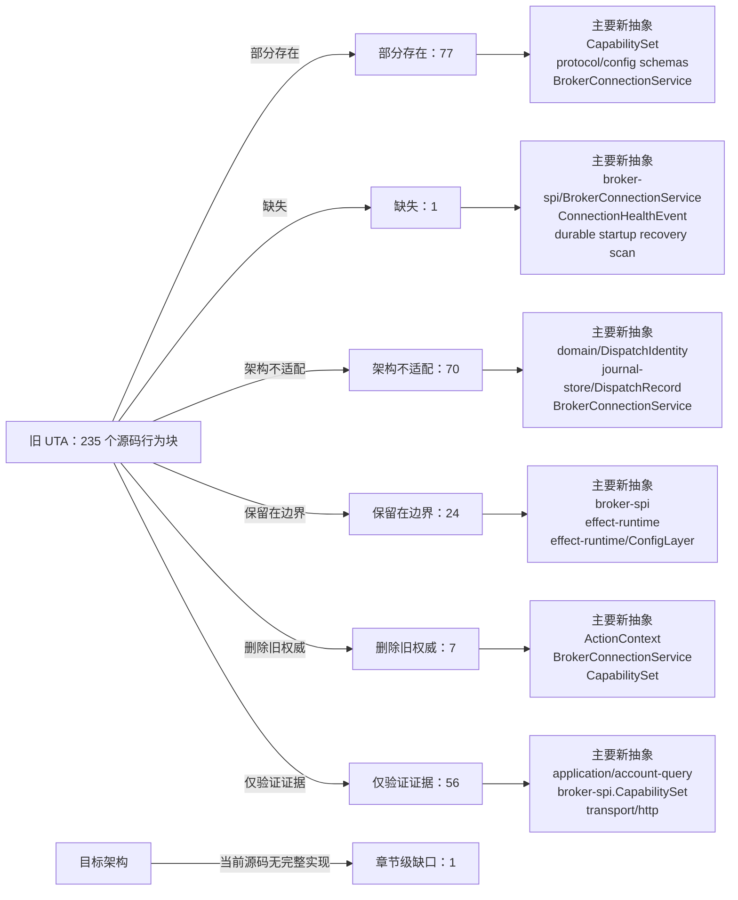

<!-- Auto-generated by scripts/uta-effect-runtime-map.mjs from mapping.json. Do not edit by hand. -->
<!-- Regenerate with `node scripts/uta-effect-runtime-map.mjs`. -->

# UTA 功能替代关系：第 15 章 Security and authority

目标架构原文：[`docs/uta-effect-runtime-architecture.md:1349-1357`](../uta-effect-runtime-architecture.md#L1349-L1357)。

## 结论

部分存在 77；缺失 1；架构不适配 70；保留在边界 24；删除旧权威 7；仅验证证据 56。状态只描述当前实现相对于目标架构的关系，不表示迁移已经落地。

## 替代关系图

## 章节级目标缺口

| 依据 | 目标义务 | 当前缺口 | 必须补充或调整 |
|---|---|---|---|
| docs/uta-effect-runtime-architecture.md:1356-1356; services/uta/src/http/routes-trading.ts:127-224; services/uta/src/http/routes-simulator.ts:105-221 | Process-local database authority | No explicit runtime boundary prevents future administrative SQL/row mutation exposure; current administrative/simulator routes directly reach managers and MockBroker state. | Keep journal/database services private to the UTA process. Transport may expose only typed application projections and typed recovery commands; never expose SQL, table rows, or direct database mutations. |

## 源码映射

| 映射 ID | 当前源码 | 符号或行为块 | 当前功能 | 替代状态 | 新 UTA 抽象与做法 | 不适配位置与原因 | 必须补充或调整 | 重复索引 |
|---|---|---|---|---|---|---|---|---|
| `MAP-607170E22C` | [`packages/uta-broker-alpaca/src/index.ts:5-5`](../../packages/uta-broker-alpaca/src/index.ts#L5-L5) | configSchema | Re-exports AlpacaBroker.configSchema from the legacy class, so the pack boundary validates the old brokerConfig shape but does not expose a target adapter descriptor or associate configuration with a scoped connection Layer and typed action interpreter. | 部分存在 | 3.7 brokers/<broker>/；9.1 Connection Layer；9.2 Typed action interpreter；9.4 Capability derivation；15 Security and authority；16 Target source layout services/uta/src/brokers/alpaca/；services/uta/src/broker-spi/BrokerConnectionService；services/uta/src/broker-spi/BrokerActionInterpreter Define the Alpaca connection/configuration schema beside the target adapter and export it through the versioned pack descriptor. Keep credential parsing at the trusted UTA boundary and provide separate target action, acknowledgement, observation, error, availability, and redacted-native-payload schemas through the interpreter rather than relying on a legacy class static. | The alias is coupled to the legacy implementation and only validates construction input; it does not prove the target action-type map, capability derivation, native boundary schemas, or credential-bearing scoped Layer required by chapters 3.7 and 9. | Move the Alpaca config schema to the target brokers/alpaca adapter, make its parsed output feed BrokerConnectionService construction, and add the typed BrokerActionInterpreter schemas and capability derivation required by the target pack contract without exposing SDK values to kernel or protocol types. | **DUP-004** |
| `MAP-F3151B31E7` | [`packages/uta-broker-ccxt/src/index.ts:5-5`](../../packages/uta-broker-ccxt/src/index.ts#L5-L5) | configSchema | Re-exports CcxtBroker.configSchema from the legacy class, so the pack boundary validates the old exchange/account configuration but does not expose a target adapter descriptor or associate configuration with a scoped connection Layer and typed action interpreter. | 部分存在 | 3.7 brokers/<broker>/；9.1 Connection Layer；9.2 Typed action interpreter；9.4 Capability derivation；15 Security and authority；16 Target source layout services/uta/src/brokers/ccxt/；services/uta/src/broker-spi/BrokerConnectionService；services/uta/src/broker-spi/BrokerActionInterpreter Define the CCXT connection/configuration schema beside the target adapter and export it through the versioned pack descriptor. Keep exchange credentials and keyless/public-data mode at the trusted UTA boundary, and provide separate target action, acknowledgement, observation, error, availability, and redacted-native-payload schemas through the interpreter rather than relying on a legacy class static. | The alias is coupled to the legacy implementation and only validates construction input; it does not prove the target action-type map, exchange/sub-account capability derivation, native boundary schemas, or credential-bearing scoped Layer required by chapters 3.7 and 9. | Move the CCXT config schema to the target brokers/ccxt adapter, make its parsed output feed BrokerConnectionService construction, and add capability derivation over exchange, sub-account or wallet, venue, instrument, and session context plus the typed BrokerActionInterpreter schemas. | **DUP-009** |
| `MAP-C4C40BAECB` | [`packages/uta-broker-ibkr/src/index.ts:5-5`](../../packages/uta-broker-ibkr/src/index.ts#L5-L5) | configSchema | Re-exports IbkrBroker.configSchema from the legacy class, so the pack boundary validates the old host/port/client configuration but does not expose a target adapter descriptor or associate configuration with a scoped connection Layer and typed action interpreter. | 部分存在 | 3.7 brokers/<broker>/；9.1 Connection Layer；9.2 Typed action interpreter；9.4 Capability derivation；15 Security and authority；16 Target source layout services/uta/src/brokers/ibkr/；services/uta/src/broker-spi/BrokerConnectionService；services/uta/src/broker-spi/BrokerActionInterpreter Define the IBKR connection/configuration schema beside the target adapter and export it through the versioned pack descriptor. Keep endpoint credentials and account identity at the trusted UTA boundary, and provide separate target action, acknowledgement, observation, error, availability, and redacted-native-payload schemas through the interpreter rather than relying on a legacy class static. | The alias is coupled to the legacy implementation and only validates construction input; it does not prove the target action-type map, callback stream/linked-account identity, native boundary schemas, or credential-bearing scoped Layer required by chapters 3.7 and 9. | Move the IBKR config schema to the target brokers/ibkr adapter, make its parsed output feed BrokerConnectionService construction, and add capability derivation plus callback/observation schemas for linked accounts and native order identities through BrokerActionInterpreter. | **DUP-014** |
| `MAP-2564A889E7` | [`packages/uta-broker-leverup/src/index.ts:5-5`](../../packages/uta-broker-leverup/src/index.ts#L5-L5) | configSchema | Re-exports LeverupBroker.configSchema from the legacy class, so the pack boundary validates the old network/private-key configuration but does not expose a target adapter descriptor or associate configuration with a scoped connection Layer and typed action interpreter. | 部分存在 | 3.7 brokers/<broker>/；9.1 Connection Layer；9.2 Typed action interpreter；9.4 Capability derivation；15 Security and authority；16 Target source layout services/uta/src/brokers/leverup/；services/uta/src/broker-spi/BrokerConnectionService；services/uta/src/broker-spi/BrokerActionInterpreter Define the LeverUp connection/configuration schema beside the target adapter and export it through the versioned pack descriptor. Keep private-key handling inside the UTA credential boundary and scoped connection/relayer Layer, and provide separate target action, acknowledgement, observation, error, availability, and redacted-native-payload schemas through the interpreter rather than relying on a legacy class static. | The alias is coupled to the legacy implementation and only validates construction input; it does not prove the target action-type map, relayer capability derivation, native boundary schemas, or credential-bearing scoped Layer required by chapters 3.7 and 9. | Move the LeverUp config schema to the target brokers/leverup adapter, make its parsed output feed BrokerConnectionService and relayer construction, and add capability derivation plus typed BrokerActionInterpreter schemas for network, instrument, relayer, and market-session availability. | **DUP-019** |
| `MAP-1986FE3044` | [`packages/uta-broker-longbridge/src/index.ts:5-5`](../../packages/uta-broker-longbridge/src/index.ts#L5-L5) | configSchema | Re-exports LongbridgeBroker.configSchema from the legacy class, so the pack boundary validates the old app-key/app-secret/access-token configuration but does not expose a target adapter descriptor or associate configuration with a scoped connection Layer and typed action interpreter. | 部分存在 | 3.7 brokers/<broker>/；9.1 Connection Layer；9.2 Typed action interpreter；9.4 Capability derivation；15 Security and authority；16 Target source layout services/uta/src/brokers/longbridge/；services/uta/src/broker-spi/BrokerConnectionService；services/uta/src/broker-spi/BrokerActionInterpreter；services/uta/src/market-and-accounting/ Define the Longbridge connection/configuration schema beside the target adapter and export it through the versioned pack descriptor. Keep credentials inside the UTA-owned scoped Layer, and provide separate target action, acknowledgement, observation, error, availability, jurisdiction, currency, and redacted-native-payload schemas through the interpreter rather than relying on a legacy class static. | The alias is coupled to the legacy implementation and only validates construction input; it does not prove the target action-type map, jurisdiction/currency capability derivation, native boundary schemas, or credential-bearing scoped Layer required by chapters 3.7 and 9. | Move the Longbridge config schema to the target brokers/longbridge adapter, make its parsed output feed BrokerConnectionService construction, and connect the adapter's account/market/jurisdiction metadata to market-and-accounting while keeping typed BrokerActionInterpreter schemas at the broker boundary. | **DUP-024** |
| `MAP-CC2177368A` | [`packages/uta-protocol/src/brokers/preset-catalog.ts:1-14`](../../packages/uta-protocol/src/brokers/preset-catalog.ts#L1-L14) | broker preset catalog setup | Declares the catalog as the single source for wizard account types, imports Zod for per-preset validation, and imports node crypto for deterministic/random UTA id helpers. | 部分存在 | 2. System boundary；3.7 brokers/<broker>/；3.9 transport/ and protocol/；7.1 Embedded database；9.1 Connection Layer；14. Public protocol；15. Security and authority；19. Architectural prohibitions protocol/config schemas；application/；broker-spi/；brokers/<broker>/；BrokerConnectionService Treat the catalog as configuration/presentation input only; validate each broker connection with named schemas and let UTA-owned adapter Layers consume sealed configuration. | A shared package owns wizard configuration and identity minting, but this setup does not separate Alice presentation from UTA credential authority or broker-spi capability/connection ownership. | Split config/presentation declarations from runtime broker adapters, define explicit config codecs and secret references, and ensure catalog identity helpers cannot become execution or persistence authority. | **DUP-026** |
| `MAP-9F3FB86CB7` | [`packages/uta-protocol/src/brokers/preset-catalog.ts:20-23`](../../packages/uta-protocol/src/brokers/preset-catalog.ts#L20-L23) | ModeOption | Defines a UI mode id/label pair as arbitrary strings. | 保留在边界 | 2.1 Alice owns；3.9 transport/ and protocol/；14. Public protocol；15. Security and authority protocol/config presentation schema；application/ Retain mode labels as Alice-owned presentation metadata, while UTA validates the corresponding broker environment as a typed config variant. | The UI option intentionally does not encode broker capability, account jurisdiction, or execution policy and must not be consumed as a kernel mode or security decision. | Keep it outside domain/transaction-kernel and ensure mode ids are validated by the broker-specific config schema before adapter construction. | **DUP-028** |
| `MAP-67CE26F92B` | [`packages/uta-protocol/src/brokers/preset-catalog.ts:25-35`](../../packages/uta-protocol/src/brokers/preset-catalog.ts#L25-L35) | SubtitleSegment | Defines optional label/falseLabel/prefix presentation directives keyed by an arbitrary presetConfig field path. | 保留在边界 | 2.1 Alice owns；3.9 transport/ and protocol/；14. Public protocol；15. Security and authority Alice UI presentation projection；protocol/config presentation schema Keep account-card subtitle layout as Alice/UI presentation data only; never use field paths or truthiness to derive capability, authorization, or broker identity. | This is UI metadata, not a trading/runtime abstraction; arbitrary field paths and truthiness would be unsafe if allowed to cross into domain or security decisions. | Keep SubtitleSegment in a presentation-only module and exclude it from transaction, broker-spi, and persistence schemas. | **DUP-029** |
| `MAP-601F6E2834` | [`packages/uta-protocol/src/brokers/preset-catalog.ts:37-98`](../../packages/uta-protocol/src/brokers/preset-catalog.ts#L37-L98) | BrokerPresetDef | Defines preset metadata, Zod config schema, optional modes/subtitle/write-only fields, string fingerprint fields, a `toEngineConfig` function returning Record<string, unknown>, and optional isPaper callback accepting Record<string, unknown>. | 部分存在 | 2.1 Alice owns；2.2 UTA owns；3.7 brokers/<broker>/；3.9 transport/ and protocol/；7.1 Embedded database；9.1 Connection Layer；9.4 Capability derivation；14. Public protocol；15. Security and authority；17. Migration sequence；19. Architectural prohibitions protocol/config schemas；BrokerConnectionService；BrokerActionTypeMap；CapabilitySet；brokers/<broker>/；application/ Use BrokerPresetDef only to describe presentation/config entry points, then parse into broker-specific typed connection config and secret references before constructing scoped adapter Layers. | The schema itself is generic ZodType, engine translation and paper detection use raw Record<string, unknown>, fingerprints are string field names, and no action capability/connection/jurisdiction contract is attached. | Introduce broker-specific config ADTs/codecs, remove raw Record-based runtime handoff, separate secret storage from public metadata, and derive capabilities through broker-spi ActionContext rather than preset metadata. | **DUP-030** |
| `MAP-E745F1370E` | [`packages/uta-protocol/src/brokers/preset-catalog.ts:100-106`](../../packages/uta-protocol/src/brokers/preset-catalog.ts#L100-L106) | defaultIsPaper | Converts an arbitrary config record's mode to a lowercase string and returns true for demo/testnet/paper, treating all other values as non-paper. | 部分存在 | 3.7 brokers/<broker>/；3.9 transport/ and protocol/；9.4 Capability derivation；14. Public protocol；15. Security and authority；19. Architectural prohibitions broker-specific connection config；ActionContext；CapabilitySet；protocol/config schemas Derive account environment from a validated broker-specific config variant and expose it as typed context/capability metadata. | A generic mode string and boolean conflates venue-specific demo/testnet/paper semantics and can classify unknown values silently. | Replace with exhaustive per-preset config parsing and an explicit environment variant; reject unknown mode values at the boundary. | **DUP-031** |
| `MAP-EBB7846E5F` | [`packages/uta-protocol/src/brokers/preset-catalog.ts:108-154`](../../packages/uta-protocol/src/brokers/preset-catalog.ts#L108-L154) | BINANCE_PRESET | Declares Binance live/demo modes, API key/secret Zod fields, write-only metadata, mode/API-key fingerprinting, and a raw engine config with demoTrading semantics. | 部分存在 | 3.7 brokers/<broker>/；3.9 transport/ and protocol/；7.1 Embedded database；9.1 Connection Layer；9.4 Capability derivation；14. Public protocol；15. Security and authority；17.5 Slice 5: heterogeneous brokers；19. Architectural prohibitions brokers/Alpaca-style adapter config；BrokerConnectionService；CapabilitySet；protocol/config schemas Parse Binance connection config into a UTA-owned secret/config value, construct a scoped adapter Layer, and derive per-wallet/action capabilities from account, venue, instrument, and mode context. | The UI schema and toEngineConfig expose a generic record carrying credentials and a boolean-like demo mode; no typed connection identity, sub-account context, action availability, idempotency, or compensation contract is present. | Replace raw engine handoff with a broker-specific config codec/secret reference and broker-spi capability derivation; keep preset data presentation-only. | **DUP-032** |
| `MAP-BB8EAF65B0` | [`packages/uta-protocol/src/brokers/preset-catalog.ts:156-189`](../../packages/uta-protocol/src/brokers/preset-catalog.ts#L156-L189) | OKX_PRESET | Declares OKX live/demo modes, API key/secret/passphrase fields, write-only metadata, mode/API-key fingerprinting, and raw sandbox engine config. | 部分存在 | 3.7 brokers/<broker>/；3.9 transport/ and protocol/；7.1 Embedded database；9.1 Connection Layer；9.4 Capability derivation；14. Public protocol；15. Security and authority；17.5 Slice 5: heterogeneous brokers；19. Architectural prohibitions brokers/<broker>/；BrokerConnectionService；CapabilitySet；protocol/config schemas Validate OKX connection credentials/config in UTA, construct its scoped adapter, and derive action/sub-account capabilities rather than treating demo as a generic sandbox boolean. | Credentials and venue mode are passed through generic preset data, while no typed connection/capability/interpreter association or jurisdiction/sub-account contract is represented. | Introduce an OKX-specific config ADT and secret boundary, then register typed BrokerActionInterpreter availability/dispatch/observe/compensation implementations. | **DUP-033** |
| `MAP-6E3C5642E6` | [`packages/uta-protocol/src/brokers/preset-catalog.ts:191-224`](../../packages/uta-protocol/src/brokers/preset-catalog.ts#L191-L224) | BYBIT_PRESET | Declares live/testnet/demo modes, API credentials, write-only fields, fingerprints, and raw engine config with separate sandbox/demoTrading booleans. | 部分存在 | 3.7 brokers/<broker>/；3.9 transport/ and protocol/；7.1 Embedded database；9.1 Connection Layer；9.4 Capability derivation；14. Public protocol；15. Security and authority；17.5 Slice 5: heterogeneous brokers；19. Architectural prohibitions brokers/<broker>/；BrokerConnectionService；CapabilitySet；ActionAvailability；protocol/config schemas Represent Bybit environment as a validated config variant and derive capabilities/idempotency/compensation for each account and venue mode through broker-spi. | Separate booleans can express invalid mode combinations and raw engine config is untyped; no target action contract or typed unavailable reason is attached. | Replace booleans/Record handoff with an exhaustive Bybit config ADT, adapter Layer, and CapabilitySet registration. | **DUP-034** |
| `MAP-2F4E92A2AE` | [`packages/uta-protocol/src/brokers/preset-catalog.ts:226-257`](../../packages/uta-protocol/src/brokers/preset-catalog.ts#L226-L257) | HYPERLIQUID_PRESET | Declares live/testnet mode, walletAddress/privateKey fields, write-only private key, wallet/mode fingerprinting, and raw sandbox engine config. | 部分存在 | 3.7 brokers/<broker>/；3.9 transport/ and protocol/；7.1 Embedded database；9.1 Connection Layer；9.4 Capability derivation；14. Public protocol；15. Security and authority；17.5 Slice 5: heterogeneous brokers；19. Architectural prohibitions brokers/<broker>/；BrokerConnectionService；CapabilitySet；protocol/config schemas；domain/AccountId Keep wallet credentials in UTA-owned sealed config, construct a scoped Hyperliquid adapter, and derive wallet/venue/instrument action capabilities via broker-spi. | A raw record carries a private key and mode with no typed secret reference, account/connection identity, jurisdiction, availability, idempotency, or compensation contract. | Add a Hyperliquid-specific config/secret codec and typed adapter registration; never expose private-key fields through generic protocol/catalog payloads. | **DUP-035** |
| `MAP-B9545FA731` | [`packages/uta-protocol/src/brokers/preset-catalog.ts:259-292`](../../packages/uta-protocol/src/brokers/preset-catalog.ts#L259-L292) | BITGET_PRESET | Declares live/demo mode, API key/secret/passphrase fields, write-only metadata, mode/API-key fingerprints, and raw engine config with demoTrading. | 部分存在 | 3.7 brokers/<broker>/；3.9 transport/ and protocol/；7.1 Embedded database；9.1 Connection Layer；9.4 Capability derivation；14. Public protocol；15. Security and authority；17.5 Slice 5: heterogeneous brokers；19. Architectural prohibitions brokers/<broker>/；BrokerConnectionService；CapabilitySet；protocol/config schemas Parse Bitget credentials/environment into a typed UTA-owned connection config, then derive separate-wallet/action capability and typed unavailable results in the adapter. | The preset does not express Bitget wallet/account scope or action contracts and passes secrets/mode through a generic engine record. | Introduce typed Bitget configuration and broker-spi registration, with secret isolation and capability derivation from account/sub-account/venue context. | **DUP-036** |
| `MAP-F62E863C78` | [`packages/uta-protocol/src/brokers/preset-catalog.ts:294-333`](../../packages/uta-protocol/src/brokers/preset-catalog.ts#L294-L333) | CCXT_CUSTOM_PRESET | Provides an escape-hatch Zod object with optional exchange/sandbox/demo/credential/wallet fields and loops over defined fields to pass them through a Record<string, unknown>. | 架构不适配 | 3.7 brokers/<broker>/；3.9 transport/ and protocol/；7.1 Embedded database；9.4 Capability derivation；14. Public protocol；15. Security and authority；17.5 Slice 5: heterogeneous brokers；19. Architectural prohibitions broker-spi/；BrokerActionTypeMap；CapabilitySet；protocol/config schemas；brokers/<broker>/ Replace the open-ended custom config with an explicitly parsed exchange-specific config/plugin boundary; no generic route or kernel may accept pass-through credential/action bags. | Nearly every field is optional, exchange semantics are delegated to an untyped Record, and the preset is an untyped registry escape hatch; this violates the prohibition on permissive fallback states and untyped registries. | Remove CCXT_CUSTOM as a kernel/runtime contract, require a concrete adapter/config schema per supported exchange, and return typed CapabilityUnavailable for unsupported actions instead of silently passing fields through. | **DUP-037** |
| `MAP-2862195456` | [`packages/uta-protocol/src/brokers/preset-catalog.ts:337-367`](../../packages/uta-protocol/src/brokers/preset-catalog.ts#L337-L367) | ALPACA_PRESET | Declares paper/live mode, API key/secret fields, write-only metadata, mode/API-key fingerprints, and raw engine config with paper boolean. | 部分存在 | 3.7 brokers/<broker>/；3.9 transport/ and protocol/；7.1 Embedded database；9.1 Connection Layer；9.4 Capability derivation；14. Public protocol；15. Security and authority；17.4 Slice 4: first real broker；19. Architectural prohibitions brokers/Alpaca；BrokerConnectionService；BrokerActionTypeMap；CapabilitySet；protocol/config schemas Use an Alpaca-specific validated config/secret boundary and typed action interpreter, then make the new path authoritative before deleting its legacy dispatcher path. | Preset mode/credentials are generic form data and do not carry typed connection identity, action capability, dispatch idempotency, observation, or compensation semantics. | Add Alpaca adapter Layer and BrokerActionInterpreter contracts, keep credentials UTA-owned, and migrate the preset to reference validated config rather than pass a raw record. | **DUP-038** |
| `MAP-DE2769E2F7` | [`packages/uta-protocol/src/brokers/preset-catalog.ts:369-398`](../../packages/uta-protocol/src/brokers/preset-catalog.ts#L369-L398) | IBKR_PRESET | Declares host/port/clientId/accountId form fields, default ports, fingerprints, raw engine config, and paper detection based on port numbers. | 部分存在 | 3.7 brokers/<broker>/；3.9 transport/ and protocol/；7.1 Embedded database；9.1 Connection Layer；9.4 Capability derivation；10.2 Market and jurisdiction owns；14. Public protocol；15. Security and authority；17.5 Slice 5: heterogeneous brokers；19. Architectural prohibitions brokers/IBKR；BrokerConnectionService；ConnectionId；CapabilitySet；protocol/config schemas Validate an IBKR connection config, construct the scoped SDK Layer inside brokers/IBKR, and derive linked-account/market/jurisdiction capabilities through broker-spi. | Port-number paper detection and raw host/account strings do not encode connection identity, account jurisdiction, linked-account context, health stream, action capability, or typed failure. | Replace generic engine config with an IBKR connection ADT/secret/config codec and typed BrokerConnectionService/capability registration; keep port defaults presentation/config only. | **DUP-039** |
| `MAP-42A8E8BFCC` | [`packages/uta-protocol/src/brokers/preset-catalog.ts:400-433`](../../packages/uta-protocol/src/brokers/preset-catalog.ts#L400-L433) | LONGBRIDGE_PRESET | Declares live/paper mode and appKey/appSecret/accessToken fields, marks all credentials write-only, fingerprints mode/appKey, and passes a raw engine config. | 部分存在 | 3.7 brokers/<broker>/；3.9 transport/ and protocol/；7.1 Embedded database；9.1 Connection Layer；9.4 Capability derivation；10.2 Market and jurisdiction owns；14. Public protocol；15. Security and authority；17.5 Slice 5: heterogeneous brokers；19. Architectural prohibitions brokers/Longbridge；BrokerConnectionService；CapabilitySet；market-and-accounting/；protocol/config schemas Use Longbridge-specific validated secret/config input and derive region/jurisdiction/instrument capabilities in the typed adapter before transaction preparation. | The form config has raw credentials and mode but no typed jurisdiction/region/account context or broker action/interpreter contract; access-token lifecycle is only prose. | Define typed Longbridge connection/credential and market-jurisdiction metadata, then register its BrokerActionInterpreter and capability/unavailable results. | **DUP-040** |
| `MAP-FA8441EFDE` | [`packages/uta-protocol/src/brokers/preset-catalog.ts:437-468`](../../packages/uta-protocol/src/brokers/preset-catalog.ts#L437-L468) | LEVERUP_PRESET | Declares live/testnet mode and a regex-validated private key, marks it write-only, fingerprints mode/privateKey, and passes network/privateKey through a raw engine record. | 部分存在 | 3.7 brokers/<broker>/；3.9 transport/ and protocol/；7.1 Embedded database；9.4 Capability derivation；14. Public protocol；15. Security and authority；17.5 Slice 5: heterogeneous brokers；19. Architectural prohibitions brokers/LeverUp；BrokerConnectionService；CapabilitySet；protocol/config schemas；domain/AccountId Keep the wallet secret in UTA-owned sealed configuration, validate a typed network/account context, and expose LeverUp through a typed interpreter with explicit relayer reconciliation/compensation capability. | Fingerprinting a private key and passing it through a generic record does not establish nominal account identity, idempotency, remote outcome, or compensation; network is only a string union in form data. | Replace raw config handoff with a typed wallet/relayer adapter boundary and broker-spi capability/reconciliation contract; do not expose secret-derived identity fields in public protocol data. | **DUP-041** |
| `MAP-9A17C2A8CC` | [`packages/uta-protocol/src/brokers/preset-catalog.ts:497-522`](../../packages/uta-protocol/src/brokers/preset-catalog.ts#L497-L522) | BROKER_PRESET_CATALOG | Exports an ordered array of all broker preset definitions for wizard rendering, grouped as recommended/crypto/testing and including the simulator and custom CCXT escape hatch. | 保留在边界 | 2.1 Alice owns；3.7 brokers/<broker>/；3.9 transport/ and protocol/；9.4 Capability derivation；14. Public protocol；15. Security and authority；17. Migration sequence；19. Architectural prohibitions；20. First falsifier Alice UI presentation projection；application/；broker-spi/；brokers/<broker>/；CapabilitySet Keep the ordered catalog for Alice's account-picker presentation, but runtime broker registration/capabilities must come from typed broker-spi adapters and the durable kernel, not this array. | The catalog is a UI registry and does not prove adapter capability, connection health, transaction durability, or recovery; custom/permissive/simulator entries must not become generic runtime fallback. | Mark the catalog presentation-only, separate it from adapter composition, and gate each selectable preset through a validated config and typed capability/connection service. | **DUP-043** |
| `MAP-E954ABE476` | [`packages/uta-protocol/src/brokers/preset-catalog.ts:524-531`](../../packages/uta-protocol/src/brokers/preset-catalog.ts#L524-L531) | getBrokerPreset | Finds a preset by raw string id and throws a generic Error listing known ids when absent. | 部分存在 | 4. Effect model；5.7 Complete type contract — error channels；9.4 Capability derivation；14. Public protocol；15. Security and authority；19. Architectural prohibitions protocol/config parser；CapabilityUnavailable；QueryFailure；application/ Parse preset identifiers at the configuration/application boundary into a closed preset/config ADT and return a typed unknown-preset failure. | Unknown external input throws a generic Error/string list rather than returning a named failure; the list itself can expose registry details and no capability context. | Replace getBrokerPreset's throw with a typed Result/Effect failure and schema-decoded preset id; keep registry lookup outside domain and never use it as capability proof. | **DUP-044** |
| `MAP-4FEAB1D03E` | [`packages/uta-protocol/src/brokers/preset-catalog.ts:533-537`](../../packages/uta-protocol/src/brokers/preset-catalog.ts#L533-L537) | isPaperPreset | Looks up a raw preset id and invokes an optional custom isPaper callback or generic mode heuristic over Record<string, unknown>. | 部分存在 | 4. Effect model；7.1 Embedded database；9.4 Capability derivation；14. Public protocol；15. Security and authority；19. Architectural prohibitions broker-specific config ADT；ActionContext；CapabilitySet；protocol/config schemas Derive environment/account mode from each validated broker config ADT and make it part of connection/capability context, not a generic callback result. | An optional callback plus raw config record can silently classify unknown or incompatible modes and is disconnected from actual broker connection/venue state. | Remove generic isPaper behavior from runtime decisions, use exhaustive config variants and adapter-observed environment metadata, and expose uncertainty as a typed capability result. | **DUP-045** |
| `MAP-4E1058C577` | [`packages/uta-protocol/src/brokers/preset-catalog.ts:557-580`](../../packages/uta-protocol/src/brokers/preset-catalog.ts#L557-L580) | deriveUtaId | Filters arbitrary presetConfig fields named by fingerprintFields, fills missing values with null, canonicalizes them, hashes preset id plus JSON to eight hex characters, and returns `${preset.id}-${hash}`. | 部分存在 | 2.2 UTA owns；3.1 domain/；3.4 journal-store/；3.7 brokers/<broker>/；5.7 Complete type contract — nominal identities and financial values；7.1 Embedded database；9.1 Connection Layer；11. Approval and Git audit projection；14. Public protocol；15. Security and authority；17.6 Slice 6: delete the legacy kernel；19. Architectural prohibitions AccountId；ConnectionId；InstrumentId；journal-store/；BrokerConnectionIdentity；protocol/config schemas Introduce typed, durable AccountId/ConnectionId construction from validated broker identity context; retain old ids only as explicit migration compatibility projections. | The current identity is an unbranded 32-bit string hash over generic fields (including secret-derived values for some presets), has no collision/identity evidence in the domain type, and couples account identity to UI preset ids. | Define nominal identity constructors and migration mapping, separate credential storage from identity metadata, persist identity/context in journal/config schemas, and stop using derived strings as transaction identity. | **DUP-047** |
| `MAP-21AAC99E0D` | [`packages/uta-protocol/src/brokers/presets.ts:1-16`](../../packages/uta-protocol/src/brokers/presets.ts#L1-L16) | broker preset serialization setup | Documents conversion of BrokerPresetDef Zod schemas to JSON Schema for the frontend and imports Zod plus catalog types. | 部分存在 | 2.1 Alice owns；3.9 transport/ and protocol/；7.1 Embedded database；14. Public protocol；15. Security and authority；19. Architectural prohibitions Alice UI presentation projection；protocol/config schemas；application/ Keep JSON Schema generation only for Alice's form presentation and pair it with UTA-owned named config codecs; do not treat generated form JSON as runtime domain/protocol schema. | The same shared package presents frontend JSON Schema as if it were the request/response contract, but the target separates presentation metadata from transport/persistence schemas and secret authority. | Separate presentation serialization from protocol codecs, ensure write-only/secret fields never become runtime payloads, and export named request/response/config schemas independently. | **DUP-049** |
| `MAP-F8525C7A99` | [`packages/uta-protocol/src/brokers/presets.ts:18-32`](../../packages/uta-protocol/src/brokers/presets.ts#L18-L32) | SerializedBrokerPreset | Defines the frontend serialized preset with metadata, engine/guard string unions, optional modes, subtitle fields, and `schema: Record<string, unknown>`. | 部分存在 | 2.1 Alice owns；3.7 brokers/<broker>/；3.9 transport/ and protocol/；7.1 Embedded database；9.4 Capability derivation；14. Public protocol；15. Security and authority；19. Architectural prohibitions Alice UI presentation projection；protocol/config schemas；BrokerConnectionService；CapabilitySet Retain as an explicitly presentation-only DTO, while runtime config/capability contracts use named schemas and typed adapter services. | The raw JSON Schema record and optional metadata are not a decoded connection config or capability ADT, and the public shape can be mistaken for broker runtime support. | Move SerializedBrokerPreset to a presentation module, replace raw runtime use with named config schemas, and prevent engine/guard metadata from authorizing actions. | **DUP-050** |
| `MAP-5C311A55C1` | [`packages/uta-protocol/src/brokers/presets.ts:34-54`](../../packages/uta-protocol/src/brokers/presets.ts#L34-L54) | buildJsonSchema | Calls z.toJSONSchema, casts the result and properties to Record types, rewrites mode enum to oneOf titles, and mutates writeOnly markers by field name. | 架构不适配 | 3.7 brokers/<broker>/；3.9 transport/ and protocol/；7.1 Embedded database；9.4 Capability derivation；14. Public protocol；15. Security and authority；19. Architectural prohibitions protocol/config schemas；Alice UI presentation projection；BrokerConnectionService；brokers/<broker>/ Generate presentation JSON Schema from a validated, broker-specific config definition without using it as the transport/persistence decoder; use named runtime codecs at every boundary. | The function relies on casts to untyped records and mutates arbitrary JSON Schema properties, violating the target prohibition on untyped JSON casts when the result is exported as a protocol-facing shape. | Constrain this helper to a presentation serializer, add explicit runtime schemas for each endpoint/config, and remove raw-record casts from kernel-facing code. | **DUP-051** |
| `MAP-1D576100CB` | [`packages/uta-protocol/src/brokers/presets.ts:56-72`](../../packages/uta-protocol/src/brokers/presets.ts#L56-L72) | BUILTIN_BROKER_PRESETS | Maps every catalog definition into a serialized frontend array, copying metadata and generated raw schema. | 保留在边界 | 2.1 Alice owns；3.7 brokers/<broker>/；3.9 transport/ and protocol/；9.4 Capability derivation；14. Public protocol；15. Security and authority；17. Migration sequence；19. Architectural prohibitions；20. First falsifier Alice UI presentation projection；application/；broker-spi/；CapabilitySet；MockBroker Keep this array for the account-picker UI only; runtime adapter registration, capability derivation, transaction execution, and MockBroker recovery must be independent typed services. | The serialized catalog is presentation metadata and therefore outside the new kernel, but its engine/schema fields cannot prove broker capability or durable execution and its raw schemas are not enough for transport validation. | Mark it non-authoritative, prevent callers from using it as a broker registry, and route selected presets through validated config plus BrokerConnectionService/CapabilitySet. | **DUP-052** |
| `MAP-139EBB287C` | [`packages/uta-protocol/src/client/UTAClient.ts:1-11`](../../packages/uta-protocol/src/client/UTAClient.ts#L1-L11) | UTA client transport contract documentation | Describes a low-level HTTP helper with higher-level adapters layered elsewhere and explicitly says errors are normalized to JavaScript Errors; endpoint validation and WireBrokerError round-trip are future work. | 架构不适配 | 2.1 Alice owns；3.9 transport/ and protocol/；4. Effect model；9.2 Typed action interpreter；12.3 Defects and expected failures；14. Public protocol；15. Security and authority；19. Architectural prohibitions transport/http；protocol/；application/；TransactionFailure；QueryFailure Make the client SDK a typed proxy for the transaction-oriented public routes, decoding named success/failure schemas and preserving correlation/authorization context. | The module explicitly documents unvalidated endpoints and Error-based failures, contrary to the target requirement that every request/response use shared runtime schemas and typed expected failures. | Replace the generic low-level public contract with route-specific typed methods/codecs and typed failure mapping; keep any raw HTTP primitive private to transport/http. | **DUP-056** |
| `MAP-A4FE5AF865` | [`packages/uta-protocol/src/client/UTAClient.ts:13-20`](../../packages/uta-protocol/src/client/UTAClient.ts#L13-L20) | UTAClientOptions | Accepts a base URL, optional fetch override, and optional timeout in milliseconds with a default of 15 seconds. | 部分存在 | 2.1 Alice owns；3.2 effect-runtime/；3.9 transport/ and protocol/；4. Effect model；12.1 Startup sequence；14. Public protocol；15. Security and authority transport/http；effect-runtime/；protocol/；transport principal authentication；transaction authorizer actor/policy/capability Retain base URL/clock configuration at the transport boundary, but add the authenticated typed proxy and explicit cancellation/timeout failure mapping required by protocol routes. | The options contain no transport-principal authentication context or route schema configuration. Timeout is a local abort setting with no typed transport/QueryFailure mapping, and transaction actor/policy/capability authorization is not modeled as a separate application/kernel input. | Compose authenticated transport and route-specific codecs; map administrative-read timeout/abort to typed transport or QueryFailure variants. Separately pass actor, policy, and capability context to prepare/approve; reserve RemoteOutcome.Unknown for ambiguous durable broker dispatch. | **DUP-057** |
| `MAP-A458F81B6D` | [`packages/uta-protocol/src/client/UTAClient.ts:22-29`](../../packages/uta-protocol/src/client/UTAClient.ts#L22-L29) | UTAClient generic methods | Exposes arbitrary `request<T>` plus generic get/post/put/delete wrappers, all defaulting T to unknown and accepting raw method/path/body/query values. | 架构不适配 | 2.1 Alice owns；3.9 transport/ and protocol/；5.7 Complete type contract — public protocol envelopes；9.2 Typed action interpreter；14. Public protocol；15. Security and authority；19. Architectural prohibitions transport/http；protocol/；application/；PrepareTransactionResponse；GetTransactionResponse Expose typed methods for POST/PUT/GET transaction routes, capabilities, account state, events, and recovery, each paired with named request/response/failure schemas. | Any caller can send an arbitrary path/method and receive an unchecked unknown, so the client does not enforce the listed public routes or prevent broker-native payloads from entering generic endpoints. | Delete the generic public methods or make the raw primitive private; migrate every caller to route-specific typed proxy methods and exhaustive response decoding. | **DUP-058** |
| `MAP-22C9C06082` | [`packages/uta-protocol/src/client/UTAClient.ts:48-61`](../../packages/uta-protocol/src/client/UTAClient.ts#L48-L61) | createUTAClient initialization and buildUrl | Normalizes a trailing slash, selects global/override fetch, defaults timeout, and constructs URLs from arbitrary paths and query entries by String conversion. | 部分存在 | 2.1 Alice owns；3.2 effect-runtime/；3.9 transport/ and protocol/；4. Effect model；8.1 Admission；14. Public protocol；15. Security and authority；19. Architectural prohibitions transport/http；effect-runtime/；protocol/；application/ Keep URL construction as a private transport helper, but bind it to the closed route table, authenticated transport layer, and typed query encoders. | Arbitrary path/query construction permits calls outside the public route contract and silently stringifies unvalidated values; auth and correlation handling are absent here. | Hide buildUrl behind route-specific client methods, validate/encode query parameters from named schemas, and compose transport authentication/correlation explicitly. | **DUP-061** |
| `MAP-8C22894ED4` | [`packages/uta-protocol/src/client/UTAClient.ts:63-88`](../../packages/uta-protocol/src/client/UTAClient.ts#L63-L88) | UTAClient.request | Builds a JSON request, creates an AbortController timeout, performs fetch, parses response text with safeJSON, extracts an `error` field by object cast on non-2xx, and casts successful body to T without validation. | 架构不适配 | 1. Thesis and non-negotiable properties；3.4 journal-store/；3.5 durable-scheduler/；3.9 transport/ and protocol/；4. Effect model；5.7 Complete type contract — public protocol envelopes；7.2 Single logical writer and group commit；8.1 Admission；9.2 Typed action interpreter；12.2 Unknown-outcome protocol；14. Public protocol；15. Security and authority；19. Architectural prohibitions transport/http；protocol/；TransactionCommand；PrepareTransactionResponse；GetTransactionResponse；TransactionFailure；QueryFailure Encode a named request, send it through authenticated transport, decode the exact success/failure schema, and preserve typed timeout/transport/protocol outcomes without generic casts. | Successful responses are body as T, errors are reduced to a string error field/message, and timeout/abort has no route-specific typed transport/auth/protocol representation. | Implement route-specific success and failure schema decoding plus typed transport/auth/protocol errors and correlation metadata. A public request timeout is not itself RemoteOutcome.Unknown; only a durable scheduler handling ambiguous broker dispatch may create that outcome. | **DUP-062** |
| `MAP-C959380106` | [`packages/uta-protocol/src/types/broker.ts:264-294`](../../packages/uta-protocol/src/types/broker.ts#L264-L294) | SubAccountRef | Represents an in-broker wallet/compartment with string id/label and a spot/derivatives/unified kind, while documenting implicit default behavior for single-wallet brokers. | 部分存在 | 2.2 UTA owns；3.6 broker-spi/；9.1 Connection Layer；9.4 Capability derivation；10.2 Market and jurisdiction owns；14. Public protocol；15. Security and authority BrokerConnectionIdentity；ActionContext；CapabilitySet；application/account-query service；domain/AccountId Retain sub-account as an explicit account/connection context in broker-spi and capability derivation, with branded identity and per-write target requirements. | The current taxonomy captures separate wallets but uses interchangeable strings and documents implicit/ignored selectors rather than making write ambiguity impossible in the action type. | Define branded ConnectionId/AccountId/SubAccountId context, make target selection mandatory for multi-compartment writes, and derive availability from the full ActionContext. | **DUP-084** |
| `MAP-3EEBF25E8D` | [`packages/uta-protocol/src/types/broker.ts:366-413`](../../packages/uta-protocol/src/types/broker.ts#L366-L413) | BrokerHealth, UTAReach, UTATier, and BrokerHealthInfo | Models healthy/degraded/offline status, a down/connected/readable reach ladder, static data/account/trading tier, failure counters/timestamps, recovering/connecting, and disabled flags. | 部分存在 | 1. Thesis and non-negotiable properties；3.6 broker-spi/；6. State tiers and snapshots；9.1 Connection Layer；9.4 Capability derivation；12.1 Startup sequence；13. Observability；15. Security and authority BrokerConnectionService；ConnectionHealthEvent；CapabilitySet；CapabilityFailure；effect-runtime/；application/capability service Use scoped BrokerConnectionService health streams and typed capability degradation, with connection/account identity and durable operational projections. | The reach/tier concept is directionally useful, but status is a mutable summary with raw error text and booleans rather than typed health events, capability failures, and connection-layer requirements. | Define ConnectionHealthEvent/ConnectionFailure and CapabilityUnavailable ADTs, derive capabilities from ActionContext, and persist/query health as a projection without making health a broker mutation gate for unrelated accounts. | **DUP-090** |
| `MAP-0647BF0194` | [`packages/uta-protocol/src/types/broker.ts:452-466`](../../packages/uta-protocol/src/types/broker.ts#L452-L466) | BrokerConfigField | Describes dynamic frontend form fields with primitive type strings, optional defaults/options/descriptions, an unknown default value, and a sensitive flag. | 部分存在 | 3.7 brokers/<broker>/；3.9 transport/ and protocol/；7.1 Embedded database；9.1 Connection Layer；14. Public protocol；15. Security and authority；19. Architectural prohibitions protocol/config schemas；BrokerConnectionService；brokers/<broker>/；application/ Keep form metadata as a presentation projection, but validate connection configuration with named broker-specific schemas and pass credentials through UTA-owned sealed configuration into scoped adapter Layers. | The descriptor is presentation-oriented and can be retained outside the kernel, but `default: unknown` and primitive string options are not a typed connection configuration or capability contract; sensitive is only a UI flag. | Separate UI field descriptors from broker connection config ADTs, prohibit secret defaults/echoes, and make adapter Layers consume validated UTA-owned secret/config inputs. | **DUP-094** |
| `MAP-25118F5AFA` | [`packages/uta-protocol/src/types/broker.ts:475-498`](../../packages/uta-protocol/src/types/broker.ts#L475-L498) | IBroker lifecycle methods | The generic IBroker interface exposes id/label/brokerEngine/meta, Promise-based init/close, and an optional callback listener for connection state. | 删除旧权威 | 2.2 UTA owns；3.2 effect-runtime/；3.6 broker-spi/；4. Effect model；9.1 Connection Layer；12.1 Startup sequence；15. Security and authority；17.6 Slice 6: delete the legacy kernel；19. Architectural prohibitions BrokerConnectionService；effect-runtime/；Scope；Layer；ConnectionHealthEvent Replace lifecycle callbacks with a scoped BrokerConnectionService supplied by an Effect Layer; keep connection identity/health inside broker-spi and adapter scope, not transaction state. | Promise<void>, optional listeners, and a generic metadata bag cannot express Effect requirements/failures, Scope ownership, supervision, or typed health streams. | Delete this lifecycle portion of IBroker as adapters migrate, implement BrokerConnectionService/Layers, and expose typed connection/capability failures to the scheduler and application. | **DUP-096** |
| `MAP-3AB8DE4D1E` | [`packages/uta-protocol/src/types/broker.ts:531-551`](../../packages/uta-protocol/src/types/broker.ts#L531-L551) | IBroker sub-account methods | Provides optional listSubAccounts and optional subAccountForContract string selectors, with documented implicit-default/ignored-selector behavior for most brokers. | 删除旧权威 | 3.1 domain/；3.5 durable-scheduler/；3.6 broker-spi/；5.7 Complete type contract — order and trading action ADTs；8.2 Partitioning；9.4 Capability derivation；10.2 Market and jurisdiction owns；15. Security and authority；17.6 Slice 6: delete the legacy kernel；19. Architectural prohibitions ActionContext；ConflictKey；AccountId；ConnectionId；CapabilitySet；broker-spi/ Carry explicit branded account/sub-account/connection context through TradeAction, ActionContext, capability derivation, and conflict-key partitioning; reject ambiguous writes before preparation. | Optional discovery and ignored selectors allow invalid/ambiguous target selection to be represented and hide whether a broker truly supports compartments. | Replace these selectors with typed account context and capability results, migrate callers, and remove the methods from the generic facade after broker-spi ownership is established. | **DUP-099** |
| `MAP-430A3CCB4D` | [`packages/uta-protocol/src/types/errors.ts:1-19`](../../packages/uta-protocol/src/types/errors.ts#L1-L19) | WireBrokerError | Defines the failure wire shape used by every endpoint as string code, human message, transient boolean, and optional hint; comments promise lossless reconstruction of the in-process BrokerError. | 架构不适配 | 1. Thesis and non-negotiable properties；4. Effect model；5.7 Complete type contract — error channels；9.2 Typed action interpreter；12.3 Defects and expected failures；14. Public protocol；15. Security and authority；19. Architectural prohibitions；3.1 domain/；3.9 transport/ and protocol/ TransactionFailure；QueryFailure；DispatchFailure；BrokerRejection；ProtocolViolation；protocol/ failure schemas Encode named TransactionFailure, QueryFailure, DispatchFailure, capability, connection, and broker-rejection variants with exhaustive schemas and redacted structured evidence. | `code: string`, `message: string`, and `transient: boolean` collapse expected failure variants, do not preserve action/dispatch/transaction identity, and make Error.message the effective protocol model. | Delete WireBrokerError as the universal error envelope; define route-specific failure ADTs/codecs, map them exhaustively in transport/CLI/UI, and redact native payloads/secrets. | **DUP-105** |
| `MAP-B2851598C6` | [`packages/uta-protocol/src/types/git.ts:248-282`](../../packages/uta-protocol/src/types/git.ts#L248-L282) | StagePlaceOrderParams | Defines AI/SDK staging input with aliceId/symbol, optional subAccountId, string order terms, optional TP/SL, and many IBKR-shaped fields; comments require callers to stringify numbers and say subAccountId is validated but not persisted. | 删除旧权威 | 3.1 domain/；3.3 transaction-kernel/；3.6 broker-spi/；5.3 Two-phase transaction protocol；5.7 Complete type contract — order and trading action ADTs；8.2 Partitioning；9.4 Capability derivation；14. Public protocol；15. Security and authority；17.2 Slice 2: transaction and approval protocol；19. Architectural prohibitions TradeAction；OrderSpec；TransactionCommand ReplaceDraft；ActionContext；CapabilitySet；protocol/ transaction draft schema Decode a tagged TradeAction/OrderSpec into ReplaceDraft with branded account/instrument/order identities, explicit sub-account context, preconditions, and typed capability checks. | The stage input is an optional-field IBKR-shaped bag, uses arbitrary strings for identity/order terms, and explicitly does not persist the target sub-account, so the prepared action cannot prove its write target. | Delete StagePlaceOrderParams, migrate AI/SDK callers to the transaction draft schema, and make decimal/order variants and multi-wallet target selection explicit and durable. | **DUP-127** |
| `MAP-75E0ED8B2B` | [`packages/uta-protocol/src/types/manager.ts:12-19`](../../packages/uta-protocol/src/types/manager.ts#L12-L19) | UTASummary | Summarizes a UTA id/label, an asVendor boolean, AccountCapabilities, and BrokerHealthInfo. | 部分存在 | 2.2 UTA owns；3.8 projection-store/；6. State tiers and snapshots；9.4 Capability derivation；13. Observability；14. Public protocol；15. Security and authority application/capability service；projection-store/；CapabilitySet；BrokerConnectionService；ConnectionHealthEvent；protocol/ account summary schema Expose a typed account/capability query projection with branded account/connection identity, capability ADTs, and health/reach evidence derived by UTA. | The summary concept is a query projection, but id/label are raw strings, capabilities are static string arrays, health is a mutable summary with raw error text, and asVendor does not express target authority/context. | Replace with an account query/capability response schema backed by projection-store and BrokerConnectionService, retaining presentation labels only at the UI boundary. | **DUP-137** |
| `MAP-468691D82C` | [`services/uta/src/__tests__/trading-tools.spec.ts:40-65`](../../services/uta/src/__tests__/trading-tools.spec.ts#L40-L65) | UTAManager.resolve | Checks account-source resolution semantics: no source returns every registered UTA, an exact source returns one matching account, and an unknown source returns an empty array. | 仅验证证据 | §2 System boundary；§3.8 projection-store/；§3.9 transport/ and protocol/；§14 Public protocol；§15 Security and authority；§18 Verification contract application/account-query；domain identifiers；projection-store；protocol account-state schema；transport/http Map source selection to a typed account-query operation over authorized AccountId values and named account-state responses; retain the all-versus-exact filtering evidence while checking that account visibility is enforced at the application/transport boundary. | — | — | **DUP-144** |
| `MAP-A88187B75A` | [`services/uta/src/__tests__/trading-tools.spec.ts:69-87`](../../services/uta/src/__tests__/trading-tools.spec.ts#L69-L87) | UTAManager.resolveOne | Returns the sole UTA for an exact source and throws a string-bearing error when no UTA matches the requested source. | 仅验证证据 | §2 System boundary；§3.9 transport/ and protocol/；§4 Effect model；§14 Public protocol；§15 Security and authority；§18 Verification contract application/account-query；domain identifiers；protocol error schema；transport/http Map failed account resolution to a named application/protocol error variant at the boundary, preserving exact identity routing without making a thrown message the public error contract. | — | — | **DUP-145** |
| `MAP-8588C24A12` | [`services/uta/src/__tests__/trading-tools.spec.ts:91-99`](../../services/uta/src/__tests__/trading-tools.spec.ts#L91-L99) | createTradingTools.listUTAs | Calls the tool layer with no arguments and verifies that it returns an array of summaries containing the registered account identifier. | 仅验证证据 | §2.1 Alice owns；§3.8 projection-store/；§3.9 transport/ and protocol/；§6 State tiers and snapshots；§13 Observability；§14 Public protocol；§15 Security and authority application/account-query；projection-store；protocol account-state schema；transport/http Treat this as read-only account projection evidence. The target query should return a named account/capability summary with reachability state and no credentials or native adapter object, verified through the public schema. | — | — | **DUP-146** |
| `MAP-EBC1DF5535` | [`services/uta/src/__tests__/trading-tools.spec.ts:137-167`](../../services/uta/src/__tests__/trading-tools.spec.ts#L137-L167) | getOrders.compactSummaries | Executes a staged and pushed market order, then checks that getOrders returns compact fields such as source, action, orderType, quantity, and status while excluding raw IBKR fields. | 仅验证证据 | §2 System boundary；§3.8 projection-store/；§3.9 transport/ and protocol/；§5 Transaction algebra；§6 State tiers and snapshots；§9.2 Typed action interpreter；§13 Observability；§14 Public protocol；§15 Security and authority application/account-query；projection-store/orders；protocol order schema；broker-spi/BrokerActionInterpreter；brokers/Mock Use this as read-projection boundary evidence: the target orders query should encode normalized named fields, omit broker-native SDK fields, and read from rebuildable projection state after journaled execution; the fixture itself does not prove durable dispatch. | — | — | **DUP-149** |
| `MAP-0682C42EA8` | [`services/uta/src/__tests__/trading-tools.spec.ts:169-193`](../../services/uta/src/__tests__/trading-tools.spec.ts#L169-L193) | getOrders.UNSETFiltering | Mocks a raw OpenOrder with IBKR UNSET numeric values and zero parentId, then verifies that unset optional fields are omitted from the returned order summary. | 仅验证证据 | §3.7 brokers/<broker>/；§3.8 projection-store/；§3.9 transport/ and protocol/；§6 State tiers and snapshots；§9.2 Typed action interpreter；§14 Public protocol；§15 Security and authority brokers/Mock；broker-spi/BrokerActionInterpreter；projection-store/orders；protocol order schema Normalize adapter sentinel values at the broker/projection boundary and validate the resulting named response schema; preserve absence semantics without allowing raw SDK sentinels into public protocol or stored projections. | — | — | **DUP-150** |
| `MAP-07DB18F4C8` | [`services/uta/src/__tests__/trading-tools.spec.ts:213-228`](../../services/uta/src/__tests__/trading-tools.spec.ts#L213-L228) | getOrders.decimalSerialization | Sets a small Decimal limit price and verifies that the tool emits the exact decimal string instead of a JavaScript number. | 仅验证证据 | §3.1 domain/；§3.8 projection-store/；§5.7 Complete type contract；§7.1 Embedded database；§9.2 Typed action interpreter；§14 Public protocol；§15 Security and authority domain decimal value objects；protocol schemas；projection-store/orders；journal-store serialization；broker-spi Preserve decimal precision through domain value objects, versioned journal/projection serialization, adapter normalization, and the public response schema; keep the exact-string assertion as a precision regression check. | — | — | **DUP-152** |
| `MAP-DF17C576FF` | [`services/uta/src/__tests__/trading-tools.spec.ts:274-289`](../../services/uta/src/__tests__/trading-tools.spec.ts#L274-L289) | createTradingTools.getQuote.resolution | Resolves mock-paper\|AAPL through the UTA, spies on broker.getQuote, verifies that the broker receives a native contract with populated symbol/localSymbol and the original Alice identifier, and checks the quote source. | 仅验证证据 | §2 System boundary；§3.7 brokers/<broker>/；§3.9 transport/ and protocol/；§9.2 Typed action interpreter；§14 Public protocol；§15 Security and authority transport/http；protocol quote schema；application/account-query；broker-spi/BrokerActionInterpreter；brokers/Mock Resolve the typed account/instrument identity in application services, pass a broker-neutral action/query to broker-spi, and encode a named quote response; keep native contract expansion confined to the broker interpreter boundary. | — | — | **DUP-155** |
| `MAP-560B7EEA32` | [`services/uta/src/__tests__/trading-tools.spec.ts:291-296`](../../services/uta/src/__tests__/trading-tools.spec.ts#L291-L296) | createTradingTools.getQuote.malformedAliceId | Invokes getQuote with an identifier lacking the expected separator and verifies that the result contains an Invalid aliceId error. | 仅验证证据 | §2 System boundary；§3.9 transport/ and protocol/；§4 Effect model；§14 Public protocol；§15 Security and authority；§18 Verification contract protocol codecs；domain identifiers；application/account-query；transport/http；typed error schema Decode a structured account/instrument identifier with a named schema before any broker call and return a typed malformed-input/protocol error; retain this assertion as boundary-rejection evidence rather than a regex error contract. | — | — | **DUP-156** |
| `MAP-CEE9B91D31` | [`services/uta/src/__tests__/trading-tools.spec.ts:298-310`](../../services/uta/src/__tests__/trading-tools.spec.ts#L298-L310) | createTradingTools.getQuote.sourceRouting | Registers Alpaca and Bybit accounts, calls getQuote with bybit-main\|BTC and no explicit source, and verifies only the Bybit broker receives the request. | 仅验证证据 | §2 System boundary；§3.7 brokers/<broker>/；§3.9 transport/ and protocol/；§9.1 Connection Layer；§9.2 Typed action interpreter；§14 Public protocol；§15 Security and authority application/account-query；domain AccountId/InstrumentId；broker-spi/BrokerConnectionService；broker-spi/BrokerActionInterpreter；protocol quote schema Use authenticated, typed account identity to select exactly one broker connection and interpreter before dispatching a read action; preserve the no-cross-account-routing invariant at the application and protocol boundary. | — | — | **DUP-157** |
| `MAP-08E9053B72` | [`services/uta/src/__tests__/trading-tools.spec.ts:314-329`](../../services/uta/src/__tests__/trading-tools.spec.ts#L314-L329) | createTradingTools.getContractDetails.expansion | Calls getContractDetails with a source and Alice identifier, spies on the broker, and verifies that the broker receives an expanded native query retaining the original identifier. | 仅验证证据 | §2 System boundary；§3.7 brokers/<broker>/；§3.9 transport/ and protocol/；§9.2 Typed action interpreter；§10 Accounting and market boundaries；§14 Public protocol；§15 Security and authority application/account-query；market-and-accounting；broker-spi/BrokerActionInterpreter；protocol contract schema；brokers/Mock Map contract details through typed market/account services and broker-spi, expanding broker-native instrument fields only inside the adapter; return normalized contract data through the public schema. | — | — | **DUP-158** |
| `MAP-E66037B98B` | [`services/uta/src/__tests__/trading-tools.spec.ts:331-340`](../../services/uta/src/__tests__/trading-tools.spec.ts#L331-L340) | createTradingTools.getContractDetails.crossUTA | Passes an Alice identifier belonging to another account while selecting mock-paper and verifies that the tool reports the account mismatch without a broker call assertion. | 仅验证证据 | §2 System boundary；§3.9 transport/ and protocol/；§4 Effect model；§14 Public protocol；§15 Security and authority；§18 Verification contract application/account-query；domain account identity；protocol error schema；transport/http；broker-spi Enforce account/UTA ownership in the application boundary and return a structured identity/authorization error before invoking any foreign broker interpreter; keep the mismatch test as a security-boundary invariant. | — | — | **DUP-159** |
| `MAP-27AD48107A` | [`services/uta/src/__tests__/trading-tools.spec.ts:344-371`](../../services/uta/src/__tests__/trading-tools.spec.ts#L344-L371) | placeOrder.inputSchema.emptyOptionalNumerics | Uses the placeOrder input schema with empty strings for optional numeric fields and verifies parsing succeeds, empty fields become undefined, and totalQuantity remains the supplied decimal string. | 仅验证证据 | §2 System boundary；§3.9 transport/ and protocol/；§5.7 Complete type contract；§7.1 Embedded database；§14 Public protocol；§15 Security and authority；§18 Verification contract TypeBox agent tool schema；protocol action schema；application/transaction；domain order/action ADTs；transport/http；transaction-kernel Model optional numeric inputs as omitted-or-decimal values at the tool/protocol decode boundary, then compile a typed transaction command; retain empty-string normalization only as client ergonomics and keep authorization/approval in application/transaction-kernel services. | — | — | **DUP-160** |
| `MAP-4DE6045663` | [`services/uta/src/__tests__/trading-tools.spec.ts:373-387`](../../services/uta/src/__tests__/trading-tools.spec.ts#L373-L387) | placeOrder.inputSchema.invalidNumerics | Uses a non-positive totalQuantity and verifies that the placeOrder schema rejects the input before execution. | 仅验证证据 | §2 System boundary；§3.9 transport/ and protocol/；§4 Effect model；§5 Transaction algebra；§14 Public protocol；§15 Security and authority；§18 Verification contract protocol action schema；domain order/action ADTs；application/transaction；transaction-kernel；transport/http；typed validation errors Reject malformed or non-positive order quantities with a named schema/domain failure before prepare or broker dispatch; this test remains evidence for the input gate, not for authorization, durability, or execution semantics. | — | — | **DUP-161** |
| `MAP-A9C599CFB8` | [`services/uta/src/domain/trading/__test__/e2e/ccxt-bybit.e2e.spec.ts:19-34`](../../services/uta/src/domain/trading/__test__/e2e/ccxt-bybit.e2e.spec.ts#L19-L34) | beforeAll Bybit broker setup | Selects a Bybit CCXT sandbox/demo account, stores its generic IBroker, and skips the suite if unavailable. | 保留在边界 | 2.3 Brokers own；9.1 Connection Layer；9.4 Capability derivation；15 Security and authority；18.3 Real broker acceptance brokers/ccxt/Bybit scoped Layer；broker-spi；effect-runtime Keep paper account selection as a test boundary and migrate broker access to the scoped CCXT/Bybit broker-spi Layer. | The setup provides only generic IBroker availability, not typed connection identity, capability context, or health/degraded state. | — | **DUP-169** |
| `MAP-14606B82FF` | [`services/uta/src/domain/trading/__test__/e2e/ccxt-hyperliquid-markets.e2e.spec.ts:18-38`](../../services/uta/src/domain/trading/__test__/e2e/ccxt-hyperliquid-markets.e2e.spec.ts#L18-L38) | dummy credentials and public Hyperliquid init | Defines dummy wallet/private-key strings, constructs a sandbox Hyperliquid CcxtBroker, initializes it, and captures initialization errors without making private API calls. | 保留在边界 | 2.3 Brokers own；9.1 Connection Layer；15 Security and authority；18.3 Real broker acceptance brokers/ccxt/Hyperliquid connection Layer；broker-spi；test account boundary Retain as a public-market adapter boundary test; use target broker-spi construction and a test-only credential provider that cannot be mistaken for production credential custody. | Dummy literals and direct CcxtBroker construction bypass target composition and do not prove scoped credentials, capability derivation, or durable runtime startup. | — | **DUP-176** |
| `MAP-50F731ABB9` | [`services/uta/src/domain/trading/__test__/e2e/ccxt-hyperliquid.e2e.spec.ts:35-50`](../../services/uta/src/domain/trading/__test__/e2e/ccxt-hyperliquid.e2e.spec.ts#L35-L50) | beforeAll Hyperliquid setup | Selects a configured Hyperliquid sandbox account, stores its generic IBroker, logs connection, and skips all tests if absent. | 保留在边界 | 2.3 Brokers own；9.1 Connection Layer；9.4 Capability derivation；15 Security and authority；18.3 Real broker acceptance brokers/ccxt/Hyperliquid scoped Layer；broker-spi；effect-runtime Keep sandbox account selection at the test boundary, but acquire Hyperliquid through a scoped broker-spi Layer with typed wallet/account capability. | The suite exposes a generic IBroker and has no target connection health/capability or durable runtime state. | — | **DUP-179** |
| `MAP-CCFD876360` | [`services/uta/src/domain/trading/__test__/e2e/ccxt-okx.e2e.spec.ts:43-58`](../../services/uta/src/domain/trading/__test__/e2e/ccxt-okx.e2e.spec.ts#L43-L58) | beforeAll OKX setup and broker narrowing | Selects an OKX CCXT demo account from shared setup, stores its generic IBroker, logs connection, and narrows the nullable value with a local helper. | 保留在边界 | 2.3 Brokers own；9.1 Connection Layer；9.4 Capability derivation；15 Security and authority；18.3 Real broker acceptance brokers/ccxt/OKX scoped Layer；broker-spi connection/capability service；effect-runtime Keep account selection as test boundary and migrate its narrowed broker to a typed OKX broker-spi interpreter/connection service. | The suite exposes a generic IBroker and nullable assertion helper rather than target connection identity, capabilities, or typed degraded availability. | — | **DUP-184** |
| `MAP-D16449202E` | [`services/uta/src/domain/trading/__test__/e2e/ccxt-raw-diagnostic.e2e.spec.ts:15-27`](../../services/uta/src/domain/trading/__test__/e2e/ccxt-raw-diagnostic.e2e.spec.ts#L15-L27) | beforeAll raw exchange setup | Loads a Bybit account, extracts the broker's internal CCXT Exchange through an any cast, and skips the diagnostic suite when no account is configured. | 保留在边界 | 2.3 Brokers own；9.2 Typed action interpreter；15 Security and authority；18.3 Real broker acceptance brokers/ccxt boundary test harness；broker-spi；test account boundary Retain only as an adapter diagnostic boundary; target production tests must access CCXT through the broker-spi interpreter and never expose the SDK instance beyond the adapter. | The internal Exchange extraction is intentionally diagnostic and untyped; it is not a target runtime API or evidence of credential isolation. | — | **DUP-191** |
| `MAP-25C7BC81F2` | [`services/uta/src/domain/trading/__test__/e2e/ibkr-paper.e2e.spec.ts:32-40`](../../services/uta/src/domain/trading/__test__/e2e/ibkr-paper.e2e.spec.ts#L32-L40) | beforeAll IBKR paper setup | Loads the first IBKR test account, snapshots its broker and market-open state, and logs connection status; the test requires a reachable TWS/Gateway supplied by setup. | 保留在边界 | 2.3 Brokers own；9.1 Connection Layer；15 Security and authority；18.3 Real broker acceptance brokers/ibkr scoped Layer；broker-spi connection health；effect-runtime；test account boundary Keep the external TWS/Gateway setup as a paper-account boundary, but have target runtime acquire it via the scoped IBKR Layer and expose typed degraded capabilities. | The fixture bypasses target runtime composition and observes only a boolean market clock; it does not test connection health streams, credential authority, or degraded capability ADTs. | — | **DUP-198** |
| `MAP-3BF311EBD5` | [`services/uta/src/domain/trading/__test__/e2e/setup.ts:18-23`](../../services/uta/src/domain/trading/__test__/e2e/setup.ts#L18-L23) | TestAccount | Defines the test account record as id, label, broker engine, and a generic IBroker instance. | 保留在边界 | 2.3 Brokers own；3.6 broker-spi/；9 Broker service-provider interface；15 Security and authority；18.3 Real broker acceptance broker-spi BrokerConnectionService；broker-spi CapabilitySet；effect-runtime scoped Layer Keep a test-only account selection record, migrating its broker field to target broker-spi connection/capability services when adapters migrate. | The record intentionally exposes the legacy generic IBroker and has no typed connection identity, capability set, health stream, or scoped requirements. | — | **DUP-209** |
| `MAP-C34FFFADB8` | [`services/uta/src/domain/trading/__test__/e2e/setup.ts:27-48`](../../services/uta/src/domain/trading/__test__/e2e/setup.ts#L27-L48) | isPaper and hasCredentials | Filters configured accounts through preset.isPaper and checks engine-specific credential presence; IBKR is treated as reachable through TWS/Gateway without an API key. | 保留在边界 | 2.3 Brokers own；9.1 Connection Layer；9.4 Capability derivation；15 Security and authority；18.3 Real broker acceptance broker-spi connection/capability services；effect-runtime Layer；credential injection boundary Retain paper/sandbox safety at the external test boundary, but source account configuration and credential availability through the target composition/secret boundary and typed broker capability checks. | The helper uses a generic Record cast for presetConfig and treats credential presence as a boolean; it does not prove UTA-only credential custody or typed degraded capabilities. | — | **DUP-210** |
| `MAP-B4CCE8940E` | [`services/uta/src/domain/trading/__test__/e2e/setup.ts:97-139`](../../services/uta/src/domain/trading/__test__/e2e/setup.ts#L97-L139) | initAll | Reads UTA config, skips non-paper/credentialless/disabled accounts, probes IBKR reachability, creates each broker through the legacy factory, initializes it with a timeout, and returns the surviving broker records. | 保留在边界 | 2 System boundary；3.2 effect-runtime/；3.6 broker-spi/；4 Effect model；9.1 Connection Layer；12.1 Startup sequence；15 Security and authority；17 Migration sequence；18.3 Real broker acceptance main composition root；effect-runtime Layers/Scope；broker-spi connection and capability services；application account service；transaction-kernel startup recovery Use this only to select safe external paper accounts; target main composition must acquire scoped broker Layers, open/verify/recover SQLite before admission, and expose typed degraded capabilities without blocking unrelated accounts. | The helper calls readUTAsConfig/createBroker/IBroker directly and only skips initialization failures; it does not run target journal migrations/invariant checks, recover unfinished work, or establish broker-spi capabilities. | — | **DUP-214** |
| `MAP-B164304E0C` | [`services/uta/src/domain/trading/__test__/e2e/uta-alpaca.e2e.spec.ts:87-129`](../../services/uta/src/domain/trading/__test__/e2e/uta-alpaca.e2e.spec.ts#L87-L129) | describe UTA — Alpaca AI tool aliceId resolution | Calls searchContracts, obtains the returned aliceId, then invokes getQuote and getContractDetails through createTradingTools and asserts a quote/spec is returned without an error. | 架构不适配 | 2 System boundary；3.9 transport/ and protocol/；9 Broker service-provider interface；14 Public protocol；15 Security and authority；17.2 Slice 2: transaction and approval protocol transport/http；protocol codecs and schemas；application/account-query service；broker-spi capability/query service Move this scenario to a protocol/transport integration test that decodes named request schemas, authenticates/authorizes, calls application query services, and encodes named response schemas while the broker adapter remains behind broker-spi. | The test invokes tool implementation functions directly, casts the SDK to Function and records, and bypasses transport authentication, protocol decoding/encoding, and an application service boundary. | Define typed query request/response schemas and route search, quote, and contract details through transport/http -> protocol -> application; remove the direct Function/record casts and legacy manager dependency. | **DUP-218** |
| `MAP-E136AE0A4B` | [`services/uta/src/domain/trading/__test__/e2e/uta-bybit.e2e.spec.ts:133-199`](../../services/uta/src/domain/trading/__test__/e2e/uta-bybit.e2e.spec.ts#L133-L199) | AI tool aliceId resolution clusters | Invokes searchContracts, getQuote, getOrderBook, getFundingRate, and getContractDetails by calling tool execute functions directly; asserts no error, non-empty market data, and a returned contract for a real Bybit aliceId. | 架构不适配 | 2 System boundary；3.9 transport/ and protocol/；9 Broker service-provider interface；14 Public protocol；15 Security and authority；17.2 Slice 2: transaction and approval protocol transport/http；protocol codecs and schemas；application/account-query service；broker-spi market query service Exercise these reads through authenticated protocol/transport requests and named schemas backed by an application capability/query service; keep CCXT SDK details inside the adapter. | The test uses direct tool implementation calls, `Function` and `Record` casts, and a legacy manager; it bypasses transport authentication, request decoding, response encoding, and the target public protocol boundary. | Create typed protocol requests/responses for contract search, quote, order book, funding, and details, then remove direct execute/cast calls from the target evidence. | **DUP-223** |
| `MAP-DBB2C39ABF` | [`services/uta/src/domain/trading/__test__/uta-health.spec.ts:209-222`](../../services/uta/src/domain/trading/__test__/uta-health.spec.ts#L209-L222) | UTA health offlinePush | After taking the account offline, stages and commits an order, then asserts push rejects with an offline error and closes the UTA. | 仅验证证据 | §5 Transaction algebra；§8 Scheduling, ordering, and concurrency；§9 Broker service-provider interface；§12 Recovery model；§14 Public protocol；§15 Security and authority；§18 Verification contract application/transaction；transaction-kernel；durable-scheduler；broker-spi/BrokerConnectionService；protocol transaction commands；effect-runtime Map offline execution rejection to a typed connection failure while requiring prepare/approve to create durable transaction and job identities before scheduler dispatch; replace direct push semantics with the transaction-oriented protocol and recovery command. | — | — | **DUP-256** |
| `MAP-ADF2C4D82C` | [`services/uta/src/domain/trading/brokers/alpaca/alpaca-types.ts:1-7`](../../services/uta/src/domain/trading/brokers/alpaca/alpaca-types.ts#L1-L7) | AlpacaBrokerConfig | Defines a plain configuration record with optional id/label, raw apiKey/secretKey strings, and a paper boolean. | 部分存在 | §3.7 brokers/<broker>；§9.1 Connection Layer；§15 Security and authority；§16 Target source layout SecretReference；BrokerConnectionIdentity；AlpacaConnectionLayer；AccountId Keep a non-secret connection configuration shape at the boundary, inject credentials from UTA's sealed secret path into a scoped Layer, and model account/mode/jurisdiction as typed identity fields. | The type carries credential material directly and has no secret reference, connection identity, account jurisdiction, or capability context. | Replace raw key fields in internal execution types with a secret reference/injected credential service and add branded connection/account identity. | **DUP-265** |
| `MAP-BDB66E4D30` | [`services/uta/src/domain/trading/brokers/alpaca/AlpacaBroker.spec.ts:28-79`](../../services/uta/src/domain/trading/brokers/alpaca/AlpacaBroker.spec.ts#L28-L79) | init test cluster | Covers missing credentials, successful account connectivity, and authentication retry exhaustion using mocked SDK calls and synchronous timer substitution. | 仅验证证据 | §9.1 Connection Layer；§12.1 Startup sequence；§12.3 Defects and expected failures；§15 Security and authority；§18.3 Real broker acceptance BrokerConnectionService；ConnectionHealthEvent；ConnectionFailure；SecretReference；StartupRecovery Use these as lifecycle evidence while rewriting them around scoped Layer acquisition, typed auth/connection failures, supervised shutdown, and startup recovery classification; verify no broker mutation can occur before durable dispatch. | — | — | **DUP-274** |
| `MAP-36636F09DE` | [`services/uta/src/domain/trading/brokers/alpaca/AlpacaBroker.ts:101-125`](../../services/uta/src/domain/trading/brokers/alpaca/AlpacaBroker.ts#L101-L125) | AlpacaBroker static registration and fromConfig | Defines a class-level Zod config schema/configFields and constructs the broker from a generic brokerConfig record, translating apiSecret to the instance's secretKey or an empty string. | 部分存在 | §3.7 brokers/<broker>；§9.1 Connection Layer；§9.4 Capability derivation；§15 Security and authority；§16 Target source layout AlpacaConnectionLayer；BrokerConnectionIdentity；SecretReference；CapabilitySet Use Zod only at the configuration boundary, then construct a scoped AlpacaConnectionLayer from a secret reference supplied by UTA's credential path. Expose a typed BrokerConnectionIdentity and capability service rather than a generic class factory as the execution authority. | Configuration is accepted as plain strings and tied to a legacy class; the target requires UTA-only credential custody, scoped connection construction, and typed connection/capability services. | Replace fromConfig's raw credential materialization with secret-store injection into a Layer, validate account/mode identity, and register the Alpaca interpreter/capabilities through the broker-spi composition root. | **DUP-299** |
| `MAP-49BC37B6CE` | [`services/uta/src/domain/trading/brokers/alpaca/AlpacaBroker.ts:145-149`](../../services/uta/src/domain/trading/brokers/alpaca/AlpacaBroker.ts#L145-L149) | AlpacaBroker constructor identity | Derives unbranded string id and label from paper/live mode, allowing caller-supplied id to override the default. | 部分存在 | §5.7 Nominal identities and financial values；§9.1 Connection Layer；§9.4 Capability derivation；§10.2 Market and jurisdiction owns；§15 Security and authority BrokerConnectionIdentity；AccountId；ConnectionId；AccountJurisdiction Construct branded connection/account identity with account type, broker entity, jurisdiction, and mode as separate fields; retain label only as presentation metadata. | A single string id does not identify the account, connection, jurisdiction, or sub-account context required for capability and conflict-key derivation. | Introduce BrokerConnectionIdentity/AccountId constructors and pass jurisdiction, account type, and sub-account context into capability and action availability decisions. | **DUP-301** |
| `MAP-0ABCB3F3AD` | [`services/uta/src/domain/trading/brokers/alpaca/AlpacaBroker.ts:151-203`](../../services/uta/src/domain/trading/brokers/alpaca/AlpacaBroker.ts#L151-L203) | init | Validates credential presence, constructs the SDK client, retries getAccount up to five times with exponential setTimeout delays, throws a special auth error after two auth-like message matches, and starts refreshCatalog as an unawaited promise before returning. | 架构不适配 | §4 Effect model；§8.4 Fairness and backpressure；§9.1 Connection Layer；§12.1 Startup sequence；§12.3 Defects and expected failures；§13 Observability；§15 Security and authority；2.2 UTA owns；2.3 Broker adapters own AlpacaConnectionLayer；ConnectionHealthEvent；ConnectionFailure；CapabilityFailure；Scoped Layer Acquire Alpaca through a scoped Effect Layer, report typed health/failure events, and let startup classify unfinished durable work before admission. Reconnect policy may schedule connection acquisition, but it must not be a blind mutation retry; catalog refresh should be a supervised typed job. | The lifecycle is promise-based and class-local, classifies auth by error-message regex, has no health stream/reconnect/shutdown protocol, and detaches catalog work with no durability or supervision. | Implement BrokerConnectionService acquisition, health, reconnect, and shutdown in a scoped Layer; map auth/network/protocol failures to tagged variants and supervise catalog observation separately from transaction dispatch. | **DUP-302** |
| `MAP-054253553C` | [`services/uta/src/domain/trading/brokers/ccxt/ccxt-tools.spec.ts:71-127`](../../services/uta/src/domain/trading/brokers/ccxt/ccxt-tools.spec.ts#L71-L127) | getOrderBook tool tests | Checks aliceId resolution to a Contract with localSymbol, malformed and wrong-UTA errors, no-CCXT-account error, source propagation, and bid/ask result forwarding. | 仅验证证据 | 2.1 Alice owns；9.2 Typed action interpreter；14 Public protocol；15 Security and authority；18 Verification contract protocol/OrderBookRequest；protocol/OrderBookResponse；application/MarketDataService；domain/QueryFailure Carry these account-resolution and output assertions into typed protocol/application tests, adding authorization, stale/unavailable, and schema rejection cases. | — | — | **DUP-336** |
| `MAP-808F4F2BEE` | [`services/uta/src/domain/trading/brokers/ccxt/ccxt-tools.ts:20-39`](../../services/uta/src/domain/trading/brokers/ccxt/ccxt-tools.ts#L20-L39) | createCcxtProviderTools resolver | Resolves an optional source through UTAManager, filters accounts by brokerEngine and method presence, and returns string error objects for zero or multiple CCXT targets. | 部分存在 | 2.1 Alice owns；9.4 Capability derivation；14 Public protocol；15 Security and authority application/AccountQueryService；application/CapabilityService；protocol/QueryFailure；protocol/AccountSelector Resolve account and broker capability through an application service returning typed AccountSelector/QueryFailure values and authorized connection metadata. | Selection is string-based duck typing over legacy UTA instances; errors are free-form strings and no authorization, account capability, or connection health is checked. | Define protocol account selectors and exhaustive query failures, then route selection through application services rather than introspecting broker methods. | **DUP-339** |
| `MAP-F12C6450E2` | [`services/uta/src/domain/trading/brokers/ccxt/ccxt-tools.ts:41-66`](../../services/uta/src/domain/trading/brokers/ccxt/ccxt-tools.ts#L41-L66) | getFundingRate AI tool | Defines a Zod input with aliceId/source, resolves the UTA, converts aliceId via contractFromAliceId, calls getFundingRate, and spreads the broker result into an object with source. | 部分存在 | 2.1 Alice owns；9.2 Typed action interpreter；10.1 Accounting owns；14 Public protocol；15 Security and authority protocol/FundingRateRequest；protocol/FundingRateResponse；application/MarketDataService；domain/QueryFailure Decode a typed FundingRateRequest at the tool/protocol boundary, authorize account access, call application MarketDataService, and encode a named FundingRateResponse. | Only input shape is validated; the output and broker errors are untyped, and the tool directly forwards a legacy Contract/record result without freshness or availability semantics. | Add shared request/response schemas, typed failure mapping, account authorization, and observation timestamp/source fields. | **DUP-340** |
| `MAP-CC557A8B9C` | [`services/uta/src/domain/trading/brokers/ccxt/ccxt-tools.ts:68-95`](../../services/uta/src/domain/trading/brokers/ccxt/ccxt-tools.ts#L68-L95) | getOrderBook AI tool | Defines aliceId, bounded optional limit, and source input, resolves the account and Contract, calls getOrderBook with default limit 20, and returns source plus broker fields. | 部分存在 | 2.1 Alice owns；8.4 Fairness and backpressure；9.2 Typed action interpreter；10.2 Market and jurisdiction owns；14 Public protocol；15 Security and authority protocol/OrderBookRequest；protocol/OrderBookResponse；application/MarketDataService；domain/QueryFailure Use a named OrderBookRequest/Response schema with typed limit policy, source/observation metadata, authorization, and market-data backpressure semantics. | The tool validates only limit syntax and spreads an untyped result; it does not expose stale/unavailable states or route through the target protocol/application boundary. | Encode order-book levels and failures with protocol schemas, enforce typed market-data policy, and move account/contract resolution into application services. | **DUP-341** |
| `MAP-434A149C16` | [`services/uta/src/domain/trading/brokers/ccxt/ccxt-types.ts:1-29`](../../services/uta/src/domain/trading/brokers/ccxt/ccxt-types.ts#L1-L29) | CcxtBrokerConfig and credential field union | Defines optional id/label, required exchange and sandbox, optional keyless/demo/options, and ten optional credential fields with a tuple-derived credential-name union. | 架构不适配 | 9.1 Connection Layer；14 Public protocol；15 Security and authority；16 Target source layout；3.7 brokers/<broker>/ protocol/CcxtConnectionConfig；brokers/ccxt/ConnectionLayer；domain/CredentialReference；domain/CapabilityFailure Use a versioned runtime schema with refined venue/account mode and credential references; keep secret material outside the trading database and public protocol. | The config is optional-field credential soup with raw options and no account/jurisdiction/permission model; `secret` values are accepted directly instead of a target credential reference. | Replace the interface with decoded connection requirements and sealed credential handles, validate mode combinations, and keep credentials in the configured secret path. | **DUP-342** |
| `MAP-C861789270` | [`services/uta/src/domain/trading/brokers/ccxt/CcxtBroker.e2e.spec.ts:1-12`](../../services/uta/src/domain/trading/brokers/ccxt/CcxtBroker.e2e.spec.ts#L1-L12) | keyless CCXT e2e harness | Documents a gated real-network test that uses actual CCXT exchanges and no credentials to exercise construct, init, and public history; it is skipped unless CCXT_E2E is set. | 仅验证证据 | 9.1 Connection Layer；15 Security and authority；18.3 Real broker acceptance brokers/ccxt/ConnectionLayer；broker-spi/MarketDataInterpreter；domain/CredentialReference Retain as public connection/market-data evidence and add the target real-broker crash, dispatch identity, unknown-outcome, and compensation scenarios. | — | — | **DUP-346** |
| `MAP-65D7275A18` | [`services/uta/src/domain/trading/brokers/ccxt/CcxtBroker.guard.spec.ts:1-15`](../../services/uta/src/domain/trading/brokers/ccxt/CcxtBroker.guard.spec.ts#L1-L15) | real-CCXT guard test harness | Uses the real CCXT module and runs construct-time only, offline tests so sandbox/demo endpoint behavior is not hidden by a mock. | 仅验证证据 | 9.1 Connection Layer；15 Security and authority；18 Verification contract brokers/ccxt/ConnectionLayer；protocol/CcxtConnectionConfig；domain/CapabilityFailure Retain these real-SDK configuration guards at the target connection Layer boundary and add typed decoded failure assertions. | — | — | **DUP-348** |
| `MAP-FC06C6C847` | [`services/uta/src/domain/trading/brokers/ccxt/CcxtBroker.guard.spec.ts:16-46`](../../services/uta/src/domain/trading/brokers/ccxt/CcxtBroker.guard.spec.ts#L16-L46) | sandbox and demo endpoint guard tests | Asserts clear CONFIG failures for OKX without demo endpoint, combined Binance demo+sandbox, and KuCoin without testnet URL, while allowing Binance demo construction. | 仅验证证据 | 9.1 Connection Layer；12.1 Startup sequence；15 Security and authority；18.3 Real broker acceptance brokers/ccxt/ConnectionLayer；domain/CapabilityFailure；effect-runtime/Scope Preserve endpoint compatibility and contradictory-mode tests for scoped Layer acquisition, mapping failures to typed CapabilityFailure rather than message matching. | — | — | **DUP-349** |
| `MAP-AAC72283AD` | [`services/uta/src/domain/trading/brokers/ccxt/CcxtBroker.spec.ts:95-173`](../../services/uta/src/domain/trading/brokers/ccxt/CcxtBroker.spec.ts#L95-L173) | constructor and proxy tests | Tests unknown exchange rejection, metadata/id defaults, proxy environment precedence/collapse, socks routing, and no-proxy behavior. | 仅验证证据 | 9.1 Connection Layer；15 Security and authority；18 Verification contract brokers/ccxt/ConnectionLayer；protocol/CcxtConnectionConfig；domain/CapabilityFailure Carry configuration guard and proxy invariants into scoped connection Layer tests, using typed failures and secret-safe setup. | — | — | **DUP-352** |
| `MAP-EE7F9C235F` | [`services/uta/src/domain/trading/brokers/ccxt/CcxtBroker.ts:91-119`](../../services/uta/src/domain/trading/brokers/ccxt/CcxtBroker.ts#L91-L119) | applyEnvProxy | Selects HTTPS_PROXY, HTTP_PROXY, or ALL_PROXY by precedence and writes one socksProxy or httpsProxy property on the CCXT exchange. | 保留在边界 | 3.7 brokers/<broker>；9.1 Connection Layer；15 Security and authority brokers/ccxt/ConnectionLayer；effect-runtime/ConfigLayer Keep adapter-local proxy application inside scoped CCXT connection acquisition using validated/redacted configuration. | Environment parsing is process-global and the raw string is assigned without a typed URL/config boundary. | Parse proxy configuration once in ConfigLayer, redact it structurally, and inject a validated proxy value into the connection Layer. | **DUP-379** |
| `MAP-5BCD637D54` | [`services/uta/src/domain/trading/brokers/ccxt/CcxtBroker.ts:121-145`](../../services/uta/src/domain/trading/brokers/ccxt/CcxtBroker.ts#L121-L145) | CCXT balance and quote policy constants | Defines a hard-coded stablecoin-as-USD set, reserved balance keys, spot quote preference, and a helper that normalizes those stablecoin quotes to USD. | 架构不适配 | 10.1 Accounting owns；10.2 Market and jurisdiction owns market-and-accounting/CurrencyCode；market-and-accounting/FxObservation；broker-spi/AccountObservation Decode reserved native fields in the adapter, but move stablecoin valuation and quote preference into typed market/accounting policy with observed peg quality. | Hard-coded strings treat listed stablecoins as exact USD and encode valuation/search policy inside the broker adapter without provenance or uncertainty. | Use validated CurrencyCode and timestamped FxObservation/peg policy; keep only native response-field decoding in CCXT. | **DUP-380** |
| `MAP-3ABAAAB00D` | [`services/uta/src/domain/trading/brokers/ccxt/CcxtBroker.ts:147-154`](../../services/uta/src/domain/trading/brokers/ccxt/CcxtBroker.ts#L147-L154) | ibkrOrderTypeToCcxt | Maps MKT/LMT to market/limit and lowercases every other arbitrary string. | 架构不适配 | 3.7 brokers/<broker>；9.2 Typed action interpreter domain/OrderSpec；broker-spi/NativeRequestSchema Compile the exhaustive domain OrderSpec variants accepted by CCXT into validated native request types. | Unknown strings are silently lowercased and forwarded rather than rejected as unsupported capability/action. | Use exhaustive tagged variants and return typed CapabilityUnavailable/CompileFailure for unsupported order types. | **DUP-381** |
| `MAP-13B658BD72` | [`services/uta/src/domain/trading/brokers/ccxt/CcxtBroker.ts:163-215`](../../services/uta/src/domain/trading/brokers/ccxt/CcxtBroker.ts#L163-L215) | CcxtBroker.configSchema, configFields, and fromConfig | Uses Zod to parse exchange, sandbox, demoTrading, options, and optional credential aliases, then constructs CcxtBroker while reading keyless from the unparsed brokerConfig record. | 部分存在 | 9.1 Connection Layer；14 Public protocol；15 Security and authority；16 Target source layout protocol/CcxtConnectionConfig；brokers/ccxt/ConnectionLayer；application/AccountService；domain/CredentialRequirement Decode a closed, versioned CCXT connection configuration at the transport/application boundary and pass a refined account connection requirement to a scoped adapter Layer. | The config has optional credential soup, raw options, legacy apiSecret handling, and an untyped keyless escape through Record<string, unknown>; it is not a target connection/capability schema. | Create a named runtime schema for venue, account mode, credential references, sandbox/demo compatibility, and adapter options; reject unknown or contradictory modes before Layer acquisition. | **DUP-382** |
| `MAP-3C9073B2F0` | [`services/uta/src/domain/trading/brokers/ccxt/CcxtBroker.ts:220-295`](../../services/uta/src/domain/trading/brokers/ccxt/CcxtBroker.ts#L220-L295) | CcxtBroker instance state, constructor, and sandbox/demo guards | Declares adapter identity/state, dynamically constructs a CCXT exchange with selected credentials, applies proxy settings, enables sandbox or demo mode, and rejects unknown exchanges, incompatible modes, or missing demo endpoints as BrokerError(CONFIG). | 部分存在 | 2.3 Brokers own；9.1 Connection Layer；12.1 Startup sequence；15 Security and authority brokers/ccxt/ConnectionLayer；broker-spi/BrokerConnectionService；effect-runtime/Scope；domain/CapabilityFailure Acquire the exchange inside a scoped CCXT connection Layer with typed config/connection failures, identity, health, reconnect, and secret isolation; retain venue mode guards inside acquisition. | The constructor directly owns mutable SDK state and connection-mode setup outside Effect Scope; credentials cross unknown records, and no typed connection identity/health/supervision exists. | Move construction/config validation into the CCXT Layer, schema-decode credentials/options, structurally redact secrets, and expose only typed connection services. | **DUP-383** |
| `MAP-3B7FF54C95` | [`services/uta/src/domain/trading/brokers/ccxt/CcxtBroker.ts:297-301`](../../services/uta/src/domain/trading/brokers/ccxt/CcxtBroker.ts#L297-L301) | CcxtBroker markets getter | Casts the mutable exchange.markets SDK cache to Record<string, CcxtMarket>. | 架构不适配 | 2.3 Brokers own；9.1 Connection Layer；12.1 Startup sequence；15 Security and authority brokers/ccxt/native market codec；market-and-accounting/InstrumentCatalog Decode the native market cache into a versioned typed catalog observation owned by market-and-accounting. | An unchecked cast exposes mutable SDK values and no catalog version, completeness, timestamp, or failure evidence. | Replace the cast with a named native schema and typed immutable catalog projection. | **DUP-384** |
| `MAP-022EF0154D` | [`services/uta/src/domain/trading/brokers/ccxt/CcxtBroker.ts:303-307`](../../services/uta/src/domain/trading/brokers/ccxt/CcxtBroker.ts#L303-L307) | CcxtBroker ensureInit | Throws BrokerError(CONFIG) when mutable initialized is false. | 架构不适配 | 2.3 Brokers own；9.1 Connection Layer；12.1 Startup sequence；15 Security and authority effect-runtime/Layer requirement；broker-spi/BrokerConnectionService Require an acquired scoped connection service so uninitialized operations are not constructible. | A mutable boolean and runtime throw substitute for typed Layer requirements and scoped resource ownership. | Remove the guard from target operations and provide the acquired connection through the Effect environment. | **DUP-385** |
| `MAP-AF39887E35` | [`services/uta/src/domain/trading/brokers/ccxt/CcxtBroker.ts:311-327`](../../services/uta/src/domain/trading/brokers/ccxt/CcxtBroker.ts#L311-L327) | init credential validation | Skips required-credential checks only for keyless accounts; otherwise queries the CCXT exchange requiredCredentials map and throws a formatted CONFIG BrokerError listing missing fields. | 部分存在 | 9.1 Connection Layer；12.1 Startup sequence；15 Security and authority broker-spi/BrokerConnectionService；domain/CapabilityFailure；effect-runtime/Supervision Have the scoped connection Layer decode credential availability and expose typed available/degraded capability state before command admission. | Credential validation is an imperative startup check with formatted text and no typed availability or health stream; keyless is a local boolean rather than a capability mode. | Return a typed ConnectionFailure or CapabilitySet from Layer acquisition, distinguish public-only from executable accounts, and make startup classification durable/supervised. | **DUP-386** |
| `MAP-8BF5C81D82` | [`services/uta/src/domain/trading/brokers/ccxt/exchanges/bitget.ts:1-15`](../../services/uta/src/domain/trading/brokers/ccxt/exchanges/bitget.ts#L1-L15) | Bitget Classic adapter boundary | Documents and identifies a Classic-account-only adapter, warning that Bitget Unified Trading Account v3 must not be enabled through a transport option. | 部分存在 | 3.7 brokers/<broker>；9.4 Capability derivation；10.1 Accounting owns；15 Security and authority；17 Migration sequence brokers/ccxt/BitgetClassicInterpreter；broker-spi/AccountMetadata；broker-spi/CapabilitySet；protocol/CcxtConnectionConfig Retain explicit Bitget account-family separation as typed connection/account metadata and capability derivation in the target adapter. | The distinction exists only as adapter documentation and a registry choice; no typed account-family discriminator prevents a mismatched Bitget UTA configuration. | Add a Bitget account-family ADT and reject Classic/UTA mode mismatches during connection Layer acquisition. | **DUP-423** |
| `MAP-69B1FD6A99` | [`services/uta/src/domain/trading/brokers/ibkr/ibkr-types.ts:13-24`](../../services/uta/src/domain/trading/brokers/ibkr/ibkr-types.ts#L13-L24) | IbkrBrokerConfig | Defines optional primitive id/label/host/port/clientId/accountId settings, with comments describing default TWS paper port and first managed account auto-detection. | 部分存在 | 7.1 Embedded database；9.1 Connection Layer；9.4 Capability derivation；15 Security and authority；16 Target source layout protocol/config.ts；brokers/ibkr/connection-layer.ts；domain/account AccountIdentity；effect-runtime/layers.ts Replace with a refined BrokerConnectionConfig schema and AccountSelector/AccountIdentity model consumed by the scoped Layer; retain credentials in the existing external sealed configuration path. | Optional host/port/clientId/accountId primitives permit ambiguous or invalid connection/account state and cannot represent linked accounts, account jurisdiction, tier/reach, or capability context. | Add runtime parsing/refined constructors, explicit account selection/all-managed-account identity, connection identity, and Layer-owned defaults; derive reach/capability policy instead of relying on comments and optional fields. | **DUP-471** |
| `MAP-F4D1FDCBB6` | [`services/uta/src/domain/trading/brokers/ibkr/IbkrBroker.ts:73-90`](../../services/uta/src/domain/trading/brokers/ibkr/IbkrBroker.ts#L73-L90) | static config schema and fields | Defines a Zod brokerConfig schema and UI config field descriptors for host, port, clientId, optional accountId, and paper mode, with TWS/Gateway authentication delegated to the logged-in process. | 部分存在 | 7.1 Embedded database；9.1 Connection Layer；9.4 Capability derivation；15 Security and authority；16 Target source layout protocol/config.ts；brokers/ibkr/connection-layer.ts；effect-runtime/layers.ts；broker-spi/capabilities Keep Zod at the external configuration boundary, but have it construct a refined IBKR connection configuration consumed by the scoped Layer, including explicit linked-account selection, jurisdiction/context, and reach/capability policy. | The schema validates primitive connection settings only; account identity is one optional string, paper is presentation metadata, and no typed capability/connection identity is derived from account, SDK, venue, or jurisdiction context. | Introduce BrokerConnectionConfig/AccountSelector constructors and a Layer factory that owns the configured resource; derive ActionAvailability and credential authority from the full account context rather than static field arrays. | **DUP-492** |
| `MAP-7BA90560A5` | [`services/uta/src/domain/trading/brokers/ibkr/IbkrBroker.ts:182-223`](../../services/uta/src/domain/trading/brokers/ibkr/IbkrBroker.ts#L182-L223) | init connection and account readiness | Forces teardown of a half-open dead client, skips an already-connected client, waits for the handshake, requests delayed market data, picks configured or first managed account, starts account updates, waits for initial download, marks alive, and logs connection details. | 架构不适配 | 4 Effect model；9.1 Connection Layer；9.4 Capability derivation；12.1 Startup sequence；13 Observability；15 Security and authority；2.2 UTA owns；2.3 Broker adapters own brokers/ibkr/connection-layer.ts；effect-runtime/layers.ts；broker-spi/connection-health；broker-spi/capabilities；domain/account AccountIdentity Make initialization the scoped connection Layer acquisition sequence: connect, decode managed-account identity, establish subscriptions, derive delayed/live capabilities, and publish alive only after required reach is proven; supervision owns retries. | Initialization is an imperative method over a reusable mutable object, selects only one account, configures market-data behavior without typed capability output, and exposes a console log rather than structured health evidence. | Move all acquisition/subscription/reach checks into acquireRelease and typed health/capability services, preserve all linked accounts, redact operational logs, and classify incomplete private-read readiness as degraded rather than alive. | **DUP-497** |
| `MAP-C44B9CCD9F` | [`services/uta/src/domain/trading/brokers/ibkr/IbkrBroker.ts:872-879`](../../services/uta/src/domain/trading/brokers/ibkr/IbkrBroker.ts#L872-L879) | flat getCapabilities | Returns fixed arrays of supported security types and order type strings for every IBKR account/context. | 架构不适配 | 9.4 Capability derivation；10.2 Market and jurisdiction owns；15 Security and authority；19 Architectural prohibitions；2.2 UTA owns；2.3 Broker adapters own broker-spi/capabilities.ts；broker-spi/ActionAvailability；domain/account AccountIdentity；market-and-accounting/jurisdiction.ts Implement CapabilitySet/ActionAvailability derivation using IBKR SDK version, connection/account type, account permissions, jurisdiction, venue/session, instrument, and sub-account context; expose usable action schemas and idempotency/compensation class. | Static string arrays do not express per-action availability, account permission/read-only status, market/jurisdiction constraints, idempotency, or compensation capability. | Delete this flat method in favor of typed capabilities from the broker SPI and return precise CapabilityUnavailable reasons for each action/context. | **DUP-520** |
| `MAP-5560ED4CEB` | [`services/uta/src/domain/trading/brokers/ibkr/request-bridge.ts:446-484`](../../services/uta/src/domain/trading/brokers/ibkr/request-bridge.ts#L446-L484) | connection callbacks and health flags | Sets nextOrderId from nextValidId, retains the first managed account, marks the socket dead on connectionClosed and rejects pending requests, and emits alive only through markAlive after readiness. Error-code restoration is implemented separately at lines 488-505. | 部分存在 | 9.1 Connection Layer；12.1 Startup sequence；12.3 Defects and expected failures；13 Observability；15 Security and authority broker-spi/connection BrokerConnectionService；broker-spi/connection-health ConnectionHealthEvent；effect-runtime/supervision.ts；domain/account AccountIdentity Preserve the distinction between dead, restored hint, and readiness-confirmed alive, but expose it as a typed health Stream from a scoped Layer and retain complete linked-account identity. | The callbacks use booleans/string notifications without connection/account evidence, attempt identity, or degraded-capability reach; connectionClosed still invokes destructive rejectAll. This range does not classify 1101/1102. | Publish structured health events with ConnectionId/AccountId and evidence, let supervision reconnect and re-subscribe, and keep credentials/account authority inside UTA while exposing only typed degraded capabilities. | **DUP-561** |
| `MAP-C4E36D3BF5` | [`services/uta/src/domain/trading/brokers/ibkr/request-bridge.ts:488-517`](../../services/uta/src/domain/trading/brokers/ibkr/request-bridge.ts#L488-L517) | IBKR error callback routing | Ignores 2100-2199 farm-status messages, classifies system connectivity loss codes as dead, emits restored for 1101/1102 without claiming full readiness, classifies request errors into BrokerError, and rejects reqId or orderId pending maps. | 架构不适配 | 4 Effect model；9.2 Typed action interpreter；9.3 Remote outcome；12.3 Defects and expected failures；13 Observability；19 Architectural prohibitions；9.1 Connection Layer；12.1 Startup sequence；15 Security and authority；17.5 Slice 5: heterogeneous brokers brokers/ibkr/errors.ts；broker-spi/errors；domain/errors DispatchFailure；broker-spi/connection-health；brokers/ibkr/ConnectionLayer；broker-spi/ConnectionHealthEvent；effect-runtime/supervision Decode each native error callback into a structured IbkrError with code, reqId, timestamp, severity, and message, then exhaustively map it to ConnectionFailure, BrokerRejection, ObservationFailure, CapabilityUnavailable, or a restored health hint. | Native-code decoding is adapter-local, but hard-coded ranges and string-oriented BrokerError produce coarse health/failure state. Rejecting a local waiter cannot preserve ambiguous mutation evidence, and events lack connection/account/attempt/capability context. | Create versioned exhaustive IBKR error mappings and structured ConnectionHealthEvent with identity/evidence; persist broker rejection or unknown mutation evidence separately, and let Scope/supervision own reconnect and subscription restoration. | **DUP-562** |
| `MAP-4D0C34ED53` | [`services/uta/src/domain/trading/brokers/index.ts:18-33`](../../services/uta/src/domain/trading/brokers/index.ts#L18-L33) | preset catalog and serialization re-exports | Re-exports the shared user-facing preset catalog, lookup/paper helpers, serialized preset forms, BrokerPresetDef, BrokerEngine, mode/subtitle metadata, and schema-facing types. | 部分存在 | 3.1 domain；3.6 broker-spi；9.4 Capability derivation；14 Public protocol；15 Security and authority；16 Target source layout；19 Architectural prohibitions protocol AccountPreset/connection-intent schemas；application account configuration service；broker-spi typed adapter definitions Keep user-facing preset presentation at protocol/application setup boundaries, but export named validated account-connection schemas rather than making domain/trading/brokers the authority for Zod/Record-based engine config. | The re-export mixes UI/preset metadata and raw engine-config translation with broker execution types. BrokerPresetDef uses unparameterized Zod and Record<string, unknown>, so it is not a typed broker SPI or domain model. | Move preset catalog ownership to protocol/application, derive a typed connection-intent ADT, keep credentials only in UTA-owned runtime inputs, and stop exposing preset engine/config records through the broker domain barrel. | **DUP-574** |
| `MAP-FCDA99890A` | [`services/uta/src/domain/trading/brokers/longbridge/longbridge-types.ts:9-32`](../../services/uta/src/domain/trading/brokers/longbridge/longbridge-types.ts#L9-L32) | LongbridgeBrokerConfig | Declares optional id and label, required appKey/appSecret/accessToken, a paper flag, and optional HTTP/quote-websocket/trade-websocket endpoint overrides; comments state tokens are manually rotated and paper is currently only a label/marker unless matching credentials are supplied. | 部分存在 | 7.1 Embedded database；9.1 Connection Layer；15 Security and authority；17 Slice 5: heterogeneous brokers；3.7 brokers/<broker>/ brokers/longbridge/LongbridgeInterpreter；broker-spi/BrokerConnectionService；effect-runtime/Layer；sealed broker configuration Keep a Longbridge-specific configuration boundary, but decode it into a scoped BrokerConnectionService configuration with nominal connection/account identity and explicit paper/live environment semantics; credentials remain in sealed configuration and outside journal payloads. | This is only a compile-time interface and is consumed through generic records/unchecked casts; it does not validate endpoint/account environment or construct the target scoped service. | Pair the config with a runtime schema and target Layer construction, and carry explicit account/jurisdiction/permission context needed for capability derivation. | **DUP-585** |
| `MAP-F105D05B4C` | [`services/uta/src/domain/trading/brokers/longbridge/LongbridgeBroker.spec.ts:47-82`](../../services/uta/src/domain/trading/brokers/longbridge/LongbridgeBroker.spec.ts#L47-L82) | attachMockContexts and makeBroker | Bypasses init by mutating private tradeCtx and quoteCtx through as-unknown casts, and constructs a broker with literal test credentials and only paper/id overrides. | 仅验证证据 | 4 Effect model；9.1 Connection Layer；12.1 Startup sequence；15 Security and authority；18.3 Real broker acceptance effect-runtime/Scope and Layer；broker-spi/BrokerConnectionService；sealed broker configuration；LongbridgeInterpreter test harness Use a scoped test Layer or explicit native-boundary fixture for adapter tests, with separate tests for config parsing, connection readiness, shutdown, and credential redaction; keep private-field injection only for pure mapper isolation. | The helpers intentionally bypass connection lifecycle and type-checking, so passing tests here do not establish target lifecycle ownership or configuration/security behavior. | Add lifecycle/schema harness coverage and keep this bypass isolated to deterministic unit tests. | **DUP-594** |
| `MAP-50CE86A3DE` | [`services/uta/src/domain/trading/brokers/longbridge/LongbridgeBroker.ts:125-151`](../../services/uta/src/domain/trading/brokers/longbridge/LongbridgeBroker.ts#L125-L151) | LongbridgeBroker configSchema and fromConfig | Defines a Zod schema for appKey, appSecret, accessToken, paper, and optional endpoint overrides, then parses a generic brokerConfig record and constructs LongbridgeBroker with those fields. | 部分存在 | 7.1 Embedded database；9.1 Connection Layer；15 Security and authority；17 Slice 5: heterogeneous brokers brokers/longbridge/LongbridgeInterpreter；broker-spi/BrokerConnectionService；effect-runtime/Layer；sealed broker configuration Retain Zod at the external broker-pack configuration boundary, but have it construct the target Longbridge connection Layer and typed broker service; keep credentials outside the journal database and bind an explicit ConnectionId and account context. | Configuration validation is present, but fromConfig directly constructs the legacy mutable adapter and does not establish a scoped connection service, typed account/jurisdiction context, or native response validation. | Route parsed configuration into a scoped BrokerConnectionService/LongbridgeInterpreter Layer and preserve the sealed credential path while removing direct legacy-class construction at migration cutover. | **DUP-626** |
| `MAP-B7CFC53F8F` | [`services/uta/src/domain/trading/brokers/longbridge/LongbridgeBroker.ts:153-172`](../../services/uta/src/domain/trading/brokers/longbridge/LongbridgeBroker.ts#L153-L172) | LongbridgeBroker identity, state, and FX setter | Stores brokerEngine, id, label, config, uninitialized non-null TradeContext and QuoteContext fields, and an optional mutable FxService; the constructor derives default identity labels and setFxService mutates the FX dependency after construction. | 部分存在 | 4 Effect model；9.1 Connection Layer；10.1 Accounting owns；15 Security and authority broker-spi/BrokerConnectionService；ConnectionId；effect-runtime/Scope；market-and-accounting/FX observations Provide the SDK handles and FX/accounting service as scoped Effect requirements, with a nominal ConnectionId and immutable adapter identity; keep transaction state out of the connection object. | Connection readiness is represented by uninitialized mutable fields and FX is injected through a duck-typed setter. No scoped Layer, health event stream, connection identity type, or typed FX observation requirement exists. | Construct LongbridgeConnection and its broker interpreter in a Layer/Scope, expose typed connection health and capability effects, and inject the target FX observation service at composition rather than mutating the adapter. | **DUP-627** |
| `MAP-202708E052` | [`services/uta/src/domain/trading/brokers/mock/MockBroker.ts:519-521`](../../services/uta/src/domain/trading/brokers/mock/MockBroker.ts#L519-L521) | getCapabilities | Returns one process-constant AccountCapabilities object containing supported security/order type string arrays and historical-bar support. | 架构不适配 | 1. Thesis and non-negotiable properties；3.6 broker-spi/；5.7 Complete type contract；9.4 Capability derivation；15. Security and authority；19. Architectural prohibitions broker-spi/CapabilitySet；broker-spi/ActionAvailability；broker-spi/CapabilityFailure；domain/ActionTag；application/capability service Implement a typed CapabilitySet indexed by closed action tags. Each availability result must carry action schema, idempotency mode, compensation class, and a precise unavailable reason derived from broker/version/connection/account/jurisdiction/venue/instrument/session context. | String arrays cannot express action-specific schema, idempotency, compensation, or context-dependent degradation, and this method has no Effect requirement or failure channel. | Replace AccountCapabilities with broker-spi capability derivation and application capability queries; make transaction-kernel preparation consume the same typed availability result. | **DUP-692** |
| `MAP-98D8B226B2` | [`services/uta/src/domain/trading/brokers/others/leverup/decimals.ts:50-56`](../../services/uta/src/domain/trading/brokers/others/leverup/decimals.ts#L50-L56) | amountInToWei and weiToAmountIn | Converts collateral amount using a caller-supplied tokenDecimals number, but current broker callers always pass the hardcoded USDC_DECIMALS constant. | 部分存在 | 3.1 domain；5.7 Complete type contract；6 State tiers and snapshots；9.2 Typed action interpreter；10.1 Accounting owns；15 Security and authority；19 Architectural prohibitions domain/Money；domain/CurrencyCode；market-and-accounting/CurrencyMetadata；broker-spi/native request compiler Require a currency-qualified Money/collateral descriptor with validated token address and decimals; keep conversion internal to the LeverUp interpreter and persist only redacted native request data. | A bare decimals argument permits wrong-token/wrong-scale conversions and has no currency/address binding, balance or buying-power precondition, or lossless DecimalString contract. | Replace tokenDecimals as an unconstrained number with validated CurrencyMetadata/CollateralAsset and typed Money conversion, then derive USDC/LVUSD choices from account capabilities. | **DUP-712** |
| `MAP-A8F11986D4` | [`services/uta/src/domain/trading/brokers/others/leverup/eip712.ts:1-11`](../../services/uta/src/domain/trading/brokers/others/leverup/eip712.ts#L1-L11) | EIP-712 schema ambiguity module comment | States that LeverUp documentation conflicts between flat and nested EIP-712 schemas, exports both, defaults to nested, and promises a future testnet confirmation before deleting the loser. | 架构不适配 | 3.7 brokers/<broker>；5.7 Complete type contract；9.2 Typed action interpreter；12.2 Unknown-outcome protocol；15 Security and authority；17 Migration sequence；19 Architectural prohibitions broker-spi/NativeRequest；protocol/Schema；domain/DispatchIdentity；journal-store/DispatchRecord Verify one canonical schema against the live/testnet contract, version it explicitly if necessary, and compile/sign only that schema inside the LeverUp interpreter. | The active schema is unresolved and the code has no implemented relayer-rejection fallback despite the comment. Signing a different primary type changes the dispatch payload and invalidates outcome/idempotency evidence. | Complete a controlled protocol verification, delete the losing definitions and mutable variant path, and persist protocol/schema version with any native dispatch record. | **DUP-713** |
| `MAP-351C6A94E7` | [`services/uta/src/domain/trading/brokers/others/leverup/eip712.ts:16-39`](../../services/uta/src/domain/trading/brokers/others/leverup/eip712.ts#L16-L39) | OpenDataInput and position message interfaces | Models native open/close EIP-712 messages with raw addresses, bigint protocol fields, trader address, bytes32 salt, and bigint deadline; these types are not runtime schemas or domain actions. | 部分存在 | 3.1 domain；3.7 brokers/<broker>；5.7 Complete type contract；7.3 Authoritative tables；9.2 Typed action interpreter；15 Security and authority；19 Architectural prohibitions domain/TradeAction；broker-spi/NativeRequest；protocol/Schema；journal-store/RedactedNativeRequest Keep these as private adapter-native representations, but derive them from a validated domain action and encode/decode them with named runtime schemas before signing or redacted persistence. | Raw native interfaces can be constructed without address/checksum, uint-width, deadline, quantity, or schema validation and are easy to confuse with the target domain action/dispatch records. | Make native messages adapter-private, add schemas/redaction and exhaustive conversion from PreparedStep, and prohibit their use in transaction/public protocol types. | **DUP-714** |
| `MAP-73F74DC466` | [`services/uta/src/domain/trading/brokers/others/leverup/eip712.ts:43-50`](../../services/uta/src/domain/trading/brokers/others/leverup/eip712.ts#L43-L50) | buildDomain | Builds the fixed OneClickAgent EIP-712 domain from numeric chainId and verifying-contract address and returns a const object. | 保留在边界 | 3.7 brokers/<broker>；9.2 Typed action interpreter；15 Security and authority；19 Architectural prohibitions broker-spi/NativeRequest；BrokerConnectionIdentity；protocol/Schema Retain this pure domain builder inside the LeverUp adapter, fed only by validated connection identity/configuration; it must not be exported as a domain or public-protocol type. | The function has no runtime validation of chainId/agent relationship, but that concern belongs at the adapter connection boundary rather than the transaction kernel. | Keep it private to the interpreter and validate chain/network/verifying contract when constructing the scoped connection Layer. | **DUP-715** |
| `MAP-518E08C180` | [`services/uta/src/domain/trading/brokers/others/leverup/eip712.ts:54-75`](../../services/uta/src/domain/trading/brokers/others/leverup/eip712.ts#L54-L75) | OPEN_TYPES_NESTED | Defines the nested OneClickOpenDataInput/OpenDataInput primary type and native uint/address/bool field layout used by the default signer. | 架构不适配 | 3.7 brokers/<broker>；5.7 Complete type contract；7.3 Authoritative tables；9.2 Typed action interpreter；12.2 Unknown-outcome protocol；15 Security and authority；19 Architectural prohibitions broker-spi/NativeRequestSchema；domain/PreparedPlaceOrder；journal-store/RedactedNativeRequest；domain/DispatchIdentity After protocol verification, retain exactly one canonical native schema in the adapter and compile it from PreparedPlaceOrder; persist a redacted/versioned representation tied to DispatchId. | Nested is only a guess based on an example, while the target requires a closed action/result/error/observation association and reproducible native request identity. | Validate the nested layout against the deployed contract, remove schema ambiguity, enforce field widths/deadline/addresses, and record schema version with dispatch evidence. | **DUP-716** |
| `MAP-6E2E6F9904` | [`services/uta/src/domain/trading/brokers/others/leverup/eip712.ts:79-97`](../../services/uta/src/domain/trading/brokers/others/leverup/eip712.ts#L79-L97) | OPEN_TYPES_FLAT | Defines a second flat OneClickOpenPosition primary type with the same native fields hoisted into one struct. | 架构不适配 | 3.7 brokers/<broker>；5.7 Complete type contract；7.3 Authoritative tables；9.2 Typed action interpreter；12.2 Unknown-outcome protocol；15 Security and authority；17 Migration sequence；19 Architectural prohibitions broker-spi/NativeRequestSchema；domain/PreparedPlaceOrder；journal-store/DispatchRecord Delete this alternate schema once the deployed contract is verified; if upstream has a protocol version transition, model versions explicitly in the broker adapter and capability metadata rather than selecting at runtime. | Keeping both schemas lets the same logical action produce incompatible signatures and makes retries/reconciliation unable to identify the exact native operation. | Remove the loser and add a one-time fixture/live verification that the surviving schema's signature is accepted and observable by the relayer. | **DUP-717** |
| `MAP-A9DB1F677B` | [`services/uta/src/domain/trading/brokers/others/leverup/eip712.ts:101-117`](../../services/uta/src/domain/trading/brokers/others/leverup/eip712.ts#L101-L117) | CLOSE_TYPES_NESTED and CLOSE_TYPES_FLAT | Defines two close primary type names for the same positionHash/deadline fields and selects between them through SchemaVariant. | 架构不适配 | 5.7 Complete type contract；7.3 Authoritative tables；9.2 Typed action interpreter；12.2 Unknown-outcome protocol；15 Security and authority；17 Migration sequence；19 Architectural prohibitions domain/TradeAction.ClosePosition；broker-spi/NativeRequestSchema；journal-store/DispatchRecord；broker-spi/RemoteOutcome Use one canonical close schema and compile it from a prepared ClosePosition action whose positionHash is a validated broker observation and whose dispatch identity is durable. | The alternate primary type is unresolved and close requests are not linked to a transaction/step/dispatch record; a timeout cannot be reconciled from this module's type information. | Verify and collapse to one schema, validate positionHash/deadline, and associate native close payload/version with DispatchIdentity and observation/reconciliation jobs. | **DUP-718** |
| `MAP-12314DC5A5` | [`services/uta/src/domain/trading/brokers/others/leverup/eip712.ts:121-124`](../../services/uta/src/domain/trading/brokers/others/leverup/eip712.ts#L121-L124) | generateOpenSalt | Hashes a string containing Date.now and Math.random to make a 32-byte open salt. | 架构不适配 | 5.3 Two-phase transaction protocol；5.7 Complete type contract；7.3 Authoritative tables；8.3 Durable jobs and leases；9.2 Typed action interpreter；12.2 Unknown-outcome protocol；13 Observability；15 Security and authority；19 Architectural prohibitions domain/DispatchIdentity；domain/ClientOrderId；journal-store/DispatchRecord；durable-scheduler/EffectJob；broker-spi/IdempotencyContract Generate or derive a stable native idempotency value from a durable DispatchId/attempt, using a CSPRNG only for an opaque nonce created after durable intent and persisting the mapping before POST. | Math.random is not a secure identity source and the salt is never persisted before dispatch. A process restart or lost response cannot prove that a retry is the same operation or that a new salt is safe. | Move identity allocation to journal-store/transaction-kernel, use branded DispatchId/ClientOrderId, and allow redispatch only under a declared native idempotency contract or after observe-before-retry. | **DUP-719** |
| `MAP-2D927BE0BD` | [`services/uta/src/domain/trading/brokers/others/leverup/eip712.ts:128-136`](../../services/uta/src/domain/trading/brokers/others/leverup/eip712.ts#L128-L136) | SchemaVariant and SignOpenInput | Allows a caller to select nested or flat signing and passes a credential-bearing PrivateKeyAccount plus raw chain/agent/message values into the signer. | 架构不适配 | 3.7 brokers/<broker>；5.7 Complete type contract；9.2 Typed action interpreter；12.2 Unknown-outcome protocol；15 Security and authority；19 Architectural prohibitions broker-spi/BrokerActionInterpreter；effect-runtime/Layer；domain/PreparedStep；sealed credential service Make schema/version and signer requirements private implementation details of the scoped broker interpreter; accept PreparedAction plus DispatchIdentity and return typed native acknowledgement/failure. | Public signing input exposes mutable protocol choice and a native account object, while no relation to transaction/step/dispatch identity or credential service is encoded. | Remove SchemaVariant from runtime callers, inject a signer inside the Connection Layer, and make all native signing failures typed and associated with the durable dispatch record. | **DUP-720** |
| `MAP-6D6A28953D` | [`services/uta/src/domain/trading/brokers/others/leverup/eip712.ts:138-163`](../../services/uta/src/domain/trading/brokers/others/leverup/eip712.ts#L138-L163) | signOpenPosition | Builds the domain, signs either nested or flattened typed data, and lets viem exceptions escape as generic promise rejection; the flat path spreads openData into another unvalidated object. | 架构不适配 | 4 Effect model；5.3 Two-phase transaction protocol；5.7 Complete type contract；7.3 Authoritative tables；9.2 Typed action interpreter；12.2 Unknown-outcome protocol；13 Observability；15 Security and authority；19 Architectural prohibitions broker-spi/BrokerActionInterpreter；broker-spi/NativeRequest；domain/DispatchIdentity；journal-store/RedactedNativeRequest；typed SigningFailure Have the interpreter compile and validate one native request, sign it within the scoped credential boundary, and return a typed Sign/Protocol failure plus redacted request metadata tied to DispatchId. | Signing is a free function over a native credential object with unresolved schema variant and no typed failure, payload redaction, dispatch identity, deadline policy, or durability barrier. | Move signing behind BrokerActionInterpreter.dispatch requirements, canonicalize the type map, validate every field, redact stored/logged data, and persist intent before invoking it. | **DUP-721** |
| `MAP-CAE8A402AD` | [`services/uta/src/domain/trading/brokers/others/leverup/eip712.ts:165-190`](../../services/uta/src/domain/trading/brokers/others/leverup/eip712.ts#L165-L190) | signClosePosition | Signs close data through the nested or flat primary type and returns the raw signature, with no native schema validation, typed failure, dispatch identity, or credential boundary. | 架构不适配 | 4 Effect model；5.3 Two-phase transaction protocol；5.7 Complete type contract；7.3 Authoritative tables；9.2 Typed action interpreter；12.2 Unknown-outcome protocol；13 Observability；15 Security and authority；19 Architectural prohibitions domain/TradeAction.ClosePosition；broker-spi/BrokerActionInterpreter；domain/DispatchIdentity；journal-store/RedactedNativeRequest；typed SigningFailure Compile/sign close only as a broker interpreter operation after a durable prepared step and before dispatch, with canonical schema/version and typed result/error mapping. | A close signature is indistinguishable from an ad hoc request and cannot be reconciled or proven safe after an interrupted relayer call; a schema toggle can invalidate the signature. | Delete the free-function public signing boundary, inject a constrained signer into the adapter Layer, and bind close signatures to durable dispatch/position observation evidence. | **DUP-722** |
| `MAP-14017B6DD3` | [`services/uta/src/domain/trading/brokers/others/leverup/eip712.ts:194-196`](../../services/uta/src/domain/trading/brokers/others/leverup/eip712.ts#L194-L196) | accountFromPrivateKey | Converts a raw template-literal private key directly into a viem PrivateKeyAccount. | 部分存在 | 3.7 brokers/<broker>；9.1 Connection Layer；15 Security and authority；19 Architectural prohibitions effect-runtime/Layer；sealed credential service；broker-spi/BrokerConnectionService Keep account construction inside the scoped LeverUp connection Layer and consume a secret-store credential requirement rather than exposing a reusable raw-key helper. | The helper's type is only a string prefix and can be called independently of account/network validation; credential lifecycle and redaction are not represented. | Make it adapter-private, receive a validated secret from the UTA credential service, validate derived address/network/permissions at Layer acquisition, and never return the account object through public/debug APIs. | **DUP-723** |
| `MAP-6F4E5CBAB5` | [`services/uta/src/domain/trading/brokers/others/leverup/LeverupBroker.spec.ts:1-8`](../../services/uta/src/domain/trading/brokers/others/leverup/LeverupBroker.spec.ts#L1-L8) | spec strategy comment | Describes deterministic fetch/viem mocks and real EIP-712 signatures using a fixed non-production private key; it is a unit-test strategy, not a durable runtime or live-broker recovery proof. | 仅验证证据 | 9 Broker service-provider interface；12 Recovery model；13 Observability；15 Security and authority；18 Verification contract；20 First falsifier broker-spi/BrokerActionInterpreter；durable-scheduler；journal-store；real broker acceptance harness Retain deterministic unit coverage for pure native compilation, but add target integration/live scenarios that exercise durable dispatch, restart, unknown outcome, compensation, redaction, and baseline restoration. | — | — | **DUP-725** |
| `MAP-5FA94B52E3` | [`services/uta/src/domain/trading/brokers/others/leverup/LeverupBroker.spec.ts:10-18`](../../services/uta/src/domain/trading/brokers/others/leverup/LeverupBroker.spec.ts#L10-L18) | test imports and fixed key fixture | Imports Vitest/legacy IBKR/LeverUp helpers and embeds a documented Anvil-style private key and derived trader address for signing assertions. | 仅验证证据 | 3.7 brokers/<broker>；9.2 Typed action interpreter；13 Observability；15 Security and authority；18.3 Real broker acceptance scoped signer fixture；broker-spi/NativeRequest；redaction assertions Keep only non-production deterministic signer fixtures at the adapter unit boundary and add assertions that key material, PrivateKeyAccount objects, signatures, and complete native payloads never enter logs/protocol/journal projections. | — | — | **DUP-726** |
| `MAP-C6C1199DD4` | [`services/uta/src/domain/trading/brokers/others/leverup/LeverupBroker.spec.ts:20-34`](../../services/uta/src/domain/trading/brokers/others/leverup/LeverupBroker.spec.ts#L20-L34) | viem chain and balance mock | Mocks createPublicClient/getChainId/readContract to return testnet chainId, USDC balance, and decimals; it proves init can pass without a real scoped connection. | 仅验证证据 | 4 Effect model；9.1 Connection Layer；12.1 Startup sequence；15 Security and authority；18.4 Packaging and storage acceptance broker-spi/BrokerConnectionService；ConnectionHealthEvent；typed ConnectionFailure Add connection-Layer tests for chain/address coherence, reader/relayer reach, degraded capability, shutdown/reconnect, and startup recovery ordering; keep this mock only for pure broker unit tests. | — | — | **DUP-727** |
| `MAP-DD63DE7255` | [`services/uta/src/domain/trading/brokers/others/leverup/LeverupBroker.spec.ts:61-116`](../../services/uta/src/domain/trading/brokers/others/leverup/LeverupBroker.spec.ts#L61-L116) | installFetchMock | Routes global fetch by URL substring to mocked Hermes, reader, open/close relayer, status, and 404 responses; it parses submitted open JSON in one test but otherwise trusts arbitrary JSON. | 仅验证证据 | 4 Effect model；6 State tiers and snapshots；7.3 Authoritative tables；9.2 Typed action interpreter；9.3 Remote outcome；10 Accounting and market boundaries；12.2 Unknown-outcome protocol；13 Observability；15 Security and authority；18.1 Kernel crash matrix；19 Architectural prohibitions；20 First falsifier broker-spi/NativeRequestSchema；broker-spi/RemoteOutcome；journal-store/DispatchRecord；durable-scheduler/ObserveJob；redaction test utilities Retain mock transport for adapter boundary tests, then add durable integration fixtures that simulate POST accepted/response lost, status still working, rejection, malformed response, reader pagination, and process restart without redispatch. | — | — | **DUP-730** |
| `MAP-7F36FE8E07` | [`services/uta/src/domain/trading/brokers/others/leverup/LeverupBroker.spec.ts:162-189`](../../services/uta/src/domain/trading/brokers/others/leverup/LeverupBroker.spec.ts#L162-L189) | config and lifecycle tests | Tests valid fromConfig/id/label, malformed private-key rejection, and init RPC chainId probing; it does not test secret-store boundaries, relayer/reader reach, health, scoped shutdown, or startup recovery. | 仅验证证据 | 3.7 brokers/<broker>；9.1 Connection Layer；12.1 Startup sequence；15 Security and authority；18 Verification contract broker-spi/BrokerConnectionService；effect-runtime/Scope；typed ConnectionFailure；startup recovery scan Retain config parsing assertions but add connection Layer tests for all external reaches, verified chain/deployment identity, degraded capabilities, credential confinement, and admission only after journal recovery classification. | — | — | **DUP-733** |
| `MAP-2FF2A5B544` | [`services/uta/src/domain/trading/brokers/others/leverup/LeverupBroker.spec.ts:269-301`](../../services/uta/src/domain/trading/brokers/others/leverup/LeverupBroker.spec.ts#L269-L301) | placeOrder success and Pyth payload tests | Tests that a mocked Pyth price plus relayer inputHash yields immediate Submitted success and that binary Pyth update data is copied into the POST body; no durability barrier, dispatch identity, redaction, or restart is asserted. | 仅验证证据 | 5.3 Two-phase transaction protocol；7.3 Authoritative tables；8.3 Durable jobs and leases；9.2 Typed action interpreter；9.3 Remote outcome；10.1 Accounting owns；12.2 Unknown-outcome protocol；13 Observability；15 Security and authority；18.1 Kernel crash matrix；20 First falsifier journal-store/DispatchPlanned；durable-scheduler/EffectJob；broker-spi/RemoteOutcome；market-and-accounting/PriceObservation；redaction schema Replace immediate-success assertions with integration scenarios proving durable plan/dispatch ordering, native schema, redacted persistence, relayer identity, explicit unknown outcome, reconciliation, and no duplicate after restart. | — | — | **DUP-737** |
| `MAP-B100B9C54C` | [`services/uta/src/domain/trading/brokers/others/leverup/LeverupBroker.spec.ts:488-552`](../../services/uta/src/domain/trading/brokers/others/leverup/LeverupBroker.spec.ts#L488-L552) | EIP-712 signature determinism tests | Uses the fixed key to assert nested and flat signatures differ and close nested signatures are deterministic for identical input; it proves signing mechanics but preserves unresolved schema duality and no dispatch identity. | 仅验证证据 | 5.7 Complete type contract；7.3 Authoritative tables；9.2 Typed action interpreter；12.2 Unknown-outcome protocol；13 Observability；15 Security and authority；17 Migration sequence；18.3 Real broker acceptance；19 Architectural prohibitions broker-spi/NativeRequestSchema；domain/DispatchIdentity；journal-store/RedactedNativeRequest；broker-spi/IdempotencyContract Keep deterministic vectors for the verified canonical schema, then add tests for native request redaction, durable identity/schema version, relayer acceptance, and observe-before-retry semantics. | — | — | **DUP-745** |
| `MAP-50F0F7A825` | [`services/uta/src/domain/trading/brokers/others/leverup/LeverupBroker.spec.ts:569-575`](../../services/uta/src/domain/trading/brokers/others/leverup/LeverupBroker.spec.ts#L569-L575) | generateOpenSalt test | Asserts two immediate generateOpenSalt calls produce distinct lowercase 32-byte hex strings. | 仅验证证据 | 5.3 Two-phase transaction protocol；7.3 Authoritative tables；8.3 Durable jobs and leases；9.2 Typed action interpreter；12.2 Unknown-outcome protocol；15 Security and authority；18.1 Kernel crash matrix；19 Architectural prohibitions domain/DispatchIdentity；journal-store/DispatchRecord；durable-scheduler/EffectJob；broker-spi/IdempotencyContract Replace uniqueness-only coverage with durable identity/restart tests proving a retried dispatch reuses the same allowed native idempotency identity or reconciles before any new mutation. | — | — | **DUP-747** |
| `MAP-079143FA81` | [`services/uta/src/domain/trading/brokers/others/leverup/LeverupBroker.ts:83-96`](../../services/uta/src/domain/trading/brokers/others/leverup/LeverupBroker.ts#L83-L96) | configSchema and fromConfig | Validates network and a regex-shaped privateKey with Zod, accepts a Record<string, unknown>, casts the parsed key to a template literal, and constructs the mutable adapter. | 部分存在 | 3.2 effect-runtime；3.7 brokers/<broker>；4 Effect model；9.1 Connection Layer；15 Security and authority；16 Target source layout；17 Migration sequence effect-runtime/Layer；broker-spi/BrokerConnectionService；sealed credential service；domain/AccountId Use a typed broker connection configuration decoded at the process boundary, obtain the private key through the existing sealed credential path, and build a scoped BrokerConnectionService Layer whose requirements and capability failures are explicit. | Shape validation is present, but the target has no typed credential/connection requirement here: a raw secret is carried in a generic config record, then cast, with no Layer/Scope, account identity binding, or typed unavailable/degraded capability. | Replace Record<string, unknown> plus the cast with a named configuration schema/secret reference and a scoped connection constructor; keep the key confined to the UTA process and never include it in logs or persisted native payloads. | **DUP-751** |
| `MAP-BA518AF53A` | [`services/uta/src/domain/trading/brokers/others/leverup/LeverupBroker.ts:100-128`](../../services/uta/src/domain/trading/brokers/others/leverup/LeverupBroker.ts#L100-L128) | LeverupBroker instance state and constructor | Stores legacy id/label/meta, network configuration, private-key account, relayer and reader clients, a mutable initialized flag, a mutable EIP-712 schema variant, and a Map of tracked orders; constructor only assigns id/label/config. | 架构不适配 | 2.2 UTA owns；3.7 brokers/<broker>；5.2 Transaction state；6 State tiers and snapshots；7 Durability architecture；8 Scheduling, ordering, and concurrency；9.1 Connection Layer；12 Recovery model；15 Security and authority；17 Migration sequence effect-runtime/Scope；broker-spi/BrokerConnectionService；journal-store；projection-store；durable-scheduler；transaction-kernel/TransactionState Make connection/resource state a scoped Layer and put transaction/order/dispatch state in journal/projection stores. The interpreter should receive immutable prepared actions and dispatch identities rather than own mutable execution state. | The class owns credentials, remote clients, initialization state, schema selection, and order state in one mutable object. None of those states is durable, supervised, lease-aware, or associated with transaction revisions and conflict keys. | Delete the mutable execution authority from LeverupBroker; compose the connection Layer, journal store, projection store, and scheduler at the UTA composition root and expose only typed broker services. | **DUP-752** |
| `MAP-5E91CFA930` | [`services/uta/src/domain/trading/brokers/others/leverup/LeverupBroker.ts:132-150`](../../services/uta/src/domain/trading/brokers/others/leverup/LeverupBroker.ts#L132-L150) | LeverUp init | Derives an account from private key, constructs relayer/reader clients, probes only RPC chainId, marks initialized, and logs the wallet address. | 部分存在 | 2.2 UTA owns；3.7 brokers/<broker>；4 Effect model；9.1 Connection Layer；12.1 Startup sequence；12.3 Defects and expected failures；13 Observability；15 Security and authority；18 Verification contract broker-spi/BrokerConnectionService；effect-runtime/Scope；ConnectionHealthEvent；typed ConnectionFailure；durable startup recovery scan Acquire a scoped LeverUp connection with typed secret handling, RPC/relayer/reader reach, chain/contract identity, capability, and health evidence. | Only RPC is probed; relayer/reader reach, environment coherence, reconnect, and typed failures are absent, and wallet identity is logged through console. | Use a scoped connection Layer with complete typed probes and redacted structured logs; run it after journal recovery classification. | **DUP-753** |
| `MAP-61E3A9F0E4` | [`services/uta/src/domain/trading/brokers/others/leverup/LeverupBroker.ts:152-155`](../../services/uta/src/domain/trading/brokers/others/leverup/LeverupBroker.ts#L152-L155) | LeverUp traderAddress | Returns the account address derived during init as a private getter. | 部分存在 | 2.2 UTA owns；9.1 Connection Layer；15 Security and authority domain/AccountIdentity；broker-spi/BrokerConnectionService Expose typed public account identity from the scoped connection service while keeping signing credentials private to UTA. | The address is available only through mutable initialized adapter state and is not bound to typed connection/network identity. | Publish a typed account/connection identity after validated acquisition; never expose the private key. | **DUP-754** |
| `MAP-796DFD3470` | [`services/uta/src/domain/trading/brokers/others/leverup/LeverupBroker.ts:157-159`](../../services/uta/src/domain/trading/brokers/others/leverup/LeverupBroker.ts#L157-L159) | LeverUp close | Returns without releasing clients or publishing a shutdown state because viem clients expose no explicit close. | 缺失 | 2.2 UTA owns；3.7 brokers/<broker>；4 Effect model；9.1 Connection Layer；12.1 Startup sequence；12.3 Defects and expected failures；13 Observability；15 Security and authority；18 Verification contract broker-spi/BrokerConnectionService；effect-runtime/Scope；ConnectionHealthEvent；typed ConnectionFailure；durable startup recovery scan Scope finalization must cancel owned work and publish terminal connection state even if native clients need no close call. | No finalizer, cancellation, shutdown signal, or health transition is implemented. | Add deterministic scoped shutdown around relayer/reader fibers and connection state. | **DUP-755** |
| `MAP-6A6E5DA953` | [`services/uta/src/domain/trading/brokers/others/leverup/LeverupBroker.ts:161-165`](../../services/uta/src/domain/trading/brokers/others/leverup/LeverupBroker.ts#L161-L165) | LeverUp ensureInit | Throws legacy BrokerError(CONFIG) when a call occurs before mutable initialized is true. | 架构不适配 | 2.2 UTA owns；3.7 brokers/<broker>；4 Effect model；9.1 Connection Layer；12.1 Startup sequence；12.3 Defects and expected failures；13 Observability；15 Security and authority；18 Verification contract broker-spi/BrokerConnectionService；effect-runtime/Scope；ConnectionHealthEvent；typed ConnectionFailure；durable startup recovery scan Make an acquired BrokerConnectionService a typed Effect requirement so uninitialized calls are unrepresentable. | A mutable boolean plus runtime throw replaces Layer acquisition and typed requirements. | Remove the gate from target operations and require the scoped connection service in the Effect environment. | **DUP-756** |
| `MAP-5EDC8088C6` | [`services/uta/src/domain/trading/brokers/others/leverup/LeverupBroker.ts:229-256`](../../services/uta/src/domain/trading/brokers/others/leverup/LeverupBroker.ts#L229-L256) | placeOrder Pyth read and OpenDataInput construction | Fetches a single Pyth price, treats BUY as long, hardcodes USDC/LVUSD, assumes quote USD, computes 1x notional as amountIn, and converts quantity/price/TPSL to protocol integers with broker=0. | 架构不适配 | 3.7 brokers/<broker>；5.3 Two-phase transaction protocol；5.4 Commit criteria；5.7 Complete type contract；9.2 Typed action interpreter；10.1 Accounting owns；10.2 Market and jurisdiction owns；12 Recovery model；15 Security and authority；19 Architectural prohibitions transaction-kernel/PreparedPlan；domain/PreparedPlaceOrder；market-and-accounting/PriceObservation；market-and-accounting/Money；broker-spi/native request compiler Compile a prepared native open action from a validated domain PlaceOrder and immutable price/accounting/market observations. Bind the exact commit criterion, collateral, leverage/margin rules, preconditions, and compensation capability before dispatch. | Native mutation payload is built inside the legacy write method after the Pyth call, with a USD-only/1x assumption, hardcoded collateral, no stale/confidence/market-session checks, no account buying-power precondition, no quantity or uint-width bounds, and no prepared before-image/compensation. | Move payload compilation into BrokerActionInterpreter.compile/prepare, use typed Money/Quantity/Price and validated PriceObservation, resolve collateral and leverage from account context, bind preconditions/commit criterion, and persist only a redacted native request. | **DUP-761** |
| `MAP-6786905A37` | [`services/uta/src/domain/trading/brokers/others/leverup/LeverupBroker.ts:258-274`](../../services/uta/src/domain/trading/brokers/others/leverup/LeverupBroker.ts#L258-L274) | placeOrder signing input | Generates a Date.now/Math.random salt, uses a five-minute deadline, builds a native message with trader address and BigInt fields, and selects a mutable nested/flat schema variant for EIP-712 signing. | 架构不适配 | 5.3 Two-phase transaction protocol；5.7 Complete type contract；7.3 Authoritative tables；8.3 Durable jobs and leases；9.2 Typed action interpreter；12.2 Unknown-outcome protocol；13 Observability；15 Security and authority；19 Architectural prohibitions domain/DispatchIdentity；journal-store/DispatchRecord；durable-scheduler/EffectJob；broker-spi/NativeRequest；broker-spi/IdempotencyContract Derive a stable native request from a durable DispatchIdentity/attempt and one canonical EIP-712 schema; generate any native salt with a CSPRNG and persist its relationship to the dispatch before crossing the relayer boundary. | The identity is generated in memory at mutation time, is not tied to a transaction/step/job, uses Math.random, and has an unresolved schema variant. A retry cannot prove whether the same native operation was already accepted. | Choose and validate one protocol schema, derive/persist dispatch identity and idempotency data before signing/sending, enforce deadline/chain/agent checks, and never expose account/secret material outside the adapter signing boundary. | **DUP-762** |
| `MAP-AFEC8DA518` | [`services/uta/src/domain/trading/brokers/others/leverup/LeverupBroker.ts:276-317`](../../services/uta/src/domain/trading/brokers/others/leverup/LeverupBroker.ts#L276-L317) | placeOrder relayer submission and tracking | Serializes the signed native payload and Pyth binary data to POST, receives inputHash, immediately stores Submitted in an in-memory Map, returns a legacy success with that hash, and collapses all thrown failures to a string error. | 架构不适配 | 4 Effect model；5.3 Two-phase transaction protocol；5.7 Complete type contract；6 State tiers and snapshots；7.3 Authoritative tables；8.3 Durable jobs and leases；9.2 Typed action interpreter；9.3 Remote outcome；12.2 Unknown-outcome protocol；13 Observability；15 Security and authority；18.1 Kernel crash matrix；18.3 Real broker acceptance；19 Architectural prohibitions；20 First falsifier；17.5 Slice 5: heterogeneous brokers；17.6 Slice 6: delete the legacy kernel journal-store/DispatchPlanned；journal-store/DispatchOutcomeUnknown；durable-scheduler/EffectJob；broker-spi/RemoteOutcome；transaction-kernel/TransactionState Persist TransactionPrepared/StepQueued/DispatchPlanned and a redacted native request atomically, await durability, dispatch via the scheduler, append Confirmed/Rejected/OutcomeUnknown, and keep reconciliation/compensation jobs durable across restart. | The relayer mutation starts before any durable intent is acknowledged; only inputHash and a lossy Submitted record survive in process memory. If POST succeeds but the response is lost, callers receive a failure and may retry blindly. There is no observation job, unknown state, receipt evidence, compensation, or crash-matrix path. | Delete direct POST and Map tracking from the generic method, implement typed dispatch/observe/compensation interpreter operations, persist redacted request/receipt, and map HTTP/network failures after the dispatch boundary to OutcomeUnknown rather than PlaceOrderResult.error. | **DUP-763** |
| `MAP-B53E29D3CC` | [`services/uta/src/domain/trading/brokers/others/leverup/LeverupBroker.ts:327-374`](../../services/uta/src/domain/trading/brokers/others/leverup/LeverupBroker.ts#L327-L374) | closePosition | Resolves a pair, fetches the first matching open REST position, ignores the requested quantity, signs a close message, POSTs to the relayer, and returns Submitted/inputHash immediately without inserting any order-tracking record. | 架构不适配 | 5.3 Two-phase transaction protocol；5.5 Compensation capability；5.7 Complete type contract；6 State tiers and snapshots；7.3 Authoritative tables；8.5 Isolation；9.2 Typed action interpreter；9.3 Remote outcome；10.1 Accounting owns；12.2 Unknown-outcome protocol；15 Security and authority；17 Migration sequence；18.1 Kernel crash matrix；18.3 Real broker acceptance；19 Architectural prohibitions；20 First falsifier；17.5 Slice 5: heterogeneous brokers；17.6 Slice 6: delete the legacy kernel domain/TradeAction.ClosePosition；domain/ExposureSnapshot；transaction-kernel/PreparedClosePosition；journal-store/DispatchRecord；broker-spi/RemoteOutcome；durable-scheduler/compensation worker Prepare a ClosePosition action against a broker-observed ExposureSnapshot, honor quantity/all semantics, bind order/exposure preconditions and compensation capability, then use the same durable dispatch/observe/reconcile protocol as open. | The read-before-write is an unversioned REST snapshot and the requested quantity is discarded. Submission has no durable intent, conflict lock, dispatch identity association, tracking, receipt, unknown outcome, compensation, or restart recovery; a lost response can produce a duplicate close. | Implement typed close action preparation and native compilation, persist dispatch/identity before POST, reconcile by positionHash/client identity and chain/REST observations, and record confirmed/rejected/unknown plus residual risk. | **DUP-765** |
| `MAP-406869F527` | [`services/uta/src/domain/trading/brokers/others/leverup/LeverupBroker.ts:551-555`](../../services/uta/src/domain/trading/brokers/others/leverup/LeverupBroker.ts#L551-L555) | _account test/e2e exposure | Exposes the initialized viem PrivateKeyAccount object through an internal-looking public method for tests and e2e harnesses. | 架构不适配 | 3.7 brokers/<broker>；9.1 Connection Layer；13 Observability；15 Security and authority；19 Architectural prohibitions effect-runtime/Layer；sealed credential service；broker-spi/BrokerConnectionService Remove the account accessor; test signing through a constrained interpreter fixture or injected signer capability that never exports a credential-bearing account object to callers. | Even without directly returning the raw key, this exposes a signing-capable native account object across the adapter API and bypasses the target rule that credentials remain inside UTA's broker connection boundary. | Delete _account from production exports and inject a test-only signer at the scoped adapter boundary, with assertions that credentials/native payloads never reach logs, protocol, journal, or projections. | **DUP-773** |
| `MAP-96C363D9C7` | [`services/uta/src/domain/trading/brokers/others/leverup/LeverupBroker.ts:557-560`](../../services/uta/src/domain/trading/brokers/others/leverup/LeverupBroker.ts#L557-L560) | _setSchemaVariant | Provides a mutable internal hook that changes the active EIP-712 nested/flat schema at runtime. | 架构不适配 | 5.7 Complete type contract；9.2 Typed action interpreter；12.2 Unknown-outcome protocol；15 Security and authority；17 Migration sequence；19 Architectural prohibitions broker-spi/NativeRequest；domain/DispatchIdentity；journal-store/DispatchRecord；protocol/Schema Select one validated native schema in the adapter implementation and version it explicitly if the upstream protocol changes; schema selection must be part of capability/version metadata, not mutable test state. | A runtime toggle can make the signed payload and relayer interpretation diverge and invalidates idempotent reconciliation evidence; the comment's promised automatic flip on rejection is not implemented. | Remove the mutation hook after a canonical schema is verified, add boundary schema/version tests, and persist the selected protocol version with the dispatch identity when versioning is unavoidable. | **DUP-774** |
| `MAP-BC7663242A` | [`services/uta/src/domain/trading/brokers/others/leverup/LeverupBroker.ts:562-566`](../../services/uta/src/domain/trading/brokers/others/leverup/LeverupBroker.ts#L562-L566) | _fetchOpenPositionsRaw | Exposes the reader's raw RestPositionRecord array as an internal async method for tests and future debug tools. | 部分存在 | 3.7 brokers/<broker>；6 State tiers and snapshots；9.2 Typed action interpreter；9.3 Remote outcome；12 Recovery model；13 Observability；15 Security and authority；19 Architectural prohibitions broker-spi/Observation；protocol/Schema；projection-store/PositionProjection；journal-store/RemoteObservation Keep raw REST decoding private to the adapter and expose only validated, redacted broker observations through the SPI/projection query service. | The method crosses an unvalidated native REST shape and makes it available to test/debug callers; raw records lack schema version, source/as-of identity, and reconciliation linkage. | Delete the raw accessor, decode with a named runtime schema, retain rejected payload evidence under redaction, and expose typed position observations keyed by native position identity. | **DUP-775** |
| `MAP-ACD640430F` | [`services/uta/src/domain/trading/brokers/others/leverup/pairs.ts:62-68`](../../services/uta/src/domain/trading/brokers/others/leverup/pairs.ts#L62-L68) | TESTNET_PAIRS | Aliases TESTNET_PAIRS to MAINNET_PAIRS while comments state testnet pair addresses are undocumented and relayer calls may fail later. | 架构不适配 | 3.7 brokers/<broker>；9.4 Capability derivation；10.2 Market and jurisdiction owns；12 Recovery model；14 Public protocol；17 Migration sequence；18.3 Real broker acceptance；19 Architectural prohibitions；9.1 Connection Layer；12.1 Startup sequence；15 Security and authority；17.5 Slice 5: heterogeneous brokers market-and-accounting/InstrumentCatalog；broker-spi/ActionAvailability；domain/CapabilityUnavailableReason；broker-spi/RemoteOutcome；brokers/leverup/network descriptor；broker-spi/CapabilitySet；typed ConnectionFailure Use an explicit testnet catalog; mark unsupported instruments Unavailable with a precise reason before prepare/dispatch instead of reusing mainnet addresses. | Mainnet native addresses are presented as available testnet catalog data. The configuration mismatch is deferred until remote mutation, where rejection, unsupported address, timeout, and unknown outcome can be conflated. | Remove the alias, supply independently verified/versioned testnet pair/feed descriptors, validate network coherence, and return CapabilityUnavailable before signing or dispatch when metadata is absent. | **DUP-778** |
| `MAP-C5F7182D33` | [`services/uta/src/domain/trading/brokers/others/leverup/pyth.ts:31-48`](../../services/uta/src/domain/trading/brokers/others/leverup/pyth.ts#L31-L48) | fetchPythUpdateData | Builds a multi-feed Hermes URL, performs fetch, limits error text, casts JSON to PythUpdateResponse, and checks only that binary.data is nonempty before returning the raw response. | 部分存在 | 4 Effect model；6 State tiers and snapshots；9.2 Typed action interpreter；9.3 Remote outcome；10.1 Accounting owns；10.2 Market and jurisdiction owns；12 Recovery model；13 Observability；15 Security and authority；19 Architectural prohibitions effect-runtime/typed network effect；protocol/Schema；broker-spi/Observation；market-and-accounting/PriceObservation；journal-store/RedactedNativeRequest Implement as an Effect adapter service with bounded request policy, schema-decoded response, typed NetworkUnavailable/ProtocolViolation failures, and feed-specific observation metadata; use binary data only inside native request compilation. | Fetch has no timeout/cancellation/backpressure/retry policy, no URL/feed validation, no response schema decode, and throws Error strings. It returns native update bytes without proving freshness or matching parsed price to each requested instrument. | Move network I/O behind the scoped broker/market Layer, validate all fields and feed IDs, keep expected failures typed, and persist/log only redacted identifiers and hashes where evidence is needed. | **DUP-782** |
| `MAP-A94BD9AD27` | [`services/uta/src/domain/trading/brokers/others/leverup/reader-client.ts:15-22`](../../services/uta/src/domain/trading/brokers/others/leverup/reader-client.ts#L15-L22) | ReaderClient viem imports and ERC20_ABI | Creates a viem PublicClient/HTTP transport and parses a minimal ERC-20 ABI for USDC balance and decimals reads. | 保留在边界 | 3.7 brokers/<broker>；4 Effect model；9.1 Connection Layer；12.1 Startup sequence；15 Security and authority；19 Architectural prohibitions broker-spi/BrokerConnectionService；effect-runtime/Layer；protocol/Schema；typed ConnectionFailure Keep viem and the ABI private to the LeverUp adapter boundary, but acquire the transport through a scoped connection Layer and map SDK/network failures to typed SPI failures. | The native SDK use is appropriate only at the adapter edge; this module currently constructs an unscoped client and exposes a PublicClient field to the broker class. | Hide the PublicClient behind BrokerConnectionService operations, add lifecycle/health/cancellation policy, and prevent SDK values from crossing the SPI/domain boundary. | **DUP-784** |
| `MAP-D8D93BC61D` | [`services/uta/src/domain/trading/brokers/others/leverup/reader-client.ts:67-76`](../../services/uta/src/domain/trading/brokers/others/leverup/reader-client.ts#L67-L76) | ReaderClient constructor | Stores NetworkConstants and constructs an unscoped viem PublicClient over HTTP; there is no reader REST client object, health stream, reconnect policy, or typed requirement. | 部分存在 | 3.2 effect-runtime；3.7 brokers/<broker>；4 Effect model；8.4 Fairness and backpressure；9.1 Connection Layer；12.1 Startup sequence；15 Security and authority effect-runtime/Scope；broker-spi/BrokerConnectionService；ConnectionHealthEvent；effect-runtime/Schedule Construct RPC/reader resources through a scoped LeverUp Connection Layer that owns transport lifetime, health, rate limits, cancellation, and degraded capability state. | The class directly owns a long-lived SDK object and leaves REST fetches as global fetch calls; neither connection is supervised or represented as a typed broker reach/capability. | Move transport construction and health/reconnect/rate-limit policy into Effect Layer services; expose only typed read operations to the interpreter and query projections. | **DUP-787** |
| `MAP-2B8DD3E4BD` | [`services/uta/src/domain/trading/brokers/others/leverup/reader-client.ts:103-110`](../../services/uta/src/domain/trading/brokers/others/leverup/reader-client.ts#L103-L110) | getUsdcDecimals | Reads token decimals from chain but returns a raw number; current broker accounting and payload conversion use hardcoded USDC_DECIMALS instead of this method. | 部分存在 | 3.1 domain；5.7 Complete type contract；6 State tiers and snapshots；9.2 Typed action interpreter；10.1 Accounting owns；12 Recovery model；15 Security and authority；19 Architectural prohibitions market-and-accounting/CurrencyMetadata；domain/Money；broker-spi/NativeRequest；protocol/Schema Validate and cache token/currency metadata in the connection/catalog Layer and use that metadata consistently for Money conversion and prepared native requests. | The method is disconnected from the actual conversion path, returns an unbranded number, and does not verify the token address/network or a supported decimals range. | Make currency metadata a typed prerequisite of account/action preparation; reject disagreement between chain metadata and configured catalog instead of silently using 6dp. | **DUP-790** |
| `MAP-D8B1941723` | [`services/uta/src/domain/trading/brokers/others/leverup/relayer-client.ts:13-52`](../../services/uta/src/domain/trading/brokers/others/leverup/relayer-client.ts#L13-L52) | Relayer request and status interfaces | Defines native open/close request fields as raw strings, signatures and hashes as template strings, and status as executed/success booleans with optional txnHash/reason. | 架构不适配 | 3.7 brokers/<broker>；5.7 Complete type contract；7.3 Authoritative tables；9.2 Typed action interpreter；9.3 Remote outcome；12.2 Unknown-outcome protocol；13 Observability；15 Security and authority；19 Architectural prohibitions；20 First falsifier；17.5 Slice 5: heterogeneous brokers broker-spi/DispatchIdentity；broker-spi/RemoteOutcome；journal-store/DispatchRecord；journal-store/RemoteObservation；protocol/Schema；broker-spi/RedactedNativeRequest Replace these unvalidated response/request interfaces at the SPI boundary with named runtime schemas and an action-specific map: NativeRequest, Ack, Observation, Failure, and RemoteOutcome with Confirmed/Rejected/StillWorking/Unknown. | The booleans cannot distinguish pending/working/rejected/unknown, requests have no dispatch/attempt/idempotency identity, and native payload/receipt redaction/versioning is absent. | Decode every request/response, preserve inputHash/txnHash/evidence in journal records, model unknown explicitly, and associate open/close status with the typed action contract and compensation capability. | **DUP-791** |
| `MAP-339E61F930` | [`services/uta/src/domain/trading/brokers/others/leverup/relayer-client.ts:54-63`](../../services/uta/src/domain/trading/brokers/others/leverup/relayer-client.ts#L54-L63) | RelayerClient constructor and submit methods | Stores a base URL, POSTs open/close payloads to fixed MONAD query endpoints, and returns only the opaque inputHash; no durable dispatch identity, timeout/cancellation, or typed failure is involved. | 架构不适配 | 4 Effect model；5.3 Two-phase transaction protocol；7.3 Authoritative tables；8.3 Durable jobs and leases；9.2 Typed action interpreter；12.2 Unknown-outcome protocol；15 Security and authority；19 Architectural prohibitions；20 First falsifier；17.5 Slice 5: heterogeneous brokers；17.6 Slice 6: delete the legacy kernel broker-spi/BrokerActionInterpreter；domain/DispatchIdentity；journal-store/DispatchPlanned；durable-scheduler/EffectJob；broker-spi/RemoteOutcome Make submit an adapter operation invoked only after durable DispatchPlanned acknowledgement; pass a typed DispatchIdentity and return an action-specific acknowledgement/evidence value to the scheduler. | A successful POST is not linked to transaction/step/job state, and a timeout or lost response after relayer acceptance is treated as an ordinary thrown error by the caller. The client cannot guarantee no duplicate submission. | Wrap HTTP in typed Effect requirements with deadline/cancellation and map post-boundary failures to OutcomeUnknown; persist inputHash and native request before any retry or caller success. | **DUP-792** |
| `MAP-A283DD30CA` | [`services/uta/src/domain/trading/brokers/others/leverup/relayer-client.ts:95-106`](../../services/uta/src/domain/trading/brokers/others/leverup/relayer-client.ts#L95-L106) | post | Accepts an untyped body, serializes it directly with JSON.stringify, performs fetch POST, truncates error text, and casts any successful JSON to a caller-selected generic type. | 架构不适配 | 4 Effect model；6 State tiers and snapshots；7.3 Authoritative tables；9.2 Typed action interpreter；13 Observability；15 Security and authority；19 Architectural prohibitions protocol/Schema；broker-spi/NativeRequest；broker-spi/DispatchFailure；journal-store/RedactedNativeRequest Use action-specific runtime schemas, typed Effect network failures, bounded/cancellable transport, and redacted native request/receipt codecs at the adapter boundary. | `unknown` body and generic JSON cast erase the relation among action, request, acknowledgement, error, observation, and compensation; full signed payloads are sent without a redaction/persistence policy and failures collapse to Error text. | Replace the generic helper with schema-indexed POST operations, classify pre-dispatch versus post-dispatch failures, and ensure logs/journal store only redacted/sealed native payloads and correlation metadata. | **DUP-795** |
| `MAP-09A529447A` | [`services/uta/src/domain/trading/brokers/others/leverup/types.ts:8-22`](../../services/uta/src/domain/trading/brokers/others/leverup/types.ts#L8-L22) | LeverupNetwork and LeverupBrokerConfig | Defines live/testnet network tags and a config containing optional id/label, network, and a raw template-literal privateKey; comments warn that the key controls wallet funds. | 部分存在 | 3.1 domain；3.7 brokers/<broker>；4 Effect model；9.1 Connection Layer；15 Security and authority；16 Target source layout；17 Migration sequence；19 Architectural prohibitions effect-runtime/Layer；broker-spi/BrokerConnectionService；sealed credential service；domain/AccountId；protocol/Schema Use a named LeverUp connection configuration with network identity and a secret-store credential requirement; derive AccountId/address inside the scoped connection Layer and never pass raw key strings through generic config/public protocol. | The private key is only syntactically branded and is carried as a plain config field; no secret reference, account permission/read-only mode, credential lifecycle, or network/account identity is modeled. | Replace privateKey in public config with an injected sealed credential/secret requirement, validate derived account/network/Trader Agent authorization at Layer acquisition, and keep warnings out of runtime logs/protocol payloads. | **DUP-796** |
| `MAP-B24803E3AD` | [`services/uta/src/domain/trading/brokers/others/leverup/types.ts:24-36`](../../services/uta/src/domain/trading/brokers/others/leverup/types.ts#L24-L36) | NetworkConstants interface | Defines chainId, RPC and native contract addresses, relayerBase, and readerBase as raw numbers/strings without endpoint health, connection identity, deployed-version, jurisdiction, token metadata, or feed catalog. | 部分存在 | 3.1 domain；3.7 brokers/<broker>；6 State tiers and snapshots；9.1 Connection Layer；9.4 Capability derivation；10.2 Market and jurisdiction owns；12 Recovery model；15 Security and authority；19 Architectural prohibitions broker-spi/BrokerConnectionIdentity；broker-spi/BrokerConnectionService；market-and-accounting/MarketMetadata；protocol/Schema；domain/NetworkIdentity Model validated network/connection metadata with branded chain/contract/feed/token identities, endpoint capabilities, jurisdiction/session metadata, and adapter protocol version. | Raw endpoint/address strings can be mixed or stale and do not prove that RPC, relayer, reader, token decimals, pair catalog, and EIP-712 verifying contract refer to one deployed network. | Decode/version constants at startup, verify chain and contract/network consistency, expose health/degraded reach as typed connection state, and bind catalog/protocol version to the connection identity. | **DUP-797** |
| `MAP-7DDADCCAD1` | [`services/uta/src/domain/trading/brokers/others/leverup/types.ts:38-61`](../../services/uta/src/domain/trading/brokers/others/leverup/types.ts#L38-L61) | NETWORK_CONSTANTS | Hardcodes live/testnet RPC and contract addresses; both networks use the same production relayerBase and readerBase. This cited range does not define pair metadata. | 架构不适配 | 3.7 brokers/<broker>；9.1 Connection Layer；9.4 Capability derivation；10.2 Market and jurisdiction owns；12.1 Startup sequence；15 Security and authority；17 Migration sequence；18.3 Real broker acceptance；19 Architectural prohibitions broker-spi/BrokerConnectionService；market-and-accounting/InstrumentCatalog；broker-spi/CapabilitySet；protocol/Schema；typed ConnectionFailure Use verified per-network deployment descriptors and explicit relayer/reader environment configuration; mark a network degraded/unavailable when its required reach or catalog is not verified. | Production service endpoints are reused for testnet without an explicit environment contract or validation that chain, contracts, tokens, relayer, and reader are coherent. The separate pairs.ts alias must be mapped independently. | Replace the hardcoded record with validated/versioned descriptors, verify chainId/verifying contract/token/feed/relayer/reader coherence during connection acquisition, and fail closed before signing when any required network component is unsupported. | **DUP-798** |
| `MAP-D74564C976` | [`services/uta/src/domain/trading/brokers/presets.spec.ts:34-52`](../../services/uta/src/domain/trading/brokers/presets.spec.ts#L34-L52) | SAMPLE_CONFIGS | Stores minimal fixture data for every preset in Record<string, Record<string, unknown>>, including fake credential fields, engine-specific mode flags, and a Mock cash value. | 仅验证证据 | 3.1 domain；14 Public protocol；15 Security and authority；18 Verification contract；19 Architectural prohibitions protocol typed connection-intent variants；application config fixtures；broker-spi adapter config schemas Retain fake fixtures only at the protocol/config boundary, replacing raw Records with one typed sample per connection-intent variant and keeping credential-bearing values out of shared domain tests. | — | — | **DUP-800** |
| `MAP-923D3E5DC8` | [`services/uta/src/domain/trading/brokers/presets.spec.ts:220-243`](../../services/uta/src/domain/trading/brokers/presets.spec.ts#L220-L243) | BUILTIN_BROKER_PRESETS serialization tests | Checks serialized preset IDs match the catalog, mode renders as oneOf with human-readable titles, and credential fields receive writeOnly markers via casts over generic schema properties. | 仅验证证据 | 3.1 domain；14 Public protocol；15 Security and authority；18 Verification contract；19 Architectural prohibitions protocol named form schema；transport credential redaction；application account setup projection Keep these UI/protocol serialization assertions at the transport setup boundary, with generated named schemas and explicit redaction metadata rather than casts over generic schema objects. | — | — | **DUP-805** |
| `MAP-B82909F33A` | [`services/uta/src/domain/trading/contract-discipline.spec.ts:122-136`](../../services/uta/src/domain/trading/contract-discipline.spec.ts#L122-L136) | STK/CRYPTO/CRYPTO_PERP validation test cluster | Accepts STK, CRYPTO, and CRYPTO_PERP with only universal fields, including BYBIT and USDT examples; it treats crypto classification as a SecType/native-contract property. | 仅验证证据 | 3.1 domain/；3.7 brokers/<broker>/；5.7 Complete type contract — nominal identities and financial values；9.4 Capability derivation；10.2 Market and jurisdiction owns；15 Security and authority；18 Verification contract；19 Architectural prohibitions domain.InstrumentDescriptor；domain.InstrumentId；market-and-accounting.MarketContext；broker-spi.CapabilitySet Retain the structural adapter cases, but test that venue and listing/account jurisdiction determine the domain instrument context and that keyless/read-only accounts expose data capability without executable transaction authority. Do not infer asset class from SecType alone. | — | — | **DUP-832** |
| `MAP-C6D66D3913` | [`services/uta/src/domain/trading/contract-ext.ts:1-7`](../../services/uta/src/domain/trading/contract-ext.ts#L1-L7) | Contract.aliceId compatibility barrel | Side-effect imports @traderalice/uta-protocol so its module augmentation adds optional aliceId to the IBKR Contract class. The file creates no identity and has no runtime validation. | 删除旧权威 | 3.1 domain/；3.7 brokers/<broker>/；5.7 Complete type contract — nominal identities and financial values；9.2 Typed action interpreter；14 Public protocol；15 Security and authority；17 Slice 6: delete the legacy kernel；19 Architectural prohibitions domain.InstrumentId；domain.InstrumentDescriptor；broker-spi.DispatchIdentity；brokers/<broker>/ native-key mapper；protocol named contract-search schema Delete the SDK declaration-merge shim after callers migrate. Each adapter should map its native key to a branded domain InstrumentId, and the protocol search result should carry an explicit typed identity/display descriptor rather than attaching aliceId to a broker SDK object. | — | — | **DUP-844** |
| `MAP-45D5DE1B9D` | [`services/uta/src/domain/trading/contract-search.spec.ts:17-30`](../../services/uta/src/domain/trading/contract-search.spec.ts#L17-L30) | default aggregate search vendor-participation test | Adds an enabled and an asVendor:false UTA, mocks both broker searches, and verifies default aggregation returns only the vendor-participating source without calling the excluded broker. | 仅验证证据 | 2. System boundary；3.1 domain/；3.8 projection-store/；6 State tiers and snapshots；9.4 Capability derivation；10.2 Market and jurisdiction owns；14 Public protocol；15 Security and authority；18 Verification contract application/account-query；broker-spi.CapabilitySet；domain.AccountId；market-and-accounting.MarketContext；protocol search request/response Schema Retain the default source-participation scenario as an application query test, but drive inclusion from typed account/capability/market availability and return structured degraded-source information. Add assertions for identity, ranking, deduplication, and explicit limits. | — | — | **DUP-851** |
| `MAP-6C47FFB1F4` | [`services/uta/src/domain/trading/contract-search.spec.ts:32-42`](../../services/uta/src/domain/trading/contract-search.spec.ts#L32-L42) | explicit source override test | Adds only an asVendor:false UTA, passes its raw id as source, and verifies explicit source search still invokes that broker and returns its hit. | 仅验证证据 | 2. System boundary；3.1 domain/；3.6 broker-spi/；3.9 transport/ and protocol/；9.4 Capability derivation；10.2 Market and jurisdiction owns；14 Public protocol；15 Security and authority；18 Verification contract；19 Architectural prohibitions application/account-query；domain.AccountId；broker-spi.CapabilitySet；market-and-accounting.MarketContext；protocol authenticated query schema Retain the ability to query a non-default data source only through a decoded nominal AccountId and application authorization. The test must verify that explicit read access does not bypass keyless/read-only capability restrictions or authorize executable plans, and should cover typed source failures. | — | — | **DUP-852** |
| `MAP-97CB3270A6` | [`services/uta/src/domain/trading/contract-search.ts:1-14`](../../services/uta/src/domain/trading/contract-search.ts#L1-L14) | contract-search module identity documentation | Claims this function is shared by AI and HTTP surfaces, returns one common shape, treats search as trading-side identity, and regards contract.aliceId as the downstream canonical identifier. These are comments, not enforcement; the AI tool currently has a separate fan-out implementation. | 仅验证证据 | 2. System boundary；3.1 domain/；3.9 transport/ and protocol/；9.4 Capability derivation；10.2 Market and jurisdiction owns；14 Public protocol；15 Security and authority；19 Architectural prohibitions application/account-query；domain.InstrumentId；market-and-accounting.MarketContext；protocol named search schema Replace the prose with one explicit application query contract used by every caller: vendor symbols are untrusted search hints, broker adapters resolve them to typed domain identities, and protocol output contains no SDK Contract or augmented aliceId. | — | — | **DUP-853** |
| `MAP-68DA0FDCA7` | [`services/uta/src/domain/trading/contract-search.ts:27-42`](../../services/uta/src/domain/trading/contract-search.ts#L27-L42) | searchTradeableContracts normalization and source selection | Accepts a raw pattern, optional raw source string, and AssetClassHint; normalizes the pattern, returns [] for empty input, resolves one source or all UTAs, and filters default searches by the legacy asVendor boolean. | 架构不适配 | 2. System boundary；3.1 domain/；3.6 broker-spi/；3.9 transport/ and protocol/；9.4 Capability derivation；10.2 Market and jurisdiction owns；14 Public protocol；15 Security and authority；19 Architectural prohibitions application/account-query；domain.InstrumentSearchPattern；domain.AccountId；market-and-accounting.MarketContext；broker-spi.CapabilitySet；protocol request Schema Decode a named protocol search request into an InstrumentSearchPattern plus nominal AccountId/source selector and route it through application/account-query. Resolve venue, account type, jurisdiction, sub-account/wallet, instrument context, and current capability through broker-spi; keep only the normalization function pure in domain. | This function performs asynchronous manager/account resolution from domain code, accepts unbranded strings, and uses asVendor participation instead of typed capability and authorization/context decisions. | Move source resolution and broker I/O out of domain, add authenticated application authorization and typed source/capability resolution, and pass constructed domain query values to adapters. | **DUP-855** |
| `MAP-C65E9CB2ED` | [`services/uta/src/domain/trading/git/interfaces.ts:1-26`](../../services/uta/src/domain/trading/git/interfaces.ts#L1-L26) | legacy Git boundary imports | Imports Decimal and broker SDK Contract/Order types together with Git operation, result, commit, state, sync, and simulation types from the local Git boundary. | 架构不适配 | 3.1 domain/；9.2 Typed action interpreter；15 Security and authority；19 Architectural prohibitions domain/TradeAction；broker-spi/BrokerActionInterpreter；protocol runtime schemas Replace SDK-bearing interface imports with branded domain transaction ADTs and named protocol schemas; keep Contract/Order conversion only inside brokers/<broker> interpreters. | The current boundary makes IBKR SDK values part of the Git/domain contract and has no typed action/acknowledgement/observation/error relationship. | Define domain TradeAction and transaction failure types, expose broker-spi typed ports, and decode public/persisted values with runtime schemas before they reach application or kernel code. | **DUP-892** |
| `MAP-FA38762FE7` | [`services/uta/src/domain/trading/git/TradingGit.spec.ts:563-647`](../../services/uta/src/domain/trading/git/TradingGit.spec.ts#L563-L647) | sentinel projection tests | Verifies status/show/export projections strip IBKR UNSET_DECIMAL fields, preserve real Decimal values, avoid projection mutation leakage, and omit sentinel literals from JSON. | 仅验证证据 | 3.8 projection-store/；9.2 Typed action interpreter；11 Approval and Git audit projection；13 Observability；14 Public protocol；15 Security and authority；19 Architectural prohibitions broker redaction schemas；projection-store Git audit/order views；protocol runtime schemas Retain boundary assertions as schema/redaction tests: SDK sentinels and complete native payloads must never enter public projections/logs, while typed DecimalString values round-trip. | — | — | **DUP-915** |
| `MAP-F6932D3C99` | [`services/uta/src/domain/trading/git/TradingGit.ts:546-561`](../../services/uta/src/domain/trading/git/TradingGit.ts#L546-L561) | projectOperation and projectCommit | Copies outward-facing operations and applies OrderHelper.toWire to place/observed/modify operations so IBKR sentinel defaults are stripped before UI/MCP/on-disk exposure. | 部分存在 | 3.8 projection-store/；9.2 Typed action interpreter；11 Approval and Git audit projection；13 Observability；14 Public protocol；15 Security and authority；19 Architectural prohibitions broker adapter redaction schemas；projection-store/git-audit；protocol runtime schemas Retain boundary projection/redaction as a schema-driven Git audit concern, but perform it on typed domain/projection rows and broker-specific redaction schemas rather than casting wire objects back to SDK Order. | Sentinel stripping is a useful outward boundary, yet the result is cast back to Partial<Order>/Order and still exposes a legacy SDK-shaped contract rather than a named protocol schema. | Define redacted native request/response schemas and public audit/order schemas; remove SDK casts from projection output. | **DUP-941** |
| `MAP-DEE616DB32` | [`services/uta/src/domain/trading/keyless-data-sources.ts:3-7`](../../services/uta/src/domain/trading/keyless-data-sources.ts#L3-L7) | LABELS | Maps the closed config enum binance/okx/bybit to display labels. | 保留在边界 | 3.1 domain/；9.1 Connection Layer；9.4 Capability derivation；10.2 Market and jurisdiction owns；15 Security and authority；16 Target source layout application account/data-source config projection；market-and-accounting.VenueIdentity；broker-spi.ConnectionService；protocol account-summary schema Keep presentation labels at the application/config boundary, not in the transaction kernel or domain identity authority. Pair each source with typed venue/jurisdiction metadata and broker-spi capability data when it is materialized. | — | — | **DUP-987** |
| `MAP-E7FFEA181E` | [`services/uta/src/domain/trading/keyless-data-sources.ts:9-15`](../../services/uta/src/domain/trading/keyless-data-sources.ts#L9-L15) | keyless data-source policy documentation | States that keyless public-data UTAs are optional, not persisted to accounts.json, and must be explicit trading.json choices to avoid unsolicited connections to public exchanges. | 仅验证证据 | 2.2 UTA owns；3.1 domain/；6 State tiers and snapshots；9.1 Connection Layer；9.4 Capability derivation；15 Security and authority；16 Target source layout；17 Slice 5: heterogeneous brokers application account registration；broker-spi.ConnectionService；broker-spi.CapabilitySet；domain.AccountId；protocol account/capability schema Preserve explicit opt-in and non-persistence of public data sources, but document them as typed data-only account capabilities managed by the UTA connection layer. The target must make their no-plan/no-mutation authority executable rather than relying on injected config flags. | — | — | **DUP-988** |
| `MAP-5B129B67D7` | [`services/uta/src/domain/trading/keyless-data-sources.ts:17-23`](../../services/uta/src/domain/trading/keyless-data-sources.ts#L17-L23) | buildKeylessDataUTAs deduplication and collision filter | Accepts the closed keyless source list and raw existing id Set, deduplicates requested sources in insertion order, and skips generated `${ex}-readonly` ids already present. | 部分存在 | 2.2 UTA owns；3.1 domain/；6 State tiers and snapshots；9.1 Connection Layer；9.4 Capability derivation；15 Security and authority；16 Target source layout；18 Verification contract domain.AccountId；application account registration；broker-spi.ConnectionService；protocol config Schema；journal-store account authority Decode configured sources at the config boundary into nominal AccountId/account-registration values and perform collision handling against the authoritative account registry. Keep deterministic deduplication, but make the generated data-source identity and lifecycle explicit rather than raw strings. | The current filter is deterministic but operates on unbranded strings and config arrays; it does not establish durable account identity, authorization, or a typed data-only capability. | Introduce a validated AccountId constructor/registry lookup, return a typed data-source registration, and have application startup reconcile it with the authoritative account/config projection before acquiring a broker Layer. | **DUP-989** |
| `MAP-6AE1898715` | [`services/uta/src/domain/trading/keyless-data-sources.ts:24-36`](../../services/uta/src/domain/trading/keyless-data-sources.ts#L24-L36) | buildKeylessDataUTAs UTAConfig projection | Creates one UTAConfig per selected exchange with generated id/label, ccxt-custom presetConfig, enabled=true, empty guards, keyless=true, readOnly=true, asVendor=true, and editable=false. It carries no venue/jurisdiction/session metadata or typed capability set. | 部分存在 | 2.2 UTA owns；3.1 domain/；3.7 brokers/<broker>/；6 State tiers and snapshots；9.1 Connection Layer；9.4 Capability derivation；10.2 Market and jurisdiction owns；14 Public protocol；15 Security and authority；16 Target source layout；17 Slice 5: heterogeneous brokers；19 Architectural prohibitions application account-query/config service；domain read-only data account；broker-spi.ConnectionService；broker-spi.CapabilitySet；market-and-accounting.MarketContext；protocol account/capabilities schema Replace the config-object projection with a typed account/data-source registration that acquires a scoped broker connection Layer without credentials, declares historical-data availability, includes venue/timezone/listing and operating/account jurisdiction, and returns Unavailable for all executable transaction actions. Expose the capability and read-only state through named protocol schemas. | Boolean keyless/readOnly/asVendor/editable flags and an untyped presetConfig do not prove the target security boundary; no domain account ADT, capability ADT, venue/jurisdiction metadata, or protocol-visible unavailable actions is produced here. | Build a target account registration/capability record at the application boundary, derive broker-spi availability from full context, and enforce in application/transaction-kernel that data-only accounts cannot create executable plans rather than depending on downstream legacy guards. | **DUP-990** |
| `MAP-018E718257` | [`services/uta/src/domain/trading/keyless-data-uta.spec.ts:1-5`](../../services/uta/src/domain/trading/keyless-data-uta.spec.ts#L1-L5) | keyless-data test policy documentation | Describes optional binance/okx/bybit read-only data UTAs, says no API key is needed, and states the tests are pure construction with no network. | 仅验证证据 | 2.2 UTA owns；9.1 Connection Layer；9.4 Capability derivation；15 Security and authority；18 Verification contract broker-spi.ConnectionService；broker-spi.CapabilitySet；application account registration；protocol account/capability schema Retain construction coverage as adapter/config evidence, but add runtime/integration coverage for scoped keyless connection acquisition, typed capability availability, and refusal to create executable plans. Construction alone cannot prove the security boundary. | — | — | **DUP-991** |
| `MAP-857191C07B` | [`services/uta/src/domain/trading/keyless-data-uta.spec.ts:11-17`](../../services/uta/src/domain/trading/keyless-data-uta.spec.ts#L11-L17) | cfgFor keyless UTA fixture | Builds a UTAConfig-shaped object from a raw exchange string and bypasses the UTAConfig schema with an unknown cast while setting keyless/readOnly/editable flags. | 仅验证证据 | 3.1 domain/；3.7 brokers/<broker>/；9.1 Connection Layer；9.4 Capability derivation；14 Public protocol；15 Security and authority；18 Verification contract；19 Architectural prohibitions protocol config Schema；application account registration；domain read-only data account；broker-spi.ConnectionService；broker-spi.CapabilitySet Replace the cast fixture with a decoded, closed keyless-source schema and a typed data-account registration. Assert the resulting capability ADT (historical data available, account/trading actions unavailable) rather than inspecting implementation flags. | — | — | **DUP-992** |
| `MAP-41F4367315` | [`services/uta/src/domain/trading/keyless-data-uta.spec.ts:19-22`](../../services/uta/src/domain/trading/keyless-data-uta.spec.ts#L19-L22) | no-keyless-default test | Verifies an empty source selection produces no generated data UTAs. | 仅验证证据 | 2.2 UTA owns；3.1 domain/；15 Security and authority；17 Slice 5: heterogeneous brokers；18 Verification contract application account registration；protocol config Schema；broker-spi.ConnectionService Retain the no-side-effect default as an application startup test and verify that no broker Layer is acquired and no account/capability projection is created when the selection is empty. | — | — | **DUP-993** |
| `MAP-8B95CE02C1` | [`services/uta/src/domain/trading/keyless-data-uta.spec.ts:24-27`](../../services/uta/src/domain/trading/keyless-data-uta.spec.ts#L24-L27) | selected keyless exchanges test | Verifies selected binance and okx sources produce ordered generated ids binance-readonly and okx-readonly. | 仅验证证据 | 2.2 UTA owns；3.1 domain/；9.1 Connection Layer；9.4 Capability derivation；10.2 Market and jurisdiction owns；15 Security and authority；17 Slice 5: heterogeneous brokers；18 Verification contract domain.AccountId；application account registration；broker-spi.ConnectionService；market-and-accounting.VenueIdentity Retain deterministic selection/order coverage, but assert nominal account identity, venue/jurisdiction metadata, scoped connection acquisition, and explicit data-only capabilities rather than only generated strings. | — | — | **DUP-994** |
| `MAP-EB5CA76553` | [`services/uta/src/domain/trading/keyless-data-uta.spec.ts:29-32`](../../services/uta/src/domain/trading/keyless-data-uta.spec.ts#L29-L32) | keyless id collision test | Verifies a user-defined binance-readonly id suppresses generated Binance and leaves the other selected exchange. | 仅验证证据 | 3.1 domain/；6 State tiers and snapshots；9.1 Connection Layer；9.4 Capability derivation；15 Security and authority；18 Verification contract domain.AccountId；application account registry；protocol config Schema；broker-spi.ConnectionService Retain collision protection but test it against the authoritative typed account registry, including conflicting account kind/capability and lifecycle cases; an id string match alone must not silently choose an authority. | — | — | **DUP-995** |
| `MAP-38975A9375` | [`services/uta/src/domain/trading/keyless-data-uta.spec.ts:34-44`](../../services/uta/src/domain/trading/keyless-data-uta.spec.ts#L34-L44) | per-exchange keyless broker construction tests | For each of binance, okx, and bybit, creates a broker from keyless config, checks the id, inspects the propagated keyless flag, and checks historical-bars capability is supported without network access. | 仅验证证据 | 3.7 brokers/<broker>/；9.1 Connection Layer；9.4 Capability derivation；10.2 Market and jurisdiction owns；15 Security and authority；17 Slice 5: heterogeneous brokers；18 Verification contract；19 Architectural prohibitions brokers/ccxt scoped connection Layer；broker-spi.CapabilitySet；market-and-accounting.VenueIdentity；protocol capability schema Keep adapter construction coverage, then exercise the real scoped connection/runtime path and assert a capability ADT: historical bars available, credentials absent, account reads explicitly unavailable or data-only, and every executable action unavailable. Include venue/jurisdiction derivation. | — | — | **DUP-996** |
| `MAP-29525F619A` | [`services/uta/src/domain/trading/keyless-data-uta.spec.ts:53-64`](../../services/uta/src/domain/trading/keyless-data-uta.spec.ts#L53-L64) | keyless account-read fallback tests | Expects keyless Binance getAccount to return zero-valued cash/equity and getPositions/getOrders to return empty arrays without authentication or initialization. | 仅验证证据 | 3.1 domain/；6 State tiers and snapshots；9.1 Connection Layer；9.4 Capability derivation；10.1 Accounting owns；15 Security and authority；18 Verification contract；19 Architectural prohibitions domain.AccountState ADT；market-and-accounting accounting projections；broker-spi.CapabilitySet；protocol account-state schema；application account-query Replace zero/empty success fallbacks with an explicit typed data-only/unavailable account-state result. The target must distinguish no account capability from a real zero balance, keep accounting projections honest, and expose the capability through protocol/application queries while forbidding executable plans. | — | — | **DUP-998** |
| `MAP-2A00814D1F` | [`services/uta/src/domain/trading/snapshot/builder.ts:33-80`](../../services/uta/src/domain/trading/snapshot/builder.ts#L33-L80) | buildSnapshot projection assembly | Reads Git status and assembles account financial strings, positions with broker-derived identifiers and optional contract metadata, submitted/pre-submitted open orders, health, headCommit, and pendingCommits into a UTASnapshot. | 架构不适配 | 6 State tiers and snapshots；7.4 Snapshot and compaction policy；9.3 Remote outcome；10 Accounting and market boundaries；11 Approval and Git audit projection；13 Observability；14 Public protocol；15 Security and authority；19 Architectural prohibitions projection-store/accounting；projection-store/orders；projection-store/git-audit；market-and-accounting；protocol SnapshotView Build a read-only snapshot view from SQLite projection-store tables/checkpoints for account, positions, orders, health, and Git audit; keep broker-native identifiers and payloads behind typed/redacted schemas. | Current UTASnapshot mixes live broker facts, mutable Git staging/head hashes, and account state in a file-oriented model; Git intent is presented alongside broker truth and is not rebuildable from journal events. | Define separate projection rows/read models, derive Git audit fields from journal events, and expose snapshot queries through application/protocol schemas without UnifiedTradingAccount or raw SDK values. | **DUP-1048** |
| `MAP-587333CEE9` | [`services/uta/src/domain/trading/snapshot/types.ts:14-66`](../../services/uta/src/domain/trading/snapshot/types.ts#L14-L66) | UTASnapshot | Defines a plain interface containing account financial strings, position/order arrays with string IDs and optional broker contract metadata, health, Git headCommit, and pendingCommits. | 架构不适配 | 3.1 domain/；3.8 projection-store/；6 State tiers and snapshots；7.3 Authoritative tables；9 Broker service-provider interface；10 Accounting and market boundaries；11 Approval and Git audit projection；13 Observability；14 Public protocol；15 Security and authority；19 Architectural prohibitions projection-store/accounting；projection-store/orders/positions；domain branded identifiers/Money/Quantity；protocol SnapshotView schema；Git audit projection Replace with versioned runtime schemas for separate accounting/order/position/health/Git-audit read models, using branded IDs, Money/Quantity/Instant, redacted native metadata, and projection checkpoint identity. | The interface uses interchangeable strings/numbers and optional-field soup, embeds Git pending/head state beside broker observations, has no schema/version/checkpoint, and leaves numeric strike unqualified. | Model snapshot views as named projection schemas and domain value objects; derive Git fields from journal events and keep broker-native data behind redaction/adapter schemas. | **DUP-1087** |
| `MAP-7F92A5F120` | [`services/uta/src/domain/trading/UnifiedTradingAccount.spec.ts:25-83`](../../services/uta/src/domain/trading/UnifiedTradingAccount.spec.ts#L25-L83) | read-only and keyless account-mutation guard tests | Tests asVendor defaults, funded read-only local staging/commit, read-only push refusal before broker mutation, defensive TradingGit dispatch refusal, keyless implied read-only and proposal refusal, and normal-account staging. | 仅验证证据 | 5.2 Transaction state；5.3 Two-phase transaction protocol；14. Public protocol；15. Security and authority；18.2 Concurrency scenarios application/authorization；transaction-kernel capability checks；protocol transaction failure schemas；brokers/Mock interpreter Convert these into authorization and capability integration tests: read-only and keyless accounts must not create executable plans, while any allowed review draft is non-dispatchable and durable approval remains policy-bound. | — | — | **DUP-1090** |
| `MAP-DB785C57D5` | [`services/uta/src/domain/trading/UnifiedTradingAccount.spec.ts:1316-1350`](../../services/uta/src/domain/trading/UnifiedTradingAccount.spec.ts#L1316-L1350) | health capability-ladder tests | Tests keyless accounts stopping at connected without getAccount, funded account private-read degradation and recovery, and data/account/trading tier reporting. | 仅验证证据 | 9.1 Connection Layer；9.4 Capability derivation；12.1 Startup sequence；13. Observability；15. Security and authority；18.3 Real broker acceptance broker-spi/CapabilitySet；broker-spi/connection Layer；application/capability service；protocol authorization schema Retain as capability derivation tests with context-sensitive public/account/trading action availability and typed security outcomes, not tier booleans on UTA. | — | — | **DUP-1121** |
| `MAP-2965B55AF1` | [`services/uta/src/domain/trading/UnifiedTradingAccount.ts:41-55`](../../services/uta/src/domain/trading/UnifiedTradingAccount.ts#L41-L55) | UnifiedTradingAccountOptions | Options combine untyped guard descriptors, saved Git state, commit and lifecycle callbacks, and readOnly, keyless, and asVendor booleans. Constructor behavior is selected by these options. | 架构不适配 | 3.1 domain/；5.2 Transaction state；9.4 Capability derivation；14. Public protocol；15. Security and authority；16. Target source layout；19. Architectural prohibitions domain/account and capability types；application/transaction service；broker-spi/capabilities；effect-runtime/supervision；protocol/schemas Model account identity, reach, authorization, and capability as named ADTs and services. Keep callbacks in application/effect-runtime supervision, replace saved Git state with journal-store recovery, and decode options through protocol/config schemas. | The options are flag soup and include persistence callbacks to Git state; they do not express typed transaction authorization, capability availability, versioned revisions, or durable recovery policy. | Replace the option bag with constructed AccountId, account capability, authorization, connection, and runtime-layer services; persist transaction state through journal-store instead of onCommit callbacks. | **DUP-1128** |
| `MAP-EC8C814F12` | [`services/uta/src/domain/trading/UnifiedTradingAccount.ts:233-283`](../../services/uta/src/domain/trading/UnifiedTradingAccount.ts#L233-L283) | tier, targetReach, reach, health, disabled, getHealthInfo | Computes data, account, or trading tier from booleans; tracks down, connected, or readable reach; derives healthy, degraded, or offline status from failure counters and target reach; and exposes a mutable health snapshot. | 部分存在 | 3.2 effect-runtime/；3.6 broker-spi/；9.1 Connection Layer；9.4 Capability derivation；12.1 Startup sequence；13. Observability；14. Public protocol；15. Security and authority broker-spi/connection health stream；broker-spi/CapabilitySet；effect-runtime supervision；application/capability service；protocol health schema Retain health as a query concern, but derive it from broker-spi connection events and typed CapabilitySet availability, supervised by effect-runtime and exposed by application/capability service. | Health is mutable UTA-local policy derived from counters and booleans; it is not a broker connection stream or a capability ADT containing action-specific availability and precise failure reasons. | Move reach, capability, and recovery status to broker-spi/effect-runtime services, persist only required operational checkpoints, and expose named protocol schemas instead of UTA-owned flags. | **DUP-1137** |
| `MAP-12EBFAE5E6` | [`services/uta/src/domain/trading/UnifiedTradingAccount.ts:285-311`](../../services/uta/src/domain/trading/UnifiedTradingAccount.ts#L285-L311) | _attemptReach | Probes broker.init, then optionally broker.getAccount, stopping at connected for keyless accounts and returning connected when a funded account's private read fails. Permanent BrokerError values disable the UTA. | 删除旧权威 | 3.2 effect-runtime/；3.6 broker-spi/；9.1 Connection Layer；9.4 Capability derivation；12.1 Startup sequence；15. Security and authority；19. Architectural prohibitions broker-spi/connection Layer；broker-spi/capabilities；effect-runtime/Schedule；application/account-query Let the broker adapter acquire its scoped connection and derive capabilities for public data, account reads, and writes. Application queries consume the typed availability rather than running UTA probes. | UTA directly orchestrates adapter initialization and account probing, conflating connection reach with action availability and making retry policy part of the domain entity. | Delete UTA probing and return typed ConnectionFailure or CapabilityUnavailable values from broker-spi/effect-runtime services. | **DUP-1138** |
| `MAP-520CFD3057` | [`services/uta/src/domain/trading/UnifiedTradingAccount.ts:549-563`](../../services/uta/src/domain/trading/UnifiedTradingAccount.ts#L549-L563) | _assertCanCreateProposal and _assertCanMutateAccount | Allows funded read-only accounts to stage and commit local proposals, refuses keyless staging, and refuses all broker mutations for read-only accounts with BrokerError CONFIG messages. | 部分存在 | 5.3 Two-phase transaction protocol；9.4 Capability derivation；14. Public protocol；15. Security and authority application/authorization service；transaction-kernel/prepare and approve；broker-spi/CapabilitySet；protocol transaction failures Preserve the policy distinction as typed account capabilities and authorization: a read-only account may expose non-executable review data only if policy permits, while keyless accounts have no executable action capability. Kernel prepare/approve must enforce it before jobs exist. | Authorization is two booleans checked at staging or dispatch, with generic BrokerError strings; it is not bound to transaction revision, actor, plan digest, capability context, or durable approval. | Move mutation authorization to application/transaction and transaction-kernel capability checks, returning CapabilityUnavailable or ValidationFailed ADTs. | **DUP-1147** |
| `MAP-CF54E62DC9` | [`services/uta/src/domain/trading/uta-manager.spec.ts:77-109`](../../services/uta/src/domain/trading/uta-manager.spec.ts#L77-L109) | resolve/resolveOne test cluster | Checks all-account resolution, exact id matching, empty unknown resolution, zero-match Error throwing, and a nominal resolveOne success. The test named 'multiple matches via resolve override' never overrides resolve and therefore does not exercise the multiple-match branch. | 仅验证证据 | 3.3 `transaction-kernel/`；3.4 `journal-store/`；3.8 `projection-store/`；5.7 Complete type contract；8.2 Partitioning；9.4 Capability derivation；14. Public protocol；15. Security and authority domain AccountId and ConflictKey；application/account-query service；typed QueryFailure；protocol account resolver Test branded identity parsing, authorization/scoping, typed NotFound/Ambiguous results, and conflict-key derivation; add a real ambiguous-alias fixture if aliases remain in the application boundary. | — | — | **DUP-1186** |
| `MAP-9717307646` | [`services/uta/src/domain/trading/uta-manager.spec.ts:181-229`](../../services/uta/src/domain/trading/uta-manager.spec.ts#L181-L229) | searchContracts scoped/no-match test cluster | Verifies accountId scoping, explicit search through an asVendor-disabled account, and filtering an account with an empty result. It does not test unknown account as a typed failure, unhealthy accounts, thrown broker errors, or native-contract redaction. | 仅验证证据 | 3.6 `broker-spi/`；3.7 `brokers/<broker>/`；3.8 `projection-store/`；9.2 Typed action interpreter；9.3 Remote outcome；12.3 Defects and expected failures；14. Public protocol；15. Security and authority application/account-query service；domain AccountId；broker-spi typed observation；protocol QueryFailure/ContractSearchHit Retain explicit account scoping, but assert branded identity, authorization, adapter boundary schemas, and typed no-match/unavailable outcomes in the application query service. | — | — | **DUP-1189** |
| `MAP-6474FE1FB1` | [`services/uta/src/domain/trading/uta-manager.ts:36-49`](../../services/uta/src/domain/trading/uta-manager.ts#L36-L49) | UTAManager fields and constructor | Stores UnifiedTradingAccount instances in an in-memory Map, tracks reconnecting ids in a Set, and accepts optional EventLog, ToolCenter, and FxService references as mutable manager dependencies. | 架构不适配 | 2.2 UTA owns；3.2 `effect-runtime/`；3.6 `broker-spi/`；4. Effect model；9.1 Connection Layer；10.1 Accounting owns；12. Recovery model；13. Observability；15. Security and authority；16. Target source layout effect-runtime service tags/Layers；effect-runtime root Scope；broker-spi BrokerConnectionService；application/account service；market-and-accounting FX service；observability service Make broker connections scoped services supplied by effect-runtime Layers, with account identity and health represented by broker-spi and durable account/job state. Inject accounting and observability services through typed Layers; do not use an in-memory object map as execution authority. | The in-memory map and optional object references are the effective lifecycle and dependency-injection mechanism. They have no durable account identity, connection scope, capability degradation model, or supervised-fiber ownership. | Introduce service tags and Layers for account lifecycle, BrokerConnectionService, accounting/FX observations, and observability. Keep only ephemeral handles in a runtime registry, while journal-store and projection-store own durable account and transaction state. | **DUP-1195** |
| `MAP-81F5FC7879` | [`services/uta/src/domain/trading/uta-manager.ts:61-80`](../../services/uta/src/domain/trading/uta-manager.ts#L61-L80) | initUTA | Creates a broker from config, loads GitExportState from disk, constructs UnifiedTradingAccount with guards/keyless/read-only/vendor flags and callbacks, registers it in the map, and returns without awaiting waitForConnect. | 架构不适配 | 2.2 UTA owns；3.2 `effect-runtime/`；3.3 `transaction-kernel/`；3.4 `journal-store/`；3.6 `broker-spi/`；3.7 `brokers/<broker>/`；6. State tiers and snapshots；7.1 Embedded database；9.1 Connection Layer；11. Approval and Git audit projection；12.1 Startup sequence；15. Security and authority；17. Migration sequence；19. Architectural prohibitions application/account service；effect-runtime Layers and Scope；broker-spi BrokerConnectionService；journal-store SQLite migrations and replay；transaction-kernel coordinator；projection-store Git audit projection At startup, open and verify uta.sqlite, rebuild stale projections, acquire the scoped broker connection Layer, then scan and classify unfinished durable work before admitting commands. Create account/query services over branded domain state; treat Git export as a rebuildable projection only. | Broker construction and UnifiedTradingAccount own the connection/execution object, while loadGitState and createGitPersister make a per-account JSON export part of initialization and execution. No journal migration, durable transaction replay, dispatch identity, job state, or startup recovery classification occurs here, and the method returns before connection verification. | Replace initUTA with an application/runtime account bootstrap that uses broker-spi connection services and effect-runtime Scope, persists transaction/account state in the single journal-store SQLite database, and derives Git/audit output asynchronously from projection-store. Remove UTA execution ownership and the file callback before enabling the new path. | **DUP-1197** |
| `MAP-C764A73F05` | [`services/uta/src/domain/trading/uta-manager.ts:82-123`](../../services/uta/src/domain/trading/uta-manager.ts#L82-L123) | reconnectUTA | Uses a raw-string Set to reject concurrent reconnects, rereads config, removes and closes the old UTA, creates a replacement, awaits its connection check, conditionally registers CCXT tools by inspecting the broker preset, and converts all failures to a string-based ReconnectResult after console logging. | 架构不适配 | 2.2 UTA owns；3.2 `effect-runtime/`；3.5 `durable-scheduler/`；3.6 `broker-spi/`；4. Effect model；7. Durability architecture；8.3 Durable jobs and leases；9.1 Connection Layer；12.1 Startup sequence；12.2 Unknown-outcome protocol；12.3 Defects and expected failures；13. Observability；15. Security and authority；17. Migration sequence；19. Architectural prohibitions；20. First falsifier effect-runtime supervision and reconnect Schedule；broker-spi BrokerConnectionService；durable-scheduler recovery worker；journal-store transaction/job state；typed ConnectionFailure and CapabilityFailure；application capability service Make reconnect a supervised scoped connection transition. Preserve account identity and durable jobs, classify leases and dispatches before replacing a connection, expose typed degraded capabilities, and schedule reconciliation for any dispatch that crossed the remote boundary. Surface typed failures instead of stringifying them or registering concrete vendor tools here. | The old connection is removed before unfinished work is inspected, so a failed replacement can leave the account absent from the registry. Reconnect has no durable lease/dispatch classification, no unknown-outcome handling, no typed failure channel, and couples lifecycle to the CCXT preset and ToolCenter. | Implement reconnect in effect-runtime/broker-spi with a scoped Layer and supervised Schedule, persist connection and recovery transitions through journal-store, and let durable-scheduler resume/reconcile work. Move capability publication to application/protocol and make shutdown/reconnect errors explicit ADTs. | **DUP-1198** |
| `MAP-DBCEAE4A84` | [`services/uta/src/domain/trading/uta-manager.ts:125-131`](../../services/uta/src/domain/trading/uta-manager.ts#L125-L131) | removeUTA | If present, deletes the UTA from the in-memory map before awaiting close; close errors are caught and discarded. Missing ids are silently a no-op. | 架构不适配 | 2.2 UTA owns；3.2 `effect-runtime/`；3.5 `durable-scheduler/`；8.3 Durable jobs and leases；12.1 Startup sequence；12.3 Defects and expected failures；13. Observability；15. Security and authority effect-runtime root Scope；application/account service；journal-store account lifecycle state；durable-scheduler lease/recovery service；typed ConnectionFailure Route account removal through a typed account lifecycle command that records disabled/removed state, stops or reassigns durable jobs, and releases the scoped connection under supervised shutdown. Preserve failures as evidence and return a typed result. | Removal is only an in-memory deregistration; it neither coordinates durable jobs/locks nor guarantees resource release, and it hides a connection defect as success. | Replace map deletion with journal-backed account lifecycle state plus effect-runtime Scope release and durable-scheduler lease handling. Do not swallow close defects; map expected failures to a typed lifecycle result and keep defects observable. | **DUP-1199** |
| `MAP-C1DA09E298` | [`services/uta/src/domain/trading/uta-manager.ts:157-159`](../../services/uta/src/domain/trading/uta-manager.ts#L157-L159) | get | Returns the mutable UnifiedTradingAccount instance directly for a raw string id, exposing broker, Git, staging, and execution methods to any caller with the manager reference. | 架构不适配 | 3.3 `transaction-kernel/`；3.6 `broker-spi/`；3.8 `projection-store/`；3.9 `transport/` and `protocol/`；5.7 Complete type contract；9.2 Typed action interpreter；14. Public protocol；15. Security and authority application/account-query service；protocol named account schema；broker-spi typed ports；transaction-kernel coordinator Expose typed query/application interfaces and protocol responses rather than a UnifiedTradingAccount object. Mutations must enter the transaction-kernel command path; read methods must return domain/projection values that contain no adapter-native SDK object. | A direct object lookup bypasses application authorization, protocol decoding, journal admission, and broker-spi/kernel boundaries, and permits callers to reach legacy Git execution methods. | Replace get with an internal typed account-service handle or application query response keyed by branded AccountId. Remove public access to UTA execution ownership and route all mutations through transaction commands and durable jobs. | **DUP-1202** |
| `MAP-A4D2C6FE82` | [`services/uta/src/domain/trading/uta-manager.ts:181-201`](../../services/uta/src/domain/trading/uta-manager.ts#L181-L201) | resolve and resolveOne | Resolves an optional source only by exact raw-string map id, returns all live account objects when source is omitted, and throws generic Error messages for zero or multiple matches. | 架构不适配 | 3.3 `transaction-kernel/`；3.8 `projection-store/`；3.9 `transport/` and `protocol/`；5.7 Complete type contract；8.2 Partitioning；9.4 Capability derivation；14. Public protocol；15. Security and authority domain AccountId and ConflictKey；application/account-query service；protocol QueryFailure；projection-store account projection Resolve a branded AccountId through application authorization and return a typed account reference/query result. If aliases are needed, model them explicitly and return exhaustive NotFound/Ambiguous outcomes rather than throwing Error.message strings. | Source is an unvalidated string and resolution returns execution-capable objects; unknown and ambiguous resolution are not typed protocol/application failures and do not establish scheduler conflict keys. | Define account identity and alias parsing at the protocol boundary, map it to domain AccountId/ConflictKey, and make resolve/resolveOne return typed QueryFailure or an application service result. Remove direct UTA object exposure. | **DUP-1205** |
| `MAP-3A43AEAF75` | [`services/uta/src/http/routes-simulator.ts:81-101`](../../services/uta/src/http/routes-simulator.ts#L81-L101) | resolveMock and parseBody | resolveMock looks up a UTA by path id, performs an instanceof MockBroker check, and emits ad hoc string errors; parseBody catches invalid JSON and returns Zod issue arrays in a local {error, issues} envelope. | 部分存在 | 3.9 transport/ and protocol/；4 Effect model；9.2 Typed action interpreter；12.3 Defects and expected failures；14 Public protocol；15 Security and authority；19 Architectural prohibitions transport/http；protocol runtime schemas；application/simulator service；TransactionFailure；QueryFailure Authenticate/authorize at transport, decode a named simulator protocol, resolve a typed application capability, and exhaustively encode protocol failure variants instead of returning Error.message/Zod-specific envelopes. | Resolution and validation are local imperative checks with concrete-class detection and unstructured errors; there is no typed authorization, capability, or protocol failure mapping. | Add the target transport authentication/authorization and shared codec layer, expose a typed MockBroker simulator capability through application/broker-spi, and map expected failures to named response variants. | **DUP-1214** |
| `MAP-0E76C75480` | [`services/uta/src/http/routes-simulator.ts:105-114`](../../services/uta/src/http/routes-simulator.ts#L105-L114) | createSimulatorRoutes and GET /utas | Creates an independent Hono app and lists only manager entries whose broker is a MockBroker, returning id/label summaries. | 保留在边界 | 2.2 UTA owns；3.8 projection-store/；3.9 transport/ and protocol/；6 State tiers and snapshots；14 Public protocol；17 Migration sequence；15 Security and authority transport/http simulator boundary；application/capability service；projection-store；CapabilitySet Retain only as an explicitly non-production MockBroker test/admin capability listing; production account state/listing should use the application account-query service and named projection/protocol schemas. This control view stays outside the transaction kernel because it selects simulator fixtures rather than submitting trading commands. | This endpoint is a simulator fixture discovery surface, not a target transaction API; it must not be mistaken for the authoritative account/capability listing. The route has no authenticated transport principal or separate operation-authorization check; direct MockBroker mutation is mounted as an HTTP surface. | Constrain and document it as simulator-only, authenticate the admin/dev boundary, and encode the returned simulator summaries with a named schema. Make the simulator/admin surface unavailable in deployed runtime or require authenticated transport plus distinct typed operation authorization; never expose it as production execution authority. | **DUP-1215** |
| `MAP-D266753674` | [`services/uta/src/http/routes-simulator.ts:116-121`](../../services/uta/src/http/routes-simulator.ts#L116-L121) | GET /uta/:id/state | Resolves a MockBroker and serializes its full simulator state directly through getSimulatorState without an application query or explicit response schema. | 保留在边界 | 3.8 projection-store/；3.9 transport/ and protocol/；6 State tiers and snapshots；9.3 Remote outcome；14 Public protocol；17 Migration sequence；20 First falsifier；15 Security and authority brokers/mock simulator state；application/account-query；projection-store；protocol account-state schema Retain as a MockBroker-only harness snapshot used to inspect the vertical slice and falsifier evidence, outside production transaction authority. Target account state queries should come from typed application/projection services rather than this raw simulator snapshot. | The response is an internal simulator state view and is not the target authoritative account or transaction projection. The route has no authenticated transport principal or separate operation-authorization check; direct MockBroker mutation is mounted as an HTTP surface. | Keep it behind an explicit simulator/admin capability and add a named simulator-state response schema; do not use it as the production account state endpoint. Make the simulator/admin surface unavailable in deployed runtime or require authenticated transport plus distinct typed operation authorization; never expose it as production execution authority. | **DUP-1216** |
| `MAP-21CA670156` | [`services/uta/src/http/routes-simulator.ts:123-135`](../../services/uta/src/http/routes-simulator.ts#L123-L135) | POST /uta/:id/mark-price | Validates a simulator mark price, calls MockBroker.setMarkPrice directly, allows the broker to auto-match pending orders, and returns the filled order ids; broker exceptions become a 400 string error. | 架构不适配 | 3.7 brokers/<broker>/；3.9 transport/ and protocol/；9.2 Typed action interpreter；9.3 Remote outcome；12.2 Unknown-outcome protocol；14 Public protocol；17 Migration sequence；20 First falsifier；15 Security and authority brokers/mock；broker-spi/BrokerActionInterpreter；application simulator-control service；RemoteOutcome；protocol simulator-control response Retain only as simulator market-input injection for MockBroker vertical-slice and crash/recovery experiments; it is outside normal transaction dispatch and must not be presented as a production broker mutation route. Route through a typed simulator-control service and preserve observations for test evidence. | Direct mark-price mutation and auto-fill are god-view test controls, not a durable TransactionCommand or broker dispatch with DispatchIdentity. The route has no authenticated transport principal or separate operation-authorization check; direct MockBroker mutation is mounted as an HTTP surface. | Keep the route explicitly simulator-only, use a named control command/response and typed errors, and ensure production order execution remains owned by transaction-kernel and durable-scheduler. Make the simulator/admin surface unavailable in deployed runtime or require authenticated transport plus distinct typed operation authorization; never expose it as production execution authority. | **DUP-1217** |
| `MAP-AB73E0949C` | [`services/uta/src/http/routes-simulator.ts:137-149`](../../services/uta/src/http/routes-simulator.ts#L137-L149) | POST /uta/:id/tick-price | Validates nativeKey and deltaPercent, calls MockBroker.tickPrice directly, and returns auto-filled order ids; missing mark price or other broker errors are converted to a 400 string error. | 架构不适配 | 3.7 brokers/<broker>/；3.9 transport/ and protocol/；9.2 Typed action interpreter；9.3 Remote outcome；12.3 Defects and expected failures；14 Public protocol；17 Migration sequence；20 First falsifier；15 Security and authority brokers/mock；application simulator-control service；RemoteOutcome；protocol simulator-control response Retain only as an explicit simulator clock/price control used by MockBroker tests; typed simulator commands should pass through the application boundary, while production scheduling and reconciliation stay in durable-scheduler. | This is a deterministic test control and not a broker-observed market event or durable trading transaction. The route has no authenticated transport principal or separate operation-authorization check; direct MockBroker mutation is mounted as an HTTP surface. | Add named schema/error mapping and isolate the route to simulator/admin scope; never reuse it as a generic trading or market-data mutation endpoint. Make the simulator/admin surface unavailable in deployed runtime or require authenticated transport plus distinct typed operation authorization; never expose it as production execution authority. | **DUP-1218** |
| `MAP-24F7AD27D6` | [`services/uta/src/http/routes-simulator.ts:151-165`](../../services/uta/src/http/routes-simulator.ts#L151-L165) | POST /uta/:id/orders/:orderId/fill | Resolves a MockBroker, accepts optional price/qty, directly forces a pending order fill, and returns {ok:true}; broker exceptions become a 400 string error. | 架构不适配 | 3.7 brokers/<broker>/；3.9 transport/ and protocol/；5.3 Two-phase transaction protocol；9.2 Typed action interpreter；12.2 Unknown-outcome protocol；14 Public protocol；17 Migration sequence；20 First falsifier；15 Security and authority brokers/mock；application simulator-control service；PreparedStep；DispatchIdentity；RemoteOutcome Retain only as a MockBroker harness operation for deterministic fill/recovery scenarios; production fills must be broker observations attached to a durable dispatch, not a route-forced mutation. | Manual fill bypasses prepare, write-ahead dispatch, compensation, and remote-outcome reconciliation by mutating the simulator directly. The route has no authenticated transport principal or separate operation-authorization check; direct MockBroker mutation is mounted as an HTTP surface. | Isolate and type this simulator command for test/admin use, and cover the production path with transaction-kernel/durable-scheduler dispatch and observation protocols. Make the simulator/admin surface unavailable in deployed runtime or require authenticated transport plus distinct typed operation authorization; never expose it as production execution authority. | **DUP-1219** |
| `MAP-DFB69CBAAD` | [`services/uta/src/http/routes-simulator.ts:167-179`](../../services/uta/src/http/routes-simulator.ts#L167-L179) | POST /uta/:id/orders/:orderId/cancel | Directly invokes MockBroker.cancelPendingOrder for a forced simulator cancellation and emits an unstructured 400 on failure. | 架构不适配 | 3.7 brokers/<broker>/；3.9 transport/ and protocol/；5.3 Two-phase transaction protocol；9.2 Typed action interpreter；11 Approval and Git audit projection；14 Public protocol；17 Migration sequence；19 Architectural prohibitions；15 Security and authority brokers/mock；TradeAction.CancelOrder；transaction-kernel；durable-scheduler；protocol simulator-control response Keep only as simulator/admin control for deterministic fixture cleanup; a real cancel is a typed TradeAction.CancelOrder prepared and dispatched by the transaction kernel/scheduler. | The forced cancellation has no transaction identity, before-image, precondition, dispatch record, approval state, or reconciliation outcome. The route has no authenticated transport principal or separate operation-authorization check; direct MockBroker mutation is mounted as an HTTP surface. | Do not route production cancellation through this handler; add a typed simulator-control command and use the target cancel transaction path for executable trading. Make the simulator/admin surface unavailable in deployed runtime or require authenticated transport plus distinct typed operation authorization; never expose it as production execution authority. | **DUP-1220** |
| `MAP-1C7C835F5A` | [`services/uta/src/http/routes-simulator.ts:181-193`](../../services/uta/src/http/routes-simulator.ts#L181-L193) | POST /uta/:id/external-deposit | Directly injects a wallet-source position into MockBroker through externalDeposit, bypassing the order pipeline, then returns {ok:true}; failures become string 400 responses. | 架构不适配 | 2.3 Brokers own；3.7 brokers/<broker>/；6 State tiers and snapshots；9.3 Remote outcome；10.1 Accounting owns；12.2 Unknown-outcome protocol；14 Public protocol；17 Migration sequence；20 First falsifier；15 Security and authority brokers/mock external-observation fixture；market-and-accounting；projection-store；RemoteOutcome；protocol simulator-control response Retain only as a simulator injection of an external broker/account event for reconciliation tests. It remains outside the transaction kernel because it models a remote fact arriving independently of UTA intent; production accounting projections must evolve from typed observations. | The route mutates broker-observed position state locally and returns success without a durable observation/journal event or accounting projection update. The route has no authenticated transport principal or separate operation-authorization check; direct MockBroker mutation is mounted as an HTTP surface. | Keep it behind simulator/admin scope, emit a typed external-observation fixture, and ensure production external activity enters through broker observation/reconciliation and journal events. Make the simulator/admin surface unavailable in deployed runtime or require authenticated transport plus distinct typed operation authorization; never expose it as production execution authority. | **DUP-1221** |
| `MAP-2444CEB754` | [`services/uta/src/http/routes-simulator.ts:195-207`](../../services/uta/src/http/routes-simulator.ts#L195-L207) | POST /uta/:id/external-withdraw | Directly injects a simulator withdrawal by calling MockBroker.externalWithdraw(nativeKey, quantity), bypassing transaction and accounting services, with string 400 errors. | 架构不适配 | 2.3 Brokers own；3.7 brokers/<broker>/；6 State tiers and snapshots；9.3 Remote outcome；10.1 Accounting owns；12.2 Unknown-outcome protocol；14 Public protocol；17 Migration sequence；20 First falsifier；15 Security and authority brokers/mock external-observation fixture；market-and-accounting；projection-store；RemoteOutcome；protocol simulator-control response Retain only as a MockBroker external-event fixture for reconciliation tests; a production withdrawal is an observed broker/accounting fact and must be journaled/projected through the target observation path. | Direct state mutation has no durable observation, sequence, reconciliation checkpoint, or typed accounting event. The route has no authenticated transport principal or separate operation-authorization check; direct MockBroker mutation is mounted as an HTTP surface. | Isolate the fixture boundary and add typed observation evidence; do not reuse this endpoint as a production wallet mutation. Make the simulator/admin surface unavailable in deployed runtime or require authenticated transport plus distinct typed operation authorization; never expose it as production execution authority. | **DUP-1222** |
| `MAP-6CE9D89D9B` | [`services/uta/src/http/routes-simulator.ts:209-221`](../../services/uta/src/http/routes-simulator.ts#L209-L221) | POST /uta/:id/external-trade | Directly injects a user-executed exchange trade into MockBroker.externalTrade with native contract metadata and returns {ok:true}; errors are unstructured 400 strings. | 架构不适配 | 2.3 Brokers own；3.7 brokers/<broker>/；6 State tiers and snapshots；9.2 Typed action interpreter；9.3 Remote outcome；10.1 Accounting owns；12.2 Unknown-outcome protocol；14 Public protocol；17 Migration sequence；20 First falsifier；15 Security and authority brokers/mock external-observation fixture；market-and-accounting；projection-store；RemoteOutcome；protocol simulator-control response Retain only as a simulator fixture for externally-originated fills/trades and reconciliation scenarios; production execution remains a typed transaction dispatch and production external activity is broker-observed and journaled. | The route directly changes position/cash state with no durable transaction/observation identity, accounting event, compensation, or unknown-outcome handling. The route has no authenticated transport principal or separate operation-authorization check; direct MockBroker mutation is mounted as an HTTP surface. | Constrain to simulator/admin scope, use a typed external-observation command, and verify production projections evolve from journaled broker observations rather than this route. Make the simulator/admin surface unavailable in deployed runtime or require authenticated transport plus distinct typed operation authorization; never expose it as production execution authority. | **DUP-1223** |
| `MAP-146D2109B6` | [`services/uta/src/http/routes-trading.ts:90-95`](../../services/uta/src/http/routes-trading.ts#L90-L95) | resolveAccount | Reads the path id and directly resolves a UnifiedTradingAccount through UTAEngineContext. Missing ids return null for each caller to turn into a local 404. | 部分存在 | 2.2 UTA owns；3.8 projection-store/；3.9 transport/ and protocol/；6 State tiers and snapshots；14 Public protocol；15 Security and authority application/account-query；application/transaction；projection-store；protocol AccountId Resolve a typed AccountId through an authenticated application account-query/capability service and return named account-state responses; HTTP should not expose UnifiedTradingAccount as its internal service type. | Path strings are passed directly into in-process account lookup with no protocol decoding, authorization decision, or projection/service boundary. | Add transport AccountId decoding and authorization, then replace direct manager/UTA resolution with application services returning typed query failures. | **DUP-1233** |
| `MAP-2F69B76FDC` | [`services/uta/src/http/routes-trading.ts:127-135`](../../services/uta/src/http/routes-trading.ts#L127-L135) | createTradingRoutes and GET /uta | Creates an unauthenticated Hono route set and lists ctx.utaManager.listUTAs() directly as the response for GET /uta. | 部分存在 | 2.1 Alice owns；2.2 UTA owns；3.8 projection-store/；3.9 transport/ and protocol/；14 Public protocol；15 Security and authority transport/http；protocol account-list schema；application/account-query；projection-store Keep Alice-owned user authentication and presentation at the Alice BFF. At the trusted loopback boundary, decode a named account-list query and call UTA application/account-query with a typed transport principal; transaction actor/policy authorization remains a separate kernel concern. | Alice authenticates the user-facing proxy, but this UTA loopback route exposes raw manager summaries and has no named protocol schema or typed transport-principal boundary. Transport authentication must not be conflated with transaction authorization. | Preserve Alice authentication/proxy ownership, add the shared loopback transport and response schemas, and source summaries from application/projection-store rather than ctx.utaManager. Pass actor/policy separately to transaction commands. | **DUP-1235** |
| `MAP-3D3861C921` | [`services/uta/src/http/routes-trading.ts:192-215`](../../services/uta/src/http/routes-trading.ts#L192-L215) | POST /test-connection | Parses an arbitrary request into utaConfigSchema, dynamically creates a broker, calls init/getAccount/getPositions directly, returns raw account/positions, and best-effort closes the broker in finally. | 架构不适配 | 3.7 brokers/<broker>/；3.9 transport/ and protocol/；9.1 Connection Layer；9.2 Typed action interpreter；12.3 Defects and expected failures；14 Public protocol；15 Security and authority；19 Architectural prohibitions BrokerConnectionService；CapabilitySet；effect-runtime Scope；application/connection service；protocol connection-test response Replace with an authenticated application connection/capability probe using the UTA-owned sealed configuration and a scoped BrokerConnectionService Layer. Return a named health/capability result, never native account/position objects or arbitrary caller-supplied broker configuration. | The HTTP handler directly constructs a concrete broker and invokes lifecycle/query methods, accepts arbitrary config at the process boundary, and exposes raw broker results; it bypasses application/broker-spi layering and shared protocol schemas. | Implement a typed connection-test application service over BrokerConnectionService/CapabilitySet, keep credentials in UTA configuration/secret storage, and encode success/failure through protocol ADTs. | **DUP-1239** |
| `MAP-E98645ED1A` | [`services/uta/src/http/routes-trading.ts:217-224`](../../services/uta/src/http/routes-trading.ts#L217-L224) | POST /uta/:id/reconnect | Calls utaManager.reconnectUTA(id) directly and chooses HTTP 200 or 500 from a success boolean, with no account existence, authorization, typed connection state, or protocol failure mapping. | 部分存在 | 3.2 effect-runtime/；3.9 transport/ and protocol/；9.1 Connection Layer；12.3 Defects and expected failures；14 Public protocol；15 Security and authority effect-runtime supervision；BrokerConnectionService；application/account service；ConnectionFailure；protocol capability response Expose reconnect as an authenticated application/connection command backed by scoped BrokerConnectionService and supervision; return typed connection health/capability state and expected ConnectionFailure variants. | Connection lifecycle is reached through the legacy manager and reduced to success/500 rather than target scoped Layer/supervision and typed degraded capability. | Move reconnect into the connection application service/effect-runtime, add id/authorization/protocol validation, and map typed connection outcomes without a generic boolean status. | **DUP-1240** |
| `MAP-A33EC0E470` | [`services/uta/src/http/trading-order-entry.spec.ts:193-203`](../../services/uta/src/http/trading-order-entry.spec.ts#L193-L203) | place-order missing-UTA test | Posts to an unknown account id and asserts HTTP 404 before the legacy pipeline runs. | 仅验证证据 | 3.9 transport/ and protocol/；14 Public protocol；15 Security and authority；18 Verification contract protocol AccountId；application/transaction；QueryFailure.TransactionNotFound；transport authorization Retain boundary not-found coverage but decode AccountId and assert the target named Transaction/Account failure envelope, including authorization behavior where applicable. | — | — | **DUP-1286** |
| `MAP-4F1B3065A3` | [`services/uta/src/main.ts:13-18`](../../services/uta/src/main.ts#L13-L18) | entry imports: HTTP, configuration, legacy journal, and tool registry | The root imports Hono/server primitives, broad OpenAlice config helpers, duration parsing, the JSONL EventLog factory, and Alice's ToolCenter. | 部分存在 | 3 Module graph and allowed dependencies；3.2 effect-runtime/；3.4 journal-store/；3.9 transport/ and protocol/；7.1 Embedded database；15 Security and authority；16 Target source layout transport/http/AuthenticatedRouter；effect-runtime/layers.ts；journal-store/JournalStore；projection-store/ProjectionStore；application/CapabilityService Retain a transport constructor and typed configuration boundary at the root, but replace EventLog and ToolCenter construction with JournalStore/ProjectionStore and the target runtime/application Layers. Agent-tool registration belongs to Alice's agent boundary, not the UTA composition root. | The current dependency set exposes the root directly to a file-backed event log and Alice tool registry instead of the target SQLite journal, projection, scheduler, and authenticated transport layers. | Make the root import only target layer/factory modules: decode sealed configuration, build effect-runtime, journal-store, projection-store, durable-scheduler, broker adapters, and transport/http; remove direct EventLog and ToolCenter construction. | **DUP-1294** |
| `MAP-7D7ABA2368` | [`services/uta/src/main.ts:34-36`](../../services/uta/src/main.ts#L34-L36) | transport route and context imports | The root imports trading and simulator route factories and the UTAEngineContext type used to pass concrete in-process services into them. | 部分存在 | 3.9 transport/ and protocol/；14 Public protocol；15 Security and authority；16 Target source layout transport/http/AuthenticatedRouter；protocol/TransactionSchemas；application/TransactionService；application/AccountQueryService；application/CapabilityService Keep route assembly at the composition boundary, but route factories must consume authenticated protocol/application services rather than a raw manager/FX/snapshot context. The simulator can remain a separately gated development boundary. | The imported route surface is under legacy http/ and is coupled to UTAEngineContext, while the target public boundary is schema-defined and transaction-oriented. | Move route construction under transport/http, decode @traderalice/uta-protocol schemas, perform authentication and authorization, and inject application service interfaces instead of UTAManager and broker-facing objects. | **DUP-1296** |
| `MAP-77923C5EA9` | [`services/uta/src/main.ts:38-38`](../../services/uta/src/main.ts#L38-L38) | UTA_PORT | The process port is read from OPENALICE_UTA_PORT with a 47333 default at module evaluation time. | 保留在边界 | 3.9 transport/ and protocol/；9.1 Connection Layer；15 Security and authority；16 Target source layout transport/http/ServerConfig；effect-runtime/ConfigLayer Retain a typed loopback transport port configuration at the HTTP boundary, but decode it through the target configuration Layer instead of an unvalidated module-level Number conversion. | — | — | **DUP-1297** |
| `MAP-FC89E49A77` | [`services/uta/src/main.ts:45-54`](../../services/uta/src/main.ts#L45-L54) | outbound proxy discovery and redacted logging | Reads HTTPS_PROXY/HTTP_PROXY/ALL_PROXY variants and applies one ad-hoc regex to hide URL userinfo before logging; unsupported or malformed forms are not parsed or proven credential-free. | 保留在边界 | 3.7 brokers/<broker>/；3.2 effect-runtime/；9.1 Connection Layer；13 Observability；15 Security and authority brokers/ccxt/ConnectionLayer；effect-runtime/ConfigLayer；ObservabilityRedactor Keep proxy discovery and credential redaction at the broker adapter/config boundary, where CCXT's scoped connection Layer consumes it. Preserve the no-secret-in-logs rule and remove broker-specific adapter behavior from the generic root. | Regex replacement only covers an assumed URL-with-userinfo shape and can log a complete secret-bearing or malformed proxy value outside that form. | Parse proxy configuration with a typed URL/config codec, reject or omit invalid forms, and pass log fields through the shared ObservabilityRedactor. No credential or complete secret-bearing URL may reach logs. | **DUP-1300** |
| `MAP-756E9DC555` | [`services/uta/src/main.ts:56-56`](../../services/uta/src/main.ts#L56-L56) | loadConfig | The root awaits the broad OpenAlice loadConfig before constructing UTA services. | 部分存在 | 3.2 effect-runtime/；7.1 Embedded database；15 Security and authority；16 Target source layout effect-runtime/ConfigLayer；journal-store/SQLiteDatabase；broker-spi/CredentialProvider Retain the existing typed/sealed configuration source as an input boundary, but decode only target UTA configuration into effect-runtime, broker Layers, and market/accounting services; broker credentials remain outside SQLite. | Configuration loading is a broad legacy application call and is not connected to target database migration, typed runtime requirements, or scoped broker credential Layers. | Create a target ConfigLayer that validates UTA settings, opens the single SQLite path, and supplies sealed credentials to broker adapters without putting credentials or arbitrary config payloads in journal records. | **DUP-1301** |
| `MAP-CDD00B4C1B` | [`services/uta/src/main.ts:69-75`](../../services/uta/src/main.ts#L69-L75) | survivor purge and keyless account construction | Startup reads account config, purges ephemeral accounts, derives surviving IDs, constructs keyless data UTAs, and logs enabled keyless sources before any durable transaction recovery step. | 部分存在 | 2.2 UTA owns；6 State tiers and snapshots；7.1 Embedded database；9.4 Capability derivation；10 Accounting and market boundaries；12.1 Startup sequence；15 Security and authority journal-store/AccountState；projection-store/AccountProjection；broker-spi/ActionAvailability；market-and-accounting/MarketObservation；StartupRecoveryCoordinator Keep sealed account configuration and keyless read-only capability derivation at the boundary, but represent account lifecycle and ephemeral cleanup in the SQLite schema/projections. Startup recovery must open/verify/rebuild the database and classify unfinished work before constructing executable capabilities. | The current path mutates/removes file-backed account/trading directories and creates legacy UTA objects before journal verification, recovery scanning, or typed capability derivation. | Replace purgeEphemeralUTAs with a journal/projection lifecycle operation, derive keyless accounts as explicit read-only broker-spi capabilities, and make account construction occur after startup recovery has established authoritative state. | **DUP-1303** |
| `MAP-B0317A6228` | [`services/uta/src/main.ts:90-100`](../../services/uta/src/main.ts#L90-L100) | FX service construction and manager injection | The root builds a TypeBB SDK currency client from market-data provider configuration and credentials, constructs FxService, and mutates UTAManager with setFxService. | 架构不适配 | 3.6 broker-spi/；3.7 brokers/<broker>/；10 Accounting and market boundaries；9 Broker service-provider interface；10.1 Accounting owns；10.3 Transaction kernel consumes, but does not own；15 Security and authority；16 Target source layout；17 Migration sequence market-and-accounting/FxObservationService；CurrencyCode；Money；BrokerConnectionService；transaction-kernel/Precondition Move FX into market-and-accounting as a typed observation service with source and timestamp, keep broker credentials in the sealed credential provider, and let the transaction kernel consume immutable FX observations/preconditions rather than injecting mutable FxService into a legacy manager. | The current root couples a concrete SDK client and credential map directly to the legacy manager; the target separates accounting observations from transaction execution and forbids concrete SDK values crossing kernel/domain boundaries. | Define a typed FxObservationService/MarketAccounting Layer, migrate equity/accounting queries and broker adapters to it, remove UTAManager.setFxService, and persist only versioned observation/projection data required by the journal contract. | **DUP-1306** |
| `MAP-F840826CE5` | [`services/uta/src/main.ts:143-152`](../../services/uta/src/main.ts#L143-L152) | Hono app and readiness health endpoint | The root creates a Hono app and exposes /__uta/health with startedAt, a constant ok:true, and the current number of registered legacy UTAs. | 架构不适配 | 3.9 transport/ and protocol/；9.1 Connection Layer；12.1 Startup sequence；12.3 Defects and expected failures；13 Observability；14 Public protocol；15 Security and authority transport/http/HealthRoute；RuntimeHealth；BrokerConnectionService.observeHealth；StartupRecoveryCoordinator Retain a minimally scoped health/readiness route only as a transport boundary, but derive readiness from verified journal/schema state and completed recovery classification. Expose per-account typed degraded capabilities and connection health separately; do not report ok:true merely because the HTTP server is alive. | The endpoint is always healthy and counts registered accounts, even when an account is offline/recovering; it does not represent database validity, recovery completion, scheduler state, or typed capability degradation. | Implement RuntimeHealth/AccountHealth schemas backed by effect-runtime and broker-spi health streams, gate readiness on StartupRecoveryCoordinator, and make route responses named protocol values rather than ad hoc JSON. | **DUP-1311** |
| `MAP-1C9449F63F` | [`services/uta/src/main.ts:154-163`](../../services/uta/src/main.ts#L154-L163) | trading route registration and raw context injection | The root builds a UTAEngineContext containing UTAManager, FxService, and SnapshotService, then mounts trading routes under /api/trading. | 架构不适配 | 2.1 Alice owns；2.2 UTA owns；3.3 transaction-kernel/；3.8 projection-store/；3.9 transport/ and protocol/；9 Broker service-provider interface；14 Public protocol；15 Security and authority；16 Target source layout transport/http/AuthenticatedRouter；protocol/TransactionSchemas；application/TransactionService；application/AccountQueryService；application/CapabilityService；projection-store/ProjectionReader Replace raw context injection with authenticated transport dependencies on typed application services. Transaction routes must issue Create/Prepare/Approve/Reject/Recover commands and query named envelopes; broker SDK values, database rows, and legacy manager objects must not cross the boundary. | The route context exposes concrete execution and market services directly, while the target protocol requires authentication/authorization, schema decoding, transaction-oriented commands, and application services over the kernel. | Define a transport/http dependency record of TransactionService, AccountQueryService, CapabilityService, and ProjectionReader; migrate every route and caller, then remove UTAEngineContext's legacy fields. | **DUP-1312** |
| `MAP-2810B2FE69` | [`services/uta/src/main.ts:164-168`](../../services/uta/src/main.ts#L164-L168) | simulator route registration | The root mounts MockBroker-only simulator endpoints and explicitly gives them direct access to in-process legacy MockBroker instances through the same raw context. | 架构不适配 | 2 System boundary；3.7 brokers/<broker>/；3.9 transport/ and protocol/；14 Public protocol；16 Target source layout；20 First falsifier；15 Security and authority brokers/mock/MockBrokerInterpreter；application/SimulatorService；transport/http/DevelopmentAdminRoute；protocol/TransactionSchemas A development-only MockBroker surface may remain as an explicitly gated admin/test boundary for the Slice 1 vertical experiment, but it must call typed MockBroker/application services and never become a second transaction authority or generic broker-native public API. | The composition root mounts direct MockBroker state/mutation routes without an authentication/authorization gate or deployed-runtime exclusion. | Conditionally compose this route only in an explicit simulator/test Layer, or wrap it in authenticated transport and separate operation authorization; never mount it in deployed trading runtime. | **DUP-1313** |
| `MAP-529FB3A498` | [`services/uta/src/main.ts:170-177`](../../services/uta/src/main.ts#L170-L177) | loopback HTTP bind | The service binds Hono to 127.0.0.1 and the configured port, then logs the listening URL. | 保留在边界 | 2 System boundary；3.9 transport/ and protocol/；14 Public protocol；15 Security and authority；16 Target source layout transport/http/AuthenticatedServer；ProtocolBoundary；effect-runtime/ConfigLayer Retain loopback-only binding as the process boundary, but put it in transport/http with named protocol schemas and the target authentication/authorization boundary; loopback alone is not the transaction authorization model. | — | — | **DUP-1314** |
| `MAP-0FC5D42419` | [`services/uta/src/types.ts:20-30`](../../services/uta/src/types.ts#L20-L30) | UTAEngineContext interface | UTAEngineContext exposes utaManager and fxService as required concrete services and snapshotService as an optional service, with the optionality justified by tests and route-level graceful guards. | 架构不适配 | 3.3 transaction-kernel/；3.8 projection-store/；3.9 transport/ and protocol/；10 Accounting and market boundaries；6 State tiers and snapshots；9 Broker service-provider interface；10 Accounting and market boundaries；12.1 Startup sequence；14 Public protocol；15 Security and authority；16 Target source layout application/TransactionService；application/AccountQueryService；application/CapabilityService；projection-store/ProjectionReader；market-and-accounting/FxObservationService；RuntimeHealth Replace the interface with a transport dependency record of typed application services and read-only projection/query services. Snapshot queries should be a projection capability with a defined availability result, not an optional concrete field; mutation and broker lifecycle stay behind application/kernel ports. | The context directly exposes the legacy execution manager and mutable FX service, while optional snapshot wiring makes a service absence a route-level fallback rather than a typed projection/query failure; it also carries no auth, capability, health, or transaction protocol contracts. | Define protocol-facing service contracts for transaction commands, account/capability queries, projection reads, and typed health; migrate every route and test double, then delete UTAEngineContext's legacy fields and optional snapshot escape hatch. | **DUP-1319** |
| `MAP-ECA3909911` | [`services/uta/src/uta-startup-resilience.spec.ts:16-27`](../../services/uta/src/uta-startup-resilience.spec.ts#L16-L27) | listen | listen binds an ephemeral TCP server to 127.0.0.1, rejects server errors, rejects missing/non-TCP addresses, and resolves the allocated port. | 仅验证证据 | 2 System boundary；15 Security and authority；18.4 Packaging and storage acceptance loopback test boundary；transport/http/ServerConfig Retain loopback/ephemeral fixture binding as boundary evidence; the target test can reuse it for broker and HTTP fixtures while keeping credentials and durable state isolated. | This only proves fixture networking, not UTA transport authentication or process-local database authority. | Pair the fixture with authenticated protocol assertions and an isolated SQLite database/recovery fixture in target verification. | **DUP-1321** |
| `MAP-609A59F711` | [`services/uta/src/uta-startup-resilience.spec.ts:58-87`](../../services/uta/src/uta-startup-resilience.spec.ts#L58-L87) | isolated two-account configuration fixture | The test reserves an ephemeral UTA port, creates a fake TWS port, writes one failing read-only IBKR account plus one healthy read-only simulator account, disables snapshots, and disables external-order observation. | 仅验证证据 | 2.2 UTA owns；7.1 Embedded database；9.1 Connection Layer；9.4 Capability derivation；12.1 Startup sequence；15 Security and authority；18.3 Real broker acceptance；18.4 Packaging and storage acceptance broker-spi/CapabilitySet；brokers/ibkr/ConnectionLayer；brokers/mock/MockBrokerInterpreter；journal-store/SQLiteDatabase Retain the two-account isolation fixture, but target it at sealed configuration plus a temporary SQLite database and explicit degraded capability schemas; keep the healthy account independent of the failed broker Layer. | The fixture writes legacy account/config JSON and has no SQLite schema, journal, projection, lease, or credential-sealing assertion; both accounts are read-only so no transaction path is exercised. | Add target config/database setup, verify schema and recovery gates, and include a prepared/queued MockBroker mutation for durable startup evidence while retaining the handshake account as the degraded connection case. | **DUP-1325** |
| `MAP-FADF0D8D68` | [`services/uta/src/uta-startup-resilience.spec.ts:89-103`](../../services/uta/src/uta-startup-resilience.spec.ts#L89-L103) | UTA child process launch and output capture | The test launches services/uta/src/main.ts through tsx with isolated OPENALICE_HOME and port environment, captures stdout/stderr, and uses openalice-source module conditions. | 仅验证证据 | 3.2 effect-runtime/；3.9 transport/ and protocol/；12.1 Startup sequence；13 Observability；15 Security and authority；18 Verification contract effect-runtime/runMain；transport/http/AuthenticatedServer；StartupRecoveryCoordinator；ObservabilityContext Retain the real child-process launch and combined output capture; target runtime should emit structured startup/recovery diagnostics and bind only after the readiness gate. | Captured text is not a typed observability stream and the test does not inspect journal, scheduler, or recovery evidence. | Assert named health/protocol envelopes and durable evidence files/database rows in addition to stderr/stdout, without making raw log text the contract. | **DUP-1326** |
| `MAP-EEF88CE91D` | [`src/services/uta-client/UTAAccountSDK.ts:55-65`](../../src/services/uta-client/UTAAccountSDK.ts#L55-L65) | UTAAccountSDKDeps | Accepts a generic UTAClient, a raw string id, an optional cached display label, and a dynamic Alice-side readonly mutation callback. | 部分存在 | 2.1 Alice owns；2.2 UTA owns；3.9 transport/ and protocol/；9 Broker service-provider interface；15 Security and authority Alice typed UTA client/proxy；domain AccountId；application capability/authorization service；transport/http Retain the client and presentation label in Alice, but decode AccountId through the protocol and move executable-action authorization and capability decisions into UTA application/kernel services. | Identity is an unbranded string and the only write policy is an optional Alice callback; UTA-side capability, authorization, and keyless/read-only rules are not represented in the dependency contract. | Use named AccountId and protocol schemas, return typed capability/authorization failures from UTA, and treat the local callback only as an optional UX precheck rather than an authority. | **DUP-1336** |
| `MAP-43F6B8ADAA` | [`src/services/uta-client/UTAAccountSDK.ts:87-97`](../../src/services/uta-client/UTAAccountSDK.ts#L87-L97) | health and disabled readouts | Returns a hard-coded healthy health value and false disabled flag without consulting UTA or broker-observed state. | 架构不适配 | 2.2 UTA owns；6 State tiers and snapshots；9.1 Connection Layer；12 Recovery model；15 Security and authority BrokerConnectionService；ConnectionHealthEvent；application account-query；CapabilitySet Expose UTA-observed connection health and degraded capability data through a named query projection; do not infer health or enabled status from the existence of an Alice proxy. | The optimistic constants hide offline, degraded, recovering, disabled, and keyless states, contradicting UTA ownership of connection lifecycle and the requirement to expose typed degraded capabilities. | Remove hard-coded getters or back them with decoded UTA health projections, and make action availability/authorization derive from UTA's connection, account, jurisdiction, market, and instrument context. | **DUP-1338** |
| `MAP-EDCEFC83C3` | [`src/services/uta-client/UTAAccountSDK.ts:119-124`](../../src/services/uta-client/UTAAccountSDK.ts#L119-L124) | getCapabilities | Returns an empty supportedSecTypes/supportedOrderTypes set and tells callers to inspect the manager list response for authoritative data. | 部分存在 | 2.1 Alice owns；3.6 broker-spi/；9.2 Typed action interpreter；9.4 Capability derivation；14 Public protocol；15 Security and authority CapabilitySet；ActionAvailability；application/capability service；protocol /capabilities Fetch the account's decoded capability projection from UTA, or expose a typed /capabilities query, and retain this method only as a compatibility projection over that result. | The account object reports no capabilities and defers to a manager-side summary; target capability availability is an ADT derived from full account, broker, jurisdiction, market, instrument, and sub-account context, not an empty string-array default. | Implement schema-backed capability lookup and map unavailable actions to CapabilityUnavailableReason; remove the empty fallback and manager-list coupling. | **DUP-1341** |
| `MAP-5E17F0B590` | [`src/services/uta-client/UTAAccountSDK.ts:274-280`](../../src/services/uta-client/UTAAccountSDK.ts#L274-L280) | push | Checks the Alice readonly callback, then POSTs expectedPendingHash to wallet/push and returns PushResult. | 删除旧权威 | 1 Thesis and non-negotiable properties；2.2 UTA owns；5.2 Transaction state；5.3 Two-phase transaction protocol；7 Durability architecture；8 Scheduling, ordering, and concurrency；9.2 Typed action interpreter；11 Approval and Git audit projection；12.2 Unknown-outcome protocol；14 Public protocol；15 Security and authority；17 Migration sequence；19 Architectural prohibitions；20 First falsifier transaction-kernel；journal-store；durable-scheduler；broker-spi BrokerActionInterpreter；TransactionCommand Approve；DispatchIdentity；RemoteOutcome Replace the callback plus wallet push with POST /transactions/:id/approve. Persist approval bound to actor, policy, transaction revision, immutable planDigest, and expiry; reject stale/mismatched approval before DispatchPlanned or EffectJob. | The Alice callback and pending Git hash are not authorization authority. No durable approval binds actor/policy/revision/digest/expiry, and direct wallet mutation lacks write-ahead dispatch, compensation, conflict/precondition, lease, or unknown-outcome handling. | Migrate callers to typed prepare/approve APIs; enforce read-only/keyless policy in UTA; validate and durably record all approval bindings before scheduler admission, then make journal/job state the sole execution authority. | **DUP-1359** |
| `MAP-579425FCFE` | [`src/services/uta-client/UTAAccountSDK.ts:385-388`](../../src/services/uta-client/UTAAccountSDK.ts#L385-L388) | assertVenueWritable | Evaluates an optional dynamic callback and throws a plain Error when it returns a reason; only push and simulatePriceChange call this guard. | 架构不适配 | 1 Thesis and non-negotiable properties；4 Effect model；5.3 Two-phase transaction protocol；9.4 Capability derivation；14 Public protocol；15 Security and authority；19 Architectural prohibitions CapabilitySet；ActionAvailability；transaction-kernel；TransactionFailure CapabilityUnavailable；transport authorization Keep a local preflight only for UX, but enforce read-only/keyless and action capability rules in UTA during draft preparation, approval, and dispatch, returning typed CapabilityUnavailable or authorization failures. | A string callback in Alice guards only two legacy writes; stage/commit remain possible, direct callers bypass it, and failure is a generic Error rather than a target typed capability/transaction failure. | Move the authoritative guard into application/transaction-kernel and broker capability services, cover every executable action, and map failures through the protocol schema. | **DUP-1374** |
| `MAP-3EDA7CA17C` | [`src/services/uta-client/UTAManagerSDK.spec.ts:12-19`](../../src/services/uta-client/UTAManagerSDK.spec.ts#L12-L19) | summary test fixture | Builds legacy UTASummary fixtures with raw string ids, boolean asVendor, array capabilities, and healthy connected BrokerHealthInfo for all cases. | 仅验证证据 | 3.8 projection-store/；3.9 transport/ and protocol/；6 State tiers and snapshots；9.4 Capability derivation；14 Public protocol；15 Security and authority；18 Verification contract；19 Architectural prohibitions protocol account-summary schema；CapabilitySet；ActionAvailability；projection-store；typed health Keep as a compatibility fixture only; target tests should construct decoded branded identities, observed health/degraded variants, and full capability availability ADTs rather than optimistic legacy summaries. | — | — | **DUP-1377** |
| `MAP-F7F2554961` | [`src/services/uta-client/UTAManagerSDK.spec.ts:55-59`](../../src/services/uta-client/UTAManagerSDK.spec.ts#L55-L59) | resolve explicit data-tier test | Asserts an explicit data-tier source remains directly resolvable even when tradingOnly is enabled. | 仅验证证据 | 2.1 Alice owns；9.4 Capability derivation；14 Public protocol；15 Security and authority；17 Migration sequence Alice source-resolution compatibility projection；CapabilitySet；application/account-query Retain as evidence for explicit read/query access; add a target authorization/capability assertion that direct resolution does not make a data-tier account executable. | — | — | **DUP-1382** |
| `MAP-78D1F29BC2` | [`src/services/uta-client/UTAManagerSDK.spec.ts:95-115`](../../src/services/uta-client/UTAManagerSDK.spec.ts#L95-L115) | unavailable carrier test | Asserts unavailable mode returns empty lists/maps for reads, returns a shaped reconnect failure, silently resolves remove, and throws plain errors for equity and contract details without touching the HTTP client. | 架构不适配 | 2.1 Alice owns；4 Effect model；6 State tiers and snapshots；9.4 Capability derivation；12 Recovery model；14 Public protocol；15 Security and authority；19 Architectural prohibitions typed QueryFailure；CapabilitySet degraded state；application availability service；transport/http error envelope Replace the expectations with explicit typed offline/Lite versus UTA-unavailable outcomes: no broker call is correct for intentionally disabled product mode, but callers must not interpret unavailable as an empty authoritative account/projection set; lifecycle operations must return typed results rather than silently succeed. | The test enshrines permissive empty fallbacks and plain Error rejection, contrary to typed expected failures, degraded capabilities, preserved evidence, and the prohibition on silent fallback states. | Define availability/query/reconnect/remove ADTs and update the manager and this spec to assert exhaustive variants, explicit offline semantics, and failure evidence. | **DUP-1385** |
| `MAP-5E72A7392C` | [`src/services/uta-client/UTAManagerSDK.spec.ts:117-128`](../../src/services/uta-client/UTAManagerSDK.spec.ts#L117-L128) | readonly product-mode test | Asserts local stagePlaceOrder remains allowed while account.push rejects with Trading mode is readonly through the Alice callback. | 仅验证证据 | 1 Thesis and non-negotiable properties；5.2 Transaction state；5.3 Two-phase transaction protocol；9.4 Capability derivation；14 Public protocol；15 Security and authority；17 Migration sequence；18 Verification contract；19 Architectural prohibitions TransactionCommand ReplaceDraft；transaction-kernel；CapabilitySet；CapabilityUnavailableReason；transport/http authorization Retain only as legacy UX evidence; replace with a target test that permits editable Draft if policy allows, rejects prepare/approve for read-only or keyless accounts with a typed capability failure, and proves no executable job is persisted. | — | — | **DUP-1386** |
| `MAP-A12828EECA` | [`src/services/uta-client/UTAManagerSDK.ts:27-30`](../../src/services/uta-client/UTAManagerSDK.ts#L27-L30) | IBKR and Guardian dependencies | Imports IBKR contract types, Alice ReconnectResult, Guardian restart trigger, and the account proxy/error class; manager behavior is directly coupled to Alice's supervisor and broker-native values. | 架构不适配 | 2.1 Alice owns；2.2 UTA owns；3.7 brokers/<broker>/；3.9 transport/ and protocol/；9.1 Connection Layer；12 Recovery model；14 Public protocol；15 Security and authority；17 Migration sequence；19 Architectural prohibitions transport/http admin boundary；BrokerConnectionService；application account-lifecycle service；protocol reconnect/recovery ADTs；domain instrument types Route account lifecycle and recovery through typed UTA application/admin protocol commands; keep IBKR-native mapping inside brokers/IBKR and remove direct Guardian restart authority from this proxy. | Alice directly triggers a whole-process Guardian restart and exposes IBKR contract types, rather than sending a typed command to UTA's connection/recovery owners through the protocol boundary. | Introduce protocol account/recovery operations with typed results and evidence, migrate reconnect/remove callers, and eliminate the direct restart-trigger dependency and native type exposure. | **DUP-1389** |
| `MAP-42C229AF4E` | [`src/services/uta-client/UTAManagerSDK.ts:32-39`](../../src/services/uta-client/UTAManagerSDK.ts#L32-L39) | UTAManagerSDKDeps | Accepts a generic UTAClient, static-or-dynamic unavailableReason for offline/lite mode, and a dynamic readonlyMutationReason callback. | 部分存在 | 2.1 Alice owns；3.2 effect-runtime/；3.9 transport/ and protocol/；4 Effect model；9.4 Capability derivation；12.1 Startup sequence；14 Public protocol；15 Security and authority Alice product-mode boundary；transport/http；application capability service；typed QueryFailure；CapabilitySet Keep product-mode selection in Alice, but represent UTA unavailability, degraded reach, and action authorization through typed protocol results; the readonly callback may be a UI precheck only. | A string-or-function reason and local callback are not a typed failure/capability model and allow the manager to turn unavailable UTA reads into empty arrays while relying on Alice for mutation policy. | Add schema-backed availability/capability envelopes and move authoritative write authorization to UTA application/transaction services. | **DUP-1390** |
| `MAP-51667E4DF0` | [`src/services/uta-client/UTAManagerSDK.ts:63-69`](../../src/services/uta-client/UTAManagerSDK.ts#L63-L69) | initUTA | Claims to be a no-op but actually always throws NotImplementedInSDK, directing callers to write accounts.json and trigger a Guardian restart outside the manager. | 删除旧权威 | 2.2 UTA owns；3.4 journal-store/；3.7 brokers/<broker>/；3.9 transport/ and protocol/；7 Durability architecture；9.1 Connection Layer；12.1 Startup sequence；14 Public protocol；15 Security and authority；17 Migration sequence；19 Architectural prohibitions application account-lifecycle service；BrokerConnectionService；journal-store；transport/http admin boundary；typed account mutation command Delete this file/restart bootstrap path and provide a typed UTA account-lifecycle command/application service that persists account configuration in UTA's declared authority, acquires broker Layers, and returns a schema-backed result. | The method is guaranteed to fail, depends on Alice writing accounts.json, and delegates lifecycle to process restart; target UTA owns connections and forbids alternate file-backed trading authority. | Define the account add/update lifecycle protocol and durable storage boundary, migrate configuration callers, and remove accounts.json-plus-Guardian as the manager's operational contract. | **DUP-1395** |
| `MAP-54B73EF7D3` | [`src/services/uta-client/UTAManagerSDK.ts:169-185`](../../src/services/uta-client/UTAManagerSDK.ts#L169-L185) | reconnectUTA | Ignores the requested account id, invokes triggerUTARestart for the whole UTA process, waits for Guardian readiness, and returns a ReconnectResult success/error object. | 架构不适配 | 2.2 UTA owns；3.2 effect-runtime/；3.5 durable-scheduler/；9.1 Connection Layer；12 Recovery model；14 Public protocol；15 Security and authority；17 Migration sequence；19 Architectural prohibitions BrokerConnectionService；effect-runtime supervised Scope；application account-lifecycle/recovery service；transport/http admin boundary；typed connection failure Send a typed reconnect/account-lifecycle command through UTA's authenticated application/admin protocol; UTA's scoped broker Layer should reconnect the requested connection/account and report typed state/evidence without Guardian process orchestration in Alice. | Whole-process restart is coarse, ignores account identity, bypasses the UTA protocol and connection service, and cannot express typed connection/recovery state or per-account capability degradation. | Implement scoped UTA reconnect semantics and protocol response, migrate callers, and remove direct triggerUTARestart from Alice manager code. | **DUP-1407** |
| `MAP-BBC590EFEB` | [`src/services/uta-client/UTAManagerSDK.ts:187-196`](../../src/services/uta-client/UTAManagerSDK.ts#L187-L196) | removeUTA | Ignores the account id, skips in unavailable mode, otherwise triggers a whole-process restart and catches failures as a console warning after an external accounts.json deletion. | 架构不适配 | 2.2 UTA owns；3.4 journal-store/；3.5 durable-scheduler/；9.1 Connection Layer；12 Recovery model；13 Observability；14 Public protocol；15 Security and authority；17 Migration sequence；19 Architectural prohibitions application account-lifecycle service；journal-store；BrokerConnectionService；transport/http admin boundary；typed domain failure；observability Replace file deletion plus restart with an authenticated, typed UTA account-removal command that durably records lifecycle state, closes the scoped broker Layer, handles unfinished work/recovery, and returns an explicit result. | The method relies on Alice-side accounts.json authority, ignores the target id, restarts unrelated brokers, and swallows restart failure into best-effort logging; target persistence and lifecycle remain inside UTA and expected failures retain evidence. | Define durable account lifecycle/removal semantics and protocol, migrate configuration callers, preserve unfinished transaction/recovery evidence, and remove the restart-and-warning implementation. | **DUP-1408** |
| `MAP-CED1F6DB38` | [`src/services/uta-client/UTAManagerSDK.ts:225-228`](../../src/services/uta-client/UTAManagerSDK.ts#L225-L228) | assertAvailable | Throws a plain Error containing unavailableReason when the local product-mode guard is set. | 架构不适配 | 4 Effect model；5.7 Complete type contract；12.3 Defects and expected failures；14 Public protocol；15 Security and authority；19 Architectural prohibitions QueryFailure；CapabilityUnavailableReason；transport/http error envelope；application availability service Map unavailable/offline/lite state to a named protocol/application failure or an explicit product-mode variant, and let UI presentation choose wording after exhaustive decoding. | Expected unavailability is collapsed to Error.message, contrary to typed failure channels and the requirement to distinguish unavailable connection, capability degradation, projection failure, and defects. | Define and decode availability/query failure ADTs and remove plain Error as the manager's transport-facing failure model. | **DUP-1411** |
| `MAP-D030B466D9` | [`src/services/uta-client/UTAManagerSDK.ts:230-234`](../../src/services/uta-client/UTAManagerSDK.ts#L230-L234) | getUnavailableReason | Resolves unavailableReason dynamically when it is a function, otherwise returns its string value or undefined. | 保留在边界 | 2.1 Alice owns；4 Effect model；12 Recovery model；14 Public protocol；15 Security and authority Alice product-mode boundary；application availability service；typed QueryFailure Retain dynamic product-mode lookup as an Alice presentation concern, but use it only to select/interpret a typed UTA availability result; it must not replace UTA's observed health or failure protocol. | — | — | **DUP-1412** |
| `MAP-4080E8FCB3` | [`src/services/uta-client/UTAManagerSDK.ts:236-243`](../../src/services/uta-client/UTAManagerSDK.ts#L236-L243) | accountFromSummary | Constructs UTAAccountSDK proxies from a summary, copying id and label and forwarding the manager readonly callback. | 保留在边界 | 2.1 Alice owns；2.2 UTA owns；3.8 projection-store/；9.4 Capability derivation；14 Public protocol；15 Security and authority Alice typed UTA client/proxy；application/account-query；projection-store account summary；domain AccountId Retain as the manager's boundary conversion from a decoded UTA account summary to an Alice presentation proxy; keep only label/presentation data locally and never copy broker state or execution authority. | — | — | **DUP-1413** |
| `MAP-B3BED45272` | [`src/services/uta-supervisor/restart-trigger.ts:53-56`](../../src/services/uta-supervisor/restart-trigger.ts#L53-L56) | triggerUTARestart disabled guard | Checks process env through isUTADisabled and, when true, returns triggered:false and ready:false with the literal error UTA disabled by OPENALICE_LITE_MODE before URL, health, or file I/O. | 部分存在 | 2.1 Alice owns；3.9 `transport/` and `protocol/`；4 Effect model；14 Public protocol；15 Security and authority TradingModePolicy；Alice process-control boundary；services/uta/src/application capability service；typed CapabilityUnavailable/UtaDisabled result Preserve the no-I/O short circuit for an intentionally disabled carrier, but derive it from the same typed mode/capability policy used by Alice's UTA surfaces and return an exhaustive disabled reason. | The guard recognizes OPENALICE_UTA_DISABLED as well but reports only the lite flag, ignores config-derived lite policy, and collapses mode/source into a freeform string rather than a typed capability result. | Centralize env/config interpretation in a typed TradingModePolicy/capability service and have restart gating consume its Disabled/Enabled variants while keeping broker authority in UTA. | **DUP-1425** |
| `MAP-52D552B9B4` | [`src/services/uta-supervisor/url.ts:1-9`](../../src/services/uta-supervisor/url.ts#L1-L9) | UTA URL/mode boundary contract documentation | Documents that UTA is optional, Alice retains a stable target URL, Guardian injects OPENALICE_UTA_URL, standalone Alice falls back to a conventional local port, and OPENALICE_LITE_MODE=1 disables the carrier path. | 仅验证证据 | 2. System boundary；2.1 Alice owns；3.9 `transport/` and `protocol/`；14 Public protocol；15 Security and authority Alice process Proxy；Alice-side transport/http endpoint boundary；typed trading capability/mode policy Retain the optional-carrier and stable-target responsibilities at Alice's process boundary; UTA remains the only trading authority and public capability state must be expressed through the protocol rather than inferred from a URL alone. | — | — | **DUP-1431** |
| `MAP-236805847B` | [`src/services/uta-supervisor/url.ts:10-12`](../../src/services/uta-supervisor/url.ts#L10-L12) | resolveUTAUrl explicit URL | Trims OPENALICE_UTA_URL and returns it whenever nonempty, preserving any other content unchanged. | 部分存在 | 2.1 Alice owns；3.9 `transport/` and `protocol/`；14 Public protocol；15 Security and authority Alice process Proxy endpoint；services/uta/src/transport/http endpoint configuration；services/uta/src/protocol endpoint schema Keep explicit Guardian-injected URL precedence for the Alice Proxy, but parse it into a validated UtaEndpoint value shared by proxy, health, and restart code; reject unsupported/malformed authority and embedded credentials at the boundary. | Any nonempty string is accepted, so malformed schemes/hosts and URL userinfo can cross the process boundary without a typed configuration failure or security policy. | Add a runtime endpoint schema/parser with explicit allowed authority/transport rules and a structured invalid-configuration result; never pass the raw environment string to transport consumers. | **DUP-1432** |
| `MAP-AF5DDC0F35` | [`src/services/uta-supervisor/url.ts:17-19`](../../src/services/uta-supervisor/url.ts#L17-L19) | isUTADisabled | Returns true when either OPENALICE_LITE_MODE or OPENALICE_UTA_DISABLED is parsed as truthy and false otherwise; it returns no source, reason, or mode variant. | 部分存在 | 2.1 Alice owns；3.9 `transport/` and `protocol/`；4 Effect model；14 Public protocol；15 Security and authority TradingModePolicy；services/uta/src/application capability service；Alice process-control boundary；typed CapabilityUnavailable/UtaDisabled result Keep legacy environment flags as inputs to one centralized typed TradingModePolicy/capability service, then have readiness/restart/client boundaries consume explicit Enabled, Disabled, or policy-restricted variants instead of a bare boolean. | This is only an environment-flag compatibility gate; it does not represent config-selected lite mode, readonly versus pro capability, account-level permissions, source/lock state, or a structured unavailable reason. | Centralize env/config interpretation and expose the resulting discriminated capability/mode value to supervisor and public protocol paths while preserving UTA's broker authority. | **DUP-1434** |
| `MAP-DF9D77E0FF` | [`src/services/uta-supervisor/url.ts:21-25`](../../src/services/uta-supervisor/url.ts#L21-L25) | truthy environment parser | Maps undefined or empty to false, lowercases the raw value, and accepts exactly 1, true, yes, or on. It does not trim whitespace and silently maps every other string to false. | 部分存在 | 3.9 `transport/` and `protocol/`；4 Effect model；7.1 Embedded database；14 Public protocol；15 Security and authority Zod-backed configuration parser；TradingModePolicy；typed protocol capability state Retain accepted legacy spellings only through the centralized configuration parser, with trimming and an explicit invalid-configuration result; ensure the same parsed policy drives mode resolution, readiness, and restart gating. | Ad hoc parsing has no invalid state and makes values such as ' true ' silently select the non-disabled path, so malformed deployment configuration can alter carrier authority without evidence. | Replace this private boolean conversion with the shared schema parser, normalize input consistently, and exhaustively handle invalid, disabled, and enabled policy states. | **DUP-1435** |

## 重复索引说明

`DUP-*` 表示同一源码行范围也被其他章节引用。重复是跨架构关注点，不计入覆盖率两次；完整交叉表见 [覆盖率与重复索引报告](coverage.md)。
