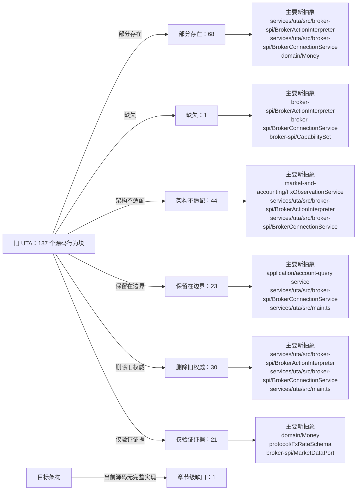

<!-- Auto-generated by scripts/uta-effect-runtime-map.mjs from mapping.json. Do not edit by hand. -->
<!-- Regenerate with `node scripts/uta-effect-runtime-map.mjs`. -->

# UTA 功能替代关系：第 16 章 Target source layout

目标架构原文：[`docs/uta-effect-runtime-architecture.md:1358-1379`](../uta-effect-runtime-architecture.md#L1358-L1379)。

## 结论

部分存在 68；缺失 1；架构不适配 44；保留在边界 23；删除旧权威 30；仅验证证据 21。状态只描述当前实现相对于目标架构的关系，不表示迁移已经落地。

## 替代关系图

## 章节级目标缺口

| 依据 | 目标义务 | 当前缺口 | 必须补充或调整 |
|---|---|---|---|
| docs/uta-effect-runtime-architecture.md:1302-1325; docs/uta-effect-runtime-architecture.md:1358-1375 | Canonical observability module destination | The module graph and chapter 13 require observability execution context, redaction, metrics, and operational views, but the chapter-16 source-layout table provides no observability/ row. | Add services/uta/src/observability/ as the canonical owner for ExecutionContext, ObservabilityRedactor, structured sinks/metrics, and operational-view instrumentation; keep domain and broker adapters dependent only on typed ports. |

## 源码映射

| 映射 ID | 当前源码 | 符号或行为块 | 当前功能 | 替代状态 | 新 UTA 抽象与做法 | 不适配位置与原因 | 必须补充或调整 | 重复索引 |
|---|---|---|---|---|---|---|---|---|
| `MAP-9AD9951502` | [`packages/uta-broker-alpaca/src/index.ts:1-1`](../../packages/uta-broker-alpaca/src/index.ts#L1-L1) | AlpacaBroker import | The release wrapper imports the concrete AlpacaBroker from services/uta/src/domain/trading/brokers/alpaca, binding the pack to the legacy domain/trading IBroker implementation rather than to a target brokers/alpaca interpreter. | 删除旧权威 | 3.7 brokers/<broker>/；9.1 Connection Layer；9.2 Typed action interpreter；16 Target source layout；17 Migration sequence / Slice 4: first real broker；19 Architectural prohibitions services/uta/src/brokers/alpaca/；services/uta/src/broker-spi/BrokerConnectionService；services/uta/src/broker-spi/BrokerActionInterpreter；services/uta/src/main.ts Remove the legacy import when the target pack contract becomes authoritative. Import the pack-local Alpaca adapter entrypoint under services/uta/src/brokers/alpaca instead, and expose a typed BrokerConnectionService Layer plus BrokerActionInterpreter descriptor for registration by services/uta/src/main.ts. The wrapper may assemble the adapter but must not own transaction state or kernel decisions. | The current import reaches the old domain/trading broker class, so the release module has no target connection Layer, typed action map, broker-spi failure channel, remote observation contract, or compensation capability to register. | Delete the legacy class dependency and move Alpaca SDK request/response schemas, error mapping, dispatch identity/idempotency, observation, and compensation compilation behind the target broker-spi adapter. Register that adapter only at the composition root; keep transaction-kernel ownership in the kernel. | **DUP-001** |
| `MAP-DA5BBE56B3` | [`packages/uta-broker-alpaca/src/index.ts:3-3`](../../packages/uta-broker-alpaca/src/index.ts#L3-L3) | BROKER_PACK_API_VERSION | Exports pack API version 1, which currently gates the legacy module shape whose createBroker returns an IBroker and whose companion exports are configSchema and BROKER_ENGINE. | 部分存在 | 3 Module graph and allowed dependencies；9 Broker service-provider interface；16 Target source layout；17 Migration sequence services/uta/src/broker-spi/BrokerConnectionService；services/uta/src/broker-spi/BrokerActionInterpreter；services/uta/src/main.ts Retain a versioned release boundary, but advance the pack API version for the target interpreter/connection descriptor contract. The loader and every wrapper must change together so a legacy IBroker pack cannot be accepted as a target adapter pack. | Leaving version 1 while changing the exported broker value would make the loader treat the legacy IBroker contract as compatible with the target broker-spi contract; the current version carries no target interpreter/Layer guarantee. | Define the next versioned pack entry contract around the target BrokerActionInterpreter and BrokerConnectionService Layer, update the pack loader's validation and all five wrappers atomically, and reject old module shapes rather than coercing them into the kernel. | **DUP-002** |
| `MAP-14D51E5BA4` | [`packages/uta-broker-alpaca/src/index.ts:4-4`](../../packages/uta-broker-alpaca/src/index.ts#L4-L4) | BROKER_ENGINE | Exports the stable Alpaca engine discriminator used by the release loader; this metadata does not itself dispatch broker effects or own transaction state. | 保留在边界 | 3 Module graph and allowed dependencies；16 Target source layout services/uta/src/main.ts；services/uta/src/broker-spi/BrokerConnectionService Retain the engine discriminator as pack and adapter identity metadata. The composition root may use it to select the Alpaca target adapter, but the discriminator must not be used as a generic registry of untyped broker objects or as a kernel dependency. | — | — | **DUP-003** |
| `MAP-607170E22C` | [`packages/uta-broker-alpaca/src/index.ts:5-5`](../../packages/uta-broker-alpaca/src/index.ts#L5-L5) | configSchema | Re-exports AlpacaBroker.configSchema from the legacy class, so the pack boundary validates the old brokerConfig shape but does not expose a target adapter descriptor or associate configuration with a scoped connection Layer and typed action interpreter. | 部分存在 | 3.7 brokers/<broker>/；9.1 Connection Layer；9.2 Typed action interpreter；9.4 Capability derivation；15 Security and authority；16 Target source layout services/uta/src/brokers/alpaca/；services/uta/src/broker-spi/BrokerConnectionService；services/uta/src/broker-spi/BrokerActionInterpreter Define the Alpaca connection/configuration schema beside the target adapter and export it through the versioned pack descriptor. Keep credential parsing at the trusted UTA boundary and provide separate target action, acknowledgement, observation, error, availability, and redacted-native-payload schemas through the interpreter rather than relying on a legacy class static. | The alias is coupled to the legacy implementation and only validates construction input; it does not prove the target action-type map, capability derivation, native boundary schemas, or credential-bearing scoped Layer required by chapters 3.7 and 9. | Move the Alpaca config schema to the target brokers/alpaca adapter, make its parsed output feed BrokerConnectionService construction, and add the typed BrokerActionInterpreter schemas and capability derivation required by the target pack contract without exposing SDK values to kernel or protocol types. | **DUP-004** |
| `MAP-6496594BF0` | [`packages/uta-broker-alpaca/src/index.ts:7-9`](../../packages/uta-broker-alpaca/src/index.ts#L7-L9) | createBroker | Accepts an id, optional label, and Record<string, unknown> brokerConfig; calls AlpacaBroker.fromConfig and uses Object.assign to add brokerEngine. The result is a legacy IBroker object, not an Effect Layer or typed broker-spi interpreter. | 架构不适配 | 3.7 brokers/<broker>/；4 Effect model；9.1 Connection Layer；9.2 Typed action interpreter；9.3 Remote outcome；9.4 Capability derivation；12.2 Unknown-outcome protocol；16 Target source layout；17 Migration sequence / Slice 4: first real broker；19 Architectural prohibitions services/uta/src/brokers/alpaca/；services/uta/src/broker-spi/BrokerConnectionService；services/uta/src/broker-spi/BrokerActionInterpreter；services/uta/src/broker-spi/RemoteOutcome；services/uta/src/durable-scheduler/；services/uta/src/main.ts Replace this legacy factory export with the target versioned pack entrypoint: validate the typed Alpaca configuration, return the adapter's scoped BrokerConnectionService Layer and action-specific BrokerActionInterpreter, and let main.ts register it for durable-scheduler dispatch. Dispatch must carry a DispatchIdentity, persist outcomes through the scheduler/journal path, and expose compensation compilation; no wrapper-created object may become transaction-kernel state. | The current factory performs immediate legacy object construction, erases configuration as Record<string, unknown>, adds an ad-hoc brokerEngine property, and supplies none of the target availability, dispatch, observation, unknown-outcome, idempotency, or compensation contracts. It therefore cannot satisfy the Alpaca typed-interpreter migration or crash-recovery protocol. | Implement and export the Alpaca target interpreter/connection descriptor, including native request compilation, typed broker failures, paper/live capability derivation, remote order observation, idempotency proof or reconcile-before-retry, and compensation programs. Register it through the composition root and durable scheduler; delete the old Alpaca dispatcher path once this adapter owns the account mutation. | **DUP-005** |
| `MAP-B40F4C1C42` | [`packages/uta-broker-ccxt/src/index.ts:1-1`](../../packages/uta-broker-ccxt/src/index.ts#L1-L1) | CcxtBroker import | The release wrapper imports the concrete CcxtBroker from services/uta/src/domain/trading/brokers/ccxt, binding the pack to the legacy domain/trading IBroker implementation rather than to a target brokers/ccxt interpreter. | 删除旧权威 | 3.7 brokers/<broker>/；9.1 Connection Layer；9.2 Typed action interpreter；16 Target source layout；17 Migration sequence / Slice 5: heterogeneous brokers；19 Architectural prohibitions services/uta/src/brokers/ccxt/；services/uta/src/broker-spi/BrokerConnectionService；services/uta/src/broker-spi/BrokerActionInterpreter；services/uta/src/main.ts Remove the legacy import when the target pack contract becomes authoritative. Import the pack-local CCXT adapter entrypoint under services/uta/src/brokers/ccxt instead, and expose a typed BrokerConnectionService Layer plus BrokerActionInterpreter descriptor for registration by services/uta/src/main.ts. The wrapper may assemble the adapter but must not own transaction state or kernel decisions. | The current import reaches the old domain/trading broker class, so the release module has no target connection Layer, typed action map, broker-spi failure channel, remote observation contract, or compensation capability to register. | Delete the legacy class dependency and move CCXT SDK request/response schemas, exchange error mapping, dispatch identity/idempotency, observation, and compensation compilation behind the target broker-spi adapter. Register that adapter only at the composition root; keep transaction-kernel ownership in the kernel. | **DUP-006** |
| `MAP-ACA4BDF989` | [`packages/uta-broker-ccxt/src/index.ts:3-3`](../../packages/uta-broker-ccxt/src/index.ts#L3-L3) | BROKER_PACK_API_VERSION | Exports pack API version 1, which currently gates the legacy module shape whose createBroker returns an IBroker and whose companion exports are configSchema and BROKER_ENGINE. | 部分存在 | 3 Module graph and allowed dependencies；9 Broker service-provider interface；16 Target source layout；17 Migration sequence services/uta/src/broker-spi/BrokerConnectionService；services/uta/src/broker-spi/BrokerActionInterpreter；services/uta/src/main.ts Retain a versioned release boundary, but advance the pack API version for the target interpreter/connection descriptor contract. The loader and every wrapper must change together so a legacy IBroker pack cannot be accepted as a target adapter pack. | Leaving version 1 while changing the exported broker value would make the loader treat the legacy IBroker contract as compatible with the target broker-spi contract; the current version carries no target interpreter/Layer guarantee. | Define the next versioned pack entry contract around the target BrokerActionInterpreter and BrokerConnectionService Layer, update the pack loader's validation and all five wrappers atomically, and reject old module shapes rather than coercing them into the kernel. | **DUP-007** |
| `MAP-B295179D05` | [`packages/uta-broker-ccxt/src/index.ts:4-4`](../../packages/uta-broker-ccxt/src/index.ts#L4-L4) | BROKER_ENGINE | Exports the stable CCXT engine discriminator used by the release loader; this metadata does not itself dispatch broker effects or own transaction state. | 保留在边界 | 3 Module graph and allowed dependencies；16 Target source layout services/uta/src/main.ts；services/uta/src/broker-spi/BrokerConnectionService Retain the engine discriminator as pack and adapter identity metadata. The composition root may use it to select the CCXT target adapter, but the discriminator must not be used as a generic registry of untyped broker objects or as a kernel dependency. | — | — | **DUP-008** |
| `MAP-F3151B31E7` | [`packages/uta-broker-ccxt/src/index.ts:5-5`](../../packages/uta-broker-ccxt/src/index.ts#L5-L5) | configSchema | Re-exports CcxtBroker.configSchema from the legacy class, so the pack boundary validates the old exchange/account configuration but does not expose a target adapter descriptor or associate configuration with a scoped connection Layer and typed action interpreter. | 部分存在 | 3.7 brokers/<broker>/；9.1 Connection Layer；9.2 Typed action interpreter；9.4 Capability derivation；15 Security and authority；16 Target source layout services/uta/src/brokers/ccxt/；services/uta/src/broker-spi/BrokerConnectionService；services/uta/src/broker-spi/BrokerActionInterpreter Define the CCXT connection/configuration schema beside the target adapter and export it through the versioned pack descriptor. Keep exchange credentials and keyless/public-data mode at the trusted UTA boundary, and provide separate target action, acknowledgement, observation, error, availability, and redacted-native-payload schemas through the interpreter rather than relying on a legacy class static. | The alias is coupled to the legacy implementation and only validates construction input; it does not prove the target action-type map, exchange/sub-account capability derivation, native boundary schemas, or credential-bearing scoped Layer required by chapters 3.7 and 9. | Move the CCXT config schema to the target brokers/ccxt adapter, make its parsed output feed BrokerConnectionService construction, and add capability derivation over exchange, sub-account or wallet, venue, instrument, and session context plus the typed BrokerActionInterpreter schemas. | **DUP-009** |
| `MAP-9D3DC42AC9` | [`packages/uta-broker-ccxt/src/index.ts:7-9`](../../packages/uta-broker-ccxt/src/index.ts#L7-L9) | createBroker | Accepts an id, optional label, and Record<string, unknown> brokerConfig; calls CcxtBroker.fromConfig and uses Object.assign to add brokerEngine. The result is a legacy IBroker object, not an Effect Layer or typed broker-spi interpreter. | 架构不适配 | 3.7 brokers/<broker>/；4 Effect model；9.1 Connection Layer；9.2 Typed action interpreter；9.3 Remote outcome；9.4 Capability derivation；12.2 Unknown-outcome protocol；16 Target source layout；17 Migration sequence / Slice 5: heterogeneous brokers；19 Architectural prohibitions services/uta/src/brokers/ccxt/；services/uta/src/broker-spi/BrokerConnectionService；services/uta/src/broker-spi/BrokerActionInterpreter；services/uta/src/broker-spi/RemoteOutcome；services/uta/src/durable-scheduler/；services/uta/src/main.ts Replace this legacy factory export with the target versioned pack entrypoint: validate typed CCXT configuration, return the adapter's scoped BrokerConnectionService Layer and action-specific BrokerActionInterpreter, and let main.ts register it for durable-scheduler dispatch. Dispatch must carry a DispatchIdentity, persist outcomes through the scheduler/journal path, and expose compensation compilation; no wrapper-created object may become transaction-kernel state. | The current factory performs immediate legacy object construction, erases configuration as Record<string, unknown>, adds an ad-hoc brokerEngine property, and supplies none of the target availability, dispatch, observation, unknown-outcome, idempotency, or compensation contracts. It cannot prove CCXT sub-account or venue-specific capability derivation. | Implement and export the CCXT target interpreter/connection descriptor, including exchange-native request compilation, typed broker failures, sub-account or wallet capability derivation, remote order/position observation, idempotency proof or reconcile-before-retry, and compensation programs. Register it through the composition root and durable scheduler; delete the old CCXT dispatcher path once this adapter owns account mutations. | **DUP-010** |
| `MAP-1E5FD0A690` | [`packages/uta-broker-ibkr/src/index.ts:1-1`](../../packages/uta-broker-ibkr/src/index.ts#L1-L1) | IbkrBroker import | The release wrapper imports the concrete IbkrBroker from services/uta/src/domain/trading/brokers/ibkr, binding the pack to the legacy domain/trading IBroker implementation rather than to a target brokers/ibkr interpreter. | 删除旧权威 | 3.7 brokers/<broker>/；9.1 Connection Layer；9.2 Typed action interpreter；16 Target source layout；17 Migration sequence / Slice 5: heterogeneous brokers；19 Architectural prohibitions services/uta/src/brokers/ibkr/；services/uta/src/broker-spi/BrokerConnectionService；services/uta/src/broker-spi/BrokerActionInterpreter；services/uta/src/main.ts Remove the legacy import when the target pack contract becomes authoritative. Import the pack-local IBKR adapter entrypoint under services/uta/src/brokers/ibkr instead, and expose a typed BrokerConnectionService Layer plus BrokerActionInterpreter descriptor for registration by services/uta/src/main.ts. The wrapper may assemble the adapter but must not own transaction state or kernel decisions. | The current import reaches the old domain/trading broker class, so the release module has no target connection Layer, typed action map, broker-spi failure channel, remote observation contract, or compensation capability to register. | Delete the legacy class dependency and move IBKR SDK request/response schemas, callback/connection error mapping, dispatch identity/idempotency, observation, and compensation compilation behind the target broker-spi adapter. Register that adapter only at the composition root; keep transaction-kernel ownership in the kernel. | **DUP-011** |
| `MAP-AB521AFE64` | [`packages/uta-broker-ibkr/src/index.ts:3-3`](../../packages/uta-broker-ibkr/src/index.ts#L3-L3) | BROKER_PACK_API_VERSION | Exports pack API version 1, which currently gates the legacy module shape whose createBroker returns an IBroker and whose companion exports are configSchema and BROKER_ENGINE. | 部分存在 | 3 Module graph and allowed dependencies；9 Broker service-provider interface；16 Target source layout；17 Migration sequence services/uta/src/broker-spi/BrokerConnectionService；services/uta/src/broker-spi/BrokerActionInterpreter；services/uta/src/main.ts Retain a versioned release boundary, but advance the pack API version for the target interpreter/connection descriptor contract. The loader and every wrapper must change together so a legacy IBroker pack cannot be accepted as a target adapter pack. | Leaving version 1 while changing the exported broker value would make the loader treat the legacy IBroker contract as compatible with the target broker-spi contract; the current version carries no target interpreter/Layer guarantee. | Define the next versioned pack entry contract around the target BrokerActionInterpreter and BrokerConnectionService Layer, update the pack loader's validation and all five wrappers atomically, and reject old module shapes rather than coercing them into the kernel. | **DUP-012** |
| `MAP-55E14D3598` | [`packages/uta-broker-ibkr/src/index.ts:4-4`](../../packages/uta-broker-ibkr/src/index.ts#L4-L4) | BROKER_ENGINE | Exports the stable IBKR engine discriminator used by the release loader; this metadata does not itself dispatch broker effects or own transaction state. | 保留在边界 | 3 Module graph and allowed dependencies；16 Target source layout services/uta/src/main.ts；services/uta/src/broker-spi/BrokerConnectionService Retain the engine discriminator as pack and adapter identity metadata. The composition root may use it to select the IBKR target adapter, but the discriminator must not be used as a generic registry of untyped broker objects or as a kernel dependency. | — | — | **DUP-013** |
| `MAP-C4C40BAECB` | [`packages/uta-broker-ibkr/src/index.ts:5-5`](../../packages/uta-broker-ibkr/src/index.ts#L5-L5) | configSchema | Re-exports IbkrBroker.configSchema from the legacy class, so the pack boundary validates the old host/port/client configuration but does not expose a target adapter descriptor or associate configuration with a scoped connection Layer and typed action interpreter. | 部分存在 | 3.7 brokers/<broker>/；9.1 Connection Layer；9.2 Typed action interpreter；9.4 Capability derivation；15 Security and authority；16 Target source layout services/uta/src/brokers/ibkr/；services/uta/src/broker-spi/BrokerConnectionService；services/uta/src/broker-spi/BrokerActionInterpreter Define the IBKR connection/configuration schema beside the target adapter and export it through the versioned pack descriptor. Keep endpoint credentials and account identity at the trusted UTA boundary, and provide separate target action, acknowledgement, observation, error, availability, and redacted-native-payload schemas through the interpreter rather than relying on a legacy class static. | The alias is coupled to the legacy implementation and only validates construction input; it does not prove the target action-type map, callback stream/linked-account identity, native boundary schemas, or credential-bearing scoped Layer required by chapters 3.7 and 9. | Move the IBKR config schema to the target brokers/ibkr adapter, make its parsed output feed BrokerConnectionService construction, and add capability derivation plus callback/observation schemas for linked accounts and native order identities through BrokerActionInterpreter. | **DUP-014** |
| `MAP-3392948A39` | [`packages/uta-broker-ibkr/src/index.ts:7-9`](../../packages/uta-broker-ibkr/src/index.ts#L7-L9) | createBroker | Accepts an id, optional label, and Record<string, unknown> brokerConfig; calls IbkrBroker.fromConfig and uses Object.assign to add brokerEngine. The result is a legacy IBroker object, not an Effect Layer or typed broker-spi interpreter. | 架构不适配 | 3.7 brokers/<broker>/；4 Effect model；9.1 Connection Layer；9.2 Typed action interpreter；9.3 Remote outcome；9.4 Capability derivation；12.2 Unknown-outcome protocol；16 Target source layout；17 Migration sequence / Slice 5: heterogeneous brokers；19 Architectural prohibitions services/uta/src/brokers/ibkr/；services/uta/src/broker-spi/BrokerConnectionService；services/uta/src/broker-spi/BrokerActionInterpreter；services/uta/src/broker-spi/RemoteOutcome；services/uta/src/durable-scheduler/；services/uta/src/main.ts Replace this legacy factory export with the target versioned pack entrypoint: validate typed IBKR configuration, return the adapter's scoped BrokerConnectionService Layer and action-specific BrokerActionInterpreter, and let main.ts register it for durable-scheduler dispatch. Dispatch must carry a DispatchIdentity, persist outcomes through the scheduler/journal path, and expose compensation compilation; no wrapper-created object may become transaction-kernel state. | The current factory performs immediate legacy object construction, erases configuration as Record<string, unknown>, adds an ad-hoc brokerEngine property, and supplies none of the target availability, dispatch, observation, unknown-outcome, idempotency, or compensation contracts. It cannot represent IBKR callback-stream health or linked-account identity in the target SPI. | Implement and export the IBKR target interpreter/connection descriptor, including scoped callback streams, linked-account and native-order identity, typed broker failures, remote observation, idempotency proof or reconcile-before-retry, and compensation programs. Register it through the composition root and durable scheduler; delete the old IBKR dispatcher path once this adapter owns account mutations. | **DUP-015** |
| `MAP-AE59785B88` | [`packages/uta-broker-leverup/src/index.ts:1-1`](../../packages/uta-broker-leverup/src/index.ts#L1-L1) | LeverupBroker import | The release wrapper imports the concrete LeverupBroker from services/uta/src/domain/trading/brokers/others/leverup, binding the pack to the legacy domain/trading IBroker implementation rather than to a target brokers/leverup interpreter. | 删除旧权威 | 3.7 brokers/<broker>/；9.1 Connection Layer；9.2 Typed action interpreter；16 Target source layout；17 Migration sequence / Slice 5: heterogeneous brokers；19 Architectural prohibitions services/uta/src/brokers/leverup/；services/uta/src/broker-spi/BrokerConnectionService；services/uta/src/broker-spi/BrokerActionInterpreter；services/uta/src/main.ts Remove the legacy import when the target pack contract becomes authoritative. Import the pack-local LeverUp adapter entrypoint under services/uta/src/brokers/leverup instead, and expose a typed BrokerConnectionService Layer plus BrokerActionInterpreter descriptor for registration by services/uta/src/main.ts. The wrapper may assemble the adapter but must not own transaction state or kernel decisions. | The current import reaches the old domain/trading broker class, so the release module has no target connection Layer, typed action map, broker-spi failure channel, remote observation contract, or compensation capability to register. | Delete the legacy class dependency and move LeverUp SDK/relayer request and response schemas, relayer error mapping, dispatch identity/idempotency, observation, and compensation compilation behind the target broker-spi adapter. Register that adapter only at the composition root; keep transaction-kernel ownership in the kernel. | **DUP-016** |
| `MAP-1B0FB784F5` | [`packages/uta-broker-leverup/src/index.ts:3-3`](../../packages/uta-broker-leverup/src/index.ts#L3-L3) | BROKER_PACK_API_VERSION | Exports pack API version 1, which currently gates the legacy module shape whose createBroker returns an IBroker and whose companion exports are configSchema and BROKER_ENGINE. | 部分存在 | 3 Module graph and allowed dependencies；9 Broker service-provider interface；16 Target source layout；17 Migration sequence services/uta/src/broker-spi/BrokerConnectionService；services/uta/src/broker-spi/BrokerActionInterpreter；services/uta/src/main.ts Retain a versioned release boundary, but advance the pack API version for the target interpreter/connection descriptor contract. The loader and every wrapper must change together so a legacy IBroker pack cannot be accepted as a target adapter pack. | Leaving version 1 while changing the exported broker value would make the loader treat the legacy IBroker contract as compatible with the target broker-spi contract; the current version carries no target interpreter/Layer guarantee. | Define the next versioned pack entry contract around the target BrokerActionInterpreter and BrokerConnectionService Layer, update the pack loader's validation and all five wrappers atomically, and reject old module shapes rather than coercing them into the kernel. | **DUP-017** |
| `MAP-D5792AEA38` | [`packages/uta-broker-leverup/src/index.ts:4-4`](../../packages/uta-broker-leverup/src/index.ts#L4-L4) | BROKER_ENGINE | Exports the stable LeverUp engine discriminator used by the release loader; this metadata does not itself dispatch broker effects or own transaction state. | 保留在边界 | 3 Module graph and allowed dependencies；16 Target source layout services/uta/src/main.ts；services/uta/src/broker-spi/BrokerConnectionService Retain the engine discriminator as pack and adapter identity metadata. The composition root may use it to select the LeverUp target adapter, but the discriminator must not be used as a generic registry of untyped broker objects or as a kernel dependency. | — | — | **DUP-018** |
| `MAP-2564A889E7` | [`packages/uta-broker-leverup/src/index.ts:5-5`](../../packages/uta-broker-leverup/src/index.ts#L5-L5) | configSchema | Re-exports LeverupBroker.configSchema from the legacy class, so the pack boundary validates the old network/private-key configuration but does not expose a target adapter descriptor or associate configuration with a scoped connection Layer and typed action interpreter. | 部分存在 | 3.7 brokers/<broker>/；9.1 Connection Layer；9.2 Typed action interpreter；9.4 Capability derivation；15 Security and authority；16 Target source layout services/uta/src/brokers/leverup/；services/uta/src/broker-spi/BrokerConnectionService；services/uta/src/broker-spi/BrokerActionInterpreter Define the LeverUp connection/configuration schema beside the target adapter and export it through the versioned pack descriptor. Keep private-key handling inside the UTA credential boundary and scoped connection/relayer Layer, and provide separate target action, acknowledgement, observation, error, availability, and redacted-native-payload schemas through the interpreter rather than relying on a legacy class static. | The alias is coupled to the legacy implementation and only validates construction input; it does not prove the target action-type map, relayer capability derivation, native boundary schemas, or credential-bearing scoped Layer required by chapters 3.7 and 9. | Move the LeverUp config schema to the target brokers/leverup adapter, make its parsed output feed BrokerConnectionService and relayer construction, and add capability derivation plus typed BrokerActionInterpreter schemas for network, instrument, relayer, and market-session availability. | **DUP-019** |
| `MAP-50C8158380` | [`packages/uta-broker-leverup/src/index.ts:7-9`](../../packages/uta-broker-leverup/src/index.ts#L7-L9) | createBroker | Accepts an id, optional label, and Record<string, unknown> brokerConfig; calls LeverupBroker.fromConfig and uses Object.assign to add brokerEngine. The result is a legacy IBroker object, not an Effect Layer or typed broker-spi interpreter. | 架构不适配 | 3.7 brokers/<broker>/；4 Effect model；9.1 Connection Layer；9.2 Typed action interpreter；9.3 Remote outcome；9.4 Capability derivation；12.2 Unknown-outcome protocol；16 Target source layout；17 Migration sequence / Slice 5: heterogeneous brokers；19 Architectural prohibitions services/uta/src/brokers/leverup/；services/uta/src/broker-spi/BrokerConnectionService；services/uta/src/broker-spi/BrokerActionInterpreter；services/uta/src/broker-spi/RemoteOutcome；services/uta/src/durable-scheduler/；services/uta/src/main.ts Replace this legacy factory export with the target versioned pack entrypoint: validate typed LeverUp configuration, return the adapter's scoped BrokerConnectionService/relayer Layer and action-specific BrokerActionInterpreter, and let main.ts register it for durable-scheduler dispatch. Dispatch must carry a DispatchIdentity, persist outcomes through the scheduler/journal path, and expose compensation compilation; no wrapper-created object may become transaction-kernel state. | The current factory performs immediate legacy object construction, erases configuration as Record<string, unknown>, adds an ad-hoc brokerEngine property, and supplies none of the target availability, dispatch, observation, unknown-outcome, idempotency, or compensation contracts. It cannot reconcile a relayer-accepted mutation after a lost process or network boundary. | Implement and export the LeverUp target interpreter/connection descriptor, including relayer-native request compilation, typed relayer failures, dispatch identity, explicit observation/reconciliation after timeout, capability derivation, idempotency proof or reconcile-before-retry, and compensation programs. Register it through the composition root and durable scheduler; delete the old LeverUp dispatcher path once this adapter owns account mutations. | **DUP-020** |
| `MAP-75B61EBF36` | [`packages/uta-broker-longbridge/src/index.ts:1-1`](../../packages/uta-broker-longbridge/src/index.ts#L1-L1) | LongbridgeBroker import | The release wrapper imports the concrete LongbridgeBroker from services/uta/src/domain/trading/brokers/longbridge, binding the pack to the legacy domain/trading IBroker implementation rather than to a target brokers/longbridge interpreter. | 删除旧权威 | 3.7 brokers/<broker>/；9.1 Connection Layer；9.2 Typed action interpreter；16 Target source layout；17 Migration sequence / Slice 5: heterogeneous brokers；19 Architectural prohibitions services/uta/src/brokers/longbridge/；services/uta/src/broker-spi/BrokerConnectionService；services/uta/src/broker-spi/BrokerActionInterpreter；services/uta/src/main.ts Remove the legacy import when the target pack contract becomes authoritative. Import the pack-local Longbridge adapter entrypoint under services/uta/src/brokers/longbridge instead, and expose a typed BrokerConnectionService Layer plus BrokerActionInterpreter descriptor for registration by services/uta/src/main.ts. The wrapper may assemble the adapter but must not own transaction state or kernel decisions. | The current import reaches the old domain/trading broker class, so the release module has no target connection Layer, typed action map, broker-spi failure channel, remote observation contract, or compensation capability to register. | Delete the legacy class dependency and move Longbridge SDK request/response schemas, jurisdiction/currency-aware error mapping, dispatch identity/idempotency, observation, and compensation compilation behind the target broker-spi adapter. Register that adapter only at the composition root; keep transaction-kernel ownership in the kernel. | **DUP-021** |
| `MAP-F093E8F942` | [`packages/uta-broker-longbridge/src/index.ts:3-3`](../../packages/uta-broker-longbridge/src/index.ts#L3-L3) | BROKER_PACK_API_VERSION | Exports pack API version 1, which currently gates the legacy module shape whose createBroker returns an IBroker and whose companion exports are configSchema and BROKER_ENGINE. | 部分存在 | 3 Module graph and allowed dependencies；9 Broker service-provider interface；16 Target source layout；17 Migration sequence services/uta/src/broker-spi/BrokerConnectionService；services/uta/src/broker-spi/BrokerActionInterpreter；services/uta/src/main.ts Retain a versioned release boundary, but advance the pack API version for the target interpreter/connection descriptor contract. The loader and every wrapper must change together so a legacy IBroker pack cannot be accepted as a target adapter pack. | Leaving version 1 while changing the exported broker value would make the loader treat the legacy IBroker contract as compatible with the target broker-spi contract; the current version carries no target interpreter/Layer guarantee. | Define the next versioned pack entry contract around the target BrokerActionInterpreter and BrokerConnectionService Layer, update the pack loader's validation and all five wrappers atomically, and reject old module shapes rather than coercing them into the kernel. | **DUP-022** |
| `MAP-E89067CA5C` | [`packages/uta-broker-longbridge/src/index.ts:4-4`](../../packages/uta-broker-longbridge/src/index.ts#L4-L4) | BROKER_ENGINE | Exports the stable Longbridge engine discriminator used by the release loader; this metadata does not itself dispatch broker effects or own transaction state. | 保留在边界 | 3 Module graph and allowed dependencies；16 Target source layout services/uta/src/main.ts；services/uta/src/broker-spi/BrokerConnectionService Retain the engine discriminator as pack and adapter identity metadata. The composition root may use it to select the Longbridge target adapter, but the discriminator must not be used as a generic registry of untyped broker objects or as a kernel dependency. | — | — | **DUP-023** |
| `MAP-1986FE3044` | [`packages/uta-broker-longbridge/src/index.ts:5-5`](../../packages/uta-broker-longbridge/src/index.ts#L5-L5) | configSchema | Re-exports LongbridgeBroker.configSchema from the legacy class, so the pack boundary validates the old app-key/app-secret/access-token configuration but does not expose a target adapter descriptor or associate configuration with a scoped connection Layer and typed action interpreter. | 部分存在 | 3.7 brokers/<broker>/；9.1 Connection Layer；9.2 Typed action interpreter；9.4 Capability derivation；15 Security and authority；16 Target source layout services/uta/src/brokers/longbridge/；services/uta/src/broker-spi/BrokerConnectionService；services/uta/src/broker-spi/BrokerActionInterpreter；services/uta/src/market-and-accounting/ Define the Longbridge connection/configuration schema beside the target adapter and export it through the versioned pack descriptor. Keep credentials inside the UTA-owned scoped Layer, and provide separate target action, acknowledgement, observation, error, availability, jurisdiction, currency, and redacted-native-payload schemas through the interpreter rather than relying on a legacy class static. | The alias is coupled to the legacy implementation and only validates construction input; it does not prove the target action-type map, jurisdiction/currency capability derivation, native boundary schemas, or credential-bearing scoped Layer required by chapters 3.7 and 9. | Move the Longbridge config schema to the target brokers/longbridge adapter, make its parsed output feed BrokerConnectionService construction, and connect the adapter's account/market/jurisdiction metadata to market-and-accounting while keeping typed BrokerActionInterpreter schemas at the broker boundary. | **DUP-024** |
| `MAP-E52D407CDC` | [`packages/uta-broker-longbridge/src/index.ts:7-9`](../../packages/uta-broker-longbridge/src/index.ts#L7-L9) | createBroker | Accepts an id, optional label, and Record<string, unknown> brokerConfig; calls LongbridgeBroker.fromConfig and uses Object.assign to add brokerEngine. The result is a legacy IBroker object, not an Effect Layer or typed broker-spi interpreter. | 架构不适配 | 3.7 brokers/<broker>/；4 Effect model；9.1 Connection Layer；9.2 Typed action interpreter；9.3 Remote outcome；9.4 Capability derivation；12.2 Unknown-outcome protocol；16 Target source layout；17 Migration sequence / Slice 5: heterogeneous brokers；19 Architectural prohibitions services/uta/src/brokers/longbridge/；services/uta/src/broker-spi/BrokerConnectionService；services/uta/src/broker-spi/BrokerActionInterpreter；services/uta/src/broker-spi/RemoteOutcome；services/uta/src/durable-scheduler/；services/uta/src/market-and-accounting/；services/uta/src/main.ts Replace this legacy factory export with the target versioned pack entrypoint: validate typed Longbridge configuration, return the adapter's scoped BrokerConnectionService Layer and action-specific BrokerActionInterpreter, and let main.ts register it for durable-scheduler dispatch. Dispatch must carry a DispatchIdentity, persist outcomes through the scheduler/journal path, and expose compensation compilation; no wrapper-created object may become transaction-kernel state. | The current factory performs immediate legacy object construction, erases configuration as Record<string, unknown>, adds an ad-hoc brokerEngine property, and supplies none of the target availability, dispatch, observation, unknown-outcome, idempotency, or compensation contracts. It cannot express Longbridge's jurisdiction and currency boundaries as typed broker/market observations. | Implement and export the Longbridge target interpreter/connection descriptor, including native request compilation, typed broker failures, account and jurisdiction metadata, currency-qualified observations, remote order/exposure reconciliation, idempotency proof or reconcile-before-retry, and compensation programs. Register it through the composition root and durable scheduler; delete the old Longbridge dispatcher path once this adapter owns account mutations. | **DUP-025** |
| `MAP-168095825B` | [`services/uta/src/domain/trading/brokers/alpaca/alpaca-contracts.ts:1-11`](../../services/uta/src/domain/trading/brokers/alpaca/alpaca-contracts.ts#L1-L11) | legacy contract helper imports | Documents pure contract helpers but imports IBKR Contract/OrderState, a contract extension side effect, and the legacy contract builder. | 架构不适配 | §3.1 domain/；§3.7 brokers/<broker>；§5.7 Nominal identities and financial values；§9.2 Typed action interpreter；§10.2 Market and jurisdiction owns；§16 Target source layout；§17 Slice 4: first real broker InstrumentId；AlpacaInstrumentResolver；AlpacaActionInterpreter；OrderSnapshot Replace compatibility Contract/OrderState construction with domain InstrumentId and broker-spi native identity/request/observation schemas. Keep any legacy mapper outside the interpreter as an explicit projection. | The supposedly pure helper module depends on mutable compatibility classes and a side-effect extension, so its outputs are not target domain ADTs. | Split pure domain identity/timeframe functions from Alpaca native codecs; remove contract-ext and IBKR objects from the target execution path. | **DUP-259** |
| `MAP-ADF2C4D82C` | [`services/uta/src/domain/trading/brokers/alpaca/alpaca-types.ts:1-7`](../../services/uta/src/domain/trading/brokers/alpaca/alpaca-types.ts#L1-L7) | AlpacaBrokerConfig | Defines a plain configuration record with optional id/label, raw apiKey/secretKey strings, and a paper boolean. | 部分存在 | §3.7 brokers/<broker>；§9.1 Connection Layer；§15 Security and authority；§16 Target source layout SecretReference；BrokerConnectionIdentity；AlpacaConnectionLayer；AccountId Keep a non-secret connection configuration shape at the boundary, inject credentials from UTA's sealed secret path into a scoped Layer, and model account/mode/jurisdiction as typed identity fields. | The type carries credential material directly and has no secret reference, connection identity, account jurisdiction, or capability context. | Replace raw key fields in internal execution types with a secret reference/injected credential service and add branded connection/account identity. | **DUP-265** |
| `MAP-262317C16D` | [`services/uta/src/domain/trading/brokers/alpaca/AlpacaBroker.ts:14-29`](../../services/uta/src/domain/trading/brokers/alpaca/AlpacaBroker.ts#L14-L29) | Legacy IBKR facade imports | The adapter's public behavior is built on @traderalice/ibkr Contract, Order, OrderState, ContractDetails, and the legacy IBroker, PlaceOrderResult, OpenOrder, Position, Quote, and AccountInfo types. | 架构不适配 | §3.1 domain/；§3.7 brokers/<broker>；§5.7 Complete type contract；§9.2 Typed action interpreter；§16 Target source layout；§17 Slice 4: first real broker TradeAction；BrokerActionTypeMap；PreparedStep；AlpacaActionInterpreter；BrokerConnectionService Replace the legacy IBroker facade with an Alpaca broker-spi interpreter whose typed ports consume TradeAction variants and return action-specific acknowledgements, observations, and failures. Keep IBKR compatibility only in an explicit compatibility projection, if a current public contract still requires it. | The adapter accepts legacy mutable classes and generic result objects instead of the closed action/result/error/observation relationships required by the target SPI. | Introduce AlpacaActionInterpreter implementations for PlaceOrder, ModifyOrder, CancelOrder, and ClosePosition over domain ADTs; migrate callers to BrokerActionTypeMap and remove these legacy write/query types from the execution path. | **DUP-293** |
| `MAP-BB249EB32E` | [`services/uta/src/domain/trading/brokers/alpaca/AlpacaBroker.ts:30-42`](../../services/uta/src/domain/trading/brokers/alpaca/AlpacaBroker.ts#L30-L42) | Legacy contract extension and helper imports | The file side-effect imports contract-ext.js and obtains makeContract, buildPosition, and fuzzyRankContracts from the legacy broker/contract layer. | 架构不适配 | §3.1 domain/；§3.7 brokers/<broker>；§5.7 Nominal identities and financial values；§9.2 Typed action interpreter；§10.1 Accounting owns；§16 Target source layout；§17 Slice 4: first real broker InstrumentId；AlpacaInstrumentResolver；PositionObservation；AlpacaActionInterpreter Move symbol/instrument identity into typed domain constructors and make Alpaca-specific request/response conversion local to the adapter. Emit accounting observations through the target projection boundary instead of constructing compatibility Contract and Position objects in the execution path. | A side-effectful IBKR extension and legacy contract builder couple the adapter to compatibility objects; no branded InstrumentId or typed accounting observation crosses the boundary. | Replace contract-ext/buildPosition dependencies with validated InstrumentId/PositionObservation schemas and an Alpaca native request compiler; retain a separate compatibility mapper only if required by the public projection. | **DUP-294** |
| `MAP-36636F09DE` | [`services/uta/src/domain/trading/brokers/alpaca/AlpacaBroker.ts:101-125`](../../services/uta/src/domain/trading/brokers/alpaca/AlpacaBroker.ts#L101-L125) | AlpacaBroker static registration and fromConfig | Defines a class-level Zod config schema/configFields and constructs the broker from a generic brokerConfig record, translating apiSecret to the instance's secretKey or an empty string. | 部分存在 | §3.7 brokers/<broker>；§9.1 Connection Layer；§9.4 Capability derivation；§15 Security and authority；§16 Target source layout AlpacaConnectionLayer；BrokerConnectionIdentity；SecretReference；CapabilitySet Use Zod only at the configuration boundary, then construct a scoped AlpacaConnectionLayer from a secret reference supplied by UTA's credential path. Expose a typed BrokerConnectionIdentity and capability service rather than a generic class factory as the execution authority. | Configuration is accepted as plain strings and tied to a legacy class; the target requires UTA-only credential custody, scoped connection construction, and typed connection/capability services. | Replace fromConfig's raw credential materialization with secret-store injection into a Layer, validate account/mode identity, and register the Alpaca interpreter/capabilities through the broker-spi composition root. | **DUP-299** |
| `MAP-CBE13E6174` | [`services/uta/src/domain/trading/brokers/alpaca/index.ts:1-2`](../../services/uta/src/domain/trading/brokers/alpaca/index.ts#L1-L2) | Alpaca broker barrel | Exports the legacy AlpacaBroker class and AlpacaBrokerConfig type only; no scoped connection Layer, typed interpreter, capability service, native schemas, or recovery hooks are exported. | 删除旧权威 | §3.7 brokers/<broker>；§9.1 Connection Layer；§9.2 Typed action interpreter；§9.4 Capability derivation；§16 Target source layout；§17 Slice 4: first real broker AlpacaConnectionLayer；AlpacaActionInterpreter；CapabilitySet；AlpacaNativeSchemas；effect-runtime/main composition loader Replace the legacy class/config barrel with the Alpaca broker pack entry exporting a scoped connection Layer, action interpreters, capability derivation, native boundary schemas, and observation/reconciliation services. The new pack becomes the Slice 4 authority before the old dispatcher export is removed. | The barrel exposes only the pre-kernel IBroker implementation, so the composition root cannot acquire the target SPI services or typed recovery behavior. | Export Alpaca-owned connection, interpreter, capability, and native codec modules. Register/compose broker packs only in effect-runtime/main; remove the legacy AlpacaBroker barrel authority after Slice 4 cutover. | **DUP-324** |
| `MAP-434A149C16` | [`services/uta/src/domain/trading/brokers/ccxt/ccxt-types.ts:1-29`](../../services/uta/src/domain/trading/brokers/ccxt/ccxt-types.ts#L1-L29) | CcxtBrokerConfig and credential field union | Defines optional id/label, required exchange and sandbox, optional keyless/demo/options, and ten optional credential fields with a tuple-derived credential-name union. | 架构不适配 | 9.1 Connection Layer；14 Public protocol；15 Security and authority；16 Target source layout；3.7 brokers/<broker>/ protocol/CcxtConnectionConfig；brokers/ccxt/ConnectionLayer；domain/CredentialReference；domain/CapabilityFailure Use a versioned runtime schema with refined venue/account mode and credential references; keep secret material outside the trading database and public protocol. | The config is optional-field credential soup with raw options and no account/jurisdiction/permission model; `secret` values are accepted directly instead of a target credential reference. | Replace the interface with decoded connection requirements and sealed credential handles, validate mode combinations, and keep credentials in the configured secret path. | **DUP-342** |
| `MAP-8240582100` | [`services/uta/src/domain/trading/brokers/ccxt/CcxtBroker.ts:1-54`](../../services/uta/src/domain/trading/brokers/ccxt/CcxtBroker.ts#L1-L54) | CcxtBroker imports and legacy IBroker surface | Imports CCXT Exchange, Order, and Position SDK types and implements the generic IBroker surface through Contract, OrderState, PlaceOrderResult, and the exchange override registry. | 删除旧权威 | 3.7 brokers/<broker>；9.2 Typed action interpreter；17 Migration sequence；19 Architectural prohibitions brokers/ccxt/CcxtInterpreter；broker-spi/BrokerActionInterpreter；domain/TradeAction；transaction-kernel/TransactionCoordinator Replace the generic IBroker class with a CCXT interpreter that accepts typed domain actions and returns typed acknowledgements, observations, failures, and compensation programs; keep CCXT SDK imports confined to that adapter. | The current class is the legacy execution owner and its method/result types are not the broker SPI action contract; SDK and IBroker concepts are coupled to the facade. | Delete this execution surface after CcxtInterpreter and the transaction-kernel scheduler path are authoritative, retaining only adapter-local SDK translation. | **DUP-377** |
| `MAP-13B658BD72` | [`services/uta/src/domain/trading/brokers/ccxt/CcxtBroker.ts:163-215`](../../services/uta/src/domain/trading/brokers/ccxt/CcxtBroker.ts#L163-L215) | CcxtBroker.configSchema, configFields, and fromConfig | Uses Zod to parse exchange, sandbox, demoTrading, options, and optional credential aliases, then constructs CcxtBroker while reading keyless from the unparsed brokerConfig record. | 部分存在 | 9.1 Connection Layer；14 Public protocol；15 Security and authority；16 Target source layout protocol/CcxtConnectionConfig；brokers/ccxt/ConnectionLayer；application/AccountService；domain/CredentialRequirement Decode a closed, versioned CCXT connection configuration at the transport/application boundary and pass a refined account connection requirement to a scoped adapter Layer. | The config has optional credential soup, raw options, legacy apiSecret handling, and an untyped keyless escape through Record<string, unknown>; it is not a target connection/capability schema. | Create a named runtime schema for venue, account mode, credential references, sandbox/demo compatibility, and adapter options; reject unknown or contradictory modes before Layer acquisition. | **DUP-382** |
| `MAP-373EFE107B` | [`services/uta/src/domain/trading/brokers/ccxt/index.ts:1-3`](../../services/uta/src/domain/trading/brokers/ccxt/index.ts#L1-L3) | CCXT barrel exports | Re-exports CcxtBroker, createCcxtProviderTools, and CcxtBrokerConfig/CcxtMarket from the legacy domain trading path. | 部分存在 | 3.7 brokers/<broker>；14 Public protocol；16 Target source layout；17 Migration sequence brokers/ccxt/CcxtInterpreter；market-and-accounting/market data query service；protocol/CcxtConnectionConfig Replace the barrel with target CCXT interpreter, connection, market-data, and protocol exports while removing legacy IBroker/tool exports once migration is authoritative. | The public barrel makes the legacy CcxtBroker and unbranded CcxtMarket/config part of the current import surface; it does not expose target SPI/application boundaries. | Migrate callers to target modules, then delete legacy exports and retain only explicit compatibility projections required by a current protocol. | **DUP-436** |
| `MAP-5CC2CA6EF1` | [`services/uta/src/domain/trading/brokers/ccxt/overrides.ts:1-30`](../../services/uta/src/domain/trading/brokers/ccxt/overrides.ts#L1-L30) | override module registry imports and extension policy | Documents a default-plus-override convention and imports Bitget, Bybit, and Hyperliquid adapter objects into a shared registry module. | 部分存在 | 3.7 brokers/<broker>；9.2 Typed action interpreter；16 Target source layout；17 Migration sequence brokers/ccxt/CcxtInterpreter；broker-spi/BrokerActionInterpreter；broker-spi/CapabilitySet Retain a CCXT adapter composition point but make each registered venue implementation a typed interpreter/connection Layer rather than a generic override bag. | The registry is an adapter-local extension mechanism, but its contract is still defined by legacy CcxtBroker methods and SDK values. | Move registration to a typed CCXT interpreter registry keyed by action contracts and connection identity; keep venue-specific code out of the transaction kernel. | **DUP-437** |
| `MAP-AB05DEE8D4` | [`services/uta/src/domain/trading/brokers/ccxt/overrides.ts:215-234`](../../services/uta/src/domain/trading/brokers/ccxt/overrides.ts#L215-L234) | exchangeOverrides registry and Binance sub-account declaration | Registers Binance spot and derivatives wallet types, Bitget, Bybit, and Hyperliquid overrides in a string-keyed Record; Binance merges future and delivery reads conceptually through the shared broker. | 部分存在 | 9.4 Capability derivation；10.1 Accounting owns；12.1 Startup sequence；16 Target source layout brokers/ccxt/CapabilityDerivation；broker-spi/AccountMetadata；market-and-accounting/AccountingProjection；brokers/ccxt/ConnectionLayer Keep venue registration as an adapter composition concern, but register typed account metadata, action availability, native routing, and observation coverage for each venue/account family. | The registry has no versioned SDK/account/jurisdiction context, capability derivation, connection identity, or typed policy for tolerated wallet failures. | Replace the raw Record with a typed venue/account registry and explicit Binance/Bitget account-family interpreters; persist completeness and permission evidence. | **DUP-444** |
| `MAP-6367D87808` | [`services/uta/src/domain/trading/brokers/factory.ts:1-20`](../../services/uta/src/domain/trading/brokers/factory.ts#L1-L20) | preset-to-engine factory boundary and imports | Module documentation describes the preset-to-engine factory boundary; lines 15-19 import legacy IBroker, dynamic registry, preset catalog, UTAConfig, and FxService. Factory execution begins at line 26. | 架构不适配 | 2.2 UTA owns；3.2 effect-runtime；3.6 broker-spi；9.1 Connection Layer；14 Public protocol；16 Target source layout application account service；main composition root；effect-runtime Layer/Scope；broker-spi BrokerConnectionService Treat this range only as the legacy module/composition boundary. Move assembly to main/effect-runtime and keep domain code independent of IBroker, registry, UTAConfig, and FxService imports. | The module boundary places composition dependencies under domain and advertises a generic IBroker factory, but this cited range does not execute preset lookup, parsing, engine loading, or construction. | Move composition imports and factory ownership to main/effect-runtime; map the implementation at lines 26-47 separately to scoped typed connection construction. | **DUP-453** |
| `MAP-96E3C803EA` | [`services/uta/src/domain/trading/brokers/ibkr/ibkr-contracts.ts:1-12`](../../services/uta/src/domain/trading/brokers/ibkr/ibkr-contracts.ts#L1-L12) | IBKR native contract helper boundary | Defines a broker-specific helper module importing the native Contract class, legacy BrokerError types, contract-ext/buildContract, and SecType; comments state IBKR Contract is treated as the native application type. | 保留在边界 | 3.1 domain/；3.7 brokers/<broker>/；9.2 Typed action interpreter；16 Target source layout brokers/ibkr/native-contract.ts；brokers/ibkr/native-contract-schema.ts；domain/instruments InstrumentId Keep native Contract construction and display/error mapping outside the kernel because they are IBKR SDK concerns, but relocate this module under brokers/ibkr and make its outputs adapter-internal. | — | Move SDK imports and native helper code to the IBKR adapter boundary; expose only schema-validated domain instrument metadata and typed SPI failures. | **DUP-465** |
| `MAP-D20AD6C750` | [`services/uta/src/domain/trading/brokers/ibkr/ibkr-contracts.ts:14-21`](../../services/uta/src/domain/trading/brokers/ibkr/ibkr-contracts.ts#L14-L21) | makeContract | Builds a standard IBKR Contract through buildContract, defaulting symbol requests to STK, SMART, and USD while accepting a SecType override. | 保留在边界 | 3.7 brokers/<broker>/；9.2 Typed action interpreter；10.2 Market and jurisdiction owns；16 Target source layout brokers/ibkr/native-contract.ts；brokers/ibkr/contract-resolver.ts；domain/instruments InstrumentId；market-and-accounting/jurisdiction.ts Retain this native convenience constructor only inside the IBKR mapper; target action compilation must use resolved nominal instrument metadata and may not silently assume STK/SMART/USD for a non-explicit instrument. | — | Relocate the helper and add a tagged convenience-query path; make all tradeable non-STK contracts require typed routing/jurisdiction resolution before native construction. | **DUP-466** |
| `MAP-A333A49CA4` | [`services/uta/src/domain/trading/brokers/ibkr/ibkr-contracts.ts:24-30`](../../services/uta/src/domain/trading/brokers/ibkr/ibkr-contracts.ts#L24-L30) | resolveSymbol | Returns localSymbol first, then symbol, or null when neither exists, for display-oriented contract identity. | 保留在边界 | 6 State tiers and snapshots；9.2 Typed action interpreter；16 Target source layout brokers/ibkr/native-contract.ts；domain/instruments InstrumentDisplay Keep display-symbol extraction at the native adapter/read-projection boundary; it must not serve as a trade identity in the transaction kernel. | — | Relocate the helper and ensure callers use branded InstrumentId/BrokerOrderId for actions, retaining this only for presentation metadata. | **DUP-467** |
| `MAP-FCA7E87D0D` | [`services/uta/src/domain/trading/brokers/ibkr/ibkr-types.ts:1-10`](../../services/uta/src/domain/trading/brokers/ibkr/ibkr-types.ts#L1-L10) | IBKR internal type boundary | Declares adapter-local types while importing raw Contract/Order/OrderState SDK classes and the legacy Position type from the broker protocol. | 部分存在 | 3.1 domain/；3.7 brokers/<broker>/；5.7 Complete type contract；9.2 Typed action interpreter；16 Target source layout brokers/ibkr/native-types.ts；broker-spi/action-interpreter；domain/identifiers；protocol/schemas Keep native SDK types in adapter-internal modules, but define named schema/domain mappings at the boundary so the SPI sees nominal actions, acknowledgements, observations, and failures. | The file is under the legacy domain path and imports a protocol Position alongside SDK values, so adapter-native representation and domain/projection representation are not separated by a typed codec. | Move raw SDK aliases to brokers/ibkr and add schema-backed native-to-domain mappers; prevent these types from being imported by transaction-kernel or public protocol modules. | **DUP-470** |
| `MAP-69B1FD6A99` | [`services/uta/src/domain/trading/brokers/ibkr/ibkr-types.ts:13-24`](../../services/uta/src/domain/trading/brokers/ibkr/ibkr-types.ts#L13-L24) | IbkrBrokerConfig | Defines optional primitive id/label/host/port/clientId/accountId settings, with comments describing default TWS paper port and first managed account auto-detection. | 部分存在 | 7.1 Embedded database；9.1 Connection Layer；9.4 Capability derivation；15 Security and authority；16 Target source layout protocol/config.ts；brokers/ibkr/connection-layer.ts；domain/account AccountIdentity；effect-runtime/layers.ts Replace with a refined BrokerConnectionConfig schema and AccountSelector/AccountIdentity model consumed by the scoped Layer; retain credentials in the existing external sealed configuration path. | Optional host/port/clientId/accountId primitives permit ambiguous or invalid connection/account state and cannot represent linked accounts, account jurisdiction, tier/reach, or capability context. | Add runtime parsing/refined constructors, explicit account selection/all-managed-account identity, connection identity, and Layer-owned defaults; derive reach/capability policy instead of relying on comments and optional fields. | **DUP-471** |
| `MAP-C5F72FFBD4` | [`services/uta/src/domain/trading/brokers/ibkr/IbkrBroker.ts:1-47`](../../services/uta/src/domain/trading/brokers/ibkr/IbkrBroker.ts#L1-L47) | legacy IbkrBroker module contract and imports | Documents a Promise-based IBroker adapter and imports raw IBKR EClient/Contract/Order classes plus legacy AccountInfo, Position, Quote, MarketClock, PlaceOrderResult, and BrokerError types. | 部分存在 | 3.7 brokers/<broker>/；9.2 Typed action interpreter；16 Target source layout；17 Slice 5: heterogeneous brokers brokers/ibkr/connection-layer.ts；brokers/ibkr/interpreter.ts；broker-spi/action-interpreter；domain/action TradeAction Split this adapter into target brokers/ibkr connection, interpreter, native mapping, schema, and outcome modules. Keep SDK classes private to that adapter while exposing typed SPI actions and observations instead of the generic IBroker surface. | The module is located under legacy domain/trading/brokers and its public dependency is Promise/IBroker with native SDK values; it has no typed action contract or separation between connection and transaction execution. | Move the implementation behind BrokerConnectionService and BrokerActionInterpreter, migrate callers to TradeAction/PreparedStep contracts, and remove raw SDK values from domain, transaction, and protocol types. | **DUP-490** |
| `MAP-1141592A9E` | [`services/uta/src/domain/trading/brokers/ibkr/IbkrBroker.ts:49-71`](../../services/uta/src/domain/trading/brokers/ibkr/IbkrBroker.ts#L49-L71) | native contract ownership clone | Defines option-mark cache constants and cloneContract, which creates a fresh mutable IBKR Contract including combo legs and delta-neutral data before routing or handing ownership across boundaries. | 保留在边界 | 3.7 brokers/<broker>/；9.2 Typed action interpreter；16 Target source layout brokers/ibkr/native-contract.ts；brokers/ibkr/interpreter.ts Keep this clone at the IBKR native adapter boundary because the SDK decoder mutates Contract objects and canonical routing must not mutate staged or cached domain values; relocate it to brokers/ibkr/native-contract.ts and never expose the clone helper to the kernel. | — | Relocate the ownership clone with the native mapper and cover all mutable SDK sub-objects; no transaction-kernel dependency should be introduced. | **DUP-491** |
| `MAP-F4D1FDCBB6` | [`services/uta/src/domain/trading/brokers/ibkr/IbkrBroker.ts:73-90`](../../services/uta/src/domain/trading/brokers/ibkr/IbkrBroker.ts#L73-L90) | static config schema and fields | Defines a Zod brokerConfig schema and UI config field descriptors for host, port, clientId, optional accountId, and paper mode, with TWS/Gateway authentication delegated to the logged-in process. | 部分存在 | 7.1 Embedded database；9.1 Connection Layer；9.4 Capability derivation；15 Security and authority；16 Target source layout protocol/config.ts；brokers/ibkr/connection-layer.ts；effect-runtime/layers.ts；broker-spi/capabilities Keep Zod at the external configuration boundary, but have it construct a refined IBKR connection configuration consumed by the scoped Layer, including explicit linked-account selection, jurisdiction/context, and reach/capability policy. | The schema validates primitive connection settings only; account identity is one optional string, paper is presentation metadata, and no typed capability/connection identity is derived from account, SDK, venue, or jurisdiction context. | Introduce BrokerConnectionConfig/AccountSelector constructors and a Layer factory that owns the configured resource; derive ActionAvailability and credential authority from the full account context rather than static field arrays. | **DUP-492** |
| `MAP-904AF53A43` | [`services/uta/src/domain/trading/brokers/ibkr/IbkrBroker.ts:92-102`](../../services/uta/src/domain/trading/brokers/ibkr/IbkrBroker.ts#L92-L102) | fromConfig factory | Parses an untrusted Record with the static Zod schema and constructs a concrete IbkrBroker from factory metadata and parsed connection settings. | 删除旧权威 | 3 Module graph and allowed dependencies；4 Effect model；9.1 Connection Layer；16 Target source layout；17 Slice 6: delete the legacy kernel；17.5 Slice 5: heterogeneous brokers；17.6 Slice 6: delete the legacy kernel effect-runtime/layers.ts；brokers/ibkr/connection-layer.ts；brokers/ibkr/index.ts Replace fromConfig's concrete IBroker construction authority with an IBKR scoped Layer factory registered by the composition root; the new authority is brokers/ibkr/connection-layer.ts plus typed config codecs. | This factory creates the legacy Promise adapter and therefore lets callers own a broker object outside the target Layer/Scope and transaction-kernel boundaries. | Remove the old fromConfig path when the typed IBKR pack becomes authoritative; register a Layer/provider that acquires the connection resource and supplies BrokerConnectionService and BrokerActionInterpreter. | **DUP-493** |
| `MAP-9C13E5C386` | [`services/uta/src/domain/trading/brokers/ibkr/IbkrBroker.ts:231-267`](../../services/uta/src/domain/trading/brokers/ibkr/IbkrBroker.ts#L231-L267) | searchContracts | Sends reqMatchingSymbols, strips an optional .USD suffix, expands CASH family hubs inline, passes through other rows including BOND issuer hubs, and returns raw ContractDescription values. | 部分存在 | 6 State tiers and snapshots；9.2 Typed action interpreter；10.2 Market and jurisdiction owns；16 Target source layout brokers/ibkr/contract-resolver.ts；brokers/ibkr/native-contract-schema.ts；domain/instruments InstrumentId；market-and-accounting/jurisdiction.ts Retain broker-specific search/expansion behavior inside an IBKR instrument resolver, but decode native rows and return typed leaf/hub instrument metadata with explicit market and jurisdiction context. | The method directly calls EClient and exposes SDK objects, applies string parsing/defaults outside a schema, and does not produce nominal InstrumentId or an ADT distinguishing tradeable leaves from directories. | Add request/response schemas and a typed InstrumentResolution ADT, move CASH/BOND hub policy into the resolver, and keep native ContractDescription out of transaction/public protocol types. | **DUP-499** |
| `MAP-E874ED272F` | [`services/uta/src/domain/trading/brokers/ibkr/index.ts:1-2`](../../services/uta/src/domain/trading/brokers/ibkr/index.ts#L1-L2) | IBKR barrel exports | Exports only the concrete legacy IbkrBroker class and IbkrBrokerConfig type; no connection Layer, typed interpreter, schemas, capabilities, or remote-outcome service is exposed. | 部分存在 | 3.7 brokers/<broker>/；9 Broker service-provider interface；16 Target source layout；17 Slice 6: delete the legacy kernel；17.5 Slice 5: heterogeneous brokers；17.6 Slice 6: delete the legacy kernel brokers/ibkr/index.ts；brokers/ibkr/connection-layer.ts；brokers/ibkr/interpreter.ts；broker-spi/capabilities；broker-spi/remote-outcome Make the broker-pack barrel expose the scoped IBKR connection Layer, typed action interpreter, capability derivation, schemas, and native mapping boundary; retain a concrete legacy export only as an explicit compatibility projection until migration completes. | The current barrel makes the old IBroker object the adapter's authority and gives consumers no target SPI service or typed outcome surface. | Update the barrel during Slice 5/6 migration to register/export target IBKR services and remove the generic IbkrBroker/PlaceOrderResult execution export once the new scheduler path owns the account mutation. | **DUP-522** |
| `MAP-367B727301` | [`services/uta/src/domain/trading/brokers/ibkr/request-bridge.ts:1-37`](../../services/uta/src/domain/trading/brokers/ibkr/request-bridge.ts#L1-L37) | RequestBridge module boundary | Extends the IBKR SDK DefaultEWrapper and imports raw Contract/Order callback types, legacy BrokerError, buildPosition, and adapter-local Promise payload types; this class is the callback-to-Promise seam for the whole adapter. | 部分存在 | 3.1 domain/；3.7 brokers/<broker>/；9.2 Typed action interpreter；16 Target source layout brokers/ibkr/connection-layer.ts；broker-spi/connection；broker-spi/action-interpreter；protocol/schemas；domain/accounting Move the seam under brokers/ibkr as a private native SDK boundary. Decode each callback with named Effect Schema and expose only BrokerConnectionService plus action-specific interpreter operations; raw SDK classes must stop at the adapter boundary and buildPosition must move into an accounting mapper. | The current file lives in the legacy domain/trading/brokers path while mixing socket callbacks, account projection construction, error classification, and untyped request registries. No scoped Layer, typed Effect requirement, or runtime Schema separates these concerns. | Split connection acquisition/health, typed callback codecs, account/market mappers, and action dispatch into target broker modules; replace legacy BrokerError/Promise plumbing at the SPI boundary with typed failure ADTs. | **DUP-544** |
| `MAP-16D7FC3B84` | [`services/uta/src/domain/trading/brokers/index.ts:15-16`](../../services/uta/src/domain/trading/brokers/index.ts#L15-L16) | createBroker barrel export | Exports the Promise-based generic createBroker factory from the domain trading barrel. | 删除旧权威 | 2.2 UTA owns；3.2 effect-runtime；3.6 broker-spi；9.1 Connection Layer；16 Target source layout；17 Slice 6 main composition root；application account service；effect-runtime Layer/Scope；broker-spi BrokerConnectionService The new authority is the main/application composition root providing typed broker Layers and services; remove direct domain-barrel factory access once callers use account/application APIs. | The export exposes connection construction through a domain compatibility surface and returns the generic IBroker rather than a scoped typed connection/interpreter. | Move assembly to the composition boundary, migrate callers, and delete this barrel export. | **DUP-573** |
| `MAP-4D0C34ED53` | [`services/uta/src/domain/trading/brokers/index.ts:18-33`](../../services/uta/src/domain/trading/brokers/index.ts#L18-L33) | preset catalog and serialization re-exports | Re-exports the shared user-facing preset catalog, lookup/paper helpers, serialized preset forms, BrokerPresetDef, BrokerEngine, mode/subtitle metadata, and schema-facing types. | 部分存在 | 3.1 domain；3.6 broker-spi；9.4 Capability derivation；14 Public protocol；15 Security and authority；16 Target source layout；19 Architectural prohibitions protocol AccountPreset/connection-intent schemas；application account configuration service；broker-spi typed adapter definitions Keep user-facing preset presentation at protocol/application setup boundaries, but export named validated account-connection schemas rather than making domain/trading/brokers the authority for Zod/Record-based engine config. | The re-export mixes UI/preset metadata and raw engine-config translation with broker execution types. BrokerPresetDef uses unparameterized Zod and Record<string, unknown>, so it is not a typed broker SPI or domain model. | Move preset catalog ownership to protocol/application, derive a typed connection-intent ADT, keep credentials only in UTA-owned runtime inputs, and stop exposing preset engine/config records through the broker domain barrel. | **DUP-574** |
| `MAP-E981F551DA` | [`services/uta/src/domain/trading/brokers/index.ts:35-36`](../../services/uta/src/domain/trading/brokers/index.ts#L35-L36) | optional live broker pack non-export boundary | States that live broker implementations are not re-exported and are built/loaded as optional packs by registry.ts. | 保留在边界 | 2.2 UTA owns；3.2 effect-runtime；3.6 broker-spi；16 Target source layout；17 Migration sequence main composition root；effect-runtime pack Layer loader；brokers/<broker> adapters Retain the non-re-export rule: concrete adapters and SDKs stay behind the composition/pack boundary, while the kernel consumes broker-spi services. Relocate the loader authority out of domain if needed, but do not add concrete adapter imports to the kernel. | — | — | **DUP-575** |
| `MAP-BF81183BD5` | [`services/uta/src/domain/trading/brokers/mock/index.ts:1-1`](../../services/uta/src/domain/trading/brokers/mock/index.ts#L1-L1) | Mock broker barrel exports | Re-exports MockBroker, legacy factory helpers, default account/capability constants, and MockBrokerOptions/CallRecord from the old implementation. | 删除旧权威 | 3.7 brokers/<broker>/；9. Broker service-provider interface；16. Target source layout；17. Migration sequence；19. Architectural prohibitions brokers/mock/MockInterpreter；broker-spi/BrokerActionInterpreter；broker-spi/CapabilitySet；brokers/mock/test-fixtures Replace the barrel with the target Mock interpreter, typed capability/observation schemas, and explicitly test-only fixtures. Export no generic IBroker write helpers, PlaceOrderResult, or untyped simulator state from the production broker surface. | The barrel makes legacy mutation APIs and SDK-shaped fixtures easy to consume, preserving the old authority and untyped capabilities. | Migrate imports to broker-spi/MockInterpreter and test fixture modules, then delete these legacy exports when the new Slice 1 path owns the account. | **DUP-656** |
| `MAP-9DFD3B9879` | [`services/uta/src/domain/trading/brokers/mock/MockBroker.ts:1-38`](../../services/uta/src/domain/trading/brokers/mock/MockBroker.ts#L1-L38) | MockBroker module imports and broker boundary | Declares an in-memory exchange that implements the legacy IBroker contract and imports Zod, Decimal, and IBKR SDK classes directly, alongside legacy broker DTOs and position helpers. | 架构不适配 | 3. Module graph and allowed dependencies；3.7 brokers/<broker>/；9. Broker service-provider interface；16. Target source layout；19. Architectural prohibitions brokers/mock/MockInterpreter；broker-spi/BrokerActionInterpreter；domain/TradeAction；domain/OrderSpec；domain/RemoteOutcome Move the implementation to the target brokers/Mock adapter as a BrokerActionInterpreter. Keep SDK classes and native mapping inside that adapter; expose only domain actions, typed acknowledgements, observations, failures, dispatch identities, and compensation capabilities to transaction-kernel and durable-scheduler. | The current module is under the legacy domain/trading/brokers path, exposes IBroker/PlaceOrderResult semantics, and lets SDK objects cross the old domain boundary. It has no Effect requirements, typed failure channel, dispatch identity, observe method, or compensation contract. | Introduce broker-spi action contracts and a MockInterpreter adapter, then migrate callers from IBroker writes to transaction-kernel prepared actions and scheduler dispatch. Remove the legacy module boundary after the Mock vertical slice owns the account mutation. | **DUP-673** |
| `MAP-559086B869` | [`services/uta/src/domain/trading/brokers/mock/MockBroker.ts:78-108`](../../services/uta/src/domain/trading/brokers/mock/MockBroker.ts#L78-L108) | CallRecord, MockBrokerOptions, default account and capabilities | Defines call-log records, constructor options, fixed account defaults, and DEFAULT_CAPABILITIES with security/order-type string arrays plus historicalBars as { supported, quality }. | 部分存在 | 1. Thesis and non-negotiable properties；3.7 brokers/<broker>/；5.7 Complete type contract；9.4 Capability derivation；13. Observability；16. Target source layout broker-spi/CapabilitySet；broker-spi/CapabilityFailure；domain/AccountId；domain/Money；observability/ExecutionContext；brokers/mock/MockInterpreter Keep test-only call records outside the runtime contract. Replace account defaults with typed account/currency snapshots and replace string capability arrays with a context-derived CapabilitySet whose action entries carry availability, action schema, idempotency, and compensation class. | Capabilities are not action-indexed or derived from account, jurisdiction, venue, instrument, and session context. Account values are bare strings and the call record has no transaction/step/dispatch/conflict context required for runtime observability. | Add broker-spi CapabilitySet and CapabilityFailure schemas, typed Money/account projections, and structured execution context. Restrict CallRecord to test instrumentation rather than exporting it as broker state. | **DUP-676** |
| `MAP-26F708C6F8` | [`services/uta/src/domain/trading/brokers/mock/MockBroker.ts:110-160`](../../services/uta/src/domain/trading/brokers/mock/MockBroker.ts#L110-L160) | makeContract, makePosition, makeOpenOrder, makePlaceOrderResult | Provides exported test/factory helpers that build native IBKR Contract, Position, OpenOrder, and legacy PlaceOrderResult values through Partial overrides and mutable SDK instances. | 删除旧权威 | 3.1 domain/；3.7 brokers/<broker>/；5.7 Complete type contract；9.2 Typed action interpreter；16. Target source layout；17. Migration sequence domain/OrderSpec；domain/OrderSnapshot；domain/ExposureSnapshot；broker-spi/PlaceOrderAcknowledgement；brokers/mock/test-fixtures Replace the generic factories with schema-backed domain fixture constructors and Mock adapter native-fixture builders. The new fixtures should construct valid OrderSpec, OrderSnapshot, ExposureSnapshot, and action-specific acknowledgement/observation values; no target code should construct PlaceOrderResult. | Partial native objects and Partial<Contract> permit invalid combinations, and PlaceOrderResult is explicitly removed by Slice 6. These helpers encode the old SDK shape rather than the closed action/type relationships. | Create typed fixture constructors in domain and brokers/mock test support, migrate all specs, then delete the legacy helper exports with the IBroker write surface. | **DUP-677** |
| `MAP-B4CEC1AF32` | [`services/uta/src/domain/trading/brokers/mock/MockBroker.ts:164-215`](../../services/uta/src/domain/trading/brokers/mock/MockBroker.ts#L164-L215) | MockBroker constructor, config schema, and mutable state | Self-registers through static Zod configSchema/configFields/fromConfig, initializes id/label/cash, and owns in-memory position, order, mark-price, contract-registry, PnL, order-id, override, logging, and failure state. | 架构不适配 | 1. Thesis and non-negotiable properties；2. System boundary；3.7 brokers/<broker>/；4. Effect model；6. State tiers and snapshots；7. Durability architecture；9.1 Connection Layer；9.4 Capability derivation；12. Recovery model；17. Migration sequence — Slice 1: durable kernel with MockBroker；19. Architectural prohibitions；20. First falsifier effect-runtime/Layer；broker-spi/BrokerConnectionService；brokers/mock/MockInterpreter；transaction-kernel；journal-store；durable-scheduler；projection-store Use MockBroker only as a scoped broker interpreter/resource layer. Put transaction state, dispatch records, effect jobs, locks, and projections in SQLite through journal-store, and let transaction-kernel/scheduler own all durable mutation and recovery state. The adapter retains only broker/native simulation state and exposes typed observation and dispatch operations. | All execution authority is volatile in process memory; there is no journal, outbox, durable job, lease, logical lock, schema migration, Effect Layer/Scope, recovery state, or first-falsifier path. Static self-registration also does not derive capabilities from full context. | Implement the Slice 1 journal writer, prepared placeOrder transaction, durable job, Mock broker interpreter, and restart/reconciliation protocol. Rewire config construction through the composition root and scoped broker Layer, then remove this class as the account mutation authority. | **DUP-678** |
| `MAP-F0F4E26989` | [`services/uta/src/domain/trading/brokers/mock/MockBroker.ts:757-797`](../../services/uta/src/domain/trading/brokers/mock/MockBroker.ts#L757-L797) | getSimulatorState | Builds a UI-oriented snapshot of cash, mark prices, positions, native derivative metadata, wallet source, and submitted orders from mutable maps. | 保留在边界 | 6. State tiers and snapshots；10.1 Accounting owns；11. Approval and Git audit projection；13. Observability；16. Target source layout；19. Architectural prohibitions projection-store/accounting；projection-store/orders；application/account-query service；protocol/GetAccountStateResponse；brokers/mock/test harness Keep a simulator read view only as a rebuildable projection or test fixture. The public/application query path should expose named protocol schemas backed by projection-store; the view must not become an alternate trading authority or serialize native adapter objects. | It is assembled directly from volatile adapter state, has ad hoc arrays/optional strings, and is not journal-derived, schema-versioned, or separated from UI presentation. | Create a projection-store/application query model with named schemas and rebuild semantics; narrow getSimulatorState to test/dev use and remove it from transaction decisions. | **DUP-698** |
| `MAP-7B2ED6A111` | [`services/uta/src/domain/trading/brokers/others/leverup/index.ts:1-2`](../../services/uta/src/domain/trading/brokers/others/leverup/index.ts#L1-L2) | LeverUp barrel exports | Exports only the legacy LeverupBroker class and its network/config types; no broker-spi interpreter, connection Layer, capability descriptor, observation decoder, or recovery adapter is exported. | 缺失 | 3.7 brokers/<broker>；9 Broker service-provider interface；16 Target source layout；17 Migration sequence；19 Architectural prohibitions brokers/leverup/LeverupInterpreter；broker-spi/BrokerActionInterpreter；broker-spi/BrokerConnectionService；broker-spi/CapabilitySet；durable-scheduler/ObserveJob Make the barrel expose the executable LeverUp adapter boundary: scoped connection Layer, typed action interpreter, capability derivation, native observation/reconciliation services, and only safe config/domain types. | The target migration has no importable interpreter/service entry point; composition can only instantiate the generic legacy IBroker class. | Add the target adapter exports and update the composition root/scheduler to use them, then remove the legacy class export when the new path becomes authoritative. | **DUP-724** |
| `MAP-079143FA81` | [`services/uta/src/domain/trading/brokers/others/leverup/LeverupBroker.ts:83-96`](../../services/uta/src/domain/trading/brokers/others/leverup/LeverupBroker.ts#L83-L96) | configSchema and fromConfig | Validates network and a regex-shaped privateKey with Zod, accepts a Record<string, unknown>, casts the parsed key to a template literal, and constructs the mutable adapter. | 部分存在 | 3.2 effect-runtime；3.7 brokers/<broker>；4 Effect model；9.1 Connection Layer；15 Security and authority；16 Target source layout；17 Migration sequence effect-runtime/Layer；broker-spi/BrokerConnectionService；sealed credential service；domain/AccountId Use a typed broker connection configuration decoded at the process boundary, obtain the private key through the existing sealed credential path, and build a scoped BrokerConnectionService Layer whose requirements and capability failures are explicit. | Shape validation is present, but the target has no typed credential/connection requirement here: a raw secret is carried in a generic config record, then cast, with no Layer/Scope, account identity binding, or typed unavailable/degraded capability. | Replace Record<string, unknown> plus the cast with a named configuration schema/secret reference and a scoped connection constructor; keep the key confined to the UTA process and never include it in logs or persisted native payloads. | **DUP-751** |
| `MAP-E8C004E0EC` | [`services/uta/src/domain/trading/brokers/others/leverup/LeverupBroker.ts:169-190`](../../services/uta/src/domain/trading/brokers/others/leverup/LeverupBroker.ts#L169-L190) | searchContracts and getContractDetails | Searches a static pair array by uppercase base/symbol substring and returns legacy ContractDescription/ContractDetails objects; unknown details return null. | 部分存在 | 3.7 brokers/<broker>；9.4 Capability derivation；10.2 Market and jurisdiction owns；14 Public protocol；16 Target source layout；17 Migration sequence application/capability service；domain/InstrumentId；market-and-accounting/MarketMetadata；broker-spi/CapabilitySet；protocol/query schemas Move catalog/search to an application capability/query service backed by validated LeverUp instrument metadata and return named protocol/domain schemas; let the adapter expose only instrument resolution needed by action compilation. | Search is a legacy SDK presentation API with substring matching and null/empty outcomes; it carries no venue, session, jurisdiction, account permission, instrument id, or capability context. | Introduce a versioned instrument catalog and typed query response/NotFound failure, including venue/jurisdiction/category and network availability, then remove generic ContractDescription/ContractDetails ownership from the broker interpreter. | **DUP-757** |
| `MAP-09A529447A` | [`services/uta/src/domain/trading/brokers/others/leverup/types.ts:8-22`](../../services/uta/src/domain/trading/brokers/others/leverup/types.ts#L8-L22) | LeverupNetwork and LeverupBrokerConfig | Defines live/testnet network tags and a config containing optional id/label, network, and a raw template-literal privateKey; comments warn that the key controls wallet funds. | 部分存在 | 3.1 domain；3.7 brokers/<broker>；4 Effect model；9.1 Connection Layer；15 Security and authority；16 Target source layout；17 Migration sequence；19 Architectural prohibitions effect-runtime/Layer；broker-spi/BrokerConnectionService；sealed credential service；domain/AccountId；protocol/Schema Use a named LeverUp connection configuration with network identity and a secret-store credential requirement; derive AccountId/address inside the scoped connection Layer and never pass raw key strings through generic config/public protocol. | The private key is only syntactically branded and is carried as a plain config field; no secret reference, account permission/read-only mode, credential lifecycle, or network/account identity is modeled. | Replace privateKey in public config with an injected sealed credential/secret requirement, validate derived account/network/Trader Agent authorization at Layer acquisition, and keep warnings out of runtime logs/protocol payloads. | **DUP-796** |
| `MAP-6E311CAABB` | [`services/uta/src/domain/trading/brokers/presets.spec.ts:1-32`](../../services/uta/src/domain/trading/brokers/presets.spec.ts#L1-L32) | preset catalog test imports and stated round-trip contract | Tests the shared BROKER_PRESET_CATALOG and imports every concrete preset, isPaper/deriveUtaId helpers, serialized presets, and the broker engine registry; the test description treats Zod preset data and engine config records as the round-trip contract. | 仅验证证据 | 3.1 domain；3.6 broker-spi；14 Public protocol；16 Target source layout；18 Verification contract；19 Architectural prohibitions protocol account-connection schemas；application preset service；broker-spi typed adapter definition Use as migration evidence for setup metadata; move the assertions to protocol/application account-config tests and add separate typed adapter/SPI capability tests. | — | — | **DUP-799** |
| `MAP-EFDE4EFD6B` | [`services/uta/src/domain/trading/brokers/registry.spec.ts:1-28`](../../services/uta/src/domain/trading/brokers/registry.spec.ts#L1-L28) | temporary pack filesystem and environment lifecycle setup | Creates a temporary OPENALICE_HOME, disables workspace packs, resets modules before each test, removes the temporary directory/restores environment afterward, and resets modules again. | 仅验证证据 | 3.2 effect-runtime；3.6 broker-spi；16 Target source layout；18 Verification contract effect-runtime pack loader tests；main composition-root packaging fixtures Retain filesystem/environment isolation for pack-loader boundary tests, but make the fixture exercise typed adapter modules and scoped Layers rather than generic IBroker entries. | — | — | **DUP-807** |
| `MAP-964B3CADF0` | [`services/uta/src/domain/trading/brokers/registry.spec.ts:30-56`](../../services/uta/src/domain/trading/brokers/registry.spec.ts#L30-L56) | activateCcxtModule test fixture | Writes a release entrypoint, package metadata, broker-pack manifest, and active.json pointer under the temporary runtime directory to simulate an activated CCXT pack. | 仅验证证据 | 3.2 effect-runtime；3.6 broker-spi；9.1 Connection Layer；16 Target source layout；18.4 Packaging and storage acceptance；19 Architectural prohibitions versioned BrokerAdapterModule manifest；effect-runtime pack loader；broker-spi adapter package Keep activated-release/pointer coverage as packaging evidence, expanding the fixture manifest to identify the typed adapter module and its SPI version/capability contract. | — | — | **DUP-808** |
| `MAP-1729810891` | [`services/uta/src/domain/trading/brokers/registry.spec.ts:82-91`](../../services/uta/src/domain/trading/brokers/registry.spec.ts#L82-L91) | activated pack load and config validation test | Activates a valid CCXT source, loads it through the registry, calls generic createBroker, and separately checks the untyped configSchema parser accepts a sample object. | 仅验证证据 | 3.2 effect-runtime；3.6 broker-spi；4 Effect model；9.2 Typed action interpreter；16 Target source layout；18 Verification contract；19 Architectural prohibitions typed BrokerAdapterModule；broker-spi BrokerConnectionService；effect-runtime scoped Layer Port this to validate a versioned typed adapter definition, scoped connection lifecycle, action capability set, and boundary schemas rather than generic object creation. | — | — | **DUP-811** |
| `MAP-507FF8C434` | [`services/uta/src/domain/trading/brokers/registry.spec.ts:122-134`](../../services/uta/src/domain/trading/brokers/registry.spec.ts#L122-L134) | corrupt active pointer test | Writes malformed active.json and asserts the registry wraps pointer parse failure as BrokerPackUnavailableError with engine/code and an actionable invalid message. | 仅验证证据 | 3.2 effect-runtime；4 Effect model；16 Target source layout；18 Verification contract；19 Architectural prohibitions pack manifest decoder；effect-runtime PackLoadFailure；application typed availability error Preserve corrupt-pointer packaging evidence while asserting a structured decoder failure that cannot be mistaken for a broker rejection or unknown remote outcome. | — | — | **DUP-814** |
| `MAP-CEF7AFFAF1` | [`services/uta/src/domain/trading/brokers/registry.ts:1-6`](../../services/uta/src/domain/trading/brokers/registry.ts#L1-L6) | optional runtime pack loader boundary intent | Declares that live engines are optional runtime packs and Mock is the only built-in engine so unused vendor SDKs are not evaluated during startup. | 保留在边界 | 2.2 UTA owns；3.2 effect-runtime；3.6 broker-spi；9.1 Connection Layer；16 Target source layout；17 Migration sequence main composition root；effect-runtime scoped pack loader；broker-spi BrokerConnectionService Retain lazy optional adapter-pack loading as a composition/packaging boundary; it must provide typed broker-spi Layers and never become a transaction-kernel or domain dependency. | — | — | **DUP-815** |
| `MAP-D47789CDE0` | [`services/uta/src/domain/trading/brokers/registry.ts:8-21`](../../services/uta/src/domain/trading/brokers/registry.ts#L8-L21) | pack-loader imports and infrastructure coupling | Uses Node URL/path utilities, unparameterized Zod types, the generic IBroker, built-in MockBroker, BrokerEngine/pack resolver types, and app resource paths. | 部分存在 | 3.1 domain；3.2 effect-runtime；3.6 broker-spi；9.1 Connection Layer；16 Target source layout；19 Architectural prohibitions main composition root；effect-runtime/BrokerPackLoader；broker-spi BrokerAdapterModule Move Node filesystem/module-resolution code into the composition/runtime pack loader and import only SDK-free adapter module contracts from broker-spi; adapters themselves remain under brokers/<broker>. | The loader currently lives under a domain/trading path and imports/returns the legacy IBroker, while target domain must be pure and the SPI must contain no concrete SDK or infrastructure dependencies. | Relocate loader ownership to main/effect-runtime, replace IBroker imports with a typed adapter-module contract, and keep Node module loading outside domain and transaction code. | **DUP-816** |
| `MAP-D37C32D3D3` | [`services/uta/src/domain/trading/brokers/registry.ts:28-33`](../../services/uta/src/domain/trading/brokers/registry.ts#L28-L33) | BrokerPackModule dynamic export contract | Requires only numeric API version, string engine identity, unparameterized configSchema, and generic createBroker exports from a dynamically imported module. | 架构不适配 | 3.2 effect-runtime；3.6 broker-spi；4 Effect model；9.2 Typed action interpreter；16 Target source layout；19 Architectural prohibitions effect-runtime versioned adapter module；broker-spi BrokerAdapterModule；broker-spi BrokerActionTypeMap Version and validate a module contract that exports the typed adapter Layer, connection identity, action schemas/interpreters, capability derivation, native request/observation codecs, error mapping, and compensation/outcome-resolution rules. | API/version and engine strings protect only pack loading; the module contract contains no typed connection lifecycle, action availability, dispatch identity/idempotency, remote observation, reconciliation, or compensation surface. | Define a versioned SDK-free BrokerAdapterModule schema/type whose engine discriminant binds all SPI capabilities and whose boundary loader validates the exported shape without raw casts. | **DUP-818** |
| `MAP-30B07B33AF` | [`services/uta/src/domain/trading/brokers/registry.ts:44-50`](../../services/uta/src/domain/trading/brokers/registry.ts#L44-L50) | workspaceEntries | Maps each installable engine to a source path under appResourcesHome for workspace development loading. | 部分存在 | 3.2 effect-runtime；3.6 broker-spi；9.1 Connection Layer；16 Target source layout；18.4 Packaging and storage acceptance；19 Architectural prohibitions main composition root pack manifest；effect-runtime adapter loader；brokers/<broker> package entry Keep workspace-pack lookup only as an explicit development packaging concern; resolve a typed pack manifest to a BrokerAdapterModule and do not expose source paths as the broker registry's runtime type. | A string path table is not a typed adapter registry and has no relation between engine, config, action schemas, capabilities, and interpreters; it also places workspace fallback policy beside domain imports. | Move path resolution to the composition root, validate a versioned pack manifest/module, and have the registry return a typed adapter Layer/definition keyed by the closed BrokerEngine union. | **DUP-820** |
| `MAP-5C8AA54A45` | [`services/uta/src/domain/trading/brokers/registry.ts:69-111`](../../services/uta/src/domain/trading/brokers/registry.ts#L69-L111) | loadBrokerEngineUncached | Special-cases MockBroker, resolves an active installed pack, dynamically imports it, optionally falls back to workspace source paths, wraps failures in BrokerPackUnavailableError, and otherwise reports the pack absent. | 部分存在 | 2.2 UTA owns；3.2 effect-runtime；3.6 broker-spi；9.1 Connection Layer；12.1 Startup sequence；16 Target source layout；17 Migration sequence；19 Architectural prohibitions main composition root；effect-runtime scoped adapter Layers；broker-spi BrokerConnectionService and BrokerActionInterpreter；durable-scheduler worker requirements Retain lazy pack selection and Mock as a composition-root vertical slice, but have each branch yield a typed adapter Layer/module. The scheduler/kernel should receive only broker-spi services and never import this loader or a concrete adapter. | The loading policy is a useful boundary, but both the Mock branch and dynamic branch resolve the legacy generic IBroker entry; no typed connection resource, action availability, observation/reconciliation, or compensation is provided. | Implement a typed MockBroker SPI interpreter first, make installed/workspace modules satisfy the same versioned BrokerAdapterModule, and move this orchestration outside domain/trading. | **DUP-823** |
| `MAP-D804E25471` | [`services/uta/src/domain/trading/brokers/registry.ts:113-124`](../../services/uta/src/domain/trading/brokers/registry.ts#L113-L124) | validateModule | Checks raw import is object, casts it to Partial<BrokerPackModule>, compares API version and engine strings, checks configSchema/createBroker presence, and returns those values without validating schema parameterization or adapter capabilities. | 架构不适配 | 3.2 effect-runtime；3.6 broker-spi；4 Effect model；9.2 Typed action interpreter；16 Target source layout；19 Architectural prohibitions effect-runtime pack boundary decoder；broker-spi BrokerAdapterModule；Schema.Schema and BrokerActionTypeMap Decode the module export at the pack boundary into a concrete, versioned BrokerAdapterModule and reject any module lacking typed layers/interpreters/capability/outcome/compensation contracts. | The `raw as Partial<BrokerPackModule>` cast bypasses the type system, and presence checks accept an untyped parser/constructor pair that cannot prove the closed SPI relationship or broker SDK isolation. | Replace raw casts and presence checks with a boundary parser for the versioned module manifest/exports, bind engine-specific types exhaustively, and return a typed validation failure. | **DUP-824** |
| `MAP-13ABF99986` | [`services/uta/src/domain/trading/brokers/registry.ts:126-131`](../../services/uta/src/domain/trading/brokers/registry.ts#L126-L131) | workspacePacksAllowed | Allows workspace pack loading when an explicit environment variable is 1, disallows it at 0, otherwise enables it in test or launcher=dev environments. | 保留在边界 | 3.2 effect-runtime；4 Effect model；16 Target source layout；18.4 Packaging and storage acceptance；19 Architectural prohibitions main composition root environment policy；effect-runtime packaging configuration Keep development/test workspace-pack policy outside domain and transaction code, with explicit packaging configuration and tests; production must resolve installed, versioned adapter packs only. | — | — | **DUP-825** |
| `MAP-9890D2522D` | [`services/uta/src/domain/trading/contract-search-rules.ts:1-7`](../../services/uta/src/domain/trading/contract-search-rules.ts#L1-L7) | normalizeBrokerSearchPattern compatibility barrel | Re-exports every search-rule symbol from @traderalice/uta-protocol solely to preserve relative imports under domain/trading; no normalization implementation exists in this file. | 删除旧权威 | 3.1 domain/；3.6 broker-spi/；3.9 transport/ and protocol/；9.4 Capability derivation；10.2 Market and jurisdiction owns；14 Public protocol；16 Target source layout；17 Slice 6: delete the legacy kernel；19 Architectural prohibitions domain.InstrumentSearchPattern；application/account-query；market-and-accounting.MarketContext；protocol/contract-search request schema Delete the relative compatibility export after migration. Keep the deterministic normalization/parser in a target domain or market-search module, have application/account-query invoke it once for every caller, and leave protocol responsible for request/response codecs rather than business heuristics. | This is an internal relocation shim, not an authority for instrument identity or search semantics. | Migrate callers to the target domain search helper and remove the barrel; preserve one pure implementation and one named protocol schema at the process boundary. | **DUP-849** |
| `MAP-CA5605FEB6` | [`services/uta/src/domain/trading/cost-basis.spec.ts:1-88`](../../services/uta/src/domain/trading/cost-basis.spec.ts#L1-L88) | cost-basis test fixtures and GitCommit constructors | Builds IBKR Contract and Order SDK objects, composite aliceId strings, raw Operation/OperationResult records, and synthetic GitCommit snapshots for placeOrder, closePosition, and reconcileBalance scenarios. | 仅验证证据 | §5.7 Complete type contract；§7.3 Authoritative tables；§10.1 Accounting owns；§11 Approval and Git audit projection；§16 Target source layout；§17 Slice 6: delete the legacy kernel domain/FillEvent；domain/ReconciliationEvent；journal-store/DomainJournal；projection-store/accounting；domain/Contract Replace legacy SDK/Git fixtures with schema-validated domain fill and reconciliation events, journal sequence/identity fixtures, and projection-store rebuild inputs. Preserve the arithmetic invariants while removing GitCommit and broker-SDK values from the accounting-domain test boundary. | These fixtures prove only the legacy Git and SDK-shaped input contract; they do not exercise journal durability, branded identities, typed provenance, or projection rebuildability. | Add target-domain constructors and durable journal/projection fixtures when the accounting slice migrates; keep these helpers as evidence of the old boundary, not as the new authority. | **DUP-857** |
| `MAP-977FF0C895` | [`services/uta/src/domain/trading/cost-basis.spec.ts:89-265`](../../services/uta/src/domain/trading/cost-basis.spec.ts#L89-L265) | recomputeCostBasisFromCommits test cluster | Tests null for empty or unrelated history; weighted-average buys; average-preserving partial sells; zero reset on full or oversell; fresh basis after a full sell; reconcileBalance mark-price bootstrap and negative drift; failed or missing-price results being ignored; aliceId filtering; closePosition sells; and Decimal quantity precision. | 仅验证证据 | §5.1 Commands, events, effects, and state；§5.7 Complete type contract；§6 State tiers and snapshots；§7.3 Authoritative tables；§10.1 Accounting owns；§11 Approval and Git audit projection；§17 Slice 5: heterogeneous brokers；§17 Slice 6: delete the legacy kernel；§19 Architectural prohibitions domain/CostBasisState；domain/FillEvent；domain/ReconciliationEvent；journal-store/DomainJournal；projection-store/accounting；domain/ValidationFailure Port the valid WAC arithmetic cases to pure CostBasisState evolution and add journal-backed projection rebuild tests. Replace null/skip expectations with explicit empty, unavailable, invalid, and provenance-bearing states; add typed currency/instrument identity and the selected short/lot/oversell policy. | The assertions intentionally lock in legacy behaviors that treat empty history or malformed fields as null/no-op and treat first observation at a mark as an acquisition cost; they also cannot prove durable recovery or event ordering. | Rewrite these cases around typed journal events and projection-store/accounting; retain only policy assertions that the target accounting design explicitly adopts. | **DUP-858** |
| `MAP-D807137749` | [`services/uta/src/domain/trading/cost-basis.ts:1-24`](../../services/uta/src/domain/trading/cost-basis.ts#L1-L24) | module documentation and declared cost-basis scope | Documents replaying GitCommit operations for CCXT spot holdings, WAC-only long-spot accounting, reconcileBalance mark-price bootstrap, and explicit exclusion of shorts, splits, token migrations, FIFO lots, and true pre-Alice acquisition cost. | 删除旧权威 | §3.1 domain；§10.1 Accounting owns；§11 Approval and Git audit projection；§16 Target source layout；§17 Slice 6: delete the legacy kernel；§19 Architectural prohibitions market-and-accounting/CostBasisProjection；journal-store/DomainJournal；projection-store/accounting；domain/FillEvent；domain/ReconciliationEvent Delete GitCommit replay and mark-price bootstrap as the accounting authority. Implement a journal-derived CostBasisProjection/evolution over typed fill and reconciliation events with explicit acquisition provenance and an explicit long/short/lot policy; retain Git only as a rebuildable human-readable audit projection. | The documented source of truth is the legacy Git log, and a missing history is expected to become a current-mark acquisition. The stated spot-only WAC limitations leave short exposure, acquisition provenance, and other accounting policies unrepresented. | Make journal events and the accounting projection authoritative, represent unavailable or unattributed basis as a typed state requiring an explicit reconciliation event, and remove the Git/file-backed execution path when the new projection becomes authoritative. | **DUP-861** |
| `MAP-FE12115ED5` | [`services/uta/src/domain/trading/cost-basis.ts:26-36`](../../services/uta/src/domain/trading/cost-basis.ts#L26-L36) | CostBasisResult and legacy Git imports | Imports GitCommit, Operation, and OperationResult and returns avgCost and qty as unqualified Decimal values plus a diagnostic fillCount; no currency, instrument, account identity, observation timestamp, or acquisition source is carried. | 部分存在 | §3.1 domain；§5.7 Complete type contract — Nominal identities and financial values；§10.1 Accounting owns；§16 Target source layout；§17 Slice 6: delete the legacy kernel domain/CostBasis；domain/Quantity；domain/Money；domain/CurrencyCode；domain/InstrumentId；projection-store/accounting Replace the result with a typed accounting projection containing branded AccountId/InstrumentId/CurrencyCode, DecimalString or Decimal values at the computation boundary, quantity and per-unit price relationships, fill/reconciliation provenance, and an explicit valuation or basis status. | Raw Decimal fields cannot distinguish instruments or currencies, and the result is coupled to legacy Git operation/result shapes instead of typed domain events and rebuildable projections. | Introduce named domain value objects and an accounting projection schema; decode persisted events at the journal boundary and expose a typed cost-basis state rather than an unqualified result bag. | **DUP-862** |
| `MAP-EBE3DF37DD` | [`services/uta/src/domain/trading/cost-basis.ts:38-134`](../../services/uta/src/domain/trading/cost-basis.ts#L38-L134) | recomputeCostBasisFromCommits | Runs a two-pass in-memory replay over the caller-provided commit array. It builds an orderId-to-origin map, handles syncOrders separately, applies successful filled quantities/prices using WAC buys and average-preserving sells, clamps zero or oversold positions to zero, increments fillCount, and returns null when no fill was applied. | 删除旧权威 | §3.1 domain；§5.1 Commands, events, effects, and state；§5.7 Complete type contract；§6 State tiers and snapshots；§7.3 Authoritative tables；§10.1 Accounting owns；§11 Approval and Git audit projection；§17 Slice 5: heterogeneous brokers；§17 Slice 6: delete the legacy kernel；§19 Architectural prohibitions journal-store/DomainJournal；projection-store/accounting；domain/CostBasisState；domain/FillEvent；domain/ReconciliationEvent；domain/Quantity；domain/Price Replace this function with a pure, exhaustive cost-basis evolution over typed journal events and a durable projection-store/accounting writer. The projection must use journal sequence and event identity for ordering/idempotency, preserve execution and reconciliation provenance, return typed unavailable/corrupt states instead of null or silent skips, and evolve through an explicit policy for sells, shorts, and oversells. | GitCommit[] is the only input authority and its array order is trusted as chronology; mutable Map/Set/local state performs ad hoc sync attribution; unsuccessful, malformed, or missing-price records are silently ignored; a mixed commit containing syncOrders skips paired non-sync operations; no durable event sequence, source timestamp, currency, or remote observation is represented; null delegates to a mark-price bootstrap; oversells erase possible short exposure. | Move accounting evolution behind journal-store events and projection-store/accounting, decode and validate each fill/reconciliation at the boundary, use typed event identity and durable sequence for deduplication, preserve explicit source/price provenance, and emit typed failure or unavailable variants for incomplete/corrupt history rather than treating it as empty history or inventing a mark-price basis. | **DUP-863** |
| `MAP-FE7C71CD03` | [`services/uta/src/domain/trading/cost-basis.ts:136-148`](../../services/uta/src/domain/trading/cost-basis.ts#L136-L148) | matchesAliceId | Selects legacy operations by comparing an unbranded composite aliceId string against contract.aliceId for order-like operations or op.aliceId for reconcileBalance; every other operation returns false. | 删除旧权威 | §3.1 domain；§5.7 Complete type contract — Nominal identities；§10.1 Accounting owns；§11 Approval and Git audit projection；§16 Target source layout；§17 Slice 6: delete the legacy kernel；§19 Architectural prohibitions domain/AccountId；domain/InstrumentId；domain/FillEvent；domain/ReconciliationEvent；journal-store/DomainJournal Remove the string matcher with Git replay. Typed journal events should carry branded account and instrument identities, and the accounting projection should select only event variants whose schema already proves the relevant ownership. | Composite strings and optional broker Contract fields are used as identity, while unknown operation variants are silently treated as unrelated. This cannot enforce the target nominal identity relationships or distinguish malformed persisted events from an unrelated account. | Decode branded AccountId/InstrumentId and explicit event variants in the journal schema; make unsupported or malformed variants typed failures and retain Git only as an export projection. | **DUP-864** |
| `MAP-082EF635D6` | [`services/uta/src/domain/trading/fx-service.spec.ts:1-11`](../../services/uta/src/domain/trading/fx-service.spec.ts#L1-L11) | makeMockClient | Creates a CurrencyClientLike mock whose snapshot response is a raw array of base/counter/last_rate records and whose other methods resolve empty arrays. | 仅验证证据 | §3.1 domain；§9.2 Typed action interpreter；§10.1 Accounting owns；§16 Target source layout broker-spi/MarketDataPort；protocol/FxRateSchema；market-and-accounting/FxObservation Use a schema-backed market-data port fixture returning typed FX observations, provider timestamps, and explicit failure/unknown variants instead of raw snapshot records. | The mock exercises the legacy vendor-client shape only and has no malformed, stale, provenance, or typed-unavailable cases. | Move fixtures to the market-and-accounting/broker-spi boundary and include typed observation and failure variants. | **DUP-867** |
| `MAP-592DD5394C` | [`services/uta/src/domain/trading/fx-service.spec.ts:13-28`](../../services/uta/src/domain/trading/fx-service.spec.ts#L13-L28) | USD passthrough test | Asserts USD returns rate 1 with source live and a newly generated timestamp without calling the currency client. | 仅验证证据 | §3.1 domain；§5.7 Complete type contract — Money；§10.1 Accounting owns；§16 Target source layout；§19 Architectural prohibitions market-and-accounting/FxObservation；domain/Money；domain/CurrencyCode Retain the identity-conversion invariant as a typed CurrencyCode/Money case, but do not claim a synthetic current timestamp is a live market observation; assert an explicit identity/no-FX provenance variant. | The test locks in a fabricated live source/timestamp for USD rather than a distinguished identity conversion. | Rewrite the assertion against the target valuation ADT and its explicit USD identity semantics. | **DUP-868** |
| `MAP-612CCE1A5D` | [`services/uta/src/domain/trading/fx-service.spec.ts:30-43`](../../services/uta/src/domain/trading/fx-service.spec.ts#L30-L43) | live-rate fetch test | Asserts vendor snapshots are queried with HKD/USD and yfinance and the returned rate is labeled live without stale metadata. | 仅验证证据 | §9.2 Typed action interpreter；§10.1 Accounting owns；§16 Target source layout broker-spi/MarketDataPort；market-and-accounting/FxRateObservation；protocol/FxRateSchema Keep provider-selection and positive-rate behavior, but assert schema-decoded observation identity, provider timestamp, Decimal representation, and currency-qualified output. | The test does not prove timestamp/provenance or finite-rate validation beyond the implementation's numeric comparison. | Port to the typed market-data adapter contract and add malformed/non-finite and observation metadata cases. | **DUP-869** |
| `MAP-A6935CF652` | [`services/uta/src/domain/trading/fx-service.spec.ts:45-62`](../../services/uta/src/domain/trading/fx-service.spec.ts#L45-L62) | fresh cache and TTL tests | Asserts the second request uses an in-memory cache and that a 100 ms TTL triggers a new vendor request after a timer delay. | 仅验证证据 | §6 State tiers and snapshots；§7 Durability architecture；§8 Scheduling, ordering, and concurrency；§10.1 Accounting owns；§16 Target source layout；§19 Architectural prohibitions market-and-accounting/FxObservationCache；effect-runtime/Clock；market-and-accounting/FxRateObservation Retain cache efficiency only as a boundary optimization tested with an injected Clock; separately assert that cache entries cannot become durable accounting authority and retain their observation age/source. | Wall-clock sleeps test mutable process-local behavior and do not prove explicit freshness semantics or the durable projection boundary. | Use deterministic clock injection and target cache/observation types, plus an integration assertion that accounting records the observation rather than the cache entry itself. | **DUP-870** |
| `MAP-1B24CAB86B` | [`services/uta/src/domain/trading/fx-service.spec.ts:82-102`](../../services/uta/src/domain/trading/fx-service.spec.ts#L82-L102) | default-table fallback tests | Asserts vendor failure or a missing snapshot falls back to hardcoded dated rates with source default. | 仅验证证据 | §10.1 Accounting owns；§16 Target source layout；§19 Architectural prohibitions market-and-accounting/DefaultFxObservation；market-and-accounting/ValuationUncertainty；domain/Money Test default rates only as explicit estimates with source/version/freshness metadata, and test the policy that authoritative accounting rejects or records their uncertainty. | The current tests treat a release-maintained estimate as a normal successful rate and omit any accounting-consumer decision. | Replace expected ordinary FxRate values with typed estimate/uncertain outcomes and target policy assertions. | **DUP-872** |
| `MAP-0A93815E49` | [`services/uta/src/domain/trading/fx-service.spec.ts:168-175`](../../services/uta/src/domain/trading/fx-service.spec.ts#L168-L175) | currency normalization test | Asserts lower-case hkd is uppercased before vendor lookup and returns the vendor rate. | 仅验证证据 | §3.1 domain；§5.7 Complete type contract — CurrencyCode；§10.1 Accounting owns；§16 Target source layout domain/CurrencyCode；protocol/FxRateSchema；market-and-accounting/FxObservation Keep canonical currency-code normalization in the boundary schema and assert that the resulting branded CurrencyCode remains attached to the observation/result. | The test checks string normalization only and does not prove code validity, currency pair identity, or provenance. | Port to the CurrencyCode constructor/schema and typed observation contract. | **DUP-876** |
| `MAP-946AA65B76` | [`services/uta/src/domain/trading/fx-service.spec.ts:177-228`](../../services/uta/src/domain/trading/fx-service.spec.ts#L177-L228) | hub FX table test cluster | Stubs global fetch and tests hub precedence over the vendor, whole-table caching, vendor fallback after HTTP failure, and rejection of zero/negative hub rates. | 仅验证证据 | §3.1 domain；§9.2 Typed action interpreter；§10.1 Accounting owns；§12.3 Defects and expected failures；§16 Target source layout；§19 Architectural prohibitions market-and-accounting/FxObservationService；broker-spi/MarketDataPort；protocol/FxRateSchema；market-and-accounting/ValuationUncertainty Keep provider precedence and boundary sanity cases at a market-data adapter seam, add schema failures/missing timestamps/stale outage evidence, and assert that fallback produces typed uncertainty rather than a live-looking rate. | Global fetch and ad hoc Response fixtures exercise implementation details but not named runtime schemas, provider identity, typed outage states, or the stale-table promotion bug. | Move these tests to the adapter/protocol boundary with injected clock/fetch and test the target FX observation ADT through accounting consumers. | **DUP-877** |
| `MAP-C3F063DA6A` | [`services/uta/src/domain/trading/fx-service.ts:1-10`](../../services/uta/src/domain/trading/fx-service.ts#L1-L10) | FX module policy documentation | Defines a lookup chain of fresh live data, stale cache, developer-maintained defaults, and a final 1:1 fallback, promising operation without network connectivity. | 架构不适配 | §3.1 domain；§10.1 Accounting owns；§16 Target source layout；§19 Architectural prohibitions market-and-accounting/FxObservation；market-and-accounting/ValuationUncertainty；domain/Money；domain/CurrencyCode Move the policy to a market-and-accounting boundary service. Known fallback observations may be used only when their source, timestamp, and valuation uncertainty are explicit; unknown currency must produce a typed UnknownFx/ValuationUncertain result, never an implicit 1:1 conversion. | The documented final fallback is precisely the implicit unknown-FX conversion forbidden by §10.1 and §19, and the service is located under domain/trading despite owning network/cache behavior. | Remove the 1:1 policy from accounting conversion, expose an explicit FX observation/uncertainty ADT, and place network/cache orchestration in market-and-accounting or a broker/market-data adapter. | **DUP-878** |
| `MAP-3FBA652916` | [`services/uta/src/domain/trading/fx-service.ts:12-40`](../../services/uta/src/domain/trading/fx-service.ts#L12-L40) | FX rate and conversion result types | Imports CurrencyClientLike directly and defines FxRateTable/FxRate using string keys, number rates, plain timestamp strings, a three-way source union, optional stale, and ConvertResult containing only a USD string plus optional warning text. | 部分存在 | §3.1 domain；§5.7 Complete type contract — Nominal identities and financial values；§9.2 Typed action interpreter；§10.1 Accounting owns；§16 Target source layout；§19 Architectural prohibitions market-and-accounting/FxRateObservation；domain/CurrencyCode；domain/Money；domain/DecimalString；market-and-accounting/ValuationResult；market-and-accounting/ValuationUncertainty Define branded CurrencyCode/Instant/DecimalString values and an FX observation/result ADT carrying from/to currencies, Decimal rate, provider or observation identity, observedAt, freshness, and explicit uncertainty. Return currency-qualified Money or a typed unavailable/uncertain variant rather than a bare USD string and warning. | Raw Record<string,...>, number, and string fields erase currency identity and provenance; `cached` and `default` are not modeled as distinct observation evidence, and ConvertResult cannot carry source, timestamp, or uncertainty to accounting callers. | Move these schemas to market-and-accounting, decode external responses at the boundary, use Decimal for rate arithmetic and branded serialized values, and make conversion results exhaustive over confirmed, stale/estimated, and unknown states. | **DUP-879** |
| `MAP-A46E156A09` | [`services/uta/src/domain/trading/fx-service.ts:42-71`](../../services/uta/src/domain/trading/fx-service.ts#L42-L71) | DEFAULT_RATES | Stores developer-maintained numeric fiat-to-USD rates with a common release date and supplies the default source table when live data is unavailable. | 部分存在 | §3.1 domain；§10.1 Accounting owns；§16 Target source layout；§19 Architectural prohibitions market-and-accounting/DefaultFxObservation；market-and-accounting/ValuationUncertainty；domain/CurrencyCode；domain/DecimalString Retain a versioned default-rate dataset only as an explicit market-data boundary observation for display or policy-approved estimates, with Decimal values, release/provider provenance, and freshness/uncertainty propagated into every valuation. It must not become authoritative account equity without an explicit policy. | The table is numeric, developer-maintained, and not a journal observation; current callers use it for account aggregation, so a dated estimate can silently become total equity/cash/PnL rather than a typed uncertain valuation. | Version and schema-validate default observations, carry their source and uncertainty through market-and-accounting, and reject or explicitly mark default-derived values at authoritative accounting boundaries. | **DUP-880** |
| `MAP-A66387BED8` | [`services/uta/src/domain/trading/fx-service.ts:73-79`](../../services/uta/src/domain/trading/fx-service.ts#L73-L79) | LiveCacheEntry | Keeps a rate, provider timestamp string, and Date.now-based fetchedAt in an in-memory cache entry used for TTL decisions. | 部分存在 | §3.1 domain；§6 State tiers and snapshots；§7 Durability architecture；§10.1 Accounting owns；§16 Target source layout；§19 Architectural prohibitions market-and-accounting/FxObservationCache；market-and-accounting/FxRateObservation；projection-store/accounting；journal-store Keep an ephemeral cache only as a non-authoritative market-data boundary optimization, outside the domain kernel and accounting projection. Every rate consumed by valuation must be a typed observation with its actual observedAt/fetchedAt, freshness classification, and explicit uncertainty; durable accounting state must be journal/projection-backed. | The mutable cache has no durable observation identity or uncertainty and can feed accounting directly; fetchedAt is process-local and is not an authoritative state tier. | Move the cache behind a market-and-accounting service boundary, prevent it from masquerading as durable accounting state, and persist/propagate typed observations when valuation is recorded. | **DUP-881** |
| `MAP-20D6995F44` | [`services/uta/src/domain/trading/fx-service.ts:81-103`](../../services/uta/src/domain/trading/fx-service.ts#L81-L103) | FxService state and constructor | Owns mutable liveRates/defaultWarned maps/sets, a cached hub table, hub outage backoff, an optional CurrencyClientLike, optional hub configuration, and a caller-supplied TTL; it can run with no client. | 部分存在 | §3.1 domain；§6 State tiers and snapshots；§7 Durability architecture；§9.1 Connection Layer；§10.1 Accounting owns；§16 Target source layout；§19 Architectural prohibitions market-and-accounting/FxObservationService；effect-runtime/Layer；broker-spi/MarketDataPort；projection-store/accounting；journal-store Make FX acquisition a market-and-accounting service supplied by a typed Layer/port. Keep process-local caches and warn deduplication private to that boundary if useful, but never make optional absence or mutable cache state the accounting authority; inject a typed provider and explicit unavailable policy. | Mutable cache, warning, hub-backoff, and client ownership live in a domain/trading class, while target domain code is pure and accounting state is durable/rebuildable. Optional client absence changes semantics to fallback estimates rather than a typed capability/unavailable state. | Move the class and its side effects to market-and-accounting/Effect composition, use a typed market-data/broker port and typed capability failure, and ensure accounting projections record the observation or explicit unavailable result. | **DUP-882** |
| `MAP-B7DBA0C5CB` | [`services/uta/src/domain/trading/fx-service.ts:140-205`](../../services/uta/src/domain/trading/fx-service.ts#L140-L205) | getRate | Normalizes the code, bypasses the client for USD with a current timestamp and source live, then tries fresh in-memory cache, hub table, vendor snapshots, stale vendor cache, a hardcoded default, and finally an unknown-currency 1:1 result. Vendor errors are silently swallowed; hub-derived stale data can be returned as live after getRate refreshes fetchedAt. | 架构不适配 | §3.1 domain；§6 State tiers and snapshots；§7 Durability architecture；§9.2 Typed action interpreter；§10.1 Accounting owns；§12.3 Defects and expected failures；§16 Target source layout；§19 Architectural prohibitions；2.2 UTA owns market-and-accounting/FxObservationService；market-and-accounting/FxRateObservation；market-and-accounting/ValuationUncertainty；domain/CurrencyCode；domain/UnknownFx；effect-runtime/Schedule Replace priority/fallback return with an exhaustive typed lookup result: a confirmed provider observation, an explicitly stale/default estimate carrying uncertainty and age, or UnknownFx/unavailable. Reconciliation or valuation callers must decide whether an uncertain result is admissible; the function must not label reused data live or invent 1:1. | Unknown currencies become rate 1 with source default and a 1970 timestamp; stale data can be promoted to live; provider/hub errors disappear; source identity and age are not durable; and the API has no typed distinction between unavailable, malformed, stale, default, and confirmed rates. | Remove implicit 1:1 and silent catch/freshness promotion, validate all provider rates as finite positive Decimal values, preserve observation metadata, and make uncertainty/unavailability explicit at the market-and-accounting boundary before any account valuation. | **DUP-884** |
| `MAP-2683B949E2` | [`services/uta/src/domain/trading/fx-service.ts:207-220`](../../services/uta/src/domain/trading/fx-service.ts#L207-L220) | convertToUsd | Parses a raw amount with Decimal, returns zero before looking up FX, multiplies by the selected numeric rate, and emits only a warning string for default-source rates. It exposes no source/timestamp/uncertainty in the result. | 架构不适配 | §3.1 domain；§5.7 Complete type contract — Money and DecimalString；§6 State tiers and snapshots；§10.1 Accounting owns；§14 Public protocol；§16 Target source layout；§19 Architectural prohibitions market-and-accounting/ValuationService；domain/Money；market-and-accounting/FxRateObservation；market-and-accounting/ValuationUncertainty；protocol/ValuationResult Expose a typed currency-qualified valuation operation that returns Money plus its FX observation or an explicit uncertain/unavailable variant. Preserve provenance for zero amounts as a policy decision, reject malformed amounts, and require callers aggregating account equity/PnL to handle default/stale/unknown outcomes exhaustively rather than reading a warning string. | The zero early return bypasses FX provenance, and non-zero conversions can use unknown 1:1 or default rates while returning only a bare USD string. The actual UtaManager aggregation adds these values to total equity/cash/PnL, so the display warning is not an accounting safeguard. | Replace ConvertResult with a schema-backed ValuationResult/Money ADT, remove the hidden zero/unknown shortcuts, and make account projection/aggregation consume only an explicitly accepted FX observation with uncertainty recorded. | **DUP-885** |
| `MAP-26E3CBF3C8` | [`services/uta/src/domain/trading/git-persistence.ts:1-10`](../../services/uta/src/domain/trading/git-persistence.ts#L1-L10) | Git persistence module boundary | Defines Git state persistence as pure helpers plus direct Node filesystem IO and imports GitExportState as a castable shape plus dataPath. | 架构不适配 | 3.1 `domain/`；3.4 `journal-store/`；3.8 `projection-store/`；6. State tiers and snapshots；7.1 Embedded database；11. Approval and Git audit projection；16. Target source layout；17. Migration sequence；19. Architectural prohibitions journal-store SQLite schema/migrations；projection-store Git audit projection；Effect Schema persistence codecs；application audit export Remove filesystem persistence from domain/trading. Journal-store should own typed SQLite records; a projection-store Git exporter may materialize human-readable commits from journal events without becoming execution or recovery authority. | The module is a direct file-backed authority in the trading domain and uses unvalidated JSON casts, contrary to the target single SQLite store and schema-decoded journal/projection boundaries. | Delete this persistence module after migration to journal-store/projection-store. Introduce versioned Effect Schema codecs and durable SQLite transactions, and keep Git export strictly rebuildable/read-only. | **DUP-886** |
| `MAP-BE3B808F2D` | [`services/uta/src/domain/trading/git-persistence.ts:14-16`](../../services/uta/src/domain/trading/git-persistence.ts#L14-L16) | gitFilePath | Maps each account to data/trading/<accountId>/commit.json as the primary completed-commit state file. | 删除旧权威 | 6. State tiers and snapshots；7.1 Embedded database；7.4 Snapshot and compaction policy；11. Approval and Git audit projection；16. Target source layout；17. Migration sequence；19. Architectural prohibitions journal-store uta.sqlite；projection-store Git audit projection；domain AccountId Use the single <OPENALICE_HOME>/data/trading/uta.sqlite journal/projection database as local authority; if Git output remains, write it as an explicit projection from journal events. | Per-account commit.json files are treated as persisted trading state and cannot atomically coordinate transactions, jobs, locks, outcomes, and projections across accounts. | Remove gitFilePath and migrate callers to journal-store transaction/event APIs. Keep any Git export path in projection-store as a non-authoritative, rebuildable output with explicit checkpoint/retention policy. | **DUP-887** |
| `MAP-0D11241FE8` | [`services/uta/src/domain/trading/git-persistence.ts:18-23`](../../services/uta/src/domain/trading/git-persistence.ts#L18-L23) | LEGACY_GIT_PATHS | Maintains hard-coded fallback paths for bybit-main and Alpaca ids under crypto-trading/securities-trading, explicitly labeled backward compatibility with a TODO to remove before v1.0. | 删除旧权威 | 6. State tiers and snapshots；7.1 Embedded database；7.4 Snapshot and compaction policy；11. Approval and Git audit projection；16. Target source layout；17. Migration sequence；19. Architectural prohibitions journal-store migrations；projection-store Git audit exporter；domain AccountId migration Replace legacy fallback reads with a journal-store migration/import performed at the migration boundary, then expose only the current Git audit projection if a public compatibility contract still requires it. | The fallback preserves multiple JSON authorities and makes path selection part of runtime recovery, whereas the target has one SQLite authority and explicit migrations. | Remove LEGACY_GIT_PATHS and the fallback branch after persisted-shape migration is established; import any shipped records into the journal once, validate them with named schemas, and record migration evidence. | **DUP-888** |
| `MAP-D1C7BFF02C` | [`services/uta/src/domain/trading/git-persistence.ts:42-49`](../../services/uta/src/domain/trading/git-persistence.ts#L42-L49) | createGitPersister | Returns an async callback that creates the account directory and writes pretty-printed JSON to commit.json whenever a legacy Git commit callback runs. | 删除旧权威 | 1. Thesis and non-negotiable properties；3.4 `journal-store/`；3.8 `projection-store/`；6. State tiers and snapshots；7.1 Embedded database；11. Approval and Git audit projection；16. Target source layout；17. Migration sequence；19. Architectural prohibitions journal-store append-only journal；projection-store Git audit writer；durable-scheduler acknowledgement barrier；Effect Schema export codec Persist accepted transaction events, dispatch records, and projections transactionally in journal-store before remote mutation; generate Git commits asynchronously from a durable projection checkpoint and never use them for recovery or authorization. | The callback writes a second file-backed representation after the legacy Git operation and provides no SQLite transaction, journal sequence, projection checkpoint, schema version, or failure policy. | Delete createGitPersister as execution wiring. Add a journal writer with post-commit projection export, typed export failures/lag, and rebuild support; ensure a Git write cannot authorize, repeat, or compensate broker work. | **DUP-890** |
| `MAP-02A55B62AE` | [`services/uta/src/domain/trading/git/index.ts:1-25`](../../services/uta/src/domain/trading/git/index.ts#L1-L25) | Git barrel exports | Exports TradingGit, ITradingGit/TradingGitConfig, and the full legacy Git operation/commit/state/sync/simulation type surface. | 删除旧权威 | 3 Module graph and allowed dependencies；11 Approval and Git audit projection；16 Target source layout；17 Slice 6: delete the legacy kernel；19 Architectural prohibitions application/transaction；journal-store；projection-store/git-audit；durable-scheduler Replace the barrel with explicit transaction application, journal/projection query, and Git-audit projection exports; keep no barrel path that makes TradingGit the execution authority. | The barrel makes the legacy Git kernel and its broker-facing types the default import surface, preserving the exact authority the migration says to remove. | Migrate callers to target module barrels, retain only an explicit compatibility Git-audit projection if a current public contract needs it, then delete TradingGit exports. | **DUP-891** |
| `MAP-BD4401DF5F` | [`services/uta/src/domain/trading/git/TradingGit.ts:393-414`](../../services/uta/src/domain/trading/git/TradingGit.ts#L393-L414) | log | Reverses the in-memory commit array, optionally filters by operation symbol, limits rows, and projects each commit to a CommitLogEntry with operation summaries. | 部分存在 | 3.8 projection-store/；6 State tiers and snapshots；11 Approval and Git audit projection；13 Observability；14 Public protocol；16 Target source layout projection-store/git-audit；projection-store/transactions；protocol transaction event/query schema Retain the user-facing query shape as a read-only Git/audit projection query over SQLite journal-derived rows, with pagination and named runtime schemas. | The read behavior is suitable for an audit view, but it reads process-local commit history and operation symbols rather than a rebuildable projection keyed by transaction/journal sequence. | Build CommitLogEntry-compatible output from projection-store checkpoints and transaction events; remove direct dependency on TradingGit state. | **DUP-935** |
| `MAP-3CAB2FACBC` | [`services/uta/src/domain/trading/git/TradingGit.ts:531-534`](../../services/uta/src/domain/trading/git/TradingGit.ts#L531-L534) | show | Finds a commit by hash in the in-memory commits array and returns a projected commit or null. | 部分存在 | 3.8 projection-store/；6 State tiers and snapshots；11 Approval and Git audit projection；14 Public protocol；16 Target source layout projection-store/git-audit；journal-store transaction-event query；protocol GetTransactionResponse Implement show as a read-only projection/journal query by transaction or audit projection identity, with explicit TransactionNotFound/ProjectionUnavailable failures. | The query is read-only, but its source is an in-memory Git array and its hash is not a target transaction identifier; it cannot serve after restart or projection rebuild. | Persist journal events and derive a Git audit projection; expose transaction/event queries with named schemas and typed not-found failures. | **DUP-939** |
| `MAP-A899CFD901` | [`services/uta/src/domain/trading/git/TradingGit.ts:753-897`](../../services/uta/src/domain/trading/git/TradingGit.ts#L753-L897) | simulatePriceChange | Reads GitState through getGitState, computes current equity/PnL, applies absolute or relative price changes by symbol or all positions, excludes derivative rows from underlying-symbol changes, applies multipliers, and returns current/simulated states plus worst-case text. | 保留在边界 | 3.1 domain/；6 State tiers and snapshots；10 Accounting and market boundaries；13 Observability；14 Public protocol；16 Target source layout market-and-accounting valuation query；projection-store/positions；application/account-query；domain Decimal/Money/Exposure Retain the user-facing simulation capability as a read-only application/market-and-accounting query over validated position and valuation projections, not as part of transaction execution or Git persistence. | The calculation is read-only and useful, but its source is a legacy GitState callback and SDK Contract fields; it is located in the execution/history authority rather than accounting/market boundaries. | Move the pure valuation calculation and derivative rules to market-and-accounting/application, consume projection-store position snapshots, and expose a named protocol result with typed financial values. | **DUP-950** |
| `MAP-110B9E5ED3` | [`services/uta/src/domain/trading/git/types.ts:1-6`](../../services/uta/src/domain/trading/git/types.ts#L1-L6) | Git protocol compatibility shim | Re-exports every Git/operation type from @traderalice/uta-protocol so relative imports under domain/trading continue to compile until a physical move. | 删除旧权威 | 3.1 domain/；5.7 Complete type contract；11 Approval and Git audit projection；14 Public protocol；16 Target source layout；17 Slice 6: delete the legacy kernel；19 Architectural prohibitions domain transaction types；protocol runtime schemas；projection-store/git-audit Move each consumer to its owning domain, broker-spi, journal, projection, or public protocol schema module; retain only named Git-audit view types where required by a current contract. | The wildcard re-export hides ownership and preserves a legacy operation/result union across domain, persistence, and protocol boundaries instead of enforcing target module dependencies. | Perform a type-by-type migration, delete the wildcard shim and stale aliases, and add versioned schemas for persisted/public target types. | **DUP-953** |
| `MAP-97E0672862` | [`services/uta/src/domain/trading/guards/guards.spec.ts:269-293`](../../services/uta/src/domain/trading/guards/guards.spec.ts#L269-L293) | resolveGuards tests | Checks built-in string guard type resolution, warns and skips unknown types, and returns an empty list for empty config. | 仅验证证据 | 3.1 domain/；3.3 transaction-kernel/；5.7 Complete type contract；9.4 Capability derivation；16. Target source layout；17. Migration sequence；19. Architectural prohibitions domain/ValidationRule；transaction-kernel/compiler；broker-spi/CapabilitySet；Effect Schema；closed action/type maps Replace registry tests with schema/compile-time coverage for a closed, typed validation-rule set and explicit configuration failure. Unknown rules must not be silently skipped when they affect preparation authority. | Current tests codify an untyped Map and console.warn fallback, directly contrary to the prohibition on untyped registries and silent fallback states. | Port configuration decoding to Effect Schema/named rule constructors and test exhaustive failure mapping. | **DUP-963** |
| `MAP-4A48C821C3` | [`services/uta/src/domain/trading/guards/guards.spec.ts:295-306`](../../services/uta/src/domain/trading/guards/guards.spec.ts#L295-L306) | registerGuard tests | Registers an arbitrary custom guard factory in a process-global registry and resolves it by a string type. | 仅验证证据 | 3.1 domain/；5.7 Complete type contract；9.2 Typed action interpreter；16. Target source layout；19. Architectural prohibitions domain/ValidationRule；transaction-kernel/compiler；effect-runtime/Layer；closed typed registries If extension points remain, register typed rule implementations through composition-root Layers with declared action/failure schemas; otherwise delete dynamic registration and use compiler-checked built-in rule associations. | The test blesses process-global dynamic registration that can erase action/result/error relationships and alter preparation policy without schema or capability proof. | Replace with typed Layer composition or a closed map and add configuration/versioning tests. | **DUP-964** |
| `MAP-ADFBE7F5CF` | [`services/uta/src/domain/trading/guards/index.ts:1-6`](../../services/uta/src/domain/trading/guards/index.ts#L1-L6) | guards barrel exports | Exports the direct guard pipeline, dynamic registry, three mutable guard classes, and legacy GuardContext/OperationGuard/GuardRegistryEntry interfaces. | 删除旧权威 | 3.1 domain/；3.3 transaction-kernel/；5.3 Two-phase transaction protocol；9.2 Typed action interpreter；16. Target source layout；17. Migration sequence；19. Architectural prohibitions domain/ValidationRule；domain/ValidationIssue；transaction-kernel/compiler；broker-spi/CapabilitySet；effect-runtime/Layer Replace this barrel with pure typed validation constructors/rules consumed by transaction-kernel/compiler. Export no dispatcher wrapper, dynamic string registry, raw options, or string-returning guard interface. | The barrel preserves the old guard API and makes direct broker reads/dispatch and untyped registration part of the public domain surface. | Migrate imports to domain validation and transaction-kernel compiler modules, then delete the guards barrel once all callers use typed preparation. | **DUP-965** |
| `MAP-1D7814E6DD` | [`services/uta/src/domain/trading/guards/registry.ts:1-10`](../../services/uta/src/domain/trading/guards/registry.ts#L1-L10) | builtinGuards registry entries | Constructs a process-local array of three guard types identified by raw strings and factories accepting Record<string, unknown>. | 架构不适配 | 3.1 domain/；5.7 Complete type contract；9.2 Typed action interpreter；16. Target source layout；19. Architectural prohibitions domain/ValidationRule；transaction-kernel/compiler；Effect Schema；closed action/type maps Use a compiler-checked collection of typed ValidationRule implementations whose action applicability, option schema, issue ADT, and required observations are explicit. Compose it through the application/transaction-kernel Layer rather than raw string factories. | The registry erases the relationship between action, options, observations, result, and failure and is explicitly the untyped registry shape prohibited by the architecture. | Replace string/Record factories with named typed rules and schema decoding; make adding a rule update exhaustive action/failure mappings. | **DUP-968** |
| `MAP-381B0ECC7A` | [`services/uta/src/domain/trading/guards/registry.ts:12-19`](../../services/uta/src/domain/trading/guards/registry.ts#L12-L19) | registry map and registerGuard | Stores factory functions in a mutable global Map and permits arbitrary third-party replacement/registration by string type. | 架构不适配 | 3.2 effect-runtime/；3.3 transaction-kernel/；5.7 Complete type contract；9.4 Capability derivation；16. Target source layout；19. Architectural prohibitions effect-runtime/Layer；transaction-kernel/compiler；domain/ValidationRule；closed typed registries Use Effect Layer composition or a closed typed registry owned by transaction-kernel/compiler. Extension implementations must declare schemas and typed failures and be composed at the root, not mutate process-global preparation policy. | Global mutable registration permits runtime policy changes without durable/versioned configuration, exhaustive typing, capability evidence, or startup validation. | Delete registerGuard, introduce typed Layer/config composition, and validate the complete rule set before opening admission. | **DUP-969** |
| `MAP-CD34F7EFDA` | [`services/uta/src/domain/trading/guards/registry.ts:21-35`](../../services/uta/src/domain/trading/guards/registry.ts#L21-L35) | resolveGuards | Resolves `{type:string, options?:Record}` configs, warns and silently skips unknown types, creates mutable guard instances, and returns an array. | 架构不适配 | 3.3 transaction-kernel/；4. Effect model；5.3 Two-phase transaction protocol；8.1 Admission；9.4 Capability derivation；12.3 Defects and expected failures；16. Target source layout；19. Architectural prohibitions domain/ValidationRuleConfig；transaction-kernel/compiler；Effect Schema；TransactionFailure.ValidationFailed；CapabilityUnavailableReason Decode a named, versioned validation policy with Effect Schema at application admission; return typed configuration/validation failures for unknown or malformed rules. Compile rules into pure preparation decisions before creating PreparedPlan. | Unknown rule types are silently dropped, malformed options are deferred to constructors, and the result is an untyped mutable list; silent fallback is prohibited for trading preparation. | Make resolution return an explicit Result/Effect failure, decode each rule's schema, version policy, and wire the resulting typed rule set into transaction-kernel/compiler. | **DUP-970** |
| `MAP-1CDFD8E4DA` | [`services/uta/src/domain/trading/guards/symbol-whitelist.ts:4-25`](../../services/uta/src/domain/trading/guards/symbol-whitelist.ts#L4-L25) | SymbolWhitelistGuard | Stores an allowed Set from an unchecked options cast, throws generic Error for missing/empty symbols, permits unknown-symbol operations, and returns a string rejection for disallowed symbols. | 架构不适配 | 1. Thesis and non-negotiable properties；3.1 domain/；5.3 Two-phase transaction protocol；5.7 Complete type contract；9.4 Capability derivation；16. Target source layout；19. Architectural prohibitions domain/ValidationRule；domain/InstrumentId；domain/ValidationIssue；transaction-kernel/compiler；Effect Schema Decode a non-empty whitelist schema at configuration admission and implement a pure rule over nominal InstrumentId/TradeAction. Return a typed ValidationIssue for disallowed or unresolved instruments and make applicability exhaustive across action variants. | Unchecked `as string[]`, constructor throws, raw symbol Set, string error, and unknown-symbol allow all violate boundary parsing and typed expected-failure requirements. | Add schema-backed policy construction and typed validation ADTs, decide unresolved-instrument behavior explicitly, and remove the mutable class from direct dispatch pipelines. | **DUP-972** |
| `MAP-ACA43262AC` | [`services/uta/src/domain/trading/guards/types.ts:17-21`](../../services/uta/src/domain/trading/guards/types.ts#L17-L21) | GuardRegistryEntry | Defines a string type plus a factory taking Record<string, unknown> and returning the string-based OperationGuard. | 架构不适配 | 3.1 domain/；5.7 Complete type contract；9.2 Typed action interpreter；16. Target source layout；19. Architectural prohibitions domain/ValidationRuleConfig；Effect Schema；transaction-kernel/compiler；closed typed rule map Replace with a typed/versioned rule configuration whose schema, applicable action tags, required observations, and ValidationIssue type are preserved through compilation. | Raw string/Record factory signatures erase all relationships among action, options, success, failure, and side effects and enable the prohibited untyped registry. | Delete GuardRegistryEntry and dynamic registry use; compose named typed rules through schema validation and the transaction-kernel/application Layer. | **DUP-976** |
| `MAP-3A811B60A0` | [`services/uta/src/domain/trading/index.ts:1-2`](../../services/uta/src/domain/trading/index.ts#L1-L2) | contract-ext side-effect import | Loads a global IBKR Contract extension as a side effect whenever the trading barrel is imported. | 架构不适配 | 3.1 `domain/`；3.7 `brokers/<broker>/`；3.9 `transport/` and `protocol/`；7.1 Embedded database；16. Target source layout；19. Architectural prohibitions brokers/<broker> adapter boundary schema；broker-spi InstrumentId；protocol contract codec Keep native Contract decoration/mapping inside the relevant broker adapter or protocol codec; domain and public barrels should expose SDK-free instrument identifiers and schemas. | A domain barrel performs a global SDK mutation, making adapter-native representation a process-wide prerequisite and violating the pure-domain/no-concrete-SDK boundary. | Remove the side-effect import from this barrel and replace it with explicit adapter-local conversion or schema construction; migrate callers to broker-spi/domain instrument values. | **DUP-977** |
| `MAP-7DD89036D6` | [`services/uta/src/domain/trading/index.ts:4-6`](../../services/uta/src/domain/trading/index.ts#L4-L6) | UnifiedTradingAccount exports | Reexports the execution-bearing UnifiedTradingAccount class and legacy stage parameter types from domain/trading. | 删除旧权威 | 3.1 `domain/`；3.3 `transaction-kernel/`；3.4 `journal-store/`；3.5 `durable-scheduler/`；5. Transaction algebra；6. State tiers and snapshots；7. Durability architecture；8. Scheduling, ordering, and concurrency；9. Broker service-provider interface；11. Approval and Git audit projection；14. Public protocol；16. Target source layout；17. Migration sequence；19. Architectural prohibitions domain TradeAction/OrderSpec；application transaction service；transaction-kernel compiler/coordinator；journal-store；durable-scheduler；broker-spi BrokerActionInterpreter Replace the public class/staging API with transaction-oriented application/protocol commands and pure domain TradeAction/OrderSpec values; broker effects go through transaction-kernel and durable-scheduler. | The barrel makes UnifiedTradingAccount and its staging API the public execution authority, exactly the legacy ownership the migration's Slice 6 requires removing. | Delete these runtime exports when the new transaction protocol is authoritative, migrate callers to application/protocol services, and retain only an explicit compatibility projection if a current read contract requires it. | **DUP-978** |
| `MAP-DD2FE66A82` | [`services/uta/src/domain/trading/index.ts:8-9`](../../services/uta/src/domain/trading/index.ts#L8-L9) | UTAManager runtime export | Reexports the in-memory, broker/Git-coupled UTAManager class as the trading domain's manager entry point. | 删除旧权威 | 2.2 UTA owns；3.2 `effect-runtime/`；3.3 `transaction-kernel/`；3.4 `journal-store/`；3.5 `durable-scheduler/`；3.6 `broker-spi/`；11. Approval and Git audit projection；12. Recovery model；14. Public protocol；16. Target source layout；17. Migration sequence；19. Architectural prohibitions application/account service；application/account-query service；transaction-kernel coordinator；effect-runtime composition root；journal-store；durable-scheduler Publish application account/query and transaction services from the composition/protocol boundary; keep runtime connection handles private to effect-runtime and do not expose a manager that owns Git execution. | The exported class aggregates lifecycle, broker factory, file persistence, query, tool registration, and legacy execution, so importing the barrel exposes incompatible authority. | Remove the UTAManager runtime export after callers migrate to application services and typed protocol clients; if a compatibility facade is unavoidable, make it read/query-only and non-authoritative. | **DUP-979** |
| `MAP-EFD22B7831` | [`services/uta/src/domain/trading/index.ts:10-15`](../../services/uta/src/domain/trading/index.ts#L10-L15) | manager DTO type exports | Reexports UTASummary, AggregatedEquity, ContractSearchResult, and SnapshotHooks through the old manager path. | 保留在边界 | 3.8 `projection-store/`；3.9 `transport/` and `protocol/`；6. State tiers and snapshots；8. Scheduling, ordering, and concurrency；11. Approval and Git audit projection；13. Observability；14. Public protocol；16. Target source layout；17. Migration sequence @traderalice/uta-protocol schemas；application/account-query service；projection-store account/Git views；durable-scheduler status view Keep only type-only compatibility aliases while canonical response schemas and snapshot/status views move to protocol/application/projection-store. They must not expose legacy execution classes or make the barrel an authority. | — | — | **DUP-980** |
| `MAP-41FE208558` | [`services/uta/src/domain/trading/index.ts:17-24`](../../services/uta/src/domain/trading/index.ts#L17-L24) | generic broker execution type exports | Exports IBroker, Position, PlaceOrderResult, and OpenOrder types from the generic brokers barrel, alongside a comment warning against eager concrete SDK imports. | 删除旧权威 | 3.3 `transaction-kernel/`；3.4 `journal-store/`；3.5 `durable-scheduler/`；3.6 `broker-spi/`；3.7 `brokers/<broker>/`；5.7 Complete type contract；7.3 Authoritative tables；8.3 Durable jobs and leases；9.2 Typed action interpreter；11. Approval and Git audit projection；16. Target source layout；17. Migration sequence；19. Architectural prohibitions broker-spi BrokerActionInterpreter；broker-spi DispatchIdentity；domain TradeAction；transaction-kernel compiler；durable-scheduler worker；journal-store DispatchRecord Replace generic IBroker write methods and PlaceOrderResult with the closed broker-spi action/type map, typed acknowledgements, observations, failures, dispatch identity, and compensation compiler. Keep adapter implementations behind broker-spi. | The target explicitly requires removal of generic IBroker write methods and PlaceOrderResult; exporting them preserves an untyped relationship among action, result, error, observation, and compensation. | Delete these generic execution exports during Slice 6, migrate adapters and callers to BrokerActionInterpreter/ActionContract/RemoteOutcome, and expose only SDK-free domain/protocol types from the composition boundary. | **DUP-981** |
| `MAP-32B6CEE9FA` | [`services/uta/src/domain/trading/index.ts:25-30`](../../services/uta/src/domain/trading/index.ts#L25-L30) | broker account/read/capability type exports | Exports AccountInfo, Quote, MarketClock, AccountCapabilities, and TpSlParams from the generic broker types barrel for broad consumption. | 部分存在 | 3.1 `domain/`；3.6 `broker-spi/`；3.7 `brokers/<broker>/`；3.8 `projection-store/`；9.1 Connection Layer；9.4 Capability derivation；10.1 Accounting owns；10.2 Market and jurisdiction owns；14. Public protocol；16. Target source layout domain Money/Position/Instrument types；broker-spi CapabilitySet and BrokerConnectionService；market-and-accounting MarketClock/FX；projection-store accounting views；protocol named query schemas Retain concepts only after splitting ownership: broker-spi owns typed connection/capability/observation ports, domain owns SDK-free positions and money, market-and-accounting owns clock/jurisdiction/FX, and protocol owns response schemas. | The barrel presents heterogeneous broker models as one generic surface; capabilities are not contextual ADTs, and several values are consumed directly by legacy UTA/SDK paths rather than typed domain/protocol boundaries. | Refactor each type into its target owner, remove SDK-native fields from domain/protocol, and expose contextual availability/market/accounting schemas through application services instead of this generic barrel. | **DUP-982** |
| `MAP-C466C2AC10` | [`services/uta/src/domain/trading/index.ts:31-33`](../../services/uta/src/domain/trading/index.ts#L31-L33) | createBroker export | Reexports the asynchronous concrete broker factory from the domain/trading barrel. | 删除旧权威 | 2.2 UTA owns；3.2 `effect-runtime/`；3.6 `broker-spi/`；3.7 `brokers/<broker>/`；4. Effect model；9.1 Connection Layer；12.1 Startup sequence；16. Target source layout；17. Migration sequence；19. Architectural prohibitions main composition root；effect-runtime adapter Layers；broker-spi BrokerConnectionService；brokers/<broker> interpreters Compose concrete broker adapters in main/effect-runtime and provide typed broker-spi Layers to application, kernel, and scheduler; do not export a generic factory from the domain barrel. | A domain-facing runtime factory couples callers to concrete adapter selection and bypasses the target Layer/Scope construction boundary. | Remove this barrel export, migrate composition callers to adapter Layers/service tags, and keep broker selection/config decoding at the composition root. | **DUP-983** |
| `MAP-C2848F848F` | [`services/uta/src/domain/trading/index.ts:35-58`](../../services/uta/src/domain/trading/index.ts#L35-L58) | TradingGit execution/persistence exports | Reexports TradingGit and its full staging, commit, push, status, operation, result, sync, simulation, and GitExportState type surface. | 删除旧权威 | 3.3 `transaction-kernel/`；3.4 `journal-store/`；3.5 `durable-scheduler/`；3.8 `projection-store/`；5. Transaction algebra；6. State tiers and snapshots；7. Durability architecture；8. Scheduling, ordering, and concurrency；11. Approval and Git audit projection；12. Recovery model；14. Public protocol；16. Target source layout；17. Migration sequence；19. Architectural prohibitions；20. First falsifier transaction-kernel transaction commands/events；journal-store authoritative journal；durable-scheduler EffectJob/DispatchRecord；projection-store Git audit projection；protocol approval/recovery schemas Move staging/prepare/approve/reject/execute/recover to transaction-kernel/application/protocol; retain only a projection-store Git audit exporter and read view generated from journal events. | TradingGit is exported as the execution, approval, sync, and persistence surface, while the target explicitly says Git hashes are not transaction ids and Git persistence is not recovery authority. | Delete the TradingGit runtime/export authority after protocol migration, remove file-backed completed-commit persistence, and generate any required human-readable Git projection from SQLite journal events. | **DUP-984** |
| `MAP-38D1A9619B` | [`services/uta/src/domain/trading/index.ts:60-74`](../../services/uta/src/domain/trading/index.ts#L60-L74) | snapshot service/scheduler/store exports | Reexports snapshot creation, scheduling, chunked store, builder, and snapshot types from domain/trading. | 部分存在 | 3.2 `effect-runtime/`；3.5 `durable-scheduler/`；3.8 `projection-store/`；6. State tiers and snapshots；7.4 Snapshot and compaction policy；8.3 Durable jobs and leases；12.1 Startup sequence；16. Target source layout；17. Migration sequence；19. Architectural prohibitions projection-store rebuildable snapshots；journal-store projection checkpoints；durable-scheduler snapshot worker；effect-runtime Scope Retain snapshot functionality only as a rebuildable projection/compaction concern: move store and query ownership to projection-store, scheduling to durable-scheduler, and supervision to effect-runtime, with journal checkpoint guards for unfinished/reconciling work. | The exported implementation lives under domain/trading and currently exposes a file-backed snapshot store/scheduler, while the target domain must be pure and the SQLite journal/projection boundary must remain authoritative. | Refactor exports to target owners, validate snapshot payloads, persist checkpoint/retention metadata durably, and ensure compaction never deletes data needed by unfinished or recovery-required transactions. | **DUP-985** |
| `MAP-0A182AEB30` | [`services/uta/src/domain/trading/index.ts:76-89`](../../services/uta/src/domain/trading/index.ts#L76-L89) | guard pipeline/registry exports | Reexports guard construction, a mutable string-keyed custom registry, built-in guards, and GuardContext/OperationGuard/GuardRegistryEntry types from the legacy Git/broker-backed path. | 架构不适配 | 3.1 `domain/`；3.3 `transaction-kernel/`；3.6 `broker-spi/`；5.3 Two-phase transaction protocol；5.7 Complete type contract；8.5 Isolation；9.4 Capability derivation；14. Public protocol；16. Target source layout；19. Architectural prohibitions domain ValidationIssue and pure guard decisions；transaction-kernel prepare/compiler；broker-spi ActionAvailability；typed guard registry Keep pure, deterministic guard rules in domain/transaction-kernel preparation, consuming typed before-images and accounting/market observations. Use a closed or schema-validated guard registry and return ValidationIssue ADTs. | The exported guard path is coupled to Git Operation and generic IBroker reads, returns strings, performs broker IO during dispatch, and silently skips unknown registry types; it cannot prove preparation-time validation or typed failure exhaustiveness. | Move guard evaluation into transaction-kernel/domain preparation, replace string errors and permissive registry skips with typed ValidationIssue/CapabilityUnavailable outcomes, and expose only schema-safe guard configuration through application/protocol. | **DUP-986** |
| `MAP-DEE616DB32` | [`services/uta/src/domain/trading/keyless-data-sources.ts:3-7`](../../services/uta/src/domain/trading/keyless-data-sources.ts#L3-L7) | LABELS | Maps the closed config enum binance/okx/bybit to display labels. | 保留在边界 | 3.1 domain/；9.1 Connection Layer；9.4 Capability derivation；10.2 Market and jurisdiction owns；15 Security and authority；16 Target source layout application account/data-source config projection；market-and-accounting.VenueIdentity；broker-spi.ConnectionService；protocol account-summary schema Keep presentation labels at the application/config boundary, not in the transaction kernel or domain identity authority. Pair each source with typed venue/jurisdiction metadata and broker-spi capability data when it is materialized. | — | — | **DUP-987** |
| `MAP-E7FFEA181E` | [`services/uta/src/domain/trading/keyless-data-sources.ts:9-15`](../../services/uta/src/domain/trading/keyless-data-sources.ts#L9-L15) | keyless data-source policy documentation | States that keyless public-data UTAs are optional, not persisted to accounts.json, and must be explicit trading.json choices to avoid unsolicited connections to public exchanges. | 仅验证证据 | 2.2 UTA owns；3.1 domain/；6 State tiers and snapshots；9.1 Connection Layer；9.4 Capability derivation；15 Security and authority；16 Target source layout；17 Slice 5: heterogeneous brokers application account registration；broker-spi.ConnectionService；broker-spi.CapabilitySet；domain.AccountId；protocol account/capability schema Preserve explicit opt-in and non-persistence of public data sources, but document them as typed data-only account capabilities managed by the UTA connection layer. The target must make their no-plan/no-mutation authority executable rather than relying on injected config flags. | — | — | **DUP-988** |
| `MAP-5B129B67D7` | [`services/uta/src/domain/trading/keyless-data-sources.ts:17-23`](../../services/uta/src/domain/trading/keyless-data-sources.ts#L17-L23) | buildKeylessDataUTAs deduplication and collision filter | Accepts the closed keyless source list and raw existing id Set, deduplicates requested sources in insertion order, and skips generated `${ex}-readonly` ids already present. | 部分存在 | 2.2 UTA owns；3.1 domain/；6 State tiers and snapshots；9.1 Connection Layer；9.4 Capability derivation；15 Security and authority；16 Target source layout；18 Verification contract domain.AccountId；application account registration；broker-spi.ConnectionService；protocol config Schema；journal-store account authority Decode configured sources at the config boundary into nominal AccountId/account-registration values and perform collision handling against the authoritative account registry. Keep deterministic deduplication, but make the generated data-source identity and lifecycle explicit rather than raw strings. | The current filter is deterministic but operates on unbranded strings and config arrays; it does not establish durable account identity, authorization, or a typed data-only capability. | Introduce a validated AccountId constructor/registry lookup, return a typed data-source registration, and have application startup reconcile it with the authoritative account/config projection before acquiring a broker Layer. | **DUP-989** |
| `MAP-6AE1898715` | [`services/uta/src/domain/trading/keyless-data-sources.ts:24-36`](../../services/uta/src/domain/trading/keyless-data-sources.ts#L24-L36) | buildKeylessDataUTAs UTAConfig projection | Creates one UTAConfig per selected exchange with generated id/label, ccxt-custom presetConfig, enabled=true, empty guards, keyless=true, readOnly=true, asVendor=true, and editable=false. It carries no venue/jurisdiction/session metadata or typed capability set. | 部分存在 | 2.2 UTA owns；3.1 domain/；3.7 brokers/<broker>/；6 State tiers and snapshots；9.1 Connection Layer；9.4 Capability derivation；10.2 Market and jurisdiction owns；14 Public protocol；15 Security and authority；16 Target source layout；17 Slice 5: heterogeneous brokers；19 Architectural prohibitions application account-query/config service；domain read-only data account；broker-spi.ConnectionService；broker-spi.CapabilitySet；market-and-accounting.MarketContext；protocol account/capabilities schema Replace the config-object projection with a typed account/data-source registration that acquires a scoped broker connection Layer without credentials, declares historical-data availability, includes venue/timezone/listing and operating/account jurisdiction, and returns Unavailable for all executable transaction actions. Expose the capability and read-only state through named protocol schemas. | Boolean keyless/readOnly/asVendor/editable flags and an untyped presetConfig do not prove the target security boundary; no domain account ADT, capability ADT, venue/jurisdiction metadata, or protocol-visible unavailable actions is produced here. | Build a target account registration/capability record at the application boundary, derive broker-spi availability from full context, and enforce in application/transaction-kernel that data-only accounts cannot create executable plans rather than depending on downstream legacy guards. | **DUP-990** |
| `MAP-E279FE276F` | [`services/uta/src/domain/trading/order-sync-poller.ts:20-31`](../../services/uta/src/domain/trading/order-sync-poller.ts#L20-L31) | OrderSyncPollerOptions | Defines unvalidated numeric fast and slow intervals with defaults, a raw string logger callback, and a slow-lane observation setting described as config-driven but not represented by a durable schedule identity. | 部分存在 | 4. Effect model；8.1 Admission；8.4 Fairness and backpressure；13. Observability；16. Target source layout effect-runtime Clock and Schedule；durable-scheduler typed schedule policy；observability structured event sink；journal-store job notBefore Translate cadence configuration into a typed scheduler policy with Clock/Schedule, durable notBefore timestamps and schedule identity, and structured observability context. Keep external observation as an explicit Observe job policy rather than an interval hidden in a timer. | Numbers can be zero, negative, fractional, or otherwise invalid without a typed rejection; callbacks have no transaction/account/partition metadata and the cadence is not persisted across restart. | Define validated schedule/policy ADTs and persist next observation times in EFFECT_JOBS or equivalent journal-store state. Route logs through structured observability and make capacity/backpressure behavior explicit. | **DUP-1021** |
| `MAP-EC918D5C43` | [`services/uta/src/domain/trading/order-sync-poller.ts:33-37`](../../services/uta/src/domain/trading/order-sync-poller.ts#L33-L37) | OrderSyncPoller interface | Exposes only an immediate tick and a timer stop operation; it exposes no durable admission result, job identity, lease, typed failure, reconciliation checkpoint, or supervised lifecycle. | 架构不适配 | 3.2 `effect-runtime/`；3.5 `durable-scheduler/`；4. Effect model；5. Transaction algebra；8.3 Durable jobs and leases；12. Recovery model；16. Target source layout durable-scheduler SchedulerService；durable-scheduler Worker；effect-runtime Scope；journal-store EffectJob/DispatchRecord Expose scheduler worker/admission services whose operations return typed job/lease state and whose lifecycle is owned by a supervised Scope. A manual wake-up may remain as an optimization, never as the source of pending work. | The interface models an ephemeral polling loop, not the target durable scheduler contract. | Replace it with typed durable-scheduler admission/worker interfaces for claim, dispatch, observe, reconcile, compensation, and shutdown; keep any tick-like wake-up internal and non-authoritative. | **DUP-1022** |
| `MAP-E32A9F0696` | [`services/uta/src/domain/trading/order-sync-poller.ts:39-51`](../../services/uta/src/domain/trading/order-sync-poller.ts#L39-L51) | startOrderSyncPoller setup | Accepts an iterable supplier of live UnifiedTradingAccount objects, derives slow-lane cadence by Math.round(interval ratio), and initializes process-local running/tickCount closure state used by the later timer callback. | 架构不适配 | 1. Thesis and non-negotiable properties；3.2 `effect-runtime/`；3.4 `journal-store/`；3.5 `durable-scheduler/`；4. Effect model；7.2 Single logical writer and group commit；8.1 Admission；8.3 Durable jobs and leases；9.1 Connection Layer；12.1 Startup sequence；13. Observability；16. Target source layout；19. Architectural prohibitions effect-runtime root Scope and Clock；durable-scheduler admission/lease store；journal-store SQLite writer；broker-spi BrokerConnectionService；durable-scheduler ObserveWorker Construct the durable scheduler from Layers, open its SQLite-backed job store, recover expired leases, and start supervised workers after startup classification. Use explicit partition/concurrency policies rather than a closure over live account objects. | Cadence and tick state are process-local and disappear on restart; the setup has no durable queue, lease, admission acknowledgement, or broker connection service boundary. | Move construction to durable-scheduler/effect-runtime composition and persist job state in journal-store. Start only after migrations/projection rebuild/recovery scan, then acquire broker Layers and supervise workers under root Scope. | **DUP-1023** |
| `MAP-870F4383FA` | [`services/uta/src/domain/trading/order-sync-poller.ts:93-104`](../../services/uta/src/domain/trading/order-sync-poller.ts#L93-L104) | poller finalization and stop | Resets the in-memory running flag in finally; timer callbacks fire-and-forget void tick; stop only clears the interval and does not await an in-flight pass or coordinate worker/connection shutdown. | 部分存在 | 3.2 `effect-runtime/`；3.4 `journal-store/`；3.5 `durable-scheduler/`；4. Effect model；8.3 Durable jobs and leases；12.1 Startup sequence；12.3 Defects and expected failures；13. Observability；16. Target source layout effect-runtime Fiber and Scope；durable-scheduler Worker shutdown；journal-store lease state；broker-spi connection Layer Make worker lifetime a supervised Scope resource: stop admission, await/cancel worker fibers according to policy, release leases/connections, and persist any interrupted dispatch as Unknown/reconciliation work before shutdown completes. | The stop boundary has no completion result and can leave a broker call running after the timer is cleared; detached void tick is not a durable mutation boundary. | Replace timer cleanup with structured concurrency and shutdown ordering in effect-runtime/durable-scheduler, with durable lease release/recovery and typed shutdown failures. | **DUP-1027** |
| `MAP-B9E75F067C` | [`services/uta/src/domain/trading/position-math.spec.ts:1-4`](../../services/uta/src/domain/trading/position-math.spec.ts#L1-L4) | position-math test imports | Imports Decimal and the four raw position/account aggregation helpers directly from the legacy trading module. | 仅验证证据 | §3.1 domain；§5.7 Complete type contract；§10.1 Accounting owns；§16 Target source layout domain/Position；domain/Valuation；market-and-accounting/AccountValuation；domain/Money Point tests at the target typed domain valuation and market-and-accounting projection functions rather than raw trading-module helpers. | The imports expose the old unqualified helper API and do not establish currency, instrument, observation, or durable projection boundaries. | Migrate imports and fixtures with the accounting vertical slice. | **DUP-1031** |
| `MAP-022335DA27` | [`services/uta/src/domain/trading/position-math.spec.ts:5-60`](../../services/uta/src/domain/trading/position-math.spec.ts#L5-L60) | derivePositionMath test cluster | Asserts stock, option, and futures multiplier arithmetic; long/short PnL sign; Decimal/string/number input equivalence; and the defensive zero-multiplier-to-one behavior. | 仅验证证据 | §3.1 domain；§5.7 Complete type contract — Financial values；§9.4 Capability derivation；§10.1 Accounting owns；§12.3 Defects and expected failures；§16 Target source layout；§19 Architectural prohibitions domain/Position；domain/Quantity；domain/Price；domain/ContractMultiplier；market-and-accounting/Valuation；domain/ValidationFailure Retain valid multiplier and side arithmetic as typed domain tests, add currency/instrument/mark provenance, and change missing/zero/invalid multiplier cases to typed validation or capability failures. | The tests codify raw heterogeneous input acceptance and an implicit multiplier fallback that can hide broker metadata defects. | Rewrite against constructed Quantity/Price/Position/ContractMultiplier values and assert exhaustive invalid-input handling. | **DUP-1032** |
| `MAP-45921BE3BA` | [`services/uta/src/domain/trading/position-math.spec.ts:62-75`](../../services/uta/src/domain/trading/position-math.spec.ts#L62-L75) | pnlOf test cluster | Asserts pnlOf matches derivePositionMath and returns zero when mark equals average cost. | 仅验证证据 | §3.1 domain；§5.7 Complete type contract — Financial values；§10.1 Accounting owns；§16 Target source layout domain/Valuation；market-and-accounting/ValuationResult；domain/DecimalString Keep the zero-at-cost and consistency invariants in one typed valuation test suite, asserting currency-qualified output and shared calculation authority. | The test only compares two legacy helper implementations and cannot catch provenance, currency, stale-mark, or typed-input errors. | Replace the duplicate-helper comparison with a target valuation result and observation-aware assertions. | **DUP-1033** |
| `MAP-70D15B704F` | [`services/uta/src/domain/trading/position-math.spec.ts:91-138`](../../services/uta/src/domain/trading/position-math.spec.ts#L91-L138) | aggregateAccountFromPositions test cluster | Asserts cash-only, long-only, short-only, mixed long/short, and Decimal/string input equivalence under the positive-notional/side-sign convention. | 仅验证证据 | §3.1 domain；§5.7 Complete type contract — Money；§10.1 Accounting owns；§12.3 Defects and expected failures；§16 Target source layout；§19 Architectural prohibitions market-and-accounting/AccountValuation；market-and-accounting/CashBuckets；domain/Money；domain/PositionExposure；domain/ValidationFailure Retain economic short-notional invariants only after adding currency-qualified cash/margin and position exposure fixtures; add incompatible-currency, missing-FX, margin, fee, and invalid-side cases with typed outcomes. | The tests assume all raw amounts share a currency and that cash includes short proceeds; they do not test broker-native cash/margin buckets, FX provenance, valuation uncertainty, or invalid runtime variants. | Move the scenarios to the market-and-accounting projection boundary and make aggregation consume typed observations rather than raw strings/numbers. | **DUP-1035** |
| `MAP-D53569BA15` | [`services/uta/src/domain/trading/position-math.ts:1-18`](../../services/uta/src/domain/trading/position-math.ts#L1-L18) | position-math module contract documentation | Declares a broker-facing single source for multiplier-applied marketValue and unrealizedPnL and states that brokers, UTA reconcile, and UI consumers funnel through it; quantity, average cost, and mark are per-unit values with side sign applied only to PnL. | 部分存在 | §3.1 domain；§5.7 Complete type contract — Financial values；§10.1 Accounting owns；§16 Target source layout；§19 Architectural prohibitions domain/Position；domain/Quantity；domain/Price；market-and-accounting/Valuation；domain/DecimalString Retain the deterministic multiplier arithmetic as a domain/accounting function, but rewrite its contract around broker-neutral typed Position/Quantity/Price values and currency-qualified valuation. Broker adapters should map observations into the domain rather than the domain documenting an IBroker.Position contract. | The stated authority is an IBroker contract and the module is used as a cross-layer broker/UI helper; target domain functions must be broker-neutral, currency-qualified, and independent of adapter-native contracts. | Move the semantic contract to domain/accounting and market-and-accounting, keep broker mapping at adapters, and expose typed valuation/provenance rather than raw broker-shaped strings. | **DUP-1036** |
| `MAP-A901893CDA` | [`services/uta/src/domain/trading/position-math.ts:20-33`](../../services/uta/src/domain/trading/position-math.ts#L20-L33) | PositionMathInput and PositionMathOutput | Accepts quantity, marketPrice, and avgCost as Decimal\|string\|number, multiplier as raw string, side as a two-value string union, and returns marketValue/unrealizedPnL as unqualified strings. | 部分存在 | §3.1 domain；§5.7 Complete type contract — Nominal identities and financial values；§10.1 Accounting owns；§16 Target source layout；§19 Architectural prohibitions domain/Quantity；domain/Price；domain/Money；domain/InstrumentId；domain/CurrencyCode；domain/DecimalString；market-and-accounting/ValuationResult Model Quantity with InstrumentId, Price with InstrumentId and quote CurrencyCode, Money/DecimalString for outputs, and a validated instrument multiplier/Side ADT. Return a valuation result that preserves currency and mark/observation provenance. | The union accepts unparsed external values and the output loses instrument, currency, side/exposure identity, source, and uncertainty; a raw multiplier string can be absent or invalid at runtime. | Introduce boundary schemas/constructors for these values and change callers to pass constructed domain values; keep Decimal arithmetic internal and serialize only branded DecimalString at persistence/protocol boundaries. | **DUP-1037** |
| `MAP-6033F222D1` | [`services/uta/src/domain/trading/position-math.ts:48-65`](../../services/uta/src/domain/trading/position-math.ts#L48-L65) | derivePositionMath | Computes marketValue as quantity × mark × multiplier and unrealizedPnL as quantity × (mark − avg) × multiplier × (+1 long/−1 short), returning decimal strings; any runtime side other than long is treated as short. | 部分存在 | §3.1 domain；§5.7 Complete type contract — Financial values；§10.1 Accounting owns；§12.3 Defects and expected failures；§16 Target source layout；§19 Architectural prohibitions domain/Position；domain/Quantity；domain/Price；domain/Money；domain/Side；market-and-accounting/ValuationResult Keep the pure Decimal formula as the core of a typed valuation function, but consume validated Position/Quantity/Price/ContractMultiplier/Side values and return currency-qualified Money/DecimalString plus mark observation and uncertainty. Exhaustively validate Side instead of using a ternary fallback. | The arithmetic is deterministic and generally matches the documented convention, but inputs are raw/unqualified, no valuation source or currency is returned, and unknown runtime side values silently become short. The output cannot distinguish observed valuation from stale/default/unknown marks. | Move the function into domain/accounting, use typed constructors and exhaustive side handling, and attach market observation/provenance/uncertainty at market-and-accounting before exposing the valuation. | **DUP-1040** |
| `MAP-C33457A353` | [`services/uta/src/domain/trading/position-math.ts:67-79`](../../services/uta/src/domain/trading/position-math.ts#L67-L79) | pnlOf | Repeats the PnL calculation independently from derivePositionMath for consumers that already have marketValue, using the same raw inputs and the same multiplier-to-one and non-long-side behavior. | 部分存在 | §3.1 domain；§5.7 Complete type contract — Financial values；§10.1 Accounting owns；§16 Target source layout；§19 Architectural prohibitions domain/Position；domain/Valuation；market-and-accounting/ValuationResult；domain/DecimalString Expose one typed pure valuation calculation and derive both market value and PnL from it, or make this a narrow projection of that function. Preserve Decimal precision and typed provenance while eliminating a second raw-input formula that can drift. | The repeated implementation duplicates the formula and its implicit multiplier/side fallbacks, and returns only an unqualified string, so reconcile and UI paths can diverge from the target accounting valuation contract. | Consolidate the calculation behind the typed domain valuation function and migrate callers to the same validated Position/Price/mark observation inputs. | **DUP-1041** |
| `MAP-B5B21108F4` | [`services/uta/src/domain/trading/position-math.ts:81-93`](../../services/uta/src/domain/trading/position-math.ts#L81-L93) | AggregateInput and AggregateOutput | Defines aggregation inputs as side plus a raw Decimal\|string\|number marketValue and outputs Decimal netLiquidation and signed totalMarketValue, with no currency, account, cash bucket, margin bucket, or valuation source. | 部分存在 | §3.1 domain；§5.7 Complete type contract — Money and Quantity；§10.1 Accounting owns；§16 Target source layout；§19 Architectural prohibitions domain/Money；domain/AccountId；domain/PositionExposure；market-and-accounting/CashBuckets；market-and-accounting/ValuationResult Model cash, margin, and position values as currency-qualified Money buckets keyed by AccountId and instrument exposure, then aggregate only compatible currencies or convert through a typed FX observation. | The types assume every amount is directly summable and carry no currency or account identity; they cannot represent broker-native cash/margin buckets or valuation uncertainty required by accounting. | Replace raw aggregate records with domain Money/PositionExposure and account-bucket types, and make FX conversion/uncertainty explicit before producing net liquidation. | **DUP-1042** |
| `MAP-A318FB662B` | [`services/uta/src/domain/trading/position-math.ts:95-106`](../../services/uta/src/domain/trading/position-math.ts#L95-L106) | aggregateAccountFromPositions contract documentation | Explains that marketValue is always-positive notional and that short positions must be subtracted because short-sale premium is already in cash, avoiding a 2× short-notional equity inflation. | 部分存在 | §3.1 domain；§5.7 Complete type contract — Financial values；§10.1 Accounting owns；§16 Target source layout；§19 Architectural prohibitions domain/PositionExposure；market-and-accounting/CashBuckets；market-and-accounting/Valuation；domain/Money Preserve the economic invariant in an explicit PositionExposure/CashBuckets projection with a documented signed-exposure convention and broker-specific margin treatment; do not infer account equity solely from unqualified notional values. | The contract assumes one positive-notional convention and that cash already contains short-sale proceeds, but it has no currency, margin, collateral, fees, or broker-observed account-balance boundary. | Move account equity semantics into market-and-accounting projections that consume broker-native cash/margin observations and typed position exposure, then apply the policy through currency-aware valuation. | **DUP-1043** |
| `MAP-A50E762BBD` | [`services/uta/src/domain/trading/position-math.ts:107-118`](../../services/uta/src/domain/trading/position-math.ts#L107-L118) | aggregateAccountFromPositions | Folds an iterable of raw position market values into a local Decimal total, negating only entries whose side equals short, and returns cash plus that total; every other runtime side is treated as long. | 架构不适配 | §3.1 domain；§5.7 Complete type contract — Money；§10.1 Accounting owns；§12.3 Defects and expected failures；§16 Target source layout；§19 Architectural prohibitions market-and-accounting/AccountValuation；market-and-accounting/CashBuckets；domain/Money；domain/PositionExposure；domain/ValidationFailure Implement a pure reducer over validated currency-qualified cash/margin and exposure observations, with explicit side/exposure variants and FX conversion decisions. Reject incompatible currencies, invalid sides, or missing valuation evidence rather than assuming long USD notional. | The reducer silently treats an unknown side as long, directly adds unqualified cash and notionals, ignores FX, fees, margin, and valuation uncertainty, and returns an in-memory total rather than evolving the durable accounting projection. | Replace raw AggregateInput with typed account and exposure observations, validate side and currency exhaustively, consume explicit FX/mark observations, and persist resulting accounting projections through journal-store/projection-store. | **DUP-1044** |
| `MAP-27667D4B9F` | [`services/uta/src/domain/trading/snapshot/index.ts:1-8`](../../services/uta/src/domain/trading/snapshot/index.ts#L1-L8) | snapshot barrel exports | Exports snapshot service, scheduler/config, JSONL store, builder, and plain snapshot/index types from one domain/trading barrel. | 部分存在 | 3.4 journal-store/；3.5 durable-scheduler/；3.8 projection-store/；6 State tiers and snapshots；16 Target source layout；17 Slice 6: delete the legacy kernel；19 Architectural prohibitions projection-store；journal-store；durable-scheduler；application/account-query Repoint exports to projection-store snapshot query/read models, journal-store migration/writer services, and durable-scheduler snapshot jobs; expose no direct JSONL writer as authority. | The barrel exposes a file-backed store and Pump scheduler as if they were the domain's snapshot authority, while the target separates rebuildable projections from journal and durable scheduling. | Migrate callers to target-owned modules, retain only compatible query contracts, and remove legacy store/scheduler exports once the SQLite projection path is authoritative. | **DUP-1050** |
| `MAP-5F2BAD0154` | [`services/uta/src/domain/trading/snapshot/scheduler.ts:19-29`](../../services/uta/src/domain/trading/snapshot/scheduler.ts#L19-L29) | SnapshotConfig and SnapshotScheduler | Defines an enabled/every string configuration and lifecycle API with start, stop, and manual runNow methods. | 架构不适配 | 6 State tiers and snapshots；8 Scheduling, ordering, and concurrency；12.1 Startup sequence；14 Public protocol；16 Target source layout durable-scheduler schedule policy；Effect Schedule；snapshot EffectJob Define a typed durable snapshot-job policy with persisted admission, lease, retry/reconciliation, and manual-trigger commands; keep lifecycle methods at the supervised runtime boundary only. | A boolean plus free-form interval and runNow API describes an in-process timer, not durable work identity, admission acknowledgement, partitioning, lease, or restart semantics. | Replace string config with a typed schedule/policy and journal-backed EffectJob admission; expose typed trigger/query APIs. | **DUP-1052** |
| `MAP-FC05F3240D` | [`services/uta/src/domain/trading/snapshot/service.ts:20-25`](../../services/uta/src/domain/trading/snapshot/service.ts#L20-L25) | SnapshotService interface | Defines snapshot collection, all-account fan-out, recent-read, and timestamp-delete methods as Promise APIs. | 架构不适配 | 6 State tiers and snapshots；7.3 Authoritative tables；7.4 Snapshot and compaction policy；8 Scheduling, ordering, and concurrency；11 Approval and Git audit projection；14 Public protocol；16 Target source layout；19 Architectural prohibitions application/account-query；projection-store snapshot query；durable-scheduler；typed QueryFailure Split into read-only projection query, durable snapshot-job admission/worker, and explicit retention/compaction interfaces with typed Effect failures. | The interface combines collection, persistence, scheduling, query, and destructive deletion, returning null/boolean instead of typed unavailable/storage/authorization outcomes. | Define transaction/projection query schemas and scheduler commands separately; remove direct append/delete authority from the public service. | **DUP-1056** |
| `MAP-622FCFCD63` | [`services/uta/src/domain/trading/snapshot/service.ts:27-43`](../../services/uta/src/domain/trading/snapshot/service.ts#L27-L43) | createSnapshotService and account store cache | Captures UTAManager/EventLog/baseDir dependencies and caches one SnapshotStore per account in a process-local Map, constructing it lazily with an optional filesystem base directory. | 架构不适配 | 3.4 journal-store/；3.8 projection-store/；6 State tiers and snapshots；7.1 Embedded database；8.1 Admission；11 Approval and Git audit projection；16 Target source layout；19 Architectural prohibitions journal-store SQLite service；projection-store；application/account-query；durable-scheduler Inject shared journal/projection/database services through Effect Layers; account identity is a typed domain key, not a cache selecting independent JSONL stores. | Per-account store instances and baseDir make filesystem files the persistence authority, while target requires one SQLite database coordinating accounts, events, jobs, locks, and projections. | Remove the Map/filesystem store dependency, inject shared SQLite journal/projection services, and make event logging observability-only. | **DUP-1057** |
| `MAP-78D69C071D` | [`services/uta/src/domain/trading/snapshot/store.ts:1-24`](../../services/uta/src/domain/trading/snapshot/store.ts#L1-L24) | chunked JSONL storage layout | Declares per-account snapshot directories, index.json plus chunk-NNNN.jsonl files, a 50-record chunk size, and Node filesystem/dataPath dependencies; comments describe a Promise write chain for corruption avoidance. | 架构不适配 | 6 State tiers and snapshots；7.1 Embedded database；7.3 Authoritative tables；7.4 Snapshot and compaction policy；16 Target source layout；17 Migration sequence；19 Architectural prohibitions；3.8 projection-store/ journal-store SQLite schema/migrations；projection-store snapshot tables/checkpoints Treat snapshots as a rebuildable historical read projection in the single UTA SQLite database, with typed projection tables and checkpoints; SQLite WAL/ACID provides storage atomicity. | This historical projection is not execution authority, but it is a separate file store with no shared SQLite transaction/checkpoint boundary and is not demonstrably rebuildable from the authoritative journal and observations. | Migrate historical snapshots into rebuildable projection tables with checkpoints; preserve legacy files only as explicit migration inputs, then delete JSONL/index storage after cutover. | **DUP-1076** |
| `MAP-2965B55AF1` | [`services/uta/src/domain/trading/UnifiedTradingAccount.ts:41-55`](../../services/uta/src/domain/trading/UnifiedTradingAccount.ts#L41-L55) | UnifiedTradingAccountOptions | Options combine untyped guard descriptors, saved Git state, commit and lifecycle callbacks, and readOnly, keyless, and asVendor booleans. Constructor behavior is selected by these options. | 架构不适配 | 3.1 domain/；5.2 Transaction state；9.4 Capability derivation；14. Public protocol；15. Security and authority；16. Target source layout；19. Architectural prohibitions domain/account and capability types；application/transaction service；broker-spi/capabilities；effect-runtime/supervision；protocol/schemas Model account identity, reach, authorization, and capability as named ADTs and services. Keep callbacks in application/effect-runtime supervision, replace saved Git state with journal-store recovery, and decode options through protocol/config schemas. | The options are flag soup and include persistence callbacks to Git state; they do not express typed transaction authorization, capability availability, versioned revisions, or durable recovery policy. | Replace the option bag with constructed AccountId, account capability, authorization, connection, and runtime-layer services; persist transaction state through journal-store instead of onCommit callbacks. | **DUP-1128** |
| `MAP-076B11499E` | [`services/uta/src/domain/trading/UnifiedTradingAccount.ts:82-139`](../../services/uta/src/domain/trading/UnifiedTradingAccount.ts#L82-L139) | UnifiedTradingAccount state fields | The class stores broker and TradingGit references, account flags, mutable health counters, recovery timers, an initial-connect promise, a cached sub-account list, and transient staged sub-account IDs. | 删除旧权威 | 2.2 UTA owns；3.2 effect-runtime/；3.5 durable-scheduler/；3.6 broker-spi/；12. Recovery model；16. Target source layout；17. Migration sequence；19. Architectural prohibitions effect-runtime Scope and supervised fibers；broker-spi/connection；durable-scheduler/leases and partitions；transaction-kernel/coordinator；journal-store/transaction store Delete UTA execution state. Connection state belongs to scoped broker-spi layers and effect-runtime supervision; transaction state, staged proposals, locks, and dispatch identities belong to transaction-kernel and journal-store; sub-account capability is supplied by broker-spi. | One object currently owns broker lifecycle, transaction history, health scheduling, and staging metadata. Mutable in-memory fields cannot be the durable authority or the target separation of concerns. | Remove these fields with UnifiedTradingAccount execution ownership and inject typed services from the composition root; retain only an explicit compatibility query facade if a current public contract still requires one. | **DUP-1130** |
| `MAP-502614A0DB` | [`services/uta/src/domain/trading/UnifiedTradingAccount.ts:815-825`](../../services/uta/src/domain/trading/UnifiedTradingAccount.ts#L815-L825) | log, show, status | Exposes TradingGit commit log, hash lookup, and staging/pending status directly through UTA. | 部分存在 | 6. State tiers and snapshots；11. Approval and Git audit projection；14. Public protocol；16. Target source layout；17. Migration sequence；19. Architectural prohibitions projection-store/git-audit；projection-store/transactions and orders；application/transaction query service；protocol/GetTransactionResponse Keep public audit/query compatibility only as read-only projection-store services generated from journal events. Use TransactionId, revision, state, and projection checkpoints as authority; retain Git hash only as an audit field. | These methods treat TradingGit as the live transaction and staging authority, expose Git hash lookup as a primary query, and return legacy status rather than transaction state ADTs. | Redirect queries to projection-store/application query services and remove their dependence on TradingGit persistence once the public compatibility projection is migrated. | **DUP-1160** |
| `MAP-80F3D97161` | [`services/uta/src/domain/trading/UnifiedTradingAccount.ts:921-929`](../../services/uta/src/domain/trading/UnifiedTradingAccount.ts#L921-L929) | orderHistory and tradeHistory | Projects exported Git commits into exchange-style one-row order and fill history with a default limit. | 保留在边界 | 3.8 projection-store/；6. State tiers and snapshots；10. Accounting and market boundaries；11. Approval and Git audit projection；14. Public protocol；16. Target source layout；17. Migration sequence projection-store/orders；projection-store/accounting；projection-store/git-audit；application/account-query service；protocol History schemas Retain these public read shapes only as compatibility projection facades. Rebuild order and trade rows from journal events, broker observations, and accounting projections; never use Git export as execution or recovery authority. | The public shape is useful, but the current implementation reads Git persistence directly and can only reflect what Git commits contain. | Reimplement the facade over projection-store tables/checkpoints and document Git history as derived audit data, not transaction identity. | **DUP-1163** |
| `MAP-A4B5DBBF39` | [`services/uta/src/domain/trading/UnifiedTradingAccount.ts:1243-1245`](../../services/uta/src/domain/trading/UnifiedTradingAccount.ts#L1243-L1245) | getState | Returns the private _getState result, combining direct broker account, position, and pending-order reads into a GitState. | 部分存在 | 6. State tiers and snapshots；9.3 Remote outcome；10. Accounting and market boundaries；14. Public protocol；16. Target source layout application/account-query；projection-store/accounting and positions；broker-spi/observe；protocol/account state schema Serve account state from application/account-query over broker-observed and journal-backed projections, with explicit freshness and query failure types; use GitState only as compatibility output. | The result is a legacy GitState assembled by a UTA closure and bypasses the accounting/projection-store split; it also differs from getAccount's PnL invariant. | Move state assembly to application/account-query and projection-store, then map to a compatibility protocol schema if required. | **DUP-1179** |
| `MAP-6B72864B5E` | [`services/uta/src/domain/trading/UnifiedTradingAccount.ts:1247-1249`](../../services/uta/src/domain/trading/UnifiedTradingAccount.ts#L1247-L1249) | exportGitState | Exports TradingGit's complete GitExportState directly from UTA. | 保留在边界 | 6. State tiers and snapshots；7.4 Snapshot and compaction policy；11. Approval and Git audit projection；14. Public protocol；16. Target source layout；17. Migration sequence projection-store/git-audit；journal-store journal reader；application/audit query；protocol Git export schema Retain only as an explicit compatibility export if a current public consumer requires it; generate it from journal events and projection-store checkpoints, never use it for recovery or authorization. | The current export is sourced from Git persistence, which the target declares non-authoritative and non-recoverable. | Redirect export to a projection-store Git audit renderer and remove TradingGit as the source once consumers migrate. | **DUP-1180** |
| `MAP-7DA2BE5D55` | [`services/uta/src/domain/trading/UnifiedTradingAccount.ts:1253-1261`](../../services/uta/src/domain/trading/UnifiedTradingAccount.ts#L1253-L1261) | close | Unregisters broker connection listener, cancels the local recovery timer, clears recovering state, and closes the broker. | 删除旧权威 | 3.2 effect-runtime/；3.6 broker-spi/；9.1 Connection Layer；12.1 Startup sequence；16. Target source layout；17. Migration sequence；19. Architectural prohibitions effect-runtime/Scope；broker-spi/connection Layer；composition-root shutdown ordering Close broker connections through scoped Effect Layers and composition-root shutdown ordering; supervised fibers and scheduler workers should be interrupted and joined by runtime policy. | UTA manually manages listener and timer cleanup, and broker lifecycle is coupled to a domain entity rather than a scoped connection service. | Remove UTA lifecycle ownership and let effect-runtime Scope release broker adapters, workers, subscriptions, and scheduler resources. | **DUP-1181** |
| `MAP-E6F356C3B1` | [`services/uta/src/domain/trading/uta-manager.ts:1-21`](../../services/uta/src/domain/trading/uta-manager.ts#L1-L21) | module dependency boundary and ownership declaration | The file presents UTAManager as the owner of UTA lifecycle and cross-account operations, while importing Decimal, IBKR Contract types, concrete broker construction and preset lookup, CCXT tool construction, UnifiedTradingAccount, file-backed Git persistence, configuration, Alice EventLog/ToolCenter, FxService, and a side-effectful contract extension. | 架构不适配 | 1. Thesis and non-negotiable properties；2.2 UTA owns；3.1 `domain/`；3.2 `effect-runtime/`；3.6 `broker-spi/`；3.7 `brokers/<broker>/`；3.4 `journal-store/`；11. Approval and Git audit projection；16. Target source layout；19. Architectural prohibitions application/account service；application/account-query service；effect-runtime Layers and Scope；broker-spi BrokerConnectionService；journal-store SQLite journal；projection-store Git audit Move lifecycle and query orchestration into application services, compose broker adapters and runtime Layers from the main/effect-runtime boundary, and route durable state through journal-store and projection-store. Keep domain imports limited to pure branded identifiers, value objects, and deterministic decisions; adapt native contracts only inside broker adapters and protocol codecs. | A module under the current domain/trading boundary combines concrete SDK/adapter construction, configuration and Alice service dependencies, filesystem persistence, broker-facing objects, and cross-account decisions. This violates the target dependency graph and gives the manager responsibilities that belong to application, runtime, broker-spi, journal, and projection modules. | Replace this manager implementation with application/account and application/account-query services backed by broker-spi ports and typed protocol schemas. Remove concrete broker, IBKR SDK, EventLog/ToolCenter, and Git-file imports from domain; make journal-store the execution authority and projection-store the read/audit authority. | **DUP-1192** |
| `MAP-B82F61A75F` | [`services/uta/src/domain/trading/uta-manager.ts:23-27`](../../services/uta/src/domain/trading/uta-manager.ts#L23-L27) | UTASummary/AggregatedEquity/ContractSearchResult type reexports | The manager imports these DTO types from @traderalice/uta-protocol and reexports them solely for callers that still import through @/domain/trading. | 保留在边界 | 3.8 `projection-store/`；3.9 `transport/` and `protocol/`；11. Approval and Git audit projection；14. Public protocol；16. Target source layout；17. Migration sequence @traderalice/uta-protocol schemas；application/account-query service；projection-store Git audit projection Keep the canonical DTO definitions in protocol and retain only this explicit type-only compatibility reexport while callers migrate to application/account-query and protocol imports; it must not imply that UTAManager owns the schemas or state. | — | — | **DUP-1193** |
| `MAP-64E32766E4` | [`services/uta/src/domain/trading/uta-manager.ts:31-34`](../../services/uta/src/domain/trading/uta-manager.ts#L31-L34) | SnapshotHooks | Defines optional raw-string account callbacks for post-push and post-reject side effects, with no transaction id, revision, journal sequence, checkpoint, typed failure, or durability contract. | 架构不适配 | 3.2 `effect-runtime/`；3.8 `projection-store/`；6. State tiers and snapshots；11. Approval and Git audit projection；13. Observability；16. Target source layout projection-store Git audit projection；journal-store projection checkpoints；effect-runtime supervised fiber；typed projection event Replace callback hooks with a typed journal/projection event path. A supervised projection or snapshot worker should consume durable transaction events and checkpoint them; projection failure must not authorize, repeat, or roll back broker work. | The hook shape is an untyped, detached callback around the legacy Git flow and cannot identify a transaction revision or prove a durable projection boundary. | Define typed projection commands/events keyed by branded account and transaction identities, persist the authoritative event first, and let effect-runtime supervise projection/snapshot work from journal checkpoints instead of invoking arbitrary callbacks from the account manager. | **DUP-1194** |
| `MAP-6474FE1FB1` | [`services/uta/src/domain/trading/uta-manager.ts:36-49`](../../services/uta/src/domain/trading/uta-manager.ts#L36-L49) | UTAManager fields and constructor | Stores UnifiedTradingAccount instances in an in-memory Map, tracks reconnecting ids in a Set, and accepts optional EventLog, ToolCenter, and FxService references as mutable manager dependencies. | 架构不适配 | 2.2 UTA owns；3.2 `effect-runtime/`；3.6 `broker-spi/`；4. Effect model；9.1 Connection Layer；10.1 Accounting owns；12. Recovery model；13. Observability；15. Security and authority；16. Target source layout effect-runtime service tags/Layers；effect-runtime root Scope；broker-spi BrokerConnectionService；application/account service；market-and-accounting FX service；observability service Make broker connections scoped services supplied by effect-runtime Layers, with account identity and health represented by broker-spi and durable account/job state. Inject accounting and observability services through typed Layers; do not use an in-memory object map as execution authority. | The in-memory map and optional object references are the effective lifecycle and dependency-injection mechanism. They have no durable account identity, connection scope, capability degradation model, or supervised-fiber ownership. | Introduce service tags and Layers for account lifecycle, BrokerConnectionService, accounting/FX observations, and observability. Keep only ephemeral handles in a runtime registry, while journal-store and projection-store own durable account and transaction state. | **DUP-1195** |
| `MAP-09E0F7957B` | [`services/uta/src/domain/trading/uta-manager.ts:51-57`](../../services/uta/src/domain/trading/uta-manager.ts#L51-L57) | setSnapshotHooks and setFxService | Allows snapshot and FX dependencies to be replaced after manager construction through mutable setters; later UTA construction reads the current fields. | 架构不适配 | 3.2 `effect-runtime/`；4. Effect model；6. State tiers and snapshots；10.1 Accounting owns；13. Observability；16. Target source layout effect-runtime Layers；market-and-accounting FxObservation；projection-store snapshot worker Resolve these services once through the composition Layer and pass typed accounting/projection services to application queries. Snapshot scheduling should be a supervised durable worker, not a mutable callback installed on a manager. | Mutable post-construction setters permit different accounts to observe different dependency state and provide no scope, lifecycle, or typed failure semantics. | Remove the setters from the runtime authority; construct the application services from effect-runtime Layers and expose explicit configuration/reload commands that preserve durable state and typed service identity. | **DUP-1196** |
| `MAP-D142657C9D` | [`services/uta/src/domain/trading/uta-manager.ts:133-140`](../../services/uta/src/domain/trading/uta-manager.ts#L133-L140) | registerCcxtToolsIfNeeded | Scans live UTA broker objects for brokerEngine === 'ccxt' and registers concrete CCXT provider tools in ToolCenter, with console output. | 架构不适配 | 2.1 Alice owns；2.2 UTA owns；3.6 `broker-spi/`；3.7 `brokers/<broker>/`；9.4 Capability derivation；13. Observability；14. Public protocol；16. Target source layout application capability service；broker-spi CapabilitySet；protocol GET /capabilities；Alice typed UTA client/proxy Keep agent-tool registration at Alice/transport composition and expose broker availability through application capability services backed by broker-spi CapabilitySet. The UTA process should provide typed capability data, not inspect a concrete adapter to mutate an Alice ToolCenter. | Concrete broker-engine introspection and tool registration are mixed into account lifecycle code, while target capability derivation is contextual and protocol-facing and Alice owns agent tools. | Remove this manager hook; publish typed capability/availability ADTs from broker-spi through application/protocol and let the Alice client decide which agent tools to expose. Keep adapter-specific registration in the composition root if a current compatibility contract still requires it. | **DUP-1200** |
| `MAP-246FD3AA47` | [`services/uta/src/domain/trading/uta-manager.ts:144-153`](../../services/uta/src/domain/trading/uta-manager.ts#L144-L153) | add and remove registry methods | Registers UnifiedTradingAccount objects under raw string ids, throws a generic Error on duplicate ids, and removes entries without closing or otherwise coordinating their broker resources. | 部分存在 | 2.2 UTA owns；3.2 `effect-runtime/`；3.3 `transaction-kernel/`；3.4 `journal-store/`；3.5 `durable-scheduler/`；5.7 Complete type contract；8.2 Partitioning；9.1 Connection Layer；12.1 Startup sequence；16. Target source layout domain AccountId；application/account service；effect-runtime Scope；journal-store account registry；durable-scheduler partition registry Retain an ephemeral runtime lookup only as a handle to a typed AccountId/connection service, while account existence and lifecycle are journal-backed. Duplicate, missing, and close failures should be typed domain/application outcomes. | The map is not a durable account registry, ids are interchangeable strings, duplicate failure is Error.message-based, and remove bypasses the close/recovery lifecycle. | Add branded AccountId and application account lifecycle commands backed by journal-store; use effect-runtime Scope for connection ownership and durable-scheduler for partition/job cleanup. Replace generic exceptions with typed account lifecycle failures. | **DUP-1201** |
| `MAP-FDF1578687` | [`services/uta/src/domain/trading/uta-manager.ts:161-169`](../../services/uta/src/domain/trading/uta-manager.ts#L161-L169) | listUTAs | Builds UTASummary values by reading each live UTA's label, asVendor flag, AccountCapabilities, and BrokerHealthInfo directly from the in-memory account object. | 部分存在 | 2.2 UTA owns；3.6 `broker-spi/`；3.8 `projection-store/`；3.9 `transport/` and `protocol/`；9.1 Connection Layer；9.4 Capability derivation；13. Observability；14. Public protocol；16. Target source layout application/account-query service；projection-store account projection；broker-spi CapabilitySet；protocol UTASummary/GetCapabilitiesResponse Keep account listing as an application query outside the transaction kernel, but source identity/health from durable projections and capabilities from contextual broker-spi ADTs. Encode the result with a named protocol schema. | The summary concept is a valid query boundary, but the implementation reads ephemeral live objects and the current capability shape is broker/account-level data rather than a contextual CapabilitySet with typed unavailable reasons. | Create projection-store account/health views and an application account-query service that joins them with broker-spi capability availability. Return branded, schema-decoded protocol values and preserve degraded/offline state instead of exposing UTA objects. | **DUP-1203** |
| `MAP-DC4CB2CF21` | [`services/uta/src/domain/trading/uta-manager.ts:272-296`](../../services/uta/src/domain/trading/uta-manager.ts#L272-L296) | searchContracts | Searches either one explicitly named account (including an asVendor-disabled account) or all asVendor accounts in parallel, nudges unhealthy accounts, calls live UTA search, converts all errors and offline states to empty results, and filters out accounts with no hits. | 保留在边界 | 2.2 UTA owns；3.6 `broker-spi/`；3.7 `brokers/<broker>/`；3.8 `projection-store/`；9.2 Typed action interpreter；9.3 Remote outcome；9.4 Capability derivation；10.2 Market and jurisdiction owns；14. Public protocol；16. Target source layout application/account-query service；broker-spi typed instrument catalog/query；projection-store catalog projection；protocol ContractSearchHit/QueryFailure；domain AccountId Retain contract discovery as a read-only application/account-query boundary outside transaction-kernel, but route it through a broker-spi instrument/catalog port and named protocol schema. Preserve explicit no-match versus unavailable/degraded outcomes and apply vendor/capability policy in application. | The read boundary is legitimate outside the transaction kernel, but the implementation directly exposes IBKR descriptions, uses live UTA objects, casts an optional account lookup, and collapses offline/errors into no matches. | Move the operation to application/account-query with broker-spi schemas and typed QueryFailure/CapabilityUnavailable results; optionally rebuild a catalog projection for cheap discovery. Keep adapter-native ContractDescription values inside adapters and decode protocol-facing hits at the boundary. | **DUP-1208** |
| `MAP-BACDB7078D` | [`services/uta/src/domain/trading/uta-manager.ts:298-305`](../../services/uta/src/domain/trading/uta-manager.ts#L298-L305) | getContractDetails | Looks up a live UTA by raw accountId, returns null for an unknown account, and forwards an IBKR Contract query and ContractDetails response directly to the broker-facing UTA. | 保留在边界 | 3.6 `broker-spi/`；3.7 `brokers/<broker>/`；3.8 `projection-store/`；3.9 `transport/` and `protocol/`；9.2 Typed action interpreter；9.3 Remote outcome；10.2 Market and jurisdiction owns；14. Public protocol；16. Target source layout application/account-query service；broker-spi contract-details port；protocol ContractDetails schema；domain InstrumentId/market metadata Keep details lookup as a read-only account-query boundary outside transaction-kernel, with adapter-native contract conversion isolated in brokers/<broker> and a named protocol response. | The query boundary is valid, but raw account/SDK types cross it and an unknown account is silently encoded as null rather than a typed QueryFailure. | Introduce a typed account-query service and broker-spi details request/response, return NotFound/Unavailable ADTs, and encode only protocol-safe contract/instrument metadata at transport. | **DUP-1209** |
| `MAP-A52D6896E9` | [`services/uta/src/domain/trading/uta-manager.ts:309-314`](../../services/uta/src/domain/trading/uta-manager.ts#L309-L314) | closeAll | Calls close on every live UTA concurrently with Promise.allSettled, ignores individual close failures, and clears the map regardless of whether resources actually closed. | 部分存在 | 2.2 UTA owns；3.2 `effect-runtime/`；3.4 `journal-store/`；3.5 `durable-scheduler/`；8.3 Durable jobs and leases；12.1 Startup sequence；12.3 Defects and expected failures；13. Observability；16. Target source layout；18. Verification contract effect-runtime root Scope and shutdown ordering；durable-scheduler worker supervisor；journal-store recovery state；broker-spi connection Layer Retain shutdown as a runtime boundary, but close the root Scope in the prescribed order: stop admission, classify/lease recovery work, stop scheduler workers, release broker Layers, and preserve typed failures/defect evidence. | This only closes in-memory accounts; it neither stops the durable scheduler nor coordinates unfinished jobs, and Promise.allSettled turns resource defects into apparent successful shutdown. | Move closeAll semantics to effect-runtime supervision and durable-scheduler shutdown, await scoped connection release, and keep journal evidence for failed cleanup or recovery-required work instead of clearing authority unconditionally. | **DUP-1210** |
| `MAP-80C471F58F` | [`services/uta/src/main.ts:1-11`](../../services/uta/src/main.ts#L1-L11) | module ownership and reload contract | The module comment defines a co-located v1 that owns broker connections, Git-like approval state, snapshots, and FX, binds only to loopback, and relies on Guardian SIGTERM plus respawn for reload rather than an in-process hot-reload path. | 部分存在 | 2.2 UTA owns；3 Module graph and allowed dependencies；3.2 effect-runtime/；12.1 Startup sequence；16 Target source layout；17 Migration sequence effect-runtime/runtime.ts；effect-runtime/supervision.ts；StartupRecoveryCoordinator；main.ts composition root Keep the loopback process boundary and external restart trigger as deployment concerns, but make main.ts only assemble target Layers. Move runtime ownership, supervision, shutdown ordering, and startup recovery classification into effect-runtime and transaction-kernel/recovery; remove the legacy claim that this module itself owns the trading kernel. | The stated ownership and reload contract still mixes composition with the legacy execution, Git persistence, snapshot, and FX implementations, and says nothing about validating the SQLite journal and unfinished work before admission. | Replace the co-located-v1 contract with a composition-root contract that acquires the root Scope, JournalStore, ProjectionStore, DurableScheduler, broker Layers, and recovery coordinator before opening transport admission; preserve Guardian restart only as an outer process lifecycle. | **DUP-1293** |
| `MAP-4F1B3065A3` | [`services/uta/src/main.ts:13-18`](../../services/uta/src/main.ts#L13-L18) | entry imports: HTTP, configuration, legacy journal, and tool registry | The root imports Hono/server primitives, broad OpenAlice config helpers, duration parsing, the JSONL EventLog factory, and Alice's ToolCenter. | 部分存在 | 3 Module graph and allowed dependencies；3.2 effect-runtime/；3.4 journal-store/；3.9 transport/ and protocol/；7.1 Embedded database；15 Security and authority；16 Target source layout transport/http/AuthenticatedRouter；effect-runtime/layers.ts；journal-store/JournalStore；projection-store/ProjectionStore；application/CapabilityService Retain a transport constructor and typed configuration boundary at the root, but replace EventLog and ToolCenter construction with JournalStore/ProjectionStore and the target runtime/application Layers. Agent-tool registration belongs to Alice's agent boundary, not the UTA composition root. | The current dependency set exposes the root directly to a file-backed event log and Alice tool registry instead of the target SQLite journal, projection, scheduler, and authenticated transport layers. | Make the root import only target layer/factory modules: decode sealed configuration, build effect-runtime, journal-store, projection-store, durable-scheduler, broker adapters, and transport/http; remove direct EventLog and ToolCenter construction. | **DUP-1294** |
| `MAP-071F6FB24A` | [`services/uta/src/main.ts:19-33`](../../services/uta/src/main.ts#L19-L33) | entry imports: concrete trading, market, polling, and keyless implementations | The root imports UTAManager and snapshot factories through the legacy trading barrel, FxService, TypeBB SDK currency construction and credential mapping, the order-sync poller, and keyless data-source builders. | 架构不适配 | 3 Module graph and allowed dependencies；3.3 transaction-kernel/；3.5 durable-scheduler/；3.6 broker-spi/；3.7 brokers/<broker>/；10 Accounting and market boundaries；8 Scheduling, ordering, and concurrency；9 Broker service-provider interface；10 Accounting and market boundaries；16 Target source layout；17 Migration sequence transaction-kernel/Coordinator；durable-scheduler/Worker；broker-spi/BrokerActionInterpreter；brokers/<broker>/Layer；market-and-accounting/FxObservationService；application/AccountQueryService The root should depend on abstract target Layers and service constructors only. Concrete broker SDK clients, legacy account managers, FX adapters, and polling loops must be assembled inside brokers, market-and-accounting, application, or durable-scheduler according to the target graph. | These imports make main.ts depend on concrete legacy domain objects and an SDK-backed market client; the target graph requires the kernel and scheduler to consume broker-spi ports and the root not to own broker mappings or execution loops. | Introduce target module imports for transaction-kernel, journal/projection stores, durable-scheduler, broker-spi adapter Layers, and market-and-accounting; migrate each caller away from UTAManager, direct SDKCurrencyClient, startOrderSyncPoller, and keyless legacy constructors before deleting the old barrel path. | **DUP-1295** |
| `MAP-7D7ABA2368` | [`services/uta/src/main.ts:34-36`](../../services/uta/src/main.ts#L34-L36) | transport route and context imports | The root imports trading and simulator route factories and the UTAEngineContext type used to pass concrete in-process services into them. | 部分存在 | 3.9 transport/ and protocol/；14 Public protocol；15 Security and authority；16 Target source layout transport/http/AuthenticatedRouter；protocol/TransactionSchemas；application/TransactionService；application/AccountQueryService；application/CapabilityService Keep route assembly at the composition boundary, but route factories must consume authenticated protocol/application services rather than a raw manager/FX/snapshot context. The simulator can remain a separately gated development boundary. | The imported route surface is under legacy http/ and is coupled to UTAEngineContext, while the target public boundary is schema-defined and transaction-oriented. | Move route construction under transport/http, decode @traderalice/uta-protocol schemas, perform authentication and authorization, and inject application service interfaces instead of UTAManager and broker-facing objects. | **DUP-1296** |
| `MAP-77923C5EA9` | [`services/uta/src/main.ts:38-38`](../../services/uta/src/main.ts#L38-L38) | UTA_PORT | The process port is read from OPENALICE_UTA_PORT with a 47333 default at module evaluation time. | 保留在边界 | 3.9 transport/ and protocol/；9.1 Connection Layer；15 Security and authority；16 Target source layout transport/http/ServerConfig；effect-runtime/ConfigLayer Retain a typed loopback transport port configuration at the HTTP boundary, but decode it through the target configuration Layer instead of an unvalidated module-level Number conversion. | — | — | **DUP-1297** |
| `MAP-4030819860` | [`services/uta/src/main.ts:41-44`](../../services/uta/src/main.ts#L41-L44) | startUTAService bootstrap | startUTAService records an ISO start timestamp, prints a bootstrap message, and then performs all remaining construction imperatively. | 部分存在 | 3.2 effect-runtime/；4 Effect model；12 Recovery model；12.1 Startup sequence；13 Observability；16 Target source layout effect-runtime/runtime.ts；effect-runtime/supervision.ts；StartupRecoveryCoordinator；ObservabilityContext Retain a single composition entry, but run it through the Effect runtime with a root Scope and structured startup lifecycle. Startup success should mean journal/schema verification and recovery classification have completed, not merely that imperative construction began. | The async function is not an Effect root, does not expose typed requirements/failures, and logs no startup/recovery state before constructing account and transport services. | Implement runMain/runUTA as the target runtime entry that acquires Layers, opens and verifies the database, rebuilds projections, starts supervised fibers, and only then opens command admission. | **DUP-1299** |
| `MAP-756E9DC555` | [`services/uta/src/main.ts:56-56`](../../services/uta/src/main.ts#L56-L56) | loadConfig | The root awaits the broad OpenAlice loadConfig before constructing UTA services. | 部分存在 | 3.2 effect-runtime/；7.1 Embedded database；15 Security and authority；16 Target source layout effect-runtime/ConfigLayer；journal-store/SQLiteDatabase；broker-spi/CredentialProvider Retain the existing typed/sealed configuration source as an input boundary, but decode only target UTA configuration into effect-runtime, broker Layers, and market/accounting services; broker credentials remain outside SQLite. | Configuration loading is a broad legacy application call and is not connected to target database migration, typed runtime requirements, or scoped broker credential Layers. | Create a target ConfigLayer that validates UTA settings, opens the single SQLite path, and supplies sealed credentials to broker adapters without putting credentials or arbitrary config payloads in journal records. | **DUP-1301** |
| `MAP-2C295F499B` | [`services/uta/src/main.ts:58-66`](../../services/uta/src/main.ts#L58-L66) | legacy dependency construction | The root documents and constructs a JSONL EventLog, a ToolCenter, and a UTAManager that becomes the in-process owner of account execution and lifecycle. | 删除旧权威 | 2.2 UTA owns；3.2 effect-runtime/；3.3 transaction-kernel/；3.4 journal-store/；3.5 durable-scheduler/；3.7 brokers/<broker>/；7 Durability architecture；11 Approval and Git audit projection；16 Target source layout；17 Migration sequence journal-store/JournalStore；transaction-kernel/TransactionCoordinator；durable-scheduler/DurableScheduler；brokers/<broker>/ConnectionLayer；projection-store/GitAuditProjection Delete EventLog as the trading execution authority, ToolCenter registration from UTA, and UTAManager as the mutation owner. Replace them with SQLite-backed JournalStore, TransactionCoordinator, DurableScheduler, broker-spi adapter Layers, and a rebuildable Git audit projection; agent tools stay in Alice. | The current construction creates the exact legacy authorities that migration Slice 6 requires removing: file-backed event history, an in-process account manager, and UTA-owned tool registration. | Migrate health/account queries and mutation callers to target application services, route all execution events/jobs through JournalStore and TransactionCoordinator, and remove this construction once no caller depends on the legacy manager or EventLog. | **DUP-1302** |
| `MAP-EE73F2F7D2` | [`services/uta/src/main.ts:88-88`](../../services/uta/src/main.ts#L88-L88) | registerCcxtToolsIfNeeded | After account construction the root registers CCXT provider tools in ToolCenter when any legacy account uses the CCXT engine. | 删除旧权威 | 2.1 Alice owns；3.7 brokers/<broker>/；3.9 transport/ and protocol/；9.4 Capability derivation；14 Public protocol；16 Target source layout；17 Migration sequence application/CapabilityService；broker-spi/CapabilitySet；Alice agent-tool layer；transport/http Remove UTA-side ToolCenter registration. Broker adapters should expose typed capability/operation ports, while Alice's agent tools call the authenticated transaction-oriented protocol or application proxy. | Agent-tool registration is currently performed inside UTA and is coupled to the legacy account registry, contrary to Alice owning agent tools and UTA exposing typed capabilities through protocol. | Migrate CCXT tool callers to the Alice client/protocol, expose CCXT availability through CapabilityService, and delete registerCcxtToolsIfNeeded when no UTA process caller remains. | **DUP-1305** |
| `MAP-B0317A6228` | [`services/uta/src/main.ts:90-100`](../../services/uta/src/main.ts#L90-L100) | FX service construction and manager injection | The root builds a TypeBB SDK currency client from market-data provider configuration and credentials, constructs FxService, and mutates UTAManager with setFxService. | 架构不适配 | 3.6 broker-spi/；3.7 brokers/<broker>/；10 Accounting and market boundaries；9 Broker service-provider interface；10.1 Accounting owns；10.3 Transaction kernel consumes, but does not own；15 Security and authority；16 Target source layout；17 Migration sequence market-and-accounting/FxObservationService；CurrencyCode；Money；BrokerConnectionService；transaction-kernel/Precondition Move FX into market-and-accounting as a typed observation service with source and timestamp, keep broker credentials in the sealed credential provider, and let the transaction kernel consume immutable FX observations/preconditions rather than injecting mutable FxService into a legacy manager. | The current root couples a concrete SDK client and credential map directly to the legacy manager; the target separates accounting observations from transaction execution and forbids concrete SDK values crossing kernel/domain boundaries. | Define a typed FxObservationService/MarketAccounting Layer, migrate equity/accounting queries and broker adapters to it, remove UTAManager.setFxService, and persist only versioned observation/projection data required by the journal contract. | **DUP-1306** |
| `MAP-58B5F119B7` | [`services/uta/src/main.ts:102-108`](../../services/uta/src/main.ts#L102-L108) | snapshot service and post-push/post-reject hooks | The root creates SnapshotService over UTAManager/EventLog and installs onPostPush and onPostReject callbacks that trigger snapshots after legacy Git push/reject operations. | 部分存在 | 6 State tiers and snapshots；7.4 Snapshot and compaction policy；11 Approval and Git audit projection；16 Target source layout；17 Migration sequence projection-store/ReadProjection；projection-store/GitAuditProjection；journal-store/TransactionEvent；application/AccountQueryService Retain snapshots only as rebuildable read projections. Trigger them from journal transaction events or projection checkpoints, not from Git push/reject hooks, and ensure a projection failure cannot alter or roll back an acknowledged broker outcome. | The current hooks treat legacy Git-like state transitions as the trigger and pass a file-backed EventLog/manager into snapshot code; target approval is a durable transaction state transition and Git is only an audit projection. | Subscribe projection-store to authoritative journal events, make snapshot persistence rebuildable from SQLite and broker observations, and remove direct UTAManager snapshot hooks once transaction-kernel events provide the trigger. | **DUP-1307** |
| `MAP-1C9449F63F` | [`services/uta/src/main.ts:154-163`](../../services/uta/src/main.ts#L154-L163) | trading route registration and raw context injection | The root builds a UTAEngineContext containing UTAManager, FxService, and SnapshotService, then mounts trading routes under /api/trading. | 架构不适配 | 2.1 Alice owns；2.2 UTA owns；3.3 transaction-kernel/；3.8 projection-store/；3.9 transport/ and protocol/；9 Broker service-provider interface；14 Public protocol；15 Security and authority；16 Target source layout transport/http/AuthenticatedRouter；protocol/TransactionSchemas；application/TransactionService；application/AccountQueryService；application/CapabilityService；projection-store/ProjectionReader Replace raw context injection with authenticated transport dependencies on typed application services. Transaction routes must issue Create/Prepare/Approve/Reject/Recover commands and query named envelopes; broker SDK values, database rows, and legacy manager objects must not cross the boundary. | The route context exposes concrete execution and market services directly, while the target protocol requires authentication/authorization, schema decoding, transaction-oriented commands, and application services over the kernel. | Define a transport/http dependency record of TransactionService, AccountQueryService, CapabilityService, and ProjectionReader; migrate every route and caller, then remove UTAEngineContext's legacy fields. | **DUP-1312** |
| `MAP-2810B2FE69` | [`services/uta/src/main.ts:164-168`](../../services/uta/src/main.ts#L164-L168) | simulator route registration | The root mounts MockBroker-only simulator endpoints and explicitly gives them direct access to in-process legacy MockBroker instances through the same raw context. | 架构不适配 | 2 System boundary；3.7 brokers/<broker>/；3.9 transport/ and protocol/；14 Public protocol；16 Target source layout；20 First falsifier；15 Security and authority brokers/mock/MockBrokerInterpreter；application/SimulatorService；transport/http/DevelopmentAdminRoute；protocol/TransactionSchemas A development-only MockBroker surface may remain as an explicitly gated admin/test boundary for the Slice 1 vertical experiment, but it must call typed MockBroker/application services and never become a second transaction authority or generic broker-native public API. | The composition root mounts direct MockBroker state/mutation routes without an authentication/authorization gate or deployed-runtime exclusion. | Conditionally compose this route only in an explicit simulator/test Layer, or wrap it in authenticated transport and separate operation authorization; never mount it in deployed trading runtime. | **DUP-1313** |
| `MAP-529FB3A498` | [`services/uta/src/main.ts:170-177`](../../services/uta/src/main.ts#L170-L177) | loopback HTTP bind | The service binds Hono to 127.0.0.1 and the configured port, then logs the listening URL. | 保留在边界 | 2 System boundary；3.9 transport/ and protocol/；14 Public protocol；15 Security and authority；16 Target source layout transport/http/AuthenticatedServer；ProtocolBoundary；effect-runtime/ConfigLayer Retain loopback-only binding as the process boundary, but put it in transport/http with named protocol schemas and the target authentication/authorization boundary; loopback alone is not the transaction authorization model. | — | — | **DUP-1314** |
| `MAP-62BFB82A86` | [`services/uta/src/main.ts:195-200`](../../services/uta/src/main.ts#L195-L200) | standalone dispatch guard and fatal catch | The module skips auto-start when an internal role dispatcher marker is set; otherwise it starts the service and logs any rejected startup promise as fatal before exiting with status 1. | 部分存在 | 3.2 effect-runtime/；4 Effect model；12.3 Defects and expected failures；13 Observability；16 Target source layout；17 Migration sequence effect-runtime/runMain；FatalDefectPolicy；StartupFailureSchema；SupervisedFiber Keep a single guarded process entry if the host requires it, but delegate startup to effect-runtime/runMain with typed expected failures and an explicit defect policy. The process boundary may terminate on an unhandled defect only after preserving journal/log evidence. | The catch flattens every startup failure into console text and process.exit, with no distinction between expected typed failures and defects and no runtime supervision policy. | Have runMain return/handle Transaction/Storage/Connection failure ADTs separately from defects, record structured startup failure context, and let the runtime own termination/restart behavior while preserving the internal dispatch guard. | **DUP-1316** |
| `MAP-3E7F87BDF4` | [`services/uta/src/types.ts:1-14`](../../services/uta/src/types.ts#L1-L14) | UTA/Alice context boundary contract | The file documents a deliberate separation from Alice's EngineContext: Alice holds an async HTTP SDK adapter while UTA holds a synchronous in-process manager, and only three route-used fields are exposed rather than casting back to EngineContext. | 部分存在 | 2.1 Alice owns；2.2 UTA owns；3 Module graph and allowed dependencies；3.9 transport/ and protocol/；9 Broker service-provider interface；14 Public protocol；16 Target source layout transport/http/AuthenticatedRouter；application/TransactionService；application/AccountQueryService；application/CapabilityService Preserve the explicit Alice/UTA process boundary and narrow dependency record, but define it in terms of target application/protocol services. The transport boundary should never need a cast to a cross-process EngineContext or direct access to a legacy manager. | The separation principle is sound, but the documented synchronous context is still the old domain-manager boundary and does not express the target transaction, capability, projection, or authorization services. | Replace UTAEngineContext's concrete legacy fields with named application service interfaces and protocol readers/writers; keep Alice's UTAManagerSDK only in Alice and keep broker connections/credentials inside UTA adapters. | **DUP-1317** |
| `MAP-6C6CAA25D4` | [`services/uta/src/types.ts:16-18`](../../services/uta/src/types.ts#L16-L18) | context imports | The type module imports concrete UTAManager, FxService, and SnapshotService types from the legacy trading domain and snapshot barrel. | 架构不适配 | 3 Module graph and allowed dependencies；3.3 transaction-kernel/；3.8 projection-store/；10 Accounting and market boundaries；9 Broker service-provider interface；10 Accounting and market boundaries；14 Public protocol；16 Target source layout；17 Migration sequence application/TransactionService；application/AccountQueryService；application/CapabilityService；projection-store/ProjectionReader；market-and-accounting/FxObservationService；broker-spi/BrokerConnectionService Import only target service contracts from application, projection-store, and market-and-accounting. Concrete UTAManager, FxService, and snapshot implementation types must disappear from the transport context as legacy modules are migrated. | The imports cross the target boundaries into a concrete legacy manager, mutable FX service, and snapshot implementation; the target transport/application graph uses protocol/application abstractions and rebuildable projections. | Introduce named target interfaces/services, migrate route constructors and tests to them, and remove these imports once all callers use transaction/application/projection contracts. | **DUP-1318** |
| `MAP-0FC5D42419` | [`services/uta/src/types.ts:20-30`](../../services/uta/src/types.ts#L20-L30) | UTAEngineContext interface | UTAEngineContext exposes utaManager and fxService as required concrete services and snapshotService as an optional service, with the optionality justified by tests and route-level graceful guards. | 架构不适配 | 3.3 transaction-kernel/；3.8 projection-store/；3.9 transport/ and protocol/；10 Accounting and market boundaries；6 State tiers and snapshots；9 Broker service-provider interface；10 Accounting and market boundaries；12.1 Startup sequence；14 Public protocol；15 Security and authority；16 Target source layout application/TransactionService；application/AccountQueryService；application/CapabilityService；projection-store/ProjectionReader；market-and-accounting/FxObservationService；RuntimeHealth Replace the interface with a transport dependency record of typed application services and read-only projection/query services. Snapshot queries should be a projection capability with a defined availability result, not an optional concrete field; mutation and broker lifecycle stay behind application/kernel ports. | The context directly exposes the legacy execution manager and mutable FX service, while optional snapshot wiring makes a service absence a route-level fallback rather than a typed projection/query failure; it also carries no auth, capability, health, or transaction protocol contracts. | Define protocol-facing service contracts for transaction commands, account/capability queries, projection reads, and typed health; migrate every route and test double, then delete UTAEngineContext's legacy fields and optional snapshot escape hatch. | **DUP-1319** |
| `MAP-02215F9630` | [`src/services/uta-client/index.ts:1-13`](../../src/services/uta-client/index.ts#L1-L13) | Alice adapter barrel contract | Describes the two SDK classes as replacements for in-process UTAManager/UnifiedTradingAccount, promises preserved public method shapes with only await changes, and states that UTA owns broker connections after main wiring. | 部分存在 | 2.1 Alice owns；2.2 UTA owns；3 Module graph and allowed dependencies；14 Public protocol；16 Target source layout；17 Migration sequence；19 Architectural prohibitions Alice typed UTA client/proxy；transport/http；protocol runtime schemas；application services；transaction-kernel Update the barrel contract to describe a thin typed proxy and retained read/audit projections, while explicitly removing legacy wallet/Git execution methods and native broker types as transaction migration lands. | The documentation promises the whole legacy public shape and consumer-only await edits, but target migration requires moving staging, approval, execution, recovery, and persistence authority into UTA's transaction protocol. | Rewrite the module contract after caller migration, list only retained compatibility projections, and make protocol schemas/failures—not legacy class identity—the public boundary. | **DUP-1330** |
| `MAP-0650F50CD7` | [`src/services/uta-client/index.ts:15-16`](../../src/services/uta-client/index.ts#L15-L16) | SDK barrel exports | Exports UTAManagerSDK and UTAAccountSDK classes, including all of their legacy compatibility methods and the manager's ContractDescription type re-export. | 部分存在 | 3.6 broker-spi/；3.7 brokers/<broker>/；3.9 transport/ and protocol/；9 Broker service-provider interface；10 Accounting and market boundaries；14 Public protocol；16 Target source layout；17 Migration sequence；19 Architectural prohibitions Alice typed UTA client/proxy；transport/http；protocol/；domain instrument schemas；application account-query；projection-store Git audit Keep the barrel only for the Alice proxy and explicitly retained query/audit projections, export neutral protocol/domain types, and remove exports that expose legacy wallet execution or IBKR-native ContractDescription. | The barrel is the public entry point for an API whose method shape remains legacy and whose manager export leaks a broker SDK type; it does not narrow the surface to target named protocol operations. | Migrate consumers, replace native type exports with neutral schemas, remove delete-legacy methods and error classes, and then adjust this barrel to the reduced target-compatible surface. | **DUP-1331** |
| `MAP-4510706FF1` | [`src/services/uta-supervisor/restart-trigger.ts:18-27`](../../src/services/uta-supervisor/restart-trigger.ts#L18-L27) | TriggerOpts | Exposes optional raw utaUrl, flagPath, timeoutMs, and intervalMs overrides, with documented defaults but no endpoint/path validation or positive finite duration constraints. | 部分存在 | 3.9 `transport/` and `protocol/`；4 Effect model；8.1 Admission；12.1 Startup sequence；16 Target source layout Alice process-control API；services/uta/src/protocol endpoint/config schema；services/uta/src/effect-runtime Clock and Schedule；typed RestartOutcome Keep testable process-control options at the Alice boundary, but construct them from validated endpoint/path/duration values and an explicit cancellable supervision schedule. | The options permit malformed paths, URLs, and timing values to reach filesystem and network side effects; they are not a named typed process-control contract. | Introduce boundary schemas/refined types for endpoint, control-file path, timeout, and interval, reject invalid overrides, and represent cancellation/deadline policy explicitly. | **DUP-1421** |
| `MAP-9D3F24C206` | [`src/services/uta-supervisor/url.ts:13-15`](../../src/services/uta-supervisor/url.ts#L13-L15) | resolveUTAUrl local fallback | Trims OPENALICE_UTA_PORT, falls back to literal 47333 when absent/empty, and interpolates the raw value into http://127.0.0.1:${port}. | 部分存在 | 2. System boundary；3.9 `transport/` and `protocol/`；7.1 Embedded database；14 Public protocol；16 Target source layout；19 Architectural prohibitions Alice process Proxy endpoint；services/uta/src/transport/http endpoint configuration；Zod-backed configuration parser Retain the stable 127.0.0.1:47333 default for standalone Alice when the port is absent, but construct it from a refined 1–65535 port value and share the resulting endpoint with all process-boundary clients. | The port is never parsed or range-checked, so malformed injected values produce invalid endpoints; the intentional absent-port default is not separated from invalid configuration. | Validate the injected port, reject malformed values instead of silently constructing a URL, and make the conventional default an explicit configuration value. | **DUP-1433** |

## 重复索引说明

`DUP-*` 表示同一源码行范围也被其他章节引用。重复是跨架构关注点，不计入覆盖率两次；完整交叉表见 [覆盖率与重复索引报告](coverage.md)。
