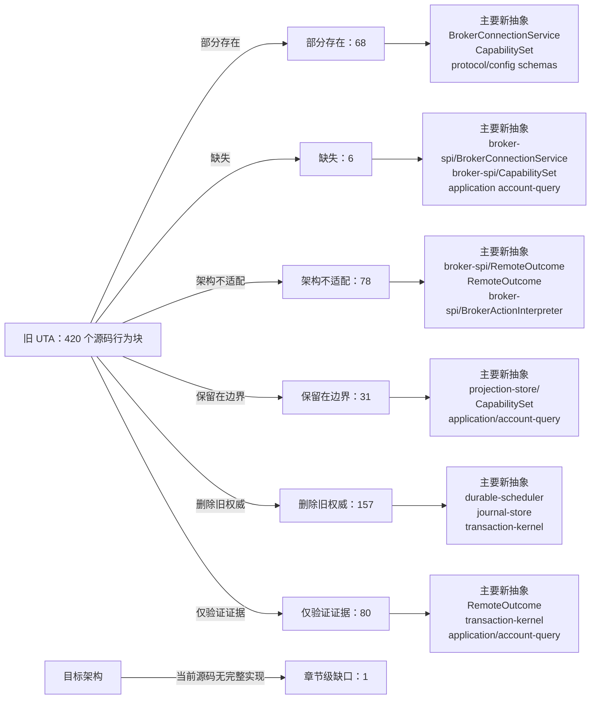

<!-- Auto-generated by scripts/uta-effect-runtime-map.mjs from mapping.json. Do not edit by hand. -->
<!-- Regenerate with `node scripts/uta-effect-runtime-map.mjs`. -->

# UTA 功能替代关系：第 17 章 Migration sequence

目标架构原文：[`docs/uta-effect-runtime-architecture.md:1380-1429`](../uta-effect-runtime-architecture.md#L1380-L1429)。

## 结论

部分存在 68；缺失 6；架构不适配 78；保留在边界 31；删除旧权威 157；仅验证证据 80。状态只描述当前实现相对于目标架构的关系，不表示迁移已经落地。

## 替代关系图

## 章节级目标缺口

| 依据 | 目标义务 | 当前缺口 | 必须补充或调整 |
|---|---|---|---|
| docs/uta-effect-runtime-architecture.md:1401-1405 | Slice 3 compensation and multi-step execution | Current source has no complete compensation-class, conflict-key/lock, commit-criterion, partial-fill abort, compensation-failure, and restart-recovery vertical slice. | Implement and runtime-verify Slice 3 before heterogeneous real-broker cutovers; do not proceed with multi-step atomic-policy claims until the complete failure/recovery path is executable. |

## 源码映射

| 映射 ID | 当前源码 | 符号或行为块 | 当前功能 | 替代状态 | 新 UTA 抽象与做法 | 不适配位置与原因 | 必须补充或调整 | 重复索引 |
|---|---|---|---|---|---|---|---|---|
| `MAP-9AD9951502` | [`packages/uta-broker-alpaca/src/index.ts:1-1`](../../packages/uta-broker-alpaca/src/index.ts#L1-L1) | AlpacaBroker import | The release wrapper imports the concrete AlpacaBroker from services/uta/src/domain/trading/brokers/alpaca, binding the pack to the legacy domain/trading IBroker implementation rather than to a target brokers/alpaca interpreter. | 删除旧权威 | 3.7 brokers/<broker>/；9.1 Connection Layer；9.2 Typed action interpreter；16 Target source layout；17 Migration sequence / Slice 4: first real broker；19 Architectural prohibitions services/uta/src/brokers/alpaca/；services/uta/src/broker-spi/BrokerConnectionService；services/uta/src/broker-spi/BrokerActionInterpreter；services/uta/src/main.ts Remove the legacy import when the target pack contract becomes authoritative. Import the pack-local Alpaca adapter entrypoint under services/uta/src/brokers/alpaca instead, and expose a typed BrokerConnectionService Layer plus BrokerActionInterpreter descriptor for registration by services/uta/src/main.ts. The wrapper may assemble the adapter but must not own transaction state or kernel decisions. | The current import reaches the old domain/trading broker class, so the release module has no target connection Layer, typed action map, broker-spi failure channel, remote observation contract, or compensation capability to register. | Delete the legacy class dependency and move Alpaca SDK request/response schemas, error mapping, dispatch identity/idempotency, observation, and compensation compilation behind the target broker-spi adapter. Register that adapter only at the composition root; keep transaction-kernel ownership in the kernel. | **DUP-001** |
| `MAP-DA5BBE56B3` | [`packages/uta-broker-alpaca/src/index.ts:3-3`](../../packages/uta-broker-alpaca/src/index.ts#L3-L3) | BROKER_PACK_API_VERSION | Exports pack API version 1, which currently gates the legacy module shape whose createBroker returns an IBroker and whose companion exports are configSchema and BROKER_ENGINE. | 部分存在 | 3 Module graph and allowed dependencies；9 Broker service-provider interface；16 Target source layout；17 Migration sequence services/uta/src/broker-spi/BrokerConnectionService；services/uta/src/broker-spi/BrokerActionInterpreter；services/uta/src/main.ts Retain a versioned release boundary, but advance the pack API version for the target interpreter/connection descriptor contract. The loader and every wrapper must change together so a legacy IBroker pack cannot be accepted as a target adapter pack. | Leaving version 1 while changing the exported broker value would make the loader treat the legacy IBroker contract as compatible with the target broker-spi contract; the current version carries no target interpreter/Layer guarantee. | Define the next versioned pack entry contract around the target BrokerActionInterpreter and BrokerConnectionService Layer, update the pack loader's validation and all five wrappers atomically, and reject old module shapes rather than coercing them into the kernel. | **DUP-002** |
| `MAP-6496594BF0` | [`packages/uta-broker-alpaca/src/index.ts:7-9`](../../packages/uta-broker-alpaca/src/index.ts#L7-L9) | createBroker | Accepts an id, optional label, and Record<string, unknown> brokerConfig; calls AlpacaBroker.fromConfig and uses Object.assign to add brokerEngine. The result is a legacy IBroker object, not an Effect Layer or typed broker-spi interpreter. | 架构不适配 | 3.7 brokers/<broker>/；4 Effect model；9.1 Connection Layer；9.2 Typed action interpreter；9.3 Remote outcome；9.4 Capability derivation；12.2 Unknown-outcome protocol；16 Target source layout；17 Migration sequence / Slice 4: first real broker；19 Architectural prohibitions services/uta/src/brokers/alpaca/；services/uta/src/broker-spi/BrokerConnectionService；services/uta/src/broker-spi/BrokerActionInterpreter；services/uta/src/broker-spi/RemoteOutcome；services/uta/src/durable-scheduler/；services/uta/src/main.ts Replace this legacy factory export with the target versioned pack entrypoint: validate the typed Alpaca configuration, return the adapter's scoped BrokerConnectionService Layer and action-specific BrokerActionInterpreter, and let main.ts register it for durable-scheduler dispatch. Dispatch must carry a DispatchIdentity, persist outcomes through the scheduler/journal path, and expose compensation compilation; no wrapper-created object may become transaction-kernel state. | The current factory performs immediate legacy object construction, erases configuration as Record<string, unknown>, adds an ad-hoc brokerEngine property, and supplies none of the target availability, dispatch, observation, unknown-outcome, idempotency, or compensation contracts. It therefore cannot satisfy the Alpaca typed-interpreter migration or crash-recovery protocol. | Implement and export the Alpaca target interpreter/connection descriptor, including native request compilation, typed broker failures, paper/live capability derivation, remote order observation, idempotency proof or reconcile-before-retry, and compensation programs. Register it through the composition root and durable scheduler; delete the old Alpaca dispatcher path once this adapter owns the account mutation. | **DUP-005** |
| `MAP-B40F4C1C42` | [`packages/uta-broker-ccxt/src/index.ts:1-1`](../../packages/uta-broker-ccxt/src/index.ts#L1-L1) | CcxtBroker import | The release wrapper imports the concrete CcxtBroker from services/uta/src/domain/trading/brokers/ccxt, binding the pack to the legacy domain/trading IBroker implementation rather than to a target brokers/ccxt interpreter. | 删除旧权威 | 3.7 brokers/<broker>/；9.1 Connection Layer；9.2 Typed action interpreter；16 Target source layout；17 Migration sequence / Slice 5: heterogeneous brokers；19 Architectural prohibitions services/uta/src/brokers/ccxt/；services/uta/src/broker-spi/BrokerConnectionService；services/uta/src/broker-spi/BrokerActionInterpreter；services/uta/src/main.ts Remove the legacy import when the target pack contract becomes authoritative. Import the pack-local CCXT adapter entrypoint under services/uta/src/brokers/ccxt instead, and expose a typed BrokerConnectionService Layer plus BrokerActionInterpreter descriptor for registration by services/uta/src/main.ts. The wrapper may assemble the adapter but must not own transaction state or kernel decisions. | The current import reaches the old domain/trading broker class, so the release module has no target connection Layer, typed action map, broker-spi failure channel, remote observation contract, or compensation capability to register. | Delete the legacy class dependency and move CCXT SDK request/response schemas, exchange error mapping, dispatch identity/idempotency, observation, and compensation compilation behind the target broker-spi adapter. Register that adapter only at the composition root; keep transaction-kernel ownership in the kernel. | **DUP-006** |
| `MAP-ACA4BDF989` | [`packages/uta-broker-ccxt/src/index.ts:3-3`](../../packages/uta-broker-ccxt/src/index.ts#L3-L3) | BROKER_PACK_API_VERSION | Exports pack API version 1, which currently gates the legacy module shape whose createBroker returns an IBroker and whose companion exports are configSchema and BROKER_ENGINE. | 部分存在 | 3 Module graph and allowed dependencies；9 Broker service-provider interface；16 Target source layout；17 Migration sequence services/uta/src/broker-spi/BrokerConnectionService；services/uta/src/broker-spi/BrokerActionInterpreter；services/uta/src/main.ts Retain a versioned release boundary, but advance the pack API version for the target interpreter/connection descriptor contract. The loader and every wrapper must change together so a legacy IBroker pack cannot be accepted as a target adapter pack. | Leaving version 1 while changing the exported broker value would make the loader treat the legacy IBroker contract as compatible with the target broker-spi contract; the current version carries no target interpreter/Layer guarantee. | Define the next versioned pack entry contract around the target BrokerActionInterpreter and BrokerConnectionService Layer, update the pack loader's validation and all five wrappers atomically, and reject old module shapes rather than coercing them into the kernel. | **DUP-007** |
| `MAP-9D3DC42AC9` | [`packages/uta-broker-ccxt/src/index.ts:7-9`](../../packages/uta-broker-ccxt/src/index.ts#L7-L9) | createBroker | Accepts an id, optional label, and Record<string, unknown> brokerConfig; calls CcxtBroker.fromConfig and uses Object.assign to add brokerEngine. The result is a legacy IBroker object, not an Effect Layer or typed broker-spi interpreter. | 架构不适配 | 3.7 brokers/<broker>/；4 Effect model；9.1 Connection Layer；9.2 Typed action interpreter；9.3 Remote outcome；9.4 Capability derivation；12.2 Unknown-outcome protocol；16 Target source layout；17 Migration sequence / Slice 5: heterogeneous brokers；19 Architectural prohibitions services/uta/src/brokers/ccxt/；services/uta/src/broker-spi/BrokerConnectionService；services/uta/src/broker-spi/BrokerActionInterpreter；services/uta/src/broker-spi/RemoteOutcome；services/uta/src/durable-scheduler/；services/uta/src/main.ts Replace this legacy factory export with the target versioned pack entrypoint: validate typed CCXT configuration, return the adapter's scoped BrokerConnectionService Layer and action-specific BrokerActionInterpreter, and let main.ts register it for durable-scheduler dispatch. Dispatch must carry a DispatchIdentity, persist outcomes through the scheduler/journal path, and expose compensation compilation; no wrapper-created object may become transaction-kernel state. | The current factory performs immediate legacy object construction, erases configuration as Record<string, unknown>, adds an ad-hoc brokerEngine property, and supplies none of the target availability, dispatch, observation, unknown-outcome, idempotency, or compensation contracts. It cannot prove CCXT sub-account or venue-specific capability derivation. | Implement and export the CCXT target interpreter/connection descriptor, including exchange-native request compilation, typed broker failures, sub-account or wallet capability derivation, remote order/position observation, idempotency proof or reconcile-before-retry, and compensation programs. Register it through the composition root and durable scheduler; delete the old CCXT dispatcher path once this adapter owns account mutations. | **DUP-010** |
| `MAP-1E5FD0A690` | [`packages/uta-broker-ibkr/src/index.ts:1-1`](../../packages/uta-broker-ibkr/src/index.ts#L1-L1) | IbkrBroker import | The release wrapper imports the concrete IbkrBroker from services/uta/src/domain/trading/brokers/ibkr, binding the pack to the legacy domain/trading IBroker implementation rather than to a target brokers/ibkr interpreter. | 删除旧权威 | 3.7 brokers/<broker>/；9.1 Connection Layer；9.2 Typed action interpreter；16 Target source layout；17 Migration sequence / Slice 5: heterogeneous brokers；19 Architectural prohibitions services/uta/src/brokers/ibkr/；services/uta/src/broker-spi/BrokerConnectionService；services/uta/src/broker-spi/BrokerActionInterpreter；services/uta/src/main.ts Remove the legacy import when the target pack contract becomes authoritative. Import the pack-local IBKR adapter entrypoint under services/uta/src/brokers/ibkr instead, and expose a typed BrokerConnectionService Layer plus BrokerActionInterpreter descriptor for registration by services/uta/src/main.ts. The wrapper may assemble the adapter but must not own transaction state or kernel decisions. | The current import reaches the old domain/trading broker class, so the release module has no target connection Layer, typed action map, broker-spi failure channel, remote observation contract, or compensation capability to register. | Delete the legacy class dependency and move IBKR SDK request/response schemas, callback/connection error mapping, dispatch identity/idempotency, observation, and compensation compilation behind the target broker-spi adapter. Register that adapter only at the composition root; keep transaction-kernel ownership in the kernel. | **DUP-011** |
| `MAP-AB521AFE64` | [`packages/uta-broker-ibkr/src/index.ts:3-3`](../../packages/uta-broker-ibkr/src/index.ts#L3-L3) | BROKER_PACK_API_VERSION | Exports pack API version 1, which currently gates the legacy module shape whose createBroker returns an IBroker and whose companion exports are configSchema and BROKER_ENGINE. | 部分存在 | 3 Module graph and allowed dependencies；9 Broker service-provider interface；16 Target source layout；17 Migration sequence services/uta/src/broker-spi/BrokerConnectionService；services/uta/src/broker-spi/BrokerActionInterpreter；services/uta/src/main.ts Retain a versioned release boundary, but advance the pack API version for the target interpreter/connection descriptor contract. The loader and every wrapper must change together so a legacy IBroker pack cannot be accepted as a target adapter pack. | Leaving version 1 while changing the exported broker value would make the loader treat the legacy IBroker contract as compatible with the target broker-spi contract; the current version carries no target interpreter/Layer guarantee. | Define the next versioned pack entry contract around the target BrokerActionInterpreter and BrokerConnectionService Layer, update the pack loader's validation and all five wrappers atomically, and reject old module shapes rather than coercing them into the kernel. | **DUP-012** |
| `MAP-3392948A39` | [`packages/uta-broker-ibkr/src/index.ts:7-9`](../../packages/uta-broker-ibkr/src/index.ts#L7-L9) | createBroker | Accepts an id, optional label, and Record<string, unknown> brokerConfig; calls IbkrBroker.fromConfig and uses Object.assign to add brokerEngine. The result is a legacy IBroker object, not an Effect Layer or typed broker-spi interpreter. | 架构不适配 | 3.7 brokers/<broker>/；4 Effect model；9.1 Connection Layer；9.2 Typed action interpreter；9.3 Remote outcome；9.4 Capability derivation；12.2 Unknown-outcome protocol；16 Target source layout；17 Migration sequence / Slice 5: heterogeneous brokers；19 Architectural prohibitions services/uta/src/brokers/ibkr/；services/uta/src/broker-spi/BrokerConnectionService；services/uta/src/broker-spi/BrokerActionInterpreter；services/uta/src/broker-spi/RemoteOutcome；services/uta/src/durable-scheduler/；services/uta/src/main.ts Replace this legacy factory export with the target versioned pack entrypoint: validate typed IBKR configuration, return the adapter's scoped BrokerConnectionService Layer and action-specific BrokerActionInterpreter, and let main.ts register it for durable-scheduler dispatch. Dispatch must carry a DispatchIdentity, persist outcomes through the scheduler/journal path, and expose compensation compilation; no wrapper-created object may become transaction-kernel state. | The current factory performs immediate legacy object construction, erases configuration as Record<string, unknown>, adds an ad-hoc brokerEngine property, and supplies none of the target availability, dispatch, observation, unknown-outcome, idempotency, or compensation contracts. It cannot represent IBKR callback-stream health or linked-account identity in the target SPI. | Implement and export the IBKR target interpreter/connection descriptor, including scoped callback streams, linked-account and native-order identity, typed broker failures, remote observation, idempotency proof or reconcile-before-retry, and compensation programs. Register it through the composition root and durable scheduler; delete the old IBKR dispatcher path once this adapter owns account mutations. | **DUP-015** |
| `MAP-AE59785B88` | [`packages/uta-broker-leverup/src/index.ts:1-1`](../../packages/uta-broker-leverup/src/index.ts#L1-L1) | LeverupBroker import | The release wrapper imports the concrete LeverupBroker from services/uta/src/domain/trading/brokers/others/leverup, binding the pack to the legacy domain/trading IBroker implementation rather than to a target brokers/leverup interpreter. | 删除旧权威 | 3.7 brokers/<broker>/；9.1 Connection Layer；9.2 Typed action interpreter；16 Target source layout；17 Migration sequence / Slice 5: heterogeneous brokers；19 Architectural prohibitions services/uta/src/brokers/leverup/；services/uta/src/broker-spi/BrokerConnectionService；services/uta/src/broker-spi/BrokerActionInterpreter；services/uta/src/main.ts Remove the legacy import when the target pack contract becomes authoritative. Import the pack-local LeverUp adapter entrypoint under services/uta/src/brokers/leverup instead, and expose a typed BrokerConnectionService Layer plus BrokerActionInterpreter descriptor for registration by services/uta/src/main.ts. The wrapper may assemble the adapter but must not own transaction state or kernel decisions. | The current import reaches the old domain/trading broker class, so the release module has no target connection Layer, typed action map, broker-spi failure channel, remote observation contract, or compensation capability to register. | Delete the legacy class dependency and move LeverUp SDK/relayer request and response schemas, relayer error mapping, dispatch identity/idempotency, observation, and compensation compilation behind the target broker-spi adapter. Register that adapter only at the composition root; keep transaction-kernel ownership in the kernel. | **DUP-016** |
| `MAP-1B0FB784F5` | [`packages/uta-broker-leverup/src/index.ts:3-3`](../../packages/uta-broker-leverup/src/index.ts#L3-L3) | BROKER_PACK_API_VERSION | Exports pack API version 1, which currently gates the legacy module shape whose createBroker returns an IBroker and whose companion exports are configSchema and BROKER_ENGINE. | 部分存在 | 3 Module graph and allowed dependencies；9 Broker service-provider interface；16 Target source layout；17 Migration sequence services/uta/src/broker-spi/BrokerConnectionService；services/uta/src/broker-spi/BrokerActionInterpreter；services/uta/src/main.ts Retain a versioned release boundary, but advance the pack API version for the target interpreter/connection descriptor contract. The loader and every wrapper must change together so a legacy IBroker pack cannot be accepted as a target adapter pack. | Leaving version 1 while changing the exported broker value would make the loader treat the legacy IBroker contract as compatible with the target broker-spi contract; the current version carries no target interpreter/Layer guarantee. | Define the next versioned pack entry contract around the target BrokerActionInterpreter and BrokerConnectionService Layer, update the pack loader's validation and all five wrappers atomically, and reject old module shapes rather than coercing them into the kernel. | **DUP-017** |
| `MAP-50C8158380` | [`packages/uta-broker-leverup/src/index.ts:7-9`](../../packages/uta-broker-leverup/src/index.ts#L7-L9) | createBroker | Accepts an id, optional label, and Record<string, unknown> brokerConfig; calls LeverupBroker.fromConfig and uses Object.assign to add brokerEngine. The result is a legacy IBroker object, not an Effect Layer or typed broker-spi interpreter. | 架构不适配 | 3.7 brokers/<broker>/；4 Effect model；9.1 Connection Layer；9.2 Typed action interpreter；9.3 Remote outcome；9.4 Capability derivation；12.2 Unknown-outcome protocol；16 Target source layout；17 Migration sequence / Slice 5: heterogeneous brokers；19 Architectural prohibitions services/uta/src/brokers/leverup/；services/uta/src/broker-spi/BrokerConnectionService；services/uta/src/broker-spi/BrokerActionInterpreter；services/uta/src/broker-spi/RemoteOutcome；services/uta/src/durable-scheduler/；services/uta/src/main.ts Replace this legacy factory export with the target versioned pack entrypoint: validate typed LeverUp configuration, return the adapter's scoped BrokerConnectionService/relayer Layer and action-specific BrokerActionInterpreter, and let main.ts register it for durable-scheduler dispatch. Dispatch must carry a DispatchIdentity, persist outcomes through the scheduler/journal path, and expose compensation compilation; no wrapper-created object may become transaction-kernel state. | The current factory performs immediate legacy object construction, erases configuration as Record<string, unknown>, adds an ad-hoc brokerEngine property, and supplies none of the target availability, dispatch, observation, unknown-outcome, idempotency, or compensation contracts. It cannot reconcile a relayer-accepted mutation after a lost process or network boundary. | Implement and export the LeverUp target interpreter/connection descriptor, including relayer-native request compilation, typed relayer failures, dispatch identity, explicit observation/reconciliation after timeout, capability derivation, idempotency proof or reconcile-before-retry, and compensation programs. Register it through the composition root and durable scheduler; delete the old LeverUp dispatcher path once this adapter owns account mutations. | **DUP-020** |
| `MAP-75B61EBF36` | [`packages/uta-broker-longbridge/src/index.ts:1-1`](../../packages/uta-broker-longbridge/src/index.ts#L1-L1) | LongbridgeBroker import | The release wrapper imports the concrete LongbridgeBroker from services/uta/src/domain/trading/brokers/longbridge, binding the pack to the legacy domain/trading IBroker implementation rather than to a target brokers/longbridge interpreter. | 删除旧权威 | 3.7 brokers/<broker>/；9.1 Connection Layer；9.2 Typed action interpreter；16 Target source layout；17 Migration sequence / Slice 5: heterogeneous brokers；19 Architectural prohibitions services/uta/src/brokers/longbridge/；services/uta/src/broker-spi/BrokerConnectionService；services/uta/src/broker-spi/BrokerActionInterpreter；services/uta/src/main.ts Remove the legacy import when the target pack contract becomes authoritative. Import the pack-local Longbridge adapter entrypoint under services/uta/src/brokers/longbridge instead, and expose a typed BrokerConnectionService Layer plus BrokerActionInterpreter descriptor for registration by services/uta/src/main.ts. The wrapper may assemble the adapter but must not own transaction state or kernel decisions. | The current import reaches the old domain/trading broker class, so the release module has no target connection Layer, typed action map, broker-spi failure channel, remote observation contract, or compensation capability to register. | Delete the legacy class dependency and move Longbridge SDK request/response schemas, jurisdiction/currency-aware error mapping, dispatch identity/idempotency, observation, and compensation compilation behind the target broker-spi adapter. Register that adapter only at the composition root; keep transaction-kernel ownership in the kernel. | **DUP-021** |
| `MAP-F093E8F942` | [`packages/uta-broker-longbridge/src/index.ts:3-3`](../../packages/uta-broker-longbridge/src/index.ts#L3-L3) | BROKER_PACK_API_VERSION | Exports pack API version 1, which currently gates the legacy module shape whose createBroker returns an IBroker and whose companion exports are configSchema and BROKER_ENGINE. | 部分存在 | 3 Module graph and allowed dependencies；9 Broker service-provider interface；16 Target source layout；17 Migration sequence services/uta/src/broker-spi/BrokerConnectionService；services/uta/src/broker-spi/BrokerActionInterpreter；services/uta/src/main.ts Retain a versioned release boundary, but advance the pack API version for the target interpreter/connection descriptor contract. The loader and every wrapper must change together so a legacy IBroker pack cannot be accepted as a target adapter pack. | Leaving version 1 while changing the exported broker value would make the loader treat the legacy IBroker contract as compatible with the target broker-spi contract; the current version carries no target interpreter/Layer guarantee. | Define the next versioned pack entry contract around the target BrokerActionInterpreter and BrokerConnectionService Layer, update the pack loader's validation and all five wrappers atomically, and reject old module shapes rather than coercing them into the kernel. | **DUP-022** |
| `MAP-E52D407CDC` | [`packages/uta-broker-longbridge/src/index.ts:7-9`](../../packages/uta-broker-longbridge/src/index.ts#L7-L9) | createBroker | Accepts an id, optional label, and Record<string, unknown> brokerConfig; calls LongbridgeBroker.fromConfig and uses Object.assign to add brokerEngine. The result is a legacy IBroker object, not an Effect Layer or typed broker-spi interpreter. | 架构不适配 | 3.7 brokers/<broker>/；4 Effect model；9.1 Connection Layer；9.2 Typed action interpreter；9.3 Remote outcome；9.4 Capability derivation；12.2 Unknown-outcome protocol；16 Target source layout；17 Migration sequence / Slice 5: heterogeneous brokers；19 Architectural prohibitions services/uta/src/brokers/longbridge/；services/uta/src/broker-spi/BrokerConnectionService；services/uta/src/broker-spi/BrokerActionInterpreter；services/uta/src/broker-spi/RemoteOutcome；services/uta/src/durable-scheduler/；services/uta/src/market-and-accounting/；services/uta/src/main.ts Replace this legacy factory export with the target versioned pack entrypoint: validate typed Longbridge configuration, return the adapter's scoped BrokerConnectionService Layer and action-specific BrokerActionInterpreter, and let main.ts register it for durable-scheduler dispatch. Dispatch must carry a DispatchIdentity, persist outcomes through the scheduler/journal path, and expose compensation compilation; no wrapper-created object may become transaction-kernel state. | The current factory performs immediate legacy object construction, erases configuration as Record<string, unknown>, adds an ad-hoc brokerEngine property, and supplies none of the target availability, dispatch, observation, unknown-outcome, idempotency, or compensation contracts. It cannot express Longbridge's jurisdiction and currency boundaries as typed broker/market observations. | Implement and export the Longbridge target interpreter/connection descriptor, including native request compilation, typed broker failures, account and jurisdiction metadata, currency-qualified observations, remote order/exposure reconciliation, idempotency proof or reconcile-before-retry, and compensation programs. Register it through the composition root and durable scheduler; delete the old Longbridge dispatcher path once this adapter owns account mutations. | **DUP-025** |
| `MAP-00030A134A` | [`packages/uta-protocol/src/brokers/preset-catalog.ts:16-18`](../../packages/uta-protocol/src/brokers/preset-catalog.ts#L16-L18) | BrokerEngine | Defines a six-member string union for ccxt, alpaca, ibkr, leverup, longbridge, and mock engine names. | 部分存在 | 3.6 broker-spi/；3.7 brokers/<broker>/；9.1 Connection Layer；9.2 Typed action interpreter；14. Public protocol；17.4 Slice 4: first real broker；19. Architectural prohibitions；17.1 Slice 1: durable kernel with MockBroker；17.5 Slice 5: heterogeneous brokers BrokerActionTypeMap；BrokerConnectionService；brokers/<broker>/；CapabilitySet Keep adapter selection in composition/application configuration, but associate each engine with a typed BrokerConnectionService and action-interpreter set rather than using a bare engine string. | The union identifies implementation labels only; it does not close the action/result/error/observation/compensation contract or broker connection requirements. | Replace runtime reliance on BrokerEngine strings with typed adapter registration/composition and compile-time BrokerActionTypeMap coverage. | **DUP-027** |
| `MAP-601F6E2834` | [`packages/uta-protocol/src/brokers/preset-catalog.ts:37-98`](../../packages/uta-protocol/src/brokers/preset-catalog.ts#L37-L98) | BrokerPresetDef | Defines preset metadata, Zod config schema, optional modes/subtitle/write-only fields, string fingerprint fields, a `toEngineConfig` function returning Record<string, unknown>, and optional isPaper callback accepting Record<string, unknown>. | 部分存在 | 2.1 Alice owns；2.2 UTA owns；3.7 brokers/<broker>/；3.9 transport/ and protocol/；7.1 Embedded database；9.1 Connection Layer；9.4 Capability derivation；14. Public protocol；15. Security and authority；17. Migration sequence；19. Architectural prohibitions protocol/config schemas；BrokerConnectionService；BrokerActionTypeMap；CapabilitySet；brokers/<broker>/；application/ Use BrokerPresetDef only to describe presentation/config entry points, then parse into broker-specific typed connection config and secret references before constructing scoped adapter Layers. | The schema itself is generic ZodType, engine translation and paper detection use raw Record<string, unknown>, fingerprints are string field names, and no action capability/connection/jurisdiction contract is attached. | Introduce broker-specific config ADTs/codecs, remove raw Record-based runtime handoff, separate secret storage from public metadata, and derive capabilities through broker-spi ActionContext rather than preset metadata. | **DUP-030** |
| `MAP-EBB7846E5F` | [`packages/uta-protocol/src/brokers/preset-catalog.ts:108-154`](../../packages/uta-protocol/src/brokers/preset-catalog.ts#L108-L154) | BINANCE_PRESET | Declares Binance live/demo modes, API key/secret Zod fields, write-only metadata, mode/API-key fingerprinting, and a raw engine config with demoTrading semantics. | 部分存在 | 3.7 brokers/<broker>/；3.9 transport/ and protocol/；7.1 Embedded database；9.1 Connection Layer；9.4 Capability derivation；14. Public protocol；15. Security and authority；17.5 Slice 5: heterogeneous brokers；19. Architectural prohibitions brokers/Alpaca-style adapter config；BrokerConnectionService；CapabilitySet；protocol/config schemas Parse Binance connection config into a UTA-owned secret/config value, construct a scoped adapter Layer, and derive per-wallet/action capabilities from account, venue, instrument, and mode context. | The UI schema and toEngineConfig expose a generic record carrying credentials and a boolean-like demo mode; no typed connection identity, sub-account context, action availability, idempotency, or compensation contract is present. | Replace raw engine handoff with a broker-specific config codec/secret reference and broker-spi capability derivation; keep preset data presentation-only. | **DUP-032** |
| `MAP-BB8EAF65B0` | [`packages/uta-protocol/src/brokers/preset-catalog.ts:156-189`](../../packages/uta-protocol/src/brokers/preset-catalog.ts#L156-L189) | OKX_PRESET | Declares OKX live/demo modes, API key/secret/passphrase fields, write-only metadata, mode/API-key fingerprinting, and raw sandbox engine config. | 部分存在 | 3.7 brokers/<broker>/；3.9 transport/ and protocol/；7.1 Embedded database；9.1 Connection Layer；9.4 Capability derivation；14. Public protocol；15. Security and authority；17.5 Slice 5: heterogeneous brokers；19. Architectural prohibitions brokers/<broker>/；BrokerConnectionService；CapabilitySet；protocol/config schemas Validate OKX connection credentials/config in UTA, construct its scoped adapter, and derive action/sub-account capabilities rather than treating demo as a generic sandbox boolean. | Credentials and venue mode are passed through generic preset data, while no typed connection/capability/interpreter association or jurisdiction/sub-account contract is represented. | Introduce an OKX-specific config ADT and secret boundary, then register typed BrokerActionInterpreter availability/dispatch/observe/compensation implementations. | **DUP-033** |
| `MAP-6E3C5642E6` | [`packages/uta-protocol/src/brokers/preset-catalog.ts:191-224`](../../packages/uta-protocol/src/brokers/preset-catalog.ts#L191-L224) | BYBIT_PRESET | Declares live/testnet/demo modes, API credentials, write-only fields, fingerprints, and raw engine config with separate sandbox/demoTrading booleans. | 部分存在 | 3.7 brokers/<broker>/；3.9 transport/ and protocol/；7.1 Embedded database；9.1 Connection Layer；9.4 Capability derivation；14. Public protocol；15. Security and authority；17.5 Slice 5: heterogeneous brokers；19. Architectural prohibitions brokers/<broker>/；BrokerConnectionService；CapabilitySet；ActionAvailability；protocol/config schemas Represent Bybit environment as a validated config variant and derive capabilities/idempotency/compensation for each account and venue mode through broker-spi. | Separate booleans can express invalid mode combinations and raw engine config is untyped; no target action contract or typed unavailable reason is attached. | Replace booleans/Record handoff with an exhaustive Bybit config ADT, adapter Layer, and CapabilitySet registration. | **DUP-034** |
| `MAP-2F4E92A2AE` | [`packages/uta-protocol/src/brokers/preset-catalog.ts:226-257`](../../packages/uta-protocol/src/brokers/preset-catalog.ts#L226-L257) | HYPERLIQUID_PRESET | Declares live/testnet mode, walletAddress/privateKey fields, write-only private key, wallet/mode fingerprinting, and raw sandbox engine config. | 部分存在 | 3.7 brokers/<broker>/；3.9 transport/ and protocol/；7.1 Embedded database；9.1 Connection Layer；9.4 Capability derivation；14. Public protocol；15. Security and authority；17.5 Slice 5: heterogeneous brokers；19. Architectural prohibitions brokers/<broker>/；BrokerConnectionService；CapabilitySet；protocol/config schemas；domain/AccountId Keep wallet credentials in UTA-owned sealed config, construct a scoped Hyperliquid adapter, and derive wallet/venue/instrument action capabilities via broker-spi. | A raw record carries a private key and mode with no typed secret reference, account/connection identity, jurisdiction, availability, idempotency, or compensation contract. | Add a Hyperliquid-specific config/secret codec and typed adapter registration; never expose private-key fields through generic protocol/catalog payloads. | **DUP-035** |
| `MAP-B9545FA731` | [`packages/uta-protocol/src/brokers/preset-catalog.ts:259-292`](../../packages/uta-protocol/src/brokers/preset-catalog.ts#L259-L292) | BITGET_PRESET | Declares live/demo mode, API key/secret/passphrase fields, write-only metadata, mode/API-key fingerprints, and raw engine config with demoTrading. | 部分存在 | 3.7 brokers/<broker>/；3.9 transport/ and protocol/；7.1 Embedded database；9.1 Connection Layer；9.4 Capability derivation；14. Public protocol；15. Security and authority；17.5 Slice 5: heterogeneous brokers；19. Architectural prohibitions brokers/<broker>/；BrokerConnectionService；CapabilitySet；protocol/config schemas Parse Bitget credentials/environment into a typed UTA-owned connection config, then derive separate-wallet/action capability and typed unavailable results in the adapter. | The preset does not express Bitget wallet/account scope or action contracts and passes secrets/mode through a generic engine record. | Introduce typed Bitget configuration and broker-spi registration, with secret isolation and capability derivation from account/sub-account/venue context. | **DUP-036** |
| `MAP-F62E863C78` | [`packages/uta-protocol/src/brokers/preset-catalog.ts:294-333`](../../packages/uta-protocol/src/brokers/preset-catalog.ts#L294-L333) | CCXT_CUSTOM_PRESET | Provides an escape-hatch Zod object with optional exchange/sandbox/demo/credential/wallet fields and loops over defined fields to pass them through a Record<string, unknown>. | 架构不适配 | 3.7 brokers/<broker>/；3.9 transport/ and protocol/；7.1 Embedded database；9.4 Capability derivation；14. Public protocol；15. Security and authority；17.5 Slice 5: heterogeneous brokers；19. Architectural prohibitions broker-spi/；BrokerActionTypeMap；CapabilitySet；protocol/config schemas；brokers/<broker>/ Replace the open-ended custom config with an explicitly parsed exchange-specific config/plugin boundary; no generic route or kernel may accept pass-through credential/action bags. | Nearly every field is optional, exchange semantics are delegated to an untyped Record, and the preset is an untyped registry escape hatch; this violates the prohibition on permissive fallback states and untyped registries. | Remove CCXT_CUSTOM as a kernel/runtime contract, require a concrete adapter/config schema per supported exchange, and return typed CapabilityUnavailable for unsupported actions instead of silently passing fields through. | **DUP-037** |
| `MAP-2862195456` | [`packages/uta-protocol/src/brokers/preset-catalog.ts:337-367`](../../packages/uta-protocol/src/brokers/preset-catalog.ts#L337-L367) | ALPACA_PRESET | Declares paper/live mode, API key/secret fields, write-only metadata, mode/API-key fingerprints, and raw engine config with paper boolean. | 部分存在 | 3.7 brokers/<broker>/；3.9 transport/ and protocol/；7.1 Embedded database；9.1 Connection Layer；9.4 Capability derivation；14. Public protocol；15. Security and authority；17.4 Slice 4: first real broker；19. Architectural prohibitions brokers/Alpaca；BrokerConnectionService；BrokerActionTypeMap；CapabilitySet；protocol/config schemas Use an Alpaca-specific validated config/secret boundary and typed action interpreter, then make the new path authoritative before deleting its legacy dispatcher path. | Preset mode/credentials are generic form data and do not carry typed connection identity, action capability, dispatch idempotency, observation, or compensation semantics. | Add Alpaca adapter Layer and BrokerActionInterpreter contracts, keep credentials UTA-owned, and migrate the preset to reference validated config rather than pass a raw record. | **DUP-038** |
| `MAP-DE2769E2F7` | [`packages/uta-protocol/src/brokers/preset-catalog.ts:369-398`](../../packages/uta-protocol/src/brokers/preset-catalog.ts#L369-L398) | IBKR_PRESET | Declares host/port/clientId/accountId form fields, default ports, fingerprints, raw engine config, and paper detection based on port numbers. | 部分存在 | 3.7 brokers/<broker>/；3.9 transport/ and protocol/；7.1 Embedded database；9.1 Connection Layer；9.4 Capability derivation；10.2 Market and jurisdiction owns；14. Public protocol；15. Security and authority；17.5 Slice 5: heterogeneous brokers；19. Architectural prohibitions brokers/IBKR；BrokerConnectionService；ConnectionId；CapabilitySet；protocol/config schemas Validate an IBKR connection config, construct the scoped SDK Layer inside brokers/IBKR, and derive linked-account/market/jurisdiction capabilities through broker-spi. | Port-number paper detection and raw host/account strings do not encode connection identity, account jurisdiction, linked-account context, health stream, action capability, or typed failure. | Replace generic engine config with an IBKR connection ADT/secret/config codec and typed BrokerConnectionService/capability registration; keep port defaults presentation/config only. | **DUP-039** |
| `MAP-42A8E8BFCC` | [`packages/uta-protocol/src/brokers/preset-catalog.ts:400-433`](../../packages/uta-protocol/src/brokers/preset-catalog.ts#L400-L433) | LONGBRIDGE_PRESET | Declares live/paper mode and appKey/appSecret/accessToken fields, marks all credentials write-only, fingerprints mode/appKey, and passes a raw engine config. | 部分存在 | 3.7 brokers/<broker>/；3.9 transport/ and protocol/；7.1 Embedded database；9.1 Connection Layer；9.4 Capability derivation；10.2 Market and jurisdiction owns；14. Public protocol；15. Security and authority；17.5 Slice 5: heterogeneous brokers；19. Architectural prohibitions brokers/Longbridge；BrokerConnectionService；CapabilitySet；market-and-accounting/；protocol/config schemas Use Longbridge-specific validated secret/config input and derive region/jurisdiction/instrument capabilities in the typed adapter before transaction preparation. | The form config has raw credentials and mode but no typed jurisdiction/region/account context or broker action/interpreter contract; access-token lifecycle is only prose. | Define typed Longbridge connection/credential and market-jurisdiction metadata, then register its BrokerActionInterpreter and capability/unavailable results. | **DUP-040** |
| `MAP-FA8441EFDE` | [`packages/uta-protocol/src/brokers/preset-catalog.ts:437-468`](../../packages/uta-protocol/src/brokers/preset-catalog.ts#L437-L468) | LEVERUP_PRESET | Declares live/testnet mode and a regex-validated private key, marks it write-only, fingerprints mode/privateKey, and passes network/privateKey through a raw engine record. | 部分存在 | 3.7 brokers/<broker>/；3.9 transport/ and protocol/；7.1 Embedded database；9.4 Capability derivation；14. Public protocol；15. Security and authority；17.5 Slice 5: heterogeneous brokers；19. Architectural prohibitions brokers/LeverUp；BrokerConnectionService；CapabilitySet；protocol/config schemas；domain/AccountId Keep the wallet secret in UTA-owned sealed configuration, validate a typed network/account context, and expose LeverUp through a typed interpreter with explicit relayer reconciliation/compensation capability. | Fingerprinting a private key and passing it through a generic record does not establish nominal account identity, idempotency, remote outcome, or compensation; network is only a string union in form data. | Replace raw config handoff with a typed wallet/relayer adapter boundary and broker-spi capability/reconciliation contract; do not expose secret-derived identity fields in public protocol data. | **DUP-041** |
| `MAP-52A6B771BA` | [`packages/uta-protocol/src/brokers/preset-catalog.ts:470-495`](../../packages/uta-protocol/src/brokers/preset-catalog.ts#L470-L495) | SIMULATOR_PRESET | Declares a mock simulator with in-memory state, cash as a coerced number, no credentials, and a random _instanceId fingerprint used to derive a unique id; its hint states all state is wiped on restart. | 架构不适配 | 1. Thesis and non-negotiable properties；3.7 brokers/<broker>/；3.4 journal-store/；3.5 durable-scheduler/；5.3 Two-phase transaction protocol；7.1 Embedded database；12.1 Startup sequence；14. Public protocol；17.1 Slice 1: durable kernel with MockBroker；18. Verification contract；20. First falsifier MockBroker interpreter；transaction-kernel/；journal-store/；durable-scheduler/；DispatchIdentity；RemoteOutcome Retain MockBroker as the first executable adapter, but make transaction intent, jobs, outcomes, and mock broker observations durable in SQLite and recoverable across restart. | The current advertised simulator is explicitly process-memory-only and cash is a coerced number; it cannot satisfy the MockBroker crash/recovery falsifier or prove no duplicate dispatch. | Replace in-memory simulator authority with the durable MockBroker vertical slice, use DecimalString/Money and typed commands/outcomes, and keep any panel controls as a boundary over that slice. | **DUP-042** |
| `MAP-9A17C2A8CC` | [`packages/uta-protocol/src/brokers/preset-catalog.ts:497-522`](../../packages/uta-protocol/src/brokers/preset-catalog.ts#L497-L522) | BROKER_PRESET_CATALOG | Exports an ordered array of all broker preset definitions for wizard rendering, grouped as recommended/crypto/testing and including the simulator and custom CCXT escape hatch. | 保留在边界 | 2.1 Alice owns；3.7 brokers/<broker>/；3.9 transport/ and protocol/；9.4 Capability derivation；14. Public protocol；15. Security and authority；17. Migration sequence；19. Architectural prohibitions；20. First falsifier Alice UI presentation projection；application/；broker-spi/；brokers/<broker>/；CapabilitySet Keep the ordered catalog for Alice's account-picker presentation, but runtime broker registration/capabilities must come from typed broker-spi adapters and the durable kernel, not this array. | The catalog is a UI registry and does not prove adapter capability, connection health, transaction durability, or recovery; custom/permissive/simulator entries must not become generic runtime fallback. | Mark the catalog presentation-only, separate it from adapter composition, and gate each selectable preset through a validated config and typed capability/connection service. | **DUP-043** |
| `MAP-4E1058C577` | [`packages/uta-protocol/src/brokers/preset-catalog.ts:557-580`](../../packages/uta-protocol/src/brokers/preset-catalog.ts#L557-L580) | deriveUtaId | Filters arbitrary presetConfig fields named by fingerprintFields, fills missing values with null, canonicalizes them, hashes preset id plus JSON to eight hex characters, and returns `${preset.id}-${hash}`. | 部分存在 | 2.2 UTA owns；3.1 domain/；3.4 journal-store/；3.7 brokers/<broker>/；5.7 Complete type contract — nominal identities and financial values；7.1 Embedded database；9.1 Connection Layer；11. Approval and Git audit projection；14. Public protocol；15. Security and authority；17.6 Slice 6: delete the legacy kernel；19. Architectural prohibitions AccountId；ConnectionId；InstrumentId；journal-store/；BrokerConnectionIdentity；protocol/config schemas Introduce typed, durable AccountId/ConnectionId construction from validated broker identity context; retain old ids only as explicit migration compatibility projections. | The current identity is an unbranded 32-bit string hash over generic fields (including secret-derived values for some presets), has no collision/identity evidence in the domain type, and couples account identity to UI preset ids. | Define nominal identity constructors and migration mapping, separate credential storage from identity metadata, persist identity/context in journal/config schemas, and stop using derived strings as transaction identity. | **DUP-047** |
| `MAP-E9688DBE16` | [`packages/uta-protocol/src/brokers/preset-catalog.ts:582-588`](../../packages/uta-protocol/src/brokers/preset-catalog.ts#L582-L588) | mintInstanceId | Generates a random four-byte hex token for simulator preset identity seeding. | 部分存在 | 3.1 domain/；3.4 journal-store/；5.7 Complete type contract — nominal identities and financial values；7.1 Embedded database；17.1 Slice 1: durable kernel with MockBroker；18. Verification contract；20. First falsifier AccountId；ConnectionId；MockBroker；journal-store/；protocol/config schemas Use a typed persisted MockBroker AccountId/ConnectionId constructor and retain randomness only as the generation mechanism, not as an unvalidated public identity string. | The token has no branded type, persistence/restore contract, or relationship to durable mock broker state; uniqueness is only a process/config convention. | Persist and decode simulator identity through journal/config schemas and use it in DispatchIdentity/recovery tests across restart. | **DUP-048** |
| `MAP-1D576100CB` | [`packages/uta-protocol/src/brokers/presets.ts:56-72`](../../packages/uta-protocol/src/brokers/presets.ts#L56-L72) | BUILTIN_BROKER_PRESETS | Maps every catalog definition into a serialized frontend array, copying metadata and generated raw schema. | 保留在边界 | 2.1 Alice owns；3.7 brokers/<broker>/；3.9 transport/ and protocol/；9.4 Capability derivation；14. Public protocol；15. Security and authority；17. Migration sequence；19. Architectural prohibitions；20. First falsifier Alice UI presentation projection；application/；broker-spi/；CapabilitySet；MockBroker Keep this array for the account-picker UI only; runtime adapter registration, capability derivation, transaction execution, and MockBroker recovery must be independent typed services. | The serialized catalog is presentation metadata and therefore outside the new kernel, but its engine/schema fields cannot prove broker capability or durable execution and its raw schemas are not enough for transport validation. | Mark it non-authoritative, prevent callers from using it as a broker registry, and route selected presets through validated config plus BrokerConnectionService/CapabilitySet. | **DUP-052** |
| `MAP-25118F5AFA` | [`packages/uta-protocol/src/types/broker.ts:475-498`](../../packages/uta-protocol/src/types/broker.ts#L475-L498) | IBroker lifecycle methods | The generic IBroker interface exposes id/label/brokerEngine/meta, Promise-based init/close, and an optional callback listener for connection state. | 删除旧权威 | 2.2 UTA owns；3.2 effect-runtime/；3.6 broker-spi/；4. Effect model；9.1 Connection Layer；12.1 Startup sequence；15. Security and authority；17.6 Slice 6: delete the legacy kernel；19. Architectural prohibitions BrokerConnectionService；effect-runtime/；Scope；Layer；ConnectionHealthEvent Replace lifecycle callbacks with a scoped BrokerConnectionService supplied by an Effect Layer; keep connection identity/health inside broker-spi and adapter scope, not transaction state. | Promise<void>, optional listeners, and a generic metadata bag cannot express Effect requirements/failures, Scope ownership, supervision, or typed health streams. | Delete this lifecycle portion of IBroker as adapters migrate, implement BrokerConnectionService/Layers, and expose typed connection/capability failures to the scheduler and application. | **DUP-096** |
| `MAP-781BB54D06` | [`packages/uta-protocol/src/types/broker.ts:500-522`](../../packages/uta-protocol/src/types/broker.ts#L500-L522) | IBroker contract search and catalog methods | Provides Promise-based searchContracts/getContractDetails, optional expandContract, and optional refreshCatalog, all using broker-native Contract/ContractDescription types and optional behavior. | 删除旧权威 | 3.6 broker-spi/；3.7 brokers/<broker>/；3.8 projection-store/；3.9 transport/ and protocol/；9.2 Typed action interpreter；9.4 Capability derivation；14. Public protocol；17.6 Slice 6: delete the legacy kernel；19. Architectural prohibitions application/account-query service；broker-spi/；brokers/<broker>/；projection-store/；protocol/ search schemas Move search/expansion into an application query service backed by broker adapter ports; adapters decode native responses and return normalized instrument/query projections. | Search, expansion, and catalog refresh are mixed into a generic broker facade, native SDK values cross the boundary, and optional methods make capability absence implicit. | Remove these methods from IBroker, define typed broker-spi query ports and explicit capability/unavailable results, and keep catalog projections separate from execution authority. | **DUP-097** |
| `MAP-255335BC1C` | [`packages/uta-protocol/src/types/broker.ts:524-529`](../../packages/uta-protocol/src/types/broker.ts#L524-L529) | IBroker trading mutation methods | Defines placeOrder, modifyOrder with Partial<Order>, cancelOrder, and closePosition as direct Promise mutations returning PlaceOrderResult. | 删除旧权威 | 1. Thesis and non-negotiable properties；3.3 transaction-kernel/；3.5 durable-scheduler/；3.6 broker-spi/；4. Effect model；5.3 Two-phase transaction protocol；5.7 Complete type contract — order and trading action ADTs；8. Scheduling, ordering, and concurrency；9.2 Typed action interpreter；12.2 Unknown-outcome protocol；17.6 Slice 6: delete the legacy kernel；19. Architectural prohibitions transaction-kernel/；durable-scheduler/；TradeAction；PreparedStep；BrokerActionInterpreter；DispatchIdentity；RemoteOutcome Make application commands enter transaction-kernel prepare/approve/execute; scheduler dispatches typed broker-spi actions only after DispatchPlanned durability and reconciles unknown outcomes. | Direct Promise mutation bypasses prepare, before-images, compensation proof, durable outbox/job admission, dispatch identity, typed remote outcomes, and backpressure. | Delete generic write methods and PlaceOrderResult when migration lands; implement action-specific BrokerActionInterpreter ports consumed by transaction-kernel and durable-scheduler. | **DUP-098** |
| `MAP-3AB8DE4D1E` | [`packages/uta-protocol/src/types/broker.ts:531-551`](../../packages/uta-protocol/src/types/broker.ts#L531-L551) | IBroker sub-account methods | Provides optional listSubAccounts and optional subAccountForContract string selectors, with documented implicit-default/ignored-selector behavior for most brokers. | 删除旧权威 | 3.1 domain/；3.5 durable-scheduler/；3.6 broker-spi/；5.7 Complete type contract — order and trading action ADTs；8.2 Partitioning；9.4 Capability derivation；10.2 Market and jurisdiction owns；15. Security and authority；17.6 Slice 6: delete the legacy kernel；19. Architectural prohibitions ActionContext；ConflictKey；AccountId；ConnectionId；CapabilitySet；broker-spi/ Carry explicit branded account/sub-account/connection context through TradeAction, ActionContext, capability derivation, and conflict-key partitioning; reject ambiguous writes before preparation. | Optional discovery and ignored selectors allow invalid/ambiguous target selection to be represented and hide whether a broker truly supports compartments. | Replace these selectors with typed account context and capability results, migrate callers, and remove the methods from the generic facade after broker-spi ownership is established. | **DUP-099** |
| `MAP-BAFF102815` | [`packages/uta-protocol/src/types/broker.ts:553-584`](../../packages/uta-protocol/src/types/broker.ts#L553-L584) | IBroker account/order query methods | Defines Promise-based getAccount/getPositions/getOrders/getOrder and optional getOpenOrders, returning AccountInfo, Position, and OpenOrder values, with symbol hints and empty-array fallback semantics. | 删除旧权威 | 3.6 broker-spi/；3.8 projection-store/；6. State tiers and snapshots；9.2 Typed action interpreter；9.3 Remote outcome；10.1 Accounting owns；12.2 Unknown-outcome protocol；14. Public protocol；17.6 Slice 6: delete the legacy kernel；19. Architectural prohibitions application/account-query service；projection-store/；OrderSnapshot；ExposureSnapshot；RemoteOutcome；broker-spi/ Have broker adapters provide typed observations to application query/projection services; use the journal and reconciliation protocol for order state rather than direct SDK-shaped reads in the public facade. | Queries return native objects and optional/empty fallback semantics with no typed QueryFailure, projection checkpoint, observation identity, or branded precondition values. | Define normalized account/order/position query ports and QueryFailure schemas, migrate all callers, and remove these methods from IBroker once projection-store/application services are authoritative. | **DUP-100** |
| `MAP-7056B295D1` | [`packages/uta-protocol/src/types/broker.ts:585-605`](../../packages/uta-protocol/src/types/broker.ts#L585-L605) | IBroker market-data and historical methods | Defines getQuote/getMarketClock, optional getHistorical, and optional venue-decided assetClassFor, all as direct Promise calls with native Contract inputs and string-union outputs. | 删除旧权威 | 3.6 broker-spi/；3.8 projection-store/；6. State tiers and snapshots；9.2 Typed action interpreter；9.4 Capability derivation；10.2 Market and jurisdiction owns；14. Public protocol；17.6 Slice 6: delete the legacy kernel；19. Architectural prohibitions market-and-accounting/；application/account-query service；broker-spi/；CapabilitySet；protocol/ market-data schemas Move market/session/accounting observations behind typed broker-spi and market-and-accounting query services, with capability-derived support and normalized protocol projections. | Native contracts, JavaScript Dates, raw strings, optional method absence, and direct promises do not express market/jurisdiction context, typed failures, or explicit unsupported capability. | Delete these methods from IBroker after migration, add typed query/capability ports and schemas, and make unsupported historical/session operations return explicit typed failures. | **DUP-101** |
| `MAP-BC6607AA1D` | [`packages/uta-protocol/src/types/broker.ts:607-610`](../../packages/uta-protocol/src/types/broker.ts#L607-L610) | IBroker getCapabilities | Returns the static AccountCapabilities string-array shape synchronously, with no Effect failure, requirements, or action-specific availability. | 删除旧权威 | 3.2 effect-runtime/；3.6 broker-spi/；4. Effect model；9.2 Typed action interpreter；9.4 Capability derivation；14. Public protocol；17.6 Slice 6: delete the legacy kernel；19. Architectural prohibitions CapabilitySet；ActionAvailability；ActionContext；BrokerConnectionService；CapabilityFailure Expose Effectful, context-derived CapabilitySet/ActionAvailability from broker-spi and the public capabilities application service. | The static synchronous result cannot represent degraded/unavailable capabilities, requirements, context, idempotency, compensation class, or schema. | Replace getCapabilities with BrokerConnectionService and action-interpreter availability ports returning typed Effect failures/results, then remove the legacy method. | **DUP-102** |
| `MAP-40929B6DB6` | [`packages/uta-protocol/src/types/broker.ts:611-620`](../../packages/uta-protocol/src/types/broker.ts#L611-L620) | IBroker native identity methods | Uses string getNativeKey and resolveNativeKey around broker-native Contract values for Alice's `aliceId` convention. | 删除旧权威 | 2.3 Brokers own；3.1 domain/；3.7 brokers/<broker>/；3.9 transport/ and protocol/；5.7 Complete type contract — nominal identities and financial values；9.2 Typed action interpreter；10.2 Market and jurisdiction owns；14. Public protocol；17.6 Slice 6: delete the legacy kernel；19. Architectural prohibitions InstrumentId；BrokerOrderId；AccountId；broker-spi/；brokers/<broker>/；protocol/ Keep native-key resolution inside each broker adapter and expose only branded InstrumentId/BrokerOrderId/AccountId values in domain and protocol types. | Identity is an arbitrary string convention attached to an optional SDK augmentation; no nominal identity type or broker/account/venue context is enforced. | Introduce domain identity constructors/codecs, migrate aliceId consumers to InstrumentId and related branded IDs, and remove the generic methods from IBroker. | **DUP-103** |
| `MAP-A27D9FADF9` | [`packages/uta-protocol/src/types/contract-ext.ts:1-31`](../../packages/uta-protocol/src/types/contract-ext.ts#L1-L31) | IBKR Contract aliceId declaration augmentation | Imports @traderalice/ibkr and globally adds optional `aliceId?: string` to its Contract interface, documenting broker-specific native keys and `stampAliceId` construction. | 删除旧权威 | 2.3 Brokers own；3.1 domain/；3.7 brokers/<broker>/；3.9 transport/ and protocol/；5.7 Complete type contract — nominal identities and financial values；9.2 Typed action interpreter；10.2 Market and jurisdiction owns；14. Public protocol；17.6 Slice 6: delete the legacy kernel；19. Architectural prohibitions InstrumentId；BrokerOrderId；brokers/<broker>/；broker-spi/；domain/；protocol/ Keep each broker's native key and SDK augmentation inside its adapter, then construct branded InstrumentId and other domain identities at the adapter boundary. | A shared optional field mutates a broker SDK type and treats a string concatenation convention as system identity; consumers can observe a partial/native identity with no schema or domain brand. | Remove the public declaration merge and side-effect import, add explicit identity constructors/codecs in domain/broker-spi, and migrate all aliceId consumers before deleting the compatibility field. | **DUP-104** |
| `MAP-D32AED6801` | [`packages/uta-protocol/src/types/git.ts:1-11`](../../packages/uta-protocol/src/types/git.ts#L1-L11) | Trading-as-Git native imports | Imports IBKR Contract/Order/OrderCancel/Execution/OrderState and Decimal, then imports the global Contract augmentation; these values are used in the public Git wire types. | 架构不适配 | 3.8 projection-store/；3.9 transport/ and protocol/；11. Approval and Git audit projection；14. Public protocol；17.6 Slice 6: delete the legacy kernel；19. Architectural prohibitions projection-store/；protocol/；journal-store/；domain/TradeAction Keep Git export/summary projection types normalized and make SQLite journal events the authority; translate any native broker values before projection. | The shared Git types directly embed broker SDK objects and Decimal, so a human-readable audit projection is also a native execution payload boundary. | Remove native imports from protocol types, define normalized transaction/audit projection values, and isolate adapter-native codecs under brokers/<broker>/. | **DUP-106** |
| `MAP-89E53C0637` | [`packages/uta-protocol/src/types/git.ts:13-16`](../../packages/uta-protocol/src/types/git.ts#L13-L16) | CommitHash | Defines CommitHash as an unconstrained string while documenting an 8-character short SHA-256 hash. | 保留在边界 | 5.7 Complete type contract — nominal identities and financial values；11. Approval and Git audit projection；14. Public protocol；17.6 Slice 6: delete the legacy kernel；19. Architectural prohibitions Git audit projection；journal-store/；Branded<TransactionId>；protocol/ Retain a validated Git hash only as an optional human-readable audit/export pointer; use branded TransactionId/TransactionRevision for execution identity. | Git hashes are not transaction identity, and the current alias has no runtime validation, but the architecture explicitly permits Git audit projections. | Keep CommitHash out of kernel identity and persistence authority, add a hash schema for projection/export only, and source the projection from journal events. | **DUP-107** |
| `MAP-298D6BB247` | [`packages/uta-protocol/src/types/git.ts:18-54`](../../packages/uta-protocol/src/types/git.ts#L18-L54) | Operation discriminated union | Defines place/modify/close/cancel/sync, external-order observation, and balance-reconciliation operations; several variants carry IBKR Contract/Order/OrderCancel or Decimal, while modifyOrder uses Partial<Order>. | 删除旧权威 | 3.1 domain/；3.3 transaction-kernel/；3.8 projection-store/；5.1 Commands, events, effects, and state；5.7 Complete type contract — order and trading action ADTs；6. State tiers and snapshots；10.1 Accounting owns；11. Approval and Git audit projection；14. Public protocol；17.6 Slice 6: delete the legacy kernel；19. Architectural prohibitions TradeAction；TransactionCommand；TransactionEvent；transaction-kernel/；journal-store/；projection-store/；market-and-accounting/ Replace executable operation staging with TransactionCommand/CreateDraft/ReplaceDraft carrying the closed TradeAction and OrderSpec ADTs; represent broker observations and balance reconciliation as typed events/projection inputs rather than Git operations. | The union mixes commands, external facts, sync, and accounting events, exposes native broker values, permits Partial<Order> and optional-field soup, and has no transaction revision, precondition, compensation, or durable identity. | Delete Operation as execution authority, migrate all stage/commit/sync callers to transaction-kernel commands/events and broker observation protocols, and retain only normalized audit projection variants. | **DUP-108** |
| `MAP-4B40267FF6` | [`packages/uta-protocol/src/types/git.ts:56-58`](../../packages/uta-protocol/src/types/git.ts#L56-L58) | OperationStatus | Defines submitted/filled/rejected/cancelled/user-rejected as a flat string status union for Git operation results. | 删除旧权威 | 5.2 Transaction state；5.7 Complete type contract — dispatch and durable-job records；6. State tiers and snapshots；9.3 Remote outcome；11. Approval and Git audit projection；12.2 Unknown-outcome protocol；14. Public protocol；17.6 Slice 6: delete the legacy kernel；19. Architectural prohibitions TransactionState；DispatchState；RemoteOutcome；TransactionResult；projection-store/ Replace the flat label with the complete TransactionState ADT: Draft, Preparing, AwaitingApproval, Queued, Executing, Reconciling, Aborting, Compensating, Committed, Compensated, and RecoveryRequired, each with its canonical payload; model DispatchState and RemoteOutcome separately. | The status list cannot represent the complete transaction lifecycle and payloads, durable dispatch/reconciliation/abort/compensation progress, recovery-required ownership, or the distinction between venue acceptance and final commit criterion. | Remove OperationStatus from kernel/API contracts. Evolve the complete TransactionState exhaustively from journal events and derive legacy history labels only in a typed read projection. | **DUP-109** |
| `MAP-DE16B51F52` | [`packages/uta-protocol/src/types/git.ts:60-77`](../../packages/uta-protocol/src/types/git.ts#L60-L77) | OperationResult | Combines action, success boolean, flat status, optional native Execution/OrderState, optional string error, child legs, symbol attribution, and raw unknown payload. | 删除旧权威 | 1. Thesis and non-negotiable properties；4. Effect model；5.7 Complete type contract — broker capability and interpreter association；6. State tiers and snapshots；9.2 Typed action interpreter；9.3 Remote outcome；11. Approval and Git audit projection；12.2 Unknown-outcome protocol；14. Public protocol；17.6 Slice 6: delete the legacy kernel；19. Architectural prohibitions BrokerActionTypeMap；RemoteOutcome；DispatchFailure；TransactionResult；ProjectionName；projection-store/ Persist action-specific acknowledgement/rejection/observation/unknown variants keyed by DispatchIdentity, and expose a transaction result/projection with typed failures. | `success`, optional error text, and `raw?: unknown` erase the relation among action, acknowledgement, observation, error, compensation, and remote outcome; native SDK values leak into the contract. | Delete OperationResult, migrate result handling to BrokerActionTypeMap/RemoteOutcome/TransactionFailure, and generate Git history summaries from journal/projection events. | **DUP-110** |
| `MAP-FEF9B7F5AE` | [`packages/uta-protocol/src/types/git.ts:79-89`](../../packages/uta-protocol/src/types/git.ts#L79-L89) | GitState | Stores raw string account totals plus arrays of Position and OpenOrder values as the state snapshot after a Git commit. | 部分存在 | 6. State tiers and snapshots；7.4 Snapshot and compaction policy；10.1 Accounting owns；11. Approval and Git audit projection；14. Public protocol；17.6 Slice 6: delete the legacy kernel；19. Architectural prohibitions projection-store/；market-and-accounting/；domain/Money；GetTransactionResponse；journal-store/ Retain a read-only account/order projection if needed for compatibility, rebuilt from journal and broker reconciliation; use normalized accounting types and make it non-authoritative. | A commit embeds mutable-looking account state and native Position/OpenOrder arrays, with unqualified strings and no projection checkpoint/version or rebuild semantics. | Move state authority to journal-store/projection-store, replace fields with normalized account-state projections, and mark any Git state export as rebuildable compatibility output. | **DUP-111** |
| `MAP-BDE3556BBA` | [`packages/uta-protocol/src/types/git.ts:91-102`](../../packages/uta-protocol/src/types/git.ts#L91-L102) | GitCommit | Models a Git hash/parent/message with Operation[]/OperationResult[] and a raw stateAfter snapshot, timestamp, and optional round. | 部分存在 | 3.4 journal-store/；3.8 projection-store/；5.1 Commands, events, effects, and state；7.3 Authoritative tables；11. Approval and Git audit projection；14. Public protocol；17.6 Slice 6: delete the legacy kernel；19. Architectural prohibitions TransactionEvent；journal-store/；projection-store/；Git audit projection；TransactionId Generate a Git audit commit projection from append-only journal events and transaction summaries; store execution facts, dispatches, jobs, and projections in SQLite instead. | The shape makes Git commit contents look like execution authority and includes native operations/results and embedded mutable state; it lacks transaction id/revision, journal sequence, dispatch identity, and durability boundaries. | Stop persisting/reading GitCommit as the execution source, define a normalized audit projection with optional CommitHash, and rebuild it from journal/projection checkpoints. | **DUP-112** |
| `MAP-DC3A63D407` | [`packages/uta-protocol/src/types/git.ts:104-110`](../../packages/uta-protocol/src/types/git.ts#L104-L110) | AddResult | Returns a staged operation with an index and `staged: true`. | 删除旧权威 | 5.1 Commands, events, effects, and state；7.2 Single logical writer and group commit；8.1 Admission；11. Approval and Git audit projection；14. Public protocol；17.2 Slice 2: transaction and approval protocol；19. Architectural prohibitions TransactionCommand；ReplaceDraft；journal-store/；transaction-kernel/；protocol/ Replace staging responses with durable draft transaction identity/version and a typed ReplaceDraft/transaction projection response. | An array index and boolean staged flag are not a durable transaction identity or version and do not prove journal admission. | Delete AddResult and return TransactionId/TransactionVersion after durable draft creation or replacement. | **DUP-113** |
| `MAP-B611B25F33` | [`packages/uta-protocol/src/types/git.ts:112-117`](../../packages/uta-protocol/src/types/git.ts#L112-L117) | CommitPrepareResult | Returns `prepared: true`, a Git CommitHash/message, and operationCount for pre-commit preparation. | 删除旧权威 | 5.3 Two-phase transaction protocol；7.3 Authoritative tables；11. Approval and Git audit projection；14. Public protocol；17.2 Slice 2: transaction and approval protocol；19. Architectural prohibitions PrepareTransactionResponse；PreparedPlan；TransactionRevision；journal-store/；transaction-kernel/ Return PrepareTransactionResponse with PreparedPlan or a typed rejected/conflict variant, including transaction revision, digest, preconditions, compensation, and commit criterion. | Git hash/message/count do not expose a prepared plan, before-images, preconditions, compensation capability, expiry, or durable transaction revision. | Delete CommitPrepareResult and migrate prepare callers to the target `/transactions/:id/prepare` response schema. | **DUP-114** |
| `MAP-C39C98EBC8` | [`packages/uta-protocol/src/types/git.ts:119-125`](../../packages/uta-protocol/src/types/git.ts#L119-L125) | PushResult | Returns a Git hash/message/count plus submitted and rejected OperationResult arrays from a push. | 删除旧权威 | 1. Thesis and non-negotiable properties；5.2 Transaction state；5.3 Two-phase transaction protocol；7.3 Authoritative tables；8.1 Admission；9.3 Remote outcome；11. Approval and Git audit projection；12.2 Unknown-outcome protocol；14. Public protocol；17.6 Slice 6: delete the legacy kernel；19. Architectural prohibitions TransactionState；EffectJob；DispatchRecord；RemoteOutcome；TransactionResult；durable-scheduler/；journal-store/ Replace push with approve/admission followed by durable job identity and queryable transaction state; report typed confirmed/rejected/unknown outcomes asynchronously. | Push synchronously bundles Git persistence and broker mutations, has no durability acknowledgement/job lease/dispatch identity, and collapses partial/unknown work into submitted/rejected arrays. | Delete PushResult and migrate to `/transactions/:id/approve`, durable scheduler jobs, and GetTransactionResponse/event queries. | **DUP-115** |
| `MAP-FC6B6B08DC` | [`packages/uta-protocol/src/types/git.ts:127-131`](../../packages/uta-protocol/src/types/git.ts#L127-L131) | RejectResult | Returns a Git hash/message/count for rejecting a pending commit. | 删除旧权威 | 5.2 Transaction state；7.3 Authoritative tables；11. Approval and Git audit projection；14. Public protocol；17.2 Slice 2: transaction and approval protocol；19. Architectural prohibitions TransactionCommand Reject；TransactionEvent TransactionRejected；journal-store/；protocol/ Use the canonical Reject { transactionId, reason } command and durable TransactionRejected event; transaction state determines that rejection is valid only before dispatch. | Git hash and operation count do not identify the transaction or enforce rejection-before-dispatch semantics. The canonical Reject command itself does not carry revision or actor. | Delete RejectResult and migrate to POST /transactions/:id/reject with a typed command acknowledgement. If transport uses an optimistic version header/precondition, validate it before constructing the canonical Reject command rather than adding fields to the ADT. | **DUP-116** |
| `MAP-DC943FF022` | [`packages/uta-protocol/src/types/git.ts:133-139`](../../packages/uta-protocol/src/types/git.ts#L133-L139) | GitStatus | Reports staged Operation[], pending message/hash, Git head hash, and commit count. | 保留在边界 | 5.2 Transaction state；6. State tiers and snapshots；7.3 Authoritative tables；11. Approval and Git audit projection；14. Public protocol；17.6 Slice 6: delete the legacy kernel；19. Architectural prohibitions GetTransactionResponse；projection-store/；journal-store/；TransactionState；TransactionVersion Retain a GitStatus-shaped read-only compatibility schema only while the current public SDK consumes it; derive it from transaction and Git-audit projections, never execution state. | Git staging/head fields cannot control execution. Deleting the type immediately would contradict the retained public status boundary, so it must be an explicitly temporary projection contract. | Make the SDK and route consume a typed projection backed by durable events; remove only when the public compatibility contract is deliberately retired. | **DUP-117** |
| `MAP-2DA6BBE2CF` | [`packages/uta-protocol/src/types/git.ts:141-158`](../../packages/uta-protocol/src/types/git.ts#L141-L158) | OperationSummary | Summarizes a symbol, OperationAction, textual change, flat status, and optional string order terms for review surfaces. | 部分存在 | 5.7 Complete type contract — order and trading action ADTs；6. State tiers and snapshots；11. Approval and Git audit projection；14. Public protocol；17.6 Slice 6: delete the legacy kernel；19. Architectural prohibitions projection-store/；TradeAction；TransactionState；Git audit projection；protocol/ Keep a normalized review projection derived from TransactionCommand/PreparedPlan and journal events, with exact action/order variants and transaction revision/digest. | The review concept is compatible with an audit/read projection, but symbol/change strings and optional untyped order terms lose the closed action/order relationship and transaction identity. | Replace OperationAction/string terms with a typed transaction summary projection; retain textual change only as presentation generated from typed data. | **DUP-118** |
| `MAP-18E2D21F66` | [`packages/uta-protocol/src/types/git.ts:160-167`](../../packages/uta-protocol/src/types/git.ts#L160-L167) | CommitLogEntry | Represents a Git log row with hash/parent/message/timestamp/round and OperationSummary[] only. | 部分存在 | 6. State tiers and snapshots；7.4 Snapshot and compaction policy；11. Approval and Git audit projection；13. Observability；14. Public protocol；17.6 Slice 6: delete the legacy kernel；19. Architectural prohibitions Git audit projection；projection-store/；journal-store/；TransactionId；JournalSequence Expose Git log as a rebuildable audit projection annotated or correlated with transaction ids/revisions and journal sequences, never as recovery authority. | The row has no transaction/revision/state/sequence and assumes Git's narrative is sufficient for execution history, while target recovery reads SQLite journal and broker observations. | Build CommitLogEntry-compatible output only from projection-store checkpoints and journal events, with a typed compatibility schema and no execution writes. | **DUP-119** |
| `MAP-601583B467` | [`packages/uta-protocol/src/types/git.ts:169-174`](../../packages/uta-protocol/src/types/git.ts#L169-L174) | GitExportState | Exports all GitCommit values and a Git head hash. | 保留在边界 | 7.3 Authoritative tables；7.4 Snapshot and compaction policy；11. Approval and Git audit projection；14. Public protocol；17.6 Slice 6: delete the legacy kernel；19. Architectural prohibitions Git audit projection；projection-store/；journal-store/；protocol/ export schema Retain an explicit Git export for human-readable audit compatibility, generated from SQLite journal/projection state and excluded from recovery or authorization. | The export is a valid compatibility boundary only if Git remains a projection; current type does not state or enforce its rebuildable/non-authoritative source. | Keep the export endpoint as a typed projection, source it from journal events, and ensure Git hashes cannot be used as transaction identity or dispatch/retry authority. | **DUP-120** |
| `MAP-ED7DB561BF` | [`packages/uta-protocol/src/types/git.ts:176-186`](../../packages/uta-protocol/src/types/git.ts#L176-L186) | OrderStatusUpdate | Carries order id/symbol, previous/current flat OperationStatus, and optional decimal-string fill fields for sync updates. | 删除旧权威 | 5.2 Transaction state；6. State tiers and snapshots；9.3 Remote outcome；11. Approval and Git audit projection；12.2 Unknown-outcome protocol；14. Public protocol；17.6 Slice 6: delete the legacy kernel；19. Architectural prohibitions RemoteOutcome；OrderSnapshot；DispatchIdentity；TransactionEvent；projection-store/ Represent broker observation/reconciliation as typed RemoteOutcome and TransactionEvent records keyed by DispatchIdentity and native observation evidence; derive history updates as projections. | Sync status deltas have no dispatch identity, observation timestamp/version/evidence, unknown state, or durable reconciliation checkpoint and reuse a flat Git status. | Delete OrderStatusUpdate from the execution/sync contract and migrate sync polling to durable scheduler observation jobs and journal events. | **DUP-121** |
| `MAP-A9AE528869` | [`packages/uta-protocol/src/types/git.ts:188-192`](../../packages/uta-protocol/src/types/git.ts#L188-L192) | SyncResult | Returns a Git hash, updatedCount, and an array of OrderStatusUpdate values after synchronizing orders. | 删除旧权威 | 7.3 Authoritative tables；8.3 Durable jobs and leases；9.3 Remote outcome；11. Approval and Git audit projection；12.1 Startup sequence；12.2 Unknown-outcome protocol；14. Public protocol；17.6 Slice 6: delete the legacy kernel；19. Architectural prohibitions durable-scheduler/；EffectJob；RemoteOutcome；journal-store/；projection-store/ Schedule typed observation/reconciliation jobs, persist checkpoints and outcomes, and query updated transaction/account projections separately from audit export. | A synchronous hash/count response treats sync as Git persistence and has no durable job/lease/checkpoint or explicit unknown-outcome protocol. | Delete SyncResult as the scheduler contract and expose durable reconciliation job/event identities and typed query responses. | **DUP-122** |
| `MAP-19CA6A1780` | [`packages/uta-protocol/src/types/git.ts:194-201`](../../packages/uta-protocol/src/types/git.ts#L194-L201) | PriceChangeInput | Accepts a symbol or aliceId, including `all`, and a free-form absolute/relative change string for simulator price mutation. | 保留在边界 | 5.7 Complete type contract — nominal identities and financial values；8.1 Admission；9.2 Typed action interpreter；14. Public protocol；17.1 Slice 1: durable kernel with MockBroker；18. Verification contract；20. First falsifier MockBroker interpreter；TradeAction；InstrumentId；protocol/ admin test schema；durable-scheduler/ Keep price injection only as an explicit MockBroker/admin test harness command, decoded by a named schema and routed to simulated broker observation; never treat it as a trading transaction or durable execution authority. | The input is intentionally a dev/test control surface, but free-form symbol/change strings are not suitable as kernel actions and must not be used to prove live execution semantics. | Confine this command to MockBroker test tooling, validate absolute/relative variants as an ADT, and persist resulting mock observations through the same journal/reconciliation path used by the falsifier. | **DUP-123** |
| `MAP-8AD42F6839` | [`packages/uta-protocol/src/types/git.ts:203-211`](../../packages/uta-protocol/src/types/git.ts#L203-L211) | SimulationPositionCurrent | Reports simulator symbol, long/short side, decimal-string quantity/cost/price/PnL/value for the pre-change state. | 保留在边界 | 6. State tiers and snapshots；10.1 Accounting owns；14. Public protocol；17.1 Slice 1: durable kernel with MockBroker；18. Verification contract；20. First falsifier MockBroker observation；market-and-accounting/；projection-store/；protocol/ simulator projection Retain as a read-only simulator projection if needed by the dev panel, generated from normalized mock account/exposure observations and never used as journal authority. | The DTO has no InstrumentId/CurrencyCode/Instant or projection checkpoint and is tied to the current in-memory simulator presentation. | Use a named simulator projection schema backed by the durable MockBroker slice, or keep it explicitly dev-only and outside domain/transaction-kernel types. | **DUP-124** |
| `MAP-CAFDD48B6D` | [`packages/uta-protocol/src/types/git.ts:213-223`](../../packages/uta-protocol/src/types/git.ts#L213-L223) | SimulationPositionAfter | Reports simulator position values after a simulated price, including PnL change and percentage as decimal strings. | 保留在边界 | 6. State tiers and snapshots；10.1 Accounting owns；14. Public protocol；17.1 Slice 1: durable kernel with MockBroker；18. Verification contract；20. First falsifier MockBroker observation；market-and-accounting/；projection-store/；protocol/ simulator projection Keep as a derived UI/test projection from typed mock observations and accounting functions; do not let it substitute for transaction result/remote outcome records. | The result is a simulator-specific derived view with unbranded symbol and no declared currency/observation identity; it does not represent the target commit criterion or recovery state. | Generate it from normalized mock account projections and name its schema as a test/presentation boundary, while verifying recovery through journal/remote observation separately. | **DUP-125** |
| `MAP-0CEEC81F23` | [`packages/uta-protocol/src/types/git.ts:225-246`](../../packages/uta-protocol/src/types/git.ts#L225-L246) | SimulatePriceChangeResult | Combines success boolean/error string, current and simulated account/position states, and string summary deltas including worstCase. | 保留在边界 | 1. Thesis and non-negotiable properties；5.7 Complete type contract — error channels；6. State tiers and snapshots；10.1 Accounting owns；12.2 Unknown-outcome protocol；14. Public protocol；17.1 Slice 1: durable kernel with MockBroker；18. Verification contract；20. First falsifier MockBroker interpreter；TransactionFailure；QueryFailure；market-and-accounting/；projection-store/；protocol/ Keep only as a named simulator preview response; use typed QueryFailure/validation failures and derive preview data without claiming broker dispatch or transaction commitment. | Success/error text and nested ad hoc state are not target transaction or accounting ADTs; the response says nothing about durable mock observations, dispatch identity, or recovery. | Separate simulator preview from execution protocol, add runtime schema and typed query/validation failures, and exercise the durable MockBroker crash/reconciliation path independently. | **DUP-126** |
| `MAP-B2851598C6` | [`packages/uta-protocol/src/types/git.ts:248-282`](../../packages/uta-protocol/src/types/git.ts#L248-L282) | StagePlaceOrderParams | Defines AI/SDK staging input with aliceId/symbol, optional subAccountId, string order terms, optional TP/SL, and many IBKR-shaped fields; comments require callers to stringify numbers and say subAccountId is validated but not persisted. | 删除旧权威 | 3.1 domain/；3.3 transaction-kernel/；3.6 broker-spi/；5.3 Two-phase transaction protocol；5.7 Complete type contract — order and trading action ADTs；8.2 Partitioning；9.4 Capability derivation；14. Public protocol；15. Security and authority；17.2 Slice 2: transaction and approval protocol；19. Architectural prohibitions TradeAction；OrderSpec；TransactionCommand ReplaceDraft；ActionContext；CapabilitySet；protocol/ transaction draft schema Decode a tagged TradeAction/OrderSpec into ReplaceDraft with branded account/instrument/order identities, explicit sub-account context, preconditions, and typed capability checks. | The stage input is an optional-field IBKR-shaped bag, uses arbitrary strings for identity/order terms, and explicitly does not persist the target sub-account, so the prepared action cannot prove its write target. | Delete StagePlaceOrderParams, migrate AI/SDK callers to the transaction draft schema, and make decimal/order variants and multi-wallet target selection explicit and durable. | **DUP-127** |
| `MAP-36EE24CDBE` | [`packages/uta-protocol/src/types/git.ts:284-294`](../../packages/uta-protocol/src/types/git.ts#L284-L294) | StageModifyOrderParams | Defines a staging bag keyed by string orderId with optional quantity/prices/orderType/tif fields, mirroring Partial<Order> semantics. | 删除旧权威 | 3.1 domain/；3.3 transaction-kernel/；3.6 broker-spi/；5.7 Complete type contract — order and trading action ADTs；9.2 Typed action interpreter；14. Public protocol；17.6 Slice 6: delete the legacy kernel；19. Architectural prohibitions TradeAction ModifyOrder；OrderSpec；BrokerOrderId；TransactionCommand ReplaceDraft；protocol/ Use a ModifyOrder TradeAction with branded BrokerOrderId and a complete replacement OrderSpec variant validated against an order before-image. | Optional mutable fields permit invalid/incomplete replacements and the order id is not nominal; no before-image, order version, compensation, or capability contract is carried. | Delete the staging bag and translate callers to typed ModifyOrder actions with OrderVersion preconditions and broker-spi compensation/interpreter contracts. | **DUP-128** |
| `MAP-011C785E0E` | [`packages/uta-protocol/src/types/git.ts:296-306`](../../packages/uta-protocol/src/types/git.ts#L296-L306) | StageClosePositionParams | Defines a staging bag keyed by aliceId/symbol with optional quantity and optional subAccountId, where empty quantity closes the full position. | 删除旧权威 | 3.1 domain/；3.3 transaction-kernel/；3.6 broker-spi/；5.3 Two-phase transaction protocol；5.7 Complete type contract — order and trading action ADTs；8.2 Partitioning；9.4 Capability derivation；10.1 Accounting owns；14. Public protocol；17.6 Slice 6: delete the legacy kernel；19. Architectural prohibitions TradeAction ClosePosition；Quantity；ExposureSnapshot；ConflictKey；ActionContext；transaction-kernel/ Use ClosePosition with branded AccountId/InstrumentId and an explicit Quantity\|'All' variant, bind ExposureSnapshot/preconditions, and compile compensation before dispatch. | Optional identity/quantity fields and an optional wallet target permit ambiguous writes; no exposure before-image, conflict key, commit criterion, or compensation capability is represented. | Delete StageClosePositionParams and migrate to typed ClosePosition actions in transaction drafts, with mandatory multi-sub-account context and durable exposure preconditions. | **DUP-129** |
| `MAP-A774AC84F2` | [`packages/uta-protocol/src/types/git.ts:308-322`](../../packages/uta-protocol/src/types/git.ts#L308-L322) | getOperationSymbol | Switches over legacy Operation variants and returns contract.symbol/aliceId where available, otherwise the literal `unknown`; modify/cancel/sync have no symbol. | 删除旧权威 | 3.1 domain/；3.8 projection-store/；5.7 Complete type contract — nominal identities and financial values；9.4 Capability derivation；10.2 Market and jurisdiction owns；11. Approval and Git audit projection；14. Public protocol；17.6 Slice 6: delete the legacy kernel；19. Architectural prohibitions InstrumentId；TradeAction；projection-store/；market-and-accounting/；Git audit projection Derive display identity from typed TradeAction/instrument projection fields; do not infer identity from native symbol/aliceId fallbacks or return an untyped unknown sentinel. | The helper depends on legacy/native fields, loses identity for several action variants, and uses a permissive string fallback instead of a nominal InstrumentId or explicit absence variant. | Delete the helper with Operation, migrate consumers to typed action/projection mappers, and require explicit instrument identity where the target contract needs it. | **DUP-130** |
| `MAP-732B845474` | [`packages/uta-protocol/src/types/history.ts:36-59`](../../packages/uta-protocol/src/types/history.ts#L36-L59) | OrderHistoryEntry | Collapses an order lifecycle into one row with optional broker order id/order terms/fills, flat status/source, Git commit hash/message, and optional string error. | 部分存在 | 5.7 Complete type contract — before-images, observations, and preconditions；6. State tiers and snapshots；7.4 Snapshot and compaction policy；9.3 Remote outcome；11. Approval and Git audit projection；12.2 Unknown-outcome protocol；13. Observability；14. Public protocol；17.6 Slice 6: delete the legacy kernel；19. Architectural prohibitions OrderSnapshot；TransactionId；DispatchIdentity；projection-store/；Git audit projection；journal-store/；protocol/ history schema Build order history from journal events, normalized order/remote observations, and projection checkpoints; expose transaction/revision/dispatch correlation and retain CommitHash only as audit pointer. | The row is a useful read projection, but optional order terms, flat status, commit hash/message authority, and free-form error omit order version, observation timestamp/evidence, transaction identity, and unknown/reconciliation state. | Redesign the history projection schema around typed OrderSnapshot/RemoteOutcome and journal correlation, then keep only presentation-compatible fields as derived output. | **DUP-133** |
| `MAP-56C6192DB1` | [`packages/uta-protocol/src/types/history.ts:61-76`](../../packages/uta-protocol/src/types/history.ts#L61-L76) | TradeHistorySource and TradeHistoryEntry | Represents fill/reconcile rows with optional order id, HistoryContract, side, decimal-string quantity/price/value, source order/external/reconcile, and Git commit hash. | 部分存在 | 5.7 Complete type contract — nominal identities and financial values；6. State tiers and snapshots；7.4 Snapshot and compaction policy；10.1 Accounting owns；11. Approval and Git audit projection；12.2 Unknown-outcome protocol；14. Public protocol；17.6 Slice 6: delete the legacy kernel；19. Architectural prohibitions market-and-accounting/；Fill；ExposureSnapshot；RemoteOutcome；projection-store/；Git audit projection；journal-store/ Generate trade history from typed broker acknowledgements/observations and accounting fill/reconciliation events, with currency-qualified Money/Quantity and journal correlation. | The read-only fill projection is directionally valid, but quantity/price/value lack branded instrument/currency context, optional order identity is not linked to dispatch, and Git hash remains the only audit pointer. | Move authority to journal/accounting projections, add typed Fill/Reconciliation records and observation timestamps, and retain CommitHash only as optional derived audit metadata. | **DUP-134** |
| `MAP-33B2356199` | [`packages/uta-protocol/src/types/index.ts:1-22`](../../packages/uta-protocol/src/types/index.ts#L1-L22) | wire types barrel and contract augmentation side effect | Describes the exports as narrow wire types, then re-exports BrokerError/broker SDK-shaped types, Git types, manager types, and history types; importing the barrel also executes contract-ext declaration augmentation. | 架构不适配 | 3.1 domain/；3.6 broker-spi/；3.9 transport/ and protocol/；14. Public protocol；17. Migration sequence；19. Architectural prohibitions domain/；broker-spi/；protocol/；projection-store/ Split normalized protocol DTOs from adapter-native and compatibility projections. Export transaction commands, envelopes, failure ADTs, capability views, and query projections from protocol/, while moving native contract augmentation and legacy Git execution types out of the shared barrel. | The declared wire boundary is not narrow in practice: it exports native IBKR types, Decimal-bearing values, `Partial<Order>` shapes, and Git-as-execution types; it also registers a global native SDK augmentation on import. | Replace these exports with named target protocol schemas/types, remove the side-effect augmentation from the public barrel, and retain Git only as an explicit projection/export boundary backed by the journal. | **DUP-135** |
| `MAP-3FABE05A73` | [`services/uta/src/__tests__/trading-tools.spec.ts:17-24`](../../services/uta/src/__tests__/trading-tools.spec.ts#L17-L24) | makeUta / makeManager | Constructs one UnifiedTradingAccount for each MockBroker and registers each account in a UTAManager, giving tool tests an in-process multi-account manager. | 仅验证证据 | §2 System boundary；§3 Module graph and allowed dependencies；§9.1 Connection Layer；§17 Migration sequence；§18.1 Kernel crash matrix main composition root；effect-runtime；brokers/Mock；broker-spi/BrokerConnectionService；application/account-query；verification fixtures Use the helper only as current-path evidence; the target fixture should compose a scoped MockBroker Layer and application/account-query service from the composition root, with account lifecycle owned by UTA rather than by an in-process legacy manager helper. | — | — | **DUP-142** |
| `MAP-3D797361F3` | [`services/uta/src/domain/trading/__test__/e2e/setup.ts:86-95`](../../services/uta/src/domain/trading/__test__/e2e/setup.ts#L86-L95) | cached/getTestAccounts | Caches one Promise of initialized paper TestAccount records at module scope so subsequent suites reuse the same broker instances. | 保留在边界 | 3.2 effect-runtime/；3.6 broker-spi/；4 Effect model；7 Durability architecture；8 Scheduling, ordering, and concurrency；12.1 Startup sequence；17 Migration sequence；18.2 Concurrency scenarios effect-runtime root Scope；broker-spi scoped Layers；durable-scheduler Retain singleton reuse only as a test harness optimization; target process composition should own scoped Layers and durable services, while tests isolate account/journal namespaces explicitly. | The module-global Promise is in-memory and requires serial Vitest execution; it is not a durable runtime scope, startup recovery coordinator, queue, or concurrency proof. | — | **DUP-213** |
| `MAP-B4CCE8940E` | [`services/uta/src/domain/trading/__test__/e2e/setup.ts:97-139`](../../services/uta/src/domain/trading/__test__/e2e/setup.ts#L97-L139) | initAll | Reads UTA config, skips non-paper/credentialless/disabled accounts, probes IBKR reachability, creates each broker through the legacy factory, initializes it with a timeout, and returns the surviving broker records. | 保留在边界 | 2 System boundary；3.2 effect-runtime/；3.6 broker-spi/；4 Effect model；9.1 Connection Layer；12.1 Startup sequence；15 Security and authority；17 Migration sequence；18.3 Real broker acceptance main composition root；effect-runtime Layers/Scope；broker-spi connection and capability services；application account service；transaction-kernel startup recovery Use this only to select safe external paper accounts; target main composition must acquire scoped broker Layers, open/verify/recover SQLite before admission, and expose typed degraded capabilities without blocking unrelated accounts. | The helper calls readUTAsConfig/createBroker/IBroker directly and only skips initialization failures; it does not run target journal migrations/invariant checks, recover unfinished work, or establish broker-spi capabilities. | — | **DUP-214** |
| `MAP-FACA90D0FC` | [`services/uta/src/domain/trading/__test__/e2e/uta-alpaca.e2e.spec.ts:23-33`](../../services/uta/src/domain/trading/__test__/e2e/uta-alpaca.e2e.spec.ts#L23-L33) | beforeAll Alpaca UTA setup | Loads the first configured Alpaca paper account, constructs UnifiedTradingAccount around its broker, waits for connection, and snapshots broker.getMarketClock().isOpen for later skips. | 删除旧权威 | 2.2 UTA owns；5.3 Two-phase transaction protocol；9.1 Connection Layer；10.2 Market and jurisdiction owns；17.4 Slice 4: first real broker；18.3 Real broker acceptance effect-runtime；brokers/alpaca connection Layer；broker-spi；application/account-query service；market-and-accounting Replace the global UnifiedTradingAccount setup with the target composition root and scoped Alpaca broker Layer. Expose typed connection health, capabilities, and market/session observations through broker-spi and pass immutable observations into transaction-kernel preparation. | The setup proves only that the legacy broker object connects and that one account-wide boolean clock is readable; it does not create a scoped Layer, typed capability result, durable account identity, or venue/instrument session observation. | Delete UnifiedTradingAccount execution ownership after the Alpaca target path is authoritative; add broker-spi connection/capability services and market-and-accounting session queries consumed by the transaction/application layers. | **DUP-216** |
| `MAP-58F0FF7798` | [`services/uta/src/domain/trading/__test__/e2e/uta-alpaca.e2e.spec.ts:37-78`](../../services/uta/src/domain/trading/__test__/e2e/uta-alpaca.e2e.spec.ts#L37-L78) | describe UTA — Alpaca order lifecycle | Stages a $1 AAPL limit buy, commits it, pushes it through UnifiedTradingAccount, then stages and pushes a cancel; it asserts prepared/submitted results and at least two legacy log commits. | 删除旧权威 | 5.2 Transaction state；5.3 Two-phase transaction protocol；7 Durability architecture；8 Scheduling, ordering, and concurrency；11 Approval and Git audit projection；12 Recovery model；17.4 Slice 4: first real broker；18.1 Kernel crash matrix；18.3 Real broker acceptance；20 First falsifier transaction-kernel/coordinator；journal-store；durable-scheduler；brokers/alpaca typed interpreter；projection-store；broker-spi Replace stage/commit/push/cancel with a prepared transaction, durable approval, DispatchPlanned outbox job, leased scheduler execution, typed Alpaca acknowledgement, and journaled cancel/compensation projection. Add the MockBroker crash experiment separately before using this as Slice 4 evidence. | The legacy push mutates through UnifiedTradingAccount/IBroker without a durable intent acknowledgement, dispatch identity, lease, journal event, compensation declaration, or remote unknown-outcome path. It runs in one process and supplies no 18.1 crash-matrix or 20 first-falsifier evidence. | Remove this legacy execution test when the target path lands; assert durable state before dispatch, typed accepted/rejected/unknown outcomes, restart classification, and no blind duplicate, then assert the real Alpaca baseline is restored. | **DUP-217** |
| `MAP-B164304E0C` | [`services/uta/src/domain/trading/__test__/e2e/uta-alpaca.e2e.spec.ts:87-129`](../../services/uta/src/domain/trading/__test__/e2e/uta-alpaca.e2e.spec.ts#L87-L129) | describe UTA — Alpaca AI tool aliceId resolution | Calls searchContracts, obtains the returned aliceId, then invokes getQuote and getContractDetails through createTradingTools and asserts a quote/spec is returned without an error. | 架构不适配 | 2 System boundary；3.9 transport/ and protocol/；9 Broker service-provider interface；14 Public protocol；15 Security and authority；17.2 Slice 2: transaction and approval protocol transport/http；protocol codecs and schemas；application/account-query service；broker-spi capability/query service Move this scenario to a protocol/transport integration test that decodes named request schemas, authenticates/authorizes, calls application query services, and encodes named response schemas while the broker adapter remains behind broker-spi. | The test invokes tool implementation functions directly, casts the SDK to Function and records, and bypasses transport authentication, protocol decoding/encoding, and an application service boundary. | Define typed query request/response schemas and route search, quote, and contract details through transport/http -> protocol -> application; remove the direct Function/record casts and legacy manager dependency. | **DUP-218** |
| `MAP-8CB6B26E83` | [`services/uta/src/domain/trading/__test__/e2e/uta-alpaca.e2e.spec.ts:133-172`](../../services/uta/src/domain/trading/__test__/e2e/uta-alpaca.e2e.spec.ts#L133-L172) | describe UTA — Alpaca TPSL bracket | Stages a market AAPL buy with take-profit and stop-loss fields, pushes it, fetches the order, conditionally checks returned bracket prices, then closes the position for cleanup. | 删除旧权威 | 5.5 Compensation capability；5.7 Complete type contract；9.2 Typed action interpreter；9.3 Remote outcome；12.2 Unknown-outcome protocol；17.4 Slice 4: first real broker；18.3 Real broker acceptance transaction-kernel compensation compiler；broker-spi BrokerActionInterpreter；brokers/alpaca typed interpreter；durable-scheduler；journal-store Compile TPSL as a typed prepared action with an explicit compensation capability and declared commit criterion, dispatch it through the Alpaca interpreter with a stable identity, journal the parent/conditional observations, and reconcile until the target criterion is reached. | The current test passes optional TPSL data through legacy placeOrder and treats missing fetched TPSL as a log-only note; it has no typed availability/compensation contract, durable dispatch record, unknown outcome handling, or proof that conditional legs are reconciled. | Replace the legacy path with target transaction-kernel and broker-spi TPSL action types, explicit capability/unsupported outcomes, journaled acknowledgements, and cleanup that proves the required baseline. | **DUP-219** |
| `MAP-628E0887B1` | [`services/uta/src/domain/trading/__test__/e2e/uta-alpaca.e2e.spec.ts:176-246`](../../services/uta/src/domain/trading/__test__/e2e/uta-alpaca.e2e.spec.ts#L176-L246) | describe UTA — Alpaca fill flow (AAPL) | During market hours, records initial AAPL quantity, performs stage -> commit -> push for a market buy, optionally syncs, verifies position quantity increased by one, stages/pushes a close, optionally syncs, and verifies quantity returned to the initial value plus two log entries. | 删除旧权威 | 5.3 Two-phase transaction protocol；7.4 Snapshot and compaction policy；8.5 Isolation；9.3 Remote outcome；10.1 Accounting owns；12 Recovery model；17.4 Slice 4: first real broker；18.3 Real broker acceptance transaction-kernel；journal-store；durable-scheduler；brokers/alpaca typed interpreter；projection-store；market-and-accounting Retain the paper lifecycle as a target Alpaca acceptance scenario, but drive it through prepared transactions, durable jobs, typed observation/reconciliation, accounting projections, and a baseline assertion over positions and open orders. | The current scenario checks a broker position delta and legacy log only. It does not persist before-images or dispatch boundaries, distinguish accepted/working/filled criteria in a transaction state, reconcile unknown outcomes, or prove restart/recovery. | Delete the UnifiedTradingAccount version after migration and add target journal/scheduler assertions plus crash/restart variants; require account baseline restoration, including no unexpected open orders, after both buy and close. | **DUP-220** |
| `MAP-42049295D7` | [`services/uta/src/domain/trading/__test__/e2e/uta-bybit.e2e.spec.ts:24-47`](../../services/uta/src/domain/trading/__test__/e2e/uta-bybit.e2e.spec.ts#L24-L47) | beforeAll Bybit UTA setup | Loads a CCXT Bybit account, searches ETH for a CRYPTO_PERP, forms a legacy account-qualified aliceId, constructs UnifiedTradingAccount, waits for connection, and skips if setup is unavailable. | 删除旧权威 | 2.2 UTA owns；5.3 Two-phase transaction protocol；9.1 Connection Layer；9.4 Capability derivation；10.2 Market and jurisdiction owns；17.5 Slice 5: heterogeneous brokers；18.3 Real broker acceptance effect-runtime；brokers/ccxt typed interpreter；broker-spi；application capability service；market-and-accounting Replace the legacy wrapper with a scoped CCXT/Bybit connection Layer and typed capability derivation for the account, wallet/sub-account, venue, and ETH perpetual instrument. | The setup resolves a native key and constructs UnifiedTradingAccount but does not expose a target capability ADT, durable account identity, scoped connection health, or market/jurisdiction observation. | Delete UnifiedTradingAccount setup after migration and route the Bybit adapter through broker-spi and target application/transaction services. | **DUP-221** |
| `MAP-E9EB273A72` | [`services/uta/src/domain/trading/__test__/e2e/uta-bybit.e2e.spec.ts:49-122`](../../services/uta/src/domain/trading/__test__/e2e/uta-bybit.e2e.spec.ts#L49-L122) | buy/sync/verify/close lifecycle | Records initial perp quantity, performs stage -> commit -> push for a market buy, conditionally syncs submitted orders, asserts an ETH position and no pending orders, closes 0.01 ETH, conditionally syncs, and asserts net quantity returns near baseline plus legacy history entries. | 删除旧权威 | 5.2 Transaction state；5.3 Two-phase transaction protocol；7 Durability architecture；8 Isolation and partitioning；9.3 Remote outcome；10.1 Accounting owns；12 Recovery model；17.5 Slice 5: heterogeneous brokers；18.3 Real broker acceptance transaction-kernel；journal-store；durable-scheduler；brokers/ccxt/Bybit interpreter；projection-store；market-and-accounting Retain the Bybit demo lifecycle as broker acceptance after migrating it to prepared transaction plans, durable jobs, stable dispatch identities, typed observation/reconciliation, and position/order projections with baseline cleanup. | The path uses legacy stage/commit/push/sync and tests only broker position/history outcomes. It has no durable intent before mutation, lease/partition behavior, unknown-outcome reconciliation, compensation declaration, or restart proof. | Replace the UnifiedTradingAccount scenario with a target transaction/scheduler scenario and require no unexpected open orders plus explicit accepted/working/filled/unknown criterion handling. | **DUP-222** |
| `MAP-E136AE0A4B` | [`services/uta/src/domain/trading/__test__/e2e/uta-bybit.e2e.spec.ts:133-199`](../../services/uta/src/domain/trading/__test__/e2e/uta-bybit.e2e.spec.ts#L133-L199) | AI tool aliceId resolution clusters | Invokes searchContracts, getQuote, getOrderBook, getFundingRate, and getContractDetails by calling tool execute functions directly; asserts no error, non-empty market data, and a returned contract for a real Bybit aliceId. | 架构不适配 | 2 System boundary；3.9 transport/ and protocol/；9 Broker service-provider interface；14 Public protocol；15 Security and authority；17.2 Slice 2: transaction and approval protocol transport/http；protocol codecs and schemas；application/account-query service；broker-spi market query service Exercise these reads through authenticated protocol/transport requests and named schemas backed by an application capability/query service; keep CCXT SDK details inside the adapter. | The test uses direct tool implementation calls, `Function` and `Record` casts, and a legacy manager; it bypasses transport authentication, request decoding, response encoding, and the target public protocol boundary. | Create typed protocol requests/responses for contract search, quote, order book, funding, and details, then remove direct execute/cast calls from the target evidence. | **DUP-223** |
| `MAP-4A1400D914` | [`services/uta/src/domain/trading/__test__/e2e/uta-bybit.e2e.spec.ts:203-236`](../../services/uta/src/domain/trading/__test__/e2e/uta-bybit.e2e.spec.ts#L203-L236) | buy with TPSL and fetched order | Stages and pushes a Bybit market buy with take-profit/stop-loss prices, fetches the resulting order, conditionally asserts returned TPSL prices, and closes the position. | 删除旧权威 | 5.5 Compensation capability；9.2 Typed action interpreter；9.3 Remote outcome；12.2 Unknown-outcome protocol；17.5 Slice 5: heterogeneous brokers；18.3 Real broker acceptance transaction-kernel compensation compiler；broker-spi BrokerActionInterpreter；brokers/ccxt/Bybit interpreter；durable-scheduler；journal-store Compile Bybit TPSL as a typed prepared action with explicit capability and compensation semantics, persist dispatch/observation records, and reconcile parent plus conditional orders through the scheduler. | Missing TPSL is accepted as a note, while the legacy path has no typed unsupported outcome, durable dispatch identity, compensation program, or unknown remote result handling. | Replace the legacy push/fetch flow with target action interpreter and reconciliation assertions, including a declared policy for separate conditional orders and cleanup. | **DUP-224** |
| `MAP-BA81ADF360` | [`services/uta/src/domain/trading/__test__/e2e/uta-ccxt-bybit.e2e.spec.ts:21-43`](../../services/uta/src/domain/trading/__test__/e2e/uta-ccxt-bybit.e2e.spec.ts#L21-L43) | beforeAll Bybit legacy UTA setup | Loads a Bybit CCXT account, discovers an ETH perpetual, builds an account-qualified aliceId, and constructs and connects UnifiedTradingAccount; tests skip without it. | 删除旧权威 | 2.2 UTA owns；5.3 Two-phase transaction protocol；9.1 Connection Layer；17.5 Slice 5: heterogeneous brokers；18.3 Real broker acceptance effect-runtime；brokers/ccxt/Bybit interpreter；broker-spi；transaction-kernel Use a scoped CCXT/Bybit broker-spi Layer and target application/transaction services instead of constructing UnifiedTradingAccount in the suite. | The fixture binds account connection and execution to the legacy UTA object and does not establish durable runtime services or target capability state. | Delete the legacy fixture after target migration and initialize the target composition root with an account-scoped broker Layer. | **DUP-225** |
| `MAP-96BCC45A7C` | [`services/uta/src/domain/trading/__test__/e2e/uta-ccxt-bybit.e2e.spec.ts:45-98`](../../services/uta/src/domain/trading/__test__/e2e/uta-ccxt-bybit.e2e.spec.ts#L45-L98) | full lifecycle buy/sync/close | Stages and commits a 0.01 ETH market buy, pushes it, conditionally syncs to filled, closes the same quantity, conditionally syncs, compares final exchange quantity to the initial value, and checks at least two legacy commits. | 删除旧权威 | 5.2 Transaction state；5.3 Two-phase transaction protocol；7 Durability architecture；8 Isolation and partitioning；9.3 Remote outcome；10.1 Accounting owns；12 Recovery model；17.5 Slice 5: heterogeneous brokers；18.3 Real broker acceptance transaction-kernel；journal-store；durable-scheduler；brokers/ccxt/Bybit interpreter；projection-store Rewrite as two target transactions with durable prepare/outbox, conflict keys, leased dispatch, broker observations, and projections; assert the required account baseline after close. | Legacy stage/commit/push/sync and log are the authority. There is no durable pre-dispatch intent, stable dispatch identity, unknown-outcome reconciliation, compensation contract, or restart evidence. | Remove legacy execution ownership and add target scheduler/journal assertions plus crash and reconciliation variants for the Bybit paper lifecycle. | **DUP-226** |
| `MAP-3FD0A99D87` | [`services/uta/src/domain/trading/__test__/e2e/uta-ccxt-bybit.e2e.spec.ts:100-134`](../../services/uta/src/domain/trading/__test__/e2e/uta-ccxt-bybit.e2e.spec.ts#L100-L134) | TPSL round-trip | Stages and pushes a Bybit market order with computed TPSL prices, fetches the order after a delay, conditionally checks returned prices, and closes the position. | 删除旧权威 | 5.5 Compensation capability；9.2 Typed action interpreter；9.3 Remote outcome；12.2 Unknown-outcome protocol；17.5 Slice 5: heterogeneous brokers；18.3 Real broker acceptance transaction-kernel compensation compiler；broker-spi BrokerActionInterpreter；brokers/ccxt/Bybit interpreter；durable-scheduler Represent TPSL as a typed Bybit action and test its capability, durable dispatch identity, observed parent/conditional state, and compensation through the target kernel. | The legacy test treats absent returned TPSL as acceptable and has no typed capability result, compensation plan, durable record, or unknown outcome path. | Replace the legacy path with target action/interpreter and reconciliation evidence; make unsupported/separate-leg behavior an explicit typed result rather than a note. | **DUP-227** |
| `MAP-CAA43D746F` | [`services/uta/src/domain/trading/__test__/e2e/uta-ccxt-bybit.e2e.spec.ts:136-180`](../../services/uta/src/domain/trading/__test__/e2e/uta-ccxt-bybit.e2e.spec.ts#L136-L180) | reject approval behavior | Stages and commits a buy without pushing, rejects it with and without a reason, then asserts staging is cleared and legacy log/show entries contain user-rejected status and error text. | 部分存在 | 5.2 Transaction state；7 Durability architecture；11 Approval and Git audit projection；12.3 Defects and expected failures；17.2 Slice 2: transaction and approval protocol；18.3 Real broker acceptance transaction-kernel approval state；journal-store；projection-store Git audit；protocol transaction schemas Keep the user-facing review/reject behavior but drive it through Draft/Prepared/AwaitingApproval/Compensated states. Approval binds revision/plan digest/expiry/actor; rejection uses canonical Reject { transactionId, reason }. Both append durable events and feed a rebuildable Git audit projection. | The test proves legacy hash/staging/log rejection behavior, but not a durable canonical rejection transition, state guard, event ordering, or Compensated state with no compensation work before dispatch. | Add transaction-oriented approval and rejection schemas and journal assertions. Keep approval bindings on Approve; do not add them to Reject. Remove TradingGit rejection authority after the target protocol is authoritative. | **DUP-228** |
| `MAP-47B29B6218` | [`services/uta/src/domain/trading/__test__/e2e/uta-ccxt-bybit.e2e.spec.ts:182-216`](../../services/uta/src/domain/trading/__test__/e2e/uta-ccxt-bybit.e2e.spec.ts#L182-L216) | sentinel status/show/export boundary | Stages a market order, asserts a large Decimal sentinel is absent from status, pushes it, asserts the sentinel is absent from show/exportGitState/log, and closes the resulting position. | 部分存在 | 3.8 projection-store/；6 State tiers and snapshots；11 Approval and Git audit projection；13 Observability；14 Public protocol；17.2 Slice 2: transaction and approval protocol；19 Architectural prohibitions projection-store；protocol codecs and schemas；journal-store；observability redaction schemas Retain the boundary invariant as a projection/protocol test: decode and encode named schemas from journal-derived projections and verify financial sentinel/default values cannot cross public or audit boundaries. | The current assertions cover legacy status/show/export/log JSON only; they do not exercise named protocol schemas, journal-derived rebuilds, redaction, transaction/dispatch identifiers, or target projection authority. | Move the sentinel check to projection-store and protocol integration tests and remove legacy exportGitState persistence once the journal is authoritative. | **DUP-229** |
| `MAP-61B4CADFAF` | [`services/uta/src/domain/trading/__test__/e2e/uta-ibkr.e2e.spec.ts:22-32`](../../services/uta/src/domain/trading/__test__/e2e/uta-ibkr.e2e.spec.ts#L22-L32) | beforeAll IBKR UTA setup | Loads an IBKR account, constructs UnifiedTradingAccount, waits for connection, and snapshots broker.getMarketClock().isOpen. | 删除旧权威 | 2.2 UTA owns；5.3 Two-phase transaction protocol；9.1 Connection Layer；10.2 Market and jurisdiction owns；17.5 Slice 5: heterogeneous brokers；18.3 Real broker acceptance effect-runtime；brokers/ibkr connection Layer；broker-spi；market-and-accounting；transaction-kernel Replace the legacy setup with a scoped IBKR connection Layer, typed callback/health capability service, and market-session observation consumed by target application and transaction services. | The setup only validates legacy connection and a coarse account-wide clock; it does not expose typed linked-account identity, callback streams, capability derivation, or durable transaction context. | Delete UnifiedTradingAccount ownership after target IBKR migration and initialize the target composition root with broker-spi IBKR services. | **DUP-230** |
| `MAP-5C9F33F93C` | [`services/uta/src/domain/trading/__test__/e2e/uta-ibkr.e2e.spec.ts:36-89`](../../services/uta/src/domain/trading/__test__/e2e/uta-ibkr.e2e.spec.ts#L36-L89) | FX identity staging | Searches for a USD.CHF CASH contract, forms an IBKR native-key aliceId, stages a limit order with display-only USDCHF, asserts conId identity and empty routing fields, commits without pushing, records evidence, then rejects/cleans staging. | 部分存在 | 5.3 Two-phase transaction protocol；5.7 Complete type contract；6 State tiers and snapshots；9.2 Typed action interpreter；10.2 Market and jurisdiction owns；10.3 Transaction kernel consumes observations；11 Approval and Git audit projection；17.5 Slice 5: heterogeneous brokers；18.3 Real broker acceptance domain identifiers and action ADTs；transaction-kernel preconditions；broker-spi IBKR interpreter；market-and-accounting jurisdiction/instrument service；journal-store；projection-store Retain the conId/display-symbol invariant in a target prepare test: resolve account, jurisdiction, instrument, and canonical IBKR identity into a typed prepared plan, persist the prepared event, and reject through the approval state machine. | The current legacy staging test observes correct conId/display fields but has no typed transaction revision, durable prepared event, market/jurisdiction observation, conflict key, or broker-spi action schema. | Move identity resolution into domain/broker-spi preparation and journal-store projections; make approval/rejection target state durable before removing legacy UTA staging. | **DUP-231** |
| `MAP-DC819A17DE` | [`services/uta/src/domain/trading/__test__/e2e/uta-ibkr.e2e.spec.ts:93-138`](../../services/uta/src/domain/trading/__test__/e2e/uta-ibkr.e2e.spec.ts#L93-L138) | IBKR legacy limit order lifecycle | Discovers AAPL, stages a $1 GTC limit buy, commits and pushes it, stages/pushes a cancel, and checks two legacy log commits. | 删除旧权威 | 5.3 Two-phase transaction protocol；7 Durability architecture；8 Scheduling, ordering, and concurrency；9.2 Typed action interpreter；11 Approval and Git audit projection；12 Recovery model；17.5 Slice 5: heterogeneous brokers；18.3 Real broker acceptance transaction-kernel；journal-store；durable-scheduler；brokers/ibkr typed interpreter；projection-store Replace stage/commit/push/cancel with target prepared transaction, durable job/lease, typed IBKR dispatch identity and acknowledgement, and a journaled cancel/compensation transition. | No durable pre-dispatch intent, lease, conflict key, typed remote outcome, compensation capability, restart classification, or authoritative journal is asserted. | Delete the legacy test when target IBKR execution becomes authoritative and add scheduler/recovery plus baseline open-order assertions. | **DUP-232** |
| `MAP-34BF36C838` | [`services/uta/src/domain/trading/__test__/e2e/uta-ibkr.e2e.spec.ts:142-169`](../../services/uta/src/domain/trading/__test__/e2e/uta-ibkr.e2e.spec.ts#L142-L169) | IBKR TPSL pass-through | Stages an IBKR limit order with TPSL, pushes it, asserts submission succeeds, then stages and pushes a cancel; the comments state IBKR ignores TPSL. | 删除旧权威 | 5.5 Compensation capability；9.2 Typed action interpreter；9.4 Capability derivation；12.3 Defects and expected failures；17.5 Slice 5: heterogeneous brokers；18.3 Real broker acceptance broker-spi action availability；transaction-kernel compensation compiler；brokers/ibkr typed interpreter；durable-scheduler Derive IBKR TPSL availability as a typed capability result; reject or compile supported legs explicitly, then journal dispatch and cancellation through target transaction semantics. | The legacy test treats ignored TPSL as successful pass-through and never asserts a typed unsupported capability, compensation policy, or durable outcome. | Replace pass-through behavior with an explicit IBKR action schema/availability contract and target journal/scheduler test. | **DUP-233** |
| `MAP-147173C2A5` | [`services/uta/src/domain/trading/__test__/e2e/uta-ibkr.e2e.spec.ts:173-247`](../../services/uta/src/domain/trading/__test__/e2e/uta-ibkr.e2e.spec.ts#L173-L247) | IBKR legacy fill flow | During market hours, records initial AAPL quantity, performs stage -> commit -> push for a market buy, optionally syncs, verifies quantity increased, closes one share, optionally syncs, verifies the initial quantity and at least two legacy log commits. | 删除旧权威 | 5.3 Two-phase transaction protocol；7 Durability architecture；8 Isolation and ordering；9.3 Remote outcome；10.1 Accounting owns；12 Recovery model；17.5 Slice 5: heterogeneous brokers；18.3 Real broker acceptance transaction-kernel；journal-store；durable-scheduler；brokers/ibkr typed interpreter；projection-store；market-and-accounting Retain as IBKR paper acceptance after migration to target prepared plans, callback/observation reconciliation, durable jobs, accounting projections, and exact position/open-order baseline cleanup. | The current path delegates all authority to UnifiedTradingAccount and generic IBroker; it does not prove durable dispatch, callback stream integration, unknown outcome handling, compensation, or crash/restart recovery. | Delete legacy execution ownership after migration and add target IBKR callback/reconciliation and crash scenarios with no unexpected open orders. | **DUP-234** |
| `MAP-55F8053385` | [`services/uta/src/domain/trading/__test__/e2e/uta-lifecycle.e2e.spec.ts:21-26`](../../services/uta/src/domain/trading/__test__/e2e/uta-lifecycle.e2e.spec.ts#L21-L26) | beforeEach MockBroker setup | Creates a fresh in-memory MockBroker with cash and quotes and wraps it in UnifiedTradingAccount before each scenario. | 删除旧权威 | 3.3 transaction-kernel/；3.4 journal-store/；3.6 broker-spi/；5.3 Two-phase transaction protocol；7 Durability architecture；12 Recovery model；17.1 Slice 1: durable kernel with MockBroker；18.1 Kernel crash matrix；20 First falsifier brokers/mock typed interpreter；transaction-kernel；journal-store；durable-scheduler；effect-runtime Make MockBroker a broker-spi interpreter behind the target transaction-kernel and initialize an embedded SQLite journal, projection store, and durable scheduler for each isolated vertical-slice run. | The current fixture explicitly uses an in-memory exchange and UnifiedTradingAccount; no SQLite journal, durable outbox/job, transaction revision, recovery coordinator, or scoped Effect runtime exists in this setup. | Replace the legacy fixture with the Slice 1 composition and use it to exercise the first-falsifier crash sequence before retaining any real-broker lifecycle evidence. | **DUP-235** |
| `MAP-81E8AC49C4` | [`services/uta/src/domain/trading/__test__/e2e/uta-lifecycle.e2e.spec.ts:30-64`](../../services/uta/src/domain/trading/__test__/e2e/uta-lifecycle.e2e.spec.ts#L30-L64) | market-buy dispatch and immediate-fill lifecycle tests | Stages/commits/pushes market buys, asserts submitted/filled results, immediate Mock position/cash mutation, and that sync has no later update. | 删除旧权威 | 5 Transaction algebra；5.2 Transaction state；5.3 Two-phase transaction protocol；7 Durability architecture；8 Scheduling, ordering, and concurrency；11 Approval and Git audit projection；12 Recovery model；17.1 Slice 1: durable kernel with MockBroker；18.1 Kernel crash matrix；18.2 Concurrency scenarios；20 First falsifier transaction-kernel/coordinator；journal-store；durable-scheduler；brokers/mock；projection-store；effect-runtime Test PlaceOrder prepare/approval/durable dispatch, explicit Ack versus commit criterion, observation, and projection update. | One-process immediate fill conflates venue acceptance, fill observation, and committed transaction; no durable intent or restart cut is exercised. | For every mutation terminate exactly after: transaction prepared and before approval; approval committed and before job claim; job claim committed and before dispatch; broker accepted and before acknowledgement persistence; acknowledgement persisted and before projection update; abort persisted and before compensation; compensation dispatched and before its acknowledgement. After restart, permit exactly one justified next action and no blind duplicate. | **DUP-236** |
| `MAP-6119E3BEEE` | [`services/uta/src/domain/trading/__test__/e2e/uta-lifecycle.e2e.spec.ts:66-108`](../../services/uta/src/domain/trading/__test__/e2e/uta-lifecycle.e2e.spec.ts#L66-L108) | account state and limit-order reconciliation tests | Pushes a market buy and a submitted limit order, reads live GitState, externally fills the order, then calls sync and asserts filled projection state. | 删除旧权威 | 5 Transaction algebra；5.2 Transaction state；5.3 Two-phase transaction protocol；7 Durability architecture；8 Scheduling, ordering, and concurrency；11 Approval and Git audit projection；12 Recovery model；17.1 Slice 1: durable kernel with MockBroker；18.1 Kernel crash matrix；18.2 Concurrency scenarios；20 First falsifier transaction-kernel/coordinator；journal-store；durable-scheduler；brokers/mock；projection-store；effect-runtime Persist dispatch identity and StillWorking outcome, schedule durable observation, journal the fill, and rebuild account/order projections. | Pending identity and reconciliation live in memory; external fill and sync have no durable job, lease, observation evidence, or restart behavior. | For every mutation terminate exactly after: transaction prepared and before approval; approval committed and before job claim; job claim committed and before dispatch; broker accepted and before acknowledgement persistence; acknowledgement persisted and before projection update; abort persisted and before compensation; compensation dispatched and before its acknowledgement. After restart, permit exactly one justified next action and no blind duplicate. | **DUP-237** |
| `MAP-7076DD2230` | [`services/uta/src/domain/trading/__test__/e2e/uta-lifecycle.e2e.spec.ts:110-123`](../../services/uta/src/domain/trading/__test__/e2e/uta-lifecycle.e2e.spec.ts#L110-L123) | partial-close lifecycle test | Buys ten units, stages a close of three, pushes it, and asserts a seven-unit Mock position. | 删除旧权威 | 5 Transaction algebra；5.2 Transaction state；5.3 Two-phase transaction protocol；7 Durability architecture；8 Scheduling, ordering, and concurrency；11 Approval and Git audit projection；12 Recovery model；17.1 Slice 1: durable kernel with MockBroker；18.1 Kernel crash matrix；18.2 Concurrency scenarios；20 First falsifier transaction-kernel/coordinator；journal-store；durable-scheduler；brokers/mock；projection-store；effect-runtime Prepare a reduce-only ClosePosition with before-image, ExposureEquals precondition, conflict key, compensation capability, and TargetExposureReached criterion. | The test proves arithmetic only; it does not cover external exposure change, same-exposure serialization, partial fill, unknown outcome, or restart. | For every mutation terminate exactly after: transaction prepared and before approval; approval committed and before job claim; job claim committed and before dispatch; broker accepted and before acknowledgement persistence; acknowledgement persisted and before projection update; abort persisted and before compensation; compensation dispatched and before its acknowledgement. After restart, permit exactly one justified next action and no blind duplicate. | **DUP-238** |
| `MAP-5F648FC9E1` | [`services/uta/src/domain/trading/__test__/e2e/uta-lifecycle.e2e.spec.ts:125-137`](../../services/uta/src/domain/trading/__test__/e2e/uta-lifecycle.e2e.spec.ts#L125-L137) | full-close lifecycle test | Buys and fully closes a Mock position, then asserts no position and restored cash. | 删除旧权威 | 5 Transaction algebra；5.2 Transaction state；5.3 Two-phase transaction protocol；7 Durability architecture；8 Scheduling, ordering, and concurrency；11 Approval and Git audit projection；12 Recovery model；17.1 Slice 1: durable kernel with MockBroker；18.1 Kernel crash matrix；18.2 Concurrency scenarios；20 First falsifier transaction-kernel/coordinator；journal-store；durable-scheduler；brokers/mock；projection-store；effect-runtime Test full-close prepared state, durable dispatch/observation, signed accounting effects, and terminal criterion across restart. | A synchronous in-memory close cannot prove durable compensation, residual exposure handling, cash provenance, or recovery. | For every mutation terminate exactly after: transaction prepared and before approval; approval committed and before job claim; job claim committed and before dispatch; broker accepted and before acknowledgement persistence; acknowledgement persisted and before projection update; abort persisted and before compensation; compensation dispatched and before its acknowledgement. After restart, permit exactly one justified next action and no blind duplicate. | **DUP-239** |
| `MAP-C63562DE19` | [`services/uta/src/domain/trading/__test__/e2e/uta-lifecycle.e2e.spec.ts:139-151`](../../services/uta/src/domain/trading/__test__/e2e/uta-lifecycle.e2e.spec.ts#L139-L151) | cancel-order lifecycle test | Creates a pending limit order, stages/pushes cancel, and asserts the Mock order is Cancelled. | 删除旧权威 | 5 Transaction algebra；5.2 Transaction state；5.3 Two-phase transaction protocol；7 Durability architecture；8 Scheduling, ordering, and concurrency；11 Approval and Git audit projection；12 Recovery model；17.1 Slice 1: durable kernel with MockBroker；18.1 Kernel crash matrix；18.2 Concurrency scenarios；20 First falsifier transaction-kernel/coordinator；journal-store；durable-scheduler；brokers/mock；projection-store；effect-runtime Compile CancelOrder with native identity/precondition, durably dispatch, observe remote cancellation, and commit only when the criterion is met. | No cancel-before-image, identity recovery, unknown outcome, already-terminal handling, lease, or restart is exercised. | For every mutation terminate exactly after: transaction prepared and before approval; approval committed and before job claim; job claim committed and before dispatch; broker accepted and before acknowledgement persistence; acknowledgement persisted and before projection update; abort persisted and before compensation; compensation dispatched and before its acknowledgement. After restart, permit exactly one justified next action and no blind duplicate. | **DUP-240** |
| `MAP-3EEA8F2FEB` | [`services/uta/src/domain/trading/__test__/e2e/uta-lifecycle.e2e.spec.ts:153-167`](../../services/uta/src/domain/trading/__test__/e2e/uta-lifecycle.e2e.spec.ts#L153-L167) | legacy commit-history lifecycle test | Pushes buy and close operations and asserts reverse-chronological in-memory Git log messages. | 删除旧权威 | 5 Transaction algebra；5.2 Transaction state；5.3 Two-phase transaction protocol；7 Durability architecture；8 Scheduling, ordering, and concurrency；11 Approval and Git audit projection；12 Recovery model；17.1 Slice 1: durable kernel with MockBroker；18.1 Kernel crash matrix；18.2 Concurrency scenarios；20 First falsifier transaction-kernel/coordinator；journal-store；durable-scheduler；brokers/mock；projection-store；effect-runtime Verify Git history is a rebuildable audit projection of durable transaction events and survives projection failure/rebuild. | Only in-memory commit ordering is tested; no authoritative journal, checkpoint, schema, actor, plan digest, or projection recovery exists. | For every mutation terminate exactly after: transaction prepared and before approval; approval committed and before job claim; job claim committed and before dispatch; broker accepted and before acknowledgement persistence; acknowledgement persisted and before projection update; abort persisted and before compensation; compensation dispatched and before its acknowledgement. After restart, permit exactly one justified next action and no blind duplicate. | **DUP-241** |
| `MAP-04EB2CF21F` | [`services/uta/src/domain/trading/__test__/e2e/uta-lifecycle.e2e.spec.ts:171-204`](../../services/uta/src/domain/trading/__test__/e2e/uta-lifecycle.e2e.spec.ts#L171-L204) | describe UTA — TPSL end-to-end | Spies on legacy broker.placeOrder to assert TPSL values are forwarded for a market buy and undefined is forwarded when no TPSL is supplied. | 删除旧权威 | 5.5 Compensation capability；5.7 Complete type contract；9.2 Typed action interpreter；12.2 Unknown-outcome protocol；17.1 Slice 1: durable kernel with MockBroker；18.3 Real broker acceptance domain action ADTs；transaction-kernel compensation compiler；broker-spi BrokerActionInterpreter；brokers/mock Model TPSL as a typed action variant and assert MockBroker interpreter input, declared compensation capability, durable dispatch, and observed outcome through the target kernel rather than spying on a generic legacy method. | Argument forwarding is the only observable contract; no action schema, availability result, compensation class, durable dispatch identity, journal event, or outcome reconciliation is exercised. | Remove the spy-based legacy test and assert the target typed action/compensation/outbox contract plus broker observation. | **DUP-242** |
| `MAP-168095825B` | [`services/uta/src/domain/trading/brokers/alpaca/alpaca-contracts.ts:1-11`](../../services/uta/src/domain/trading/brokers/alpaca/alpaca-contracts.ts#L1-L11) | legacy contract helper imports | Documents pure contract helpers but imports IBKR Contract/OrderState, a contract extension side effect, and the legacy contract builder. | 架构不适配 | §3.1 domain/；§3.7 brokers/<broker>；§5.7 Nominal identities and financial values；§9.2 Typed action interpreter；§10.2 Market and jurisdiction owns；§16 Target source layout；§17 Slice 4: first real broker InstrumentId；AlpacaInstrumentResolver；AlpacaActionInterpreter；OrderSnapshot Replace compatibility Contract/OrderState construction with domain InstrumentId and broker-spi native identity/request/observation schemas. Keep any legacy mapper outside the interpreter as an explicit projection. | The supposedly pure helper module depends on mutable compatibility classes and a side-effect extension, so its outputs are not target domain ADTs. | Split pure domain identity/timeframe functions from Alpaca native codecs; remove contract-ext and IBKR objects from the target execution path. | **DUP-259** |
| `MAP-3372FF782B` | [`services/uta/src/domain/trading/brokers/alpaca/AlpacaBroker.spec.ts:96-253`](../../services/uta/src/domain/trading/brokers/alpaca/AlpacaBroker.spec.ts#L96-L253) | placeOrder tests | Covers successful placement, bracket leg ID extraction, OTO for one exit leg, bracket for two legs, simple orders without legs, and unresolved-contract failure using mocked createOrder calls. | 仅验证证据 | §5.3 Two-phase transaction protocol；§5.5 Compensation capability；§9.2 Typed action interpreter；§9.3 Remote outcome；§12.2 Unknown-outcome protocol；§17 Slice 4: first real broker；§18.3 Real broker acceptance；§20 First falsifier PreparedPlaceOrder；DispatchIdentity；PlaceOrderAcknowledgement；NativeAtomicGroup；RemoteOutcome<OrderSnapshot>；CompensationProgram Use these as current native mapping evidence, then rewrite tests for durable DispatchPlanned-before-dispatch, typed acknowledgement/rejection/Unknown reconciliation, client identity, native group commit criteria, and compensation. | — | — | **DUP-276** |
| `MAP-053E34F691` | [`services/uta/src/domain/trading/brokers/alpaca/AlpacaBroker.spec.ts:486-556`](../../services/uta/src/domain/trading/brokers/alpaca/AlpacaBroker.spec.ts#L486-L556) | closePosition tests | Covers native full close, partial close as a reverse market order after reading a long position, and unresolved-contract failure. | 仅验证证据 | §5.3 Two-phase transaction protocol；§5.5 Compensation capability；§8.2 Partitioning；§8.5 Isolation；§9.2 Typed action interpreter；§10.1 Accounting owns；§12.2 Unknown-outcome protocol；§17 Slice 4: first real broker；§18.2 Concurrency scenarios PreparedClosePosition；ExposureSnapshot；ExposureEquals；ConflictKey Exposure；RestoreExposure；RemoteOutcome<ExposureSnapshot> Retain native/partial intent scenarios, then add race/precondition, exposure conflict-key, target-exposure commit, compensation, and restart/unknown-outcome assertions. | — | — | **DUP-283** |
| `MAP-4AF53E630B` | [`services/uta/src/domain/trading/brokers/alpaca/AlpacaBroker.spec.ts:641-767`](../../services/uta/src/domain/trading/brokers/alpaca/AlpacaBroker.spec.ts#L641-L767) | getOrder tests | Covers direct string UUID argument, filled order mapping, null on any not-found error, numeric orderId=0 compatibility, bracket/stop-limit TP/SL extraction, and no TP/SL on simple orders. | 仅验证证据 | §5.7 Before-images, observations, and preconditions；§6 State tiers and snapshots；§9.2 Typed action interpreter；§9.3 Remote outcome；§12.2 Unknown-outcome protocol；§17 Slice 4: first real broker；§18.3 Real broker acceptance；§19 Architectural prohibitions OrderSnapshot；BrokerOrderId；OrderLegObservation；RemoteOutcome<OrderSnapshot>；NativeAtomicGroup Keep UUID/native-leg evidence but remove the numeric-zero assertion from the execution contract; test branded BrokerOrderId preservation, typed not-found versus observation failure, and bracket/OTO group reconciliation. | — | — | **DUP-286** |
| `MAP-262317C16D` | [`services/uta/src/domain/trading/brokers/alpaca/AlpacaBroker.ts:14-29`](../../services/uta/src/domain/trading/brokers/alpaca/AlpacaBroker.ts#L14-L29) | Legacy IBKR facade imports | The adapter's public behavior is built on @traderalice/ibkr Contract, Order, OrderState, ContractDetails, and the legacy IBroker, PlaceOrderResult, OpenOrder, Position, Quote, and AccountInfo types. | 架构不适配 | §3.1 domain/；§3.7 brokers/<broker>；§5.7 Complete type contract；§9.2 Typed action interpreter；§16 Target source layout；§17 Slice 4: first real broker TradeAction；BrokerActionTypeMap；PreparedStep；AlpacaActionInterpreter；BrokerConnectionService Replace the legacy IBroker facade with an Alpaca broker-spi interpreter whose typed ports consume TradeAction variants and return action-specific acknowledgements, observations, and failures. Keep IBKR compatibility only in an explicit compatibility projection, if a current public contract still requires it. | The adapter accepts legacy mutable classes and generic result objects instead of the closed action/result/error/observation relationships required by the target SPI. | Introduce AlpacaActionInterpreter implementations for PlaceOrder, ModifyOrder, CancelOrder, and ClosePosition over domain ADTs; migrate callers to BrokerActionTypeMap and remove these legacy write/query types from the execution path. | **DUP-293** |
| `MAP-BB249EB32E` | [`services/uta/src/domain/trading/brokers/alpaca/AlpacaBroker.ts:30-42`](../../services/uta/src/domain/trading/brokers/alpaca/AlpacaBroker.ts#L30-L42) | Legacy contract extension and helper imports | The file side-effect imports contract-ext.js and obtains makeContract, buildPosition, and fuzzyRankContracts from the legacy broker/contract layer. | 架构不适配 | §3.1 domain/；§3.7 brokers/<broker>；§5.7 Nominal identities and financial values；§9.2 Typed action interpreter；§10.1 Accounting owns；§16 Target source layout；§17 Slice 4: first real broker InstrumentId；AlpacaInstrumentResolver；PositionObservation；AlpacaActionInterpreter Move symbol/instrument identity into typed domain constructors and make Alpaca-specific request/response conversion local to the adapter. Emit accounting observations through the target projection boundary instead of constructing compatibility Contract and Position objects in the execution path. | A side-effectful IBKR extension and legacy contract builder couple the adapter to compatibility objects; no branded InstrumentId or typed accounting observation crosses the boundary. | Replace contract-ext/buildPosition dependencies with validated InstrumentId/PositionObservation schemas and an Alpaca native request compiler; retain a separate compatibility mapper only if required by the public projection. | **DUP-294** |
| `MAP-CFEE6FFFEA` | [`services/uta/src/domain/trading/brokers/alpaca/AlpacaBroker.ts:273-347`](../../services/uta/src/domain/trading/brokers/alpaca/AlpacaBroker.ts#L273-L347) | placeOrder | Resolves a legacy Contract to a ticker, builds an untyped Alpaca request from mutable Order fields, supports qty or notional, prices, trailing fields, extended hours, and bracket/OTO legs, calls createOrder directly, then returns PlaceOrderResult with the parent/leg IDs or a string error. | 架构不适配 | §1 Thesis and non-negotiable properties；§3.3 transaction-kernel/；§5.3 Two-phase transaction protocol；§5.5 Compensation capability；§5.7 Order and trading action ADTs；§5.7 Dispatch and durable-job records；§9.2 Typed action interpreter；§9.3 Remote outcome；§12.2 Unknown-outcome protocol；§13 Observability；§17 Slice 4: first real broker；§18.3 Real broker acceptance；§19 Architectural prohibitions；§20 First falsifier；2.2 UTA owns；2.3 Broker adapters own PreparedPlaceOrder；AlpacaPlaceOrderRequestSchema；DispatchIdentity；PlaceOrderAcknowledgement；RemoteOutcome<OrderSnapshot>；CompensationCapability；NativeAtomicGroupConfirmed Compile a typed PlaceOrder action and compensation capability during prepare, persist DispatchPlanned with a client/dispatch identity before calling Alpaca, dispatch through the interpreter, and persist Confirmed/Rejected/Unknown outcomes. Map bracket/OTO to a declared native atomic-group capability only when the venue observation proves the group criterion; otherwise track parent and child observations separately. | The method mutates the broker directly without a durable intent barrier, dispatch identity/idempotency key, before-image/precondition, commit criterion, compensation proof, or unknown-outcome observation. It also builds Record<string, unknown> payloads and converts attached prices through parseFloat. | Add Alpaca place-request/ack/observation schemas, clientOrderId/DispatchIdentity compilation, `dispatch` and `observe` SPI methods, typed rejection mapping, and compensation compilation for working orders/native groups. Remove PlaceOrderResult as the execution authority. | **DUP-307** |
| `MAP-7C95D7E4A8` | [`services/uta/src/domain/trading/brokers/alpaca/AlpacaBroker.ts:381-413`](../../services/uta/src/domain/trading/brokers/alpaca/AlpacaBroker.ts#L381-L413) | closePosition | For a partial close, reads current positions and submits a reverse market order; for a full close, calls Alpaca closePosition directly. Both paths return legacy PlaceOrderResult and have no precondition or compensation state. | 架构不适配 | §5.3 Two-phase transaction protocol；§5.5 Compensation capability；§5.7 Before-images, observations, and preconditions；§8.2 Partitioning；§8.5 Isolation；§9.2 Typed action interpreter；§9.3 Remote outcome；§10.1 Accounting owns；§12.2 Unknown-outcome protocol；§17 Slice 4: first real broker；§18.2 Concurrency scenarios PreparedClosePosition；ExposureSnapshot；RestoreExposure；ExposureEquals；ConflictKey Exposure；ClosePositionAcknowledgement Prepare ClosePosition against an ExposureSnapshot, acquire the exposure conflict key, and compile either a typed native close action or a quantity-specific order. Persist the dispatch and reconcile the resulting exposure to the declared target before commit; compile economic/state-restoring compensation when required. | The read-then-write partial close races external activity, full close has no before-image, and neither path has an exposure precondition, durable lock, dispatch identity, commit criterion, compensation, or unknown-outcome path. | Implement ClosePosition action/observation schemas, ExposureEquals preconditions, exposure partitioning, target-exposure commit criteria, and RestoreExposure compensation/recovery. | **DUP-310** |
| `MAP-3059D38FCE` | [`services/uta/src/domain/trading/brokers/alpaca/AlpacaBroker.ts:658-674`](../../services/uta/src/domain/trading/brokers/alpaca/AlpacaBroker.ts#L658-L674) | extractTpSl | Extracts take-profit and stop-loss prices only when order_class is bracket, classifies legs by limit/stop fields, and returns legacy TpSlParams without leg state, group identity, or OTO support. | 部分存在 | §5.5 Compensation capability；§5.7 Prepared plans and steps；§9.2 Typed action interpreter；§9.3 Remote outcome；§12.2 Unknown-outcome protocol；§17 Slice 4: first real broker；§18.3 Real broker acceptance NativeAtomicGroup；OrderLegObservation；PreparedPlaceOrder；CompensationProgram；RemoteOutcome<OrderSnapshot> Model Alpaca bracket/OTO as a typed native group with parent/leg identities and per-leg observations. Associate the group with the prepared step and declare whether native atomic confirmation or explicit leg reconciliation is the commit criterion. | The reader ignores OTO groups even though placeOrder emits them and loses leg status/identity semantics needed to reconcile held or triggered legs and compile compensation. | Add native-group schemas and observation/reconciliation for bracket and OTO legs, plus a declared NativeAtomicGroupConfirmed or per-leg commit/compensation policy. | **DUP-323** |
| `MAP-CBE13E6174` | [`services/uta/src/domain/trading/brokers/alpaca/index.ts:1-2`](../../services/uta/src/domain/trading/brokers/alpaca/index.ts#L1-L2) | Alpaca broker barrel | Exports the legacy AlpacaBroker class and AlpacaBrokerConfig type only; no scoped connection Layer, typed interpreter, capability service, native schemas, or recovery hooks are exported. | 删除旧权威 | §3.7 brokers/<broker>；§9.1 Connection Layer；§9.2 Typed action interpreter；§9.4 Capability derivation；§16 Target source layout；§17 Slice 4: first real broker AlpacaConnectionLayer；AlpacaActionInterpreter；CapabilitySet；AlpacaNativeSchemas；effect-runtime/main composition loader Replace the legacy class/config barrel with the Alpaca broker pack entry exporting a scoped connection Layer, action interpreters, capability derivation, native boundary schemas, and observation/reconciliation services. The new pack becomes the Slice 4 authority before the old dispatcher export is removed. | The barrel exposes only the pre-kernel IBroker implementation, so the composition root cannot acquire the target SPI services or typed recovery behavior. | Export Alpaca-owned connection, interpreter, capability, and native codec modules. Register/compose broker packs only in effect-runtime/main; remove the legacy AlpacaBroker barrel authority after Slice 4 cutover. | **DUP-324** |
| `MAP-8240582100` | [`services/uta/src/domain/trading/brokers/ccxt/CcxtBroker.ts:1-54`](../../services/uta/src/domain/trading/brokers/ccxt/CcxtBroker.ts#L1-L54) | CcxtBroker imports and legacy IBroker surface | Imports CCXT Exchange, Order, and Position SDK types and implements the generic IBroker surface through Contract, OrderState, PlaceOrderResult, and the exchange override registry. | 删除旧权威 | 3.7 brokers/<broker>；9.2 Typed action interpreter；17 Migration sequence；19 Architectural prohibitions brokers/ccxt/CcxtInterpreter；broker-spi/BrokerActionInterpreter；domain/TradeAction；transaction-kernel/TransactionCoordinator Replace the generic IBroker class with a CCXT interpreter that accepts typed domain actions and returns typed acknowledgements, observations, failures, and compensation programs; keep CCXT SDK imports confined to that adapter. | The current class is the legacy execution owner and its method/result types are not the broker SPI action contract; SDK and IBroker concepts are coupled to the facade. | Delete this execution surface after CcxtInterpreter and the transaction-kernel scheduler path are authoritative, retaining only adapter-local SDK translation. | **DUP-377** |
| `MAP-DD87586D0B` | [`services/uta/src/domain/trading/brokers/ccxt/CcxtBroker.ts:509-560`](../../services/uta/src/domain/trading/brokers/ccxt/CcxtBroker.ts#L509-L560) | placeOrder preflight, sizing, and attached TP/SL gate | Resolves the symbol, derives size from totalQuantity or cashQty divided by a limit/ticker price, rejects missing sizing, and refuses attached TP/SL unless a venue override is registered. | 部分存在 | 5.3 Two-phase transaction protocol；9.2 Typed action interpreter；10.1 Accounting owns；17 Migration sequence；19 Architectural prohibitions transaction-kernel/TransactionCompiler；domain/TradeAction；broker-spi/ActionAvailability；brokers/ccxt/TpSlCapability Compile PlaceOrder into a prepared typed action with explicit quantity/notional semantics, TP/SL capability, preconditions, compensation class, and commit criterion before any broker request. | Sizing and TP/SL decisions occur inside a legacy method; notional conversion performs a live ticker read, params are untyped, and capability refusal is an error string rather than ActionAvailability. | Move sizing/precondition and attached-protection validation into prepare, use DecimalString/Money/Quantity, and let the interpreter expose venue-verified TP/SL availability and compensation semantics. | **DUP-392** |
| `MAP-D8B89D3086` | [`services/uta/src/domain/trading/brokers/ccxt/CcxtBroker.ts:563-626`](../../services/uta/src/domain/trading/brokers/ccxt/CcxtBroker.ts#L563-L626) | placeOrder direct CCXT dispatch | Builds raw params for TP/SL and triggerPrice, maps MKT/LMT/STP/STP LMT, refuses trailing types, calls an override or createOrder directly, caches orderId to symbol, and returns PlaceOrderResult or an error string. | 删除旧权威 | 5.3 Two-phase transaction protocol；7.2 Single logical writer and group commit；8.3 Durable jobs and leases；9.2 Typed action interpreter；12.2 Unknown-outcome protocol；19 Architectural prohibitions；17.5 Slice 5: heterogeneous brokers；17.6 Slice 6: delete the legacy kernel broker-spi/BrokerActionInterpreter；domain/DispatchIdentity；journal-store/JournalWriter；durable-scheduler/EffectJobWorker；domain/RemoteOutcome The scheduler must persist DispatchPlanned and a durable job, wait for the journal acknowledgement, dispatch through CcxtInterpreter with a DispatchIdentity, and persist Confirmed, Rejected, or Unknown outcomes. | A broker mutation starts directly from placeOrder with no write-ahead intent, durable dispatch identity, lease, acknowledgment boundary, compensation proof, or unknown-outcome path. | Delete this mutating method as an authority; implement typed dispatch/observation/compensation in broker-spi plus transaction-kernel and durable-scheduler, with raw params sealed/redacted at the adapter boundary. | **DUP-393** |
| `MAP-B3682B35F1` | [`services/uta/src/domain/trading/brokers/ccxt/CcxtBroker.ts:628-645`](../../services/uta/src/domain/trading/brokers/ccxt/CcxtBroker.ts#L628-L645) | cancelOrder | Looks up an in-memory order symbol, invokes an override or default cancel fallback, and returns a synthetic Cancelled OrderState or an error string. | 删除旧权威 | 5.5 Compensation capability；8.3 Durable jobs and leases；9.2 Typed action interpreter；12.2 Unknown-outcome protocol；17 Migration sequence；19 Architectural prohibitions；17.5 Slice 5: heterogeneous brokers；17.6 Slice 6: delete the legacy kernel domain/TradeAction；broker-spi/BrokerActionInterpreter；domain/CompensationProgram；domain/RemoteOutcome；durable-scheduler/EffectJobWorker Represent cancellation as a typed CancelOrder or compensation action with a persisted dispatch identity and observe the remote order until a confirmed terminal state. | Cancellation is a direct side effect and reports success solely from the call returning; cache miss passes undefined symbol and timeout/error cannot be distinguished from remote rejection or unknown outcome. | Remove legacy cancelOrder execution ownership and route CancelOrder/compensation through durable dispatch, typed failure mapping, and observation/reconciliation. | **DUP-394** |
| `MAP-5444AEA948` | [`services/uta/src/domain/trading/brokers/ccxt/CcxtBroker.ts:647-689`](../../services/uta/src/domain/trading/brokers/ccxt/CcxtBroker.ts#L647-L689) | modifyOrder | Requires an in-memory symbol, fetches the original order, combines Partial<Order> changes with original amount/price/type/side, forwards stop/trailing/time-in-force params, and calls editOrder directly. | 删除旧权威 | 5.2 Transaction state；5.3 Two-phase transaction protocol；9.2 Typed action interpreter；12.2 Unknown-outcome protocol；17 Migration sequence；19 Architectural prohibitions；17.5 Slice 5: heterogeneous brokers；17.6 Slice 6: delete the legacy kernel domain/ModifyOrder；domain/OrderSnapshot；transaction-kernel/TransactionCompiler；broker-spi/BrokerActionInterpreter；domain/Precondition Prepare ModifyOrder from a typed replacement OrderSpec and broker-observed before-image, bind OrderVersion/preconditions and compensation, then dispatch and reconcile through the SPI. | Partial<Order> permits invalid field combinations, the before-image is fetched inside execution, and editOrder is invoked without durable planning, lock, version check, or remote-outcome classification. | Delete this legacy mutator; introduce typed ModifyOrder preparation with an OrderSnapshot, explicit field-complete replacement, conflict key, compensation capability, and durable outcome handling. | **DUP-395** |
| `MAP-8BB5475313` | [`services/uta/src/domain/trading/brokers/ccxt/CcxtBroker.ts:691-726`](../../services/uta/src/domain/trading/brokers/ccxt/CcxtBroker.ts#L691-L726) | closePosition | Reads current positions, matches a position by CCXT symbol or symbol/secType fallback, creates a reverse market Order, and adds reduceOnly only for derivatives before delegating to placeOrder. | 删除旧权威 | 5.3 Two-phase transaction protocol；5.5 Compensation capability；9.2 Typed action interpreter；10.1 Accounting owns；12.2 Unknown-outcome protocol；17 Migration sequence；17.5 Slice 5: heterogeneous brokers；17.6 Slice 6: delete the legacy kernel domain/ClosePosition；domain/ExposureSnapshot；transaction-kernel/TransactionCompiler；broker-spi/BrokerActionInterpreter；domain/CompensationCapability Compile ClosePosition against an ExposureSnapshot with an explicit target quantity, venue reduce-only capability, precondition, commit criterion, and economic/state-restoring compensation policy. | Position close performs a remote read and mutation in one legacy call, uses fallback identity matching, and has no durable exposure lock, before-image, compensation class, or unknown-result recovery. | Delete closePosition execution ownership and implement ClosePosition in the transaction kernel with CCXT-specific reduce-only mapping and observation-driven settlement. | **DUP-396** |
| `MAP-8BF5C81D82` | [`services/uta/src/domain/trading/brokers/ccxt/exchanges/bitget.ts:1-15`](../../services/uta/src/domain/trading/brokers/ccxt/exchanges/bitget.ts#L1-L15) | Bitget Classic adapter boundary | Documents and identifies a Classic-account-only adapter, warning that Bitget Unified Trading Account v3 must not be enabled through a transport option. | 部分存在 | 3.7 brokers/<broker>；9.4 Capability derivation；10.1 Accounting owns；15 Security and authority；17 Migration sequence brokers/ccxt/BitgetClassicInterpreter；broker-spi/AccountMetadata；broker-spi/CapabilitySet；protocol/CcxtConnectionConfig Retain explicit Bitget account-family separation as typed connection/account metadata and capability derivation in the target adapter. | The distinction exists only as adapter documentation and a registry choice; no typed account-family discriminator prevents a mismatched Bitget UTA configuration. | Add a Bitget account-family ADT and reject Classic/UTA mode mismatches during connection Layer acquisition. | **DUP-423** |
| `MAP-373EFE107B` | [`services/uta/src/domain/trading/brokers/ccxt/index.ts:1-3`](../../services/uta/src/domain/trading/brokers/ccxt/index.ts#L1-L3) | CCXT barrel exports | Re-exports CcxtBroker, createCcxtProviderTools, and CcxtBrokerConfig/CcxtMarket from the legacy domain trading path. | 部分存在 | 3.7 brokers/<broker>；14 Public protocol；16 Target source layout；17 Migration sequence brokers/ccxt/CcxtInterpreter；market-and-accounting/market data query service；protocol/CcxtConnectionConfig Replace the barrel with target CCXT interpreter, connection, market-data, and protocol exports while removing legacy IBroker/tool exports once migration is authoritative. | The public barrel makes the legacy CcxtBroker and unbranded CcxtMarket/config part of the current import surface; it does not expose target SPI/application boundaries. | Migrate callers to target modules, then delete legacy exports and retain only explicit compatibility projections required by a current protocol. | **DUP-436** |
| `MAP-5CC2CA6EF1` | [`services/uta/src/domain/trading/brokers/ccxt/overrides.ts:1-30`](../../services/uta/src/domain/trading/brokers/ccxt/overrides.ts#L1-L30) | override module registry imports and extension policy | Documents a default-plus-override convention and imports Bitget, Bybit, and Hyperliquid adapter objects into a shared registry module. | 部分存在 | 3.7 brokers/<broker>；9.2 Typed action interpreter；16 Target source layout；17 Migration sequence brokers/ccxt/CcxtInterpreter；broker-spi/BrokerActionInterpreter；broker-spi/CapabilitySet Retain a CCXT adapter composition point but make each registered venue implementation a typed interpreter/connection Layer rather than a generic override bag. | The registry is an adapter-local extension mechanism, but its contract is still defined by legacy CcxtBroker methods and SDK values. | Move registration to a typed CCXT interpreter registry keyed by action contracts and connection identity; keep venue-specific code out of the transaction kernel. | **DUP-437** |
| `MAP-770FB4496A` | [`services/uta/src/domain/trading/brokers/ibkr/IbkrBroker.spec.ts:262-289`](../../services/uta/src/domain/trading/brokers/ibkr/IbkrBroker.spec.ts#L262-L289) | attached TP/SL refusal tests | Verifies placeOrder refuses takeProfit and stopLoss requests with no bridge access, while an empty tpsl object passes the refusal gate and proceeds to later runtime access. | 仅验证证据 | 5.3 Two-phase transaction protocol；9.2 Typed action interpreter；17 Slice 5: heterogeneous brokers；18.3 Real broker acceptance domain/action PlaceOrder；broker-spi/capabilities ActionAvailability；transaction-kernel/compiler.ts；brokers/ibkr/interpreter.spec.ts Retain as capability/compensation evidence: bracket actions must be explicitly unavailable until a multi-step native bracket interpreter and compensation policy exist; an empty optional config must not imply protection. | — | — | **DUP-485** |
| `MAP-C5F72FFBD4` | [`services/uta/src/domain/trading/brokers/ibkr/IbkrBroker.ts:1-47`](../../services/uta/src/domain/trading/brokers/ibkr/IbkrBroker.ts#L1-L47) | legacy IbkrBroker module contract and imports | Documents a Promise-based IBroker adapter and imports raw IBKR EClient/Contract/Order classes plus legacy AccountInfo, Position, Quote, MarketClock, PlaceOrderResult, and BrokerError types. | 部分存在 | 3.7 brokers/<broker>/；9.2 Typed action interpreter；16 Target source layout；17 Slice 5: heterogeneous brokers brokers/ibkr/connection-layer.ts；brokers/ibkr/interpreter.ts；broker-spi/action-interpreter；domain/action TradeAction Split this adapter into target brokers/ibkr connection, interpreter, native mapping, schema, and outcome modules. Keep SDK classes private to that adapter while exposing typed SPI actions and observations instead of the generic IBroker surface. | The module is located under legacy domain/trading/brokers and its public dependency is Promise/IBroker with native SDK values; it has no typed action contract or separation between connection and transaction execution. | Move the implementation behind BrokerConnectionService and BrokerActionInterpreter, migrate callers to TradeAction/PreparedStep contracts, and remove raw SDK values from domain, transaction, and protocol types. | **DUP-490** |
| `MAP-904AF53A43` | [`services/uta/src/domain/trading/brokers/ibkr/IbkrBroker.ts:92-102`](../../services/uta/src/domain/trading/brokers/ibkr/IbkrBroker.ts#L92-L102) | fromConfig factory | Parses an untrusted Record with the static Zod schema and constructs a concrete IbkrBroker from factory metadata and parsed connection settings. | 删除旧权威 | 3 Module graph and allowed dependencies；4 Effect model；9.1 Connection Layer；16 Target source layout；17 Slice 6: delete the legacy kernel；17.5 Slice 5: heterogeneous brokers；17.6 Slice 6: delete the legacy kernel effect-runtime/layers.ts；brokers/ibkr/connection-layer.ts；brokers/ibkr/index.ts Replace fromConfig's concrete IBroker construction authority with an IBKR scoped Layer factory registered by the composition root; the new authority is brokers/ibkr/connection-layer.ts plus typed config codecs. | This factory creates the legacy Promise adapter and therefore lets callers own a broker object outside the target Layer/Scope and transaction-kernel boundaries. | Remove the old fromConfig path when the typed IBKR pack becomes authoritative; register a Layer/provider that acquires the connection resource and supplies BrokerConnectionService and BrokerActionInterpreter. | **DUP-493** |
| `MAP-86EFC621F8` | [`services/uta/src/domain/trading/brokers/ibkr/IbkrBroker.ts:478-507`](../../services/uta/src/domain/trading/brokers/ibkr/IbkrBroker.ts#L478-L507) | legacy placeOrder | Refuses attached TP/SL, resolves a routable native Contract, probes liveness, allocates a TWS order id, calls client.placeOrder directly, waits for an openOrder callback, and returns PlaceOrderResult or a string error. | 删除旧权威 | 5.3 Two-phase transaction protocol；7.3 Authoritative tables；8.3 Durable jobs and leases；9.2 Typed action interpreter；9.3 Remote outcome；12.2 Unknown-outcome protocol；17 Slice 6: delete the legacy kernel；19 Architectural prohibitions；20 First falsifier；2.2 UTA owns；2.3 Broker adapters own；17.5 Slice 5: heterogeneous brokers；17.6 Slice 6: delete the legacy kernel transaction-kernel/compiler.ts；journal-store/dispatch-attempts.ts；durable-scheduler/workers.ts；broker-spi/action-interpreter PlaceOrder；broker-spi/remote-outcome RemoteOutcome Make the new authority a typed PlaceOrder interpreter invoked only by a prepared/approved transaction job: persist DispatchPlanned and identity, dispatch after durable acknowledgement, map receipt/observation, and reconcile unknown outcomes. Keep the TP/SL capability refusal as a typed unavailable result until bracket compensation is implemented. | The method mutates IBKR before any durable intent, treats openOrder as confirmation, catches failures into PlaceOrderResult.error, has no client idempotency identity, and cannot recover if the process dies after venue acceptance. | Delete the generic write method when Slice 6 lands; route PlaceOrder through PreparedPlaceOrder, DispatchRecord, durable scheduler leases, BrokerRejection/OutcomeUnknown, and observation by native/client identity. | **DUP-507** |
| `MAP-39D2A7D5F0` | [`services/uta/src/domain/trading/brokers/ibkr/IbkrBroker.ts:509-543`](../../services/uta/src/domain/trading/brokers/ibkr/IbkrBroker.ts#L509-L543) | legacy modifyOrder | Fetches an open/completed order, mutates the original native Order in place from Partial<Order> changes, resolves its contract, probes liveness, reuses numeric orderId in client.placeOrder, and returns a string-based PlaceOrderResult. | 删除旧权威 | 5.3 Two-phase transaction protocol；5.7 Complete type contract；7.3 Authoritative tables；8.2 Partitioning；9.2 Typed action interpreter；12.2 Unknown-outcome protocol；17 Slice 6: delete the legacy kernel；19 Architectural prohibitions；17.5 Slice 5: heterogeneous brokers；17.6 Slice 6: delete the legacy kernel domain/action ModifyOrder；transaction-kernel/compiler.ts；domain/orders OrderSnapshot；domain/identifiers BrokerOrderId；broker-spi/action-interpreter ModifyOrder Replace with a typed ModifyOrder action containing a BrokerOrderId and complete OrderSpec, capture an ExistingOrder before-image/version, compile compensation, and dispatch/reconcile through the durable interpreter. | Partial<Order> is an optional-field soup, the cached order is mutated in place, no order-version precondition or before-image is bound, and remote acceptance/unknown outcome is not durable. | Remove this IBroker method under Slice 6; use PreparedModifyOrder plus OrderVersion precondition, DispatchIdentity, typed acknowledgement/observation, and compensation compilation. | **DUP-508** |
| `MAP-661D1A0287` | [`services/uta/src/domain/trading/brokers/ibkr/IbkrBroker.ts:545-559`](../../services/uta/src/domain/trading/brokers/ibkr/IbkrBroker.ts#L545-L559) | legacy cancelOrder | Calls client.cancelOrder directly after a write liveness probe, waits on the order pending map, synthesizes a Cancelled OrderState, and returns PlaceOrderResult or a string error. | 删除旧权威 | 5.3 Two-phase transaction protocol；5.7 Complete type contract；7.3 Authoritative tables；8.3 Durable jobs and leases；9.2 Typed action interpreter；12.2 Unknown-outcome protocol；17 Slice 6: delete the legacy kernel；19 Architectural prohibitions；17.5 Slice 5: heterogeneous brokers；17.6 Slice 6: delete the legacy kernel domain/action CancelOrder；transaction-kernel/compiler.ts；broker-spi/action-interpreter CancelOrder；broker-spi/remote-outcome；journal-store/dispatch-attempts.ts Use PreparedCancelOrder with an ExistingOrder before-image/version and a typed cancellation interpreter; persist dispatch intent before cancelOrder and observe the native order until the declared criterion is reached. | Cancellation is a direct mutation with no durable dispatch/barrier, synthetic local state can be returned before venue confirmation, and connection loss is collapsed into a generic error. | Delete the generic method when the new interpreter is authoritative; schedule cancel dispatch/observation jobs, map confirmed/rejected/unknown outcomes, and compile state-restoring compensation where policy permits. | **DUP-509** |
| `MAP-755E02823B` | [`services/uta/src/domain/trading/brokers/ibkr/IbkrBroker.ts:561-585`](../../services/uta/src/domain/trading/brokers/ibkr/IbkrBroker.ts#L561-L585) | legacy closePosition | Reads the current cached positions, finds by conId or display symbol, derives opposite side and quantity, clones the TWS contract, and delegates to placeOrder for a market close. | 删除旧权威 | 5.3 Two-phase transaction protocol；5.7 Complete type contract；8.2 Partitioning；9.2 Typed action interpreter；10.3 Transaction kernel consumes, but does not own；12.2 Unknown-outcome protocol；17 Slice 6: delete the legacy kernel；17.5 Slice 5: heterogeneous brokers；17.6 Slice 6: delete the legacy kernel domain/action ClosePosition；domain/accounting ExposureSnapshot；transaction-kernel/compiler.ts；broker-spi/action-interpreter ClosePosition；market-and-accounting/accounting.ts Replace with PreparedClosePosition bound to an ExposureSnapshot, conflict key, precondition, commit criterion, and declared economic/state-restoring compensation; dispatch through the typed interpreter. | The read-then-write sequence races external activity, matches ambiguous display symbols, lacks exposure preconditions/locks/compensation, and ultimately bypasses durable dispatch through the legacy placeOrder method. | Remove this generic write path under Slice 6; have the transaction kernel compile close actions and the scheduler invoke a typed ClosePosition interpreter after durable preparation. | **DUP-510** |
| `MAP-8C37B26E30` | [`services/uta/src/domain/trading/brokers/ibkr/IbkrBroker.ts:881-918`](../../services/uta/src/domain/trading/brokers/ibkr/IbkrBroker.ts#L881-L918) | nativeKey identity grammar | Uses conId as canonical leaf key, issuer:<issuerId> for BOND issuer directories, and bare symbols as STK convenience; refuses issuer directories in resolveNativeKey and fills SMART/USD defaults for bare symbols. | 部分存在 | 5.7 Complete type contract；9.2 Typed action interpreter；10.2 Market and jurisdiction owns；17 Slice 5: heterogeneous brokers domain/identifiers InstrumentId；brokers/ibkr/identity.ts；brokers/ibkr/contract-resolver.ts；market-and-accounting/jurisdiction.ts Preserve explicit IBKR hub-versus-leaf refusal in the native adapter, but replace unbranded strings with nominal InstrumentId/DirectoryId and typed resolution/expansion commands; only a validated leaf may enter a trade action. | The grammar improves identity safety, yet numeric/string keys and bare-symbol STK defaults remain ambiguous outside the domain ADT, issuer errors are generic Error messages, and account/market context is absent. | Define typed IBKR identity variants and schema codecs, map conId/issuer/symbol to nominal domain identities with jurisdiction metadata, and make directory resolution a distinct non-tradeable capability outcome. | **DUP-521** |
| `MAP-E874ED272F` | [`services/uta/src/domain/trading/brokers/ibkr/index.ts:1-2`](../../services/uta/src/domain/trading/brokers/ibkr/index.ts#L1-L2) | IBKR barrel exports | Exports only the concrete legacy IbkrBroker class and IbkrBrokerConfig type; no connection Layer, typed interpreter, schemas, capabilities, or remote-outcome service is exposed. | 部分存在 | 3.7 brokers/<broker>/；9 Broker service-provider interface；16 Target source layout；17 Slice 6: delete the legacy kernel；17.5 Slice 5: heterogeneous brokers；17.6 Slice 6: delete the legacy kernel brokers/ibkr/index.ts；brokers/ibkr/connection-layer.ts；brokers/ibkr/interpreter.ts；broker-spi/capabilities；broker-spi/remote-outcome Make the broker-pack barrel expose the scoped IBKR connection Layer, typed action interpreter, capability derivation, schemas, and native mapping boundary; retain a concrete legacy export only as an explicit compatibility projection until migration completes. | The current barrel makes the old IBroker object the adapter's authority and gives consumers no target SPI service or typed outcome surface. | Update the barrel during Slice 5/6 migration to register/export target IBKR services and remove the generic IbkrBroker/PlaceOrderResult execution export once the new scheduler path owns the account mutation. | **DUP-522** |
| `MAP-96642209F5` | [`services/uta/src/domain/trading/brokers/ibkr/request-bridge.ts:233-275`](../../services/uta/src/domain/trading/brokers/ibkr/request-bridge.ts#L233-L275) | order and batch request APIs | Waits for openOrder callbacks for place/modify/cancel, starts single-slot reqOpenOrders/reqCompletedOrders collectors directly on EClient, and exposes cached fill data. | 架构不适配 | 5.3 Two-phase transaction protocol；7.3 Authoritative tables；8.3 Durable jobs and leases；9.2 Typed action interpreter；12.2 Unknown-outcome protocol；17 Slice 6: delete the legacy kernel；19 Architectural prohibitions transaction-kernel/compiler.ts；durable-scheduler/workers.ts；broker-spi/action-interpreter；broker-spi/remote-outcome；projection-store/orders.ts Remove these write-facing Promise APIs from the generic bridge. The new IBKR interpreter should compile typed actions, dispatch with DispatchIdentity, map an acknowledgement, and expose observe by native id/client identity; listing queries belong to rebuildable order projections. | An openOrder callback is treated as a write acknowledgement, batch requests can collide, and fill data is an ephemeral native-id cache. No DispatchPlanned durability barrier, broker receipt schema, unknown outcome, or reconciliation path exists. | Implement typed Place/Modify/Cancel interpreters behind the scheduler, persist attempts/observations, support native order id plus client/perm identity, and replace singleton listing collectors with independently scheduled observations. | **DUP-556** |
| `MAP-C4E36D3BF5` | [`services/uta/src/domain/trading/brokers/ibkr/request-bridge.ts:488-517`](../../services/uta/src/domain/trading/brokers/ibkr/request-bridge.ts#L488-L517) | IBKR error callback routing | Ignores 2100-2199 farm-status messages, classifies system connectivity loss codes as dead, emits restored for 1101/1102 without claiming full readiness, classifies request errors into BrokerError, and rejects reqId or orderId pending maps. | 架构不适配 | 4 Effect model；9.2 Typed action interpreter；9.3 Remote outcome；12.3 Defects and expected failures；13 Observability；19 Architectural prohibitions；9.1 Connection Layer；12.1 Startup sequence；15 Security and authority；17.5 Slice 5: heterogeneous brokers brokers/ibkr/errors.ts；broker-spi/errors；domain/errors DispatchFailure；broker-spi/connection-health；brokers/ibkr/ConnectionLayer；broker-spi/ConnectionHealthEvent；effect-runtime/supervision Decode each native error callback into a structured IbkrError with code, reqId, timestamp, severity, and message, then exhaustively map it to ConnectionFailure, BrokerRejection, ObservationFailure, CapabilityUnavailable, or a restored health hint. | Native-code decoding is adapter-local, but hard-coded ranges and string-oriented BrokerError produce coarse health/failure state. Rejecting a local waiter cannot preserve ambiguous mutation evidence, and events lack connection/account/attempt/capability context. | Create versioned exhaustive IBKR error mappings and structured ConnectionHealthEvent with identity/evidence; persist broker rejection or unknown mutation evidence separately, and let Scope/supervision own reconnect and subscription restoration. | **DUP-562** |
| `MAP-EDE0047578` | [`services/uta/src/domain/trading/brokers/ibkr/request-bridge.ts:738-798`](../../services/uta/src/domain/trading/brokers/ibkr/request-bridge.ts#L738-L798) | order observation callbacks | Pushes openOrder rows into pending write waiters and batch collectors, caches positive fills from orderStatus, resolves cancel waiters on Cancelled, and closes open/completed order batches at their end callbacks. | 架构不适配 | 5.3 Two-phase transaction protocol；6 State tiers and snapshots；8.3 Durable jobs and leases；9.2 Typed action interpreter；9.3 Remote outcome；12.2 Unknown-outcome protocol；17 Slice 6: delete the legacy kernel；19 Architectural prohibitions broker-spi/action-interpreter；broker-spi/remote-outcome RemoteOutcome；domain/orders OrderSnapshot；durable-scheduler/workers.ts；journal-store/dispatch-attempts.ts Separate streaming order observations from dispatch acknowledgements. The typed interpreter must map native order/perm/client identities to OrderSnapshot and resolve a durable dispatch as Confirmed, Rejected, StillWorking, or Unknown; batch listings belong to a partitioned observation worker. | openOrder is accepted as the result of a place/modify request, cancellation synthesizes a local empty OrderState, and fill data is an ephemeral cache. A lost callback/socket cannot distinguish remote acceptance from rejection or still-working state. | Persist DispatchPlanned before mutation, decode receipts/observations, observe by native order id plus client/perm identity after timeout, and remove write completion from callback-side Promise maps when the new interpreter is authoritative. | **DUP-570** |
| `MAP-D914E7F49F` | [`services/uta/src/domain/trading/brokers/index.ts:1-13`](../../services/uta/src/domain/trading/brokers/index.ts#L1-L13) | generic broker type barrel | Re-exports IBroker, PlaceOrderResult, Position, account/query types, AccountCapabilities, and form metadata from the compatibility types module. | 删除旧权威 | 3.6 broker-spi；9.2 Typed action interpreter；14 Public protocol；17 Slice 6；19 Architectural prohibitions broker-spi BrokerActionInterpreter；broker-spi CapabilitySet；protocol transaction/query schemas Replace this generic barrel with SDK-free broker-spi service/interpreter/capability types and named protocol query projections. The new authority is broker-spi for execution ports and protocol/application for public account/query data; remove IBroker and PlaceOrderResult after caller migration. | The barrel makes the legacy generic IBroker and PlaceOrderResult reachable as if they were the broker contract, contrary to the migration requirement to remove generic write methods/results and the prohibition on type-erasing action relationships. | Migrate imports to broker-spi/domain/protocol types, then delete the generic re-exports and leave only explicit compatibility projections that serve a current public contract. | **DUP-572** |
| `MAP-16D7FC3B84` | [`services/uta/src/domain/trading/brokers/index.ts:15-16`](../../services/uta/src/domain/trading/brokers/index.ts#L15-L16) | createBroker barrel export | Exports the Promise-based generic createBroker factory from the domain trading barrel. | 删除旧权威 | 2.2 UTA owns；3.2 effect-runtime；3.6 broker-spi；9.1 Connection Layer；16 Target source layout；17 Slice 6 main composition root；application account service；effect-runtime Layer/Scope；broker-spi BrokerConnectionService The new authority is the main/application composition root providing typed broker Layers and services; remove direct domain-barrel factory access once callers use account/application APIs. | The export exposes connection construction through a domain compatibility surface and returns the generic IBroker rather than a scoped typed connection/interpreter. | Move assembly to the composition boundary, migrate callers, and delete this barrel export. | **DUP-573** |
| `MAP-E981F551DA` | [`services/uta/src/domain/trading/brokers/index.ts:35-36`](../../services/uta/src/domain/trading/brokers/index.ts#L35-L36) | optional live broker pack non-export boundary | States that live broker implementations are not re-exported and are built/loaded as optional packs by registry.ts. | 保留在边界 | 2.2 UTA owns；3.2 effect-runtime；3.6 broker-spi；16 Target source layout；17 Migration sequence main composition root；effect-runtime pack Layer loader；brokers/<broker> adapters Retain the non-re-export rule: concrete adapters and SDKs stay behind the composition/pack boundary, while the kernel consumes broker-spi services. Relocate the loader authority out of domain if needed, but do not add concrete adapter imports to the kernel. | — | — | **DUP-575** |
| `MAP-312213403A` | [`services/uta/src/domain/trading/brokers/longbridge/index.ts:1-2`](../../services/uta/src/domain/trading/brokers/longbridge/index.ts#L1-L2) | Longbridge broker barrel | Exports the legacy LongbridgeBroker class and LongbridgeBrokerConfig type only; it exports no scoped connection Layer, broker-spi action interpreter, native schemas, capability derivation, or recovery hooks. | 删除旧权威 | 3.7 brokers/<broker>/；9.1 Connection Layer；9.2 Typed action interpreter；12.1 Startup sequence；17 Slice 5: heterogeneous brokers；17 Slice 6: delete the legacy kernel brokers/longbridge/LongbridgeInterpreter；broker-spi/BrokerConnectionService；broker-spi/BrokerActionInterpreter；effect-runtime/Layer；durable-scheduler/recovery worker The replacement authority is a Longbridge adapter barrel exporting the scoped connection Layer, typed action interpreters, capability derivation, and native boundary schemas; compatibility exports may remain only until the new path owns the account. | The barrel is the entry point to the generic IBroker/PlaceOrderResult implementation, so pack loading reaches direct legacy mutations rather than the target SPI and durable scheduler. | Switch the Longbridge pack entry to target adapter exports, then remove the LongbridgeBroker/config legacy re-export after Slice 5 migration and Slice 6 kernel cutover. | **DUP-576** |
| `MAP-C9E3109EB0` | [`services/uta/src/domain/trading/brokers/longbridge/longbridge-contracts.ts:94-107`](../../services/uta/src/domain/trading/brokers/longbridge/longbridge-contracts.ts#L94-L107) | marketToSuffix | Maps numeric SDK market values US/HK/CN/SG to suffixes, collapses CN to SH, and defaults unknown values—including Crypto—to US; the helper has no current caller in the Longbridge directory. | 删除旧权威 | 9.4 Capability derivation；10.2 Market and jurisdiction owns；17 Slice 5: heterogeneous brokers；19 Architectural prohibitions market-and-accounting/MarketIdentity；market-and-accounting/Jurisdiction；domain/InstrumentId；brokers/longbridge/native response schema The replacement authority is the typed Longbridge instrument/market decoder in brokers/longbridge plus market-and-accounting venue metadata; it must preserve CN board identity and reject unknown SDK values. | This unused legacy helper invents US for unknown markets and collapses CN, so retaining it would preserve an unsafe fallback despite no current caller. | Delete marketToSuffix with the old adapter, and have target observation/contract mappers exhaustively decode the native market enum into validated market identity. | **DUP-581** |
| `MAP-FCDA99890A` | [`services/uta/src/domain/trading/brokers/longbridge/longbridge-types.ts:9-32`](../../services/uta/src/domain/trading/brokers/longbridge/longbridge-types.ts#L9-L32) | LongbridgeBrokerConfig | Declares optional id and label, required appKey/appSecret/accessToken, a paper flag, and optional HTTP/quote-websocket/trade-websocket endpoint overrides; comments state tokens are manually rotated and paper is currently only a label/marker unless matching credentials are supplied. | 部分存在 | 7.1 Embedded database；9.1 Connection Layer；15 Security and authority；17 Slice 5: heterogeneous brokers；3.7 brokers/<broker>/ brokers/longbridge/LongbridgeInterpreter；broker-spi/BrokerConnectionService；effect-runtime/Layer；sealed broker configuration Keep a Longbridge-specific configuration boundary, but decode it into a scoped BrokerConnectionService configuration with nominal connection/account identity and explicit paper/live environment semantics; credentials remain in sealed configuration and outside journal payloads. | This is only a compile-time interface and is consumed through generic records/unchecked casts; it does not validate endpoint/account environment or construct the target scoped service. | Pair the config with a runtime schema and target Layer construction, and carry explicit account/jurisdiction/permission context needed for capability derivation. | **DUP-585** |
| `MAP-E1A5D342A5` | [`services/uta/src/domain/trading/brokers/longbridge/LongbridgeBroker.spec.ts:170-201`](../../services/uta/src/domain/trading/brokers/longbridge/LongbridgeBroker.spec.ts#L170-L201) | ibkrOrderTypeToLb specs | Asserts HK MKT→ELO, US MKT→MO, LMT→LO for both markets, STP→MIT, STP LMT→LIT, TRAIL→TSMPCT, and null for an unknown order type. | 仅验证证据 | 5.7 Order and trading action ADTs；9.2 Typed action interpreter；9.4 Capability derivation；17 Slice 5: heterogeneous brokers；19 Architectural prohibitions domain/OrderSpec；broker-spi/ActionAvailability；brokers/longbridge/native-request compiler Carry forward market-aware native mapping assertions behind typed OrderSpec fixtures, and add unsupported derivative/amount-trailing/account-permission cases that assert structured unavailability. | The tests prove only raw string-to-enum translation and do not exercise action schemas, capability context, idempotency, compensation, or typed failure variants. | Reframe these as interpreter contract tests after the new SPI is authoritative. | **DUP-596** |
| `MAP-CAE41001D0` | [`services/uta/src/domain/trading/brokers/longbridge/LongbridgeBroker.spec.ts:534-570`](../../services/uta/src/domain/trading/brokers/longbridge/LongbridgeBroker.spec.ts#L534-L570) | placeOrder translation specs | Asserts successful HK MKT→ELO and US MKT→MO submissions, returned order ids, and raw SDK symbol/side/type values. | 仅验证证据 | 5.3 Two-phase transaction protocol；7.2 Single logical writer and group commit；8.3 Durable jobs and leases；9.2 Typed action interpreter；9.3 Remote outcome；12.2 Unknown-outcome protocol；17 Slice 5: heterogeneous brokers；20 First falsifier domain/PlaceOrder；broker-spi/BrokerActionInterpreter；journal-store/DispatchRecord；durable-scheduler/EffectJob；broker-spi/RemoteOutcome Retain market-aware request translation in an interpreter test, but require a supplied DispatchIdentity and test that dispatch occurs only after durable planning plus acknowledgement persistence. | The specs call the legacy mutation directly and do not exercise transaction preparation, outbox durability, native identity, observation, compensation, or crash recovery. | Replace direct PlaceOrderResult assertions with action-specific acknowledgement/remote-outcome tests in the target durable path. | **DUP-608** |
| `MAP-CCB1983C80` | [`services/uta/src/domain/trading/brokers/longbridge/LongbridgeBroker.spec.ts:667-685`](../../services/uta/src/domain/trading/brokers/longbridge/LongbridgeBroker.spec.ts#L667-L685) | cancelOrder specs | Asserts direct cancelOrder success returns success and direct SDK rejection returns a string failure containing order not found. | 仅验证证据 | 5.3 Two-phase transaction protocol；7.2 Single logical writer and group commit；9.2 Typed action interpreter；9.3 Remote outcome；12.2 Unknown-outcome protocol；17 Slice 6: delete the legacy kernel；19 Architectural prohibitions domain/CancelOrder；transaction-kernel/PreparedCancelOrder；broker-spi/RemoteOutcome；BrokerRejection；journal-store/DispatchRecord Replace direct-call assertions with prepared cancellation, durable dispatch, typed rejection/unknown outcome, and observation of the native order state. | No test covers before-image/version precondition, durable intent, cancellation accepted without acknowledgement, reconciliation, or compensation. | Add target CancelOrder interpreter/recovery scenarios and remove string-only expectations. | **DUP-613** |
| `MAP-724EE5B17D` | [`services/uta/src/domain/trading/brokers/longbridge/LongbridgeBroker.spec.ts:687-706`](../../services/uta/src/domain/trading/brokers/longbridge/LongbridgeBroker.spec.ts#L687-L706) | modifyOrder specs | Asserts missing totalQuantity is rejected and a quantity-only replacement calls replaceOrder with the expected order id and quantity. | 仅验证证据 | 5.3 Two-phase transaction protocol；5.7 Before-images, observations, and preconditions；7.2 Single logical writer and group commit；9.2 Typed action interpreter；12.2 Unknown-outcome protocol；17 Slice 6: delete the legacy kernel domain/ModifyOrder；OrderSnapshot；transaction-kernel/PreparedModifyOrder；broker-spi/RemoteOutcome；CompensationProgram Test typed replacement action, ExistingOrder before-image, OrderVersion precondition, durable dispatch identity, native acknowledgement, and unknown-outcome reconciliation. | The current specs do not test order versioning, compensation, partial replacement failure, remote observation, or durable scheduling. | Add target prepared-plan/interpreter tests and drop direct replaceOrder call assertions at migration cutover. | **DUP-614** |
| `MAP-965560EC86` | [`services/uta/src/domain/trading/brokers/longbridge/LongbridgeBroker.spec.ts:803-810`](../../services/uta/src/domain/trading/brokers/longbridge/LongbridgeBroker.spec.ts#L803-L810) | capabilities spec | Asserts static capabilities contain STK, MKT, and LMT. | 仅验证证据 | 9.4 Capability derivation；10.2 Market and jurisdiction owns；17 Slice 5: heterogeneous brokers；19 Architectural prohibitions broker-spi/CapabilitySet；broker-spi/ActionAvailability；ActionContext Test Available/Unavailable action ADTs across Longbridge account type, market, instrument, jurisdiction, session, and reach, including idempotency and compensation classes. | The test locks in only a global string list and cannot prove contextual capability or precise unavailability. | Replace static-array assertions with target CapabilitySet contract tests. | **DUP-619** |
| `MAP-9218DFF430` | [`services/uta/src/domain/trading/brokers/longbridge/LongbridgeBroker.ts:71-101`](../../services/uta/src/domain/trading/brokers/longbridge/LongbridgeBroker.ts#L71-L101) | ibkrOrderTypeToLb | Maps the legacy IBKR orderType string and market suffix to raw Longbridge enums: HK MKT becomes ELO, other MKT becomes MO, LMT becomes LO, stops become MIT or LIT, and trailing variants become percentage-based SDK types; unknown strings return null. | 部分存在 | 5.7 Order and trading action ADTs；9.2 Typed action interpreter；9.4 Capability derivation；17 Slice 5: heterogeneous brokers；19 Architectural prohibitions domain/OrderSpec；broker-spi/BrokerActionInterpreter；broker-spi/ActionAvailability；brokers/longbridge/native-request compiler Implement this as the Longbridge native-request compiler over typed OrderSpec variants, with market, instrument, account, and jurisdiction context supplied by ActionContext and an explicit unavailable capability for unsupported variants. | The mapper accepts arbitrary strings and returns a raw SDK enum or null; it has no typed action schema, account or jurisdiction context, idempotency identity, or structured reason. The amount-based trailing variants in the target ADT are not represented by this mapping. | Move mapping behind LongbridgeInterpreter.actionSchema and native request compilation, and return typed ActionAvailability or CapabilityUnavailable for every unsupported order combination instead of a bare null. | **DUP-624** |
| `MAP-50CE86A3DE` | [`services/uta/src/domain/trading/brokers/longbridge/LongbridgeBroker.ts:125-151`](../../services/uta/src/domain/trading/brokers/longbridge/LongbridgeBroker.ts#L125-L151) | LongbridgeBroker configSchema and fromConfig | Defines a Zod schema for appKey, appSecret, accessToken, paper, and optional endpoint overrides, then parses a generic brokerConfig record and constructs LongbridgeBroker with those fields. | 部分存在 | 7.1 Embedded database；9.1 Connection Layer；15 Security and authority；17 Slice 5: heterogeneous brokers brokers/longbridge/LongbridgeInterpreter；broker-spi/BrokerConnectionService；effect-runtime/Layer；sealed broker configuration Retain Zod at the external broker-pack configuration boundary, but have it construct the target Longbridge connection Layer and typed broker service; keep credentials outside the journal database and bind an explicit ConnectionId and account context. | Configuration validation is present, but fromConfig directly constructs the legacy mutable adapter and does not establish a scoped connection service, typed account/jurisdiction context, or native response validation. | Route parsed configuration into a scoped BrokerConnectionService/LongbridgeInterpreter Layer and preserve the sealed credential path while removing direct legacy-class construction at migration cutover. | **DUP-626** |
| `MAP-4472AC0A90` | [`services/uta/src/domain/trading/brokers/longbridge/LongbridgeBroker.ts:269-313`](../../services/uta/src/domain/trading/brokers/longbridge/LongbridgeBroker.ts#L269-L313) | placeOrder | Resolves a legacy Contract, maps its mutable IBKR Order type/TIF, validates quantity, casts Decimal values to never for SubmitOrderOptions, directly calls tradeCtx.submitOrder, immediately returns a New PlaceOrderResult, and converts any thrown error to a string. | 删除旧权威 | 5.3 Two-phase transaction protocol；5.4 Commit criteria；5.5 Compensation capability；7.2 Single logical writer and group commit；8.3 Durable jobs and leases；9.2 Typed action interpreter；9.3 Remote outcome；12.2 Unknown-outcome protocol；17 Slice 5: heterogeneous brokers；17 Slice 6: delete the legacy kernel；19 Architectural prohibitions；20 First falsifier；2.2 UTA owns；2.3 Broker adapters own；17.5 Slice 5: heterogeneous brokers；17.6 Slice 6: delete the legacy kernel transaction-kernel/PreparedPlaceOrder；domain/TradeAction and PreparedPlan；journal-store/DispatchRecord；durable-scheduler/EffectJob；broker-spi/BrokerActionInterpreter；broker-spi/RemoteOutcome；CompensationCapability The new authority is transaction-kernel preparation plus durable-scheduler dispatch through LongbridgeInterpreter.dispatch. It must persist DispatchPlanned and an EffectJob before the SDK call, carry DispatchIdentity, record Confirmed/Rejected/Unknown, observe after uncertain transport, and compile compensation before execution. | This generic write begins a broker mutation directly: no durable intent, before-image, preconditions, logical lock, idempotency identity, commit criterion, compensation proof, acknowledgement persistence, or unknown-outcome reconciliation exists. A timeout/error is returned as a string failure even when Longbridge may have accepted the order. | Remove this IBroker write method after the Longbridge target path is authoritative; route PlaceOrder actions through the prepared-plan/outbox protocol and replace PlaceOrderResult with action-specific acknowledgement and typed failure projections. | **DUP-632** |
| `MAP-8B830F55F5` | [`services/uta/src/domain/trading/brokers/longbridge/LongbridgeBroker.ts:315-335`](../../services/uta/src/domain/trading/brokers/longbridge/LongbridgeBroker.ts#L315-L335) | modifyOrder | Accepts Partial<Order>, requires totalQuantity, builds a ReplaceOrderOptions object with unchecked Decimal casts, directly calls replaceOrder, returns Replaced on any SDK acknowledgement, and stringifies all exceptions. | 删除旧权威 | 5.3 Two-phase transaction protocol；5.5 Compensation capability；7.2 Single logical writer and group commit；8.3 Durable jobs and leases；9.2 Typed action interpreter；9.3 Remote outcome；12.2 Unknown-outcome protocol；17 Slice 6: delete the legacy kernel；19 Architectural prohibitions；17.5 Slice 5: heterogeneous brokers；17.6 Slice 6: delete the legacy kernel domain/ModifyOrder；domain/OrderSnapshot；transaction-kernel/PreparedModifyOrder；broker-spi/BrokerActionInterpreter；broker-spi/RemoteOutcome；CompensationProgram The new authority is a PreparedModifyOrder step with an ExistingOrder before-image, OrderVersion precondition, declared compensation capability, durable dispatch identity, and Longbridge observe/remote-outcome mapping. | Partial mutable order fields erase the action invariant; there is no before-image or order version, durable dispatch barrier, idempotency/reconciliation path, compensation compiler, or typed modification failure. | Delete the generic modifyOrder implementation at cutover and expose only the target typed interpreter path; map replacement acknowledgement, observation, rejection, and unknown outcome into the transaction journal. | **DUP-633** |
| `MAP-8387D189AE` | [`services/uta/src/domain/trading/brokers/longbridge/LongbridgeBroker.ts:337-344`](../../services/uta/src/domain/trading/brokers/longbridge/LongbridgeBroker.ts#L337-L344) | cancelOrder | Directly calls Longbridge cancelOrder with a string order id, returns a synthetic Cancelled OrderState on acknowledgement, and returns a string error on any exception. | 删除旧权威 | 5.3 Two-phase transaction protocol；5.5 Compensation capability；7.2 Single logical writer and group commit；8.3 Durable jobs and leases；9.2 Typed action interpreter；9.3 Remote outcome；12.2 Unknown-outcome protocol；17 Slice 6: delete the legacy kernel；19 Architectural prohibitions；17.5 Slice 5: heterogeneous brokers；17.6 Slice 6: delete the legacy kernel domain/CancelOrder；domain/OrderSnapshot；transaction-kernel/PreparedCancelOrder；broker-spi/BrokerActionInterpreter；broker-spi/RemoteOutcome；CompensationProgram The new authority is PreparedCancelOrder executed by the durable scheduler through LongbridgeInterpreter, with an OrderVersion precondition, typed acknowledgement/observation/rejection, and reconciliation before any terminal state. | An SDK acknowledgement is treated as a terminal cancellation without observing the remote order, and a transport failure is treated as a plain error; no durable intent, identity, unknown state, or compensation contract is present. | Remove the generic write method after migration and route cancellation through the journal/outbox and typed action interpreter; preserve the broker-native order id as a branded identity. | **DUP-634** |
| `MAP-06A7A665B6` | [`services/uta/src/domain/trading/brokers/longbridge/LongbridgeBroker.ts:346-362`](../../services/uta/src/domain/trading/brokers/longbridge/LongbridgeBroker.ts#L346-L362) | closePosition | Resolves a symbol, fetches the current positions, finds a matching position, chooses the requested or full quantity, constructs a reverse DAY market Order, and delegates to placeOrder; missing positions become a string failure. | 删除旧权威 | 5.3 Two-phase transaction protocol；5.5 Compensation capability；7.2 Single logical writer and group commit；8.2 Partitioning；9.2 Typed action interpreter；9.3 Remote outcome；10.3 Transaction kernel consumes, but does not own；12.2 Unknown-outcome protocol；17 Slice 5: heterogeneous brokers；17 Slice 6: delete the legacy kernel；19 Architectural prohibitions；17.5 Slice 5: heterogeneous brokers；17.6 Slice 6: delete the legacy kernel domain/ClosePosition；ExposureSnapshot；transaction-kernel/PreparedClosePosition；ConflictKey Exposure；broker-spi/BrokerActionInterpreter；CompensationProgram The new authority is a typed ClosePosition action prepared from an ExposureSnapshot, guarded by an exposure precondition and conflict lock, then dispatched and reconciled by the durable scheduler through the Longbridge interpreter with an explicit compensation class. | The read-then-reverse-order sequence races external activity, loses the before-image and target exposure criterion, and delegates to the same non-durable placeOrder path. A replacement market order is not exact rollback and its result is not reconciled. | Remove this generic closePosition method after cutover; compile ClosePosition in transaction-kernel, preserve exposure/currency/instrument identity, and let the target compensation/recovery protocol own partial or uncertain closes. | **DUP-635** |
| `MAP-8E4DBDDD86` | [`services/uta/src/domain/trading/brokers/longbridge/LongbridgeBroker.ts:674-681`](../../services/uta/src/domain/trading/brokers/longbridge/LongbridgeBroker.ts#L674-L681) | getCapabilities | Returns a static AccountCapabilities object claiming STK and five standard IBKR order-type strings for every Longbridge account, market, instrument, session, and paper/live mode. | 架构不适配 | 9.4 Capability derivation；10.2 Market and jurisdiction owns；12.1 Startup sequence；17 Slice 5: heterogeneous brokers；19 Architectural prohibitions；2.2 UTA owns；2.3 Broker adapters own broker-spi/CapabilitySet；broker-spi/ActionAvailability；ActionContext；market-and-accounting/Jurisdiction Derive a closed CapabilitySet per account/connection, instrument, market, jurisdiction, permissions, SDK version, and current reach; expose Available with an action schema/idempotency/compensation class or Unavailable with a precise reason. | A string-array capability snapshot cannot express HK versus US differences, derivative permissions, account reach, session state, idempotency, compensation, or unavailable reasons, and it advertises STK only despite derivative position handling. | Replace getCapabilities with broker-spi CapabilitySet derivation and typed degraded/unavailable capabilities based on resolved Longbridge context. | **DUP-650** |
| `MAP-BF81183BD5` | [`services/uta/src/domain/trading/brokers/mock/index.ts:1-1`](../../services/uta/src/domain/trading/brokers/mock/index.ts#L1-L1) | Mock broker barrel exports | Re-exports MockBroker, legacy factory helpers, default account/capability constants, and MockBrokerOptions/CallRecord from the old implementation. | 删除旧权威 | 3.7 brokers/<broker>/；9. Broker service-provider interface；16. Target source layout；17. Migration sequence；19. Architectural prohibitions brokers/mock/MockInterpreter；broker-spi/BrokerActionInterpreter；broker-spi/CapabilitySet；brokers/mock/test-fixtures Replace the barrel with the target Mock interpreter, typed capability/observation schemas, and explicitly test-only fixtures. Export no generic IBroker write helpers, PlaceOrderResult, or untyped simulator state from the production broker surface. | The barrel makes legacy mutation APIs and SDK-shaped fixtures easy to consume, preserving the old authority and untyped capabilities. | Migrate imports to broker-spi/MockInterpreter and test fixture modules, then delete these legacy exports when the new Slice 1 path owns the account. | **DUP-656** |
| `MAP-2807C05FCC` | [`services/uta/src/domain/trading/brokers/mock/MockBroker.spec.ts:1-19`](../../services/uta/src/domain/trading/brokers/mock/MockBroker.spec.ts#L1-L19) | MockBroker spec setup | Imports Vitest, Decimal, IBKR SDK classes, and legacy MockBroker factories; creates a fresh in-memory broker with cash before every test. | 仅验证证据 | 6. State tiers and snapshots；17. Migration sequence — Slice 1: durable kernel with MockBroker；18. Verification contract；20. First falsifier verification/MockInterpreter harness；transaction-kernel；journal-store；durable-scheduler Retain fixture setup as adapter-level unit support, then add/port the scenarios to a durable Slice 1 harness that opens SQLite, prepares a transaction, dispatches through MockInterpreter, and restarts the runtime at crash boundaries. | The setup proves only volatile object behavior and does not create a durable transaction, job, journal, or broker observation boundary. | Add a separate integration/crash fixture with typed actions and persistent state; do not treat beforeEach MockBroker construction as first-falsifier coverage. | **DUP-657** |
| `MAP-74610A30AF` | [`services/uta/src/domain/trading/brokers/mock/MockBroker.spec.ts:21-81`](../../services/uta/src/domain/trading/brokers/mock/MockBroker.spec.ts#L21-L81) | precision behavior tests | Checks Decimal quantity round-trips through market placement, exact quantity retention, full close removal, and Decimal partial-close subtraction. | 仅验证证据 | 1. Thesis and non-negotiable properties；5.7 Complete type contract；6. State tiers and snapshots；9.2 Typed action interpreter；10.1 Accounting owns；17. Migration sequence — Slice 1: durable kernel with MockBroker；18.2 Concurrency scenarios domain/DecimalString；domain/Quantity；domain/pure evolution；brokers/mock/MockInterpreter；projection-store/accounting Preserve these numeric invariants as pure domain/evolution tests and Mock interpreter tests, then assert the same values after journal recovery and projection rebuild. | The tests inspect in-memory Position output only; they do not prove typed persistence, transaction preconditions, dispatch durability, or post-crash reconciliation. | Port to typed Quantity/DecimalString fixtures and add durable integration assertions around the same fills/closures. | **DUP-658** |
| `MAP-50275FA75F` | [`services/uta/src/domain/trading/brokers/mock/MockBroker.spec.ts:83-158`](../../services/uta/src/domain/trading/brokers/mock/MockBroker.spec.ts#L83-L158) | placeOrder behavior tests | Verifies market orders fill synchronously in the mock, limit orders remain Submitted, buy creates a long position, and repeated buys recalculate average cost. | 仅验证证据 | 5.3 Two-phase transaction protocol；5.4 Commit criteria；6. State tiers and snapshots；9.2 Typed action interpreter；9.3 Remote outcome；12.2 Unknown-outcome protocol；17. Migration sequence — Slice 1: durable kernel with MockBroker；18.1 Kernel crash matrix；20. First falsifier domain/TradeAction.PlaceOrder；domain/OrderSnapshot；broker-spi/PlaceOrderAcknowledgement；broker-spi/RemoteOutcome；journal-store/DispatchPlanned；verification/first falsifier Keep these as broker semantics, but rewrite around typed PlaceOrder actions and declared commit criteria. Add cases for durable DispatchPlanned before dispatch, accepted-before-ack crash, observation reconciliation, and no blind redispatch. | Assertions rely on legacy PlaceOrderResult/OrderState and immediate in-memory settlement; they do not distinguish acceptance from fill or test a durable unknown outcome. | Port to MockInterpreter/broker-spi schemas and pair with the architecture's seven crash boundaries and first-falsifier experiment. | **DUP-659** |
| `MAP-377A30A5EC` | [`services/uta/src/domain/trading/brokers/mock/MockBroker.spec.ts:160-201`](../../services/uta/src/domain/trading/brokers/mock/MockBroker.spec.ts#L160-L201) | closePosition behavior tests | Verifies full and partial close of a long position and reports an error when no position exists. | 仅验证证据 | 5.3 Two-phase transaction protocol；5.7 Complete type contract；9.2 Typed action interpreter；10.3 Transaction kernel consumes, but does not own；12.2 Unknown-outcome protocol；17. Migration sequence domain/TradeAction.ClosePosition；domain/ExposureSnapshot；domain/PreparedClosePosition；broker-spi/ClosePositionFailure；projection-store/accounting Retain exposure and quantity invariants as typed ClosePosition preparation/interpreter tests, including ExposureEquals conflicts and target-exposure commit criteria; persist and rebuild the resulting projection. | The tests only assert mutable positions and a string error, with no before-image/version, typed failure, compensation capability, or recovery path. | Port to ClosePosition ADTs and add durable/precondition/reconciliation scenarios. | **DUP-660** |
| `MAP-5484E0ABE8` | [`services/uta/src/domain/trading/brokers/mock/MockBroker.spec.ts:203-229`](../../services/uta/src/domain/trading/brokers/mock/MockBroker.spec.ts#L203-L229) | cancelOrder behavior tests | Verifies cancellation of a pending order and failure for an unknown order ID through legacy PlaceOrderResult and OrderState. | 仅验证证据 | 5.3 Two-phase transaction protocol；5.5 Compensation capability；5.7 Complete type contract；9.2 Typed action interpreter；12.2 Unknown-outcome protocol；17. Migration sequence；19. Architectural prohibitions domain/TradeAction.CancelOrder；domain/OrderSnapshot；broker-spi/CancelOrderAcknowledgement；broker-spi/RemoteOutcome；transaction-kernel Rewrite as typed CancelOrder observation/acknowledgement tests with order-version preconditions and unknown outcome reconciliation, then include crash/lease recovery coverage. | No durable dispatch, typed missing-order/version failure, identity/idempotency, or compensation semantics are asserted. | Migrate to broker-spi CancelOrder contracts and transaction-kernel/scheduler integration tests. | **DUP-661** |
| `MAP-B20F6E5551` | [`services/uta/src/domain/trading/brokers/mock/MockBroker.spec.ts:231-261`](../../services/uta/src/domain/trading/brokers/mock/MockBroker.spec.ts#L231-L261) | modifyOrder behavior tests | Verifies quantity/limit-price changes on a pending order and returns a generic failure for an unknown order. | 仅验证证据 | 5.3 Two-phase transaction protocol；5.7 Complete type contract；9.2 Typed action interpreter；12.2 Unknown-outcome protocol；17. Migration sequence；19. Architectural prohibitions domain/TradeAction.ModifyOrder；domain/PreparedModifyOrder；domain/OrderSnapshot；broker-spi/ModifyOrderFailure Port to a typed replacement OrderSpec with ExistingOrder/OrderVersion before-image, capability/compensation declaration, durable dispatch, and observation reconciliation. | Tests pin mutable Partial<Order> and error strings rather than the target closed order ADTs and versioned preconditions. | Replace legacy fixtures and add typed conflict/unknown-outcome cases in the Mock interpreter integration suite. | **DUP-662** |
| `MAP-399D99B7AB` | [`services/uta/src/domain/trading/brokers/mock/MockBroker.spec.ts:286-308`](../../services/uta/src/domain/trading/brokers/mock/MockBroker.spec.ts#L286-L308) | fillPendingOrder behavior test | Places a pending limit order, manually fills it at a specified price, then observes Filled status and a created position. | 仅验证证据 | 5.3 Two-phase transaction protocol；6. State tiers and snapshots；9.2 Typed action interpreter；12.2 Unknown-outcome protocol；17. Migration sequence — Slice 1: durable kernel with MockBroker；18.1 Kernel crash matrix；20. First falsifier brokers/mock/MockInterpreter；broker-spi/RemoteObservation；domain/OrderSnapshot；domain/ExposureSnapshot；verification/first falsifier Retain as a deterministic Mock observation fixture test, then add durable dispatch/observation persistence and restart assertions so manual fill is a broker observation rather than a direct settlement shortcut. | The test never records DispatchPlanned, acknowledgement, observation evidence, or a recovery decision. | Port to the typed broker observation and journal integration harness and include accepted-before-ack crash coverage. | **DUP-664** |
| `MAP-CDC7079D83` | [`services/uta/src/domain/trading/brokers/mock/MockBroker.spec.ts:415-447`](../../services/uta/src/domain/trading/brokers/mock/MockBroker.spec.ts#L415-L447) | factory helper behavior tests | Checks defaults and overrides for native Contract, Position, OpenOrder, and PlaceOrderResult helper factories. | 仅验证证据 | 3.1 domain/；3.7 brokers/<broker>/；5.7 Complete type contract；9.2 Typed action interpreter；17. Migration sequence；19. Architectural prohibitions domain/OrderSpec；domain/OrderSnapshot；domain/ExposureSnapshot；brokers/mock/test-fixtures Replace with typed domain and Mock native fixture constructor tests that reject invalid combinations and do not expose PlaceOrderResult. | These tests intentionally pin the old SDK/Partial shapes and do not test target action/type relationship, schema decoding, or typed failure behavior. | Migrate fixture tests with the new constructors before deleting legacy helper exports. | **DUP-669** |
| `MAP-ADE49309E9` | [`services/uta/src/domain/trading/brokers/mock/MockBroker.spec.ts:449-540`](../../services/uta/src/domain/trading/brokers/mock/MockBroker.spec.ts#L449-L540) | position keying and external deposit convergence tests | Checks that UTA-stamped aliceId contracts and simulator native keys converge to one position across deposit, market buy, close, and pending limit fill. | 仅验证证据 | 2.3 Brokers own；5.7 Complete type contract；6. State tiers and snapshots；9.2 Typed action interpreter；10.1 Accounting owns；12.2 Unknown-outcome protocol；17. Migration sequence；18.2 Concurrency scenarios；20. First falsifier domain/InstrumentId；broker-spi/Observation；market-and-accounting/ExposureSnapshot；projection-store/accounting；brokers/mock/test harness；verification/first falsifier Preserve identity-convergence coverage at the Mock adapter boundary, then assert typed account/instrument identity and reconciliation events across an external deposit and Alice-originated action. Include restart/recovery and concurrent exposure-precondition cases. | The tests inspect a single mutable map and rely on alias-key behavior; they do not prove durable identity persistence, observation ordering, precondition invalidation, or unknown outcomes. | Port to nominal identities/observations and journal/projection integration, with explicit external-activity reconciliation. | **DUP-670** |
| `MAP-47DB032F5A` | [`services/uta/src/domain/trading/brokers/mock/MockBroker.spec.ts:542-648`](../../services/uta/src/domain/trading/brokers/mock/MockBroker.spec.ts#L542-L648) | multiplier discipline regression tests | Checks option multiplier cash debit, preservation of derivative Contract metadata after sell-down/re-resolution, and oversell rejection without phantom cash credit. | 仅验证证据 | 1. Thesis and non-negotiable properties；3.7 brokers/<broker>/；5.7 Complete type contract；6. State tiers and snapshots；9.2 Typed action interpreter；10.1 Accounting owns；12.2 Unknown-outcome protocol；17. Migration sequence — Slice 1: durable kernel with MockBroker；18.1 Kernel crash matrix；20. First falsifier domain/Quantity；domain/Price；domain/Instrument；market-and-accounting/valuation；brokers/mock/MockInterpreter；domain/ValidationIssue；verification/first falsifier Keep these as high-value adapter/domain invariants, porting them to typed instrument metadata and pure Decimal evolution. Add durability and reconciliation cases proving metadata survives restart and oversell rejection is journaled without cash mutation. | Current tests prove only direct in-memory arithmetic and registry behavior; they do not prove durable observations, typed errors, preconditions, dispatch identity, or crash recovery. | Port to target schemas and add Slice 1 integration/crash tests around the same multiplier and rejection invariants. | **DUP-671** |
| `MAP-0151919B70` | [`services/uta/src/domain/trading/brokers/mock/MockBroker.spec.ts:650-730`](../../services/uta/src/domain/trading/brokers/mock/MockBroker.spec.ts#L650-L730) | short-position netLiquidation aggregation regression tests | Checks short option and stock positions, plus mixed long/short positions, to ensure net liquidation and unrealized PnL use signed exposure and multipliers correctly. | 仅验证证据 | 1. Thesis and non-negotiable properties；5.7 Complete type contract；6. State tiers and snapshots；9.2 Typed action interpreter；10.1 Accounting owns；12.2 Unknown-outcome protocol；17. Migration sequence；18.2 Concurrency scenarios market-and-accounting/valuation；domain/ExposureSnapshot；domain/Money；projection-store/accounting；brokers/mock/MockInterpreter Retain the signed-exposure valuation cases as pure accounting/property tests and durable projection tests. Feed them through typed broker observations and verify rebuild/reconciliation preserves equity and PnL. | The tests do not exercise currency/FX, observed-at uncertainty, journal events, external activity, or post-crash projection rebuild; they only validate MockBroker's current map aggregation. | Move valuation assertions into market-and-accounting and add journal/projection integration coverage for signed exposure and multiplier behavior. | **DUP-672** |
| `MAP-9DFD3B9879` | [`services/uta/src/domain/trading/brokers/mock/MockBroker.ts:1-38`](../../services/uta/src/domain/trading/brokers/mock/MockBroker.ts#L1-L38) | MockBroker module imports and broker boundary | Declares an in-memory exchange that implements the legacy IBroker contract and imports Zod, Decimal, and IBKR SDK classes directly, alongside legacy broker DTOs and position helpers. | 架构不适配 | 3. Module graph and allowed dependencies；3.7 brokers/<broker>/；9. Broker service-provider interface；16. Target source layout；19. Architectural prohibitions brokers/mock/MockInterpreter；broker-spi/BrokerActionInterpreter；domain/TradeAction；domain/OrderSpec；domain/RemoteOutcome Move the implementation to the target brokers/Mock adapter as a BrokerActionInterpreter. Keep SDK classes and native mapping inside that adapter; expose only domain actions, typed acknowledgements, observations, failures, dispatch identities, and compensation capabilities to transaction-kernel and durable-scheduler. | The current module is under the legacy domain/trading/brokers path, exposes IBroker/PlaceOrderResult semantics, and lets SDK objects cross the old domain boundary. It has no Effect requirements, typed failure channel, dispatch identity, observe method, or compensation contract. | Introduce broker-spi action contracts and a MockInterpreter adapter, then migrate callers from IBroker writes to transaction-kernel prepared actions and scheduler dispatch. Remove the legacy module boundary after the Mock vertical slice owns the account mutation. | **DUP-673** |
| `MAP-26F708C6F8` | [`services/uta/src/domain/trading/brokers/mock/MockBroker.ts:110-160`](../../services/uta/src/domain/trading/brokers/mock/MockBroker.ts#L110-L160) | makeContract, makePosition, makeOpenOrder, makePlaceOrderResult | Provides exported test/factory helpers that build native IBKR Contract, Position, OpenOrder, and legacy PlaceOrderResult values through Partial overrides and mutable SDK instances. | 删除旧权威 | 3.1 domain/；3.7 brokers/<broker>/；5.7 Complete type contract；9.2 Typed action interpreter；16. Target source layout；17. Migration sequence domain/OrderSpec；domain/OrderSnapshot；domain/ExposureSnapshot；broker-spi/PlaceOrderAcknowledgement；brokers/mock/test-fixtures Replace the generic factories with schema-backed domain fixture constructors and Mock adapter native-fixture builders. The new fixtures should construct valid OrderSpec, OrderSnapshot, ExposureSnapshot, and action-specific acknowledgement/observation values; no target code should construct PlaceOrderResult. | Partial native objects and Partial<Contract> permit invalid combinations, and PlaceOrderResult is explicitly removed by Slice 6. These helpers encode the old SDK shape rather than the closed action/type relationships. | Create typed fixture constructors in domain and brokers/mock test support, migrate all specs, then delete the legacy helper exports with the IBroker write surface. | **DUP-677** |
| `MAP-B4CEC1AF32` | [`services/uta/src/domain/trading/brokers/mock/MockBroker.ts:164-215`](../../services/uta/src/domain/trading/brokers/mock/MockBroker.ts#L164-L215) | MockBroker constructor, config schema, and mutable state | Self-registers through static Zod configSchema/configFields/fromConfig, initializes id/label/cash, and owns in-memory position, order, mark-price, contract-registry, PnL, order-id, override, logging, and failure state. | 架构不适配 | 1. Thesis and non-negotiable properties；2. System boundary；3.7 brokers/<broker>/；4. Effect model；6. State tiers and snapshots；7. Durability architecture；9.1 Connection Layer；9.4 Capability derivation；12. Recovery model；17. Migration sequence — Slice 1: durable kernel with MockBroker；19. Architectural prohibitions；20. First falsifier effect-runtime/Layer；broker-spi/BrokerConnectionService；brokers/mock/MockInterpreter；transaction-kernel；journal-store；durable-scheduler；projection-store Use MockBroker only as a scoped broker interpreter/resource layer. Put transaction state, dispatch records, effect jobs, locks, and projections in SQLite through journal-store, and let transaction-kernel/scheduler own all durable mutation and recovery state. The adapter retains only broker/native simulation state and exposes typed observation and dispatch operations. | All execution authority is volatile in process memory; there is no journal, outbox, durable job, lease, logical lock, schema migration, Effect Layer/Scope, recovery state, or first-falsifier path. Static self-registration also does not derive capabilities from full context. | Implement the Slice 1 journal writer, prepared placeOrder transaction, durable job, Mock broker interpreter, and restart/reconciliation protocol. Rewire config construction through the composition root and scoped broker Layer, then remove this class as the account mutation authority. | **DUP-678** |
| `MAP-8C05962CF7` | [`services/uta/src/domain/trading/brokers/mock/MockBroker.ts:254-256`](../../services/uta/src/domain/trading/brokers/mock/MockBroker.ts#L254-L256) | MockBroker init | Records init and runs the generic failure injector for init. | 部分存在 | 3.2 effect-runtime/；3.7 brokers/<broker>/；4. Effect model；9.1 Connection Layer；12.1 Startup sequence；17. Migration sequence — Slice 1: durable kernel with MockBroker effect-runtime/Scope；effect-runtime/Layer；broker-spi/BrokerConnectionService；recovery/startup coordinator Acquire MockBroker through a test Layer that can emit typed connection outcomes and participates in ordered recovery startup. | A Promise stub has no typed connection identity, health stream, journal recovery ordering, or scope ownership. | Provide a scoped Mock connection service and typed failure plan for Slice 1. | **DUP-680** |
| `MAP-A20A4E0C8F` | [`services/uta/src/domain/trading/brokers/mock/MockBroker.ts:257-257`](../../services/uta/src/domain/trading/brokers/mock/MockBroker.ts#L257-L257) | MockBroker close | Only records a close call; it releases no resource, cancels no fiber, and publishes no lifecycle state. | 缺失 | 3.2 effect-runtime/；3.7 brokers/<broker>/；4. Effect model；9.1 Connection Layer；12.1 Startup sequence；17. Migration sequence — Slice 1: durable kernel with MockBroker effect-runtime/Scope；effect-runtime/Layer；broker-spi/BrokerConnectionService；recovery/startup coordinator Finalize the Mock Layer deterministically and expose shutdown state to the runtime test harness. | No scoped shutdown behavior exists beyond call logging. | Make close a Scope finalizer and verify startup/shutdown ordering in the target runtime. | **DUP-681** |
| `MAP-03B79FC368` | [`services/uta/src/domain/trading/brokers/mock/MockBroker.ts:259-273`](../../services/uta/src/domain/trading/brokers/mock/MockBroker.ts#L259-L273) | searchContracts and getContractDetails | Returns a single generic mock contract/details value regardless of the search pattern or query, while recording calls. | 缺失 | 3.7 brokers/<broker>/；9.4 Capability derivation；10.2 Market and jurisdiction owns；17. Migration sequence broker-spi/InstrumentMetadata；broker-spi/CapabilitySet；market-and-accounting/venue metadata；brokers/mock/MockInterpreter Provide typed instrument/venue metadata only where the Mock interpreter needs it for action schema and capability derivation. A test search surface may remain outside the kernel, but it must return schema-decoded metadata rather than a universal SDK stub. | There is no meaningful contract identity, market, venue, jurisdiction, account-permission, or instrument capability derivation; the current methods cannot support preparation preconditions. | Add a typed metadata/availability boundary in broker-spi and a Mock implementation or fixture registry; do not use these stubs as evidence that an action is available. | **DUP-682** |
| `MAP-46ED6C273F` | [`services/uta/src/domain/trading/brokers/mock/MockBroker.ts:278-325`](../../services/uta/src/domain/trading/brokers/mock/MockBroker.ts#L278-L325) | MockBroker.placeOrder | Allocates mock-ord IDs; immediately applies market orders at mark/default price and mutates positions/cash; stores filled orders; stores limit/stop orders as Submitted and returns legacy PlaceOrderResult/OrderState values. | 架构不适配 | 1. Thesis and non-negotiable properties；3.7 brokers/<broker>/；4. Effect model；5.3 Two-phase transaction protocol；5.4 Commit criteria；5.5 Compensation capability；6. State tiers and snapshots；7.2 Single logical writer and group commit；8.3 Durable jobs and leases；9.2 Typed action interpreter；9.3 Remote outcome；12.2 Unknown-outcome protocol；17. Migration sequence — Slice 1: durable kernel with MockBroker；18.1 Kernel crash matrix；19. Architectural prohibitions；20. First falsifier domain/TradeAction.PlaceOrder；transaction-kernel/compiler；transaction-kernel/coordinator；broker-spi/BrokerActionInterpreter；broker-spi/DispatchIdentity；broker-spi/RemoteOutcome；journal-store/DispatchPlanned；durable-scheduler/EffectJob；domain/PlaceOrderAcknowledgement Compile a typed PlaceOrder action during prepare, capture before-image/preconditions and compensation capability, append TransactionPrepared/DispatchPlanned plus an EffectJob atomically, wait for the durability acknowledgement, then call MockInterpreter.dispatch with DispatchIdentity. Persist Confirmed, Rejected, or Unknown and reconcile by observation; map filled/working semantics to the declared CommitCriterion. | The broker mutation begins directly in a promise method before any durable intent, uses SDK objects and PlaceOrderResult, has no client/dispatch identity or idempotency contract, and cannot distinguish timeout/crash from rejection or recover after process death. | Move position/cash/order mutation behind broker-spi dispatch and journal-store events, implement durable scheduler recovery and Mock observation, and delete direct IBroker write ownership once Slice 1 is authoritative. | **DUP-683** |
| `MAP-5FA8553583` | [`services/uta/src/domain/trading/brokers/mock/MockBroker.ts:327-355`](../../services/uta/src/domain/trading/brokers/mock/MockBroker.ts#L327-L355) | MockBroker.modifyOrder | Directly mutates selected fields of a submitted native Order and returns a generic success/failure PlaceOrderResult; rejects missing or non-pending IDs with an error string. | 删除旧权威 | 3.7 brokers/<broker>/；5.3 Two-phase transaction protocol；5.7 Complete type contract；9.2 Typed action interpreter；12.2 Unknown-outcome protocol；17. Migration sequence；19. Architectural prohibitions domain/TradeAction.ModifyOrder；domain/PreparedModifyOrder；domain/OrderSnapshot；broker-spi/ModifyOrderAcknowledgement；transaction-kernel/compiler Replace this generic write method with a typed ModifyOrder action/interpreter path that requires an ExistingOrder before-image, OrderVersion precondition, declared compensation capability, dispatch identity, and typed acknowledgement/observation. Keep native field mapping only inside MockInterpreter. | Partial<Order> and mutable SDK fields erase the relationship among replacement, before-image, version, error, observation, and compensation; failure is an untyped message and there is no unknown-outcome path. | Add PreparedModifyOrder and ModifyOrderFailure/acknowledgement schemas to broker-spi/domain, route through transaction-kernel and scheduler, then remove the legacy method per Slice 6. | **DUP-684** |
| `MAP-F133CDF76E` | [`services/uta/src/domain/trading/brokers/mock/MockBroker.ts:357-367`](../../services/uta/src/domain/trading/brokers/mock/MockBroker.ts#L357-L367) | MockBroker.cancelOrder | Directly changes a submitted native order to Cancelled and returns generic PlaceOrderResult/OrderState, or returns an error string for an unknown/non-pending order. | 删除旧权威 | 3.7 brokers/<broker>/；5.3 Two-phase transaction protocol；5.5 Compensation capability；5.7 Complete type contract；9.2 Typed action interpreter；12.2 Unknown-outcome protocol；17. Migration sequence；19. Architectural prohibitions domain/TradeAction.CancelOrder；domain/PreparedCancelOrder；broker-spi/CancelOrderAcknowledgement；broker-spi/RemoteOutcome；transaction-kernel/coordinator Use a typed CancelOrder transaction step with ExistingOrder/OrderVersion before-image, cancellation compensation semantics, durable dispatch planning, and broker observation. The new action interpreter returns a CancelOrderAcknowledgement or typed failure, never a string result. | No durable dispatch intent, remote outcome, broker-native cancellation identity, or compensation declaration exists; the generic method is exactly the legacy write surface targeted for removal. | Implement PreparedCancelOrder and its interpreter/scheduler path, migrate callers, and delete MockBroker.cancelOrder and PlaceOrderResult handling after the new authority is active. | **DUP-685** |
| `MAP-09ABC1ADD4` | [`services/uta/src/domain/trading/brokers/mock/MockBroker.ts:369-383`](../../services/uta/src/domain/trading/brokers/mock/MockBroker.ts#L369-L383) | MockBroker.closePosition | Looks up a mutable position, constructs an opposite-side market Order, and delegates to placeOrder; missing positions return an error string. | 删除旧权威 | 3.7 brokers/<broker>/；5.3 Two-phase transaction protocol；5.4 Commit criteria；5.7 Complete type contract；9.2 Typed action interpreter；10.3 Transaction kernel consumes, but does not own；12.2 Unknown-outcome protocol；17. Migration sequence；19. Architectural prohibitions domain/TradeAction.ClosePosition；domain/PreparedClosePosition；domain/ExposureSnapshot；broker-spi/ClosePositionAcknowledgement；transaction-kernel/compiler Compile ClosePosition against an observed ExposureSnapshot with a typed quantity/'All' action, ExposureEquals and market-session preconditions, a declared compensation class, and an explicit target-exposure commit criterion. Dispatch and reconcile through the broker SPI rather than synthesizing a legacy order in the broker facade. | The method reads and mutates local broker state, has no exposure version/precondition, target exposure, compensation, durable intent, or typed missing-exposure failure, and hides close semantics as an opposite-side SDK order. | Add PreparedClosePosition and exposure observation/evolution types, route it through transaction-kernel and MockInterpreter, then remove the generic closePosition method. | **DUP-686** |
| `MAP-BBC8C72572` | [`services/uta/src/domain/trading/brokers/mock/MockBroker.ts:514-517`](../../services/uta/src/domain/trading/brokers/mock/MockBroker.ts#L514-L517) | getMarketClock | Always returns `{ isOpen: true }` and records the call. | 架构不适配 | 3.7 brokers/<broker>/；5.3 Two-phase transaction protocol；9.2 Typed action interpreter；10.2 Market and jurisdiction owns；17. Migration sequence；19. Architectural prohibitions market-and-accounting/MarketSession；broker-spi/ActionAvailability；domain/Precondition；domain/CapabilityUnavailableReason Derive market-session availability from typed venue/instrument/session observations and include MarketSessionOpen or an explicit capability-unavailable reason in preparation. Mock should expose a configurable deterministic session fixture, not a perpetual boolean. | A hardcoded account-wide boolean cannot prove venue, instrument, timezone, holiday, or jurisdiction availability and would allow preparation when the target market precondition is false. | Move market-session logic to market-and-accounting, return typed availability/precondition failures, and have MockInterpreter derive capabilities from the session fixture. | **DUP-691** |
| `MAP-A3F1814B97` | [`services/uta/src/domain/trading/brokers/mock/MockBroker.ts:580-628`](../../services/uta/src/domain/trading/brokers/mock/MockBroker.ts#L580-L628) | fillOrder and cancelPendingOrder | Simulator control methods manually fill submitted orders, validate positive/remaining quantity, apply position/cash mutation, track cumulative/average fill, or force-cancel without IBroker idempotency. | 保留在边界 | 5.3 Two-phase transaction protocol；5.5 Compensation capability；6. State tiers and snapshots；9.2 Typed action interpreter；12.2 Unknown-outcome protocol；17. Migration sequence — Slice 1: durable kernel with MockBroker；18.1 Kernel crash matrix；20. First falsifier brokers/mock/MockInterpreter；broker-spi/OrderObservation；broker-spi/RemoteOutcome；domain/Fill；journal-store/DispatchConfirmed；verification/first falsifier Keep manual fill/cancel controls only for a Mock venue simulator that emits broker-observed fill/cancel events. The kernel must reach those outcomes through a durable dispatch identity and observation/reconciliation path, and partial fills must evolve typed OrderSnapshot/ExposureSnapshot. | These methods mutate the adapter synchronously and bypass DispatchPlanned, idempotency, durable acknowledgement, compensation, and unknown-outcome recovery. | Separate simulator event injection from transaction execution, add typed observation/event emission, and exercise them through the Slice 1 crash matrix rather than treating a direct method call as durable settlement. | **DUP-695** |
| `MAP-B8A614D67A` | [`services/uta/src/domain/trading/brokers/mock/MockBroker.ts:665-755`](../../services/uta/src/domain/trading/brokers/mock/MockBroker.ts#L665-L755) | externalDeposit, externalWithdraw, and externalTrade | Simulator-only god-view methods inject wallet deposits/withdrawals and off-Alice trades, mutate positions/cash, mark wallet-sourced positions, and allow a short to open through externalTrade. | 保留在边界 | 2.3 Brokers own；6. State tiers and snapshots；9.2 Typed action interpreter；10.1 Accounting owns；10.3 Transaction kernel consumes, but does not own；12.2 Unknown-outcome protocol；17. Migration sequence；18.2 Concurrency scenarios；20. First falsifier broker-spi/RemoteObservation；domain/ExposureSnapshot；domain/BalanceObservation；market-and-accounting/accounting events；projection-store/accounting；brokers/mock/test harness Retain external activity only as a Mock broker observation injector representing facts that Alice did not initiate. Emit typed balance/position/fill observations with source and timestamp; let reconciliation create explicit journal events and projections, never mutate transaction state directly. | The methods synchronously alter the same mutable maps used by Alice-originated orders, do not persist broker observations, and cannot express ordering, unknown outcome, or reconciliation evidence. | Move these controls behind a broker-observation fixture boundary, record reconciliation events through journal-store, and test external activity as precondition invalidation/reconciliation rather than as a direct account mutation. | **DUP-697** |
| `MAP-5729FF3D09` | [`services/uta/src/domain/trading/brokers/mock/MockBroker.ts:846-856`](../../services/uta/src/domain/trading/brokers/mock/MockBroker.ts#L846-L856) | setQuote and fillPendingOrder legacy aliases | Provides number-only aliases for setMarkPrice and fillOrder for legacy tests, without exposing new trigger/fill semantics. | 删除旧权威 | 3.7 brokers/<broker>/；9.2 Typed action interpreter；17. Migration sequence — Slice 6: delete the legacy kernel；19. Architectural prohibitions brokers/mock/test harness；broker-spi/RemoteObservation Migrate tests and simulator callers to the typed Mock observation/fill harness, then remove these aliases. The new authority is MockInterpreter plus broker observation fixtures, not legacy number-only helpers. | Aliases preserve an untyped compatibility surface and obscure whether a price change is an observation or an execution mutation. | Update callers to typed mark-price/fill event helpers and delete both aliases during legacy-kernel removal. | **DUP-701** |
| `MAP-67B9817A3D` | [`services/uta/src/domain/trading/brokers/mock/MockBroker.ts:858-888`](../../services/uta/src/domain/trading/brokers/mock/MockBroker.ts#L858-L888) | setPositions and setOrders compatibility injectors | Clears and directly repopulates mutable position/order maps from legacy Position/OpenOrder arrays, including an unchecked cast from native status to InternalOrder status. | 删除旧权威 | 5.7 Complete type contract；6. State tiers and snapshots；9.2 Typed action interpreter；12. Recovery model；17. Migration sequence — Slice 6: delete the legacy kernel；19. Architectural prohibitions brokers/mock/test fixtures；domain/OrderSnapshot；domain/ExposureSnapshot；broker-spi/Observation Replace direct map injection with schema-validated Mock observation fixtures or explicit initial broker state in a test-only scoped adapter. The target state is reconstructed from typed observations/journal events, not arbitrary legacy DTOs. | These methods bypass action validation, durable state, broker observation identity, and status exhaustiveness; the cast can create impossible internal state. | Migrate specs to typed fixture constructors, remove direct mutable-state injectors from the runtime adapter, and keep any fixture API outside the production SPI. | **DUP-702** |
| `MAP-A8F11986D4` | [`services/uta/src/domain/trading/brokers/others/leverup/eip712.ts:1-11`](../../services/uta/src/domain/trading/brokers/others/leverup/eip712.ts#L1-L11) | EIP-712 schema ambiguity module comment | States that LeverUp documentation conflicts between flat and nested EIP-712 schemas, exports both, defaults to nested, and promises a future testnet confirmation before deleting the loser. | 架构不适配 | 3.7 brokers/<broker>；5.7 Complete type contract；9.2 Typed action interpreter；12.2 Unknown-outcome protocol；15 Security and authority；17 Migration sequence；19 Architectural prohibitions broker-spi/NativeRequest；protocol/Schema；domain/DispatchIdentity；journal-store/DispatchRecord Verify one canonical schema against the live/testnet contract, version it explicitly if necessary, and compile/sign only that schema inside the LeverUp interpreter. | The active schema is unresolved and the code has no implemented relayer-rejection fallback despite the comment. Signing a different primary type changes the dispatch payload and invalidates outcome/idempotency evidence. | Complete a controlled protocol verification, delete the losing definitions and mutable variant path, and persist protocol/schema version with any native dispatch record. | **DUP-713** |
| `MAP-6E2E6F9904` | [`services/uta/src/domain/trading/brokers/others/leverup/eip712.ts:79-97`](../../services/uta/src/domain/trading/brokers/others/leverup/eip712.ts#L79-L97) | OPEN_TYPES_FLAT | Defines a second flat OneClickOpenPosition primary type with the same native fields hoisted into one struct. | 架构不适配 | 3.7 brokers/<broker>；5.7 Complete type contract；7.3 Authoritative tables；9.2 Typed action interpreter；12.2 Unknown-outcome protocol；15 Security and authority；17 Migration sequence；19 Architectural prohibitions broker-spi/NativeRequestSchema；domain/PreparedPlaceOrder；journal-store/DispatchRecord Delete this alternate schema once the deployed contract is verified; if upstream has a protocol version transition, model versions explicitly in the broker adapter and capability metadata rather than selecting at runtime. | Keeping both schemas lets the same logical action produce incompatible signatures and makes retries/reconciliation unable to identify the exact native operation. | Remove the loser and add a one-time fixture/live verification that the surviving schema's signature is accepted and observable by the relayer. | **DUP-717** |
| `MAP-A9DB1F677B` | [`services/uta/src/domain/trading/brokers/others/leverup/eip712.ts:101-117`](../../services/uta/src/domain/trading/brokers/others/leverup/eip712.ts#L101-L117) | CLOSE_TYPES_NESTED and CLOSE_TYPES_FLAT | Defines two close primary type names for the same positionHash/deadline fields and selects between them through SchemaVariant. | 架构不适配 | 5.7 Complete type contract；7.3 Authoritative tables；9.2 Typed action interpreter；12.2 Unknown-outcome protocol；15 Security and authority；17 Migration sequence；19 Architectural prohibitions domain/TradeAction.ClosePosition；broker-spi/NativeRequestSchema；journal-store/DispatchRecord；broker-spi/RemoteOutcome Use one canonical close schema and compile it from a prepared ClosePosition action whose positionHash is a validated broker observation and whose dispatch identity is durable. | The alternate primary type is unresolved and close requests are not linked to a transaction/step/dispatch record; a timeout cannot be reconciled from this module's type information. | Verify and collapse to one schema, validate positionHash/deadline, and associate native close payload/version with DispatchIdentity and observation/reconciliation jobs. | **DUP-718** |
| `MAP-7B2ED6A111` | [`services/uta/src/domain/trading/brokers/others/leverup/index.ts:1-2`](../../services/uta/src/domain/trading/brokers/others/leverup/index.ts#L1-L2) | LeverUp barrel exports | Exports only the legacy LeverupBroker class and its network/config types; no broker-spi interpreter, connection Layer, capability descriptor, observation decoder, or recovery adapter is exported. | 缺失 | 3.7 brokers/<broker>；9 Broker service-provider interface；16 Target source layout；17 Migration sequence；19 Architectural prohibitions brokers/leverup/LeverupInterpreter；broker-spi/BrokerActionInterpreter；broker-spi/BrokerConnectionService；broker-spi/CapabilitySet；durable-scheduler/ObserveJob Make the barrel expose the executable LeverUp adapter boundary: scoped connection Layer, typed action interpreter, capability derivation, native observation/reconciliation services, and only safe config/domain types. | The target migration has no importable interpreter/service entry point; composition can only instantiate the generic legacy IBroker class. | Add the target adapter exports and update the composition root/scheduler to use them, then remove the legacy class export when the new path becomes authoritative. | **DUP-724** |
| `MAP-A9E4B4C39D` | [`services/uta/src/domain/trading/brokers/others/leverup/LeverupBroker.spec.ts:36-48`](../../services/uta/src/domain/trading/brokers/others/leverup/LeverupBroker.spec.ts#L36-L48) | fetch restoration and module imports | Captures/restores global fetch around each test and imports the legacy broker, pair/decimal/signing helpers, and network constants directly. | 仅验证证据 | 3.7 brokers/<broker>；4 Effect model；9.2 Typed action interpreter；12 Recovery model；17 Migration sequence adapter test Layer；broker-spi interpreter exports；durable scheduler test harness Update fixtures to instantiate the target scoped adapter services and scheduler/journal test harness; avoid direct tests of a legacy class once migration Slice 5 makes the interpreter authoritative. | — | — | **DUP-728** |
| `MAP-405AB5279C` | [`services/uta/src/domain/trading/brokers/others/leverup/LeverupBroker.spec.ts:127-158`](../../services/uta/src/domain/trading/brokers/others/leverup/LeverupBroker.spec.ts#L127-L158) | broker/order/contract test helpers | Creates legacy LeverupBroker instances from raw privateKey config, initializes them, and builds legacy IBKR Order/Contract objects with CRYPTO_PERP/LEVERUP metadata. | 仅验证证据 | 3.1 domain；3.7 brokers/<broker>；5.7 Complete type contract；9.2 Typed action interpreter；14 Public protocol；17 Migration sequence domain/TradeAction；protocol/Schema；broker-spi/ActionContext；target interpreter fixture Build typed domain actions and prepared plans in tests, then feed them to the target interpreter through a connection Layer; retain legacy Contract/Order helpers only for a compatibility projection test. | — | — | **DUP-732** |
| `MAP-A8A98337B2` | [`services/uta/src/domain/trading/brokers/others/leverup/LeverupBroker.spec.ts:191-217`](../../services/uta/src/domain/trading/brokers/others/leverup/LeverupBroker.spec.ts#L191-L217) | contract catalog search tests | Tests BTC substring search, unknown/empty patterns, and legacy ContractDescription secType/exchange values; no incomplete/stale catalog, network-specific availability, jurisdiction, or typed instrument identity is exercised. | 仅验证证据 | 3.7 brokers/<broker>；9.4 Capability derivation；10.2 Market and jurisdiction owns；14 Public protocol；17 Migration sequence；18.3 Real broker acceptance market-and-accounting/InstrumentCatalog；domain/InstrumentId；broker-spi/CapabilitySet；protocol/query schema Add catalog contract tests for verified per-network entries, placeholder rejection, synthetic asset metadata, typed not-found/unavailable responses, and capability derivation by account/market/session. | — | — | **DUP-734** |
| `MAP-C78F741F42` | [`services/uta/src/domain/trading/brokers/others/leverup/LeverupBroker.spec.ts:219-239`](../../services/uta/src/domain/trading/brokers/others/leverup/LeverupBroker.spec.ts#L219-L239) | native key roundtrip and synthetic fallback tests | Tests known pair roundtrip and explicitly expects resolveNativeKey('FAKE/USD') to synthesize a CRYPTO_PERP Contract instead of returning a typed not-found result. | 删除旧权威 | 3.1 domain；5.7 Complete type contract；9.4 Capability derivation；10.2 Market and jurisdiction owns；14 Public protocol；17 Migration sequence；19 Architectural prohibitions domain/InstrumentId；market-and-accounting/InstrumentCatalog；typed InstrumentNotFound；broker-spi/ActionAvailability Delete the synthetic-fallback expectation and test branded catalog resolution plus explicit InstrumentNotFound/CapabilityUnavailable; keep known-key roundtrip only as a compatibility projection test. | This assertion pins the target-forbidden permissive fallback in which an unsupported instrument looks valid until write time. | Rewrite the test against the target catalog/query boundary and remove fallback behavior when the new interpreter becomes authoritative. | **DUP-735** |
| `MAP-A2A0451C27` | [`services/uta/src/domain/trading/brokers/others/leverup/LeverupBroker.spec.ts:315-359`](../../services/uta/src/domain/trading/brokers/others/leverup/LeverupBroker.spec.ts#L315-L359) | closePosition tests | Tests unknown pair/no open position and successful close submission from one mocked REST position, asserting immediate inputHash success; it ignores quantity, durable close dispatch, status polling, and recovery. | 仅验证证据 | 5.3 Two-phase transaction protocol；5.7 Complete type contract；6 State tiers and snapshots；7.3 Authoritative tables；8.5 Isolation；9.2 Typed action interpreter；9.3 Remote outcome；10.1 Accounting owns；12.2 Unknown-outcome protocol；17 Migration sequence；18.1 Kernel crash matrix；20 First falsifier domain/TradeAction.ClosePosition；domain/ExposureSnapshot；journal-store/DispatchRecord；durable-scheduler/ObserveJob；broker-spi/RemoteOutcome Rewrite as prepare/execute/reconcile tests with exposure before-image, quantity semantics, conflict key, durable close dispatch, lost response, status observation, compensation/residual risk, and restart. | — | — | **DUP-739** |
| `MAP-50F8D30457` | [`services/uta/src/domain/trading/brokers/others/leverup/LeverupBroker.spec.ts:361-375`](../../services/uta/src/domain/trading/brokers/others/leverup/LeverupBroker.spec.ts#L361-L375) | modify and cancel rejection tests | Pins generic modifyOrder/cancelOrder methods returning false/error text for unsupported operations. | 删除旧权威 | 5.5 Compensation capability；5.7 Complete type contract；9.2 Typed action interpreter；9.4 Capability derivation；12 Recovery model；17 Migration sequence；19 Architectural prohibitions broker-spi/ActionAvailability；domain/CompensationCapability；transaction-kernel/CompensationProgram Remove these generic method tests and test typed unavailable capabilities plus whatever close/cancel compensation classes the LeverUp interpreter actually declares. | The tests preserve the old IBroker write surface and cannot prove compensation or capability semantics. | Delete after migrating to the target action map and add exhaustive capability/NonCompensatable tests. | **DUP-740** |
| `MAP-A3B8CD6164` | [`services/uta/src/domain/trading/brokers/others/leverup/LeverupBroker.spec.ts:433-471`](../../services/uta/src/domain/trading/brokers/others/leverup/LeverupBroker.spec.ts#L433-L471) | getOrder in-memory status transition tests | Places through the legacy adapter, then expects Submitted followed by Filled after a mutable mock status transition and null for an unknown Map key; no restart or durable observation job is exercised. | 删除旧权威 | 6 State tiers and snapshots；7.3 Authoritative tables；8.3 Durable jobs and leases；9.2 Typed action interpreter；9.3 Remote outcome；12.2 Unknown-outcome protocol；17 Migration sequence；18.1 Kernel crash matrix；20 First falsifier projection-store/OrderProjection；journal-store/RemoteObservation；durable-scheduler/ObserveJob；domain/TransactionState.Reconciling Replace with a durable integration test that reloads journal/projection state in a fresh process, models still-working/unknown/rejected/confirmed observations, and proves no blind redispatch. | The assertions make an in-memory Map and two-state status transition the order authority, exactly the behavior the target recovery model removes. | Delete after Slice 5 migration and add scheduler/reconciliation/restart coverage keyed by DispatchId/inputHash. | **DUP-743** |
| `MAP-CA4DC0FDF9` | [`services/uta/src/domain/trading/brokers/others/leverup/LeverupBroker.spec.ts:473-486`](../../services/uta/src/domain/trading/brokers/others/leverup/LeverupBroker.spec.ts#L473-L486) | capabilities and always-open clock tests | Asserts static CRYPTO_PERP/MKT string capabilities and that getMarketClock always reports true. | 仅验证证据 | 9.4 Capability derivation；10.2 Market and jurisdiction owns；14 Public protocol；17 Migration sequence；18.3 Real broker acceptance；19 Architectural prohibitions broker-spi/CapabilitySet；broker-spi/ActionAvailability；market-and-accounting/MarketSession；protocol/query schema Rewrite against context-derived CapabilitySet and venue/instrument/session queries, including unavailable/degraded testnet and stale-oracle states. | — | — | **DUP-744** |
| `MAP-B100B9C54C` | [`services/uta/src/domain/trading/brokers/others/leverup/LeverupBroker.spec.ts:488-552`](../../services/uta/src/domain/trading/brokers/others/leverup/LeverupBroker.spec.ts#L488-L552) | EIP-712 signature determinism tests | Uses the fixed key to assert nested and flat signatures differ and close nested signatures are deterministic for identical input; it proves signing mechanics but preserves unresolved schema duality and no dispatch identity. | 仅验证证据 | 5.7 Complete type contract；7.3 Authoritative tables；9.2 Typed action interpreter；12.2 Unknown-outcome protocol；13 Observability；15 Security and authority；17 Migration sequence；18.3 Real broker acceptance；19 Architectural prohibitions broker-spi/NativeRequestSchema；domain/DispatchIdentity；journal-store/RedactedNativeRequest；broker-spi/IdempotencyContract Keep deterministic vectors for the verified canonical schema, then add tests for native request redaction, durable identity/schema version, relayer acceptance, and observe-before-retry semantics. | — | — | **DUP-745** |
| `MAP-D1A1D77A33` | [`services/uta/src/domain/trading/brokers/others/leverup/LeverupBroker.ts:1-9`](../../services/uta/src/domain/trading/brokers/others/leverup/LeverupBroker.ts#L1-L9) | LeverupBroker module contract comment | The module comment documents a direct sign-EIP712, POST-to-relayer, then status-poll flow under the legacy others broker tree. This cited comment does not prove when placeOrder returns or where polling occurs; those implementation ranges are mapped separately. | 架构不适配 | 3.7 brokers/<broker>；5.3 Two-phase transaction protocol；9.2 Typed action interpreter；12.2 Unknown-outcome protocol；17 Migration sequence；19 Architectural prohibitions；17.5 Slice 5: heterogeneous brokers；17.6 Slice 6: delete the legacy kernel brokers/leverup/LeverupInterpreter；transaction-kernel/PreparedPlan；durable-scheduler/EffectJob；broker-spi/RemoteOutcome Replace the legacy flow with a LeverUp broker interpreter invoked by durable scheduler jobs: prepare native open/close actions without mutation, persist dispatch identity, dispatch once, and schedule observation/reconciliation until a typed remote outcome is durable. | The documented direct-adapter ownership omits a durable prepare/dispatch boundary, compensation proof, and restart-safe outcome protocol. | Make the Slice 5 typed interpreter and scheduler authoritative, with durable DispatchPlanned/EffectJob before POST and observed Confirmed/Rejected/StillWorking/Unknown outcomes; then delete the legacy path in Slice 6. | **DUP-748** |
| `MAP-079143FA81` | [`services/uta/src/domain/trading/brokers/others/leverup/LeverupBroker.ts:83-96`](../../services/uta/src/domain/trading/brokers/others/leverup/LeverupBroker.ts#L83-L96) | configSchema and fromConfig | Validates network and a regex-shaped privateKey with Zod, accepts a Record<string, unknown>, casts the parsed key to a template literal, and constructs the mutable adapter. | 部分存在 | 3.2 effect-runtime；3.7 brokers/<broker>；4 Effect model；9.1 Connection Layer；15 Security and authority；16 Target source layout；17 Migration sequence effect-runtime/Layer；broker-spi/BrokerConnectionService；sealed credential service；domain/AccountId Use a typed broker connection configuration decoded at the process boundary, obtain the private key through the existing sealed credential path, and build a scoped BrokerConnectionService Layer whose requirements and capability failures are explicit. | Shape validation is present, but the target has no typed credential/connection requirement here: a raw secret is carried in a generic config record, then cast, with no Layer/Scope, account identity binding, or typed unavailable/degraded capability. | Replace Record<string, unknown> plus the cast with a named configuration schema/secret reference and a scoped connection constructor; keep the key confined to the UTA process and never include it in logs or persisted native payloads. | **DUP-751** |
| `MAP-BA518AF53A` | [`services/uta/src/domain/trading/brokers/others/leverup/LeverupBroker.ts:100-128`](../../services/uta/src/domain/trading/brokers/others/leverup/LeverupBroker.ts#L100-L128) | LeverupBroker instance state and constructor | Stores legacy id/label/meta, network configuration, private-key account, relayer and reader clients, a mutable initialized flag, a mutable EIP-712 schema variant, and a Map of tracked orders; constructor only assigns id/label/config. | 架构不适配 | 2.2 UTA owns；3.7 brokers/<broker>；5.2 Transaction state；6 State tiers and snapshots；7 Durability architecture；8 Scheduling, ordering, and concurrency；9.1 Connection Layer；12 Recovery model；15 Security and authority；17 Migration sequence effect-runtime/Scope；broker-spi/BrokerConnectionService；journal-store；projection-store；durable-scheduler；transaction-kernel/TransactionState Make connection/resource state a scoped Layer and put transaction/order/dispatch state in journal/projection stores. The interpreter should receive immutable prepared actions and dispatch identities rather than own mutable execution state. | The class owns credentials, remote clients, initialization state, schema selection, and order state in one mutable object. None of those states is durable, supervised, lease-aware, or associated with transaction revisions and conflict keys. | Delete the mutable execution authority from LeverupBroker; compose the connection Layer, journal store, projection store, and scheduler at the UTA composition root and expose only typed broker services. | **DUP-752** |
| `MAP-E8C004E0EC` | [`services/uta/src/domain/trading/brokers/others/leverup/LeverupBroker.ts:169-190`](../../services/uta/src/domain/trading/brokers/others/leverup/LeverupBroker.ts#L169-L190) | searchContracts and getContractDetails | Searches a static pair array by uppercase base/symbol substring and returns legacy ContractDescription/ContractDetails objects; unknown details return null. | 部分存在 | 3.7 brokers/<broker>；9.4 Capability derivation；10.2 Market and jurisdiction owns；14 Public protocol；16 Target source layout；17 Migration sequence application/capability service；domain/InstrumentId；market-and-accounting/MarketMetadata；broker-spi/CapabilitySet；protocol/query schemas Move catalog/search to an application capability/query service backed by validated LeverUp instrument metadata and return named protocol/domain schemas; let the adapter expose only instrument resolution needed by action compilation. | Search is a legacy SDK presentation API with substring matching and null/empty outcomes; it carries no venue, session, jurisdiction, account permission, instrument id, or capability context. | Introduce a versioned instrument catalog and typed query response/NotFound failure, including venue/jurisdiction/category and network availability, then remove generic ContractDescription/ContractDetails ownership from the broker interpreter. | **DUP-757** |
| `MAP-AFEC8DA518` | [`services/uta/src/domain/trading/brokers/others/leverup/LeverupBroker.ts:276-317`](../../services/uta/src/domain/trading/brokers/others/leverup/LeverupBroker.ts#L276-L317) | placeOrder relayer submission and tracking | Serializes the signed native payload and Pyth binary data to POST, receives inputHash, immediately stores Submitted in an in-memory Map, returns a legacy success with that hash, and collapses all thrown failures to a string error. | 架构不适配 | 4 Effect model；5.3 Two-phase transaction protocol；5.7 Complete type contract；6 State tiers and snapshots；7.3 Authoritative tables；8.3 Durable jobs and leases；9.2 Typed action interpreter；9.3 Remote outcome；12.2 Unknown-outcome protocol；13 Observability；15 Security and authority；18.1 Kernel crash matrix；18.3 Real broker acceptance；19 Architectural prohibitions；20 First falsifier；17.5 Slice 5: heterogeneous brokers；17.6 Slice 6: delete the legacy kernel journal-store/DispatchPlanned；journal-store/DispatchOutcomeUnknown；durable-scheduler/EffectJob；broker-spi/RemoteOutcome；transaction-kernel/TransactionState Persist TransactionPrepared/StepQueued/DispatchPlanned and a redacted native request atomically, await durability, dispatch via the scheduler, append Confirmed/Rejected/OutcomeUnknown, and keep reconciliation/compensation jobs durable across restart. | The relayer mutation starts before any durable intent is acknowledged; only inputHash and a lossy Submitted record survive in process memory. If POST succeeds but the response is lost, callers receive a failure and may retry blindly. There is no observation job, unknown state, receipt evidence, compensation, or crash-matrix path. | Delete direct POST and Map tracking from the generic method, implement typed dispatch/observe/compensation interpreter operations, persist redacted request/receipt, and map HTTP/network failures after the dispatch boundary to OutcomeUnknown rather than PlaceOrderResult.error. | **DUP-763** |
| `MAP-04032EFDC4` | [`services/uta/src/domain/trading/brokers/others/leverup/LeverupBroker.ts:319-325`](../../services/uta/src/domain/trading/brokers/others/leverup/LeverupBroker.ts#L319-L325) | modifyOrder and cancelOrder | Always returns unsuccessful PlaceOrderResult strings; modification is unsupported and cancellation is described as unavailable for market orders, with no native action or capability object. | 删除旧权威 | 5.5 Compensation capability；5.7 Complete type contract；9.2 Typed action interpreter；9.4 Capability derivation；12 Recovery model；17 Migration sequence；19 Architectural prohibitions；17.5 Slice 5: heterogeneous brokers；17.6 Slice 6: delete the legacy kernel broker-spi/ActionAvailability；domain/CompensationCapability；domain/CancelOrder；transaction-kernel/CompensationProgram Remove generic IBroker modify/cancel methods; advertise typed ModifyOrder/CancelOrder availability as unavailable where appropriate and compile close/cancel compensation for an accepted open action through the transaction kernel. | Unsupported operations are represented as ad hoc legacy write calls and error strings, not as capability derivation or a declared compensation class. Telling callers to cancel-and-replace is not exact rollback. | Delete these methods with the legacy IBroker path and add LeverUp ActionAvailability/NonCompensatable reasons plus explicit compensation rules for a prepared or accepted action. | **DUP-764** |
| `MAP-B53E29D3CC` | [`services/uta/src/domain/trading/brokers/others/leverup/LeverupBroker.ts:327-374`](../../services/uta/src/domain/trading/brokers/others/leverup/LeverupBroker.ts#L327-L374) | closePosition | Resolves a pair, fetches the first matching open REST position, ignores the requested quantity, signs a close message, POSTs to the relayer, and returns Submitted/inputHash immediately without inserting any order-tracking record. | 架构不适配 | 5.3 Two-phase transaction protocol；5.5 Compensation capability；5.7 Complete type contract；6 State tiers and snapshots；7.3 Authoritative tables；8.5 Isolation；9.2 Typed action interpreter；9.3 Remote outcome；10.1 Accounting owns；12.2 Unknown-outcome protocol；15 Security and authority；17 Migration sequence；18.1 Kernel crash matrix；18.3 Real broker acceptance；19 Architectural prohibitions；20 First falsifier；17.5 Slice 5: heterogeneous brokers；17.6 Slice 6: delete the legacy kernel domain/TradeAction.ClosePosition；domain/ExposureSnapshot；transaction-kernel/PreparedClosePosition；journal-store/DispatchRecord；broker-spi/RemoteOutcome；durable-scheduler/compensation worker Prepare a ClosePosition action against a broker-observed ExposureSnapshot, honor quantity/all semantics, bind order/exposure preconditions and compensation capability, then use the same durable dispatch/observe/reconcile protocol as open. | The read-before-write is an unversioned REST snapshot and the requested quantity is discarded. Submission has no durable intent, conflict lock, dispatch identity association, tracking, receipt, unknown outcome, compensation, or restart recovery; a lost response can produce a duplicate close. | Implement typed close action preparation and native compilation, persist dispatch/identity before POST, reconcile by positionHash/client identity and chain/REST observations, and record confirmed/rejected/unknown plus residual risk. | **DUP-765** |
| `MAP-123F8DBC3D` | [`services/uta/src/domain/trading/brokers/others/leverup/LeverupBroker.ts:378-414`](../../services/uta/src/domain/trading/brokers/others/leverup/LeverupBroker.ts#L378-L414) | getAccount | Reads USDC balance and open positions concurrently, converts cash and margin using hardcoded 6 decimals, subtracts funding/holding fee strings, and returns an approximate USD AccountInfo with realizedPnL fixed to 0 and comments acknowledging unconfirmed units. | 部分存在 | 6 State tiers and snapshots；9.3 Remote outcome；10.1 Accounting owns；10.2 Market and jurisdiction owns；10.3 Transaction kernel consumes；12 Recovery model；13 Observability；17 Migration sequence；19 Architectural prohibitions market-and-accounting/Money；market-and-accounting/AccountingObservation；projection-store/AccountingProjection；domain/CurrencyCode；broker-spi/typed observations Expose typed broker-observed cash/margin/fee/fill observations and derive read-only accounting projections with currency-qualified Money, source timestamps, cost basis, valuation uncertainty, and explicit FX/unknown values. | Net liquidation is an approximation: fee units are treated as Decimal strings without a declared scale, only open positions are included, realized PnL is fabricated as 0, base currency is forced to USD, and no observation source/time or reconciliation checkpoint is retained. | Move aggregation to market-and-accounting/projection-store, validate all native scales and currencies, preserve unknown valuation/FX as typed uncertainty, and never let an approximate query mutate or stand in for the authoritative journal. | **DUP-766** |
| `MAP-0233341AE8` | [`services/uta/src/domain/trading/brokers/others/leverup/LeverupBroker.ts:416-448`](../../services/uta/src/domain/trading/brokers/others/leverup/LeverupBroker.ts#L416-L448) | getPositions | Fetches open REST records, silently skips unknown pairBase values, converts qty/entry/margin, uses entryPrice as marketPrice, reports margin as marketValue, and hardcodes both PnL fields to zero before building legacy Position objects. | 部分存在 | 6 State tiers and snapshots；9.3 Remote outcome；10.1 Accounting owns；10.2 Market and jurisdiction owns；12 Recovery model；13 Observability；17 Migration sequence；19 Architectural prohibitions broker-spi/Observation；market-and-accounting/PositionProjection；market-and-accounting/PriceObservation；projection-store/ProjectionCheckpoint；domain/InstrumentId Decode complete broker position observations into domain positions and accounting projections with native position identity, as-of timestamps, current market observations, fees/PnL/cost basis, and typed unknown-instrument evidence. | Unknown pair data is discarded, market value/PnL are knowingly placeholders, and no position version or observed-at identity is carried. This cannot serve as a before-image or prove that a relayer mutation changed remote exposure. | Replace silent skip and placeholder fields with schema validation and typed observation failures/retained evidence; reconcile positions by native positionHash and derive valuation/PnL through accounting projections. | **DUP-767** |
| `MAP-5D7C69A184` | [`services/uta/src/domain/trading/brokers/others/leverup/LeverupBroker.ts:450-492`](../../services/uta/src/domain/trading/brokers/others/leverup/LeverupBroker.ts#L450-L492) | getOrders and getOrder | Looks up only the in-memory orderTracking Map, polls relayer status on demand while status is Submitted, maps executed success to Filled and executed failure to Inactive, suppresses status network errors by retaining the prior state, and returns a legacy OpenOrder. | 架构不适配 | 6 State tiers and snapshots；7.3 Authoritative tables；8.3 Durable jobs and leases；9.2 Typed action interpreter；9.3 Remote outcome；12.2 Unknown-outcome protocol；13 Observability；17 Migration sequence；18.1 Kernel crash matrix；19 Architectural prohibitions；20 First falsifier projection-store/OrderProjection；journal-store/RemoteObservation；broker-spi/RemoteOutcome；durable-scheduler/ObserveJob；domain/OrderSnapshot Query rebuildable order projections and schedule durable Observe jobs keyed by DispatchIdentity/native inputHash; preserve StillWorking/Unknown and evidence rather than overwriting with Filled/Inactive or swallowing failures. | Orders disappear after restart or process replacement, close submissions are not tracked, and a failed GET leaves a stale Submitted state without a reconciliation checkpoint. The two booleans executed/success cannot distinguish working, rejected, absent, and unknown outcomes. | Remove the Map lookup as authority, add durable order/observation projections and reconciliation leases, map status exhaustively, and expose typed QueryFailure/ProjectionUnavailable rather than stale success-shaped objects. | **DUP-768** |
| `MAP-4AD307691B` | [`services/uta/src/domain/trading/brokers/others/leverup/LeverupBroker.ts:522-527`](../../services/uta/src/domain/trading/brokers/others/leverup/LeverupBroker.ts#L522-L527) | getCapabilities | Advertises only string arrays supportedSecTypes=['CRYPTO_PERP'] and supportedOrderTypes=['MKT'] for every network, account, pair category, jurisdiction, and session. | 架构不适配 | 5.7 Complete type contract；9.2 Typed action interpreter；9.4 Capability derivation；10.2 Market and jurisdiction owns；14 Public protocol；17 Migration sequence；19 Architectural prohibitions broker-spi/CapabilitySet；broker-spi/ActionAvailability；domain/CapabilityUnavailableReason；application/capability service Derive a closed CapabilitySet per account/connection/instrument/market context, including canonical action schema, idempotency mode, compensation class, and precise unavailable/degraded reason. | String arrays cannot express whether a particular pair, account, collateral, market session, or relayer schema is usable, and the advertised CRYPTO_PERP class hides the static registry's forex/stock/commodity instruments. | Implement the typed capability derivation contract and remove generic AccountCapabilities from the target path; make unsupported order/close/modify behavior a capability result, not an error string. | **DUP-771** |
| `MAP-96C363D9C7` | [`services/uta/src/domain/trading/brokers/others/leverup/LeverupBroker.ts:557-560`](../../services/uta/src/domain/trading/brokers/others/leverup/LeverupBroker.ts#L557-L560) | _setSchemaVariant | Provides a mutable internal hook that changes the active EIP-712 nested/flat schema at runtime. | 架构不适配 | 5.7 Complete type contract；9.2 Typed action interpreter；12.2 Unknown-outcome protocol；15 Security and authority；17 Migration sequence；19 Architectural prohibitions broker-spi/NativeRequest；domain/DispatchIdentity；journal-store/DispatchRecord；protocol/Schema Select one validated native schema in the adapter implementation and version it explicitly if the upstream protocol changes; schema selection must be part of capability/version metadata, not mutable test state. | A runtime toggle can make the signed payload and relayer interpretation diverge and invalidates idempotent reconciliation evidence; the comment's promised automatic flip on rejection is not implemented. | Remove the mutation hook after a canonical schema is verified, add boundary schema/version tests, and persist the selected protocol version with the dispatch identity when versioning is unavoidable. | **DUP-774** |
| `MAP-D33182231F` | [`services/uta/src/domain/trading/brokers/others/leverup/pairs.ts:29-60`](../../services/uta/src/domain/trading/brokers/others/leverup/pairs.ts#L29-L60) | MAINNET_PAIRS | Hardcodes a static mainnet list across crypto, high-leverage placeholders, forex, stocks, and commodities; the comment says only 20 of 23 documented pairs are captured and 500x pairBase values are placeholders. | 部分存在 | 3.7 brokers/<broker>；6 State tiers and snapshots；9.4 Capability derivation；10.2 Market and jurisdiction owns；12 Recovery model；14 Public protocol；17 Migration sequence；18.3 Real broker acceptance；19 Architectural prohibitions market-and-accounting/InstrumentCatalog；domain/InstrumentId；broker-spi/CapabilitySet；protocol/Schema；projection-store/catalog snapshot Replace the ad hoc array with a versioned, schema-validated instrument catalog whose entries carry deployed addresses/feed IDs, network availability, jurisdiction/session/collateral metadata, and capability status. | The catalog is incomplete by its own comment, includes placeholder addresses, and has no source/version/checksum or runtime validation. Capability and execution can therefore advertise instruments that cannot be safely dispatched. | Populate and verify every supported network-specific entry from authoritative deployed metadata, fail closed for absent/placeholder pairs, persist catalog version in prepared plans, and add real broker acceptance/reconciliation coverage. | **DUP-777** |
| `MAP-ACD640430F` | [`services/uta/src/domain/trading/brokers/others/leverup/pairs.ts:62-68`](../../services/uta/src/domain/trading/brokers/others/leverup/pairs.ts#L62-L68) | TESTNET_PAIRS | Aliases TESTNET_PAIRS to MAINNET_PAIRS while comments state testnet pair addresses are undocumented and relayer calls may fail later. | 架构不适配 | 3.7 brokers/<broker>；9.4 Capability derivation；10.2 Market and jurisdiction owns；12 Recovery model；14 Public protocol；17 Migration sequence；18.3 Real broker acceptance；19 Architectural prohibitions；9.1 Connection Layer；12.1 Startup sequence；15 Security and authority；17.5 Slice 5: heterogeneous brokers market-and-accounting/InstrumentCatalog；broker-spi/ActionAvailability；domain/CapabilityUnavailableReason；broker-spi/RemoteOutcome；brokers/leverup/network descriptor；broker-spi/CapabilitySet；typed ConnectionFailure Use an explicit testnet catalog; mark unsupported instruments Unavailable with a precise reason before prepare/dispatch instead of reusing mainnet addresses. | Mainnet native addresses are presented as available testnet catalog data. The configuration mismatch is deferred until remote mutation, where rejection, unsupported address, timeout, and unknown outcome can be conflated. | Remove the alias, supply independently verified/versioned testnet pair/feed descriptors, validate network coherence, and return CapabilityUnavailable before signing or dispatch when metadata is absent. | **DUP-778** |
| `MAP-D8B1941723` | [`services/uta/src/domain/trading/brokers/others/leverup/relayer-client.ts:13-52`](../../services/uta/src/domain/trading/brokers/others/leverup/relayer-client.ts#L13-L52) | Relayer request and status interfaces | Defines native open/close request fields as raw strings, signatures and hashes as template strings, and status as executed/success booleans with optional txnHash/reason. | 架构不适配 | 3.7 brokers/<broker>；5.7 Complete type contract；7.3 Authoritative tables；9.2 Typed action interpreter；9.3 Remote outcome；12.2 Unknown-outcome protocol；13 Observability；15 Security and authority；19 Architectural prohibitions；20 First falsifier；17.5 Slice 5: heterogeneous brokers broker-spi/DispatchIdentity；broker-spi/RemoteOutcome；journal-store/DispatchRecord；journal-store/RemoteObservation；protocol/Schema；broker-spi/RedactedNativeRequest Replace these unvalidated response/request interfaces at the SPI boundary with named runtime schemas and an action-specific map: NativeRequest, Ack, Observation, Failure, and RemoteOutcome with Confirmed/Rejected/StillWorking/Unknown. | The booleans cannot distinguish pending/working/rejected/unknown, requests have no dispatch/attempt/idempotency identity, and native payload/receipt redaction/versioning is absent. | Decode every request/response, preserve inputHash/txnHash/evidence in journal records, model unknown explicitly, and associate open/close status with the typed action contract and compensation capability. | **DUP-791** |
| `MAP-339E61F930` | [`services/uta/src/domain/trading/brokers/others/leverup/relayer-client.ts:54-63`](../../services/uta/src/domain/trading/brokers/others/leverup/relayer-client.ts#L54-L63) | RelayerClient constructor and submit methods | Stores a base URL, POSTs open/close payloads to fixed MONAD query endpoints, and returns only the opaque inputHash; no durable dispatch identity, timeout/cancellation, or typed failure is involved. | 架构不适配 | 4 Effect model；5.3 Two-phase transaction protocol；7.3 Authoritative tables；8.3 Durable jobs and leases；9.2 Typed action interpreter；12.2 Unknown-outcome protocol；15 Security and authority；19 Architectural prohibitions；20 First falsifier；17.5 Slice 5: heterogeneous brokers；17.6 Slice 6: delete the legacy kernel broker-spi/BrokerActionInterpreter；domain/DispatchIdentity；journal-store/DispatchPlanned；durable-scheduler/EffectJob；broker-spi/RemoteOutcome Make submit an adapter operation invoked only after durable DispatchPlanned acknowledgement; pass a typed DispatchIdentity and return an action-specific acknowledgement/evidence value to the scheduler. | A successful POST is not linked to transaction/step/job state, and a timeout or lost response after relayer acceptance is treated as an ordinary thrown error by the caller. The client cannot guarantee no duplicate submission. | Wrap HTTP in typed Effect requirements with deadline/cancellation and map post-boundary failures to OutcomeUnknown; persist inputHash and native request before any retry or caller success. | **DUP-792** |
| `MAP-25EDC2AA39` | [`services/uta/src/domain/trading/brokers/others/leverup/relayer-client.ts:65-72`](../../services/uta/src/domain/trading/brokers/others/leverup/relayer-client.ts#L65-L72) | getStatus | GETs a status URL by inputHash, truncates non-2xx body text into an Error, and casts arbitrary JSON to RelayerStatusResponse. | 架构不适配 | 4 Effect model；6 State tiers and snapshots；7.3 Authoritative tables；9.2 Typed action interpreter；9.3 Remote outcome；12.2 Unknown-outcome protocol；13 Observability；19 Architectural prohibitions；20 First falsifier；17.5 Slice 5: heterogeneous brokers；17.6 Slice 6: delete the legacy kernel broker-spi/RemoteOutcome；journal-store/RemoteObservation；durable-scheduler/ObserveJob；protocol/Schema；typed ObservationFailure Schema-decode status into an exhaustive RemoteOutcome/Observation and append it as a durable remote observation keyed by DispatchId/inputHash; retain protocol evidence on malformed/unknown response. | A cast trusts untrusted JSON and exposes no observation timestamp/version/evidence. HTTP failure is not distinguishable from remote rejection or unknown reach, so reconciliation cannot make a justified transition. | Add response Schema and typed status mapping, preserve raw data only under redaction, and have the scheduler retry observations under explicit policy without redispatching the mutation. | **DUP-793** |
| `MAP-96515A5FA2` | [`services/uta/src/domain/trading/brokers/others/leverup/relayer-client.ts:74-93`](../../services/uta/src/domain/trading/brokers/others/leverup/relayer-client.ts#L74-L93) | pollUntilExecuted | Uses an in-memory timer loop with default 1.5-second interval/30-second timeout, returns the first executed status, and represents timeout as executed=false/success=false/reason='poll timeout'. | 架构不适配 | 4 Effect model；5.3 Two-phase transaction protocol；5.7 Complete type contract；6 State tiers and snapshots；7.3 Authoritative tables；8.3 Durable jobs and leases；9.2 Typed action interpreter；9.3 Remote outcome；12.2 Unknown-outcome protocol；13 Observability；18.1 Kernel crash matrix；19 Architectural prohibitions；20 First falsifier；17.5 Slice 5: heterogeneous brokers；17.6 Slice 6: delete the legacy kernel durable-scheduler/ObserveJob；journal-store/RemoteObservation；broker-spi/RemoteOutcome；domain/TransactionState.Reconciling；effect-runtime/Schedule Delete polling as the recovery authority; schedule durable Observe jobs with leases/backoff/checkpoints, classify each result as Confirmed/Rejected/StillWorking/Unknown, and resume expired work after restart. | The timer is lost on process death, timeout is indistinguishable from rejection to existing callers, there is no reconciliation checkpoint/evidence, and no observation path continues beyond 30 seconds. A relayer-accepted mutation can remain an untracked blind retry hazard. | Implement scheduler-owned observation and reconciliation with bounded backoff, lease expiry handling, native inputHash/positionHash lookup, terminal commit/abort/compensation transitions, and explicit RecoveryRequired when evidence remains insufficient. | **DUP-794** |
| `MAP-09A529447A` | [`services/uta/src/domain/trading/brokers/others/leverup/types.ts:8-22`](../../services/uta/src/domain/trading/brokers/others/leverup/types.ts#L8-L22) | LeverupNetwork and LeverupBrokerConfig | Defines live/testnet network tags and a config containing optional id/label, network, and a raw template-literal privateKey; comments warn that the key controls wallet funds. | 部分存在 | 3.1 domain；3.7 brokers/<broker>；4 Effect model；9.1 Connection Layer；15 Security and authority；16 Target source layout；17 Migration sequence；19 Architectural prohibitions effect-runtime/Layer；broker-spi/BrokerConnectionService；sealed credential service；domain/AccountId；protocol/Schema Use a named LeverUp connection configuration with network identity and a secret-store credential requirement; derive AccountId/address inside the scoped connection Layer and never pass raw key strings through generic config/public protocol. | The private key is only syntactically branded and is carried as a plain config field; no secret reference, account permission/read-only mode, credential lifecycle, or network/account identity is modeled. | Replace privateKey in public config with an injected sealed credential/secret requirement, validate derived account/network/Trader Agent authorization at Layer acquisition, and keep warnings out of runtime logs/protocol payloads. | **DUP-796** |
| `MAP-7DDADCCAD1` | [`services/uta/src/domain/trading/brokers/others/leverup/types.ts:38-61`](../../services/uta/src/domain/trading/brokers/others/leverup/types.ts#L38-L61) | NETWORK_CONSTANTS | Hardcodes live/testnet RPC and contract addresses; both networks use the same production relayerBase and readerBase. This cited range does not define pair metadata. | 架构不适配 | 3.7 brokers/<broker>；9.1 Connection Layer；9.4 Capability derivation；10.2 Market and jurisdiction owns；12.1 Startup sequence；15 Security and authority；17 Migration sequence；18.3 Real broker acceptance；19 Architectural prohibitions broker-spi/BrokerConnectionService；market-and-accounting/InstrumentCatalog；broker-spi/CapabilitySet；protocol/Schema；typed ConnectionFailure Use verified per-network deployment descriptors and explicit relayer/reader environment configuration; mark a network degraded/unavailable when its required reach or catalog is not verified. | Production service endpoints are reused for testnet without an explicit environment contract or validation that chain, contracts, tokens, relayer, and reader are coherent. The separate pairs.ts alias must be mapped independently. | Replace the hardcoded record with validated/versioned descriptors, verify chainId/verifying contract/token/feed/relayer/reader coherence during connection acquisition, and fail closed before signing when any required network component is unsupported. | **DUP-798** |
| `MAP-F45EE8D4C7` | [`services/uta/src/domain/trading/brokers/presets.spec.ts:245-302`](../../services/uta/src/domain/trading/brokers/presets.spec.ts#L245-L302) | deriveUtaId deterministic identity tests | Checks stable preset-prefixed IDs, canonical object-key ordering, fingerprint-field filtering, differing fingerprint values/presets, undefined-versus-null normalization, and Mock _instanceId behavior. | 仅验证证据 | 2.2 UTA owns；3.1 domain；5.7 Complete type contract；14 Public protocol；17 Migration sequence；19 Architectural prohibitions domain AccountId nominal identifier；application account identity service；transaction-kernel TransactionId/DispatchIdentity Preserve deterministic account identity behavior as an account/application test, but keep it distinct from transaction/dispatch identity and represent the output as a nominal AccountId rather than a generic string. | — | — | **DUP-806** |
| `MAP-AB74D13B81` | [`services/uta/src/domain/trading/brokers/registry.spec.ts:67-80`](../../services/uta/src/domain/trading/brokers/registry.spec.ts#L67-L80) | built-in Mock and absent live engine test | Asserts an absent live CCXT pack rejects with BrokerPackUnavailableError metadata while Mock remains loadable without evaluating a live SDK and returns an object tagged brokerEngine=mock. | 仅验证证据 | 2.2 UTA owns；3.2 effect-runtime；3.6 broker-spi；9.1 Connection Layer；12.1 Startup sequence；17 Slice 1: durable kernel with MockBroker；18 Verification contract MockBroker broker-spi interpreter；effect-runtime optional pack loader；application typed pack availability Retain the lazy-loading/Mock vertical-slice evidence, but assert a typed Mock adapter Layer and structured unavailable-pack failure; pair it with durable dispatch/recovery tests because the architecture says registry success alone is not proof. | — | — | **DUP-810** |
| `MAP-CEF7AFFAF1` | [`services/uta/src/domain/trading/brokers/registry.ts:1-6`](../../services/uta/src/domain/trading/brokers/registry.ts#L1-L6) | optional runtime pack loader boundary intent | Declares that live engines are optional runtime packs and Mock is the only built-in engine so unused vendor SDKs are not evaluated during startup. | 保留在边界 | 2.2 UTA owns；3.2 effect-runtime；3.6 broker-spi；9.1 Connection Layer；16 Target source layout；17 Migration sequence main composition root；effect-runtime scoped pack loader；broker-spi BrokerConnectionService Retain lazy optional adapter-pack loading as a composition/packaging boundary; it must provide typed broker-spi Layers and never become a transaction-kernel or domain dependency. | — | — | **DUP-815** |
| `MAP-5C8AA54A45` | [`services/uta/src/domain/trading/brokers/registry.ts:69-111`](../../services/uta/src/domain/trading/brokers/registry.ts#L69-L111) | loadBrokerEngineUncached | Special-cases MockBroker, resolves an active installed pack, dynamically imports it, optionally falls back to workspace source paths, wraps failures in BrokerPackUnavailableError, and otherwise reports the pack absent. | 部分存在 | 2.2 UTA owns；3.2 effect-runtime；3.6 broker-spi；9.1 Connection Layer；12.1 Startup sequence；16 Target source layout；17 Migration sequence；19 Architectural prohibitions main composition root；effect-runtime scoped adapter Layers；broker-spi BrokerConnectionService and BrokerActionInterpreter；durable-scheduler worker requirements Retain lazy pack selection and Mock as a composition-root vertical slice, but have each branch yield a typed adapter Layer/module. The scheduler/kernel should receive only broker-spi services and never import this loader or a concrete adapter. | The loading policy is a useful boundary, but both the Mock branch and dynamic branch resolve the legacy generic IBroker entry; no typed connection resource, action availability, observation/reconciliation, or compensation is provided. | Implement a typed MockBroker SPI interpreter first, make installed/workspace modules satisfy the same versioned BrokerAdapterModule, and move this orchestration outside domain/trading. | **DUP-823** |
| `MAP-24015C5378` | [`services/uta/src/domain/trading/brokers/types.ts:1-7`](../../services/uta/src/domain/trading/brokers/types.ts#L1-L7) | canonical protocol re-export compatibility shim | Re-exports every broker type from @traderalice/uta-protocol so existing relative imports continue to resolve until the directory is physically moved; this exposes the generic IBroker and PlaceOrderResult contract through a legacy path. | 删除旧权威 | 3.1 domain；3.6 broker-spi；9.2 Typed action interpreter；14 Public protocol；17 Slice 6；19 Architectural prohibitions broker-spi BrokerConnectionService；broker-spi BrokerActionInterpreter and BrokerActionTypeMap；protocol transaction/query schemas；domain nominal positions/instruments The new authorities are broker-spi for typed connection/action/capability ports and protocol/application for public account/query projections. Migrate callers away from the protocol IBroker/PlaceOrderResult surface, retain only explicitly required compatibility projections, then delete this shim. | The shim preserves a generic vendor-shaped broker facade whose canonical protocol file imports IBKR SDK types and exposes raw string/boolean result/error fields; it does not provide the target closed action map or typed remote outcome/compensation contract. | Replace relative imports with broker-spi/domain/protocol types during the Slice 6 cutover and remove the compatibility re-export once no caller depends on it. | **DUP-826** |
| `MAP-4D916C23A7` | [`services/uta/src/domain/trading/contract-discipline.ts:1-19`](../../services/uta/src/domain/trading/contract-discipline.ts#L1-L19) | module contract-discipline documentation | Documents the intended canonical SecType taxonomy, per-SecType field requirements, and a future broker-output enforcement phase. The comments are design claims; this range performs no runtime validation. | 仅验证证据 | 3.1 domain/；3.6 broker-spi/；3.7 brokers/<broker>/；5.7 Complete type contract — nominal identities and financial values；17 Slice 6: delete the legacy kernel；19 Architectural prohibitions domain.InstrumentId；domain.InstrumentDescriptor；broker-spi typed ports；brokers/<broker>/ boundary schemas Use the target module map as the source of truth: describe native-contract validation as an adapter-boundary concern and describe the domain in terms of nominal instrument values, market context, and typed failures. Remove phase-status prose that can diverge from the executable ownership. | — | — | **DUP-834** |
| `MAP-0093FE974C` | [`services/uta/src/domain/trading/contract-discipline.ts:30-36`](../../services/uta/src/domain/trading/contract-discipline.ts#L30-L36) | SEC_TYPES | Defines the IBKR-native allowlist plus the OpenAlice CRYPTO_PERP extension as a readonly array typed by the SDK SecType union. | 保留在边界 | 3.1 domain/；3.6 broker-spi/；3.7 brokers/<broker>/；5.7 Complete type contract — nominal identities and financial values；9.4 Capability derivation；10.2 Market and jurisdiction owns；17 Slice 5: heterogeneous brokers；19 Architectural prohibitions brokers/ibkr native SecType decoder；domain.InstrumentDescriptor；market-and-accounting.MarketContext；broker-spi.CapabilitySet Retain the native allowlist only in the relevant broker boundary as a decoder/encoder guard. Map it to a broker-neutral instrument kind plus venue, listing jurisdiction, and account context before the kernel or public protocol sees it; it must not remain a domain authority. | — | — | **DUP-836** |
| `MAP-BE2FC8EECC` | [`services/uta/src/domain/trading/contract-discipline.ts:53-62`](../../services/uta/src/domain/trading/contract-discipline.ts#L53-L62) | SECTYPE_REQUIREMENTS | Requires symbol/secType/exchange/currency for every native contract; adds expiry, strike, right, and multiplier for OPT/FOP and expiry/multiplier for FUT. Other types are implicitly accepted with only the universal fields. | 部分存在 | 3.1 domain/；3.6 broker-spi/；3.7 brokers/<broker>/；5.7 Complete type contract — nominal identities and financial values；9.4 Capability derivation；10.2 Market and jurisdiction owns；17 Slice 5: heterogeneous brokers brokers/<broker>/ native contract schema；domain.InstrumentDescriptor；broker-spi.CapabilitySet；market-and-accounting.MarketContext Preserve the derivative-field rules as adapter-specific decode rules where they reflect a venue wire contract, then produce typed domain variants. Add capability derivation over account type, jurisdiction, venue, instrument, sub-account/wallet, and current session rather than treating all non-derivatives as universally valid. | The static map is keyed by native SecType and omits context-sensitive capability, venue/session, listing jurisdiction, account jurisdiction, sub-account, and stable InstrumentId requirements. | Move native field checks into broker boundary schemas and implement broker-spi availability/context derivation returning Available or Unavailable ADTs for the resolved domain instrument. | **DUP-839** |
| `MAP-C6D66D3913` | [`services/uta/src/domain/trading/contract-ext.ts:1-7`](../../services/uta/src/domain/trading/contract-ext.ts#L1-L7) | Contract.aliceId compatibility barrel | Side-effect imports @traderalice/uta-protocol so its module augmentation adds optional aliceId to the IBKR Contract class. The file creates no identity and has no runtime validation. | 删除旧权威 | 3.1 domain/；3.7 brokers/<broker>/；5.7 Complete type contract — nominal identities and financial values；9.2 Typed action interpreter；14 Public protocol；15 Security and authority；17 Slice 6: delete the legacy kernel；19 Architectural prohibitions domain.InstrumentId；domain.InstrumentDescriptor；broker-spi.DispatchIdentity；brokers/<broker>/ native-key mapper；protocol named contract-search schema Delete the SDK declaration-merge shim after callers migrate. Each adapter should map its native key to a branded domain InstrumentId, and the protocol search result should carry an explicit typed identity/display descriptor rather than attaching aliceId to a broker SDK object. | — | — | **DUP-844** |
| `MAP-9890D2522D` | [`services/uta/src/domain/trading/contract-search-rules.ts:1-7`](../../services/uta/src/domain/trading/contract-search-rules.ts#L1-L7) | normalizeBrokerSearchPattern compatibility barrel | Re-exports every search-rule symbol from @traderalice/uta-protocol solely to preserve relative imports under domain/trading; no normalization implementation exists in this file. | 删除旧权威 | 3.1 domain/；3.6 broker-spi/；3.9 transport/ and protocol/；9.4 Capability derivation；10.2 Market and jurisdiction owns；14 Public protocol；16 Target source layout；17 Slice 6: delete the legacy kernel；19 Architectural prohibitions domain.InstrumentSearchPattern；application/account-query；market-and-accounting.MarketContext；protocol/contract-search request schema Delete the relative compatibility export after migration. Keep the deterministic normalization/parser in a target domain or market-search module, have application/account-query invoke it once for every caller, and leave protocol responsible for request/response codecs rather than business heuristics. | This is an internal relocation shim, not an authority for instrument identity or search semantics. | Migrate callers to the target domain search helper and remove the barrel; preserve one pure implementation and one named protocol schema at the process boundary. | **DUP-849** |
| `MAP-CA5605FEB6` | [`services/uta/src/domain/trading/cost-basis.spec.ts:1-88`](../../services/uta/src/domain/trading/cost-basis.spec.ts#L1-L88) | cost-basis test fixtures and GitCommit constructors | Builds IBKR Contract and Order SDK objects, composite aliceId strings, raw Operation/OperationResult records, and synthetic GitCommit snapshots for placeOrder, closePosition, and reconcileBalance scenarios. | 仅验证证据 | §5.7 Complete type contract；§7.3 Authoritative tables；§10.1 Accounting owns；§11 Approval and Git audit projection；§16 Target source layout；§17 Slice 6: delete the legacy kernel domain/FillEvent；domain/ReconciliationEvent；journal-store/DomainJournal；projection-store/accounting；domain/Contract Replace legacy SDK/Git fixtures with schema-validated domain fill and reconciliation events, journal sequence/identity fixtures, and projection-store rebuild inputs. Preserve the arithmetic invariants while removing GitCommit and broker-SDK values from the accounting-domain test boundary. | These fixtures prove only the legacy Git and SDK-shaped input contract; they do not exercise journal durability, branded identities, typed provenance, or projection rebuildability. | Add target-domain constructors and durable journal/projection fixtures when the accounting slice migrates; keep these helpers as evidence of the old boundary, not as the new authority. | **DUP-857** |
| `MAP-977FF0C895` | [`services/uta/src/domain/trading/cost-basis.spec.ts:89-265`](../../services/uta/src/domain/trading/cost-basis.spec.ts#L89-L265) | recomputeCostBasisFromCommits test cluster | Tests null for empty or unrelated history; weighted-average buys; average-preserving partial sells; zero reset on full or oversell; fresh basis after a full sell; reconcileBalance mark-price bootstrap and negative drift; failed or missing-price results being ignored; aliceId filtering; closePosition sells; and Decimal quantity precision. | 仅验证证据 | §5.1 Commands, events, effects, and state；§5.7 Complete type contract；§6 State tiers and snapshots；§7.3 Authoritative tables；§10.1 Accounting owns；§11 Approval and Git audit projection；§17 Slice 5: heterogeneous brokers；§17 Slice 6: delete the legacy kernel；§19 Architectural prohibitions domain/CostBasisState；domain/FillEvent；domain/ReconciliationEvent；journal-store/DomainJournal；projection-store/accounting；domain/ValidationFailure Port the valid WAC arithmetic cases to pure CostBasisState evolution and add journal-backed projection rebuild tests. Replace null/skip expectations with explicit empty, unavailable, invalid, and provenance-bearing states; add typed currency/instrument identity and the selected short/lot/oversell policy. | The assertions intentionally lock in legacy behaviors that treat empty history or malformed fields as null/no-op and treat first observation at a mark as an acquisition cost; they also cannot prove durable recovery or event ordering. | Rewrite these cases around typed journal events and projection-store/accounting; retain only policy assertions that the target accounting design explicitly adopts. | **DUP-858** |
| `MAP-7BEE7FDB8C` | [`services/uta/src/domain/trading/cost-basis.spec.ts:266-301`](../../services/uta/src/domain/trading/cost-basis.spec.ts#L266-L301) | pendingBuy and syncCommit fixtures | Creates a submitted order with no execution data and a synthetic syncOrders commit with one result per orderId, optionally carrying filled quantity and execution price. | 仅验证证据 | §5.7 Complete type contract；§7.3 Authoritative tables；§9.2 Typed action interpreter；§10.1 Accounting owns；§11 Approval and Git audit projection；§17 Slice 5: heterogeneous brokers domain/FillEvent；domain/RemoteOutcome；journal-store/DomainJournal；projection-store/accounting；broker-spi/BrokerActionInterpreter Replace these fixtures with a durable dispatch/remote-observation sequence: a prepared order, a typed StillWorking or Confirmed observation, and an accounting FillEvent carrying execution price and source order identity. | The fixture models asynchronous fills as a Git sync side channel and does not model dispatch identity, remote outcome states, durability acknowledgement, or reconciliation leases. | Exercise the broker-spi observation contract and journal events directly, with durable event identity and explicit unknown/still-working outcomes. | **DUP-859** |
| `MAP-68C7EFD89F` | [`services/uta/src/domain/trading/cost-basis.spec.ts:302-374`](../../services/uta/src/domain/trading/cost-basis.spec.ts#L302-L374) | sync-fill attribution test cluster | Tests execution-price attribution for delayed fills, deduplication when the originating result already had execution data, filtering by aliceId and filled status, external-order observation attribution, and sell-side quantity reduction without moving WAC. | 仅验证证据 | §5.1 Commands, events, effects, and state；§6 State tiers and snapshots；§7.3 Authoritative tables；§9.2 Typed action interpreter；§10.1 Accounting owns；§11 Approval and Git audit projection；§12.2 Unknown-outcome protocol；§17 Slice 5: heterogeneous brokers；§19 Architectural prohibitions broker-spi/RemoteOutcome；domain/FillEvent；domain/CostBasisState；journal-store/DomainJournal；projection-store/accounting；domain/DispatchId Keep the execution-price, idempotent-fill, external-observation, and sell-policy invariants, but drive them from durable DispatchId/order identity and typed remote observations. Add unknown-outcome/reconciliation cases and prove a journal replay cannot double-apply a fill. | The tests show the desired execution-price behavior but encode it through Git sync commits; they do not prove crash recovery, durable deduplication, typed remote outcome handling, or protection against blind redispatch. | Move the scenarios to broker-spi and journal-store integration boundaries and make the accounting projection consume only confirmed, uniquely identified fill events. | **DUP-860** |
| `MAP-D807137749` | [`services/uta/src/domain/trading/cost-basis.ts:1-24`](../../services/uta/src/domain/trading/cost-basis.ts#L1-L24) | module documentation and declared cost-basis scope | Documents replaying GitCommit operations for CCXT spot holdings, WAC-only long-spot accounting, reconcileBalance mark-price bootstrap, and explicit exclusion of shorts, splits, token migrations, FIFO lots, and true pre-Alice acquisition cost. | 删除旧权威 | §3.1 domain；§10.1 Accounting owns；§11 Approval and Git audit projection；§16 Target source layout；§17 Slice 6: delete the legacy kernel；§19 Architectural prohibitions market-and-accounting/CostBasisProjection；journal-store/DomainJournal；projection-store/accounting；domain/FillEvent；domain/ReconciliationEvent Delete GitCommit replay and mark-price bootstrap as the accounting authority. Implement a journal-derived CostBasisProjection/evolution over typed fill and reconciliation events with explicit acquisition provenance and an explicit long/short/lot policy; retain Git only as a rebuildable human-readable audit projection. | The documented source of truth is the legacy Git log, and a missing history is expected to become a current-mark acquisition. The stated spot-only WAC limitations leave short exposure, acquisition provenance, and other accounting policies unrepresented. | Make journal events and the accounting projection authoritative, represent unavailable or unattributed basis as a typed state requiring an explicit reconciliation event, and remove the Git/file-backed execution path when the new projection becomes authoritative. | **DUP-861** |
| `MAP-FE12115ED5` | [`services/uta/src/domain/trading/cost-basis.ts:26-36`](../../services/uta/src/domain/trading/cost-basis.ts#L26-L36) | CostBasisResult and legacy Git imports | Imports GitCommit, Operation, and OperationResult and returns avgCost and qty as unqualified Decimal values plus a diagnostic fillCount; no currency, instrument, account identity, observation timestamp, or acquisition source is carried. | 部分存在 | §3.1 domain；§5.7 Complete type contract — Nominal identities and financial values；§10.1 Accounting owns；§16 Target source layout；§17 Slice 6: delete the legacy kernel domain/CostBasis；domain/Quantity；domain/Money；domain/CurrencyCode；domain/InstrumentId；projection-store/accounting Replace the result with a typed accounting projection containing branded AccountId/InstrumentId/CurrencyCode, DecimalString or Decimal values at the computation boundary, quantity and per-unit price relationships, fill/reconciliation provenance, and an explicit valuation or basis status. | Raw Decimal fields cannot distinguish instruments or currencies, and the result is coupled to legacy Git operation/result shapes instead of typed domain events and rebuildable projections. | Introduce named domain value objects and an accounting projection schema; decode persisted events at the journal boundary and expose a typed cost-basis state rather than an unqualified result bag. | **DUP-862** |
| `MAP-EBE3DF37DD` | [`services/uta/src/domain/trading/cost-basis.ts:38-134`](../../services/uta/src/domain/trading/cost-basis.ts#L38-L134) | recomputeCostBasisFromCommits | Runs a two-pass in-memory replay over the caller-provided commit array. It builds an orderId-to-origin map, handles syncOrders separately, applies successful filled quantities/prices using WAC buys and average-preserving sells, clamps zero or oversold positions to zero, increments fillCount, and returns null when no fill was applied. | 删除旧权威 | §3.1 domain；§5.1 Commands, events, effects, and state；§5.7 Complete type contract；§6 State tiers and snapshots；§7.3 Authoritative tables；§10.1 Accounting owns；§11 Approval and Git audit projection；§17 Slice 5: heterogeneous brokers；§17 Slice 6: delete the legacy kernel；§19 Architectural prohibitions journal-store/DomainJournal；projection-store/accounting；domain/CostBasisState；domain/FillEvent；domain/ReconciliationEvent；domain/Quantity；domain/Price Replace this function with a pure, exhaustive cost-basis evolution over typed journal events and a durable projection-store/accounting writer. The projection must use journal sequence and event identity for ordering/idempotency, preserve execution and reconciliation provenance, return typed unavailable/corrupt states instead of null or silent skips, and evolve through an explicit policy for sells, shorts, and oversells. | GitCommit[] is the only input authority and its array order is trusted as chronology; mutable Map/Set/local state performs ad hoc sync attribution; unsuccessful, malformed, or missing-price records are silently ignored; a mixed commit containing syncOrders skips paired non-sync operations; no durable event sequence, source timestamp, currency, or remote observation is represented; null delegates to a mark-price bootstrap; oversells erase possible short exposure. | Move accounting evolution behind journal-store events and projection-store/accounting, decode and validate each fill/reconciliation at the boundary, use typed event identity and durable sequence for deduplication, preserve explicit source/price provenance, and emit typed failure or unavailable variants for incomplete/corrupt history rather than treating it as empty history or inventing a mark-price basis. | **DUP-863** |
| `MAP-FE7C71CD03` | [`services/uta/src/domain/trading/cost-basis.ts:136-148`](../../services/uta/src/domain/trading/cost-basis.ts#L136-L148) | matchesAliceId | Selects legacy operations by comparing an unbranded composite aliceId string against contract.aliceId for order-like operations or op.aliceId for reconcileBalance; every other operation returns false. | 删除旧权威 | §3.1 domain；§5.7 Complete type contract — Nominal identities；§10.1 Accounting owns；§11 Approval and Git audit projection；§16 Target source layout；§17 Slice 6: delete the legacy kernel；§19 Architectural prohibitions domain/AccountId；domain/InstrumentId；domain/FillEvent；domain/ReconciliationEvent；journal-store/DomainJournal Remove the string matcher with Git replay. Typed journal events should carry branded account and instrument identities, and the accounting projection should select only event variants whose schema already proves the relevant ownership. | Composite strings and optional broker Contract fields are used as identity, while unknown operation variants are silently treated as unrelated. This cannot enforce the target nominal identity relationships or distinguish malformed persisted events from an unrelated account. | Decode branded AccountId/InstrumentId and explicit event variants in the journal schema; make unsupported or malformed variants typed failures and retain Git only as an export projection. | **DUP-864** |
| `MAP-26E3CBF3C8` | [`services/uta/src/domain/trading/git-persistence.ts:1-10`](../../services/uta/src/domain/trading/git-persistence.ts#L1-L10) | Git persistence module boundary | Defines Git state persistence as pure helpers plus direct Node filesystem IO and imports GitExportState as a castable shape plus dataPath. | 架构不适配 | 3.1 `domain/`；3.4 `journal-store/`；3.8 `projection-store/`；6. State tiers and snapshots；7.1 Embedded database；11. Approval and Git audit projection；16. Target source layout；17. Migration sequence；19. Architectural prohibitions journal-store SQLite schema/migrations；projection-store Git audit projection；Effect Schema persistence codecs；application audit export Remove filesystem persistence from domain/trading. Journal-store should own typed SQLite records; a projection-store Git exporter may materialize human-readable commits from journal events without becoming execution or recovery authority. | The module is a direct file-backed authority in the trading domain and uses unvalidated JSON casts, contrary to the target single SQLite store and schema-decoded journal/projection boundaries. | Delete this persistence module after migration to journal-store/projection-store. Introduce versioned Effect Schema codecs and durable SQLite transactions, and keep Git export strictly rebuildable/read-only. | **DUP-886** |
| `MAP-BE3B808F2D` | [`services/uta/src/domain/trading/git-persistence.ts:14-16`](../../services/uta/src/domain/trading/git-persistence.ts#L14-L16) | gitFilePath | Maps each account to data/trading/<accountId>/commit.json as the primary completed-commit state file. | 删除旧权威 | 6. State tiers and snapshots；7.1 Embedded database；7.4 Snapshot and compaction policy；11. Approval and Git audit projection；16. Target source layout；17. Migration sequence；19. Architectural prohibitions journal-store uta.sqlite；projection-store Git audit projection；domain AccountId Use the single <OPENALICE_HOME>/data/trading/uta.sqlite journal/projection database as local authority; if Git output remains, write it as an explicit projection from journal events. | Per-account commit.json files are treated as persisted trading state and cannot atomically coordinate transactions, jobs, locks, outcomes, and projections across accounts. | Remove gitFilePath and migrate callers to journal-store transaction/event APIs. Keep any Git export path in projection-store as a non-authoritative, rebuildable output with explicit checkpoint/retention policy. | **DUP-887** |
| `MAP-0D11241FE8` | [`services/uta/src/domain/trading/git-persistence.ts:18-23`](../../services/uta/src/domain/trading/git-persistence.ts#L18-L23) | LEGACY_GIT_PATHS | Maintains hard-coded fallback paths for bybit-main and Alpaca ids under crypto-trading/securities-trading, explicitly labeled backward compatibility with a TODO to remove before v1.0. | 删除旧权威 | 6. State tiers and snapshots；7.1 Embedded database；7.4 Snapshot and compaction policy；11. Approval and Git audit projection；16. Target source layout；17. Migration sequence；19. Architectural prohibitions journal-store migrations；projection-store Git audit exporter；domain AccountId migration Replace legacy fallback reads with a journal-store migration/import performed at the migration boundary, then expose only the current Git audit projection if a public compatibility contract still requires it. | The fallback preserves multiple JSON authorities and makes path selection part of runtime recovery, whereas the target has one SQLite authority and explicit migrations. | Remove LEGACY_GIT_PATHS and the fallback branch after persisted-shape migration is established; import any shipped records into the journal once, validate them with named schemas, and record migration evidence. | **DUP-888** |
| `MAP-D1C7BFF02C` | [`services/uta/src/domain/trading/git-persistence.ts:42-49`](../../services/uta/src/domain/trading/git-persistence.ts#L42-L49) | createGitPersister | Returns an async callback that creates the account directory and writes pretty-printed JSON to commit.json whenever a legacy Git commit callback runs. | 删除旧权威 | 1. Thesis and non-negotiable properties；3.4 `journal-store/`；3.8 `projection-store/`；6. State tiers and snapshots；7.1 Embedded database；11. Approval and Git audit projection；16. Target source layout；17. Migration sequence；19. Architectural prohibitions journal-store append-only journal；projection-store Git audit writer；durable-scheduler acknowledgement barrier；Effect Schema export codec Persist accepted transaction events, dispatch records, and projections transactionally in journal-store before remote mutation; generate Git commits asynchronously from a durable projection checkpoint and never use them for recovery or authorization. | The callback writes a second file-backed representation after the legacy Git operation and provides no SQLite transaction, journal sequence, projection checkpoint, schema version, or failure policy. | Delete createGitPersister as execution wiring. Add a journal writer with post-commit projection export, typed export failures/lag, and rebuild support; ensure a Git write cannot authorize, repeat, or compensate broker work. | **DUP-890** |
| `MAP-02A55B62AE` | [`services/uta/src/domain/trading/git/index.ts:1-25`](../../services/uta/src/domain/trading/git/index.ts#L1-L25) | Git barrel exports | Exports TradingGit, ITradingGit/TradingGitConfig, and the full legacy Git operation/commit/state/sync/simulation type surface. | 删除旧权威 | 3 Module graph and allowed dependencies；11 Approval and Git audit projection；16 Target source layout；17 Slice 6: delete the legacy kernel；19 Architectural prohibitions application/transaction；journal-store；projection-store/git-audit；durable-scheduler Replace the barrel with explicit transaction application, journal/projection query, and Git-audit projection exports; keep no barrel path that makes TradingGit the execution authority. | The barrel makes the legacy Git kernel and its broker-facing types the default import surface, preserving the exact authority the migration says to remove. | Migrate callers to target module barrels, retain only an explicit compatibility Git-audit projection if a current public contract needs it, then delete TradingGit exports. | **DUP-891** |
| `MAP-C2C9449357` | [`services/uta/src/domain/trading/git/interfaces.ts:28-34`](../../services/uta/src/domain/trading/git/interfaces.ts#L28-L34) | ITradingGit proposal and execution methods | Combines add, commit, push, and reject in one Git-styled contract. | 架构不适配 | 3.3 transaction-kernel/；3.4 journal-store/；3.5 durable-scheduler/；3.8 projection-store/；5 Transaction algebra；6 State tiers and snapshots；11 Approval and Git audit projection；17 Slice 6: delete the legacy kernel；19 Architectural prohibitions transaction-kernel/commands；application/transaction service；journal-store Use Draft/ReplaceDraft/Prepare/Approve/Reject transaction commands with durable events; remove push as broker-mutation authority. | Proposal editing, approval identity, rejection, and broker execution share one interface and Git hash semantics. | Migrate callers to typed transaction commands and journal-backed state transitions; retain Git only as an audit projection. | **DUP-893** |
| `MAP-E712DEE4C8` | [`services/uta/src/domain/trading/git/interfaces.ts:36-44`](../../services/uta/src/domain/trading/git/interfaces.ts#L36-L44) | ITradingGit synthetic balance reconciliation | Accepts an aliceId, Decimal quantity delta and mark price, complete stateAfter, and optional message to synthesize a commit. | 架构不适配 | 3.3 transaction-kernel/；3.4 journal-store/；3.5 durable-scheduler/；3.8 projection-store/；5 Transaction algebra；6 State tiers and snapshots；11 Approval and Git audit projection；17 Slice 6: delete the legacy kernel；19 Architectural prohibitions market-and-accounting/observation；transaction-kernel/reconciliation；projection-store Persist broker/account observations and explicit reconciliation events, then derive audit/history projections. | A synthetic Git commit takes computed state as authority without observation provenance, typed discrepancy, or durable reconciliation job. | Model reconciliation input/outcome as typed events and jobs; never accept stateAfter as execution authority. | **DUP-894** |
| `MAP-78D27998B6` | [`services/uta/src/domain/trading/git/interfaces.ts:46-50`](../../services/uta/src/domain/trading/git/interfaces.ts#L46-L50) | ITradingGit audit query methods | Exposes log, show, and status as synchronous Git-shaped reads. | 保留在边界 | 3.3 transaction-kernel/；3.4 journal-store/；3.5 durable-scheduler/；3.8 projection-store/；5 Transaction algebra；6 State tiers and snapshots；11 Approval and Git audit projection；17 Slice 6: delete the legacy kernel；19 Architectural prohibitions projection-store/GitAuditProjection；application/query services；protocol/read schemas Retain compatible read-only Git-shaped views as typed projections of journal events. | The current reads are backed by in-memory execution authority rather than rebuildable checkpointed projections. | Serve these views from projection-store with typed query failures and documented compatibility semantics. | **DUP-895** |
| `MAP-E5FDCD5D01` | [`services/uta/src/domain/trading/git/interfaces.ts:52-65`](../../services/uta/src/domain/trading/git/interfaces.ts#L52-L65) | ITradingGit order synchronization and observation | Accepts externally supplied order-status updates/current state, exposes pending and known ids, and synthesizes commits for observed open orders. | 架构不适配 | 3.3 transaction-kernel/；3.4 journal-store/；3.5 durable-scheduler/；3.8 projection-store/；5 Transaction algebra；6 State tiers and snapshots；11 Approval and Git audit projection；17 Slice 6: delete the legacy kernel；19 Architectural prohibitions durable-scheduler/reconciliation workers；broker-spi/observe；journal-store/remote observations；projection-store/orders Schedule durable observe/reconcile jobs by dispatch/order identity, persist RemoteObservation and typed outcomes, and rebuild order projections. | Polling, identity memory, externally supplied state, and synthetic audit commits are combined without durable lease, attempt, completeness, or unknown-outcome protocol. | Move observation to scheduler workers; persist attempts/results and make listing completeness explicit before updating projections. | **DUP-896** |
| `MAP-470C74976B` | [`services/uta/src/domain/trading/git/interfaces.ts:67-70`](../../services/uta/src/domain/trading/git/interfaces.ts#L67-L70) | ITradingGit serialization and round tagging | Exports legacy Git state and mutates a process-local current-round integer. | 架构不适配 | 3.3 transaction-kernel/；3.4 journal-store/；3.5 durable-scheduler/；3.8 projection-store/；5 Transaction algebra；6 State tiers and snapshots；11 Approval and Git audit projection；17 Slice 6: delete the legacy kernel；19 Architectural prohibitions journal-store/schema migrations；projection-store/checkpoints；observability/ExecutionContext Persist canonical events with schema versions; derive export/audit projections and carry round as structured context where required. | A serialized in-memory aggregate and mutable tag are treated as recoverable state without journal verification or checkpoint provenance. | Replace exportState restoration with journal recovery/projection rebuild and typed migration; do not make round metadata execution authority. | **DUP-897** |
| `MAP-D40EA86F40` | [`services/uta/src/domain/trading/git/interfaces.ts:72-74`](../../services/uta/src/domain/trading/git/interfaces.ts#L72-L74) | ITradingGit price simulation | Runs price-change simulation through the same Git authority interface. | 架构不适配 | 3.3 transaction-kernel/；3.4 journal-store/；3.5 durable-scheduler/；3.8 projection-store/；5 Transaction algebra；6 State tiers and snapshots；11 Approval and Git audit projection；17 Slice 6: delete the legacy kernel；19 Architectural prohibitions market-and-accounting/simulation query service；application/query service Expose deterministic simulation as a separate read/query service over explicit snapshots. | Simulation is coupled to mutable trading authority and has no explicit input snapshot/version or typed uncertainty. | Move it to market-and-accounting/application and bind results to input projection version and valuation assumptions. | **DUP-898** |
| `MAP-2CCB3134A8` | [`services/uta/src/domain/trading/git/TradingGit.spec.ts:135-173`](../../services/uta/src/domain/trading/git/TradingGit.spec.ts#L135-L173) | TradingGit push execution and clearing tests | Asserts push executes staged operations, reads state, returns submitted results, and clears staging on success. | 仅验证证据 | 4 Effect model；5.3 Two-phase transaction protocol；5.5 Compensation capability；7.2 Single logical writer and group commit；8.3 Durable jobs and leases；9.2 Typed action interpreter；9.3 Remote outcome；12.2 Unknown-outcome protocol；17 Slice 1: durable kernel with MockBroker；18.1 Kernel crash matrix；20 First falsifier journal-store writer；durable-scheduler worker；broker-spi MockBroker；RemoteOutcome；transaction-kernel recovery Replace with durable prepare/approve/job/dispatch/acknowledgement tests and post-commit projection assertions. | Only successful one-process callback sequencing is observed; no write-ahead or crash boundary exists. | Add journal-before-dispatch and acknowledgement-before-projection runtime cases. | **DUP-904** |
| `MAP-25866E7F22` | [`services/uta/src/domain/trading/git/TradingGit.spec.ts:175-208`](../../services/uta/src/domain/trading/git/TradingGit.spec.ts#L175-L208) | TradingGit push empty and expected-hash guards | Asserts empty/uncommitted pushes fail and mismatched/missing pending hashes prevent callback execution while a matching hash proceeds. | 仅验证证据 | 4 Effect model；5.3 Two-phase transaction protocol；5.5 Compensation capability；7.2 Single logical writer and group commit；8.3 Durable jobs and leases；9.2 Typed action interpreter；9.3 Remote outcome；12.2 Unknown-outcome protocol；17 Slice 1: durable kernel with MockBroker；18.1 Kernel crash matrix；20 First falsifier journal-store writer；durable-scheduler worker；broker-spi MockBroker；RemoteOutcome；transaction-kernel recovery Validate transaction id, revision, planDigest, actor/policy, and expiry before durable approval. | A process-local pending hash is weaker than a durable prepared-plan identity and cannot survive restart. | Port guard behavior to typed approval conflicts and stale/mismatched approval tests. | **DUP-905** |
| `MAP-5923C9DD53` | [`services/uta/src/domain/trading/git/TradingGit.spec.ts:210-247`](../../services/uta/src/domain/trading/git/TradingGit.spec.ts#L210-L247) | TradingGit concurrent-write guards | Uses an in-flight Promise to reject a second push and reject staging/recommit while the first write runs. | 仅验证证据 | 4 Effect model；5.3 Two-phase transaction protocol；5.5 Compensation capability；7.2 Single logical writer and group commit；8.3 Durable jobs and leases；9.2 Typed action interpreter；9.3 Remote outcome；12.2 Unknown-outcome protocol；17 Slice 1: durable kernel with MockBroker；18.1 Kernel crash matrix；20 First falsifier journal-store writer；durable-scheduler worker；broker-spi MockBroker；RemoteOutcome；transaction-kernel recovery Verify durable ConflictKey leases serialize same-key jobs while independent partitions may progress. | One object-wide boolean rejects all concurrent writes and has no durable lease, partition, fairness, or restart semantics. | Test same-key exclusion, independent-key concurrency, lease expiry, and no blind redispatch. | **DUP-906** |
| `MAP-1E81D2713F` | [`services/uta/src/domain/trading/git/TradingGit.spec.ts:249-261`](../../services/uta/src/domain/trading/git/TradingGit.spec.ts#L249-L261) | TradingGit onCommit callback test | Asserts onCommit receives exported in-memory Git state once after push. | 仅验证证据 | 4 Effect model；5.3 Two-phase transaction protocol；5.5 Compensation capability；7.2 Single logical writer and group commit；8.3 Durable jobs and leases；9.2 Typed action interpreter；9.3 Remote outcome；12.2 Unknown-outcome protocol；17 Slice 1: durable kernel with MockBroker；18.1 Kernel crash matrix；20 First falsifier journal-store writer；durable-scheduler worker；broker-spi MockBroker；RemoteOutcome；transaction-kernel recovery Verify journal commit acknowledgement precedes asynchronous rebuildable projection update. | A callback over aggregate state is treated as persistence evidence and has no idempotent checkpoint/failure recovery. | Test projection failure cannot authorize or repeat broker dispatch and projection rebuild catches up from journal events. | **DUP-907** |
| `MAP-D6856F9117` | [`services/uta/src/domain/trading/git/TradingGit.spec.ts:263-289`](../../services/uta/src/domain/trading/git/TradingGit.spec.ts#L263-L289) | TradingGit rejection and exception conversion tests | Asserts resolved failure values and thrown network Error both become legacy rejected result entries. | 仅验证证据 | 4 Effect model；5.3 Two-phase transaction protocol；5.5 Compensation capability；7.2 Single logical writer and group commit；8.3 Durable jobs and leases；9.2 Typed action interpreter；9.3 Remote outcome；12.2 Unknown-outcome protocol；17 Slice 1: durable kernel with MockBroker；18.1 Kernel crash matrix；20 First falsifier journal-store writer；durable-scheduler worker；broker-spi MockBroker；RemoteOutcome；transaction-kernel recovery Keep broker rejection, dispatch failure, observation failure, and RemoteOutcome.Unknown as distinct typed outcomes. | Thrown network errors after a possible remote mutation are falsely finalized as rejected; no ambiguity/reconciliation state exists. | Add typed failure classification and Unknown -> durable reconciliation scenarios. | **DUP-908** |
| `MAP-1A49DD8DEE` | [`services/uta/src/domain/trading/git/TradingGit.spec.ts:291-387`](../../services/uta/src/domain/trading/git/TradingGit.spec.ts#L291-L387) | TradingGit order-state projection tests | Maps callback success and optional OrderState into submitted, filled, cancelled, or rejected labels, with success=true Inactive still placed in submitted array. | 仅验证证据 | 4 Effect model；5.3 Two-phase transaction protocol；5.5 Compensation capability；7.2 Single logical writer and group commit；8.3 Durable jobs and leases；9.2 Typed action interpreter；9.3 Remote outcome；12.2 Unknown-outcome protocol；17 Slice 1: durable kernel with MockBroker；18.1 Kernel crash matrix；20 First falsifier journal-store writer；durable-scheduler worker；broker-spi MockBroker；RemoteOutcome；transaction-kernel recovery Derive read labels from DispatchState, RemoteOutcome, observations, and commit criterion after durable persistence. | Legacy labels conflate callback success, venue state, and transaction completion; contradictory success/rejected combinations are representable. | Test exhaustive typed projection mapping and prohibit venue acceptance from satisfying a fill criterion. | **DUP-909** |
| `MAP-FE5C1D68F9` | [`services/uta/src/domain/trading/git/TradingGit.spec.ts:389-406`](../../services/uta/src/domain/trading/git/TradingGit.spec.ts#L389-L406) | TradingGit failed-cancel result test | Asserts a callback failure for cancelOrder appears in rejected with an error string. | 仅验证证据 | 4 Effect model；5.3 Two-phase transaction protocol；5.5 Compensation capability；7.2 Single logical writer and group commit；8.3 Durable jobs and leases；9.2 Typed action interpreter；9.3 Remote outcome；12.2 Unknown-outcome protocol；17 Slice 1: durable kernel with MockBroker；18.1 Kernel crash matrix；20 First falsifier journal-store writer；durable-scheduler worker；broker-spi MockBroker；RemoteOutcome；transaction-kernel recovery Represent cancel compile/dispatch/rejection/unknown/already-terminal outcomes distinctly and persist observation evidence. | A string failure cannot distinguish definite rejection from ambiguous remote cancellation. | Add cancel-specific typed and restart/reconciliation cases. | **DUP-910** |
| `MAP-6897B55067` | [`services/uta/src/domain/trading/git/TradingGit.spec.ts:651-754`](../../services/uta/src/domain/trading/git/TradingGit.spec.ts#L651-L754) | export/restore tests | Verifies GitExportState round-trip, Decimal rehydration for current and legacy numeric fields, reconcileBalance persistence, and log stability after JSON serialization. | 仅验证证据 | 6 State tiers and snapshots；7.3 Authoritative tables；12 Recovery model；17 Slice 6: delete the legacy kernel；18.4 Packaging and storage acceptance；19 Architectural prohibitions journal-store migrations；Effect Schema persistence decoding；transaction-kernel recovery；projection-store rebuild Replace file export/restore tests with SQLite migration, corruption, backup/restore, startup recovery, and projection rebuild tests; retain legacy fixtures only as explicit migration inputs. | — | — | **DUP-916** |
| `MAP-E7902EB737` | [`services/uta/src/domain/trading/git/TradingGit.spec.ts:758-768`](../../services/uta/src/domain/trading/git/TradingGit.spec.ts#L758-L768) | current-round tests | Verifies setCurrentRound attaches a numeric round to a pushed Git commit. | 仅验证证据 | 11 Approval and Git audit projection；13 Observability；17 Slice 6: delete the legacy kernel；18 Verification contract TransactionRevision；journal sequence；Session correlation metadata Replace with assertions for transaction revision, journal sequence, step/dispatch identifiers, and originating session/correlation metadata in audit projections. | — | — | **DUP-917** |
| `MAP-9CD95A7E38` | [`services/uta/src/domain/trading/git/TradingGit.spec.ts:802-941`](../../services/uta/src/domain/trading/git/TradingGit.spec.ts#L802-L941) | pending-order scan tests | Verifies pending order discovery, removal after filled sync, bracket leg tracking, multi-result sync safety, and exclusion of orders filled at push time. | 仅验证证据 | 7.3 Authoritative tables；8.2 Partitioning；8.3 Durable jobs and leases；9.3 Remote outcome；12 Recovery model；17 Slice 6: delete the legacy kernel；18.1 Kernel crash matrix journal-store dispatch/effect-job tables；durable-scheduler leases/partitions；broker-spi observation；projection-store/orders Replace Git scanning tests with durable job/dispatch projection tests covering bracket identities, conflict partitions, lease expiry, restart classification, and no blind redispatch. | — | — | **DUP-919** |
| `MAP-56BCFFC93E` | [`services/uta/src/domain/trading/git/TradingGit.ts:61-73`](../../services/uta/src/domain/trading/git/TradingGit.ts#L61-L73) | TradingGit state fields and constructor | Stores staging operations, pending message/hash, an in-flight write flag, an in-memory commit array/head, current round, and the full TradingGitConfig including executeOperation, getGitState, and onCommit. | 架构不适配 | 5.2 Transaction state；6 State tiers and snapshots；7 Durability architecture；8 Scheduling, ordering, and concurrency；11 Approval and Git audit projection；12 Recovery model；17 Slice 6: delete the legacy kernel ProposalSnapshot in STM/TRef；journal-store/transaction store；transaction-kernel/coordinator；durable-scheduler Keep only an in-memory proposal view in Effect STM/TRef; persist prepared/approved/dispatch state in SQLite journal-store and rebuild projections/jobs on startup. | Editable proposal state may be lost before prepare under the target model. This object also keeps pending approval identity, commit history, and write serialization only in process memory; any prepared/approved/queued/recovery authority therefore disappears on crash, and no durable transaction/job/lock state exists. | Keep only explicitly pre-prepare ProposalSnapshot state in STM/TRef. Model TransactionState/TransactionVersion in the domain, persist every post-prepare event and effect job atomically, and remove in-memory commits/pendingHash as authority. | **DUP-927** |
| `MAP-B9BBBF4697` | [`services/uta/src/domain/trading/git/TradingGit.ts:77-117`](../../services/uta/src/domain/trading/git/TradingGit.ts#L77-L117) | add and commit | add appends an Operation to an in-memory staging array after conflict checks; commit computes a timestamped eight-character hash, stores a message/hash, and returns a preparation result without validating a plan, before-image, compensation, locks, or expiry. | 部分存在 | 5.2 Transaction state；5.3 Two-phase transaction protocol；5.5 Compensation capability；6 State tiers and snapshots；8.5 Isolation；11 Approval and Git audit projection；17 Slice 2: transaction and approval protocol；19 Architectural prohibitions ProposalSnapshot；transaction-kernel/compiler；TransactionCommand.Prepare；PreparedPlan；journal-store Map add to editing a Draft proposal and commit to a typed Prepare command that loads before-images, validates actions, determines conflict keys, compiles compensation, and durably records TransactionPrepared. | The current methods provide a useful editable/staged UX but treat a Git message/hash as preparation; they do not create TransactionId/revision, typed PreparedStep, preconditions, compensation capability, locks, commit criterion, or durable acknowledgement. | Introduce draft replacement and prepare commands with optimistic version checks and durable journal/projection writes; retain message only as audit metadata, not as approval authority. | **DUP-928** |
| `MAP-2DD4753D43` | [`services/uta/src/domain/trading/git/TradingGit.ts:119-185`](../../services/uta/src/domain/trading/git/TradingGit.ts#L119-L185) | push and executePush | push checks the expected pending hash, then executes each staged operation through executeOperation, catches exceptions into rejected results, reads getGitState, appends an in-memory GitCommit, invokes onCommit, clears staging, and returns submitted/rejected arrays. | 架构不适配 | 4 Effect model；5.3 Two-phase transaction protocol；5.5 Compensation capability；7.2 Single logical writer and group commit；7.3 Authoritative tables；8.1 Admission；8.3 Durable jobs and leases；9.2 Typed action interpreter；9.3 Remote outcome；11 Approval and Git audit projection；12.2 Unknown-outcome protocol；17 Slice 6: delete the legacy kernel；19 Architectural prohibitions；20 First falsifier；1 Thesis and non-negotiable properties transaction-kernel/coordinator；journal-store/effect outbox；durable-scheduler/worker；broker-spi/BrokerActionInterpreter；RemoteOutcome Replace push with approve/queue commands: atomically append approval, DispatchPlanned, and EffectJob; wait for journal durability, let durable-scheduler dispatch typed broker actions, then persist confirmed/rejected/unknown outcomes and evolve terminal or compensation state. | push executes broker mutations before any durable intent/job acknowledgement. It then appends an in-memory commit and awaits onCommit before clearing staging; if onCommit fails, pending staging remains and retry can dispatch the same operations again. Exceptions become rejected, with no unknown/reconciliation, and partial groups have no compensation. | Journal prepared/approved state, dispatch identity, and EffectJob before any broker call. Persist Ack/RemoteOutcome before projections; a Git projection failure must neither authorize nor repeat broker work. Add leases, reconciliation, compensation, and idempotent restart handling. | **DUP-929** |
| `MAP-951F07F5BA` | [`services/uta/src/domain/trading/git/TradingGit.ts:187-239`](../../services/uta/src/domain/trading/git/TradingGit.ts#L187-L239) | reject and executeReject | reject verifies the pending hash, creates and appends a synthetic user-rejected GitCommit, then awaits onCommit. Only after callback success does it clear staging and return; callback failure leaves the pending proposal in memory, so retry may append another rejection. | 部分存在 | 5.2 Transaction state；5.3 Two-phase transaction protocol；7.3 Authoritative tables；11 Approval and Git audit projection；12 Recovery model；17 Slice 2: transaction and approval protocol TransactionCommand.Reject；TransactionEvent.TransactionRejected；journal-store；projection-store/git-audit Map rejection to a durable TransactionRejected event from AwaitingApproval/Prepared, update the transaction projection, and emit a Git audit row from that event; do not create an execution-authority commit. | No broker call occurs, but rejection durability depends on an in-memory commit plus callback. Callback failure leaves staging/pending identity intact; there is no durable TransactionRejected event. | Persist TransactionCommand.Reject { transactionId, reason } and TransactionRejected atomically, then update projections idempotently. Do not invent revision/actor/sequence fields on the canonical Reject ADT, and keep pre-dispatch rejection free of compensation jobs. | **DUP-930** |
| `MAP-9540E06E03` | [`services/uta/src/domain/trading/git/TradingGit.ts:260-328`](../../services/uta/src/domain/trading/git/TradingGit.ts#L260-L328) | recordReconcile | Synthesizes a successful reconcileBalance operation/result from a quantity delta and mark price, appends it directly to the Git commit array, advances head, and calls onCommit without staging or broker dispatch. | 删除旧权威 | 5.1 Commands, events, effects, and state；7.3 Authoritative tables；9.3 Remote outcome；10 Accounting and market boundaries；11 Approval and Git audit projection；12 Recovery model；17 Slice 6: delete the legacy kernel；19 Architectural prohibitions journal-store/remote observations；market-and-accounting position projection；projection-store/git-audit；TransactionEvent Delete synthetic Git reconciliation commits; ingest broker/account observations as typed journal events and evolve accounting/position projections, with a Git audit row generated from those events if required. | An observed balance delta is asserted as a successful filled trading operation and Git becomes the durable-looking source of cost-basis history, although the target requires broker truth reconciliation and separate accounting projections. | Replace with a broker-observation/reconciliation command and typed observation event carrying evidence and timestamp; derive accounting and Git audit projections without inventing a TradeAction result. | **DUP-932** |
| `MAP-595E9F79F1` | [`services/uta/src/domain/trading/git/TradingGit.ts:330-378`](../../services/uta/src/domain/trading/git/TradingGit.ts#L330-L378) | recordObservedOrders | Turns externally observed open orders into one synthetic observeExternalOrder commit with submitted results, advances the Git head, and invokes onCommit; later pending scanning treats those order IDs like Alice-placed orders. | 删除旧权威 | 5.1 Commands, events, effects, and state；7.3 Authoritative tables；9.2 Typed action interpreter；9.3 Remote outcome；11 Approval and Git audit projection；12 Recovery model；17 Slice 6: delete the legacy kernel；19 Architectural prohibitions broker-spi/observe；journal-store/REMOTE_OBSERVATIONS；projection-store/orders；durable-scheduler/reconciliation Record broker-observed orders and their native identities as observation events/projection rows; schedule reconciliation through durable-scheduler, and export a Git audit view without treating observation as a local commit. | The method folds broker truth into a synthetic Git commit and thereby uses the Git log to drive future polling; it has no observation evidence schema, dispatch identity, reconciliation state, or durable job. | Move external-order discovery to broker-spi observation and journal-store observations, then derive pending/reconciliation jobs from authoritative durable state. | **DUP-933** |
| `MAP-2F871AAB45` | [`services/uta/src/domain/trading/git/TradingGit.ts:379-389`](../../services/uta/src/domain/trading/git/TradingGit.ts#L379-L389) | getKnownOrderIds | Scans every in-memory commit result and bracket leg to return a set of broker order IDs previously seen by the Git log. | 删除旧权威 | 7.3 Authoritative tables；8.3 Durable jobs and leases；9.3 Remote outcome；11 Approval and Git audit projection；12 Recovery model；17 Slice 6: delete the legacy kernel journal-store/DISPATCH_ATTEMPTS；journal-store/REMOTE_OBSERVATIONS；projection-store/orders；durable-scheduler/reconciliation Query known native identities from journal-store dispatch/observation records or the rebuildable order projection; use durable reconciliation jobs rather than a Git-log scan. | Order identity knowledge exists only in the Git commit array, so restart/recovery depends on legacy persistence and cannot distinguish dispatch attempts from external observations. | Persist native IDs and dispatch identities in typed journal tables and expose a projection query for observation diffing. | **DUP-934** |
| `MAP-D89349A0F1` | [`services/uta/src/domain/trading/git/TradingGit.ts:536-544`](../../services/uta/src/domain/trading/git/TradingGit.ts#L536-L544) | status | Returns staged operations, pending message/hash, head hash, and in-memory commit count as the current Git status. | 架构不适配 | 5.2 Transaction state；6 State tiers and snapshots；7.3 Authoritative tables；11 Approval and Git audit projection；14 Public protocol；17 Slice 6: delete the legacy kernel；19 Architectural prohibitions ProposalSnapshot；GetTransactionResponse；projection-store/transactions；journal-store Split status into a proposal query backed by STM and durable transaction/projection queries backed by SQLite; expose transaction state/version/sequence instead of a Git head as execution status. | The method exposes process-local staging and commit history as the account's current state, omitting target transaction states, revisions, journal sequence, jobs, leases, unknown outcomes, and recovery risk. | Migrate status consumers to transaction/projection APIs and remove Git status as an execution authority; retain only a clearly named audit projection view. | **DUP-940** |
| `MAP-D8B8506C6C` | [`services/uta/src/domain/trading/git/TradingGit.ts:563-577`](../../services/uta/src/domain/trading/git/TradingGit.ts#L563-L577) | exportState and restore | Exports projected commits and head as GitExportState and restores a new TradingGit by assigning restored commits/head, leaving staging/pending state empty. | 删除旧权威 | 6 State tiers and snapshots；7 Durability architecture；11 Approval and Git audit projection；12 Recovery model；17 Slice 6: delete the legacy kernel；19 Architectural prohibitions journal-store/migrations；transaction-kernel/recovery；projection-store/git-audit；SQLite UTA database Delete GitExportState persistence as an authority; recover transactions, jobs, observations, and projections from SQLite journal/migrations, rebuilding Git audit output from events. | JSON export/restore is the only completed-history persistence exposed here and cannot recover in-flight prepared/approved/dispatch/reconciliation state or prove durable boundaries. | Implement versioned journal schemas, atomic projections/effect jobs, startup invariant checks, and recovery classification; remove file-backed completed-commit restore from execution paths. | **DUP-942** |
| `MAP-5478B3A377` | [`services/uta/src/domain/trading/git/TradingGit.ts:579-585`](../../services/uta/src/domain/trading/git/TradingGit.ts#L579-L585) | rehydrateCommit | Rehydrates each persisted commit's operations and GitState after JSON round-trip before assigning it to the restored Git instance. | 删除旧权威 | 6 State tiers and snapshots；7.3 Authoritative tables；12 Recovery model；17 Slice 6: delete the legacy kernel；19 Architectural prohibitions journal-store versioned payload schemas；transaction-kernel recovery；projection-store rebuild Replace ad hoc rehydration with versioned Effect Schema decoding of journal payloads and deterministic projection rebuild from validated events. | The code trusts a legacy JSON object and repairs selected fields after parsing; it does not validate schema versions, sequence invariants, or impossible transaction states. | Add named persistence schemas/migrations and fail loudly on malformed records; remove Git commit rehydration once journal recovery is authoritative. | **DUP-943** |
| `MAP-49CD3DC4C6` | [`services/uta/src/domain/trading/git/TradingGit.ts:632-645`](../../services/uta/src/domain/trading/git/TradingGit.ts#L632-L645) | rehydrateGitState | Rehydrates persisted position quantities as Decimal and fills a missing multiplier with one before returning the legacy GitState. | 删除旧权威 | 6 State tiers and snapshots；7.3 Authoritative tables；10.1 Accounting owns；12 Recovery model；17 Slice 6: delete the legacy kernel market-and-accounting position projection；journal-store schemas；projection-store/accounting Rebuild positions/exposure/accounting projections from journal events and broker observations using currency/instrument-qualified domain values; remove compatibility repair from Git restore. | The method silently patches historical shape differences inside Git state, while the target makes accounting/position projections separate and requires schema/migration evidence for persisted data. | Create explicit migrations and typed accounting/position projection schemas, then delete rehydrateGitState with legacy file-backed state. | **DUP-946** |
| `MAP-AA480A4C40` | [`services/uta/src/domain/trading/git/TradingGit.ts:648-650`](../../services/uta/src/domain/trading/git/TradingGit.ts#L648-L650) | setCurrentRound | Stores an optional numeric round on subsequently created Git commits. | 删除旧权威 | 5.7 Complete type contract；11 Approval and Git audit projection；13 Observability；17 Slice 6: delete the legacy kernel TransactionRevision；session/correlation metadata；projection-store/git-audit Replace round tagging with TransactionRevision, journal sequence, Session correlation, step/dispatch identifiers, and explicit audit metadata. | A free numeric round is not a transaction revision, journal sequence, or approval binding and has no durable semantics. | Remove currentRound from execution state and map any surviving UI grouping to explicit projection metadata. | **DUP-947** |
| `MAP-31E8F89464` | [`services/uta/src/domain/trading/git/TradingGit.ts:654-690`](../../services/uta/src/domain/trading/git/TradingGit.ts#L654-L690) | sync | Creates a synthetic syncOrders Git commit from order status updates and current GitState, advances the head, invokes onCommit, and returns update count/hash; empty updates return the current head without a commit. | 架构不适配 | 5.1 Commands, events, effects, and state；7.3 Authoritative tables；8.3 Durable jobs and leases；9.3 Remote outcome；10.3 Transaction kernel consumes, but does not own；11 Approval and Git audit projection；12.2 Unknown-outcome protocol；17 Slice 6: delete the legacy kernel；19 Architectural prohibitions broker-spi/observe；journal-store/REMOTE_OBSERVATIONS；durable-scheduler/reconciliation jobs；projection-store/orders and Git audit Persist typed broker observations and dispatch outcomes as journal events, evolve order/transaction projections, and schedule further reconciliation durably until a RemoteOutcome is confirmed/rejected/unknown. | Sync promotes polled broker statuses into a successful Git commit and local head, with no dispatch identity, evidence, unknown outcome, lease, observation record, or accounting projection. | Delete syncOrders as a Git persistence path; implement broker observe/reconcile commands, durable observation checkpoints/jobs, and projection updates from journal events. | **DUP-948** |
| `MAP-87101B3109` | [`services/uta/src/domain/trading/git/TradingGit.ts:692-749`](../../services/uta/src/domain/trading/git/TradingGit.ts#L692-L749) | getPendingOrderIds | Scans commits newest-first to infer latest status per order and bracket leg, then scans operations/results to return submitted order IDs with symbol/localSymbol/aliceId lookup hints. | 删除旧权威 | 7.3 Authoritative tables；8.2 Partitioning；8.3 Durable jobs and leases；9.3 Remote outcome；11 Approval and Git audit projection；12 Recovery model；17 Slice 6: delete the legacy kernel；19 Architectural prohibitions journal-store/DISPATCH_ATTEMPTS；journal-store/EFFECT_JOBS；durable-scheduler/partitions and leases；broker-spi/observe；projection-store/orders Derive pending dispatch/reconciliation work from durable step, dispatch, observation, and EffectJob rows; partition by typed ConflictKey and claim with leases. | Pending work is inferred from a Git array and status strings; it cannot represent planned/claimed/unknown jobs, leases, conflict keys, or expired-work recovery and remains coupled to synthetic commits. | Persist order/leg identities, dispatch state, partition keys, and reconciliation jobs in journal-store; remove Git-log scanning as scheduler admission. | **DUP-949** |
| `MAP-110B9E5ED3` | [`services/uta/src/domain/trading/git/types.ts:1-6`](../../services/uta/src/domain/trading/git/types.ts#L1-L6) | Git protocol compatibility shim | Re-exports every Git/operation type from @traderalice/uta-protocol so relative imports under domain/trading continue to compile until a physical move. | 删除旧权威 | 3.1 domain/；5.7 Complete type contract；11 Approval and Git audit projection；14 Public protocol；16 Target source layout；17 Slice 6: delete the legacy kernel；19 Architectural prohibitions domain transaction types；protocol runtime schemas；projection-store/git-audit Move each consumer to its owning domain, broker-spi, journal, projection, or public protocol schema module; retain only named Git-audit view types where required by a current contract. | The wildcard re-export hides ownership and preserves a legacy operation/result union across domain, persistence, and protocol boundaries instead of enforcing target module dependencies. | Perform a type-by-type migration, delete the wildcard shim and stale aliases, and add versioned schemas for persisted/public target types. | **DUP-953** |
| `MAP-EC7E347D9E` | [`services/uta/src/domain/trading/guards/guard-pipeline.ts:1-37`](../../services/uta/src/domain/trading/guards/guard-pipeline.ts#L1-L37) | createGuardPipeline | Builds a wrapper around a direct dispatcher; fetches positions and account concurrently from IBroker, runs mutable guard instances in order, returns `{ success:false, error:string }` on first rejection, and calls dispatcher after all guards allow. | 架构不适配 | 1. Thesis and non-negotiable properties；3.1 domain/；3.3 transaction-kernel/；4. Effect model；5.3 Two-phase transaction protocol；6. State tiers and snapshots；7.2 Single logical writer and group commit；8.1 Admission；9.2 Typed action interpreter；12.3 Defects and expected failures；17. Migration sequence — Slice 1: durable kernel with MockBroker；19. Architectural prohibitions transaction-kernel/compiler；domain/BeforeImage；domain/Precondition；domain/ValidationIssue；broker-spi/BrokerActionInterpreter；journal-store；durable-scheduler Replace the wrapper with pure preparation validation in transaction-kernel/compiler. The compiler receives a typed proposal and immutable broker/account/market observations, returns a PreparedPlan or typed TransactionFailure, and emits no broker mutation. Execution begins only after journal-store durably records the plan/outbox job and durable-scheduler dispatches it. | The pipeline directly reads a legacy broker and then directly dispatches; it has no transaction revision, before-images, preconditions, capability/compensation proof, durable admission, typed failures, or Effect requirements. | Migrate every guard to a typed ValidationRule/decision function, make preparation return Either<PreparedPlan, TransactionFailure>, and move dispatch to broker-spi plus durable-scheduler after the durability barrier. Delete the direct dispatcher wrapper. | **DUP-956** |
| `MAP-3B189C535B` | [`services/uta/src/domain/trading/guards/guards.spec.ts:1-15`](../../services/uta/src/domain/trading/guards/guards.spec.ts#L1-L15) | guard spec imports and setup | Imports legacy guard classes/pipeline/registry types, IBKR SDK helpers, legacy Operation/AccountInfo/Position types, and MockBroker; loads contract extensions. | 仅验证证据 | 3.1 domain/；5.3 Two-phase transaction protocol；17. Migration sequence；18. Verification contract；19. Architectural prohibitions domain/ValidationIssue；transaction-kernel/compiler；broker-spi/MockInterpreter；verification/preparation harness Use these imports only for current behavior evidence; port the suite to domain action/observation fixtures and transaction-kernel preparation tests, with separate durable scheduler/crash coverage. | The suite is coupled to legacy IBroker/Operation and native SDK DTOs and cannot observe durable typed failure or recovery behavior. | Migrate setup to typed actions, observations, and schemas before deleting the legacy guard barrel/types. | **DUP-957** |
| `MAP-23766FB528` | [`services/uta/src/domain/trading/guards/guards.spec.ts:17-52`](../../services/uta/src/domain/trading/guards/guards.spec.ts#L17-L52) | makePlaceOrderOp and makeContext test helpers | Constructs legacy placeOrder operations with native Contract/Order fields and assembles a GuardContext from mutable Position[] and AccountInfo string fields. | 仅验证证据 | 5.3 Two-phase transaction protocol；5.7 Complete type contract；6. State tiers and snapshots；9.2 Typed action interpreter；10.1 Accounting owns；17. Migration sequence；18. Verification contract domain/TradeAction.PlaceOrder；domain/OrderSpec；domain/ExposureSnapshot；domain/AccountSnapshot；transaction-kernel/compiler Replace helpers with schema-backed TradeAction/OrderSpec, BeforeImage, ExposureSnapshot, and typed account/market observations. Use them to exercise pure preparation and then durable Slice 1 integration. | The helpers permit partial/native order combinations and legacy mutable DTOs, with no transaction identity, revision, precondition, capability, or compensation data. | Create typed fixture constructors and migrate every guard test before removing legacy Operation and GuardContext. | **DUP-958** |
| `MAP-3921C05A55` | [`services/uta/src/domain/trading/guards/guards.spec.ts:54-119`](../../services/uta/src/domain/trading/guards/guards.spec.ts#L54-L119) | MaxPositionSizeGuard tests | Checks allowed/exceeding cash quantities, existing position value aggregation, default 25% behavior, non-placeOrder bypass, and permissive allowance when quantity-based size cannot be estimated for a new symbol. | 仅验证证据 | 1. Thesis and non-negotiable properties；5.3 Two-phase transaction protocol；5.7 Complete type contract；6. State tiers and snapshots；9.2 Typed action interpreter；10.1 Accounting owns；17. Migration sequence；18.2 Concurrency scenarios；19. Architectural prohibitions domain/ValidationIssue；domain/Precondition；domain/ExposureSnapshot；market-and-accounting/AccountProjection；transaction-kernel/compiler；broker-spi/ActionAvailability Keep the arithmetic cases as pure preparation-validation tests using typed Money/Quantity and observed exposure/account snapshots. Replace the permissive unknown-estimate case with an explicit capability/observation requirement or typed validation outcome, according to the prepared action contract. | The tests pin string rejection and a silent allow-on-unknown policy; they do not assert typed ValidationFailed, buying-power/exposure preconditions, capability derivation, or durable prepare semantics. | Port to transaction-kernel/compiler and add boundary cases for unavailable price/instrument valuation, currency, stale observations, and version conflicts. | **DUP-959** |
| `MAP-4933588230` | [`services/uta/src/domain/trading/guards/guards.spec.ts:121-162`](../../services/uta/src/domain/trading/guards/guards.spec.ts#L121-L162) | CooldownGuard tests | Checks first trade allowance, same-symbol rapid rejection, different-symbol allowance, and non-placeOrder bypass using the guard's mutable Date.now state. | 仅验证证据 | 4. Effect model；5.3 Two-phase transaction protocol；8.5 Isolation；10.2 Market and jurisdiction owns；17. Migration sequence；18.2 Concurrency scenarios；19. Architectural prohibitions effect-runtime/Clock；domain/Precondition；domain/ValidationIssue；transaction-kernel/compiler；journal-store/conflict keys Port to deterministic pure tests that pass explicit Instants and prior durable accepted-action observations; add concurrent transaction/conflict-key and restart cases. | The tests validate a mutable in-process map and ambient clock, not durable account/instrument conflict identity or typed precondition failure. | Replace with pure validation and journal-backed cooldown/precondition tests, then add scheduler/concurrency coverage. | **DUP-960** |
| `MAP-7409CE214D` | [`services/uta/src/domain/trading/guards/guards.spec.ts:164-191`](../../services/uta/src/domain/trading/guards/guards.spec.ts#L164-L191) | SymbolWhitelistGuard tests | Checks allowed and rejected symbols, constructor throws for missing/empty arrays, and allows operations where getOperationSymbol returns unknown. | 仅验证证据 | 3.1 domain/；5.3 Two-phase transaction protocol；5.7 Complete type contract；9.4 Capability derivation；17. Migration sequence；19. Architectural prohibitions domain/InstrumentId；domain/ValidationIssue；transaction-kernel/compiler；broker-spi/ActionAvailability Port to schema-decoded instrument/action validation tests. Decide through the typed action contract whether an absent instrument is a validation failure or an explicitly non-applicable rule; never silently authorize an unresolved target by string sentinel. | The suite blesses a throwing constructor, raw symbols, and unknown-symbol allowance; it does not test nominal identity or typed validation/capability failure. | Add schema and exhaustive rule tests for all action variants and unresolved instrument cases. | **DUP-961** |
| `MAP-909C3AD7DA` | [`services/uta/src/domain/trading/guards/guards.spec.ts:193-267`](../../services/uta/src/domain/trading/guards/guards.spec.ts#L193-L267) | createGuardPipeline tests | Checks identity passthrough when no guards, dispatcher call when guards allow, string rejection and no dispatch when one rejects, first-rejection short circuit, and concurrent account/position context fetching. | 仅验证证据 | 3.3 transaction-kernel/；4. Effect model；5.3 Two-phase transaction protocol；6. State tiers and snapshots；7.2 Single logical writer and group commit；8.1 Admission；9.2 Typed action interpreter；17. Migration sequence；18.1 Kernel crash matrix；19. Architectural prohibitions transaction-kernel/compiler；domain/ValidationIssue；broker-spi/Observation；journal-store；durable-scheduler；effect-runtime/Effect Replace wrapper identity/dispatcher assertions with preparation tests that prove no broker mutation occurs, typed failures short-circuit prepare, and execution is admitted only after durable plan/job acknowledgement. Add scheduler/recovery tests separately. | The tests treat direct dispatcher invocation as the success boundary and only observe legacy string results; they do not prove durable admission, before-images, capability/compensation checks, or crash recovery. | Migrate to typed compiler/coordinator tests and add the Slice 1 falsifier/crash matrix around MockInterpreter dispatch. | **DUP-962** |
| `MAP-97E0672862` | [`services/uta/src/domain/trading/guards/guards.spec.ts:269-293`](../../services/uta/src/domain/trading/guards/guards.spec.ts#L269-L293) | resolveGuards tests | Checks built-in string guard type resolution, warns and skips unknown types, and returns an empty list for empty config. | 仅验证证据 | 3.1 domain/；3.3 transaction-kernel/；5.7 Complete type contract；9.4 Capability derivation；16. Target source layout；17. Migration sequence；19. Architectural prohibitions domain/ValidationRule；transaction-kernel/compiler；broker-spi/CapabilitySet；Effect Schema；closed action/type maps Replace registry tests with schema/compile-time coverage for a closed, typed validation-rule set and explicit configuration failure. Unknown rules must not be silently skipped when they affect preparation authority. | Current tests codify an untyped Map and console.warn fallback, directly contrary to the prohibition on untyped registries and silent fallback states. | Port configuration decoding to Effect Schema/named rule constructors and test exhaustive failure mapping. | **DUP-963** |
| `MAP-ADFBE7F5CF` | [`services/uta/src/domain/trading/guards/index.ts:1-6`](../../services/uta/src/domain/trading/guards/index.ts#L1-L6) | guards barrel exports | Exports the direct guard pipeline, dynamic registry, three mutable guard classes, and legacy GuardContext/OperationGuard/GuardRegistryEntry interfaces. | 删除旧权威 | 3.1 domain/；3.3 transaction-kernel/；5.3 Two-phase transaction protocol；9.2 Typed action interpreter；16. Target source layout；17. Migration sequence；19. Architectural prohibitions domain/ValidationRule；domain/ValidationIssue；transaction-kernel/compiler；broker-spi/CapabilitySet；effect-runtime/Layer Replace this barrel with pure typed validation constructors/rules consumed by transaction-kernel/compiler. Export no dispatcher wrapper, dynamic string registry, raw options, or string-returning guard interface. | The barrel preserves the old guard API and makes direct broker reads/dispatch and untyped registration part of the public domain surface. | Migrate imports to domain validation and transaction-kernel compiler modules, then delete the guards barrel once all callers use typed preparation. | **DUP-965** |
| `MAP-865F7C9623` | [`services/uta/src/domain/trading/guards/max-position-size.ts:7-49`](../../services/uta/src/domain/trading/guards/max-position-size.ts#L7-L49) | MaxPositionSizeGuard.check | For placeOrder operations, finds an existing same-symbol position, estimates added value from cashQty or quantity×marketPrice, computes projected equity percentage with Decimal, rejects above max with a string, and allows when estimation is impossible or operation is not placeOrder. | 架构不适配 | 1. Thesis and non-negotiable properties；3.1 domain/；5.3 Two-phase transaction protocol；5.7 Complete type contract；6. State tiers and snapshots；9.2 Typed action interpreter；10.1 Accounting owns；17. Migration sequence；18.2 Concurrency scenarios；19. Architectural prohibitions domain/ValidationIssue；domain/Precondition.BuyingPowerAtLeast；domain/ExposureSnapshot；market-and-accounting/AccountProjection；transaction-kernel/compiler；broker-spi/ActionAvailability Implement a pure typed exposure/preparation rule over OrderSpec, immutable ExposureSnapshot, currency-qualified account projection, multiplier/price observations, and policy. Return ValidationFailed/CapabilityUnavailable/PreconditionFailed ADTs and require explicit observation availability instead of silently allowing an unestimable new symbol. | It relies on legacy Operation/IBKR Order, compares bare symbols, ignores side/multiplier/currency/short exposure and unknown valuation policy, and turns rejection into a string while allowing missing data to bypass the limit. | Move sizing into transaction-kernel/compiler plus market-and-accounting valuation, model exposure and buying-power preconditions, and map all unavailable/invalid cases to typed failures before any dispatch. | **DUP-967** |
| `MAP-7DD89036D6` | [`services/uta/src/domain/trading/index.ts:4-6`](../../services/uta/src/domain/trading/index.ts#L4-L6) | UnifiedTradingAccount exports | Reexports the execution-bearing UnifiedTradingAccount class and legacy stage parameter types from domain/trading. | 删除旧权威 | 3.1 `domain/`；3.3 `transaction-kernel/`；3.4 `journal-store/`；3.5 `durable-scheduler/`；5. Transaction algebra；6. State tiers and snapshots；7. Durability architecture；8. Scheduling, ordering, and concurrency；9. Broker service-provider interface；11. Approval and Git audit projection；14. Public protocol；16. Target source layout；17. Migration sequence；19. Architectural prohibitions domain TradeAction/OrderSpec；application transaction service；transaction-kernel compiler/coordinator；journal-store；durable-scheduler；broker-spi BrokerActionInterpreter Replace the public class/staging API with transaction-oriented application/protocol commands and pure domain TradeAction/OrderSpec values; broker effects go through transaction-kernel and durable-scheduler. | The barrel makes UnifiedTradingAccount and its staging API the public execution authority, exactly the legacy ownership the migration's Slice 6 requires removing. | Delete these runtime exports when the new transaction protocol is authoritative, migrate callers to application/protocol services, and retain only an explicit compatibility projection if a current read contract requires it. | **DUP-978** |
| `MAP-DD2FE66A82` | [`services/uta/src/domain/trading/index.ts:8-9`](../../services/uta/src/domain/trading/index.ts#L8-L9) | UTAManager runtime export | Reexports the in-memory, broker/Git-coupled UTAManager class as the trading domain's manager entry point. | 删除旧权威 | 2.2 UTA owns；3.2 `effect-runtime/`；3.3 `transaction-kernel/`；3.4 `journal-store/`；3.5 `durable-scheduler/`；3.6 `broker-spi/`；11. Approval and Git audit projection；12. Recovery model；14. Public protocol；16. Target source layout；17. Migration sequence；19. Architectural prohibitions application/account service；application/account-query service；transaction-kernel coordinator；effect-runtime composition root；journal-store；durable-scheduler Publish application account/query and transaction services from the composition/protocol boundary; keep runtime connection handles private to effect-runtime and do not expose a manager that owns Git execution. | The exported class aggregates lifecycle, broker factory, file persistence, query, tool registration, and legacy execution, so importing the barrel exposes incompatible authority. | Remove the UTAManager runtime export after callers migrate to application services and typed protocol clients; if a compatibility facade is unavoidable, make it read/query-only and non-authoritative. | **DUP-979** |
| `MAP-EFD22B7831` | [`services/uta/src/domain/trading/index.ts:10-15`](../../services/uta/src/domain/trading/index.ts#L10-L15) | manager DTO type exports | Reexports UTASummary, AggregatedEquity, ContractSearchResult, and SnapshotHooks through the old manager path. | 保留在边界 | 3.8 `projection-store/`；3.9 `transport/` and `protocol/`；6. State tiers and snapshots；8. Scheduling, ordering, and concurrency；11. Approval and Git audit projection；13. Observability；14. Public protocol；16. Target source layout；17. Migration sequence @traderalice/uta-protocol schemas；application/account-query service；projection-store account/Git views；durable-scheduler status view Keep only type-only compatibility aliases while canonical response schemas and snapshot/status views move to protocol/application/projection-store. They must not expose legacy execution classes or make the barrel an authority. | — | — | **DUP-980** |
| `MAP-41FE208558` | [`services/uta/src/domain/trading/index.ts:17-24`](../../services/uta/src/domain/trading/index.ts#L17-L24) | generic broker execution type exports | Exports IBroker, Position, PlaceOrderResult, and OpenOrder types from the generic brokers barrel, alongside a comment warning against eager concrete SDK imports. | 删除旧权威 | 3.3 `transaction-kernel/`；3.4 `journal-store/`；3.5 `durable-scheduler/`；3.6 `broker-spi/`；3.7 `brokers/<broker>/`；5.7 Complete type contract；7.3 Authoritative tables；8.3 Durable jobs and leases；9.2 Typed action interpreter；11. Approval and Git audit projection；16. Target source layout；17. Migration sequence；19. Architectural prohibitions broker-spi BrokerActionInterpreter；broker-spi DispatchIdentity；domain TradeAction；transaction-kernel compiler；durable-scheduler worker；journal-store DispatchRecord Replace generic IBroker write methods and PlaceOrderResult with the closed broker-spi action/type map, typed acknowledgements, observations, failures, dispatch identity, and compensation compiler. Keep adapter implementations behind broker-spi. | The target explicitly requires removal of generic IBroker write methods and PlaceOrderResult; exporting them preserves an untyped relationship among action, result, error, observation, and compensation. | Delete these generic execution exports during Slice 6, migrate adapters and callers to BrokerActionInterpreter/ActionContract/RemoteOutcome, and expose only SDK-free domain/protocol types from the composition boundary. | **DUP-981** |
| `MAP-C466C2AC10` | [`services/uta/src/domain/trading/index.ts:31-33`](../../services/uta/src/domain/trading/index.ts#L31-L33) | createBroker export | Reexports the asynchronous concrete broker factory from the domain/trading barrel. | 删除旧权威 | 2.2 UTA owns；3.2 `effect-runtime/`；3.6 `broker-spi/`；3.7 `brokers/<broker>/`；4. Effect model；9.1 Connection Layer；12.1 Startup sequence；16. Target source layout；17. Migration sequence；19. Architectural prohibitions main composition root；effect-runtime adapter Layers；broker-spi BrokerConnectionService；brokers/<broker> interpreters Compose concrete broker adapters in main/effect-runtime and provide typed broker-spi Layers to application, kernel, and scheduler; do not export a generic factory from the domain barrel. | A domain-facing runtime factory couples callers to concrete adapter selection and bypasses the target Layer/Scope construction boundary. | Remove this barrel export, migrate composition callers to adapter Layers/service tags, and keep broker selection/config decoding at the composition root. | **DUP-983** |
| `MAP-C2848F848F` | [`services/uta/src/domain/trading/index.ts:35-58`](../../services/uta/src/domain/trading/index.ts#L35-L58) | TradingGit execution/persistence exports | Reexports TradingGit and its full staging, commit, push, status, operation, result, sync, simulation, and GitExportState type surface. | 删除旧权威 | 3.3 `transaction-kernel/`；3.4 `journal-store/`；3.5 `durable-scheduler/`；3.8 `projection-store/`；5. Transaction algebra；6. State tiers and snapshots；7. Durability architecture；8. Scheduling, ordering, and concurrency；11. Approval and Git audit projection；12. Recovery model；14. Public protocol；16. Target source layout；17. Migration sequence；19. Architectural prohibitions；20. First falsifier transaction-kernel transaction commands/events；journal-store authoritative journal；durable-scheduler EffectJob/DispatchRecord；projection-store Git audit projection；protocol approval/recovery schemas Move staging/prepare/approve/reject/execute/recover to transaction-kernel/application/protocol; retain only a projection-store Git audit exporter and read view generated from journal events. | TradingGit is exported as the execution, approval, sync, and persistence surface, while the target explicitly says Git hashes are not transaction ids and Git persistence is not recovery authority. | Delete the TradingGit runtime/export authority after protocol migration, remove file-backed completed-commit persistence, and generate any required human-readable Git projection from SQLite journal events. | **DUP-984** |
| `MAP-38D1A9619B` | [`services/uta/src/domain/trading/index.ts:60-74`](../../services/uta/src/domain/trading/index.ts#L60-L74) | snapshot service/scheduler/store exports | Reexports snapshot creation, scheduling, chunked store, builder, and snapshot types from domain/trading. | 部分存在 | 3.2 `effect-runtime/`；3.5 `durable-scheduler/`；3.8 `projection-store/`；6. State tiers and snapshots；7.4 Snapshot and compaction policy；8.3 Durable jobs and leases；12.1 Startup sequence；16. Target source layout；17. Migration sequence；19. Architectural prohibitions projection-store rebuildable snapshots；journal-store projection checkpoints；durable-scheduler snapshot worker；effect-runtime Scope Retain snapshot functionality only as a rebuildable projection/compaction concern: move store and query ownership to projection-store, scheduling to durable-scheduler, and supervision to effect-runtime, with journal checkpoint guards for unfinished/reconciling work. | The exported implementation lives under domain/trading and currently exposes a file-backed snapshot store/scheduler, while the target domain must be pure and the SQLite journal/projection boundary must remain authoritative. | Refactor exports to target owners, validate snapshot payloads, persist checkpoint/retention metadata durably, and ensure compaction never deletes data needed by unfinished or recovery-required transactions. | **DUP-985** |
| `MAP-E7FFEA181E` | [`services/uta/src/domain/trading/keyless-data-sources.ts:9-15`](../../services/uta/src/domain/trading/keyless-data-sources.ts#L9-L15) | keyless data-source policy documentation | States that keyless public-data UTAs are optional, not persisted to accounts.json, and must be explicit trading.json choices to avoid unsolicited connections to public exchanges. | 仅验证证据 | 2.2 UTA owns；3.1 domain/；6 State tiers and snapshots；9.1 Connection Layer；9.4 Capability derivation；15 Security and authority；16 Target source layout；17 Slice 5: heterogeneous brokers application account registration；broker-spi.ConnectionService；broker-spi.CapabilitySet；domain.AccountId；protocol account/capability schema Preserve explicit opt-in and non-persistence of public data sources, but document them as typed data-only account capabilities managed by the UTA connection layer. The target must make their no-plan/no-mutation authority executable rather than relying on injected config flags. | — | — | **DUP-988** |
| `MAP-6AE1898715` | [`services/uta/src/domain/trading/keyless-data-sources.ts:24-36`](../../services/uta/src/domain/trading/keyless-data-sources.ts#L24-L36) | buildKeylessDataUTAs UTAConfig projection | Creates one UTAConfig per selected exchange with generated id/label, ccxt-custom presetConfig, enabled=true, empty guards, keyless=true, readOnly=true, asVendor=true, and editable=false. It carries no venue/jurisdiction/session metadata or typed capability set. | 部分存在 | 2.2 UTA owns；3.1 domain/；3.7 brokers/<broker>/；6 State tiers and snapshots；9.1 Connection Layer；9.4 Capability derivation；10.2 Market and jurisdiction owns；14 Public protocol；15 Security and authority；16 Target source layout；17 Slice 5: heterogeneous brokers；19 Architectural prohibitions application account-query/config service；domain read-only data account；broker-spi.ConnectionService；broker-spi.CapabilitySet；market-and-accounting.MarketContext；protocol account/capabilities schema Replace the config-object projection with a typed account/data-source registration that acquires a scoped broker connection Layer without credentials, declares historical-data availability, includes venue/timezone/listing and operating/account jurisdiction, and returns Unavailable for all executable transaction actions. Expose the capability and read-only state through named protocol schemas. | Boolean keyless/readOnly/asVendor/editable flags and an untyped presetConfig do not prove the target security boundary; no domain account ADT, capability ADT, venue/jurisdiction metadata, or protocol-visible unavailable actions is produced here. | Build a target account registration/capability record at the application boundary, derive broker-spi availability from full context, and enforce in application/transaction-kernel that data-only accounts cannot create executable plans rather than depending on downstream legacy guards. | **DUP-990** |
| `MAP-41F4367315` | [`services/uta/src/domain/trading/keyless-data-uta.spec.ts:19-22`](../../services/uta/src/domain/trading/keyless-data-uta.spec.ts#L19-L22) | no-keyless-default test | Verifies an empty source selection produces no generated data UTAs. | 仅验证证据 | 2.2 UTA owns；3.1 domain/；15 Security and authority；17 Slice 5: heterogeneous brokers；18 Verification contract application account registration；protocol config Schema；broker-spi.ConnectionService Retain the no-side-effect default as an application startup test and verify that no broker Layer is acquired and no account/capability projection is created when the selection is empty. | — | — | **DUP-993** |
| `MAP-8B95CE02C1` | [`services/uta/src/domain/trading/keyless-data-uta.spec.ts:24-27`](../../services/uta/src/domain/trading/keyless-data-uta.spec.ts#L24-L27) | selected keyless exchanges test | Verifies selected binance and okx sources produce ordered generated ids binance-readonly and okx-readonly. | 仅验证证据 | 2.2 UTA owns；3.1 domain/；9.1 Connection Layer；9.4 Capability derivation；10.2 Market and jurisdiction owns；15 Security and authority；17 Slice 5: heterogeneous brokers；18 Verification contract domain.AccountId；application account registration；broker-spi.ConnectionService；market-and-accounting.VenueIdentity Retain deterministic selection/order coverage, but assert nominal account identity, venue/jurisdiction metadata, scoped connection acquisition, and explicit data-only capabilities rather than only generated strings. | — | — | **DUP-994** |
| `MAP-38975A9375` | [`services/uta/src/domain/trading/keyless-data-uta.spec.ts:34-44`](../../services/uta/src/domain/trading/keyless-data-uta.spec.ts#L34-L44) | per-exchange keyless broker construction tests | For each of binance, okx, and bybit, creates a broker from keyless config, checks the id, inspects the propagated keyless flag, and checks historical-bars capability is supported without network access. | 仅验证证据 | 3.7 brokers/<broker>/；9.1 Connection Layer；9.4 Capability derivation；10.2 Market and jurisdiction owns；15 Security and authority；17 Slice 5: heterogeneous brokers；18 Verification contract；19 Architectural prohibitions brokers/ccxt scoped connection Layer；broker-spi.CapabilitySet；market-and-accounting.VenueIdentity；protocol capability schema Keep adapter construction coverage, then exercise the real scoped connection/runtime path and assert a capability ADT: historical bars available, credentials absent, account reads explicitly unavailable or data-only, and every executable action unavailable. Include venue/jurisdiction derivation. | — | — | **DUP-996** |
| `MAP-82BEA44FEB` | [`services/uta/src/domain/trading/order-entry.ts:1-33`](../../services/uta/src/domain/trading/order-entry.ts#L1-L33) | OrderEntryPhase and OrderEntryResult | Defines a one-shot result union with a successful PushResult or a failed stage, commit, or push phase carrying a string error. | 架构不适配 | 4. Effect model；5.2 Transaction state；5.3 Two-phase transaction protocol；11. Approval and Git audit projection；14. Public protocol；17. Migration sequence；19. Architectural prohibitions；3.3 transaction-kernel/；3.9 transport/ and protocol/ application/transaction service；transaction-kernel TransactionState and failure ADTs；protocol transaction envelopes；projection-store/git-audit Expose transaction-oriented responses for draft, prepare, approve, reject, and recovery with typed TransactionFailure/QueryFailure variants; do not expose PushResult or string phase errors as the public contract. | The union encodes legacy Git phases and flattens all expected failures to Error.message, while target state and errors are transaction ADTs with durable identities and approval semantics. | Delete OrderEntryResult as the public mutation contract and replace it with shared protocol transaction response schemas. | **DUP-1002** |
| `MAP-684E054D47` | [`services/uta/src/domain/trading/order-entry.ts:35-73`](../../services/uta/src/domain/trading/order-entry.ts#L35-L73) | executeOneShotOrder | Invokes a caller stage callback, synchronously commits to TradingGit, then pushes the pending hash; catches stage, commit, and push exceptions separately and returns a phase-tagged string error. The comments state that a form submission bypasses manual approval. | 删除旧权威 | 4. Effect model；5.2 Transaction state；5.3 Two-phase transaction protocol；7.2 Single logical writer and group commit；8.1 Admission；11. Approval and Git audit projection；14. Public protocol；17. Migration sequence；19. Architectural prohibitions；3.3 transaction-kernel/；3.9 transport/ and protocol/ application/transaction service；transaction-kernel prepare/approve/coordinator；journal-store/writer；durable-scheduler/admission and workers；protocol transaction endpoints Replace with application CreateDraft/ReplaceDraft followed by Prepare and explicit Approve. The kernel durably records the plan and effect jobs before scheduler dispatch; user-supplied form intent may satisfy a policy decision only through a typed authorization event, never by bypassing approval state. | This helper couples staging, Git commit, and broker mutation in one call, bypasses the target approval transition, has no durability acknowledgement or dispatch identity, and cannot distinguish unknown remote outcome from rejection. | Delete executeOneShotOrder after transaction endpoints and policy-aware approval are available; migrate callers to typed application transaction commands and durable scheduler execution. | **DUP-1003** |
| `MAP-B34D1F5166` | [`services/uta/src/domain/trading/order-history.ts:71-131`](../../services/uta/src/domain/trading/order-history.ts#L71-L131) | projectOrderHistory | Folds Git commits newest/oldest iteration into one row per order, introduces place, externally observed, and close operations, resolves cancel and sync results, preserves rejected anonymous rows, sorts newest first, and applies an optional limit. | 部分存在 | 6. State tiers and snapshots；7.3 Authoritative tables；8.3 Durable jobs and leases；11. Approval and Git audit projection；12.2 Unknown-outcome protocol；14. Public protocol；17. Migration sequence；19. Architectural prohibitions projection-store/orders；projection-store/git-audit；journal-store event reader；durable-scheduler observation outcomes；application/order-query Retain one-row lifecycle projection semantics, but consume journal Transaction/Dispatch/RemoteObservation events and current order projection tables. Rebuild projection by checkpoint and expose typed order history protocol responses. | The fold uses Git commits/results as both history and execution state, keys lifecycle by unbranded orderId, and treats only successful cancel/sync results as terminal without the target unknown/reconciliation states. | Implement order-history projection-store reducer over journal events, including Prepared, Working, StillWorking, Unknown, Rejected, Filled, Cancelled, and external-observation provenance. | **DUP-1011** |
| `MAP-8D05311B0B` | [`services/uta/src/domain/trading/order-sync-poller.ts:1-18`](../../services/uta/src/domain/trading/order-sync-poller.ts#L1-L18) | order-sync module contract | Documents a Git-based place/approve/poll/sync lifecycle, says pending order ids come from an in-memory Git log, and gates broker round trips on healthy accounts with pending orders. | 架构不适配 | 1. Thesis and non-negotiable properties；3.4 `journal-store/`；3.5 `durable-scheduler/`；3.8 `projection-store/`；5. Transaction algebra；6. State tiers and snapshots；7. Durability architecture；8. Scheduling, ordering, and concurrency；9. Broker service-provider interface；11. Approval and Git audit projection；12. Recovery model；17. Migration sequence；19. Architectural prohibitions；20. First falsifier；2.2 UTA owns durable-scheduler admission/leases/workers；transaction-kernel effect outbox；journal-store transaction and order projections；broker-spi RemoteOutcome；projection-store Git audit projection Replace the Git poll loop with durable-scheduler Observe/Dispatch jobs emitted by transaction-kernel and journal-store. Pending/unknown work must be discovered from durable job and dispatch state, while Git remains a rebuildable audit projection. | The stated source of pending work is an in-memory legacy Git log, and sync is a side effect that updates Git rather than a durable scheduler outcome. There is no dispatch identity, lease, journal event, or crash-recovery protocol. | Delete this legacy polling authority after the durable scheduler vertical slice is authoritative. Implement typed durable jobs, broker-spi observation, journaled remote outcomes, and projection updates with the no-blind-retry rule. | **DUP-1020** |
| `MAP-27667D4B9F` | [`services/uta/src/domain/trading/snapshot/index.ts:1-8`](../../services/uta/src/domain/trading/snapshot/index.ts#L1-L8) | snapshot barrel exports | Exports snapshot service, scheduler/config, JSONL store, builder, and plain snapshot/index types from one domain/trading barrel. | 部分存在 | 3.4 journal-store/；3.5 durable-scheduler/；3.8 projection-store/；6 State tiers and snapshots；16 Target source layout；17 Slice 6: delete the legacy kernel；19 Architectural prohibitions projection-store；journal-store；durable-scheduler；application/account-query Repoint exports to projection-store snapshot query/read models, journal-store migration/writer services, and durable-scheduler snapshot jobs; expose no direct JSONL writer as authority. | The barrel exposes a file-backed store and Pump scheduler as if they were the domain's snapshot authority, while the target separates rebuildable projections from journal and durable scheduling. | Migrate callers to target-owned modules, retain only compatible query contracts, and remove legacy store/scheduler exports once the SQLite projection path is authoritative. | **DUP-1050** |
| `MAP-F64B549F14` | [`services/uta/src/domain/trading/snapshot/scheduler.ts:1-18`](../../services/uta/src/domain/trading/snapshot/scheduler.ts#L1-L18) | snapshot scheduler legacy event boundary | Documents the migration from an internal cron.fire event consumer to a private interval Pump and states that UTA post-push/post-reject hooks call the service directly. | 架构不适配 | 3.5 durable-scheduler/；8 Scheduling, ordering, and concurrency；11 Approval and Git audit projection；12 Recovery model；17 Migration sequence；19 Architectural prohibitions durable-scheduler；transaction event subscription；projection-store Git audit Replace both legacy cron/event and private Pump paths with one durable scheduler/event-driven job model; trigger post-transaction snapshots from committed journal events. | The comments record a local timer/event workaround rather than a durable scheduler contract, and direct hooks remain coupled to legacy Git operation completion. | Implement durable jobs and event subscriptions from journal transitions, then remove the legacy timer/hook authority. | **DUP-1051** |
| `MAP-F7BC708300` | [`services/uta/src/domain/trading/snapshot/scheduler.ts:31-44`](../../services/uta/src/domain/trading/snapshot/scheduler.ts#L31-L44) | createSnapshotScheduler Pump construction | Creates a core Pump named snapshot, configured with the interval/enabled values, whose tick directly awaits snapshotService.takeAllSnapshots('scheduled'). | 架构不适配 | 4 Effect model；6 State tiers and snapshots；7.2 Single logical writer and group commit；7.4 Snapshot and compaction policy；8.1 Admission；8.3 Durable jobs and leases；12.1 Startup sequence；17 Migration sequence；19 Architectural prohibitions；2.2 UTA owns durable-scheduler/admission；durable-scheduler/worker；journal-store/EFFECT_JOBS；Effect Schedule Have a durable scheduler admit per-account snapshot jobs through journal-store, claim them with leases, execute projection reads under supervision, and resume expired work after restart. | Pump is an in-memory interval callback; a process stop drops scheduling state, there is no durable job identity/backpressure/lease, and the tick directly invokes account-wide work. | Delete Pump as snapshot authority and implement persistent jobs, partition/fairness policy, durable acknowledgements, and startup recovery classification. | **DUP-1053** |
| `MAP-226B693FB4` | [`services/uta/src/domain/trading/snapshot/service.ts:104-112`](../../services/uta/src/domain/trading/snapshot/service.ts#L104-L112) | getRecent and deleteSnapshot | Delegates account recent reads to SnapshotStore.readRange({limit}) and delegates timestamp deletion to SnapshotStore.deleteByTimestamp. | 架构不适配 | 6 State tiers and snapshots；7.4 Snapshot and compaction policy；11 Approval and Git audit projection；14 Public protocol；17 Slice 6: delete the legacy kernel；19 Architectural prohibitions projection-store snapshot query；journal-store checkpoint/retention policy；protocol read schema Keep getRecent as a read-only projection query; replace timestamp deletion with explicit operational retention/compaction over rebuildable projections that never removes journal evidence required for active recovery. | Both operations act on the file-backed snapshot index; deletion can remove the only local copy without journal-derived rebuild semantics or explicit retention policy. | Read from SQLite projection tables/checkpoints and route deletion/compaction through an authorized policy service separate from normal query APIs. | **DUP-1060** |
| `MAP-E9161D7938` | [`services/uta/src/domain/trading/snapshot/snapshot.spec.ts:568-624`](../../services/uta/src/domain/trading/snapshot/snapshot.spec.ts#L568-L624) | UTA post-push/reject hook tests | Verifies post-push and post-reject callbacks fire after successful Git operations, disabled push does not invoke the post-push hook, and hook errors do not alter push return values. | 仅验证证据 | 5.3 Two-phase transaction protocol；7.2 Single logical writer and group commit；11 Approval and Git audit projection；12 Recovery model；13 Observability；17 Slice 2: transaction and approval protocol；18 Verification contract transaction event subscribers；projection-store Git audit exporter；Effect supervision Replace operation hooks with subscriptions to durable TransactionApproved/Committed/Rejected and projection checkpoint events; verify projection failure cannot roll back acknowledged journal/broker work. | — | — | **DUP-1075** |
| `MAP-78D69C071D` | [`services/uta/src/domain/trading/snapshot/store.ts:1-24`](../../services/uta/src/domain/trading/snapshot/store.ts#L1-L24) | chunked JSONL storage layout | Declares per-account snapshot directories, index.json plus chunk-NNNN.jsonl files, a 50-record chunk size, and Node filesystem/dataPath dependencies; comments describe a Promise write chain for corruption avoidance. | 架构不适配 | 6 State tiers and snapshots；7.1 Embedded database；7.3 Authoritative tables；7.4 Snapshot and compaction policy；16 Target source layout；17 Migration sequence；19 Architectural prohibitions；3.8 projection-store/ journal-store SQLite schema/migrations；projection-store snapshot tables/checkpoints Treat snapshots as a rebuildable historical read projection in the single UTA SQLite database, with typed projection tables and checkpoints; SQLite WAL/ACID provides storage atomicity. | This historical projection is not execution authority, but it is a separate file store with no shared SQLite transaction/checkpoint boundary and is not demonstrably rebuildable from the authoritative journal and observations. | Migrate historical snapshots into rebuildable projection tables with checkpoints; preserve legacy files only as explicit migration inputs, then delete JSONL/index storage after cutover. | **DUP-1076** |
| `MAP-D9EDA3CFCA` | [`services/uta/src/domain/trading/snapshot/store.ts:26-34`](../../services/uta/src/domain/trading/snapshot/store.ts#L26-L34) | SnapshotStoreOptions and SnapshotStore | Exposes append, time-range/limit readRange, and timestamp deletion for a snapshot store, with an optional filesystem base directory. | 架构不适配 | 6 State tiers and snapshots；7.3 Authoritative tables；7.4 Snapshot and compaction policy；11 Approval and Git audit projection；14 Public protocol；17 Slice 6: delete the legacy kernel；19 Architectural prohibitions；3.8 projection-store/ journal-store writer；projection-store read model；retention/compaction policy；typed query protocol Split write/event projection, read-only query, and retention policy interfaces; inject shared SQLite services and return typed storage/query failures. | One interface grants ordinary callers direct append and delete authority over a file projection and uses unrefined strings for account/time identity. | Define domain/protocol schemas for snapshot queries and retention commands, with journal-store as sole write authority and projection-store as rebuildable read access. | **DUP-1077** |
| `MAP-C7360CA0A4` | [`services/uta/src/domain/trading/snapshot/store.ts:63-86`](../../services/uta/src/domain/trading/snapshot/store.ts#L63-L86) | doAppend | Reads the index, creates or updates a chunk metadata record, appends one JSON line, then saves the index via temporary-file rename. | 删除旧权威 | 6 State tiers and snapshots；7.2 Single logical writer and group commit；7.3 Authoritative tables；7.4 Snapshot and compaction policy；11 Approval and Git audit projection；12 Recovery model；17 Migration sequence；19 Architectural prohibitions；3.8 projection-store/ journal-store writer/group commit；projection-store checkpoint；SQLite transaction Delete direct append authority; append a typed journal/projection command through the single logical writer and atomically update any execution-relevant projection/checkpoint in SQLite. | Appending snapshot JSON and then separately replacing index metadata is not one durable UTA transaction and can leave files/index inconsistent across crash boundaries. | Persist versioned rows and projection checkpoints in SQLite, acknowledge only after commit, and rebuild read projections from journal events where necessary. | **DUP-1082** |
| `MAP-CECC039853` | [`services/uta/src/domain/trading/snapshot/store.ts:88-125`](../../services/uta/src/domain/trading/snapshot/store.ts#L88-L125) | doDelete | Searches indexed chunks by time, rewrites/removes matching JSONL lines/files, updates chunk metadata, saves the index, and returns whether a timestamp was found. | 删除旧权威 | 6 State tiers and snapshots；7.3 Authoritative tables；7.4 Snapshot and compaction policy；11 Approval and Git audit projection；12 Recovery model；17 Slice 6: delete the legacy kernel；19 Architectural prohibitions；3.8 projection-store/ projection-store retention/compaction；journal-store append-only journal；SQLite checkpoint Delete this as a normal snapshot operation; implement explicit retention/compaction over rebuildable projections while retaining journal events required by unfinished/reconciling/compensating transactions. | Physical deletion/rewriting is performed directly against the only stored copy and can erase evidence; it has no journal sequence, retention policy, or active-transaction safety check. | Move compaction to an authorized operational service with SQLite/checkpoint semantics and enforce the target retention rule that unfinished recovery evidence is never deleted. | **DUP-1083** |
| `MAP-26E7DEFDF7` | [`services/uta/src/domain/trading/snapshot/types.ts:68-80`](../../services/uta/src/domain/trading/snapshot/types.ts#L68-L80) | SnapshotChunkEntry and SnapshotIndex | Defines version-1 chunk file/count/start/end metadata for the JSONL index. | 删除旧权威 | 6 State tiers and snapshots；7.3 Authoritative tables；7.4 Snapshot and compaction policy；11 Approval and Git audit projection；12 Recovery model；17 Migration sequence；19 Architectural prohibitions projection-store/checkpoint；journal-store schema/migrations；SQLite indexes Replace file chunk metadata with SQLite projection tables/indexes and named projection checkpoints; retain explicit retention/compaction metadata only in the operational projection layer. | The type encodes a home-grown JSONL storage engine and is not connected to journal sequence, schema migration, projection checkpoint, or active transaction retention safety. | Delete chunk/index types after migration, add versioned SQLite schemas/checkpoints, and make compaction/rebuild state explicit and durable. | **DUP-1088** |
| `MAP-189E766E12` | [`services/uta/src/domain/trading/UnifiedTradingAccount.spec.ts:155-246`](../../services/uta/src/domain/trading/UnifiedTradingAccount.spec.ts#L155-L246) | operation-dispatch placeOrder tests | Tests direct Git operation dispatch to broker.placeOrder, preserving contract fields and order fields, returning submitted results, and recording broker rejection. | 仅验证证据 | 5.3 Two-phase transaction protocol；9.2 Typed action interpreter；9.3 Remote outcome；12.3 Defects and expected failures；17. Migration sequence；18.3 Real broker acceptance transaction-kernel/prepared PlaceOrder；broker-spi/action interpreter；durable-scheduler/dispatch worker；journal-store/outcome events；brokers/Mock interpreter Replace direct spy assertions with a MockBroker vertical slice asserting durable DispatchPlanned before dispatch, typed acknowledgement/rejection, and projection update after journal persistence. | — | — | **DUP-1092** |
| `MAP-6089771399` | [`services/uta/src/domain/trading/UnifiedTradingAccount.spec.ts:816-852`](../../services/uta/src/domain/trading/UnifiedTradingAccount.spec.ts#L816-L852) | Git flow edge-case tests | Tests empty-commit refusal, push-before-commit refusal, multiple operations in one Git push, and clearing Git staging after successful push. | 仅验证证据 | 5.2 Transaction state；5.3 Two-phase transaction protocol；7.2 Single logical writer and group commit；8.1 Admission；11. Approval and Git audit projection；17. Migration sequence；18.1 Kernel crash matrix；19. Architectural prohibitions application/transaction；transaction-kernel/coordinator；journal-store/writer；durable-scheduler/admission；projection-store/git-audit Replace Git lifecycle assertions with durable Draft to Prepared to Approved to Queued transitions, bounded admission, independent-batch policy, and crash/restart evidence. | — | — | **DUP-1108** |
| `MAP-92B40EBFD5` | [`services/uta/src/domain/trading/UnifiedTradingAccount.spec.ts:1083-1101`](../../services/uta/src/domain/trading/UnifiedTradingAccount.spec.ts#L1083-L1101) | savedState constructor restoration test | Pushes a Git commit, exports GitExportState, constructs a new UTA with savedState, and expects Git log restoration. | 仅验证证据 | 6. State tiers and snapshots；7.4 Snapshot and compaction policy；11. Approval and Git audit projection；12. Recovery model；17. Migration sequence；18.4 Packaging and storage acceptance；19. Architectural prohibitions journal-store/migrations and recovery；projection-store/rebuild；transaction-kernel/recovery；projection-store/git-audit Replace saved Git restoration with SQLite journal restart/rebuild tests that recover unfinished transactions, leases, projections, and audit export from authoritative events. | — | — | **DUP-1115** |
| `MAP-DC4D7B4995` | [`services/uta/src/domain/trading/UnifiedTradingAccount.ts:1-37`](../../services/uta/src/domain/trading/UnifiedTradingAccount.ts#L1-L37) | UTA module dependencies | The domain module imports Decimal plus concrete IBKR Contract and Order classes, BrokerError and IBroker, TradingGit, cost-basis and Git-history projections, and guard-pipeline construction. These imports make the class a broker and persistence boundary rather than a pure domain module. | 架构不适配 | 3.1 domain/；3.6 broker-spi/；3.8 projection-store/；4. Effect model；17. Migration sequence；19. Architectural prohibitions domain/identifiers and domain/action types；broker-spi/action-interpreter；journal-store/writer；projection-store/git-audit；effect-runtime/layers Split pure action, identifier, error, and evolution types into domain/. Move native Contract and Order conversion into brokers/<broker>/ boundary schemas, move Git projections into projection-store/, and have application/transaction call transaction-kernel and durable-scheduler services. | Domain imports concrete broker SDK values, mutable Git persistence, and runtime guard construction, while the target domain may not import SDKs, Effect services, SQLite, filesystem APIs, timers, or broker adapters. | Remove these runtime dependencies from domain/trading; expose typed domain actions and broker-spi ports, with journal-store and projection-store supplied by the composition root. | **DUP-1127** |
| `MAP-076B11499E` | [`services/uta/src/domain/trading/UnifiedTradingAccount.ts:82-139`](../../services/uta/src/domain/trading/UnifiedTradingAccount.ts#L82-L139) | UnifiedTradingAccount state fields | The class stores broker and TradingGit references, account flags, mutable health counters, recovery timers, an initial-connect promise, a cached sub-account list, and transient staged sub-account IDs. | 删除旧权威 | 2.2 UTA owns；3.2 effect-runtime/；3.5 durable-scheduler/；3.6 broker-spi/；12. Recovery model；16. Target source layout；17. Migration sequence；19. Architectural prohibitions effect-runtime Scope and supervised fibers；broker-spi/connection；durable-scheduler/leases and partitions；transaction-kernel/coordinator；journal-store/transaction store Delete UTA execution state. Connection state belongs to scoped broker-spi layers and effect-runtime supervision; transaction state, staged proposals, locks, and dispatch identities belong to transaction-kernel and journal-store; sub-account capability is supplied by broker-spi. | One object currently owns broker lifecycle, transaction history, health scheduling, and staging metadata. Mutable in-memory fields cannot be the durable authority or the target separation of concerns. | Remove these fields with UnifiedTradingAccount execution ownership and inject typed services from the composition root; retain only an explicit compatibility query facade if a current public contract still requires one. | **DUP-1130** |
| `MAP-7ACD53B4BE` | [`services/uta/src/domain/trading/UnifiedTradingAccount.ts:141-156`](../../services/uta/src/domain/trading/UnifiedTradingAccount.ts#L141-L156) | constructor account flags and connection listener | Copies broker identity and account flags, installs health/post-push/post-reject callbacks, optimistically sets reach, and registers the broker connection-state listener. | 删除旧权威 | 3.3 transaction-kernel/；3.4 journal-store/；3.5 durable-scheduler/；3.6 broker-spi/；5.3 Two-phase transaction protocol；7.2 Single logical writer and group commit；11. Approval and Git audit projection；12.1 Startup sequence；17. Migration sequence；19. Architectural prohibitions application/account service；broker-spi/BrokerConnectionService；effect-runtime/Layer and Scope Acquire a typed broker connection Layer, derive account reach/capabilities from its state stream, and inject application callbacks through services rather than constructor fields. | Mutable reach and callback ownership are installed directly on the legacy account object before scoped acquisition or typed connection identity. | Move connection acquisition/listener lifetime to Scope and publish typed connection/account events to application and observability services. | **DUP-1131** |
| `MAP-8B7A06270E` | [`services/uta/src/domain/trading/UnifiedTradingAccount.ts:157-178`](../../services/uta/src/domain/trading/UnifiedTradingAccount.ts#L157-L178) | constructor live GitState reader | Builds a closure that reads pending ids from legacy Git, concurrently fetches broker account/positions/orders through _callBroker, stamps aliceId, filters pending statuses, and returns GitState. | 删除旧权威 | 3.3 transaction-kernel/；3.4 journal-store/；3.5 durable-scheduler/；3.6 broker-spi/；5.3 Two-phase transaction protocol；7.2 Single logical writer and group commit；11. Approval and Git audit projection；12.1 Startup sequence；17. Migration sequence；19. Architectural prohibitions broker-spi/query services；market-and-accounting；projection-store/account state Decode typed broker observations, journal reconciliation evidence, and serve account state from rebuildable projections. | A Git callback assembles authoritative-looking state from live mutable SDK reads with no persisted observation, completeness, provenance, or projection checkpoint. | Separate broker queries from projection reads; persist relevant observations and rebuild account/order/exposure views from journal plus observations. | **DUP-1132** |
| `MAP-124109541E` | [`services/uta/src/domain/trading/UnifiedTradingAccount.ts:180-200`](../../services/uta/src/domain/trading/UnifiedTradingAccount.ts#L180-L200) | constructor mutation dispatcher and guards | Switches legacy Operation actions into direct broker place/modify/close/cancel calls, performs a close-quantity live read, and wraps the dispatcher in an in-process guard pipeline. | 删除旧权威 | 3.3 transaction-kernel/；3.4 journal-store/；3.5 durable-scheduler/；3.6 broker-spi/；5.3 Two-phase transaction protocol；7.2 Single logical writer and group commit；11. Approval and Git audit projection；12.1 Startup sequence；17. Migration sequence；19. Architectural prohibitions transaction-kernel/compiler；durable-scheduler；broker-spi/BrokerActionInterpreter Compile typed actions/preconditions/compensation, durably plan jobs, then dispatch through exhaustive broker interpreters. | Direct broker mutation occurs behind a runtime switch and guards with no durable prepare/dispatch identity, lease, acknowledgement, compensation, or unknown-outcome reconciliation. | Delete this dispatcher after all actions use the journal/outbox/scheduler/interpreter path; persist preconditions and conflict keys before dispatch. | **DUP-1133** |
| `MAP-ABF83BBE4D` | [`services/uta/src/domain/trading/UnifiedTradingAccount.ts:201-209`](../../services/uta/src/domain/trading/UnifiedTradingAccount.ts#L201-L209) | constructor TradingGit configuration and restore | Constructs TradingGitConfig from the direct dispatcher, live state reader, and onCommit callback, then restores or creates TradingGit from optional saved state. | 删除旧权威 | 3.3 transaction-kernel/；3.4 journal-store/；3.5 durable-scheduler/；3.6 broker-spi/；5.3 Two-phase transaction protocol；7.2 Single logical writer and group commit；11. Approval and Git audit projection；12.1 Startup sequence；17. Migration sequence；19. Architectural prohibitions transaction-kernel/coordinator；journal-store；projection-store/GitAuditProjection Restore authority from verified SQLite journal events; generate Git audit state only as a rebuildable projection. | Serialized TradingGit state, callback persistence, and direct dispatcher are composed as execution authority without schema migration, journal verification, or recovery classification. | Open/migrate/verify the embedded database, recover non-terminal transactions, and replace savedState restoration with projection rebuild. | **DUP-1134** |
| `MAP-B4A46EAD8C` | [`services/uta/src/domain/trading/UnifiedTradingAccount.ts:211-224`](../../services/uta/src/domain/trading/UnifiedTradingAccount.ts#L211-L224) | constructor fire-and-forget broker connection | Starts _connect immediately, catches its promise only to suppress unhandled rejection, stores the raw promise for waitForConnect, and leaves UTA usable during the connection window. | 删除旧权威 | 3.3 transaction-kernel/；3.4 journal-store/；3.5 durable-scheduler/；3.6 broker-spi/；5.3 Two-phase transaction protocol；7.2 Single logical writer and group commit；11. Approval and Git audit projection；12.1 Startup sequence；17. Migration sequence；19. Architectural prohibitions effect-runtime/startup coordinator；effect-runtime/Scope and supervision；broker-spi/BrokerConnectionService Acquire connections in supervised scopes during ordered startup after journal verification/recovery classification, then open admission according to typed reach/capability state. | Fire-and-forget startup runs before durable recovery/admission ordering and represents failures only through a raw Promise and mutable health state. | Supervise acquisition/retry/cancellation as Effect fibers, expose typed readiness, and prevent mutation admission until recovery and required broker reach are established. | **DUP-1135** |
| `MAP-3714A83594` | [`services/uta/src/domain/trading/UnifiedTradingAccount.ts:354-393`](../../services/uta/src/domain/trading/UnifiedTradingAccount.ts#L354-L393) | _connect | Runs initial broker reach probing asynchronously, clears the connecting gate, warms sub-account cache, emits health changes, starts recovery when below target, and throws BrokerError for disabled or unreachable accounts. | 删除旧权威 | 3.2 effect-runtime/；3.4 journal-store/；3.5 durable-scheduler/；3.6 broker-spi/；9.1 Connection Layer；12.1 Startup sequence；13. Observability；17. Migration sequence；19. Architectural prohibitions effect-runtime/runtime and supervision；broker-spi/connection Layer；journal-store startup/recovery scan；durable-scheduler worker startup；application admission Implement the architecture startup sequence in the composition root: open/migrate and verify journal, rebuild projections, acquire broker Layers, scan unfinished transactions and leases, then open typed command admission. Connection recovery can continue in supervised fibers. | Initial connection is fire-and-forget from an account object and can expose the entity before durable journal validation or unfinished-work classification; its sub-account warming and recovery are not durable jobs. | Delete _connect and move startup, connection acquisition, and recovery scheduling into effect-runtime, journal-store, durable-scheduler, and application admission. | **DUP-1141** |
| `MAP-7864431508` | [`services/uta/src/domain/trading/UnifiedTradingAccount.ts:693-725`](../../services/uta/src/domain/trading/UnifiedTradingAccount.ts#L693-L725) | stagePlaceOrder | Rejects keyless proposals, validates a loose parameter bag, resolves an aliceId to a native Contract, constructs an IBKR Order with Decimal fields/default DAY and optional parent/OCA/TP-SL fields, then adds a placeOrder operation to TradingGit staging. | 架构不适配 | 3.1 domain/；5.2 Transaction state；5.3 Two-phase transaction protocol；5.7 Complete type contract；9.2 Typed action interpreter；11. Approval and Git audit projection；14. Public protocol；17. Migration sequence；19. Architectural prohibitions application/transaction draft service；domain/TradeAction PlaceOrder；domain/OrderSpec；transaction-kernel/compiler；broker-spi/action interpreter；journal-store Replace staging with application ReplaceDraft/CreateDraft commands containing typed PlaceOrder actions. Prepare resolves account/instrument and compiles a PreparedPlaceOrder with before-image, preconditions, compensation, and conflict keys before any broker mutation. | This function writes mutable Git staging and constructs a concrete IBKR Order with optional-field combinations; it has no durable draft revision, prepared plan, before-image, compensation capability, or write-ahead barrier. | Delete UTA staging and native Order construction; decode protocol input into domain OrderSpec and let transaction-kernel compile broker-neutral prepared steps. | **DUP-1152** |
| `MAP-DBBD7BE69C` | [`services/uta/src/domain/trading/UnifiedTradingAccount.ts:776-781`](../../services/uta/src/domain/trading/UnifiedTradingAccount.ts#L776-L781) | commit | Calls TradingGit.commit with a message, returns its prepared hash and operation count, and clears transient sub-account tracking after success. | 删除旧权威 | 5.2 Transaction state；5.3 Two-phase transaction protocol；7. Durability architecture；11. Approval and Git audit projection；14. Public protocol；17. Migration sequence；19. Architectural prohibitions application/transaction prepare service；transaction-kernel/compiler and coordinator；journal-store transaction events；protocol PrepareTransactionResponse；projection-store/git-audit Replace commit with a typed Prepare command that durably records a revision, plan digest, before-images, preconditions, compensation capabilities, and commit criterion. Git commit summaries are emitted only after journal events exist. | A Git commit hash is the only prepared token and persistence barrier; it is not a transaction identity, does not prove durability before dispatch, and does not include approval or undo proof. | Delete UTA commit ownership and have transaction-kernel/journal-store return branded TransactionId, revision, and plan digest. | **DUP-1156** |
| `MAP-7C856D1CDF` | [`services/uta/src/domain/trading/UnifiedTradingAccount.ts:784-791`](../../services/uta/src/domain/trading/UnifiedTradingAccount.ts#L784-L791) | _stampSubAccount | Deduplicates staged sub-account ids and appends them to the human commit message as a sub tag; the Operation and GitCommit schemas remain unchanged. | 删除旧权威 | 5.3 Two-phase transaction protocol；9.4 Capability derivation；11. Approval and Git audit projection；14. Public protocol；17. Migration sequence；19. Architectural prohibitions domain/TradeAction target account；transaction-kernel PreparedStep；journal-store transaction payload；projection-store/git-audit Persist the selected account and sub-account as typed action and prepared-step fields, derive scheduler partition/conflict keys from them, and include them in the Git audit projection from journal events. | A semantically required execution target is hidden in free-form text and is absent from operation and transaction schemas; audit text cannot drive dispatch, authorization, or partitioning. | Remove message stamping and extend typed action, prepared plan, journal, and projection schemas with the target sub-account. | **DUP-1157** |
| `MAP-E59A917F82` | [`services/uta/src/domain/trading/UnifiedTradingAccount.ts:793-804`](../../services/uta/src/domain/trading/UnifiedTradingAccount.ts#L793-L804) | push | Checks read-only, disabled, and offline status, then invokes TradingGit.push with a pending Git hash; post-push callbacks are launched without awaiting them. | 删除旧权威 | 4. Effect model；5.3 Two-phase transaction protocol；7.2 Single logical writer and group commit；8.3 Durable jobs and leases；9.2 Typed action interpreter；12.2 Unknown-outcome protocol；17. Migration sequence；19. Architectural prohibitions；20. First falsifier；1 Thesis and non-negotiable properties transaction-kernel/coordinator；journal-store/effect outbox；durable-scheduler/worker；broker-spi/action interpreter and remote outcome；effect-runtime/supervision After durable approval, journal-store creates a durable dispatch job. durable-scheduler claims it with a lease, dispatches through broker-spi using DispatchIdentity, and records Confirmed, Rejected, or Unknown before projection updates. | Broker mutation is reached through Git push without a durable DispatchPlanned event or acknowledgement barrier; a process crash or timeout can leave remote outcome unknown and no recovery identity. | Delete push as the mutation owner and implement the kernel-to-scheduler write-ahead protocol, including idempotency identity, observation, compensation, and typed dispatch failures. | **DUP-1158** |
| `MAP-152865F791` | [`services/uta/src/domain/trading/UnifiedTradingAccount.ts:806-811`](../../services/uta/src/domain/trading/UnifiedTradingAccount.ts#L806-L811) | reject | Calls TradingGit.reject with a reason and pending Git hash, clears sub-account tracking, and launches an unawaited post-reject callback. | 删除旧权威 | 5.2 Transaction state；5.3 Two-phase transaction protocol；7. Durability architecture；11. Approval and Git audit projection；12.3 Defects and expected failures；14. Public protocol；17. Migration sequence application/transaction reject command；transaction-kernel state evolution；journal-store TransactionRejected event；projection-store/git-audit Implement the canonical Reject { transactionId, reason } command and durably append TransactionRejected from the valid pre-dispatch state; rejection creates no compensation job and the audit projection follows the journal. | Rejection authorizes a Git hash rather than a transaction id, and its callback is detached from durable state. This layer does not implement the canonical transaction-state guard or durable event. | Replace reject with transaction-kernel rejection and journal-store acknowledgement. Keep actor/audit context in the command envelope or observability context if needed, not as invented fields on the canonical Reject ADT. | **DUP-1159** |
| `MAP-502614A0DB` | [`services/uta/src/domain/trading/UnifiedTradingAccount.ts:815-825`](../../services/uta/src/domain/trading/UnifiedTradingAccount.ts#L815-L825) | log, show, status | Exposes TradingGit commit log, hash lookup, and staging/pending status directly through UTA. | 部分存在 | 6. State tiers and snapshots；11. Approval and Git audit projection；14. Public protocol；16. Target source layout；17. Migration sequence；19. Architectural prohibitions projection-store/git-audit；projection-store/transactions and orders；application/transaction query service；protocol/GetTransactionResponse Keep public audit/query compatibility only as read-only projection-store services generated from journal events. Use TransactionId, revision, state, and projection checkpoints as authority; retain Git hash only as an audit field. | These methods treat TradingGit as the live transaction and staging authority, expose Git hash lookup as a primary query, and return legacy status rather than transaction state ADTs. | Redirect queries to projection-store/application query services and remove their dependence on TradingGit persistence once the public compatibility projection is migrated. | **DUP-1160** |
| `MAP-C11719131D` | [`services/uta/src/domain/trading/UnifiedTradingAccount.ts:827-915`](../../services/uta/src/domain/trading/UnifiedTradingAccount.ts#L827-L915) | sync | Scans Git pending order ids, optionally delays, uses open-order listing or an in-memory per-order backoff, confirms absent orders with getOrder, maps statuses and fill data, fetches state, and writes a Git sync commit. | 删除旧权威 | 7. Durability architecture；8. Scheduling, ordering, and concurrency；8.3 Durable jobs and leases；8.4 Fairness and backpressure；9.2 Typed action interpreter；9.3 Remote outcome；12.2 Unknown-outcome protocol；17. Migration sequence；18. Verification contract；19. Architectural prohibitions；20. First falsifier durable-scheduler/observation jobs and leases；broker-spi/observe；broker-spi/RemoteOutcome；journal-store dispatch/outcome events；projection-store/orders Represent observation and reconciliation as durable Observe jobs linked to DispatchIdentity. Scheduler workers query broker-spi, persist Confirmed/Rejected/StillWorking/Unknown outcomes, and evolve order projections from journal events. | Polling is UTA-owned, backoff is in memory and resets after restart, status mapping is not exhaustive, and no dispatch identity or unknown-outcome event protects against blind redispatch. | Delete sync and _pollBackoffDue as execution authority; add durable scheduler leases, partition keys, typed remote outcomes, and crash/restart reconciliation. | **DUP-1161** |
| `MAP-80F3D97161` | [`services/uta/src/domain/trading/UnifiedTradingAccount.ts:921-929`](../../services/uta/src/domain/trading/UnifiedTradingAccount.ts#L921-L929) | orderHistory and tradeHistory | Projects exported Git commits into exchange-style one-row order and fill history with a default limit. | 保留在边界 | 3.8 projection-store/；6. State tiers and snapshots；10. Accounting and market boundaries；11. Approval and Git audit projection；14. Public protocol；16. Target source layout；17. Migration sequence projection-store/orders；projection-store/accounting；projection-store/git-audit；application/account-query service；protocol History schemas Retain these public read shapes only as compatibility projection facades. Rebuild order and trade rows from journal events, broker observations, and accounting projections; never use Git export as execution or recovery authority. | The public shape is useful, but the current implementation reads Git persistence directly and can only reflect what Git commits contain. | Reimplement the facade over projection-store tables/checkpoints and document Git history as derived audit data, not transaction identity. | **DUP-1163** |
| `MAP-CBFF2224B1` | [`services/uta/src/domain/trading/UnifiedTradingAccount.ts:931-951`](../../services/uta/src/domain/trading/UnifiedTradingAccount.ts#L931-L951) | _pollState and _pollBackoffDue | Stores first-seen and last-polled timestamps in an in-memory Map and applies immediate, one-minute, or five-minute polling intervals by order age. | 删除旧权威 | 4. Effect model；8.3 Durable jobs and leases；8.4 Fairness and backpressure；12.2 Unknown-outcome protocol；17. Migration sequence；19. Architectural prohibitions durable-scheduler/Schedule；durable-scheduler/leases；journal-store EFFECT_JOBS；broker-spi/remote observation Persist next-observation time, schedule identity, lease, attempt, and outcome state in EFFECT_JOBS; use durable scheduler policies with explicit backpressure and restart recovery. | The Map is lost on restart, cannot coordinate workers, and is presented as execution scheduling despite being non-durable. | Remove the in-memory poll state and schedule durable Observe jobs keyed by dispatch/order conflict identity. | **DUP-1164** |
| `MAP-1EF01B52AD` | [`services/uta/src/domain/trading/UnifiedTradingAccount.ts:983-989`](../../services/uta/src/domain/trading/UnifiedTradingAccount.ts#L983-L989) | simulatePriceChange and setCurrentRound | Delegates price simulation and simulation-round mutation directly to TradingGit, exposing test or mock controls through the production account facade. | 删除旧权威 | 3.1 domain/；6. State tiers and snapshots；10. Accounting and market boundaries；17. Migration sequence；18. Verification contract；19. Architectural prohibitions brokers/Mock interpreter；market-and-accounting/test observations；projection-store/checkpoints Keep simulation controls in the MockBroker vertical slice and test-specific market observation service, not in UTA execution or Git persistence. Production accounting consumes observed events only. | The methods mutate an in-process Git engine and current round without transaction journal semantics or a broker observation identity. | Delete these UTA methods from the production authority and expose explicit MockBroker/test-layer commands for deterministic verification. | **DUP-1166** |
| `MAP-0AF3B67931` | [`services/uta/src/domain/trading/UnifiedTradingAccount.ts:1115-1124`](../../services/uta/src/domain/trading/UnifiedTradingAccount.ts#L1115-L1124) | _buildReconcileStateAfter | Builds a synthetic GitState with zero account values, the current positions array, and no pending orders solely to satisfy GitCommit stateAfter for a reconcile commit. | 删除旧权威 | 6. State tiers and snapshots；7.3 Authoritative tables；11. Approval and Git audit projection；17. Migration sequence journal-store/domain event payloads；projection-store/accounting and positions；projection-store/git-audit Remove synthetic GitState from accounting reconciliation. Journaled domain events carry explicit observed positions and accounting evidence; projections rebuild state from those events and broker observations. | Zero-valued stateAfter is a fabricated snapshot that can look authoritative while omitting account balances and pending orders. | Delete this helper with Git persistence; define a versioned reconciliation event schema and projection checkpoint instead. | **DUP-1170** |
| `MAP-6B72864B5E` | [`services/uta/src/domain/trading/UnifiedTradingAccount.ts:1247-1249`](../../services/uta/src/domain/trading/UnifiedTradingAccount.ts#L1247-L1249) | exportGitState | Exports TradingGit's complete GitExportState directly from UTA. | 保留在边界 | 6. State tiers and snapshots；7.4 Snapshot and compaction policy；11. Approval and Git audit projection；14. Public protocol；16. Target source layout；17. Migration sequence projection-store/git-audit；journal-store journal reader；application/audit query；protocol Git export schema Retain only as an explicit compatibility export if a current public consumer requires it; generate it from journal events and projection-store checkpoints, never use it for recovery or authorization. | The current export is sourced from Git persistence, which the target declares non-authoritative and non-recoverable. | Redirect export to a projection-store Git audit renderer and remove TradingGit as the source once consumers migrate. | **DUP-1180** |
| `MAP-7DA2BE5D55` | [`services/uta/src/domain/trading/UnifiedTradingAccount.ts:1253-1261`](../../services/uta/src/domain/trading/UnifiedTradingAccount.ts#L1253-L1261) | close | Unregisters broker connection listener, cancels the local recovery timer, clears recovering state, and closes the broker. | 删除旧权威 | 3.2 effect-runtime/；3.6 broker-spi/；9.1 Connection Layer；12.1 Startup sequence；16. Target source layout；17. Migration sequence；19. Architectural prohibitions effect-runtime/Scope；broker-spi/connection Layer；composition-root shutdown ordering Close broker connections through scoped Effect Layers and composition-root shutdown ordering; supervised fibers and scheduler workers should be interrupted and joined by runtime policy. | UTA manually manages listener and timer cleanup, and broker lifecycle is coupled to a domain entity rather than a scoped connection service. | Remove UTA lifecycle ownership and let effect-runtime Scope release broker adapters, workers, subscriptions, and scheduler resources. | **DUP-1181** |
| `MAP-B82F61A75F` | [`services/uta/src/domain/trading/uta-manager.ts:23-27`](../../services/uta/src/domain/trading/uta-manager.ts#L23-L27) | UTASummary/AggregatedEquity/ContractSearchResult type reexports | The manager imports these DTO types from @traderalice/uta-protocol and reexports them solely for callers that still import through @/domain/trading. | 保留在边界 | 3.8 `projection-store/`；3.9 `transport/` and `protocol/`；11. Approval and Git audit projection；14. Public protocol；16. Target source layout；17. Migration sequence @traderalice/uta-protocol schemas；application/account-query service；projection-store Git audit projection Keep the canonical DTO definitions in protocol and retain only this explicit type-only compatibility reexport while callers migrate to application/account-query and protocol imports; it must not imply that UTAManager owns the schemas or state. | — | — | **DUP-1193** |
| `MAP-81F5FC7879` | [`services/uta/src/domain/trading/uta-manager.ts:61-80`](../../services/uta/src/domain/trading/uta-manager.ts#L61-L80) | initUTA | Creates a broker from config, loads GitExportState from disk, constructs UnifiedTradingAccount with guards/keyless/read-only/vendor flags and callbacks, registers it in the map, and returns without awaiting waitForConnect. | 架构不适配 | 2.2 UTA owns；3.2 `effect-runtime/`；3.3 `transaction-kernel/`；3.4 `journal-store/`；3.6 `broker-spi/`；3.7 `brokers/<broker>/`；6. State tiers and snapshots；7.1 Embedded database；9.1 Connection Layer；11. Approval and Git audit projection；12.1 Startup sequence；15. Security and authority；17. Migration sequence；19. Architectural prohibitions application/account service；effect-runtime Layers and Scope；broker-spi BrokerConnectionService；journal-store SQLite migrations and replay；transaction-kernel coordinator；projection-store Git audit projection At startup, open and verify uta.sqlite, rebuild stale projections, acquire the scoped broker connection Layer, then scan and classify unfinished durable work before admitting commands. Create account/query services over branded domain state; treat Git export as a rebuildable projection only. | Broker construction and UnifiedTradingAccount own the connection/execution object, while loadGitState and createGitPersister make a per-account JSON export part of initialization and execution. No journal migration, durable transaction replay, dispatch identity, job state, or startup recovery classification occurs here, and the method returns before connection verification. | Replace initUTA with an application/runtime account bootstrap that uses broker-spi connection services and effect-runtime Scope, persists transaction/account state in the single journal-store SQLite database, and derives Git/audit output asynchronously from projection-store. Remove UTA execution ownership and the file callback before enabling the new path. | **DUP-1197** |
| `MAP-C764A73F05` | [`services/uta/src/domain/trading/uta-manager.ts:82-123`](../../services/uta/src/domain/trading/uta-manager.ts#L82-L123) | reconnectUTA | Uses a raw-string Set to reject concurrent reconnects, rereads config, removes and closes the old UTA, creates a replacement, awaits its connection check, conditionally registers CCXT tools by inspecting the broker preset, and converts all failures to a string-based ReconnectResult after console logging. | 架构不适配 | 2.2 UTA owns；3.2 `effect-runtime/`；3.5 `durable-scheduler/`；3.6 `broker-spi/`；4. Effect model；7. Durability architecture；8.3 Durable jobs and leases；9.1 Connection Layer；12.1 Startup sequence；12.2 Unknown-outcome protocol；12.3 Defects and expected failures；13. Observability；15. Security and authority；17. Migration sequence；19. Architectural prohibitions；20. First falsifier effect-runtime supervision and reconnect Schedule；broker-spi BrokerConnectionService；durable-scheduler recovery worker；journal-store transaction/job state；typed ConnectionFailure and CapabilityFailure；application capability service Make reconnect a supervised scoped connection transition. Preserve account identity and durable jobs, classify leases and dispatches before replacing a connection, expose typed degraded capabilities, and schedule reconciliation for any dispatch that crossed the remote boundary. Surface typed failures instead of stringifying them or registering concrete vendor tools here. | The old connection is removed before unfinished work is inspected, so a failed replacement can leave the account absent from the registry. Reconnect has no durable lease/dispatch classification, no unknown-outcome handling, no typed failure channel, and couples lifecycle to the CCXT preset and ToolCenter. | Implement reconnect in effect-runtime/broker-spi with a scoped Layer and supervised Schedule, persist connection and recovery transitions through journal-store, and let durable-scheduler resume/reconcile work. Move capability publication to application/protocol and make shutdown/reconnect errors explicit ADTs. | **DUP-1198** |
| `MAP-6FA0B99F88` | [`services/uta/src/http/routes-simulator.ts:17-22`](../../services/uta/src/http/routes-simulator.ts#L17-L22) | simulator transport dependencies | The HTTP module imports Hono/Zod, UTAEngineContext, the concrete MockBroker class, and SecType contract metadata, binding the transport directly to the in-process simulator implementation. | 部分存在 | 3.7 brokers/<broker>/；3.9 transport/ and protocol/；14 Public protocol；17 Migration sequence；19 Architectural prohibitions transport/http；protocol simulator-control schemas；brokers/mock；broker-spi Retain a separately named simulator/admin boundary only for MockBroker test control, but decode a simulator-control protocol and call an application simulator service; generic production transport must not import a concrete broker implementation. | The route boundary has a concrete MockBroker dependency and no shared named request/response protocol, so it is not the target transport-to-application dependency direction. | Introduce typed simulator-control codecs and an application/MockBroker control service; remove the concrete broker import from generic HTTP route composition and keep the boundary explicitly non-production. | **DUP-1211** |
| `MAP-6A13EE36A7` | [`services/uta/src/http/routes-simulator.ts:43-77`](../../services/uta/src/http/routes-simulator.ts#L43-L77) | contractSchema, externalDepositSchema, externalWithdrawSchema, externalTradeSchema | The simulator accepts a permissive IBKR-like contract object plus nativeKey and wallet/external-trade fields; derivative metadata, secType, side, quantity, and price are validated locally but remain optional/native-key request fields. | 架构不适配 | 3.7 brokers/<broker>/；3.9 transport/ and protocol/；5.7 Complete type contract；9.2 Typed action interpreter；14 Public protocol；17 Migration sequence；19 Architectural prohibitions protocol simulator-control schemas；InstrumentId；TradeAction；brokers/mock；BrokerActionInterpreter Keep external activity and mark/fill controls as an explicitly simulator-only protocol, with broker-specific contract decoding inside brokers/mock; production trading requests must use TradeAction and domain InstrumentId rather than broker-native contract bags. | The public body shape is a permissive broker-specific contract surface and direct state-mutation command, not a named domain/protocol ADT. Optional fields allow invalid combinations that the target order/action contract forbids. | Create a simulator-control ADT with explicit command variants and typed DecimalString/contract metadata, validate it through shared protocol codecs, and ensure only the MockBroker interpreter/application service consumes broker-native fields. | **DUP-1213** |
| `MAP-0E76C75480` | [`services/uta/src/http/routes-simulator.ts:105-114`](../../services/uta/src/http/routes-simulator.ts#L105-L114) | createSimulatorRoutes and GET /utas | Creates an independent Hono app and lists only manager entries whose broker is a MockBroker, returning id/label summaries. | 保留在边界 | 2.2 UTA owns；3.8 projection-store/；3.9 transport/ and protocol/；6 State tiers and snapshots；14 Public protocol；17 Migration sequence；15 Security and authority transport/http simulator boundary；application/capability service；projection-store；CapabilitySet Retain only as an explicitly non-production MockBroker test/admin capability listing; production account state/listing should use the application account-query service and named projection/protocol schemas. This control view stays outside the transaction kernel because it selects simulator fixtures rather than submitting trading commands. | This endpoint is a simulator fixture discovery surface, not a target transaction API; it must not be mistaken for the authoritative account/capability listing. The route has no authenticated transport principal or separate operation-authorization check; direct MockBroker mutation is mounted as an HTTP surface. | Constrain and document it as simulator-only, authenticate the admin/dev boundary, and encode the returned simulator summaries with a named schema. Make the simulator/admin surface unavailable in deployed runtime or require authenticated transport plus distinct typed operation authorization; never expose it as production execution authority. | **DUP-1215** |
| `MAP-D266753674` | [`services/uta/src/http/routes-simulator.ts:116-121`](../../services/uta/src/http/routes-simulator.ts#L116-L121) | GET /uta/:id/state | Resolves a MockBroker and serializes its full simulator state directly through getSimulatorState without an application query or explicit response schema. | 保留在边界 | 3.8 projection-store/；3.9 transport/ and protocol/；6 State tiers and snapshots；9.3 Remote outcome；14 Public protocol；17 Migration sequence；20 First falsifier；15 Security and authority brokers/mock simulator state；application/account-query；projection-store；protocol account-state schema Retain as a MockBroker-only harness snapshot used to inspect the vertical slice and falsifier evidence, outside production transaction authority. Target account state queries should come from typed application/projection services rather than this raw simulator snapshot. | The response is an internal simulator state view and is not the target authoritative account or transaction projection. The route has no authenticated transport principal or separate operation-authorization check; direct MockBroker mutation is mounted as an HTTP surface. | Keep it behind an explicit simulator/admin capability and add a named simulator-state response schema; do not use it as the production account state endpoint. Make the simulator/admin surface unavailable in deployed runtime or require authenticated transport plus distinct typed operation authorization; never expose it as production execution authority. | **DUP-1216** |
| `MAP-21CA670156` | [`services/uta/src/http/routes-simulator.ts:123-135`](../../services/uta/src/http/routes-simulator.ts#L123-L135) | POST /uta/:id/mark-price | Validates a simulator mark price, calls MockBroker.setMarkPrice directly, allows the broker to auto-match pending orders, and returns the filled order ids; broker exceptions become a 400 string error. | 架构不适配 | 3.7 brokers/<broker>/；3.9 transport/ and protocol/；9.2 Typed action interpreter；9.3 Remote outcome；12.2 Unknown-outcome protocol；14 Public protocol；17 Migration sequence；20 First falsifier；15 Security and authority brokers/mock；broker-spi/BrokerActionInterpreter；application simulator-control service；RemoteOutcome；protocol simulator-control response Retain only as simulator market-input injection for MockBroker vertical-slice and crash/recovery experiments; it is outside normal transaction dispatch and must not be presented as a production broker mutation route. Route through a typed simulator-control service and preserve observations for test evidence. | Direct mark-price mutation and auto-fill are god-view test controls, not a durable TransactionCommand or broker dispatch with DispatchIdentity. The route has no authenticated transport principal or separate operation-authorization check; direct MockBroker mutation is mounted as an HTTP surface. | Keep the route explicitly simulator-only, use a named control command/response and typed errors, and ensure production order execution remains owned by transaction-kernel and durable-scheduler. Make the simulator/admin surface unavailable in deployed runtime or require authenticated transport plus distinct typed operation authorization; never expose it as production execution authority. | **DUP-1217** |
| `MAP-AB73E0949C` | [`services/uta/src/http/routes-simulator.ts:137-149`](../../services/uta/src/http/routes-simulator.ts#L137-L149) | POST /uta/:id/tick-price | Validates nativeKey and deltaPercent, calls MockBroker.tickPrice directly, and returns auto-filled order ids; missing mark price or other broker errors are converted to a 400 string error. | 架构不适配 | 3.7 brokers/<broker>/；3.9 transport/ and protocol/；9.2 Typed action interpreter；9.3 Remote outcome；12.3 Defects and expected failures；14 Public protocol；17 Migration sequence；20 First falsifier；15 Security and authority brokers/mock；application simulator-control service；RemoteOutcome；protocol simulator-control response Retain only as an explicit simulator clock/price control used by MockBroker tests; typed simulator commands should pass through the application boundary, while production scheduling and reconciliation stay in durable-scheduler. | This is a deterministic test control and not a broker-observed market event or durable trading transaction. The route has no authenticated transport principal or separate operation-authorization check; direct MockBroker mutation is mounted as an HTTP surface. | Add named schema/error mapping and isolate the route to simulator/admin scope; never reuse it as a generic trading or market-data mutation endpoint. Make the simulator/admin surface unavailable in deployed runtime or require authenticated transport plus distinct typed operation authorization; never expose it as production execution authority. | **DUP-1218** |
| `MAP-24F7AD27D6` | [`services/uta/src/http/routes-simulator.ts:151-165`](../../services/uta/src/http/routes-simulator.ts#L151-L165) | POST /uta/:id/orders/:orderId/fill | Resolves a MockBroker, accepts optional price/qty, directly forces a pending order fill, and returns {ok:true}; broker exceptions become a 400 string error. | 架构不适配 | 3.7 brokers/<broker>/；3.9 transport/ and protocol/；5.3 Two-phase transaction protocol；9.2 Typed action interpreter；12.2 Unknown-outcome protocol；14 Public protocol；17 Migration sequence；20 First falsifier；15 Security and authority brokers/mock；application simulator-control service；PreparedStep；DispatchIdentity；RemoteOutcome Retain only as a MockBroker harness operation for deterministic fill/recovery scenarios; production fills must be broker observations attached to a durable dispatch, not a route-forced mutation. | Manual fill bypasses prepare, write-ahead dispatch, compensation, and remote-outcome reconciliation by mutating the simulator directly. The route has no authenticated transport principal or separate operation-authorization check; direct MockBroker mutation is mounted as an HTTP surface. | Isolate and type this simulator command for test/admin use, and cover the production path with transaction-kernel/durable-scheduler dispatch and observation protocols. Make the simulator/admin surface unavailable in deployed runtime or require authenticated transport plus distinct typed operation authorization; never expose it as production execution authority. | **DUP-1219** |
| `MAP-DFB69CBAAD` | [`services/uta/src/http/routes-simulator.ts:167-179`](../../services/uta/src/http/routes-simulator.ts#L167-L179) | POST /uta/:id/orders/:orderId/cancel | Directly invokes MockBroker.cancelPendingOrder for a forced simulator cancellation and emits an unstructured 400 on failure. | 架构不适配 | 3.7 brokers/<broker>/；3.9 transport/ and protocol/；5.3 Two-phase transaction protocol；9.2 Typed action interpreter；11 Approval and Git audit projection；14 Public protocol；17 Migration sequence；19 Architectural prohibitions；15 Security and authority brokers/mock；TradeAction.CancelOrder；transaction-kernel；durable-scheduler；protocol simulator-control response Keep only as simulator/admin control for deterministic fixture cleanup; a real cancel is a typed TradeAction.CancelOrder prepared and dispatched by the transaction kernel/scheduler. | The forced cancellation has no transaction identity, before-image, precondition, dispatch record, approval state, or reconciliation outcome. The route has no authenticated transport principal or separate operation-authorization check; direct MockBroker mutation is mounted as an HTTP surface. | Do not route production cancellation through this handler; add a typed simulator-control command and use the target cancel transaction path for executable trading. Make the simulator/admin surface unavailable in deployed runtime or require authenticated transport plus distinct typed operation authorization; never expose it as production execution authority. | **DUP-1220** |
| `MAP-1C7C835F5A` | [`services/uta/src/http/routes-simulator.ts:181-193`](../../services/uta/src/http/routes-simulator.ts#L181-L193) | POST /uta/:id/external-deposit | Directly injects a wallet-source position into MockBroker through externalDeposit, bypassing the order pipeline, then returns {ok:true}; failures become string 400 responses. | 架构不适配 | 2.3 Brokers own；3.7 brokers/<broker>/；6 State tiers and snapshots；9.3 Remote outcome；10.1 Accounting owns；12.2 Unknown-outcome protocol；14 Public protocol；17 Migration sequence；20 First falsifier；15 Security and authority brokers/mock external-observation fixture；market-and-accounting；projection-store；RemoteOutcome；protocol simulator-control response Retain only as a simulator injection of an external broker/account event for reconciliation tests. It remains outside the transaction kernel because it models a remote fact arriving independently of UTA intent; production accounting projections must evolve from typed observations. | The route mutates broker-observed position state locally and returns success without a durable observation/journal event or accounting projection update. The route has no authenticated transport principal or separate operation-authorization check; direct MockBroker mutation is mounted as an HTTP surface. | Keep it behind simulator/admin scope, emit a typed external-observation fixture, and ensure production external activity enters through broker observation/reconciliation and journal events. Make the simulator/admin surface unavailable in deployed runtime or require authenticated transport plus distinct typed operation authorization; never expose it as production execution authority. | **DUP-1221** |
| `MAP-2444CEB754` | [`services/uta/src/http/routes-simulator.ts:195-207`](../../services/uta/src/http/routes-simulator.ts#L195-L207) | POST /uta/:id/external-withdraw | Directly injects a simulator withdrawal by calling MockBroker.externalWithdraw(nativeKey, quantity), bypassing transaction and accounting services, with string 400 errors. | 架构不适配 | 2.3 Brokers own；3.7 brokers/<broker>/；6 State tiers and snapshots；9.3 Remote outcome；10.1 Accounting owns；12.2 Unknown-outcome protocol；14 Public protocol；17 Migration sequence；20 First falsifier；15 Security and authority brokers/mock external-observation fixture；market-and-accounting；projection-store；RemoteOutcome；protocol simulator-control response Retain only as a MockBroker external-event fixture for reconciliation tests; a production withdrawal is an observed broker/accounting fact and must be journaled/projected through the target observation path. | Direct state mutation has no durable observation, sequence, reconciliation checkpoint, or typed accounting event. The route has no authenticated transport principal or separate operation-authorization check; direct MockBroker mutation is mounted as an HTTP surface. | Isolate the fixture boundary and add typed observation evidence; do not reuse this endpoint as a production wallet mutation. Make the simulator/admin surface unavailable in deployed runtime or require authenticated transport plus distinct typed operation authorization; never expose it as production execution authority. | **DUP-1222** |
| `MAP-6CE9D89D9B` | [`services/uta/src/http/routes-simulator.ts:209-221`](../../services/uta/src/http/routes-simulator.ts#L209-L221) | POST /uta/:id/external-trade | Directly injects a user-executed exchange trade into MockBroker.externalTrade with native contract metadata and returns {ok:true}; errors are unstructured 400 strings. | 架构不适配 | 2.3 Brokers own；3.7 brokers/<broker>/；6 State tiers and snapshots；9.2 Typed action interpreter；9.3 Remote outcome；10.1 Accounting owns；12.2 Unknown-outcome protocol；14 Public protocol；17 Migration sequence；20 First falsifier；15 Security and authority brokers/mock external-observation fixture；market-and-accounting；projection-store；RemoteOutcome；protocol simulator-control response Retain only as a simulator fixture for externally-originated fills/trades and reconciliation scenarios; production execution remains a typed transaction dispatch and production external activity is broker-observed and journaled. | The route directly changes position/cash state with no durable transaction/observation identity, accounting event, compensation, or unknown-outcome handling. The route has no authenticated transport principal or separate operation-authorization check; direct MockBroker mutation is mounted as an HTTP surface. | Constrain to simulator/admin scope, use a typed external-observation command, and verify production projections evolve from journaled broker observations rather than this route. Make the simulator/admin surface unavailable in deployed runtime or require authenticated transport plus distinct typed operation authorization; never expose it as production execution authority. | **DUP-1223** |
| `MAP-D034C92CBD` | [`services/uta/src/http/routes-trading-wallet.spec.ts:1-14`](../../services/uta/src/http/routes-trading-wallet.spec.ts#L1-L14) | wallet route test harness | Builds a minimal UTAEngineContext whose manager returns one arbitrary mock UTA and imports the legacy TradingGit PendingHashConflictError; tests exercise createTradingRoutes directly without authentication or real transaction services. | 仅验证证据 | 3.9 transport/ and protocol/；11 Approval and Git audit projection；14 Public protocol；17 Migration sequence；18 Verification contract transport/http；application/transaction；transaction-kernel；protocol approval schemas；projection-store approval inbox Use this harness as evidence of the current Git approval contract; replace it with integration fixtures for typed TransactionCommand.Approve/Reject, transaction revisions/plan digests, journal events, and projection state. | — | — | **DUP-1224** |
| `MAP-FE1C608463` | [`services/uta/src/http/routes-trading-wallet.spec.ts:59-78`](../../services/uta/src/http/routes-trading-wallet.spec.ts#L59-L78) | wallet push expected-hash success test | Stubs push to return a Git PushResult and verifies matching expectedPendingHash produces HTTP 200 and forwards the hash to push. | 仅验证证据 | 5.3 Two-phase transaction protocol；7.2 Single logical writer and group commit；8.1 Admission；11 Approval and Git audit projection；14 Public protocol；17 Migration sequence；18 Verification contract TransactionCommand.Approve；transaction-kernel；journal-store；durable-scheduler；GetTransactionResponse；DispatchIdentity Migrate this success case to approving a prepared transaction, asserting a durable approval/job identity and scheduler-visible state; broker execution and unknown-outcome handling should be covered by target integration/crash tests rather than a Git push stub. | — | — | **DUP-1227** |
| `MAP-75C6D069F1` | [`services/uta/src/http/routes-trading.ts:61-78`](../../services/uta/src/http/routes-trading.ts#L61-L78) | PHASE_STATUS and runOneShot | Maps executeOneShotOrder's stage/commit/push string error union to HTTP 400/500 and returns {error, phase}; successful requests return the push result directly. | 删除旧权威 | 4 Effect model；5.3 Two-phase transaction protocol；8.1 Admission；11 Approval and Git audit projection；12.3 Defects and expected failures；14 Public protocol；17 Migration sequence；19 Architectural prohibitions application/transaction；transaction-kernel；journal-store；durable-scheduler；TransactionFailure；PrepareTransactionResponse Replace this helper with application transaction commands: create/replace draft, prepare, approve/reject, and query transaction state. The new authority is transaction-kernel plus journal-store/durable-scheduler, which returns typed transaction envelopes rather than a stage/commit/push phase string. | — | — | **DUP-1230** |
| `MAP-FC80F364B6` | [`services/uta/src/http/routes-trading.ts:380-388`](../../services/uta/src/http/routes-trading.ts#L380-L388) | GET /uta/:id/wallet/log | Reads a legacy TradingGit log directly from UnifiedTradingAccount, with ad hoc numeric limit/symbol query parsing, and returns commit records. | 部分存在 | 3.4 journal-store/；3.8 projection-store/；3.9 transport/ and protocol/；6 State tiers and snapshots；11 Approval and Git audit projection；14 Public protocol；17 Migration sequence；19 Architectural prohibitions journal-store；projection-store Git audit；application/audit query；TransactionEvent；protocol audit/log schema Retain the public audit view only as a compatibility projection sourced from journal events. The new authority is journal-store plus projection-store Git/audit projection; TradingGit cannot remain the execution or persistence authority. | The route reads UTA-owned TradingGit state directly, while target Git is rebuildable human-readable projection and SQLite journal is authoritative. | Create an application audit query over projection-store/journal-store with typed limits/filters and remove direct TradingGit reads after migration. | **DUP-1253** |
| `MAP-F42728FD63` | [`services/uta/src/http/routes-trading.ts:390-399`](../../services/uta/src/http/routes-trading.ts#L390-L399) | GET /uta/:id/order-history | Projects lifecycle-collapsed order rows from uta.exportGitState().commits using domain order-history logic and returns them as an exchange-frontend view. | 部分存在 | 3.4 journal-store/；3.8 projection-store/；3.9 transport/ and protocol/；6 State tiers and snapshots；11 Approval and Git audit projection；14 Public protocol；17 Migration sequence；19 Architectural prohibitions projection-store orders projection；journal-store；application/account-query；OrderSnapshot；protocol order-history schema Keep the endpoint only as an explicit compatibility projection, rebuilt from transaction journal events and broker observations; query projection-store order views rather than exportGitState commits. | Current order history treats Git commits as its source, contrary to the target journal authority and rebuildable projection contract. | Build order-history projection from TransactionEvent/Dispatch outcomes, expose a shared response schema, and remove Git export dependency once the new projection is authoritative. | **DUP-1254** |
| `MAP-F589132F03` | [`services/uta/src/http/routes-trading.ts:401-406`](../../services/uta/src/http/routes-trading.ts#L401-L406) | GET /uta/:id/trade-history | Projects fill-only trade rows from exported Git commits and returns them as a raw trade list. | 部分存在 | 3.4 journal-store/；3.8 projection-store/；3.9 transport/ and protocol/；6 State tiers and snapshots；10.1 Accounting owns；11 Approval and Git audit projection；14 Public protocol；17 Migration sequence projection-store executions/trades；journal-store；market-and-accounting cost-basis projection；application/account-query；protocol trade-history schema Serve a typed execution/trade projection built from journaled dispatch outcomes and broker observations; accounting/cost basis belongs to market-and-accounting, while Git remains only an optional audit projection. | The route uses Git commit export as history authority and returns untyped records, with no broker-observed execution/reconciliation or accounting projection boundary. | Implement projection-store executions/trades from TransactionEvent and RemoteOutcome, add typed query/response schemas, and remove direct Git export reads. | **DUP-1255** |
| `MAP-B9C114CCA4` | [`services/uta/src/http/routes-trading.ts:408-414`](../../services/uta/src/http/routes-trading.ts#L408-L414) | GET /uta/:id/wallet/show/:hash | Looks up a Git commit by hash through uta.show and returns the commit or a 404 string error. | 部分存在 | 3.4 journal-store/；3.8 projection-store/；3.9 transport/ and protocol/；6 State tiers and snapshots；11 Approval and Git audit projection；14 Public protocol；17 Migration sequence；19 Architectural prohibitions projection-store Git audit；journal-store；application/audit query；TransactionEvent；protocol audit response If the current public audit contract requires it, retain a read-only audit projection lookup by projection key; transaction identity and recovery must come from journal-store, not Git commit hashes. | The route treats a Git hash as the lookup authority, while target Git hashes are not transaction identifiers and Git persistence is not recovery source. | Expose a typed audit-projection query keyed separately from TransactionId, and source it from journal events/projection checkpoints. | **DUP-1256** |
| `MAP-AC8C619E99` | [`services/uta/src/http/routes-trading.ts:416-420`](../../services/uta/src/http/routes-trading.ts#L416-L420) | GET /uta/:id/wallet/status | Returns uta.status(), exposing pending Git message/staging/head state as the wallet status response. | 保留在边界 | 5.2 Transaction state；6 State tiers and snapshots；11 Approval and Git audit projection；14 Public protocol；17 Migration sequence；19 Architectural prohibitions GetTransactionResponse；TransactionState；projection-store approval inbox；application/transaction query Temporarily serve the current wallet status contract as a read-only compatibility projection over durable transaction/Git-audit state. | The current route exposes live TradingGit authority. It cannot be deleted while UTAAccountSDK.status remains public, but it must not authorize execution. | Reimplement on projection-store with typed query failures; retire route and GitStatus together only after all public callers migrate. | **DUP-1257** |
| `MAP-F454EFC3B2` | [`services/uta/src/http/routes-trading.ts:422-441`](../../services/uta/src/http/routes-trading.ts#L422-L441) | POST /uta/:id/wallet/commit | Validates a nonempty message, calls uta.commit synchronously to finalize staged Git operations, and returns the prepared Git commit or a generic 500 string error. | 删除旧权威 | 5.2 Transaction state；5.3 Two-phase transaction protocol；7.2 Single logical writer and group commit；8.1 Admission；11 Approval and Git audit projection；14 Public protocol；17 Migration sequence；19 Architectural prohibitions TransactionCommand.Prepare；transaction-kernel；journal-store；application/transaction；PrepareTransactionResponse；protocol transaction schemas Replace Git commit with POST /transactions/:id/prepare: compile/validate a transaction, capture before-images/preconditions/compensation, append TransactionPrepared durably, and return PrepareTransactionResponse. Git may later receive an audit projection. | — | — | **DUP-1258** |
| `MAP-6BF94B5092` | [`services/uta/src/http/routes-trading.ts:443-469`](../../services/uta/src/http/routes-trading.ts#L443-L469) | POST /uta/:id/wallet/reject | Requires pending Git state and an expectedPendingHash, optionally accepts a reason, calls uta.reject, and maps hash conflicts to a 409 code while all other errors become 500 strings. | 删除旧权威 | 5.2 Transaction state；5.3 Two-phase transaction protocol；8.5 Isolation；11 Approval and Git audit projection；12.3 Defects and expected failures；14 Public protocol；17 Migration sequence；19 Architectural prohibitions TransactionCommand.Reject；TransactionState；TransactionRevision；application/transaction；transaction-kernel；TransactionFailure.VersionConflict Replace with POST /transactions/:id/reject carrying the canonical typed transaction id and optional reason. The kernel appends TransactionRejected only from a valid pre-dispatch state; no Git pending hash is required. | The route authorizes rejection with a process-local Git hash and returns string errors. It has no shared runtime schema or typed transaction-state conflict; revision/actor are not fields of the canonical Reject command. | Decode the canonical Reject { transactionId, reason } request and typed failure envelope. Any optimistic transport version precondition remains boundary metadata and must not be added to TransactionCommand.Reject or TransactionRejected. | **DUP-1259** |
| `MAP-7B9EA96B62` | [`services/uta/src/http/routes-trading.ts:471-496`](../../services/uta/src/http/routes-trading.ts#L471-L496) | POST /uta/:id/wallet/push | Requires pending Git state and expectedPendingHash, calls uta.push to execute staged operations, maps PendingHashConflictError to 409, and exposes push result or string 500. | 删除旧权威 | 1 Thesis and non-negotiable properties；5.3 Two-phase transaction protocol；7.2 Single logical writer and group commit；8.3 Durable jobs and leases；9.2 Typed action interpreter；11 Approval and Git audit projection；12.2 Unknown-outcome protocol；14 Public protocol；17 Migration sequence；19 Architectural prohibitions TransactionCommand.Approve；transaction-kernel；journal-store；durable-scheduler；BrokerActionInterpreter；DispatchIdentity；RemoteOutcome；GetTransactionResponse Replace with POST /transactions/:id/approve carrying transaction revision, planDigest, expiry, and actor/policy context. Validate all bindings, durably append TransactionApproved, then atomically plan dispatch/effect jobs; stale or mismatched approval returns a typed conflict. | — | Remove direct Git-hash push. Bind approval to transaction id, revision, immutable plan digest, expiry, and actor; persist TransactionApproved before DispatchPlanned/EffectJob and expose a typed transaction response. | **DUP-1260** |
| `MAP-58D4065C2F` | [`services/uta/src/http/routes-trading.ts:498-516`](../../services/uta/src/http/routes-trading.ts#L498-L516) | POST /uta/:id/wallet/stage-place-order | Stage-only route accepts arbitrary JSON and calls uta.stagePlaceOrder directly, returning TradingGit.add-like result or a string 400 error. | 删除旧权威 | 5.1 Commands, events, effects, and state；5.7 Complete type contract；8.1 Admission；11 Approval and Git audit projection；14 Public protocol；17 Migration sequence；19 Architectural prohibitions TransactionCommand.ReplaceDraft；TradeAction.PlaceOrder；transaction-kernel；application/transaction；protocol transaction schemas Replace with a typed draft replacement/create command carrying TradeAction.PlaceOrder. The new authority is application/transaction plus transaction-kernel/journal-store; staging is Draft state, not TradingGit staging. | — | — | **DUP-1261** |
| `MAP-9B42BF213C` | [`services/uta/src/http/routes-trading.ts:518-528`](../../services/uta/src/http/routes-trading.ts#L518-L528) | POST /uta/:id/wallet/stage-modify-order | Stage-only route accepts arbitrary JSON and directly calls uta.stageModifyOrder, returning a legacy Git add result or a string 400 error. | 删除旧权威 | 5.1 Commands, events, effects, and state；5.7 Complete type contract；8.1 Admission；11 Approval and Git audit projection；14 Public protocol；17 Migration sequence；19 Architectural prohibitions TransactionCommand.ReplaceDraft；TradeAction.ModifyOrder；PreparedStep.PreparedModifyOrder；transaction-kernel；protocol transaction schemas Replace with a typed draft/action command for TradeAction.ModifyOrder; application/transaction and transaction-kernel capture ExistingOrder before-image, preconditions, and compensation capability. | — | — | **DUP-1262** |
| `MAP-98CE02C334` | [`services/uta/src/http/routes-trading.ts:530-540`](../../services/uta/src/http/routes-trading.ts#L530-L540) | POST /uta/:id/wallet/stage-close-position | Stage-only route accepts arbitrary JSON and directly calls uta.stageClosePosition, returning a legacy Git add result or a string 400 error. | 删除旧权威 | 5.1 Commands, events, effects, and state；5.7 Complete type contract；8.1 Admission；10.1 Accounting owns；11 Approval and Git audit projection；14 Public protocol；17 Migration sequence；19 Architectural prohibitions TransactionCommand.ReplaceDraft；TradeAction.ClosePosition；PreparedStep.PreparedClosePosition；transaction-kernel；market-and-accounting；protocol transaction schemas Replace with a typed TradeAction.ClosePosition draft command whose quantity is Quantity or All; kernel preparation consumes exposure/accounting observations and proves compensation before approval. | — | — | **DUP-1263** |
| `MAP-D5B92C2A08` | [`services/uta/src/http/routes-trading.ts:542-555`](../../services/uta/src/http/routes-trading.ts#L542-L555) | POST /uta/:id/wallet/stage-cancel-order | Stage-only cancel route manually checks that orderId is a string, calls uta.stageCancelOrder, and returns a legacy Git add result or string 400 error. | 删除旧权威 | 5.1 Commands, events, effects, and state；5.7 Complete type contract；8.1 Admission；8.5 Isolation；11 Approval and Git audit projection；14 Public protocol；17 Migration sequence；19 Architectural prohibitions TransactionCommand.ReplaceDraft；TradeAction.CancelOrder；PreparedStep.PreparedCancelOrder；Precondition.OrderVersion；transaction-kernel；protocol transaction schemas Replace with a typed TradeAction.CancelOrder draft command and typed BrokerOrderId/version precondition; target preparation persists the action and required compensation/locks in transaction state. | — | — | **DUP-1264** |
| `MAP-52CB0F382D` | [`services/uta/src/http/routes-trading.ts:557-576`](../../services/uta/src/http/routes-trading.ts#L557-L576) | POST /uta/:id/wallet/place-order | One-shot handler validates the legacy place-order bag, strips message, calls uta.stagePlaceOrder, then runOneShot performs commit and push in one HTTP request. | 删除旧权威 | 1 Thesis and non-negotiable properties；5.3 Two-phase transaction protocol；8.1 Admission；11 Approval and Git audit projection；14 Public protocol；17 Migration sequence；19 Architectural prohibitions TradeAction.PlaceOrder；TransactionCommand.ReplaceDraft；TransactionCommand.Prepare；TransactionCommand.Approve；transaction-kernel；journal-store；durable-scheduler；protocol transaction schemas Delete the one-shot Git pipeline and expose transaction-oriented create/replace/prepare/approve routes. The target must durably prepare and approve before scheduling dispatch, with no HTTP convenience path bypassing approval or durable jobs. | — | — | **DUP-1265** |
| `MAP-32AD0C3DCD` | [`services/uta/src/http/routes-trading.ts:578-592`](../../services/uta/src/http/routes-trading.ts#L578-L592) | POST /uta/:id/wallet/close-position | One-shot close handler validates the legacy close body, strips message, preserves qty as a string, then stages/commits/pushes through runOneShot. | 删除旧权威 | 1 Thesis and non-negotiable properties；5.3 Two-phase transaction protocol；5.7 Complete type contract；8.1 Admission；10.1 Accounting owns；11 Approval and Git audit projection；14 Public protocol；17 Migration sequence；19 Architectural prohibitions TradeAction.ClosePosition；Quantity；TransactionCommand；transaction-kernel；market-and-accounting；durable-scheduler；protocol transaction schemas Replace with a typed ClosePosition transaction draft/prepare/approve flow. Quantity/All is decoded as a domain value, before-image and compensation are prepared, and scheduler execution follows durable approval. | — | — | **DUP-1266** |
| `MAP-AC5E619E59` | [`services/uta/src/http/routes-trading.ts:594-606`](../../services/uta/src/http/routes-trading.ts#L594-L606) | POST /uta/:id/wallet/cancel-order | One-shot cancel validates orderId/message, stages cancellation, and immediately commits/pushes through the Git pipeline. | 删除旧权威 | 1 Thesis and non-negotiable properties；5.3 Two-phase transaction protocol；5.7 Complete type contract；8.1 Admission；11 Approval and Git audit projection；14 Public protocol；17 Migration sequence；19 Architectural prohibitions TradeAction.CancelOrder；BrokerOrderId；TransactionCommand；transaction-kernel；durable-scheduler；protocol transaction schemas Replace with a typed CancelOrder transaction and explicit approval command; the kernel captures the order before-image/version and scheduler dispatches only after durable approval. | — | — | **DUP-1267** |
| `MAP-248B2B5279` | [`services/uta/src/http/simulator.spec.ts:1-12`](../../services/uta/src/http/simulator.spec.ts#L1-L12) | simulator route spec contract | Documents and imports an end-to-end HTTP adapter spec intended to use a real MockBroker, explicitly checking route wiring and markPrice-to-position behavior rather than vi.fn broker stubs. | 仅验证证据 | 3.7 brokers/<broker>/；3.9 transport/ and protocol/；17 Migration sequence；18 Verification contract；20 First falsifier brokers/mock；transport/http simulator boundary；application simulator-control service；durable-scheduler/recovery scenarios Retain as evidence for the MockBroker vertical slice, but add target integration coverage around durable journal/dispatch/reconciliation boundaries; the HTTP spec alone does not prove the architecture. | — | — | **DUP-1270** |
| `MAP-2B0B0BF616` | [`services/uta/src/http/simulator.spec.ts:13-31`](../../services/uta/src/http/simulator.spec.ts#L13-L31) | FakeUTA and makeCtx | Creates a fake UTA map with MockBroker or arbitrary object values, exposes get/resolve/listUTAs manager stubs, and casts the context to UTAEngineContext. | 仅验证证据 | 3.7 brokers/<broker>/；3.8 projection-store/；3.9 transport/ and protocol/；9.2 Typed action interpreter；14 Public protocol；17 Migration sequence；18 Verification contract brokers/mock；application/account-query；protocol account/simulator schemas；transport/http Use a typed simulator application fixture and named protocol schemas; for target tests, construct real broker-spi/mock interpreter and application services instead of casting arbitrary objects into UTAEngineContext. | — | — | **DUP-1271** |
| `MAP-793589DE30` | [`services/uta/src/http/simulator.spec.ts:46-56`](../../services/uta/src/http/simulator.spec.ts#L46-L56) | GET /utas simulator-list test | Creates one real MockBroker and one non-Mock object, verifies GET /utas returns 200 and includes only the simulator id. | 仅验证证据 | 3.7 brokers/<broker>/；3.8 projection-store/；3.9 transport/ and protocol/；14 Public protocol；17 Migration sequence brokers/mock；CapabilitySet；application simulator-control service；protocol simulator list schema Keep as simulator-boundary evidence, then migrate the assertion to a typed simulator capability/list response and separately test that production account listing comes from application/projection services. | — | — | **DUP-1273** |
| `MAP-3C4CDD1C56` | [`services/uta/src/http/simulator.spec.ts:58-86`](../../services/uta/src/http/simulator.spec.ts#L58-L86) | GET /uta/:id/state tests | Verifies a full raw MockBroker snapshot after setting a mark price, 404 for unknown ids, and 400 when the selected broker is not a simulator. | 仅验证证据 | 3.7 brokers/<broker>/；3.8 projection-store/；3.9 transport/ and protocol/；9.3 Remote outcome；14 Public protocol；17 Migration sequence；18 Verification contract；20 First falsifier brokers/mock simulator state；protocol simulator-state schema；application/account-query；projection-store Retain snapshot/error checks as simulator evidence, but add typed response validation and target account-state projection tests; this raw snapshot must not substitute for durable journal/projection or reconciliation evidence. | — | — | **DUP-1274** |
| `MAP-9DB36046FA` | [`services/uta/src/http/simulator.spec.ts:88-128`](../../services/uta/src/http/simulator.spec.ts#L88-L128) | mark-price route tests | Uses a real MockBroker to place a limit order, verifies mark-price updates leave it pending then auto-fill it at the trigger price and update positions, and verifies malformed body returns 400. | 仅验证证据 | 3.7 brokers/<broker>/；3.9 transport/ and protocol/；5.3 Two-phase transaction protocol；9.2 Typed action interpreter；9.3 Remote outcome；12.2 Unknown-outcome protocol；14 Public protocol；17 Migration sequence；18 Verification contract；20 First falsifier brokers/mock；BrokerActionInterpreter；RemoteOutcome；transaction-kernel；durable-scheduler；protocol simulator-control schemas Use as MockBroker matching evidence, and add crash/restart tests proving DispatchPlanned/unknown outcome recovery; malformed requests should assert shared simulator protocol validation rather than only 400. | — | — | **DUP-1275** |
| `MAP-1BDBE358B1` | [`services/uta/src/http/simulator.spec.ts:130-150`](../../services/uta/src/http/simulator.spec.ts#L130-L150) | external-deposit route test | Calls the simulator endpoint with a wallet-source deposit, then checks MockBroker position quantity, wallet avg-cost source, and mark-price placeholder cost. | 仅验证证据 | 2.3 Brokers own；3.7 brokers/<broker>/；6 State tiers and snapshots；9.3 Remote outcome；10.1 Accounting owns；12.2 Unknown-outcome protocol；17 Migration sequence；18 Verification contract；20 First falsifier brokers/mock external-observation fixture；market-and-accounting；projection-store；RemoteOutcome Retain as evidence that external simulator injections affect MockBroker state, then add target observation/journal/projection assertions showing external activity is reconciled and accounting values remain typed. | — | — | **DUP-1276** |
| `MAP-8878826403` | [`services/uta/src/http/simulator.spec.ts:152-174`](../../services/uta/src/http/simulator.spec.ts#L152-L174) | external-trade route test | Injects a BUY trade through the simulator endpoint and verifies position avg cost, wallet-source tagging, and cash decrease on the real MockBroker. | 仅验证证据 | 2.3 Brokers own；3.7 brokers/<broker>/；6 State tiers and snapshots；9.3 Remote outcome；10.1 Accounting owns；12.2 Unknown-outcome protocol；17 Migration sequence；18 Verification contract；20 First falsifier brokers/mock external-observation fixture；market-and-accounting；projection-store；RemoteOutcome Retain the deterministic simulator assertion, but cover the target broker-observation path, journal event, projection update, and unknown/reconcile behavior in the durable vertical slice. | — | — | **DUP-1277** |
| `MAP-25883E620A` | [`services/uta/src/http/simulator.spec.ts:176-208`](../../services/uta/src/http/simulator.spec.ts#L176-L208) | manual fill route tests | Places a pending limit order on a real MockBroker, manually fills it through the simulator endpoint, verifies pending state clears, and verifies an unknown order id returns 400. | 仅验证证据 | 3.7 brokers/<broker>/；3.9 transport/ and protocol/；5.3 Two-phase transaction protocol；9.2 Typed action interpreter；9.3 Remote outcome；12.2 Unknown-outcome protocol；14 Public protocol；17 Migration sequence；18 Verification contract；20 First falsifier brokers/mock；transaction-kernel；durable-scheduler；DispatchIdentity；RemoteOutcome；protocol simulator-control response Use as simulator control evidence, but add target integration assertions that broker fills arrive as typed observations tied to dispatch identity and do not rely on forced HTTP mutation for production state. | — | — | **DUP-1278** |
| `MAP-8D000718DA` | [`services/uta/src/http/trading-order-entry.spec.ts:1-18`](../../services/uta/src/http/trading-order-entry.spec.ts#L1-L18) | one-shot route test contract and imports | Defines the current one-shot contract as one HTTP roundtrip wrapping stage→commit→push, with phase-specific errors, message validation, and numeric-string precision expectations, then imports createTradingRoutes. | 仅验证证据 | 5.3 Two-phase transaction protocol；11 Approval and Git audit projection；14 Public protocol；17 Migration sequence；18 Verification contract；19 Architectural prohibitions TransactionCommand；TransactionState；application/transaction；transaction-kernel；protocol transaction schemas Use this as evidence of the legacy one-shot contract; replace it with protocol/application integration tests for draft/prepare/approve/reject and durable job admission, because the target has no stage→Git commit→push authority. | — | — | **DUP-1279** |
| `MAP-6E09B3ED77` | [`services/uta/src/http/trading-order-entry.spec.ts:95-114`](../../services/uta/src/http/trading-order-entry.spec.ts#L95-L114) | place-order happy-path test | Posts a legacy place-order body and asserts HTTP 200, a PushResult hash, and exact stagePlaceOrder→commit→push call order. | 仅验证证据 | 5.3 Two-phase transaction protocol；8.1 Admission；11 Approval and Git audit projection；14 Public protocol；17 Migration sequence；18 Verification contract TradeAction.PlaceOrder；TransactionCommand；transaction-kernel；journal-store；durable-scheduler；PrepareTransactionResponse Migrate to an integration test that creates/replaces a PlaceOrder draft, prepares it, approves it, verifies durable job identity/admission, and observes target transaction state rather than asserting legacy method order. | — | — | **DUP-1282** |
| `MAP-165076A00B` | [`services/uta/src/http/trading-order-entry.spec.ts:222-233`](../../services/uta/src/http/trading-order-entry.spec.ts#L222-L233) | place-order commit-message propagation test | Posts a one-shot order and asserts the exact user message is passed to legacy uta.commit. | 仅验证证据 | 5.1 Commands, events, effects, and state；11 Approval and Git audit projection；14 Public protocol；17 Migration sequence；18 Verification contract TransactionCommand；TransactionEvent；ApprovalActor；projection-store Git audit；application/transaction Replace message forwarding with assertions that transaction draft/prepare carries typed intent and approval actor/reason metadata; any Git message is generated as an audit projection, not execution authority. | — | — | **DUP-1288** |
| `MAP-EC8F4C5533` | [`services/uta/src/http/trading-order-entry.spec.ts:236-267`](../../services/uta/src/http/trading-order-entry.spec.ts#L236-L267) | close-position one-shot tests | Covers explicit close quantity and close-all behavior, asserting HTTP 200 and that legacy stageClosePosition receives a string qty or no qty, preserving Decimal precision and All semantics through stage/commit/push. | 仅验证证据 | 5.3 Two-phase transaction protocol；5.7 Complete type contract；10.1 Accounting owns；11 Approval and Git audit projection；14 Public protocol；17 Migration sequence；18 Verification contract TradeAction.ClosePosition；Quantity \| All；ExposureSnapshot；market-and-accounting；transaction-kernel；protocol transaction schemas Retain both explicit-quantity and All behavior in target transaction tests, asserting typed ClosePosition action, exposure before-image/preconditions, prepared compensation capability, and durable approval/job state. | — | — | **DUP-1289** |
| `MAP-D236542360` | [`services/uta/src/http/trading-order-entry.spec.ts:280-296`](../../services/uta/src/http/trading-order-entry.spec.ts#L280-L296) | cancel-order happy-path test | Posts a legacy cancel-order body and asserts HTTP 200 plus a staged orderId forwarded to stageCancelOrder. | 仅验证证据 | 5.3 Two-phase transaction protocol；5.7 Complete type contract；8.5 Isolation；11 Approval and Git audit projection；14 Public protocol；17 Migration sequence；18 Verification contract TradeAction.CancelOrder；BrokerOrderId；Precondition.OrderVersion；transaction-kernel；durable-scheduler；protocol transaction schemas Replace with a target CancelOrder integration test that prepares a typed BrokerOrderId/version action, persists before-image/precondition/compensation, and verifies approval creates a durable job. | — | — | **DUP-1291** |
| `MAP-80C471F58F` | [`services/uta/src/main.ts:1-11`](../../services/uta/src/main.ts#L1-L11) | module ownership and reload contract | The module comment defines a co-located v1 that owns broker connections, Git-like approval state, snapshots, and FX, binds only to loopback, and relies on Guardian SIGTERM plus respawn for reload rather than an in-process hot-reload path. | 部分存在 | 2.2 UTA owns；3 Module graph and allowed dependencies；3.2 effect-runtime/；12.1 Startup sequence；16 Target source layout；17 Migration sequence effect-runtime/runtime.ts；effect-runtime/supervision.ts；StartupRecoveryCoordinator；main.ts composition root Keep the loopback process boundary and external restart trigger as deployment concerns, but make main.ts only assemble target Layers. Move runtime ownership, supervision, shutdown ordering, and startup recovery classification into effect-runtime and transaction-kernel/recovery; remove the legacy claim that this module itself owns the trading kernel. | The stated ownership and reload contract still mixes composition with the legacy execution, Git persistence, snapshot, and FX implementations, and says nothing about validating the SQLite journal and unfinished work before admission. | Replace the co-located-v1 contract with a composition-root contract that acquires the root Scope, JournalStore, ProjectionStore, DurableScheduler, broker Layers, and recovery coordinator before opening transport admission; preserve Guardian restart only as an outer process lifecycle. | **DUP-1293** |
| `MAP-071F6FB24A` | [`services/uta/src/main.ts:19-33`](../../services/uta/src/main.ts#L19-L33) | entry imports: concrete trading, market, polling, and keyless implementations | The root imports UTAManager and snapshot factories through the legacy trading barrel, FxService, TypeBB SDK currency construction and credential mapping, the order-sync poller, and keyless data-source builders. | 架构不适配 | 3 Module graph and allowed dependencies；3.3 transaction-kernel/；3.5 durable-scheduler/；3.6 broker-spi/；3.7 brokers/<broker>/；10 Accounting and market boundaries；8 Scheduling, ordering, and concurrency；9 Broker service-provider interface；10 Accounting and market boundaries；16 Target source layout；17 Migration sequence transaction-kernel/Coordinator；durable-scheduler/Worker；broker-spi/BrokerActionInterpreter；brokers/<broker>/Layer；market-and-accounting/FxObservationService；application/AccountQueryService The root should depend on abstract target Layers and service constructors only. Concrete broker SDK clients, legacy account managers, FX adapters, and polling loops must be assembled inside brokers, market-and-accounting, application, or durable-scheduler according to the target graph. | These imports make main.ts depend on concrete legacy domain objects and an SDK-backed market client; the target graph requires the kernel and scheduler to consume broker-spi ports and the root not to own broker mappings or execution loops. | Introduce target module imports for transaction-kernel, journal/projection stores, durable-scheduler, broker-spi adapter Layers, and market-and-accounting; migrate each caller away from UTAManager, direct SDKCurrencyClient, startOrderSyncPoller, and keyless legacy constructors before deleting the old barrel path. | **DUP-1295** |
| `MAP-2C295F499B` | [`services/uta/src/main.ts:58-66`](../../services/uta/src/main.ts#L58-L66) | legacy dependency construction | The root documents and constructs a JSONL EventLog, a ToolCenter, and a UTAManager that becomes the in-process owner of account execution and lifecycle. | 删除旧权威 | 2.2 UTA owns；3.2 effect-runtime/；3.3 transaction-kernel/；3.4 journal-store/；3.5 durable-scheduler/；3.7 brokers/<broker>/；7 Durability architecture；11 Approval and Git audit projection；16 Target source layout；17 Migration sequence journal-store/JournalStore；transaction-kernel/TransactionCoordinator；durable-scheduler/DurableScheduler；brokers/<broker>/ConnectionLayer；projection-store/GitAuditProjection Delete EventLog as the trading execution authority, ToolCenter registration from UTA, and UTAManager as the mutation owner. Replace them with SQLite-backed JournalStore, TransactionCoordinator, DurableScheduler, broker-spi adapter Layers, and a rebuildable Git audit projection; agent tools stay in Alice. | The current construction creates the exact legacy authorities that migration Slice 6 requires removing: file-backed event history, an in-process account manager, and UTA-owned tool registration. | Migrate health/account queries and mutation callers to target application services, route all execution events/jobs through JournalStore and TransactionCoordinator, and remove this construction once no caller depends on the legacy manager or EventLog. | **DUP-1302** |
| `MAP-C8D7A0F889` | [`services/uta/src/main.ts:76-87`](../../services/uta/src/main.ts#L76-L87) | per-account initialization isolation | Enabled keyless and configured accounts are initialized one at a time; each init error is caught and logged so one broken account does not abort bootstrap. | 部分存在 | 9.1 Connection Layer；9.4 Capability derivation；12.1 Startup sequence；12.3 Defects and expected failures；13 Observability；17 Migration sequence brokers/<broker>/ScopedLayer；BrokerConnectionService；CapabilitySet；StartupRecoveryCoordinator；SupervisedFiber Preserve isolation between account connection fibers, but acquire each broker through a scoped Layer, classify typed connection/capability failures, and expose degraded capabilities while unrelated accounts continue. Persist startup evidence and recovery state rather than flattening failures to a warning string. | Isolation is implemented by a sequential try/catch around legacy initUTA, not by supervised scoped fibers or typed degraded capabilities; startup can proceed without target journal/recovery gates. | Have StartupRecoveryCoordinator acquire per-account BrokerConnectionService Layers under supervision, map unavailable reach to CapabilityUnavailable/ConnectionFailure, retain account identity, and open admission only after classification completes. | **DUP-1304** |
| `MAP-EE73F2F7D2` | [`services/uta/src/main.ts:88-88`](../../services/uta/src/main.ts#L88-L88) | registerCcxtToolsIfNeeded | After account construction the root registers CCXT provider tools in ToolCenter when any legacy account uses the CCXT engine. | 删除旧权威 | 2.1 Alice owns；3.7 brokers/<broker>/；3.9 transport/ and protocol/；9.4 Capability derivation；14 Public protocol；16 Target source layout；17 Migration sequence application/CapabilityService；broker-spi/CapabilitySet；Alice agent-tool layer；transport/http Remove UTA-side ToolCenter registration. Broker adapters should expose typed capability/operation ports, while Alice's agent tools call the authenticated transaction-oriented protocol or application proxy. | Agent-tool registration is currently performed inside UTA and is coupled to the legacy account registry, contrary to Alice owning agent tools and UTA exposing typed capabilities through protocol. | Migrate CCXT tool callers to the Alice client/protocol, expose CCXT availability through CapabilityService, and delete registerCcxtToolsIfNeeded when no UTA process caller remains. | **DUP-1305** |
| `MAP-B0317A6228` | [`services/uta/src/main.ts:90-100`](../../services/uta/src/main.ts#L90-L100) | FX service construction and manager injection | The root builds a TypeBB SDK currency client from market-data provider configuration and credentials, constructs FxService, and mutates UTAManager with setFxService. | 架构不适配 | 3.6 broker-spi/；3.7 brokers/<broker>/；10 Accounting and market boundaries；9 Broker service-provider interface；10.1 Accounting owns；10.3 Transaction kernel consumes, but does not own；15 Security and authority；16 Target source layout；17 Migration sequence market-and-accounting/FxObservationService；CurrencyCode；Money；BrokerConnectionService；transaction-kernel/Precondition Move FX into market-and-accounting as a typed observation service with source and timestamp, keep broker credentials in the sealed credential provider, and let the transaction kernel consume immutable FX observations/preconditions rather than injecting mutable FxService into a legacy manager. | The current root couples a concrete SDK client and credential map directly to the legacy manager; the target separates accounting observations from transaction execution and forbids concrete SDK values crossing kernel/domain boundaries. | Define a typed FxObservationService/MarketAccounting Layer, migrate equity/accounting queries and broker adapters to it, remove UTAManager.setFxService, and persist only versioned observation/projection data required by the journal contract. | **DUP-1306** |
| `MAP-58B5F119B7` | [`services/uta/src/main.ts:102-108`](../../services/uta/src/main.ts#L102-L108) | snapshot service and post-push/post-reject hooks | The root creates SnapshotService over UTAManager/EventLog and installs onPostPush and onPostReject callbacks that trigger snapshots after legacy Git push/reject operations. | 部分存在 | 6 State tiers and snapshots；7.4 Snapshot and compaction policy；11 Approval and Git audit projection；16 Target source layout；17 Migration sequence projection-store/ReadProjection；projection-store/GitAuditProjection；journal-store/TransactionEvent；application/AccountQueryService Retain snapshots only as rebuildable read projections. Trigger them from journal transaction events or projection checkpoints, not from Git push/reject hooks, and ensure a projection failure cannot alter or roll back an acknowledged broker outcome. | The current hooks treat legacy Git-like state transitions as the trigger and pass a file-backed EventLog/manager into snapshot code; target approval is a durable transaction state transition and Git is only an audit projection. | Subscribe projection-store to authoritative journal events, make snapshot persistence rebuildable from SQLite and broker observations, and remove direct UTAManager snapshot hooks once transaction-kernel events provide the trigger. | **DUP-1307** |
| `MAP-F0D5CAEC8A` | [`services/uta/src/main.ts:179-193`](../../services/uta/src/main.ts#L179-L193) | manual shutdown orchestration | SIGINT/SIGTERM invokes an idempotent shutdown that clears the catalog timer, stops snapshots, closes the HTTP server, closes all legacy UTAs and EventLog while swallowing close errors, then calls process.exit(0). | 架构不适配 | 3.2 effect-runtime/；3.5 durable-scheduler/；3.7 brokers/<broker>/；4 Effect model；7 Durability architecture；8 Scheduling, ordering, and concurrency；9.1 Connection Layer；12.1 Startup sequence；12.3 Defects and expected failures；13 Observability；17 Migration sequence；19 Architectural prohibitions effect-runtime/RootScope；effect-runtime/ShutdownCoordinator；durable-scheduler/DurableScheduler；journal-store/JournalWriter；brokers/<broker>/ScopedLayer；SupervisedFiber Replace manual handles and process.exit with root Scope/fiber supervision and explicit shutdown ordering: stop admission, quiesce/await durable workers, stop observation/reconciliation and adapter fibers, flush/commit journal state, release broker resources, then close transport. Preserve typed failures/evidence rather than swallowing all shutdown errors. | The root has no Effect Scope or durable scheduler, closes a legacy EventLog rather than JournalStore, swallows lifecycle failures, and cannot prove durable acknowledgements or worker quiescence. | Create ShutdownCoordinator over RootScope, DurableScheduler, BrokerConnectionService Layers, ProjectionStore, and JournalStore; retain every fiber/resource handle, await cancellation and durability barriers, and map defects according to runtime policy instead of force-exiting from the composition function. | **DUP-1315** |
| `MAP-62BFB82A86` | [`services/uta/src/main.ts:195-200`](../../services/uta/src/main.ts#L195-L200) | standalone dispatch guard and fatal catch | The module skips auto-start when an internal role dispatcher marker is set; otherwise it starts the service and logs any rejected startup promise as fatal before exiting with status 1. | 部分存在 | 3.2 effect-runtime/；4 Effect model；12.3 Defects and expected failures；13 Observability；16 Target source layout；17 Migration sequence effect-runtime/runMain；FatalDefectPolicy；StartupFailureSchema；SupervisedFiber Keep a single guarded process entry if the host requires it, but delegate startup to effect-runtime/runMain with typed expected failures and an explicit defect policy. The process boundary may terminate on an unhandled defect only after preserving journal/log evidence. | The catch flattens every startup failure into console text and process.exit, with no distinction between expected typed failures and defects and no runtime supervision policy. | Have runMain return/handle Transaction/Storage/Connection failure ADTs separately from defects, record structured startup failure context, and let the runtime own termination/restart behavior while preserving the internal dispatch guard. | **DUP-1316** |
| `MAP-6C6CAA25D4` | [`services/uta/src/types.ts:16-18`](../../services/uta/src/types.ts#L16-L18) | context imports | The type module imports concrete UTAManager, FxService, and SnapshotService types from the legacy trading domain and snapshot barrel. | 架构不适配 | 3 Module graph and allowed dependencies；3.3 transaction-kernel/；3.8 projection-store/；10 Accounting and market boundaries；9 Broker service-provider interface；10 Accounting and market boundaries；14 Public protocol；16 Target source layout；17 Migration sequence application/TransactionService；application/AccountQueryService；application/CapabilityService；projection-store/ProjectionReader；market-and-accounting/FxObservationService；broker-spi/BrokerConnectionService Import only target service contracts from application, projection-store, and market-and-accounting. Concrete UTAManager, FxService, and snapshot implementation types must disappear from the transport context as legacy modules are migrated. | The imports cross the target boundaries into a concrete legacy manager, mutable FX service, and snapshot implementation; the target transport/application graph uses protocol/application abstractions and rebuildable projections. | Introduce named target interfaces/services, migrate route constructors and tests to them, and remove these imports once all callers use transaction/application/projection contracts. | **DUP-1318** |
| `MAP-02215F9630` | [`src/services/uta-client/index.ts:1-13`](../../src/services/uta-client/index.ts#L1-L13) | Alice adapter barrel contract | Describes the two SDK classes as replacements for in-process UTAManager/UnifiedTradingAccount, promises preserved public method shapes with only await changes, and states that UTA owns broker connections after main wiring. | 部分存在 | 2.1 Alice owns；2.2 UTA owns；3 Module graph and allowed dependencies；14 Public protocol；16 Target source layout；17 Migration sequence；19 Architectural prohibitions Alice typed UTA client/proxy；transport/http；protocol runtime schemas；application services；transaction-kernel Update the barrel contract to describe a thin typed proxy and retained read/audit projections, while explicitly removing legacy wallet/Git execution methods and native broker types as transaction migration lands. | The documentation promises the whole legacy public shape and consumer-only await edits, but target migration requires moving staging, approval, execution, recovery, and persistence authority into UTA's transaction protocol. | Rewrite the module contract after caller migration, list only retained compatibility projections, and make protocol schemas/failures—not legacy class identity—the public boundary. | **DUP-1330** |
| `MAP-0650F50CD7` | [`src/services/uta-client/index.ts:15-16`](../../src/services/uta-client/index.ts#L15-L16) | SDK barrel exports | Exports UTAManagerSDK and UTAAccountSDK classes, including all of their legacy compatibility methods and the manager's ContractDescription type re-export. | 部分存在 | 3.6 broker-spi/；3.7 brokers/<broker>/；3.9 transport/ and protocol/；9 Broker service-provider interface；10 Accounting and market boundaries；14 Public protocol；16 Target source layout；17 Migration sequence；19 Architectural prohibitions Alice typed UTA client/proxy；transport/http；protocol/；domain instrument schemas；application account-query；projection-store Git audit Keep the barrel only for the Alice proxy and explicitly retained query/audit projections, export neutral protocol/domain types, and remove exports that expose legacy wallet execution or IBKR-native ContractDescription. | The barrel is the public entry point for an API whose method shape remains legacy and whose manager export leaks a broker SDK type; it does not narrow the surface to target named protocol operations. | Migrate consumers, replace native type exports with neutral schemas, remove delete-legacy methods and error classes, and then adjust this barrel to the reduced target-compatible surface. | **DUP-1331** |
| `MAP-5574C0BEE4` | [`src/services/uta-client/UTAAccountSDK.ts:1-10`](../../src/services/uta-client/UTAAccountSDK.ts#L1-L10) | UTAAccountSDK module contract | Documents an Alice-side adapter that mirrors the legacy UnifiedTradingAccount surface, delegates to per-account HTTP routes, and throws a custom error for routes not yet wired. | 部分存在 | 2.1 Alice owns；2.2 UTA owns；3.9 transport/ and protocol/；14 Public protocol；17 Migration sequence；19 Architectural prohibitions Alice typed UTA client/proxy；transport/http；protocol runtime schemas；application services；transaction-kernel Keep a thin Alice proxy only for named protocol requests and explicitly retained read/audit projections; replace the legacy account-object mutation surface with transaction-oriented application and transport calls before wiring the proxy as authoritative. | The module promises the entire old account-object API and explicitly tolerates missing routes, while the target public boundary is schema-backed and transaction-oriented and the target kernel owns execution. | Define named request/response schemas and typed failure mapping for every retained proxy operation, migrate mutation callers to transaction commands, and remove route-stub compatibility methods before the SDK becomes the sole Alice path. | **DUP-1332** |
| `MAP-8717FCDC9B` | [`src/services/uta-client/UTAAccountSDK.ts:67-85`](../../src/services/uta-client/UTAAccountSDK.ts#L67-L85) | UTAAccountSDK constructor and identity cache | Creates a non-subclass proxy, caches id and label, stores the generic client, and carries the optional readonly callback; it explicitly does not share class identity with UnifiedTradingAccount. | 保留在边界 | 2.1 Alice owns；2.2 UTA owns；3 Module graph and allowed dependencies；14 Public protocol；17 Migration sequence Alice typed UTA client/proxy；application account-query；domain AccountId Retain this object as an Alice presentation/proxy wrapper because Alice owns transport-facing presentation while UTA owns broker connections and execution; construct it only from a decoded account summary and never give it broker state or mutation authority. | — | — | **DUP-1337** |
| `MAP-5C925EFE57` | [`src/services/uta-client/UTAAccountSDK.ts:114-117`](../../src/services/uta-client/UTAAccountSDK.ts#L114-L117) | waitForConnect | Resolves immediately because the Alice SDK has no local connection state and delegates connection handling to UTA. | 保留在边界 | 2.1 Alice owns；2.2 UTA owns；9.1 Connection Layer；12 Recovery model；17 Migration sequence BrokerConnectionService；effect-runtime supervised fibers；Alice typed UTA proxy Keep only as a compatibility boundary while callers migrate: Alice must not create or await a local broker connection; if a caller genuinely needs readiness, replace this no-op with a typed UTA health/readiness query. | — | — | **DUP-1340** |
| `MAP-0022C45125` | [`src/services/uta-client/UTAAccountSDK.ts:228-232`](../../src/services/uta-client/UTAAccountSDK.ts#L228-L232) | log | GETs wallet/log with optional limit and symbol filters and unwraps CommitLogEntry[] as the account's commit history. | 保留在边界 | 6 State tiers and snapshots；11 Approval and Git audit projection；14 Public protocol；17 Migration sequence；19 Architectural prohibitions projection-store Git audit；Git export projection；application audit query；protocol audit schema Retain only as a read-only compatibility projection because the target explicitly permits human-readable Git audit views; make projection-store/journal events authoritative and ensure the wallet route is not a TradingGit execution or recovery authority. | — | — | **DUP-1352** |
| `MAP-0CE77CE878` | [`src/services/uta-client/UTAAccountSDK.ts:242-244`](../../src/services/uta-client/UTAAccountSDK.ts#L242-L244) | status | GETs wallet/status and returns GitStatus directly as the account's current wallet status. | 保留在边界 | 6 State tiers and snapshots；11 Approval and Git audit projection；14 Public protocol；17 Migration sequence；19 Architectural prohibitions projection-store Git audit；application audit query；protocol audit/status schema Retain as an explicit compatibility/audit projection only; source it from rebuildable journal-derived projection state and do not let it authorize execution, determine recovery, or serve as the transaction state machine. | — | — | **DUP-1354** |
| `MAP-E46B6C1B23` | [`src/services/uta-client/UTAAccountSDK.ts:262-266`](../../src/services/uta-client/UTAAccountSDK.ts#L262-L266) | getState | Always throws NotImplementedInSDK because wallet status cannot yet be synthesized into the legacy GitState shape and the expected wallet-state route is absent. | 缺失 | 6 State tiers and snapshots；11 Approval and Git audit projection；14 Public protocol；17 Migration sequence；19 Architectural prohibitions projection-store transaction/account state；application account-query；GetTransactionResponse；Git audit projection Either remove this legacy GitState method or implement an explicit compatibility projection over journal-derived account/transaction state; the target authority must be transaction journal/projections, not wallet Git state. | The public method is guaranteed to fail and names a route that is not implemented; no target account/transaction state schema is returned. | Choose a current public compatibility contract, define its runtime schema and projection source, and replace the stub before retaining the export. | **DUP-1357** |
| `MAP-2D273CE5F0` | [`src/services/uta-client/UTAAccountSDK.ts:268-270`](../../src/services/uta-client/UTAAccountSDK.ts#L268-L270) | exportGitState | Always throws NotImplementedInSDK for a missing wallet/export route while exposing a synchronous GitExportState return shape. | 缺失 | 6 State tiers and snapshots；11 Approval and Git audit projection；14 Public protocol；17 Migration sequence；19 Architectural prohibitions projection-store Git audit；Git export projection；transport/protocol audit export Implement export only as a read-only, rebuildable Git audit projection generated from the SQLite journal, or remove this compatibility method if no current public contract requires it. | The target explicitly permits Git export as a projection, but this method has no route, always throws, and still presents a synchronous legacy state shape. | Add a named export query/schema backed by projection-store and journal events, with Git hashes excluded from transaction identity and recovery decisions. | **DUP-1358** |
| `MAP-5E17F0B590` | [`src/services/uta-client/UTAAccountSDK.ts:274-280`](../../src/services/uta-client/UTAAccountSDK.ts#L274-L280) | push | Checks the Alice readonly callback, then POSTs expectedPendingHash to wallet/push and returns PushResult. | 删除旧权威 | 1 Thesis and non-negotiable properties；2.2 UTA owns；5.2 Transaction state；5.3 Two-phase transaction protocol；7 Durability architecture；8 Scheduling, ordering, and concurrency；9.2 Typed action interpreter；11 Approval and Git audit projection；12.2 Unknown-outcome protocol；14 Public protocol；15 Security and authority；17 Migration sequence；19 Architectural prohibitions；20 First falsifier transaction-kernel；journal-store；durable-scheduler；broker-spi BrokerActionInterpreter；TransactionCommand Approve；DispatchIdentity；RemoteOutcome Replace the callback plus wallet push with POST /transactions/:id/approve. Persist approval bound to actor, policy, transaction revision, immutable planDigest, and expiry; reject stale/mismatched approval before DispatchPlanned or EffectJob. | The Alice callback and pending Git hash are not authorization authority. No durable approval binds actor/policy/revision/digest/expiry, and direct wallet mutation lacks write-ahead dispatch, compensation, conflict/precondition, lease, or unknown-outcome handling. | Migrate callers to typed prepare/approve APIs; enforce read-only/keyless policy in UTA; validate and durably record all approval bindings before scheduler admission, then make journal/job state the sole execution authority. | **DUP-1359** |
| `MAP-F58C379DB0` | [`src/services/uta-client/UTAAccountSDK.ts:282-290`](../../src/services/uta-client/UTAAccountSDK.ts#L282-L290) | reject | POSTs an optional reason and expectedPendingHash to wallet/reject without a readonly guard or canonical transaction identifier. | 删除旧权威 | 5.2 Transaction state；5.3 Two-phase transaction protocol；6 State tiers and snapshots；11 Approval and Git audit projection；12 Recovery model；14 Public protocol；17 Migration sequence；19 Architectural prohibitions TransactionCommand Reject；transaction-kernel；application transaction service；protocol POST /transactions/:id/reject；projection-store Git audit Replace the Git pending-hash operation with the typed Reject transaction command and POST /transactions/:id/reject; persist the rejection state in the journal and generate any audit projection from that event. | A process-local pending Git hash is used as identity/concurrency boundary, so rejection is not a durable TransactionCommand.Reject { transactionId, reason } transition and failures are not typed. | Migrate callers to POST /transactions/:id/reject with the named canonical command/response schemas and typed state conflicts. Any optimistic version precondition remains transport-envelope metadata; remove wallet/reject authority. | **DUP-1360** |
| `MAP-2078F71FB4` | [`src/services/uta-client/UTAAccountSDK.ts:299-304`](../../src/services/uta-client/UTAAccountSDK.ts#L299-L304) | stagePlaceOrder | POSTs StagePlaceOrderParams to wallet/stage-place-order and returns AddResult asynchronously for the old stage ceremony. | 删除旧权威 | 5.2 Transaction state；5.3 Two-phase transaction protocol；5.7 Complete type contract；6 State tiers and snapshots；11 Approval and Git audit projection；14 Public protocol；17 Migration sequence；19 Architectural prohibitions TransactionCommand ReplaceDraft；TradeAction PlaceOrder；ProposalSnapshot；transaction-kernel；journal-store Convert validated parameters into the domain PlaceOrder ADT and replace wallet staging with a typed draft replacement command, such as PUT /transactions/:id/draft; keep draft edits in proposal/durable transaction state, not Git wallet files. | The method mutates legacy wallet/Git staging state and accepts a compatibility parameter bag without target before-images, nominal IDs, preconditions, compensation capability, or transaction revision. | Migrate callers to draft transaction identity/version and PlaceOrder schema, then delete the wallet stage-place-order route as an execution authority. | **DUP-1361** |
| `MAP-9B517DECDC` | [`src/services/uta-client/UTAAccountSDK.ts:306-311`](../../src/services/uta-client/UTAAccountSDK.ts#L306-L311) | stageModifyOrder | POSTs StageModifyOrderParams to wallet/stage-modify-order and returns AddResult for the old staged modification ceremony. | 删除旧权威 | 5.2 Transaction state；5.3 Two-phase transaction protocol；5.7 Complete type contract；6 State tiers and snapshots；11 Approval and Git audit projection；14 Public protocol；17 Migration sequence；19 Architectural prohibitions TransactionCommand ReplaceDraft；TradeAction ModifyOrder；PreparedModifyOrder；BeforeImage；transaction-kernel Represent the modification as a typed ModifyOrder draft action, then prepare it through transaction-kernel with an ExistingOrder before-image, OrderVersion precondition, compensation capability, and durable revision. | Legacy wallet staging does not capture the target order before-image, broker order version, conflict key, compensation, or transaction state transition. | Introduce the typed ModifyOrder draft/prepare protocol and remove wallet/stage-modify-order once the application transaction service is authoritative. | **DUP-1362** |
| `MAP-B8EEA0928E` | [`src/services/uta-client/UTAAccountSDK.ts:313-318`](../../src/services/uta-client/UTAAccountSDK.ts#L313-L318) | stageClosePosition | POSTs StageClosePositionParams to wallet/stage-close-position and returns AddResult for the old staged position-close ceremony. | 删除旧权威 | 5.2 Transaction state；5.3 Two-phase transaction protocol；5.7 Complete type contract；9.4 Capability derivation；10.1 Accounting owns；11 Approval and Git audit projection；14 Public protocol；17 Migration sequence；19 Architectural prohibitions TransactionCommand ReplaceDraft；TradeAction ClosePosition；PreparedClosePosition；ExposureSnapshot；CompensationCapability；transaction-kernel Represent the close as a typed ClosePosition action with an Exposure before-image, market/accounting observations, conflict keys, commit criterion, and declared compensation, then submit it as a transaction draft. | The wallet stage call has no durable proposal/revision, exposure snapshot, jurisdiction/capability validation, compensation class, or target transaction state. | Migrate to the ClosePosition domain/protocol action and prepare service, then remove the legacy wallet staging route and AddResult ceremony. | **DUP-1363** |
| `MAP-C856390894` | [`src/services/uta-client/UTAAccountSDK.ts:320-325`](../../src/services/uta-client/UTAAccountSDK.ts#L320-L325) | stageCancelOrder | POSTs a raw orderId object to wallet/stage-cancel-order and returns AddResult for the old staged cancellation ceremony. | 删除旧权威 | 5.2 Transaction state；5.3 Two-phase transaction protocol；5.7 Complete type contract；8 Scheduling, ordering, and concurrency；9.2 Typed action interpreter；11 Approval and Git audit projection；14 Public protocol；17 Migration sequence；19 Architectural prohibitions TransactionCommand ReplaceDraft；TradeAction CancelOrder；PreparedCancelOrder；ConflictKey Order；transaction-kernel Use a typed CancelOrder draft action with branded BrokerOrderId, ExistingOrder before-image, order conflict key, preconditions, and a declared compensation capability; prepare it through the transaction application service. | The raw orderId wallet staging call cannot express transaction revision, order version, before-image, compensation, or durable scheduling semantics. | Migrate to the CancelOrder protocol and kernel path, then delete wallet/stage-cancel-order and its AddResult compatibility authority. | **DUP-1364** |
| `MAP-28B2A25500` | [`src/services/uta-client/UTAAccountSDK.ts:329-334`](../../src/services/uta-client/UTAAccountSDK.ts#L329-L334) | commit | POSTs a human message to wallet/commit and returns CommitPrepareResult, treating a Git commit-like operation as the stage-to-prepare transition. | 删除旧权威 | 5.2 Transaction state；5.3 Two-phase transaction protocol；7.3 Authoritative tables；11 Approval and Git audit projection；14 Public protocol；17 Migration sequence；19 Architectural prohibitions transaction-kernel prepare；TransactionPrepared event；PreparedPlan；journal-store；Git audit projection Replace this call with POST /transactions/:id/prepare returning PreparedPlan or typed rejection/conflict; write TransactionPrepared, before-images, locks, preconditions, compensation capability, and commit criterion to the authoritative journal, while optionally projecting the message into Git audit. | The Git commit/message route is not a target transaction prepare: it does not prove a plan, capture broker-observed before-images, acquire durable locks, or establish the target durable state. | Migrate commit callers to transaction id/revision and prepare schemas, make journal-store/transaction-kernel authoritative, and remove TradingGit commit execution authority. | **DUP-1365** |
| `MAP-8D25A7D9F1` | [`src/services/uta-client/UTAAccountSDK.ts:336-341`](../../src/services/uta-client/UTAAccountSDK.ts#L336-L341) | sync | POSTs an optional delayMs object to a generic per-account sync route and returns SyncResult. | 删除旧权威 | 8 Scheduling, ordering, and concurrency；9.3 Remote outcome；12 Recovery model；14 Public protocol；17 Migration sequence；19 Architectural prohibitions durable-scheduler；BrokerConnectionService；RemoteOutcome；reconciliation jobs；application recovery service Replace opaque sync with explicit typed observation/reconciliation or recovery commands handled by durable-scheduler and broker-spi; persist leases, unknown outcomes, observations, and next schedules in journal-store. | A generic delayed sync call has no durable job identity, partition/lease semantics, remote-outcome classification, or distinction between normal observation and recovery. | Define typed reconciliation/recovery protocol operations and migrate callers, then remove the wallet/account sync authority and delay-based compatibility route. | **DUP-1366** |
| `MAP-2F5EC699F7` | [`src/services/uta-client/UTAAccountSDK.ts:351-355`](../../src/services/uta-client/UTAAccountSDK.ts#L351-L355) | refreshCatalog | Resolves immediately and states that catalog refresh is internal to UTA's six-hour loop, intentionally avoiding a round trip. | 删除旧权威 | 2.2 UTA owns；3.7 brokers/<broker>/；8 Scheduling, ordering, and concurrency；9 Broker service-provider interface；10.2 Market and jurisdiction owns；17 Migration sequence；19 Architectural prohibitions durable-scheduler；brokers/<broker> catalog service；market-and-accounting；effect-runtime Schedule Delete the Alice compatibility hook once callers migrate; UTA's broker adapters and durable scheduler own catalog refresh policy, observation, and persistence. | The method exposes a legacy lifecycle hook that silently does nothing, rather than a typed scheduler/application command or a documented read projection. | Remove refreshCatalog from the Alice-facing execution shape and implement any required refresh as a UTA-owned scheduled job with durable state and typed failures. | **DUP-1368** |
| `MAP-721FF3395E` | [`src/services/uta-client/UTAAccountSDK.ts:359-364`](../../src/services/uta-client/UTAAccountSDK.ts#L359-L364) | contractFromAliceId | Always throws NotImplementedInSDK because constructing a Contract requires broker-specific lookup and a dedicated route; callers are told to re-derive from search. | 删除旧权威 | 3.1 domain/；3.7 brokers/<broker>/；3.9 transport/ and protocol/；9 Broker service-provider interface；10.2 Market and jurisdiction owns；14 Public protocol；17 Migration sequence；19 Architectural prohibitions domain InstrumentId；brokers/<broker> native-key decoder；application instrument-query；protocol instrument schema Remove the broker-native Contract-returning helper; resolve a branded InstrumentId or neutral instrument description through the application/broker query boundary, with native-key decoding confined to the broker adapter. | The method is unimplemented and its advertised return type is an IBKR SDK object that the target domain and public protocol must not carry. | Migrate callers to an explicit instrument-resolution query and neutral schema, then delete contractFromAliceId and NotImplementedInSDK usage. | **DUP-1369** |
| `MAP-A2AEF44B22` | [`src/services/uta-client/UTAAccountSDK.ts:366-369`](../../src/services/uta-client/UTAAccountSDK.ts#L366-L369) | nudgeRecovery | Silently does nothing because recovery is expected to happen autonomously in UTA reconnect logic. | 删除旧权威 | 5.7 Complete type contract；8 Scheduling, ordering, and concurrency；12 Recovery model；14 Public protocol；17 Migration sequence；19 Architectural prohibitions RequestRecovery transaction command；durable-scheduler reconciliation worker；application recovery service；protocol POST /transactions/:id/recover Remove this no-op and expose recovery only through a typed application/admin recovery command that records actor, transaction identity, evidence, and next durable action. | The method cannot request, observe, or prove recovery and silently hides whether an unknown or compensation-required transaction exists. | Migrate recovery callers to RequestRecovery and scheduler reconciliation endpoints, then delete the local nudge hook. | **DUP-1370** |
| `MAP-ED4E7C549B` | [`src/services/uta-client/UTAAccountSDK.ts:371-375`](../../src/services/uta-client/UTAAccountSDK.ts#L371-L375) | getPendingOrderIds | Always returns an empty array and explains that pending-order snapshot construction now lives in UTA, so Alice should not need it. | 删除旧权威 | 6 State tiers and snapshots；8 Scheduling, ordering, and concurrency；11 Approval and Git audit projection；14 Public protocol；17 Migration sequence；19 Architectural prohibitions projection-store orders；application account-query；durable-scheduler；Alice read proxy Delete the internal snapshot helper from Alice; when a public query is required, read a typed order projection from UTA, whose journal/reconciliation state is authoritative. | Returning [] is a silent fallback that can misrepresent pending work and is not a target projection/query contract. | Remove callers or migrate them to the typed order projection, then delete this no-op compatibility method. | **DUP-1371** |
| `MAP-D147414CA0` | [`src/services/uta-client/UTAAccountSDK.ts:377-379`](../../src/services/uta-client/UTAAccountSDK.ts#L377-L379) | setCurrentRound | Silently does nothing for a simulation round number because the heartbeat-driven round is treated as UTA-internal. | 删除旧权威 | 4 Effect model；8 Scheduling, ordering, and concurrency；12 Recovery model；17 Migration sequence；19 Architectural prohibitions effect-runtime clock；durable-scheduler；broker observation/test clock；MockBroker Delete the Alice setter; use an explicit clock/simulation service in the UTA composition root or MockBroker test layer, with scheduler state represented by durable jobs where applicable. | The compatibility setter has no effect and silently discards simulation/control input, while target scheduling and clocks are owned by UTA runtime composition. | Move simulation time/round control into target runtime/test dependencies and remove setCurrentRound from the proxy. | **DUP-1372** |
| `MAP-F0015AC61F` | [`src/services/uta-client/UTAAccountSDK.ts:381-383`](../../src/services/uta-client/UTAAccountSDK.ts#L381-L383) | close | Resolves immediately because the proxy has no local state to close; UTA owns broker shutdown. | 删除旧权威 | 2.1 Alice owns；2.2 UTA owns；4 Effect model；9.1 Connection Layer；12.1 Startup sequence；17 Migration sequence；17.6 Slice 6: delete the legacy kernel Alice typed UTA proxy；effect-runtime Scope；BrokerConnectionService；UTA shutdown supervisor Delete this Alice-side no-op compatibility method after confirming no current public caller requires it; UTA process composition owns the corresponding lifecycle directly. | The method does nothing and no current Alice caller uses it, so it is not a read-only compatibility projection serving a public contract. Retaining it obscures the Slice 6 ownership cut. | Remove the no-op method and migrate any future lifecycle need to the UTA process composition or an explicit typed public query/command contract. | **DUP-1373** |
| `MAP-39D0CF621F` | [`src/services/uta-client/UTAManagerSDK.spec.ts:1-7`](../../src/services/uta-client/UTAManagerSDK.spec.ts#L1-L7) | spec module contract | States that resolve tier filtering is a compatibility behavior: no-source aggregates include all accounts by default, tradingOnly drops data-tier sources, and explicit data sources still resolve. | 仅验证证据 | 2.1 Alice owns；6 State tiers and snapshots；9.4 Capability derivation；14 Public protocol；17 Migration sequence；19 Architectural prohibitions Alice source-resolution compatibility projection；application/account-query；CapabilitySet Retain this as evidence for the Alice compatibility contract only if source resolution remains public; add separate protocol/application tests for typed account summaries and capability ADTs. | — | — | **DUP-1375** |
| `MAP-10BAE11640` | [`src/services/uta-client/UTAManagerSDK.spec.ts:42-47`](../../src/services/uta-client/UTAManagerSDK.spec.ts#L42-L47) | resolve default compatibility test | Asserts resolve() without options includes trading, account, and data-tier accounts, preserving back-compat aggregate participation. | 仅验证证据 | 2.1 Alice owns；6 State tiers and snapshots；9.4 Capability derivation；14 Public protocol；17 Migration sequence Alice source-resolution compatibility projection；application/account-query；projection-store account summary Retain only as a compatibility regression for the Alice query helper; it does not prove UTA account lifecycle, broker truth, durable projections, or target protocol conformance. | — | — | **DUP-1380** |
| `MAP-CE833CC605` | [`src/services/uta-client/UTAManagerSDK.spec.ts:49-53`](../../src/services/uta-client/UTAManagerSDK.spec.ts#L49-L53) | resolve tradingOnly tier test | Asserts no-source resolve with tradingOnly excludes data-tier accounts and keeps trading/account-tier accounts. | 仅验证证据 | 2.1 Alice owns；6 State tiers and snapshots；9.4 Capability derivation；14 Public protocol；17 Migration sequence Alice source-resolution compatibility projection；application/account-query；CapabilitySet Retain as evidence for the Alice presentation policy if still required; pair it with a target capability query test proving data-tier accounts cannot create executable plans rather than merely being filtered. | — | — | **DUP-1381** |
| `MAP-F7F2554961` | [`src/services/uta-client/UTAManagerSDK.spec.ts:55-59`](../../src/services/uta-client/UTAManagerSDK.spec.ts#L55-L59) | resolve explicit data-tier test | Asserts an explicit data-tier source remains directly resolvable even when tradingOnly is enabled. | 仅验证证据 | 2.1 Alice owns；9.4 Capability derivation；14 Public protocol；15 Security and authority；17 Migration sequence Alice source-resolution compatibility projection；CapabilitySet；application/account-query Retain as evidence for explicit read/query access; add a target authorization/capability assertion that direct resolution does not make a data-tier account executable. | — | — | **DUP-1382** |
| `MAP-0CE933CF7F` | [`src/services/uta-client/UTAManagerSDK.spec.ts:61-65`](../../src/services/uta-client/UTAManagerSDK.spec.ts#L61-L65) | resolve explicit prefix test | Asserts an explicit source prefix still resolves its matching trading account even with tradingOnly enabled. | 仅验证证据 | 2.1 Alice owns；9.4 Capability derivation；14 Public protocol；17 Migration sequence Alice source-resolution compatibility projection；application/account-query；domain AccountId Retain as a compatibility resolution test if prefix lookup remains public; target tests should additionally verify typed ambiguity/not-found failures and branded account identity. | — | — | **DUP-1383** |
| `MAP-5E72A7392C` | [`src/services/uta-client/UTAManagerSDK.spec.ts:117-128`](../../src/services/uta-client/UTAManagerSDK.spec.ts#L117-L128) | readonly product-mode test | Asserts local stagePlaceOrder remains allowed while account.push rejects with Trading mode is readonly through the Alice callback. | 仅验证证据 | 1 Thesis and non-negotiable properties；5.2 Transaction state；5.3 Two-phase transaction protocol；9.4 Capability derivation；14 Public protocol；15 Security and authority；17 Migration sequence；18 Verification contract；19 Architectural prohibitions TransactionCommand ReplaceDraft；transaction-kernel；CapabilitySet；CapabilityUnavailableReason；transport/http authorization Retain only as legacy UX evidence; replace with a target test that permits editable Draft if policy allows, rejects prepare/approve for read-only or keyless accounts with a typed capability failure, and proves no executable job is persisted. | — | — | **DUP-1386** |
| `MAP-434E6812E0` | [`src/services/uta-client/UTAManagerSDK.ts:1-19`](../../src/services/uta-client/UTAManagerSDK.ts#L1-L19) | UTAManagerSDK module contract | Documents an HTTP adapter that mirrors the legacy UTAManager shape, turns sync methods into Promises, restarts the whole UTA process for mutations, and makes Alice setup hooks no-ops because UTA owns those concerns. | 部分存在 | 2.1 Alice owns；2.2 UTA owns；3 Module graph and allowed dependencies；14 Public protocol；17 Migration sequence；19 Architectural prohibitions Alice typed UTA client/proxy；transport/http；application services；transaction-kernel；durable-scheduler Keep only the Alice proxy/presentation responsibility and explicitly retained query projections; replace restart/file/Git compatibility mutations with typed UTA application commands and remove old shape promises as consumers migrate. | The documented manager surface remains a compatibility façade over legacy account lifecycle and Git operations, whereas target UTA owns durable lifecycle/execution and exposes a transaction-oriented protocol. | Inventory and migrate each legacy method below to named protocol operations, then update this module contract to describe only retained proxy boundaries and typed schemas. | **DUP-1387** |
| `MAP-A12828EECA` | [`src/services/uta-client/UTAManagerSDK.ts:27-30`](../../src/services/uta-client/UTAManagerSDK.ts#L27-L30) | IBKR and Guardian dependencies | Imports IBKR contract types, Alice ReconnectResult, Guardian restart trigger, and the account proxy/error class; manager behavior is directly coupled to Alice's supervisor and broker-native values. | 架构不适配 | 2.1 Alice owns；2.2 UTA owns；3.7 brokers/<broker>/；3.9 transport/ and protocol/；9.1 Connection Layer；12 Recovery model；14 Public protocol；15 Security and authority；17 Migration sequence；19 Architectural prohibitions transport/http admin boundary；BrokerConnectionService；application account-lifecycle service；protocol reconnect/recovery ADTs；domain instrument types Route account lifecycle and recovery through typed UTA application/admin protocol commands; keep IBKR-native mapping inside brokers/IBKR and remove direct Guardian restart authority from this proxy. | Alice directly triggers a whole-process Guardian restart and exposes IBKR contract types, rather than sending a typed command to UTA's connection/recovery owners through the protocol boundary. | Introduce protocol account/recovery operations with typed results and evidence, migrate reconnect/remove callers, and eliminate the direct restart-trigger dependency and native type exposure. | **DUP-1389** |
| `MAP-EDF4CE65FB` | [`src/services/uta-client/UTAManagerSDK.ts:41-50`](../../src/services/uta-client/UTAManagerSDK.ts#L41-L50) | UTAManagerSDK constructor and state | Stores only the UTAClient and two optional Alice-side callbacks; it holds no broker connections, transaction state, journal, scheduler, or projection authority. | 保留在边界 | 2.1 Alice owns；2.2 UTA owns；3 Module graph and allowed dependencies；7 Durability architecture；8 Scheduling, ordering, and concurrency；9 Broker service-provider interface；14 Public protocol；17 Migration sequence Alice typed UTA client/proxy；transport/http；journal-store；transaction-kernel；durable-scheduler；BrokerConnectionService Retain the stateless manager as an Alice transport/presentation proxy because target UTA owns broker connections, journal, kernel, scheduler, and projections; ensure every method delegates to named protocol services rather than recreating those authorities here. | — | — | **DUP-1391** |
| `MAP-476FF8B5A1` | [`src/services/uta-client/UTAManagerSDK.ts:52-55`](../../src/services/uta-client/UTAManagerSDK.ts#L52-L55) | setSnapshotHooks | Accepts an unknown hook object and silently no-ops because UTA owns its snapshot scheduler. | 删除旧权威 | 2.2 UTA owns；3.5 durable-scheduler/；6 State tiers and snapshots；8 Scheduling, ordering, and concurrency；17 Migration sequence；19 Architectural prohibitions；17.6 Slice 6: delete the legacy kernel durable-scheduler；projection-store；effect-runtime Schedule Delete this Alice-side no-op compatibility method after confirming no current public caller requires it; UTA process composition owns the corresponding lifecycle directly. | The method does nothing and no current Alice caller uses it, so it is not a read-only compatibility projection serving a public contract. Retaining it obscures the Slice 6 ownership cut. | Remove the no-op method and migrate any future lifecycle need to the UTA process composition or an explicit typed public query/command contract. | **DUP-1392** |
| `MAP-F6D21D0013` | [`src/services/uta-client/UTAManagerSDK.ts:57-58`](../../src/services/uta-client/UTAManagerSDK.ts#L57-L58) | setFxService | Accepts an unknown FX service and silently no-ops because UTA owns FxService. | 删除旧权威 | 2.2 UTA owns；10 Accounting and market boundaries；10.1 Accounting owns；10.3 Transaction kernel consumes, but does not own；17 Migration sequence；19 Architectural prohibitions；17.6 Slice 6: delete the legacy kernel market-and-accounting FX service；projection-store accounting；typed FX observation Delete this Alice-side no-op compatibility method after confirming no current public caller requires it; UTA process composition owns the corresponding lifecycle directly. | The method does nothing and no current Alice caller uses it, so it is not a read-only compatibility projection serving a public contract. Retaining it obscures the Slice 6 ownership cut. | Remove the no-op method and migrate any future lifecycle need to the UTA process composition or an explicit typed public query/command contract. | **DUP-1393** |
| `MAP-93C29B5E19` | [`src/services/uta-client/UTAManagerSDK.ts:60-61`](../../src/services/uta-client/UTAManagerSDK.ts#L60-L61) | registerCcxtToolsIfNeeded | Silently no-ops on Alice because the comments assign CCXT tool registration to UTA. | 删除旧权威 | 2.1 Alice owns；2.2 UTA owns；3.7 brokers/<broker>/；9.4 Capability derivation；14 Public protocol；17 Migration sequence Alice agent-tool layer；application/capability service；broker-spi；brokers/CCXT interpreter Remove the old manager hook; Alice agent tools should register against the typed capability/protocol surface, while CCXT broker action interpreters and capability derivation remain in UTA. | The hook has no target protocol behavior and a no-op can silently omit Alice-owned agent-tool registration; broker-specific capability is not itself a manager setup mutation. | Migrate tool registration to Alice's protocol-aware tool composition and expose CCXT capabilities through UTA application/capability services, then delete this hook. | **DUP-1394** |
| `MAP-51667E4DF0` | [`src/services/uta-client/UTAManagerSDK.ts:63-69`](../../src/services/uta-client/UTAManagerSDK.ts#L63-L69) | initUTA | Claims to be a no-op but actually always throws NotImplementedInSDK, directing callers to write accounts.json and trigger a Guardian restart outside the manager. | 删除旧权威 | 2.2 UTA owns；3.4 journal-store/；3.7 brokers/<broker>/；3.9 transport/ and protocol/；7 Durability architecture；9.1 Connection Layer；12.1 Startup sequence；14 Public protocol；15 Security and authority；17 Migration sequence；19 Architectural prohibitions application account-lifecycle service；BrokerConnectionService；journal-store；transport/http admin boundary；typed account mutation command Delete this file/restart bootstrap path and provide a typed UTA account-lifecycle command/application service that persists account configuration in UTA's declared authority, acquires broker Layers, and returns a schema-backed result. | The method is guaranteed to fail, depends on Alice writing accounts.json, and delegates lifecycle to process restart; target UTA owns connections and forbids alternate file-backed trading authority. | Define the account add/update lifecycle protocol and durable storage boundary, migrate configuration callers, and remove accounts.json-plus-Guardian as the manager's operational contract. | **DUP-1395** |
| `MAP-CA91A83359` | [`src/services/uta-client/UTAManagerSDK.ts:71-75`](../../src/services/uta-client/UTAManagerSDK.ts#L71-L75) | add and remove | Both manager mutators silently no-op because Alice has no in-process broker connections to add or remove. | 删除旧权威 | 2.1 Alice owns；2.2 UTA owns；3.7 brokers/<broker>/；9.1 Connection Layer；12 Recovery model；17 Migration sequence；19 Architectural prohibitions application account-lifecycle service；BrokerConnectionService；effect-runtime Layer/Scope；transport/http admin boundary Remove these in-process mutators; use typed UTA account-lifecycle commands and scoped broker connection Layers for add/remove/reload, with durable state and explicit failure/evidence. | No-op methods preserve a legacy manager shape without a target protocol, and callers cannot know whether account lifecycle work was accepted, rejected, or unavailable. | Migrate all lifecycle callers to UTA application/admin operations and delete add/remove from the Alice compatibility surface. | **DUP-1396** |
| `MAP-1981D2BF1C` | [`src/services/uta-client/UTAManagerSDK.ts:77-79`](../../src/services/uta-client/UTAManagerSDK.ts#L77-L79) | closeAll | Silently no-ops on shutdown because Alice has no broker connections and UTA closes its own brokers on SIGTERM. | 删除旧权威 | 2.1 Alice owns；2.2 UTA owns；4 Effect model；9.1 Connection Layer；12.1 Startup sequence；17 Migration sequence；17.6 Slice 6: delete the legacy kernel effect-runtime Scope；BrokerConnectionService；UTA shutdown supervisor；Alice transport lifecycle Delete this Alice-side no-op compatibility method after confirming no current public caller requires it; UTA process composition owns the corresponding lifecycle directly. | The method does nothing and no current Alice caller uses it, so it is not a read-only compatibility projection serving a public contract. Retaining it obscures the Slice 6 ownership cut. | Remove the no-op method and migrate any future lifecycle need to the UTA process composition or an explicit typed public query/command contract. | **DUP-1397** |
| `MAP-42A878D622` | [`src/services/uta-client/UTAManagerSDK.ts:89-108`](../../src/services/uta-client/UTAManagerSDK.ts#L89-L108) | resolve | Asynchronously lists summaries, matches exact id or provider-prefix when source is supplied, and with no source plus tradingOnly filters out data-tier accounts while allowing explicit data-tier resolution. | 保留在边界 | 2.1 Alice owns；3.8 projection-store/；9.4 Capability derivation；14 Public protocol；17 Migration sequence Alice source-resolution compatibility projection；application/account-query；CapabilitySet；domain AccountId Retain this source-resolution policy at the Alice presentation boundary if current consumers require it: resolve against a decoded UTA account-summary projection, preserve explicit-source behavior, and keep the tradingOnly policy out of the execution kernel. | — | — | **DUP-1399** |
| `MAP-F70A0055B5` | [`src/services/uta-client/UTAManagerSDK.ts:148-153`](../../src/services/uta-client/UTAManagerSDK.ts#L148-L153) | size | Replaces the old synchronous size getter with an async method that counts the current listUTAs response. | 保留在边界 | 2.1 Alice owns；3.8 projection-store/；6 State tiers and snapshots；14 Public protocol；17 Migration sequence Alice account-query convenience；application/account-query；projection-store account summary Retain only as a derived Alice query convenience over the account-summary projection; it remains outside the kernel and should inherit typed availability semantics from listUTAs. | — | — | **DUP-1404** |
| `MAP-54B73EF7D3` | [`src/services/uta-client/UTAManagerSDK.ts:169-185`](../../src/services/uta-client/UTAManagerSDK.ts#L169-L185) | reconnectUTA | Ignores the requested account id, invokes triggerUTARestart for the whole UTA process, waits for Guardian readiness, and returns a ReconnectResult success/error object. | 架构不适配 | 2.2 UTA owns；3.2 effect-runtime/；3.5 durable-scheduler/；9.1 Connection Layer；12 Recovery model；14 Public protocol；15 Security and authority；17 Migration sequence；19 Architectural prohibitions BrokerConnectionService；effect-runtime supervised Scope；application account-lifecycle/recovery service；transport/http admin boundary；typed connection failure Send a typed reconnect/account-lifecycle command through UTA's authenticated application/admin protocol; UTA's scoped broker Layer should reconnect the requested connection/account and report typed state/evidence without Guardian process orchestration in Alice. | Whole-process restart is coarse, ignores account identity, bypasses the UTA protocol and connection service, and cannot express typed connection/recovery state or per-account capability degradation. | Implement scoped UTA reconnect semantics and protocol response, migrate callers, and remove direct triggerUTARestart from Alice manager code. | **DUP-1407** |
| `MAP-BBC590EFEB` | [`src/services/uta-client/UTAManagerSDK.ts:187-196`](../../src/services/uta-client/UTAManagerSDK.ts#L187-L196) | removeUTA | Ignores the account id, skips in unavailable mode, otherwise triggers a whole-process restart and catches failures as a console warning after an external accounts.json deletion. | 架构不适配 | 2.2 UTA owns；3.4 journal-store/；3.5 durable-scheduler/；9.1 Connection Layer；12 Recovery model；13 Observability；14 Public protocol；15 Security and authority；17 Migration sequence；19 Architectural prohibitions application account-lifecycle service；journal-store；BrokerConnectionService；transport/http admin boundary；typed domain failure；observability Replace file deletion plus restart with an authenticated, typed UTA account-removal command that durably records lifecycle state, closes the scoped broker Layer, handles unfinished work/recovery, and returns an explicit result. | The method relies on Alice-side accounts.json authority, ignores the target id, restarts unrelated brokers, and swallows restart failure into best-effort logging; target persistence and lifecycle remain inside UTA and expected failures retain evidence. | Define durable account lifecycle/removal semantics and protocol, migrate configuration callers, preserve unfinished transaction/recovery evidence, and remove the restart-and-warning implementation. | **DUP-1408** |
| `MAP-852ABCC448` | [`src/services/uta-client/UTAManagerSDK.ts:214-223`](../../src/services/uta-client/UTAManagerSDK.ts#L214-L223) | getContractDetails | Checks unavailable mode, then always throws NotImplementedInSDK for the requested account/aliceId/query combination; no HTTP route is called. | 缺失 | 3.7 brokers/<broker>/；3.9 transport/ and protocol/；9 Broker service-provider interface；10.2 Market and jurisdiction owns；12.3 Defects and expected failures；14 Public protocol；17 Migration sequence；19 Architectural prohibitions application instrument-query；brokers/<broker> interpreter；protocol instrument-details schema；QueryFailure Implement a typed account/instrument details query through application and broker interpreters, or remove this manager method if no current compatibility contract requires it; unavailable and not-found must be named query outcomes. | The method has no route or implementation and always fails after only an availability check, so manager-level callers cannot obtain contract details through the SDK. | Add runtime request/response/failure schemas and the UTA route/interpreter path, then replace the stub before retaining the public method. | **DUP-1410** |

## 重复索引说明

`DUP-*` 表示同一源码行范围也被其他章节引用。重复是跨架构关注点，不计入覆盖率两次；完整交叉表见 [覆盖率与重复索引报告](coverage.md)。
