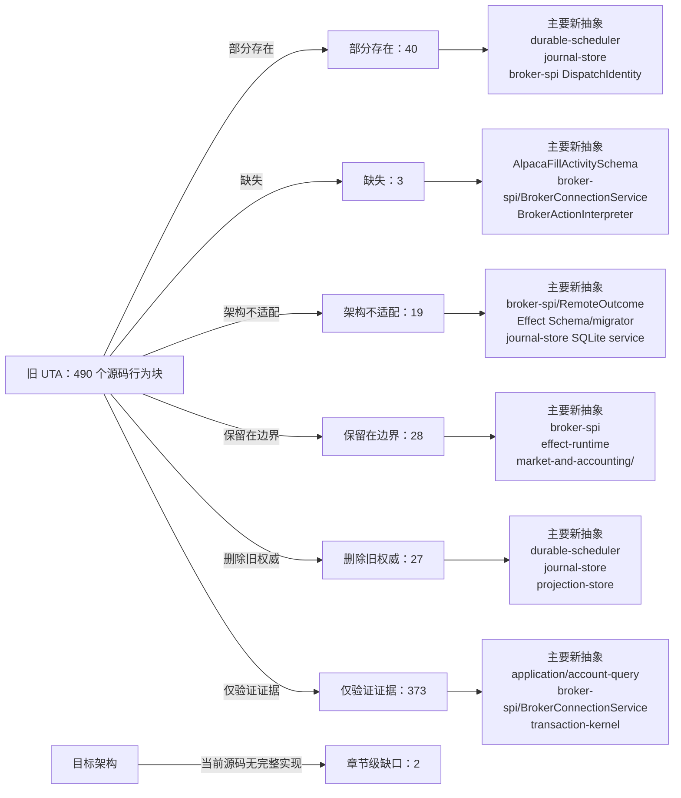

<!-- Auto-generated by scripts/uta-effect-runtime-map.mjs from mapping.json. Do not edit by hand. -->
<!-- Regenerate with `node scripts/uta-effect-runtime-map.mjs`. -->

# UTA 功能替代关系：第 18 章 Verification contract

目标架构原文：[`docs/uta-effect-runtime-architecture.md:1430-1473`](../uta-effect-runtime-architecture.md#L1430-L1473)。

## 结论

部分存在 40；缺失 3；架构不适配 19；保留在边界 28；删除旧权威 27；仅验证证据 373。状态只描述当前实现相对于目标架构的关系，不表示迁移已经落地。

## 替代关系图

## 章节级目标缺口

| 依据 | 目标义务 | 当前缺口 | 必须补充或调整 |
|---|---|---|---|
| docs/uta-effect-runtime-architecture.md:1457-1463; docs/uta-live-testing.md:15-32,222-396; services/uta/src/domain/trading/__test__/e2e/README.md:81-92; services/uta/src/domain/trading/__test__/e2e/setup.ts:1-29,101-105 | Real-broker acceptance protocol and scenario catalog | Legacy broker e2e setup correctly filters to paper/sandbox/demo accounts, but the existing suites do not implement the complete target acceptance evidence: exclusive alice-uta agent-surface execution, recorded before/after baseline, dispatch identity and raw status evidence, unknown-outcome reconciliation, compensation, failure cleanup/manual-stop handling, full applicable S1-S14 catalog, and explicit no-unexpected-open-orders finish. | Retain the non-live account gate, then run all applicable broker scenarios through the public agent surface, record baseline/identities/status/evidence, exercise unknown reconciliation and compensation, and finish flat or at the declared baseline with no unexpected open orders. |
| docs/uta-effect-runtime-architecture.md:1465-1472; services/uta/package.json:1-35 | Source, Docker, and packaged-Electron SQLite acceptance | Current UTA package/runtime has no mapped native SQLite dependency or executable evidence that every distribution opens/migrates the embedded database, survives abrupt termination, backup/restore, and OPENALICE_HOME relocation, or fails loudly on corruption. | Package the selected SQLite stack for every supported architecture and execute the complete source/Docker/Electron storage acceptance matrix against the real runtime. |

## 源码映射

| 映射 ID | 当前源码 | 符号或行为块 | 当前功能 | 替代状态 | 新 UTA 抽象与做法 | 不适配位置与原因 | 必须补充或调整 | 重复索引 |
|---|---|---|---|---|---|---|---|---|
| `MAP-52A6B771BA` | [`packages/uta-protocol/src/brokers/preset-catalog.ts:470-495`](../../packages/uta-protocol/src/brokers/preset-catalog.ts#L470-L495) | SIMULATOR_PRESET | Declares a mock simulator with in-memory state, cash as a coerced number, no credentials, and a random _instanceId fingerprint used to derive a unique id; its hint states all state is wiped on restart. | 架构不适配 | 1. Thesis and non-negotiable properties；3.7 brokers/<broker>/；3.4 journal-store/；3.5 durable-scheduler/；5.3 Two-phase transaction protocol；7.1 Embedded database；12.1 Startup sequence；14. Public protocol；17.1 Slice 1: durable kernel with MockBroker；18. Verification contract；20. First falsifier MockBroker interpreter；transaction-kernel/；journal-store/；durable-scheduler/；DispatchIdentity；RemoteOutcome Retain MockBroker as the first executable adapter, but make transaction intent, jobs, outcomes, and mock broker observations durable in SQLite and recoverable across restart. | The current advertised simulator is explicitly process-memory-only and cash is a coerced number; it cannot satisfy the MockBroker crash/recovery falsifier or prove no duplicate dispatch. | Replace in-memory simulator authority with the durable MockBroker vertical slice, use DecimalString/Money and typed commands/outcomes, and keep any panel controls as a boundary over that slice. | **DUP-042** |
| `MAP-E9688DBE16` | [`packages/uta-protocol/src/brokers/preset-catalog.ts:582-588`](../../packages/uta-protocol/src/brokers/preset-catalog.ts#L582-L588) | mintInstanceId | Generates a random four-byte hex token for simulator preset identity seeding. | 部分存在 | 3.1 domain/；3.4 journal-store/；5.7 Complete type contract — nominal identities and financial values；7.1 Embedded database；17.1 Slice 1: durable kernel with MockBroker；18. Verification contract；20. First falsifier AccountId；ConnectionId；MockBroker；journal-store/；protocol/config schemas Use a typed persisted MockBroker AccountId/ConnectionId constructor and retain randomness only as the generation mechanism, not as an unvalidated public identity string. | The token has no branded type, persistence/restore contract, or relationship to durable mock broker state; uniqueness is only a process/config convention. | Persist and decode simulator identity through journal/config schemas and use it in DispatchIdentity/recovery tests across restart. | **DUP-048** |
| `MAP-E43DFC70EF` | [`packages/uta-protocol/src/schemas/index.ts:1-10`](../../packages/uta-protocol/src/schemas/index.ts#L1-L10) | empty Zod schema barrel | Documents one Zod request/response pair per endpoint but exports nothing. | 缺失 | 3.9 transport/ and protocol/；5.7 Complete type contract；9.2 Typed action interpreter；14. Public protocol；18. Verification contract protocol/；transport/http；PrepareTransactionResponse；GetTransactionResponse；BrokerActionInterpreter Populate protocol/ with named schemas for every public request and response, including transaction draft/prepare/approve/reject/recover, transaction/event queries, capabilities, and account state. | No runtime decoder exists for requests, responses, branded identifiers, transaction states, failure variants, broker outcomes, or capability views. | Define and export each route's schema/type pair, decode at transport ingress and response egress, and add persistence schemas separately for journal payloads rather than accepting unknown JSON. | **DUP-066** |
| `MAP-654966E128` | [`packages/uta-protocol/src/types/broker.spec.ts:1-3`](../../packages/uta-protocol/src/types/broker.spec.ts#L1-L3) | BrokerError test import | The spec imports the legacy BrokerError class directly from the broker wire-types module. | 仅验证证据 | 4. Effect model；9.2 Typed action interpreter；12.3 Defects and expected failures；18. Verification contract；19. Architectural prohibitions broker-spi/；BrokerRejection；DispatchFailure；protocol/ Use the spec as migration evidence only, then replace the import with the target broker failure and protocol-schema constructors. | This is evidence of a class-based legacy error contract, not proof of the target typed failure channel. | Retire the class-based fixture when BrokerRejection/DispatchFailure schemas and adapter mapping are available, and test exhaustive failure encoding instead. | **DUP-067** |
| `MAP-ACEFB58A14` | [`packages/uta-protocol/src/types/broker.spec.ts:5-19`](../../packages/uta-protocol/src/types/broker.spec.ts#L5-L19) | structured BrokerError preservation test | Builds an Error-like object with name BrokerError, code AUTH, and permanent true, then asserts BrokerError.from preserves the code, permanence, and original cause. | 仅验证证据 | 4. Effect model；9.2 Typed action interpreter；12.3 Defects and expected failures；18. Verification contract；19. Architectural prohibitions BrokerRejection；DispatchFailure；BrokerActionInterpreter；protocol/ failure schemas Replace this compatibility assertion with a boundary test that decodes a named broker rejection and exhaustively maps it to the corresponding DispatchFailure without relying on constructor identity or string metadata. | The test protects cross-package class-like string-code preservation, whereas the target requires typed failure variants and schema decoding. | Delete this legacy test once adapter failures are represented by the target ADTs; retain a test for lossless structured rejection fields and explicit unknown/protocol-violation handling. | **DUP-068** |
| `MAP-1A43E0FCC4` | [`packages/uta-protocol/src/types/broker.spec.ts:21-28`](../../packages/uta-protocol/src/types/broker.spec.ts#L21-L28) | unknown BrokerError code fallback test | Builds an Error-like object with an unrecognized string code and asserts BrokerError.from silently converts it to UNKNOWN. | 仅验证证据 | 4. Effect model；9.2 Typed action interpreter；12.3 Defects and expected failures；18. Verification contract；19. Architectural prohibitions ProtocolViolation；DispatchFailure；BrokerRejection；protocol/ failure schemas Replace silent code fallback with a schema/parser test proving that an unrecognized persisted or remote failure becomes an explicit ProtocolViolation/defect path, while expected broker failures remain exhaustive ADT variants. | The test enshrines permissive unknown-code coercion, which can hide malformed protocol data and violates the target distinction between expected failures and defects. | Remove the UNKNOWN fallback assertion and test loud preservation of malformed evidence plus typed recovery behavior. | **DUP-069** |
| `MAP-19CA6A1780` | [`packages/uta-protocol/src/types/git.ts:194-201`](../../packages/uta-protocol/src/types/git.ts#L194-L201) | PriceChangeInput | Accepts a symbol or aliceId, including `all`, and a free-form absolute/relative change string for simulator price mutation. | 保留在边界 | 5.7 Complete type contract — nominal identities and financial values；8.1 Admission；9.2 Typed action interpreter；14. Public protocol；17.1 Slice 1: durable kernel with MockBroker；18. Verification contract；20. First falsifier MockBroker interpreter；TradeAction；InstrumentId；protocol/ admin test schema；durable-scheduler/ Keep price injection only as an explicit MockBroker/admin test harness command, decoded by a named schema and routed to simulated broker observation; never treat it as a trading transaction or durable execution authority. | The input is intentionally a dev/test control surface, but free-form symbol/change strings are not suitable as kernel actions and must not be used to prove live execution semantics. | Confine this command to MockBroker test tooling, validate absolute/relative variants as an ADT, and persist resulting mock observations through the same journal/reconciliation path used by the falsifier. | **DUP-123** |
| `MAP-8AD42F6839` | [`packages/uta-protocol/src/types/git.ts:203-211`](../../packages/uta-protocol/src/types/git.ts#L203-L211) | SimulationPositionCurrent | Reports simulator symbol, long/short side, decimal-string quantity/cost/price/PnL/value for the pre-change state. | 保留在边界 | 6. State tiers and snapshots；10.1 Accounting owns；14. Public protocol；17.1 Slice 1: durable kernel with MockBroker；18. Verification contract；20. First falsifier MockBroker observation；market-and-accounting/；projection-store/；protocol/ simulator projection Retain as a read-only simulator projection if needed by the dev panel, generated from normalized mock account/exposure observations and never used as journal authority. | The DTO has no InstrumentId/CurrencyCode/Instant or projection checkpoint and is tied to the current in-memory simulator presentation. | Use a named simulator projection schema backed by the durable MockBroker slice, or keep it explicitly dev-only and outside domain/transaction-kernel types. | **DUP-124** |
| `MAP-CAFDD48B6D` | [`packages/uta-protocol/src/types/git.ts:213-223`](../../packages/uta-protocol/src/types/git.ts#L213-L223) | SimulationPositionAfter | Reports simulator position values after a simulated price, including PnL change and percentage as decimal strings. | 保留在边界 | 6. State tiers and snapshots；10.1 Accounting owns；14. Public protocol；17.1 Slice 1: durable kernel with MockBroker；18. Verification contract；20. First falsifier MockBroker observation；market-and-accounting/；projection-store/；protocol/ simulator projection Keep as a derived UI/test projection from typed mock observations and accounting functions; do not let it substitute for transaction result/remote outcome records. | The result is a simulator-specific derived view with unbranded symbol and no declared currency/observation identity; it does not represent the target commit criterion or recovery state. | Generate it from normalized mock account projections and name its schema as a test/presentation boundary, while verifying recovery through journal/remote observation separately. | **DUP-125** |
| `MAP-0CEEC81F23` | [`packages/uta-protocol/src/types/git.ts:225-246`](../../packages/uta-protocol/src/types/git.ts#L225-L246) | SimulatePriceChangeResult | Combines success boolean/error string, current and simulated account/position states, and string summary deltas including worstCase. | 保留在边界 | 1. Thesis and non-negotiable properties；5.7 Complete type contract — error channels；6. State tiers and snapshots；10.1 Accounting owns；12.2 Unknown-outcome protocol；14. Public protocol；17.1 Slice 1: durable kernel with MockBroker；18. Verification contract；20. First falsifier MockBroker interpreter；TransactionFailure；QueryFailure；market-and-accounting/；projection-store/；protocol/ Keep only as a named simulator preview response; use typed QueryFailure/validation failures and derive preview data without claiming broker dispatch or transaction commitment. | Success/error text and nested ad hoc state are not target transaction or accounting ADTs; the response says nothing about durable mock observations, dispatch identity, or recovery. | Separate simulator preview from execution protocol, add runtime schema and typed query/validation failures, and exercise the durable MockBroker crash/reconciliation path independently. | **DUP-126** |
| `MAP-38469CADA4` | [`services/uta/src/__tests__/trading-tools.spec.ts:1-15`](../../services/uta/src/__tests__/trading-tools.spec.ts#L1-L15) | trading-tools test boundary imports | Imports createTradingTools, UTAManager, UnifiedTradingAccount, MockBroker, IBKR Order/OpenOrder values, and contract extensions; the comments explicitly place this spec at Alice's tool boundary over co-located UTA broker/domain stubs. | 仅验证证据 | §2 System boundary；§3 Module graph and allowed dependencies；§3.9 transport/ and protocol/；§9 Broker service-provider interface；§18 Verification contract transport/http；protocol (@traderalice/uta-protocol)；application/account-query；broker-spi；brokers/Mock；verification fixtures Retain the fixture as integration evidence, but migrate the exercised seam to a typed UTA client/protocol request and response through transport/http; keep MockBroker behind broker-spi and keep broker-native values confined to adapter-side test fixtures. | — | — | **DUP-141** |
| `MAP-3FABE05A73` | [`services/uta/src/__tests__/trading-tools.spec.ts:17-24`](../../services/uta/src/__tests__/trading-tools.spec.ts#L17-L24) | makeUta / makeManager | Constructs one UnifiedTradingAccount for each MockBroker and registers each account in a UTAManager, giving tool tests an in-process multi-account manager. | 仅验证证据 | §2 System boundary；§3 Module graph and allowed dependencies；§9.1 Connection Layer；§17 Migration sequence；§18.1 Kernel crash matrix main composition root；effect-runtime；brokers/Mock；broker-spi/BrokerConnectionService；application/account-query；verification fixtures Use the helper only as current-path evidence; the target fixture should compose a scoped MockBroker Layer and application/account-query service from the composition root, with account lifecycle owned by UTA rather than by an in-process legacy manager helper. | — | — | **DUP-142** |
| `MAP-468691D82C` | [`services/uta/src/__tests__/trading-tools.spec.ts:40-65`](../../services/uta/src/__tests__/trading-tools.spec.ts#L40-L65) | UTAManager.resolve | Checks account-source resolution semantics: no source returns every registered UTA, an exact source returns one matching account, and an unknown source returns an empty array. | 仅验证证据 | §2 System boundary；§3.8 projection-store/；§3.9 transport/ and protocol/；§14 Public protocol；§15 Security and authority；§18 Verification contract application/account-query；domain identifiers；projection-store；protocol account-state schema；transport/http Map source selection to a typed account-query operation over authorized AccountId values and named account-state responses; retain the all-versus-exact filtering evidence while checking that account visibility is enforced at the application/transport boundary. | — | — | **DUP-144** |
| `MAP-A88187B75A` | [`services/uta/src/__tests__/trading-tools.spec.ts:69-87`](../../services/uta/src/__tests__/trading-tools.spec.ts#L69-L87) | UTAManager.resolveOne | Returns the sole UTA for an exact source and throws a string-bearing error when no UTA matches the requested source. | 仅验证证据 | §2 System boundary；§3.9 transport/ and protocol/；§4 Effect model；§14 Public protocol；§15 Security and authority；§18 Verification contract application/account-query；domain identifiers；protocol error schema；transport/http Map failed account resolution to a named application/protocol error variant at the boundary, preserving exact identity routing without making a thrown message the public error contract. | — | — | **DUP-145** |
| `MAP-8588C24A12` | [`services/uta/src/__tests__/trading-tools.spec.ts:91-99`](../../services/uta/src/__tests__/trading-tools.spec.ts#L91-L99) | createTradingTools.listUTAs | Calls the tool layer with no arguments and verifies that it returns an array of summaries containing the registered account identifier. | 仅验证证据 | §2.1 Alice owns；§3.8 projection-store/；§3.9 transport/ and protocol/；§6 State tiers and snapshots；§13 Observability；§14 Public protocol；§15 Security and authority application/account-query；projection-store；protocol account-state schema；transport/http Treat this as read-only account projection evidence. The target query should return a named account/capability summary with reachability state and no credentials or native adapter object, verified through the public schema. | — | — | **DUP-146** |
| `MAP-0B6606BE1C` | [`services/uta/src/__tests__/trading-tools.spec.ts:103-119`](../../services/uta/src/__tests__/trading-tools.spec.ts#L103-L119) | createTradingTools.searchContracts | Spies on two separate MockBroker instances and verifies that searchContracts aggregates one matching contract description from each registered UTA. | 仅验证证据 | §2 System boundary；§3.8 projection-store/；§3.9 transport/ and protocol/；§9.2 Typed action interpreter；§10 Accounting and market boundaries；§18 Verification contract application/account-query；broker-spi/BrokerActionInterpreter；brokers/Mock；market-and-accounting；protocol contract-query schema Map the aggregation to a typed account/instrument query that normalizes broker observations behind broker-spi and returns a named contract projection; retain multi-account aggregation as verification evidence without exposing broker SDK descriptions publicly. | — | — | **DUP-147** |
| `MAP-1E2638E1F3` | [`services/uta/src/__tests__/trading-tools.spec.ts:123-135`](../../services/uta/src/__tests__/trading-tools.spec.ts#L123-L135) | getOrders.makeOpenOrder | Builds an OpenOrder fixture from native IBKR Order, OrderState, and contract values, including Decimal quantities/prices and an Alice identifier. | 仅验证证据 | §3.1 domain/；§3.7 brokers/<broker>/；§5.7 Complete type contract；§6 State tiers and snapshots；§9.2 Typed action interpreter；§14 Public protocol domain/order and identifiers；projection-store/orders；broker-spi；brokers/Mock；protocol order schema Replace native OpenOrder fixtures at the public-test seam with normalized order snapshots or projection records. Native IBKR objects may remain adapter-side evidence, while domain/order and protocol schemas carry only broker-neutral values. | — | — | **DUP-148** |
| `MAP-EBC1DF5535` | [`services/uta/src/__tests__/trading-tools.spec.ts:137-167`](../../services/uta/src/__tests__/trading-tools.spec.ts#L137-L167) | getOrders.compactSummaries | Executes a staged and pushed market order, then checks that getOrders returns compact fields such as source, action, orderType, quantity, and status while excluding raw IBKR fields. | 仅验证证据 | §2 System boundary；§3.8 projection-store/；§3.9 transport/ and protocol/；§5 Transaction algebra；§6 State tiers and snapshots；§9.2 Typed action interpreter；§13 Observability；§14 Public protocol；§15 Security and authority application/account-query；projection-store/orders；protocol order schema；broker-spi/BrokerActionInterpreter；brokers/Mock Use this as read-projection boundary evidence: the target orders query should encode normalized named fields, omit broker-native SDK fields, and read from rebuildable projection state after journaled execution; the fixture itself does not prove durable dispatch. | — | — | **DUP-149** |
| `MAP-0682C42EA8` | [`services/uta/src/__tests__/trading-tools.spec.ts:169-193`](../../services/uta/src/__tests__/trading-tools.spec.ts#L169-L193) | getOrders.UNSETFiltering | Mocks a raw OpenOrder with IBKR UNSET numeric values and zero parentId, then verifies that unset optional fields are omitted from the returned order summary. | 仅验证证据 | §3.7 brokers/<broker>/；§3.8 projection-store/；§3.9 transport/ and protocol/；§6 State tiers and snapshots；§9.2 Typed action interpreter；§14 Public protocol；§15 Security and authority brokers/Mock；broker-spi/BrokerActionInterpreter；projection-store/orders；protocol order schema Normalize adapter sentinel values at the broker/projection boundary and validate the resulting named response schema; preserve absence semantics without allowing raw SDK sentinels into public protocol or stored projections. | — | — | **DUP-150** |
| `MAP-0CD7FA4541` | [`services/uta/src/__tests__/trading-tools.spec.ts:195-211`](../../services/uta/src/__tests__/trading-tools.spec.ts#L195-L211) | getOrders.optionalFields | Mocks a limit order with a lmtPrice and nested take-profit/stop-loss values and verifies that explicitly present optional fields survive summarization. | 仅验证证据 | §3.1 domain/；§3.8 projection-store/；§3.9 transport/ and protocol/；§5.7 Complete type contract；§6 State tiers and snapshots；§9.2 Typed action interpreter；§14 Public protocol domain/order ADT；projection-store/orders；protocol order schema；brokers/Mock；broker-spi/BrokerActionInterpreter Carry optional order terms through a broker-neutral order ADT and rebuildable order projection, with schema-defined nested risk terms and decimal values; use the current test as evidence for preservation rather than raw-object compatibility. | — | — | **DUP-151** |
| `MAP-07DB18F4C8` | [`services/uta/src/__tests__/trading-tools.spec.ts:213-228`](../../services/uta/src/__tests__/trading-tools.spec.ts#L213-L228) | getOrders.decimalSerialization | Sets a small Decimal limit price and verifies that the tool emits the exact decimal string instead of a JavaScript number. | 仅验证证据 | §3.1 domain/；§3.8 projection-store/；§5.7 Complete type contract；§7.1 Embedded database；§9.2 Typed action interpreter；§14 Public protocol；§15 Security and authority domain decimal value objects；protocol schemas；projection-store/orders；journal-store serialization；broker-spi Preserve decimal precision through domain value objects, versioned journal/projection serialization, adapter normalization, and the public response schema; keep the exact-string assertion as a precision regression check. | — | — | **DUP-152** |
| `MAP-0C2AAEE0A8` | [`services/uta/src/__tests__/trading-tools.spec.ts:230-242`](../../services/uta/src/__tests__/trading-tools.spec.ts#L230-L242) | getOrders.orderIdentity | Provides a string orderId from getPendingOrderIds while the native Order carries a numeric sentinel, and verifies that the returned summary preserves the explicit string identity. | 仅验证证据 | §3.1 domain/；§3.8 projection-store/；§5.7 Complete type contract；§6 State tiers and snapshots；§14 Public protocol；§18 Verification contract domain identifiers；projection-store/orders；protocol order schema；application/account-query Use a branded BrokerOrderId/dispatch identity as the projection join key and public identifier, rather than reading a native SDK sentinel; retain the test as identity-preservation evidence. | — | — | **DUP-153** |
| `MAP-CA93BD9449` | [`services/uta/src/__tests__/trading-tools.spec.ts:244-270`](../../services/uta/src/__tests__/trading-tools.spec.ts#L244-L270) | getOrders.groupByContract | Mocks three pending orders across AAPL and ETH and verifies that groupBy contract returns an object keyed by each Alice contract identifier with the expected order clusters. | 仅验证证据 | §2 System boundary；§3.8 projection-store/；§6 State tiers and snapshots；§8.2 Partitioning；§14 Public protocol；§18.2 Concurrency scenarios projection-store/orders；application/account-query；domain InstrumentId and ConflictKey；protocol grouped-order schema Represent grouped results as a named read projection keyed by broker-neutral InstrumentId/contract identity. If grouping feeds scheduling, derive explicit ConflictKey values; do not make an untyped object the transaction or queue authority. | — | — | **DUP-154** |
| `MAP-DF17C576FF` | [`services/uta/src/__tests__/trading-tools.spec.ts:274-289`](../../services/uta/src/__tests__/trading-tools.spec.ts#L274-L289) | createTradingTools.getQuote.resolution | Resolves mock-paper\|AAPL through the UTA, spies on broker.getQuote, verifies that the broker receives a native contract with populated symbol/localSymbol and the original Alice identifier, and checks the quote source. | 仅验证证据 | §2 System boundary；§3.7 brokers/<broker>/；§3.9 transport/ and protocol/；§9.2 Typed action interpreter；§14 Public protocol；§15 Security and authority transport/http；protocol quote schema；application/account-query；broker-spi/BrokerActionInterpreter；brokers/Mock Resolve the typed account/instrument identity in application services, pass a broker-neutral action/query to broker-spi, and encode a named quote response; keep native contract expansion confined to the broker interpreter boundary. | — | — | **DUP-155** |
| `MAP-560B7EEA32` | [`services/uta/src/__tests__/trading-tools.spec.ts:291-296`](../../services/uta/src/__tests__/trading-tools.spec.ts#L291-L296) | createTradingTools.getQuote.malformedAliceId | Invokes getQuote with an identifier lacking the expected separator and verifies that the result contains an Invalid aliceId error. | 仅验证证据 | §2 System boundary；§3.9 transport/ and protocol/；§4 Effect model；§14 Public protocol；§15 Security and authority；§18 Verification contract protocol codecs；domain identifiers；application/account-query；transport/http；typed error schema Decode a structured account/instrument identifier with a named schema before any broker call and return a typed malformed-input/protocol error; retain this assertion as boundary-rejection evidence rather than a regex error contract. | — | — | **DUP-156** |
| `MAP-CEE9B91D31` | [`services/uta/src/__tests__/trading-tools.spec.ts:298-310`](../../services/uta/src/__tests__/trading-tools.spec.ts#L298-L310) | createTradingTools.getQuote.sourceRouting | Registers Alpaca and Bybit accounts, calls getQuote with bybit-main\|BTC and no explicit source, and verifies only the Bybit broker receives the request. | 仅验证证据 | §2 System boundary；§3.7 brokers/<broker>/；§3.9 transport/ and protocol/；§9.1 Connection Layer；§9.2 Typed action interpreter；§14 Public protocol；§15 Security and authority application/account-query；domain AccountId/InstrumentId；broker-spi/BrokerConnectionService；broker-spi/BrokerActionInterpreter；protocol quote schema Use authenticated, typed account identity to select exactly one broker connection and interpreter before dispatching a read action; preserve the no-cross-account-routing invariant at the application and protocol boundary. | — | — | **DUP-157** |
| `MAP-08E9053B72` | [`services/uta/src/__tests__/trading-tools.spec.ts:314-329`](../../services/uta/src/__tests__/trading-tools.spec.ts#L314-L329) | createTradingTools.getContractDetails.expansion | Calls getContractDetails with a source and Alice identifier, spies on the broker, and verifies that the broker receives an expanded native query retaining the original identifier. | 仅验证证据 | §2 System boundary；§3.7 brokers/<broker>/；§3.9 transport/ and protocol/；§9.2 Typed action interpreter；§10 Accounting and market boundaries；§14 Public protocol；§15 Security and authority application/account-query；market-and-accounting；broker-spi/BrokerActionInterpreter；protocol contract schema；brokers/Mock Map contract details through typed market/account services and broker-spi, expanding broker-native instrument fields only inside the adapter; return normalized contract data through the public schema. | — | — | **DUP-158** |
| `MAP-E66037B98B` | [`services/uta/src/__tests__/trading-tools.spec.ts:331-340`](../../services/uta/src/__tests__/trading-tools.spec.ts#L331-L340) | createTradingTools.getContractDetails.crossUTA | Passes an Alice identifier belonging to another account while selecting mock-paper and verifies that the tool reports the account mismatch without a broker call assertion. | 仅验证证据 | §2 System boundary；§3.9 transport/ and protocol/；§4 Effect model；§14 Public protocol；§15 Security and authority；§18 Verification contract application/account-query；domain account identity；protocol error schema；transport/http；broker-spi Enforce account/UTA ownership in the application boundary and return a structured identity/authorization error before invoking any foreign broker interpreter; keep the mismatch test as a security-boundary invariant. | — | — | **DUP-159** |
| `MAP-27AD48107A` | [`services/uta/src/__tests__/trading-tools.spec.ts:344-371`](../../services/uta/src/__tests__/trading-tools.spec.ts#L344-L371) | placeOrder.inputSchema.emptyOptionalNumerics | Uses the placeOrder input schema with empty strings for optional numeric fields and verifies parsing succeeds, empty fields become undefined, and totalQuantity remains the supplied decimal string. | 仅验证证据 | §2 System boundary；§3.9 transport/ and protocol/；§5.7 Complete type contract；§7.1 Embedded database；§14 Public protocol；§15 Security and authority；§18 Verification contract TypeBox agent tool schema；protocol action schema；application/transaction；domain order/action ADTs；transport/http；transaction-kernel Model optional numeric inputs as omitted-or-decimal values at the tool/protocol decode boundary, then compile a typed transaction command; retain empty-string normalization only as client ergonomics and keep authorization/approval in application/transaction-kernel services. | — | — | **DUP-160** |
| `MAP-4DE6045663` | [`services/uta/src/__tests__/trading-tools.spec.ts:373-387`](../../services/uta/src/__tests__/trading-tools.spec.ts#L373-L387) | placeOrder.inputSchema.invalidNumerics | Uses a non-positive totalQuantity and verifies that the placeOrder schema rejects the input before execution. | 仅验证证据 | §2 System boundary；§3.9 transport/ and protocol/；§4 Effect model；§5 Transaction algebra；§14 Public protocol；§15 Security and authority；§18 Verification contract protocol action schema；domain order/action ADTs；application/transaction；transaction-kernel；transport/http；typed validation errors Reject malformed or non-positive order quantities with a named schema/domain failure before prepare or broker dispatch; this test remains evidence for the input gate, not for authorization, durability, or execution semantics. | — | — | **DUP-161** |
| `MAP-5A0732EC10` | [`services/uta/src/domain/trading/__test__/e2e/alpaca-paper.e2e.spec.ts:22-30`](../../services/uta/src/domain/trading/__test__/e2e/alpaca-paper.e2e.spec.ts#L22-L30) | beforeAll Alpaca broker setup | Selects an Alpaca paper account, stores its generic IBroker, queries the market clock, and records a boolean marketOpen guard. | 保留在边界 | 2.3 Brokers own；9.1 Connection Layer；10.2 Market and jurisdiction owns；18.3 Real broker acceptance brokers/alpaca scoped Layer；broker-spi connection/session service；market-and-accounting Keep account selection as paper-test boundary and move connection/session acquisition to the target Alpaca broker-spi Layer. | The fixture observes a coarse account-wide boolean and generic IBroker, not typed venue/instrument session or capability observations. | — | **DUP-162** |
| `MAP-60855A8312` | [`services/uta/src/domain/trading/__test__/e2e/alpaca-paper.e2e.spec.ts:34-68`](../../services/uta/src/domain/trading/__test__/e2e/alpaca-paper.e2e.spec.ts#L34-L68) | Alpaca connectivity | Queries account equity/cash, market clock, AAPL search, and positions; asserts positive values, AAPL identity, and Decimal/string field types. | 仅验证证据 | 9 Broker service-provider interface；10 Accounting and market boundaries；18.3 Real broker acceptance brokers/alpaca typed interpreter；broker-spi account/query service；market-and-accounting Retain as low-level Alpaca adapter evidence and add typed target account/market observation tests. | Read-only connectivity assertions do not prove durable transaction, scheduler, reconciliation, compensation, or crash behavior. | — | **DUP-163** |
| `MAP-7E7AB00B65` | [`services/uta/src/domain/trading/__test__/e2e/alpaca-paper.e2e.spec.ts:72-109`](../../services/uta/src/domain/trading/__test__/e2e/alpaca-paper.e2e.spec.ts#L72-L109) | Alpaca direct limit order lifecycle | Creates a native Contract/Order, places a $1 GTC limit buy, queries it singly and in batch, cancels it, and asserts success/order identity. | 部分存在 | 9.2 Typed action interpreter；9.3 Remote outcome；12.2 Unknown-outcome protocol；18.3 Real broker acceptance broker-spi DispatchIdentity；brokers/alpaca typed interpreter；durable-scheduler；journal-store Retain as adapter acceptance through a target typed action interpreter and durable place/query/cancel transaction with dispatch identity and reconciliation. | The direct generic IBroker call uses native Contract/Order and timer-based query; no durable intent, lease, unknown outcome, compensation, or restart is tested. | Add target journal/scheduler assertions and baseline cleanup, then make the typed broker-spi action the only mutation path. | **DUP-164** |
| `MAP-415093F05F` | [`services/uta/src/domain/trading/__test__/e2e/alpaca-paper.e2e.spec.ts:113-130`](../../services/uta/src/domain/trading/__test__/e2e/alpaca-paper.e2e.spec.ts#L113-L130) | Alpaca quote observation | During market hours, creates an AAPL contract and asserts positive last/bid/ask/volume from getQuote. | 仅验证证据 | 9.1 Connection Layer；9.4 Capability derivation；10.2 Market and jurisdiction owns；18.3 Real broker acceptance broker-spi market-data observation；market-and-accounting session service Retain as read-only adapter evidence and represent market/session availability through typed broker-spi results. | Quote checks do not prove transaction durability, accounting projection, or recovery. | — | **DUP-165** |
| `MAP-DA8940C7D3` | [`services/uta/src/domain/trading/__test__/e2e/alpaca-paper.e2e.spec.ts:132-176`](../../services/uta/src/domain/trading/__test__/e2e/alpaca-paper.e2e.spec.ts#L132-L176) | Alpaca market buy and order query | Places a market AAPL buy during market hours, requires success and a UUID-like orderId, then places another buy, waits, queries it, and requires Filled. | 部分存在 | 9.2 Typed action interpreter；9.3 Remote outcome；10.1 Accounting owns；12.2 Unknown-outcome protocol；18.3 Real broker acceptance broker-spi DispatchIdentity/RemoteOutcome；brokers/alpaca typed interpreter；durable-scheduler；market-and-accounting Run these mutations through prepared target Alpaca actions and durable scheduler observation, asserting accepted/working/filled criteria and stable dispatch identity. | The suite calls generic placeOrder and uses a timer before getOrder; it has no journaled dispatch intent, unknown-outcome protocol, compensation, or restart/no-blind-retry proof. | Add target journal/scheduler/reconciliation assertions and clean up by target transaction rather than an untracked broker mutation. | **DUP-166** |
| `MAP-D684830A67` | [`services/uta/src/domain/trading/__test__/e2e/alpaca-paper.e2e.spec.ts:178-196`](../../services/uta/src/domain/trading/__test__/e2e/alpaca-paper.e2e.spec.ts#L178-L196) | Alpaca position and close | Reads AAPL positions after the prior buy, requires a positive quantity, and closes the AAPL position through generic closePosition. | 部分存在 | 9.2 Typed action interpreter；9.3 Remote outcome；10.1 Accounting owns；12.2 Unknown-outcome protocol；18.3 Real broker acceptance market-and-accounting position projection；broker-spi compensation/close action；durable-scheduler Use target accounting projection and typed close/compensation action with durable observation and baseline verification. | The scenario assumes state left by a preceding test, has no explicit baseline delta, journal authority, compensation capability, or unknown outcome handling. | Isolate a target transaction baseline and assert exact position/open-order restoration after durable close/reconciliation. | **DUP-167** |
| `MAP-0FB902DDBC` | [`services/uta/src/domain/trading/__test__/e2e/alpaca-paper.e2e.spec.ts:198-221`](../../services/uta/src/domain/trading/__test__/e2e/alpaca-paper.e2e.spec.ts#L198-L221) | Alpaca getOrders by known ID | Places another market buy, waits, queries getOrders with its ID, requires one result, and closes the position. | 部分存在 | 9.2 Typed action interpreter；9.3 Remote outcome；12.2 Unknown-outcome protocol；18.3 Real broker acceptance broker-spi DispatchIdentity；journal-store；durable-scheduler；brokers/alpaca typed interpreter Make batch lookup a target projection/reconciliation query keyed by durable dispatch identity and perform cleanup through a target transaction. | Known-ID lookup is direct generic IBroker evidence only; no journal/projection consistency, lease/restart, unknown outcome, or baseline proof exists. | Add durable dispatch/projection assertions and exact cleanup baseline. | **DUP-168** |
| `MAP-A9C599CFB8` | [`services/uta/src/domain/trading/__test__/e2e/ccxt-bybit.e2e.spec.ts:19-34`](../../services/uta/src/domain/trading/__test__/e2e/ccxt-bybit.e2e.spec.ts#L19-L34) | beforeAll Bybit broker setup | Selects a Bybit CCXT sandbox/demo account, stores its generic IBroker, and skips the suite if unavailable. | 保留在边界 | 2.3 Brokers own；9.1 Connection Layer；9.4 Capability derivation；15 Security and authority；18.3 Real broker acceptance brokers/ccxt/Bybit scoped Layer；broker-spi；effect-runtime Keep paper account selection as a test boundary and migrate broker access to the scoped CCXT/Bybit broker-spi Layer. | The setup provides only generic IBroker availability, not typed connection identity, capability context, or health/degraded state. | — | **DUP-169** |
| `MAP-B65B828516` | [`services/uta/src/domain/trading/__test__/e2e/ccxt-bybit.e2e.spec.ts:36-56`](../../services/uta/src/domain/trading/__test__/e2e/ccxt-bybit.e2e.spec.ts#L36-L56) | Bybit account/position/contract reads | Queries account equity, positions, and ETH contracts, requiring positive equity, an array, and a CRYPTO_PERP result. | 仅验证证据 | 9.4 Capability derivation；10.1 Accounting owns；10.2 Market and jurisdiction owns；18.3 Real broker acceptance broker-spi account/market observation；market-and-accounting；brokers/ccxt/Bybit interpreter Retain as direct adapter read evidence and add typed capability/accounting projection cases. | These reads do not prove target action schemas, durable execution, reconciliation, or recovery. | — | **DUP-170** |
| `MAP-68FD1B154A` | [`services/uta/src/domain/trading/__test__/e2e/ccxt-bybit.e2e.spec.ts:58-91`](../../services/uta/src/domain/trading/__test__/e2e/ccxt-bybit.e2e.spec.ts#L58-L91) | Bybit raw diagnostic plus generic placeOrder | Searches ETH, calls the internal raw CCXT createOrder for diagnostics, closes through the broker closePosition method, then places a market order via generic IBroker and asserts success/orderId and optional execution values. | 部分存在 | 9.2 Typed action interpreter；9.3 Remote outcome；12.2 Unknown-outcome protocol；13 Observability；18.3 Real broker acceptance；19 Architectural prohibitions brokers/ccxt/Bybit adapter；broker-spi DispatchIdentity/RemoteOutcome；durable-scheduler；observability redaction Move raw response inspection into adapter-only diagnostics and route the acceptance mutation through a typed Bybit interpreter with durable dispatch identity and reconciliation. | The scenario bypasses the abstraction with an any-cast Exchange call, then uses generic IBroker; it has no durable intent, typed unknown outcome, compensation, or target redaction proof. | Remove raw SDK calls from the target mutation scenario, define boundary schemas/error mapping, and add journal/scheduler/restart assertions. | **DUP-171** |
| `MAP-585A2F9006` | [`services/uta/src/domain/trading/__test__/e2e/ccxt-bybit.e2e.spec.ts:93-109`](../../services/uta/src/domain/trading/__test__/e2e/ccxt-bybit.e2e.spec.ts#L93-L109) | Bybit position and reduceOnly close | Reads positions after the preceding buy, requires an ETH position, then closes 0.01 ETH through generic closePosition and asserts success. | 部分存在 | 9.2 Typed action interpreter；9.3 Remote outcome；10.1 Accounting owns；12.2 Unknown-outcome protocol；18.3 Real broker acceptance broker-spi close/compensation action；market-and-accounting position projection；durable-scheduler Make position observation and reduceOnly close target typed actions/projections with durable compensation/reconciliation and baseline isolation. | It depends on prior test state and direct generic broker methods; no baseline delta, durable close intent, unknown outcome, or recovery is tested. | Isolate the account baseline and assert target journal/projection plus exact cleanup after restart-capable close. | **DUP-172** |
| `MAP-32BC46FDBD` | [`services/uta/src/domain/trading/__test__/e2e/ccxt-bybit.e2e.spec.ts:111-138`](../../services/uta/src/domain/trading/__test__/e2e/ccxt-bybit.e2e.spec.ts#L111-L138) | Bybit order query by ID | Places a market order, waits for settlement, queries it by returned ID, requires Filled, then closes the position. | 部分存在 | 9.2 Typed action interpreter；9.3 Remote outcome；12.2 Unknown-outcome protocol；18.3 Real broker acceptance broker-spi DispatchIdentity；durable-scheduler；journal-store；brokers/ccxt/Bybit interpreter Use durable DispatchIdentity and target remote-outcome observation/reconciliation instead of timer-based generic getOrder. | A sleep and direct query do not prove durable dispatch, lease recovery, unknown outcome, idempotency, or no blind retry. | Add journaled dispatch/observation, restart/reconciliation, and exact baseline cleanup assertions. | **DUP-173** |
| `MAP-4D4A864108` | [`services/uta/src/domain/trading/__test__/e2e/ccxt-bybit.e2e.spec.ts:140-184`](../../services/uta/src/domain/trading/__test__/e2e/ccxt-bybit.e2e.spec.ts#L140-L184) | Bybit TPSL and fetched order | Computes TP/SL from a quote, places a market order with TPSL through generic IBroker, optionally asserts returned TPSL prices, and closes the position. | 部分存在 | 5.5 Compensation capability；9.2 Typed action interpreter；9.3 Remote outcome；12.2 Unknown-outcome protocol；18.3 Real broker acceptance transaction-kernel compensation compiler；broker-spi BrokerActionInterpreter；brokers/ccxt/Bybit interpreter；durable-scheduler Compile TPSL into target typed action/compensation plans, journal parent and conditional dispatch identities, and reconcile fetched observations before cleanup. | Missing TPSL is treated as a note; direct generic placeOrder/getOrder has no typed unsupported outcome, durable identity, compensation, or recovery semantics. | Define target Bybit TPSL capability and observation schemas and add durable scheduler/reconciliation evidence. | **DUP-174** |
| `MAP-14606B82FF` | [`services/uta/src/domain/trading/__test__/e2e/ccxt-hyperliquid-markets.e2e.spec.ts:18-38`](../../services/uta/src/domain/trading/__test__/e2e/ccxt-hyperliquid-markets.e2e.spec.ts#L18-L38) | dummy credentials and public Hyperliquid init | Defines dummy wallet/private-key strings, constructs a sandbox Hyperliquid CcxtBroker, initializes it, and captures initialization errors without making private API calls. | 保留在边界 | 2.3 Brokers own；9.1 Connection Layer；15 Security and authority；18.3 Real broker acceptance brokers/ccxt/Hyperliquid connection Layer；broker-spi；test account boundary Retain as a public-market adapter boundary test; use target broker-spi construction and a test-only credential provider that cannot be mistaken for production credential custody. | Dummy literals and direct CcxtBroker construction bypass target composition and do not prove scoped credentials, capability derivation, or durable runtime startup. | — | **DUP-176** |
| `MAP-444A62C6D5` | [`services/uta/src/domain/trading/__test__/e2e/ccxt-hyperliquid-markets.e2e.spec.ts:40-62`](../../services/uta/src/domain/trading/__test__/e2e/ccxt-hyperliquid-markets.e2e.spec.ts#L40-L62) | Hyperliquid market loading assertions | Requires sandbox initialization, at least 100 markets, and both spot and swap market types in the internal exchange map. | 仅验证证据 | 9.4 Capability derivation；10.2 Market and jurisdiction owns；18.3 Real broker acceptance brokers/ccxt/Hyperliquid interpreter；broker-spi capability derivation；market-and-accounting instrument catalog Retain as read-only adapter evidence and expose the resulting typed instrument/capability catalog through broker-spi. | Market counts/types do not prove transaction preparation, durable scheduling, accounting, reconciliation, or packaging behavior. | — | **DUP-177** |
| `MAP-301A0F7EF8` | [`services/uta/src/domain/trading/__test__/e2e/ccxt-hyperliquid-markets.e2e.spec.ts:64-79`](../../services/uta/src/domain/trading/__test__/e2e/ccxt-hyperliquid-markets.e2e.spec.ts#L64-L79) | Hyperliquid BTC perpetual search | Searches BTC through CcxtBroker and requires a result whose symbol/localSymbol identifies the BTC perpetual. | 仅验证证据 | 9.4 Capability derivation；10.2 Market and jurisdiction owns；18.3 Real broker acceptance broker-spi capability derivation；market-and-accounting instrument identity；brokers/ccxt/Hyperliquid interpreter Keep as instrument mapping evidence and add typed venue/account/instrument capability cases in the target adapter. | The search result alone provides no target protocol, transaction, journal, scheduler, or recovery evidence. | — | **DUP-178** |
| `MAP-50F731ABB9` | [`services/uta/src/domain/trading/__test__/e2e/ccxt-hyperliquid.e2e.spec.ts:35-50`](../../services/uta/src/domain/trading/__test__/e2e/ccxt-hyperliquid.e2e.spec.ts#L35-L50) | beforeAll Hyperliquid setup | Selects a configured Hyperliquid sandbox account, stores its generic IBroker, logs connection, and skips all tests if absent. | 保留在边界 | 2.3 Brokers own；9.1 Connection Layer；9.4 Capability derivation；15 Security and authority；18.3 Real broker acceptance brokers/ccxt/Hyperliquid scoped Layer；broker-spi；effect-runtime Keep sandbox account selection at the test boundary, but acquire Hyperliquid through a scoped broker-spi Layer with typed wallet/account capability. | The suite exposes a generic IBroker and has no target connection health/capability or durable runtime state. | — | **DUP-179** |
| `MAP-8D31A540CC` | [`services/uta/src/domain/trading/__test__/e2e/ccxt-hyperliquid.e2e.spec.ts:54-74`](../../services/uta/src/domain/trading/__test__/e2e/ccxt-hyperliquid.e2e.spec.ts#L54-L74) | Hyperliquid account and position observations | Asserts USD base currency and nonnegative equity, then checks position currency, recovered positive market price, and marketValue approximately equals quantity times market price. | 部分存在 | 9.2 Typed action interpreter；9.4 Capability derivation；10.1 Accounting owns；10.2 Market and jurisdiction owns；18.3 Real broker acceptance broker-spi account/position observation；market-and-accounting position/exposure projection；domain Money/Exposure Map Hyperliquid account/position observations into typed accounting projections and expose market/currency normalization as broker-spi observations. | The direct assertions cover a normalized position result but not currency-qualified Money, FX evidence, cost basis, valuation uncertainty, immutable preconditions, or journal/projection rebuild. | Add typed accounting observations and persistence/projection round trips and test their consumption by transaction-kernel preparation. | **DUP-180** |
| `MAP-5460468AB4` | [`services/uta/src/domain/trading/__test__/e2e/ccxt-hyperliquid.e2e.spec.ts:78-93`](../../services/uta/src/domain/trading/__test__/e2e/ccxt-hyperliquid.e2e.spec.ts#L78-L93) | Hyperliquid BTC/ETH market search | Searches BTC and ETH and requires a CRYPTO_PERP result for each. | 仅验证证据 | 9.4 Capability derivation；10.2 Market and jurisdiction owns；18.3 Real broker acceptance broker-spi capability derivation；market-and-accounting instrument catalog；brokers/ccxt/Hyperliquid interpreter Retain as adapter market evidence and add typed availability/session/jurisdiction assertions in the target capability service. | Search coverage alone is not transaction, durability, concurrency, or recovery evidence. | — | **DUP-181** |
| `MAP-A60C86B58F` | [`services/uta/src/domain/trading/__test__/e2e/ccxt-hyperliquid.e2e.spec.ts:97-129`](../../services/uta/src/domain/trading/__test__/e2e/ccxt-hyperliquid.e2e.spec.ts#L97-L129) | Hyperliquid BTC buy and position | Places a 0.001 BTC perpetual market buy, requires success/orderId and positive execution when present, then queries positions and requires a USD-normalized BTC position. | 部分存在 | 9.2 Typed action interpreter；9.3 Remote outcome；9.4 Capability derivation；10.1 Accounting owns；12.2 Unknown-outcome protocol；18.3 Real broker acceptance brokers/ccxt/Hyperliquid typed interpreter；broker-spi DispatchIdentity/RemoteOutcome；durable-scheduler；market-and-accounting Use as Hyperliquid paper acceptance through a typed action interpreter, durable dispatch identity, remote outcome reconciliation, and accounting projection. | It directly calls generic IBroker and accepts optional execution details; no durable intent, unknown outcome, compensation, baseline open-order check, or restart path is exercised. | Add target journal/scheduler records and reconciliation/crash scenarios, then require exact baseline cleanup. | **DUP-182** |
| `MAP-914C5731FE` | [`services/uta/src/domain/trading/__test__/e2e/ccxt-hyperliquid.e2e.spec.ts:131-166`](../../services/uta/src/domain/trading/__test__/e2e/ccxt-hyperliquid.e2e.spec.ts#L131-L166) | Hyperliquid close and order query | Closes 0.001 BTC with reduceOnly, then independently places another buy, waits, queries by orderId requiring Filled, and closes it. | 部分存在 | 9.2 Typed action interpreter；9.3 Remote outcome；12.2 Unknown-outcome protocol；18.3 Real broker acceptance broker-spi DispatchIdentity；durable-scheduler；journal-store；brokers/ccxt/Hyperliquid interpreter Drive close and observation through durable target jobs keyed by dispatch identity and distinguish confirmed/working/rejected/unknown outcomes before cleanup. | Timer-based getOrder/final close is not durable reconciliation and has no lease expiry, restart classification, compensation state, or no-blind-retry assertion. | Add journal-backed scheduler/reconciliation and account baseline/open-order assertions. | **DUP-183** |
| `MAP-CCFD876360` | [`services/uta/src/domain/trading/__test__/e2e/ccxt-okx.e2e.spec.ts:43-58`](../../services/uta/src/domain/trading/__test__/e2e/ccxt-okx.e2e.spec.ts#L43-L58) | beforeAll OKX setup and broker narrowing | Selects an OKX CCXT demo account from shared setup, stores its generic IBroker, logs connection, and narrows the nullable value with a local helper. | 保留在边界 | 2.3 Brokers own；9.1 Connection Layer；9.4 Capability derivation；15 Security and authority；18.3 Real broker acceptance brokers/ccxt/OKX scoped Layer；broker-spi connection/capability service；effect-runtime Keep account selection as test boundary and migrate its narrowed broker to a typed OKX broker-spi interpreter/connection service. | The suite exposes a generic IBroker and nullable assertion helper rather than target connection identity, capabilities, or typed degraded availability. | — | **DUP-184** |
| `MAP-CC43DAFDFD` | [`services/uta/src/domain/trading/__test__/e2e/ccxt-okx.e2e.spec.ts:62-82`](../../services/uta/src/domain/trading/__test__/e2e/ccxt-okx.e2e.spec.ts#L62-L82) | OKX connectivity and position observations | Asserts demo account base currency/equity, retrieves derivative and synthesized spot positions, and checks currency, positive market price, and marketValue approximately equals quantity times market price. | 部分存在 | 9.2 Typed action interpreter；9.4 Capability derivation；10.1 Accounting owns；10.2 Market and jurisdiction owns；18.3 Real broker acceptance broker-spi account/position observation；market-and-accounting position projection；domain Money/Exposure Feed these observations through typed broker-spi schemas into market-and-accounting projections, preserving distinct spot/perpetual identities and valuation uncertainty. | The direct generic IBroker assertions cover adapter output but not currency-qualified Money, FX/source timestamps, cost basis, uncertainty, or target projection/journal boundaries. | Add typed account/position observations and projection-store round trips, then consume them as immutable transaction preconditions. | **DUP-185** |
| `MAP-4B824156CE` | [`services/uta/src/domain/trading/__test__/e2e/ccxt-okx.e2e.spec.ts:86-102`](../../services/uta/src/domain/trading/__test__/e2e/ccxt-okx.e2e.spec.ts#L86-L102) | OKX market search | Searches BTC and ETH and requires the expected spot and perpetual local-symbol identities. | 仅验证证据 | 9.4 Capability derivation；10.2 Market and jurisdiction owns；18.3 Real broker acceptance broker-spi capability derivation；market-and-accounting instrument/session service；brokers/ccxt/OKX interpreter Retain as CCXT/OKX adapter market-identity evidence and add target capability ADT cases for venue/account/instrument context. | Search results alone do not prove typed action availability, jurisdiction/session constraints, durable identity, or transaction execution semantics. | — | **DUP-186** |
| `MAP-FBF3A41608` | [`services/uta/src/domain/trading/__test__/e2e/ccxt-okx.e2e.spec.ts:106-161`](../../services/uta/src/domain/trading/__test__/e2e/ccxt-okx.e2e.spec.ts#L106-L161) | OKX spot synthesis buy/sell | Buys approximately $50 of BTC/USDT spot using cashQty, waits for balance propagation, asserts CcxtBroker synthesizes a long Position with positive value and zero unrealized PnL, then sells the position and allows only a small dust remainder. | 部分存在 | 9.2 Typed action interpreter；9.3 Remote outcome；9.4 Capability derivation；10.1 Accounting owns；12.2 Unknown-outcome protocol；18.3 Real broker acceptance brokers/ccxt/OKX typed interpreter；broker-spi remote observation；market-and-accounting spot projection；durable-scheduler Retain the spot synthesis acceptance case behind a typed OKX action interpreter and journal-backed position projection; declare the cashQty/spot compensation policy and reconcile balance observations. | The test mutates through generic IBroker and infers positions from balance after a timer; it has no stable dispatch identity, durable intent, unknown-outcome handling, compensation, or target accounting projection. | Add typed spot action/observation schemas, durable scheduler dispatch and reconciliation, and exact baseline/open-order cleanup before considering the target real-broker requirement covered. | **DUP-187** |
| `MAP-0A7103653D` | [`services/uta/src/domain/trading/__test__/e2e/ccxt-okx.e2e.spec.ts:197-230`](../../services/uta/src/domain/trading/__test__/e2e/ccxt-okx.e2e.spec.ts#L197-L230) | OKX derivative buy/position/close | Attempts a 0.01 ETH perpetual buy, skips Cash-mode accounts, checks a separate ETH/USDT:USDT position identity, and closes it while treating mode/empty-position errors as skips. | 部分存在 | 9.2 Typed action interpreter；9.3 Remote outcome；9.4 Capability derivation；10.2 Market and jurisdiction owns；12.2 Unknown-outcome protocol；18.3 Real broker acceptance；19 Architectural prohibitions broker-spi ActionAvailability；brokers/ccxt/OKX interpreter；market-and-accounting instrument identity；durable-scheduler Express OKX Cash/Margin availability and separate spot/perp identities as typed capability and instrument ADTs; dispatch and close through target durable jobs with reconciliation. | The scenario provides useful account-mode and contract-identity evidence but uses string matching, generic IBroker calls, and skip branches rather than target availability/rejection/unknown-outcome types. | Replace skip/error-string handling with exhaustive typed capability/rejection outcomes and add journaled dispatch/observation plus baseline cleanup. | **DUP-189** |
| `MAP-C7223C2B36` | [`services/uta/src/domain/trading/__test__/e2e/ccxt-okx.e2e.spec.ts:234-254`](../../services/uta/src/domain/trading/__test__/e2e/ccxt-okx.e2e.spec.ts#L234-L254) | OKX order query after place | Places a derivative buy via the helper, waits for settlement, queries by returned orderId, requires Filled, then finds and closes the ETH perpetual. | 部分存在 | 9.2 Typed action interpreter；9.3 Remote outcome；12.2 Unknown-outcome protocol；18.3 Real broker acceptance broker-spi DispatchIdentity；durable-scheduler；journal-store；brokers/ccxt/OKX interpreter Make order query a target observation/reconciliation step keyed by durable DispatchIdentity, distinguishing confirmed fill, working, rejection, and unknown outcomes. | A timer plus generic getOrder is used; no durable dispatch record, lease/restart recovery, typed remote outcome, or compensation is tested. | Add target scheduler/journal recovery and no-blind-redispatch assertions around the OKX order identity. | **DUP-190** |
| `MAP-D16449202E` | [`services/uta/src/domain/trading/__test__/e2e/ccxt-raw-diagnostic.e2e.spec.ts:15-27`](../../services/uta/src/domain/trading/__test__/e2e/ccxt-raw-diagnostic.e2e.spec.ts#L15-L27) | beforeAll raw exchange setup | Loads a Bybit account, extracts the broker's internal CCXT Exchange through an any cast, and skips the diagnostic suite when no account is configured. | 保留在边界 | 2.3 Brokers own；9.2 Typed action interpreter；15 Security and authority；18.3 Real broker acceptance brokers/ccxt boundary test harness；broker-spi；test account boundary Retain only as an adapter diagnostic boundary; target production tests must access CCXT through the broker-spi interpreter and never expose the SDK instance beyond the adapter. | The internal Exchange extraction is intentionally diagnostic and untyped; it is not a target runtime API or evidence of credential isolation. | — | **DUP-191** |
| `MAP-B5990574ED` | [`services/uta/src/domain/trading/__test__/e2e/ccxt-raw-diagnostic.e2e.spec.ts:92-113`](../../services/uta/src/domain/trading/__test__/e2e/ccxt-raw-diagnostic.e2e.spec.ts#L92-L113) | spot versus perpetual orderId diagnostic | Checks whether spot/perpetual markets exist, places and closes raw perp orders, and optionally places a spot order while printing orderId formats and failures. | 仅验证证据 | 9.2 Typed action interpreter；9.3 Remote outcome；9.4 Capability derivation；18.3 Real broker acceptance broker-spi DispatchIdentity；brokers/ccxt/Bybit capability derivation；durable-scheduler Use the observed ID differences to define typed dispatch identity and instrument capability fixtures, then test them through the adapter rather than raw Exchange calls. | No assertion establishes a target dispatch identity/idempotency contract, durable outbox, or reconciliation policy for spot versus perp. | — | **DUP-194** |
| `MAP-E4B0D38A44` | [`services/uta/src/domain/trading/__test__/e2e/ccxt-raw-diagnostic.e2e.spec.ts:126-158`](../../services/uta/src/domain/trading/__test__/e2e/ccxt-raw-diagnostic.e2e.spec.ts#L126-L158) | closed orders since-filter diagnostic | Compares unbounded and since-filtered closed-order fetches, places a new order, checks whether it appears in a recent query, and best-effort closes it. | 仅验证证据 | 9.2 Typed action interpreter；9.3 Remote outcome；12.2 Unknown-outcome protocol；18.3 Real broker acceptance；19 Architectural prohibitions broker-spi remote observation；durable-scheduler reconciliation；brokers/ccxt/Bybit adapter Use this investigation to implement typed native observation/reconciliation semantics keyed by DispatchIdentity, with target scheduler checkpoints and no blind redispatch. | Time-window list inspection is not durable reconciliation and does not establish absent/working/confirmed outcome semantics or idempotency. | — | **DUP-196** |
| `MAP-9762F1BB09` | [`services/uta/src/domain/trading/__test__/e2e/ibkr-paper.e2e.spec.ts:25-30`](../../services/uta/src/domain/trading/__test__/e2e/ibkr-paper.e2e.spec.ts#L25-L30) | requiredOrderId | Throws if an open IBKR order lacks an orderId, preventing cleanup from continuing with an unverifiable identity. | 保留在边界 | 9.2 Typed action interpreter；12.2 Unknown-outcome protocol；13 Observability；18.3 Real broker acceptance broker-spi DispatchIdentity；durable-scheduler reconciliation；observability Retain this test-only cleanup guard, but replace its untyped order shape with the target broker-spi order/dispatch identity type and preserve the failure as evidence. | It is a local safety helper, not a durable identity or reconciliation implementation; it cannot prove unknown-outcome handling. | — | **DUP-197** |
| `MAP-25C7BC81F2` | [`services/uta/src/domain/trading/__test__/e2e/ibkr-paper.e2e.spec.ts:32-40`](../../services/uta/src/domain/trading/__test__/e2e/ibkr-paper.e2e.spec.ts#L32-L40) | beforeAll IBKR paper setup | Loads the first IBKR test account, snapshots its broker and market-open state, and logs connection status; the test requires a reachable TWS/Gateway supplied by setup. | 保留在边界 | 2.3 Brokers own；9.1 Connection Layer；15 Security and authority；18.3 Real broker acceptance brokers/ibkr scoped Layer；broker-spi connection health；effect-runtime；test account boundary Keep the external TWS/Gateway setup as a paper-account boundary, but have target runtime acquire it via the scoped IBKR Layer and expose typed degraded capabilities. | The fixture bypasses target runtime composition and observes only a boolean market clock; it does not test connection health streams, credential authority, or degraded capability ADTs. | — | **DUP-198** |
| `MAP-813BFD59A1` | [`services/uta/src/domain/trading/__test__/e2e/ibkr-paper.e2e.spec.ts:44-92`](../../services/uta/src/domain/trading/__test__/e2e/ibkr-paper.e2e.spec.ts#L44-L92) | IbkrBroker connectivity | Directly queries IBKR account equity/cash, market clock, AAPL contract search/details, and positions; asserts basic positive values, conId, symbol, and Decimal/string field types. | 仅验证证据 | 9 Broker service-provider interface；10 Accounting and market boundaries；13 Observability；18.3 Real broker acceptance brokers/ibkr typed interpreter；broker-spi connection/query service；market-and-accounting；projection-store Retain as low-level IBKR adapter smoke evidence, and add target application/protocol tests that consume typed broker-spi observations rather than SDK-shaped values. | Connectivity and read-field assertions do not prove transaction preparation, durable scheduling, dispatch identity, reconciliation, accounting projections, or crash recovery. | — | **DUP-199** |
| `MAP-EE69E2CB46` | [`services/uta/src/domain/trading/__test__/e2e/ibkr-paper.e2e.spec.ts:96-124`](../../services/uta/src/domain/trading/__test__/e2e/ibkr-paper.e2e.spec.ts#L96-L124) | IbkrBroker currency tracking | Asserts account.baseCurrency is a nonempty string and, when positions exist, each position has a currency matching contract.currency. | 部分存在 | 9.4 Capability derivation；10.1 Accounting owns；10.2 Market and jurisdiction owns；10.3 Transaction kernel consumes observations；18.3 Real broker acceptance market-and-accounting accounting projection；domain Currency/Money；broker-spi account observation Promote these observations into typed currency-qualified accounting inputs and test them through the target broker-spi/accounting projection boundary. | The test covers currency labels only; it does not verify currency-qualified Money, FX observations/source/timestamp, margin buckets, cost basis, valuation uncertainty, or immutable preconditions. | Add target accounting and market observations plus journal/projection round trips and make transaction-kernel preparation consume them without mutating accounting state. | **DUP-200** |
| `MAP-2B14BC2DD9` | [`services/uta/src/domain/trading/__test__/e2e/ibkr-paper.e2e.spec.ts:128-217`](../../services/uta/src/domain/trading/__test__/e2e/ibkr-paper.e2e.spec.ts#L128-L217) | IbkrBroker canonical conId routing | Fetches canonical USD.CHF contract details, records positions/open-order baselines, submits a deliberately polluted conId-based what-if order, records result evidence, cancels any accidental order, and asserts final positions/open-order IDs match baseline. | 部分存在 | 5.3 Two-phase transaction protocol；9.2 Typed action interpreter；9.4 Capability derivation；10.2 Market and jurisdiction owns；12.2 Unknown-outcome protocol；13 Observability；18.3 Real broker acceptance；19 Architectural prohibitions broker-spi IBKR action interpreter；market-and-accounting jurisdiction/instrument service；transaction-kernel preconditions；journal-store；projection-store；observability redaction Keep the canonical identity and baseline assertions as an adapter/acceptance case, but route the action through typed broker-spi identity normalization and target journal/scheduler evidence. | This directly calls generic IBroker with SDK Contract/Order values and a what-if flag; it proves routing and cleanup but not durable intent, dispatch identity, typed capability, unknown outcome, or target journal/projection semantics. | Define canonical IBKR action and observation schemas, persist target dispatch/evidence fields, and add restart/reconciliation variants while keeping the exact baseline invariant. | **DUP-201** |
| `MAP-B41A0A0990` | [`services/uta/src/domain/trading/__test__/e2e/ibkr-paper.e2e.spec.ts:221-268`](../../services/uta/src/domain/trading/__test__/e2e/ibkr-paper.e2e.spec.ts#L221-L268) | IbkrBroker order lifecycle | Discovers AAPL, places a safe $1 GTC limit order, queries it singly and in a batch, cancels it, and finally cancels it again if still open. | 部分存在 | 5.3 Two-phase transaction protocol；9.2 Typed action interpreter；12 Recovery model；18.3 Real broker acceptance broker-spi IBKR interpreter；durable-scheduler；journal-store；transaction-kernel Use this as a target broker acceptance case with a durable place/cancel transaction, dispatch identity lookup, lease/reconciliation, and authoritative open-order projection. | The generic direct place/get/cancel calls have no durable job, pre-dispatch acknowledgement, typed remote outcome, compensation, or restart proof; cleanup is process-local. | Wrap the scenario in transaction-kernel/journal-store/scheduler services and assert target journal/projection state plus baseline after restart and cancellation. | **DUP-202** |
| `MAP-FFA9030D49` | [`services/uta/src/domain/trading/__test__/e2e/ibkr-paper.e2e.spec.ts:272-299`](../../services/uta/src/domain/trading/__test__/e2e/ibkr-paper.e2e.spec.ts#L272-L299) | IbkrBroker AAPL quote | During market hours, requests an AAPL snapshot quote and asserts positive last/bid/ask; a known TWS snapshot timeout is logged and skipped. | 仅验证证据 | 9.1 Connection Layer；9.4 Capability derivation；10.2 Market and jurisdiction owns；18.3 Real broker acceptance broker-spi market-data observation；market-and-accounting session service；effect-runtime typed degraded capability Retain as an IBKR market-data adapter observation, but represent timeout/degraded reach as a typed capability/observation result instead of a test-only exception branch. | This is read-only market-data evidence and does not test trading transaction durability, reconciliation, or accounting projection. | — | **DUP-203** |
| `MAP-F9A4323AA5` | [`services/uta/src/domain/trading/__test__/e2e/ibkr-paper.e2e.spec.ts:301-367`](../../services/uta/src/domain/trading/__test__/e2e/ibkr-paper.e2e.spec.ts#L301-L367) | IbkrBroker fill and exact baseline cleanup | Records AAPL position and open-order baselines, places a market buy, polls until quantity increases by one, queries the order, cancels newly open orders, closes only the created delta, polls back to baseline, and asserts final open-order IDs and quantity exactly match baseline. | 部分存在 | 9.2 Typed action interpreter；9.3 Remote outcome；10.1 Accounting owns；12 Recovery model；13 Observability；18.3 Real broker acceptance broker-spi IBKR interpreter；durable-scheduler reconciliation；market-and-accounting position projection；journal-store；observability Retain the strong baseline-delta cleanup as target IBKR paper acceptance, but execute it through the transaction kernel and durable scheduler with typed dispatch/observation/reconciliation records. | The scenario gives useful real-broker fill and cleanup evidence, yet all mutation and polling is through generic IBroker in one process; it has no durable intent, crash boundary, unknown-outcome protocol, compensation state, or journal-backed projection. | Add dispatch identity and journal assertions, kill/restart reconciliation variants, and target accounting projection checks while preserving exact baseline restoration. | **DUP-204** |
| `MAP-424F0FB69C` | [`services/uta/src/domain/trading/__test__/e2e/live-paper-evidence.ts:6-38`](../../services/uta/src/domain/trading/__test__/e2e/live-paper-evidence.ts#L6-L38) | ContractEvidence and LivePaperEvidence schemas | Defines a compact evidence record containing contract identity, optional request/result, position/open-order counts, cleanup baseline match, and an optional note. | 保留在边界 | 7.3 Authoritative tables；13 Observability；18.3 Real broker acceptance observability evidence schema；projection-store acceptance views；broker-spi identity/observation types Retain as non-authoritative test evidence, extending only if target acceptance needs transaction/revision/step/dispatch/journal identifiers and redaction metadata. | The schema intentionally omits transaction id, revision, step id, dispatch id, conflict key, journal sequence, lease, and reconciliation schedule, so it cannot serve as target runtime state or observability. | — | **DUP-205** |
| `MAP-FA821E371F` | [`services/uta/src/domain/trading/__test__/e2e/live-paper-evidence.ts:54-65`](../../services/uta/src/domain/trading/__test__/e2e/live-paper-evidence.ts#L54-L65) | contractEvidence | Projects native IBKR Contract fields into the compact ContractEvidence record. | 保留在边界 | 9.2 Typed action interpreter；10.2 Market and jurisdiction owns；13 Observability；18.3 Real broker acceptance broker-spi observation schema；market-and-accounting instrument identity；observability redaction schema Keep this adapter-test projection at the boundary, or replace the native Contract parameter with a target broker-spi observation type when the adapter migrates. | It copies SDK-native fields for evidence and is not a target domain/protocol type or authoritative projection. | — | **DUP-207** |
| `MAP-C2F022975E` | [`services/uta/src/domain/trading/__test__/e2e/live-paper-evidence.ts:68-87`](../../services/uta/src/domain/trading/__test__/e2e/live-paper-evidence.ts#L68-L87) | recordLivePaperEvidence | Creates an ignored data/uta-live-paper-runs directory by default and appends one JSONL record containing schemaVersion, timestamp, Git commit, paper flag, broker name, and scenario evidence. | 保留在边界 | 7 Durability architecture；11 Approval and Git audit projection；13 Observability；18.3 Real broker acceptance；18.4 Packaging and storage acceptance；19 Architectural prohibitions test evidence sink；observability；projection-store acceptance artifact Retain only as a clearly non-authoritative paper-test artifact; target journal-store remains the sole trading authority, and acceptance records should reference journal/dispatch identities without persisting secrets or native payloads. | No assigned e2e file exercises source/Docker/Electron package migration, abrupt termination, backup/restore, relocation, or corrupt journal/schema handling required by 18.4. This JSONL helper is not evidence of SQLite durability and must never replace it. | — | **DUP-208** |
| `MAP-3BF311EBD5` | [`services/uta/src/domain/trading/__test__/e2e/setup.ts:18-23`](../../services/uta/src/domain/trading/__test__/e2e/setup.ts#L18-L23) | TestAccount | Defines the test account record as id, label, broker engine, and a generic IBroker instance. | 保留在边界 | 2.3 Brokers own；3.6 broker-spi/；9 Broker service-provider interface；15 Security and authority；18.3 Real broker acceptance broker-spi BrokerConnectionService；broker-spi CapabilitySet；effect-runtime scoped Layer Keep a test-only account selection record, migrating its broker field to target broker-spi connection/capability services when adapters migrate. | The record intentionally exposes the legacy generic IBroker and has no typed connection identity, capability set, health stream, or scoped requirements. | — | **DUP-209** |
| `MAP-C34FFFADB8` | [`services/uta/src/domain/trading/__test__/e2e/setup.ts:27-48`](../../services/uta/src/domain/trading/__test__/e2e/setup.ts#L27-L48) | isPaper and hasCredentials | Filters configured accounts through preset.isPaper and checks engine-specific credential presence; IBKR is treated as reachable through TWS/Gateway without an API key. | 保留在边界 | 2.3 Brokers own；9.1 Connection Layer；9.4 Capability derivation；15 Security and authority；18.3 Real broker acceptance broker-spi connection/capability services；effect-runtime Layer；credential injection boundary Retain paper/sandbox safety at the external test boundary, but source account configuration and credential availability through the target composition/secret boundary and typed broker capability checks. | The helper uses a generic Record cast for presetConfig and treats credential presence as a boolean; it does not prove UTA-only credential custody or typed degraded capabilities. | — | **DUP-210** |
| `MAP-85AF389920` | [`services/uta/src/domain/trading/__test__/e2e/setup.ts:50-58`](../../services/uta/src/domain/trading/__test__/e2e/setup.ts#L50-L58) | isTcpReachable | Attempts a bounded TCP connection to a host/port and resolves true on connect or false on timeout/error, used to skip IBKR when local TWS/Gateway is unavailable. | 保留在边界 | 2 System boundary；9.1 Connection Layer；18.3 Real broker acceptance brokers/ibkr scoped connection Layer；broker-spi ConnectionHealthEvent；effect-runtime supervision Keep as a test preflight or replace it with target connection Layer health; do not use it as the runtime's connection/recovery implementation. | A raw TCP probe does not establish authenticated broker health, capability degradation, reconnect supervision, or scoped resource lifecycle. | — | **DUP-211** |
| `MAP-73F753A129` | [`services/uta/src/domain/trading/__test__/e2e/setup.ts:62-84`](../../services/uta/src/domain/trading/__test__/e2e/setup.ts#L62-L84) | BROKER_INIT_TIMEOUT_MS and initWithTimeout | Imposes a 30-second Promise timeout around broker.init and settles once either initialization or timeout/error wins. | 保留在边界 | 4 Effect model；9.1 Connection Layer；12.1 Startup sequence；18.3 Real broker acceptance effect-runtime Scope/Supervision；brokers scoped Layer；broker-spi ConnectionFailure Keep this bounded test setup guard, while target runtime uses Effect scopes, typed connection failures, and supervised reconnect/shutdown policies. | Promise timeout and direct broker.init do not establish target startup ordering, scoped Layers, heartbeats, or typed degraded account capability. | — | **DUP-212** |
| `MAP-3D797361F3` | [`services/uta/src/domain/trading/__test__/e2e/setup.ts:86-95`](../../services/uta/src/domain/trading/__test__/e2e/setup.ts#L86-L95) | cached/getTestAccounts | Caches one Promise of initialized paper TestAccount records at module scope so subsequent suites reuse the same broker instances. | 保留在边界 | 3.2 effect-runtime/；3.6 broker-spi/；4 Effect model；7 Durability architecture；8 Scheduling, ordering, and concurrency；12.1 Startup sequence；17 Migration sequence；18.2 Concurrency scenarios effect-runtime root Scope；broker-spi scoped Layers；durable-scheduler Retain singleton reuse only as a test harness optimization; target process composition should own scoped Layers and durable services, while tests isolate account/journal namespaces explicitly. | The module-global Promise is in-memory and requires serial Vitest execution; it is not a durable runtime scope, startup recovery coordinator, queue, or concurrency proof. | — | **DUP-213** |
| `MAP-B4CCE8940E` | [`services/uta/src/domain/trading/__test__/e2e/setup.ts:97-139`](../../services/uta/src/domain/trading/__test__/e2e/setup.ts#L97-L139) | initAll | Reads UTA config, skips non-paper/credentialless/disabled accounts, probes IBKR reachability, creates each broker through the legacy factory, initializes it with a timeout, and returns the surviving broker records. | 保留在边界 | 2 System boundary；3.2 effect-runtime/；3.6 broker-spi/；4 Effect model；9.1 Connection Layer；12.1 Startup sequence；15 Security and authority；17 Migration sequence；18.3 Real broker acceptance main composition root；effect-runtime Layers/Scope；broker-spi connection and capability services；application account service；transaction-kernel startup recovery Use this only to select safe external paper accounts; target main composition must acquire scoped broker Layers, open/verify/recover SQLite before admission, and expose typed degraded capabilities without blocking unrelated accounts. | The helper calls readUTAsConfig/createBroker/IBroker directly and only skips initialization failures; it does not run target journal migrations/invariant checks, recover unfinished work, or establish broker-spi capabilities. | — | **DUP-214** |
| `MAP-23AEA53AD6` | [`services/uta/src/domain/trading/__test__/e2e/setup.ts:141-144`](../../services/uta/src/domain/trading/__test__/e2e/setup.ts#L141-L144) | filterByProvider | Filters initialized test accounts by provider engine equality. | 保留在边界 | 9.4 Capability derivation；18.3 Real broker acceptance broker-spi capability/account identity Keep as a test selection helper; target runtime selection should use typed broker/account capability identity rather than a provider string alone. | Provider filtering does not account for venue, jurisdiction, account type, wallet/sub-account, instrument, or session context required for target capability derivation. | — | **DUP-215** |
| `MAP-FACA90D0FC` | [`services/uta/src/domain/trading/__test__/e2e/uta-alpaca.e2e.spec.ts:23-33`](../../services/uta/src/domain/trading/__test__/e2e/uta-alpaca.e2e.spec.ts#L23-L33) | beforeAll Alpaca UTA setup | Loads the first configured Alpaca paper account, constructs UnifiedTradingAccount around its broker, waits for connection, and snapshots broker.getMarketClock().isOpen for later skips. | 删除旧权威 | 2.2 UTA owns；5.3 Two-phase transaction protocol；9.1 Connection Layer；10.2 Market and jurisdiction owns；17.4 Slice 4: first real broker；18.3 Real broker acceptance effect-runtime；brokers/alpaca connection Layer；broker-spi；application/account-query service；market-and-accounting Replace the global UnifiedTradingAccount setup with the target composition root and scoped Alpaca broker Layer. Expose typed connection health, capabilities, and market/session observations through broker-spi and pass immutable observations into transaction-kernel preparation. | The setup proves only that the legacy broker object connects and that one account-wide boolean clock is readable; it does not create a scoped Layer, typed capability result, durable account identity, or venue/instrument session observation. | Delete UnifiedTradingAccount execution ownership after the Alpaca target path is authoritative; add broker-spi connection/capability services and market-and-accounting session queries consumed by the transaction/application layers. | **DUP-216** |
| `MAP-58F0FF7798` | [`services/uta/src/domain/trading/__test__/e2e/uta-alpaca.e2e.spec.ts:37-78`](../../services/uta/src/domain/trading/__test__/e2e/uta-alpaca.e2e.spec.ts#L37-L78) | describe UTA — Alpaca order lifecycle | Stages a $1 AAPL limit buy, commits it, pushes it through UnifiedTradingAccount, then stages and pushes a cancel; it asserts prepared/submitted results and at least two legacy log commits. | 删除旧权威 | 5.2 Transaction state；5.3 Two-phase transaction protocol；7 Durability architecture；8 Scheduling, ordering, and concurrency；11 Approval and Git audit projection；12 Recovery model；17.4 Slice 4: first real broker；18.1 Kernel crash matrix；18.3 Real broker acceptance；20 First falsifier transaction-kernel/coordinator；journal-store；durable-scheduler；brokers/alpaca typed interpreter；projection-store；broker-spi Replace stage/commit/push/cancel with a prepared transaction, durable approval, DispatchPlanned outbox job, leased scheduler execution, typed Alpaca acknowledgement, and journaled cancel/compensation projection. Add the MockBroker crash experiment separately before using this as Slice 4 evidence. | The legacy push mutates through UnifiedTradingAccount/IBroker without a durable intent acknowledgement, dispatch identity, lease, journal event, compensation declaration, or remote unknown-outcome path. It runs in one process and supplies no 18.1 crash-matrix or 20 first-falsifier evidence. | Remove this legacy execution test when the target path lands; assert durable state before dispatch, typed accepted/rejected/unknown outcomes, restart classification, and no blind duplicate, then assert the real Alpaca baseline is restored. | **DUP-217** |
| `MAP-8CB6B26E83` | [`services/uta/src/domain/trading/__test__/e2e/uta-alpaca.e2e.spec.ts:133-172`](../../services/uta/src/domain/trading/__test__/e2e/uta-alpaca.e2e.spec.ts#L133-L172) | describe UTA — Alpaca TPSL bracket | Stages a market AAPL buy with take-profit and stop-loss fields, pushes it, fetches the order, conditionally checks returned bracket prices, then closes the position for cleanup. | 删除旧权威 | 5.5 Compensation capability；5.7 Complete type contract；9.2 Typed action interpreter；9.3 Remote outcome；12.2 Unknown-outcome protocol；17.4 Slice 4: first real broker；18.3 Real broker acceptance transaction-kernel compensation compiler；broker-spi BrokerActionInterpreter；brokers/alpaca typed interpreter；durable-scheduler；journal-store Compile TPSL as a typed prepared action with an explicit compensation capability and declared commit criterion, dispatch it through the Alpaca interpreter with a stable identity, journal the parent/conditional observations, and reconcile until the target criterion is reached. | The current test passes optional TPSL data through legacy placeOrder and treats missing fetched TPSL as a log-only note; it has no typed availability/compensation contract, durable dispatch record, unknown outcome handling, or proof that conditional legs are reconciled. | Replace the legacy path with target transaction-kernel and broker-spi TPSL action types, explicit capability/unsupported outcomes, journaled acknowledgements, and cleanup that proves the required baseline. | **DUP-219** |
| `MAP-628E0887B1` | [`services/uta/src/domain/trading/__test__/e2e/uta-alpaca.e2e.spec.ts:176-246`](../../services/uta/src/domain/trading/__test__/e2e/uta-alpaca.e2e.spec.ts#L176-L246) | describe UTA — Alpaca fill flow (AAPL) | During market hours, records initial AAPL quantity, performs stage -> commit -> push for a market buy, optionally syncs, verifies position quantity increased by one, stages/pushes a close, optionally syncs, and verifies quantity returned to the initial value plus two log entries. | 删除旧权威 | 5.3 Two-phase transaction protocol；7.4 Snapshot and compaction policy；8.5 Isolation；9.3 Remote outcome；10.1 Accounting owns；12 Recovery model；17.4 Slice 4: first real broker；18.3 Real broker acceptance transaction-kernel；journal-store；durable-scheduler；brokers/alpaca typed interpreter；projection-store；market-and-accounting Retain the paper lifecycle as a target Alpaca acceptance scenario, but drive it through prepared transactions, durable jobs, typed observation/reconciliation, accounting projections, and a baseline assertion over positions and open orders. | The current scenario checks a broker position delta and legacy log only. It does not persist before-images or dispatch boundaries, distinguish accepted/working/filled criteria in a transaction state, reconcile unknown outcomes, or prove restart/recovery. | Delete the UnifiedTradingAccount version after migration and add target journal/scheduler assertions plus crash/restart variants; require account baseline restoration, including no unexpected open orders, after both buy and close. | **DUP-220** |
| `MAP-42049295D7` | [`services/uta/src/domain/trading/__test__/e2e/uta-bybit.e2e.spec.ts:24-47`](../../services/uta/src/domain/trading/__test__/e2e/uta-bybit.e2e.spec.ts#L24-L47) | beforeAll Bybit UTA setup | Loads a CCXT Bybit account, searches ETH for a CRYPTO_PERP, forms a legacy account-qualified aliceId, constructs UnifiedTradingAccount, waits for connection, and skips if setup is unavailable. | 删除旧权威 | 2.2 UTA owns；5.3 Two-phase transaction protocol；9.1 Connection Layer；9.4 Capability derivation；10.2 Market and jurisdiction owns；17.5 Slice 5: heterogeneous brokers；18.3 Real broker acceptance effect-runtime；brokers/ccxt typed interpreter；broker-spi；application capability service；market-and-accounting Replace the legacy wrapper with a scoped CCXT/Bybit connection Layer and typed capability derivation for the account, wallet/sub-account, venue, and ETH perpetual instrument. | The setup resolves a native key and constructs UnifiedTradingAccount but does not expose a target capability ADT, durable account identity, scoped connection health, or market/jurisdiction observation. | Delete UnifiedTradingAccount setup after migration and route the Bybit adapter through broker-spi and target application/transaction services. | **DUP-221** |
| `MAP-E9EB273A72` | [`services/uta/src/domain/trading/__test__/e2e/uta-bybit.e2e.spec.ts:49-122`](../../services/uta/src/domain/trading/__test__/e2e/uta-bybit.e2e.spec.ts#L49-L122) | buy/sync/verify/close lifecycle | Records initial perp quantity, performs stage -> commit -> push for a market buy, conditionally syncs submitted orders, asserts an ETH position and no pending orders, closes 0.01 ETH, conditionally syncs, and asserts net quantity returns near baseline plus legacy history entries. | 删除旧权威 | 5.2 Transaction state；5.3 Two-phase transaction protocol；7 Durability architecture；8 Isolation and partitioning；9.3 Remote outcome；10.1 Accounting owns；12 Recovery model；17.5 Slice 5: heterogeneous brokers；18.3 Real broker acceptance transaction-kernel；journal-store；durable-scheduler；brokers/ccxt/Bybit interpreter；projection-store；market-and-accounting Retain the Bybit demo lifecycle as broker acceptance after migrating it to prepared transaction plans, durable jobs, stable dispatch identities, typed observation/reconciliation, and position/order projections with baseline cleanup. | The path uses legacy stage/commit/push/sync and tests only broker position/history outcomes. It has no durable intent before mutation, lease/partition behavior, unknown-outcome reconciliation, compensation declaration, or restart proof. | Replace the UnifiedTradingAccount scenario with a target transaction/scheduler scenario and require no unexpected open orders plus explicit accepted/working/filled/unknown criterion handling. | **DUP-222** |
| `MAP-4A1400D914` | [`services/uta/src/domain/trading/__test__/e2e/uta-bybit.e2e.spec.ts:203-236`](../../services/uta/src/domain/trading/__test__/e2e/uta-bybit.e2e.spec.ts#L203-L236) | buy with TPSL and fetched order | Stages and pushes a Bybit market buy with take-profit/stop-loss prices, fetches the resulting order, conditionally asserts returned TPSL prices, and closes the position. | 删除旧权威 | 5.5 Compensation capability；9.2 Typed action interpreter；9.3 Remote outcome；12.2 Unknown-outcome protocol；17.5 Slice 5: heterogeneous brokers；18.3 Real broker acceptance transaction-kernel compensation compiler；broker-spi BrokerActionInterpreter；brokers/ccxt/Bybit interpreter；durable-scheduler；journal-store Compile Bybit TPSL as a typed prepared action with explicit capability and compensation semantics, persist dispatch/observation records, and reconcile parent plus conditional orders through the scheduler. | Missing TPSL is accepted as a note, while the legacy path has no typed unsupported outcome, durable dispatch identity, compensation program, or unknown remote result handling. | Replace the legacy push/fetch flow with target action interpreter and reconciliation assertions, including a declared policy for separate conditional orders and cleanup. | **DUP-224** |
| `MAP-BA81ADF360` | [`services/uta/src/domain/trading/__test__/e2e/uta-ccxt-bybit.e2e.spec.ts:21-43`](../../services/uta/src/domain/trading/__test__/e2e/uta-ccxt-bybit.e2e.spec.ts#L21-L43) | beforeAll Bybit legacy UTA setup | Loads a Bybit CCXT account, discovers an ETH perpetual, builds an account-qualified aliceId, and constructs and connects UnifiedTradingAccount; tests skip without it. | 删除旧权威 | 2.2 UTA owns；5.3 Two-phase transaction protocol；9.1 Connection Layer；17.5 Slice 5: heterogeneous brokers；18.3 Real broker acceptance effect-runtime；brokers/ccxt/Bybit interpreter；broker-spi；transaction-kernel Use a scoped CCXT/Bybit broker-spi Layer and target application/transaction services instead of constructing UnifiedTradingAccount in the suite. | The fixture binds account connection and execution to the legacy UTA object and does not establish durable runtime services or target capability state. | Delete the legacy fixture after target migration and initialize the target composition root with an account-scoped broker Layer. | **DUP-225** |
| `MAP-96BCC45A7C` | [`services/uta/src/domain/trading/__test__/e2e/uta-ccxt-bybit.e2e.spec.ts:45-98`](../../services/uta/src/domain/trading/__test__/e2e/uta-ccxt-bybit.e2e.spec.ts#L45-L98) | full lifecycle buy/sync/close | Stages and commits a 0.01 ETH market buy, pushes it, conditionally syncs to filled, closes the same quantity, conditionally syncs, compares final exchange quantity to the initial value, and checks at least two legacy commits. | 删除旧权威 | 5.2 Transaction state；5.3 Two-phase transaction protocol；7 Durability architecture；8 Isolation and partitioning；9.3 Remote outcome；10.1 Accounting owns；12 Recovery model；17.5 Slice 5: heterogeneous brokers；18.3 Real broker acceptance transaction-kernel；journal-store；durable-scheduler；brokers/ccxt/Bybit interpreter；projection-store Rewrite as two target transactions with durable prepare/outbox, conflict keys, leased dispatch, broker observations, and projections; assert the required account baseline after close. | Legacy stage/commit/push/sync and log are the authority. There is no durable pre-dispatch intent, stable dispatch identity, unknown-outcome reconciliation, compensation contract, or restart evidence. | Remove legacy execution ownership and add target scheduler/journal assertions plus crash and reconciliation variants for the Bybit paper lifecycle. | **DUP-226** |
| `MAP-3FD0A99D87` | [`services/uta/src/domain/trading/__test__/e2e/uta-ccxt-bybit.e2e.spec.ts:100-134`](../../services/uta/src/domain/trading/__test__/e2e/uta-ccxt-bybit.e2e.spec.ts#L100-L134) | TPSL round-trip | Stages and pushes a Bybit market order with computed TPSL prices, fetches the order after a delay, conditionally checks returned prices, and closes the position. | 删除旧权威 | 5.5 Compensation capability；9.2 Typed action interpreter；9.3 Remote outcome；12.2 Unknown-outcome protocol；17.5 Slice 5: heterogeneous brokers；18.3 Real broker acceptance transaction-kernel compensation compiler；broker-spi BrokerActionInterpreter；brokers/ccxt/Bybit interpreter；durable-scheduler Represent TPSL as a typed Bybit action and test its capability, durable dispatch identity, observed parent/conditional state, and compensation through the target kernel. | The legacy test treats absent returned TPSL as acceptable and has no typed capability result, compensation plan, durable record, or unknown outcome path. | Replace the legacy path with target action/interpreter and reconciliation evidence; make unsupported/separate-leg behavior an explicit typed result rather than a note. | **DUP-227** |
| `MAP-CAA43D746F` | [`services/uta/src/domain/trading/__test__/e2e/uta-ccxt-bybit.e2e.spec.ts:136-180`](../../services/uta/src/domain/trading/__test__/e2e/uta-ccxt-bybit.e2e.spec.ts#L136-L180) | reject approval behavior | Stages and commits a buy without pushing, rejects it with and without a reason, then asserts staging is cleared and legacy log/show entries contain user-rejected status and error text. | 部分存在 | 5.2 Transaction state；7 Durability architecture；11 Approval and Git audit projection；12.3 Defects and expected failures；17.2 Slice 2: transaction and approval protocol；18.3 Real broker acceptance transaction-kernel approval state；journal-store；projection-store Git audit；protocol transaction schemas Keep the user-facing review/reject behavior but drive it through Draft/Prepared/AwaitingApproval/Compensated states. Approval binds revision/plan digest/expiry/actor; rejection uses canonical Reject { transactionId, reason }. Both append durable events and feed a rebuildable Git audit projection. | The test proves legacy hash/staging/log rejection behavior, but not a durable canonical rejection transition, state guard, event ordering, or Compensated state with no compensation work before dispatch. | Add transaction-oriented approval and rejection schemas and journal assertions. Keep approval bindings on Approve; do not add them to Reject. Remove TradingGit rejection authority after the target protocol is authoritative. | **DUP-228** |
| `MAP-61B4CADFAF` | [`services/uta/src/domain/trading/__test__/e2e/uta-ibkr.e2e.spec.ts:22-32`](../../services/uta/src/domain/trading/__test__/e2e/uta-ibkr.e2e.spec.ts#L22-L32) | beforeAll IBKR UTA setup | Loads an IBKR account, constructs UnifiedTradingAccount, waits for connection, and snapshots broker.getMarketClock().isOpen. | 删除旧权威 | 2.2 UTA owns；5.3 Two-phase transaction protocol；9.1 Connection Layer；10.2 Market and jurisdiction owns；17.5 Slice 5: heterogeneous brokers；18.3 Real broker acceptance effect-runtime；brokers/ibkr connection Layer；broker-spi；market-and-accounting；transaction-kernel Replace the legacy setup with a scoped IBKR connection Layer, typed callback/health capability service, and market-session observation consumed by target application and transaction services. | The setup only validates legacy connection and a coarse account-wide clock; it does not expose typed linked-account identity, callback streams, capability derivation, or durable transaction context. | Delete UnifiedTradingAccount ownership after target IBKR migration and initialize the target composition root with broker-spi IBKR services. | **DUP-230** |
| `MAP-5C9F33F93C` | [`services/uta/src/domain/trading/__test__/e2e/uta-ibkr.e2e.spec.ts:36-89`](../../services/uta/src/domain/trading/__test__/e2e/uta-ibkr.e2e.spec.ts#L36-L89) | FX identity staging | Searches for a USD.CHF CASH contract, forms an IBKR native-key aliceId, stages a limit order with display-only USDCHF, asserts conId identity and empty routing fields, commits without pushing, records evidence, then rejects/cleans staging. | 部分存在 | 5.3 Two-phase transaction protocol；5.7 Complete type contract；6 State tiers and snapshots；9.2 Typed action interpreter；10.2 Market and jurisdiction owns；10.3 Transaction kernel consumes observations；11 Approval and Git audit projection；17.5 Slice 5: heterogeneous brokers；18.3 Real broker acceptance domain identifiers and action ADTs；transaction-kernel preconditions；broker-spi IBKR interpreter；market-and-accounting jurisdiction/instrument service；journal-store；projection-store Retain the conId/display-symbol invariant in a target prepare test: resolve account, jurisdiction, instrument, and canonical IBKR identity into a typed prepared plan, persist the prepared event, and reject through the approval state machine. | The current legacy staging test observes correct conId/display fields but has no typed transaction revision, durable prepared event, market/jurisdiction observation, conflict key, or broker-spi action schema. | Move identity resolution into domain/broker-spi preparation and journal-store projections; make approval/rejection target state durable before removing legacy UTA staging. | **DUP-231** |
| `MAP-DC819A17DE` | [`services/uta/src/domain/trading/__test__/e2e/uta-ibkr.e2e.spec.ts:93-138`](../../services/uta/src/domain/trading/__test__/e2e/uta-ibkr.e2e.spec.ts#L93-L138) | IBKR legacy limit order lifecycle | Discovers AAPL, stages a $1 GTC limit buy, commits and pushes it, stages/pushes a cancel, and checks two legacy log commits. | 删除旧权威 | 5.3 Two-phase transaction protocol；7 Durability architecture；8 Scheduling, ordering, and concurrency；9.2 Typed action interpreter；11 Approval and Git audit projection；12 Recovery model；17.5 Slice 5: heterogeneous brokers；18.3 Real broker acceptance transaction-kernel；journal-store；durable-scheduler；brokers/ibkr typed interpreter；projection-store Replace stage/commit/push/cancel with target prepared transaction, durable job/lease, typed IBKR dispatch identity and acknowledgement, and a journaled cancel/compensation transition. | No durable pre-dispatch intent, lease, conflict key, typed remote outcome, compensation capability, restart classification, or authoritative journal is asserted. | Delete the legacy test when target IBKR execution becomes authoritative and add scheduler/recovery plus baseline open-order assertions. | **DUP-232** |
| `MAP-34BF36C838` | [`services/uta/src/domain/trading/__test__/e2e/uta-ibkr.e2e.spec.ts:142-169`](../../services/uta/src/domain/trading/__test__/e2e/uta-ibkr.e2e.spec.ts#L142-L169) | IBKR TPSL pass-through | Stages an IBKR limit order with TPSL, pushes it, asserts submission succeeds, then stages and pushes a cancel; the comments state IBKR ignores TPSL. | 删除旧权威 | 5.5 Compensation capability；9.2 Typed action interpreter；9.4 Capability derivation；12.3 Defects and expected failures；17.5 Slice 5: heterogeneous brokers；18.3 Real broker acceptance broker-spi action availability；transaction-kernel compensation compiler；brokers/ibkr typed interpreter；durable-scheduler Derive IBKR TPSL availability as a typed capability result; reject or compile supported legs explicitly, then journal dispatch and cancellation through target transaction semantics. | The legacy test treats ignored TPSL as successful pass-through and never asserts a typed unsupported capability, compensation policy, or durable outcome. | Replace pass-through behavior with an explicit IBKR action schema/availability contract and target journal/scheduler test. | **DUP-233** |
| `MAP-147173C2A5` | [`services/uta/src/domain/trading/__test__/e2e/uta-ibkr.e2e.spec.ts:173-247`](../../services/uta/src/domain/trading/__test__/e2e/uta-ibkr.e2e.spec.ts#L173-L247) | IBKR legacy fill flow | During market hours, records initial AAPL quantity, performs stage -> commit -> push for a market buy, optionally syncs, verifies quantity increased, closes one share, optionally syncs, verifies the initial quantity and at least two legacy log commits. | 删除旧权威 | 5.3 Two-phase transaction protocol；7 Durability architecture；8 Isolation and ordering；9.3 Remote outcome；10.1 Accounting owns；12 Recovery model；17.5 Slice 5: heterogeneous brokers；18.3 Real broker acceptance transaction-kernel；journal-store；durable-scheduler；brokers/ibkr typed interpreter；projection-store；market-and-accounting Retain as IBKR paper acceptance after migration to target prepared plans, callback/observation reconciliation, durable jobs, accounting projections, and exact position/open-order baseline cleanup. | The current path delegates all authority to UnifiedTradingAccount and generic IBroker; it does not prove durable dispatch, callback stream integration, unknown outcome handling, compensation, or crash/restart recovery. | Delete legacy execution ownership after migration and add target IBKR callback/reconciliation and crash scenarios with no unexpected open orders. | **DUP-234** |
| `MAP-55F8053385` | [`services/uta/src/domain/trading/__test__/e2e/uta-lifecycle.e2e.spec.ts:21-26`](../../services/uta/src/domain/trading/__test__/e2e/uta-lifecycle.e2e.spec.ts#L21-L26) | beforeEach MockBroker setup | Creates a fresh in-memory MockBroker with cash and quotes and wraps it in UnifiedTradingAccount before each scenario. | 删除旧权威 | 3.3 transaction-kernel/；3.4 journal-store/；3.6 broker-spi/；5.3 Two-phase transaction protocol；7 Durability architecture；12 Recovery model；17.1 Slice 1: durable kernel with MockBroker；18.1 Kernel crash matrix；20 First falsifier brokers/mock typed interpreter；transaction-kernel；journal-store；durable-scheduler；effect-runtime Make MockBroker a broker-spi interpreter behind the target transaction-kernel and initialize an embedded SQLite journal, projection store, and durable scheduler for each isolated vertical-slice run. | The current fixture explicitly uses an in-memory exchange and UnifiedTradingAccount; no SQLite journal, durable outbox/job, transaction revision, recovery coordinator, or scoped Effect runtime exists in this setup. | Replace the legacy fixture with the Slice 1 composition and use it to exercise the first-falsifier crash sequence before retaining any real-broker lifecycle evidence. | **DUP-235** |
| `MAP-81E8AC49C4` | [`services/uta/src/domain/trading/__test__/e2e/uta-lifecycle.e2e.spec.ts:30-64`](../../services/uta/src/domain/trading/__test__/e2e/uta-lifecycle.e2e.spec.ts#L30-L64) | market-buy dispatch and immediate-fill lifecycle tests | Stages/commits/pushes market buys, asserts submitted/filled results, immediate Mock position/cash mutation, and that sync has no later update. | 删除旧权威 | 5 Transaction algebra；5.2 Transaction state；5.3 Two-phase transaction protocol；7 Durability architecture；8 Scheduling, ordering, and concurrency；11 Approval and Git audit projection；12 Recovery model；17.1 Slice 1: durable kernel with MockBroker；18.1 Kernel crash matrix；18.2 Concurrency scenarios；20 First falsifier transaction-kernel/coordinator；journal-store；durable-scheduler；brokers/mock；projection-store；effect-runtime Test PlaceOrder prepare/approval/durable dispatch, explicit Ack versus commit criterion, observation, and projection update. | One-process immediate fill conflates venue acceptance, fill observation, and committed transaction; no durable intent or restart cut is exercised. | For every mutation terminate exactly after: transaction prepared and before approval; approval committed and before job claim; job claim committed and before dispatch; broker accepted and before acknowledgement persistence; acknowledgement persisted and before projection update; abort persisted and before compensation; compensation dispatched and before its acknowledgement. After restart, permit exactly one justified next action and no blind duplicate. | **DUP-236** |
| `MAP-6119E3BEEE` | [`services/uta/src/domain/trading/__test__/e2e/uta-lifecycle.e2e.spec.ts:66-108`](../../services/uta/src/domain/trading/__test__/e2e/uta-lifecycle.e2e.spec.ts#L66-L108) | account state and limit-order reconciliation tests | Pushes a market buy and a submitted limit order, reads live GitState, externally fills the order, then calls sync and asserts filled projection state. | 删除旧权威 | 5 Transaction algebra；5.2 Transaction state；5.3 Two-phase transaction protocol；7 Durability architecture；8 Scheduling, ordering, and concurrency；11 Approval and Git audit projection；12 Recovery model；17.1 Slice 1: durable kernel with MockBroker；18.1 Kernel crash matrix；18.2 Concurrency scenarios；20 First falsifier transaction-kernel/coordinator；journal-store；durable-scheduler；brokers/mock；projection-store；effect-runtime Persist dispatch identity and StillWorking outcome, schedule durable observation, journal the fill, and rebuild account/order projections. | Pending identity and reconciliation live in memory; external fill and sync have no durable job, lease, observation evidence, or restart behavior. | For every mutation terminate exactly after: transaction prepared and before approval; approval committed and before job claim; job claim committed and before dispatch; broker accepted and before acknowledgement persistence; acknowledgement persisted and before projection update; abort persisted and before compensation; compensation dispatched and before its acknowledgement. After restart, permit exactly one justified next action and no blind duplicate. | **DUP-237** |
| `MAP-7076DD2230` | [`services/uta/src/domain/trading/__test__/e2e/uta-lifecycle.e2e.spec.ts:110-123`](../../services/uta/src/domain/trading/__test__/e2e/uta-lifecycle.e2e.spec.ts#L110-L123) | partial-close lifecycle test | Buys ten units, stages a close of three, pushes it, and asserts a seven-unit Mock position. | 删除旧权威 | 5 Transaction algebra；5.2 Transaction state；5.3 Two-phase transaction protocol；7 Durability architecture；8 Scheduling, ordering, and concurrency；11 Approval and Git audit projection；12 Recovery model；17.1 Slice 1: durable kernel with MockBroker；18.1 Kernel crash matrix；18.2 Concurrency scenarios；20 First falsifier transaction-kernel/coordinator；journal-store；durable-scheduler；brokers/mock；projection-store；effect-runtime Prepare a reduce-only ClosePosition with before-image, ExposureEquals precondition, conflict key, compensation capability, and TargetExposureReached criterion. | The test proves arithmetic only; it does not cover external exposure change, same-exposure serialization, partial fill, unknown outcome, or restart. | For every mutation terminate exactly after: transaction prepared and before approval; approval committed and before job claim; job claim committed and before dispatch; broker accepted and before acknowledgement persistence; acknowledgement persisted and before projection update; abort persisted and before compensation; compensation dispatched and before its acknowledgement. After restart, permit exactly one justified next action and no blind duplicate. | **DUP-238** |
| `MAP-5F648FC9E1` | [`services/uta/src/domain/trading/__test__/e2e/uta-lifecycle.e2e.spec.ts:125-137`](../../services/uta/src/domain/trading/__test__/e2e/uta-lifecycle.e2e.spec.ts#L125-L137) | full-close lifecycle test | Buys and fully closes a Mock position, then asserts no position and restored cash. | 删除旧权威 | 5 Transaction algebra；5.2 Transaction state；5.3 Two-phase transaction protocol；7 Durability architecture；8 Scheduling, ordering, and concurrency；11 Approval and Git audit projection；12 Recovery model；17.1 Slice 1: durable kernel with MockBroker；18.1 Kernel crash matrix；18.2 Concurrency scenarios；20 First falsifier transaction-kernel/coordinator；journal-store；durable-scheduler；brokers/mock；projection-store；effect-runtime Test full-close prepared state, durable dispatch/observation, signed accounting effects, and terminal criterion across restart. | A synchronous in-memory close cannot prove durable compensation, residual exposure handling, cash provenance, or recovery. | For every mutation terminate exactly after: transaction prepared and before approval; approval committed and before job claim; job claim committed and before dispatch; broker accepted and before acknowledgement persistence; acknowledgement persisted and before projection update; abort persisted and before compensation; compensation dispatched and before its acknowledgement. After restart, permit exactly one justified next action and no blind duplicate. | **DUP-239** |
| `MAP-C63562DE19` | [`services/uta/src/domain/trading/__test__/e2e/uta-lifecycle.e2e.spec.ts:139-151`](../../services/uta/src/domain/trading/__test__/e2e/uta-lifecycle.e2e.spec.ts#L139-L151) | cancel-order lifecycle test | Creates a pending limit order, stages/pushes cancel, and asserts the Mock order is Cancelled. | 删除旧权威 | 5 Transaction algebra；5.2 Transaction state；5.3 Two-phase transaction protocol；7 Durability architecture；8 Scheduling, ordering, and concurrency；11 Approval and Git audit projection；12 Recovery model；17.1 Slice 1: durable kernel with MockBroker；18.1 Kernel crash matrix；18.2 Concurrency scenarios；20 First falsifier transaction-kernel/coordinator；journal-store；durable-scheduler；brokers/mock；projection-store；effect-runtime Compile CancelOrder with native identity/precondition, durably dispatch, observe remote cancellation, and commit only when the criterion is met. | No cancel-before-image, identity recovery, unknown outcome, already-terminal handling, lease, or restart is exercised. | For every mutation terminate exactly after: transaction prepared and before approval; approval committed and before job claim; job claim committed and before dispatch; broker accepted and before acknowledgement persistence; acknowledgement persisted and before projection update; abort persisted and before compensation; compensation dispatched and before its acknowledgement. After restart, permit exactly one justified next action and no blind duplicate. | **DUP-240** |
| `MAP-3EEA8F2FEB` | [`services/uta/src/domain/trading/__test__/e2e/uta-lifecycle.e2e.spec.ts:153-167`](../../services/uta/src/domain/trading/__test__/e2e/uta-lifecycle.e2e.spec.ts#L153-L167) | legacy commit-history lifecycle test | Pushes buy and close operations and asserts reverse-chronological in-memory Git log messages. | 删除旧权威 | 5 Transaction algebra；5.2 Transaction state；5.3 Two-phase transaction protocol；7 Durability architecture；8 Scheduling, ordering, and concurrency；11 Approval and Git audit projection；12 Recovery model；17.1 Slice 1: durable kernel with MockBroker；18.1 Kernel crash matrix；18.2 Concurrency scenarios；20 First falsifier transaction-kernel/coordinator；journal-store；durable-scheduler；brokers/mock；projection-store；effect-runtime Verify Git history is a rebuildable audit projection of durable transaction events and survives projection failure/rebuild. | Only in-memory commit ordering is tested; no authoritative journal, checkpoint, schema, actor, plan digest, or projection recovery exists. | For every mutation terminate exactly after: transaction prepared and before approval; approval committed and before job claim; job claim committed and before dispatch; broker accepted and before acknowledgement persistence; acknowledgement persisted and before projection update; abort persisted and before compensation; compensation dispatched and before its acknowledgement. After restart, permit exactly one justified next action and no blind duplicate. | **DUP-241** |
| `MAP-04EB2CF21F` | [`services/uta/src/domain/trading/__test__/e2e/uta-lifecycle.e2e.spec.ts:171-204`](../../services/uta/src/domain/trading/__test__/e2e/uta-lifecycle.e2e.spec.ts#L171-L204) | describe UTA — TPSL end-to-end | Spies on legacy broker.placeOrder to assert TPSL values are forwarded for a market buy and undefined is forwarded when no TPSL is supplied. | 删除旧权威 | 5.5 Compensation capability；5.7 Complete type contract；9.2 Typed action interpreter；12.2 Unknown-outcome protocol；17.1 Slice 1: durable kernel with MockBroker；18.3 Real broker acceptance domain action ADTs；transaction-kernel compensation compiler；broker-spi BrokerActionInterpreter；brokers/mock Model TPSL as a typed action variant and assert MockBroker interpreter input, declared compensation capability, durable dispatch, and observed outcome through the target kernel rather than spying on a generic legacy method. | Argument forwarding is the only observable contract; no action schema, availability result, compensation class, durable dispatch identity, journal event, or outcome reconciliation is exercised. | Remove the spy-based legacy test and assert the target typed action/compensation/outbox contract plus broker observation. | **DUP-242** |
| `MAP-14999AF99F` | [`services/uta/src/domain/trading/__test__/e2e/uta-lifecycle.e2e.spec.ts:208-282`](../../services/uta/src/domain/trading/__test__/e2e/uta-lifecycle.e2e.spec.ts#L208-L282) | describe UTA — precision end-to-end | Checks fractional quantities, exact partial-close arithmetic, string limit-price and quantity preservation in JSON output, and Decimal equality through stage -> push -> broker order/position. The cited range does not assert status-field encoding. | 部分存在 | 1 Thesis and non-negotiable properties；5.7 Complete type contract；6 State tiers and snapshots；7.3 Authoritative tables；10.1 Accounting owns；18.3 Real broker acceptance domain decimal value objects and Money；journal-store schema codecs；projection-store；transaction-kernel；market-and-accounting Port the precision cases to nominal domain Quantity/Price/Money types and verify schema codecs, journal persistence, projection rebuild, and protocol encoding preserve exact decimal values. | The assertions prove Decimal/string behavior only on the legacy in-memory path; they do not prove currency-qualified money, FX source/timestamp, persisted schema precision, projection rebuild, or crash-safe recovery of financial values. | Introduce target domain value objects and SQLite codecs, then add accounting/currency/FX and restart round-trip cases instead of relying on legacy wire JSON and Decimal implementation details. | **DUP-243** |
| `MAP-AF81F62711` | [`services/uta/src/domain/trading/__test__/uta-health.spec.ts:1-22`](../../services/uta/src/domain/trading/__test__/uta-health.spec.ts#L1-L22) | health test fixtures flush / createUTA | Imports UnifiedTradingAccount and MockBroker, extends the contract, advances fake timers by zero to settle constructor-triggered _connect, and constructs a UTA with an optional MockBroker. | 仅验证证据 | §3.2 effect-runtime/；§3.7 brokers/<broker>/；§4 Effect model；§9.1 Connection Layer；§12.1 Startup sequence；§18 Verification contract；§19 Architectural prohibitions effect-runtime Layer/Scope/Fiber；broker-spi/BrokerConnectionService；brokers/Mock；main composition root；verification harness Retain MockBroker as a scoped connection fixture, but construct it through effect-runtime Layers and supervised Fibers and observe typed health events; do not use constructor fire-and-forget as the target lifecycle or treat timer flushing as durable recovery evidence. | — | — | **DUP-244** |
| `MAP-D71042F42A` | [`services/uta/src/domain/trading/__test__/uta-health.spec.ts:24-35`](../../services/uta/src/domain/trading/__test__/uta-health.spec.ts#L24-L35) | UTA health initial connect healthy | With fake timers, constructs a UTA, flushes the initial asynchronous connect, and asserts healthy state, a Date-valued lastSuccessAt, and recovering=false. | 仅验证证据 | §4 Effect model；§9.1 Connection Layer；§12.1 Startup sequence；§13 Observability；§18 Verification contract effect-runtime/Scope and Fiber；broker-spi/BrokerConnectionService；brokers/Mock；application/capability Record startup reachability evidence as a connection-service health event and capability projection. The target startup sequence must establish journal validity and classify unfinished work before admission; this test covers only broker connection state. | — | — | **DUP-245** |
| `MAP-EF93AB390A` | [`services/uta/src/domain/trading/__test__/uta-health.spec.ts:37-48`](../../services/uta/src/domain/trading/__test__/uta-health.spec.ts#L37-L48) | UTA health initial connect failure | Configures MockBroker.init to fail at startup, flushes the asynchronous connect, and asserts offline health, recovering=true, and the captured simulated init error before closing the UTA. | 仅验证证据 | §4 Effect model；§9.1 Connection Layer；§12.1 Startup sequence；§12.3 Defects and expected failures；§13 Observability；§18 Verification contract broker-spi/BrokerConnectionService；effect-runtime/Schedule and Fiber；application/capability；brokers/Mock；observability Map connection acquisition failure to a typed unavailable/degraded capability and supervised recovery signal. Keep broker-error evidence, but do not infer the full startup contract because SQLite open, migrations, journal verification, and unfinished-work classification are outside this test. | — | — | **DUP-246** |
| `MAP-1F940280FC` | [`services/uta/src/domain/trading/__test__/uta-health.spec.ts:50-67`](../../services/uta/src/domain/trading/__test__/uta-health.spec.ts#L50-L67) | UTA health initial recovery success | Fails the first init attempt, asserts offline, advances five seconds, and verifies that recovery succeeds and recovering becomes false. | 仅验证证据 | §4 Effect model；§9.1 Connection Layer；§12.1 Startup sequence；§13 Observability；§18 Verification contract effect-runtime/Schedule；effect-runtime/Fiber；broker-spi/BrokerConnectionService；durable-scheduler；brokers/Mock Map the first reconnect attempt to an explicit supervised connection schedule and health event. Durable trading jobs must remain in durable-scheduler/journal-store rather than being represented by this in-memory timer. | — | — | **DUP-247** |
| `MAP-7D71DB21A0` | [`services/uta/src/domain/trading/__test__/uta-health.spec.ts:69-91`](../../services/uta/src/domain/trading/__test__/uta-health.spec.ts#L69-L91) | UTA health exponentialBackoff | Keeps MockBroker down across recovery attempts at five, ten, and twenty seconds, asserting offline throughout, recovering=true, and explicit close cleanup. | 仅验证证据 | §4 Effect model；§8 Scheduling, ordering, and concurrency；§9.1 Connection Layer；§12.1 Startup sequence；§12.3 Defects and expected failures；§13 Observability；§19 Architectural prohibitions effect-runtime/Schedule；effect-runtime/Fiber；broker-spi/BrokerConnectionService；durable-scheduler；observability Preserve exponential reconnect policy as an explicit typed Schedule with observable attempt state, while separating connection retries from broker-mutation retries; the target must never use this policy to blindly redispatch an unknown mutation. | — | — | **DUP-248** |
| `MAP-589FE4B148` | [`services/uta/src/domain/trading/__test__/uta-health.spec.ts:93-110`](../../services/uta/src/domain/trading/__test__/uta-health.spec.ts#L93-L110) | UTA health later recovery | Fails initial connect and the first recovery, advances to the second recovery window, and verifies that the UTA becomes healthy after the broker's failure budget is exhausted. | 仅验证证据 | §4 Effect model；§9.1 Connection Layer；§12.1 Startup sequence；§13 Observability；§18 Verification contract effect-runtime/Schedule and Fiber；broker-spi/BrokerConnectionService；application/capability；brokers/Mock；observability Use as evidence that a supervised connection worker can recover after multiple failures and clear its degraded capability; target verification should also assert that durable transactions and reconciliation jobs remain correctly classified during the outage. | — | — | **DUP-249** |
| `MAP-9C2B1A32E6` | [`services/uta/src/domain/trading/__test__/uta-health.spec.ts:112-127`](../../services/uta/src/domain/trading/__test__/uta-health.spec.ts#L112-L127) | UTA health runtime degradedThreshold | After a healthy connect, injects three consecutive getAccount failures and asserts the health state transitions from healthy to degraded. | 仅验证证据 | §4 Effect model；§9.1 Connection Layer；§12.3 Defects and expected failures；§13 Observability；§18 Verification contract broker-spi/BrokerConnectionService；effect-runtime；application/capability；observability；brokers/Mock Map consecutive operation failures to typed connection-health events and a capability degradation projection rather than only a mutable health string; retain the threshold as policy evidence if the target product policy keeps it. | — | — | **DUP-250** |
| `MAP-A227BE1784` | [`services/uta/src/domain/trading/__test__/uta-health.spec.ts:129-141`](../../services/uta/src/domain/trading/__test__/uta-health.spec.ts#L129-L141) | UTA health runtime offlineThreshold | After six consecutive getAccount failures, asserts offline health and recovering=true, then closes the UTA. | 仅验证证据 | §4 Effect model；§8 Scheduling, ordering, and concurrency；§9.1 Connection Layer；§12.1 Startup sequence；§13 Observability；§18 Verification contract broker-spi/BrokerConnectionService；effect-runtime/Schedule and Fiber；application/capability；durable-scheduler；observability Map the offline transition to an unavailable connection capability and a supervised reconnect worker; durable-scheduler must independently preserve/reconcile pending work, which this threshold test does not exercise. | — | — | **DUP-251** |
| `MAP-21CC430684` | [`services/uta/src/domain/trading/__test__/uta-health.spec.ts:143-159`](../../services/uta/src/domain/trading/__test__/uta-health.spec.ts#L143-L159) | UTA health runtime recovery | Drives six failures to offline, advances the five-second recovery interval, and verifies that the broker's return restores healthy state and clears recovering. | 仅验证证据 | §4 Effect model；§9.1 Connection Layer；§12.1 Startup sequence；§13 Observability；§18 Verification contract effect-runtime/Schedule and Fiber；broker-spi/BrokerConnectionService；application/capability；durable-scheduler；brokers/Mock Use as runtime-disconnect recovery evidence for a scoped connection service. The target recovery path must reclassify outstanding durable work and expose typed degraded capabilities while unrelated accounts remain available. | — | — | **DUP-252** |
| `MAP-56FD13561B` | [`services/uta/src/domain/trading/__test__/uta-health.spec.ts:161-175`](../../services/uta/src/domain/trading/__test__/uta-health.spec.ts#L161-L175) | UTA health successfulCallReset | Injects four failures, observes degraded health, then allows the next getAccount call to succeed and verifies healthy state and consecutiveFailures=0. | 仅验证证据 | §4 Effect model；§9.1 Connection Layer；§13 Observability；§18 Verification contract broker-spi/BrokerConnectionService；effect-runtime；application/capability；observability Capture successful broker observation as a typed health update with reset counters/timestamps while keeping broker-observed state distinct from transaction state; this is evidence for reachability policy only. | — | — | **DUP-253** |
| `MAP-39DD2BB1A1` | [`services/uta/src/domain/trading/__test__/uta-health.spec.ts:177-188`](../../services/uta/src/domain/trading/__test__/uta-health.spec.ts#L177-L188) | UTA health crossMethodFailures | Causes getAccount and getPositions to fail under one broker failure budget, verifies the shared consecutive failure count, then confirms getMarketClock success restores healthy state. | 仅验证证据 | §4 Effect model；§9.1 Connection Layer；§10 Accounting and market boundaries；§13 Observability；§18 Verification contract broker-spi/BrokerConnectionService；application/account-query；market-and-accounting；effect-runtime；observability Aggregate reachability across account, position, and market-clock calls in the connection service, while keeping accounting/market observations as separate typed domain inputs; retain this as cross-method health evidence. | — | — | **DUP-254** |
| `MAP-687A495AFD` | [`services/uta/src/domain/trading/__test__/uta-health.spec.ts:191-207`](../../services/uta/src/domain/trading/__test__/uta-health.spec.ts#L191-L207) | UTA health offlineFailFast | After six failed account calls, invokes getAccount again and asserts an offline-and-reconnecting error, demonstrating a fail-fast path that avoids another broker call while recovery is active. | 仅验证证据 | §4 Effect model；§8 Scheduling, ordering, and concurrency；§9.1 Connection Layer；§12.3 Defects and expected failures；§13 Observability；§18 Verification contract broker-spi/BrokerConnectionService；application/account-query；effect-runtime；application/capability；observability Map fail-fast behavior to a typed ConnectionUnavailable/degraded capability at the application boundary, and verify that reconnect fibers do not dispatch ordinary queries until reachability returns. | — | — | **DUP-255** |
| `MAP-DBB2C39ABF` | [`services/uta/src/domain/trading/__test__/uta-health.spec.ts:209-222`](../../services/uta/src/domain/trading/__test__/uta-health.spec.ts#L209-L222) | UTA health offlinePush | After taking the account offline, stages and commits an order, then asserts push rejects with an offline error and closes the UTA. | 仅验证证据 | §5 Transaction algebra；§8 Scheduling, ordering, and concurrency；§9 Broker service-provider interface；§12 Recovery model；§14 Public protocol；§15 Security and authority；§18 Verification contract application/transaction；transaction-kernel；durable-scheduler；broker-spi/BrokerConnectionService；protocol transaction commands；effect-runtime Map offline execution rejection to a typed connection failure while requiring prepare/approve to create durable transaction and job identities before scheduler dispatch; replace direct push semantics with the transaction-oriented protocol and recovery command. | — | — | **DUP-256** |
| `MAP-02559D426B` | [`services/uta/src/domain/trading/__test__/uta-health.spec.ts:224-241`](../../services/uta/src/domain/trading/__test__/uta-health.spec.ts#L224-L241) | UTA health offlineStageCommit | After broker failure, verifies that stagePlaceOrder and commit still succeed as local in-memory operations and that commit reports prepared=true without contacting the broker. | 仅验证证据 | §5 Transaction algebra；§6 State tiers and snapshots；§7 Durability architecture；§8.1 Admission；§12.1 Startup sequence；§14 Public protocol；§18 Verification contract；§19 Architectural prohibitions domain transaction proposal；transaction-kernel；journal-store；durable-scheduler；application/transaction；protocol transaction schemas Interpret staging as an editable proposal snapshot and commit/prepare as a durable journal transaction in the target. The current in-memory success while offline is migration evidence only; it does not establish SQLite durability, admission acknowledgement, or crash recovery. | — | — | **DUP-257** |
| `MAP-A1F54D2BA5` | [`services/uta/src/domain/trading/__test__/uta-health.spec.ts:244-258`](../../services/uta/src/domain/trading/__test__/uta-health.spec.ts#L244-L258) | UTA health closeCleanup | Starts recovery with a permanently failing broker, asserts recovering=true, closes the UTA, and verifies that the recovery timer is cancelled and recovering becomes false. | 仅验证证据 | §4 Effect model；§9.1 Connection Layer；§12.1 Startup sequence；§18 Verification contract；§19 Architectural prohibitions effect-runtime/Scope；broker-spi/BrokerConnectionService；durable-scheduler；main composition root；supervised recovery Fiber Map close to scoped shutdown of connection resources and recovery/health fibers, proving no timer or worker remains after shutdown; keep finalizers as resource cleanup and not as durable business compensation. | — | — | **DUP-258** |
| `MAP-0E85D36517` | [`services/uta/src/domain/trading/brokers/alpaca/alpaca-types.ts:68-79`](../../services/uta/src/domain/trading/brokers/alpaca/alpaca-types.ts#L68-L79) | AlpacaFillActivityRaw | Defines a FILL activity shape with symbol, side, quantities, price, cumulative/leaves quantity, transaction time, order ID, and fill type, but no code in this five-file adapter consumes it. | 缺失 | §6 State tiers and snapshots；§9.2 Typed action interpreter；§9.3 Remote outcome；§10.1 Accounting owns；§12.2 Unknown-outcome protocol；§18.3 Real broker acceptance AlpacaFillActivitySchema；FillObservation；ExecutionProjection；RemoteOutcome<OrderSnapshot> Turn fill activities into a validated FillObservation stream/reconciliation input tied to BrokerOrderId and DispatchIdentity, then evolve executions, cost basis, realized PnL, and order progress from those observations. | The provider shape exists only as an unused interface; no fill observation, ingestion, deduplication, accounting event, or recovery path is implemented. | Add schema decoding and a durable observation/projection path for fills, including cumulative/leaves reconciliation and duplicate/out-of-order handling. | **DUP-271** |
| `MAP-4C741F2512` | [`services/uta/src/domain/trading/brokers/alpaca/AlpacaBroker.spec.ts:1-24`](../../services/uta/src/domain/trading/brokers/alpaca/AlpacaBroker.spec.ts#L1-L24) | Alpaca SDK mock | Mocks the SDK with a constructor using any and only supplies selected account/order/market methods; getAssets and getBarsV2 are omitted from the default mock and tests mutate the private client through any. | 仅验证证据 | §4 Effect model；§9.1 Connection Layer；§9.2 Typed action interpreter；§18.3 Real broker acceptance；§19 Architectural prohibitions AlpacaTestLayer；AlpacaNativeSchemas；BrokerConnectionService；BrokerActionInterpreter Retain the scenarios as adapter evidence, but migrate the fixture to a typed Alpaca test Layer/native boundary and avoid private-client/any mutation; add typed failure/outcome fixtures. | — | — | **DUP-273** |
| `MAP-BDB66E4D30` | [`services/uta/src/domain/trading/brokers/alpaca/AlpacaBroker.spec.ts:28-79`](../../services/uta/src/domain/trading/brokers/alpaca/AlpacaBroker.spec.ts#L28-L79) | init test cluster | Covers missing credentials, successful account connectivity, and authentication retry exhaustion using mocked SDK calls and synchronous timer substitution. | 仅验证证据 | §9.1 Connection Layer；§12.1 Startup sequence；§12.3 Defects and expected failures；§15 Security and authority；§18.3 Real broker acceptance BrokerConnectionService；ConnectionHealthEvent；ConnectionFailure；SecretReference；StartupRecovery Use these as lifecycle evidence while rewriting them around scoped Layer acquisition, typed auth/connection failures, supervised shutdown, and startup recovery classification; verify no broker mutation can occur before durable dispatch. | — | — | **DUP-274** |
| `MAP-451B66A518` | [`services/uta/src/domain/trading/brokers/alpaca/AlpacaBroker.spec.ts:81-94`](../../services/uta/src/domain/trading/brokers/alpaca/AlpacaBroker.spec.ts#L81-L94) | searchContracts tests | Verifies empty input returns no results and unloaded catalog input is uppercased and echoed as one STK contract. | 仅验证证据 | §5.3 Two-phase transaction protocol；§9.4 Capability derivation；§10.2 Market and jurisdiction owns；§18.3 Real broker acceptance；§19 Architectural prohibitions InstrumentResolver；InstrumentCatalogProjection；CapabilityUnavailable；InstrumentId Preserve the empty-query case if the public query contract requires it, but replace the echo assertion with validated catalog resolution and an explicit unavailable/unknown result when the catalog cannot be trusted. | — | — | **DUP-275** |
| `MAP-3372FF782B` | [`services/uta/src/domain/trading/brokers/alpaca/AlpacaBroker.spec.ts:96-253`](../../services/uta/src/domain/trading/brokers/alpaca/AlpacaBroker.spec.ts#L96-L253) | placeOrder tests | Covers successful placement, bracket leg ID extraction, OTO for one exit leg, bracket for two legs, simple orders without legs, and unresolved-contract failure using mocked createOrder calls. | 仅验证证据 | §5.3 Two-phase transaction protocol；§5.5 Compensation capability；§9.2 Typed action interpreter；§9.3 Remote outcome；§12.2 Unknown-outcome protocol；§17 Slice 4: first real broker；§18.3 Real broker acceptance；§20 First falsifier PreparedPlaceOrder；DispatchIdentity；PlaceOrderAcknowledgement；NativeAtomicGroup；RemoteOutcome<OrderSnapshot>；CompensationProgram Use these as current native mapping evidence, then rewrite tests for durable DispatchPlanned-before-dispatch, typed acknowledgement/rejection/Unknown reconciliation, client identity, native group commit criteria, and compensation. | — | — | **DUP-276** |
| `MAP-D34D87EEB6` | [`services/uta/src/domain/trading/brokers/alpaca/AlpacaBroker.spec.ts:255-299`](../../services/uta/src/domain/trading/brokers/alpaca/AlpacaBroker.spec.ts#L255-L299) | precision tests | Asserts that quantity and price Decimal values are serialized as exact decimal strings without IEEE-754 corruption. | 仅验证证据 | §5.7 Nominal identities and financial values；§9.2 Typed action interpreter；§10.1 Accounting owns；§18.3 Real broker acceptance DecimalString；Quantity；Price；AlpacaPlaceOrderRequestSchema Retain as boundary precision evidence and extend the typed interpreter tests to cover Money/Quantity/Price schema decoding and attached-leg prices without parseFloat conversion. | — | — | **DUP-277** |
| `MAP-5A3A747EBA` | [`services/uta/src/domain/trading/brokers/alpaca/AlpacaBroker.spec.ts:301-327`](../../services/uta/src/domain/trading/brokers/alpaca/AlpacaBroker.spec.ts#L301-L327) | getPositions tests | Verifies raw Alpaca position fields map to legacy Position contract, Decimal quantity/cost/price/value/PnL, and long side. | 仅验证证据 | §6 State tiers and snapshots；§9.2 Typed action interpreter；§10.1 Accounting owns；§18.3 Real broker acceptance PositionObservation；ExposureSnapshot；AccountingProjection；AlpacaPositionSchema Keep the mapping scenario as evidence, then assert the typed PositionObservation/ExposureSnapshot including account/instrument identity, currency, observedAt, and explicit side/valuation semantics. | — | — | **DUP-278** |
| `MAP-186E3AA482` | [`services/uta/src/domain/trading/brokers/alpaca/AlpacaBroker.spec.ts:329-357`](../../services/uta/src/domain/trading/brokers/alpaca/AlpacaBroker.spec.ts#L329-L357) | getContractDetails tests | Verifies valid symbol details return hardcoded exchange/order-type/stock fields and unresolved symbols return null. | 仅验证证据 | §9.4 Capability derivation；§10.2 Market and jurisdiction owns；§14 Public protocol；§18.3 Real broker acceptance CapabilitySet；ActionAvailability；InstrumentMetadata；CapabilitiesResponse Retain compatibility projection coverage only if needed; add capability-service assertions for contextual Available/Unavailable ADTs and typed instrument-resolution failures. | — | — | **DUP-279** |
| `MAP-D25F93A942` | [`services/uta/src/domain/trading/brokers/alpaca/AlpacaBroker.spec.ts:359-402`](../../services/uta/src/domain/trading/brokers/alpaca/AlpacaBroker.spec.ts#L359-L402) | modifyOrder tests | Verifies replaceOrder receives mapped qty/limit/TIF fields and API failure becomes a false PlaceOrderResult with an error string. | 仅验证证据 | §5.3 Two-phase transaction protocol；§5.7 Before-images, observations, and preconditions；§9.2 Typed action interpreter；§9.3 Remote outcome；§12.2 Unknown-outcome protocol；§18.3 Real broker acceptance；§19 Architectural prohibitions PreparedModifyOrder；OrderVersion；ModifyOrderAcknowledgement；RemoteOutcome<OrderSnapshot>；ModifyOrderFailure Rewrite around a complete typed replacement action, before-image/version precondition, persisted dispatch identity, typed rejection/Unknown outcome, and state-restoring compensation. | — | — | **DUP-280** |
| `MAP-A99C29C26A` | [`services/uta/src/domain/trading/brokers/alpaca/AlpacaBroker.spec.ts:457-484`](../../services/uta/src/domain/trading/brokers/alpaca/AlpacaBroker.spec.ts#L457-L484) | cancelOrder tests | Verifies a successful void cancel call yields locally constructed Cancelled status and an API error yields false result/error string. | 仅验证证据 | §5.3 Two-phase transaction protocol；§9.2 Typed action interpreter；§9.3 Remote outcome；§12.2 Unknown-outcome protocol；§18.3 Real broker acceptance；§19 Architectural prohibitions PreparedCancelOrder；CancelOrderAcknowledgement；RemoteOutcome<OrderSnapshot>；DispatchFailure Rewrite to verify durable intent, typed acknowledgement, observation-confirmed cancellation, explicit rejection, and Unknown reconciliation after timeout or restart; do not assert local success from a void SDK response. | — | — | **DUP-282** |
| `MAP-053E34F691` | [`services/uta/src/domain/trading/brokers/alpaca/AlpacaBroker.spec.ts:486-556`](../../services/uta/src/domain/trading/brokers/alpaca/AlpacaBroker.spec.ts#L486-L556) | closePosition tests | Covers native full close, partial close as a reverse market order after reading a long position, and unresolved-contract failure. | 仅验证证据 | §5.3 Two-phase transaction protocol；§5.5 Compensation capability；§8.2 Partitioning；§8.5 Isolation；§9.2 Typed action interpreter；§10.1 Accounting owns；§12.2 Unknown-outcome protocol；§17 Slice 4: first real broker；§18.2 Concurrency scenarios PreparedClosePosition；ExposureSnapshot；ExposureEquals；ConflictKey Exposure；RestoreExposure；RemoteOutcome<ExposureSnapshot> Retain native/partial intent scenarios, then add race/precondition, exposure conflict-key, target-exposure commit, compensation, and restart/unknown-outcome assertions. | — | — | **DUP-283** |
| `MAP-3DA66A43BA` | [`services/uta/src/domain/trading/brokers/alpaca/AlpacaBroker.spec.ts:558-609`](../../services/uta/src/domain/trading/brokers/alpaca/AlpacaBroker.spec.ts#L558-L609) | getAccount tests | Verifies account equity/cash/buying power/day-trade mapping, aggregate unrealized PnL, omitted realized PnL, and Decimal aggregation precision. | 仅验证证据 | §6 State tiers and snapshots；§9.2 Typed action interpreter；§10.1 Accounting owns；§10.3 Transaction kernel consumes, but does not own；§18.3 Real broker acceptance AccountObservation；Money；BrokerCashBuckets；PositionProjection；AccountingProjection Retain Decimal aggregation evidence while migrating assertions to currency-qualified Money, source/timestamp observations, broker cash/margin buckets, and fill-derived realized/cost-basis projections. | — | — | **DUP-284** |
| `MAP-20EEB58E82` | [`services/uta/src/domain/trading/brokers/alpaca/AlpacaBroker.spec.ts:611-639`](../../services/uta/src/domain/trading/brokers/alpaca/AlpacaBroker.spec.ts#L611-L639) | getOrders tests | Verifies getOrders sequentially calls getOrder for each ID and returns mapped legacy order symbols/statuses. | 仅验证证据 | §6 State tiers and snapshots；§8.3 Durable jobs and leases；§9.2 Typed action interpreter；§9.3 Remote outcome；§12.2 Unknown-outcome protocol；§18.3 Real broker acceptance ObserveOrderJob；OrderObservation；RemoteOutcome<OrderSnapshot>；OrdersProjection Rewrite to assert one typed observation result per requested ID, preservation of not-found versus unavailable/Unknown, durable reconciliation checkpoints, and projection updates. | — | — | **DUP-285** |
| `MAP-4AF53E630B` | [`services/uta/src/domain/trading/brokers/alpaca/AlpacaBroker.spec.ts:641-767`](../../services/uta/src/domain/trading/brokers/alpaca/AlpacaBroker.spec.ts#L641-L767) | getOrder tests | Covers direct string UUID argument, filled order mapping, null on any not-found error, numeric orderId=0 compatibility, bracket/stop-limit TP/SL extraction, and no TP/SL on simple orders. | 仅验证证据 | §5.7 Before-images, observations, and preconditions；§6 State tiers and snapshots；§9.2 Typed action interpreter；§9.3 Remote outcome；§12.2 Unknown-outcome protocol；§17 Slice 4: first real broker；§18.3 Real broker acceptance；§19 Architectural prohibitions OrderSnapshot；BrokerOrderId；OrderLegObservation；RemoteOutcome<OrderSnapshot>；NativeAtomicGroup Keep UUID/native-leg evidence but remove the numeric-zero assertion from the execution contract; test branded BrokerOrderId preservation, typed not-found versus observation failure, and bracket/OTO group reconciliation. | — | — | **DUP-286** |
| `MAP-3C5D748AD0` | [`services/uta/src/domain/trading/brokers/alpaca/AlpacaBroker.spec.ts:769-805`](../../services/uta/src/domain/trading/brokers/alpaca/AlpacaBroker.spec.ts#L769-L805) | getQuote tests | Verifies snapshot trade/quote/volume conversion to legacy Quote and throws for unresolved contracts. | 仅验证证据 | §6 State tiers and snapshots；§9.2 Typed action interpreter；§10.2 Market and jurisdiction owns；§18.3 Real broker acceptance MarketDataObservation；QuoteSchema；VenueSessionObservation；QueryFailure Migrate assertions to decoded MarketDataObservation with instrument/venue/source/quality/timestamps and typed resolution/query failures; keep a compatibility Quote projection test only at the public read boundary. | — | — | **DUP-287** |
| `MAP-CDB6B2021B` | [`services/uta/src/domain/trading/brokers/alpaca/AlpacaBroker.spec.ts:807-869`](../../services/uta/src/domain/trading/brokers/alpaca/AlpacaBroker.spec.ts#L807-L869) | getHistorical tests | Verifies async bar draining, adjusted timeframe/limit options, bounded-window tail slicing, unresolved-contract errors, and the legacy iex capability quality. | 仅验证证据 | §6 State tiers and snapshots；§9.2 Typed action interpreter；§10.2 Market and jurisdiction owns；§18.3 Real broker acceptance；§19 Architectural prohibitions HistoricalBarsObservation；AlpacaBarSchema；MarketDataQuality；ObservationFailure Retain window and precision scenarios, then assert schema-decoded bars and explicit actual feed/data quality; replace legacy static iex and generic Error expectations with typed availability/failure variants. | — | — | **DUP-288** |
| `MAP-B0EB90D81C` | [`services/uta/src/domain/trading/brokers/alpaca/AlpacaBroker.spec.ts:871-893`](../../services/uta/src/domain/trading/brokers/alpaca/AlpacaBroker.spec.ts#L871-L893) | getMarketClock tests | Verifies account-wide clock fields are mapped to Date values. | 仅验证证据 | §6 State tiers and snapshots；§9.2 Typed action interpreter；§10.2 Market and jurisdiction owns；§18.3 Real broker acceptance MarketSessionQuery；VenueSessionObservation；MarketDataQueryFailure Replace account-wide clock assertions with venue/instrument/session query assertions, including timezone/session status and typed unavailable-market behavior. | — | — | **DUP-289** |
| `MAP-A1FCB75450` | [`services/uta/src/domain/trading/brokers/alpaca/AlpacaBroker.spec.ts:895-904`](../../services/uta/src/domain/trading/brokers/alpaca/AlpacaBroker.spec.ts#L895-L904) | getCapabilities tests | Asserts static supported security type and order type arrays. | 仅验证证据 | §9.4 Capability derivation；§10.2 Market and jurisdiction owns；§14 Public protocol；§18.3 Real broker acceptance；§19 Architectural prohibitions CapabilitySet；ActionAvailability；CapabilityUnavailableReason；CapabilitiesResponse Replace flat-array assertions with contextual Available/Unavailable ADTs, idempotency and compensation classes, data-feed quality, and degraded connection capabilities. | — | — | **DUP-290** |
| `MAP-63A967FD50` | [`services/uta/src/domain/trading/brokers/alpaca/AlpacaBroker.spec.ts:906-946`](../../services/uta/src/domain/trading/brokers/alpaca/AlpacaBroker.spec.ts#L906-L946) | historical feed handling tests | Verifies SIP is requested first, a specific recent-SIP 403 triggers IEX fallback, and a non-SIP 500 propagates without fallback. | 仅验证证据 | §9.2 Typed action interpreter；§9.3 Remote outcome；§10.2 Market and jurisdiction owns；§12.3 Defects and expected failures；§13 Observability；§18.3 Real broker acceptance；§19 Architectural prohibitions TypedFeedAvailability；HistoricalBarsObservation；ObservationFailure；MarketDataQuality Retain provider-specific fallback coverage but drive it from decoded feed-denial variants and assert the returned data-quality/source metadata and structured evidence, not message text. | — | — | **DUP-291** |
| `MAP-CFEE6FFFEA` | [`services/uta/src/domain/trading/brokers/alpaca/AlpacaBroker.ts:273-347`](../../services/uta/src/domain/trading/brokers/alpaca/AlpacaBroker.ts#L273-L347) | placeOrder | Resolves a legacy Contract to a ticker, builds an untyped Alpaca request from mutable Order fields, supports qty or notional, prices, trailing fields, extended hours, and bracket/OTO legs, calls createOrder directly, then returns PlaceOrderResult with the parent/leg IDs or a string error. | 架构不适配 | §1 Thesis and non-negotiable properties；§3.3 transaction-kernel/；§5.3 Two-phase transaction protocol；§5.5 Compensation capability；§5.7 Order and trading action ADTs；§5.7 Dispatch and durable-job records；§9.2 Typed action interpreter；§9.3 Remote outcome；§12.2 Unknown-outcome protocol；§13 Observability；§17 Slice 4: first real broker；§18.3 Real broker acceptance；§19 Architectural prohibitions；§20 First falsifier；2.2 UTA owns；2.3 Broker adapters own PreparedPlaceOrder；AlpacaPlaceOrderRequestSchema；DispatchIdentity；PlaceOrderAcknowledgement；RemoteOutcome<OrderSnapshot>；CompensationCapability；NativeAtomicGroupConfirmed Compile a typed PlaceOrder action and compensation capability during prepare, persist DispatchPlanned with a client/dispatch identity before calling Alpaca, dispatch through the interpreter, and persist Confirmed/Rejected/Unknown outcomes. Map bracket/OTO to a declared native atomic-group capability only when the venue observation proves the group criterion; otherwise track parent and child observations separately. | The method mutates the broker directly without a durable intent barrier, dispatch identity/idempotency key, before-image/precondition, commit criterion, compensation proof, or unknown-outcome observation. It also builds Record<string, unknown> payloads and converts attached prices through parseFloat. | Add Alpaca place-request/ack/observation schemas, clientOrderId/DispatchIdentity compilation, `dispatch` and `observe` SPI methods, typed rejection mapping, and compensation compilation for working orders/native groups. Remove PlaceOrderResult as the execution authority. | **DUP-307** |
| `MAP-7C95D7E4A8` | [`services/uta/src/domain/trading/brokers/alpaca/AlpacaBroker.ts:381-413`](../../services/uta/src/domain/trading/brokers/alpaca/AlpacaBroker.ts#L381-L413) | closePosition | For a partial close, reads current positions and submits a reverse market order; for a full close, calls Alpaca closePosition directly. Both paths return legacy PlaceOrderResult and have no precondition or compensation state. | 架构不适配 | §5.3 Two-phase transaction protocol；§5.5 Compensation capability；§5.7 Before-images, observations, and preconditions；§8.2 Partitioning；§8.5 Isolation；§9.2 Typed action interpreter；§9.3 Remote outcome；§10.1 Accounting owns；§12.2 Unknown-outcome protocol；§17 Slice 4: first real broker；§18.2 Concurrency scenarios PreparedClosePosition；ExposureSnapshot；RestoreExposure；ExposureEquals；ConflictKey Exposure；ClosePositionAcknowledgement Prepare ClosePosition against an ExposureSnapshot, acquire the exposure conflict key, and compile either a typed native close action or a quantity-specific order. Persist the dispatch and reconcile the resulting exposure to the declared target before commit; compile economic/state-restoring compensation when required. | The read-then-write partial close races external activity, full close has no before-image, and neither path has an exposure precondition, durable lock, dispatch identity, commit criterion, compensation, or unknown-outcome path. | Implement ClosePosition action/observation schemas, ExposureEquals preconditions, exposure partitioning, target-exposure commit criteria, and RestoreExposure compensation/recovery. | **DUP-310** |
| `MAP-3059D38FCE` | [`services/uta/src/domain/trading/brokers/alpaca/AlpacaBroker.ts:658-674`](../../services/uta/src/domain/trading/brokers/alpaca/AlpacaBroker.ts#L658-L674) | extractTpSl | Extracts take-profit and stop-loss prices only when order_class is bracket, classifies legs by limit/stop fields, and returns legacy TpSlParams without leg state, group identity, or OTO support. | 部分存在 | §5.5 Compensation capability；§5.7 Prepared plans and steps；§9.2 Typed action interpreter；§9.3 Remote outcome；§12.2 Unknown-outcome protocol；§17 Slice 4: first real broker；§18.3 Real broker acceptance NativeAtomicGroup；OrderLegObservation；PreparedPlaceOrder；CompensationProgram；RemoteOutcome<OrderSnapshot> Model Alpaca bracket/OTO as a typed native group with parent/leg identities and per-leg observations. Associate the group with the prepared step and declare whether native atomic confirmation or explicit leg reconciliation is the commit criterion. | The reader ignores OTO groups even though placeOrder emits them and loses leg status/identity semantics needed to reconcile held or triggered legs and compile compensation. | Add native-group schemas and observation/reconciliation for bracket and OTO legs, plus a declared NativeAtomicGroupConfirmed or per-leg commit/compensation policy. | **DUP-323** |
| `MAP-2FB8A60A26` | [`services/uta/src/domain/trading/brokers/ccxt/ccxt-contracts.spec.ts:1-24`](../../services/uta/src/domain/trading/brokers/ccxt/ccxt-contracts.spec.ts#L1-L24) | contract translator test fixtures | Defines CCXT market fixtures with active/id/symbol fields and imports marketToContract, contractToCcxt, and ccxtTypeToSecType for unit-level translator tests. | 仅验证证据 | 5.7 Complete type contract；9.2 Typed action interpreter；18 Verification contract brokers/ccxt/NativeMarketSchema；domain/Instrument；broker-spi/NativeIdentity Carry fixture construction into schema-level and broker-interpreter tests, adding malformed/unknown native response cases. | — | — | **DUP-325** |
| `MAP-00DA721165` | [`services/uta/src/domain/trading/brokers/ccxt/ccxt-contracts.spec.ts:26-77`](../../services/uta/src/domain/trading/brokers/ccxt/ccxt-contracts.spec.ts#L26-L77) | marketToContract translator tests | Asserts spot, perp, USDC-margined perp, and dated future wire symbols map to expected localSymbol, secType, exchange, currency, expiry, multiplier, and valid universal fields. | 仅验证证据 | 5.7 Complete type contract；6 State tiers and snapshots；9.2 Typed action interpreter；10.2 Market and jurisdiction owns；18 Verification contract domain/Instrument；domain/InstrumentId；market-and-accounting/InstrumentMetadata；brokers/ccxt/NativeMarketSchema Preserve these identity/expiry/settlement invariants as target native-schema and instrument-mapping tests, then assert branded target values rather than IBKR Contract fields. | — | — | **DUP-326** |
| `MAP-00DCA04091` | [`services/uta/src/domain/trading/brokers/ccxt/ccxt-contracts.spec.ts:79-103`](../../services/uta/src/domain/trading/brokers/ccxt/ccxt-contracts.spec.ts#L79-L103) | contractToCcxt translator tests | Asserts direct lookup from spot/perp localSymbol and fallback resolution for a user-created Contract with no localSymbol. | 仅验证证据 | 5.7 Complete type contract；6 State tiers and snapshots；9.2 Typed action interpreter；18 Verification contract domain/InstrumentId；broker-spi/NativeIdentity；market-and-accounting/InstrumentCatalog Retain direct wire identity and fallback/ambiguity coverage in a typed instrument catalog test suite with explicit NotFound/Ambiguous outcomes. | — | — | **DUP-327** |
| `MAP-1767B100E0` | [`services/uta/src/domain/trading/brokers/ccxt/ccxt-contracts.spec.ts:105-112`](../../services/uta/src/domain/trading/brokers/ccxt/ccxt-contracts.spec.ts#L105-L112) | ccxtTypeToSecType tests | Pins spot, swap, future, and option mappings to CRYPTO, CRYPTO_PERP, FUT, and OPT. | 仅验证证据 | 5.7 Complete type contract；9.2 Typed action interpreter；18 Verification contract；19 Architectural prohibitions domain/Instrument；brokers/ccxt/NativeMarketSchema；broker-spi/ProtocolViolation Convert to exhaustive native market-type decoding tests and add an explicit unknown-type failure case instead of a default CRYPTO mapping. | — | — | **DUP-328** |
| `MAP-433462008E` | [`services/uta/src/domain/trading/brokers/ccxt/ccxt-tools.spec.ts:1-33`](../../services/uta/src/domain/trading/brokers/ccxt/ccxt-tools.spec.ts#L1-L33) | CCXT tool test mocks and imports | Mocks CCXT and constructs legacy CcxtBroker, UnifiedTradingAccount, UTAManager, and MockBroker fixtures so tool tests do not exercise real connection or protocol boundaries. | 仅验证证据 | 2.1 Alice owns；9.2 Typed action interpreter；14 Public protocol；18 Verification contract application/MarketDataService；protocol/MarketDataCodec；broker-spi/MarketDataInterpreter Retain isolated codec tests but add application/protocol integration coverage that exercises account authorization and typed market-data responses. | — | — | **DUP-334** |
| `MAP-27C6050997` | [`services/uta/src/domain/trading/brokers/ccxt/ccxt-tools.spec.ts:35-68`](../../services/uta/src/domain/trading/brokers/ccxt/ccxt-tools.spec.ts#L35-L68) | makeSwapMarket and makeCcxtUta fixtures | Builds a swap market and a UTA whose broker init/account/positions/orders are stubbed, then registers it in UTAManager for tool resolution tests. | 仅验证证据 | 2.1 Alice owns；6 State tiers and snapshots；9.2 Typed action interpreter；14 Public protocol；18 Verification contract application/AccountQueryService；protocol/AccountSelector；broker-spi/ConnectionIdentity Replace legacy UTA fixture setup with a target application service and scoped mock connection layer, preserving account identity and instrument resolution assertions. | — | — | **DUP-335** |
| `MAP-054253553C` | [`services/uta/src/domain/trading/brokers/ccxt/ccxt-tools.spec.ts:71-127`](../../services/uta/src/domain/trading/brokers/ccxt/ccxt-tools.spec.ts#L71-L127) | getOrderBook tool tests | Checks aliceId resolution to a Contract with localSymbol, malformed and wrong-UTA errors, no-CCXT-account error, source propagation, and bid/ask result forwarding. | 仅验证证据 | 2.1 Alice owns；9.2 Typed action interpreter；14 Public protocol；15 Security and authority；18 Verification contract protocol/OrderBookRequest；protocol/OrderBookResponse；application/MarketDataService；domain/QueryFailure Carry these account-resolution and output assertions into typed protocol/application tests, adding authorization, stale/unavailable, and schema rejection cases. | — | — | **DUP-336** |
| `MAP-A023467285` | [`services/uta/src/domain/trading/brokers/ccxt/ccxt-tools.spec.ts:129-150`](../../services/uta/src/domain/trading/brokers/ccxt/ccxt-tools.spec.ts#L129-L150) | getFundingRate tool tests | Checks aliceId resolution, forwarding of a Contract with localSymbol, source propagation, and fundingRate result for the funding tool. | 仅验证证据 | 2.1 Alice owns；9.2 Typed action interpreter；10.1 Accounting owns；14 Public protocol；18 Verification contract protocol/FundingRateRequest；protocol/FundingRateResponse；application/MarketDataService Carry funding request/response and account-selection assertions into schema-backed application tests with observation time/source and typed failure cases. | — | — | **DUP-337** |
| `MAP-C861789270` | [`services/uta/src/domain/trading/brokers/ccxt/CcxtBroker.e2e.spec.ts:1-12`](../../services/uta/src/domain/trading/brokers/ccxt/CcxtBroker.e2e.spec.ts#L1-L12) | keyless CCXT e2e harness | Documents a gated real-network test that uses actual CCXT exchanges and no credentials to exercise construct, init, and public history; it is skipped unless CCXT_E2E is set. | 仅验证证据 | 9.1 Connection Layer；15 Security and authority；18.3 Real broker acceptance brokers/ccxt/ConnectionLayer；broker-spi/MarketDataInterpreter；domain/CredentialReference Retain as public connection/market-data evidence and add the target real-broker crash, dispatch identity, unknown-outcome, and compensation scenarios. | — | — | **DUP-346** |
| `MAP-412EC97A15` | [`services/uta/src/domain/trading/brokers/ccxt/CcxtBroker.e2e.spec.ts:13-51`](../../services/uta/src/domain/trading/brokers/ccxt/CcxtBroker.e2e.spec.ts#L13-L51) | keyless Binance/OKX/Bybit historical data e2e | For each listed exchange, constructs keyless broker, initializes without credentials, checks realtime historical capability, fetches recent bars across five intervals, and asserts 50 ordered fresh positive-close bars. | 仅验证证据 | 9.1 Connection Layer；9.4 Capability derivation；10.2 Market and jurisdiction owns；12.2 Unknown-outcome protocol；18.3 Real broker acceptance brokers/ccxt/ConnectionLayer；broker-spi/CapabilitySet；market-and-accounting/BarService；protocol/MarketDataCodec Preserve cross-venue freshness and timeframe acceptance as market-data acceptance tests; supplement with typed capability/unavailable responses and the target mutation recovery matrix. | — | — | **DUP-347** |
| `MAP-65D7275A18` | [`services/uta/src/domain/trading/brokers/ccxt/CcxtBroker.guard.spec.ts:1-15`](../../services/uta/src/domain/trading/brokers/ccxt/CcxtBroker.guard.spec.ts#L1-L15) | real-CCXT guard test harness | Uses the real CCXT module and runs construct-time only, offline tests so sandbox/demo endpoint behavior is not hidden by a mock. | 仅验证证据 | 9.1 Connection Layer；15 Security and authority；18 Verification contract brokers/ccxt/ConnectionLayer；protocol/CcxtConnectionConfig；domain/CapabilityFailure Retain these real-SDK configuration guards at the target connection Layer boundary and add typed decoded failure assertions. | — | — | **DUP-348** |
| `MAP-FC06C6C847` | [`services/uta/src/domain/trading/brokers/ccxt/CcxtBroker.guard.spec.ts:16-46`](../../services/uta/src/domain/trading/brokers/ccxt/CcxtBroker.guard.spec.ts#L16-L46) | sandbox and demo endpoint guard tests | Asserts clear CONFIG failures for OKX without demo endpoint, combined Binance demo+sandbox, and KuCoin without testnet URL, while allowing Binance demo construction. | 仅验证证据 | 9.1 Connection Layer；12.1 Startup sequence；15 Security and authority；18.3 Real broker acceptance brokers/ccxt/ConnectionLayer；domain/CapabilityFailure；effect-runtime/Scope Preserve endpoint compatibility and contradictory-mode tests for scoped Layer acquisition, mapping failures to typed CapabilityFailure rather than message matching. | — | — | **DUP-349** |
| `MAP-F137AC7009` | [`services/uta/src/domain/trading/brokers/ccxt/CcxtBroker.spec.ts:1-46`](../../services/uta/src/domain/trading/brokers/ccxt/CcxtBroker.spec.ts#L1-L46) | CCXT unit-test mock setup | Mocks the entire CCXT module and initializes all exchange methods as vi.fn, so the unit suite exercises CcxtBroker logic without real SDK/network behavior. | 仅验证证据 | 4 Effect model；9.2 Typed action interpreter；18 Verification contract；19 Architectural prohibitions brokers/ccxt/CcxtInterpreter；broker-spi/NativeResponseSchema；effect-runtime/Layer Keep deterministic mapping tests but add target interpreter, durability, and real-SDK integration evidence; mocks cannot prove the runtime contract. | — | — | **DUP-350** |
| `MAP-F873979BCA` | [`services/uta/src/domain/trading/brokers/ccxt/CcxtBroker.spec.ts:51-93`](../../services/uta/src/domain/trading/brokers/ccxt/CcxtBroker.spec.ts#L51-L93) | CCXT broker test fixtures | Builds spot/swap market objects, account configs, and a helper that forcibly marks a broker initialized and injects its markets for isolated method tests. | 仅验证证据 | 6 State tiers and snapshots；9.1 Connection Layer；18 Verification contract；19 Architectural prohibitions brokers/ccxt/ConnectionLayer；market-and-accounting/InstrumentCatalog；broker-spi/BrokerActionInterpreter Replace private-state injection with scoped connection/catalog fixtures and prepared target domain values; retain only behavior assertions. | — | — | **DUP-351** |
| `MAP-AAC72283AD` | [`services/uta/src/domain/trading/brokers/ccxt/CcxtBroker.spec.ts:95-173`](../../services/uta/src/domain/trading/brokers/ccxt/CcxtBroker.spec.ts#L95-L173) | constructor and proxy tests | Tests unknown exchange rejection, metadata/id defaults, proxy environment precedence/collapse, socks routing, and no-proxy behavior. | 仅验证证据 | 9.1 Connection Layer；15 Security and authority；18 Verification contract brokers/ccxt/ConnectionLayer；protocol/CcxtConnectionConfig；domain/CapabilityFailure Carry configuration guard and proxy invariants into scoped connection Layer tests, using typed failures and secret-safe setup. | — | — | **DUP-352** |
| `MAP-77E91CC2BE` | [`services/uta/src/domain/trading/brokers/ccxt/CcxtBroker.spec.ts:175-220`](../../services/uta/src/domain/trading/brokers/ccxt/CcxtBroker.spec.ts#L175-L220) | searchContracts tests | Tests empty patterns, case-insensitive base filtering, stable quote filtering, inactive-market exclusion, and derivative-before-spot ordering. | 仅验证证据 | 9.4 Capability derivation；10.2 Market and jurisdiction owns；14 Public protocol；18 Verification contract market-and-accounting/InstrumentCatalog；domain/InstrumentQuery；protocol/ContractQueryCodec Preserve catalog filtering/order invariants in typed instrument query tests and add jurisdiction/session/capability cases. | — | — | **DUP-353** |
| `MAP-42D6C92810` | [`services/uta/src/domain/trading/brokers/ccxt/CcxtBroker.spec.ts:222-253`](../../services/uta/src/domain/trading/brokers/ccxt/CcxtBroker.spec.ts#L222-L253) | cancelOrder cache tests | Tests cancellation with uncached undefined symbol, error conversion on failed cancel, and cached symbol forwarding with synthetic Cancelled state. | 仅验证证据 | 5.3 Two-phase transaction protocol；9.2 Typed action interpreter；12.2 Unknown-outcome protocol；18 Verification contract；19 Architectural prohibitions domain/CancelOrder；broker-spi/RemoteOutcome；durable-scheduler/EffectJobWorker Replace direct-call assertions with durable CancelOrder dispatch, observation, and unknown-outcome tests; retain symbol identity coverage. | — | — | **DUP-354** |
| `MAP-FF6EBB6D62` | [`services/uta/src/domain/trading/brokers/ccxt/CcxtBroker.spec.ts:255-310`](../../services/uta/src/domain/trading/brokers/ccxt/CcxtBroker.spec.ts#L255-L310) | notional sizing tests | Tests cashQty conversion through ticker price and rejects an order with neither totalQuantity nor cashQty. | 仅验证证据 | 5.3 Two-phase transaction protocol；9.2 Typed action interpreter；10.1 Accounting owns；18 Verification contract domain/OrderSpec；transaction-kernel/TransactionCompiler；broker-spi/ActionAvailability；domain/ValidationIssue Preserve quantity/notional validation as prepare-phase tests using DecimalString/Money/Quantity and explicit price preconditions. | — | — | **DUP-355** |
| `MAP-C05B75E8A4` | [`services/uta/src/domain/trading/brokers/ccxt/CcxtBroker.spec.ts:312-337`](../../services/uta/src/domain/trading/brokers/ccxt/CcxtBroker.spec.ts#L312-L337) | async placeOrder behavior test | Asserts successful order placement returns an id but no execution even when the mocked exchange reports closed and filled data, because fills arrive via sync. | 仅验证证据 | 5.3 Two-phase transaction protocol；6 State tiers and snapshots；9.3 Remote outcome；12.2 Unknown-outcome protocol；18 Verification contract domain/DispatchConfirmed；broker-spi/RemoteOutcome；projection-store/OrdersProjection；durable-scheduler/ReconciliationWorker Carry the asynchronous acknowledgement/observation distinction into durable dispatch tests, including accepted/working/filled commit criteria. | — | — | **DUP-356** |
| `MAP-DA97124E26` | [`services/uta/src/domain/trading/brokers/ccxt/CcxtBroker.spec.ts:339-470`](../../services/uta/src/domain/trading/brokers/ccxt/CcxtBroker.spec.ts#L339-L470) | Bybit getOrder tests | Tests Bybit open/closed/conditional endpoint fallback, missing-cache and not-found nulls, and extraction of complete, partial, or absent TP/SL fields. | 仅验证证据 | 6 State tiers and snapshots；9.2 Typed action interpreter；9.3 Remote outcome；12.2 Unknown-outcome protocol；18 Verification contract；19 Architectural prohibitions brokers/ccxt/BybitInterpreter；broker-spi/OrderObservation；broker-spi/RemoteOutcome；projection-store/OrdersProjection Preserve endpoint coverage and TP/SL mapping while changing null/error assertions to typed observation outcomes and reconciliation evidence. | — | — | **DUP-357** |
| `MAP-C28BF69053` | [`services/uta/src/domain/trading/brokers/ccxt/CcxtBroker.spec.ts:472-523`](../../services/uta/src/domain/trading/brokers/ccxt/CcxtBroker.spec.ts#L472-L523) | default getOrder tests | Tests Binance/default fetchOrder and stop:true fallback for regular and conditional orders, plus null when both lookups fail. | 仅验证证据 | 9.2 Typed action interpreter；9.3 Remote outcome；12.2 Unknown-outcome protocol；18 Verification contract brokers/ccxt/DefaultInterpreter；broker-spi/RemoteOutcome；durable-scheduler/ReconciliationWorker Carry fallback endpoint behavior into typed default interpreter tests and distinguish absent, rejected, and unknown outcomes. | — | — | **DUP-358** |
| `MAP-DD0D9D955F` | [`services/uta/src/domain/trading/brokers/ccxt/CcxtBroker.spec.ts:525-554`](../../services/uta/src/domain/trading/brokers/ccxt/CcxtBroker.spec.ts#L525-L554) | getContractDetails tests | Tests resolved market metadata and minTick mapping plus null for an unresolvable local symbol. | 仅验证证据 | 9.4 Capability derivation；10.2 Market and jurisdiction owns；14 Public protocol；18 Verification contract market-and-accounting/InstrumentMetadata；protocol/ContractDetailsCodec；application/CapabilityService Retain metadata and unresolved-identity coverage with typed Found/NotFound/Ambiguous protocol results. | — | — | **DUP-359** |
| `MAP-030151E268` | [`services/uta/src/domain/trading/brokers/ccxt/CcxtBroker.spec.ts:556-636`](../../services/uta/src/domain/trading/brokers/ccxt/CcxtBroker.spec.ts#L556-L636) | quantity-based placeOrder tests | Tests MKT and LMT symbol/type/side/amount/price forwarding and failed contract resolution through legacy PlaceOrderResult. | 仅验证证据 | 5.3 Two-phase transaction protocol；9.2 Typed action interpreter；12.2 Unknown-outcome protocol；18 Verification contract；19 Architectural prohibitions domain/PlaceOrder；broker-spi/BrokerActionInterpreter；domain/DispatchIdentity；durable-scheduler/EffectJobWorker Replace direct createOrder forwarding assertions with prepared-plan, durable dispatch, native request, and typed outcome tests. | — | — | **DUP-360** |
| `MAP-7EAA877DA1` | [`services/uta/src/domain/trading/brokers/ccxt/CcxtBroker.spec.ts:638-682`](../../services/uta/src/domain/trading/brokers/ccxt/CcxtBroker.spec.ts#L638-L682) | modifyOrder tests | Tests original-order lookup, editOrder field mapping, returned edited id/status, and an unknown cache error. | 仅验证证据 | 5.2 Transaction state；5.3 Two-phase transaction protocol；9.2 Typed action interpreter；12.2 Unknown-outcome protocol；18 Verification contract；19 Architectural prohibitions domain/ModifyOrder；domain/OrderSnapshot；transaction-kernel/TransactionCompiler；broker-spi/BrokerActionInterpreter Preserve before-image and field mapping assertions in typed ModifyOrder preparation/dispatch tests, adding version conflicts and recovery. | — | — | **DUP-361** |
| `MAP-269CE6D072` | [`services/uta/src/domain/trading/brokers/ccxt/CcxtBroker.spec.ts:764-813`](../../services/uta/src/domain/trading/brokers/ccxt/CcxtBroker.spec.ts#L764-L813) | closePosition tests | Tests reverse-side market closing with full position quantity and an error when no matching position exists. | 仅验证证据 | 5.3 Two-phase transaction protocol；5.5 Compensation capability；9.2 Typed action interpreter；10.1 Accounting owns；12.2 Unknown-outcome protocol；18 Verification contract domain/ClosePosition；domain/ExposureSnapshot；transaction-kernel/TransactionCompiler；broker-spi/BrokerActionInterpreter Carry exposure match, target quantity, reduce-only capability, compensation, and remote settlement into ClosePosition integration tests. | — | — | **DUP-363** |
| `MAP-C61E0A3515` | [`services/uta/src/domain/trading/brokers/ccxt/CcxtBroker.spec.ts:815-889`](../../services/uta/src/domain/trading/brokers/ccxt/CcxtBroker.spec.ts#L815-L889) | precision and reduceOnly tests | Tests Decimal quantity/contractSize preservation and that derivative close passes reduceOnly true to createOrder. | 仅验证证据 | 5.7 Complete type contract；9.2 Typed action interpreter；10.1 Accounting owns；18 Verification contract domain/DecimalString；domain/Quantity；brokers/ccxt/NativeRequestSchema；market-and-accounting/ExposureProjection Retain decimal and derivative reduce-only invariants in schema-backed interpreter tests with branded quantity values. | — | — | **DUP-364** |
| `MAP-96DFCD8720` | [`services/uta/src/domain/trading/brokers/ccxt/CcxtBroker.spec.ts:891-983`](../../services/uta/src/domain/trading/brokers/ccxt/CcxtBroker.spec.ts#L891-L983) | getAccount tests | Tests wallet-equity net liquidation, stablecoin aggregation, spot valuation, credential failure, Binance multi-wallet aggregation/tolerated delivery failure, and initial margin/PnL rollups. | 仅验证证据 | 6 State tiers and snapshots；9.2 Typed action interpreter；10.1 Accounting owns；12.2 Unknown-outcome protocol；18 Verification contract；19 Architectural prohibitions market-and-accounting/AccountingProjection；broker-spi/AccountObservation；domain/ValuationUncertainty；projection-store/AccountingProjection Preserve accounting invariants but assert journaled observations, incomplete-wallet evidence, valuation uncertainty, and typed query failures in target projections. | — | — | **DUP-365** |
| `MAP-D0D258423E` | [`services/uta/src/domain/trading/brokers/ccxt/CcxtBroker.spec.ts:985-1153`](../../services/uta/src/domain/trading/brokers/ccxt/CcxtBroker.spec.ts#L985-L1153) | sub-account tests | Tests unified/default and Binance/Bitget sub-account listings, Bitget routing/strict failures, spot-versus-derivative routing, scoped account/position reads, and unknown selector refusal. | 仅验证证据 | 9.4 Capability derivation；10.1 Accounting owns；12.3 Defects and expected failures；14 Public protocol；18 Verification contract broker-spi/AccountMetadata；broker-spi/CapabilitySet；application/AccountQueryService；domain/QueryFailure Carry sub-account identity, scope, strict completeness, and unknown-selector behavior into typed account/capability integration tests. | — | — | **DUP-366** |
| `MAP-13B4870B11` | [`services/uta/src/domain/trading/brokers/ccxt/CcxtBroker.spec.ts:1155-1245`](../../services/uta/src/domain/trading/brokers/ccxt/CcxtBroker.spec.ts#L1155-L1245) | CCXT derivative position mapping tests | Verifies derivative quantity, side, cost/mark/PnL, leverage, liquidation price, and margin mode mapping, including omission of absent or zero risk fields. | 仅验证证据 | 6 State tiers and snapshots；9.2 Typed action interpreter；9.3 Remote outcome；10.1 Accounting owns；12.2 Unknown-outcome protocol；18 Verification contract；19 Architectural prohibitions broker-spi/PositionObservation；market-and-accounting/ExposureProjection；projection-store/PositionsProjection；domain/ValuationUncertainty Port to typed derivative PositionObservation decoding with explicit missing/uncertain fields and provenance. | Tests current value mapping but not durable observation identity, timestamp/completeness, or uncertainty instead of zero/default omission. | Assert typed observation schemas and reconciliation/projection behavior. | **DUP-367** |
| `MAP-941D4989E1` | [`services/uta/src/domain/trading/brokers/ccxt/CcxtBroker.spec.ts:1247-1292`](../../services/uta/src/domain/trading/brokers/ccxt/CcxtBroker.spec.ts#L1247-L1292) | CCXT zero-size and unknown-market position tests | Verifies zero-size derivative rows and rows without loaded market metadata are silently omitted. | 仅验证证据 | 6 State tiers and snapshots；9.2 Typed action interpreter；9.3 Remote outcome；10.1 Accounting owns；12.2 Unknown-outcome protocol；18 Verification contract；19 Architectural prohibitions broker-spi/PositionObservation；market-and-accounting/ExposureProjection；projection-store/PositionsProjection；domain/ValuationUncertainty Define explicit omission/completeness policy and retain unknown-instrument evidence for reconciliation. | Silent dropping can make broker exposure appear complete and zero when source rows were unrecognized. | Return typed partial observations with raw/native identity and operational evidence. | **DUP-368** |
| `MAP-13B0841BEB` | [`services/uta/src/domain/trading/brokers/ccxt/CcxtBroker.spec.ts:1294-1446`](../../services/uta/src/domain/trading/brokers/ccxt/CcxtBroker.spec.ts#L1294-L1446) | CCXT spot synthesis and identity tests | Verifies spot positions synthesized from balances, free+used quantity, no-market/zero/stablecoin filtering, distinct spot/perp local symbols, and per-symbol ticker fallback. | 仅验证证据 | 6 State tiers and snapshots；9.2 Typed action interpreter；9.3 Remote outcome；10.1 Accounting owns；12.2 Unknown-outcome protocol；18 Verification contract；19 Architectural prohibitions broker-spi/PositionObservation；market-and-accounting/ExposureProjection；projection-store/PositionsProjection；domain/ValuationUncertainty Separate signed balance observations, instrument identity, quote observations, and valuation projections under market/accounting policy. | Adapter tests encode stablecoin valuation/filtering and ticker fallback as complete positions without durable observation provenance or uncertainty. | Test signed balance buckets, peg/FX observations, catalog completeness, timestamp quality, and projection rebuild. | **DUP-369** |
| `MAP-EFA3DC1861` | [`services/uta/src/domain/trading/brokers/ccxt/CcxtBroker.spec.ts:1448-1471`](../../services/uta/src/domain/trading/brokers/ccxt/CcxtBroker.spec.ts#L1448-L1471) | getOpenOrders strict/permissive tests | Tests Bitget namespace failure propagation and Binance permissive empty-list fallback when open-order enumeration fails. | 仅验证证据 | 9.2 Typed action interpreter；9.3 Remote outcome；12.2 Unknown-outcome protocol；13 Observability；18 Verification contract；19 Architectural prohibitions broker-spi/OrderObservation；broker-spi/RemoteOutcome；durable-scheduler/ReconciliationWorker；projection-store/OrdersProjection Retain strict no-false-empty coverage, but replace permissive empty-list assertion with typed unavailable evidence and explicit reconciliation scheduling. | — | — | **DUP-370** |
| `MAP-BD94311C25` | [`services/uta/src/domain/trading/brokers/ccxt/CcxtBroker.spec.ts:1473-1515`](../../services/uta/src/domain/trading/brokers/ccxt/CcxtBroker.spec.ts#L1473-L1515) | getOrders tests | Tests sequential Bybit order lookup and status mapping, skipping uncached/unfound orders, and empty input behavior. | 仅验证证据 | 6 State tiers and snapshots；9.2 Typed action interpreter；12.2 Unknown-outcome protocol；18 Verification contract broker-spi/OrderObservation；projection-store/OrdersProjection；durable-scheduler/ReconciliationWorker Carry lookup/status and empty-input behavior into typed order query/reconciliation tests without conflating unknown orders with absence. | — | — | **DUP-371** |
| `MAP-84ED65764F` | [`services/uta/src/domain/trading/brokers/ccxt/CcxtBroker.spec.ts:1517-1553`](../../services/uta/src/domain/trading/brokers/ccxt/CcxtBroker.spec.ts#L1517-L1553) | getQuote tests | Tests ticker field mapping to string quote values/timestamp and an error for an unresolved contract. | 仅验证证据 | 9.2 Typed action interpreter；10.2 Market and jurisdiction owns；14 Public protocol；18 Verification contract market-and-accounting/QuoteObservation；protocol/MarketDataCodec；application/MarketDataService Retain quote mapping and unresolved instrument coverage in schema-backed market-data tests with typed unavailable/freshness states. | — | — | **DUP-372** |
| `MAP-E1440798A9` | [`services/uta/src/domain/trading/brokers/ccxt/CcxtBroker.spec.ts:1555-1660`](../../services/uta/src/domain/trading/brokers/ccxt/CcxtBroker.spec.ts#L1555-L1660) | getHistorical tests | Tests OHLCV mapping, trailing-window anchoring across intervals, explicit end bound, unsupported timeframe refusal, and unresolved contract errors. | 仅验证证据 | 8.4 Fairness and backpressure；9.2 Typed action interpreter；10.2 Market and jurisdiction owns；14 Public protocol；18 Verification contract market-and-accounting/BarService；broker-spi/MarketDataInterpreter；protocol/MarketDataCodec Carry trailing-window, bound, and support-policy assertions into target market-data integration tests with typed rate/backpressure behavior. | — | — | **DUP-373** |
| `MAP-A6AEF5E71C` | [`services/uta/src/domain/trading/brokers/ccxt/CcxtBroker.spec.ts:1662-1677`](../../services/uta/src/domain/trading/brokers/ccxt/CcxtBroker.spec.ts#L1662-L1677) | getMarketClock test | Asserts crypto market clock always reports open with a timestamp between before/after Date.now calls. | 仅验证证据 | 9.4 Capability derivation；10.2 Market and jurisdiction owns；18 Verification contract；19 Architectural prohibitions market-and-accounting/MarketSessionService；broker-spi/CapabilitySet；protocol/MarketClockCodec Replace unconditional-open assertion with venue/instrument/session query tests covering 24/7 crypto and unavailable/stale session metadata. | — | — | **DUP-374** |
| `MAP-23A28BDB57` | [`services/uta/src/domain/trading/brokers/ccxt/CcxtBroker.spec.ts:1679-1688`](../../services/uta/src/domain/trading/brokers/ccxt/CcxtBroker.spec.ts#L1679-L1688) | getCapabilities test | Pins static CRYPTO/CRYPTO_PERP supported security types and MKT/LMT order types. | 仅验证证据 | 9.4 Capability derivation；14 Public protocol；18 Verification contract；19 Architectural prohibitions broker-spi/CapabilitySet；application/CapabilityService；protocol/CapabilityCodec Replace static-array assertion with context-derived ActionAvailability tests covering idempotency, compensation, account, venue, and instrument differences. | — | — | **DUP-375** |
| `MAP-C1097A9D6C` | [`services/uta/src/domain/trading/brokers/ccxt/CcxtBroker.spec.ts:1690-1697`](../../services/uta/src/domain/trading/brokers/ccxt/CcxtBroker.spec.ts#L1690-L1697) | close lifecycle test | Asserts CcxtBroker.close resolves undefined because the current implementation is a no-op. | 仅验证证据 | 9.1 Connection Layer；12.1 Startup sequence；18 Verification contract；19 Architectural prohibitions effect-runtime/Scope；broker-spi/BrokerConnectionService；effect-runtime/Supervision Replace the no-op assertion with scoped connection shutdown, worker cancellation, and durable recovery lifecycle tests. | — | — | **DUP-376** |
| `MAP-724573CD02` | [`services/uta/src/domain/trading/brokers/ccxt/CcxtBroker.ts:1234-1279`](../../services/uta/src/domain/trading/brokers/ccxt/CcxtBroker.ts#L1234-L1279) | getHistorical OHLCV | Validates timeframe support, anchors bounded requests to the recent trailing window, filters start/end bounds, selects the latest limit rows, maps OHLCV numbers to string bars, and wraps errors. | 保留在边界 | 8.4 Fairness and backpressure；9.2 Typed action interpreter；10.2 Market and jurisdiction owns；14 Public protocol；18.3 Real broker acceptance market-and-accounting/BarService；broker-spi/MarketDataInterpreter；protocol/MarketDataCodec；effect-runtime/Schedule Retain the trailing-window and interval validation policy in a market-data interpreter, with typed bar schemas, venue limits, and explicit rate/backpressure policy. | — | — | **DUP-408** |
| `MAP-D084EF97BB` | [`services/uta/src/domain/trading/brokers/ccxt/exchanges/bitget.ccxt.spec.ts:1-25`](../../services/uta/src/domain/trading/brokers/ccxt/exchanges/bitget.ccxt.spec.ts#L1-L25) | Bitget CCXT balance routing contract tests | Uses real ccxt.bitget with mocked native private methods to assert unscoped balance routes to spot and explicit swap/productType USDT-FUTURES routes to contract assets. | 仅验证证据 | 9.2 Typed action interpreter；10.1 Accounting owns；18.3 Real broker acceptance brokers/ccxt/BitgetClassicInterpreter；broker-spi/AccountObservation；market-and-accounting/AccountingProjection Retain native routing assertions in Bitget schema/interpreter tests and add account-family and incomplete-wallet evidence. | — | — | **DUP-415** |
| `MAP-A5CD6EF457` | [`services/uta/src/domain/trading/brokers/ccxt/exchanges/bitget.ccxt.spec.ts:27-44`](../../services/uta/src/domain/trading/brokers/ccxt/exchanges/bitget.ccxt.spec.ts#L27-L44) | Bitget CCXT TP/SL namespace routing test | Asserts a swap trigger/profit_loss open-order request routes to the Bitget plan endpoint with productType and planType parameters. | 仅验证证据 | 5.5 Compensation capability；9.2 Typed action interpreter；12.2 Unknown-outcome protocol；18.3 Real broker acceptance brokers/ccxt/BitgetClassicInterpreter；domain/CompensationCapability；broker-spi/OrderObservation Carry the native conditional-order namespace assertion into a typed Bitget order interpreter test and add dispatch/reconciliation evidence for attached protection. | — | — | **DUP-416** |
| `MAP-F14E67E0AE` | [`services/uta/src/domain/trading/brokers/ccxt/exchanges/bitget.spec.ts:1-15`](../../services/uta/src/domain/trading/brokers/ccxt/exchanges/bitget.spec.ts#L1-L15) | Bitget override test fixtures | Defines fake CCXT orders and a minimal fake Exchange with position/open-order methods for isolated override tests. | 仅验证证据 | 9.2 Typed action interpreter；18 Verification contract brokers/ccxt/BitgetClassicInterpreter；broker-spi/NativeResponseSchema Replace raw fake Exchange fixtures with schema-backed native response fixtures and interpreter-level test services. | — | — | **DUP-417** |
| `MAP-2305603E29` | [`services/uta/src/domain/trading/brokers/ccxt/exchanges/bitget.spec.ts:16-24`](../../services/uta/src/domain/trading/brokers/ccxt/exchanges/bitget.spec.ts#L16-L24) | Bitget strict account declaration test | Pins spot and USDT-M sub-account definitions and asserts strictPrivateReads and strictOpenOrderReads are true. | 仅验证证据 | 9.4 Capability derivation；10.1 Accounting owns；12.3 Defects and expected failures；18 Verification contract broker-spi/CapabilitySet；broker-spi/AccountMetadata；domain/QueryFailure Retain strict account namespace coverage as a typed capability/completeness test instead of testing optional override flags. | — | — | **DUP-418** |
| `MAP-0AD385A30A` | [`services/uta/src/domain/trading/brokers/ccxt/exchanges/bitget.spec.ts:26-55`](../../services/uta/src/domain/trading/brokers/ccxt/exchanges/bitget.spec.ts#L26-L55) | Bitget balance and position routing tests | Asserts swap balance receives USDT-FUTURES while spot remains unmodified, and positions query the same product namespace. | 仅验证证据 | 9.2 Typed action interpreter；10.1 Accounting owns；18 Verification contract brokers/ccxt/BitgetClassicInterpreter；broker-spi/AccountObservation；market-and-accounting/MarginObservation Carry product routing assertions into native request schema/interpreter tests and verify decoded observations, timestamps, and account scope. | — | — | **DUP-419** |
| `MAP-D119678B33` | [`services/uta/src/domain/trading/brokers/ccxt/exchanges/bitget.spec.ts:57-75`](../../services/uta/src/domain/trading/brokers/ccxt/exchanges/bitget.spec.ts#L57-L75) | Bitget six-namespace open-order sweep test | Asserts sequential requests cover spot regular/trigger and four USDT-M regular/trigger/plan/trailing parameter sets and return one order per namespace. | 仅验证证据 | 8.4 Fairness and backpressure；9.2 Typed action interpreter；12.2 Unknown-outcome protocol；18 Verification contract brokers/ccxt/BitgetClassicInterpreter；durable-scheduler/ReconciliationWorker；broker-spi/OrderObservation Preserve complete namespace and sequential-rate-policy assertions, adding durable observation/checkpoint and typed partial-list tests. | — | — | **DUP-420** |
| `MAP-D0F4B7EAFE` | [`services/uta/src/domain/trading/brokers/ccxt/exchanges/bitget.spec.ts:77-99`](../../services/uta/src/domain/trading/brokers/ccxt/exchanges/bitget.spec.ts#L77-L99) | Bitget order deduplication tests | Asserts duplicate native ids in one symbol are merged and equal ids across different symbols remain distinct using symbol:id keys. | 仅验证证据 | 6 State tiers and snapshots；9.2 Typed action interpreter；12.2 Unknown-outcome protocol；18 Verification contract domain/BrokerOrderId；domain/InstrumentId；projection-store/OrdersProjection Retain symbol-plus-native-id identity invariants with branded target identifiers and projection reconciliation tests. | — | — | **DUP-421** |
| `MAP-5AA0964109` | [`services/uta/src/domain/trading/brokers/ccxt/exchanges/bitget.spec.ts:101-112`](../../services/uta/src/domain/trading/brokers/ccxt/exchanges/bitget.spec.ts#L101-L112) | Bitget namespace failure test | Asserts an error from the profit_loss namespace rejects the entire sweep instead of returning a partial list. | 仅验证证据 | 9.3 Remote outcome；12.2 Unknown-outcome protocol；18 Verification contract broker-spi/RemoteOutcome；broker-spi/OrderObservation；durable-scheduler/ReconciliationWorker Retain the no-false-empty invariant and assert a typed incomplete observation plus reconciliation checkpoint rather than only a thrown message. | — | — | **DUP-422** |
| `MAP-AF6737A53E` | [`services/uta/src/domain/trading/brokers/ccxt/exchanges/bybit.spec.ts:1-8`](../../services/uta/src/domain/trading/brokers/ccxt/exchanges/bybit.spec.ts#L1-L8) | Bybit override test fixtures | Defines fake native orders and imports the Bybit override for isolated open-order listing tests. | 仅验证证据 | 9.2 Typed action interpreter；18 Verification contract brokers/ccxt/BybitInterpreter；broker-spi/NativeResponseSchema Use schema-backed Bybit native order fixtures in interpreter tests. | — | — | **DUP-428** |
| `MAP-8F4D954D91` | [`services/uta/src/domain/trading/brokers/ccxt/exchanges/bybit.spec.ts:9-28`](../../services/uta/src/domain/trading/brokers/ccxt/exchanges/bybit.spec.ts#L9-L28) | Bybit spot/swap open-order sweep test | Asserts category-scoped spot and swap requests are both made, overlapping id is deduplicated, and merged ids are returned. | 仅验证证据 | 6 State tiers and snapshots；8.4 Fairness and backpressure；9.2 Typed action interpreter；12.2 Unknown-outcome protocol；18 Verification contract brokers/ccxt/BybitInterpreter；broker-spi/OrderObservation；projection-store/OrdersProjection Preserve category completeness/deduplication in typed observation and projection tests with category evidence and scheduling policy. | — | — | **DUP-429** |
| `MAP-4651A86203` | [`services/uta/src/domain/trading/brokers/ccxt/exchanges/bybit.spec.ts:30-40`](../../services/uta/src/domain/trading/brokers/ccxt/exchanges/bybit.spec.ts#L30-L40) | Bybit partial-category failure test | Asserts a swap category error rejects the sweep even when spot returned an order, preventing a partial listing from being treated as complete. | 仅验证证据 | 9.3 Remote outcome；12.2 Unknown-outcome protocol；18 Verification contract broker-spi/RemoteOutcome；broker-spi/OrderObservation；durable-scheduler/ReconciliationWorker Retain the no-false-empty invariant and assert typed incomplete evidence and scheduled reconciliation. | — | — | **DUP-430** |
| `MAP-ACEFA5D60A` | [`services/uta/src/domain/trading/brokers/contract-builder.spec.ts:1-3`](../../services/uta/src/domain/trading/brokers/contract-builder.spec.ts#L1-L3) | test imports and SDK fixture dependency | Imports Vitest, Decimal.js, and the shared builders; the entire specification exercises the IBKR Contract-shaped boundary directly. | 仅验证证据 | 3.1 domain；3.7 brokers/<broker>；18 Verification contract；19 Architectural prohibitions brokers/ibkr contract codec tests；domain position-math tests；broker-spi typed observation tests Use these imports as migration evidence, then split the suite into SDK-specific adapter codec tests and SDK-free domain math/observation tests. | — | — | **DUP-445** |
| `MAP-4FA5723DDD` | [`services/uta/src/domain/trading/brokers/contract-builder.spec.ts:5-58`](../../services/uta/src/domain/trading/brokers/contract-builder.spec.ts#L5-L58) | buildContract validation behavior tests | Covers STK universal fields and localSymbol/multiplier defaults; OPT required expiry/strike/right/multiplier; valid OPT; FUT expiry/multiplier; unknown SecType rejection; and CRYPTO/CRYPTO_PERP minimal fields. | 仅验证证据 | 3.1 domain；3.7 brokers/<broker>；5.7 Complete type contract；9.2 Typed action interpreter；18 Verification contract domain Instrument parser；brokers/ibkr contract boundary schema；broker-spi actionSchema Preserve the SecType boundary cases as adapter/domain regression evidence, but assert typed Instrument/schema results and typed validation failures after the SDK conversion moves into brokers/ibkr. | — | — | **DUP-446** |
| `MAP-C3F4ACD09F` | [`services/uta/src/domain/trading/brokers/contract-builder.spec.ts:60-205`](../../services/uta/src/domain/trading/brokers/contract-builder.spec.ts#L60-L205) | buildPosition pass-through, derivation, multiplier, and risk behavior tests | Covers derived marketValue/PnL, pass-through upstream values, multiplier inheritance and override, avgCostSource preservation, OPT/FOP multiplier-loss guards, and the allowed STK multiplier default. | 仅验证证据 | 3.1 domain；5.3 Two-phase transaction protocol；9.3 Remote outcome；12.3 Defects and expected failures；18 Verification contract domain position-math；broker-spi observation decoder；domain ProtocolViolation Retain the arithmetic and derivative-multiplier cases as pure-domain and adapter-observation tests; replace plain Error assertions with the typed failure/observation contract and remove SDK Contract construction from shared tests. | — | — | **DUP-447** |
| `MAP-5A77E2D561` | [`services/uta/src/domain/trading/brokers/fuzzy-rank.spec.ts:1-17`](../../services/uta/src/domain/trading/brokers/fuzzy-rank.spec.ts#L1-L17) | ranking test fixture helper | Builds each fixture by constructing an IBKR Contract, populating symbol/localSymbol/description/secType, and attaching optional base/quote/name hints; the result helper reads ContractDescription.contract.symbol. | 仅验证证据 | 3.1 domain；3.7 brokers/<broker>；18 Verification contract；19 Architectural prohibitions domain InstrumentSummary fixtures；application catalog-search tests；brokers/<broker> native catalog decoder tests Port fixtures to the SDK-free catalog entry schema and reserve Contract construction for adapter-specific codec tests. | — | — | **DUP-457** |
| `MAP-C0F9438F7F` | [`services/uta/src/domain/trading/brokers/fuzzy-rank.spec.ts:19-69`](../../services/uta/src/domain/trading/brokers/fuzzy-rank.spec.ts#L19-L69) | exact/prefix/name/regex ranking tests | Tests empty queries, zero-score filtering, exact symbol/base/name precedence, symbol prefix precedence, name word-boundary behavior, and regex-metacharacter escaping. | 仅验证证据 | 3.1 domain；9.4 Capability derivation；18 Verification contract domain pure catalog ranking；application CatalogSearchResult Keep these deterministic ranking cases as pure function evidence while changing expected values to the canonical catalog entry/result type. | — | — | **DUP-458** |
| `MAP-BD469BCA6D` | [`services/uta/src/domain/trading/brokers/fuzzy-rank.spec.ts:71-101`](../../services/uta/src/domain/trading/brokers/fuzzy-rank.spec.ts#L71-L101) | limit, stability, quote fallback, and missing-field tests | Tests explicit/default limits (5 and 50), stable source-order tie breaking, quote-only low-priority matching, and graceful missing Contract fields. | 仅验证证据 | 8.1 Admission；9.4 Capability derivation；14 Public protocol；18 Verification contract；19 Architectural prohibitions application paginated CatalogSearchResult；protocol explicit truncation metadata；domain catalog entry parser Retain tie and fallback cases; replace silent-limit assertions with explicit pagination/truncation behavior and replace missing SDK fields with boundary-schema rejection or typed optional catalog fields. | — | — | **DUP-459** |
| `MAP-2C43F936E4` | [`services/uta/src/domain/trading/brokers/ibkr/IbkrBroker.spec.ts:1-87`](../../services/uta/src/domain/trading/brokers/ibkr/IbkrBroker.spec.ts#L1-L87) | broker contract-I/O fixtures and doubles | Defines bare prototype construction, native Contract/Order fixtures, recorded canonical contracts, and a mocked bridge/client with request, snapshot, liveness, order, and contract-detail methods. | 仅验证证据 | 5.7 Complete type contract；9.2 Typed action interpreter；10.1 Accounting owns；18.3 Real broker acceptance brokers/ibkr/interpreter.spec.ts；broker-spi/action-interpreter；protocol/schemas；domain/identifiers Port fixtures to typed interpreter/mapper harnesses that construct domain actions and schema-decoded native responses; avoid private-field casts and bare prototype objects for runtime evidence. | — | — | **DUP-476** |
| `MAP-E8631F6112` | [`services/uta/src/domain/trading/brokers/ibkr/IbkrBroker.spec.ts:89-118`](../../services/uta/src/domain/trading/brokers/ibkr/IbkrBroker.spec.ts#L89-L118) | canonical conId replay test | Replays every recorded canonical contract through placeOrder and verifies the sent native Contract preserves conId, symbol/localSymbol, secType, exchange, primaryExchange, currency, tradingClass, and multiplier. | 仅验证证据 | 5.7 Complete type contract；9.2 Typed action interpreter；18.3 Real broker acceptance brokers/ibkr/native-contract.spec.ts；brokers/ibkr/interpreter.spec.ts；domain/identifiers InstrumentId Retain as native mapping evidence after migration, asserting the typed PlaceOrder interpreter emits the canonical broker request from nominal instrument identity without leaking SDK values. | — | — | **DUP-477** |
| `MAP-54D5DEDE7A` | [`services/uta/src/domain/trading/brokers/ibkr/IbkrBroker.spec.ts:120-158`](../../services/uta/src/domain/trading/brokers/ibkr/IbkrBroker.spec.ts#L120-L158) | polluted conId lookup test | Supplies a conId with display-only USDCHF/STK/SMART/USD fields, verifies a clean conId lookup strips pollution, and verifies the canonical USD.CHF CASH/IDEALPRO contract is sent. | 仅验证证据 | 5.7 Complete type contract；9.2 Typed action interpreter；10.2 Market and jurisdiction owns；18.3 Real broker acceptance brokers/ibkr/native-contract.spec.ts；brokers/ibkr/contract-resolver.ts；domain/instruments InstrumentId Port as an identity/routing boundary test proving caller display fields cannot narrow canonical conId resolution and jurisdiction-specific CASH routing is preserved. | — | — | **DUP-478** |
| `MAP-54F1CD6C8B` | [`services/uta/src/domain/trading/brokers/ibkr/IbkrBroker.spec.ts:160-176`](../../services/uta/src/domain/trading/brokers/ibkr/IbkrBroker.spec.ts#L160-L176) | symbol convenience non-mutation test | Places a symbol-form STK and verifies the input Contract remains without routing defaults while the sent clone receives STK/SMART/USD defaults. | 仅验证证据 | 9.2 Typed action interpreter；18.3 Real broker acceptance brokers/ibkr/native-contract.spec.ts；brokers/ibkr/interpreter.spec.ts Retain as adapter ownership evidence that routing defaults are applied only to a native request clone and never mutate staged/domain input. | — | — | **DUP-479** |
| `MAP-70788F3360` | [`services/uta/src/domain/trading/brokers/ibkr/IbkrBroker.spec.ts:178-191`](../../services/uta/src/domain/trading/brokers/ibkr/IbkrBroker.spec.ts#L178-L191) | non-stock routing refusal test | Supplies a CASH contract without exchange and verifies placeOrder returns a loud missing-routing error without contract lookup or client.placeOrder. | 仅验证证据 | 5.7 Complete type contract；9.2 Typed action interpreter；10.2 Market and jurisdiction owns；18.3 Real broker acceptance domain/errors ValidationFailed；brokers/ibkr/interpreter.spec.ts；market-and-accounting/jurisdiction.ts Port as a typed validation/capability test asserting non-STK actions require resolved routing metadata and cannot dispatch an guessed native request. | — | — | **DUP-480** |
| `MAP-AF239E68C8` | [`services/uta/src/domain/trading/brokers/ibkr/IbkrBroker.spec.ts:193-204`](../../services/uta/src/domain/trading/brokers/ibkr/IbkrBroker.spec.ts#L193-L204) | conId lookup coalescing and clone test | Runs two concurrent getQuote calls for one conId, verifies one contract-details request, verifies returned Contract objects are independent, and confirms mutating one does not affect the other. | 仅验证证据 | 6 State tiers and snapshots；8.2 Partitioning；9.2 Typed action interpreter；18.2 Concurrency scenarios brokers/ibkr/contract-cache.spec.ts；effect/Deferred；domain/identifiers InstrumentId Retain as bounded resolver concurrency evidence, asserting one in-flight lookup per connection/instrument and independent native ownership clones. | — | — | **DUP-481** |
| `MAP-C0E918CDCE` | [`services/uta/src/domain/trading/brokers/ibkr/IbkrBroker.spec.ts:206-216`](../../services/uta/src/domain/trading/brokers/ibkr/IbkrBroker.spec.ts#L206-L216) | failed canonical lookup retry test | Forces the first contract collector request to reject, verifies getQuote rejects, then verifies the next call retries and succeeds with the canonical exchange; two wire lookups are observed. | 仅验证证据 | 9.2 Typed action interpreter；12.1 Startup sequence；18.2 Concurrency scenarios brokers/ibkr/contract-resolver.spec.ts；domain/errors ObservationFailure；effect-runtime/supervision.ts Port as resolver failure/retry evidence with typed ObservationFailure and scoped cache invalidation, ensuring transient lookup failure does not poison canonical identity. | — | — | **DUP-482** |
| `MAP-3AE4A4B8AE` | [`services/uta/src/domain/trading/brokers/ibkr/IbkrBroker.spec.ts:218-240`](../../services/uta/src/domain/trading/brokers/ibkr/IbkrBroker.spec.ts#L218-L240) | canonical modification routing test | Mocks getOrder to return a polluted conId contract, modifies it, and verifies the replacement order uses the canonical CASH/IDEALPRO/CHF routing fields. | 仅验证证据 | 5.7 Complete type contract；9.2 Typed action interpreter；18.3 Real broker acceptance domain/action ModifyOrder；brokers/ibkr/interpreter.spec.ts；domain/identifiers BrokerOrderId Port as typed ModifyOrder routing evidence with an ExistingOrder before-image and canonical instrument resolution before dispatch. | — | — | **DUP-483** |
| `MAP-34DBADFED6` | [`services/uta/src/domain/trading/brokers/ibkr/IbkrBroker.spec.ts:242-259`](../../services/uta/src/domain/trading/brokers/ibkr/IbkrBroker.spec.ts#L242-L259) | FX close-position routing test | Mocks a USD.CHF position and verifies closePosition delegates a cloned IDEALPRO contract without overwriting the position's venue contract. | 仅验证证据 | 5.7 Complete type contract；9.2 Typed action interpreter；10.1 Accounting owns；18.3 Real broker acceptance domain/action ClosePosition；domain/accounting ExposureSnapshot；brokers/ibkr/interpreter.spec.ts Port as ClosePosition before-image/routing evidence, asserting the typed action uses an ExposureSnapshot and native clone while preserving accounting projection ownership. | — | — | **DUP-484** |
| `MAP-770FB4496A` | [`services/uta/src/domain/trading/brokers/ibkr/IbkrBroker.spec.ts:262-289`](../../services/uta/src/domain/trading/brokers/ibkr/IbkrBroker.spec.ts#L262-L289) | attached TP/SL refusal tests | Verifies placeOrder refuses takeProfit and stopLoss requests with no bridge access, while an empty tpsl object passes the refusal gate and proceeds to later runtime access. | 仅验证证据 | 5.3 Two-phase transaction protocol；9.2 Typed action interpreter；17 Slice 5: heterogeneous brokers；18.3 Real broker acceptance domain/action PlaceOrder；broker-spi/capabilities ActionAvailability；transaction-kernel/compiler.ts；brokers/ibkr/interpreter.spec.ts Retain as capability/compensation evidence: bracket actions must be explicitly unavailable until a multi-step native bracket interpreter and compensation policy exist; an empty optional config must not imply protection. | — | — | **DUP-485** |
| `MAP-486EF87033` | [`services/uta/src/domain/trading/brokers/ibkr/IbkrBroker.spec.ts:291-325`](../../services/uta/src/domain/trading/brokers/ibkr/IbkrBroker.spec.ts#L291-L325) | nativeKey hub/leaf identity tests | Verifies conId precedence, issuer: bond-directory keys, bare symbol convenience, explicit issuer-directory refusal, and conId/symbol round trips. | 仅验证证据 | 5.7 Complete type contract；9.2 Typed action interpreter；10.2 Market and jurisdiction owns；18.3 Real broker acceptance brokers/ibkr/identity.spec.ts；domain/identifiers InstrumentId and DirectoryId；brokers/ibkr/contract-resolver.ts Port as typed identity evidence preserving tradeable leaf versus non-tradeable issuer-directory distinction and requiring explicit expansion before actions. | — | — | **DUP-486** |
| `MAP-C4E977F76D` | [`services/uta/src/domain/trading/brokers/ibkr/IbkrBroker.spec.ts:327-387`](../../services/uta/src/domain/trading/brokers/ibkr/IbkrBroker.spec.ts#L327-L387) | mixed-currency account math tests | Verifies ExchangeRate conversion for per-position PnL, broker NetLiquidation precedence, fallback reconstruction only when broker value is absent/non-finite, and no garbage summation when FX is missing. | 仅验证证据 | 6 State tiers and snapshots；10.1 Accounting owns；18.3 Real broker acceptance market-and-accounting/fx.spec.ts；projection-store/accounting.spec.ts；domain/accounting Money and ValuationUncertainty Retain as accounting acceptance evidence after mapping to Money/FxObservation/ValuationUncertainty ADTs, including broker-fact precedence and explicit missing-FX behavior. | — | — | **DUP-487** |
| `MAP-B2954789E1` | [`services/uta/src/domain/trading/brokers/ibkr/IbkrBroker.spec.ts:389-473`](../../services/uta/src/domain/trading/brokers/ibkr/IbkrBroker.spec.ts#L389-L473) | option mark and valuation tests | Verifies multiplier-aware midpoint/value/PnL overlays, preservation of broker cache on unavailable snapshots, concurrent same-conId coalescing, and no snapshots for non-option positions. | 仅验证证据 | 6 State tiers and snapshots；8.4 Fairness and backpressure；9.2 Typed action interpreter；10.1 Accounting owns；18.2 Concurrency scenarios market-and-accounting/valuation.spec.ts；projection-store/accounting.ts；broker-spi/errors ObservationFailure；effect/Deferred Port as valuation projection evidence with explicit fresh/stale/unavailable quality, bounded observation concurrency, and typed account/instrument identity rather than null fallback assertions. | — | — | **DUP-488** |
| `MAP-6F9134EF6E` | [`services/uta/src/domain/trading/brokers/ibkr/IbkrBroker.spec.ts:475-535`](../../services/uta/src/domain/trading/brokers/ibkr/IbkrBroker.spec.ts#L475-L535) | dead-connection and write-probe tests | Verifies cache-backed reads and writes refuse a known-dead connection, placeOrder probes immediately before client.placeOrder, failed probes mark dead without sending an order, and modify/cancel share the probe. | 仅验证证据 | 9.1 Connection Layer；12.1 Startup sequence；13 Observability；18.2 Concurrency scenarios；18.3 Real broker acceptance brokers/ibkr/connection-layer.spec.ts；broker-spi/connection-health；effect-runtime/supervision.ts；broker-spi/action-interpreter Port as connection/interpreter integration evidence, asserting typed degraded reach, pre-dispatch liveness, no mutation after probe failure, and reconciliation scheduling for any already-planned dispatch. | — | — | **DUP-489** |
| `MAP-444B5B305F` | [`services/uta/src/domain/trading/brokers/ibkr/IbkrBroker.ts:759-775`](../../services/uta/src/domain/trading/brokers/ibkr/IbkrBroker.ts#L759-L775) | getOrders and getOpenOrders | Lists this clientId's open orders through reqOpenOrders and enriches each with cached average fill data; comments acknowledge manual TWS orders are not observed. | 部分存在 | 6 State tiers and snapshots；9.2 Typed action interpreter；9.3 Remote outcome；12.2 Unknown-outcome protocol；18.3 Real broker acceptance projection-store/orders.ts；broker-spi/remote-outcome；domain/orders OrderSnapshot；brokers/ibkr/order-observer.ts Implement a broker observation service that reconciles open, completed, external/manual, and client-created orders by native orderId, permId, and client identity, then projects typed OrderSnapshot values. | reqOpenOrders intentionally excludes manual/external orders, while results are raw SDK rows and fill cache data; the adapter cannot prove absence or reconcile an unknown dispatch against all relevant IBKR order identities. | Add reqAllOpenOrders/permId observation where supported, decode all order callbacks, persist observation evidence, and wire the observer into unknown-outcome reconciliation and order projections. | **DUP-516** |
| `MAP-9FCA9EFBE0` | [`services/uta/src/domain/trading/brokers/ibkr/request-bridge.spec.ts:1-19`](../../services/uta/src/domain/trading/brokers/ibkr/request-bridge.spec.ts#L1-L19) | bridge test fixtures | Imports the native IBKR transport and defines stk plus pushUpdate helpers that construct SDK Contracts and invoke updatePortfolio with Decimal quantities and string values. | 仅验证证据 | 9.1 Connection Layer；10.1 Accounting owns；18.3 Real broker acceptance brokers/ibkr/connection-layer.spec.ts；brokers/ibkr/account-mapper.spec.ts；broker-spi/connection Retain these fixtures as adapter-boundary evidence, then port them to schema-decoder/account-observation tests using branded account/instrument identities and typed Effect failures. | — | — | **DUP-523** |
| `MAP-96192FAD43` | [`services/uta/src/domain/trading/brokers/ibkr/request-bridge.spec.ts:21-58`](../../services/uta/src/domain/trading/brokers/ibkr/request-bridge.spec.ts#L21-L58) | normal handshake test | Runs a local TCP server that performs the IBKR greeting/start-api exchange, verifies waitForConnect resolves, client is connected, and nextValidId seeds the order counter, then disconnects cleanly. | 仅验证证据 | 9.1 Connection Layer；12.1 Startup sequence；18.3 Real broker acceptance brokers/ibkr/connection-layer.spec.ts；effect-runtime/layers.ts；broker-spi/connection-health Port as a scoped Layer integration scenario proving handshake readiness, native id capture, finalizer disconnect, and typed alive health after account reach requirements. | — | — | **DUP-524** |
| `MAP-E1E35E6D53` | [`services/uta/src/domain/trading/brokers/ibkr/request-bridge.spec.ts:60-91`](../../services/uta/src/domain/trading/brokers/ibkr/request-bridge.spec.ts#L60-L91) | handshake close rejection test | Destroys the server socket during protocol startup and verifies the bridge rejects promptly with a handshake-specific network error after listeners are installed, without waiting for the full timeout. | 仅验证证据 | 9.1 Connection Layer；12.1 Startup sequence；18.1 Kernel crash matrix brokers/ibkr/connection-layer.spec.ts；effect-runtime/supervision.ts；domain/errors ConnectionFailure Retain as scoped connection failure evidence, asserting typed ConnectionFailure, prompt resource teardown, and no leaked/unhandled fiber rather than matching an Error message. | — | — | **DUP-525** |
| `MAP-2905EACC44` | [`services/uta/src/domain/trading/brokers/ibkr/request-bridge.spec.ts:93-121`](../../services/uta/src/domain/trading/brokers/ibkr/request-bridge.spec.ts#L93-L121) | silent handshake timeout test | Uses a silent TCP server and verifies a short bridge timeout rejects promptly, disconnects the client, and leaves isConnected false. | 仅验证证据 | 9.1 Connection Layer；12.1 Startup sequence；18.1 Kernel crash matrix brokers/ibkr/connection-layer.ts；effect-runtime/supervision.ts；broker-spi/connection-health Port to an acquire timeout/finalizer integration test that observes typed timeout evidence and confirms the scoped Layer does not advertise readiness or leak a socket. | — | — | **DUP-526** |
| `MAP-D932C26FEF` | [`services/uta/src/domain/trading/brokers/ibkr/request-bridge.spec.ts:124-133`](../../services/uta/src/domain/trading/brokers/ibkr/request-bridge.spec.ts#L124-L133) | 10xxx request-error routing test | Registers a snapshot request, injects IBKR error 10089, and verifies the pending request rejects with the actionable subscription message instead of silently timing out. | 仅验证证据 | 9.2 Typed action interpreter；9.3 Remote outcome；12.3 Defects and expected failures；18.3 Real broker acceptance；19 Architectural prohibitions brokers/ibkr/errors.spec.ts；broker-spi/errors ObservationFailure；protocol/schemas Port as a native-error codec test asserting structured entitlement/CapabilityUnavailable mapping and preserved code/request evidence, not message-text matching. | — | — | **DUP-527** |
| `MAP-0DDC87F65C` | [`services/uta/src/domain/trading/brokers/ibkr/request-bridge.spec.ts:135-139`](../../services/uta/src/domain/trading/brokers/ibkr/request-bridge.spec.ts#L135-L139) | farm-status noise test | Injects a 2104 system status message with no pending request and verifies it is ignored without throwing. | 仅验证证据 | 9.1 Connection Layer；12.3 Defects and expected failures；18.3 Real broker acceptance brokers/ibkr/errors.spec.ts；broker-spi/connection-health Retain as an exhaustive native-error classification case proving informational farm events do not become request failures while health state remains unchanged. | — | — | **DUP-528** |
| `MAP-90AB7C4BFE` | [`services/uta/src/domain/trading/brokers/ibkr/request-bridge.spec.ts:141-157`](../../services/uta/src/domain/trading/brokers/ibkr/request-bridge.spec.ts#L141-L157) | dead/restored/alive state test | Injects 1100 and verifies dead state, injects 1102 and verifies restored is only a retry nudge, then calls markAlive and verifies alive clears the dead flag. | 仅验证证据 | 9.1 Connection Layer；12.1 Startup sequence；18.3 Real broker acceptance broker-spi/connection-health ConnectionHealthEvent；brokers/ibkr/connection-layer.spec.ts；effect-runtime/supervision.ts Port to a health-stream/reconnect scenario preserving dead versus restored-hint versus readiness-confirmed alive semantics, with structured evidence and account reach checks. | — | — | **DUP-529** |
| `MAP-EA3426DB91` | [`services/uta/src/domain/trading/brokers/ibkr/request-bridge.spec.ts:160-175`](../../services/uta/src/domain/trading/brokers/ibkr/request-bridge.spec.ts#L160-L175) | coalesced current-time probe test | Starts two current-time probes, verifies only one reqCurrentTime wire call occurs, then resolves both callers with the same callback timestamp. | 仅验证证据 | 4 Effect model；8.4 Fairness and backpressure；9.1 Connection Layer；18.2 Concurrency scenarios broker-spi/connection.spec.ts；effect/Deferred；effect-runtime/supervision.ts Retain as connection-service concurrency evidence for one in-flight probe per partition and typed shared completion under Scope cancellation. | — | — | **DUP-530** |
| `MAP-EA146DB928` | [`services/uta/src/domain/trading/brokers/ibkr/request-bridge.spec.ts:177-190`](../../services/uta/src/domain/trading/brokers/ibkr/request-bridge.spec.ts#L177-L190) | failed probe retry test | Makes the first reqCurrentTime send throw synchronously, verifies the Promise rejects, then retries and verifies a second wire call resolves successfully. | 仅验证证据 | 9.1 Connection Layer；12.1 Startup sequence；18.2 Concurrency scenarios brokers/ibkr/connection-layer.spec.ts；broker-spi/connection-health；domain/errors ConnectionFailure Port as a scoped probe failure/retry test proving failed Deferred state is cleared, health degradation is emitted, and a subsequent supervised probe can recover. | — | — | **DUP-531** |
| `MAP-BEB6FE316A` | [`services/uta/src/domain/trading/brokers/ibkr/request-bridge.spec.ts:192-200`](../../services/uta/src/domain/trading/brokers/ibkr/request-bridge.spec.ts#L192-L200) | early bid/ask snapshot test | Registers a snapshot with resolveOnBidAsk, injects positive bid and ask ticks, and verifies the Promise resolves immediately with both values. | 仅验证证据 | 6 State tiers and snapshots；9.2 Typed action interpreter；10.1 Accounting owns；18.3 Real broker acceptance brokers/ibkr/market-data.spec.ts；domain/accounting QuoteObservation；protocol/schemas Retain as market-data adapter evidence, asserting typed QuoteObservation quality/timestamp and early completion only for the option-mark policy. | — | — | **DUP-532** |
| `MAP-0FFE8EF06E` | [`services/uta/src/domain/trading/brokers/ibkr/request-bridge.spec.ts:202-217`](../../services/uta/src/domain/trading/brokers/ibkr/request-bridge.spec.ts#L202-L217) | snapshot-end completion test | Injects bid/ask into an ordinary snapshot, confirms it remains unresolved before tickSnapshotEnd, then verifies resolution at the end callback. | 仅验证证据 | 6 State tiers and snapshots；9.2 Typed action interpreter；18.3 Real broker acceptance brokers/ibkr/market-data.spec.ts；broker-spi/action-interpreter；protocol/schemas Port as a typed snapshot lifecycle test proving ordinary quote completion waits for the declared end marker and preserves partial/missing tick state. | — | — | **DUP-533** |
| `MAP-63AEC10CAF` | [`services/uta/src/domain/trading/brokers/ibkr/request-bridge.spec.ts:220-237`](../../services/uta/src/domain/trading/brokers/ibkr/request-bridge.spec.ts#L220-L237) | account cache subscription fixture | Documents IBKR full-download versus delta semantics and defines readyBridge by seeding pending positions/account values and completing accountDownloadEnd. | 仅验证证据 | 6 State tiers and snapshots；9.1 Connection Layer；10.1 Accounting owns；18.3 Real broker acceptance brokers/ibkr/account-mapper.spec.ts；projection-store/accounting.ts；broker-spi/connection Retain the timing fixture as evidence for the typed account observation stream and projection checkpoint model, replacing private-field casts with an adapter test harness. | — | — | **DUP-534** |
| `MAP-0DF25AB1B4` | [`services/uta/src/domain/trading/brokers/ibkr/request-bridge.spec.ts:239-247`](../../services/uta/src/domain/trading/brokers/ibkr/request-bridge.spec.ts#L239-L247) | live position delta test | Applies a second updatePortfolio row without downloadEnd and verifies the live cache immediately reflects the new quantity while retaining other positions. | 仅验证证据 | 6 State tiers and snapshots；10.1 Accounting owns；18.3 Real broker acceptance projection-store/accounting.spec.ts；domain/accounting PositionObservation Port as projection evidence that delta observations update the current read projection before the next full-download checkpoint, with account/instrument identity and observedAt. | — | — | **DUP-535** |
| `MAP-CD565305A6` | [`services/uta/src/domain/trading/brokers/ibkr/request-bridge.spec.ts:249-255`](../../services/uta/src/domain/trading/brokers/ibkr/request-bridge.spec.ts#L249-L255) | zero-position removal test | Sends a zero-quantity update and verifies the corresponding conId is removed immediately from the cached positions. | 仅验证证据 | 6 State tiers and snapshots；10.1 Accounting owns；18.3 Real broker acceptance projection-store/accounting.spec.ts；domain/accounting ExposureSnapshot Retain as an accounting projection invariant: a conclusive zero exposure observation removes the current position without waiting for a full download. | — | — | **DUP-536** |
| `MAP-02C7AD6770` | [`services/uta/src/domain/trading/brokers/ibkr/request-bridge.spec.ts:257-261`](../../services/uta/src/domain/trading/brokers/ibkr/request-bridge.spec.ts#L257-L261) | live account-value delta test | Updates TotalCashValue without downloadEnd and verifies the live cache immediately carries the new value. | 仅验证证据 | 6 State tiers and snapshots；10.1 Accounting owns；18.3 Real broker acceptance projection-store/accounting.spec.ts；domain/accounting AccountValueObservation Port as a typed accounting projection test preserving immediate delta visibility and currency/source provenance. | — | — | **DUP-537** |
| `MAP-8446FB3C9C` | [`services/uta/src/domain/trading/brokers/ibkr/request-bridge.spec.ts:263-274`](../../services/uta/src/domain/trading/brokers/ibkr/request-bridge.spec.ts#L263-L274) | position deduplication test | Applies repeated updates for the same conId before the next download and verifies the final cache has two unique positions with the latest quantity. | 仅验证证据 | 6 State tiers and snapshots；8.2 Partitioning；10.1 Accounting owns；18.2 Concurrency scenarios projection-store/accounting.spec.ts；durable-scheduler/partitions.ts；domain/identifiers InstrumentId Retain as coalescing/projection evidence, expressed with typed instrument keys and deterministic evolution rather than mutable array implementation assertions. | — | — | **DUP-538** |
| `MAP-55F8FAEE10` | [`services/uta/src/domain/trading/brokers/ibkr/request-bridge.spec.ts:276-284`](../../services/uta/src/domain/trading/brokers/ibkr/request-bridge.spec.ts#L276-L284) | mid-window close non-resurrection test | Removes TSLA by delta, applies a subsequent full burst containing only AAPL, and verifies the swap does not resurrect TSLA. | 仅验证证据 | 6 State tiers and snapshots；10.1 Accounting owns；12.1 Startup sequence；18.3 Real broker acceptance projection-store/accounting.spec.ts；brokers/ibkr/account-reconciler.ts；effect-runtime/supervision.ts Port as a reconciliation invariant proving a full-download checkpoint merges post-baseline deltas without resurrecting a conclusively closed exposure. | — | — | **DUP-539** |
| `MAP-AF2240CA8D` | [`services/uta/src/domain/trading/brokers/ibkr/request-bridge.spec.ts:286-293`](../../services/uta/src/domain/trading/brokers/ibkr/request-bridge.spec.ts#L286-L293) | currency-aware account fixture | Defines a readyBridge helper that creates an empty completed account cache for account-value ordering tests. | 仅验证证据 | 6 State tiers and snapshots；10.1 Accounting owns；18.3 Real broker acceptance projection-store/accounting.spec.ts；market-and-accounting/fx.ts Port to a typed account-value observation fixture with explicit account/base-currency identity and no private-field cast. | — | — | **DUP-540** |
| `MAP-B4CCAF38F7` | [`services/uta/src/domain/trading/brokers/ibkr/request-bridge.spec.ts:294-302`](../../services/uta/src/domain/trading/brokers/ibkr/request-bridge.spec.ts#L294-L302) | BASE account value precedence test | Sends BASE then HKD CashBalance rows and verifies the plain key remains the BASE value while both composite keys are retained. | 仅验证证据 | 6 State tiers and snapshots；10.1 Accounting owns；18.3 Real broker acceptance market-and-accounting/fx.spec.ts；projection-store/accounting.ts；domain/accounting Money Retain as accounting mapping evidence that consolidated BASE values cannot be clobbered by later currency rows and all currency-qualified observations remain queryable. | — | — | **DUP-541** |
| `MAP-3A9EBFB7AC` | [`services/uta/src/domain/trading/brokers/ibkr/request-bridge.spec.ts:304-311`](../../services/uta/src/domain/trading/brokers/ibkr/request-bridge.spec.ts#L304-L311) | late BASE correction test | Sends HKD before BASE, verifies a provisional plain key, then verifies the late BASE row reclaims the plain key while preserving the HKD composite value. | 仅验证证据 | 6 State tiers and snapshots；10.1 Accounting owns；18.3 Real broker acceptance market-and-accounting/fx.spec.ts；projection-store/accounting.ts；domain/accounting FxObservation Port as an order-independent projection test for BASE precedence and explicit provisional currency data. | — | — | **DUP-542** |
| `MAP-FA3A258F67` | [`services/uta/src/domain/trading/brokers/ibkr/request-bridge.spec.ts:313-319`](../../services/uta/src/domain/trading/brokers/ibkr/request-bridge.spec.ts#L313-L319) | single-send account tag test | Sends a NetLiquidation value with one USD line and no BASE line, verifying the plain key is retained and no ExchangeRate:USD value is invented. | 仅验证证据 | 6 State tiers and snapshots；10.1 Accounting owns；18.3 Real broker acceptance；19 Architectural prohibitions market-and-accounting/fx.spec.ts；domain/accounting Money；protocol/schemas Retain as evidence that a single-send tag is not treated as an FX observation and that the mapper never invents a missing rate or implicit conversion. | — | — | **DUP-543** |
| `MAP-7805D80DA1` | [`services/uta/src/domain/trading/brokers/longbridge/LongbridgeBroker.spec.ts:1-45`](../../services/uta/src/domain/trading/brokers/longbridge/LongbridgeBroker.spec.ts#L1-L45) | Longbridge SDK mock | Mocks numeric Longbridge enums, Config.fromApikey, TradeContext.new, QuoteContext.new, and the subset of trade/quote methods used by the adapter; it does not model native schemas, scopes, connection events, or durable dispatch. | 仅验证证据 | 9.1 Connection Layer；9.2 Typed action interpreter；12.2 Unknown-outcome protocol；18.1 Kernel crash matrix；18.3 Real broker acceptance；20 First falsifier broker-spi/BrokerConnectionService；brokers/longbridge/LongbridgeInterpreter；broker-spi/RemoteOutcome；journal-store/DispatchRecord；durable-scheduler/EffectJob Retain this fixture for pure mapping tests, and add adapter integration fixtures that decode native responses and exercise durable DispatchPlanned, accepted-before-ack failure, observation, and no-blind-redispatch recovery. | A Vitest module mock cannot prove scoped SDK lifecycle, native boundary validation, durable scheduling, remote unknown outcomes, or the first-falsifier crash case. | Add target interpreter and crash/reconciliation evidence without treating this unit mock as runtime proof. | **DUP-593** |
| `MAP-F105D05B4C` | [`services/uta/src/domain/trading/brokers/longbridge/LongbridgeBroker.spec.ts:47-82`](../../services/uta/src/domain/trading/brokers/longbridge/LongbridgeBroker.spec.ts#L47-L82) | attachMockContexts and makeBroker | Bypasses init by mutating private tradeCtx and quoteCtx through as-unknown casts, and constructs a broker with literal test credentials and only paper/id overrides. | 仅验证证据 | 4 Effect model；9.1 Connection Layer；12.1 Startup sequence；15 Security and authority；18.3 Real broker acceptance effect-runtime/Scope and Layer；broker-spi/BrokerConnectionService；sealed broker configuration；LongbridgeInterpreter test harness Use a scoped test Layer or explicit native-boundary fixture for adapter tests, with separate tests for config parsing, connection readiness, shutdown, and credential redaction; keep private-field injection only for pure mapper isolation. | The helpers intentionally bypass connection lifecycle and type-checking, so passing tests here do not establish target lifecycle ownership or configuration/security behavior. | Add lifecycle/schema harness coverage and keep this bypass isolated to deterministic unit tests. | **DUP-594** |
| `MAP-ABF45B8D66` | [`services/uta/src/domain/trading/brokers/longbridge/LongbridgeBroker.spec.ts:235-275`](../../services/uta/src/domain/trading/brokers/longbridge/LongbridgeBroker.spec.ts#L235-L275) | init specs | Tests missing appKey/appSecret/accessToken rejection, successful accountBalance probe, and AUTH failure after repeated 401-like errors with a mocked timer. | 仅验证证据 | 4 Effect model；9.1 Connection Layer；12.1 Startup sequence；12.3 Defects and expected failures；13 Observability；18.3 Real broker acceptance broker-spi/BrokerConnectionService；BrokerConnectionStateEvent；effect-runtime/Schedule；effect-runtime/Scope；typed ConnectionFailure Add scoped Layer tests for readiness, heartbeat/reconnect, shutdown, typed connection health events, and startup recovery classification; keep credential validation as a boundary test. | The current specs only exercise a mocked probe and regex-auth retry. They do not prove resource finalization, connection health, reconnect schedules, redaction, or recovery before command admission. | Add target lifecycle and recovery tests and stop treating a successful accountBalance probe as proof of a ready target connection. | **DUP-599** |
| `MAP-1D6CD6D97F` | [`services/uta/src/domain/trading/brokers/longbridge/LongbridgeBroker.spec.ts:760-774`](../../services/uta/src/domain/trading/brokers/longbridge/LongbridgeBroker.spec.ts#L760-L774) | getMarketClock open-session spec | Mocks an all-day HK session and asserts the account-wide clock isOpen true with a Date timestamp. | 仅验证证据 | 9.1 Connection Layer；10.2 Market and jurisdiction owns；18.3 Real broker acceptance market-and-accounting/MarketSession；typed MarketClock；market-and-accounting/venue calendar Test a keyed venue/instrument/session query with timezone-aware boundaries, nextOpen/nextClose, and calendar evidence; use real/demo Longbridge session data for acceptance. | The test only proves the legacy any-market account boolean and does not test venue timezone, instrument context, holidays, or next boundaries. | Replace with target market-clock query scenarios. | **DUP-617** |
| `MAP-14E0507DE2` | [`services/uta/src/domain/trading/brokers/longbridge/LongbridgeBroker.spec.ts:776-798`](../../services/uta/src/domain/trading/brokers/longbridge/LongbridgeBroker.spec.ts#L776-L798) | getMarketClock closed-session spec | Overrides Date local hour/minute to noon, mocks a late-night HK session, and asserts isOpen false before restoring Date methods. | 仅验证证据 | 9.1 Connection Layer；10.2 Market and jurisdiction owns；18.3 Real broker acceptance；19 Architectural prohibitions market-and-accounting/MarketSession；market-and-accounting/venue timezone and holiday calendar；typed MarketClock Test deterministic instants in the venue timezone and explicit next session boundaries rather than mutating machine-local Date methods. | The test validates local-time arithmetic only and cannot detect venue timezone, calendar, cross-market, or session-type errors. | Move clock tests to market-and-accounting with injected Clock/venue calendar and keyed instrument context. | **DUP-618** |
| `MAP-B35B59A740` | [`services/uta/src/domain/trading/brokers/longbridge/LongbridgeBroker.spec.ts:828-843`](../../services/uta/src/domain/trading/brokers/longbridge/LongbridgeBroker.spec.ts#L828-L843) | dec and mockBalance helpers | Provides a toString-only decimal mock and constructs unvalidated balance-like objects with default zero fields for account tests. | 仅验证证据 | 6 State tiers and snapshots；9.2 Typed action interpreter；10.1 Accounting owns；18.3 Real broker acceptance；19 Architectural prohibitions Effect Schema native response schemas；Money；CurrencyCode；broker-spi/account observation schema；market-and-accounting/FX observations Use schema-valid native fixtures with explicit currency, timestamps, source, and malformed-value cases; keep toString mocks only in isolated pure Decimal tests. | These helpers bypass runtime shape validation and cannot expose malformed SDK values, FX provenance, account context, or native response defects; the file also has no tests for closePosition, getOrders/getOrder, contract details/search, or unknown-outcome recovery. | Add missing target boundary and recovery scenarios and avoid using permissive helper objects as migration evidence. | **DUP-622** |
| `MAP-2807C05FCC` | [`services/uta/src/domain/trading/brokers/mock/MockBroker.spec.ts:1-19`](../../services/uta/src/domain/trading/brokers/mock/MockBroker.spec.ts#L1-L19) | MockBroker spec setup | Imports Vitest, Decimal, IBKR SDK classes, and legacy MockBroker factories; creates a fresh in-memory broker with cash before every test. | 仅验证证据 | 6. State tiers and snapshots；17. Migration sequence — Slice 1: durable kernel with MockBroker；18. Verification contract；20. First falsifier verification/MockInterpreter harness；transaction-kernel；journal-store；durable-scheduler Retain fixture setup as adapter-level unit support, then add/port the scenarios to a durable Slice 1 harness that opens SQLite, prepares a transaction, dispatches through MockInterpreter, and restarts the runtime at crash boundaries. | The setup proves only volatile object behavior and does not create a durable transaction, job, journal, or broker observation boundary. | Add a separate integration/crash fixture with typed actions and persistent state; do not treat beforeEach MockBroker construction as first-falsifier coverage. | **DUP-657** |
| `MAP-74610A30AF` | [`services/uta/src/domain/trading/brokers/mock/MockBroker.spec.ts:21-81`](../../services/uta/src/domain/trading/brokers/mock/MockBroker.spec.ts#L21-L81) | precision behavior tests | Checks Decimal quantity round-trips through market placement, exact quantity retention, full close removal, and Decimal partial-close subtraction. | 仅验证证据 | 1. Thesis and non-negotiable properties；5.7 Complete type contract；6. State tiers and snapshots；9.2 Typed action interpreter；10.1 Accounting owns；17. Migration sequence — Slice 1: durable kernel with MockBroker；18.2 Concurrency scenarios domain/DecimalString；domain/Quantity；domain/pure evolution；brokers/mock/MockInterpreter；projection-store/accounting Preserve these numeric invariants as pure domain/evolution tests and Mock interpreter tests, then assert the same values after journal recovery and projection rebuild. | The tests inspect in-memory Position output only; they do not prove typed persistence, transaction preconditions, dispatch durability, or post-crash reconciliation. | Port to typed Quantity/DecimalString fixtures and add durable integration assertions around the same fills/closures. | **DUP-658** |
| `MAP-50275FA75F` | [`services/uta/src/domain/trading/brokers/mock/MockBroker.spec.ts:83-158`](../../services/uta/src/domain/trading/brokers/mock/MockBroker.spec.ts#L83-L158) | placeOrder behavior tests | Verifies market orders fill synchronously in the mock, limit orders remain Submitted, buy creates a long position, and repeated buys recalculate average cost. | 仅验证证据 | 5.3 Two-phase transaction protocol；5.4 Commit criteria；6. State tiers and snapshots；9.2 Typed action interpreter；9.3 Remote outcome；12.2 Unknown-outcome protocol；17. Migration sequence — Slice 1: durable kernel with MockBroker；18.1 Kernel crash matrix；20. First falsifier domain/TradeAction.PlaceOrder；domain/OrderSnapshot；broker-spi/PlaceOrderAcknowledgement；broker-spi/RemoteOutcome；journal-store/DispatchPlanned；verification/first falsifier Keep these as broker semantics, but rewrite around typed PlaceOrder actions and declared commit criteria. Add cases for durable DispatchPlanned before dispatch, accepted-before-ack crash, observation reconciliation, and no blind redispatch. | Assertions rely on legacy PlaceOrderResult/OrderState and immediate in-memory settlement; they do not distinguish acceptance from fill or test a durable unknown outcome. | Port to MockInterpreter/broker-spi schemas and pair with the architecture's seven crash boundaries and first-falsifier experiment. | **DUP-659** |
| `MAP-377A30A5EC` | [`services/uta/src/domain/trading/brokers/mock/MockBroker.spec.ts:160-201`](../../services/uta/src/domain/trading/brokers/mock/MockBroker.spec.ts#L160-L201) | closePosition behavior tests | Verifies full and partial close of a long position and reports an error when no position exists. | 仅验证证据 | 5.3 Two-phase transaction protocol；5.7 Complete type contract；9.2 Typed action interpreter；10.3 Transaction kernel consumes, but does not own；12.2 Unknown-outcome protocol；17. Migration sequence domain/TradeAction.ClosePosition；domain/ExposureSnapshot；domain/PreparedClosePosition；broker-spi/ClosePositionFailure；projection-store/accounting Retain exposure and quantity invariants as typed ClosePosition preparation/interpreter tests, including ExposureEquals conflicts and target-exposure commit criteria; persist and rebuild the resulting projection. | The tests only assert mutable positions and a string error, with no before-image/version, typed failure, compensation capability, or recovery path. | Port to ClosePosition ADTs and add durable/precondition/reconciliation scenarios. | **DUP-660** |
| `MAP-5484E0ABE8` | [`services/uta/src/domain/trading/brokers/mock/MockBroker.spec.ts:203-229`](../../services/uta/src/domain/trading/brokers/mock/MockBroker.spec.ts#L203-L229) | cancelOrder behavior tests | Verifies cancellation of a pending order and failure for an unknown order ID through legacy PlaceOrderResult and OrderState. | 仅验证证据 | 5.3 Two-phase transaction protocol；5.5 Compensation capability；5.7 Complete type contract；9.2 Typed action interpreter；12.2 Unknown-outcome protocol；17. Migration sequence；19. Architectural prohibitions domain/TradeAction.CancelOrder；domain/OrderSnapshot；broker-spi/CancelOrderAcknowledgement；broker-spi/RemoteOutcome；transaction-kernel Rewrite as typed CancelOrder observation/acknowledgement tests with order-version preconditions and unknown outcome reconciliation, then include crash/lease recovery coverage. | No durable dispatch, typed missing-order/version failure, identity/idempotency, or compensation semantics are asserted. | Migrate to broker-spi CancelOrder contracts and transaction-kernel/scheduler integration tests. | **DUP-661** |
| `MAP-399D99B7AB` | [`services/uta/src/domain/trading/brokers/mock/MockBroker.spec.ts:286-308`](../../services/uta/src/domain/trading/brokers/mock/MockBroker.spec.ts#L286-L308) | fillPendingOrder behavior test | Places a pending limit order, manually fills it at a specified price, then observes Filled status and a created position. | 仅验证证据 | 5.3 Two-phase transaction protocol；6. State tiers and snapshots；9.2 Typed action interpreter；12.2 Unknown-outcome protocol；17. Migration sequence — Slice 1: durable kernel with MockBroker；18.1 Kernel crash matrix；20. First falsifier brokers/mock/MockInterpreter；broker-spi/RemoteObservation；domain/OrderSnapshot；domain/ExposureSnapshot；verification/first falsifier Retain as a deterministic Mock observation fixture test, then add durable dispatch/observation persistence and restart assertions so manual fill is a broker observation rather than a direct settlement shortcut. | The test never records DispatchPlanned, acknowledgement, observation evidence, or a recovery decision. | Port to the typed broker observation and journal integration harness and include accepted-before-ack crash coverage. | **DUP-664** |
| `MAP-BEE79BFA7C` | [`services/uta/src/domain/trading/brokers/mock/MockBroker.spec.ts:310-339`](../../services/uta/src/domain/trading/brokers/mock/MockBroker.spec.ts#L310-L339) | getAccount behavior tests | Checks configured cash defaults and verifies cash, unrealized PnL, and net liquidation after a marked buy. | 仅验证证据 | 5.7 Complete type contract；6. State tiers and snapshots；9.2 Typed action interpreter；10.1 Accounting owns；10.3 Transaction kernel consumes, but does not own；12. Recovery model；18.2 Concurrency scenarios market-and-accounting/AccountProjection；domain/Money；domain/ExposureSnapshot；projection-store/accounting；journal-store Keep the valuation equations as pure accounting tests and assert the same projection after typed broker observations, journal evolution, and rebuild/recovery. | The test reads live mutable state and legacy string fields; it does not test currency-qualified Money, source/timestamp uncertainty, journal authority, or external activity. | Port to market-and-accounting pure functions plus durable projection integration tests. | **DUP-665** |
| `MAP-0DD83C8637` | [`services/uta/src/domain/trading/brokers/mock/MockBroker.spec.ts:341-359`](../../services/uta/src/domain/trading/brokers/mock/MockBroker.spec.ts#L341-L359) | getHistorical behavior test | Checks deterministic synthetic bars are ascending, string-typed, mark-price anchored, gently increasing, and call-tracked. | 仅验证证据 | 6. State tiers and snapshots；9.2 Typed action interpreter；10.2 Market and jurisdiction owns；18.3 Real broker acceptance broker-spi/MarketObservation；market-and-accounting/PriceObservation；brokers/mock/test market fixture Retain deterministic fixture coverage for the Mock market adapter, but assert a typed observation schema with venue/instrument/currency/source/timestamp and explicit stale/unavailable behavior. | The test only checks synthetic legacy Bar strings and does not prove a target market/session boundary or broker observation contract. | Port to schema-backed market observations and keep this as adapter fixture coverage, separate from transaction authority. | **DUP-666** |
| `MAP-E9E1A05333` | [`services/uta/src/domain/trading/brokers/mock/MockBroker.spec.ts:361-400`](../../services/uta/src/domain/trading/brokers/mock/MockBroker.spec.ts#L361-L400) | call tracking behavior tests | Checks method call recording, counts, last-call lookup, multi-call tracking, and reset behavior. | 仅验证证据 | 13. Observability；18. Verification contract observability/ExecutionContext；verification/MockInterpreter harness Retain only as test instrumentation; add assertions over structured transaction/step/dispatch/conflict context and durable journal/scheduler events where observability is part of the target behavior. | The tests validate a local array and do not cover required runtime context, redaction, journal sequence, retry/reconciliation schedule, or durable queue lag. | Move call-log tests to adapter test support and add structured observability verification for the new runtime. | **DUP-667** |
| `MAP-B4C7FEA646` | [`services/uta/src/domain/trading/brokers/mock/MockBroker.spec.ts:402-413`](../../services/uta/src/domain/trading/brokers/mock/MockBroker.spec.ts#L402-L413) | accountInfo constructor override test | Checks that constructor accountInfo overrides are returned by getAccount for selected string fields. | 仅验证证据 | 6. State tiers and snapshots；9.2 Typed action interpreter；10.1 Accounting owns；18. Verification contract；19. Architectural prohibitions domain/AccountSnapshot；broker-spi/AccountObservation；market-and-accounting/AccountProjection；brokers/mock/test fixtures Replace with a schema-validated account-observation fixture test and assert projection evolution/rebuild; do not preserve an unchecked override as runtime authority. | The test blesses a mutable bypass of computed/accounting state and has no source, timestamp, currency, or persistence semantics. | Port to AccountObservation fixture constructors and projection-store tests; delete the legacy override path from production execution. | **DUP-668** |
| `MAP-ADE49309E9` | [`services/uta/src/domain/trading/brokers/mock/MockBroker.spec.ts:449-540`](../../services/uta/src/domain/trading/brokers/mock/MockBroker.spec.ts#L449-L540) | position keying and external deposit convergence tests | Checks that UTA-stamped aliceId contracts and simulator native keys converge to one position across deposit, market buy, close, and pending limit fill. | 仅验证证据 | 2.3 Brokers own；5.7 Complete type contract；6. State tiers and snapshots；9.2 Typed action interpreter；10.1 Accounting owns；12.2 Unknown-outcome protocol；17. Migration sequence；18.2 Concurrency scenarios；20. First falsifier domain/InstrumentId；broker-spi/Observation；market-and-accounting/ExposureSnapshot；projection-store/accounting；brokers/mock/test harness；verification/first falsifier Preserve identity-convergence coverage at the Mock adapter boundary, then assert typed account/instrument identity and reconciliation events across an external deposit and Alice-originated action. Include restart/recovery and concurrent exposure-precondition cases. | The tests inspect a single mutable map and rely on alias-key behavior; they do not prove durable identity persistence, observation ordering, precondition invalidation, or unknown outcomes. | Port to nominal identities/observations and journal/projection integration, with explicit external-activity reconciliation. | **DUP-670** |
| `MAP-47DB032F5A` | [`services/uta/src/domain/trading/brokers/mock/MockBroker.spec.ts:542-648`](../../services/uta/src/domain/trading/brokers/mock/MockBroker.spec.ts#L542-L648) | multiplier discipline regression tests | Checks option multiplier cash debit, preservation of derivative Contract metadata after sell-down/re-resolution, and oversell rejection without phantom cash credit. | 仅验证证据 | 1. Thesis and non-negotiable properties；3.7 brokers/<broker>/；5.7 Complete type contract；6. State tiers and snapshots；9.2 Typed action interpreter；10.1 Accounting owns；12.2 Unknown-outcome protocol；17. Migration sequence — Slice 1: durable kernel with MockBroker；18.1 Kernel crash matrix；20. First falsifier domain/Quantity；domain/Price；domain/Instrument；market-and-accounting/valuation；brokers/mock/MockInterpreter；domain/ValidationIssue；verification/first falsifier Keep these as high-value adapter/domain invariants, porting them to typed instrument metadata and pure Decimal evolution. Add durability and reconciliation cases proving metadata survives restart and oversell rejection is journaled without cash mutation. | Current tests prove only direct in-memory arithmetic and registry behavior; they do not prove durable observations, typed errors, preconditions, dispatch identity, or crash recovery. | Port to target schemas and add Slice 1 integration/crash tests around the same multiplier and rejection invariants. | **DUP-671** |
| `MAP-0151919B70` | [`services/uta/src/domain/trading/brokers/mock/MockBroker.spec.ts:650-730`](../../services/uta/src/domain/trading/brokers/mock/MockBroker.spec.ts#L650-L730) | short-position netLiquidation aggregation regression tests | Checks short option and stock positions, plus mixed long/short positions, to ensure net liquidation and unrealized PnL use signed exposure and multipliers correctly. | 仅验证证据 | 1. Thesis and non-negotiable properties；5.7 Complete type contract；6. State tiers and snapshots；9.2 Typed action interpreter；10.1 Accounting owns；12.2 Unknown-outcome protocol；17. Migration sequence；18.2 Concurrency scenarios market-and-accounting/valuation；domain/ExposureSnapshot；domain/Money；projection-store/accounting；brokers/mock/MockInterpreter Retain the signed-exposure valuation cases as pure accounting/property tests and durable projection tests. Feed them through typed broker observations and verify rebuild/reconciliation preserves equity and PnL. | The tests do not exercise currency/FX, observed-at uncertainty, journal events, external activity, or post-crash projection rebuild; they only validate MockBroker's current map aggregation. | Move valuation assertions into market-and-accounting and add journal/projection integration coverage for signed exposure and multiplier behavior. | **DUP-672** |
| `MAP-1F7945D7FF` | [`services/uta/src/domain/trading/brokers/mock/MockBroker.ts:217-252`](../../services/uta/src/domain/trading/brokers/mock/MockBroker.ts#L217-L252) | call tracking and failure check helpers | Records method names, arguments, and Date.now timestamps; exposes calls/callCount/lastCall/resetCalls; throws generic Error for configured method or count failures. | 仅验证证据 | 4. Effect model；9.1 Connection Layer；12.3 Defects and expected failures；13. Observability；18. Verification contract；20. First falsifier effect-runtime/Clock；effect-runtime/typed failures；observability/ExecutionContext；broker-spi/ConnectionFailure；verification/crash harness Use structured test instrumentation around the Mock interpreter and scheduler. Runtime failures should be tagged ConnectionFailure, BrokerRejection, ProtocolViolation, or OutcomeUnknown and carry transaction/step/dispatch context; crash verification should control process boundaries rather than configure ad hoc throws. | The call log has no execution identity or redaction policy, while simulated failures collapse to Error.message and do not model durable unknown outcomes. | Keep equivalent instrumentation only in test support, and add typed failure injection plus crash-boundary hooks to the durable kernel verification harness. | **DUP-679** |
| `MAP-46ED6C273F` | [`services/uta/src/domain/trading/brokers/mock/MockBroker.ts:278-325`](../../services/uta/src/domain/trading/brokers/mock/MockBroker.ts#L278-L325) | MockBroker.placeOrder | Allocates mock-ord IDs; immediately applies market orders at mark/default price and mutates positions/cash; stores filled orders; stores limit/stop orders as Submitted and returns legacy PlaceOrderResult/OrderState values. | 架构不适配 | 1. Thesis and non-negotiable properties；3.7 brokers/<broker>/；4. Effect model；5.3 Two-phase transaction protocol；5.4 Commit criteria；5.5 Compensation capability；6. State tiers and snapshots；7.2 Single logical writer and group commit；8.3 Durable jobs and leases；9.2 Typed action interpreter；9.3 Remote outcome；12.2 Unknown-outcome protocol；17. Migration sequence — Slice 1: durable kernel with MockBroker；18.1 Kernel crash matrix；19. Architectural prohibitions；20. First falsifier domain/TradeAction.PlaceOrder；transaction-kernel/compiler；transaction-kernel/coordinator；broker-spi/BrokerActionInterpreter；broker-spi/DispatchIdentity；broker-spi/RemoteOutcome；journal-store/DispatchPlanned；durable-scheduler/EffectJob；domain/PlaceOrderAcknowledgement Compile a typed PlaceOrder action during prepare, capture before-image/preconditions and compensation capability, append TransactionPrepared/DispatchPlanned plus an EffectJob atomically, wait for the durability acknowledgement, then call MockInterpreter.dispatch with DispatchIdentity. Persist Confirmed, Rejected, or Unknown and reconcile by observation; map filled/working semantics to the declared CommitCriterion. | The broker mutation begins directly in a promise method before any durable intent, uses SDK objects and PlaceOrderResult, has no client/dispatch identity or idempotency contract, and cannot distinguish timeout/crash from rejection or recover after process death. | Move position/cash/order mutation behind broker-spi dispatch and journal-store events, implement durable scheduler recovery and Mock observation, and delete direct IBroker write ownership once Slice 1 is authoritative. | **DUP-683** |
| `MAP-04B4087714` | [`services/uta/src/domain/trading/brokers/mock/MockBroker.ts:479-511`](../../services/uta/src/domain/trading/brokers/mock/MockBroker.ts#L479-L511) | getQuote and getHistorical | Returns mark-price-derived quote strings and deterministic synthetic historical bars, with fallback price 100 and Date-based timestamps. | 部分存在 | 3.7 brokers/<broker>/；6. State tiers and snapshots；9.2 Typed action interpreter；10.2 Market and jurisdiction owns；12. Recovery model；18.3 Real broker acceptance broker-spi/MarketObservation；market-and-accounting/MarketSession；market-and-accounting/FXObservation；brokers/mock/test market fixture Keep synthetic data only as a Mock market-observation fixture. Production-facing preparation should consume schema-validated quote/bar observations with instrument, venue, currency, source, timestamp, and uncertainty; target tests should assert broker observation/reconciliation behavior rather than legacy DTO strings. | Fallback prices and synthetic bars are not identified by venue/session/source and do not model unavailable or stale observations; native Quote/Bar shapes are not target domain market observations. | Define typed market observations in broker-spi/market-and-accounting, make absence/staleness explicit, and isolate deterministic fixtures from transaction execution authority. | **DUP-690** |
| `MAP-FED35111E9` | [`services/uta/src/domain/trading/brokers/mock/MockBroker.ts:546-578`](../../services/uta/src/domain/trading/brokers/mock/MockBroker.ts#L546-L578) | setMarkPrice, tickPrice, and getMarkPrice | Provides a simulator-only mutable mark-price map, supports Decimal/string/number input, ticks by percentage, and auto-matches pending orders through setMarkPrice. | 保留在边界 | 6. State tiers and snapshots；9.3 Remote outcome；10.2 Market and jurisdiction owns；12.2 Unknown-outcome protocol；18.1 Kernel crash matrix；20. First falsifier brokers/mock/market fixture；broker-spi/Observation；journal-store/REMOTE_OBSERVATIONS；verification/MockBroker crash harness Retain a mark-price control surface only as a Mock broker/test harness for producing deterministic broker observations and trigger events. It must not be used by transaction code as durable state; observation events and scheduler reconciliation remain the authority. | The current map is volatile and directly drives fills, with no observedAt/source/version or durable event. Calling it from the execution path would conflate simulator control with broker truth. | Narrow these methods to test/dev boundary APIs, emit typed observation fixtures, and use journal-store/scheduler state for all execution decisions and recovery. | **DUP-694** |
| `MAP-A3F1814B97` | [`services/uta/src/domain/trading/brokers/mock/MockBroker.ts:580-628`](../../services/uta/src/domain/trading/brokers/mock/MockBroker.ts#L580-L628) | fillOrder and cancelPendingOrder | Simulator control methods manually fill submitted orders, validate positive/remaining quantity, apply position/cash mutation, track cumulative/average fill, or force-cancel without IBroker idempotency. | 保留在边界 | 5.3 Two-phase transaction protocol；5.5 Compensation capability；6. State tiers and snapshots；9.2 Typed action interpreter；12.2 Unknown-outcome protocol；17. Migration sequence — Slice 1: durable kernel with MockBroker；18.1 Kernel crash matrix；20. First falsifier brokers/mock/MockInterpreter；broker-spi/OrderObservation；broker-spi/RemoteOutcome；domain/Fill；journal-store/DispatchConfirmed；verification/first falsifier Keep manual fill/cancel controls only for a Mock venue simulator that emits broker-observed fill/cancel events. The kernel must reach those outcomes through a durable dispatch identity and observation/reconciliation path, and partial fills must evolve typed OrderSnapshot/ExposureSnapshot. | These methods mutate the adapter synchronously and bypass DispatchPlanned, idempotency, durable acknowledgement, compensation, and unknown-outcome recovery. | Separate simulator event injection from transaction execution, add typed observation/event emission, and exercise them through the Slice 1 crash matrix rather than treating a direct method call as durable settlement. | **DUP-695** |
| `MAP-B8A614D67A` | [`services/uta/src/domain/trading/brokers/mock/MockBroker.ts:665-755`](../../services/uta/src/domain/trading/brokers/mock/MockBroker.ts#L665-L755) | externalDeposit, externalWithdraw, and externalTrade | Simulator-only god-view methods inject wallet deposits/withdrawals and off-Alice trades, mutate positions/cash, mark wallet-sourced positions, and allow a short to open through externalTrade. | 保留在边界 | 2.3 Brokers own；6. State tiers and snapshots；9.2 Typed action interpreter；10.1 Accounting owns；10.3 Transaction kernel consumes, but does not own；12.2 Unknown-outcome protocol；17. Migration sequence；18.2 Concurrency scenarios；20. First falsifier broker-spi/RemoteObservation；domain/ExposureSnapshot；domain/BalanceObservation；market-and-accounting/accounting events；projection-store/accounting；brokers/mock/test harness Retain external activity only as a Mock broker observation injector representing facts that Alice did not initiate. Emit typed balance/position/fill observations with source and timestamp; let reconciliation create explicit journal events and projections, never mutate transaction state directly. | The methods synchronously alter the same mutable maps used by Alice-originated orders, do not persist broker observations, and cannot express ordering, unknown outcome, or reconciliation evidence. | Move these controls behind a broker-observation fixture boundary, record reconciliation events through journal-store, and test external activity as precondition invalidation/reconciliation rather than as a direct account mutation. | **DUP-697** |
| `MAP-89456D4461` | [`services/uta/src/domain/trading/brokers/mock/MockBroker.ts:799-839`](../../services/uta/src/domain/trading/brokers/mock/MockBroker.ts#L799-L839) | _matchPendingOrders | Scans submitted orders by native key, applies limit/stop/stop-limit trigger rules, and calls fillOrder at current mark price; stop-limit behavior is intentionally collapsed for simulation. | 部分存在 | 3.7 brokers/<broker>/；5.3 Two-phase transaction protocol；9.2 Typed action interpreter；9.3 Remote outcome；10.2 Market and jurisdiction owns；12.2 Unknown-outcome protocol；18.1 Kernel crash matrix；19. Architectural prohibitions brokers/mock/MockInterpreter；domain/OrderSpec；domain/OrderSnapshot；broker-spi/RemoteObservation；market-and-accounting/MarketSession Move trigger matching into the Mock interpreter/market simulator as a deterministic native behavior that emits typed order observations. Preserve precise action variants and declared commit criteria; model unsupported stop-limit semantics as explicit capability unavailability rather than an undocumented collapse in production paths. | Matching is volatile and directly settles orders, has no durable event or observation identity, and silently approximates stop-limit semantics, which cannot prove a target action contract. | Define supported OrderSpec variants/capabilities, typed trigger/fill observations, and scheduler/journal settlement; reject unsupported variants explicitly in preparation. | **DUP-699** |
| `MAP-91432AF5F2` | [`services/uta/src/domain/trading/brokers/mock/MockBroker.ts:890-902`](../../services/uta/src/domain/trading/brokers/mock/MockBroker.ts#L890-L902) | setFailMode, setFailMethod, and clearFailMethod | Configures count-based failures consumed by init, getAccount, and getPositions, plus method-name failures checked by those same paths; placeOrder, fill/cancel controls, mark-price, and tick methods do not consume this injector. | 仅验证证据 | 4. Effect model；9.1 Connection Layer；12.3 Defects and expected failures；13. Observability；18.1 Kernel crash matrix；20. First falsifier effect-runtime/typed failures；broker-spi/ConnectionFailure；broker-spi/RemoteOutcome；verification/crash harness Retain failure injection only in the verification harness, with typed failure variants and explicit crash/timeout controls. Use it to test unknown outcomes and reconciliation, not as a runtime health model. | Generic Error injection cannot distinguish expected broker rejection, unavailable connection, protocol violation, process death, and unknown remote outcome. | Add typed MockInterpreter failure plans and process-boundary crash scenarios to the Slice 1 verification harness; do not export these controls as production broker behavior. | **DUP-703** |
| `MAP-150B8F86DC` | [`services/uta/src/domain/trading/brokers/mock/MockBroker.ts:917-966`](../../services/uta/src/domain/trading/brokers/mock/MockBroker.ts#L917-L966) | _applyFill | Mutates or removes position-map entries, recalculates weighted average cost, increases an existing long/short side, and reduces or closes it. SELL with no position and oversell throw generic Error; this path never flips long to short or short to long. | 部分存在 | 1. Thesis and non-negotiable properties；3.1 domain/；5.1 Commands, events, effects, and state；5.7 Complete type contract；6. State tiers and snapshots；9.2 Typed action interpreter；10.1 Accounting owns；12.3 Defects and expected failures；18.2 Concurrency scenarios；20. First falsifier domain/pure evolution；domain/ExposureSnapshot；domain/Fill；domain/ValidationIssue；broker-spi/BrokerRejection；market-and-accounting/valuation Extract the deterministic position evolution and oversell checks into a pure domain function returning an Either/Result with typed validation or broker rejection. The Mock interpreter applies accepted transitions to broker simulation and emits observations; journal/projection evolves authoritative local state. | The arithmetic is deterministic and rejects important invalid fills, but it mutates adapter state and throws strings/Errors; it lacks account/instrument identity, preconditions, event output, compensation, and durable ordering. | Implement pure typed fill/evolution and error ADTs, add conflict/precondition checks in transaction-kernel, and make adapter mutation occur only after durable dispatch intent. | **DUP-705** |
| `MAP-6F4E5CBAB5` | [`services/uta/src/domain/trading/brokers/others/leverup/LeverupBroker.spec.ts:1-8`](../../services/uta/src/domain/trading/brokers/others/leverup/LeverupBroker.spec.ts#L1-L8) | spec strategy comment | Describes deterministic fetch/viem mocks and real EIP-712 signatures using a fixed non-production private key; it is a unit-test strategy, not a durable runtime or live-broker recovery proof. | 仅验证证据 | 9 Broker service-provider interface；12 Recovery model；13 Observability；15 Security and authority；18 Verification contract；20 First falsifier broker-spi/BrokerActionInterpreter；durable-scheduler；journal-store；real broker acceptance harness Retain deterministic unit coverage for pure native compilation, but add target integration/live scenarios that exercise durable dispatch, restart, unknown outcome, compensation, redaction, and baseline restoration. | — | — | **DUP-725** |
| `MAP-5FA94B52E3` | [`services/uta/src/domain/trading/brokers/others/leverup/LeverupBroker.spec.ts:10-18`](../../services/uta/src/domain/trading/brokers/others/leverup/LeverupBroker.spec.ts#L10-L18) | test imports and fixed key fixture | Imports Vitest/legacy IBKR/LeverUp helpers and embeds a documented Anvil-style private key and derived trader address for signing assertions. | 仅验证证据 | 3.7 brokers/<broker>；9.2 Typed action interpreter；13 Observability；15 Security and authority；18.3 Real broker acceptance scoped signer fixture；broker-spi/NativeRequest；redaction assertions Keep only non-production deterministic signer fixtures at the adapter unit boundary and add assertions that key material, PrivateKeyAccount objects, signatures, and complete native payloads never enter logs/protocol/journal projections. | — | — | **DUP-726** |
| `MAP-C6C1199DD4` | [`services/uta/src/domain/trading/brokers/others/leverup/LeverupBroker.spec.ts:20-34`](../../services/uta/src/domain/trading/brokers/others/leverup/LeverupBroker.spec.ts#L20-L34) | viem chain and balance mock | Mocks createPublicClient/getChainId/readContract to return testnet chainId, USDC balance, and decimals; it proves init can pass without a real scoped connection. | 仅验证证据 | 4 Effect model；9.1 Connection Layer；12.1 Startup sequence；15 Security and authority；18.4 Packaging and storage acceptance broker-spi/BrokerConnectionService；ConnectionHealthEvent；typed ConnectionFailure Add connection-Layer tests for chain/address coherence, reader/relayer reach, degraded capability, shutdown/reconnect, and startup recovery ordering; keep this mock only for pure broker unit tests. | — | — | **DUP-727** |
| `MAP-E00D066E13` | [`services/uta/src/domain/trading/brokers/others/leverup/LeverupBroker.spec.ts:50-59`](../../services/uta/src/domain/trading/brokers/others/leverup/LeverupBroker.spec.ts#L50-L59) | MockFetchOptions | Defines unvalidated test options for Pyth bytes/price, unknown position arrays, relayer open/close responses, and boolean status responses, including unknown[] positions. | 仅验证证据 | 4 Effect model；6 State tiers and snapshots；9 Broker service-provider interface；10 Accounting and market boundaries；12 Recovery model；18 Verification contract；19 Architectural prohibitions protocol/Schema fixtures；broker-spi/RemoteOutcome；market-and-accounting/PriceObservation；journal-store/RemoteObservation Replace boolean/unknown test fixtures with schema-valid action-specific acknowledgements, observations, typed failures, and explicit Confirmed/Rejected/StillWorking/Unknown cases. | — | — | **DUP-729** |
| `MAP-DD63DE7255` | [`services/uta/src/domain/trading/brokers/others/leverup/LeverupBroker.spec.ts:61-116`](../../services/uta/src/domain/trading/brokers/others/leverup/LeverupBroker.spec.ts#L61-L116) | installFetchMock | Routes global fetch by URL substring to mocked Hermes, reader, open/close relayer, status, and 404 responses; it parses submitted open JSON in one test but otherwise trusts arbitrary JSON. | 仅验证证据 | 4 Effect model；6 State tiers and snapshots；7.3 Authoritative tables；9.2 Typed action interpreter；9.3 Remote outcome；10 Accounting and market boundaries；12.2 Unknown-outcome protocol；13 Observability；15 Security and authority；18.1 Kernel crash matrix；19 Architectural prohibitions；20 First falsifier broker-spi/NativeRequestSchema；broker-spi/RemoteOutcome；journal-store/DispatchRecord；durable-scheduler/ObserveJob；redaction test utilities Retain mock transport for adapter boundary tests, then add durable integration fixtures that simulate POST accepted/response lost, status still working, rejection, malformed response, reader pagination, and process restart without redispatch. | — | — | **DUP-730** |
| `MAP-AC474EA806` | [`services/uta/src/domain/trading/brokers/others/leverup/LeverupBroker.spec.ts:118-125`](../../services/uta/src/domain/trading/brokers/others/leverup/LeverupBroker.spec.ts#L118-L125) | test lifecycle hooks | Installs a default fetch mock before each test, restores global fetch after each test, and clears Vitest mocks; no journal/database/scheduler cleanup or restart fixture exists. | 仅验证证据 | 6 State tiers and snapshots；7 Durability architecture；8 Scheduling, ordering, and concurrency；12 Recovery model；18 Verification contract；20 First falsifier journal-store/SQLite test database；durable-scheduler/test worker；crash/restart harness Add isolated-but-real SQLite journal/scheduler fixtures and explicit crash/restart phases for each dispatch boundary; assert durable state and exactly one justified next action after restart. | — | — | **DUP-731** |
| `MAP-7F36FE8E07` | [`services/uta/src/domain/trading/brokers/others/leverup/LeverupBroker.spec.ts:162-189`](../../services/uta/src/domain/trading/brokers/others/leverup/LeverupBroker.spec.ts#L162-L189) | config and lifecycle tests | Tests valid fromConfig/id/label, malformed private-key rejection, and init RPC chainId probing; it does not test secret-store boundaries, relayer/reader reach, health, scoped shutdown, or startup recovery. | 仅验证证据 | 3.7 brokers/<broker>；9.1 Connection Layer；12.1 Startup sequence；15 Security and authority；18 Verification contract broker-spi/BrokerConnectionService；effect-runtime/Scope；typed ConnectionFailure；startup recovery scan Retain config parsing assertions but add connection Layer tests for all external reaches, verified chain/deployment identity, degraded capabilities, credential confinement, and admission only after journal recovery classification. | — | — | **DUP-733** |
| `MAP-A8A98337B2` | [`services/uta/src/domain/trading/brokers/others/leverup/LeverupBroker.spec.ts:191-217`](../../services/uta/src/domain/trading/brokers/others/leverup/LeverupBroker.spec.ts#L191-L217) | contract catalog search tests | Tests BTC substring search, unknown/empty patterns, and legacy ContractDescription secType/exchange values; no incomplete/stale catalog, network-specific availability, jurisdiction, or typed instrument identity is exercised. | 仅验证证据 | 3.7 brokers/<broker>；9.4 Capability derivation；10.2 Market and jurisdiction owns；14 Public protocol；17 Migration sequence；18.3 Real broker acceptance market-and-accounting/InstrumentCatalog；domain/InstrumentId；broker-spi/CapabilitySet；protocol/query schema Add catalog contract tests for verified per-network entries, placeholder rejection, synthetic asset metadata, typed not-found/unavailable responses, and capability derivation by account/market/session. | — | — | **DUP-734** |
| `MAP-F8AC526698` | [`services/uta/src/domain/trading/brokers/others/leverup/LeverupBroker.spec.ts:241-267`](../../services/uta/src/domain/trading/brokers/others/leverup/LeverupBroker.spec.ts#L241-L267) | placeOrder validation tests | Tests rejection of non-market order types, unknown pairs, and missing totalQuantity through legacy PlaceOrderResult.error strings. | 仅验证证据 | 4 Effect model；5.1 Commands, events, effects, and state；5.7 Complete type contract；9.2 Typed action interpreter；14 Public protocol；18.3 Real broker acceptance；19 Architectural prohibitions domain/TradeAction.PlaceOrder；transaction-kernel/ValidationFailed；broker-spi/ActionAvailability；protocol/Schema Port these cases to runtime-schema/action-prepare tests asserting typed ValidationFailed/CapabilityUnavailable and zero broker mutation before prepare succeeds. | — | — | **DUP-736** |
| `MAP-2FF2A5B544` | [`services/uta/src/domain/trading/brokers/others/leverup/LeverupBroker.spec.ts:269-301`](../../services/uta/src/domain/trading/brokers/others/leverup/LeverupBroker.spec.ts#L269-L301) | placeOrder success and Pyth payload tests | Tests that a mocked Pyth price plus relayer inputHash yields immediate Submitted success and that binary Pyth update data is copied into the POST body; no durability barrier, dispatch identity, redaction, or restart is asserted. | 仅验证证据 | 5.3 Two-phase transaction protocol；7.3 Authoritative tables；8.3 Durable jobs and leases；9.2 Typed action interpreter；9.3 Remote outcome；10.1 Accounting owns；12.2 Unknown-outcome protocol；13 Observability；15 Security and authority；18.1 Kernel crash matrix；20 First falsifier journal-store/DispatchPlanned；durable-scheduler/EffectJob；broker-spi/RemoteOutcome；market-and-accounting/PriceObservation；redaction schema Replace immediate-success assertions with integration scenarios proving durable plan/dispatch ordering, native schema, redacted persistence, relayer identity, explicit unknown outcome, reconciliation, and no duplicate after restart. | — | — | **DUP-737** |
| `MAP-A2A0451C27` | [`services/uta/src/domain/trading/brokers/others/leverup/LeverupBroker.spec.ts:315-359`](../../services/uta/src/domain/trading/brokers/others/leverup/LeverupBroker.spec.ts#L315-L359) | closePosition tests | Tests unknown pair/no open position and successful close submission from one mocked REST position, asserting immediate inputHash success; it ignores quantity, durable close dispatch, status polling, and recovery. | 仅验证证据 | 5.3 Two-phase transaction protocol；5.7 Complete type contract；6 State tiers and snapshots；7.3 Authoritative tables；8.5 Isolation；9.2 Typed action interpreter；9.3 Remote outcome；10.1 Accounting owns；12.2 Unknown-outcome protocol；17 Migration sequence；18.1 Kernel crash matrix；20 First falsifier domain/TradeAction.ClosePosition；domain/ExposureSnapshot；journal-store/DispatchRecord；durable-scheduler/ObserveJob；broker-spi/RemoteOutcome Rewrite as prepare/execute/reconcile tests with exposure before-image, quantity semantics, conflict key, durable close dispatch, lost response, status observation, compensation/residual risk, and restart. | — | — | **DUP-739** |
| `MAP-AC1BAD4D60` | [`services/uta/src/domain/trading/brokers/others/leverup/LeverupBroker.spec.ts:377-391`](../../services/uta/src/domain/trading/brokers/others/leverup/LeverupBroker.spec.ts#L377-L391) | getQuote tests | Tests Pyth numeric parsing, bid=ask=last mid semantics, and unknown-pair throw; no confidence/freshness/precision/source/session or typed market failure is covered. | 仅验证证据 | 6 State tiers and snapshots；9.2 Typed action interpreter；9.3 Remote outcome；10.1 Accounting owns；10.2 Market and jurisdiction owns；12 Recovery model；13 Observability；18.3 Real broker acceptance；19 Architectural prohibitions market-and-accounting/PriceObservation；domain/Price；market-and-accounting/MarketSession；typed ObservationFailure Add market-observation tests for Decimal precision, feed binding, confidence/age rejection, session state, source timestamp, and typed unavailable/stale outcomes; do not assert fabricated liquidity. | — | — | **DUP-741** |
| `MAP-B9BAFEC82F` | [`services/uta/src/domain/trading/brokers/others/leverup/LeverupBroker.spec.ts:393-431`](../../services/uta/src/domain/trading/brokers/others/leverup/LeverupBroker.spec.ts#L393-L431) | getAccount and getPositions tests | Tests USDC cash conversion and one mocked position mapping, asserting USD account and long side but not units for fees/PnL, complete pagination, unknown records, as-of observations, or accounting projection rebuild. | 仅验证证据 | 6 State tiers and snapshots；9.2 Typed action interpreter；10.1 Accounting owns；10.2 Market and jurisdiction owns；11 Approval and Git audit projection；12 Recovery model；13 Observability；18.3 Real broker acceptance；19 Architectural prohibitions market-and-accounting/AccountingProjection；projection-store/PositionProjection；broker-spi/Observation；journal-store/RemoteObservation Test schema-decoded multi-page observations, currency/scale/cost-basis/PnL handling, unknown valuation, projection rebuild from journal, and reconciliation after remote mutation. | — | — | **DUP-742** |
| `MAP-A3B8CD6164` | [`services/uta/src/domain/trading/brokers/others/leverup/LeverupBroker.spec.ts:433-471`](../../services/uta/src/domain/trading/brokers/others/leverup/LeverupBroker.spec.ts#L433-L471) | getOrder in-memory status transition tests | Places through the legacy adapter, then expects Submitted followed by Filled after a mutable mock status transition and null for an unknown Map key; no restart or durable observation job is exercised. | 删除旧权威 | 6 State tiers and snapshots；7.3 Authoritative tables；8.3 Durable jobs and leases；9.2 Typed action interpreter；9.3 Remote outcome；12.2 Unknown-outcome protocol；17 Migration sequence；18.1 Kernel crash matrix；20 First falsifier projection-store/OrderProjection；journal-store/RemoteObservation；durable-scheduler/ObserveJob；domain/TransactionState.Reconciling Replace with a durable integration test that reloads journal/projection state in a fresh process, models still-working/unknown/rejected/confirmed observations, and proves no blind redispatch. | The assertions make an in-memory Map and two-state status transition the order authority, exactly the behavior the target recovery model removes. | Delete after Slice 5 migration and add scheduler/reconciliation/restart coverage keyed by DispatchId/inputHash. | **DUP-743** |
| `MAP-CA4DC0FDF9` | [`services/uta/src/domain/trading/brokers/others/leverup/LeverupBroker.spec.ts:473-486`](../../services/uta/src/domain/trading/brokers/others/leverup/LeverupBroker.spec.ts#L473-L486) | capabilities and always-open clock tests | Asserts static CRYPTO_PERP/MKT string capabilities and that getMarketClock always reports true. | 仅验证证据 | 9.4 Capability derivation；10.2 Market and jurisdiction owns；14 Public protocol；17 Migration sequence；18.3 Real broker acceptance；19 Architectural prohibitions broker-spi/CapabilitySet；broker-spi/ActionAvailability；market-and-accounting/MarketSession；protocol/query schema Rewrite against context-derived CapabilitySet and venue/instrument/session queries, including unavailable/degraded testnet and stale-oracle states. | — | — | **DUP-744** |
| `MAP-B100B9C54C` | [`services/uta/src/domain/trading/brokers/others/leverup/LeverupBroker.spec.ts:488-552`](../../services/uta/src/domain/trading/brokers/others/leverup/LeverupBroker.spec.ts#L488-L552) | EIP-712 signature determinism tests | Uses the fixed key to assert nested and flat signatures differ and close nested signatures are deterministic for identical input; it proves signing mechanics but preserves unresolved schema duality and no dispatch identity. | 仅验证证据 | 5.7 Complete type contract；7.3 Authoritative tables；9.2 Typed action interpreter；12.2 Unknown-outcome protocol；13 Observability；15 Security and authority；17 Migration sequence；18.3 Real broker acceptance；19 Architectural prohibitions broker-spi/NativeRequestSchema；domain/DispatchIdentity；journal-store/RedactedNativeRequest；broker-spi/IdempotencyContract Keep deterministic vectors for the verified canonical schema, then add tests for native request redaction, durable identity/schema version, relayer acceptance, and observe-before-retry semantics. | — | — | **DUP-745** |
| `MAP-B04EEC79F3` | [`services/uta/src/domain/trading/brokers/others/leverup/LeverupBroker.spec.ts:556-567`](../../services/uta/src/domain/trading/brokers/others/leverup/LeverupBroker.spec.ts#L556-L567) | decimal conversion tests | Asserts qty 10dp, price 18dp, and USDC amount 6dp expected bigint values. | 仅验证证据 | 3.1 domain；5.7 Complete type contract；6 State tiers and snapshots；10.1 Accounting owns；18.3 Real broker acceptance；19 Architectural prohibitions domain/Quantity；domain/Price；domain/Money；market-and-accounting/CurrencyMetadata Retain vectors but add boundary tests for invalid/negative/over-precision/overflow values, token metadata mismatch, and branded instrument/currency association. | — | — | **DUP-746** |
| `MAP-50F0F7A825` | [`services/uta/src/domain/trading/brokers/others/leverup/LeverupBroker.spec.ts:569-575`](../../services/uta/src/domain/trading/brokers/others/leverup/LeverupBroker.spec.ts#L569-L575) | generateOpenSalt test | Asserts two immediate generateOpenSalt calls produce distinct lowercase 32-byte hex strings. | 仅验证证据 | 5.3 Two-phase transaction protocol；7.3 Authoritative tables；8.3 Durable jobs and leases；9.2 Typed action interpreter；12.2 Unknown-outcome protocol；15 Security and authority；18.1 Kernel crash matrix；19 Architectural prohibitions domain/DispatchIdentity；journal-store/DispatchRecord；durable-scheduler/EffectJob；broker-spi/IdempotencyContract Replace uniqueness-only coverage with durable identity/restart tests proving a retried dispatch reuses the same allowed native idempotency identity or reconciles before any new mutation. | — | — | **DUP-747** |
| `MAP-5E91CFA930` | [`services/uta/src/domain/trading/brokers/others/leverup/LeverupBroker.ts:132-150`](../../services/uta/src/domain/trading/brokers/others/leverup/LeverupBroker.ts#L132-L150) | LeverUp init | Derives an account from private key, constructs relayer/reader clients, probes only RPC chainId, marks initialized, and logs the wallet address. | 部分存在 | 2.2 UTA owns；3.7 brokers/<broker>；4 Effect model；9.1 Connection Layer；12.1 Startup sequence；12.3 Defects and expected failures；13 Observability；15 Security and authority；18 Verification contract broker-spi/BrokerConnectionService；effect-runtime/Scope；ConnectionHealthEvent；typed ConnectionFailure；durable startup recovery scan Acquire a scoped LeverUp connection with typed secret handling, RPC/relayer/reader reach, chain/contract identity, capability, and health evidence. | Only RPC is probed; relayer/reader reach, environment coherence, reconnect, and typed failures are absent, and wallet identity is logged through console. | Use a scoped connection Layer with complete typed probes and redacted structured logs; run it after journal recovery classification. | **DUP-753** |
| `MAP-61E3A9F0E4` | [`services/uta/src/domain/trading/brokers/others/leverup/LeverupBroker.ts:152-155`](../../services/uta/src/domain/trading/brokers/others/leverup/LeverupBroker.ts#L152-L155) | LeverUp traderAddress | Returns the account address derived during init as a private getter. | 部分存在 | 2.2 UTA owns；9.1 Connection Layer；15 Security and authority domain/AccountIdentity；broker-spi/BrokerConnectionService Expose typed public account identity from the scoped connection service while keeping signing credentials private to UTA. | The address is available only through mutable initialized adapter state and is not bound to typed connection/network identity. | Publish a typed account/connection identity after validated acquisition; never expose the private key. | **DUP-754** |
| `MAP-796DFD3470` | [`services/uta/src/domain/trading/brokers/others/leverup/LeverupBroker.ts:157-159`](../../services/uta/src/domain/trading/brokers/others/leverup/LeverupBroker.ts#L157-L159) | LeverUp close | Returns without releasing clients or publishing a shutdown state because viem clients expose no explicit close. | 缺失 | 2.2 UTA owns；3.7 brokers/<broker>；4 Effect model；9.1 Connection Layer；12.1 Startup sequence；12.3 Defects and expected failures；13 Observability；15 Security and authority；18 Verification contract broker-spi/BrokerConnectionService；effect-runtime/Scope；ConnectionHealthEvent；typed ConnectionFailure；durable startup recovery scan Scope finalization must cancel owned work and publish terminal connection state even if native clients need no close call. | No finalizer, cancellation, shutdown signal, or health transition is implemented. | Add deterministic scoped shutdown around relayer/reader fibers and connection state. | **DUP-755** |
| `MAP-6A6E5DA953` | [`services/uta/src/domain/trading/brokers/others/leverup/LeverupBroker.ts:161-165`](../../services/uta/src/domain/trading/brokers/others/leverup/LeverupBroker.ts#L161-L165) | LeverUp ensureInit | Throws legacy BrokerError(CONFIG) when a call occurs before mutable initialized is true. | 架构不适配 | 2.2 UTA owns；3.7 brokers/<broker>；4 Effect model；9.1 Connection Layer；12.1 Startup sequence；12.3 Defects and expected failures；13 Observability；15 Security and authority；18 Verification contract broker-spi/BrokerConnectionService；effect-runtime/Scope；ConnectionHealthEvent；typed ConnectionFailure；durable startup recovery scan Make an acquired BrokerConnectionService a typed Effect requirement so uninitialized calls are unrepresentable. | A mutable boolean plus runtime throw replaces Layer acquisition and typed requirements. | Remove the gate from target operations and require the scoped connection service in the Effect environment. | **DUP-756** |
| `MAP-AFEC8DA518` | [`services/uta/src/domain/trading/brokers/others/leverup/LeverupBroker.ts:276-317`](../../services/uta/src/domain/trading/brokers/others/leverup/LeverupBroker.ts#L276-L317) | placeOrder relayer submission and tracking | Serializes the signed native payload and Pyth binary data to POST, receives inputHash, immediately stores Submitted in an in-memory Map, returns a legacy success with that hash, and collapses all thrown failures to a string error. | 架构不适配 | 4 Effect model；5.3 Two-phase transaction protocol；5.7 Complete type contract；6 State tiers and snapshots；7.3 Authoritative tables；8.3 Durable jobs and leases；9.2 Typed action interpreter；9.3 Remote outcome；12.2 Unknown-outcome protocol；13 Observability；15 Security and authority；18.1 Kernel crash matrix；18.3 Real broker acceptance；19 Architectural prohibitions；20 First falsifier；17.5 Slice 5: heterogeneous brokers；17.6 Slice 6: delete the legacy kernel journal-store/DispatchPlanned；journal-store/DispatchOutcomeUnknown；durable-scheduler/EffectJob；broker-spi/RemoteOutcome；transaction-kernel/TransactionState Persist TransactionPrepared/StepQueued/DispatchPlanned and a redacted native request atomically, await durability, dispatch via the scheduler, append Confirmed/Rejected/OutcomeUnknown, and keep reconciliation/compensation jobs durable across restart. | The relayer mutation starts before any durable intent is acknowledged; only inputHash and a lossy Submitted record survive in process memory. If POST succeeds but the response is lost, callers receive a failure and may retry blindly. There is no observation job, unknown state, receipt evidence, compensation, or crash-matrix path. | Delete direct POST and Map tracking from the generic method, implement typed dispatch/observe/compensation interpreter operations, persist redacted request/receipt, and map HTTP/network failures after the dispatch boundary to OutcomeUnknown rather than PlaceOrderResult.error. | **DUP-763** |
| `MAP-B53E29D3CC` | [`services/uta/src/domain/trading/brokers/others/leverup/LeverupBroker.ts:327-374`](../../services/uta/src/domain/trading/brokers/others/leverup/LeverupBroker.ts#L327-L374) | closePosition | Resolves a pair, fetches the first matching open REST position, ignores the requested quantity, signs a close message, POSTs to the relayer, and returns Submitted/inputHash immediately without inserting any order-tracking record. | 架构不适配 | 5.3 Two-phase transaction protocol；5.5 Compensation capability；5.7 Complete type contract；6 State tiers and snapshots；7.3 Authoritative tables；8.5 Isolation；9.2 Typed action interpreter；9.3 Remote outcome；10.1 Accounting owns；12.2 Unknown-outcome protocol；15 Security and authority；17 Migration sequence；18.1 Kernel crash matrix；18.3 Real broker acceptance；19 Architectural prohibitions；20 First falsifier；17.5 Slice 5: heterogeneous brokers；17.6 Slice 6: delete the legacy kernel domain/TradeAction.ClosePosition；domain/ExposureSnapshot；transaction-kernel/PreparedClosePosition；journal-store/DispatchRecord；broker-spi/RemoteOutcome；durable-scheduler/compensation worker Prepare a ClosePosition action against a broker-observed ExposureSnapshot, honor quantity/all semantics, bind order/exposure preconditions and compensation capability, then use the same durable dispatch/observe/reconcile protocol as open. | The read-before-write is an unversioned REST snapshot and the requested quantity is discarded. Submission has no durable intent, conflict lock, dispatch identity association, tracking, receipt, unknown outcome, compensation, or restart recovery; a lost response can produce a duplicate close. | Implement typed close action preparation and native compilation, persist dispatch/identity before POST, reconcile by positionHash/client identity and chain/REST observations, and record confirmed/rejected/unknown plus residual risk. | **DUP-765** |
| `MAP-5D7C69A184` | [`services/uta/src/domain/trading/brokers/others/leverup/LeverupBroker.ts:450-492`](../../services/uta/src/domain/trading/brokers/others/leverup/LeverupBroker.ts#L450-L492) | getOrders and getOrder | Looks up only the in-memory orderTracking Map, polls relayer status on demand while status is Submitted, maps executed success to Filled and executed failure to Inactive, suppresses status network errors by retaining the prior state, and returns a legacy OpenOrder. | 架构不适配 | 6 State tiers and snapshots；7.3 Authoritative tables；8.3 Durable jobs and leases；9.2 Typed action interpreter；9.3 Remote outcome；12.2 Unknown-outcome protocol；13 Observability；17 Migration sequence；18.1 Kernel crash matrix；19 Architectural prohibitions；20 First falsifier projection-store/OrderProjection；journal-store/RemoteObservation；broker-spi/RemoteOutcome；durable-scheduler/ObserveJob；domain/OrderSnapshot Query rebuildable order projections and schedule durable Observe jobs keyed by DispatchIdentity/native inputHash; preserve StillWorking/Unknown and evidence rather than overwriting with Filled/Inactive or swallowing failures. | Orders disappear after restart or process replacement, close submissions are not tracked, and a failed GET leaves a stale Submitted state without a reconciliation checkpoint. The two booleans executed/success cannot distinguish working, rejected, absent, and unknown outcomes. | Remove the Map lookup as authority, add durable order/observation projections and reconciliation leases, map status exhaustively, and expose typed QueryFailure/ProjectionUnavailable rather than stale success-shaped objects. | **DUP-768** |
| `MAP-D33182231F` | [`services/uta/src/domain/trading/brokers/others/leverup/pairs.ts:29-60`](../../services/uta/src/domain/trading/brokers/others/leverup/pairs.ts#L29-L60) | MAINNET_PAIRS | Hardcodes a static mainnet list across crypto, high-leverage placeholders, forex, stocks, and commodities; the comment says only 20 of 23 documented pairs are captured and 500x pairBase values are placeholders. | 部分存在 | 3.7 brokers/<broker>；6 State tiers and snapshots；9.4 Capability derivation；10.2 Market and jurisdiction owns；12 Recovery model；14 Public protocol；17 Migration sequence；18.3 Real broker acceptance；19 Architectural prohibitions market-and-accounting/InstrumentCatalog；domain/InstrumentId；broker-spi/CapabilitySet；protocol/Schema；projection-store/catalog snapshot Replace the ad hoc array with a versioned, schema-validated instrument catalog whose entries carry deployed addresses/feed IDs, network availability, jurisdiction/session/collateral metadata, and capability status. | The catalog is incomplete by its own comment, includes placeholder addresses, and has no source/version/checksum or runtime validation. Capability and execution can therefore advertise instruments that cannot be safely dispatched. | Populate and verify every supported network-specific entry from authoritative deployed metadata, fail closed for absent/placeholder pairs, persist catalog version in prepared plans, and add real broker acceptance/reconciliation coverage. | **DUP-777** |
| `MAP-ACD640430F` | [`services/uta/src/domain/trading/brokers/others/leverup/pairs.ts:62-68`](../../services/uta/src/domain/trading/brokers/others/leverup/pairs.ts#L62-L68) | TESTNET_PAIRS | Aliases TESTNET_PAIRS to MAINNET_PAIRS while comments state testnet pair addresses are undocumented and relayer calls may fail later. | 架构不适配 | 3.7 brokers/<broker>；9.4 Capability derivation；10.2 Market and jurisdiction owns；12 Recovery model；14 Public protocol；17 Migration sequence；18.3 Real broker acceptance；19 Architectural prohibitions；9.1 Connection Layer；12.1 Startup sequence；15 Security and authority；17.5 Slice 5: heterogeneous brokers market-and-accounting/InstrumentCatalog；broker-spi/ActionAvailability；domain/CapabilityUnavailableReason；broker-spi/RemoteOutcome；brokers/leverup/network descriptor；broker-spi/CapabilitySet；typed ConnectionFailure Use an explicit testnet catalog; mark unsupported instruments Unavailable with a precise reason before prepare/dispatch instead of reusing mainnet addresses. | Mainnet native addresses are presented as available testnet catalog data. The configuration mismatch is deferred until remote mutation, where rejection, unsupported address, timeout, and unknown outcome can be conflated. | Remove the alias, supply independently verified/versioned testnet pair/feed descriptors, validate network coherence, and return CapabilityUnavailable before signing or dispatch when metadata is absent. | **DUP-778** |
| `MAP-96515A5FA2` | [`services/uta/src/domain/trading/brokers/others/leverup/relayer-client.ts:74-93`](../../services/uta/src/domain/trading/brokers/others/leverup/relayer-client.ts#L74-L93) | pollUntilExecuted | Uses an in-memory timer loop with default 1.5-second interval/30-second timeout, returns the first executed status, and represents timeout as executed=false/success=false/reason='poll timeout'. | 架构不适配 | 4 Effect model；5.3 Two-phase transaction protocol；5.7 Complete type contract；6 State tiers and snapshots；7.3 Authoritative tables；8.3 Durable jobs and leases；9.2 Typed action interpreter；9.3 Remote outcome；12.2 Unknown-outcome protocol；13 Observability；18.1 Kernel crash matrix；19 Architectural prohibitions；20 First falsifier；17.5 Slice 5: heterogeneous brokers；17.6 Slice 6: delete the legacy kernel durable-scheduler/ObserveJob；journal-store/RemoteObservation；broker-spi/RemoteOutcome；domain/TransactionState.Reconciling；effect-runtime/Schedule Delete polling as the recovery authority; schedule durable Observe jobs with leases/backoff/checkpoints, classify each result as Confirmed/Rejected/StillWorking/Unknown, and resume expired work after restart. | The timer is lost on process death, timeout is indistinguishable from rejection to existing callers, there is no reconciliation checkpoint/evidence, and no observation path continues beyond 30 seconds. A relayer-accepted mutation can remain an untracked blind retry hazard. | Implement scheduler-owned observation and reconciliation with bounded backoff, lease expiry handling, native inputHash/positionHash lookup, terminal commit/abort/compensation transitions, and explicit RecoveryRequired when evidence remains insufficient. | **DUP-794** |
| `MAP-7DDADCCAD1` | [`services/uta/src/domain/trading/brokers/others/leverup/types.ts:38-61`](../../services/uta/src/domain/trading/brokers/others/leverup/types.ts#L38-L61) | NETWORK_CONSTANTS | Hardcodes live/testnet RPC and contract addresses; both networks use the same production relayerBase and readerBase. This cited range does not define pair metadata. | 架构不适配 | 3.7 brokers/<broker>；9.1 Connection Layer；9.4 Capability derivation；10.2 Market and jurisdiction owns；12.1 Startup sequence；15 Security and authority；17 Migration sequence；18.3 Real broker acceptance；19 Architectural prohibitions broker-spi/BrokerConnectionService；market-and-accounting/InstrumentCatalog；broker-spi/CapabilitySet；protocol/Schema；typed ConnectionFailure Use verified per-network deployment descriptors and explicit relayer/reader environment configuration; mark a network degraded/unavailable when its required reach or catalog is not verified. | Production service endpoints are reused for testnet without an explicit environment contract or validation that chain, contracts, tokens, relayer, and reader are coherent. The separate pairs.ts alias must be mapped independently. | Replace the hardcoded record with validated/versioned descriptors, verify chainId/verifying contract/token/feed/relayer/reader coherence during connection acquisition, and fail closed before signing when any required network component is unsupported. | **DUP-798** |
| `MAP-6E311CAABB` | [`services/uta/src/domain/trading/brokers/presets.spec.ts:1-32`](../../services/uta/src/domain/trading/brokers/presets.spec.ts#L1-L32) | preset catalog test imports and stated round-trip contract | Tests the shared BROKER_PRESET_CATALOG and imports every concrete preset, isPaper/deriveUtaId helpers, serialized presets, and the broker engine registry; the test description treats Zod preset data and engine config records as the round-trip contract. | 仅验证证据 | 3.1 domain；3.6 broker-spi；14 Public protocol；16 Target source layout；18 Verification contract；19 Architectural prohibitions protocol account-connection schemas；application preset service；broker-spi typed adapter definition Use as migration evidence for setup metadata; move the assertions to protocol/application account-config tests and add separate typed adapter/SPI capability tests. | — | — | **DUP-799** |
| `MAP-D74564C976` | [`services/uta/src/domain/trading/brokers/presets.spec.ts:34-52`](../../services/uta/src/domain/trading/brokers/presets.spec.ts#L34-L52) | SAMPLE_CONFIGS | Stores minimal fixture data for every preset in Record<string, Record<string, unknown>>, including fake credential fields, engine-specific mode flags, and a Mock cash value. | 仅验证证据 | 3.1 domain；14 Public protocol；15 Security and authority；18 Verification contract；19 Architectural prohibitions protocol typed connection-intent variants；application config fixtures；broker-spi adapter config schemas Retain fake fixtures only at the protocol/config boundary, replacing raw Records with one typed sample per connection-intent variant and keeping credential-bearing values out of shared domain tests. | — | — | **DUP-800** |
| `MAP-076B691F74` | [`services/uta/src/domain/trading/brokers/presets.spec.ts:54-71`](../../services/uta/src/domain/trading/brokers/presets.spec.ts#L54-L71) | BROKER_PRESET_CATALOG integrity tests | Checks preset IDs are unique, every catalog entry has a sample config, and unknown preset IDs throw an Error containing Unknown broker preset. | 仅验证证据 | 3.1 domain；14 Public protocol；18 Verification contract；19 Architectural prohibitions protocol preset catalog schema；application typed preset lookup；protocol ValidationIssue/ConfigFailure Preserve uniqueness and fixture coverage as protocol/application evidence, but make unknown lookup return or encode a typed configuration failure rather than relying on Error.message matching. | — | — | **DUP-801** |
| `MAP-F4B8428675` | [`services/uta/src/domain/trading/brokers/presets.spec.ts:73-88`](../../services/uta/src/domain/trading/brokers/presets.spec.ts#L73-L88) | per-preset schema-to-engine round-trip tests | For every preset, asserts the sample passes preset.zodSchema and that toEngineConfig output is accepted by the target engine configSchema obtained from loadBrokerEngine. | 仅验证证据 | 3.2 effect-runtime；3.6 broker-spi；4 Effect model；9.2 Typed action interpreter；14 Public protocol；18 Verification contract；19 Architectural prohibitions protocol named account-config schemas；broker-spi BrokerAdapterDefinition；effect-runtime adapter Layer Keep round-trip coverage at the adapter packaging boundary, but use typed adapter definitions and named schema outputs; separately verify the action/interpreter/capability contract rather than only config parsing. | — | — | **DUP-802** |
| `MAP-D3ABE635D3` | [`services/uta/src/domain/trading/brokers/presets.spec.ts:90-174`](../../services/uta/src/domain/trading/brokers/presets.spec.ts#L90-L174) | preset mode-to-engine translation tests | Checks mode-specific translations for Binance, OKX, Bybit, Hyperliquid, Bitget, Alpaca, Longbridge, IBKR, and CCXT Custom, including sandbox/demo/paper flags and dropped optional fields. | 仅验证证据 | 3.7 brokers/<broker>；9.4 Capability derivation；10.2 Market and jurisdiction owns；14 Public protocol；18 Verification contract brokers/<broker> connection-intent compiler；broker-spi ActionContext/capability derivation；market-and-accounting jurisdiction context Retain each venue translation as adapter configuration evidence, then make the compiler produce typed per-adapter connection settings and derive capabilities from account/market/jurisdiction context rather than flags alone. | — | — | **DUP-803** |
| `MAP-2092F69746` | [`services/uta/src/domain/trading/brokers/presets.spec.ts:176-218`](../../services/uta/src/domain/trading/brokers/presets.spec.ts#L176-L218) | isPaperPreset tests | Checks paper/demo/testnet classification for OKX, Bybit, Binance, Alpaca, Longbridge, IBKR port choices, and CCXT sandbox/demo flags. | 仅验证证据 | 2.3 Brokers own；9.4 Capability derivation；14 Public protocol；18 Verification contract application account intent classifier；broker-spi account/environment metadata；protocol account status schema Retain environment classification as setup metadata evidence, but make it a typed account/environment variant consumed by capability derivation and scheduling policy rather than an untyped boolean helper. | — | — | **DUP-804** |
| `MAP-923D3E5DC8` | [`services/uta/src/domain/trading/brokers/presets.spec.ts:220-243`](../../services/uta/src/domain/trading/brokers/presets.spec.ts#L220-L243) | BUILTIN_BROKER_PRESETS serialization tests | Checks serialized preset IDs match the catalog, mode renders as oneOf with human-readable titles, and credential fields receive writeOnly markers via casts over generic schema properties. | 仅验证证据 | 3.1 domain；14 Public protocol；15 Security and authority；18 Verification contract；19 Architectural prohibitions protocol named form schema；transport credential redaction；application account setup projection Keep these UI/protocol serialization assertions at the transport setup boundary, with generated named schemas and explicit redaction metadata rather than casts over generic schema objects. | — | — | **DUP-805** |
| `MAP-EFDE4EFD6B` | [`services/uta/src/domain/trading/brokers/registry.spec.ts:1-28`](../../services/uta/src/domain/trading/brokers/registry.spec.ts#L1-L28) | temporary pack filesystem and environment lifecycle setup | Creates a temporary OPENALICE_HOME, disables workspace packs, resets modules before each test, removes the temporary directory/restores environment afterward, and resets modules again. | 仅验证证据 | 3.2 effect-runtime；3.6 broker-spi；16 Target source layout；18 Verification contract effect-runtime pack loader tests；main composition-root packaging fixtures Retain filesystem/environment isolation for pack-loader boundary tests, but make the fixture exercise typed adapter modules and scoped Layers rather than generic IBroker entries. | — | — | **DUP-807** |
| `MAP-964B3CADF0` | [`services/uta/src/domain/trading/brokers/registry.spec.ts:30-56`](../../services/uta/src/domain/trading/brokers/registry.spec.ts#L30-L56) | activateCcxtModule test fixture | Writes a release entrypoint, package metadata, broker-pack manifest, and active.json pointer under the temporary runtime directory to simulate an activated CCXT pack. | 仅验证证据 | 3.2 effect-runtime；3.6 broker-spi；9.1 Connection Layer；16 Target source layout；18.4 Packaging and storage acceptance；19 Architectural prohibitions versioned BrokerAdapterModule manifest；effect-runtime pack loader；broker-spi adapter package Keep activated-release/pointer coverage as packaging evidence, expanding the fixture manifest to identify the typed adapter module and its SPI version/capability contract. | — | — | **DUP-808** |
| `MAP-AB74D13B81` | [`services/uta/src/domain/trading/brokers/registry.spec.ts:67-80`](../../services/uta/src/domain/trading/brokers/registry.spec.ts#L67-L80) | built-in Mock and absent live engine test | Asserts an absent live CCXT pack rejects with BrokerPackUnavailableError metadata while Mock remains loadable without evaluating a live SDK and returns an object tagged brokerEngine=mock. | 仅验证证据 | 2.2 UTA owns；3.2 effect-runtime；3.6 broker-spi；9.1 Connection Layer；12.1 Startup sequence；17 Slice 1: durable kernel with MockBroker；18 Verification contract MockBroker broker-spi interpreter；effect-runtime optional pack loader；application typed pack availability Retain the lazy-loading/Mock vertical-slice evidence, but assert a typed Mock adapter Layer and structured unavailable-pack failure; pair it with durable dispatch/recovery tests because the architecture says registry success alone is not proof. | — | — | **DUP-810** |
| `MAP-1729810891` | [`services/uta/src/domain/trading/brokers/registry.spec.ts:82-91`](../../services/uta/src/domain/trading/brokers/registry.spec.ts#L82-L91) | activated pack load and config validation test | Activates a valid CCXT source, loads it through the registry, calls generic createBroker, and separately checks the untyped configSchema parser accepts a sample object. | 仅验证证据 | 3.2 effect-runtime；3.6 broker-spi；4 Effect model；9.2 Typed action interpreter；16 Target source layout；18 Verification contract；19 Architectural prohibitions typed BrokerAdapterModule；broker-spi BrokerConnectionService；effect-runtime scoped Layer Port this to validate a versioned typed adapter definition, scoped connection lifecycle, action capability set, and boundary schemas rather than generic object creation. | — | — | **DUP-811** |
| `MAP-E2F6BC0E7E` | [`services/uta/src/domain/trading/brokers/registry.spec.ts:93-107`](../../services/uta/src/domain/trading/brokers/registry.spec.ts#L93-L107) | invalid module rejection tests | Checks API-version mismatch, engine-identity mismatch, and missing configSchema/createBroker exports are wrapped as BrokerPackUnavailableError with actionable message text. | 仅验证证据 | 3.6 broker-spi；4 Effect model；9.2 Typed action interpreter；12.3 Defects and expected failures；18 Verification contract；19 Architectural prohibitions typed pack validation failure；broker-spi BrokerAdapterModule decoder；protocol/application failure mapping Retain invalid-pack coverage but assert exhaustive structured failure variants and missing typed SPI surfaces, not Error.message regexes. | — | — | **DUP-812** |
| `MAP-2E5F0661A6` | [`services/uta/src/domain/trading/brokers/registry.spec.ts:109-120`](../../services/uta/src/domain/trading/brokers/registry.spec.ts#L109-L120) | failed-load cache eviction test | Loads a broken release, verifies failure, activates a repaired release, and verifies the same process can load the repair without restart. | 仅验证证据 | 3.2 effect-runtime；3.6 broker-spi；9.1 Connection Layer；12.1 Startup sequence；18 Verification contract effect-runtime adapter-definition memoization；broker-spi Layer reload policy；application pack recovery Keep reload/recovery evidence at the composition boundary, and separately ensure no connection or durable transaction state is hidden in the definition cache. | — | — | **DUP-813** |
| `MAP-507FF8C434` | [`services/uta/src/domain/trading/brokers/registry.spec.ts:122-134`](../../services/uta/src/domain/trading/brokers/registry.spec.ts#L122-L134) | corrupt active pointer test | Writes malformed active.json and asserts the registry wraps pointer parse failure as BrokerPackUnavailableError with engine/code and an actionable invalid message. | 仅验证证据 | 3.2 effect-runtime；4 Effect model；16 Target source layout；18 Verification contract；19 Architectural prohibitions pack manifest decoder；effect-runtime PackLoadFailure；application typed availability error Preserve corrupt-pointer packaging evidence while asserting a structured decoder failure that cannot be mistaken for a broker rejection or unknown remote outcome. | — | — | **DUP-814** |
| `MAP-30B07B33AF` | [`services/uta/src/domain/trading/brokers/registry.ts:44-50`](../../services/uta/src/domain/trading/brokers/registry.ts#L44-L50) | workspaceEntries | Maps each installable engine to a source path under appResourcesHome for workspace development loading. | 部分存在 | 3.2 effect-runtime；3.6 broker-spi；9.1 Connection Layer；16 Target source layout；18.4 Packaging and storage acceptance；19 Architectural prohibitions main composition root pack manifest；effect-runtime adapter loader；brokers/<broker> package entry Keep workspace-pack lookup only as an explicit development packaging concern; resolve a typed pack manifest to a BrokerAdapterModule and do not expose source paths as the broker registry's runtime type. | A string path table is not a typed adapter registry and has no relation between engine, config, action schemas, capabilities, and interpreters; it also places workspace fallback policy beside domain imports. | Move path resolution to the composition root, validate a versioned pack manifest/module, and have the registry return a typed adapter Layer/definition keyed by the closed BrokerEngine union. | **DUP-820** |
| `MAP-13ABF99986` | [`services/uta/src/domain/trading/brokers/registry.ts:126-131`](../../services/uta/src/domain/trading/brokers/registry.ts#L126-L131) | workspacePacksAllowed | Allows workspace pack loading when an explicit environment variable is 1, disallows it at 0, otherwise enables it in test or launcher=dev environments. | 保留在边界 | 3.2 effect-runtime；4 Effect model；16 Target source layout；18.4 Packaging and storage acceptance；19 Architectural prohibitions main composition root environment policy；effect-runtime packaging configuration Keep development/test workspace-pack policy outside domain and transaction code, with explicit packaging configuration and tests; production must resolve installed, versioned adapter packs only. | — | — | **DUP-825** |
| `MAP-B7395F4C42` | [`services/uta/src/domain/trading/contract-discipline.spec.ts:10-22`](../../services/uta/src/domain/trading/contract-discipline.spec.ts#L10-L22) | makeContract test fixture | Constructs a mutable IBKR Contract from Partial<Contract>, fills universal defaults, and conditionally copies native derivative/display fields. This fixture establishes the SDK object and optional-field assumptions used by all tests. | 仅验证证据 | 3.1 domain/；3.7 brokers/<broker>/；5.7 Complete type contract — nominal identities and financial values；18 Verification contract；19 Architectural prohibitions domain.InstrumentDescriptor fixture；domain.InstrumentId；brokers/<broker>/ native fixture decoder；protocol runtime Schema Rewrite fixtures around precise domain instrument variants and a broker-boundary decode fixture. Use explicit derivative constructors instead of Partial<Contract>, and keep any SDK sentinel setup confined to adapter tests. | — | — | **DUP-827** |
| `MAP-99C18EAB60` | [`services/uta/src/domain/trading/contract-discipline.spec.ts:24-44`](../../services/uta/src/domain/trading/contract-discipline.spec.ts#L24-L44) | SecType taxonomy test cluster | Asserts the exact IBKR taxonomy plus CRYPTO_PERP and verifies case-sensitive runtime narrowing for valid, invalid, empty, and null values. | 仅验证证据 | 3.1 domain/；3.7 brokers/<broker>/；5.7 Complete type contract — nominal identities and financial values；9.4 Capability derivation；10.2 Market and jurisdiction owns；18 Verification contract；19 Architectural prohibitions domain.InstrumentKind；brokers/<broker>/ SecType codec；broker-spi.CapabilitySet；market-and-accounting.MarketContext Retain an adapter codec test for the native allowlist, and add domain tests for broker-neutral instrument variants, nominal InstrumentId, venue/listing jurisdiction, and context-dependent capability derivation. Do not use this list as the kernel's instrument model. | — | — | **DUP-828** |
| `MAP-36F0A228A0` | [`services/uta/src/domain/trading/contract-discipline.spec.ts:46-76`](../../services/uta/src/domain/trading/contract-discipline.spec.ts#L46-L76) | universal contract validation test cluster | Covers a valid STK, missing symbol, an unknown SecType injected through a forced cast, and empty exchange/currency rejection. The unknown-value case explicitly models old JSON loading into an SDK object. | 仅验证证据 | 3.1 domain/；3.7 brokers/<broker>/；4 Effect model；5.7 Complete type contract — nominal identities and financial values；5.7 Complete type contract — error channels；9.4 Capability derivation；10.2 Market and jurisdiction owns；14 Public protocol；18 Verification contract；19 Architectural prohibitions protocol runtime Schema；brokers/<broker>/ response decoder；domain.InstrumentDescriptor；domain.ValidationIssue；market-and-accounting.MarketContext Move malformed/legacy-record coverage to boundary Schema decode tests that yield typed ValidationFailed issues. Add identity, venue, listing/account jurisdiction, and market-session cases; remove forced casts once persistence and transport decoders construct refined values. | — | — | **DUP-829** |
| `MAP-3562FB9C00` | [`services/uta/src/domain/trading/contract-discipline.spec.ts:78-108`](../../services/uta/src/domain/trading/contract-discipline.spec.ts#L78-L108) | OPT/FOP validation test cluster | Verifies missing expiry/strike/right/multiplier rejection, a complete OPT acceptance, and invalid option-right rejection. | 仅验证证据 | 3.1 domain/；3.7 brokers/<broker>/；5.7 Complete type contract — nominal identities and financial values；9.4 Capability derivation；10.2 Market and jurisdiction owns；18 Verification contract；19 Architectural prohibitions domain derivative instrument variants；brokers/<broker>/ option codec；broker-spi.CapabilitySet；market-and-accounting.MarketContext Preserve these structural cases as native adapter decode tests, then test typed domain option values and broker availability under account, venue, jurisdiction, and session context. Assert structured failures rather than error-message regexes. | — | — | **DUP-830** |
| `MAP-2044134F6B` | [`services/uta/src/domain/trading/contract-discipline.spec.ts:110-120`](../../services/uta/src/domain/trading/contract-discipline.spec.ts#L110-L120) | FUT validation test cluster | Verifies FUT requires expiry and multiplier while not requiring strike/right, then accepts a complete futures contract. | 仅验证证据 | 3.1 domain/；3.7 brokers/<broker>/；5.7 Complete type contract — nominal identities and financial values；9.4 Capability derivation；10.2 Market and jurisdiction owns；18 Verification contract domain derivative instrument variants；brokers/<broker>/ futures codec；broker-spi.CapabilitySet；market-and-accounting.MarketContext Keep native FUT shape coverage at the adapter boundary and add target domain tests for InstrumentId, contract multiplier as a refined value, venue/jurisdiction, and capability availability. | — | — | **DUP-831** |
| `MAP-B82909F33A` | [`services/uta/src/domain/trading/contract-discipline.spec.ts:122-136`](../../services/uta/src/domain/trading/contract-discipline.spec.ts#L122-L136) | STK/CRYPTO/CRYPTO_PERP validation test cluster | Accepts STK, CRYPTO, and CRYPTO_PERP with only universal fields, including BYBIT and USDT examples; it treats crypto classification as a SecType/native-contract property. | 仅验证证据 | 3.1 domain/；3.7 brokers/<broker>/；5.7 Complete type contract — nominal identities and financial values；9.4 Capability derivation；10.2 Market and jurisdiction owns；15 Security and authority；18 Verification contract；19 Architectural prohibitions domain.InstrumentDescriptor；domain.InstrumentId；market-and-accounting.MarketContext；broker-spi.CapabilitySet Retain the structural adapter cases, but test that venue and listing/account jurisdiction determine the domain instrument context and that keyless/read-only accounts expose data capability without executable transaction authority. Do not infer asset class from SecType alone. | — | — | **DUP-832** |
| `MAP-73CA066D9E` | [`services/uta/src/domain/trading/contract-discipline.spec.ts:138-147`](../../services/uta/src/domain/trading/contract-discipline.spec.ts#L138-L147) | assertContract test cluster | Expects invalid OPT output to throw a joined Error message and valid STK output not to throw. | 仅验证证据 | 4 Effect model；5.7 Complete type contract — error channels；9.2 Typed action interpreter；14 Public protocol；18 Verification contract；19 Architectural prohibitions domain.ValidationIssue；TransactionFailure.ValidationFailed；brokers/<broker>/ boundary decoder；protocol named failure schema Replace message-based throw assertions with exhaustive typed-failure assertions at the adapter/application boundary, and keep a separate defect test only for impossible invariant violations. | — | — | **DUP-833** |
| `MAP-CF1FF8D3C3` | [`services/uta/src/domain/trading/contract-search-rules.spec.ts:4-39`](../../services/uta/src/domain/trading/contract-search-rules.spec.ts#L4-L39) | crypto/currency quote-suffix normalization tests | Checks trimming/case handling, longer USDT matching before USD, known USD/USDC suffix removal, preservation of unknown BTC quotes, and a two-character base floor for LUSD. | 仅验证证据 | 3.1 domain/；3.6 broker-spi/；9.4 Capability derivation；10.2 Market and jurisdiction owns；14 Public protocol；18 Verification contract；19 Architectural prohibitions domain.InstrumentSearchPattern；market-and-accounting.CurrencyCode；broker-spi instrument search port；protocol contract-search request Schema Move these deterministic cases with the normalizer into the target domain/market search module. Add structured query context and venue/jurisdiction cases, while preserving the rule that heuristic vendor symbols are search hints and never become a cross-venue InstrumentId. | — | — | **DUP-845** |
| `MAP-F61189D796` | [`services/uta/src/domain/trading/contract-search-rules.spec.ts:41-54`](../../services/uta/src/domain/trading/contract-search-rules.spec.ts#L41-L54) | equity/commodity identity normalization tests | Checks that equity tickers and commodity identifiers pass through unchanged, including an equity-looking EURUSD string. | 仅验证证据 | 3.1 domain/；9.4 Capability derivation；10.2 Market and jurisdiction owns；14 Public protocol；18 Verification contract domain.InstrumentSearchPattern；market-and-accounting.MarketContext；protocol contract-search request Schema Retain pass-through behavior as a pure query-pattern test, but require the resolved result to carry a domain InstrumentId and venue/listing jurisdiction from the broker adapter instead of treating the query string as identity. | — | — | **DUP-846** |
| `MAP-D9BFDA8A15` | [`services/uta/src/domain/trading/contract-search-rules.spec.ts:56-64`](../../services/uta/src/domain/trading/contract-search-rules.spec.ts#L56-L64) | unknown/default normalization tests | Checks that omitted or unknown asset-class hints pass BTCUSD through without speculative stripping. | 仅验证证据 | 3.1 domain/；9.4 Capability derivation；10.2 Market and jurisdiction owns；14 Public protocol；18 Verification contract；19 Architectural prohibitions domain.InstrumentSearchPattern；market-and-accounting.MarketContext；protocol request decoder Keep conservative pass-through for an unresolved query, but make the unresolved asset-class/market context explicit in the typed request and require the application/broker resolver to return typed no-match or capability information rather than infer identity. | — | — | **DUP-847** |
| `MAP-6CEBFDFFDD` | [`services/uta/src/domain/trading/contract-search-rules.spec.ts:66-74`](../../services/uta/src/domain/trading/contract-search-rules.spec.ts#L66-L74) | normalization edge-case tests | Checks empty input remains empty and surrounding whitespace is trimmed before crypto normalization. | 仅验证证据 | 3.1 domain/；4 Effect model；14 Public protocol；18 Verification contract；19 Architectural prohibitions domain.InstrumentSearchPattern parser；protocol request Schema；domain.QueryFailure Retain the deterministic empty/trim boundary in the target parser and add an explicit typed empty-query response at application/protocol boundaries; do not let an empty pattern turn into a silent broad broker sweep. | — | — | **DUP-848** |
| `MAP-30D95BD47F` | [`services/uta/src/domain/trading/contract-search.spec.ts:9-14`](../../services/uta/src/domain/trading/contract-search.spec.ts#L9-L14) | makeDesc search fixture | Creates an IBKR ContractDescription, fills its native Contract through makeContract, sets aliceId/symbol, and initializes derivativeSecTypes to an empty string array. | 仅验证证据 | 3.1 domain/；3.7 brokers/<broker>/；5.7 Complete type contract — nominal identities and financial values；9.2 Typed action interpreter；14 Public protocol；18 Verification contract；19 Architectural prohibitions domain.InstrumentId；domain.InstrumentDescriptor；brokers/<broker>/ response decoder；protocol named search schema Replace this fixture with a decoded broker-neutral search hit carrying branded InstrumentId, structured derivative information, venue/jurisdiction, and display data. Keep native Contract construction in adapter-specific tests only. | — | — | **DUP-850** |
| `MAP-45D5DE1B9D` | [`services/uta/src/domain/trading/contract-search.spec.ts:17-30`](../../services/uta/src/domain/trading/contract-search.spec.ts#L17-L30) | default aggregate search vendor-participation test | Adds an enabled and an asVendor:false UTA, mocks both broker searches, and verifies default aggregation returns only the vendor-participating source without calling the excluded broker. | 仅验证证据 | 2. System boundary；3.1 domain/；3.8 projection-store/；6 State tiers and snapshots；9.4 Capability derivation；10.2 Market and jurisdiction owns；14 Public protocol；15 Security and authority；18 Verification contract application/account-query；broker-spi.CapabilitySet；domain.AccountId；market-and-accounting.MarketContext；protocol search request/response Schema Retain the default source-participation scenario as an application query test, but drive inclusion from typed account/capability/market availability and return structured degraded-source information. Add assertions for identity, ranking, deduplication, and explicit limits. | — | — | **DUP-851** |
| `MAP-6C47FFB1F4` | [`services/uta/src/domain/trading/contract-search.spec.ts:32-42`](../../services/uta/src/domain/trading/contract-search.spec.ts#L32-L42) | explicit source override test | Adds only an asVendor:false UTA, passes its raw id as source, and verifies explicit source search still invokes that broker and returns its hit. | 仅验证证据 | 2. System boundary；3.1 domain/；3.6 broker-spi/；3.9 transport/ and protocol/；9.4 Capability derivation；10.2 Market and jurisdiction owns；14 Public protocol；15 Security and authority；18 Verification contract；19 Architectural prohibitions application/account-query；domain.AccountId；broker-spi.CapabilitySet；market-and-accounting.MarketContext；protocol authenticated query schema Retain the ability to query a non-default data source only through a decoded nominal AccountId and application authorization. The test must verify that explicit read access does not bypass keyless/read-only capability restrictions or authorize executable plans, and should cover typed source failures. | — | — | **DUP-852** |
| `MAP-A999864CD2` | [`services/uta/src/domain/trading/contract-search.ts:44-65`](../../services/uta/src/domain/trading/contract-search.ts#L44-L65) | searchTradeableContracts fan-out and hit projection | Runs broker searches concurrently with Promise.allSettled, silently drops rejected sources, flattens native descriptions, copies raw derivativeSecTypes, and optionally asks the broker for assetClassFor. It performs no cross-source score, deterministic rank, deduplication, result limit, or typed source-failure reporting. | 架构不适配 | 3.1 domain/；3.8 projection-store/；3.9 transport/ and protocol/；6 State tiers and snapshots；9.2 Typed action interpreter；9.4 Capability derivation；10.2 Market and jurisdiction owns；13 Observability；14 Public protocol；18 Verification contract；19 Architectural prohibitions application/account-query；projection-store query views；domain.InstrumentId；brokers/<broker>/ native response Schema；broker-spi typed search/capability port；market-and-accounting.MarketContext；protocol named search schema Have each adapter return decoded InstrumentDescriptor values with branded InstrumentId, venue/listing/account jurisdiction, and typed capability/availability. The application query may fan out concurrently, but must preserve typed degraded-source/query failures, define deterministic ranking/dedup/limit semantics, and encode a named broker-neutral protocol response rather than returning SDK objects. | Promise.allSettled prevents one failure from aborting the sweep but hides the failure entirely; the flattened response leaks native SDK values and an optional heuristic asset class, so consumers cannot distinguish no match, unavailable source, or protocol failure. | Replace native ContractSearchHit construction with an application/projection query model and protocol Schema; add adapter boundary decoding, typed failure/availability fields, explicit identity mapping, market context, and an observable ranking contract. | **DUP-856** |
| `MAP-F54308897B` | [`services/uta/src/domain/trading/git/TradingGit.spec.ts:1-59`](../../services/uta/src/domain/trading/git/TradingGit.spec.ts#L1-L59) | TradingGit test fixtures | Builds IBKR Contract/Order fixtures, legacy GitState fixtures, untyped executeOperation/getGitState callbacks, and place/close Operation values used by all TradingGit tests. | 仅验证证据 | 3.1 domain/；5.7 Complete type contract；9.2 Typed action interpreter；18 Verification contract；19 Architectural prohibitions domain/TradeAction fixtures；broker-spi MockBroker interpreter；protocol schemas Retain the scenarios as migration evidence but rebuild fixtures around domain TradeAction, PreparedPlan, typed broker acknowledgements/observations, and MockBroker vertical-slice services. | — | — | **DUP-900** |
| `MAP-EEB474FAFB` | [`services/uta/src/domain/trading/git/TradingGit.spec.ts:61-68`](../../services/uta/src/domain/trading/git/TradingGit.spec.ts#L61-L68) | TradingGit suite setup | Creates a fresh TradingGit with callback configuration before each test. | 仅验证证据 | 5 Transaction algebra；6 State tiers and snapshots；7 Durability architecture；18 Verification contract transaction-kernel test Layer；journal-store test database；durable-scheduler test runtime Replace per-instance in-memory setup with a test Effect Layer containing SQLite journal/projection stores, transaction kernel, scheduler, and MockBroker. | — | — | **DUP-901** |
| `MAP-83170A39D2` | [`services/uta/src/domain/trading/git/TradingGit.spec.ts:72-107`](../../services/uta/src/domain/trading/git/TradingGit.spec.ts#L72-L107) | add behavior tests | Verifies staging indexes/status, rejects additional staging after legacy git.commit while a proposal awaits push, and allows push of the matching pending hash to execute once. It does not exercise an already-approved target transaction. | 仅验证证据 | 5.2 Transaction state；5.3 Two-phase transaction protocol；6 State tiers and snapshots；8.5 Isolation；11 Approval and Git audit projection；18.2 Concurrency scenarios Draft proposal；TransactionVersion/plan digest；transaction-kernel approval guard Recast as Draft replacement and approval immutability tests: changing actions increments version/invalidates approval, and only a durable matching revision/digest can queue work. | — | — | **DUP-902** |
| `MAP-F746052C23` | [`services/uta/src/domain/trading/git/TradingGit.spec.ts:111-131`](../../services/uta/src/domain/trading/git/TradingGit.spec.ts#L111-L131) | commit preparation tests | Verifies commit creates an eight-character hash/message/count, rejects an empty staging area, and exposes the pending message in status. | 仅验证证据 | 5.2 Transaction state；5.3 Two-phase transaction protocol；11 Approval and Git audit projection；18 Verification contract TransactionCommand.Prepare；PreparedPlan.digest；projection-store/transactions Replace with prepare tests proving before-images, compensation, preconditions, commit criterion, revision, and durable TransactionPrepared acknowledgement; test plan digest only as a binding value. | — | — | **DUP-903** |
| `MAP-2CCB3134A8` | [`services/uta/src/domain/trading/git/TradingGit.spec.ts:135-173`](../../services/uta/src/domain/trading/git/TradingGit.spec.ts#L135-L173) | TradingGit push execution and clearing tests | Asserts push executes staged operations, reads state, returns submitted results, and clears staging on success. | 仅验证证据 | 4 Effect model；5.3 Two-phase transaction protocol；5.5 Compensation capability；7.2 Single logical writer and group commit；8.3 Durable jobs and leases；9.2 Typed action interpreter；9.3 Remote outcome；12.2 Unknown-outcome protocol；17 Slice 1: durable kernel with MockBroker；18.1 Kernel crash matrix；20 First falsifier journal-store writer；durable-scheduler worker；broker-spi MockBroker；RemoteOutcome；transaction-kernel recovery Replace with durable prepare/approve/job/dispatch/acknowledgement tests and post-commit projection assertions. | Only successful one-process callback sequencing is observed; no write-ahead or crash boundary exists. | Add journal-before-dispatch and acknowledgement-before-projection runtime cases. | **DUP-904** |
| `MAP-25866E7F22` | [`services/uta/src/domain/trading/git/TradingGit.spec.ts:175-208`](../../services/uta/src/domain/trading/git/TradingGit.spec.ts#L175-L208) | TradingGit push empty and expected-hash guards | Asserts empty/uncommitted pushes fail and mismatched/missing pending hashes prevent callback execution while a matching hash proceeds. | 仅验证证据 | 4 Effect model；5.3 Two-phase transaction protocol；5.5 Compensation capability；7.2 Single logical writer and group commit；8.3 Durable jobs and leases；9.2 Typed action interpreter；9.3 Remote outcome；12.2 Unknown-outcome protocol；17 Slice 1: durable kernel with MockBroker；18.1 Kernel crash matrix；20 First falsifier journal-store writer；durable-scheduler worker；broker-spi MockBroker；RemoteOutcome；transaction-kernel recovery Validate transaction id, revision, planDigest, actor/policy, and expiry before durable approval. | A process-local pending hash is weaker than a durable prepared-plan identity and cannot survive restart. | Port guard behavior to typed approval conflicts and stale/mismatched approval tests. | **DUP-905** |
| `MAP-5923C9DD53` | [`services/uta/src/domain/trading/git/TradingGit.spec.ts:210-247`](../../services/uta/src/domain/trading/git/TradingGit.spec.ts#L210-L247) | TradingGit concurrent-write guards | Uses an in-flight Promise to reject a second push and reject staging/recommit while the first write runs. | 仅验证证据 | 4 Effect model；5.3 Two-phase transaction protocol；5.5 Compensation capability；7.2 Single logical writer and group commit；8.3 Durable jobs and leases；9.2 Typed action interpreter；9.3 Remote outcome；12.2 Unknown-outcome protocol；17 Slice 1: durable kernel with MockBroker；18.1 Kernel crash matrix；20 First falsifier journal-store writer；durable-scheduler worker；broker-spi MockBroker；RemoteOutcome；transaction-kernel recovery Verify durable ConflictKey leases serialize same-key jobs while independent partitions may progress. | One object-wide boolean rejects all concurrent writes and has no durable lease, partition, fairness, or restart semantics. | Test same-key exclusion, independent-key concurrency, lease expiry, and no blind redispatch. | **DUP-906** |
| `MAP-1E81D2713F` | [`services/uta/src/domain/trading/git/TradingGit.spec.ts:249-261`](../../services/uta/src/domain/trading/git/TradingGit.spec.ts#L249-L261) | TradingGit onCommit callback test | Asserts onCommit receives exported in-memory Git state once after push. | 仅验证证据 | 4 Effect model；5.3 Two-phase transaction protocol；5.5 Compensation capability；7.2 Single logical writer and group commit；8.3 Durable jobs and leases；9.2 Typed action interpreter；9.3 Remote outcome；12.2 Unknown-outcome protocol；17 Slice 1: durable kernel with MockBroker；18.1 Kernel crash matrix；20 First falsifier journal-store writer；durable-scheduler worker；broker-spi MockBroker；RemoteOutcome；transaction-kernel recovery Verify journal commit acknowledgement precedes asynchronous rebuildable projection update. | A callback over aggregate state is treated as persistence evidence and has no idempotent checkpoint/failure recovery. | Test projection failure cannot authorize or repeat broker dispatch and projection rebuild catches up from journal events. | **DUP-907** |
| `MAP-D6856F9117` | [`services/uta/src/domain/trading/git/TradingGit.spec.ts:263-289`](../../services/uta/src/domain/trading/git/TradingGit.spec.ts#L263-L289) | TradingGit rejection and exception conversion tests | Asserts resolved failure values and thrown network Error both become legacy rejected result entries. | 仅验证证据 | 4 Effect model；5.3 Two-phase transaction protocol；5.5 Compensation capability；7.2 Single logical writer and group commit；8.3 Durable jobs and leases；9.2 Typed action interpreter；9.3 Remote outcome；12.2 Unknown-outcome protocol；17 Slice 1: durable kernel with MockBroker；18.1 Kernel crash matrix；20 First falsifier journal-store writer；durable-scheduler worker；broker-spi MockBroker；RemoteOutcome；transaction-kernel recovery Keep broker rejection, dispatch failure, observation failure, and RemoteOutcome.Unknown as distinct typed outcomes. | Thrown network errors after a possible remote mutation are falsely finalized as rejected; no ambiguity/reconciliation state exists. | Add typed failure classification and Unknown -> durable reconciliation scenarios. | **DUP-908** |
| `MAP-1A49DD8DEE` | [`services/uta/src/domain/trading/git/TradingGit.spec.ts:291-387`](../../services/uta/src/domain/trading/git/TradingGit.spec.ts#L291-L387) | TradingGit order-state projection tests | Maps callback success and optional OrderState into submitted, filled, cancelled, or rejected labels, with success=true Inactive still placed in submitted array. | 仅验证证据 | 4 Effect model；5.3 Two-phase transaction protocol；5.5 Compensation capability；7.2 Single logical writer and group commit；8.3 Durable jobs and leases；9.2 Typed action interpreter；9.3 Remote outcome；12.2 Unknown-outcome protocol；17 Slice 1: durable kernel with MockBroker；18.1 Kernel crash matrix；20 First falsifier journal-store writer；durable-scheduler worker；broker-spi MockBroker；RemoteOutcome；transaction-kernel recovery Derive read labels from DispatchState, RemoteOutcome, observations, and commit criterion after durable persistence. | Legacy labels conflate callback success, venue state, and transaction completion; contradictory success/rejected combinations are representable. | Test exhaustive typed projection mapping and prohibit venue acceptance from satisfying a fill criterion. | **DUP-909** |
| `MAP-FE5C1D68F9` | [`services/uta/src/domain/trading/git/TradingGit.spec.ts:389-406`](../../services/uta/src/domain/trading/git/TradingGit.spec.ts#L389-L406) | TradingGit failed-cancel result test | Asserts a callback failure for cancelOrder appears in rejected with an error string. | 仅验证证据 | 4 Effect model；5.3 Two-phase transaction protocol；5.5 Compensation capability；7.2 Single logical writer and group commit；8.3 Durable jobs and leases；9.2 Typed action interpreter；9.3 Remote outcome；12.2 Unknown-outcome protocol；17 Slice 1: durable kernel with MockBroker；18.1 Kernel crash matrix；20 First falsifier journal-store writer；durable-scheduler worker；broker-spi MockBroker；RemoteOutcome；transaction-kernel recovery Represent cancel compile/dispatch/rejection/unknown/already-terminal outcomes distinctly and persist observation evidence. | A string failure cannot distinguish definite rejection from ambiguous remote cancellation. | Add cancel-specific typed and restart/reconciliation cases. | **DUP-910** |
| `MAP-F5950919AF` | [`services/uta/src/domain/trading/git/TradingGit.spec.ts:410-488`](../../services/uta/src/domain/trading/git/TradingGit.spec.ts#L410-L488) | Git log behavior tests | Verifies empty/reverse chronological log, symbol filtering, row limits, operation summaries, and structured/text limit-order terms. | 仅验证证据 | 3.8 projection-store/；11 Approval and Git audit projection；13 Observability；14 Public protocol；18 Verification contract projection-store/git-audit；protocol audit query schema；transaction event projection Retain as projection query evidence, but source rows from journal-derived Git audit projections with transaction/revision/sequence metadata and schema-validated pagination/filtering. | — | — | **DUP-911** |
| `MAP-F1A04A6551` | [`services/uta/src/domain/trading/git/TradingGit.spec.ts:490-516`](../../services/uta/src/domain/trading/git/TradingGit.spec.ts#L490-L516) | reject expected-hash tests | Verifies stale or missing expected hashes do not append rejection commits and matching hashes create a user-rejected commit while clearing pending state. | 仅验证证据 | 5.2 Transaction state；7.3 Authoritative tables；11 Approval and Git audit projection；18 Verification contract TransactionCommand.Reject；TransactionEvent.TransactionRejected；journal-store optimistic versioning Test durable rejection by transaction id/revision/approval digest, assert no compensation job before dispatch, and verify the Git audit projection is emitted from TransactionRejected. | — | Test durable rejection by canonical transaction id and optional reason, assert the state guard permits it only before dispatch, assert no compensation job is created, and verify Git audit projection is emitted from TransactionRejected. Any optimistic version check belongs to request-envelope metadata, not the Reject ADT. | **DUP-912** |
| `MAP-2E86D75B27` | [`services/uta/src/domain/trading/git/TradingGit.spec.ts:520-537`](../../services/uta/src/domain/trading/git/TradingGit.spec.ts#L520-L537) | show query tests | Verifies unknown hash returns null and a pushed hash returns a full projected commit with operations/results. | 仅验证证据 | 3.8 projection-store/；6 State tiers and snapshots；11 Approval and Git audit projection；14 Public protocol；18 Verification contract projection-store/git-audit；journal-store event query；QueryFailure.TransactionNotFound Replace with read-only journal/projection query tests keyed by TransactionId/audit identity, including typed not-found and projection-unavailable failures after rebuild. | — | — | **DUP-913** |
| `MAP-C2D03D14BB` | [`services/uta/src/domain/trading/git/TradingGit.spec.ts:541-559`](../../services/uta/src/domain/trading/git/TradingGit.spec.ts#L541-L559) | status query tests | Verifies initial clean Git status and head/commitCount after a push. | 仅验证证据 | 5.2 Transaction state；6 State tiers and snapshots；7.3 Authoritative tables；11 Approval and Git audit projection；14 Public protocol；18 Verification contract GetTransactionResponse；ProposalSnapshot；projection-store/transactions Replace with tests for Draft/Prepared/Queued/Executing/Reconciling/terminal transaction states, durable version and journal sequence, and independent projection rebuild. | — | — | **DUP-914** |
| `MAP-6897B55067` | [`services/uta/src/domain/trading/git/TradingGit.spec.ts:651-754`](../../services/uta/src/domain/trading/git/TradingGit.spec.ts#L651-L754) | export/restore tests | Verifies GitExportState round-trip, Decimal rehydration for current and legacy numeric fields, reconcileBalance persistence, and log stability after JSON serialization. | 仅验证证据 | 6 State tiers and snapshots；7.3 Authoritative tables；12 Recovery model；17 Slice 6: delete the legacy kernel；18.4 Packaging and storage acceptance；19 Architectural prohibitions journal-store migrations；Effect Schema persistence decoding；transaction-kernel recovery；projection-store rebuild Replace file export/restore tests with SQLite migration, corruption, backup/restore, startup recovery, and projection rebuild tests; retain legacy fixtures only as explicit migration inputs. | — | — | **DUP-916** |
| `MAP-E7902EB737` | [`services/uta/src/domain/trading/git/TradingGit.spec.ts:758-768`](../../services/uta/src/domain/trading/git/TradingGit.spec.ts#L758-L768) | current-round tests | Verifies setCurrentRound attaches a numeric round to a pushed Git commit. | 仅验证证据 | 11 Approval and Git audit projection；13 Observability；17 Slice 6: delete the legacy kernel；18 Verification contract TransactionRevision；journal sequence；Session correlation metadata Replace with assertions for transaction revision, journal sequence, step/dispatch identifiers, and originating session/correlation metadata in audit projections. | — | — | **DUP-917** |
| `MAP-D4E27E6A2A` | [`services/uta/src/domain/trading/git/TradingGit.spec.ts:772-798`](../../services/uta/src/domain/trading/git/TradingGit.spec.ts#L772-L798) | sync tests | Verifies nonempty order updates produce a sync commit/hash/count and empty updates return no-op metadata. | 仅验证证据 | 7.3 Authoritative tables；8.3 Durable jobs and leases；9.3 Remote outcome；11 Approval and Git audit projection；12.2 Unknown-outcome protocol；18.2 Concurrency scenarios broker-spi observe；journal-store remote observations；durable-scheduler reconciliation；projection-store/orders Replace with observation/reconciliation tests that persist native identity and outcome evidence, schedule follow-up observation durably, and distinguish confirmed, rejected, working, and unknown states. | — | — | **DUP-918** |
| `MAP-9CD95A7E38` | [`services/uta/src/domain/trading/git/TradingGit.spec.ts:802-941`](../../services/uta/src/domain/trading/git/TradingGit.spec.ts#L802-L941) | pending-order scan tests | Verifies pending order discovery, removal after filled sync, bracket leg tracking, multi-result sync safety, and exclusion of orders filled at push time. | 仅验证证据 | 7.3 Authoritative tables；8.2 Partitioning；8.3 Durable jobs and leases；9.3 Remote outcome；12 Recovery model；17 Slice 6: delete the legacy kernel；18.1 Kernel crash matrix journal-store dispatch/effect-job tables；durable-scheduler leases/partitions；broker-spi observation；projection-store/orders Replace Git scanning tests with durable job/dispatch projection tests covering bracket identities, conflict partitions, lease expiry, restart classification, and no blind redispatch. | — | — | **DUP-919** |
| `MAP-3D5359223F` | [`services/uta/src/domain/trading/git/TradingGit.spec.ts:943-965`](../../services/uta/src/domain/trading/git/TradingGit.spec.ts#L943-L965) | sync log attribution tests | Verifies a multi-update sync commit renders one log row per update and attributes each row by its own symbol. | 仅验证证据 | 3.8 projection-store/；11 Approval and Git audit projection；13 Observability；14 Public protocol；18 Verification contract projection-store/git-audit；journal event-to-view projector；protocol audit query Retain as a projection invariant over individual observation/event rows rather than a one-operation/N-result Git array special case. | — | — | **DUP-920** |
| `MAP-3A7B50FFCA` | [`services/uta/src/domain/trading/git/TradingGit.spec.ts:969-1020`](../../services/uta/src/domain/trading/git/TradingGit.spec.ts#L969-L1020) | derivative simulation tests | Verifies symbol-level changes exclude option rows with explicit warning, while an all-positions change uses each derivative's own mark and multiplier-aware long/short PnL. | 仅验证证据 | 10.1 Accounting owns；10.2 Market and jurisdiction owns；13 Observability；14 Public protocol；18 Verification contract market-and-accounting valuation；domain instrument metadata；projection-store/positions Move these tests with the pure market/accounting simulation query and retain derivative instrument/multiplier invariants independent of Git or broker mutation. | — | — | **DUP-921** |
| `MAP-DB23AFEBB2` | [`services/uta/src/domain/trading/git/TradingGit.spec.ts:1022-1132`](../../services/uta/src/domain/trading/git/TradingGit.spec.ts#L1022-L1132) | general simulation tests | Verifies empty-position no-op, relative and absolute price changes, all-position scaling, multiplier-aware output, and invalid-format errors. | 仅验证证据 | 10 Accounting and market boundaries；13 Observability；14 Public protocol；18 Verification contract market-and-accounting valuation query；PriceChange schema；protocol simulation response Retain as pure query behavior tests after migration to market-and-accounting/application and runtime-schema inputs; add projection/read-failure cases at the application boundary. | — | — | **DUP-922** |
| `MAP-3B189C535B` | [`services/uta/src/domain/trading/guards/guards.spec.ts:1-15`](../../services/uta/src/domain/trading/guards/guards.spec.ts#L1-L15) | guard spec imports and setup | Imports legacy guard classes/pipeline/registry types, IBKR SDK helpers, legacy Operation/AccountInfo/Position types, and MockBroker; loads contract extensions. | 仅验证证据 | 3.1 domain/；5.3 Two-phase transaction protocol；17. Migration sequence；18. Verification contract；19. Architectural prohibitions domain/ValidationIssue；transaction-kernel/compiler；broker-spi/MockInterpreter；verification/preparation harness Use these imports only for current behavior evidence; port the suite to domain action/observation fixtures and transaction-kernel preparation tests, with separate durable scheduler/crash coverage. | The suite is coupled to legacy IBroker/Operation and native SDK DTOs and cannot observe durable typed failure or recovery behavior. | Migrate setup to typed actions, observations, and schemas before deleting the legacy guard barrel/types. | **DUP-957** |
| `MAP-23766FB528` | [`services/uta/src/domain/trading/guards/guards.spec.ts:17-52`](../../services/uta/src/domain/trading/guards/guards.spec.ts#L17-L52) | makePlaceOrderOp and makeContext test helpers | Constructs legacy placeOrder operations with native Contract/Order fields and assembles a GuardContext from mutable Position[] and AccountInfo string fields. | 仅验证证据 | 5.3 Two-phase transaction protocol；5.7 Complete type contract；6. State tiers and snapshots；9.2 Typed action interpreter；10.1 Accounting owns；17. Migration sequence；18. Verification contract domain/TradeAction.PlaceOrder；domain/OrderSpec；domain/ExposureSnapshot；domain/AccountSnapshot；transaction-kernel/compiler Replace helpers with schema-backed TradeAction/OrderSpec, BeforeImage, ExposureSnapshot, and typed account/market observations. Use them to exercise pure preparation and then durable Slice 1 integration. | The helpers permit partial/native order combinations and legacy mutable DTOs, with no transaction identity, revision, precondition, capability, or compensation data. | Create typed fixture constructors and migrate every guard test before removing legacy Operation and GuardContext. | **DUP-958** |
| `MAP-3921C05A55` | [`services/uta/src/domain/trading/guards/guards.spec.ts:54-119`](../../services/uta/src/domain/trading/guards/guards.spec.ts#L54-L119) | MaxPositionSizeGuard tests | Checks allowed/exceeding cash quantities, existing position value aggregation, default 25% behavior, non-placeOrder bypass, and permissive allowance when quantity-based size cannot be estimated for a new symbol. | 仅验证证据 | 1. Thesis and non-negotiable properties；5.3 Two-phase transaction protocol；5.7 Complete type contract；6. State tiers and snapshots；9.2 Typed action interpreter；10.1 Accounting owns；17. Migration sequence；18.2 Concurrency scenarios；19. Architectural prohibitions domain/ValidationIssue；domain/Precondition；domain/ExposureSnapshot；market-and-accounting/AccountProjection；transaction-kernel/compiler；broker-spi/ActionAvailability Keep the arithmetic cases as pure preparation-validation tests using typed Money/Quantity and observed exposure/account snapshots. Replace the permissive unknown-estimate case with an explicit capability/observation requirement or typed validation outcome, according to the prepared action contract. | The tests pin string rejection and a silent allow-on-unknown policy; they do not assert typed ValidationFailed, buying-power/exposure preconditions, capability derivation, or durable prepare semantics. | Port to transaction-kernel/compiler and add boundary cases for unavailable price/instrument valuation, currency, stale observations, and version conflicts. | **DUP-959** |
| `MAP-4933588230` | [`services/uta/src/domain/trading/guards/guards.spec.ts:121-162`](../../services/uta/src/domain/trading/guards/guards.spec.ts#L121-L162) | CooldownGuard tests | Checks first trade allowance, same-symbol rapid rejection, different-symbol allowance, and non-placeOrder bypass using the guard's mutable Date.now state. | 仅验证证据 | 4. Effect model；5.3 Two-phase transaction protocol；8.5 Isolation；10.2 Market and jurisdiction owns；17. Migration sequence；18.2 Concurrency scenarios；19. Architectural prohibitions effect-runtime/Clock；domain/Precondition；domain/ValidationIssue；transaction-kernel/compiler；journal-store/conflict keys Port to deterministic pure tests that pass explicit Instants and prior durable accepted-action observations; add concurrent transaction/conflict-key and restart cases. | The tests validate a mutable in-process map and ambient clock, not durable account/instrument conflict identity or typed precondition failure. | Replace with pure validation and journal-backed cooldown/precondition tests, then add scheduler/concurrency coverage. | **DUP-960** |
| `MAP-909C3AD7DA` | [`services/uta/src/domain/trading/guards/guards.spec.ts:193-267`](../../services/uta/src/domain/trading/guards/guards.spec.ts#L193-L267) | createGuardPipeline tests | Checks identity passthrough when no guards, dispatcher call when guards allow, string rejection and no dispatch when one rejects, first-rejection short circuit, and concurrent account/position context fetching. | 仅验证证据 | 3.3 transaction-kernel/；4. Effect model；5.3 Two-phase transaction protocol；6. State tiers and snapshots；7.2 Single logical writer and group commit；8.1 Admission；9.2 Typed action interpreter；17. Migration sequence；18.1 Kernel crash matrix；19. Architectural prohibitions transaction-kernel/compiler；domain/ValidationIssue；broker-spi/Observation；journal-store；durable-scheduler；effect-runtime/Effect Replace wrapper identity/dispatcher assertions with preparation tests that prove no broker mutation occurs, typed failures short-circuit prepare, and execution is admitted only after durable plan/job acknowledgement. Add scheduler/recovery tests separately. | The tests treat direct dispatcher invocation as the success boundary and only observe legacy string results; they do not prove durable admission, before-images, capability/compensation checks, or crash recovery. | Migrate to typed compiler/coordinator tests and add the Slice 1 falsifier/crash matrix around MockInterpreter dispatch. | **DUP-962** |
| `MAP-865F7C9623` | [`services/uta/src/domain/trading/guards/max-position-size.ts:7-49`](../../services/uta/src/domain/trading/guards/max-position-size.ts#L7-L49) | MaxPositionSizeGuard.check | For placeOrder operations, finds an existing same-symbol position, estimates added value from cashQty or quantity×marketPrice, computes projected equity percentage with Decimal, rejects above max with a string, and allows when estimation is impossible or operation is not placeOrder. | 架构不适配 | 1. Thesis and non-negotiable properties；3.1 domain/；5.3 Two-phase transaction protocol；5.7 Complete type contract；6. State tiers and snapshots；9.2 Typed action interpreter；10.1 Accounting owns；17. Migration sequence；18.2 Concurrency scenarios；19. Architectural prohibitions domain/ValidationIssue；domain/Precondition.BuyingPowerAtLeast；domain/ExposureSnapshot；market-and-accounting/AccountProjection；transaction-kernel/compiler；broker-spi/ActionAvailability Implement a pure typed exposure/preparation rule over OrderSpec, immutable ExposureSnapshot, currency-qualified account projection, multiplier/price observations, and policy. Return ValidationFailed/CapabilityUnavailable/PreconditionFailed ADTs and require explicit observation availability instead of silently allowing an unestimable new symbol. | It relies on legacy Operation/IBKR Order, compares bare symbols, ignores side/multiplier/currency/short exposure and unknown valuation policy, and turns rejection into a string while allowing missing data to bypass the limit. | Move sizing into transaction-kernel/compiler plus market-and-accounting valuation, model exposure and buying-power preconditions, and map all unavailable/invalid cases to typed failures before any dispatch. | **DUP-967** |
| `MAP-5B129B67D7` | [`services/uta/src/domain/trading/keyless-data-sources.ts:17-23`](../../services/uta/src/domain/trading/keyless-data-sources.ts#L17-L23) | buildKeylessDataUTAs deduplication and collision filter | Accepts the closed keyless source list and raw existing id Set, deduplicates requested sources in insertion order, and skips generated `${ex}-readonly` ids already present. | 部分存在 | 2.2 UTA owns；3.1 domain/；6 State tiers and snapshots；9.1 Connection Layer；9.4 Capability derivation；15 Security and authority；16 Target source layout；18 Verification contract domain.AccountId；application account registration；broker-spi.ConnectionService；protocol config Schema；journal-store account authority Decode configured sources at the config boundary into nominal AccountId/account-registration values and perform collision handling against the authoritative account registry. Keep deterministic deduplication, but make the generated data-source identity and lifecycle explicit rather than raw strings. | The current filter is deterministic but operates on unbranded strings and config arrays; it does not establish durable account identity, authorization, or a typed data-only capability. | Introduce a validated AccountId constructor/registry lookup, return a typed data-source registration, and have application startup reconcile it with the authoritative account/config projection before acquiring a broker Layer. | **DUP-989** |
| `MAP-018E718257` | [`services/uta/src/domain/trading/keyless-data-uta.spec.ts:1-5`](../../services/uta/src/domain/trading/keyless-data-uta.spec.ts#L1-L5) | keyless-data test policy documentation | Describes optional binance/okx/bybit read-only data UTAs, says no API key is needed, and states the tests are pure construction with no network. | 仅验证证据 | 2.2 UTA owns；9.1 Connection Layer；9.4 Capability derivation；15 Security and authority；18 Verification contract broker-spi.ConnectionService；broker-spi.CapabilitySet；application account registration；protocol account/capability schema Retain construction coverage as adapter/config evidence, but add runtime/integration coverage for scoped keyless connection acquisition, typed capability availability, and refusal to create executable plans. Construction alone cannot prove the security boundary. | — | — | **DUP-991** |
| `MAP-857191C07B` | [`services/uta/src/domain/trading/keyless-data-uta.spec.ts:11-17`](../../services/uta/src/domain/trading/keyless-data-uta.spec.ts#L11-L17) | cfgFor keyless UTA fixture | Builds a UTAConfig-shaped object from a raw exchange string and bypasses the UTAConfig schema with an unknown cast while setting keyless/readOnly/editable flags. | 仅验证证据 | 3.1 domain/；3.7 brokers/<broker>/；9.1 Connection Layer；9.4 Capability derivation；14 Public protocol；15 Security and authority；18 Verification contract；19 Architectural prohibitions protocol config Schema；application account registration；domain read-only data account；broker-spi.ConnectionService；broker-spi.CapabilitySet Replace the cast fixture with a decoded, closed keyless-source schema and a typed data-account registration. Assert the resulting capability ADT (historical data available, account/trading actions unavailable) rather than inspecting implementation flags. | — | — | **DUP-992** |
| `MAP-41F4367315` | [`services/uta/src/domain/trading/keyless-data-uta.spec.ts:19-22`](../../services/uta/src/domain/trading/keyless-data-uta.spec.ts#L19-L22) | no-keyless-default test | Verifies an empty source selection produces no generated data UTAs. | 仅验证证据 | 2.2 UTA owns；3.1 domain/；15 Security and authority；17 Slice 5: heterogeneous brokers；18 Verification contract application account registration；protocol config Schema；broker-spi.ConnectionService Retain the no-side-effect default as an application startup test and verify that no broker Layer is acquired and no account/capability projection is created when the selection is empty. | — | — | **DUP-993** |
| `MAP-8B95CE02C1` | [`services/uta/src/domain/trading/keyless-data-uta.spec.ts:24-27`](../../services/uta/src/domain/trading/keyless-data-uta.spec.ts#L24-L27) | selected keyless exchanges test | Verifies selected binance and okx sources produce ordered generated ids binance-readonly and okx-readonly. | 仅验证证据 | 2.2 UTA owns；3.1 domain/；9.1 Connection Layer；9.4 Capability derivation；10.2 Market and jurisdiction owns；15 Security and authority；17 Slice 5: heterogeneous brokers；18 Verification contract domain.AccountId；application account registration；broker-spi.ConnectionService；market-and-accounting.VenueIdentity Retain deterministic selection/order coverage, but assert nominal account identity, venue/jurisdiction metadata, scoped connection acquisition, and explicit data-only capabilities rather than only generated strings. | — | — | **DUP-994** |
| `MAP-EB5CA76553` | [`services/uta/src/domain/trading/keyless-data-uta.spec.ts:29-32`](../../services/uta/src/domain/trading/keyless-data-uta.spec.ts#L29-L32) | keyless id collision test | Verifies a user-defined binance-readonly id suppresses generated Binance and leaves the other selected exchange. | 仅验证证据 | 3.1 domain/；6 State tiers and snapshots；9.1 Connection Layer；9.4 Capability derivation；15 Security and authority；18 Verification contract domain.AccountId；application account registry；protocol config Schema；broker-spi.ConnectionService Retain collision protection but test it against the authoritative typed account registry, including conflicting account kind/capability and lifecycle cases; an id string match alone must not silently choose an authority. | — | — | **DUP-995** |
| `MAP-38975A9375` | [`services/uta/src/domain/trading/keyless-data-uta.spec.ts:34-44`](../../services/uta/src/domain/trading/keyless-data-uta.spec.ts#L34-L44) | per-exchange keyless broker construction tests | For each of binance, okx, and bybit, creates a broker from keyless config, checks the id, inspects the propagated keyless flag, and checks historical-bars capability is supported without network access. | 仅验证证据 | 3.7 brokers/<broker>/；9.1 Connection Layer；9.4 Capability derivation；10.2 Market and jurisdiction owns；15 Security and authority；17 Slice 5: heterogeneous brokers；18 Verification contract；19 Architectural prohibitions brokers/ccxt scoped connection Layer；broker-spi.CapabilitySet；market-and-accounting.VenueIdentity；protocol capability schema Keep adapter construction coverage, then exercise the real scoped connection/runtime path and assert a capability ADT: historical bars available, credentials absent, account reads explicitly unavailable or data-only, and every executable action unavailable. Include venue/jurisdiction derivation. | — | — | **DUP-996** |
| `MAP-DCAD63E801` | [`services/uta/src/domain/trading/keyless-data-uta.spec.ts:46-51`](../../services/uta/src/domain/trading/keyless-data-uta.spec.ts#L46-L51) | keyless venue asset-class test | For an OKX keyless broker, expects assetClassFor to return crypto even when the supplied native-looking contract says FUT or STK, using venue as the authority. | 仅验证证据 | 3.1 domain/；3.7 brokers/<broker>/；5.7 Complete type contract — nominal identities and financial values；9.4 Capability derivation；10.2 Market and jurisdiction owns；18 Verification contract；19 Architectural prohibitions market-and-accounting.MarketContext；domain.InstrumentDescriptor；broker-spi.CapabilitySet；brokers/<broker>/ native decoder Replace the SDK-contract heuristic assertion with a market/jurisdiction context test: the adapter decodes the venue's instrument/listing facts into a domain descriptor and derives capability from venue, account, jurisdiction, instrument, and session. Do not let a contradictory native SecType be silently reclassified without a typed decode rule. | — | — | **DUP-997** |
| `MAP-29525F619A` | [`services/uta/src/domain/trading/keyless-data-uta.spec.ts:53-64`](../../services/uta/src/domain/trading/keyless-data-uta.spec.ts#L53-L64) | keyless account-read fallback tests | Expects keyless Binance getAccount to return zero-valued cash/equity and getPositions/getOrders to return empty arrays without authentication or initialization. | 仅验证证据 | 3.1 domain/；6 State tiers and snapshots；9.1 Connection Layer；9.4 Capability derivation；10.1 Accounting owns；15 Security and authority；18 Verification contract；19 Architectural prohibitions domain.AccountState ADT；market-and-accounting accounting projections；broker-spi.CapabilitySet；protocol account-state schema；application account-query Replace zero/empty success fallbacks with an explicit typed data-only/unavailable account-state result. The target must distinguish no account capability from a real zero balance, keep accounting projections honest, and expose the capability through protocol/application queries while forbidding executable plans. | — | — | **DUP-998** |
| `MAP-3D1C0DC287` | [`services/uta/src/domain/trading/order-entry.spec.ts:1-23`](../../services/uta/src/domain/trading/order-entry.spec.ts#L1-L23) | makeFakeUta test double | Builds a minimal structural fake containing commit, push, and reject spies, with PushResult shape cast through unknown to exercise the one-shot helper without a real UTA. | 仅验证证据 | 4. Effect model；5.2 Transaction state；14. Public protocol；18. Verification contract；19. Architectural prohibitions application/transaction test harness；protocol transaction responses；transaction-kernel test interpreter Replace the fake with a MockBroker plus application/transaction and journal-store test harness that exercises typed command and event boundaries rather than structural UTA casts. | — | — | **DUP-999** |
| `MAP-8BBBB36AD2` | [`services/uta/src/domain/trading/order-entry.spec.ts:25-38`](../../services/uta/src/domain/trading/order-entry.spec.ts#L25-L38) | one-shot happy-path test | Asserts the stage callback, commit message, pending hash handoff to push, successful PushResult, and no reject call on the happy path. | 仅验证证据 | 5.2 Transaction state；5.3 Two-phase transaction protocol；7.2 Single logical writer and group commit；8.1 Admission；11. Approval and Git audit projection；14. Public protocol；18.1 Kernel crash matrix application/transaction service；transaction-kernel coordinator；journal-store durability acknowledgement；durable-scheduler dispatch；projection-store/git-audit Replace with an end-to-end Draft to Prepared to Approved to Queued scenario asserting durable transaction/job identity before broker dispatch and resulting projection. | — | — | **DUP-1000** |
| `MAP-9D7DDC4081` | [`services/uta/src/domain/trading/order-entry.spec.ts:40-95`](../../services/uta/src/domain/trading/order-entry.spec.ts#L40-L95) | one-shot phase-error tests | Asserts stage failure skips commit/push, commit failure returns without reject, an unused reject failure cannot replace the commit error, push failure is reported, and non-Error stage throws are stringified. | 仅验证证据 | 4. Effect model；5.2 Transaction state；5.3 Two-phase transaction protocol；12.2 Unknown-outcome protocol；12.3 Defects and expected failures；14. Public protocol；18.1 Kernel crash matrix；19. Architectural prohibitions transaction-kernel failure ADTs；application transaction commands；durable-scheduler remote outcome；protocol failure envelopes；effect-runtime defect handling Replace phase-string assertions with typed ValidationFailed, CapabilityUnavailable, StorageFailure, DispatchFailure, and OutcomeUnknown cases, including durable rejection/unknown recovery and no detached rollback. | — | — | **DUP-1001** |
| `MAP-7DA6DF620B` | [`services/uta/src/domain/trading/order-history.spec.ts:8-41`](../../services/uta/src/domain/trading/order-history.spec.ts#L8-L41) | commit, contract, and limitBuy fixtures | Builds GitCommit fixtures with zeroed GitState snapshots and concrete IBKR Contract/Order values for projection tests. | 仅验证证据 | 3.1 domain/；6. State tiers and snapshots；7.3 Authoritative tables；11. Approval and Git audit projection；18. Verification contract；19. Architectural prohibitions journal-store event fixtures；projection-store reducers；domain/Instrument and OrderSpec；brokers/Mock interpreter Replace GitCommit/SDK fixtures with versioned journal event and typed domain-action fixtures; retain only projection compatibility assertions. | — | — | **DUP-1005** |
| `MAP-51B32EF77E` | [`services/uta/src/domain/trading/order-history.spec.ts:43-120`](../../services/uta/src/domain/trading/order-history.spec.ts#L43-L120) | projectOrderHistory behavior tests | Tests place-to-sync collapse into one filled row, external-order provenance plus cancel resolution, preservation of option contract fields, and rejected-before-submit anonymous rows. | 仅验证证据 | 6. State tiers and snapshots；7.3 Authoritative tables；9.2 Typed action interpreter；11. Approval and Git audit projection；12.2 Unknown-outcome protocol；14. Public protocol；18.3 Real broker acceptance；19. Architectural prohibitions projection-store/orders；projection-store/git-audit；journal-store/remote observations；broker-spi observation；protocol History schemas Retain these observable history cases as projection-store rebuild tests over journal events, adding unknown/still-working and restart checkpoint cases; preserve option instrument fields through typed domain projections. | — | — | **DUP-1006** |
| `MAP-CD50878370` | [`services/uta/src/domain/trading/order-history.spec.ts:122-168`](../../services/uta/src/domain/trading/order-history.spec.ts#L122-L168) | projectTradeHistory behavior tests | Tests one sync fill with origin side/contract join, reconcile foldings labeled as reconcile, and no double count when origin and sync both report the same fill. | 仅验证证据 | 6. State tiers and snapshots；7.3 Authoritative tables；9.2 Typed action interpreter；10.1 Accounting owns；11. Approval and Git audit projection；12.2 Unknown-outcome protocol；18.1 Kernel crash matrix；20. First falsifier market-and-accounting/fills；projection-store/accounting；journal-store/remote observations；broker-spi/RemoteOutcome Retain fill deduplication and reconcile provenance as accounting projection tests keyed by durable dispatch/fill identity, including crash recovery and currency-qualified value assertions. | — | — | **DUP-1007** |
| `MAP-A173AC5D0E` | [`services/uta/src/domain/trading/order-sync-poller.spec.ts:1-13`](../../services/uta/src/domain/trading/order-sync-poller.spec.ts#L1-L13) | poller test fixture | Creates UnifiedTradingAccount directly around MockBroker and imports the legacy poller; no durable journal, transaction kernel, scheduler lease store, or scoped broker Layer is exercised. | 仅验证证据 | 2.2 UTA owns；3.2 `effect-runtime/`；3.7 `brokers/<broker>/`；7.1 Embedded database；9.1 Connection Layer；18.3 Real broker acceptance；20. First falsifier MockBroker broker-spi interpreter；application/account service；effect-runtime test Layer；journal-store SQLite fixture；durable-scheduler worker Use the fixture as legacy behavior evidence; target tests should launch the MockBroker durable vertical slice and inspect journal/job/projection state across worker restarts. | — | — | **DUP-1014** |
| `MAP-9A7B5853BF` | [`services/uta/src/domain/trading/order-sync-poller.spec.ts:15-25`](../../services/uta/src/domain/trading/order-sync-poller.spec.ts#L15-L25) | placePendingLimitBuy test helper | Stages a legacy Git placeOrder operation, commits a message, pushes by pending Git hash, and extracts the broker order id from PushResult. | 仅验证证据 | 5.3 Two-phase transaction protocol；7.2 Single logical writer and group commit；8.1 Admission；8.3 Durable jobs and leases；9.2 Typed action interpreter；11. Approval and Git audit projection；18.1 Kernel crash matrix；20. First falsifier transaction-kernel PlaceOrder compiler；journal-store DispatchPlanned；durable-scheduler Dispatch worker；broker-spi PlaceOrder acknowledgement；projection-store Git audit Replace this helper with a typed CreateDraft/Prepare/Approve flow that obtains a durable transaction/job identity before broker dispatch; use the order id only as broker observation data, never as transaction identity. | — | — | **DUP-1015** |
| `MAP-F6CFDCE6F2` | [`services/uta/src/domain/trading/order-sync-poller.spec.ts:27-54`](../../services/uta/src/domain/trading/order-sync-poller.spec.ts#L27-L54) | full lifecycle poller test | Places a pending limit order, verifies a tick leaves it working, changes MockBroker price to cross the limit, ticks again, and asserts a [sync] Git commit with filled status, quantity, and price. | 仅验证证据 | 5.2 Transaction state；5.3 Two-phase transaction protocol；5.4 Commit criteria；6. State tiers and snapshots；7.3 Authoritative tables；8.3 Durable jobs and leases；9.2 Typed action interpreter；9.3 Remote outcome；11. Approval and Git audit projection；12.2 Unknown-outcome protocol；18.1 Kernel crash matrix；18.3 Real broker acceptance；20. First falsifier transaction-kernel TransactionState；journal-store DispatchRecord/EffectJob；durable-scheduler order worker；broker-spi RemoteOutcome；projection-store orders/executions；MockBroker interpreter Retain the fill/price assertion as a domain-observation invariant, but add durable DispatchPlanned/ack/projection assertions and the crash-before-ack restart scenario required by the first falsifier; verify no blind duplicate dispatch. | — | — | **DUP-1016** |
| `MAP-B4499C0EF7` | [`services/uta/src/domain/trading/order-sync-poller.spec.ts:56-68`](../../services/uta/src/domain/trading/order-sync-poller.spec.ts#L56-L68) | skip/no-pending poller test | The test title claims keyless and unhealthy skipping, but the fixture creates one default healthy, non-keyless UTA. It only proves no-pending avoids sync and a pending order causes one sync call. | 仅验证证据 | 3.5 `durable-scheduler/`；3.6 `broker-spi/`；8.1 Admission；8.4 Fairness and backpressure；9.4 Capability derivation；12.3 Defects and expected failures；18.2 Concurrency scenarios durable-scheduler admission policy；broker-spi CapabilitySet；typed CapabilityUnavailable；journal-store queued job state Keep the no-work optimization as a scheduler test, and add actual keyless/degraded fixtures asserting typed capability exclusion, durable pending work, lease behavior, and recovery rather than relying on the test title. | — | — | **DUP-1017** |
| `MAP-855D4FE105` | [`services/uta/src/domain/trading/order-sync-poller.spec.ts:70-101`](../../services/uta/src/domain/trading/order-sync-poller.spec.ts#L70-L101) | external order observation test | Places an order directly through MockBroker, proves legacy Git has no pending id, uses tick 1 to create an [observed] Git commit, then crosses price and uses tick 2 to create a [sync] filled commit. | 仅验证证据 | 5.1 Commands, events, effects, and state；5.2 Transaction state；6. State tiers and snapshots；7.3 Authoritative tables；8.3 Durable jobs and leases；9.2 Typed action interpreter；9.3 Remote outcome；11. Approval and Git audit projection；12.2 Unknown-outcome protocol；18.1 Kernel crash matrix；20. First falsifier durable-scheduler Observe job；broker-spi RemoteOutcome；journal-store REMOTE_OBSERVATIONS；projection-store orders；projection-store Git audit Translate external observation into a durable Observe job and journaled broker observation, then assert projection rebuild and fast-lane scheduling from durable state; include timeout/restart and idempotency evidence. | — | — | **DUP-1018** |
| `MAP-2D60F8CF3A` | [`services/uta/src/domain/trading/order-sync-poller.spec.ts:103-118`](../../services/uta/src/domain/trading/order-sync-poller.spec.ts#L103-L118) | per-account failure isolation test | Creates two pending legacy orders, forces account A sync to reject, and asserts account B still syncs while a string log contains the error. It does not inspect durable leases, typed failures, retries, or unknown outcomes. | 仅验证证据 | 4. Effect model；7.2 Single logical writer and group commit；8.2 Partitioning；8.3 Durable jobs and leases；8.4 Fairness and backpressure；9.3 Remote outcome；12.3 Defects and expected failures；13. Observability；18.2 Concurrency scenarios durable-scheduler partition worker；journal-store EffectJob/lease；typed DispatchFailure；effect-runtime supervision；structured observability Retain independent-partition progress as a concurrency invariant, but assert typed failure persistence, lease isolation, backpressure, structured correlation fields, and recovery/reconciliation for the failed account. | — | — | **DUP-1019** |
| `MAP-5D07510B31` | [`services/uta/src/domain/trading/order-sync-poller.ts:77-91`](../../services/uta/src/domain/trading/order-sync-poller.ts#L77-L91) | pending-order sync loop | Checks pending ids from each UTA's in-memory Git state, calls UnifiedTradingAccount.sync directly, logs only positive updates, and catches a broker/account failure so later accounts still run. | 架构不适配 | 1. Thesis and non-negotiable properties；3.3 `transaction-kernel/`；3.4 `journal-store/`；3.5 `durable-scheduler/`；3.8 `projection-store/`；5. Transaction algebra；6. State tiers and snapshots；7.2 Single logical writer and group commit；8.2 Partitioning；8.3 Durable jobs and leases；8.4 Fairness and backpressure；9.2 Typed action interpreter；9.3 Remote outcome；11. Approval and Git audit projection；12.2 Unknown-outcome protocol；13. Observability；18.2 Concurrency scenarios；20. First falsifier transaction-kernel coordinator；journal-store DispatchRecord/EffectJob；durable-scheduler lease worker；broker-spi dispatch/observe；projection-store orders/executions；typed DispatchFailure Claim durable jobs by explicit Account/Order conflict keys, dispatch through BrokerActionInterpreter with a durable DispatchPlanned barrier, record acknowledgement/rejection/unknown outcome, and update order/execution projections without using Git as pending authority. | Direct sync bypasses transaction-kernel, journal-store, durable job leases, dispatch identity, and projection checkpoints. Continuing after one account's failure is useful fairness behavior, but the failure is untyped and the work is not durably represented. | Replace getPendingOrderIds/sync polling with durable-scheduler workers over journal-store EFFECT_JOBS and DISPATCH_ATTEMPTS, typed broker-spi outcomes, and projection-store order updates. Add reconciliation rather than redispatch after timeout/crash. | **DUP-1026** |
| `MAP-19A41F635E` | [`services/uta/src/domain/trading/snapshot/service.ts:78-102`](../../services/uta/src/domain/trading/snapshot/service.ts#L78-L102) | takeAllSnapshots | Resolves all manager accounts, runs takeSnapshot for each with Promise.allSettled, collects fulfilled nulls, waits three seconds, and retries failed IDs once. | 架构不适配 | 6 State tiers and snapshots；8.1 Admission；8.4 Fairness and backpressure；9.1 Connection Layer；12 Recovery model；13 Observability；18.2 Concurrency scenarios；19 Architectural prohibitions durable-scheduler admission/partitions；Effect Schedule；BrokerConnectionService health；projection-store snapshot worker Admit one durable snapshot job per account or typed partition, apply configured backpressure/concurrency, and let supervised workers retry only according to explicit read/projection policy with restart recovery. | Promise fan-out and setTimeout retry are process-local and have no accepted durable job identity, capacity/backpressure, lease, partition policy, or restart classification. | Move fan-out/retry to durable-scheduler jobs backed by journal-store and typed schedules; expose per-account degraded capability instead of silently losing work. | **DUP-1059** |
| `MAP-2EF977A049` | [`services/uta/src/domain/trading/snapshot/snapshot.spec.ts:1-57`](../../services/uta/src/domain/trading/snapshot/snapshot.spec.ts#L1-L57) | snapshot test fixtures | Creates UnifiedTradingAccount/MockBroker fixtures, temporary JSONL paths/directories, submitted and filled IBKR orders, and a microtask flush helper for builder/store/service/scheduler tests. | 仅验证证据 | 3.8 projection-store/；6 State tiers and snapshots；7 Durability architecture；8 Scheduling, ordering, and concurrency；9 Broker service-provider interface；18 Verification contract projection-store test Layer；journal-store test database；durable-scheduler test runtime；broker-spi MockBroker Rebuild fixtures around typed broker observations, SQLite projection/journal services, and durable scheduler workers; retain temporary paths only for database/storage acceptance tests. | — | — | **DUP-1061** |
| `MAP-83DAA2E639` | [`services/uta/src/domain/trading/snapshot/snapshot.spec.ts:58-137`](../../services/uta/src/domain/trading/snapshot/snapshot.spec.ts#L58-L137) | snapshot builder data and metadata tests | Verifies healthy snapshots contain account data and positions, all financial values are strings, positions use aliceId, derivative contract metadata is retained, and default stock multiplier metadata is omitted. | 仅验证证据 | 6 State tiers and snapshots；9.3 Remote outcome；10 Accounting and market boundaries；11 Approval and Git audit projection；13 Observability；14 Public protocol；18 Verification contract projection-store/accounting；projection-store/positions；broker-spi observations；protocol SnapshotView schema Retain as read-projection/schema evidence, sourcing account/position observations from journal-derived projections and broker adapters rather than UnifiedTradingAccount direct calls. | — | — | **DUP-1062** |
| `MAP-FAA33A98FD` | [`services/uta/src/domain/trading/snapshot/snapshot.spec.ts:139-225`](../../services/uta/src/domain/trading/snapshot/snapshot.spec.ts#L139-L225) | snapshot builder filtering and failure tests | Verifies only submitted/pre-submitted orders are included, disabled/offline/query-failing accounts return null, Git head/pending hashes and trigger are copied, and unavailable optional account fields remain undefined. | 仅验证证据 | 6 State tiers and snapshots；9.1 Connection Layer；9.3 Remote outcome；11 Approval and Git audit projection；12 Recovery model；13 Observability；14 Public protocol；18 Verification contract；19 Architectural prohibitions projection-store/orders；broker-spi BrokerConnectionService；QueryFailure/CapabilityUnavailable；protocol SnapshotView Replace null/error assertions with typed degraded capability/query failures and projection queries; assert Git audit is rebuildable and unavailable broker state never fabricates a snapshot. | — | — | **DUP-1063** |
| `MAP-DCBAABE629` | [`services/uta/src/domain/trading/snapshot/snapshot.spec.ts:227-261`](../../services/uta/src/domain/trading/snapshot/snapshot.spec.ts#L227-L261) | snapshot store fixture and lifecycle setup | Defines a plain UTASnapshot factory with account/position/order/health/Git fields, creates a per-test chunked file store under a temporary directory, and removes that directory after each test. | 仅验证证据 | 6 State tiers and snapshots；7.1 Embedded database；7.4 Snapshot and compaction policy；18.4 Packaging and storage acceptance；19 Architectural prohibitions journal-store SQLite schema/migrations；projection-store snapshot read model Replace JSONL fixture setup with a test SQLite database and projection checkpoint setup; use legacy file fixtures only for migration/backup acceptance. | — | — | **DUP-1064** |
| `MAP-95A7E16E24` | [`services/uta/src/domain/trading/snapshot/snapshot.spec.ts:263-301`](../../services/uta/src/domain/trading/snapshot/snapshot.spec.ts#L263-L301) | snapshot append/chunk/index tests | Verifies first append creates readable storage, 51 snapshots roll into a second chunk, index metadata tracks chunk boundaries, and reads return newest timestamps first. | 仅验证证据 | 6 State tiers and snapshots；7.3 Authoritative tables；7.4 Snapshot and compaction policy；11 Approval and Git audit projection；18.4 Packaging and storage acceptance journal-store writer；projection-store/checkpoint；SQLite snapshot projection Replace chunk/index assertions with atomic journal-plus-projection/checkpoint assertions and explicit rebuild/compaction policies; historical projection updates may be asynchronous only behind durable checkpoints. | — | — | **DUP-1065** |
| `MAP-A605F93FC5` | [`services/uta/src/domain/trading/snapshot/snapshot.spec.ts:303-351`](../../services/uta/src/domain/trading/snapshot/snapshot.spec.ts#L303-L351) | snapshot range query tests | Verifies reverse chronological order, result limits, time-range filtering, and reading across multiple chunks. | 仅验证证据 | 6 State tiers and snapshots；7.3 Authoritative tables；7.4 Snapshot and compaction policy；11 Approval and Git audit projection；14 Public protocol；18 Verification contract projection-store snapshot query；journal/projection checkpoint；protocol query schema Retain query behavior as read-only projection tests over SQLite indexes/checkpoints, including typed projection-unavailable failure and rebuild equivalence. | — | — | **DUP-1066** |
| `MAP-DF2BB19B01` | [`services/uta/src/domain/trading/snapshot/snapshot.spec.ts:353-369`](../../services/uta/src/domain/trading/snapshot/snapshot.spec.ts#L353-L369) | snapshot empty/concurrent append tests | Verifies an empty store returns an empty list and concurrent append calls serialize safely through the store write chain. | 仅验证证据 | 7.2 Single logical writer and group commit；8.1 Admission；8.4 Fairness and backpressure；18.2 Concurrency scenarios；19 Architectural prohibitions journal-store bounded writer queue；SQLite transaction；projection-store writer Verify a configured-capacity journal queue blocks producers at capacity without dropping/rejecting trading commands, drains all currently available work into SQLite transactions without a silent batch cap, and completes per-command acknowledgement only after commit. | — | — | **DUP-1067** |
| `MAP-E65165A605` | [`services/uta/src/domain/trading/snapshot/snapshot.spec.ts:371-395`](../../services/uta/src/domain/trading/snapshot/snapshot.spec.ts#L371-L395) | snapshot service fixture setup | Creates UTAManager, EventLog JSONL, temporary service directory, one MockBroker account, and SnapshotService before each service test, then resets/removes them afterward. | 仅验证证据 | 3.8 projection-store/；6 State tiers and snapshots；7.1 Embedded database；8 Scheduling, ordering, and concurrency；11 Approval and Git audit projection；18.4 Packaging and storage acceptance application/account-query；projection-store；journal-store SQLite；durable-scheduler test Layer Use application/projection services over the shared SQLite database and durable scheduler test Layer; event-log setup should be observability-only, not snapshot authority. | — | — | **DUP-1068** |
| `MAP-30284C5902` | [`services/uta/src/domain/trading/snapshot/snapshot.spec.ts:397-432`](../../services/uta/src/domain/trading/snapshot/snapshot.spec.ts#L397-L432) | single snapshot service tests | Verifies a manual snapshot is stored and event-logged, unknown account returns null, and builder failure returns null with snapshot.skipped and no stored snapshot. | 仅验证证据 | 6 State tiers and snapshots；7.3 Authoritative tables；9.1 Connection Layer；11 Approval and Git audit projection；12 Recovery model；13 Observability；14 Public protocol；18 Verification contract application/account-query；projection-store snapshot view；QueryFailure/CapabilityUnavailable；observability Retain observable query behavior but use typed ProjectionUnavailable/degraded account results, journal-derived projections, and non-authoritative structured observability events. | — | — | **DUP-1069** |
| `MAP-F2E552347E` | [`services/uta/src/domain/trading/snapshot/snapshot.spec.ts:434-466`](../../services/uta/src/domain/trading/snapshot/snapshot.spec.ts#L434-L466) | takeAllSnapshots tests | Verifies all manager accounts are attempted and a disabled/failing account does not prevent another account from being stored, with taken/skipped events recorded. | 仅验证证据 | 6 State tiers and snapshots；8.1 Admission；8.4 Fairness and backpressure；9.1 Connection Layer；12 Recovery model；13 Observability；18.2 Concurrency scenarios durable-scheduler admission/partitions；projection-store snapshot worker；BrokerConnectionService health Replace manager-wide Promise.all behavior with durable per-account jobs/partitions, explicit backpressure and typed degraded capability; verify restart resumes accepted snapshot work. | — | — | **DUP-1070** |
| `MAP-BC1C2B98A1` | [`services/uta/src/domain/trading/snapshot/snapshot.spec.ts:468-477`](../../services/uta/src/domain/trading/snapshot/snapshot.spec.ts#L468-L477) | getRecent service test | Takes two snapshots and verifies getRecent returns the requested limit from the store. | 仅验证证据 | 6 State tiers and snapshots；11 Approval and Git audit projection；14 Public protocol；18 Verification contract projection-store snapshot query；protocol read model Retain as read-query behavior against a rebuildable projection store, with explicit query schema and checkpoint consistency. | — | — | **DUP-1071** |
| `MAP-3AF27244D4` | [`services/uta/src/domain/trading/snapshot/snapshot.spec.ts:479-501`](../../services/uta/src/domain/trading/snapshot/snapshot.spec.ts#L479-L501) | scheduler test setup | Creates a mock SnapshotService, a 15-minute enabled scheduler, and stops it after each test. | 仅验证证据 | 7 Durability architecture；8 Scheduling, ordering, and concurrency；18 Verification contract durable-scheduler test Layer；projection snapshot job Use a durable scheduler test Layer with persisted snapshot jobs and lease state; keep stop/start as supervised runtime lifecycle tests. | — | — | **DUP-1072** |
| `MAP-051EE15C40` | [`services/uta/src/domain/trading/snapshot/snapshot.spec.ts:503-528`](../../services/uta/src/domain/trading/snapshot/snapshot.spec.ts#L503-L528) | scheduler run/config tests | Verifies runNow invokes scheduled snapshotting, start is idempotent, disabled config suppresses automatic firing while runNow still works. | 仅验证证据 | 6 State tiers and snapshots；8.1 Admission；8.3 Durable jobs and leases；12.1 Startup sequence；14 Public protocol；18 Verification contract durable-scheduler/admission；Effect Schedule；snapshot EffectJob Replace Pump calls with durable job admission/manual trigger commands, asserting job identity, persisted state, lease/restart behavior, and explicit disabled capability policy. | — | — | **DUP-1073** |
| `MAP-D073ACA66E` | [`services/uta/src/domain/trading/snapshot/snapshot.spec.ts:530-566`](../../services/uta/src/domain/trading/snapshot/snapshot.spec.ts#L530-L566) | scheduler serialization/stop/error tests | Verifies concurrent runNow calls coalesce, stop suppresses future execution, and one service error does not kill later scheduler runs. | 仅验证证据 | 4 Effect model；8.3 Durable jobs and leases；8.4 Fairness and backpressure；12 Recovery model；18.2 Concurrency scenarios；19 Architectural prohibitions supervised durable-scheduler worker；Effect failure channel；job lease/retry policy Replace in-memory coalescing/swallowed pump errors with durable idempotent job admission, typed failures, supervision, lease expiry, and explicit retry/reconciliation policy. | — | — | **DUP-1074** |
| `MAP-E9161D7938` | [`services/uta/src/domain/trading/snapshot/snapshot.spec.ts:568-624`](../../services/uta/src/domain/trading/snapshot/snapshot.spec.ts#L568-L624) | UTA post-push/reject hook tests | Verifies post-push and post-reject callbacks fire after successful Git operations, disabled push does not invoke the post-push hook, and hook errors do not alter push return values. | 仅验证证据 | 5.3 Two-phase transaction protocol；7.2 Single logical writer and group commit；11 Approval and Git audit projection；12 Recovery model；13 Observability；17 Slice 2: transaction and approval protocol；18 Verification contract transaction event subscribers；projection-store Git audit exporter；Effect supervision Replace operation hooks with subscriptions to durable TransactionApproved/Committed/Rejected and projection checkpoint events; verify projection failure cannot roll back acknowledged journal/broker work. | — | — | **DUP-1075** |
| `MAP-D8989CCCCB` | [`services/uta/src/domain/trading/snapshot/store.ts:36-41`](../../services/uta/src/domain/trading/snapshot/store.ts#L36-L41) | createSnapshotStore paths and process write chain | Builds per-account snapshot/index paths and initializes an unbounded process-local Promise write chain. | 架构不适配 | 6 State tiers and snapshots；7.1 Embedded database；7.3 Authoritative tables；12.3 Defects and expected failures；18.4 Packaging and storage acceptance；19 Architectural prohibitions；3.8 projection-store/ journal-store SQLite service；Effect Schema/migrator；projection checkpoint；typed StorageFailure Use the single configured SQLite database plus supervised bounded writer admission; historical projections use tables/checkpoints. | Per-account files and a process-local chain are neither a shared database boundary nor crash-safe durable admission. | Move storage paths to the one embedded database and writer queue; remove per-account JSON authority. | **DUP-1078** |
| `MAP-CF8F8B0486` | [`services/uta/src/domain/trading/snapshot/store.ts:43-50`](../../services/uta/src/domain/trading/snapshot/store.ts#L43-L50) | readIndex | Reads/parses index.json and returns an empty version-1 index on every read or JSON error. | 架构不适配 | 6 State tiers and snapshots；7.1 Embedded database；7.3 Authoritative tables；12.3 Defects and expected failures；18.4 Packaging and storage acceptance；19 Architectural prohibitions；3.8 projection-store/ journal-store SQLite service；Effect Schema/migrator；projection checkpoint；typed StorageFailure Read typed projection/checkpoint rows and surface schema/corruption failures. | Missing, permission, I/O, and corrupt JSON are all silently treated as an empty history, destroying diagnostic evidence. | Differentiate not-found from typed storage/corruption defects; stop the affected worker on malformed persisted records. | **DUP-1079** |
| `MAP-22671716C7` | [`services/uta/src/domain/trading/snapshot/store.ts:52-57`](../../services/uta/src/domain/trading/snapshot/store.ts#L52-L57) | saveIndex | Writes formatted JSON to a process-id temp file and renames it over index.json. | 架构不适配 | 6 State tiers and snapshots；7.1 Embedded database；7.3 Authoritative tables；12.3 Defects and expected failures；18.4 Packaging and storage acceptance；19 Architectural prohibitions；3.8 projection-store/ journal-store SQLite service；Effect Schema/migrator；projection checkpoint；typed StorageFailure Commit projection rows and checkpoint atomically in SQLite through the logical writer. | Atomic rename covers one index file but not the preceding chunk append, so index/chunk updates are not one transaction. | Replace split file writes with one database transaction and post-commit acknowledgement. | **DUP-1080** |
| `MAP-88C7B6755F` | [`services/uta/src/domain/trading/snapshot/store.ts:59-61`](../../services/uta/src/domain/trading/snapshot/store.ts#L59-L61) | chunkName | Formats monotonically numbered chunk filenames with four-digit padding. | 删除旧权威 | 6 State tiers and snapshots；7.1 Embedded database；7.3 Authoritative tables；12.3 Defects and expected failures；18.4 Packaging and storage acceptance；19 Architectural prohibitions；3.8 projection-store/ projection-store/checkpoints Use database primary keys/checkpoints rather than filesystem chunk identities. | Filename sequencing is a file-store concern with no durable projection checkpoint semantics. | Delete after snapshot projection migration. | **DUP-1081** |
| `MAP-7CCB6F93A0` | [`services/uta/src/domain/trading/snapshot/store.ts:141-168`](../../services/uta/src/domain/trading/snapshot/store.ts#L141-L168) | readRange | Reads index chunks newest-first, skips chunks outside optional ISO-string bounds, parses JSONL lines newest-first, applies bounds/limit, and returns snapshots without schema validation. | 部分存在 | 6 State tiers and snapshots；7.3 Authoritative tables；7.4 Snapshot and compaction policy；11 Approval and Git audit projection；12 Recovery model；14 Public protocol；18 Verification contract；19 Architectural prohibitions；3.8 projection-store/ projection-store snapshot query；Effect Schema decoder；projection checkpoint；QueryFailure.ProjectionUnavailable Retain reverse-time/range/limit query behavior as a read-only SQLite projection query with runtime schema decoding and checkpoint/availability metadata. | The query shape is useful, but it trusts raw JSON casts and file index metadata; malformed lines can throw without typed query failure and the source is not rebuildable from the journal. | Read validated projection rows, map storage/projection errors to QueryFailure, and expose checkpoint/rebuild status; remove direct JSONL dependence after migration. | **DUP-1085** |
| `MAP-177DF827E5` | [`services/uta/src/domain/trading/UnifiedTradingAccount.spec.ts:1-23`](../../services/uta/src/domain/trading/UnifiedTradingAccount.spec.ts#L1-L23) | createUTA and getStagedPlaceOrder fixtures | Creates a real UnifiedTradingAccount around MockBroker and extracts the first staged placeOrder operation through status, asserting the current test seam is UTA plus TradingGit staging. | 仅验证证据 | 5.2 Transaction state；9.2 Typed action interpreter；11. Approval and Git audit projection；18. Verification contract transaction-kernel test harness；brokers/Mock interpreter；journal-store test fixture；projection-store/order view Retain the observable fixture intent as vertical-slice tests using MockBroker, application transaction commands, journal events, scheduler workers, and projection queries; do not preserve Git staging as the test authority. | — | — | **DUP-1089** |
| `MAP-7F92A5F120` | [`services/uta/src/domain/trading/UnifiedTradingAccount.spec.ts:25-83`](../../services/uta/src/domain/trading/UnifiedTradingAccount.spec.ts#L25-L83) | read-only and keyless account-mutation guard tests | Tests asVendor defaults, funded read-only local staging/commit, read-only push refusal before broker mutation, defensive TradingGit dispatch refusal, keyless implied read-only and proposal refusal, and normal-account staging. | 仅验证证据 | 5.2 Transaction state；5.3 Two-phase transaction protocol；14. Public protocol；15. Security and authority；18.2 Concurrency scenarios application/authorization；transaction-kernel capability checks；protocol transaction failure schemas；brokers/Mock interpreter Convert these into authorization and capability integration tests: read-only and keyless accounts must not create executable plans, while any allowed review draft is non-dispatchable and durable approval remains policy-bound. | — | — | **DUP-1090** |
| `MAP-4144027899` | [`services/uta/src/domain/trading/UnifiedTradingAccount.spec.ts:85-153`](../../services/uta/src/domain/trading/UnifiedTradingAccount.spec.ts#L85-L153) | sub-account write disambiguation tests | Tests implicit single-wallet fallback, required selector for multi-wallet brokers, valid instrument-consistent selector, unknown wallet refusal, instrument/wallet mismatch refusal, commit-message sub tag, and clearing staged wallet metadata between cycles. | 仅验证证据 | 5.3 Two-phase transaction protocol；8.2 Partitioning；8.5 Isolation；9.4 Capability derivation；18.2 Concurrency scenarios broker-spi/CapabilitySet；transaction-kernel/prepared target and locks；durable-scheduler/partitions；protocol capability responses Preserve wallet disambiguation as capability and partition tests, asserting the selected sub-account is structured in the prepared action and conflict key rather than only in Git message text. | — | — | **DUP-1091** |
| `MAP-189E766E12` | [`services/uta/src/domain/trading/UnifiedTradingAccount.spec.ts:155-246`](../../services/uta/src/domain/trading/UnifiedTradingAccount.spec.ts#L155-L246) | operation-dispatch placeOrder tests | Tests direct Git operation dispatch to broker.placeOrder, preserving contract fields and order fields, returning submitted results, and recording broker rejection. | 仅验证证据 | 5.3 Two-phase transaction protocol；9.2 Typed action interpreter；9.3 Remote outcome；12.3 Defects and expected failures；17. Migration sequence；18.3 Real broker acceptance transaction-kernel/prepared PlaceOrder；broker-spi/action interpreter；durable-scheduler/dispatch worker；journal-store/outcome events；brokers/Mock interpreter Replace direct spy assertions with a MockBroker vertical slice asserting durable DispatchPlanned before dispatch, typed acknowledgement/rejection, and projection update after journal persistence. | — | — | **DUP-1092** |
| `MAP-F5D4E6C3D4` | [`services/uta/src/domain/trading/UnifiedTradingAccount.spec.ts:247-298`](../../services/uta/src/domain/trading/UnifiedTradingAccount.spec.ts#L247-L298) | operation-dispatch closePosition tests | Tests close dispatch with Decimal quantity, live position lookup, oversized and stale-position rejection before broker call, and undefined quantity for full close. | 仅验证证据 | 5.3 Two-phase transaction protocol；5.7 Complete type contract；8.5 Isolation；9.2 Typed action interpreter；10.3 Transaction kernel consumes, but does not own；12.3 Defects and expected failures；18.2 Concurrency scenarios domain/ClosePosition；transaction-kernel ExposureSnapshot and precondition；broker-spi/observe and interpreter；journal-store；brokers/Mock interpreter Test typed Quantity or All, durable ExposureSnapshot/precondition invalidation, conflict serialization, and typed PreconditionFailed without relying on UTA Git dispatch spies. | — | — | **DUP-1093** |
| `MAP-7A53419830` | [`services/uta/src/domain/trading/UnifiedTradingAccount.spec.ts:299-316`](../../services/uta/src/domain/trading/UnifiedTradingAccount.spec.ts#L299-L316) | operation-dispatch cancelOrder tests | Tests broker.cancelOrder invocation and a cancelled submitted result from a raw Git cancel operation. | 仅验证证据 | 5.3 Two-phase transaction protocol；9.2 Typed action interpreter；9.3 Remote outcome；11. Approval and Git audit projection；12.2 Unknown-outcome protocol；18.3 Real broker acceptance domain/CancelOrder；transaction-kernel ExistingOrder snapshot；broker-spi/cancel interpreter；durable-scheduler/observation；projection-store/orders Test cancel as a prepared typed action with order version precondition, durable dispatch identity, remote observation, and order projection transition. | — | — | **DUP-1094** |
| `MAP-1FA95F90E8` | [`services/uta/src/domain/trading/UnifiedTradingAccount.spec.ts:317-331`](../../services/uta/src/domain/trading/UnifiedTradingAccount.spec.ts#L317-L331) | operation-dispatch modifyOrder tests | Tests forwarding a Partial<Order> quantity and limit price change to broker.modifyOrder by raw order id. | 仅验证证据 | 5.3 Two-phase transaction protocol；5.7 Complete type contract；9.2 Typed action interpreter；12.2 Unknown-outcome protocol；18.2 Concurrency scenarios domain/ModifyOrder and OrderSpec；transaction-kernel OrderVersion before-image；broker-spi/modify interpreter；journal-store/outcome events Replace Partial<Order> forwarding with a test that prepares a complete replacement OrderSpec from an ExistingOrder snapshot and handles conflict or unknown outcome through durable recovery. | — | — | **DUP-1095** |
| `MAP-81E9BDAC4E` | [`services/uta/src/domain/trading/UnifiedTradingAccount.spec.ts:333-390`](../../services/uta/src/domain/trading/UnifiedTradingAccount.spec.ts#L333-L390) | getState bridge tests | Tests account, position, and pending-order aggregation from three broker reads, default realized PnL, aliceId stamping, and filtering pending statuses to Submitted or PreSubmitted. | 仅验证证据 | 6. State tiers and snapshots；9.3 Remote outcome；10.1 Accounting owns；14. Public protocol；18.3 Real broker acceptance application/account-query；broker-spi/observe；projection-store/accounting, positions, orders；protocol account-state schema Retain account-state observable assertions but source them from typed broker observations and projection-store, including freshness/checkpoint semantics and currency-qualified values. | — | — | **DUP-1096** |
| `MAP-FE83587457` | [`services/uta/src/domain/trading/UnifiedTradingAccount.spec.ts:392-431`](../../services/uta/src/domain/trading/UnifiedTradingAccount.spec.ts#L392-L431) | getAccount PnL invariant tests | Tests same-currency position PnL overriding a broker placeholder and mixed-currency positions preserving the broker-reported value. | 仅验证证据 | 6. State tiers and snapshots；10.1 Accounting owns；10.3 Transaction kernel consumes, but does not own；18.3 Real broker acceptance；19. Architectural prohibitions market-and-accounting/FX and valuation；projection-store/accounting；application/account-query；protocol Money schema Keep these as accounting projection tests, extending them to explicit currency-qualified Money and FX observations rather than a same-currency boolean guard. | — | — | **DUP-1097** |
| `MAP-BA5730BE0C` | [`services/uta/src/domain/trading/UnifiedTradingAccount.spec.ts:433-493`](../../services/uta/src/domain/trading/UnifiedTradingAccount.spec.ts#L433-L493) | aliceId expansion overlay tests | Tests that route-style Contract defaults do not overwrite broker-resolved conId/symbol/exchange and that explicit nondefault overrides survive quote delegation. | 仅验证证据 | 3.1 domain/；9.2 Typed action interpreter；14. Public protocol；18.3 Real broker acceptance；19. Architectural prohibitions protocol request schema；application/instrument resolver；broker-spi/native compiler；brokers/IBKR interpreter Replace dynamic Contract overlay tests with protocol decoder and broker-adapter boundary tests that construct typed instrument references and explicit override records without native default heuristics. | — | — | **DUP-1098** |
| `MAP-4221233892` | [`services/uta/src/domain/trading/UnifiedTradingAccount.spec.ts:495-532`](../../services/uta/src/domain/trading/UnifiedTradingAccount.spec.ts#L495-L532) | stagePlaceOrder action and order-type tests | Tests BUY and SELL staging, supported market/limit/stop/stop-limit/trailing orderType forwarding, and extraction of the staged IBKR Order from TradingGit status. | 仅验证证据 | 3.1 domain/；5.2 Transaction state；5.7 Complete type contract；14. Public protocol；18.2 Concurrency scenarios；19. Architectural prohibitions domain/OrderSpec exhaustive variants；application/transaction draft；protocol/order schemas；transaction-kernel/compiler Retain side and variant coverage as typed OrderSpec construction tests and assert drafts contain no broker SDK objects or optional-field bags. | — | — | **DUP-1099** |
| `MAP-27891FCB27` | [`services/uta/src/domain/trading/UnifiedTradingAccount.spec.ts:533-580`](../../services/uta/src/domain/trading/UnifiedTradingAccount.spec.ts#L533-L580) | stagePlaceOrder required-field gate tests | Tests rejection of missing quantities/prices, quantity and cash exclusivity, trailing field exclusivity, non-MKT cash quantity, and empty-string required values before Git staging. | 仅验证证据 | 3.1 domain/；4. Effect model；5.7 Complete type contract；14. Public protocol；18.2 Concurrency scenarios；19. Architectural prohibitions protocol/order schemas；domain/OrderSpec constructors；domain/ValidationIssue；transaction-kernel/prepare Convert to schema/domain validation tests asserting exhaustive tagged ValidationFailed issues and impossible invalid variants rather than regex matching Error.message. | — | — | **DUP-1100** |
| `MAP-079C9ED6FF` | [`services/uta/src/domain/trading/UnifiedTradingAccount.spec.ts:582-643`](../../services/uta/src/domain/trading/UnifiedTradingAccount.spec.ts#L582-L643) | stagePlaceOrder numeric construction and precision tests | Tests Decimal construction for quantity, cash, limit, stop, trailing fields, crypto-scale string precision, and JSON serialization of staged decimal values as strings. | 仅验证证据 | 3.1 domain/；5.7 Complete type contract；7.3 Authoritative tables；14. Public protocol；18.3 Real broker acceptance；19. Architectural prohibitions domain/DecimalString, Quantity, Price；protocol decimal schemas；journal-store versioned payload codecs；broker-spi/native compiler Keep precision and serialization tests at protocol, domain value-object, and journal schema boundaries; add currency/instrument qualification and forbid SDK Decimal objects in persisted payloads. | — | — | **DUP-1101** |
| `MAP-49119F272B` | [`services/uta/src/domain/trading/UnifiedTradingAccount.spec.ts:644-668`](../../services/uta/src/domain/trading/UnifiedTradingAccount.spec.ts#L644-L668) | stagePlaceOrder time-in-force and contract overlay tests | Tests default DAY and GTC overrides, outsideRth, and aliceId plus symbol fields on the staged native contract. | 仅验证证据 | 3.1 domain/；5.7 Complete type contract；9.2 Typed action interpreter；14. Public protocol；18.3 Real broker acceptance；19. Architectural prohibitions domain/TimeInForce and OrderSpec；protocol/order schema；broker-spi/native compiler；transaction-kernel/prepared action Assert TimeInForce is a closed domain variant and instrument identity is branded; test native field compilation only in the selected broker adapter. | — | — | **DUP-1102** |
| `MAP-8DFEA924F8` | [`services/uta/src/domain/trading/UnifiedTradingAccount.spec.ts:669-702`](../../services/uta/src/domain/trading/UnifiedTradingAccount.spec.ts#L669-L702) | stagePlaceOrder take-profit and stop-loss tests | Tests optional takeProfit, stopLoss, both together, and omission as nested tpsl fields on a staged placeOrder operation. | 仅验证证据 | 3.1 domain/；5.3 Two-phase transaction protocol；5.5 Compensation capability；9.2 Typed action interpreter；14. Public protocol；18.2 Concurrency scenarios；19. Architectural prohibitions domain/TradeAction and contingent-order types；transaction-kernel/compensation；broker-spi/action capability；protocol/order schema Model contingent orders as typed action steps or a broker capability with explicit compensation/idempotency semantics; test prepared plan relationships rather than optional nested Git fields. | — | — | **DUP-1103** |
| `MAP-062ABEC10D` | [`services/uta/src/domain/trading/UnifiedTradingAccount.spec.ts:704-736`](../../services/uta/src/domain/trading/UnifiedTradingAccount.spec.ts#L704-L736) | stageModifyOrder tests | Tests Decimal conversion for provided modification fields and omission of fields not provided in a Partial<Order> change object. | 仅验证证据 | 3.1 domain/；5.3 Two-phase transaction protocol；5.7 Complete type contract；14. Public protocol；18.2 Concurrency scenarios；19. Architectural prohibitions domain/ModifyOrder and OrderSpec；transaction-kernel ExistingOrder before-image；protocol/order schema；broker-spi/modify interpreter Replace optional-field assertions with complete replacement OrderSpec plus ExistingOrder version/precondition tests. | — | — | **DUP-1104** |
| `MAP-1F652F4091` | [`services/uta/src/domain/trading/UnifiedTradingAccount.spec.ts:738-772`](../../services/uta/src/domain/trading/UnifiedTradingAccount.spec.ts#L738-L772) | stageClosePosition tests | Tests Decimal partial-close staging, undefined full-close quantity, and rejection of zero, negative, infinite, and nonnumeric quantities before staging. | 仅验证证据 | 3.1 domain/；5.3 Two-phase transaction protocol；8.5 Isolation；10.3 Transaction kernel consumes, but does not own；18.2 Concurrency scenarios；19. Architectural prohibitions domain/ClosePosition Quantity or All；transaction-kernel ExposureSnapshot；protocol/quantity schema；broker-spi/close interpreter Keep quantity boundary tests as typed Quantity or All decoding, then test durable exposure precondition and conflict behavior separately. | — | — | **DUP-1105** |
| `MAP-7B3CD75E10` | [`services/uta/src/domain/trading/UnifiedTradingAccount.spec.ts:774-800`](../../services/uta/src/domain/trading/UnifiedTradingAccount.spec.ts#L774-L800) | contractFromAliceId tests | Tests native contract resolution and aliceId preservation, malformed identifier refusal, and cross-UTA ownership refusal. | 仅验证证据 | 3.1 domain/；3.6 broker-spi/；9.2 Typed action interpreter；14. Public protocol；18.3 Real broker acceptance；19. Architectural prohibitions domain/AccountId and InstrumentId；broker-spi/native identity resolver；application/instrument-catalog；protocol identifier schemas Retain identifier behavior as branded schema and broker adapter boundary tests with tagged InvalidIdentifier and WrongAccount failures. | — | — | **DUP-1106** |
| `MAP-4303E3E80A` | [`services/uta/src/domain/trading/UnifiedTradingAccount.spec.ts:802-814`](../../services/uta/src/domain/trading/UnifiedTradingAccount.spec.ts#L802-L814) | stageCancelOrder tests | Tests that a cancelOrder operation with orderId is added to Git staging and exposed through status. | 仅验证证据 | 5.2 Transaction state；5.3 Two-phase transaction protocol；11. Approval and Git audit projection；14. Public protocol；18.2 Concurrency scenarios domain/CancelOrder；application/transaction draft；transaction-kernel/preparation；projection-store/git-audit Replace with draft/prepare/approve protocol tests and assert cancel action is represented in typed transaction state and audit projection. | — | — | **DUP-1107** |
| `MAP-6089771399` | [`services/uta/src/domain/trading/UnifiedTradingAccount.spec.ts:816-852`](../../services/uta/src/domain/trading/UnifiedTradingAccount.spec.ts#L816-L852) | Git flow edge-case tests | Tests empty-commit refusal, push-before-commit refusal, multiple operations in one Git push, and clearing Git staging after successful push. | 仅验证证据 | 5.2 Transaction state；5.3 Two-phase transaction protocol；7.2 Single logical writer and group commit；8.1 Admission；11. Approval and Git audit projection；17. Migration sequence；18.1 Kernel crash matrix；19. Architectural prohibitions application/transaction；transaction-kernel/coordinator；journal-store/writer；durable-scheduler/admission；projection-store/git-audit Replace Git lifecycle assertions with durable Draft to Prepared to Approved to Queued transitions, bounded admission, independent-batch policy, and crash/restart evidence. | — | — | **DUP-1108** |
| `MAP-D4F5440582` | [`services/uta/src/domain/trading/UnifiedTradingAccount.spec.ts:854-903`](../../services/uta/src/domain/trading/UnifiedTradingAccount.spec.ts#L854-L903) | sync basic fill and fill-aggregation tests | Tests empty pending result, pending order becoming filled, and cumulative partial fills with weighted average execution price and decimal quantity. | 仅验证证据 | 6. State tiers and snapshots；7.3 Authoritative tables；9.3 Remote outcome；10.1 Accounting owns；12.2 Unknown-outcome protocol；18.1 Kernel crash matrix；18.3 Real broker acceptance；20. First falsifier durable-scheduler/observation worker；broker-spi/RemoteOutcome；journal-store/dispatch outcomes；projection-store/orders；market-and-accounting/fills Retain as MockBroker vertical-slice scenarios asserting durable observation/outcome events, fill accounting projection, and no duplicate execution after restart. | — | — | **DUP-1109** |
| `MAP-58E656CE5A` | [`services/uta/src/domain/trading/UnifiedTradingAccount.spec.ts:904-933`](../../services/uta/src/domain/trading/UnifiedTradingAccount.spec.ts#L904-L933) | sync listing-mode tests | Tests open-order listing optimization, confirming only orders absent from the listing and avoiding repeated getOrder calls for still-working orders. | 仅验证证据 | 8.3 Durable jobs and leases；8.4 Fairness and backpressure；9.3 Remote outcome；12.2 Unknown-outcome protocol；18.1 Kernel crash matrix；19. Architectural prohibitions durable-scheduler/observation jobs；broker-spi/observe；journal-store/REMOTE_OBSERVATIONS；projection-store/orders Preserve the call-efficiency intent as scheduler and adapter tests, while requiring StillWorking/Unknown outcomes and durable next-observation schedules rather than local Git pending scans. | — | — | **DUP-1110** |
| `MAP-B3655A0EA7` | [`services/uta/src/domain/trading/UnifiedTradingAccount.spec.ts:934-978`](../../services/uta/src/domain/trading/UnifiedTradingAccount.spec.ts#L934-L978) | sync per-order fallback and backoff tests | Tests per-order polling when no listing API exists and fake-timer age-based backoff after two hours and five minutes. | 仅验证证据 | 4. Effect model；8.3 Durable jobs and leases；8.4 Fairness and backpressure；9.3 Remote outcome；12.2 Unknown-outcome protocol；18.1 Kernel crash matrix；19. Architectural prohibitions durable-scheduler/Schedule and leases；broker-spi/observe；journal-store/EFFECT_JOBS；effect-runtime/supervision Migrate timing assertions to durable scheduler schedule identities, persisted notBefore/lease fields, restart recovery, and no blind redispatch after unknown outcomes. | — | — | **DUP-1111** |
| `MAP-C735359708` | [`services/uta/src/domain/trading/UnifiedTradingAccount.spec.ts:979-1011`](../../services/uta/src/domain/trading/UnifiedTradingAccount.spec.ts#L979-L1011) | sync localSymbol hint and absent-order tests | Tests forwarding localSymbol as broker lookup hint and leaving a pending order unchanged when broker lookup returns no order. | 仅验证证据 | 6. State tiers and snapshots；9.2 Typed action interpreter；9.3 Remote outcome；12.2 Unknown-outcome protocol；14. Public protocol；18.3 Real broker acceptance；19. Architectural prohibitions broker-spi/native observation identity；durable-scheduler/reconciliation；journal-store/REMOTE_OBSERVATIONS；projection-store/orders Retain symbol-hint behavior inside adapter observation tests and assert absent evidence becomes StillWorking or Unknown, never an implicit terminal state. | — | — | **DUP-1112** |
| `MAP-D4AEAAD74E` | [`services/uta/src/domain/trading/UnifiedTradingAccount.spec.ts:1013-1049`](../../services/uta/src/domain/trading/UnifiedTradingAccount.spec.ts#L1013-L1049) | wallet reconciliation race-guard test | Tests that quantity drift is not recorded at mark price while a matching order is pending, then residual drift is reconciled after fill and sync settle. | 仅验证证据 | 7.4 Snapshot and compaction policy；8.5 Isolation；10.1 Accounting owns；12.2 Unknown-outcome protocol；18.1 Kernel crash matrix；20. First falsifier market-and-accounting/cost basis；journal-store/reconciliation events；durable-scheduler/observation；transaction-kernel preconditions；projection-store/positions Retain as a crash/concurrency scenario using durable dispatch identity and accounting events, proving fills cannot be double-counted as mark-price reconciliation. | — | — | **DUP-1113** |
| `MAP-FFFCA4765D` | [`services/uta/src/domain/trading/UnifiedTradingAccount.spec.ts:1051-1081`](../../services/uta/src/domain/trading/UnifiedTradingAccount.spec.ts#L1051-L1081) | guard pipeline tests | Tests symbol-whitelist guard rejection prevents broker.placeOrder and guard success permits it. | 仅验证证据 | 4. Effect model；5.3 Two-phase transaction protocol；9.2 Typed action interpreter；12.3 Defects and expected failures；18.2 Concurrency scenarios transaction-kernel/business guards；domain/ValidationIssue and CapabilityUnavailable；broker-spi/action interpreter；application/authorization Move guard evaluation to prepare, return typed validation/capability failures, and test that no durable dispatch job or broker call exists after rejection. | — | — | **DUP-1114** |
| `MAP-92B40EBFD5` | [`services/uta/src/domain/trading/UnifiedTradingAccount.spec.ts:1083-1101`](../../services/uta/src/domain/trading/UnifiedTradingAccount.spec.ts#L1083-L1101) | savedState constructor restoration test | Pushes a Git commit, exports GitExportState, constructs a new UTA with savedState, and expects Git log restoration. | 仅验证证据 | 6. State tiers and snapshots；7.4 Snapshot and compaction policy；11. Approval and Git audit projection；12. Recovery model；17. Migration sequence；18.4 Packaging and storage acceptance；19. Architectural prohibitions journal-store/migrations and recovery；projection-store/rebuild；transaction-kernel/recovery；projection-store/git-audit Replace saved Git restoration with SQLite journal restart/rebuild tests that recover unfinished transactions, leases, projections, and audit export from authoritative events. | — | — | **DUP-1115** |
| `MAP-B047ACC95D` | [`services/uta/src/domain/trading/UnifiedTradingAccount.spec.ts:1103-1147`](../../services/uta/src/domain/trading/UnifiedTradingAccount.spec.ts#L1103-L1147) | health initial-connect and recovery tests | Tests automatic healthy startup, offline initial connect, timer recovery after fail mode, and recovery after broker availability returns. | 仅验证证据 | 3.2 effect-runtime/；8.3 Durable jobs and leases；9.1 Connection Layer；12.1 Startup sequence；13. Observability；18.3 Real broker acceptance effect-runtime/supervision；broker-spi/connection health；application/capability service；durable-scheduler startup recovery Retain health/recovery tests around scoped broker Layers and typed capability streams; distinguish connection recovery from durable transaction recovery. | — | — | **DUP-1116** |
| `MAP-C7ACDD9C7A` | [`services/uta/src/domain/trading/UnifiedTradingAccount.spec.ts:1148-1204`](../../services/uta/src/domain/trading/UnifiedTradingAccount.spec.ts#L1148-L1204) | health transport-event and threshold tests | Tests dead/restored connection events, immediate offline status, recovery nudge, degraded after three failures, offline after six failures, and successful recovery after initial failure. | 仅验证证据 | 4. Effect model；8.3 Durable jobs and leases；9.1 Connection Layer；12.1 Startup sequence；12.3 Defects and expected failures；13. Observability；18.3 Real broker acceptance broker-spi/observeHealth；effect-runtime/Schedule；application/capability projection；observability health metrics Map threshold/event assertions to typed broker connection health stream and supervised schedules; test typed degraded capabilities rather than mutable UTA counters. | — | — | **DUP-1117** |
| `MAP-D3C71D3098` | [`services/uta/src/domain/trading/UnifiedTradingAccount.spec.ts:1205-1253`](../../services/uta/src/domain/trading/UnifiedTradingAccount.spec.ts#L1205-L1253) | UTA health success reset and offline mutation tests | Verifies a successful broker read resets failure counters, offline mode fails fast, and push is rejected while offline. | 仅验证证据 | 4. Effect model；8.3 Durable jobs and leases；9.1 Connection Layer；12.1 Startup sequence；12.3 Defects and expected failures；13. Observability；18.3 Real broker acceptance；19. Architectural prohibitions effect-runtime/Scope and supervision；broker-spi/connection；application/capability service；protocol health schema Model typed connection health/capability state and keep mutation admission behind durable recovery plus availability checks. | Mutable counters and generic throws do not distinguish expected query failure, connection loss, or transaction recovery state. | Test typed degraded/offline events and admission policy independently from durable job outcomes. | **DUP-1118** |
| `MAP-A0FAA65E2D` | [`services/uta/src/domain/trading/UnifiedTradingAccount.spec.ts:1255-1285`](../../services/uta/src/domain/trading/UnifiedTradingAccount.spec.ts#L1255-L1285) | UTA runtime reconnect and close-timer tests | Advances fake timers to verify auto-recovery after broker failures and that close cancels the recovery timer. | 仅验证证据 | 4. Effect model；8.3 Durable jobs and leases；9.1 Connection Layer；12.1 Startup sequence；12.3 Defects and expected failures；13. Observability；18.3 Real broker acceptance；19. Architectural prohibitions effect-runtime/Scope and supervision；broker-spi/connection；application/capability service；protocol health schema Supervise reconnect schedules in Scope and restore capabilities only after typed probes and durable recovery classification. | Timer-local recovery has no persisted attempt identity, startup scan, broker subscription restoration, or job reconciliation. | Test scoped cancellation, reconnect evidence, subscription restore, and restart classification. | **DUP-1119** |
| `MAP-AB9C95B763` | [`services/uta/src/domain/trading/UnifiedTradingAccount.spec.ts:1287-1312`](../../services/uta/src/domain/trading/UnifiedTradingAccount.spec.ts#L1287-L1312) | UTA health snapshot and cross-method counter tests | Verifies getHealthInfo fields and that failures across account/position reads share one counter which any successful market-clock call resets. | 仅验证证据 | 4. Effect model；8.3 Durable jobs and leases；9.1 Connection Layer；12.1 Startup sequence；12.3 Defects and expected failures；13. Observability；18.3 Real broker acceptance；19. Architectural prohibitions effect-runtime/Scope and supervision；broker-spi/connection；application/capability service；protocol health schema Expose structured connection/operation health projections with per-capability evidence and execution context. | One aggregate counter lets an unrelated successful method erase evidence for a failing capability and is not a durable operational view. | Track typed capability health and structured observations without cross-method false recovery. | **DUP-1120** |
| `MAP-DB785C57D5` | [`services/uta/src/domain/trading/UnifiedTradingAccount.spec.ts:1316-1350`](../../services/uta/src/domain/trading/UnifiedTradingAccount.spec.ts#L1316-L1350) | health capability-ladder tests | Tests keyless accounts stopping at connected without getAccount, funded account private-read degradation and recovery, and data/account/trading tier reporting. | 仅验证证据 | 9.1 Connection Layer；9.4 Capability derivation；12.1 Startup sequence；13. Observability；15. Security and authority；18.3 Real broker acceptance broker-spi/CapabilitySet；broker-spi/connection Layer；application/capability service；protocol authorization schema Retain as capability derivation tests with context-sensitive public/account/trading action availability and typed security outcomes, not tier booleans on UTA. | — | — | **DUP-1121** |
| `MAP-4189A98E6F` | [`services/uta/src/domain/trading/UnifiedTradingAccount.spec.ts:1352-1372`](../../services/uta/src/domain/trading/UnifiedTradingAccount.spec.ts#L1352-L1372) | wallet position pass-through tests | Tests broker-sourced and unspecified avgCostSource positions pass through unchanged through getPositions. | 仅验证证据 | 6. State tiers and snapshots；9.3 Remote outcome；10.1 Accounting owns；18.3 Real broker acceptance broker-spi/observe；market-and-accounting/positions；projection-store/positions；application/account-query Retain pass-through behavior as observation/projection tests, with explicit source and valuation metadata in the accounting domain. | — | — | **DUP-1122** |
| `MAP-5B98644210` | [`services/uta/src/domain/trading/UnifiedTradingAccount.spec.ts:1373-1427`](../../services/uta/src/domain/trading/UnifiedTradingAccount.spec.ts#L1373-L1427) | wallet cost-basis bootstrap tests | Tests wallet positions bootstrapping from broker avgCost when available, falling back to markPrice, creating reconcileBalance commits, and producing initial PnL. | 仅验证证据 | 7.3 Authoritative tables；10.1 Accounting owns；11. Approval and Git audit projection；12.2 Unknown-outcome protocol；18.3 Real broker acceptance；19. Architectural prohibitions market-and-accounting/cost-basis；journal-store/reconciliation event；projection-store/accounting and positions；durable-scheduler/reconciliation Retain accounting outcomes but assert journaled reconciliation events and rebuildable cost-basis projection, including source price provenance and no Git authority. | — | — | **DUP-1123** |
| `MAP-E991350693` | [`services/uta/src/domain/trading/UnifiedTradingAccount.spec.ts:1428-1482`](../../services/uta/src/domain/trading/UnifiedTradingAccount.spec.ts#L1428-L1482) | wallet mark-price drift and residual reconciliation tests | Tests stable bootstrap cost basis after mark movement, upward quantity drift weighted-average cost, and PnL recomputation. | 仅验证证据 | 6. State tiers and snapshots；7.4 Snapshot and compaction policy；10.1 Accounting owns；12.2 Unknown-outcome protocol；18.2 Concurrency scenarios；20. First falsifier market-and-accounting/cost-basis；journal-store/domain events；projection-store/positions；broker-spi/remote observations；durable-scheduler/reconciliation Keep weighted-average and race behavior as accounting/reconciliation integration tests driven by durable observed events and broker identity, including crash recovery. | — | — | **DUP-1124** |
| `MAP-EE6C7F95C5` | [`services/uta/src/domain/trading/UnifiedTradingAccount.spec.ts:1483-1524`](../../services/uta/src/domain/trading/UnifiedTradingAccount.spec.ts#L1483-L1524) | wallet dust and missing-identity tests | Tests no reconcile commit for sub-dust quantity changes and successful defensive handling when broker contracts initially lack aliceId. | 仅验证证据 | 3.1 domain/；7.4 Snapshot and compaction policy；10.1 Accounting owns；18.2 Concurrency scenarios；19. Architectural prohibitions domain/Quantity and InstrumentId；journal-store/reconciliation event；market-and-accounting/cost-basis；broker-spi/native identity Retain tolerance and identity-boundary tests with branded identifiers and explicit accounting residual policy; do not silently synthesize missing identity in a domain SDK object. | — | — | **DUP-1125** |
| `MAP-58BE22469E` | [`services/uta/src/domain/trading/UnifiedTradingAccount.spec.ts:1526-1577`](../../services/uta/src/domain/trading/UnifiedTradingAccount.spec.ts#L1526-L1577) | cold-start connecting gate tests | Tests connecting=true until initial connect settles, fast CONNECTING failure after a slow 1.5 second grace without poisoning health, and normal reads after instant connection. | 仅验证证据 | 4. Effect model；8.3 Durable jobs and leases；9.1 Connection Layer；12.1 Startup sequence；13. Observability；18.3 Real broker acceptance；19. Architectural prohibitions effect-runtime/Scope and supervision；broker-spi/connection health；application/query admission；protocol CapabilityUnavailable Retain latency and non-poisoning intent in scoped connection/capability tests; replace Promise/timer assumptions with typed effect schedules and startup admission behavior. | — | — | **DUP-1126** |
| `MAP-C11719131D` | [`services/uta/src/domain/trading/UnifiedTradingAccount.ts:827-915`](../../services/uta/src/domain/trading/UnifiedTradingAccount.ts#L827-L915) | sync | Scans Git pending order ids, optionally delays, uses open-order listing or an in-memory per-order backoff, confirms absent orders with getOrder, maps statuses and fill data, fetches state, and writes a Git sync commit. | 删除旧权威 | 7. Durability architecture；8. Scheduling, ordering, and concurrency；8.3 Durable jobs and leases；8.4 Fairness and backpressure；9.2 Typed action interpreter；9.3 Remote outcome；12.2 Unknown-outcome protocol；17. Migration sequence；18. Verification contract；19. Architectural prohibitions；20. First falsifier durable-scheduler/observation jobs and leases；broker-spi/observe；broker-spi/RemoteOutcome；journal-store dispatch/outcome events；projection-store/orders Represent observation and reconciliation as durable Observe jobs linked to DispatchIdentity. Scheduler workers query broker-spi, persist Confirmed/Rejected/StillWorking/Unknown outcomes, and evolve order projections from journal events. | Polling is UTA-owned, backoff is in memory and resets after restart, status mapping is not exhaustive, and no dispatch identity or unknown-outcome event protects against blind redispatch. | Delete sync and _pollBackoffDue as execution authority; add durable scheduler leases, partition keys, typed remote outcomes, and crash/restart reconciliation. | **DUP-1161** |
| `MAP-5C48EEF269` | [`services/uta/src/domain/trading/UnifiedTradingAccount.ts:953-981`](../../services/uta/src/domain/trading/UnifiedTradingAccount.ts#L953-L981) | observeExternalOrders | Lists broker open orders, filters ids unknown to Git, stamps aliceId, records all unknown orders in one observed Git commit with a broker state snapshot, and returns the count. | 部分存在 | 7. Durability architecture；8.3 Durable jobs and leases；9.2 Typed action interpreter；9.3 Remote outcome；11. Approval and Git audit projection；12.2 Unknown-outcome protocol；14. Public protocol；18. Verification contract broker-spi/observe；durable-scheduler/observation worker；journal-store/REMOTE_OBSERVATIONS；projection-store/orders and git-audit；application/order query Retain external-order observation, but run it as a durable broker observation job. Persist broker observations and append typed external-order events to the journal; derive order and Git audit projections afterward. | Only currently open orders are observed, identity is compared against Git, and the observation is persisted as a Git commit; closed/external history and crash-safe observation identity are not modeled. | Add broker-spi observation by native/client identity, journal-backed external-order events, scheduler lease/reconciliation, and rebuildable projections. | **DUP-1165** |
| `MAP-1EF01B52AD` | [`services/uta/src/domain/trading/UnifiedTradingAccount.ts:983-989`](../../services/uta/src/domain/trading/UnifiedTradingAccount.ts#L983-L989) | simulatePriceChange and setCurrentRound | Delegates price simulation and simulation-round mutation directly to TradingGit, exposing test or mock controls through the production account facade. | 删除旧权威 | 3.1 domain/；6. State tiers and snapshots；10. Accounting and market boundaries；17. Migration sequence；18. Verification contract；19. Architectural prohibitions brokers/Mock interpreter；market-and-accounting/test observations；projection-store/checkpoints Keep simulation controls in the MockBroker vertical slice and test-specific market observation service, not in UTA execution or Git persistence. Production accounting consumes observed events only. | The methods mutate an in-process Git engine and current round without transaction journal semantics or a broker observation identity. | Delete these UTA methods from the production authority and expose explicit MockBroker/test-layer commands for deterministic verification. | **DUP-1166** |
| `MAP-044AE7B4DD` | [`services/uta/src/domain/trading/UnifiedTradingAccount.ts:1040-1106`](../../services/uta/src/domain/trading/UnifiedTradingAccount.ts#L1040-L1106) | _reconcileWalletPositions | For wallet-sourced positions, compares broker quantity with cost basis reconstructed from Git, suppresses drift recording while matching orders are pending, records reconcileBalance at broker avgCost or markPrice beyond 1e-8, then mutates avgCost and unrealizedPnL using pnlOf. | 部分存在 | 6. State tiers and snapshots；7.4 Snapshot and compaction policy；10.1 Accounting owns；10.3 Transaction kernel consumes, but does not own；11. Approval and Git audit projection；12.2 Unknown-outcome protocol；18. Verification contract；19. Architectural prohibitions；20. First falsifier market-and-accounting/cost-basis；journal-store/domain events；projection-store/accounting and positions；broker-spi/remote observation；durable-scheduler/reconciliation worker；transaction-kernel/preconditions Retain cost-basis and residual-exposure semantics in market-and-accounting, but consume fills/reconciliations from journal and broker observations. A durable reconciliation worker records quantity drift with typed evidence and projection checkpoints; in-flight dispatch identity prevents double counting. | Cost basis is reconstructed from Git commits and reconciliation writes Git directly during a read. Mark-price bootstrap, 1e-8 tolerance, and in-flight detection are not durable typed accounting events or broker-observation records. | Introduce journaled ReconcileBalance or residual-exposure events with currency/instrument metadata, durable scheduler reconciliation, and accounting projection evolution independent of UTA reads. | **DUP-1169** |
| `MAP-EAE8B7150D` | [`services/uta/src/domain/trading/uta-manager.spec.ts:1-15`](../../services/uta/src/domain/trading/uta-manager.spec.ts#L1-L15) | test imports and makeUta fixture | The fixture constructs UnifiedTradingAccount directly around MockBroker and forwards legacy UTA options; it does not create a journal, scheduler, broker-spi Layer, or application service. | 仅验证证据 | 2.2 UTA owns；3.2 `effect-runtime/`；3.7 `brokers/<broker>/`；7.1 Embedded database；9.1 Connection Layer；18.3 Real broker acceptance；20. First falsifier MockBroker broker-spi interpreter；application/account service；effect-runtime test Layer；journal-store SQLite test database；durable-scheduler test worker Use this fixture behavior as legacy evidence only; target tests should construct the MockBroker vertical slice through application/account and transaction-kernel Layers with durable journal-store and scheduler state. | — | — | **DUP-1182** |
| `MAP-CF1AB5610D` | [`services/uta/src/domain/trading/uta-manager.spec.ts:17-22`](../../services/uta/src/domain/trading/uta-manager.spec.ts#L17-L22) | UTAManager suite setup | beforeEach creates a fresh in-memory UTAManager with no EventLog, ToolCenter, FxService, durable storage, connection scope, or recovery worker. | 仅验证证据 | 2.2 UTA owns；3.2 `effect-runtime/`；3.4 `journal-store/`；3.5 `durable-scheduler/`；12.1 Startup sequence；18. Verification contract effect-runtime root Scope；journal-store SQLite fixture；durable-scheduler supervisor；application/account-query service Retain the fresh-suite isolation idea, but initialize an isolated SQLite database and supervised runtime Scope so lifecycle/recovery tests observe durable state rather than a new map. | — | — | **DUP-1183** |
| `MAP-2F3E94599C` | [`services/uta/src/domain/trading/uta-manager.spec.ts:24-53`](../../services/uta/src/domain/trading/uta-manager.spec.ts#L24-L53) | registration add/remove test cluster | Covers add/get/has/size, duplicate-id rejection by matching an Error message, synchronous removal without close, and unknown get returning undefined. | 仅验证证据 | 2.2 UTA owns；3.3 `transaction-kernel/`；3.4 `journal-store/`；3.5 `durable-scheduler/`；5.7 Complete type contract；12.3 Defects and expected failures；14. Public protocol；18.2 Concurrency scenarios domain AccountId；application/account service；journal-store account lifecycle；effect-runtime Scope；typed AccountNotFound/AccountConflict Replace with behavior tests for typed account lifecycle commands, durable account state, scoped connection release, duplicate AccountId conflict, and restart visibility; do not assert legacy Error.message or map size as authority. | — | — | **DUP-1184** |
| `MAP-5C85CDA9F5` | [`services/uta/src/domain/trading/uta-manager.spec.ts:111-140`](../../services/uta/src/domain/trading/uta-manager.spec.ts#L111-L140) | getAggregatedEquity test cluster | Verifies Decimal aggregation of equity/cash/realized PnL and UTA-derived unrealized PnL across two accounts, plus zero totals for an empty manager. It does not cover keyless exclusion, unhealthy/error states, currency qualification, FX provenance, unknown FX, or durable accounting projections. | 仅验证证据 | 6. State tiers and snapshots；7.1 Embedded database；9.3 Remote outcome；10.1 Accounting owns；10.3 Transaction kernel consumes, but does not own；12.3 Defects and expected failures；14. Public protocol；18. Verification contract；20. First falsifier market-and-accounting AccountingProjection；domain Money/CurrencyCode；projection-store balances/positions；journal-store observation events；protocol AggregatedEquity Retain Decimal precision as an invariant test, but move the fixture to durable accounting projections and add multi-currency/FX-source, valuation-uncertainty, unavailable-account, and restart/rebuild cases. | — | — | **DUP-1187** |
| `MAP-997D4009EE` | [`services/uta/src/domain/trading/uta-manager.spec.ts:251-275`](../../services/uta/src/domain/trading/uta-manager.spec.ts#L251-L275) | closeAll test cluster | Verifies both brokers receive close and the map clears, and explicitly codifies that a rejected close is swallowed while manager size becomes zero. It does not stop a scheduler, classify leases, or preserve cleanup/recovery evidence. | 仅验证证据 | 2.2 UTA owns；3.2 `effect-runtime/`；3.4 `journal-store/`；3.5 `durable-scheduler/`；8.3 Durable jobs and leases；12.1 Startup sequence；12.3 Defects and expected failures；13. Observability；18.1 Kernel crash matrix effect-runtime shutdown Scope；durable-scheduler supervisor；journal-store recovery state；typed ConnectionFailure Replace with shutdown-order tests that stop admission/workers, release scoped broker layers, classify unfinished jobs, and retain typed cleanup defects or RecoveryRequired state. | — | — | **DUP-1191** |
| `MAP-A52D6896E9` | [`services/uta/src/domain/trading/uta-manager.ts:309-314`](../../services/uta/src/domain/trading/uta-manager.ts#L309-L314) | closeAll | Calls close on every live UTA concurrently with Promise.allSettled, ignores individual close failures, and clears the map regardless of whether resources actually closed. | 部分存在 | 2.2 UTA owns；3.2 `effect-runtime/`；3.4 `journal-store/`；3.5 `durable-scheduler/`；8.3 Durable jobs and leases；12.1 Startup sequence；12.3 Defects and expected failures；13. Observability；16. Target source layout；18. Verification contract effect-runtime root Scope and shutdown ordering；durable-scheduler worker supervisor；journal-store recovery state；broker-spi connection Layer Retain shutdown as a runtime boundary, but close the root Scope in the prescribed order: stop admission, classify/lease recovery work, stop scheduler workers, release broker Layers, and preserve typed failures/defect evidence. | This only closes in-memory accounts; it neither stops the durable scheduler nor coordinates unfinished jobs, and Promise.allSettled turns resource defects into apparent successful shutdown. | Move closeAll semantics to effect-runtime supervision and durable-scheduler shutdown, await scoped connection release, and keep journal evidence for failed cleanup or recovery-required work instead of clearing authority unconditionally. | **DUP-1210** |
| `MAP-D034C92CBD` | [`services/uta/src/http/routes-trading-wallet.spec.ts:1-14`](../../services/uta/src/http/routes-trading-wallet.spec.ts#L1-L14) | wallet route test harness | Builds a minimal UTAEngineContext whose manager returns one arbitrary mock UTA and imports the legacy TradingGit PendingHashConflictError; tests exercise createTradingRoutes directly without authentication or real transaction services. | 仅验证证据 | 3.9 transport/ and protocol/；11 Approval and Git audit projection；14 Public protocol；17 Migration sequence；18 Verification contract transport/http；application/transaction；transaction-kernel；protocol approval schemas；projection-store approval inbox Use this harness as evidence of the current Git approval contract; replace it with integration fixtures for typed TransactionCommand.Approve/Reject, transaction revisions/plan digests, journal events, and projection state. | — | — | **DUP-1224** |
| `MAP-B198583232` | [`services/uta/src/http/routes-trading-wallet.spec.ts:16-39`](../../services/uta/src/http/routes-trading-wallet.spec.ts#L16-L39) | wallet push/reject missing expectedPendingHash tests | Asserts push and reject return 409 PENDING_HASH_REQUIRED and do not call mutation methods when the legacy pending hash is absent. | 仅验证证据 | 5.2 Transaction state；8.5 Isolation；11 Approval and Git audit projection；14 Public protocol；18 Verification contract；19 Architectural prohibitions TransactionRevision；PlanDigest；TransactionCommand.Approve；TransactionCommand.Reject；TransactionFailure.VersionConflict；application/transaction Migrate the behavioral assertion to stale/missing transaction revision or plan-digest approval commands, verifying typed Conflict/ValidationFailed responses and no journal mutation on rejected authorization. | — | For approve/push, test missing or stale transaction revision, planDigest, expiry, and actor/policy bindings. For reject, test the canonical { transactionId, reason } command and valid pre-dispatch state. In both cases assert typed conflicts and no journal mutation on failed boundary validation. | **DUP-1225** |
| `MAP-6AF6021791` | [`services/uta/src/http/routes-trading-wallet.spec.ts:41-57`](../../services/uta/src/http/routes-trading-wallet.spec.ts#L41-L57) | wallet push hash-conflict test | Stubs push to throw PendingHashConflictError and verifies a stale expected hash yields 409 PENDING_HASH_CONFLICT while push receives the stale hash. | 仅验证证据 | 5.2 Transaction state；8.5 Isolation；11 Approval and Git audit projection；12.3 Defects and expected failures；14 Public protocol；18 Verification contract；19 Architectural prohibitions TransactionVersion；TransactionRevision；PlanDigest；TransactionCommand.Approve；TransactionFailure.VersionConflict；journal-store Replace Git hash conflict coverage with transaction version/plan-digest conflict coverage and assert a typed VersionConflict plus unchanged durable transaction state. | — | — | **DUP-1226** |
| `MAP-FE1C608463` | [`services/uta/src/http/routes-trading-wallet.spec.ts:59-78`](../../services/uta/src/http/routes-trading-wallet.spec.ts#L59-L78) | wallet push expected-hash success test | Stubs push to return a Git PushResult and verifies matching expectedPendingHash produces HTTP 200 and forwards the hash to push. | 仅验证证据 | 5.3 Two-phase transaction protocol；7.2 Single logical writer and group commit；8.1 Admission；11 Approval and Git audit projection；14 Public protocol；17 Migration sequence；18 Verification contract TransactionCommand.Approve；transaction-kernel；journal-store；durable-scheduler；GetTransactionResponse；DispatchIdentity Migrate this success case to approving a prepared transaction, asserting a durable approval/job identity and scheduler-visible state; broker execution and unknown-outcome handling should be covered by target integration/crash tests rather than a Git push stub. | — | — | **DUP-1227** |
| `MAP-248B2B5279` | [`services/uta/src/http/simulator.spec.ts:1-12`](../../services/uta/src/http/simulator.spec.ts#L1-L12) | simulator route spec contract | Documents and imports an end-to-end HTTP adapter spec intended to use a real MockBroker, explicitly checking route wiring and markPrice-to-position behavior rather than vi.fn broker stubs. | 仅验证证据 | 3.7 brokers/<broker>/；3.9 transport/ and protocol/；17 Migration sequence；18 Verification contract；20 First falsifier brokers/mock；transport/http simulator boundary；application simulator-control service；durable-scheduler/recovery scenarios Retain as evidence for the MockBroker vertical slice, but add target integration coverage around durable journal/dispatch/reconciliation boundaries; the HTTP spec alone does not prove the architecture. | — | — | **DUP-1270** |
| `MAP-2B0B0BF616` | [`services/uta/src/http/simulator.spec.ts:13-31`](../../services/uta/src/http/simulator.spec.ts#L13-L31) | FakeUTA and makeCtx | Creates a fake UTA map with MockBroker or arbitrary object values, exposes get/resolve/listUTAs manager stubs, and casts the context to UTAEngineContext. | 仅验证证据 | 3.7 brokers/<broker>/；3.8 projection-store/；3.9 transport/ and protocol/；9.2 Typed action interpreter；14 Public protocol；17 Migration sequence；18 Verification contract brokers/mock；application/account-query；protocol account/simulator schemas；transport/http Use a typed simulator application fixture and named protocol schemas; for target tests, construct real broker-spi/mock interpreter and application services instead of casting arbitrary objects into UTAEngineContext. | — | — | **DUP-1271** |
| `MAP-DB305A9D5D` | [`services/uta/src/http/simulator.spec.ts:33-42`](../../services/uta/src/http/simulator.spec.ts#L33-L42) | req helper | Builds Hono Request objects with optional JSON body, invokes the route app, parses any non-204 response as JSON, and returns status/body pairs. | 仅验证证据 | 3.9 transport/ and protocol/；14 Public protocol；18 Verification contract transport/http；protocol runtime schemas；application simulator-control service Retain the request helper pattern for boundary tests, but assert named protocol response schemas and authorization/error variants rather than only status/body JSON. | — | — | **DUP-1272** |
| `MAP-3C4CDD1C56` | [`services/uta/src/http/simulator.spec.ts:58-86`](../../services/uta/src/http/simulator.spec.ts#L58-L86) | GET /uta/:id/state tests | Verifies a full raw MockBroker snapshot after setting a mark price, 404 for unknown ids, and 400 when the selected broker is not a simulator. | 仅验证证据 | 3.7 brokers/<broker>/；3.8 projection-store/；3.9 transport/ and protocol/；9.3 Remote outcome；14 Public protocol；17 Migration sequence；18 Verification contract；20 First falsifier brokers/mock simulator state；protocol simulator-state schema；application/account-query；projection-store Retain snapshot/error checks as simulator evidence, but add typed response validation and target account-state projection tests; this raw snapshot must not substitute for durable journal/projection or reconciliation evidence. | — | — | **DUP-1274** |
| `MAP-9DB36046FA` | [`services/uta/src/http/simulator.spec.ts:88-128`](../../services/uta/src/http/simulator.spec.ts#L88-L128) | mark-price route tests | Uses a real MockBroker to place a limit order, verifies mark-price updates leave it pending then auto-fill it at the trigger price and update positions, and verifies malformed body returns 400. | 仅验证证据 | 3.7 brokers/<broker>/；3.9 transport/ and protocol/；5.3 Two-phase transaction protocol；9.2 Typed action interpreter；9.3 Remote outcome；12.2 Unknown-outcome protocol；14 Public protocol；17 Migration sequence；18 Verification contract；20 First falsifier brokers/mock；BrokerActionInterpreter；RemoteOutcome；transaction-kernel；durable-scheduler；protocol simulator-control schemas Use as MockBroker matching evidence, and add crash/restart tests proving DispatchPlanned/unknown outcome recovery; malformed requests should assert shared simulator protocol validation rather than only 400. | — | — | **DUP-1275** |
| `MAP-1BDBE358B1` | [`services/uta/src/http/simulator.spec.ts:130-150`](../../services/uta/src/http/simulator.spec.ts#L130-L150) | external-deposit route test | Calls the simulator endpoint with a wallet-source deposit, then checks MockBroker position quantity, wallet avg-cost source, and mark-price placeholder cost. | 仅验证证据 | 2.3 Brokers own；3.7 brokers/<broker>/；6 State tiers and snapshots；9.3 Remote outcome；10.1 Accounting owns；12.2 Unknown-outcome protocol；17 Migration sequence；18 Verification contract；20 First falsifier brokers/mock external-observation fixture；market-and-accounting；projection-store；RemoteOutcome Retain as evidence that external simulator injections affect MockBroker state, then add target observation/journal/projection assertions showing external activity is reconciled and accounting values remain typed. | — | — | **DUP-1276** |
| `MAP-8878826403` | [`services/uta/src/http/simulator.spec.ts:152-174`](../../services/uta/src/http/simulator.spec.ts#L152-L174) | external-trade route test | Injects a BUY trade through the simulator endpoint and verifies position avg cost, wallet-source tagging, and cash decrease on the real MockBroker. | 仅验证证据 | 2.3 Brokers own；3.7 brokers/<broker>/；6 State tiers and snapshots；9.3 Remote outcome；10.1 Accounting owns；12.2 Unknown-outcome protocol；17 Migration sequence；18 Verification contract；20 First falsifier brokers/mock external-observation fixture；market-and-accounting；projection-store；RemoteOutcome Retain the deterministic simulator assertion, but cover the target broker-observation path, journal event, projection update, and unknown/reconcile behavior in the durable vertical slice. | — | — | **DUP-1277** |
| `MAP-25883E620A` | [`services/uta/src/http/simulator.spec.ts:176-208`](../../services/uta/src/http/simulator.spec.ts#L176-L208) | manual fill route tests | Places a pending limit order on a real MockBroker, manually fills it through the simulator endpoint, verifies pending state clears, and verifies an unknown order id returns 400. | 仅验证证据 | 3.7 brokers/<broker>/；3.9 transport/ and protocol/；5.3 Two-phase transaction protocol；9.2 Typed action interpreter；9.3 Remote outcome；12.2 Unknown-outcome protocol；14 Public protocol；17 Migration sequence；18 Verification contract；20 First falsifier brokers/mock；transaction-kernel；durable-scheduler；DispatchIdentity；RemoteOutcome；protocol simulator-control response Use as simulator control evidence, but add target integration assertions that broker fills arrive as typed observations tied to dispatch identity and do not rely on forced HTTP mutation for production state. | — | — | **DUP-1278** |
| `MAP-8D000718DA` | [`services/uta/src/http/trading-order-entry.spec.ts:1-18`](../../services/uta/src/http/trading-order-entry.spec.ts#L1-L18) | one-shot route test contract and imports | Defines the current one-shot contract as one HTTP roundtrip wrapping stage→commit→push, with phase-specific errors, message validation, and numeric-string precision expectations, then imports createTradingRoutes. | 仅验证证据 | 5.3 Two-phase transaction protocol；11 Approval and Git audit projection；14 Public protocol；17 Migration sequence；18 Verification contract；19 Architectural prohibitions TransactionCommand；TransactionState；application/transaction；transaction-kernel；protocol transaction schemas Use this as evidence of the legacy one-shot contract; replace it with protocol/application integration tests for draft/prepare/approve/reject and durable job admission, because the target has no stage→Git commit→push authority. | — | — | **DUP-1279** |
| `MAP-6837C09018` | [`services/uta/src/http/trading-order-entry.spec.ts:20-69`](../../services/uta/src/http/trading-order-entry.spec.ts#L20-L69) | makeMockUTA | Builds a vi-stubbed UTA capturing stagePlaceOrder/stageClosePosition/stageCancelOrder, synchronous commit, async push, reject, and status calls; configured failures model stage, commit, or push phases and return a legacy PushResult. | 仅验证证据 | 4 Effect model；5.3 Two-phase transaction protocol；7.2 Single logical writer and group commit；8.3 Durable jobs and leases；9.2 Typed action interpreter；11 Approval and Git audit projection；12.2 Unknown-outcome protocol；18 Verification contract；19 Architectural prohibitions transaction-kernel；journal-store；durable-scheduler；BrokerActionInterpreter；DispatchIdentity；RemoteOutcome；TransactionFailure Replace stubs with a real application/transaction fixture and MockBroker interpreter. Verify durable journal acknowledgements before dispatch, typed failures, durable jobs, and unknown-outcome/recovery transitions rather than call order alone. | — | — | **DUP-1280** |
| `MAP-8A6F5C59E6` | [`services/uta/src/http/trading-order-entry.spec.ts:71-93`](../../services/uta/src/http/trading-order-entry.spec.ts#L71-L93) | makeRoutes and post helper | Creates a minimal casted UTAEngineContext containing only manager.get and invokes createTradingRoutes; post sends JSON to the Hono app and parses the response. | 仅验证证据 | 3.9 transport/ and protocol/；8.1 Admission；14 Public protocol；18 Verification contract transport/http；protocol runtime schemas；application/transaction；transaction-kernel Retain the boundary helper shape but supply real authenticated application services and assert shared protocol codecs, transaction identity/state, and durable admission rather than a casted manager stub. | — | — | **DUP-1281** |
| `MAP-6E09B3ED77` | [`services/uta/src/http/trading-order-entry.spec.ts:95-114`](../../services/uta/src/http/trading-order-entry.spec.ts#L95-L114) | place-order happy-path test | Posts a legacy place-order body and asserts HTTP 200, a PushResult hash, and exact stagePlaceOrder→commit→push call order. | 仅验证证据 | 5.3 Two-phase transaction protocol；8.1 Admission；11 Approval and Git audit projection；14 Public protocol；17 Migration sequence；18 Verification contract TradeAction.PlaceOrder；TransactionCommand；transaction-kernel；journal-store；durable-scheduler；PrepareTransactionResponse Migrate to an integration test that creates/replaces a PlaceOrder draft, prepares it, approves it, verifies durable job identity/admission, and observes target transaction state rather than asserting legacy method order. | — | — | **DUP-1282** |
| `MAP-9CF3FC0756` | [`services/uta/src/http/trading-order-entry.spec.ts:116-142`](../../services/uta/src/http/trading-order-entry.spec.ts#L116-L142) | place-order validation tests | Verifies missing commit message and missing totalQuantity/cashQty return 400 without invoking stage, commit, or push. | 仅验证证据 | 3.9 transport/ and protocol/；5.7 Complete type contract；14 Public protocol；18 Verification contract；19 Architectural prohibitions protocol TradeAction schema；TransactionFailure.ValidationFailed；PrepareTransactionResponse；application/transaction Retain validation intent but assert shared protocol decoding and ValidationFailed issues for closed TradeAction variants; verify no draft/prepare journal mutation is admitted for invalid commands. | — | — | **DUP-1283** |
| `MAP-EA13BA2333` | [`services/uta/src/http/trading-order-entry.spec.ts:144-176`](../../services/uta/src/http/trading-order-entry.spec.ts#L144-L176) | place-order stage and commit failure tests | Configures the UTA stub to throw during staging or commit, then verifies phase=stage/commit, HTTP 400, no later phase, and no reject when commit has no prepared hash. | 仅验证证据 | 4 Effect model；5.3 Two-phase transaction protocol；7.2 Single logical writer and group commit；8.1 Admission；11 Approval and Git audit projection；12.3 Defects and expected failures；14 Public protocol；18 Verification contract TransactionFailure；TransactionState；transaction-kernel；journal-store；application/transaction；protocol transaction envelopes Replace phase-string assertions with typed Validation/Precondition/Storage/Capability failures and durable-state assertions: prepare failure leaves no prepared plan, and approval/rejection follows transaction state rather than a Git hash. | — | — | **DUP-1284** |
| `MAP-2FADFA4CDF` | [`services/uta/src/http/trading-order-entry.spec.ts:178-191`](../../services/uta/src/http/trading-order-entry.spec.ts#L178-L191) | place-order push failure test | Configures push to throw and asserts HTTP 500 with phase=push, exercising the final legacy broker execution phase without checking durable intent or remote outcome. | 仅验证证据 | 1 Thesis and non-negotiable properties；5.3 Two-phase transaction protocol；8.3 Durable jobs and leases；9.3 Remote outcome；12.2 Unknown-outcome protocol；14 Public protocol；18 Verification contract；20 First falsifier durable-scheduler；BrokerActionInterpreter；DispatchIdentity；RemoteOutcome；TransactionFailure.DispatchFailure；journal-store Migrate to a real broker/interpreter failure test that proves DispatchPlanned was durable before dispatch and records rejected or unknown outcome with reconciliation; do not equate a push exception with a simple 500. | — | — | **DUP-1285** |
| `MAP-A33EC0E470` | [`services/uta/src/http/trading-order-entry.spec.ts:193-203`](../../services/uta/src/http/trading-order-entry.spec.ts#L193-L203) | place-order missing-UTA test | Posts to an unknown account id and asserts HTTP 404 before the legacy pipeline runs. | 仅验证证据 | 3.9 transport/ and protocol/；14 Public protocol；15 Security and authority；18 Verification contract protocol AccountId；application/transaction；QueryFailure.TransactionNotFound；transport authorization Retain boundary not-found coverage but decode AccountId and assert the target named Transaction/Account failure envelope, including authorization behavior where applicable. | — | — | **DUP-1286** |
| `MAP-891F1FEA91` | [`services/uta/src/http/trading-order-entry.spec.ts:205-220`](../../services/uta/src/http/trading-order-entry.spec.ts#L205-L220) | place-order numeric precision test | Posts a high-precision totalQuantity and inspects captured stage arguments to ensure the exact string reaches legacy staging without float conversion. | 仅验证证据 | 5.7 Complete type contract；10.1 Accounting owns；14 Public protocol；18 Verification contract；19 Architectural prohibitions DecimalString；Quantity；TradeAction.PlaceOrder；protocol action schema；transaction-kernel Preserve this observable precision requirement in a target protocol/integration test, asserting decoded Quantity/DecimalString survives draft, prepared plan, journal serialization, and broker compilation without IEEE-754 conversion. | — | — | **DUP-1287** |
| `MAP-165076A00B` | [`services/uta/src/http/trading-order-entry.spec.ts:222-233`](../../services/uta/src/http/trading-order-entry.spec.ts#L222-L233) | place-order commit-message propagation test | Posts a one-shot order and asserts the exact user message is passed to legacy uta.commit. | 仅验证证据 | 5.1 Commands, events, effects, and state；11 Approval and Git audit projection；14 Public protocol；17 Migration sequence；18 Verification contract TransactionCommand；TransactionEvent；ApprovalActor；projection-store Git audit；application/transaction Replace message forwarding with assertions that transaction draft/prepare carries typed intent and approval actor/reason metadata; any Git message is generated as an audit projection, not execution authority. | — | — | **DUP-1288** |
| `MAP-EC8F4C5533` | [`services/uta/src/http/trading-order-entry.spec.ts:236-267`](../../services/uta/src/http/trading-order-entry.spec.ts#L236-L267) | close-position one-shot tests | Covers explicit close quantity and close-all behavior, asserting HTTP 200 and that legacy stageClosePosition receives a string qty or no qty, preserving Decimal precision and All semantics through stage/commit/push. | 仅验证证据 | 5.3 Two-phase transaction protocol；5.7 Complete type contract；10.1 Accounting owns；11 Approval and Git audit projection；14 Public protocol；17 Migration sequence；18 Verification contract TradeAction.ClosePosition；Quantity \| All；ExposureSnapshot；market-and-accounting；transaction-kernel；protocol transaction schemas Retain both explicit-quantity and All behavior in target transaction tests, asserting typed ClosePosition action, exposure before-image/preconditions, prepared compensation capability, and durable approval/job state. | — | — | **DUP-1289** |
| `MAP-6AED1E318D` | [`services/uta/src/http/trading-order-entry.spec.ts:269-277`](../../services/uta/src/http/trading-order-entry.spec.ts#L269-L277) | close-position validation test | Verifies missing commit message returns 400 and no staging occurs for close-position. | 仅验证证据 | 3.9 transport/ and protocol/；5.7 Complete type contract；14 Public protocol；18 Verification contract protocol ClosePosition schema；TransactionFailure.ValidationFailed；application/transaction Migrate to shared ClosePosition protocol validation and assert ValidationFailed with no draft/prepare mutation when required actor/intent fields are absent. | — | — | **DUP-1290** |
| `MAP-D236542360` | [`services/uta/src/http/trading-order-entry.spec.ts:280-296`](../../services/uta/src/http/trading-order-entry.spec.ts#L280-L296) | cancel-order happy-path test | Posts a legacy cancel-order body and asserts HTTP 200 plus a staged orderId forwarded to stageCancelOrder. | 仅验证证据 | 5.3 Two-phase transaction protocol；5.7 Complete type contract；8.5 Isolation；11 Approval and Git audit projection；14 Public protocol；17 Migration sequence；18 Verification contract TradeAction.CancelOrder；BrokerOrderId；Precondition.OrderVersion；transaction-kernel；durable-scheduler；protocol transaction schemas Replace with a target CancelOrder integration test that prepares a typed BrokerOrderId/version action, persists before-image/precondition/compensation, and verifies approval creates a durable job. | — | — | **DUP-1291** |
| `MAP-A034B94A3A` | [`services/uta/src/http/trading-order-entry.spec.ts:298-315`](../../services/uta/src/http/trading-order-entry.spec.ts#L298-L315) | cancel-order validation tests | Verifies empty orderId and empty commit message each return HTTP 400 for the one-shot legacy route. | 仅验证证据 | 3.9 transport/ and protocol/；5.7 Complete type contract；14 Public protocol；18 Verification contract；19 Architectural prohibitions protocol CancelOrder schema；BrokerOrderId；TransactionFailure.ValidationFailed；application/transaction Retain invalid identifier/intent coverage against shared CancelOrder codecs and typed ValidationFailed responses; do not retain the Git commit-message requirement as part of the action schema. | — | — | **DUP-1292** |
| `MAP-780C76C803` | [`services/uta/src/uta-startup-resilience.spec.ts:1-7`](../../services/uta/src/uta-startup-resilience.spec.ts#L1-L7) | test harness imports | The spec imports child-process, filesystem, TCP-server, path, and Vitest primitives to launch the real TypeScript UTA entry and observe it over HTTP. | 仅验证证据 | 18 Verification contract；18.4 Packaging and storage acceptance UTA process runtime；transport/http test client；BrokerConnectionService fixture Retain these process-level primitives as executable evidence for the startup boundary; the target verification suite should add journal/recovery and unknown-outcome scenarios alongside this test. | The harness can prove process/HTTP behavior but does not exercise SQLite migration, durable jobs, leases, or crash recovery. | Add separate target verification cases for startup journal validation, expired leases, and broker outcome reconciliation without weakening this real-process check. | — |
| `MAP-29B9B4702C` | [`services/uta/src/uta-startup-resilience.spec.ts:9-14`](../../services/uta/src/uta-startup-resilience.spec.ts#L9-L14) | readiness and test timeout constants | The test documents concurrent-suite startup variance and allows 30 seconds for account readiness plus a 10-second cleanup margin. | 仅验证证据 | 12.1 Startup sequence；18 Verification contract；18.4 Packaging and storage acceptance StartupRecoveryCoordinator；RuntimeHealth；test timeout policy Keep a bounded readiness deadline, but target it at the runtime's explicit journal/recovery readiness state rather than only eventual HTTP availability. | The timeout does not distinguish server binding from completed durable recovery or classify an expired lease/unfinished transaction. | Have the test wait on named readiness/recovery fields and retain bounded failure diagnostics for schema, journal, and broker-layer startup stages. | **DUP-1320** |
| `MAP-ECA3909911` | [`services/uta/src/uta-startup-resilience.spec.ts:16-27`](../../services/uta/src/uta-startup-resilience.spec.ts#L16-L27) | listen | listen binds an ephemeral TCP server to 127.0.0.1, rejects server errors, rejects missing/non-TCP addresses, and resolves the allocated port. | 仅验证证据 | 2 System boundary；15 Security and authority；18.4 Packaging and storage acceptance loopback test boundary；transport/http/ServerConfig Retain loopback/ephemeral fixture binding as boundary evidence; the target test can reuse it for broker and HTTP fixtures while keeping credentials and durable state isolated. | This only proves fixture networking, not UTA transport authentication or process-local database authority. | Pair the fixture with authenticated protocol assertions and an isolated SQLite database/recovery fixture in target verification. | **DUP-1321** |
| `MAP-8B4B00BB08` | [`services/uta/src/uta-startup-resilience.spec.ts:30-32`](../../services/uta/src/uta-startup-resilience.spec.ts#L30-L32) | closeServer | closeServer resolves after a Node TCP server closes, providing deterministic fixture cleanup. | 仅验证证据 | 18 Verification contract test resource finalizer Keep as test-only resource cleanup; it has no production runtime authority. | — | — | — |
| `MAP-69F213D397` | [`services/uta/src/uta-startup-resilience.spec.ts:34-36`](../../services/uta/src/uta-startup-resilience.spec.ts#L34-L36) | delay | delay returns a Promise resolved by a timer and is used to poll startup without busy looping. | 仅验证证据 | 8 Scheduling, ordering, and concurrency；12.1 Startup sequence；18 Verification contract test polling helper；RuntimeHealth Keep as a test polling helper; production scheduling must use Effect Schedule/SupervisedFiber rather than this helper. | — | — | **DUP-1322** |
| `MAP-14BB289E6A` | [`services/uta/src/uta-startup-resilience.spec.ts:38-47`](../../services/uta/src/uta-startup-resilience.spec.ts#L38-L47) | stopChild | stopChild sends SIGTERM, waits up to three seconds, escalates to SIGKILL if needed, and waits for exit, ensuring the child process and its resources are cleaned up. | 仅验证证据 | 4 Effect model；12 Recovery model；18 Verification contract effect-runtime/ShutdownCoordinator；RootScope；kernel crash/restart harness Keep this as bounded test cleanup. For target recovery evidence, add a deliberate kill/restart phase that records the durable boundary before termination rather than only shutting down cleanly. | The helper tests termination cleanup, not whether durable state survives abrupt process death or whether workers reconcile after restart. | Use a separate crash harness for the kernel crash matrix and first falsifier; retain stopChild for finally-block cleanup. | **DUP-1323** |
| `MAP-42AE8CC4D2` | [`services/uta/src/uta-startup-resilience.spec.ts:49-57`](../../services/uta/src/uta-startup-resilience.spec.ts#L49-L57) | handshake failure scenario fixture | The spec defines a real-process scenario in which a fake IBKR TWS accepts the TCP connection, consumes the greeting, then closes before serverVersion/nextValidId; the test uses an isolated temporary home. | 仅验证证据 | 9.1 Connection Layer；9.3 Remote outcome；12.1 Startup sequence；12.3 Defects and expected failures；18.3 Real broker acceptance；20 First falsifier brokers/ibkr/ConnectionLayer；BrokerConnectionService.observeHealth；CapabilitySet；StartupRecoveryCoordinator；MockBroker vertical slice Retain this as evidence that one broker connection failure is isolated from process startup. Extend the target adapter contract to classify handshake closure as typed unavailable/degraded capability rather than a generic legacy health mutation. | The scenario covers connection startup isolation only; it does not prove scoped Layer acquisition, durable recovery, remote outcome reconciliation, or no blind duplicate dispatch. | Add typed broker health/capability assertions and a separate durable dispatch crash test using MockBroker for the target first falsifier. | **DUP-1324** |
| `MAP-609A59F711` | [`services/uta/src/uta-startup-resilience.spec.ts:58-87`](../../services/uta/src/uta-startup-resilience.spec.ts#L58-L87) | isolated two-account configuration fixture | The test reserves an ephemeral UTA port, creates a fake TWS port, writes one failing read-only IBKR account plus one healthy read-only simulator account, disables snapshots, and disables external-order observation. | 仅验证证据 | 2.2 UTA owns；7.1 Embedded database；9.1 Connection Layer；9.4 Capability derivation；12.1 Startup sequence；15 Security and authority；18.3 Real broker acceptance；18.4 Packaging and storage acceptance broker-spi/CapabilitySet；brokers/ibkr/ConnectionLayer；brokers/mock/MockBrokerInterpreter；journal-store/SQLiteDatabase Retain the two-account isolation fixture, but target it at sealed configuration plus a temporary SQLite database and explicit degraded capability schemas; keep the healthy account independent of the failed broker Layer. | The fixture writes legacy account/config JSON and has no SQLite schema, journal, projection, lease, or credential-sealing assertion; both accounts are read-only so no transaction path is exercised. | Add target config/database setup, verify schema and recovery gates, and include a prepared/queued MockBroker mutation for durable startup evidence while retaining the handshake account as the degraded connection case. | **DUP-1325** |
| `MAP-FADF0D8D68` | [`services/uta/src/uta-startup-resilience.spec.ts:89-103`](../../services/uta/src/uta-startup-resilience.spec.ts#L89-L103) | UTA child process launch and output capture | The test launches services/uta/src/main.ts through tsx with isolated OPENALICE_HOME and port environment, captures stdout/stderr, and uses openalice-source module conditions. | 仅验证证据 | 3.2 effect-runtime/；3.9 transport/ and protocol/；12.1 Startup sequence；13 Observability；15 Security and authority；18 Verification contract effect-runtime/runMain；transport/http/AuthenticatedServer；StartupRecoveryCoordinator；ObservabilityContext Retain the real child-process launch and combined output capture; target runtime should emit structured startup/recovery diagnostics and bind only after the readiness gate. | Captured text is not a typed observability stream and the test does not inspect journal, scheduler, or recovery evidence. | Assert named health/protocol envelopes and durable evidence files/database rows in addition to stderr/stdout, without making raw log text the contract. | **DUP-1326** |
| `MAP-7AFA062D0F` | [`services/uta/src/uta-startup-resilience.spec.ts:104-145`](../../services/uta/src/uta-startup-resilience.spec.ts#L104-L145) | readiness polling and per-account health observation | The test polls /__uta/health and /api/trading/uta until the service reports two accounts, the failed IBKR account is offline/down/not connecting/recovering, and the simulator is healthy/readable; transient bind/handshake errors are retried every 50 ms. | 仅验证证据 | 2.2 UTA owns；9.1 Connection Layer；9.4 Capability derivation；12.1 Startup sequence；12.3 Defects and expected failures；13 Observability；14 Public protocol；18.3 Real broker acceptance RuntimeHealth；BrokerConnectionService.observeHealth；CapabilitySet；transport/http/HealthRoute；StartupRecoveryCoordinator Retain the assertion that a degraded account does not block an unrelated healthy account, but express it through named RuntimeHealth/CapabilitySet protocol values and a readiness state that is gated by journal/recovery completion. | The test encodes legacy ad hoc health fields and retries until HTTP responds; it does not verify typed protocol schemas, journal validity, or recovery classification before admission. | Add assertions for target startup phase, typed unavailable capability, durable scheduler readiness, and schema/protocol decoding while preserving independent-account liveness. | **DUP-1327** |
| `MAP-4682CE1389` | [`services/uta/src/uta-startup-resilience.spec.ts:147-158`](../../services/uta/src/uta-startup-resilience.spec.ts#L147-L158) | resilience assertions | The test requires the failed account's error to mention handshake closure, the unaffected account to remain healthy/readable, the child to remain alive after readiness and after an additional delay, and output to contain no fatal startup marker. | 仅验证证据 | 9.1 Connection Layer；12.1 Startup sequence；12.3 Defects and expected failures；13 Observability；18.3 Real broker acceptance；20 First falsifier CapabilityUnavailable；RuntimeHealth；StartupRecoveryCoordinator；MockBroker recovery experiment Keep these liveness and isolation assertions as a regression guard, but add target recovery assertions for durable dispatch boundaries, unknown outcomes, and exactly one justified next action after restart. | No assertion covers durable transaction state, broker observation, compensation, or prevention of blind duplicate mutation; a non-fatal process alone does not prove the target runtime. | Extend verification with the MockBroker first-falsifier/crash matrix and assert persisted TransactionEvent/RemoteOutcome transitions rather than only an error substring. | **DUP-1328** |
| `MAP-32D2FDFBF9` | [`services/uta/src/uta-startup-resilience.spec.ts:159-165`](../../services/uta/src/uta-startup-resilience.spec.ts#L159-L165) | finally cleanup and test timeout | The finally block terminates the child, closes the fake TWS, recursively removes the temporary home, and applies the combined startup/cleanup timeout to the test. | 仅验证证据 | 7 Durability architecture；12 Recovery model；18 Verification contract；18.4 Packaging and storage acceptance test TemporaryHome；effect-runtime/ShutdownCoordinator；SQLite backup/recovery fixture Retain deterministic cleanup, but target durable-storage tests should inspect/retain the temporary SQLite evidence before cleanup when a recovery assertion fails. | Cleanup removes all durable evidence after the scenario and the test does not verify database validity, migration, or crash residue. | Capture diagnostic journal/database artifacts on failure and add explicit SQLite open/migrate/abrupt-termination assertions in the packaging/storage acceptance suite. | **DUP-1329** |
| `MAP-9D1997ABF8` | [`src/services/uta-client/UTAAccountSDK.ts:177-195`](../../src/services/uta-client/UTAAccountSDK.ts#L177-L195) | getHistorical | POSTs a contract-or-aliceId hint and BarParams to the existing /uta/:id/historical route and unwraps bars. The server revives date fields and delegates to per-broker getHistorical; unsupported/failed broker queries surface as a 500 error payload. | 部分存在 | 3.7 brokers/<broker>/；3.9 transport/ and protocol/；9.2 Typed action interpreter；10.2 Market and jurisdiction owns；14 Public protocol；18 Verification contract market-and-accounting historical-data service；broker-spi observation/query；brokers/<broker> interpreters；protocol bar schema Implement a named historical-data query through market-and-accounting and broker interpreters, with schema-decoded contract identity, bar intervals, timestamps, quality, and typed unavailable/observation failures; retain this proxy only after the route exists. | The route exists, but this client casts the response without named runtime codecs and the server collapses unsupported capability and query failure into string 500 responses; broker coverage/quality remains venue-dependent. | Define request/response and typed QueryFailure/CapabilityUnavailable codecs, expose bar quality/provenance, and verify per-broker live/paper behavior before declaring capability availability. | **DUP-1349** |
| `MAP-88D8077822` | [`src/services/uta-client/UTAAccountSDK.ts:246-252`](../../src/services/uta-client/UTAAccountSDK.ts#L246-L252) | orderHistory | GETs a wallet-independent per-account order-history route with a numeric limit in the URL and returns an orders projection. | 部分存在 | 6 State tiers and snapshots；8 Scheduling, ordering, and concurrency；14 Public protocol；18 Verification contract；19 Architectural prohibitions projection-store orders；application account-query；protocol order-history schema；durable-scheduler reconciliation Expose order history as a named, bounded, runtime-decoded projection query rebuilt from journal and broker reconciliation events; keep this proxy only as a read projection. | The route and limit interpolation are legacy/unvalidated transport behavior, and the method does not establish projection checkpoint, reconciliation, or typed query-failure semantics. | Define a schema-backed history request/response and ensure projection-store is rebuildable and independent of execution authority; test stale/unknown/reconciled order states. | **DUP-1355** |
| `MAP-4BD1D6E885` | [`src/services/uta-client/UTAAccountSDK.ts:254-260`](../../src/services/uta-client/UTAAccountSDK.ts#L254-L260) | tradeHistory | GETs a per-account trade-history route with an interpolated limit and returns fills/trades from a generic envelope. | 部分存在 | 6 State tiers and snapshots；8 Scheduling, ordering, and concurrency；9.3 Remote outcome；10.1 Accounting owns；14 Public protocol；18 Verification contract；19 Architectural prohibitions projection-store executions；market-and-accounting cost-basis projection；broker-spi remote observations；protocol trade-history schema Serve fills and reconciled executions from a typed projection fed by broker observations, carrying dispatch/order identity and accounting fields without making the read view an execution authority. | The generic legacy route has no runtime schema or explicit remote-outcome/reconciliation identity, and its history cannot by itself prove broker truth or accounting projection provenance. | Add a named trade-history schema with bounded query parameters, reconciliation metadata, and typed projection failures; derive it from journal and broker observations. | **DUP-1356** |
| `MAP-2EB2A80626` | [`src/services/uta-client/UTAAccountSDK.ts:343-349`](../../src/services/uta-client/UTAAccountSDK.ts#L343-L349) | simulatePriceChange | Checks the Alice readonly callback and POSTs a list of PriceChangeInput values to simulate-price, returning SimulatePriceChangeResult. | 删除旧权威 | 3.7 brokers/<broker>/；5.3 Two-phase transaction protocol；7 Durability architecture；9.2 Typed action interpreter；12 Recovery model；18 Verification contract；19 Architectural prohibitions brokers/Mock interpreter；market observation fixtures；transaction-kernel；journal-store；durable-scheduler Remove this production proxy mutation; provide deterministic price/observation control only through the MockBroker vertical slice and typed test fixture boundary, never as an unprepared broker mutation. | The method crosses the UTA boundary with a direct simulated mutation and no durable intent, dispatch identity, broker interpreter contract, reconciliation, or typed remote outcome. | Move simulation into MockBroker/test composition, cover crash/recovery through the target verification contract, and delete the Alice account method and route. | **DUP-1367** |
| `MAP-EBBB24441A` | [`src/services/uta-client/UTAManagerSDK.spec.ts:8-10`](../../src/services/uta-client/UTAManagerSDK.spec.ts#L8-L10) | spec imports | Uses Vitest and imports UTAManagerSDK plus UTATier/UTASummary shared wire types; no runtime protocol schema or transport decoder is exercised. | 仅验证证据 | 3.9 transport/ and protocol/；4 Effect model；14 Public protocol；18 Verification contract；19 Architectural prohibitions protocol runtime schemas；transport/http；application/account-query；typed QueryFailure Use typed boundary fixtures and runtime codec tests for the target protocol; retain these imports only for compatibility projection tests, not as proof of UTA architecture. | — | — | **DUP-1376** |
| `MAP-3EDA7CA17C` | [`src/services/uta-client/UTAManagerSDK.spec.ts:12-19`](../../src/services/uta-client/UTAManagerSDK.spec.ts#L12-L19) | summary test fixture | Builds legacy UTASummary fixtures with raw string ids, boolean asVendor, array capabilities, and healthy connected BrokerHealthInfo for all cases. | 仅验证证据 | 3.8 projection-store/；3.9 transport/ and protocol/；6 State tiers and snapshots；9.4 Capability derivation；14 Public protocol；15 Security and authority；18 Verification contract；19 Architectural prohibitions protocol account-summary schema；CapabilitySet；ActionAvailability；projection-store；typed health Keep as a compatibility fixture only; target tests should construct decoded branded identities, observed health/degraded variants, and full capability availability ADTs rather than optimistic legacy summaries. | — | — | **DUP-1377** |
| `MAP-2817C64BCD` | [`src/services/uta-client/UTAManagerSDK.spec.ts:21-33`](../../src/services/uta-client/UTAManagerSDK.spec.ts#L21-L33) | fakeClient test transport | Stubs only GET /api/trading/uta and POST stage-place-order/push, throws for all other paths, and casts the object to never instead of validating the UTAClient boundary. | 仅验证证据 | 3.9 transport/ and protocol/；4 Effect model；5.3 Two-phase transaction protocol；7 Durability architecture；8 Scheduling, ordering, and concurrency；12 Recovery model；14 Public protocol；18 Verification contract；19 Architectural prohibitions typed transport/http test client；transaction-kernel；journal-store；durable-scheduler；RemoteOutcome Replace or supplement with a schema-valid transport fixture that exercises named account/capability/transaction responses, typed failures, durability acknowledgements, and unknown-outcome protocols; retain this stub only for the narrow compatibility tests. | — | — | **DUP-1378** |
| `MAP-3C82640A79` | [`src/services/uta-client/UTAManagerSDK.spec.ts:35-40`](../../src/services/uta-client/UTAManagerSDK.spec.ts#L35-L40) | UTAS tier fixture | Defines trading, account, and data-tier summaries including keyless readonly-style Binance and OKX sources for resolution tests. | 仅验证证据 | 2.1 Alice owns；6 State tiers and snapshots；9.4 Capability derivation；14 Public protocol；18 Verification contract application/account-query；CapabilitySet；typed account summary Retain the fixture for the source-participation compatibility policy, and add target fixtures for typed account capabilities, read-only/keyless action rejection, and observed degraded reach. | — | — | **DUP-1379** |
| `MAP-D176AC7146` | [`src/services/uta-client/UTAManagerSDK.spec.ts:68-93`](../../src/services/uta-client/UTAManagerSDK.spec.ts#L68-L93) | data-source participation test | Asserts getBarCapabilities includes enabled vendor sources, excludes asVendor false, skips unsupported bars, and defaults a missing quality to realtime. | 仅验证证据 | 2.1 Alice owns；3.8 projection-store/；9.4 Capability derivation；10.2 Market and jurisdiction owns；14 Public protocol；18 Verification contract；19 Architectural prohibitions application/capability service；CapabilitySet；market-and-accounting historical-data capability；projection-store Retain as evidence for current Alice bar-source presentation behavior; add target tests for contextual ActionAvailability, explicit quality uncertainty, typed degraded reach, and broker-observed capability derivation. | — | — | **DUP-1384** |
| `MAP-5E72A7392C` | [`src/services/uta-client/UTAManagerSDK.spec.ts:117-128`](../../src/services/uta-client/UTAManagerSDK.spec.ts#L117-L128) | readonly product-mode test | Asserts local stagePlaceOrder remains allowed while account.push rejects with Trading mode is readonly through the Alice callback. | 仅验证证据 | 1 Thesis and non-negotiable properties；5.2 Transaction state；5.3 Two-phase transaction protocol；9.4 Capability derivation；14 Public protocol；15 Security and authority；17 Migration sequence；18 Verification contract；19 Architectural prohibitions TransactionCommand ReplaceDraft；transaction-kernel；CapabilitySet；CapabilityUnavailableReason；transport/http authorization Retain only as legacy UX evidence; replace with a target test that permits editable Draft if policy allows, rejects prepare/approve for read-only or keyless accounts with a typed capability failure, and proves no executable job is persisted. | — | — | **DUP-1386** |
| `MAP-A630EBD86C` | [`src/services/uta-supervisor/restart-trigger.ts:1-11`](../../src/services/uta-supervisor/restart-trigger.ts#L1-L11) | Guardian restart protocol documentation | Documents an Alice-to-Guardian protocol: write data/control/restart-uta.flag atomically, Guardian debounces and respawns UTA, then Alice polls /__uta/health for a startedAt newer than the pre-trigger value until timeout. The comments describe process control, not a trading transaction. | 仅验证证据 | 2. System boundary；2.1 Alice owns；2.2 UTA owns；7.1 Embedded database；9.1 Connection Layer；12.1 Startup sequence；13 Observability；18.4 Packaging and storage acceptance Alice–Guardian process-control boundary；services/uta/src/effect-runtime supervision；UTA startup health endpoint；services/uta/src/broker-spi BrokerConnectionService Retain this as a process-boundary contract and explicitly separate it from UTA journal/scheduler recovery. Normal account reconnects belong to scoped UTA broker connection services; process restart remains a host-supervision concern. | — | — | **DUP-1420** |
| `MAP-505C4A4F7D` | [`src/services/uta-supervisor/restart-trigger.ts:66-70`](../../src/services/uta-supervisor/restart-trigger.ts#L66-L70) | atomic Guardian flag write | Creates the control directory, writes a new ISO request timestamp to a fixed .tmp sibling in UTF-8, and renames it over restart-uta.flag. Rename completion is the only local trigger acknowledgment. | 保留在边界 | 2. System boundary；7.1 Embedded database；9.1 Connection Layer；12.1 Startup sequence；18.4 Packaging and storage acceptance Alice–Guardian process-control boundary；dataPath control flag；services/uta/src/effect-runtime supervision Keep the atomic control-file handoff outside journal-store and durable-scheduler: it signals supervised process lifecycle, not trading intent or broker durability. Surface local filesystem failures as typed boundary outcomes and keep ordinary broker reconnects inside UTA connection Layers. | — | — | **DUP-1429** |
| `MAP-E993F5FB47` | [`src/services/uta-supervisor/restart-trigger.ts:72-81`](../../src/services/uta-supervisor/restart-trigger.ts#L72-L81) | restart readiness polling and result | Sleeps interval, fetches health until Date.now() reaches the deadline, and accepts any truthy startedAt unequal to oldStartedAt as ready. Otherwise it returns ready:false with oldStartedAt and the generic UTA did not come back within timeout error; an in-flight fetch can exceed the nominal deadline. | 架构不适配 | 2. System boundary；4 Effect model；5.7 Complete type contract / Error channels；12.1 Startup sequence；13 Observability；18.4 Packaging and storage acceptance services/uta/src/effect-runtime cancellable Schedule；services/uta/src/protocol RestartOutcome；Instant/process-generation comparison；Alice health boundary Use a cancellable bounded probe schedule over decoded UTAHealthResponse, require a strictly newer validated generation/Instant or an explicit Guardian acknowledgment, and return typed Ready/Timeout/Unreachable/Invalid outcomes with preserved evidence. | The implementation contradicts its own documented newer-than-baseline rule by testing string inequality, can accept malformed values or a pre-existing service when oldStartedAt is undefined, and collapses every wait failure to one error string. | Add per-request timeout/cancellation, validate every response, compare typed process identity rather than raw inequality, and preserve failure class/evidence in RestartOutcome. | **DUP-1430** |

## 重复索引说明

`DUP-*` 表示同一源码行范围也被其他章节引用。重复是跨架构关注点，不计入覆盖率两次；完整交叉表见 [覆盖率与重复索引报告](coverage.md)。
